GhostBSD - Tested Hardware & Statistics
---------------------------------------

A project to collect tested hardware configurations for GhostBSD.

Anyone can contribute to this report by the [hw-probe](https://github.com/linuxhw/hw-probe/blob/master/INSTALL.BSD.md) tool:

    hw-probe -all -upload

Please contribute! Especially if your hardware is rare.

This is a report for all computer types. See also reports for [desktops](/Dist/GhostBSD/Desktop/README.md) and [notebooks](/Dist/GhostBSD/Notebook/README.md).

Contents
--------

* [ Test Cases ](#test-cases)

* [ System ](#system)
  - [ OS                       ](#os)
  - [ OS Family                ](#os-family)
  - [ Arch                     ](#arch)
  - [ DE                       ](#de)
  - [ Display Server           ](#display-server)
  - [ Display Manager          ](#display-manager)
  - [ OS Lang                  ](#os-lang)
  - [ Boot Mode                ](#boot-mode)
  - [ Filesystem               ](#filesystem)
  - [ Part. scheme             ](#part-scheme)

* [ Board ](#board)
  - [ Vendor                   ](#vendor)
  - [ Model                    ](#model)
  - [ Model Family             ](#model-family)
  - [ MFG Year                 ](#mfg-year)
  - [ Form Factor              ](#form-factor)
  - [ Coreboot                 ](#coreboot)
  - [ RAM Size                 ](#ram-size)
  - [ RAM Used                 ](#ram-used)
  - [ Total Drives             ](#total-drives)
  - [ Has CD-ROM               ](#has-cd-rom)
  - [ Has Ethernet             ](#has-ethernet)
  - [ Has WiFi                 ](#has-wifi)
  - [ Has Bluetooth            ](#has-bluetooth)

* [ Location ](#location)
  - [ Country                  ](#country)
  - [ City                     ](#city)

* [ Drives ](#drives)
  - [ Drive Vendor             ](#drive-vendor)
  - [ Drive Model              ](#drive-model)
  - [ HDD Vendor               ](#hdd-vendor)
  - [ SSD Vendor               ](#ssd-vendor)
  - [ Drive Kind               ](#drive-kind)
  - [ Drive Connector          ](#drive-connector)
  - [ Drive Size               ](#drive-size)
  - [ Space Total              ](#space-total)
  - [ Space Used               ](#space-used)
  - [ Malfunc. Drives          ](#malfunc-drives)
  - [ Malfunc. Drive Vendor    ](#malfunc-drive-vendor)
  - [ Malfunc. HDD Vendor      ](#malfunc-hdd-vendor)
  - [ Malfunc. Drive Kind      ](#malfunc-drive-kind)
  - [ Failed Drives            ](#failed-drives)
  - [ Failed Drive Vendor      ](#failed-drive-vendor)
  - [ Drive Status             ](#drive-status)

* [ Storage controller ](#storage-controller)
  - [ Storage Vendor           ](#storage-vendor)
  - [ Storage Model            ](#storage-model)
  - [ Storage Kind             ](#storage-kind)

* [ Processor ](#processor)
  - [ CPU Vendor               ](#cpu-vendor)
  - [ CPU Model                ](#cpu-model)
  - [ CPU Model Family         ](#cpu-model-family)
  - [ CPU Cores                ](#cpu-cores)
  - [ CPU Sockets              ](#cpu-sockets)
  - [ CPU Threads              ](#cpu-threads)
  - [ CPU Microarch            ](#cpu-microarch)

* [ Graphics ](#graphics)
  - [ GPU Vendor               ](#gpu-vendor)
  - [ GPU Model                ](#gpu-model)
  - [ GPU Combo                ](#gpu-combo)
  - [ GPU Driver               ](#gpu-driver)
  - [ GPU Memory               ](#gpu-memory)

* [ Monitor ](#monitor)
  - [ Monitor Vendor           ](#monitor-vendor)
  - [ Monitor Model            ](#monitor-model)
  - [ Monitor Resolution       ](#monitor-resolution)
  - [ Monitor Diagonal         ](#monitor-diagonal)
  - [ Monitor Width            ](#monitor-width)
  - [ Aspect Ratio             ](#aspect-ratio)
  - [ Monitor Area             ](#monitor-area)
  - [ Pixel Density            ](#pixel-density)
  - [ Multiple Monitors        ](#multiple-monitors)

* [ Network ](#network)
  - [ Net Controller Vendor    ](#net-controller-vendor)
  - [ Net Controller Model     ](#net-controller-model)
  - [ Wireless Vendor          ](#wireless-vendor)
  - [ Wireless Model           ](#wireless-model)
  - [ Ethernet Vendor          ](#ethernet-vendor)
  - [ Ethernet Model           ](#ethernet-model)
  - [ Net Controller Kind      ](#net-controller-kind)
  - [ Used Controller          ](#used-controller)
  - [ NICs                     ](#nics)
  - [ IPv6                     ](#ipv6)

* [ Bluetooth ](#bluetooth)
  - [ Bluetooth Vendor         ](#bluetooth-vendor)
  - [ Bluetooth Model          ](#bluetooth-model)

* [ Sound ](#sound)
  - [ Sound Vendor             ](#sound-vendor)
  - [ Sound Model              ](#sound-model)

* [ Memory ](#memory)
  - [ Memory Vendor            ](#memory-vendor)
  - [ Memory Model             ](#memory-model)
  - [ Memory Kind              ](#memory-kind)
  - [ Memory Form Factor       ](#memory-form-factor)
  - [ Memory Size              ](#memory-size)
  - [ Memory Speed             ](#memory-speed)

* [ Printers & scanners ](#printers--scanners)
  - [ Printer Vendor           ](#printer-vendor)
  - [ Printer Model            ](#printer-model)
  - [ Scanner Vendor           ](#scanner-vendor)
  - [ Scanner Model            ](#scanner-model)

* [ Camera ](#camera)
  - [ Camera Vendor            ](#camera-vendor)
  - [ Camera Model             ](#camera-model)

* [ Security ](#security)
  - [ Fingerprint Vendor       ](#fingerprint-vendor)
  - [ Fingerprint Model        ](#fingerprint-model)
  - [ Chipcard Vendor          ](#chipcard-vendor)
  - [ Chipcard Model           ](#chipcard-model)

* [ Unsupported ](#unsupported)
  - [ Unsupported Devices      ](#unsupported-devices)
  - [ Unsupported Device Types ](#unsupported-device-types)

Test Cases
----------

Total: 537

| Vendor        | Model                       | Form-Factor | Probe                                                     | Date         |
|---------------|-----------------------------|-------------|-----------------------------------------------------------|--------------|
| Dell          | Inspiron 3476               | Notebook    | [3dc38e6815](https://bsd-hardware.info/?probe=3dc38e6815) | Jan 03, 2025 |
| Lenovo        | ThinkBook 15 G2 ITL 20VE    | Notebook    | [c6697164fc](https://bsd-hardware.info/?probe=c6697164fc) | Jan 02, 2025 |
| HUAWEI        | KPL-W0X                     | Notebook    | [51514fe0c0](https://bsd-hardware.info/?probe=51514fe0c0) | Dec 28, 2024 |
| HUAWEI        | KPL-W0X                     | Notebook    | [7d9a498768](https://bsd-hardware.info/?probe=7d9a498768) | Dec 28, 2024 |
| ASUSTek       | NUC12WSB-M 60AS00F0-MB5A... | Mini pc     | [a7565e386d](https://bsd-hardware.info/?probe=a7565e386d) | Dec 26, 2024 |
| Lenovo        | ThinkPad T430 2342CTO       | Notebook    | [10ab9145d9](https://bsd-hardware.info/?probe=10ab9145d9) | Dec 24, 2024 |
| ASRock        | H61M-VG3                    | Desktop     | [e0ed997df8](https://bsd-hardware.info/?probe=e0ed997df8) | Dec 23, 2024 |
| Dell          | XPS 9320                    | Notebook    | [659b5961cc](https://bsd-hardware.info/?probe=659b5961cc) | Dec 23, 2024 |
| Lenovo        | ThinkBook 15 G2 ITL 20VE    | Notebook    | [aa6a6969b9](https://bsd-hardware.info/?probe=aa6a6969b9) | Dec 12, 2024 |
| Lenovo        | ThinkBook 15 G2 ITL 20VE    | Notebook    | [cfc56b5602](https://bsd-hardware.info/?probe=cfc56b5602) | Dec 11, 2024 |
| HP            | 250 G3                      | Notebook    | [102fa9b597](https://bsd-hardware.info/?probe=102fa9b597) | Dec 04, 2024 |
| MSI           | Z490-A PRO                  | Desktop     | [50ca527f2b](https://bsd-hardware.info/?probe=50ca527f2b) | Dec 01, 2024 |
| Lenovo        | ThinkPad E14 Gen 3 20Y7C... | Notebook    | [7a03bbeb04](https://bsd-hardware.info/?probe=7a03bbeb04) | Nov 25, 2024 |
| Lenovo        | ThinkPad E14 Gen 3 20Y7C... | Notebook    | [36ab98d9df](https://bsd-hardware.info/?probe=36ab98d9df) | Nov 25, 2024 |
| Dell          | Latitude E5440              | Notebook    | [289f3c134f](https://bsd-hardware.info/?probe=289f3c134f) | Nov 24, 2024 |
| Samsung       | 530XBB                      | Notebook    | [9d6127f039](https://bsd-hardware.info/?probe=9d6127f039) | Nov 18, 2024 |
| Lenovo        | Legion Slim 5 16IRH8 83D... | Notebook    | [ab3ba2edf5](https://bsd-hardware.info/?probe=ab3ba2edf5) | Nov 18, 2024 |
| Lenovo        | Legion Slim 5 16IRH8 83D... | Notebook    | [2a9c5b1e5c](https://bsd-hardware.info/?probe=2a9c5b1e5c) | Nov 18, 2024 |
| Notebook      | NL40_50CU                   | Notebook    | [9b197cd6fc](https://bsd-hardware.info/?probe=9b197cd6fc) | Nov 18, 2024 |
| Notebook      | NL40_50CU                   | Notebook    | [88b9892dd2](https://bsd-hardware.info/?probe=88b9892dd2) | Nov 18, 2024 |
| Toshiba       | Satellite L655              | Notebook    | [dc1b79d2f5](https://bsd-hardware.info/?probe=dc1b79d2f5) | Nov 13, 2024 |
| Toshiba       | Satellite L655              | Notebook    | [8a36444ca1](https://bsd-hardware.info/?probe=8a36444ca1) | Nov 13, 2024 |
| MSI           | B450-A PRO MAX              | Desktop     | [265f542246](https://bsd-hardware.info/?probe=265f542246) | Nov 12, 2024 |
| Apple         | Mac-F2218EA9                | All in one  | [0d18fbeaf8](https://bsd-hardware.info/?probe=0d18fbeaf8) | Nov 07, 2024 |
| Lenovo        | ThinkPad T470p 20J6003DG... | Notebook    | [aa3a0567b3](https://bsd-hardware.info/?probe=aa3a0567b3) | Nov 07, 2024 |
| ASUSTek       | VivoBook_ASUSLaptop X513... | Notebook    | [3eedf19995](https://bsd-hardware.info/?probe=3eedf19995) | Oct 30, 2024 |
| HP            | 3397                        | Desktop     | [ddf2d83456](https://bsd-hardware.info/?probe=ddf2d83456) | Oct 27, 2024 |
| ASRock        | B450 Pro4 R2.0              | Desktop     | [a6ccceed97](https://bsd-hardware.info/?probe=a6ccceed97) | Oct 24, 2024 |
| HP            | 250 15.6 inch G9 Noteboo... | Notebook    | [4a1456a0fa](https://bsd-hardware.info/?probe=4a1456a0fa) | Oct 22, 2024 |
| HP            | EliteBook 820 G3            | Notebook    | [5ac0371f28](https://bsd-hardware.info/?probe=5ac0371f28) | Oct 18, 2024 |
| HP            | EliteBook 820 G3            | Notebook    | [553b42ed1a](https://bsd-hardware.info/?probe=553b42ed1a) | Oct 18, 2024 |
| Dell          | Inspiron 13-7368            | Notebook    | [2dc255b034](https://bsd-hardware.info/?probe=2dc255b034) | Oct 17, 2024 |
| HP            | Unknown                     | Notebook    | [254f5a847c](https://bsd-hardware.info/?probe=254f5a847c) | Oct 17, 2024 |
| Dell          | XPS 13 7390                 | Notebook    | [425f5093f7](https://bsd-hardware.info/?probe=425f5093f7) | Oct 13, 2024 |
| HP            | 250 15.6 inch G9 Noteboo... | Notebook    | [29ab309c41](https://bsd-hardware.info/?probe=29ab309c41) | Oct 12, 2024 |
| HP            | 250 15.6 inch G9 Noteboo... | Notebook    | [1b0b42530b](https://bsd-hardware.info/?probe=1b0b42530b) | Oct 11, 2024 |
| HP            | 250 15.6 inch G9 Noteboo... | Notebook    | [1c29a0f0a3](https://bsd-hardware.info/?probe=1c29a0f0a3) | Oct 11, 2024 |
| Lenovo        | Yoga 520-14IKB 81C8         | Convertible | [f009e46a16](https://bsd-hardware.info/?probe=f009e46a16) | Oct 09, 2024 |
| Lenovo        | ThinkPad T14 Gen 1 20S1S... | Notebook    | [1b5dcf47fe](https://bsd-hardware.info/?probe=1b5dcf47fe) | Oct 07, 2024 |
| Notebook      | NL40_50CU                   | Notebook    | [680cd09351](https://bsd-hardware.info/?probe=680cd09351) | Oct 06, 2024 |
| Lenovo        | ThinkPad E16 Gen 1 21JT0... | Notebook    | [869d37ac5e](https://bsd-hardware.info/?probe=869d37ac5e) | Oct 04, 2024 |
| Biostar       | B450MHP                     | Desktop     | [af6e8cf307](https://bsd-hardware.info/?probe=af6e8cf307) | Sep 29, 2024 |
| Dell          | G3 3579                     | Notebook    | [1725db4da9](https://bsd-hardware.info/?probe=1725db4da9) | Sep 27, 2024 |
| Notebook      | NL40_50CU                   | Notebook    | [95fbcd46d1](https://bsd-hardware.info/?probe=95fbcd46d1) | Sep 26, 2024 |
| Lenovo        | Yoga 900S-12ISK 80ML        | Notebook    | [8836aa08ec](https://bsd-hardware.info/?probe=8836aa08ec) | Sep 23, 2024 |
| Dell          | Vostro 5490                 | Notebook    | [32de340e28](https://bsd-hardware.info/?probe=32de340e28) | Sep 23, 2024 |
| ASUSTek       | PN50                        | Mini pc     | [213143884b](https://bsd-hardware.info/?probe=213143884b) | Sep 21, 2024 |
| Dell          | Latitude E6540              | Notebook    | [14fbf15794](https://bsd-hardware.info/?probe=14fbf15794) | Sep 13, 2024 |
| MSI           | MS-B1061                    | All in one  | [0c456f4cd7](https://bsd-hardware.info/?probe=0c456f4cd7) | Sep 13, 2024 |
| Lenovo        | ThinkPad P14s Gen 1 20Y1... | Notebook    | [c6c35c6a96](https://bsd-hardware.info/?probe=c6c35c6a96) | Sep 05, 2024 |
| Lenovo        | ThinkPad P14s Gen 1 20Y1... | Notebook    | [cd17d71b66](https://bsd-hardware.info/?probe=cd17d71b66) | Sep 05, 2024 |
| HP            | 18E7                        | Desktop     | [7bdd288f75](https://bsd-hardware.info/?probe=7bdd288f75) | Sep 03, 2024 |
| Lenovo        | ThinkCentre M715q 10M2S0... | Desktop     | [66a3b3e94e](https://bsd-hardware.info/?probe=66a3b3e94e) | Sep 02, 2024 |
| Lenovo        | Yoga 900S-12ISK 80ML        | Notebook    | [ce0404f7c9](https://bsd-hardware.info/?probe=ce0404f7c9) | Aug 31, 2024 |
| Fujitsu       | D3221-A1 S26361-D3221-A1    | Desktop     | [aedfdb1704](https://bsd-hardware.info/?probe=aedfdb1704) | Aug 22, 2024 |
| Lenovo        | Yoga 900S-12ISK 80ML        | Notebook    | [a0abac7ab7](https://bsd-hardware.info/?probe=a0abac7ab7) | Aug 21, 2024 |
| Fujitsu       | LIFEBOOK U727               | Notebook    | [d3eb2cd128](https://bsd-hardware.info/?probe=d3eb2cd128) | Aug 14, 2024 |
| HP            | Pavilion 17                 | Notebook    | [ae76b7e522](https://bsd-hardware.info/?probe=ae76b7e522) | Aug 10, 2024 |
| HP            | EliteBook 840 G6            | Notebook    | [9ae98f134a](https://bsd-hardware.info/?probe=9ae98f134a) | Aug 09, 2024 |
| ASUSTek       | EX-H110M-V                  | Desktop     | [9f18579edf](https://bsd-hardware.info/?probe=9f18579edf) | Aug 05, 2024 |
| ASUSTek       | PRIME H610M-E D4            | Desktop     | [7f3e4230e3](https://bsd-hardware.info/?probe=7f3e4230e3) | Aug 05, 2024 |
| ASRock        | X300M-STX                   | Desktop     | [50dd5072a2](https://bsd-hardware.info/?probe=50dd5072a2) | Aug 04, 2024 |
| ASUSTek       | M4A88T-M                    | Desktop     | [133cfcbe40](https://bsd-hardware.info/?probe=133cfcbe40) | Jul 27, 2024 |
| Lenovo        | ThinkPad X1 Carbon 2nd 2... | Notebook    | [3d93b160f7](https://bsd-hardware.info/?probe=3d93b160f7) | Jul 25, 2024 |
| Lenovo        | ThinkPad P14s Gen 1 20Y1... | Notebook    | [b671ec6c8d](https://bsd-hardware.info/?probe=b671ec6c8d) | Jul 21, 2024 |
| AZW           | SER V1.0                    | Mini pc     | [388efa9ea9](https://bsd-hardware.info/?probe=388efa9ea9) | Jul 18, 2024 |
| HP            | Compaq Presario CQ71        | Notebook    | [88a0868c03](https://bsd-hardware.info/?probe=88a0868c03) | Jul 18, 2024 |
| Biostar       | B450MH                      | Desktop     | [425858d6af](https://bsd-hardware.info/?probe=425858d6af) | Jul 18, 2024 |
| ASRock        | J3455-ITX                   | Desktop     | [3b31af23f2](https://bsd-hardware.info/?probe=3b31af23f2) | Jul 05, 2024 |
| F-Plus Mob... | FLAPTOP r                   | Notebook    | [a82831432b](https://bsd-hardware.info/?probe=a82831432b) | Jun 25, 2024 |
| Biostar       | A68N-5200                   | Desktop     | [9299915b62](https://bsd-hardware.info/?probe=9299915b62) | Jun 20, 2024 |
| MSI           | PRO Z690-A WIFI DDR4        | Desktop     | [2ccb52d7b5](https://bsd-hardware.info/?probe=2ccb52d7b5) | Jun 11, 2024 |
| ASUSTek       | Maximus IV GENE-Z           | Desktop     | [5b53bd70e9](https://bsd-hardware.info/?probe=5b53bd70e9) | Jun 08, 2024 |
| MSI           | H110M PRO-D                 | Desktop     | [3f2aaa6b19](https://bsd-hardware.info/?probe=3f2aaa6b19) | May 29, 2024 |
| ASUSTek       | UX410UAR                    | Notebook    | [263af3de44](https://bsd-hardware.info/?probe=263af3de44) | May 23, 2024 |
| Dell          | Inspiron 1545               | Notebook    | [e123332fb8](https://bsd-hardware.info/?probe=e123332fb8) | May 16, 2024 |
| Dell          | 055H3G A01                  | Desktop     | [5d0cd53384](https://bsd-hardware.info/?probe=5d0cd53384) | May 16, 2024 |
| Biostar       | B450MH                      | Desktop     | [6fc7467762](https://bsd-hardware.info/?probe=6fc7467762) | May 13, 2024 |
| Dell          | Inspiron 1545               | Notebook    | [d5f43a27aa](https://bsd-hardware.info/?probe=d5f43a27aa) | May 12, 2024 |
| Dell          | Inspiron 1545               | Notebook    | [3c3432b2c0](https://bsd-hardware.info/?probe=3c3432b2c0) | May 11, 2024 |
| Infinix       | INBook X1                   | Notebook    | [847a9cb112](https://bsd-hardware.info/?probe=847a9cb112) | May 10, 2024 |
| Acer          | TravelMate B118-M           | Notebook    | [68d9d26fe5](https://bsd-hardware.info/?probe=68d9d26fe5) | May 09, 2024 |
| Alienware     | Area-51m A00                | Notebook    | [53d5d4eb1e](https://bsd-hardware.info/?probe=53d5d4eb1e) | May 07, 2024 |
| Unknown       | X133                        | Notebook    | [524b7e6d8e](https://bsd-hardware.info/?probe=524b7e6d8e) | May 07, 2024 |
| Dell          | XPS 13 9360                 | Notebook    | [c9ad91fc61](https://bsd-hardware.info/?probe=c9ad91fc61) | May 07, 2024 |
| Apple         | Mac-F221BEC8                | Desktop     | [79c4a2608c](https://bsd-hardware.info/?probe=79c4a2608c) | May 07, 2024 |
| Gigabyte      | P55-USB3                    | Desktop     | [9024f0074b](https://bsd-hardware.info/?probe=9024f0074b) | May 07, 2024 |
| Lenovo        | ThinkPad X240 20AMS3FY00    | Notebook    | [1dc74d60e6](https://bsd-hardware.info/?probe=1dc74d60e6) | May 06, 2024 |
| Dell          | Latitude 7390               | Notebook    | [b9b511f4d6](https://bsd-hardware.info/?probe=b9b511f4d6) | May 04, 2024 |
| MSI           | B360M BAZOOKA               | Desktop     | [d33325e752](https://bsd-hardware.info/?probe=d33325e752) | May 02, 2024 |
| MSI           | GE75 Raider 10SFS           | Notebook    | [cda74e2f91](https://bsd-hardware.info/?probe=cda74e2f91) | May 02, 2024 |
| ASUSTek       | X202E                       | Notebook    | [0ed385a36d](https://bsd-hardware.info/?probe=0ed385a36d) | May 02, 2024 |
| HP            | 255 G8 Notebook PC          | Notebook    | [4878c18c8a](https://bsd-hardware.info/?probe=4878c18c8a) | May 01, 2024 |
| Dell          | XPS 13 9360                 | Notebook    | [26185f189e](https://bsd-hardware.info/?probe=26185f189e) | Apr 30, 2024 |
| HP            | EliteBook 2560p             | Notebook    | [bb6303ed5b](https://bsd-hardware.info/?probe=bb6303ed5b) | Apr 29, 2024 |
| Lenovo        | ThinkPad X220 429135G       | Notebook    | [b681d0b406](https://bsd-hardware.info/?probe=b681d0b406) | Apr 23, 2024 |
| F-Plus Mob... | FLAPTOP r                   | Notebook    | [150e135ba6](https://bsd-hardware.info/?probe=150e135ba6) | Apr 18, 2024 |
| Dell          | Latitude 7490               | Notebook    | [38f6023f20](https://bsd-hardware.info/?probe=38f6023f20) | Apr 14, 2024 |
| Dell          | Vostro 3350                 | Notebook    | [abe739e6c2](https://bsd-hardware.info/?probe=abe739e6c2) | Apr 13, 2024 |
| HP            | ProBook 645 G3              | Notebook    | [ea10ac1f83](https://bsd-hardware.info/?probe=ea10ac1f83) | Apr 12, 2024 |
| HP            | ProLiant MicroServer Gen... | Desktop     | [15c55873cd](https://bsd-hardware.info/?probe=15c55873cd) | Apr 09, 2024 |
| ASUSTek       | ROG STRIX B550-F GAMING     | Desktop     | [a2cbe8253b](https://bsd-hardware.info/?probe=a2cbe8253b) | Apr 09, 2024 |
| ASUSTek       | VivoBook_ASUSLaptop X512... | Notebook    | [a26013b913](https://bsd-hardware.info/?probe=a26013b913) | Apr 05, 2024 |
| ASUSTek       | ROG STRIX B550-F GAMING     | Desktop     | [3ccdd0084b](https://bsd-hardware.info/?probe=3ccdd0084b) | Apr 05, 2024 |
| Dell          | Latitude E5540              | Notebook    | [108e2acb98](https://bsd-hardware.info/?probe=108e2acb98) | Apr 01, 2024 |
| ASUSTek       | PRIME Z390-A                | Desktop     | [56ea2c6719](https://bsd-hardware.info/?probe=56ea2c6719) | Apr 01, 2024 |
| ASRock        | 970 Pro3 R2.0               | Desktop     | [cfcf823cca](https://bsd-hardware.info/?probe=cfcf823cca) | Apr 01, 2024 |
| HUAWEI        | PUM-WDX9-PCB-B1 M1010       | Desktop     | [4a359f1f86](https://bsd-hardware.info/?probe=4a359f1f86) | Apr 01, 2024 |
| Lenovo        | ThinkPad E15 Gen 4 21EDC... | Notebook    | [0ae72ec0ff](https://bsd-hardware.info/?probe=0ae72ec0ff) | Mar 31, 2024 |
| Lenovo        | 3743 NOK                    | Desktop     | [fd5dc51da2](https://bsd-hardware.info/?probe=fd5dc51da2) | Mar 31, 2024 |
| HP            | OMEN Laptop 15-ek0xxx       | Notebook    | [f4dde6ddf5](https://bsd-hardware.info/?probe=f4dde6ddf5) | Mar 22, 2024 |
| Lenovo        | Legion 5 Pro 16ACH6H 82J... | Notebook    | [db1d3cd098](https://bsd-hardware.info/?probe=db1d3cd098) | Mar 19, 2024 |
| HP            | ENVY x360 Convertible 15... | Convertible | [403a4f0ea9](https://bsd-hardware.info/?probe=403a4f0ea9) | Mar 17, 2024 |
| Google        | Cave                        | Notebook    | [d9df48c781](https://bsd-hardware.info/?probe=d9df48c781) | Mar 16, 2024 |
| ASUSTek       | H61M-K                      | Desktop     | [1f6840c3f3](https://bsd-hardware.info/?probe=1f6840c3f3) | Mar 12, 2024 |
| LG Electro... | R590-P.BE54P1               | Desktop     | [120ec3afe6](https://bsd-hardware.info/?probe=120ec3afe6) | Mar 09, 2024 |
| Dell          | XPS 13 9305                 | Notebook    | [7cc4588e07](https://bsd-hardware.info/?probe=7cc4588e07) | Mar 07, 2024 |
| HP            | Notebook                    | Notebook    | [15839305ee](https://bsd-hardware.info/?probe=15839305ee) | Mar 01, 2024 |
| Dell          | Inspiron 5559               | Notebook    | [ac72a9a34a](https://bsd-hardware.info/?probe=ac72a9a34a) | Feb 23, 2024 |
| Dell          | Latitude E6540              | Notebook    | [92ba9b26e1](https://bsd-hardware.info/?probe=92ba9b26e1) | Feb 21, 2024 |
| Dell          | 0H634K A00                  | Desktop     | [5392dc85bb](https://bsd-hardware.info/?probe=5392dc85bb) | Feb 21, 2024 |
| Gigabyte      | GA-990FX-GAMING             | Desktop     | [39e4fb5eba](https://bsd-hardware.info/?probe=39e4fb5eba) | Feb 20, 2024 |
| Dell          | 0H634K A00                  | Desktop     | [e933816d9f](https://bsd-hardware.info/?probe=e933816d9f) | Feb 19, 2024 |
| Biostar       | B450NH                      | Desktop     | [2db279db1d](https://bsd-hardware.info/?probe=2db279db1d) | Feb 16, 2024 |
| ASUSTek       | Pro B560M-C                 | Desktop     | [fdeb2cee9d](https://bsd-hardware.info/?probe=fdeb2cee9d) | Feb 14, 2024 |
| Shenzhen M... | F6BFC                       | Desktop     | [ca7e1f0fae](https://bsd-hardware.info/?probe=ca7e1f0fae) | Feb 12, 2024 |
| Dell          | 0H634K A00                  | Desktop     | [a39d975ae9](https://bsd-hardware.info/?probe=a39d975ae9) | Feb 11, 2024 |
| Dell          | Latitude 7490               | Notebook    | [32828d5d84](https://bsd-hardware.info/?probe=32828d5d84) | Feb 10, 2024 |
| ASUSTek       | ROG ZENITH EXTREME ALPHA    | Desktop     | [37d30255bc](https://bsd-hardware.info/?probe=37d30255bc) | Feb 06, 2024 |
| Lenovo        | IdeaPad 3 15ITL6 82H8       | Notebook    | [0e644c21cc](https://bsd-hardware.info/?probe=0e644c21cc) | Feb 02, 2024 |
| TUXEDO        | Aura 15 Gen1                | Notebook    | [4768e0001d](https://bsd-hardware.info/?probe=4768e0001d) | Feb 01, 2024 |
| Lenovo        | ThinkPad T14 Gen 2i 20W0... | Notebook    | [e747b9066e](https://bsd-hardware.info/?probe=e747b9066e) | Jan 29, 2024 |
| Lenovo        | ThinkPad L14 Gen 1 20U6S... | Notebook    | [7e24e6c0f2](https://bsd-hardware.info/?probe=7e24e6c0f2) | Jan 29, 2024 |
| Dell          | 0GDJXY A00                  | All in one  | [c7f489add0](https://bsd-hardware.info/?probe=c7f489add0) | Jan 28, 2024 |
| ASUSTek       | X555LAB                     | Notebook    | [c396fcc8d9](https://bsd-hardware.info/?probe=c396fcc8d9) | Jan 22, 2024 |
| MSI           | Z370-A PRO                  | Desktop     | [2b442ae151](https://bsd-hardware.info/?probe=2b442ae151) | Jan 20, 2024 |
| Gigabyte      | GA-78LMT-USB3 SEx           | Desktop     | [ebd5d3e03f](https://bsd-hardware.info/?probe=ebd5d3e03f) | Jan 19, 2024 |
| Lenovo        | ThinkPad E14 Gen 4 21EBC... | Notebook    | [d08f6339ae](https://bsd-hardware.info/?probe=d08f6339ae) | Jan 12, 2024 |
| Lenovo        | ThinkPad T14 Gen 3 21CF0... | Notebook    | [2ab7b9d6b2](https://bsd-hardware.info/?probe=2ab7b9d6b2) | Jan 02, 2024 |
| Casper        | NIRVANA DESKTOP             | Desktop     | [926ae04d23](https://bsd-hardware.info/?probe=926ae04d23) | Dec 31, 2023 |
| HP            | EliteBook 2540p             | Notebook    | [c915c03729](https://bsd-hardware.info/?probe=c915c03729) | Dec 30, 2023 |
| Gigabyte      | GA-78LMT-USB3               | Desktop     | [fa4e90491b](https://bsd-hardware.info/?probe=fa4e90491b) | Dec 29, 2023 |
| Gigabyte      | GA-78LMT-USB3               | Desktop     | [1c769a311c](https://bsd-hardware.info/?probe=1c769a311c) | Dec 29, 2023 |
| Lenovo        | ThinkPad T480 20L6S8LW00    | Notebook    | [b6c3c05155](https://bsd-hardware.info/?probe=b6c3c05155) | Dec 25, 2023 |
| Lenovo        | ThinkPad T480 20L6S8LW00    | Notebook    | [32c06c5669](https://bsd-hardware.info/?probe=32c06c5669) | Dec 23, 2023 |
| Apple         | MacBookPro9,2               | Notebook    | [851f118bd5](https://bsd-hardware.info/?probe=851f118bd5) | Dec 19, 2023 |
| Lenovo        | ThinkPad E15 Gen 3 20YG0... | Notebook    | [5281bb9e20](https://bsd-hardware.info/?probe=5281bb9e20) | Dec 19, 2023 |
| ASUSTek       | ASUS TUF Gaming A15 FA50... | Notebook    | [d81a233601](https://bsd-hardware.info/?probe=d81a233601) | Dec 12, 2023 |
| Dell          | Inspiron 5559               | Notebook    | [09f5b25e72](https://bsd-hardware.info/?probe=09f5b25e72) | Dec 12, 2023 |
| Lenovo        | ThinkPad X390 Yoga 20NQS... | Convertible | [0fe56565dc](https://bsd-hardware.info/?probe=0fe56565dc) | Dec 09, 2023 |
| ASRock        | 990FX Extreme3              | Desktop     | [6ac792ecf6](https://bsd-hardware.info/?probe=6ac792ecf6) | Dec 05, 2023 |
| Dell          | Latitude E6330              | Notebook    | [7e0a01e9ad](https://bsd-hardware.info/?probe=7e0a01e9ad) | Dec 05, 2023 |
| Dell          | Inspiron 7558               | Notebook    | [b34a8742d5](https://bsd-hardware.info/?probe=b34a8742d5) | Nov 26, 2023 |
| Dell          | Inspiron 7558               | Notebook    | [aad8d359f3](https://bsd-hardware.info/?probe=aad8d359f3) | Nov 24, 2023 |
| Dell          | Latitude E5440              | Notebook    | [629fba28cc](https://bsd-hardware.info/?probe=629fba28cc) | Nov 23, 2023 |
| Lenovo        | Legion 5 Pro 16ACH6H 82J... | Notebook    | [19dfa9e36a](https://bsd-hardware.info/?probe=19dfa9e36a) | Nov 21, 2023 |
| Dell          | Precision 5520              | Notebook    | [45f5e399a4](https://bsd-hardware.info/?probe=45f5e399a4) | Nov 18, 2023 |
| HP            | Notebook                    | Notebook    | [c583c221c7](https://bsd-hardware.info/?probe=c583c221c7) | Nov 17, 2023 |
| ASUSTek       | ROG Maximus XII APEX        | Desktop     | [b34836b090](https://bsd-hardware.info/?probe=b34836b090) | Nov 16, 2023 |
| ASUSTek       | ASUS TUF Gaming A15 FA50... | Notebook    | [0fd2711a56](https://bsd-hardware.info/?probe=0fd2711a56) | Nov 12, 2023 |
| ASUSTek       | ASUS TUF Gaming A15 FA50... | Notebook    | [d87ea88953](https://bsd-hardware.info/?probe=d87ea88953) | Nov 09, 2023 |
| Lenovo        | V15 G2 ALC 82KD             | Notebook    | [05bf5fb9f4](https://bsd-hardware.info/?probe=05bf5fb9f4) | Nov 07, 2023 |
| Lenovo        | ThinkPad T470s W10DG 20J... | Notebook    | [19514dd0bd](https://bsd-hardware.info/?probe=19514dd0bd) | Nov 03, 2023 |
| Lenovo        | Legion 5 15ARH05 82B5       | Notebook    | [965e71ac80](https://bsd-hardware.info/?probe=965e71ac80) | Oct 21, 2023 |
| Dell          | Latitude 5490               | Notebook    | [eeab525ffd](https://bsd-hardware.info/?probe=eeab525ffd) | Oct 20, 2023 |
| ASUSTek       | N552VX                      | Notebook    | [f927cf5ba4](https://bsd-hardware.info/?probe=f927cf5ba4) | Oct 16, 2023 |
| Fujitsu       | LIFEBOOK E744               | Notebook    | [72a9b731f6](https://bsd-hardware.info/?probe=72a9b731f6) | Oct 14, 2023 |
| Lenovo        | ThinkPad T410 2518C3U       | Notebook    | [36daf066ca](https://bsd-hardware.info/?probe=36daf066ca) | Oct 08, 2023 |
| Lenovo        | ThinkPad T460s 20FAS2AD0... | Notebook    | [ac6742bd0f](https://bsd-hardware.info/?probe=ac6742bd0f) | Oct 07, 2023 |
| Lenovo        | ThinkPad T460s 20FAS2AD0... | Notebook    | [3e15173331](https://bsd-hardware.info/?probe=3e15173331) | Oct 07, 2023 |
| ASRock        | J5040-ITX                   | Desktop     | [dffb96790c](https://bsd-hardware.info/?probe=dffb96790c) | Oct 06, 2023 |
| ASUSTek       | P8Z77-V LX                  | Desktop     | [39fbf2c8dc](https://bsd-hardware.info/?probe=39fbf2c8dc) | Oct 02, 2023 |
| Apple         | MacBookPro7,1               | Notebook    | [070c5dab4f](https://bsd-hardware.info/?probe=070c5dab4f) | Oct 02, 2023 |
| ASUSTek       | K40IN                       | Notebook    | [6b58792f5e](https://bsd-hardware.info/?probe=6b58792f5e) | Oct 02, 2023 |
| ASUSTek       | P8H61-M LX PLUS             | Desktop     | [6427b9defc](https://bsd-hardware.info/?probe=6427b9defc) | Oct 02, 2023 |
| Acer          | TravelMate 5730             | Notebook    | [dffc2e116d](https://bsd-hardware.info/?probe=dffc2e116d) | Sep 30, 2023 |
| Apple         | MacBookPro9,1               | Notebook    | [b0aca42c84](https://bsd-hardware.info/?probe=b0aca42c84) | Sep 29, 2023 |
| MSI           | CX62 6QD                    | Notebook    | [68b8b9f531](https://bsd-hardware.info/?probe=68b8b9f531) | Sep 29, 2023 |
| TUXEDO        | Aura 15 Gen1                | Notebook    | [b31f8c12f8](https://bsd-hardware.info/?probe=b31f8c12f8) | Sep 24, 2023 |
| ASRock        | H670M-ITX/ax                | Desktop     | [1b6996f127](https://bsd-hardware.info/?probe=1b6996f127) | Sep 17, 2023 |
| Lenovo        | ThinkPad T470 20HES0HU00    | Notebook    | [a64fe205a9](https://bsd-hardware.info/?probe=a64fe205a9) | Sep 17, 2023 |
| HP            | OMEN Laptop 15-en1xxx       | Notebook    | [0f92b89ffb](https://bsd-hardware.info/?probe=0f92b89ffb) | Sep 09, 2023 |
| Dell          | Inspiron 15-7568            | Notebook    | [9e555f0b24](https://bsd-hardware.info/?probe=9e555f0b24) | Aug 24, 2023 |
| Dell          | Latitude 7490               | Notebook    | [0b05de2297](https://bsd-hardware.info/?probe=0b05de2297) | Aug 24, 2023 |
| Lenovo        | Legion 5 Pro 16ACH6H 82J... | Notebook    | [26995b5321](https://bsd-hardware.info/?probe=26995b5321) | Aug 19, 2023 |
| Lenovo        | IdeaPad 330-15IKB 81DE      | Notebook    | [1bc7f67754](https://bsd-hardware.info/?probe=1bc7f67754) | Aug 18, 2023 |
| Mini PC       | Rev JSL5 DDR4               | Mini pc     | [af1a82a2d6](https://bsd-hardware.info/?probe=af1a82a2d6) | Aug 14, 2023 |
| MSI           | MPG Z390 GAMING PRO CARB... | Desktop     | [9d53e56e92](https://bsd-hardware.info/?probe=9d53e56e92) | Aug 13, 2023 |
| Samsung       | Q210                        | Notebook    | [2e25c6d2ec](https://bsd-hardware.info/?probe=2e25c6d2ec) | Aug 03, 2023 |
| Samsung       | Q210                        | Notebook    | [d3c5ab902d](https://bsd-hardware.info/?probe=d3c5ab902d) | Aug 03, 2023 |
| ASUSTek       | X555LD                      | Notebook    | [9c0c41b663](https://bsd-hardware.info/?probe=9c0c41b663) | Jul 30, 2023 |
| Dell          | Inspiron 3180               | Notebook    | [e97b5d9219](https://bsd-hardware.info/?probe=e97b5d9219) | Jul 25, 2023 |
| Lenovo        | Yoga Slim 7 Pro 14ACH5 8... | Notebook    | [020e17c2f8](https://bsd-hardware.info/?probe=020e17c2f8) | Jul 23, 2023 |
| Fujitsu       | D3313-G1 S26361-D3313-G1    | Desktop     | [efe49f9e5d](https://bsd-hardware.info/?probe=efe49f9e5d) | Jul 20, 2023 |
| Toshiba       | Satellite L655              | Notebook    | [67080aeb1d](https://bsd-hardware.info/?probe=67080aeb1d) | Jul 20, 2023 |
| MSI           | Sword 17 A11UD              | Notebook    | [c9852c1ee3](https://bsd-hardware.info/?probe=c9852c1ee3) | Jul 19, 2023 |
| Lenovo        | ThinkPad W530 2447GW3       | Notebook    | [57b4bfc1bf](https://bsd-hardware.info/?probe=57b4bfc1bf) | Jul 17, 2023 |
| Lenovo        | ThinkPad X395 20NLCTO1WW    | Notebook    | [826ba238d8](https://bsd-hardware.info/?probe=826ba238d8) | Jul 16, 2023 |
| Lenovo        | ThinkPad X395 20NLCTO1WW    | Notebook    | [0273f2f271](https://bsd-hardware.info/?probe=0273f2f271) | Jul 16, 2023 |
| Intel         | HM570                       | Desktop     | [4e0fd42418](https://bsd-hardware.info/?probe=4e0fd42418) | Jul 11, 2023 |
| ASUSTek       | VivoBook_ASUSLaptop M150... | Notebook    | [03e83e60ca](https://bsd-hardware.info/?probe=03e83e60ca) | Jul 07, 2023 |
| ASUSTek       | VivoBook_ASUSLaptop M150... | Notebook    | [3096d8532a](https://bsd-hardware.info/?probe=3096d8532a) | Jul 07, 2023 |
| Dell          | G3 3579                     | Notebook    | [8d9b29f231](https://bsd-hardware.info/?probe=8d9b29f231) | Jul 05, 2023 |
| Dell          | G3 3579                     | Notebook    | [f6fc15b1f4](https://bsd-hardware.info/?probe=f6fc15b1f4) | Jul 05, 2023 |
| ASUSTek       | ROG STRIX X570-E GAMING     | Desktop     | [e212a51c70](https://bsd-hardware.info/?probe=e212a51c70) | Jul 03, 2023 |
| HP            | 15                          | Notebook    | [4664b4c93f](https://bsd-hardware.info/?probe=4664b4c93f) | Jun 11, 2023 |
| Dell          | Inspiron 3180               | Notebook    | [cb769078b4](https://bsd-hardware.info/?probe=cb769078b4) | Jun 10, 2023 |
| Dell          | Inspiron 5593               | Notebook    | [8bedc249ea](https://bsd-hardware.info/?probe=8bedc249ea) | Jun 10, 2023 |
| Dell          | Inspiron 7548               | Notebook    | [c80bb80e8f](https://bsd-hardware.info/?probe=c80bb80e8f) | Jun 10, 2023 |
| Dell          | Inspiron 5559               | Notebook    | [fe5f99c4b0](https://bsd-hardware.info/?probe=fe5f99c4b0) | Jun 06, 2023 |
| Soyo          | SY-YL B550M                 | Desktop     | [1d1138e3c5](https://bsd-hardware.info/?probe=1d1138e3c5) | Jun 05, 2023 |
| Soyo          | SY-YL B550M                 | Desktop     | [79c6c2a177](https://bsd-hardware.info/?probe=79c6c2a177) | Jun 05, 2023 |
| Dell          | Inspiron 5559               | Notebook    | [330c08c388](https://bsd-hardware.info/?probe=330c08c388) | Jun 01, 2023 |
| Dell          | Inspiron 5559               | Notebook    | [53cf3cea13](https://bsd-hardware.info/?probe=53cf3cea13) | Jun 01, 2023 |
| Dell          | Inspiron 5559               | Notebook    | [23cad3f06e](https://bsd-hardware.info/?probe=23cad3f06e) | May 28, 2023 |
| Acer          | Nitro AN515-57              | Notebook    | [c39ea00de5](https://bsd-hardware.info/?probe=c39ea00de5) | May 25, 2023 |
| Dell          | 0M9KCM A02                  | Desktop     | [932e96060f](https://bsd-hardware.info/?probe=932e96060f) | May 21, 2023 |
| HP            | ProBook 455 G3              | Notebook    | [b6a6c91115](https://bsd-hardware.info/?probe=b6a6c91115) | May 21, 2023 |
| Lenovo        | ThinkPad 11e 20DAS0S300     | Notebook    | [44d30cfcf6](https://bsd-hardware.info/?probe=44d30cfcf6) | May 21, 2023 |
| Dell          | Inspiron 5559               | Notebook    | [dca662fc41](https://bsd-hardware.info/?probe=dca662fc41) | May 16, 2023 |
| ASUSTek       | ROG ZENITH EXTREME ALPHA    | Desktop     | [a3df9cd649](https://bsd-hardware.info/?probe=a3df9cd649) | May 14, 2023 |
| MSI           | GE62 6QC                    | Notebook    | [7c3fd3c9ca](https://bsd-hardware.info/?probe=7c3fd3c9ca) | May 08, 2023 |
| Lenovo        | Yoga Slim 7 Pro 14ACH5 8... | Notebook    | [95695f78c5](https://bsd-hardware.info/?probe=95695f78c5) | May 08, 2023 |
| Lenovo        | Yoga 720-13IKB 81C3         | Convertible | [262110252b](https://bsd-hardware.info/?probe=262110252b) | Apr 17, 2023 |
| Gigabyte      | X670E AORUS MASTER          | Desktop     | [773b28fbc7](https://bsd-hardware.info/?probe=773b28fbc7) | Apr 16, 2023 |
| Lenovo        | Yoga Slim 7 Pro 14ACH5 8... | Notebook    | [692b42afcd](https://bsd-hardware.info/?probe=692b42afcd) | Apr 08, 2023 |
| Dell          | Inspiron 5547               | Notebook    | [4f4f6e06d7](https://bsd-hardware.info/?probe=4f4f6e06d7) | Mar 29, 2023 |
| Unknown       | Unknown                     | Notebook    | [2a50573c9f](https://bsd-hardware.info/?probe=2a50573c9f) | Mar 29, 2023 |
| MouseCompu... | X5-aR5CEZAR-WA              | Notebook    | [b960dc3bde](https://bsd-hardware.info/?probe=b960dc3bde) | Mar 25, 2023 |
| MouseCompu... | X5-aR5CEZAR-WA              | Notebook    | [4cd1097c65](https://bsd-hardware.info/?probe=4cd1097c65) | Mar 24, 2023 |
| MSI           | X299 PRO                    | Desktop     | [a26d096ecb](https://bsd-hardware.info/?probe=a26d096ecb) | Mar 18, 2023 |
| Dell          | Inspiron 5559               | Notebook    | [705ac0b37f](https://bsd-hardware.info/?probe=705ac0b37f) | Mar 18, 2023 |
| Dell          | Inspiron 5559               | Notebook    | [dcab531d1e](https://bsd-hardware.info/?probe=dcab531d1e) | Mar 18, 2023 |
| Lenovo        | SHARKBAY SDK0K17763 WIN ... | Desktop     | [c9279ce424](https://bsd-hardware.info/?probe=c9279ce424) | Mar 13, 2023 |
| Star Labs     | StarBook                    | Notebook    | [80f6445f54](https://bsd-hardware.info/?probe=80f6445f54) | Mar 10, 2023 |
| MSI           | X299 PRO                    | Desktop     | [0cebc094ca](https://bsd-hardware.info/?probe=0cebc094ca) | Mar 10, 2023 |
| Fujitsu       | FMVA532BSJ                  | Notebook    | [695e38d0ea](https://bsd-hardware.info/?probe=695e38d0ea) | Mar 10, 2023 |
| ASUSTek       | SABERTOOTH X58              | Desktop     | [37e1562772](https://bsd-hardware.info/?probe=37e1562772) | Mar 10, 2023 |
| Lenovo        | ThinkPad T430 2349S31       | Notebook    | [2b13f68cd6](https://bsd-hardware.info/?probe=2b13f68cd6) | Feb 28, 2023 |
| MSI           | X299 PRO                    | Desktop     | [3ca12f88d9](https://bsd-hardware.info/?probe=3ca12f88d9) | Feb 24, 2023 |
| Lenovo        | ThinkPad T460 20FMS06V00    | Notebook    | [7d7fa2bbc9](https://bsd-hardware.info/?probe=7d7fa2bbc9) | Feb 22, 2023 |
| Lenovo        | ThinkPad T460 20FMS3320G    | Notebook    | [c85f94d574](https://bsd-hardware.info/?probe=c85f94d574) | Feb 19, 2023 |
| Huanan        | X99-QD4 V1.0                | Desktop     | [9a0c17560f](https://bsd-hardware.info/?probe=9a0c17560f) | Feb 14, 2023 |
| Gigabyte      | H61M-S2PV                   | Desktop     | [b42e3649a3](https://bsd-hardware.info/?probe=b42e3649a3) | Feb 13, 2023 |
| Lenovo        | ThinkPad X1 Carbon 6th 2... | Notebook    | [a9928bd16e](https://bsd-hardware.info/?probe=a9928bd16e) | Feb 10, 2023 |
| HP            | 650                         | Notebook    | [48099613ec](https://bsd-hardware.info/?probe=48099613ec) | Feb 05, 2023 |
| Lenovo        | ThinkPad P50 20EN0008GE     | Notebook    | [8cb09e34ec](https://bsd-hardware.info/?probe=8cb09e34ec) | Feb 04, 2023 |
| TUXEDO        | Aura 15 Gen1                | Notebook    | [e6ad419f5e](https://bsd-hardware.info/?probe=e6ad419f5e) | Jan 20, 2023 |
| Lenovo        | B50-80 80EW                 | Notebook    | [fa42e2faf7](https://bsd-hardware.info/?probe=fa42e2faf7) | Jan 20, 2023 |
| MSI           | X299 PRO                    | Desktop     | [a1f37f69d9](https://bsd-hardware.info/?probe=a1f37f69d9) | Jan 08, 2023 |
| HP            | 18E7                        | Desktop     | [0b962b9400](https://bsd-hardware.info/?probe=0b962b9400) | Dec 20, 2022 |
| Lenovo        | ThinkPad T490 20N2CTO1WW    | Notebook    | [32207ea5d9](https://bsd-hardware.info/?probe=32207ea5d9) | Dec 19, 2022 |
| MSI           | X299 PRO                    | Desktop     | [beec8001a1](https://bsd-hardware.info/?probe=beec8001a1) | Dec 17, 2022 |
| Lenovo        | ThinkPad T460 20FN002JUS    | Notebook    | [3a9623cfb4](https://bsd-hardware.info/?probe=3a9623cfb4) | Dec 16, 2022 |
| Lenovo        | ThinkPad T460 20FN002JUS    | Notebook    | [0314add226](https://bsd-hardware.info/?probe=0314add226) | Dec 16, 2022 |
| Lenovo        | B50-80 80EW                 | Notebook    | [9551c57fc3](https://bsd-hardware.info/?probe=9551c57fc3) | Dec 14, 2022 |
| MSI           | B450M MORTAR MAX            | Desktop     | [d8d6af9e56](https://bsd-hardware.info/?probe=d8d6af9e56) | Dec 10, 2022 |
| Apple         | MacBookPro14,1              | Notebook    | [ddeb9befdf](https://bsd-hardware.info/?probe=ddeb9befdf) | Dec 03, 2022 |
| HP            | Laptop 14s-fq0xxx           | Notebook    | [920a2fe2e9](https://bsd-hardware.info/?probe=920a2fe2e9) | Nov 30, 2022 |
| HP            | Laptop 14s-fq0xxx           | Notebook    | [9618eb0cbe](https://bsd-hardware.info/?probe=9618eb0cbe) | Nov 29, 2022 |
| ASUSTek       | H97-PLUS                    | Desktop     | [39ece5deaf](https://bsd-hardware.info/?probe=39ece5deaf) | Nov 27, 2022 |
| MSI           | X299 PRO                    | Desktop     | [d615157be7](https://bsd-hardware.info/?probe=d615157be7) | Nov 16, 2022 |
| Acer          | Aspire 5251                 | Notebook    | [c9eb0051ed](https://bsd-hardware.info/?probe=c9eb0051ed) | Nov 16, 2022 |
| ASUSTek       | ZenBook UX325UA_UM325UA     | Notebook    | [45316a9769](https://bsd-hardware.info/?probe=45316a9769) | Nov 07, 2022 |
| HP            | Laptop 15-da0xxx            | Notebook    | [72d95a4938](https://bsd-hardware.info/?probe=72d95a4938) | Nov 03, 2022 |
| Dell          | Latitude 5591               | Notebook    | [40957fa567](https://bsd-hardware.info/?probe=40957fa567) | Oct 31, 2022 |
| Gigabyte      | B450M DS3H-CF               | Desktop     | [51ec4ce710](https://bsd-hardware.info/?probe=51ec4ce710) | Oct 24, 2022 |
| Acer          | Aspire E1-570               | Notebook    | [3d62c50607](https://bsd-hardware.info/?probe=3d62c50607) | Oct 20, 2022 |
| Dell          | Latitude 5591               | Notebook    | [04f53f51c8](https://bsd-hardware.info/?probe=04f53f51c8) | Oct 12, 2022 |
| ASUSTek       | P8Z68-V                     | Desktop     | [6674bbf7f3](https://bsd-hardware.info/?probe=6674bbf7f3) | Oct 11, 2022 |
| Lenovo        | ThinkPad E14 Gen 2 20T6S... | Notebook    | [a773a82ff4](https://bsd-hardware.info/?probe=a773a82ff4) | Oct 11, 2022 |
| Dell          | Latitude 5591               | Notebook    | [eda94b6c48](https://bsd-hardware.info/?probe=eda94b6c48) | Oct 11, 2022 |
| Gigabyte      | H510M H                     | Desktop     | [8ad31cc470](https://bsd-hardware.info/?probe=8ad31cc470) | Sep 29, 2022 |
| Dell          | XPS M1330                   | Notebook    | [d84548dd9b](https://bsd-hardware.info/?probe=d84548dd9b) | Sep 11, 2022 |
| Lenovo        | IdeaPad Gaming 3 15ACH6 ... | Notebook    | [4f31f81571](https://bsd-hardware.info/?probe=4f31f81571) | Sep 06, 2022 |
| Lenovo        | IdeaPad Gaming 3 15ACH6 ... | Notebook    | [fc259fcf3e](https://bsd-hardware.info/?probe=fc259fcf3e) | Aug 30, 2022 |
| HP            | Unknown                     | Notebook    | [7bd69ee984](https://bsd-hardware.info/?probe=7bd69ee984) | Aug 29, 2022 |
| Gigabyte      | B365M DS3H                  | Desktop     | [0d7d7288c0](https://bsd-hardware.info/?probe=0d7d7288c0) | Aug 27, 2022 |
| Gigabyte      | B365M DS3H                  | Desktop     | [0a90c3c566](https://bsd-hardware.info/?probe=0a90c3c566) | Aug 27, 2022 |
| ASUSTek       | ZenBook UX325UA_UM325UA     | Notebook    | [692e2f0837](https://bsd-hardware.info/?probe=692e2f0837) | Aug 20, 2022 |
| Lenovo        | ThinkPad 11e 4th Gen 20H... | Notebook    | [ba1ea734b1](https://bsd-hardware.info/?probe=ba1ea734b1) | Aug 19, 2022 |
| ASUSTek       | ZenBook UX325UA_UM325UA     | Notebook    | [c9bda4b49d](https://bsd-hardware.info/?probe=c9bda4b49d) | Aug 14, 2022 |
| Dell          | Inspiron 1545               | Notebook    | [e1a29d8008](https://bsd-hardware.info/?probe=e1a29d8008) | Aug 14, 2022 |
| Dell          | Inspiron 15-3567            | Notebook    | [cdc6bc6ef8](https://bsd-hardware.info/?probe=cdc6bc6ef8) | Aug 03, 2022 |
| Acer          | Aspire E5-521G              | Notebook    | [dcc5d3116f](https://bsd-hardware.info/?probe=dcc5d3116f) | Jul 29, 2022 |
| Lenovo        | IdeaPad Y580 20132          | Notebook    | [3df3bd2f62](https://bsd-hardware.info/?probe=3df3bd2f62) | Jul 22, 2022 |
| ASUSTek       | ROG CROSSHAIR VIII HERO     | Desktop     | [52cc45aba9](https://bsd-hardware.info/?probe=52cc45aba9) | Jul 21, 2022 |
| ASUSTek       | ROG CROSSHAIR VIII HERO     | Desktop     | [3182740b56](https://bsd-hardware.info/?probe=3182740b56) | Jul 21, 2022 |
| Dell          | Inspiron 15-3567            | Notebook    | [15c5d9fdd9](https://bsd-hardware.info/?probe=15c5d9fdd9) | Jul 17, 2022 |
| Dell          | Inspiron 3505               | Notebook    | [ead2595782](https://bsd-hardware.info/?probe=ead2595782) | Jul 17, 2022 |
| MSI           | B85M-E45                    | Desktop     | [80f2d74d1a](https://bsd-hardware.info/?probe=80f2d74d1a) | Jul 16, 2022 |
| ASUSTek       | ROG CROSSHAIR VIII HERO     | Desktop     | [9771cb16c0](https://bsd-hardware.info/?probe=9771cb16c0) | Jul 15, 2022 |
| Gigabyte      | X570 AORUS MASTER           | Desktop     | [3ee4c986b4](https://bsd-hardware.info/?probe=3ee4c986b4) | Jul 15, 2022 |
| Dell          | XPS 13 7390                 | Notebook    | [d9efb0425b](https://bsd-hardware.info/?probe=d9efb0425b) | Jul 15, 2022 |
| Dell          | XPS 13 7390                 | Notebook    | [6e85a064f0](https://bsd-hardware.info/?probe=6e85a064f0) | Jul 15, 2022 |
| ASUSTek       | ROG CROSSHAIR VIII HERO     | Desktop     | [1e8b0433e8](https://bsd-hardware.info/?probe=1e8b0433e8) | Jul 15, 2022 |
| ASUSTek       | ROG CROSSHAIR VIII HERO     | Desktop     | [85a49cb7be](https://bsd-hardware.info/?probe=85a49cb7be) | Jul 14, 2022 |
| ASUSTek       | VivoBook_ASUSLaptop X515... | Notebook    | [b09ba0c799](https://bsd-hardware.info/?probe=b09ba0c799) | Jul 12, 2022 |
| ASUSTek       | ROG CROSSHAIR VIII HERO     | Desktop     | [4c74cdfb76](https://bsd-hardware.info/?probe=4c74cdfb76) | Jul 10, 2022 |
| ASUSTek       | ROG CROSSHAIR VIII HERO     | Desktop     | [6edc61f549](https://bsd-hardware.info/?probe=6edc61f549) | Jul 10, 2022 |
| HP            | Laptop 15-da0xxx            | Notebook    | [0434c94fad](https://bsd-hardware.info/?probe=0434c94fad) | Jul 09, 2022 |
| Lenovo        | ThinkPad T470 20HD000MUK    | Notebook    | [866724656a](https://bsd-hardware.info/?probe=866724656a) | Jul 06, 2022 |
| Lenovo        | SHARKBAY SDK0E50510 WIN     | Desktop     | [5d668f86de](https://bsd-hardware.info/?probe=5d668f86de) | Jul 06, 2022 |
| Star Labs     | LabTop                      | Notebook    | [390c4c4d55](https://bsd-hardware.info/?probe=390c4c4d55) | Jul 03, 2022 |
| Dell          | XPS 13 7390                 | Notebook    | [3c2e2da462](https://bsd-hardware.info/?probe=3c2e2da462) | Jul 02, 2022 |
| Dell          | XPS 13 7390                 | Notebook    | [b870cd3698](https://bsd-hardware.info/?probe=b870cd3698) | Jul 01, 2022 |
| System76      | Gazelle                     | Notebook    | [7e2dbb0a5b](https://bsd-hardware.info/?probe=7e2dbb0a5b) | Jun 28, 2022 |
| System76      | Gazelle                     | Notebook    | [8cb2a30786](https://bsd-hardware.info/?probe=8cb2a30786) | Jun 28, 2022 |
| ASUSTek       | ZenBook UX325UA_UM325UA     | Notebook    | [bb3de13b1a](https://bsd-hardware.info/?probe=bb3de13b1a) | Jun 23, 2022 |
| ASUSTek       | X202E                       | Notebook    | [bdbe613858](https://bsd-hardware.info/?probe=bdbe613858) | Jun 22, 2022 |
| ASRock        | B450 Gaming K4              | Desktop     | [a03ff6ad9e](https://bsd-hardware.info/?probe=a03ff6ad9e) | Jun 10, 2022 |
| HP            | EliteBook 830 G5            | Notebook    | [03cb6c6c7f](https://bsd-hardware.info/?probe=03cb6c6c7f) | Jun 09, 2022 |
| Dell          | Latitude 7490               | Notebook    | [22224f46f4](https://bsd-hardware.info/?probe=22224f46f4) | Jun 02, 2022 |
| Dell          | 0M3F6C A01                  | Desktop     | [21d45bc75d](https://bsd-hardware.info/?probe=21d45bc75d) | May 23, 2022 |
| ASUSTek       | PRIME B350-PLUS             | Desktop     | [e9524e612d](https://bsd-hardware.info/?probe=e9524e612d) | May 22, 2022 |
| TUXEDO        | Aura 15 Gen1                | Notebook    | [115de395dd](https://bsd-hardware.info/?probe=115de395dd) | May 17, 2022 |
| Lenovo        | ThinkPad E14 Gen 2 20TA0... | Notebook    | [d2334d7be3](https://bsd-hardware.info/?probe=d2334d7be3) | May 14, 2022 |
| Acer          | Aspire A715-42G             | Notebook    | [6dce802641](https://bsd-hardware.info/?probe=6dce802641) | May 10, 2022 |
| Gigabyte      | AX370-Gaming 3-CF           | Desktop     | [62ab2bc823](https://bsd-hardware.info/?probe=62ab2bc823) | May 07, 2022 |
| Dell          | Latitude 7490               | Notebook    | [0d5b872ec1](https://bsd-hardware.info/?probe=0d5b872ec1) | May 02, 2022 |
| Dell          | Latitude 7490               | Notebook    | [03c97fe4d9](https://bsd-hardware.info/?probe=03c97fe4d9) | May 02, 2022 |
| HP            | 0B4Ch D                     | Desktop     | [3f170bdee6](https://bsd-hardware.info/?probe=3f170bdee6) | May 01, 2022 |
| Dell          | Precision 7730              | Notebook    | [bdb3e3d4ce](https://bsd-hardware.info/?probe=bdb3e3d4ce) | Apr 30, 2022 |
| Dell          | Latitude 7490               | Notebook    | [1586880dd7](https://bsd-hardware.info/?probe=1586880dd7) | Apr 30, 2022 |
| ASUSTek       | X550CC                      | Notebook    | [ece6d63cfb](https://bsd-hardware.info/?probe=ece6d63cfb) | Apr 25, 2022 |
| Dell          | Latitude E5450              | Notebook    | [ca5eb083f9](https://bsd-hardware.info/?probe=ca5eb083f9) | Apr 16, 2022 |
| Dell          | 0DXJD9 A01                  | Desktop     | [4023d86091](https://bsd-hardware.info/?probe=4023d86091) | Apr 15, 2022 |
| Dell          | 0Y56T3 A00                  | Desktop     | [d9d86d5bfd](https://bsd-hardware.info/?probe=d9d86d5bfd) | Apr 12, 2022 |
| Notebook      | N13xWU                      | Notebook    | [8986953acd](https://bsd-hardware.info/?probe=8986953acd) | Mar 22, 2022 |
| Notebook      | N7x0WU                      | Notebook    | [b80f84aef1](https://bsd-hardware.info/?probe=b80f84aef1) | Mar 22, 2022 |
| Notebook      | N8xEJEK                     | Notebook    | [9a62677ea8](https://bsd-hardware.info/?probe=9a62677ea8) | Mar 22, 2022 |
| Lenovo        | ThinkPad Yoga 460 20ELS1... | Convertible | [c216d655ae](https://bsd-hardware.info/?probe=c216d655ae) | Mar 22, 2022 |
| Dell          | Latitude E6500              | Notebook    | [5fad69bbf0](https://bsd-hardware.info/?probe=5fad69bbf0) | Mar 22, 2022 |
| Dell          | Latitude E6510              | Notebook    | [a040a1a04b](https://bsd-hardware.info/?probe=a040a1a04b) | Mar 22, 2022 |
| Dell          | Latitude E6530              | Notebook    | [9bc5fc70a7](https://bsd-hardware.info/?probe=9bc5fc70a7) | Mar 22, 2022 |
| MSI           | B250 PC MATE                | Desktop     | [612b0f0a34](https://bsd-hardware.info/?probe=612b0f0a34) | Mar 19, 2022 |
| Lenovo        | ThinkPad X201 32492EU       | Notebook    | [4a5ba4f3e4](https://bsd-hardware.info/?probe=4a5ba4f3e4) | Mar 13, 2022 |
| ASUSTek       | TUF GAMING X570-PRO         | Desktop     | [8307275b2e](https://bsd-hardware.info/?probe=8307275b2e) | Mar 07, 2022 |
| Dell          | 0GDJXY A00                  | All in one  | [589f10057f](https://bsd-hardware.info/?probe=589f10057f) | Mar 01, 2022 |
| Dell          | 0GDJXY A00                  | All in one  | [e14fd85d4a](https://bsd-hardware.info/?probe=e14fd85d4a) | Feb 27, 2022 |
| Lenovo        | ThinkPad T450 20BUS0VH08    | Notebook    | [bc2860431e](https://bsd-hardware.info/?probe=bc2860431e) | Feb 17, 2022 |
| Jumper        | EZbook                      | Notebook    | [35869ff0db](https://bsd-hardware.info/?probe=35869ff0db) | Feb 14, 2022 |
| Lenovo        | G500s 20245                 | Notebook    | [41f9f804ac](https://bsd-hardware.info/?probe=41f9f804ac) | Feb 04, 2022 |
| Dell          | Vostro 3550                 | Notebook    | [0b290f2ac3](https://bsd-hardware.info/?probe=0b290f2ac3) | Feb 02, 2022 |
| ASUSTek       | Z97-A                       | Desktop     | [84d7fb3f1e](https://bsd-hardware.info/?probe=84d7fb3f1e) | Jan 30, 2022 |
| MSI           | GE75 Raider 10SFS           | Notebook    | [48b172bfe8](https://bsd-hardware.info/?probe=48b172bfe8) | Jan 25, 2022 |
| MSI           | GF63 Thin 10SCSR            | Notebook    | [5b9c617dc8](https://bsd-hardware.info/?probe=5b9c617dc8) | Jan 22, 2022 |
| Apple         | MacBookPro11,4              | Notebook    | [6d580e8270](https://bsd-hardware.info/?probe=6d580e8270) | Jan 21, 2022 |
| Apple         | Mac-35C5E08120C7EEAF Mac... | Mini pc     | [52f4bdd7d0](https://bsd-hardware.info/?probe=52f4bdd7d0) | Jan 21, 2022 |
| Supermicro    | X10DRiB                     | Server      | [b4999ca89f](https://bsd-hardware.info/?probe=b4999ca89f) | Jan 21, 2022 |
| Dell          | 0NNNCT A01                  | Desktop     | [290f10c785](https://bsd-hardware.info/?probe=290f10c785) | Jan 21, 2022 |
| Dell          | Latitude E6540              | Notebook    | [f13972c935](https://bsd-hardware.info/?probe=f13972c935) | Jan 21, 2022 |
| Fujitsu       | CELSIUS H780                | Notebook    | [a173366c78](https://bsd-hardware.info/?probe=a173366c78) | Jan 21, 2022 |
| Jumper        | EZbook                      | Notebook    | [7d648bcdc7](https://bsd-hardware.info/?probe=7d648bcdc7) | Jan 17, 2022 |
| ASUSTek       | VivoBook_ASUSLaptop X515... | Notebook    | [cf360a6098](https://bsd-hardware.info/?probe=cf360a6098) | Jan 16, 2022 |
| Acer          | Extensa 5635Z               | Notebook    | [d76873c5dd](https://bsd-hardware.info/?probe=d76873c5dd) | Jan 16, 2022 |
| HP            | Laptop 15-dw2xxx            | Notebook    | [a6d7796cea](https://bsd-hardware.info/?probe=a6d7796cea) | Jan 13, 2022 |
| Dell          | Latitude 5510               | Notebook    | [a620d284cb](https://bsd-hardware.info/?probe=a620d284cb) | Jan 12, 2022 |
| Dell          | Inspiron N5110              | Notebook    | [19be37f181](https://bsd-hardware.info/?probe=19be37f181) | Jan 09, 2022 |
| Dell          | Latitude E5450              | Notebook    | [c2ef231757](https://bsd-hardware.info/?probe=c2ef231757) | Jan 04, 2022 |
| Apple         | Mac-F22C86C8                | Mini pc     | [3ada7b4079](https://bsd-hardware.info/?probe=3ada7b4079) | Jan 03, 2022 |
| ASUSTek       | TUF GAMING FX504GD_FX80G... | Notebook    | [259b5cc7b2](https://bsd-hardware.info/?probe=259b5cc7b2) | Dec 28, 2021 |
| Intel         | NUC7JYB J67970-400          | Mini pc     | [82c010f13c](https://bsd-hardware.info/?probe=82c010f13c) | Dec 09, 2021 |
| Alienware     | 01NYPT A00                  | Desktop     | [75aa0c00fb](https://bsd-hardware.info/?probe=75aa0c00fb) | Dec 06, 2021 |
| ASUSTek       | X202E                       | Notebook    | [7f4e6f4541](https://bsd-hardware.info/?probe=7f4e6f4541) | Dec 05, 2021 |
| Fujitsu       | LIFEBOOK A555               | Notebook    | [c501c5c75e](https://bsd-hardware.info/?probe=c501c5c75e) | Dec 04, 2021 |
| Samsung       | 530XBB                      | Notebook    | [41d5f95889](https://bsd-hardware.info/?probe=41d5f95889) | Dec 03, 2021 |
| ASUSTek       | PRIME Z270-K                | Desktop     | [a2270b6f09](https://bsd-hardware.info/?probe=a2270b6f09) | Dec 02, 2021 |
| Alienware     | m15 R4                      | Notebook    | [a724a7d7c7](https://bsd-hardware.info/?probe=a724a7d7c7) | Nov 29, 2021 |
| Lenovo        | ThinkPad T520 4243E51       | Notebook    | [82f5612822](https://bsd-hardware.info/?probe=82f5612822) | Nov 29, 2021 |
| Sony          | SVP13225SCBI                | Notebook    | [03ef84679c](https://bsd-hardware.info/?probe=03ef84679c) | Nov 27, 2021 |
| Dell          | Latitude 5510               | Notebook    | [3da78c9445](https://bsd-hardware.info/?probe=3da78c9445) | Nov 24, 2021 |
| Acer          | TravelMate B117-M           | Notebook    | [4f02660d9c](https://bsd-hardware.info/?probe=4f02660d9c) | Nov 14, 2021 |
| Toshiba       | Satellite C855-1U4          | Notebook    | [4107fc9eee](https://bsd-hardware.info/?probe=4107fc9eee) | Nov 14, 2021 |
| Medion        | MS-7728                     | Desktop     | [5b5a847fdd](https://bsd-hardware.info/?probe=5b5a847fdd) | Nov 02, 2021 |
| Dell          | Latitude D630               | Notebook    | [7e3a92badc](https://bsd-hardware.info/?probe=7e3a92badc) | Nov 02, 2021 |
| HP            | EliteBook Folio 1040 G3     | Notebook    | [d23636abb2](https://bsd-hardware.info/?probe=d23636abb2) | Oct 31, 2021 |
| Samsung       | 550P5C/550P7C               | Notebook    | [69fe175fb8](https://bsd-hardware.info/?probe=69fe175fb8) | Oct 30, 2021 |
| HP            | Pavilion g6                 | Notebook    | [9754bc2e72](https://bsd-hardware.info/?probe=9754bc2e72) | Oct 27, 2021 |
| Gigabyte      | H410M S2 V2                 | Desktop     | [9cf5948654](https://bsd-hardware.info/?probe=9cf5948654) | Oct 13, 2021 |
| MSI           | Modern 14 A10M              | Notebook    | [84838cd532](https://bsd-hardware.info/?probe=84838cd532) | Oct 07, 2021 |
| MSI           | Modern 14 A10M              | Notebook    | [db33045561](https://bsd-hardware.info/?probe=db33045561) | Oct 07, 2021 |
| Acer          | Aspire A315-56              | Notebook    | [03ca802f4b](https://bsd-hardware.info/?probe=03ca802f4b) | Oct 02, 2021 |
| MSI           | Modern 14 A10M              | Notebook    | [277d8118da](https://bsd-hardware.info/?probe=277d8118da) | Sep 30, 2021 |
| Lenovo        | Flex 2-15 20405             | Notebook    | [76ea6529ac](https://bsd-hardware.info/?probe=76ea6529ac) | Sep 26, 2021 |
| MSI           | Modern 14 A10M              | Notebook    | [103ccaf452](https://bsd-hardware.info/?probe=103ccaf452) | Sep 25, 2021 |
| Lenovo        | ThinkPad X220 4290W42       | Notebook    | [8be5183e21](https://bsd-hardware.info/?probe=8be5183e21) | Sep 25, 2021 |
| Lenovo        | ThinkPad T500 2056Y2Z       | Notebook    | [88b86ecf8b](https://bsd-hardware.info/?probe=88b86ecf8b) | Sep 25, 2021 |
| ASUSTek       | SABERTOOTH X58              | Desktop     | [8f00f132de](https://bsd-hardware.info/?probe=8f00f132de) | Sep 23, 2021 |
| HUAWEI        | HLY-WX9XX                   | Notebook    | [bd5b726e52](https://bsd-hardware.info/?probe=bd5b726e52) | Sep 19, 2021 |
| Lenovo        | Yoga Slim 7 Pro 14ACH5 8... | Notebook    | [2a54a0c338](https://bsd-hardware.info/?probe=2a54a0c338) | Sep 14, 2021 |
| Lenovo        | ThinkPad T400 6474E18       | Notebook    | [2dd5b5869f](https://bsd-hardware.info/?probe=2dd5b5869f) | Sep 13, 2021 |
| HP            | EliteBook 8570p             | Notebook    | [27f01061f2](https://bsd-hardware.info/?probe=27f01061f2) | Sep 12, 2021 |
| ASRock        | X570 Taichi                 | Desktop     | [9dc50c0bcb](https://bsd-hardware.info/?probe=9dc50c0bcb) | Sep 11, 2021 |
| Lenovo        | ThinkPad X250 20CL001GZA    | Notebook    | [ecd69774c0](https://bsd-hardware.info/?probe=ecd69774c0) | Sep 06, 2021 |
| System76      | Kudu                        | Notebook    | [c10fc12e40](https://bsd-hardware.info/?probe=c10fc12e40) | Sep 05, 2021 |
| ASUSTek       | PRIME B350-PLUS             | Desktop     | [0ee3fe080c](https://bsd-hardware.info/?probe=0ee3fe080c) | Aug 30, 2021 |
| Gigabyte      | Z77M-D3H                    | Desktop     | [d60f1bc575](https://bsd-hardware.info/?probe=d60f1bc575) | Aug 29, 2021 |
| Intel         | NUC8BEB J72692-303          | Mini pc     | [31b995146e](https://bsd-hardware.info/?probe=31b995146e) | Aug 25, 2021 |
| Acer          | Aspire 5750                 | Notebook    | [2bc72bf29e](https://bsd-hardware.info/?probe=2bc72bf29e) | Aug 23, 2021 |
| Intel         | NUC6i7KYB H90766-402        | Mini pc     | [6f89733e13](https://bsd-hardware.info/?probe=6f89733e13) | Aug 16, 2021 |
| MSI           | H81M-P33                    | Desktop     | [6dcb3aa559](https://bsd-hardware.info/?probe=6dcb3aa559) | Aug 05, 2021 |
| Dell          | Latitude E5440              | Notebook    | [3f2e8586a7](https://bsd-hardware.info/?probe=3f2e8586a7) | Aug 05, 2021 |
| Dell          | Latitude E6430              | Notebook    | [4149fa5ec3](https://bsd-hardware.info/?probe=4149fa5ec3) | Aug 04, 2021 |
| Intel         | NUC8BEB J72692-303          | Mini pc     | [9fe86991b5](https://bsd-hardware.info/?probe=9fe86991b5) | Aug 04, 2021 |
| ASRock        | X570 Pro4                   | Desktop     | [011fb96fe0](https://bsd-hardware.info/?probe=011fb96fe0) | Aug 04, 2021 |
| Lenovo        | Legion Y7000P 81LD          | Notebook    | [7364ae3b3d](https://bsd-hardware.info/?probe=7364ae3b3d) | Aug 04, 2021 |
| ASRock        | Z77 Extreme6                | Desktop     | [2521c70747](https://bsd-hardware.info/?probe=2521c70747) | Aug 02, 2021 |
| Lenovo        | ThinkPad L512 44444XG       | Notebook    | [a6c8fbcb20](https://bsd-hardware.info/?probe=a6c8fbcb20) | Aug 01, 2021 |
| GPU Compan... | GWTN156-5                   | Notebook    | [bc44d767cc](https://bsd-hardware.info/?probe=bc44d767cc) | Jul 22, 2021 |
| Dell          | Latitude E5520              | Notebook    | [e0dd26220f](https://bsd-hardware.info/?probe=e0dd26220f) | Jul 21, 2021 |
| Apple         | MacBook5,1                  | Notebook    | [1e54d2fbdf](https://bsd-hardware.info/?probe=1e54d2fbdf) | Jul 05, 2021 |
| Apple         | MacBook5,1                  | Notebook    | [f5d7a16498](https://bsd-hardware.info/?probe=f5d7a16498) | Jul 05, 2021 |
| ASUSTek       | PRIME B350M-E               | Desktop     | [bde8057846](https://bsd-hardware.info/?probe=bde8057846) | Jun 29, 2021 |
| Lenovo        | ThinkPad T470 W10DG 20JN... | Notebook    | [668bf95221](https://bsd-hardware.info/?probe=668bf95221) | Jun 25, 2021 |
| Dell          | Latitude E6420              | Notebook    | [2e8b431cc6](https://bsd-hardware.info/?probe=2e8b431cc6) | Jun 25, 2021 |
| Lenovo        | ThinkPad T440 20B7S1860W    | Notebook    | [8552205176](https://bsd-hardware.info/?probe=8552205176) | Jun 22, 2021 |
| Lenovo        | IdeaPad 520-15IKB 81BF      | Notebook    | [9f82e215c3](https://bsd-hardware.info/?probe=9f82e215c3) | Jun 22, 2021 |
| Dell          | Inspiron 3542               | Notebook    | [a2deab0991](https://bsd-hardware.info/?probe=a2deab0991) | Jun 15, 2021 |
| ASUSTek       | PRIME A320M-A               | Desktop     | [10d9e99990](https://bsd-hardware.info/?probe=10d9e99990) | May 31, 2021 |
| Sony          | SVP1322M1EBI                | Notebook    | [23316d0f2b](https://bsd-hardware.info/?probe=23316d0f2b) | May 29, 2021 |
| Lenovo        | Board                       | Desktop     | [428f39cbff](https://bsd-hardware.info/?probe=428f39cbff) | May 21, 2021 |
| Lenovo        | ThinkPad T470 20HD000MUK    | Notebook    | [e27342ab94](https://bsd-hardware.info/?probe=e27342ab94) | May 13, 2021 |
| Lenovo        | ThinkPad X250 20CM003WMS    | Notebook    | [11fe52be5e](https://bsd-hardware.info/?probe=11fe52be5e) | May 13, 2021 |
| ASUSTek       | V-P7H55E                    | Desktop     | [7634d3b6ca](https://bsd-hardware.info/?probe=7634d3b6ca) | May 12, 2021 |
| ASUSTek       | V-P7H55E                    | Desktop     | [f2e42a5ca3](https://bsd-hardware.info/?probe=f2e42a5ca3) | May 10, 2021 |
| ASUSTek       | V-P7H55E                    | Desktop     | [0af6399c18](https://bsd-hardware.info/?probe=0af6399c18) | May 10, 2021 |
| Lenovo        | ThinkPad T430 2344C4U       | Notebook    | [0f001f65d2](https://bsd-hardware.info/?probe=0f001f65d2) | Apr 27, 2021 |
| Samsung       | 3570R/370R/470R/450R/510... | Notebook    | [f8389b0546](https://bsd-hardware.info/?probe=f8389b0546) | Apr 24, 2021 |
| HP            | Laptop 15-da0xxx            | Notebook    | [cb09a1b771](https://bsd-hardware.info/?probe=cb09a1b771) | Apr 08, 2021 |
| Dell          | 0TP412                      | Desktop     | [1bc05b5951](https://bsd-hardware.info/?probe=1bc05b5951) | Apr 04, 2021 |
| Apple         | MacBookPro8,1               | Notebook    | [e4e3731289](https://bsd-hardware.info/?probe=e4e3731289) | Apr 01, 2021 |
| Acer          | Aspire E5-521G              | Notebook    | [e2b6dbfe40](https://bsd-hardware.info/?probe=e2b6dbfe40) | Apr 01, 2021 |
| Huanan        | X79 INTEL (INTEL Xeon E5... | Desktop     | [ec9e43382e](https://bsd-hardware.info/?probe=ec9e43382e) | Mar 25, 2021 |
| HP            | 255 G7 Notebook PC          | Notebook    | [3e500c12a3](https://bsd-hardware.info/?probe=3e500c12a3) | Mar 24, 2021 |
| HP            | 1850                        | Desktop     | [3055c06d45](https://bsd-hardware.info/?probe=3055c06d45) | Mar 22, 2021 |
| ASRock        | X570 Phantom Gaming 4       | Desktop     | [a64a4e0792](https://bsd-hardware.info/?probe=a64a4e0792) | Mar 19, 2021 |
| Lenovo        | ThinkPad X250 20CM003WMS    | Notebook    | [196cd8a730](https://bsd-hardware.info/?probe=196cd8a730) | Mar 11, 2021 |
| Acer          | Aspire F5-573G              | Notebook    | [240171b234](https://bsd-hardware.info/?probe=240171b234) | Mar 08, 2021 |
| HP            | Pavilion Gaming Laptop 1... | Notebook    | [9ede3128c5](https://bsd-hardware.info/?probe=9ede3128c5) | Mar 07, 2021 |
| ASUSTek       | ROG STRIX B450-F GAMING     | Desktop     | [39a46ce44e](https://bsd-hardware.info/?probe=39a46ce44e) | Mar 06, 2021 |
| HP            | Laptop 15-db0xxx            | Notebook    | [b1ee3da46f](https://bsd-hardware.info/?probe=b1ee3da46f) | Mar 06, 2021 |
| Gigabyte      | EG43M-S2H                   | Desktop     | [f6eaa55ada](https://bsd-hardware.info/?probe=f6eaa55ada) | Mar 06, 2021 |
| Apple         | MacBookPro5,5               | Notebook    | [50ac436475](https://bsd-hardware.info/?probe=50ac436475) | Mar 06, 2021 |
| HP            | Pavilion x360 Convertibl... | Convertible | [f27578615f](https://bsd-hardware.info/?probe=f27578615f) | Mar 05, 2021 |
| Acer          | Aspire XC-115               | Desktop     | [95f63df64d](https://bsd-hardware.info/?probe=95f63df64d) | Feb 21, 2021 |
| Lenovo        | Kabini CRB 31900058 STD     | Desktop     | [c08ca084b0](https://bsd-hardware.info/?probe=c08ca084b0) | Feb 21, 2021 |
| ASRock        | AB350 Pro4                  | Desktop     | [3680c4cd75](https://bsd-hardware.info/?probe=3680c4cd75) | Feb 20, 2021 |
| ASUSTek       | PRIME B450-PLUS             | Desktop     | [ade306695d](https://bsd-hardware.info/?probe=ade306695d) | Feb 20, 2021 |
| Acer          | Extensa 5635Z               | Notebook    | [837c6f28b4](https://bsd-hardware.info/?probe=837c6f28b4) | Feb 19, 2021 |
| Acer          | WG43M                       | Desktop     | [28a6795710](https://bsd-hardware.info/?probe=28a6795710) | Feb 15, 2021 |
| MSI           | PRESTIGE X570 CREATION      | Desktop     | [e6fa5753b5](https://bsd-hardware.info/?probe=e6fa5753b5) | Feb 12, 2021 |
| MSI           | PRESTIGE X570 CREATION      | Desktop     | [fd798dae01](https://bsd-hardware.info/?probe=fd798dae01) | Feb 12, 2021 |
| Dell          | 030VXY A01                  | Desktop     | [23e7163f58](https://bsd-hardware.info/?probe=23e7163f58) | Feb 10, 2021 |
| Lenovo        | ThinkPad T470 20HD000MUK    | Notebook    | [39c8cd6d0c](https://bsd-hardware.info/?probe=39c8cd6d0c) | Feb 08, 2021 |
| ASUSTek       | PN50                        | Mini pc     | [5a0b61ac41](https://bsd-hardware.info/?probe=5a0b61ac41) | Feb 07, 2021 |
| Apple         | MacBookPro5,5               | Notebook    | [254e518190](https://bsd-hardware.info/?probe=254e518190) | Feb 03, 2021 |
| ASUSTek       | TUF GAMING X570-PLUS        | Desktop     | [cf41f72474](https://bsd-hardware.info/?probe=cf41f72474) | Jan 31, 2021 |
| Dell          | Latitude 5480               | Notebook    | [9b38a72dd4](https://bsd-hardware.info/?probe=9b38a72dd4) | Jan 26, 2021 |
| HP            | Laptop 17-ca1xxx            | Notebook    | [fb318623f3](https://bsd-hardware.info/?probe=fb318623f3) | Jan 23, 2021 |
| HP            | Laptop 17-ca1xxx            | Notebook    | [97a89d4eb0](https://bsd-hardware.info/?probe=97a89d4eb0) | Jan 23, 2021 |
| HP            | Laptop 17-ca1xxx            | Notebook    | [806c954739](https://bsd-hardware.info/?probe=806c954739) | Jan 23, 2021 |
| Notebook      | N85_N87,HJ,HJ1,HK1          | Notebook    | [3d18f3f8a9](https://bsd-hardware.info/?probe=3d18f3f8a9) | Jan 23, 2021 |
| Dell          | 0NW6H5 A00                  | Desktop     | [f6df3820b5](https://bsd-hardware.info/?probe=f6df3820b5) | Jan 18, 2021 |
| Dell          | Inspiron 3542               | Notebook    | [3c41c474ad](https://bsd-hardware.info/?probe=3c41c474ad) | Jan 16, 2021 |
| Lenovo        | ThinkPad X380 Yoga 20LJ0... | Convertible | [9e58a182a8](https://bsd-hardware.info/?probe=9e58a182a8) | Jan 16, 2021 |
| MSI           | Z97 GAMING 5                | Desktop     | [9ef0da6093](https://bsd-hardware.info/?probe=9ef0da6093) | Jan 16, 2021 |
| HP            | OMEN by HP Laptop           | Notebook    | [14857eb6b7](https://bsd-hardware.info/?probe=14857eb6b7) | Jan 15, 2021 |
| ASUSTek       | X550LC                      | Notebook    | [f7c32488e9](https://bsd-hardware.info/?probe=f7c32488e9) | Jan 15, 2021 |
| Lenovo        | IdeaPad S145-15API 81UT     | Notebook    | [06cbb5cd5f](https://bsd-hardware.info/?probe=06cbb5cd5f) | Jan 15, 2021 |
| Dell          | Latitude 5280               | Notebook    | [c9bfb73262](https://bsd-hardware.info/?probe=c9bfb73262) | Jan 15, 2021 |
| Dell          | 0KC9NP A01                  | Desktop     | [a9228fa7c3](https://bsd-hardware.info/?probe=a9228fa7c3) | Jan 15, 2021 |
| Dell          | 030VXY A01                  | Desktop     | [5af442bf61](https://bsd-hardware.info/?probe=5af442bf61) | Jan 15, 2021 |
| Samsung       | 3570R/370R/470R/450R/510... | Notebook    | [a395c023bf](https://bsd-hardware.info/?probe=a395c023bf) | Jan 10, 2021 |
| Dell          | 0HY9JP A02                  | Desktop     | [b4d2af272e](https://bsd-hardware.info/?probe=b4d2af272e) | Jan 05, 2021 |
| ASUSTek       | Z170I PRO GAMING            | Desktop     | [5124b24d30](https://bsd-hardware.info/?probe=5124b24d30) | Jan 04, 2021 |
| Dell          | Inspiron 5758               | Notebook    | [c096e37be5](https://bsd-hardware.info/?probe=c096e37be5) | Jan 03, 2021 |
| Fujitsu       | D3617-A1 S26361-D3617-A1    | Desktop     | [2a0187ef7a](https://bsd-hardware.info/?probe=2a0187ef7a) | Jan 02, 2021 |
| HP            | Laptop 14-dk0xxx            | Notebook    | [5cd8e23152](https://bsd-hardware.info/?probe=5cd8e23152) | Dec 26, 2020 |
| HP            | Laptop 14-dk0xxx            | Notebook    | [fdbd71db5e](https://bsd-hardware.info/?probe=fdbd71db5e) | Dec 26, 2020 |
| Lenovo        | Yoga 2 13 20344             | Notebook    | [c51c202b8d](https://bsd-hardware.info/?probe=c51c202b8d) | Dec 25, 2020 |
| ASUSTek       | PRIME A320M-C R2.0          | Desktop     | [4c24fe6fc4](https://bsd-hardware.info/?probe=4c24fe6fc4) | Dec 24, 2020 |
| HP            | 0B4Ch D                     | Desktop     | [bf0d7fe4f1](https://bsd-hardware.info/?probe=bf0d7fe4f1) | Dec 22, 2020 |
| Gigabyte      | Z370 AORUS Ultra Gaming-... | Desktop     | [a3a96da3fb](https://bsd-hardware.info/?probe=a3a96da3fb) | Dec 19, 2020 |
| Lenovo        | ThinkPad T450 20BV0064US    | Notebook    | [b397848c7e](https://bsd-hardware.info/?probe=b397848c7e) | Dec 16, 2020 |
| Toshiba       | Satellite C855              | Notebook    | [6bc78fc7fc](https://bsd-hardware.info/?probe=6bc78fc7fc) | Dec 16, 2020 |
| Panasonic     | CF-19AHNC8FN                | Notebook    | [04a42812bb](https://bsd-hardware.info/?probe=04a42812bb) | Dec 11, 2020 |
| Lenovo        | ThinkPad X220 42872VU       | Notebook    | [c843b5d271](https://bsd-hardware.info/?probe=c843b5d271) | Dec 10, 2020 |
| ASUSTek       | TUF GAMING B550M-PLUS       | Desktop     | [464223cefe](https://bsd-hardware.info/?probe=464223cefe) | Dec 07, 2020 |
| Lenovo        | ThinkPad X380 Yoga 20LJ0... | Convertible | [a6b923675d](https://bsd-hardware.info/?probe=a6b923675d) | Dec 07, 2020 |
| Sony          | VPCCB17FG                   | Notebook    | [d8a67b4a30](https://bsd-hardware.info/?probe=d8a67b4a30) | Dec 06, 2020 |
| Lenovo        | ThinkPad X1 Yoga 3rd 20L... | Convertible | [6c55fc2866](https://bsd-hardware.info/?probe=6c55fc2866) | Dec 05, 2020 |
| ASRock        | B450 Gaming-ITX/ac          | Desktop     | [53bf449015](https://bsd-hardware.info/?probe=53bf449015) | Dec 02, 2020 |
| Quanta        | 2AF5 011                    | Desktop     | [172f23efac](https://bsd-hardware.info/?probe=172f23efac) | Nov 29, 2020 |
| ASRock        | AB350 Gaming-ITX/ac         | Desktop     | [8afa16fc20](https://bsd-hardware.info/?probe=8afa16fc20) | Nov 29, 2020 |
| Gigabyte      | X470 AORUS ULTRA GAMING-... | Desktop     | [5d5ecb38cd](https://bsd-hardware.info/?probe=5d5ecb38cd) | Nov 25, 2020 |
| Sony          | VPCCB17FG                   | Notebook    | [7fc23a57bb](https://bsd-hardware.info/?probe=7fc23a57bb) | Nov 25, 2020 |
| MSI           | B450 GAMING PLUS            | Desktop     | [4cf3dd682b](https://bsd-hardware.info/?probe=4cf3dd682b) | Nov 24, 2020 |
| MSI           | B450 GAMING PLUS            | Desktop     | [edee76372b](https://bsd-hardware.info/?probe=edee76372b) | Nov 21, 2020 |
| Acer          | Aspire 7540                 | Notebook    | [65d215a03b](https://bsd-hardware.info/?probe=65d215a03b) | Nov 17, 2020 |
| ASRock        | X570 Phantom Gaming 4       | Desktop     | [cc075b3932](https://bsd-hardware.info/?probe=cc075b3932) | Nov 15, 2020 |
| ASRock        | X570 Phantom Gaming 4       | Desktop     | [6a0c640524](https://bsd-hardware.info/?probe=6a0c640524) | Nov 12, 2020 |
| ASRock        | X570 Phantom Gaming 4       | Desktop     | [6060033216](https://bsd-hardware.info/?probe=6060033216) | Nov 12, 2020 |
| Apple         | MacBook6,1                  | Notebook    | [64b1b1910c](https://bsd-hardware.info/?probe=64b1b1910c) | Nov 01, 2020 |
| Gigabyte      | Z97-D3H-CF                  | Desktop     | [dc33c84287](https://bsd-hardware.info/?probe=dc33c84287) | Oct 22, 2020 |
| Acer          | Aspire A315-42              | Notebook    | [1ac21e1660](https://bsd-hardware.info/?probe=1ac21e1660) | Oct 08, 2020 |
| Acer          | Aspire E1-532               | Notebook    | [10bff44534](https://bsd-hardware.info/?probe=10bff44534) | Oct 07, 2020 |
| HP            | Laptop 15-da0xxx            | Notebook    | [7faf1699d6](https://bsd-hardware.info/?probe=7faf1699d6) | Oct 04, 2020 |
| Fujitsu       | D2950-A1 S26361-D2950-A1    | Desktop     | [86e9866c03](https://bsd-hardware.info/?probe=86e9866c03) | Oct 02, 2020 |
| Fujitsu       | D2950-A1 S26361-D2950-A1    | Desktop     | [3b8f8a2033](https://bsd-hardware.info/?probe=3b8f8a2033) | Oct 02, 2020 |
| Lenovo        | ThinkPad T590 20N40016CD    | Notebook    | [1d9786ac9f](https://bsd-hardware.info/?probe=1d9786ac9f) | Aug 31, 2020 |
| Lenovo        | ThinkPad T590 20N40016CD    | Notebook    | [e505894bee](https://bsd-hardware.info/?probe=e505894bee) | Aug 29, 2020 |
| System76      | Lemur Pro                   | Notebook    | [0163d0f084](https://bsd-hardware.info/?probe=0163d0f084) | Aug 29, 2020 |
| Lenovo        | ThinkPad T430s 23539JM      | Notebook    | [facf6fa0f8](https://bsd-hardware.info/?probe=facf6fa0f8) | Aug 27, 2020 |
| ASUSTek       | K53SD                       | Notebook    | [975e9ccbe2](https://bsd-hardware.info/?probe=975e9ccbe2) | Aug 27, 2020 |
| Lenovo        | ThinkPad T530 239242U       | Notebook    | [7c8087322d](https://bsd-hardware.info/?probe=7c8087322d) | Aug 27, 2020 |
| Sony          | VGN-SZ3VWP_X                | Notebook    | [ace534d784](https://bsd-hardware.info/?probe=ace534d784) | Aug 10, 2020 |
| TUXEDO        | InfinityBook13V3            | Notebook    | [d508fb472b](https://bsd-hardware.info/?probe=d508fb472b) | Aug 10, 2020 |
| MSI           | H61M-P20                    | Desktop     | [fefac5637b](https://bsd-hardware.info/?probe=fefac5637b) | Aug 03, 2020 |
| Gigabyte      | F2A68HM-DS2                 | Desktop     | [0073f8ff71](https://bsd-hardware.info/?probe=0073f8ff71) | Aug 02, 2020 |
| Gigabyte      | H67A-UD3H-B3                | Desktop     | [aa29eb9c75](https://bsd-hardware.info/?probe=aa29eb9c75) | Aug 01, 2020 |
| Dell          | Inspiron 3542               | Notebook    | [b89da90904](https://bsd-hardware.info/?probe=b89da90904) | Aug 01, 2020 |
| ASUSTek       | G750JS                      | Notebook    | [8214170523](https://bsd-hardware.info/?probe=8214170523) | Aug 01, 2020 |
| ASUSTek       | G750JS                      | Notebook    | [60b904f003](https://bsd-hardware.info/?probe=60b904f003) | Aug 01, 2020 |
| Unknown       | SKYBAY                      | Desktop     | [34bb81770b](https://bsd-hardware.info/?probe=34bb81770b) | Jul 22, 2020 |
| ASRock        | X370 Gaming K4              | Desktop     | [4473708fd0](https://bsd-hardware.info/?probe=4473708fd0) | Jul 22, 2020 |
| ASRock        | X370 Gaming K4              | Desktop     | [174569bf55](https://bsd-hardware.info/?probe=174569bf55) | Jul 21, 2020 |
| ASRock        | A300M-STX                   | Desktop     | [f62a2ace5a](https://bsd-hardware.info/?probe=f62a2ace5a) | Jul 16, 2020 |
| Lenovo        | Win8 Pro DPK TPG            | Desktop     | [db7146b868](https://bsd-hardware.info/?probe=db7146b868) | Jul 14, 2020 |
| Dell          | Latitude E6420              | Notebook    | [324265fe3f](https://bsd-hardware.info/?probe=324265fe3f) | May 31, 2020 |
| Lenovo        | ThinkPad T430s 2352CTO      | Notebook    | [f4e8ffb5dc](https://bsd-hardware.info/?probe=f4e8ffb5dc) | May 27, 2020 |
| Lenovo        | ThinkPad T430s 2352CTO      | Notebook    | [59c5b6d6b9](https://bsd-hardware.info/?probe=59c5b6d6b9) | May 27, 2020 |
| Dell          | Precision M4700             | Notebook    | [a7761ee829](https://bsd-hardware.info/?probe=a7761ee829) | May 25, 2020 |
| Gigabyte      | Z170X-UD5 TH-CF             | Desktop     | [2fc2952380](https://bsd-hardware.info/?probe=2fc2952380) | May 25, 2020 |
| Lenovo        | G570 20079                  | Notebook    | [6a1b7867f0](https://bsd-hardware.info/?probe=6a1b7867f0) | May 16, 2020 |
| Lenovo        | G570 20079                  | Notebook    | [25fd1154c0](https://bsd-hardware.info/?probe=25fd1154c0) | May 08, 2020 |
| Lenovo        | G570 20079                  | Notebook    | [0370bc0522](https://bsd-hardware.info/?probe=0370bc0522) | May 02, 2020 |

...

See full list of test cases in the file [Test_Cases.md](</Dist/GhostBSD/All/Test_Cases.md>).

System
------

OS
--

Installed operating systems

| Name              | Computers | Percent |
|-------------------|-----------|---------|
| GhostBSD 20.04.02 | 109       | 25.83%  |
| GhostBSD 24.01.1  | 42        | 9.95%   |
| GhostBSD 21.08.27 | 40        | 9.48%   |
| GhostBSD 23.10.1  | 30        | 7.11%   |
| GhostBSD 24.07.3  | 21        | 4.98%   |
| GhostBSD 22.01.12 | 18        | 4.27%   |
| GhostBSD 24.04.1  | 17        | 4.03%   |
| GhostBSD 23.06.01 | 15        | 3.55%   |
| GhostBSD 22.06.18 | 14        | 3.32%   |
| GhostBSD 24.10.1  | 13        | 3.08%   |
| GhostBSD 23.02.02 | 10        | 2.37%   |
| GhostBSD 22.11.22 | 5         | 1.18%   |
| GhostBSD 24.07.1  | 4         | 0.95%   |
| GhostBSD 23.07.13 | 4         | 0.95%   |
| GhostBSD 22.07.16 | 4         | 0.95%   |
| GhostBSD 22.06.26 | 4         | 0.95%   |
| GhostBSD 23.09.06 | 3         | 0.71%   |
| GhostBSD 23.07.29 | 3         | 0.71%   |
| GhostBSD 23.06.05 | 3         | 0.71%   |
| GhostBSD 23.04.23 | 3         | 0.71%   |
| GhostBSD 23.03.17 | 3         | 0.71%   |
| GhostBSD 22.11.02 | 3         | 0.71%   |
| GhostBSD 22.09.16 | 3         | 0.71%   |
| GhostBSD 22.08.23 | 3         | 0.71%   |
| GhostBSD 22.04.06 | 3         | 0.71%   |
| GhostBSD 23.09.29 | 2         | 0.47%   |
| GhostBSD 23.09.16 | 2         | 0.47%   |
| GhostBSD 23.07.20 | 2         | 0.47%   |
| GhostBSD 23.06.22 | 2         | 0.47%   |
| GhostBSD 23.05.22 | 2         | 0.47%   |
| GhostBSD 23.05.18 | 2         | 0.47%   |
| GhostBSD 22.08.06 | 2         | 0.47%   |
| GhostBSD 22.07.13 | 2         | 0.47%   |
| GhostBSD 22.04.22 | 2         | 0.47%   |
| GhostBSD 24.07.2  | 1         | 0.24%   |
| GhostBSD 23.10.09 | 1         | 0.24%   |
| GhostBSD 23.07.04 | 1         | 0.24%   |
| GhostBSD 23.04.15 | 1         | 0.24%   |
| GhostBSD 23.04.02 | 1         | 0.24%   |
| GhostBSD 23.01.13 | 1         | 0.24%   |

OS Family
---------

OS without a version

| Name     | Computers | Percent |
|----------|-----------|---------|
| GhostBSD | 386       | 100%    |

Arch
----

OS architecture (x86_64, i586, etc.)

| Name  | Computers | Percent |
|-------|-----------|---------|
| amd64 | 386       | 100%    |

DE
--

Desktop Environment

| Name             | Computers | Percent |
|------------------|-----------|---------|
| MATE             | 316       | 80.61%  |
| XFCE             | 47        | 11.99%  |
| KDE5             | 16        | 4.08%   |
| Cinnamon         | 3         | 0.77%   |
| Metacity (Marco) | 2         | 0.51%   |
| GNOME            | 2         | 0.51%   |
| openbox          | 1         | 0.26%   |
| LXQt             | 1         | 0.26%   |
| i3               | 1         | 0.26%   |
| helloDesktop     | 1         | 0.26%   |
| dwm              | 1         | 0.26%   |
| Console          | 1         | 0.26%   |

Display Server
--------------

X11 or Wayland

| Name    | Computers | Percent |
|---------|-----------|---------|
| X11     | 384       | 99.22%  |
| Wayland | 2         | 0.52%   |
| Console | 1         | 0.26%   |

Display Manager
---------------

SDDM, LightDM, etc.

| Name    | Computers | Percent |
|---------|-----------|---------|
| LightDM | 379       | 98.19%  |
| SDDM    | 5         | 1.3%    |
| Console | 2         | 0.52%   |

OS Lang
-------

Language

| Lang    | Computers | Percent |
|---------|-----------|---------|
| en_US   | 169       | 42.36%  |
| C       | 113       | 28.32%  |
| Unknown | 30        | 7.52%   |
| de_DE   | 25        | 6.27%   |
| es_ES   | 14        | 3.51%   |
| ru_RU   | 11        | 2.76%   |
| pt_BR   | 7         | 1.75%   |
| pl_PL   | 6         | 1.5%    |
| en_GB   | 5         | 1.25%   |
| fr_FR   | 4         | 1%      |
| it_IT   | 3         | 0.75%   |
| sk_SK   | 2         | 0.5%    |
| pt_PT   | 2         | 0.5%    |
| en_AU   | 2         | 0.5%    |
| zh_CN   | 1         | 0.25%   |
| UTF-8   | 1         | 0.25%   |
| sv_SE   | 1         | 0.25%   |
| nl_NL   | 1         | 0.25%   |
| en_NZ   | 1         | 0.25%   |
| el_GR   | 1         | 0.25%   |

Boot Mode
---------

EFI or BIOS

| Mode | Computers | Percent |
|------|-----------|---------|
| EFI  | 314       | 81.35%  |
| BIOS | 72        | 18.65%  |

Filesystem
----------

Type of filesystem

| Type | Computers | Percent |
|------|-----------|---------|
| Zfs  | 370       | 94.63%  |
| Ufs  | 21        | 5.37%   |

Part. scheme
------------

Scheme of partitioning

| Type    | Computers | Percent |
|---------|-----------|---------|
| GPT     | 375       | 97.15%  |
| MBR     | 9         | 2.33%   |
| Unknown | 2         | 0.52%   |

Board
-----

Vendor
------

Motherboard manufacturer

| Name                                 | Computers | Percent |
|--------------------------------------|-----------|---------|
| Lenovo                               | 82        | 21.24%  |
| Dell                                 | 68        | 17.62%  |
| ASUSTek Computer                     | 51        | 13.21%  |
| Hewlett-Packard                      | 37        | 9.59%   |
| MSI                                  | 24        | 6.22%   |
| Gigabyte Technology                  | 19        | 4.92%   |
| ASRock                               | 16        | 4.15%   |
| Acer                                 | 14        | 3.63%   |
| Apple                                | 11        | 2.85%   |
| Fujitsu                              | 8         | 2.07%   |
| Notebook                             | 5         | 1.3%    |
| Sony                                 | 4         | 1.04%   |
| Samsung Electronics                  | 4         | 1.04%   |
| Toshiba                              | 3         | 0.78%   |
| System76                             | 3         | 0.78%   |
| HUAWEI                               | 3         | 0.78%   |
| Biostar                              | 3         | 0.78%   |
| Alienware                            | 3         | 0.78%   |
| Unknown                              | 3         | 0.78%   |
| TUXEDO                               | 2         | 0.52%   |
| Star Labs                            | 2         | 0.52%   |
| Intel                                | 2         | 0.52%   |
| Huanan                               | 2         | 0.52%   |
| F-Plus Mobile                        | 2         | 0.52%   |
| Supermicro                           | 1         | 0.26%   |
| Soyo                                 | 1         | 0.26%   |
| Shenzhen Meigao Electronic Equipment | 1         | 0.26%   |
| Quanta                               | 1         | 0.26%   |
| Panasonic                            | 1         | 0.26%   |
| MouseComputer                        | 1         | 0.26%   |
| Mini PC                              | 1         | 0.26%   |
| Medion                               | 1         | 0.26%   |
| LG Electronics                       | 1         | 0.26%   |
| Jumper                               | 1         | 0.26%   |
| Infinix                              | 1         | 0.26%   |
| GPU Company                          | 1         | 0.26%   |
| Google                               | 1         | 0.26%   |
| Casper                               | 1         | 0.26%   |
| AZW                                  | 1         | 0.26%   |

Model
-----

Motherboard model

| Name                                         | Computers | Percent |
|----------------------------------------------|-----------|---------|
| Unknown                                      | 5         | 1.3%    |
| MSI MS-7B86                                  | 3         | 0.78%   |
| Dell Latitude 7490                           | 3         | 0.78%   |
| Dell Inspiron 3542                           | 3         | 0.78%   |
| MSI MS-7817                                  | 2         | 0.52%   |
| MSI Modern 14 A10M                           | 2         | 0.52%   |
| Lenovo Yoga Slim 7 Pro 14ACH5 82MS           | 2         | 0.52%   |
| Lenovo Yoga 900S-12ISK 80ML                  | 2         | 0.52%   |
| Lenovo ThinkPad T430s 2352CTO                | 2         | 0.52%   |
| HP Notebook                                  | 2         | 0.52%   |
| F-Plus Mobile FLAPTOP r                      | 2         | 0.52%   |
| Dell XPS 13 9360                             | 2         | 0.52%   |
| Dell XPS 13 7390                             | 2         | 0.52%   |
| Dell OptiPlex 7050                           | 2         | 0.52%   |
| Dell Latitude E6540                          | 2         | 0.52%   |
| Dell Latitude E6420                          | 2         | 0.52%   |
| Dell Latitude E5440                          | 2         | 0.52%   |
| Dell G3 3579                                 | 2         | 0.52%   |
| ASUS ZenBook UX325UA_UM325UA                 | 2         | 0.52%   |
| ASUS X202E                                   | 2         | 0.52%   |
| ASUS SABERTOOTH X58                          | 2         | 0.52%   |
| ASUS MINIPC PN50                             | 2         | 0.52%   |
| ASUS All Series                              | 2         | 0.52%   |
| TUXEDO InfinityBook13V3                      | 1         | 0.26%   |
| TUXEDO Aura 15 Gen1                          | 1         | 0.26%   |
| Toshiba Satellite L655                       | 1         | 0.26%   |
| Toshiba Satellite C855-1U4                   | 1         | 0.26%   |
| Toshiba Satellite C855                       | 1         | 0.26%   |
| System76 Lemur Pro                           | 1         | 0.26%   |
| System76 Kudu                                | 1         | 0.26%   |
| System76 Gazelle                             | 1         | 0.26%   |
| Supermicro X10DRi                            | 1         | 0.26%   |
| Star Labs StarBook                           | 1         | 0.26%   |
| Star Labs LabTop                             | 1         | 0.26%   |
| Soyo SY-YL B550M                             | 1         | 0.26%   |
| Sony VPCCB17FG                               | 1         | 0.26%   |
| Sony VGN-SZ3VWP_X                            | 1         | 0.26%   |
| Sony SVP1322M1EBI                            | 1         | 0.26%   |
| Sony SVP13225SCBI                            | 1         | 0.26%   |
| Shenzhen Meigao Electronic Equipment UM480XT | 1         | 0.26%   |

Model Family
------------

Motherboard model prefix

| Name                   | Computers | Percent |
|------------------------|-----------|---------|
| Lenovo ThinkPad        | 55        | 14.25%  |
| Dell Latitude          | 24        | 6.22%   |
| Dell Inspiron          | 18        | 4.66%   |
| Acer Aspire            | 10        | 2.59%   |
| Dell OptiPlex          | 8         | 2.07%   |
| ASUS PRIME             | 8         | 2.07%   |
| Lenovo Yoga            | 7         | 1.81%   |
| HP EliteBook           | 7         | 1.81%   |
| Dell XPS               | 7         | 1.81%   |
| Lenovo IdeaPad         | 6         | 1.55%   |
| Dell Precision         | 6         | 1.55%   |
| HP Laptop              | 5         | 1.3%    |
| ASUS ROG               | 5         | 1.3%    |
| Unknown                | 5         | 1.3%    |
| ASUS VivoBook          | 4         | 1.04%   |
| ASUS TUF               | 4         | 1.04%   |
| Toshiba Satellite      | 3         | 0.78%   |
| MSI MS-7B86            | 3         | 0.78%   |
| Lenovo ThinkCentre     | 3         | 0.78%   |
| Lenovo Legion          | 3         | 0.78%   |
| HP Pavilion            | 3         | 0.78%   |
| HP OMEN                | 3         | 0.78%   |
| HP Compaq              | 3         | 0.78%   |
| Fujitsu LIFEBOOK       | 3         | 0.78%   |
| ASRock X570            | 3         | 0.78%   |
| ASRock B450            | 3         | 0.78%   |
| MSI MS-7817            | 2         | 0.52%   |
| MSI Modern             | 2         | 0.52%   |
| HP ProBook             | 2         | 0.52%   |
| HP Notebook            | 2         | 0.52%   |
| HP 255                 | 2         | 0.52%   |
| HP 250                 | 2         | 0.52%   |
| Gigabyte GA-78LMT-USB3 | 2         | 0.52%   |
| Fujitsu ESPRIMO        | 2         | 0.52%   |
| Fujitsu CELSIUS        | 2         | 0.52%   |
| F-Plus Mobile FLAPTOP  | 2         | 0.52%   |
| Dell Vostro            | 2         | 0.52%   |
| Dell G3                | 2         | 0.52%   |
| ASUS ZenBook           | 2         | 0.52%   |
| ASUS X202E             | 2         | 0.52%   |

MFG Year
--------

Motherboard manufacture year

| Year | Computers | Percent |
|------|-----------|---------|
| 2020 | 53        | 13.73%  |
| 2018 | 36        | 9.33%   |
| 2021 | 35        | 9.07%   |
| 2013 | 32        | 8.29%   |
| 2019 | 31        | 8.03%   |
| 2022 | 25        | 6.48%   |
| 2016 | 24        | 6.22%   |
| 2014 | 24        | 6.22%   |
| 2012 | 22        | 5.7%    |
| 2011 | 21        | 5.44%   |
| 2015 | 19        | 4.92%   |
| 2023 | 16        | 4.15%   |
| 2017 | 16        | 4.15%   |
| 2009 | 10        | 2.59%   |
| 2008 | 10        | 2.59%   |
| 2010 | 8         | 2.07%   |
| 2024 | 3         | 0.78%   |
| 2007 | 1         | 0.26%   |

Form Factor
-----------

Physical design of the computer

| Name        | Computers | Percent |
|-------------|-----------|---------|
| Notebook    | 241       | 62.44%  |
| Desktop     | 124       | 32.12%  |
| Mini pc     | 9         | 2.33%   |
| Convertible | 8         | 2.07%   |
| All in one  | 3         | 0.78%   |
| Server      | 1         | 0.26%   |

Coreboot
--------

Have coreboot on board

| Used | Computers | Percent |
|------|-----------|---------|
| No   | 383       | 99.22%  |
| Yes  | 3         | 0.78%   |

RAM Size
--------

Total RAM memory

| Size in GB      | Computers | Percent |
|-----------------|-----------|---------|
| 8.01-16.0       | 156       | 40.1%   |
| 16.01-24.0      | 122       | 31.36%  |
| 4.01-8.0        | 52        | 13.37%  |
| 32.01-64.0      | 38        | 9.77%   |
| 24.01-32.0      | 10        | 2.57%   |
| 64.01-256.0     | 9         | 2.31%   |
| More than 256.0 | 1         | 0.26%   |
| 2.01-3.0        | 1         | 0.26%   |

RAM Used
--------

Used RAM memory

| Used GB    | Computers | Percent |
|------------|-----------|---------|
| 0.51-1.0   | 158       | 40.31%  |
| 0.01-0.5   | 142       | 36.22%  |
| 1.01-2.0   | 60        | 15.31%  |
| 2.01-3.0   | 22        | 5.61%   |
| 3.01-4.0   | 5         | 1.28%   |
| 4.01-8.0   | 4         | 1.02%   |
| 24.01-32.0 | 1         | 0.26%   |

Total Drives
------------

Number of drives on board

| Drives | Computers | Percent |
|--------|-----------|---------|
| 1      | 229       | 57.68%  |
| 2      | 84        | 21.16%  |
| 0      | 47        | 11.84%  |
| 3      | 15        | 3.78%   |
| 4      | 10        | 2.52%   |
| 5      | 6         | 1.51%   |
| 6      | 4         | 1.01%   |
| 22     | 1         | 0.25%   |
| 7      | 1         | 0.25%   |

Has CD-ROM
----------

Has CD-ROM on board

| Presented | Computers | Percent |
|-----------|-----------|---------|
| No        | 260       | 67.01%  |
| Yes       | 128       | 32.99%  |

Has Ethernet
------------

Has Ethernet on board

| Presented | Computers | Percent |
|-----------|-----------|---------|
| Yes       | 337       | 87.08%  |
| No        | 50        | 12.92%  |

Has WiFi
--------

Has WiFi module

| Presented | Computers | Percent |
|-----------|-----------|---------|
| Yes       | 308       | 79.79%  |
| No        | 78        | 20.21%  |

Has Bluetooth
-------------

Has Bluetooth module

| Presented | Computers | Percent |
|-----------|-----------|---------|
| Yes       | 250       | 64.77%  |
| No        | 136       | 35.23%  |

Location
--------

Country
-------

Geographic location (country)

| Country      | Computers | Percent |
|--------------|-----------|---------|
| USA          | 83        | 21.45%  |
| Germany      | 53        | 13.7%   |
| France       | 19        | 4.91%   |
| UK           | 18        | 4.65%   |
| Spain        | 15        | 3.88%   |
| Russia       | 15        | 3.88%   |
| Poland       | 13        | 3.36%   |
| Canada       | 12        | 3.1%    |
| Switzerland  | 10        | 2.58%   |
| Italy        | 8         | 2.07%   |
| Brazil       | 7         | 1.81%   |
| Taiwan       | 6         | 1.55%   |
| Indonesia    | 6         | 1.55%   |
| India        | 6         | 1.55%   |
| Bulgaria     | 6         | 1.55%   |
| Portugal     | 5         | 1.29%   |
| Japan        | 5         | 1.29%   |
| Australia    | 5         | 1.29%   |
| Sweden       | 4         | 1.03%   |
| Philippines  | 4         | 1.03%   |
| Norway       | 4         | 1.03%   |
| New Zealand  | 4         | 1.03%   |
| Netherlands  | 4         | 1.03%   |
| Malaysia     | 4         | 1.03%   |
| Finland      | 4         | 1.03%   |
| Denmark      | 4         | 1.03%   |
| China        | 4         | 1.03%   |
| Belgium      | 4         | 1.03%   |
| Argentina    | 4         | 1.03%   |
| South Africa | 3         | 0.78%   |
| Paraguay     | 3         | 0.78%   |
| Hong Kong    | 3         | 0.78%   |
| Czechia      | 3         | 0.78%   |
| Ukraine      | 2         | 0.52%   |
| Turkey       | 2         | 0.52%   |
| Slovenia     | 2         | 0.52%   |
| Slovakia     | 2         | 0.52%   |
| Mexico       | 2         | 0.52%   |
| Mauritius    | 2         | 0.52%   |
| Luxembourg   | 2         | 0.52%   |

City
----

Geographic location (city)

| City                        | Computers | Percent |
|-----------------------------|-----------|---------|
| Zurich                      | 7         | 1.74%   |
| Paris                       | 6         | 1.49%   |
| Bonn                        | 6         | 1.49%   |
| Bedburg                     | 6         | 1.49%   |
| Sofia                       | 5         | 1.24%   |
| Taichung                    | 4         | 1%      |
| Madrid                      | 4         | 1%      |
| Jakarta                     | 4         | 1%      |
| Indian Trail                | 4         | 1%      |
| Frederiksberg               | 4         | 1%      |
| Denver                      | 4         | 1%      |
| Berlin                      | 4         | 1%      |
| Saratov                     | 3         | 0.75%   |
| Rome                        | 3         | 0.75%   |
| Oslo                        | 3         | 0.75%   |
| Milan                       | 3         | 0.75%   |
| London                      | 3         | 0.75%   |
| Lisbon                      | 3         | 0.75%   |
| Hamburg                     | 3         | 0.75%   |
| Franconville                | 3         | 0.75%   |
| Chrusty                     | 3         | 0.75%   |
| Zdunska Wola                | 2         | 0.5%    |
| Yokohama                    | 2         | 0.5%    |
| Winnipeg                    | 2         | 0.5%    |
| Whittier                    | 2         | 0.5%    |
| Wezeren                     | 2         | 0.5%    |
| Vienna                      | 2         | 0.5%    |
| Victoria                    | 2         | 0.5%    |
| Tucson                      | 2         | 0.5%    |
| Tomball                     | 2         | 0.5%    |
| Taipei                      | 2         | 0.5%    |
| Sydney                      | 2         | 0.5%    |
| Stiring-Wendel              | 2         | 0.5%    |
| St Petersburg               | 2         | 0.5%    |
| Skiatook                    | 2         | 0.5%    |
| San Salvador                | 2         | 0.5%    |
| San Nicols de los Arroyos | 2         | 0.5%    |
| San Jose                    | 2         | 0.5%    |
| Salem                       | 2         | 0.5%    |
| Roslindale                  | 2         | 0.5%    |

Drives
------

Drive Vendor
------------

Hard drive vendors

| Vendor              | Computers | Drives | Percent |
|---------------------|-----------|--------|---------|
| Samsung Electronics | 100       | 129    | 20.04%  |
| WDC                 | 80        | 101    | 16.03%  |
| Seagate             | 52        | 72     | 10.42%  |
| Crucial             | 35        | 48     | 7.01%   |
| Toshiba             | 31        | 39     | 6.21%   |
| Kingston            | 31        | 32     | 6.21%   |
| SanDisk             | 19        | 24     | 3.81%   |
| SK hynix            | 18        | 22     | 3.61%   |
| Intel               | 15        | 15     | 3.01%   |
| Hitachi             | 15        | 15     | 3.01%   |
| A-DATA Technology   | 12        | 13     | 2.4%    |
| HGST                | 9         | 9      | 1.8%    |
| Micron Technology   | 8         | 8      | 1.6%    |
| Phison              | 6         | 8      | 1.2%    |
| PNY                 | 5         | 7      | 1%      |
| Gigabyte Technology | 4         | 4      | 0.8%    |
| China               | 4         | 4      | 0.8%    |
| Transcend           | 3         | 3      | 0.6%    |
| Patriot             | 3         | 3      | 0.6%    |
| Hikvision           | 3         | 4      | 0.6%    |
| GOODRAM             | 3         | 3      | 0.6%    |
| Apple               | 3         | 3      | 0.6%    |
| Star Drive          | 2         | 2      | 0.4%    |
| SPCC                | 2         | 2      | 0.4%    |
| Plextor             | 2         | 2      | 0.4%    |
| OCZ                 | 2         | 2      | 0.4%    |
| Maxtor              | 2         | 2      | 0.4%    |
| LITEONIT            | 2         | 2      | 0.4%    |
| KingSpec            | 2         | 2      | 0.4%    |
| Intenso             | 2         | 2      | 0.4%    |
| Fujitsu             | 2         | 2      | 0.4%    |
| XUM                 | 1         | 1      | 0.2%    |
| XrayDisk            | 1         | 1      | 0.2%    |
| XPG                 | 1         | 1      | 0.2%    |
| WD MediaMax         | 1         | 1      | 0.2%    |
| Vaseky              | 1         | 1      | 0.2%    |
| Team                | 1         | 1      | 0.2%    |
| SSSTC               | 1         | 1      | 0.2%    |
| Silicon Motion      | 1         | 1      | 0.2%    |
| ShiJi               | 1         | 1      | 0.2%    |

Drive Model
-----------

Hard drive models

| Model                                  | Computers | Percent |
|----------------------------------------|-----------|---------|
| WDC WDS500G2B0A-00SM50 500GB           | 7         | 1.29%   |
| Samsung SSD 850 EVO 250GB              | 7         | 1.29%   |
| Kingston SA400S37240G 240GB            | 7         | 1.29%   |
| Crucial CT1000MX500SSD1 1TB            | 7         | 1.29%   |
| Samsung SSD 850 EVO 500GB              | 6         | 1.11%   |
| Samsung SSD 860 QVO 1TB                | 5         | 0.92%   |
| Samsung SSD 860 EVO 500GB              | 5         | 0.92%   |
| Crucial CT240BX500SSD1 240GB           | 5         | 0.92%   |
| Toshiba DT01ACA050 500GB               | 4         | 0.74%   |
| Seagate ST500DM002-1BD142 500GB        | 4         | 0.74%   |
| Samsung SSD 870 EVO 500GB              | 4         | 0.74%   |
| Samsung SSD 860 EVO 1TB                | 4         | 0.74%   |
| Hitachi HTS541612J9SA00 120GB          | 4         | 0.74%   |
| WDC WDS100T3X0C-00SJG0 1TB             | 3         | 0.55%   |
| WDC WD10JPVX-22JC3T0 1TB               | 3         | 0.55%   |
| Toshiba MQ01ABD100 1TB                 | 3         | 0.55%   |
| SK hynix SKHynix_HFS512GDE9X081N 512GB | 3         | 0.55%   |
| SK hynix HFS256G39TND-N210A 256GB      | 3         | 0.55%   |
| Seagate ST1000VM002-1SD102 1TB         | 3         | 0.55%   |
| Seagate ST1000LM049-2GH172 1TB         | 3         | 0.55%   |
| Seagate ST1000LM035-1RK172 1TB         | 3         | 0.55%   |
| Samsung SSD 970 EVO Plus 1TB           | 3         | 0.55%   |
| Samsung HM320JI 320GB                  | 3         | 0.55%   |
| Kingston SA400S37120G 120GB            | 3         | 0.55%   |
| HGST HTS541010A9E680 1TB               | 3         | 0.55%   |
| Crucial CT480BX500SSD1 480GB           | 3         | 0.55%   |
| A-DATA SU650 120GB                     | 3         | 0.55%   |
| WDC WDS480G2G0A-00JH30 480GB           | 2         | 0.37%   |
| WDC WDS240G2G0A-00JH30 240GB           | 2         | 0.37%   |
| WDC WD40EFRX-68N32N0 4TB               | 2         | 0.37%   |
| WDC WD2002FAEX-007BA0 2TB              | 2         | 0.37%   |
| WDC WD2000JS-55MHB0 192GB              | 2         | 0.37%   |
| WDC WD10EZEX-21M2NA0 1TB               | 2         | 0.37%   |
| Toshiba Q300 480GB                     | 2         | 0.37%   |
| Toshiba MQ01ACF032 320GB               | 2         | 0.37%   |
| Toshiba KXG50ZNV512G NVMe 512GB        | 2         | 0.37%   |
| Toshiba KBG40ZNT512G MEMORY 512GB      | 2         | 0.37%   |
| Toshiba HDWD120 2TB                    | 2         | 0.37%   |
| Star Drive PCIe SSD 960GB              | 2         | 0.37%   |
| SK hynix SC311 SATA 512GB              | 2         | 0.37%   |

HDD Vendor
----------

Hard disk drive vendors

| Vendor              | Computers | Drives | Percent |
|---------------------|-----------|--------|---------|
| WDC                 | 53        | 66     | 32.92%  |
| Seagate             | 51        | 70     | 31.68%  |
| Toshiba             | 16        | 19     | 9.94%   |
| Hitachi             | 15        | 15     | 9.32%   |
| Samsung Electronics | 10        | 11     | 6.21%   |
| HGST                | 9         | 9      | 5.59%   |
| Maxtor              | 2         | 2      | 1.24%   |
| Fujitsu             | 2         | 2      | 1.24%   |
| WD MediaMax         | 1         | 1      | 0.62%   |
| HPT                 | 1         | 4      | 0.62%   |
| Apple               | 1         | 1      | 0.62%   |

SSD Vendor
----------

Solid state drive vendors

| Vendor              | Computers | Drives | Percent |
|---------------------|-----------|--------|---------|
| Samsung Electronics | 64        | 79     | 26.67%  |
| Crucial             | 30        | 38     | 12.5%   |
| Kingston            | 25        | 26     | 10.42%  |
| SanDisk             | 19        | 24     | 7.92%   |
| WDC                 | 17        | 20     | 7.08%   |
| SK hynix            | 10        | 10     | 4.17%   |
| Toshiba             | 7         | 9      | 2.92%   |
| A-DATA Technology   | 7         | 7      | 2.92%   |
| Intel               | 6         | 6      | 2.5%    |
| PNY                 | 5         | 7      | 2.08%   |
| Micron Technology   | 5         | 5      | 2.08%   |
| China               | 4         | 4      | 1.67%   |
| Transcend           | 3         | 3      | 1.25%   |
| Patriot             | 3         | 3      | 1.25%   |
| Hikvision           | 3         | 4      | 1.25%   |
| GOODRAM             | 3         | 3      | 1.25%   |
| SPCC                | 2         | 2      | 0.83%   |
| Plextor             | 2         | 2      | 0.83%   |
| OCZ                 | 2         | 2      | 0.83%   |
| LITEONIT            | 2         | 2      | 0.83%   |
| KingSpec            | 2         | 2      | 0.83%   |
| Apple               | 2         | 2      | 0.83%   |
| XUM                 | 1         | 1      | 0.42%   |
| XrayDisk            | 1         | 1      | 0.42%   |
| Vaseky              | 1         | 1      | 0.42%   |
| Team                | 1         | 1      | 0.42%   |
| ShiJi               | 1         | 1      | 0.42%   |
| Seagate             | 1         | 1      | 0.42%   |
| Phison              | 1         | 1      | 0.42%   |
| Netac               | 1         | 1      | 0.42%   |
| Neo Forza           | 1         | 2      | 0.42%   |
| LITEON              | 1         | 1      | 0.42%   |
| Lexar               | 1         | 1      | 0.42%   |
| Intenso             | 1         | 1      | 0.42%   |
| Gigabyte Technology | 1         | 1      | 0.42%   |
| Fanxiang            | 1         | 2      | 0.42%   |
| Dell                | 1         | 2      | 0.42%   |
| Apacer              | 1         | 1      | 0.42%   |
| AMD                 | 1         | 1      | 0.42%   |

Drive Kind
----------

HDD or SSD

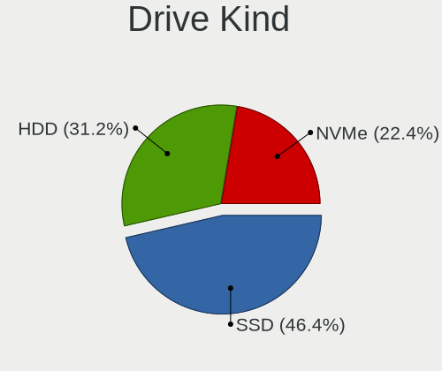

| Kind | Computers | Drives | Percent |
|------|-----------|--------|---------|
| SSD  | 199       | 280    | 46.39%  |
| HDD  | 134       | 200    | 31.24%  |
| NVMe | 96        | 132    | 22.38%  |

Drive Connector
---------------

SATA, SAS, NVMe, etc.

| Type | Computers | Drives | Percent |
|------|-----------|--------|---------|
| SATA | 288       | 480    | 75%     |
| NVMe | 96        | 132    | 25%     |

Drive Size
----------

Size of hard drive

| Size in TB | Computers | Drives | Percent |
|------------|-----------|--------|---------|
| 0.01-0.5   | 214       | 283    | 60.11%  |
| 0.51-1.0   | 92        | 131    | 25.84%  |
| 1.01-2.0   | 33        | 41     | 9.27%   |
| 3.01-4.0   | 12        | 14     | 3.37%   |
| 4.01-10.0  | 4         | 9      | 1.12%   |
| 10.01-20.0 | 1         | 2      | 0.28%   |

Space Total
-----------

Amount of disk space available on the file system

| Size in GB     | Computers | Percent |
|----------------|-----------|---------|
| 1-20           | 106       | 26.37%  |
| 101-250        | 100       | 24.88%  |
| 251-500        | 77        | 19.15%  |
| 501-1000       | 39        | 9.7%    |
| 51-100         | 31        | 7.71%   |
| Unknown        | 21        | 5.22%   |
| 21-50          | 19        | 4.73%   |
| 1001-2000      | 8         | 1.99%   |
| More than 3000 | 1         | 0.25%   |

Space Used
----------

Amount of used disk space

| Used GB | Computers | Percent |
|---------|-----------|---------|
| 1-20    | 341       | 85.46%  |
| 21-50   | 30        | 7.52%   |
| Unknown | 21        | 5.26%   |
| 51-100  | 4         | 1%      |
| 101-250 | 2         | 0.5%    |
| 251-500 | 1         | 0.25%   |

Malfunc. Drives
---------------

Drive models with a malfunction

| Model                                        | Computers | Drives | Percent |
|----------------------------------------------|-----------|--------|---------|
| Hitachi HTS541612J9SA00 120GB                | 4         | 4      | 5.56%   |
| Samsung Electronics HM320JI 320GB            | 3         | 3      | 4.17%   |
| Toshiba MQ01ACF032 320GB                     | 2         | 2      | 2.78%   |
| SK hynix HFS256G39TND-N210A 256GB            | 2         | 2      | 2.78%   |
| Seagate ST500LT012-9WS142 500GB              | 2         | 3      | 2.78%   |
| Seagate ST500DM002-1BD142 500GB              | 2         | 3      | 2.78%   |
| Samsung Electronics SSD 870 EVO 500GB        | 2         | 2      | 2.78%   |
| Maxtor STM3320613AS 320GB                    | 2         | 2      | 2.78%   |
| Kingston SA400S37240G 240GB                  | 2         | 2      | 2.78%   |
| HGST HTS541010A9E680 1TB                     | 2         | 2      | 2.78%   |
| WDC WDS480G2G0A-00JH30 480GB                 | 1         | 2      | 1.39%   |
| WDC WD800AAJS-00TDA0 80GB                    | 1         | 1      | 1.39%   |
| WDC WD6400BEVT-22A0RT0 640GB                 | 1         | 1      | 1.39%   |
| WDC WD5000AAKS-60WWPA0 500GB                 | 1         | 1      | 1.39%   |
| WDC WD5000AAKS-00UU3A0 500GB                 | 1         | 1      | 1.39%   |
| WDC WD3200LPVX-75V0TT0 320GB                 | 1         | 1      | 1.39%   |
| WDC WD20EZRX-19D8PB0 2TB                     | 1         | 1      | 1.39%   |
| WDC WD10JPVX-60JC3T0 1TB                     | 1         | 1      | 1.39%   |
| WDC WD10EZEX-21M2NA0 1TB                     | 1         | 1      | 1.39%   |
| Toshiba THNSNK256GVN8 M.2 2280 256GB         | 1         | 1      | 1.39%   |
| Toshiba THNSNK128GVN8 M.2 2280 128GB         | 1         | 1      | 1.39%   |
| Toshiba MQ01ABD100 1TB                       | 1         | 1      | 1.39%   |
| Toshiba MK3263GSX 320GB                      | 1         | 1      | 1.39%   |
| Toshiba MK1252GSX 120GB                      | 1         | 1      | 1.39%   |
| Toshiba DT01ACA050 500GB                     | 1         | 1      | 1.39%   |
| SK hynix HFS256G39MND-2300A 256GB            | 1         | 1      | 1.39%   |
| ShiJi SSD 512GB                              | 1         | 1      | 1.39%   |
| Seagate ST9250827AS 250GB                    | 1         | 1      | 1.39%   |
| Seagate ST500LM021-1KJ152 500GB              | 1         | 1      | 1.39%   |
| Seagate ST500LM000-1EJ162 500GB              | 1         | 2      | 1.39%   |
| Seagate ST500DM002-1BC142 500GB              | 1         | 1      | 1.39%   |
| Seagate ST4000DM004-2CV104 4TB               | 1         | 1      | 1.39%   |
| Seagate ST3250310AS 250GB                    | 1         | 1      | 1.39%   |
| Seagate ST3160318AS 160GB                    | 1         | 1      | 1.39%   |
| Seagate ST31500541AS 1.5TB                   | 1         | 1      | 1.39%   |
| Seagate ST2000DM008-2FR102 2TB               | 1         | 1      | 1.39%   |
| Seagate ST1000LM035-1RK172 1TB               | 1         | 2      | 1.39%   |
| Seagate ST1000LM024 HN-M101MBB 1TB           | 1         | 1      | 1.39%   |
| Samsung Electronics SSD 980 500GB            | 1         | 1      | 1.39%   |
| Samsung Electronics SSD 840 PRO Series 256GB | 1         | 1      | 1.39%   |

Malfunc. Drive Vendor
---------------------

Vendors of faulty drives

| Vendor              | Computers | Drives | Percent |
|---------------------|-----------|--------|---------|
| Seagate             | 13        | 19     | 18.57%  |
| WDC                 | 9         | 10     | 12.86%  |
| Samsung Electronics | 9         | 10     | 12.86%  |
| Hitachi             | 9         | 9      | 12.86%  |
| Toshiba             | 8         | 8      | 11.43%  |
| HGST                | 4         | 4      | 5.71%   |
| SK hynix            | 3         | 3      | 4.29%   |
| Crucial             | 3         | 3      | 4.29%   |
| Maxtor              | 2         | 2      | 2.86%   |
| Kingston            | 2         | 2      | 2.86%   |
| Intel               | 2         | 2      | 2.86%   |
| ShiJi               | 1         | 1      | 1.43%   |
| Patriot             | 1         | 1      | 1.43%   |
| OCZ                 | 1         | 1      | 1.43%   |
| Micron Technology   | 1         | 1      | 1.43%   |
| Fanxiang            | 1         | 2      | 1.43%   |
| A-DATA Technology   | 1         | 1      | 1.43%   |

Malfunc. HDD Vendor
-------------------

Vendors of faulty HDD drives

| Vendor              | Computers | Drives | Percent |
|---------------------|-----------|--------|---------|
| Seagate             | 13        | 19     | 28.26%  |
| Hitachi             | 9         | 9      | 19.57%  |
| WDC                 | 8         | 8      | 17.39%  |
| Toshiba             | 6         | 6      | 13.04%  |
| Samsung Electronics | 4         | 5      | 8.7%    |
| HGST                | 4         | 4      | 8.7%    |
| Maxtor              | 2         | 2      | 4.35%   |

Malfunc. Drive Kind
-------------------

Kinds of faulty drives

| Kind | Computers | Drives | Percent |
|------|-----------|--------|---------|
| HDD  | 43        | 53     | 64.18%  |
| SSD  | 23        | 25     | 34.33%  |
| NVMe | 1         | 1      | 1.49%   |

Failed Drives
-------------

Failed drive models

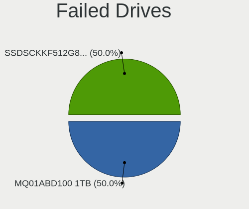

| Model                          | Computers | Drives | Percent |
|--------------------------------|-----------|--------|---------|
| Toshiba MQ01ABD100 1TB         | 1         | 1      | 50%     |
| Intel SSDSCKKF512G8 SATA 512GB | 1         | 1      | 50%     |

Failed Drive Vendor
-------------------

Failed drive vendors

| Vendor  | Computers | Drives | Percent |
|---------|-----------|--------|---------|
| Toshiba | 1         | 1      | 50%     |
| Intel   | 1         | 1      | 50%     |

Drive Status
------------

Number of failed and malfunc. drives

| Status   | Computers | Drives | Percent |
|----------|-----------|--------|---------|
| Works    | 308       | 520    | 81.05%  |
| Malfunc  | 65        | 79     | 17.11%  |
| Detected | 5         | 11     | 1.32%   |
| Failed   | 2         | 2      | 0.53%   |

Storage controller
------------------

Storage Vendor
--------------

Storage controller vendors

| Vendor                         | Computers | Percent |
|--------------------------------|-----------|---------|
| Intel                          | 256       | 51.61%  |
| AMD                            | 74        | 14.92%  |
| Samsung Electronics            | 42        | 8.47%   |
| SanDisk                        | 20        | 4.03%   |
| Phison Electronics             | 13        | 2.62%   |
| Micron/Crucial Technology      | 10        | 2.02%   |
| Kingston Technology Company    | 10        | 2.02%   |
| SK hynix                       | 9         | 1.81%   |
| Nvidia                         | 8         | 1.61%   |
| ASMedia Technology             | 7         | 1.41%   |
| ADATA Technology               | 7         | 1.41%   |
| Micron Technology              | 6         | 1.21%   |
| Toshiba                        | 5         | 1.01%   |
| Silicon Motion                 | 4         | 0.81%   |
| MAXIO Technology (Hangzhou)    | 4         | 0.81%   |
| JMicron Technology             | 4         | 0.81%   |
| Shenzhen Longsys Electronics   | 3         | 0.6%    |
| Marvell Technology Group       | 3         | 0.6%    |
| KIOXIA                         | 2         | 0.4%    |
| Solid State Storage Technology | 1         | 0.2%    |
| Seagate Technology             | 1         | 0.2%    |
| Realtek Semiconductor          | 1         | 0.2%    |
| OCZ Technology Group           | 1         | 0.2%    |
| Integrated Technology Express  | 1         | 0.2%    |
| HighPoint Technologies         | 1         | 0.2%    |
| Broadcom / LSI                 | 1         | 0.2%    |
| Biwin Storage Technology       | 1         | 0.2%    |
| Adaptec                        | 1         | 0.2%    |

Storage Model
-------------

Storage controller models

| Model                                                                                   | Computers | Percent |
|-----------------------------------------------------------------------------------------|-----------|---------|
| AMD FCH SATA Controller [AHCI mode]                                                     | 55        | 10.09%  |
| Intel Sunrise Point-LP SATA Controller [AHCI mode]                                      | 33        | 6.06%   |
| Intel 7 Series Chipset Family 6-port SATA Controller [AHCI mode]                        | 23        | 4.22%   |
| Samsung NVMe SSD Controller SM981/PM981/PM983                                           | 21        | 3.85%   |
| Intel 82801 Mobile SATA Controller [RAID mode]                                          | 17        | 3.12%   |
| Intel 8 Series SATA Controller 1 [AHCI mode]                                            | 16        | 2.94%   |
| Intel 6 Series/C200 Series Chipset Family 6 port Mobile SATA AHCI Controller            | 14        | 2.57%   |
| AMD 400 Series Chipset SATA Controller                                                  | 13        | 2.39%   |
| Intel 8 Series/C220 Series Chipset Family 6-port SATA Controller 1 [AHCI mode]          | 11        | 2.02%   |
| Intel Wildcat Point-LP SATA Controller [AHCI Mode]                                      | 10        | 1.83%   |
| Samsung NVMe SSD Controller 980 (DRAM-less)                                             | 9         | 1.65%   |
| Intel SATA Controller [RAID mode]                                                       | 9         | 1.65%   |
| Intel Q170/Q150/B150/H170/H110/Z170/CM236 Chipset SATA Controller [AHCI Mode]           | 8         | 1.47%   |
| Intel HM170/QM170 Chipset SATA Controller [AHCI Mode]                                   | 7         | 1.28%   |
| Intel 6 Series/C200 Series Chipset Family 6 port Desktop SATA AHCI Controller           | 7         | 1.28%   |
| ASMedia ASM1061/ASM1062 Serial ATA Controller                                           | 7         | 1.28%   |
| SK hynix Gold P31/BC711/PC711 NVMe Solid State Drive                                    | 6         | 1.1%    |
| Nvidia MCP79 AHCI Controller                                                            | 6         | 1.1%    |
| Intel Comet Lake SATA AHCI Controller                                                   | 6         | 1.1%    |
| Intel Cannon Lake Mobile PCH SATA AHCI Controller                                       | 6         | 1.1%    |
| Intel 82801IBM/IEM (ICH9M/ICH9M-E) 4 port SATA Controller [AHCI mode]                   | 6         | 1.1%    |
| Intel 200 Series PCH SATA controller [AHCI mode]                                        | 6         | 1.1%    |
| SanDisk Extreme Pro / WD Black SN750 / PC SN730 / Red SN700 NVMe SSD                    | 5         | 0.92%   |
| Samsung NVMe SSD Controller PM9A1/PM9A3/980PRO                                          | 5         | 0.92%   |
| Phison PS5013-E13 PCIe3 NVMe Controller (DRAM-less)                                     | 5         | 0.92%   |
| Micron/Crucial P2 [Nick P2] / P3 / P3 Plus NVMe PCIe SSD (DRAM-less)                    | 5         | 0.92%   |
| Intel 82801JI (ICH10 Family) SATA AHCI Controller                                       | 5         | 0.92%   |
| Intel 7 Series/C210 Series Chipset Family 6-port SATA Controller [AHCI mode]            | 5         | 0.92%   |
| Intel 6 Series/C200 Series Chipset Family Desktop SATA Controller (IDE mode, ports 4-5) | 5         | 0.92%   |
| Intel 6 Series/C200 Series Chipset Family Desktop SATA Controller (IDE mode, ports 0-3) | 5         | 0.92%   |
| AMD SB7x0/SB8x0/SB9x0 SATA Controller [AHCI mode]                                       | 5         | 0.92%   |
| AMD SB7x0/SB8x0/SB9x0 IDE Controller                                                    | 5         | 0.92%   |
| AMD 500 Series Chipset SATA Controller                                                  | 5         | 0.92%   |
| Silicon Motion SM2263EN/SM2263XT (DRAM-less) NVMe SSD Controllers                       | 4         | 0.73%   |
| Phison E12 NVMe Controller                                                              | 4         | 0.73%   |
| Intel SSD 660P Series                                                                   | 4         | 0.73%   |
| Intel Cannon Lake PCH SATA AHCI Controller                                              | 4         | 0.73%   |
| Intel 82801HM/HEM (ICH8M/ICH8M-E) SATA Controller [AHCI mode]                           | 4         | 0.73%   |
| Intel 82801HM/HEM (ICH8M/ICH8M-E) IDE Controller                                        | 4         | 0.73%   |
| Intel 5 Series/3400 Series Chipset 4 port SATA AHCI Controller                          | 4         | 0.73%   |

Storage Kind
------------

Kind of storage controller (IDE, SATA, NVMe, SAS, ...)

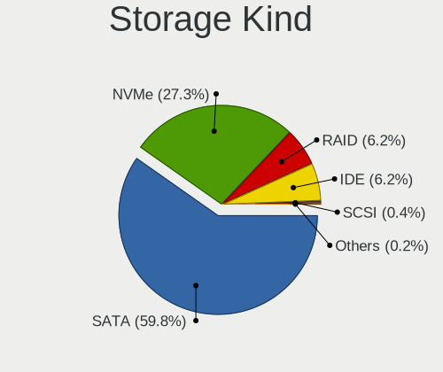

| Kind | Computers | Percent |
|------|-----------|---------|
| SATA | 291       | 59.75%  |
| NVMe | 133       | 27.31%  |
| RAID | 30        | 6.16%   |
| IDE  | 30        | 6.16%   |
| SCSI | 2         | 0.41%   |
| SAS  | 1         | 0.21%   |

Processor
---------

CPU Vendor
----------

Processor vendors

| Vendor | Computers | Percent |
|--------|-----------|---------|
| Intel  | 288       | 74.61%  |
| AMD    | 98        | 25.39%  |

CPU Model
---------

Processor models

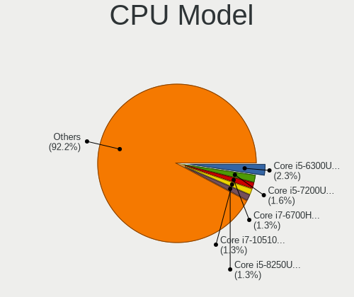

| Model                                   | Computers | Percent |
|-----------------------------------------|-----------|---------|
| Intel Core i5-6300U CPU @ 2.40GHz       | 9         | 2.33%   |
| Intel Core i5-7200U CPU @ 2.50GHz       | 6         | 1.55%   |
| Intel Core i7-6700HQ CPU @ 2.60GHz      | 5         | 1.3%    |
| Intel Core i7-10510U CPU @ 1.80GHz      | 5         | 1.3%    |
| Intel Core i5-8250U CPU @ 1.60GHz       | 5         | 1.3%    |
| Intel Core i5-5300U CPU @ 2.30GHz       | 5         | 1.3%    |
| Intel Core 2 Duo                        | 5         | 1.3%    |
| Intel Core i7-8650U CPU @ 1.90GHz       | 4         | 1.04%   |
| Intel Core i7-3520M CPU @ 2.90GHz       | 4         | 1.04%   |
| Intel Core i5-3320M CPU @ 2.60GHz       | 4         | 1.04%   |
| Intel Core 2 Duo CPU P7550 @ 2.26GHz    | 4         | 1.04%   |
| AMD Ryzen 7 5700U with Radeon Graphics  | 4         | 1.04%   |
| Intel Core i7-8750H CPU @ 2.20GHz       | 3         | 0.78%   |
| Intel Core i7-8565U CPU @ 1.80GHz       | 3         | 0.78%   |
| Intel Core i7-8550U CPU @ 1.80GHz       | 3         | 0.78%   |
| Intel Core i7-6500U CPU @ 2.50GHz       | 3         | 0.78%   |
| Intel Core i7-3770 CPU @ 3.40GHz        | 3         | 0.78%   |
| Intel Core i7-2620M CPU @ 2.70GHz       | 3         | 0.78%   |
| Intel Core i5-8350U CPU @ 1.70GHz       | 3         | 0.78%   |
| Intel Core i5-7300U CPU @ 2.60GHz       | 3         | 0.78%   |
| Intel Core i5-6200U CPU @ 2.30GHz       | 3         | 0.78%   |
| Intel Core i5-4210U CPU @ 1.70GHz       | 3         | 0.78%   |
| Intel Core i5-4200U CPU @ 1.60GHz       | 3         | 0.78%   |
| Intel Core i5-3230M CPU @ 2.60GHz       | 3         | 0.78%   |
| Intel Core i5-1035G1 CPU @ 1.00GHz      | 3         | 0.78%   |
| Intel Core i5-10210U CPU @ 1.60GHz      | 3         | 0.78%   |
| Intel Core i3-3217U CPU @ 1.80GHz       | 3         | 0.78%   |
| Intel Core 2 Duo CPU P8600 @ 2.40GHz    | 3         | 0.78%   |
| Intel 11th Gen Core i5-1135G7 @ 2.40GHz | 3         | 0.78%   |
| AMD Ryzen 7 5800H with Radeon Graphics  | 3         | 0.78%   |
| AMD Ryzen 7 5700G with Radeon Graphics  | 3         | 0.78%   |
| AMD Ryzen 7 3700X 8-Core Processor      | 3         | 0.78%   |
| AMD Ryzen 7 2700X Eight-Core Processor  | 3         | 0.78%   |
| AMD Ryzen 5 5600G with Radeon Graphics  | 3         | 0.78%   |
| AMD Ryzen 5 2600 Six-Core Processor     | 3         | 0.78%   |
| Intel CPU Version                       | 2         | 0.52%   |
| Intel Core m7-6Y75 CPU @ 1.20GHz        | 2         | 0.52%   |
| Intel Core i9-10980HK CPU @ 2.40GHz     | 2         | 0.52%   |
| Intel Core i7-8850H CPU @ 2.60GHz       | 2         | 0.52%   |
| Intel Core i7-7820HQ CPU @ 2.90GHz      | 2         | 0.52%   |

CPU Model Family
----------------

Processor model prefix

| Model                   | Computers | Percent |
|-------------------------|-----------|---------|
| Intel Core i5           | 107       | 27.72%  |
| Intel Core i7           | 78        | 20.21%  |
| AMD Ryzen 5             | 31        | 8.03%   |
| AMD Ryzen 7             | 26        | 6.74%   |
| Intel Core i3           | 23        | 5.96%   |
| Other                   | 21        | 5.44%   |
| Intel Core 2 Duo        | 16        | 4.15%   |
| Intel Xeon              | 10        | 2.59%   |
| Intel Celeron           | 10        | 2.59%   |
| Intel Pentium           | 8         | 2.07%   |
| Intel Core i9           | 6         | 1.55%   |
| AMD Ryzen 9             | 6         | 1.55%   |
| AMD Ryzen 3             | 5         | 1.3%    |
| AMD A6                  | 5         | 1.3%    |
| AMD FX                  | 4         | 1.04%   |
| AMD Ryzen 7 PRO         | 3         | 0.78%   |
| AMD A10                 | 3         | 0.78%   |
| Intel Pentium Dual-Core | 2         | 0.52%   |
| Intel Core m7           | 2         | 0.52%   |
| Intel Core 2 Quad       | 2         | 0.52%   |
| AMD Ryzen 3 PRO         | 2         | 0.52%   |
| AMD E1                  | 2         | 0.52%   |
| AMD Athlon              | 2         | 0.52%   |
| AMD A4                  | 2         | 0.52%   |
| Intel Pentium Silver    | 1         | 0.26%   |
| Intel Genuine           | 1         | 0.26%   |
| Intel Core m3           | 1         | 0.26%   |
| Intel Core 2            | 1         | 0.26%   |
| Intel Celeron Dual-Core | 1         | 0.26%   |
| AMD Ryzen Threadripper  | 1         | 0.26%   |
| AMD PRO A10             | 1         | 0.26%   |
| AMD Phenom II X4        | 1         | 0.26%   |
| AMD E2                  | 1         | 0.26%   |
| AMD Athlon X4           | 1         | 0.26%   |

CPU Cores
---------

Number of processor cores

| Number  | Computers | Percent |
|---------|-----------|---------|
| 2       | 138       | 35.75%  |
| 4       | 123       | 31.87%  |
| 6       | 29        | 7.51%   |
| 16      | 26        | 6.74%   |
| 12      | 23        | 5.96%   |
| 8       | 23        | 5.96%   |
| Unknown | 14        | 3.63%   |
| 24      | 5         | 1.3%    |
| 10      | 3         | 0.78%   |
| 32      | 2         | 0.52%   |

CPU Sockets
-----------

Number of sockets

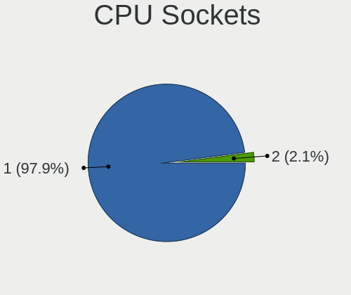

| Number | Computers | Percent |
|--------|-----------|---------|
| 1      | 378       | 97.93%  |
| 2      | 8         | 2.07%   |

CPU Threads
-----------

Threads per core (Hyper-Threading)

| Number  | Computers | Percent |
|---------|-----------|---------|
| 2       | 221       | 57.25%  |
| 1       | 151       | 39.12%  |
| Unknown | 14        | 3.63%   |

CPU Microarch
-------------

Microarchitecture

| Name          | Computers | Percent |
|---------------|-----------|---------|
| KabyLake      | 70        | 18.13%  |
| Haswell       | 37        | 9.59%   |
| IvyBridge     | 35        | 9.07%   |
| Skylake       | 33        | 8.55%   |
| SandyBridge   | 24        | 6.22%   |
| Zen 3         | 23        | 5.96%   |
| Penryn        | 21        | 5.44%   |
| Unknown       | 21        | 5.44%   |
| Zen 2         | 20        | 5.18%   |
| Zen+          | 19        | 4.92%   |
| Broadwell     | 12        | 3.11%   |
| Westmere      | 8         | 2.07%   |
| CometLake     | 8         | 2.07%   |
| TigerLake     | 7         | 1.81%   |
| Excavator     | 7         | 1.81%   |
| Piledriver    | 6         | 1.55%   |
| IceLake       | 5         | 1.3%    |
| Core          | 5         | 1.3%    |
| Zen           | 4         | 1.04%   |
| Nehalem       | 4         | 1.04%   |
| Silvermont    | 3         | 0.78%   |
| Goldmont      | 3         | 0.78%   |
| Puma          | 2         | 0.52%   |
| K10           | 2         | 0.52%   |
| Jaguar        | 2         | 0.52%   |
| Goldmont plus | 2         | 0.52%   |
| K10 Llano     | 1         | 0.26%   |
| Bulldozer     | 1         | 0.26%   |
| Bobcat        | 1         | 0.26%   |

Graphics
--------

GPU Vendor
----------

Vendors of graphics cards

| Vendor                     | Computers | Percent |
|----------------------------|-----------|---------|
| Intel                      | 226       | 50.9%   |
| Nvidia                     | 121       | 27.25%  |
| AMD                        | 95        | 21.4%   |
| Matrox Electronics Systems | 1         | 0.23%   |
| ASPEED Technology          | 1         | 0.23%   |

GPU Model
---------

Graphics card models

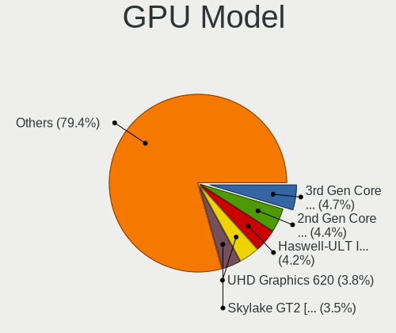

| Model                                                                       | Computers | Percent |
|-----------------------------------------------------------------------------|-----------|---------|
| Intel 3rd Gen Core processor Graphics Controller                            | 21        | 4.66%   |
| Intel 2nd Generation Core Processor Family Integrated Graphics Controller   | 20        | 4.43%   |
| Intel Haswell-ULT Integrated Graphics Controller                            | 19        | 4.21%   |
| Intel UHD Graphics 620                                                      | 17        | 3.77%   |
| Intel Skylake GT2 [HD Graphics 520]                                         | 16        | 3.55%   |
| AMD Cezanne [Radeon Vega Series / Radeon Vega Mobile Series]                | 13        | 2.88%   |
| Intel HD Graphics 620                                                       | 11        | 2.44%   |
| Intel HD Graphics 5500                                                      | 11        | 2.44%   |
| Intel CometLake-U GT2 [UHD Graphics]                                        | 10        | 2.22%   |
| AMD Renoir [Radeon Vega Series / Radeon Vega Mobile Series]                 | 10        | 2.22%   |
| AMD Picasso/Raven 2 [Radeon Vega Series / Radeon Vega Mobile Series]        | 9         | 2%      |
| Intel HD Graphics 530                                                       | 8         | 1.77%   |
| Intel CoffeeLake-H GT2 [UHD Graphics 630]                                   | 8         | 1.77%   |
| Nvidia GP108 [GeForce GT 1030]                                              | 7         | 1.55%   |
| Intel Xeon E3-1200 v3/4th Gen Core Processor Integrated Graphics Controller | 7         | 1.55%   |
| AMD Lucienne                                                                | 7         | 1.55%   |
| Nvidia GF117M [GeForce 610M/710M/810M/820M / GT 620M/625M/630M/720M]        | 6         | 1.33%   |
| Intel HD Graphics 630                                                       | 6         | 1.33%   |
| AMD Ellesmere [Radeon RX 470/480/570/570X/580/580X/590]                     | 6         | 1.33%   |
| Nvidia GK107 [GeForce GTX 650]                                              | 5         | 1.11%   |
| Intel WhiskeyLake-U GT2 [UHD Graphics 620]                                  | 5         | 1.11%   |
| Intel TigerLake-LP GT2 [Iris Xe Graphics]                                   | 5         | 1.11%   |
| Intel Mobile 4 Series Chipset Integrated Graphics Controller                | 5         | 1.11%   |
| Intel Core Processor Integrated Graphics Controller                         | 5         | 1.11%   |
| Nvidia GP107M [GeForce GTX 1050 Mobile]                                     | 4         | 0.89%   |
| Nvidia GP107 [GeForce GTX 1050 Ti]                                          | 4         | 0.89%   |
| Nvidia GM107 [GeForce GTX 750 Ti]                                           | 4         | 0.89%   |
| Intel Iris Plus Graphics G1 (Ice Lake)                                      | 4         | 0.89%   |
| Intel 4th Gen Core Processor Integrated Graphics Controller                 | 4         | 0.89%   |
| AMD Wani [Radeon R5/R6/R7 Graphics]                                         | 4         | 0.89%   |
| Nvidia GP106 [GeForce GTX 1060 6GB]                                         | 3         | 0.67%   |
| Nvidia GP104 [GeForce GTX 1070]                                             | 3         | 0.67%   |
| Nvidia GM206 [GeForce GTX 960]                                              | 3         | 0.67%   |
| Nvidia C79 [GeForce 9400M]                                                  | 3         | 0.67%   |
| Intel Mobile GM965/GL960 Integrated Graphics Controller (secondary)         | 3         | 0.67%   |
| Intel Mobile GM965/GL960 Integrated Graphics Controller (primary)           | 3         | 0.67%   |
| Intel HD Graphics 515                                                       | 3         | 0.67%   |
| Intel HD Graphics 500                                                       | 3         | 0.67%   |
| Intel CometLake-H GT2 [UHD Graphics]                                        | 3         | 0.67%   |
| AMD Stoney [Radeon R2/R3/R4/R5 Graphics]                                    | 3         | 0.67%   |

GPU Combo
---------

Combinations of graphics cards

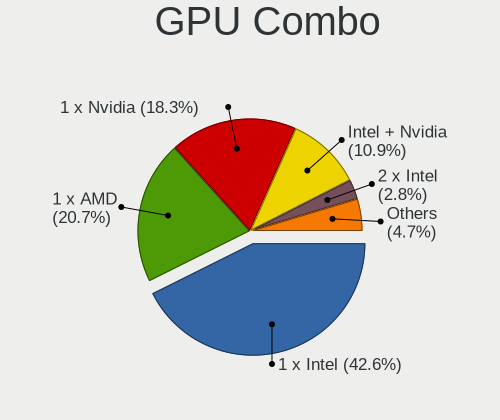

| Name            | Computers | Percent |
|-----------------|-----------|---------|
| 1 x Intel       | 165       | 42.64%  |
| 1 x AMD         | 80        | 20.67%  |
| 1 x Nvidia      | 71        | 18.35%  |
| Intel + Nvidia  | 42        | 10.85%  |
| 2 x Intel       | 11        | 2.84%   |
| Intel + AMD     | 8         | 2.07%   |
| AMD + Nvidia    | 5         | 1.29%   |
| 2 x AMD         | 2         | 0.52%   |
| 2 x Nvidia      | 1         | 0.26%   |
| Nvidia + ASPEED | 1         | 0.26%   |
| 1 x Matrox      | 1         | 0.26%   |

GPU Driver
----------

Free vs proprietary

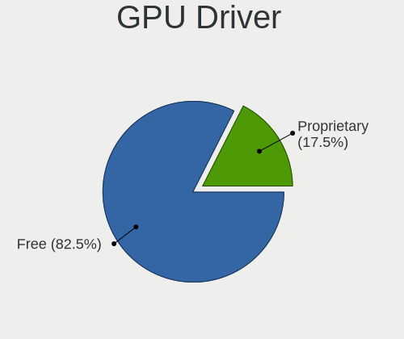

| Driver      | Computers | Percent |
|-------------|-----------|---------|
| Free        | 320       | 82.47%  |
| Proprietary | 68        | 17.53%  |

GPU Memory
----------

Total video memory

| Size in GB | Computers | Percent |
|------------|-----------|---------|
| Unknown    | 280       | 71.43%  |
| 1.01-2.0   | 29        | 7.4%    |
| 0.01-0.5   | 23        | 5.87%   |
| 0.51-1.0   | 21        | 5.36%   |
| 3.01-4.0   | 16        | 4.08%   |
| 7.01-8.0   | 13        | 3.32%   |
| 5.01-6.0   | 5         | 1.28%   |
| 8.01-16.0  | 3         | 0.77%   |
| 2.01-3.0   | 2         | 0.51%   |

Monitor
-------

Monitor Vendor
--------------

Monitor vendors

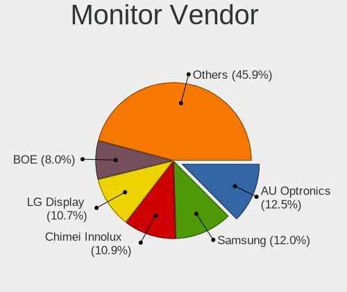

| Vendor                  | Computers | Percent |
|-------------------------|-----------|---------|
| AU Optronics            | 47        | 12.53%  |
| Samsung Electronics     | 45        | 12%     |
| Chimei Innolux          | 41        | 10.93%  |
| LG Display              | 40        | 10.67%  |
| BOE                     | 30        | 8%      |
| Dell                    | 20        | 5.33%   |
| Goldstar                | 14        | 3.73%   |
| BenQ                    | 12        | 3.2%    |
| Lenovo                  | 9         | 2.4%    |
| Philips                 | 8         | 2.13%   |
| Hewlett-Packard         | 8         | 2.13%   |
| Acer                    | 8         | 2.13%   |
| Sharp                   | 7         | 1.87%   |
| Iiyama                  | 7         | 1.87%   |
| Ancor Communications    | 7         | 1.87%   |
| Apple                   | 6         | 1.6%    |
| ASUSTek Computer        | 5         | 1.33%   |
| InfoVision              | 4         | 1.07%   |
| CSO                     | 4         | 1.07%   |
| AOC                     | 4         | 1.07%   |
| ViewSonic               | 3         | 0.8%    |
| PANDA                   | 3         | 0.8%    |
| Panasonic               | 3         | 0.8%    |
| LG Electronics          | 3         | 0.8%    |
| Fujitsu Siemens         | 3         | 0.8%    |
| Vizio                   | 2         | 0.53%   |
| Sony                    | 2         | 0.53%   |
| Mi                      | 2         | 0.53%   |
| Idek Iiyama             | 2         | 0.53%   |
| HKC                     | 2         | 0.53%   |
| HannStar                | 2         | 0.53%   |
| Chi Mei Optoelectronics | 2         | 0.53%   |
| ___                     | 1         | 0.27%   |
| WYT                     | 1         | 0.27%   |
| Toshiba                 | 1         | 0.27%   |
| SANYO                   | 1         | 0.27%   |
| SAC                     | 1         | 0.27%   |
| Pixio                   | 1         | 0.27%   |
| Pioneer Electronic      | 1         | 0.27%   |
| OEM                     | 1         | 0.27%   |

Monitor Model
-------------

Monitor models

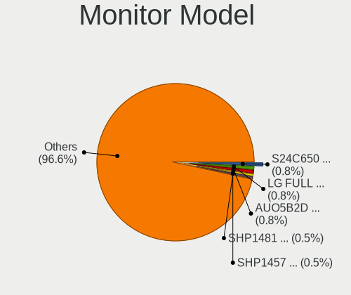

| Model                                                                 | Computers | Percent |
|-----------------------------------------------------------------------|-----------|---------|
| Samsung Electronics S24C650 SAM09E9 1920x1080 520x290mm 23.4-inch     | 3         | 0.79%   |
| Goldstar LG FULL HD GSM5B55 1920x1080 480x270mm 21.7-inch             | 3         | 0.79%   |
| AU Optronics LCD Monitor AUO5B2D 1920x1080 290x160mm 13.0-inch        | 3         | 0.79%   |
| Sharp LCD Monitor SHP1481 1920x1080 290x170mm 13.2-inch               | 2         | 0.52%   |
| Sharp LCD Monitor SHP1457 2560x1440 280x160mm 12.7-inch               | 2         | 0.52%   |
| Samsung Electronics U28E590 SAM0C4D 3840x2160 610x350mm 27.7-inch     | 2         | 0.52%   |
| Samsung Electronics SyncMaster SAM011F 1280x1024 380x300mm 19.1-inch  | 2         | 0.52%   |
| Samsung Electronics LCD Monitor SEC5441 1280x800 330x210mm 15.4-inch  | 2         | 0.52%   |
| Samsung Electronics LCD Monitor SEC4542 1366x768 300x170mm 13.6-inch  | 2         | 0.52%   |
| Samsung Electronics LCD Monitor SEC3047 1366x768 280x160mm 12.7-inch  | 2         | 0.52%   |
| Samsung Electronics LCD Monitor SDC4158 1920x1080 290x170mm 13.2-inch | 2         | 0.52%   |
| Samsung Electronics LCD Monitor SAM0902 1920x1080 700x390mm 31.5-inch | 2         | 0.52%   |
| Philips PHL 241B8Q PHL0929 1920x1080 530x300mm 24.0-inch              | 2         | 0.52%   |
| Panasonic LCD Monitor MEI96A2 3840x2160 380x210mm 17.1-inch           | 2         | 0.52%   |
| LG Display LCD Monitor LGD05FA 1920x1080 310x170mm 13.9-inch          | 2         | 0.52%   |
| LG Display LCD Monitor LGD0456 1366x768 340x190mm 15.3-inch           | 2         | 0.52%   |
| LG Display LCD Monitor LGD039F 1366x768 350x190mm 15.7-inch           | 2         | 0.52%   |
| LG Display LCD Monitor LGD0335 1366x768 310x170mm 13.9-inch           | 2         | 0.52%   |
| LG Display LCD Monitor LGD02DC 1366x768 340x190mm 15.3-inch           | 2         | 0.52%   |
| LG Display LCD Monitor LGD01E9 1920x1080 350x190mm 15.7-inch          | 2         | 0.52%   |
| HKC LCD Monitor HKC3D05 1920x1080 340x190mm 15.3-inch                 | 2         | 0.52%   |
| Goldstar LG Ultra HD GSM5B09 3840x2160 600x340mm 27.2-inch            | 2         | 0.52%   |
| CSO LCD Monitor CSO1402 2880x1800 300x190mm 14.0-inch                 | 2         | 0.52%   |
| Chimei Innolux LCD Monitor CMN15F5 1920x1080 340x190mm 15.3-inch      | 2         | 0.52%   |
| Chimei Innolux LCD Monitor CMN15E7 1920x1080 340x190mm 15.3-inch      | 2         | 0.52%   |
| Chimei Innolux LCD Monitor CMN14D5 1920x1080 310x170mm 13.9-inch      | 2         | 0.52%   |
| Chimei Innolux LCD Monitor CMN14C9 1920x1080 310x170mm 13.9-inch      | 2         | 0.52%   |
| Chimei Innolux LCD Monitor CMN14C3 1366x768 310x170mm 13.9-inch       | 2         | 0.52%   |
| Chimei Innolux LCD Monitor CMN1482 1600x900 310x170mm 13.9-inch       | 2         | 0.52%   |
| Chimei Innolux LCD Monitor CMN1132 1366x768 260x140mm 11.6-inch       | 2         | 0.52%   |
| BOE LCD Monitor BOE08D5 1920x1080 340x190mm 15.3-inch                 | 2         | 0.52%   |
| BenQ EX3203R BNQ7F66 2560x1440 700x390mm 31.5-inch                    | 2         | 0.52%   |
| BenQ BL2405 BNQ8016 1920x1080 530x300mm 24.0-inch                     | 2         | 0.52%   |
| AU Optronics LCD Monitor AUOAF90 1920x1080 340x190mm 15.3-inch        | 2         | 0.52%   |
| AU Optronics LCD Monitor AUO71EC 1366x768 340x190mm 15.3-inch         | 2         | 0.52%   |
| AU Optronics LCD Monitor AUO38ED 1920x1080 340x190mm 15.3-inch        | 2         | 0.52%   |
| AU Optronics LCD Monitor AUO35EC 1366x768 340x190mm 15.3-inch         | 2         | 0.52%   |
| AU Optronics LCD Monitor AUO305C 1366x768 260x140mm 11.6-inch         | 2         | 0.52%   |
| AU Optronics LCD Monitor AUO243D 1920x1080 310x170mm 13.9-inch        | 2         | 0.52%   |
| AU Optronics LCD Monitor AUO226D 1920x1080 280x160mm 12.7-inch        | 2         | 0.52%   |

Monitor Resolution
------------------

Monitor screen resolution

| Resolution         | Computers | Percent |
|--------------------|-----------|---------|
| 1920x1080 (FHD)    | 178       | 48.5%   |
| 1366x768 (WXGA)    | 67        | 18.26%  |
| 2560x1440 (QHD)    | 25        | 6.81%   |
| 1600x900 (HD+)     | 19        | 5.18%   |
| 3840x2160 (4K)     | 17        | 4.63%   |
| 1680x1050 (WSXGA+) | 10        | 2.72%   |
| 1280x1024 (SXGA)   | 8         | 2.18%   |
| 1280x800 (WXGA)    | 7         | 1.91%   |
| 1920x1200 (WUXGA)  | 5         | 1.36%   |
| 1440x900 (WXGA+)   | 5         | 1.36%   |
| 2560x1080          | 4         | 1.09%   |
| Unknown            | 4         | 1.09%   |
| 2880x1800          | 3         | 0.82%   |
| 1360x768           | 3         | 0.82%   |
| 3840x1600          | 2         | 0.54%   |
| 3440x1440          | 2         | 0.54%   |
| 2560x1600          | 2         | 0.54%   |
| 9600x2160          | 1         | 0.27%   |
| 5120x1440          | 1         | 0.27%   |
| 4640x1080          | 1         | 0.27%   |
| 3200x1080          | 1         | 0.27%   |
| 2806x900           | 1         | 0.27%   |
| 1920x540           | 1         | 0.27%   |

Monitor Diagonal
----------------

Diagonal size in inches

| Inches  | Computers | Percent |
|---------|-----------|---------|
| 15      | 95        | 25.47%  |
| 13      | 73        | 19.57%  |
| 27      | 30        | 8.04%   |
| 24      | 22        | 5.9%    |
| 21      | 20        | 5.36%   |
| 23      | 19        | 5.09%   |
| Unknown | 18        | 4.83%   |
| 12      | 15        | 4.02%   |
| 19      | 14        | 3.75%   |
| 17      | 14        | 3.75%   |
| 31      | 10        | 2.68%   |
| 14      | 7         | 1.88%   |
| 11      | 7         | 1.88%   |
| 22      | 6         | 1.61%   |
| 34      | 4         | 1.07%   |
| 40      | 3         | 0.8%    |
| 16      | 3         | 0.8%    |
| 54      | 2         | 0.54%   |
| 29      | 2         | 0.54%   |
| 65      | 1         | 0.27%   |
| 60      | 1         | 0.27%   |
| 57      | 1         | 0.27%   |
| 43      | 1         | 0.27%   |
| 39      | 1         | 0.27%   |
| 37      | 1         | 0.27%   |
| 32      | 1         | 0.27%   |
| 28      | 1         | 0.27%   |
| 20      | 1         | 0.27%   |

Monitor Width
-------------

Physical width

| Width in mm | Computers | Percent |
|-------------|-----------|---------|
| 301-350     | 148       | 40.22%  |
| 501-600     | 66        | 17.93%  |
| 201-300     | 52        | 14.13%  |
| 401-500     | 35        | 9.51%   |
| 351-400     | 18        | 4.89%   |
| Unknown     | 18        | 4.89%   |
| 601-700     | 15        | 4.08%   |
| 801-900     | 5         | 1.36%   |
| 701-800     | 5         | 1.36%   |
| 1001-1500   | 5         | 1.36%   |
| 901-1000    | 1         | 0.27%   |

Aspect Ratio
------------

Proportional relationship between the width and the height

| Ratio   | Computers | Percent |
|---------|-----------|---------|
| 16/9    | 284       | 81.84%  |
| 16/10   | 33        | 9.51%   |
| Unknown | 13        | 3.75%   |
| 5/4     | 7         | 2.02%   |
| 21/9    | 6         | 1.73%   |
| 3/2     | 2         | 0.58%   |
| 6/5     | 1         | 0.29%   |
| 32/9    | 1         | 0.29%   |

Monitor Area
------------

Area in inch

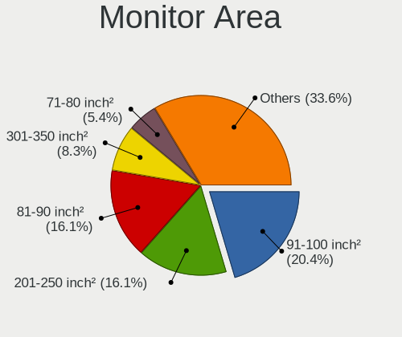

| Area in inch | Computers | Percent |
|----------------|-----------|---------|
| 91-100         | 76        | 20.43%  |
| 81-90          | 60        | 16.13%  |
| 201-250        | 60        | 16.13%  |
| 301-350        | 31        | 8.33%   |
| 71-80          | 20        | 5.38%   |
| 101-110        | 18        | 4.84%   |
| Unknown        | 18        | 4.84%   |
| 351-500        | 17        | 4.57%   |
| 151-200        | 16        | 4.3%    |
| 61-70          | 15        | 4.03%   |
| 121-130        | 12        | 3.23%   |
| 51-60          | 7         | 1.88%   |
| 501-1000       | 6         | 1.61%   |
| More than 1000 | 5         | 1.34%   |
| 251-300        | 5         | 1.34%   |
| 111-120        | 3         | 0.81%   |
| 141-150        | 2         | 0.54%   |
| 131-140        | 1         | 0.27%   |

Pixel Density
-------------

Pixels per inch

| Density       | Computers | Percent |
|---------------|-----------|---------|
| 121-160       | 119       | 32.16%  |
| 51-100        | 102       | 27.57%  |
| 101-120       | 85        | 22.97%  |
| 161-240       | 35        | 9.46%   |
| Unknown       | 18        | 4.86%   |
| More than 240 | 6         | 1.62%   |
| 1-50          | 5         | 1.35%   |

Multiple Monitors
-----------------

Total monitors connected

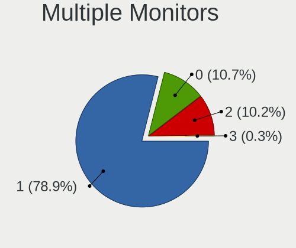

| Total | Computers | Percent |
|-------|-----------|---------|
| 1     | 311       | 78.93%  |
| 0     | 42        | 10.66%  |
| 2     | 40        | 10.15%  |
| 3     | 1         | 0.25%   |

Network
-------

Net Controller Vendor
---------------------

Controller vendors

| Vendor                                | Computers | Percent |
|---------------------------------------|-----------|---------|
| Intel                                 | 239       | 40.44%  |
| Realtek Semiconductor                 | 175       | 29.61%  |
| Qualcomm Atheros                      | 56        | 9.48%   |
| Broadcom                              | 35        | 5.92%   |
| TP-Link                               | 14        | 2.37%   |
| Sierra Wireless                       | 7         | 1.18%   |
| Ralink Technology                     | 7         | 1.18%   |
| Samsung Electronics                   | 6         | 1.02%   |
| Nvidia                                | 6         | 1.02%   |
| Ericsson Business Mobile Networks     | 5         | 0.85%   |
| Edimax Technology                     | 5         | 0.85%   |
| Qualcomm                              | 4         | 0.68%   |
| MediaTek                              | 4         | 0.68%   |
| Marvell Technology Group              | 3         | 0.51%   |
| ASUSTek Computer                      | 3         | 0.51%   |
| Ralink                                | 2         | 0.34%   |
| Qualcomm Atheros Communications       | 2         | 0.34%   |
| Hewlett-Packard                       | 2         | 0.34%   |
| Generic                               | 2         | 0.34%   |
| Fibocom                               | 2         | 0.34%   |
| Aquantia                              | 2         | 0.34%   |
| Xiaomi                                | 1         | 0.17%   |
| Qualcomm Technologies                 | 1         | 0.17%   |
| OnePlus Technology (Shenzhen)         | 1         | 0.17%   |
| NetGear                               | 1         | 0.17%   |
| Microchip Technology                  | 1         | 0.17%   |
| Lenovo                                | 1         | 0.17%   |
| Huawei Technologies                   | 1         | 0.17%   |
| Dell                                  | 1         | 0.17%   |
| Apple                                 | 1         | 0.17%   |
| 802.11g Adapter [Linksys WUSB54GC v3] | 1         | 0.17%   |

Net Controller Model
--------------------

Controller models

| Model                                                                  | Computers | Percent |
|------------------------------------------------------------------------|-----------|---------|
| Realtek RTL8111/8168/8211/8411 PCI Express Gigabit Ethernet Controller | 127       | 17.52%  |
| Intel Wi-Fi 6 AX200                                                    | 27        | 3.72%   |
| Intel 82579LM Gigabit Network Connection (Lewisville)                  | 25        | 3.45%   |
| Realtek RTL810xE PCI Express Fast Ethernet controller                  | 22        | 3.03%   |
| Intel Wireless 8265 / 8275                                             | 22        | 3.03%   |
| Intel Wireless 7265                                                    | 17        | 2.34%   |
| Intel Wireless 8260                                                    | 14        | 1.93%   |
| Intel Wireless 7260                                                    | 13        | 1.79%   |
| Intel I211 Gigabit Network Connection                                  | 13        | 1.79%   |
| Intel Ethernet Connection (4) I219-LM                                  | 13        | 1.79%   |
| Qualcomm Atheros QCA9565 / AR9565 Wireless Network Adapter             | 10        | 1.38%   |
| Intel Wireless 3165                                                    | 10        | 1.38%   |
| Intel Ethernet Connection I219-LM                                      | 10        | 1.38%   |
| Intel Centrino Advanced-N 6205 [Taylor Peak]                           | 10        | 1.38%   |
| Intel Comet Lake PCH-LP CNVi WiFi                                      | 9         | 1.24%   |
| Qualcomm Atheros QCA9377 802.11ac Wireless Network Adapter             | 8         | 1.1%    |
| Realtek RTL8125 2.5GbE Controller                                      | 7         | 0.97%   |
| Intel Cannon Lake PCH CNVi WiFi                                        | 7         | 0.97%   |
| Samsung Galaxy series, misc. (tethering mode)                          | 6         | 0.83%   |
| Realtek RTL8822CE 802.11ac PCIe Wireless Network Adapter               | 6         | 0.83%   |
| Qualcomm Atheros AR9485 Wireless Network Adapter                       | 6         | 0.83%   |
| Intel Wi-Fi 6E(802.11ax) AX210/AX1675* 2x2 [Typhoon Peak]              | 6         | 0.83%   |
| Intel Wi-Fi 6 AX201                                                    | 6         | 0.83%   |
| Intel Ethernet Connection I218-LM                                      | 6         | 0.83%   |
| Intel Ethernet Connection I217-LM                                      | 6         | 0.83%   |
| Intel Ethernet Connection (2) I219-V                                   | 6         | 0.83%   |
| Realtek RTL8852AE 802.11ax PCIe Wireless Network Adapter               | 5         | 0.69%   |
| Realtek RTL8821CE 802.11ac PCIe Wireless Network Adapter               | 5         | 0.69%   |
| Nvidia MCP79 Ethernet                                                  | 5         | 0.69%   |
| Intel Ethernet Controller I225-V                                       | 5         | 0.69%   |
| Intel Ethernet Connection (3) I218-LM                                  | 5         | 0.69%   |
| Intel Dual Band Wireless-AC 3168NGW [Stone Peak]                       | 5         | 0.69%   |
| Intel Centrino Ultimate-N 6300                                         | 5         | 0.69%   |
| Intel Cannon Point-LP CNVi [Wireless-AC]                               | 5         | 0.69%   |
| TP-Link TL-WN722N v2/v3 [Realtek RTL8188EUS]                           | 4         | 0.55%   |
| TP-Link AC600 wireless Realtek RTL8811AU [Archer T2U Nano]             | 4         | 0.55%   |
| Realtek RTL8723BE PCIe Wireless Network Adapter                        | 4         | 0.55%   |
| Realtek RTL8188EUS 802.11n Wireless Network Adapter                    | 4         | 0.55%   |
| Realtek RTL8188CE 802.11b/g/n WiFi Adapter                             | 4         | 0.55%   |
| Ralink RT5370 Wireless Adapter                                         | 4         | 0.55%   |

Wireless Vendor
---------------

Wireless vendors

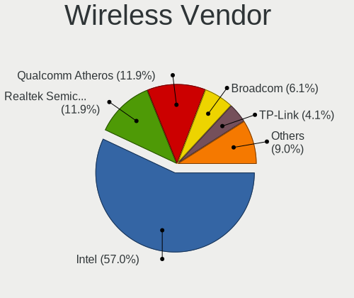

| Vendor                                | Computers | Percent |
|---------------------------------------|-----------|---------|
| Intel                                 | 196       | 56.98%  |
| Realtek Semiconductor                 | 41        | 11.92%  |
| Qualcomm Atheros                      | 41        | 11.92%  |
| Broadcom                              | 21        | 6.1%    |
| TP-Link                               | 14        | 4.07%   |
| Ralink Technology                     | 7         | 2.03%   |
| Sierra Wireless                       | 5         | 1.45%   |
| Edimax Technology                     | 5         | 1.45%   |
| MediaTek                              | 4         | 1.16%   |
| ASUSTek Computer                      | 3         | 0.87%   |
| Ralink                                | 2         | 0.58%   |
| Qualcomm Atheros Communications       | 2         | 0.58%   |
| Qualcomm Technologies                 | 1         | 0.29%   |
| NetGear                               | 1         | 0.29%   |
| 802.11g Adapter [Linksys WUSB54GC v3] | 1         | 0.29%   |

Wireless Model
--------------

Wireless models

| Model                                                          | Computers | Percent |
|----------------------------------------------------------------|-----------|---------|
| Intel Wi-Fi 6 AX200                                            | 27        | 7.8%    |
| Intel Wireless 8265 / 8275                                     | 22        | 6.36%   |
| Intel Wireless 7265                                            | 17        | 4.91%   |
| Intel Wireless 8260                                            | 14        | 4.05%   |
| Intel Wireless 7260                                            | 13        | 3.76%   |
| Qualcomm Atheros QCA9565 / AR9565 Wireless Network Adapter     | 10        | 2.89%   |
| Intel Wireless 3165                                            | 10        | 2.89%   |
| Intel Centrino Advanced-N 6205 [Taylor Peak]                   | 10        | 2.89%   |
| Intel Comet Lake PCH-LP CNVi WiFi                              | 9         | 2.6%    |
| Qualcomm Atheros QCA9377 802.11ac Wireless Network Adapter     | 8         | 2.31%   |
| Intel Cannon Lake PCH CNVi WiFi                                | 7         | 2.02%   |
| Realtek RTL8822CE 802.11ac PCIe Wireless Network Adapter       | 6         | 1.73%   |
| Qualcomm Atheros AR9485 Wireless Network Adapter               | 6         | 1.73%   |
| Intel Wi-Fi 6E(802.11ax) AX210/AX1675* 2x2 [Typhoon Peak]      | 6         | 1.73%   |
| Intel Wi-Fi 6 AX201                                            | 6         | 1.73%   |
| Realtek RTL8852AE 802.11ax PCIe Wireless Network Adapter       | 5         | 1.45%   |
| Realtek RTL8821CE 802.11ac PCIe Wireless Network Adapter       | 5         | 1.45%   |
| Intel Dual Band Wireless-AC 3168NGW [Stone Peak]               | 5         | 1.45%   |
| Intel Centrino Ultimate-N 6300                                 | 5         | 1.45%   |
| Intel Cannon Point-LP CNVi [Wireless-AC]                       | 5         | 1.45%   |
| TP-Link TL-WN722N v2/v3 [Realtek RTL8188EUS]                   | 4         | 1.16%   |
| TP-Link AC600 wireless Realtek RTL8811AU [Archer T2U Nano]     | 4         | 1.16%   |
| Realtek RTL8723BE PCIe Wireless Network Adapter                | 4         | 1.16%   |
| Realtek RTL8188EUS 802.11n Wireless Network Adapter            | 4         | 1.16%   |
| Realtek RTL8188CE 802.11b/g/n WiFi Adapter                     | 4         | 1.16%   |
| Ralink RT5370 Wireless Adapter                                 | 4         | 1.16%   |
| Qualcomm Atheros AR9285 Wireless Network Adapter (PCI-Express) | 4         | 1.16%   |
| Intel Wireless 3160                                            | 4         | 1.16%   |
| Intel Wi-Fi 5(802.11ac) Wireless-AC 9x6x [Thunder Peak]        | 4         | 1.16%   |
| Broadcom BCM4322 802.11a/b/g/n Wireless LAN Controller         | 4         | 1.16%   |
| Broadcom BCM4313 802.11bgn Wireless Network Adapter            | 4         | 1.16%   |
| Sierra Wireless EM7455                                         | 3         | 0.87%   |
| Realtek RTL8852BE PCIe 802.11ax Wireless Network Controller    | 3         | 0.87%   |
| Qualcomm Atheros AR93xx Wireless Network Adapter               | 3         | 0.87%   |
| Qualcomm Atheros AR928X Wireless Network Adapter (PCI-Express) | 3         | 0.87%   |
| Intel Ice Lake-LP PCH CNVi WiFi                                | 3         | 0.87%   |
| Intel Comet Lake PCH CNVi WiFi                                 | 3         | 0.87%   |
| Intel Centrino Advanced-N 6200                                 | 3         | 0.87%   |
| Edimax EW-7811Un 802.11n Wireless Adapter [Realtek RTL8188CUS] | 3         | 0.87%   |
| TP-Link TL-WN823N v2/v3 [Realtek RTL8192EU]                    | 2         | 0.58%   |

Ethernet Vendor
---------------

Ethernet vendors

| Vendor                        | Computers | Percent |
|-------------------------------|-----------|---------|
| Realtek Semiconductor         | 158       | 44.38%  |
| Intel                         | 135       | 37.92%  |
| Qualcomm Atheros              | 19        | 5.34%   |
| Broadcom                      | 19        | 5.34%   |
| Samsung Electronics           | 6         | 1.69%   |
| Nvidia                        | 6         | 1.69%   |
| Qualcomm                      | 4         | 1.12%   |
| Marvell Technology Group      | 3         | 0.84%   |
| Aquantia                      | 2         | 0.56%   |
| Xiaomi                        | 1         | 0.28%   |
| OnePlus Technology (Shenzhen) | 1         | 0.28%   |
| Lenovo                        | 1         | 0.28%   |
| Apple                         | 1         | 0.28%   |

Ethernet Model
--------------

Ethernet models

| Model                                                                          | Computers | Percent |
|--------------------------------------------------------------------------------|-----------|---------|
| Realtek RTL8111/8168/8211/8411 PCI Express Gigabit Ethernet Controller         | 127       | 35.28%  |
| Intel 82579LM Gigabit Network Connection (Lewisville)                          | 25        | 6.94%   |
| Realtek RTL810xE PCI Express Fast Ethernet controller                          | 22        | 6.11%   |
| Intel I211 Gigabit Network Connection                                          | 13        | 3.61%   |
| Intel Ethernet Connection (4) I219-LM                                          | 13        | 3.61%   |
| Intel Ethernet Connection I219-LM                                              | 10        | 2.78%   |
| Samsung Galaxy series, misc. (tethering mode)                                  | 6         | 1.67%   |
| Intel Ethernet Connection I218-LM                                              | 6         | 1.67%   |
| Intel Ethernet Connection I217-LM                                              | 6         | 1.67%   |
| Intel Ethernet Connection (2) I219-V                                           | 6         | 1.67%   |
| Realtek RTL8125 2.5GbE Controller                                              | 5         | 1.39%   |
| Nvidia MCP79 Ethernet                                                          | 5         | 1.39%   |
| Intel Ethernet Controller I225-V                                               | 5         | 1.39%   |
| Intel Ethernet Connection (3) I218-LM                                          | 5         | 1.39%   |
| Qualcomm FP3                                                                   | 4         | 1.11%   |
| Qualcomm Atheros AR8151 v2.0 Gigabit Ethernet                                  | 4         | 1.11%   |
| Intel Ethernet Connection (7) I219-LM                                          | 4         | 1.11%   |
| Qualcomm Atheros Killer E2400 Gigabit Ethernet Controller                      | 3         | 0.83%   |
| Qualcomm Atheros AR8162 Fast Ethernet                                          | 3         | 0.83%   |
| Intel Ethernet Connection I217-V                                               | 3         | 0.83%   |
| Intel Ethernet Connection (6) I219-V                                           | 3         | 0.83%   |
| Intel Ethernet Connection (5) I219-LM                                          | 3         | 0.83%   |
| Intel 82577LM Gigabit Network Connection                                       | 3         | 0.83%   |
| Intel 82567LM Gigabit Network Connection                                       | 3         | 0.83%   |
| Broadcom NetXtreme BCM5764M Gigabit Ethernet PCIe                              | 3         | 0.83%   |
| Realtek RTL-8110SC/8169SC Gigabit Ethernet                                     | 2         | 0.56%   |
| Qualcomm Atheros QCA8171 Gigabit Ethernet                                      | 2         | 0.56%   |
| Qualcomm Atheros AR8131 Gigabit Ethernet                                       | 2         | 0.56%   |
| Intel I350 Gigabit Network Connection                                          | 2         | 0.56%   |
| Intel Ethernet Controller X710 for 10GbE SFP+                                  | 2         | 0.56%   |
| Intel Ethernet Connection (7) I219-V                                           | 2         | 0.56%   |
| Intel Ethernet Connection (6) I219-LM                                          | 2         | 0.56%   |
| Intel 82579V Gigabit Network Connection                                        | 2         | 0.56%   |
| Intel 82574L Gigabit Network Connection                                        | 2         | 0.56%   |
| Broadcom NetXtreme BCM57786 Gigabit Ethernet PCIe                              | 2         | 0.56%   |
| Broadcom NetXtreme BCM57765 Gigabit Ethernet PCIe                              | 2         | 0.56%   |
| Broadcom NetXtreme BCM5761 Gigabit Ethernet PCIe                               | 2         | 0.56%   |
| Broadcom NetXtreme BCM5754 Gigabit Ethernet PCI Express                        | 2         | 0.56%   |
| Broadcom NetLink BCM57781 Gigabit Ethernet PCIe                                | 2         | 0.56%   |
| Aquantia AQtion AQC107 NBase-T/IEEE 802.3an Ethernet Controller [Atlantic 10G] | 2         | 0.56%   |

Net Controller Kind
-------------------

Ethernet, WiFi or modem

| Kind     | Computers | Percent |
|----------|-----------|---------|
| Ethernet | 339       | 50.6%   |
| WiFi     | 312       | 46.57%  |
| Unknown  | 10        | 1.49%   |
| Modem    | 9         | 1.34%   |

Used Controller
---------------

Currently used network controller

| Kind     | Computers | Percent |
|----------|-----------|---------|
| Ethernet | 243       | 56.51%  |
| WiFi     | 184       | 42.79%  |
| Modem    | 3         | 0.7%    |

NICs
----

Total network controllers on board

| Total | Computers | Percent |
|-------|-----------|---------|
| 2     | 236       | 61.14%  |
| 1     | 137       | 35.49%  |
| 3     | 11        | 2.85%   |
| 5     | 1         | 0.26%   |
| 4     | 1         | 0.26%   |

IPv6
----

IPv6 vs IPv4

| Used | Computers | Percent |
|------|-----------|---------|
| No   | 384       | 99.22%  |
| Yes  | 3         | 0.78%   |

Bluetooth
---------

Bluetooth Vendor
----------------

Controller vendors

| Vendor                          | Computers | Percent |
|---------------------------------|-----------|---------|
| Intel                           | 158       | 62.45%  |
| Realtek Semiconductor           | 20        | 7.91%   |
| Broadcom                        | 12        | 4.74%   |
| Qualcomm Atheros Communications | 11        | 4.35%   |
| Apple                           | 10        | 3.95%   |
| Lite-On Technology              | 9         | 3.56%   |
| IMC Networks                    | 7         | 2.77%   |
| Dell                            | 6         | 2.37%   |
| Cambridge Silicon Radio         | 5         | 1.98%   |
| ASUSTek Computer                | 3         | 1.19%   |
| Foxconn / Hon Hai               | 2         | 0.79%   |
| Alps Electric                   | 2         | 0.79%   |
| USI                             | 1         | 0.4%    |
| Toshiba                         | 1         | 0.4%    |
| Skylight Digital                | 1         | 0.4%    |
| Qcom                            | 1         | 0.4%    |
| MediaTek                        | 1         | 0.4%    |
| HTC (High Tech Computer)        | 1         | 0.4%    |
| Hewlett-Packard                 | 1         | 0.4%    |
| Edimax Technology               | 1         | 0.4%    |

Bluetooth Model
---------------

Controller models

| Model                                                       | Computers | Percent |
|-------------------------------------------------------------|-----------|---------|
| Intel Bluetooth wireless interface                          | 75        | 29.64%  |
| Intel AX200 Bluetooth                                       | 25        | 9.88%   |
| Intel Bluetooth 9460/9560 Jefferson Peak (JfP)              | 21        | 8.3%    |
| Intel AX201 Bluetooth                                       | 16        | 6.32%   |
| Realtek Bluetooth Adapter                                   | 8         | 3.16%   |
| Apple Bluetooth Host Controller                             | 7         | 2.77%   |
| Intel AX210 Bluetooth                                       | 6         | 2.37%   |
| Intel Wireless-AC 3168 Bluetooth                            | 5         | 1.98%   |
| Cambridge Silicon Radio Bluetooth Dongle (HCI mode)         | 5         | 1.98%   |
| Broadcom BCM20702 Bluetooth 4.0 [ThinkPad]                  | 5         | 1.98%   |
| Intel Wireless-AC 9260 Bluetooth Adapter                    | 4         | 1.58%   |
| Dell Dell Wireless 380 Bluetooth 4.0 Module                 | 4         | 1.58%   |
| Realtek  Bluetooth 4.2 Adapter                              | 3         | 1.19%   |
| Realtek Bluetooth 4.2 Adapter                               | 3         | 1.19%   |
| Qualcomm Atheros QCA9377 Bluetooth 4.1                      | 3         | 1.19%   |
| Qualcomm Atheros AR9462 Bluetooth                           | 3         | 1.19%   |
| Lite-On Qualcomm Atheros QCA9377 Bluetooth                  | 3         | 1.19%   |
| Lite-On Atheros AR3012 Bluetooth                            | 3         | 1.19%   |
| Intel Centrino Bluetooth Wireless Transceiver               | 3         | 1.19%   |
| Intel AX211 Bluetooth                                       | 3         | 1.19%   |
| Realtek Bluetooth 4.0 Adapter                               | 2         | 0.79%   |
| Qualcomm Atheros Dell Wireless 1707 Bluetooth 4.0 LE Device | 2         | 0.79%   |
| IMC Networks Realtek Bluetooth Adapter                      | 2         | 0.79%   |
| IMC Networks Atheros AR3012 Bluetooth 4.0 Adapter           | 2         | 0.79%   |
| Foxconn / Hon Hai MediaTek Bluetooth Adapter                | 2         | 0.79%   |
| Broadcom BCM20702A0 Bluetooth 4.0                           | 2         | 0.79%   |
| Broadcom BCM2045B (BDC-2.1)                                 | 2         | 0.79%   |
| USI Qualcomm WCN685x Bluetooth Adapter                      | 1         | 0.4%    |
| Toshiba Realtek Bluetooth 4.0 + High Speed Chip             | 1         | 0.4%    |
| Skylight Digital Realtek Bluetooth Adapter                  | 1         | 0.4%    |
| Realtek Wireless Bluetooth Adapter                          | 1         | 0.4%    |
| Realtek RTL8723B Bluetooth                                  | 1         | 0.4%    |
| Realtek Bluetooth 5.1 Adapter                               | 1         | 0.4%    |
| Realtek Bluetooth 4.0 + High Speed Chip                     | 1         | 0.4%    |
| Qualcomm Atheros QCA61x4 Bluetooth 4.1                      | 1         | 0.4%    |
| Qualcomm Atheros AR3012 Bluetooth                           | 1         | 0.4%    |
| Qualcomm Atheros AR3011 Bluetooth                           | 1         | 0.4%    |
| Qcom Broadcom Bluetooth USB                                 | 1         | 0.4%    |
| MediaTek RZ608 Bluetooth Adapter                            | 1         | 0.4%    |
| Lite-On Qualcomm Atheros Bluetooth 4.0 + HS                 | 1         | 0.4%    |

Sound
-----

Sound Vendor
------------

Sound card vendors

| Vendor                | Computers | Percent |
|-----------------------|-----------|---------|
| Intel                 | 275       | 52.99%  |
| AMD                   | 110       | 21.19%  |
| Nvidia                | 86        | 16.57%  |
| C-Media Electronics   | 9         | 1.73%   |
| Logitech              | 6         | 1.16%   |
| Lenovo                | 4         | 0.77%   |
| Focusrite-Novation    | 4         | 0.77%   |
| SteelSeries ApS       | 3         | 0.58%   |
| VIA Technologies      | 2         | 0.39%   |
| RODE Microphones      | 2         | 0.39%   |
| GN Netcom             | 2         | 0.39%   |
| Creative Technology   | 2         | 0.39%   |
| Creative Labs         | 2         | 0.39%   |
| Corsair               | 2         | 0.39%   |
| Tenx Technology       | 1         | 0.19%   |
| Realtek Semiconductor | 1         | 0.19%   |
| Razer USA             | 1         | 0.19%   |
| No brand              | 1         | 0.19%   |
| Nam Tai E&E Products  | 1         | 0.19%   |
| Microsoft             | 1         | 0.19%   |
| JMTek                 | 1         | 0.19%   |
| DSEA A/S              | 1         | 0.19%   |
| Cambridge Audio       | 1         | 0.19%   |
| Anlya.cn              | 1         | 0.19%   |

Sound Model
-----------

Sound card models

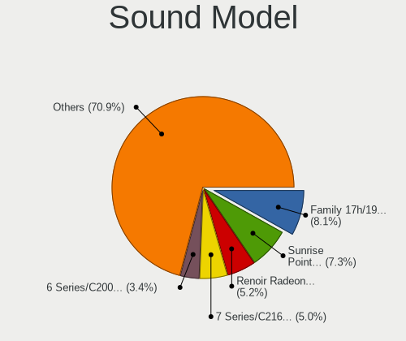

| Model                                                                      | Computers | Percent |
|----------------------------------------------------------------------------|-----------|---------|
| AMD Family 17h/19h/1ah HD Audio Controller                                 | 52        | 8.13%   |
| Intel Sunrise Point-LP HD Audio                                            | 47        | 7.34%   |
| AMD Renoir Radeon High Definition Audio Controller                         | 33        | 5.16%   |
| Intel 7 Series/C216 Chipset Family High Definition Audio Controller        | 32        | 5%      |
| Intel 6 Series/C200 Series Chipset Family High Definition Audio Controller | 22        | 3.44%   |
| Intel Haswell-ULT HD Audio Controller                                      | 19        | 2.97%   |
| Intel 8 Series HD Audio Controller                                         | 19        | 2.97%   |
| Intel Cannon Lake PCH cAVS                                                 | 15        | 2.34%   |
| Intel 100 Series/C230 Series Chipset Family HD Audio Controller            | 15        | 2.34%   |
| Intel 8 Series/C220 Series Chipset High Definition Audio Controller        | 14        | 2.19%   |
| Intel Xeon E3-1200 v3/4th Gen Core Processor HD Audio Controller           | 12        | 1.88%   |
| Intel Wildcat Point-LP High Definition Audio Controller                    | 12        | 1.88%   |
| Intel Broadwell-U Audio Controller                                         | 12        | 1.88%   |
| AMD Starship/Matisse HD Audio Controller                                   | 12        | 1.88%   |
| AMD Family 17h (Models 00h-0fh) HD Audio Controller                        | 12        | 1.88%   |
| Intel Comet Lake PCH-LP cAVS                                               | 11        | 1.72%   |
| AMD Raven/Raven2/Fenghuang HDMI/DP Audio Controller                        | 11        | 1.72%   |
| Nvidia GK107 HDMI Audio Controller                                         | 10        | 1.56%   |
| Intel 82801I (ICH9 Family) HD Audio Controller                             | 10        | 1.56%   |
| Nvidia GP104 High Definition Audio Controller                              | 8         | 1.25%   |
| Intel 5 Series/3400 Series Chipset High Definition Audio                   | 8         | 1.25%   |
| AMD FCH Azalia Controller                                                  | 8         | 1.25%   |
| Nvidia GP108 High Definition Audio Controller                              | 7         | 1.09%   |
| Nvidia GP107GL High Definition Audio Controller                            | 7         | 1.09%   |
| Intel Tiger Lake-LP Smart Sound Technology Audio Controller                | 7         | 1.09%   |
| Intel 200 Series PCH HD Audio                                              | 7         | 1.09%   |
| AMD SBx00 Azalia (Intel HDA)                                               | 7         | 1.09%   |
| AMD Kabini HDMI/DP Audio                                                   | 7         | 1.09%   |
| AMD Family 15h (Models 60h-6fh) Audio Controller                           | 7         | 1.09%   |
| Nvidia MCP79 High Definition Audio                                         | 6         | 0.94%   |
| Intel Cannon Point-LP High Definition Audio Controller                     | 6         | 0.94%   |
| Intel 82801JI (ICH10 Family) HD Audio Controller                           | 6         | 0.94%   |
| AMD Ellesmere HDMI Audio [Radeon RX 470/480 / 570/580/590]                 | 6         | 0.94%   |
| Nvidia TU106 High Definition Audio Controller                              | 5         | 0.78%   |
| Nvidia GM107 High Definition Audio Controller [GeForce 940MX]              | 5         | 0.78%   |
| Intel Ice Lake-LP Smart Sound Technology Audio Controller                  | 5         | 0.78%   |
| Intel Comet Lake PCH cAVS                                                  | 5         | 0.78%   |
| AMD Oland/Hainan/Cape Verde/Pitcairn HDMI Audio [Radeon HD 7000 Series]    | 5         | 0.78%   |
| Nvidia TU107 GeForce GTX 1650 High Definition Audio Controller             | 4         | 0.63%   |
| Nvidia GM206 High Definition Audio Controller                              | 4         | 0.63%   |

Memory
------

Memory Vendor
-------------

Memory module vendors

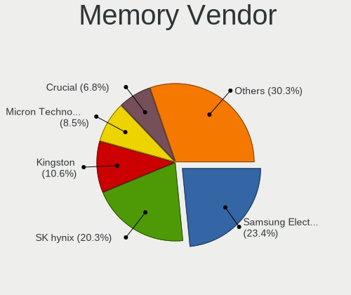

| Vendor                       | Computers | Percent |
|------------------------------|-----------|---------|
| Samsung Electronics          | 113       | 23.44%  |
| SK hynix                     | 98        | 20.33%  |
| Kingston                     | 51        | 10.58%  |
| Micron Technology            | 41        | 8.51%   |
| Crucial                      | 33        | 6.85%   |
| Unknown                      | 22        | 4.56%   |
| G.Skill                      | 21        | 4.36%   |
| Corsair                      | 17        | 3.53%   |
| Unknown                      | 15        | 3.11%   |
| Ramaxel Technology           | 12        | 2.49%   |
| A-DATA Technology            | 9         | 1.87%   |
| Elpida                       | 8         | 1.66%   |
| Team                         | 5         | 1.04%   |
| Goodram                      | 5         | 1.04%   |
| Nanya Technology             | 4         | 0.83%   |
| Unknown (ABCD)               | 3         | 0.62%   |
| Transcend                    | 3         | 0.62%   |
| Timetec                      | 2         | 0.41%   |
| Wodposit                     | 1         | 0.21%   |
| Undefined-00BA               | 1         | 0.21%   |
| Tammuz                       | 1         | 0.21%   |
| SpecTek Incorporated         | 1         | 0.21%   |
| Smart Modular                | 1         | 0.21%   |
| Smart                        | 1         | 0.21%   |
| Shenzhen Longsys             | 1         | 0.21%   |
| S                            | 1         | 0.21%   |
| Patriot Memory (PDP Systems) | 1         | 0.21%   |
| Patriot                      | 1         | 0.21%   |
| Neo Forza                    | 1         | 0.21%   |
| Kingmax                      | 1         | 0.21%   |
| Hewlett-Packard              | 1         | 0.21%   |
| GSkill                       | 1         | 0.21%   |
| GeIL                         | 1         | 0.21%   |
| CSX                          | 1         | 0.21%   |
| Avant                        | 1         | 0.21%   |
| Atermiter                    | 1         | 0.21%   |
| Apacer                       | 1         | 0.21%   |
| 09490000802C                 | 1         | 0.21%   |

Memory Model
------------

Memory module models

| Model                                                            | Computers | Percent |
|------------------------------------------------------------------|-----------|---------|
| Unknown                                                          | 15        | 3.01%   |
| Samsung RAM M471A1K43CB1-CTD 8GB SODIMM DDR4 2667MT/s            | 9         | 1.81%   |
| SK hynix RAM HMA81GS6AFR8N-UH 8GB SODIMM DDR4 2400MT/s           | 8         | 1.61%   |
| SK hynix RAM HMT451S6BFR8A-PB 4GB SODIMM DDR3 1600MT/s           | 7         | 1.41%   |
| Samsung RAM M471B5273DH0-CH9 4GB SODIMM DDR3 1334MT/s            | 7         | 1.41%   |
| Samsung RAM M471B5173QH0-YK0 4GB SODIMM DDR3 1600MT/s            | 7         | 1.41%   |
| SK hynix RAM HMT41GS6BFR8A-PB 8GB SODIMM DDR3 1600MT/s           | 6         | 1.2%    |
| SK hynix RAM HMT351S6CFR8C-PB 4GB SODIMM DDR3 1600MT/s           | 6         | 1.2%    |
| SK hynix RAM HMT451S6AFR8A-PB 4GB SODIMM DDR3 1600MT/s           | 5         | 1%      |
| Samsung RAM M471A5244CB0-CRC 4GB SODIMM DDR4 2400MT/s            | 5         | 1%      |
| Corsair RAM CMK16GX4M2B3200C16 8GB DIMM DDR4 3200MT/s            | 5         | 1%      |
| SK hynix RAM HMA81GS6CJR8N-VK 8GB SODIMM DDR4 2667MT/s           | 4         | 0.8%    |
| Samsung RAM M471B5273DH0-CK0 8GB SODIMM DDR3 1600MT/s            | 4         | 0.8%    |
| Samsung RAM M471B1G73EB0-YK0 8GB SODIMM DDR3 1600MT/s            | 4         | 0.8%    |
| Samsung RAM M471A1K43EB1-CWE 8GB SODIMM DDR4 3200MT/s            | 4         | 0.8%    |
| Samsung RAM M471A1K43DB1-CTD 8GB SODIMM DDR4 2667MT/s            | 4         | 0.8%    |
| Samsung RAM M471A1G44AB0-CWE 8GB Row Of Chips DDR4 3200MT/s      | 4         | 0.8%    |
| Crucial RAM CT102464BF160B.M16 8GB SODIMM DDR3 1600MT/s          | 4         | 0.8%    |
| Unknown (ABCD) RAM 123456789012345678 4GB SODIMM LPDDR4 2400MT/s | 3         | 0.6%    |
| SK hynix RAM HYMP125S64CP8-Y5 2GB SODIMM DDR2 667MT/s            | 3         | 0.6%    |
| Samsung RAM M471B5273CH0-CH9 4GB SODIMM DDR3 1334MT/s            | 3         | 0.6%    |
| Samsung RAM M471B1G73DB0-YK0 8GB SODIMM DDR3 1600MT/s            | 3         | 0.6%    |
| Samsung RAM M471A5244CB0-CWE 4GB SODIMM DDR4 3200MT/s            | 3         | 0.6%    |
| Samsung RAM M471A5244CB0-CTD 4GB SODIMM DDR4 2667MT/s            | 3         | 0.6%    |
| Samsung RAM M471A1G44AB0-CWE 8GB SODIMM DDR4 3200MT/s            | 3         | 0.6%    |
| G.Skill RAM F4-3200C16-8GVKB 8GB DIMM DDR4 3200MT/s              | 3         | 0.6%    |
| Crucial RAM CT51264BF160B.C16F 4GB SODIMM DDR3 1600MT/s          | 3         | 0.6%    |
| Unknown RAM Module 4GB SODIMM DDR3 1067MT/s                      | 2         | 0.4%    |
| Unknown RAM Module 2GB SODIMM DDR3                               | 2         | 0.4%    |
| Team RAM Elite-1333 8GB DIMM DDR3 1333MT/s                       | 2         | 0.4%    |
| SK hynix RAM Module 8GB SODIMM DDR4 2400MT/s                     | 2         | 0.4%    |
| SK hynix RAM Module 4GB SODIMM LPDDR3 1600MT/s                   | 2         | 0.4%    |
| SK hynix RAM HMT451S6AFR8C-PB 4GB SODIMM DDR3 1600MT/s           | 2         | 0.4%    |
| SK hynix RAM HMT41GS6AFR8A-PB 8GB SODIMM DDR3 1600MT/s           | 2         | 0.4%    |
| SK hynix RAM HMT351U6CFR8C-PB 4GB DIMM DDR3 1600MT/s             | 2         | 0.4%    |
| SK hynix RAM HMT351S6BFR8C-H9 4GB SODIMM DDR3 1334MT/s           | 2         | 0.4%    |
| SK hynix RAM HMAA1GS6CJR6N-XN 8GB SODIMM DDR4 3200MT/s           | 2         | 0.4%    |
| SK hynix RAM HMA82GS6CJR8N-VK 16GB SODIMM DDR4 2667MT/s          | 2         | 0.4%    |
| SK hynix RAM HMA82GS6AFR8N-UH 16GB SODIMM DDR4 2400MT/s          | 2         | 0.4%    |
| SK hynix RAM HMA81GS6DJR8N-XN 8GB SODIMM DDR4 3200MT/s           | 2         | 0.4%    |

Memory Kind
-----------

Memory module kinds

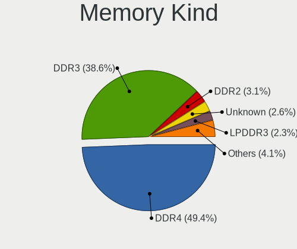

| Kind    | Computers | Percent |
|---------|-----------|---------|
| DDR4    | 193       | 49.36%  |
| DDR3    | 151       | 38.62%  |
| DDR2    | 12        | 3.07%   |
| Unknown | 10        | 2.56%   |
| LPDDR3  | 9         | 2.3%    |
| LPDDR4  | 8         | 2.05%   |
| SDRAM   | 2         | 0.51%   |
| LPDDR5  | 2         | 0.51%   |
| DDR5    | 2         | 0.51%   |
| DDR     | 2         | 0.51%   |

Memory Form Factor
------------------

Physical design of the memory module

| Name         | Computers | Percent |
|--------------|-----------|---------|
| SODIMM       | 256       | 65.31%  |
| DIMM         | 114       | 29.08%  |
| Row Of Chips | 18        | 4.59%   |
| Chip         | 3         | 0.77%   |
| Unknown      | 1         | 0.26%   |

Memory Size
-----------

Memory module size

| Size  | Computers | Percent |
|-------|-----------|---------|
| 8192  | 178       | 41.01%  |
| 4096  | 142       | 32.72%  |
| 16384 | 64        | 14.75%  |
| 2048  | 37        | 8.53%   |
| 32768 | 12        | 2.76%   |
| 1024  | 1         | 0.23%   |

Memory Speed
------------

Memory module speed

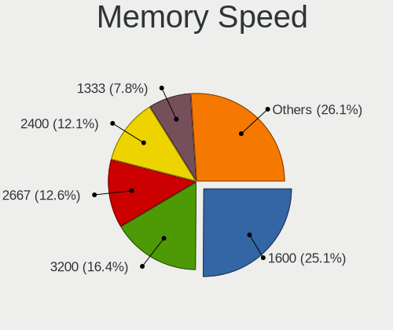

| Speed   | Computers | Percent |
|---------|-----------|---------|
| 1600    | 106       | 25.12%  |
| 3200    | 69        | 16.35%  |
| 2667    | 53        | 12.56%  |
| 2400    | 51        | 12.09%  |
| 1333    | 33        | 7.82%   |
| 2133    | 27        | 6.4%    |
| 1334    | 14        | 3.32%   |
| 800     | 10        | 2.37%   |
| 1067    | 9         | 2.13%   |
| 1867    | 8         | 1.9%    |
| 667     | 7         | 1.66%   |
| 2666    | 6         | 1.42%   |
| 3600    | 4         | 0.95%   |
| Unknown | 4         | 0.95%   |
| 1066    | 3         | 0.71%   |
| 6400    | 2         | 0.47%   |
| 4800    | 2         | 0.47%   |
| 4266    | 2         | 0.47%   |
| 3000    | 2         | 0.47%   |
| 975     | 2         | 0.47%   |
| 4267    | 1         | 0.24%   |
| 3733    | 1         | 0.24%   |
| 3333    | 1         | 0.24%   |
| 3066    | 1         | 0.24%   |
| 2933    | 1         | 0.24%   |
| 1866    | 1         | 0.24%   |
| 1639    | 1         | 0.24%   |
| 1200    | 1         | 0.24%   |

Printers & scanners
-------------------

Printer Vendor
--------------

Printer device vendors

| Vendor             | Computers | Percent |
|--------------------|-----------|---------|
| Hewlett-Packard    | 1         | 50%     |
| Brother Industries | 1         | 50%     |

Printer Model
-------------

Printer device models

| Model                 | Computers | Percent |
|-----------------------|-----------|---------|
| HP Laser 107a Printer | 1         | 50%     |
| Brother MFC-J485DW    | 1         | 50%     |

Scanner Vendor
--------------

Scanner device vendors

Zero info for selected period =(

Scanner Model
-------------

Scanner device models

Zero info for selected period =(

Camera
------

Camera Vendor
-------------

Camera device vendors

| Vendor                                 | Computers | Percent |
|----------------------------------------|-----------|---------|
| Chicony Electronics                    | 57        | 27.01%  |
| Microdia                               | 26        | 12.32%  |
| Realtek Semiconductor                  | 20        | 9.48%   |
| IMC Networks                           | 19        | 9%      |
| Bison Electronics                      | 17        | 8.06%   |
| Sunplus Innovation Technology          | 12        | 5.69%   |
| Logitech                               | 10        | 4.74%   |
| Suyin                                  | 7         | 3.32%   |
| Quanta                                 | 7         | 3.32%   |
| Lite-On Technology                     | 6         | 2.84%   |
| Syntek                                 | 5         | 2.37%   |
| Luxvisions Innotech Limited            | 5         | 2.37%   |
| Alcor Micro                            | 4         | 1.9%    |
| Silicon Motion                         | 3         | 1.42%   |
| Ricoh                                  | 2         | 0.95%   |
| Apple                                  | 2         | 0.95%   |
| Xiongmai                               | 1         | 0.47%   |
| USB Camera                             | 1         | 0.47%   |
| Trust                                  | 1         | 0.47%   |
| OmniVision Technologies                | 1         | 0.47%   |
| Lenovo                                 | 1         | 0.47%   |
| Jiangxi Shinetech Optical              | 1         | 0.47%   |
| Intel                                  | 1         | 0.47%   |
| Importek                               | 1         | 0.47%   |
| Cheng Uei Precision Industry (Foxlink) | 1         | 0.47%   |

Camera Model
------------

Camera device models

| Model                                                | Computers | Percent |
|------------------------------------------------------|-----------|---------|
| Chicony Integrated Camera                            | 18        | 8.49%   |
| Bison Integrated Camera                              | 10        | 4.72%   |
| Microdia Integrated_Webcam_HD                        | 9         | 4.25%   |
| Sunplus Integrated_Webcam_HD                         | 8         | 3.77%   |
| Microdia Integrated Webcam                           | 8         | 3.77%   |
| IMC Networks Integrated Camera                       | 7         | 3.3%    |
| Logitech HD Pro Webcam C920                          | 5         | 2.36%   |
| Realtek USB 2.0 PC Camera                            | 4         | 1.89%   |
| Realtek Integrated_Webcam_HD                         | 4         | 1.89%   |
| Chicony USB2.0 HD UVC WebCam                         | 4         | 1.89%   |
| Realtek Integrated Webcam HD                         | 3         | 1.42%   |
| Microdia Laptop_Integrated_Webcam_HD                 | 3         | 1.42%   |
| IMC Networks Realtek PC Camera                       | 3         | 1.42%   |
| Chicony Integrated Camera (1280x720@30)              | 3         | 1.42%   |
| Chicony HD WebCam                                    | 3         | 1.42%   |
| Chicony EasyCamera                                   | 3         | 1.42%   |
| Syntek Integrated Camera                             | 2         | 0.94%   |
| Suyin Integrated_Webcam_HD                           | 2         | 0.94%   |
| Suyin Acer/HP Integrated Webcam [CN0314]             | 2         | 0.94%   |
| Sunplus Laptop_Integrated_Webcam_FHD                 | 2         | 0.94%   |
| Realtek Lenovo EasyCamera                            | 2         | 0.94%   |
| Realtek Front Camera                                 | 2         | 0.94%   |
| Quanta VGA WebCam                                    | 2         | 0.94%   |
| Quanta HP TrueVision HD Camera                       | 2         | 0.94%   |
| Microdia USB Camera                                  | 2         | 0.94%   |
| Microdia Integrated Webcam HD                        | 2         | 0.94%   |
| Luxvisions Innotech Limited Integrated Camera        | 2         | 0.94%   |
| Luxvisions Innotech Limited HP Wide Vision HD Camera | 2         | 0.94%   |
| Logitech HD Webcam C525                              | 2         | 0.94%   |
| Lite-On Integrated Camera                            | 2         | 0.94%   |
| IMC Networks USB 2.0 UVC HD Webcam                   | 2         | 0.94%   |
| IMC Networks Realtek DMFT RGB                        | 2         | 0.94%   |
| IMC Networks Lenovo EasyCamera                       | 2         | 0.94%   |
| Chicony USB2.0 VGA UVC WebCam                        | 2         | 0.94%   |
| Chicony thinkpad t430s camera                        | 2         | 0.94%   |
| Chicony Realtek DMFT RGB                             | 2         | 0.94%   |
| Chicony Lenovo Integrated Camera (0.3MP)             | 2         | 0.94%   |
| Chicony Integrated HP HD Webcam                      | 2         | 0.94%   |
| Chicony HP HD Camera                                 | 2         | 0.94%   |
| Bison ThinkPad P50 Integrated Camera                 | 2         | 0.94%   |

Security
--------

Fingerprint Vendor
------------------

Fingerprint sensor vendors

| Vendor                     | Computers | Percent |
|----------------------------|-----------|---------|
| Validity Sensors           | 20        | 35.09%  |
| Synaptics                  | 12        | 21.05%  |
| Shenzhen Goodix Technology | 6         | 10.53%  |
| Elan Microelectronics      | 5         | 8.77%   |
| Upek                       | 3         | 5.26%   |
| FocalTech Systems          | 3         | 5.26%   |
| STMicroelectronics         | 2         | 3.51%   |
| Samsung Electronics        | 1         | 1.75%   |
| Next Biometrics            | 1         | 1.75%   |
| LighTuning Technology      | 1         | 1.75%   |
| Fingerprint Cards          | 1         | 1.75%   |
| Broadcom                   | 1         | 1.75%   |
| AuthenTec                  | 1         | 1.75%   |

Fingerprint Model
-----------------

Fingerprint sensor models

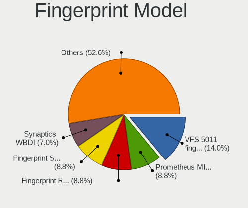

| Model                                                                        | Computers | Percent |
|------------------------------------------------------------------------------|-----------|---------|
| Validity Sensors VFS 5011 fingerprint sensor                                 | 8         | 14.04%  |
| Synaptics Prometheus MIS Touch Fingerprint Reader                            | 5         | 8.77%   |
| Shenzhen Goodix Fingerprint Reader                                           | 5         | 8.77%   |
| Elan Fingerprint Sensor                                                      | 5         | 8.77%   |
| Validity Sensors Synaptics WBDI                                              | 4         | 7.02%   |
| Validity Sensors VFS495 Fingerprint Reader                                   | 3         | 5.26%   |
| Synaptics WBDI                                                               | 3         | 5.26%   |
| Synaptics Metallica MIS Touch Fingerprint Reader                             | 3         | 5.26%   |
| FocalTech Systems Fingerprint Reader                                         | 3         | 5.26%   |
| Validity Sensors VFS7552 Touch Fingerprint Sensor                            | 2         | 3.51%   |
| Validity Sensors VFS7500 Touch Fingerprint Sensor                            | 2         | 3.51%   |
| Upek Biometric Touchchip/Touchstrip Fingerprint Sensor                       | 2         | 3.51%   |
| STMicroelectronics Fingerprint Reader                                        | 2         | 3.51%   |
| Validity Sensors Synaptics VFS7552 Touch Fingerprint Sensor with PurePrint   | 1         | 1.75%   |
| Upek TCS5B Fingerprint sensor                                                | 1         | 1.75%   |
| Synaptics Fingerprint reader [HP G6]                                         | 1         | 1.75%   |
| Shenzhen Goodix  Fingerprint Device                                          | 1         | 1.75%   |
| Samsung CanvasBio Fingerprint Reader                                         | 1         | 1.75%   |
| Next Biometrics NB-2020-U Fingerprint Reader                                 | 1         | 1.75%   |
| LighTuning ES603 Swipe Fingerprint Sensor                                    | 1         | 1.75%   |
| Fingerprint Cards FPC Fingerprint Reader                                     | 1         | 1.75%   |
| Broadcom BCM5880 Secure Applications Processor with fingerprint swipe sensor | 1         | 1.75%   |
| AuthenTec AES2501 Fingerprint Sensor                                         | 1         | 1.75%   |

Chipcard Vendor
---------------

Chipcard module vendors

Zero info for selected period =(

Chipcard Model
--------------

Chipcard module models

Zero info for selected period =(

Unsupported
-----------

Unsupported Devices
-------------------

Total unsupported devices on board

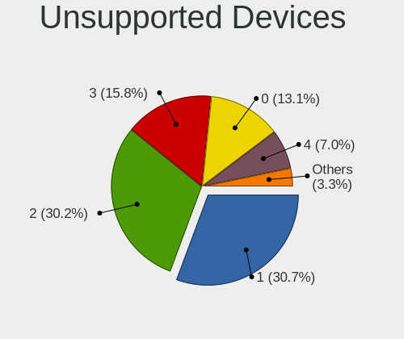

| Total | Computers | Percent |
|-------|-----------|---------|
| 1     | 122       | 30.65%  |
| 2     | 120       | 30.15%  |
| 3     | 63        | 15.83%  |
| 0     | 52        | 13.07%  |
| 4     | 28        | 7.04%   |
| 5     | 13        | 3.27%   |

Unsupported Device Types
------------------------

Types of unsupported devices

| Type                     | Computers | Percent |
|--------------------------|-----------|---------|
| Communication controller | 253       | 37.65%  |
| Bluetooth                | 162       | 24.11%  |
| Net/wireless             | 82        | 12.2%   |
| Card reader              | 59        | 8.78%   |
| Fingerprint reader       | 55        | 8.18%   |
| Firewire controller      | 25        | 3.72%   |
| Network                  | 16        | 2.38%   |
| Sound                    | 10        | 1.49%   |
| Storage                  | 5         | 0.74%   |
| Net/ethernet             | 4         | 0.6%    |
| Modem                    | 1         | 0.15%   |

