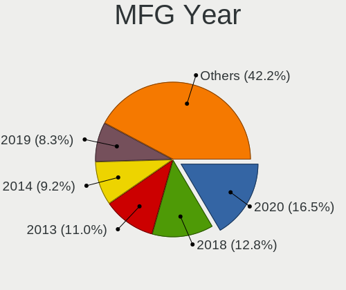
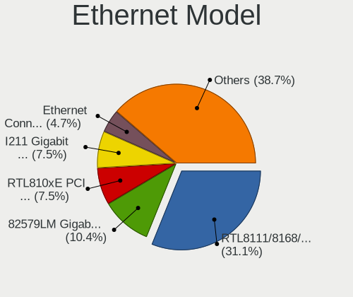
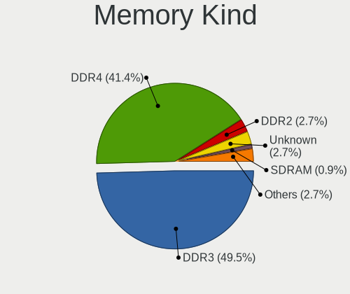
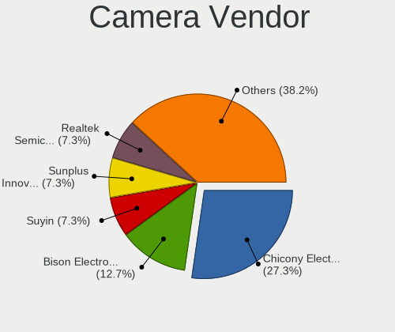
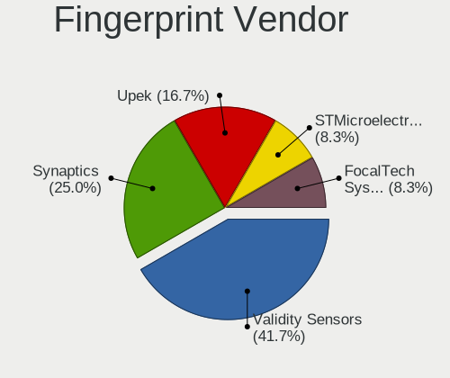

GhostBSD 20.04.02 - Tested Hardware & Statistics
------------------------------------------------

A project to collect tested hardware configurations for GhostBSD 20.04.02.

Anyone can contribute to this report by the [hw-probe](https://github.com/linuxhw/hw-probe/blob/master/INSTALL.BSD.md) tool:

    hw-probe -all -upload

Please submit a probe of your configuration if it's not presented on the page or is rare.

This is a report for all computer types. See also reports for [desktops](/Dist/GhostBSD_20.04.02/Desktop/README.md) and [notebooks](/Dist/GhostBSD_20.04.02/Notebook/README.md).

Full-feature report is available here: https://bsd-hardware.info/?view=trends&rel=ghostbsd-20.04.02

Contents
--------

* [ Test Cases ](#test-cases)

* [ System ](#system)
  - [ Arch                     ](#arch)
  - [ DE                       ](#de)
  - [ Display Server           ](#display-server)
  - [ Display Manager          ](#display-manager)
  - [ OS Lang                  ](#os-lang)
  - [ Boot Mode                ](#boot-mode)
  - [ Filesystem               ](#filesystem)
  - [ Part. scheme             ](#part-scheme)

* [ Board ](#board)
  - [ Vendor                   ](#vendor)
  - [ Model                    ](#model)
  - [ Model Family             ](#model-family)
  - [ MFG Year                 ](#mfg-year)
  - [ Form Factor              ](#form-factor)
  - [ Coreboot                 ](#coreboot)
  - [ RAM Size                 ](#ram-size)
  - [ RAM Used                 ](#ram-used)
  - [ Total Drives             ](#total-drives)
  - [ Has CD-ROM               ](#has-cd-rom)
  - [ Has Ethernet             ](#has-ethernet)
  - [ Has WiFi                 ](#has-wifi)
  - [ Has Bluetooth            ](#has-bluetooth)

* [ Location ](#location)
  - [ Country                  ](#country)
  - [ City                     ](#city)

* [ Drives ](#drives)
  - [ Drive Vendor             ](#drive-vendor)
  - [ Drive Model              ](#drive-model)
  - [ HDD Vendor               ](#hdd-vendor)
  - [ SSD Vendor               ](#ssd-vendor)
  - [ Drive Kind               ](#drive-kind)
  - [ Drive Connector          ](#drive-connector)
  - [ Drive Size               ](#drive-size)
  - [ Space Total              ](#space-total)
  - [ Space Used               ](#space-used)
  - [ Malfunc. Drives          ](#malfunc-drives)
  - [ Malfunc. Drive Vendor    ](#malfunc-drive-vendor)
  - [ Malfunc. HDD Vendor      ](#malfunc-hdd-vendor)
  - [ Malfunc. Drive Kind      ](#malfunc-drive-kind)
  - [ Failed Drives            ](#failed-drives)
  - [ Failed Drive Vendor      ](#failed-drive-vendor)
  - [ Drive Status             ](#drive-status)

* [ Storage controller ](#storage-controller)
  - [ Storage Vendor           ](#storage-vendor)
  - [ Storage Model            ](#storage-model)
  - [ Storage Kind             ](#storage-kind)

* [ Processor ](#processor)
  - [ CPU Vendor               ](#cpu-vendor)
  - [ CPU Model                ](#cpu-model)
  - [ CPU Model Family         ](#cpu-model-family)
  - [ CPU Cores                ](#cpu-cores)
  - [ CPU Sockets              ](#cpu-sockets)
  - [ CPU Threads              ](#cpu-threads)
  - [ CPU Microarch            ](#cpu-microarch)

* [ Graphics ](#graphics)
  - [ GPU Vendor               ](#gpu-vendor)
  - [ GPU Model                ](#gpu-model)
  - [ GPU Combo                ](#gpu-combo)
  - [ GPU Driver               ](#gpu-driver)
  - [ GPU Memory               ](#gpu-memory)

* [ Monitor ](#monitor)
  - [ Monitor Vendor           ](#monitor-vendor)
  - [ Monitor Model            ](#monitor-model)
  - [ Monitor Resolution       ](#monitor-resolution)
  - [ Monitor Diagonal         ](#monitor-diagonal)
  - [ Monitor Width            ](#monitor-width)
  - [ Aspect Ratio             ](#aspect-ratio)
  - [ Monitor Area             ](#monitor-area)
  - [ Pixel Density            ](#pixel-density)
  - [ Multiple Monitors        ](#multiple-monitors)

* [ Network ](#network)
  - [ Net Controller Vendor    ](#net-controller-vendor)
  - [ Net Controller Model     ](#net-controller-model)
  - [ Wireless Vendor          ](#wireless-vendor)
  - [ Wireless Model           ](#wireless-model)
  - [ Ethernet Vendor          ](#ethernet-vendor)
  - [ Ethernet Model           ](#ethernet-model)
  - [ Net Controller Kind      ](#net-controller-kind)
  - [ Used Controller          ](#used-controller)
  - [ NICs                     ](#nics)
  - [ IPv6                     ](#ipv6)

* [ Bluetooth ](#bluetooth)
  - [ Bluetooth Vendor         ](#bluetooth-vendor)
  - [ Bluetooth Model          ](#bluetooth-model)

* [ Sound ](#sound)
  - [ Sound Vendor             ](#sound-vendor)
  - [ Sound Model              ](#sound-model)

* [ Memory ](#memory)
  - [ Memory Vendor            ](#memory-vendor)
  - [ Memory Model             ](#memory-model)
  - [ Memory Kind              ](#memory-kind)
  - [ Memory Form Factor       ](#memory-form-factor)
  - [ Memory Size              ](#memory-size)
  - [ Memory Speed             ](#memory-speed)

* [ Printers & scanners ](#printers--scanners)
  - [ Printer Vendor           ](#printer-vendor)
  - [ Printer Model            ](#printer-model)
  - [ Scanner Vendor           ](#scanner-vendor)
  - [ Scanner Model            ](#scanner-model)

* [ Camera ](#camera)
  - [ Camera Vendor            ](#camera-vendor)
  - [ Camera Model             ](#camera-model)

* [ Security ](#security)
  - [ Fingerprint Vendor       ](#fingerprint-vendor)
  - [ Fingerprint Model        ](#fingerprint-model)
  - [ Chipcard Vendor          ](#chipcard-vendor)
  - [ Chipcard Model           ](#chipcard-model)

* [ Unsupported ](#unsupported)
  - [ Unsupported Devices      ](#unsupported-devices)
  - [ Unsupported Device Types ](#unsupported-device-types)

Test Cases
----------

| Vendor        | Model                       | Form-Factor | Probe                                                     | Date         |
|---------------|-----------------------------|-------------|-----------------------------------------------------------|--------------|
| ASUSTek       | PRIME B350-PLUS             | Desktop     | [0ee3fe080c](https://bsd-hardware.info/?probe=0ee3fe080c) | Aug 30, 2021 |
| Intel         | NUC8BEB J72692-303          | Mini pc     | [31b995146e](https://bsd-hardware.info/?probe=31b995146e) | Aug 25, 2021 |
| Acer          | Aspire 5750                 | Notebook    | [2bc72bf29e](https://bsd-hardware.info/?probe=2bc72bf29e) | Aug 23, 2021 |
| Intel         | NUC6i7KYB H90766-402        | Mini pc     | [6f89733e13](https://bsd-hardware.info/?probe=6f89733e13) | Aug 16, 2021 |
| MSI           | H81M-P33                    | Desktop     | [6dcb3aa559](https://bsd-hardware.info/?probe=6dcb3aa559) | Aug 05, 2021 |
| Dell          | Latitude E5440              | Notebook    | [3f2e8586a7](https://bsd-hardware.info/?probe=3f2e8586a7) | Aug 05, 2021 |
| Dell          | Latitude E6430              | Notebook    | [4149fa5ec3](https://bsd-hardware.info/?probe=4149fa5ec3) | Aug 04, 2021 |
| Intel         | NUC8BEB J72692-303          | Mini pc     | [9fe86991b5](https://bsd-hardware.info/?probe=9fe86991b5) | Aug 04, 2021 |
| ASRock        | X570 Pro4                   | Desktop     | [011fb96fe0](https://bsd-hardware.info/?probe=011fb96fe0) | Aug 04, 2021 |
| Lenovo        | Legion Y7000P 81LD          | Notebook    | [7364ae3b3d](https://bsd-hardware.info/?probe=7364ae3b3d) | Aug 04, 2021 |
| ASRock        | Z77 Extreme6                | Desktop     | [2521c70747](https://bsd-hardware.info/?probe=2521c70747) | Aug 02, 2021 |
| Lenovo        | ThinkPad L512 44444XG       | Notebook    | [a6c8fbcb20](https://bsd-hardware.info/?probe=a6c8fbcb20) | Aug 01, 2021 |
| GPU Compan... | GWTN156-5                   | Notebook    | [bc44d767cc](https://bsd-hardware.info/?probe=bc44d767cc) | Jul 22, 2021 |
| Dell          | Latitude E5520              | Notebook    | [e0dd26220f](https://bsd-hardware.info/?probe=e0dd26220f) | Jul 21, 2021 |
| Apple         | MacBook5,1                  | Notebook    | [1e54d2fbdf](https://bsd-hardware.info/?probe=1e54d2fbdf) | Jul 05, 2021 |
| Apple         | MacBook5,1                  | Notebook    | [f5d7a16498](https://bsd-hardware.info/?probe=f5d7a16498) | Jul 05, 2021 |
| ASUSTek       | PRIME B350M-E               | Desktop     | [bde8057846](https://bsd-hardware.info/?probe=bde8057846) | Jun 29, 2021 |
| Lenovo        | ThinkPad T470 W10DG 20JN... | Notebook    | [668bf95221](https://bsd-hardware.info/?probe=668bf95221) | Jun 25, 2021 |
| Dell          | Latitude E6420              | Notebook    | [2e8b431cc6](https://bsd-hardware.info/?probe=2e8b431cc6) | Jun 25, 2021 |
| Lenovo        | ThinkPad T440 20B7S1860W    | Notebook    | [8552205176](https://bsd-hardware.info/?probe=8552205176) | Jun 22, 2021 |
| Lenovo        | IdeaPad 520-15IKB 81BF      | Notebook    | [9f82e215c3](https://bsd-hardware.info/?probe=9f82e215c3) | Jun 22, 2021 |
| Dell          | Inspiron 3542               | Notebook    | [a2deab0991](https://bsd-hardware.info/?probe=a2deab0991) | Jun 15, 2021 |
| ASUSTek       | PRIME A320M-A               | Desktop     | [10d9e99990](https://bsd-hardware.info/?probe=10d9e99990) | May 31, 2021 |
| Sony          | SVP1322M1EBI                | Notebook    | [23316d0f2b](https://bsd-hardware.info/?probe=23316d0f2b) | May 29, 2021 |
| Lenovo        | Board                       | Desktop     | [428f39cbff](https://bsd-hardware.info/?probe=428f39cbff) | May 21, 2021 |
| Lenovo        | ThinkPad T470 20HD000MUK    | Notebook    | [e27342ab94](https://bsd-hardware.info/?probe=e27342ab94) | May 13, 2021 |
| Lenovo        | ThinkPad X250 20CM003WMS    | Notebook    | [11fe52be5e](https://bsd-hardware.info/?probe=11fe52be5e) | May 13, 2021 |
| ASUSTek       | V-P7H55E                    | Desktop     | [7634d3b6ca](https://bsd-hardware.info/?probe=7634d3b6ca) | May 12, 2021 |
| ASUSTek       | V-P7H55E                    | Desktop     | [f2e42a5ca3](https://bsd-hardware.info/?probe=f2e42a5ca3) | May 10, 2021 |
| ASUSTek       | V-P7H55E                    | Desktop     | [0af6399c18](https://bsd-hardware.info/?probe=0af6399c18) | May 10, 2021 |
| Lenovo        | ThinkPad T430 2344C4U       | Notebook    | [0f001f65d2](https://bsd-hardware.info/?probe=0f001f65d2) | Apr 27, 2021 |
| Samsung       | 3570R/370R/470R/450R/510... | Notebook    | [f8389b0546](https://bsd-hardware.info/?probe=f8389b0546) | Apr 24, 2021 |
| HP            | Laptop 15-da0xxx            | Notebook    | [cb09a1b771](https://bsd-hardware.info/?probe=cb09a1b771) | Apr 08, 2021 |
| Dell          | 0TP412                      | Desktop     | [1bc05b5951](https://bsd-hardware.info/?probe=1bc05b5951) | Apr 04, 2021 |
| Apple         | MacBookPro8,1               | Notebook    | [e4e3731289](https://bsd-hardware.info/?probe=e4e3731289) | Apr 01, 2021 |
| Acer          | Aspire E5-521G              | Notebook    | [e2b6dbfe40](https://bsd-hardware.info/?probe=e2b6dbfe40) | Apr 01, 2021 |
| Huanan        | X79 INTEL (INTEL Xeon E5... | Desktop     | [ec9e43382e](https://bsd-hardware.info/?probe=ec9e43382e) | Mar 25, 2021 |
| HP            | 255 G7 Notebook PC          | Notebook    | [3e500c12a3](https://bsd-hardware.info/?probe=3e500c12a3) | Mar 24, 2021 |
| HP            | 1850                        | Desktop     | [3055c06d45](https://bsd-hardware.info/?probe=3055c06d45) | Mar 22, 2021 |
| ASRock        | X570 Phantom Gaming 4       | Desktop     | [a64a4e0792](https://bsd-hardware.info/?probe=a64a4e0792) | Mar 19, 2021 |
| HP            | Laptop 15-da0xxx            | Notebook    | [a7a25be087](https://bsd-hardware.info/?probe=a7a25be087) | Mar 16, 2021 |
| Lenovo        | ThinkPad X250 20CM003WMS    | Notebook    | [c7f71901c3](https://bsd-hardware.info/?probe=c7f71901c3) | Mar 11, 2021 |
| Lenovo        | ThinkPad X250 20CM003WMS    | Notebook    | [803974a844](https://bsd-hardware.info/?probe=803974a844) | Mar 11, 2021 |
| Lenovo        | ThinkPad X250 20CM003WMS    | Notebook    | [196cd8a730](https://bsd-hardware.info/?probe=196cd8a730) | Mar 11, 2021 |
| Acer          | Aspire F5-573G              | Notebook    | [240171b234](https://bsd-hardware.info/?probe=240171b234) | Mar 08, 2021 |
| HP            | Pavilion Gaming Laptop 1... | Notebook    | [9ede3128c5](https://bsd-hardware.info/?probe=9ede3128c5) | Mar 07, 2021 |
| ASUSTek       | ROG STRIX B450-F GAMING     | Desktop     | [39a46ce44e](https://bsd-hardware.info/?probe=39a46ce44e) | Mar 06, 2021 |
| HP            | Laptop 15-db0xxx            | Notebook    | [b1ee3da46f](https://bsd-hardware.info/?probe=b1ee3da46f) | Mar 06, 2021 |
| Gigabyte      | EG43M-S2H                   | Desktop     | [f6eaa55ada](https://bsd-hardware.info/?probe=f6eaa55ada) | Mar 06, 2021 |
| Apple         | MacBookPro5,5               | Notebook    | [50ac436475](https://bsd-hardware.info/?probe=50ac436475) | Mar 06, 2021 |
| HP            | Pavilion x360 Convertibl... | Convertible | [f27578615f](https://bsd-hardware.info/?probe=f27578615f) | Mar 05, 2021 |
| Lenovo        | ThinkPad T470 20HD000MUK    | Notebook    | [b85d23571e](https://bsd-hardware.info/?probe=b85d23571e) | Feb 23, 2021 |
| Acer          | Aspire XC-115               | Desktop     | [95f63df64d](https://bsd-hardware.info/?probe=95f63df64d) | Feb 21, 2021 |
| Lenovo        | Kabini CRB 31900058 STD     | Desktop     | [c08ca084b0](https://bsd-hardware.info/?probe=c08ca084b0) | Feb 21, 2021 |
| ASRock        | AB350 Pro4                  | Desktop     | [3680c4cd75](https://bsd-hardware.info/?probe=3680c4cd75) | Feb 20, 2021 |
| ASUSTek       | PRIME B450-PLUS             | Desktop     | [ade306695d](https://bsd-hardware.info/?probe=ade306695d) | Feb 20, 2021 |
| Acer          | Extensa 5635Z               | Notebook    | [837c6f28b4](https://bsd-hardware.info/?probe=837c6f28b4) | Feb 19, 2021 |
| Acer          | WG43M                       | Desktop     | [28a6795710](https://bsd-hardware.info/?probe=28a6795710) | Feb 15, 2021 |
| Apple         | MacBookPro5,5               | Notebook    | [9bbe1119a1](https://bsd-hardware.info/?probe=9bbe1119a1) | Feb 12, 2021 |
| MSI           | PRESTIGE X570 CREATION      | Desktop     | [e6fa5753b5](https://bsd-hardware.info/?probe=e6fa5753b5) | Feb 12, 2021 |
| MSI           | PRESTIGE X570 CREATION      | Desktop     | [fd798dae01](https://bsd-hardware.info/?probe=fd798dae01) | Feb 12, 2021 |
| Dell          | 030VXY A01                  | Desktop     | [23e7163f58](https://bsd-hardware.info/?probe=23e7163f58) | Feb 10, 2021 |
| Lenovo        | ThinkPad T470 20HD000MUK    | Notebook    | [39c8cd6d0c](https://bsd-hardware.info/?probe=39c8cd6d0c) | Feb 08, 2021 |
| HP            | Laptop 15-da0xxx            | Notebook    | [d6bc2b2c1d](https://bsd-hardware.info/?probe=d6bc2b2c1d) | Feb 08, 2021 |
| ASUSTek       | PN50                        | Mini pc     | [5a0b61ac41](https://bsd-hardware.info/?probe=5a0b61ac41) | Feb 07, 2021 |
| Apple         | MacBookPro5,5               | Notebook    | [ffc0295ae1](https://bsd-hardware.info/?probe=ffc0295ae1) | Feb 07, 2021 |
| Apple         | MacBookPro5,5               | Notebook    | [13fdaa7c15](https://bsd-hardware.info/?probe=13fdaa7c15) | Feb 04, 2021 |
| Apple         | MacBookPro5,5               | Notebook    | [254e518190](https://bsd-hardware.info/?probe=254e518190) | Feb 03, 2021 |
| ASUSTek       | TUF GAMING X570-PLUS        | Desktop     | [cf41f72474](https://bsd-hardware.info/?probe=cf41f72474) | Jan 31, 2021 |
| HP            | Laptop 15-da0xxx            | Notebook    | [869d894f4f](https://bsd-hardware.info/?probe=869d894f4f) | Jan 30, 2021 |
| Dell          | Latitude 5480               | Notebook    | [9b38a72dd4](https://bsd-hardware.info/?probe=9b38a72dd4) | Jan 26, 2021 |
| HP            | Laptop 15-da0xxx            | Notebook    | [3e37c56f14](https://bsd-hardware.info/?probe=3e37c56f14) | Jan 23, 2021 |
| HP            | Laptop 17-ca1xxx            | Notebook    | [fb318623f3](https://bsd-hardware.info/?probe=fb318623f3) | Jan 23, 2021 |
| HP            | Laptop 17-ca1xxx            | Notebook    | [97a89d4eb0](https://bsd-hardware.info/?probe=97a89d4eb0) | Jan 23, 2021 |
| HP            | Laptop 17-ca1xxx            | Notebook    | [806c954739](https://bsd-hardware.info/?probe=806c954739) | Jan 23, 2021 |
| Notebook      | N85_N87,HJ,HJ1,HK1          | Notebook    | [3d18f3f8a9](https://bsd-hardware.info/?probe=3d18f3f8a9) | Jan 23, 2021 |
| Dell          | 0NW6H5 A00                  | Desktop     | [f6df3820b5](https://bsd-hardware.info/?probe=f6df3820b5) | Jan 18, 2021 |
| Dell          | Inspiron 3542               | Notebook    | [3c41c474ad](https://bsd-hardware.info/?probe=3c41c474ad) | Jan 16, 2021 |
| Lenovo        | ThinkPad X380 Yoga 20LJ0... | Convertible | [9e58a182a8](https://bsd-hardware.info/?probe=9e58a182a8) | Jan 16, 2021 |
| MSI           | Z97 GAMING 5                | Desktop     | [9ef0da6093](https://bsd-hardware.info/?probe=9ef0da6093) | Jan 16, 2021 |
| HP            | OMEN by HP Laptop           | Notebook    | [14857eb6b7](https://bsd-hardware.info/?probe=14857eb6b7) | Jan 15, 2021 |
| ASUSTek       | X550LC                      | Notebook    | [f7c32488e9](https://bsd-hardware.info/?probe=f7c32488e9) | Jan 15, 2021 |
| Lenovo        | IdeaPad S145-15API 81UT     | Notebook    | [06cbb5cd5f](https://bsd-hardware.info/?probe=06cbb5cd5f) | Jan 15, 2021 |
| Dell          | Latitude 5280               | Notebook    | [c9bfb73262](https://bsd-hardware.info/?probe=c9bfb73262) | Jan 15, 2021 |
| Dell          | 0KC9NP A01                  | Desktop     | [a9228fa7c3](https://bsd-hardware.info/?probe=a9228fa7c3) | Jan 15, 2021 |
| Dell          | 030VXY A01                  | Desktop     | [5af442bf61](https://bsd-hardware.info/?probe=5af442bf61) | Jan 15, 2021 |
| Samsung       | 3570R/370R/470R/450R/510... | Notebook    | [a395c023bf](https://bsd-hardware.info/?probe=a395c023bf) | Jan 10, 2021 |
| Dell          | 0HY9JP A02                  | Desktop     | [b4d2af272e](https://bsd-hardware.info/?probe=b4d2af272e) | Jan 05, 2021 |
| ASUSTek       | Z170I PRO GAMING            | Desktop     | [5124b24d30](https://bsd-hardware.info/?probe=5124b24d30) | Jan 04, 2021 |
| Dell          | Inspiron 5758               | Notebook    | [c096e37be5](https://bsd-hardware.info/?probe=c096e37be5) | Jan 03, 2021 |
| Fujitsu       | D3617-A1 S26361-D3617-A1    | Desktop     | [2a0187ef7a](https://bsd-hardware.info/?probe=2a0187ef7a) | Jan 02, 2021 |
| HP            | Laptop 14-dk0xxx            | Notebook    | [5cd8e23152](https://bsd-hardware.info/?probe=5cd8e23152) | Dec 26, 2020 |
| HP            | Laptop 14-dk0xxx            | Notebook    | [fdbd71db5e](https://bsd-hardware.info/?probe=fdbd71db5e) | Dec 26, 2020 |
| Lenovo        | Yoga 2 13 20344             | Notebook    | [c51c202b8d](https://bsd-hardware.info/?probe=c51c202b8d) | Dec 25, 2020 |
| ASUSTek       | PRIME A320M-C R2.0          | Desktop     | [4c24fe6fc4](https://bsd-hardware.info/?probe=4c24fe6fc4) | Dec 24, 2020 |
| HP            | 0B4Ch D                     | Desktop     | [bf0d7fe4f1](https://bsd-hardware.info/?probe=bf0d7fe4f1) | Dec 22, 2020 |
| Gigabyte      | Z370 AORUS Ultra Gaming-... | Desktop     | [a3a96da3fb](https://bsd-hardware.info/?probe=a3a96da3fb) | Dec 19, 2020 |
| Lenovo        | ThinkPad T450 20BV0064US    | Notebook    | [b397848c7e](https://bsd-hardware.info/?probe=b397848c7e) | Dec 16, 2020 |
| Toshiba       | Satellite C855              | Notebook    | [6bc78fc7fc](https://bsd-hardware.info/?probe=6bc78fc7fc) | Dec 16, 2020 |
| Panasonic     | CF-19AHNC8FN                | Notebook    | [04a42812bb](https://bsd-hardware.info/?probe=04a42812bb) | Dec 11, 2020 |
| Lenovo        | ThinkPad X220 42872VU       | Notebook    | [c843b5d271](https://bsd-hardware.info/?probe=c843b5d271) | Dec 10, 2020 |
| ASUSTek       | TUF GAMING B550M-PLUS       | Desktop     | [464223cefe](https://bsd-hardware.info/?probe=464223cefe) | Dec 07, 2020 |
| Lenovo        | ThinkPad X380 Yoga 20LJ0... | Convertible | [a6b923675d](https://bsd-hardware.info/?probe=a6b923675d) | Dec 07, 2020 |
| Lenovo        | ThinkPad X1 Yoga 3rd 20L... | Convertible | [6c55fc2866](https://bsd-hardware.info/?probe=6c55fc2866) | Dec 05, 2020 |
| ASRock        | B450 Gaming-ITX/ac          | Desktop     | [53bf449015](https://bsd-hardware.info/?probe=53bf449015) | Dec 02, 2020 |
| Quanta        | 2AF5 011                    | Desktop     | [172f23efac](https://bsd-hardware.info/?probe=172f23efac) | Nov 29, 2020 |
| ASRock        | AB350 Gaming-ITX/ac         | Desktop     | [8afa16fc20](https://bsd-hardware.info/?probe=8afa16fc20) | Nov 29, 2020 |
| Gigabyte      | X470 AORUS ULTRA GAMING-... | Desktop     | [5d5ecb38cd](https://bsd-hardware.info/?probe=5d5ecb38cd) | Nov 25, 2020 |
| MSI           | B450 GAMING PLUS            | Desktop     | [4cf3dd682b](https://bsd-hardware.info/?probe=4cf3dd682b) | Nov 24, 2020 |
| MSI           | B450 GAMING PLUS            | Desktop     | [edee76372b](https://bsd-hardware.info/?probe=edee76372b) | Nov 21, 2020 |
| Acer          | Aspire 7540                 | Notebook    | [65d215a03b](https://bsd-hardware.info/?probe=65d215a03b) | Nov 17, 2020 |
| ASRock        | X570 Phantom Gaming 4       | Desktop     | [cc075b3932](https://bsd-hardware.info/?probe=cc075b3932) | Nov 15, 2020 |
| ASRock        | X570 Phantom Gaming 4       | Desktop     | [6a0c640524](https://bsd-hardware.info/?probe=6a0c640524) | Nov 12, 2020 |
| ASRock        | X570 Phantom Gaming 4       | Desktop     | [6060033216](https://bsd-hardware.info/?probe=6060033216) | Nov 12, 2020 |
| Apple         | MacBook6,1                  | Notebook    | [64b1b1910c](https://bsd-hardware.info/?probe=64b1b1910c) | Nov 01, 2020 |
| Gigabyte      | Z97-D3H-CF                  | Desktop     | [dc33c84287](https://bsd-hardware.info/?probe=dc33c84287) | Oct 22, 2020 |
| Acer          | Aspire A315-42              | Notebook    | [1ac21e1660](https://bsd-hardware.info/?probe=1ac21e1660) | Oct 08, 2020 |
| Acer          | Aspire E1-532               | Notebook    | [10bff44534](https://bsd-hardware.info/?probe=10bff44534) | Oct 07, 2020 |
| HP            | Laptop 15-da0xxx            | Notebook    | [7faf1699d6](https://bsd-hardware.info/?probe=7faf1699d6) | Oct 04, 2020 |
| Fujitsu       | D2950-A1 S26361-D2950-A1    | Desktop     | [86e9866c03](https://bsd-hardware.info/?probe=86e9866c03) | Oct 02, 2020 |
| Fujitsu       | D2950-A1 S26361-D2950-A1    | Desktop     | [3b8f8a2033](https://bsd-hardware.info/?probe=3b8f8a2033) | Oct 02, 2020 |
| Lenovo        | ThinkPad T590 20N40016CD    | Notebook    | [1d9786ac9f](https://bsd-hardware.info/?probe=1d9786ac9f) | Aug 31, 2020 |
| Lenovo        | ThinkPad T590 20N40016CD    | Notebook    | [e505894bee](https://bsd-hardware.info/?probe=e505894bee) | Aug 29, 2020 |
| System76      | Lemur Pro                   | Notebook    | [0163d0f084](https://bsd-hardware.info/?probe=0163d0f084) | Aug 29, 2020 |
| Lenovo        | ThinkPad T430s 23539JM      | Notebook    | [facf6fa0f8](https://bsd-hardware.info/?probe=facf6fa0f8) | Aug 27, 2020 |
| ASUSTek       | K53SD                       | Notebook    | [975e9ccbe2](https://bsd-hardware.info/?probe=975e9ccbe2) | Aug 27, 2020 |
| Lenovo        | ThinkPad T530 239242U       | Notebook    | [7c8087322d](https://bsd-hardware.info/?probe=7c8087322d) | Aug 27, 2020 |
| Sony          | VGN-SZ3VWP_X                | Notebook    | [ace534d784](https://bsd-hardware.info/?probe=ace534d784) | Aug 10, 2020 |
| TUXEDO        | InfinityBook13V3            | Notebook    | [d508fb472b](https://bsd-hardware.info/?probe=d508fb472b) | Aug 10, 2020 |
| MSI           | H61M-P20                    | Desktop     | [fefac5637b](https://bsd-hardware.info/?probe=fefac5637b) | Aug 03, 2020 |
| Gigabyte      | F2A68HM-DS2                 | Desktop     | [0073f8ff71](https://bsd-hardware.info/?probe=0073f8ff71) | Aug 02, 2020 |
| Gigabyte      | H67A-UD3H-B3                | Desktop     | [aa29eb9c75](https://bsd-hardware.info/?probe=aa29eb9c75) | Aug 01, 2020 |
| Dell          | Inspiron 3542               | Notebook    | [b89da90904](https://bsd-hardware.info/?probe=b89da90904) | Aug 01, 2020 |
| Unknown       | SKYBAY                      | Desktop     | [34bb81770b](https://bsd-hardware.info/?probe=34bb81770b) | Jul 22, 2020 |
| ASRock        | X370 Gaming K4              | Desktop     | [4473708fd0](https://bsd-hardware.info/?probe=4473708fd0) | Jul 22, 2020 |
| ASRock        | X370 Gaming K4              | Desktop     | [174569bf55](https://bsd-hardware.info/?probe=174569bf55) | Jul 21, 2020 |
| ASRock        | A300M-STX                   | Desktop     | [f62a2ace5a](https://bsd-hardware.info/?probe=f62a2ace5a) | Jul 16, 2020 |
| Lenovo        | Win8 Pro DPK TPG            | Desktop     | [db7146b868](https://bsd-hardware.info/?probe=db7146b868) | Jul 14, 2020 |
| Dell          | Latitude E6420              | Notebook    | [324265fe3f](https://bsd-hardware.info/?probe=324265fe3f) | May 31, 2020 |
| Lenovo        | ThinkPad T430s 2352CTO      | Notebook    | [f4e8ffb5dc](https://bsd-hardware.info/?probe=f4e8ffb5dc) | May 27, 2020 |
| Lenovo        | ThinkPad T430s 2352CTO      | Notebook    | [59c5b6d6b9](https://bsd-hardware.info/?probe=59c5b6d6b9) | May 27, 2020 |

System
------

Arch
----

OS architecture (x86_64, i586, etc.)

| Name  | Computers | Percent |
|-------|-----------|---------|
| amd64 | 105       | 100%    |

DE
--

Desktop Environment

| Name             | Computers | Percent |
|------------------|-----------|---------|
| MATE             | 84        | 78.5%   |
| XFCE             | 14        | 13.08%  |
| KDE5             | 3         | 2.8%    |
| Metacity (Marco) | 2         | 1.87%   |
| openbox          | 1         | 0.93%   |
| i3               | 1         | 0.93%   |
| GNOME            | 1         | 0.93%   |
| Cinnamon         | 1         | 0.93%   |

Display Server
--------------

X11 or Wayland

| Name | Computers | Percent |
|------|-----------|---------|
| X11  | 105       | 100%    |

Display Manager
---------------

SDDM, LightDM, etc.

| Name    | Computers | Percent |
|---------|-----------|---------|
| LightDM | 104       | 99.05%  |
| SDDM    | 1         | 0.95%   |

OS Lang
-------

Language

| Lang    | Computers | Percent |
|---------|-----------|---------|
| en_US   | 47        | 43.52%  |
| Unknown | 28        | 25.93%  |
| C       | 9         | 8.33%   |
| de_DE   | 6         | 5.56%   |
| ru_RU   | 5         | 4.63%   |
| it_IT   | 2         | 1.85%   |
| fr_FR   | 2         | 1.85%   |
| en_GB   | 2         | 1.85%   |
| zh_CN   | 1         | 0.93%   |
| sk_SK   | 1         | 0.93%   |
| pt_BR   | 1         | 0.93%   |
| es_ES   | 1         | 0.93%   |
| en_NZ   | 1         | 0.93%   |
| en_AU   | 1         | 0.93%   |
| el_GR   | 1         | 0.93%   |

Boot Mode
---------

EFI or BIOS

| Mode | Computers | Percent |
|------|-----------|---------|
| EFI  | 74        | 70.48%  |
| BIOS | 31        | 29.52%  |

Filesystem
----------

Type of filesystem

| Type | Computers | Percent |
|------|-----------|---------|
| Zfs  | 100       | 94.34%  |
| Ufs  | 6         | 5.66%   |

Part. scheme
------------

Scheme of partitioning

| Type | Computers | Percent |
|------|-----------|---------|
| GPT  | 99        | 94.29%  |
| MBR  | 6         | 5.71%   |

Board
-----

Vendor
------

Motherboard manufacturer

| Name                | Computers | Percent |
|---------------------|-----------|---------|
| Lenovo              | 22        | 20.95%  |
| Dell                | 16        | 15.24%  |
| ASUSTek Computer    | 12        | 11.43%  |
| Acer                | 9         | 8.57%   |
| Hewlett-Packard     | 8         | 7.62%   |
| ASRock              | 7         | 6.67%   |
| MSI                 | 6         | 5.71%   |
| Gigabyte Technology | 6         | 5.71%   |
| Apple               | 3         | 2.86%   |
| Sony                | 2         | 1.9%    |
| Intel               | 2         | 1.9%    |
| Fujitsu             | 2         | 1.9%    |
| TUXEDO              | 1         | 0.95%   |
| Toshiba             | 1         | 0.95%   |
| System76            | 1         | 0.95%   |
| Samsung Electronics | 1         | 0.95%   |
| Quanta              | 1         | 0.95%   |
| Panasonic           | 1         | 0.95%   |
| Notebook            | 1         | 0.95%   |
| Huanan              | 1         | 0.95%   |
| GPU Company         | 1         | 0.95%   |
| Unknown             | 1         | 0.95%   |

Model
-----

Motherboard model

| Name                                                                  | Computers | Percent |
|-----------------------------------------------------------------------|-----------|---------|
| Dell Inspiron 3542                                                    | 3         | 2.86%   |
| MSI MS-7B86                                                           | 2         | 1.9%    |
| Lenovo ThinkPad T430s 2352CTO                                         | 2         | 1.9%    |
| Dell Latitude E6420                                                   | 2         | 1.9%    |
| TUXEDO InfinityBook13V3                                               | 1         | 0.95%   |
| Toshiba Satellite C855                                                | 1         | 0.95%   |
| System76 Lemur Pro                                                    | 1         | 0.95%   |
| Sony VGN-SZ3VWP_X                                                     | 1         | 0.95%   |
| Sony SVP1322M1EBI                                                     | 1         | 0.95%   |
| Samsung 3570R/370R/470R/450R/510R/4450RV                              | 1         | 0.95%   |
| Quanta 120-1333w                                                      | 1         | 0.95%   |
| Panasonic CF-19AHNC8FN                                                | 1         | 0.95%   |
| Notebook N85_N87,HJ,HJ1,HK1                                           | 1         | 0.95%   |
| MSI MS-7C36                                                           | 1         | 0.95%   |
| MSI MS-7917                                                           | 1         | 0.95%   |
| MSI MS-7817                                                           | 1         | 0.95%   |
| MSI MS-7788                                                           | 1         | 0.95%   |
| Lenovo Yoga 2 13 20344                                                | 1         | 0.95%   |
| Lenovo ThinkStation S10 6483CTO                                       | 1         | 0.95%   |
| Lenovo ThinkPad X380 Yoga 20LJ000WUK                                  | 1         | 0.95%   |
| Lenovo ThinkPad X250 20CM003WMS                                       | 1         | 0.95%   |
| Lenovo ThinkPad X220 42872VU                                          | 1         | 0.95%   |
| Lenovo ThinkPad X1 Yoga 3rd 20LDS1CG00                                | 1         | 0.95%   |
| Lenovo ThinkPad T590 20N40016CD                                       | 1         | 0.95%   |
| Lenovo ThinkPad T530 239242U                                          | 1         | 0.95%   |
| Lenovo ThinkPad T470 W10DG 20JNS0JU01                                 | 1         | 0.95%   |
| Lenovo ThinkPad T470 20HD000MUK                                       | 1         | 0.95%   |
| Lenovo ThinkPad T450 20BV0064US                                       | 1         | 0.95%   |
| Lenovo ThinkPad T440 20B7S1860W                                       | 1         | 0.95%   |
| Lenovo ThinkPad T430s 23539JM                                         | 1         | 0.95%   |
| Lenovo ThinkPad T430 2344C4U                                          | 1         | 0.95%   |
| Lenovo ThinkPad L512 44444XG                                          | 1         | 0.95%   |
| Lenovo ThinkCentre Edge72 3493DEG                                     | 1         | 0.95%   |
| Lenovo Legion Y7000P 81LD                                             | 1         | 0.95%   |
| Lenovo IdeaPad S145-15API 81UT                                        | 1         | 0.95%   |
| Lenovo IdeaPad 520-15IKB 81BF                                         | 1         | 0.95%   |
| Lenovo H515s 10126                                                    | 1         | 0.95%   |
| Intel NUC8i5BEH                                                       | 1         | 0.95%   |
| Intel NUC6i7KYB H90766-402                                            | 1         | 0.95%   |
| Huanan X79 INTEL (INTEL Xeon E5/Corei7 DMI2 - C600/C200 Cipset V2.49P | 1         | 0.95%   |
| HP Z400 Workstation                                                   | 1         | 0.95%   |
| HP Pavilion x360 Convertible                                          | 1         | 0.95%   |
| HP OMEN by HP Laptop                                                  | 1         | 0.95%   |
| HP Laptop 15-db0xxx                                                   | 1         | 0.95%   |
| HP Laptop 15-da0xxx                                                   | 1         | 0.95%   |
| HP Laptop 14-dk0xxx                                                   | 1         | 0.95%   |
| HP Compaq Pro 6305 SFF                                                | 1         | 0.95%   |
| HP 255 G7 Notebook PC                                                 | 1         | 0.95%   |
| GPU Company GWTN156-5                                                 | 1         | 0.95%   |
| Gigabyte Z97-D3H                                                      | 1         | 0.95%   |
| Gigabyte Z370 AORUS Ultra Gaming                                      | 1         | 0.95%   |
| Gigabyte X470 AORUS ULTRA GAMING                                      | 1         | 0.95%   |
| Gigabyte H67A-UD3H-B3                                                 | 1         | 0.95%   |
| Gigabyte F2A68HM-DS2                                                  | 1         | 0.95%   |
| Gigabyte EG43M-S2H                                                    | 1         | 0.95%   |
| Fujitsu ESPRIMO P1500                                                 | 1         | 0.95%   |
| Fujitsu CELSIUS W580                                                  | 1         | 0.95%   |
| Dell Precision WorkStation T3400                                      | 1         | 0.95%   |
| Dell OptiPlex 9020                                                    | 1         | 0.95%   |
| Dell OptiPlex 790                                                     | 1         | 0.95%   |

Model Family
------------

Motherboard model prefix

| Name                    | Computers | Percent |
|-------------------------|-----------|---------|
| Lenovo ThinkPad         | 15        | 14.29%  |
| Acer Aspire             | 8         | 7.62%   |
| Dell Latitude           | 7         | 6.67%   |
| ASUS PRIME              | 5         | 4.76%   |
| Dell OptiPlex           | 4         | 3.81%   |
| Dell Inspiron           | 4         | 3.81%   |
| HP Laptop               | 3         | 2.86%   |
| MSI MS-7B86             | 2         | 1.9%    |
| Lenovo IdeaPad          | 2         | 1.9%    |
| ASUS TUF                | 2         | 1.9%    |
| ASRock X570             | 2         | 1.9%    |
| TUXEDO InfinityBook13V3 | 1         | 0.95%   |
| Toshiba Satellite       | 1         | 0.95%   |
| System76 Lemur          | 1         | 0.95%   |
| Sony VGN-SZ3VWP         | 1         | 0.95%   |
| Sony SVP1322M1EBI       | 1         | 0.95%   |
| Samsung 3570R           | 1         | 0.95%   |
| Quanta 120-1333w        | 1         | 0.95%   |
| Panasonic CF-19AHNC8FN  | 1         | 0.95%   |
| Notebook N85            | 1         | 0.95%   |
| MSI MS-7C36             | 1         | 0.95%   |
| MSI MS-7917             | 1         | 0.95%   |
| MSI MS-7817             | 1         | 0.95%   |
| MSI MS-7788             | 1         | 0.95%   |
| Lenovo Yoga             | 1         | 0.95%   |
| Lenovo ThinkStation     | 1         | 0.95%   |
| Lenovo ThinkCentre      | 1         | 0.95%   |
| Lenovo Legion           | 1         | 0.95%   |
| Lenovo H515s            | 1         | 0.95%   |
| Intel NUC8i5BEH         | 1         | 0.95%   |
| Intel NUC6i7KYB         | 1         | 0.95%   |
| Huanan X79              | 1         | 0.95%   |
| HP Z400                 | 1         | 0.95%   |
| HP Pavilion             | 1         | 0.95%   |
| HP OMEN                 | 1         | 0.95%   |
| HP Compaq               | 1         | 0.95%   |
| HP 255                  | 1         | 0.95%   |
| GPU Company GWTN156-5   | 1         | 0.95%   |
| Gigabyte Z97-D3H        | 1         | 0.95%   |
| Gigabyte Z370           | 1         | 0.95%   |
| Gigabyte X470           | 1         | 0.95%   |
| Gigabyte H67A-UD3H-B3   | 1         | 0.95%   |
| Gigabyte F2A68HM-DS2    | 1         | 0.95%   |
| Gigabyte EG43M-S2H      | 1         | 0.95%   |
| Fujitsu ESPRIMO         | 1         | 0.95%   |
| Fujitsu CELSIUS         | 1         | 0.95%   |
| Dell Precision          | 1         | 0.95%   |
| ASUS Z170I              | 1         | 0.95%   |
| ASUS X550LC             | 1         | 0.95%   |
| ASUS ROG                | 1         | 0.95%   |
| ASUS MINIPC             | 1         | 0.95%   |
| ASUS K53SD              | 1         | 0.95%   |
| ASRock Z77              | 1         | 0.95%   |
| ASRock X370             | 1         | 0.95%   |
| ASRock B450             | 1         | 0.95%   |
| ASRock AB350            | 1         | 0.95%   |
| ASRock A300M-STX        | 1         | 0.95%   |
| Apple MacBookPro5       | 1         | 0.95%   |
| Apple MacBook6          | 1         | 0.95%   |
| Apple MacBook5          | 1         | 0.95%   |

MFG Year
--------

Motherboard manufacture year

| Year | Computers | Percent |
|------|-----------|---------|
| 2020 | 24        | 22.86%  |
| 2019 | 19        | 18.1%   |
| 2018 | 14        | 13.33%  |
| 2012 | 8         | 7.62%   |
| 2017 | 6         | 5.71%   |
| 2014 | 6         | 5.71%   |
| 2013 | 6         | 5.71%   |
| 2009 | 6         | 5.71%   |
| 2016 | 4         | 3.81%   |
| 2015 | 3         | 2.86%   |
| 2011 | 3         | 2.86%   |
| 2021 | 2         | 1.9%    |
| 2008 | 2         | 1.9%    |
| 2010 | 1         | 0.95%   |
| 2007 | 1         | 0.95%   |

Form Factor
-----------

Physical design of the computer

| Name        | Computers | Percent |
|-------------|-----------|---------|
| Notebook    | 54        | 51.43%  |
| Desktop     | 45        | 42.86%  |
| Convertible | 3         | 2.86%   |
| Mini pc     | 3         | 2.86%   |

Coreboot
--------

Have coreboot on board

| Used | Computers | Percent |
|------|-----------|---------|
| No   | 104       | 99.05%  |
| Yes  | 1         | 0.95%   |

RAM Size
--------

Total RAM memory

| Size in GB  | Computers | Percent |
|-------------|-----------|---------|
| 8.01-16.0   | 43        | 40.95%  |
| 16.01-24.0  | 29        | 27.62%  |
| 4.01-8.0    | 18        | 17.14%  |
| 32.01-64.0  | 9         | 8.57%   |
| 24.01-32.0  | 3         | 2.86%   |
| 64.01-256.0 | 2         | 1.9%    |
| 2.01-3.0    | 1         | 0.95%   |

RAM Used
--------

Used RAM memory

| Used GB  | Computers | Percent |
|----------|-----------|---------|
| 0.51-1.0 | 49        | 46.23%  |
| 0.01-0.5 | 40        | 37.74%  |
| 1.01-2.0 | 9         | 8.49%   |
| 2.01-3.0 | 6         | 5.66%   |
| 3.01-4.0 | 2         | 1.89%   |

Total Drives
------------

Number of drives on board

| Drives | Computers | Percent |
|--------|-----------|---------|
| 1      | 61        | 57.55%  |
| 2      | 31        | 29.25%  |
| 3      | 4         | 3.77%   |
| 5      | 3         | 2.83%   |
| 4      | 3         | 2.83%   |
| 6      | 2         | 1.89%   |
| 7      | 1         | 0.94%   |
| 0      | 1         | 0.94%   |

Has CD-ROM
----------

Has CD-ROM on board

| Presented | Computers | Percent |
|-----------|-----------|---------|
| No        | 65        | 61.9%   |
| Yes       | 40        | 38.1%   |

Has Ethernet
------------

Has Ethernet on board

| Presented | Computers | Percent |
|-----------|-----------|---------|
| Yes       | 98        | 93.33%  |
| No        | 7         | 6.67%   |

Has WiFi
--------

Has WiFi module

| Presented | Computers | Percent |
|-----------|-----------|---------|
| Yes       | 74        | 70.48%  |
| No        | 31        | 29.52%  |

Has Bluetooth
-------------

Has Bluetooth module

| Presented | Computers | Percent |
|-----------|-----------|---------|
| Yes       | 55        | 52.38%  |
| No        | 50        | 47.62%  |

Location
--------

Country
-------

Geographic location (country)

| Country     | Computers | Percent |
|-------------|-----------|---------|
| USA         | 23        | 21.9%   |
| Germany     | 11        | 10.48%  |
| France      | 9         | 8.57%   |
| Russia      | 8         | 7.62%   |
| UK          | 7         | 6.67%   |
| Switzerland | 4         | 3.81%   |
| Spain       | 4         | 3.81%   |
| Poland      | 4         | 3.81%   |
| Norway      | 3         | 2.86%   |
| New Zealand | 3         | 2.86%   |
| Finland     | 3         | 2.86%   |
| Ukraine     | 2         | 1.9%    |
| Philippines | 2         | 1.9%    |
| Japan       | 2         | 1.9%    |
| Italy       | 2         | 1.9%    |
| Australia   | 2         | 1.9%    |
| UAE         | 1         | 0.95%   |
| Sweden      | 1         | 0.95%   |
| Serbia      | 1         | 0.95%   |
| Portugal    | 1         | 0.95%   |
| Netherlands | 1         | 0.95%   |
| Namibia     | 1         | 0.95%   |
| Malaysia    | 1         | 0.95%   |
| Luxembourg  | 1         | 0.95%   |
| Hungary     | 1         | 0.95%   |
| Hong Kong   | 1         | 0.95%   |
| Greece      | 1         | 0.95%   |
| Egypt       | 1         | 0.95%   |
| Czechia     | 1         | 0.95%   |
| Canada      | 1         | 0.95%   |
| Brazil      | 1         | 0.95%   |
| Argentina   | 1         | 0.95%   |

City
----

Geographic location (city)

| City          | Computers | Percent |
|---------------|-----------|---------|
| Paris         | 3         | 2.83%   |
| Franconville  | 3         | 2.83%   |
| Chrusty       | 3         | 2.83%   |
| Berlin        | 3         | 2.83%   |
| Richmond      | 2         | 1.89%   |
| Oslo          | 2         | 1.89%   |
| Obninsk       | 2         | 1.89%   |
| Kyiv          | 2         | 1.89%   |
| Jyväskylä   | 2         | 1.89%   |
| Hamilton      | 2         | 1.89%   |
| Giessen       | 2         | 1.89%   |
| Eiken         | 2         | 1.89%   |
| Cologne       | 2         | 1.89%   |
| Clemmons      | 2         | 1.89%   |
| Atascadero    | 2         | 1.89%   |
| Ōta-ku       | 1         | 0.94%   |
| Zurich        | 1         | 0.94%   |
| Yokohama      | 1         | 0.94%   |
| Yaroslavl     | 1         | 0.94%   |
| Wenatchee     | 1         | 0.94%   |
| Washington    | 1         | 0.94%   |
| Vidnoye       | 1         | 0.94%   |
| Veenendaal    | 1         | 0.94%   |
| Truro         | 1         | 0.94%   |
| Taita         | 1         | 0.94%   |
| Sydney        | 1         | 0.94%   |
| Swindon       | 1         | 0.94%   |
| St Petersburg | 1         | 0.94%   |
| Sollentuna    | 1         | 0.94%   |
| Santo Tomas   | 1         | 0.94%   |
| Salem         | 1         | 0.94%   |
| Rochester     | 1         | 0.94%   |
| Riedstadt     | 1         | 0.94%   |
| Resistencia   | 1         | 0.94%   |
| Prague        | 1         | 0.94%   |
| Phoenix       | 1         | 0.94%   |
| Peoria        | 1         | 0.94%   |
| Palm Bay      | 1         | 0.94%   |
| Oshakati      | 1         | 0.94%   |
| Omaha         | 1         | 0.94%   |
| Moscow        | 1         | 0.94%   |
| Moncton       | 1         | 0.94%   |
| Milan         | 1         | 0.94%   |
| Marysville    | 1         | 0.94%   |
| Makati City   | 1         | 0.94%   |
| Madrid        | 1         | 0.94%   |
| Luxembourg    | 1         | 0.94%   |
| Lutz          | 1         | 0.94%   |
| Lorient       | 1         | 0.94%   |
| London        | 1         | 0.94%   |
| Lenzburg      | 1         | 0.94%   |
| Larnod        | 1         | 0.94%   |
| Kuala Lumpur  | 1         | 0.94%   |
| Krasnoyarsk   | 1         | 0.94%   |
| Huntingdon    | 1         | 0.94%   |
| Huddersfield  | 1         | 0.94%   |
| Heilbronn     | 1         | 0.94%   |
| Hamburg       | 1         | 0.94%   |
| Grajewo       | 1         | 0.94%   |
| Giza          | 1         | 0.94%   |

Drives
------

Drive Vendor
------------

Hard drive vendors

| Vendor              | Computers | Drives | Percent |
|---------------------|-----------|--------|---------|
| Samsung Electronics | 34        | 45     | 21.25%  |
| WDC                 | 31        | 39     | 19.38%  |
| Seagate             | 17        | 23     | 10.63%  |
| Crucial             | 11        | 13     | 6.88%   |
| Toshiba             | 10        | 12     | 6.25%   |
| SanDisk             | 8         | 8      | 5%      |
| Kingston            | 7         | 7      | 4.38%   |
| Hitachi             | 7         | 7      | 4.38%   |
| Micron Technology   | 4         | 4      | 2.5%    |
| HGST                | 3         | 3      | 1.88%   |
| A-DATA Technology   | 3         | 3      | 1.88%   |
| SK Hynix            | 2         | 2      | 1.25%   |
| PNY                 | 2         | 4      | 1.25%   |
| PLEXTOR             | 2         | 2      | 1.25%   |
| Patriot             | 2         | 2      | 1.25%   |
| MAXTOR              | 2         | 2      | 1.25%   |
| Gigabyte Technology | 2         | 2      | 1.25%   |
| Transcend           | 1         | 1      | 0.63%   |
| SPCC                | 1         | 1      | 0.63%   |
| Phison              | 1         | 2      | 0.63%   |
| OCZ                 | 1         | 1      | 0.63%   |
| Netac               | 1         | 1      | 0.63%   |
| LITEONIT            | 1         | 1      | 0.63%   |
| LDLC                | 1         | 1      | 0.63%   |
| KingSpec            | 1         | 1      | 0.63%   |
| Intel               | 1         | 1      | 0.63%   |
| HPT                 | 1         | 4      | 0.63%   |
| GOODRAM             | 1         | 1      | 0.63%   |
| Fujitsu             | 1         | 1      | 0.63%   |
| AMD                 | 1         | 1      | 0.63%   |

Drive Model
-----------

Hard drive models

| Model                                | Computers | Percent |
|--------------------------------------|-----------|---------|
| Samsung SSD 860 QVO 1TB              | 5         | 2.91%   |
| Samsung SSD 850 EVO 250GB            | 3         | 1.74%   |
| WDC WDS240G2G0A-00JH30 240GB         | 2         | 1.16%   |
| WDC WD40EFRX-68N32N0 4TB             | 2         | 1.16%   |
| WDC WD2000JS-55MHB0 192GB            | 2         | 1.16%   |
| WDC WD10EZEX-21M2NA0 1TB             | 2         | 1.16%   |
| Toshiba Q300 480GB                   | 2         | 1.16%   |
| Toshiba HDWD120 2TB                  | 2         | 1.16%   |
| Seagate ST500DM002-1BD142 500GB      | 2         | 1.16%   |
| Seagate ST1000LM049-2GH172 1TB       | 2         | 1.16%   |
| Seagate ST1000LM035-1RK172 1TB       | 2         | 1.16%   |
| Samsung SSD 970 EVO 250GB            | 2         | 1.16%   |
| Samsung SSD 860 EVO 500GB            | 2         | 1.16%   |
| Micron 1100 SATA 256GB               | 2         | 1.16%   |
| MAXTOR STM3320613AS 320GB            | 2         | 1.16%   |
| Gigabyte GP-GSM2NE3100TNTD 1TB       | 2         | 1.16%   |
| Crucial CT250MX500SSD1 250GB         | 2         | 1.16%   |
| Crucial CT1000MX500SSD1 1TB          | 2         | 1.16%   |
| WDC WDS500G2B0A-00SM50 500GB         | 1         | 0.58%   |
| WDC WDS500G2B0A 500GB                | 1         | 0.58%   |
| WDC WDS120G2G0A-00JH30 120GB         | 1         | 0.58%   |
| WDC WDS100T3X0C-00SJG0 1TB           | 1         | 0.58%   |
| WDC WDS100T2B0C-00PXH0 1TB           | 1         | 0.58%   |
| WDC WDS100T1X0E-00AFY0 1TB           | 1         | 0.58%   |
| WDC WDS100T1B0A-00H9H0 1TB           | 1         | 0.58%   |
| WDC WD800BEVT-75ZCT2 80GB            | 1         | 0.58%   |
| WDC WD7500BPVT-80HXZT3 752GB         | 1         | 0.58%   |
| WDC WD6400BEVT-22A0RT0 640GB         | 1         | 0.58%   |
| WDC WD60EZRZ-00GZ5B1 6TB             | 1         | 0.58%   |
| WDC WD6003FFBX-68MU3N0 6TB           | 1         | 0.58%   |
| WDC WD5000LPLX-75ZNTT0 500GB         | 1         | 0.58%   |
| WDC WD5000AAVS-00ZTB0 500GB          | 1         | 0.58%   |
| WDC WD5000AAKX-60U6AA0 500GB         | 1         | 0.58%   |
| WDC WD5000AAKX-00ERMA0 500GB         | 1         | 0.58%   |
| WDC WD5000AAKS-60WWPA0 500GB         | 1         | 0.58%   |
| WDC WD3200LPVX-75V0TT0 320GB         | 1         | 0.58%   |
| WDC WD2500AAJS-75M0A0 250GB          | 1         | 0.58%   |
| WDC WD20SPZX-22UA7T0 2TB             | 1         | 0.58%   |
| WDC WD20EZRZ-00Z5HB0 2TB             | 1         | 0.58%   |
| WDC WD10SPZX-21Z10T0 1TB             | 1         | 0.58%   |
| WDC WD10JPVX-22JC3T0 1TB             | 1         | 0.58%   |
| WDC WD10EALX-009BA0 1TB              | 1         | 0.58%   |
| WDC PC SN520 SDAPMUW-128G-1101 128GB | 1         | 0.58%   |
| Transcend TS120GMTS820S 120GB        | 1         | 0.58%   |
| Toshiba THNSF5256GPUK 256GB          | 1         | 0.58%   |
| Toshiba RD400 256GB                  | 1         | 0.58%   |
| Toshiba MQ04ABF100 1TB               | 1         | 0.58%   |
| Toshiba MQ01ACF032 320GB             | 1         | 0.58%   |
| Toshiba MQ01ABD100 1TB               | 1         | 0.58%   |
| Toshiba KXG5AZNV256G 256GB           | 1         | 0.58%   |
| SPCC Solid State Disk 240GB          | 1         | 0.58%   |
| SK Hynix SC311 SATA 512GB            | 1         | 0.58%   |
| SK Hynix HFM256GDJTNG-8310A 256GB    | 1         | 0.58%   |
| Seagate ST9250410AS 250GB            | 1         | 0.58%   |
| Seagate ST500LM030-2E717D 500GB      | 1         | 0.58%   |
| Seagate ST500LM021-1KJ152 500GB      | 1         | 0.58%   |
| Seagate ST3500312CS 500GB            | 1         | 0.58%   |
| Seagate ST31500541AS 1.5TB           | 1         | 0.58%   |
| Seagate ST31000528AS 1TB             | 1         | 0.58%   |
| Seagate ST2000NM0008-2F3100 2TB      | 1         | 0.58%   |

HDD Vendor
----------

Hard disk drive vendors

| Vendor              | Computers | Drives | Percent |
|---------------------|-----------|--------|---------|
| WDC                 | 23        | 29     | 35.94%  |
| Seagate             | 17        | 23     | 26.56%  |
| Hitachi             | 7         | 7      | 10.94%  |
| Toshiba             | 5         | 5      | 7.81%   |
| Samsung Electronics | 5         | 6      | 7.81%   |
| HGST                | 3         | 3      | 4.69%   |
| MAXTOR              | 2         | 2      | 3.13%   |
| HPT                 | 1         | 4      | 1.56%   |
| Fujitsu             | 1         | 1      | 1.56%   |

SSD Vendor
----------

Solid state drive vendors

| Vendor              | Computers | Drives | Percent |
|---------------------|-----------|--------|---------|
| Samsung Electronics | 22        | 28     | 28.95%  |
| Crucial             | 10        | 12     | 13.16%  |
| SanDisk             | 8         | 8      | 10.53%  |
| WDC                 | 6         | 6      | 7.89%   |
| Kingston            | 6         | 6      | 7.89%   |
| Micron Technology   | 4         | 4      | 5.26%   |
| A-DATA Technology   | 3         | 3      | 3.95%   |
| Toshiba             | 2         | 2      | 2.63%   |
| PNY                 | 2         | 4      | 2.63%   |
| PLEXTOR             | 2         | 2      | 2.63%   |
| Patriot             | 2         | 2      | 2.63%   |
| Transcend           | 1         | 1      | 1.32%   |
| SPCC                | 1         | 1      | 1.32%   |
| SK Hynix            | 1         | 1      | 1.32%   |
| OCZ                 | 1         | 1      | 1.32%   |
| Netac               | 1         | 1      | 1.32%   |
| LITEONIT            | 1         | 1      | 1.32%   |
| KingSpec            | 1         | 1      | 1.32%   |
| GOODRAM             | 1         | 1      | 1.32%   |
| AMD                 | 1         | 1      | 1.32%   |

Drive Kind
----------

HDD or SSD

| Kind | Computers | Drives | Percent |
|------|-----------|--------|---------|
| SSD  | 60        | 86     | 43.8%   |
| HDD  | 52        | 80     | 37.96%  |
| NVMe | 25        | 29     | 18.25%  |

Drive Connector
---------------

SATA, SAS, NVMe, etc.

| Type | Computers | Drives | Percent |
|------|-----------|--------|---------|
| SATA | 95        | 166    | 79.17%  |
| NVMe | 25        | 29     | 20.83%  |

Drive Size
----------

Size of hard drive

| Size in TB | Computers | Drives | Percent |
|------------|-----------|--------|---------|
| 0.01-0.5   | 69        | 87     | 57.98%  |
| 0.51-1.0   | 35        | 57     | 29.41%  |
| 1.01-2.0   | 10        | 13     | 8.4%    |
| 3.01-4.0   | 3         | 3      | 2.52%   |
| 4.01-10.0  | 2         | 6      | 1.68%   |

Space Total
-----------

Amount of disk space available on the file system

| Size in GB | Computers | Percent |
|------------|-----------|---------|
| 101-250    | 33        | 30.56%  |
| 251-500    | 24        | 22.22%  |
| 1-20       | 21        | 19.44%  |
| 501-1000   | 11        | 10.19%  |
| 51-100     | 11        | 10.19%  |
| Unknown    | 6         | 5.56%   |
| 21-50      | 1         | 0.93%   |
| 1001-2000  | 1         | 0.93%   |

Space Used
----------

Amount of used disk space

| Used GB | Computers | Percent |
|---------|-----------|---------|
| 1-20    | 93        | 86.11%  |
| 21-50   | 9         | 8.33%   |
| Unknown | 6         | 5.56%   |

Malfunc. Drives
---------------

Drive models with a malfunction

| Model                                           | Computers | Drives | Percent |
|-------------------------------------------------|-----------|--------|---------|
| MAXTOR STM3320613AS 320GB                       | 2         | 2      | 11.76%  |
| WDC WD6400BEVT-22A0RT0 640GB                    | 1         | 1      | 5.88%   |
| WDC WD5000AAKS-60WWPA0 500GB                    | 1         | 1      | 5.88%   |
| WDC WD3200LPVX-75V0TT0 320GB                    | 1         | 1      | 5.88%   |
| WDC WD10EZEX-21M2NA0 1TB                        | 1         | 1      | 5.88%   |
| Toshiba MQ01ACF032 320GB                        | 1         | 1      | 5.88%   |
| Seagate ST500LM021-1KJ152 500GB                 | 1         | 1      | 5.88%   |
| Seagate ST500DM002-1BD142 500GB                 | 1         | 1      | 5.88%   |
| Seagate ST31500541AS 1.5TB                      | 1         | 1      | 5.88%   |
| Samsung Electronics MZNTE128HMGR-000SO 128GB    | 1         | 1      | 5.88%   |
| Samsung Electronics HD103SJ 1TB                 | 1         | 2      | 5.88%   |
| OCZ AGILITY3 240GB                              | 1         | 1      | 5.88%   |
| Micron Technology MTFDDAV256TDL-1AW1ZABHA 256GB | 1         | 1      | 5.88%   |
| Hitachi HTS547575A9E384 752GB                   | 1         | 1      | 5.88%   |
| Hitachi HTS543225L9A300 250GB                   | 1         | 1      | 5.88%   |
| Hitachi HTS541680J9SA00 80GB                    | 1         | 1      | 5.88%   |

Malfunc. Drive Vendor
---------------------

Vendors of faulty drives

| Vendor              | Computers | Drives | Percent |
|---------------------|-----------|--------|---------|
| WDC                 | 4         | 4      | 23.53%  |
| Seagate             | 3         | 3      | 17.65%  |
| Hitachi             | 3         | 3      | 17.65%  |
| Samsung Electronics | 2         | 3      | 11.76%  |
| MAXTOR              | 2         | 2      | 11.76%  |
| Toshiba             | 1         | 1      | 5.88%   |
| OCZ                 | 1         | 1      | 5.88%   |
| Micron Technology   | 1         | 1      | 5.88%   |

Malfunc. HDD Vendor
-------------------

Vendors of faulty HDD drives

| Vendor              | Computers | Drives | Percent |
|---------------------|-----------|--------|---------|
| WDC                 | 4         | 4      | 28.57%  |
| Seagate             | 3         | 3      | 21.43%  |
| Hitachi             | 3         | 3      | 21.43%  |
| MAXTOR              | 2         | 2      | 14.29%  |
| Toshiba             | 1         | 1      | 7.14%   |
| Samsung Electronics | 1         | 2      | 7.14%   |

Malfunc. Drive Kind
-------------------

Kinds of faulty drives

| Kind | Computers | Drives | Percent |
|------|-----------|--------|---------|
| HDD  | 13        | 15     | 81.25%  |
| SSD  | 3         | 3      | 18.75%  |

Failed Drives
-------------

Failed drive models

Zero info for selected period =(

Failed Drive Vendor
-------------------

Failed drive vendors

Zero info for selected period =(

Drive Status
------------

Number of failed and malfunc. drives

| Status   | Computers | Drives | Percent |
|----------|-----------|--------|---------|
| Works    | 97        | 173    | 85.09%  |
| Malfunc  | 16        | 18     | 14.04%  |
| Detected | 1         | 4      | 0.88%   |

Storage controller
------------------

Storage Vendor
--------------

Storage controller vendors

| Vendor                        | Computers | Percent |
|-------------------------------|-----------|---------|
| Intel                         | 65        | 50.78%  |
| AMD                           | 31        | 24.22%  |
| Samsung Electronics           | 11        | 8.59%   |
| Nvidia                        | 4         | 3.13%   |
| Phison Electronics            | 3         | 2.34%   |
| Toshiba                       | 2         | 1.56%   |
| Sandisk                       | 2         | 1.56%   |
| SK Hynix                      | 1         | 0.78%   |
| Silicon Motion                | 1         | 0.78%   |
| OCZ Technology Group          | 1         | 0.78%   |
| Micron/Crucial Technology     | 1         | 0.78%   |
| Marvell Technology Group      | 1         | 0.78%   |
| Kingston Technology Company   | 1         | 0.78%   |
| Integrated Technology Express | 1         | 0.78%   |
| HighPoint Technologies        | 1         | 0.78%   |
| ASMedia Technology            | 1         | 0.78%   |
| Adaptec                       | 1         | 0.78%   |

Storage Model
-------------

Storage controller models

| Model                                                                                   | Computers | Percent |
|-----------------------------------------------------------------------------------------|-----------|---------|
| AMD FCH SATA Controller [AHCI mode]                                                     | 26        | 17.93%  |
| Samsung NVMe SSD Controller SM981/PM981/PM983                                           | 9         | 6.21%   |
| Intel Sunrise Point-LP SATA Controller [AHCI mode]                                      | 8         | 5.52%   |
| Intel 8 Series SATA Controller 1 [AHCI mode]                                            | 8         | 5.52%   |
| Intel 7 Series Chipset Family 6-port SATA Controller [AHCI mode]                        | 7         | 4.83%   |
| Intel 6 Series/C200 Series Chipset Family 6 port Mobile SATA AHCI Controller            | 7         | 4.83%   |
| AMD 400 Series Chipset SATA Controller                                                  | 6         | 4.14%   |
| Intel SATA Controller [RAID mode]                                                       | 5         | 3.45%   |
| Nvidia MCP79 AHCI Controller                                                            | 3         | 2.07%   |
| Intel Wildcat Point-LP SATA Controller [AHCI Mode]                                      | 3         | 2.07%   |
| Intel 82801 Mobile SATA Controller [RAID mode]                                          | 3         | 2.07%   |
| AMD 300 Series Chipset SATA Controller                                                  | 3         | 2.07%   |
| Phison PS5013 E13 NVMe Controller                                                       | 2         | 1.38%   |
| Intel HM170/QM170 Chipset SATA Controller [AHCI Mode]                                   | 2         | 1.38%   |
| Intel Cannon Point-LP SATA Controller [AHCI Mode]                                       | 2         | 1.38%   |
| Intel 9 Series Chipset Family SATA Controller [AHCI Mode]                               | 2         | 1.38%   |
| Intel 82801JI (ICH10 Family) SATA AHCI Controller                                       | 2         | 1.38%   |
| Intel 82801IR/IO/IH (ICH9R/DO/DH) 4 port SATA Controller [IDE mode]                     | 2         | 1.38%   |
| Intel 82801I (ICH9 Family) 2 port SATA Controller [IDE mode]                            | 2         | 1.38%   |
| Intel 6 Series/C200 Series Chipset Family Desktop SATA Controller (IDE mode, ports 4-5) | 2         | 1.38%   |
| Intel 6 Series/C200 Series Chipset Family Desktop SATA Controller (IDE mode, ports 0-3) | 2         | 1.38%   |
| Intel 6 Series/C200 Series Chipset Family 6 port Desktop SATA AHCI Controller           | 2         | 1.38%   |
| AMD SB7x0/SB8x0/SB9x0 SATA Controller [AHCI mode]                                       | 2         | 1.38%   |
| AMD FCH SATA Controller [IDE mode]                                                      | 2         | 1.38%   |
| AMD FCH SATA Controller D                                                               | 2         | 1.38%   |
| Toshiba XG4 NVMe SSD Controller                                                         | 1         | 0.69%   |
| Toshiba unknown                                                                         | 1         | 0.69%   |
| SK Hynix BC501 NVMe Solid State Drive                                                   | 1         | 0.69%   |
| Silicon Motion SM2263EN/SM2263XT SSD Controller                                         | 1         | 0.69%   |
| Sandisk WD Blue SN550 NVMe SSD                                                          | 1         | 0.69%   |
| Sandisk PC SN520 NVMe SSD                                                               | 1         | 0.69%   |
| Samsung NVMe SSD Controller SM961/PM961/SM963                                           | 1         | 0.69%   |
| Samsung NVMe SSD Controller SM951/PM951                                                 | 1         | 0.69%   |
| Phison E12 NVMe Controller                                                              | 1         | 0.69%   |
| OCZ Group RD400/400A SSD                                                                | 1         | 0.69%   |
| Nvidia GeForce 7100/nForce 630i SATA                                                    | 1         | 0.69%   |
| Micron/Crucial NVMe Controller                                                          | 1         | 0.69%   |
| Marvell Group 88SE9215 PCIe 2.0 x1 4-port SATA 6 Gb/s Controller                        | 1         | 0.69%   |
| Kingston Company A2000 NVMe SSD                                                         | 1         | 0.69%   |
| Intel SSD 660P Series                                                                   | 1         | 0.69%   |
| Intel Q170/Q150/B150/H170/H110/Z170/CM236 Chipset SATA Controller [AHCI Mode]           | 1         | 0.69%   |
| Intel Cannon Lake PCH SATA AHCI Controller                                              | 1         | 0.69%   |
| Intel Cannon Lake Mobile PCH SATA AHCI Controller                                       | 1         | 0.69%   |
| Intel 82801IBM/IEM (ICH9M/ICH9M-E) 4 port SATA Controller [AHCI mode]                   | 1         | 0.69%   |
| Intel 82801GBM/GHM (ICH7-M Family) SATA Controller [IDE mode]                           | 1         | 0.69%   |
| Intel 82801G (ICH7 Family) IDE Controller                                               | 1         | 0.69%   |
| Intel 8 Series/C220 Series Chipset Family 6-port SATA Controller 1 [AHCI mode]          | 1         | 0.69%   |
| Intel 7 Series/C210 Series Chipset Family 6-port SATA Controller [AHCI mode]            | 1         | 0.69%   |
| Intel 5 Series/3400 Series Chipset 4 port SATA AHCI Controller                          | 1         | 0.69%   |
| Intel 200 Series PCH SATA controller [AHCI mode]                                        | 1         | 0.69%   |
| Integrated Express IT8213 IDE Controller                                                | 1         | 0.69%   |
| HighPoint RocketRAID 230x 4 Port SATA-II Controller                                     | 1         | 0.69%   |
| ASMedia ASM1062 Serial ATA Controller                                                   | 1         | 0.69%   |
| AMD X370 Series Chipset SATA Controller                                                 | 1         | 0.69%   |
| AMD Starship/Matisse Chipset SATA Controller [AHCI mode]                                | 1         | 0.69%   |
| Adaptec AIC-7850T/7856T [AVA-2902/4/6 / AHA-2910]                                       | 1         | 0.69%   |

Storage Kind
------------

Kind of storage controller (IDE, SATA, NVMe, SAS, ...)

| Kind | Computers | Percent |
|------|-----------|---------|
| SATA | 85        | 66.93%  |
| NVMe | 24        | 18.9%   |
| RAID | 8         | 6.3%    |
| IDE  | 8         | 6.3%    |
| SCSI | 2         | 1.57%   |

Processor
---------

CPU Vendor
----------

Processor vendors

| Vendor | Computers | Percent |
|--------|-----------|---------|
| Intel  | 73        | 69.52%  |
| AMD    | 32        | 30.48%  |

CPU Model
---------

Processor models

| Model                                        | Computers | Percent |
|----------------------------------------------|-----------|---------|
| Intel Core i5-7200U CPU @ 2.50GHz            | 3         | 2.86%   |
| Intel Core i5-3320M CPU @ 2.60GHz            | 3         | 2.86%   |
| AMD Ryzen 7 3700X 8-Core Processor           | 3         | 2.86%   |
| AMD Ryzen 7 2700X Eight-Core Processor       | 3         | 2.86%   |
| AMD Ryzen 5 2600 Six-Core Processor          | 3         | 2.86%   |
| Intel Core i7-3520M CPU @ 2.90GHz            | 2         | 1.9%    |
| Intel Core i5-8350U CPU @ 1.70GHz            | 2         | 1.9%    |
| Intel Core i5-6300U CPU @ 2.40GHz            | 2         | 1.9%    |
| Intel Core i5-5300U CPU @ 2.30GHz            | 2         | 1.9%    |
| Intel Core i5-3230M CPU @ 2.60GHz            | 2         | 1.9%    |
| Intel Core i5-2520M CPU @ 2.50GH             | 2         | 1.9%    |
| Intel Core 2 Duo CPU P7550 @ 2.26GHz         | 2         | 1.9%    |
| AMD A4-9125 RADEON R3, 4 COMPUTE CORES 2C+2G | 2         | 1.9%    |
| Intel Xeon CPU W3680 @ 3.33GHz               | 1         | 0.95%   |
| Intel Xeon CPU E5-2640 0 @ 2.50GHz           | 1         | 0.95%   |
| Intel Xeon                                   | 1         | 0.95%   |
| Intel Unknown                                | 1         | 0.95%   |
| Intel Pentium Dual-Core CPU E5500 @ 2.80GHz  | 1         | 0.95%   |
| Intel Pentium CPU G620 @ 2.60GHz             | 1         | 0.95%   |
| Intel Pentium 3558U @ 1.70GHz                | 1         | 0.95%   |
| Intel Genuine CPU                            | 1         | 0.95%   |
| Intel Core i7-8700 CPU @ 3.20GHz             | 1         | 0.95%   |
| Intel Core i7-8565U CPU @ 1.80GHz            | 1         | 0.95%   |
| Intel Core i7-8550U CPU @ 1.80GHz            | 1         | 0.95%   |
| Intel Core i7-6770HQ CPU @ 2.60GHz           | 1         | 0.95%   |
| Intel Core i7-6700HQ CPU @ 2.60GHz           | 1         | 0.95%   |
| Intel Core i7-6500U CPU @ 2.50GHz            | 1         | 0.95%   |
| Intel Core i7-4790K CPU @ 4.00GHz            | 1         | 0.95%   |
| Intel Core i7-4500U CPU @ 1.80GHz            | 1         | 0.95%   |
| Intel Core i7-3770S CPU @ 3.10GHz            | 1         | 0.95%   |
| Intel Core i7-3770 CPU @ 3.40GHz             | 1         | 0.95%   |
| Intel Core i7-3720QM CPU @ 2.60GHz           | 1         | 0.95%   |
| Intel Core i7-2670QM CPU @ 2.20GHz           | 1         | 0.95%   |
| Intel Core i7-2600K CPU                      | 1         | 0.95%   |
| Intel Core i5-8600K CPU @ 3.60GHz            | 1         | 0.95%   |
| Intel Core i5-8400T CPU @ 1.70GHz            | 1         | 0.95%   |
| Intel Core i5-8300H CPU @ 2.30GHz            | 1         | 0.95%   |
| Intel Core i5-8259U CPU @ 2.30GHz            | 1         | 0.95%   |
| Intel Core i5-8250U CPU @ 1.60GHz            | 1         | 0.95%   |
| Intel Core i5-7500 CPU @ 3.40GHz             | 1         | 0.95%   |
| Intel Core i5-7300U CPU @ 2.60GHz            | 1         | 0.95%   |
| Intel Core i5-7300HQ CPU @ 2.50GHz           | 1         | 0.95%   |
| Intel Core i5-6600K CPU @ 3.50GHz            | 1         | 0.95%   |
| Intel Core i5-5200U CPU @ 2.20GHz            | 1         | 0.95%   |
| Intel Core i5-4570 CPU @ 3.20GHz             | 1         | 0.95%   |
| Intel Core i5-4440 CPU @ 3.10GHz             | 1         | 0.95%   |
| Intel Core i5-4310U CPU @ 2.00GHz            | 1         | 0.95%   |
| Intel Core i5-4300U CPU @ 1.90GHz            | 1         | 0.95%   |
| Intel Core i5-4210U CPU @ 1.70GHz            | 1         | 0.95%   |
| Intel Core i5-4200U CPU @ 1.60GHz            | 1         | 0.95%   |
| Intel Core i5-2520M CPU @ 2.50GHz            | 1         | 0.95%   |
| Intel Core i5-2500 CPU @ 3.30GH              | 1         | 0.95%   |
| Intel Core i5-2430M CPU @ 2.40GH             | 1         | 0.95%   |
| Intel Core i5-2410M CPU @ 2.30GHz            | 1         | 0.95%   |
| Intel Core i5-10210U CPU @ 1.60GHz           | 1         | 0.95%   |
| Intel Core i3-7100U CPU @ 2.40GHz            | 1         | 0.95%   |
| Intel Core i3-4160 CPU @ 3.60GHz             | 1         | 0.95%   |
| Intel Core i3-4010U CPU @ 1.70GHz            | 1         | 0.95%   |
| Intel Core i3-4005U CPU @ 1.70GHz            | 1         | 0.95%   |
| Intel Core i3-2330M CPU @ 2.20GHz            | 1         | 0.95%   |

CPU Model Family
----------------

Processor model prefix

| Model                   | Computers | Percent |
|-------------------------|-----------|---------|
| Intel Core i5           | 37        | 35.24%  |
| Intel Core i7           | 15        | 14.29%  |
| AMD Ryzen 5             | 9         | 8.57%   |
| AMD Ryzen 7             | 7         | 6.67%   |
| Intel Core i3           | 5         | 4.76%   |
| Intel Core 2 Duo        | 4         | 3.81%   |
| AMD Ryzen 3             | 4         | 3.81%   |
| Intel Xeon              | 3         | 2.86%   |
| Other                   | 2         | 1.9%    |
| Intel Pentium           | 2         | 1.9%    |
| Intel Core 2 Quad       | 2         | 1.9%    |
| AMD E1                  | 2         | 1.9%    |
| AMD A6                  | 2         | 1.9%    |
| AMD A4                  | 2         | 1.9%    |
| Intel Pentium Dual-Core | 1         | 0.95%   |
| Intel Genuine           | 1         | 0.95%   |
| Intel Core 2            | 1         | 0.95%   |
| Intel Celeron           | 1         | 0.95%   |
| AMD Ryzen 9             | 1         | 0.95%   |
| AMD Ryzen 3 PRO         | 1         | 0.95%   |
| AMD E2                  | 1         | 0.95%   |
| AMD Athlon X4           | 1         | 0.95%   |
| AMD A10                 | 1         | 0.95%   |

CPU Cores
---------

Number of processor cores

| Number  | Computers | Percent |
|---------|-----------|---------|
| 2       | 45        | 42.86%  |
| 4       | 30        | 28.57%  |
| 16      | 6         | 5.71%   |
| 12      | 6         | 5.71%   |
| 8       | 6         | 5.71%   |
| Unknown | 6         | 5.71%   |
| 6       | 5         | 4.76%   |
| 32      | 1         | 0.95%   |

CPU Sockets
-----------

Number of sockets

| Number | Computers | Percent |
|--------|-----------|---------|
| 1      | 102       | 97.14%  |
| 2      | 3         | 2.86%   |

CPU Threads
-----------

Threads per core (Hyper-Threading)

| Number  | Computers | Percent |
|---------|-----------|---------|
| 2       | 52        | 49.52%  |
| 1       | 47        | 44.76%  |
| Unknown | 6         | 5.71%   |

CPU Microarch
-------------

Microarchitecture

| Name        | Computers | Percent |
|-------------|-----------|---------|
| KabyLake    | 18        | 17.14%  |
| Haswell     | 13        | 12.38%  |
| SandyBridge | 11        | 10.48%  |
| Zen+        | 10        | 9.52%   |
| IvyBridge   | 10        | 9.52%   |
| Penryn      | 9         | 8.57%   |
| Zen 2       | 8         | 7.62%   |
| Skylake     | 6         | 5.71%   |
| Zen         | 3         | 2.86%   |
| Excavator   | 3         | 2.86%   |
| Broadwell   | 3         | 2.86%   |
| Westmere    | 2         | 1.9%    |
| Puma        | 2         | 1.9%    |
| Piledriver  | 2         | 1.9%    |
| Zen 3       | 1         | 0.95%   |
| K10         | 1         | 0.95%   |
| Jaguar      | 1         | 0.95%   |
| Core        | 1         | 0.95%   |
| Bobcat      | 1         | 0.95%   |

Graphics
--------

GPU Vendor
----------

Vendors of graphics cards

| Vendor | Computers | Percent |
|--------|-----------|---------|
| Intel  | 58        | 49.15%  |
| Nvidia | 39        | 33.05%  |
| AMD    | 21        | 17.8%   |

GPU Model
---------

Graphics card models

| Model                                                                         | Computers | Percent |
|-------------------------------------------------------------------------------|-----------|---------|
| Intel 2nd Generation Core Processor Family Integrated Graphics Controller     | 10        | 8.26%   |
| Intel Haswell-ULT Integrated Graphics Controller                              | 9         | 7.44%   |
| Intel 3rd Gen Core processor Graphics Controller                              | 8         | 6.61%   |
| Intel HD Graphics 620                                                         | 5         | 4.13%   |
| Intel UHD Graphics 620                                                        | 4         | 3.31%   |
| AMD Picasso                                                                   | 4         | 3.31%   |
| Nvidia GP107 [GeForce GTX 1050 Ti]                                            | 3         | 2.48%   |
| Nvidia GM206 [GeForce GTX 960]                                                | 3         | 2.48%   |
| Nvidia GK107 [GeForce GTX 650]                                                | 3         | 2.48%   |
| Nvidia C79 [GeForce 9400M]                                                    | 3         | 2.48%   |
| Intel Skylake GT2 [HD Graphics 520]                                           | 3         | 2.48%   |
| Intel HD Graphics 5500                                                        | 3         | 2.48%   |
| AMD Ellesmere [Radeon RX 470/480/570/570X/580/580X/590]                       | 3         | 2.48%   |
| Nvidia GP108 [GeForce GT 1030]                                                | 2         | 1.65%   |
| Nvidia GP104 [GeForce GTX 1070 Ti]                                            | 2         | 1.65%   |
| Nvidia GM107 [GeForce GTX 750 Ti]                                             | 2         | 1.65%   |
| Nvidia GF117M [GeForce 610M/710M/810M/820M / GT 620M/625M/630M/720M]          | 2         | 1.65%   |
| Intel Xeon E3-1200 v2/3rd Gen Core processor Graphics Controller              | 2         | 1.65%   |
| Intel HD Graphics 630                                                         | 2         | 1.65%   |
| AMD Stoney [Radeon R2/R3/R4/R5 Graphics]                                      | 2         | 1.65%   |
| Nvidia TU116 [GeForce GTX 1660 Ti]                                            | 1         | 0.83%   |
| Nvidia TU106 [GeForce RTX 2060 SUPER]                                         | 1         | 0.83%   |
| Nvidia TU104 [GeForce RTX 2080]                                               | 1         | 0.83%   |
| Nvidia GP107M [GeForce GTX 1050 Ti Mobile]                                    | 1         | 0.83%   |
| Nvidia GP107M [GeForce GTX 1050 Mobile]                                       | 1         | 0.83%   |
| Nvidia GP107 [GeForce GTX 1050]                                               | 1         | 0.83%   |
| Nvidia GP104 [GeForce GTX 1080]                                               | 1         | 0.83%   |
| Nvidia GP104 [GeForce GTX 1070]                                               | 1         | 0.83%   |
| Nvidia GM206M [GeForce GTX 965M]                                              | 1         | 0.83%   |
| Nvidia GM108M [GeForce MX130]                                                 | 1         | 0.83%   |
| Nvidia GM107 [GeForce GTX 745]                                                | 1         | 0.83%   |
| Nvidia GM107 [GeForce 940MX]                                                  | 1         | 0.83%   |
| Nvidia GK208BM [GeForce 920M]                                                 | 1         | 0.83%   |
| Nvidia GK107 [GeForce GT 740]                                                 | 1         | 0.83%   |
| Nvidia GK107 [GeForce GT 640]                                                 | 1         | 0.83%   |
| Nvidia GF119M [GeForce 610M]                                                  | 1         | 0.83%   |
| Nvidia GF108GLM [NVS 5200M]                                                   | 1         | 0.83%   |
| Nvidia GF108GL [Quadro 600]                                                   | 1         | 0.83%   |
| Nvidia GF100GL [Quadro 4000]                                                  | 1         | 0.83%   |
| Nvidia GA104 [GeForce RTX 3070]                                               | 1         | 0.83%   |
| Intel WhiskeyLake-U GT2 [UHD Graphics 620]                                    | 1         | 0.83%   |
| Intel Mobile 945GM/GMS/GME, 943/940GML Express Integrated Graphics Controller | 1         | 0.83%   |
| Intel Mobile 945GM/GMS, 943/940GML Express Integrated Graphics Controller     | 1         | 0.83%   |
| Intel Mobile 4 Series Chipset Integrated Graphics Controller                  | 1         | 0.83%   |
| Intel Iris Pro Graphics 580                                                   | 1         | 0.83%   |
| Intel HD Graphics 530                                                         | 1         | 0.83%   |
| Intel Core Processor Integrated Graphics Controller                           | 1         | 0.83%   |
| Intel CometLake-U GT2 [UHD Graphics]                                          | 1         | 0.83%   |
| Intel CometLake-S GT2 [UHD Graphics 630]                                      | 1         | 0.83%   |
| Intel CoffeeLake-U GT3e [Iris Plus Graphics 655]                              | 1         | 0.83%   |
| Intel CoffeeLake-H GT2 [UHD Graphics 630]                                     | 1         | 0.83%   |
| Intel 4th Generation Core Processor Family Integrated Graphics Controller     | 1         | 0.83%   |
| Intel 4 Series Chipset Integrated Graphics Controller                         | 1         | 0.83%   |
| AMD Wrestler [Radeon HD 7310]                                                 | 1         | 0.83%   |
| AMD Wani [Radeon R5/R6/R7 Graphics]                                           | 1         | 0.83%   |
| AMD RV710/M92 [Mobility Radeon HD 4530/4570/545v]                             | 1         | 0.83%   |
| AMD Renoir                                                                    | 1         | 0.83%   |
| AMD Raven Ridge [Radeon Vega Series / Radeon Vega Mobile Series]              | 1         | 0.83%   |
| AMD Mullins [Radeon R4/R5 Graphics]                                           | 1         | 0.83%   |
| AMD Mullins [Radeon R2 Graphics]                                              | 1         | 0.83%   |

GPU Combo
---------

Combinations of graphics cards

| Name           | Computers | Percent |
|----------------|-----------|---------|
| 1 x Intel      | 43        | 40.95%  |
| 1 x Nvidia     | 26        | 24.76%  |
| 1 x AMD        | 18        | 17.14%  |
| Intel + Nvidia | 11        | 10.48%  |
| 2 x Intel      | 3         | 2.86%   |
| 2 x Nvidia     | 1         | 0.95%   |
| 2 x AMD        | 1         | 0.95%   |
| Intel + AMD    | 1         | 0.95%   |
| AMD + Nvidia   | 1         | 0.95%   |

GPU Driver
----------

Free vs proprietary

| Driver      | Computers | Percent |
|-------------|-----------|---------|
| Free        | 78        | 74.29%  |
| Proprietary | 27        | 25.71%  |

GPU Memory
----------

Total video memory

| Size in GB | Computers | Percent |
|------------|-----------|---------|
| Unknown    | 66        | 62.86%  |
| 1.01-2.0   | 10        | 9.52%   |
| 3.01-4.0   | 8         | 7.62%   |
| 7.01-8.0   | 7         | 6.67%   |
| 0.51-1.0   | 7         | 6.67%   |
| 0.01-0.5   | 6         | 5.71%   |
| 2.01-3.0   | 1         | 0.95%   |

Monitor
-------

Monitor Vendor
--------------

Monitor vendors

| Vendor               | Computers | Percent |
|----------------------|-----------|---------|
| Samsung Electronics  | 12        | 12.37%  |
| LG Display           | 12        | 12.37%  |
| Chimei Innolux       | 10        | 10.31%  |
| AU Optronics         | 9         | 9.28%   |
| Dell                 | 7         | 7.22%   |
| Goldstar             | 6         | 6.19%   |
| Philips              | 4         | 4.12%   |
| BOE                  | 4         | 4.12%   |
| BenQ                 | 4         | 4.12%   |
| Lenovo               | 3         | 3.09%   |
| Hewlett-Packard      | 3         | 3.09%   |
| ViewSonic            | 2         | 2.06%   |
| LG Electronics       | 2         | 2.06%   |
| Iiyama               | 2         | 2.06%   |
| AOC                  | 2         | 2.06%   |
| WYT                  | 1         | 1.03%   |
| Vizio                | 1         | 1.03%   |
| Toshiba              | 1         | 1.03%   |
| Pixio                | 1         | 1.03%   |
| PANDA                | 1         | 1.03%   |
| Panasonic            | 1         | 1.03%   |
| OEM                  | 1         | 1.03%   |
| InfoVision           | 1         | 1.03%   |
| Idek Iiyama          | 1         | 1.03%   |
| HannStar             | 1         | 1.03%   |
| CSO                  | 1         | 1.03%   |
| CHD                  | 1         | 1.03%   |
| ASUSTek Computer     | 1         | 1.03%   |
| Ancor Communications | 1         | 1.03%   |
| Acer                 | 1         | 1.03%   |

Monitor Model
-------------

Monitor models

| Model                                                                  | Computers | Percent |
|------------------------------------------------------------------------|-----------|---------|
| Samsung Electronics U28E590 SAM0C4D 3840x2160 610x350mm 27.7-inch      | 2         | 1.96%   |
| LG Display LCD Monitor LGD0456 1366x768 340x190mm 15.3-inch            | 2         | 1.96%   |
| LG Display LCD Monitor LGD0335 1366x768 310x170mm 13.9-inch            | 2         | 1.96%   |
| Chimei Innolux LCD Monitor CMN14C9 1920x1080 310x170mm 13.9-inch       | 2         | 1.96%   |
| AU Optronics LCD Monitor AUO21EC 1366x768 340x190mm 15.3-inch          | 2         | 1.96%   |
| WYT MNT-ANALOG WYT0323 1280x1024 330x270mm 16.8-inch                   | 1         | 0.98%   |
| Vizio E320i-B2 VIZ1002 1360x768 700x400mm 31.7-inch                    | 1         | 0.98%   |
| ViewSonic VX3209-2K VSC328E 2560x1440 700x390mm 31.5-inch              | 1         | 0.98%   |
| ViewSonic LCD Monitor VA1938 Series                                    | 1         | 0.98%   |
| Toshiba TV TSB010F 1920x1080 890x500mm 40.2-inch                       | 1         | 0.98%   |
| Samsung Electronics SyncMaster SAM03E4 1680x1050 470x300mm 22.0-inch   | 1         | 0.98%   |
| Samsung Electronics SyncMaster SAM010B 1280x1024 340x270mm 17.1-inch   | 1         | 0.98%   |
| Samsung Electronics SMBX2231 SAM076D 1920x1080 480x270mm 21.7-inch     | 1         | 0.98%   |
| Samsung Electronics SA300/SA350 SAM078F 1920x1080 480x270mm 21.7-inch  | 1         | 0.98%   |
| Samsung Electronics LCD Monitor SEC544B 1600x900 310x170mm 13.9-inch   | 1         | 0.98%   |
| Samsung Electronics LCD Monitor SEC5441 1280x800 330x210mm 15.4-inch   | 1         | 0.98%   |
| Samsung Electronics LCD Monitor SEC4542 1366x768 310x170mm 13.9-inch   | 1         | 0.98%   |
| Samsung Electronics LCD Monitor SEC3150 1366x768 340x190mm 15.3-inch   | 1         | 0.98%   |
| Samsung Electronics LCD Monitor SEC3047 1366x768 280x160mm 12.7-inch   | 1         | 0.98%   |
| Samsung Electronics LCD Monitor SDC5441 1366x768 340x190mm 15.3-inch   | 1         | 0.98%   |
| Samsung Electronics LCD Monitor SAM0DF7 3840x2160 1210x680mm 54.6-inch | 1         | 0.98%   |
| Samsung Electronics LCD Monitor SAM0902 1920x1080 890x500mm 40.2-inch  | 1         | 0.98%   |
| Samsung Electronics LCD Monitor SAM02A4 1360x768                       | 1         | 0.98%   |
| Pixio PX247 PNS0247 1920x1080 520x310mm 23.8-inch                      | 1         | 0.98%   |
| Philips PHL BDM4065 PHL08E1 3840x2160 880x490mm 39.7-inch              | 1         | 0.98%   |
| Philips PHL 240V5 PHLC10A 1920x1080 530x300mm 24.0-inch                | 1         | 0.98%   |
| Philips LCD Monitor PHL 240V5 1920x1080                                | 1         | 0.98%   |
| Philips FTV PHL01EA 1920x1080 1440x810mm 65.0-inch                     | 1         | 0.98%   |
| PANDA LCD Monitor NCP0040 1920x1080 340x190mm 15.3-inch                | 1         | 0.98%   |
| Panasonic VVX13F009G00 MEI96A2 1920x1080 290x170mm 13.2-inch           | 1         | 0.98%   |
| OEM 32W_LCD_TV OEM3700 1920x540                                        | 1         | 0.98%   |
| LG Electronics LCD Monitor W1952 2806x900                              | 1         | 0.98%   |
| LG Electronics LCD Monitor LG ULTRAWIDE 2560x1080                      | 1         | 0.98%   |
| LG Display LCD Monitor LGD05B3 1920x1080 290x170mm 13.2-inch           | 1         | 0.98%   |
| LG Display LCD Monitor LGD0558 1920x1080 310x170mm 13.9-inch           | 1         | 0.98%   |
| LG Display LCD Monitor LGD0533 1920x1080 340x190mm 15.3-inch           | 1         | 0.98%   |
| LG Display LCD Monitor LGD052D 1920x1080 290x170mm 13.2-inch           | 1         | 0.98%   |
| LG Display LCD Monitor LGD0430 1366x768 350x190mm 15.7-inch            | 1         | 0.98%   |
| LG Display LCD Monitor LGD042D 1920x1080 290x170mm 13.2-inch           | 1         | 0.98%   |
| LG Display LCD Monitor LGD02DC 1366x768 340x190mm 15.3-inch            | 1         | 0.98%   |
| LG Display LCD Monitor LGD01CA 1600x900 380x210mm 17.1-inch            | 1         | 0.98%   |
| Lenovo V20-10 LEN65DC 1600x900 430x240mm 19.4-inch                     | 1         | 0.98%   |
| Lenovo LEN P27h-10 LEN61AF 2560x1440 600x340mm 27.2-inch               | 1         | 0.98%   |
| Lenovo LCD Monitor LEN40B0 1366x768 340x190mm 15.3-inch                | 1         | 0.98%   |
| InfoVision LCD Monitor IVO04E3 1366x768 280x160mm 12.7-inch            | 1         | 0.98%   |
| Iiyama PL2783Q IVM661F 2560x1440 600x340mm 27.2-inch                   | 1         | 0.98%   |
| Iiyama PL2492H IVM612F 1920x1080 530x300mm 24.0-inch                   | 1         | 0.98%   |
| Idek Iiyama LCD Monitor PL3270Q 5120x1440                              | 1         | 0.98%   |
| Idek Iiyama LCD Monitor PL3270Q                                        | 1         | 0.98%   |
| Hewlett-Packard LCD Monitor HWP4218 1600x900 440x250mm 19.9-inch       | 1         | 0.98%   |
| Hewlett-Packard LA2205 HWP2848 1680x1050 470x300mm 22.0-inch           | 1         | 0.98%   |
| Hewlett-Packard 22w HPN342E 1920x1080 480x270mm 21.7-inch              | 1         | 0.98%   |
| HannStar LCD Monitor HSD2469 1680x1050 470x300mm 22.0-inch             | 1         | 0.98%   |
| Goldstar W2261 GSM56CF 1920x1080 530x300mm 24.0-inch                   | 1         | 0.98%   |
| Goldstar W1934 GSM4B7A 1440x900 410x260mm 19.1-inch                    | 1         | 0.98%   |
| Goldstar LG ULTRAWIDE GSM76FA 2560x1080 800x340mm 34.2-inch            | 1         | 0.98%   |
| Goldstar LG ULTRAWIDE GSM59F1 2560x1080 670x280mm 28.6-inch            | 1         | 0.98%   |
| Goldstar LG Ultra HD GSM5B09 3840x2160 600x340mm 27.2-inch             | 1         | 0.98%   |
| Goldstar LG FULL HD GSM5B55 1920x1080 480x270mm 21.7-inch              | 1         | 0.98%   |
| Goldstar E2241 GSM5818 1920x1080 480x270mm 21.7-inch                   | 1         | 0.98%   |

Monitor Resolution
------------------

Monitor screen resolution

| Resolution         | Computers | Percent |
|--------------------|-----------|---------|
| 1920x1080 (FHD)    | 33        | 32.67%  |
| 1366x768 (WXGA)    | 24        | 23.76%  |
| 1600x900 (HD+)     | 9         | 8.91%   |
| 3840x2160 (4K)     | 6         | 5.94%   |
| 2560x1440 (QHD)    | 6         | 5.94%   |
| 1280x1024 (SXGA)   | 4         | 3.96%   |
| 2560x1080          | 3         | 2.97%   |
| 1680x1050 (WSXGA+) | 3         | 2.97%   |
| Unknown            | 3         | 2.97%   |
| 3840x1600          | 2         | 1.98%   |
| 1360x768           | 2         | 1.98%   |
| 5120x1440          | 1         | 0.99%   |
| 3200x1080          | 1         | 0.99%   |
| 2880x1620          | 1         | 0.99%   |
| 2806x900           | 1         | 0.99%   |
| 1920x540           | 1         | 0.99%   |
| 1440x900 (WXGA+)   | 1         | 0.99%   |

Monitor Diagonal
----------------

Diagonal size in inches

| Inches  | Computers | Percent |
|---------|-----------|---------|
| 15      | 24        | 24.49%  |
| 13      | 17        | 17.35%  |
| Unknown | 8         | 8.16%   |
| 27      | 7         | 7.14%   |
| 21      | 6         | 6.12%   |
| 23      | 5         | 5.1%    |
| 19      | 5         | 5.1%    |
| 24      | 4         | 4.08%   |
| 17      | 4         | 4.08%   |
| 22      | 3         | 3.06%   |
| 12      | 3         | 3.06%   |
| 40      | 2         | 2.04%   |
| 31      | 2         | 2.04%   |
| 65      | 1         | 1.02%   |
| 54      | 1         | 1.02%   |
| 39      | 1         | 1.02%   |
| 37      | 1         | 1.02%   |
| 34      | 1         | 1.02%   |
| 32      | 1         | 1.02%   |
| 28      | 1         | 1.02%   |
| 16      | 1         | 1.02%   |

Monitor Width
-------------

Physical width

| Width in mm | Computers | Percent |
|-------------|-----------|---------|
| 301-350     | 40        | 41.24%  |
| 501-600     | 14        | 14.43%  |
| 401-500     | 13        | 13.4%   |
| Unknown     | 8         | 8.25%   |
| 201-300     | 6         | 6.19%   |
| 601-700     | 5         | 5.15%   |
| 801-900     | 4         | 4.12%   |
| 351-400     | 3         | 3.09%   |
| 701-800     | 2         | 2.06%   |
| 1001-1500   | 2         | 2.06%   |

Aspect Ratio
------------

Proportional relationship between the width and the height

| Ratio   | Computers | Percent |
|---------|-----------|---------|
| 16/9    | 74        | 79.57%  |
| Unknown | 6         | 6.45%   |
| 16/10   | 5         | 5.38%   |
| 5/4     | 3         | 3.23%   |
| 21/9    | 3         | 3.23%   |
| 6/5     | 1         | 1.08%   |
| 32/9    | 1         | 1.08%   |

Monitor Area
------------

Area in inch²

| Area in inch² | Computers | Percent |
|----------------|-----------|---------|
| 91-100         | 22        | 22.45%  |
| 201-250        | 18        | 18.37%  |
| 81-90          | 14        | 14.29%  |
| Unknown        | 8         | 8.16%   |
| 301-350        | 7         | 7.14%   |
| 151-200        | 5         | 5.1%    |
| 351-500        | 4         | 4.08%   |
| 501-1000       | 4         | 4.08%   |
| 71-80          | 3         | 3.06%   |
| 61-70          | 3         | 3.06%   |
| More than 1000 | 2         | 2.04%   |
| 141-150        | 2         | 2.04%   |
| 121-130        | 2         | 2.04%   |
| 101-110        | 2         | 2.04%   |
| 251-300        | 1         | 1.02%   |
| 131-140        | 1         | 1.02%   |

Pixel Density
-------------

Pixels per inch

| Density       | Computers | Percent |
|---------------|-----------|---------|
| 101-120       | 31        | 31.96%  |
| 51-100        | 30        | 30.93%  |
| 121-160       | 19        | 19.59%  |
| Unknown       | 8         | 8.25%   |
| 161-240       | 6         | 6.19%   |
| 1-50          | 2         | 2.06%   |
| More than 240 | 1         | 1.03%   |

Multiple Monitors
-----------------

Total monitors connected

| Total | Computers | Percent |
|-------|-----------|---------|
| 1     | 77        | 72.64%  |
| 0     | 15        | 14.15%  |
| 2     | 14        | 13.21%  |

Network
-------

Net Controller Vendor
---------------------

Controller vendors

| Vendor                            | Computers | Percent |
|-----------------------------------|-----------|---------|
| Intel                             | 55        | 35.26%  |
| Realtek Semiconductor             | 45        | 28.85%  |
| Qualcomm Atheros                  | 20        | 12.82%  |
| Broadcom                          | 13        | 8.33%   |
| TP-Link                           | 7         | 4.49%   |
| Nvidia                            | 4         | 2.56%   |
| Ericsson Business Mobile Networks | 3         | 1.92%   |
| Qualcomm                          | 2         | 1.28%   |
| Ralink                            | 1         | 0.64%   |
| Microchip Technology              | 1         | 0.64%   |
| Marvell Technology Group          | 1         | 0.64%   |
| Fibocom                           | 1         | 0.64%   |
| Edimax Technology                 | 1         | 0.64%   |
| ASUSTek Computer                  | 1         | 0.64%   |
| Aquantia                          | 1         | 0.64%   |

Net Controller Model
--------------------

Controller models

| Model                                                             | Computers | Percent |
|-------------------------------------------------------------------|-----------|---------|
| Realtek RTL8111/8168/8411 PCI Express Gigabit Ethernet Controller | 32        | 16.84%  |
| Intel 82579LM Gigabit Network Connection (Lewisville)             | 11        | 5.79%   |
| Intel I211 Gigabit Network Connection                             | 8         | 4.21%   |
| Realtek RTL810xE PCI Express Fast Ethernet controller             | 7         | 3.68%   |
| Qualcomm Atheros QCA9565 / AR9565 Wireless Network Adapter        | 6         | 3.16%   |
| Intel Wireless 8265 / 8275                                        | 6         | 3.16%   |
| Intel Ethernet Connection (4) I219-LM                             | 5         | 2.63%   |
| Realtek RTL8821CE 802.11ac PCIe Wireless Network Adapter          | 4         | 2.11%   |
| Qualcomm Atheros QCA9377 802.11ac Wireless Network Adapter        | 4         | 2.11%   |
| Intel Wireless 7265                                               | 4         | 2.11%   |
| Intel Wireless 7260                                               | 4         | 2.11%   |
| Intel Centrino Advanced-N 6205 [Taylor Peak]                      | 4         | 2.11%   |
| TP-Link AC600 wireless Realtek RTL8811AU [Archer T2U Nano]        | 3         | 1.58%   |
| Realtek RTL8188CE 802.11b/g/n WiFi Adapter                        | 3         | 1.58%   |
| Nvidia MCP79 Ethernet                                             | 3         | 1.58%   |
| Intel Wireless 8260                                               | 3         | 1.58%   |
| Intel Dual Band Wireless-AC 3168NGW [Stone Peak]                  | 3         | 1.58%   |
| Qualcomm Atheros AR93xx Wireless Network Adapter                  | 2         | 1.05%   |
| Qualcomm Atheros AR928X Wireless Network Adapter (PCI-Express)    | 2         | 1.05%   |
| Qualcomm Atheros AR9287 Wireless Network Adapter (PCI-Express)    | 2         | 1.05%   |
| Qualcomm ALCATEL Composite RNDIS Interface                        | 2         | 1.05%   |
| Intel Wi-Fi 6 AX200                                               | 2         | 1.05%   |
| Intel Ethernet Connection I218-LM                                 | 2         | 1.05%   |
| Intel Ethernet Connection (6) I219-V                              | 2         | 1.05%   |
| Intel Ethernet Connection (3) I218-LM                             | 2         | 1.05%   |
| Intel Ethernet Connection (2) I219-V                              | 2         | 1.05%   |
| Intel Centrino Ultimate-N 6300                                    | 2         | 1.05%   |
| Intel Cannon Point-LP CNVi [Wireless-AC]                          | 2         | 1.05%   |
| Broadcom NetXtreme BCM5761 Gigabit Ethernet PCIe                  | 2         | 1.05%   |
| Broadcom NetXtreme BCM5754 Gigabit Ethernet PCI Express           | 2         | 1.05%   |
| Broadcom BCM4322 802.11a/b/g/n Wireless LAN Controller            | 2         | 1.05%   |
| Broadcom BCM4313 802.11bgn Wireless Network Adapter               | 2         | 1.05%   |
| TP-Link TP-LINK Wireless USB Adapter                              | 1         | 0.53%   |
| TP-Link TP-Link High Power Wireless USB Adapter                   | 1         | 0.53%   |
| TP-Link TL-WN823N v2/v3 [Realtek RTL8192EU]                       | 1         | 0.53%   |
| TP-Link TL-WN722N v2/v3 [Realtek RTL8188EUS]                      | 1         | 0.53%   |
| Realtek RTL8821AE 802.11ac PCIe Wireless Network Adapter          | 1         | 0.53%   |
| Realtek RTL8723DE Wireless Network Adapter                        | 1         | 0.53%   |
| Realtek RTL8191SEvB Wireless LAN Controller                       | 1         | 0.53%   |
| Realtek RTL8188EUS 802.11n Wireless Network Adapter               | 1         | 0.53%   |
| Realtek RTL8188EE Wireless Network Adapter                        | 1         | 0.53%   |
| Realtek RTL8125 2.5GbE Controller                                 | 1         | 0.53%   |
| Realtek Realtek Bluetooth 4.2 Adapter                             | 1         | 0.53%   |
| Ralink RT5390R 802.11bgn PCIe Wireless Network Adapter            | 1         | 0.53%   |
| Qualcomm Atheros Killer E220x Gigabit Ethernet Controller         | 1         | 0.53%   |
| Qualcomm Atheros AR9485 Wireless Network Adapter                  | 1         | 0.53%   |
| Qualcomm Atheros AR8162 Fast Ethernet                             | 1         | 0.53%   |
| Qualcomm Atheros AR8151 v2.0 Gigabit Ethernet                     | 1         | 0.53%   |
| Qualcomm Atheros AR8131 Gigabit Ethernet                          | 1         | 0.53%   |
| Nvidia MCP73 Ethernet                                             | 1         | 0.53%   |
| Microchip HTC Hub Controller                                      | 1         | 0.53%   |
| Marvell Group 88E8053 PCI-E Gigabit Ethernet Controller           | 1         | 0.53%   |
| Marvell Group 88E8036 PCI-E Fast Ethernet Controller              | 1         | 0.53%   |
| Intel Wireless-AC 9260                                            | 1         | 0.53%   |
| Intel PRO/Wireless 3945ABG [Golan] Network Connection             | 1         | 0.53%   |
| Intel Ethernet Connection I219-LM                                 | 1         | 0.53%   |
| Intel Ethernet Connection I217-V                                  | 1         | 0.53%   |
| Intel Ethernet Connection I217-LM                                 | 1         | 0.53%   |
| Intel Ethernet Connection (7) I219-V                              | 1         | 0.53%   |
| Intel Ethernet Connection (7) I219-LM                             | 1         | 0.53%   |

Wireless Vendor
---------------

Wireless vendors

| Vendor                | Computers | Percent |
|-----------------------|-----------|---------|
| Intel                 | 37        | 45.68%  |
| Qualcomm Atheros      | 17        | 20.99%  |
| Realtek Semiconductor | 12        | 14.81%  |
| TP-Link               | 7         | 8.64%   |
| Broadcom              | 5         | 6.17%   |
| Ralink                | 1         | 1.23%   |
| Edimax Technology     | 1         | 1.23%   |
| ASUSTek Computer      | 1         | 1.23%   |

Wireless Model
--------------

Wireless models

| Model                                                          | Computers | Percent |
|----------------------------------------------------------------|-----------|---------|
| Qualcomm Atheros QCA9565 / AR9565 Wireless Network Adapter     | 6         | 7.32%   |
| Intel Wireless 8265 / 8275                                     | 6         | 7.32%   |
| Realtek RTL8821CE 802.11ac PCIe Wireless Network Adapter       | 4         | 4.88%   |
| Qualcomm Atheros QCA9377 802.11ac Wireless Network Adapter     | 4         | 4.88%   |
| Intel Wireless 7265                                            | 4         | 4.88%   |
| Intel Wireless 7260                                            | 4         | 4.88%   |
| Intel Centrino Advanced-N 6205 [Taylor Peak]                   | 4         | 4.88%   |
| TP-Link AC600 wireless Realtek RTL8811AU [Archer T2U Nano]     | 3         | 3.66%   |
| Realtek RTL8188CE 802.11b/g/n WiFi Adapter                     | 3         | 3.66%   |
| Intel Wireless 8260                                            | 3         | 3.66%   |
| Intel Dual Band Wireless-AC 3168NGW [Stone Peak]               | 3         | 3.66%   |
| Qualcomm Atheros AR93xx Wireless Network Adapter               | 2         | 2.44%   |
| Qualcomm Atheros AR928X Wireless Network Adapter (PCI-Express) | 2         | 2.44%   |
| Qualcomm Atheros AR9287 Wireless Network Adapter (PCI-Express) | 2         | 2.44%   |
| Intel Wi-Fi 6 AX200                                            | 2         | 2.44%   |
| Intel Centrino Ultimate-N 6300                                 | 2         | 2.44%   |
| Intel Cannon Point-LP CNVi [Wireless-AC]                       | 2         | 2.44%   |
| Broadcom BCM4322 802.11a/b/g/n Wireless LAN Controller         | 2         | 2.44%   |
| Broadcom BCM4313 802.11bgn Wireless Network Adapter            | 2         | 2.44%   |
| TP-Link TP-LINK Wireless USB Adapter                           | 1         | 1.22%   |
| TP-Link TP-Link High Power Wireless USB Adapter                | 1         | 1.22%   |
| TP-Link TL-WN823N v2/v3 [Realtek RTL8192EU]                    | 1         | 1.22%   |
| TP-Link TL-WN722N v2/v3 [Realtek RTL8188EUS]                   | 1         | 1.22%   |
| Realtek RTL8821AE 802.11ac PCIe Wireless Network Adapter       | 1         | 1.22%   |
| Realtek RTL8723DE Wireless Network Adapter                     | 1         | 1.22%   |
| Realtek RTL8191SEvB Wireless LAN Controller                    | 1         | 1.22%   |
| Realtek RTL8188EUS 802.11n Wireless Network Adapter            | 1         | 1.22%   |
| Realtek RTL8188EE Wireless Network Adapter                     | 1         | 1.22%   |
| Realtek Realtek Bluetooth 4.2 Adapter                          | 1         | 1.22%   |
| Ralink RT5390R 802.11bgn PCIe Wireless Network Adapter         | 1         | 1.22%   |
| Qualcomm Atheros AR9485 Wireless Network Adapter               | 1         | 1.22%   |
| Intel Wireless-AC 9260                                         | 1         | 1.22%   |
| Intel PRO/Wireless 3945ABG [Golan] Network Connection          | 1         | 1.22%   |
| Intel Comet Lake PCH-LP CNVi WiFi                              | 1         | 1.22%   |
| Intel Centrino Wireless-N 1000 [Condor Peak]                   | 1         | 1.22%   |
| Intel Centrino Wireless-N 100                                  | 1         | 1.22%   |
| Intel Centrino Advanced-N 6235                                 | 1         | 1.22%   |
| Intel Cannon Lake PCH CNVi WiFi                                | 1         | 1.22%   |
| Edimax EW-7811Un 802.11n Wireless Adapter [Realtek RTL8188CUS] | 1         | 1.22%   |
| Broadcom BCM43224 802.11a/b/g/n                                | 1         | 1.22%   |
| ASUS ASUS Wireless USB adapter                                 | 1         | 1.22%   |

Ethernet Vendor
---------------

Ethernet vendors

| Vendor                   | Computers | Percent |
|--------------------------|-----------|---------|
| Realtek Semiconductor    | 40        | 39.6%   |
| Intel                    | 40        | 39.6%   |
| Broadcom                 | 9         | 8.91%   |
| Qualcomm Atheros         | 4         | 3.96%   |
| Nvidia                   | 4         | 3.96%   |
| Qualcomm                 | 2         | 1.98%   |
| Marvell Technology Group | 1         | 0.99%   |
| Aquantia                 | 1         | 0.99%   |

Ethernet Model
--------------

Ethernet models

| Model                                                             | Computers | Percent |
|-------------------------------------------------------------------|-----------|---------|
| Realtek RTL8111/8168/8411 PCI Express Gigabit Ethernet Controller | 32        | 31.07%  |
| Intel 82579LM Gigabit Network Connection (Lewisville)             | 11        | 10.68%  |
| Intel I211 Gigabit Network Connection                             | 8         | 7.77%   |
| Realtek RTL810xE PCI Express Fast Ethernet controller             | 7         | 6.8%    |
| Intel Ethernet Connection (4) I219-LM                             | 5         | 4.85%   |
| Nvidia MCP79 Ethernet                                             | 3         | 2.91%   |
| Qualcomm ALCATEL Composite RNDIS Interface                        | 2         | 1.94%   |
| Intel Ethernet Connection I218-LM                                 | 2         | 1.94%   |
| Intel Ethernet Connection (6) I219-V                              | 2         | 1.94%   |
| Intel Ethernet Connection (3) I218-LM                             | 2         | 1.94%   |
| Intel Ethernet Connection (2) I219-V                              | 2         | 1.94%   |
| Broadcom NetXtreme BCM5761 Gigabit Ethernet PCIe                  | 2         | 1.94%   |
| Broadcom NetXtreme BCM5754 Gigabit Ethernet PCI Express           | 2         | 1.94%   |
| Realtek RTL8125 2.5GbE Controller                                 | 1         | 0.97%   |
| Qualcomm Atheros Killer E220x Gigabit Ethernet Controller         | 1         | 0.97%   |
| Qualcomm Atheros AR8162 Fast Ethernet                             | 1         | 0.97%   |
| Qualcomm Atheros AR8151 v2.0 Gigabit Ethernet                     | 1         | 0.97%   |
| Qualcomm Atheros AR8131 Gigabit Ethernet                          | 1         | 0.97%   |
| Nvidia MCP73 Ethernet                                             | 1         | 0.97%   |
| Marvell Group 88E8053 PCI-E Gigabit Ethernet Controller           | 1         | 0.97%   |
| Marvell Group 88E8036 PCI-E Fast Ethernet Controller              | 1         | 0.97%   |
| Intel Ethernet Connection I219-LM                                 | 1         | 0.97%   |
| Intel Ethernet Connection I217-V                                  | 1         | 0.97%   |
| Intel Ethernet Connection I217-LM                                 | 1         | 0.97%   |
| Intel Ethernet Connection (7) I219-V                              | 1         | 0.97%   |
| Intel Ethernet Connection (7) I219-LM                             | 1         | 0.97%   |
| Intel Ethernet Connection (5) I219-LM                             | 1         | 0.97%   |
| Intel 82576 Gigabit Network Connection                            | 1         | 0.97%   |
| Intel 82567V-2 Gigabit Network Connection                         | 1         | 0.97%   |
| Broadcom NetXtreme BCM57786 Gigabit Ethernet PCIe                 | 1         | 0.97%   |
| Broadcom NetXtreme BCM5764M Gigabit Ethernet PCIe                 | 1         | 0.97%   |
| Broadcom NetXtreme BCM5755 Gigabit Ethernet PCI Express           | 1         | 0.97%   |
| Broadcom NetLink BCM5784M Gigabit Ethernet PCIe                   | 1         | 0.97%   |
| Broadcom NetLink BCM57785 Gigabit Ethernet PCIe                   | 1         | 0.97%   |
| Broadcom NetLink BCM57781 Gigabit Ethernet PCIe                   | 1         | 0.97%   |
| Aquantia AQC107 NBase-T/IEEE 802.3bz Ethernet Controller [AQtion] | 1         | 0.97%   |

Net Controller Kind
-------------------

Ethernet, WiFi or modem

| Kind     | Computers | Percent |
|----------|-----------|---------|
| Ethernet | 98        | 55.06%  |
| WiFi     | 75        | 42.13%  |
| Modem    | 3         | 1.69%   |
| Unknown  | 2         | 1.12%   |

Used Controller
---------------

Currently used network controller

| Kind     | Computers | Percent |
|----------|-----------|---------|
| Ethernet | 96        | 62.34%  |
| WiFi     | 57        | 37.01%  |
| Modem    | 1         | 0.65%   |

NICs
----

Total network controllers on board

| Total | Computers | Percent |
|-------|-----------|---------|
| 2     | 62        | 59.05%  |
| 1     | 40        | 38.1%   |
| 3     | 3         | 2.86%   |

IPv6
----

IPv6 vs IPv4

| Used | Computers | Percent |
|------|-----------|---------|
| No   | 105       | 100%    |

Bluetooth
---------

Bluetooth Vendor
----------------

Controller vendors

| Vendor                          | Computers | Percent |
|---------------------------------|-----------|---------|
| Intel                           | 24        | 44.44%  |
| Qualcomm Atheros Communications | 6         | 11.11%  |
| Broadcom                        | 6         | 11.11%  |
| Realtek Semiconductor           | 4         | 7.41%   |
| Lite-On Technology              | 4         | 7.41%   |
| Apple                           | 3         | 5.56%   |
| Cambridge Silicon Radio         | 2         | 3.7%    |
| Alps Electric                   | 2         | 3.7%    |
| HTC (High Tech Computer)        | 1         | 1.85%   |
| Dell                            | 1         | 1.85%   |
| ASUSTek Computer                | 1         | 1.85%   |

Bluetooth Model
---------------

Controller models

| Model                                                                | Computers | Percent |
|----------------------------------------------------------------------|-----------|---------|
| Intel Bluetooth wireless interface                                   | 14        | 25.93%  |
| Intel Bluetooth 9460/9560 Jefferson Peak (JfP)                       | 4         | 7.41%   |
| Realtek  Bluetooth 4.2 Adapter                                       | 3         | 5.56%   |
| Qualcomm Atheros AR9462 Bluetooth                                    | 3         | 5.56%   |
| Intel Wireless-AC 3168 Bluetooth                                     | 3         | 5.56%   |
| Broadcom BCM20702 Bluetooth 4.0 [ThinkPad]                           | 3         | 5.56%   |
| Apple Bluetooth Host Controller                                      | 3         | 5.56%   |
| Qualcomm Atheros  QCA9377 Bluetooth 4.1                              | 2         | 3.7%    |
| Lite-On Qualcomm Atheros QCA9377 Bluetooth                           | 2         | 3.7%    |
| Lite-On Atheros AR3012 Bluetooth                                     | 2         | 3.7%    |
| Cambridge Silicon Radio Bluetooth Dongle (HCI mode)                  | 2         | 3.7%    |
| Broadcom BCM20702A0 Bluetooth 4.0                                    | 2         | 3.7%    |
| Realtek  Bluetooth Adapter                                           | 1         | 1.85%   |
| Qualcomm Atheros Dell Wireless 1707 Bluetooth 4.0 LE Device          | 1         | 1.85%   |
| Intel Wireless-AC 9260 Bluetooth Adapter                             | 1         | 1.85%   |
| Intel Centrino Bluetooth Wireless Transceiver                        | 1         | 1.85%   |
| Intel AX200 Bluetooth                                                | 1         | 1.85%   |
| HTC (High Tech Computer) Vive Hub Bluetooth 4.1 (Broadcom BCM920703) | 1         | 1.85%   |
| Dell Dell Wireless 380 Bluetooth 4.0 Module                          | 1         | 1.85%   |
| Broadcom BCM2045B (BDC-2.1)                                          | 1         | 1.85%   |
| ASUS Realtek Bluetooth 4.0 + High Speed Chip                         | 1         | 1.85%   |
| Alps Electric UGTZ4 Bluetooth                                        | 1         | 1.85%   |
| Alps Electric Bluetooth Controller (ALPS/UGPZ6)                      | 1         | 1.85%   |

Sound
-----

Sound Vendor
------------

Sound card vendors

| Vendor               | Computers | Percent |
|----------------------|-----------|---------|
| Intel                | 68        | 47.22%  |
| AMD                  | 34        | 23.61%  |
| Nvidia               | 29        | 20.14%  |
| Logitech             | 3         | 2.08%   |
| SteelSeries ApS      | 2         | 1.39%   |
| VIA Technologies     | 1         | 0.69%   |
| Nam Tai E&E Products | 1         | 0.69%   |
| JMTek                | 1         | 0.69%   |
| Focusrite-Novation   | 1         | 0.69%   |
| Creative Technology  | 1         | 0.69%   |
| Creative Labs        | 1         | 0.69%   |
| Corsair              | 1         | 0.69%   |
| C-Media Electronics  | 1         | 0.69%   |

Sound Model
-----------

Sound card models

| Model                                                                                 | Computers | Percent |
|---------------------------------------------------------------------------------------|-----------|---------|
| Intel Sunrise Point-LP HD Audio                                                       | 12        | 6.78%   |
| Intel 6 Series/C200 Series Chipset Family High Definition Audio Controller            | 11        | 6.21%   |
| Intel 7 Series/C216 Chipset Family High Definition Audio Controller                   | 10        | 5.65%   |
| Intel Haswell-ULT HD Audio Controller                                                 | 9         | 5.08%   |
| Intel 8 Series HD Audio Controller                                                    | 9         | 5.08%   |
| AMD Family 17h (Models 00h-0fh) HD Audio Controller                                   | 8         | 4.52%   |
| AMD Starship/Matisse HD Audio Controller                                              | 7         | 3.95%   |
| AMD Family 17h (Models 10h-1fh) HD Audio Controller                                   | 7         | 3.95%   |
| Nvidia GK107 HDMI Audio Controller                                                    | 5         | 2.82%   |
| AMD Raven/Raven2/Fenghuang HDMI/DP Audio Controller                                   | 5         | 2.82%   |
| AMD FCH Azalia Controller                                                             | 5         | 2.82%   |
| Nvidia GP107GL High Definition Audio Controller                                       | 4         | 2.26%   |
| Nvidia GP104 High Definition Audio Controller                                         | 4         | 2.26%   |
| AMD Kabini HDMI/DP Audio                                                              | 4         | 2.26%   |
| Nvidia MCP79 High Definition Audio                                                    | 3         | 1.69%   |
| Nvidia GM206 High Definition Audio Controller                                         | 3         | 1.69%   |
| Nvidia GM107 High Definition Audio Controller [GeForce 940MX]                         | 3         | 1.69%   |
| Intel Wildcat Point-LP High Definition Audio Controller                               | 3         | 1.69%   |
| Intel Cannon Lake PCH cAVS                                                            | 3         | 1.69%   |
| Intel Broadwell-U Audio Controller                                                    | 3         | 1.69%   |
| Intel 82801JI (ICH10 Family) HD Audio Controller                                      | 3         | 1.69%   |
| Intel 82801I (ICH9 Family) HD Audio Controller                                        | 3         | 1.69%   |
| Intel 100 Series/C230 Series Chipset Family HD Audio Controller                       | 3         | 1.69%   |
| AMD Family 15h (Models 60h-6fh) Audio Controller                                      | 3         | 1.69%   |
| AMD Ellesmere HDMI Audio [Radeon RX 470/480 / 570/580/590]                            | 3         | 1.69%   |
| SteelSeries ApS SteelSeries Arctis 7 Arctis 7 Chat Arctis 7 Game SteelSeries Arctis 7 | 2         | 1.13%   |
| Nvidia GP108 High Definition Audio Controller                                         | 2         | 1.13%   |
| Intel Cannon Point-LP High Definition Audio Controller                                | 2         | 1.13%   |
| Intel 8 Series/C220 Series Chipset High Definition Audio Controller                   | 2         | 1.13%   |
| Intel 200 Series PCH HD Audio                                                         | 2         | 1.13%   |
| AMD SBx00 Azalia (Intel HDA)                                                          | 2         | 1.13%   |
| AMD Renoir Radeon High Definition Audio Controller                                    | 2         | 1.13%   |
| AMD High Definition Audio Controller                                                  | 2         | 1.13%   |
| AMD Baffin HDMI/DP Audio [Radeon RX 550 640SP / RX 560/560X]                          | 2         | 1.13%   |
| VIA Technologies VT1720/24 [Envy24PT/HT] PCI Multi-Channel Audio Controller           | 1         | 0.56%   |
| Nvidia TU116 High Definition Audio Controller                                         | 1         | 0.56%   |
| Nvidia TU106 High Definition Audio Controller                                         | 1         | 0.56%   |
| Nvidia TU104 HD Audio Controller                                                      | 1         | 0.56%   |
| Nvidia MCP73 High Definition Audio                                                    | 1         | 0.56%   |
| Nvidia GF108 High Definition Audio Controller                                         | 1         | 0.56%   |
| Nvidia GF100 High Definition Audio Controller                                         | 1         | 0.56%   |
| Nvidia GA104 High Definition Audio Controller                                         | 1         | 0.56%   |
| Nam Tai E&E Products Sony SingStar USBMIC                                             | 1         | 0.56%   |
| Logitech Logitech USB Microphone                                                      | 1         | 0.56%   |
| Logitech HD Webcam C510                                                               | 1         | 0.56%   |
| Logitech H600 [Wireless Headset]                                                      | 1         | 0.56%   |
| JMTek Sharkoon 7.1 Sound Extension                                                    | 1         | 0.56%   |
| Intel Xeon E3-1200 v3/4th Gen Core Processor HD Audio Controller                      | 1         | 0.56%   |
| Intel NM10/ICH7 Family High Definition Audio Controller                               | 1         | 0.56%   |
| Intel Comet Lake PCH-LP cAVS                                                          | 1         | 0.56%   |
| Intel CM238 HD Audio Controller                                                       | 1         | 0.56%   |
| Intel 9 Series Chipset Family HD Audio Controller                                     | 1         | 0.56%   |
| Intel 5 Series/3400 Series Chipset High Definition Audio                              | 1         | 0.56%   |
| Focusrite-Novation Scarlett Solo (3rd Gen.)                                           | 1         | 0.56%   |
| Creative Technology Sound Blaster Omni Surround 5.1                                   | 1         | 0.56%   |
| Creative Labs Sound Core3D [Sound Blaster Recon3D / Z-Series]                         | 1         | 0.56%   |
| Corsair Corsair VOID PRO Wireless Gaming Headset                                      | 1         | 0.56%   |
| C-Media Electronics USB Audio Class 1.0 and 2.0 Device                                | 1         | 0.56%   |
| AMD RV710/730 HDMI Audio [Radeon HD 4000 series]                                      | 1         | 0.56%   |
| AMD Oland/Hainan/Cape Verde/Pitcairn HDMI Audio [Radeon HD 7000 Series]               | 1         | 0.56%   |

Memory
------

Memory Vendor
-------------

Memory module vendors

| Vendor              | Computers | Percent |
|---------------------|-----------|---------|
| Samsung Electronics | 28        | 21.71%  |
| SK Hynix            | 22        | 17.05%  |
| Kingston            | 17        | 13.18%  |
| G.Skill             | 12        | 9.3%    |
| Unknown             | 11        | 8.53%   |
| Crucial             | 10        | 7.75%   |
| Corsair             | 8         | 6.2%    |
| Micron Technology   | 6         | 4.65%   |
| Elpida              | 3         | 2.33%   |
| A-DATA Technology   | 3         | 2.33%   |
| Nanya Technology    | 2         | 1.55%   |
| Team                | 1         | 0.78%   |
| Smart               | 1         | 0.78%   |
| S                   | 1         | 0.78%   |
| Ramaxel Technology  | 1         | 0.78%   |
| Neo Forza           | 1         | 0.78%   |
| GOODRAM             | 1         | 0.78%   |
| Apacer              | 1         | 0.78%   |

Memory Model
------------

Memory module models

| Model                                                         | Computers | Percent |
|---------------------------------------------------------------|-----------|---------|
| SK Hynix RAM HMA81GS6AFR8N-UH 8GB SODIMM DDR4 2400MT/s        | 4         | 3.03%   |
| SK Hynix RAM HMT351S6CFR8C-PB 4GB SODIMM DDR3 1600MT/s        | 3         | 2.27%   |
| Samsung RAM M471B5273DH0-CH9 4GB SODIMM DDR3 1334MT/s         | 3         | 2.27%   |
| G.Skill RAM F4-3200C16-8GVKB 8GB DIMM DDR4 3200MT/s           | 3         | 2.27%   |
| Corsair RAM CMK16GX4M2B3200C16 8GB DIMM DDR4 3200MT/s         | 3         | 2.27%   |
| Samsung RAM M471B5273DH0-CK0 4GB SODIMM DDR3 1600MT/s         | 2         | 1.52%   |
| Samsung RAM M471B5173QH0-YK0 4GB SODIMM DDR3 1600MT/s         | 2         | 1.52%   |
| Samsung RAM M471A5244CB0-CTD 4GB SODIMM DDR4 2667MT/s         | 2         | 1.52%   |
| Samsung RAM M471A5244CB0-CRC 4GB SODIMM DDR4 2400MT/s         | 2         | 1.52%   |
| Samsung RAM M471A1K43CB1-CTD 8GB SODIMM DDR4 2667MT/s         | 2         | 1.52%   |
| Unknown SODIMM 4GB SODIMM 800MT/s                             | 1         | 0.76%   |
| Unknown RAM Module 4GB SODIMM DDR3 1067MT/s                   | 1         | 0.76%   |
| Unknown RAM Module 4GB DIMM DDR3 1600MT/s                     | 1         | 0.76%   |
| Unknown RAM Module 4096MB DIMM 1333MT/s                       | 1         | 0.76%   |
| Unknown RAM Module 2GB SODIMM DDR3                            | 1         | 0.76%   |
| Unknown RAM Module 2GB SODIMM DDR2 800MT/s                    | 1         | 0.76%   |
| Unknown RAM Module 2GB DIMM DDR3 1067MT/s                     | 1         | 0.76%   |
| Unknown RAM Module 2GB DIMM 800MT/s                           | 1         | 0.76%   |
| Unknown RAM Module 2048MB DIMM DDR2 800MT/s                   | 1         | 0.76%   |
| Unknown RAM Module 1024MB SODIMM DDR                          | 1         | 0.76%   |
| Unknown RAM GD2.09293S.001 16GB SODIMM DDR4 2400MT/s          | 1         | 0.76%   |
| Team RAM TEAMGROUP-SD3-1600 8GB SODIMM DDR3 1600MT/s          | 1         | 0.76%   |
| Smart RAM SH564128FH8NZPHSCR 4GB SODIMM DDR3 1333MT/s         | 1         | 0.76%   |
| SK Hynix RAM Module 4GB SODIMM DDR3 1067MT/s                  | 1         | 0.76%   |
| SK Hynix RAM HMT451U6BFR8C-PB 4GB DIMM DDR3 1600MT/s          | 1         | 0.76%   |
| SK Hynix RAM HMT451S6MFR8C-PB 4GB SODIMM DDR3 1600MT/s        | 1         | 0.76%   |
| SK Hynix RAM HMT451S6BFR8A-PB 4GB SODIMM DDR3 1600MT/s        | 1         | 0.76%   |
| SK Hynix RAM HMT451S6AFR8A-PB 4GB SODIMM DDR3 1600MT/s        | 1         | 0.76%   |
| SK Hynix RAM HMT425S6AFR6A-PB 2GB SODIMM DDR3 1600MT/s        | 1         | 0.76%   |
| SK Hynix RAM HMT41GU6MFR8C-PB 8GB DIMM DDR3 1600MT/s          | 1         | 0.76%   |
| SK Hynix RAM HMT41GU6BFR8A-PB 8GB DIMM DDR3 1333MT/s          | 1         | 0.76%   |
| SK Hynix RAM HMT41GS6BFR8A-PB 8GB SODIMM DDR3 1600MT/s        | 1         | 0.76%   |
| SK Hynix RAM HMT351S6EFR8C-PB 4GB SODIMM DDR3 1600MT/s        | 1         | 0.76%   |
| SK Hynix RAM HMT351S6CFR8A-PB 4GB SODIMM DDR3 1600MT/s        | 1         | 0.76%   |
| SK Hynix RAM HMT325S6BFR8C-H9 2GB SODIMM DDR3 1333MT/s        | 1         | 0.76%   |
| SK Hynix RAM HMA81GU6AFR8N-UH 8GB DIMM DDR4 2400MT/s          | 1         | 0.76%   |
| SK Hynix RAM HMA81GS6JJR8N-VK 8GB SODIMM DDR4 2667MT/s        | 1         | 0.76%   |
| SK Hynix RAM HMA81GS6CJR8N-VK 8GB SODIMM DDR4 2667MT/s        | 1         | 0.76%   |
| Samsung RAM Module 4096MB SODIMM DDR3 1600MT/s                | 1         | 0.76%   |
| Samsung RAM M471B5173BH0-YK0 4GB SODIMM DDR3 1600MT/s         | 1         | 0.76%   |
| Samsung RAM M471B1G73EB0-YK0 8GB SODIMM DDR3 1600MT/s         | 1         | 0.76%   |
| Samsung RAM M471B1G73DB0-YK0 8GB SODIMM DDR3 1600MT/s         | 1         | 0.76%   |
| Samsung RAM M471B1G73BH0-CK0 8GB SODIMM DDR3 1600MT/s         | 1         | 0.76%   |
| Samsung RAM M471A1K43DB1-CTD 8GB SODIMM DDR4 2667MT/s         | 1         | 0.76%   |
| Samsung RAM M471A1K43BB1-CTD 8192MB SODIMM DDR4 2667MT/s      | 1         | 0.76%   |
| Samsung RAM M471A1K43BB0-CPB 8GB SODIMM DDR4 2133MT/s         | 1         | 0.76%   |
| Samsung RAM M471A1G43DB0-CPB 8GB SODIMM DDR4 2133MT/s         | 1         | 0.76%   |
| Samsung RAM M393B5170FH0 4GB DIMM DDR3 1600MT/s               | 1         | 0.76%   |
| Samsung RAM M391B5273DH0-CH9 4GB DIMM DDR3 1333MT/s           | 1         | 0.76%   |
| Samsung RAM M378B5773DH0-CH9 2GB DIMM DDR3 1333MT/s           | 1         | 0.76%   |
| Samsung RAM M378B5273DH0-CK0 4GB DIMM DDR3 1600MT/s           | 1         | 0.76%   |
| Samsung RAM M378B5173QH0-CK0 4GB DIMM DDR3 1600MT/s           | 1         | 0.76%   |
| Samsung RAM M378A2K43CB1-CTD 16GB DIMM DDR4 2667MT/s          | 1         | 0.76%   |
| Samsung RAM K4AAG165WA-BCTD 8GB SODIMM DDR4 2667MT/s          | 1         | 0.76%   |
| S RAM Module 4GB DIMM DDR3 1600MT/s                           | 1         | 0.76%   |
| Ramaxel RAM RMT3170MN68F9F1600 4GB SODIMM DDR3 1600MT/s       | 1         | 0.76%   |
| Neo Forza RAM NMSO480E82-2666E 8GB SODIMM DDR4 2667MT/s       | 1         | 0.76%   |
| Nanya RAM NT4GC64B8HG0NS-DI 4GB SODIMM DDR3 1600MT/s          | 1         | 0.76%   |
| Nanya RAM NT2GT72U8PD0BY-3C 2GB DIMM DDR2 667MT/s             | 1         | 0.76%   |
| Micron RAM MT52L1G32D4PG-093 8GB Row Of Chips LPDDR3 2133MT/s | 1         | 0.76%   |

Memory Kind
-----------

Memory module kinds

| Kind    | Computers | Percent |
|---------|-----------|---------|
| DDR3    | 52        | 49.06%  |
| DDR4    | 46        | 43.4%   |
| DDR2    | 3         | 2.83%   |
| Unknown | 3         | 2.83%   |
| LPDDR3  | 1         | 0.94%   |
| DDR     | 1         | 0.94%   |

Memory Form Factor
------------------

Physical design of the memory module

| Name         | Computers | Percent |
|--------------|-----------|---------|
| SODIMM       | 64        | 60.38%  |
| DIMM         | 41        | 38.68%  |
| Row Of Chips | 1         | 0.94%   |

Memory Size
-----------

Memory module size

| Size  | Computers | Percent |
|-------|-----------|---------|
| 8192  | 49        | 42.98%  |
| 4096  | 41        | 35.96%  |
| 16384 | 12        | 10.53%  |
| 2048  | 10        | 8.77%   |
| 32768 | 1         | 0.88%   |
| 1024  | 1         | 0.88%   |

Memory Speed
------------

Memory module speed

| Speed   | Computers | Percent |
|---------|-----------|---------|
| 1600    | 37        | 32.17%  |
| 2400    | 18        | 15.65%  |
| 2667    | 14        | 12.17%  |
| 1333    | 11        | 9.57%   |
| 3200    | 9         | 7.83%   |
| 2133    | 7         | 6.09%   |
| 1067    | 4         | 3.48%   |
| 800     | 4         | 3.48%   |
| 1334    | 3         | 2.61%   |
| Unknown | 2         | 1.74%   |
| 3600    | 1         | 0.87%   |
| 3066    | 1         | 0.87%   |
| 2666    | 1         | 0.87%   |
| 1867    | 1         | 0.87%   |
| 1400    | 1         | 0.87%   |
| 667     | 1         | 0.87%   |

Printers & scanners
-------------------

Printer Vendor
--------------

Printer device vendors

| Vendor          | Computers | Percent |
|-----------------|-----------|---------|
| Hewlett-Packard | 1         | 100%    |

Printer Model
-------------

Printer device models

| Model            | Computers | Percent |
|------------------|-----------|---------|
| HP HP Laser 107w | 1         | 100%    |

Scanner Vendor
--------------

Scanner device vendors

Zero info for selected period =(

Scanner Model
-------------

Scanner device models

Zero info for selected period =(

Camera
------

Camera Vendor
-------------

Camera device vendors

| Vendor                                 | Computers | Percent |
|----------------------------------------|-----------|---------|
| Chicony Electronics                    | 15        | 28.85%  |
| Acer                                   | 7         | 13.46%  |
| Suyin                                  | 4         | 7.69%   |
| Sunplus Innovation Technology          | 4         | 7.69%   |
| Realtek Semiconductor                  | 4         | 7.69%   |
| Microdia                               | 4         | 7.69%   |
| Quanta                                 | 2         | 3.85%   |
| Lite-On Technology                     | 2         | 3.85%   |
| Alcor Micro                            | 2         | 3.85%   |
| Xiongmai                               | 1         | 1.92%   |
| Trust                                  | 1         | 1.92%   |
| Silicon Motion                         | 1         | 1.92%   |
| Logitech                               | 1         | 1.92%   |
| Lenovo                                 | 1         | 1.92%   |
| Importek                               | 1         | 1.92%   |
| IMC Networks                           | 1         | 1.92%   |
| Cheng Uei Precision Industry (Foxlink) | 1         | 1.92%   |

Camera Model
------------

Camera device models

| Model                                                          | Computers | Percent |
|----------------------------------------------------------------|-----------|---------|
| Acer Integrated Camera                                         | 6         | 11.32%  |
| Chicony Integrated Camera (1280x720@30)                        | 3         | 5.66%   |
| Chicony Integrated Camera                                      | 3         | 5.66%   |
| Suyin Acer/HP Integrated Webcam [CN0314]                       | 2         | 3.77%   |
| Sunplus Laptop_Integrated_Webcam_FHD                           | 2         | 3.77%   |
| Microdia Integrated_Webcam_HD                                  | 2         | 3.77%   |
| Microdia Integrated Webcam                                     | 2         | 3.77%   |
| Chicony HD WebCam                                              | 2         | 3.77%   |
| Chicony Chicony USB2.0 Camera                                  | 2         | 3.77%   |
| Xiongmai web camera                                            | 1         | 1.89%   |
| Trust Trust USB Camera                                         | 1         | 1.89%   |
| Suyin Integrated_Webcam_HD                                     | 1         | 1.89%   |
| Suyin HD WebCam                                                | 1         | 1.89%   |
| Sunplus MTD camera                                             | 1         | 1.89%   |
| Sunplus Integrated_Webcam_HD                                   | 1         | 1.89%   |
| Silicon Motion Realtek USB2.0 PC Camera                        | 1         | 1.89%   |
| Realtek Realtek USB2.0 PC Camera                               | 1         | 1.89%   |
| Realtek Lenovo EasyCamera                                      | 1         | 1.89%   |
| Realtek Integrated_Webcam_HD                                   | 1         | 1.89%   |
| Realtek Front Camera                                           | 1         | 1.89%   |
| Quanta VGA WebCam                                              | 1         | 1.89%   |
| Quanta HP TrueVision HD Camera                                 | 1         | 1.89%   |
| Logitech Webcam C310                                           | 1         | 1.89%   |
| Lite-On Integrated Camera                                      | 1         | 1.89%   |
| Lite-On HP TrueVision HD Camera                                | 1         | 1.89%   |
| Lenovo Integrated Webcam [R5U877]                              | 1         | 1.89%   |
| Importek TOSHIBA Web Camera - HD                               | 1         | 1.89%   |
| IMC Networks UVC VGA Webcam                                    | 1         | 1.89%   |
| Chicony USB2.0 HD UVC WebCam                                   | 1         | 1.89%   |
| Chicony Thinkpad T430 camera                                   | 1         | 1.89%   |
| Chicony Realtek DMFT - IR                                      | 1         | 1.89%   |
| Chicony Lenovo Integrated Camera (0.3MP)                       | 1         | 1.89%   |
| Chicony Lenovo EasyCamera                                      | 1         | 1.89%   |
| Chicony HP High Definition 1MP Webcam                          | 1         | 1.89%   |
| Cheng Uei Precision Industry (Foxlink) HP TrueVision HD Camera | 1         | 1.89%   |
| Alcor Micro USB 2.0 Camera                                     | 1         | 1.89%   |
| Alcor Micro Acer Integrated Webcam                             | 1         | 1.89%   |
| Acer ThinkPad Integrated Camera                                | 1         | 1.89%   |

Security
--------

Fingerprint Vendor
------------------

Fingerprint sensor vendors

| Vendor             | Computers | Percent |
|--------------------|-----------|---------|
| Validity Sensors   | 5         | 41.67%  |
| Synaptics          | 3         | 25%     |
| Upek               | 2         | 16.67%  |
| STMicroelectronics | 1         | 8.33%   |
| Focal-systems.Corp | 1         | 8.33%   |

Fingerprint Model
-----------------

Fingerprint sensor models

| Model                                                  | Computers | Percent |
|--------------------------------------------------------|-----------|---------|
| Validity Sensors VFS 5011 fingerprint sensor           | 2         | 16.67%  |
| Validity Sensors Synaptics WBDI                        | 2         | 16.67%  |
| Validity Sensors VFS495 Fingerprint Reader             | 1         | 8.33%   |
| Upek TCS5B Fingerprint sensor                          | 1         | 8.33%   |
| Upek Biometric Touchchip/Touchstrip Fingerprint Sensor | 1         | 8.33%   |
| Synaptics  WBDI                                        | 1         | 8.33%   |
| Synaptics Prometheus MIS Touch Fingerprint Reader      | 1         | 8.33%   |
| Synaptics Metallica MIS Touch Fingerprint Reader       | 1         | 8.33%   |
| STMicroelectronics Fingerprint Reader                  | 1         | 8.33%   |
| Focal-systems.Corp FocalTech Fingerprint reader        | 1         | 8.33%   |

Chipcard Vendor
---------------

Chipcard module vendors

Zero info for selected period =(

Chipcard Model
--------------

Chipcard module models

Zero info for selected period =(

Unsupported
-----------

Unsupported Devices
-------------------

Total unsupported devices on board

| Total | Computers | Percent |
|-------|-----------|---------|
| 1     | 33        | 30.56%  |
| 2     | 26        | 24.07%  |
| 3     | 18        | 16.67%  |
| 0     | 18        | 16.67%  |
| 4     | 10        | 9.26%   |
| 5     | 3         | 2.78%   |

Unsupported Device Types
------------------------

Types of unsupported devices

| Type                     | Computers | Percent |
|--------------------------|-----------|---------|
| Communication controller | 61        | 32.97%  |
| Bluetooth                | 46        | 24.86%  |
| Card reader              | 24        | 12.97%  |
| Net/wireless             | 22        | 11.89%  |
| Fingerprint reader       | 12        | 6.49%   |
| Firewire controller      | 9         | 4.86%   |
| Network                  | 5         | 2.7%    |
| Storage                  | 4         | 2.16%   |
| Sound                    | 1         | 0.54%   |
| Modem                    | 1         | 0.54%   |

