GhostBSD 20.04.02 - Tested Hardware & Statistics (Notebooks)
------------------------------------------------------------

A project to collect tested hardware configurations for GhostBSD 20.04.02.

Anyone can contribute to this report by the [hw-probe](https://github.com/linuxhw/hw-probe/blob/master/INSTALL.BSD.md) tool:

    hw-probe -all -upload

Please contribute! Especially if your hardware is rare.

Contents
--------

* [ Test Cases ](#test-cases)

* [ System ](#system)
  - [ Arch                     ](#arch)
  - [ DE                       ](#de)
  - [ Display Server           ](#display-server)
  - [ Display Manager          ](#display-manager)
  - [ OS Lang                  ](#os-lang)
  - [ Boot Mode                ](#boot-mode)
  - [ Filesystem               ](#filesystem)
  - [ Part. scheme             ](#part-scheme)

* [ Board ](#board)
  - [ Vendor                   ](#vendor)
  - [ Model                    ](#model)
  - [ Model Family             ](#model-family)
  - [ MFG Year                 ](#mfg-year)
  - [ Form Factor              ](#form-factor)
  - [ Coreboot                 ](#coreboot)
  - [ RAM Size                 ](#ram-size)
  - [ RAM Used                 ](#ram-used)
  - [ Total Drives             ](#total-drives)
  - [ Has CD-ROM               ](#has-cd-rom)
  - [ Has Ethernet             ](#has-ethernet)
  - [ Has WiFi                 ](#has-wifi)
  - [ Has Bluetooth            ](#has-bluetooth)

* [ Location ](#location)
  - [ Country                  ](#country)
  - [ City                     ](#city)

* [ Drives ](#drives)
  - [ Drive Vendor             ](#drive-vendor)
  - [ Drive Model              ](#drive-model)
  - [ HDD Vendor               ](#hdd-vendor)
  - [ SSD Vendor               ](#ssd-vendor)
  - [ Drive Kind               ](#drive-kind)
  - [ Drive Connector          ](#drive-connector)
  - [ Drive Size               ](#drive-size)
  - [ Space Total              ](#space-total)
  - [ Space Used               ](#space-used)
  - [ Malfunc. Drives          ](#malfunc-drives)
  - [ Malfunc. Drive Vendor    ](#malfunc-drive-vendor)
  - [ Malfunc. HDD Vendor      ](#malfunc-hdd-vendor)
  - [ Malfunc. Drive Kind      ](#malfunc-drive-kind)
  - [ Failed Drives            ](#failed-drives)
  - [ Failed Drive Vendor      ](#failed-drive-vendor)
  - [ Drive Status             ](#drive-status)

* [ Storage controller ](#storage-controller)
  - [ Storage Vendor           ](#storage-vendor)
  - [ Storage Model            ](#storage-model)
  - [ Storage Kind             ](#storage-kind)

* [ Processor ](#processor)
  - [ CPU Vendor               ](#cpu-vendor)
  - [ CPU Model                ](#cpu-model)
  - [ CPU Model Family         ](#cpu-model-family)
  - [ CPU Cores                ](#cpu-cores)
  - [ CPU Sockets              ](#cpu-sockets)
  - [ CPU Threads              ](#cpu-threads)
  - [ CPU Microarch            ](#cpu-microarch)

* [ Graphics ](#graphics)
  - [ GPU Vendor               ](#gpu-vendor)
  - [ GPU Model                ](#gpu-model)
  - [ GPU Combo                ](#gpu-combo)
  - [ GPU Driver               ](#gpu-driver)
  - [ GPU Memory               ](#gpu-memory)

* [ Monitor ](#monitor)
  - [ Monitor Vendor           ](#monitor-vendor)
  - [ Monitor Model            ](#monitor-model)
  - [ Monitor Resolution       ](#monitor-resolution)
  - [ Monitor Diagonal         ](#monitor-diagonal)
  - [ Monitor Width            ](#monitor-width)
  - [ Aspect Ratio             ](#aspect-ratio)
  - [ Monitor Area             ](#monitor-area)
  - [ Pixel Density            ](#pixel-density)
  - [ Multiple Monitors        ](#multiple-monitors)

* [ Network ](#network)
  - [ Net Controller Vendor    ](#net-controller-vendor)
  - [ Net Controller Model     ](#net-controller-model)
  - [ Wireless Vendor          ](#wireless-vendor)
  - [ Wireless Model           ](#wireless-model)
  - [ Ethernet Vendor          ](#ethernet-vendor)
  - [ Ethernet Model           ](#ethernet-model)
  - [ Net Controller Kind      ](#net-controller-kind)
  - [ Used Controller          ](#used-controller)
  - [ NICs                     ](#nics)
  - [ IPv6                     ](#ipv6)

* [ Bluetooth ](#bluetooth)
  - [ Bluetooth Vendor         ](#bluetooth-vendor)
  - [ Bluetooth Model          ](#bluetooth-model)

* [ Sound ](#sound)
  - [ Sound Vendor             ](#sound-vendor)
  - [ Sound Model              ](#sound-model)

* [ Memory ](#memory)
  - [ Memory Vendor            ](#memory-vendor)
  - [ Memory Model             ](#memory-model)
  - [ Memory Kind              ](#memory-kind)
  - [ Memory Form Factor       ](#memory-form-factor)
  - [ Memory Size              ](#memory-size)
  - [ Memory Speed             ](#memory-speed)

* [ Printers & scanners ](#printers--scanners)
  - [ Printer Vendor           ](#printer-vendor)
  - [ Printer Model            ](#printer-model)
  - [ Scanner Vendor           ](#scanner-vendor)
  - [ Scanner Model            ](#scanner-model)

* [ Camera ](#camera)
  - [ Camera Vendor            ](#camera-vendor)
  - [ Camera Model             ](#camera-model)

* [ Security ](#security)
  - [ Fingerprint Vendor       ](#fingerprint-vendor)
  - [ Fingerprint Model        ](#fingerprint-model)
  - [ Chipcard Vendor          ](#chipcard-vendor)
  - [ Chipcard Model           ](#chipcard-model)

* [ Unsupported ](#unsupported)
  - [ Unsupported Devices      ](#unsupported-devices)
  - [ Unsupported Device Types ](#unsupported-device-types)

Test Cases
----------

Total: 82

| Vendor        | Model                       | Probe                                                     | Date         |
|---------------|-----------------------------|-----------------------------------------------------------|--------------|
| Jumper        | EZbook                      | [7d648bcdc7](https://bsd-hardware.info/?probe=7d648bcdc7) | Jan 17, 2022 |
| Acer          | Extensa 5635Z               | [d76873c5dd](https://bsd-hardware.info/?probe=d76873c5dd) | Jan 16, 2022 |
| Samsung       | 550P5C/550P7C               | [69fe175fb8](https://bsd-hardware.info/?probe=69fe175fb8) | Oct 30, 2021 |
| HP            | Pavilion g6                 | [9754bc2e72](https://bsd-hardware.info/?probe=9754bc2e72) | Oct 27, 2021 |
| Lenovo        | ThinkPad T500 2056Y2Z       | [88b86ecf8b](https://bsd-hardware.info/?probe=88b86ecf8b) | Sep 25, 2021 |
| Acer          | Aspire 5750                 | [2bc72bf29e](https://bsd-hardware.info/?probe=2bc72bf29e) | Aug 23, 2021 |
| Dell          | Latitude E5440              | [3f2e8586a7](https://bsd-hardware.info/?probe=3f2e8586a7) | Aug 05, 2021 |
| Dell          | Latitude E6430              | [4149fa5ec3](https://bsd-hardware.info/?probe=4149fa5ec3) | Aug 04, 2021 |
| Lenovo        | Legion Y7000P 81LD          | [7364ae3b3d](https://bsd-hardware.info/?probe=7364ae3b3d) | Aug 04, 2021 |
| Lenovo        | ThinkPad L512 44444XG       | [a6c8fbcb20](https://bsd-hardware.info/?probe=a6c8fbcb20) | Aug 01, 2021 |
| GPU Compan... | GWTN156-5                   | [bc44d767cc](https://bsd-hardware.info/?probe=bc44d767cc) | Jul 22, 2021 |
| Dell          | Latitude E5520              | [e0dd26220f](https://bsd-hardware.info/?probe=e0dd26220f) | Jul 21, 2021 |
| Apple         | MacBook5,1                  | [1e54d2fbdf](https://bsd-hardware.info/?probe=1e54d2fbdf) | Jul 05, 2021 |
| Apple         | MacBook5,1                  | [f5d7a16498](https://bsd-hardware.info/?probe=f5d7a16498) | Jul 05, 2021 |
| Lenovo        | ThinkPad T470 W10DG 20JN... | [668bf95221](https://bsd-hardware.info/?probe=668bf95221) | Jun 25, 2021 |
| Dell          | Latitude E6420              | [2e8b431cc6](https://bsd-hardware.info/?probe=2e8b431cc6) | Jun 25, 2021 |
| Lenovo        | ThinkPad T440 20B7S1860W    | [8552205176](https://bsd-hardware.info/?probe=8552205176) | Jun 22, 2021 |
| Lenovo        | IdeaPad 520-15IKB 81BF      | [9f82e215c3](https://bsd-hardware.info/?probe=9f82e215c3) | Jun 22, 2021 |
| Dell          | Inspiron 3542               | [a2deab0991](https://bsd-hardware.info/?probe=a2deab0991) | Jun 15, 2021 |
| Sony          | SVP1322M1EBI                | [23316d0f2b](https://bsd-hardware.info/?probe=23316d0f2b) | May 29, 2021 |
| Lenovo        | ThinkPad T470 20HD000MUK    | [e27342ab94](https://bsd-hardware.info/?probe=e27342ab94) | May 13, 2021 |
| Lenovo        | ThinkPad X250 20CM003WMS    | [11fe52be5e](https://bsd-hardware.info/?probe=11fe52be5e) | May 13, 2021 |
| Lenovo        | ThinkPad T430 2344C4U       | [0f001f65d2](https://bsd-hardware.info/?probe=0f001f65d2) | Apr 27, 2021 |
| Samsung       | 3570R/370R/470R/450R/510... | [f8389b0546](https://bsd-hardware.info/?probe=f8389b0546) | Apr 24, 2021 |
| HP            | Laptop 15-da0xxx            | [cb09a1b771](https://bsd-hardware.info/?probe=cb09a1b771) | Apr 08, 2021 |
| Apple         | MacBookPro8,1               | [e4e3731289](https://bsd-hardware.info/?probe=e4e3731289) | Apr 01, 2021 |
| Acer          | Aspire E5-521G              | [e2b6dbfe40](https://bsd-hardware.info/?probe=e2b6dbfe40) | Apr 01, 2021 |
| HP            | 255 G7 Notebook PC          | [3e500c12a3](https://bsd-hardware.info/?probe=3e500c12a3) | Mar 24, 2021 |
| HP            | Laptop 15-da0xxx            | [a7a25be087](https://bsd-hardware.info/?probe=a7a25be087) | Mar 16, 2021 |
| Lenovo        | ThinkPad X250 20CM003WMS    | [c7f71901c3](https://bsd-hardware.info/?probe=c7f71901c3) | Mar 11, 2021 |
| Lenovo        | ThinkPad X250 20CM003WMS    | [803974a844](https://bsd-hardware.info/?probe=803974a844) | Mar 11, 2021 |
| Lenovo        | ThinkPad X250 20CM003WMS    | [196cd8a730](https://bsd-hardware.info/?probe=196cd8a730) | Mar 11, 2021 |
| Acer          | Aspire F5-573G              | [240171b234](https://bsd-hardware.info/?probe=240171b234) | Mar 08, 2021 |
| HP            | Pavilion Gaming Laptop 1... | [9ede3128c5](https://bsd-hardware.info/?probe=9ede3128c5) | Mar 07, 2021 |
| HP            | Laptop 15-db0xxx            | [b1ee3da46f](https://bsd-hardware.info/?probe=b1ee3da46f) | Mar 06, 2021 |
| Apple         | MacBookPro5,5               | [50ac436475](https://bsd-hardware.info/?probe=50ac436475) | Mar 06, 2021 |
| Lenovo        | ThinkPad T470 20HD000MUK    | [b85d23571e](https://bsd-hardware.info/?probe=b85d23571e) | Feb 23, 2021 |
| Acer          | Extensa 5635Z               | [837c6f28b4](https://bsd-hardware.info/?probe=837c6f28b4) | Feb 19, 2021 |
| Apple         | MacBookPro5,5               | [9bbe1119a1](https://bsd-hardware.info/?probe=9bbe1119a1) | Feb 12, 2021 |
| Lenovo        | ThinkPad T470 20HD000MUK    | [39c8cd6d0c](https://bsd-hardware.info/?probe=39c8cd6d0c) | Feb 08, 2021 |
| HP            | Laptop 15-da0xxx            | [d6bc2b2c1d](https://bsd-hardware.info/?probe=d6bc2b2c1d) | Feb 08, 2021 |
| Apple         | MacBookPro5,5               | [ffc0295ae1](https://bsd-hardware.info/?probe=ffc0295ae1) | Feb 07, 2021 |
| Apple         | MacBookPro5,5               | [13fdaa7c15](https://bsd-hardware.info/?probe=13fdaa7c15) | Feb 04, 2021 |
| Apple         | MacBookPro5,5               | [254e518190](https://bsd-hardware.info/?probe=254e518190) | Feb 03, 2021 |
| HP            | Laptop 15-da0xxx            | [869d894f4f](https://bsd-hardware.info/?probe=869d894f4f) | Jan 30, 2021 |
| Dell          | Latitude 5480               | [9b38a72dd4](https://bsd-hardware.info/?probe=9b38a72dd4) | Jan 26, 2021 |
| HP            | Laptop 15-da0xxx            | [3e37c56f14](https://bsd-hardware.info/?probe=3e37c56f14) | Jan 23, 2021 |
| HP            | Laptop 17-ca1xxx            | [fb318623f3](https://bsd-hardware.info/?probe=fb318623f3) | Jan 23, 2021 |
| HP            | Laptop 17-ca1xxx            | [97a89d4eb0](https://bsd-hardware.info/?probe=97a89d4eb0) | Jan 23, 2021 |
| HP            | Laptop 17-ca1xxx            | [806c954739](https://bsd-hardware.info/?probe=806c954739) | Jan 23, 2021 |
| Notebook      | N85_N87,HJ,HJ1,HK1          | [3d18f3f8a9](https://bsd-hardware.info/?probe=3d18f3f8a9) | Jan 23, 2021 |
| Dell          | Inspiron 3542               | [3c41c474ad](https://bsd-hardware.info/?probe=3c41c474ad) | Jan 16, 2021 |
| HP            | OMEN by HP Laptop           | [14857eb6b7](https://bsd-hardware.info/?probe=14857eb6b7) | Jan 15, 2021 |
| ASUSTek       | X550LC                      | [f7c32488e9](https://bsd-hardware.info/?probe=f7c32488e9) | Jan 15, 2021 |
| Lenovo        | IdeaPad S145-15API 81UT     | [06cbb5cd5f](https://bsd-hardware.info/?probe=06cbb5cd5f) | Jan 15, 2021 |
| Dell          | Latitude 5280               | [c9bfb73262](https://bsd-hardware.info/?probe=c9bfb73262) | Jan 15, 2021 |
| Samsung       | 3570R/370R/470R/450R/510... | [a395c023bf](https://bsd-hardware.info/?probe=a395c023bf) | Jan 10, 2021 |
| Dell          | Inspiron 5758               | [c096e37be5](https://bsd-hardware.info/?probe=c096e37be5) | Jan 03, 2021 |
| HP            | Laptop 14-dk0xxx            | [5cd8e23152](https://bsd-hardware.info/?probe=5cd8e23152) | Dec 26, 2020 |
| HP            | Laptop 14-dk0xxx            | [fdbd71db5e](https://bsd-hardware.info/?probe=fdbd71db5e) | Dec 26, 2020 |
| Lenovo        | Yoga 2 13 20344             | [c51c202b8d](https://bsd-hardware.info/?probe=c51c202b8d) | Dec 25, 2020 |
| Lenovo        | ThinkPad T450 20BV0064US    | [b397848c7e](https://bsd-hardware.info/?probe=b397848c7e) | Dec 16, 2020 |
| Toshiba       | Satellite C855              | [6bc78fc7fc](https://bsd-hardware.info/?probe=6bc78fc7fc) | Dec 16, 2020 |
| Panasonic     | CF-19AHNC8FN                | [04a42812bb](https://bsd-hardware.info/?probe=04a42812bb) | Dec 11, 2020 |
| Lenovo        | ThinkPad X220 42872VU       | [c843b5d271](https://bsd-hardware.info/?probe=c843b5d271) | Dec 10, 2020 |
| Acer          | Aspire 7540                 | [65d215a03b](https://bsd-hardware.info/?probe=65d215a03b) | Nov 17, 2020 |
| Apple         | MacBook6,1                  | [64b1b1910c](https://bsd-hardware.info/?probe=64b1b1910c) | Nov 01, 2020 |
| Acer          | Aspire A315-42              | [1ac21e1660](https://bsd-hardware.info/?probe=1ac21e1660) | Oct 08, 2020 |
| Acer          | Aspire E1-532               | [10bff44534](https://bsd-hardware.info/?probe=10bff44534) | Oct 07, 2020 |
| HP            | Laptop 15-da0xxx            | [7faf1699d6](https://bsd-hardware.info/?probe=7faf1699d6) | Oct 04, 2020 |
| Lenovo        | ThinkPad T590 20N40016CD    | [1d9786ac9f](https://bsd-hardware.info/?probe=1d9786ac9f) | Aug 31, 2020 |
| Lenovo        | ThinkPad T590 20N40016CD    | [e505894bee](https://bsd-hardware.info/?probe=e505894bee) | Aug 29, 2020 |
| System76      | Lemur Pro                   | [0163d0f084](https://bsd-hardware.info/?probe=0163d0f084) | Aug 29, 2020 |
| Lenovo        | ThinkPad T430s 23539JM      | [facf6fa0f8](https://bsd-hardware.info/?probe=facf6fa0f8) | Aug 27, 2020 |
| ASUSTek       | K53SD                       | [975e9ccbe2](https://bsd-hardware.info/?probe=975e9ccbe2) | Aug 27, 2020 |
| Lenovo        | ThinkPad T530 239242U       | [7c8087322d](https://bsd-hardware.info/?probe=7c8087322d) | Aug 27, 2020 |
| Sony          | VGN-SZ3VWP_X                | [ace534d784](https://bsd-hardware.info/?probe=ace534d784) | Aug 10, 2020 |
| TUXEDO        | InfinityBook13V3            | [d508fb472b](https://bsd-hardware.info/?probe=d508fb472b) | Aug 10, 2020 |
| Dell          | Inspiron 3542               | [b89da90904](https://bsd-hardware.info/?probe=b89da90904) | Aug 01, 2020 |
| Dell          | Latitude E6420              | [324265fe3f](https://bsd-hardware.info/?probe=324265fe3f) | May 31, 2020 |
| Lenovo        | ThinkPad T430s 2352CTO      | [f4e8ffb5dc](https://bsd-hardware.info/?probe=f4e8ffb5dc) | May 27, 2020 |
| Lenovo        | ThinkPad T430s 2352CTO      | [59c5b6d6b9](https://bsd-hardware.info/?probe=59c5b6d6b9) | May 27, 2020 |

System
------

Arch
----

OS architecture (x86_64, i586, etc.)

| Name  | Notebooks | Percent |
|-------|-----------|---------|
| amd64 | 58        | 100%    |

DE
--

Desktop Environment

| Name     | Notebooks | Percent |
|----------|-----------|---------|
| MATE     | 48        | 81.36%  |
| XFCE     | 8         | 13.56%  |
| KDE5     | 1         | 1.69%   |
| GNOME    | 1         | 1.69%   |
| Cinnamon | 1         | 1.69%   |

Display Server
--------------

X11 or Wayland

| Name | Notebooks | Percent |
|------|-----------|---------|
| X11  | 58        | 100%    |

Display Manager
---------------

SDDM, LightDM, etc.

| Name    | Notebooks | Percent |
|---------|-----------|---------|
| LightDM | 58        | 100%    |

OS Lang
-------

Language

| Lang    | Notebooks | Percent |
|---------|-----------|---------|
| en_US   | 25        | 40.98%  |
| Unknown | 16        | 26.23%  |
| C       | 8         | 13.11%  |
| de_DE   | 3         | 4.92%   |
| it_IT   | 2         | 3.28%   |
| zh_CN   | 1         | 1.64%   |
| ru_RU   | 1         | 1.64%   |
| pt_BR   | 1         | 1.64%   |
| es_ES   | 1         | 1.64%   |
| en_NZ   | 1         | 1.64%   |
| en_GB   | 1         | 1.64%   |
| el_GR   | 1         | 1.64%   |

Boot Mode
---------

EFI or BIOS

| Mode | Notebooks | Percent |
|------|-----------|---------|
| EFI  | 38        | 65.52%  |
| BIOS | 20        | 34.48%  |

Filesystem
----------

Type of filesystem

| Type | Notebooks | Percent |
|------|-----------|---------|
| Zfs  | 54        | 91.53%  |
| Ufs  | 5         | 8.47%   |

Part. scheme
------------

Scheme of partitioning

| Type | Notebooks | Percent |
|------|-----------|---------|
| GPT  | 56        | 96.55%  |
| MBR  | 2         | 3.45%   |

Board
-----

Vendor
------

Motherboard manufacturer

| Name                | Notebooks | Percent |
|---------------------|-----------|---------|
| Lenovo              | 18        | 31.03%  |
| Dell                | 11        | 18.97%  |
| Acer                | 7         | 12.07%  |
| Hewlett-Packard     | 6         | 10.34%  |
| Apple               | 3         | 5.17%   |
| Sony                | 2         | 3.45%   |
| Samsung Electronics | 2         | 3.45%   |
| ASUSTek Computer    | 2         | 3.45%   |
| TUXEDO              | 1         | 1.72%   |
| Toshiba             | 1         | 1.72%   |
| System76            | 1         | 1.72%   |
| Panasonic           | 1         | 1.72%   |
| Notebook            | 1         | 1.72%   |
| Jumper              | 1         | 1.72%   |
| GPU Company         | 1         | 1.72%   |

Model
-----

Motherboard model

| Name                                     | Notebooks | Percent |
|------------------------------------------|-----------|---------|
| Dell Inspiron 3542                       | 3         | 5.17%   |
| Lenovo ThinkPad T430s 2352CTO            | 2         | 3.45%   |
| Dell Latitude E6420                      | 2         | 3.45%   |
| TUXEDO InfinityBook13V3                  | 1         | 1.72%   |
| Toshiba Satellite C855                   | 1         | 1.72%   |
| System76 Lemur Pro                       | 1         | 1.72%   |
| Sony VGN-SZ3VWP_X                        | 1         | 1.72%   |
| Sony SVP1322M1EBI                        | 1         | 1.72%   |
| Samsung 550P5C/550P7C                    | 1         | 1.72%   |
| Samsung 3570R/370R/470R/450R/510R/4450RV | 1         | 1.72%   |
| Panasonic CF-19AHNC8FN                   | 1         | 1.72%   |
| Notebook N85_N87,HJ,HJ1,HK1              | 1         | 1.72%   |
| Lenovo Yoga 2 13 20344                   | 1         | 1.72%   |
| Lenovo ThinkPad X250 20CM003WMS          | 1         | 1.72%   |
| Lenovo ThinkPad X220 42872VU             | 1         | 1.72%   |
| Lenovo ThinkPad T590 20N40016CD          | 1         | 1.72%   |
| Lenovo ThinkPad T530 239242U             | 1         | 1.72%   |
| Lenovo ThinkPad T500 2056Y2Z             | 1         | 1.72%   |
| Lenovo ThinkPad T470 W10DG 20JNS0JU01    | 1         | 1.72%   |
| Lenovo ThinkPad T470 20HD000MUK          | 1         | 1.72%   |
| Lenovo ThinkPad T450 20BV0064US          | 1         | 1.72%   |
| Lenovo ThinkPad T440 20B7S1860W          | 1         | 1.72%   |
| Lenovo ThinkPad T430s 23539JM            | 1         | 1.72%   |
| Lenovo ThinkPad T430 2344C4U             | 1         | 1.72%   |
| Lenovo ThinkPad L512 44444XG             | 1         | 1.72%   |
| Lenovo Legion Y7000P 81LD                | 1         | 1.72%   |
| Lenovo IdeaPad S145-15API 81UT           | 1         | 1.72%   |
| Lenovo IdeaPad 520-15IKB 81BF            | 1         | 1.72%   |
| Jumper EZbook                            | 1         | 1.72%   |
| HP Pavilion g6                           | 1         | 1.72%   |
| HP OMEN by HP Laptop                     | 1         | 1.72%   |
| HP Laptop 15-db0xxx                      | 1         | 1.72%   |
| HP Laptop 15-da0xxx                      | 1         | 1.72%   |
| HP Laptop 14-dk0xxx                      | 1         | 1.72%   |
| HP 255 G7 Notebook PC                    | 1         | 1.72%   |
| GPU Company GWTN156-5                    | 1         | 1.72%   |
| Dell Latitude E6430                      | 1         | 1.72%   |
| Dell Latitude E5520                      | 1         | 1.72%   |
| Dell Latitude E5440                      | 1         | 1.72%   |
| Dell Latitude 5480                       | 1         | 1.72%   |
| Dell Latitude 5280                       | 1         | 1.72%   |
| Dell Inspiron 5758                       | 1         | 1.72%   |
| ASUS X550LC                              | 1         | 1.72%   |
| ASUS K53SD                               | 1         | 1.72%   |
| Apple MacBookPro5,5                      | 1         | 1.72%   |
| Apple MacBook6,1                         | 1         | 1.72%   |
| Apple MacBook5,1                         | 1         | 1.72%   |
| Acer Extensa 5635Z                       | 1         | 1.72%   |
| Acer Aspire F5-573G                      | 1         | 1.72%   |
| Acer Aspire E5-521G                      | 1         | 1.72%   |
| Acer Aspire E1-532                       | 1         | 1.72%   |
| Acer Aspire A315-42                      | 1         | 1.72%   |
| Acer Aspire 7540                         | 1         | 1.72%   |
| Acer Aspire 5750                         | 1         | 1.72%   |

Model Family
------------

Motherboard model prefix

| Name                    | Notebooks | Percent |
|-------------------------|-----------|---------|
| Lenovo ThinkPad         | 14        | 24.14%  |
| Dell Latitude           | 7         | 12.07%  |
| Acer Aspire             | 6         | 10.34%  |
| Dell Inspiron           | 4         | 6.9%    |
| HP Laptop               | 3         | 5.17%   |
| Lenovo IdeaPad          | 2         | 3.45%   |
| TUXEDO InfinityBook13V3 | 1         | 1.72%   |
| Toshiba Satellite       | 1         | 1.72%   |
| System76 Lemur          | 1         | 1.72%   |
| Sony VGN-SZ3VWP         | 1         | 1.72%   |
| Sony SVP1322M1EBI       | 1         | 1.72%   |
| Samsung 550P5C          | 1         | 1.72%   |
| Samsung 3570R           | 1         | 1.72%   |
| Panasonic CF-19AHNC8FN  | 1         | 1.72%   |
| Notebook N85            | 1         | 1.72%   |
| Lenovo Yoga             | 1         | 1.72%   |
| Lenovo Legion           | 1         | 1.72%   |
| Jumper EZbook           | 1         | 1.72%   |
| HP Pavilion             | 1         | 1.72%   |
| HP OMEN                 | 1         | 1.72%   |
| HP 255                  | 1         | 1.72%   |
| GPU Company GWTN156-5   | 1         | 1.72%   |
| ASUS X550LC             | 1         | 1.72%   |
| ASUS K53SD              | 1         | 1.72%   |
| Apple MacBookPro5       | 1         | 1.72%   |
| Apple MacBook6          | 1         | 1.72%   |
| Apple MacBook5          | 1         | 1.72%   |
| Acer Extensa            | 1         | 1.72%   |

MFG Year
--------

Motherboard manufacture year

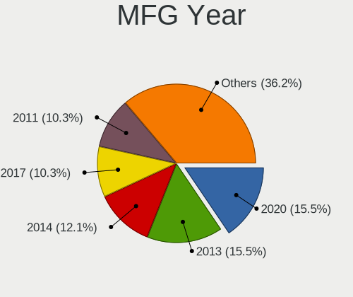

| Year | Notebooks | Percent |
|------|-----------|---------|
| 2020 | 9         | 15.52%  |
| 2013 | 8         | 13.79%  |
| 2014 | 7         | 12.07%  |
| 2017 | 5         | 8.62%   |
| 2011 | 5         | 8.62%   |
| 2019 | 4         | 6.9%    |
| 2015 | 4         | 6.9%    |
| 2012 | 4         | 6.9%    |
| 2009 | 4         | 6.9%    |
| 2018 | 2         | 3.45%   |
| 2016 | 2         | 3.45%   |
| 2010 | 2         | 3.45%   |
| 2008 | 1         | 1.72%   |
| 2007 | 1         | 1.72%   |

Form Factor
-----------

Physical design of the computer

| Name     | Notebooks | Percent |
|----------|-----------|---------|
| Notebook | 58        | 100%    |

Coreboot
--------

Have coreboot on board

| Used | Notebooks | Percent |
|------|-----------|---------|
| No   | 57        | 98.28%  |
| Yes  | 1         | 1.72%   |

RAM Size
--------

Total RAM memory

| Size in GB | Notebooks | Percent |
|------------|-----------|---------|
| 8.01-16.0  | 33        | 56.9%   |
| 4.01-8.0   | 11        | 18.97%  |
| 16.01-24.0 | 11        | 18.97%  |
| 24.01-32.0 | 2         | 3.45%   |
| 2.01-3.0   | 1         | 1.72%   |

RAM Used
--------

Used RAM memory

| Used GB  | Notebooks | Percent |
|----------|-----------|---------|
| 0.01-0.5 | 28        | 47.46%  |
| 0.51-1.0 | 25        | 42.37%  |
| 2.01-3.0 | 5         | 8.47%   |
| 1.01-2.0 | 1         | 1.69%   |

Total Drives
------------

Number of drives on board

| Drives | Notebooks | Percent |
|--------|-----------|---------|
| 1      | 43        | 74.14%  |
| 2      | 12        | 20.69%  |
| 0      | 3         | 5.17%   |

Has CD-ROM
----------

Has CD-ROM on board

| Presented | Notebooks | Percent |
|-----------|-----------|---------|
| No        | 35        | 60.34%  |
| Yes       | 23        | 39.66%  |

Has Ethernet
------------

Has Ethernet on board

| Presented | Notebooks | Percent |
|-----------|-----------|---------|
| Yes       | 52        | 89.66%  |
| No        | 6         | 10.34%  |

Has WiFi
--------

Has WiFi module

| Presented | Notebooks | Percent |
|-----------|-----------|---------|
| Yes       | 58        | 100%    |

Has Bluetooth
-------------

Has Bluetooth module

| Presented | Notebooks | Percent |
|-----------|-----------|---------|
| Yes       | 41        | 70.69%  |
| No        | 17        | 29.31%  |

Location
--------

Country
-------

Geographic location (country)

| Country     | Notebooks | Percent |
|-------------|-----------|---------|
| USA         | 13        | 22.41%  |
| France      | 5         | 8.62%   |
| UK          | 4         | 6.9%    |
| Poland      | 4         | 6.9%    |
| Germany     | 4         | 6.9%    |
| Spain       | 3         | 5.17%   |
| Russia      | 3         | 5.17%   |
| New Zealand | 3         | 5.17%   |
| Philippines | 2         | 3.45%   |
| Italy       | 2         | 3.45%   |
| Finland     | 2         | 3.45%   |
| Ukraine     | 1         | 1.72%   |
| Switzerland | 1         | 1.72%   |
| Sweden      | 1         | 1.72%   |
| Serbia      | 1         | 1.72%   |
| Portugal    | 1         | 1.72%   |
| Norway      | 1         | 1.72%   |
| Namibia     | 1         | 1.72%   |
| Japan       | 1         | 1.72%   |
| Hong Kong   | 1         | 1.72%   |
| Greece      | 1         | 1.72%   |
| Egypt       | 1         | 1.72%   |
| Brazil      | 1         | 1.72%   |
| Argentina   | 1         | 1.72%   |

City
----

Geographic location (city)

| City                | Notebooks | Percent |
|---------------------|-----------|---------|
| Franconville        | 3         | 5%      |
| Chrusty             | 3         | 5%      |
| London              | 2         | 3.33%   |
| Giessen             | 2         | 3.33%   |
| Clemmons            | 2         | 3.33%   |
| Yokohama            | 1         | 1.67%   |
| Yaroslavl           | 1         | 1.67%   |
| Whittier            | 1         | 1.67%   |
| Wenatchee           | 1         | 1.67%   |
| Taita               | 1         | 1.67%   |
| Stiring-Wendel      | 1         | 1.67%   |
| Sollentuna          | 1         | 1.67%   |
| Santo Tomas         | 1         | 1.67%   |
| Salem               | 1         | 1.67%   |
| Rome                | 1         | 1.67%   |
| Rochester           | 1         | 1.67%   |
| Richmond            | 1         | 1.67%   |
| Resistencia         | 1         | 1.67%   |
| Peoria              | 1         | 1.67%   |
| Oslo                | 1         | 1.67%   |
| Oshakati            | 1         | 1.67%   |
| Moscow              | 1         | 1.67%   |
| Milan               | 1         | 1.67%   |
| Marysville          | 1         | 1.67%   |
| Makati City         | 1         | 1.67%   |
| Lutz                | 1         | 1.67%   |
| Lenzburg            | 1         | 1.67%   |
| Kyiv                | 1         | 1.67%   |
| Krasnoyarsk         | 1         | 1.67%   |
| Jyväskylä     | 1         | 1.67%   |
| Huddersfield        | 1         | 1.67%   |
| Hamilton            | 1         | 1.67%   |
| Hamburg             | 1         | 1.67%   |
| Grajewo             | 1         | 1.67%   |
| Giza                | 1         | 1.67%   |
| Fiumicino           | 1         | 1.67%   |
| Estoril             | 1         | 1.67%   |
| Estacada            | 1         | 1.67%   |
| Espoo               | 1         | 1.67%   |
| Englewood           | 1         | 1.67%   |
| Clichy-sous-Bois    | 1         | 1.67%   |
| City of Westminster | 1         | 1.67%   |
| Christchurch        | 1         | 1.67%   |
| Central             | 1         | 1.67%   |
| Carcer              | 1         | 1.67%   |
| Cambre              | 1         | 1.67%   |
| Cairo               | 1         | 1.67%   |
| Bensheim            | 1         | 1.67%   |
| Beniarjo            | 1         | 1.67%   |
| Belgrade            | 1         | 1.67%   |
| Athens              | 1         | 1.67%   |
| Atascadero          | 1         | 1.67%   |
| Aracaju             | 1         | 1.67%   |

Drives
------

Drive Vendor
------------

Hard drive vendors

| Vendor              | Notebooks | Drives | Percent |
|---------------------|-----------|--------|---------|
| Samsung Electronics | 16        | 23     | 23.53%  |
| WDC                 | 9         | 9      | 13.24%  |
| Seagate             | 7         | 11     | 10.29%  |
| SanDisk             | 6         | 6      | 8.82%   |
| Kingston            | 5         | 5      | 7.35%   |
| Crucial             | 4         | 5      | 5.88%   |
| Toshiba             | 3         | 4      | 4.41%   |
| Hitachi             | 3         | 3      | 4.41%   |
| SK hynix            | 2         | 2      | 2.94%   |
| PNY                 | 2         | 2      | 2.94%   |
| Micron Technology   | 2         | 2      | 2.94%   |
| Plextor             | 1         | 1      | 1.47%   |
| Patriot             | 1         | 1      | 1.47%   |
| Netac               | 1         | 1      | 1.47%   |
| LITEONIT            | 1         | 1      | 1.47%   |
| KingSpec            | 1         | 1      | 1.47%   |
| HGST                | 1         | 1      | 1.47%   |
| Goodram             | 1         | 1      | 1.47%   |
| Gigabyte Technology | 1         | 1      | 1.47%   |
| Fujitsu             | 1         | 1      | 1.47%   |

Drive Model
-----------

Hard drive models

| Model                                | Notebooks | Percent |
|--------------------------------------|-----------|---------|
| Seagate ST1000LM035-1RK172 1TB       | 2         | 2.9%    |
| Samsung SSD 860 QVO 1TB              | 2         | 2.9%    |
| Samsung SSD 850 EVO 250GB            | 2         | 2.9%    |
| WDC WDS240G2G0A-00JH30 240GB         | 1         | 1.45%   |
| WDC WDS120G2G0A-00JH30 120GB         | 1         | 1.45%   |
| WDC WDS100T1B0A-00H9H0 1TB           | 1         | 1.45%   |
| WDC WD7500BPVT-80HXZT3 752GB         | 1         | 1.45%   |
| WDC WD6400BEVT-22A0RT0 640GB         | 1         | 1.45%   |
| WDC WD3200LPVX-75V0TT0 320GB         | 1         | 1.45%   |
| WDC WD10SPZX-21Z10T0 1TB             | 1         | 1.45%   |
| WDC WD10JPVX-22JC3T0 1TB             | 1         | 1.45%   |
| WDC PC SN520 SDAPMUW-128G-1101 128GB | 1         | 1.45%   |
| Toshiba THNSF5256GPUK 256GB          | 1         | 1.45%   |
| Toshiba MQ04ABF100 1TB               | 1         | 1.45%   |
| Toshiba MQ01ACF032 320GB             | 1         | 1.45%   |
| SK hynix SC311 SATA 512GB            | 1         | 1.45%   |
| SK hynix HFM256GDJTNG-8310A 256GB    | 1         | 1.45%   |
| Seagate ST9250410AS 250GB            | 1         | 1.45%   |
| Seagate ST500LM030-2E717D 500GB      | 1         | 1.45%   |
| Seagate ST500LM021-1KJ152 500GB      | 1         | 1.45%   |
| Seagate ST1000LM049-2GH172 1TB       | 1         | 1.45%   |
| Seagate ST1000LM048-2E7172 1TB       | 1         | 1.45%   |
| Seagate ST1000LM014-1EJ164 1TB       | 1         | 1.45%   |
| SanDisk SSD U110 16GB                | 1         | 1.45%   |
| SanDisk SSD PLUS 240GB               | 1         | 1.45%   |
| SanDisk SSD PLUS 1000GB              | 1         | 1.45%   |
| SanDisk SDSSDH3512G 512GB            | 1         | 1.45%   |
| SanDisk SDSSDA240G 240GB             | 1         | 1.45%   |
| SanDisk SD8SNAT-128G-1006 128GB      | 1         | 1.45%   |
| Samsung SSD 970 EVO Plus 250GB       | 1         | 1.45%   |
| Samsung SSD 970 EVO 250GB            | 1         | 1.45%   |
| Samsung SSD 950 PRO 512GB            | 1         | 1.45%   |
| Samsung SSD 860 PRO 512GB            | 1         | 1.45%   |
| Samsung SSD 860 EVO 500GB            | 1         | 1.45%   |
| Samsung SSD 860 EVO 1TB              | 1         | 1.45%   |
| Samsung SSD 850 PRO 1TB              | 1         | 1.45%   |
| Samsung PM981 NVMe 256GB             | 1         | 1.45%   |
| Samsung MZVLB256HAHQ-000L2 256GB     | 1         | 1.45%   |
| Samsung MZNTE128HMGR-000SO 128GB     | 1         | 1.45%   |
| Samsung MZNLN256HAJQ-000L7 256GB     | 1         | 1.45%   |
| Samsung HM500JJ 500GB                | 1         | 1.45%   |
| PNY CS900 240GB SSD                  | 1         | 1.45%   |
| PNY CS1311 480GB SSD                 | 1         | 1.45%   |
| Plextor PH6-CE240 240GB              | 1         | 1.45%   |
| Patriot Burst 240GB                  | 1         | 1.45%   |
| Netac SSD 256GB                      | 1         | 1.45%   |
| Micron MTFDDAV256TDL-1AW1ZABHA 256GB | 1         | 1.45%   |
| Micron 1100 SATA 256GB               | 1         | 1.45%   |
| LITEONIT LGT-128M6G 128GB            | 1         | 1.45%   |
| Kingston SUV400S37240G 240GB         | 1         | 1.45%   |
| Kingston SUV400S37120G 120GB         | 1         | 1.45%   |
| Kingston SA400S37960G 960GB          | 1         | 1.45%   |
| Kingston SA400S37480G 480GB          | 1         | 1.45%   |
| Kingston SA400S37120G 120GB          | 1         | 1.45%   |
| KingSpec Q-720 720GB                 | 1         | 1.45%   |
| Hitachi HTS725050A7E630 500GB        | 1         | 1.45%   |
| Hitachi HTS545025B9SA02 250GB        | 1         | 1.45%   |
| Hitachi HTS543225L9A300 250GB        | 1         | 1.45%   |
| HGST HTS725050A7E630 500GB           | 1         | 1.45%   |
| Goodram SSDPR-CX400-256-G2 256GB     | 1         | 1.45%   |

HDD Vendor
----------

Hard disk drive vendors

| Vendor              | Notebooks | Drives | Percent |
|---------------------|-----------|--------|---------|
| Seagate             | 7         | 11     | 35%     |
| WDC                 | 5         | 5      | 25%     |
| Hitachi             | 3         | 3      | 15%     |
| Toshiba             | 2         | 2      | 10%     |
| Samsung Electronics | 1         | 1      | 5%      |
| HGST                | 1         | 1      | 5%      |
| Fujitsu             | 1         | 1      | 5%      |

SSD Vendor
----------

Solid state drive vendors

| Vendor              | Notebooks | Drives | Percent |
|---------------------|-----------|--------|---------|
| Samsung Electronics | 10        | 17     | 25.64%  |
| SanDisk             | 6         | 6      | 15.38%  |
| Kingston            | 5         | 5      | 12.82%  |
| Crucial             | 4         | 5      | 10.26%  |
| WDC                 | 3         | 3      | 7.69%   |
| PNY                 | 2         | 2      | 5.13%   |
| Micron Technology   | 2         | 2      | 5.13%   |
| SK hynix            | 1         | 1      | 2.56%   |
| Plextor             | 1         | 1      | 2.56%   |
| Patriot             | 1         | 1      | 2.56%   |
| Netac               | 1         | 1      | 2.56%   |
| LITEONIT            | 1         | 1      | 2.56%   |
| KingSpec            | 1         | 1      | 2.56%   |
| Goodram             | 1         | 1      | 2.56%   |

Drive Kind
----------

HDD or SSD

| Kind | Notebooks | Drives | Percent |
|------|-----------|--------|---------|
| SSD  | 34        | 47     | 54.84%  |
| HDD  | 19        | 24     | 30.65%  |
| NVMe | 9         | 10     | 14.52%  |

Drive Connector
---------------

SATA, SAS, NVMe, etc.

| Type | Notebooks | Drives | Percent |
|------|-----------|--------|---------|
| SATA | 50        | 71     | 84.75%  |
| NVMe | 9         | 10     | 15.25%  |

Drive Size
----------

Size of hard drive

| Size in TB | Notebooks | Drives | Percent |
|------------|-----------|--------|---------|
| 0.01-0.5   | 34        | 40     | 64.15%  |
| 0.51-1.0   | 17        | 28     | 32.08%  |
| 1.01-2.0   | 2         | 3      | 3.77%   |

Space Total
-----------

Amount of disk space available on the file system

| Size in GB | Notebooks | Percent |
|------------|-----------|---------|
| 101-250    | 19        | 32.2%   |
| 1-20       | 12        | 20.34%  |
| 251-500    | 11        | 18.64%  |
| 501-1000   | 7         | 11.86%  |
| 51-100     | 5         | 8.47%   |
| Unknown    | 5         | 8.47%   |

Space Used
----------

Amount of used disk space

| Used GB | Notebooks | Percent |
|---------|-----------|---------|
| 1-20    | 53        | 86.89%  |
| Unknown | 5         | 8.2%    |
| 21-50   | 3         | 4.92%   |

Malfunc. Drives
---------------

Drive models with a malfunction

| Model                                           | Notebooks | Drives | Percent |
|-------------------------------------------------|-----------|--------|---------|
| WDC WD6400BEVT-22A0RT0 640GB                    | 1         | 1      | 14.29%  |
| WDC WD3200LPVX-75V0TT0 320GB                    | 1         | 1      | 14.29%  |
| Toshiba MQ01ACF032 320GB                        | 1         | 1      | 14.29%  |
| Seagate ST500LM021-1KJ152 500GB                 | 1         | 1      | 14.29%  |
| Samsung Electronics MZNTE128HMGR-000SO 128GB    | 1         | 1      | 14.29%  |
| Micron Technology MTFDDAV256TDL-1AW1ZABHA 256GB | 1         | 1      | 14.29%  |
| Hitachi HTS543225L9A300 250GB                   | 1         | 1      | 14.29%  |

Malfunc. Drive Vendor
---------------------

Vendors of faulty drives

| Vendor              | Notebooks | Drives | Percent |
|---------------------|-----------|--------|---------|
| WDC                 | 2         | 2      | 28.57%  |
| Toshiba             | 1         | 1      | 14.29%  |
| Seagate             | 1         | 1      | 14.29%  |
| Samsung Electronics | 1         | 1      | 14.29%  |
| Micron Technology   | 1         | 1      | 14.29%  |
| Hitachi             | 1         | 1      | 14.29%  |

Malfunc. HDD Vendor
-------------------

Vendors of faulty HDD drives

| Vendor  | Notebooks | Drives | Percent |
|---------|-----------|--------|---------|
| WDC     | 2         | 2      | 40%     |
| Toshiba | 1         | 1      | 20%     |
| Seagate | 1         | 1      | 20%     |
| Hitachi | 1         | 1      | 20%     |

Malfunc. Drive Kind
-------------------

Kinds of faulty drives

| Kind | Notebooks | Drives | Percent |
|------|-----------|--------|---------|
| HDD  | 5         | 5      | 71.43%  |
| SSD  | 2         | 2      | 28.57%  |

Failed Drives
-------------

Failed drive models

Zero info for selected period =(

Failed Drive Vendor
-------------------

Failed drive vendors

Zero info for selected period =(

Drive Status
------------

Number of failed and malfunc. drives

| Status  | Notebooks | Drives | Percent |
|---------|-----------|--------|---------|
| Works   | 49        | 74     | 87.5%   |
| Malfunc | 7         | 7      | 12.5%   |

Storage controller
------------------

Storage Vendor
--------------

Storage controller vendors

| Vendor              | Notebooks | Percent |
|---------------------|-----------|---------|
| Intel               | 44        | 67.69%  |
| AMD                 | 9         | 13.85%  |
| Samsung Electronics | 5         | 7.69%   |
| Nvidia              | 3         | 4.62%   |
| Toshiba             | 1         | 1.54%   |
| SK hynix            | 1         | 1.54%   |
| SanDisk             | 1         | 1.54%   |
| Phison Electronics  | 1         | 1.54%   |

Storage Model
-------------

Storage controller models

| Model                                                                        | Notebooks | Percent |
|------------------------------------------------------------------------------|-----------|---------|
| Intel 8 Series SATA Controller 1 [AHCI mode]                                 | 8         | 12.12%  |
| Intel 7 Series Chipset Family 6-port SATA Controller [AHCI mode]             | 8         | 12.12%  |
| Intel 6 Series/C200 Series Chipset Family 6 port Mobile SATA AHCI Controller | 7         | 10.61%  |
| AMD FCH SATA Controller [AHCI mode]                                          | 7         | 10.61%  |
| Intel Sunrise Point-LP SATA Controller [AHCI mode]                           | 6         | 9.09%   |
| Samsung NVMe SSD Controller SM981/PM981/PM983                                | 4         | 6.06%   |
| Nvidia MCP79 AHCI Controller                                                 | 3         | 4.55%   |
| Intel Wildcat Point-LP SATA Controller [AHCI Mode]                           | 3         | 4.55%   |
| Intel 82801 Mobile SATA Controller [RAID mode]                               | 3         | 4.55%   |
| Intel HM170/QM170 Chipset SATA Controller [AHCI Mode]                        | 2         | 3.03%   |
| Intel 82801IBM/IEM (ICH9M/ICH9M-E) 4 port SATA Controller [AHCI mode]        | 2         | 3.03%   |
| Toshiba XG4 NVMe SSD Controller                                              | 1         | 1.52%   |
| SK hynix BC501 NVMe Solid State Drive                                        | 1         | 1.52%   |
| SanDisk PC SN520 NVMe SSD                                                    | 1         | 1.52%   |
| Samsung NVMe SSD Controller SM951/PM951                                      | 1         | 1.52%   |
| Phison PS5013 E13 NVMe Controller                                            | 1         | 1.52%   |
| Intel Celeron N3350/Pentium N4200/Atom E3900 Series SATA AHCI Controller     | 1         | 1.52%   |
| Intel Cannon Point-LP SATA Controller [AHCI Mode]                            | 1         | 1.52%   |
| Intel Cannon Lake Mobile PCH SATA AHCI Controller                            | 1         | 1.52%   |
| Intel 82801GBM/GHM (ICH7-M Family) SATA Controller [IDE mode]                | 1         | 1.52%   |
| Intel 82801G (ICH7 Family) IDE Controller                                    | 1         | 1.52%   |
| Intel 5 Series/3400 Series Chipset 4 port SATA AHCI Controller               | 1         | 1.52%   |
| AMD SB7x0/SB8x0/SB9x0 SATA Controller [AHCI mode]                            | 1         | 1.52%   |
| AMD FCH SATA Controller [IDE mode]                                           | 1         | 1.52%   |

Storage Kind
------------

Kind of storage controller (IDE, SATA, NVMe, SAS, ...)

| Kind | Notebooks | Percent |
|------|-----------|---------|
| SATA | 51        | 78.46%  |
| NVMe | 9         | 13.85%  |
| RAID | 3         | 4.62%   |
| IDE  | 2         | 3.08%   |

Processor
---------

CPU Vendor
----------

Processor vendors

| Vendor | Notebooks | Percent |
|--------|-----------|---------|
| Intel  | 49        | 84.48%  |
| AMD    | 9         | 15.52%  |

CPU Model
---------

Processor models

| Model                                         | Notebooks | Percent |
|-----------------------------------------------|-----------|---------|
| Intel Core i5-3320M CPU @ 2.60GHz             | 3         | 5.17%   |
| Intel Core i7-3520M CPU @ 2.90GHz             | 2         | 3.45%   |
| Intel Core i5-7200U CPU @ 2.50GHz             | 2         | 3.45%   |
| Intel Core i5-6300U CPU @ 2.40GHz             | 2         | 3.45%   |
| Intel Core i5-5300U CPU @ 2.30GHz             | 2         | 3.45%   |
| Intel Core i5-3230M CPU @ 2.60GHz             | 2         | 3.45%   |
| Intel Core i5-2520M CPU @ 2.50GH              | 2         | 3.45%   |
| Intel Core 2 Duo CPU P7550 @ 2.26GHz          | 2         | 3.45%   |
| AMD A4-9125 RADEON R3, 4 COMPUTE CORES 2C+2G  | 2         | 3.45%   |
| Intel Pentium 3558U @ 1.70GHz                 | 1         | 1.72%   |
| Intel Genuine CPU                             | 1         | 1.72%   |
| Intel Core i7-8565U CPU @ 1.80GHz             | 1         | 1.72%   |
| Intel Core i7-8550U CPU @ 1.80GHz             | 1         | 1.72%   |
| Intel Core i7-6700HQ CPU @ 2.60GHz            | 1         | 1.72%   |
| Intel Core i7-6500U CPU @ 2.50GHz             | 1         | 1.72%   |
| Intel Core i7-4500U CPU @ 1.80GHz             | 1         | 1.72%   |
| Intel Core i7-3720QM CPU @ 2.60GHz            | 1         | 1.72%   |
| Intel Core i7-3630QM CPU @ 2.40GHz            | 1         | 1.72%   |
| Intel Core i7-2670QM CPU @ 2.20GHz            | 1         | 1.72%   |
| Intel Core i5-8300H CPU @ 2.30GHz             | 1         | 1.72%   |
| Intel Core i5-8250U CPU @ 1.60GHz             | 1         | 1.72%   |
| Intel Core i5-7300U CPU @ 2.60GHz             | 1         | 1.72%   |
| Intel Core i5-7300HQ CPU @ 2.50GHz            | 1         | 1.72%   |
| Intel Core i5-5200U CPU @ 2.20GHz             | 1         | 1.72%   |
| Intel Core i5-4310U CPU @ 2.00GHz             | 1         | 1.72%   |
| Intel Core i5-4300U CPU @ 1.90GHz             | 1         | 1.72%   |
| Intel Core i5-4210U CPU @ 1.70GHz             | 1         | 1.72%   |
| Intel Core i5-4200U CPU @ 1.60GHz             | 1         | 1.72%   |
| Intel Core i5-2520M CPU @ 2.50GHz             | 1         | 1.72%   |
| Intel Core i5-2430M CPU @ 2.40GH              | 1         | 1.72%   |
| Intel Core i5-2410M CPU @ 2.30GHz             | 1         | 1.72%   |
| Intel Core i5-10210U CPU @ 1.60GHz            | 1         | 1.72%   |
| Intel Core i3-4010U CPU @ 1.70GHz             | 1         | 1.72%   |
| Intel Core i3-4005U CPU @ 1.70GHz             | 1         | 1.72%   |
| Intel Core i3-2330M CPU @ 2.20GHz             | 1         | 1.72%   |
| Intel Core 2 Duo CPU T9300 @ 2.50GHz          | 1         | 1.72%   |
| Intel Core 2 Duo CPU P8600 @ 2.40GHz          | 1         | 1.72%   |
| Intel Core 2 Duo CPU P7350 @ 2.00GHz          | 1         | 1.72%   |
| Intel Core 2 CPU T7400 @ 2.16GHz              | 1         | 1.72%   |
| Intel Celeron CPU N3350 @ 1.10GHz             | 1         | 1.72%   |
| Intel Celeron 2955U @ 1.40GHz                 | 1         | 1.72%   |
| AMD Ryzen 7 3700U with Radeon Vega Mobile Gfx | 1         | 1.72%   |
| AMD Ryzen 5 3500U with Radeon Vega Mobile Gfx | 1         | 1.72%   |
| AMD Ryzen 5 3450U with Radeon Vega Mobile Gfx | 1         | 1.72%   |
| AMD Ryzen 3 3200U with Radeon Vega Mobile Gfx | 1         | 1.72%   |
| AMD New Processor Technology                  | 1         | 1.72%   |
| AMD A6-6310 APU with AMD Radeon R4 Graphics   | 1         | 1.72%   |
| AMD A6-3420M APU with Radeon HD Graphics      | 1         | 1.72%   |

CPU Model Family
----------------

Processor model prefix

| Model            | Notebooks | Percent |
|------------------|-----------|---------|
| Intel Core i5    | 26        | 44.83%  |
| Intel Core i7    | 10        | 17.24%  |
| Intel Core 2 Duo | 5         | 8.62%   |
| Intel Core i3    | 3         | 5.17%   |
| Intel Celeron    | 2         | 3.45%   |
| AMD Ryzen 5      | 2         | 3.45%   |
| AMD A6           | 2         | 3.45%   |
| AMD A4           | 2         | 3.45%   |
| Other            | 1         | 1.72%   |
| Intel Pentium    | 1         | 1.72%   |
| Intel Genuine    | 1         | 1.72%   |
| Intel Core 2     | 1         | 1.72%   |
| AMD Ryzen 7      | 1         | 1.72%   |
| AMD Ryzen 3      | 1         | 1.72%   |

CPU Cores
---------

Number of processor cores

| Number  | Notebooks | Percent |
|---------|-----------|---------|
| 2       | 37        | 63.79%  |
| 4       | 13        | 22.41%  |
| Unknown | 5         | 8.62%   |
| 8       | 3         | 5.17%   |

CPU Sockets
-----------

Number of sockets

| Number | Notebooks | Percent |
|--------|-----------|---------|
| 1      | 55        | 94.83%  |
| 2      | 3         | 5.17%   |

CPU Threads
-----------

Threads per core (Hyper-Threading)

| Number  | Notebooks | Percent |
|---------|-----------|---------|
| 2       | 39        | 67.24%  |
| 1       | 14        | 24.14%  |
| Unknown | 5         | 8.62%   |

CPU Microarch
-------------

Microarchitecture

| Name        | Notebooks | Percent |
|-------------|-----------|---------|
| KabyLake    | 9         | 15.52%  |
| IvyBridge   | 9         | 15.52%  |
| Haswell     | 9         | 15.52%  |
| SandyBridge | 7         | 12.07%  |
| Penryn      | 5         | 8.62%   |
| Zen+        | 4         | 6.9%    |
| Skylake     | 4         | 6.9%    |
| Broadwell   | 3         | 5.17%   |
| Excavator   | 2         | 3.45%   |
| Westmere    | 1         | 1.72%   |
| Puma        | 1         | 1.72%   |
| K10 Llano   | 1         | 1.72%   |
| K10         | 1         | 1.72%   |
| Goldmont    | 1         | 1.72%   |
| Core        | 1         | 1.72%   |

Graphics
--------

GPU Vendor
----------

Vendors of graphics cards

| Vendor | Notebooks | Percent |
|--------|-----------|---------|
| Intel  | 45        | 64.29%  |
| Nvidia | 14        | 20%     |
| AMD    | 11        | 15.71%  |

GPU Model
---------

Graphics card models

| Model                                                                         | Notebooks | Percent |
|-------------------------------------------------------------------------------|-----------|---------|
| Intel Haswell-ULT Integrated Graphics Controller                              | 9         | 12.5%   |
| Intel 3rd Gen Core processor Graphics Controller                              | 9         | 12.5%   |
| Intel 2nd Generation Core Processor Family Integrated Graphics Controller     | 7         | 9.72%   |
| AMD Picasso/Raven 2 [Radeon Vega Series / Radeon Vega Mobile Series]          | 4         | 5.56%   |
| Nvidia C79 [GeForce 9400M]                                                    | 3         | 4.17%   |
| Intel Skylake GT2 [HD Graphics 520]                                           | 3         | 4.17%   |
| Intel HD Graphics 620                                                         | 3         | 4.17%   |
| Intel HD Graphics 5500                                                        | 3         | 4.17%   |
| Nvidia GF117M [GeForce 610M/710M/810M/820M / GT 620M/625M/630M/720M]          | 2         | 2.78%   |
| Intel UHD Graphics 620                                                        | 2         | 2.78%   |
| AMD Stoney [Radeon R2/R3/R4/R5 Graphics]                                      | 2         | 2.78%   |
| Nvidia GP107M [GeForce GTX 1050 Ti Mobile]                                    | 1         | 1.39%   |
| Nvidia GP107M [GeForce GTX 1050 Mobile]                                       | 1         | 1.39%   |
| Nvidia GM206M [GeForce GTX 965M]                                              | 1         | 1.39%   |
| Nvidia GM108M [GeForce MX130]                                                 | 1         | 1.39%   |
| Nvidia GM107 [GeForce 940MX]                                                  | 1         | 1.39%   |
| Nvidia GK208BM [GeForce 920M]                                                 | 1         | 1.39%   |
| Nvidia GK107M [GeForce GT 650M]                                               | 1         | 1.39%   |
| Nvidia GF119M [GeForce 610M]                                                  | 1         | 1.39%   |
| Nvidia GF108GLM [NVS 5200M]                                                   | 1         | 1.39%   |
| Intel WhiskeyLake-U GT2 [UHD Graphics 620]                                    | 1         | 1.39%   |
| Intel Mobile 945GM/GMS/GME, 943/940GML Express Integrated Graphics Controller | 1         | 1.39%   |
| Intel Mobile 945GM/GMS, 943/940GML Express Integrated Graphics Controller     | 1         | 1.39%   |
| Intel Mobile 4 Series Chipset Integrated Graphics Controller                  | 1         | 1.39%   |
| Intel HD Graphics 630                                                         | 1         | 1.39%   |
| Intel HD Graphics 530                                                         | 1         | 1.39%   |
| Intel HD Graphics 500                                                         | 1         | 1.39%   |
| Intel Core Processor Integrated Graphics Controller                           | 1         | 1.39%   |
| Intel CometLake-U GT2 [UHD Graphics]                                          | 1         | 1.39%   |
| Intel CoffeeLake-H GT2 [UHD Graphics 630]                                     | 1         | 1.39%   |
| AMD Sumo [Radeon HD 6520G]                                                    | 1         | 1.39%   |
| AMD RV710/M92 [Mobility Radeon HD 4530/4570/545v]                             | 1         | 1.39%   |
| AMD RV635/M86 [Mobility Radeon HD 3650]                                       | 1         | 1.39%   |
| AMD Mullins [Radeon R4/R5 Graphics]                                           | 1         | 1.39%   |
| AMD Mars [Radeon HD 8670A/8670M/8750M / R7 M370]                              | 1         | 1.39%   |
| AMD Jet XT [Radeon R5 M240]                                                   | 1         | 1.39%   |

GPU Combo
---------

Combinations of graphics cards

| Name           | Notebooks | Percent |
|----------------|-----------|---------|
| 1 x Intel      | 31        | 53.45%  |
| Intel + Nvidia | 11        | 18.97%  |
| 1 x AMD        | 9         | 15.52%  |
| 1 x Nvidia     | 3         | 5.17%   |
| 2 x Intel      | 2         | 3.45%   |
| 2 x AMD        | 1         | 1.72%   |
| Intel + AMD    | 1         | 1.72%   |

GPU Driver
----------

Free vs proprietary

| Driver      | Notebooks | Percent |
|-------------|-----------|---------|
| Free        | 56        | 96.55%  |
| Proprietary | 2         | 3.45%   |

GPU Memory
----------

Total video memory

| Size in GB | Notebooks | Percent |
|------------|-----------|---------|
| Unknown    | 51        | 87.93%  |
| 0.01-0.5   | 3         | 5.17%   |
| 1.01-2.0   | 2         | 3.45%   |
| 3.01-4.0   | 1         | 1.72%   |
| 0.51-1.0   | 1         | 1.72%   |

Monitor
-------

Monitor Vendor
--------------

Monitor vendors

| Vendor              | Notebooks | Percent |
|---------------------|-----------|---------|
| LG Display          | 10        | 19.23%  |
| AU Optronics        | 10        | 19.23%  |
| Chimei Innolux      | 9         | 17.31%  |
| Samsung Electronics | 8         | 15.38%  |
| BOE                 | 4         | 7.69%   |
| ___                 | 1         | 1.92%   |
| Philips             | 1         | 1.92%   |
| PANDA               | 1         | 1.92%   |
| Panasonic           | 1         | 1.92%   |
| Lenovo              | 1         | 1.92%   |
| InfoVision          | 1         | 1.92%   |
| IBM                 | 1         | 1.92%   |
| Hewlett-Packard     | 1         | 1.92%   |
| Dell                | 1         | 1.92%   |
| CSO                 | 1         | 1.92%   |
| BenQ                | 1         | 1.92%   |

Monitor Model
-------------

Monitor models

| Model                                                                | Notebooks | Percent |
|----------------------------------------------------------------------|-----------|---------|
| LG Display LCD Monitor LGD0456 1366x768 340x190mm 15.3-inch          | 2         | 3.77%   |
| LG Display LCD Monitor LGD0335 1366x768 310x170mm 13.9-inch          | 2         | 3.77%   |
| Chimei Innolux LCD Monitor CMN14C9 1920x1080 310x170mm 13.9-inch     | 2         | 3.77%   |
| AU Optronics LCD Monitor AUO21EC 1366x768 340x190mm 15.3-inch        | 2         | 3.77%   |
| ___ MY TV LED TV ___0101 1920x1080                                   | 1         | 1.89%   |
| Samsung Electronics SyncMaster SAM03E4 1680x1050 470x300mm 22.0-inch | 1         | 1.89%   |
| Samsung Electronics SyncMaster SAM010B 1280x1024 340x270mm 17.1-inch | 1         | 1.89%   |
| Samsung Electronics LCD Monitor SEC544B 1600x900 310x170mm 13.9-inch | 1         | 1.89%   |
| Samsung Electronics LCD Monitor SEC5441 1280x800 330x210mm 15.4-inch | 1         | 1.89%   |
| Samsung Electronics LCD Monitor SEC4542 1280x800 300x190mm 14.0-inch | 1         | 1.89%   |
| Samsung Electronics LCD Monitor SEC4251 1366x768 340x190mm 15.3-inch | 1         | 1.89%   |
| Samsung Electronics LCD Monitor SEC3150 1366x768 340x190mm 15.3-inch | 1         | 1.89%   |
| Samsung Electronics LCD Monitor SEC3047 1366x768 280x160mm 12.7-inch | 1         | 1.89%   |
| Samsung Electronics LCD Monitor SDC5441 1366x768 310x170mm 13.9-inch | 1         | 1.89%   |
| Philips PHL BDM4065 PHL08E1 3840x2160 880x490mm 39.7-inch            | 1         | 1.89%   |
| PANDA LCD Monitor NCP0040 1920x1080 340x190mm 15.3-inch              | 1         | 1.89%   |
| Panasonic VVX13F009G00 MEI96A2 1920x1080 290x170mm 13.2-inch         | 1         | 1.89%   |
| LG Display LCD Monitor LGD0558 1920x1080 310x170mm 13.9-inch         | 1         | 1.89%   |
| LG Display LCD Monitor LGD0533 1920x1080 340x190mm 15.3-inch         | 1         | 1.89%   |
| LG Display LCD Monitor LGD0430 1366x768 350x190mm 15.7-inch          | 1         | 1.89%   |
| LG Display LCD Monitor LGD042D 1920x1080 290x170mm 13.2-inch         | 1         | 1.89%   |
| LG Display LCD Monitor LGD02DC 1366x768 340x190mm 15.3-inch          | 1         | 1.89%   |
| LG Display LCD Monitor LGD01CA 1600x900 380x210mm 17.1-inch          | 1         | 1.89%   |
| Lenovo LCD Monitor LEN40B0 1366x768 340x190mm 15.3-inch              | 1         | 1.89%   |
| InfoVision LCD Monitor IVO04E3 1366x768 280x160mm 12.7-inch          | 1         | 1.89%   |
| IBM LCD Monitor IBM2887 1680x1050 330x210mm 15.4-inch                | 1         | 1.89%   |
| Hewlett-Packard 22w HPN342E 1920x1080 480x270mm 21.7-inch            | 1         | 1.89%   |
| Dell U3818DW DELA0F0 3840x1600 880x370mm 37.6-inch                   | 1         | 1.89%   |
| CSO LCD Monitor CSO1501 3840x2160 340x190mm 15.3-inch                | 1         | 1.89%   |
| Chimei Innolux LCD Monitor CMN1734 1600x900 380x210mm 17.1-inch      | 1         | 1.89%   |
| Chimei Innolux LCD Monitor CMN15DC 1366x768 340x190mm 15.3-inch      | 1         | 1.89%   |
| Chimei Innolux LCD Monitor CMN15DB 1366x768 340x190mm 15.3-inch      | 1         | 1.89%   |
| Chimei Innolux LCD Monitor CMN14E5 1920x1080 310x170mm 13.9-inch     | 1         | 1.89%   |
| Chimei Innolux LCD Monitor CMN1482 1600x900 310x170mm 13.9-inch      | 1         | 1.89%   |
| Chimei Innolux LCD Monitor CMN1471 1366x768 310x170mm 13.9-inch      | 1         | 1.89%   |
| Chimei Innolux LCD Monitor CMN1343 1920x1080 280x160mm 12.7-inch     | 1         | 1.89%   |
| BOE LCD Monitor BOE06FB 1920x1080 340x190mm 15.3-inch                | 1         | 1.89%   |
| BOE LCD Monitor BOE06C6 1920x1080 340x190mm 15.3-inch                | 1         | 1.89%   |
| BOE LCD Monitor BOE06A5 1366x768 340x190mm 15.3-inch                 | 1         | 1.89%   |
| BOE LCD Monitor BOE05F6 1366x768 310x170mm 13.9-inch                 | 1         | 1.89%   |
| BenQ RL2455 BNQ7F1C 1920x1080 530x300mm 24.0-inch                    | 1         | 1.89%   |
| AU Optronics LCD Monitor AUO71EC 1366x768 340x190mm 15.3-inch        | 1         | 1.89%   |
| AU Optronics LCD Monitor AUO48EC 1366x768 340x190mm 15.3-inch        | 1         | 1.89%   |
| AU Optronics LCD Monitor AUO46EC 1366x768 340x190mm 15.3-inch        | 1         | 1.89%   |
| AU Optronics LCD Monitor AUO38ED 1920x1080 340x190mm 15.3-inch       | 1         | 1.89%   |
| AU Optronics LCD Monitor AUO303E 1600x900 310x170mm 13.9-inch        | 1         | 1.89%   |
| AU Optronics LCD Monitor AUO26EC 1366x768 340x190mm 15.3-inch        | 1         | 1.89%   |
| AU Optronics LCD Monitor AUO213E 1600x900 310x170mm 13.9-inch        | 1         | 1.89%   |
| AU Optronics LCD Monitor AUO149E 1600x900 380x210mm 17.1-inch        | 1         | 1.89%   |

Monitor Resolution
------------------

Monitor screen resolution

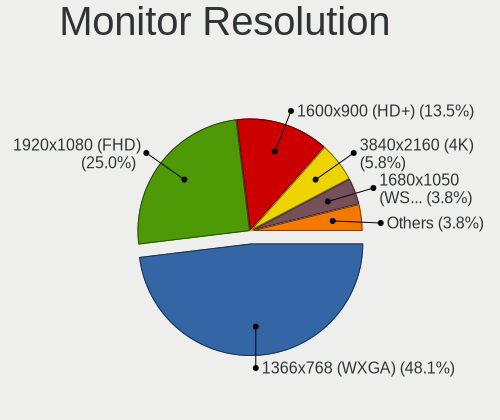

| Resolution         | Notebooks | Percent |
|--------------------|-----------|---------|
| 1366x768 (WXGA)    | 25        | 48.08%  |
| 1920x1080 (FHD)    | 13        | 25%     |
| 1600x900 (HD+)     | 7         | 13.46%  |
| 3840x2160 (4K)     | 2         | 3.85%   |
| 1680x1050 (WSXGA+) | 2         | 3.85%   |
| 3840x1600          | 1         | 1.92%   |
| 2880x1620          | 1         | 1.92%   |
| 1280x1024 (SXGA)   | 1         | 1.92%   |

Monitor Diagonal
----------------

Diagonal size in inches

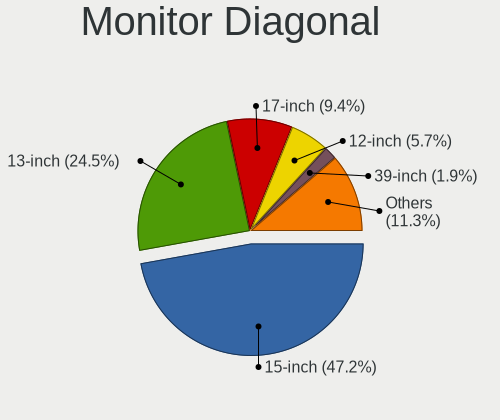

| Inches  | Notebooks | Percent |
|---------|-----------|---------|
| 15      | 26        | 49.06%  |
| 13      | 13        | 24.53%  |
| 17      | 4         | 7.55%   |
| 12      | 3         | 5.66%   |
| 39      | 1         | 1.89%   |
| 37      | 1         | 1.89%   |
| 24      | 1         | 1.89%   |
| 22      | 1         | 1.89%   |
| 21      | 1         | 1.89%   |
| 14      | 1         | 1.89%   |
| Unknown | 1         | 1.89%   |

Monitor Width
-------------

Physical width

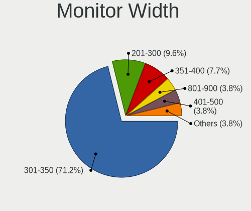

| Width in mm | Notebooks | Percent |
|-------------|-----------|---------|
| 301-350     | 38        | 73.08%  |
| 201-300     | 5         | 9.62%   |
| 351-400     | 3         | 5.77%   |
| 801-900     | 2         | 3.85%   |
| 401-500     | 2         | 3.85%   |
| 501-600     | 1         | 1.92%   |
| Unknown     | 1         | 1.92%   |

Aspect Ratio
------------

Proportional relationship between the width and the height

| Ratio | Notebooks | Percent |
|-------|-----------|---------|
| 16/9  | 43        | 87.76%  |
| 16/10 | 4         | 8.16%   |
| 5/4   | 1         | 2.04%   |
| 21/9  | 1         | 2.04%   |

Monitor Area
------------

Area in inch²

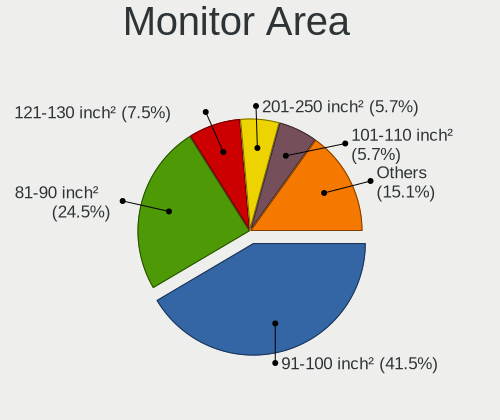

| Area in inch² | Notebooks | Percent |
|----------------|-----------|---------|
| 91-100         | 23        | 43.4%   |
| 81-90          | 13        | 24.53%  |
| 61-70          | 3         | 5.66%   |
| 201-250        | 3         | 5.66%   |
| 121-130        | 3         | 5.66%   |
| 101-110        | 3         | 5.66%   |
| 501-1000       | 2         | 3.77%   |
| 71-80          | 1         | 1.89%   |
| 141-150        | 1         | 1.89%   |
| Unknown        | 1         | 1.89%   |

Pixel Density
-------------

Pixels per inch

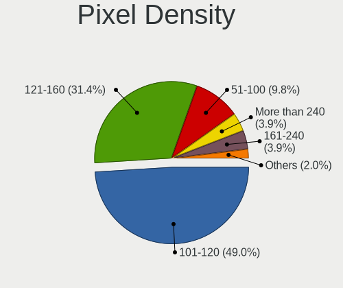

| Density       | Notebooks | Percent |
|---------------|-----------|---------|
| 101-120       | 25        | 49.02%  |
| 121-160       | 16        | 31.37%  |
| 51-100        | 5         | 9.8%    |
| 161-240       | 3         | 5.88%   |
| More than 240 | 1         | 1.96%   |
| Unknown       | 1         | 1.96%   |

Multiple Monitors
-----------------

Total monitors connected

| Total | Notebooks | Percent |
|-------|-----------|---------|
| 1     | 45        | 76.27%  |
| 0     | 8         | 13.56%  |
| 2     | 6         | 10.17%  |

Network
-------

Net Controller Vendor
---------------------

Controller vendors

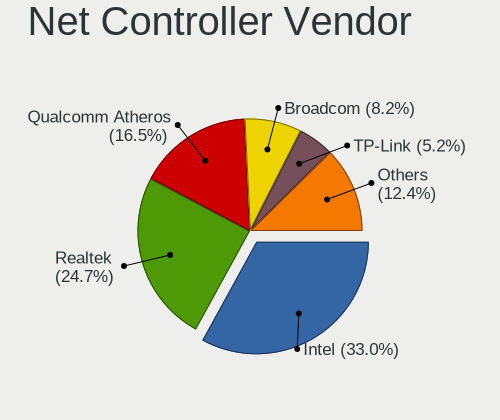

| Vendor                            | Notebooks | Percent |
|-----------------------------------|-----------|---------|
| Intel                             | 32        | 33.33%  |
| Realtek Semiconductor             | 24        | 25%     |
| Qualcomm Atheros                  | 16        | 16.67%  |
| Broadcom                          | 8         | 8.33%   |
| TP-Link                           | 5         | 5.21%   |
| Nvidia                            | 3         | 3.13%   |
| Ericsson Business Mobile Networks | 3         | 3.13%   |
| Ralink                            | 1         | 1.04%   |
| Qualcomm                          | 1         | 1.04%   |
| Marvell Technology Group          | 1         | 1.04%   |
| Edimax Technology                 | 1         | 1.04%   |
| ASUSTek Computer                  | 1         | 1.04%   |

Net Controller Model
--------------------

Controller models

| Model                                                                       | Notebooks | Percent |
|-----------------------------------------------------------------------------|-----------|---------|
| Realtek RTL8111/8168/8411 PCI Express Gigabit Ethernet Controller           | 15        | 12.3%   |
| Intel 82579LM Gigabit Network Connection (Lewisville)                       | 10        | 8.2%    |
| Qualcomm Atheros QCA9565 / AR9565 Wireless Network Adapter                  | 6         | 4.92%   |
| Realtek RTL810xE PCI Express Fast Ethernet controller                       | 5         | 4.1%    |
| Realtek RTL8821CE 802.11ac PCIe Wireless Network Adapter                    | 4         | 3.28%   |
| Qualcomm Atheros QCA9377 802.11ac Wireless Network Adapter                  | 4         | 3.28%   |
| Intel Wireless 8265 / 8275                                                  | 4         | 3.28%   |
| Intel Wireless 7260                                                         | 4         | 3.28%   |
| Intel Centrino Advanced-N 6205 [Taylor Peak]                                | 4         | 3.28%   |
| Realtek RTL8188CE 802.11b/g/n WiFi Adapter                                  | 3         | 2.46%   |
| Nvidia MCP79 Ethernet                                                       | 3         | 2.46%   |
| Intel Wireless 7265                                                         | 3         | 2.46%   |
| Intel Ethernet Connection (4) I219-LM                                       | 3         | 2.46%   |
| TP-Link AC600 wireless Realtek RTL8811AU [Archer T2U Nano]                  | 2         | 1.64%   |
| Qualcomm Atheros AR928X Wireless Network Adapter (PCI-Express)              | 2         | 1.64%   |
| Intel Wireless 8260                                                         | 2         | 1.64%   |
| Intel Ethernet Connection I218-LM                                           | 2         | 1.64%   |
| Intel Ethernet Connection (3) I218-LM                                       | 2         | 1.64%   |
| Intel Centrino Ultimate-N 6300                                              | 2         | 1.64%   |
| Intel Centrino Advanced-N 6235                                              | 2         | 1.64%   |
| Broadcom BCM4322 802.11a/b/g/n Wireless LAN Controller                      | 2         | 1.64%   |
| Broadcom BCM4313 802.11bgn Wireless Network Adapter                         | 2         | 1.64%   |
| TP-Link TP-Link High Power Wireless USB Adapter                             | 1         | 0.82%   |
| TP-Link TL-WN823N v2/v3 [Realtek RTL8192EU]                                 | 1         | 0.82%   |
| TP-Link TL-WN722N v2/v3 [Realtek RTL8188EUS]                                | 1         | 0.82%   |
| Realtek RTL8723DE Wireless Network Adapter                                  | 1         | 0.82%   |
| Realtek RTL8191SEvB Wireless LAN Controller                                 | 1         | 0.82%   |
| Realtek Realtek Bluetooth 4.2 Adapter                                       | 1         | 0.82%   |
| Ralink RT5390 Wireless 802.11n 1T/1R PCIe                                   | 1         | 0.82%   |
| Qualcomm Atheros AR9485 Wireless Network Adapter                            | 1         | 0.82%   |
| Qualcomm Atheros AR9287 Wireless Network Adapter (PCI-Express)              | 1         | 0.82%   |
| Qualcomm Atheros AR8162 Fast Ethernet                                       | 1         | 0.82%   |
| Qualcomm Atheros AR8151 v2.0 Gigabit Ethernet                               | 1         | 0.82%   |
| Qualcomm Atheros AR8131 Gigabit Ethernet                                    | 1         | 0.82%   |
| Qualcomm ALCATEL Composite RNDIS Interface                                  | 1         | 0.82%   |
| Marvell Group 88E8053 PCI-E Gigabit Ethernet Controller                     | 1         | 0.82%   |
| Marvell Group 88E8036 PCI-E Fast Ethernet Controller                        | 1         | 0.82%   |
| Intel Wireless 3165                                                         | 1         | 0.82%   |
| Intel PRO/Wireless 5100 AGN [Shiloh] Network Connection                     | 1         | 0.82%   |
| Intel PRO/Wireless 3945ABG [Golan] Network Connection                       | 1         | 0.82%   |
| Intel Ethernet Connection I219-LM                                           | 1         | 0.82%   |
| Intel Ethernet Connection (6) I219-V                                        | 1         | 0.82%   |
| Intel Comet Lake PCH-LP CNVi WiFi                                           | 1         | 0.82%   |
| Intel Centrino Wireless-N 1000 [Condor Peak]                                | 1         | 0.82%   |
| Intel Centrino Wireless-N 100                                               | 1         | 0.82%   |
| Intel Cannon Point-LP CNVi [Wireless-AC]                                    | 1         | 0.82%   |
| Intel Cannon Lake PCH CNVi WiFi                                             | 1         | 0.82%   |
| Intel 82567LM Gigabit Network Connection                                    | 1         | 0.82%   |
| Ericsson Business Mobile Networks N5321 gw Mobile Broadband Serial Port III | 1         | 0.82%   |
| Ericsson Business Mobile Networks H5321 gw Mobile Broadband Module          | 1         | 0.82%   |
| Ericsson Business Mobile Networks F5521 gw Mobile Broadband Serial Port III | 1         | 0.82%   |
| Edimax EW-7811Un 802.11n Wireless Adapter [Realtek RTL8188CUS]              | 1         | 0.82%   |
| Broadcom NetXtreme BCM57786 Gigabit Ethernet PCIe                           | 1         | 0.82%   |
| Broadcom NetXtreme BCM5761 Gigabit Ethernet PCIe                            | 1         | 0.82%   |
| Broadcom NetLink BCM5784M Gigabit Ethernet PCIe                             | 1         | 0.82%   |
| Broadcom NetLink BCM57785 Gigabit Ethernet PCIe                             | 1         | 0.82%   |
| Broadcom BCM43224 802.11a/b/g/n                                             | 1         | 0.82%   |
| ASUS ASUS Wireless USB adapter                                              | 1         | 0.82%   |

Wireless Vendor
---------------

Wireless vendors

| Vendor                | Notebooks | Percent |
|-----------------------|-----------|---------|
| Intel                 | 29        | 44.62%  |
| Qualcomm Atheros      | 14        | 21.54%  |
| Realtek Semiconductor | 9         | 13.85%  |
| TP-Link               | 5         | 7.69%   |
| Broadcom              | 5         | 7.69%   |
| Ralink                | 1         | 1.54%   |
| Edimax Technology     | 1         | 1.54%   |
| ASUSTek Computer      | 1         | 1.54%   |

Wireless Model
--------------

Wireless models

| Model                                                          | Notebooks | Percent |
|----------------------------------------------------------------|-----------|---------|
| Qualcomm Atheros QCA9565 / AR9565 Wireless Network Adapter     | 6         | 9.09%   |
| Realtek RTL8821CE 802.11ac PCIe Wireless Network Adapter       | 4         | 6.06%   |
| Qualcomm Atheros QCA9377 802.11ac Wireless Network Adapter     | 4         | 6.06%   |
| Intel Wireless 8265 / 8275                                     | 4         | 6.06%   |
| Intel Wireless 7260                                            | 4         | 6.06%   |
| Intel Centrino Advanced-N 6205 [Taylor Peak]                   | 4         | 6.06%   |
| Realtek RTL8188CE 802.11b/g/n WiFi Adapter                     | 3         | 4.55%   |
| Intel Wireless 7265                                            | 3         | 4.55%   |
| TP-Link AC600 wireless Realtek RTL8811AU [Archer T2U Nano]     | 2         | 3.03%   |
| Qualcomm Atheros AR928X Wireless Network Adapter (PCI-Express) | 2         | 3.03%   |
| Intel Wireless 8260                                            | 2         | 3.03%   |
| Intel Centrino Ultimate-N 6300                                 | 2         | 3.03%   |
| Intel Centrino Advanced-N 6235                                 | 2         | 3.03%   |
| Broadcom BCM4322 802.11a/b/g/n Wireless LAN Controller         | 2         | 3.03%   |
| Broadcom BCM4313 802.11bgn Wireless Network Adapter            | 2         | 3.03%   |
| TP-Link TP-Link High Power Wireless USB Adapter                | 1         | 1.52%   |
| TP-Link TL-WN823N v2/v3 [Realtek RTL8192EU]                    | 1         | 1.52%   |
| TP-Link TL-WN722N v2/v3 [Realtek RTL8188EUS]                   | 1         | 1.52%   |
| Realtek RTL8723DE Wireless Network Adapter                     | 1         | 1.52%   |
| Realtek RTL8191SEvB Wireless LAN Controller                    | 1         | 1.52%   |
| Realtek Realtek Bluetooth 4.2 Adapter                          | 1         | 1.52%   |
| Ralink RT5390 Wireless 802.11n 1T/1R PCIe                      | 1         | 1.52%   |
| Qualcomm Atheros AR9485 Wireless Network Adapter               | 1         | 1.52%   |
| Qualcomm Atheros AR9287 Wireless Network Adapter (PCI-Express) | 1         | 1.52%   |
| Intel Wireless 3165                                            | 1         | 1.52%   |
| Intel PRO/Wireless 5100 AGN [Shiloh] Network Connection        | 1         | 1.52%   |
| Intel PRO/Wireless 3945ABG [Golan] Network Connection          | 1         | 1.52%   |
| Intel Comet Lake PCH-LP CNVi WiFi                              | 1         | 1.52%   |
| Intel Centrino Wireless-N 1000 [Condor Peak]                   | 1         | 1.52%   |
| Intel Centrino Wireless-N 100                                  | 1         | 1.52%   |
| Intel Cannon Point-LP CNVi [Wireless-AC]                       | 1         | 1.52%   |
| Intel Cannon Lake PCH CNVi WiFi                                | 1         | 1.52%   |
| Edimax EW-7811Un 802.11n Wireless Adapter [Realtek RTL8188CUS] | 1         | 1.52%   |
| Broadcom BCM43224 802.11a/b/g/n                                | 1         | 1.52%   |
| ASUS ASUS Wireless USB adapter                                 | 1         | 1.52%   |

Ethernet Vendor
---------------

Ethernet vendors

| Vendor                   | Notebooks | Percent |
|--------------------------|-----------|---------|
| Realtek Semiconductor    | 20        | 38.46%  |
| Intel                    | 20        | 38.46%  |
| Broadcom                 | 4         | 7.69%   |
| Qualcomm Atheros         | 3         | 5.77%   |
| Nvidia                   | 3         | 5.77%   |
| Qualcomm                 | 1         | 1.92%   |
| Marvell Technology Group | 1         | 1.92%   |

Ethernet Model
--------------

Ethernet models

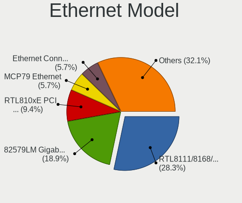

| Model                                                             | Notebooks | Percent |
|-------------------------------------------------------------------|-----------|---------|
| Realtek RTL8111/8168/8411 PCI Express Gigabit Ethernet Controller | 15        | 28.3%   |
| Intel 82579LM Gigabit Network Connection (Lewisville)             | 10        | 18.87%  |
| Realtek RTL810xE PCI Express Fast Ethernet controller             | 5         | 9.43%   |
| Nvidia MCP79 Ethernet                                             | 3         | 5.66%   |
| Intel Ethernet Connection (4) I219-LM                             | 3         | 5.66%   |
| Intel Ethernet Connection I218-LM                                 | 2         | 3.77%   |
| Intel Ethernet Connection (3) I218-LM                             | 2         | 3.77%   |
| Qualcomm Atheros AR8162 Fast Ethernet                             | 1         | 1.89%   |
| Qualcomm Atheros AR8151 v2.0 Gigabit Ethernet                     | 1         | 1.89%   |
| Qualcomm Atheros AR8131 Gigabit Ethernet                          | 1         | 1.89%   |
| Qualcomm ALCATEL Composite RNDIS Interface                        | 1         | 1.89%   |
| Marvell Group 88E8053 PCI-E Gigabit Ethernet Controller           | 1         | 1.89%   |
| Marvell Group 88E8036 PCI-E Fast Ethernet Controller              | 1         | 1.89%   |
| Intel Ethernet Connection I219-LM                                 | 1         | 1.89%   |
| Intel Ethernet Connection (6) I219-V                              | 1         | 1.89%   |
| Intel 82567LM Gigabit Network Connection                          | 1         | 1.89%   |
| Broadcom NetXtreme BCM57786 Gigabit Ethernet PCIe                 | 1         | 1.89%   |
| Broadcom NetXtreme BCM5761 Gigabit Ethernet PCIe                  | 1         | 1.89%   |
| Broadcom NetLink BCM5784M Gigabit Ethernet PCIe                   | 1         | 1.89%   |
| Broadcom NetLink BCM57785 Gigabit Ethernet PCIe                   | 1         | 1.89%   |

Net Controller Kind
-------------------

Ethernet, WiFi or modem

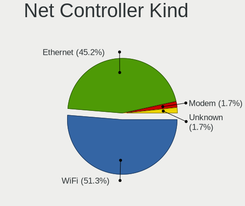

| Kind     | Notebooks | Percent |
|----------|-----------|---------|
| WiFi     | 59        | 51.75%  |
| Ethernet | 52        | 45.61%  |
| Modem    | 2         | 1.75%   |
| Unknown  | 1         | 0.88%   |

Used Controller
---------------

Currently used network controller

| Kind     | Notebooks | Percent |
|----------|-----------|---------|
| Ethernet | 51        | 52.04%  |
| WiFi     | 46        | 46.94%  |
| Modem    | 1         | 1.02%   |

NICs
----

Total network controllers on board

| Total | Notebooks | Percent |
|-------|-----------|---------|
| 2     | 50        | 86.21%  |
| 1     | 7         | 12.07%  |
| 3     | 1         | 1.72%   |

IPv6
----

IPv6 vs IPv4

| Used | Notebooks | Percent |
|------|-----------|---------|
| No   | 58        | 100%    |

Bluetooth
---------

Bluetooth Vendor
----------------

Controller vendors

| Vendor                          | Notebooks | Percent |
|---------------------------------|-----------|---------|
| Intel                           | 16        | 39.02%  |
| Qualcomm Atheros Communications | 6         | 14.63%  |
| Broadcom                        | 5         | 12.2%   |
| Realtek Semiconductor           | 4         | 9.76%   |
| Lite-On Technology              | 4         | 9.76%   |
| Apple                           | 3         | 7.32%   |
| Alps Electric                   | 2         | 4.88%   |
| Dell                            | 1         | 2.44%   |

Bluetooth Model
---------------

Controller models

| Model                                                       | Notebooks | Percent |
|-------------------------------------------------------------|-----------|---------|
| Intel Bluetooth wireless interface                          | 11        | 26.83%  |
| Realtek  Bluetooth 4.2 Adapter                              | 3         | 7.32%   |
| Qualcomm Atheros AR9462 Bluetooth                           | 3         | 7.32%   |
| Intel Bluetooth 9460/9560 Jefferson Peak (JfP)              | 3         | 7.32%   |
| Broadcom BCM20702 Bluetooth 4.0 [ThinkPad]                  | 3         | 7.32%   |
| Apple Bluetooth Host Controller                             | 3         | 7.32%   |
| Qualcomm Atheros  QCA9377 Bluetooth 4.1                     | 2         | 4.88%   |
| Lite-On Qualcomm Atheros QCA9377 Bluetooth                  | 2         | 4.88%   |
| Lite-On Atheros AR3012 Bluetooth                            | 2         | 4.88%   |
| Intel Centrino Bluetooth Wireless Transceiver               | 2         | 4.88%   |
| Realtek  Bluetooth Adapter                                  | 1         | 2.44%   |
| Qualcomm Atheros Dell Wireless 1707 Bluetooth 4.0 LE Device | 1         | 2.44%   |
| Dell Dell Wireless 380 Bluetooth 4.0 Module                 | 1         | 2.44%   |
| Broadcom BCM2045B (BDC-2.1) [Bluetooth Controller]          | 1         | 2.44%   |
| Broadcom BCM2045B (BDC-2.1)                                 | 1         | 2.44%   |
| Alps Electric UGTZ4 Bluetooth                               | 1         | 2.44%   |
| Alps Electric Bluetooth Controller (ALPS/UGPZ6)             | 1         | 2.44%   |

Sound
-----

Sound Vendor
------------

Sound card vendors

| Vendor   | Notebooks | Percent |
|----------|-----------|---------|
| Intel    | 46        | 77.97%  |
| AMD      | 9         | 15.25%  |
| Nvidia   | 3         | 5.08%   |
| Logitech | 1         | 1.69%   |

Sound Model
-----------

Sound card models

| Model                                                                      | Notebooks | Percent |
|----------------------------------------------------------------------------|-----------|---------|
| Intel Haswell-ULT HD Audio Controller                                      | 9         | 11.25%  |
| Intel 8 Series HD Audio Controller                                         | 9         | 11.25%  |
| Intel 7 Series/C216 Chipset Family High Definition Audio Controller        | 9         | 11.25%  |
| Intel Sunrise Point-LP HD Audio                                            | 8         | 10%     |
| Intel 6 Series/C200 Series Chipset Family High Definition Audio Controller | 7         | 8.75%   |
| AMD Raven/Raven2/Fenghuang HDMI/DP Audio Controller                        | 4         | 5%      |
| AMD Family 17h/19h HD Audio Controller                                     | 4         | 5%      |
| Nvidia MCP79 High Definition Audio                                         | 3         | 3.75%   |
| Intel Wildcat Point-LP High Definition Audio Controller                    | 3         | 3.75%   |
| Intel Broadwell-U Audio Controller                                         | 3         | 3.75%   |
| Intel 82801I (ICH9 Family) HD Audio Controller                             | 2         | 2.5%    |
| AMD High Definition Audio Controller                                       | 2         | 2.5%    |
| AMD FCH Azalia Controller                                                  | 2         | 2.5%    |
| AMD Family 15h (Models 60h-6fh) Audio Controller                           | 2         | 2.5%    |
| Logitech H600 [Wireless Headset]                                           | 1         | 1.25%   |
| Intel NM10/ICH7 Family High Definition Audio Controller                    | 1         | 1.25%   |
| Intel Comet Lake PCH-LP cAVS                                               | 1         | 1.25%   |
| Intel CM238 HD Audio Controller                                            | 1         | 1.25%   |
| Intel Celeron N3350/Pentium N4200/Atom E3900 Series Audio Cluster          | 1         | 1.25%   |
| Intel Cannon Point-LP High Definition Audio Controller                     | 1         | 1.25%   |
| Intel Cannon Lake PCH cAVS                                                 | 1         | 1.25%   |
| Intel 5 Series/3400 Series Chipset High Definition Audio                   | 1         | 1.25%   |
| Intel 100 Series/C230 Series Chipset Family HD Audio Controller            | 1         | 1.25%   |
| AMD SBx00 Azalia (Intel HDA)                                               | 1         | 1.25%   |
| AMD RV710/730 HDMI Audio [Radeon HD 4000 series]                           | 1         | 1.25%   |
| AMD Kabini HDMI/DP Audio                                                   | 1         | 1.25%   |
| AMD BeaverCreek HDMI Audio [Radeon HD 6500D and 6400G-6600G series]        | 1         | 1.25%   |

Memory
------

Memory Vendor
-------------

Memory module vendors

| Vendor              | Notebooks | Percent |
|---------------------|-----------|---------|
| Samsung Electronics | 22        | 28.57%  |
| SK hynix            | 17        | 22.08%  |
| Unknown             | 6         | 7.79%   |
| Micron Technology   | 5         | 6.49%   |
| Kingston            | 5         | 6.49%   |
| Crucial             | 5         | 6.49%   |
| Elpida              | 3         | 3.9%    |
| G.Skill             | 2         | 2.6%    |
| A-DATA Technology   | 2         | 2.6%    |
| Unknown (ABCD)      | 1         | 1.3%    |
| Team                | 1         | 1.3%    |
| Smart               | 1         | 1.3%    |
| Ramaxel Technology  | 1         | 1.3%    |
| Neo Forza           | 1         | 1.3%    |
| Nanya Technology    | 1         | 1.3%    |
| Goodram             | 1         | 1.3%    |
| Corsair             | 1         | 1.3%    |
| Apacer              | 1         | 1.3%    |
| Unknown             | 1         | 1.3%    |

Memory Model
------------

Memory module models

| Model                                                            | Notebooks | Percent |
|------------------------------------------------------------------|-----------|---------|
| SK hynix RAM HMA81GS6AFR8N-UH 8GB SODIMM DDR4 2400MT/s           | 4         | 5.13%   |
| Samsung RAM M471B5273DH0-CH9 4GB SODIMM DDR3 1334MT/s            | 4         | 5.13%   |
| SK hynix RAM HMT351S6CFR8C-PB 4GB SODIMM DDR3 1600MT/s           | 3         | 3.85%   |
| Samsung RAM M471B5273DH0-CK0 4GB SODIMM DDR3 1600MT/s            | 2         | 2.56%   |
| Samsung RAM M471B5173QH0-YK0 4GB SODIMM DDR3 1600MT/s            | 2         | 2.56%   |
| Samsung RAM M471A5244CB0-CTD 4GB SODIMM DDR4 2667MT/s            | 2         | 2.56%   |
| Samsung RAM M471A1K43CB1-CTD 8GB SODIMM DDR4 2667MT/s            | 2         | 2.56%   |
| Unknown SODIMM 4GB SODIMM 800MT/s                                | 1         | 1.28%   |
| Unknown RAM Module 4GB SODIMM DDR3 1067MT/s                      | 1         | 1.28%   |
| Unknown RAM Module 2GB SODIMM DDR3                               | 1         | 1.28%   |
| Unknown RAM Module 2GB SODIMM DDR2 800MT/s                       | 1         | 1.28%   |
| Unknown RAM Module 1024MB SODIMM DDR                             | 1         | 1.28%   |
| Unknown RAM GD2.09293S.001 16GB SODIMM DDR4 2400MT/s             | 1         | 1.28%   |
| Unknown (ABCD) RAM 123456789012345678 2GB SODIMM LPDDR4 2133MT/s | 1         | 1.28%   |
| Team RAM TEAMGROUP-SD3-1600 8GB SODIMM DDR3 1600MT/s             | 1         | 1.28%   |
| Smart RAM SH564128FH8NZPHSCR 4GB SODIMM DDR3 1333MT/s            | 1         | 1.28%   |
| SK hynix RAM Module 4GB SODIMM DDR3 1067MT/s                     | 1         | 1.28%   |
| SK hynix RAM HMT451S6MFR8C-PB 4GB SODIMM DDR3 1600MT/s           | 1         | 1.28%   |
| SK hynix RAM HMT451S6BFR8A-PB 4GB SODIMM DDR3 1600MT/s           | 1         | 1.28%   |
| SK hynix RAM HMT451S6AFR8A-PB 4GB SODIMM DDR3 1600MT/s           | 1         | 1.28%   |
| SK hynix RAM HMT425S6AFR6A-PB 2GB SODIMM DDR3 1600MT/s           | 1         | 1.28%   |
| SK hynix RAM HMT41GS6BFR8A-PB 8GB SODIMM DDR3 1600MT/s           | 1         | 1.28%   |
| SK hynix RAM HMT351S6EFR8C-PB 4GB SODIMM DDR3 1600MT/s           | 1         | 1.28%   |
| SK hynix RAM HMT351S6CFR8A-PB 4GB SODIMM DDR3 1600MT/s           | 1         | 1.28%   |
| SK hynix RAM HMT325S6BFR8C-H9 2GB SODIMM DDR3 1333MT/s           | 1         | 1.28%   |
| SK hynix RAM HMA81GS6JJR8N-VK 8GB SODIMM DDR4 2667MT/s           | 1         | 1.28%   |
| Samsung RAM Module 4096MB SODIMM DDR3 1600MT/s                   | 1         | 1.28%   |
| Samsung RAM M471B5273CH0-CH9 4GB SODIMM DDR3 1334MT/s            | 1         | 1.28%   |
| Samsung RAM M471B5173BH0-YK0 4GB SODIMM DDR3 1600MT/s            | 1         | 1.28%   |
| Samsung RAM M471B1G73EB0-YK0 8GB SODIMM DDR3 1600MT/s            | 1         | 1.28%   |
| Samsung RAM M471B1G73DB0-YK0 8GB SODIMM DDR3 1600MT/s            | 1         | 1.28%   |
| Samsung RAM M471B1G73BH0-CK0 8GB SODIMM DDR3 1600MT/s            | 1         | 1.28%   |
| Samsung RAM M471A5244CB0-CRC 4GB SODIMM DDR4 2400MT/s            | 1         | 1.28%   |
| Samsung RAM M471A1K43DB1-CTD 8GB SODIMM DDR4 2667MT/s            | 1         | 1.28%   |
| Samsung RAM M471A1K43BB1-CTD 8GB SODIMM DDR4 2667MT/s            | 1         | 1.28%   |
| Samsung RAM M471A1G43DB0-CPB 8GB SODIMM DDR4 2133MT/s            | 1         | 1.28%   |
| Samsung RAM K4AAG165WA-BCTD 8GB SODIMM DDR4 2667MT/s             | 1         | 1.28%   |
| Ramaxel RAM RMT3170MN68F9F1600 4GB SODIMM DDR3 1600MT/s          | 1         | 1.28%   |
| Neo Forza RAM NMSO480E82-2666E 8GB SODIMM DDR4 2667MT/s          | 1         | 1.28%   |
| Nanya RAM NT4GC64B8HG0NS-DI 4GB SODIMM DDR3 1600MT/s             | 1         | 1.28%   |
| Micron RAM Module 8GB SODIMM DDR3 1600MT/s                       | 1         | 1.28%   |
| Micron RAM 8KTF51264HZ-1G6N1 4GB SODIMM DDR3 1600MT/s            | 1         | 1.28%   |
| Micron RAM 8ATF1G64HZ-2G3B1 8GB SODIMM DDR4 2400MT/s             | 1         | 1.28%   |
| Micron RAM 4ATF51264HZ-2G6E1 4GB SODIMM DDR4 2667MT/s            | 1         | 1.28%   |
| Micron RAM 4ATF51264HZ-2G6E! 4GB SODIMM DDR4 2400MT/s            | 1         | 1.28%   |
| Kingston RAM ASU16D3LS1KBG/4G 4096MB SODIMM DDR3 1333MT/s        | 1         | 1.28%   |
| Kingston RAM ACR16D3LS1KFG/4G 4GB SODIMM DDR3 1600MT/s           | 1         | 1.28%   |
| Kingston RAM 9905630-025.A00G 8GB SODIMM DDR4 2400MT/s           | 1         | 1.28%   |
| Kingston RAM 9905624-007.A00G 8GB SODIMM DDR4 2133MT/s           | 1         | 1.28%   |
| Kingston RAM 9905469-157.A01LF 4096MB SODIMM DDR3 1600MT/s       | 1         | 1.28%   |
| Goodram RAM GR2133S464L15/16G 16GB SODIMM DDR4 2133MT/s          | 1         | 1.28%   |
| G.Skill RAM Module 4GB SODIMM DDR3 1333MT/s                      | 1         | 1.28%   |
| G.Skill RAM F3-1600C11-8GSL 8GB SODIMM DDR3 1600MT/s             | 1         | 1.28%   |
| Elpida RAM Module 4GB SODIMM DDR3 1600MT/s                       | 1         | 1.28%   |
| Elpida RAM EBJ81UG8BBU0-GN-F 8GB SODIMM DDR3 1600MT/s            | 1         | 1.28%   |
| Elpida RAM EBJ41UF8BCS0-DJ-F 4GB SODIMM DDR3 1333MT/s            | 1         | 1.28%   |
| Crucial RAM Module 4096MB SODIMM DDR3 1067MT/s                   | 1         | 1.28%   |
| Crucial RAM CT8G4SFD824A.M16FB 8GB SODIMM DDR4 2133MT/s          | 1         | 1.28%   |
| Crucial RAM CT51264BF160B.C16F 4GB SODIMM DDR3 1600MT/s          | 1         | 1.28%   |
| Crucial RAM CT204864BF160B.C16 16GB SODIMM DDR3 1600MT/s         | 1         | 1.28%   |

Memory Kind
-----------

Memory module kinds

| Kind    | Notebooks | Percent |
|---------|-----------|---------|
| DDR3    | 37        | 62.71%  |
| DDR4    | 18        | 30.51%  |
| LPDDR4  | 1         | 1.69%   |
| DDR2    | 1         | 1.69%   |
| DDR     | 1         | 1.69%   |
| Unknown | 1         | 1.69%   |

Memory Form Factor
------------------

Physical design of the memory module

| Name   | Notebooks | Percent |
|--------|-----------|---------|
| SODIMM | 59        | 100%    |

Memory Size
-----------

Memory module size

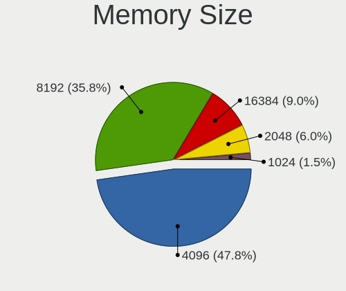

| Size  | Notebooks | Percent |
|-------|-----------|---------|
| 4096  | 33        | 50%     |
| 8192  | 24        | 36.36%  |
| 16384 | 4         | 6.06%   |
| 2048  | 4         | 6.06%   |
| 1024  | 1         | 1.52%   |

Memory Speed
------------

Memory module speed

| Speed   | Notebooks | Percent |
|---------|-----------|---------|
| 1600    | 25        | 39.06%  |
| 2667    | 9         | 14.06%  |
| 2400    | 9         | 14.06%  |
| 1334    | 5         | 7.81%   |
| 1333    | 5         | 7.81%   |
| 2133    | 4         | 6.25%   |
| 1067    | 3         | 4.69%   |
| 800     | 2         | 3.13%   |
| Unknown | 2         | 3.13%   |

Printers & scanners
-------------------

Printer Vendor
--------------

Printer device vendors

Zero info for selected period =(

Printer Model
-------------

Printer device models

Zero info for selected period =(

Scanner Vendor
--------------

Scanner device vendors

Zero info for selected period =(

Scanner Model
-------------

Scanner device models

Zero info for selected period =(

Camera
------

Camera Vendor
-------------

Camera device vendors

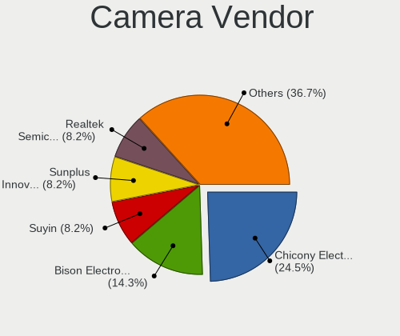

| Vendor                                 | Notebooks | Percent |
|----------------------------------------|-----------|---------|
| Chicony Electronics                    | 12        | 24.49%  |
| Acer                                   | 7         | 14.29%  |
| Suyin                                  | 4         | 8.16%   |
| Sunplus Innovation Technology          | 4         | 8.16%   |
| Realtek Semiconductor                  | 4         | 8.16%   |
| Microdia                               | 4         | 8.16%   |
| Alcor Micro                            | 4         | 8.16%   |
| Silicon Motion                         | 2         | 4.08%   |
| Quanta                                 | 2         | 4.08%   |
| Lite-On Technology                     | 2         | 4.08%   |
| Lenovo                                 | 1         | 2.04%   |
| Importek                               | 1         | 2.04%   |
| IMC Networks                           | 1         | 2.04%   |
| Cheng Uei Precision Industry (Foxlink) | 1         | 2.04%   |

Camera Model
------------

Camera device models

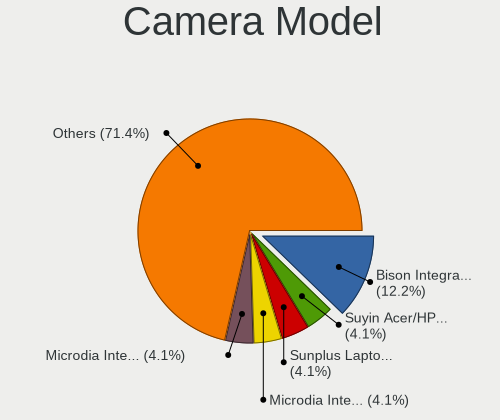

| Model                                                          | Notebooks | Percent |
|----------------------------------------------------------------|-----------|---------|
| Acer Integrated Camera                                         | 6         | 12.24%  |
| Suyin Acer/HP Integrated Webcam [CN0314]                       | 2         | 4.08%   |
| Sunplus Laptop_Integrated_Webcam_FHD                           | 2         | 4.08%   |
| Microdia Integrated_Webcam_HD                                  | 2         | 4.08%   |
| Microdia Integrated Webcam                                     | 2         | 4.08%   |
| Chicony Integrated Camera (1280x720@30)                        | 2         | 4.08%   |
| Chicony Integrated Camera                                      | 2         | 4.08%   |
| Chicony HD WebCam                                              | 2         | 4.08%   |
| Chicony Chicony USB2.0 Camera                                  | 2         | 4.08%   |
| Suyin Integrated_Webcam_HD                                     | 1         | 2.04%   |
| Suyin HD WebCam                                                | 1         | 2.04%   |
| Sunplus MTD camera                                             | 1         | 2.04%   |
| Sunplus Integrated_Webcam_HD                                   | 1         | 2.04%   |
| Silicon Motion WebCam SC-13HDL11939N                           | 1         | 2.04%   |
| Silicon Motion Realtek USB2.0 PC Camera                        | 1         | 2.04%   |
| Realtek Realtek USB2.0 PC Camera                               | 1         | 2.04%   |
| Realtek Lenovo EasyCamera                                      | 1         | 2.04%   |
| Realtek Integrated_Webcam_HD                                   | 1         | 2.04%   |
| Realtek Front Camera                                           | 1         | 2.04%   |
| Quanta VGA WebCam                                              | 1         | 2.04%   |
| Quanta HP TrueVision HD Camera                                 | 1         | 2.04%   |
| Lite-On Integrated Camera                                      | 1         | 2.04%   |
| Lite-On HP TrueVision HD Camera                                | 1         | 2.04%   |
| Lenovo Integrated Webcam [R5U877]                              | 1         | 2.04%   |
| Importek TOSHIBA Web Camera - HD                               | 1         | 2.04%   |
| IMC Networks UVC VGA Webcam                                    | 1         | 2.04%   |
| Chicony USB2.0 HD UVC WebCam                                   | 1         | 2.04%   |
| Chicony Thinkpad T430 camera                                   | 1         | 2.04%   |
| Chicony Lenovo Integrated Camera (0.3MP)                       | 1         | 2.04%   |
| Chicony Lenovo EasyCamera                                      | 1         | 2.04%   |
| Cheng Uei Precision Industry (Foxlink) HP TrueVision HD Camera | 1         | 2.04%   |
| Alcor Micro USB 2.0 Web Camera                                 | 1         | 2.04%   |
| Alcor Micro USB 2.0 Camera                                     | 1         | 2.04%   |
| Alcor Micro HP WebCam-101                                      | 1         | 2.04%   |
| Alcor Micro Acer Integrated Webcam                             | 1         | 2.04%   |
| Acer ThinkPad Integrated Camera                                | 1         | 2.04%   |

Security
--------

Fingerprint Vendor
------------------

Fingerprint sensor vendors

| Vendor             | Notebooks | Percent |
|--------------------|-----------|---------|
| Validity Sensors   | 4         | 40%     |
| Upek               | 2         | 20%     |
| Synaptics          | 2         | 20%     |
| STMicroelectronics | 1         | 10%     |
| Focal-systems.Corp | 1         | 10%     |

Fingerprint Model
-----------------

Fingerprint sensor models

| Model                                                  | Notebooks | Percent |
|--------------------------------------------------------|-----------|---------|
| Validity Sensors VFS 5011 fingerprint sensor           | 2         | 20%     |
| Validity Sensors VFS495 Fingerprint Reader             | 1         | 10%     |
| Validity Sensors Synaptics WBDI                        | 1         | 10%     |
| Upek TCS5B Fingerprint sensor                          | 1         | 10%     |
| Upek Biometric Touchchip/Touchstrip Fingerprint Sensor | 1         | 10%     |
| Synaptics  WBDI                                        | 1         | 10%     |
| Synaptics Prometheus MIS Touch Fingerprint Reader      | 1         | 10%     |
| STMicroelectronics Fingerprint Reader                  | 1         | 10%     |
| Focal-systems.Corp FocalTech Fingerprint reader        | 1         | 10%     |

Chipcard Vendor
---------------

Chipcard module vendors

Zero info for selected period =(

Chipcard Model
--------------

Chipcard module models

Zero info for selected period =(

Unsupported
-----------

Unsupported Devices
-------------------

Total unsupported devices on board

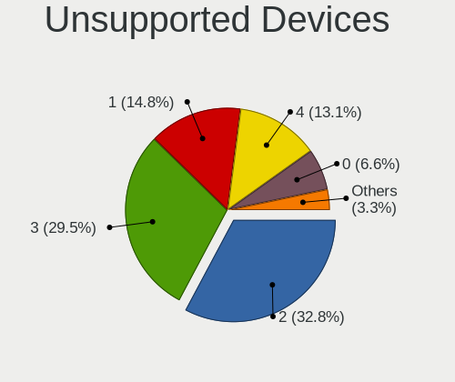

| Total | Notebooks | Percent |
|-------|-----------|---------|
| 2     | 20        | 32.79%  |
| 3     | 18        | 29.51%  |
| 4     | 9         | 14.75%  |
| 1     | 9         | 14.75%  |
| 0     | 4         | 6.56%   |
| 5     | 1         | 1.64%   |

Unsupported Device Types
------------------------

Types of unsupported devices

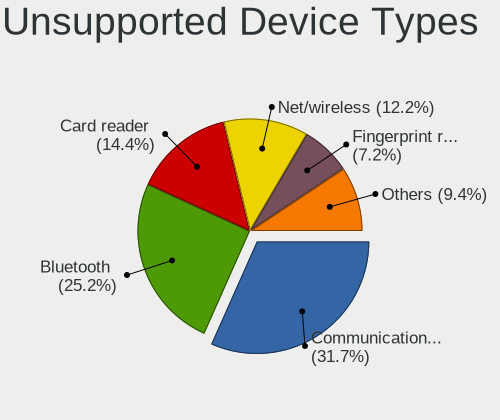

| Type                     | Notebooks | Percent |
|--------------------------|-----------|---------|
| Communication controller | 44        | 31.88%  |
| Bluetooth                | 35        | 25.36%  |
| Card reader              | 20        | 14.49%  |
| Net/wireless             | 17        | 12.32%  |
| Fingerprint reader       | 10        | 7.25%   |
| Storage                  | 4         | 2.9%    |
| Network                  | 4         | 2.9%    |
| Firewire controller      | 4         | 2.9%    |

