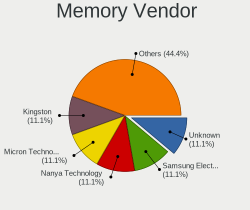

GhostBSD 21.08.27 - Tested Hardware & Statistics (Desktops)
-----------------------------------------------------------

A project to collect tested hardware configurations for GhostBSD 21.08.27.

Anyone can contribute to this report by the [hw-probe](https://github.com/linuxhw/hw-probe/blob/master/INSTALL.BSD.md) tool:

    hw-probe -all -upload

Please contribute! Especially if your hardware is rare.

Contents
--------

* [ Test Cases ](#test-cases)

* [ System ](#system)
  - [ Arch                     ](#arch)
  - [ DE                       ](#de)
  - [ Display Server           ](#display-server)
  - [ Display Manager          ](#display-manager)
  - [ OS Lang                  ](#os-lang)
  - [ Boot Mode                ](#boot-mode)
  - [ Filesystem               ](#filesystem)
  - [ Part. scheme             ](#part-scheme)

* [ Board ](#board)
  - [ Vendor                   ](#vendor)
  - [ Model                    ](#model)
  - [ Model Family             ](#model-family)
  - [ MFG Year                 ](#mfg-year)
  - [ Form Factor              ](#form-factor)
  - [ Coreboot                 ](#coreboot)
  - [ RAM Size                 ](#ram-size)
  - [ RAM Used                 ](#ram-used)
  - [ Total Drives             ](#total-drives)
  - [ Has CD-ROM               ](#has-cd-rom)
  - [ Has Ethernet             ](#has-ethernet)
  - [ Has WiFi                 ](#has-wifi)
  - [ Has Bluetooth            ](#has-bluetooth)

* [ Location ](#location)
  - [ Country                  ](#country)
  - [ City                     ](#city)

* [ Drives ](#drives)
  - [ Drive Vendor             ](#drive-vendor)
  - [ Drive Model              ](#drive-model)
  - [ HDD Vendor               ](#hdd-vendor)
  - [ SSD Vendor               ](#ssd-vendor)
  - [ Drive Kind               ](#drive-kind)
  - [ Drive Connector          ](#drive-connector)
  - [ Drive Size               ](#drive-size)
  - [ Space Total              ](#space-total)
  - [ Space Used               ](#space-used)
  - [ Malfunc. Drives          ](#malfunc-drives)
  - [ Malfunc. Drive Vendor    ](#malfunc-drive-vendor)
  - [ Malfunc. HDD Vendor      ](#malfunc-hdd-vendor)
  - [ Malfunc. Drive Kind      ](#malfunc-drive-kind)
  - [ Failed Drives            ](#failed-drives)
  - [ Failed Drive Vendor      ](#failed-drive-vendor)
  - [ Drive Status             ](#drive-status)

* [ Storage controller ](#storage-controller)
  - [ Storage Vendor           ](#storage-vendor)
  - [ Storage Model            ](#storage-model)
  - [ Storage Kind             ](#storage-kind)

* [ Processor ](#processor)
  - [ CPU Vendor               ](#cpu-vendor)
  - [ CPU Model                ](#cpu-model)
  - [ CPU Model Family         ](#cpu-model-family)
  - [ CPU Cores                ](#cpu-cores)
  - [ CPU Sockets              ](#cpu-sockets)
  - [ CPU Threads              ](#cpu-threads)
  - [ CPU Microarch            ](#cpu-microarch)

* [ Graphics ](#graphics)
  - [ GPU Vendor               ](#gpu-vendor)
  - [ GPU Model                ](#gpu-model)
  - [ GPU Combo                ](#gpu-combo)
  - [ GPU Driver               ](#gpu-driver)
  - [ GPU Memory               ](#gpu-memory)

* [ Monitor ](#monitor)
  - [ Monitor Vendor           ](#monitor-vendor)
  - [ Monitor Model            ](#monitor-model)
  - [ Monitor Resolution       ](#monitor-resolution)
  - [ Monitor Diagonal         ](#monitor-diagonal)
  - [ Monitor Width            ](#monitor-width)
  - [ Aspect Ratio             ](#aspect-ratio)
  - [ Monitor Area             ](#monitor-area)
  - [ Pixel Density            ](#pixel-density)
  - [ Multiple Monitors        ](#multiple-monitors)

* [ Network ](#network)
  - [ Net Controller Vendor    ](#net-controller-vendor)
  - [ Net Controller Model     ](#net-controller-model)
  - [ Wireless Vendor          ](#wireless-vendor)
  - [ Wireless Model           ](#wireless-model)
  - [ Ethernet Vendor          ](#ethernet-vendor)
  - [ Ethernet Model           ](#ethernet-model)
  - [ Net Controller Kind      ](#net-controller-kind)
  - [ Used Controller          ](#used-controller)
  - [ NICs                     ](#nics)
  - [ IPv6                     ](#ipv6)

* [ Bluetooth ](#bluetooth)
  - [ Bluetooth Vendor         ](#bluetooth-vendor)
  - [ Bluetooth Model          ](#bluetooth-model)

* [ Sound ](#sound)
  - [ Sound Vendor             ](#sound-vendor)
  - [ Sound Model              ](#sound-model)

* [ Memory ](#memory)
  - [ Memory Vendor            ](#memory-vendor)
  - [ Memory Model             ](#memory-model)
  - [ Memory Kind              ](#memory-kind)
  - [ Memory Form Factor       ](#memory-form-factor)
  - [ Memory Size              ](#memory-size)
  - [ Memory Speed             ](#memory-speed)

* [ Printers & scanners ](#printers--scanners)
  - [ Printer Vendor           ](#printer-vendor)
  - [ Printer Model            ](#printer-model)
  - [ Scanner Vendor           ](#scanner-vendor)
  - [ Scanner Model            ](#scanner-model)

* [ Camera ](#camera)
  - [ Camera Vendor            ](#camera-vendor)
  - [ Camera Model             ](#camera-model)

* [ Security ](#security)
  - [ Fingerprint Vendor       ](#fingerprint-vendor)
  - [ Fingerprint Model        ](#fingerprint-model)
  - [ Chipcard Vendor          ](#chipcard-vendor)
  - [ Chipcard Model           ](#chipcard-model)

* [ Unsupported ](#unsupported)
  - [ Unsupported Devices      ](#unsupported-devices)
  - [ Unsupported Device Types ](#unsupported-device-types)

Test Cases
----------

Total: 8

| Vendor    | Model               | Probe                                                     | Date         |
|-----------|---------------------|-----------------------------------------------------------|--------------|
| ASUSTek   | TUF GAMING X570-PRO | [8307275b2e](https://bsd-hardware.info/?probe=8307275b2e) | Mar 07, 2022 |
| Dell      | 0NNNCT A01          | [290f10c785](https://bsd-hardware.info/?probe=290f10c785) | Jan 21, 2022 |
| Alienware | 01NYPT A00          | [75aa0c00fb](https://bsd-hardware.info/?probe=75aa0c00fb) | Dec 06, 2021 |
| ASUSTek   | PRIME Z270-K        | [a2270b6f09](https://bsd-hardware.info/?probe=a2270b6f09) | Dec 02, 2021 |
| Medion    | MS-7728             | [5b5a847fdd](https://bsd-hardware.info/?probe=5b5a847fdd) | Nov 02, 2021 |
| ASUSTek   | SABERTOOTH X58      | [8f00f132de](https://bsd-hardware.info/?probe=8f00f132de) | Sep 23, 2021 |
| ASRock    | X570 Taichi         | [9dc50c0bcb](https://bsd-hardware.info/?probe=9dc50c0bcb) | Sep 11, 2021 |
| Gigabyte  | Z77M-D3H            | [d60f1bc575](https://bsd-hardware.info/?probe=d60f1bc575) | Aug 29, 2021 |

System
------

Arch
----

OS architecture (x86_64, i586, etc.)

| Name  | Desktops | Percent |
|-------|----------|---------|
| amd64 | 8        | 100%    |

DE
--

Desktop Environment

| Name | Desktops | Percent |
|------|----------|---------|
| MATE | 7        | 87.5%   |
| LXQt | 1        | 12.5%   |

Display Server
--------------

X11 or Wayland

| Name | Desktops | Percent |
|------|----------|---------|
| X11  | 8        | 100%    |

Display Manager
---------------

SDDM, LightDM, etc.

| Name    | Desktops | Percent |
|---------|----------|---------|
| LightDM | 8        | 100%    |

OS Lang
-------

Language

| Lang  | Desktops | Percent |
|-------|----------|---------|
| en_US | 3        | 37.5%   |
| C     | 3        | 37.5%   |
| de_DE | 2        | 25%     |

Boot Mode
---------

EFI or BIOS

| Mode | Desktops | Percent |
|------|----------|---------|
| EFI  | 6        | 75%     |
| BIOS | 2        | 25%     |

Filesystem
----------

Type of filesystem

| Type | Desktops | Percent |
|------|----------|---------|
| Zfs  | 8        | 100%    |

Part. scheme
------------

Scheme of partitioning

| Type | Desktops | Percent |
|------|----------|---------|
| GPT  | 8        | 100%    |

Board
-----

Vendor
------

Motherboard manufacturer

| Name                | Desktops | Percent |
|---------------------|----------|---------|
| ASUSTek Computer    | 3        | 37.5%   |
| Medion              | 1        | 12.5%   |
| Gigabyte Technology | 1        | 12.5%   |
| Dell                | 1        | 12.5%   |
| ASRock              | 1        | 12.5%   |
| Alienware           | 1        | 12.5%   |

Model
-----

Motherboard model

| Name                      | Desktops | Percent |
|---------------------------|----------|---------|
| Medion MS-7728            | 1        | 12.5%   |
| Gigabyte Z77M-D3H         | 1        | 12.5%   |
| Dell Precision 3630 Tower | 1        | 12.5%   |
| ASUS TUF GAMING X570-PRO  | 1        | 12.5%   |
| ASUS SABERTOOTH X58       | 1        | 12.5%   |
| ASUS PRIME Z270-K         | 1        | 12.5%   |
| ASRock X570 Taichi        | 1        | 12.5%   |
| Alienware Aurora R5       | 1        | 12.5%   |

Model Family
------------

Motherboard model prefix

| Name              | Desktops | Percent |
|-------------------|----------|---------|
| Medion MS-7728    | 1        | 12.5%   |
| Gigabyte Z77M-D3H | 1        | 12.5%   |
| Dell Precision    | 1        | 12.5%   |
| ASUS TUF          | 1        | 12.5%   |
| ASUS SABERTOOTH   | 1        | 12.5%   |
| ASUS PRIME        | 1        | 12.5%   |
| ASRock X570       | 1        | 12.5%   |
| Alienware Aurora  | 1        | 12.5%   |

MFG Year
--------

Motherboard manufacture year

| Year | Desktops | Percent |
|------|----------|---------|
| 2020 | 2        | 25%     |
| 2011 | 2        | 25%     |
| 2021 | 1        | 12.5%   |
| 2018 | 1        | 12.5%   |
| 2012 | 1        | 12.5%   |
| 2008 | 1        | 12.5%   |

Form Factor
-----------

Physical design of the computer

| Name    | Desktops | Percent |
|---------|----------|---------|
| Desktop | 8        | 100%    |

Coreboot
--------

Have coreboot on board

| Used | Desktops | Percent |
|------|----------|---------|
| No   | 8        | 100%    |

RAM Size
--------

Total RAM memory

| Size in GB  | Desktops | Percent |
|-------------|----------|---------|
| 32.01-64.0  | 3        | 37.5%   |
| 8.01-16.0   | 3        | 37.5%   |
| 64.01-256.0 | 1        | 12.5%   |
| 16.01-24.0  | 1        | 12.5%   |

RAM Used
--------

Used RAM memory

| Used GB  | Desktops | Percent |
|----------|----------|---------|
| 1.01-2.0 | 3        | 37.5%   |
| 0.01-0.5 | 3        | 37.5%   |
| 3.01-4.0 | 1        | 12.5%   |
| 0.51-1.0 | 1        | 12.5%   |

Total Drives
------------

Number of drives on board

| Drives | Desktops | Percent |
|--------|----------|---------|
| 2      | 6        | 75%     |
| 5      | 1        | 12.5%   |
| 3      | 1        | 12.5%   |

Has CD-ROM
----------

Has CD-ROM on board

| Presented | Desktops | Percent |
|-----------|----------|---------|
| Yes       | 6        | 75%     |
| No        | 2        | 25%     |

Has Ethernet
------------

Has Ethernet on board

| Presented | Desktops | Percent |
|-----------|----------|---------|
| Yes       | 8        | 100%    |

Has WiFi
--------

Has WiFi module

| Presented | Desktops | Percent |
|-----------|----------|---------|
| No        | 5        | 62.5%   |
| Yes       | 3        | 37.5%   |

Has Bluetooth
-------------

Has Bluetooth module

| Presented | Desktops | Percent |
|-----------|----------|---------|
| No        | 5        | 62.5%   |
| Yes       | 3        | 37.5%   |

Location
--------

Country
-------

Geographic location (country)

| Country     | Desktops | Percent |
|-------------|----------|---------|
| USA         | 3        | 37.5%   |
| Germany     | 3        | 37.5%   |
| Netherlands | 1        | 12.5%   |
| China       | 1        | 12.5%   |

City
----

Geographic location (city)

| City        | Desktops | Percent |
|-------------|----------|---------|
| Traunstein  | 1        | 12.5%   |
| Springfield | 1        | 12.5%   |
| San Jose    | 1        | 12.5%   |
| Hamburg     | 1        | 12.5%   |
| Denver      | 1        | 12.5%   |
| Bonn        | 1        | 12.5%   |
| Bijie       | 1        | 12.5%   |
| Amsterdam   | 1        | 12.5%   |

Drives
------

Drive Vendor
------------

Hard drive vendors

| Vendor              | Desktops | Drives | Percent |
|---------------------|----------|--------|---------|
| WDC                 | 4        | 5      | 25%     |
| Seagate             | 4        | 5      | 25%     |
| Samsung Electronics | 4        | 6      | 25%     |
| Crucial             | 3        | 3      | 18.75%  |
| Toshiba             | 1        | 1      | 6.25%   |

Drive Model
-----------

Hard drive models

| Model                            | Desktops | Percent |
|----------------------------------|----------|---------|
| WDC WD5000BEVT-24A0RT0 500GB     | 1        | 5.56%   |
| WDC WD2002FAEX-007BA0 2TB        | 1        | 5.56%   |
| WDC WD10EZEX-60M2NA0 1TB         | 1        | 5.56%   |
| WDC WD1002FBYS-05A6B0 1TB        | 1        | 5.56%   |
| WDC WD1002FAEX-00Y9A0 1TB        | 1        | 5.56%   |
| Toshiba DT01ACA050 500GB         | 1        | 5.56%   |
| Seagate ST500DM002-1SB10A 500GB  | 1        | 5.56%   |
| Seagate ST400FP0021 400GB        | 1        | 5.56%   |
| Seagate ST4000DM000-1F2168 4TB   | 1        | 5.56%   |
| Seagate ST1500DL003-9VT16L 1.5TB | 1        | 5.56%   |
| Samsung SSD 980 PRO 500GB        | 1        | 5.56%   |
| Samsung SSD 970 EVO Plus 500GB   | 1        | 5.56%   |
| Samsung SSD 970 EVO Plus 1TB     | 1        | 5.56%   |
| Samsung SSD 970 EVO 500GB        | 1        | 5.56%   |
| Samsung SSD 860 QVO 2TB          | 1        | 5.56%   |
| Crucial M4-CT064M4SSD2 64GB      | 1        | 5.56%   |
| Crucial CT1000MX500SSD1 1TB      | 1        | 5.56%   |
| Crucial CT1000BX100SSD1 1TB      | 1        | 5.56%   |

HDD Vendor
----------

Hard disk drive vendors

| Vendor  | Desktops | Drives | Percent |
|---------|----------|--------|---------|
| WDC     | 4        | 5      | 50%     |
| Seagate | 3        | 4      | 37.5%   |
| Toshiba | 1        | 1      | 12.5%   |

SSD Vendor
----------

Solid state drive vendors

| Vendor              | Desktops | Drives | Percent |
|---------------------|----------|--------|---------|
| Crucial             | 3        | 3      | 60%     |
| Seagate             | 1        | 1      | 20%     |
| Samsung Electronics | 1        | 1      | 20%     |

Drive Kind
----------

HDD or SSD

| Kind | Desktops | Drives | Percent |
|------|----------|--------|---------|
| HDD  | 6        | 10     | 46.15%  |
| SSD  | 4        | 5      | 30.77%  |
| NVMe | 3        | 5      | 23.08%  |

Drive Connector
---------------

SATA, SAS, NVMe, etc.

| Type | Desktops | Drives | Percent |
|------|----------|--------|---------|
| SATA | 7        | 15     | 70%     |
| NVMe | 3        | 5      | 30%     |

Drive Size
----------

Size of hard drive

| Size in TB | Desktops | Drives | Percent |
|------------|----------|--------|---------|
| 0.01-0.5   | 4        | 5      | 36.36%  |
| 1.01-2.0   | 3        | 3      | 27.27%  |
| 0.51-1.0   | 3        | 5      | 27.27%  |
| 3.01-4.0   | 1        | 2      | 9.09%   |

Space Total
-----------

Amount of disk space available on the file system

| Size in GB | Desktops | Percent |
|------------|----------|---------|
| 1-20       | 3        | 37.5%   |
| 501-1000   | 2        | 25%     |
| 251-500    | 1        | 12.5%   |
| 21-50      | 1        | 12.5%   |
| 1001-2000  | 1        | 12.5%   |

Space Used
----------

Amount of used disk space

| Used GB | Desktops | Percent |
|---------|----------|---------|
| 1-20    | 7        | 87.5%   |
| 21-50   | 1        | 12.5%   |

Malfunc. Drives
---------------

Drive models with a malfunction

| Model                       | Desktops | Drives | Percent |
|-----------------------------|----------|--------|---------|
| Crucial CT1000MX500SSD1 1TB | 1        | 1      | 100%    |

Malfunc. Drive Vendor
---------------------

Vendors of faulty drives

| Vendor  | Desktops | Drives | Percent |
|---------|----------|--------|---------|
| Crucial | 1        | 1      | 100%    |

Malfunc. HDD Vendor
-------------------

Vendors of faulty HDD drives

Zero info for selected period =(

Malfunc. Drive Kind
-------------------

Kinds of faulty drives

| Kind | Desktops | Drives | Percent |
|------|----------|--------|---------|
| SSD  | 1        | 1      | 100%    |

Failed Drives
-------------

Failed drive models

Zero info for selected period =(

Failed Drive Vendor
-------------------

Failed drive vendors

Zero info for selected period =(

Drive Status
------------

Number of failed and malfunc. drives

| Status  | Desktops | Drives | Percent |
|---------|----------|--------|---------|
| Works   | 8        | 19     | 88.89%  |
| Malfunc | 1        | 1      | 11.11%  |

Storage controller
------------------

Storage Vendor
--------------

Storage controller vendors

| Vendor                   | Desktops | Percent |
|--------------------------|----------|---------|
| Intel                    | 6        | 46.15%  |
| Samsung Electronics      | 3        | 23.08%  |
| AMD                      | 2        | 15.38%  |
| Marvell Technology Group | 1        | 7.69%   |
| JMicron Technology       | 1        | 7.69%   |

Storage Model
-------------

Storage controller models

| Model                                                                         | Desktops | Percent |
|-------------------------------------------------------------------------------|----------|---------|
| Samsung NVMe SSD Controller SM981/PM981/PM983                                 | 2        | 15.38%  |
| AMD FCH SATA Controller [AHCI mode]                                           | 2        | 15.38%  |
| Samsung NVMe SSD Controller PM9A1/PM9A3/980PRO                                | 1        | 7.69%   |
| Marvell Group 88SE91A3 SATA-600 Controller                                    | 1        | 7.69%   |
| JMicron JMB362 SATA Controller                                                | 1        | 7.69%   |
| Intel SATA Controller [RAID mode]                                             | 1        | 7.69%   |
| Intel Q170/Q150/B150/H170/H110/Z170/CM236 Chipset SATA Controller [AHCI Mode] | 1        | 7.69%   |
| Intel 82801JI (ICH10 Family) SATA AHCI Controller                             | 1        | 7.69%   |
| Intel 7 Series/C210 Series Chipset Family 6-port SATA Controller [AHCI mode]  | 1        | 7.69%   |
| Intel 6 Series/C200 Series Chipset Family 6 port Desktop SATA AHCI Controller | 1        | 7.69%   |
| Intel 200 Series PCH SATA controller [AHCI mode]                              | 1        | 7.69%   |

Storage Kind
------------

Kind of storage controller (IDE, SATA, NVMe, SAS, ...)

| Kind | Desktops | Percent |
|------|----------|---------|
| SATA | 7        | 58.33%  |
| NVMe | 3        | 25%     |
| RAID | 1        | 8.33%   |
| IDE  | 1        | 8.33%   |

Processor
---------

CPU Vendor
----------

Processor vendors

| Vendor | Desktops | Percent |
|--------|----------|---------|
| Intel  | 6        | 75%     |
| AMD    | 2        | 25%     |

CPU Model
---------

Processor models

| Model                                  | Desktops | Percent |
|----------------------------------------|----------|---------|
| Intel Xeon E-2236 CPU @ 3.40GHz        | 1        | 12.5%   |
| Intel Core i7-7700K CPU @ 4.20GHz      | 1        | 12.5%   |
| Intel Core i7-6700K CPU @ 4.00GHz      | 1        | 12.5%   |
| Intel Core i7-2600 CPU @ 3.40GHz       | 1        | 12.5%   |
| Intel Core i7 CPU 950 @ 3.07GHz        | 1        | 12.5%   |
| Intel Core i5-3570 CPU @ 3.40GHz       | 1        | 12.5%   |
| AMD Ryzen 9 5900X 12-Core Processor    | 1        | 12.5%   |
| AMD Ryzen 7 5700G with Radeon Graphics | 1        | 12.5%   |

CPU Model Family
----------------

Processor model prefix

| Model         | Desktops | Percent |
|---------------|----------|---------|
| Intel Core i7 | 4        | 50%     |
| Intel Xeon    | 1        | 12.5%   |
| Intel Core i5 | 1        | 12.5%   |
| AMD Ryzen 9   | 1        | 12.5%   |
| AMD Ryzen 7   | 1        | 12.5%   |

CPU Cores
---------

Number of processor cores

| Number | Desktops | Percent |
|--------|----------|---------|
| 4      | 5        | 62.5%   |
| 24     | 1        | 12.5%   |
| 16     | 1        | 12.5%   |
| 6      | 1        | 12.5%   |

CPU Sockets
-----------

Number of sockets

| Number | Desktops | Percent |
|--------|----------|---------|
| 1      | 8        | 100%    |

CPU Threads
-----------

Threads per core (Hyper-Threading)

| Number | Desktops | Percent |
|--------|----------|---------|
| 2      | 5        | 62.5%   |
| 1      | 3        | 37.5%   |

CPU Microarch
-------------

Microarchitecture

| Name        | Desktops | Percent |
|-------------|----------|---------|
| Zen 3       | 2        | 25%     |
| KabyLake    | 2        | 25%     |
| Skylake     | 1        | 12.5%   |
| SandyBridge | 1        | 12.5%   |
| Nehalem     | 1        | 12.5%   |
| IvyBridge   | 1        | 12.5%   |

Graphics
--------

GPU Vendor
----------

Vendors of graphics cards

| Vendor | Desktops | Percent |
|--------|----------|---------|
| Nvidia | 5        | 50%     |
| AMD    | 3        | 30%     |
| Intel  | 2        | 20%     |

GPU Model
---------

Graphics card models

| Model                                             | Desktops | Percent |
|---------------------------------------------------|----------|---------|
| Nvidia GP108 [GeForce GT 1030]                    | 1        | 10%     |
| Nvidia GP107 [GeForce GTX 1050]                   | 1        | 10%     |
| Nvidia GP106 [GeForce GTX 1060 6GB]               | 1        | 10%     |
| Nvidia GP104 [GeForce GTX 1080]                   | 1        | 10%     |
| Nvidia GM107 [GeForce GTX 750 Ti]                 | 1        | 10%     |
| Intel HD Graphics 630                             | 1        | 10%     |
| Intel HD Graphics 530                             | 1        | 10%     |
| AMD Cezanne                                       | 1        | 10%     |
| AMD Cedar [Radeon HD 5000/6000/7350/8350 Series]  | 1        | 10%     |
| AMD Cape Verde XT [Radeon HD 7770/8760 / R7 250X] | 1        | 10%     |

GPU Combo
---------

Combinations of graphics cards

| Name           | Desktops | Percent |
|----------------|----------|---------|
| 1 x Nvidia     | 3        | 37.5%   |
| 1 x AMD        | 3        | 37.5%   |
| Intel + Nvidia | 2        | 25%     |

GPU Driver
----------

Free vs proprietary

| Driver      | Desktops | Percent |
|-------------|----------|---------|
| Proprietary | 4        | 50%     |
| Free        | 4        | 50%     |

GPU Memory
----------

Total video memory

| Size in GB | Desktops | Percent |
|------------|----------|---------|
| Unknown    | 4        | 50%     |
| 0.51-1.0   | 2        | 25%     |
| 7.01-8.0   | 1        | 12.5%   |
| 1.01-2.0   | 1        | 12.5%   |

Monitor
-------

Monitor Vendor
--------------

Monitor vendors

| Vendor              | Desktops | Percent |
|---------------------|----------|---------|
| Samsung Electronics | 2        | 28.57%  |
| Mi                  | 1        | 14.29%  |
| Fujitsu Siemens     | 1        | 14.29%  |
| BenQ                | 1        | 14.29%  |
| ASUSTek Computer    | 1        | 14.29%  |
| AOC                 | 1        | 14.29%  |

Monitor Model
-------------

Monitor models

| Model                                                               | Desktops | Percent |
|---------------------------------------------------------------------|----------|---------|
| Samsung Electronics U28E510 SAM0D68 3840x2160 610x350mm 27.7-inch   | 1        | 14.29%  |
| Samsung Electronics SMT27A300 SAM087A 1920x1080 600x340mm 27.2-inch | 1        | 14.29%  |
| Mi Redmi 27 NQ XMIE001 2560x1440 600x330mm 27.0-inch                | 1        | 14.29%  |
| Fujitsu Siemens P24-9 TE FUS08B8 1920x1080 530x300mm 24.0-inch      | 1        | 14.29%  |
| BenQ BL2405 BNQ8016 1920x1080 530x300mm 24.0-inch                   | 1        | 14.29%  |
| ASUSTek Computer VG259 AUS25A6 1920x1080 540x300mm 24.3-inch        | 1        | 14.29%  |
| AOC 24G2W1G4 AOC2402 1920x1080 530x300mm 24.0-inch                  | 1        | 14.29%  |

Monitor Resolution
------------------

Monitor screen resolution

| Resolution      | Desktops | Percent |
|-----------------|----------|---------|
| 1920x1080 (FHD) | 5        | 71.43%  |
| 3840x2160 (4K)  | 1        | 14.29%  |
| 2560x1440 (QHD) | 1        | 14.29%  |

Monitor Diagonal
----------------

Diagonal size in inches

| Inches | Desktops | Percent |
|--------|----------|---------|
| 24     | 4        | 57.14%  |
| 27     | 3        | 42.86%  |

Monitor Width
-------------

Physical width

| Width in mm | Desktops | Percent |
|-------------|----------|---------|
| 501-600     | 6        | 85.71%  |
| 601-700     | 1        | 14.29%  |

Aspect Ratio
------------

Proportional relationship between the width and the height

| Ratio | Desktops | Percent |
|-------|----------|---------|
| 16/9  | 7        | 100%    |

Monitor Area
------------

Area in inch²

| Area in inch² | Desktops | Percent |
|----------------|----------|---------|
| 301-350        | 3        | 42.86%  |
| 201-250        | 3        | 42.86%  |
| 251-300        | 1        | 14.29%  |

Pixel Density
-------------

Pixels per inch

| Density | Desktops | Percent |
|---------|----------|---------|
| 51-100  | 5        | 71.43%  |
| 121-160 | 1        | 14.29%  |
| 101-120 | 1        | 14.29%  |

Multiple Monitors
-----------------

Total monitors connected

| Total | Desktops | Percent |
|-------|----------|---------|
| 1     | 7        | 87.5%   |
| 0     | 1        | 12.5%   |

Network
-------

Net Controller Vendor
---------------------

Controller vendors

| Vendor                | Desktops | Percent |
|-----------------------|----------|---------|
| Intel                 | 5        | 55.56%  |
| Realtek Semiconductor | 2        | 22.22%  |
| Qualcomm Atheros      | 2        | 22.22%  |

Net Controller Model
--------------------

Controller models

| Model                                                             | Desktops | Percent |
|-------------------------------------------------------------------|----------|---------|
| Intel Wi-Fi 6 AX200                                               | 2        | 18.18%  |
| Realtek RTL8111/8168/8411 PCI Express Gigabit Ethernet Controller | 1        | 9.09%   |
| Realtek RTL-8110SC/8169SC Gigabit Ethernet                        | 1        | 9.09%   |
| Qualcomm Atheros Killer E2400 Gigabit Ethernet Controller         | 1        | 9.09%   |
| Qualcomm Atheros AR8151 v2.0 Gigabit Ethernet                     | 1        | 9.09%   |
| Intel Wireless 3165                                               | 1        | 9.09%   |
| Intel I211 Gigabit Network Connection                             | 1        | 9.09%   |
| Intel Ethernet Controller X710 for 10GbE SFP+                     | 1        | 9.09%   |
| Intel Ethernet Controller I225-V                                  | 1        | 9.09%   |
| Intel Ethernet Connection (2) I219-V                              | 1        | 9.09%   |

Wireless Vendor
---------------

Wireless vendors

| Vendor | Desktops | Percent |
|--------|----------|---------|
| Intel  | 3        | 100%    |

Wireless Model
--------------

Wireless models

| Model               | Desktops | Percent |
|---------------------|----------|---------|
| Intel Wi-Fi 6 AX200 | 2        | 66.67%  |
| Intel Wireless 3165 | 1        | 33.33%  |

Ethernet Vendor
---------------

Ethernet vendors

| Vendor                | Desktops | Percent |
|-----------------------|----------|---------|
| Intel                 | 4        | 50%     |
| Realtek Semiconductor | 2        | 25%     |
| Qualcomm Atheros      | 2        | 25%     |

Ethernet Model
--------------

Ethernet models

| Model                                                             | Desktops | Percent |
|-------------------------------------------------------------------|----------|---------|
| Realtek RTL8111/8168/8411 PCI Express Gigabit Ethernet Controller | 1        | 12.5%   |
| Realtek RTL-8110SC/8169SC Gigabit Ethernet                        | 1        | 12.5%   |
| Qualcomm Atheros Killer E2400 Gigabit Ethernet Controller         | 1        | 12.5%   |
| Qualcomm Atheros AR8151 v2.0 Gigabit Ethernet                     | 1        | 12.5%   |
| Intel I211 Gigabit Network Connection                             | 1        | 12.5%   |
| Intel Ethernet Controller X710 for 10GbE SFP+                     | 1        | 12.5%   |
| Intel Ethernet Controller I225-V                                  | 1        | 12.5%   |
| Intel Ethernet Connection (2) I219-V                              | 1        | 12.5%   |

Net Controller Kind
-------------------

Ethernet, WiFi or modem

| Kind     | Desktops | Percent |
|----------|----------|---------|
| Ethernet | 8        | 72.73%  |
| WiFi     | 3        | 27.27%  |

Used Controller
---------------

Currently used network controller

| Kind     | Desktops | Percent |
|----------|----------|---------|
| Ethernet | 8        | 88.89%  |
| WiFi     | 1        | 11.11%  |

NICs
----

Total network controllers on board

| Total | Desktops | Percent |
|-------|----------|---------|
| 2     | 4        | 50%     |
| 1     | 4        | 50%     |

IPv6
----

IPv6 vs IPv4

| Used | Desktops | Percent |
|------|----------|---------|
| No   | 7        | 87.5%   |
| Yes  | 1        | 12.5%   |

Bluetooth
---------

Bluetooth Vendor
----------------

Controller vendors

| Vendor | Desktops | Percent |
|--------|----------|---------|
| Intel  | 3        | 100%    |

Bluetooth Model
---------------

Controller models

| Model                              | Desktops | Percent |
|------------------------------------|----------|---------|
| Intel AX200 Bluetooth              | 2        | 66.67%  |
| Intel Bluetooth wireless interface | 1        | 33.33%  |

Sound
-----

Sound Vendor
------------

Sound card vendors

| Vendor              | Desktops | Percent |
|---------------------|----------|---------|
| Nvidia              | 5        | 29.41%  |
| Intel               | 5        | 29.41%  |
| AMD                 | 4        | 23.53%  |
| VIA Technologies    | 1        | 5.88%   |
| Logitech            | 1        | 5.88%   |
| C-Media Electronics | 1        | 5.88%   |

Sound Model
-----------

Sound card models

| Model                                                                      | Desktops | Percent |
|----------------------------------------------------------------------------|----------|---------|
| VIA Technologies USB Audio Device                                          | 1        | 5.56%   |
| Nvidia GP108 High Definition Audio Controller                              | 1        | 5.56%   |
| Nvidia GP107GL High Definition Audio Controller                            | 1        | 5.56%   |
| Nvidia GP106 High Definition Audio Controller                              | 1        | 5.56%   |
| Nvidia GP104 High Definition Audio Controller                              | 1        | 5.56%   |
| Nvidia GF116 High Definition Audio Controller                              | 1        | 5.56%   |
| Logitech G935 Gaming Headset G935 Gaming Headset G935 Gaming Headset       | 1        | 5.56%   |
| Intel Cannon Lake PCH cAVS                                                 | 1        | 5.56%   |
| Intel 82801JI (ICH10 Family) HD Audio Controller                           | 1        | 5.56%   |
| Intel 7 Series/C216 Chipset Family High Definition Audio Controller        | 1        | 5.56%   |
| Intel 6 Series/C200 Series Chipset Family High Definition Audio Controller | 1        | 5.56%   |
| Intel 100 Series/C230 Series Chipset Family HD Audio Controller            | 1        | 5.56%   |
| C-Media Electronics CMI8788 [Oxygen HD Audio]                              | 1        | 5.56%   |
| AMD Starship/Matisse HD Audio Controller                                   | 1        | 5.56%   |
| AMD Renoir Radeon High Definition Audio Controller                         | 1        | 5.56%   |
| AMD Oland/Hainan/Cape Verde/Pitcairn HDMI Audio [Radeon HD 7000 Series]    | 1        | 5.56%   |
| AMD Family 17h/19h HD Audio Controller                                     | 1        | 5.56%   |
| AMD Cedar HDMI Audio [Radeon HD 5400/6300/7300 Series]                     | 1        | 5.56%   |

Memory
------

Memory Vendor
-------------

Memory module vendors

| Vendor              | Desktops | Percent |
|---------------------|----------|---------|
| Unknown             | 2        | 22.22%  |
| Samsung Electronics | 1        | 11.11%  |
| Nanya Technology    | 1        | 11.11%  |
| Micron Technology   | 1        | 11.11%  |
| Kingston            | 1        | 11.11%  |
| Kingmax             | 1        | 11.11%  |
| G.Skill             | 1        | 11.11%  |
| Corsair             | 1        | 11.11%  |

Memory Model
------------

Memory module models

| Model                                                  | Desktops | Percent |
|--------------------------------------------------------|----------|---------|
| Unknown                                                | 2        | 22.22%  |
| Samsung RAM M391A4G43MB1-CTD 32GB DIMM DDR4 3200MT/s   | 1        | 11.11%  |
| Nanya RAM M2F4G64CB8HB5N-CG 4GB DIMM DDR3 1333MT/s     | 1        | 11.11%  |
| Micron RAM 16ATF1G64AZ-2G1B1 8GB DIMM DDR4 2133MT/s    | 1        | 11.11%  |
| Kingston RAM KF3600C18D4/16GX 16GB DIMM DDR4 2400MT/s  | 1        | 11.11%  |
| Kingmax RAM FLFF65F-C8KL9 4GB DIMM DDR3 1333MT/s       | 1        | 11.11%  |
| G.Skill RAM F4-4000C18-8GTZ 8GB DIMM DDR4 3333MT/s     | 1        | 11.11%  |
| Corsair RAM CMK32GX4M2D3600C18 16GB DIMM DDR4 3600MT/s | 1        | 11.11%  |

Memory Kind
-----------

Memory module kinds

| Kind    | Desktops | Percent |
|---------|----------|---------|
| DDR4    | 5        | 62.5%   |
| DDR3    | 2        | 25%     |
| Unknown | 1        | 12.5%   |

Memory Form Factor
------------------

Physical design of the memory module

| Name | Desktops | Percent |
|------|----------|---------|
| DIMM | 8        | 100%    |

Memory Size
-----------

Memory module size

| Size  | Desktops | Percent |
|-------|----------|---------|
| 4096  | 3        | 37.5%   |
| 16384 | 2        | 25%     |
| 8192  | 2        | 25%     |
| 32768 | 1        | 12.5%   |

Memory Speed
------------

Memory module speed

| Speed | Desktops | Percent |
|-------|----------|---------|
| 1333  | 2        | 25%     |
| 3600  | 1        | 12.5%   |
| 3333  | 1        | 12.5%   |
| 3200  | 1        | 12.5%   |
| 2400  | 1        | 12.5%   |
| 2133  | 1        | 12.5%   |
| 1066  | 1        | 12.5%   |

Printers & scanners
-------------------

Printer Vendor
--------------

Printer device vendors

Zero info for selected period =(

Printer Model
-------------

Printer device models

Zero info for selected period =(

Scanner Vendor
--------------

Scanner device vendors

Zero info for selected period =(

Scanner Model
-------------

Scanner device models

Zero info for selected period =(

Camera
------

Camera Vendor
-------------

Camera device vendors

| Vendor   | Desktops | Percent |
|----------|----------|---------|
| Logitech | 2        | 100%    |

Camera Model
------------

Camera device models

| Model                       | Desktops | Percent |
|-----------------------------|----------|---------|
| Logitech HD Pro Webcam C920 | 1        | 50%     |
| Logitech C920 HD Pro Webcam | 1        | 50%     |

Security
--------

Fingerprint Vendor
------------------

Fingerprint sensor vendors

Zero info for selected period =(

Fingerprint Model
-----------------

Fingerprint sensor models

Zero info for selected period =(

Chipcard Vendor
---------------

Chipcard module vendors

Zero info for selected period =(

Chipcard Model
--------------

Chipcard module models

Zero info for selected period =(

Unsupported
-----------

Unsupported Devices
-------------------

Total unsupported devices on board

| Total | Desktops | Percent |
|-------|----------|---------|
| 1     | 4        | 50%     |
| 2     | 3        | 37.5%   |
| 3     | 1        | 12.5%   |

Unsupported Device Types
------------------------

Types of unsupported devices

| Type                     | Desktops | Percent |
|--------------------------|----------|---------|
| Communication controller | 5        | 41.67%  |
| Net/wireless             | 3        | 25%     |
| Sound                    | 2        | 16.67%  |
| Firewire controller      | 1        | 8.33%   |
| Bluetooth                | 1        | 8.33%   |

