GhostBSD 21.08.27 - Tested Hardware & Statistics (Notebooks)
------------------------------------------------------------

A project to collect tested hardware configurations for GhostBSD 21.08.27.

Anyone can contribute to this report by the [hw-probe](https://github.com/linuxhw/hw-probe/blob/master/INSTALL.BSD.md) tool:

    hw-probe -all -upload

Please contribute! Especially if your hardware is rare.

Contents
--------

* [ Test Cases ](#test-cases)

* [ System ](#system)
  - [ Arch                     ](#arch)
  - [ DE                       ](#de)
  - [ Display Server           ](#display-server)
  - [ Display Manager          ](#display-manager)
  - [ OS Lang                  ](#os-lang)
  - [ Boot Mode                ](#boot-mode)
  - [ Filesystem               ](#filesystem)
  - [ Part. scheme             ](#part-scheme)

* [ Board ](#board)
  - [ Vendor                   ](#vendor)
  - [ Model                    ](#model)
  - [ Model Family             ](#model-family)
  - [ MFG Year                 ](#mfg-year)
  - [ Form Factor              ](#form-factor)
  - [ Coreboot                 ](#coreboot)
  - [ RAM Size                 ](#ram-size)
  - [ RAM Used                 ](#ram-used)
  - [ Total Drives             ](#total-drives)
  - [ Has CD-ROM               ](#has-cd-rom)
  - [ Has Ethernet             ](#has-ethernet)
  - [ Has WiFi                 ](#has-wifi)
  - [ Has Bluetooth            ](#has-bluetooth)

* [ Location ](#location)
  - [ Country                  ](#country)
  - [ City                     ](#city)

* [ Drives ](#drives)
  - [ Drive Vendor             ](#drive-vendor)
  - [ Drive Model              ](#drive-model)
  - [ HDD Vendor               ](#hdd-vendor)
  - [ SSD Vendor               ](#ssd-vendor)
  - [ Drive Kind               ](#drive-kind)
  - [ Drive Connector          ](#drive-connector)
  - [ Drive Size               ](#drive-size)
  - [ Space Total              ](#space-total)
  - [ Space Used               ](#space-used)
  - [ Malfunc. Drives          ](#malfunc-drives)
  - [ Malfunc. Drive Vendor    ](#malfunc-drive-vendor)
  - [ Malfunc. HDD Vendor      ](#malfunc-hdd-vendor)
  - [ Malfunc. Drive Kind      ](#malfunc-drive-kind)
  - [ Failed Drives            ](#failed-drives)
  - [ Failed Drive Vendor      ](#failed-drive-vendor)
  - [ Drive Status             ](#drive-status)

* [ Storage controller ](#storage-controller)
  - [ Storage Vendor           ](#storage-vendor)
  - [ Storage Model            ](#storage-model)
  - [ Storage Kind             ](#storage-kind)

* [ Processor ](#processor)
  - [ CPU Vendor               ](#cpu-vendor)
  - [ CPU Model                ](#cpu-model)
  - [ CPU Model Family         ](#cpu-model-family)
  - [ CPU Cores                ](#cpu-cores)
  - [ CPU Sockets              ](#cpu-sockets)
  - [ CPU Threads              ](#cpu-threads)
  - [ CPU Microarch            ](#cpu-microarch)

* [ Graphics ](#graphics)
  - [ GPU Vendor               ](#gpu-vendor)
  - [ GPU Model                ](#gpu-model)
  - [ GPU Combo                ](#gpu-combo)
  - [ GPU Driver               ](#gpu-driver)
  - [ GPU Memory               ](#gpu-memory)

* [ Monitor ](#monitor)
  - [ Monitor Vendor           ](#monitor-vendor)
  - [ Monitor Model            ](#monitor-model)
  - [ Monitor Resolution       ](#monitor-resolution)
  - [ Monitor Diagonal         ](#monitor-diagonal)
  - [ Monitor Width            ](#monitor-width)
  - [ Aspect Ratio             ](#aspect-ratio)
  - [ Monitor Area             ](#monitor-area)
  - [ Pixel Density            ](#pixel-density)
  - [ Multiple Monitors        ](#multiple-monitors)

* [ Network ](#network)
  - [ Net Controller Vendor    ](#net-controller-vendor)
  - [ Net Controller Model     ](#net-controller-model)
  - [ Wireless Vendor          ](#wireless-vendor)
  - [ Wireless Model           ](#wireless-model)
  - [ Ethernet Vendor          ](#ethernet-vendor)
  - [ Ethernet Model           ](#ethernet-model)
  - [ Net Controller Kind      ](#net-controller-kind)
  - [ Used Controller          ](#used-controller)
  - [ NICs                     ](#nics)
  - [ IPv6                     ](#ipv6)

* [ Bluetooth ](#bluetooth)
  - [ Bluetooth Vendor         ](#bluetooth-vendor)
  - [ Bluetooth Model          ](#bluetooth-model)

* [ Sound ](#sound)
  - [ Sound Vendor             ](#sound-vendor)
  - [ Sound Model              ](#sound-model)

* [ Memory ](#memory)
  - [ Memory Vendor            ](#memory-vendor)
  - [ Memory Model             ](#memory-model)
  - [ Memory Kind              ](#memory-kind)
  - [ Memory Form Factor       ](#memory-form-factor)
  - [ Memory Size              ](#memory-size)
  - [ Memory Speed             ](#memory-speed)

* [ Printers & scanners ](#printers--scanners)
  - [ Printer Vendor           ](#printer-vendor)
  - [ Printer Model            ](#printer-model)
  - [ Scanner Vendor           ](#scanner-vendor)
  - [ Scanner Model            ](#scanner-model)

* [ Camera ](#camera)
  - [ Camera Vendor            ](#camera-vendor)
  - [ Camera Model             ](#camera-model)

* [ Security ](#security)
  - [ Fingerprint Vendor       ](#fingerprint-vendor)
  - [ Fingerprint Model        ](#fingerprint-model)
  - [ Chipcard Vendor          ](#chipcard-vendor)
  - [ Chipcard Model           ](#chipcard-model)

* [ Unsupported ](#unsupported)
  - [ Unsupported Devices      ](#unsupported-devices)
  - [ Unsupported Device Types ](#unsupported-device-types)

Test Cases
----------

Total: 34

| Vendor    | Model                       | Probe                                                     | Date         |
|-----------|-----------------------------|-----------------------------------------------------------|--------------|
| MSI       | GE75 Raider 10SFS           | [48b172bfe8](https://bsd-hardware.info/?probe=48b172bfe8) | Jan 25, 2022 |
| Apple     | MacBookPro11,4              | [6d580e8270](https://bsd-hardware.info/?probe=6d580e8270) | Jan 21, 2022 |
| Dell      | Latitude E6540              | [f13972c935](https://bsd-hardware.info/?probe=f13972c935) | Jan 21, 2022 |
| Fujitsu   | CELSIUS H780                | [a173366c78](https://bsd-hardware.info/?probe=a173366c78) | Jan 21, 2022 |
| ASUSTek   | VivoBook_ASUSLaptop X515... | [cf360a6098](https://bsd-hardware.info/?probe=cf360a6098) | Jan 16, 2022 |
| HP        | Laptop 15-dw2xxx            | [a6d7796cea](https://bsd-hardware.info/?probe=a6d7796cea) | Jan 13, 2022 |
| Dell      | Latitude 5510               | [a620d284cb](https://bsd-hardware.info/?probe=a620d284cb) | Jan 12, 2022 |
| Dell      | Inspiron N5110              | [19be37f181](https://bsd-hardware.info/?probe=19be37f181) | Jan 09, 2022 |
| Dell      | Latitude E5450              | [c2ef231757](https://bsd-hardware.info/?probe=c2ef231757) | Jan 04, 2022 |
| ASUSTek   | TUF GAMING FX504GD_FX80G... | [259b5cc7b2](https://bsd-hardware.info/?probe=259b5cc7b2) | Dec 28, 2021 |
| ASUSTek   | X202E                       | [7f4e6f4541](https://bsd-hardware.info/?probe=7f4e6f4541) | Dec 05, 2021 |
| Fujitsu   | LIFEBOOK A555               | [c501c5c75e](https://bsd-hardware.info/?probe=c501c5c75e) | Dec 04, 2021 |
| Samsung   | 530XBB                      | [41d5f95889](https://bsd-hardware.info/?probe=41d5f95889) | Dec 03, 2021 |
| Alienware | m15 R4                      | [a724a7d7c7](https://bsd-hardware.info/?probe=a724a7d7c7) | Nov 29, 2021 |
| Lenovo    | ThinkPad T520 4243E51       | [82f5612822](https://bsd-hardware.info/?probe=82f5612822) | Nov 29, 2021 |
| Sony      | SVP13225SCBI                | [03ef84679c](https://bsd-hardware.info/?probe=03ef84679c) | Nov 27, 2021 |
| Dell      | Latitude 5510               | [3da78c9445](https://bsd-hardware.info/?probe=3da78c9445) | Nov 24, 2021 |
| Acer      | TravelMate B117-M           | [4f02660d9c](https://bsd-hardware.info/?probe=4f02660d9c) | Nov 14, 2021 |
| Toshiba   | Satellite C855-1U4          | [4107fc9eee](https://bsd-hardware.info/?probe=4107fc9eee) | Nov 14, 2021 |
| Dell      | Latitude D630               | [7e3a92badc](https://bsd-hardware.info/?probe=7e3a92badc) | Nov 02, 2021 |
| HP        | EliteBook Folio 1040 G3     | [d23636abb2](https://bsd-hardware.info/?probe=d23636abb2) | Oct 31, 2021 |
| MSI       | Modern 14 A10M              | [84838cd532](https://bsd-hardware.info/?probe=84838cd532) | Oct 07, 2021 |
| MSI       | Modern 14 A10M              | [db33045561](https://bsd-hardware.info/?probe=db33045561) | Oct 07, 2021 |
| Acer      | Aspire A315-56              | [03ca802f4b](https://bsd-hardware.info/?probe=03ca802f4b) | Oct 02, 2021 |
| MSI       | Modern 14 A10M              | [277d8118da](https://bsd-hardware.info/?probe=277d8118da) | Sep 30, 2021 |
| Lenovo    | Flex 2-15 20405             | [76ea6529ac](https://bsd-hardware.info/?probe=76ea6529ac) | Sep 26, 2021 |
| MSI       | Modern 14 A10M              | [103ccaf452](https://bsd-hardware.info/?probe=103ccaf452) | Sep 25, 2021 |
| Lenovo    | ThinkPad X220 4290W42       | [8be5183e21](https://bsd-hardware.info/?probe=8be5183e21) | Sep 25, 2021 |
| HUAWEI    | HLY-WX9XX                   | [bd5b726e52](https://bsd-hardware.info/?probe=bd5b726e52) | Sep 19, 2021 |
| Lenovo    | Yoga Slim 7 Pro 14ACH5 8... | [2a54a0c338](https://bsd-hardware.info/?probe=2a54a0c338) | Sep 14, 2021 |
| Lenovo    | ThinkPad T400 6474E18       | [2dd5b5869f](https://bsd-hardware.info/?probe=2dd5b5869f) | Sep 13, 2021 |
| HP        | EliteBook 8570p             | [27f01061f2](https://bsd-hardware.info/?probe=27f01061f2) | Sep 12, 2021 |
| Lenovo    | ThinkPad X250 20CL001GZA    | [ecd69774c0](https://bsd-hardware.info/?probe=ecd69774c0) | Sep 06, 2021 |
| System76  | Kudu                        | [c10fc12e40](https://bsd-hardware.info/?probe=c10fc12e40) | Sep 05, 2021 |

System
------

Arch
----

OS architecture (x86_64, i586, etc.)

| Name  | Notebooks | Percent |
|-------|-----------|---------|
| amd64 | 29        | 100%    |

DE
--

Desktop Environment

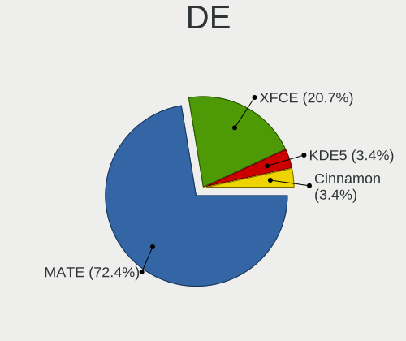

| Name     | Notebooks | Percent |
|----------|-----------|---------|
| MATE     | 21        | 72.41%  |
| XFCE     | 6         | 20.69%  |
| KDE5     | 1         | 3.45%   |
| Cinnamon | 1         | 3.45%   |

Display Server
--------------

X11 or Wayland

| Name | Notebooks | Percent |
|------|-----------|---------|
| X11  | 29        | 100%    |

Display Manager
---------------

SDDM, LightDM, etc.

| Name    | Notebooks | Percent |
|---------|-----------|---------|
| LightDM | 29        | 100%    |

OS Lang
-------

Language

| Lang  | Notebooks | Percent |
|-------|-----------|---------|
| en_US | 13        | 44.83%  |
| C     | 13        | 44.83%  |
| de_DE | 2         | 6.9%    |
| pl_PL | 1         | 3.45%   |

Boot Mode
---------

EFI or BIOS

| Mode | Notebooks | Percent |
|------|-----------|---------|
| EFI  | 27        | 93.1%   |
| BIOS | 2         | 6.9%    |

Filesystem
----------

Type of filesystem

| Type | Notebooks | Percent |
|------|-----------|---------|
| Zfs  | 27        | 93.1%   |
| Ufs  | 2         | 6.9%    |

Part. scheme
------------

Scheme of partitioning

| Type | Notebooks | Percent |
|------|-----------|---------|
| GPT  | 29        | 100%    |

Board
-----

Vendor
------

Motherboard manufacturer

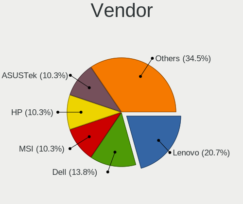

| Name             | Notebooks | Percent |
|------------------|-----------|---------|
| Lenovo           | 6         | 20.69%  |
| Dell             | 4         | 13.79%  |
| MSI              | 3         | 10.34%  |
| Hewlett-Packard  | 3         | 10.34%  |
| ASUSTek Computer | 3         | 10.34%  |
| Fujitsu          | 2         | 6.9%    |
| Acer             | 2         | 6.9%    |
| Toshiba          | 1         | 3.45%   |
| System76         | 1         | 3.45%   |
| Sony             | 1         | 3.45%   |
| HUAWEI           | 1         | 3.45%   |
| Apple            | 1         | 3.45%   |
| Alienware        | 1         | 3.45%   |

Model
-----

Motherboard model

| Name                                   | Notebooks | Percent |
|----------------------------------------|-----------|---------|
| MSI Modern 14 A10M                     | 2         | 6.9%    |
| Toshiba Satellite C855-1U4             | 1         | 3.45%   |
| System76 Kudu                          | 1         | 3.45%   |
| Sony SVP13225SCBI                      | 1         | 3.45%   |
| MSI GE75 Raider 10SFS                  | 1         | 3.45%   |
| Lenovo Yoga Slim 7 Pro 14ACH5 82MS     | 1         | 3.45%   |
| Lenovo ThinkPad X250 20CL001GZA        | 1         | 3.45%   |
| Lenovo ThinkPad X220 4290W42           | 1         | 3.45%   |
| Lenovo ThinkPad T520 4243E51           | 1         | 3.45%   |
| Lenovo ThinkPad T400 6474E18           | 1         | 3.45%   |
| Lenovo Flex 2-15 20405                 | 1         | 3.45%   |
| HUAWEI HLY-WX9XX                       | 1         | 3.45%   |
| HP Laptop 15-dw2xxx                    | 1         | 3.45%   |
| HP EliteBook Folio 1040 G3             | 1         | 3.45%   |
| HP EliteBook 8570p                     | 1         | 3.45%   |
| Fujitsu LIFEBOOK A555                  | 1         | 3.45%   |
| Fujitsu CELSIUS H780                   | 1         | 3.45%   |
| Dell Latitude E6540                    | 1         | 3.45%   |
| Dell Latitude D630                     | 1         | 3.45%   |
| Dell Latitude 5510                     | 1         | 3.45%   |
| Dell Inspiron N5110                    | 1         | 3.45%   |
| ASUS X202E                             | 1         | 3.45%   |
| ASUS VivoBook_ASUSLaptop X515UA_M515UA | 1         | 3.45%   |
| ASUS TUF GAMING FX504GD_FX80GD         | 1         | 3.45%   |
| Apple MacBookPro11,4                   | 1         | 3.45%   |
| Alienware m15 R4                       | 1         | 3.45%   |
| Acer TravelMate B117-M                 | 1         | 3.45%   |
| Acer Aspire A315-56                    | 1         | 3.45%   |

Model Family
------------

Motherboard model prefix

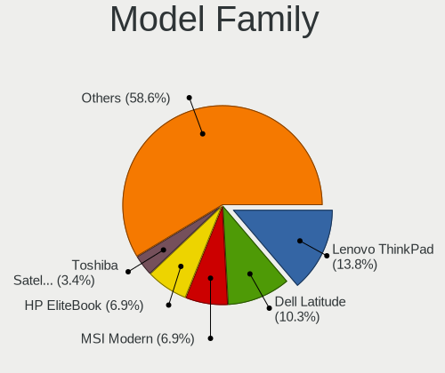

| Name               | Notebooks | Percent |
|--------------------|-----------|---------|
| Lenovo ThinkPad    | 4         | 13.79%  |
| Dell Latitude      | 3         | 10.34%  |
| MSI Modern         | 2         | 6.9%    |
| HP EliteBook       | 2         | 6.9%    |
| Toshiba Satellite  | 1         | 3.45%   |
| System76 Kudu      | 1         | 3.45%   |
| Sony SVP13225SCBI  | 1         | 3.45%   |
| MSI GE75           | 1         | 3.45%   |
| Lenovo Yoga        | 1         | 3.45%   |
| Lenovo Flex        | 1         | 3.45%   |
| HUAWEI HLY-WX9XX   | 1         | 3.45%   |
| HP Laptop          | 1         | 3.45%   |
| Fujitsu LIFEBOOK   | 1         | 3.45%   |
| Fujitsu CELSIUS    | 1         | 3.45%   |
| Dell Inspiron      | 1         | 3.45%   |
| ASUS X202E         | 1         | 3.45%   |
| ASUS VivoBook      | 1         | 3.45%   |
| ASUS TUF           | 1         | 3.45%   |
| Apple MacBookPro11 | 1         | 3.45%   |
| Alienware m15      | 1         | 3.45%   |
| Acer TravelMate    | 1         | 3.45%   |
| Acer Aspire        | 1         | 3.45%   |

MFG Year
--------

Motherboard manufacture year

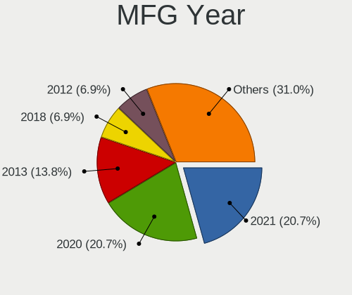

| Year | Notebooks | Percent |
|------|-----------|---------|
| 2021 | 6         | 20.69%  |
| 2020 | 6         | 20.69%  |
| 2018 | 3         | 10.34%  |
| 2013 | 3         | 10.34%  |
| 2012 | 2         | 6.9%    |
| 2011 | 2         | 6.9%    |
| 2019 | 1         | 3.45%   |
| 2017 | 1         | 3.45%   |
| 2016 | 1         | 3.45%   |
| 2015 | 1         | 3.45%   |
| 2014 | 1         | 3.45%   |
| 2009 | 1         | 3.45%   |
| 2008 | 1         | 3.45%   |

Form Factor
-----------

Physical design of the computer

| Name     | Notebooks | Percent |
|----------|-----------|---------|
| Notebook | 29        | 100%    |

Coreboot
--------

Have coreboot on board

| Used | Notebooks | Percent |
|------|-----------|---------|
| No   | 29        | 100%    |

RAM Size
--------

Total RAM memory

| Size in GB | Notebooks | Percent |
|------------|-----------|---------|
| 8.01-16.0  | 14        | 48.28%  |
| 16.01-24.0 | 8         | 27.59%  |
| 4.01-8.0   | 5         | 17.24%  |
| 32.01-64.0 | 2         | 6.9%    |

RAM Used
--------

Used RAM memory

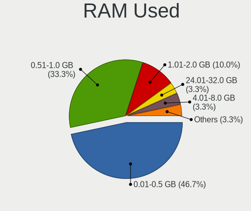

| Used GB    | Notebooks | Percent |
|------------|-----------|---------|
| 0.01-0.5   | 14        | 46.67%  |
| 0.51-1.0   | 10        | 33.33%  |
| 1.01-2.0   | 3         | 10%     |
| 4.01-8.0   | 1         | 3.33%   |
| 24.01-32.0 | 1         | 3.33%   |
| 2.01-3.0   | 1         | 3.33%   |

Total Drives
------------

Number of drives on board

| Drives | Notebooks | Percent |
|--------|-----------|---------|
| 1      | 19        | 63.33%  |
| 2      | 7         | 23.33%  |
| 0      | 4         | 13.33%  |

Has CD-ROM
----------

Has CD-ROM on board

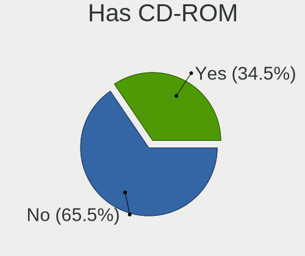

| Presented | Notebooks | Percent |
|-----------|-----------|---------|
| No        | 19        | 65.52%  |
| Yes       | 10        | 34.48%  |

Has Ethernet
------------

Has Ethernet on board

| Presented | Notebooks | Percent |
|-----------|-----------|---------|
| Yes       | 21        | 72.41%  |
| No        | 8         | 27.59%  |

Has WiFi
--------

Has WiFi module

| Presented | Notebooks | Percent |
|-----------|-----------|---------|
| Yes       | 29        | 100%    |

Has Bluetooth
-------------

Has Bluetooth module

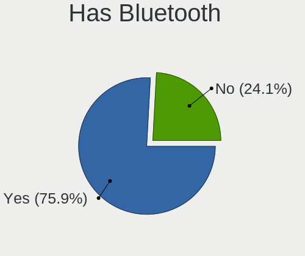

| Presented | Notebooks | Percent |
|-----------|-----------|---------|
| Yes       | 22        | 75.86%  |
| No        | 7         | 24.14%  |

Location
--------

Country
-------

Geographic location (country)

| Country      | Notebooks | Percent |
|--------------|-----------|---------|
| USA          | 7         | 24.14%  |
| Germany      | 5         | 17.24%  |
| Italy        | 2         | 6.9%    |
| China        | 2         | 6.9%    |
| Belgium      | 2         | 6.9%    |
| UK           | 1         | 3.45%   |
| Switzerland  | 1         | 3.45%   |
| Sweden       | 1         | 3.45%   |
| Spain        | 1         | 3.45%   |
| South Africa | 1         | 3.45%   |
| Russia       | 1         | 3.45%   |
| Poland       | 1         | 3.45%   |
| Indonesia    | 1         | 3.45%   |
| India        | 1         | 3.45%   |
| France       | 1         | 3.45%   |
| Canada       | 1         | 3.45%   |

City
----

Geographic location (city)

| City           | Notebooks | Percent |
|----------------|-----------|---------|
| Bonn           | 3         | 10.34%  |
| Wezeren        | 2         | 6.9%    |
| Zurich         | 1         | 3.45%   |
| Witbank        | 1         | 3.45%   |
| Whittier       | 1         | 3.45%   |
| Valencia       | 1         | 3.45%   |
| Toronto        | 1         | 3.45%   |
| Stiring-Wendel | 1         | 3.45%   |
| Staffanstorp   | 1         | 3.45%   |
| St Petersburg  | 1         | 3.45%   |
| Rome           | 1         | 3.45%   |
| New Delhi      | 1         | 3.45%   |
| Nanjing        | 1         | 3.45%   |
| Mystic         | 1         | 3.45%   |
| Murfreesboro   | 1         | 3.45%   |
| Madrid         | 1         | 3.45%   |
| Lingen         | 1         | 3.45%   |
| Knoxville      | 1         | 3.45%   |
| Jakarta        | 1         | 3.45%   |
| Dreieich       | 1         | 3.45%   |
| Denver         | 1         | 3.45%   |
| Cleveland      | 1         | 3.45%   |
| Chełmno    | 1         | 3.45%   |
| Brighton       | 1         | 3.45%   |
| Bologna        | 1         | 3.45%   |
| Baiyun         | 1         | 3.45%   |

Drives
------

Drive Vendor
------------

Hard drive vendors

| Vendor              | Notebooks | Drives | Percent |
|---------------------|-----------|--------|---------|
| Samsung Electronics | 12        | 13     | 38.71%  |
| Kingston            | 4         | 4      | 12.9%   |
| Seagate             | 3         | 3      | 9.68%   |
| WDC                 | 2         | 2      | 6.45%   |
| Toshiba             | 2         | 2      | 6.45%   |
| Crucial             | 2         | 2      | 6.45%   |
| Phison              | 1         | 2      | 3.23%   |
| KingSpec            | 1         | 1      | 3.23%   |
| Intel               | 1         | 1      | 3.23%   |
| HGST                | 1         | 1      | 3.23%   |
| Goodram             | 1         | 1      | 3.23%   |
| Apple               | 1         | 1      | 3.23%   |

Drive Model
-----------

Hard drive models

| Model                              | Notebooks | Percent |
|------------------------------------|-----------|---------|
| Kingston RBUSNS8154P3512GJ 512GB   | 2         | 6.45%   |
| WDC WD5000LPCX-24C6HT0 500GB       | 1         | 3.23%   |
| WDC WD10JMVW-11AJGS1 1TB           | 1         | 3.23%   |
| Toshiba MQ01ABF050 500GB           | 1         | 3.23%   |
| Toshiba KBG30ZMV512G 512GB         | 1         | 3.23%   |
| Seagate ST500LT012-9WS142 500GB    | 1         | 3.23%   |
| Seagate ST2000LM003 HN-M201RAD 2TB | 1         | 3.23%   |
| Seagate ST1000LM049-2GH172 1TB     | 1         | 3.23%   |
| Samsung SSD 860 EVO M.2 1TB        | 1         | 3.23%   |
| Samsung SSD 860 EVO 500GB          | 1         | 3.23%   |
| Samsung SSD 850 EVO 250GB          | 1         | 3.23%   |
| Samsung SSD 840 PRO Series 256GB   | 1         | 3.23%   |
| Samsung SSD 840 EVO 500GB          | 1         | 3.23%   |
| Samsung PM9A1 NVMe 512GB           | 1         | 3.23%   |
| Samsung MZVLQ512HALU-00000 512GB   | 1         | 3.23%   |
| Samsung MZVLQ256HAJD-000H1 256GB   | 1         | 3.23%   |
| Samsung MZVLB512HAJQ-00000 512GB   | 1         | 3.23%   |
| Samsung MZNTE128HMGR-000SO 128GB   | 1         | 3.23%   |
| Samsung MZNLN512HAJQ-00007 512GB   | 1         | 3.23%   |
| Samsung MZMPA024HMCD-000L1 24GB    | 1         | 3.23%   |
| Phison Sabrent Rocket 4.0 2TB      | 1         | 3.23%   |
| Kingston SV300S37A240G 240GB       | 1         | 3.23%   |
| Kingston SV300S37A120G 120GB       | 1         | 3.23%   |
| KingSpec Q-720 720GB               | 1         | 3.23%   |
| Intel SSDPEKNW512G8 512GB          | 1         | 3.23%   |
| HGST HTS721010A9E630 1TB           | 1         | 3.23%   |
| Goodram SSDPR-CL100-120-G2 120GB   | 1         | 3.23%   |
| Crucial CT250MX200SSD4 250GB       | 1         | 3.23%   |
| Crucial CT1000P5SSD8 1TB           | 1         | 3.23%   |
| Apple SSD SM0512G 500GB            | 1         | 3.23%   |

HDD Vendor
----------

Hard disk drive vendors

| Vendor  | Notebooks | Drives | Percent |
|---------|-----------|--------|---------|
| Seagate | 3         | 3      | 42.86%  |
| WDC     | 2         | 2      | 28.57%  |
| Toshiba | 1         | 1      | 14.29%  |
| HGST    | 1         | 1      | 14.29%  |

SSD Vendor
----------

Solid state drive vendors

| Vendor              | Notebooks | Drives | Percent |
|---------------------|-----------|--------|---------|
| Samsung Electronics | 8         | 8      | 57.14%  |
| Kingston            | 2         | 2      | 14.29%  |
| KingSpec            | 1         | 1      | 7.14%   |
| Goodram             | 1         | 1      | 7.14%   |
| Crucial             | 1         | 1      | 7.14%   |
| Apple               | 1         | 1      | 7.14%   |

Drive Kind
----------

HDD or SSD

| Kind | Notebooks | Drives | Percent |
|------|-----------|--------|---------|
| SSD  | 13        | 14     | 44.83%  |
| NVMe | 10        | 12     | 34.48%  |
| HDD  | 6         | 7      | 20.69%  |

Drive Connector
---------------

SATA, SAS, NVMe, etc.

| Type | Notebooks | Drives | Percent |
|------|-----------|--------|---------|
| SATA | 18        | 21     | 64.29%  |
| NVMe | 10        | 12     | 35.71%  |

Drive Size
----------

Size of hard drive

| Size in TB | Notebooks | Drives | Percent |
|------------|-----------|--------|---------|
| 0.01-0.5   | 13        | 14     | 65%     |
| 0.51-1.0   | 6         | 6      | 30%     |
| 1.01-2.0   | 1         | 1      | 5%      |

Space Total
-----------

Amount of disk space available on the file system

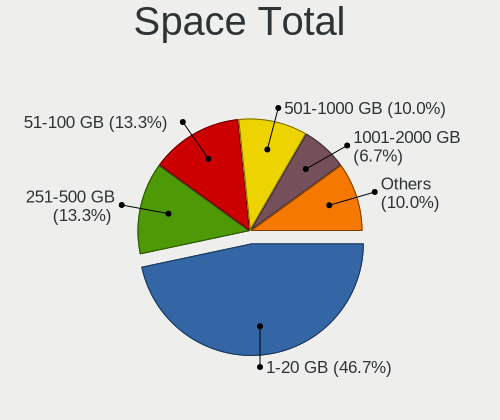

| Size in GB | Notebooks | Percent |
|------------|-----------|---------|
| 1-20       | 14        | 46.67%  |
| 251-500    | 4         | 13.33%  |
| 51-100     | 4         | 13.33%  |
| 501-1000   | 3         | 10%     |
| 1001-2000  | 2         | 6.67%   |
| Unknown    | 2         | 6.67%   |
| 101-250    | 1         | 3.33%   |

Space Used
----------

Amount of used disk space

| Used GB | Notebooks | Percent |
|---------|-----------|---------|
| 1-20    | 26        | 86.67%  |
| 21-50   | 2         | 6.67%   |
| Unknown | 2         | 6.67%   |

Malfunc. Drives
---------------

Drive models with a malfunction

| Model                                        | Notebooks | Drives | Percent |
|----------------------------------------------|-----------|--------|---------|
| Seagate ST500LT012-9WS142 500GB              | 1         | 1      | 33.33%  |
| Samsung Electronics SSD 840 PRO Series 256GB | 1         | 1      | 33.33%  |
| HGST HTS721010A9E630 1TB                     | 1         | 1      | 33.33%  |

Malfunc. Drive Vendor
---------------------

Vendors of faulty drives

| Vendor              | Notebooks | Drives | Percent |
|---------------------|-----------|--------|---------|
| Seagate             | 1         | 1      | 33.33%  |
| Samsung Electronics | 1         | 1      | 33.33%  |
| HGST                | 1         | 1      | 33.33%  |

Malfunc. HDD Vendor
-------------------

Vendors of faulty HDD drives

| Vendor  | Notebooks | Drives | Percent |
|---------|-----------|--------|---------|
| Seagate | 1         | 1      | 50%     |
| HGST    | 1         | 1      | 50%     |

Malfunc. Drive Kind
-------------------

Kinds of faulty drives

| Kind | Notebooks | Drives | Percent |
|------|-----------|--------|---------|
| HDD  | 2         | 2      | 66.67%  |
| SSD  | 1         | 1      | 33.33%  |

Failed Drives
-------------

Failed drive models

Zero info for selected period =(

Failed Drive Vendor
-------------------

Failed drive vendors

Zero info for selected period =(

Drive Status
------------

Number of failed and malfunc. drives

| Status  | Notebooks | Drives | Percent |
|---------|-----------|--------|---------|
| Works   | 24        | 30     | 88.89%  |
| Malfunc | 3         | 3      | 11.11%  |

Storage controller
------------------

Storage Vendor
--------------

Storage controller vendors

| Vendor                      | Notebooks | Percent |
|-----------------------------|-----------|---------|
| Intel                       | 22        | 66.67%  |
| Samsung Electronics         | 5         | 15.15%  |
| Kingston Technology Company | 2         | 6.06%   |
| Toshiba                     | 1         | 3.03%   |
| Phison Electronics          | 1         | 3.03%   |
| Micron/Crucial Technology   | 1         | 3.03%   |
| AMD                         | 1         | 3.03%   |

Storage Model
-------------

Storage controller models

| Model                                                                            | Notebooks | Percent |
|----------------------------------------------------------------------------------|-----------|---------|
| Intel 7 Series Chipset Family 6-port SATA Controller [AHCI mode]                 | 3         | 8.57%   |
| Intel 6 Series/C200 Series Chipset Family 6 port Mobile SATA AHCI Controller     | 3         | 8.57%   |
| Samsung NVMe SSD Controller 980                                                  | 2         | 5.71%   |
| Kingston Company U-SNS8154P3 NVMe SSD                                            | 2         | 5.71%   |
| Intel Wildcat Point-LP SATA Controller [AHCI Mode]                               | 2         | 5.71%   |
| Intel Cannon Lake Mobile PCH SATA AHCI Controller                                | 2         | 5.71%   |
| Intel 8 Series SATA Controller 1 [AHCI mode]                                     | 2         | 5.71%   |
| Toshiba BG3 NVMe SSD Controller                                                  | 1         | 2.86%   |
| Samsung S4LN058A01[SSUBX] AHCI SSD Controller (Apple slot)                       | 1         | 2.86%   |
| Samsung NVMe SSD Controller SM981/PM981/PM983                                    | 1         | 2.86%   |
| Samsung NVMe SSD Controller PM9A1/PM9A3/980PRO                                   | 1         | 2.86%   |
| Phison E16 PCIe4 NVMe Controller                                                 | 1         | 2.86%   |
| Micron/Crucial P5 NVMe PCIe SSD[SlashP5]                                         | 1         | 2.86%   |
| Intel Sunrise Point-LP SATA Controller [AHCI mode]                               | 1         | 2.86%   |
| Intel SSD 660P Series                                                            | 1         | 2.86%   |
| Intel Ice Lake-LP SATA Controller [AHCI mode]                                    | 1         | 2.86%   |
| Intel HM170/QM170 Chipset SATA Controller [AHCI Mode]                            | 1         | 2.86%   |
| Intel Comet Lake SATA AHCI Controller                                            | 1         | 2.86%   |
| Intel Atom/Celeron/Pentium Processor x5-E8000/J3xxx/N3xxx Series SATA Controller | 1         | 2.86%   |
| Intel 82801IBM/IEM (ICH9M/ICH9M-E) 4 port SATA Controller [AHCI mode]            | 1         | 2.86%   |
| Intel 82801HM/HEM (ICH8M/ICH8M-E) SATA Controller [AHCI mode]                    | 1         | 2.86%   |
| Intel 82801HM/HEM (ICH8M/ICH8M-E) IDE Controller                                 | 1         | 2.86%   |
| Intel 82801 Mobile SATA Controller [RAID mode]                                   | 1         | 2.86%   |
| Intel 8 Series/C220 Series Chipset Family 6-port SATA Controller 1 [AHCI mode]   | 1         | 2.86%   |
| Intel 400 Series Chipset Family SATA AHCI Controller                             | 1         | 2.86%   |
| AMD FCH SATA Controller [AHCI mode]                                              | 1         | 2.86%   |

Storage Kind
------------

Kind of storage controller (IDE, SATA, NVMe, SAS, ...)

| Kind | Notebooks | Percent |
|------|-----------|---------|
| SATA | 23        | 65.71%  |
| NVMe | 10        | 28.57%  |
| RAID | 1         | 2.86%   |
| IDE  | 1         | 2.86%   |

Processor
---------

CPU Vendor
----------

Processor vendors

| Vendor | Notebooks | Percent |
|--------|-----------|---------|
| Intel  | 26        | 89.66%  |
| AMD    | 3         | 10.34%  |

CPU Model
---------

Processor models

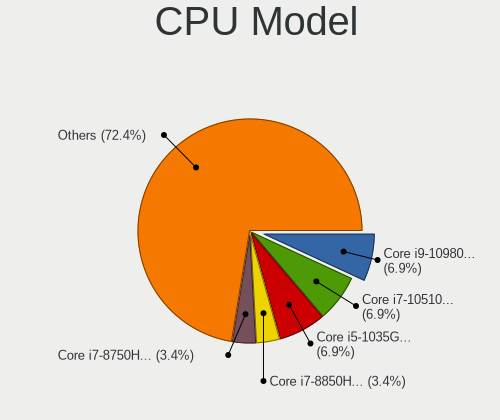

| Model                                         | Notebooks | Percent |
|-----------------------------------------------|-----------|---------|
| Intel Core i9-10980HK CPU @ 2.40GHz           | 2         | 6.9%    |
| Intel Core i7-10510U CPU @ 1.80GHz            | 2         | 6.9%    |
| Intel Core i5-1035G1 CPU @ 1.00GHz            | 2         | 6.9%    |
| Intel Core i7-8850H CPU @ 2.60GHz             | 1         | 3.45%   |
| Intel Core i7-8750H CPU @ 2.20GHz             | 1         | 3.45%   |
| Intel Core i7-6700HQ CPU @ 2.60GHz            | 1         | 3.45%   |
| Intel Core i7-4810MQ CPU @ 2.80GHz            | 1         | 3.45%   |
| Intel Core i7-4770HQ CPU @ 2.20GHz            | 1         | 3.45%   |
| Intel Core i7-3520M CPU @ 2.90GHz             | 1         | 3.45%   |
| Intel Core i7-2620M CPU @ 2.70GHz             | 1         | 3.45%   |
| Intel Core i5-6300U CPU @ 2.40GHz             | 1         | 3.45%   |
| Intel Core i5-5300U CPU @ 2.30GHz             | 1         | 3.45%   |
| Intel Core i5-4200U CPU @ 1.60GHz             | 1         | 3.45%   |
| Intel Core i5-3210M CPU @ 2.50GHz             | 1         | 3.45%   |
| Intel Core i5-2520M CPU @ 2.50GHz             | 1         | 3.45%   |
| Intel Core i5-2430M CPU @ 2.40GHz             | 1         | 3.45%   |
| Intel Core i5-10310U CPU @ 1.70GHz            | 1         | 3.45%   |
| Intel Core i3-5005U CPU @ 2.00GHz             | 1         | 3.45%   |
| Intel Core i3-4030U CPU @ 1.90GHz             | 1         | 3.45%   |
| Intel Core i3-3217U CPU @ 1.80GHz             | 1         | 3.45%   |
| Intel Core 2 Duo CPU P8600 @ 2.40GHz          | 1         | 3.45%   |
| Intel Core 2 Duo                              | 1         | 3.45%   |
| Intel Celeron CPU N3160 @ 1.60GHz             | 1         | 3.45%   |
| AMD Ryzen 7 5800H with Radeon Graphics        | 1         | 3.45%   |
| AMD Ryzen 5 5500U with Radeon Graphics        | 1         | 3.45%   |
| AMD Ryzen 5 3550H with Radeon Vega Mobile Gfx | 1         | 3.45%   |

CPU Model Family
----------------

Processor model prefix

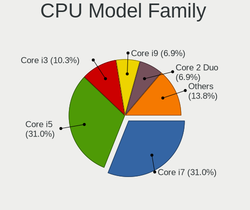

| Model            | Notebooks | Percent |
|------------------|-----------|---------|
| Intel Core i7    | 9         | 31.03%  |
| Intel Core i5    | 9         | 31.03%  |
| Intel Core i3    | 3         | 10.34%  |
| Intel Core i9    | 2         | 6.9%    |
| Intel Core 2 Duo | 2         | 6.9%    |
| AMD Ryzen 5      | 2         | 6.9%    |
| Intel Celeron    | 1         | 3.45%   |
| AMD Ryzen 7      | 1         | 3.45%   |

CPU Cores
---------

Number of processor cores

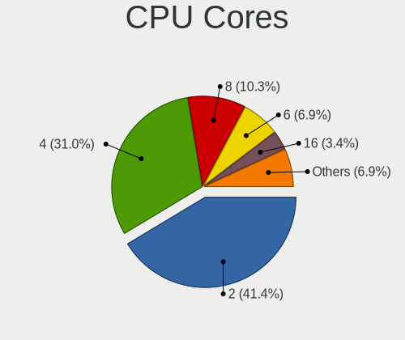

| Number  | Notebooks | Percent |
|---------|-----------|---------|
| 2       | 12        | 41.38%  |
| 4       | 9         | 31.03%  |
| 8       | 3         | 10.34%  |
| 6       | 2         | 6.9%    |
| 16      | 1         | 3.45%   |
| 12      | 1         | 3.45%   |
| Unknown | 1         | 3.45%   |

CPU Sockets
-----------

Number of sockets

| Number | Notebooks | Percent |
|--------|-----------|---------|
| 1      | 29        | 100%    |

CPU Threads
-----------

Threads per core (Hyper-Threading)

| Number  | Notebooks | Percent |
|---------|-----------|---------|
| 2       | 23        | 79.31%  |
| 1       | 5         | 17.24%  |
| Unknown | 1         | 3.45%   |

CPU Microarch
-------------

Microarchitecture

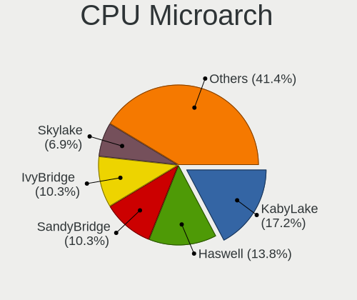

| Name        | Notebooks | Percent |
|-------------|-----------|---------|
| KabyLake    | 5         | 17.24%  |
| Haswell     | 4         | 13.79%  |
| SandyBridge | 3         | 10.34%  |
| IvyBridge   | 3         | 10.34%  |
| Skylake     | 2         | 6.9%    |
| IceLake     | 2         | 6.9%    |
| CometLake   | 2         | 6.9%    |
| Broadwell   | 2         | 6.9%    |
| Zen+        | 1         | 3.45%   |
| Zen 3       | 1         | 3.45%   |
| Silvermont  | 1         | 3.45%   |
| Penryn      | 1         | 3.45%   |
| Core        | 1         | 3.45%   |
| Unknown     | 1         | 3.45%   |

Graphics
--------

GPU Vendor
----------

Vendors of graphics cards

| Vendor | Notebooks | Percent |
|--------|-----------|---------|
| Intel  | 24        | 66.67%  |
| Nvidia | 6         | 16.67%  |
| AMD    | 6         | 16.67%  |

GPU Model
---------

Graphics card models

| Model                                                                                    | Notebooks | Percent |
|------------------------------------------------------------------------------------------|-----------|---------|
| Intel CometLake-U GT2 [UHD Graphics]                                                     | 3         | 8.11%   |
| Intel 2nd Generation Core Processor Family Integrated Graphics Controller                | 3         | 8.11%   |
| Intel Iris Plus Graphics G1 (Ice Lake)                                                   | 2         | 5.41%   |
| Intel HD Graphics 5500                                                                   | 2         | 5.41%   |
| Intel Haswell-ULT Integrated Graphics Controller                                         | 2         | 5.41%   |
| Intel CometLake-H GT2 [UHD Graphics]                                                     | 2         | 5.41%   |
| Intel CoffeeLake-H GT2 [UHD Graphics 630]                                                | 2         | 5.41%   |
| Nvidia TU104M [GeForce RTX 2070 SUPER Mobile / Max-Q]                                    | 1         | 2.7%    |
| Nvidia GP107M [GeForce GTX 1050 Mobile]                                                  | 1         | 2.7%    |
| Nvidia GP107GLM [Quadro P2000 Mobile]                                                    | 1         | 2.7%    |
| Nvidia GF119M [Quadro NVS 4200M]                                                         | 1         | 2.7%    |
| Nvidia GF108M [GeForce GT 525M]                                                          | 1         | 2.7%    |
| Nvidia GA104M [GeForce RTX 3080 Mobile / Max-Q 8GB/16GB]                                 | 1         | 2.7%    |
| Intel Skylake GT2 [HD Graphics 520]                                                      | 1         | 2.7%    |
| Intel Mobile GM965/GL960 Integrated Graphics Controller (secondary)                      | 1         | 2.7%    |
| Intel Mobile GM965/GL960 Integrated Graphics Controller (primary)                        | 1         | 2.7%    |
| Intel Mobile 4 Series Chipset Integrated Graphics Controller                             | 1         | 2.7%    |
| Intel HD Graphics 530                                                                    | 1         | 2.7%    |
| Intel Crystal Well Integrated Graphics Controller                                        | 1         | 2.7%    |
| Intel Atom/Celeron/Pentium Processor x5-E8000/J3xxx/N3xxx Integrated Graphics Controller | 1         | 2.7%    |
| Intel 4th Gen Core Processor Integrated Graphics Controller                              | 1         | 2.7%    |
| Intel 3rd Gen Core processor Graphics Controller                                         | 1         | 2.7%    |
| AMD Whistler LE [Radeon HD 6610M/7610M]                                                  | 1         | 2.7%    |
| AMD Thames [Radeon HD 7550M/7570M/7650M]                                                 | 1         | 2.7%    |
| AMD Picasso/Raven 2 [Radeon Vega Series / Radeon Vega Mobile Series]                     | 1         | 2.7%    |
| AMD Mars XTX [Radeon HD 8790M]                                                           | 1         | 2.7%    |
| AMD Lucienne                                                                             | 1         | 2.7%    |
| AMD Cezanne [Radeon Vega Series / Radeon Vega Mobile Series]                             | 1         | 2.7%    |

GPU Combo
---------

Combinations of graphics cards

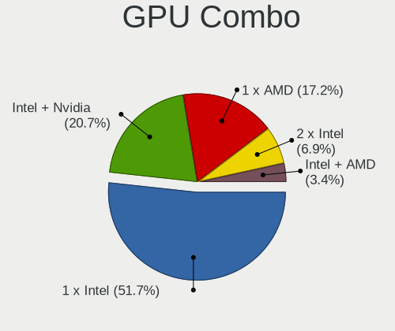

| Name           | Notebooks | Percent |
|----------------|-----------|---------|
| 1 x Intel      | 15        | 51.72%  |
| Intel + Nvidia | 6         | 20.69%  |
| 1 x AMD        | 5         | 17.24%  |
| 2 x Intel      | 2         | 6.9%    |
| Intel + AMD    | 1         | 3.45%   |

GPU Driver
----------

Free vs proprietary

| Driver      | Notebooks | Percent |
|-------------|-----------|---------|
| Free        | 26        | 89.66%  |
| Proprietary | 3         | 10.34%  |

GPU Memory
----------

Total video memory

| Size in GB | Notebooks | Percent |
|------------|-----------|---------|
| Unknown    | 27        | 93.1%   |
| 0.51-1.0   | 2         | 6.9%    |

Monitor
-------

Monitor Vendor
--------------

Monitor vendors

| Vendor              | Notebooks | Percent |
|---------------------|-----------|---------|
| AU Optronics        | 8         | 32%     |
| Chimei Innolux      | 6         | 24%     |
| LG Display          | 5         | 20%     |
| Lenovo              | 2         | 8%      |
| Samsung Electronics | 1         | 4%      |
| Panasonic           | 1         | 4%      |
| Dell                | 1         | 4%      |
| Apple               | 1         | 4%      |

Monitor Model
-------------

Monitor models

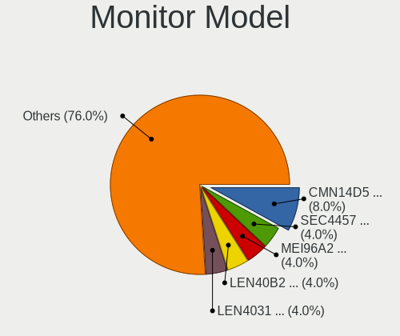

| Model                                                                | Notebooks | Percent |
|----------------------------------------------------------------------|-----------|---------|
| Chimei Innolux LCD Monitor CMN14D5 1920x1080 310x170mm 13.9-inch     | 2         | 8%      |
| Samsung Electronics LCD Monitor SEC4457 1440x900 300x190mm 14.0-inch | 1         | 4%      |
| Panasonic VVX13F009G00 MEI96A2 1920x1080 290x170mm 13.2-inch         | 1         | 4%      |
| LG Display LCD Monitor LGD066E 1920x1080 340x190mm 15.3-inch         | 1         | 4%      |
| LG Display LCD Monitor LGD03CD 1366x768 280x160mm 12.7-inch          | 1         | 4%      |
| LG Display LCD Monitor LGD0353 1366x768 350x190mm 15.7-inch          | 1         | 4%      |
| LG Display LCD Monitor LGD02DC 1366x768 340x190mm 15.3-inch          | 1         | 4%      |
| LG Display LCD Monitor LGD02D8 1366x768 280x160mm 12.7-inch          | 1         | 4%      |
| Lenovo LCD Monitor LEN40B2 1920x1080 340x190mm 15.3-inch             | 1         | 4%      |
| Lenovo LCD Monitor LEN4031 1280x800 300x190mm 14.0-inch              | 1         | 4%      |
| Dell U2312HM DEL4073 1920x1080 510x290mm 23.1-inch                   | 1         | 4%      |
| Chimei Innolux LCD Monitor CMN1604 1920x1080 360x200mm 16.2-inch     | 1         | 4%      |
| Chimei Innolux LCD Monitor CMN15F5 1920x1080 340x190mm 15.3-inch     | 1         | 4%      |
| Chimei Innolux LCD Monitor CMN15F4 1920x1080 340x190mm 15.3-inch     | 1         | 4%      |
| Chimei Innolux LCD Monitor CMN1132 1366x768 260x140mm 11.6-inch      | 1         | 4%      |
| AU Optronics LCD Monitor AUO80EC 1366x768 340x190mm 15.3-inch        | 1         | 4%      |
| AU Optronics LCD Monitor AUO509D 1920x1080 380x220mm 17.3-inch       | 1         | 4%      |
| AU Optronics LCD Monitor AUO35EC 1366x768 340x190mm 15.3-inch        | 1         | 4%      |
| AU Optronics LCD Monitor AUO305C 1366x768 260x140mm 11.6-inch        | 1         | 4%      |
| AU Optronics LCD Monitor AUO26ED 1920x1080 340x190mm 15.3-inch       | 1         | 4%      |
| AU Optronics LCD Monitor AUO21ED 1920x1080 340x190mm 15.3-inch       | 1         | 4%      |
| AU Optronics LCD Monitor AUO119D 1920x1080 380x210mm 17.1-inch       | 1         | 4%      |
| AU Optronics LCD Monitor AUO1136 2560x1440 310x170mm 13.9-inch       | 1         | 4%      |
| Apple Color LCD APPA02E 2880x1800 330x210mm 15.4-inch                | 1         | 4%      |

Monitor Resolution
------------------

Monitor screen resolution

| Resolution       | Notebooks | Percent |
|------------------|-----------|---------|
| 1920x1080 (FHD)  | 12        | 48%     |
| 1366x768 (WXGA)  | 8         | 32%     |
| 2880x1800        | 1         | 4%      |
| 2880x1620        | 1         | 4%      |
| 2560x1440 (QHD)  | 1         | 4%      |
| 1440x900 (WXGA+) | 1         | 4%      |
| 1280x800 (WXGA)  | 1         | 4%      |

Monitor Diagonal
----------------

Diagonal size in inches

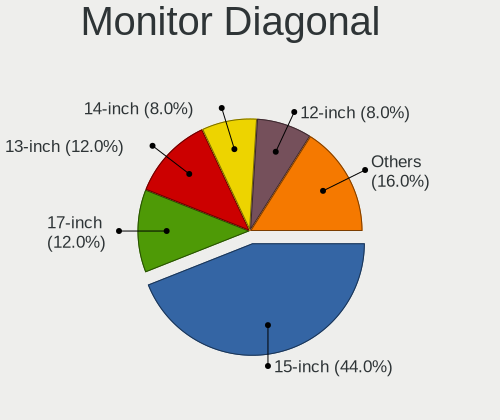

| Inches | Notebooks | Percent |
|--------|-----------|---------|
| 15     | 12        | 48%     |
| 13     | 3         | 12%     |
| 17     | 2         | 8%      |
| 14     | 2         | 8%      |
| 12     | 2         | 8%      |
| 11     | 2         | 8%      |
| 23     | 1         | 4%      |
| 16     | 1         | 4%      |

Monitor Width
-------------

Physical width

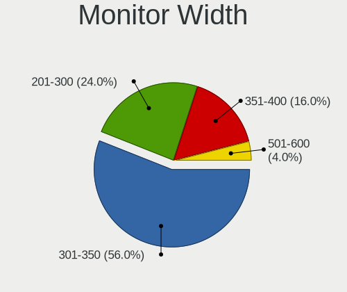

| Width in mm | Notebooks | Percent |
|-------------|-----------|---------|
| 301-350     | 15        | 60%     |
| 201-300     | 6         | 24%     |
| 351-400     | 3         | 12%     |
| 501-600     | 1         | 4%      |

Aspect Ratio
------------

Proportional relationship between the width and the height

| Ratio | Notebooks | Percent |
|-------|-----------|---------|
| 16/9  | 22        | 88%     |
| 16/10 | 3         | 12%     |

Monitor Area
------------

Area in inch²

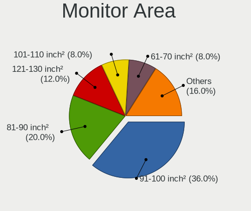

| Area in inch² | Notebooks | Percent |
|----------------|-----------|---------|
| 91-100         | 10        | 40%     |
| 81-90          | 5         | 20%     |
| 61-70          | 2         | 8%      |
| 51-60          | 2         | 8%      |
| 121-130        | 2         | 8%      |
| 101-110        | 2         | 8%      |
| 201-250        | 1         | 4%      |
| 111-120        | 1         | 4%      |

Pixel Density
-------------

Pixels per inch

| Density | Notebooks | Percent |
|---------|-----------|---------|
| 121-160 | 16        | 64%     |
| 101-120 | 4         | 16%     |
| 161-240 | 3         | 12%     |
| 51-100  | 2         | 8%      |

Multiple Monitors
-----------------

Total monitors connected

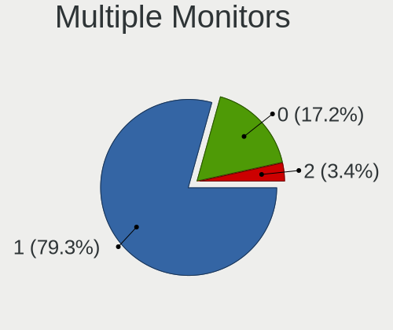

| Total | Notebooks | Percent |
|-------|-----------|---------|
| 1     | 23        | 79.31%  |
| 0     | 5         | 17.24%  |
| 2     | 1         | 3.45%   |

Network
-------

Net Controller Vendor
---------------------

Controller vendors

| Vendor                            | Notebooks | Percent |
|-----------------------------------|-----------|---------|
| Intel                             | 19        | 45.24%  |
| Realtek Semiconductor             | 10        | 23.81%  |
| Qualcomm Atheros                  | 6         | 14.29%  |
| Broadcom                          | 2         | 4.76%   |
| ASUSTek Computer                  | 2         | 4.76%   |
| Hewlett-Packard                   | 1         | 2.38%   |
| Ericsson Business Mobile Networks | 1         | 2.38%   |
| Edimax Technology                 | 1         | 2.38%   |

Net Controller Model
--------------------

Controller models

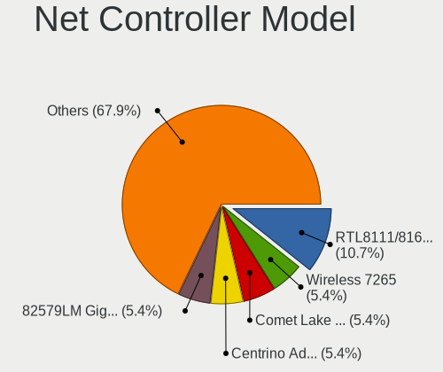

| Model                                                                       | Notebooks | Percent |
|-----------------------------------------------------------------------------|-----------|---------|
| Realtek RTL8111/8168/8411 PCI Express Gigabit Ethernet Controller           | 6         | 10.71%  |
| Intel Wireless 7265                                                         | 3         | 5.36%   |
| Intel Comet Lake PCH-LP CNVi WiFi                                           | 3         | 5.36%   |
| Intel Centrino Advanced-N 6205 [Taylor Peak]                                | 3         | 5.36%   |
| Intel 82579LM Gigabit Network Connection (Lewisville)                       | 3         | 5.36%   |
| Realtek RTL810xE PCI Express Fast Ethernet controller                       | 2         | 3.57%   |
| Qualcomm Atheros QCA9377 802.11ac Wireless Network Adapter                  | 2         | 3.57%   |
| Qualcomm Atheros AR9485 Wireless Network Adapter                            | 2         | 3.57%   |
| Intel Wireless 8260                                                         | 2         | 3.57%   |
| Intel Cannon Lake PCH CNVi WiFi                                             | 2         | 3.57%   |
| Realtek RTL8852AE 802.11ax PCIe Wireless Network Adapter                    | 1         | 1.79%   |
| Realtek RTL8822CE 802.11ac PCIe Wireless Network Adapter                    | 1         | 1.79%   |
| Realtek RTL8723BE PCIe Wireless Network Adapter                             | 1         | 1.79%   |
| Realtek RTL8723AE PCIe Wireless Network Adapter                             | 1         | 1.79%   |
| Realtek RTL8188EUS 802.11n Wireless Network Adapter                         | 1         | 1.79%   |
| Qualcomm Atheros Killer E2500 Gigabit Ethernet Controller                   | 1         | 1.79%   |
| Qualcomm Atheros AR9285 Wireless Network Adapter (PCI-Express)              | 1         | 1.79%   |
| Qualcomm Atheros AR8162 Fast Ethernet                                       | 1         | 1.79%   |
| Intel Wireless 7260                                                         | 1         | 1.79%   |
| Intel Wi-Fi 6 AX200                                                         | 1         | 1.79%   |
| Intel PRO/Wireless 5100 AGN [Shiloh] Network Connection                     | 1         | 1.79%   |
| Intel Killer E3100X 2.5 Gigabit Ethernet Controller                         | 1         | 1.79%   |
| Intel Ice Lake-LP PCH CNVi WiFi                                             | 1         | 1.79%   |
| Intel Ethernet Connection I219-LM                                           | 1         | 1.79%   |
| Intel Ethernet Connection I217-LM                                           | 1         | 1.79%   |
| Intel Ethernet Connection (7) I219-LM                                       | 1         | 1.79%   |
| Intel Ethernet Connection (3) I218-LM                                       | 1         | 1.79%   |
| Intel Ethernet Connection (10) I219-LM                                      | 1         | 1.79%   |
| Intel Comet Lake PCH CNVi WiFi                                              | 1         | 1.79%   |
| Intel Centrino Ultimate-N 6300                                              | 1         | 1.79%   |
| Intel 82567LM Gigabit Network Connection                                    | 1         | 1.79%   |
| HP hs2350 HSPA+ Mobile Broadband Module Network Adapter                     | 1         | 1.79%   |
| Ericsson Business Mobile Networks N5321 gw Mobile Broadband Serial Port III | 1         | 1.79%   |
| Edimax EW-7612UAn V2 802.11n Wireless Adapter [Realtek RTL8192CU]           | 1         | 1.79%   |
| Broadcom NetXtreme BCM5755M Gigabit Ethernet PCI Express                    | 1         | 1.79%   |
| Broadcom BCM43602 802.11ac Wireless LAN SoC                                 | 1         | 1.79%   |
| ASUS WL-167G v1 802.11g Adapter [Ralink RT2571]                             | 1         | 1.79%   |
| ASUS USB-N13 802.11n Network Adapter (rev. B1) [Realtek RTL8192CU]          | 1         | 1.79%   |

Wireless Vendor
---------------

Wireless vendors

| Vendor                | Notebooks | Percent |
|-----------------------|-----------|---------|
| Intel                 | 19        | 57.58%  |
| Realtek Semiconductor | 5         | 15.15%  |
| Qualcomm Atheros      | 5         | 15.15%  |
| ASUSTek Computer      | 2         | 6.06%   |
| Edimax Technology     | 1         | 3.03%   |
| Broadcom              | 1         | 3.03%   |

Wireless Model
--------------

Wireless models

| Model                                                              | Notebooks | Percent |
|--------------------------------------------------------------------|-----------|---------|
| Intel Wireless 7265                                                | 3         | 9.09%   |
| Intel Comet Lake PCH-LP CNVi WiFi                                  | 3         | 9.09%   |
| Intel Centrino Advanced-N 6205 [Taylor Peak]                       | 3         | 9.09%   |
| Qualcomm Atheros QCA9377 802.11ac Wireless Network Adapter         | 2         | 6.06%   |
| Qualcomm Atheros AR9485 Wireless Network Adapter                   | 2         | 6.06%   |
| Intel Wireless 8260                                                | 2         | 6.06%   |
| Intel Cannon Lake PCH CNVi WiFi                                    | 2         | 6.06%   |
| Realtek RTL8852AE 802.11ax PCIe Wireless Network Adapter           | 1         | 3.03%   |
| Realtek RTL8822CE 802.11ac PCIe Wireless Network Adapter           | 1         | 3.03%   |
| Realtek RTL8723BE PCIe Wireless Network Adapter                    | 1         | 3.03%   |
| Realtek RTL8723AE PCIe Wireless Network Adapter                    | 1         | 3.03%   |
| Realtek RTL8188EUS 802.11n Wireless Network Adapter                | 1         | 3.03%   |
| Qualcomm Atheros AR9285 Wireless Network Adapter (PCI-Express)     | 1         | 3.03%   |
| Intel Wireless 7260                                                | 1         | 3.03%   |
| Intel Wi-Fi 6 AX200                                                | 1         | 3.03%   |
| Intel PRO/Wireless 5100 AGN [Shiloh] Network Connection            | 1         | 3.03%   |
| Intel Ice Lake-LP PCH CNVi WiFi                                    | 1         | 3.03%   |
| Intel Comet Lake PCH CNVi WiFi                                     | 1         | 3.03%   |
| Intel Centrino Ultimate-N 6300                                     | 1         | 3.03%   |
| Edimax EW-7612UAn V2 802.11n Wireless Adapter [Realtek RTL8192CU]  | 1         | 3.03%   |
| Broadcom BCM43602 802.11ac Wireless LAN SoC                        | 1         | 3.03%   |
| ASUS WL-167G v1 802.11g Adapter [Ralink RT2571]                    | 1         | 3.03%   |
| ASUS USB-N13 802.11n Network Adapter (rev. B1) [Realtek RTL8192CU] | 1         | 3.03%   |

Ethernet Vendor
---------------

Ethernet vendors

| Vendor                | Notebooks | Percent |
|-----------------------|-----------|---------|
| Intel                 | 10        | 47.62%  |
| Realtek Semiconductor | 8         | 38.1%   |
| Qualcomm Atheros      | 2         | 9.52%   |
| Broadcom              | 1         | 4.76%   |

Ethernet Model
--------------

Ethernet models

| Model                                                             | Notebooks | Percent |
|-------------------------------------------------------------------|-----------|---------|
| Realtek RTL8111/8168/8411 PCI Express Gigabit Ethernet Controller | 6         | 28.57%  |
| Intel 82579LM Gigabit Network Connection (Lewisville)             | 3         | 14.29%  |
| Realtek RTL810xE PCI Express Fast Ethernet controller             | 2         | 9.52%   |
| Qualcomm Atheros Killer E2500 Gigabit Ethernet Controller         | 1         | 4.76%   |
| Qualcomm Atheros AR8162 Fast Ethernet                             | 1         | 4.76%   |
| Intel Killer E3100X 2.5 Gigabit Ethernet Controller               | 1         | 4.76%   |
| Intel Ethernet Connection I219-LM                                 | 1         | 4.76%   |
| Intel Ethernet Connection I217-LM                                 | 1         | 4.76%   |
| Intel Ethernet Connection (7) I219-LM                             | 1         | 4.76%   |
| Intel Ethernet Connection (3) I218-LM                             | 1         | 4.76%   |
| Intel Ethernet Connection (10) I219-LM                            | 1         | 4.76%   |
| Intel 82567LM Gigabit Network Connection                          | 1         | 4.76%   |
| Broadcom NetXtreme BCM5755M Gigabit Ethernet PCI Express          | 1         | 4.76%   |

Net Controller Kind
-------------------

Ethernet, WiFi or modem

| Kind     | Notebooks | Percent |
|----------|-----------|---------|
| WiFi     | 29        | 55.77%  |
| Ethernet | 21        | 40.38%  |
| Modem    | 2         | 3.85%   |

Used Controller
---------------

Currently used network controller

| Kind     | Notebooks | Percent |
|----------|-----------|---------|
| Ethernet | 21        | 48.84%  |
| WiFi     | 20        | 46.51%  |
| Modem    | 2         | 4.65%   |

NICs
----

Total network controllers on board

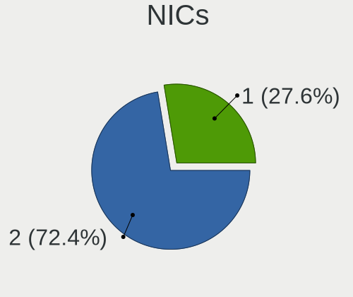

| Total | Notebooks | Percent |
|-------|-----------|---------|
| 2     | 21        | 72.41%  |
| 1     | 8         | 27.59%  |

IPv6
----

IPv6 vs IPv4

| Used | Notebooks | Percent |
|------|-----------|---------|
| No   | 29        | 100%    |

Bluetooth
---------

Bluetooth Vendor
----------------

Controller vendors

| Vendor                | Notebooks | Percent |
|-----------------------|-----------|---------|
| Intel                 | 15        | 65.22%  |
| IMC Networks          | 3         | 13.04%  |
| Realtek Semiconductor | 2         | 8.7%    |
| Toshiba               | 1         | 4.35%   |
| Lite-On Technology    | 1         | 4.35%   |
| Apple                 | 1         | 4.35%   |

Bluetooth Model
---------------

Controller models

| Model                                             | Notebooks | Percent |
|---------------------------------------------------|-----------|---------|
| Intel Bluetooth wireless interface                | 7         | 30.43%  |
| Intel Bluetooth 9460/9560 Jefferson Peak (JfP)    | 4         | 17.39%  |
| Intel AX201 Bluetooth                             | 3         | 13.04%  |
| IMC Networks Atheros AR3012 Bluetooth 4.0 Adapter | 2         | 8.7%    |
| Toshiba Realtek Bluetooth 4.0 + High Speed Chip   | 1         | 4.35%   |
| Realtek RTL8723B Bluetooth                        | 1         | 4.35%   |
| Realtek Bluetooth Adapter                         | 1         | 4.35%   |
| Lite-On Qualcomm Atheros QCA9377 Bluetooth        | 1         | 4.35%   |
| Intel AX200 Bluetooth                             | 1         | 4.35%   |
| IMC Networks Qualcomm Atheros Bluetooth 4.1       | 1         | 4.35%   |
| Apple Bluetooth Host Controller                   | 1         | 4.35%   |

Sound
-----

Sound Vendor
------------

Sound card vendors

| Vendor | Notebooks | Percent |
|--------|-----------|---------|
| Intel  | 26        | 76.47%  |
| AMD    | 5         | 14.71%  |
| Nvidia | 3         | 8.82%   |

Sound Model
-----------

Sound card models

| Model                                                                                             | Notebooks | Percent |
|---------------------------------------------------------------------------------------------------|-----------|---------|
| Intel Comet Lake PCH-LP cAVS                                                                      | 3         | 6.98%   |
| Intel 7 Series/C216 Chipset Family High Definition Audio Controller                               | 3         | 6.98%   |
| Intel 6 Series/C200 Series Chipset Family High Definition Audio Controller                        | 3         | 6.98%   |
| AMD Family 17h/19h HD Audio Controller                                                            | 3         | 6.98%   |
| Intel Wildcat Point-LP High Definition Audio Controller                                           | 2         | 4.65%   |
| Intel Ice Lake-LP Smart Sound Technology Audio Controller                                         | 2         | 4.65%   |
| Intel Haswell-ULT HD Audio Controller                                                             | 2         | 4.65%   |
| Intel Comet Lake PCH cAVS                                                                         | 2         | 4.65%   |
| Intel Cannon Lake PCH cAVS                                                                        | 2         | 4.65%   |
| Intel Broadwell-U Audio Controller                                                                | 2         | 4.65%   |
| Intel 8 Series/C220 Series Chipset High Definition Audio Controller                               | 2         | 4.65%   |
| Intel 8 Series HD Audio Controller                                                                | 2         | 4.65%   |
| AMD Turks HDMI Audio [Radeon HD 6500/6600 / 6700M Series]                                         | 2         | 4.65%   |
| AMD Renoir Radeon High Definition Audio Controller                                                | 2         | 4.65%   |
| Nvidia TU104 HD Audio Controller                                                                  | 1         | 2.33%   |
| Nvidia GF108 High Definition Audio Controller                                                     | 1         | 2.33%   |
| Nvidia GA104 High Definition Audio Controller                                                     | 1         | 2.33%   |
| Intel Xeon E3-1200 v3/4th Gen Core Processor HD Audio Controller                                  | 1         | 2.33%   |
| Intel Sunrise Point-LP HD Audio                                                                   | 1         | 2.33%   |
| Intel Crystal Well HD Audio Controller                                                            | 1         | 2.33%   |
| Intel Atom/Celeron/Pentium Processor x5-E8000/J3xxx/N3xxx Series High Definition Audio Controller | 1         | 2.33%   |
| Intel 82801I (ICH9 Family) HD Audio Controller                                                    | 1         | 2.33%   |
| Intel 82801H (ICH8 Family) HD Audio Controller                                                    | 1         | 2.33%   |
| Intel 100 Series/C230 Series Chipset Family HD Audio Controller                                   | 1         | 2.33%   |
| AMD Raven/Raven2/Fenghuang HDMI/DP Audio Controller                                               | 1         | 2.33%   |

Memory
------

Memory Vendor
-------------

Memory module vendors

| Vendor              | Notebooks | Percent |
|---------------------|-----------|---------|
| Samsung Electronics | 14        | 37.84%  |
| SK hynix            | 10        | 27.03%  |
| Micron Technology   | 4         | 10.81%  |
| Crucial             | 2         | 5.41%   |
| Unknown (ABCD)      | 1         | 2.7%    |
| Unknown             | 1         | 2.7%    |
| Transcend           | 1         | 2.7%    |
| Kingston            | 1         | 2.7%    |
| GOODRAM             | 1         | 2.7%    |
| Elpida              | 1         | 2.7%    |
| 09490000802C        | 1         | 2.7%    |

Memory Model
------------

Memory module models

| Model                                                            | Notebooks | Percent |
|------------------------------------------------------------------|-----------|---------|
| Samsung RAM M471A1K43CB1-CTD 8GB SODIMM DDR4 2667MT/s            | 5         | 13.16%  |
| SK hynix RAM HMT41GS6BFR8A-PB 8GB SODIMM DDR3 1600MT/s           | 2         | 5.26%   |
| Samsung RAM M471B5273DH0-CH9 4GB SODIMM DDR3 1334MT/s            | 2         | 5.26%   |
| Unknown RAM Module 2GB SODIMM DDR3                               | 1         | 2.63%   |
| Unknown (ABCD) RAM 123456789012345678 2GB SODIMM LPDDR4 2400MT/s | 1         | 2.63%   |
| Transcend RAM JM800QSU-2G 2GB SODIMM DDR2 667MT/s                | 1         | 2.63%   |
| SK hynix RAM Module 2GB SODIMM DDR3 1600MT/s                     | 1         | 2.63%   |
| SK hynix RAM HYMP125S64CP8-Y5 2GB SODIMM DDR2 667MT/s            | 1         | 2.63%   |
| SK hynix RAM HMT451S6BFR8A-PB 4GB SODIMM DDR3 1600MT/s           | 1         | 2.63%   |
| SK hynix RAM HMT425S6AFR6A-PB 2GB SODIMM DDR3 3200MT/s           | 1         | 2.63%   |
| SK hynix RAM HMT351S6CFR8C-PB 4GB SODIMM DDR3 1600MT/s           | 1         | 2.63%   |
| SK hynix RAM HMT351S6CFR8C-H9 4GB SODIMM DDR3 1333MT/s           | 1         | 2.63%   |
| SK hynix RAM HMAB2GS6AMR6N-XN 16GB Row Of Chips DDR4 3200MT/s    | 1         | 2.63%   |
| SK hynix RAM HMA851S6CJR6N-XN 4GB SODIMM DDR4 3200MT/s           | 1         | 2.63%   |
| SK hynix RAM HMA851S6CJR6N-VK 4GB SODIMM DDR4 2667MT/s           | 1         | 2.63%   |
| Samsung RAM M471B5173QH0-YK0 4GB SODIMM DDR3 1600MT/s            | 1         | 2.63%   |
| Samsung RAM M471B5173BH0-CK0 4GB SODIMM DDR3 1600MT/s            | 1         | 2.63%   |
| Samsung RAM M471B1G73QH0-YK0 8GB SODIMM DDR3 1867MT/s            | 1         | 2.63%   |
| Samsung RAM M471B1G73EB0-YK0 8GB SODIMM DDR3 1600MT/s            | 1         | 2.63%   |
| Samsung RAM M471A5244CB0-CTD 4GB SODIMM DDR4 2667MT/s            | 1         | 2.63%   |
| Samsung RAM M471A5244CB0-CTD 4GB Row Of Chips DDR4 2667MT/s      | 1         | 2.63%   |
| Samsung RAM M471A1G44AB0-CWE 8GB Row Of Chips DDR4 3200MT/s      | 1         | 2.63%   |
| Micron RAM Module 8GB SODIMM DDR3 1600MT/s                       | 1         | 2.63%   |
| Micron RAM Module 4GB SODIMM DDR4 2133MT/s                       | 1         | 2.63%   |
| Micron RAM 8ATF1G64HZ-2G6E1 8GB SODIMM DDR4 2667MT/s             | 1         | 2.63%   |
| Micron RAM 16ATF1G64HZ-2G1B1 8GB SODIMM DDR4 2133MT/s            | 1         | 2.63%   |
| Kingston RAM Module 4GB SODIMM DDR4 2667MT/s                     | 1         | 2.63%   |
| GOODRAM RAM GR1333S364L9S/4G 4GB SODIMM DDR3 1333MT/s            | 1         | 2.63%   |
| Elpida RAM EBJ41UF8BCS0-DJ-F 4GB SODIMM DDR3 1334MT/s            | 1         | 2.63%   |
| Crucial RAM CT51264BF160B.C16F 4GB SODIMM DDR3 1600MT/s          | 1         | 2.63%   |
| Crucial RAM CT16G4SFRA32A.C8FB 16GB SODIMM DDR4 3200MT/s         | 1         | 2.63%   |
| 09490000802C RAM V2D4SF16GB1G81G82666 16GB SODIMM DDR4 2667MT/s  | 1         | 2.63%   |

Memory Kind
-----------

Memory module kinds

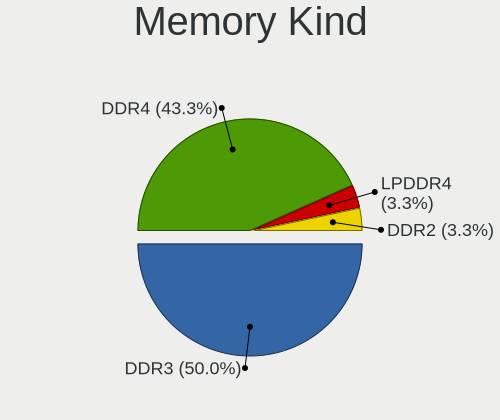

| Kind   | Notebooks | Percent |
|--------|-----------|---------|
| DDR3   | 15        | 50%     |
| DDR4   | 13        | 43.33%  |
| LPDDR4 | 1         | 3.33%   |
| DDR2   | 1         | 3.33%   |

Memory Form Factor
------------------

Physical design of the memory module

| Name         | Notebooks | Percent |
|--------------|-----------|---------|
| SODIMM       | 27        | 90%     |
| Row Of Chips | 3         | 10%     |

Memory Size
-----------

Memory module size

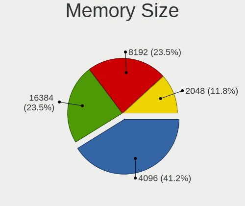

| Size  | Notebooks | Percent |
|-------|-----------|---------|
| 4096  | 14        | 42.42%  |
| 8192  | 12        | 36.36%  |
| 2048  | 4         | 12.12%  |
| 16384 | 3         | 9.09%   |

Memory Speed
------------

Memory module speed

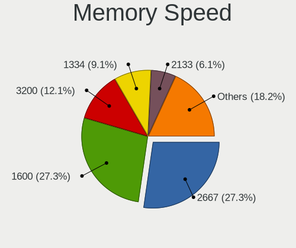

| Speed   | Notebooks | Percent |
|---------|-----------|---------|
| 2667    | 9         | 27.27%  |
| 1600    | 9         | 27.27%  |
| 3200    | 4         | 12.12%  |
| 1334    | 3         | 9.09%   |
| 2133    | 2         | 6.06%   |
| 1333    | 2         | 6.06%   |
| 2400    | 1         | 3.03%   |
| 1867    | 1         | 3.03%   |
| 667     | 1         | 3.03%   |
| Unknown | 1         | 3.03%   |

Printers & scanners
-------------------

Printer Vendor
--------------

Printer device vendors

Zero info for selected period =(

Printer Model
-------------

Printer device models

Zero info for selected period =(

Scanner Vendor
--------------

Scanner device vendors

Zero info for selected period =(

Scanner Model
-------------

Scanner device models

Zero info for selected period =(

Camera
------

Camera Vendor
-------------

Camera device vendors

| Vendor                | Notebooks | Percent |
|-----------------------|-----------|---------|
| Chicony Electronics   | 4         | 23.53%  |
| Realtek Semiconductor | 3         | 17.65%  |
| Quanta                | 3         | 17.65%  |
| IMC Networks          | 3         | 17.65%  |
| Microdia              | 2         | 11.76%  |
| Bison Electronics     | 2         | 11.76%  |

Camera Model
------------

Camera device models

| Model                                | Notebooks | Percent |
|--------------------------------------|-----------|---------|
| Realtek Integrated_Webcam_HD         | 2         | 11.76%  |
| Realtek Front Camera                 | 1         | 5.88%   |
| Quanta VGA WebCam                    | 1         | 5.88%   |
| Quanta Realtek PC Camera             | 1         | 5.88%   |
| Quanta HP TrueVision HD Camera       | 1         | 5.88%   |
| Microdia Laptop_Integrated_Webcam_HD | 1         | 5.88%   |
| Microdia Integrated Webcam           | 1         | 5.88%   |
| IMC Networks USB 2.0 UVC HD Webcam   | 1         | 5.88%   |
| IMC Networks Realtek DMFT RGB        | 1         | 5.88%   |
| IMC Networks Integrated Camera       | 1         | 5.88%   |
| Chicony Integrated HP HD Webcam      | 1         | 5.88%   |
| Chicony Integrated Camera            | 1         | 5.88%   |
| Chicony HP HD Camera                 | 1         | 5.88%   |
| Chicony HD WebCam                    | 1         | 5.88%   |
| Bison Lenovo EasyCamera              | 1         | 5.88%   |
| Bison Integrated Camera              | 1         | 5.88%   |

Security
--------

Fingerprint Vendor
------------------

Fingerprint sensor vendors

| Vendor           | Notebooks | Percent |
|------------------|-----------|---------|
| Validity Sensors | 1         | 33.33%  |
| Next Biometrics  | 1         | 33.33%  |
| Broadcom         | 1         | 33.33%  |

Fingerprint Model
-----------------

Fingerprint sensor models

| Model                                                                        | Notebooks | Percent |
|------------------------------------------------------------------------------|-----------|---------|
| Validity Sensors VFS 5011 fingerprint sensor                                 | 1         | 33.33%  |
| Next Biometrics NB-2020-U Fingerprint Reader                                 | 1         | 33.33%  |
| Broadcom BCM5880 Secure Applications Processor with fingerprint swipe sensor | 1         | 33.33%  |

Chipcard Vendor
---------------

Chipcard module vendors

Zero info for selected period =(

Chipcard Model
--------------

Chipcard module models

Zero info for selected period =(

Unsupported
-----------

Unsupported Devices
-------------------

Total unsupported devices on board

| Total | Notebooks | Percent |
|-------|-----------|---------|
| 2     | 11        | 37.93%  |
| 1     | 9         | 31.03%  |
| 4     | 5         | 17.24%  |
| 3     | 2         | 6.9%    |
| 5     | 1         | 3.45%   |
| 0     | 1         | 3.45%   |

Unsupported Device Types
------------------------

Types of unsupported devices

| Type                     | Notebooks | Percent |
|--------------------------|-----------|---------|
| Communication controller | 22        | 36.07%  |
| Bluetooth                | 16        | 26.23%  |
| Net/wireless             | 14        | 22.95%  |
| Card reader              | 5         | 8.2%    |
| Fingerprint reader       | 4         | 6.56%   |

