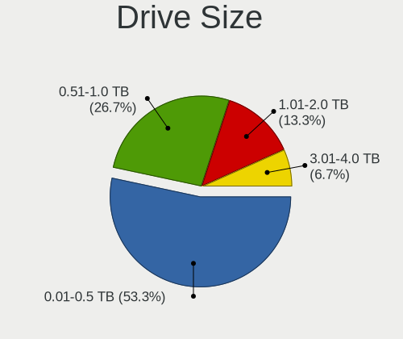
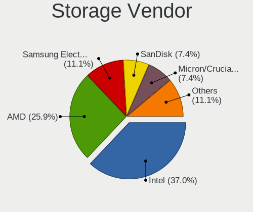

GhostBSD 24.01.1 - Tested Hardware & Statistics (Desktops)
----------------------------------------------------------

A project to collect tested hardware configurations for GhostBSD 24.01.1.

Anyone can contribute to this report by the [hw-probe](https://github.com/linuxhw/hw-probe/blob/master/INSTALL.BSD.md) tool:

    hw-probe -all -upload

Please contribute! Especially if your hardware is rare.

Contents
--------

* [ Test Cases ](#test-cases)

* [ System ](#system)
  - [ Arch                     ](#arch)
  - [ DE                       ](#de)
  - [ Display Server           ](#display-server)
  - [ Display Manager          ](#display-manager)
  - [ OS Lang                  ](#os-lang)
  - [ Boot Mode                ](#boot-mode)
  - [ Filesystem               ](#filesystem)
  - [ Part. scheme             ](#part-scheme)

* [ Board ](#board)
  - [ Vendor                   ](#vendor)
  - [ Model                    ](#model)
  - [ Model Family             ](#model-family)
  - [ MFG Year                 ](#mfg-year)
  - [ Form Factor              ](#form-factor)
  - [ Coreboot                 ](#coreboot)
  - [ RAM Size                 ](#ram-size)
  - [ RAM Used                 ](#ram-used)
  - [ Total Drives             ](#total-drives)
  - [ Has CD-ROM               ](#has-cd-rom)
  - [ Has Ethernet             ](#has-ethernet)
  - [ Has WiFi                 ](#has-wifi)
  - [ Has Bluetooth            ](#has-bluetooth)

* [ Location ](#location)
  - [ Country                  ](#country)
  - [ City                     ](#city)

* [ Drives ](#drives)
  - [ Drive Vendor             ](#drive-vendor)
  - [ Drive Model              ](#drive-model)
  - [ HDD Vendor               ](#hdd-vendor)
  - [ SSD Vendor               ](#ssd-vendor)
  - [ Drive Kind               ](#drive-kind)
  - [ Drive Connector          ](#drive-connector)
  - [ Drive Size               ](#drive-size)
  - [ Space Total              ](#space-total)
  - [ Space Used               ](#space-used)
  - [ Malfunc. Drives          ](#malfunc-drives)
  - [ Malfunc. Drive Vendor    ](#malfunc-drive-vendor)
  - [ Malfunc. HDD Vendor      ](#malfunc-hdd-vendor)
  - [ Malfunc. Drive Kind      ](#malfunc-drive-kind)
  - [ Failed Drives            ](#failed-drives)
  - [ Failed Drive Vendor      ](#failed-drive-vendor)
  - [ Drive Status             ](#drive-status)

* [ Storage controller ](#storage-controller)
  - [ Storage Vendor           ](#storage-vendor)
  - [ Storage Model            ](#storage-model)
  - [ Storage Kind             ](#storage-kind)

* [ Processor ](#processor)
  - [ CPU Vendor               ](#cpu-vendor)
  - [ CPU Model                ](#cpu-model)
  - [ CPU Model Family         ](#cpu-model-family)
  - [ CPU Cores                ](#cpu-cores)
  - [ CPU Sockets              ](#cpu-sockets)
  - [ CPU Threads              ](#cpu-threads)
  - [ CPU Microarch            ](#cpu-microarch)

* [ Graphics ](#graphics)
  - [ GPU Vendor               ](#gpu-vendor)
  - [ GPU Model                ](#gpu-model)
  - [ GPU Combo                ](#gpu-combo)
  - [ GPU Driver               ](#gpu-driver)
  - [ GPU Memory               ](#gpu-memory)

* [ Monitor ](#monitor)
  - [ Monitor Vendor           ](#monitor-vendor)
  - [ Monitor Model            ](#monitor-model)
  - [ Monitor Resolution       ](#monitor-resolution)
  - [ Monitor Diagonal         ](#monitor-diagonal)
  - [ Monitor Width            ](#monitor-width)
  - [ Aspect Ratio             ](#aspect-ratio)
  - [ Monitor Area             ](#monitor-area)
  - [ Pixel Density            ](#pixel-density)
  - [ Multiple Monitors        ](#multiple-monitors)

* [ Network ](#network)
  - [ Net Controller Vendor    ](#net-controller-vendor)
  - [ Net Controller Model     ](#net-controller-model)
  - [ Wireless Vendor          ](#wireless-vendor)
  - [ Wireless Model           ](#wireless-model)
  - [ Ethernet Vendor          ](#ethernet-vendor)
  - [ Ethernet Model           ](#ethernet-model)
  - [ Net Controller Kind      ](#net-controller-kind)
  - [ Used Controller          ](#used-controller)
  - [ NICs                     ](#nics)
  - [ IPv6                     ](#ipv6)

* [ Bluetooth ](#bluetooth)
  - [ Bluetooth Vendor         ](#bluetooth-vendor)
  - [ Bluetooth Model          ](#bluetooth-model)

* [ Sound ](#sound)
  - [ Sound Vendor             ](#sound-vendor)
  - [ Sound Model              ](#sound-model)

* [ Memory ](#memory)
  - [ Memory Vendor            ](#memory-vendor)
  - [ Memory Model             ](#memory-model)
  - [ Memory Kind              ](#memory-kind)
  - [ Memory Form Factor       ](#memory-form-factor)
  - [ Memory Size              ](#memory-size)
  - [ Memory Speed             ](#memory-speed)

* [ Printers & scanners ](#printers--scanners)
  - [ Printer Vendor           ](#printer-vendor)
  - [ Printer Model            ](#printer-model)
  - [ Scanner Vendor           ](#scanner-vendor)
  - [ Scanner Model            ](#scanner-model)

* [ Camera ](#camera)
  - [ Camera Vendor            ](#camera-vendor)
  - [ Camera Model             ](#camera-model)

* [ Security ](#security)
  - [ Fingerprint Vendor       ](#fingerprint-vendor)
  - [ Fingerprint Model        ](#fingerprint-model)
  - [ Chipcard Vendor          ](#chipcard-vendor)
  - [ Chipcard Model           ](#chipcard-model)

* [ Unsupported ](#unsupported)
  - [ Unsupported Devices      ](#unsupported-devices)
  - [ Unsupported Device Types ](#unsupported-device-types)

Test Cases
----------

Total: 20

| Vendor        | Model                       | Probe                                                     | Date         |
|---------------|-----------------------------|-----------------------------------------------------------|--------------|
| Lenovo        | ThinkCentre M715q 10M2S0... | [66a3b3e94e](https://bsd-hardware.info/?probe=66a3b3e94e) | Sep 02, 2024 |
| Dell          | 055H3G A01                  | [5d0cd53384](https://bsd-hardware.info/?probe=5d0cd53384) | May 16, 2024 |
| Biostar       | B450MH                      | [6fc7467762](https://bsd-hardware.info/?probe=6fc7467762) | May 13, 2024 |
| Apple         | Mac-F221BEC8                | [79c4a2608c](https://bsd-hardware.info/?probe=79c4a2608c) | May 07, 2024 |
| Gigabyte      | P55-USB3                    | [9024f0074b](https://bsd-hardware.info/?probe=9024f0074b) | May 07, 2024 |
| MSI           | B360M BAZOOKA               | [d33325e752](https://bsd-hardware.info/?probe=d33325e752) | May 02, 2024 |
| HP            | ProLiant MicroServer Gen... | [15c55873cd](https://bsd-hardware.info/?probe=15c55873cd) | Apr 09, 2024 |
| ASUSTek       | ROG STRIX B550-F GAMING     | [a2cbe8253b](https://bsd-hardware.info/?probe=a2cbe8253b) | Apr 09, 2024 |
| ASUSTek       | ROG STRIX B550-F GAMING     | [3ccdd0084b](https://bsd-hardware.info/?probe=3ccdd0084b) | Apr 05, 2024 |
| ASUSTek       | PRIME Z390-A                | [56ea2c6719](https://bsd-hardware.info/?probe=56ea2c6719) | Apr 01, 2024 |
| ASRock        | 970 Pro3 R2.0               | [cfcf823cca](https://bsd-hardware.info/?probe=cfcf823cca) | Apr 01, 2024 |
| HUAWEI        | PUM-WDX9-PCB-B1 M1010       | [4a359f1f86](https://bsd-hardware.info/?probe=4a359f1f86) | Apr 01, 2024 |
| Lenovo        | 3743 NOK                    | [fd5dc51da2](https://bsd-hardware.info/?probe=fd5dc51da2) | Mar 31, 2024 |
| ASUSTek       | H61M-K                      | [1f6840c3f3](https://bsd-hardware.info/?probe=1f6840c3f3) | Mar 12, 2024 |
| LG Electro... | R590-P.BE54P1               | [120ec3afe6](https://bsd-hardware.info/?probe=120ec3afe6) | Mar 09, 2024 |
| Dell          | 0H634K A00                  | [5392dc85bb](https://bsd-hardware.info/?probe=5392dc85bb) | Feb 21, 2024 |
| Gigabyte      | GA-990FX-GAMING             | [39e4fb5eba](https://bsd-hardware.info/?probe=39e4fb5eba) | Feb 20, 2024 |
| Dell          | 0H634K A00                  | [e933816d9f](https://bsd-hardware.info/?probe=e933816d9f) | Feb 19, 2024 |
| Biostar       | B450NH                      | [2db279db1d](https://bsd-hardware.info/?probe=2db279db1d) | Feb 16, 2024 |
| ASUSTek       | Pro B560M-C                 | [fdeb2cee9d](https://bsd-hardware.info/?probe=fdeb2cee9d) | Feb 14, 2024 |

System
------

Arch
----

OS architecture (x86_64, i586, etc.)

| Name  | Desktops | Percent |
|-------|----------|---------|
| amd64 | 16       | 100%    |

DE
--

Desktop Environment

| Name | Desktops | Percent |
|------|----------|---------|
| MATE | 13       | 81.25%  |
| KDE5 | 2        | 12.5%   |
| XFCE | 1        | 6.25%   |

Display Server
--------------

X11 or Wayland

| Name | Desktops | Percent |
|------|----------|---------|
| X11  | 16       | 100%    |

Display Manager
---------------

SDDM, LightDM, etc.

| Name    | Desktops | Percent |
|---------|----------|---------|
| LightDM | 16       | 100%    |

OS Lang
-------

Language

| Lang    | Desktops | Percent |
|---------|----------|---------|
| en_US   | 8        | 50%     |
| C       | 3        | 18.75%  |
| es_ES   | 2        | 12.5%   |
| pt_BR   | 1        | 6.25%   |
| de_DE   | 1        | 6.25%   |
| Unknown | 1        | 6.25%   |

Boot Mode
---------

EFI or BIOS

| Mode | Desktops | Percent |
|------|----------|---------|
| EFI  | 12       | 75%     |
| BIOS | 4        | 25%     |

Filesystem
----------

Type of filesystem

| Type | Desktops | Percent |
|------|----------|---------|
| Zfs  | 13       | 81.25%  |
| Ufs  | 3        | 18.75%  |

Part. scheme
------------

Scheme of partitioning

| Type | Desktops | Percent |
|------|----------|---------|
| GPT  | 15       | 93.75%  |
| MBR  | 1        | 6.25%   |

Board
-----

Vendor
------

Motherboard manufacturer

| Name                | Desktops | Percent |
|---------------------|----------|---------|
| ASUSTek Computer    | 4        | 25%     |
| Lenovo              | 2        | 12.5%   |
| Gigabyte Technology | 2        | 12.5%   |
| Dell                | 2        | 12.5%   |
| MSI                 | 1        | 6.25%   |
| LG Electronics      | 1        | 6.25%   |
| HUAWEI              | 1        | 6.25%   |
| Hewlett-Packard     | 1        | 6.25%   |
| Biostar             | 1        | 6.25%   |
| Apple               | 1        | 6.25%   |

Model
-----

Motherboard model

| Name                                        | Desktops | Percent |
|---------------------------------------------|----------|---------|
| MSI MS-7B24                                 | 1        | 6.25%   |
| LG R590-P.BE54P1                            | 1        | 6.25%   |
| Lenovo ThinkCentre M715q 10M2S08Y00         | 1        | 6.25%   |
| Lenovo IdeaCentre Gaming5 14ACN6 90RW005PUL | 1        | 6.25%   |
| HUAWEI PUM-WDX9                             | 1        | 6.25%   |
| HP ProLiant MicroServer Gen8                | 1        | 6.25%   |
| Gigabyte P55-USB3                           | 1        | 6.25%   |
| Gigabyte GA-990FX-GAMING                    | 1        | 6.25%   |
| Dell OptiPlex 960                           | 1        | 6.25%   |
| Dell OptiPlex 7050                          | 1        | 6.25%   |
| Biostar B450MH                              | 1        | 6.25%   |
| ASUS ROG STRIX B550-F GAMING                | 1        | 6.25%   |
| ASUS Pro B560M-C                            | 1        | 6.25%   |
| ASUS PRIME Z390-A                           | 1        | 6.25%   |
| ASUS H61M-K                                 | 1        | 6.25%   |
| Apple MacPro5,1                             | 1        | 6.25%   |

Model Family
------------

Motherboard model prefix

| Name                     | Desktops | Percent |
|--------------------------|----------|---------|
| Dell OptiPlex            | 2        | 12.5%   |
| MSI MS-7B24              | 1        | 6.25%   |
| LG R590-P.BE54P1         | 1        | 6.25%   |
| Lenovo ThinkCentre       | 1        | 6.25%   |
| Lenovo IdeaCentre        | 1        | 6.25%   |
| HUAWEI PUM-WDX9          | 1        | 6.25%   |
| HP ProLiant              | 1        | 6.25%   |
| Gigabyte P55-USB3        | 1        | 6.25%   |
| Gigabyte GA-990FX-GAMING | 1        | 6.25%   |
| Biostar B450MH           | 1        | 6.25%   |
| ASUS ROG                 | 1        | 6.25%   |
| ASUS Pro                 | 1        | 6.25%   |
| ASUS PRIME               | 1        | 6.25%   |
| ASUS H61M-K              | 1        | 6.25%   |
| Apple MacPro5            | 1        | 6.25%   |

MFG Year
--------

Motherboard manufacture year

| Year | Desktops | Percent |
|------|----------|---------|
| 2021 | 3        | 18.75%  |
| 2020 | 2        | 12.5%   |
| 2013 | 2        | 12.5%   |
| 2011 | 2        | 12.5%   |
| 2022 | 1        | 6.25%   |
| 2019 | 1        | 6.25%   |
| 2018 | 1        | 6.25%   |
| 2017 | 1        | 6.25%   |
| 2016 | 1        | 6.25%   |
| 2014 | 1        | 6.25%   |
| 2010 | 1        | 6.25%   |

Form Factor
-----------

Physical design of the computer

| Name    | Desktops | Percent |
|---------|----------|---------|
| Desktop | 16       | 100%    |

Coreboot
--------

Have coreboot on board

| Used | Desktops | Percent |
|------|----------|---------|
| No   | 16       | 100%    |

RAM Size
--------

Total RAM memory

| Size in GB  | Desktops | Percent |
|-------------|----------|---------|
| 8.01-16.0   | 7        | 43.75%  |
| 16.01-24.0  | 6        | 37.5%   |
| 4.01-8.0    | 1        | 6.25%   |
| 32.01-64.0  | 1        | 6.25%   |
| 64.01-256.0 | 1        | 6.25%   |

RAM Used
--------

Used RAM memory

| Used GB  | Desktops | Percent |
|----------|----------|---------|
| 1.01-2.0 | 5        | 31.25%  |
| 0.51-1.0 | 5        | 31.25%  |
| 0.01-0.5 | 5        | 31.25%  |
| 2.01-3.0 | 1        | 6.25%   |

Total Drives
------------

Number of drives on board

| Drives | Desktops | Percent |
|--------|----------|---------|
| 1      | 5        | 31.25%  |
| 0      | 5        | 31.25%  |
| 2      | 4        | 25%     |
| 4      | 1        | 6.25%   |
| 3      | 1        | 6.25%   |

Has CD-ROM
----------

Has CD-ROM on board

| Presented | Desktops | Percent |
|-----------|----------|---------|
| No        | 12       | 75%     |
| Yes       | 4        | 25%     |

Has Ethernet
------------

Has Ethernet on board

| Presented | Desktops | Percent |
|-----------|----------|---------|
| Yes       | 16       | 100%    |

Has WiFi
--------

Has WiFi module

| Presented | Desktops | Percent |
|-----------|----------|---------|
| No        | 9        | 56.25%  |
| Yes       | 7        | 43.75%  |

Has Bluetooth
-------------

Has Bluetooth module

| Presented | Desktops | Percent |
|-----------|----------|---------|
| No        | 10       | 62.5%   |
| Yes       | 6        | 37.5%   |

Location
--------

Country
-------

Geographic location (country)

| Country                | Desktops | Percent |
|------------------------|----------|---------|
| USA                    | 4        | 25%     |
| Denmark                | 3        | 18.75%  |
| Paraguay               | 2        | 12.5%   |
| Germany                | 2        | 12.5%   |
| Peru                   | 1        | 6.25%   |
| Bulgaria               | 1        | 6.25%   |
| Brazil                 | 1        | 6.25%   |
| Bosnia and Herzegovina | 1        | 6.25%   |
| Austria                | 1        | 6.25%   |

City
----

Geographic location (city)

| City          | Desktops | Percent |
|---------------|----------|---------|
| Frederiksberg | 3        | 18.75%  |
| Tucson        | 2        | 12.5%   |
| Asunción     | 2        | 12.5%   |
| Vienna        | 1        | 6.25%   |
| Solden        | 1        | 6.25%   |
| Sofia         | 1        | 6.25%   |
| Sarajevo      | 1        | 6.25%   |
| Pacoima       | 1        | 6.25%   |
| Lima          | 1        | 6.25%   |
| Leitchfield   | 1        | 6.25%   |
| Hamburg       | 1        | 6.25%   |
| Embu          | 1        | 6.25%   |

Drives
------

Drive Vendor
------------

Hard drive vendors

| Vendor              | Desktops | Drives | Percent |
|---------------------|----------|--------|---------|
| Seagate             | 6        | 7      | 31.58%  |
| WDC                 | 3        | 3      | 15.79%  |
| Samsung Electronics | 3        | 3      | 15.79%  |
| Toshiba             | 2        | 2      | 10.53%  |
| XrayDisk            | 1        | 1      | 5.26%   |
| SanDisk             | 1        | 1      | 5.26%   |
| LITEONIT            | 1        | 1      | 5.26%   |
| Intenso             | 1        | 1      | 5.26%   |
| Hitachi             | 1        | 1      | 5.26%   |

Drive Model
-----------

Hard drive models

| Model                              | Desktops | Percent |
|------------------------------------|----------|---------|
| Toshiba DT01ACA050 500GB           | 2        | 10%     |
| Seagate ST1000VM002-1SD102 1TB     | 2        | 10%     |
| Samsung HM320JI 320GB              | 2        | 10%     |
| XrayDisk 1TB SSD                   | 1        | 5%      |
| WDC WDS500G2B0A-00SM50 500GB       | 1        | 5%      |
| WDC WDS240G2G0B-00EPW0 240GB       | 1        | 5%      |
| WDC WD20EZBX-08AYR 2TB             | 1        | 5%      |
| Seagate ST4000VN008-2DR166 4TB     | 1        | 5%      |
| Seagate ST380815AS 80GB            | 1        | 5%      |
| Seagate ST3500418AS 500GB          | 1        | 5%      |
| Seagate ST1000LM024 HN-M101MBB 1TB | 1        | 5%      |
| Seagate ST1000DM003-1CH162 1TB     | 1        | 5%      |
| SanDisk SD9SN8W-256G-1016 256GB    | 1        | 5%      |
| Samsung SSD 870 EVO 500GB          | 1        | 5%      |
| LITEONIT LCS-128M6S 128GB          | 1        | 5%      |
| Intenso SSD 256GB                  | 1        | 5%      |
| Hitachi HDS721616PLA380 160GB      | 1        | 5%      |

HDD Vendor
----------

Hard disk drive vendors

| Vendor              | Desktops | Drives | Percent |
|---------------------|----------|--------|---------|
| Seagate             | 6        | 7      | 50%     |
| Toshiba             | 2        | 2      | 16.67%  |
| Samsung Electronics | 2        | 2      | 16.67%  |
| WDC                 | 1        | 1      | 8.33%   |
| Hitachi             | 1        | 1      | 8.33%   |

SSD Vendor
----------

Solid state drive vendors

| Vendor              | Desktops | Drives | Percent |
|---------------------|----------|--------|---------|
| WDC                 | 2        | 2      | 28.57%  |
| XrayDisk            | 1        | 1      | 14.29%  |
| SanDisk             | 1        | 1      | 14.29%  |
| Samsung Electronics | 1        | 1      | 14.29%  |
| LITEONIT            | 1        | 1      | 14.29%  |
| Intenso             | 1        | 1      | 14.29%  |

Drive Kind
----------

HDD or SSD

| Kind | Desktops | Drives | Percent |
|------|----------|--------|---------|
| HDD  | 7        | 13     | 53.85%  |
| SSD  | 6        | 7      | 46.15%  |

Drive Connector
---------------

SATA, SAS, NVMe, etc.

| Type | Desktops | Drives | Percent |
|------|----------|--------|---------|
| SATA | 11       | 20     | 100%    |

Drive Size
----------

Size of hard drive

| Size in TB | Desktops | Drives | Percent |
|------------|----------|--------|---------|
| 0.01-0.5   | 8        | 13     | 53.33%  |
| 0.51-1.0   | 4        | 4      | 26.67%  |
| 1.01-2.0   | 2        | 2      | 13.33%  |
| 3.01-4.0   | 1        | 1      | 6.67%   |

Space Total
-----------

Amount of disk space available on the file system

| Size in GB | Desktops | Percent |
|------------|----------|---------|
| 251-500    | 4        | 25%     |
| Unknown    | 3        | 18.75%  |
| 21-50      | 2        | 12.5%   |
| 101-250    | 2        | 12.5%   |
| 1-20       | 2        | 12.5%   |
| 501-1000   | 2        | 12.5%   |
| 51-100     | 1        | 6.25%   |

Space Used
----------

Amount of used disk space

| Used GB | Desktops | Percent |
|---------|----------|---------|
| 1-20    | 11       | 68.75%  |
| Unknown | 3        | 18.75%  |
| 21-50   | 2        | 12.5%   |

Malfunc. Drives
---------------

Drive models with a malfunction

| Model                             | Desktops | Drives | Percent |
|-----------------------------------|----------|--------|---------|
| Samsung Electronics HM320JI 320GB | 2        | 2      | 66.67%  |
| Hitachi HDS721616PLA380 160GB     | 1        | 1      | 33.33%  |

Malfunc. Drive Vendor
---------------------

Vendors of faulty drives

| Vendor              | Desktops | Drives | Percent |
|---------------------|----------|--------|---------|
| Samsung Electronics | 2        | 2      | 66.67%  |
| Hitachi             | 1        | 1      | 33.33%  |

Malfunc. HDD Vendor
-------------------

Vendors of faulty HDD drives

| Vendor              | Desktops | Drives | Percent |
|---------------------|----------|--------|---------|
| Samsung Electronics | 2        | 2      | 66.67%  |
| Hitachi             | 1        | 1      | 33.33%  |

Malfunc. Drive Kind
-------------------

Kinds of faulty drives

| Kind | Desktops | Drives | Percent |
|------|----------|--------|---------|
| HDD  | 2        | 3      | 100%    |

Failed Drives
-------------

Failed drive models

Zero info for selected period =(

Failed Drive Vendor
-------------------

Failed drive vendors

Zero info for selected period =(

Drive Status
------------

Number of failed and malfunc. drives

| Status  | Desktops | Drives | Percent |
|---------|----------|--------|---------|
| Works   | 11       | 17     | 84.62%  |
| Malfunc | 2        | 3      | 15.38%  |

Storage controller
------------------

Storage Vendor
--------------

Storage controller vendors

| Vendor                      | Desktops | Percent |
|-----------------------------|----------|---------|
| Intel                       | 10       | 37.04%  |
| AMD                         | 7        | 25.93%  |
| Samsung Electronics         | 3        | 11.11%  |
| SanDisk                     | 2        | 7.41%   |
| Micron/Crucial Technology   | 2        | 7.41%   |
| Micron Technology           | 1        | 3.7%    |
| Kingston Technology Company | 1        | 3.7%    |
| JMicron Technology          | 1        | 3.7%    |

Storage Model
-------------

Storage controller models

| Model                                                                         | Desktops | Percent |
|-------------------------------------------------------------------------------|----------|---------|
| AMD 500 Series Chipset SATA Controller                                        | 3        | 9.68%   |
| Samsung NVMe SSD Controller SM981/PM981/PM983                                 | 2        | 6.45%   |
| Intel Cannon Lake PCH SATA AHCI Controller                                    | 2        | 6.45%   |
| Intel 6 Series/C200 Series Chipset Family 6 port Desktop SATA AHCI Controller | 2        | 6.45%   |
| AMD SB7x0/SB8x0/SB9x0 SATA Controller [AHCI mode]                             | 2        | 6.45%   |
| AMD FCH SATA Controller [AHCI mode]                                           | 2        | 6.45%   |
| SanDisk WD Green SN350 240GB (DRAM-less) / SN560E NVMe SSD                    | 1        | 3.23%   |
| Sandisk WD Black SN770 / PC SN740 256GB / PC SN560 (DRAM-less) NVMe SSD       | 1        | 3.23%   |
| SanDisk Extreme Pro / WD Black 2018/SN750/PC SN720 NVMe SSD                   | 1        | 3.23%   |
| Samsung NVMe SSD Controller 980 (DRAM-less)                                   | 1        | 3.23%   |
| Micron/Crucial P5 Plus NVMe PCIe SSD                                          | 1        | 3.23%   |
| Micron/Crucial P2 [Nick P2] / P3 / P3 Plus NVMe PCIe SSD (DRAM-less)          | 1        | 3.23%   |
| Micron 2550 NVMe SSD (DRAM-less)                                              | 1        | 3.23%   |
| Kingston Company NV2 NVMe SSD [E21T] (DRAM-less)                              | 1        | 3.23%   |
| JMicron JMB363 SATA/IDE Controller                                            | 1        | 3.23%   |
| Intel 82801JI (ICH10 Family) SATA AHCI Controller                             | 1        | 3.23%   |
| Intel 82801JD/DO (ICH10 Family) SATA AHCI Controller                          | 1        | 3.23%   |
| Intel 500 Series Chipset Family SATA AHCI Controller                          | 1        | 3.23%   |
| Intel 5 Series/3400 Series Chipset 6 port SATA AHCI Controller                | 1        | 3.23%   |
| Intel 5 Series/3400 Series Chipset 4 port SATA AHCI Controller                | 1        | 3.23%   |
| Intel 4 Series Chipset PT IDER Controller                                     | 1        | 3.23%   |
| Intel 200 Series PCH SATA controller [AHCI mode]                              | 1        | 3.23%   |
| AMD SB7x0/SB8x0/SB9x0 IDE Controller                                          | 1        | 3.23%   |
| AMD 400 Series Chipset SATA Controller                                        | 1        | 3.23%   |

Storage Kind
------------

Kind of storage controller (IDE, SATA, NVMe, SAS, ...)

| Kind | Desktops | Percent |
|------|----------|---------|
| SATA | 17       | 62.96%  |
| NVMe | 7        | 25.93%  |
| IDE  | 3        | 11.11%  |

Processor
---------

CPU Vendor
----------

Processor vendors

| Vendor | Desktops | Percent |
|--------|----------|---------|
| Intel  | 10       | 62.5%   |
| AMD    | 6        | 37.5%   |

CPU Model
---------

Processor models

| Model                                      | Desktops | Percent |
|--------------------------------------------|----------|---------|
| AMD Ryzen 5 5600G with Radeon Graphics     | 2        | 12.5%   |
| AMD Ryzen 5 4600G with Radeon Graphics     | 2        | 12.5%   |
| Intel Xeon CPU X5650 @ 2.67GHz             | 1        | 6.25%   |
| Intel Pentium CPU G2020T @ 2.50GHz         | 1        | 6.25%   |
| Intel Core i9-9900KS CPU @ 4.00GHz         | 1        | 6.25%   |
| Intel Core i7 CPU Q 720 @ 1.60GHz          | 1        | 6.25%   |
| Intel Core i5-8600 CPU @ 3.10GHz           | 1        | 6.25%   |
| Intel Core i5-3330 CPU @ 3.00GHz           | 1        | 6.25%   |
| Intel Core i5 CPU                          | 1        | 6.25%   |
| Intel Core i3-7100T CPU @ 3.40GHz          | 1        | 6.25%   |
| Intel Core 2 Duo                           | 1        | 6.25%   |
| Intel 11th Gen Core i5-11400 @ 2.60GHz     | 1        | 6.25%   |
| AMD PRO A6-8570E R5, 6 COMPUTE CORES 2C+4G | 1        | 6.25%   |
| AMD FX-8320 Eight-Core Processor           | 1        | 6.25%   |

CPU Model Family
----------------

Processor model prefix

| Model            | Desktops | Percent |
|------------------|----------|---------|
| AMD Ryzen 5      | 4        | 25%     |
| Intel Core i5    | 3        | 18.75%  |
| Other            | 2        | 12.5%   |
| Intel Xeon       | 1        | 6.25%   |
| Intel Pentium    | 1        | 6.25%   |
| Intel Core i9    | 1        | 6.25%   |
| Intel Core i7    | 1        | 6.25%   |
| Intel Core i3    | 1        | 6.25%   |
| Intel Core 2 Duo | 1        | 6.25%   |
| AMD FX           | 1        | 6.25%   |

CPU Cores
---------

Number of processor cores

| Number | Desktops | Percent |
|--------|----------|---------|
| 12     | 4        | 25%     |
| 6      | 4        | 25%     |
| 2      | 4        | 25%     |
| 4      | 3        | 18.75%  |
| 8      | 1        | 6.25%   |

CPU Sockets
-----------

Number of sockets

| Number | Desktops | Percent |
|--------|----------|---------|
| 1      | 16       | 100%    |

CPU Threads
-----------

Threads per core (Hyper-Threading)

| Number | Desktops | Percent |
|--------|----------|---------|
| 1      | 11       | 68.75%  |
| 2      | 5        | 31.25%  |

CPU Microarch
-------------

Microarchitecture

| Name       | Desktops | Percent |
|------------|----------|---------|
| KabyLake   | 3        | 18.75%  |
| Zen 3      | 2        | 12.5%   |
| Zen 2      | 2        | 12.5%   |
| Nehalem    | 2        | 12.5%   |
| IvyBridge  | 2        | 12.5%   |
| Westmere   | 1        | 6.25%   |
| Piledriver | 1        | 6.25%   |
| Penryn     | 1        | 6.25%   |
| Excavator  | 1        | 6.25%   |
| Unknown    | 1        | 6.25%   |

Graphics
--------

GPU Vendor
----------

Vendors of graphics cards

| Vendor                     | Desktops | Percent |
|----------------------------|----------|---------|
| Nvidia                     | 8        | 47.06%  |
| AMD                        | 6        | 35.29%  |
| Intel                      | 2        | 11.76%  |
| Matrox Electronics Systems | 1        | 5.88%   |

GPU Model
---------

Graphics card models

| Model                                                        | Desktops | Percent |
|--------------------------------------------------------------|----------|---------|
| AMD Renoir [Radeon Vega Series / Radeon Vega Mobile Series]  | 2        | 11.76%  |
| Nvidia TU116 [GeForce GTX 1660 SUPER]                        | 1        | 5.88%   |
| Nvidia TU102 [GeForce RTX 2080 Ti]                           | 1        | 5.88%   |
| Nvidia GT215M [GeForce GT 335M]                              | 1        | 5.88%   |
| Nvidia GP108 [GeForce GT 1030]                               | 1        | 5.88%   |
| Nvidia GP104 [GeForce GTX 1060 6GB]                          | 1        | 5.88%   |
| Nvidia GM206 [GeForce GTX 950]                               | 1        | 5.88%   |
| Nvidia GK208B [GeForce GT 710]                               | 1        | 5.88%   |
| Nvidia GF119 [GeForce GT 610]                                | 1        | 5.88%   |
| Matrox Electronics Systems MGA G200EH                        | 1        | 5.88%   |
| Intel RocketLake-S GT1 [UHD Graphics 730]                    | 1        | 5.88%   |
| Intel HD Graphics 630                                        | 1        | 5.88%   |
| AMD Wani [Radeon R5/R6/R7 Graphics]                          | 1        | 5.88%   |
| AMD Juniper XT [Radeon HD 5770]                              | 1        | 5.88%   |
| AMD Cezanne [Radeon Vega Series / Radeon Vega Mobile Series] | 1        | 5.88%   |
| AMD Cape Verde XT [Radeon HD 7770/8760 / R7 250X]            | 1        | 5.88%   |

GPU Combo
---------

Combinations of graphics cards

| Name       | Desktops | Percent |
|------------|----------|---------|
| 1 x Nvidia | 7        | 43.75%  |
| 1 x AMD    | 6        | 37.5%   |
| 1 x Intel  | 2        | 12.5%   |
| 1 x Matrox | 1        | 6.25%   |

GPU Driver
----------

Free vs proprietary

| Driver      | Desktops | Percent |
|-------------|----------|---------|
| Free        | 11       | 68.75%  |
| Proprietary | 5        | 31.25%  |

GPU Memory
----------

Total video memory

| Size in GB | Desktops | Percent |
|------------|----------|---------|
| Unknown    | 6        | 37.5%   |
| 0.51-1.0   | 4        | 25%     |
| 1.01-2.0   | 3        | 18.75%  |
| 0.01-0.5   | 2        | 12.5%   |
| 5.01-6.0   | 1        | 6.25%   |

Monitor
-------

Monitor Vendor
--------------

Monitor vendors

| Vendor              | Desktops | Percent |
|---------------------|----------|---------|
| Samsung Electronics | 4        | 26.67%  |
| Goldstar            | 2        | 13.33%  |
| Sony                | 1        | 6.67%   |
| Pioneer Electronic  | 1        | 6.67%   |
| LG Display          | 1        | 6.67%   |
| ITE                 | 1        | 6.67%   |
| DENON               | 1        | 6.67%   |
| Dell                | 1        | 6.67%   |
| BenQ                | 1        | 6.67%   |
| ASUSTek Computer    | 1        | 6.67%   |
| Apple               | 1        | 6.67%   |

Monitor Model
-------------

Monitor models

| Model                                                             | Desktops | Percent |
|-------------------------------------------------------------------|----------|---------|
| Samsung Electronics S24C650 SAM09E9 1920x1080 520x290mm 23.4-inch | 3        | 20%     |
| Sony TV SNY4D04 1920x1080                                         | 1        | 6.67%   |
| Samsung Electronics C27FG7x SAM0E41 1920x1080 600x340mm 27.2-inch | 1        | 6.67%   |
| Pioneer Electronic LCD Monitor SC-1223 1920x1080                  | 1        | 6.67%   |
| LG Display LCD Monitor LGD020C 1600x900 350x190mm 15.7-inch       | 1        | 6.67%   |
| ITE DP2VGA V235 ITE6516 1920x1080 600x340mm 27.2-inch             | 1        | 6.67%   |
| Goldstar LG HDR 4K GSM774F 3840x2160 700x400mm 31.7-inch          | 1        | 6.67%   |
| Goldstar LG FULL HD GSM5B55 1920x1080 480x270mm 21.7-inch         | 1        | 6.67%   |
| DENON AVR DON004B 1920x1080 1330x750mm 60.1-inch                  | 1        | 6.67%   |
| Dell P2014H DEL4097 1600x900 440x240mm 19.7-inch                  | 1        | 6.67%   |
| BenQ GL2055 BNQ78B8 1600x900 440x250mm 19.9-inch                  | 1        | 6.67%   |
| ASUSTek Computer VA24E AUS24D1 1920x1080 530x300mm 24.0-inch      | 1        | 6.67%   |
| Apple Cinema HD APP9221 2560x1600 640x400mm 29.7-inch             | 1        | 6.67%   |

Monitor Resolution
------------------

Monitor screen resolution

| Resolution      | Desktops | Percent |
|-----------------|----------|---------|
| 1920x1080 (FHD) | 10       | 66.67%  |
| 1600x900 (HD+)  | 3        | 20%     |
| 3840x2160 (4K)  | 1        | 6.67%   |
| 2560x1600       | 1        | 6.67%   |

Monitor Diagonal
----------------

Diagonal size in inches

| Inches  | Desktops | Percent |
|---------|----------|---------|
| 23      | 3        | 20%     |
| 27      | 2        | 13.33%  |
| 19      | 2        | 13.33%  |
| Unknown | 2        | 13.33%  |
| 60      | 1        | 6.67%   |
| 31      | 1        | 6.67%   |
| 29      | 1        | 6.67%   |
| 24      | 1        | 6.67%   |
| 21      | 1        | 6.67%   |
| 15      | 1        | 6.67%   |

Monitor Width
-------------

Physical width

| Width in mm | Desktops | Percent |
|-------------|----------|---------|
| 501-600     | 6        | 40%     |
| 401-500     | 3        | 20%     |
| 601-700     | 2        | 13.33%  |
| Unknown     | 2        | 13.33%  |
| 301-350     | 1        | 6.67%   |
| 1001-1500   | 1        | 6.67%   |

Aspect Ratio
------------

Proportional relationship between the width and the height

| Ratio   | Desktops | Percent |
|---------|----------|---------|
| 16/9    | 13       | 86.67%  |
| 16/10   | 1        | 6.67%   |
| Unknown | 1        | 6.67%   |

Monitor Area
------------

Area in inch²

| Area in inch² | Desktops | Percent |
|----------------|----------|---------|
| 201-250        | 5        | 33.33%  |
| 351-500        | 2        | 13.33%  |
| 301-350        | 2        | 13.33%  |
| 151-200        | 2        | 13.33%  |
| Unknown        | 2        | 13.33%  |
| More than 1000 | 1        | 6.67%   |
| 101-110        | 1        | 6.67%   |

Pixel Density
-------------

Pixels per inch

| Density | Desktops | Percent |
|---------|----------|---------|
| 51-100  | 8        | 53.33%  |
| 101-120 | 3        | 20%     |
| Unknown | 2        | 13.33%  |
| 1-50    | 1        | 6.67%   |
| 121-160 | 1        | 6.67%   |

Multiple Monitors
-----------------

Total monitors connected

| Total | Desktops | Percent |
|-------|----------|---------|
| 1     | 15       | 93.75%  |
| 0     | 1        | 6.25%   |

Network
-------

Net Controller Vendor
---------------------

Controller vendors

| Vendor                | Desktops | Percent |
|-----------------------|----------|---------|
| Realtek Semiconductor | 8        | 38.1%   |
| Intel                 | 8        | 38.1%   |
| Qualcomm Atheros      | 2        | 9.52%   |
| Broadcom              | 2        | 9.52%   |
| Ralink Technology     | 1        | 4.76%   |

Net Controller Model
--------------------

Controller models

| Model                                                                  | Desktops | Percent |
|------------------------------------------------------------------------|----------|---------|
| Realtek RTL8111/8168/8211/8411 PCI Express Gigabit Ethernet Controller | 8        | 32%     |
| Realtek RTL8822CE 802.11ac PCIe Wireless Network Adapter               | 2        | 8%      |
| Ralink RT5372 Wireless Adapter                                         | 1        | 4%      |
| Qualcomm Atheros Killer E2400 Gigabit Ethernet Controller              | 1        | 4%      |
| Qualcomm Atheros AR8131 Gigabit Ethernet                               | 1        | 4%      |
| Intel Wireless 8265 / 8275                                             | 1        | 4%      |
| Intel Wireless 7265                                                    | 1        | 4%      |
| Intel Wireless 7260                                                    | 1        | 4%      |
| Intel Wi-Fi 6 AX200                                                    | 1        | 4%      |
| Intel Ethernet Controller I225-V                                       | 1        | 4%      |
| Intel Ethernet Connection (7) I219-V                                   | 1        | 4%      |
| Intel Ethernet Connection (5) I219-LM                                  | 1        | 4%      |
| Intel Ethernet Connection (14) I219-V                                  | 1        | 4%      |
| Intel 82574L Gigabit Network Connection                                | 1        | 4%      |
| Intel 82567LM-3 Gigabit Network Connection                             | 1        | 4%      |
| Broadcom NetXtreme BCM5720 Gigabit Ethernet PCIe                       | 1        | 4%      |
| Broadcom BCM43143 802.11bgn (1x1) Wireless Adapter                     | 1        | 4%      |

Wireless Vendor
---------------

Wireless vendors

| Vendor                | Desktops | Percent |
|-----------------------|----------|---------|
| Intel                 | 4        | 50%     |
| Realtek Semiconductor | 2        | 25%     |
| Ralink Technology     | 1        | 12.5%   |
| Broadcom              | 1        | 12.5%   |

Wireless Model
--------------

Wireless models

| Model                                                    | Desktops | Percent |
|----------------------------------------------------------|----------|---------|
| Realtek RTL8822CE 802.11ac PCIe Wireless Network Adapter | 2        | 25%     |
| Ralink RT5372 Wireless Adapter                           | 1        | 12.5%   |
| Intel Wireless 8265 / 8275                               | 1        | 12.5%   |
| Intel Wireless 7265                                      | 1        | 12.5%   |
| Intel Wireless 7260                                      | 1        | 12.5%   |
| Intel Wi-Fi 6 AX200                                      | 1        | 12.5%   |
| Broadcom BCM43143 802.11bgn (1x1) Wireless Adapter       | 1        | 12.5%   |

Ethernet Vendor
---------------

Ethernet vendors

| Vendor                | Desktops | Percent |
|-----------------------|----------|---------|
| Realtek Semiconductor | 8        | 47.06%  |
| Intel                 | 6        | 35.29%  |
| Qualcomm Atheros      | 2        | 11.76%  |
| Broadcom              | 1        | 5.88%   |

Ethernet Model
--------------

Ethernet models

| Model                                                                  | Desktops | Percent |
|------------------------------------------------------------------------|----------|---------|
| Realtek RTL8111/8168/8211/8411 PCI Express Gigabit Ethernet Controller | 8        | 47.06%  |
| Qualcomm Atheros Killer E2400 Gigabit Ethernet Controller              | 1        | 5.88%   |
| Qualcomm Atheros AR8131 Gigabit Ethernet                               | 1        | 5.88%   |
| Intel Ethernet Controller I225-V                                       | 1        | 5.88%   |
| Intel Ethernet Connection (7) I219-V                                   | 1        | 5.88%   |
| Intel Ethernet Connection (5) I219-LM                                  | 1        | 5.88%   |
| Intel Ethernet Connection (14) I219-V                                  | 1        | 5.88%   |
| Intel 82574L Gigabit Network Connection                                | 1        | 5.88%   |
| Intel 82567LM-3 Gigabit Network Connection                             | 1        | 5.88%   |
| Broadcom NetXtreme BCM5720 Gigabit Ethernet PCIe                       | 1        | 5.88%   |

Net Controller Kind
-------------------

Ethernet, WiFi or modem

| Kind     | Desktops | Percent |
|----------|----------|---------|
| Ethernet | 17       | 68%     |
| WiFi     | 8        | 32%     |

Used Controller
---------------

Currently used network controller

| Kind     | Desktops | Percent |
|----------|----------|---------|
| Ethernet | 16       | 100%    |

NICs
----

Total network controllers on board

| Total | Desktops | Percent |
|-------|----------|---------|
| 1     | 9        | 56.25%  |
| 2     | 7        | 43.75%  |

IPv6
----

IPv6 vs IPv4

| Used | Desktops | Percent |
|------|----------|---------|
| No   | 15       | 93.75%  |
| Yes  | 1        | 6.25%   |

Bluetooth
---------

Bluetooth Vendor
----------------

Controller vendors

| Vendor                | Desktops | Percent |
|-----------------------|----------|---------|
| Intel                 | 3        | 42.86%  |
| Skylight Digital      | 1        | 14.29%  |
| Realtek Semiconductor | 1        | 14.29%  |
| Qcom                  | 1        | 14.29%  |
| Apple                 | 1        | 14.29%  |

Bluetooth Model
---------------

Controller models

| Model                                      | Desktops | Percent |
|--------------------------------------------|----------|---------|
| Intel Bluetooth wireless interface         | 2        | 28.57%  |
| Skylight Digital Realtek Bluetooth Adapter | 1        | 14.29%  |
| Realtek Bluetooth Adapter                  | 1        | 14.29%  |
| Qcom Broadcom Bluetooth USB                | 1        | 14.29%  |
| Intel AX200 Bluetooth                      | 1        | 14.29%  |
| Apple Built-in Bluetooth 2.0+EDR HCI       | 1        | 14.29%  |

Sound
-----

Sound Vendor
------------

Sound card vendors

| Vendor              | Desktops | Percent |
|---------------------|----------|---------|
| Intel               | 9        | 33.33%  |
| Nvidia              | 8        | 29.63%  |
| AMD                 | 8        | 29.63%  |
| Tenx Technology     | 1        | 3.7%    |
| C-Media Electronics | 1        | 3.7%    |

Sound Model
-----------

Sound card models

| Model                                                                      | Desktops | Percent |
|----------------------------------------------------------------------------|----------|---------|
| AMD Family 17h/19h/1ah HD Audio Controller                                 | 4        | 12.9%   |
| AMD Renoir Radeon High Definition Audio Controller                         | 3        | 9.68%   |
| Intel Cannon Lake PCH cAVS                                                 | 2        | 6.45%   |
| Intel 5 Series/3400 Series Chipset High Definition Audio                   | 2        | 6.45%   |
| Tenx Technology USB  AUDIO                                                 | 1        | 3.23%   |
| Nvidia TU116 High Definition Audio Controller                              | 1        | 3.23%   |
| Nvidia TU102 High Definition Audio Controller                              | 1        | 3.23%   |
| Nvidia High Definition Audio Controller                                    | 1        | 3.23%   |
| Nvidia GP108 High Definition Audio Controller                              | 1        | 3.23%   |
| Nvidia GP104 High Definition Audio Controller                              | 1        | 3.23%   |
| Nvidia GM206 High Definition Audio Controller                              | 1        | 3.23%   |
| Nvidia GK208 HDMI/DP Audio Controller                                      | 1        | 3.23%   |
| Nvidia GF119 HDMI Audio Controller                                         | 1        | 3.23%   |
| Intel Tiger Lake-H HD Audio Controller                                     | 1        | 3.23%   |
| Intel 82801JI (ICH10 Family) HD Audio Controller                           | 1        | 3.23%   |
| Intel 82801JD/DO (ICH10 Family) HD Audio Controller                        | 1        | 3.23%   |
| Intel 6 Series/C200 Series Chipset Family High Definition Audio Controller | 1        | 3.23%   |
| Intel 200 Series PCH HD Audio                                              | 1        | 3.23%   |
| C-Media Electronics Audio Adapter (Unitek Y-247A)                          | 1        | 3.23%   |
| AMD SBx00 Azalia (Intel HDA)                                               | 1        | 3.23%   |
| AMD Oland/Hainan/Cape Verde/Pitcairn HDMI Audio [Radeon HD 7000 Series]    | 1        | 3.23%   |
| AMD Kabini HDMI/DP Audio                                                   | 1        | 3.23%   |
| AMD Juniper HDMI Audio [Radeon HD 5700 Series]                             | 1        | 3.23%   |
| AMD Family 15h (Models 60h-6fh) Audio Controller                           | 1        | 3.23%   |

Memory
------

Memory Vendor
-------------

Memory module vendors

| Vendor              | Desktops | Percent |
|---------------------|----------|---------|
| Samsung Electronics | 4        | 21.05%  |
| Kingston            | 4        | 21.05%  |
| SK hynix            | 2        | 10.53%  |
| Unknown             | 1        | 5.26%   |
| Team                | 1        | 5.26%   |
| Ramaxel Technology  | 1        | 5.26%   |
| Micron Technology   | 1        | 5.26%   |
| Hewlett-Packard     | 1        | 5.26%   |
| G.Skill             | 1        | 5.26%   |
| Crucial             | 1        | 5.26%   |
| Corsair             | 1        | 5.26%   |
| Unknown             | 1        | 5.26%   |

Memory Model
------------

Memory module models

| Model                                                     | Desktops | Percent |
|-----------------------------------------------------------|----------|---------|
| Unknown RAM Module 8GB DIMM DDR4 2400MT/s                 | 1        | 5%      |
| Team RAM TEAMGROUP-UD4-2400 8GB DIMM DDR4 2667MT/s        | 1        | 5%      |
| SK hynix RAM HMT351U6CFR8C 4GB DIMM DDR3 667MT/s          | 1        | 5%      |
| SK hynix RAM HMA81GS6AFR8N-UH 8GB SODIMM DDR4 2400MT/s    | 1        | 5%      |
| Samsung RAM Module 4GB DIMM DDR3 1333MT/s                 | 1        | 5%      |
| Samsung RAM M471B1G73QHO-YKO 4GB SODIMM DDR3 1600MT/s     | 1        | 5%      |
| Samsung RAM M471A1K43EB1-CWE 8GB DIMM DDR4 3200MT/s       | 1        | 5%      |
| Samsung RAM M378A1K43EB2-CWE 8GB DIMM DDR4 3200MT/s       | 1        | 5%      |
| Ramaxel RAM RMSA3270ME86H9F-2666 4GB SODIMM DDR4 2667MT/s | 1        | 5%      |
| Micron RAM 16JTF51264AZ 4GB DIMM DDR3 667MT/s             | 1        | 5%      |
| Kingston RAM Module 2GB DIMM DDR2 800MT/s                 | 1        | 5%      |
| Kingston RAM KF3200C16D4/32GX 32GB DIMM DDR4 3200MT/s     | 1        | 5%      |
| Kingston RAM 99U5584-007.A 4GB DIMM DDR3 667MT/s          | 1        | 5%      |
| Kingston RAM 99U5474-028.A00LF 4GB DIMM 1333MT/s          | 1        | 5%      |
| Kingston RAM 99U5474-016.A00LF 4GB DIMM DDR3 1333MT/s     | 1        | 5%      |
| HP RAM 669237-071 2GB DIMM DDR3 1600MT/s                  | 1        | 5%      |
| G.Skill RAM F4-3200C16-8GTZRX 8GB DIMM DDR4 2133MT/s      | 1        | 5%      |
| Crucial RAM CT16G4DFRA32A.M16FE 16GB DIMM DDR4 3200MT/s   | 1        | 5%      |
| Corsair RAM CMK32GX4M2E3200C16 16GB DIMM DDR4 3600MT/s    | 1        | 5%      |
| Unknown                                                   | 1        | 5%      |

Memory Kind
-----------

Memory module kinds

| Kind    | Desktops | Percent |
|---------|----------|---------|
| DDR4    | 10       | 58.82%  |
| DDR3    | 5        | 29.41%  |
| DDR2    | 1        | 5.88%   |
| Unknown | 1        | 5.88%   |

Memory Form Factor
------------------

Physical design of the memory module

| Name   | Desktops | Percent |
|--------|----------|---------|
| DIMM   | 14       | 82.35%  |
| SODIMM | 3        | 17.65%  |

Memory Size
-----------

Memory module size

| Size  | Desktops | Percent |
|-------|----------|---------|
| 8192  | 6        | 35.29%  |
| 4096  | 6        | 35.29%  |
| 16384 | 2        | 11.76%  |
| 2048  | 2        | 11.76%  |
| 32768 | 1        | 5.88%   |

Memory Speed
------------

Memory module speed

| Speed | Desktops | Percent |
|-------|----------|---------|
| 3200  | 4        | 23.53%  |
| 2667  | 2        | 11.76%  |
| 2400  | 2        | 11.76%  |
| 1600  | 2        | 11.76%  |
| 1333  | 2        | 11.76%  |
| 3600  | 1        | 5.88%   |
| 2133  | 1        | 5.88%   |
| 1066  | 1        | 5.88%   |
| 800   | 1        | 5.88%   |
| 667   | 1        | 5.88%   |

Printers & scanners
-------------------

Printer Vendor
--------------

Printer device vendors

Zero info for selected period =(

Printer Model
-------------

Printer device models

Zero info for selected period =(

Scanner Vendor
--------------

Scanner device vendors

Zero info for selected period =(

Scanner Model
-------------

Scanner device models

Zero info for selected period =(

Camera
------

Camera Vendor
-------------

Camera device vendors

| Vendor | Desktops | Percent |
|--------|----------|---------|
| Quanta | 1        | 100%    |

Camera Model
------------

Camera device models

| Model            | Desktops | Percent |
|------------------|----------|---------|
| Quanta LG Webcam | 1        | 100%    |

Security
--------

Fingerprint Vendor
------------------

Fingerprint sensor vendors

Zero info for selected period =(

Fingerprint Model
-----------------

Fingerprint sensor models

Zero info for selected period =(

Chipcard Vendor
---------------

Chipcard module vendors

Zero info for selected period =(

Chipcard Model
--------------

Chipcard module models

Zero info for selected period =(

Unsupported
-----------

Unsupported Devices
-------------------

Total unsupported devices on board

| Total | Desktops | Percent |
|-------|----------|---------|
| 1     | 7        | 43.75%  |
| 0     | 5        | 31.25%  |
| 2     | 3        | 18.75%  |
| 3     | 1        | 6.25%   |

Unsupported Device Types
------------------------

Types of unsupported devices

| Type                     | Desktops | Percent |
|--------------------------|----------|---------|
| Communication controller | 7        | 46.67%  |
| Bluetooth                | 3        | 20%     |
| Net/wireless             | 2        | 13.33%  |
| Firewire controller      | 2        | 13.33%  |
| Sound                    | 1        | 6.67%   |

