GhostBSD 24.01.1 - Tested Hardware & Statistics (Notebooks)
-----------------------------------------------------------

A project to collect tested hardware configurations for GhostBSD 24.01.1.

Anyone can contribute to this report by the [hw-probe](https://github.com/linuxhw/hw-probe/blob/master/INSTALL.BSD.md) tool:

    hw-probe -all -upload

Please contribute! Especially if your hardware is rare.

Contents
--------

* [ Test Cases ](#test-cases)

* [ System ](#system)
  - [ Arch                     ](#arch)
  - [ DE                       ](#de)
  - [ Display Server           ](#display-server)
  - [ Display Manager          ](#display-manager)
  - [ OS Lang                  ](#os-lang)
  - [ Boot Mode                ](#boot-mode)
  - [ Filesystem               ](#filesystem)
  - [ Part. scheme             ](#part-scheme)

* [ Board ](#board)
  - [ Vendor                   ](#vendor)
  - [ Model                    ](#model)
  - [ Model Family             ](#model-family)
  - [ MFG Year                 ](#mfg-year)
  - [ Form Factor              ](#form-factor)
  - [ Coreboot                 ](#coreboot)
  - [ RAM Size                 ](#ram-size)
  - [ RAM Used                 ](#ram-used)
  - [ Total Drives             ](#total-drives)
  - [ Has CD-ROM               ](#has-cd-rom)
  - [ Has Ethernet             ](#has-ethernet)
  - [ Has WiFi                 ](#has-wifi)
  - [ Has Bluetooth            ](#has-bluetooth)

* [ Location ](#location)
  - [ Country                  ](#country)
  - [ City                     ](#city)

* [ Drives ](#drives)
  - [ Drive Vendor             ](#drive-vendor)
  - [ Drive Model              ](#drive-model)
  - [ HDD Vendor               ](#hdd-vendor)
  - [ SSD Vendor               ](#ssd-vendor)
  - [ Drive Kind               ](#drive-kind)
  - [ Drive Connector          ](#drive-connector)
  - [ Drive Size               ](#drive-size)
  - [ Space Total              ](#space-total)
  - [ Space Used               ](#space-used)
  - [ Malfunc. Drives          ](#malfunc-drives)
  - [ Malfunc. Drive Vendor    ](#malfunc-drive-vendor)
  - [ Malfunc. HDD Vendor      ](#malfunc-hdd-vendor)
  - [ Malfunc. Drive Kind      ](#malfunc-drive-kind)
  - [ Failed Drives            ](#failed-drives)
  - [ Failed Drive Vendor      ](#failed-drive-vendor)
  - [ Drive Status             ](#drive-status)

* [ Storage controller ](#storage-controller)
  - [ Storage Vendor           ](#storage-vendor)
  - [ Storage Model            ](#storage-model)
  - [ Storage Kind             ](#storage-kind)

* [ Processor ](#processor)
  - [ CPU Vendor               ](#cpu-vendor)
  - [ CPU Model                ](#cpu-model)
  - [ CPU Model Family         ](#cpu-model-family)
  - [ CPU Cores                ](#cpu-cores)
  - [ CPU Sockets              ](#cpu-sockets)
  - [ CPU Threads              ](#cpu-threads)
  - [ CPU Microarch            ](#cpu-microarch)

* [ Graphics ](#graphics)
  - [ GPU Vendor               ](#gpu-vendor)
  - [ GPU Model                ](#gpu-model)
  - [ GPU Combo                ](#gpu-combo)
  - [ GPU Driver               ](#gpu-driver)
  - [ GPU Memory               ](#gpu-memory)

* [ Monitor ](#monitor)
  - [ Monitor Vendor           ](#monitor-vendor)
  - [ Monitor Model            ](#monitor-model)
  - [ Monitor Resolution       ](#monitor-resolution)
  - [ Monitor Diagonal         ](#monitor-diagonal)
  - [ Monitor Width            ](#monitor-width)
  - [ Aspect Ratio             ](#aspect-ratio)
  - [ Monitor Area             ](#monitor-area)
  - [ Pixel Density            ](#pixel-density)
  - [ Multiple Monitors        ](#multiple-monitors)

* [ Network ](#network)
  - [ Net Controller Vendor    ](#net-controller-vendor)
  - [ Net Controller Model     ](#net-controller-model)
  - [ Wireless Vendor          ](#wireless-vendor)
  - [ Wireless Model           ](#wireless-model)
  - [ Ethernet Vendor          ](#ethernet-vendor)
  - [ Ethernet Model           ](#ethernet-model)
  - [ Net Controller Kind      ](#net-controller-kind)
  - [ Used Controller          ](#used-controller)
  - [ NICs                     ](#nics)
  - [ IPv6                     ](#ipv6)

* [ Bluetooth ](#bluetooth)
  - [ Bluetooth Vendor         ](#bluetooth-vendor)
  - [ Bluetooth Model          ](#bluetooth-model)

* [ Sound ](#sound)
  - [ Sound Vendor             ](#sound-vendor)
  - [ Sound Model              ](#sound-model)

* [ Memory ](#memory)
  - [ Memory Vendor            ](#memory-vendor)
  - [ Memory Model             ](#memory-model)
  - [ Memory Kind              ](#memory-kind)
  - [ Memory Form Factor       ](#memory-form-factor)
  - [ Memory Size              ](#memory-size)
  - [ Memory Speed             ](#memory-speed)

* [ Printers & scanners ](#printers--scanners)
  - [ Printer Vendor           ](#printer-vendor)
  - [ Printer Model            ](#printer-model)
  - [ Scanner Vendor           ](#scanner-vendor)
  - [ Scanner Model            ](#scanner-model)

* [ Camera ](#camera)
  - [ Camera Vendor            ](#camera-vendor)
  - [ Camera Model             ](#camera-model)

* [ Security ](#security)
  - [ Fingerprint Vendor       ](#fingerprint-vendor)
  - [ Fingerprint Model        ](#fingerprint-model)
  - [ Chipcard Vendor          ](#chipcard-vendor)
  - [ Chipcard Model           ](#chipcard-model)

* [ Unsupported ](#unsupported)
  - [ Unsupported Devices      ](#unsupported-devices)
  - [ Unsupported Device Types ](#unsupported-device-types)

Test Cases
----------

Total: 32

| Vendor        | Model                       | Probe                                                     | Date         |
|---------------|-----------------------------|-----------------------------------------------------------|--------------|
| Lenovo        | ThinkPad W550s 20E2000QU... | [8e2f33a68c](https://bsd-hardware.info/?probe=8e2f33a68c) | Mar 07, 2025 |
| Lenovo        | ThinkPad W550s 20E2000QU... | [0243819ad2](https://bsd-hardware.info/?probe=0243819ad2) | Mar 07, 2025 |
| HP            | EliteBook 840 G6            | [9ae98f134a](https://bsd-hardware.info/?probe=9ae98f134a) | Aug 09, 2024 |
| Dell          | Inspiron 1545               | [e123332fb8](https://bsd-hardware.info/?probe=e123332fb8) | May 16, 2024 |
| Dell          | Inspiron 1545               | [d5f43a27aa](https://bsd-hardware.info/?probe=d5f43a27aa) | May 12, 2024 |
| Dell          | Inspiron 1545               | [3c3432b2c0](https://bsd-hardware.info/?probe=3c3432b2c0) | May 11, 2024 |
| Infinix       | INBook X1                   | [847a9cb112](https://bsd-hardware.info/?probe=847a9cb112) | May 10, 2024 |
| Acer          | TravelMate B118-M           | [68d9d26fe5](https://bsd-hardware.info/?probe=68d9d26fe5) | May 09, 2024 |
| Alienware     | Area-51m A00                | [53d5d4eb1e](https://bsd-hardware.info/?probe=53d5d4eb1e) | May 07, 2024 |
| Unknown       | X133                        | [524b7e6d8e](https://bsd-hardware.info/?probe=524b7e6d8e) | May 07, 2024 |
| Dell          | XPS 13 9360                 | [c9ad91fc61](https://bsd-hardware.info/?probe=c9ad91fc61) | May 07, 2024 |
| Lenovo        | ThinkPad X240 20AMS3FY00    | [1dc74d60e6](https://bsd-hardware.info/?probe=1dc74d60e6) | May 06, 2024 |
| Dell          | Latitude 7390               | [b9b511f4d6](https://bsd-hardware.info/?probe=b9b511f4d6) | May 04, 2024 |
| MSI           | GE75 Raider 10SFS           | [cda74e2f91](https://bsd-hardware.info/?probe=cda74e2f91) | May 02, 2024 |
| ASUSTek       | X202E                       | [0ed385a36d](https://bsd-hardware.info/?probe=0ed385a36d) | May 02, 2024 |
| HP            | 255 G8 Notebook PC          | [4878c18c8a](https://bsd-hardware.info/?probe=4878c18c8a) | May 01, 2024 |
| Dell          | XPS 13 9360                 | [26185f189e](https://bsd-hardware.info/?probe=26185f189e) | Apr 30, 2024 |
| HP            | EliteBook 2560p             | [bb6303ed5b](https://bsd-hardware.info/?probe=bb6303ed5b) | Apr 29, 2024 |
| Lenovo        | ThinkPad X220 429135G       | [b681d0b406](https://bsd-hardware.info/?probe=b681d0b406) | Apr 23, 2024 |
| F-Plus Mob... | FLAPTOP r                   | [150e135ba6](https://bsd-hardware.info/?probe=150e135ba6) | Apr 18, 2024 |
| Dell          | Latitude 7490               | [38f6023f20](https://bsd-hardware.info/?probe=38f6023f20) | Apr 14, 2024 |
| Dell          | Vostro 3350                 | [abe739e6c2](https://bsd-hardware.info/?probe=abe739e6c2) | Apr 13, 2024 |
| HP            | ProBook 645 G3              | [ea10ac1f83](https://bsd-hardware.info/?probe=ea10ac1f83) | Apr 12, 2024 |
| ASUSTek       | VivoBook_ASUSLaptop X512... | [a26013b913](https://bsd-hardware.info/?probe=a26013b913) | Apr 05, 2024 |
| Dell          | Latitude E5540              | [108e2acb98](https://bsd-hardware.info/?probe=108e2acb98) | Apr 01, 2024 |
| Lenovo        | ThinkPad E15 Gen 4 21EDC... | [0ae72ec0ff](https://bsd-hardware.info/?probe=0ae72ec0ff) | Mar 31, 2024 |
| Lenovo        | Legion 5 Pro 16ACH6H 82J... | [db1d3cd098](https://bsd-hardware.info/?probe=db1d3cd098) | Mar 19, 2024 |
| Google        | Cave                        | [d9df48c781](https://bsd-hardware.info/?probe=d9df48c781) | Mar 16, 2024 |
| Dell          | XPS 13 9305                 | [7cc4588e07](https://bsd-hardware.info/?probe=7cc4588e07) | Mar 07, 2024 |
| Dell          | Inspiron 5559               | [ac72a9a34a](https://bsd-hardware.info/?probe=ac72a9a34a) | Feb 23, 2024 |
| Dell          | Latitude E6540              | [92ba9b26e1](https://bsd-hardware.info/?probe=92ba9b26e1) | Feb 21, 2024 |
| TUXEDO        | Aura 15 Gen1                | [4768e0001d](https://bsd-hardware.info/?probe=4768e0001d) | Feb 01, 2024 |

System
------

Arch
----

OS architecture (x86_64, i586, etc.)

| Name  | Notebooks | Percent |
|-------|-----------|---------|
| amd64 | 25        | 100%    |

DE
--

Desktop Environment

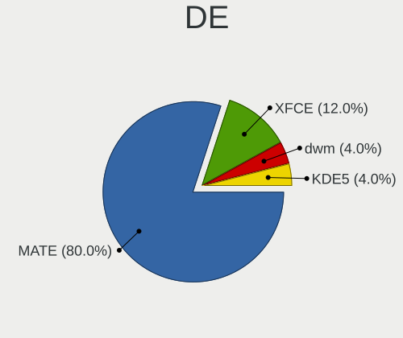

| Name | Notebooks | Percent |
|------|-----------|---------|
| MATE | 20        | 80%     |
| XFCE | 3         | 12%     |
| KDE5 | 1         | 4%      |
| dwm  | 1         | 4%      |

Display Server
--------------

X11 or Wayland

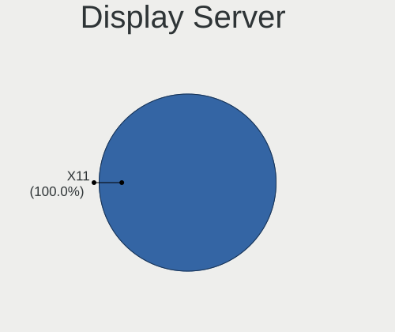

| Name | Notebooks | Percent |
|------|-----------|---------|
| X11  | 25        | 100%    |

Display Manager
---------------

SDDM, LightDM, etc.

| Name    | Notebooks | Percent |
|---------|-----------|---------|
| LightDM | 24        | 96%     |
| SDDM    | 1         | 4%      |

OS Lang
-------

Language

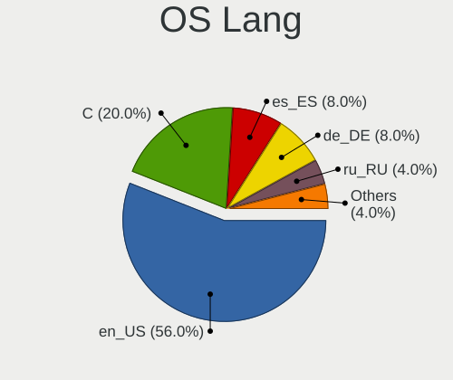

| Lang  | Notebooks | Percent |
|-------|-----------|---------|
| en_US | 14        | 56%     |
| C     | 5         | 20%     |
| es_ES | 2         | 8%      |
| de_DE | 2         | 8%      |
| ru_RU | 1         | 4%      |
| fr_FR | 1         | 4%      |

Boot Mode
---------

EFI or BIOS

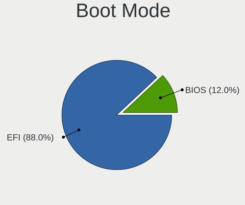

| Mode | Notebooks | Percent |
|------|-----------|---------|
| EFI  | 22        | 88%     |
| BIOS | 3         | 12%     |

Filesystem
----------

Type of filesystem

| Type | Notebooks | Percent |
|------|-----------|---------|
| Zfs  | 25        | 100%    |

Part. scheme
------------

Scheme of partitioning

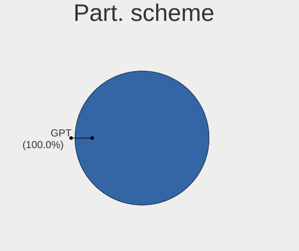

| Type | Notebooks | Percent |
|------|-----------|---------|
| GPT  | 25        | 100%    |

Board
-----

Vendor
------

Motherboard manufacturer

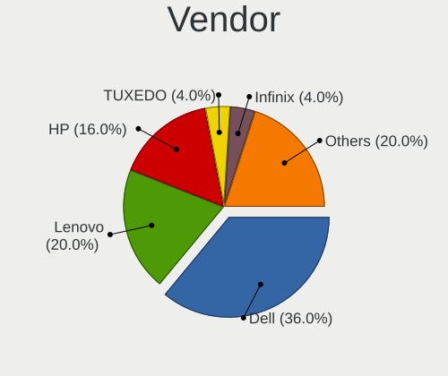

| Name             | Notebooks | Percent |
|------------------|-----------|---------|
| Dell             | 9         | 36%     |
| Lenovo           | 5         | 20%     |
| Hewlett-Packard  | 4         | 16%     |
| TUXEDO           | 1         | 4%      |
| Infinix          | 1         | 4%      |
| Google           | 1         | 4%      |
| F-Plus Mobile    | 1         | 4%      |
| ASUSTek Computer | 1         | 4%      |
| Alienware        | 1         | 4%      |
| Unknown          | 1         | 4%      |

Model
-----

Motherboard model

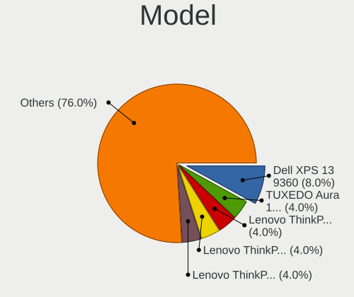

| Name                                 | Notebooks | Percent |
|--------------------------------------|-----------|---------|
| Dell XPS 13 9360                     | 2         | 8%      |
| TUXEDO Aura 15 Gen1                  | 1         | 4%      |
| Lenovo ThinkPad X240 20AMS3FY00      | 1         | 4%      |
| Lenovo ThinkPad X220 429135G         | 1         | 4%      |
| Lenovo ThinkPad W550s 20E2000QUS     | 1         | 4%      |
| Lenovo ThinkPad E15 Gen 4 21EDCTO1WW | 1         | 4%      |
| Lenovo Legion 5 Pro 16ACH6H 82JQ     | 1         | 4%      |
| Infinix INBook X1                    | 1         | 4%      |
| HP ProBook 645 G3                    | 1         | 4%      |
| HP EliteBook 840 G6                  | 1         | 4%      |
| HP EliteBook 2560p                   | 1         | 4%      |
| HP 255 G8 Notebook PC                | 1         | 4%      |
| Google Cave                          | 1         | 4%      |
| F-Plus Mobile FLAPTOP r              | 1         | 4%      |
| Dell XPS 13 9305                     | 1         | 4%      |
| Dell Vostro 3350                     | 1         | 4%      |
| Dell Latitude E6540                  | 1         | 4%      |
| Dell Latitude E5540                  | 1         | 4%      |
| Dell Latitude 7490                   | 1         | 4%      |
| Dell Latitude 7390                   | 1         | 4%      |
| Dell Inspiron 5559                   | 1         | 4%      |
| ASUS X202E                           | 1         | 4%      |
| Alienware Area-51m                   | 1         | 4%      |
| Unknown                              | 1         | 4%      |

Model Family
------------

Motherboard model prefix

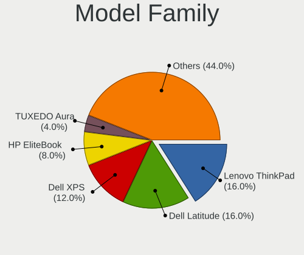

| Name                  | Notebooks | Percent |
|-----------------------|-----------|---------|
| Lenovo ThinkPad       | 4         | 16%     |
| Dell Latitude         | 4         | 16%     |
| Dell XPS              | 3         | 12%     |
| HP EliteBook          | 2         | 8%      |
| TUXEDO Aura           | 1         | 4%      |
| Lenovo Legion         | 1         | 4%      |
| Infinix INBook        | 1         | 4%      |
| HP ProBook            | 1         | 4%      |
| HP 255                | 1         | 4%      |
| Google Cave           | 1         | 4%      |
| F-Plus Mobile FLAPTOP | 1         | 4%      |
| Dell Vostro           | 1         | 4%      |
| Dell Inspiron         | 1         | 4%      |
| ASUS X202E            | 1         | 4%      |
| Alienware Area-51m    | 1         | 4%      |
| Unknown               | 1         | 4%      |

MFG Year
--------

Motherboard manufacture year

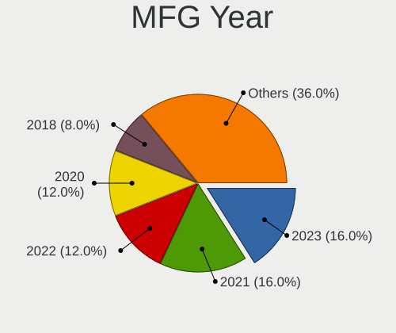

| Year | Notebooks | Percent |
|------|-----------|---------|
| 2023 | 4         | 16%     |
| 2021 | 4         | 16%     |
| 2022 | 3         | 12%     |
| 2020 | 3         | 12%     |
| 2018 | 2         | 8%      |
| 2015 | 2         | 8%      |
| 2013 | 2         | 8%      |
| 2019 | 1         | 4%      |
| 2016 | 1         | 4%      |
| 2014 | 1         | 4%      |
| 2012 | 1         | 4%      |
| 2011 | 1         | 4%      |

Form Factor
-----------

Physical design of the computer

| Name     | Notebooks | Percent |
|----------|-----------|---------|
| Notebook | 25        | 100%    |

Coreboot
--------

Have coreboot on board

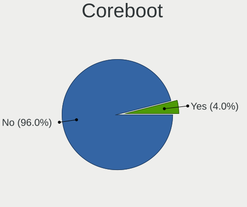

| Used | Notebooks | Percent |
|------|-----------|---------|
| No   | 24        | 96%     |
| Yes  | 1         | 4%      |

RAM Size
--------

Total RAM memory

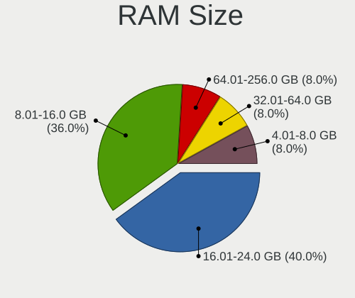

| Size in GB  | Notebooks | Percent |
|-------------|-----------|---------|
| 16.01-24.0  | 10        | 40%     |
| 8.01-16.0   | 9         | 36%     |
| 4.01-8.0    | 2         | 8%      |
| 32.01-64.0  | 2         | 8%      |
| 64.01-256.0 | 2         | 8%      |

RAM Used
--------

Used RAM memory

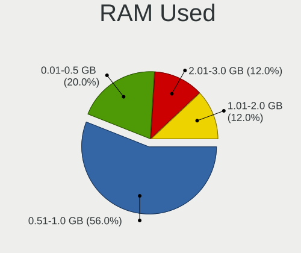

| Used GB  | Notebooks | Percent |
|----------|-----------|---------|
| 0.51-1.0 | 14        | 56%     |
| 0.01-0.5 | 5         | 20%     |
| 2.01-3.0 | 3         | 12%     |
| 1.01-2.0 | 3         | 12%     |

Total Drives
------------

Number of drives on board

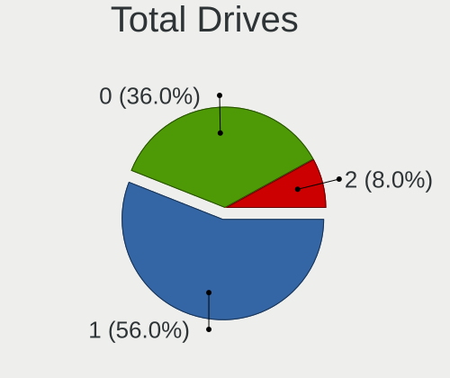

| Drives | Notebooks | Percent |
|--------|-----------|---------|
| 1      | 14        | 56%     |
| 0      | 9         | 36%     |
| 2      | 2         | 8%      |

Has CD-ROM
----------

Has CD-ROM on board

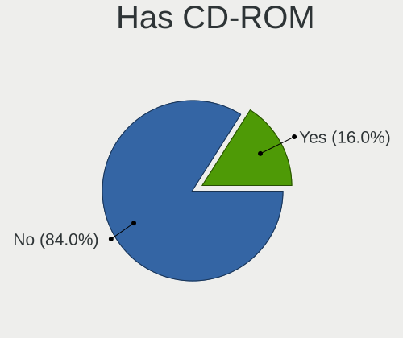

| Presented | Notebooks | Percent |
|-----------|-----------|---------|
| No        | 21        | 84%     |
| Yes       | 4         | 16%     |

Has Ethernet
------------

Has Ethernet on board

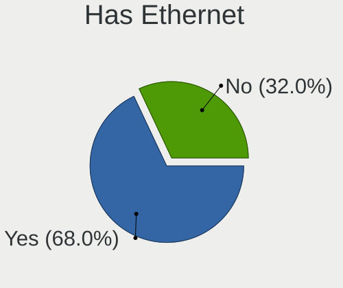

| Presented | Notebooks | Percent |
|-----------|-----------|---------|
| Yes       | 17        | 68%     |
| No        | 8         | 32%     |

Has WiFi
--------

Has WiFi module

| Presented | Notebooks | Percent |
|-----------|-----------|---------|
| Yes       | 25        | 100%    |

Has Bluetooth
-------------

Has Bluetooth module

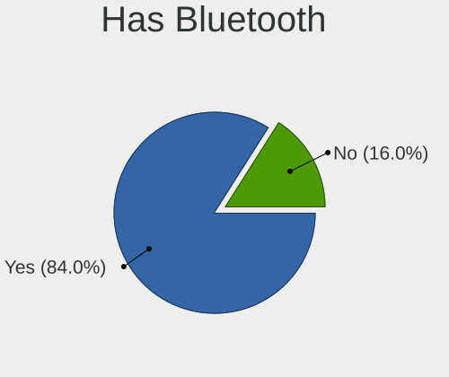

| Presented | Notebooks | Percent |
|-----------|-----------|---------|
| Yes       | 21        | 84%     |
| No        | 4         | 16%     |

Location
--------

Country
-------

Geographic location (country)

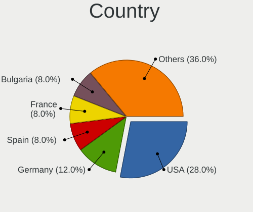

| Country     | Notebooks | Percent |
|-------------|-----------|---------|
| USA         | 7         | 28%     |
| Germany     | 3         | 12%     |
| Spain       | 2         | 8%      |
| France      | 2         | 8%      |
| Bulgaria    | 2         | 8%      |
| Switzerland | 1         | 4%      |
| Russia      | 1         | 4%      |
| Paraguay    | 1         | 4%      |
| Lithuania   | 1         | 4%      |
| Indonesia   | 1         | 4%      |
| Denmark     | 1         | 4%      |
| Cuba        | 1         | 4%      |
| Canada      | 1         | 4%      |
| Argentina   | 1         | 4%      |

City
----

Geographic location (city)

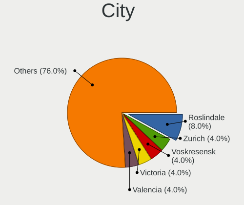

| City                        | Notebooks | Percent |
|-----------------------------|-----------|---------|
| Roslindale                  | 2         | 8%      |
| Zurich                      | 1         | 4%      |
| Voskresensk                 | 1         | 4%      |
| Victoria                    | 1         | 4%      |
| Valencia                    | 1         | 4%      |
| Tsarevo                     | 1         | 4%      |
| Stuttgart                   | 1         | 4%      |
| Sofia                       | 1         | 4%      |
| San Nicolás de los Arroyos | 1         | 4%      |
| San Lorenzo                 | 1         | 4%      |
| Redondela                   | 1         | 4%      |
| Navalcarnero                | 1         | 4%      |
| Munich                      | 1         | 4%      |
| Leutkirch                   | 1         | 4%      |
| Jonava                      | 1         | 4%      |
| Jakarta                     | 1         | 4%      |
| Jacksonville                | 1         | 4%      |
| Havana                      | 1         | 4%      |
| Frederiksberg               | 1         | 4%      |
| Fos-sur-Mer                 | 1         | 4%      |
| Eureka                      | 1         | 4%      |
| Colombes                    | 1         | 4%      |
| Bothell                     | 1         | 4%      |
| Atlanta                     | 1         | 4%      |

Drives
------

Drive Vendor
------------

Hard drive vendors

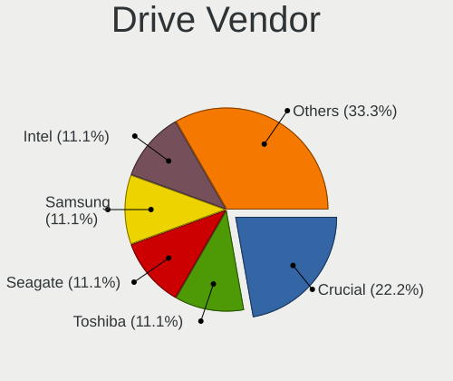

| Vendor              | Notebooks | Drives | Percent |
|---------------------|-----------|--------|---------|
| Crucial             | 4         | 4      | 22.22%  |
| Toshiba             | 2         | 2      | 11.11%  |
| Seagate             | 2         | 2      | 11.11%  |
| Samsung Electronics | 2         | 2      | 11.11%  |
| Intel               | 2         | 2      | 11.11%  |
| Team                | 1         | 1      | 5.56%   |
| ShiJi               | 1         | 1      | 5.56%   |
| SanDisk             | 1         | 1      | 5.56%   |
| Fanxiang            | 1         | 1      | 5.56%   |
| China               | 1         | 1      | 5.56%   |
| Apple               | 1         | 1      | 5.56%   |

Drive Model
-----------

Hard drive models

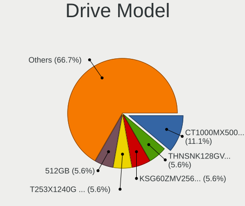

| Model                                | Notebooks | Percent |
|--------------------------------------|-----------|---------|
| Crucial CT1000MX500SSD1 1TB          | 2         | 11.11%  |
| Toshiba THNSNK128GVN8 M.2 2280 128GB | 1         | 5.56%   |
| Toshiba KSG60ZMV256G M.2 2280 256GB  | 1         | 5.56%   |
| Team T253X1240G 240GB                | 1         | 5.56%   |
| ShiJi SSD 512GB                      | 1         | 5.56%   |
| Seagate ST500LT012-9WS142 500GB      | 1         | 5.56%   |
| Seagate ST2000LM007-1R8174 2TB       | 1         | 5.56%   |
| SanDisk SD8TB8U512G1001 512GB        | 1         | 5.56%   |
| Samsung SSD 860 PRO 512GB            | 1         | 5.56%   |
| Samsung SSD 830 Series 256GB         | 1         | 5.56%   |
| Intel SSDSCKKF512G8 SATA 512GB       | 1         | 5.56%   |
| Intel SSDSA2BW160G3H 160GB           | 1         | 5.56%   |
| Fanxiang S101 512GB                  | 1         | 5.56%   |
| Crucial CT240BX500SSD1 240GB         | 1         | 5.56%   |
| Crucial CT2000BX500SSD1 2TB          | 1         | 5.56%   |
| China SATA SSD 120GB                 | 1         | 5.56%   |
| Apple SSD SM0128G 121GB              | 1         | 5.56%   |

HDD Vendor
----------

Hard disk drive vendors

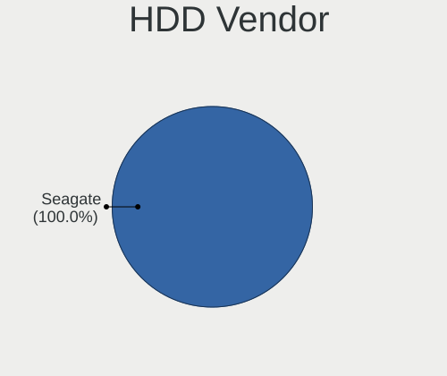

| Vendor  | Notebooks | Drives | Percent |
|---------|-----------|--------|---------|
| Seagate | 2         | 2      | 100%    |

SSD Vendor
----------

Solid state drive vendors

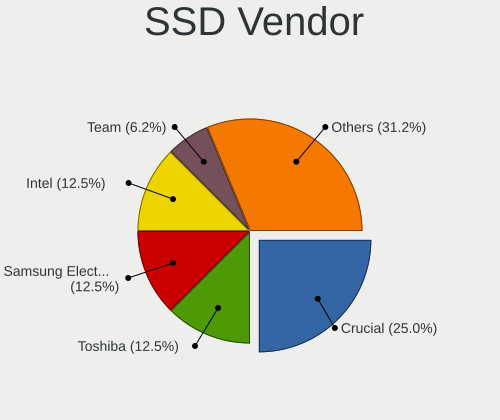

| Vendor              | Notebooks | Drives | Percent |
|---------------------|-----------|--------|---------|
| Crucial             | 4         | 4      | 25%     |
| Toshiba             | 2         | 2      | 12.5%   |
| Samsung Electronics | 2         | 2      | 12.5%   |
| Intel               | 2         | 2      | 12.5%   |
| Team                | 1         | 1      | 6.25%   |
| ShiJi               | 1         | 1      | 6.25%   |
| SanDisk             | 1         | 1      | 6.25%   |
| Fanxiang            | 1         | 1      | 6.25%   |
| China               | 1         | 1      | 6.25%   |
| Apple               | 1         | 1      | 6.25%   |

Drive Kind
----------

HDD or SSD

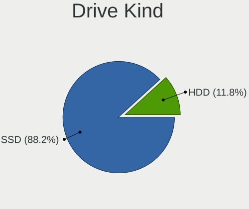

| Kind | Notebooks | Drives | Percent |
|------|-----------|--------|---------|
| SSD  | 15        | 16     | 88.24%  |
| HDD  | 2         | 2      | 11.76%  |

Drive Connector
---------------

SATA, SAS, NVMe, etc.

| Type | Notebooks | Drives | Percent |
|------|-----------|--------|---------|
| SATA | 16        | 18     | 100%    |

Drive Size
----------

Size of hard drive

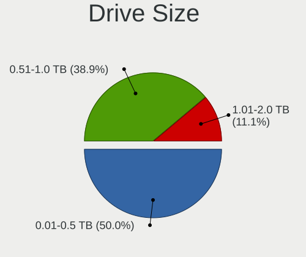

| Size in TB | Notebooks | Drives | Percent |
|------------|-----------|--------|---------|
| 0.01-0.5   | 9         | 9      | 50%     |
| 0.51-1.0   | 7         | 7      | 38.89%  |
| 1.01-2.0   | 2         | 2      | 11.11%  |

Space Total
-----------

Amount of disk space available on the file system

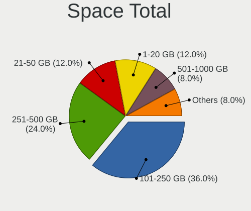

| Size in GB | Notebooks | Percent |
|------------|-----------|---------|
| 101-250    | 9         | 36%     |
| 251-500    | 6         | 24%     |
| 21-50      | 3         | 12%     |
| 1-20       | 3         | 12%     |
| 501-1000   | 2         | 8%      |
| 1001-2000  | 1         | 4%      |
| 51-100     | 1         | 4%      |

Space Used
----------

Amount of used disk space

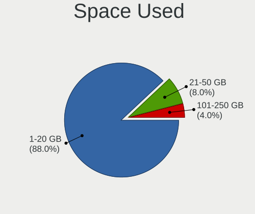

| Used GB | Notebooks | Percent |
|---------|-----------|---------|
| 1-20    | 22        | 88%     |
| 21-50   | 2         | 8%      |
| 101-250 | 1         | 4%      |

Malfunc. Drives
---------------

Drive models with a malfunction

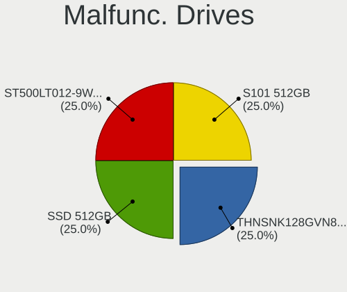

| Model                                | Notebooks | Drives | Percent |
|--------------------------------------|-----------|--------|---------|
| Toshiba THNSNK128GVN8 M.2 2280 128GB | 1         | 1      | 25%     |
| ShiJi SSD 512GB                      | 1         | 1      | 25%     |
| Seagate ST500LT012-9WS142 500GB      | 1         | 1      | 25%     |
| Fanxiang S101 512GB                  | 1         | 1      | 25%     |

Malfunc. Drive Vendor
---------------------

Vendors of faulty drives

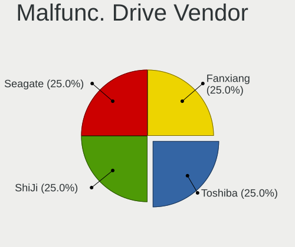

| Vendor   | Notebooks | Drives | Percent |
|----------|-----------|--------|---------|
| Toshiba  | 1         | 1      | 25%     |
| ShiJi    | 1         | 1      | 25%     |
| Seagate  | 1         | 1      | 25%     |
| Fanxiang | 1         | 1      | 25%     |

Malfunc. HDD Vendor
-------------------

Vendors of faulty HDD drives

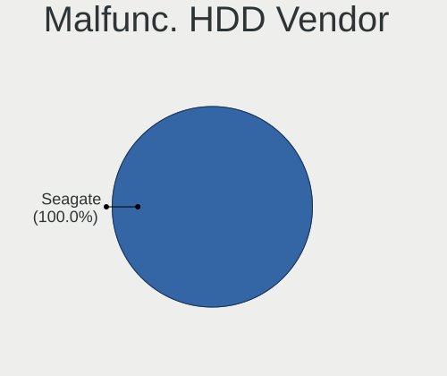

| Vendor  | Notebooks | Drives | Percent |
|---------|-----------|--------|---------|
| Seagate | 1         | 1      | 100%    |

Malfunc. Drive Kind
-------------------

Kinds of faulty drives

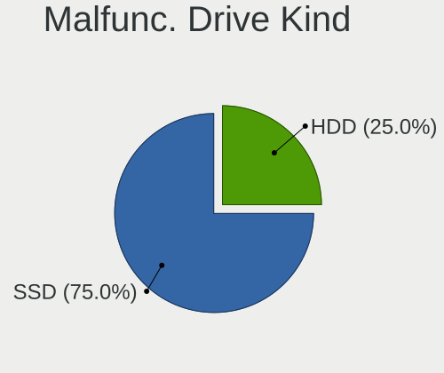

| Kind | Notebooks | Drives | Percent |
|------|-----------|--------|---------|
| SSD  | 3         | 3      | 75%     |
| HDD  | 1         | 1      | 25%     |

Failed Drives
-------------

Failed drive models

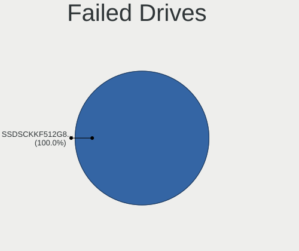

| Model                          | Notebooks | Drives | Percent |
|--------------------------------|-----------|--------|---------|
| Intel SSDSCKKF512G8 SATA 512GB | 1         | 1      | 100%    |

Failed Drive Vendor
-------------------

Failed drive vendors

| Vendor | Notebooks | Drives | Percent |
|--------|-----------|--------|---------|
| Intel  | 1         | 1      | 100%    |

Drive Status
------------

Number of failed and malfunc. drives

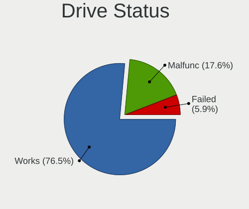

| Status  | Notebooks | Drives | Percent |
|---------|-----------|--------|---------|
| Works   | 13        | 13     | 76.47%  |
| Malfunc | 3         | 4      | 17.65%  |
| Failed  | 1         | 1      | 5.88%   |

Storage controller
------------------

Storage Vendor
--------------

Storage controller vendors

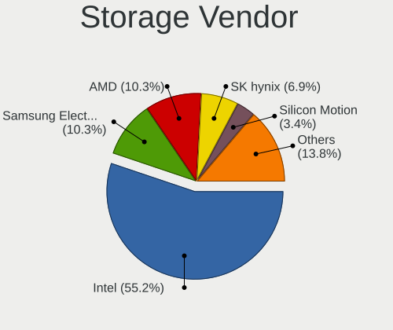

| Vendor                       | Notebooks | Percent |
|------------------------------|-----------|---------|
| Intel                        | 16        | 55.17%  |
| Samsung Electronics          | 3         | 10.34%  |
| AMD                          | 3         | 10.34%  |
| SK hynix                     | 2         | 6.9%    |
| Silicon Motion               | 1         | 3.45%   |
| Shenzhen Longsys Electronics | 1         | 3.45%   |
| Phison Electronics           | 1         | 3.45%   |
| Micron/Crucial Technology    | 1         | 3.45%   |
| Kingston Technology Company  | 1         | 3.45%   |

Storage Model
-------------

Storage controller models

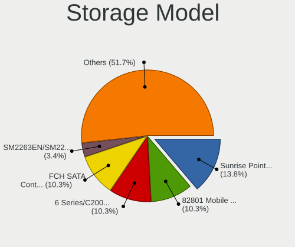

| Model                                                                                                              | Notebooks | Percent |
|--------------------------------------------------------------------------------------------------------------------|-----------|---------|
| Intel Sunrise Point-LP SATA Controller [AHCI mode]                                                                 | 4         | 13.79%  |
| Intel 82801 Mobile SATA Controller [RAID mode]                                                                     | 3         | 10.34%  |
| Intel 6 Series/C200 Series Chipset Family 6 port Mobile SATA AHCI Controller                                       | 3         | 10.34%  |
| AMD FCH SATA Controller [AHCI mode]                                                                                | 3         | 10.34%  |
| SK hynix Gold P31/BC711/PC711 NVMe Solid State Drive                                                               | 1         | 3.45%   |
| SK hynix BC511 NVMe SSD                                                                                            | 1         | 3.45%   |
| Silicon Motion SM2263EN/SM2263XT (DRAM-less) NVMe SSD Controllers                                                  | 1         | 3.45%   |
| Shenzhen Longsys FORESEE XP1000 / Lexar Professional CFexpress Type B Gold series, NM620 PCIe NVME SSD (DRAM-less) | 1         | 3.45%   |
| Samsung S4LN058A01[SSUBX] AHCI SSD Controller (Apple slot)                                                         | 1         | 3.45%   |
| Samsung NVMe SSD Controller SM981/PM981/PM983                                                                      | 1         | 3.45%   |
| Samsung NVMe SSD Controller PM9A1/PM9A3/980PRO                                                                     | 1         | 3.45%   |
| Phison PS5013-E13 PCIe3 NVMe Controller (DRAM-less)                                                                | 1         | 3.45%   |
| Micron/Crucial P2 [Nick P2] / P3 / P3 Plus NVMe PCIe SSD (DRAM-less)                                               | 1         | 3.45%   |
| Kingston Company NV2 NVMe SSD [SM2267XT] (DRAM-less)                                                               | 1         | 3.45%   |
| Intel Wildcat Point-LP SATA Controller [AHCI Mode]                                                                 | 1         | 3.45%   |
| Intel SSD 600P Series                                                                                              | 1         | 3.45%   |
| Intel SATA Controller [RAID mode]                                                                                  | 1         | 3.45%   |
| Intel Jasper Lake SATA AHCI Controller                                                                             | 1         | 3.45%   |
| Intel 8 Series SATA Controller 1 [AHCI mode]                                                                       | 1         | 3.45%   |
| Intel 7 Series Chipset Family 6-port SATA Controller [AHCI mode]                                                   | 1         | 3.45%   |

Storage Kind
------------

Kind of storage controller (IDE, SATA, NVMe, SAS, ...)

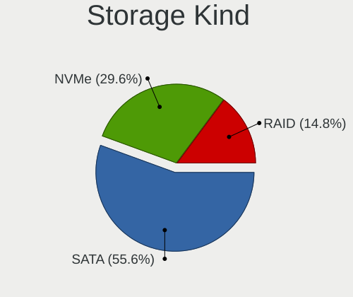

| Kind | Notebooks | Percent |
|------|-----------|---------|
| SATA | 15        | 55.56%  |
| NVMe | 8         | 29.63%  |
| RAID | 4         | 14.81%  |

Processor
---------

CPU Vendor
----------

Processor vendors

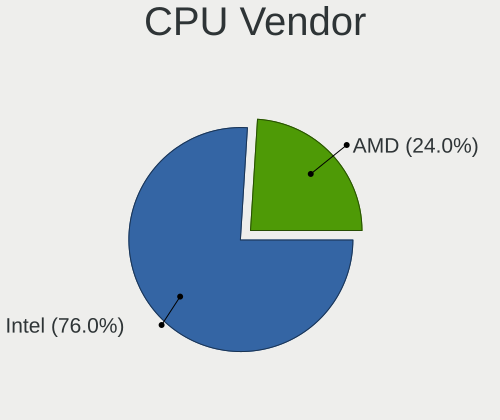

| Vendor | Notebooks | Percent |
|--------|-----------|---------|
| Intel  | 19        | 76%     |
| AMD    | 6         | 24%     |

CPU Model
---------

Processor models

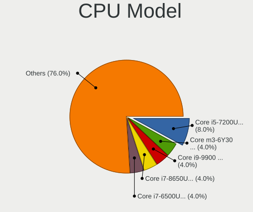

| Model                                        | Notebooks | Percent |
|----------------------------------------------|-----------|---------|
| Intel Core i5-7200U CPU @ 2.50GHz            | 2         | 8%      |
| Intel Core m3-6Y30 CPU @ 0.90GHz             | 1         | 4%      |
| Intel Core i9-9900 CPU @ 3.10GHz             | 1         | 4%      |
| Intel Core i7-8650U CPU @ 1.90GHz            | 1         | 4%      |
| Intel Core i7-6500U CPU @ 2.50GHz            | 1         | 4%      |
| Intel Core i7-5600U CPU @ 2.60GHz            | 1         | 4%      |
| Intel Core i7-4600U CPU @ 2.10GHz            | 1         | 4%      |
| Intel Core i7-2640M CPU @ 2.80GHz            | 1         | 4%      |
| Intel Core i7-2620M CPU @ 2.70GHz            | 1         | 4%      |
| Intel Core i5-8365U CPU @ 1.60GHz            | 1         | 4%      |
| Intel Core i5-7300U CPU @ 2.60GHz            | 1         | 4%      |
| Intel Core i5-4310M CPU @ 2.70GHz            | 1         | 4%      |
| Intel Core i5-4200U CPU @ 1.60GHz            | 1         | 4%      |
| Intel Core i5-2450M CPU @ 2.50GHz            | 1         | 4%      |
| Intel Core i3-3217U CPU @ 1.80GHz            | 1         | 4%      |
| Intel Core i3-1005G1 CPU @ 1.20GHz           | 1         | 4%      |
| Intel Celeron N5095 @ 2.00GHz                | 1         | 4%      |
| Intel 11th Gen Core i7-1165G7 @ 2.80GHz      | 1         | 4%      |
| AMD Ryzen 7 5825U with Radeon Graphics       | 1         | 4%      |
| AMD Ryzen 7 4700U with Radeon Graphics       | 1         | 4%      |
| AMD Ryzen 5 5600U with Radeon Graphics       | 1         | 4%      |
| AMD Ryzen 5 5600H with Radeon Graphics       | 1         | 4%      |
| AMD Ryzen 5 5500U with Radeon Graphics       | 1         | 4%      |
| AMD PRO A10-8730B R5, 10 COMPUTE CORES 4C+6G | 1         | 4%      |

CPU Model Family
----------------

Processor model prefix

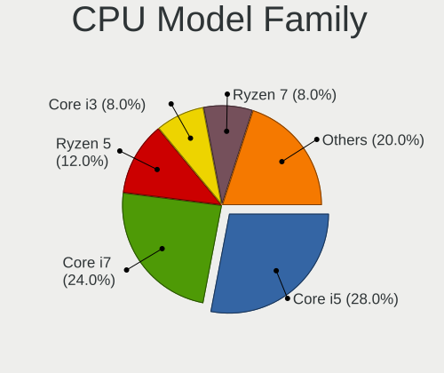

| Model         | Notebooks | Percent |
|---------------|-----------|---------|
| Intel Core i5 | 7         | 28%     |
| Intel Core i7 | 6         | 24%     |
| AMD Ryzen 5   | 3         | 12%     |
| Intel Core i3 | 2         | 8%      |
| AMD Ryzen 7   | 2         | 8%      |
| Other         | 1         | 4%      |
| Intel Core m3 | 1         | 4%      |
| Intel Core i9 | 1         | 4%      |
| Intel Celeron | 1         | 4%      |
| AMD PRO A10   | 1         | 4%      |

CPU Cores
---------

Number of processor cores

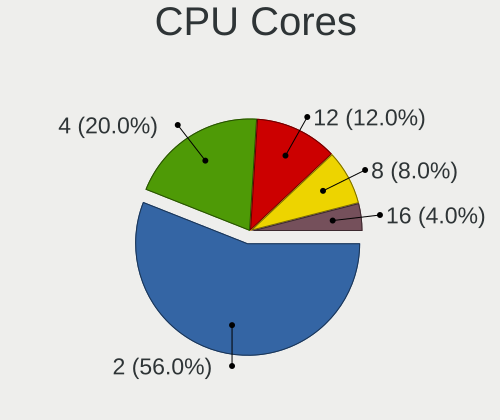

| Number | Notebooks | Percent |
|--------|-----------|---------|
| 2      | 14        | 56%     |
| 4      | 5         | 20%     |
| 12     | 3         | 12%     |
| 8      | 2         | 8%      |
| 16     | 1         | 4%      |

CPU Sockets
-----------

Number of sockets

| Number | Notebooks | Percent |
|--------|-----------|---------|
| 1      | 25        | 100%    |

CPU Threads
-----------

Threads per core (Hyper-Threading)

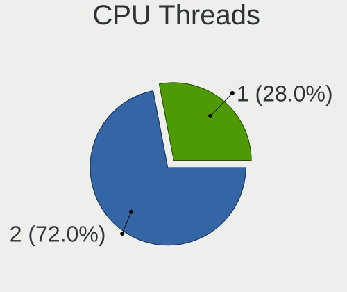

| Number | Notebooks | Percent |
|--------|-----------|---------|
| 2      | 18        | 72%     |
| 1      | 7         | 28%     |

CPU Microarch
-------------

Microarchitecture

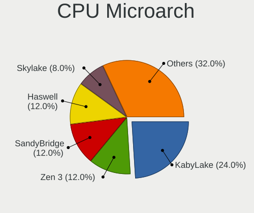

| Name        | Notebooks | Percent |
|-------------|-----------|---------|
| KabyLake    | 6         | 24%     |
| Zen 3       | 3         | 12%     |
| SandyBridge | 3         | 12%     |
| Haswell     | 3         | 12%     |
| Skylake     | 2         | 8%      |
| Unknown     | 2         | 8%      |
| Zen 2       | 1         | 4%      |
| TigerLake   | 1         | 4%      |
| IvyBridge   | 1         | 4%      |
| IceLake     | 1         | 4%      |
| Excavator   | 1         | 4%      |
| Broadwell   | 1         | 4%      |

Graphics
--------

GPU Vendor
----------

Vendors of graphics cards

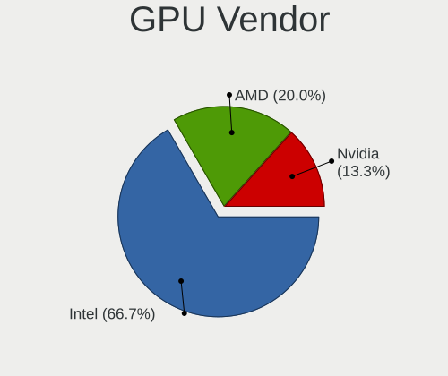

| Vendor | Notebooks | Percent |
|--------|-----------|---------|
| Intel  | 20        | 66.67%  |
| AMD    | 6         | 20%     |
| Nvidia | 4         | 13.33%  |

GPU Model
---------

Graphics card models

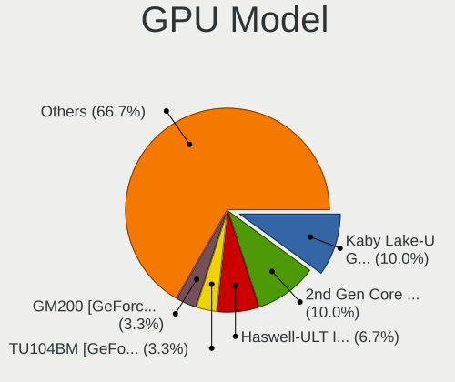

| Model                                                                     | Notebooks | Percent |
|---------------------------------------------------------------------------|-----------|---------|
| Intel Kaby Lake-U GT2 [HD Graphics 620]                                   | 3         | 10%     |
| Intel 2nd Generation Core Processor Family Integrated Graphics Controller | 3         | 10%     |
| Intel Haswell-ULT Integrated Graphics Controller                          | 2         | 6.67%   |
| Nvidia TU104BM [GeForce RTX 2080 Mobile]                                  | 1         | 3.33%   |
| Nvidia GM200 [GeForce GTX 980 Ti]                                         | 1         | 3.33%   |
| Nvidia GM108GLM [Quadro K620M / Quadro M500M]                             | 1         | 3.33%   |
| Nvidia GA106M [GeForce RTX 3060 Mobile / Max-Q]                           | 1         | 3.33%   |
| Intel WhiskeyLake-U GT2 [UHD Graphics 620]                                | 1         | 3.33%   |
| Intel TigerLake-LP GT2 [Iris Xe Graphics]                                 | 1         | 3.33%   |
| Intel Skylake-Y GT2 [HD Graphics 515]                                     | 1         | 3.33%   |
| Intel Skylake-U GT2 [HD Graphics 520]                                     | 1         | 3.33%   |
| Intel Kaby Lake-R GT2 [UHD Graphics 620]                                  | 1         | 3.33%   |
| Intel JasperLake [UHD Graphics]                                           | 1         | 3.33%   |
| Intel Iris Plus Graphics G1 (Ice Lake)                                    | 1         | 3.33%   |
| Intel CoffeeLake-S GT2 [UHD Graphics 630]                                 | 1         | 3.33%   |
| Intel Broadwell-U GT3 [HD Graphics 6000]                                  | 1         | 3.33%   |
| Intel Broadwell-U GT2 [HD Graphics 5500]                                  | 1         | 3.33%   |
| Intel 4th Gen Core Processor Integrated Graphics Controller               | 1         | 3.33%   |
| Intel 3rd Gen Core processor Graphics Controller                          | 1         | 3.33%   |
| AMD Wani [Radeon R5/R6/R7 Graphics]                                       | 1         | 3.33%   |
| AMD Seymour [Radeon HD 6400M/7400M Series]                                | 1         | 3.33%   |
| AMD Renoir [Radeon Vega Series / Radeon Vega Mobile Series]               | 1         | 3.33%   |
| AMD Lucienne                                                              | 1         | 3.33%   |
| AMD Cezanne [Radeon Vega Series / Radeon Vega Mobile Series]              | 1         | 3.33%   |
| AMD Barcelo                                                               | 1         | 3.33%   |

GPU Combo
---------

Combinations of graphics cards

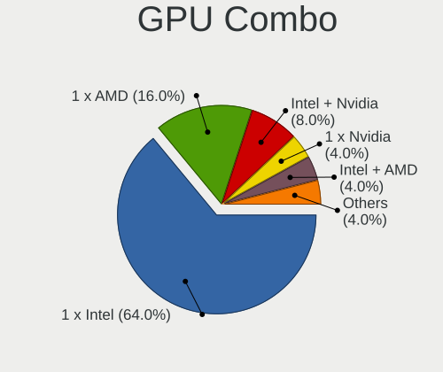

| Name           | Notebooks | Percent |
|----------------|-----------|---------|
| 1 x Intel      | 16        | 64%     |
| 1 x AMD        | 4         | 16%     |
| Intel + Nvidia | 2         | 8%      |
| 1 x Nvidia     | 1         | 4%      |
| Intel + AMD    | 1         | 4%      |
| AMD + Nvidia   | 1         | 4%      |

GPU Driver
----------

Free vs proprietary

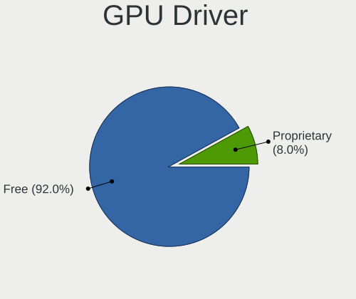

| Driver      | Notebooks | Percent |
|-------------|-----------|---------|
| Free        | 23        | 92%     |
| Proprietary | 2         | 8%      |

GPU Memory
----------

Total video memory

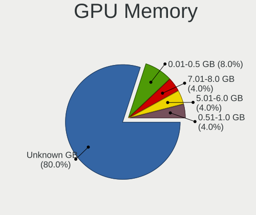

| Size in GB | Notebooks | Percent |
|------------|-----------|---------|
| Unknown    | 20        | 80%     |
| 0.01-0.5   | 2         | 8%      |
| 7.01-8.0   | 1         | 4%      |
| 5.01-6.0   | 1         | 4%      |
| 0.51-1.0   | 1         | 4%      |

Monitor
-------

Monitor Vendor
--------------

Monitor vendors

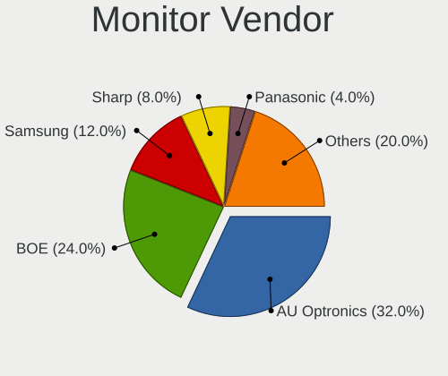

| Vendor              | Notebooks | Percent |
|---------------------|-----------|---------|
| AU Optronics        | 8         | 32%     |
| BOE                 | 6         | 24%     |
| Samsung Electronics | 3         | 12%     |
| Sharp               | 2         | 8%      |
| Panasonic           | 1         | 4%      |
| InfoVision          | 1         | 4%      |
| HKC                 | 1         | 4%      |
| HannStar            | 1         | 4%      |
| Chimei Innolux      | 1         | 4%      |
| Apple               | 1         | 4%      |

Monitor Model
-------------

Monitor models

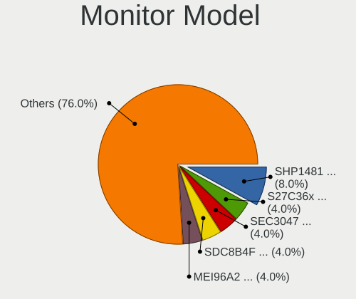

| Model                                                                 | Notebooks | Percent |
|-----------------------------------------------------------------------|-----------|---------|
| Sharp LCD Monitor SHP1481 1920x1080 290x170mm 13.2-inch               | 2         | 8%      |
| Samsung Electronics S27C36x SAM7315 1920x1080 600x340mm 27.2-inch     | 1         | 4%      |
| Samsung Electronics LCD Monitor SEC3047 1366x768 280x160mm 12.7-inch  | 1         | 4%      |
| Samsung Electronics LCD Monitor SDC8B4F 1920x1080 340x190mm 15.3-inch | 1         | 4%      |
| Panasonic LCD Monitor MEI96A2 2880x1620 340x190mm 15.3-inch           | 1         | 4%      |
| InfoVision LCD Monitor IVO8C69 1920x1080 310x170mm 13.9-inch          | 1         | 4%      |
| HKC LCD Monitor HKC3D05 1920x1080 340x190mm 15.3-inch                 | 1         | 4%      |
| HannStar LCD Monitor HSD1568 1920x1080 340x190mm 15.3-inch            | 1         | 4%      |
| Chimei Innolux LCD Monitor CMN175F 1920x1080 380x210mm 17.1-inch      | 1         | 4%      |
| BOE LCD Monitor BOE0A40 2560x1600 340x210mm 15.7-inch                 | 1         | 4%      |
| BOE LCD Monitor BOE08E2 1920x1080 340x190mm 15.3-inch                 | 1         | 4%      |
| BOE LCD Monitor BOE0731 1366x768 260x140mm 11.6-inch                  | 1         | 4%      |
| BOE LCD Monitor BOE06EE 1920x1080 310x170mm 13.9-inch                 | 1         | 4%      |
| BOE LCD Monitor BOE06DF 1920x1080 310x170mm 13.9-inch                 | 1         | 4%      |
| BOE LCD Monitor BOE05E0 1366x768 280x160mm 12.7-inch                  | 1         | 4%      |
| AU Optronics LCD Monitor AUO5B2D 1920x1080 290x160mm 13.0-inch        | 1         | 4%      |
| AU Optronics LCD Monitor AUO35EC 1366x768 340x190mm 15.3-inch         | 1         | 4%      |
| AU Optronics LCD Monitor AUO305C 1366x768 260x140mm 11.6-inch         | 1         | 4%      |
| AU Optronics LCD Monitor AUO2E3C 1366x768 310x170mm 13.9-inch         | 1         | 4%      |
| AU Optronics LCD Monitor AUO226D 1920x1080 280x160mm 12.7-inch        | 1         | 4%      |
| AU Optronics LCD Monitor AUO21ED 1920x1080 340x190mm 15.3-inch        | 1         | 4%      |
| AU Optronics LCD Monitor AUO206C 1366x768 280x160mm 12.7-inch         | 1         | 4%      |
| AU Optronics LCD Monitor AUO142D 1920x1080 290x170mm 13.2-inch        | 1         | 4%      |
| Apple Color LCD APPA01B 1440x900 290x180mm 13.4-inch                  | 1         | 4%      |

Monitor Resolution
------------------

Monitor screen resolution

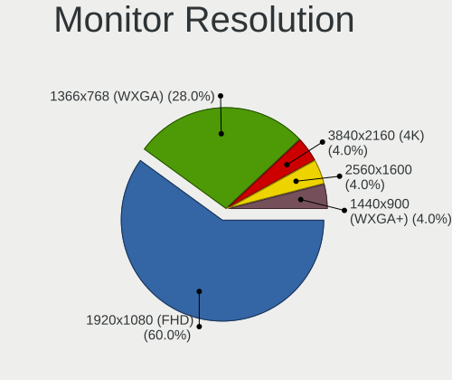

| Resolution       | Notebooks | Percent |
|------------------|-----------|---------|
| 1920x1080 (FHD)  | 15        | 60%     |
| 1366x768 (WXGA)  | 7         | 28%     |
| 3840x2160 (4K)   | 1         | 4%      |
| 2560x1600        | 1         | 4%      |
| 1440x900 (WXGA+) | 1         | 4%      |

Monitor Diagonal
----------------

Diagonal size in inches

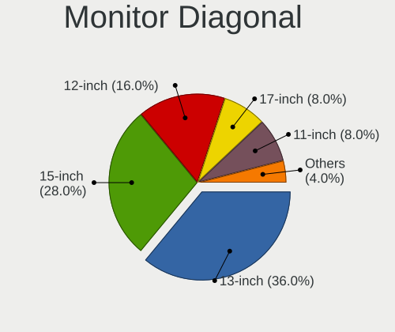

| Inches | Notebooks | Percent |
|--------|-----------|---------|
| 13     | 9         | 36%     |
| 15     | 7         | 28%     |
| 12     | 4         | 16%     |
| 17     | 2         | 8%      |
| 11     | 2         | 8%      |
| 27     | 1         | 4%      |

Monitor Width
-------------

Physical width

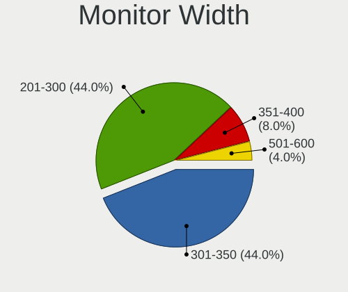

| Width in mm | Notebooks | Percent |
|-------------|-----------|---------|
| 301-350     | 11        | 44%     |
| 201-300     | 11        | 44%     |
| 351-400     | 2         | 8%      |
| 501-600     | 1         | 4%      |

Aspect Ratio
------------

Proportional relationship between the width and the height

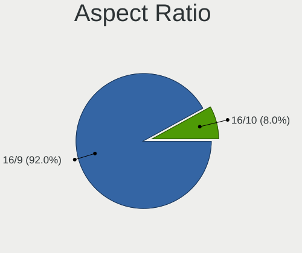

| Ratio | Notebooks | Percent |
|-------|-----------|---------|
| 16/9  | 23        | 92%     |
| 16/10 | 2         | 8%      |

Monitor Area
------------

Area in inch²

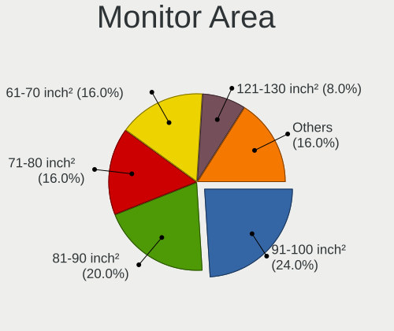

| Area in inch² | Notebooks | Percent |
|----------------|-----------|---------|
| 91-100         | 6         | 24%     |
| 81-90          | 5         | 20%     |
| 71-80          | 4         | 16%     |
| 61-70          | 4         | 16%     |
| 51-60          | 2         | 8%      |
| 121-130        | 2         | 8%      |
| 301-350        | 1         | 4%      |
| 111-120        | 1         | 4%      |

Pixel Density
-------------

Pixels per inch

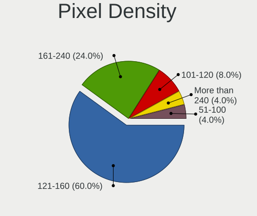

| Density       | Notebooks | Percent |
|---------------|-----------|---------|
| 121-160       | 15        | 60%     |
| 161-240       | 6         | 24%     |
| 101-120       | 2         | 8%      |
| More than 240 | 1         | 4%      |
| 51-100        | 1         | 4%      |

Multiple Monitors
-----------------

Total monitors connected

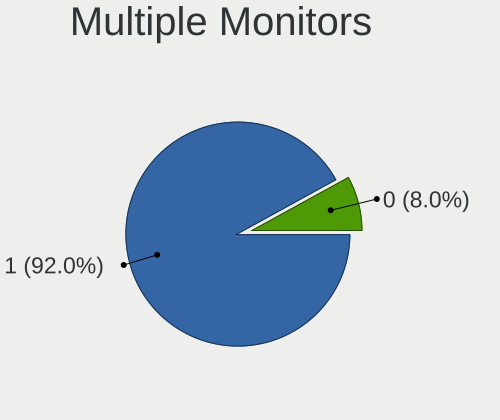

| Total | Notebooks | Percent |
|-------|-----------|---------|
| 1     | 23        | 92%     |
| 0     | 2         | 8%      |

Network
-------

Net Controller Vendor
---------------------

Controller vendors

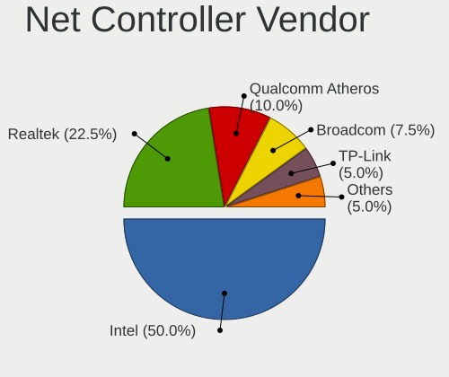

| Vendor                            | Notebooks | Percent |
|-----------------------------------|-----------|---------|
| Intel                             | 20        | 50%     |
| Realtek Semiconductor             | 9         | 22.5%   |
| Qualcomm Atheros                  | 4         | 10%     |
| Broadcom                          | 3         | 7.5%    |
| TP-Link                           | 2         | 5%      |
| Huawei Technologies               | 1         | 2.5%    |
| Ericsson Business Mobile Networks | 1         | 2.5%    |

Net Controller Model
--------------------

Controller models

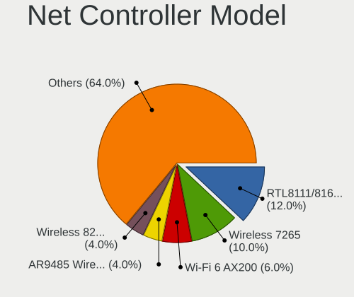

| Model                                                                       | Notebooks | Percent |
|-----------------------------------------------------------------------------|-----------|---------|
| Realtek RTL8111/8168/8211/8411 PCI Express Gigabit Ethernet Controller      | 6         | 12%     |
| Intel Wireless 7265                                                         | 5         | 10%     |
| Intel Wi-Fi 6 AX200                                                         | 3         | 6%      |
| Qualcomm Atheros AR9485 Wireless Network Adapter                            | 2         | 4%      |
| Intel Wireless 8265 / 8275                                                  | 2         | 4%      |
| Intel Wireless 7260                                                         | 2         | 4%      |
| Intel Wireless 3160                                                         | 2         | 4%      |
| Intel Ethernet Connection I218-LM                                           | 2         | 4%      |
| Intel Ethernet Connection (4) I219-LM                                       | 2         | 4%      |
| Intel 82579LM Gigabit Network Connection (Lewisville)                       | 2         | 4%      |
| TP-Link Archer T2U PLUS [RTL8821AU]                                         | 1         | 2%      |
| TP-Link AC600 wireless Realtek RTL8811AU [Archer T2U Nano]                  | 1         | 2%      |
| Realtek RTL8852AE 802.11ax PCIe Wireless Network Adapter                    | 1         | 2%      |
| Realtek RTL8821CE 802.11ac PCIe Wireless Network Adapter                    | 1         | 2%      |
| Realtek RTL8191SEvA Wireless LAN Controller                                 | 1         | 2%      |
| Realtek RTL810xE PCI Express Fast Ethernet controller                       | 1         | 2%      |
| Realtek Killer E3000 2.5GbE Controller                                      | 1         | 2%      |
| Qualcomm Atheros QCA6174 802.11ac Wireless Network Adapter                  | 1         | 2%      |
| Qualcomm Atheros AR9285 Wireless Network Adapter (PCI-Express)              | 1         | 2%      |
| Qualcomm Atheros AR8162 Fast Ethernet                                       | 1         | 2%      |
| Intel Wi-Fi 6E(802.11ax) AX210/AX1675* 2x2 [Typhoon Peak]                   | 1         | 2%      |
| Intel Ice Lake-LP PCH CNVi WiFi                                             | 1         | 2%      |
| Intel Ethernet Connection I217-LM                                           | 1         | 2%      |
| Intel Ethernet Connection (6) I219-LM                                       | 1         | 2%      |
| Intel Ethernet Connection (3) I218-LM                                       | 1         | 2%      |
| Intel Centrino Advanced-N 6205 [Taylor Peak]                                | 1         | 2%      |
| Intel Cannon Point-LP CNVi [Wireless-AC]                                    | 1         | 2%      |
| Huawei ME936 LTE/HSDPA+ 4G modem                                            | 1         | 2%      |
| Ericsson Business Mobile Networks F5521 gw Mobile Broadband Serial Port III | 1         | 2%      |
| Broadcom BCM4360 802.11ac Dual Band Wireless Network Adapter                | 1         | 2%      |
| Broadcom BCM4313 802.11bgn Wireless Network Adapter                         | 1         | 2%      |
| Broadcom BCM4312 802.11b/g LP-PHY                                           | 1         | 2%      |

Wireless Vendor
---------------

Wireless vendors

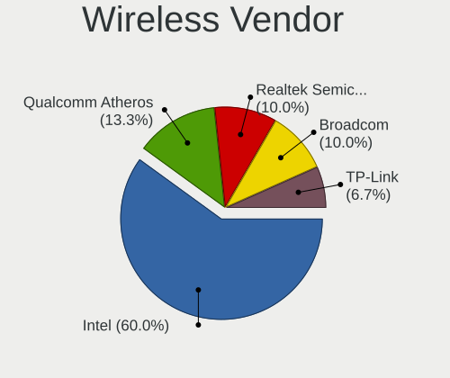

| Vendor                | Notebooks | Percent |
|-----------------------|-----------|---------|
| Intel                 | 18        | 60%     |
| Qualcomm Atheros      | 4         | 13.33%  |
| Realtek Semiconductor | 3         | 10%     |
| Broadcom              | 3         | 10%     |
| TP-Link               | 2         | 6.67%   |

Wireless Model
--------------

Wireless models

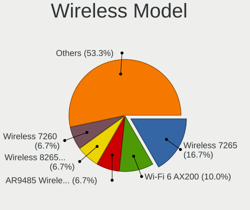

| Model                                                          | Notebooks | Percent |
|----------------------------------------------------------------|-----------|---------|
| Intel Wireless 7265                                            | 5         | 16.67%  |
| Intel Wi-Fi 6 AX200                                            | 3         | 10%     |
| Qualcomm Atheros AR9485 Wireless Network Adapter               | 2         | 6.67%   |
| Intel Wireless 8265 / 8275                                     | 2         | 6.67%   |
| Intel Wireless 7260                                            | 2         | 6.67%   |
| Intel Wireless 3160                                            | 2         | 6.67%   |
| TP-Link Archer T2U PLUS [RTL8821AU]                            | 1         | 3.33%   |
| TP-Link AC600 wireless Realtek RTL8811AU [Archer T2U Nano]     | 1         | 3.33%   |
| Realtek RTL8852AE 802.11ax PCIe Wireless Network Adapter       | 1         | 3.33%   |
| Realtek RTL8821CE 802.11ac PCIe Wireless Network Adapter       | 1         | 3.33%   |
| Realtek RTL8191SEvA Wireless LAN Controller                    | 1         | 3.33%   |
| Qualcomm Atheros QCA6174 802.11ac Wireless Network Adapter     | 1         | 3.33%   |
| Qualcomm Atheros AR9285 Wireless Network Adapter (PCI-Express) | 1         | 3.33%   |
| Intel Wi-Fi 6E(802.11ax) AX210/AX1675* 2x2 [Typhoon Peak]      | 1         | 3.33%   |
| Intel Ice Lake-LP PCH CNVi WiFi                                | 1         | 3.33%   |
| Intel Centrino Advanced-N 6205 [Taylor Peak]                   | 1         | 3.33%   |
| Intel Cannon Point-LP CNVi [Wireless-AC]                       | 1         | 3.33%   |
| Broadcom BCM4360 802.11ac Dual Band Wireless Network Adapter   | 1         | 3.33%   |
| Broadcom BCM4313 802.11bgn Wireless Network Adapter            | 1         | 3.33%   |
| Broadcom BCM4312 802.11b/g LP-PHY                              | 1         | 3.33%   |

Ethernet Vendor
---------------

Ethernet vendors

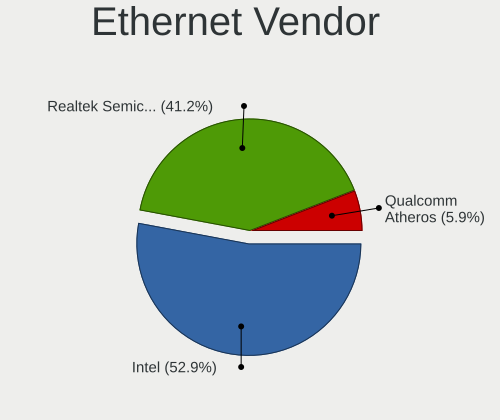

| Vendor                | Notebooks | Percent |
|-----------------------|-----------|---------|
| Intel                 | 9         | 52.94%  |
| Realtek Semiconductor | 7         | 41.18%  |
| Qualcomm Atheros      | 1         | 5.88%   |

Ethernet Model
--------------

Ethernet models

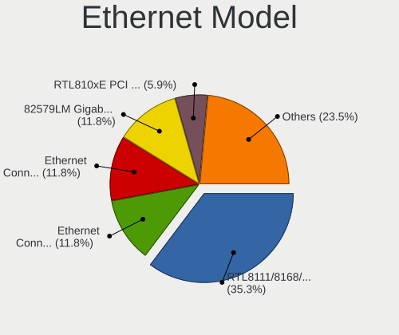

| Model                                                                  | Notebooks | Percent |
|------------------------------------------------------------------------|-----------|---------|
| Realtek RTL8111/8168/8211/8411 PCI Express Gigabit Ethernet Controller | 6         | 35.29%  |
| Intel Ethernet Connection I218-LM                                      | 2         | 11.76%  |
| Intel Ethernet Connection (4) I219-LM                                  | 2         | 11.76%  |
| Intel 82579LM Gigabit Network Connection (Lewisville)                  | 2         | 11.76%  |
| Realtek RTL810xE PCI Express Fast Ethernet controller                  | 1         | 5.88%   |
| Qualcomm Atheros AR8162 Fast Ethernet                                  | 1         | 5.88%   |
| Intel Ethernet Connection I217-LM                                      | 1         | 5.88%   |
| Intel Ethernet Connection (6) I219-LM                                  | 1         | 5.88%   |
| Intel Ethernet Connection (3) I218-LM                                  | 1         | 5.88%   |

Net Controller Kind
-------------------

Ethernet, WiFi or modem

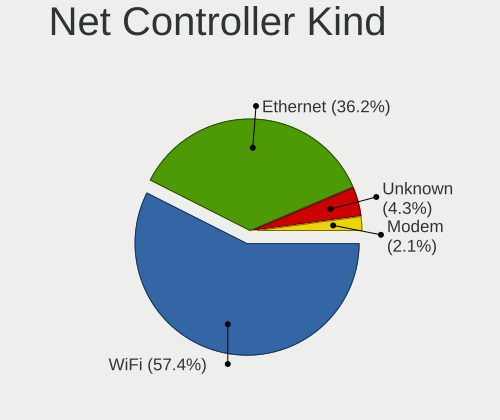

| Kind     | Notebooks | Percent |
|----------|-----------|---------|
| WiFi     | 27        | 57.45%  |
| Ethernet | 17        | 36.17%  |
| Unknown  | 2         | 4.26%   |
| Modem    | 1         | 2.13%   |

Used Controller
---------------

Currently used network controller

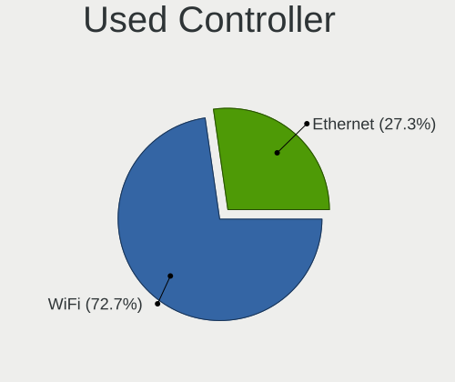

| Kind     | Notebooks | Percent |
|----------|-----------|---------|
| WiFi     | 16        | 72.73%  |
| Ethernet | 6         | 27.27%  |

NICs
----

Total network controllers on board

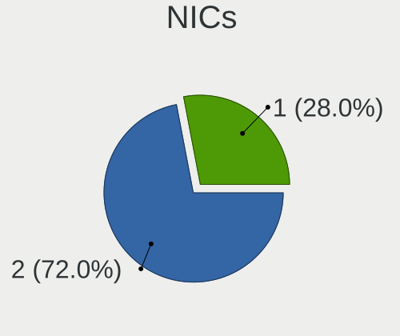

| Total | Notebooks | Percent |
|-------|-----------|---------|
| 2     | 18        | 72%     |
| 1     | 7         | 28%     |

IPv6
----

IPv6 vs IPv4

| Used | Notebooks | Percent |
|------|-----------|---------|
| No   | 25        | 100%    |

Bluetooth
---------

Bluetooth Vendor
----------------

Controller vendors

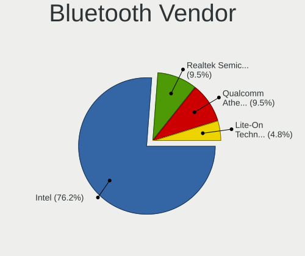

| Vendor                          | Notebooks | Percent |
|---------------------------------|-----------|---------|
| Intel                           | 16        | 76.19%  |
| Realtek Semiconductor           | 2         | 9.52%   |
| Qualcomm Atheros Communications | 2         | 9.52%   |
| Lite-On Technology              | 1         | 4.76%   |

Bluetooth Model
---------------

Controller models

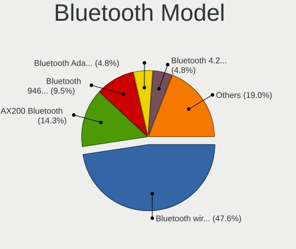

| Model                                          | Notebooks | Percent |
|------------------------------------------------|-----------|---------|
| Intel Bluetooth wireless interface             | 10        | 47.62%  |
| Intel AX200 Bluetooth                          | 3         | 14.29%  |
| Intel Bluetooth 9460/9560 Jefferson Peak (JfP) | 2         | 9.52%   |
| Realtek Bluetooth Adapter                      | 1         | 4.76%   |
| Realtek Bluetooth 4.2 Adapter                  | 1         | 4.76%   |
| Qualcomm Atheros QCA61x4 Bluetooth 4.1         | 1         | 4.76%   |
| Qualcomm Atheros AR3011 Bluetooth              | 1         | 4.76%   |
| Lite-On Atheros Bluetooth                      | 1         | 4.76%   |
| Intel AX210 Bluetooth                          | 1         | 4.76%   |

Sound
-----

Sound Vendor
------------

Sound card vendors

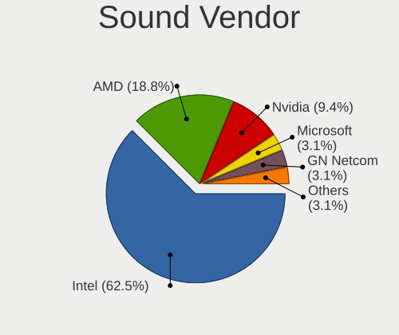

| Vendor              | Notebooks | Percent |
|---------------------|-----------|---------|
| Intel               | 20        | 62.5%   |
| AMD                 | 6         | 18.75%  |
| Nvidia              | 3         | 9.38%   |
| Microsoft           | 1         | 3.13%   |
| GN Netcom           | 1         | 3.13%   |
| C-Media Electronics | 1         | 3.13%   |

Sound Model
-----------

Sound card models

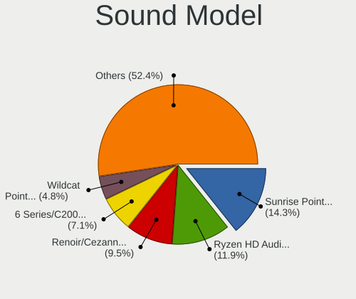

| Model                                                                      | Notebooks | Percent |
|----------------------------------------------------------------------------|-----------|---------|
| Intel Sunrise Point-LP HD Audio                                            | 6         | 14.29%  |
| AMD Ryzen HD Audio Controller                                              | 5         | 11.9%   |
| AMD Renoir/Cezanne HDMI/DP Audio Controller                                | 4         | 9.52%   |
| Intel 6 Series/C200 Series Chipset Family High Definition Audio Controller | 3         | 7.14%   |
| Intel Wildcat Point-LP High Definition Audio Controller                    | 2         | 4.76%   |
| Intel Haswell-ULT HD Audio Controller                                      | 2         | 4.76%   |
| Intel Broadwell-U Audio Controller                                         | 2         | 4.76%   |
| Intel 8 Series HD Audio Controller                                         | 2         | 4.76%   |
| Nvidia TU104 HD Audio Controller                                           | 1         | 2.38%   |
| Nvidia GM200 High Definition Audio                                         | 1         | 2.38%   |
| Nvidia GA106 High Definition Audio Controller                              | 1         | 2.38%   |
| Microsoft LifeChat LX-3000 Headset                                         | 1         | 2.38%   |
| Intel Xeon E3-1200 v3/4th Gen Core Processor HD Audio Controller           | 1         | 2.38%   |
| Intel Tiger Lake-LP Smart Sound Technology Audio Controller                | 1         | 2.38%   |
| Intel Jasper Lake HD Audio                                                 | 1         | 2.38%   |
| Intel Ice Lake-LP Smart Sound Technology Audio Controller                  | 1         | 2.38%   |
| Intel Cannon Point-LP High Definition Audio Controller                     | 1         | 2.38%   |
| Intel Cannon Lake PCH cAVS                                                 | 1         | 2.38%   |
| Intel 8 Series/C220 Series Chipset High Definition Audio Controller        | 1         | 2.38%   |
| Intel 7 Series/C216 Chipset Family High Definition Audio Controller        | 1         | 2.38%   |
| GN Netcom Jabra EVOLVE 20 SE MS                                            | 1         | 2.38%   |
| C-Media Electronics Audio Adapter (Unitek Y-247A)                          | 1         | 2.38%   |
| AMD Kabini HDMI/DP Audio                                                   | 1         | 2.38%   |
| AMD Family 15h (Models 60h-6fh) Audio Controller                           | 1         | 2.38%   |

Memory
------

Memory Vendor
-------------

Memory module vendors

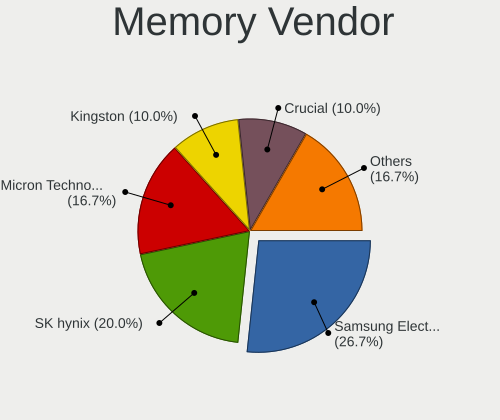

| Vendor              | Notebooks | Percent |
|---------------------|-----------|---------|
| Samsung Electronics | 8         | 26.67%  |
| SK hynix            | 6         | 20%     |
| Micron Technology   | 5         | 16.67%  |
| Kingston            | 3         | 10%     |
| Crucial             | 3         | 10%     |
| Ramaxel Technology  | 2         | 6.67%   |
| Unknown             | 2         | 6.67%   |
| Corsair             | 1         | 3.33%   |

Memory Model
------------

Memory module models

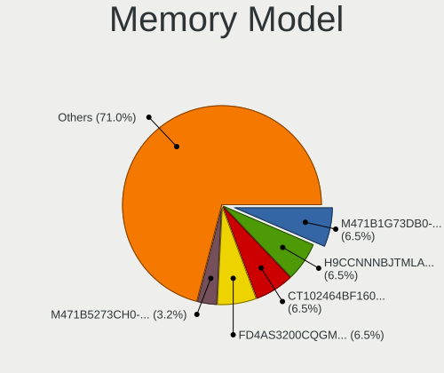

| Model                                                            | Notebooks | Percent |
|------------------------------------------------------------------|-----------|---------|
| SK hynix RAM H9CCNNNBJTMLAR-NUD 4GB Row Of Chips LPDDR3 1867MT/s | 2         | 6.45%   |
| Samsung RAM M471B1G73DB0-YK0 8GB SODIMM DDR3 1600MT/s            | 2         | 6.45%   |
| Crucial RAM CT102464BF160B.M16 8GB SODIMM DDR3 1600MT/s          | 2         | 6.45%   |
| Unknown                                                          | 2         | 6.45%   |
| SK hynix RAM Module 8GB SODIMM DDR4 2400MT/s                     | 1         | 3.23%   |
| SK hynix RAM HMT451S6AFR8A-PB 4GB SODIMM DDR3 1600MT/s           | 1         | 3.23%   |
| SK hynix RAM HMA82GS6JJR8N-VK 16GB SODIMM DDR4 2667MT/s          | 1         | 3.23%   |
| SK hynix RAM HMA81GS6AFR8N-UH 8GB SODIMM DDR4 2400MT/s           | 1         | 3.23%   |
| Samsung RAM M471B5273CH0-CH9 4GB SODIMM DDR3 1334MT/s            | 1         | 3.23%   |
| Samsung RAM M471B1G73EB0-YK0 8GB SODIMM DDR3 1600MT/s            | 1         | 3.23%   |
| Samsung RAM M471B1G73DH0-YK0 8GB SODIMM DDR3 1600MT/s            | 1         | 3.23%   |
| Samsung RAM M471A4G43AB1-CWE 32GB SODIMM DDR4 3200MT/s           | 1         | 3.23%   |
| Samsung RAM M471A2K43BB1-CPB 16GB SODIMM DDR4 2133MT/s           | 1         | 3.23%   |
| Samsung RAM M471A1G44BB0-CWE 8GB SODIMM DDR4 3200MT/s            | 1         | 3.23%   |
| Samsung RAM D24D4S7S8MA-8 8GB Row Of Chips LPDDR4 3733MT/s       | 1         | 3.23%   |
| Ramaxel RAM RMSA3310MF96HAF-3200 8GB SODIMM DDR4 3200MT/s        | 1         | 3.23%   |
| Ramaxel RAM Module 8GB SODIMM DDR4 2667MT/s                      | 1         | 3.23%   |
| Micron RAM MT53E1G32D4NQ-046WTE 4GB Row Of Chips LPDDR4 3200MT/s | 1         | 3.23%   |
| Micron RAM MT52L256M32D1PF-10 2GB LPDDR3 1867MT/s                | 1         | 3.23%   |
| Micron RAM 8KTF51264HZ-1G6E1 4GB SODIMM DDR3 1600MT/s            | 1         | 3.23%   |
| Micron RAM 8KTF51264HZ-1G4E1 4GB SODIMM DDR3 1333MT/s            | 1         | 3.23%   |
| Micron RAM 16JSF51264HZ-1G4D1 4GB SODIMM DDR3 1334MT/s           | 1         | 3.23%   |
| Kingston RAM KF3200C20S4/32GX 32GB SODIMM DDR4 3200MT/s          | 1         | 3.23%   |
| Kingston RAM 99U5428-049.A00LF 4GB SODIMM DDR3 1600MT/s          | 1         | 3.23%   |
| Kingston RAM 9905428-093.A00LF 8GB SODIMM DDR3 1333MT/s          | 1         | 3.23%   |
| Crucial RAM CT32G4SFD832A.M16FF 32GB SODIMM DDR4 3200MT/s        | 1         | 3.23%   |
| Corsair RAM CMSX8GX4M1A2400C16 8GB SODIMM DDR4 2400MT/s          | 1         | 3.23%   |

Memory Kind
-----------

Memory module kinds

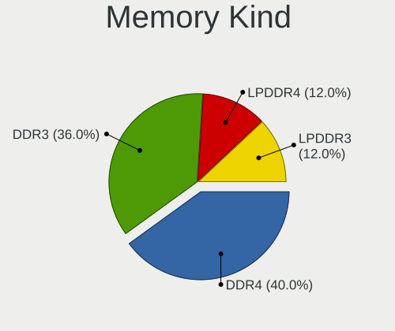

| Kind   | Notebooks | Percent |
|--------|-----------|---------|
| DDR4   | 10        | 40%     |
| DDR3   | 9         | 36%     |
| LPDDR4 | 3         | 12%     |
| LPDDR3 | 3         | 12%     |

Memory Form Factor
------------------

Physical design of the memory module

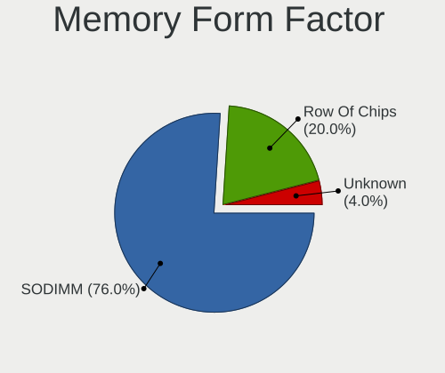

| Name         | Notebooks | Percent |
|--------------|-----------|---------|
| SODIMM       | 19        | 76%     |
| Row Of Chips | 5         | 20%     |
| Unknown      | 1         | 4%      |

Memory Size
-----------

Memory module size

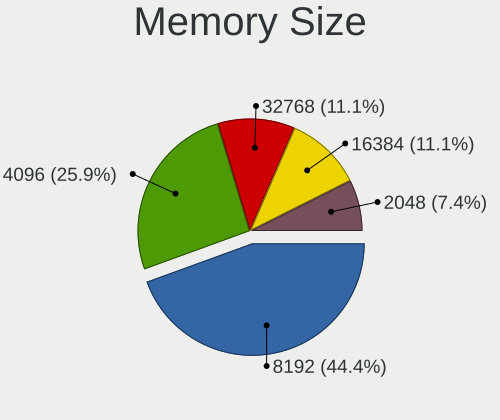

| Size  | Notebooks | Percent |
|-------|-----------|---------|
| 8192  | 12        | 44.44%  |
| 4096  | 7         | 25.93%  |
| 32768 | 3         | 11.11%  |
| 16384 | 3         | 11.11%  |
| 2048  | 2         | 7.41%   |

Memory Speed
------------

Memory module speed

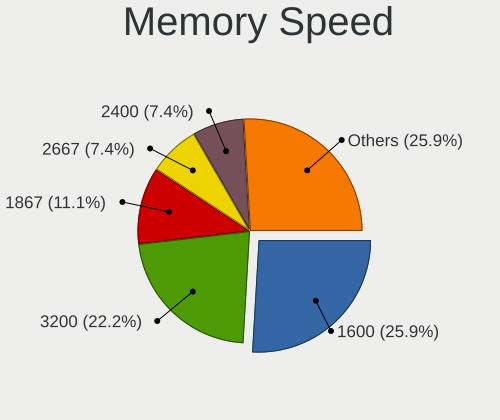

| Speed | Notebooks | Percent |
|-------|-----------|---------|
| 1600  | 7         | 25.93%  |
| 3200  | 6         | 22.22%  |
| 1867  | 3         | 11.11%  |
| 2667  | 2         | 7.41%   |
| 2400  | 2         | 7.41%   |
| 1334  | 2         | 7.41%   |
| 1333  | 2         | 7.41%   |
| 4267  | 1         | 3.7%    |
| 3733  | 1         | 3.7%    |
| 2133  | 1         | 3.7%    |

Printers & scanners
-------------------

Printer Vendor
--------------

Printer device vendors

Zero info for selected period =(

Printer Model
-------------

Printer device models

Zero info for selected period =(

Scanner Vendor
--------------

Scanner device vendors

Zero info for selected period =(

Scanner Model
-------------

Scanner device models

Zero info for selected period =(

Camera
------

Camera Vendor
-------------

Camera device vendors

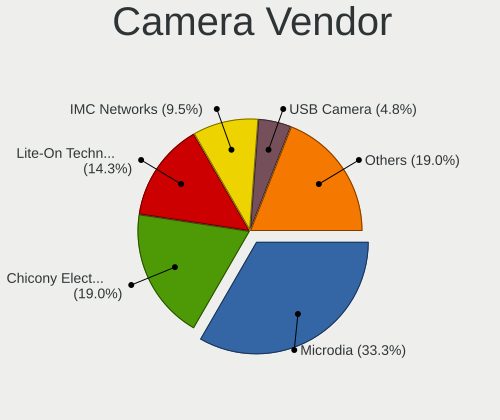

| Vendor                        | Notebooks | Percent |
|-------------------------------|-----------|---------|
| Microdia                      | 7         | 33.33%  |
| Chicony Electronics           | 4         | 19.05%  |
| Lite-On Technology            | 3         | 14.29%  |
| IMC Networks                  | 2         | 9.52%   |
| USB Camera                    | 1         | 4.76%   |
| Sunplus Innovation Technology | 1         | 4.76%   |
| Realtek Semiconductor         | 1         | 4.76%   |
| Intel                         | 1         | 4.76%   |
| Bison Electronics             | 1         | 4.76%   |

Camera Model
------------

Camera device models

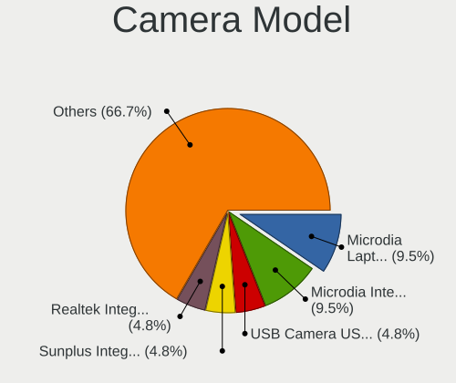

| Model                                    | Notebooks | Percent |
|------------------------------------------|-----------|---------|
| Microdia Laptop_Integrated_Webcam_HD     | 2         | 9.52%   |
| Microdia Integrated Webcam HD            | 2         | 9.52%   |
| USB Camera USB Camera                    | 1         | 4.76%   |
| Sunplus Integrated_Webcam_HD             | 1         | 4.76%   |
| Realtek Integrated Webcam HD             | 1         | 4.76%   |
| Microdia USB Camera                      | 1         | 4.76%   |
| Microdia Integrated_Webcam_HD            | 1         | 4.76%   |
| Microdia Integrated Webcam               | 1         | 4.76%   |
| Lite-On Realtek PC Camera                | 1         | 4.76%   |
| Lite-On Integrated Camera                | 1         | 4.76%   |
| Lite-On HP HD Camera                     | 1         | 4.76%   |
| Intel RealSense 3D Camera (Front F200)   | 1         | 4.76%   |
| IMC Networks USB2.0 HD UVC WebCam        | 1         | 4.76%   |
| IMC Networks USB 2.0 UVC HD Webcam       | 1         | 4.76%   |
| Chicony Lenovo Integrated Camera (0.3MP) | 1         | 4.76%   |
| Chicony Integrated HP HD Webcam          | 1         | 4.76%   |
| Chicony Integrated Camera                | 1         | 4.76%   |
| Chicony HP HD Camera                     | 1         | 4.76%   |
| Bison SunplusIT INC. Integrated Camera   | 1         | 4.76%   |

Security
--------

Fingerprint Vendor
------------------

Fingerprint sensor vendors

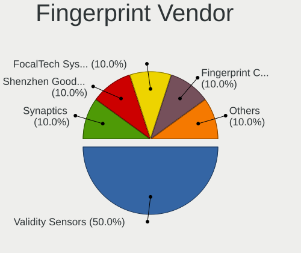

| Vendor                     | Notebooks | Percent |
|----------------------------|-----------|---------|
| Validity Sensors           | 5         | 50%     |
| Synaptics                  | 1         | 10%     |
| Shenzhen Goodix Technology | 1         | 10%     |
| FocalTech Systems          | 1         | 10%     |
| Fingerprint Cards          | 1         | 10%     |
| Elan Microelectronics      | 1         | 10%     |

Fingerprint Model
-----------------

Fingerprint sensor models

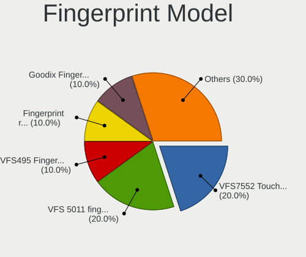

| Model                                             | Notebooks | Percent |
|---------------------------------------------------|-----------|---------|
| Validity Sensors VFS7552 Touch Fingerprint Sensor | 2         | 20%     |
| Validity Sensors VFS 5011 fingerprint sensor      | 2         | 20%     |
| Validity Sensors VFS495 Fingerprint Reader        | 1         | 10%     |
| Synaptics Fingerprint reader [HP G6]              | 1         | 10%     |
| Shenzhen Goodix  Fingerprint Device               | 1         | 10%     |
| FocalTech Systems Fingerprint Reader              | 1         | 10%     |
| Fingerprint Cards FPC Fingerprint Reader          | 1         | 10%     |
| Elan Fingerprint Sensor                           | 1         | 10%     |

Chipcard Vendor
---------------

Chipcard module vendors

Zero info for selected period =(

Chipcard Model
--------------

Chipcard module models

Zero info for selected period =(

Unsupported
-----------

Unsupported Devices
-------------------

Total unsupported devices on board

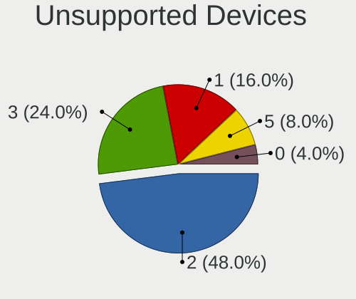

| Total | Notebooks | Percent |
|-------|-----------|---------|
| 2     | 12        | 48%     |
| 3     | 6         | 24%     |
| 1     | 4         | 16%     |
| 5     | 2         | 8%      |
| 0     | 1         | 4%      |

Unsupported Device Types
------------------------

Types of unsupported devices

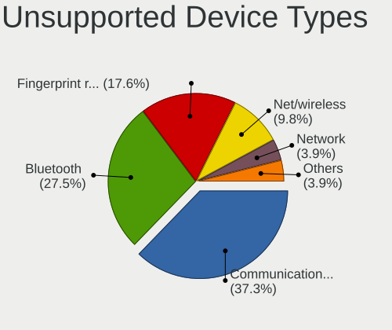

| Type                     | Notebooks | Percent |
|--------------------------|-----------|---------|
| Communication controller | 19        | 37.25%  |
| Bluetooth                | 14        | 27.45%  |
| Fingerprint reader       | 9         | 17.65%  |
| Net/wireless             | 5         | 9.8%    |
| Network                  | 2         | 3.92%   |
| Card reader              | 2         | 3.92%   |

