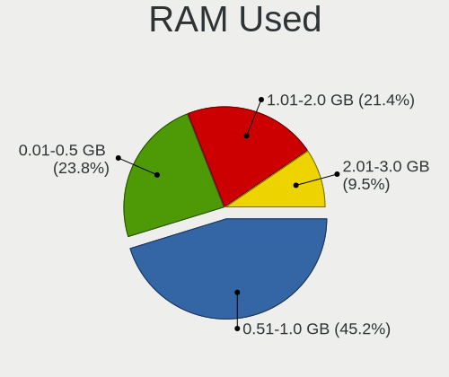
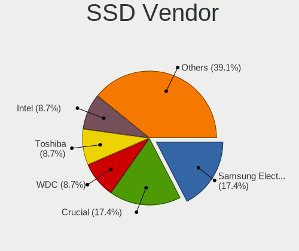
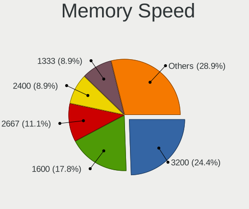

GhostBSD 24.01.1 - Tested Hardware & Statistics
-----------------------------------------------

A project to collect tested hardware configurations for GhostBSD 24.01.1.

Anyone can contribute to this report by the [hw-probe](https://github.com/linuxhw/hw-probe/blob/master/INSTALL.BSD.md) tool:

    hw-probe -all -upload

Please contribute! Especially if your hardware is rare.

This is a report for all computer types. See also reports for [desktops](/Dist/GhostBSD_24.01.1/Desktop/README.md) and [notebooks](/Dist/GhostBSD_24.01.1/Notebook/README.md).

Contents
--------

* [ Test Cases ](#test-cases)

* [ System ](#system)
  - [ Arch                     ](#arch)
  - [ DE                       ](#de)
  - [ Display Server           ](#display-server)
  - [ Display Manager          ](#display-manager)
  - [ OS Lang                  ](#os-lang)
  - [ Boot Mode                ](#boot-mode)
  - [ Filesystem               ](#filesystem)
  - [ Part. scheme             ](#part-scheme)

* [ Board ](#board)
  - [ Vendor                   ](#vendor)
  - [ Model                    ](#model)
  - [ Model Family             ](#model-family)
  - [ MFG Year                 ](#mfg-year)
  - [ Form Factor              ](#form-factor)
  - [ Coreboot                 ](#coreboot)
  - [ RAM Size                 ](#ram-size)
  - [ RAM Used                 ](#ram-used)
  - [ Total Drives             ](#total-drives)
  - [ Has CD-ROM               ](#has-cd-rom)
  - [ Has Ethernet             ](#has-ethernet)
  - [ Has WiFi                 ](#has-wifi)
  - [ Has Bluetooth            ](#has-bluetooth)

* [ Location ](#location)
  - [ Country                  ](#country)
  - [ City                     ](#city)

* [ Drives ](#drives)
  - [ Drive Vendor             ](#drive-vendor)
  - [ Drive Model              ](#drive-model)
  - [ HDD Vendor               ](#hdd-vendor)
  - [ SSD Vendor               ](#ssd-vendor)
  - [ Drive Kind               ](#drive-kind)
  - [ Drive Connector          ](#drive-connector)
  - [ Drive Size               ](#drive-size)
  - [ Space Total              ](#space-total)
  - [ Space Used               ](#space-used)
  - [ Malfunc. Drives          ](#malfunc-drives)
  - [ Malfunc. Drive Vendor    ](#malfunc-drive-vendor)
  - [ Malfunc. HDD Vendor      ](#malfunc-hdd-vendor)
  - [ Malfunc. Drive Kind      ](#malfunc-drive-kind)
  - [ Failed Drives            ](#failed-drives)
  - [ Failed Drive Vendor      ](#failed-drive-vendor)
  - [ Drive Status             ](#drive-status)

* [ Storage controller ](#storage-controller)
  - [ Storage Vendor           ](#storage-vendor)
  - [ Storage Model            ](#storage-model)
  - [ Storage Kind             ](#storage-kind)

* [ Processor ](#processor)
  - [ CPU Vendor               ](#cpu-vendor)
  - [ CPU Model                ](#cpu-model)
  - [ CPU Model Family         ](#cpu-model-family)
  - [ CPU Cores                ](#cpu-cores)
  - [ CPU Sockets              ](#cpu-sockets)
  - [ CPU Threads              ](#cpu-threads)
  - [ CPU Microarch            ](#cpu-microarch)

* [ Graphics ](#graphics)
  - [ GPU Vendor               ](#gpu-vendor)
  - [ GPU Model                ](#gpu-model)
  - [ GPU Combo                ](#gpu-combo)
  - [ GPU Driver               ](#gpu-driver)
  - [ GPU Memory               ](#gpu-memory)

* [ Monitor ](#monitor)
  - [ Monitor Vendor           ](#monitor-vendor)
  - [ Monitor Model            ](#monitor-model)
  - [ Monitor Resolution       ](#monitor-resolution)
  - [ Monitor Diagonal         ](#monitor-diagonal)
  - [ Monitor Width            ](#monitor-width)
  - [ Aspect Ratio             ](#aspect-ratio)
  - [ Monitor Area             ](#monitor-area)
  - [ Pixel Density            ](#pixel-density)
  - [ Multiple Monitors        ](#multiple-monitors)

* [ Network ](#network)
  - [ Net Controller Vendor    ](#net-controller-vendor)
  - [ Net Controller Model     ](#net-controller-model)
  - [ Wireless Vendor          ](#wireless-vendor)
  - [ Wireless Model           ](#wireless-model)
  - [ Ethernet Vendor          ](#ethernet-vendor)
  - [ Ethernet Model           ](#ethernet-model)
  - [ Net Controller Kind      ](#net-controller-kind)
  - [ Used Controller          ](#used-controller)
  - [ NICs                     ](#nics)
  - [ IPv6                     ](#ipv6)

* [ Bluetooth ](#bluetooth)
  - [ Bluetooth Vendor         ](#bluetooth-vendor)
  - [ Bluetooth Model          ](#bluetooth-model)

* [ Sound ](#sound)
  - [ Sound Vendor             ](#sound-vendor)
  - [ Sound Model              ](#sound-model)

* [ Memory ](#memory)
  - [ Memory Vendor            ](#memory-vendor)
  - [ Memory Model             ](#memory-model)
  - [ Memory Kind              ](#memory-kind)
  - [ Memory Form Factor       ](#memory-form-factor)
  - [ Memory Size              ](#memory-size)
  - [ Memory Speed             ](#memory-speed)

* [ Printers & scanners ](#printers--scanners)
  - [ Printer Vendor           ](#printer-vendor)
  - [ Printer Model            ](#printer-model)
  - [ Scanner Vendor           ](#scanner-vendor)
  - [ Scanner Model            ](#scanner-model)

* [ Camera ](#camera)
  - [ Camera Vendor            ](#camera-vendor)
  - [ Camera Model             ](#camera-model)

* [ Security ](#security)
  - [ Fingerprint Vendor       ](#fingerprint-vendor)
  - [ Fingerprint Model        ](#fingerprint-model)
  - [ Chipcard Vendor          ](#chipcard-vendor)
  - [ Chipcard Model           ](#chipcard-model)

* [ Unsupported ](#unsupported)
  - [ Unsupported Devices      ](#unsupported-devices)
  - [ Unsupported Device Types ](#unsupported-device-types)

Test Cases
----------

Total: 52

| Vendor        | Model                       | Form-Factor | Probe                                                     | Date         |
|---------------|-----------------------------|-------------|-----------------------------------------------------------|--------------|
| Lenovo        | ThinkCentre M715q 10M2S0... | Desktop     | [66a3b3e94e](https://bsd-hardware.info/?probe=66a3b3e94e) | Sep 02, 2024 |
| HP            | EliteBook 840 G6            | Notebook    | [9ae98f134a](https://bsd-hardware.info/?probe=9ae98f134a) | Aug 09, 2024 |
| Dell          | Inspiron 1545               | Notebook    | [e123332fb8](https://bsd-hardware.info/?probe=e123332fb8) | May 16, 2024 |
| Dell          | 055H3G A01                  | Desktop     | [5d0cd53384](https://bsd-hardware.info/?probe=5d0cd53384) | May 16, 2024 |
| Biostar       | B450MH                      | Desktop     | [6fc7467762](https://bsd-hardware.info/?probe=6fc7467762) | May 13, 2024 |
| Dell          | Inspiron 1545               | Notebook    | [d5f43a27aa](https://bsd-hardware.info/?probe=d5f43a27aa) | May 12, 2024 |
| Dell          | Inspiron 1545               | Notebook    | [3c3432b2c0](https://bsd-hardware.info/?probe=3c3432b2c0) | May 11, 2024 |
| Infinix       | INBook X1                   | Notebook    | [847a9cb112](https://bsd-hardware.info/?probe=847a9cb112) | May 10, 2024 |
| Acer          | TravelMate B118-M           | Notebook    | [68d9d26fe5](https://bsd-hardware.info/?probe=68d9d26fe5) | May 09, 2024 |
| Alienware     | Area-51m A00                | Notebook    | [53d5d4eb1e](https://bsd-hardware.info/?probe=53d5d4eb1e) | May 07, 2024 |
| Unknown       | X133                        | Notebook    | [524b7e6d8e](https://bsd-hardware.info/?probe=524b7e6d8e) | May 07, 2024 |
| Dell          | XPS 13 9360                 | Notebook    | [c9ad91fc61](https://bsd-hardware.info/?probe=c9ad91fc61) | May 07, 2024 |
| Apple         | Mac-F221BEC8                | Desktop     | [79c4a2608c](https://bsd-hardware.info/?probe=79c4a2608c) | May 07, 2024 |
| Gigabyte      | P55-USB3                    | Desktop     | [9024f0074b](https://bsd-hardware.info/?probe=9024f0074b) | May 07, 2024 |
| Lenovo        | ThinkPad X240 20AMS3FY00    | Notebook    | [1dc74d60e6](https://bsd-hardware.info/?probe=1dc74d60e6) | May 06, 2024 |
| Dell          | Latitude 7390               | Notebook    | [b9b511f4d6](https://bsd-hardware.info/?probe=b9b511f4d6) | May 04, 2024 |
| MSI           | B360M BAZOOKA               | Desktop     | [d33325e752](https://bsd-hardware.info/?probe=d33325e752) | May 02, 2024 |
| MSI           | GE75 Raider 10SFS           | Notebook    | [cda74e2f91](https://bsd-hardware.info/?probe=cda74e2f91) | May 02, 2024 |
| ASUSTek       | X202E                       | Notebook    | [0ed385a36d](https://bsd-hardware.info/?probe=0ed385a36d) | May 02, 2024 |
| HP            | 255 G8 Notebook PC          | Notebook    | [4878c18c8a](https://bsd-hardware.info/?probe=4878c18c8a) | May 01, 2024 |
| Dell          | XPS 13 9360                 | Notebook    | [26185f189e](https://bsd-hardware.info/?probe=26185f189e) | Apr 30, 2024 |
| HP            | EliteBook 2560p             | Notebook    | [bb6303ed5b](https://bsd-hardware.info/?probe=bb6303ed5b) | Apr 29, 2024 |
| Lenovo        | ThinkPad X220 429135G       | Notebook    | [b681d0b406](https://bsd-hardware.info/?probe=b681d0b406) | Apr 23, 2024 |
| F-Plus Mob... | FLAPTOP r                   | Notebook    | [150e135ba6](https://bsd-hardware.info/?probe=150e135ba6) | Apr 18, 2024 |
| Dell          | Latitude 7490               | Notebook    | [38f6023f20](https://bsd-hardware.info/?probe=38f6023f20) | Apr 14, 2024 |
| Dell          | Vostro 3350                 | Notebook    | [abe739e6c2](https://bsd-hardware.info/?probe=abe739e6c2) | Apr 13, 2024 |
| HP            | ProBook 645 G3              | Notebook    | [ea10ac1f83](https://bsd-hardware.info/?probe=ea10ac1f83) | Apr 12, 2024 |
| HP            | ProLiant MicroServer Gen... | Desktop     | [15c55873cd](https://bsd-hardware.info/?probe=15c55873cd) | Apr 09, 2024 |
| ASUSTek       | ROG STRIX B550-F GAMING     | Desktop     | [a2cbe8253b](https://bsd-hardware.info/?probe=a2cbe8253b) | Apr 09, 2024 |
| ASUSTek       | VivoBook_ASUSLaptop X512... | Notebook    | [a26013b913](https://bsd-hardware.info/?probe=a26013b913) | Apr 05, 2024 |
| ASUSTek       | ROG STRIX B550-F GAMING     | Desktop     | [3ccdd0084b](https://bsd-hardware.info/?probe=3ccdd0084b) | Apr 05, 2024 |
| Dell          | Latitude E5540              | Notebook    | [108e2acb98](https://bsd-hardware.info/?probe=108e2acb98) | Apr 01, 2024 |
| ASUSTek       | PRIME Z390-A                | Desktop     | [56ea2c6719](https://bsd-hardware.info/?probe=56ea2c6719) | Apr 01, 2024 |
| ASRock        | 970 Pro3 R2.0               | Desktop     | [cfcf823cca](https://bsd-hardware.info/?probe=cfcf823cca) | Apr 01, 2024 |
| HUAWEI        | PUM-WDX9-PCB-B1 M1010       | Desktop     | [4a359f1f86](https://bsd-hardware.info/?probe=4a359f1f86) | Apr 01, 2024 |
| Lenovo        | ThinkPad E15 Gen 4 21EDC... | Notebook    | [0ae72ec0ff](https://bsd-hardware.info/?probe=0ae72ec0ff) | Mar 31, 2024 |
| Lenovo        | 3743 NOK                    | Desktop     | [fd5dc51da2](https://bsd-hardware.info/?probe=fd5dc51da2) | Mar 31, 2024 |
| Lenovo        | Legion 5 Pro 16ACH6H 82J... | Notebook    | [db1d3cd098](https://bsd-hardware.info/?probe=db1d3cd098) | Mar 19, 2024 |
| HP            | ENVY x360 Convertible 15... | Convertible | [403a4f0ea9](https://bsd-hardware.info/?probe=403a4f0ea9) | Mar 17, 2024 |
| Google        | Cave                        | Notebook    | [d9df48c781](https://bsd-hardware.info/?probe=d9df48c781) | Mar 16, 2024 |
| ASUSTek       | H61M-K                      | Desktop     | [1f6840c3f3](https://bsd-hardware.info/?probe=1f6840c3f3) | Mar 12, 2024 |
| LG Electro... | R590-P.BE54P1               | Desktop     | [120ec3afe6](https://bsd-hardware.info/?probe=120ec3afe6) | Mar 09, 2024 |
| Dell          | XPS 13 9305                 | Notebook    | [7cc4588e07](https://bsd-hardware.info/?probe=7cc4588e07) | Mar 07, 2024 |
| Dell          | Inspiron 5559               | Notebook    | [ac72a9a34a](https://bsd-hardware.info/?probe=ac72a9a34a) | Feb 23, 2024 |
| Dell          | Latitude E6540              | Notebook    | [92ba9b26e1](https://bsd-hardware.info/?probe=92ba9b26e1) | Feb 21, 2024 |
| Dell          | 0H634K A00                  | Desktop     | [5392dc85bb](https://bsd-hardware.info/?probe=5392dc85bb) | Feb 21, 2024 |
| Gigabyte      | GA-990FX-GAMING             | Desktop     | [39e4fb5eba](https://bsd-hardware.info/?probe=39e4fb5eba) | Feb 20, 2024 |
| Dell          | 0H634K A00                  | Desktop     | [e933816d9f](https://bsd-hardware.info/?probe=e933816d9f) | Feb 19, 2024 |
| Biostar       | B450NH                      | Desktop     | [2db279db1d](https://bsd-hardware.info/?probe=2db279db1d) | Feb 16, 2024 |
| ASUSTek       | Pro B560M-C                 | Desktop     | [fdeb2cee9d](https://bsd-hardware.info/?probe=fdeb2cee9d) | Feb 14, 2024 |
| TUXEDO        | Aura 15 Gen1                | Notebook    | [4768e0001d](https://bsd-hardware.info/?probe=4768e0001d) | Feb 01, 2024 |
| Dell          | 0GDJXY A00                  | All in one  | [c7f489add0](https://bsd-hardware.info/?probe=c7f489add0) | Jan 28, 2024 |

System
------

Arch
----

OS architecture (x86_64, i586, etc.)

| Name  | Computers | Percent |
|-------|-----------|---------|
| amd64 | 42        | 100%    |

DE
--

Desktop Environment

| Name | Computers | Percent |
|------|-----------|---------|
| MATE | 34        | 80.95%  |
| XFCE | 4         | 9.52%   |
| KDE5 | 3         | 7.14%   |
| dwm  | 1         | 2.38%   |

Display Server
--------------

X11 or Wayland

| Name | Computers | Percent |
|------|-----------|---------|
| X11  | 42        | 100%    |

Display Manager
---------------

SDDM, LightDM, etc.

| Name    | Computers | Percent |
|---------|-----------|---------|
| LightDM | 41        | 97.62%  |
| SDDM    | 1         | 2.38%   |

OS Lang
-------

Language

| Lang    | Computers | Percent |
|---------|-----------|---------|
| en_US   | 22        | 52.38%  |
| C       | 9         | 21.43%  |
| es_ES   | 4         | 9.52%   |
| de_DE   | 3         | 7.14%   |
| ru_RU   | 1         | 2.38%   |
| pt_BR   | 1         | 2.38%   |
| fr_FR   | 1         | 2.38%   |
| Unknown | 1         | 2.38%   |

Boot Mode
---------

EFI or BIOS

| Mode | Computers | Percent |
|------|-----------|---------|
| EFI  | 35        | 83.33%  |
| BIOS | 7         | 16.67%  |

Filesystem
----------

Type of filesystem

| Type | Computers | Percent |
|------|-----------|---------|
| Zfs  | 39        | 92.86%  |
| Ufs  | 3         | 7.14%   |

Part. scheme
------------

Scheme of partitioning

| Type | Computers | Percent |
|------|-----------|---------|
| GPT  | 41        | 97.62%  |
| MBR  | 1         | 2.38%   |

Board
-----

Vendor
------

Motherboard manufacturer

| Name                | Computers | Percent |
|---------------------|-----------|---------|
| Dell                | 12        | 28.57%  |
| Lenovo              | 6         | 14.29%  |
| Hewlett-Packard     | 6         | 14.29%  |
| ASUSTek Computer    | 5         | 11.9%   |
| Gigabyte Technology | 2         | 4.76%   |
| TUXEDO              | 1         | 2.38%   |
| MSI                 | 1         | 2.38%   |
| LG Electronics      | 1         | 2.38%   |
| Infinix             | 1         | 2.38%   |
| HUAWEI              | 1         | 2.38%   |
| Google              | 1         | 2.38%   |
| F-Plus Mobile       | 1         | 2.38%   |
| Biostar             | 1         | 2.38%   |
| Apple               | 1         | 2.38%   |
| Alienware           | 1         | 2.38%   |
| Unknown             | 1         | 2.38%   |

Model
-----

Motherboard model

| Name                                        | Computers | Percent |
|---------------------------------------------|-----------|---------|
| Dell XPS 13 9360                            | 2         | 4.76%   |
| TUXEDO Aura 15 Gen1                         | 1         | 2.38%   |
| MSI MS-7B24                                 | 1         | 2.38%   |
| LG R590-P.BE54P1                            | 1         | 2.38%   |
| Lenovo ThinkPad X240 20AMS3FY00             | 1         | 2.38%   |
| Lenovo ThinkPad X220 429135G                | 1         | 2.38%   |
| Lenovo ThinkPad E15 Gen 4 21EDCTO1WW        | 1         | 2.38%   |
| Lenovo ThinkCentre M715q 10M2S08Y00         | 1         | 2.38%   |
| Lenovo Legion 5 Pro 16ACH6H 82JQ            | 1         | 2.38%   |
| Lenovo IdeaCentre Gaming5 14ACN6 90RW005PUL | 1         | 2.38%   |
| Infinix INBook X1                           | 1         | 2.38%   |
| HUAWEI PUM-WDX9                             | 1         | 2.38%   |
| HP ProLiant MicroServer Gen8                | 1         | 2.38%   |
| HP ProBook 645 G3                           | 1         | 2.38%   |
| HP ENVY x360 Convertible 15-ee1xxx          | 1         | 2.38%   |
| HP EliteBook 840 G6                         | 1         | 2.38%   |
| HP EliteBook 2560p                          | 1         | 2.38%   |
| HP 255 G8 Notebook PC                       | 1         | 2.38%   |
| Google Cave                                 | 1         | 2.38%   |
| Gigabyte P55-USB3                           | 1         | 2.38%   |
| Gigabyte GA-990FX-GAMING                    | 1         | 2.38%   |
| F-Plus Mobile FLAPTOP r                     | 1         | 2.38%   |
| Dell XPS 13 9305                            | 1         | 2.38%   |
| Dell Vostro 3350                            | 1         | 2.38%   |
| Dell OptiPlex 960                           | 1         | 2.38%   |
| Dell OptiPlex 7050                          | 1         | 2.38%   |
| Dell Latitude E6540                         | 1         | 2.38%   |
| Dell Latitude E5540                         | 1         | 2.38%   |
| Dell Latitude 7490                          | 1         | 2.38%   |
| Dell Latitude 7390                          | 1         | 2.38%   |
| Dell Inspiron 5559                          | 1         | 2.38%   |
| Dell Inspiron 5490 AIO                      | 1         | 2.38%   |
| Biostar B450MH                              | 1         | 2.38%   |
| ASUS X202E                                  | 1         | 2.38%   |
| ASUS ROG STRIX B550-F GAMING                | 1         | 2.38%   |
| ASUS Pro B560M-C                            | 1         | 2.38%   |
| ASUS PRIME Z390-A                           | 1         | 2.38%   |
| ASUS H61M-K                                 | 1         | 2.38%   |
| Apple MacPro5,1                             | 1         | 2.38%   |
| Alienware Area-51m                          | 1         | 2.38%   |

Model Family
------------

Motherboard model prefix

| Name                     | Computers | Percent |
|--------------------------|-----------|---------|
| Dell Latitude            | 4         | 9.52%   |
| Lenovo ThinkPad          | 3         | 7.14%   |
| Dell XPS                 | 3         | 7.14%   |
| HP EliteBook             | 2         | 4.76%   |
| Dell OptiPlex            | 2         | 4.76%   |
| Dell Inspiron            | 2         | 4.76%   |
| TUXEDO Aura              | 1         | 2.38%   |
| MSI MS-7B24              | 1         | 2.38%   |
| LG R590-P.BE54P1         | 1         | 2.38%   |
| Lenovo ThinkCentre       | 1         | 2.38%   |
| Lenovo Legion            | 1         | 2.38%   |
| Lenovo IdeaCentre        | 1         | 2.38%   |
| Infinix INBook           | 1         | 2.38%   |
| HUAWEI PUM-WDX9          | 1         | 2.38%   |
| HP ProLiant              | 1         | 2.38%   |
| HP ProBook               | 1         | 2.38%   |
| HP ENVY                  | 1         | 2.38%   |
| HP 255                   | 1         | 2.38%   |
| Google Cave              | 1         | 2.38%   |
| Gigabyte P55-USB3        | 1         | 2.38%   |
| Gigabyte GA-990FX-GAMING | 1         | 2.38%   |
| F-Plus Mobile FLAPTOP    | 1         | 2.38%   |
| Dell Vostro              | 1         | 2.38%   |
| Biostar B450MH           | 1         | 2.38%   |
| ASUS X202E               | 1         | 2.38%   |
| ASUS ROG                 | 1         | 2.38%   |
| ASUS Pro                 | 1         | 2.38%   |
| ASUS PRIME               | 1         | 2.38%   |
| ASUS H61M-K              | 1         | 2.38%   |
| Apple MacPro5            | 1         | 2.38%   |
| Alienware Area-51m       | 1         | 2.38%   |
| Unknown                  | 1         | 2.38%   |

MFG Year
--------

Motherboard manufacture year

| Year | Computers | Percent |
|------|-----------|---------|
| 2021 | 7         | 16.67%  |
| 2023 | 5         | 11.9%   |
| 2020 | 5         | 11.9%   |
| 2022 | 4         | 9.52%   |
| 2013 | 4         | 9.52%   |
| 2018 | 3         | 7.14%   |
| 2011 | 3         | 7.14%   |
| 2019 | 2         | 4.76%   |
| 2016 | 2         | 4.76%   |
| 2015 | 2         | 4.76%   |
| 2014 | 2         | 4.76%   |
| 2017 | 1         | 2.38%   |
| 2012 | 1         | 2.38%   |
| 2010 | 1         | 2.38%   |

Form Factor
-----------

Physical design of the computer

| Name        | Computers | Percent |
|-------------|-----------|---------|
| Notebook    | 24        | 57.14%  |
| Desktop     | 16        | 38.1%   |
| Convertible | 1         | 2.38%   |
| All in one  | 1         | 2.38%   |

Coreboot
--------

Have coreboot on board

| Used | Computers | Percent |
|------|-----------|---------|
| No   | 41        | 97.62%  |
| Yes  | 1         | 2.38%   |

RAM Size
--------

Total RAM memory

| Size in GB  | Computers | Percent |
|-------------|-----------|---------|
| 8.01-16.0   | 17        | 40.48%  |
| 16.01-24.0  | 16        | 38.1%   |
| 4.01-8.0    | 3         | 7.14%   |
| 32.01-64.0  | 3         | 7.14%   |
| 64.01-256.0 | 3         | 7.14%   |

RAM Used
--------

Used RAM memory

| Used GB  | Computers | Percent |
|----------|-----------|---------|
| 0.51-1.0 | 19        | 45.24%  |
| 0.01-0.5 | 10        | 23.81%  |
| 1.01-2.0 | 9         | 21.43%  |
| 2.01-3.0 | 4         | 9.52%   |

Total Drives
------------

Number of drives on board

| Drives | Computers | Percent |
|--------|-----------|---------|
| 1      | 19        | 45.24%  |
| 0      | 15        | 35.71%  |
| 2      | 6         | 14.29%  |
| 4      | 1         | 2.38%   |
| 3      | 1         | 2.38%   |

Has CD-ROM
----------

Has CD-ROM on board

| Presented | Computers | Percent |
|-----------|-----------|---------|
| No        | 34        | 80.95%  |
| Yes       | 8         | 19.05%  |

Has Ethernet
------------

Has Ethernet on board

| Presented | Computers | Percent |
|-----------|-----------|---------|
| Yes       | 33        | 78.57%  |
| No        | 9         | 21.43%  |

Has WiFi
--------

Has WiFi module

| Presented | Computers | Percent |
|-----------|-----------|---------|
| Yes       | 33        | 78.57%  |
| No        | 9         | 21.43%  |

Has Bluetooth
-------------

Has Bluetooth module

| Presented | Computers | Percent |
|-----------|-----------|---------|
| Yes       | 28        | 66.67%  |
| No        | 14        | 33.33%  |

Location
--------

Country
-------

Geographic location (country)

| Country                | Computers | Percent |
|------------------------|-----------|---------|
| USA                    | 11        | 26.19%  |
| Germany                | 5         | 11.9%   |
| Denmark                | 4         | 9.52%   |
| Paraguay               | 3         | 7.14%   |
| Bulgaria               | 3         | 7.14%   |
| Spain                  | 2         | 4.76%   |
| France                 | 2         | 4.76%   |
| Canada                 | 2         | 4.76%   |
| Switzerland            | 1         | 2.38%   |
| Russia                 | 1         | 2.38%   |
| Peru                   | 1         | 2.38%   |
| Lithuania              | 1         | 2.38%   |
| Indonesia              | 1         | 2.38%   |
| Cuba                   | 1         | 2.38%   |
| Brazil                 | 1         | 2.38%   |
| Bosnia and Herzegovina | 1         | 2.38%   |
| Austria                | 1         | 2.38%   |
| Argentina              | 1         | 2.38%   |

City
----

Geographic location (city)

| City                        | Computers | Percent |
|-----------------------------|-----------|---------|
| Frederiksberg               | 4         | 9.52%   |
| Victoria                    | 2         | 4.76%   |
| Tucson                      | 2         | 4.76%   |
| Sofia                       | 2         | 4.76%   |
| Roslindale                  | 2         | 4.76%   |
| Asunción                   | 2         | 4.76%   |
| Zurich                      | 1         | 2.38%   |
| Voskresensk                 | 1         | 2.38%   |
| Vienna                      | 1         | 2.38%   |
| Tsarevo                     | 1         | 2.38%   |
| Stuttgart                   | 1         | 2.38%   |
| Solden                      | 1         | 2.38%   |
| Sarajevo                    | 1         | 2.38%   |
| San Nicolás de los Arroyos | 1         | 2.38%   |
| San Lorenzo                 | 1         | 2.38%   |
| San Jose                    | 1         | 2.38%   |
| Redondela                   | 1         | 2.38%   |
| Pacoima                     | 1         | 2.38%   |
| Navalcarnero                | 1         | 2.38%   |
| Munich                      | 1         | 2.38%   |
| Lima                        | 1         | 2.38%   |
| Leutkirch                   | 1         | 2.38%   |
| Leitchfield                 | 1         | 2.38%   |
| Jonava                      | 1         | 2.38%   |
| Jakarta                     | 1         | 2.38%   |
| Jacksonville                | 1         | 2.38%   |
| Havana                      | 1         | 2.38%   |
| Hamburg                     | 1         | 2.38%   |
| Fos-sur-Mer                 | 1         | 2.38%   |
| Eureka                      | 1         | 2.38%   |
| Embu                        | 1         | 2.38%   |
| Colombes                    | 1         | 2.38%   |
| Bothell                     | 1         | 2.38%   |
| Atlanta                     | 1         | 2.38%   |

Drives
------

Drive Vendor
------------

Hard drive vendors

| Vendor              | Computers | Drives | Percent |
|---------------------|-----------|--------|---------|
| Seagate             | 8         | 9      | 21.62%  |
| Samsung Electronics | 6         | 6      | 16.22%  |
| Toshiba             | 4         | 4      | 10.81%  |
| Crucial             | 4         | 4      | 10.81%  |
| WDC                 | 3         | 3      | 8.11%   |
| Intel               | 2         | 2      | 5.41%   |
| XrayDisk            | 1         | 1      | 2.7%    |
| Team                | 1         | 1      | 2.7%    |
| ShiJi               | 1         | 1      | 2.7%    |
| SanDisk             | 1         | 1      | 2.7%    |
| LITEONIT            | 1         | 1      | 2.7%    |
| Intenso             | 1         | 1      | 2.7%    |
| Hitachi             | 1         | 1      | 2.7%    |
| Fanxiang            | 1         | 1      | 2.7%    |
| China               | 1         | 1      | 2.7%    |
| Apple               | 1         | 1      | 2.7%    |

Drive Model
-----------

Hard drive models

| Model                                | Computers | Percent |
|--------------------------------------|-----------|---------|
| Toshiba DT01ACA050 500GB             | 2         | 5.26%   |
| Seagate ST1000VM002-1SD102 1TB       | 2         | 5.26%   |
| Samsung SSD 870 EVO 500GB            | 2         | 5.26%   |
| Samsung HM320JI 320GB                | 2         | 5.26%   |
| Crucial CT1000MX500SSD1 1TB          | 2         | 5.26%   |
| XrayDisk 1TB SSD                     | 1         | 2.63%   |
| WDC WDS500G2B0A-00SM50 500GB         | 1         | 2.63%   |
| WDC WDS240G2G0B-00EPW0 240GB         | 1         | 2.63%   |
| WDC WD20EZBX-08AYR 2TB               | 1         | 2.63%   |
| Toshiba THNSNK128GVN8 M.2 2280 128GB | 1         | 2.63%   |
| Toshiba KSG60ZMV256G M.2 2280 256GB  | 1         | 2.63%   |
| Team T253X1240G 240GB                | 1         | 2.63%   |
| ShiJi SSD 512GB                      | 1         | 2.63%   |
| Seagate ST500LT012-9WS142 500GB      | 1         | 2.63%   |
| Seagate ST4000VN008-2DR166 4TB       | 1         | 2.63%   |
| Seagate ST380815AS 80GB              | 1         | 2.63%   |
| Seagate ST3500418AS 500GB            | 1         | 2.63%   |
| Seagate ST2000LM007-1R8174 2TB       | 1         | 2.63%   |
| Seagate ST1000LM024 HN-M101MBB 1TB   | 1         | 2.63%   |
| Seagate ST1000DM003-1CH162 1TB       | 1         | 2.63%   |
| SanDisk SD9SN8W-256G-1016 256GB      | 1         | 2.63%   |
| Samsung SSD 860 PRO 512GB            | 1         | 2.63%   |
| Samsung SSD 830 Series 256GB         | 1         | 2.63%   |
| LITEONIT LCS-128M6S 128GB            | 1         | 2.63%   |
| Intenso SSD 256GB                    | 1         | 2.63%   |
| Intel SSDSCKKF512G8 SATA 512GB       | 1         | 2.63%   |
| Intel SSDSA2BW160G3H 160GB           | 1         | 2.63%   |
| Hitachi HDS721616PLA380 160GB        | 1         | 2.63%   |
| Fanxiang S101 512GB                  | 1         | 2.63%   |
| Crucial CT240BX500SSD1 240GB         | 1         | 2.63%   |
| Crucial CT2000BX500SSD1 2TB          | 1         | 2.63%   |
| China SATA SSD 120GB                 | 1         | 2.63%   |
| Apple SSD SM0128G 121GB              | 1         | 2.63%   |

HDD Vendor
----------

Hard disk drive vendors

| Vendor              | Computers | Drives | Percent |
|---------------------|-----------|--------|---------|
| Seagate             | 8         | 9      | 57.14%  |
| Toshiba             | 2         | 2      | 14.29%  |
| Samsung Electronics | 2         | 2      | 14.29%  |
| WDC                 | 1         | 1      | 7.14%   |
| Hitachi             | 1         | 1      | 7.14%   |

SSD Vendor
----------

Solid state drive vendors

| Vendor              | Computers | Drives | Percent |
|---------------------|-----------|--------|---------|
| Samsung Electronics | 4         | 4      | 17.39%  |
| Crucial             | 4         | 4      | 17.39%  |
| WDC                 | 2         | 2      | 8.7%    |
| Toshiba             | 2         | 2      | 8.7%    |
| Intel               | 2         | 2      | 8.7%    |
| XrayDisk            | 1         | 1      | 4.35%   |
| Team                | 1         | 1      | 4.35%   |
| ShiJi               | 1         | 1      | 4.35%   |
| SanDisk             | 1         | 1      | 4.35%   |
| LITEONIT            | 1         | 1      | 4.35%   |
| Intenso             | 1         | 1      | 4.35%   |
| Fanxiang            | 1         | 1      | 4.35%   |
| China               | 1         | 1      | 4.35%   |
| Apple               | 1         | 1      | 4.35%   |

Drive Kind
----------

HDD or SSD

| Kind | Computers | Drives | Percent |
|------|-----------|--------|---------|
| SSD  | 21        | 23     | 70%     |
| HDD  | 9         | 15     | 30%     |

Drive Connector
---------------

SATA, SAS, NVMe, etc.

| Type | Computers | Drives | Percent |
|------|-----------|--------|---------|
| SATA | 27        | 38     | 100%    |

Drive Size
----------

Size of hard drive

| Size in TB | Computers | Drives | Percent |
|------------|-----------|--------|---------|
| 0.01-0.5   | 18        | 23     | 54.55%  |
| 0.51-1.0   | 10        | 10     | 30.3%   |
| 1.01-2.0   | 4         | 4      | 12.12%  |
| 3.01-4.0   | 1         | 1      | 3.03%   |

Space Total
-----------

Amount of disk space available on the file system

| Size in GB | Computers | Percent |
|------------|-----------|---------|
| 101-250    | 12        | 28.57%  |
| 251-500    | 9         | 21.43%  |
| 1-20       | 6         | 14.29%  |
| 21-50      | 5         | 11.9%   |
| 501-1000   | 4         | 9.52%   |
| Unknown    | 3         | 7.14%   |
| 51-100     | 2         | 4.76%   |
| 1001-2000  | 1         | 2.38%   |

Space Used
----------

Amount of used disk space

| Used GB | Computers | Percent |
|---------|-----------|---------|
| 1-20    | 34        | 80.95%  |
| 21-50   | 4         | 9.52%   |
| Unknown | 3         | 7.14%   |
| 101-250 | 1         | 2.38%   |

Malfunc. Drives
---------------

Drive models with a malfunction

| Model                                 | Computers | Drives | Percent |
|---------------------------------------|-----------|--------|---------|
| Samsung Electronics HM320JI 320GB     | 2         | 2      | 25%     |
| Toshiba THNSNK128GVN8 M.2 2280 128GB  | 1         | 1      | 12.5%   |
| ShiJi SSD 512GB                       | 1         | 1      | 12.5%   |
| Seagate ST500LT012-9WS142 500GB       | 1         | 1      | 12.5%   |
| Samsung Electronics SSD 870 EVO 500GB | 1         | 1      | 12.5%   |
| Hitachi HDS721616PLA380 160GB         | 1         | 1      | 12.5%   |
| Fanxiang S101 512GB                   | 1         | 1      | 12.5%   |

Malfunc. Drive Vendor
---------------------

Vendors of faulty drives

| Vendor              | Computers | Drives | Percent |
|---------------------|-----------|--------|---------|
| Samsung Electronics | 3         | 3      | 37.5%   |
| Toshiba             | 1         | 1      | 12.5%   |
| ShiJi               | 1         | 1      | 12.5%   |
| Seagate             | 1         | 1      | 12.5%   |
| Hitachi             | 1         | 1      | 12.5%   |
| Fanxiang            | 1         | 1      | 12.5%   |

Malfunc. HDD Vendor
-------------------

Vendors of faulty HDD drives

| Vendor              | Computers | Drives | Percent |
|---------------------|-----------|--------|---------|
| Samsung Electronics | 2         | 2      | 50%     |
| Seagate             | 1         | 1      | 25%     |
| Hitachi             | 1         | 1      | 25%     |

Malfunc. Drive Kind
-------------------

Kinds of faulty drives

| Kind | Computers | Drives | Percent |
|------|-----------|--------|---------|
| SSD  | 4         | 4      | 57.14%  |
| HDD  | 3         | 4      | 42.86%  |

Failed Drives
-------------

Failed drive models

| Model                          | Computers | Drives | Percent |
|--------------------------------|-----------|--------|---------|
| Intel SSDSCKKF512G8 SATA 512GB | 1         | 1      | 100%    |

Failed Drive Vendor
-------------------

Failed drive vendors

| Vendor | Computers | Drives | Percent |
|--------|-----------|--------|---------|
| Intel  | 1         | 1      | 100%    |

Drive Status
------------

Number of failed and malfunc. drives

| Status  | Computers | Drives | Percent |
|---------|-----------|--------|---------|
| Works   | 23        | 29     | 76.67%  |
| Malfunc | 6         | 8      | 20%     |
| Failed  | 1         | 1      | 3.33%   |

Storage controller
------------------

Storage Vendor
--------------

Storage controller vendors

| Vendor                       | Computers | Percent |
|------------------------------|-----------|---------|
| Intel                        | 26        | 44.07%  |
| AMD                          | 11        | 18.64%  |
| Samsung Electronics          | 8         | 13.56%  |
| Micron/Crucial Technology    | 3         | 5.08%   |
| SK hynix                     | 2         | 3.39%   |
| SanDisk                      | 2         | 3.39%   |
| Kingston Technology Company  | 2         | 3.39%   |
| Silicon Motion               | 1         | 1.69%   |
| Shenzhen Longsys Electronics | 1         | 1.69%   |
| Phison Electronics           | 1         | 1.69%   |
| Micron Technology            | 1         | 1.69%   |
| JMicron Technology           | 1         | 1.69%   |

Storage Model
-------------

Storage controller models

| Model                                                                                                              | Computers | Percent |
|--------------------------------------------------------------------------------------------------------------------|-----------|---------|
| AMD FCH SATA Controller [AHCI mode]                                                                                | 6         | 9.52%   |
| Intel Sunrise Point-LP SATA Controller [AHCI mode]                                                                 | 4         | 6.35%   |
| Samsung NVMe SSD Controller SM981/PM981/PM983                                                                      | 3         | 4.76%   |
| Samsung NVMe SSD Controller 980 (DRAM-less)                                                                        | 3         | 4.76%   |
| Intel 82801 Mobile SATA Controller [RAID mode]                                                                     | 3         | 4.76%   |
| Intel 6 Series/C200 Series Chipset Family 6 port Mobile SATA AHCI Controller                                       | 3         | 4.76%   |
| AMD 500 Series Chipset SATA Controller                                                                             | 3         | 4.76%   |
| Micron/Crucial P2 [Nick P2] / P3 / P3 Plus NVMe PCIe SSD (DRAM-less)                                               | 2         | 3.17%   |
| Intel Cannon Lake PCH SATA AHCI Controller                                                                         | 2         | 3.17%   |
| Intel 6 Series/C200 Series Chipset Family 6 port Desktop SATA AHCI Controller                                      | 2         | 3.17%   |
| AMD SB7x0/SB8x0/SB9x0 SATA Controller [AHCI mode]                                                                  | 2         | 3.17%   |
| SK hynix Gold P31/BC711/PC711 NVMe Solid State Drive                                                               | 1         | 1.59%   |
| SK hynix BC511 NVMe SSD                                                                                            | 1         | 1.59%   |
| Silicon Motion SM2263EN/SM2263XT (DRAM-less) NVMe SSD Controllers                                                  | 1         | 1.59%   |
| Shenzhen Longsys FORESEE XP1000 / Lexar Professional CFexpress Type B Gold series, NM620 PCIe NVME SSD (DRAM-less) | 1         | 1.59%   |
| SanDisk WD Green SN350 240GB (DRAM-less) / SN560E NVMe SSD                                                         | 1         | 1.59%   |
| Sandisk WD Black SN770 / PC SN740 256GB / PC SN560 (DRAM-less) NVMe SSD                                            | 1         | 1.59%   |
| SanDisk Extreme Pro / WD Black 2018/SN750/PC SN720 NVMe SSD                                                        | 1         | 1.59%   |
| Samsung S4LN058A01[SSUBX] AHCI SSD Controller (Apple slot)                                                         | 1         | 1.59%   |
| Samsung NVMe SSD Controller PM9A1/PM9A3/980PRO                                                                     | 1         | 1.59%   |
| Phison PS5013-E13 PCIe3 NVMe Controller (DRAM-less)                                                                | 1         | 1.59%   |
| Micron/Crucial P5 Plus NVMe PCIe SSD                                                                               | 1         | 1.59%   |
| Micron 2550 NVMe SSD (DRAM-less)                                                                                   | 1         | 1.59%   |
| Kingston Company NV2 NVMe SSD [SM2267XT] (DRAM-less)                                                               | 1         | 1.59%   |
| Kingston Company NV2 NVMe SSD [E21T] (DRAM-less)                                                                   | 1         | 1.59%   |
| JMicron JMB363 SATA/IDE Controller                                                                                 | 1         | 1.59%   |
| Intel SSD 600P Series                                                                                              | 1         | 1.59%   |
| Intel SATA Controller [RAID mode]                                                                                  | 1         | 1.59%   |
| Intel Jasper Lake SATA AHCI Controller                                                                             | 1         | 1.59%   |
| Intel Comet Lake SATA AHCI Controller                                                                              | 1         | 1.59%   |
| Intel 82801JI (ICH10 Family) SATA AHCI Controller                                                                  | 1         | 1.59%   |
| Intel 82801JD/DO (ICH10 Family) SATA AHCI Controller                                                               | 1         | 1.59%   |
| Intel 8 Series SATA Controller 1 [AHCI mode]                                                                       | 1         | 1.59%   |
| Intel 7 Series Chipset Family 6-port SATA Controller [AHCI mode]                                                   | 1         | 1.59%   |
| Intel 500 Series Chipset Family SATA AHCI Controller                                                               | 1         | 1.59%   |
| Intel 5 Series/3400 Series Chipset 6 port SATA AHCI Controller                                                     | 1         | 1.59%   |
| Intel 5 Series/3400 Series Chipset 4 port SATA AHCI Controller                                                     | 1         | 1.59%   |
| Intel 4 Series Chipset PT IDER Controller                                                                          | 1         | 1.59%   |
| Intel 200 Series PCH SATA controller [AHCI mode]                                                                   | 1         | 1.59%   |
| AMD SB7x0/SB8x0/SB9x0 IDE Controller                                                                               | 1         | 1.59%   |

Storage Kind
------------

Kind of storage controller (IDE, SATA, NVMe, SAS, ...)

| Kind | Computers | Percent |
|------|-----------|---------|
| SATA | 33        | 57.89%  |
| NVMe | 17        | 29.82%  |
| RAID | 4         | 7.02%   |
| IDE  | 3         | 5.26%   |

Processor
---------

CPU Vendor
----------

Processor vendors

| Vendor | Computers | Percent |
|--------|-----------|---------|
| Intel  | 29        | 69.05%  |
| AMD    | 13        | 30.95%  |

CPU Model
---------

Processor models

| Model                                        | Computers | Percent |
|----------------------------------------------|-----------|---------|
| Intel Core i5-7200U CPU @ 2.50GHz            | 2         | 4.76%   |
| AMD Ryzen 5 5600G with Radeon Graphics       | 2         | 4.76%   |
| AMD Ryzen 5 4600G with Radeon Graphics       | 2         | 4.76%   |
| Intel Xeon CPU X5650 @ 2.67GHz               | 1         | 2.38%   |
| Intel Pentium CPU G2020T @ 2.50GHz           | 1         | 2.38%   |
| Intel Core m3-6Y30 CPU @ 0.90GHz             | 1         | 2.38%   |
| Intel Core i9-9900KS CPU @ 4.00GHz           | 1         | 2.38%   |
| Intel Core i9-9900 CPU @ 3.10GHz             | 1         | 2.38%   |
| Intel Core i7-8650U CPU @ 1.90GHz            | 1         | 2.38%   |
| Intel Core i7-6500U CPU @ 2.50GHz            | 1         | 2.38%   |
| Intel Core i7-4600U CPU @ 2.10GHz            | 1         | 2.38%   |
| Intel Core i7-2640M CPU @ 2.80GHz            | 1         | 2.38%   |
| Intel Core i7-2620M CPU @ 2.70GHz            | 1         | 2.38%   |
| Intel Core i7-10510U CPU @ 1.80GHz           | 1         | 2.38%   |
| Intel Core i7 CPU Q 720 @ 1.60GHz            | 1         | 2.38%   |
| Intel Core i5-8600 CPU @ 3.10GHz             | 1         | 2.38%   |
| Intel Core i5-8365U CPU @ 1.60GHz            | 1         | 2.38%   |
| Intel Core i5-7300U CPU @ 2.60GHz            | 1         | 2.38%   |
| Intel Core i5-4310M CPU @ 2.70GHz            | 1         | 2.38%   |
| Intel Core i5-4200U CPU @ 1.60GHz            | 1         | 2.38%   |
| Intel Core i5-3330 CPU @ 3.00GHz             | 1         | 2.38%   |
| Intel Core i5-2450M CPU @ 2.50GHz            | 1         | 2.38%   |
| Intel Core i5 CPU                            | 1         | 2.38%   |
| Intel Core i3-7100T CPU @ 3.40GHz            | 1         | 2.38%   |
| Intel Core i3-3217U CPU @ 1.80GHz            | 1         | 2.38%   |
| Intel Core i3-1005G1 CPU @ 1.20GHz           | 1         | 2.38%   |
| Intel Core 2 Duo                             | 1         | 2.38%   |
| Intel Celeron N5095 @ 2.00GHz                | 1         | 2.38%   |
| Intel 11th Gen Core i7-1165G7 @ 2.80GHz      | 1         | 2.38%   |
| Intel 11th Gen Core i5-11400 @ 2.60GHz       | 1         | 2.38%   |
| AMD Ryzen 7 5825U with Radeon Graphics       | 1         | 2.38%   |
| AMD Ryzen 7 5700U with Radeon Graphics       | 1         | 2.38%   |
| AMD Ryzen 7 4700U with Radeon Graphics       | 1         | 2.38%   |
| AMD Ryzen 5 5600U with Radeon Graphics       | 1         | 2.38%   |
| AMD Ryzen 5 5600H with Radeon Graphics       | 1         | 2.38%   |
| AMD Ryzen 5 5500U with Radeon Graphics       | 1         | 2.38%   |
| AMD PRO A6-8570E R5, 6 COMPUTE CORES 2C+4G   | 1         | 2.38%   |
| AMD PRO A10-8730B R5, 10 COMPUTE CORES 4C+6G | 1         | 2.38%   |
| AMD FX-8320 Eight-Core Processor             | 1         | 2.38%   |

CPU Model Family
----------------

Processor model prefix

| Model            | Computers | Percent |
|------------------|-----------|---------|
| Intel Core i5    | 10        | 23.81%  |
| Intel Core i7    | 7         | 16.67%  |
| AMD Ryzen 5      | 7         | 16.67%  |
| Other            | 3         | 7.14%   |
| Intel Core i3    | 3         | 7.14%   |
| AMD Ryzen 7      | 3         | 7.14%   |
| Intel Core i9    | 2         | 4.76%   |
| Intel Xeon       | 1         | 2.38%   |
| Intel Pentium    | 1         | 2.38%   |
| Intel Core m3    | 1         | 2.38%   |
| Intel Core 2 Duo | 1         | 2.38%   |
| Intel Celeron    | 1         | 2.38%   |
| AMD PRO A10      | 1         | 2.38%   |
| AMD FX           | 1         | 2.38%   |

CPU Cores
---------

Number of processor cores

| Number | Computers | Percent |
|--------|-----------|---------|
| 2      | 17        | 40.48%  |
| 4      | 9         | 21.43%  |
| 12     | 7         | 16.67%  |
| 6      | 4         | 9.52%   |
| 8      | 3         | 7.14%   |
| 16     | 2         | 4.76%   |

CPU Sockets
-----------

Number of sockets

| Number | Computers | Percent |
|--------|-----------|---------|
| 1      | 42        | 100%    |

CPU Threads
-----------

Threads per core (Hyper-Threading)

| Number | Computers | Percent |
|--------|-----------|---------|
| 2      | 23        | 54.76%  |
| 1      | 19        | 45.24%  |

CPU Microarch
-------------

Microarchitecture

| Name        | Computers | Percent |
|-------------|-----------|---------|
| KabyLake    | 10        | 23.81%  |
| Zen 3       | 5         | 11.9%   |
| Unknown     | 4         | 9.52%   |
| Zen 2       | 3         | 7.14%   |
| SandyBridge | 3         | 7.14%   |
| IvyBridge   | 3         | 7.14%   |
| Haswell     | 3         | 7.14%   |
| Skylake     | 2         | 4.76%   |
| Nehalem     | 2         | 4.76%   |
| Excavator   | 2         | 4.76%   |
| Westmere    | 1         | 2.38%   |
| TigerLake   | 1         | 2.38%   |
| Piledriver  | 1         | 2.38%   |
| Penryn      | 1         | 2.38%   |
| IceLake     | 1         | 2.38%   |

Graphics
--------

GPU Vendor
----------

Vendors of graphics cards

| Vendor                     | Computers | Percent |
|----------------------------|-----------|---------|
| Intel                      | 22        | 45.83%  |
| AMD                        | 13        | 27.08%  |
| Nvidia                     | 12        | 25%     |
| Matrox Electronics Systems | 1         | 2.08%   |

GPU Model
---------

Graphics card models

| Model                                                                     | Computers | Percent |
|---------------------------------------------------------------------------|-----------|---------|
| Intel HD Graphics 620                                                     | 3         | 6.25%   |
| Intel 2nd Generation Core Processor Family Integrated Graphics Controller | 3         | 6.25%   |
| AMD Renoir [Radeon Vega Series / Radeon Vega Mobile Series]               | 3         | 6.25%   |
| Intel Haswell-ULT Integrated Graphics Controller                          | 2         | 4.17%   |
| AMD Wani [Radeon R5/R6/R7 Graphics]                                       | 2         | 4.17%   |
| AMD Lucienne                                                              | 2         | 4.17%   |
| AMD Cezanne [Radeon Vega Series / Radeon Vega Mobile Series]              | 2         | 4.17%   |
| Nvidia TU116 [GeForce GTX 1660 SUPER]                                     | 1         | 2.08%   |
| Nvidia TU104BM [GeForce RTX 2080 Mobile]                                  | 1         | 2.08%   |
| Nvidia TU102 [GeForce RTX 2080 Ti]                                        | 1         | 2.08%   |
| Nvidia GT215M [GeForce GT 335M]                                           | 1         | 2.08%   |
| Nvidia GP108 [GeForce GT 1030]                                            | 1         | 2.08%   |
| Nvidia GP104 [GeForce GTX 1060 6GB]                                       | 1         | 2.08%   |
| Nvidia GM206 [GeForce GTX 950]                                            | 1         | 2.08%   |
| Nvidia GM200 [GeForce GTX 980 Ti]                                         | 1         | 2.08%   |
| Nvidia GM108M [GeForce MX110]                                             | 1         | 2.08%   |
| Nvidia GK208B [GeForce GT 710]                                            | 1         | 2.08%   |
| Nvidia GF119 [GeForce GT 610]                                             | 1         | 2.08%   |
| Nvidia GA106M [GeForce RTX 3060 Mobile / Max-Q]                           | 1         | 2.08%   |
| Matrox Electronics Systems MGA G200EH                                     | 1         | 2.08%   |
| Intel WhiskeyLake-U GT2 [UHD Graphics 620]                                | 1         | 2.08%   |
| Intel UHD Graphics 620                                                    | 1         | 2.08%   |
| Intel TigerLake-LP GT2 [Iris Xe Graphics]                                 | 1         | 2.08%   |
| Intel Skylake GT2 [HD Graphics 520]                                       | 1         | 2.08%   |
| Intel RocketLake-S GT1 [UHD Graphics 730]                                 | 1         | 2.08%   |
| Intel JasperLake [UHD Graphics]                                           | 1         | 2.08%   |
| Intel Iris Plus Graphics G1 (Ice Lake)                                    | 1         | 2.08%   |
| Intel HD Graphics 630                                                     | 1         | 2.08%   |
| Intel HD Graphics 6000                                                    | 1         | 2.08%   |
| Intel HD Graphics 515                                                     | 1         | 2.08%   |
| Intel CometLake-U GT2 [UHD Graphics]                                      | 1         | 2.08%   |
| Intel CoffeeLake-S GT2 [UHD Graphics 630]                                 | 1         | 2.08%   |
| Intel 4th Gen Core Processor Integrated Graphics Controller               | 1         | 2.08%   |
| Intel 3rd Gen Core processor Graphics Controller                          | 1         | 2.08%   |
| AMD Seymour [Radeon HD 6400M/7400M Series]                                | 1         | 2.08%   |
| AMD Juniper XT [Radeon HD 5770]                                           | 1         | 2.08%   |
| AMD Cape Verde XT [Radeon HD 7770/8760 / R7 250X]                         | 1         | 2.08%   |
| AMD Barcelo                                                               | 1         | 2.08%   |

GPU Combo
---------

Combinations of graphics cards

| Name           | Computers | Percent |
|----------------|-----------|---------|
| 1 x Intel      | 18        | 42.86%  |
| 1 x AMD        | 11        | 26.19%  |
| 1 x Nvidia     | 8         | 19.05%  |
| Intel + Nvidia | 2         | 4.76%   |
| 1 x Matrox     | 1         | 2.38%   |
| Intel + AMD    | 1         | 2.38%   |
| AMD + Nvidia   | 1         | 2.38%   |

GPU Driver
----------

Free vs proprietary

| Driver      | Computers | Percent |
|-------------|-----------|---------|
| Free        | 35        | 83.33%  |
| Proprietary | 7         | 16.67%  |

GPU Memory
----------

Total video memory

| Size in GB | Computers | Percent |
|------------|-----------|---------|
| Unknown    | 27        | 64.29%  |
| 0.51-1.0   | 5         | 11.9%   |
| 0.01-0.5   | 4         | 9.52%   |
| 1.01-2.0   | 3         | 7.14%   |
| 5.01-6.0   | 2         | 4.76%   |
| 7.01-8.0   | 1         | 2.38%   |

Monitor
-------

Monitor Vendor
--------------

Monitor vendors

| Vendor              | Computers | Percent |
|---------------------|-----------|---------|
| AU Optronics        | 8         | 19.51%  |
| Samsung Electronics | 7         | 17.07%  |
| BOE                 | 7         | 17.07%  |
| Sharp               | 2         | 4.88%   |
| Goldstar            | 2         | 4.88%   |
| Dell                | 2         | 4.88%   |
| Apple               | 2         | 4.88%   |
| Sony                | 1         | 2.44%   |
| Pioneer Electronic  | 1         | 2.44%   |
| LG Display          | 1         | 2.44%   |
| ITE                 | 1         | 2.44%   |
| InfoVision          | 1         | 2.44%   |
| HKC                 | 1         | 2.44%   |
| HannStar            | 1         | 2.44%   |
| DENON               | 1         | 2.44%   |
| Chimei Innolux      | 1         | 2.44%   |
| BenQ                | 1         | 2.44%   |
| ASUSTek Computer    | 1         | 2.44%   |

Monitor Model
-------------

Monitor models

| Model                                                                 | Computers | Percent |
|-----------------------------------------------------------------------|-----------|---------|
| Samsung Electronics S24C650 SAM09E9 1920x1080 520x290mm 23.4-inch     | 3         | 7.32%   |
| Sharp LCD Monitor SHP1481 1920x1080 290x170mm 13.2-inch               | 2         | 4.88%   |
| Sony TV SNY4D04 1920x1080                                             | 1         | 2.44%   |
| Samsung Electronics S27C36x SAM7315 1920x1080 600x340mm 27.2-inch     | 1         | 2.44%   |
| Samsung Electronics LCD Monitor SEC3047 1366x768 280x160mm 12.7-inch  | 1         | 2.44%   |
| Samsung Electronics LCD Monitor SDC8B4F 1920x1080 340x190mm 15.3-inch | 1         | 2.44%   |
| Samsung Electronics C27FG7x SAM0E41 1920x1080 600x340mm 27.2-inch     | 1         | 2.44%   |
| Pioneer Electronic LCD Monitor SC-1223 1920x1080                      | 1         | 2.44%   |
| LG Display LCD Monitor LGD020C 1600x900 350x190mm 15.7-inch           | 1         | 2.44%   |
| ITE DP2VGA V235 ITE6516 1920x1080 600x340mm 27.2-inch                 | 1         | 2.44%   |
| InfoVision LCD Monitor IVO8C69 1920x1080 310x170mm 13.9-inch          | 1         | 2.44%   |
| HKC LCD Monitor HKC3D05 1920x1080 340x190mm 15.3-inch                 | 1         | 2.44%   |
| HannStar LCD Monitor HSD1568 1920x1080 340x190mm 15.3-inch            | 1         | 2.44%   |
| Goldstar LG HDR 4K GSM774F 3840x2160 700x400mm 31.7-inch              | 1         | 2.44%   |
| Goldstar LG FULL HD GSM5B55 1920x1080 480x270mm 21.7-inch             | 1         | 2.44%   |
| DENON AVR DON004B 1920x1080 1330x750mm 60.1-inch                      | 1         | 2.44%   |
| Dell P2014H DEL4097 1600x900 440x240mm 19.7-inch                      | 1         | 2.44%   |
| Dell Inspiron 549X DEL9400 1920x1080 510x290mm 23.1-inch              | 1         | 2.44%   |
| Chimei Innolux LCD Monitor CMN175F 1920x1080 380x210mm 17.1-inch      | 1         | 2.44%   |
| BOE LCD Monitor BOE0A40 2560x1600 340x210mm 15.7-inch                 | 1         | 2.44%   |
| BOE LCD Monitor BOE08E2 1920x1080 340x190mm 15.3-inch                 | 1         | 2.44%   |
| BOE LCD Monitor BOE08A8 1920x1080 340x190mm 15.3-inch                 | 1         | 2.44%   |
| BOE LCD Monitor BOE0731 1366x768 260x140mm 11.6-inch                  | 1         | 2.44%   |
| BOE LCD Monitor BOE06EE 1920x1080 310x170mm 13.9-inch                 | 1         | 2.44%   |
| BOE LCD Monitor BOE06DF 1920x1080 310x170mm 13.9-inch                 | 1         | 2.44%   |
| BOE LCD Monitor BOE05E0 1366x768 280x160mm 12.7-inch                  | 1         | 2.44%   |
| BenQ GL2055 BNQ78B8 1600x900 440x250mm 19.9-inch                      | 1         | 2.44%   |
| AU Optronics LCD Monitor AUO5B2D 1920x1080 290x160mm 13.0-inch        | 1         | 2.44%   |
| AU Optronics LCD Monitor AUO35EC 1366x768 340x190mm 15.3-inch         | 1         | 2.44%   |
| AU Optronics LCD Monitor AUO305C 1366x768 260x140mm 11.6-inch         | 1         | 2.44%   |
| AU Optronics LCD Monitor AUO2E3C 1366x768 310x170mm 13.9-inch         | 1         | 2.44%   |
| AU Optronics LCD Monitor AUO226D 1920x1080 280x160mm 12.7-inch        | 1         | 2.44%   |
| AU Optronics LCD Monitor AUO21ED 1920x1080 340x190mm 15.3-inch        | 1         | 2.44%   |
| AU Optronics LCD Monitor AUO206C 1366x768 280x160mm 12.7-inch         | 1         | 2.44%   |
| AU Optronics LCD Monitor AUO142D 1920x1080 290x170mm 13.2-inch        | 1         | 2.44%   |
| ASUSTek Computer VA24E AUS24D1 1920x1080 530x300mm 24.0-inch          | 1         | 2.44%   |
| Apple Color LCD APPA01B 1440x900 290x180mm 13.4-inch                  | 1         | 2.44%   |
| Apple Cinema HD APP9221 2560x1600 640x400mm 29.7-inch                 | 1         | 2.44%   |

Monitor Resolution
------------------

Monitor screen resolution

| Resolution       | Computers | Percent |
|------------------|-----------|---------|
| 1920x1080 (FHD)  | 27        | 65.85%  |
| 1366x768 (WXGA)  | 7         | 17.07%  |
| 1600x900 (HD+)   | 3         | 7.32%   |
| 2560x1600        | 2         | 4.88%   |
| 3840x2160 (4K)   | 1         | 2.44%   |
| 1440x900 (WXGA+) | 1         | 2.44%   |

Monitor Diagonal
----------------

Diagonal size in inches

| Inches  | Computers | Percent |
|---------|-----------|---------|
| 15      | 9         | 21.95%  |
| 13      | 9         | 21.95%  |
| 23      | 4         | 9.76%   |
| 12      | 4         | 9.76%   |
| 27      | 3         | 7.32%   |
| 19      | 2         | 4.88%   |
| 11      | 2         | 4.88%   |
| Unknown | 2         | 4.88%   |
| 60      | 1         | 2.44%   |
| 31      | 1         | 2.44%   |
| 29      | 1         | 2.44%   |
| 24      | 1         | 2.44%   |
| 21      | 1         | 2.44%   |
| 17      | 1         | 2.44%   |

Monitor Width
-------------

Physical width

| Width in mm | Computers | Percent |
|-------------|-----------|---------|
| 301-350     | 13        | 31.71%  |
| 201-300     | 11        | 26.83%  |
| 501-600     | 8         | 19.51%  |
| 401-500     | 3         | 7.32%   |
| 601-700     | 2         | 4.88%   |
| Unknown     | 2         | 4.88%   |
| 351-400     | 1         | 2.44%   |
| 1001-1500   | 1         | 2.44%   |

Aspect Ratio
------------

Proportional relationship between the width and the height

| Ratio   | Computers | Percent |
|---------|-----------|---------|
| 16/9    | 37        | 90.24%  |
| 16/10   | 3         | 7.32%   |
| Unknown | 1         | 2.44%   |

Monitor Area
------------

Area in inch²

| Area in inch² | Computers | Percent |
|----------------|-----------|---------|
| 91-100         | 7         | 17.07%  |
| 201-250        | 6         | 14.63%  |
| 81-90          | 5         | 12.2%   |
| 71-80          | 4         | 9.76%   |
| 61-70          | 4         | 9.76%   |
| 301-350        | 3         | 7.32%   |
| 51-60          | 2         | 4.88%   |
| 351-500        | 2         | 4.88%   |
| 151-200        | 2         | 4.88%   |
| Unknown        | 2         | 4.88%   |
| More than 1000 | 1         | 2.44%   |
| 121-130        | 1         | 2.44%   |
| 111-120        | 1         | 2.44%   |
| 101-110        | 1         | 2.44%   |

Pixel Density
-------------

Pixels per inch

| Density | Computers | Percent |
|---------|-----------|---------|
| 121-160 | 17        | 41.46%  |
| 51-100  | 10        | 24.39%  |
| 161-240 | 6         | 14.63%  |
| 101-120 | 5         | 12.2%   |
| Unknown | 2         | 4.88%   |
| 1-50    | 1         | 2.44%   |

Multiple Monitors
-----------------

Total monitors connected

| Total | Computers | Percent |
|-------|-----------|---------|
| 1     | 39        | 92.86%  |
| 0     | 3         | 7.14%   |

Network
-------

Net Controller Vendor
---------------------

Controller vendors

| Vendor                            | Computers | Percent |
|-----------------------------------|-----------|---------|
| Intel                             | 28        | 44.44%  |
| Realtek Semiconductor             | 19        | 30.16%  |
| Qualcomm Atheros                  | 6         | 9.52%   |
| Broadcom                          | 5         | 7.94%   |
| TP-Link                           | 2         | 3.17%   |
| Ralink Technology                 | 1         | 1.59%   |
| Huawei Technologies               | 1         | 1.59%   |
| Ericsson Business Mobile Networks | 1         | 1.59%   |

Net Controller Model
--------------------

Controller models

| Model                                                                       | Computers | Percent |
|-----------------------------------------------------------------------------|-----------|---------|
| Realtek RTL8111/8168/8211/8411 PCI Express Gigabit Ethernet Controller      | 15        | 19.74%  |
| Intel Wireless 7265                                                         | 5         | 6.58%   |
| Intel Wi-Fi 6 AX200                                                         | 4         | 5.26%   |
| Intel Wireless 8265 / 8275                                                  | 3         | 3.95%   |
| Intel Wireless 7260                                                         | 3         | 3.95%   |
| Realtek RTL8852AE 802.11ax PCIe Wireless Network Adapter                    | 2         | 2.63%   |
| Realtek RTL8822CE 802.11ac PCIe Wireless Network Adapter                    | 2         | 2.63%   |
| Qualcomm Atheros AR9485 Wireless Network Adapter                            | 2         | 2.63%   |
| Intel Wireless 3160                                                         | 2         | 2.63%   |
| Intel Ethernet Connection I218-LM                                           | 2         | 2.63%   |
| Intel Ethernet Connection (4) I219-LM                                       | 2         | 2.63%   |
| Intel 82579LM Gigabit Network Connection (Lewisville)                       | 2         | 2.63%   |
| TP-Link Archer T2U PLUS [RTL8821AU]                                         | 1         | 1.32%   |
| TP-Link AC600 wireless Realtek RTL8811AU [Archer T2U Nano]                  | 1         | 1.32%   |
| Realtek RTL8821CE 802.11ac PCIe Wireless Network Adapter                    | 1         | 1.32%   |
| Realtek RTL8191SEvA Wireless LAN Controller                                 | 1         | 1.32%   |
| Realtek RTL810xE PCI Express Fast Ethernet controller                       | 1         | 1.32%   |
| Realtek Killer E3000 2.5GbE Controller                                      | 1         | 1.32%   |
| Ralink RT5372 Wireless Adapter                                              | 1         | 1.32%   |
| Qualcomm Atheros QCA6174 802.11ac Wireless Network Adapter                  | 1         | 1.32%   |
| Qualcomm Atheros Killer E2400 Gigabit Ethernet Controller                   | 1         | 1.32%   |
| Qualcomm Atheros AR9285 Wireless Network Adapter (PCI-Express)              | 1         | 1.32%   |
| Qualcomm Atheros AR8162 Fast Ethernet                                       | 1         | 1.32%   |
| Qualcomm Atheros AR8131 Gigabit Ethernet                                    | 1         | 1.32%   |
| Intel Wi-Fi 6E(802.11ax) AX210/AX1675* 2x2 [Typhoon Peak]                   | 1         | 1.32%   |
| Intel Ice Lake-LP PCH CNVi WiFi                                             | 1         | 1.32%   |
| Intel Ethernet Controller I225-V                                            | 1         | 1.32%   |
| Intel Ethernet Connection I217-LM                                           | 1         | 1.32%   |
| Intel Ethernet Connection (7) I219-V                                        | 1         | 1.32%   |
| Intel Ethernet Connection (6) I219-LM                                       | 1         | 1.32%   |
| Intel Ethernet Connection (5) I219-LM                                       | 1         | 1.32%   |
| Intel Ethernet Connection (14) I219-V                                       | 1         | 1.32%   |
| Intel Comet Lake PCH-LP CNVi WiFi                                           | 1         | 1.32%   |
| Intel Centrino Advanced-N 6205 [Taylor Peak]                                | 1         | 1.32%   |
| Intel Cannon Point-LP CNVi [Wireless-AC]                                    | 1         | 1.32%   |
| Intel 82574L Gigabit Network Connection                                     | 1         | 1.32%   |
| Intel 82567LM-3 Gigabit Network Connection                                  | 1         | 1.32%   |
| Huawei ME936 LTE/HSDPA+ 4G modem                                            | 1         | 1.32%   |
| Ericsson Business Mobile Networks F5521 gw Mobile Broadband Serial Port III | 1         | 1.32%   |
| Broadcom NetXtreme BCM5720 Gigabit Ethernet PCIe                            | 1         | 1.32%   |

Wireless Vendor
---------------

Wireless vendors

| Vendor                | Computers | Percent |
|-----------------------|-----------|---------|
| Intel                 | 22        | 56.41%  |
| Realtek Semiconductor | 6         | 15.38%  |
| Qualcomm Atheros      | 4         | 10.26%  |
| Broadcom              | 4         | 10.26%  |
| TP-Link               | 2         | 5.13%   |
| Ralink Technology     | 1         | 2.56%   |

Wireless Model
--------------

Wireless models

| Model                                                          | Computers | Percent |
|----------------------------------------------------------------|-----------|---------|
| Intel Wireless 7265                                            | 5         | 12.82%  |
| Intel Wi-Fi 6 AX200                                            | 4         | 10.26%  |
| Intel Wireless 8265 / 8275                                     | 3         | 7.69%   |
| Intel Wireless 7260                                            | 3         | 7.69%   |
| Realtek RTL8852AE 802.11ax PCIe Wireless Network Adapter       | 2         | 5.13%   |
| Realtek RTL8822CE 802.11ac PCIe Wireless Network Adapter       | 2         | 5.13%   |
| Qualcomm Atheros AR9485 Wireless Network Adapter               | 2         | 5.13%   |
| Intel Wireless 3160                                            | 2         | 5.13%   |
| TP-Link Archer T2U PLUS [RTL8821AU]                            | 1         | 2.56%   |
| TP-Link AC600 wireless Realtek RTL8811AU [Archer T2U Nano]     | 1         | 2.56%   |
| Realtek RTL8821CE 802.11ac PCIe Wireless Network Adapter       | 1         | 2.56%   |
| Realtek RTL8191SEvA Wireless LAN Controller                    | 1         | 2.56%   |
| Ralink RT5372 Wireless Adapter                                 | 1         | 2.56%   |
| Qualcomm Atheros QCA6174 802.11ac Wireless Network Adapter     | 1         | 2.56%   |
| Qualcomm Atheros AR9285 Wireless Network Adapter (PCI-Express) | 1         | 2.56%   |
| Intel Wi-Fi 6E(802.11ax) AX210/AX1675* 2x2 [Typhoon Peak]      | 1         | 2.56%   |
| Intel Ice Lake-LP PCH CNVi WiFi                                | 1         | 2.56%   |
| Intel Comet Lake PCH-LP CNVi WiFi                              | 1         | 2.56%   |
| Intel Centrino Advanced-N 6205 [Taylor Peak]                   | 1         | 2.56%   |
| Intel Cannon Point-LP CNVi [Wireless-AC]                       | 1         | 2.56%   |
| Broadcom BCM4360 802.11ac Dual Band Wireless Network Adapter   | 1         | 2.56%   |
| Broadcom BCM43143 802.11bgn (1x1) Wireless Adapter             | 1         | 2.56%   |
| Broadcom BCM4313 802.11bgn Wireless Network Adapter            | 1         | 2.56%   |
| Broadcom BCM4312 802.11b/g LP-PHY                              | 1         | 2.56%   |

Ethernet Vendor
---------------

Ethernet vendors

| Vendor                | Computers | Percent |
|-----------------------|-----------|---------|
| Realtek Semiconductor | 16        | 47.06%  |
| Intel                 | 14        | 41.18%  |
| Qualcomm Atheros      | 3         | 8.82%   |
| Broadcom              | 1         | 2.94%   |

Ethernet Model
--------------

Ethernet models

| Model                                                                  | Computers | Percent |
|------------------------------------------------------------------------|-----------|---------|
| Realtek RTL8111/8168/8211/8411 PCI Express Gigabit Ethernet Controller | 15        | 44.12%  |
| Intel Ethernet Connection I218-LM                                      | 2         | 5.88%   |
| Intel Ethernet Connection (4) I219-LM                                  | 2         | 5.88%   |
| Intel 82579LM Gigabit Network Connection (Lewisville)                  | 2         | 5.88%   |
| Realtek RTL810xE PCI Express Fast Ethernet controller                  | 1         | 2.94%   |
| Qualcomm Atheros Killer E2400 Gigabit Ethernet Controller              | 1         | 2.94%   |
| Qualcomm Atheros AR8162 Fast Ethernet                                  | 1         | 2.94%   |
| Qualcomm Atheros AR8131 Gigabit Ethernet                               | 1         | 2.94%   |
| Intel Ethernet Controller I225-V                                       | 1         | 2.94%   |
| Intel Ethernet Connection I217-LM                                      | 1         | 2.94%   |
| Intel Ethernet Connection (7) I219-V                                   | 1         | 2.94%   |
| Intel Ethernet Connection (6) I219-LM                                  | 1         | 2.94%   |
| Intel Ethernet Connection (5) I219-LM                                  | 1         | 2.94%   |
| Intel Ethernet Connection (14) I219-V                                  | 1         | 2.94%   |
| Intel 82574L Gigabit Network Connection                                | 1         | 2.94%   |
| Intel 82567LM-3 Gigabit Network Connection                             | 1         | 2.94%   |
| Broadcom NetXtreme BCM5720 Gigabit Ethernet PCIe                       | 1         | 2.94%   |

Net Controller Kind
-------------------

Ethernet, WiFi or modem

| Kind     | Computers | Percent |
|----------|-----------|---------|
| WiFi     | 36        | 49.32%  |
| Ethernet | 34        | 46.58%  |
| Unknown  | 2         | 2.74%   |
| Modem    | 1         | 1.37%   |

Used Controller
---------------

Currently used network controller

| Kind     | Computers | Percent |
|----------|-----------|---------|
| Ethernet | 22        | 56.41%  |
| WiFi     | 17        | 43.59%  |

NICs
----

Total network controllers on board

| Total | Computers | Percent |
|-------|-----------|---------|
| 2     | 25        | 59.52%  |
| 1     | 17        | 40.48%  |

IPv6
----

IPv6 vs IPv4

| Used | Computers | Percent |
|------|-----------|---------|
| No   | 41        | 97.62%  |
| Yes  | 1         | 2.38%   |

Bluetooth
---------

Bluetooth Vendor
----------------

Controller vendors

| Vendor                          | Computers | Percent |
|---------------------------------|-----------|---------|
| Intel                           | 19        | 65.52%  |
| Realtek Semiconductor           | 4         | 13.79%  |
| Qualcomm Atheros Communications | 2         | 6.9%    |
| Skylight Digital                | 1         | 3.45%   |
| Qcom                            | 1         | 3.45%   |
| Lite-On Technology              | 1         | 3.45%   |
| Apple                           | 1         | 3.45%   |

Bluetooth Model
---------------

Controller models

| Model                                          | Computers | Percent |
|------------------------------------------------|-----------|---------|
| Intel Bluetooth wireless interface             | 11        | 37.93%  |
| Intel AX200 Bluetooth                          | 4         | 13.79%  |
| Intel Bluetooth 9460/9560 Jefferson Peak (JfP) | 3         | 10.34%  |
| Realtek Bluetooth Adapter                      | 2         | 6.9%    |
| Skylight Digital Realtek Bluetooth Adapter     | 1         | 3.45%   |
| Realtek Wireless Bluetooth Adapter             | 1         | 3.45%   |
| Realtek Bluetooth 4.2 Adapter                  | 1         | 3.45%   |
| Qualcomm Atheros QCA61x4 Bluetooth 4.1         | 1         | 3.45%   |
| Qualcomm Atheros AR3011 Bluetooth              | 1         | 3.45%   |
| Qcom Broadcom Bluetooth USB                    | 1         | 3.45%   |
| Lite-On Atheros Bluetooth                      | 1         | 3.45%   |
| Intel AX210 Bluetooth                          | 1         | 3.45%   |
| Apple Built-in Bluetooth 2.0+EDR HCI           | 1         | 3.45%   |

Sound
-----

Sound Vendor
------------

Sound card vendors

| Vendor              | Computers | Percent |
|---------------------|-----------|---------|
| Intel               | 29        | 48.33%  |
| AMD                 | 15        | 25%     |
| Nvidia              | 11        | 18.33%  |
| C-Media Electronics | 2         | 3.33%   |
| Tenx Technology     | 1         | 1.67%   |
| Microsoft           | 1         | 1.67%   |
| GN Netcom           | 1         | 1.67%   |

Sound Model
-----------

Sound card models

| Model                                                                      | Computers | Percent |
|----------------------------------------------------------------------------|-----------|---------|
| AMD Family 17h/19h/1ah HD Audio Controller                                 | 10        | 13.51%  |
| AMD Renoir Radeon High Definition Audio Controller                         | 8         | 10.81%  |
| Intel Sunrise Point-LP HD Audio                                            | 6         | 8.11%   |
| Intel 6 Series/C200 Series Chipset Family High Definition Audio Controller | 4         | 5.41%   |
| Intel Cannon Lake PCH cAVS                                                 | 3         | 4.05%   |
| Intel Haswell-ULT HD Audio Controller                                      | 2         | 2.7%    |
| Intel 8 Series HD Audio Controller                                         | 2         | 2.7%    |
| Intel 5 Series/3400 Series Chipset High Definition Audio                   | 2         | 2.7%    |
| C-Media Electronics Audio Adapter (Unitek Y-247A)                          | 2         | 2.7%    |
| AMD Kabini HDMI/DP Audio                                                   | 2         | 2.7%    |
| AMD Family 15h (Models 60h-6fh) Audio Controller                           | 2         | 2.7%    |
| Tenx Technology USB  AUDIO                                                 | 1         | 1.35%   |
| Nvidia TU116 High Definition Audio Controller                              | 1         | 1.35%   |
| Nvidia TU104 HD Audio Controller                                           | 1         | 1.35%   |
| Nvidia TU102 High Definition Audio Controller                              | 1         | 1.35%   |
| Nvidia High Definition Audio Controller                                    | 1         | 1.35%   |
| Nvidia GP108 High Definition Audio Controller                              | 1         | 1.35%   |
| Nvidia GP104 High Definition Audio Controller                              | 1         | 1.35%   |
| Nvidia GM206 High Definition Audio Controller                              | 1         | 1.35%   |
| Nvidia GM200 High Definition Audio                                         | 1         | 1.35%   |
| Nvidia GK208 HDMI/DP Audio Controller                                      | 1         | 1.35%   |
| Nvidia GF119 HDMI Audio Controller                                         | 1         | 1.35%   |
| Nvidia GA106 High Definition Audio Controller                              | 1         | 1.35%   |
| Microsoft LifeChat LX-3000 Headset                                         | 1         | 1.35%   |
| Intel Xeon E3-1200 v3/4th Gen Core Processor HD Audio Controller           | 1         | 1.35%   |
| Intel Wildcat Point-LP High Definition Audio Controller                    | 1         | 1.35%   |
| Intel Tiger Lake-LP Smart Sound Technology Audio Controller                | 1         | 1.35%   |
| Intel Tiger Lake-H HD Audio Controller                                     | 1         | 1.35%   |
| Intel Jasper Lake HD Audio                                                 | 1         | 1.35%   |
| Intel Ice Lake-LP Smart Sound Technology Audio Controller                  | 1         | 1.35%   |
| Intel Comet Lake PCH-LP cAVS                                               | 1         | 1.35%   |
| Intel Cannon Point-LP High Definition Audio Controller                     | 1         | 1.35%   |
| Intel Broadwell-U Audio Controller                                         | 1         | 1.35%   |
| Intel 82801JI (ICH10 Family) HD Audio Controller                           | 1         | 1.35%   |
| Intel 82801JD/DO (ICH10 Family) HD Audio Controller                        | 1         | 1.35%   |
| Intel 8 Series/C220 Series Chipset High Definition Audio Controller        | 1         | 1.35%   |
| Intel 7 Series/C216 Chipset Family High Definition Audio Controller        | 1         | 1.35%   |
| Intel 200 Series PCH HD Audio                                              | 1         | 1.35%   |
| GN Netcom Jabra EVOLVE 20 SE MS                                            | 1         | 1.35%   |
| AMD SBx00 Azalia (Intel HDA)                                               | 1         | 1.35%   |

Memory
------

Memory Vendor
-------------

Memory module vendors

| Vendor              | Computers | Percent |
|---------------------|-----------|---------|
| Samsung Electronics | 11        | 21.57%  |
| SK hynix            | 9         | 17.65%  |
| Micron Technology   | 8         | 15.69%  |
| Kingston            | 7         | 13.73%  |
| Crucial             | 4         | 7.84%   |
| Ramaxel Technology  | 3         | 5.88%   |
| Unknown             | 3         | 5.88%   |
| Corsair             | 2         | 3.92%   |
| Unknown             | 1         | 1.96%   |
| Team                | 1         | 1.96%   |
| Hewlett-Packard     | 1         | 1.96%   |
| G.Skill             | 1         | 1.96%   |

Memory Model
------------

Memory module models

| Model                                                            | Computers | Percent |
|------------------------------------------------------------------|-----------|---------|
| Unknown                                                          | 3         | 5.66%   |
| SK hynix RAM HMA81GS6AFR8N-UH 8GB SODIMM DDR4 2400MT/s           | 2         | 3.77%   |
| SK hynix RAM H9CCNNNBJTMLAR-NUD 4GB Row Of Chips LPDDR3 1867MT/s | 2         | 3.77%   |
| Samsung RAM M471B1G73DB0-YK0 8GB SODIMM DDR3 1600MT/s            | 2         | 3.77%   |
| Crucial RAM CT102464BF160B.M16 8GB SODIMM DDR3 1600MT/s          | 2         | 3.77%   |
| Unknown RAM Module 8GB DIMM DDR4 2400MT/s                        | 1         | 1.89%   |
| Team RAM TEAMGROUP-UD4-2400 8GB DIMM DDR4 2667MT/s               | 1         | 1.89%   |
| SK hynix RAM Module 8GB SODIMM DDR4 2400MT/s                     | 1         | 1.89%   |
| SK hynix RAM HMT451S6AFR8A-PB 4GB SODIMM DDR3 1600MT/s           | 1         | 1.89%   |
| SK hynix RAM HMT351U6CFR8C 4GB DIMM DDR3 667MT/s                 | 1         | 1.89%   |
| SK hynix RAM HMA82GS6JJR8N-VK 16GB SODIMM DDR4 2667MT/s          | 1         | 1.89%   |
| SK hynix RAM HMA81GS6CJR8N-XN 8GB SODIMM DDR4 3200MT/s           | 1         | 1.89%   |
| Samsung RAM Module 4GB DIMM DDR3 1333MT/s                        | 1         | 1.89%   |
| Samsung RAM M471B5273CH0-CH9 4GB SODIMM DDR3 1334MT/s            | 1         | 1.89%   |
| Samsung RAM M471B1G73QHO-YKO 4GB SODIMM DDR3 1600MT/s            | 1         | 1.89%   |
| Samsung RAM M471B1G73DH0-YK0 8GB SODIMM DDR3 1600MT/s            | 1         | 1.89%   |
| Samsung RAM M471A4G43AB1-CWE 32GB SODIMM DDR4 3200MT/s           | 1         | 1.89%   |
| Samsung RAM M471A2K43BB1-CPB 16GB SODIMM DDR4 2133MT/s           | 1         | 1.89%   |
| Samsung RAM M471A1K43EB1-CWE 8GB DIMM DDR4 3200MT/s              | 1         | 1.89%   |
| Samsung RAM M471A1G44BB0-CWE 8GB SODIMM DDR4 3200MT/s            | 1         | 1.89%   |
| Samsung RAM M378A1K43EB2-CWE 8GB DIMM DDR4 3200MT/s              | 1         | 1.89%   |
| Samsung RAM D24D4S7S8MA-8 8GB Row Of Chips LPDDR4 3733MT/s       | 1         | 1.89%   |
| Ramaxel RAM RMSA3310MF96HAF-3200 8GB SODIMM DDR4 3200MT/s        | 1         | 1.89%   |
| Ramaxel RAM RMSA3270ME86H9F-2666 4GB SODIMM DDR4 2667MT/s        | 1         | 1.89%   |
| Ramaxel RAM Module 8GB SODIMM DDR4 2667MT/s                      | 1         | 1.89%   |
| Micron RAM MT53E1G32D4NQ-046WTE 4GB Row Of Chips LPDDR4 3200MT/s | 1         | 1.89%   |
| Micron RAM MT52L256M32D1PF-10 2GB LPDDR3 1867MT/s                | 1         | 1.89%   |
| Micron RAM 8KTF51264HZ-1G6E1 4GB SODIMM DDR3 1600MT/s            | 1         | 1.89%   |
| Micron RAM 8KTF51264HZ-1G4E1 4GB SODIMM DDR3 1333MT/s            | 1         | 1.89%   |
| Micron RAM 8ATF1G64HZ-2G6E1 8GB SODIMM DDR4 2667MT/s             | 1         | 1.89%   |
| Micron RAM 4ATF51264HZ-3G2J1 4GB SODIMM DDR4 3200MT/s            | 1         | 1.89%   |
| Micron RAM 16JTF51264AZ 4GB DIMM DDR3 667MT/s                    | 1         | 1.89%   |
| Micron RAM 16JSF51264HZ-1G4D1 4GB SODIMM DDR3 1334MT/s           | 1         | 1.89%   |
| Kingston RAM Module 2GB DIMM DDR2 800MT/s                        | 1         | 1.89%   |
| Kingston RAM KF3200C20S4/32GX 32GB SODIMM DDR4 3200MT/s          | 1         | 1.89%   |
| Kingston RAM KF3200C16D4/32GX 32GB DIMM DDR4 3200MT/s            | 1         | 1.89%   |
| Kingston RAM 99U5584-007.A 4GB DIMM DDR3 667MT/s                 | 1         | 1.89%   |
| Kingston RAM 99U5474-028.A00LF 4GB DIMM 1333MT/s                 | 1         | 1.89%   |
| Kingston RAM 99U5474-016.A00LF 4GB DIMM DDR3 1333MT/s            | 1         | 1.89%   |
| Kingston RAM 99U5428-049.A00LF 4GB SODIMM DDR3 1600MT/s          | 1         | 1.89%   |

Memory Kind
-----------

Memory module kinds

| Kind    | Computers | Percent |
|---------|-----------|---------|
| DDR4    | 22        | 51.16%  |
| DDR3    | 13        | 30.23%  |
| LPDDR4  | 3         | 6.98%   |
| LPDDR3  | 3         | 6.98%   |
| DDR2    | 1         | 2.33%   |
| Unknown | 1         | 2.33%   |

Memory Form Factor
------------------

Physical design of the memory module

| Name         | Computers | Percent |
|--------------|-----------|---------|
| SODIMM       | 23        | 53.49%  |
| DIMM         | 14        | 32.56%  |
| Row Of Chips | 5         | 11.63%  |
| Unknown      | 1         | 2.33%   |

Memory Size
-----------

Memory module size

| Size  | Computers | Percent |
|-------|-----------|---------|
| 8192  | 19        | 41.3%   |
| 4096  | 14        | 30.43%  |
| 16384 | 5         | 10.87%  |
| 32768 | 4         | 8.7%    |
| 2048  | 4         | 8.7%    |

Memory Speed
------------

Memory module speed

| Speed | Computers | Percent |
|-------|-----------|---------|
| 3200  | 11        | 24.44%  |
| 1600  | 8         | 17.78%  |
| 2667  | 5         | 11.11%  |
| 2400  | 4         | 8.89%   |
| 1333  | 4         | 8.89%   |
| 1867  | 3         | 6.67%   |
| 2133  | 2         | 4.44%   |
| 1334  | 2         | 4.44%   |
| 4267  | 1         | 2.22%   |
| 3733  | 1         | 2.22%   |
| 3600  | 1         | 2.22%   |
| 1066  | 1         | 2.22%   |
| 800   | 1         | 2.22%   |
| 667   | 1         | 2.22%   |

Printers & scanners
-------------------

Printer Vendor
--------------

Printer device vendors

Zero info for selected period =(

Printer Model
-------------

Printer device models

Zero info for selected period =(

Scanner Vendor
--------------

Scanner device vendors

Zero info for selected period =(

Scanner Model
-------------

Scanner device models

Zero info for selected period =(

Camera
------

Camera Vendor
-------------

Camera device vendors

| Vendor                        | Computers | Percent |
|-------------------------------|-----------|---------|
| Microdia                      | 7         | 30.43%  |
| Chicony Electronics           | 5         | 21.74%  |
| Realtek Semiconductor         | 2         | 8.7%    |
| Lite-On Technology            | 2         | 8.7%    |
| IMC Networks                  | 2         | 8.7%    |
| USB Camera                    | 1         | 4.35%   |
| Sunplus Innovation Technology | 1         | 4.35%   |
| Quanta                        | 1         | 4.35%   |
| Intel                         | 1         | 4.35%   |
| Bison Electronics             | 1         | 4.35%   |

Camera Model
------------

Camera device models

| Model                                    | Computers | Percent |
|------------------------------------------|-----------|---------|
| Microdia Laptop_Integrated_Webcam_HD     | 2         | 8.7%    |
| Microdia Integrated Webcam HD            | 2         | 8.7%    |
| USB Camera USB Camera                    | 1         | 4.35%   |
| Sunplus Integrated_Webcam_HD             | 1         | 4.35%   |
| Realtek PC Camera                        | 1         | 4.35%   |
| Realtek Integrated Webcam HD             | 1         | 4.35%   |
| Quanta LG Webcam                         | 1         | 4.35%   |
| Microdia USB Camera                      | 1         | 4.35%   |
| Microdia Integrated_Webcam_HD            | 1         | 4.35%   |
| Microdia Integrated Webcam               | 1         | 4.35%   |
| Lite-On Realtek PC Camera                | 1         | 4.35%   |
| Lite-On HP HD Camera                     | 1         | 4.35%   |
| Intel RealSense 3D Camera (Front F200)   | 1         | 4.35%   |
| IMC Networks USB2.0 HD UVC WebCam        | 1         | 4.35%   |
| IMC Networks USB 2.0 UVC HD Webcam       | 1         | 4.35%   |
| Chicony Lenovo Integrated Camera (0.3MP) | 1         | 4.35%   |
| Chicony Integrated HP HD Webcam          | 1         | 4.35%   |
| Chicony Integrated Camera                | 1         | 4.35%   |
| Chicony HP Wide Vision HD Camera         | 1         | 4.35%   |
| Chicony HP HD Camera                     | 1         | 4.35%   |
| Bison SunplusIT INC. Integrated Camera   | 1         | 4.35%   |

Security
--------

Fingerprint Vendor
------------------

Fingerprint sensor vendors

| Vendor                     | Computers | Percent |
|----------------------------|-----------|---------|
| Validity Sensors           | 4         | 40%     |
| Elan Microelectronics      | 2         | 20%     |
| Synaptics                  | 1         | 10%     |
| Shenzhen Goodix Technology | 1         | 10%     |
| FocalTech Systems          | 1         | 10%     |
| Fingerprint Cards          | 1         | 10%     |

Fingerprint Model
-----------------

Fingerprint sensor models

| Model                                             | Computers | Percent |
|---------------------------------------------------|-----------|---------|
| Validity Sensors VFS7552 Touch Fingerprint Sensor | 2         | 20%     |
| Elan Fingerprint Sensor                           | 2         | 20%     |
| Validity Sensors VFS495 Fingerprint Reader        | 1         | 10%     |
| Validity Sensors VFS 5011 fingerprint sensor      | 1         | 10%     |
| Synaptics Fingerprint reader [HP G6]              | 1         | 10%     |
| Shenzhen Goodix  Fingerprint Device               | 1         | 10%     |
| FocalTech Systems Fingerprint Reader              | 1         | 10%     |
| Fingerprint Cards FPC Fingerprint Reader          | 1         | 10%     |

Chipcard Vendor
---------------

Chipcard module vendors

Zero info for selected period =(

Chipcard Model
--------------

Chipcard module models

Zero info for selected period =(

Unsupported
-----------

Unsupported Devices
-------------------

Total unsupported devices on board

| Total | Computers | Percent |
|-------|-----------|---------|
| 2     | 17        | 40.48%  |
| 1     | 11        | 26.19%  |
| 3     | 6         | 14.29%  |
| 0     | 6         | 14.29%  |
| 5     | 2         | 4.76%   |

Unsupported Device Types
------------------------

Types of unsupported devices

| Type                     | Computers | Percent |
|--------------------------|-----------|---------|
| Communication controller | 26        | 38.81%  |
| Bluetooth                | 17        | 25.37%  |
| Fingerprint reader       | 9         | 13.43%  |
| Net/wireless             | 8         | 11.94%  |
| Network                  | 2         | 2.99%   |
| Firewire controller      | 2         | 2.99%   |
| Card reader              | 2         | 2.99%   |
| Sound                    | 1         | 1.49%   |

