HardenedBSD - Tested Hardware & Statistics
------------------------------------------

A project to collect tested hardware configurations for HardenedBSD.

Anyone can contribute to this report by the [hw-probe](https://github.com/linuxhw/hw-probe/blob/master/INSTALL.BSD.md) tool:

    hw-probe -all -upload

Please contribute! Especially if your hardware is rare.

This is a report for all computer types. See also reports for [desktops](/Dist/HardenedBSD/Desktop/README.md) and [notebooks](/Dist/HardenedBSD/Notebook/README.md).

Contents
--------

* [ Test Cases ](#test-cases)

* [ System ](#system)
  - [ OS                       ](#os)
  - [ OS Family                ](#os-family)
  - [ Arch                     ](#arch)
  - [ DE                       ](#de)
  - [ Display Server           ](#display-server)
  - [ Display Manager          ](#display-manager)
  - [ OS Lang                  ](#os-lang)
  - [ Boot Mode                ](#boot-mode)
  - [ Filesystem               ](#filesystem)
  - [ Part. scheme             ](#part-scheme)

* [ Board ](#board)
  - [ Vendor                   ](#vendor)
  - [ Model                    ](#model)
  - [ Model Family             ](#model-family)
  - [ MFG Year                 ](#mfg-year)
  - [ Form Factor              ](#form-factor)
  - [ Coreboot                 ](#coreboot)
  - [ RAM Size                 ](#ram-size)
  - [ RAM Used                 ](#ram-used)
  - [ Total Drives             ](#total-drives)
  - [ Has CD-ROM               ](#has-cd-rom)
  - [ Has Ethernet             ](#has-ethernet)
  - [ Has WiFi                 ](#has-wifi)
  - [ Has Bluetooth            ](#has-bluetooth)

* [ Location ](#location)
  - [ Country                  ](#country)
  - [ City                     ](#city)

* [ Drives ](#drives)
  - [ Drive Vendor             ](#drive-vendor)
  - [ Drive Model              ](#drive-model)
  - [ HDD Vendor               ](#hdd-vendor)
  - [ SSD Vendor               ](#ssd-vendor)
  - [ Drive Kind               ](#drive-kind)
  - [ Drive Connector          ](#drive-connector)
  - [ Drive Size               ](#drive-size)
  - [ Space Total              ](#space-total)
  - [ Space Used               ](#space-used)
  - [ Malfunc. Drives          ](#malfunc-drives)
  - [ Malfunc. Drive Vendor    ](#malfunc-drive-vendor)
  - [ Malfunc. HDD Vendor      ](#malfunc-hdd-vendor)
  - [ Malfunc. Drive Kind      ](#malfunc-drive-kind)
  - [ Failed Drives            ](#failed-drives)
  - [ Failed Drive Vendor      ](#failed-drive-vendor)
  - [ Drive Status             ](#drive-status)

* [ Storage controller ](#storage-controller)
  - [ Storage Vendor           ](#storage-vendor)
  - [ Storage Model            ](#storage-model)
  - [ Storage Kind             ](#storage-kind)

* [ Processor ](#processor)
  - [ CPU Vendor               ](#cpu-vendor)
  - [ CPU Model                ](#cpu-model)
  - [ CPU Model Family         ](#cpu-model-family)
  - [ CPU Cores                ](#cpu-cores)
  - [ CPU Sockets              ](#cpu-sockets)
  - [ CPU Threads              ](#cpu-threads)
  - [ CPU Microarch            ](#cpu-microarch)

* [ Graphics ](#graphics)
  - [ GPU Vendor               ](#gpu-vendor)
  - [ GPU Model                ](#gpu-model)
  - [ GPU Combo                ](#gpu-combo)
  - [ GPU Driver               ](#gpu-driver)
  - [ GPU Memory               ](#gpu-memory)

* [ Monitor ](#monitor)
  - [ Monitor Vendor           ](#monitor-vendor)
  - [ Monitor Model            ](#monitor-model)
  - [ Monitor Resolution       ](#monitor-resolution)
  - [ Monitor Diagonal         ](#monitor-diagonal)
  - [ Monitor Width            ](#monitor-width)
  - [ Aspect Ratio             ](#aspect-ratio)
  - [ Monitor Area             ](#monitor-area)
  - [ Pixel Density            ](#pixel-density)
  - [ Multiple Monitors        ](#multiple-monitors)

* [ Network ](#network)
  - [ Net Controller Vendor    ](#net-controller-vendor)
  - [ Net Controller Model     ](#net-controller-model)
  - [ Wireless Vendor          ](#wireless-vendor)
  - [ Wireless Model           ](#wireless-model)
  - [ Ethernet Vendor          ](#ethernet-vendor)
  - [ Ethernet Model           ](#ethernet-model)
  - [ Net Controller Kind      ](#net-controller-kind)
  - [ Used Controller          ](#used-controller)
  - [ NICs                     ](#nics)
  - [ IPv6                     ](#ipv6)

* [ Bluetooth ](#bluetooth)
  - [ Bluetooth Vendor         ](#bluetooth-vendor)
  - [ Bluetooth Model          ](#bluetooth-model)

* [ Sound ](#sound)
  - [ Sound Vendor             ](#sound-vendor)
  - [ Sound Model              ](#sound-model)

* [ Memory ](#memory)
  - [ Memory Vendor            ](#memory-vendor)
  - [ Memory Model             ](#memory-model)
  - [ Memory Kind              ](#memory-kind)
  - [ Memory Form Factor       ](#memory-form-factor)
  - [ Memory Size              ](#memory-size)
  - [ Memory Speed             ](#memory-speed)

* [ Printers & scanners ](#printers--scanners)
  - [ Printer Vendor           ](#printer-vendor)
  - [ Printer Model            ](#printer-model)
  - [ Scanner Vendor           ](#scanner-vendor)
  - [ Scanner Model            ](#scanner-model)

* [ Camera ](#camera)
  - [ Camera Vendor            ](#camera-vendor)
  - [ Camera Model             ](#camera-model)

* [ Security ](#security)
  - [ Fingerprint Vendor       ](#fingerprint-vendor)
  - [ Fingerprint Model        ](#fingerprint-model)
  - [ Chipcard Vendor          ](#chipcard-vendor)
  - [ Chipcard Model           ](#chipcard-model)

* [ Unsupported ](#unsupported)
  - [ Unsupported Devices      ](#unsupported-devices)
  - [ Unsupported Device Types ](#unsupported-device-types)

Test Cases
----------

Total: 24

| Vendor     | Model                       | Form-Factor | Probe                                                     | Date         |
|------------|-----------------------------|-------------|-----------------------------------------------------------|--------------|
| ASRock     | 990FX Extreme3              | Desktop     | [6841432cdd](https://bsd-hardware.info/?probe=6841432cdd) | Sep 23, 2025 |
| Framework  | Laptop 16 (AMD Ryzen 704... | Notebook    | [ebaa050586](https://bsd-hardware.info/?probe=ebaa050586) | Dec 06, 2024 |
| Dell       | Precision M4800             | Notebook    | [437d5c965b](https://bsd-hardware.info/?probe=437d5c965b) | Nov 15, 2024 |
| Dell       | Precision M4800             | Notebook    | [b586c78d26](https://bsd-hardware.info/?probe=b586c78d26) | Nov 15, 2024 |
| Apple      | MacBookPro10,1              | Notebook    | [1a3d253769](https://bsd-hardware.info/?probe=1a3d253769) | Oct 12, 2021 |
| Lenovo     | ThinkPad T410 2518C5U       | Notebook    | [e937639adc](https://bsd-hardware.info/?probe=e937639adc) | Sep 25, 2021 |
| ASUSTek    | F2A85-M                     | Desktop     | [5b7623f03b](https://bsd-hardware.info/?probe=5b7623f03b) | Sep 21, 2021 |
| Dell       | 04F3CJ A03                  | Server      | [d778079c7f](https://bsd-hardware.info/?probe=d778079c7f) | Sep 20, 2021 |
| Protectli  | FW6 Ver                     | Desktop     | [5ef1909125](https://bsd-hardware.info/?probe=5ef1909125) | Aug 30, 2021 |
| Supermicro | X10DRU-i+B                  | Desktop     | [26fd8cd5f0](https://bsd-hardware.info/?probe=26fd8cd5f0) | Jul 06, 2021 |
| Unknown    | Raspberry Pi                | Soc         | [608812bde1](https://bsd-hardware.info/?probe=608812bde1) | Apr 17, 2021 |
| HP         | ProLiant DL120 Gen9         | Server      | [533b1e078e](https://bsd-hardware.info/?probe=533b1e078e) | Mar 17, 2021 |
| Fujitsu    | D3279-H1 S26361-D3279-H1... | Server      | [7a9d95b303](https://bsd-hardware.info/?probe=7a9d95b303) | Mar 17, 2021 |
| Fujitsu    | D3383-A1 S26361-D3383-A1... | Server      | [6e6f1b0f99](https://bsd-hardware.info/?probe=6e6f1b0f99) | Mar 17, 2021 |
| Fujitsu    | D3417-B2 S26361-D3417-B2    | Desktop     | [0e766746c4](https://bsd-hardware.info/?probe=0e766746c4) | Mar 17, 2021 |
| Supermicro | X10SDV-4C-TLN2F             | Server      | [fa0e0228a3](https://bsd-hardware.info/?probe=fa0e0228a3) | Mar 17, 2021 |
| iEi        | E452 V1.00                  | Desktop     | [b5665d0df2](https://bsd-hardware.info/?probe=b5665d0df2) | Mar 17, 2021 |
| Supermicro | X10DRi                      | Server      | [93a8b87e1c](https://bsd-hardware.info/?probe=93a8b87e1c) | Jan 26, 2021 |
| Sony       | VPCCB17FG                   | Notebook    | [a69fa2363e](https://bsd-hardware.info/?probe=a69fa2363e) | Dec 24, 2020 |
| Lenovo     | ThinkPad X240 20AMS0RR00    | Notebook    | [0f9b8d2e3b](https://bsd-hardware.info/?probe=0f9b8d2e3b) | Dec 22, 2020 |
| Dell       | Precision 7550              | Notebook    | [9983a81086](https://bsd-hardware.info/?probe=9983a81086) | Jul 10, 2020 |
| Lenovo     | ThinkPad P51 20HH001RMX     | Notebook    | [81efa4b3d3](https://bsd-hardware.info/?probe=81efa4b3d3) | May 25, 2020 |
| Dell       | Precision 7540              | Notebook    | [aa891d8f27](https://bsd-hardware.info/?probe=aa891d8f27) | May 22, 2020 |
| ASUSTek    | X71SL                       | Notebook    | [ab5297a63d](https://bsd-hardware.info/?probe=ab5297a63d) | May 07, 2020 |

System
------

OS
--

Installed operating systems

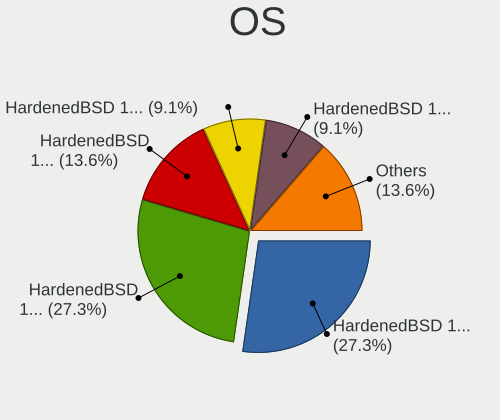

| Name                          | Computers | Percent |
|-------------------------------|-----------|---------|
| HardenedBSD 13.0-STABLE-HBSD  | 6         | 27.27%  |
| HardenedBSD 12.2--HBSD        | 6         | 27.27%  |
| HardenedBSD 13.0-CURRENT-HBSD | 3         | 13.64%  |
| HardenedBSD 14.2-STABLE-HBSD  | 2         | 9.09%   |
| HardenedBSD 14.0-CURRENT-HBSD | 2         | 9.09%   |
| HardenedBSD 14.3-STABLE-HBSD  | 1         | 4.55%   |
| HardenedBSD 13.0-ALPHA1-HBSD  | 1         | 4.55%   |
| HardenedBSD 12.1--HBSD        | 1         | 4.55%   |

OS Family
---------

OS without a version

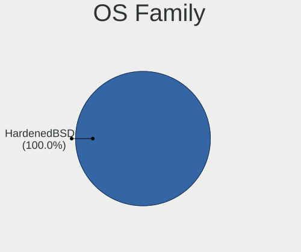

| Name        | Computers | Percent |
|-------------|-----------|---------|
| HardenedBSD | 22        | 100%    |

Arch
----

OS architecture (x86_64, i586, etc.)

| Name  | Computers | Percent |
|-------|-----------|---------|
| amd64 | 21        | 95.45%  |
| arm64 | 1         | 4.55%   |

DE
--

Desktop Environment

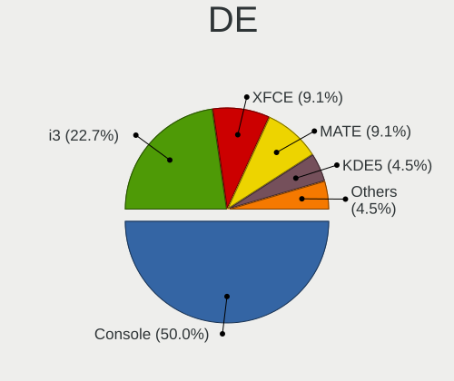

| Name    | Computers | Percent |
|---------|-----------|---------|
| Console | 11        | 50%     |
| i3      | 5         | 22.73%  |
| XFCE    | 2         | 9.09%   |
| MATE    | 2         | 9.09%   |
| KDE5    | 1         | 4.55%   |
| GNOME   | 1         | 4.55%   |

Display Server
--------------

X11 or Wayland

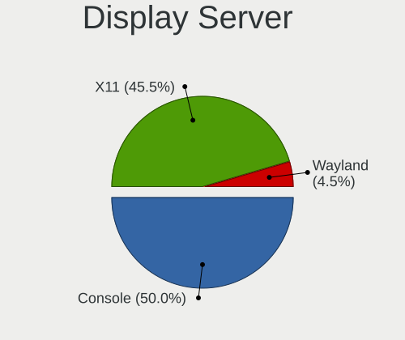

| Name    | Computers | Percent |
|---------|-----------|---------|
| Console | 11        | 50%     |
| X11     | 10        | 45.45%  |
| Wayland | 1         | 4.55%   |

Display Manager
---------------

SDDM, LightDM, etc.

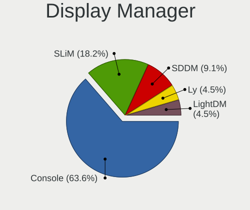

| Name    | Computers | Percent |
|---------|-----------|---------|
| Console | 14        | 63.64%  |
| SLiM    | 4         | 18.18%  |
| SDDM    | 2         | 9.09%   |
| Ly      | 1         | 4.55%   |
| LightDM | 1         | 4.55%   |

OS Lang
-------

Language

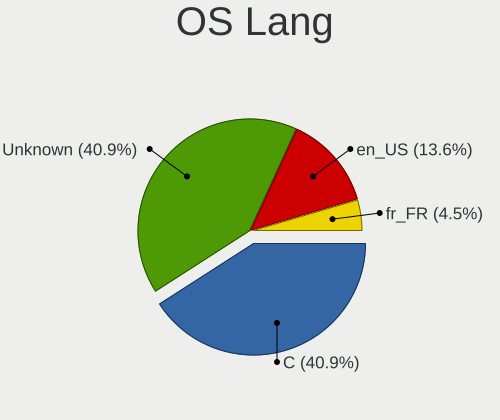

| Lang    | Computers | Percent |
|---------|-----------|---------|
| C       | 9         | 40.91%  |
| Unknown | 9         | 40.91%  |
| en_US   | 3         | 13.64%  |
| fr_FR   | 1         | 4.55%   |

Boot Mode
---------

EFI or BIOS

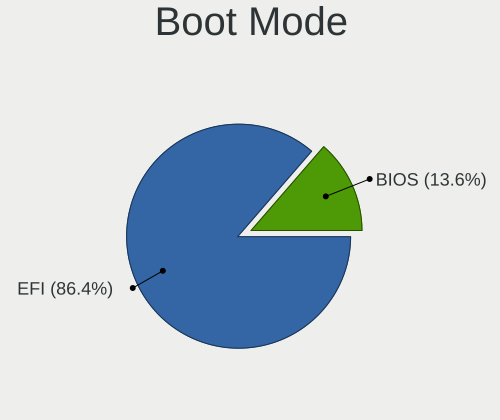

| Mode | Computers | Percent |
|------|-----------|---------|
| EFI  | 19        | 86.36%  |
| BIOS | 3         | 13.64%  |

Filesystem
----------

Type of filesystem

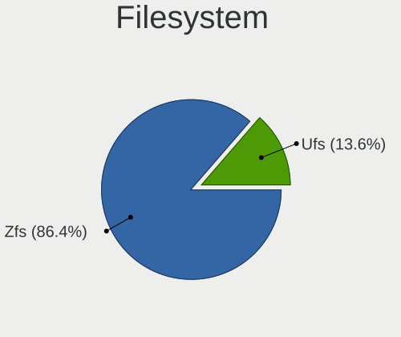

| Type | Computers | Percent |
|------|-----------|---------|
| Zfs  | 19        | 86.36%  |
| Ufs  | 3         | 13.64%  |

Part. scheme
------------

Scheme of partitioning

| Type | Computers | Percent |
|------|-----------|---------|
| GPT  | 22        | 100%    |

Board
-----

Vendor
------

Motherboard manufacturer

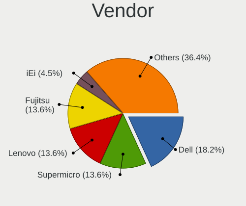

| Name             | Computers | Percent |
|------------------|-----------|---------|
| Dell             | 4         | 18.18%  |
| Supermicro       | 3         | 13.64%  |
| Lenovo           | 3         | 13.64%  |
| Fujitsu          | 3         | 13.64%  |
| Sony             | 1         | 4.55%   |
| Protectli        | 1         | 4.55%   |
| iEi              | 1         | 4.55%   |
| Hewlett-Packard  | 1         | 4.55%   |
| Framework        | 1         | 4.55%   |
| ASUSTek Computer | 1         | 4.55%   |
| ASRock           | 1         | 4.55%   |
| Apple            | 1         | 4.55%   |
| Unknown          | 1         | 4.55%   |

Model
-----

Motherboard model

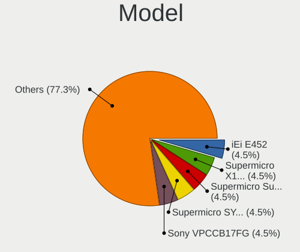

| Name                                        | Computers | Percent |
|---------------------------------------------|-----------|---------|
| Supermicro X10DRi                           | 1         | 4.55%   |
| Supermicro SYS-1028U-TN10RT+                | 1         | 4.55%   |
| Supermicro Super Server                     | 1         | 4.55%   |
| Sony VPCCB17FG                              | 1         | 4.55%   |
| Protectli FW6                               | 1         | 4.55%   |
| Lenovo ThinkPad X240 20AMS0RR00             | 1         | 4.55%   |
| Lenovo ThinkPad T410 2518C5U                | 1         | 4.55%   |
| Lenovo ThinkPad P51 20HH001RMX              | 1         | 4.55%   |
| iEi E452                                    | 1         | 4.55%   |
| HP ProLiant DL120 Gen9                      | 1         | 4.55%   |
| Fujitsu PRIMERGY RX2530 M4                  | 1         | 4.55%   |
| Fujitsu PRIMERGY RX2510 M2                  | 1         | 4.55%   |
| Fujitsu D3417-B2 S26361-D3417-B2            | 1         | 4.55%   |
| Framework Laptop 16 (AMD Ryzen 7040 Series) | 1         | 4.55%   |
| Dell Precision M4800                        | 1         | 4.55%   |
| Dell Precision 7550                         | 1         | 4.55%   |
| Dell Precision 7540                         | 1         | 4.55%   |
| Dell PowerEdge R7515                        | 1         | 4.55%   |
| ASUS F2A85-M                                | 1         | 4.55%   |
| ASRock 990FX Extreme3                       | 1         | 4.55%   |
| Apple MacBookPro10,1                        | 1         | 4.55%   |
| Unknown                                     | 1         | 4.55%   |

Model Family
------------

Motherboard model prefix

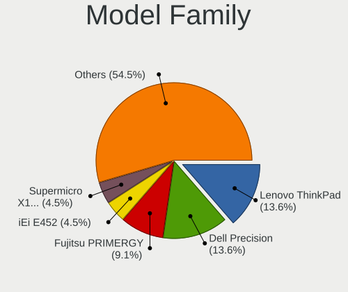

| Name                         | Computers | Percent |
|------------------------------|-----------|---------|
| Lenovo ThinkPad              | 3         | 13.64%  |
| Dell Precision               | 3         | 13.64%  |
| Fujitsu PRIMERGY             | 2         | 9.09%   |
| Supermicro X10DRi            | 1         | 4.55%   |
| Supermicro SYS-1028U-TN10RT+ | 1         | 4.55%   |
| Supermicro Super             | 1         | 4.55%   |
| Sony VPCCB17FG               | 1         | 4.55%   |
| Protectli FW6                | 1         | 4.55%   |
| iEi E452                     | 1         | 4.55%   |
| HP ProLiant                  | 1         | 4.55%   |
| Fujitsu D3417-B2             | 1         | 4.55%   |
| Framework Laptop             | 1         | 4.55%   |
| Dell PowerEdge               | 1         | 4.55%   |
| ASUS F2A85-M                 | 1         | 4.55%   |
| ASRock 990FX                 | 1         | 4.55%   |
| Apple MacBookPro10           | 1         | 4.55%   |
| Unknown                      | 1         | 4.55%   |

MFG Year
--------

Motherboard manufacture year

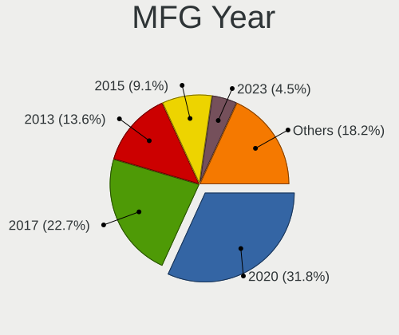

| Year    | Computers | Percent |
|---------|-----------|---------|
| 2020    | 7         | 31.82%  |
| 2017    | 5         | 22.73%  |
| 2013    | 3         | 13.64%  |
| 2015    | 2         | 9.09%   |
| 2023    | 1         | 4.55%   |
| 2014    | 1         | 4.55%   |
| 2011    | 1         | 4.55%   |
| 2010    | 1         | 4.55%   |
| Unknown | 1         | 4.55%   |

Form Factor
-----------

Physical design of the computer

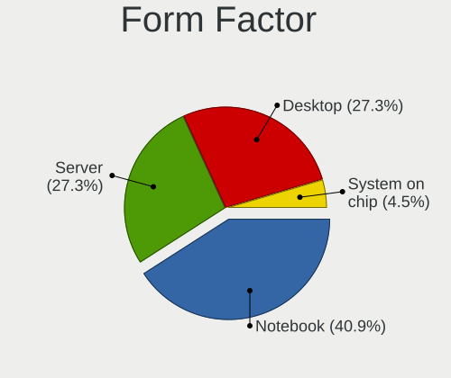

| Name           | Computers | Percent |
|----------------|-----------|---------|
| Notebook       | 9         | 40.91%  |
| Server         | 6         | 27.27%  |
| Desktop        | 6         | 27.27%  |
| System on chip | 1         | 4.55%   |

Coreboot
--------

Have coreboot on board

| Used | Computers | Percent |
|------|-----------|---------|
| No   | 22        | 100%    |

RAM Size
--------

Total RAM memory

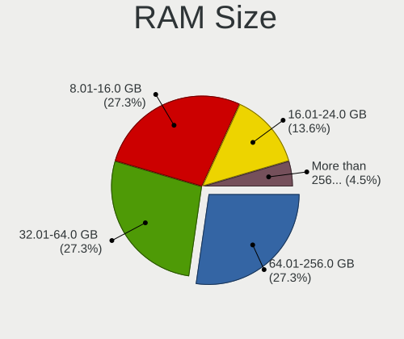

| Size in GB      | Computers | Percent |
|-----------------|-----------|---------|
| 32.01-64.0      | 6         | 27.27%  |
| 64.01-256.0     | 6         | 27.27%  |
| 8.01-16.0       | 6         | 27.27%  |
| 16.01-24.0      | 3         | 13.64%  |
| More than 256.0 | 1         | 4.55%   |

RAM Used
--------

Used RAM memory

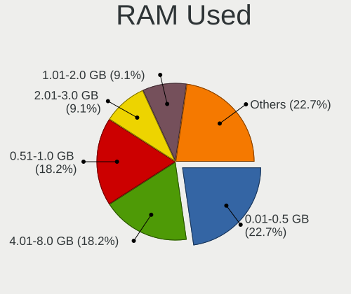

| Used GB     | Computers | Percent |
|-------------|-----------|---------|
| 0.01-0.5    | 5         | 22.73%  |
| 4.01-8.0    | 4         | 18.18%  |
| 0.51-1.0    | 4         | 18.18%  |
| 2.01-3.0    | 2         | 9.09%   |
| 1.01-2.0    | 2         | 9.09%   |
| 32.01-64.0  | 1         | 4.55%   |
| 24.01-32.0  | 1         | 4.55%   |
| 64.01-256.0 | 1         | 4.55%   |
| 16.01-24.0  | 1         | 4.55%   |
| 8.01-16.0   | 1         | 4.55%   |

Total Drives
------------

Number of drives on board

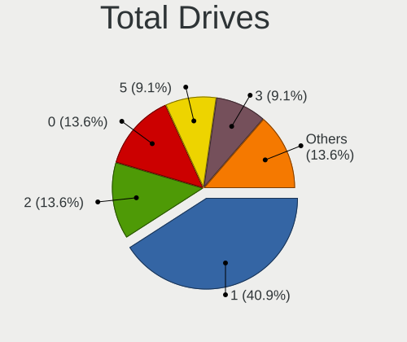

| Drives | Computers | Percent |
|--------|-----------|---------|
| 1      | 9         | 40.91%  |
| 2      | 3         | 13.64%  |
| 0      | 3         | 13.64%  |
| 5      | 2         | 9.09%   |
| 3      | 2         | 9.09%   |
| 14     | 1         | 4.55%   |
| 12     | 1         | 4.55%   |
| 4      | 1         | 4.55%   |

Has CD-ROM
----------

Has CD-ROM on board

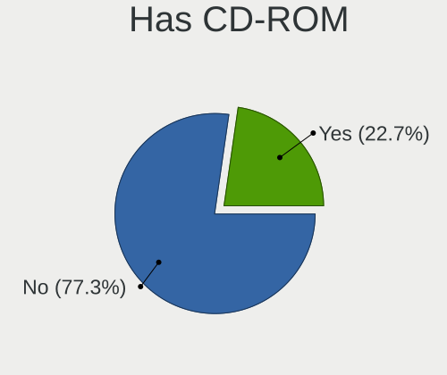

| Presented | Computers | Percent |
|-----------|-----------|---------|
| No        | 17        | 77.27%  |
| Yes       | 5         | 22.73%  |

Has Ethernet
------------

Has Ethernet on board

| Presented | Computers | Percent |
|-----------|-----------|---------|
| Yes       | 22        | 100%    |

Has WiFi
--------

Has WiFi module

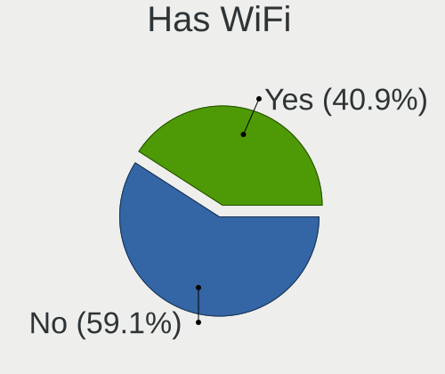

| Presented | Computers | Percent |
|-----------|-----------|---------|
| No        | 13        | 59.09%  |
| Yes       | 9         | 40.91%  |

Has Bluetooth
-------------

Has Bluetooth module

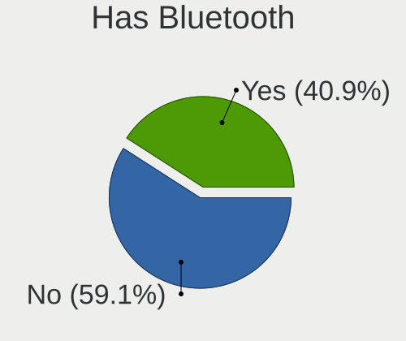

| Presented | Computers | Percent |
|-----------|-----------|---------|
| No        | 13        | 59.09%  |
| Yes       | 9         | 40.91%  |

Location
--------

Country
-------

Geographic location (country)

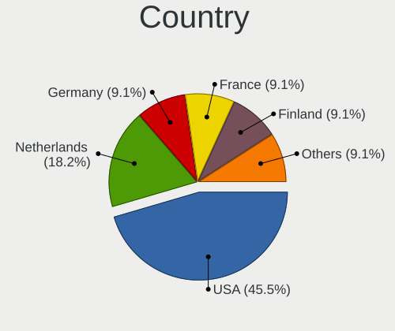

| Country     | Computers | Percent |
|-------------|-----------|---------|
| USA         | 10        | 45.45%  |
| Netherlands | 4         | 18.18%  |
| Germany     | 2         | 9.09%   |
| France      | 2         | 9.09%   |
| Finland     | 2         | 9.09%   |
| Moldova     | 1         | 4.55%   |
| Hong Kong   | 1         | 4.55%   |

City
----

Geographic location (city)

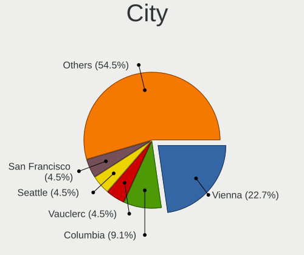

| City           | Computers | Percent |
|----------------|-----------|---------|
| Vienna         | 5         | 22.73%  |
| Columbia       | 2         | 9.09%   |
| Vauclerc       | 1         | 4.55%   |
| Seattle        | 1         | 4.55%   |
| San Francisco  | 1         | 4.55%   |
| RГ®bniЕЈa  | 1         | 4.55%   |
| Nanterre       | 1         | 4.55%   |
| Naaldwijk      | 1         | 4.55%   |
| Helsinki       | 1         | 4.55%   |
| Falkenstein    | 1         | 4.55%   |
| Espoo          | 1         | 4.55%   |
| Eindhoven      | 1         | 4.55%   |
| Denver         | 1         | 4.55%   |
| Cheung Sha Wan | 1         | 4.55%   |
| Beekbergen     | 1         | 4.55%   |
| Barneveld      | 1         | 4.55%   |
| Ahrensburg     | 1         | 4.55%   |

Drives
------

Drive Vendor
------------

Hard drive vendors

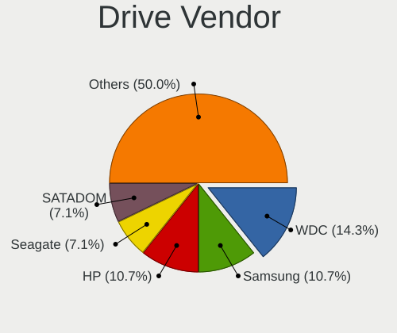

| Vendor              | Computers | Drives | Percent |
|---------------------|-----------|--------|---------|
| WDC                 | 4         | 8      | 14.29%  |
| Samsung Electronics | 3         | 7      | 10.71%  |
| Hewlett-Packard     | 3         | 22     | 10.71%  |
| Seagate             | 2         | 3      | 7.14%   |
| SATADOM             | 2         | 4      | 7.14%   |
| Lenovo              | 2         | 4      | 7.14%   |
| UDinfo              | 1         | 1      | 3.57%   |
| Toshiba             | 1         | 1      | 3.57%   |
| SPCC                | 1         | 1      | 3.57%   |
| Protectli           | 1         | 1      | 3.57%   |
| Phison              | 1         | 1      | 3.57%   |
| Patriot             | 1         | 1      | 3.57%   |
| Micron Technology   | 1         | 2      | 3.57%   |
| Kingston            | 1         | 1      | 3.57%   |
| Intel               | 1         | 1      | 3.57%   |
| HGST                | 1         | 1      | 3.57%   |
| Crucial             | 1         | 1      | 3.57%   |
| Apple               | 1         | 1      | 3.57%   |

Drive Model
-----------

Hard drive models

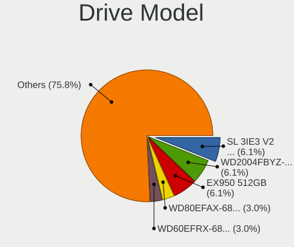

| Model                                   | Computers | Percent |
|-----------------------------------------|-----------|---------|
| SATADOM SL 3IE3 V2 64GB                 | 2         | 6.06%   |
| Lenovo WD2004FBYZ-23YC 03X3795 2TB      | 2         | 6.06%   |
| HP SSD EX950 512GB                      | 2         | 6.06%   |
| WDC WD80EFAX-68KNBN0 8TB                | 1         | 3.03%   |
| WDC WD60EFRX-68L0BN1 6TB                | 1         | 3.03%   |
| WDC WD40EFRX-68WT0N0 4TB                | 1         | 3.03%   |
| WDC WD10EAVS-00D7B0 1TB                 | 1         | 3.03%   |
| WDC WD1003FZEX-00K3CA0 1TB              | 1         | 3.03%   |
| WDC WD1002FAEX-007BA0 1TB               | 1         | 3.03%   |
| UDinfo M2S 120GB                        | 1         | 3.03%   |
| Toshiba KXG60PNV2T04 NVMe KIOXIA 2048GB | 1         | 3.03%   |
| SPCC Solid State Disk 128GB             | 1         | 3.03%   |
| Seagate XF1230-1A0480 480GB             | 1         | 3.03%   |
| Seagate ST1000DM010-2EP102 1TB          | 1         | 3.03%   |
| Samsung SSD 960 EVO 250GB               | 1         | 3.03%   |
| Samsung SSD 860 EVO M.2 250GB           | 1         | 3.03%   |
| Samsung HD503HI 500GB                   | 1         | 3.03%   |
| Samsung HD501LJ 500GB                   | 1         | 3.03%   |
| Samsung HD322GJ 320GB                   | 1         | 3.03%   |
| Samsung HD256GJ 250GB                   | 1         | 3.03%   |
| Protectli 64GB mSATA                    | 1         | 3.03%   |
| Phison SATA SSD 1TB                     | 1         | 3.03%   |
| Patriot P210 512GB                      | 1         | 3.03%   |
| Micron 5200_MTFDDAK1T9TDN 1.9TB         | 1         | 3.03%   |
| Kingston SKC1000240G 240GB              | 1         | 3.03%   |
| Intel SSDPE21D280GA 280GB               | 1         | 3.03%   |
| HGST HTS725050A7E630 500GB              | 1         | 3.03%   |
| HP MB3000FBNWV 3TB                      | 1         | 3.03%   |
| Crucial CT240BX500SSD1 240GB            | 1         | 3.03%   |
| Apple SSD SD512E 500GB                  | 1         | 3.03%   |

HDD Vendor
----------

Hard disk drive vendors

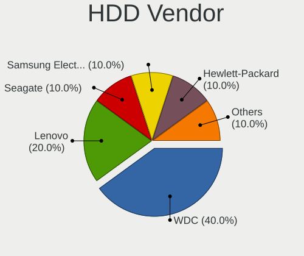

| Vendor              | Computers | Drives | Percent |
|---------------------|-----------|--------|---------|
| WDC                 | 4         | 8      | 40%     |
| Lenovo              | 2         | 4      | 20%     |
| Seagate             | 1         | 1      | 10%     |
| Samsung Electronics | 1         | 4      | 10%     |
| HGST                | 1         | 1      | 10%     |
| Hewlett-Packard     | 1         | 4      | 10%     |

SSD Vendor
----------

Solid state drive vendors

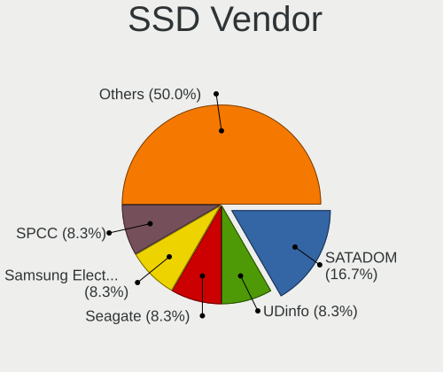

| Vendor              | Computers | Drives | Percent |
|---------------------|-----------|--------|---------|
| SATADOM             | 2         | 4      | 16.67%  |
| UDinfo              | 1         | 1      | 8.33%   |
| SPCC                | 1         | 1      | 8.33%   |
| Seagate             | 1         | 2      | 8.33%   |
| Samsung Electronics | 1         | 2      | 8.33%   |
| Protectli           | 1         | 1      | 8.33%   |
| Phison              | 1         | 1      | 8.33%   |
| Patriot             | 1         | 1      | 8.33%   |
| Micron Technology   | 1         | 2      | 8.33%   |
| Crucial             | 1         | 1      | 8.33%   |
| Apple               | 1         | 1      | 8.33%   |

Drive Kind
----------

HDD or SSD

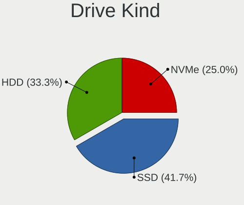

| Kind | Computers | Drives | Percent |
|------|-----------|--------|---------|
| SSD  | 10        | 17     | 41.67%  |
| HDD  | 8         | 22     | 33.33%  |
| NVMe | 6         | 22     | 25%     |

Drive Connector
---------------

SATA, SAS, NVMe, etc.

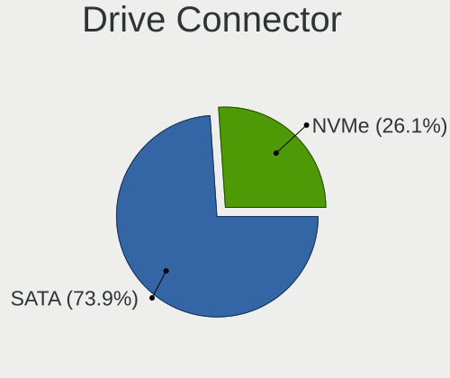

| Type | Computers | Drives | Percent |
|------|-----------|--------|---------|
| SATA | 17        | 39     | 73.91%  |
| NVMe | 6         | 22     | 26.09%  |

Drive Size
----------

Size of hard drive

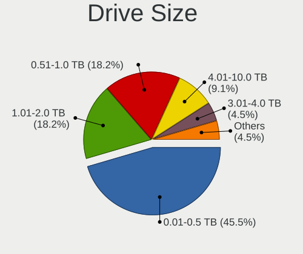

| Size in TB | Computers | Drives | Percent |
|------------|-----------|--------|---------|
| 0.01-0.5   | 10        | 18     | 45.45%  |
| 1.01-2.0   | 4         | 7      | 18.18%  |
| 0.51-1.0   | 4         | 5      | 18.18%  |
| 4.01-10.0  | 2         | 3      | 9.09%   |
| 3.01-4.0   | 1         | 2      | 4.55%   |
| 2.01-3.0   | 1         | 4      | 4.55%   |

Space Total
-----------

Amount of disk space available on the file system

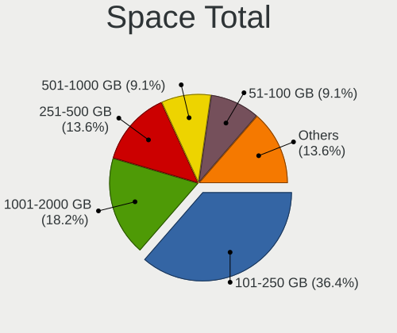

| Size in GB     | Computers | Percent |
|----------------|-----------|---------|
| 101-250        | 8         | 36.36%  |
| 1001-2000      | 4         | 18.18%  |
| 251-500        | 3         | 13.64%  |
| 501-1000       | 2         | 9.09%   |
| 51-100         | 2         | 9.09%   |
| More than 3000 | 1         | 4.55%   |
| 21-50          | 1         | 4.55%   |
| 1-20           | 1         | 4.55%   |

Space Used
----------

Amount of used disk space

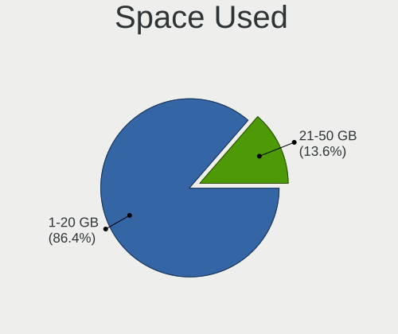

| Used GB | Computers | Percent |
|---------|-----------|---------|
| 1-20    | 19        | 86.36%  |
| 21-50   | 3         | 13.64%  |

Malfunc. Drives
---------------

Drive models with a malfunction

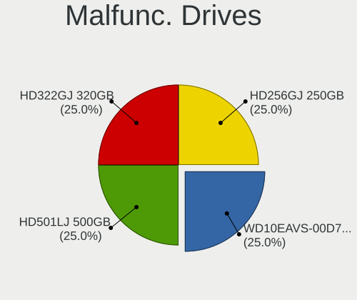

| Model                             | Computers | Drives | Percent |
|-----------------------------------|-----------|--------|---------|
| WDC WD10EAVS-00D7B0 1TB           | 1         | 1      | 25%     |
| Samsung Electronics HD501LJ 500GB | 1         | 1      | 25%     |
| Samsung Electronics HD322GJ 320GB | 1         | 1      | 25%     |
| Samsung Electronics HD256GJ 250GB | 1         | 1      | 25%     |

Malfunc. Drive Vendor
---------------------

Vendors of faulty drives

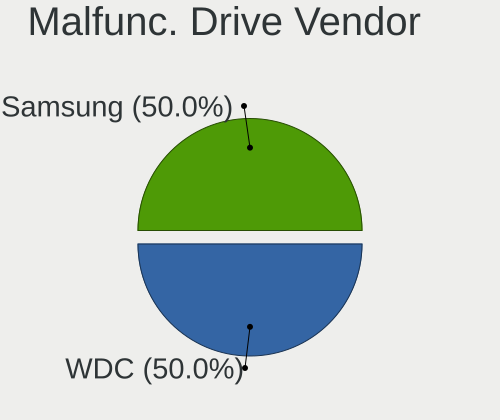

| Vendor              | Computers | Drives | Percent |
|---------------------|-----------|--------|---------|
| WDC                 | 1         | 1      | 50%     |
| Samsung Electronics | 1         | 3      | 50%     |

Malfunc. HDD Vendor
-------------------

Vendors of faulty HDD drives

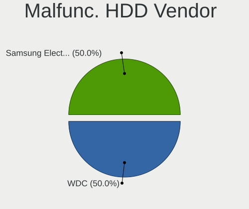

| Vendor              | Computers | Drives | Percent |
|---------------------|-----------|--------|---------|
| WDC                 | 1         | 1      | 50%     |
| Samsung Electronics | 1         | 3      | 50%     |

Malfunc. Drive Kind
-------------------

Kinds of faulty drives

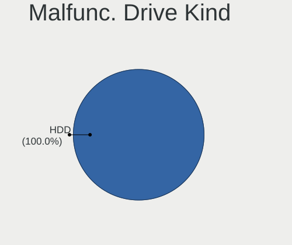

| Kind | Computers | Drives | Percent |
|------|-----------|--------|---------|
| HDD  | 1         | 4      | 100%    |

Failed Drives
-------------

Failed drive models

| Model                                 | Computers | Drives | Percent |
|---------------------------------------|-----------|--------|---------|
| Samsung Electronics SSD 960 EVO 250GB | 1         | 1      | 100%    |

Failed Drive Vendor
-------------------

Failed drive vendors

| Vendor              | Computers | Drives | Percent |
|---------------------|-----------|--------|---------|
| Samsung Electronics | 1         | 1      | 100%    |

Drive Status
------------

Number of failed and malfunc. drives

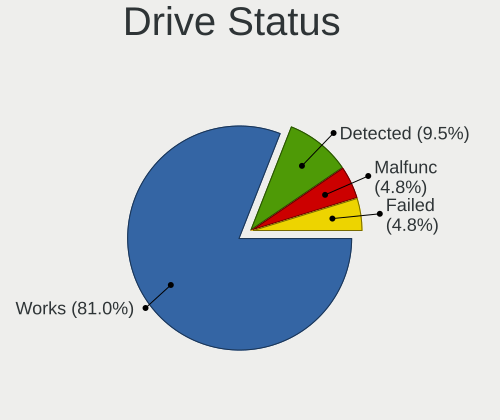

| Status   | Computers | Drives | Percent |
|----------|-----------|--------|---------|
| Works    | 17        | 50     | 80.95%  |
| Detected | 2         | 6      | 9.52%   |
| Malfunc  | 1         | 4      | 4.76%   |
| Failed   | 1         | 1      | 4.76%   |

Storage controller
------------------

Storage Vendor
--------------

Storage controller vendors

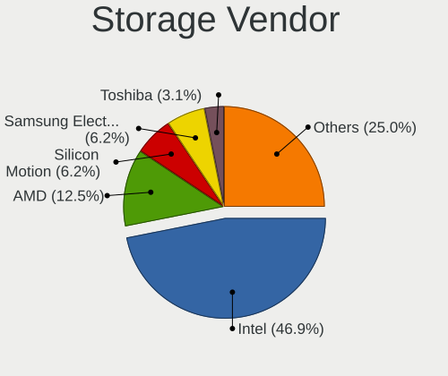

| Vendor                   | Computers | Percent |
|--------------------------|-----------|---------|
| Intel                    | 15        | 46.88%  |
| AMD                      | 4         | 12.5%   |
| Silicon Motion           | 2         | 6.25%   |
| Samsung Electronics      | 2         | 6.25%   |
| Toshiba                  | 1         | 3.13%   |
| SK hynix                 | 1         | 3.13%   |
| Sandisk                  | 1         | 3.13%   |
| Phison Electronics       | 1         | 3.13%   |
| Marvell Technology Group | 1         | 3.13%   |
| Hewlett-Packard          | 1         | 3.13%   |
| Broadcom / LSI           | 1         | 3.13%   |
| Biwin Storage Technology | 1         | 3.13%   |
| ASMedia Technology       | 1         | 3.13%   |

Storage Model
-------------

Storage controller models

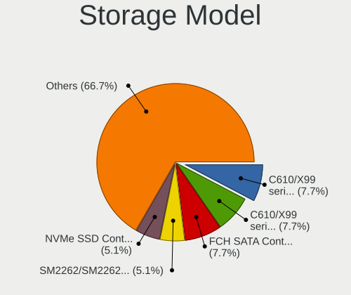

| Model                                                                          | Computers | Percent |
|--------------------------------------------------------------------------------|-----------|---------|
| Intel C610/X99 series chipset sSATA Controller [AHCI mode]                     | 3         | 7.69%   |
| Intel C610/X99 series chipset 6-Port SATA Controller [AHCI mode]               | 3         | 7.69%   |
| AMD FCH SATA Controller [AHCI mode]                                            | 3         | 7.69%   |
| Silicon Motion SM2262/SM2262EN SSD Controller                                  | 2         | 5.13%   |
| Samsung NVMe SSD Controller SM961/PM961/SM963                                  | 2         | 5.13%   |
| Toshiba XG6 NVMe SSD Controller                                                | 1         | 2.56%   |
| SK hynix PC601 NVMe Solid State Drive                                          | 1         | 2.56%   |
| Sandisk WD Black SN850X NVMe SSD                                               | 1         | 2.56%   |
| Sandisk WD Black SN770M NVMe SSD (DRAM-less)                                   | 1         | 2.56%   |
| Phison E7 NVMe Controller                                                      | 1         | 2.56%   |
| Marvell Group 88SE9215 PCIe 2.0 x1 4-port SATA 6 Gb/s Controller               | 1         | 2.56%   |
| Intel Sunrise Point-LP SATA Controller [AHCI mode]                             | 1         | 2.56%   |
| Intel Q170/Q150/B150/H170/H110/Z170/CM236 Chipset SATA Controller [AHCI Mode]  | 1         | 2.56%   |
| Intel Optane SSD 900P Series                                                   | 1         | 2.56%   |
| Intel Cannon Lake Mobile PCH SATA AHCI Controller                              | 1         | 2.56%   |
| Intel C620 Series Chipset Family SSATA Controller [AHCI mode]                  | 1         | 2.56%   |
| Intel C620 Series Chipset Family SATA Controller [AHCI mode]                   | 1         | 2.56%   |
| Intel C610/X99 series chipset sSATA Controller [RAID mode]                     | 1         | 2.56%   |
| Intel C610/X99 series chipset SATA Controller [RAID mode]                      | 1         | 2.56%   |
| Intel 82801 Mobile SATA Controller [RAID mode]                                 | 1         | 2.56%   |
| Intel 8 Series/C220 Series Chipset Family 6-port SATA Controller 1 [AHCI mode] | 1         | 2.56%   |
| Intel 8 Series SATA Controller 1 [AHCI mode]                                   | 1         | 2.56%   |
| Intel 7 Series Chipset Family 6-port SATA Controller [AHCI mode]               | 1         | 2.56%   |
| Intel 6 Series/C200 Series Chipset Family 6 port Mobile SATA AHCI Controller   | 1         | 2.56%   |
| Intel 5 Series/3400 Series Chipset 6 port SATA AHCI Controller                 | 1         | 2.56%   |
| HP Smart Array Gen9 Controllers                                                | 1         | 2.56%   |
| Broadcom / LSI MegaRAID SAS-3 3108 [Invader]                                   | 1         | 2.56%   |
| Biwin Storage EX950 NVMe SSD                                                   | 1         | 2.56%   |
| ASMedia 106x SATA/RAID Controller                                              | 1         | 2.56%   |
| AMD SB7x0/SB8x0/SB9x0 SATA Controller [IDE mode]                               | 1         | 2.56%   |
| AMD SB7x0/SB8x0/SB9x0 IDE Controller                                           | 1         | 2.56%   |

Storage Kind
------------

Kind of storage controller (IDE, SATA, NVMe, SAS, ...)

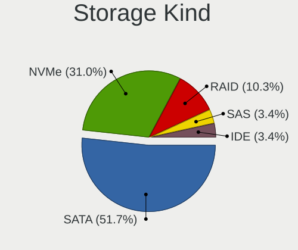

| Kind | Computers | Percent |
|------|-----------|---------|
| SATA | 15        | 51.72%  |
| NVMe | 9         | 31.03%  |
| RAID | 3         | 10.34%  |
| SAS  | 1         | 3.45%   |
| IDE  | 1         | 3.45%   |

Processor
---------

CPU Vendor
----------

Processor vendors

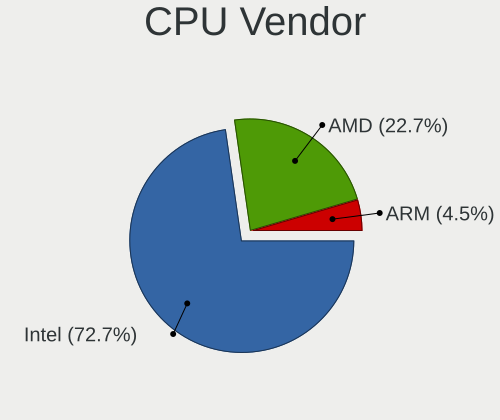

| Vendor | Computers | Percent |
|--------|-----------|---------|
| Intel  | 16        | 72.73%  |
| AMD    | 5         | 22.73%  |
| ARM    | 1         | 4.55%   |

CPU Model
---------

Processor models

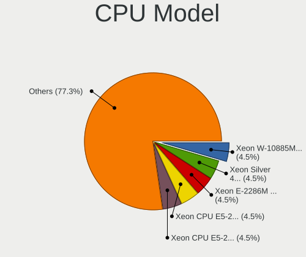

| Model                                      | Computers | Percent |
|--------------------------------------------|-----------|---------|
| Intel Xeon W-10885M CPU @ 2.40GHz          | 1         | 4.55%   |
| Intel Xeon Silver 4108 CPU @ 1.80GHz       | 1         | 4.55%   |
| Intel Xeon E-2286M CPU @ 2.40GHz           | 1         | 4.55%   |
| Intel Xeon CPU E5-2697 v3 @ 2.60GHz        | 1         | 4.55%   |
| Intel Xeon CPU E5-2650L v3 @ 1.80GHz       | 1         | 4.55%   |
| Intel Xeon CPU E5-2630 v3 @ 2.40GHz        | 1         | 4.55%   |
| Intel Xeon CPU E5-2620 v4 @ 2.10GHz        | 1         | 4.55%   |
| Intel Xeon CPU E3-1275 v5 @ 3.60GHz        | 1         | 4.55%   |
| Intel Xeon CPU D-1521 @ 2.40GHz            | 1         | 4.55%   |
| Intel Core i7-7820HQ CPU @ 2.90GHz         | 1         | 4.55%   |
| Intel Core i7-4810MQ CPU @ 2.80GHz         | 1         | 4.55%   |
| Intel Core i7-3720QM CPU @ 2.60GHz         | 1         | 4.55%   |
| Intel Core i7-2620M CPU @ 2.70GHz          | 1         | 4.55%   |
| Intel Core i5-4300U CPU @ 1.90GHz          | 1         | 4.55%   |
| Intel Core i5 CPU M 540 @ 2.53GHz          | 1         | 4.55%   |
| Intel Core i3-7100U CPU @ 2.40GHz          | 1         | 4.55%   |
| ARM Cortex-A57 r1p2                        | 1         | 4.55%   |
| AMD Ryzen 9 7940HS w/ Radeon 780M Graphics | 1         | 4.55%   |
| AMD GX-424CC SOC with Radeon R5E Graphics  | 1         | 4.55%   |
| AMD FX-8150 Eight-Core Processor           | 1         | 4.55%   |
| AMD EPYC 7402P 24-Core Processor           | 1         | 4.55%   |
| AMD A8-6600K APU with Radeon HD Graphics   | 1         | 4.55%   |

CPU Model Family
----------------

Processor model prefix

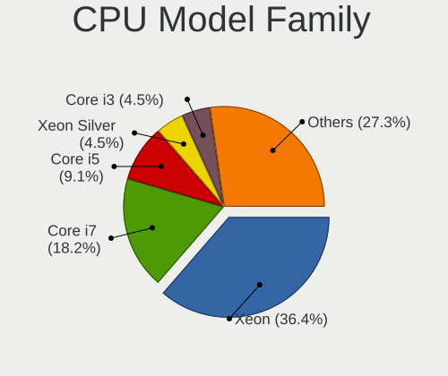

| Model             | Computers | Percent |
|-------------------|-----------|---------|
| Intel Xeon        | 8         | 36.36%  |
| Intel Core i7     | 4         | 18.18%  |
| Intel Core i5     | 2         | 9.09%   |
| Intel Xeon Silver | 1         | 4.55%   |
| Intel Core i3     | 1         | 4.55%   |
| ARM Cortex        | 1         | 4.55%   |
| AMD Ryzen 9       | 1         | 4.55%   |
| AMD GX            | 1         | 4.55%   |
| AMD FX            | 1         | 4.55%   |
| AMD EPYC          | 1         | 4.55%   |
| AMD A8            | 1         | 4.55%   |

CPU Cores
---------

Number of processor cores

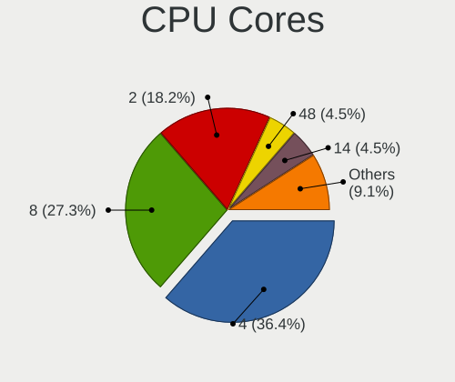

| Number  | Computers | Percent |
|---------|-----------|---------|
| 4       | 8         | 36.36%  |
| 8       | 6         | 27.27%  |
| 2       | 4         | 18.18%  |
| 48      | 1         | 4.55%   |
| 14      | 1         | 4.55%   |
| 12      | 1         | 4.55%   |
| Unknown | 1         | 4.55%   |

CPU Sockets
-----------

Number of sockets

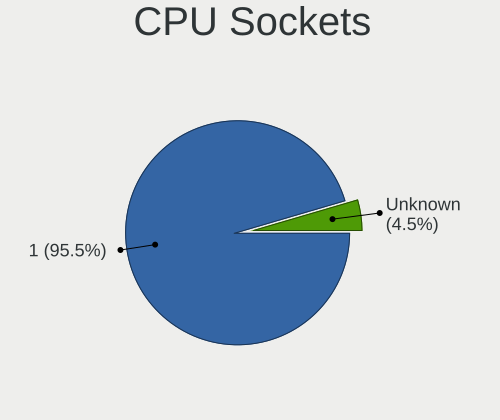

| Number  | Computers | Percent |
|---------|-----------|---------|
| 1       | 21        | 95.45%  |
| Unknown | 1         | 4.55%   |

CPU Threads
-----------

Threads per core (Hyper-Threading)

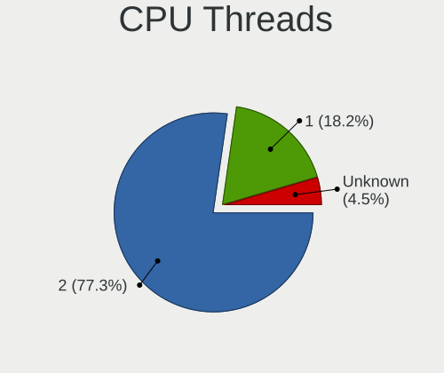

| Number  | Computers | Percent |
|---------|-----------|---------|
| 2       | 17        | 77.27%  |
| 1       | 4         | 18.18%  |
| Unknown | 1         | 4.55%   |

CPU Microarch
-------------

Microarchitecture

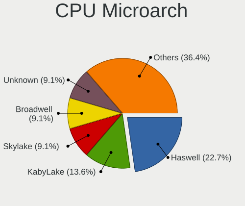

| Name        | Computers | Percent |
|-------------|-----------|---------|
| Haswell     | 5         | 22.73%  |
| KabyLake    | 3         | 13.64%  |
| Skylake     | 2         | 9.09%   |
| Broadwell   | 2         | 9.09%   |
| Unknown     | 2         | 9.09%   |
| Zen 2       | 1         | 4.55%   |
| Westmere    | 1         | 4.55%   |
| SandyBridge | 1         | 4.55%   |
| Puma        | 1         | 4.55%   |
| Piledriver  | 1         | 4.55%   |
| IvyBridge   | 1         | 4.55%   |
| CometLake   | 1         | 4.55%   |
| Bulldozer   | 1         | 4.55%   |

Graphics
--------

GPU Vendor
----------

Vendors of graphics cards

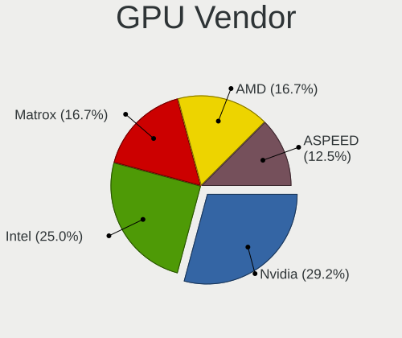

| Vendor                     | Computers | Percent |
|----------------------------|-----------|---------|
| Nvidia                     | 7         | 29.17%  |
| Intel                      | 6         | 25%     |
| Matrox Electronics Systems | 4         | 16.67%  |
| AMD                        | 4         | 16.67%  |
| ASPEED Technology          | 3         | 12.5%   |

GPU Model
---------

Graphics card models

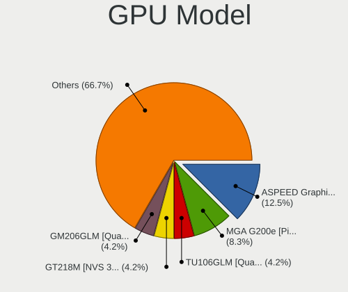

| Model                                                                     | Computers | Percent |
|---------------------------------------------------------------------------|-----------|---------|
| ASPEED Technology ASPEED Graphics Family                                  | 3         | 12.5%   |
| Matrox Electronics Systems MGA G200e [Pilot] ServerEngines (SEP1)         | 2         | 8.33%   |
| Nvidia TU106GLM [Quadro RTX 3000 Mobile / Max-Q]                          | 1         | 4.17%   |
| Nvidia GT218M [NVS 3100M]                                                 | 1         | 4.17%   |
| Nvidia GM206GLM [Quadro M2200 Mobile]                                     | 1         | 4.17%   |
| Nvidia GM204GL [Quadro M4000]                                             | 1         | 4.17%   |
| Nvidia GK107M [GeForce GT 650M Mac Edition]                               | 1         | 4.17%   |
| Nvidia GK107 [GeForce GT 640]                                             | 1         | 4.17%   |
| Nvidia GK106GLM [Quadro K2100M]                                           | 1         | 4.17%   |
| Matrox Electronics Systems MGA G200EH                                     | 1         | 4.17%   |
| Matrox Electronics Systems Integrated Matrox G200eW3 Graphics Controller  | 1         | 4.17%   |
| Intel Skylake-DT/H GT2 [HD Graphics P530]                                 | 1         | 4.17%   |
| Intel Kaby Lake-U GT2 [HD Graphics 620]                                   | 1         | 4.17%   |
| Intel Haswell-ULT Integrated Graphics Controller                          | 1         | 4.17%   |
| Intel Coffee Lake-S GT2 [UHD Graphics P630]                               | 1         | 4.17%   |
| Intel 3rd Gen Core processor Graphics Controller                          | 1         | 4.17%   |
| Intel 2nd Generation Core Processor Family Integrated Graphics Controller | 1         | 4.17%   |
| AMD Whistler [Radeon HD 6630M/6650M/6750M/7670M/7690M]                    | 1         | 4.17%   |
| AMD Turks XT [Radeon HD 6670/7670]                                        | 1         | 4.17%   |
| AMD Phoenix1                                                              | 1         | 4.17%   |
| AMD Mullins [Radeon R4/R5 Graphics]                                       | 1         | 4.17%   |

GPU Combo
---------

Combinations of graphics cards

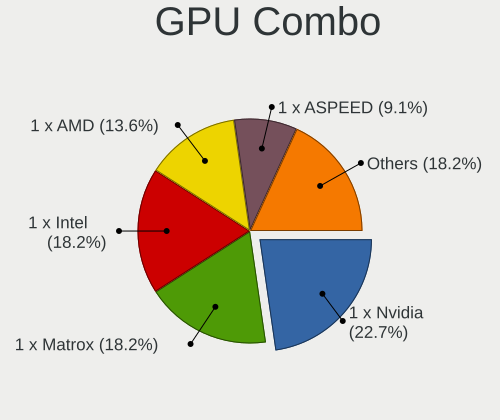

| Name            | Computers | Percent |
|-----------------|-----------|---------|
| 1 x Nvidia      | 5         | 22.73%  |
| 1 x Matrox      | 4         | 18.18%  |
| 1 x Intel       | 4         | 18.18%  |
| 1 x AMD         | 3         | 13.64%  |
| 1 x ASPEED      | 2         | 9.09%   |
| Other           | 1         | 4.55%   |
| Nvidia + ASPEED | 1         | 4.55%   |
| Intel + Nvidia  | 1         | 4.55%   |
| Intel + AMD     | 1         | 4.55%   |

GPU Driver
----------

Free vs proprietary

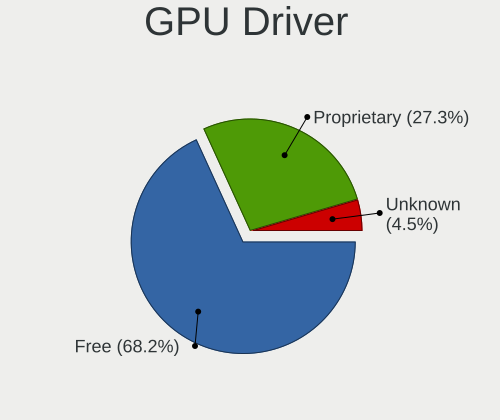

| Driver      | Computers | Percent |
|-------------|-----------|---------|
| Free        | 15        | 68.18%  |
| Proprietary | 6         | 27.27%  |
| Unknown     | 1         | 4.55%   |

GPU Memory
----------

Total video memory

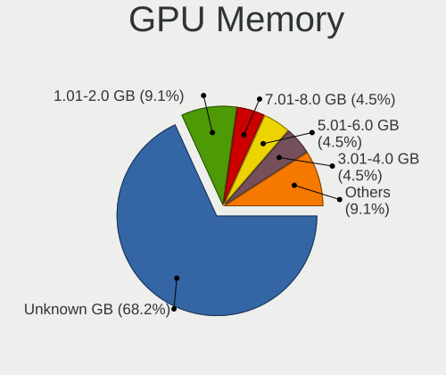

| Size in GB | Computers | Percent |
|------------|-----------|---------|
| Unknown    | 15        | 68.18%  |
| 1.01-2.0   | 2         | 9.09%   |
| 7.01-8.0   | 1         | 4.55%   |
| 5.01-6.0   | 1         | 4.55%   |
| 3.01-4.0   | 1         | 4.55%   |
| 0.51-1.0   | 1         | 4.55%   |
| 0.01-0.5   | 1         | 4.55%   |

Monitor
-------

Monitor Vendor
--------------

Monitor vendors

| Vendor               | Computers | Percent |
|----------------------|-----------|---------|
| BOE                  | 3         | 25%     |
| Samsung Electronics  | 2         | 16.67%  |
| Lenovo               | 2         | 16.67%  |
| AU Optronics         | 2         | 16.67%  |
| Ancor Communications | 2         | 16.67%  |
| Sharp                | 1         | 8.33%   |

Monitor Model
-------------

Monitor models

| Model                                                                 | Computers | Percent |
|-----------------------------------------------------------------------|-----------|---------|
| Ancor Communications ASUS PB278 ACI27A3 2560x1440 600x340mm 27.2-inch | 2         | 16.67%  |
| Sharp LCD Monitor SHP13F9 3200x1800 350x190mm 15.7-inch               | 1         | 8.33%   |
| Samsung Electronics U32R59x SAM0F96 3840x2160 700x390mm 31.5-inch     | 1         | 8.33%   |
| Samsung Electronics SyncMaster SAM027E 1680x1050 470x300mm 22.0-inch  | 1         | 8.33%   |
| Lenovo P24q-10 LEN61A5 2560x1440 530x300mm 24.0-inch                  | 1         | 8.33%   |
| Lenovo LCD Monitor LEN4036 1440x900 300x190mm 14.0-inch               | 1         | 8.33%   |
| BOE LCD Monitor BOE0BC9 2560x1600 340x220mm 15.9-inch                 | 1         | 8.33%   |
| BOE LCD Monitor BOE0819 1920x1080 340x190mm 15.3-inch                 | 1         | 8.33%   |
| BOE LCD Monitor BOE05E0 1366x768 280x160mm 12.7-inch                  | 1         | 8.33%   |
| AU Optronics LCD Monitor AUO24ED 1920x1080 340x190mm 15.3-inch        | 1         | 8.33%   |
| AU Optronics LCD Monitor 3840x2160                                    | 1         | 8.33%   |

Monitor Resolution
------------------

Monitor screen resolution

| Resolution         | Computers | Percent |
|--------------------|-----------|---------|
| 2560x1440 (QHD)    | 3         | 25%     |
| 3840x2160 (4K)     | 2         | 16.67%  |
| 1920x1080 (FHD)    | 2         | 16.67%  |
| 3200x1800 (QHD+)   | 1         | 8.33%   |
| 2560x1600          | 1         | 8.33%   |
| 1680x1050 (WSXGA+) | 1         | 8.33%   |
| 1440x900 (WXGA+)   | 1         | 8.33%   |
| 1366x768 (WXGA)    | 1         | 8.33%   |

Monitor Diagonal
----------------

Diagonal size in inches

| Inches  | Computers | Percent |
|---------|-----------|---------|
| 15      | 4         | 33.33%  |
| 27      | 2         | 16.67%  |
| 31      | 1         | 8.33%   |
| 24      | 1         | 8.33%   |
| 22      | 1         | 8.33%   |
| 14      | 1         | 8.33%   |
| 12      | 1         | 8.33%   |
| Unknown | 1         | 8.33%   |

Monitor Width
-------------

Physical width

| Width in mm | Computers | Percent |
|-------------|-----------|---------|
| 301-350     | 4         | 33.33%  |
| 501-600     | 3         | 25%     |
| 201-300     | 2         | 16.67%  |
| 601-700     | 1         | 8.33%   |
| 401-500     | 1         | 8.33%   |
| Unknown     | 1         | 8.33%   |

Aspect Ratio
------------

Proportional relationship between the width and the height

| Ratio   | Computers | Percent |
|---------|-----------|---------|
| 16/9    | 5         | 55.56%  |
| 16/10   | 2         | 22.22%  |
| 3/2     | 1         | 11.11%  |
| Unknown | 1         | 11.11%  |

Monitor Area
------------

Area in inch²

| Area in inch² | Computers | Percent |
|----------------|-----------|---------|
| 301-350        | 2         | 16.67%  |
| 201-250        | 2         | 16.67%  |
| 91-100         | 2         | 16.67%  |
| 81-90          | 1         | 8.33%   |
| 61-70          | 1         | 8.33%   |
| 351-500        | 1         | 8.33%   |
| 111-120        | 1         | 8.33%   |
| 101-110        | 1         | 8.33%   |
| Unknown        | 1         | 8.33%   |

Pixel Density
-------------

Pixels per inch

| Density | Computers | Percent |
|---------|-----------|---------|
| 121-160 | 5         | 45.45%  |
| 161-240 | 2         | 18.18%  |
| 101-120 | 2         | 18.18%  |
| 51-100  | 1         | 9.09%   |
| Unknown | 1         | 9.09%   |

Multiple Monitors
-----------------

Total monitors connected

| Total | Computers | Percent |
|-------|-----------|---------|
| 0     | 13        | 59.09%  |
| 1     | 5         | 22.73%  |
| 2     | 4         | 18.18%  |

Network
-------

Net Controller Vendor
---------------------

Controller vendors

| Vendor                            | Computers | Percent |
|-----------------------------------|-----------|---------|
| Intel                             | 17        | 58.62%  |
| Qualcomm Atheros                  | 4         | 13.79%  |
| Broadcom                          | 3         | 10.34%  |
| Realtek Semiconductor             | 2         | 6.9%    |
| Mellanox Technologies             | 1         | 3.45%   |
| Marvell Technology Group          | 1         | 3.45%   |
| Ericsson Business Mobile Networks | 1         | 3.45%   |

Net Controller Model
--------------------

Controller models

| Model                                                                          | Computers | Percent |
|--------------------------------------------------------------------------------|-----------|---------|
| Intel I350 Gigabit Network Connection                                          | 4         | 11.43%  |
| Intel I210 Gigabit Network Connection                                          | 2         | 5.71%   |
| Realtek USB 2.5GbE Controller                                                  | 1         | 2.86%   |
| Realtek RTL8111/8168/8211/8411 PCI Express Gigabit Ethernet Controller         | 1         | 2.86%   |
| Qualcomm Atheros QCA6174 802.11ac Wireless Network Adapter                     | 1         | 2.86%   |
| Qualcomm Atheros AR9462 Wireless Network Adapter                               | 1         | 2.86%   |
| Qualcomm Atheros AR928X Wireless Network Adapter (PCI-Express)                 | 1         | 2.86%   |
| Qualcomm Atheros AR9285 Wireless Network Adapter (PCI-Express)                 | 1         | 2.86%   |
| Qualcomm Atheros AR8151 v2.0 Gigabit Ethernet                                  | 1         | 2.86%   |
| Mellanox MT27700 Family [ConnectX-4]                                           | 1         | 2.86%   |
| Marvell Group Yukon Optima 88E8059 [PCIe Gigabit Ethernet Controller with AVB] | 1         | 2.86%   |
| Intel Wireless 8265 / 8275                                                     | 1         | 2.86%   |
| Intel Wireless 7260                                                            | 1         | 2.86%   |
| Intel Wi-Fi 6E(802.11ax) AX210/AX1675* 2x2 [Typhoon Peak]                      | 1         | 2.86%   |
| Intel Ethernet Controller 10-Gigabit X540-AT2                                  | 1         | 2.86%   |
| Intel Ethernet Connection X722 for 1GbE                                        | 1         | 2.86%   |
| Intel Ethernet Connection X552/X557-AT 10GBASE-T                               | 1         | 2.86%   |
| Intel Ethernet Connection I218-LM                                              | 1         | 2.86%   |
| Intel Ethernet Connection I217-LM                                              | 1         | 2.86%   |
| Intel Ethernet Connection (7) I219-LM                                          | 1         | 2.86%   |
| Intel Ethernet Connection (5) I219-LM                                          | 1         | 2.86%   |
| Intel Ethernet Connection (2) I219-LM                                          | 1         | 2.86%   |
| Intel Ethernet Connection (11) I219-LM                                         | 1         | 2.86%   |
| Intel Comet Lake PCH CNVi WiFi                                                 | 1         | 2.86%   |
| Intel 82577LM Gigabit Network Connection                                       | 1         | 2.86%   |
| Intel 82546EB Gigabit Ethernet Controller (Copper)                             | 1         | 2.86%   |
| Ericsson Business Mobile Networks N5321 gw Mobile Broadband Serial Port III    | 1         | 2.86%   |
| Broadcom NetXtreme BCM57786 Gigabit Ethernet PCIe                              | 1         | 2.86%   |
| Broadcom NetXtreme BCM5720 Gigabit Ethernet PCIe                               | 1         | 2.86%   |
| Broadcom NetLink BCM57781 Gigabit Ethernet PCIe                                | 1         | 2.86%   |
| Broadcom BCM4331 802.11a/b/g/n                                                 | 1         | 2.86%   |

Wireless Vendor
---------------

Wireless vendors

| Vendor           | Computers | Percent |
|------------------|-----------|---------|
| Qualcomm Atheros | 4         | 44.44%  |
| Intel            | 4         | 44.44%  |
| Broadcom         | 1         | 11.11%  |

Wireless Model
--------------

Wireless models

| Model                                                          | Computers | Percent |
|----------------------------------------------------------------|-----------|---------|
| Qualcomm Atheros QCA6174 802.11ac Wireless Network Adapter     | 1         | 11.11%  |
| Qualcomm Atheros AR9462 Wireless Network Adapter               | 1         | 11.11%  |
| Qualcomm Atheros AR928X Wireless Network Adapter (PCI-Express) | 1         | 11.11%  |
| Qualcomm Atheros AR9285 Wireless Network Adapter (PCI-Express) | 1         | 11.11%  |
| Intel Wireless 8265 / 8275                                     | 1         | 11.11%  |
| Intel Wireless 7260                                            | 1         | 11.11%  |
| Intel Wi-Fi 6E(802.11ax) AX210/AX1675* 2x2 [Typhoon Peak]      | 1         | 11.11%  |
| Intel Comet Lake PCH CNVi WiFi                                 | 1         | 11.11%  |
| Broadcom BCM4331 802.11a/b/g/n                                 | 1         | 11.11%  |

Ethernet Vendor
---------------

Ethernet vendors

| Vendor                   | Computers | Percent |
|--------------------------|-----------|---------|
| Intel                    | 16        | 69.57%  |
| Broadcom                 | 3         | 13.04%  |
| Realtek Semiconductor    | 2         | 8.7%    |
| Qualcomm Atheros         | 1         | 4.35%   |
| Marvell Technology Group | 1         | 4.35%   |

Ethernet Model
--------------

Ethernet models

| Model                                                                          | Computers | Percent |
|--------------------------------------------------------------------------------|-----------|---------|
| Intel I350 Gigabit Network Connection                                          | 4         | 16.67%  |
| Intel I210 Gigabit Network Connection                                          | 2         | 8.33%   |
| Realtek USB 2.5GbE Controller                                                  | 1         | 4.17%   |
| Realtek RTL8111/8168/8211/8411 PCI Express Gigabit Ethernet Controller         | 1         | 4.17%   |
| Qualcomm Atheros AR8151 v2.0 Gigabit Ethernet                                  | 1         | 4.17%   |
| Marvell Group Yukon Optima 88E8059 [PCIe Gigabit Ethernet Controller with AVB] | 1         | 4.17%   |
| Intel Ethernet Controller 10-Gigabit X540-AT2                                  | 1         | 4.17%   |
| Intel Ethernet Connection X722 for 1GbE                                        | 1         | 4.17%   |
| Intel Ethernet Connection X552/X557-AT 10GBASE-T                               | 1         | 4.17%   |
| Intel Ethernet Connection I218-LM                                              | 1         | 4.17%   |
| Intel Ethernet Connection I217-LM                                              | 1         | 4.17%   |
| Intel Ethernet Connection (7) I219-LM                                          | 1         | 4.17%   |
| Intel Ethernet Connection (5) I219-LM                                          | 1         | 4.17%   |
| Intel Ethernet Connection (2) I219-LM                                          | 1         | 4.17%   |
| Intel Ethernet Connection (11) I219-LM                                         | 1         | 4.17%   |
| Intel 82577LM Gigabit Network Connection                                       | 1         | 4.17%   |
| Intel 82546EB Gigabit Ethernet Controller (Copper)                             | 1         | 4.17%   |
| Broadcom NetXtreme BCM57786 Gigabit Ethernet PCIe                              | 1         | 4.17%   |
| Broadcom NetXtreme BCM5720 Gigabit Ethernet PCIe                               | 1         | 4.17%   |
| Broadcom NetLink BCM57781 Gigabit Ethernet PCIe                                | 1         | 4.17%   |

Net Controller Kind
-------------------

Ethernet, WiFi or modem

| Kind     | Computers | Percent |
|----------|-----------|---------|
| Ethernet | 22        | 66.67%  |
| WiFi     | 9         | 27.27%  |
| Modem    | 1         | 3.03%   |
| Unknown  | 1         | 3.03%   |

Used Controller
---------------

Currently used network controller

| Kind     | Computers | Percent |
|----------|-----------|---------|
| Ethernet | 20        | 74.07%  |
| WiFi     | 6         | 22.22%  |
| Modem    | 1         | 3.7%    |

NICs
----

Total network controllers on board

| Total | Computers | Percent |
|-------|-----------|---------|
| 2     | 14        | 63.64%  |
| 1     | 4         | 18.18%  |
| 6     | 1         | 4.55%   |
| 5     | 1         | 4.55%   |
| 4     | 1         | 4.55%   |
| 3     | 1         | 4.55%   |

IPv6
----

IPv6 vs IPv4

| Used | Computers | Percent |
|------|-----------|---------|
| No   | 15        | 68.18%  |
| Yes  | 7         | 31.82%  |

Bluetooth
---------

Bluetooth Vendor
----------------

Controller vendors

| Vendor                          | Computers | Percent |
|---------------------------------|-----------|---------|
| Intel                           | 3         | 33.33%  |
| Qualcomm Atheros Communications | 2         | 22.22%  |
| Foxconn / Hon Hai               | 1         | 11.11%  |
| Cambridge Silicon Radio         | 1         | 11.11%  |
| Broadcom                        | 1         | 11.11%  |
| Apple                           | 1         | 11.11%  |

Bluetooth Model
---------------

Controller models

| Model                                                                               | Computers | Percent |
|-------------------------------------------------------------------------------------|-----------|---------|
| Qualcomm Atheros Dell Wireless 1820 Bluetooth 4.1LE                                 | 1         | 11.11%  |
| Qualcomm Atheros Dell Wireless 1601 Bluetooth Device                                | 1         | 11.11%  |
| Intel Bluetooth wireless interface                                                  | 1         | 11.11%  |
| Intel AX210 Bluetooth                                                               | 1         | 11.11%  |
| Intel AX201 Bluetooth                                                               | 1         | 11.11%  |
| Foxconn / Hon Hai Foxconn T77H114 BCM2070 [Single-Chip Bluetooth 2.1 + EDR Adapter] | 1         | 11.11%  |
| Cambridge Silicon Radio Bluetooth Dongle (HCI mode)                                 | 1         | 11.11%  |
| Broadcom BCM2045B (BDC-2.1)                                                         | 1         | 11.11%  |
| Apple Bluetooth Host Controller                                                     | 1         | 11.11%  |

Sound
-----

Sound Vendor
------------

Sound card vendors

| Vendor | Computers | Percent |
|--------|-----------|---------|
| Intel  | 9         | 47.37%  |
| Nvidia | 6         | 31.58%  |
| AMD    | 4         | 21.05%  |

Sound Model
-----------

Sound card models

| Model                                                                      | Computers | Percent |
|----------------------------------------------------------------------------|-----------|---------|
| Nvidia GK107 HDMI Audio Controller                                         | 2         | 8.7%    |
| AMD FCH Azalia Controller                                                  | 2         | 8.7%    |
| Nvidia TU106 High Definition Audio Controller                              | 1         | 4.35%   |
| Nvidia High Definition Audio Controller                                    | 1         | 4.35%   |
| Nvidia GM204 High Definition Audio Controller                              | 1         | 4.35%   |
| Nvidia GK106 HDMI Audio Controller                                         | 1         | 4.35%   |
| Intel Sunrise Point-LP HD Audio                                            | 1         | 4.35%   |
| Intel Haswell-ULT HD Audio Controller                                      | 1         | 4.35%   |
| Intel Comet Lake PCH cAVS                                                  | 1         | 4.35%   |
| Intel CM238 HD Audio Controller                                            | 1         | 4.35%   |
| Intel Cannon Lake PCH cAVS                                                 | 1         | 4.35%   |
| Intel 8 Series/C220 Series Chipset High Definition Audio Controller        | 1         | 4.35%   |
| Intel 8 Series HD Audio Controller                                         | 1         | 4.35%   |
| Intel 7 Series/C216 Chipset Family High Definition Audio Controller        | 1         | 4.35%   |
| Intel 6 Series/C200 Series Chipset Family High Definition Audio Controller | 1         | 4.35%   |
| Intel 5 Series/3400 Series Chipset High Definition Audio                   | 1         | 4.35%   |
| AMD Turks HDMI Audio [Radeon HD 6500/6600 / 6700M Series]                  | 1         | 4.35%   |
| AMD SBx00 Azalia (Intel HDA)                                               | 1         | 4.35%   |
| AMD Ryzen HD Audio Controller                                              | 1         | 4.35%   |
| AMD Radeon High Definition Audio Controller                                | 1         | 4.35%   |
| AMD Kabini HDMI/DP Audio                                                   | 1         | 4.35%   |

Memory
------

Memory Vendor
-------------

Memory module vendors

| Vendor              | Computers | Percent |
|---------------------|-----------|---------|
| Samsung Electronics | 7         | 30.43%  |
| Kingston            | 5         | 21.74%  |
| SK hynix            | 4         | 17.39%  |
| Micron Technology   | 2         | 8.7%    |
| Unknown             | 1         | 4.35%   |
| Hewlett-Packard     | 1         | 4.35%   |
| G.Skill             | 1         | 4.35%   |
| Corsair             | 1         | 4.35%   |
| A-DATA Technology   | 1         | 4.35%   |

Memory Model
------------

Memory module models

| Model                                                  | Computers | Percent |
|--------------------------------------------------------|-----------|---------|
| Samsung RAM M386A4G40DM0-CPB 32GB DIMM DDR4 2133MT/s   | 2         | 8.7%    |
| Unknown RAM Module 4GB SODIMM DDR3                     | 1         | 4.35%   |
| SK hynix RAM Module 8GB SODIMM DDR3 1600MT/s           | 1         | 4.35%   |
| SK hynix RAM HMA81GS6AFR8N-UH 8GB SODIMM DDR4 2400MT/s | 1         | 4.35%   |
| SK hynix RAM HMA81GR7MFR8N-UH 8GB DIMM DDR4 2400MT/s   | 1         | 4.35%   |
| SK hynix RAM HMA41GR7BJR4N-VK 8GB DIMM DDR4 2666MT/s   | 1         | 4.35%   |
| Samsung RAM M474A4G43MB1-CTD 32GB SODIMM DDR4 2667MT/s | 1         | 4.35%   |
| Samsung RAM M471B1G73BH0-YK0 8GB SODIMM DDR3 1600MT/s  | 1         | 4.35%   |
| Samsung RAM M471A1K43CB1-CRC 8GB SODIMM DDR4 2667MT/s  | 1         | 4.35%   |
| Samsung RAM M393A2K43CB2-CTD 16GB DIMM DDR4 2667MT/s   | 1         | 4.35%   |
| Samsung RAM M391A2K43BB1-CPB 16GB DIMM DDR4 2133MT/s   | 1         | 4.35%   |
| Micron RAM 18ASF2G72HZ-2G6E1 16GB SODIMM DDR4 2667MT/s | 1         | 4.35%   |
| Micron RAM 18ASF1G72PZ-2G6F1 8GB DIMM DDR4 2666MT/s    | 1         | 4.35%   |
| Kingston RAM KHX1600C9S3L/8G 8GB SODIMM DDR3 1600MT/s  | 1         | 4.35%   |
| Kingston RAM KHX1600C10D3/8GX 8GB DIMM DDR3 1600MT/s   | 1         | 4.35%   |
| Kingston RAM HP16D3LS1KFG/8G 8GB SODIMM DDR3 1600MT/s  | 1         | 4.35%   |
| Kingston RAM 9965669-031.A00G 16GB DIMM DDR4 2400MT/s  | 1         | 4.35%   |
| Kingston RAM 9905711-038.A00G 8GB SODIMM DDR4 2667MT/s | 1         | 4.35%   |
| HP RAM 752368-081 8GB DIMM DDR4 2133MT/s               | 1         | 4.35%   |
| G.Skill RAM F3-10666CL9-4GBSQ 4GB SODIMM DDR3 1334MT/s | 1         | 4.35%   |
| Corsair RAM CMV4GX3M1A1333C9 4GB DIMM DDR3 1333MT/s    | 1         | 4.35%   |
| A-DATA RAM AD5S560048G-B 48GB SODIMM DDR5 5600MT/s     | 1         | 4.35%   |

Memory Kind
-----------

Memory module kinds

| Kind | Computers | Percent |
|------|-----------|---------|
| DDR4 | 12        | 57.14%  |
| DDR3 | 8         | 38.1%   |
| DDR5 | 1         | 4.76%   |

Memory Form Factor
------------------

Physical design of the memory module

| Name   | Computers | Percent |
|--------|-----------|---------|
| SODIMM | 11        | 52.38%  |
| DIMM   | 10        | 47.62%  |

Memory Size
-----------

Memory module size

| Size  | Computers | Percent |
|-------|-----------|---------|
| 8192  | 10        | 47.62%  |
| 16384 | 4         | 19.05%  |
| 32768 | 3         | 14.29%  |
| 4096  | 3         | 14.29%  |
| 49152 | 1         | 4.76%   |

Memory Speed
------------

Memory module speed

| Speed   | Computers | Percent |
|---------|-----------|---------|
| 2667    | 5         | 22.73%  |
| 1600    | 5         | 22.73%  |
| 2133    | 4         | 18.18%  |
| 2400    | 3         | 13.64%  |
| 5600    | 1         | 4.55%   |
| 2666    | 1         | 4.55%   |
| 1334    | 1         | 4.55%   |
| 1333    | 1         | 4.55%   |
| Unknown | 1         | 4.55%   |

Printers & scanners
-------------------

Printer Vendor
--------------

Printer device vendors

Zero info for selected period =(

Printer Model
-------------

Printer device models

Zero info for selected period =(

Scanner Vendor
--------------

Scanner device vendors

Zero info for selected period =(

Scanner Model
-------------

Scanner device models

Zero info for selected period =(

Camera
------

Camera Vendor
-------------

Camera device vendors

| Vendor                | Computers | Percent |
|-----------------------|-----------|---------|
| Ricoh                 | 1         | 16.67%  |
| Realtek Semiconductor | 1         | 16.67%  |
| Microdia              | 1         | 16.67%  |
| Lenovo                | 1         | 16.67%  |
| Bison Electronics     | 1         | 16.67%  |
| Apple                 | 1         | 16.67%  |

Camera Model
------------

Camera device models

| Model                                  | Computers | Percent |
|----------------------------------------|-----------|---------|
| Ricoh USB2.0 Camera                    | 1         | 16.67%  |
| Realtek Integrated_Webcam_HD           | 1         | 16.67%  |
| Microdia Integrated Webcam             | 1         | 16.67%  |
| Lenovo Integrated Webcam [R5U877]      | 1         | 16.67%  |
| Bison SunplusIT INC. Integrated Camera | 1         | 16.67%  |
| Apple FaceTime HD Camera (Built-in)    | 1         | 16.67%  |

Security
--------

Fingerprint Vendor
------------------

Fingerprint sensor vendors

| Vendor           | Computers | Percent |
|------------------|-----------|---------|
| Validity Sensors | 1         | 50%     |
| Upek             | 1         | 50%     |

Fingerprint Model
-----------------

Fingerprint sensor models

| Model                                                  | Computers | Percent |
|--------------------------------------------------------|-----------|---------|
| Validity Sensors Synaptics WBDI                        | 1         | 50%     |
| Upek Biometric Touchchip/Touchstrip Fingerprint Sensor | 1         | 50%     |

Chipcard Vendor
---------------

Chipcard module vendors

Zero info for selected period =(

Chipcard Model
--------------

Chipcard module models

Zero info for selected period =(

Unsupported
-----------

Unsupported Devices
-------------------

Total unsupported devices on board

| Total | Computers | Percent |
|-------|-----------|---------|
| 2     | 7         | 31.82%  |
| 1     | 5         | 22.73%  |
| 0     | 5         | 22.73%  |
| 3     | 4         | 18.18%  |
| 5     | 1         | 4.55%   |

Unsupported Device Types
------------------------

Types of unsupported devices

| Type                     | Computers | Percent |
|--------------------------|-----------|---------|
| Communication controller | 14        | 50%     |
| Card reader              | 5         | 17.86%  |
| Bluetooth                | 3         | 10.71%  |
| Net/wireless             | 2         | 7.14%   |
| Fingerprint reader       | 2         | 7.14%   |
| Net/ethernet             | 1         | 3.57%   |
| Firewire controller      | 1         | 3.57%   |

