HardenedBSD - Tested Hardware & Statistics (Desktops)
-----------------------------------------------------

A project to collect tested hardware configurations for HardenedBSD.

Anyone can contribute to this report by the [hw-probe](https://github.com/linuxhw/hw-probe/blob/master/INSTALL.BSD.md) tool:

    hw-probe -all -upload

Please contribute! Especially if your hardware is rare.

Contents
--------

* [ Test Cases ](#test-cases)

* [ System ](#system)
  - [ OS                       ](#os)
  - [ OS Family                ](#os-family)
  - [ Arch                     ](#arch)
  - [ DE                       ](#de)
  - [ Display Server           ](#display-server)
  - [ Display Manager          ](#display-manager)
  - [ OS Lang                  ](#os-lang)
  - [ Boot Mode                ](#boot-mode)
  - [ Filesystem               ](#filesystem)
  - [ Part. scheme             ](#part-scheme)

* [ Board ](#board)
  - [ Vendor                   ](#vendor)
  - [ Model                    ](#model)
  - [ Model Family             ](#model-family)
  - [ MFG Year                 ](#mfg-year)
  - [ Form Factor              ](#form-factor)
  - [ Coreboot                 ](#coreboot)
  - [ RAM Size                 ](#ram-size)
  - [ RAM Used                 ](#ram-used)
  - [ Total Drives             ](#total-drives)
  - [ Has CD-ROM               ](#has-cd-rom)
  - [ Has Ethernet             ](#has-ethernet)
  - [ Has WiFi                 ](#has-wifi)
  - [ Has Bluetooth            ](#has-bluetooth)

* [ Location ](#location)
  - [ Country                  ](#country)
  - [ City                     ](#city)

* [ Drives ](#drives)
  - [ Drive Vendor             ](#drive-vendor)
  - [ Drive Model              ](#drive-model)
  - [ HDD Vendor               ](#hdd-vendor)
  - [ SSD Vendor               ](#ssd-vendor)
  - [ Drive Kind               ](#drive-kind)
  - [ Drive Connector          ](#drive-connector)
  - [ Drive Size               ](#drive-size)
  - [ Space Total              ](#space-total)
  - [ Space Used               ](#space-used)
  - [ Malfunc. Drives          ](#malfunc-drives)
  - [ Malfunc. Drive Vendor    ](#malfunc-drive-vendor)
  - [ Malfunc. HDD Vendor      ](#malfunc-hdd-vendor)
  - [ Malfunc. Drive Kind      ](#malfunc-drive-kind)
  - [ Failed Drives            ](#failed-drives)
  - [ Failed Drive Vendor      ](#failed-drive-vendor)
  - [ Drive Status             ](#drive-status)

* [ Storage controller ](#storage-controller)
  - [ Storage Vendor           ](#storage-vendor)
  - [ Storage Model            ](#storage-model)
  - [ Storage Kind             ](#storage-kind)

* [ Processor ](#processor)
  - [ CPU Vendor               ](#cpu-vendor)
  - [ CPU Model                ](#cpu-model)
  - [ CPU Model Family         ](#cpu-model-family)
  - [ CPU Cores                ](#cpu-cores)
  - [ CPU Sockets              ](#cpu-sockets)
  - [ CPU Threads              ](#cpu-threads)
  - [ CPU Microarch            ](#cpu-microarch)

* [ Graphics ](#graphics)
  - [ GPU Vendor               ](#gpu-vendor)
  - [ GPU Model                ](#gpu-model)
  - [ GPU Combo                ](#gpu-combo)
  - [ GPU Driver               ](#gpu-driver)
  - [ GPU Memory               ](#gpu-memory)

* [ Monitor ](#monitor)
  - [ Monitor Vendor           ](#monitor-vendor)
  - [ Monitor Model            ](#monitor-model)
  - [ Monitor Resolution       ](#monitor-resolution)
  - [ Monitor Diagonal         ](#monitor-diagonal)
  - [ Monitor Width            ](#monitor-width)
  - [ Aspect Ratio             ](#aspect-ratio)
  - [ Monitor Area             ](#monitor-area)
  - [ Pixel Density            ](#pixel-density)
  - [ Multiple Monitors        ](#multiple-monitors)

* [ Network ](#network)
  - [ Net Controller Vendor    ](#net-controller-vendor)
  - [ Net Controller Model     ](#net-controller-model)
  - [ Wireless Vendor          ](#wireless-vendor)
  - [ Wireless Model           ](#wireless-model)
  - [ Ethernet Vendor          ](#ethernet-vendor)
  - [ Ethernet Model           ](#ethernet-model)
  - [ Net Controller Kind      ](#net-controller-kind)
  - [ Used Controller          ](#used-controller)
  - [ NICs                     ](#nics)
  - [ IPv6                     ](#ipv6)

* [ Bluetooth ](#bluetooth)
  - [ Bluetooth Vendor         ](#bluetooth-vendor)
  - [ Bluetooth Model          ](#bluetooth-model)

* [ Sound ](#sound)
  - [ Sound Vendor             ](#sound-vendor)
  - [ Sound Model              ](#sound-model)

* [ Memory ](#memory)
  - [ Memory Vendor            ](#memory-vendor)
  - [ Memory Model             ](#memory-model)
  - [ Memory Kind              ](#memory-kind)
  - [ Memory Form Factor       ](#memory-form-factor)
  - [ Memory Size              ](#memory-size)
  - [ Memory Speed             ](#memory-speed)

* [ Printers & scanners ](#printers--scanners)
  - [ Printer Vendor           ](#printer-vendor)
  - [ Printer Model            ](#printer-model)
  - [ Scanner Vendor           ](#scanner-vendor)
  - [ Scanner Model            ](#scanner-model)

* [ Camera ](#camera)
  - [ Camera Vendor            ](#camera-vendor)
  - [ Camera Model             ](#camera-model)

* [ Security ](#security)
  - [ Fingerprint Vendor       ](#fingerprint-vendor)
  - [ Fingerprint Model        ](#fingerprint-model)
  - [ Chipcard Vendor          ](#chipcard-vendor)
  - [ Chipcard Model           ](#chipcard-model)

* [ Unsupported ](#unsupported)
  - [ Unsupported Devices      ](#unsupported-devices)
  - [ Unsupported Device Types ](#unsupported-device-types)

Test Cases
----------

Total: 6

| Vendor     | Model                    | Probe                                                     | Date         |
|------------|--------------------------|-----------------------------------------------------------|--------------|
| ASRock     | 990FX Extreme3           | [6841432cdd](https://bsd-hardware.info/?probe=6841432cdd) | Sep 23, 2025 |
| ASUSTek    | F2A85-M                  | [5b7623f03b](https://bsd-hardware.info/?probe=5b7623f03b) | Sep 21, 2021 |
| Protectli  | FW6 Ver                  | [5ef1909125](https://bsd-hardware.info/?probe=5ef1909125) | Aug 30, 2021 |
| Supermicro | X10DRU-i+B               | [26fd8cd5f0](https://bsd-hardware.info/?probe=26fd8cd5f0) | Jul 06, 2021 |
| Fujitsu    | D3417-B2 S26361-D3417-B2 | [0e766746c4](https://bsd-hardware.info/?probe=0e766746c4) | Mar 17, 2021 |
| iEi        | E452 V1.00               | [b5665d0df2](https://bsd-hardware.info/?probe=b5665d0df2) | Mar 17, 2021 |

System
------

OS
--

Installed operating systems

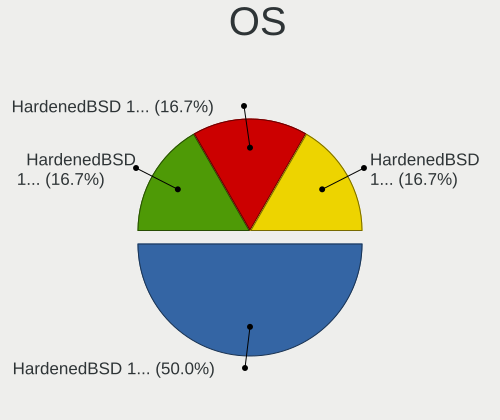

| Name                          | Desktops | Percent |
|-------------------------------|----------|---------|
| HardenedBSD 13.0-STABLE-HBSD  | 3        | 50%     |
| HardenedBSD 14.3-STABLE-HBSD  | 1        | 16.67%  |
| HardenedBSD 14.0-CURRENT-HBSD | 1        | 16.67%  |
| HardenedBSD 12.2--HBSD        | 1        | 16.67%  |

OS Family
---------

OS without a version

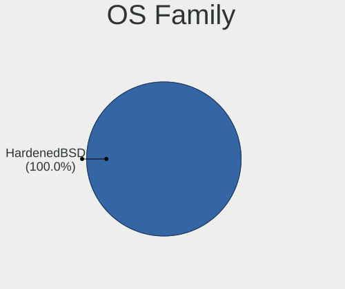

| Name        | Desktops | Percent |
|-------------|----------|---------|
| HardenedBSD | 6        | 100%    |

Arch
----

OS architecture (x86_64, i586, etc.)

| Name  | Desktops | Percent |
|-------|----------|---------|
| amd64 | 6        | 100%    |

DE
--

Desktop Environment

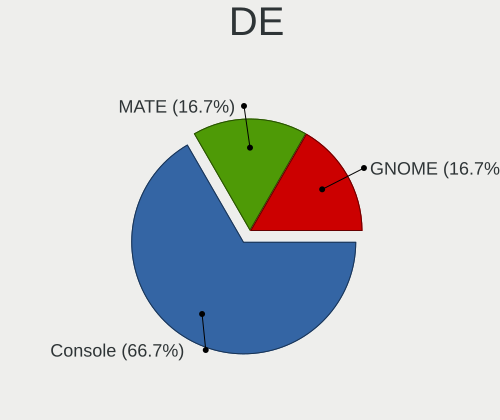

| Name    | Desktops | Percent |
|---------|----------|---------|
| Console | 4        | 66.67%  |
| MATE    | 1        | 16.67%  |
| GNOME   | 1        | 16.67%  |

Display Server
--------------

X11 or Wayland

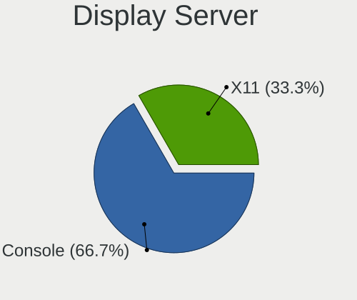

| Name    | Desktops | Percent |
|---------|----------|---------|
| Console | 4        | 66.67%  |
| X11     | 2        | 33.33%  |

Display Manager
---------------

SDDM, LightDM, etc.

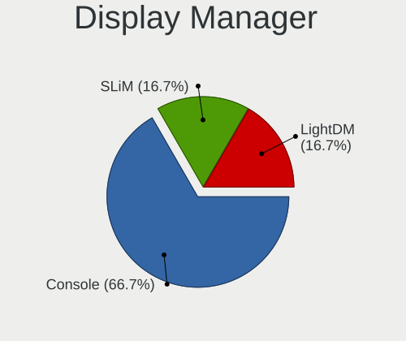

| Name    | Desktops | Percent |
|---------|----------|---------|
| Console | 4        | 66.67%  |
| SLiM    | 1        | 16.67%  |
| LightDM | 1        | 16.67%  |

OS Lang
-------

Language

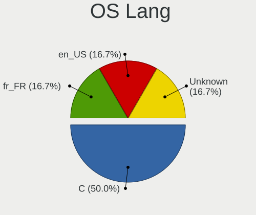

| Lang    | Desktops | Percent |
|---------|----------|---------|
| C       | 3        | 50%     |
| fr_FR   | 1        | 16.67%  |
| en_US   | 1        | 16.67%  |
| Unknown | 1        | 16.67%  |

Boot Mode
---------

EFI or BIOS

| Mode | Desktops | Percent |
|------|----------|---------|
| EFI  | 5        | 83.33%  |
| BIOS | 1        | 16.67%  |

Filesystem
----------

Type of filesystem

| Type | Desktops | Percent |
|------|----------|---------|
| Zfs  | 5        | 83.33%  |
| Ufs  | 1        | 16.67%  |

Part. scheme
------------

Scheme of partitioning

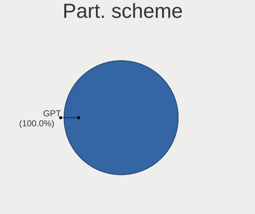

| Type | Desktops | Percent |
|------|----------|---------|
| GPT  | 6        | 100%    |

Board
-----

Vendor
------

Motherboard manufacturer

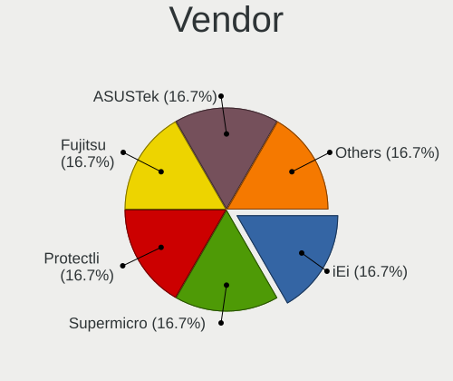

| Name             | Desktops | Percent |
|------------------|----------|---------|
| Supermicro       | 1        | 16.67%  |
| Protectli        | 1        | 16.67%  |
| iEi              | 1        | 16.67%  |
| Fujitsu          | 1        | 16.67%  |
| ASUSTek Computer | 1        | 16.67%  |
| ASRock           | 1        | 16.67%  |

Model
-----

Motherboard model

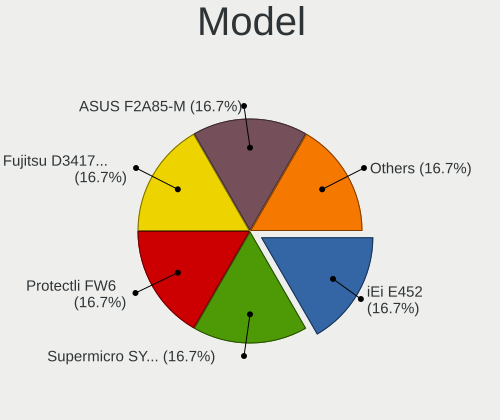

| Name                             | Desktops | Percent |
|----------------------------------|----------|---------|
| Supermicro SYS-1028U-TN10RT+     | 1        | 16.67%  |
| Protectli FW6                    | 1        | 16.67%  |
| iEi E452                         | 1        | 16.67%  |
| Fujitsu D3417-B2 S26361-D3417-B2 | 1        | 16.67%  |
| ASUS F2A85-M                     | 1        | 16.67%  |
| ASRock 990FX Extreme3            | 1        | 16.67%  |

Model Family
------------

Motherboard model prefix

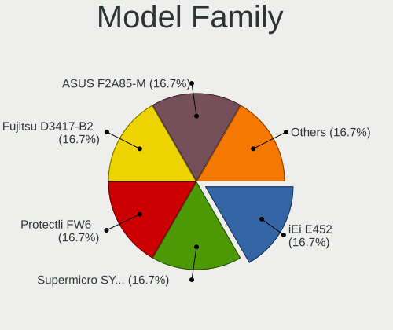

| Name                         | Desktops | Percent |
|------------------------------|----------|---------|
| Supermicro SYS-1028U-TN10RT+ | 1        | 16.67%  |
| Protectli FW6                | 1        | 16.67%  |
| iEi E452                     | 1        | 16.67%  |
| Fujitsu D3417-B2             | 1        | 16.67%  |
| ASUS F2A85-M                 | 1        | 16.67%  |
| ASRock 990FX                 | 1        | 16.67%  |

MFG Year
--------

Motherboard manufacture year

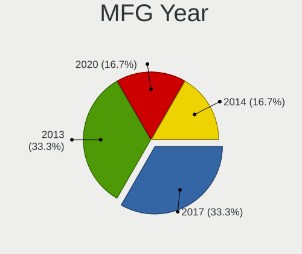

| Year | Desktops | Percent |
|------|----------|---------|
| 2017 | 2        | 33.33%  |
| 2013 | 2        | 33.33%  |
| 2020 | 1        | 16.67%  |
| 2014 | 1        | 16.67%  |

Form Factor
-----------

Physical design of the computer

| Name    | Desktops | Percent |
|---------|----------|---------|
| Desktop | 6        | 100%    |

Coreboot
--------

Have coreboot on board

| Used | Desktops | Percent |
|------|----------|---------|
| No   | 6        | 100%    |

RAM Size
--------

Total RAM memory

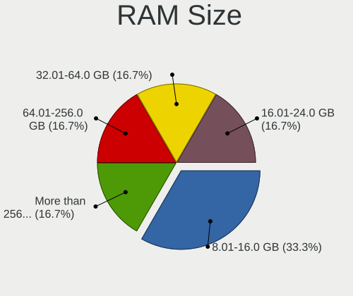

| Size in GB      | Desktops | Percent |
|-----------------|----------|---------|
| 8.01-16.0       | 2        | 33.33%  |
| More than 256.0 | 1        | 16.67%  |
| 32.01-64.0      | 1        | 16.67%  |
| 64.01-256.0     | 1        | 16.67%  |
| 16.01-24.0      | 1        | 16.67%  |

RAM Used
--------

Used RAM memory

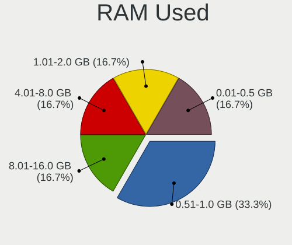

| Used GB   | Desktops | Percent |
|-----------|----------|---------|
| 0.51-1.0  | 2        | 33.33%  |
| 4.01-8.0  | 1        | 16.67%  |
| 1.01-2.0  | 1        | 16.67%  |
| 8.01-16.0 | 1        | 16.67%  |
| 0.01-0.5  | 1        | 16.67%  |

Total Drives
------------

Number of drives on board

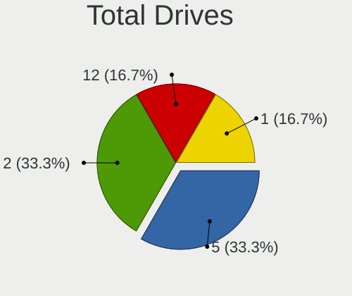

| Drives | Desktops | Percent |
|--------|----------|---------|
| 5      | 2        | 33.33%  |
| 2      | 2        | 33.33%  |
| 12     | 1        | 16.67%  |
| 1      | 1        | 16.67%  |

Has CD-ROM
----------

Has CD-ROM on board

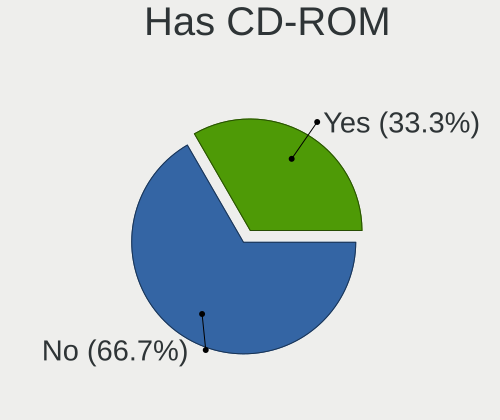

| Presented | Desktops | Percent |
|-----------|----------|---------|
| No        | 4        | 66.67%  |
| Yes       | 2        | 33.33%  |

Has Ethernet
------------

Has Ethernet on board

| Presented | Desktops | Percent |
|-----------|----------|---------|
| Yes       | 6        | 100%    |

Has WiFi
--------

Has WiFi module

| Presented | Desktops | Percent |
|-----------|----------|---------|
| No        | 6        | 100%    |

Has Bluetooth
-------------

Has Bluetooth module

| Presented | Desktops | Percent |
|-----------|----------|---------|
| No        | 6        | 100%    |

Location
--------

Country
-------

Geographic location (country)

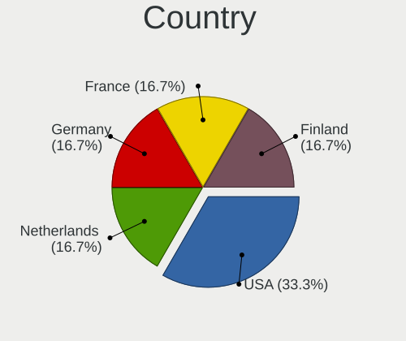

| Country     | Desktops | Percent |
|-------------|----------|---------|
| USA         | 2        | 33.33%  |
| Netherlands | 1        | 16.67%  |
| Germany     | 1        | 16.67%  |
| France      | 1        | 16.67%  |
| Finland     | 1        | 16.67%  |

City
----

Geographic location (city)

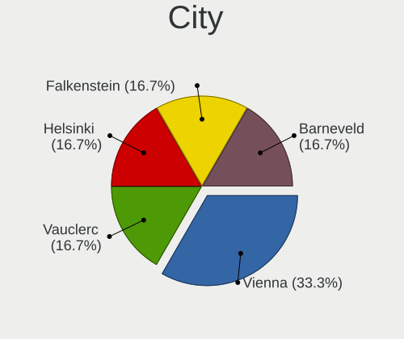

| City        | Desktops | Percent |
|-------------|----------|---------|
| Vienna      | 2        | 33.33%  |
| Vauclerc    | 1        | 16.67%  |
| Helsinki    | 1        | 16.67%  |
| Falkenstein | 1        | 16.67%  |
| Barneveld   | 1        | 16.67%  |

Drives
------

Drive Vendor
------------

Hard drive vendors

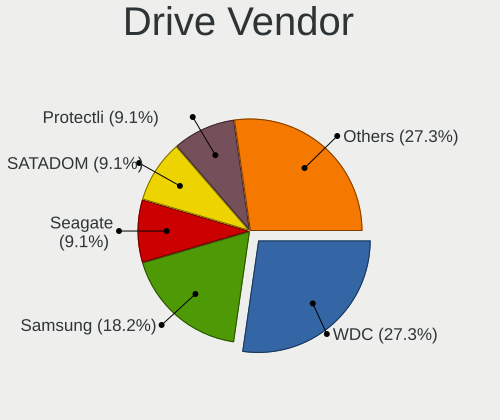

| Vendor              | Desktops | Drives | Percent |
|---------------------|----------|--------|---------|
| WDC                 | 3        | 6      | 27.27%  |
| Samsung Electronics | 2        | 6      | 18.18%  |
| Seagate             | 1        | 2      | 9.09%   |
| SATADOM             | 1        | 2      | 9.09%   |
| Protectli           | 1        | 1      | 9.09%   |
| Kingston            | 1        | 1      | 9.09%   |
| HGST                | 1        | 1      | 9.09%   |
| Hewlett-Packard     | 1        | 8      | 9.09%   |

Drive Model
-----------

Hard drive models

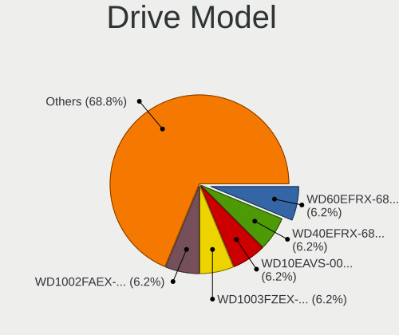

| Model                         | Desktops | Percent |
|-------------------------------|----------|---------|
| WDC WD60EFRX-68L0BN1 6TB      | 1        | 6.25%   |
| WDC WD40EFRX-68WT0N0 4TB      | 1        | 6.25%   |
| WDC WD10EAVS-00D7B0 1TB       | 1        | 6.25%   |
| WDC WD1003FZEX-00K3CA0 1TB    | 1        | 6.25%   |
| WDC WD1002FAEX-007BA0 1TB     | 1        | 6.25%   |
| Seagate XF1230-1A0480 480GB   | 1        | 6.25%   |
| SATADOM SL 3IE3 V2 64GB       | 1        | 6.25%   |
| Samsung SSD 860 EVO M.2 250GB | 1        | 6.25%   |
| Samsung HD503HI 500GB         | 1        | 6.25%   |
| Samsung HD501LJ 500GB         | 1        | 6.25%   |
| Samsung HD322GJ 320GB         | 1        | 6.25%   |
| Samsung HD256GJ 250GB         | 1        | 6.25%   |
| Protectli 64GB mSATA          | 1        | 6.25%   |
| Kingston SKC1000240G 240GB    | 1        | 6.25%   |
| HGST HTS725050A7E630 500GB    | 1        | 6.25%   |
| HP SSD EX950 512GB            | 1        | 6.25%   |

HDD Vendor
----------

Hard disk drive vendors

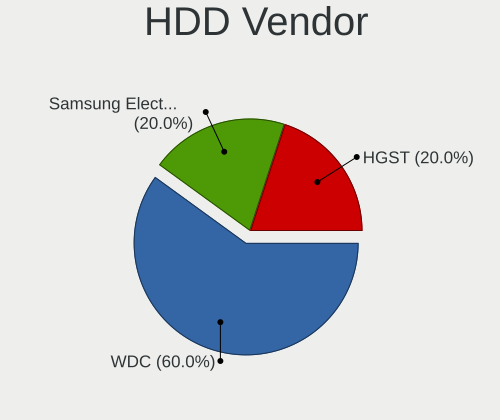

| Vendor              | Desktops | Drives | Percent |
|---------------------|----------|--------|---------|
| WDC                 | 3        | 6      | 60%     |
| Samsung Electronics | 1        | 4      | 20%     |
| HGST                | 1        | 1      | 20%     |

SSD Vendor
----------

Solid state drive vendors

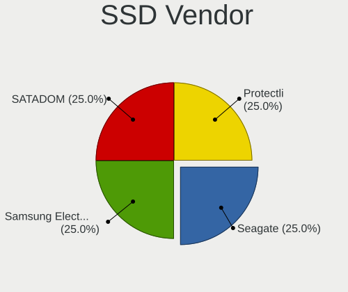

| Vendor              | Desktops | Drives | Percent |
|---------------------|----------|--------|---------|
| Seagate             | 1        | 2      | 25%     |
| SATADOM             | 1        | 2      | 25%     |
| Samsung Electronics | 1        | 2      | 25%     |
| Protectli           | 1        | 1      | 25%     |

Drive Kind
----------

HDD or SSD

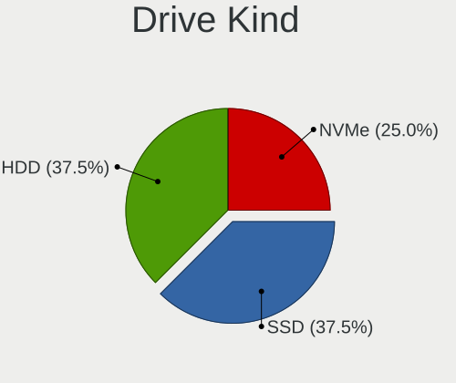

| Kind | Desktops | Drives | Percent |
|------|----------|--------|---------|
| SSD  | 3        | 7      | 37.5%   |
| HDD  | 3        | 11     | 37.5%   |
| NVMe | 2        | 9      | 25%     |

Drive Connector
---------------

SATA, SAS, NVMe, etc.

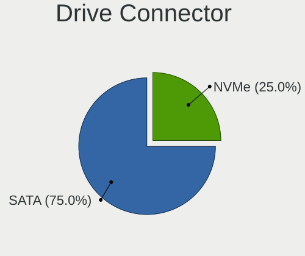

| Type | Desktops | Drives | Percent |
|------|----------|--------|---------|
| SATA | 6        | 18     | 75%     |
| NVMe | 2        | 9      | 25%     |

Drive Size
----------

Size of hard drive

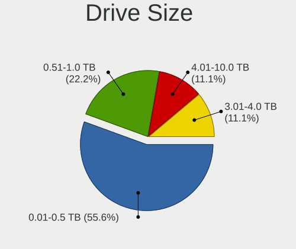

| Size in TB | Desktops | Drives | Percent |
|------------|----------|--------|---------|
| 0.01-0.5   | 5        | 12     | 55.56%  |
| 0.51-1.0   | 2        | 3      | 22.22%  |
| 3.01-4.0   | 1        | 2      | 11.11%  |
| 4.01-10.0  | 1        | 1      | 11.11%  |

Space Total
-----------

Amount of disk space available on the file system

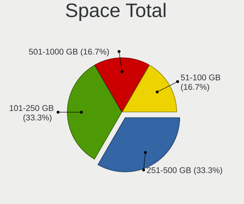

| Size in GB | Desktops | Percent |
|------------|----------|---------|
| 251-500    | 2        | 33.33%  |
| 101-250    | 2        | 33.33%  |
| 501-1000   | 1        | 16.67%  |
| 51-100     | 1        | 16.67%  |

Space Used
----------

Amount of used disk space

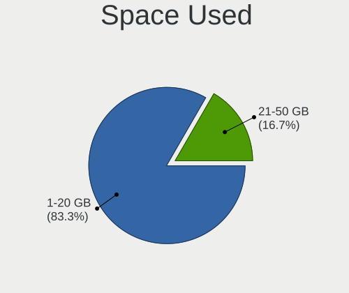

| Used GB | Desktops | Percent |
|---------|----------|---------|
| 1-20    | 5        | 83.33%  |
| 21-50   | 1        | 16.67%  |

Malfunc. Drives
---------------

Drive models with a malfunction

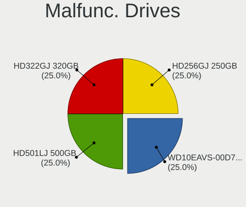

| Model                             | Desktops | Drives | Percent |
|-----------------------------------|----------|--------|---------|
| WDC WD10EAVS-00D7B0 1TB           | 1        | 1      | 25%     |
| Samsung Electronics HD501LJ 500GB | 1        | 1      | 25%     |
| Samsung Electronics HD322GJ 320GB | 1        | 1      | 25%     |
| Samsung Electronics HD256GJ 250GB | 1        | 1      | 25%     |

Malfunc. Drive Vendor
---------------------

Vendors of faulty drives

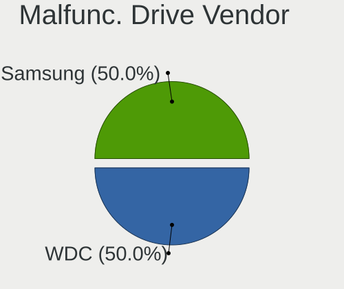

| Vendor              | Desktops | Drives | Percent |
|---------------------|----------|--------|---------|
| WDC                 | 1        | 1      | 50%     |
| Samsung Electronics | 1        | 3      | 50%     |

Malfunc. HDD Vendor
-------------------

Vendors of faulty HDD drives

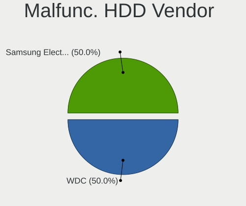

| Vendor              | Desktops | Drives | Percent |
|---------------------|----------|--------|---------|
| WDC                 | 1        | 1      | 50%     |
| Samsung Electronics | 1        | 3      | 50%     |

Malfunc. Drive Kind
-------------------

Kinds of faulty drives

| Kind | Desktops | Drives | Percent |
|------|----------|--------|---------|
| HDD  | 1        | 4      | 100%    |

Failed Drives
-------------

Failed drive models

Zero info for selected period =(

Failed Drive Vendor
-------------------

Failed drive vendors

Zero info for selected period =(

Drive Status
------------

Number of failed and malfunc. drives

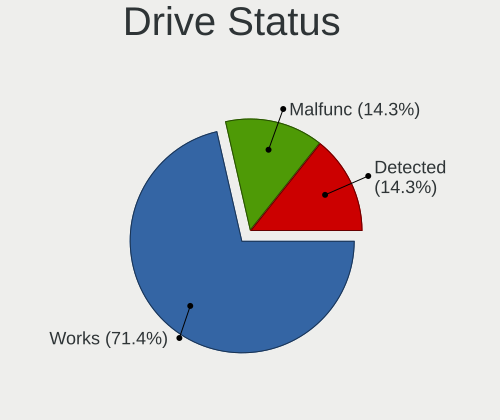

| Status   | Desktops | Drives | Percent |
|----------|----------|--------|---------|
| Works    | 5        | 21     | 71.43%  |
| Detected | 1        | 2      | 14.29%  |
| Malfunc  | 1        | 4      | 14.29%  |

Storage controller
------------------

Storage Vendor
--------------

Storage controller vendors

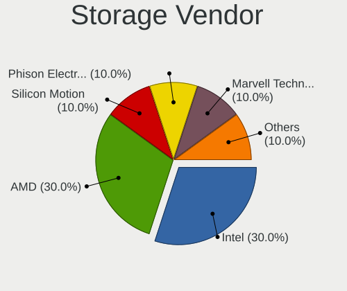

| Vendor                   | Desktops | Percent |
|--------------------------|----------|---------|
| Intel                    | 3        | 30%     |
| AMD                      | 3        | 30%     |
| Silicon Motion           | 1        | 10%     |
| Phison Electronics       | 1        | 10%     |
| Marvell Technology Group | 1        | 10%     |
| ASMedia Technology       | 1        | 10%     |

Storage Model
-------------

Storage controller models

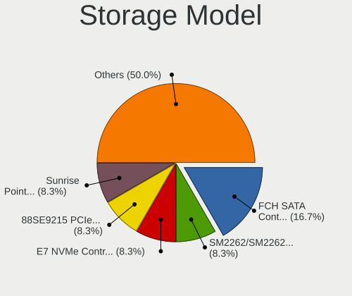

| Model                                                                         | Desktops | Percent |
|-------------------------------------------------------------------------------|----------|---------|
| AMD FCH SATA Controller [AHCI mode]                                           | 2        | 16.67%  |
| Silicon Motion SM2262/SM2262EN SSD Controller                                 | 1        | 8.33%   |
| Phison E7 NVMe Controller                                                     | 1        | 8.33%   |
| Marvell Group 88SE9215 PCIe 2.0 x1 4-port SATA 6 Gb/s Controller              | 1        | 8.33%   |
| Intel Sunrise Point-LP SATA Controller [AHCI mode]                            | 1        | 8.33%   |
| Intel Q170/Q150/B150/H170/H110/Z170/CM236 Chipset SATA Controller [AHCI Mode] | 1        | 8.33%   |
| Intel C610/X99 series chipset sSATA Controller [AHCI mode]                    | 1        | 8.33%   |
| Intel C610/X99 series chipset 6-Port SATA Controller [AHCI mode]              | 1        | 8.33%   |
| ASMedia 106x SATA/RAID Controller                                             | 1        | 8.33%   |
| AMD SB7x0/SB8x0/SB9x0 SATA Controller [IDE mode]                              | 1        | 8.33%   |
| AMD SB7x0/SB8x0/SB9x0 IDE Controller                                          | 1        | 8.33%   |

Storage Kind
------------

Kind of storage controller (IDE, SATA, NVMe, SAS, ...)

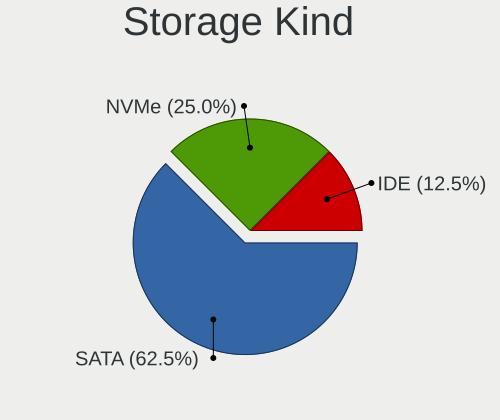

| Kind | Desktops | Percent |
|------|----------|---------|
| SATA | 5        | 62.5%   |
| NVMe | 2        | 25%     |
| IDE  | 1        | 12.5%   |

Processor
---------

CPU Vendor
----------

Processor vendors

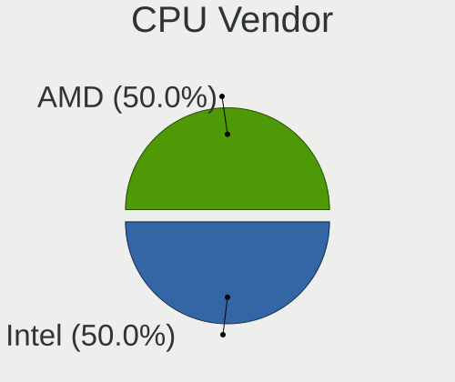

| Vendor | Desktops | Percent |
|--------|----------|---------|
| Intel  | 3        | 50%     |
| AMD    | 3        | 50%     |

CPU Model
---------

Processor models

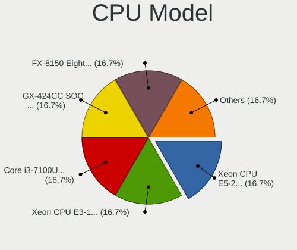

| Model                                     | Desktops | Percent |
|-------------------------------------------|----------|---------|
| Intel Xeon CPU E5-2697 v3 @ 2.60GHz       | 1        | 16.67%  |
| Intel Xeon CPU E3-1275 v5 @ 3.60GHz       | 1        | 16.67%  |
| Intel Core i3-7100U CPU @ 2.40GHz         | 1        | 16.67%  |
| AMD GX-424CC SOC with Radeon R5E Graphics | 1        | 16.67%  |
| AMD FX-8150 Eight-Core Processor          | 1        | 16.67%  |
| AMD A8-6600K APU with Radeon HD Graphics  | 1        | 16.67%  |

CPU Model Family
----------------

Processor model prefix

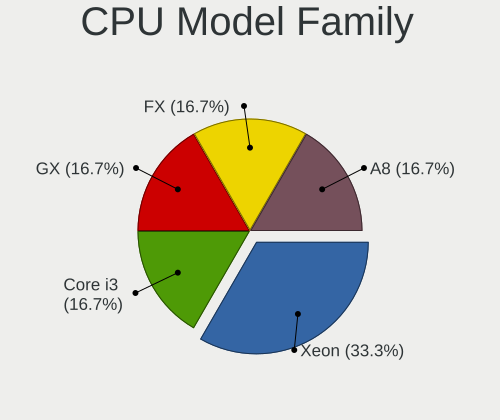

| Model         | Desktops | Percent |
|---------------|----------|---------|
| Intel Xeon    | 2        | 33.33%  |
| Intel Core i3 | 1        | 16.67%  |
| AMD GX        | 1        | 16.67%  |
| AMD FX        | 1        | 16.67%  |
| AMD A8        | 1        | 16.67%  |

CPU Cores
---------

Number of processor cores

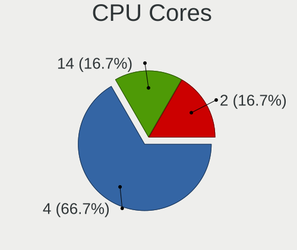

| Number | Desktops | Percent |
|--------|----------|---------|
| 4      | 4        | 66.67%  |
| 14     | 1        | 16.67%  |
| 2      | 1        | 16.67%  |

CPU Sockets
-----------

Number of sockets

| Number | Desktops | Percent |
|--------|----------|---------|
| 1      | 6        | 100%    |

CPU Threads
-----------

Threads per core (Hyper-Threading)

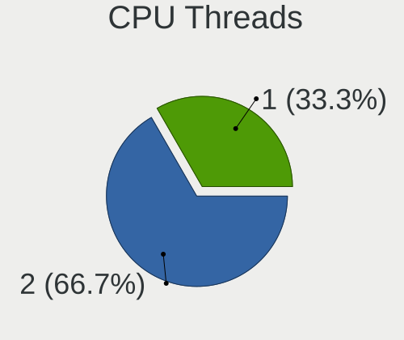

| Number | Desktops | Percent |
|--------|----------|---------|
| 2      | 4        | 66.67%  |
| 1      | 2        | 33.33%  |

CPU Microarch
-------------

Microarchitecture

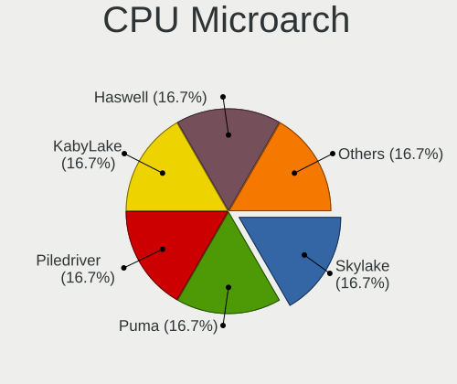

| Name       | Desktops | Percent |
|------------|----------|---------|
| Skylake    | 1        | 16.67%  |
| Puma       | 1        | 16.67%  |
| Piledriver | 1        | 16.67%  |
| KabyLake   | 1        | 16.67%  |
| Haswell    | 1        | 16.67%  |
| Bulldozer  | 1        | 16.67%  |

Graphics
--------

GPU Vendor
----------

Vendors of graphics cards

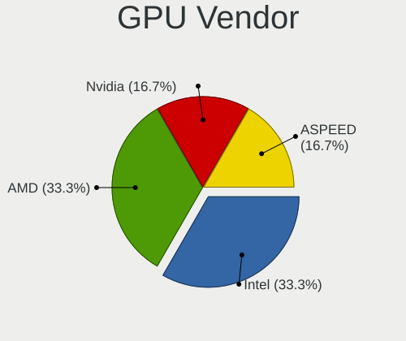

| Vendor            | Desktops | Percent |
|-------------------|----------|---------|
| Intel             | 2        | 33.33%  |
| AMD               | 2        | 33.33%  |
| Nvidia            | 1        | 16.67%  |
| ASPEED Technology | 1        | 16.67%  |

GPU Model
---------

Graphics card models

| Model                                     | Desktops | Percent |
|-------------------------------------------|----------|---------|
| Nvidia GK107 [GeForce GT 640]             | 1        | 16.67%  |
| Intel Skylake-DT/H GT2 [HD Graphics P530] | 1        | 16.67%  |
| Intel Kaby Lake-U GT2 [HD Graphics 620]   | 1        | 16.67%  |
| ASPEED Technology ASPEED Graphics Family  | 1        | 16.67%  |
| AMD Turks XT [Radeon HD 6670/7670]        | 1        | 16.67%  |
| AMD Mullins [Radeon R4/R5 Graphics]       | 1        | 16.67%  |

GPU Combo
---------

Combinations of graphics cards

| Name       | Desktops | Percent |
|------------|----------|---------|
| 1 x Intel  | 2        | 33.33%  |
| 1 x AMD    | 2        | 33.33%  |
| 1 x Nvidia | 1        | 16.67%  |
| 1 x ASPEED | 1        | 16.67%  |

GPU Driver
----------

Free vs proprietary

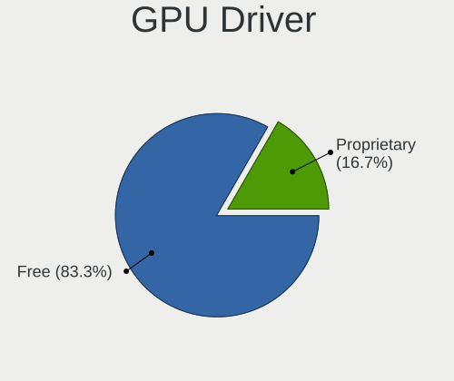

| Driver      | Desktops | Percent |
|-------------|----------|---------|
| Free        | 5        | 83.33%  |
| Proprietary | 1        | 16.67%  |

GPU Memory
----------

Total video memory

| Size in GB | Desktops | Percent |
|------------|----------|---------|
| Unknown    | 5        | 83.33%  |
| 0.51-1.0   | 1        | 16.67%  |

Monitor
-------

Monitor Vendor
--------------

Monitor vendors

Zero info for selected period =(

Monitor Model
-------------

Monitor models

Zero info for selected period =(

Monitor Resolution
------------------

Monitor screen resolution

Zero info for selected period =(

Monitor Diagonal
----------------

Diagonal size in inches

Zero info for selected period =(

Monitor Width
-------------

Physical width

Zero info for selected period =(

Aspect Ratio
------------

Proportional relationship between the width and the height

Zero info for selected period =(

Monitor Area
------------

Area in inch²

Zero info for selected period =(

Pixel Density
-------------

Pixels per inch

Zero info for selected period =(

Multiple Monitors
-----------------

Total monitors connected

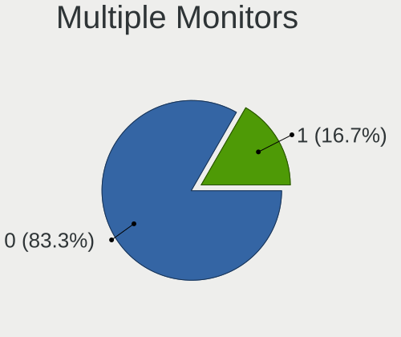

| Total | Desktops | Percent |
|-------|----------|---------|
| 0     | 5        | 83.33%  |
| 1     | 1        | 16.67%  |

Network
-------

Net Controller Vendor
---------------------

Controller vendors

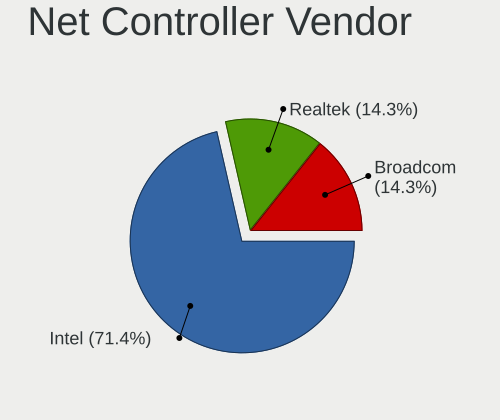

| Vendor                | Desktops | Percent |
|-----------------------|----------|---------|
| Intel                 | 5        | 71.43%  |
| Realtek Semiconductor | 1        | 14.29%  |
| Broadcom              | 1        | 14.29%  |

Net Controller Model
--------------------

Controller models

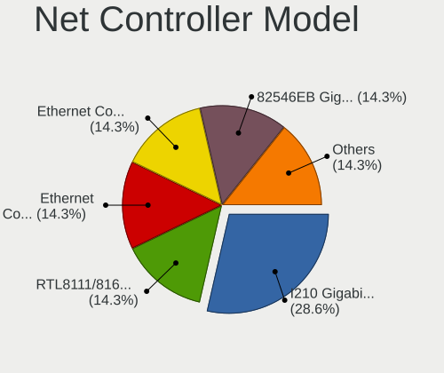

| Model                                                                  | Desktops | Percent |
|------------------------------------------------------------------------|----------|---------|
| Intel I210 Gigabit Network Connection                                  | 2        | 28.57%  |
| Realtek RTL8111/8168/8211/8411 PCI Express Gigabit Ethernet Controller | 1        | 14.29%  |
| Intel Ethernet Controller 10-Gigabit X540-AT2                          | 1        | 14.29%  |
| Intel Ethernet Connection (2) I219-LM                                  | 1        | 14.29%  |
| Intel 82546EB Gigabit Ethernet Controller (Copper)                     | 1        | 14.29%  |
| Broadcom NetLink BCM57781 Gigabit Ethernet PCIe                        | 1        | 14.29%  |

Wireless Vendor
---------------

Wireless vendors

Zero info for selected period =(

Wireless Model
--------------

Wireless models

Zero info for selected period =(

Ethernet Vendor
---------------

Ethernet vendors

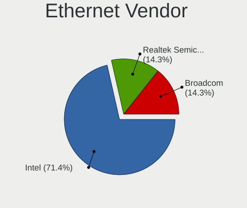

| Vendor                | Desktops | Percent |
|-----------------------|----------|---------|
| Intel                 | 5        | 71.43%  |
| Realtek Semiconductor | 1        | 14.29%  |
| Broadcom              | 1        | 14.29%  |

Ethernet Model
--------------

Ethernet models

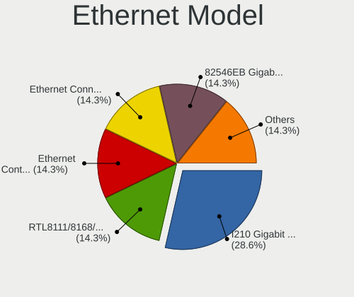

| Model                                                                  | Desktops | Percent |
|------------------------------------------------------------------------|----------|---------|
| Intel I210 Gigabit Network Connection                                  | 2        | 28.57%  |
| Realtek RTL8111/8168/8211/8411 PCI Express Gigabit Ethernet Controller | 1        | 14.29%  |
| Intel Ethernet Controller 10-Gigabit X540-AT2                          | 1        | 14.29%  |
| Intel Ethernet Connection (2) I219-LM                                  | 1        | 14.29%  |
| Intel 82546EB Gigabit Ethernet Controller (Copper)                     | 1        | 14.29%  |
| Broadcom NetLink BCM57781 Gigabit Ethernet PCIe                        | 1        | 14.29%  |

Net Controller Kind
-------------------

Ethernet, WiFi or modem

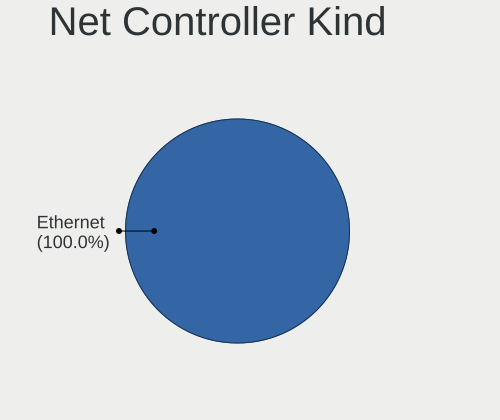

| Kind     | Desktops | Percent |
|----------|----------|---------|
| Ethernet | 6        | 100%    |

Used Controller
---------------

Currently used network controller

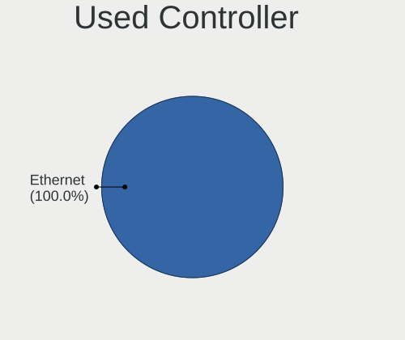

| Kind     | Desktops | Percent |
|----------|----------|---------|
| Ethernet | 6        | 100%    |

NICs
----

Total network controllers on board

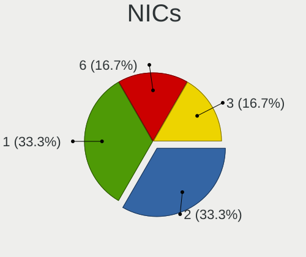

| Total | Desktops | Percent |
|-------|----------|---------|
| 2     | 2        | 33.33%  |
| 1     | 2        | 33.33%  |
| 6     | 1        | 16.67%  |
| 3     | 1        | 16.67%  |

IPv6
----

IPv6 vs IPv4

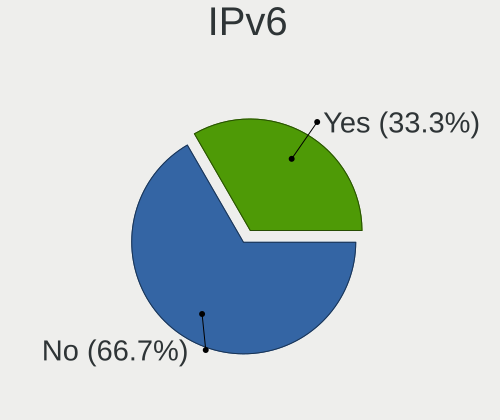

| Used | Desktops | Percent |
|------|----------|---------|
| No   | 4        | 66.67%  |
| Yes  | 2        | 33.33%  |

Bluetooth
---------

Bluetooth Vendor
----------------

Controller vendors

Zero info for selected period =(

Bluetooth Model
---------------

Controller models

Zero info for selected period =(

Sound
-----

Sound Vendor
------------

Sound card vendors

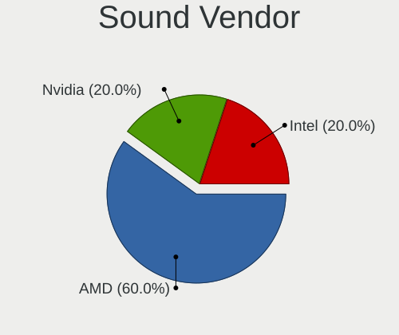

| Vendor | Desktops | Percent |
|--------|----------|---------|
| AMD    | 3        | 60%     |
| Nvidia | 1        | 20%     |
| Intel  | 1        | 20%     |

Sound Model
-----------

Sound card models

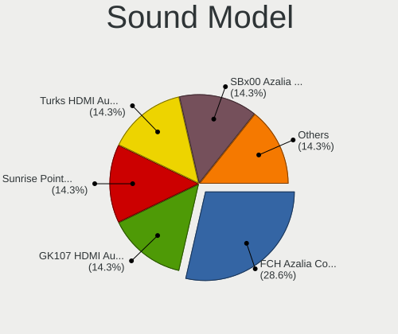

| Model                                                     | Desktops | Percent |
|-----------------------------------------------------------|----------|---------|
| AMD FCH Azalia Controller                                 | 2        | 28.57%  |
| Nvidia GK107 HDMI Audio Controller                        | 1        | 14.29%  |
| Intel Sunrise Point-LP HD Audio                           | 1        | 14.29%  |
| AMD Turks HDMI Audio [Radeon HD 6500/6600 / 6700M Series] | 1        | 14.29%  |
| AMD SBx00 Azalia (Intel HDA)                              | 1        | 14.29%  |
| AMD Kabini HDMI/DP Audio                                  | 1        | 14.29%  |

Memory
------

Memory Vendor
-------------

Memory module vendors

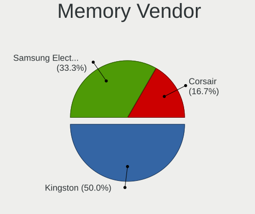

| Vendor              | Desktops | Percent |
|---------------------|----------|---------|
| Kingston            | 3        | 50%     |
| Samsung Electronics | 2        | 33.33%  |
| Corsair             | 1        | 16.67%  |

Memory Model
------------

Memory module models

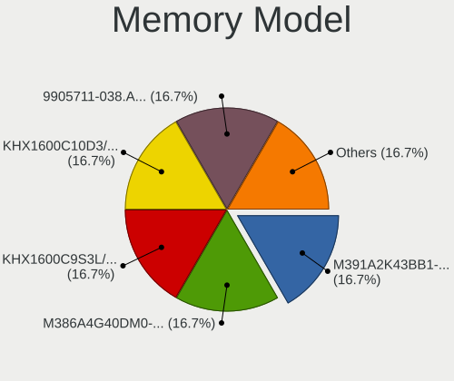

| Model                                                  | Desktops | Percent |
|--------------------------------------------------------|----------|---------|
| Samsung RAM M391A2K43BB1-CPB 16GB DIMM DDR4 2133MT/s   | 1        | 16.67%  |
| Samsung RAM M386A4G40DM0-CPB 32GB DIMM DDR4 2133MT/s   | 1        | 16.67%  |
| Kingston RAM KHX1600C9S3L/8G 8GB SODIMM DDR3 1600MT/s  | 1        | 16.67%  |
| Kingston RAM KHX1600C10D3/8GX 8GB DIMM DDR3 1600MT/s   | 1        | 16.67%  |
| Kingston RAM 9905711-038.A00G 8GB SODIMM DDR4 2667MT/s | 1        | 16.67%  |
| Corsair RAM CMV4GX3M1A1333C9 4GB DIMM DDR3 1333MT/s    | 1        | 16.67%  |

Memory Kind
-----------

Memory module kinds

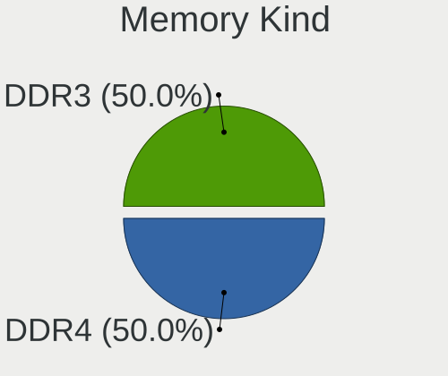

| Kind | Desktops | Percent |
|------|----------|---------|
| DDR4 | 3        | 50%     |
| DDR3 | 3        | 50%     |

Memory Form Factor
------------------

Physical design of the memory module

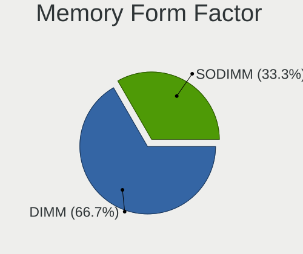

| Name   | Desktops | Percent |
|--------|----------|---------|
| DIMM   | 4        | 66.67%  |
| SODIMM | 2        | 33.33%  |

Memory Size
-----------

Memory module size

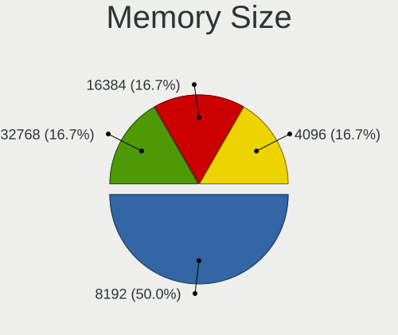

| Size  | Desktops | Percent |
|-------|----------|---------|
| 8192  | 3        | 50%     |
| 32768 | 1        | 16.67%  |
| 16384 | 1        | 16.67%  |
| 4096  | 1        | 16.67%  |

Memory Speed
------------

Memory module speed

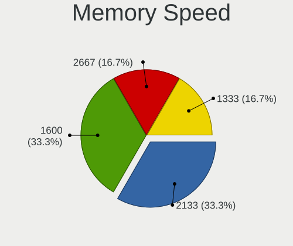

| Speed | Desktops | Percent |
|-------|----------|---------|
| 2133  | 2        | 33.33%  |
| 1600  | 2        | 33.33%  |
| 2667  | 1        | 16.67%  |
| 1333  | 1        | 16.67%  |

Printers & scanners
-------------------

Printer Vendor
--------------

Printer device vendors

Zero info for selected period =(

Printer Model
-------------

Printer device models

Zero info for selected period =(

Scanner Vendor
--------------

Scanner device vendors

Zero info for selected period =(

Scanner Model
-------------

Scanner device models

Zero info for selected period =(

Camera
------

Camera Vendor
-------------

Camera device vendors

Zero info for selected period =(

Camera Model
------------

Camera device models

Zero info for selected period =(

Security
--------

Fingerprint Vendor
------------------

Fingerprint sensor vendors

Zero info for selected period =(

Fingerprint Model
-----------------

Fingerprint sensor models

Zero info for selected period =(

Chipcard Vendor
---------------

Chipcard module vendors

Zero info for selected period =(

Chipcard Model
--------------

Chipcard module models

Zero info for selected period =(

Unsupported
-----------

Unsupported Devices
-------------------

Total unsupported devices on board

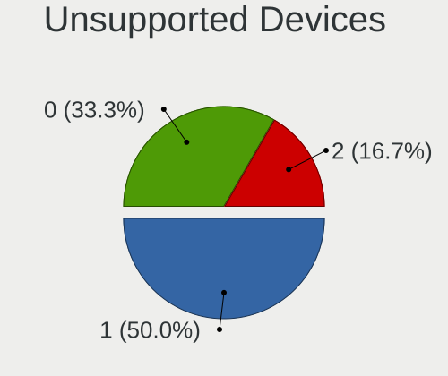

| Total | Desktops | Percent |
|-------|----------|---------|
| 1     | 3        | 50%     |
| 0     | 2        | 33.33%  |
| 2     | 1        | 16.67%  |

Unsupported Device Types
------------------------

Types of unsupported devices

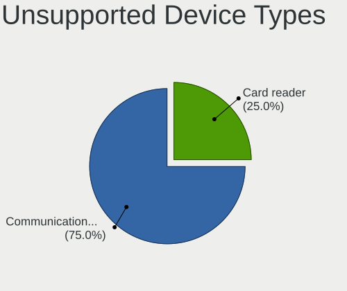

| Type                     | Desktops | Percent |
|--------------------------|----------|---------|
| Communication controller | 3        | 75%     |
| Card reader              | 1        | 25%     |

