HardenedBSD - Tested Hardware & Statistics (Notebooks)
------------------------------------------------------

A project to collect tested hardware configurations for HardenedBSD.

Anyone can contribute to this report by the [hw-probe](https://github.com/linuxhw/hw-probe/blob/master/INSTALL.BSD.md) tool:

    hw-probe -all -upload

Please contribute! Especially if your hardware is rare.

Contents
--------

* [ Test Cases ](#test-cases)

* [ System ](#system)
  - [ OS                       ](#os)
  - [ OS Family                ](#os-family)
  - [ Arch                     ](#arch)
  - [ DE                       ](#de)
  - [ Display Server           ](#display-server)
  - [ Display Manager          ](#display-manager)
  - [ OS Lang                  ](#os-lang)
  - [ Boot Mode                ](#boot-mode)
  - [ Filesystem               ](#filesystem)
  - [ Part. scheme             ](#part-scheme)

* [ Board ](#board)
  - [ Vendor                   ](#vendor)
  - [ Model                    ](#model)
  - [ Model Family             ](#model-family)
  - [ MFG Year                 ](#mfg-year)
  - [ Form Factor              ](#form-factor)
  - [ Coreboot                 ](#coreboot)
  - [ RAM Size                 ](#ram-size)
  - [ RAM Used                 ](#ram-used)
  - [ Total Drives             ](#total-drives)
  - [ Has CD-ROM               ](#has-cd-rom)
  - [ Has Ethernet             ](#has-ethernet)
  - [ Has WiFi                 ](#has-wifi)
  - [ Has Bluetooth            ](#has-bluetooth)

* [ Location ](#location)
  - [ Country                  ](#country)
  - [ City                     ](#city)

* [ Drives ](#drives)
  - [ Drive Vendor             ](#drive-vendor)
  - [ Drive Model              ](#drive-model)
  - [ HDD Vendor               ](#hdd-vendor)
  - [ SSD Vendor               ](#ssd-vendor)
  - [ Drive Kind               ](#drive-kind)
  - [ Drive Connector          ](#drive-connector)
  - [ Drive Size               ](#drive-size)
  - [ Space Total              ](#space-total)
  - [ Space Used               ](#space-used)
  - [ Malfunc. Drives          ](#malfunc-drives)
  - [ Malfunc. Drive Vendor    ](#malfunc-drive-vendor)
  - [ Malfunc. HDD Vendor      ](#malfunc-hdd-vendor)
  - [ Malfunc. Drive Kind      ](#malfunc-drive-kind)
  - [ Failed Drives            ](#failed-drives)
  - [ Failed Drive Vendor      ](#failed-drive-vendor)
  - [ Drive Status             ](#drive-status)

* [ Storage controller ](#storage-controller)
  - [ Storage Vendor           ](#storage-vendor)
  - [ Storage Model            ](#storage-model)
  - [ Storage Kind             ](#storage-kind)

* [ Processor ](#processor)
  - [ CPU Vendor               ](#cpu-vendor)
  - [ CPU Model                ](#cpu-model)
  - [ CPU Model Family         ](#cpu-model-family)
  - [ CPU Cores                ](#cpu-cores)
  - [ CPU Sockets              ](#cpu-sockets)
  - [ CPU Threads              ](#cpu-threads)
  - [ CPU Microarch            ](#cpu-microarch)

* [ Graphics ](#graphics)
  - [ GPU Vendor               ](#gpu-vendor)
  - [ GPU Model                ](#gpu-model)
  - [ GPU Combo                ](#gpu-combo)
  - [ GPU Driver               ](#gpu-driver)
  - [ GPU Memory               ](#gpu-memory)

* [ Monitor ](#monitor)
  - [ Monitor Vendor           ](#monitor-vendor)
  - [ Monitor Model            ](#monitor-model)
  - [ Monitor Resolution       ](#monitor-resolution)
  - [ Monitor Diagonal         ](#monitor-diagonal)
  - [ Monitor Width            ](#monitor-width)
  - [ Aspect Ratio             ](#aspect-ratio)
  - [ Monitor Area             ](#monitor-area)
  - [ Pixel Density            ](#pixel-density)
  - [ Multiple Monitors        ](#multiple-monitors)

* [ Network ](#network)
  - [ Net Controller Vendor    ](#net-controller-vendor)
  - [ Net Controller Model     ](#net-controller-model)
  - [ Wireless Vendor          ](#wireless-vendor)
  - [ Wireless Model           ](#wireless-model)
  - [ Ethernet Vendor          ](#ethernet-vendor)
  - [ Ethernet Model           ](#ethernet-model)
  - [ Net Controller Kind      ](#net-controller-kind)
  - [ Used Controller          ](#used-controller)
  - [ NICs                     ](#nics)
  - [ IPv6                     ](#ipv6)

* [ Bluetooth ](#bluetooth)
  - [ Bluetooth Vendor         ](#bluetooth-vendor)
  - [ Bluetooth Model          ](#bluetooth-model)

* [ Sound ](#sound)
  - [ Sound Vendor             ](#sound-vendor)
  - [ Sound Model              ](#sound-model)

* [ Memory ](#memory)
  - [ Memory Vendor            ](#memory-vendor)
  - [ Memory Model             ](#memory-model)
  - [ Memory Kind              ](#memory-kind)
  - [ Memory Form Factor       ](#memory-form-factor)
  - [ Memory Size              ](#memory-size)
  - [ Memory Speed             ](#memory-speed)

* [ Printers & scanners ](#printers--scanners)
  - [ Printer Vendor           ](#printer-vendor)
  - [ Printer Model            ](#printer-model)
  - [ Scanner Vendor           ](#scanner-vendor)
  - [ Scanner Model            ](#scanner-model)

* [ Camera ](#camera)
  - [ Camera Vendor            ](#camera-vendor)
  - [ Camera Model             ](#camera-model)

* [ Security ](#security)
  - [ Fingerprint Vendor       ](#fingerprint-vendor)
  - [ Fingerprint Model        ](#fingerprint-model)
  - [ Chipcard Vendor          ](#chipcard-vendor)
  - [ Chipcard Model           ](#chipcard-model)

* [ Unsupported ](#unsupported)
  - [ Unsupported Devices      ](#unsupported-devices)
  - [ Unsupported Device Types ](#unsupported-device-types)

Test Cases
----------

Total: 11

| Vendor    | Model                       | Probe                                                     | Date         |
|-----------|-----------------------------|-----------------------------------------------------------|--------------|
| Framework | Laptop 16 (AMD Ryzen 704... | [ebaa050586](https://bsd-hardware.info/?probe=ebaa050586) | Dec 06, 2024 |
| Dell      | Precision M4800             | [437d5c965b](https://bsd-hardware.info/?probe=437d5c965b) | Nov 15, 2024 |
| Dell      | Precision M4800             | [b586c78d26](https://bsd-hardware.info/?probe=b586c78d26) | Nov 15, 2024 |
| Apple     | MacBookPro10,1              | [1a3d253769](https://bsd-hardware.info/?probe=1a3d253769) | Oct 12, 2021 |
| Lenovo    | ThinkPad T410 2518C5U       | [e937639adc](https://bsd-hardware.info/?probe=e937639adc) | Sep 25, 2021 |
| Sony      | VPCCB17FG                   | [a69fa2363e](https://bsd-hardware.info/?probe=a69fa2363e) | Dec 24, 2020 |
| Lenovo    | ThinkPad X240 20AMS0RR00    | [0f9b8d2e3b](https://bsd-hardware.info/?probe=0f9b8d2e3b) | Dec 22, 2020 |
| Dell      | Precision 7550              | [9983a81086](https://bsd-hardware.info/?probe=9983a81086) | Jul 10, 2020 |
| Lenovo    | ThinkPad P51 20HH001RMX     | [81efa4b3d3](https://bsd-hardware.info/?probe=81efa4b3d3) | May 25, 2020 |
| Dell      | Precision 7540              | [aa891d8f27](https://bsd-hardware.info/?probe=aa891d8f27) | May 22, 2020 |
| ASUSTek   | X71SL                       | [ab5297a63d](https://bsd-hardware.info/?probe=ab5297a63d) | May 07, 2020 |

System
------

OS
--

Installed operating systems

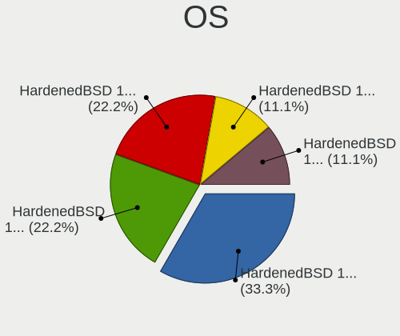

| Name                          | Notebooks | Percent |
|-------------------------------|-----------|---------|
| HardenedBSD 13.0-CURRENT-HBSD | 3         | 33.33%  |
| HardenedBSD 14.2-STABLE-HBSD  | 2         | 22.22%  |
| HardenedBSD 13.0-STABLE-HBSD  | 2         | 22.22%  |
| HardenedBSD 12.2--HBSD        | 1         | 11.11%  |
| HardenedBSD 12.1--HBSD        | 1         | 11.11%  |

OS Family
---------

OS without a version

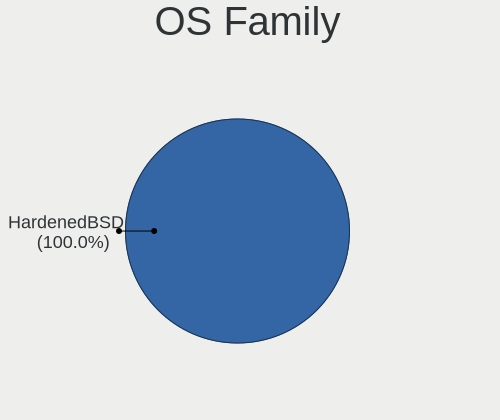

| Name        | Notebooks | Percent |
|-------------|-----------|---------|
| HardenedBSD | 9         | 100%    |

Arch
----

OS architecture (x86_64, i586, etc.)

| Name  | Notebooks | Percent |
|-------|-----------|---------|
| amd64 | 9         | 100%    |

DE
--

Desktop Environment

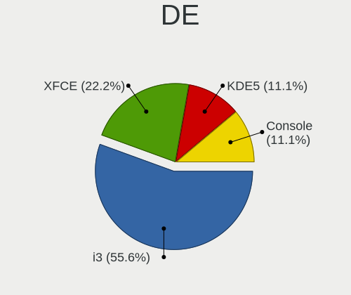

| Name    | Notebooks | Percent |
|---------|-----------|---------|
| i3      | 5         | 55.56%  |
| XFCE    | 2         | 22.22%  |
| KDE5    | 1         | 11.11%  |
| Console | 1         | 11.11%  |

Display Server
--------------

X11 or Wayland

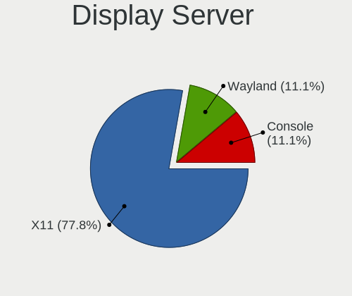

| Name    | Notebooks | Percent |
|---------|-----------|---------|
| X11     | 7         | 77.78%  |
| Wayland | 1         | 11.11%  |
| Console | 1         | 11.11%  |

Display Manager
---------------

SDDM, LightDM, etc.

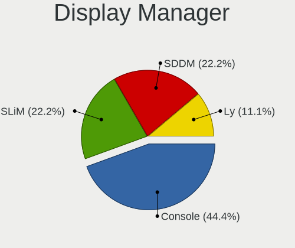

| Name    | Notebooks | Percent |
|---------|-----------|---------|
| Console | 4         | 44.44%  |
| SLiM    | 2         | 22.22%  |
| SDDM    | 2         | 22.22%  |
| Ly      | 1         | 11.11%  |

OS Lang
-------

Language

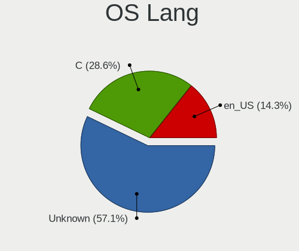

| Lang    | Notebooks | Percent |
|---------|-----------|---------|
| C       | 4         | 44.44%  |
| Unknown | 4         | 44.44%  |
| en_US   | 1         | 11.11%  |

Boot Mode
---------

EFI or BIOS

| Mode | Notebooks | Percent |
|------|-----------|---------|
| EFI  | 9         | 100%    |

Filesystem
----------

Type of filesystem

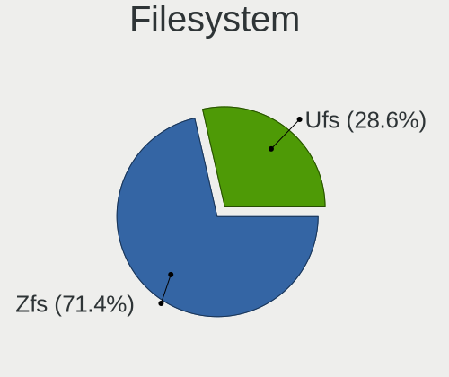

| Type | Notebooks | Percent |
|------|-----------|---------|
| Zfs  | 7         | 77.78%  |
| Ufs  | 2         | 22.22%  |

Part. scheme
------------

Scheme of partitioning

| Type | Notebooks | Percent |
|------|-----------|---------|
| GPT  | 9         | 100%    |

Board
-----

Vendor
------

Motherboard manufacturer

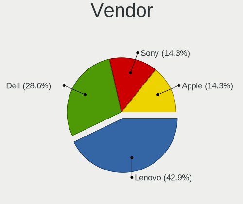

| Name      | Notebooks | Percent |
|-----------|-----------|---------|
| Lenovo    | 3         | 33.33%  |
| Dell      | 3         | 33.33%  |
| Sony      | 1         | 11.11%  |
| Framework | 1         | 11.11%  |
| Apple     | 1         | 11.11%  |

Model
-----

Motherboard model

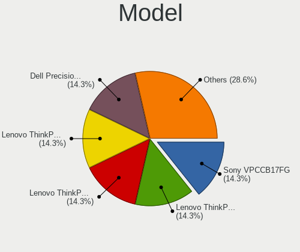

| Name                                        | Notebooks | Percent |
|---------------------------------------------|-----------|---------|
| Sony VPCCB17FG                              | 1         | 11.11%  |
| Lenovo ThinkPad X240 20AMS0RR00             | 1         | 11.11%  |
| Lenovo ThinkPad T410 2518C5U                | 1         | 11.11%  |
| Lenovo ThinkPad P51 20HH001RMX              | 1         | 11.11%  |
| Framework Laptop 16 (AMD Ryzen 7040 Series) | 1         | 11.11%  |
| Dell Precision M4800                        | 1         | 11.11%  |
| Dell Precision 7550                         | 1         | 11.11%  |
| Dell Precision 7540                         | 1         | 11.11%  |
| Apple MacBookPro10,1                        | 1         | 11.11%  |

Model Family
------------

Motherboard model prefix

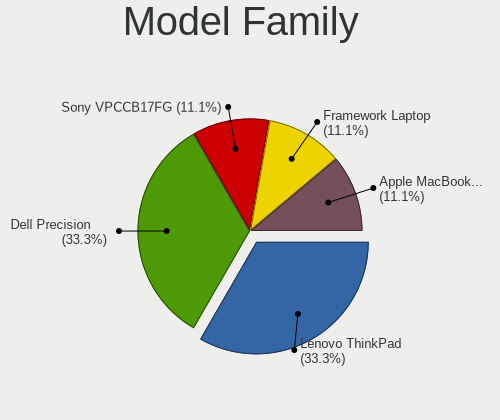

| Name               | Notebooks | Percent |
|--------------------|-----------|---------|
| Lenovo ThinkPad    | 3         | 33.33%  |
| Dell Precision     | 3         | 33.33%  |
| Sony VPCCB17FG     | 1         | 11.11%  |
| Framework Laptop   | 1         | 11.11%  |
| Apple MacBookPro10 | 1         | 11.11%  |

MFG Year
--------

Motherboard manufacture year

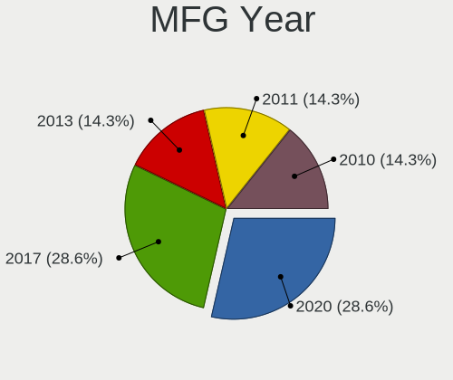

| Year | Notebooks | Percent |
|------|-----------|---------|
| 2020 | 2         | 22.22%  |
| 2017 | 2         | 22.22%  |
| 2024 | 1         | 11.11%  |
| 2015 | 1         | 11.11%  |
| 2013 | 1         | 11.11%  |
| 2011 | 1         | 11.11%  |
| 2010 | 1         | 11.11%  |

Form Factor
-----------

Physical design of the computer

| Name     | Notebooks | Percent |
|----------|-----------|---------|
| Notebook | 9         | 100%    |

Coreboot
--------

Have coreboot on board

| Used | Notebooks | Percent |
|------|-----------|---------|
| No   | 9         | 100%    |

RAM Size
--------

Total RAM memory

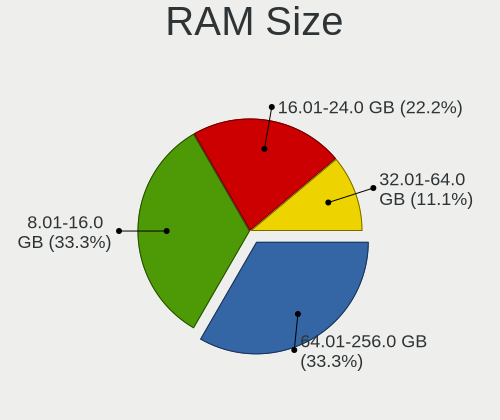

| Size in GB  | Notebooks | Percent |
|-------------|-----------|---------|
| 64.01-256.0 | 3         | 33.33%  |
| 8.01-16.0   | 3         | 33.33%  |
| 16.01-24.0  | 2         | 22.22%  |
| 32.01-64.0  | 1         | 11.11%  |

RAM Used
--------

Used RAM memory

| Used GB     | Notebooks | Percent |
|-------------|-----------|---------|
| 0.01-0.5    | 3         | 33.33%  |
| 4.01-8.0    | 2         | 22.22%  |
| 0.51-1.0    | 2         | 22.22%  |
| 2.01-3.0    | 1         | 11.11%  |
| 64.01-256.0 | 1         | 11.11%  |

Total Drives
------------

Number of drives on board

| Drives | Notebooks | Percent |
|--------|-----------|---------|
| 1      | 6         | 66.67%  |
| 0      | 3         | 33.33%  |

Has CD-ROM
----------

Has CD-ROM on board

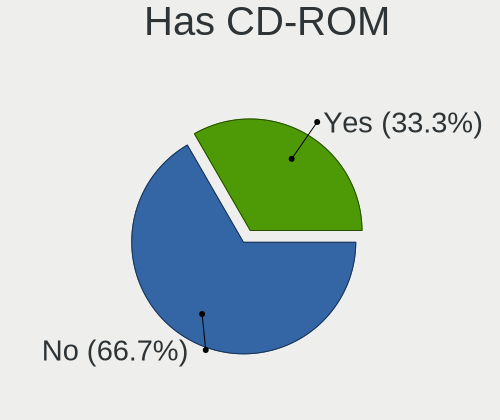

| Presented | Notebooks | Percent |
|-----------|-----------|---------|
| No        | 6         | 66.67%  |
| Yes       | 3         | 33.33%  |

Has Ethernet
------------

Has Ethernet on board

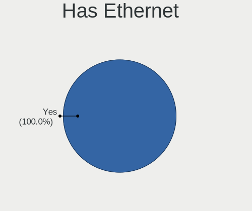

| Presented | Notebooks | Percent |
|-----------|-----------|---------|
| Yes       | 9         | 100%    |

Has WiFi
--------

Has WiFi module

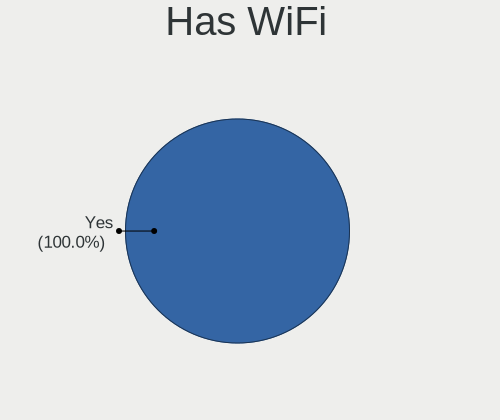

| Presented | Notebooks | Percent |
|-----------|-----------|---------|
| Yes       | 9         | 100%    |

Has Bluetooth
-------------

Has Bluetooth module

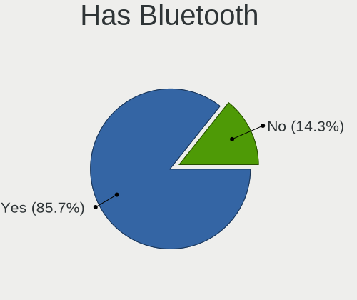

| Presented | Notebooks | Percent |
|-----------|-----------|---------|
| Yes       | 8         | 88.89%  |
| No        | 1         | 11.11%  |

Location
--------

Country
-------

Geographic location (country)

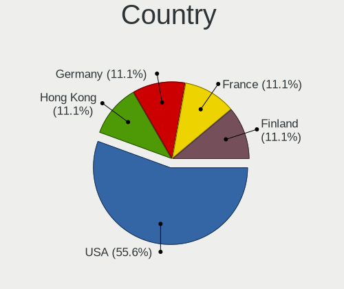

| Country   | Notebooks | Percent |
|-----------|-----------|---------|
| USA       | 5         | 55.56%  |
| Hong Kong | 1         | 11.11%  |
| Germany   | 1         | 11.11%  |
| France    | 1         | 11.11%  |
| Finland   | 1         | 11.11%  |

City
----

Geographic location (city)

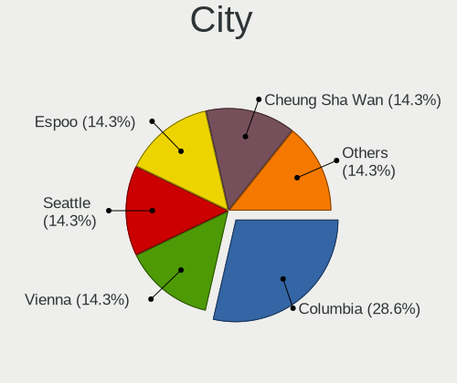

| City           | Notebooks | Percent |
|----------------|-----------|---------|
| Columbia       | 2         | 22.22%  |
| Vienna         | 1         | 11.11%  |
| Seattle        | 1         | 11.11%  |
| Nanterre       | 1         | 11.11%  |
| Espoo          | 1         | 11.11%  |
| Denver         | 1         | 11.11%  |
| Cheung Sha Wan | 1         | 11.11%  |
| Ahrensburg     | 1         | 11.11%  |

Drives
------

Drive Vendor
------------

Hard drive vendors

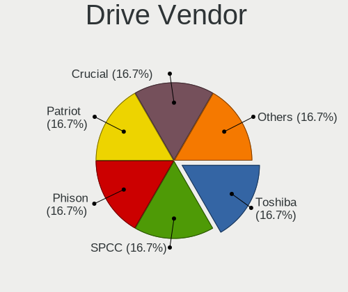

| Vendor  | Notebooks | Drives | Percent |
|---------|-----------|--------|---------|
| Toshiba | 1         | 1      | 16.67%  |
| SPCC    | 1         | 1      | 16.67%  |
| Phison  | 1         | 1      | 16.67%  |
| Patriot | 1         | 1      | 16.67%  |
| Crucial | 1         | 1      | 16.67%  |
| Apple   | 1         | 1      | 16.67%  |

Drive Model
-----------

Hard drive models

| Model                                   | Notebooks | Percent |
|-----------------------------------------|-----------|---------|
| Toshiba KXG60PNV2T04 NVMe KIOXIA 2048GB | 1         | 16.67%  |
| SPCC Solid State Disk 128GB             | 1         | 16.67%  |
| Phison SATA SSD 1TB                     | 1         | 16.67%  |
| Patriot P210 512GB                      | 1         | 16.67%  |
| Crucial CT240BX500SSD1 240GB            | 1         | 16.67%  |
| Apple SSD SD512E 500GB                  | 1         | 16.67%  |

HDD Vendor
----------

Hard disk drive vendors

Zero info for selected period =(

SSD Vendor
----------

Solid state drive vendors

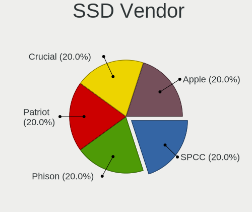

| Vendor  | Notebooks | Drives | Percent |
|---------|-----------|--------|---------|
| SPCC    | 1         | 1      | 20%     |
| Phison  | 1         | 1      | 20%     |
| Patriot | 1         | 1      | 20%     |
| Crucial | 1         | 1      | 20%     |
| Apple   | 1         | 1      | 20%     |

Drive Kind
----------

HDD or SSD

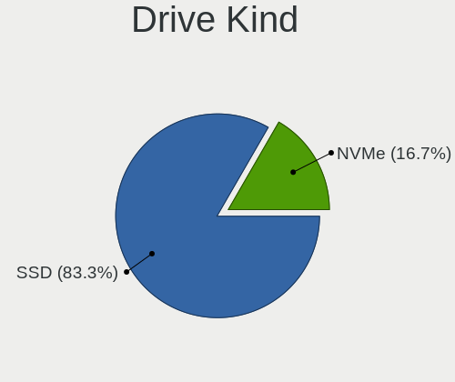

| Kind | Notebooks | Drives | Percent |
|------|-----------|--------|---------|
| SSD  | 5         | 5      | 83.33%  |
| NVMe | 1         | 1      | 16.67%  |

Drive Connector
---------------

SATA, SAS, NVMe, etc.

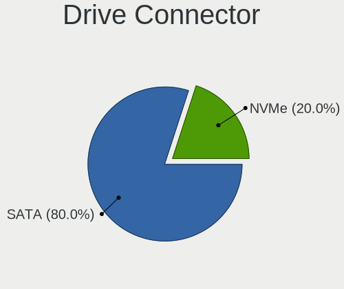

| Type | Notebooks | Drives | Percent |
|------|-----------|--------|---------|
| SATA | 5         | 5      | 83.33%  |
| NVMe | 1         | 1      | 16.67%  |

Drive Size
----------

Size of hard drive

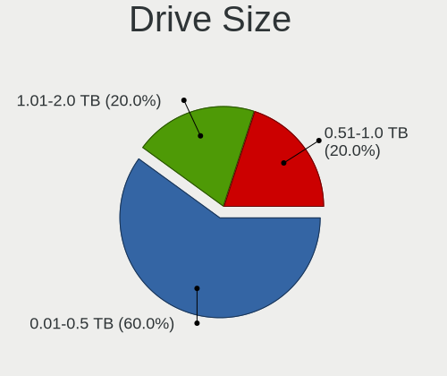

| Size in TB | Notebooks | Drives | Percent |
|------------|-----------|--------|---------|
| 0.01-0.5   | 3         | 3      | 60%     |
| 1.01-2.0   | 1         | 1      | 20%     |
| 0.51-1.0   | 1         | 1      | 20%     |

Space Total
-----------

Amount of disk space available on the file system

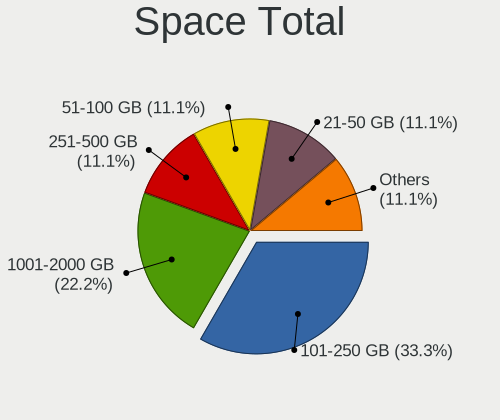

| Size in GB | Notebooks | Percent |
|------------|-----------|---------|
| 101-250    | 3         | 33.33%  |
| 1001-2000  | 2         | 22.22%  |
| 251-500    | 1         | 11.11%  |
| 21-50      | 1         | 11.11%  |
| 1-20       | 1         | 11.11%  |
| 51-100     | 1         | 11.11%  |

Space Used
----------

Amount of used disk space

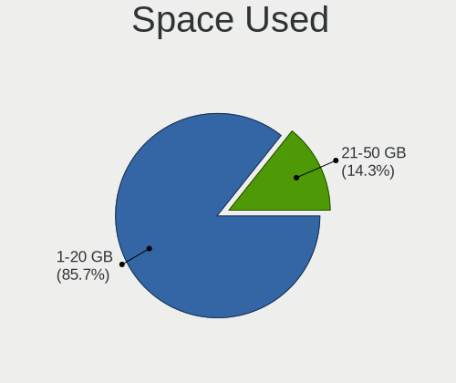

| Used GB | Notebooks | Percent |
|---------|-----------|---------|
| 1-20    | 8         | 88.89%  |
| 21-50   | 1         | 11.11%  |

Malfunc. Drives
---------------

Drive models with a malfunction

Zero info for selected period =(

Malfunc. Drive Vendor
---------------------

Vendors of faulty drives

Zero info for selected period =(

Malfunc. HDD Vendor
-------------------

Vendors of faulty HDD drives

Zero info for selected period =(

Malfunc. Drive Kind
-------------------

Kinds of faulty drives

Zero info for selected period =(

Failed Drives
-------------

Failed drive models

Zero info for selected period =(

Failed Drive Vendor
-------------------

Failed drive vendors

Zero info for selected period =(

Drive Status
------------

Number of failed and malfunc. drives

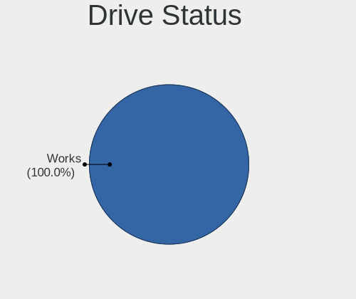

| Status | Notebooks | Drives | Percent |
|--------|-----------|--------|---------|
| Works  | 6         | 6      | 100%    |

Storage controller
------------------

Storage Vendor
--------------

Storage controller vendors

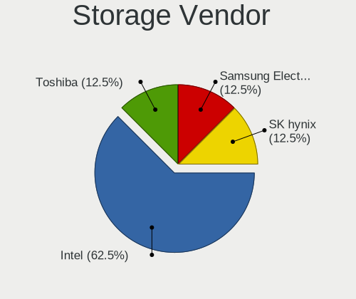

| Vendor              | Notebooks | Percent |
|---------------------|-----------|---------|
| Intel               | 6         | 60%     |
| Toshiba             | 1         | 10%     |
| SK hynix            | 1         | 10%     |
| Sandisk             | 1         | 10%     |
| Samsung Electronics | 1         | 10%     |

Storage Model
-------------

Storage controller models

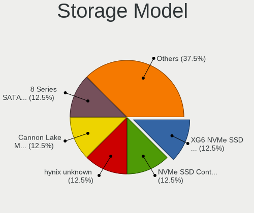

| Model                                                                        | Notebooks | Percent |
|------------------------------------------------------------------------------|-----------|---------|
| Toshiba XG6 NVMe SSD Controller                                              | 1         | 9.09%   |
| SK hynix PC601 NVMe Solid State Drive                                        | 1         | 9.09%   |
| Sandisk WD Black SN850X NVMe SSD                                             | 1         | 9.09%   |
| Sandisk WD Black SN770M NVMe SSD (DRAM-less)                                 | 1         | 9.09%   |
| Samsung NVMe SSD Controller SM961/PM961/SM963                                | 1         | 9.09%   |
| Intel Cannon Lake Mobile PCH SATA AHCI Controller                            | 1         | 9.09%   |
| Intel 82801 Mobile SATA Controller [RAID mode]                               | 1         | 9.09%   |
| Intel 8 Series SATA Controller 1 [AHCI mode]                                 | 1         | 9.09%   |
| Intel 7 Series Chipset Family 6-port SATA Controller [AHCI mode]             | 1         | 9.09%   |
| Intel 6 Series/C200 Series Chipset Family 6 port Mobile SATA AHCI Controller | 1         | 9.09%   |
| Intel 5 Series/3400 Series Chipset 6 port SATA AHCI Controller               | 1         | 9.09%   |

Storage Kind
------------

Kind of storage controller (IDE, SATA, NVMe, SAS, ...)

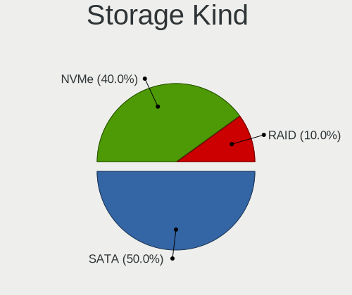

| Kind | Notebooks | Percent |
|------|-----------|---------|
| SATA | 5         | 50%     |
| NVMe | 4         | 40%     |
| RAID | 1         | 10%     |

Processor
---------

CPU Vendor
----------

Processor vendors

| Vendor | Notebooks | Percent |
|--------|-----------|---------|
| Intel  | 8         | 88.89%  |
| AMD    | 1         | 11.11%  |

CPU Model
---------

Processor models

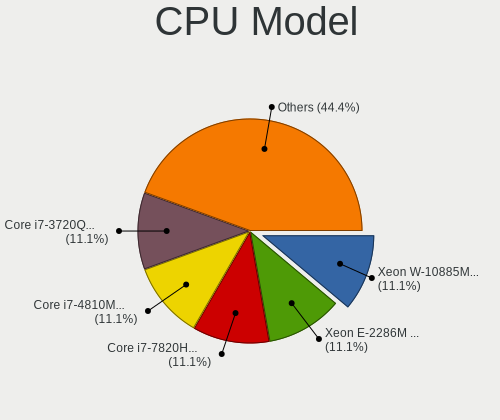

| Model                                      | Notebooks | Percent |
|--------------------------------------------|-----------|---------|
| Intel Xeon W-10885M CPU @ 2.40GHz          | 1         | 11.11%  |
| Intel Xeon E-2286M CPU @ 2.40GHz           | 1         | 11.11%  |
| Intel Core i7-7820HQ CPU @ 2.90GHz         | 1         | 11.11%  |
| Intel Core i7-4810MQ CPU @ 2.80GHz         | 1         | 11.11%  |
| Intel Core i7-3720QM CPU @ 2.60GHz         | 1         | 11.11%  |
| Intel Core i7-2620M CPU @ 2.70GHz          | 1         | 11.11%  |
| Intel Core i5-4300U CPU @ 1.90GHz          | 1         | 11.11%  |
| Intel Core i5 CPU M 540 @ 2.53GHz          | 1         | 11.11%  |
| AMD Ryzen 9 7940HS w/ Radeon 780M Graphics | 1         | 11.11%  |

CPU Model Family
----------------

Processor model prefix

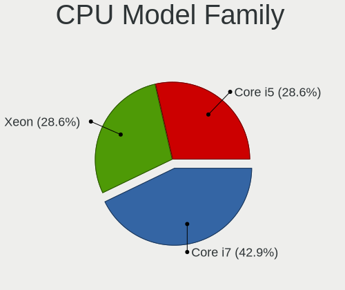

| Model         | Notebooks | Percent |
|---------------|-----------|---------|
| Intel Core i7 | 4         | 44.44%  |
| Intel Xeon    | 2         | 22.22%  |
| Intel Core i5 | 2         | 22.22%  |
| AMD Ryzen 9   | 1         | 11.11%  |

CPU Cores
---------

Number of processor cores

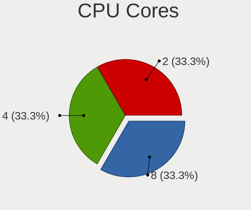

| Number | Notebooks | Percent |
|--------|-----------|---------|
| 8      | 3         | 33.33%  |
| 4      | 3         | 33.33%  |
| 2      | 3         | 33.33%  |

CPU Sockets
-----------

Number of sockets

| Number | Notebooks | Percent |
|--------|-----------|---------|
| 1      | 9         | 100%    |

CPU Threads
-----------

Threads per core (Hyper-Threading)

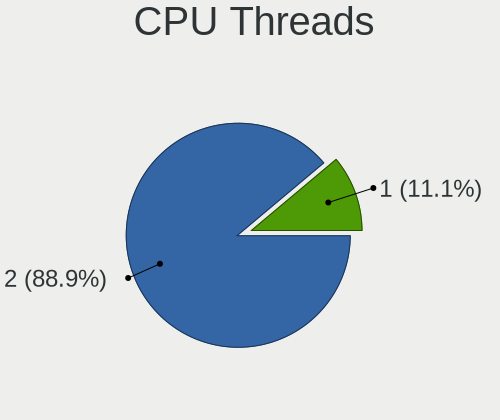

| Number | Notebooks | Percent |
|--------|-----------|---------|
| 2      | 8         | 88.89%  |
| 1      | 1         | 11.11%  |

CPU Microarch
-------------

Microarchitecture

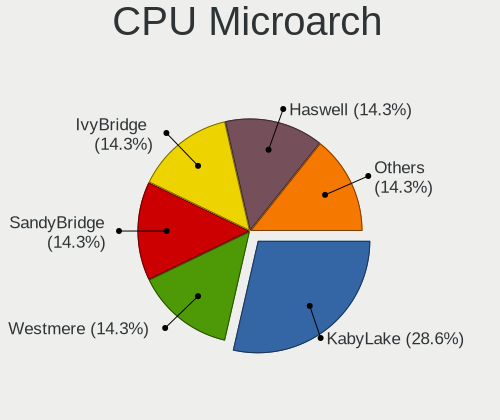

| Name        | Notebooks | Percent |
|-------------|-----------|---------|
| KabyLake    | 2         | 22.22%  |
| Haswell     | 2         | 22.22%  |
| Westmere    | 1         | 11.11%  |
| SandyBridge | 1         | 11.11%  |
| IvyBridge   | 1         | 11.11%  |
| CometLake   | 1         | 11.11%  |
| Unknown     | 1         | 11.11%  |

Graphics
--------

GPU Vendor
----------

Vendors of graphics cards

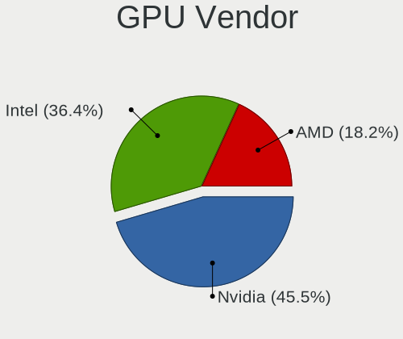

| Vendor | Notebooks | Percent |
|--------|-----------|---------|
| Nvidia | 5         | 45.45%  |
| Intel  | 4         | 36.36%  |
| AMD    | 2         | 18.18%  |

GPU Model
---------

Graphics card models

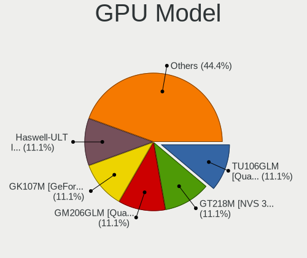

| Model                                                                     | Notebooks | Percent |
|---------------------------------------------------------------------------|-----------|---------|
| Nvidia TU106GLM [Quadro RTX 3000 Mobile / Max-Q]                          | 1         | 9.09%   |
| Nvidia GT218M [NVS 3100M]                                                 | 1         | 9.09%   |
| Nvidia GM206GLM [Quadro M2200 Mobile]                                     | 1         | 9.09%   |
| Nvidia GK107M [GeForce GT 650M Mac Edition]                               | 1         | 9.09%   |
| Nvidia GK106GLM [Quadro K2100M]                                           | 1         | 9.09%   |
| Intel Haswell-ULT Integrated Graphics Controller                          | 1         | 9.09%   |
| Intel Coffee Lake-S GT2 [UHD Graphics P630]                               | 1         | 9.09%   |
| Intel 3rd Gen Core processor Graphics Controller                          | 1         | 9.09%   |
| Intel 2nd Generation Core Processor Family Integrated Graphics Controller | 1         | 9.09%   |
| AMD Whistler [Radeon HD 6630M/6650M/6750M/7670M/7690M]                    | 1         | 9.09%   |
| AMD Phoenix1                                                              | 1         | 9.09%   |

GPU Combo
---------

Combinations of graphics cards

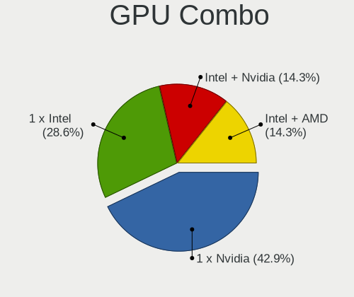

| Name           | Notebooks | Percent |
|----------------|-----------|---------|
| 1 x Nvidia     | 4         | 44.44%  |
| 1 x Intel      | 2         | 22.22%  |
| Intel + Nvidia | 1         | 11.11%  |
| Intel + AMD    | 1         | 11.11%  |
| 1 x AMD        | 1         | 11.11%  |

GPU Driver
----------

Free vs proprietary

| Driver      | Notebooks | Percent |
|-------------|-----------|---------|
| Free        | 5         | 55.56%  |
| Proprietary | 4         | 44.44%  |

GPU Memory
----------

Total video memory

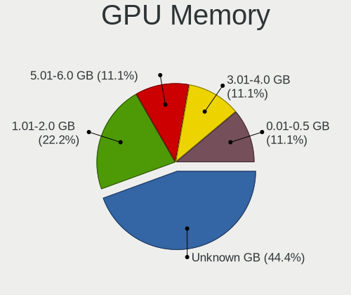

| Size in GB | Notebooks | Percent |
|------------|-----------|---------|
| Unknown    | 4         | 44.44%  |
| 1.01-2.0   | 2         | 22.22%  |
| 5.01-6.0   | 1         | 11.11%  |
| 3.01-4.0   | 1         | 11.11%  |
| 0.01-0.5   | 1         | 11.11%  |

Monitor
-------

Monitor Vendor
--------------

Monitor vendors

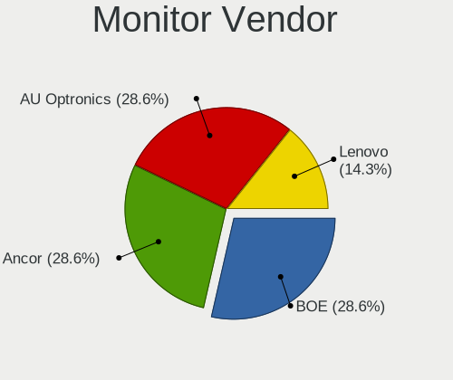

| Vendor               | Notebooks | Percent |
|----------------------|-----------|---------|
| BOE                  | 3         | 30%     |
| AU Optronics         | 2         | 20%     |
| Ancor Communications | 2         | 20%     |
| Sharp                | 1         | 10%     |
| Samsung Electronics  | 1         | 10%     |
| Lenovo               | 1         | 10%     |

Monitor Model
-------------

Monitor models

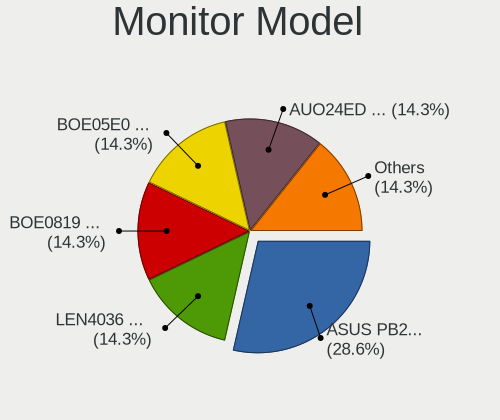

| Model                                                                 | Notebooks | Percent |
|-----------------------------------------------------------------------|-----------|---------|
| Ancor Communications ASUS PB278 ACI27A3 2560x1440 600x340mm 27.2-inch | 2         | 20%     |
| Sharp LCD Monitor SHP13F9 3200x1800 350x190mm 15.7-inch               | 1         | 10%     |
| Samsung Electronics SyncMaster SAM027E 1680x1050 470x300mm 22.0-inch  | 1         | 10%     |
| Lenovo LCD Monitor LEN4036 1440x900 300x190mm 14.0-inch               | 1         | 10%     |
| BOE LCD Monitor BOE0BC9 2560x1600 340x220mm 15.9-inch                 | 1         | 10%     |
| BOE LCD Monitor BOE0819 1920x1080 340x190mm 15.3-inch                 | 1         | 10%     |
| BOE LCD Monitor BOE05E0 1366x768 280x160mm 12.7-inch                  | 1         | 10%     |
| AU Optronics LCD Monitor AUO24ED 1920x1080 340x190mm 15.3-inch        | 1         | 10%     |
| AU Optronics LCD Monitor 3840x2160                                    | 1         | 10%     |

Monitor Resolution
------------------

Monitor screen resolution

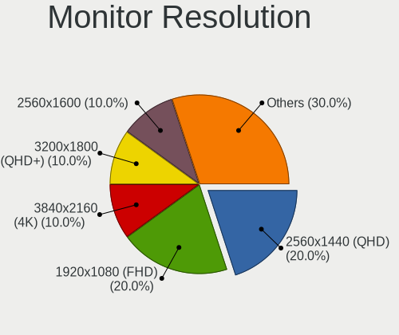

| Resolution         | Notebooks | Percent |
|--------------------|-----------|---------|
| 2560x1440 (QHD)    | 2         | 20%     |
| 1920x1080 (FHD)    | 2         | 20%     |
| 3840x2160 (4K)     | 1         | 10%     |
| 3200x1800 (QHD+)   | 1         | 10%     |
| 2560x1600          | 1         | 10%     |
| 1680x1050 (WSXGA+) | 1         | 10%     |
| 1440x900 (WXGA+)   | 1         | 10%     |
| 1366x768 (WXGA)    | 1         | 10%     |

Monitor Diagonal
----------------

Diagonal size in inches

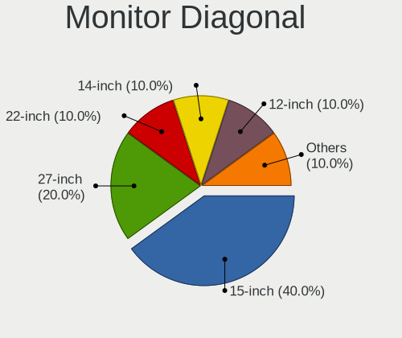

| Inches  | Notebooks | Percent |
|---------|-----------|---------|
| 15      | 4         | 40%     |
| 27      | 2         | 20%     |
| 22      | 1         | 10%     |
| 14      | 1         | 10%     |
| 12      | 1         | 10%     |
| Unknown | 1         | 10%     |

Monitor Width
-------------

Physical width

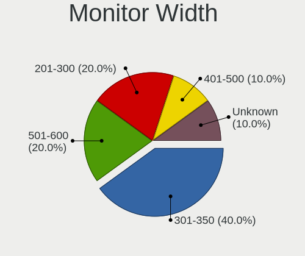

| Width in mm | Notebooks | Percent |
|-------------|-----------|---------|
| 301-350     | 4         | 40%     |
| 501-600     | 2         | 20%     |
| 201-300     | 2         | 20%     |
| 401-500     | 1         | 10%     |
| Unknown     | 1         | 10%     |

Aspect Ratio
------------

Proportional relationship between the width and the height

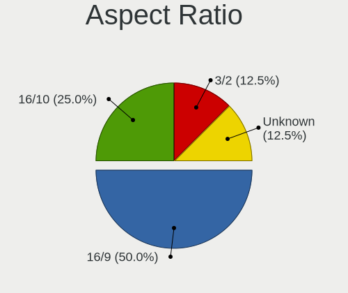

| Ratio   | Notebooks | Percent |
|---------|-----------|---------|
| 16/9    | 4         | 50%     |
| 16/10   | 2         | 25%     |
| 3/2     | 1         | 12.5%   |
| Unknown | 1         | 12.5%   |

Monitor Area
------------

Area in inch²

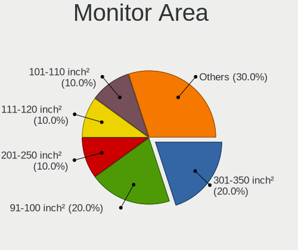

| Area in inch² | Notebooks | Percent |
|----------------|-----------|---------|
| 301-350        | 2         | 20%     |
| 91-100         | 2         | 20%     |
| 81-90          | 1         | 10%     |
| 61-70          | 1         | 10%     |
| 201-250        | 1         | 10%     |
| 111-120        | 1         | 10%     |
| 101-110        | 1         | 10%     |
| Unknown        | 1         | 10%     |

Pixel Density
-------------

Pixels per inch

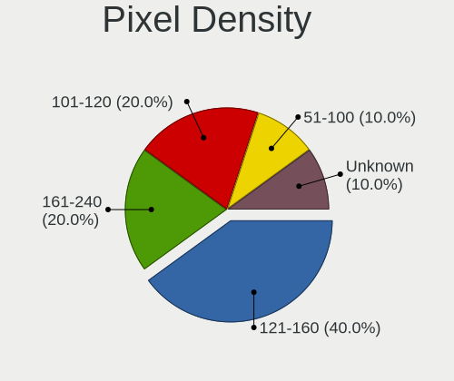

| Density | Notebooks | Percent |
|---------|-----------|---------|
| 121-160 | 4         | 40%     |
| 161-240 | 2         | 20%     |
| 101-120 | 2         | 20%     |
| 51-100  | 1         | 10%     |
| Unknown | 1         | 10%     |

Multiple Monitors
-----------------

Total monitors connected

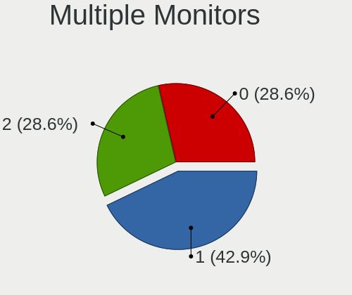

| Total | Notebooks | Percent |
|-------|-----------|---------|
| 1     | 4         | 44.44%  |
| 2     | 3         | 33.33%  |
| 0     | 2         | 22.22%  |

Network
-------

Net Controller Vendor
---------------------

Controller vendors

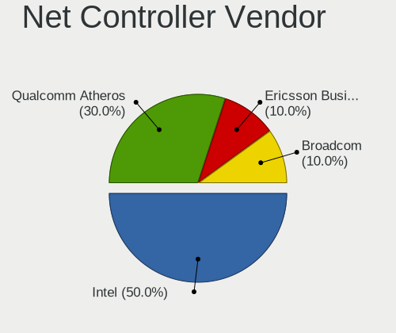

| Vendor                            | Notebooks | Percent |
|-----------------------------------|-----------|---------|
| Intel                             | 7         | 50%     |
| Qualcomm Atheros                  | 4         | 28.57%  |
| Realtek Semiconductor             | 1         | 7.14%   |
| Ericsson Business Mobile Networks | 1         | 7.14%   |
| Broadcom                          | 1         | 7.14%   |

Net Controller Model
--------------------

Controller models

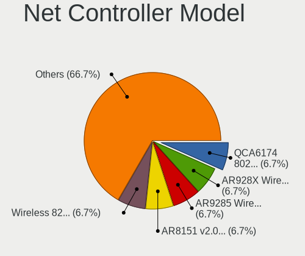

| Model                                                                       | Notebooks | Percent |
|-----------------------------------------------------------------------------|-----------|---------|
| Realtek USB 2.5GbE Controller                                               | 1         | 5.26%   |
| Qualcomm Atheros QCA6174 802.11ac Wireless Network Adapter                  | 1         | 5.26%   |
| Qualcomm Atheros AR9462 Wireless Network Adapter                            | 1         | 5.26%   |
| Qualcomm Atheros AR928X Wireless Network Adapter (PCI-Express)              | 1         | 5.26%   |
| Qualcomm Atheros AR9285 Wireless Network Adapter (PCI-Express)              | 1         | 5.26%   |
| Qualcomm Atheros AR8151 v2.0 Gigabit Ethernet                               | 1         | 5.26%   |
| Intel Wireless 8265 / 8275                                                  | 1         | 5.26%   |
| Intel Wireless 7260                                                         | 1         | 5.26%   |
| Intel Wi-Fi 6E(802.11ax) AX210/AX1675* 2x2 [Typhoon Peak]                   | 1         | 5.26%   |
| Intel Ethernet Connection I218-LM                                           | 1         | 5.26%   |
| Intel Ethernet Connection I217-LM                                           | 1         | 5.26%   |
| Intel Ethernet Connection (7) I219-LM                                       | 1         | 5.26%   |
| Intel Ethernet Connection (5) I219-LM                                       | 1         | 5.26%   |
| Intel Ethernet Connection (11) I219-LM                                      | 1         | 5.26%   |
| Intel Comet Lake PCH CNVi WiFi                                              | 1         | 5.26%   |
| Intel 82577LM Gigabit Network Connection                                    | 1         | 5.26%   |
| Ericsson Business Mobile Networks N5321 gw Mobile Broadband Serial Port III | 1         | 5.26%   |
| Broadcom NetXtreme BCM57786 Gigabit Ethernet PCIe                           | 1         | 5.26%   |
| Broadcom BCM4331 802.11a/b/g/n                                              | 1         | 5.26%   |

Wireless Vendor
---------------

Wireless vendors

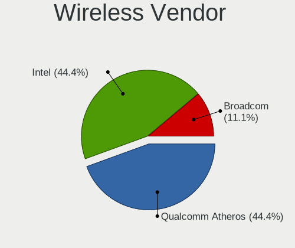

| Vendor           | Notebooks | Percent |
|------------------|-----------|---------|
| Qualcomm Atheros | 4         | 44.44%  |
| Intel            | 4         | 44.44%  |
| Broadcom         | 1         | 11.11%  |

Wireless Model
--------------

Wireless models

| Model                                                          | Notebooks | Percent |
|----------------------------------------------------------------|-----------|---------|
| Qualcomm Atheros QCA6174 802.11ac Wireless Network Adapter     | 1         | 11.11%  |
| Qualcomm Atheros AR9462 Wireless Network Adapter               | 1         | 11.11%  |
| Qualcomm Atheros AR928X Wireless Network Adapter (PCI-Express) | 1         | 11.11%  |
| Qualcomm Atheros AR9285 Wireless Network Adapter (PCI-Express) | 1         | 11.11%  |
| Intel Wireless 8265 / 8275                                     | 1         | 11.11%  |
| Intel Wireless 7260                                            | 1         | 11.11%  |
| Intel Wi-Fi 6E(802.11ax) AX210/AX1675* 2x2 [Typhoon Peak]      | 1         | 11.11%  |
| Intel Comet Lake PCH CNVi WiFi                                 | 1         | 11.11%  |
| Broadcom BCM4331 802.11a/b/g/n                                 | 1         | 11.11%  |

Ethernet Vendor
---------------

Ethernet vendors

| Vendor                | Notebooks | Percent |
|-----------------------|-----------|---------|
| Intel                 | 6         | 66.67%  |
| Realtek Semiconductor | 1         | 11.11%  |
| Qualcomm Atheros      | 1         | 11.11%  |
| Broadcom              | 1         | 11.11%  |

Ethernet Model
--------------

Ethernet models

| Model                                             | Notebooks | Percent |
|---------------------------------------------------|-----------|---------|
| Realtek USB 2.5GbE Controller                     | 1         | 11.11%  |
| Qualcomm Atheros AR8151 v2.0 Gigabit Ethernet     | 1         | 11.11%  |
| Intel Ethernet Connection I218-LM                 | 1         | 11.11%  |
| Intel Ethernet Connection I217-LM                 | 1         | 11.11%  |
| Intel Ethernet Connection (7) I219-LM             | 1         | 11.11%  |
| Intel Ethernet Connection (5) I219-LM             | 1         | 11.11%  |
| Intel Ethernet Connection (11) I219-LM            | 1         | 11.11%  |
| Intel 82577LM Gigabit Network Connection          | 1         | 11.11%  |
| Broadcom NetXtreme BCM57786 Gigabit Ethernet PCIe | 1         | 11.11%  |

Net Controller Kind
-------------------

Ethernet, WiFi or modem

| Kind     | Notebooks | Percent |
|----------|-----------|---------|
| WiFi     | 9         | 47.37%  |
| Ethernet | 9         | 47.37%  |
| Modem    | 1         | 5.26%   |

Used Controller
---------------

Currently used network controller

| Kind     | Notebooks | Percent |
|----------|-----------|---------|
| Ethernet | 7         | 50%     |
| WiFi     | 6         | 42.86%  |
| Modem    | 1         | 7.14%   |

NICs
----

Total network controllers on board

| Total | Notebooks | Percent |
|-------|-----------|---------|
| 2     | 8         | 88.89%  |
| 1     | 1         | 11.11%  |

IPv6
----

IPv6 vs IPv4

| Used | Notebooks | Percent |
|------|-----------|---------|
| No   | 6         | 66.67%  |
| Yes  | 3         | 33.33%  |

Bluetooth
---------

Bluetooth Vendor
----------------

Controller vendors

| Vendor                          | Notebooks | Percent |
|---------------------------------|-----------|---------|
| Intel                           | 3         | 37.5%   |
| Qualcomm Atheros Communications | 2         | 25%     |
| Foxconn / Hon Hai               | 1         | 12.5%   |
| Broadcom                        | 1         | 12.5%   |
| Apple                           | 1         | 12.5%   |

Bluetooth Model
---------------

Controller models

| Model                                                                               | Notebooks | Percent |
|-------------------------------------------------------------------------------------|-----------|---------|
| Qualcomm Atheros Dell Wireless 1820 Bluetooth 4.1LE                                 | 1         | 12.5%   |
| Qualcomm Atheros Dell Wireless 1601 Bluetooth Device                                | 1         | 12.5%   |
| Intel Bluetooth wireless interface                                                  | 1         | 12.5%   |
| Intel AX210 Bluetooth                                                               | 1         | 12.5%   |
| Intel AX201 Bluetooth                                                               | 1         | 12.5%   |
| Foxconn / Hon Hai Foxconn T77H114 BCM2070 [Single-Chip Bluetooth 2.1 + EDR Adapter] | 1         | 12.5%   |
| Broadcom BCM2045B (BDC-2.1)                                                         | 1         | 12.5%   |
| Apple Bluetooth Host Controller                                                     | 1         | 12.5%   |

Sound
-----

Sound Vendor
------------

Sound card vendors

| Vendor | Notebooks | Percent |
|--------|-----------|---------|
| Intel  | 8         | 61.54%  |
| Nvidia | 4         | 30.77%  |
| AMD    | 1         | 7.69%   |

Sound Model
-----------

Sound card models

| Model                                                                      | Notebooks | Percent |
|----------------------------------------------------------------------------|-----------|---------|
| Nvidia TU106 High Definition Audio Controller                              | 1         | 6.67%   |
| Nvidia High Definition Audio Controller                                    | 1         | 6.67%   |
| Nvidia GK107 HDMI Audio Controller                                         | 1         | 6.67%   |
| Nvidia GK106 HDMI Audio Controller                                         | 1         | 6.67%   |
| Intel Haswell-ULT HD Audio Controller                                      | 1         | 6.67%   |
| Intel Comet Lake PCH cAVS                                                  | 1         | 6.67%   |
| Intel CM238 HD Audio Controller                                            | 1         | 6.67%   |
| Intel Cannon Lake PCH cAVS                                                 | 1         | 6.67%   |
| Intel 8 Series/C220 Series Chipset High Definition Audio Controller        | 1         | 6.67%   |
| Intel 8 Series HD Audio Controller                                         | 1         | 6.67%   |
| Intel 7 Series/C216 Chipset Family High Definition Audio Controller        | 1         | 6.67%   |
| Intel 6 Series/C200 Series Chipset Family High Definition Audio Controller | 1         | 6.67%   |
| Intel 5 Series/3400 Series Chipset High Definition Audio                   | 1         | 6.67%   |
| AMD Rembrandt Radeon High Definition Audio Controller                      | 1         | 6.67%   |
| AMD Family 17h/19h/1ah HD Audio Controller                                 | 1         | 6.67%   |

Memory
------

Memory Vendor
-------------

Memory module vendors

| Vendor              | Notebooks | Percent |
|---------------------|-----------|---------|
| Samsung Electronics | 3         | 30%     |
| SK hynix            | 2         | 20%     |
| Unknown             | 1         | 10%     |
| Micron Technology   | 1         | 10%     |
| Kingston            | 1         | 10%     |
| G.Skill             | 1         | 10%     |
| A-DATA Technology   | 1         | 10%     |

Memory Model
------------

Memory module models

| Model                                                  | Notebooks | Percent |
|--------------------------------------------------------|-----------|---------|
| Unknown RAM Module 4GB SODIMM DDR3                     | 1         | 10%     |
| SK hynix RAM Module 8GB SODIMM DDR3 1600MT/s           | 1         | 10%     |
| SK hynix RAM HMA81GS6AFR8N-UH 8GB SODIMM DDR4 2400MT/s | 1         | 10%     |
| Samsung RAM M474A4G43MB1-CTD 32GB SODIMM DDR4 2667MT/s | 1         | 10%     |
| Samsung RAM M471B1G73BH0-YK0 8GB SODIMM DDR3 1600MT/s  | 1         | 10%     |
| Samsung RAM M471A1K43CB1-CRC 8GB SODIMM DDR4 2667MT/s  | 1         | 10%     |
| Micron RAM 18ASF2G72HZ-2G6E1 16GB SODIMM DDR4 2667MT/s | 1         | 10%     |
| Kingston RAM HP16D3LS1KFG/8G 8GB SODIMM DDR3 1600MT/s  | 1         | 10%     |
| G.Skill RAM F3-10666CL9-4GBSQ 4GB SODIMM DDR3 1334MT/s | 1         | 10%     |
| A-DATA RAM AD5S560048G-B 48GB SODIMM DDR5 5600MT/s     | 1         | 10%     |

Memory Kind
-----------

Memory module kinds

| Kind | Notebooks | Percent |
|------|-----------|---------|
| DDR3 | 5         | 55.56%  |
| DDR4 | 3         | 33.33%  |
| DDR5 | 1         | 11.11%  |

Memory Form Factor
------------------

Physical design of the memory module

| Name   | Notebooks | Percent |
|--------|-----------|---------|
| SODIMM | 9         | 100%    |

Memory Size
-----------

Memory module size

| Size  | Notebooks | Percent |
|-------|-----------|---------|
| 8192  | 4         | 44.44%  |
| 4096  | 2         | 22.22%  |
| 49152 | 1         | 11.11%  |
| 32768 | 1         | 11.11%  |
| 16384 | 1         | 11.11%  |

Memory Speed
------------

Memory module speed

| Speed   | Notebooks | Percent |
|---------|-----------|---------|
| 2667    | 3         | 30%     |
| 1600    | 3         | 30%     |
| 5600    | 1         | 10%     |
| 2400    | 1         | 10%     |
| 1334    | 1         | 10%     |
| Unknown | 1         | 10%     |

Printers & scanners
-------------------

Printer Vendor
--------------

Printer device vendors

Zero info for selected period =(

Printer Model
-------------

Printer device models

Zero info for selected period =(

Scanner Vendor
--------------

Scanner device vendors

Zero info for selected period =(

Scanner Model
-------------

Scanner device models

Zero info for selected period =(

Camera
------

Camera Vendor
-------------

Camera device vendors

| Vendor                | Notebooks | Percent |
|-----------------------|-----------|---------|
| Ricoh                 | 1         | 16.67%  |
| Realtek Semiconductor | 1         | 16.67%  |
| Microdia              | 1         | 16.67%  |
| Lenovo                | 1         | 16.67%  |
| Bison Electronics     | 1         | 16.67%  |
| Apple                 | 1         | 16.67%  |

Camera Model
------------

Camera device models

| Model                                  | Notebooks | Percent |
|----------------------------------------|-----------|---------|
| Ricoh USB2.0 Camera                    | 1         | 16.67%  |
| Realtek Integrated_Webcam_HD           | 1         | 16.67%  |
| Microdia Integrated Webcam             | 1         | 16.67%  |
| Lenovo Integrated Webcam [R5U877]      | 1         | 16.67%  |
| Bison SunplusIT INC. Integrated Camera | 1         | 16.67%  |
| Apple FaceTime HD Camera (Built-in)    | 1         | 16.67%  |

Security
--------

Fingerprint Vendor
------------------

Fingerprint sensor vendors

| Vendor           | Notebooks | Percent |
|------------------|-----------|---------|
| Validity Sensors | 1         | 50%     |
| Upek             | 1         | 50%     |

Fingerprint Model
-----------------

Fingerprint sensor models

| Model                                                  | Notebooks | Percent |
|--------------------------------------------------------|-----------|---------|
| Validity Sensors Synaptics WBDI                        | 1         | 50%     |
| Upek Biometric Touchchip/Touchstrip Fingerprint Sensor | 1         | 50%     |

Chipcard Vendor
---------------

Chipcard module vendors

Zero info for selected period =(

Chipcard Model
--------------

Chipcard module models

Zero info for selected period =(

Unsupported
-----------

Unsupported Devices
-------------------

Total unsupported devices on board

| Total | Notebooks | Percent |
|-------|-----------|---------|
| 3     | 3         | 33.33%  |
| 2     | 3         | 33.33%  |
| 1     | 2         | 22.22%  |
| 5     | 1         | 11.11%  |

Unsupported Device Types
------------------------

Types of unsupported devices

| Type                     | Notebooks | Percent |
|--------------------------|-----------|---------|
| Communication controller | 7         | 35%     |
| Card reader              | 4         | 20%     |
| Bluetooth                | 3         | 15%     |
| Net/wireless             | 2         | 10%     |
| Fingerprint reader       | 2         | 10%     |
| Net/ethernet             | 1         | 5%      |
| Firewire controller      | 1         | 5%      |

