MidnightBSD - Tested Hardware & Statistics
------------------------------------------

A project to collect tested hardware configurations for MidnightBSD.

Anyone can contribute to this report by the [hw-probe](https://github.com/linuxhw/hw-probe/blob/master/INSTALL.BSD.md) tool:

    hw-probe -all -upload

Please contribute! Especially if your hardware is rare.

This is a report for all computer types. See also reports for [desktops](/Dist/MidnightBSD/Desktop/README.md) and [notebooks](/Dist/MidnightBSD/Notebook/README.md).

Contents
--------

* [ Test Cases ](#test-cases)

* [ System ](#system)
  - [ OS                       ](#os)
  - [ OS Family                ](#os-family)
  - [ Arch                     ](#arch)
  - [ DE                       ](#de)
  - [ Display Server           ](#display-server)
  - [ Display Manager          ](#display-manager)
  - [ OS Lang                  ](#os-lang)
  - [ Boot Mode                ](#boot-mode)
  - [ Filesystem               ](#filesystem)
  - [ Part. scheme             ](#part-scheme)

* [ Board ](#board)
  - [ Vendor                   ](#vendor)
  - [ Model                    ](#model)
  - [ Model Family             ](#model-family)
  - [ MFG Year                 ](#mfg-year)
  - [ Form Factor              ](#form-factor)
  - [ Coreboot                 ](#coreboot)
  - [ RAM Size                 ](#ram-size)
  - [ RAM Used                 ](#ram-used)
  - [ Total Drives             ](#total-drives)
  - [ Has CD-ROM               ](#has-cd-rom)
  - [ Has Ethernet             ](#has-ethernet)
  - [ Has WiFi                 ](#has-wifi)
  - [ Has Bluetooth            ](#has-bluetooth)

* [ Location ](#location)
  - [ Country                  ](#country)
  - [ City                     ](#city)

* [ Drives ](#drives)
  - [ Drive Vendor             ](#drive-vendor)
  - [ Drive Model              ](#drive-model)
  - [ HDD Vendor               ](#hdd-vendor)
  - [ SSD Vendor               ](#ssd-vendor)
  - [ Drive Kind               ](#drive-kind)
  - [ Drive Connector          ](#drive-connector)
  - [ Drive Size               ](#drive-size)
  - [ Space Total              ](#space-total)
  - [ Space Used               ](#space-used)
  - [ Malfunc. Drives          ](#malfunc-drives)
  - [ Malfunc. Drive Vendor    ](#malfunc-drive-vendor)
  - [ Malfunc. HDD Vendor      ](#malfunc-hdd-vendor)
  - [ Malfunc. Drive Kind      ](#malfunc-drive-kind)
  - [ Failed Drives            ](#failed-drives)
  - [ Failed Drive Vendor      ](#failed-drive-vendor)
  - [ Drive Status             ](#drive-status)

* [ Storage controller ](#storage-controller)
  - [ Storage Vendor           ](#storage-vendor)
  - [ Storage Model            ](#storage-model)
  - [ Storage Kind             ](#storage-kind)

* [ Processor ](#processor)
  - [ CPU Vendor               ](#cpu-vendor)
  - [ CPU Model                ](#cpu-model)
  - [ CPU Model Family         ](#cpu-model-family)
  - [ CPU Cores                ](#cpu-cores)
  - [ CPU Sockets              ](#cpu-sockets)
  - [ CPU Threads              ](#cpu-threads)
  - [ CPU Microarch            ](#cpu-microarch)

* [ Graphics ](#graphics)
  - [ GPU Vendor               ](#gpu-vendor)
  - [ GPU Model                ](#gpu-model)
  - [ GPU Combo                ](#gpu-combo)
  - [ GPU Driver               ](#gpu-driver)
  - [ GPU Memory               ](#gpu-memory)

* [ Monitor ](#monitor)
  - [ Monitor Vendor           ](#monitor-vendor)
  - [ Monitor Model            ](#monitor-model)
  - [ Monitor Resolution       ](#monitor-resolution)
  - [ Monitor Diagonal         ](#monitor-diagonal)
  - [ Monitor Width            ](#monitor-width)
  - [ Aspect Ratio             ](#aspect-ratio)
  - [ Monitor Area             ](#monitor-area)
  - [ Pixel Density            ](#pixel-density)
  - [ Multiple Monitors        ](#multiple-monitors)

* [ Network ](#network)
  - [ Net Controller Vendor    ](#net-controller-vendor)
  - [ Net Controller Model     ](#net-controller-model)
  - [ Wireless Vendor          ](#wireless-vendor)
  - [ Wireless Model           ](#wireless-model)
  - [ Ethernet Vendor          ](#ethernet-vendor)
  - [ Ethernet Model           ](#ethernet-model)
  - [ Net Controller Kind      ](#net-controller-kind)
  - [ Used Controller          ](#used-controller)
  - [ NICs                     ](#nics)
  - [ IPv6                     ](#ipv6)

* [ Bluetooth ](#bluetooth)
  - [ Bluetooth Vendor         ](#bluetooth-vendor)
  - [ Bluetooth Model          ](#bluetooth-model)

* [ Sound ](#sound)
  - [ Sound Vendor             ](#sound-vendor)
  - [ Sound Model              ](#sound-model)

* [ Memory ](#memory)
  - [ Memory Vendor            ](#memory-vendor)
  - [ Memory Model             ](#memory-model)
  - [ Memory Kind              ](#memory-kind)
  - [ Memory Form Factor       ](#memory-form-factor)
  - [ Memory Size              ](#memory-size)
  - [ Memory Speed             ](#memory-speed)

* [ Printers & scanners ](#printers--scanners)
  - [ Printer Vendor           ](#printer-vendor)
  - [ Printer Model            ](#printer-model)
  - [ Scanner Vendor           ](#scanner-vendor)
  - [ Scanner Model            ](#scanner-model)

* [ Camera ](#camera)
  - [ Camera Vendor            ](#camera-vendor)
  - [ Camera Model             ](#camera-model)

* [ Security ](#security)
  - [ Fingerprint Vendor       ](#fingerprint-vendor)
  - [ Fingerprint Model        ](#fingerprint-model)
  - [ Chipcard Vendor          ](#chipcard-vendor)
  - [ Chipcard Model           ](#chipcard-model)

* [ Unsupported ](#unsupported)
  - [ Unsupported Devices      ](#unsupported-devices)
  - [ Unsupported Device Types ](#unsupported-device-types)

Test Cases
----------

Total: 77

| Vendor     | Model                       | Form-Factor | Probe                                                     | Date         |
|------------|-----------------------------|-------------|-----------------------------------------------------------|--------------|
| ASUSTek    | TUF Gaming B560M-PLUS WI... | Desktop     | [e69f71eb23](https://bsd-hardware.info/?probe=e69f71eb23) | Dec 30, 2024 |
| MSI        | B650 GAMING PLUS WIFI       | Desktop     | [434fcb2264](https://bsd-hardware.info/?probe=434fcb2264) | Nov 17, 2024 |
| MSI        | B650 GAMING PLUS WIFI       | Desktop     | [7ae29d1e0f](https://bsd-hardware.info/?probe=7ae29d1e0f) | Nov 17, 2024 |
| HP         | ProLiant DL360 Gen9         | Server      | [d3e7a9c25b](https://bsd-hardware.info/?probe=d3e7a9c25b) | Nov 12, 2024 |
| Supermicro | X10SDV-4C-TLN2F             | Server      | [38d8b42e9b](https://bsd-hardware.info/?probe=38d8b42e9b) | Nov 12, 2024 |
| ASUSTek    | TUF Gaming B450M-PLUS II    | Desktop     | [8f87e1ac76](https://bsd-hardware.info/?probe=8f87e1ac76) | Nov 11, 2024 |
| ASUSTek    | TUF Gaming B450M-PLUS II    | Desktop     | [07bdbdd1ec](https://bsd-hardware.info/?probe=07bdbdd1ec) | Aug 09, 2024 |
| HPE        | ProLiant MicroServer Gen... | Desktop     | [49344e8a17](https://bsd-hardware.info/?probe=49344e8a17) | Jun 30, 2024 |
| Lenovo     | ThinkPad A485 20MU000VUS    | Notebook    | [0323476838](https://bsd-hardware.info/?probe=0323476838) | Apr 28, 2024 |
| Supermicro | X9SCL/X9SCMA                | Desktop     | [53bdb73b74](https://bsd-hardware.info/?probe=53bdb73b74) | Feb 14, 2024 |
| ASRock     | B550M Steel Legend          | Desktop     | [fa494be63d](https://bsd-hardware.info/?probe=fa494be63d) | Jan 26, 2024 |
| ASUSTek    | TUF Gaming B450M-PLUS II    | Desktop     | [eda92591b5](https://bsd-hardware.info/?probe=eda92591b5) | Jan 07, 2024 |
| ASUSTek    | TUF Gaming B450M-PLUS II    | Desktop     | [12ff062207](https://bsd-hardware.info/?probe=12ff062207) | Jan 07, 2024 |
| ASRock     | B550M Steel Legend          | Desktop     | [d24b57f807](https://bsd-hardware.info/?probe=d24b57f807) | Jan 06, 2024 |
| Lenovo     | ThinkPad A485 20MU000VUS    | Notebook    | [98663cbfef](https://bsd-hardware.info/?probe=98663cbfef) | Dec 22, 2023 |
| Lenovo     | ThinkPad A485 20MU000VUS    | Notebook    | [8f21b7d70f](https://bsd-hardware.info/?probe=8f21b7d70f) | Nov 24, 2023 |
| ASRock     | X570 Steel Legend WiFi a... | Desktop     | [a98f0b3d67](https://bsd-hardware.info/?probe=a98f0b3d67) | Sep 03, 2023 |
| ASRock     | X570 Steel Legend WiFi a... | Desktop     | [d352ea60cf](https://bsd-hardware.info/?probe=d352ea60cf) | Sep 03, 2023 |
| ASUSTek    | TUF Gaming B450M-PLUS II    | Desktop     | [1b53079f34](https://bsd-hardware.info/?probe=1b53079f34) | Aug 19, 2023 |
| ASRock     | B550M Steel Legend          | Desktop     | [ffc50e224c](https://bsd-hardware.info/?probe=ffc50e224c) | Aug 01, 2023 |
| Supermicro | X9SCL/X9SCMA                | Desktop     | [cb87f3725f](https://bsd-hardware.info/?probe=cb87f3725f) | May 14, 2023 |
| ASUSTek    | TUF Gaming B560M-PLUS WI... | Desktop     | [50ff0c14dd](https://bsd-hardware.info/?probe=50ff0c14dd) | Apr 22, 2023 |
| ASUSTek    | A7VI-VM                     | Desktop     | [083714b968](https://bsd-hardware.info/?probe=083714b968) | Apr 07, 2023 |
| Supermicro | X9SCL/X9SCMA                | Desktop     | [31ed779fdc](https://bsd-hardware.info/?probe=31ed779fdc) | Mar 31, 2023 |
| ASRock     | B550M Steel Legend          | Desktop     | [06a2d12cbe](https://bsd-hardware.info/?probe=06a2d12cbe) | Mar 29, 2023 |
| ASUSTek    | TUF Gaming B450M-PLUS II    | Desktop     | [2c6fc04801](https://bsd-hardware.info/?probe=2c6fc04801) | Mar 29, 2023 |
| HP         | Victus by Gaming Laptop ... | Notebook    | [b97af82e5c](https://bsd-hardware.info/?probe=b97af82e5c) | Feb 05, 2023 |
| ASUSTek    | TUF Gaming B450M-PLUS II    | Desktop     | [e4af143188](https://bsd-hardware.info/?probe=e4af143188) | Jan 10, 2023 |
| Supermicro | X9SCL/X9SCMA                | Desktop     | [0b16265d11](https://bsd-hardware.info/?probe=0b16265d11) | Jan 10, 2023 |
| Lenovo     | B50-80 80EW                 | Notebook    | [b8f49b8d19](https://bsd-hardware.info/?probe=b8f49b8d19) | Jan 07, 2023 |
| ASUSTek    | TUF Gaming B450M-PLUS II    | Desktop     | [4d9a4bfc40](https://bsd-hardware.info/?probe=4d9a4bfc40) | Dec 30, 2022 |
| ASRock     | B550M Steel Legend          | Desktop     | [48d5feacf2](https://bsd-hardware.info/?probe=48d5feacf2) | Dec 08, 2022 |
| Dell       | Latitude D610               | Notebook    | [6ef8d8137b](https://bsd-hardware.info/?probe=6ef8d8137b) | Nov 24, 2022 |
| Lenovo     | ThinkPad A485 20MU000VUS    | Notebook    | [b816902c0b](https://bsd-hardware.info/?probe=b816902c0b) | Oct 31, 2022 |
| Lenovo     | ThinkPad A485 20MU000VUS    | Notebook    | [296e81dd9d](https://bsd-hardware.info/?probe=296e81dd9d) | Aug 21, 2022 |
| Lenovo     | ThinkPad A485 20MU000VUS    | Notebook    | [b79fa4531e](https://bsd-hardware.info/?probe=b79fa4531e) | Aug 20, 2022 |
| HP         | Victus by Gaming Laptop ... | Notebook    | [e09aa880f9](https://bsd-hardware.info/?probe=e09aa880f9) | Aug 16, 2022 |
| Lenovo     | ThinkPad A485 20MU000VUS    | Notebook    | [43d7380492](https://bsd-hardware.info/?probe=43d7380492) | Jun 15, 2022 |
| Lenovo     | ThinkPad A485 20MU000VUS    | Notebook    | [a3e3500ca5](https://bsd-hardware.info/?probe=a3e3500ca5) | Jun 15, 2022 |
| ASRock     | B550M Steel Legend          | Desktop     | [c6824c4f4a](https://bsd-hardware.info/?probe=c6824c4f4a) | Jun 11, 2022 |
| ASUSTek    | PRIME Z590-P                | Desktop     | [3ef083287f](https://bsd-hardware.info/?probe=3ef083287f) | May 28, 2022 |
| ASUSTek    | PRIME Z590-P                | Desktop     | [53cb90d2b7](https://bsd-hardware.info/?probe=53cb90d2b7) | May 28, 2022 |
| HP         | 8767 A                      | Desktop     | [ac8a395a20](https://bsd-hardware.info/?probe=ac8a395a20) | May 20, 2022 |
| ASRock     | B550M Steel Legend          | Desktop     | [50d12f98fc](https://bsd-hardware.info/?probe=50d12f98fc) | Apr 08, 2022 |
| ASRock     | B550M Steel Legend          | Desktop     | [ad0ab01ca8](https://bsd-hardware.info/?probe=ad0ab01ca8) | Apr 08, 2022 |
| Lenovo     | ThinkPad X1 Extreme 20MF... | Notebook    | [1af600b3ae](https://bsd-hardware.info/?probe=1af600b3ae) | Mar 24, 2022 |
| ASRock     | B550M Steel Legend          | Desktop     | [a752b8b4d6](https://bsd-hardware.info/?probe=a752b8b4d6) | Mar 22, 2022 |
| ASRock     | B550M Steel Legend          | Desktop     | [ab838523ad](https://bsd-hardware.info/?probe=ab838523ad) | Jan 15, 2022 |
| ASRock     | X570 Steel Legend WiFi a... | Desktop     | [c13b78e6d5](https://bsd-hardware.info/?probe=c13b78e6d5) | Dec 23, 2021 |
| ASRock     | X570 Steel Legend WiFi a... | Desktop     | [7bf6ec598f](https://bsd-hardware.info/?probe=7bf6ec598f) | Dec 18, 2021 |
| HP         | 8767 A                      | Desktop     | [8bbd431806](https://bsd-hardware.info/?probe=8bbd431806) | Oct 14, 2021 |
| HP         | 8767 A                      | Desktop     | [6bc45054bb](https://bsd-hardware.info/?probe=6bc45054bb) | Oct 14, 2021 |
| Lenovo     | ThinkPad A485 20MU000VUS    | Notebook    | [4b03ca3191](https://bsd-hardware.info/?probe=4b03ca3191) | Oct 03, 2021 |
| ASRock     | X570 Steel Legend WiFi a... | Desktop     | [9614fd11d7](https://bsd-hardware.info/?probe=9614fd11d7) | Aug 21, 2021 |
| ASUSTek    | TUF B350M-PLUS GAMING       | Desktop     | [bd63de17b0](https://bsd-hardware.info/?probe=bd63de17b0) | Jun 07, 2021 |
| ASRock     | B550M Steel Legend          | Desktop     | [308573e703](https://bsd-hardware.info/?probe=308573e703) | Jun 02, 2021 |
| ASUSTek    | TUF B350M-PLUS GAMING       | Desktop     | [ba938810b9](https://bsd-hardware.info/?probe=ba938810b9) | May 25, 2021 |
| ASRock     | B550M Steel Legend          | Desktop     | [29a31a7a93](https://bsd-hardware.info/?probe=29a31a7a93) | May 25, 2021 |
| HP         | 1589                        | Desktop     | [f97fc0533b](https://bsd-hardware.info/?probe=f97fc0533b) | Jan 02, 2021 |
| ASUSTek    | TUF B350M-PLUS GAMING       | Desktop     | [778268ad6f](https://bsd-hardware.info/?probe=778268ad6f) | Dec 30, 2020 |
| ASRock     | X570 Steel Legend WiFi a... | Desktop     | [a27f63a72c](https://bsd-hardware.info/?probe=a27f63a72c) | Dec 30, 2020 |
| ASRock     | B550M Steel Legend          | Desktop     | [78b6751c3f](https://bsd-hardware.info/?probe=78b6751c3f) | Dec 24, 2020 |
| ASUSTek    | TUF GAMING B450M-PLUS II    | Desktop     | [99fca48a73](https://bsd-hardware.info/?probe=99fca48a73) | Dec 06, 2020 |
| ASRock     | X570 Steel Legend WiFi a... | Desktop     | [86ba25be24](https://bsd-hardware.info/?probe=86ba25be24) | Nov 16, 2020 |
| Lenovo     | ThinkPad A485 20MU000VUS    | Notebook    | [624be8f7d6](https://bsd-hardware.info/?probe=624be8f7d6) | Nov 16, 2020 |
| ASRock     | B550M Steel Legend          | Desktop     | [50ad3ee5fb](https://bsd-hardware.info/?probe=50ad3ee5fb) | Nov 16, 2020 |
| ASRock     | B550M Steel Legend          | Desktop     | [164670d170](https://bsd-hardware.info/?probe=164670d170) | Oct 29, 2020 |
| Lenovo     | ThinkPad A485 20MU000VUS    | Notebook    | [4d2c24a0e3](https://bsd-hardware.info/?probe=4d2c24a0e3) | Sep 15, 2020 |
| ASRock     | B550M Steel Legend          | Desktop     | [b4663b7249](https://bsd-hardware.info/?probe=b4663b7249) | Aug 28, 2020 |
| ASUSTek    | TUF B350M-PLUS GAMING       | Desktop     | [53aa996eaa](https://bsd-hardware.info/?probe=53aa996eaa) | Jul 31, 2020 |
| Lenovo     | G570 20079                  | Notebook    | [7042848932](https://bsd-hardware.info/?probe=7042848932) | Jun 03, 2020 |
| Lenovo     | ThinkPad A485 20MU000VUS    | Notebook    | [010db0aed4](https://bsd-hardware.info/?probe=010db0aed4) | May 22, 2020 |
| ASUSTek    | TUF B350M-PLUS GAMING       | Desktop     | [20fac3b208](https://bsd-hardware.info/?probe=20fac3b208) | May 22, 2020 |
| ASRock     | B550M Steel Legend          | Desktop     | [44681211ff](https://bsd-hardware.info/?probe=44681211ff) | May 22, 2020 |
| ASUSTek    | PRIME X370-PRO              | Desktop     | [7c311ee004](https://bsd-hardware.info/?probe=7c311ee004) | May 22, 2020 |
| Lenovo     | G570 20079                  | Notebook    | [112b83a485](https://bsd-hardware.info/?probe=112b83a485) | May 16, 2020 |
| Lenovo     | G570 20079                  | Notebook    | [eff0d8a3db](https://bsd-hardware.info/?probe=eff0d8a3db) | May 06, 2020 |

System
------

OS
--

Installed operating systems

| Name              | Computers | Percent |
|-------------------|-----------|---------|
| MidnightBSD 3.1.0 | 5         | 8.77%   |
| MidnightBSD 3.2.0 | 4         | 7.02%   |
| MidnightBSD 2.0.2 | 4         | 7.02%   |
| MidnightBSD 1.2   | 4         | 7.02%   |
| MidnightBSD 3.0.0 | 3         | 5.26%   |
| MidnightBSD 2.2.6 | 3         | 5.26%   |
| MidnightBSD 2.2.0 | 3         | 5.26%   |
| MidnightBSD 2.0.1 | 3         | 5.26%   |
| MidnightBSD 3.2.1 | 2         | 3.51%   |
| MidnightBSD 3.0.1 | 2         | 3.51%   |
| MidnightBSD 2.2.8 | 2         | 3.51%   |
| MidnightBSD 2.1.8 | 2         | 3.51%   |
| MidnightBSD 2.1.5 | 2         | 3.51%   |
| MidnightBSD 2.1.1 | 2         | 3.51%   |
| MidnightBSD 2.0.7 | 2         | 3.51%   |
| MidnightBSD 3.1.6 | 1         | 1.75%   |
| MidnightBSD 3.1.4 | 1         | 1.75%   |
| MidnightBSD 3.1.3 | 1         | 1.75%   |
| MidnightBSD 3.1.2 | 1         | 1.75%   |
| MidnightBSD 3.1.1 | 1         | 1.75%   |
| MidnightBSD 2.2.5 | 1         | 1.75%   |
| MidnightBSD 2.2.2 | 1         | 1.75%   |
| MidnightBSD 2.1.6 | 1         | 1.75%   |
| MidnightBSD 2.1.3 | 1         | 1.75%   |
| MidnightBSD 2.1.2 | 1         | 1.75%   |
| MidnightBSD 2.1.0 | 1         | 1.75%   |
| MidnightBSD 2.0   | 1         | 1.75%   |
| MidnightBSD 1.2.9 | 1         | 1.75%   |
| MidnightBSD 1.2.7 | 1         | 1.75%   |

OS Family
---------

OS without a version

| Name        | Computers | Percent |
|-------------|-----------|---------|
| MidnightBSD | 22        | 100%    |

Arch
----

OS architecture (x86_64, i586, etc.)

| Name  | Computers | Percent |
|-------|-----------|---------|
| amd64 | 20        | 90.91%  |
| i386  | 2         | 9.09%   |

DE
--

Desktop Environment

| Name         | Computers | Percent |
|--------------|-----------|---------|
| Console      | 11        | 40.74%  |
| XFCE         | 9         | 33.33%  |
| GNOME        | 5         | 18.52%  |
| Window Maker | 1         | 3.7%    |
| Cinnamon     | 1         | 3.7%    |

Display Server
--------------

X11 or Wayland

| Name    | Computers | Percent |
|---------|-----------|---------|
| Console | 15        | 55.56%  |
| X11     | 11        | 40.74%  |
| Wayland | 1         | 3.7%    |

Display Manager
---------------

SDDM, LightDM, etc.

| Name    | Computers | Percent |
|---------|-----------|---------|
| Console | 22        | 100%    |

OS Lang
-------

Language

| Lang             | Computers | Percent |
|------------------|-----------|---------|
| Unknown          | 21        | 95.45%  |
| fi_FI.ISO8859-15 | 1         | 4.55%   |

Boot Mode
---------

EFI or BIOS

| Mode | Computers | Percent |
|------|-----------|---------|
| EFI  | 17        | 73.91%  |
| BIOS | 6         | 26.09%  |

Filesystem
----------

Type of filesystem

| Type | Computers | Percent |
|------|-----------|---------|
| Zfs  | 18        | 78.26%  |
| Ufs  | 5         | 21.74%  |

Part. scheme
------------

Scheme of partitioning

| Type | Computers | Percent |
|------|-----------|---------|
| GPT  | 21        | 95.45%  |
| MBR  | 1         | 4.55%   |

Board
-----

Vendor
------

Motherboard manufacturer

| Name             | Computers | Percent |
|------------------|-----------|---------|
| ASUSTek Computer | 8         | 36.36%  |
| Hewlett-Packard  | 4         | 18.18%  |
| ASRock           | 3         | 13.64%  |
| Supermicro       | 2         | 9.09%   |
| Lenovo           | 2         | 9.09%   |
| MSI              | 1         | 4.55%   |
| HPE              | 1         | 4.55%   |
| Dell             | 1         | 4.55%   |

Model
-----

Motherboard model

| Name                                   | Computers | Percent |
|----------------------------------------|-----------|---------|
| ASUS TUF Gaming B450M-PLUS II          | 3         | 13.64%  |
| ASRock B550M Steel Legend              | 2         | 9.09%   |
| Supermicro X9SCL/X9SCM                 | 1         | 4.55%   |
| Supermicro Super Server                | 1         | 4.55%   |
| MSI MS-7E26                            | 1         | 4.55%   |
| Lenovo ThinkPad X1 Extreme 20MF000BUS  | 1         | 4.55%   |
| Lenovo ThinkPad A485 20MU000VUS        | 1         | 4.55%   |
| HPE ProLiant MicroServer Gen10 Plus v2 | 1         | 4.55%   |
| HP Z420 Workstation                    | 1         | 4.55%   |
| HP Victus by Gaming Laptop 15-fa0xxx   | 1         | 4.55%   |
| HP ProLiant DL360 Gen9                 | 1         | 4.55%   |
| HP ENVY TE01-1xxx                      | 1         | 4.55%   |
| Dell Latitude D610                     | 1         | 4.55%   |
| ASUS TUF Gaming B560M-PLUS WIFI        | 1         | 4.55%   |
| ASUS TUF B350M-PLUS GAMING             | 1         | 4.55%   |
| ASUS PRIME Z590-P                      | 1         | 4.55%   |
| ASUS PRIME X370-PRO                    | 1         | 4.55%   |
| ASUS A7VI-VM                           | 1         | 4.55%   |
| ASRock X570 Steel Legend WiFi ax       | 1         | 4.55%   |

Model Family
------------

Motherboard model prefix

| Name             | Computers | Percent |
|------------------|-----------|---------|
| ASUS TUF         | 5         | 22.73%  |
| Lenovo ThinkPad  | 2         | 9.09%   |
| ASUS PRIME       | 2         | 9.09%   |
| ASRock B550M     | 2         | 9.09%   |
| Supermicro X9SCL | 1         | 4.55%   |
| Supermicro Super | 1         | 4.55%   |
| MSI MS-7E26      | 1         | 4.55%   |
| HPE ProLiant     | 1         | 4.55%   |
| HP Z420          | 1         | 4.55%   |
| HP Victus        | 1         | 4.55%   |
| HP ProLiant      | 1         | 4.55%   |
| HP ENVY          | 1         | 4.55%   |
| Dell Latitude    | 1         | 4.55%   |
| ASUS A7VI-VM     | 1         | 4.55%   |
| ASRock X570      | 1         | 4.55%   |

MFG Year
--------

Motherboard manufacture year

| Year | Computers | Percent |
|------|-----------|---------|
| 2019 | 5         | 22.73%  |
| 2018 | 3         | 13.64%  |
| 2023 | 2         | 9.09%   |
| 2020 | 2         | 9.09%   |
| 2017 | 2         | 9.09%   |
| 2024 | 1         | 4.55%   |
| 2022 | 1         | 4.55%   |
| 2021 | 1         | 4.55%   |
| 2014 | 1         | 4.55%   |
| 2013 | 1         | 4.55%   |
| 2011 | 1         | 4.55%   |
| 2005 | 1         | 4.55%   |
| 2001 | 1         | 4.55%   |

Form Factor
-----------

Physical design of the computer

| Name     | Computers | Percent |
|----------|-----------|---------|
| Desktop  | 16        | 72.73%  |
| Notebook | 4         | 18.18%  |
| Server   | 2         | 9.09%   |

Coreboot
--------

Have coreboot on board

| Used | Computers | Percent |
|------|-----------|---------|
| No   | 22        | 100%    |

RAM Size
--------

Total RAM memory

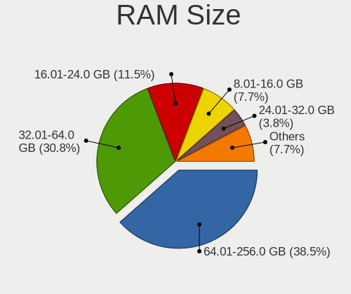

| Size in GB  | Computers | Percent |
|-------------|-----------|---------|
| 64.01-256.0 | 10        | 38.46%  |
| 32.01-64.0  | 8         | 30.77%  |
| 16.01-24.0  | 3         | 11.54%  |
| 8.01-16.0   | 2         | 7.69%   |
| 24.01-32.0  | 1         | 3.85%   |
| 2.01-3.0    | 1         | 3.85%   |
| 0.01-0.5    | 1         | 3.85%   |

RAM Used
--------

Used RAM memory

| Used GB    | Computers | Percent |
|------------|-----------|---------|
| 1.01-2.0   | 14        | 40%     |
| 0.51-1.0   | 4         | 11.43%  |
| 32.01-64.0 | 3         | 8.57%   |
| 2.01-3.0   | 3         | 8.57%   |
| 16.01-24.0 | 3         | 8.57%   |
| 4.01-8.0   | 2         | 5.71%   |
| 24.01-32.0 | 2         | 5.71%   |
| Unknown    | 2         | 5.71%   |
| 0.01-0.5   | 1         | 2.86%   |
| 0          | 1         | 2.86%   |

Total Drives
------------

Number of drives on board

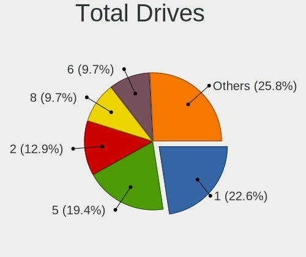

| Drives | Computers | Percent |
|--------|-----------|---------|
| 1      | 7         | 22.58%  |
| 5      | 6         | 19.35%  |
| 2      | 4         | 12.9%   |
| 8      | 3         | 9.68%   |
| 6      | 3         | 9.68%   |
| 3      | 3         | 9.68%   |
| 7      | 2         | 6.45%   |
| 4      | 2         | 6.45%   |
| 0      | 1         | 3.23%   |

Has CD-ROM
----------

Has CD-ROM on board

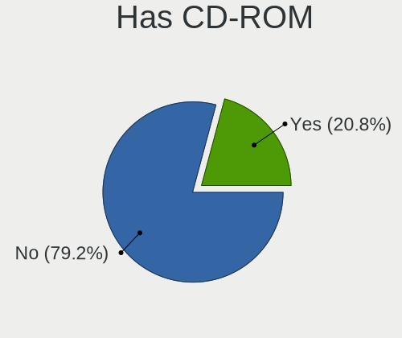

| Presented | Computers | Percent |
|-----------|-----------|---------|
| No        | 19        | 79.17%  |
| Yes       | 5         | 20.83%  |

Has Ethernet
------------

Has Ethernet on board

| Presented | Computers | Percent |
|-----------|-----------|---------|
| Yes       | 22        | 100%    |

Has WiFi
--------

Has WiFi module

| Presented | Computers | Percent |
|-----------|-----------|---------|
| Yes       | 11        | 50%     |
| No        | 11        | 50%     |

Has Bluetooth
-------------

Has Bluetooth module

| Presented | Computers | Percent |
|-----------|-----------|---------|
| No        | 12        | 54.55%  |
| Yes       | 10        | 45.45%  |

Location
--------

Country
-------

Geographic location (country)

| Country | Computers | Percent |
|---------|-----------|---------|
| USA     | 19        | 86.36%  |
| UK      | 1         | 4.55%   |
| Germany | 1         | 4.55%   |
| Finland | 1         | 4.55%   |

City
----

Geographic location (city)

| City        | Computers | Percent |
|-------------|-----------|---------|
| Ypsilanti   | 17        | 77.27%  |
| Wuppertal   | 1         | 4.55%   |
| Tampere     | 1         | 4.55%   |
| Los Angeles | 1         | 4.55%   |
| London      | 1         | 4.55%   |
| Fresno      | 1         | 4.55%   |

Drives
------

Drive Vendor
------------

Hard drive vendors

| Vendor              | Computers | Drives | Percent |
|---------------------|-----------|--------|---------|
| Seagate             | 11        | 54     | 20.75%  |
| Samsung Electronics | 9         | 67     | 16.98%  |
| Intel               | 8         | 49     | 15.09%  |
| WDC                 | 6         | 26     | 11.32%  |
| Toshiba             | 3         | 7      | 5.66%   |
| KIOXIA              | 3         | 4      | 5.66%   |
| HGST                | 3         | 8      | 5.66%   |
| SK hynix            | 2         | 2      | 3.77%   |
| SanDisk             | 2         | 12     | 3.77%   |
| Micron Technology   | 1         | 2      | 1.89%   |
| Maxtor              | 1         | 1      | 1.89%   |
| Lenovo              | 1         | 1      | 1.89%   |
| Hewlett-Packard     | 1         | 1      | 1.89%   |
| Crucial             | 1         | 3      | 1.89%   |
| A-DATA Technology   | 1         | 2      | 1.89%   |

Drive Model
-----------

Hard drive models

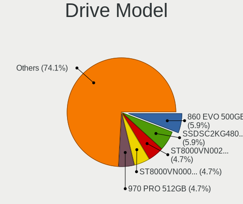

| Model                                       | Computers | Percent |
|---------------------------------------------|-----------|---------|
| Samsung SSD 860 EVO 500GB                   | 5         | 5.88%   |
| Intel SSDSC2KG480G8 480GB                   | 5         | 5.88%   |
| Seagate ST8000VN0022-2EL112 8TB             | 4         | 4.71%   |
| Seagate ST8000VN0002-1Z8112 8TB             | 4         | 4.71%   |
| Samsung SSD 970 PRO 512GB                   | 4         | 4.71%   |
| Seagate IronWolf ZA1000NM10002-2ZG102 1TB   | 3         | 3.53%   |
| Samsung SSD 870 EVO 1TB                     | 3         | 3.53%   |
| KIOXIA KBG40ZNV1T02 1TB                     | 3         | 3.53%   |
| Intel SSDPED1D480GA 480GB                   | 3         | 3.53%   |
| WDC WDS100T3X0C-00SJG0 1TB                  | 2         | 2.35%   |
| WDC WD60EFAX-68SHWN0 6TB                    | 2         | 2.35%   |
| Toshiba THNSNJ128GCSU 128GB                 | 2         | 2.35%   |
| SK hynix SHGP31-1000GM 1TB                  | 2         | 2.35%   |
| Seagate ST16000NM001G-2KK103 16TB           | 2         | 2.35%   |
| Seagate ST10000VN0008-2PJ103 10TB           | 2         | 2.35%   |
| Seagate ST10000NE0008-2PL103 10TB           | 2         | 2.35%   |
| Seagate FireCuda 120 SSD ZA500GM10001 500GB | 2         | 2.35%   |
| Samsung SSD 860 QVO 2TB                     | 2         | 2.35%   |
| Samsung SSD 860 EVO 1TB                     | 2         | 2.35%   |
| Samsung SSD 750 EVO 250GB                   | 2         | 2.35%   |
| WDC WD5000LPLX-08ZNTT0 500GB                | 1         | 1.18%   |
| WDC WD30EZRX-00MMMB0 3TB                    | 1         | 1.18%   |
| WDC WD1003FZEX-00K3CA0 1TB                  | 1         | 1.18%   |
| Toshiba TL100 120GB                         | 1         | 1.18%   |
| Seagate ST980210A 80GB                      | 1         | 1.18%   |
| Seagate ST5000DM000-1FK178 5TB              | 1         | 1.18%   |
| Seagate ST2000DM001-1CH164 2TB              | 1         | 1.18%   |
| SanDisk Ultra 3D NVMe 500GB                 | 1         | 1.18%   |
| SanDisk SSD PLUS 240GB                      | 1         | 1.18%   |
| Samsung SSD 990 EVO Plus 4TB                | 1         | 1.18%   |
| Samsung SSD 970 EVO Plus 2TB                | 1         | 1.18%   |
| Samsung SSD 870 EVO 500GB                   | 1         | 1.18%   |
| Samsung MZ7LM1T9HCJM-00003 1.9TB            | 1         | 1.18%   |
| Micron MTFDKBA512TFH-1BC1AABHA 512GB        | 1         | 1.18%   |
| Maxtor STM3250310AS 250GB                   | 1         | 1.18%   |
| Lenovo LENSE30512GMSP34MEAT3TA 512GB        | 1         | 1.18%   |
| Intel SSDSC2KW480H6 480GB                   | 1         | 1.18%   |
| Intel SSDSC2KB019T8 1.9TB                   | 1         | 1.18%   |
| Intel SSDSC2BW240H6 240GB                   | 1         | 1.18%   |
| Intel SSDSA2CT040G3 40GB                    | 1         | 1.18%   |

HDD Vendor
----------

Hard disk drive vendors

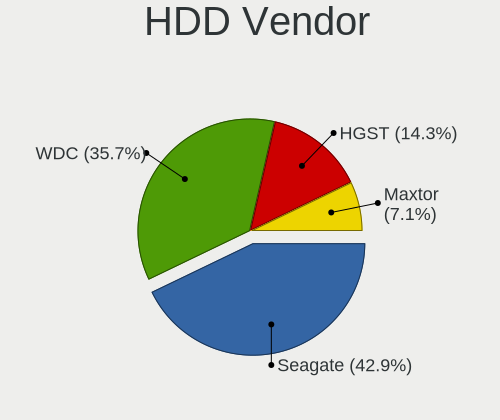

| Vendor  | Computers | Drives | Percent |
|---------|-----------|--------|---------|
| Seagate | 6         | 45     | 42.86%  |
| WDC     | 5         | 20     | 35.71%  |
| HGST    | 2         | 4      | 14.29%  |
| Maxtor  | 1         | 1      | 7.14%   |

SSD Vendor
----------

Solid state drive vendors

| Vendor              | Computers | Drives | Percent |
|---------------------|-----------|--------|---------|
| Samsung Electronics | 8         | 48     | 33.33%  |
| Seagate             | 5         | 9      | 20.83%  |
| Intel               | 5         | 38     | 20.83%  |
| Toshiba             | 3         | 7      | 12.5%   |
| SanDisk             | 1         | 7      | 4.17%   |
| HGST                | 1         | 4      | 4.17%   |
| Hewlett-Packard     | 1         | 1      | 4.17%   |

Drive Kind
----------

HDD or SSD

| Kind | Computers | Drives | Percent |
|------|-----------|--------|---------|
| NVMe | 14        | 55     | 36.84%  |
| SSD  | 14        | 114    | 36.84%  |
| HDD  | 10        | 70     | 26.32%  |

Drive Connector
---------------

SATA, SAS, NVMe, etc.

| Type | Computers | Drives | Percent |
|------|-----------|--------|---------|
| SATA | 19        | 184    | 57.58%  |
| NVMe | 14        | 55     | 42.42%  |

Drive Size
----------

Size of hard drive

| Size in TB | Computers | Drives | Percent |
|------------|-----------|--------|---------|
| 0.01-0.5   | 16        | 78     | 44.44%  |
| 0.51-1.0   | 7         | 25     | 19.44%  |
| 1.01-2.0   | 5         | 21     | 13.89%  |
| 4.01-10.0  | 4         | 51     | 11.11%  |
| 10.01-20.0 | 3         | 8      | 8.33%   |
| 2.01-3.0   | 1         | 1      | 2.78%   |

Space Total
-----------

Amount of disk space available on the file system

| Size in GB | Computers | Percent |
|------------|-----------|---------|
| 251-500    | 13        | 52%     |
| 501-1000   | 5         | 20%     |
| 101-250    | 4         | 16%     |
| 21-50      | 1         | 4%      |
| 1001-2000  | 1         | 4%      |
| 51-100     | 1         | 4%      |

Space Used
----------

Amount of used disk space

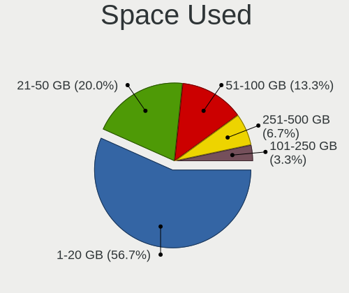

| Used GB | Computers | Percent |
|---------|-----------|---------|
| 1-20    | 17        | 56.67%  |
| 21-50   | 6         | 20%     |
| 51-100  | 4         | 13.33%  |
| 251-500 | 2         | 6.67%   |
| 101-250 | 1         | 3.33%   |

Malfunc. Drives
---------------

Drive models with a malfunction

| Model                           | Computers | Drives | Percent |
|---------------------------------|-----------|--------|---------|
| WDC WD60EFAX-68SHWN0 6TB        | 1         | 2      | 33.33%  |
| Seagate ST8000VN0022-2EL112 8TB | 1         | 1      | 33.33%  |
| Intel SSDSC2KW480H6 480GB       | 1         | 1      | 33.33%  |

Malfunc. Drive Vendor
---------------------

Vendors of faulty drives

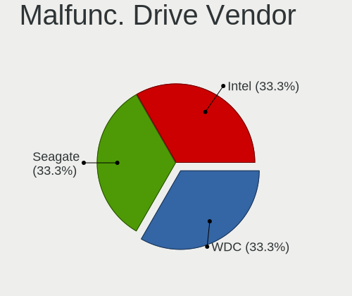

| Vendor  | Computers | Drives | Percent |
|---------|-----------|--------|---------|
| WDC     | 1         | 2      | 33.33%  |
| Seagate | 1         | 1      | 33.33%  |
| Intel   | 1         | 1      | 33.33%  |

Malfunc. HDD Vendor
-------------------

Vendors of faulty HDD drives

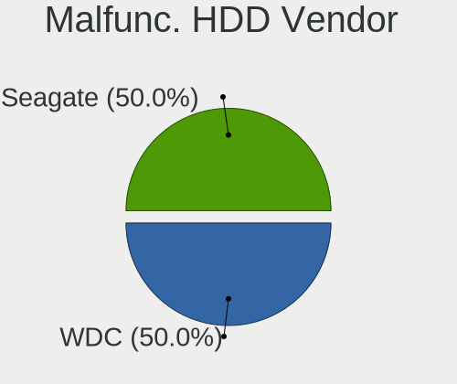

| Vendor  | Computers | Drives | Percent |
|---------|-----------|--------|---------|
| WDC     | 1         | 2      | 50%     |
| Seagate | 1         | 1      | 50%     |

Malfunc. Drive Kind
-------------------

Kinds of faulty drives

| Kind | Computers | Drives | Percent |
|------|-----------|--------|---------|
| HDD  | 2         | 3      | 66.67%  |
| SSD  | 1         | 1      | 33.33%  |

Failed Drives
-------------

Failed drive models

Zero info for selected period =(

Failed Drive Vendor
-------------------

Failed drive vendors

Zero info for selected period =(

Drive Status
------------

Number of failed and malfunc. drives

| Status   | Computers | Drives | Percent |
|----------|-----------|--------|---------|
| Works    | 22        | 234    | 84.62%  |
| Malfunc  | 3         | 4      | 11.54%  |
| Detected | 1         | 1      | 3.85%   |

Storage controller
------------------

Storage Vendor
--------------

Storage controller vendors

| Vendor                    | Computers | Percent |
|---------------------------|-----------|---------|
| Intel                     | 11        | 25.58%  |
| AMD                       | 10        | 23.26%  |
| Samsung Electronics       | 5         | 11.63%  |
| SanDisk                   | 4         | 9.3%    |
| KIOXIA                    | 3         | 6.98%   |
| SK hynix                  | 2         | 4.65%   |
| Realtek Semiconductor     | 2         | 4.65%   |
| VIA Technologies          | 1         | 2.33%   |
| Silicon Image             | 1         | 2.33%   |
| Micron/Crucial Technology | 1         | 2.33%   |
| Micron Technology         | 1         | 2.33%   |
| Lenovo                    | 1         | 2.33%   |
| Hewlett-Packard           | 1         | 2.33%   |

Storage Model
-------------

Storage controller models

| Model                                                                          | Computers | Percent |
|--------------------------------------------------------------------------------|-----------|---------|
| AMD FCH SATA Controller [AHCI mode]                                            | 6         | 11.11%  |
| Samsung NVMe SSD Controller SM981/PM981/PM983                                  | 5         | 9.26%   |
| Intel Optane SSD 900P Series                                                   | 4         | 7.41%   |
| AMD 400 Series Chipset SATA Controller                                         | 4         | 7.41%   |
| KIOXIA NVMe SSD Controller BG4 (DRAM-less)                                     | 3         | 5.56%   |
| AMD 500 Series Chipset SATA Controller                                         | 3         | 5.56%   |
| SK hynix Gold P31/BC711/PC711 NVMe Solid State Drive                           | 2         | 3.7%    |
| SanDisk Extreme Pro / WD Black SN750 / PC SN730 / Red SN700 NVMe SSD           | 2         | 3.7%    |
| Realtek RTS5763DL x2 NVMe SSD Controller                                       | 2         | 3.7%    |
| Intel SATA Controller [RAID Mode]                                              | 2         | 3.7%    |
| Intel 500 Series Chipset Family SATA AHCI Controller                           | 2         | 3.7%    |
| AMD 300 Series Chipset SATA Controller                                         | 2         | 3.7%    |
| VIA VT82C586A/B/VT82C686/A/B/VT823x/A/C PIPC Bus Master IDE                    | 1         | 1.85%   |
| Silicon Image SiI 3114 [SATALink/SATARaid] Serial ATA Controller               | 1         | 1.85%   |
| Sandisk WD Black SN770 / PC SN740 256GB / PC SN560 (DRAM-less) NVMe SSD        | 1         | 1.85%   |
| SanDisk Ultra 3D / WD PC SN530, IX SN530, Blue SN550 NVMe SSD (DRAM-less)      | 1         | 1.85%   |
| Samsung NVMe SSD Controller PM9C1a (DRAM-less)                                 | 1         | 1.85%   |
| Micron/Crucial P2 [Nick P2] / P3 / P3 Plus NVMe PCIe SSD (DRAM-less)           | 1         | 1.85%   |
| Micron 3400 NVMe SSD [Hendrix]                                                 | 1         | 1.85%   |
| Lenovo LENSE30512GMSP34MEAT3TA                                                 | 1         | 1.85%   |
| Intel C602 chipset 4-Port SATA Storage Control Unit                            | 1         | 1.85%   |
| Intel C600/X79 series chipset IDE-r Controller                                 | 1         | 1.85%   |
| Intel C600/X79 series chipset 6-Port SATA AHCI Controller                      | 1         | 1.85%   |
| Intel 82801FBM (ICH6M) SATA Controller                                         | 1         | 1.85%   |
| Intel 8 Series/C220 Series Chipset Family 6-port SATA Controller 1 [AHCI mode] | 1         | 1.85%   |
| Intel 6 Series/C200 Series Chipset Family 6 port Desktop SATA AHCI Controller  | 1         | 1.85%   |
| HP Smart Array Gen9 Controllers                                                | 1         | 1.85%   |
| AMD X370 Series Chipset SATA Controller                                        | 1         | 1.85%   |
| AMD 600 Series Chipset SATA Controller                                         | 1         | 1.85%   |

Storage Kind
------------

Kind of storage controller (IDE, SATA, NVMe, SAS, ...)

| Kind | Computers | Percent |
|------|-----------|---------|
| NVMe | 15        | 39.47%  |
| SATA | 15        | 39.47%  |
| RAID | 4         | 10.53%  |
| IDE  | 3         | 7.89%   |
| SAS  | 1         | 2.63%   |

Processor
---------

CPU Vendor
----------

Processor vendors

| Vendor | Computers | Percent |
|--------|-----------|---------|
| Intel  | 11        | 50%     |
| AMD    | 11        | 50%     |

CPU Model
---------

Processor models

| Model                                           | Computers | Percent |
|-------------------------------------------------|-----------|---------|
| AMD Ryzen 7 5800X 8-Core Processor              | 3         | 11.11%  |
| AMD Ryzen 7 2700 Eight-Core Processor           | 3         | 11.11%  |
| Intel 11th Gen Core i9-11900K @ 3.50GHz         | 2         | 7.41%   |
| AMD Ryzen 7 5700X 8-Core Processor              | 2         | 7.41%   |
| AMD Ryzen 7 1700 Eight-Core Processor           | 2         | 7.41%   |
| Intel Xeon E-2314 CPU @ 2.80GHz                 | 1         | 3.7%    |
| Intel Xeon CPU E5-2690 v3 @ 2.60GHz             | 1         | 3.7%    |
| Intel Xeon CPU E5-2670 @ 2.60GHz                | 1         | 3.7%    |
| Intel Xeon CPU E3-1230 V2 @ 3.30GHz             | 1         | 3.7%    |
| Intel Xeon CPU D-1521 @ 2.40GHz                 | 1         | 3.7%    |
| Intel Pentium M                                 | 1         | 3.7%    |
| Intel Core i7-8750H CPU @ 2.20GHz               | 1         | 3.7%    |
| Intel Core i7-10700 CPU @ 2.90GHz               | 1         | 3.7%    |
| Intel 12th Gen Core i5-12450H                   | 1         | 3.7%    |
| Intel 11th Gen Core i7-11700 @ 2.50GHz          | 1         | 3.7%    |
| AMD Ryzen 9 7900 12-Core Processor              | 1         | 3.7%    |
| AMD Ryzen 9 3950X 16-Core Processor             | 1         | 3.7%    |
| AMD Ryzen 7 2700X Eight-Core Processor          | 1         | 3.7%    |
| AMD Ryzen 5 PRO 2500U w/ Radeon Vega Mobile Gfx | 1         | 3.7%    |
| AMD Duron Processor                             | 1         | 3.7%    |

CPU Model Family
----------------

Processor model prefix

| Model           | Computers | Percent |
|-----------------|-----------|---------|
| AMD Ryzen 7     | 8         | 34.78%  |
| Intel Xeon      | 5         | 21.74%  |
| Other           | 4         | 17.39%  |
| Intel Core i7   | 2         | 8.7%    |
| AMD Ryzen 9     | 2         | 8.7%    |
| Intel Pentium M | 1         | 4.35%   |
| AMD Ryzen 5 PRO | 1         | 4.35%   |

CPU Cores
---------

Number of processor cores

| Number | Computers | Percent |
|--------|-----------|---------|
| 8      | 11        | 40.74%  |
| 16     | 4         | 14.81%  |
| 4      | 4         | 14.81%  |
| 24     | 2         | 7.41%   |
| 6      | 2         | 7.41%   |
| 1      | 2         | 7.41%   |
| 32     | 1         | 3.7%    |
| 12     | 1         | 3.7%    |

CPU Sockets
-----------

Number of sockets

| Number | Computers | Percent |
|--------|-----------|---------|
| 1      | 21        | 91.3%   |
| 2      | 2         | 8.7%    |

CPU Threads
-----------

Threads per core (Hyper-Threading)

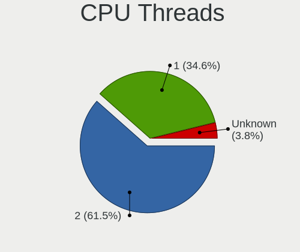

| Number  | Computers | Percent |
|---------|-----------|---------|
| 2       | 16        | 61.54%  |
| 1       | 9         | 34.62%  |
| Unknown | 1         | 3.85%   |

CPU Microarch
-------------

Microarchitecture

| Name        | Computers | Percent |
|-------------|-----------|---------|
| Zen 3       | 5         | 19.23%  |
| Unknown     | 5         | 19.23%  |
| Zen+        | 4         | 15.38%  |
| Zen         | 3         | 11.54%  |
| Zen 2       | 1         | 3.85%   |
| SandyBridge | 1         | 3.85%   |
| P6          | 1         | 3.85%   |
| KabyLake    | 1         | 3.85%   |
| K6          | 1         | 3.85%   |
| IvyBridge   | 1         | 3.85%   |
| Haswell     | 1         | 3.85%   |
| CometLake   | 1         | 3.85%   |
| Broadwell   | 1         | 3.85%   |

Graphics
--------

GPU Vendor
----------

Vendors of graphics cards

| Vendor                     | Computers | Percent |
|----------------------------|-----------|---------|
| Nvidia                     | 13        | 44.83%  |
| AMD                        | 7         | 24.14%  |
| Intel                      | 5         | 17.24%  |
| Matrox Electronics Systems | 3         | 10.34%  |
| ASPEED Technology          | 1         | 3.45%   |

GPU Model
---------

Graphics card models

| Model                                                            | Computers | Percent |
|------------------------------------------------------------------|-----------|---------|
| Nvidia GK208B [GeForce GT 710]                                   | 6         | 20%     |
| Nvidia GP108 [GeForce GT 1030]                                   | 3         | 10%     |
| Nvidia GP102 [GeForce GTX 1080 Ti]                               | 2         | 6.67%   |
| AMD Caicos PRO [Radeon HD 7450]                                  | 2         | 6.67%   |
| Nvidia TU117M [GeForce GTX 1650 Mobile / Max-Q]                  | 1         | 3.33%   |
| Nvidia GP107M [GeForce GTX 1050 Ti Mobile]                       | 1         | 3.33%   |
| Matrox Electronics Systems MGA G200eW WPCM450                    | 1         | 3.33%   |
| Matrox Electronics Systems MGA G200eH3                           | 1         | 3.33%   |
| Matrox Electronics Systems MGA G200EH                            | 1         | 3.33%   |
| Intel RocketLake-S GT1 [UHD Graphics 750]                        | 1         | 3.33%   |
| Intel DG2 [Arc A750]                                             | 1         | 3.33%   |
| Intel CometLake-S GT2 [UHD Graphics 630]                         | 1         | 3.33%   |
| Intel CoffeeLake-H GT2 [UHD Graphics 630]                        | 1         | 3.33%   |
| Intel Alder Lake-P GT1 [UHD Graphics]                            | 1         | 3.33%   |
| ASPEED Technology ASPEED Graphics Family                         | 1         | 3.33%   |
| AMD RV370/M22 [Mobility Radeon X300]                             | 1         | 3.33%   |
| AMD RV280 [Radeon 9200] (Secondary)                              | 1         | 3.33%   |
| AMD RV280 [Radeon 9200]                                          | 1         | 3.33%   |
| AMD Raven Ridge [Radeon Vega Series / Radeon Vega Mobile Series] | 1         | 3.33%   |
| AMD Raphael                                                      | 1         | 3.33%   |
| AMD Navi 21 [Radeon RX 6900 XT]                                  | 1         | 3.33%   |

GPU Combo
---------

Combinations of graphics cards

| Name           | Computers | Percent |
|----------------|-----------|---------|
| 1 x Nvidia     | 11        | 42.31%  |
| 1 x AMD        | 5         | 19.23%  |
| 1 x Matrox     | 3         | 11.54%  |
| Intel + Nvidia | 2         | 7.69%   |
| 1 x Intel      | 2         | 7.69%   |
| 2 x AMD        | 1         | 3.85%   |
| Intel + AMD    | 1         | 3.85%   |
| 1 x ASPEED     | 1         | 3.85%   |

GPU Driver
----------

Free vs proprietary

| Driver      | Computers | Percent |
|-------------|-----------|---------|
| Free        | 17        | 68%     |
| Proprietary | 8         | 32%     |

GPU Memory
----------

Total video memory

| Size in GB | Computers | Percent |
|------------|-----------|---------|
| Unknown    | 17        | 70.83%  |
| 1.01-2.0   | 2         | 8.33%   |
| 8.01-16.0  | 2         | 8.33%   |
| 0.01-0.5   | 2         | 8.33%   |
| 3.01-4.0   | 1         | 4.17%   |

Monitor
-------

Monitor Vendor
--------------

Monitor vendors

| Vendor         | Computers | Percent |
|----------------|-----------|---------|
| LG Electronics | 2         | 33.33%  |
| Goldstar       | 2         | 33.33%  |
| Chimei Innolux | 1         | 16.67%  |
| Acer           | 1         | 16.67%  |

Monitor Model
-------------

Monitor models

| Model                                                           | Computers | Percent |
|-----------------------------------------------------------------|-----------|---------|
| LG Electronics LCD Monitor LG ULTRAGEAR 2560x1440               | 1         | 14.29%  |
| LG Electronics LCD Monitor LG Ultra HD 3840x2160                | 1         | 14.29%  |
| Goldstar LG ULTRAGEAR GSM7765 2560x1440 700x390mm 31.5-inch     | 1         | 14.29%  |
| Goldstar LG Ultra HD GSM5B09 3840x2160 600x340mm 27.2-inch      | 1         | 14.29%  |
| Chimei Innolux LCD Monitor CMN14C3 1366x768 310x170mm 13.9-inch | 1         | 14.29%  |
| Acer LCD Monitor EI342CKR 3440x1440                             | 1         | 14.29%  |
| Acer EI342CKR ACR0763 3440x1440 800x330mm 34.1-inch             | 1         | 14.29%  |

Monitor Resolution
------------------

Monitor screen resolution

| Resolution      | Computers | Percent |
|-----------------|-----------|---------|
| 3840x2160 (4K)  | 2         | 33.33%  |
| 2560x1440 (QHD) | 2         | 33.33%  |
| 3440x1440       | 1         | 16.67%  |
| 1366x768 (WXGA) | 1         | 16.67%  |

Monitor Diagonal
----------------

Diagonal size in inches

| Inches  | Computers | Percent |
|---------|-----------|---------|
| Unknown | 2         | 33.33%  |
| 34      | 1         | 16.67%  |
| 31      | 1         | 16.67%  |
| 27      | 1         | 16.67%  |
| 13      | 1         | 16.67%  |

Monitor Width
-------------

Physical width

| Width in mm | Computers | Percent |
|-------------|-----------|---------|
| Unknown     | 2         | 33.33%  |
| 701-800     | 1         | 16.67%  |
| 601-700     | 1         | 16.67%  |
| 501-600     | 1         | 16.67%  |
| 301-350     | 1         | 16.67%  |

Aspect Ratio
------------

Proportional relationship between the width and the height

| Ratio   | Computers | Percent |
|---------|-----------|---------|
| 16/9    | 3         | 50%     |
| Unknown | 2         | 33.33%  |
| 21/9    | 1         | 16.67%  |

Monitor Area
------------

Area in inch

| Area in inch | Computers | Percent |
|----------------|-----------|---------|
| 351-500        | 2         | 33.33%  |
| Unknown        | 2         | 33.33%  |
| 81-90          | 1         | 16.67%  |
| 301-350        | 1         | 16.67%  |

Pixel Density
-------------

Pixels per inch

| Density | Computers | Percent |
|---------|-----------|---------|
| 101-120 | 2         | 33.33%  |
| Unknown | 2         | 33.33%  |
| 161-240 | 1         | 16.67%  |
| 51-100  | 1         | 16.67%  |

Multiple Monitors
-----------------

Total monitors connected

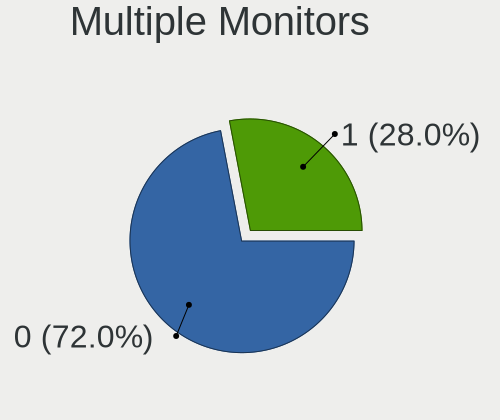

| Total | Computers | Percent |
|-------|-----------|---------|
| 0     | 18        | 72%     |
| 1     | 7         | 28%     |

Network
-------

Net Controller Vendor
---------------------

Controller vendors

| Vendor                | Computers | Percent |
|-----------------------|-----------|---------|
| Intel                 | 15        | 45.45%  |
| Realtek Semiconductor | 10        | 30.3%   |
| Broadcom              | 3         | 9.09%   |
| MediaTek              | 2         | 6.06%   |
| U-Blox                | 1         | 3.03%   |
| D-Link System         | 1         | 3.03%   |
| ASUSTek Computer      | 1         | 3.03%   |

Net Controller Model
--------------------

Controller models

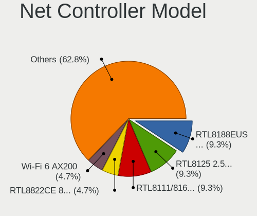

| Model                                                                  | Computers | Percent |
|------------------------------------------------------------------------|-----------|---------|
| Realtek RTL8188EUS 802.11n Wireless Network Adapter                    | 4         | 9.3%    |
| Realtek RTL8125 2.5GbE Controller                                      | 4         | 9.3%    |
| Realtek RTL8111/8168/8211/8411 PCI Express Gigabit Ethernet Controller | 4         | 9.3%    |
| Realtek RTL8822CE 802.11ac PCIe Wireless Network Adapter               | 2         | 4.65%   |
| Intel Wi-Fi 6 AX200                                                    | 2         | 4.65%   |
| Intel I211 Gigabit Network Connection                                  | 2         | 4.65%   |
| Intel Ethernet Controller X550                                         | 2         | 4.65%   |
| Intel Ethernet Controller 10-Gigabit X540-AT2                          | 2         | 4.65%   |
| Intel 82579LM Gigabit Network Connection (Lewisville)                  | 2         | 4.65%   |
| Broadcom NetXtreme II BCM57810 10 Gigabit Ethernet                     | 2         | 4.65%   |
| U-Blox [u-blox 7]                                                      | 1         | 2.33%   |
| MediaTek MT7922 802.11ax PCI Express Wireless Network Adapter          | 1         | 2.33%   |
| MediaTek MT7921 802.11ax PCI Express Wireless Network Adapter          | 1         | 2.33%   |
| Intel Wireless 8265 / 8275                                             | 1         | 2.33%   |
| Intel Wi-Fi 6E(802.11ax) AX210/AX1675* 2x2 [Typhoon Peak]              | 1         | 2.33%   |
| Intel Wi-Fi 5(802.11ac) Wireless-AC 9x6x [Thunder Peak]                | 1         | 2.33%   |
| Intel Tiger Lake PCH CNVi WiFi                                         | 1         | 2.33%   |
| Intel I350 Gigabit Network Connection                                  | 1         | 2.33%   |
| Intel Ethernet Controller 10G X550T                                    | 1         | 2.33%   |
| Intel Ethernet Connection X552/X557-AT 10GBASE-T                       | 1         | 2.33%   |
| Intel Ethernet Connection (7) I219-V                                   | 1         | 2.33%   |
| Intel Cannon Lake PCH CNVi WiFi                                        | 1         | 2.33%   |
| Intel 82574L Gigabit Network Connection                                | 1         | 2.33%   |
| D-Link System DGE-528T Gigabit Ethernet Adapter                        | 1         | 2.33%   |
| Broadcom NetXtreme BCM5751 Gigabit Ethernet PCI Express                | 1         | 2.33%   |
| Broadcom NetXtreme BCM5719 Gigabit Ethernet PCIe                       | 1         | 2.33%   |
| ASUS USB-AC53 Nano USB Wieless Adapter                                 | 1         | 2.33%   |

Wireless Vendor
---------------

Wireless vendors

| Vendor                | Computers | Percent |
|-----------------------|-----------|---------|
| Intel                 | 7         | 43.75%  |
| Realtek Semiconductor | 6         | 37.5%   |
| MediaTek              | 2         | 12.5%   |
| ASUSTek Computer      | 1         | 6.25%   |

Wireless Model
--------------

Wireless models

| Model                                                         | Computers | Percent |
|---------------------------------------------------------------|-----------|---------|
| Realtek RTL8188EUS 802.11n Wireless Network Adapter           | 4         | 25%     |
| Realtek RTL8822CE 802.11ac PCIe Wireless Network Adapter      | 2         | 12.5%   |
| Intel Wi-Fi 6 AX200                                           | 2         | 12.5%   |
| MediaTek MT7922 802.11ax PCI Express Wireless Network Adapter | 1         | 6.25%   |
| MediaTek MT7921 802.11ax PCI Express Wireless Network Adapter | 1         | 6.25%   |
| Intel Wireless 8265 / 8275                                    | 1         | 6.25%   |
| Intel Wi-Fi 6E(802.11ax) AX210/AX1675* 2x2 [Typhoon Peak]     | 1         | 6.25%   |
| Intel Wi-Fi 5(802.11ac) Wireless-AC 9x6x [Thunder Peak]       | 1         | 6.25%   |
| Intel Tiger Lake PCH CNVi WiFi                                | 1         | 6.25%   |
| Intel Cannon Lake PCH CNVi WiFi                               | 1         | 6.25%   |
| ASUS USB-AC53 Nano USB Wieless Adapter                        | 1         | 6.25%   |

Ethernet Vendor
---------------

Ethernet vendors

| Vendor                | Computers | Percent |
|-----------------------|-----------|---------|
| Intel                 | 12        | 50%     |
| Realtek Semiconductor | 8         | 33.33%  |
| Broadcom              | 3         | 12.5%   |
| D-Link System         | 1         | 4.17%   |

Ethernet Model
--------------

Ethernet models

| Model                                                                  | Computers | Percent |
|------------------------------------------------------------------------|-----------|---------|
| Realtek RTL8125 2.5GbE Controller                                      | 4         | 15.38%  |
| Realtek RTL8111/8168/8211/8411 PCI Express Gigabit Ethernet Controller | 4         | 15.38%  |
| Intel I211 Gigabit Network Connection                                  | 2         | 7.69%   |
| Intel Ethernet Controller X550                                         | 2         | 7.69%   |
| Intel Ethernet Controller 10-Gigabit X540-AT2                          | 2         | 7.69%   |
| Intel 82579LM Gigabit Network Connection (Lewisville)                  | 2         | 7.69%   |
| Broadcom NetXtreme II BCM57810 10 Gigabit Ethernet                     | 2         | 7.69%   |
| Intel I350 Gigabit Network Connection                                  | 1         | 3.85%   |
| Intel Ethernet Controller 10G X550T                                    | 1         | 3.85%   |
| Intel Ethernet Connection X552/X557-AT 10GBASE-T                       | 1         | 3.85%   |
| Intel Ethernet Connection (7) I219-V                                   | 1         | 3.85%   |
| Intel 82574L Gigabit Network Connection                                | 1         | 3.85%   |
| D-Link System DGE-528T Gigabit Ethernet Adapter                        | 1         | 3.85%   |
| Broadcom NetXtreme BCM5751 Gigabit Ethernet PCI Express                | 1         | 3.85%   |
| Broadcom NetXtreme BCM5719 Gigabit Ethernet PCIe                       | 1         | 3.85%   |

Net Controller Kind
-------------------

Ethernet, WiFi or modem

| Kind     | Computers | Percent |
|----------|-----------|---------|
| Ethernet | 22        | 64.71%  |
| WiFi     | 11        | 32.35%  |
| Modem    | 1         | 2.94%   |

Used Controller
---------------

Currently used network controller

| Kind     | Computers | Percent |
|----------|-----------|---------|
| Ethernet | 21        | 87.5%   |
| WiFi     | 3         | 12.5%   |

NICs
----

Total network controllers on board

| Total | Computers | Percent |
|-------|-----------|---------|
| 2     | 13        | 56.52%  |
| 1     | 6         | 26.09%  |
| 3     | 2         | 8.7%    |
| 6     | 1         | 4.35%   |
| 4     | 1         | 4.35%   |

IPv6
----

IPv6 vs IPv4

| Used | Computers | Percent |
|------|-----------|---------|
| No   | 19        | 79.17%  |
| Yes  | 5         | 20.83%  |

Bluetooth
---------

Bluetooth Vendor
----------------

Controller vendors

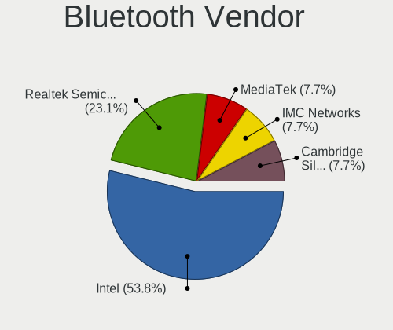

| Vendor                  | Computers | Percent |
|-------------------------|-----------|---------|
| Intel                   | 7         | 53.85%  |
| Realtek Semiconductor   | 3         | 23.08%  |
| MediaTek                | 1         | 7.69%   |
| IMC Networks            | 1         | 7.69%   |
| Cambridge Silicon Radio | 1         | 7.69%   |

Bluetooth Model
---------------

Controller models

| Model                                               | Computers | Percent |
|-----------------------------------------------------|-----------|---------|
| Realtek Bluetooth 4.2 Adapter                       | 2         | 15.38%  |
| Intel AX200 Bluetooth                               | 2         | 15.38%  |
| Realtek RTL8822BE Bluetooth 4.2 Adapter             | 1         | 7.69%   |
| MediaTek RZ616 Bluetooth Adapter                    | 1         | 7.69%   |
| Intel Wireless-AC 9260 Bluetooth Adapter            | 1         | 7.69%   |
| Intel Bluetooth wireless interface                  | 1         | 7.69%   |
| Intel Bluetooth 9460/9560 Jefferson Peak (JfP)      | 1         | 7.69%   |
| Intel AX210 Bluetooth                               | 1         | 7.69%   |
| Intel AX201 Bluetooth                               | 1         | 7.69%   |
| IMC Networks MediaTek Bluetooth Adapter             | 1         | 7.69%   |
| Cambridge Silicon Radio Bluetooth Dongle (HCI mode) | 1         | 7.69%   |

Sound
-----

Sound Vendor
------------

Sound card vendors

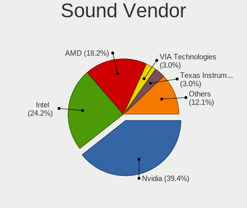

| Vendor                | Computers | Percent |
|-----------------------|-----------|---------|
| Nvidia                | 13        | 39.39%  |
| Intel                 | 8         | 24.24%  |
| AMD                   | 6         | 18.18%  |
| VIA Technologies      | 1         | 3.03%   |
| Texas Instruments     | 1         | 3.03%   |
| SteelSeries ApS       | 1         | 3.03%   |
| Realtek Semiconductor | 1         | 3.03%   |
| Logitech              | 1         | 3.03%   |
| Creative Labs         | 1         | 3.03%   |

Sound Model
-----------

Sound card models

| Model                                                                                                                                                                                      | Computers | Percent |
|--------------------------------------------------------------------------------------------------------------------------------------------------------------------------------------------|-----------|---------|
| Nvidia GK208 HDMI/DP Audio Controller                                                                                                                                                      | 6         | 16.22%  |
| Nvidia GP108 High Definition Audio Controller                                                                                                                                              | 3         | 8.11%   |
| Nvidia GP102 HDMI Audio Controller                                                                                                                                                         | 2         | 5.41%   |
| Intel Tiger Lake-H HD Audio Controller                                                                                                                                                     | 2         | 5.41%   |
| AMD Family 17h/19h/1ah HD Audio Controller                                                                                                                                                 | 2         | 5.41%   |
| AMD Family 17h (Models 00h-0fh) HD Audio Controller                                                                                                                                        | 2         | 5.41%   |
| AMD Caicos HDMI Audio [Radeon HD 6450 / 7450/8450/8490 OEM / R5 230/235/235X OEM]                                                                                                          | 2         | 5.41%   |
| VIA Technologies VT82C686 AC97 Audio Controller                                                                                                                                            | 1         | 2.7%    |
| Texas Instruments PCM2902 Audio Codec                                                                                                                                                      | 1         | 2.7%    |
| SteelSeries ApS SteelSeries GameDAC GameDAC Hi-Res                                                                                                                                         | 1         | 2.7%    |
| Realtek Semiconductor USB Audio                                                                                                                                                            | 1         | 2.7%    |
| Nvidia TU107 GeForce GTX 1650 High Definition Audio Controller                                                                                                                             | 1         | 2.7%    |
| Nvidia GP107GL High Definition Audio Controller                                                                                                                                            | 1         | 2.7%    |
| Logitech Blue Microphones Yeti Stereo Microphone Yeti Stereo Microphone Yeti Stereo Microphone Yeti Stereo Microphone Yeti Stereo Microphone Yeti Stereo Microphone Yeti Stereo Microphone | 1         | 2.7%    |
| Intel DG2 Audio Controller                                                                                                                                                                 | 1         | 2.7%    |
| Intel Comet Lake PCH cAVS                                                                                                                                                                  | 1         | 2.7%    |
| Intel Cannon Lake PCH cAVS                                                                                                                                                                 | 1         | 2.7%    |
| Intel C600/X79 series chipset High Definition Audio Controller                                                                                                                             | 1         | 2.7%    |
| Intel Alder Lake PCH-P High Definition Audio Controller                                                                                                                                    | 1         | 2.7%    |
| Intel 82801FB/FBM/FR/FW/FRW (ICH6 Family) AC'97 Audio Controller                                                                                                                           | 1         | 2.7%    |
| Creative Labs EMU10k1 [Sound Blaster Live! Series]                                                                                                                                         | 1         | 2.7%    |
| AMD Starship/Matisse HD Audio Controller                                                                                                                                                   | 1         | 2.7%    |
| AMD Rembrandt Radeon High Definition Audio Controller                                                                                                                                      | 1         | 2.7%    |
| AMD Raven/Raven2/Fenghuang HDMI/DP Audio Controller                                                                                                                                        | 1         | 2.7%    |
| AMD Navi 21/23 HDMI/DP Audio Controller                                                                                                                                                    | 1         | 2.7%    |

Memory
------

Memory Vendor
-------------

Memory module vendors

| Vendor                       | Computers | Percent |
|------------------------------|-----------|---------|
| Samsung Electronics          | 8         | 22.22%  |
| Corsair                      | 6         | 16.67%  |
| G.Skill                      | 5         | 13.89%  |
| Unknown                      | 4         | 11.11%  |
| Unknown                      | 2         | 5.56%   |
| Micron Technology            | 2         | 5.56%   |
| Kingston                     | 2         | 5.56%   |
| SK hynix                     | 1         | 2.78%   |
| PNY                          | 1         | 2.78%   |
| Patriot Memory (PDP Systems) | 1         | 2.78%   |
| Mushkin                      | 1         | 2.78%   |
| Hewlett-Packard              | 1         | 2.78%   |
| Elpida                       | 1         | 2.78%   |
| Crucial                      | 1         | 2.78%   |

Memory Model
------------

Memory module models

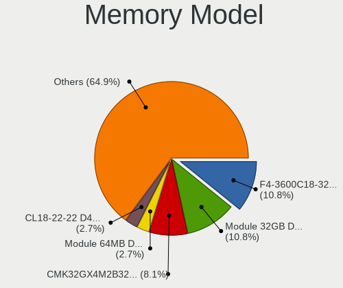

| Model                                                                    | Computers | Percent |
|--------------------------------------------------------------------------|-----------|---------|
| G.Skill RAM F4-3600C18-32GTZN 32GB DIMM DDR4 3600MT/s                    | 4         | 10.81%  |
| Unknown                                                                  | 4         | 10.81%  |
| Corsair RAM CMK32GX4M2B3200C16 16GB DIMM DDR4 3200MT/s                   | 3         | 8.11%   |
| Unknown RAM Module 64MB DIMM DRAM                                        | 1         | 2.7%    |
| Unknown RAM CL18-22-22 D4-3600 16384MB DIMM 2667MT/s                     | 1         | 2.7%    |
| SK hynix RAM Module 1GB SODIMM DDR 667MT/s                               | 1         | 2.7%    |
| Samsung RAM Module 16GB DIMM DDR4 3200MT/s                               | 1         | 2.7%    |
| Samsung RAM M471B5173CB0-YK0 4GB SODIMM DDR3 1600MT/s                    | 1         | 2.7%    |
| Samsung RAM M471A2K43CB1-CTD 16GB SODIMM DDR4 2667MT/s                   | 1         | 2.7%    |
| Samsung RAM M471A1K43EB1-CWE 8GB SODIMM DDR4 3200MT/s                    | 1         | 2.7%    |
| Samsung RAM M471A1K43CB1-CTD 8GB SODIMM DDR4 2667MT/s                    | 1         | 2.7%    |
| Samsung RAM M393A2K40BB2-CTD 16GB DIMM DDR4 2667MT/s                     | 1         | 2.7%    |
| Samsung RAM M391B5273DH0-CK0 4GB DIMM DDR3 1600MT/s                      | 1         | 2.7%    |
| Samsung RAM M391A2G43BB2-CWE 16GB DIMM DDR4 3200MT/s                     | 1         | 2.7%    |
| PNY RAM 16GU2X08QJLL42-12-K 16GB SODIMM DDR4 3200MT/s                    | 1         | 2.7%    |
| Patriot Memory (PDP Systems) RAM 3200 C16 Series 32GB DIMM DDR4 2667MT/s | 1         | 2.7%    |
| Mushkin RAM MRX4U320GJJM32G 32GB DIMM DDR4 2400MT/s                      | 1         | 2.7%    |
| Micron RAM Module 8GB DIMM DDR3 1600MT/s                                 | 1         | 2.7%    |
| Micron RAM 4ATF51264HZ-2G3B2 4GB SODIMM DDR4 2400MT/s                    | 1         | 2.7%    |
| Kingston RAM KF3200C16D4/32GX 32GB DIMM DDR4 3200MT/s                    | 1         | 2.7%    |
| Kingston RAM 9965525-138.A00LF 8GB DIMM DDR3 1600MT/s                    | 1         | 2.7%    |
| Kingston RAM 9965525-116.A00LF 8GB DIMM DDR3 1600MT/s                    | 1         | 2.7%    |
| HP RAM 752369-081 16GB DIMM DDR4 2133MT/s                                | 1         | 2.7%    |
| G.Skill RAM F4-4400C19-16GTZR 16GB DIMM DDR4 2667MT/s                    | 1         | 2.7%    |
| Elpida RAM Module 8GB DIMM DDR3 1600MT/s                                 | 1         | 2.7%    |
| Crucial RAM CT16G4DFRA32A.M16FR 16GB DIMM DDR4 3200MT/s                  | 1         | 2.7%    |
| Corsair RAM CMK32GX4M2A2666C16 16GB DIMM DDR4 3000MT/s                   | 1         | 2.7%    |
| Corsair RAM CMK16GX4M2Z2666C16 8GB DIMM DDR4 2666MT/s                    | 1         | 2.7%    |
| Corsair RAM CMH64GX5M2B6000C40 32GB DIMM DDR5 4800MT/s                   | 1         | 2.7%    |

Memory Kind
-----------

Memory module kinds

| Kind | Computers | Percent |
|------|-----------|---------|
| DDR4 | 17        | 73.91%  |
| DDR3 | 3         | 13.04%  |
| DRAM | 1         | 4.35%   |
| DDR5 | 1         | 4.35%   |
| DDR  | 1         | 4.35%   |

Memory Form Factor
------------------

Physical design of the memory module

| Name   | Computers | Percent |
|--------|-----------|---------|
| DIMM   | 18        | 78.26%  |
| SODIMM | 5         | 21.74%  |

Memory Size
-----------

Memory module size

| Size  | Computers | Percent |
|-------|-----------|---------|
| 16384 | 13        | 44.83%  |
| 32768 | 8         | 27.59%  |
| 8192  | 3         | 10.34%  |
| 4096  | 2         | 6.9%    |
| 1024  | 1         | 3.45%   |
| 256   | 1         | 3.45%   |
| 64    | 1         | 3.45%   |

Memory Speed
------------

Memory module speed

| Speed   | Computers | Percent |
|---------|-----------|---------|
| 3200    | 8         | 28.57%  |
| 2667    | 5         | 17.86%  |
| 3600    | 4         | 14.29%  |
| 1600    | 3         | 10.71%  |
| 2400    | 2         | 7.14%   |
| 4800    | 1         | 3.57%   |
| 3000    | 1         | 3.57%   |
| 2666    | 1         | 3.57%   |
| 2133    | 1         | 3.57%   |
| 667     | 1         | 3.57%   |
| Unknown | 1         | 3.57%   |

Printers & scanners
-------------------

Printer Vendor
--------------

Printer device vendors

Zero info for selected period =(

Printer Model
-------------

Printer device models

Zero info for selected period =(

Scanner Vendor
--------------

Scanner device vendors

Zero info for selected period =(

Scanner Model
-------------

Scanner device models

Zero info for selected period =(

Camera
------

Camera Vendor
-------------

Camera device vendors

| Vendor                      | Computers | Percent |
|-----------------------------|-----------|---------|
| Logitech                    | 5         | 62.5%   |
| Luxvisions Innotech Limited | 1         | 12.5%   |
| Chicony Electronics         | 1         | 12.5%   |
| Bison Electronics           | 1         | 12.5%   |

Camera Model
------------

Camera device models

| Model                                                | Computers | Percent |
|------------------------------------------------------|-----------|---------|
| Logitech C922 Pro Stream Webcam                      | 3         | 37.5%   |
| Logitech HD Pro Webcam C920                          | 2         | 25%     |
| Luxvisions Innotech Limited HP Wide Vision HD Camera | 1         | 12.5%   |
| Chicony Integrated Camera (1280x720@30)              | 1         | 12.5%   |
| Bison Integrated Camera                              | 1         | 12.5%   |

Security
--------

Fingerprint Vendor
------------------

Fingerprint sensor vendors

| Vendor    | Computers | Percent |
|-----------|-----------|---------|
| Synaptics | 1         | 100%    |

Fingerprint Model
-----------------

Fingerprint sensor models

| Model                                            | Computers | Percent |
|--------------------------------------------------|-----------|---------|
| Synaptics Metallica MIS Touch Fingerprint Reader | 1         | 100%    |

Chipcard Vendor
---------------

Chipcard module vendors

Zero info for selected period =(

Chipcard Model
--------------

Chipcard module models

Zero info for selected period =(

Unsupported
-----------

Unsupported Devices
-------------------

Total unsupported devices on board

| Total | Computers | Percent |
|-------|-----------|---------|
| 0     | 8         | 30.77%  |
| 1     | 5         | 19.23%  |
| 3     | 4         | 15.38%  |
| 2     | 4         | 15.38%  |
| 4     | 3         | 11.54%  |
| 6     | 1         | 3.85%   |
| 5     | 1         | 3.85%   |

Unsupported Device Types
------------------------

Types of unsupported devices

| Type                     | Computers | Percent |
|--------------------------|-----------|---------|
| Net/wireless             | 10        | 32.26%  |
| Communication controller | 10        | 32.26%  |
| Bluetooth                | 4         | 12.9%   |
| Sound                    | 2         | 6.45%   |
| Card reader              | 2         | 6.45%   |
| Net/ethernet             | 1         | 3.23%   |
| Firewire controller      | 1         | 3.23%   |
| Fingerprint reader       | 1         | 3.23%   |

