MidnightBSD - Tested Hardware & Statistics (Desktops)
-----------------------------------------------------

A project to collect tested hardware configurations for MidnightBSD.

Anyone can contribute to this report by the [hw-probe](https://github.com/linuxhw/hw-probe/blob/master/INSTALL.BSD.md) tool:

    hw-probe -all -upload

Please contribute! Especially if your hardware is rare.

Contents
--------

* [ Test Cases ](#test-cases)

* [ System ](#system)
  - [ OS                       ](#os)
  - [ OS Family                ](#os-family)
  - [ Arch                     ](#arch)
  - [ DE                       ](#de)
  - [ Display Server           ](#display-server)
  - [ Display Manager          ](#display-manager)
  - [ OS Lang                  ](#os-lang)
  - [ Boot Mode                ](#boot-mode)
  - [ Filesystem               ](#filesystem)
  - [ Part. scheme             ](#part-scheme)

* [ Board ](#board)
  - [ Vendor                   ](#vendor)
  - [ Model                    ](#model)
  - [ Model Family             ](#model-family)
  - [ MFG Year                 ](#mfg-year)
  - [ Form Factor              ](#form-factor)
  - [ Coreboot                 ](#coreboot)
  - [ RAM Size                 ](#ram-size)
  - [ RAM Used                 ](#ram-used)
  - [ Total Drives             ](#total-drives)
  - [ Has CD-ROM               ](#has-cd-rom)
  - [ Has Ethernet             ](#has-ethernet)
  - [ Has WiFi                 ](#has-wifi)
  - [ Has Bluetooth            ](#has-bluetooth)

* [ Location ](#location)
  - [ Country                  ](#country)
  - [ City                     ](#city)

* [ Drives ](#drives)
  - [ Drive Vendor             ](#drive-vendor)
  - [ Drive Model              ](#drive-model)
  - [ HDD Vendor               ](#hdd-vendor)
  - [ SSD Vendor               ](#ssd-vendor)
  - [ Drive Kind               ](#drive-kind)
  - [ Drive Connector          ](#drive-connector)
  - [ Drive Size               ](#drive-size)
  - [ Space Total              ](#space-total)
  - [ Space Used               ](#space-used)
  - [ Malfunc. Drives          ](#malfunc-drives)
  - [ Malfunc. Drive Vendor    ](#malfunc-drive-vendor)
  - [ Malfunc. HDD Vendor      ](#malfunc-hdd-vendor)
  - [ Malfunc. Drive Kind      ](#malfunc-drive-kind)
  - [ Failed Drives            ](#failed-drives)
  - [ Failed Drive Vendor      ](#failed-drive-vendor)
  - [ Drive Status             ](#drive-status)

* [ Storage controller ](#storage-controller)
  - [ Storage Vendor           ](#storage-vendor)
  - [ Storage Model            ](#storage-model)
  - [ Storage Kind             ](#storage-kind)

* [ Processor ](#processor)
  - [ CPU Vendor               ](#cpu-vendor)
  - [ CPU Model                ](#cpu-model)
  - [ CPU Model Family         ](#cpu-model-family)
  - [ CPU Cores                ](#cpu-cores)
  - [ CPU Sockets              ](#cpu-sockets)
  - [ CPU Threads              ](#cpu-threads)
  - [ CPU Microarch            ](#cpu-microarch)

* [ Graphics ](#graphics)
  - [ GPU Vendor               ](#gpu-vendor)
  - [ GPU Model                ](#gpu-model)
  - [ GPU Combo                ](#gpu-combo)
  - [ GPU Driver               ](#gpu-driver)
  - [ GPU Memory               ](#gpu-memory)

* [ Monitor ](#monitor)
  - [ Monitor Vendor           ](#monitor-vendor)
  - [ Monitor Model            ](#monitor-model)
  - [ Monitor Resolution       ](#monitor-resolution)
  - [ Monitor Diagonal         ](#monitor-diagonal)
  - [ Monitor Width            ](#monitor-width)
  - [ Aspect Ratio             ](#aspect-ratio)
  - [ Monitor Area             ](#monitor-area)
  - [ Pixel Density            ](#pixel-density)
  - [ Multiple Monitors        ](#multiple-monitors)

* [ Network ](#network)
  - [ Net Controller Vendor    ](#net-controller-vendor)
  - [ Net Controller Model     ](#net-controller-model)
  - [ Wireless Vendor          ](#wireless-vendor)
  - [ Wireless Model           ](#wireless-model)
  - [ Ethernet Vendor          ](#ethernet-vendor)
  - [ Ethernet Model           ](#ethernet-model)
  - [ Net Controller Kind      ](#net-controller-kind)
  - [ Used Controller          ](#used-controller)
  - [ NICs                     ](#nics)
  - [ IPv6                     ](#ipv6)

* [ Bluetooth ](#bluetooth)
  - [ Bluetooth Vendor         ](#bluetooth-vendor)
  - [ Bluetooth Model          ](#bluetooth-model)

* [ Sound ](#sound)
  - [ Sound Vendor             ](#sound-vendor)
  - [ Sound Model              ](#sound-model)

* [ Memory ](#memory)
  - [ Memory Vendor            ](#memory-vendor)
  - [ Memory Model             ](#memory-model)
  - [ Memory Kind              ](#memory-kind)
  - [ Memory Form Factor       ](#memory-form-factor)
  - [ Memory Size              ](#memory-size)
  - [ Memory Speed             ](#memory-speed)

* [ Printers & scanners ](#printers--scanners)
  - [ Printer Vendor           ](#printer-vendor)
  - [ Printer Model            ](#printer-model)
  - [ Scanner Vendor           ](#scanner-vendor)
  - [ Scanner Model            ](#scanner-model)

* [ Camera ](#camera)
  - [ Camera Vendor            ](#camera-vendor)
  - [ Camera Model             ](#camera-model)

* [ Security ](#security)
  - [ Fingerprint Vendor       ](#fingerprint-vendor)
  - [ Fingerprint Model        ](#fingerprint-model)
  - [ Chipcard Vendor          ](#chipcard-vendor)
  - [ Chipcard Model           ](#chipcard-model)

* [ Unsupported ](#unsupported)
  - [ Unsupported Devices      ](#unsupported-devices)
  - [ Unsupported Device Types ](#unsupported-device-types)

Test Cases
----------

Total: 40

| Vendor     | Model                       | Probe                                                     | Date         |
|------------|-----------------------------|-----------------------------------------------------------|--------------|
| Supermicro | X9SCL/X9SCMA                | [cb87f3725f](https://bsd-hardware.info/?probe=cb87f3725f) | May 14, 2023 |
| ASUSTek    | TUF Gaming B560M-PLUS WI... | [50ff0c14dd](https://bsd-hardware.info/?probe=50ff0c14dd) | Apr 22, 2023 |
| ASUSTek    | A7VI-VM                     | [083714b968](https://bsd-hardware.info/?probe=083714b968) | Apr 07, 2023 |
| Supermicro | X9SCL/X9SCMA                | [31ed779fdc](https://bsd-hardware.info/?probe=31ed779fdc) | Mar 31, 2023 |
| ASRock     | B550M Steel Legend          | [06a2d12cbe](https://bsd-hardware.info/?probe=06a2d12cbe) | Mar 29, 2023 |
| ASUSTek    | TUF Gaming B450M-PLUS II    | [2c6fc04801](https://bsd-hardware.info/?probe=2c6fc04801) | Mar 29, 2023 |
| ASUSTek    | TUF Gaming B450M-PLUS II    | [e4af143188](https://bsd-hardware.info/?probe=e4af143188) | Jan 10, 2023 |
| Supermicro | X9SCL/X9SCMA                | [0b16265d11](https://bsd-hardware.info/?probe=0b16265d11) | Jan 10, 2023 |
| ASUSTek    | TUF Gaming B450M-PLUS II    | [4d9a4bfc40](https://bsd-hardware.info/?probe=4d9a4bfc40) | Dec 30, 2022 |
| ASUSTek    | TUF Gaming B450M-PLUS II    | [48d5feacf2](https://bsd-hardware.info/?probe=48d5feacf2) | Dec 08, 2022 |
| ASRock     | B550M Steel Legend          | [c6824c4f4a](https://bsd-hardware.info/?probe=c6824c4f4a) | Jun 11, 2022 |
| ASUSTek    | PRIME Z590-P                | [3ef083287f](https://bsd-hardware.info/?probe=3ef083287f) | May 28, 2022 |
| ASUSTek    | PRIME Z590-P                | [53cb90d2b7](https://bsd-hardware.info/?probe=53cb90d2b7) | May 28, 2022 |
| HP         | 8767 A                      | [ac8a395a20](https://bsd-hardware.info/?probe=ac8a395a20) | May 20, 2022 |
| ASUSTek    | TUF Gaming B450M-PLUS II    | [50d12f98fc](https://bsd-hardware.info/?probe=50d12f98fc) | Apr 08, 2022 |
| ASRock     | B550M Steel Legend          | [ad0ab01ca8](https://bsd-hardware.info/?probe=ad0ab01ca8) | Apr 08, 2022 |
| ASRock     | B550M Steel Legend          | [a752b8b4d6](https://bsd-hardware.info/?probe=a752b8b4d6) | Mar 22, 2022 |
| ASUSTek    | TUF Gaming B450M-PLUS II    | [ab838523ad](https://bsd-hardware.info/?probe=ab838523ad) | Jan 15, 2022 |
| ASRock     | X570 Steel Legend WiFi a... | [c13b78e6d5](https://bsd-hardware.info/?probe=c13b78e6d5) | Dec 23, 2021 |
| ASRock     | X570 Steel Legend WiFi a... | [7bf6ec598f](https://bsd-hardware.info/?probe=7bf6ec598f) | Dec 18, 2021 |
| HP         | 8767 A                      | [8bbd431806](https://bsd-hardware.info/?probe=8bbd431806) | Oct 14, 2021 |
| HP         | 8767 A                      | [6bc45054bb](https://bsd-hardware.info/?probe=6bc45054bb) | Oct 14, 2021 |
| ASRock     | X570 Steel Legend WiFi a... | [9614fd11d7](https://bsd-hardware.info/?probe=9614fd11d7) | Aug 21, 2021 |
| ASUSTek    | TUF B350M-PLUS GAMING       | [bd63de17b0](https://bsd-hardware.info/?probe=bd63de17b0) | Jun 07, 2021 |
| ASUSTek    | TUF Gaming B450M-PLUS II    | [308573e703](https://bsd-hardware.info/?probe=308573e703) | Jun 02, 2021 |
| ASUSTek    | TUF B350M-PLUS GAMING       | [ba938810b9](https://bsd-hardware.info/?probe=ba938810b9) | May 25, 2021 |
| ASUSTek    | TUF Gaming B450M-PLUS II    | [29a31a7a93](https://bsd-hardware.info/?probe=29a31a7a93) | May 25, 2021 |
| HP         | 1589                        | [f97fc0533b](https://bsd-hardware.info/?probe=f97fc0533b) | Jan 02, 2021 |
| ASUSTek    | TUF B350M-PLUS GAMING       | [778268ad6f](https://bsd-hardware.info/?probe=778268ad6f) | Dec 30, 2020 |
| ASRock     | X570 Steel Legend WiFi a... | [a27f63a72c](https://bsd-hardware.info/?probe=a27f63a72c) | Dec 30, 2020 |
| ASUSTek    | TUF Gaming B450M-PLUS II    | [78b6751c3f](https://bsd-hardware.info/?probe=78b6751c3f) | Dec 24, 2020 |
| ASUSTek    | TUF GAMING B450M-PLUS II    | [99fca48a73](https://bsd-hardware.info/?probe=99fca48a73) | Dec 06, 2020 |
| ASRock     | X570 Steel Legend WiFi a... | [86ba25be24](https://bsd-hardware.info/?probe=86ba25be24) | Nov 16, 2020 |
| ASUSTek    | TUF Gaming B450M-PLUS II    | [50ad3ee5fb](https://bsd-hardware.info/?probe=50ad3ee5fb) | Nov 16, 2020 |
| ASUSTek    | TUF Gaming B450M-PLUS II    | [164670d170](https://bsd-hardware.info/?probe=164670d170) | Oct 29, 2020 |
| ASUSTek    | TUF Gaming B450M-PLUS II    | [b4663b7249](https://bsd-hardware.info/?probe=b4663b7249) | Aug 28, 2020 |
| ASUSTek    | TUF B350M-PLUS GAMING       | [53aa996eaa](https://bsd-hardware.info/?probe=53aa996eaa) | Jul 31, 2020 |
| ASUSTek    | TUF B350M-PLUS GAMING       | [20fac3b208](https://bsd-hardware.info/?probe=20fac3b208) | May 22, 2020 |
| ASUSTek    | TUF Gaming B450M-PLUS II    | [44681211ff](https://bsd-hardware.info/?probe=44681211ff) | May 22, 2020 |
| ASUSTek    | PRIME X370-PRO              | [7c311ee004](https://bsd-hardware.info/?probe=7c311ee004) | May 22, 2020 |

System
------

OS
--

Installed operating systems

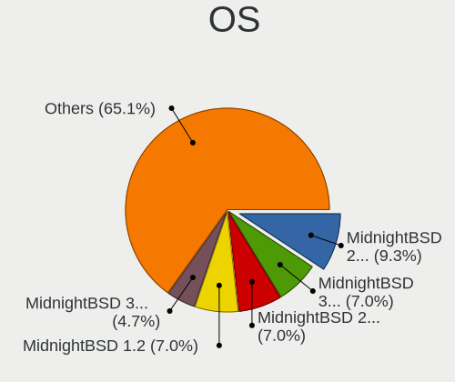

| Name              | Desktops | Percent |
|-------------------|----------|---------|
| MidnightBSD 2.0.2 | 4        | 12.5%   |
| MidnightBSD 2.0.1 | 3        | 9.38%   |
| MidnightBSD 1.2   | 3        | 9.38%   |
| MidnightBSD 3.0.1 | 2        | 6.25%   |
| MidnightBSD 3.0.0 | 2        | 6.25%   |
| MidnightBSD 2.2.6 | 2        | 6.25%   |
| MidnightBSD 2.2.0 | 2        | 6.25%   |
| MidnightBSD 2.1.8 | 2        | 6.25%   |
| MidnightBSD 2.0.7 | 2        | 6.25%   |
| MidnightBSD 2.2.8 | 1        | 3.13%   |
| MidnightBSD 2.2.5 | 1        | 3.13%   |
| MidnightBSD 2.1.6 | 1        | 3.13%   |
| MidnightBSD 2.1.5 | 1        | 3.13%   |
| MidnightBSD 2.1.3 | 1        | 3.13%   |
| MidnightBSD 2.1.2 | 1        | 3.13%   |
| MidnightBSD 2.1.1 | 1        | 3.13%   |
| MidnightBSD 2.1.0 | 1        | 3.13%   |
| MidnightBSD 1.2.9 | 1        | 3.13%   |
| MidnightBSD 1.2.7 | 1        | 3.13%   |

OS Family
---------

OS without a version

| Name        | Desktops | Percent |
|-------------|----------|---------|
| MidnightBSD | 13       | 100%    |

Arch
----

OS architecture (x86_64, i586, etc.)

| Name  | Desktops | Percent |
|-------|----------|---------|
| amd64 | 12       | 92.31%  |
| i386  | 1        | 7.69%   |

DE
--

Desktop Environment

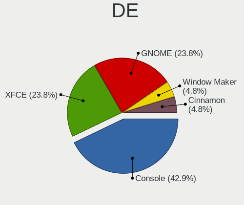

| Name         | Desktops | Percent |
|--------------|----------|---------|
| Console      | 6        | 37.5%   |
| XFCE         | 5        | 31.25%  |
| GNOME        | 4        | 25%     |
| Window Maker | 1        | 6.25%   |

Display Server
--------------

X11 or Wayland

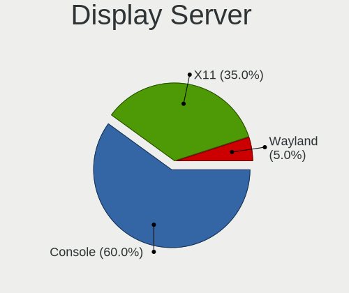

| Name    | Desktops | Percent |
|---------|----------|---------|
| Console | 9        | 60%     |
| X11     | 6        | 40%     |

Display Manager
---------------

SDDM, LightDM, etc.

| Name    | Desktops | Percent |
|---------|----------|---------|
| Console | 13       | 100%    |

OS Lang
-------

Language

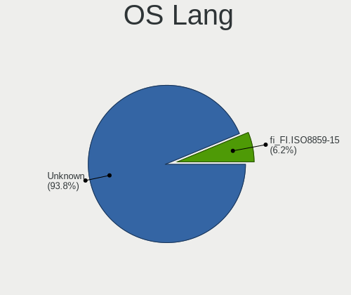

| Lang             | Desktops | Percent |
|------------------|----------|---------|
| Unknown          | 12       | 92.31%  |
| fi_FI.ISO8859-15 | 1        | 7.69%   |

Boot Mode
---------

EFI or BIOS

| Mode | Desktops | Percent |
|------|----------|---------|
| EFI  | 10       | 76.92%  |
| BIOS | 3        | 23.08%  |

Filesystem
----------

Type of filesystem

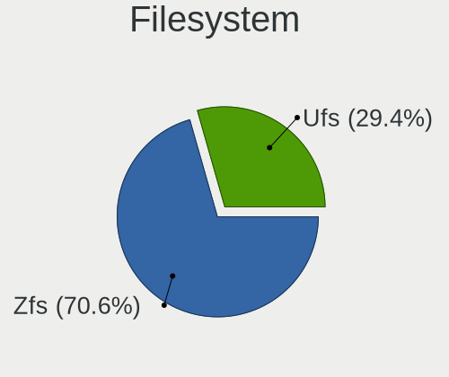

| Type | Desktops | Percent |
|------|----------|---------|
| Zfs  | 8        | 61.54%  |
| Ufs  | 5        | 38.46%  |

Part. scheme
------------

Scheme of partitioning

| Type | Desktops | Percent |
|------|----------|---------|
| GPT  | 12       | 92.31%  |
| MBR  | 1        | 7.69%   |

Board
-----

Vendor
------

Motherboard manufacturer

| Name             | Desktops | Percent |
|------------------|----------|---------|
| ASUSTek Computer | 8        | 61.54%  |
| Hewlett-Packard  | 2        | 15.38%  |
| ASRock           | 2        | 15.38%  |
| Supermicro       | 1        | 7.69%   |

Model
-----

Motherboard model

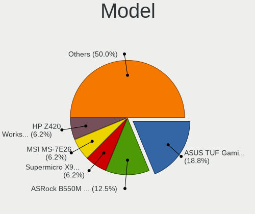

| Name                             | Desktops | Percent |
|----------------------------------|----------|---------|
| ASUS TUF Gaming B450M-PLUS II    | 3        | 23.08%  |
| Supermicro X9SCL/X9SCM           | 1        | 7.69%   |
| HP Z420 Workstation              | 1        | 7.69%   |
| HP ENVY TE01-1xxx                | 1        | 7.69%   |
| ASUS TUF Gaming B560M-PLUS WIFI  | 1        | 7.69%   |
| ASUS TUF B350M-PLUS GAMING       | 1        | 7.69%   |
| ASUS PRIME Z590-P                | 1        | 7.69%   |
| ASUS PRIME X370-PRO              | 1        | 7.69%   |
| ASUS A7VI-VM                     | 1        | 7.69%   |
| ASRock X570 Steel Legend WiFi ax | 1        | 7.69%   |
| ASRock B550M Steel Legend        | 1        | 7.69%   |

Model Family
------------

Motherboard model prefix

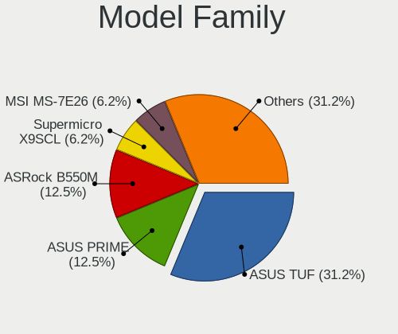

| Name             | Desktops | Percent |
|------------------|----------|---------|
| ASUS TUF         | 5        | 38.46%  |
| ASUS PRIME       | 2        | 15.38%  |
| Supermicro X9SCL | 1        | 7.69%   |
| HP Z420          | 1        | 7.69%   |
| HP ENVY          | 1        | 7.69%   |
| ASUS A7VI-VM     | 1        | 7.69%   |
| ASRock X570      | 1        | 7.69%   |
| ASRock B550M     | 1        | 7.69%   |

MFG Year
--------

Motherboard manufacture year

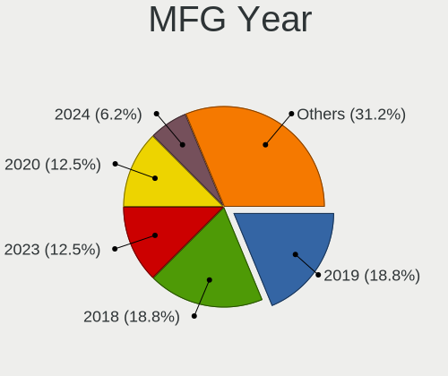

| Year | Desktops | Percent |
|------|----------|---------|
| 2019 | 3        | 23.08%  |
| 2021 | 2        | 15.38%  |
| 2018 | 2        | 15.38%  |
| 2023 | 1        | 7.69%   |
| 2020 | 1        | 7.69%   |
| 2017 | 1        | 7.69%   |
| 2013 | 1        | 7.69%   |
| 2011 | 1        | 7.69%   |
| 2001 | 1        | 7.69%   |

Form Factor
-----------

Physical design of the computer

| Name    | Desktops | Percent |
|---------|----------|---------|
| Desktop | 13       | 100%    |

Coreboot
--------

Have coreboot on board

| Used | Desktops | Percent |
|------|----------|---------|
| No   | 13       | 100%    |

RAM Size
--------

Total RAM memory

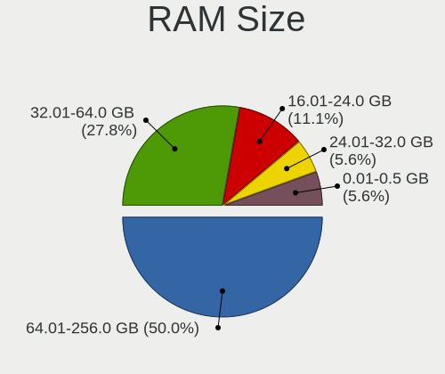

| Size in GB  | Desktops | Percent |
|-------------|----------|---------|
| 64.01-256.0 | 7        | 46.67%  |
| 32.01-64.0  | 5        | 33.33%  |
| 24.01-32.0  | 1        | 6.67%   |
| 16.01-24.0  | 1        | 6.67%   |
| 0.01-0.5    | 1        | 6.67%   |

RAM Used
--------

Used RAM memory

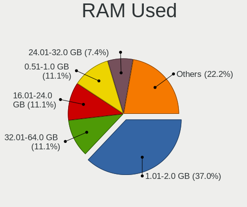

| Used GB    | Desktops | Percent |
|------------|----------|---------|
| 1.01-2.0   | 8        | 36.36%  |
| 32.01-64.0 | 3        | 13.64%  |
| 16.01-24.0 | 3        | 13.64%  |
| 24.01-32.0 | 2        | 9.09%   |
| 0.51-1.0   | 2        | 9.09%   |
| 4.01-8.0   | 1        | 4.55%   |
| 2.01-3.0   | 1        | 4.55%   |
| 0          | 1        | 4.55%   |
| Unknown    | 1        | 4.55%   |

Total Drives
------------

Number of drives on board

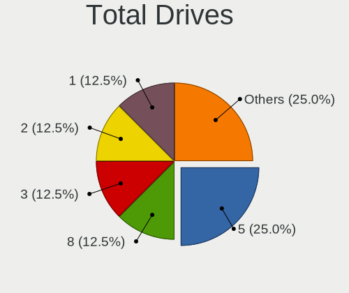

| Drives | Desktops | Percent |
|--------|----------|---------|
| 5      | 4        | 22.22%  |
| 3      | 3        | 16.67%  |
| 1      | 3        | 16.67%  |
| 7      | 2        | 11.11%  |
| 6      | 2        | 11.11%  |
| 2      | 2        | 11.11%  |
| 8      | 1        | 5.56%   |
| 4      | 1        | 5.56%   |

Has CD-ROM
----------

Has CD-ROM on board

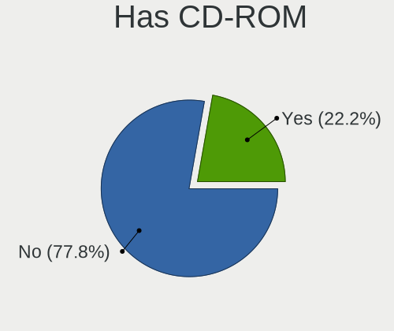

| Presented | Desktops | Percent |
|-----------|----------|---------|
| No        | 12       | 80%     |
| Yes       | 3        | 20%     |

Has Ethernet
------------

Has Ethernet on board

| Presented | Desktops | Percent |
|-----------|----------|---------|
| Yes       | 13       | 100%    |

Has WiFi
--------

Has WiFi module

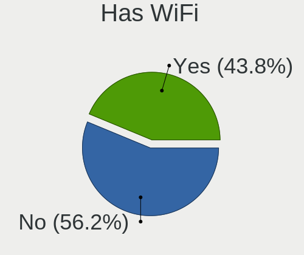

| Presented | Desktops | Percent |
|-----------|----------|---------|
| No        | 7        | 53.85%  |
| Yes       | 6        | 46.15%  |

Has Bluetooth
-------------

Has Bluetooth module

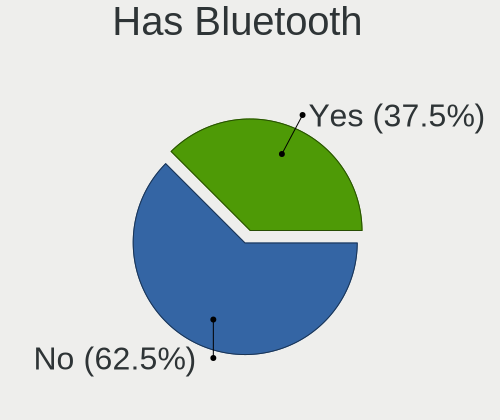

| Presented | Desktops | Percent |
|-----------|----------|---------|
| No        | 8        | 61.54%  |
| Yes       | 5        | 38.46%  |

Location
--------

Country
-------

Geographic location (country)

| Country | Desktops | Percent |
|---------|----------|---------|
| USA     | 12       | 92.31%  |
| Finland | 1        | 7.69%   |

City
----

Geographic location (city)

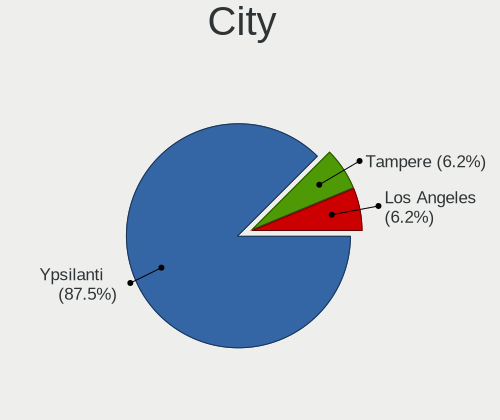

| City        | Desktops | Percent |
|-------------|----------|---------|
| Ypsilanti   | 11       | 84.62%  |
| Tampere     | 1        | 7.69%   |
| Los Angeles | 1        | 7.69%   |

Drives
------

Drive Vendor
------------

Hard drive vendors

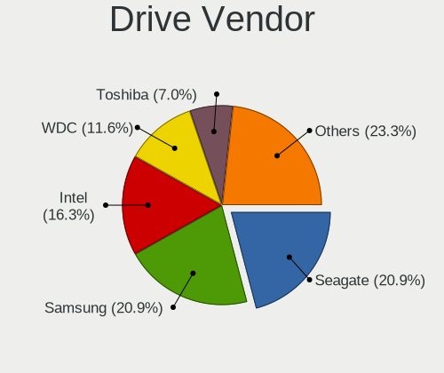

| Vendor              | Desktops | Drives | Percent |
|---------------------|----------|--------|---------|
| Samsung Electronics | 7        | 47     | 21.88%  |
| Seagate             | 6        | 38     | 18.75%  |
| Intel               | 5        | 37     | 15.63%  |
| WDC                 | 4        | 22     | 12.5%   |
| Toshiba             | 3        | 6      | 9.38%   |
| KIOXIA              | 2        | 3      | 6.25%   |
| SK hynix            | 1        | 1      | 3.13%   |
| SanDisk             | 1        | 4      | 3.13%   |
| Maxtor              | 1        | 1      | 3.13%   |
| Crucial             | 1        | 1      | 3.13%   |
| A-DATA Technology   | 1        | 2      | 3.13%   |

Drive Model
-----------

Hard drive models

| Model                                       | Desktops | Percent |
|---------------------------------------------|----------|---------|
| Samsung SSD 860 EVO 500GB                   | 4        | 8%      |
| Samsung SSD 970 PRO 512GB                   | 3        | 6%      |
| Intel SSDSC2KG480G8 480GB                   | 3        | 6%      |
| WDC WD60EFAX-68SHWN0 6TB                    | 2        | 4%      |
| Toshiba THNSNJ128GCSU 128GB                 | 2        | 4%      |
| Seagate ST8000VN0022-2EL112 8TB             | 2        | 4%      |
| Seagate ST8000VN0002-1Z8112 8TB             | 2        | 4%      |
| Seagate FireCuda 120 SSD ZA500GM10001 500GB | 2        | 4%      |
| Samsung SSD 870 EVO 1TB                     | 2        | 4%      |
| Samsung SSD 860 QVO 2TB                     | 2        | 4%      |
| Samsung SSD 860 EVO 1TB                     | 2        | 4%      |
| Samsung SSD 750 EVO 250GB                   | 2        | 4%      |
| KIOXIA KBG40ZNV1T02 1TB                     | 2        | 4%      |
| Intel SSDPED1D480GA 480GB                   | 2        | 4%      |
| WDC WDS100T3X0C-00SJG0 1TB                  | 1        | 2%      |
| WDC WD30EZRX-00MMMB0 3TB                    | 1        | 2%      |
| WDC WD1003FZEX-00K3CA0 1TB                  | 1        | 2%      |
| Toshiba TL100 120GB                         | 1        | 2%      |
| SK hynix SHGP31-1000GM 1TB                  | 1        | 2%      |
| Seagate ST5000DM000-1FK178 5TB              | 1        | 2%      |
| Seagate ST2000DM001-1CH164 2TB              | 1        | 2%      |
| Seagate ST16000NM001G-2KK103 16TB           | 1        | 2%      |
| Seagate ST10000VN0008-2PJ103 10TB           | 1        | 2%      |
| Seagate ST10000NE0008-2PL103 10TB           | 1        | 2%      |
| Seagate IronWolf ZA1000NM10002-2ZG102 1TB   | 1        | 2%      |
| SanDisk Ultra 3D NVMe 1TB                   | 1        | 2%      |
| Maxtor STM3250310AS 250GB                   | 1        | 2%      |
| Intel SSDSC2KW480H6 480GB                   | 1        | 2%      |
| Intel SSDSC2BW240H6 240GB                   | 1        | 2%      |
| Intel SSDSA2CT040G3 40GB                    | 1        | 2%      |
| Crucial CT500P2SSD8 500GB                   | 1        | 2%      |
| A-DATA SX6000NP 128GB                       | 1        | 2%      |

HDD Vendor
----------

Hard disk drive vendors

| Vendor  | Desktops | Drives | Percent |
|---------|----------|--------|---------|
| WDC     | 4        | 18     | 50%     |
| Seagate | 3        | 32     | 37.5%   |
| Maxtor  | 1        | 1      | 12.5%   |

SSD Vendor
----------

Solid state drive vendors

| Vendor              | Desktops | Drives | Percent |
|---------------------|----------|--------|---------|
| Samsung Electronics | 6        | 34     | 40%     |
| Toshiba             | 3        | 6      | 20%     |
| Seagate             | 3        | 6      | 20%     |
| Intel               | 3        | 29     | 20%     |

Drive Kind
----------

HDD or SSD

| Kind | Desktops | Drives | Percent |
|------|----------|--------|---------|
| SSD  | 10       | 75     | 43.48%  |
| NVMe | 8        | 36     | 34.78%  |
| HDD  | 5        | 51     | 21.74%  |

Drive Connector
---------------

SATA, SAS, NVMe, etc.

| Type | Desktops | Drives | Percent |
|------|----------|--------|---------|
| SATA | 12       | 126    | 60%     |
| NVMe | 8        | 36     | 40%     |

Drive Size
----------

Size of hard drive

| Size in TB | Desktops | Drives | Percent |
|------------|----------|--------|---------|
| 0.01-0.5   | 11       | 56     | 47.83%  |
| 0.51-1.0   | 5        | 18     | 21.74%  |
| 1.01-2.0   | 3        | 6      | 13.04%  |
| 4.01-10.0  | 2        | 41     | 8.7%    |
| 2.01-3.0   | 1        | 1      | 4.35%   |
| 10.01-20.0 | 1        | 4      | 4.35%   |

Space Total
-----------

Amount of disk space available on the file system

| Size in GB | Desktops | Percent |
|------------|----------|---------|
| 251-500    | 8        | 57.14%  |
| 501-1000   | 3        | 21.43%  |
| 101-250    | 2        | 14.29%  |
| 21-50      | 1        | 7.14%   |

Space Used
----------

Amount of used disk space

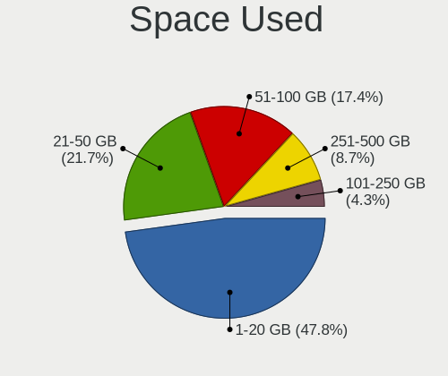

| Used GB | Desktops | Percent |
|---------|----------|---------|
| 1-20    | 7        | 41.18%  |
| 21-50   | 4        | 23.53%  |
| 51-100  | 3        | 17.65%  |
| 251-500 | 2        | 11.76%  |
| 101-250 | 1        | 5.88%   |

Malfunc. Drives
---------------

Drive models with a malfunction

| Model                     | Desktops | Drives | Percent |
|---------------------------|----------|--------|---------|
| WDC WD60EFAX-68SHWN0 6TB  | 1        | 2      | 50%     |
| Intel SSDSC2KW480H6 480GB | 1        | 1      | 50%     |

Malfunc. Drive Vendor
---------------------

Vendors of faulty drives

| Vendor | Desktops | Drives | Percent |
|--------|----------|--------|---------|
| WDC    | 1        | 2      | 50%     |
| Intel  | 1        | 1      | 50%     |

Malfunc. HDD Vendor
-------------------

Vendors of faulty HDD drives

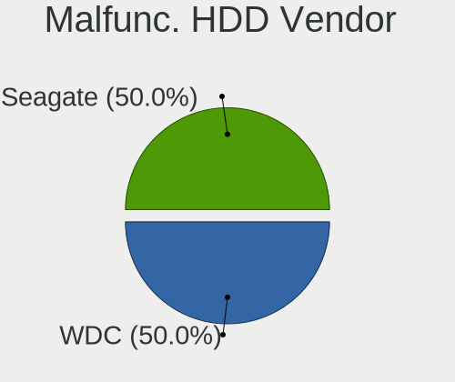

| Vendor | Desktops | Drives | Percent |
|--------|----------|--------|---------|
| WDC    | 1        | 2      | 100%    |

Malfunc. Drive Kind
-------------------

Kinds of faulty drives

| Kind | Desktops | Drives | Percent |
|------|----------|--------|---------|
| SSD  | 1        | 1      | 50%     |
| HDD  | 1        | 2      | 50%     |

Failed Drives
-------------

Failed drive models

Zero info for selected period =(

Failed Drive Vendor
-------------------

Failed drive vendors

Zero info for selected period =(

Drive Status
------------

Number of failed and malfunc. drives

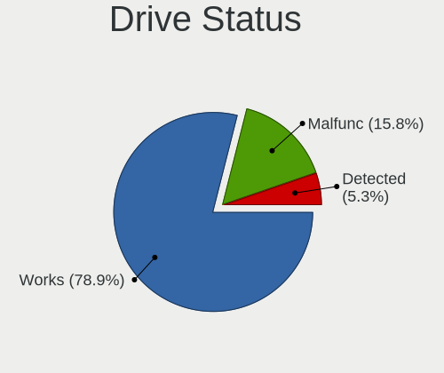

| Status   | Desktops | Drives | Percent |
|----------|----------|--------|---------|
| Works    | 12       | 158    | 80%     |
| Malfunc  | 2        | 3      | 13.33%  |
| Detected | 1        | 1      | 6.67%   |

Storage controller
------------------

Storage Vendor
--------------

Storage controller vendors

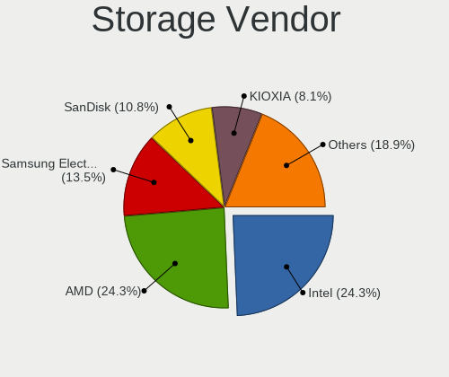

| Vendor                    | Desktops | Percent |
|---------------------------|----------|---------|
| Intel                     | 7        | 25%     |
| AMD                       | 7        | 25%     |
| SanDisk                   | 3        | 10.71%  |
| Samsung Electronics       | 3        | 10.71%  |
| Realtek Semiconductor     | 2        | 7.14%   |
| KIOXIA                    | 2        | 7.14%   |
| VIA Technologies          | 1        | 3.57%   |
| SK hynix                  | 1        | 3.57%   |
| Silicon Image             | 1        | 3.57%   |
| Micron/Crucial Technology | 1        | 3.57%   |

Storage Model
-------------

Storage controller models

| Model                                                                         | Desktops | Percent |
|-------------------------------------------------------------------------------|----------|---------|
| AMD FCH SATA Controller [AHCI mode]                                           | 5        | 13.89%  |
| Samsung NVMe SSD Controller SM981/PM981/PM983                                 | 3        | 8.33%   |
| AMD 400 Series Chipset SATA Controller                                        | 3        | 8.33%   |
| Realtek NVMe Controller                                                       | 2        | 5.56%   |
| KIOXIA NVMe SSD Controller BG4                                                | 2        | 5.56%   |
| Intel Optane SSD 900P Series                                                  | 2        | 5.56%   |
| Intel 500 Series Chipset Family SATA AHCI Controller                          | 2        | 5.56%   |
| AMD 500 Series Chipset SATA Controller                                        | 2        | 5.56%   |
| AMD 300 Series Chipset SATA Controller                                        | 2        | 5.56%   |
| VIA VT82C586A/B/VT82C686/A/B/VT823x/A/C PIPC Bus Master IDE                   | 1        | 2.78%   |
| SK hynix Gold P31/PC711 NVMe Solid State Drive                                | 1        | 2.78%   |
| Silicon Image SiI 3114 [SATALink/SATARaid] Serial ATA Controller              | 1        | 2.78%   |
| SanDisk WD Blue SN550 NVMe SSD                                                | 1        | 2.78%   |
| Sandisk WD Black SN770 NVMe SSD                                               | 1        | 2.78%   |
| SanDisk WD Black SN750 / PC SN730 NVMe SSD                                    | 1        | 2.78%   |
| Micron/Crucial P2 NVMe PCIe SSD                                               | 1        | 2.78%   |
| Intel SATA Controller [RAID mode]                                             | 1        | 2.78%   |
| Intel C602 chipset 4-Port SATA Storage Control Unit                           | 1        | 2.78%   |
| Intel C600/X79 series chipset IDE-r Controller                                | 1        | 2.78%   |
| Intel C600/X79 series chipset 6-Port SATA AHCI Controller                     | 1        | 2.78%   |
| Intel 6 Series/C200 Series Chipset Family 6 port Desktop SATA AHCI Controller | 1        | 2.78%   |
| AMD X370 Series Chipset SATA Controller                                       | 1        | 2.78%   |

Storage Kind
------------

Kind of storage controller (IDE, SATA, NVMe, SAS, ...)

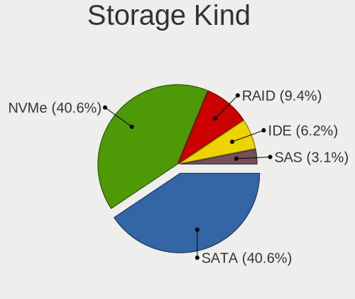

| Kind | Desktops | Percent |
|------|----------|---------|
| SATA | 11       | 42.31%  |
| NVMe | 10       | 38.46%  |
| RAID | 2        | 7.69%   |
| IDE  | 2        | 7.69%   |
| SAS  | 1        | 3.85%   |

Processor
---------

CPU Vendor
----------

Processor vendors

| Vendor | Desktops | Percent |
|--------|----------|---------|
| AMD    | 8        | 61.54%  |
| Intel  | 5        | 38.46%  |

CPU Model
---------

Processor models

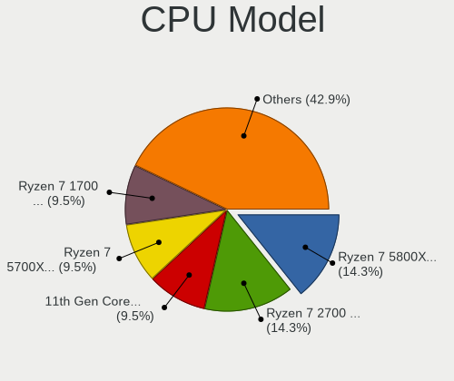

| Model                                   | Desktops | Percent |
|-----------------------------------------|----------|---------|
| AMD Ryzen 7 2700 Eight-Core Processor   | 3        | 18.75%  |
| AMD Ryzen 7 5800X 8-Core Processor      | 2        | 12.5%   |
| AMD Ryzen 7 1700 Eight-Core Processor   | 2        | 12.5%   |
| Intel Xeon CPU E5-2670 @ 2.60GHz        | 1        | 6.25%   |
| Intel Xeon CPU E3-1230 V2 @ 3.30GHz     | 1        | 6.25%   |
| Intel Core i7-10700 CPU @ 2.90GHz       | 1        | 6.25%   |
| Intel 11th Gen Core i9-11900K @ 3.50GHz | 1        | 6.25%   |
| Intel 11th Gen Core i7-11700 @ 2.50GHz  | 1        | 6.25%   |
| AMD Ryzen 9 3950X 16-Core Processor     | 1        | 6.25%   |
| AMD Ryzen 7 5700X 8-Core Processor      | 1        | 6.25%   |
| AMD Ryzen 7 2700X Eight-Core Processor  | 1        | 6.25%   |
| AMD Duron Processor                     | 1        | 6.25%   |

CPU Model Family
----------------

Processor model prefix

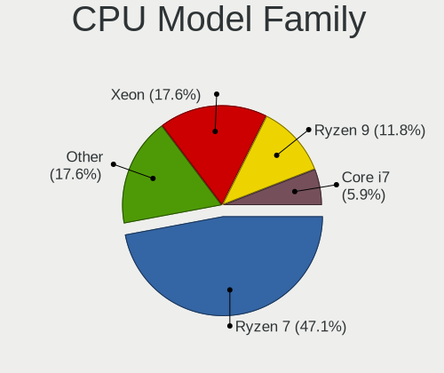

| Model         | Desktops | Percent |
|---------------|----------|---------|
| AMD Ryzen 7   | 7        | 50%     |
| Other         | 3        | 21.43%  |
| Intel Xeon    | 2        | 14.29%  |
| Intel Core i7 | 1        | 7.14%   |
| AMD Ryzen 9   | 1        | 7.14%   |

CPU Cores
---------

Number of processor cores

| Number | Desktops | Percent |
|--------|----------|---------|
| 8      | 10       | 62.5%   |
| 16     | 3        | 18.75%  |
| 32     | 1        | 6.25%   |
| 4      | 1        | 6.25%   |
| 1      | 1        | 6.25%   |

CPU Sockets
-----------

Number of sockets

| Number | Desktops | Percent |
|--------|----------|---------|
| 1      | 13       | 92.86%  |
| 2      | 1        | 7.14%   |

CPU Threads
-----------

Threads per core (Hyper-Threading)

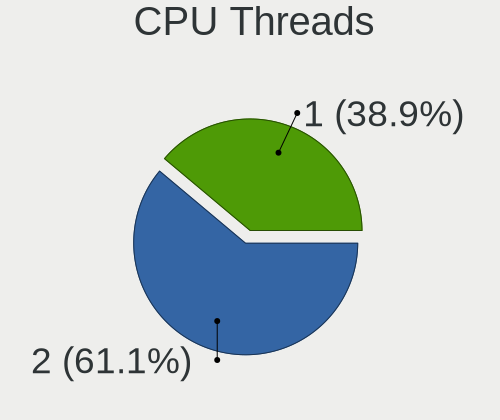

| Number | Desktops | Percent |
|--------|----------|---------|
| 2      | 11       | 73.33%  |
| 1      | 4        | 26.67%  |

CPU Microarch
-------------

Microarchitecture

| Name        | Desktops | Percent |
|-------------|----------|---------|
| Zen+        | 4        | 25%     |
| Zen 3       | 3        | 18.75%  |
| Zen         | 2        | 12.5%   |
| Unknown     | 2        | 12.5%   |
| Zen 2       | 1        | 6.25%   |
| SandyBridge | 1        | 6.25%   |
| K6          | 1        | 6.25%   |
| IvyBridge   | 1        | 6.25%   |
| CometLake   | 1        | 6.25%   |

Graphics
--------

GPU Vendor
----------

Vendors of graphics cards

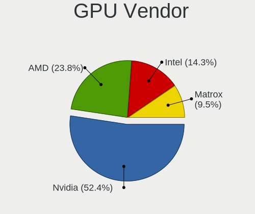

| Vendor                     | Desktops | Percent |
|----------------------------|----------|---------|
| Nvidia                     | 9        | 56.25%  |
| AMD                        | 4        | 25%     |
| Intel                      | 2        | 12.5%   |
| Matrox Electronics Systems | 1        | 6.25%   |

GPU Model
---------

Graphics card models

| Model                                         | Desktops | Percent |
|-----------------------------------------------|----------|---------|
| Nvidia GK208B [GeForce GT 710]                | 5        | 29.41%  |
| Nvidia GP108 [GeForce GT 1030]                | 2        | 11.76%  |
| Nvidia GP102 [GeForce GTX 1080 Ti]            | 2        | 11.76%  |
| AMD Caicos PRO [Radeon HD 7450]               | 2        | 11.76%  |
| Matrox Electronics Systems MGA G200eW WPCM450 | 1        | 5.88%   |
| Intel RocketLake-S GT1 [UHD Graphics 750]     | 1        | 5.88%   |
| Intel CometLake-S GT2 [UHD Graphics 630]      | 1        | 5.88%   |
| AMD RV280 [Radeon 9200] (Secondary)           | 1        | 5.88%   |
| AMD RV280 [Radeon 9200]                       | 1        | 5.88%   |
| AMD Navi 21 [Radeon RX 6900 XT]               | 1        | 5.88%   |

GPU Combo
---------

Combinations of graphics cards

| Name       | Desktops | Percent |
|------------|----------|---------|
| 1 x Nvidia | 9        | 56.25%  |
| 1 x AMD    | 3        | 18.75%  |
| 1 x Intel  | 2        | 12.5%   |
| 2 x AMD    | 1        | 6.25%   |
| 1 x Matrox | 1        | 6.25%   |

GPU Driver
----------

Free vs proprietary

| Driver      | Desktops | Percent |
|-------------|----------|---------|
| Free        | 10       | 62.5%   |
| Proprietary | 6        | 37.5%   |

GPU Memory
----------

Total video memory

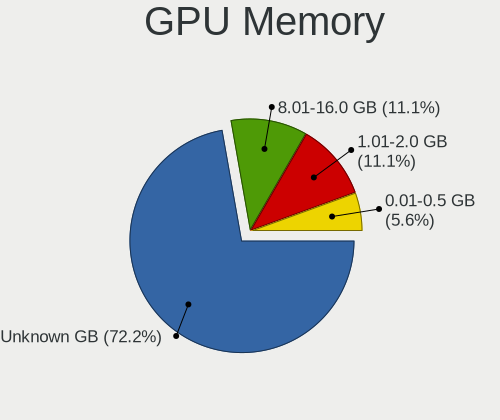

| Size in GB | Desktops | Percent |
|------------|----------|---------|
| Unknown    | 10       | 66.67%  |
| 1.01-2.0   | 2        | 13.33%  |
| 8.01-16.0  | 2        | 13.33%  |
| 0.01-0.5   | 1        | 6.67%   |

Monitor
-------

Monitor Vendor
--------------

Monitor vendors

| Vendor         | Desktops | Percent |
|----------------|----------|---------|
| LG Electronics | 2        | 40%     |
| Goldstar       | 2        | 40%     |
| Acer           | 1        | 20%     |

Monitor Model
-------------

Monitor models

| Model                                                       | Desktops | Percent |
|-------------------------------------------------------------|----------|---------|
| LG Electronics LCD Monitor LG ULTRAGEAR 2560x1440           | 1        | 16.67%  |
| LG Electronics LCD Monitor LG Ultra HD 3840x2160            | 1        | 16.67%  |
| Goldstar LG ULTRAGEAR GSM7765 2560x1440 700x390mm 31.5-inch | 1        | 16.67%  |
| Goldstar LG Ultra HD GSM5B09 3840x2160 600x340mm 27.2-inch  | 1        | 16.67%  |
| Acer LCD Monitor EI342CKR 3440x1440                         | 1        | 16.67%  |
| Acer EI342CKR ACR0763 3440x1440 800x330mm 34.1-inch         | 1        | 16.67%  |

Monitor Resolution
------------------

Monitor screen resolution

| Resolution      | Desktops | Percent |
|-----------------|----------|---------|
| 3840x2160 (4K)  | 2        | 40%     |
| 2560x1440 (QHD) | 2        | 40%     |
| 3440x1440       | 1        | 20%     |

Monitor Diagonal
----------------

Diagonal size in inches

| Inches  | Desktops | Percent |
|---------|----------|---------|
| Unknown | 2        | 40%     |
| 34      | 1        | 20%     |
| 31      | 1        | 20%     |
| 27      | 1        | 20%     |

Monitor Width
-------------

Physical width

| Width in mm | Desktops | Percent |
|-------------|----------|---------|
| Unknown     | 2        | 40%     |
| 701-800     | 1        | 20%     |
| 601-700     | 1        | 20%     |
| 501-600     | 1        | 20%     |

Aspect Ratio
------------

Proportional relationship between the width and the height

| Ratio   | Desktops | Percent |
|---------|----------|---------|
| 16/9    | 2        | 40%     |
| Unknown | 2        | 40%     |
| 21/9    | 1        | 20%     |

Monitor Area
------------

Area in inch²

| Area in inch² | Desktops | Percent |
|----------------|----------|---------|
| 351-500        | 2        | 40%     |
| Unknown        | 2        | 40%     |
| 301-350        | 1        | 20%     |

Pixel Density
-------------

Pixels per inch

| Density | Desktops | Percent |
|---------|----------|---------|
| Unknown | 2        | 40%     |
| 161-240 | 1        | 20%     |
| 101-120 | 1        | 20%     |
| 51-100  | 1        | 20%     |

Multiple Monitors
-----------------

Total monitors connected

| Total | Desktops | Percent |
|-------|----------|---------|
| 0     | 10       | 66.67%  |
| 1     | 5        | 33.33%  |

Network
-------

Net Controller Vendor
---------------------

Controller vendors

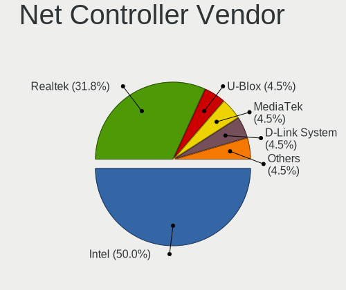

| Vendor                | Desktops | Percent |
|-----------------------|----------|---------|
| Intel                 | 10       | 55.56%  |
| Realtek Semiconductor | 6        | 33.33%  |
| U-Blox                | 1        | 5.56%   |
| D-Link System         | 1        | 5.56%   |

Net Controller Model
--------------------

Controller models

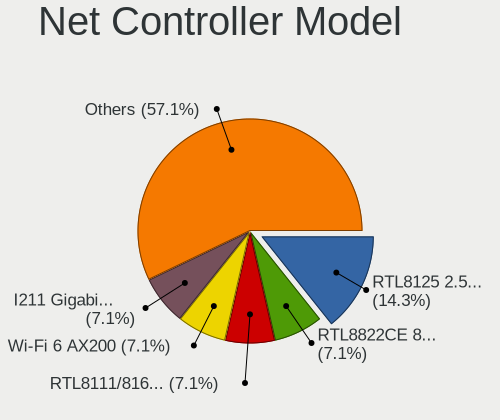

| Model                                                             | Desktops | Percent |
|-------------------------------------------------------------------|----------|---------|
| Realtek RTL8125 2.5GbE Controller                                 | 3        | 12.5%   |
| Realtek RTL8822CE 802.11ac PCIe Wireless Network Adapter          | 2        | 8.33%   |
| Realtek RTL8111/8168/8411 PCI Express Gigabit Ethernet Controller | 2        | 8.33%   |
| Intel Wi-Fi 6 AX200                                               | 2        | 8.33%   |
| Intel I211 Gigabit Network Connection                             | 2        | 8.33%   |
| Intel Ethernet Controller X550                                    | 2        | 8.33%   |
| Intel Ethernet Controller 10-Gigabit X540-AT2                     | 2        | 8.33%   |
| Intel 82579LM Gigabit Network Connection (Lewisville)             | 2        | 8.33%   |
| U-Blox [u-blox 7]                                                 | 1        | 4.17%   |
| Realtek RTL8188EUS 802.11n Wireless Network Adapter               | 1        | 4.17%   |
| Intel Wi-Fi 6 AX210/AX211/AX411 160MHz                            | 1        | 4.17%   |
| Intel Tiger Lake PCH CNVi WiFi                                    | 1        | 4.17%   |
| Intel Ethernet Controller 10G X550T                               | 1        | 4.17%   |
| Intel 82574L Gigabit Network Connection                           | 1        | 4.17%   |
| D-Link System DGE-528T Gigabit Ethernet Adapter                   | 1        | 4.17%   |

Wireless Vendor
---------------

Wireless vendors

| Vendor                | Desktops | Percent |
|-----------------------|----------|---------|
| Intel                 | 4        | 57.14%  |
| Realtek Semiconductor | 3        | 42.86%  |

Wireless Model
--------------

Wireless models

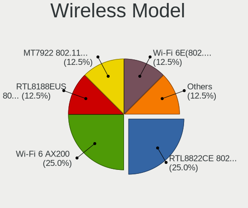

| Model                                                    | Desktops | Percent |
|----------------------------------------------------------|----------|---------|
| Realtek RTL8822CE 802.11ac PCIe Wireless Network Adapter | 2        | 28.57%  |
| Intel Wi-Fi 6 AX200                                      | 2        | 28.57%  |
| Realtek RTL8188EUS 802.11n Wireless Network Adapter      | 1        | 14.29%  |
| Intel Wi-Fi 6 AX210/AX211/AX411 160MHz                   | 1        | 14.29%  |
| Intel Tiger Lake PCH CNVi WiFi                           | 1        | 14.29%  |

Ethernet Vendor
---------------

Ethernet vendors

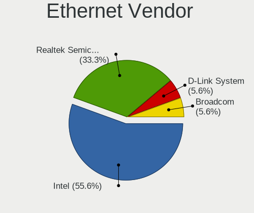

| Vendor                | Desktops | Percent |
|-----------------------|----------|---------|
| Intel                 | 9        | 60%     |
| Realtek Semiconductor | 5        | 33.33%  |
| D-Link System         | 1        | 6.67%   |

Ethernet Model
--------------

Ethernet models

| Model                                                             | Desktops | Percent |
|-------------------------------------------------------------------|----------|---------|
| Realtek RTL8125 2.5GbE Controller                                 | 3        | 18.75%  |
| Realtek RTL8111/8168/8411 PCI Express Gigabit Ethernet Controller | 2        | 12.5%   |
| Intel I211 Gigabit Network Connection                             | 2        | 12.5%   |
| Intel Ethernet Controller X550                                    | 2        | 12.5%   |
| Intel Ethernet Controller 10-Gigabit X540-AT2                     | 2        | 12.5%   |
| Intel 82579LM Gigabit Network Connection (Lewisville)             | 2        | 12.5%   |
| Intel Ethernet Controller 10G X550T                               | 1        | 6.25%   |
| Intel 82574L Gigabit Network Connection                           | 1        | 6.25%   |
| D-Link System DGE-528T Gigabit Ethernet Adapter                   | 1        | 6.25%   |

Net Controller Kind
-------------------

Ethernet, WiFi or modem

| Kind     | Desktops | Percent |
|----------|----------|---------|
| Ethernet | 13       | 65%     |
| WiFi     | 6        | 30%     |
| Modem    | 1        | 5%      |

Used Controller
---------------

Currently used network controller

| Kind     | Desktops | Percent |
|----------|----------|---------|
| Ethernet | 13       | 92.86%  |
| WiFi     | 1        | 7.14%   |

NICs
----

Total network controllers on board

| Total | Desktops | Percent |
|-------|----------|---------|
| 2     | 7        | 53.85%  |
| 1     | 5        | 38.46%  |
| 3     | 1        | 7.69%   |

IPv6
----

IPv6 vs IPv4

| Used | Desktops | Percent |
|------|----------|---------|
| No   | 13       | 100%    |

Bluetooth
---------

Bluetooth Vendor
----------------

Controller vendors

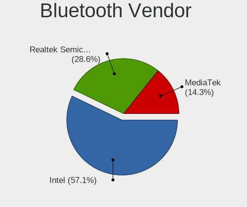

| Vendor                | Desktops | Percent |
|-----------------------|----------|---------|
| Intel                 | 4        | 66.67%  |
| Realtek Semiconductor | 2        | 33.33%  |

Bluetooth Model
---------------

Controller models

| Model                         | Desktops | Percent |
|-------------------------------|----------|---------|
| Realtek Bluetooth 4.2 Adapter | 2        | 33.33%  |
| Intel AX200 Bluetooth         | 2        | 33.33%  |
| Intel AX210 Bluetooth         | 1        | 16.67%  |
| Intel AX201 Bluetooth         | 1        | 16.67%  |

Sound
-----

Sound Vendor
------------

Sound card vendors

| Vendor           | Desktops | Percent |
|------------------|----------|---------|
| Nvidia           | 9        | 42.86%  |
| Intel            | 4        | 19.05%  |
| AMD              | 4        | 19.05%  |
| VIA Technologies | 1        | 4.76%   |
| SteelSeries ApS  | 1        | 4.76%   |
| Logitech         | 1        | 4.76%   |
| Creative Labs    | 1        | 4.76%   |

Sound Model
-----------

Sound card models

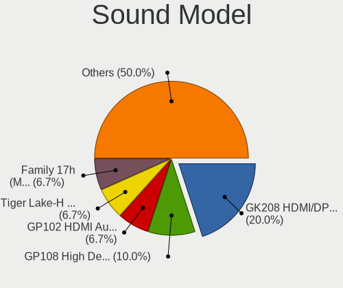

| Model                                                                                                                                                                                      | Desktops | Percent |
|--------------------------------------------------------------------------------------------------------------------------------------------------------------------------------------------|----------|---------|
| Nvidia GK208 HDMI/DP Audio Controller                                                                                                                                                      | 5        | 21.74%  |
| Nvidia GP108 High Definition Audio Controller                                                                                                                                              | 2        | 8.7%    |
| Nvidia GP102 HDMI Audio Controller                                                                                                                                                         | 2        | 8.7%    |
| Intel Tiger Lake-H HD Audio Controller                                                                                                                                                     | 2        | 8.7%    |
| AMD Family 17h (Models 00h-0fh) HD Audio Controller                                                                                                                                        | 2        | 8.7%    |
| AMD Caicos HDMI Audio [Radeon HD 6450 / 7450/8450/8490 OEM / R5 230/235/235X OEM]                                                                                                          | 2        | 8.7%    |
| VIA Technologies VT82C686 AC97 Audio Controller                                                                                                                                            | 1        | 4.35%   |
| SteelSeries ApS SteelSeries GameDAC GameDAC Hi-Res                                                                                                                                         | 1        | 4.35%   |
| Logitech Blue Microphones Yeti Stereo Microphone Yeti Stereo Microphone Yeti Stereo Microphone Yeti Stereo Microphone Yeti Stereo Microphone Yeti Stereo Microphone Yeti Stereo Microphone | 1        | 4.35%   |
| Intel Comet Lake PCH cAVS                                                                                                                                                                  | 1        | 4.35%   |
| Intel C600/X79 series chipset High Definition Audio Controller                                                                                                                             | 1        | 4.35%   |
| Creative Labs EMU10k1 [Sound Blaster Live! Series]                                                                                                                                         | 1        | 4.35%   |
| AMD Starship/Matisse HD Audio Controller                                                                                                                                                   | 1        | 4.35%   |
| AMD Navi 21/23 HDMI/DP Audio Controller                                                                                                                                                    | 1        | 4.35%   |

Memory
------

Memory Vendor
-------------

Memory module vendors

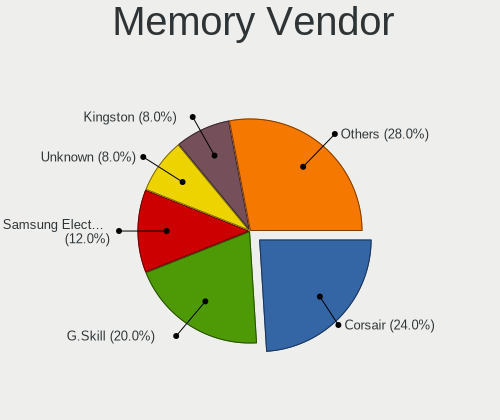

| Vendor              | Desktops | Percent |
|---------------------|----------|---------|
| Corsair             | 5        | 26.32%  |
| G.Skill             | 4        | 21.05%  |
| Unknown             | 2        | 10.53%  |
| Samsung Electronics | 2        | 10.53%  |
| Kingston            | 2        | 10.53%  |
| Micron Technology   | 1        | 5.26%   |
| Elpida              | 1        | 5.26%   |
| Crucial             | 1        | 5.26%   |
| Unknown             | 1        | 5.26%   |

Memory Model
------------

Memory module models

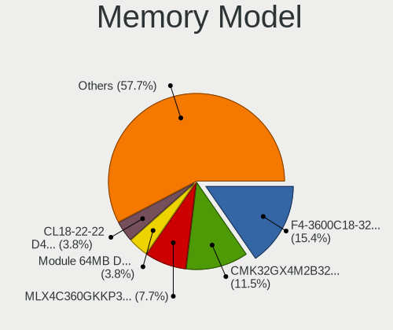

| Model                                                   | Desktops | Percent |
|---------------------------------------------------------|----------|---------|
| G.Skill RAM F4-3600C18-32GTZN 32GB DIMM DDR4 3600MT/s   | 3        | 15%     |
| Corsair RAM CMK32GX4M2B3200C16 16GB DIMM DDR4 3200MT/s  | 3        | 15%     |
| Unknown RAM Module 64MB DIMM DRAM                       | 1        | 5%      |
| Unknown RAM CL18-22-22 D4-3600 16384MB DIMM 2667MT/s    | 1        | 5%      |
| Samsung RAM Module 16GB DIMM DDR4 3200MT/s              | 1        | 5%      |
| Samsung RAM M391B5273DH0-CK0 4GB DIMM DDR3 1600MT/s     | 1        | 5%      |
| Micron RAM Module 8GB DIMM DDR3 1600MT/s                | 1        | 5%      |
| Kingston RAM KF3200C16D4/32GX 32GB DIMM DDR4 3200MT/s   | 1        | 5%      |
| Kingston RAM 9965525-138.A00LF 8GB DIMM DDR3 1600MT/s   | 1        | 5%      |
| Kingston RAM 9965525-116.A00LF 8GB DIMM DDR3 1600MT/s   | 1        | 5%      |
| G.Skill RAM F4-4400C19-16GTZR 16GB DIMM DDR4 2667MT/s   | 1        | 5%      |
| Elpida RAM Module 8GB DIMM DDR3 1600MT/s                | 1        | 5%      |
| Crucial RAM CT16G4DFRA32A.M16FR 16GB DIMM DDR4 3200MT/s | 1        | 5%      |
| Corsair RAM CMK32GX4M2A2666C16 16GB DIMM DDR4 3000MT/s  | 1        | 5%      |
| Corsair RAM CMK16GX4M2Z2666C16 8GB DIMM DDR4 2666MT/s   | 1        | 5%      |
| Unknown                                                 | 1        | 5%      |

Memory Kind
-----------

Memory module kinds

| Kind | Desktops | Percent |
|------|----------|---------|
| DDR4 | 10       | 76.92%  |
| DDR3 | 2        | 15.38%  |
| DRAM | 1        | 7.69%   |

Memory Form Factor
------------------

Physical design of the memory module

| Name | Desktops | Percent |
|------|----------|---------|
| DIMM | 13       | 100%    |

Memory Size
-----------

Memory module size

| Size  | Desktops | Percent |
|-------|----------|---------|
| 16384 | 7        | 43.75%  |
| 32768 | 4        | 25%     |
| 8192  | 3        | 18.75%  |
| 256   | 1        | 6.25%   |
| 64    | 1        | 6.25%   |

Memory Speed
------------

Memory module speed

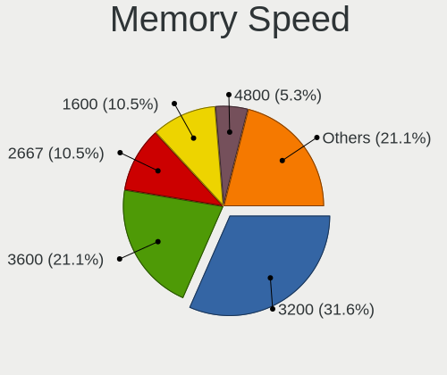

| Speed   | Desktops | Percent |
|---------|----------|---------|
| 3200    | 5        | 35.71%  |
| 3600    | 3        | 21.43%  |
| 1600    | 2        | 14.29%  |
| 3000    | 1        | 7.14%   |
| 2667    | 1        | 7.14%   |
| 2666    | 1        | 7.14%   |
| Unknown | 1        | 7.14%   |

Printers & scanners
-------------------

Printer Vendor
--------------

Printer device vendors

Zero info for selected period =(

Printer Model
-------------

Printer device models

Zero info for selected period =(

Scanner Vendor
--------------

Scanner device vendors

Zero info for selected period =(

Scanner Model
-------------

Scanner device models

Zero info for selected period =(

Camera
------

Camera Vendor
-------------

Camera device vendors

| Vendor   | Desktops | Percent |
|----------|----------|---------|
| Logitech | 4        | 100%    |

Camera Model
------------

Camera device models

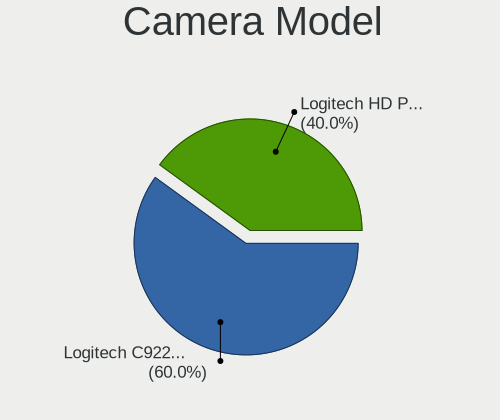

| Model                           | Desktops | Percent |
|---------------------------------|----------|---------|
| Logitech HD Pro Webcam C920     | 2        | 50%     |
| Logitech C922 Pro Stream Webcam | 2        | 50%     |

Security
--------

Fingerprint Vendor
------------------

Fingerprint sensor vendors

Zero info for selected period =(

Fingerprint Model
-----------------

Fingerprint sensor models

Zero info for selected period =(

Chipcard Vendor
---------------

Chipcard module vendors

Zero info for selected period =(

Chipcard Model
--------------

Chipcard module models

Zero info for selected period =(

Unsupported
-----------

Unsupported Devices
-------------------

Total unsupported devices on board

| Total | Desktops | Percent |
|-------|----------|---------|
| 0     | 6        | 46.15%  |
| 1     | 3        | 23.08%  |
| 3     | 2        | 15.38%  |
| 2     | 2        | 15.38%  |

Unsupported Device Types
------------------------

Types of unsupported devices

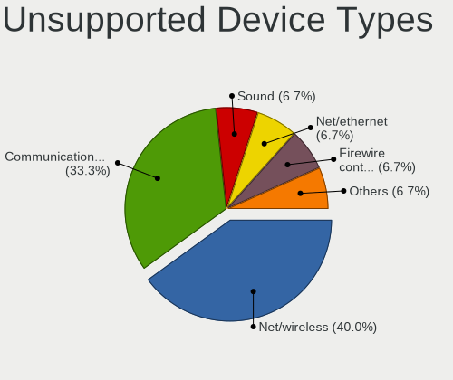

| Type                     | Desktops | Percent |
|--------------------------|----------|---------|
| Net/wireless             | 5        | 41.67%  |
| Communication controller | 4        | 33.33%  |
| Sound                    | 1        | 8.33%   |
| Firewire controller      | 1        | 8.33%   |
| Bluetooth                | 1        | 8.33%   |

