MidnightBSD - Tested Hardware & Statistics (Notebooks)
------------------------------------------------------

A project to collect tested hardware configurations for MidnightBSD.

Anyone can contribute to this report by the [hw-probe](https://github.com/linuxhw/hw-probe/blob/master/INSTALL.BSD.md) tool:

    hw-probe -all -upload

Please contribute! Especially if your hardware is rare.

Contents
--------

* [ Test Cases ](#test-cases)

* [ System ](#system)
  - [ OS                       ](#os)
  - [ OS Family                ](#os-family)
  - [ Arch                     ](#arch)
  - [ DE                       ](#de)
  - [ Display Server           ](#display-server)
  - [ Display Manager          ](#display-manager)
  - [ OS Lang                  ](#os-lang)
  - [ Boot Mode                ](#boot-mode)
  - [ Filesystem               ](#filesystem)
  - [ Part. scheme             ](#part-scheme)

* [ Board ](#board)
  - [ Vendor                   ](#vendor)
  - [ Model                    ](#model)
  - [ Model Family             ](#model-family)
  - [ MFG Year                 ](#mfg-year)
  - [ Form Factor              ](#form-factor)
  - [ Coreboot                 ](#coreboot)
  - [ RAM Size                 ](#ram-size)
  - [ RAM Used                 ](#ram-used)
  - [ Total Drives             ](#total-drives)
  - [ Has CD-ROM               ](#has-cd-rom)
  - [ Has Ethernet             ](#has-ethernet)
  - [ Has WiFi                 ](#has-wifi)
  - [ Has Bluetooth            ](#has-bluetooth)

* [ Location ](#location)
  - [ Country                  ](#country)
  - [ City                     ](#city)

* [ Drives ](#drives)
  - [ Drive Vendor             ](#drive-vendor)
  - [ Drive Model              ](#drive-model)
  - [ HDD Vendor               ](#hdd-vendor)
  - [ SSD Vendor               ](#ssd-vendor)
  - [ Drive Kind               ](#drive-kind)
  - [ Drive Connector          ](#drive-connector)
  - [ Drive Size               ](#drive-size)
  - [ Space Total              ](#space-total)
  - [ Space Used               ](#space-used)
  - [ Malfunc. Drives          ](#malfunc-drives)
  - [ Malfunc. Drive Vendor    ](#malfunc-drive-vendor)
  - [ Malfunc. HDD Vendor      ](#malfunc-hdd-vendor)
  - [ Malfunc. Drive Kind      ](#malfunc-drive-kind)
  - [ Failed Drives            ](#failed-drives)
  - [ Failed Drive Vendor      ](#failed-drive-vendor)
  - [ Drive Status             ](#drive-status)

* [ Storage controller ](#storage-controller)
  - [ Storage Vendor           ](#storage-vendor)
  - [ Storage Model            ](#storage-model)
  - [ Storage Kind             ](#storage-kind)

* [ Processor ](#processor)
  - [ CPU Vendor               ](#cpu-vendor)
  - [ CPU Model                ](#cpu-model)
  - [ CPU Model Family         ](#cpu-model-family)
  - [ CPU Cores                ](#cpu-cores)
  - [ CPU Sockets              ](#cpu-sockets)
  - [ CPU Threads              ](#cpu-threads)
  - [ CPU Microarch            ](#cpu-microarch)

* [ Graphics ](#graphics)
  - [ GPU Vendor               ](#gpu-vendor)
  - [ GPU Model                ](#gpu-model)
  - [ GPU Combo                ](#gpu-combo)
  - [ GPU Driver               ](#gpu-driver)
  - [ GPU Memory               ](#gpu-memory)

* [ Monitor ](#monitor)
  - [ Monitor Vendor           ](#monitor-vendor)
  - [ Monitor Model            ](#monitor-model)
  - [ Monitor Resolution       ](#monitor-resolution)
  - [ Monitor Diagonal         ](#monitor-diagonal)
  - [ Monitor Width            ](#monitor-width)
  - [ Aspect Ratio             ](#aspect-ratio)
  - [ Monitor Area             ](#monitor-area)
  - [ Pixel Density            ](#pixel-density)
  - [ Multiple Monitors        ](#multiple-monitors)

* [ Network ](#network)
  - [ Net Controller Vendor    ](#net-controller-vendor)
  - [ Net Controller Model     ](#net-controller-model)
  - [ Wireless Vendor          ](#wireless-vendor)
  - [ Wireless Model           ](#wireless-model)
  - [ Ethernet Vendor          ](#ethernet-vendor)
  - [ Ethernet Model           ](#ethernet-model)
  - [ Net Controller Kind      ](#net-controller-kind)
  - [ Used Controller          ](#used-controller)
  - [ NICs                     ](#nics)
  - [ IPv6                     ](#ipv6)

* [ Bluetooth ](#bluetooth)
  - [ Bluetooth Vendor         ](#bluetooth-vendor)
  - [ Bluetooth Model          ](#bluetooth-model)

* [ Sound ](#sound)
  - [ Sound Vendor             ](#sound-vendor)
  - [ Sound Model              ](#sound-model)

* [ Memory ](#memory)
  - [ Memory Vendor            ](#memory-vendor)
  - [ Memory Model             ](#memory-model)
  - [ Memory Kind              ](#memory-kind)
  - [ Memory Form Factor       ](#memory-form-factor)
  - [ Memory Size              ](#memory-size)
  - [ Memory Speed             ](#memory-speed)

* [ Printers & scanners ](#printers--scanners)
  - [ Printer Vendor           ](#printer-vendor)
  - [ Printer Model            ](#printer-model)
  - [ Scanner Vendor           ](#scanner-vendor)
  - [ Scanner Model            ](#scanner-model)

* [ Camera ](#camera)
  - [ Camera Vendor            ](#camera-vendor)
  - [ Camera Model             ](#camera-model)

* [ Security ](#security)
  - [ Fingerprint Vendor       ](#fingerprint-vendor)
  - [ Fingerprint Model        ](#fingerprint-model)
  - [ Chipcard Vendor          ](#chipcard-vendor)
  - [ Chipcard Model           ](#chipcard-model)

* [ Unsupported ](#unsupported)
  - [ Unsupported Devices      ](#unsupported-devices)
  - [ Unsupported Device Types ](#unsupported-device-types)

Test Cases
----------

Total: 23

| Vendor    | Model                       | Probe                                                     | Date         |
|-----------|-----------------------------|-----------------------------------------------------------|--------------|
| Lenovo    | ThinkPad X1 Extreme 2nd ... | [ba3adeef09](https://bsd-hardware.info/?probe=ba3adeef09) | Dec 16, 2025 |
| Framework | Laptop (12th Gen Intel C... | [d5951aeb99](https://bsd-hardware.info/?probe=d5951aeb99) | Jun 29, 2025 |
| Framework | Laptop (12th Gen Intel C... | [326a5bd160](https://bsd-hardware.info/?probe=326a5bd160) | Jun 26, 2025 |
| Lenovo    | ThinkPad A485 20MU000VUS    | [0323476838](https://bsd-hardware.info/?probe=0323476838) | Apr 28, 2024 |
| Lenovo    | ThinkPad A485 20MU000VUS    | [98663cbfef](https://bsd-hardware.info/?probe=98663cbfef) | Dec 22, 2023 |
| Lenovo    | ThinkPad A485 20MU000VUS    | [8f21b7d70f](https://bsd-hardware.info/?probe=8f21b7d70f) | Nov 24, 2023 |
| HP        | Victus by Gaming Laptop ... | [b97af82e5c](https://bsd-hardware.info/?probe=b97af82e5c) | Feb 05, 2023 |
| Lenovo    | B50-80 80EW                 | [b8f49b8d19](https://bsd-hardware.info/?probe=b8f49b8d19) | Jan 07, 2023 |
| Dell      | Latitude D610               | [6ef8d8137b](https://bsd-hardware.info/?probe=6ef8d8137b) | Nov 24, 2022 |
| Lenovo    | ThinkPad A485 20MU000VUS    | [b816902c0b](https://bsd-hardware.info/?probe=b816902c0b) | Oct 31, 2022 |
| Lenovo    | ThinkPad A485 20MU000VUS    | [296e81dd9d](https://bsd-hardware.info/?probe=296e81dd9d) | Aug 21, 2022 |
| Lenovo    | ThinkPad A485 20MU000VUS    | [b79fa4531e](https://bsd-hardware.info/?probe=b79fa4531e) | Aug 20, 2022 |
| HP        | Victus by Gaming Laptop ... | [e09aa880f9](https://bsd-hardware.info/?probe=e09aa880f9) | Aug 16, 2022 |
| Lenovo    | ThinkPad A485 20MU000VUS    | [43d7380492](https://bsd-hardware.info/?probe=43d7380492) | Jun 15, 2022 |
| Lenovo    | ThinkPad A485 20MU000VUS    | [a3e3500ca5](https://bsd-hardware.info/?probe=a3e3500ca5) | Jun 15, 2022 |
| Lenovo    | ThinkPad X1 Extreme 20MF... | [1af600b3ae](https://bsd-hardware.info/?probe=1af600b3ae) | Mar 24, 2022 |
| Lenovo    | ThinkPad A485 20MU000VUS    | [4b03ca3191](https://bsd-hardware.info/?probe=4b03ca3191) | Oct 03, 2021 |
| Lenovo    | ThinkPad A485 20MU000VUS    | [624be8f7d6](https://bsd-hardware.info/?probe=624be8f7d6) | Nov 16, 2020 |
| Lenovo    | ThinkPad A485 20MU000VUS    | [4d2c24a0e3](https://bsd-hardware.info/?probe=4d2c24a0e3) | Sep 15, 2020 |
| Lenovo    | G570 20079                  | [7042848932](https://bsd-hardware.info/?probe=7042848932) | Jun 03, 2020 |
| Lenovo    | ThinkPad A485 20MU000VUS    | [010db0aed4](https://bsd-hardware.info/?probe=010db0aed4) | May 22, 2020 |
| Lenovo    | G570 20079                  | [112b83a485](https://bsd-hardware.info/?probe=112b83a485) | May 16, 2020 |
| Lenovo    | G570 20079                  | [eff0d8a3db](https://bsd-hardware.info/?probe=eff0d8a3db) | May 06, 2020 |

System
------

OS
--

Installed operating systems

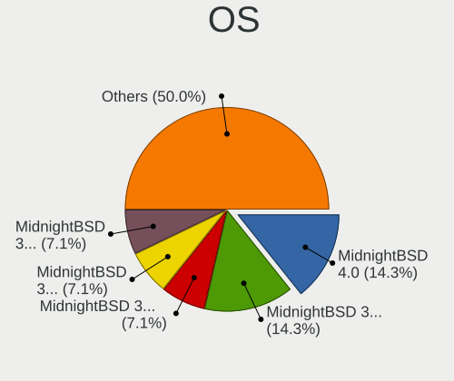

| Name              | Notebooks | Percent |
|-------------------|-----------|---------|
| MidnightBSD 4.0   | 2         | 14.29%  |
| MidnightBSD 3.1.0 | 2         | 14.29%  |
| MidnightBSD 3.2.0 | 1         | 7.14%   |
| MidnightBSD 3.1.2 | 1         | 7.14%   |
| MidnightBSD 3.0.0 | 1         | 7.14%   |
| MidnightBSD 2.2.6 | 1         | 7.14%   |
| MidnightBSD 2.2.2 | 1         | 7.14%   |
| MidnightBSD 2.2.0 | 1         | 7.14%   |
| MidnightBSD 2.1.5 | 1         | 7.14%   |
| MidnightBSD 2.1.1 | 1         | 7.14%   |
| MidnightBSD 2.0   | 1         | 7.14%   |
| MidnightBSD 1.2   | 1         | 7.14%   |

OS Family
---------

OS without a version

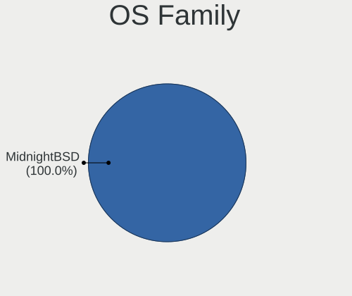

| Name        | Notebooks | Percent |
|-------------|-----------|---------|
| MidnightBSD | 6         | 100%    |

Arch
----

OS architecture (x86_64, i586, etc.)

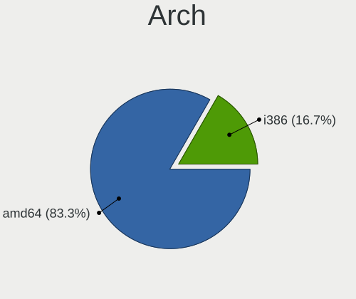

| Name  | Notebooks | Percent |
|-------|-----------|---------|
| amd64 | 5         | 83.33%  |
| i386  | 1         | 16.67%  |

DE
--

Desktop Environment

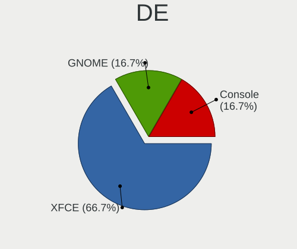

| Name    | Notebooks | Percent |
|---------|-----------|---------|
| XFCE    | 4         | 66.67%  |
| GNOME   | 1         | 16.67%  |
| Console | 1         | 16.67%  |

Display Server
--------------

X11 or Wayland

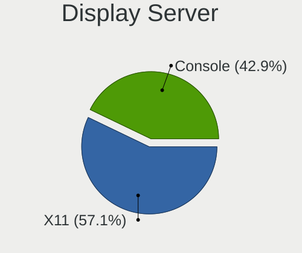

| Name    | Notebooks | Percent |
|---------|-----------|---------|
| X11     | 4         | 57.14%  |
| Console | 3         | 42.86%  |

Display Manager
---------------

SDDM, LightDM, etc.

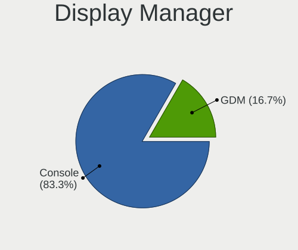

| Name    | Notebooks | Percent |
|---------|-----------|---------|
| Console | 5         | 83.33%  |
| GDM     | 1         | 16.67%  |

OS Lang
-------

Language

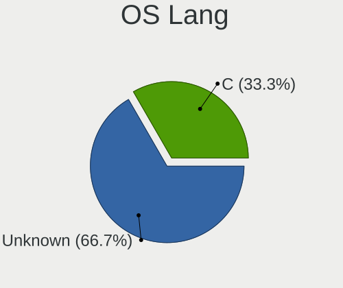

| Lang    | Notebooks | Percent |
|---------|-----------|---------|
| Unknown | 4         | 66.67%  |
| C       | 2         | 33.33%  |

Boot Mode
---------

EFI or BIOS

| Mode | Notebooks | Percent |
|------|-----------|---------|
| EFI  | 5         | 83.33%  |
| BIOS | 1         | 16.67%  |

Filesystem
----------

Type of filesystem

| Type | Notebooks | Percent |
|------|-----------|---------|
| Zfs  | 6         | 100%    |

Part. scheme
------------

Scheme of partitioning

| Type | Notebooks | Percent |
|------|-----------|---------|
| GPT  | 6         | 100%    |

Board
-----

Vendor
------

Motherboard manufacturer

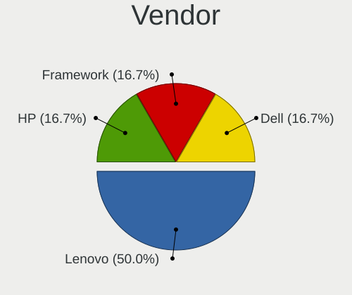

| Name            | Notebooks | Percent |
|-----------------|-----------|---------|
| Lenovo          | 3         | 50%     |
| Hewlett-Packard | 1         | 16.67%  |
| Framework       | 1         | 16.67%  |
| Dell            | 1         | 16.67%  |

Model
-----

Motherboard model

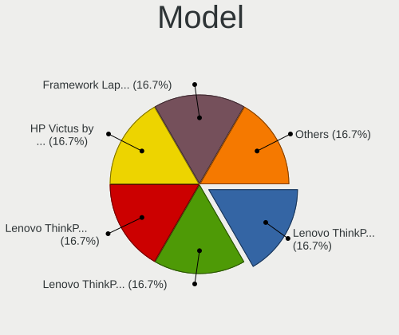

| Name                                      | Notebooks | Percent |
|-------------------------------------------|-----------|---------|
| Lenovo ThinkPad X1 Extreme 2nd 20QWS0M300 | 1         | 16.67%  |
| Lenovo ThinkPad X1 Extreme 20MF000BUS     | 1         | 16.67%  |
| Lenovo ThinkPad A485 20MU000VUS           | 1         | 16.67%  |
| HP Victus by Gaming Laptop 15-fa0xxx      | 1         | 16.67%  |
| Framework Laptop (12th Gen Intel Core)    | 1         | 16.67%  |
| Dell Latitude D610                        | 1         | 16.67%  |

Model Family
------------

Motherboard model prefix

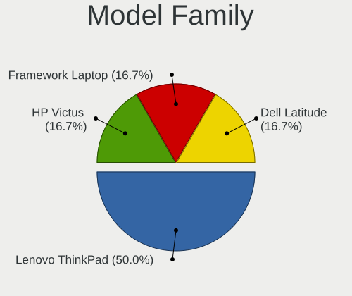

| Name             | Notebooks | Percent |
|------------------|-----------|---------|
| Lenovo ThinkPad  | 3         | 50%     |
| HP Victus        | 1         | 16.67%  |
| Framework Laptop | 1         | 16.67%  |
| Dell Latitude    | 1         | 16.67%  |

MFG Year
--------

Motherboard manufacture year

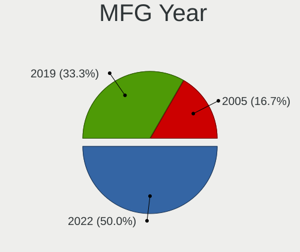

| Year | Notebooks | Percent |
|------|-----------|---------|
| 2022 | 3         | 50%     |
| 2019 | 2         | 33.33%  |
| 2005 | 1         | 16.67%  |

Form Factor
-----------

Physical design of the computer

| Name     | Notebooks | Percent |
|----------|-----------|---------|
| Notebook | 6         | 100%    |

Coreboot
--------

Have coreboot on board

| Used | Notebooks | Percent |
|------|-----------|---------|
| No   | 6         | 100%    |

RAM Size
--------

Total RAM memory

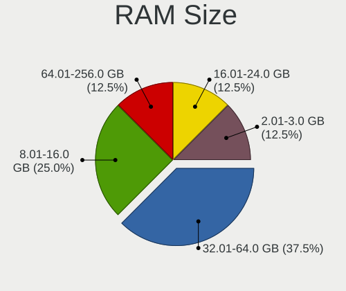

| Size in GB  | Notebooks | Percent |
|-------------|-----------|---------|
| 32.01-64.0  | 3         | 37.5%   |
| 8.01-16.0   | 2         | 25%     |
| 2.01-3.0    | 1         | 12.5%   |
| 64.01-256.0 | 1         | 12.5%   |
| 16.01-24.0  | 1         | 12.5%   |

RAM Used
--------

Used RAM memory

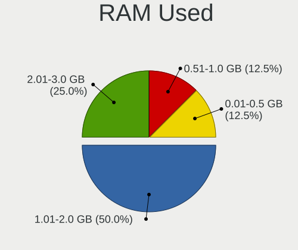

| Used GB  | Notebooks | Percent |
|----------|-----------|---------|
| 1.01-2.0 | 4         | 50%     |
| 2.01-3.0 | 2         | 25%     |
| 0.51-1.0 | 1         | 12.5%   |
| 0.01-0.5 | 1         | 12.5%   |

Total Drives
------------

Number of drives on board

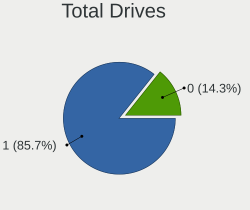

| Drives | Notebooks | Percent |
|--------|-----------|---------|
| 1      | 6         | 85.71%  |
| 0      | 1         | 14.29%  |

Has CD-ROM
----------

Has CD-ROM on board

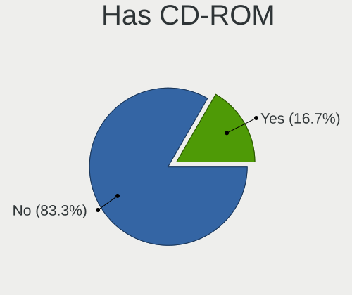

| Presented | Notebooks | Percent |
|-----------|-----------|---------|
| No        | 5         | 83.33%  |
| Yes       | 1         | 16.67%  |

Has Ethernet
------------

Has Ethernet on board

| Presented | Notebooks | Percent |
|-----------|-----------|---------|
| Yes       | 6         | 100%    |

Has WiFi
--------

Has WiFi module

| Presented | Notebooks | Percent |
|-----------|-----------|---------|
| Yes       | 6         | 100%    |

Has Bluetooth
-------------

Has Bluetooth module

| Presented | Notebooks | Percent |
|-----------|-----------|---------|
| Yes       | 6         | 100%    |

Location
--------

Country
-------

Geographic location (country)

| Country | Notebooks | Percent |
|---------|-----------|---------|
| USA     | 4         | 66.67%  |
| Romania | 1         | 16.67%  |
| Germany | 1         | 16.67%  |

City
----

Geographic location (city)

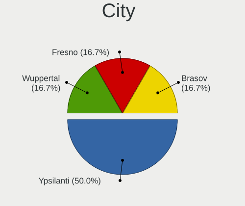

| City      | Notebooks | Percent |
|-----------|-----------|---------|
| Ypsilanti | 3         | 50%     |
| Wuppertal | 1         | 16.67%  |
| Fresno    | 1         | 16.67%  |
| Brasov    | 1         | 16.67%  |

Drives
------

Drive Vendor
------------

Hard drive vendors

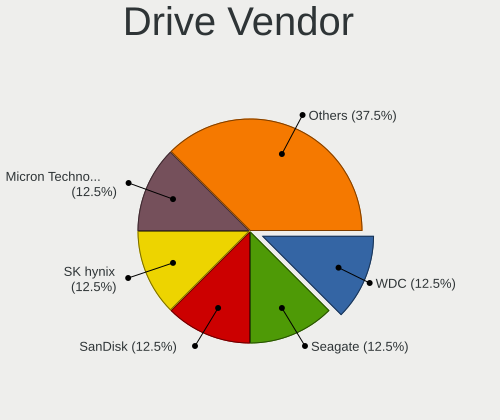

| Vendor            | Notebooks | Drives | Percent |
|-------------------|-----------|--------|---------|
| WDC               | 1         | 1      | 12.5%   |
| SK hynix          | 1         | 1      | 12.5%   |
| Seagate           | 1         | 1      | 12.5%   |
| SanDisk           | 1         | 7      | 12.5%   |
| Micron Technology | 1         | 2      | 12.5%   |
| Lenovo            | 1         | 1      | 12.5%   |
| Intel             | 1         | 1      | 12.5%   |
| Hewlett-Packard   | 1         | 1      | 12.5%   |

Drive Model
-----------

Hard drive models

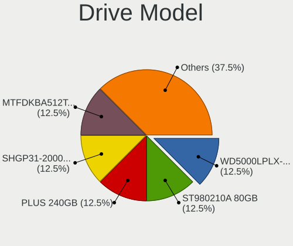

| Model                                | Notebooks | Percent |
|--------------------------------------|-----------|---------|
| WDC WD5000LPLX-08ZNTT0 500GB         | 1         | 12.5%   |
| SK hynix SHGP31-2000GM 2TB           | 1         | 12.5%   |
| Seagate ST980210A 80GB               | 1         | 12.5%   |
| SanDisk SSD PLUS 240GB               | 1         | 12.5%   |
| Micron MTFDKBA512TFH-1BC1AABHA 512GB | 1         | 12.5%   |
| Lenovo LENSE30512GMSP34MEAT3TA 512GB | 1         | 12.5%   |
| Intel SSDPEKKF256G8L 256GB           | 1         | 12.5%   |
| HP SSD S700 120GB                    | 1         | 12.5%   |

HDD Vendor
----------

Hard disk drive vendors

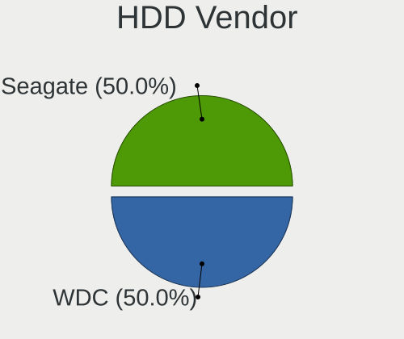

| Vendor  | Notebooks | Drives | Percent |
|---------|-----------|--------|---------|
| WDC     | 1         | 1      | 50%     |
| Seagate | 1         | 1      | 50%     |

SSD Vendor
----------

Solid state drive vendors

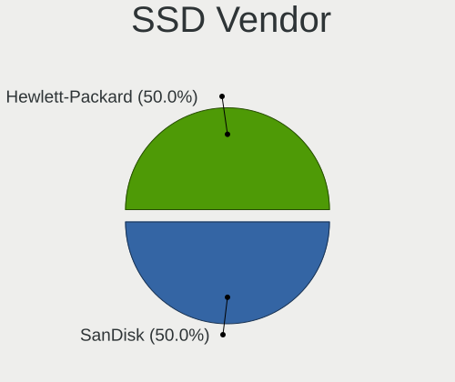

| Vendor          | Notebooks | Drives | Percent |
|-----------------|-----------|--------|---------|
| SanDisk         | 1         | 7      | 50%     |
| Hewlett-Packard | 1         | 1      | 50%     |

Drive Kind
----------

HDD or SSD

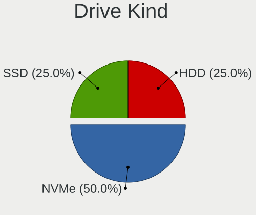

| Kind | Notebooks | Drives | Percent |
|------|-----------|--------|---------|
| NVMe | 4         | 5      | 50%     |
| SSD  | 2         | 8      | 25%     |
| HDD  | 2         | 2      | 25%     |

Drive Connector
---------------

SATA, SAS, NVMe, etc.

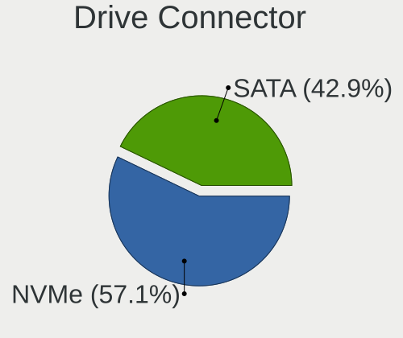

| Type | Notebooks | Drives | Percent |
|------|-----------|--------|---------|
| NVMe | 4         | 5      | 57.14%  |
| SATA | 3         | 10     | 42.86%  |

Drive Size
----------

Size of hard drive

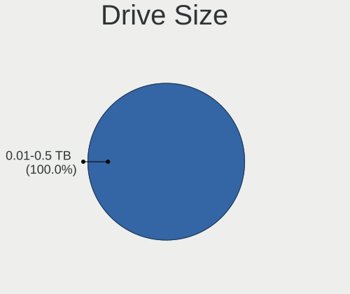

| Size in TB | Notebooks | Drives | Percent |
|------------|-----------|--------|---------|
| 0.01-0.5   | 3         | 10     | 100%    |

Space Total
-----------

Amount of disk space available on the file system

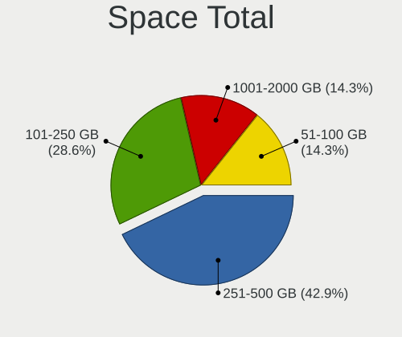

| Size in GB | Notebooks | Percent |
|------------|-----------|---------|
| 251-500    | 3         | 42.86%  |
| 101-250    | 2         | 28.57%  |
| 1001-2000  | 1         | 14.29%  |
| 51-100     | 1         | 14.29%  |

Space Used
----------

Amount of used disk space

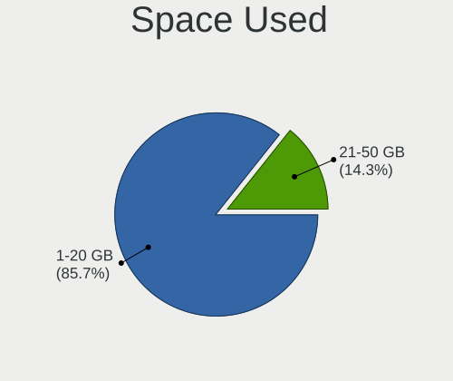

| Used GB | Notebooks | Percent |
|---------|-----------|---------|
| 1-20    | 6         | 85.71%  |
| 21-50   | 1         | 14.29%  |

Malfunc. Drives
---------------

Drive models with a malfunction

Zero info for selected period =(

Malfunc. Drive Vendor
---------------------

Vendors of faulty drives

Zero info for selected period =(

Malfunc. HDD Vendor
-------------------

Vendors of faulty HDD drives

Zero info for selected period =(

Malfunc. Drive Kind
-------------------

Kinds of faulty drives

Zero info for selected period =(

Failed Drives
-------------

Failed drive models

Zero info for selected period =(

Failed Drive Vendor
-------------------

Failed drive vendors

Zero info for selected period =(

Drive Status
------------

Number of failed and malfunc. drives

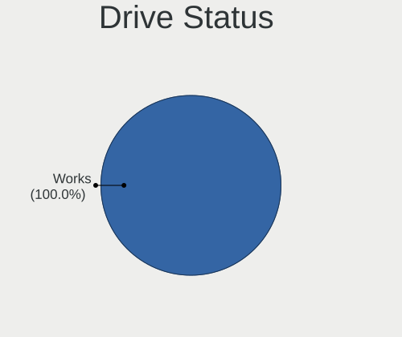

| Status | Notebooks | Drives | Percent |
|--------|-----------|--------|---------|
| Works  | 7         | 15     | 100%    |

Storage controller
------------------

Storage Vendor
--------------

Storage controller vendors

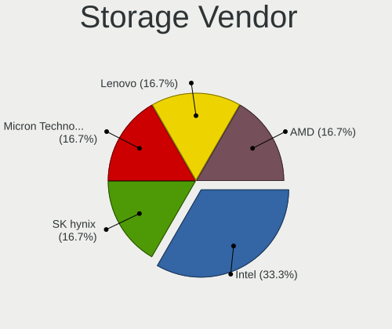

| Vendor            | Notebooks | Percent |
|-------------------|-----------|---------|
| Intel             | 2         | 33.33%  |
| SK hynix          | 1         | 16.67%  |
| Micron Technology | 1         | 16.67%  |
| Lenovo            | 1         | 16.67%  |
| AMD               | 1         | 16.67%  |

Storage Model
-------------

Storage controller models

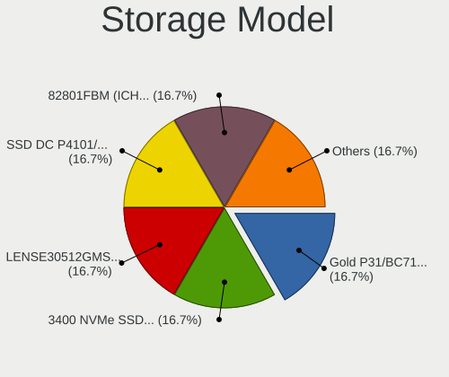

| Model                                                | Notebooks | Percent |
|------------------------------------------------------|-----------|---------|
| SK hynix Gold P31/BC711/PC711 NVMe Solid State Drive | 1         | 16.67%  |
| Micron 3400 NVMe SSD [Hendrix]                       | 1         | 16.67%  |
| Lenovo LENSE30512GMSP34MEAT3TA                       | 1         | 16.67%  |
| Intel SSD DC P4101/Pro 7600p/760p/E 6100p Series     | 1         | 16.67%  |
| Intel 82801FBM (ICH6M) SATA Controller               | 1         | 16.67%  |
| AMD FCH SATA Controller [AHCI mode]                  | 1         | 16.67%  |

Storage Kind
------------

Kind of storage controller (IDE, SATA, NVMe, SAS, ...)

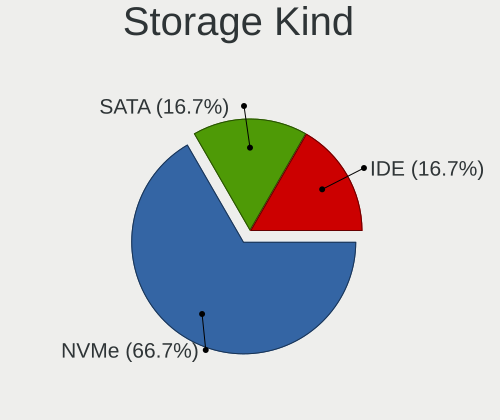

| Kind | Notebooks | Percent |
|------|-----------|---------|
| NVMe | 4         | 66.67%  |
| IDE  | 1         | 16.67%  |
| SATA | 1         | 16.67%  |

Processor
---------

CPU Vendor
----------

Processor vendors

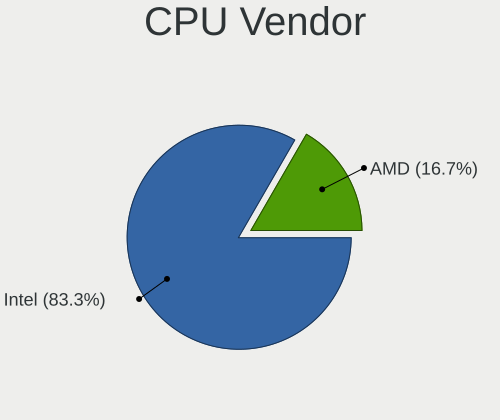

| Vendor | Notebooks | Percent |
|--------|-----------|---------|
| Intel  | 5         | 83.33%  |
| AMD    | 1         | 16.67%  |

CPU Model
---------

Processor models

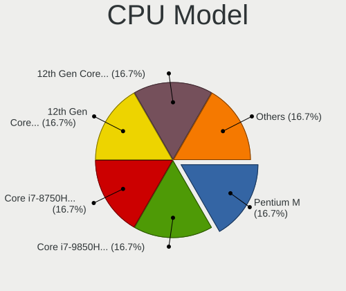

| Model                                           | Notebooks | Percent |
|-------------------------------------------------|-----------|---------|
| Intel Pentium M                                 | 1         | 16.67%  |
| Intel Core i7-9850H CPU @ 2.60GHz               | 1         | 16.67%  |
| Intel Core i7-8750H CPU @ 2.20GHz               | 1         | 16.67%  |
| Intel 12th Gen Core i7-1260P                    | 1         | 16.67%  |
| Intel 12th Gen Core i5-12450H                   | 1         | 16.67%  |
| AMD Ryzen 5 PRO 2500U w/ Radeon Vega Mobile Gfx | 1         | 16.67%  |

CPU Model Family
----------------

Processor model prefix

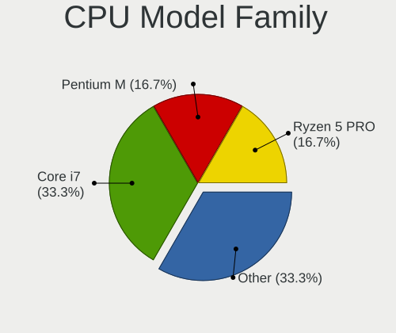

| Model           | Notebooks | Percent |
|-----------------|-----------|---------|
| Other           | 2         | 33.33%  |
| Intel Core i7   | 2         | 33.33%  |
| Intel Pentium M | 1         | 16.67%  |
| AMD Ryzen 5 PRO | 1         | 16.67%  |

CPU Cores
---------

Number of processor cores

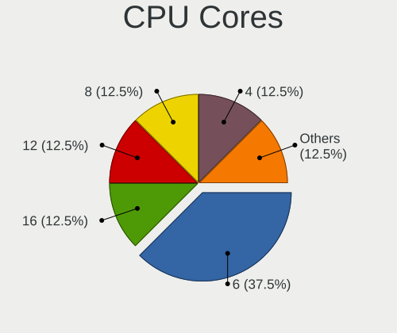

| Number | Notebooks | Percent |
|--------|-----------|---------|
| 6      | 3         | 37.5%   |
| 16     | 1         | 12.5%   |
| 12     | 1         | 12.5%   |
| 8      | 1         | 12.5%   |
| 4      | 1         | 12.5%   |
| 1      | 1         | 12.5%   |

CPU Sockets
-----------

Number of sockets

| Number | Notebooks | Percent |
|--------|-----------|---------|
| 1      | 6         | 100%    |

CPU Threads
-----------

Threads per core (Hyper-Threading)

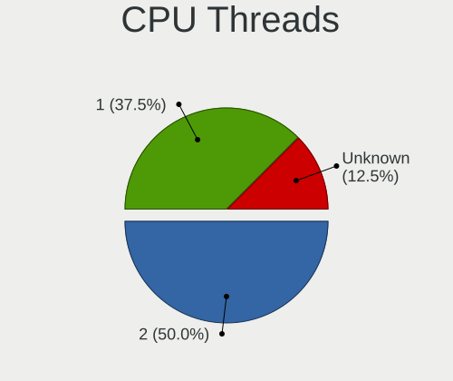

| Number  | Notebooks | Percent |
|---------|-----------|---------|
| 2       | 4         | 50%     |
| 1       | 3         | 37.5%   |
| Unknown | 1         | 12.5%   |

CPU Microarch
-------------

Microarchitecture

| Name     | Notebooks | Percent |
|----------|-----------|---------|
| KabyLake | 2         | 33.33%  |
| Unknown  | 2         | 33.33%  |
| Zen      | 1         | 16.67%  |
| P6       | 1         | 16.67%  |

Graphics
--------

GPU Vendor
----------

Vendors of graphics cards

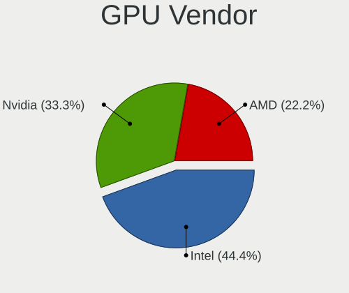

| Vendor | Notebooks | Percent |
|--------|-----------|---------|
| Intel  | 4         | 44.44%  |
| Nvidia | 3         | 33.33%  |
| AMD    | 2         | 22.22%  |

GPU Model
---------

Graphics card models

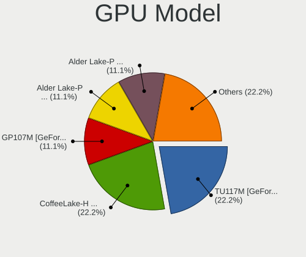

| Model                                                            | Notebooks | Percent |
|------------------------------------------------------------------|-----------|---------|
| Nvidia TU117M [GeForce GTX 1650 Mobile / Max-Q]                  | 2         | 22.22%  |
| Intel CoffeeLake-H GT2 [UHD Graphics 630]                        | 2         | 22.22%  |
| Nvidia GP107M [GeForce GTX 1050 Ti Mobile]                       | 1         | 11.11%  |
| Intel Alder Lake-P GT2 [Iris Xe Graphics]                        | 1         | 11.11%  |
| Intel Alder Lake-P GT1 [UHD Graphics]                            | 1         | 11.11%  |
| AMD RV370/M22 [Mobility Radeon X300]                             | 1         | 11.11%  |
| AMD Raven Ridge [Radeon Vega Series / Radeon Vega Mobile Series] | 1         | 11.11%  |

GPU Combo
---------

Combinations of graphics cards

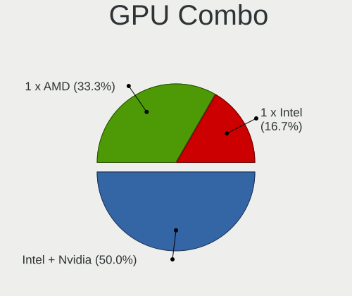

| Name           | Notebooks | Percent |
|----------------|-----------|---------|
| Intel + Nvidia | 3         | 50%     |
| 1 x AMD        | 2         | 33.33%  |
| 1 x Intel      | 1         | 16.67%  |

GPU Driver
----------

Free vs proprietary

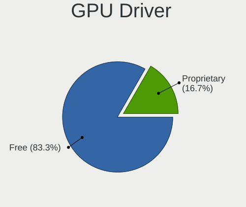

| Driver      | Notebooks | Percent |
|-------------|-----------|---------|
| Free        | 5         | 83.33%  |
| Proprietary | 1         | 16.67%  |

GPU Memory
----------

Total video memory

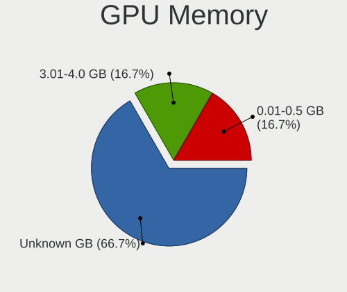

| Size in GB | Notebooks | Percent |
|------------|-----------|---------|
| Unknown    | 4         | 66.67%  |
| 3.01-4.0   | 1         | 16.67%  |
| 0.01-0.5   | 1         | 16.67%  |

Monitor
-------

Monitor Vendor
--------------

Monitor vendors

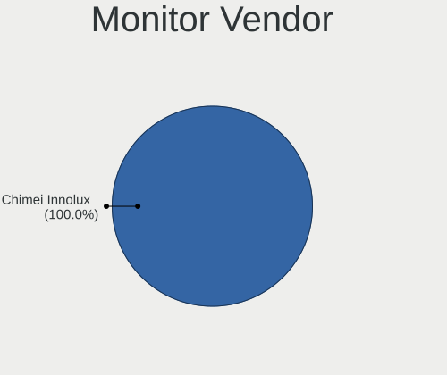

| Vendor         | Notebooks | Percent |
|----------------|-----------|---------|
| Chimei Innolux | 1         | 100%    |

Monitor Model
-------------

Monitor models

| Model                                                           | Notebooks | Percent |
|-----------------------------------------------------------------|-----------|---------|
| Chimei Innolux LCD Monitor CMN14C3 1366x768 310x170mm 13.9-inch | 1         | 100%    |

Monitor Resolution
------------------

Monitor screen resolution

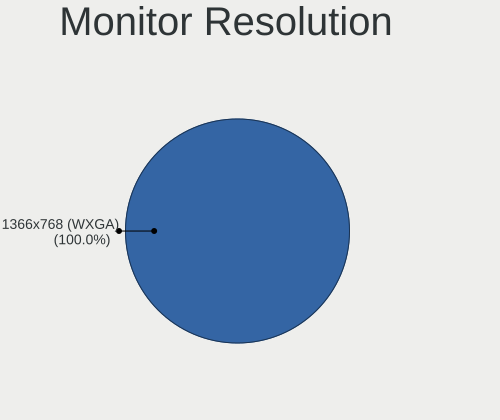

| Resolution      | Notebooks | Percent |
|-----------------|-----------|---------|
| 1366x768 (WXGA) | 1         | 100%    |

Monitor Diagonal
----------------

Diagonal size in inches

| Inches | Notebooks | Percent |
|--------|-----------|---------|
| 13     | 1         | 100%    |

Monitor Width
-------------

Physical width

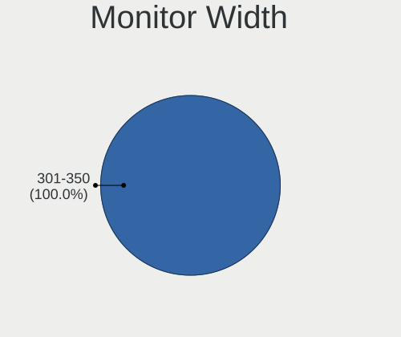

| Width in mm | Notebooks | Percent |
|-------------|-----------|---------|
| 301-350     | 1         | 100%    |

Aspect Ratio
------------

Proportional relationship between the width and the height

| Ratio | Notebooks | Percent |
|-------|-----------|---------|
| 16/9  | 1         | 100%    |

Monitor Area
------------

Area in inch²

| Area in inch² | Notebooks | Percent |
|----------------|-----------|---------|
| 81-90          | 1         | 100%    |

Pixel Density
-------------

Pixels per inch

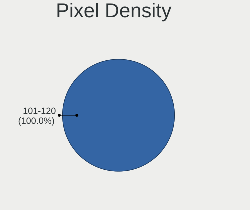

| Density | Notebooks | Percent |
|---------|-----------|---------|
| 101-120 | 1         | 100%    |

Multiple Monitors
-----------------

Total monitors connected

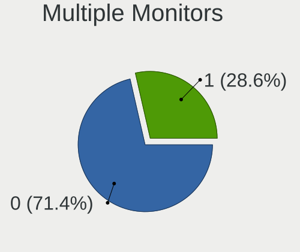

| Total | Notebooks | Percent |
|-------|-----------|---------|
| 0     | 5         | 71.43%  |
| 1     | 2         | 28.57%  |

Network
-------

Net Controller Vendor
---------------------

Controller vendors

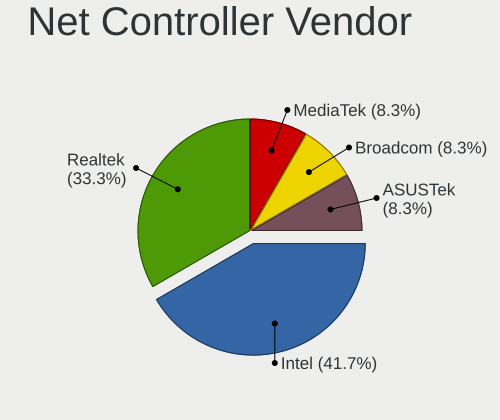

| Vendor                | Notebooks | Percent |
|-----------------------|-----------|---------|
| Intel                 | 5         | 41.67%  |
| Realtek Semiconductor | 4         | 33.33%  |
| MediaTek              | 1         | 8.33%   |
| Broadcom              | 1         | 8.33%   |
| ASUSTek Computer      | 1         | 8.33%   |

Net Controller Model
--------------------

Controller models

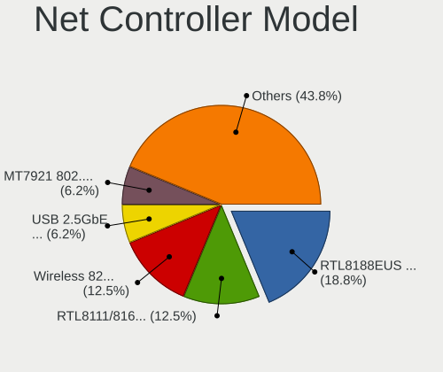

| Model                                                                  | Notebooks | Percent |
|------------------------------------------------------------------------|-----------|---------|
| Realtek RTL8188EUS 802.11n Wireless Network Adapter                    | 3         | 18.75%  |
| Realtek RTL8111/8168/8211/8411 PCI Express Gigabit Ethernet Controller | 2         | 12.5%   |
| Intel Wireless 8265 / 8275                                             | 2         | 12.5%   |
| Realtek USB 2.5GbE Controller                                          | 1         | 6.25%   |
| MediaTek MT7921 802.11ax PCIe Wireless Network Adapter [Filogic 330]   | 1         | 6.25%   |
| Intel Wi-Fi 6 AX200                                                    | 1         | 6.25%   |
| Intel Wi-Fi 5(802.11ac) Wireless-AC 9x6x [Thunder Peak]                | 1         | 6.25%   |
| Intel Ethernet Connection (7) I219-V                                   | 1         | 6.25%   |
| Intel Ethernet Connection (7) I219-LM                                  | 1         | 6.25%   |
| Intel Cannon Lake PCH CNVi WiFi                                        | 1         | 6.25%   |
| Broadcom NetXtreme BCM5751 Gigabit Ethernet PCI Express                | 1         | 6.25%   |
| ASUS USB-AC53 Nano USB Wieless Adapter                                 | 1         | 6.25%   |

Wireless Vendor
---------------

Wireless vendors

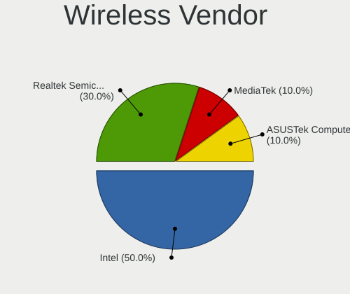

| Vendor                | Notebooks | Percent |
|-----------------------|-----------|---------|
| Intel                 | 5         | 50%     |
| Realtek Semiconductor | 3         | 30%     |
| MediaTek              | 1         | 10%     |
| ASUSTek Computer      | 1         | 10%     |

Wireless Model
--------------

Wireless models

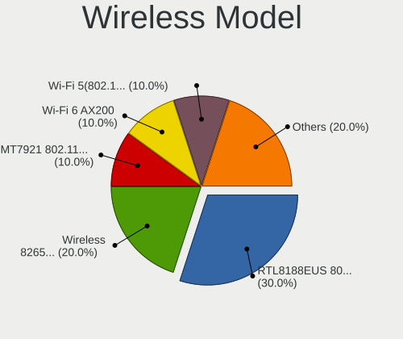

| Model                                                                | Notebooks | Percent |
|----------------------------------------------------------------------|-----------|---------|
| Realtek RTL8188EUS 802.11n Wireless Network Adapter                  | 3         | 30%     |
| Intel Wireless 8265 / 8275                                           | 2         | 20%     |
| MediaTek MT7921 802.11ax PCIe Wireless Network Adapter [Filogic 330] | 1         | 10%     |
| Intel Wi-Fi 6 AX200                                                  | 1         | 10%     |
| Intel Wi-Fi 5(802.11ac) Wireless-AC 9x6x [Thunder Peak]              | 1         | 10%     |
| Intel Cannon Lake PCH CNVi WiFi                                      | 1         | 10%     |
| ASUS USB-AC53 Nano USB Wieless Adapter                               | 1         | 10%     |

Ethernet Vendor
---------------

Ethernet vendors

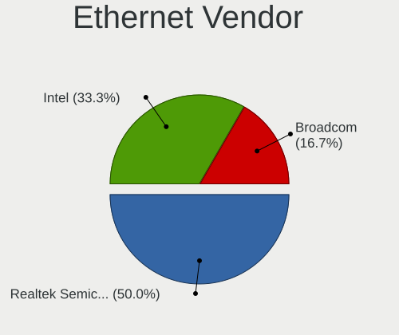

| Vendor                | Notebooks | Percent |
|-----------------------|-----------|---------|
| Realtek Semiconductor | 3         | 50%     |
| Intel                 | 2         | 33.33%  |
| Broadcom              | 1         | 16.67%  |

Ethernet Model
--------------

Ethernet models

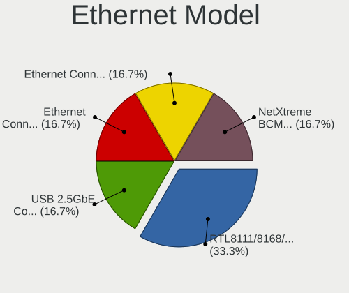

| Model                                                                  | Notebooks | Percent |
|------------------------------------------------------------------------|-----------|---------|
| Realtek RTL8111/8168/8211/8411 PCI Express Gigabit Ethernet Controller | 2         | 33.33%  |
| Realtek USB 2.5GbE Controller                                          | 1         | 16.67%  |
| Intel Ethernet Connection (7) I219-V                                   | 1         | 16.67%  |
| Intel Ethernet Connection (7) I219-LM                                  | 1         | 16.67%  |
| Broadcom NetXtreme BCM5751 Gigabit Ethernet PCI Express                | 1         | 16.67%  |

Net Controller Kind
-------------------

Ethernet, WiFi or modem

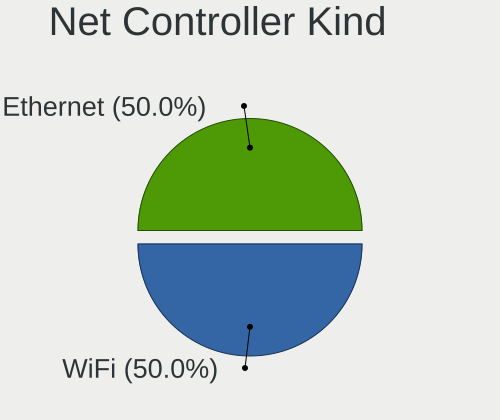

| Kind     | Notebooks | Percent |
|----------|-----------|---------|
| WiFi     | 6         | 50%     |
| Ethernet | 6         | 50%     |

Used Controller
---------------

Currently used network controller

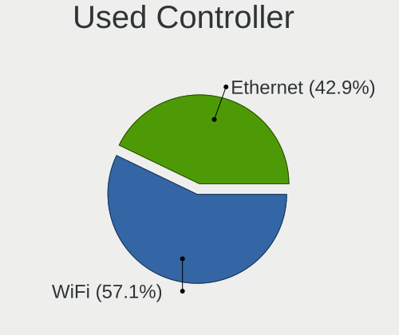

| Kind     | Notebooks | Percent |
|----------|-----------|---------|
| WiFi     | 4         | 57.14%  |
| Ethernet | 3         | 42.86%  |

NICs
----

Total network controllers on board

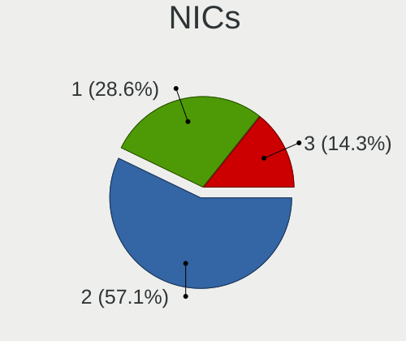

| Total | Notebooks | Percent |
|-------|-----------|---------|
| 2     | 4         | 57.14%  |
| 1     | 2         | 28.57%  |
| 3     | 1         | 14.29%  |

IPv6
----

IPv6 vs IPv4

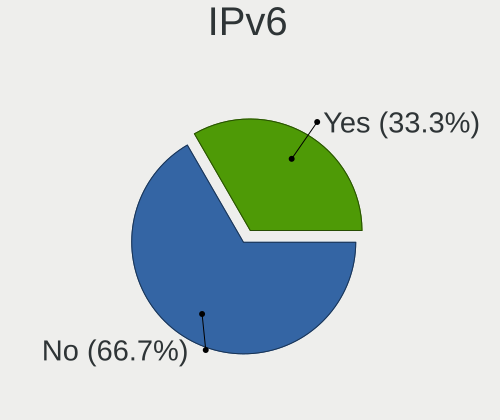

| Used | Notebooks | Percent |
|------|-----------|---------|
| No   | 4         | 66.67%  |
| Yes  | 2         | 33.33%  |

Bluetooth
---------

Bluetooth Vendor
----------------

Controller vendors

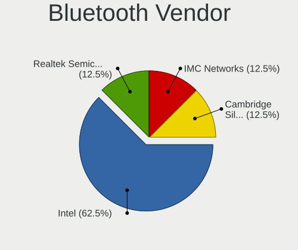

| Vendor                  | Notebooks | Percent |
|-------------------------|-----------|---------|
| Intel                   | 5         | 62.5%   |
| Realtek Semiconductor   | 1         | 12.5%   |
| IMC Networks            | 1         | 12.5%   |
| Cambridge Silicon Radio | 1         | 12.5%   |

Bluetooth Model
---------------

Controller models

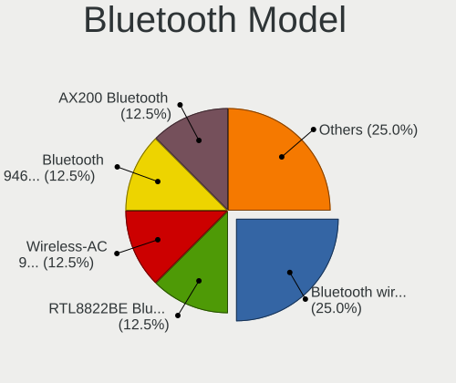

| Model                                               | Notebooks | Percent |
|-----------------------------------------------------|-----------|---------|
| Intel Bluetooth wireless interface                  | 2         | 25%     |
| Realtek RTL8822BE Bluetooth 4.2 Adapter             | 1         | 12.5%   |
| Intel Wireless-AC 9260 Bluetooth Adapter            | 1         | 12.5%   |
| Intel Bluetooth 9460/9560 Jefferson Peak (JfP)      | 1         | 12.5%   |
| Intel AX200 Bluetooth                               | 1         | 12.5%   |
| IMC Networks MediaTek Bluetooth Adapter             | 1         | 12.5%   |
| Cambridge Silicon Radio Bluetooth Dongle (HCI mode) | 1         | 12.5%   |

Sound
-----

Sound Vendor
------------

Sound card vendors

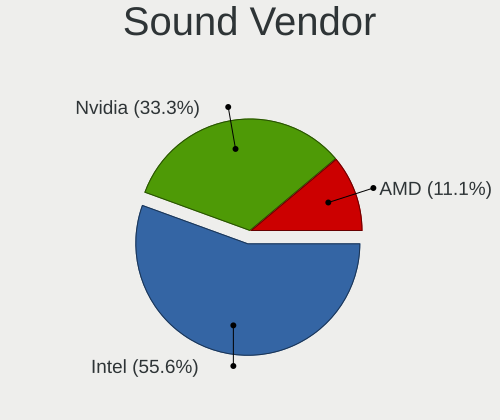

| Vendor | Notebooks | Percent |
|--------|-----------|---------|
| Intel  | 5         | 55.56%  |
| Nvidia | 3         | 33.33%  |
| AMD    | 1         | 11.11%  |

Sound Model
-----------

Sound card models

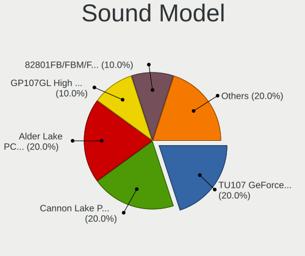

| Model                                                            | Notebooks | Percent |
|------------------------------------------------------------------|-----------|---------|
| Nvidia TU107 GeForce GTX 1650 High Definition Audio Controller   | 2         | 20%     |
| Intel Cannon Lake PCH cAVS                                       | 2         | 20%     |
| Intel Alder Lake PCH-P High Definition Audio Controller          | 2         | 20%     |
| Nvidia GP107GL High Definition Audio Controller                  | 1         | 10%     |
| Intel 82801FB/FBM/FR/FW/FRW (ICH6 Family) AC'97 Audio Controller | 1         | 10%     |
| AMD Ryzen HD Audio Controller                                    | 1         | 10%     |
| AMD Raven/Raven2/Fenghuang HDMI/DP Audio Controller              | 1         | 10%     |

Memory
------

Memory Vendor
-------------

Memory module vendors

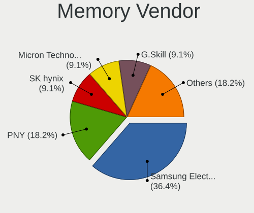

| Vendor              | Notebooks | Percent |
|---------------------|-----------|---------|
| Samsung Electronics | 4         | 36.36%  |
| PNY                 | 2         | 18.18%  |
| SK hynix            | 1         | 9.09%   |
| Micron Technology   | 1         | 9.09%   |
| G.Skill             | 1         | 9.09%   |
| Corsair             | 1         | 9.09%   |
| Unknown             | 1         | 9.09%   |

Memory Model
------------

Memory module models

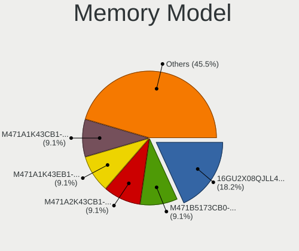

| Model                                                     | Notebooks | Percent |
|-----------------------------------------------------------|-----------|---------|
| PNY RAM 16GU2X08QJLL42-12-K 16GB SODIMM DDR4 3200MT/s     | 2         | 18.18%  |
| SK hynix RAM Module 1GB SODIMM DDR 667MT/s                | 1         | 9.09%   |
| Samsung RAM M471B5173CB0-YK0 4GB SODIMM DDR3 1600MT/s     | 1         | 9.09%   |
| Samsung RAM M471A2K43CB1-CTD 16GB SODIMM DDR4 2667MT/s    | 1         | 9.09%   |
| Samsung RAM M471A1K43EB1-CWE 8GB SODIMM DDR4 3200MT/s     | 1         | 9.09%   |
| Samsung RAM M471A1K43CB1-CTD 8GB SODIMM DDR4 3200MT/s     | 1         | 9.09%   |
| Micron RAM 4ATF51264HZ-2G3B2 4GB SODIMM DDR4 2400MT/s     | 1         | 9.09%   |
| G.Skill RAM F4-2666C18-16GRS 16GB SODIMM DDR4 2667MT/s    | 1         | 9.09%   |
| Corsair RAM CMSX64GX4M2A2666C18 32GB SODIMM DDR4 2667MT/s | 1         | 9.09%   |
| Unknown                                                   | 1         | 9.09%   |

Memory Kind
-----------

Memory module kinds

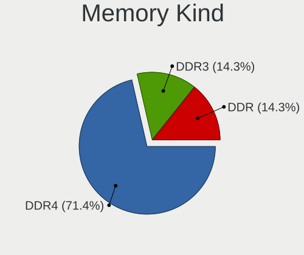

| Kind | Notebooks | Percent |
|------|-----------|---------|
| DDR4 | 5         | 71.43%  |
| DDR3 | 1         | 14.29%  |
| DDR  | 1         | 14.29%  |

Memory Form Factor
------------------

Physical design of the memory module

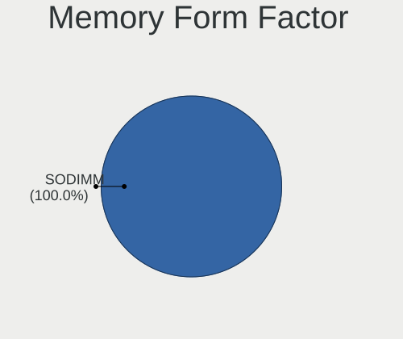

| Name   | Notebooks | Percent |
|--------|-----------|---------|
| SODIMM | 7         | 100%    |

Memory Size
-----------

Memory module size

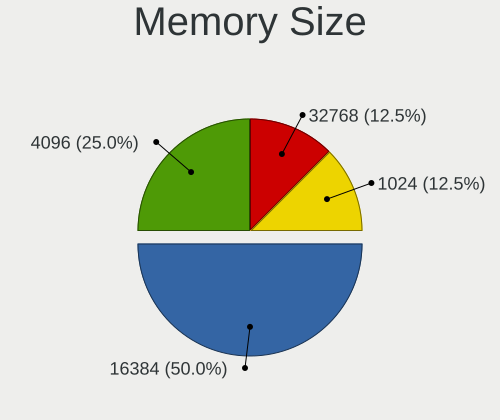

| Size  | Notebooks | Percent |
|-------|-----------|---------|
| 16384 | 4         | 50%     |
| 4096  | 2         | 25%     |
| 32768 | 1         | 12.5%   |
| 1024  | 1         | 12.5%   |

Memory Speed
------------

Memory module speed

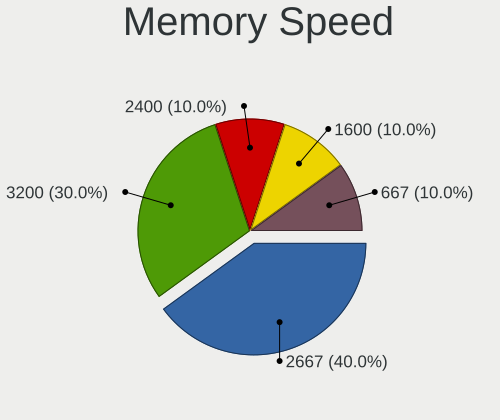

| Speed | Notebooks | Percent |
|-------|-----------|---------|
| 2667  | 4         | 40%     |
| 3200  | 3         | 30%     |
| 2400  | 1         | 10%     |
| 1600  | 1         | 10%     |
| 667   | 1         | 10%     |

Printers & scanners
-------------------

Printer Vendor
--------------

Printer device vendors

Zero info for selected period =(

Printer Model
-------------

Printer device models

Zero info for selected period =(

Scanner Vendor
--------------

Scanner device vendors

Zero info for selected period =(

Scanner Model
-------------

Scanner device models

Zero info for selected period =(

Camera
------

Camera Vendor
-------------

Camera device vendors

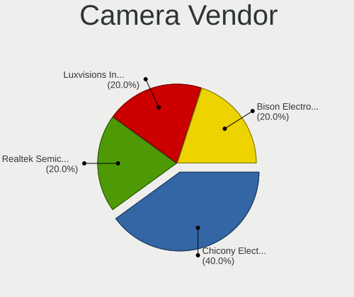

| Vendor                      | Notebooks | Percent |
|-----------------------------|-----------|---------|
| Chicony Electronics         | 2         | 40%     |
| Realtek Semiconductor       | 1         | 20%     |
| Luxvisions Innotech Limited | 1         | 20%     |
| Bison Electronics           | 1         | 20%     |

Camera Model
------------

Camera device models

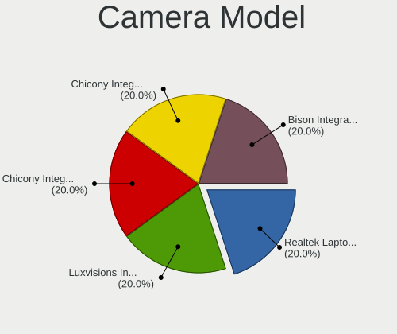

| Model                                                | Notebooks | Percent |
|------------------------------------------------------|-----------|---------|
| Realtek Laptop Camera                                | 1         | 20%     |
| Luxvisions Innotech Limited HP Wide Vision HD Camera | 1         | 20%     |
| Chicony Integrated Camera (1280x720@30)              | 1         | 20%     |
| Chicony Integrated Camera                            | 1         | 20%     |
| Bison Integrated Camera                              | 1         | 20%     |

Security
--------

Fingerprint Vendor
------------------

Fingerprint sensor vendors

| Vendor    | Notebooks | Percent |
|-----------|-----------|---------|
| Synaptics | 2         | 100%    |

Fingerprint Model
-----------------

Fingerprint sensor models

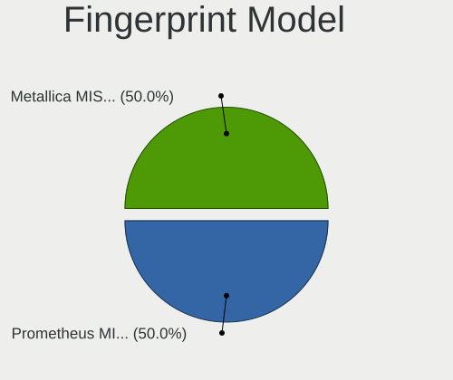

| Model                                             | Notebooks | Percent |
|---------------------------------------------------|-----------|---------|
| Synaptics Prometheus MIS Touch Fingerprint Reader | 1         | 50%     |
| Synaptics Metallica MIS Touch Fingerprint Reader  | 1         | 50%     |

Chipcard Vendor
---------------

Chipcard module vendors

Zero info for selected period =(

Chipcard Model
--------------

Chipcard module models

Zero info for selected period =(

Unsupported
-----------

Unsupported Devices
-------------------

Total unsupported devices on board

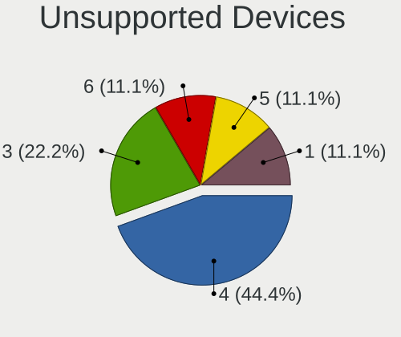

| Total | Notebooks | Percent |
|-------|-----------|---------|
| 4     | 4         | 44.44%  |
| 3     | 2         | 22.22%  |
| 6     | 1         | 11.11%  |
| 5     | 1         | 11.11%  |
| 1     | 1         | 11.11%  |

Unsupported Device Types
------------------------

Types of unsupported devices

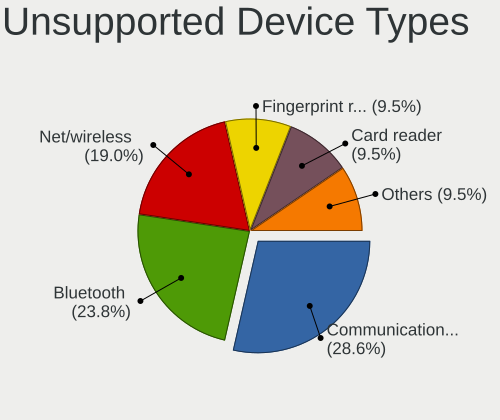

| Type                     | Notebooks | Percent |
|--------------------------|-----------|---------|
| Communication controller | 6         | 28.57%  |
| Bluetooth                | 5         | 23.81%  |
| Net/wireless             | 4         | 19.05%  |
| Fingerprint reader       | 2         | 9.52%   |
| Card reader              | 2         | 9.52%   |
| Sound                    | 1         | 4.76%   |
| Net/ethernet             | 1         | 4.76%   |

