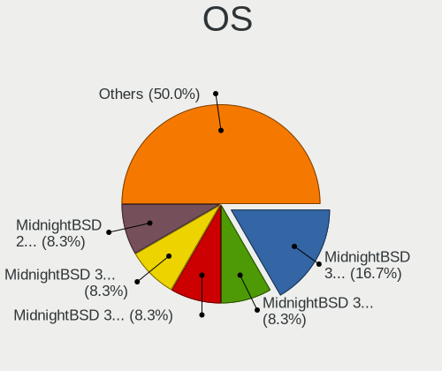
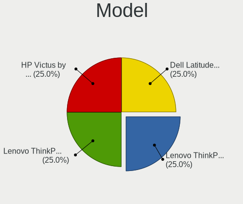
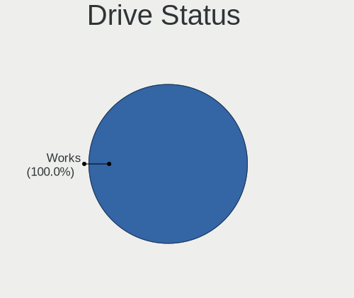
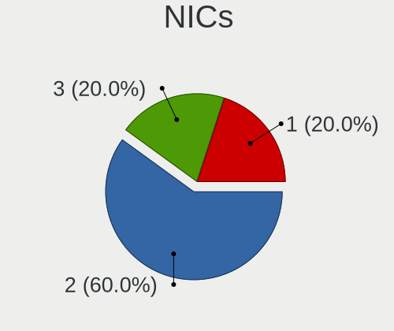
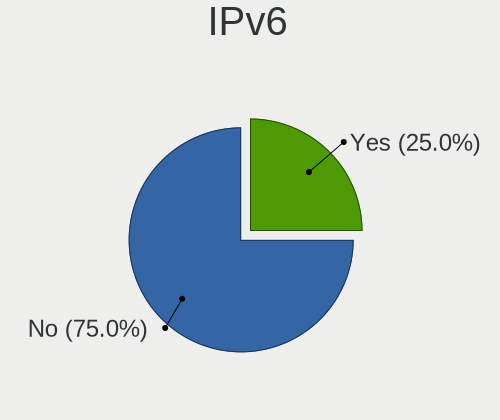
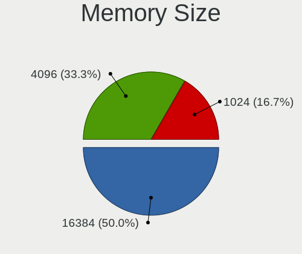

MidnightBSD - Tested Hardware & Statistics (Notebooks)
------------------------------------------------------

A project to collect tested hardware configurations for MidnightBSD.

Anyone can contribute to this report by the [hw-probe](https://github.com/linuxhw/hw-probe/blob/master/INSTALL.BSD.md) tool:

    hw-probe -all -upload

Please contribute! Especially if your hardware is rare.

Contents
--------

* [ Test Cases ](#test-cases)

* [ System ](#system)
  - [ OS                       ](#os)
  - [ OS Family                ](#os-family)
  - [ Arch                     ](#arch)
  - [ DE                       ](#de)
  - [ Display Server           ](#display-server)
  - [ Display Manager          ](#display-manager)
  - [ OS Lang                  ](#os-lang)
  - [ Boot Mode                ](#boot-mode)
  - [ Filesystem               ](#filesystem)
  - [ Part. scheme             ](#part-scheme)

* [ Board ](#board)
  - [ Vendor                   ](#vendor)
  - [ Model                    ](#model)
  - [ Model Family             ](#model-family)
  - [ MFG Year                 ](#mfg-year)
  - [ Form Factor              ](#form-factor)
  - [ Coreboot                 ](#coreboot)
  - [ RAM Size                 ](#ram-size)
  - [ RAM Used                 ](#ram-used)
  - [ Total Drives             ](#total-drives)
  - [ Has CD-ROM               ](#has-cd-rom)
  - [ Has Ethernet             ](#has-ethernet)
  - [ Has WiFi                 ](#has-wifi)
  - [ Has Bluetooth            ](#has-bluetooth)

* [ Location ](#location)
  - [ Country                  ](#country)
  - [ City                     ](#city)

* [ Drives ](#drives)
  - [ Drive Vendor             ](#drive-vendor)
  - [ Drive Model              ](#drive-model)
  - [ HDD Vendor               ](#hdd-vendor)
  - [ SSD Vendor               ](#ssd-vendor)
  - [ Drive Kind               ](#drive-kind)
  - [ Drive Connector          ](#drive-connector)
  - [ Drive Size               ](#drive-size)
  - [ Space Total              ](#space-total)
  - [ Space Used               ](#space-used)
  - [ Malfunc. Drives          ](#malfunc-drives)
  - [ Malfunc. Drive Vendor    ](#malfunc-drive-vendor)
  - [ Malfunc. HDD Vendor      ](#malfunc-hdd-vendor)
  - [ Malfunc. Drive Kind      ](#malfunc-drive-kind)
  - [ Failed Drives            ](#failed-drives)
  - [ Failed Drive Vendor      ](#failed-drive-vendor)
  - [ Drive Status             ](#drive-status)

* [ Storage controller ](#storage-controller)
  - [ Storage Vendor           ](#storage-vendor)
  - [ Storage Model            ](#storage-model)
  - [ Storage Kind             ](#storage-kind)

* [ Processor ](#processor)
  - [ CPU Vendor               ](#cpu-vendor)
  - [ CPU Model                ](#cpu-model)
  - [ CPU Model Family         ](#cpu-model-family)
  - [ CPU Cores                ](#cpu-cores)
  - [ CPU Sockets              ](#cpu-sockets)
  - [ CPU Threads              ](#cpu-threads)
  - [ CPU Microarch            ](#cpu-microarch)

* [ Graphics ](#graphics)
  - [ GPU Vendor               ](#gpu-vendor)
  - [ GPU Model                ](#gpu-model)
  - [ GPU Combo                ](#gpu-combo)
  - [ GPU Driver               ](#gpu-driver)
  - [ GPU Memory               ](#gpu-memory)

* [ Monitor ](#monitor)
  - [ Monitor Vendor           ](#monitor-vendor)
  - [ Monitor Model            ](#monitor-model)
  - [ Monitor Resolution       ](#monitor-resolution)
  - [ Monitor Diagonal         ](#monitor-diagonal)
  - [ Monitor Width            ](#monitor-width)
  - [ Aspect Ratio             ](#aspect-ratio)
  - [ Monitor Area             ](#monitor-area)
  - [ Pixel Density            ](#pixel-density)
  - [ Multiple Monitors        ](#multiple-monitors)

* [ Network ](#network)
  - [ Net Controller Vendor    ](#net-controller-vendor)
  - [ Net Controller Model     ](#net-controller-model)
  - [ Wireless Vendor          ](#wireless-vendor)
  - [ Wireless Model           ](#wireless-model)
  - [ Ethernet Vendor          ](#ethernet-vendor)
  - [ Ethernet Model           ](#ethernet-model)
  - [ Net Controller Kind      ](#net-controller-kind)
  - [ Used Controller          ](#used-controller)
  - [ NICs                     ](#nics)
  - [ IPv6                     ](#ipv6)

* [ Bluetooth ](#bluetooth)
  - [ Bluetooth Vendor         ](#bluetooth-vendor)
  - [ Bluetooth Model          ](#bluetooth-model)

* [ Sound ](#sound)
  - [ Sound Vendor             ](#sound-vendor)
  - [ Sound Model              ](#sound-model)

* [ Memory ](#memory)
  - [ Memory Vendor            ](#memory-vendor)
  - [ Memory Model             ](#memory-model)
  - [ Memory Kind              ](#memory-kind)
  - [ Memory Form Factor       ](#memory-form-factor)
  - [ Memory Size              ](#memory-size)
  - [ Memory Speed             ](#memory-speed)

* [ Printers & scanners ](#printers--scanners)
  - [ Printer Vendor           ](#printer-vendor)
  - [ Printer Model            ](#printer-model)
  - [ Scanner Vendor           ](#scanner-vendor)
  - [ Scanner Model            ](#scanner-model)

* [ Camera ](#camera)
  - [ Camera Vendor            ](#camera-vendor)
  - [ Camera Model             ](#camera-model)

* [ Security ](#security)
  - [ Fingerprint Vendor       ](#fingerprint-vendor)
  - [ Fingerprint Model        ](#fingerprint-model)
  - [ Chipcard Vendor          ](#chipcard-vendor)
  - [ Chipcard Model           ](#chipcard-model)

* [ Unsupported ](#unsupported)
  - [ Unsupported Devices      ](#unsupported-devices)
  - [ Unsupported Device Types ](#unsupported-device-types)

Test Cases
----------

Total: 17

| Vendor | Model                       | Probe                                                     | Date         |
|--------|-----------------------------|-----------------------------------------------------------|--------------|
| HP     | Victus by Gaming Laptop ... | [b97af82e5c](https://bsd-hardware.info/?probe=b97af82e5c) | Feb 05, 2023 |
| Lenovo | B50-80 80EW                 | [b8f49b8d19](https://bsd-hardware.info/?probe=b8f49b8d19) | Jan 07, 2023 |
| Dell   | Latitude D610               | [6ef8d8137b](https://bsd-hardware.info/?probe=6ef8d8137b) | Nov 24, 2022 |
| Lenovo | ThinkPad A485 20MU000VUS    | [b816902c0b](https://bsd-hardware.info/?probe=b816902c0b) | Oct 31, 2022 |
| Lenovo | ThinkPad A485 20MU000VUS    | [296e81dd9d](https://bsd-hardware.info/?probe=296e81dd9d) | Aug 21, 2022 |
| Lenovo | ThinkPad A485 20MU000VUS    | [b79fa4531e](https://bsd-hardware.info/?probe=b79fa4531e) | Aug 20, 2022 |
| HP     | Victus by Gaming Laptop ... | [e09aa880f9](https://bsd-hardware.info/?probe=e09aa880f9) | Aug 16, 2022 |
| Lenovo | ThinkPad A485 20MU000VUS    | [43d7380492](https://bsd-hardware.info/?probe=43d7380492) | Jun 15, 2022 |
| Lenovo | ThinkPad A485 20MU000VUS    | [a3e3500ca5](https://bsd-hardware.info/?probe=a3e3500ca5) | Jun 15, 2022 |
| Lenovo | ThinkPad X1 Extreme 20MF... | [1af600b3ae](https://bsd-hardware.info/?probe=1af600b3ae) | Mar 24, 2022 |
| Lenovo | ThinkPad A485 20MU000VUS    | [4b03ca3191](https://bsd-hardware.info/?probe=4b03ca3191) | Oct 03, 2021 |
| Lenovo | ThinkPad A485 20MU000VUS    | [624be8f7d6](https://bsd-hardware.info/?probe=624be8f7d6) | Nov 16, 2020 |
| Lenovo | ThinkPad A485 20MU000VUS    | [4d2c24a0e3](https://bsd-hardware.info/?probe=4d2c24a0e3) | Sep 15, 2020 |
| Lenovo | G570 20079                  | [7042848932](https://bsd-hardware.info/?probe=7042848932) | Jun 03, 2020 |
| Lenovo | ThinkPad A485 20MU000VUS    | [010db0aed4](https://bsd-hardware.info/?probe=010db0aed4) | May 22, 2020 |
| Lenovo | G570 20079                  | [112b83a485](https://bsd-hardware.info/?probe=112b83a485) | May 16, 2020 |
| Lenovo | G570 20079                  | [eff0d8a3db](https://bsd-hardware.info/?probe=eff0d8a3db) | May 06, 2020 |

System
------

OS
--

Installed operating systems

| Name              | Notebooks | Percent |
|-------------------|-----------|---------|
| MidnightBSD 3.1.0 | 1         | 11.11%  |
| MidnightBSD 3.0.0 | 1         | 11.11%  |
| MidnightBSD 2.2.6 | 1         | 11.11%  |
| MidnightBSD 2.2.2 | 1         | 11.11%  |
| MidnightBSD 2.2.0 | 1         | 11.11%  |
| MidnightBSD 2.1.5 | 1         | 11.11%  |
| MidnightBSD 2.1.1 | 1         | 11.11%  |
| MidnightBSD 2.0   | 1         | 11.11%  |
| MidnightBSD 1.2   | 1         | 11.11%  |

OS Family
---------

OS without a version

| Name        | Notebooks | Percent |
|-------------|-----------|---------|
| MidnightBSD | 4         | 100%    |

Arch
----

OS architecture (x86_64, i586, etc.)

| Name  | Notebooks | Percent |
|-------|-----------|---------|
| amd64 | 3         | 75%     |
| i386  | 1         | 25%     |

DE
--

Desktop Environment

| Name | Notebooks | Percent |
|------|-----------|---------|
| XFCE | 4         | 100%    |

Display Server
--------------

X11 or Wayland

| Name    | Notebooks | Percent |
|---------|-----------|---------|
| X11     | 4         | 80%     |
| Console | 1         | 20%     |

Display Manager
---------------

SDDM, LightDM, etc.

| Name    | Notebooks | Percent |
|---------|-----------|---------|
| Console | 4         | 100%    |

OS Lang
-------

Language

| Lang    | Notebooks | Percent |
|---------|-----------|---------|
| Unknown | 4         | 100%    |

Boot Mode
---------

EFI or BIOS

| Mode | Notebooks | Percent |
|------|-----------|---------|
| EFI  | 3         | 75%     |
| BIOS | 1         | 25%     |

Filesystem
----------

Type of filesystem

| Type | Notebooks | Percent |
|------|-----------|---------|
| Zfs  | 4         | 100%    |

Part. scheme
------------

Scheme of partitioning

| Type | Notebooks | Percent |
|------|-----------|---------|
| GPT  | 4         | 100%    |

Board
-----

Vendor
------

Motherboard manufacturer

| Name            | Notebooks | Percent |
|-----------------|-----------|---------|
| Lenovo          | 2         | 50%     |
| Hewlett-Packard | 1         | 25%     |
| Dell            | 1         | 25%     |

Model
-----

Motherboard model

| Name                                  | Notebooks | Percent |
|---------------------------------------|-----------|---------|
| Lenovo ThinkPad X1 Extreme 20MF000BUS | 1         | 25%     |
| Lenovo ThinkPad A485 20MU000VUS       | 1         | 25%     |
| HP Victus by Gaming Laptop 15-fa0xxx  | 1         | 25%     |
| Dell Latitude D610                    | 1         | 25%     |

Model Family
------------

Motherboard model prefix

| Name            | Notebooks | Percent |
|-----------------|-----------|---------|
| Lenovo ThinkPad | 2         | 50%     |
| HP Victus       | 1         | 25%     |
| Dell Latitude   | 1         | 25%     |

MFG Year
--------

Motherboard manufacture year

| Year | Notebooks | Percent |
|------|-----------|---------|
| 2019 | 2         | 50%     |
| 2022 | 1         | 25%     |
| 2005 | 1         | 25%     |

Form Factor
-----------

Physical design of the computer

| Name     | Notebooks | Percent |
|----------|-----------|---------|
| Notebook | 4         | 100%    |

Coreboot
--------

Have coreboot on board

| Used | Notebooks | Percent |
|------|-----------|---------|
| No   | 4         | 100%    |

RAM Size
--------

Total RAM memory

| Size in GB | Notebooks | Percent |
|------------|-----------|---------|
| 32.01-64.0 | 2         | 33.33%  |
| 8.01-16.0  | 2         | 33.33%  |
| 2.01-3.0   | 1         | 16.67%  |
| 16.01-24.0 | 1         | 16.67%  |

RAM Used
--------

Used RAM memory

| Used GB  | Notebooks | Percent |
|----------|-----------|---------|
| 1.01-2.0 | 3         | 50%     |
| 2.01-3.0 | 1         | 16.67%  |
| 0.51-1.0 | 1         | 16.67%  |
| 0.01-0.5 | 1         | 16.67%  |

Total Drives
------------

Number of drives on board

| Drives | Notebooks | Percent |
|--------|-----------|---------|
| 1      | 4         | 80%     |
| 0      | 1         | 20%     |

Has CD-ROM
----------

Has CD-ROM on board

| Presented | Notebooks | Percent |
|-----------|-----------|---------|
| No        | 3         | 75%     |
| Yes       | 1         | 25%     |

Has Ethernet
------------

Has Ethernet on board

| Presented | Notebooks | Percent |
|-----------|-----------|---------|
| Yes       | 4         | 100%    |

Has WiFi
--------

Has WiFi module

| Presented | Notebooks | Percent |
|-----------|-----------|---------|
| Yes       | 4         | 100%    |

Has Bluetooth
-------------

Has Bluetooth module

| Presented | Notebooks | Percent |
|-----------|-----------|---------|
| Yes       | 4         | 100%    |

Location
--------

Country
-------

Geographic location (country)

| Country | Notebooks | Percent |
|---------|-----------|---------|
| USA     | 3         | 75%     |
| Germany | 1         | 25%     |

City
----

Geographic location (city)

| City      | Notebooks | Percent |
|-----------|-----------|---------|
| Ypsilanti | 2         | 50%     |
| Wuppertal | 1         | 25%     |
| Fresno    | 1         | 25%     |

Drives
------

Drive Vendor
------------

Hard drive vendors

| Vendor            | Notebooks | Drives | Percent |
|-------------------|-----------|--------|---------|
| WDC               | 1         | 1      | 16.67%  |
| Seagate           | 1         | 1      | 16.67%  |
| SanDisk           | 1         | 4      | 16.67%  |
| Micron Technology | 1         | 2      | 16.67%  |
| Lenovo            | 1         | 1      | 16.67%  |
| Hewlett-Packard   | 1         | 1      | 16.67%  |

Drive Model
-----------

Hard drive models

| Model                                | Notebooks | Percent |
|--------------------------------------|-----------|---------|
| WDC WD5000LPLX-08ZNTT0 500GB         | 1         | 16.67%  |
| Seagate ST980210A 80GB               | 1         | 16.67%  |
| SanDisk SSD PLUS 240GB               | 1         | 16.67%  |
| Micron MTFDKBA512TFH-1BC1AABHA 512GB | 1         | 16.67%  |
| Lenovo LENSE30512GMSP34MEAT3TA 512GB | 1         | 16.67%  |
| HP SSD S700 120GB                    | 1         | 16.67%  |

HDD Vendor
----------

Hard disk drive vendors

| Vendor  | Notebooks | Drives | Percent |
|---------|-----------|--------|---------|
| WDC     | 1         | 1      | 50%     |
| Seagate | 1         | 1      | 50%     |

SSD Vendor
----------

Solid state drive vendors

| Vendor          | Notebooks | Drives | Percent |
|-----------------|-----------|--------|---------|
| SanDisk         | 1         | 4      | 50%     |
| Hewlett-Packard | 1         | 1      | 50%     |

Drive Kind
----------

HDD or SSD

| Kind | Notebooks | Drives | Percent |
|------|-----------|--------|---------|
| NVMe | 2         | 3      | 33.33%  |
| SSD  | 2         | 5      | 33.33%  |
| HDD  | 2         | 2      | 33.33%  |

Drive Connector
---------------

SATA, SAS, NVMe, etc.

| Type | Notebooks | Drives | Percent |
|------|-----------|--------|---------|
| SATA | 3         | 7      | 60%     |
| NVMe | 2         | 3      | 40%     |

Drive Size
----------

Size of hard drive

| Size in TB | Notebooks | Drives | Percent |
|------------|-----------|--------|---------|
| 0.01-0.5   | 3         | 7      | 100%    |

Space Total
-----------

Amount of disk space available on the file system

| Size in GB | Notebooks | Percent |
|------------|-----------|---------|
| 251-500    | 3         | 60%     |
| 101-250    | 1         | 20%     |
| 51-100     | 1         | 20%     |

Space Used
----------

Amount of used disk space

| Used GB | Notebooks | Percent |
|---------|-----------|---------|
| 1-20    | 4         | 80%     |
| 21-50   | 1         | 20%     |

Malfunc. Drives
---------------

Drive models with a malfunction

Zero info for selected period =(

Malfunc. Drive Vendor
---------------------

Vendors of faulty drives

Zero info for selected period =(

Malfunc. HDD Vendor
-------------------

Vendors of faulty HDD drives

Zero info for selected period =(

Malfunc. Drive Kind
-------------------

Kinds of faulty drives

Zero info for selected period =(

Failed Drives
-------------

Failed drive models

Zero info for selected period =(

Failed Drive Vendor
-------------------

Failed drive vendors

Zero info for selected period =(

Drive Status
------------

Number of failed and malfunc. drives

| Status | Notebooks | Drives | Percent |
|--------|-----------|--------|---------|
| Works  | 5         | 10     | 100%    |

Storage controller
------------------

Storage Vendor
--------------

Storage controller vendors

| Vendor            | Notebooks | Percent |
|-------------------|-----------|---------|
| Micron Technology | 1         | 25%     |
| Lenovo            | 1         | 25%     |
| Intel             | 1         | 25%     |
| AMD               | 1         | 25%     |

Storage Model
-------------

Storage controller models

| Model                                  | Notebooks | Percent |
|----------------------------------------|-----------|---------|
| Micron NVMe Storage Controller         | 1         | 25%     |
| Lenovo unknown                         | 1         | 25%     |
| Intel 82801FBM (ICH6M) SATA Controller | 1         | 25%     |
| AMD FCH SATA Controller [AHCI mode]    | 1         | 25%     |

Storage Kind
------------

Kind of storage controller (IDE, SATA, NVMe, SAS, ...)

| Kind | Notebooks | Percent |
|------|-----------|---------|
| NVMe | 2         | 50%     |
| IDE  | 1         | 25%     |
| SATA | 1         | 25%     |

Processor
---------

CPU Vendor
----------

Processor vendors

| Vendor | Notebooks | Percent |
|--------|-----------|---------|
| Intel  | 3         | 75%     |
| AMD    | 1         | 25%     |

CPU Model
---------

Processor models

| Model                                           | Notebooks | Percent |
|-------------------------------------------------|-----------|---------|
| Intel Pentium M                                 | 1         | 25%     |
| Intel Core i7-8750H CPU @ 2.20GHz               | 1         | 25%     |
| Intel 12th Gen Core i5-12450H                   | 1         | 25%     |
| AMD Ryzen 5 PRO 2500U w/ Radeon Vega Mobile Gfx | 1         | 25%     |

CPU Model Family
----------------

Processor model prefix

| Model           | Notebooks | Percent |
|-----------------|-----------|---------|
| Other           | 1         | 25%     |
| Intel Pentium M | 1         | 25%     |
| Intel Core i7   | 1         | 25%     |
| AMD Ryzen 5 PRO | 1         | 25%     |

CPU Cores
---------

Number of processor cores

| Number | Notebooks | Percent |
|--------|-----------|---------|
| 6      | 2         | 33.33%  |
| 12     | 1         | 16.67%  |
| 8      | 1         | 16.67%  |
| 4      | 1         | 16.67%  |
| 1      | 1         | 16.67%  |

CPU Sockets
-----------

Number of sockets

| Number | Notebooks | Percent |
|--------|-----------|---------|
| 1      | 4         | 100%    |

CPU Threads
-----------

Threads per core (Hyper-Threading)

| Number  | Notebooks | Percent |
|---------|-----------|---------|
| 2       | 3         | 50%     |
| 1       | 2         | 33.33%  |
| Unknown | 1         | 16.67%  |

CPU Microarch
-------------

Microarchitecture

| Name     | Notebooks | Percent |
|----------|-----------|---------|
| Zen      | 1         | 25%     |
| P6       | 1         | 25%     |
| KabyLake | 1         | 25%     |
| Unknown  | 1         | 25%     |

Graphics
--------

GPU Vendor
----------

Vendors of graphics cards

| Vendor | Notebooks | Percent |
|--------|-----------|---------|
| Nvidia | 2         | 33.33%  |
| Intel  | 2         | 33.33%  |
| AMD    | 2         | 33.33%  |

GPU Model
---------

Graphics card models

| Model                                                            | Notebooks | Percent |
|------------------------------------------------------------------|-----------|---------|
| Nvidia TU117M [GeForce GTX 1650 Mobile / Max-Q]                  | 1         | 16.67%  |
| Nvidia GP107M [GeForce GTX 1050 Ti Mobile]                       | 1         | 16.67%  |
| Intel CoffeeLake-H GT2 [UHD Graphics 630]                        | 1         | 16.67%  |
| Intel Alder Lake-P GT1 [UHD Graphics]                            | 1         | 16.67%  |
| AMD RV370/M22 [Mobility Radeon X300]                             | 1         | 16.67%  |
| AMD Raven Ridge [Radeon Vega Series / Radeon Vega Mobile Series] | 1         | 16.67%  |

GPU Combo
---------

Combinations of graphics cards

| Name           | Notebooks | Percent |
|----------------|-----------|---------|
| Intel + Nvidia | 2         | 50%     |
| 1 x AMD        | 2         | 50%     |

GPU Driver
----------

Free vs proprietary

| Driver      | Notebooks | Percent |
|-------------|-----------|---------|
| Free        | 3         | 75%     |
| Proprietary | 1         | 25%     |

GPU Memory
----------

Total video memory

| Size in GB | Notebooks | Percent |
|------------|-----------|---------|
| Unknown    | 2         | 50%     |
| 3.01-4.0   | 1         | 25%     |
| 0.01-0.5   | 1         | 25%     |

Monitor
-------

Monitor Vendor
--------------

Monitor vendors

| Vendor         | Notebooks | Percent |
|----------------|-----------|---------|
| Chimei Innolux | 1         | 100%    |

Monitor Model
-------------

Monitor models

| Model                                                           | Notebooks | Percent |
|-----------------------------------------------------------------|-----------|---------|
| Chimei Innolux LCD Monitor CMN14C3 1366x768 310x170mm 13.9-inch | 1         | 100%    |

Monitor Resolution
------------------

Monitor screen resolution

| Resolution      | Notebooks | Percent |
|-----------------|-----------|---------|
| 1366x768 (WXGA) | 1         | 100%    |

Monitor Diagonal
----------------

Diagonal size in inches

| Inches | Notebooks | Percent |
|--------|-----------|---------|
| 13     | 1         | 100%    |

Monitor Width
-------------

Physical width

| Width in mm | Notebooks | Percent |
|-------------|-----------|---------|
| 301-350     | 1         | 100%    |

Aspect Ratio
------------

Proportional relationship between the width and the height

| Ratio | Notebooks | Percent |
|-------|-----------|---------|
| 16/9  | 1         | 100%    |

Monitor Area
------------

Area in inch²

| Area in inch² | Notebooks | Percent |
|----------------|-----------|---------|
| 81-90          | 1         | 100%    |

Pixel Density
-------------

Pixels per inch

| Density | Notebooks | Percent |
|---------|-----------|---------|
| 101-120 | 1         | 100%    |

Multiple Monitors
-----------------

Total monitors connected

| Total | Notebooks | Percent |
|-------|-----------|---------|
| 0     | 3         | 60%     |
| 1     | 2         | 40%     |

Network
-------

Net Controller Vendor
---------------------

Controller vendors

| Vendor                | Notebooks | Percent |
|-----------------------|-----------|---------|
| Realtek Semiconductor | 3         | 33.33%  |
| Intel                 | 3         | 33.33%  |
| MediaTek              | 1         | 11.11%  |
| Broadcom              | 1         | 11.11%  |
| ASUSTek Computer      | 1         | 11.11%  |

Net Controller Model
--------------------

Controller models

| Model                                                             | Notebooks | Percent |
|-------------------------------------------------------------------|-----------|---------|
| Realtek RTL8188EUS 802.11n Wireless Network Adapter               | 3         | 25%     |
| Realtek RTL8111/8168/8411 PCI Express Gigabit Ethernet Controller | 2         | 16.67%  |
| MediaTek MT7921 802.11ax PCI Express Wireless Network Adapter     | 1         | 8.33%   |
| Intel Wireless-AC 9260                                            | 1         | 8.33%   |
| Intel Wireless 8265 / 8275                                        | 1         | 8.33%   |
| Intel Ethernet Connection (7) I219-V                              | 1         | 8.33%   |
| Intel Cannon Lake PCH CNVi WiFi                                   | 1         | 8.33%   |
| Broadcom NetXtreme BCM5751 Gigabit Ethernet PCI Express           | 1         | 8.33%   |
| ASUS USB-AC53 Nano USB Wieless Adapter                            | 1         | 8.33%   |

Wireless Vendor
---------------

Wireless vendors

| Vendor                | Notebooks | Percent |
|-----------------------|-----------|---------|
| Realtek Semiconductor | 3         | 37.5%   |
| Intel                 | 3         | 37.5%   |
| MediaTek              | 1         | 12.5%   |
| ASUSTek Computer      | 1         | 12.5%   |

Wireless Model
--------------

Wireless models

| Model                                                         | Notebooks | Percent |
|---------------------------------------------------------------|-----------|---------|
| Realtek RTL8188EUS 802.11n Wireless Network Adapter           | 3         | 37.5%   |
| MediaTek MT7921 802.11ax PCI Express Wireless Network Adapter | 1         | 12.5%   |
| Intel Wireless-AC 9260                                        | 1         | 12.5%   |
| Intel Wireless 8265 / 8275                                    | 1         | 12.5%   |
| Intel Cannon Lake PCH CNVi WiFi                               | 1         | 12.5%   |
| ASUS USB-AC53 Nano USB Wieless Adapter                        | 1         | 12.5%   |

Ethernet Vendor
---------------

Ethernet vendors

| Vendor                | Notebooks | Percent |
|-----------------------|-----------|---------|
| Realtek Semiconductor | 2         | 50%     |
| Intel                 | 1         | 25%     |
| Broadcom              | 1         | 25%     |

Ethernet Model
--------------

Ethernet models

| Model                                                             | Notebooks | Percent |
|-------------------------------------------------------------------|-----------|---------|
| Realtek RTL8111/8168/8411 PCI Express Gigabit Ethernet Controller | 2         | 50%     |
| Intel Ethernet Connection (7) I219-V                              | 1         | 25%     |
| Broadcom NetXtreme BCM5751 Gigabit Ethernet PCI Express           | 1         | 25%     |

Net Controller Kind
-------------------

Ethernet, WiFi or modem

| Kind     | Notebooks | Percent |
|----------|-----------|---------|
| WiFi     | 4         | 50%     |
| Ethernet | 4         | 50%     |

Used Controller
---------------

Currently used network controller

| Kind     | Notebooks | Percent |
|----------|-----------|---------|
| Ethernet | 3         | 60%     |
| WiFi     | 2         | 40%     |

NICs
----

Total network controllers on board

| Total | Notebooks | Percent |
|-------|-----------|---------|
| 2     | 3         | 60%     |
| 3     | 1         | 20%     |
| 1     | 1         | 20%     |

IPv6
----

IPv6 vs IPv4

| Used | Notebooks | Percent |
|------|-----------|---------|
| No   | 3         | 75%     |
| Yes  | 1         | 25%     |

Bluetooth
---------

Bluetooth Vendor
----------------

Controller vendors

| Vendor                  | Notebooks | Percent |
|-------------------------|-----------|---------|
| Intel                   | 3         | 50%     |
| Realtek Semiconductor   | 1         | 16.67%  |
| IMC Networks            | 1         | 16.67%  |
| Cambridge Silicon Radio | 1         | 16.67%  |

Bluetooth Model
---------------

Controller models

| Model                                               | Notebooks | Percent |
|-----------------------------------------------------|-----------|---------|
| Realtek RTL8822BE Bluetooth 4.2 Adapter             | 1         | 16.67%  |
| Intel Wireless-AC 9260 Bluetooth Adapter            | 1         | 16.67%  |
| Intel Bluetooth wireless interface                  | 1         | 16.67%  |
| Intel Bluetooth 9460/9560 Jefferson Peak (JfP)      | 1         | 16.67%  |
| IMC Networks MediaTek Bluetooth Adapter             | 1         | 16.67%  |
| Cambridge Silicon Radio Bluetooth Dongle (HCI mode) | 1         | 16.67%  |

Sound
-----

Sound Vendor
------------

Sound card vendors

| Vendor | Notebooks | Percent |
|--------|-----------|---------|
| Intel  | 3         | 50%     |
| Nvidia | 2         | 33.33%  |
| AMD    | 1         | 16.67%  |

Sound Model
-----------

Sound card models

| Model                                                            | Notebooks | Percent |
|------------------------------------------------------------------|-----------|---------|
| Nvidia TU107 GeForce GTX 1650 High Definition Audio Controller   | 1         | 14.29%  |
| Nvidia GP107GL High Definition Audio Controller                  | 1         | 14.29%  |
| Intel Cannon Lake PCH cAVS                                       | 1         | 14.29%  |
| Intel Alder Lake PCH-P High Definition Audio Controller          | 1         | 14.29%  |
| Intel 82801FB/FBM/FR/FW/FRW (ICH6 Family) AC'97 Audio Controller | 1         | 14.29%  |
| AMD Raven/Raven2/Fenghuang HDMI/DP Audio Controller              | 1         | 14.29%  |
| AMD Family 17h/19h HD Audio Controller                           | 1         | 14.29%  |

Memory
------

Memory Vendor
-------------

Memory module vendors

| Vendor              | Notebooks | Percent |
|---------------------|-----------|---------|
| Samsung Electronics | 4         | 50%     |
| SK hynix            | 1         | 12.5%   |
| PNY                 | 1         | 12.5%   |
| Micron Technology   | 1         | 12.5%   |
| Unknown             | 1         | 12.5%   |

Memory Model
------------

Memory module models

| Model                                                  | Notebooks | Percent |
|--------------------------------------------------------|-----------|---------|
| SK hynix RAM Module 1GB SODIMM DDR 667MT/s             | 1         | 12.5%   |
| Samsung RAM M471B5173CB0-YK0 4GB SODIMM DDR3 1600MT/s  | 1         | 12.5%   |
| Samsung RAM M471A2K43CB1-CTD 16GB SODIMM DDR4 2667MT/s | 1         | 12.5%   |
| Samsung RAM M471A1K43EB1-CWE 8GB SODIMM DDR4 3200MT/s  | 1         | 12.5%   |
| Samsung RAM M471A1K43CB1-CTD 8GB SODIMM DDR4 2667MT/s  | 1         | 12.5%   |
| PNY RAM 16GU2X08QJLL42-12-K 16GB SODIMM DDR4 3200MT/s  | 1         | 12.5%   |
| Micron RAM 4ATF51264HZ-2G3B2 4GB SODIMM DDR4 2400MT/s  | 1         | 12.5%   |
| Unknown                                                | 1         | 12.5%   |

Memory Kind
-----------

Memory module kinds

| Kind | Notebooks | Percent |
|------|-----------|---------|
| DDR4 | 3         | 60%     |
| DDR3 | 1         | 20%     |
| DDR  | 1         | 20%     |

Memory Form Factor
------------------

Physical design of the memory module

| Name   | Notebooks | Percent |
|--------|-----------|---------|
| SODIMM | 5         | 100%    |

Memory Size
-----------

Memory module size

| Size  | Notebooks | Percent |
|-------|-----------|---------|
| 16384 | 3         | 37.5%   |
| 8192  | 2         | 25%     |
| 4096  | 2         | 25%     |
| 1024  | 1         | 12.5%   |

Memory Speed
------------

Memory module speed

| Speed | Notebooks | Percent |
|-------|-----------|---------|
| 2667  | 2         | 33.33%  |
| 3200  | 1         | 16.67%  |
| 2400  | 1         | 16.67%  |
| 1600  | 1         | 16.67%  |
| 667   | 1         | 16.67%  |

Printers & scanners
-------------------

Printer Vendor
--------------

Printer device vendors

Zero info for selected period =(

Printer Model
-------------

Printer device models

Zero info for selected period =(

Scanner Vendor
--------------

Scanner device vendors

Zero info for selected period =(

Scanner Model
-------------

Scanner device models

Zero info for selected period =(

Camera
------

Camera Vendor
-------------

Camera device vendors

| Vendor                      | Notebooks | Percent |
|-----------------------------|-----------|---------|
| Luxvisions Innotech Limited | 1         | 33.33%  |
| Chicony Electronics         | 1         | 33.33%  |
| Bison Electronics           | 1         | 33.33%  |

Camera Model
------------

Camera device models

| Model                                                | Notebooks | Percent |
|------------------------------------------------------|-----------|---------|
| Luxvisions Innotech Limited HP Wide Vision HD Camera | 1         | 33.33%  |
| Chicony Integrated Camera (1280x720@30)              | 1         | 33.33%  |
| Bison Integrated Camera                              | 1         | 33.33%  |

Security
--------

Fingerprint Vendor
------------------

Fingerprint sensor vendors

| Vendor    | Notebooks | Percent |
|-----------|-----------|---------|
| Synaptics | 1         | 100%    |

Fingerprint Model
-----------------

Fingerprint sensor models

| Model                                            | Notebooks | Percent |
|--------------------------------------------------|-----------|---------|
| Synaptics Metallica MIS Touch Fingerprint Reader | 1         | 100%    |

Chipcard Vendor
---------------

Chipcard module vendors

Zero info for selected period =(

Chipcard Model
--------------

Chipcard module models

Zero info for selected period =(

Unsupported
-----------

Unsupported Devices
-------------------

Total unsupported devices on board

| Total | Notebooks | Percent |
|-------|-----------|---------|
| 4     | 2         | 28.57%  |
| 3     | 2         | 28.57%  |
| 6     | 1         | 14.29%  |
| 5     | 1         | 14.29%  |
| 1     | 1         | 14.29%  |

Unsupported Device Types
------------------------

Types of unsupported devices

| Type                     | Notebooks | Percent |
|--------------------------|-----------|---------|
| Net/wireless             | 4         | 26.67%  |
| Communication controller | 4         | 26.67%  |
| Bluetooth                | 3         | 20%     |
| Card reader              | 2         | 13.33%  |
| Sound                    | 1         | 6.67%   |
| Fingerprint reader       | 1         | 6.67%   |

