MyBee - Tested Hardware & Statistics
------------------------------------

A project to collect tested hardware configurations for MyBee.

Anyone can contribute to this report by the [hw-probe](https://github.com/linuxhw/hw-probe/blob/master/INSTALL.BSD.md) tool:

    hw-probe -all -upload

Please contribute! Especially if your hardware is rare.

This is a report for all computer types. See also reports for [desktops](/Dist/MyBee/Desktop/README.md) and [notebooks](/Dist/MyBee/Notebook/README.md).

Contents
--------

* [ Test Cases ](#test-cases)

* [ System ](#system)
  - [ OS                       ](#os)
  - [ OS Family                ](#os-family)
  - [ Arch                     ](#arch)
  - [ DE                       ](#de)
  - [ Display Server           ](#display-server)
  - [ Display Manager          ](#display-manager)
  - [ OS Lang                  ](#os-lang)
  - [ Boot Mode                ](#boot-mode)
  - [ Filesystem               ](#filesystem)
  - [ Part. scheme             ](#part-scheme)

* [ Board ](#board)
  - [ Vendor                   ](#vendor)
  - [ Model                    ](#model)
  - [ Model Family             ](#model-family)
  - [ MFG Year                 ](#mfg-year)
  - [ Form Factor              ](#form-factor)
  - [ Coreboot                 ](#coreboot)
  - [ RAM Size                 ](#ram-size)
  - [ RAM Used                 ](#ram-used)
  - [ Total Drives             ](#total-drives)
  - [ Has CD-ROM               ](#has-cd-rom)
  - [ Has Ethernet             ](#has-ethernet)
  - [ Has WiFi                 ](#has-wifi)
  - [ Has Bluetooth            ](#has-bluetooth)

* [ Location ](#location)
  - [ Country                  ](#country)
  - [ City                     ](#city)

* [ Drives ](#drives)
  - [ Drive Vendor             ](#drive-vendor)
  - [ Drive Model              ](#drive-model)
  - [ HDD Vendor               ](#hdd-vendor)
  - [ SSD Vendor               ](#ssd-vendor)
  - [ Drive Kind               ](#drive-kind)
  - [ Drive Connector          ](#drive-connector)
  - [ Drive Size               ](#drive-size)
  - [ Space Total              ](#space-total)
  - [ Space Used               ](#space-used)
  - [ Malfunc. Drives          ](#malfunc-drives)
  - [ Malfunc. Drive Vendor    ](#malfunc-drive-vendor)
  - [ Malfunc. HDD Vendor      ](#malfunc-hdd-vendor)
  - [ Malfunc. Drive Kind      ](#malfunc-drive-kind)
  - [ Failed Drives            ](#failed-drives)
  - [ Failed Drive Vendor      ](#failed-drive-vendor)
  - [ Drive Status             ](#drive-status)

* [ Storage controller ](#storage-controller)
  - [ Storage Vendor           ](#storage-vendor)
  - [ Storage Model            ](#storage-model)
  - [ Storage Kind             ](#storage-kind)

* [ Processor ](#processor)
  - [ CPU Vendor               ](#cpu-vendor)
  - [ CPU Model                ](#cpu-model)
  - [ CPU Model Family         ](#cpu-model-family)
  - [ CPU Cores                ](#cpu-cores)
  - [ CPU Sockets              ](#cpu-sockets)
  - [ CPU Threads              ](#cpu-threads)
  - [ CPU Microarch            ](#cpu-microarch)

* [ Graphics ](#graphics)
  - [ GPU Vendor               ](#gpu-vendor)
  - [ GPU Model                ](#gpu-model)
  - [ GPU Combo                ](#gpu-combo)
  - [ GPU Driver               ](#gpu-driver)
  - [ GPU Memory               ](#gpu-memory)

* [ Monitor ](#monitor)
  - [ Monitor Vendor           ](#monitor-vendor)
  - [ Monitor Model            ](#monitor-model)
  - [ Monitor Resolution       ](#monitor-resolution)
  - [ Monitor Diagonal         ](#monitor-diagonal)
  - [ Monitor Width            ](#monitor-width)
  - [ Aspect Ratio             ](#aspect-ratio)
  - [ Monitor Area             ](#monitor-area)
  - [ Pixel Density            ](#pixel-density)
  - [ Multiple Monitors        ](#multiple-monitors)

* [ Network ](#network)
  - [ Net Controller Vendor    ](#net-controller-vendor)
  - [ Net Controller Model     ](#net-controller-model)
  - [ Wireless Vendor          ](#wireless-vendor)
  - [ Wireless Model           ](#wireless-model)
  - [ Ethernet Vendor          ](#ethernet-vendor)
  - [ Ethernet Model           ](#ethernet-model)
  - [ Net Controller Kind      ](#net-controller-kind)
  - [ Used Controller          ](#used-controller)
  - [ NICs                     ](#nics)
  - [ IPv6                     ](#ipv6)

* [ Bluetooth ](#bluetooth)
  - [ Bluetooth Vendor         ](#bluetooth-vendor)
  - [ Bluetooth Model          ](#bluetooth-model)

* [ Sound ](#sound)
  - [ Sound Vendor             ](#sound-vendor)
  - [ Sound Model              ](#sound-model)

* [ Memory ](#memory)
  - [ Memory Vendor            ](#memory-vendor)
  - [ Memory Model             ](#memory-model)
  - [ Memory Kind              ](#memory-kind)
  - [ Memory Form Factor       ](#memory-form-factor)
  - [ Memory Size              ](#memory-size)
  - [ Memory Speed             ](#memory-speed)

* [ Printers & scanners ](#printers--scanners)
  - [ Printer Vendor           ](#printer-vendor)
  - [ Printer Model            ](#printer-model)
  - [ Scanner Vendor           ](#scanner-vendor)
  - [ Scanner Model            ](#scanner-model)

* [ Camera ](#camera)
  - [ Camera Vendor            ](#camera-vendor)
  - [ Camera Model             ](#camera-model)

* [ Security ](#security)
  - [ Fingerprint Vendor       ](#fingerprint-vendor)
  - [ Fingerprint Model        ](#fingerprint-model)
  - [ Chipcard Vendor          ](#chipcard-vendor)
  - [ Chipcard Model           ](#chipcard-model)

* [ Unsupported ](#unsupported)
  - [ Unsupported Devices      ](#unsupported-devices)
  - [ Unsupported Device Types ](#unsupported-device-types)

Test Cases
----------

Total: 68

| Vendor        | Model                       | Form-Factor | Probe                                                     | Date         |
|---------------|-----------------------------|-------------|-----------------------------------------------------------|--------------|
| Dell          | 0H21J3 A21                  | Server      | [a7cc798a3c](https://bsd-hardware.info/?probe=a7cc798a3c) | Sep 05, 2025 |
| OpenYard      | RMB-MR92 01000100           | Server      | [752245d6a4](https://bsd-hardware.info/?probe=752245d6a4) | Apr 29, 2025 |
| Dell          | 008R9M A02                  | Server      | [f59fac7be7](https://bsd-hardware.info/?probe=f59fac7be7) | Apr 24, 2025 |
| Dell          | 008R9M A02                  | Server      | [dd8d3928f7](https://bsd-hardware.info/?probe=dd8d3928f7) | Apr 10, 2025 |
| Dell          | 008R9M A02                  | Server      | [c7a9b875d2](https://bsd-hardware.info/?probe=c7a9b875d2) | Apr 05, 2025 |
| ASUSTek       | P8Z77-V LE                  | Desktop     | [831ec0cbe0](https://bsd-hardware.info/?probe=831ec0cbe0) | Apr 02, 2025 |
| MSI           | PRO H610M-B DDR4            | Desktop     | [b967512f0a](https://bsd-hardware.info/?probe=b967512f0a) | Jan 18, 2025 |
| MSI           | PRO H610M-B DDR4            | Desktop     | [155ce60e10](https://bsd-hardware.info/?probe=155ce60e10) | Jan 17, 2025 |
| Dell          | 05XKKK A02                  | Server      | [021ffd49f1](https://bsd-hardware.info/?probe=021ffd49f1) | Jan 14, 2025 |
| Gigabyte      | A320M-H-CF                  | Desktop     | [e6b2d88f4a](https://bsd-hardware.info/?probe=e6b2d88f4a) | Jan 12, 2025 |
| ASUSTek       | PRIME B550-PLUS             | Desktop     | [1df8618482](https://bsd-hardware.info/?probe=1df8618482) | Jan 07, 2025 |
| ASUSTek       | PRIME B550-PLUS             | Desktop     | [ae63b0d957](https://bsd-hardware.info/?probe=ae63b0d957) | Jan 07, 2025 |
| ASUSTek       | PRIME B550-PLUS             | Desktop     | [6a1b59c063](https://bsd-hardware.info/?probe=6a1b59c063) | Jan 06, 2025 |
| ASUSTek       | PRIME B550-PLUS             | Desktop     | [ca1c97cf99](https://bsd-hardware.info/?probe=ca1c97cf99) | Dec 05, 2024 |
| HP            | 829A                        | Mini pc     | [a7db169329](https://bsd-hardware.info/?probe=a7db169329) | Dec 04, 2024 |
| Dell          | 0K240Y A02                  | Desktop     | [83b15fc400](https://bsd-hardware.info/?probe=83b15fc400) | Dec 01, 2024 |
| ASUSTek       | PRIME B550-PLUS             | Desktop     | [b62c2f6af1](https://bsd-hardware.info/?probe=b62c2f6af1) | Nov 09, 2024 |
| ASUSTek       | PRIME B550-PLUS             | Desktop     | [3450ab98b4](https://bsd-hardware.info/?probe=3450ab98b4) | Nov 07, 2024 |
| ASUSTek       | PRIME H470M-PLUS            | Desktop     | [573ff12450](https://bsd-hardware.info/?probe=573ff12450) | Sep 13, 2024 |
| ASUSTek       | PRIME H470M-PLUS            | Desktop     | [3619cdfbec](https://bsd-hardware.info/?probe=3619cdfbec) | Sep 13, 2024 |
| Gigabyte      | B550M DS3H                  | Desktop     | [9b53982342](https://bsd-hardware.info/?probe=9b53982342) | Aug 22, 2024 |
| ZOTAC         | ZBOX-CI320NANO series Re... | Mini pc     | [863dcec81f](https://bsd-hardware.info/?probe=863dcec81f) | Aug 05, 2024 |
| Supermicro    | X9DRD-7LN4F                 | Server      | [463509656c](https://bsd-hardware.info/?probe=463509656c) | May 26, 2024 |
| ASUSTek       | PRIME H310M-R R2.0          | Desktop     | [ebaca4d176](https://bsd-hardware.info/?probe=ebaca4d176) | Apr 23, 2024 |
| MSI           | PRO H610M-B DDR4            | Desktop     | [ddfaad8bed](https://bsd-hardware.info/?probe=ddfaad8bed) | Apr 07, 2024 |
| Lenovo        | V15 G3 IAP 82TT             | Notebook    | [202a277c32](https://bsd-hardware.info/?probe=202a277c32) | Mar 29, 2024 |
| Unknown       | Unknown                     | Desktop     | [80f34deedc](https://bsd-hardware.info/?probe=80f34deedc) | Jan 29, 2024 |
| Unknown       | Unknown                     | Desktop     | [18168c211d](https://bsd-hardware.info/?probe=18168c211d) | Jan 29, 2024 |
| Gigabyte      | GA-970A-D3                  | Desktop     | [6aeb253575](https://bsd-hardware.info/?probe=6aeb253575) | Jan 25, 2024 |
| Gigabyte      | GA-970A-D3                  | Desktop     | [838906ef1b](https://bsd-hardware.info/?probe=838906ef1b) | Jan 21, 2024 |
| MSI           | PRO H610M-B DDR4            | Desktop     | [c6ff092502](https://bsd-hardware.info/?probe=c6ff092502) | Nov 26, 2023 |
| Intel         | S5520UR E22554-752          | Server      | [8e20922890](https://bsd-hardware.info/?probe=8e20922890) | Oct 20, 2023 |
| ASRockRack    | X470D4U2-2T                 | Desktop     | [c07dd3b911](https://bsd-hardware.info/?probe=c07dd3b911) | Oct 09, 2023 |
| Intel         | S5520UR E22554-752          | Server      | [ab0b5c4d36](https://bsd-hardware.info/?probe=ab0b5c4d36) | Sep 27, 2023 |
| Intel         | S5520UR E22554-753          | Server      | [4094543b6f](https://bsd-hardware.info/?probe=4094543b6f) | Sep 25, 2023 |
| ASUSTek       | P9D-MV Series               | Server      | [bccf02e740](https://bsd-hardware.info/?probe=bccf02e740) | Sep 25, 2023 |
| ASRock        | Z690 Phantom Gaming 4/D5    | Desktop     | [6eab8daef7](https://bsd-hardware.info/?probe=6eab8daef7) | Sep 21, 2023 |
| ASRockRack    | X470D4U2-2T                 | Desktop     | [5a0b8eb786](https://bsd-hardware.info/?probe=5a0b8eb786) | Sep 21, 2023 |
| ASUSTek       | P6X58D PREMIUM              | Desktop     | [946e123320](https://bsd-hardware.info/?probe=946e123320) | Aug 13, 2023 |
| Intel         | S3210SH FRU Ver             | Server      | [b4112bd797](https://bsd-hardware.info/?probe=b4112bd797) | Jul 24, 2023 |
| Insyde        | Purley                      | Server      | [c6ffd34b07](https://bsd-hardware.info/?probe=c6ffd34b07) | Jun 21, 2023 |
| ASRockRack    | X570D4U-2L2T                | Desktop     | [4cada5d71b](https://bsd-hardware.info/?probe=4cada5d71b) | Jun 02, 2023 |
| ASRockRack    | X470D4U2-2T                 | Desktop     | [e782ceaea8](https://bsd-hardware.info/?probe=e782ceaea8) | May 19, 2023 |
| Gigabyte      | H77N-WIFI                   | Desktop     | [cf2014c973](https://bsd-hardware.info/?probe=cf2014c973) | May 04, 2023 |
| Gigabyte      | Z170-HD3 DDR3-CF            | Desktop     | [882a817f46](https://bsd-hardware.info/?probe=882a817f46) | Apr 13, 2023 |
| MSI           | PRO H610M-B DDR4            | Desktop     | [ee01b690bc](https://bsd-hardware.info/?probe=ee01b690bc) | Mar 25, 2023 |
| MSI           | PRO H610M-B DDR4            | Desktop     | [b08fd92e36](https://bsd-hardware.info/?probe=b08fd92e36) | Mar 10, 2023 |
| ASUSTek       | P8Z77-V PREMIUM             | Desktop     | [a2873d7c87](https://bsd-hardware.info/?probe=a2873d7c87) | Mar 09, 2023 |
| Huanan        | X99-QD4 V1.0                | Desktop     | [8404060d9e](https://bsd-hardware.info/?probe=8404060d9e) | Mar 02, 2023 |
| Unknown       | Unknown                     | Desktop     | [95c62844de](https://bsd-hardware.info/?probe=95c62844de) | Feb 25, 2023 |
| MSI           | PRO H610M-B DDR4            | Desktop     | [1deece00b3](https://bsd-hardware.info/?probe=1deece00b3) | Jan 05, 2023 |
| Unknown       | Unknown                     | Desktop     | [4c3b92bb42](https://bsd-hardware.info/?probe=4c3b92bb42) | Dec 24, 2022 |
| Unknown       | Unknown                     | Desktop     | [3e5e7e3e61](https://bsd-hardware.info/?probe=3e5e7e3e61) | Dec 22, 2022 |
| Gigabyte      | A320M-H-CF                  | Desktop     | [2549c7cadf](https://bsd-hardware.info/?probe=2549c7cadf) | Aug 27, 2022 |
| ASUSTek       | PRIME B550-PLUS             | Desktop     | [7d4eaaf087](https://bsd-hardware.info/?probe=7d4eaaf087) | Aug 22, 2022 |
| ASUSTek       | PRIME B550-PLUS             | Desktop     | [063addc66e](https://bsd-hardware.info/?probe=063addc66e) | Aug 22, 2022 |
| HP            | EliteBook 8540w             | Notebook    | [0063369c40](https://bsd-hardware.info/?probe=0063369c40) | Jul 30, 2022 |
| Fujitsu       | D3401-H2 S26361-D3401-H2    | Desktop     | [e3461d0ff8](https://bsd-hardware.info/?probe=e3461d0ff8) | Jul 17, 2022 |
| Acer          | RS880M05                    | Desktop     | [7bcc14ceba](https://bsd-hardware.info/?probe=7bcc14ceba) | Jul 16, 2022 |
| Supermicro    | H8DGU                       | Server      | [172bfe70b5](https://bsd-hardware.info/?probe=172bfe70b5) | Jul 14, 2022 |
| Fujitsu       | D3401-H2 S26361-D3401-H2    | Desktop     | [75132f9078](https://bsd-hardware.info/?probe=75132f9078) | Jul 13, 2022 |
| Fujitsu       | D3401-H2 S26361-D3401-H2    | Desktop     | [7cdaeb28fa](https://bsd-hardware.info/?probe=7cdaeb28fa) | Jun 16, 2022 |
| ASRock        | X570 Phantom Gaming 4       | Desktop     | [067dbf3357](https://bsd-hardware.info/?probe=067dbf3357) | Jun 15, 2022 |
| IceWhale T... | ZimaBoard 832 ZMB           | Desktop     | [b98e41f6a4](https://bsd-hardware.info/?probe=b98e41f6a4) | Jun 05, 2022 |
| Supermicro    | X10SRi-FB                   | Server      | [0e21a1eeb0](https://bsd-hardware.info/?probe=0e21a1eeb0) | May 27, 2022 |
| ASRockRack    | E3C242D4U2-2T               | Desktop     | [66f9070856](https://bsd-hardware.info/?probe=66f9070856) | May 23, 2022 |
| Fujitsu       | D3401-H2 S26361-D3401-H2    | Desktop     | [ea6146e013](https://bsd-hardware.info/?probe=ea6146e013) | May 19, 2022 |
| Fujitsu       | D3401-H2 S26361-D3401-H2    | Desktop     | [6974f0958e](https://bsd-hardware.info/?probe=6974f0958e) | May 15, 2022 |

System
------

OS
--

Installed operating systems

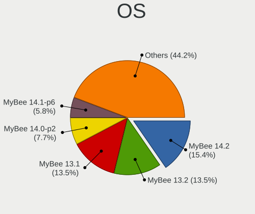

| Name               | Computers | Percent |
|--------------------|-----------|---------|
| MyBee 14.2         | 8         | 15.38%  |
| MyBee 13.2         | 7         | 13.46%  |
| MyBee 13.1         | 7         | 13.46%  |
| MyBee 14.0-p2      | 4         | 7.69%   |
| MyBee 14.1-p6      | 3         | 5.77%   |
| MyBee 14.0-BETA2   | 3         | 5.77%   |
| MyBee 13.1-p7      | 3         | 5.77%   |
| MyBee 14.0-p6      | 2         | 3.85%   |
| MyBee 14.0-CURRENT | 2         | 3.85%   |
| MyBee 13.1-p1      | 2         | 3.85%   |
| MyBee 15.0-CURRENT | 1         | 1.92%   |
| MyBee 14.3-p1      | 1         | 1.92%   |
| MyBee 14.1-p4      | 1         | 1.92%   |
| MyBee 14.0-BETA5   | 1         | 1.92%   |
| MyBee 14.0-BETA3   | 1         | 1.92%   |
| MyBee 14.0         | 1         | 1.92%   |
| MyBee 13.2-RC5     | 1         | 1.92%   |
| MyBee 13.2-RC4     | 1         | 1.92%   |
| MyBee 13.2-RC2     | 1         | 1.92%   |
| MyBee 13.1-p5      | 1         | 1.92%   |
| MyBee 13.1-p3      | 1         | 1.92%   |

OS Family
---------

OS without a version

| Name  | Computers | Percent |
|-------|-----------|---------|
| MyBee | 43        | 100%    |

Arch
----

OS architecture (x86_64, i586, etc.)

| Name  | Computers | Percent |
|-------|-----------|---------|
| amd64 | 43        | 100%    |

DE
--

Desktop Environment

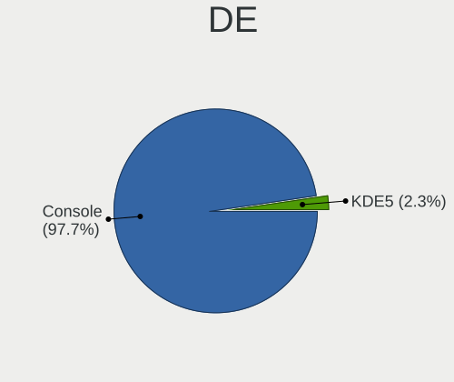

| Name    | Computers | Percent |
|---------|-----------|---------|
| Console | 42        | 97.67%  |
| KDE5    | 1         | 2.33%   |

Display Server
--------------

X11 or Wayland

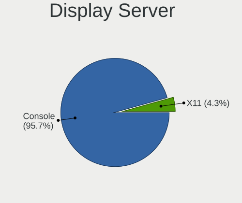

| Name    | Computers | Percent |
|---------|-----------|---------|
| Console | 42        | 97.67%  |
| X11     | 1         | 2.33%   |

Display Manager
---------------

SDDM, LightDM, etc.

| Name    | Computers | Percent |
|---------|-----------|---------|
| Console | 43        | 100%    |

OS Lang
-------

Language

| Lang  | Computers | Percent |
|-------|-----------|---------|
| en_US | 41        | 95.35%  |
| C     | 2         | 4.65%   |

Boot Mode
---------

EFI or BIOS

| Mode | Computers | Percent |
|------|-----------|---------|
| BIOS | 43        | 100%    |

Filesystem
----------

Type of filesystem

| Type | Computers | Percent |
|------|-----------|---------|
| Zfs  | 42        | 97.67%  |
| Ufs  | 1         | 2.33%   |

Part. scheme
------------

Scheme of partitioning

| Type | Computers | Percent |
|------|-----------|---------|
| GPT  | 43        | 100%    |

Board
-----

Vendor
------

Motherboard manufacturer

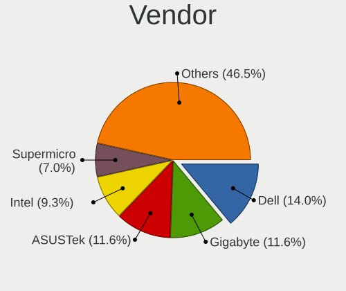

| Name                | Computers | Percent |
|---------------------|-----------|---------|
| Dell                | 6         | 13.95%  |
| Gigabyte Technology | 5         | 11.63%  |
| ASUSTek Computer    | 5         | 11.63%  |
| Intel               | 4         | 9.3%    |
| Supermicro          | 3         | 6.98%   |
| Unknown             | 3         | 6.98%   |
| MSI                 | 2         | 4.65%   |
| Hewlett-Packard     | 2         | 4.65%   |
| Fujitsu             | 2         | 4.65%   |
| ASRockRack          | 2         | 4.65%   |
| ASRock              | 2         | 4.65%   |
| ZOTAC               | 1         | 2.33%   |
| OpenYard            | 1         | 2.33%   |
| Lenovo              | 1         | 2.33%   |
| Insyde              | 1         | 2.33%   |
| IceWhale Technology | 1         | 2.33%   |
| Huanan              | 1         | 2.33%   |
| Acer                | 1         | 2.33%   |

Model
-----

Motherboard model

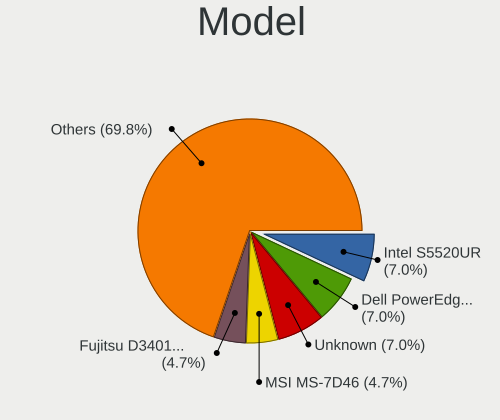

| Name                                   | Computers | Percent |
|----------------------------------------|-----------|---------|
| Intel S5520UR                          | 3         | 6.98%   |
| Dell PowerEdge R640                    | 3         | 6.98%   |
| Unknown                                | 3         | 6.98%   |
| MSI MS-7D46                            | 2         | 4.65%   |
| Fujitsu D3401-H2 S26361-D3401-H2       | 2         | 4.65%   |
| ZOTAC ZBOX-CI320NANO series            | 1         | 2.33%   |
| Supermicro X9DRD-7LN4F(-JBOD)/X9DRD-EF | 1         | 2.33%   |
| Supermicro Super Server                | 1         | 2.33%   |
| Supermicro H8DGU                       | 1         | 2.33%   |
| OpenYard RS101I-35R                    | 1         | 2.33%   |
| Lenovo V15 G3 IAP 82TT                 | 1         | 2.33%   |
| Intel S3210SH                          | 1         | 2.33%   |
| Insyde Purley                          | 1         | 2.33%   |
| IceWhale ZimaBoard 832 ZMB             | 1         | 2.33%   |
| Huanan X99-QD4 V1.0                    | 1         | 2.33%   |
| HP EliteDesk 800 G3 DM 65W             | 1         | 2.33%   |
| HP EliteBook 8540w                     | 1         | 2.33%   |
| Gigabyte Z170-HD3 DDR3                 | 1         | 2.33%   |
| Gigabyte H77N-WIFI                     | 1         | 2.33%   |
| Gigabyte GA-970A-D3                    | 1         | 2.33%   |
| Gigabyte B550M DS3H                    | 1         | 2.33%   |
| Gigabyte A320M-H                       | 1         | 2.33%   |
| Dell Precision Tower 5810              | 1         | 2.33%   |
| Dell PowerEdge R730                    | 1         | 2.33%   |
| Dell PowerEdge R310                    | 1         | 2.33%   |
| ASUS PRIME H470M-PLUS                  | 1         | 2.33%   |
| ASUS PRIME H310M-R R2.0                | 1         | 2.33%   |
| ASUS PRIME B550-PLUS                   | 1         | 2.33%   |
| ASUS P8Z77-V PREMIUM                   | 1         | 2.33%   |
| ASUS P6X58D PREMIUM                    | 1         | 2.33%   |
| ASRockRack X570D4U-2L2T                | 1         | 2.33%   |
| ASRockRack X470D4U2-2T                 | 1         | 2.33%   |
| ASRock Z690 Phantom Gaming 4/D5        | 1         | 2.33%   |
| ASRock X570 Phantom Gaming 4           | 1         | 2.33%   |
| Acer Veriton M430                      | 1         | 2.33%   |

Model Family
------------

Motherboard model prefix

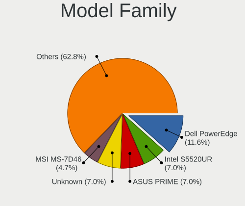

| Name                          | Computers | Percent |
|-------------------------------|-----------|---------|
| Dell PowerEdge                | 5         | 11.63%  |
| Intel S5520UR                 | 3         | 6.98%   |
| ASUS PRIME                    | 3         | 6.98%   |
| Unknown                       | 3         | 6.98%   |
| MSI MS-7D46                   | 2         | 4.65%   |
| Fujitsu D3401-H2              | 2         | 4.65%   |
| ZOTAC ZBOX-CI320NANO          | 1         | 2.33%   |
| Supermicro X9DRD-7LN4F(-JBOD) | 1         | 2.33%   |
| Supermicro Super              | 1         | 2.33%   |
| Supermicro H8DGU              | 1         | 2.33%   |
| OpenYard RS101I-35R           | 1         | 2.33%   |
| Lenovo V15                    | 1         | 2.33%   |
| Intel S3210SH                 | 1         | 2.33%   |
| Insyde Purley                 | 1         | 2.33%   |
| IceWhale ZimaBoard            | 1         | 2.33%   |
| Huanan X99-QD4                | 1         | 2.33%   |
| HP EliteDesk                  | 1         | 2.33%   |
| HP EliteBook                  | 1         | 2.33%   |
| Gigabyte Z170-HD3             | 1         | 2.33%   |
| Gigabyte H77N-WIFI            | 1         | 2.33%   |
| Gigabyte GA-970A-D3           | 1         | 2.33%   |
| Gigabyte B550M                | 1         | 2.33%   |
| Gigabyte A320M-H              | 1         | 2.33%   |
| Dell Precision                | 1         | 2.33%   |
| ASUS P8Z77-V                  | 1         | 2.33%   |
| ASUS P6X58D                   | 1         | 2.33%   |
| ASRockRack X570D4U-2L2T       | 1         | 2.33%   |
| ASRockRack X470D4U2-2T        | 1         | 2.33%   |
| ASRock Z690                   | 1         | 2.33%   |
| ASRock X570                   | 1         | 2.33%   |
| Acer Veriton                  | 1         | 2.33%   |

MFG Year
--------

Motherboard manufacture year

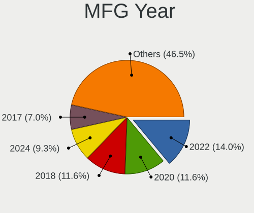

| Year | Computers | Percent |
|------|-----------|---------|
| 2022 | 6         | 13.95%  |
| 2020 | 5         | 11.63%  |
| 2018 | 5         | 11.63%  |
| 2024 | 4         | 9.3%    |
| 2017 | 3         | 6.98%   |
| 2014 | 3         | 6.98%   |
| 2012 | 3         | 6.98%   |
| 2011 | 3         | 6.98%   |
| 2023 | 2         | 4.65%   |
| 2019 | 2         | 4.65%   |
| 2013 | 2         | 4.65%   |
| 2010 | 2         | 4.65%   |
| 2021 | 1         | 2.33%   |
| 2015 | 1         | 2.33%   |
| 2009 | 1         | 2.33%   |

Form Factor
-----------

Physical design of the computer

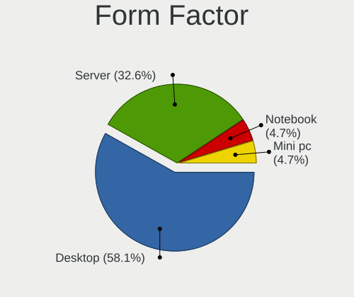

| Name     | Computers | Percent |
|----------|-----------|---------|
| Desktop  | 25        | 58.14%  |
| Server   | 14        | 32.56%  |
| Mini pc  | 2         | 4.65%   |
| Notebook | 2         | 4.65%   |

Coreboot
--------

Have coreboot on board

| Used | Computers | Percent |
|------|-----------|---------|
| No   | 43        | 100%    |

RAM Size
--------

Total RAM memory

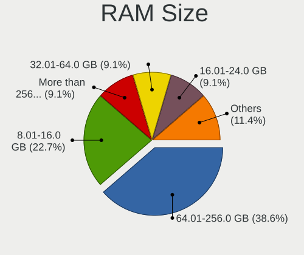

| Size in GB      | Computers | Percent |
|-----------------|-----------|---------|
| 64.01-256.0     | 17        | 38.64%  |
| 8.01-16.0       | 10        | 22.73%  |
| More than 256.0 | 4         | 9.09%   |
| 32.01-64.0      | 4         | 9.09%   |
| 16.01-24.0      | 4         | 9.09%   |
| 24.01-32.0      | 3         | 6.82%   |
| 4.01-8.0        | 1         | 2.27%   |
| 3.01-4.0        | 1         | 2.27%   |

RAM Used
--------

Used RAM memory

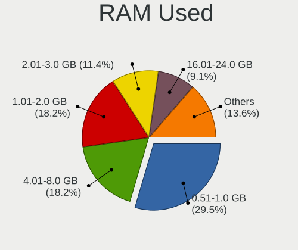

| Used GB    | Computers | Percent |
|------------|-----------|---------|
| 0.51-1.0   | 13        | 29.55%  |
| 4.01-8.0   | 8         | 18.18%  |
| 1.01-2.0   | 8         | 18.18%  |
| 2.01-3.0   | 5         | 11.36%  |
| 16.01-24.0 | 4         | 9.09%   |
| 3.01-4.0   | 2         | 4.55%   |
| 8.01-16.0  | 2         | 4.55%   |
| 24.01-32.0 | 1         | 2.27%   |
| 0.01-0.5   | 1         | 2.27%   |

Total Drives
------------

Number of drives on board

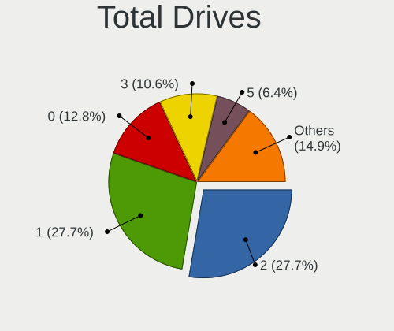

| Drives | Computers | Percent |
|--------|-----------|---------|
| 2      | 13        | 27.66%  |
| 1      | 13        | 27.66%  |
| 0      | 6         | 12.77%  |
| 3      | 5         | 10.64%  |
| 5      | 3         | 6.38%   |
| 8      | 2         | 4.26%   |
| 6      | 2         | 4.26%   |
| 4      | 2         | 4.26%   |
| 26     | 1         | 2.13%   |

Has CD-ROM
----------

Has CD-ROM on board

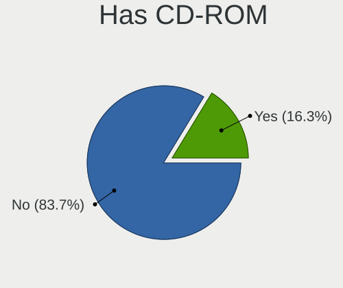

| Presented | Computers | Percent |
|-----------|-----------|---------|
| No        | 36        | 83.72%  |
| Yes       | 7         | 16.28%  |

Has Ethernet
------------

Has Ethernet on board

| Presented | Computers | Percent |
|-----------|-----------|---------|
| Yes       | 43        | 100%    |

Has WiFi
--------

Has WiFi module

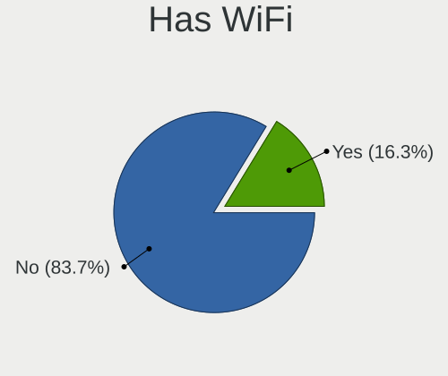

| Presented | Computers | Percent |
|-----------|-----------|---------|
| No        | 36        | 83.72%  |
| Yes       | 7         | 16.28%  |

Has Bluetooth
-------------

Has Bluetooth module

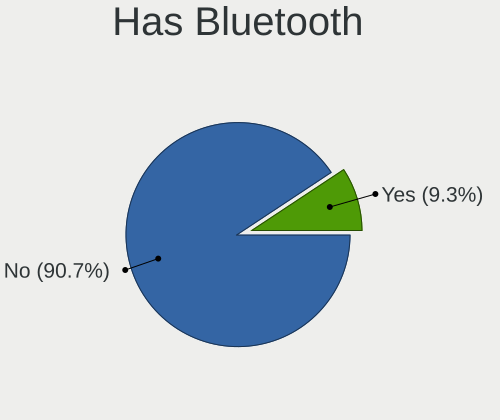

| Presented | Computers | Percent |
|-----------|-----------|---------|
| No        | 39        | 90.7%   |
| Yes       | 4         | 9.3%    |

Location
--------

Country
-------

Geographic location (country)

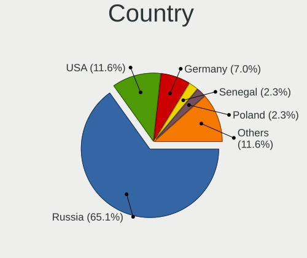

| Country  | Computers | Percent |
|----------|-----------|---------|
| Russia   | 28        | 65.12%  |
| USA      | 5         | 11.63%  |
| Germany  | 3         | 6.98%   |
| Senegal  | 1         | 2.33%   |
| Poland   | 1         | 2.33%   |
| Nigeria  | 1         | 2.33%   |
| Iceland  | 1         | 2.33%   |
| Finland  | 1         | 2.33%   |
| Canada   | 1         | 2.33%   |
| Bulgaria | 1         | 2.33%   |

City
----

Geographic location (city)

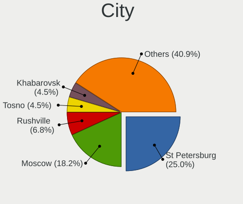

| City                | Computers | Percent |
|---------------------|-----------|---------|
| St Petersburg       | 11        | 25%     |
| Moscow              | 8         | 18.18%  |
| Rushville           | 3         | 6.82%   |
| Tosno               | 2         | 4.55%   |
| Khabarovsk          | 2         | 4.55%   |
| Vladivostok         | 1         | 2.27%   |
| Ulan-Ude            | 1         | 2.27%   |
| Szczytnica          | 1         | 2.27%   |
| Sofia               | 1         | 2.27%   |
| Rostov-on-Don       | 1         | 2.27%   |
| Reykjavik           | 1         | 2.27%   |
| Remscheid           | 1         | 2.27%   |
| Naberezhnyye Chelny | 1         | 2.27%   |
| Montreal            | 1         | 2.27%   |
| Mermoz Boabab       | 1         | 2.27%   |
| Medvedevo           | 1         | 2.27%   |
| Los Angeles         | 1         | 2.27%   |
| Limburg an der Lahn | 1         | 2.27%   |
| Lagos               | 1         | 2.27%   |
| Irkutsk             | 1         | 2.27%   |
| Helsinki            | 1         | 2.27%   |
| Falkenstein         | 1         | 2.27%   |
| Clearwater          | 1         | 2.27%   |

Drives
------

Drive Vendor
------------

Hard drive vendors

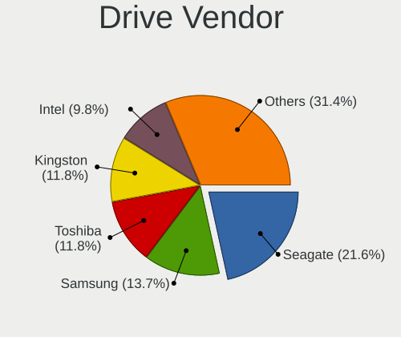

| Vendor              | Computers | Drives | Percent |
|---------------------|-----------|--------|---------|
| Seagate             | 11        | 40     | 21.57%  |
| Samsung Electronics | 7         | 23     | 13.73%  |
| Toshiba             | 6         | 28     | 11.76%  |
| Kingston            | 6         | 9      | 11.76%  |
| Intel               | 5         | 18     | 9.8%    |
| WDC                 | 3         | 3      | 5.88%   |
| SanDisk             | 2         | 2      | 3.92%   |
| KingSpec            | 2         | 2      | 3.92%   |
| Silicon Motion      | 1         | 2      | 1.96%   |
| Phison              | 1         | 1      | 1.96%   |
| Micron Technology   | 1         | 2      | 1.96%   |
| Hitachi             | 1         | 2      | 1.96%   |
| HGST                | 1         | 2      | 1.96%   |
| Hewlett-Packard     | 1         | 8      | 1.96%   |
| GOODRAM             | 1         | 1      | 1.96%   |
| Crucial             | 1         | 1      | 1.96%   |
| A-DATA Technology   | 1         | 2      | 1.96%   |

Drive Model
-----------

Hard drive models

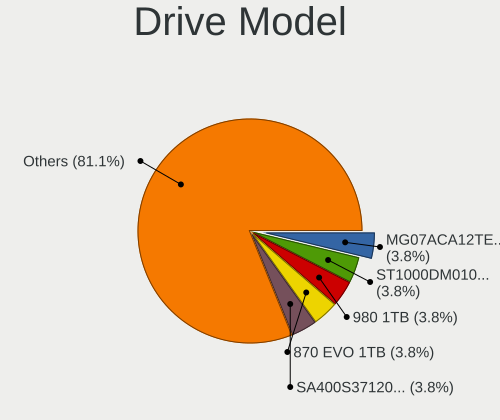

| Model                            | Computers | Percent |
|----------------------------------|-----------|---------|
| Toshiba MG07ACA12TE 12TB         | 2         | 3.77%   |
| Seagate ST1000DM010-2EP102 1TB   | 2         | 3.77%   |
| Samsung SSD 980 1TB              | 2         | 3.77%   |
| Samsung SSD 870 EVO 1TB          | 2         | 3.77%   |
| Kingston SA400S37120G 120GB      | 2         | 3.77%   |
| WDC WDS120G2G0A-00JH30 120GB     | 1         | 1.89%   |
| WDC WD30EJRX-89AKWY0 3TB         | 1         | 1.89%   |
| WDC WD2500AAKS-22VSA0 250GB      | 1         | 1.89%   |
| Toshiba MG06ACA800E 8TB          | 1         | 1.89%   |
| Toshiba KXG50ZNV512G 512GB       | 1         | 1.89%   |
| Toshiba HDWD110 1TB              | 1         | 1.89%   |
| Toshiba DT01ACA100 1TB           | 1         | 1.89%   |
| Silicon Motion PCIe SSD 256GB    | 1         | 1.89%   |
| Seagate ST9250610NS 250GB        | 1         | 1.89%   |
| Seagate ST500LT012-1DG142 500GB  | 1         | 1.89%   |
| Seagate ST500DM002-1SB10A 500GB  | 1         | 1.89%   |
| Seagate ST2000DM008-2UB102 2TB   | 1         | 1.89%   |
| Seagate ST2000DM006-2DM164 2TB   | 1         | 1.89%   |
| Seagate ST16000NM004J 16TB       | 1         | 1.89%   |
| Seagate ST1200MM0099 1.2TB       | 1         | 1.89%   |
| Seagate ST1000NM0033-9ZM173 1TB  | 1         | 1.89%   |
| Seagate ST1000LM048-2E7172 1TB   | 1         | 1.89%   |
| SanDisk SDSSDA120G 120GB         | 1         | 1.89%   |
| SanDisk SD9SB8W-256G-1006 256GB  | 1         | 1.89%   |
| Samsung SSD 970 EVO Plus 1TB     | 1         | 1.89%   |
| Samsung SSD 870 EVO 2TB          | 1         | 1.89%   |
| Samsung MZILT3T8HBLS-007 3.8TB   | 1         | 1.89%   |
| Samsung MZ7LH960HAJR-00005 960GB | 1         | 1.89%   |
| Phison PCIe SSD 2TB              | 1         | 1.89%   |
| Micron 1100_MTFDDAK512TBN 512GB  | 1         | 1.89%   |
| Kingston SNV425S2128GB           | 1         | 1.89%   |
| Kingston SA400S37960G 960GB      | 1         | 1.89%   |
| Kingston SA400S37480G 480GB      | 1         | 1.89%   |
| Kingston SA400S37240G 240GB      | 1         | 1.89%   |
| KingSpec P3-256 256GB            | 1         | 1.89%   |
| KingSpec MT-1TB                  | 1         | 1.89%   |
| Intel SSDSC2KB019T7 1.9TB        | 1         | 1.89%   |
| Intel SSDSC2BX200G4R 200GB       | 1         | 1.89%   |
| Intel SSDSC2BB800G4 800GB        | 1         | 1.89%   |
| Intel SSDPEKNW010T8 1TB          | 1         | 1.89%   |

HDD Vendor
----------

Hard disk drive vendors

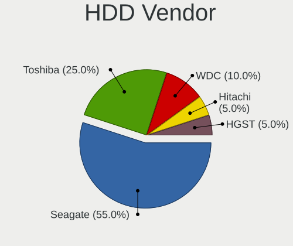

| Vendor  | Computers | Drives | Percent |
|---------|-----------|--------|---------|
| Seagate | 11        | 40     | 55%     |
| Toshiba | 5         | 26     | 25%     |
| WDC     | 2         | 2      | 10%     |
| Hitachi | 1         | 2      | 5%      |
| HGST    | 1         | 2      | 5%      |

SSD Vendor
----------

Solid state drive vendors

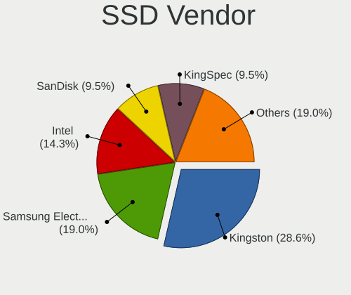

| Vendor              | Computers | Drives | Percent |
|---------------------|-----------|--------|---------|
| Kingston            | 6         | 9      | 28.57%  |
| Samsung Electronics | 4         | 19     | 19.05%  |
| Intel               | 3         | 15     | 14.29%  |
| SanDisk             | 2         | 2      | 9.52%   |
| KingSpec            | 2         | 2      | 9.52%   |
| WDC                 | 1         | 1      | 4.76%   |
| Micron Technology   | 1         | 2      | 4.76%   |
| Hewlett-Packard     | 1         | 8      | 4.76%   |
| Crucial             | 1         | 1      | 4.76%   |

Drive Kind
----------

HDD or SSD

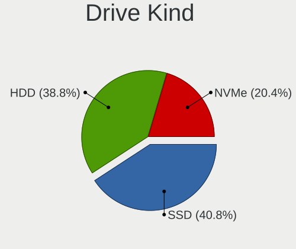

| Kind | Computers | Drives | Percent |
|------|-----------|--------|---------|
| SSD  | 20        | 59     | 40.82%  |
| HDD  | 19        | 72     | 38.78%  |
| NVMe | 10        | 15     | 20.41%  |

Drive Connector
---------------

SATA, SAS, NVMe, etc.

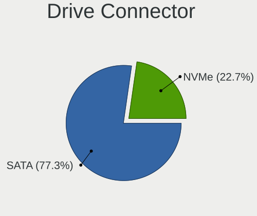

| Type | Computers | Drives | Percent |
|------|-----------|--------|---------|
| SATA | 34        | 131    | 77.27%  |
| NVMe | 10        | 15     | 22.73%  |

Drive Size
----------

Size of hard drive

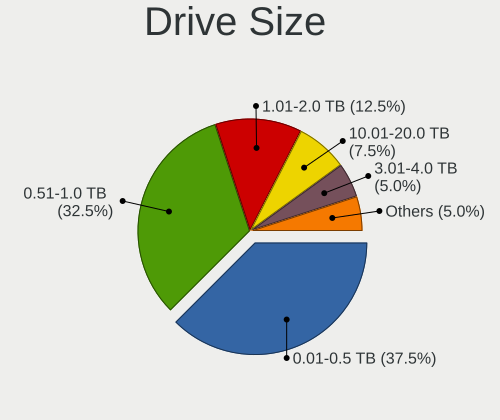

| Size in TB | Computers | Drives | Percent |
|------------|-----------|--------|---------|
| 0.01-0.5   | 15        | 27     | 37.5%   |
| 0.51-1.0   | 13        | 36     | 32.5%   |
| 1.01-2.0   | 5         | 17     | 12.5%   |
| 10.01-20.0 | 3         | 32     | 7.5%    |
| 3.01-4.0   | 2         | 14     | 5%      |
| 2.01-3.0   | 1         | 1      | 2.5%    |
| 4.01-10.0  | 1         | 4      | 2.5%    |

Space Total
-----------

Amount of disk space available on the file system

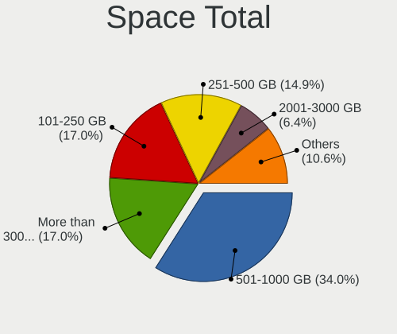

| Size in GB     | Computers | Percent |
|----------------|-----------|---------|
| 501-1000       | 16        | 34.04%  |
| More than 3000 | 8         | 17.02%  |
| 101-250        | 8         | 17.02%  |
| 251-500        | 7         | 14.89%  |
| 2001-3000      | 3         | 6.38%   |
| 1001-2000      | 3         | 6.38%   |
| 21-50          | 1         | 2.13%   |
| 51-100         | 1         | 2.13%   |

Space Used
----------

Amount of used disk space

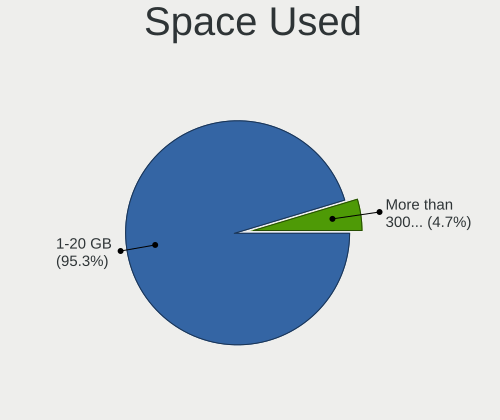

| Used GB        | Computers | Percent |
|----------------|-----------|---------|
| 1-20           | 41        | 95.35%  |
| More than 3000 | 2         | 4.65%   |

Malfunc. Drives
---------------

Drive models with a malfunction

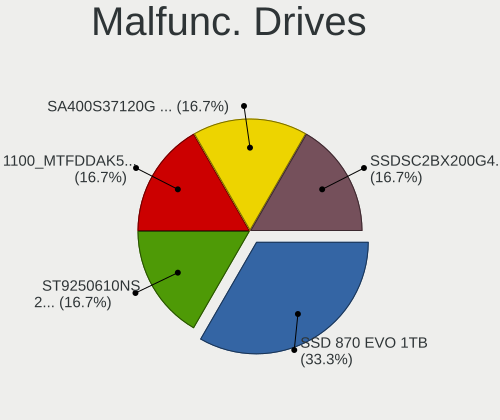

| Model                                      | Computers | Drives | Percent |
|--------------------------------------------|-----------|--------|---------|
| Samsung Electronics SSD 870 EVO 1TB        | 2         | 3      | 33.33%  |
| Seagate ST9250610NS 250GB                  | 1         | 3      | 16.67%  |
| Micron Technology 1100_MTFDDAK512TBN 512GB | 1         | 2      | 16.67%  |
| Kingston SA400S37120G 120GB                | 1         | 1      | 16.67%  |
| Intel SSDSC2BX200G4R 200GB                 | 1         | 1      | 16.67%  |

Malfunc. Drive Vendor
---------------------

Vendors of faulty drives

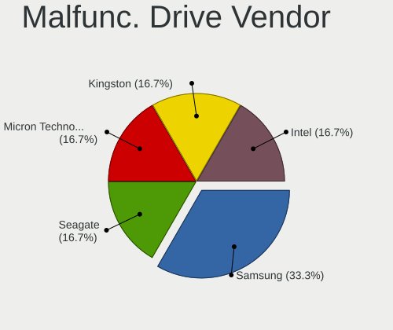

| Vendor              | Computers | Drives | Percent |
|---------------------|-----------|--------|---------|
| Samsung Electronics | 2         | 3      | 33.33%  |
| Seagate             | 1         | 3      | 16.67%  |
| Micron Technology   | 1         | 2      | 16.67%  |
| Kingston            | 1         | 1      | 16.67%  |
| Intel               | 1         | 1      | 16.67%  |

Malfunc. HDD Vendor
-------------------

Vendors of faulty HDD drives

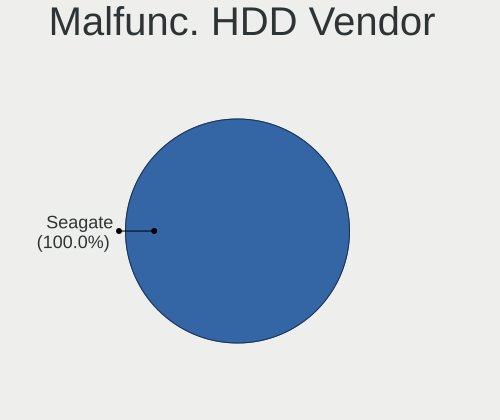

| Vendor  | Computers | Drives | Percent |
|---------|-----------|--------|---------|
| Seagate | 1         | 3      | 100%    |

Malfunc. Drive Kind
-------------------

Kinds of faulty drives

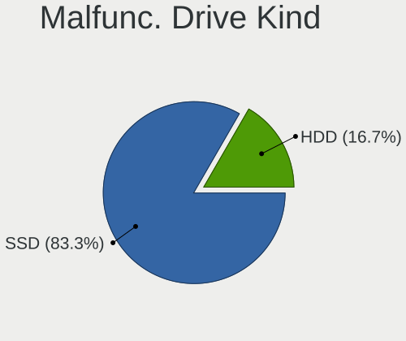

| Kind | Computers | Drives | Percent |
|------|-----------|--------|---------|
| SSD  | 5         | 7      | 83.33%  |
| HDD  | 1         | 3      | 16.67%  |

Failed Drives
-------------

Failed drive models

Zero info for selected period =(

Failed Drive Vendor
-------------------

Failed drive vendors

Zero info for selected period =(

Drive Status
------------

Number of failed and malfunc. drives

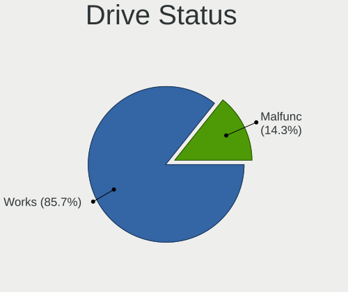

| Status  | Computers | Drives | Percent |
|---------|-----------|--------|---------|
| Works   | 36        | 136    | 85.71%  |
| Malfunc | 6         | 10     | 14.29%  |

Storage controller
------------------

Storage Vendor
--------------

Storage controller vendors

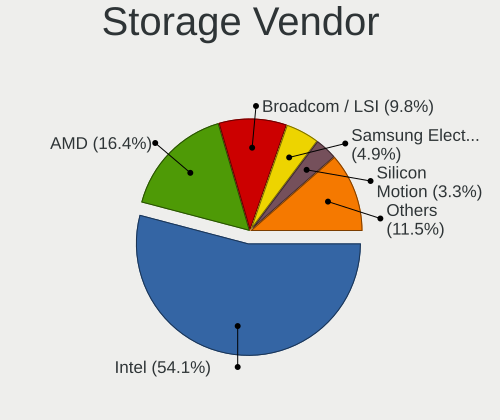

| Vendor                      | Computers | Percent |
|-----------------------------|-----------|---------|
| Intel                       | 33        | 54.1%   |
| AMD                         | 10        | 16.39%  |
| Broadcom / LSI              | 6         | 9.84%   |
| Samsung Electronics         | 3         | 4.92%   |
| Silicon Motion              | 2         | 3.28%   |
| Toshiba                     | 1         | 1.64%   |
| Phison Electronics          | 1         | 1.64%   |
| Micron Technology           | 1         | 1.64%   |
| Marvell Technology Group    | 1         | 1.64%   |
| Kingston Technology Company | 1         | 1.64%   |
| ASMedia Technology          | 1         | 1.64%   |
| ADATA Technology            | 1         | 1.64%   |

Storage Model
-------------

Storage controller models

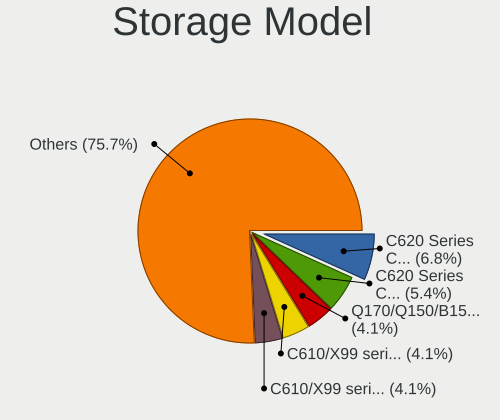

| Model                                                                         | Computers | Percent |
|-------------------------------------------------------------------------------|-----------|---------|
| Intel C620 Series Chipset Family SATA Controller [AHCI mode]                  | 5         | 6.76%   |
| Intel C620 Series Chipset Family SSATA Controller [AHCI mode]                 | 4         | 5.41%   |
| Intel Q170/Q150/B150/H170/H110/Z170/CM236 Chipset SATA Controller [AHCI Mode] | 3         | 4.05%   |
| Intel C610/X99 series chipset sSATA Controller [AHCI mode]                    | 3         | 4.05%   |
| Intel C610/X99 series chipset 6-Port SATA Controller [AHCI mode]              | 3         | 4.05%   |
| Intel Alder Lake-S PCH SATA Controller [AHCI Mode]                            | 3         | 4.05%   |
| Intel 82801JI (ICH10 Family) SATA AHCI Controller                             | 3         | 4.05%   |
| Broadcom / LSI MegaRAID SAS 2108 [Liberator]                                  | 3         | 4.05%   |
| AMD FCH SATA Controller [AHCI mode]                                           | 3         | 4.05%   |
| AMD 500 Series Chipset SATA Controller                                        | 3         | 4.05%   |
| Silicon Motion SM2263EN/SM2263XT (DRAM-less) NVMe SSD Controllers             | 2         | 2.7%    |
| Samsung NVMe SSD Controller 980 (DRAM-less)                                   | 2         | 2.7%    |
| Intel SSD 660P Series                                                         | 2         | 2.7%    |
| Intel Atom Processor E3800 Series SATA AHCI Controller                        | 2         | 2.7%    |
| Intel 7 Series/C210 Series Chipset Family 6-port SATA Controller [AHCI mode]  | 2         | 2.7%    |
| Intel 200 Series PCH SATA controller [AHCI mode]                              | 2         | 2.7%    |
| AMD SB7x0/SB8x0/SB9x0 SATA Controller [AHCI mode]                             | 2         | 2.7%    |
| Toshiba XG5 NVMe SSD Controller                                               | 1         | 1.35%   |
| Samsung NVMe SSD Controller SM981/PM981/PM983                                 | 1         | 1.35%   |
| Phison PS5013-E13 PCIe3 NVMe Controller (DRAM-less)                           | 1         | 1.35%   |
| Micron 2450 NVMe SSD [HendrixV] (DRAM-less)                                   | 1         | 1.35%   |
| Marvell Group 88SE9230 PCIe 2.0 x2 4-port SATA 6 Gb/s RAID Controller         | 1         | 1.35%   |
| Kingston Company KC3000/FURY Renegade NVMe SSD [E18]                          | 1         | 1.35%   |
| Intel Sunrise Point-LP SATA Controller [AHCI mode]                            | 1         | 1.35%   |
| Intel PCIe Data Center SSD                                                    | 1         | 1.35%   |
| Intel Comet Lake SATA AHCI Controller                                         | 1         | 1.35%   |
| Intel Celeron N3350/Pentium N4200/Atom E3900 Series SATA AHCI Controller      | 1         | 1.35%   |
| Intel C600/X79 series chipset 6-Port SATA AHCI Controller                     | 1         | 1.35%   |
| Intel Alder Lake-P SATA AHCI Controller                                       | 1         | 1.35%   |
| Intel 82801JI (ICH10 Family) 4 port SATA IDE Controller #1                    | 1         | 1.35%   |
| Intel 82801JI (ICH10 Family) 2 port SATA IDE Controller #2                    | 1         | 1.35%   |
| Intel 82801IR/IO/IH (ICH9R/DO/DH) 6 port SATA Controller [AHCI mode]          | 1         | 1.35%   |
| Intel 5 Series/3400 Series Chipset 6 port SATA AHCI Controller                | 1         | 1.35%   |
| Intel 5 Series/3400 Series Chipset 4 port SATA IDE Controller                 | 1         | 1.35%   |
| Intel 5 Series/3400 Series Chipset 2 port SATA IDE Controller                 | 1         | 1.35%   |
| Broadcom / LSI SAS3416 Fusion-MPT Tri-Mode I/O Controller Chip (IOC)          | 1         | 1.35%   |
| Broadcom / LSI MegaRAID SAS-3 3108 [Invader]                                  | 1         | 1.35%   |
| Broadcom / LSI MegaRAID 12GSAS/PCIe Secure SAS39xx                            | 1         | 1.35%   |
| ASMedia ASM1061/ASM1062 Serial ATA Controller                                 | 1         | 1.35%   |
| AMD SB7x0/SB8x0/SB9x0 SATA Controller [IDE mode]                              | 1         | 1.35%   |

Storage Kind
------------

Kind of storage controller (IDE, SATA, NVMe, SAS, ...)

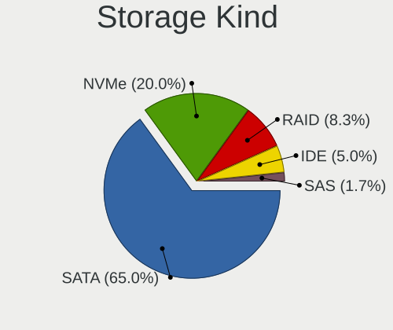

| Kind | Computers | Percent |
|------|-----------|---------|
| SATA | 39        | 65%     |
| NVMe | 12        | 20%     |
| RAID | 5         | 8.33%   |
| IDE  | 3         | 5%      |
| SAS  | 1         | 1.67%   |

Processor
---------

CPU Vendor
----------

Processor vendors

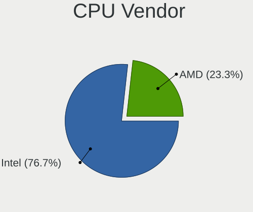

| Vendor | Computers | Percent |
|--------|-----------|---------|
| Intel  | 33        | 76.74%  |
| AMD    | 10        | 23.26%  |

CPU Model
---------

Processor models

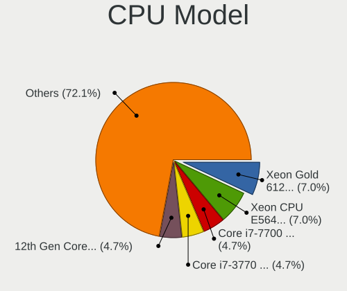

| Model                                       | Computers | Percent |
|---------------------------------------------|-----------|---------|
| Intel Xeon Gold 6126 CPU @ 2.60GHz          | 3         | 6.98%   |
| Intel Xeon CPU E5645 @ 2.40GHz              | 3         | 6.98%   |
| Intel Core i7-7700 CPU @ 3.60GHz            | 2         | 4.65%   |
| Intel Core i7-3770 CPU @ 3.40GHz            | 2         | 4.65%   |
| Intel 12th Gen Core i5-12400                | 2         | 4.65%   |
| AMD Ryzen 5 PRO 4650G with Radeon Graphics  | 2         | 4.65%   |
| AMD Ryzen 5 5600X 6-Core Processor          | 2         | 4.65%   |
| Intel Xeon Silver 4314 CPU @ 2.40GHz        | 1         | 2.33%   |
| Intel Xeon Gold 6226R CPU @ 2.90GHz         | 1         | 2.33%   |
| Intel Xeon CPU X3450 @ 2.67GHz              | 1         | 2.33%   |
| Intel Xeon CPU E5-2690 v2 @ 3.00GHz         | 1         | 2.33%   |
| Intel Xeon CPU E5-2686 v4 @ 2.30GHz         | 1         | 2.33%   |
| Intel Xeon CPU E5-2683 v4 @ 2.10GHz         | 1         | 2.33%   |
| Intel Xeon CPU E5-1650 v4 @ 3.60GHz         | 1         | 2.33%   |
| Intel Xeon CPU E5-1650 v3 @ 3.50GHz         | 1         | 2.33%   |
| Intel Pentium Dual-Core CPU E5300 @ 2.60GHz | 1         | 2.33%   |
| Intel Pentium CPU N3540 @ 2.16GHz           | 1         | 2.33%   |
| Intel Core i7-8550U CPU @ 1.80GHz           | 1         | 2.33%   |
| Intel Core i7 CPU M 620 @ 2.67GHz           | 1         | 2.33%   |
| Intel Core i7 CPU 960 @ 3.20GHz             | 1         | 2.33%   |
| Intel Core i5-9400F CPU @ 2.90GHz           | 1         | 2.33%   |
| Intel Core i5-7400 CPU @ 3.00GHz            | 1         | 2.33%   |
| Intel Core i5-6500 CPU @ 3.20GHz            | 1         | 2.33%   |
| Intel Core i5-10400 CPU @ 2.90GHz           | 1         | 2.33%   |
| Intel Celeron CPU N3450 @ 1.10GHz           | 1         | 2.33%   |
| Intel Celeron CPU N2930 @ 1.83GHz           | 1         | 2.33%   |
| Intel 12th Gen Core i9-12900K               | 1         | 2.33%   |
| Intel 12th Gen Core i3-1215U                | 1         | 2.33%   |
| AMD Ryzen 9 5950X 16-Core Processor         | 1         | 2.33%   |
| AMD Ryzen 9 3900X 12-Core Processor         | 1         | 2.33%   |
| AMD Ryzen 5 3400G with Radeon Vega Graphics | 1         | 2.33%   |
| AMD Phenom II X6 1045T Processor            | 1         | 2.33%   |
| AMD Opteron Processor 6176                  | 1         | 2.33%   |
| AMD FX-4100 Quad-Core Processor             | 1         | 2.33%   |

CPU Model Family
----------------

Processor model prefix

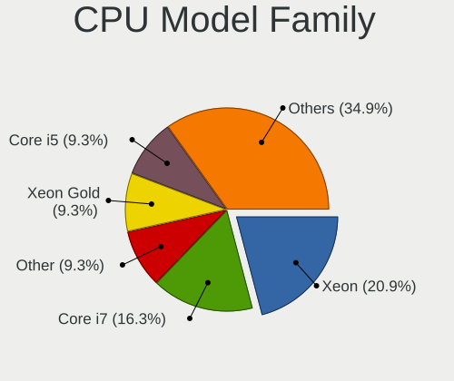

| Model                   | Computers | Percent |
|-------------------------|-----------|---------|
| Intel Xeon              | 9         | 20.93%  |
| Intel Core i7           | 7         | 16.28%  |
| Other                   | 4         | 9.3%    |
| Intel Xeon Gold         | 4         | 9.3%    |
| Intel Core i5           | 4         | 9.3%    |
| AMD Ryzen 5             | 3         | 6.98%   |
| Intel Celeron           | 2         | 4.65%   |
| AMD Ryzen 9             | 2         | 4.65%   |
| AMD Ryzen 5 PRO         | 2         | 4.65%   |
| Intel Xeon Silver       | 1         | 2.33%   |
| Intel Pentium Dual-Core | 1         | 2.33%   |
| Intel Pentium           | 1         | 2.33%   |
| AMD Phenom II X6        | 1         | 2.33%   |
| AMD Opteron             | 1         | 2.33%   |
| AMD FX                  | 1         | 2.33%   |

CPU Cores
---------

Number of processor cores

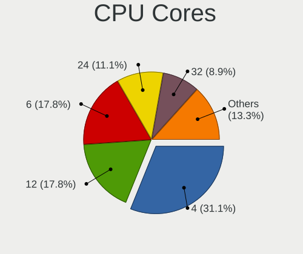

| Number | Computers | Percent |
|--------|-----------|---------|
| 4      | 14        | 31.11%  |
| 12     | 8         | 17.78%  |
| 6      | 8         | 17.78%  |
| 24     | 5         | 11.11%  |
| 32     | 4         | 8.89%   |
| 8      | 2         | 4.44%   |
| 2      | 2         | 4.44%   |
| 20     | 1         | 2.22%   |
| 18     | 1         | 2.22%   |

CPU Sockets
-----------

Number of sockets

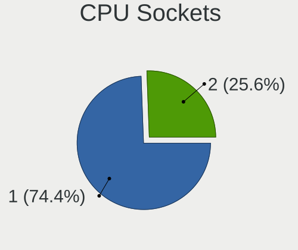

| Number | Computers | Percent |
|--------|-----------|---------|
| 1      | 32        | 74.42%  |
| 2      | 11        | 25.58%  |

CPU Threads
-----------

Threads per core (Hyper-Threading)

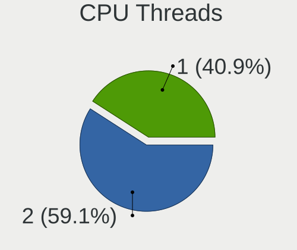

| Number | Computers | Percent |
|--------|-----------|---------|
| 2      | 26        | 59.09%  |
| 1      | 18        | 40.91%  |

CPU Microarch
-------------

Microarchitecture

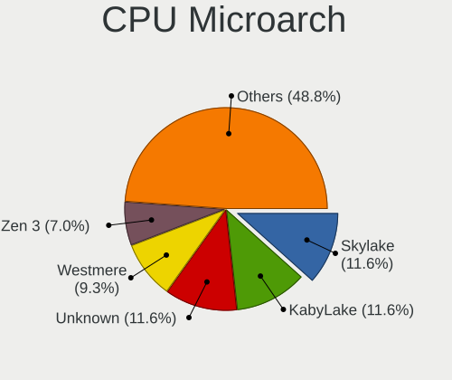

| Name       | Computers | Percent |
|------------|-----------|---------|
| Skylake    | 5         | 11.63%  |
| KabyLake   | 5         | 11.63%  |
| Unknown    | 5         | 11.63%  |
| Westmere   | 4         | 9.3%    |
| Zen 3      | 3         | 6.98%   |
| Zen 2      | 3         | 6.98%   |
| IvyBridge  | 3         | 6.98%   |
| Broadwell  | 3         | 6.98%   |
| Silvermont | 2         | 4.65%   |
| Nehalem    | 2         | 4.65%   |
| K10        | 2         | 4.65%   |
| Zen+       | 1         | 2.33%   |
| Penryn     | 1         | 2.33%   |
| Haswell    | 1         | 2.33%   |
| Goldmont   | 1         | 2.33%   |
| CometLake  | 1         | 2.33%   |
| Bulldozer  | 1         | 2.33%   |

Graphics
--------

GPU Vendor
----------

Vendors of graphics cards

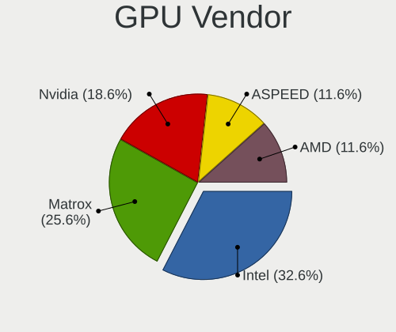

| Vendor                     | Computers | Percent |
|----------------------------|-----------|---------|
| Intel                      | 14        | 32.56%  |
| Matrox Electronics Systems | 11        | 25.58%  |
| Nvidia                     | 8         | 18.6%   |
| ASPEED Technology          | 5         | 11.63%  |
| AMD                        | 5         | 11.63%  |

GPU Model
---------

Graphics card models

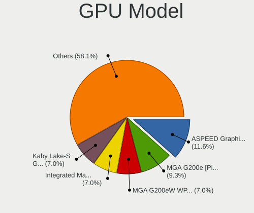

| Model                                                                    | Computers | Percent |
|--------------------------------------------------------------------------|-----------|---------|
| ASPEED Technology ASPEED Graphics Family                                 | 5         | 11.63%  |
| Matrox Electronics Systems MGA G200e [Pilot] ServerEngines (SEP1)        | 4         | 9.3%    |
| Matrox Electronics Systems MGA G200eW WPCM450                            | 3         | 6.98%   |
| Matrox Electronics Systems Integrated Matrox G200eW3 Graphics Controller | 3         | 6.98%   |
| Intel Kaby Lake-S GT2 [HD Graphics 630]                                  | 3         | 6.98%   |
| Intel Atom Processor Z36xxx/Z37xxx Series Graphics & Display             | 2         | 4.65%   |
| Intel Alder Lake-S GT1 [UHD Graphics 730]                                | 2         | 4.65%   |
| AMD Renoir [Radeon Vega Series / Radeon Vega Mobile Series]              | 2         | 4.65%   |
| Nvidia GT218 [GeForce 210]                                               | 1         | 2.33%   |
| Nvidia GP108 [GeForce GT 1030]                                           | 1         | 2.33%   |
| Nvidia GK208B [GeForce GT 730]                                           | 1         | 2.33%   |
| Nvidia GK208B [GeForce GT 710]                                           | 1         | 2.33%   |
| Nvidia GK107GL [Quadro K600]                                             | 1         | 2.33%   |
| Nvidia GK104GL [Quadro K4200]                                            | 1         | 2.33%   |
| Nvidia GF119 [GeForce GT 610]                                            | 1         | 2.33%   |
| Nvidia G96C [GeForce 9500 GT]                                            | 1         | 2.33%   |
| Matrox Electronics Systems G200eR2                                       | 1         | 2.33%   |
| Intel Skylake-S GT2 [HD Graphics 530]                                    | 1         | 2.33%   |
| Intel Kaby Lake-R GT2 [UHD Graphics 620]                                 | 1         | 2.33%   |
| Intel IvyBridge GT2 [HD Graphics 4000]                                   | 1         | 2.33%   |
| Intel CometLake-S GT2 [UHD Graphics 630]                                 | 1         | 2.33%   |
| Intel Apollo Lake GT1 [HD Graphics 500]                                  | 1         | 2.33%   |
| Intel Alder Lake-UP3 GT1 [UHD Graphics]                                  | 1         | 2.33%   |
| Intel Alder Lake-S GT1 [UHD Graphics 770]                                | 1         | 2.33%   |
| AMD RS880 [Radeon HD 4250]                                               | 1         | 2.33%   |
| AMD Picasso/Raven 2 [Radeon Vega Series / Radeon Vega Mobile Series]     | 1         | 2.33%   |
| AMD Madison [Mobility Radeon HD 5730 / 6570M]                            | 1         | 2.33%   |

GPU Combo
---------

Combinations of graphics cards

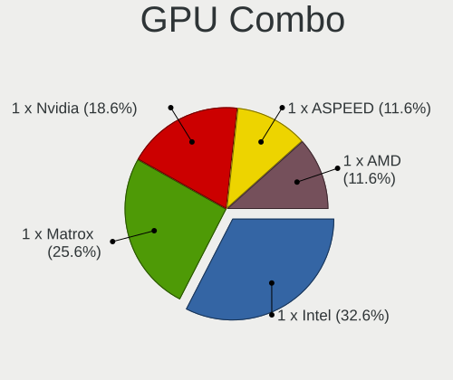

| Name       | Computers | Percent |
|------------|-----------|---------|
| 1 x Intel  | 14        | 32.56%  |
| 1 x Matrox | 11        | 25.58%  |
| 1 x Nvidia | 8         | 18.6%   |
| 1 x ASPEED | 5         | 11.63%  |
| 1 x AMD    | 5         | 11.63%  |

GPU Driver
----------

Free vs proprietary

| Driver | Computers | Percent |
|--------|-----------|---------|
| Free   | 43        | 100%    |

GPU Memory
----------

Total video memory

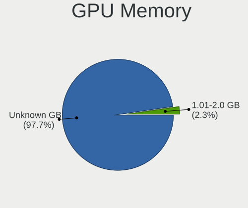

| Size in GB | Computers | Percent |
|------------|-----------|---------|
| Unknown    | 42        | 97.67%  |
| 1.01-2.0   | 1         | 2.33%   |

Monitor
-------

Monitor Vendor
--------------

Monitor vendors

| Vendor | Computers | Percent |
|--------|-----------|---------|
| Dell   | 1         | 100%    |

Monitor Model
-------------

Monitor models

| Model                             | Computers | Percent |
|-----------------------------------|-----------|---------|
| Dell LCD Monitor U2715H 2560x1440 | 1         | 100%    |

Monitor Resolution
------------------

Monitor screen resolution

| Resolution      | Computers | Percent |
|-----------------|-----------|---------|
| 2560x1440 (QHD) | 1         | 100%    |

Monitor Diagonal
----------------

Diagonal size in inches

| Inches  | Computers | Percent |
|---------|-----------|---------|
| Unknown | 1         | 100%    |

Monitor Width
-------------

Physical width

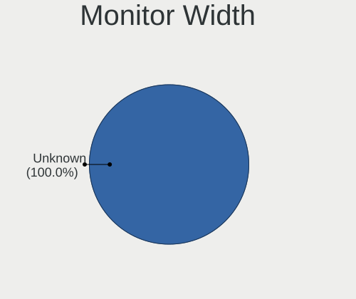

| Width in mm | Computers | Percent |
|-------------|-----------|---------|
| Unknown     | 1         | 100%    |

Aspect Ratio
------------

Proportional relationship between the width and the height

| Ratio   | Computers | Percent |
|---------|-----------|---------|
| Unknown | 1         | 100%    |

Monitor Area
------------

Area in inch²

| Area in inch² | Computers | Percent |
|----------------|-----------|---------|
| Unknown        | 1         | 100%    |

Pixel Density
-------------

Pixels per inch

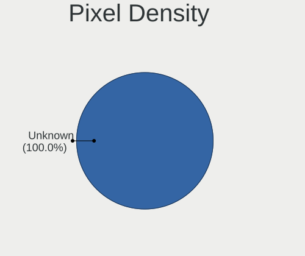

| Density | Computers | Percent |
|---------|-----------|---------|
| Unknown | 1         | 100%    |

Multiple Monitors
-----------------

Total monitors connected

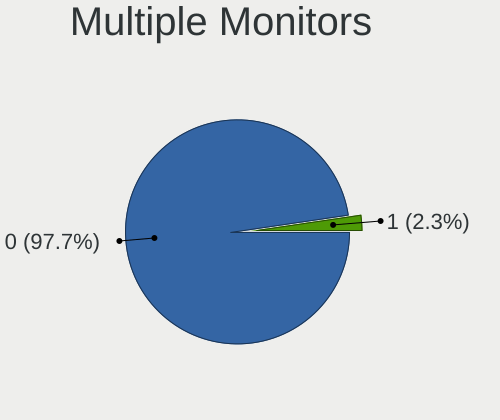

| Total | Computers | Percent |
|-------|-----------|---------|
| 0     | 42        | 97.67%  |
| 1     | 1         | 2.33%   |

Network
-------

Net Controller Vendor
---------------------

Controller vendors

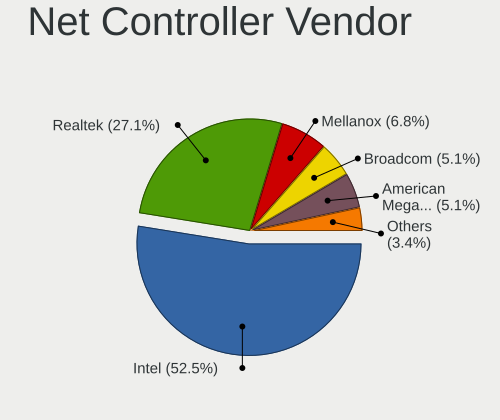

| Vendor                   | Computers | Percent |
|--------------------------|-----------|---------|
| Intel                    | 31        | 52.54%  |
| Realtek Semiconductor    | 16        | 27.12%  |
| Mellanox Technologies    | 4         | 6.78%   |
| Broadcom                 | 3         | 5.08%   |
| American Megatrends      | 3         | 5.08%   |
| Qualcomm Atheros         | 1         | 1.69%   |
| Marvell Technology Group | 1         | 1.69%   |

Net Controller Model
--------------------

Controller models

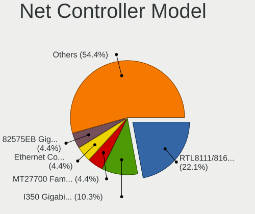

| Model                                                                  | Computers | Percent |
|------------------------------------------------------------------------|-----------|---------|
| Realtek RTL8111/8168/8211/8411 PCI Express Gigabit Ethernet Controller | 15        | 22.06%  |
| Intel I350 Gigabit Network Connection                                  | 7         | 10.29%  |
| Mellanox MT27700 Family [ConnectX-4]                                   | 3         | 4.41%   |
| Intel Ethernet Connection (17) I219-V                                  | 3         | 4.41%   |
| Intel 82575EB Gigabit Network Connection                               | 3         | 4.41%   |
| American Megatrends Virtual Ethernet                                   | 3         | 4.41%   |
| Intel I211 Gigabit Network Connection                                  | 2         | 2.94%   |
| Intel Ethernet Controller X550                                         | 2         | 2.94%   |
| Intel Ethernet Connection (2) I219-LM                                  | 2         | 2.94%   |
| Intel 82599ES 10-Gigabit SFI/SFP+ Network Connection                   | 2         | 2.94%   |
| Realtek RTL8188EE Wireless Network Adapter                             | 1         | 1.47%   |
| Realtek RTL8125 2.5GbE Controller                                      | 1         | 1.47%   |
| Qualcomm Atheros AR9485 Wireless Network Adapter                       | 1         | 1.47%   |
| Mellanox MT2892 Family [ConnectX-6 Dx]                                 | 1         | 1.47%   |
| Marvell Group 88E8056 PCI-E Gigabit Ethernet Controller                | 1         | 1.47%   |
| Intel Wireless 3160                                                    | 1         | 1.47%   |
| Intel I210 Gigabit Network Connection                                  | 1         | 1.47%   |
| Intel Ethernet Connection I217-LM                                      | 1         | 1.47%   |
| Intel Ethernet Connection (5) I219-LM                                  | 1         | 1.47%   |
| Intel Ethernet Connection (3) I219-LM                                  | 1         | 1.47%   |
| Intel Ethernet Connection (11) I219-V                                  | 1         | 1.47%   |
| Intel Centrino Wireless-N 2230                                         | 1         | 1.47%   |
| Intel Centrino Advanced-N 6200                                         | 1         | 1.47%   |
| Intel Alder Lake-P PCH CNVi WiFi                                       | 1         | 1.47%   |
| Intel 82583V Gigabit Network Connection                                | 1         | 1.47%   |
| Intel 82579V Gigabit Network Connection                                | 1         | 1.47%   |
| Intel 82577LM Gigabit Network Connection                               | 1         | 1.47%   |
| Intel 82576 Gigabit Network Connection                                 | 1         | 1.47%   |
| Intel 82574L Gigabit Network Connection                                | 1         | 1.47%   |
| Intel 82566DM-2 Gigabit Network Connection                             | 1         | 1.47%   |
| Intel 82541GI Gigabit Ethernet Controller                              | 1         | 1.47%   |
| Broadcom NetXtreme II BCM57810 10 Gigabit Ethernet                     | 1         | 1.47%   |
| Broadcom NetXtreme II BCM5716 Gigabit Ethernet                         | 1         | 1.47%   |
| Broadcom NetXtreme BCM5720 Gigabit Ethernet PCIe                       | 1         | 1.47%   |
| Broadcom NetXtreme BCM5719 Gigabit Ethernet PCIe                       | 1         | 1.47%   |
| Broadcom BCM43224 802.11a/b/g/n                                        | 1         | 1.47%   |

Wireless Vendor
---------------

Wireless vendors

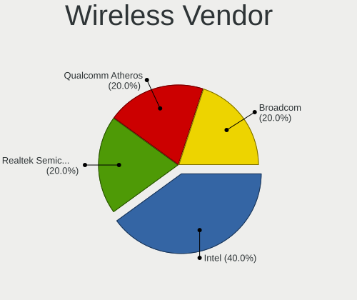

| Vendor                | Computers | Percent |
|-----------------------|-----------|---------|
| Intel                 | 4         | 57.14%  |
| Realtek Semiconductor | 1         | 14.29%  |
| Qualcomm Atheros      | 1         | 14.29%  |
| Broadcom              | 1         | 14.29%  |

Wireless Model
--------------

Wireless models

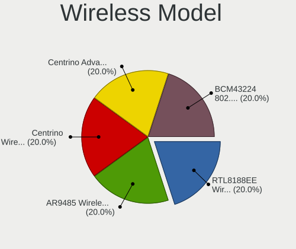

| Model                                            | Computers | Percent |
|--------------------------------------------------|-----------|---------|
| Realtek RTL8188EE Wireless Network Adapter       | 1         | 14.29%  |
| Qualcomm Atheros AR9485 Wireless Network Adapter | 1         | 14.29%  |
| Intel Wireless 3160                              | 1         | 14.29%  |
| Intel Centrino Wireless-N 2230                   | 1         | 14.29%  |
| Intel Centrino Advanced-N 6200                   | 1         | 14.29%  |
| Intel Alder Lake-P PCH CNVi WiFi                 | 1         | 14.29%  |
| Broadcom BCM43224 802.11a/b/g/n                  | 1         | 14.29%  |

Ethernet Vendor
---------------

Ethernet vendors

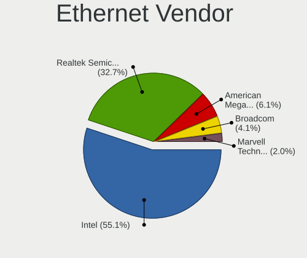

| Vendor                   | Computers | Percent |
|--------------------------|-----------|---------|
| Intel                    | 27        | 55.1%   |
| Realtek Semiconductor    | 16        | 32.65%  |
| American Megatrends      | 3         | 6.12%   |
| Broadcom                 | 2         | 4.08%   |
| Marvell Technology Group | 1         | 2.04%   |

Ethernet Model
--------------

Ethernet models

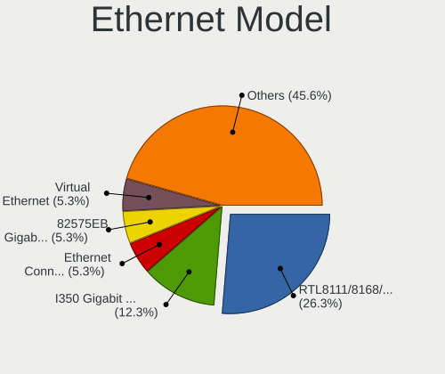

| Model                                                                  | Computers | Percent |
|------------------------------------------------------------------------|-----------|---------|
| Realtek RTL8111/8168/8211/8411 PCI Express Gigabit Ethernet Controller | 15        | 26.32%  |
| Intel I350 Gigabit Network Connection                                  | 7         | 12.28%  |
| Intel Ethernet Connection (17) I219-V                                  | 3         | 5.26%   |
| Intel 82575EB Gigabit Network Connection                               | 3         | 5.26%   |
| American Megatrends Virtual Ethernet                                   | 3         | 5.26%   |
| Intel I211 Gigabit Network Connection                                  | 2         | 3.51%   |
| Intel Ethernet Controller X550                                         | 2         | 3.51%   |
| Intel Ethernet Connection (2) I219-LM                                  | 2         | 3.51%   |
| Intel 82599ES 10-Gigabit SFI/SFP+ Network Connection                   | 2         | 3.51%   |
| Realtek RTL8125 2.5GbE Controller                                      | 1         | 1.75%   |
| Marvell Group 88E8056 PCI-E Gigabit Ethernet Controller                | 1         | 1.75%   |
| Intel I210 Gigabit Network Connection                                  | 1         | 1.75%   |
| Intel Ethernet Connection I217-LM                                      | 1         | 1.75%   |
| Intel Ethernet Connection (5) I219-LM                                  | 1         | 1.75%   |
| Intel Ethernet Connection (3) I219-LM                                  | 1         | 1.75%   |
| Intel Ethernet Connection (11) I219-V                                  | 1         | 1.75%   |
| Intel 82583V Gigabit Network Connection                                | 1         | 1.75%   |
| Intel 82579V Gigabit Network Connection                                | 1         | 1.75%   |
| Intel 82577LM Gigabit Network Connection                               | 1         | 1.75%   |
| Intel 82576 Gigabit Network Connection                                 | 1         | 1.75%   |
| Intel 82574L Gigabit Network Connection                                | 1         | 1.75%   |
| Intel 82566DM-2 Gigabit Network Connection                             | 1         | 1.75%   |
| Intel 82541GI Gigabit Ethernet Controller                              | 1         | 1.75%   |
| Broadcom NetXtreme II BCM57810 10 Gigabit Ethernet                     | 1         | 1.75%   |
| Broadcom NetXtreme II BCM5716 Gigabit Ethernet                         | 1         | 1.75%   |
| Broadcom NetXtreme BCM5720 Gigabit Ethernet PCIe                       | 1         | 1.75%   |
| Broadcom NetXtreme BCM5719 Gigabit Ethernet PCIe                       | 1         | 1.75%   |

Net Controller Kind
-------------------

Ethernet, WiFi or modem

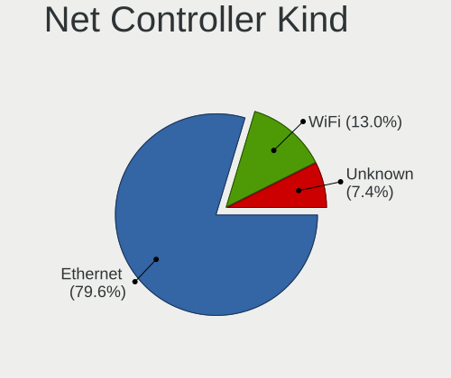

| Kind     | Computers | Percent |
|----------|-----------|---------|
| Ethernet | 43        | 79.63%  |
| WiFi     | 7         | 12.96%  |
| Unknown  | 4         | 7.41%   |

Used Controller
---------------

Currently used network controller

Zero info for selected period =(

NICs
----

Total network controllers on board

| Total | Computers | Percent |
|-------|-----------|---------|
| 0     | 43        | 100%    |

IPv6
----

IPv6 vs IPv4

| Used | Computers | Percent |
|------|-----------|---------|
| No   | 38        | 86.36%  |
| Yes  | 6         | 13.64%  |

Bluetooth
---------

Bluetooth Vendor
----------------

Controller vendors

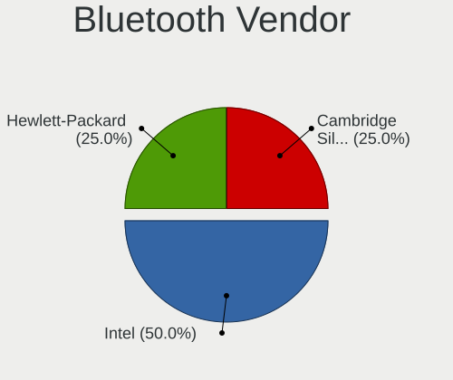

| Vendor                  | Computers | Percent |
|-------------------------|-----------|---------|
| Intel                   | 2         | 50%     |
| Hewlett-Packard         | 1         | 25%     |
| Cambridge Silicon Radio | 1         | 25%     |

Bluetooth Model
---------------

Controller models

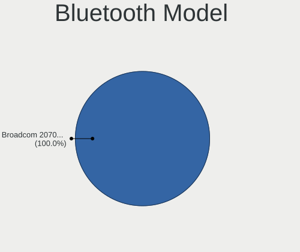

| Model                                               | Computers | Percent |
|-----------------------------------------------------|-----------|---------|
| Intel Centrino Bluetooth Wireless Transceiver       | 1         | 25%     |
| Intel Bluetooth 9460/9560 Jefferson Peak (JfP)      | 1         | 25%     |
| HP Broadcom 2070 Bluetooth Combo                    | 1         | 25%     |
| Cambridge Silicon Radio Bluetooth Dongle (HCI mode) | 1         | 25%     |

Sound
-----

Sound Vendor
------------

Sound card vendors

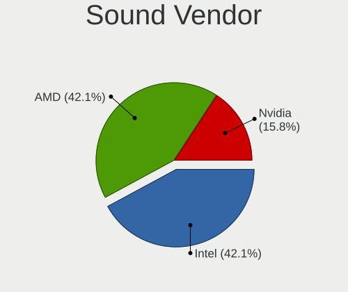

| Vendor | Computers | Percent |
|--------|-----------|---------|
| Intel  | 16        | 48.48%  |
| AMD    | 10        | 30.3%   |
| Nvidia | 7         | 21.21%  |

Sound Model
-----------

Sound card models

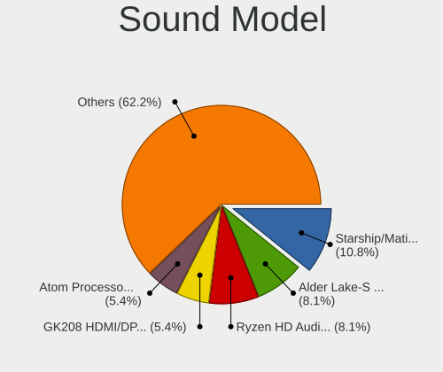

| Model                                                                      | Computers | Percent |
|----------------------------------------------------------------------------|-----------|---------|
| AMD Starship/Matisse HD Audio Controller                                   | 4         | 10.81%  |
| Intel Alder Lake-S HD Audio Controller                                     | 3         | 8.11%   |
| AMD Ryzen HD Audio Controller                                              | 3         | 8.11%   |
| Nvidia GK208 HDMI/DP Audio Controller                                      | 2         | 5.41%   |
| Intel Atom Processor Z36xxx/Z37xxx Series High Definition Audio Controller | 2         | 5.41%   |
| Intel 200 Series PCH HD Audio                                              | 2         | 5.41%   |
| AMD SBx00 Azalia (Intel HDA)                                               | 2         | 5.41%   |
| AMD Renoir/Cezanne HDMI/DP Audio Controller                                | 2         | 5.41%   |
| Nvidia High Definition Audio Controller                                    | 1         | 2.7%    |
| Nvidia GP108 High Definition Audio Controller                              | 1         | 2.7%    |
| Nvidia GK107 HDMI Audio Controller                                         | 1         | 2.7%    |
| Nvidia GK104 HDMI Audio Controller                                         | 1         | 2.7%    |
| Nvidia GF119 HDMI Audio Controller                                         | 1         | 2.7%    |
| Intel Sunrise Point-LP HD Audio                                            | 1         | 2.7%    |
| Intel Comet Lake PCH cAVS                                                  | 1         | 2.7%    |
| Intel Celeron N3350/Pentium N4200/Atom E3900 Series Audio Cluster          | 1         | 2.7%    |
| Intel C610/X99 series chipset HD Audio Controller                          | 1         | 2.7%    |
| Intel Alder Lake PCH-P High Definition Audio Controller                    | 1         | 2.7%    |
| Intel 82801JI (ICH10 Family) HD Audio Controller                           | 1         | 2.7%    |
| Intel 8 Series/C220 Series Chipset High Definition Audio Controller        | 1         | 2.7%    |
| Intel 7 Series/C216 Chipset Family High Definition Audio Controller        | 1         | 2.7%    |
| Intel 100 Series/C230 Series Chipset Family HD Audio Controller            | 1         | 2.7%    |
| AMD RS880 HDMI Audio [Radeon HD 4200 Series]                               | 1         | 2.7%    |
| AMD Redwood HDMI Audio [Radeon HD 5000 Series]                             | 1         | 2.7%    |
| AMD Raven/Raven2/Fenghuang HDMI/DP Audio Controller                        | 1         | 2.7%    |

Memory
------

Memory Vendor
-------------

Memory module vendors

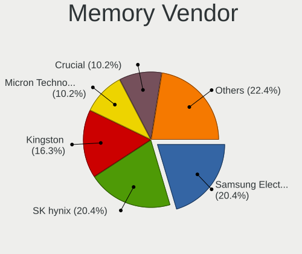

| Vendor                                  | Computers | Percent |
|-----------------------------------------|-----------|---------|
| SK hynix                                | 10        | 20.41%  |
| Samsung Electronics                     | 10        | 20.41%  |
| Kingston                                | 8         | 16.33%  |
| Micron Technology                       | 5         | 10.2%   |
| Crucial                                 | 5         | 10.2%   |
| Silicon Power Computer & Communications | 2         | 4.08%   |
| Unknown (ABCD)                          | 1         | 2.04%   |
| Unknown                                 | 1         | 2.04%   |
| Transcend                               | 1         | 2.04%   |
| Ramaxel Technology                      | 1         | 2.04%   |
| Patriot                                 | 1         | 2.04%   |
| G.Skill                                 | 1         | 2.04%   |
| CSX                                     | 1         | 2.04%   |
| A-DATA Technology                       | 1         | 2.04%   |
| Unknown                                 | 1         | 2.04%   |

Memory Model
------------

Memory module models

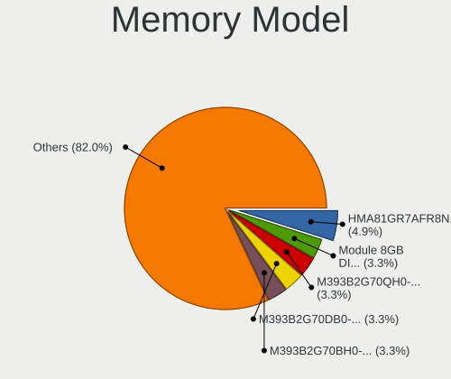

| Model                                                        | Computers | Percent |
|--------------------------------------------------------------|-----------|---------|
| SK hynix RAM HMA81GR7AFR8N-VK 8GB DIMM DDR4 2666MT/s         | 3         | 4.92%   |
| Silicon Power & RAM Module 8GB DIMM DDR4 3200MT/s            | 2         | 3.28%   |
| Samsung RAM M393B2G70QH0-YK0 16GB DIMM DDR3 1866MT/s         | 2         | 3.28%   |
| Samsung RAM M393B2G70DB0-CMA 16GB DIMM DDR3                  | 2         | 3.28%   |
| Samsung RAM M393B2G70BH0-YK0 16GB DIMM DDR3 1600MT/s         | 2         | 3.28%   |
| Kingston RAM 9965745-026.A00G 16GB DIMM DDR4 3200MT/s        | 2         | 3.28%   |
| Crucial RAM CT16G4DFD824A.C16FHD 16GB DIMM DDR4 2400MT/s     | 2         | 3.28%   |
| Unknown RAM Module 8GB DIMM 1333MT/s                         | 1         | 1.64%   |
| Unknown RAM Module 2GB DIMM 1333MT/s                         | 1         | 1.64%   |
| Unknown (ABCD) RAM 123456789012345678 8GB DIMM DDR4 2400MT/s | 1         | 1.64%   |
| Transcend RAM JM2666HLE-32G 32GB DIMM DDR4 2666MT/s          | 1         | 1.64%   |
| SK hynix RAM Module 8GB SODIMM DDR4 2133MT/s                 | 1         | 1.64%   |
| SK hynix RAM HMT84GR7BMR4C-H9 32GB DIMM DDR3 1066MT/s        | 1         | 1.64%   |
| SK hynix RAM HMT84GR7AMR4C-H9 32GB DIMM DDR3 1066MT/s        | 1         | 1.64%   |
| SK hynix RAM HMT351S6BFR8C-H9 4GB SODIMM DDR3 1333MT/s       | 1         | 1.64%   |
| SK hynix RAM HMAA1GS6CJR6N-XN 8GB Row Of Chips DDR4 3200MT/s | 1         | 1.64%   |
| SK hynix RAM HMA84GR7JJR4N-VK 32GB DIMM DDR4 2666MT/s        | 1         | 1.64%   |
| SK hynix RAM HMA84GR7CJR4N-VK 32GB DIMM DDR4 2666MT/s        | 1         | 1.64%   |
| SK hynix RAM HMA84GR7AFR4N-VK 32GB DIMM DDR4 2666MT/s        | 1         | 1.64%   |
| SK hynix RAM HMA81GU6DJR8N-XN 8GB DIMM DDR4 2933MT/s         | 1         | 1.64%   |
| SK hynix RAM HMA451R7MFR8N-TF 4GB RIMM DDR4 2133MT/s         | 1         | 1.64%   |
| Samsung RAM Module 32GB DIMM DDR4 2133MT/s                   | 1         | 1.64%   |
| Samsung RAM Module 2GB DIMM DDR3 400MT/s                     | 1         | 1.64%   |
| Samsung RAM M471B1G73DH0-YK0 8GB DIMM DDR3 1600MT/s          | 1         | 1.64%   |
| Samsung RAM M393B5273CH0-YH9 4GB DIMM DDR3 1333MT/s          | 1         | 1.64%   |
| Samsung RAM M393B2G70DB0-YK0 16GB DIMM DDR3 1600MT/s         | 1         | 1.64%   |
| Samsung RAM M393A4K40EB3-CWE 32GB DIMM DDR4 3200MT/s         | 1         | 1.64%   |
| Samsung RAM M393A4K40CB1-CRC 32GB DIMM DDR4 2400MT/s         | 1         | 1.64%   |
| Samsung RAM M393A4K40BB1-CRC 32GB DIMM DDR4 2400MT/s         | 1         | 1.64%   |
| Samsung RAM M393A2K40BB2-CTD 16GB DIMM DDR4 2667MT/s         | 1         | 1.64%   |
| Samsung RAM M378B5273DH0-YK0 4GB DIMM DDR3 1600MT/s          | 1         | 1.64%   |
| Ramaxel RAM RMSA3310MF96HAF-3200 8GB SODIMM DDR4 3200MT/s    | 1         | 1.64%   |
| Patriot RAM 1600 CL10 Series 8GB DIMM DDR3 1600MT/s          | 1         | 1.64%   |
| Micron RAM Module 8GB SODIMM DDR4 2133MT/s                   | 1         | 1.64%   |
| Micron RAM 36KSF2G72PZ-1G6N1 16GB DIMM 1600MT/s              | 1         | 1.64%   |
| Micron RAM 36KSF2G72PZ-1G6E1 16GB DIMM DDR3 1600MT/s         | 1         | 1.64%   |
| Micron RAM 36KDYS1G72PZ-1G4M1 8GB DIMM DDR3 1333MT/s         | 1         | 1.64%   |
| Micron RAM 18ASF4G72PDZ-3G2E1 32GB DIMM DDR4 2666MT/s        | 1         | 1.64%   |
| Micron RAM 16ATF4G64AZ-3G2F1 32GB DIMM DDR4 3200MT/s         | 1         | 1.64%   |
| Kingston RAM Module 2GB DIMM DDR2 800MT/s                    | 1         | 1.64%   |

Memory Kind
-----------

Memory module kinds

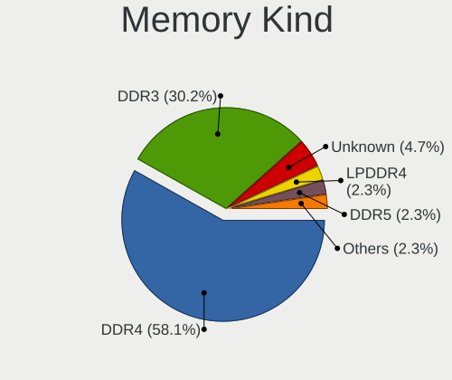

| Kind    | Computers | Percent |
|---------|-----------|---------|
| DDR4    | 25        | 58.14%  |
| DDR3    | 13        | 30.23%  |
| Unknown | 2         | 4.65%   |
| LPDDR4  | 1         | 2.33%   |
| DDR5    | 1         | 2.33%   |
| DDR2    | 1         | 2.33%   |

Memory Form Factor
------------------

Physical design of the memory module

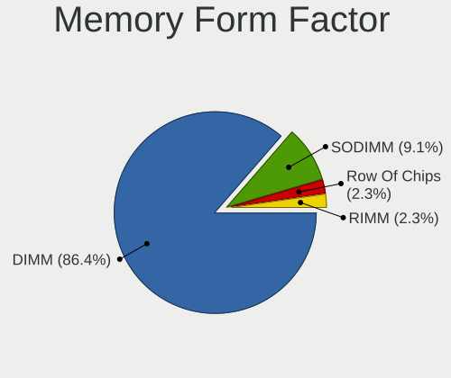

| Name         | Computers | Percent |
|--------------|-----------|---------|
| DIMM         | 38        | 86.36%  |
| SODIMM       | 4         | 9.09%   |
| Row Of Chips | 1         | 2.27%   |
| RIMM         | 1         | 2.27%   |

Memory Size
-----------

Memory module size

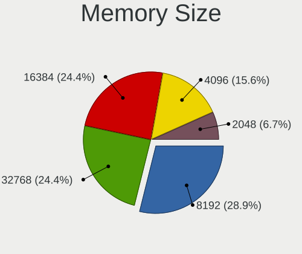

| Size  | Computers | Percent |
|-------|-----------|---------|
| 8192  | 13        | 28.89%  |
| 32768 | 11        | 24.44%  |
| 16384 | 11        | 24.44%  |
| 4096  | 7         | 15.56%  |
| 2048  | 3         | 6.67%   |

Memory Speed
------------

Memory module speed

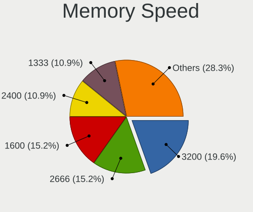

| Speed | Computers | Percent |
|-------|-----------|---------|
| 3200  | 9         | 19.57%  |
| 2666  | 7         | 15.22%  |
| 1600  | 7         | 15.22%  |
| 2400  | 5         | 10.87%  |
| 1333  | 5         | 10.87%  |
| 2133  | 4         | 8.7%    |
| 1866  | 2         | 4.35%   |
| 1066  | 2         | 4.35%   |
| 4800  | 1         | 2.17%   |
| 2933  | 1         | 2.17%   |
| 2667  | 1         | 2.17%   |
| 800   | 1         | 2.17%   |
| 400   | 1         | 2.17%   |

Printers & scanners
-------------------

Printer Vendor
--------------

Printer device vendors

Zero info for selected period =(

Printer Model
-------------

Printer device models

Zero info for selected period =(

Scanner Vendor
--------------

Scanner device vendors

Zero info for selected period =(

Scanner Model
-------------

Scanner device models

Zero info for selected period =(

Camera
------

Camera Vendor
-------------

Camera device vendors

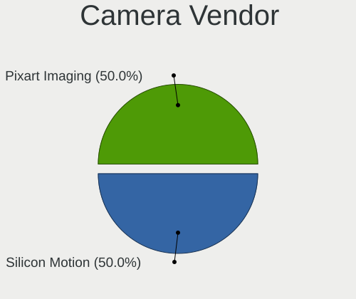

| Vendor         | Computers | Percent |
|----------------|-----------|---------|
| Syntek         | 1         | 33.33%  |
| Silicon Motion | 1         | 33.33%  |
| Pixart Imaging | 1         | 33.33%  |

Camera Model
------------

Camera device models

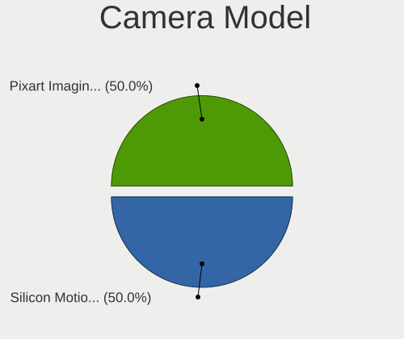

| Model                               | Computers | Percent |
|-------------------------------------|-----------|---------|
| Syntek Integrated Camera            | 1         | 33.33%  |
| Silicon Motion 300k Pixel Camera    | 1         | 33.33%  |
| Pixart Imaging PAC731x Trust Webcam | 1         | 33.33%  |

Security
--------

Fingerprint Vendor
------------------

Fingerprint sensor vendors

Zero info for selected period =(

Fingerprint Model
-----------------

Fingerprint sensor models

Zero info for selected period =(

Chipcard Vendor
---------------

Chipcard module vendors

Zero info for selected period =(

Chipcard Model
--------------

Chipcard module models

Zero info for selected period =(

Unsupported
-----------

Unsupported Devices
-------------------

Total unsupported devices on board

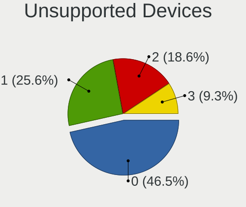

| Total | Computers | Percent |
|-------|-----------|---------|
| 0     | 20        | 46.51%  |
| 1     | 11        | 25.58%  |
| 2     | 8         | 18.6%   |
| 3     | 4         | 9.3%    |

Unsupported Device Types
------------------------

Types of unsupported devices

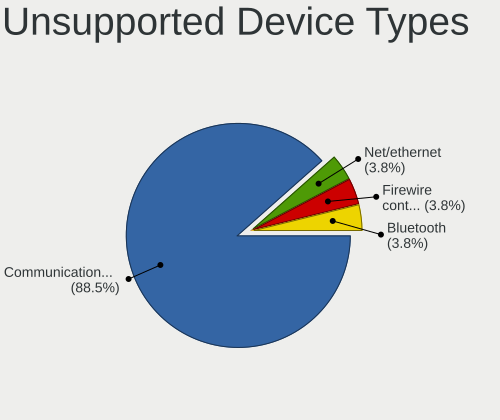

| Type                     | Computers | Percent |
|--------------------------|-----------|---------|
| Communication controller | 23        | 88.46%  |
| Net/ethernet             | 1         | 3.85%   |
| Firewire controller      | 1         | 3.85%   |
| Bluetooth                | 1         | 3.85%   |

