MyBee - Tested Hardware & Statistics
------------------------------------

A project to collect tested hardware configurations for MyBee.

Anyone can contribute to this report by the [hw-probe](https://github.com/linuxhw/hw-probe/blob/master/INSTALL.BSD.md) tool:

    hw-probe -all -upload

Please contribute! Especially if your hardware is rare.

This is a report for all computer types. See also reports for [desktops](/Dist/MyBee/Desktop/README.md) and [notebooks](/Dist/MyBee/Notebook/README.md).

Contents
--------

* [ Test Cases ](#test-cases)

* [ System ](#system)
  - [ OS                       ](#os)
  - [ OS Family                ](#os-family)
  - [ Arch                     ](#arch)
  - [ DE                       ](#de)
  - [ Display Server           ](#display-server)
  - [ Display Manager          ](#display-manager)
  - [ OS Lang                  ](#os-lang)
  - [ Boot Mode                ](#boot-mode)
  - [ Filesystem               ](#filesystem)
  - [ Part. scheme             ](#part-scheme)

* [ Board ](#board)
  - [ Vendor                   ](#vendor)
  - [ Model                    ](#model)
  - [ Model Family             ](#model-family)
  - [ MFG Year                 ](#mfg-year)
  - [ Form Factor              ](#form-factor)
  - [ Coreboot                 ](#coreboot)
  - [ RAM Size                 ](#ram-size)
  - [ RAM Used                 ](#ram-used)
  - [ Total Drives             ](#total-drives)
  - [ Has CD-ROM               ](#has-cd-rom)
  - [ Has Ethernet             ](#has-ethernet)
  - [ Has WiFi                 ](#has-wifi)
  - [ Has Bluetooth            ](#has-bluetooth)

* [ Location ](#location)
  - [ Country                  ](#country)
  - [ City                     ](#city)

* [ Drives ](#drives)
  - [ Drive Vendor             ](#drive-vendor)
  - [ Drive Model              ](#drive-model)
  - [ HDD Vendor               ](#hdd-vendor)
  - [ SSD Vendor               ](#ssd-vendor)
  - [ Drive Kind               ](#drive-kind)
  - [ Drive Connector          ](#drive-connector)
  - [ Drive Size               ](#drive-size)
  - [ Space Total              ](#space-total)
  - [ Space Used               ](#space-used)
  - [ Malfunc. Drives          ](#malfunc-drives)
  - [ Malfunc. Drive Vendor    ](#malfunc-drive-vendor)
  - [ Malfunc. HDD Vendor      ](#malfunc-hdd-vendor)
  - [ Malfunc. Drive Kind      ](#malfunc-drive-kind)
  - [ Failed Drives            ](#failed-drives)
  - [ Failed Drive Vendor      ](#failed-drive-vendor)
  - [ Drive Status             ](#drive-status)

* [ Storage controller ](#storage-controller)
  - [ Storage Vendor           ](#storage-vendor)
  - [ Storage Model            ](#storage-model)
  - [ Storage Kind             ](#storage-kind)

* [ Processor ](#processor)
  - [ CPU Vendor               ](#cpu-vendor)
  - [ CPU Model                ](#cpu-model)
  - [ CPU Model Family         ](#cpu-model-family)
  - [ CPU Cores                ](#cpu-cores)
  - [ CPU Sockets              ](#cpu-sockets)
  - [ CPU Threads              ](#cpu-threads)
  - [ CPU Microarch            ](#cpu-microarch)

* [ Graphics ](#graphics)
  - [ GPU Vendor               ](#gpu-vendor)
  - [ GPU Model                ](#gpu-model)
  - [ GPU Combo                ](#gpu-combo)
  - [ GPU Driver               ](#gpu-driver)
  - [ GPU Memory               ](#gpu-memory)

* [ Monitor ](#monitor)
  - [ Monitor Vendor           ](#monitor-vendor)
  - [ Monitor Model            ](#monitor-model)
  - [ Monitor Resolution       ](#monitor-resolution)
  - [ Monitor Diagonal         ](#monitor-diagonal)
  - [ Monitor Width            ](#monitor-width)
  - [ Aspect Ratio             ](#aspect-ratio)
  - [ Monitor Area             ](#monitor-area)
  - [ Pixel Density            ](#pixel-density)
  - [ Multiple Monitors        ](#multiple-monitors)

* [ Network ](#network)
  - [ Net Controller Vendor    ](#net-controller-vendor)
  - [ Net Controller Model     ](#net-controller-model)
  - [ Wireless Vendor          ](#wireless-vendor)
  - [ Wireless Model           ](#wireless-model)
  - [ Ethernet Vendor          ](#ethernet-vendor)
  - [ Ethernet Model           ](#ethernet-model)
  - [ Net Controller Kind      ](#net-controller-kind)
  - [ Used Controller          ](#used-controller)
  - [ NICs                     ](#nics)
  - [ IPv6                     ](#ipv6)

* [ Bluetooth ](#bluetooth)
  - [ Bluetooth Vendor         ](#bluetooth-vendor)
  - [ Bluetooth Model          ](#bluetooth-model)

* [ Sound ](#sound)
  - [ Sound Vendor             ](#sound-vendor)
  - [ Sound Model              ](#sound-model)

* [ Memory ](#memory)
  - [ Memory Vendor            ](#memory-vendor)
  - [ Memory Model             ](#memory-model)
  - [ Memory Kind              ](#memory-kind)
  - [ Memory Form Factor       ](#memory-form-factor)
  - [ Memory Size              ](#memory-size)
  - [ Memory Speed             ](#memory-speed)

* [ Printers & scanners ](#printers--scanners)
  - [ Printer Vendor           ](#printer-vendor)
  - [ Printer Model            ](#printer-model)
  - [ Scanner Vendor           ](#scanner-vendor)
  - [ Scanner Model            ](#scanner-model)

* [ Camera ](#camera)
  - [ Camera Vendor            ](#camera-vendor)
  - [ Camera Model             ](#camera-model)

* [ Security ](#security)
  - [ Fingerprint Vendor       ](#fingerprint-vendor)
  - [ Fingerprint Model        ](#fingerprint-model)
  - [ Chipcard Vendor          ](#chipcard-vendor)
  - [ Chipcard Model           ](#chipcard-model)

* [ Unsupported ](#unsupported)
  - [ Unsupported Devices      ](#unsupported-devices)
  - [ Unsupported Device Types ](#unsupported-device-types)

Test Cases
----------

Total: 35

| Vendor        | Model                    | Form-Factor | Probe                                                     | Date         |
|---------------|--------------------------|-------------|-----------------------------------------------------------|--------------|
| Intel         | S5520UR E22554-752       | Server      | [ab0b5c4d36](https://bsd-hardware.info/?probe=ab0b5c4d36) | Sep 27, 2023 |
| Intel         | S5520UR E22554-753       | Server      | [4094543b6f](https://bsd-hardware.info/?probe=4094543b6f) | Sep 25, 2023 |
| ASUSTek       | P9D-MV Series            | Server      | [bccf02e740](https://bsd-hardware.info/?probe=bccf02e740) | Sep 25, 2023 |
| ASRock        | Z690 Phantom Gaming 4/D5 | Desktop     | [6eab8daef7](https://bsd-hardware.info/?probe=6eab8daef7) | Sep 21, 2023 |
| ASRockRack    | X470D4U2-2T              | Desktop     | [5a0b8eb786](https://bsd-hardware.info/?probe=5a0b8eb786) | Sep 21, 2023 |
| ASUSTek       | P6X58D PREMIUM           | Desktop     | [946e123320](https://bsd-hardware.info/?probe=946e123320) | Aug 13, 2023 |
| Intel         | S3210SH FRU Ver          | Server      | [b4112bd797](https://bsd-hardware.info/?probe=b4112bd797) | Jul 24, 2023 |
| Insyde        | Purley                   | Server      | [c6ffd34b07](https://bsd-hardware.info/?probe=c6ffd34b07) | Jun 21, 2023 |
| ASRockRack    | X570D4U-2L2T             | Desktop     | [4cada5d71b](https://bsd-hardware.info/?probe=4cada5d71b) | Jun 02, 2023 |
| ASRockRack    | X470D4U2-2T              | Desktop     | [e782ceaea8](https://bsd-hardware.info/?probe=e782ceaea8) | May 19, 2023 |
| Gigabyte      | H77N-WIFI                | Desktop     | [cf2014c973](https://bsd-hardware.info/?probe=cf2014c973) | May 04, 2023 |
| Gigabyte      | Z170-HD3 DDR3-CF         | Desktop     | [882a817f46](https://bsd-hardware.info/?probe=882a817f46) | Apr 13, 2023 |
| MSI           | PRO H610M-B DDR4         | Desktop     | [ee01b690bc](https://bsd-hardware.info/?probe=ee01b690bc) | Mar 25, 2023 |
| MSI           | PRO H610M-B DDR4         | Desktop     | [b08fd92e36](https://bsd-hardware.info/?probe=b08fd92e36) | Mar 10, 2023 |
| ASUSTek       | P8Z77-V PREMIUM          | Desktop     | [a2873d7c87](https://bsd-hardware.info/?probe=a2873d7c87) | Mar 09, 2023 |
| Huanan        | X99-QD4 V1.0             | Desktop     | [8404060d9e](https://bsd-hardware.info/?probe=8404060d9e) | Mar 02, 2023 |
| Unknown       | Unknown                  | Desktop     | [95c62844de](https://bsd-hardware.info/?probe=95c62844de) | Feb 25, 2023 |
| MSI           | PRO H610M-B DDR4         | Desktop     | [1deece00b3](https://bsd-hardware.info/?probe=1deece00b3) | Jan 05, 2023 |
| ASUSTek       | PRIME B550-PLUS          | Desktop     | [4c3b92bb42](https://bsd-hardware.info/?probe=4c3b92bb42) | Dec 24, 2022 |
| ASUSTek       | PRIME B550-PLUS          | Desktop     | [3e5e7e3e61](https://bsd-hardware.info/?probe=3e5e7e3e61) | Dec 22, 2022 |
| Gigabyte      | A320M-H-CF               | Desktop     | [2549c7cadf](https://bsd-hardware.info/?probe=2549c7cadf) | Aug 27, 2022 |
| ASUSTek       | PRIME B550-PLUS          | Desktop     | [7d4eaaf087](https://bsd-hardware.info/?probe=7d4eaaf087) | Aug 22, 2022 |
| ASUSTek       | PRIME B550-PLUS          | Desktop     | [063addc66e](https://bsd-hardware.info/?probe=063addc66e) | Aug 22, 2022 |
| HP            | EliteBook 8540w          | Notebook    | [0063369c40](https://bsd-hardware.info/?probe=0063369c40) | Jul 30, 2022 |
| Fujitsu       | D3401-H2 S26361-D3401-H2 | Desktop     | [e3461d0ff8](https://bsd-hardware.info/?probe=e3461d0ff8) | Jul 17, 2022 |
| Acer          | RS880M05                 | Desktop     | [7bcc14ceba](https://bsd-hardware.info/?probe=7bcc14ceba) | Jul 16, 2022 |
| Supermicro    | H8DGU                    | Server      | [172bfe70b5](https://bsd-hardware.info/?probe=172bfe70b5) | Jul 14, 2022 |
| Fujitsu       | D3401-H2 S26361-D3401-H2 | Desktop     | [75132f9078](https://bsd-hardware.info/?probe=75132f9078) | Jul 13, 2022 |
| Fujitsu       | D3401-H2 S26361-D3401-H2 | Desktop     | [7cdaeb28fa](https://bsd-hardware.info/?probe=7cdaeb28fa) | Jun 16, 2022 |
| ASRock        | X570 Phantom Gaming 4    | Desktop     | [067dbf3357](https://bsd-hardware.info/?probe=067dbf3357) | Jun 15, 2022 |
| IceWhale T... | ZimaBoard 832 ZMB        | Desktop     | [b98e41f6a4](https://bsd-hardware.info/?probe=b98e41f6a4) | Jun 05, 2022 |
| Supermicro    | X10SRi-FB                | Server      | [0e21a1eeb0](https://bsd-hardware.info/?probe=0e21a1eeb0) | May 27, 2022 |
| ASRockRack    | E3C242D4U2-2T            | Desktop     | [66f9070856](https://bsd-hardware.info/?probe=66f9070856) | May 23, 2022 |
| Fujitsu       | D3401-H2 S26361-D3401-H2 | Desktop     | [ea6146e013](https://bsd-hardware.info/?probe=ea6146e013) | May 19, 2022 |
| Fujitsu       | D3401-H2 S26361-D3401-H2 | Desktop     | [6974f0958e](https://bsd-hardware.info/?probe=6974f0958e) | May 15, 2022 |

System
------

OS
--

Installed operating systems

| Name               | Computers | Percent |
|--------------------|-----------|---------|
| MyBee 13.1         | 7         | 25%     |
| MyBee 13.2         | 6         | 21.43%  |
| MyBee 14.0-BETA2   | 3         | 10.71%  |
| MyBee 13.1-p7      | 3         | 10.71%  |
| MyBee 14.0-CURRENT | 2         | 7.14%   |
| MyBee 13.1-p1      | 2         | 7.14%   |
| MyBee 13.2-RC5     | 1         | 3.57%   |
| MyBee 13.2-RC4     | 1         | 3.57%   |
| MyBee 13.2-RC2     | 1         | 3.57%   |
| MyBee 13.1-p5      | 1         | 3.57%   |
| MyBee 13.1-p3      | 1         | 3.57%   |

OS Family
---------

OS without a version

| Name  | Computers | Percent |
|-------|-----------|---------|
| MyBee | 26        | 100%    |

Arch
----

OS architecture (x86_64, i586, etc.)

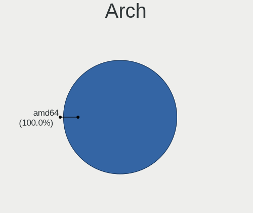

| Name  | Computers | Percent |
|-------|-----------|---------|
| amd64 | 26        | 100%    |

DE
--

Desktop Environment

| Name    | Computers | Percent |
|---------|-----------|---------|
| Console | 25        | 96.15%  |
| KDE5    | 1         | 3.85%   |

Display Server
--------------

X11 or Wayland

| Name    | Computers | Percent |
|---------|-----------|---------|
| Console | 25        | 96.15%  |
| X11     | 1         | 3.85%   |

Display Manager
---------------

SDDM, LightDM, etc.

| Name    | Computers | Percent |
|---------|-----------|---------|
| Console | 26        | 100%    |

OS Lang
-------

Language

| Lang  | Computers | Percent |
|-------|-----------|---------|
| en_US | 24        | 92.31%  |
| C     | 2         | 7.69%   |

Boot Mode
---------

EFI or BIOS

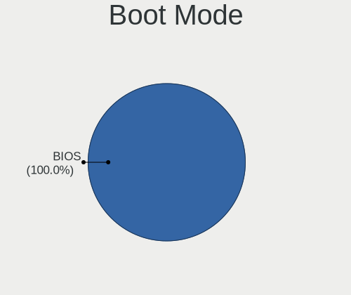

| Mode | Computers | Percent |
|------|-----------|---------|
| BIOS | 26        | 100%    |

Filesystem
----------

Type of filesystem

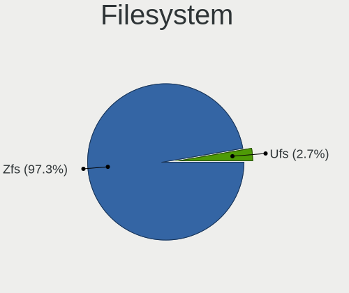

| Type | Computers | Percent |
|------|-----------|---------|
| Zfs  | 26        | 100%    |

Part. scheme
------------

Scheme of partitioning

| Type | Computers | Percent |
|------|-----------|---------|
| GPT  | 26        | 100%    |

Board
-----

Vendor
------

Motherboard manufacturer

| Name                | Computers | Percent |
|---------------------|-----------|---------|
| ASUSTek Computer    | 4         | 15.38%  |
| Intel               | 3         | 11.54%  |
| Gigabyte Technology | 3         | 11.54%  |
| Supermicro          | 2         | 7.69%   |
| MSI                 | 2         | 7.69%   |
| Fujitsu             | 2         | 7.69%   |
| ASRockRack          | 2         | 7.69%   |
| ASRock              | 2         | 7.69%   |
| Insyde              | 1         | 3.85%   |
| IceWhale Technology | 1         | 3.85%   |
| Huanan              | 1         | 3.85%   |
| Hewlett-Packard     | 1         | 3.85%   |
| Acer                | 1         | 3.85%   |
| Unknown             | 1         | 3.85%   |

Model
-----

Motherboard model

| Name                             | Computers | Percent |
|----------------------------------|-----------|---------|
| MSI MS-7D46                      | 2         | 7.69%   |
| Intel S5520UR                    | 2         | 7.69%   |
| Fujitsu D3401-H2 S26361-D3401-H2 | 2         | 7.69%   |
| ASUS PRIME B550-PLUS             | 2         | 7.69%   |
| Supermicro Super Server          | 1         | 3.85%   |
| Supermicro H8DGU                 | 1         | 3.85%   |
| Intel S3210SH                    | 1         | 3.85%   |
| Insyde Purley                    | 1         | 3.85%   |
| IceWhale ZimaBoard 832 ZMB       | 1         | 3.85%   |
| Huanan X99-QD4 V1.0              | 1         | 3.85%   |
| HP EliteBook 8540w               | 1         | 3.85%   |
| Gigabyte Z170-HD3 DDR3           | 1         | 3.85%   |
| Gigabyte H77N-WIFI               | 1         | 3.85%   |
| Gigabyte A320M-H                 | 1         | 3.85%   |
| ASUS P8Z77-V PREMIUM             | 1         | 3.85%   |
| ASUS P6X58D PREMIUM              | 1         | 3.85%   |
| ASRockRack X570D4U-2L2T          | 1         | 3.85%   |
| ASRockRack X470D4U2-2T           | 1         | 3.85%   |
| ASRock Z690 Phantom Gaming 4/D5  | 1         | 3.85%   |
| ASRock X570 Phantom Gaming 4     | 1         | 3.85%   |
| Acer Veriton M430                | 1         | 3.85%   |
| Unknown                          | 1         | 3.85%   |

Model Family
------------

Motherboard model prefix

| Name                    | Computers | Percent |
|-------------------------|-----------|---------|
| MSI MS-7D46             | 2         | 7.69%   |
| Intel S5520UR           | 2         | 7.69%   |
| Fujitsu D3401-H2        | 2         | 7.69%   |
| ASUS PRIME              | 2         | 7.69%   |
| Supermicro Super        | 1         | 3.85%   |
| Supermicro H8DGU        | 1         | 3.85%   |
| Intel S3210SH           | 1         | 3.85%   |
| Insyde Purley           | 1         | 3.85%   |
| IceWhale ZimaBoard      | 1         | 3.85%   |
| Huanan X99-QD4          | 1         | 3.85%   |
| HP EliteBook            | 1         | 3.85%   |
| Gigabyte Z170-HD3       | 1         | 3.85%   |
| Gigabyte H77N-WIFI      | 1         | 3.85%   |
| Gigabyte A320M-H        | 1         | 3.85%   |
| ASUS P8Z77-V            | 1         | 3.85%   |
| ASUS P6X58D             | 1         | 3.85%   |
| ASRockRack X570D4U-2L2T | 1         | 3.85%   |
| ASRockRack X470D4U2-2T  | 1         | 3.85%   |
| ASRock Z690             | 1         | 3.85%   |
| ASRock X570             | 1         | 3.85%   |
| Acer Veriton            | 1         | 3.85%   |
| Unknown                 | 1         | 3.85%   |

MFG Year
--------

Motherboard manufacture year

| Year | Computers | Percent |
|------|-----------|---------|
| 2022 | 5         | 19.23%  |
| 2020 | 4         | 15.38%  |
| 2018 | 3         | 11.54%  |
| 2017 | 3         | 11.54%  |
| 2013 | 2         | 7.69%   |
| 2012 | 2         | 7.69%   |
| 2011 | 2         | 7.69%   |
| 2021 | 1         | 3.85%   |
| 2019 | 1         | 3.85%   |
| 2014 | 1         | 3.85%   |
| 2010 | 1         | 3.85%   |
| 2009 | 1         | 3.85%   |

Form Factor
-----------

Physical design of the computer

| Name     | Computers | Percent |
|----------|-----------|---------|
| Desktop  | 19        | 73.08%  |
| Server   | 6         | 23.08%  |
| Notebook | 1         | 3.85%   |

Coreboot
--------

Have coreboot on board

| Used | Computers | Percent |
|------|-----------|---------|
| No   | 26        | 100%    |

RAM Size
--------

Total RAM memory

| Size in GB      | Computers | Percent |
|-----------------|-----------|---------|
| 64.01-256.0     | 11        | 42.31%  |
| 8.01-16.0       | 8         | 30.77%  |
| 32.01-64.0      | 3         | 11.54%  |
| More than 256.0 | 1         | 3.85%   |
| 4.01-8.0        | 1         | 3.85%   |
| 24.01-32.0      | 1         | 3.85%   |
| 16.01-24.0      | 1         | 3.85%   |

RAM Used
--------

Used RAM memory

| Used GB    | Computers | Percent |
|------------|-----------|---------|
| 0.51-1.0   | 10        | 38.46%  |
| 4.01-8.0   | 4         | 15.38%  |
| 2.01-3.0   | 4         | 15.38%  |
| 1.01-2.0   | 4         | 15.38%  |
| 16.01-24.0 | 3         | 11.54%  |
| 8.01-16.0  | 1         | 3.85%   |

Total Drives
------------

Number of drives on board

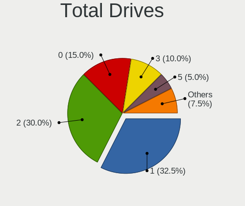

| Drives | Computers | Percent |
|--------|-----------|---------|
| 2      | 8         | 29.63%  |
| 1      | 8         | 29.63%  |
| 3      | 3         | 11.11%  |
| 0      | 3         | 11.11%  |
| 5      | 2         | 7.41%   |
| 4      | 2         | 7.41%   |
| 6      | 1         | 3.7%    |

Has CD-ROM
----------

Has CD-ROM on board

| Presented | Computers | Percent |
|-----------|-----------|---------|
| No        | 23        | 88.46%  |
| Yes       | 3         | 11.54%  |

Has Ethernet
------------

Has Ethernet on board

| Presented | Computers | Percent |
|-----------|-----------|---------|
| Yes       | 26        | 100%    |

Has WiFi
--------

Has WiFi module

| Presented | Computers | Percent |
|-----------|-----------|---------|
| No        | 23        | 88.46%  |
| Yes       | 3         | 11.54%  |

Has Bluetooth
-------------

Has Bluetooth module

| Presented | Computers | Percent |
|-----------|-----------|---------|
| No        | 24        | 92.31%  |
| Yes       | 2         | 7.69%   |

Location
--------

Country
-------

Geographic location (country)

| Country | Computers | Percent |
|---------|-----------|---------|
| Russia  | 19        | 73.08%  |
| Germany | 3         | 11.54%  |
| USA     | 1         | 3.85%   |
| Iceland | 1         | 3.85%   |
| Finland | 1         | 3.85%   |
| Canada  | 1         | 3.85%   |

City
----

Geographic location (city)

| City                | Computers | Percent |
|---------------------|-----------|---------|
| St Petersburg       | 10        | 38.46%  |
| Moscow              | 5         | 19.23%  |
| Vladivostok         | 1         | 3.85%   |
| Rostov-on-Don       | 1         | 3.85%   |
| Reykjavik           | 1         | 3.85%   |
| Remscheid           | 1         | 3.85%   |
| Naberezhnyye Chelny | 1         | 3.85%   |
| Montreal            | 1         | 3.85%   |
| Limburg an der Lahn | 1         | 3.85%   |
| Irkutsk             | 1         | 3.85%   |
| Helsinki            | 1         | 3.85%   |
| Falkenstein         | 1         | 3.85%   |
| Clearwater          | 1         | 3.85%   |

Drives
------

Drive Vendor
------------

Hard drive vendors

| Vendor              | Computers | Drives | Percent |
|---------------------|-----------|--------|---------|
| Seagate             | 6         | 13     | 19.35%  |
| Toshiba             | 5         | 17     | 16.13%  |
| Samsung Electronics | 4         | 6      | 12.9%   |
| Kingston            | 4         | 7      | 12.9%   |
| WDC                 | 2         | 2      | 6.45%   |
| KingSpec            | 2         | 2      | 6.45%   |
| Intel               | 2         | 3      | 6.45%   |
| Silicon Motion      | 1         | 2      | 3.23%   |
| Phison              | 1         | 1      | 3.23%   |
| Micron Technology   | 1         | 2      | 3.23%   |
| HGST                | 1         | 2      | 3.23%   |
| GOODRAM             | 1         | 1      | 3.23%   |
| A-DATA Technology   | 1         | 2      | 3.23%   |

Drive Model
-----------

Hard drive models

| Model                            | Computers | Percent |
|----------------------------------|-----------|---------|
| Toshiba MG07ACA12TE 12TB         | 2         | 6.45%   |
| Seagate ST1000DM010-2EP102 1TB   | 2         | 6.45%   |
| Samsung SSD 980 1TB              | 2         | 6.45%   |
| WDC WDS120G2G0A-00JH30 120GB     | 1         | 3.23%   |
| WDC WD30EJRX-89AKWY0 3TB         | 1         | 3.23%   |
| Toshiba MG06ACA800E 8TB          | 1         | 3.23%   |
| Toshiba KXG50ZNV512G 512GB       | 1         | 3.23%   |
| Toshiba DT01ACA100 1TB           | 1         | 3.23%   |
| Silicon Motion PCIe SSD 256GB    | 1         | 3.23%   |
| Seagate ST500DM002-1SB10A 500GB  | 1         | 3.23%   |
| Seagate ST2000DM008-2UB102 2TB   | 1         | 3.23%   |
| Seagate ST1000NM0033-9ZM173 1TB  | 1         | 3.23%   |
| Seagate ST1000LM048-2E7172 1TB   | 1         | 3.23%   |
| Samsung SSD 970 EVO Plus 1TB     | 1         | 3.23%   |
| Samsung SSD 870 EVO 1TB          | 1         | 3.23%   |
| Phison PCIe SSD 128GB            | 1         | 3.23%   |
| Micron 1100_MTFDDAK512TBN 512GB  | 1         | 3.23%   |
| Kingston SNV425S2128GB           | 1         | 3.23%   |
| Kingston SA400S37480G 480GB      | 1         | 3.23%   |
| Kingston SA400S37240G 240GB      | 1         | 3.23%   |
| Kingston SA400S37120G 120GB      | 1         | 3.23%   |
| KingSpec P3-256 256GB            | 1         | 3.23%   |
| KingSpec MT-1TB                  | 1         | 3.23%   |
| Intel SSDPEKNW010T8 1TB          | 1         | 3.23%   |
| Intel SSDPE2MX450G7 450GB        | 1         | 3.23%   |
| HGST HUS726T4TALA6L1 4TB         | 1         | 3.23%   |
| GOODRAM SSDPR-PX500-256-80 256GB | 1         | 3.23%   |
| A-DATA SX8200PNP 1TB             | 1         | 3.23%   |

HDD Vendor
----------

Hard disk drive vendors

| Vendor  | Computers | Drives | Percent |
|---------|-----------|--------|---------|
| Seagate | 6         | 13     | 50%     |
| Toshiba | 4         | 15     | 33.33%  |
| WDC     | 1         | 1      | 8.33%   |
| HGST    | 1         | 2      | 8.33%   |

SSD Vendor
----------

Solid state drive vendors

| Vendor              | Computers | Drives | Percent |
|---------------------|-----------|--------|---------|
| Kingston            | 4         | 7      | 44.44%  |
| KingSpec            | 2         | 2      | 22.22%  |
| WDC                 | 1         | 1      | 11.11%  |
| Samsung Electronics | 1         | 2      | 11.11%  |
| Micron Technology   | 1         | 2      | 11.11%  |

Drive Kind
----------

HDD or SSD

| Kind | Computers | Drives | Percent |
|------|-----------|--------|---------|
| HDD  | 11        | 31     | 36.67%  |
| NVMe | 10        | 15     | 33.33%  |
| SSD  | 9         | 14     | 30%     |

Drive Connector
---------------

SATA, SAS, NVMe, etc.

| Type | Computers | Drives | Percent |
|------|-----------|--------|---------|
| SATA | 19        | 45     | 65.52%  |
| NVMe | 10        | 15     | 34.48%  |

Drive Size
----------

Size of hard drive

| Size in TB | Computers | Drives | Percent |
|------------|-----------|--------|---------|
| 0.51-1.0   | 7         | 15     | 33.33%  |
| 0.01-0.5   | 7         | 10     | 33.33%  |
| 10.01-20.0 | 2         | 10     | 9.52%   |
| 1.01-2.0   | 2         | 3      | 9.52%   |
| 3.01-4.0   | 1         | 2      | 4.76%   |
| 2.01-3.0   | 1         | 1      | 4.76%   |
| 4.01-10.0  | 1         | 4      | 4.76%   |

Space Total
-----------

Amount of disk space available on the file system

| Size in GB     | Computers | Percent |
|----------------|-----------|---------|
| 501-1000       | 8         | 29.63%  |
| More than 3000 | 6         | 22.22%  |
| 101-250        | 5         | 18.52%  |
| 251-500        | 4         | 14.81%  |
| 1001-2000      | 2         | 7.41%   |
| 21-50          | 1         | 3.7%    |
| 2001-3000      | 1         | 3.7%    |

Space Used
----------

Amount of used disk space

| Used GB        | Computers | Percent |
|----------------|-----------|---------|
| 1-20           | 24        | 92.31%  |
| More than 3000 | 2         | 7.69%   |

Malfunc. Drives
---------------

Drive models with a malfunction

| Model                                      | Computers | Drives | Percent |
|--------------------------------------------|-----------|--------|---------|
| Samsung Electronics SSD 870 EVO 1TB        | 1         | 2      | 50%     |
| Micron Technology 1100_MTFDDAK512TBN 512GB | 1         | 2      | 50%     |

Malfunc. Drive Vendor
---------------------

Vendors of faulty drives

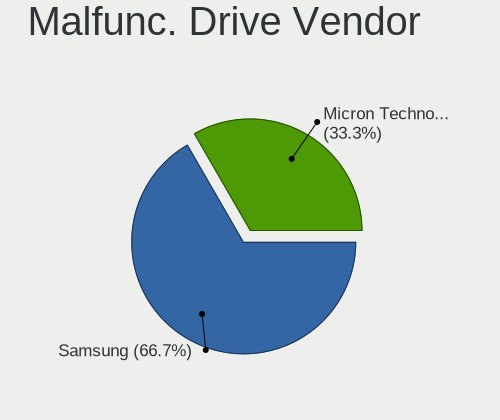

| Vendor              | Computers | Drives | Percent |
|---------------------|-----------|--------|---------|
| Samsung Electronics | 1         | 2      | 50%     |
| Micron Technology   | 1         | 2      | 50%     |

Malfunc. HDD Vendor
-------------------

Vendors of faulty HDD drives

Zero info for selected period =(

Malfunc. Drive Kind
-------------------

Kinds of faulty drives

| Kind | Computers | Drives | Percent |
|------|-----------|--------|---------|
| SSD  | 2         | 4      | 100%    |

Failed Drives
-------------

Failed drive models

Zero info for selected period =(

Failed Drive Vendor
-------------------

Failed drive vendors

Zero info for selected period =(

Drive Status
------------

Number of failed and malfunc. drives

| Status  | Computers | Drives | Percent |
|---------|-----------|--------|---------|
| Works   | 23        | 56     | 92%     |
| Malfunc | 2         | 4      | 8%      |

Storage controller
------------------

Storage Vendor
--------------

Storage controller vendors

| Vendor                   | Computers | Percent |
|--------------------------|-----------|---------|
| Intel                    | 17        | 44.74%  |
| AMD                      | 8         | 21.05%  |
| Samsung Electronics      | 3         | 7.89%   |
| Broadcom / LSI           | 3         | 7.89%   |
| Silicon Motion           | 2         | 5.26%   |
| Toshiba                  | 1         | 2.63%   |
| Phison Electronics       | 1         | 2.63%   |
| Marvell Technology Group | 1         | 2.63%   |
| ASMedia Technology       | 1         | 2.63%   |
| ADATA Technology         | 1         | 2.63%   |

Storage Model
-------------

Storage controller models

| Model                                                                         | Computers | Percent |
|-------------------------------------------------------------------------------|-----------|---------|
| Intel Q170/Q150/B150/H170/H110/Z170/CM236 Chipset SATA Controller [AHCI Mode] | 3         | 6.98%   |
| Intel Alder Lake-S PCH SATA Controller [AHCI Mode]                            | 3         | 6.98%   |
| Intel 82801JI (ICH10 Family) SATA AHCI Controller                             | 3         | 6.98%   |
| AMD FCH SATA Controller [AHCI mode]                                           | 3         | 6.98%   |
| Silicon Motion SM2263EN/SM2263XT (DRAM-less) NVMe SSD Controllers             | 2         | 4.65%   |
| Samsung NVMe SSD Controller 980                                               | 2         | 4.65%   |
| Intel 7 Series/C210 Series Chipset Family 6-port SATA Controller [AHCI mode]  | 2         | 4.65%   |
| Broadcom / LSI MegaRAID SAS 2108 [Liberator]                                  | 2         | 4.65%   |
| AMD 500 Series Chipset SATA Controller                                        | 2         | 4.65%   |
| Toshiba XG5 NVMe SSD Controller                                               | 1         | 2.33%   |
| Samsung NVMe SSD Controller SM981/PM981/PM983                                 | 1         | 2.33%   |
| Phison PS5013 E13 NVMe Controller                                             | 1         | 2.33%   |
| Marvell Group 88SE9230 PCIe 2.0 x2 4-port SATA 6 Gb/s RAID Controller         | 1         | 2.33%   |
| Intel Sunrise Point-LP SATA Controller [AHCI mode]                            | 1         | 2.33%   |
| Intel SSD 660P Series                                                         | 1         | 2.33%   |
| Intel PCIe Data Center SSD                                                    | 1         | 2.33%   |
| Intel Celeron N3350/Pentium N4200/Atom E3900 Series SATA AHCI Controller      | 1         | 2.33%   |
| Intel C620 Series Chipset Family SATA Controller [AHCI mode]                  | 1         | 2.33%   |
| Intel C610/X99 series chipset sSATA Controller [AHCI mode]                    | 1         | 2.33%   |
| Intel C610/X99 series chipset 6-Port SATA Controller [AHCI mode]              | 1         | 2.33%   |
| Intel 82801IR/IO/IH (ICH9R/DO/DH) 6 port SATA Controller [AHCI mode]          | 1         | 2.33%   |
| Intel 5 Series/3400 Series Chipset 6 port SATA AHCI Controller                | 1         | 2.33%   |
| Broadcom / LSI MegaRAID 12GSAS/PCIe Secure SAS39xx                            | 1         | 2.33%   |
| ASMedia ASM1062 Serial ATA Controller                                         | 1         | 2.33%   |
| AMD SB7x0/SB8x0/SB9x0 SATA Controller [IDE mode]                              | 1         | 2.33%   |
| AMD SB7x0/SB8x0/SB9x0 SATA Controller [AHCI mode]                             | 1         | 2.33%   |
| AMD SB7x0/SB8x0/SB9x0 IDE Controller                                          | 1         | 2.33%   |
| AMD FCH SATA Controller D                                                     | 1         | 2.33%   |
| AMD 400 Series Chipset SATA Controller                                        | 1         | 2.33%   |
| ADATA XPG SX8200 Pro PCIe Gen3x4 M.2 2280 Solid State Drive                   | 1         | 2.33%   |

Storage Kind
------------

Kind of storage controller (IDE, SATA, NVMe, SAS, ...)

| Kind | Computers | Percent |
|------|-----------|---------|
| SATA | 24        | 63.16%  |
| NVMe | 10        | 26.32%  |
| RAID | 3         | 7.89%   |
| IDE  | 1         | 2.63%   |

Processor
---------

CPU Vendor
----------

Processor vendors

| Vendor | Computers | Percent |
|--------|-----------|---------|
| Intel  | 18        | 69.23%  |
| AMD    | 8         | 30.77%  |

CPU Model
---------

Processor models

| Model                                       | Computers | Percent |
|---------------------------------------------|-----------|---------|
| Intel Xeon CPU E5645 @ 2.40GHz              | 2         | 7.69%   |
| Intel Core i7-7700 CPU @ 3.60GHz            | 2         | 7.69%   |
| Intel Core i7-3770 CPU @ 3.40GHz            | 2         | 7.69%   |
| Intel 12th Gen Core i5-12400                | 2         | 7.69%   |
| AMD Ryzen 5 PRO 4650G with Radeon Graphics  | 2         | 7.69%   |
| AMD Ryzen 5 5600X 6-Core Processor          | 2         | 7.69%   |
| Intel Xeon Gold 6226R CPU @ 2.90GHz         | 1         | 3.85%   |
| Intel Xeon CPU E5-2686 v4 @ 2.30GHz         | 1         | 3.85%   |
| Intel Xeon CPU E5-1650 v4 @ 3.60GHz         | 1         | 3.85%   |
| Intel Pentium Dual-Core CPU E5300 @ 2.60GHz | 1         | 3.85%   |
| Intel Core i7-8550U CPU @ 1.80GHz           | 1         | 3.85%   |
| Intel Core i7 CPU M 620 @ 2.67GHz           | 1         | 3.85%   |
| Intel Core i7 CPU 960 @ 3.20GHz             | 1         | 3.85%   |
| Intel Core i5-7400 CPU @ 3.00GHz            | 1         | 3.85%   |
| Intel Celeron CPU N3450 @ 1.10GHz           | 1         | 3.85%   |
| Intel 12th Gen Core i9-12900K               | 1         | 3.85%   |
| AMD Ryzen 9 3900X 12-Core Processor         | 1         | 3.85%   |
| AMD Ryzen 5 3400G with Radeon Vega Graphics | 1         | 3.85%   |
| AMD Phenom II X6 1045T Processor            | 1         | 3.85%   |
| AMD Opteron Processor 6176                  | 1         | 3.85%   |

CPU Model Family
----------------

Processor model prefix

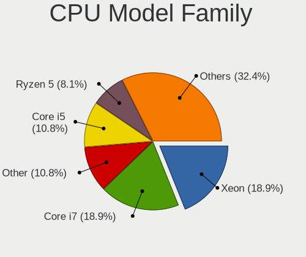

| Model                   | Computers | Percent |
|-------------------------|-----------|---------|
| Intel Core i7           | 7         | 26.92%  |
| Intel Xeon              | 4         | 15.38%  |
| Other                   | 3         | 11.54%  |
| AMD Ryzen 5             | 3         | 11.54%  |
| AMD Ryzen 5 PRO         | 2         | 7.69%   |
| Intel Xeon Gold         | 1         | 3.85%   |
| Intel Pentium Dual-Core | 1         | 3.85%   |
| Intel Core i5           | 1         | 3.85%   |
| Intel Celeron           | 1         | 3.85%   |
| AMD Ryzen 9             | 1         | 3.85%   |
| AMD Phenom II X6        | 1         | 3.85%   |
| AMD Opteron             | 1         | 3.85%   |

CPU Cores
---------

Number of processor cores

| Number | Computers | Percent |
|--------|-----------|---------|
| 4      | 8         | 30.77%  |
| 12     | 7         | 26.92%  |
| 6      | 4         | 15.38%  |
| 24     | 2         | 7.69%   |
| 2      | 2         | 7.69%   |
| 32     | 1         | 3.85%   |
| 18     | 1         | 3.85%   |
| 8      | 1         | 3.85%   |

CPU Sockets
-----------

Number of sockets

| Number | Computers | Percent |
|--------|-----------|---------|
| 1      | 22        | 84.62%  |
| 2      | 4         | 15.38%  |

CPU Threads
-----------

Threads per core (Hyper-Threading)

| Number | Computers | Percent |
|--------|-----------|---------|
| 2      | 15        | 57.69%  |
| 1      | 11        | 42.31%  |

CPU Microarch
-------------

Microarchitecture

| Name      | Computers | Percent |
|-----------|-----------|---------|
| KabyLake  | 4         | 15.38%  |
| Zen 2     | 3         | 11.54%  |
| Westmere  | 3         | 11.54%  |
| Unknown   | 3         | 11.54%  |
| Zen 3     | 2         | 7.69%   |
| K10       | 2         | 7.69%   |
| IvyBridge | 2         | 7.69%   |
| Broadwell | 2         | 7.69%   |
| Zen+      | 1         | 3.85%   |
| Skylake   | 1         | 3.85%   |
| Penryn    | 1         | 3.85%   |
| Nehalem   | 1         | 3.85%   |
| Goldmont  | 1         | 3.85%   |

Graphics
--------

GPU Vendor
----------

Vendors of graphics cards

| Vendor                     | Computers | Percent |
|----------------------------|-----------|---------|
| Intel                      | 9         | 34.62%  |
| AMD                        | 5         | 19.23%  |
| Nvidia                     | 4         | 15.38%  |
| Matrox Electronics Systems | 4         | 15.38%  |
| ASPEED Technology          | 4         | 15.38%  |

GPU Model
---------

Graphics card models

| Model                                                                | Computers | Percent |
|----------------------------------------------------------------------|-----------|---------|
| ASPEED Technology ASPEED Graphics Family                             | 4         | 15.38%  |
| Matrox Electronics Systems MGA G200e [Pilot] ServerEngines (SEP1)    | 3         | 11.54%  |
| Intel HD Graphics 630                                                | 3         | 11.54%  |
| Intel Alder Lake-S GT1 [UHD Graphics 730]                            | 2         | 7.69%   |
| AMD Renoir                                                           | 2         | 7.69%   |
| Nvidia GP108 [GeForce GT 1030]                                       | 1         | 3.85%   |
| Nvidia GK107GL [Quadro K600]                                         | 1         | 3.85%   |
| Nvidia GF119 [GeForce GT 610]                                        | 1         | 3.85%   |
| Nvidia G96C [GeForce 9500 GT]                                        | 1         | 3.85%   |
| Matrox Electronics Systems MGA G200eW WPCM450                        | 1         | 3.85%   |
| Intel UHD Graphics 620                                               | 1         | 3.85%   |
| Intel IvyBridge GT2 [HD Graphics 4000]                               | 1         | 3.85%   |
| Intel HD Graphics 500                                                | 1         | 3.85%   |
| Intel AlderLake-S GT1                                                | 1         | 3.85%   |
| AMD RS880 [Radeon HD 4250]                                           | 1         | 3.85%   |
| AMD Picasso/Raven 2 [Radeon Vega Series / Radeon Vega Mobile Series] | 1         | 3.85%   |
| AMD Madison [Mobility Radeon HD 5730 / 6570M]                        | 1         | 3.85%   |

GPU Combo
---------

Combinations of graphics cards

| Name       | Computers | Percent |
|------------|-----------|---------|
| 1 x Intel  | 9         | 34.62%  |
| 1 x AMD    | 5         | 19.23%  |
| 1 x Nvidia | 4         | 15.38%  |
| 1 x Matrox | 4         | 15.38%  |
| 1 x ASPEED | 4         | 15.38%  |

GPU Driver
----------

Free vs proprietary

| Driver | Computers | Percent |
|--------|-----------|---------|
| Free   | 26        | 100%    |

GPU Memory
----------

Total video memory

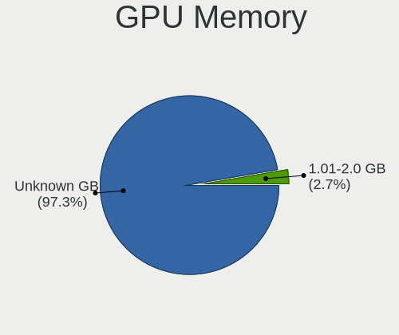

| Size in GB | Computers | Percent |
|------------|-----------|---------|
| Unknown    | 25        | 96.15%  |
| 1.01-2.0   | 1         | 3.85%   |

Monitor
-------

Monitor Vendor
--------------

Monitor vendors

| Vendor | Computers | Percent |
|--------|-----------|---------|
| Dell   | 1         | 100%    |

Monitor Model
-------------

Monitor models

| Model                             | Computers | Percent |
|-----------------------------------|-----------|---------|
| Dell LCD Monitor U2715H 2560x1440 | 1         | 100%    |

Monitor Resolution
------------------

Monitor screen resolution

| Resolution      | Computers | Percent |
|-----------------|-----------|---------|
| 2560x1440 (QHD) | 1         | 100%    |

Monitor Diagonal
----------------

Diagonal size in inches

| Inches  | Computers | Percent |
|---------|-----------|---------|
| Unknown | 1         | 100%    |

Monitor Width
-------------

Physical width

| Width in mm | Computers | Percent |
|-------------|-----------|---------|
| Unknown     | 1         | 100%    |

Aspect Ratio
------------

Proportional relationship between the width and the height

| Ratio   | Computers | Percent |
|---------|-----------|---------|
| Unknown | 1         | 100%    |

Monitor Area
------------

Area in inch²

| Area in inch² | Computers | Percent |
|----------------|-----------|---------|
| Unknown        | 1         | 100%    |

Pixel Density
-------------

Pixels per inch

| Density | Computers | Percent |
|---------|-----------|---------|
| Unknown | 1         | 100%    |

Multiple Monitors
-----------------

Total monitors connected

| Total | Computers | Percent |
|-------|-----------|---------|
| 0     | 25        | 96.15%  |
| 1     | 1         | 3.85%   |

Network
-------

Net Controller Vendor
---------------------

Controller vendors

| Vendor                   | Computers | Percent |
|--------------------------|-----------|---------|
| Intel                    | 19        | 57.58%  |
| Realtek Semiconductor    | 10        | 30.3%   |
| American Megatrends      | 2         | 6.06%   |
| Marvell Technology Group | 1         | 3.03%   |
| Broadcom                 | 1         | 3.03%   |

Net Controller Model
--------------------

Controller models

| Model                                                             | Computers | Percent |
|-------------------------------------------------------------------|-----------|---------|
| Realtek RTL8111/8168/8411 PCI Express Gigabit Ethernet Controller | 9         | 23.08%  |
| Intel Ethernet Connection (17) I219-V                             | 3         | 7.69%   |
| Intel I350 Gigabit Network Connection                             | 2         | 5.13%   |
| Intel I211 Gigabit Network Connection                             | 2         | 5.13%   |
| Intel Ethernet Controller X550                                    | 2         | 5.13%   |
| Intel Ethernet Connection (2) I219-LM                             | 2         | 5.13%   |
| Intel 82575EB Gigabit Network Connection                          | 2         | 5.13%   |
| American Megatrends Virtual Ethernet                              | 2         | 5.13%   |
| Realtek RTL8125 2.5GbE Controller                                 | 1         | 2.56%   |
| Marvell Group 88E8056 PCI-E Gigabit Ethernet Controller           | 1         | 2.56%   |
| Intel I210 Gigabit Network Connection                             | 1         | 2.56%   |
| Intel Ethernet Connection (3) I219-LM                             | 1         | 2.56%   |
| Intel Centrino Wireless-N 2230                                    | 1         | 2.56%   |
| Intel Centrino Advanced-N 6200                                    | 1         | 2.56%   |
| Intel 82599ES 10-Gigabit SFI/SFP+ Network Connection              | 1         | 2.56%   |
| Intel 82583V Gigabit Network Connection                           | 1         | 2.56%   |
| Intel 82579V Gigabit Network Connection                           | 1         | 2.56%   |
| Intel 82577LM Gigabit Network Connection                          | 1         | 2.56%   |
| Intel 82576 Gigabit Network Connection                            | 1         | 2.56%   |
| Intel 82574L Gigabit Network Connection                           | 1         | 2.56%   |
| Intel 82566DM-2 Gigabit Network Connection                        | 1         | 2.56%   |
| Intel 82541GI Gigabit Ethernet Controller                         | 1         | 2.56%   |
| Broadcom BCM43224 802.11a/b/g/n                                   | 1         | 2.56%   |

Wireless Vendor
---------------

Wireless vendors

| Vendor   | Computers | Percent |
|----------|-----------|---------|
| Intel    | 2         | 66.67%  |
| Broadcom | 1         | 33.33%  |

Wireless Model
--------------

Wireless models

| Model                           | Computers | Percent |
|---------------------------------|-----------|---------|
| Intel Centrino Wireless-N 2230  | 1         | 33.33%  |
| Intel Centrino Advanced-N 6200  | 1         | 33.33%  |
| Broadcom BCM43224 802.11a/b/g/n | 1         | 33.33%  |

Ethernet Vendor
---------------

Ethernet vendors

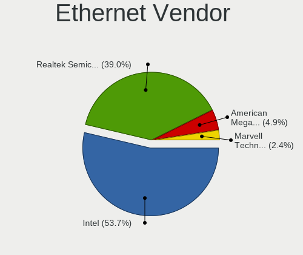

| Vendor                   | Computers | Percent |
|--------------------------|-----------|---------|
| Intel                    | 17        | 56.67%  |
| Realtek Semiconductor    | 10        | 33.33%  |
| American Megatrends      | 2         | 6.67%   |
| Marvell Technology Group | 1         | 3.33%   |

Ethernet Model
--------------

Ethernet models

| Model                                                             | Computers | Percent |
|-------------------------------------------------------------------|-----------|---------|
| Realtek RTL8111/8168/8411 PCI Express Gigabit Ethernet Controller | 9         | 25%     |
| Intel Ethernet Connection (17) I219-V                             | 3         | 8.33%   |
| Intel I350 Gigabit Network Connection                             | 2         | 5.56%   |
| Intel I211 Gigabit Network Connection                             | 2         | 5.56%   |
| Intel Ethernet Controller X550                                    | 2         | 5.56%   |
| Intel Ethernet Connection (2) I219-LM                             | 2         | 5.56%   |
| Intel 82575EB Gigabit Network Connection                          | 2         | 5.56%   |
| American Megatrends Virtual Ethernet                              | 2         | 5.56%   |
| Realtek RTL8125 2.5GbE Controller                                 | 1         | 2.78%   |
| Marvell Group 88E8056 PCI-E Gigabit Ethernet Controller           | 1         | 2.78%   |
| Intel I210 Gigabit Network Connection                             | 1         | 2.78%   |
| Intel Ethernet Connection (3) I219-LM                             | 1         | 2.78%   |
| Intel 82599ES 10-Gigabit SFI/SFP+ Network Connection              | 1         | 2.78%   |
| Intel 82583V Gigabit Network Connection                           | 1         | 2.78%   |
| Intel 82579V Gigabit Network Connection                           | 1         | 2.78%   |
| Intel 82577LM Gigabit Network Connection                          | 1         | 2.78%   |
| Intel 82576 Gigabit Network Connection                            | 1         | 2.78%   |
| Intel 82574L Gigabit Network Connection                           | 1         | 2.78%   |
| Intel 82566DM-2 Gigabit Network Connection                        | 1         | 2.78%   |
| Intel 82541GI Gigabit Ethernet Controller                         | 1         | 2.78%   |

Net Controller Kind
-------------------

Ethernet, WiFi or modem

| Kind     | Computers | Percent |
|----------|-----------|---------|
| Ethernet | 26        | 89.66%  |
| WiFi     | 3         | 10.34%  |

Used Controller
---------------

Currently used network controller

Zero info for selected period =(

NICs
----

Total network controllers on board

| Total | Computers | Percent |
|-------|-----------|---------|
| 0     | 26        | 100%    |

IPv6
----

IPv6 vs IPv4

| Used | Computers | Percent |
|------|-----------|---------|
| No   | 23        | 85.19%  |
| Yes  | 4         | 14.81%  |

Bluetooth
---------

Bluetooth Vendor
----------------

Controller vendors

| Vendor          | Computers | Percent |
|-----------------|-----------|---------|
| Intel           | 1         | 50%     |
| Hewlett-Packard | 1         | 50%     |

Bluetooth Model
---------------

Controller models

| Model                                         | Computers | Percent |
|-----------------------------------------------|-----------|---------|
| Intel Centrino Bluetooth Wireless Transceiver | 1         | 50%     |
| HP Broadcom 2070 Bluetooth Combo              | 1         | 50%     |

Sound
-----

Sound Vendor
------------

Sound card vendors

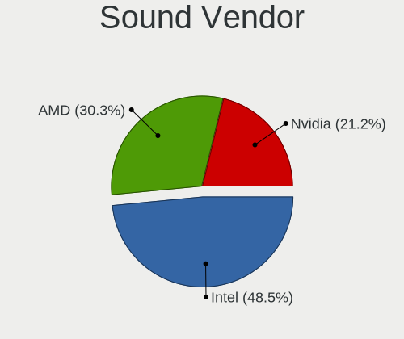

| Vendor | Computers | Percent |
|--------|-----------|---------|
| Intel  | 9         | 45%     |
| AMD    | 8         | 40%     |
| Nvidia | 3         | 15%     |

Sound Model
-----------

Sound card models

| Model                                                               | Computers | Percent |
|---------------------------------------------------------------------|-----------|---------|
| Intel Alder Lake-S HD Audio Controller                              | 3         | 12.5%   |
| AMD Starship/Matisse HD Audio Controller                            | 3         | 12.5%   |
| AMD Family 17h/19h HD Audio Controller                              | 3         | 12.5%   |
| AMD Renoir Radeon High Definition Audio Controller                  | 2         | 8.33%   |
| Nvidia GP108 High Definition Audio Controller                       | 1         | 4.17%   |
| Nvidia GK107 HDMI Audio Controller                                  | 1         | 4.17%   |
| Nvidia GF119 HDMI Audio Controller                                  | 1         | 4.17%   |
| Intel Sunrise Point-LP HD Audio                                     | 1         | 4.17%   |
| Intel Celeron N3350/Pentium N4200/Atom E3900 Series Audio Cluster   | 1         | 4.17%   |
| Intel 82801JI (ICH10 Family) HD Audio Controller                    | 1         | 4.17%   |
| Intel 8 Series/C220 Series Chipset High Definition Audio Controller | 1         | 4.17%   |
| Intel 7 Series/C216 Chipset Family High Definition Audio Controller | 1         | 4.17%   |
| Intel 100 Series/C230 Series Chipset Family HD Audio Controller     | 1         | 4.17%   |
| AMD SBx00 Azalia (Intel HDA)                                        | 1         | 4.17%   |
| AMD RS880 HDMI Audio [Radeon HD 4200 Series]                        | 1         | 4.17%   |
| AMD Redwood HDMI Audio [Radeon HD 5000 Series]                      | 1         | 4.17%   |
| AMD Raven/Raven2/Fenghuang HDMI/DP Audio Controller                 | 1         | 4.17%   |

Memory
------

Memory Vendor
-------------

Memory module vendors

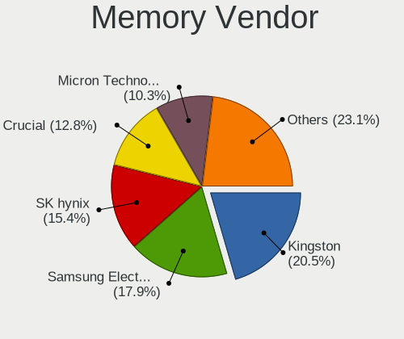

| Vendor                                  | Computers | Percent |
|-----------------------------------------|-----------|---------|
| Kingston                                | 7         | 28%     |
| Samsung Electronics                     | 5         | 20%     |
| Crucial                                 | 4         | 16%     |
| SK hynix                                | 2         | 8%      |
| Silicon Power Computer & Communications | 2         | 8%      |
| Micron Technology                       | 2         | 8%      |
| Unknown (ABCD)                          | 1         | 4%      |
| Patriot                                 | 1         | 4%      |
| Unknown                                 | 1         | 4%      |

Memory Model
------------

Memory module models

| Model                                                        | Computers | Percent |
|--------------------------------------------------------------|-----------|---------|
| Silicon Power & RAM Module 8GB DIMM DDR4 3200MT/s            | 2         | 6.45%   |
| Kingston RAM 9965745-026.A00G 16GB DIMM DDR4 3200MT/s        | 2         | 6.45%   |
| Crucial RAM CT16G4DFD824A.C16FHD 16GB DIMM DDR4 2400MT/s     | 2         | 6.45%   |
| Unknown (ABCD) RAM 123456789012345678 4GB DIMM DDR4 2400MT/s | 1         | 3.23%   |
| SK hynix RAM HMT351S6BFR8C-H9 4GB SODIMM DDR3 1333MT/s       | 1         | 3.23%   |
| SK hynix RAM HMA81GU6DJR8N-XN 8GB DIMM DDR4 2933MT/s         | 1         | 3.23%   |
| Samsung RAM Module 32GB DIMM DDR4 2133MT/s                   | 1         | 3.23%   |
| Samsung RAM Module 2GB DIMM DDR3 400MT/s                     | 1         | 3.23%   |
| Samsung RAM M393B2G70QH0-YK0 16GB DIMM 1866MT/s              | 1         | 3.23%   |
| Samsung RAM M393B2G70DB0-YK0 16GB DIMM 1333MT/s              | 1         | 3.23%   |
| Samsung RAM M393B2G70DB0-CMA 16GB DIMM 1866MT/s              | 1         | 3.23%   |
| Samsung RAM M393B2G70BH0-YK0 16GB DIMM 1600MT/s              | 1         | 3.23%   |
| Samsung RAM M393A4K40CB1-CRC 32GB DIMM DDR4 2400MT/s         | 1         | 3.23%   |
| Samsung RAM M393A4K40BB1-CRC 32GB DIMM DDR4 2400MT/s         | 1         | 3.23%   |
| Samsung RAM M393A2K40BB2-CTD 16GB DIMM DDR4 2667MT/s         | 1         | 3.23%   |
| Patriot RAM 1600 CL10 Series 8GB DIMM DDR3 1600MT/s          | 1         | 3.23%   |
| Micron RAM 36KSF2G72PZ-1G6N1 16GB DIMM 1600MT/s              | 1         | 3.23%   |
| Micron RAM 36KSF2G72PZ-1G6E1 16GB DIMM 1600MT/s              | 1         | 3.23%   |
| Micron RAM 36KDYS1G72PZ-1G4M1 8GB DIMM DDR3 1333MT/s         | 1         | 3.23%   |
| Kingston RAM Module 2GB DIMM DDR2 800MT/s                    | 1         | 3.23%   |
| Kingston RAM KHX3200C16D4/32GX 32GB DIMM DDR4 3200MT/s       | 1         | 3.23%   |
| Kingston RAM KHX2400C14S4/16G 16GB SODIMM DDR4 2400MT/s      | 1         | 3.23%   |
| Kingston RAM 9905782-018.A00G 32GB DIMM DDR5 4800MT/s        | 1         | 3.23%   |
| Kingston RAM 9905474-050.A00LF 4GB DIMM DDR3 1333MT/s        | 1         | 3.23%   |
| Crucial RAM CT32G4DFD832A.M16FF 32GB DIMM DDR4 3200MT/s      | 1         | 3.23%   |
| Crucial RAM CT32G4DFD832A.C16FF 32GB DIMM DDR4 3200MT/s      | 1         | 3.23%   |
| Crucial RAM CT32G4DFD8266.C16FB 32GB DIMM DDR4 2666MT/s      | 1         | 3.23%   |
| Unknown                                                      | 1         | 3.23%   |

Memory Kind
-----------

Memory module kinds

| Kind    | Computers | Percent |
|---------|-----------|---------|
| DDR4    | 14        | 56%     |
| DDR3    | 7         | 28%     |
| LPDDR4  | 1         | 4%      |
| DDR5    | 1         | 4%      |
| DDR2    | 1         | 4%      |
| Unknown | 1         | 4%      |

Memory Form Factor
------------------

Physical design of the memory module

| Name   | Computers | Percent |
|--------|-----------|---------|
| DIMM   | 23        | 92%     |
| SODIMM | 2         | 8%      |

Memory Size
-----------

Memory module size

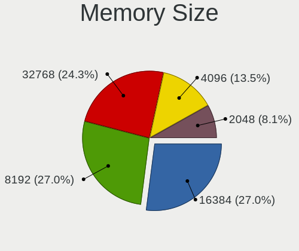

| Size  | Computers | Percent |
|-------|-----------|---------|
| 16384 | 9         | 36%     |
| 32768 | 6         | 24%     |
| 8192  | 5         | 20%     |
| 4096  | 3         | 12%     |
| 2048  | 2         | 8%      |

Memory Speed
------------

Memory module speed

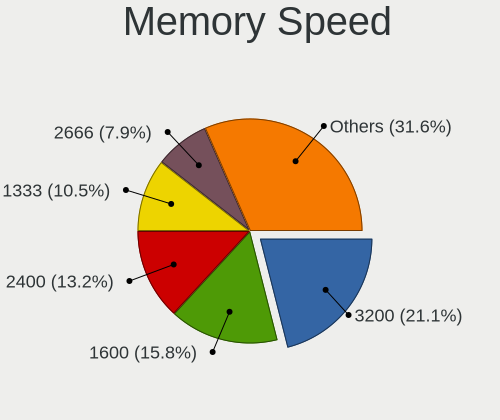

| Speed | Computers | Percent |
|-------|-----------|---------|
| 3200  | 6         | 22.22%  |
| 2400  | 5         | 18.52%  |
| 1333  | 4         | 14.81%  |
| 1600  | 3         | 11.11%  |
| 4800  | 1         | 3.7%    |
| 2933  | 1         | 3.7%    |
| 2667  | 1         | 3.7%    |
| 2666  | 1         | 3.7%    |
| 2133  | 1         | 3.7%    |
| 1866  | 1         | 3.7%    |
| 1066  | 1         | 3.7%    |
| 800   | 1         | 3.7%    |
| 400   | 1         | 3.7%    |

Printers & scanners
-------------------

Printer Vendor
--------------

Printer device vendors

Zero info for selected period =(

Printer Model
-------------

Printer device models

Zero info for selected period =(

Scanner Vendor
--------------

Scanner device vendors

Zero info for selected period =(

Scanner Model
-------------

Scanner device models

Zero info for selected period =(

Camera
------

Camera Vendor
-------------

Camera device vendors

Zero info for selected period =(

Camera Model
------------

Camera device models

Zero info for selected period =(

Security
--------

Fingerprint Vendor
------------------

Fingerprint sensor vendors

Zero info for selected period =(

Fingerprint Model
-----------------

Fingerprint sensor models

Zero info for selected period =(

Chipcard Vendor
---------------

Chipcard module vendors

Zero info for selected period =(

Chipcard Model
--------------

Chipcard module models

Zero info for selected period =(

Unsupported
-----------

Unsupported Devices
-------------------

Total unsupported devices on board

| Total | Computers | Percent |
|-------|-----------|---------|
| 0     | 14        | 53.85%  |
| 1     | 8         | 30.77%  |
| 2     | 4         | 15.38%  |

Unsupported Device Types
------------------------

Types of unsupported devices

| Type                     | Computers | Percent |
|--------------------------|-----------|---------|
| Communication controller | 12        | 85.71%  |
| Net/ethernet             | 1         | 7.14%   |
| Firewire controller      | 1         | 7.14%   |

