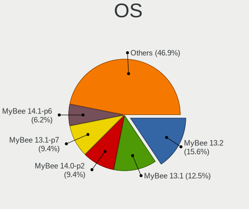
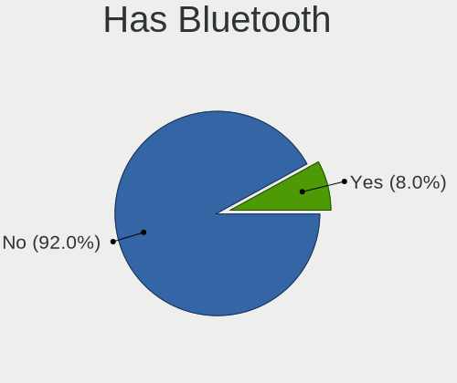
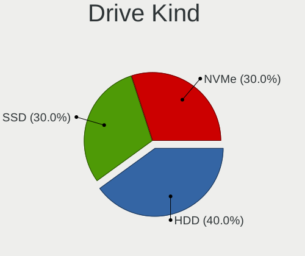
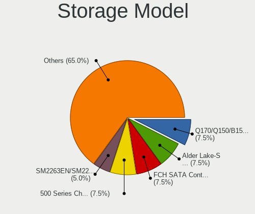
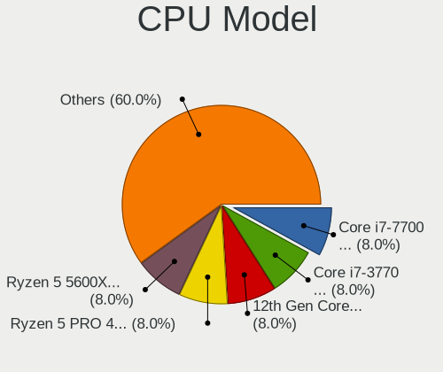
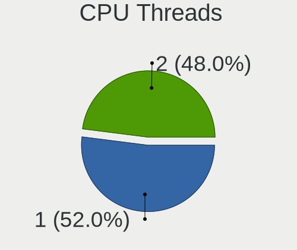
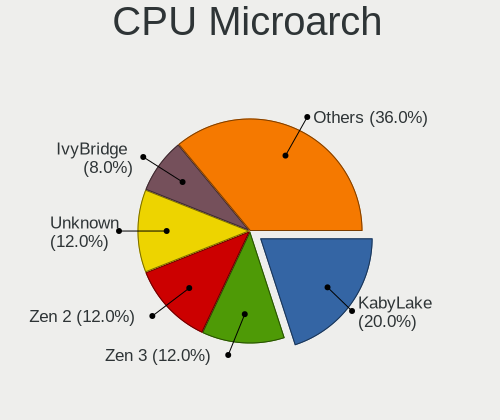
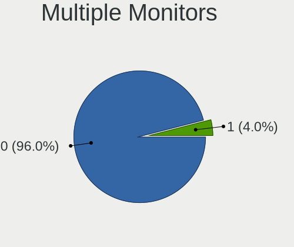
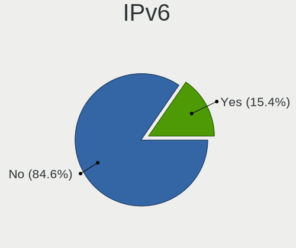
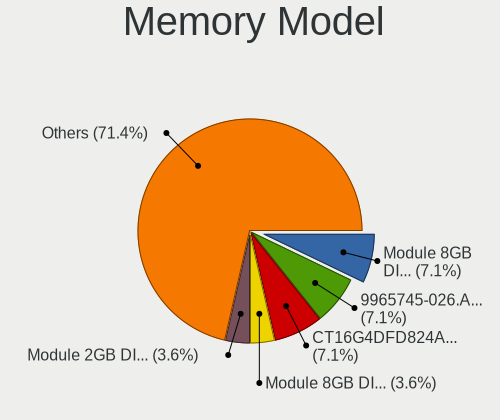

MyBee - Tested Hardware & Statistics (Desktops)
-----------------------------------------------

A project to collect tested hardware configurations for MyBee.

Anyone can contribute to this report by the [hw-probe](https://github.com/linuxhw/hw-probe/blob/master/INSTALL.BSD.md) tool:

    hw-probe -all -upload

Please contribute! Especially if your hardware is rare.

Contents
--------

* [ Test Cases ](#test-cases)

* [ System ](#system)
  - [ OS                       ](#os)
  - [ OS Family                ](#os-family)
  - [ Arch                     ](#arch)
  - [ DE                       ](#de)
  - [ Display Server           ](#display-server)
  - [ Display Manager          ](#display-manager)
  - [ OS Lang                  ](#os-lang)
  - [ Boot Mode                ](#boot-mode)
  - [ Filesystem               ](#filesystem)
  - [ Part. scheme             ](#part-scheme)

* [ Board ](#board)
  - [ Vendor                   ](#vendor)
  - [ Model                    ](#model)
  - [ Model Family             ](#model-family)
  - [ MFG Year                 ](#mfg-year)
  - [ Form Factor              ](#form-factor)
  - [ Coreboot                 ](#coreboot)
  - [ RAM Size                 ](#ram-size)
  - [ RAM Used                 ](#ram-used)
  - [ Total Drives             ](#total-drives)
  - [ Has CD-ROM               ](#has-cd-rom)
  - [ Has Ethernet             ](#has-ethernet)
  - [ Has WiFi                 ](#has-wifi)
  - [ Has Bluetooth            ](#has-bluetooth)

* [ Location ](#location)
  - [ Country                  ](#country)
  - [ City                     ](#city)

* [ Drives ](#drives)
  - [ Drive Vendor             ](#drive-vendor)
  - [ Drive Model              ](#drive-model)
  - [ HDD Vendor               ](#hdd-vendor)
  - [ SSD Vendor               ](#ssd-vendor)
  - [ Drive Kind               ](#drive-kind)
  - [ Drive Connector          ](#drive-connector)
  - [ Drive Size               ](#drive-size)
  - [ Space Total              ](#space-total)
  - [ Space Used               ](#space-used)
  - [ Malfunc. Drives          ](#malfunc-drives)
  - [ Malfunc. Drive Vendor    ](#malfunc-drive-vendor)
  - [ Malfunc. HDD Vendor      ](#malfunc-hdd-vendor)
  - [ Malfunc. Drive Kind      ](#malfunc-drive-kind)
  - [ Failed Drives            ](#failed-drives)
  - [ Failed Drive Vendor      ](#failed-drive-vendor)
  - [ Drive Status             ](#drive-status)

* [ Storage controller ](#storage-controller)
  - [ Storage Vendor           ](#storage-vendor)
  - [ Storage Model            ](#storage-model)
  - [ Storage Kind             ](#storage-kind)

* [ Processor ](#processor)
  - [ CPU Vendor               ](#cpu-vendor)
  - [ CPU Model                ](#cpu-model)
  - [ CPU Model Family         ](#cpu-model-family)
  - [ CPU Cores                ](#cpu-cores)
  - [ CPU Sockets              ](#cpu-sockets)
  - [ CPU Threads              ](#cpu-threads)
  - [ CPU Microarch            ](#cpu-microarch)

* [ Graphics ](#graphics)
  - [ GPU Vendor               ](#gpu-vendor)
  - [ GPU Model                ](#gpu-model)
  - [ GPU Combo                ](#gpu-combo)
  - [ GPU Driver               ](#gpu-driver)
  - [ GPU Memory               ](#gpu-memory)

* [ Monitor ](#monitor)
  - [ Monitor Vendor           ](#monitor-vendor)
  - [ Monitor Model            ](#monitor-model)
  - [ Monitor Resolution       ](#monitor-resolution)
  - [ Monitor Diagonal         ](#monitor-diagonal)
  - [ Monitor Width            ](#monitor-width)
  - [ Aspect Ratio             ](#aspect-ratio)
  - [ Monitor Area             ](#monitor-area)
  - [ Pixel Density            ](#pixel-density)
  - [ Multiple Monitors        ](#multiple-monitors)

* [ Network ](#network)
  - [ Net Controller Vendor    ](#net-controller-vendor)
  - [ Net Controller Model     ](#net-controller-model)
  - [ Wireless Vendor          ](#wireless-vendor)
  - [ Wireless Model           ](#wireless-model)
  - [ Ethernet Vendor          ](#ethernet-vendor)
  - [ Ethernet Model           ](#ethernet-model)
  - [ Net Controller Kind      ](#net-controller-kind)
  - [ Used Controller          ](#used-controller)
  - [ NICs                     ](#nics)
  - [ IPv6                     ](#ipv6)

* [ Bluetooth ](#bluetooth)
  - [ Bluetooth Vendor         ](#bluetooth-vendor)
  - [ Bluetooth Model          ](#bluetooth-model)

* [ Sound ](#sound)
  - [ Sound Vendor             ](#sound-vendor)
  - [ Sound Model              ](#sound-model)

* [ Memory ](#memory)
  - [ Memory Vendor            ](#memory-vendor)
  - [ Memory Model             ](#memory-model)
  - [ Memory Kind              ](#memory-kind)
  - [ Memory Form Factor       ](#memory-form-factor)
  - [ Memory Size              ](#memory-size)
  - [ Memory Speed             ](#memory-speed)

* [ Printers & scanners ](#printers--scanners)
  - [ Printer Vendor           ](#printer-vendor)
  - [ Printer Model            ](#printer-model)
  - [ Scanner Vendor           ](#scanner-vendor)
  - [ Scanner Model            ](#scanner-model)

* [ Camera ](#camera)
  - [ Camera Vendor            ](#camera-vendor)
  - [ Camera Model             ](#camera-model)

* [ Security ](#security)
  - [ Fingerprint Vendor       ](#fingerprint-vendor)
  - [ Fingerprint Model        ](#fingerprint-model)
  - [ Chipcard Vendor          ](#chipcard-vendor)
  - [ Chipcard Model           ](#chipcard-model)

* [ Unsupported ](#unsupported)
  - [ Unsupported Devices      ](#unsupported-devices)
  - [ Unsupported Device Types ](#unsupported-device-types)

Test Cases
----------

Total: 29

| Vendor        | Model                    | Probe                                                     | Date         |
|---------------|--------------------------|-----------------------------------------------------------|--------------|
| MSI           | PRO H610M-B DDR4         | [c6ff092502](https://bsd-hardware.info/?probe=c6ff092502) | Nov 26, 2023 |
| ASRockRack    | X470D4U2-2T              | [c07dd3b911](https://bsd-hardware.info/?probe=c07dd3b911) | Oct 09, 2023 |
| ASRock        | Z690 Phantom Gaming 4/D5 | [6eab8daef7](https://bsd-hardware.info/?probe=6eab8daef7) | Sep 21, 2023 |
| ASRockRack    | X470D4U2-2T              | [5a0b8eb786](https://bsd-hardware.info/?probe=5a0b8eb786) | Sep 21, 2023 |
| ASUSTek       | P6X58D PREMIUM           | [946e123320](https://bsd-hardware.info/?probe=946e123320) | Aug 13, 2023 |
| ASRockRack    | X570D4U-2L2T             | [4cada5d71b](https://bsd-hardware.info/?probe=4cada5d71b) | Jun 02, 2023 |
| ASRockRack    | X470D4U2-2T              | [e782ceaea8](https://bsd-hardware.info/?probe=e782ceaea8) | May 19, 2023 |
| Gigabyte      | H77N-WIFI                | [cf2014c973](https://bsd-hardware.info/?probe=cf2014c973) | May 04, 2023 |
| Gigabyte      | Z170-HD3 DDR3-CF         | [882a817f46](https://bsd-hardware.info/?probe=882a817f46) | Apr 13, 2023 |
| MSI           | PRO H610M-B DDR4         | [ee01b690bc](https://bsd-hardware.info/?probe=ee01b690bc) | Mar 25, 2023 |
| MSI           | PRO H610M-B DDR4         | [b08fd92e36](https://bsd-hardware.info/?probe=b08fd92e36) | Mar 10, 2023 |
| ASUSTek       | P8Z77-V PREMIUM          | [a2873d7c87](https://bsd-hardware.info/?probe=a2873d7c87) | Mar 09, 2023 |
| Huanan        | X99-QD4 V1.0             | [8404060d9e](https://bsd-hardware.info/?probe=8404060d9e) | Mar 02, 2023 |
| Unknown       | Unknown                  | [95c62844de](https://bsd-hardware.info/?probe=95c62844de) | Feb 25, 2023 |
| MSI           | PRO H610M-B DDR4         | [1deece00b3](https://bsd-hardware.info/?probe=1deece00b3) | Jan 05, 2023 |
| ASUSTek       | PRIME B550-PLUS          | [4c3b92bb42](https://bsd-hardware.info/?probe=4c3b92bb42) | Dec 24, 2022 |
| ASUSTek       | PRIME B550-PLUS          | [3e5e7e3e61](https://bsd-hardware.info/?probe=3e5e7e3e61) | Dec 22, 2022 |
| Gigabyte      | A320M-H-CF               | [2549c7cadf](https://bsd-hardware.info/?probe=2549c7cadf) | Aug 27, 2022 |
| ASUSTek       | PRIME B550-PLUS          | [7d4eaaf087](https://bsd-hardware.info/?probe=7d4eaaf087) | Aug 22, 2022 |
| ASUSTek       | PRIME B550-PLUS          | [063addc66e](https://bsd-hardware.info/?probe=063addc66e) | Aug 22, 2022 |
| Fujitsu       | D3401-H2 S26361-D3401-H2 | [e3461d0ff8](https://bsd-hardware.info/?probe=e3461d0ff8) | Jul 17, 2022 |
| Acer          | RS880M05                 | [7bcc14ceba](https://bsd-hardware.info/?probe=7bcc14ceba) | Jul 16, 2022 |
| Fujitsu       | D3401-H2 S26361-D3401-H2 | [75132f9078](https://bsd-hardware.info/?probe=75132f9078) | Jul 13, 2022 |
| Fujitsu       | D3401-H2 S26361-D3401-H2 | [7cdaeb28fa](https://bsd-hardware.info/?probe=7cdaeb28fa) | Jun 16, 2022 |
| ASRock        | X570 Phantom Gaming 4    | [067dbf3357](https://bsd-hardware.info/?probe=067dbf3357) | Jun 15, 2022 |
| IceWhale T... | ZimaBoard 832 ZMB        | [b98e41f6a4](https://bsd-hardware.info/?probe=b98e41f6a4) | Jun 05, 2022 |
| ASRockRack    | E3C242D4U2-2T            | [66f9070856](https://bsd-hardware.info/?probe=66f9070856) | May 23, 2022 |
| Fujitsu       | D3401-H2 S26361-D3401-H2 | [ea6146e013](https://bsd-hardware.info/?probe=ea6146e013) | May 19, 2022 |
| Fujitsu       | D3401-H2 S26361-D3401-H2 | [6974f0958e](https://bsd-hardware.info/?probe=6974f0958e) | May 15, 2022 |

System
------

OS
--

Installed operating systems

| Name               | Desktops | Percent |
|--------------------|----------|---------|
| MyBee 13.2         | 4        | 17.39%  |
| MyBee 13.1         | 4        | 17.39%  |
| MyBee 13.1-p7      | 3        | 13.04%  |
| MyBee 14.0-CURRENT | 2        | 8.7%    |
| MyBee 13.1-p1      | 2        | 8.7%    |
| MyBee 14.0-BETA3   | 1        | 4.35%   |
| MyBee 14.0-BETA2   | 1        | 4.35%   |
| MyBee 14.0         | 1        | 4.35%   |
| MyBee 13.2-RC5     | 1        | 4.35%   |
| MyBee 13.2-RC4     | 1        | 4.35%   |
| MyBee 13.2-RC2     | 1        | 4.35%   |
| MyBee 13.1-p5      | 1        | 4.35%   |
| MyBee 13.1-p3      | 1        | 4.35%   |

OS Family
---------

OS without a version

| Name  | Desktops | Percent |
|-------|----------|---------|
| MyBee | 19       | 100%    |

Arch
----

OS architecture (x86_64, i586, etc.)

| Name  | Desktops | Percent |
|-------|----------|---------|
| amd64 | 19       | 100%    |

DE
--

Desktop Environment

| Name    | Desktops | Percent |
|---------|----------|---------|
| Console | 18       | 94.74%  |
| KDE5    | 1        | 5.26%   |

Display Server
--------------

X11 or Wayland

| Name    | Desktops | Percent |
|---------|----------|---------|
| Console | 18       | 94.74%  |
| X11     | 1        | 5.26%   |

Display Manager
---------------

SDDM, LightDM, etc.

| Name    | Desktops | Percent |
|---------|----------|---------|
| Console | 19       | 100%    |

OS Lang
-------

Language

| Lang  | Desktops | Percent |
|-------|----------|---------|
| en_US | 18       | 94.74%  |
| C     | 1        | 5.26%   |

Boot Mode
---------

EFI or BIOS

| Mode | Desktops | Percent |
|------|----------|---------|
| BIOS | 19       | 100%    |

Filesystem
----------

Type of filesystem

| Type | Desktops | Percent |
|------|----------|---------|
| Zfs  | 19       | 100%    |

Part. scheme
------------

Scheme of partitioning

| Type | Desktops | Percent |
|------|----------|---------|
| GPT  | 19       | 100%    |

Board
-----

Vendor
------

Motherboard manufacturer

| Name                | Desktops | Percent |
|---------------------|----------|---------|
| ASUSTek Computer    | 4        | 21.05%  |
| Gigabyte Technology | 3        | 15.79%  |
| MSI                 | 2        | 10.53%  |
| Fujitsu             | 2        | 10.53%  |
| ASRockRack          | 2        | 10.53%  |
| ASRock              | 2        | 10.53%  |
| IceWhale Technology | 1        | 5.26%   |
| Huanan              | 1        | 5.26%   |
| Acer                | 1        | 5.26%   |
| Unknown             | 1        | 5.26%   |

Model
-----

Motherboard model

| Name                             | Desktops | Percent |
|----------------------------------|----------|---------|
| MSI MS-7D46                      | 2        | 10.53%  |
| Fujitsu D3401-H2 S26361-D3401-H2 | 2        | 10.53%  |
| ASUS PRIME B550-PLUS             | 2        | 10.53%  |
| IceWhale ZimaBoard 832 ZMB       | 1        | 5.26%   |
| Huanan X99-QD4 V1.0              | 1        | 5.26%   |
| Gigabyte Z170-HD3 DDR3           | 1        | 5.26%   |
| Gigabyte H77N-WIFI               | 1        | 5.26%   |
| Gigabyte A320M-H                 | 1        | 5.26%   |
| ASUS P8Z77-V PREMIUM             | 1        | 5.26%   |
| ASUS P6X58D PREMIUM              | 1        | 5.26%   |
| ASRockRack X570D4U-2L2T          | 1        | 5.26%   |
| ASRockRack X470D4U2-2T           | 1        | 5.26%   |
| ASRock Z690 Phantom Gaming 4/D5  | 1        | 5.26%   |
| ASRock X570 Phantom Gaming 4     | 1        | 5.26%   |
| Acer Veriton M430                | 1        | 5.26%   |
| Unknown                          | 1        | 5.26%   |

Model Family
------------

Motherboard model prefix

| Name                    | Desktops | Percent |
|-------------------------|----------|---------|
| MSI MS-7D46             | 2        | 10.53%  |
| Fujitsu D3401-H2        | 2        | 10.53%  |
| ASUS PRIME              | 2        | 10.53%  |
| IceWhale ZimaBoard      | 1        | 5.26%   |
| Huanan X99-QD4          | 1        | 5.26%   |
| Gigabyte Z170-HD3       | 1        | 5.26%   |
| Gigabyte H77N-WIFI      | 1        | 5.26%   |
| Gigabyte A320M-H        | 1        | 5.26%   |
| ASUS P8Z77-V            | 1        | 5.26%   |
| ASUS P6X58D             | 1        | 5.26%   |
| ASRockRack X570D4U-2L2T | 1        | 5.26%   |
| ASRockRack X470D4U2-2T  | 1        | 5.26%   |
| ASRock Z690             | 1        | 5.26%   |
| ASRock X570             | 1        | 5.26%   |
| Acer Veriton            | 1        | 5.26%   |
| Unknown                 | 1        | 5.26%   |

MFG Year
--------

Motherboard manufacture year

| Year | Desktops | Percent |
|------|----------|---------|
| 2022 | 5        | 26.32%  |
| 2020 | 3        | 15.79%  |
| 2018 | 3        | 15.79%  |
| 2017 | 2        | 10.53%  |
| 2021 | 1        | 5.26%   |
| 2019 | 1        | 5.26%   |
| 2013 | 1        | 5.26%   |
| 2012 | 1        | 5.26%   |
| 2011 | 1        | 5.26%   |
| 2010 | 1        | 5.26%   |

Form Factor
-----------

Physical design of the computer

| Name    | Desktops | Percent |
|---------|----------|---------|
| Desktop | 19       | 100%    |

Coreboot
--------

Have coreboot on board

| Used | Desktops | Percent |
|------|----------|---------|
| No   | 19       | 100%    |

RAM Size
--------

Total RAM memory

| Size in GB  | Desktops | Percent |
|-------------|----------|---------|
| 64.01-256.0 | 8        | 42.11%  |
| 8.01-16.0   | 6        | 31.58%  |
| 32.01-64.0  | 2        | 10.53%  |
| 4.01-8.0    | 1        | 5.26%   |
| 24.01-32.0  | 1        | 5.26%   |
| 16.01-24.0  | 1        | 5.26%   |

RAM Used
--------

Used RAM memory

| Used GB    | Desktops | Percent |
|------------|----------|---------|
| 0.51-1.0   | 8        | 42.11%  |
| 2.01-3.0   | 4        | 21.05%  |
| 1.01-2.0   | 3        | 15.79%  |
| 4.01-8.0   | 2        | 10.53%  |
| 16.01-24.0 | 2        | 10.53%  |

Total Drives
------------

Number of drives on board

| Drives | Desktops | Percent |
|--------|----------|---------|
| 1      | 8        | 38.1%   |
| 2      | 6        | 28.57%  |
| 5      | 2        | 9.52%   |
| 3      | 2        | 9.52%   |
| 6      | 1        | 4.76%   |
| 4      | 1        | 4.76%   |
| 0      | 1        | 4.76%   |

Has CD-ROM
----------

Has CD-ROM on board

| Presented | Desktops | Percent |
|-----------|----------|---------|
| No        | 17       | 89.47%  |
| Yes       | 2        | 10.53%  |

Has Ethernet
------------

Has Ethernet on board

| Presented | Desktops | Percent |
|-----------|----------|---------|
| Yes       | 19       | 100%    |

Has WiFi
--------

Has WiFi module

| Presented | Desktops | Percent |
|-----------|----------|---------|
| No        | 17       | 89.47%  |
| Yes       | 2        | 10.53%  |

Has Bluetooth
-------------

Has Bluetooth module

| Presented | Desktops | Percent |
|-----------|----------|---------|
| No        | 18       | 94.74%  |
| Yes       | 1        | 5.26%   |

Location
--------

Country
-------

Geographic location (country)

| Country | Desktops | Percent |
|---------|----------|---------|
| Russia  | 14       | 73.68%  |
| Germany | 2        | 10.53%  |
| USA     | 1        | 5.26%   |
| Finland | 1        | 5.26%   |
| Canada  | 1        | 5.26%   |

City
----

Geographic location (city)

| City                | Desktops | Percent |
|---------------------|----------|---------|
| St Petersburg       | 9        | 47.37%  |
| Moscow              | 2        | 10.53%  |
| Vladivostok         | 1        | 5.26%   |
| Remscheid           | 1        | 5.26%   |
| Naberezhnyye Chelny | 1        | 5.26%   |
| Montreal            | 1        | 5.26%   |
| Irkutsk             | 1        | 5.26%   |
| Helsinki            | 1        | 5.26%   |
| Falkenstein         | 1        | 5.26%   |
| Clearwater          | 1        | 5.26%   |

Drives
------

Drive Vendor
------------

Hard drive vendors

| Vendor              | Desktops | Drives | Percent |
|---------------------|----------|--------|---------|
| Toshiba             | 5        | 17     | 20%     |
| Seagate             | 4        | 11     | 16%     |
| Samsung Electronics | 4        | 6      | 16%     |
| WDC                 | 2        | 2      | 8%      |
| Kingston            | 2        | 2      | 8%      |
| KingSpec            | 2        | 2      | 8%      |
| Silicon Motion      | 1        | 2      | 4%      |
| Phison              | 1        | 1      | 4%      |
| Micron Technology   | 1        | 2      | 4%      |
| Intel               | 1        | 1      | 4%      |
| GOODRAM             | 1        | 1      | 4%      |
| A-DATA Technology   | 1        | 2      | 4%      |

Drive Model
-----------

Hard drive models

| Model                            | Desktops | Percent |
|----------------------------------|----------|---------|
| Toshiba MG07ACA12TE 12TB         | 2        | 8%      |
| Seagate ST1000DM010-2EP102 1TB   | 2        | 8%      |
| Samsung SSD 980 1TB              | 2        | 8%      |
| WDC WDS120G2G0A-00JH30 120GB     | 1        | 4%      |
| WDC WD30EJRX-89AKWY0 3TB         | 1        | 4%      |
| Toshiba MG06ACA800E 8TB          | 1        | 4%      |
| Toshiba KXG50ZNV512G 512GB       | 1        | 4%      |
| Toshiba DT01ACA100 1TB           | 1        | 4%      |
| Silicon Motion PCIe SSD 256GB    | 1        | 4%      |
| Seagate ST500DM002-1SB10A 500GB  | 1        | 4%      |
| Seagate ST2000DM008-2UB102 2TB   | 1        | 4%      |
| Samsung SSD 970 EVO Plus 1TB     | 1        | 4%      |
| Samsung SSD 870 EVO 1TB          | 1        | 4%      |
| Phison PCIe SSD 250GB            | 1        | 4%      |
| Micron 1100_MTFDDAK512TBN 512GB  | 1        | 4%      |
| Kingston SA400S37480G 480GB      | 1        | 4%      |
| Kingston SA400S37120G 120GB      | 1        | 4%      |
| KingSpec P3-256 256GB            | 1        | 4%      |
| KingSpec MT-1TB                  | 1        | 4%      |
| Intel SSDPEKNW010T8 1TB          | 1        | 4%      |
| GOODRAM SSDPR-PX500-256-80 256GB | 1        | 4%      |
| A-DATA SX8200PNP 1TB             | 1        | 4%      |

HDD Vendor
----------

Hard disk drive vendors

| Vendor  | Desktops | Drives | Percent |
|---------|----------|--------|---------|
| Toshiba | 4        | 15     | 44.44%  |
| Seagate | 4        | 11     | 44.44%  |
| WDC     | 1        | 1      | 11.11%  |

SSD Vendor
----------

Solid state drive vendors

| Vendor              | Desktops | Drives | Percent |
|---------------------|----------|--------|---------|
| Kingston            | 2        | 2      | 28.57%  |
| KingSpec            | 2        | 2      | 28.57%  |
| WDC                 | 1        | 1      | 14.29%  |
| Samsung Electronics | 1        | 2      | 14.29%  |
| Micron Technology   | 1        | 2      | 14.29%  |

Drive Kind
----------

HDD or SSD

| Kind | Desktops | Drives | Percent |
|------|----------|--------|---------|
| NVMe | 9        | 13     | 37.5%   |
| HDD  | 8        | 27     | 33.33%  |
| SSD  | 7        | 9      | 29.17%  |

Drive Connector
---------------

SATA, SAS, NVMe, etc.

| Type | Desktops | Drives | Percent |
|------|----------|--------|---------|
| SATA | 14       | 36     | 60.87%  |
| NVMe | 9        | 13     | 39.13%  |

Drive Size
----------

Size of hard drive

| Size in TB | Desktops | Drives | Percent |
|------------|----------|--------|---------|
| 0.51-1.0   | 5        | 13     | 31.25%  |
| 0.01-0.5   | 5        | 5      | 31.25%  |
| 10.01-20.0 | 2        | 10     | 12.5%   |
| 1.01-2.0   | 2        | 3      | 12.5%   |
| 2.01-3.0   | 1        | 1      | 6.25%   |
| 4.01-10.0  | 1        | 4      | 6.25%   |

Space Total
-----------

Amount of disk space available on the file system

| Size in GB     | Desktops | Percent |
|----------------|----------|---------|
| 501-1000       | 6        | 30%     |
| More than 3000 | 4        | 20%     |
| 101-250        | 4        | 20%     |
| 251-500        | 3        | 15%     |
| 1001-2000      | 2        | 10%     |
| 2001-3000      | 1        | 5%      |

Space Used
----------

Amount of used disk space

| Used GB        | Desktops | Percent |
|----------------|----------|---------|
| 1-20           | 17       | 89.47%  |
| More than 3000 | 2        | 10.53%  |

Malfunc. Drives
---------------

Drive models with a malfunction

| Model                                      | Desktops | Drives | Percent |
|--------------------------------------------|----------|--------|---------|
| Samsung Electronics SSD 870 EVO 1TB        | 1        | 2      | 50%     |
| Micron Technology 1100_MTFDDAK512TBN 512GB | 1        | 2      | 50%     |

Malfunc. Drive Vendor
---------------------

Vendors of faulty drives

| Vendor              | Desktops | Drives | Percent |
|---------------------|----------|--------|---------|
| Samsung Electronics | 1        | 2      | 50%     |
| Micron Technology   | 1        | 2      | 50%     |

Malfunc. HDD Vendor
-------------------

Vendors of faulty HDD drives

Zero info for selected period =(

Malfunc. Drive Kind
-------------------

Kinds of faulty drives

| Kind | Desktops | Drives | Percent |
|------|----------|--------|---------|
| SSD  | 2        | 4      | 100%    |

Failed Drives
-------------

Failed drive models

Zero info for selected period =(

Failed Drive Vendor
-------------------

Failed drive vendors

Zero info for selected period =(

Drive Status
------------

Number of failed and malfunc. drives

| Status  | Desktops | Drives | Percent |
|---------|----------|--------|---------|
| Works   | 18       | 45     | 90%     |
| Malfunc | 2        | 4      | 10%     |

Storage controller
------------------

Storage Vendor
--------------

Storage controller vendors

| Vendor                   | Desktops | Percent |
|--------------------------|----------|---------|
| Intel                    | 11       | 39.29%  |
| AMD                      | 7        | 25%     |
| Samsung Electronics      | 3        | 10.71%  |
| Silicon Motion           | 2        | 7.14%   |
| Toshiba                  | 1        | 3.57%   |
| Phison Electronics       | 1        | 3.57%   |
| Marvell Technology Group | 1        | 3.57%   |
| ASMedia Technology       | 1        | 3.57%   |
| ADATA Technology         | 1        | 3.57%   |

Storage Model
-------------

Storage controller models

| Model                                                                         | Desktops | Percent |
|-------------------------------------------------------------------------------|----------|---------|
| Intel Q170/Q150/B150/H170/H110/Z170/CM236 Chipset SATA Controller [AHCI Mode] | 3        | 9.68%   |
| Intel Alder Lake-S PCH SATA Controller [AHCI Mode]                            | 3        | 9.68%   |
| AMD FCH SATA Controller [AHCI mode]                                           | 3        | 9.68%   |
| Silicon Motion SM2263EN/SM2263XT (DRAM-less) NVMe SSD Controllers             | 2        | 6.45%   |
| Samsung NVMe SSD Controller 980 (DRAM-less)                                   | 2        | 6.45%   |
| Intel 7 Series/C210 Series Chipset Family 6-port SATA Controller [AHCI mode]  | 2        | 6.45%   |
| AMD 500 Series Chipset SATA Controller                                        | 2        | 6.45%   |
| Toshiba XG5 NVMe SSD Controller                                               | 1        | 3.23%   |
| Samsung NVMe SSD Controller SM981/PM981/PM983                                 | 1        | 3.23%   |
| Phison PS5013-E13 PCIe3 NVMe Controller (DRAM-less)                           | 1        | 3.23%   |
| Marvell Group 88SE9230 PCIe 2.0 x2 4-port SATA 6 Gb/s RAID Controller         | 1        | 3.23%   |
| Intel Sunrise Point-LP SATA Controller [AHCI mode]                            | 1        | 3.23%   |
| Intel SSD 660P Series                                                         | 1        | 3.23%   |
| Intel Celeron N3350/Pentium N4200/Atom E3900 Series SATA AHCI Controller      | 1        | 3.23%   |
| Intel 82801JI (ICH10 Family) SATA AHCI Controller                             | 1        | 3.23%   |
| ASMedia ASM1062 Serial ATA Controller                                         | 1        | 3.23%   |
| AMD SB7x0/SB8x0/SB9x0 SATA Controller [IDE mode]                              | 1        | 3.23%   |
| AMD SB7x0/SB8x0/SB9x0 IDE Controller                                          | 1        | 3.23%   |
| AMD FCH SATA Controller D                                                     | 1        | 3.23%   |
| AMD 400 Series Chipset SATA Controller                                        | 1        | 3.23%   |
| ADATA XPG SX8200 Pro PCIe Gen3x4 M.2 2280 Solid State Drive                   | 1        | 3.23%   |

Storage Kind
------------

Kind of storage controller (IDE, SATA, NVMe, SAS, ...)

| Kind | Desktops | Percent |
|------|----------|---------|
| SATA | 17       | 62.96%  |
| NVMe | 9        | 33.33%  |
| IDE  | 1        | 3.7%    |

Processor
---------

CPU Vendor
----------

Processor vendors

| Vendor | Desktops | Percent |
|--------|----------|---------|
| Intel  | 12       | 63.16%  |
| AMD    | 7        | 36.84%  |

CPU Model
---------

Processor models

| Model                                       | Desktops | Percent |
|---------------------------------------------|----------|---------|
| Intel Core i7-7700 CPU @ 3.60GHz            | 2        | 10.53%  |
| Intel Core i7-3770 CPU @ 3.40GHz            | 2        | 10.53%  |
| Intel 12th Gen Core i5-12400                | 2        | 10.53%  |
| AMD Ryzen 5 PRO 4650G with Radeon Graphics  | 2        | 10.53%  |
| AMD Ryzen 5 5600X 6-Core Processor          | 2        | 10.53%  |
| Intel Xeon CPU E5-2686 v4 @ 2.30GHz         | 1        | 5.26%   |
| Intel Core i7-8550U CPU @ 1.80GHz           | 1        | 5.26%   |
| Intel Core i7 CPU 960 @ 3.20GHz             | 1        | 5.26%   |
| Intel Core i5-7400 CPU @ 3.00GHz            | 1        | 5.26%   |
| Intel Celeron CPU N3450 @ 1.10GHz           | 1        | 5.26%   |
| Intel 12th Gen Core i9-12900K               | 1        | 5.26%   |
| AMD Ryzen 9 3900X 12-Core Processor         | 1        | 5.26%   |
| AMD Ryzen 5 3400G with Radeon Vega Graphics | 1        | 5.26%   |
| AMD Phenom II X6 1045T Processor            | 1        | 5.26%   |

CPU Model Family
----------------

Processor model prefix

| Model            | Desktops | Percent |
|------------------|----------|---------|
| Intel Core i7    | 6        | 31.58%  |
| Other            | 3        | 15.79%  |
| AMD Ryzen 5      | 3        | 15.79%  |
| AMD Ryzen 5 PRO  | 2        | 10.53%  |
| Intel Xeon       | 1        | 5.26%   |
| Intel Core i5    | 1        | 5.26%   |
| Intel Celeron    | 1        | 5.26%   |
| AMD Ryzen 9      | 1        | 5.26%   |
| AMD Phenom II X6 | 1        | 5.26%   |

CPU Cores
---------

Number of processor cores

| Number | Desktops | Percent |
|--------|----------|---------|
| 4      | 8        | 42.11%  |
| 12     | 5        | 26.32%  |
| 6      | 3        | 15.79%  |
| 24     | 1        | 5.26%   |
| 18     | 1        | 5.26%   |
| 8      | 1        | 5.26%   |

CPU Sockets
-----------

Number of sockets

| Number | Desktops | Percent |
|--------|----------|---------|
| 1      | 19       | 100%    |

CPU Threads
-----------

Threads per core (Hyper-Threading)

| Number | Desktops | Percent |
|--------|----------|---------|
| 2      | 10       | 52.63%  |
| 1      | 9        | 47.37%  |

CPU Microarch
-------------

Microarchitecture

| Name      | Desktops | Percent |
|-----------|----------|---------|
| KabyLake  | 4        | 21.05%  |
| Zen 2     | 3        | 15.79%  |
| Unknown   | 3        | 15.79%  |
| Zen 3     | 2        | 10.53%  |
| IvyBridge | 2        | 10.53%  |
| Zen+      | 1        | 5.26%   |
| Nehalem   | 1        | 5.26%   |
| K10       | 1        | 5.26%   |
| Goldmont  | 1        | 5.26%   |
| Broadwell | 1        | 5.26%   |

Graphics
--------

GPU Vendor
----------

Vendors of graphics cards

| Vendor            | Desktops | Percent |
|-------------------|----------|---------|
| Intel             | 9        | 47.37%  |
| Nvidia            | 4        | 21.05%  |
| AMD               | 4        | 21.05%  |
| ASPEED Technology | 2        | 10.53%  |

GPU Model
---------

Graphics card models

| Model                                                                | Desktops | Percent |
|----------------------------------------------------------------------|----------|---------|
| Intel HD Graphics 630                                                | 3        | 15.79%  |
| Intel Alder Lake-S GT1 [UHD Graphics 730]                            | 2        | 10.53%  |
| ASPEED Technology ASPEED Graphics Family                             | 2        | 10.53%  |
| AMD Renoir [Radeon RX Vega 6 (Ryzen 4000/5000 Mobile Series)]        | 2        | 10.53%  |
| Nvidia GP108 [GeForce GT 1030]                                       | 1        | 5.26%   |
| Nvidia GK107GL [Quadro K600]                                         | 1        | 5.26%   |
| Nvidia GF119 [GeForce GT 610]                                        | 1        | 5.26%   |
| Nvidia G96C [GeForce 9500 GT]                                        | 1        | 5.26%   |
| Intel UHD Graphics 620                                               | 1        | 5.26%   |
| Intel IvyBridge GT2 [HD Graphics 4000]                               | 1        | 5.26%   |
| Intel HD Graphics 500                                                | 1        | 5.26%   |
| Intel AlderLake-S GT1                                                | 1        | 5.26%   |
| AMD RS880 [Radeon HD 4250]                                           | 1        | 5.26%   |
| AMD Picasso/Raven 2 [Radeon Vega Series / Radeon Vega Mobile Series] | 1        | 5.26%   |

GPU Combo
---------

Combinations of graphics cards

| Name       | Desktops | Percent |
|------------|----------|---------|
| 1 x Intel  | 9        | 47.37%  |
| 1 x Nvidia | 4        | 21.05%  |
| 1 x AMD    | 4        | 21.05%  |
| 1 x ASPEED | 2        | 10.53%  |

GPU Driver
----------

Free vs proprietary

| Driver | Desktops | Percent |
|--------|----------|---------|
| Free   | 19       | 100%    |

GPU Memory
----------

Total video memory

| Size in GB | Desktops | Percent |
|------------|----------|---------|
| Unknown    | 18       | 94.74%  |
| 1.01-2.0   | 1        | 5.26%   |

Monitor
-------

Monitor Vendor
--------------

Monitor vendors

| Vendor | Desktops | Percent |
|--------|----------|---------|
| Dell   | 1        | 100%    |

Monitor Model
-------------

Monitor models

| Model                             | Desktops | Percent |
|-----------------------------------|----------|---------|
| Dell LCD Monitor U2715H 2560x1440 | 1        | 100%    |

Monitor Resolution
------------------

Monitor screen resolution

| Resolution      | Desktops | Percent |
|-----------------|----------|---------|
| 2560x1440 (QHD) | 1        | 100%    |

Monitor Diagonal
----------------

Diagonal size in inches

| Inches  | Desktops | Percent |
|---------|----------|---------|
| Unknown | 1        | 100%    |

Monitor Width
-------------

Physical width

| Width in mm | Desktops | Percent |
|-------------|----------|---------|
| Unknown     | 1        | 100%    |

Aspect Ratio
------------

Proportional relationship between the width and the height

| Ratio   | Desktops | Percent |
|---------|----------|---------|
| Unknown | 1        | 100%    |

Monitor Area
------------

Area in inch²

| Area in inch² | Desktops | Percent |
|----------------|----------|---------|
| Unknown        | 1        | 100%    |

Pixel Density
-------------

Pixels per inch

| Density | Desktops | Percent |
|---------|----------|---------|
| Unknown | 1        | 100%    |

Multiple Monitors
-----------------

Total monitors connected

| Total | Desktops | Percent |
|-------|----------|---------|
| 0     | 18       | 94.74%  |
| 1     | 1        | 5.26%   |

Network
-------

Net Controller Vendor
---------------------

Controller vendors

| Vendor                   | Desktops | Percent |
|--------------------------|----------|---------|
| Intel                    | 12       | 48%     |
| Realtek Semiconductor    | 10       | 40%     |
| American Megatrends      | 2        | 8%      |
| Marvell Technology Group | 1        | 4%      |

Net Controller Model
--------------------

Controller models

| Model                                                             | Desktops | Percent |
|-------------------------------------------------------------------|----------|---------|
| Realtek RTL8111/8168/8411 PCI Express Gigabit Ethernet Controller | 9        | 31.03%  |
| Intel Ethernet Connection (17) I219-V                             | 3        | 10.34%  |
| Intel Ethernet Controller X550                                    | 2        | 6.9%    |
| Intel Ethernet Connection (2) I219-LM                             | 2        | 6.9%    |
| American Megatrends Virtual Ethernet                              | 2        | 6.9%    |
| Realtek RTL8125 2.5GbE Controller                                 | 1        | 3.45%   |
| Marvell Group 88E8056 PCI-E Gigabit Ethernet Controller           | 1        | 3.45%   |
| Intel I350 Gigabit Network Connection                             | 1        | 3.45%   |
| Intel I211 Gigabit Network Connection                             | 1        | 3.45%   |
| Intel I210 Gigabit Network Connection                             | 1        | 3.45%   |
| Intel Centrino Wireless-N 2230                                    | 1        | 3.45%   |
| Intel Centrino Advanced-N 6200                                    | 1        | 3.45%   |
| Intel 82599ES 10-Gigabit SFI/SFP+ Network Connection              | 1        | 3.45%   |
| Intel 82583V Gigabit Network Connection                           | 1        | 3.45%   |
| Intel 82579V Gigabit Network Connection                           | 1        | 3.45%   |
| Intel 82574L Gigabit Network Connection                           | 1        | 3.45%   |

Wireless Vendor
---------------

Wireless vendors

| Vendor | Desktops | Percent |
|--------|----------|---------|
| Intel  | 2        | 100%    |

Wireless Model
--------------

Wireless models

| Model                          | Desktops | Percent |
|--------------------------------|----------|---------|
| Intel Centrino Wireless-N 2230 | 1        | 50%     |
| Intel Centrino Advanced-N 6200 | 1        | 50%     |

Ethernet Vendor
---------------

Ethernet vendors

| Vendor                   | Desktops | Percent |
|--------------------------|----------|---------|
| Realtek Semiconductor    | 10       | 43.48%  |
| Intel                    | 10       | 43.48%  |
| American Megatrends      | 2        | 8.7%    |
| Marvell Technology Group | 1        | 4.35%   |

Ethernet Model
--------------

Ethernet models

| Model                                                             | Desktops | Percent |
|-------------------------------------------------------------------|----------|---------|
| Realtek RTL8111/8168/8411 PCI Express Gigabit Ethernet Controller | 9        | 33.33%  |
| Intel Ethernet Connection (17) I219-V                             | 3        | 11.11%  |
| Intel Ethernet Controller X550                                    | 2        | 7.41%   |
| Intel Ethernet Connection (2) I219-LM                             | 2        | 7.41%   |
| American Megatrends Virtual Ethernet                              | 2        | 7.41%   |
| Realtek RTL8125 2.5GbE Controller                                 | 1        | 3.7%    |
| Marvell Group 88E8056 PCI-E Gigabit Ethernet Controller           | 1        | 3.7%    |
| Intel I350 Gigabit Network Connection                             | 1        | 3.7%    |
| Intel I211 Gigabit Network Connection                             | 1        | 3.7%    |
| Intel I210 Gigabit Network Connection                             | 1        | 3.7%    |
| Intel 82599ES 10-Gigabit SFI/SFP+ Network Connection              | 1        | 3.7%    |
| Intel 82583V Gigabit Network Connection                           | 1        | 3.7%    |
| Intel 82579V Gigabit Network Connection                           | 1        | 3.7%    |
| Intel 82574L Gigabit Network Connection                           | 1        | 3.7%    |

Net Controller Kind
-------------------

Ethernet, WiFi or modem

| Kind     | Desktops | Percent |
|----------|----------|---------|
| Ethernet | 19       | 90.48%  |
| WiFi     | 2        | 9.52%   |

Used Controller
---------------

Currently used network controller

Zero info for selected period =(

NICs
----

Total network controllers on board

| Total | Desktops | Percent |
|-------|----------|---------|
| 0     | 19       | 100%    |

IPv6
----

IPv6 vs IPv4

| Used | Desktops | Percent |
|------|----------|---------|
| No   | 16       | 80%     |
| Yes  | 4        | 20%     |

Bluetooth
---------

Bluetooth Vendor
----------------

Controller vendors

| Vendor | Desktops | Percent |
|--------|----------|---------|
| Intel  | 1        | 100%    |

Bluetooth Model
---------------

Controller models

| Model                                         | Desktops | Percent |
|-----------------------------------------------|----------|---------|
| Intel Centrino Bluetooth Wireless Transceiver | 1        | 100%    |

Sound
-----

Sound Vendor
------------

Sound card vendors

| Vendor | Desktops | Percent |
|--------|----------|---------|
| Intel  | 9        | 47.37%  |
| AMD    | 7        | 36.84%  |
| Nvidia | 3        | 15.79%  |

Sound Model
-----------

Sound card models

| Model                                                               | Desktops | Percent |
|---------------------------------------------------------------------|----------|---------|
| Intel Alder Lake-S HD Audio Controller                              | 3        | 13.04%  |
| AMD Starship/Matisse HD Audio Controller                            | 3        | 13.04%  |
| AMD Family 17h/19h HD Audio Controller                              | 3        | 13.04%  |
| AMD Renoir Radeon High Definition Audio Controller                  | 2        | 8.7%    |
| Nvidia GP108 High Definition Audio Controller                       | 1        | 4.35%   |
| Nvidia GK107 HDMI Audio Controller                                  | 1        | 4.35%   |
| Nvidia GF119 HDMI Audio Controller                                  | 1        | 4.35%   |
| Intel Sunrise Point-LP HD Audio                                     | 1        | 4.35%   |
| Intel Celeron N3350/Pentium N4200/Atom E3900 Series Audio Cluster   | 1        | 4.35%   |
| Intel 82801JI (ICH10 Family) HD Audio Controller                    | 1        | 4.35%   |
| Intel 8 Series/C220 Series Chipset High Definition Audio Controller | 1        | 4.35%   |
| Intel 7 Series/C216 Chipset Family High Definition Audio Controller | 1        | 4.35%   |
| Intel 100 Series/C230 Series Chipset Family HD Audio Controller     | 1        | 4.35%   |
| AMD SBx00 Azalia (Intel HDA)                                        | 1        | 4.35%   |
| AMD RS880 HDMI Audio [Radeon HD 4200 Series]                        | 1        | 4.35%   |
| AMD Raven/Raven2/Fenghuang HDMI/DP Audio Controller                 | 1        | 4.35%   |

Memory
------

Memory Vendor
-------------

Memory module vendors

| Vendor                                  | Desktops | Percent |
|-----------------------------------------|----------|---------|
| Kingston                                | 6        | 33.33%  |
| Crucial                                 | 4        | 22.22%  |
| Silicon Power Computer & Communications | 2        | 11.11%  |
| Samsung Electronics                     | 2        | 11.11%  |
| Unknown (ABCD)                          | 1        | 5.56%   |
| SK hynix                                | 1        | 5.56%   |
| Patriot                                 | 1        | 5.56%   |
| Unknown                                 | 1        | 5.56%   |

Memory Model
------------

Memory module models

| Model                                                             | Desktops | Percent |
|-------------------------------------------------------------------|----------|---------|
| Silicon Power & RAM Module 8GB DIMM DDR4 3200MT/s                 | 2        | 10%     |
| Kingston RAM 9965745-026.A00G 16GB DIMM DDR4 3200MT/s             | 2        | 10%     |
| Crucial RAM CT16G4DFD824A.C16FHD 16GB DIMM DDR4 2400MT/s          | 2        | 10%     |
| Unknown (ABCD) RAM 123456789012345678 1536MB DIMM LPDDR3 2400MT/s | 1        | 5%      |
| SK hynix RAM HMA81GU6DJR8N-XN 8GB DIMM DDR4 2933MT/s              | 1        | 5%      |
| Samsung RAM Module 2GB DIMM DDR3 400MT/s                          | 1        | 5%      |
| Samsung RAM M393A4K40CB1-CRC 32GB DIMM DDR4 2400MT/s              | 1        | 5%      |
| Samsung RAM M393A4K40BB1-CRC 32GB DIMM DDR4 2400MT/s              | 1        | 5%      |
| Patriot RAM 1600 CL10 Series 8GB DIMM DDR3 1600MT/s               | 1        | 5%      |
| Kingston RAM KHX3200C16D4/32GX 32GB DIMM DDR4 3200MT/s            | 1        | 5%      |
| Kingston RAM KHX2400C14S4/16G 16GB SODIMM DDR4 2400MT/s           | 1        | 5%      |
| Kingston RAM 9905782-018.A00G 32GB DIMM DDR5 4800MT/s             | 1        | 5%      |
| Kingston RAM 9905474-050.A00LF 4GB DIMM DDR3 1333MT/s             | 1        | 5%      |
| Crucial RAM CT32G4DFD832A.M16FF 32GB DIMM DDR4 3200MT/s           | 1        | 5%      |
| Crucial RAM CT32G4DFD832A.C16FF 32GB DIMM DDR4 3200MT/s           | 1        | 5%      |
| Crucial RAM CT32G4DFD8266.C16FB 32GB DIMM DDR4 2666MT/s           | 1        | 5%      |
| Unknown                                                           | 1        | 5%      |

Memory Kind
-----------

Memory module kinds

| Kind    | Desktops | Percent |
|---------|----------|---------|
| DDR4    | 12       | 66.67%  |
| DDR3    | 3        | 16.67%  |
| LPDDR4  | 1        | 5.56%   |
| DDR5    | 1        | 5.56%   |
| Unknown | 1        | 5.56%   |

Memory Form Factor
------------------

Physical design of the memory module

| Name   | Desktops | Percent |
|--------|----------|---------|
| DIMM   | 17       | 94.44%  |
| SODIMM | 1        | 5.56%   |

Memory Size
-----------

Memory module size

| Size  | Desktops | Percent |
|-------|----------|---------|
| 16384 | 6        | 33.33%  |
| 32768 | 5        | 27.78%  |
| 8192  | 4        | 22.22%  |
| 4096  | 2        | 11.11%  |
| 2048  | 1        | 5.56%   |

Memory Speed
------------

Memory module speed

| Speed | Desktops | Percent |
|-------|----------|---------|
| 3200  | 6        | 33.33%  |
| 2400  | 5        | 27.78%  |
| 4800  | 1        | 5.56%   |
| 2933  | 1        | 5.56%   |
| 2666  | 1        | 5.56%   |
| 1600  | 1        | 5.56%   |
| 1333  | 1        | 5.56%   |
| 1066  | 1        | 5.56%   |
| 400   | 1        | 5.56%   |

Printers & scanners
-------------------

Printer Vendor
--------------

Printer device vendors

Zero info for selected period =(

Printer Model
-------------

Printer device models

Zero info for selected period =(

Scanner Vendor
--------------

Scanner device vendors

Zero info for selected period =(

Scanner Model
-------------

Scanner device models

Zero info for selected period =(

Camera
------

Camera Vendor
-------------

Camera device vendors

Zero info for selected period =(

Camera Model
------------

Camera device models

Zero info for selected period =(

Security
--------

Fingerprint Vendor
------------------

Fingerprint sensor vendors

Zero info for selected period =(

Fingerprint Model
-----------------

Fingerprint sensor models

Zero info for selected period =(

Chipcard Vendor
---------------

Chipcard module vendors

Zero info for selected period =(

Chipcard Model
--------------

Chipcard module models

Zero info for selected period =(

Unsupported
-----------

Unsupported Devices
-------------------

Total unsupported devices on board

| Total | Desktops | Percent |
|-------|----------|---------|
| 0     | 10       | 52.63%  |
| 1     | 8        | 42.11%  |
| 2     | 1        | 5.26%   |

Unsupported Device Types
------------------------

Types of unsupported devices

| Type                     | Desktops | Percent |
|--------------------------|----------|---------|
| Communication controller | 9        | 90%     |
| Net/ethernet             | 1        | 10%     |

