MyBee - Tested Hardware & Statistics (Notebooks)
------------------------------------------------

A project to collect tested hardware configurations for MyBee.

Anyone can contribute to this report by the [hw-probe](https://github.com/linuxhw/hw-probe/blob/master/INSTALL.BSD.md) tool:

    hw-probe -all -upload

Please contribute! Especially if your hardware is rare.

Contents
--------

* [ Test Cases ](#test-cases)

* [ System ](#system)
  - [ OS                       ](#os)
  - [ OS Family                ](#os-family)
  - [ Arch                     ](#arch)
  - [ DE                       ](#de)
  - [ Display Server           ](#display-server)
  - [ Display Manager          ](#display-manager)
  - [ OS Lang                  ](#os-lang)
  - [ Boot Mode                ](#boot-mode)
  - [ Filesystem               ](#filesystem)
  - [ Part. scheme             ](#part-scheme)

* [ Board ](#board)
  - [ Vendor                   ](#vendor)
  - [ Model                    ](#model)
  - [ Model Family             ](#model-family)
  - [ MFG Year                 ](#mfg-year)
  - [ Form Factor              ](#form-factor)
  - [ Coreboot                 ](#coreboot)
  - [ RAM Size                 ](#ram-size)
  - [ RAM Used                 ](#ram-used)
  - [ Total Drives             ](#total-drives)
  - [ Has CD-ROM               ](#has-cd-rom)
  - [ Has Ethernet             ](#has-ethernet)
  - [ Has WiFi                 ](#has-wifi)
  - [ Has Bluetooth            ](#has-bluetooth)

* [ Location ](#location)
  - [ Country                  ](#country)
  - [ City                     ](#city)

* [ Drives ](#drives)
  - [ Drive Vendor             ](#drive-vendor)
  - [ Drive Model              ](#drive-model)
  - [ HDD Vendor               ](#hdd-vendor)
  - [ SSD Vendor               ](#ssd-vendor)
  - [ Drive Kind               ](#drive-kind)
  - [ Drive Connector          ](#drive-connector)
  - [ Drive Size               ](#drive-size)
  - [ Space Total              ](#space-total)
  - [ Space Used               ](#space-used)
  - [ Malfunc. Drives          ](#malfunc-drives)
  - [ Malfunc. Drive Vendor    ](#malfunc-drive-vendor)
  - [ Malfunc. HDD Vendor      ](#malfunc-hdd-vendor)
  - [ Malfunc. Drive Kind      ](#malfunc-drive-kind)
  - [ Failed Drives            ](#failed-drives)
  - [ Failed Drive Vendor      ](#failed-drive-vendor)
  - [ Drive Status             ](#drive-status)

* [ Storage controller ](#storage-controller)
  - [ Storage Vendor           ](#storage-vendor)
  - [ Storage Model            ](#storage-model)
  - [ Storage Kind             ](#storage-kind)

* [ Processor ](#processor)
  - [ CPU Vendor               ](#cpu-vendor)
  - [ CPU Model                ](#cpu-model)
  - [ CPU Model Family         ](#cpu-model-family)
  - [ CPU Cores                ](#cpu-cores)
  - [ CPU Sockets              ](#cpu-sockets)
  - [ CPU Threads              ](#cpu-threads)
  - [ CPU Microarch            ](#cpu-microarch)

* [ Graphics ](#graphics)
  - [ GPU Vendor               ](#gpu-vendor)
  - [ GPU Model                ](#gpu-model)
  - [ GPU Combo                ](#gpu-combo)
  - [ GPU Driver               ](#gpu-driver)
  - [ GPU Memory               ](#gpu-memory)

* [ Monitor ](#monitor)
  - [ Monitor Vendor           ](#monitor-vendor)
  - [ Monitor Model            ](#monitor-model)
  - [ Monitor Resolution       ](#monitor-resolution)
  - [ Monitor Diagonal         ](#monitor-diagonal)
  - [ Monitor Width            ](#monitor-width)
  - [ Aspect Ratio             ](#aspect-ratio)
  - [ Monitor Area             ](#monitor-area)
  - [ Pixel Density            ](#pixel-density)
  - [ Multiple Monitors        ](#multiple-monitors)

* [ Network ](#network)
  - [ Net Controller Vendor    ](#net-controller-vendor)
  - [ Net Controller Model     ](#net-controller-model)
  - [ Wireless Vendor          ](#wireless-vendor)
  - [ Wireless Model           ](#wireless-model)
  - [ Ethernet Vendor          ](#ethernet-vendor)
  - [ Ethernet Model           ](#ethernet-model)
  - [ Net Controller Kind      ](#net-controller-kind)
  - [ Used Controller          ](#used-controller)
  - [ NICs                     ](#nics)
  - [ IPv6                     ](#ipv6)

* [ Bluetooth ](#bluetooth)
  - [ Bluetooth Vendor         ](#bluetooth-vendor)
  - [ Bluetooth Model          ](#bluetooth-model)

* [ Sound ](#sound)
  - [ Sound Vendor             ](#sound-vendor)
  - [ Sound Model              ](#sound-model)

* [ Memory ](#memory)
  - [ Memory Vendor            ](#memory-vendor)
  - [ Memory Model             ](#memory-model)
  - [ Memory Kind              ](#memory-kind)
  - [ Memory Form Factor       ](#memory-form-factor)
  - [ Memory Size              ](#memory-size)
  - [ Memory Speed             ](#memory-speed)

* [ Printers & scanners ](#printers--scanners)
  - [ Printer Vendor           ](#printer-vendor)
  - [ Printer Model            ](#printer-model)
  - [ Scanner Vendor           ](#scanner-vendor)
  - [ Scanner Model            ](#scanner-model)

* [ Camera ](#camera)
  - [ Camera Vendor            ](#camera-vendor)
  - [ Camera Model             ](#camera-model)

* [ Security ](#security)
  - [ Fingerprint Vendor       ](#fingerprint-vendor)
  - [ Fingerprint Model        ](#fingerprint-model)
  - [ Chipcard Vendor          ](#chipcard-vendor)
  - [ Chipcard Model           ](#chipcard-model)

* [ Unsupported ](#unsupported)
  - [ Unsupported Devices      ](#unsupported-devices)
  - [ Unsupported Device Types ](#unsupported-device-types)

Test Cases
----------

Total: 2

| Vendor | Model           | Probe                                                     | Date         |
|--------|-----------------|-----------------------------------------------------------|--------------|
| Lenovo | V15 G3 IAP 82TT | [202a277c32](https://bsd-hardware.info/?probe=202a277c32) | Mar 29, 2024 |
| HP     | EliteBook 8540w | [0063369c40](https://bsd-hardware.info/?probe=0063369c40) | Jul 30, 2022 |

System
------

OS
--

Installed operating systems

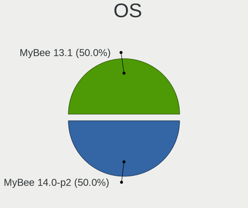

| Name          | Notebooks | Percent |
|---------------|-----------|---------|
| MyBee 14.0-p2 | 1         | 50%     |
| MyBee 13.1    | 1         | 50%     |

OS Family
---------

OS without a version

| Name  | Notebooks | Percent |
|-------|-----------|---------|
| MyBee | 2         | 100%    |

Arch
----

OS architecture (x86_64, i586, etc.)

| Name  | Notebooks | Percent |
|-------|-----------|---------|
| amd64 | 2         | 100%    |

DE
--

Desktop Environment

| Name    | Notebooks | Percent |
|---------|-----------|---------|
| Console | 2         | 100%    |

Display Server
--------------

X11 or Wayland

| Name    | Notebooks | Percent |
|---------|-----------|---------|
| Console | 2         | 100%    |

Display Manager
---------------

SDDM, LightDM, etc.

| Name    | Notebooks | Percent |
|---------|-----------|---------|
| Console | 2         | 100%    |

OS Lang
-------

Language

| Lang  | Notebooks | Percent |
|-------|-----------|---------|
| en_US | 2         | 100%    |

Boot Mode
---------

EFI or BIOS

| Mode | Notebooks | Percent |
|------|-----------|---------|
| BIOS | 2         | 100%    |

Filesystem
----------

Type of filesystem

| Type | Notebooks | Percent |
|------|-----------|---------|
| Zfs  | 2         | 100%    |

Part. scheme
------------

Scheme of partitioning

| Type | Notebooks | Percent |
|------|-----------|---------|
| GPT  | 2         | 100%    |

Board
-----

Vendor
------

Motherboard manufacturer

| Name            | Notebooks | Percent |
|-----------------|-----------|---------|
| Lenovo          | 1         | 50%     |
| Hewlett-Packard | 1         | 50%     |

Model
-----

Motherboard model

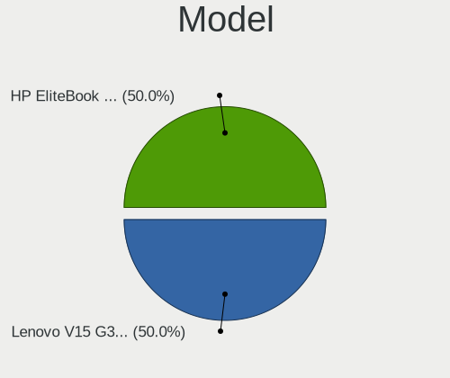

| Name                   | Notebooks | Percent |
|------------------------|-----------|---------|
| Lenovo V15 G3 IAP 82TT | 1         | 50%     |
| HP EliteBook 8540w     | 1         | 50%     |

Model Family
------------

Motherboard model prefix

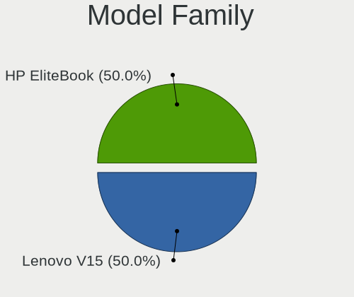

| Name         | Notebooks | Percent |
|--------------|-----------|---------|
| Lenovo V15   | 1         | 50%     |
| HP EliteBook | 1         | 50%     |

MFG Year
--------

Motherboard manufacture year

| Year | Notebooks | Percent |
|------|-----------|---------|
| 2023 | 1         | 50%     |
| 2013 | 1         | 50%     |

Form Factor
-----------

Physical design of the computer

| Name     | Notebooks | Percent |
|----------|-----------|---------|
| Notebook | 2         | 100%    |

Coreboot
--------

Have coreboot on board

| Used | Notebooks | Percent |
|------|-----------|---------|
| No   | 2         | 100%    |

RAM Size
--------

Total RAM memory

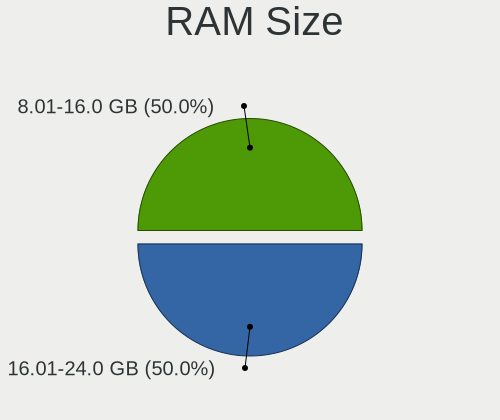

| Size in GB | Notebooks | Percent |
|------------|-----------|---------|
| 16.01-24.0 | 1         | 50%     |
| 8.01-16.0  | 1         | 50%     |

RAM Used
--------

Used RAM memory

| Used GB  | Notebooks | Percent |
|----------|-----------|---------|
| 1.01-2.0 | 1         | 50%     |
| 0.51-1.0 | 1         | 50%     |

Total Drives
------------

Number of drives on board

| Drives | Notebooks | Percent |
|--------|-----------|---------|
| 2      | 1         | 50%     |
| 0      | 1         | 50%     |

Has CD-ROM
----------

Has CD-ROM on board

| Presented | Notebooks | Percent |
|-----------|-----------|---------|
| No        | 2         | 100%    |

Has Ethernet
------------

Has Ethernet on board

| Presented | Notebooks | Percent |
|-----------|-----------|---------|
| Yes       | 2         | 100%    |

Has WiFi
--------

Has WiFi module

| Presented | Notebooks | Percent |
|-----------|-----------|---------|
| Yes       | 2         | 100%    |

Has Bluetooth
-------------

Has Bluetooth module

| Presented | Notebooks | Percent |
|-----------|-----------|---------|
| Yes       | 2         | 100%    |

Location
--------

Country
-------

Geographic location (country)

| Country  | Notebooks | Percent |
|----------|-----------|---------|
| Iceland  | 1         | 50%     |
| Bulgaria | 1         | 50%     |

City
----

Geographic location (city)

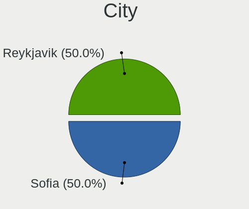

| City      | Notebooks | Percent |
|-----------|-----------|---------|
| Sofia     | 1         | 50%     |
| Reykjavik | 1         | 50%     |

Drives
------

Drive Vendor
------------

Hard drive vendors

| Vendor   | Notebooks | Drives | Percent |
|----------|-----------|--------|---------|
| Kingston | 1         | 2      | 100%    |

Drive Model
-----------

Hard drive models

| Model                  | Notebooks | Percent |
|------------------------|-----------|---------|
| Kingston SNV425S2128GB | 1         | 100%    |

HDD Vendor
----------

Hard disk drive vendors

Zero info for selected period =(

SSD Vendor
----------

Solid state drive vendors

| Vendor   | Notebooks | Drives | Percent |
|----------|-----------|--------|---------|
| Kingston | 1         | 2      | 100%    |

Drive Kind
----------

HDD or SSD

| Kind | Notebooks | Drives | Percent |
|------|-----------|--------|---------|
| SSD  | 1         | 2      | 100%    |

Drive Connector
---------------

SATA, SAS, NVMe, etc.

| Type | Notebooks | Drives | Percent |
|------|-----------|--------|---------|
| SATA | 1         | 2      | 100%    |

Drive Size
----------

Size of hard drive

| Size in TB | Notebooks | Drives | Percent |
|------------|-----------|--------|---------|
| 0.01-0.5   | 1         | 2      | 100%    |

Space Total
-----------

Amount of disk space available on the file system

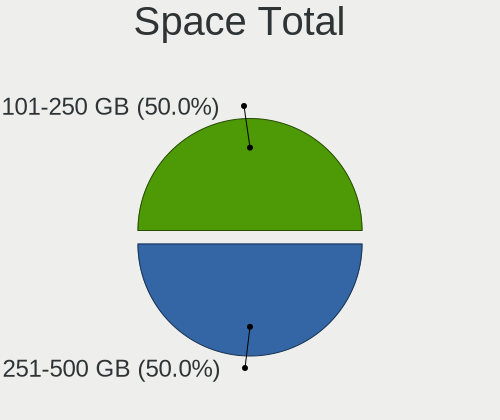

| Size in GB | Notebooks | Percent |
|------------|-----------|---------|
| 251-500    | 1         | 50%     |
| 101-250    | 1         | 50%     |

Space Used
----------

Amount of used disk space

| Used GB | Notebooks | Percent |
|---------|-----------|---------|
| 1-20    | 2         | 100%    |

Malfunc. Drives
---------------

Drive models with a malfunction

Zero info for selected period =(

Malfunc. Drive Vendor
---------------------

Vendors of faulty drives

Zero info for selected period =(

Malfunc. HDD Vendor
-------------------

Vendors of faulty HDD drives

Zero info for selected period =(

Malfunc. Drive Kind
-------------------

Kinds of faulty drives

Zero info for selected period =(

Failed Drives
-------------

Failed drive models

Zero info for selected period =(

Failed Drive Vendor
-------------------

Failed drive vendors

Zero info for selected period =(

Drive Status
------------

Number of failed and malfunc. drives

| Status | Notebooks | Drives | Percent |
|--------|-----------|--------|---------|
| Works  | 1         | 2      | 100%    |

Storage controller
------------------

Storage Vendor
--------------

Storage controller vendors

| Vendor            | Notebooks | Percent |
|-------------------|-----------|---------|
| Intel             | 2         | 66.67%  |
| Micron Technology | 1         | 33.33%  |

Storage Model
-------------

Storage controller models

| Model                                                          | Notebooks | Percent |
|----------------------------------------------------------------|-----------|---------|
| Micron 2450 NVMe SSD [HendrixV] (DRAM-less)                    | 1         | 33.33%  |
| Intel Alder Lake-P SATA AHCI Controller                        | 1         | 33.33%  |
| Intel 5 Series/3400 Series Chipset 6 port SATA AHCI Controller | 1         | 33.33%  |

Storage Kind
------------

Kind of storage controller (IDE, SATA, NVMe, SAS, ...)

| Kind | Notebooks | Percent |
|------|-----------|---------|
| SATA | 2         | 66.67%  |
| NVMe | 1         | 33.33%  |

Processor
---------

CPU Vendor
----------

Processor vendors

| Vendor | Notebooks | Percent |
|--------|-----------|---------|
| Intel  | 2         | 100%    |

CPU Model
---------

Processor models

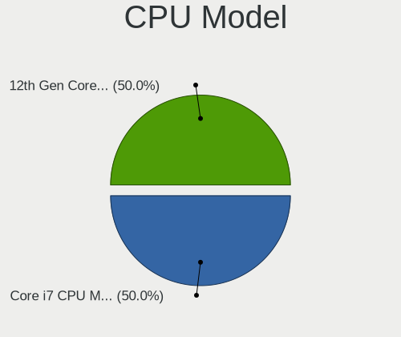

| Model                             | Notebooks | Percent |
|-----------------------------------|-----------|---------|
| Intel Core i7 CPU M 620 @ 2.67GHz | 1         | 50%     |
| Intel 12th Gen Core i3-1215U      | 1         | 50%     |

CPU Model Family
----------------

Processor model prefix

| Model         | Notebooks | Percent |
|---------------|-----------|---------|
| Other         | 1         | 50%     |
| Intel Core i7 | 1         | 50%     |

CPU Cores
---------

Number of processor cores

| Number | Notebooks | Percent |
|--------|-----------|---------|
| 8      | 1         | 50%     |
| 2      | 1         | 50%     |

CPU Sockets
-----------

Number of sockets

| Number | Notebooks | Percent |
|--------|-----------|---------|
| 1      | 2         | 100%    |

CPU Threads
-----------

Threads per core (Hyper-Threading)

| Number | Notebooks | Percent |
|--------|-----------|---------|
| 2      | 1         | 50%     |
| 1      | 1         | 50%     |

CPU Microarch
-------------

Microarchitecture

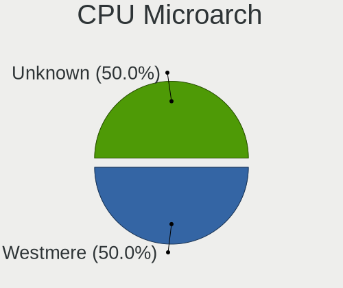

| Name     | Notebooks | Percent |
|----------|-----------|---------|
| Westmere | 1         | 50%     |
| Unknown  | 1         | 50%     |

Graphics
--------

GPU Vendor
----------

Vendors of graphics cards

| Vendor | Notebooks | Percent |
|--------|-----------|---------|
| Intel  | 1         | 50%     |
| AMD    | 1         | 50%     |

GPU Model
---------

Graphics card models

| Model                                         | Notebooks | Percent |
|-----------------------------------------------|-----------|---------|
| Intel Alder Lake-UP3 GT1 [UHD Graphics]       | 1         | 50%     |
| AMD Madison [Mobility Radeon HD 5730 / 6570M] | 1         | 50%     |

GPU Combo
---------

Combinations of graphics cards

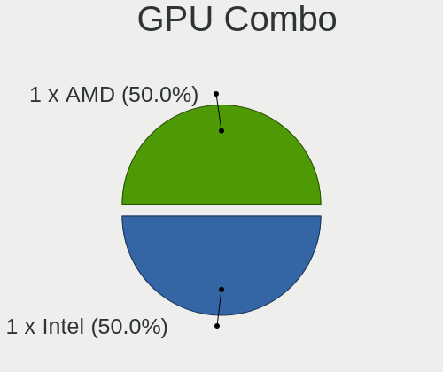

| Name      | Notebooks | Percent |
|-----------|-----------|---------|
| 1 x Intel | 1         | 50%     |
| 1 x AMD   | 1         | 50%     |

GPU Driver
----------

Free vs proprietary

| Driver | Notebooks | Percent |
|--------|-----------|---------|
| Free   | 2         | 100%    |

GPU Memory
----------

Total video memory

| Size in GB | Notebooks | Percent |
|------------|-----------|---------|
| Unknown    | 2         | 100%    |

Monitor
-------

Monitor Vendor
--------------

Monitor vendors

Zero info for selected period =(

Monitor Model
-------------

Monitor models

Zero info for selected period =(

Monitor Resolution
------------------

Monitor screen resolution

Zero info for selected period =(

Monitor Diagonal
----------------

Diagonal size in inches

Zero info for selected period =(

Monitor Width
-------------

Physical width

Zero info for selected period =(

Aspect Ratio
------------

Proportional relationship between the width and the height

Zero info for selected period =(

Monitor Area
------------

Area in inch²

Zero info for selected period =(

Pixel Density
-------------

Pixels per inch

Zero info for selected period =(

Multiple Monitors
-----------------

Total monitors connected

| Total | Notebooks | Percent |
|-------|-----------|---------|
| 0     | 2         | 100%    |

Network
-------

Net Controller Vendor
---------------------

Controller vendors

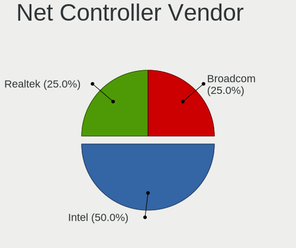

| Vendor                | Notebooks | Percent |
|-----------------------|-----------|---------|
| Intel                 | 2         | 50%     |
| Realtek Semiconductor | 1         | 25%     |
| Broadcom              | 1         | 25%     |

Net Controller Model
--------------------

Controller models

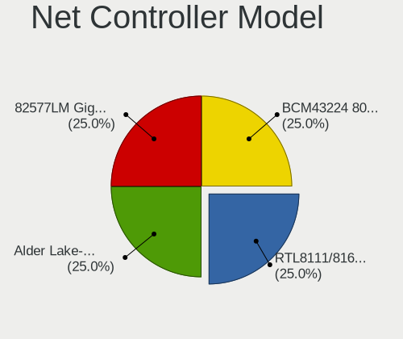

| Model                                                                  | Notebooks | Percent |
|------------------------------------------------------------------------|-----------|---------|
| Realtek RTL8111/8168/8211/8411 PCI Express Gigabit Ethernet Controller | 1         | 25%     |
| Intel Alder Lake-P PCH CNVi WiFi                                       | 1         | 25%     |
| Intel 82577LM Gigabit Network Connection                               | 1         | 25%     |
| Broadcom BCM43224 802.11a/b/g/n                                        | 1         | 25%     |

Wireless Vendor
---------------

Wireless vendors

| Vendor   | Notebooks | Percent |
|----------|-----------|---------|
| Intel    | 1         | 50%     |
| Broadcom | 1         | 50%     |

Wireless Model
--------------

Wireless models

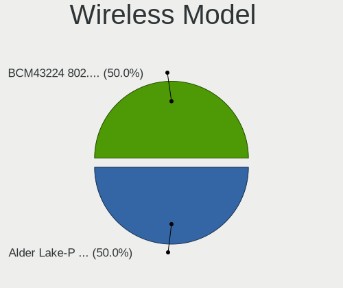

| Model                            | Notebooks | Percent |
|----------------------------------|-----------|---------|
| Intel Alder Lake-P PCH CNVi WiFi | 1         | 50%     |
| Broadcom BCM43224 802.11a/b/g/n  | 1         | 50%     |

Ethernet Vendor
---------------

Ethernet vendors

| Vendor                | Notebooks | Percent |
|-----------------------|-----------|---------|
| Realtek Semiconductor | 1         | 50%     |
| Intel                 | 1         | 50%     |

Ethernet Model
--------------

Ethernet models

| Model                                                                  | Notebooks | Percent |
|------------------------------------------------------------------------|-----------|---------|
| Realtek RTL8111/8168/8211/8411 PCI Express Gigabit Ethernet Controller | 1         | 50%     |
| Intel 82577LM Gigabit Network Connection                               | 1         | 50%     |

Net Controller Kind
-------------------

Ethernet, WiFi or modem

| Kind     | Notebooks | Percent |
|----------|-----------|---------|
| WiFi     | 2         | 50%     |
| Ethernet | 2         | 50%     |

Used Controller
---------------

Currently used network controller

Zero info for selected period =(

NICs
----

Total network controllers on board

| Total | Notebooks | Percent |
|-------|-----------|---------|
| 0     | 2         | 100%    |

IPv6
----

IPv6 vs IPv4

| Used | Notebooks | Percent |
|------|-----------|---------|
| Yes  | 1         | 50%     |
| No   | 1         | 50%     |

Bluetooth
---------

Bluetooth Vendor
----------------

Controller vendors

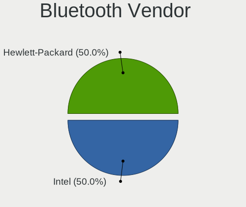

| Vendor          | Notebooks | Percent |
|-----------------|-----------|---------|
| Intel           | 1         | 50%     |
| Hewlett-Packard | 1         | 50%     |

Bluetooth Model
---------------

Controller models

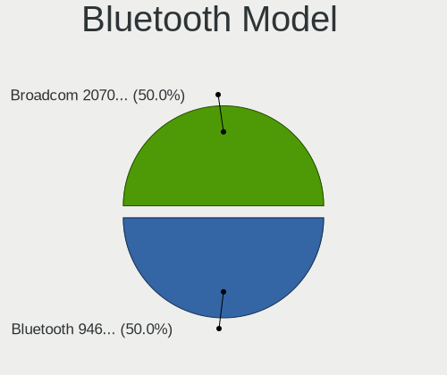

| Model                                          | Notebooks | Percent |
|------------------------------------------------|-----------|---------|
| Intel Bluetooth 9460/9560 Jefferson Peak (JfP) | 1         | 50%     |
| HP Broadcom 2070 Bluetooth Combo               | 1         | 50%     |

Sound
-----

Sound Vendor
------------

Sound card vendors

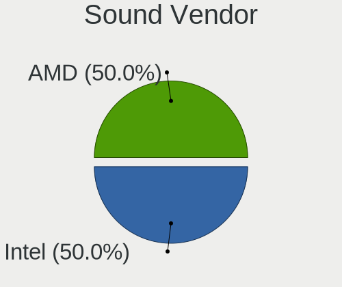

| Vendor | Notebooks | Percent |
|--------|-----------|---------|
| Intel  | 1         | 50%     |
| AMD    | 1         | 50%     |

Sound Model
-----------

Sound card models

| Model                                                   | Notebooks | Percent |
|---------------------------------------------------------|-----------|---------|
| Intel Alder Lake PCH-P High Definition Audio Controller | 1         | 50%     |
| AMD Redwood HDMI Audio [Radeon HD 5000 Series]          | 1         | 50%     |

Memory
------

Memory Vendor
-------------

Memory module vendors

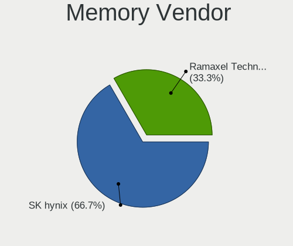

| Vendor             | Notebooks | Percent |
|--------------------|-----------|---------|
| SK hynix           | 2         | 66.67%  |
| Ramaxel Technology | 1         | 33.33%  |

Memory Model
------------

Memory module models

| Model                                                        | Notebooks | Percent |
|--------------------------------------------------------------|-----------|---------|
| SK hynix RAM HMT351S6BFR8C-H9 4GB SODIMM DDR3 1333MT/s       | 1         | 33.33%  |
| SK hynix RAM HMAA1GS6CJR6N-XN 8GB Row Of Chips DDR4 3200MT/s | 1         | 33.33%  |
| Ramaxel RAM RMSA3310MF96HAF-3200 8GB SODIMM DDR4 3200MT/s    | 1         | 33.33%  |

Memory Kind
-----------

Memory module kinds

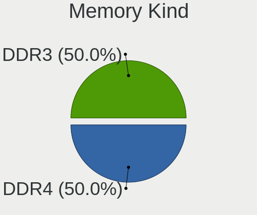

| Kind | Notebooks | Percent |
|------|-----------|---------|
| DDR4 | 1         | 50%     |
| DDR3 | 1         | 50%     |

Memory Form Factor
------------------

Physical design of the memory module

| Name         | Notebooks | Percent |
|--------------|-----------|---------|
| SODIMM       | 2         | 66.67%  |
| Row Of Chips | 1         | 33.33%  |

Memory Size
-----------

Memory module size

| Size | Notebooks | Percent |
|------|-----------|---------|
| 8192 | 1         | 50%     |
| 4096 | 1         | 50%     |

Memory Speed
------------

Memory module speed

| Speed | Notebooks | Percent |
|-------|-----------|---------|
| 3200  | 1         | 50%     |
| 1333  | 1         | 50%     |

Printers & scanners
-------------------

Printer Vendor
--------------

Printer device vendors

Zero info for selected period =(

Printer Model
-------------

Printer device models

Zero info for selected period =(

Scanner Vendor
--------------

Scanner device vendors

Zero info for selected period =(

Scanner Model
-------------

Scanner device models

Zero info for selected period =(

Camera
------

Camera Vendor
-------------

Camera device vendors

| Vendor | Notebooks | Percent |
|--------|-----------|---------|
| Syntek | 1         | 100%    |

Camera Model
------------

Camera device models

| Model                    | Notebooks | Percent |
|--------------------------|-----------|---------|
| Syntek Integrated Camera | 1         | 100%    |

Security
--------

Fingerprint Vendor
------------------

Fingerprint sensor vendors

Zero info for selected period =(

Fingerprint Model
-----------------

Fingerprint sensor models

Zero info for selected period =(

Chipcard Vendor
---------------

Chipcard module vendors

Zero info for selected period =(

Chipcard Model
--------------

Chipcard module models

Zero info for selected period =(

Unsupported
-----------

Unsupported Devices
-------------------

Total unsupported devices on board

| Total | Notebooks | Percent |
|-------|-----------|---------|
| 2     | 2         | 100%    |

Unsupported Device Types
------------------------

Types of unsupported devices

| Type                     | Notebooks | Percent |
|--------------------------|-----------|---------|
| Communication controller | 2         | 50%     |
| Firewire controller      | 1         | 25%     |
| Bluetooth                | 1         | 25%     |

