NetBSD - Tested Hardware & Statistics (Desktops)
------------------------------------------------

A project to collect tested hardware configurations for NetBSD.

Anyone can contribute to this report by the [hw-probe](https://github.com/linuxhw/hw-probe/blob/master/INSTALL.BSD.md) tool:

    hw-probe -all -upload

Please contribute! Especially if your hardware is rare.

Contents
--------

* [ Test Cases ](#test-cases)

* [ System ](#system)
  - [ OS                       ](#os)
  - [ OS Family                ](#os-family)
  - [ Arch                     ](#arch)
  - [ DE                       ](#de)
  - [ Display Server           ](#display-server)
  - [ Display Manager          ](#display-manager)
  - [ OS Lang                  ](#os-lang)
  - [ Boot Mode                ](#boot-mode)
  - [ Filesystem               ](#filesystem)
  - [ Part. scheme             ](#part-scheme)

* [ Board ](#board)
  - [ Vendor                   ](#vendor)
  - [ Model                    ](#model)
  - [ Model Family             ](#model-family)
  - [ MFG Year                 ](#mfg-year)
  - [ Form Factor              ](#form-factor)
  - [ Coreboot                 ](#coreboot)
  - [ RAM Size                 ](#ram-size)
  - [ RAM Used                 ](#ram-used)
  - [ Total Drives             ](#total-drives)
  - [ Has CD-ROM               ](#has-cd-rom)
  - [ Has Ethernet             ](#has-ethernet)
  - [ Has WiFi                 ](#has-wifi)
  - [ Has Bluetooth            ](#has-bluetooth)

* [ Location ](#location)
  - [ Country                  ](#country)
  - [ City                     ](#city)

* [ Drives ](#drives)
  - [ Drive Vendor             ](#drive-vendor)
  - [ Drive Model              ](#drive-model)
  - [ HDD Vendor               ](#hdd-vendor)
  - [ SSD Vendor               ](#ssd-vendor)
  - [ Drive Kind               ](#drive-kind)
  - [ Drive Connector          ](#drive-connector)
  - [ Drive Size               ](#drive-size)
  - [ Space Total              ](#space-total)
  - [ Space Used               ](#space-used)
  - [ Malfunc. Drives          ](#malfunc-drives)
  - [ Malfunc. Drive Vendor    ](#malfunc-drive-vendor)
  - [ Malfunc. HDD Vendor      ](#malfunc-hdd-vendor)
  - [ Malfunc. Drive Kind      ](#malfunc-drive-kind)
  - [ Failed Drives            ](#failed-drives)
  - [ Failed Drive Vendor      ](#failed-drive-vendor)
  - [ Drive Status             ](#drive-status)

* [ Storage controller ](#storage-controller)
  - [ Storage Vendor           ](#storage-vendor)
  - [ Storage Model            ](#storage-model)
  - [ Storage Kind             ](#storage-kind)

* [ Processor ](#processor)
  - [ CPU Vendor               ](#cpu-vendor)
  - [ CPU Model                ](#cpu-model)
  - [ CPU Model Family         ](#cpu-model-family)
  - [ CPU Cores                ](#cpu-cores)
  - [ CPU Sockets              ](#cpu-sockets)
  - [ CPU Threads              ](#cpu-threads)
  - [ CPU Microarch            ](#cpu-microarch)

* [ Graphics ](#graphics)
  - [ GPU Vendor               ](#gpu-vendor)
  - [ GPU Model                ](#gpu-model)
  - [ GPU Combo                ](#gpu-combo)
  - [ GPU Driver               ](#gpu-driver)
  - [ GPU Memory               ](#gpu-memory)

* [ Monitor ](#monitor)
  - [ Monitor Vendor           ](#monitor-vendor)
  - [ Monitor Model            ](#monitor-model)
  - [ Monitor Resolution       ](#monitor-resolution)
  - [ Monitor Diagonal         ](#monitor-diagonal)
  - [ Monitor Width            ](#monitor-width)
  - [ Aspect Ratio             ](#aspect-ratio)
  - [ Monitor Area             ](#monitor-area)
  - [ Pixel Density            ](#pixel-density)
  - [ Multiple Monitors        ](#multiple-monitors)

* [ Network ](#network)
  - [ Net Controller Vendor    ](#net-controller-vendor)
  - [ Net Controller Model     ](#net-controller-model)
  - [ Wireless Vendor          ](#wireless-vendor)
  - [ Wireless Model           ](#wireless-model)
  - [ Ethernet Vendor          ](#ethernet-vendor)
  - [ Ethernet Model           ](#ethernet-model)
  - [ Net Controller Kind      ](#net-controller-kind)
  - [ Used Controller          ](#used-controller)
  - [ NICs                     ](#nics)
  - [ IPv6                     ](#ipv6)

* [ Bluetooth ](#bluetooth)
  - [ Bluetooth Vendor         ](#bluetooth-vendor)
  - [ Bluetooth Model          ](#bluetooth-model)

* [ Sound ](#sound)
  - [ Sound Vendor             ](#sound-vendor)
  - [ Sound Model              ](#sound-model)

* [ Memory ](#memory)
  - [ Memory Vendor            ](#memory-vendor)
  - [ Memory Model             ](#memory-model)
  - [ Memory Kind              ](#memory-kind)
  - [ Memory Form Factor       ](#memory-form-factor)
  - [ Memory Size              ](#memory-size)
  - [ Memory Speed             ](#memory-speed)

* [ Printers & scanners ](#printers--scanners)
  - [ Printer Vendor           ](#printer-vendor)
  - [ Printer Model            ](#printer-model)
  - [ Scanner Vendor           ](#scanner-vendor)
  - [ Scanner Model            ](#scanner-model)

* [ Camera ](#camera)
  - [ Camera Vendor            ](#camera-vendor)
  - [ Camera Model             ](#camera-model)

* [ Security ](#security)
  - [ Fingerprint Vendor       ](#fingerprint-vendor)
  - [ Fingerprint Model        ](#fingerprint-model)
  - [ Chipcard Vendor          ](#chipcard-vendor)
  - [ Chipcard Model           ](#chipcard-model)

* [ Unsupported ](#unsupported)
  - [ Unsupported Devices      ](#unsupported-devices)
  - [ Unsupported Device Types ](#unsupported-device-types)

Test Cases
----------

Total: 110

| Vendor        | Model                       | Probe                                                     | Date         |
|---------------|-----------------------------|-----------------------------------------------------------|--------------|
| Unknown       | Unknown                     | [dfd42b6aa2](https://bsd-hardware.info/?probe=dfd42b6aa2) | Nov 18, 2025 |
| VIA Techno... | VT8366-8233                 | [9c4b031e64](https://bsd-hardware.info/?probe=9c4b031e64) | Oct 27, 2025 |
| Unknown       | Unknown                     | [b5fe25229f](https://bsd-hardware.info/?probe=b5fe25229f) | Sep 25, 2025 |
| Unknown       | Unknown                     | [7ef8c740df](https://bsd-hardware.info/?probe=7ef8c740df) | Sep 12, 2025 |
| Unknown       | Unknown                     | [2dfad7d91b](https://bsd-hardware.info/?probe=2dfad7d91b) | Sep 12, 2025 |
| Lenovo        | 1036 SDK0Q40104 WIN 3305... | [cb4d14cb1e](https://bsd-hardware.info/?probe=cb4d14cb1e) | Aug 10, 2025 |
| HP            | 21EF                        | [e47ffa047c](https://bsd-hardware.info/?probe=e47ffa047c) | Jul 18, 2025 |
| HP            | 21EF                        | [ad89678ca6](https://bsd-hardware.info/?probe=ad89678ca6) | Jul 17, 2025 |
| Unknown       | Unknown                     | [c4ea0e3429](https://bsd-hardware.info/?probe=c4ea0e3429) | Jul 11, 2025 |
| HP            | 21EF                        | [336bbc47d8](https://bsd-hardware.info/?probe=336bbc47d8) | Jul 06, 2025 |
| ASUSTek       | PRIME Z490M-PLUS            | [25d8b39f97](https://bsd-hardware.info/?probe=25d8b39f97) | Apr 20, 2025 |
| ASUSTek       | ProArt B650-CREATOR         | [551434e96e](https://bsd-hardware.info/?probe=551434e96e) | Apr 14, 2025 |
| Win Elemen... | M9                          | [1c31d220b1](https://bsd-hardware.info/?probe=1c31d220b1) | Apr 10, 2025 |
| ASRock        | B450 Gaming K4              | [4ed2753dbc](https://bsd-hardware.info/?probe=4ed2753dbc) | Apr 03, 2025 |
| Unknown       | Unknown                     | [e4bc715e82](https://bsd-hardware.info/?probe=e4bc715e82) | Mar 26, 2025 |
| ASRock        | B450 Gaming K4              | [562041a0fc](https://bsd-hardware.info/?probe=562041a0fc) | Mar 17, 2025 |
| ASUSTek       | P5A                         | [63da9f33d3](https://bsd-hardware.info/?probe=63da9f33d3) | Feb 28, 2025 |
| HP            | 8053                        | [6f6a208164](https://bsd-hardware.info/?probe=6f6a208164) | Feb 16, 2025 |
| BY OEM        | ZRD310C5                    | [5607e6cd36](https://bsd-hardware.info/?probe=5607e6cd36) | Feb 08, 2025 |
| Unknown       | Unknown                     | [566a65354f](https://bsd-hardware.info/?probe=566a65354f) | Feb 08, 2025 |
| HUAWEI        | PUM-WDX9-PCB-B1 M1010       | [deaefc78d8](https://bsd-hardware.info/?probe=deaefc78d8) | Feb 02, 2025 |
| Packard Be... | FIH57                       | [7b02970547](https://bsd-hardware.info/?probe=7b02970547) | Jan 21, 2025 |
| Unknown       | Unknown                     | [2ec3f61bc7](https://bsd-hardware.info/?probe=2ec3f61bc7) | Jan 18, 2025 |
| ASUSTek       | C-P6ND                      | [f6feb27f87](https://bsd-hardware.info/?probe=f6feb27f87) | Jan 18, 2025 |
| ASUSTek       | TUF B360M-PLUS GAMING/BR    | [ed6505a58e](https://bsd-hardware.info/?probe=ed6505a58e) | Jul 19, 2024 |
| ASUSTek       | TUF B360M-PLUS GAMING/BR    | [b1de030d31](https://bsd-hardware.info/?probe=b1de030d31) | Jul 19, 2024 |
| Unknown       | Unknown                     | [ae3e63c3e6](https://bsd-hardware.info/?probe=ae3e63c3e6) | Jun 25, 2024 |
| HP            | 8594                        | [39702449a8](https://bsd-hardware.info/?probe=39702449a8) | May 20, 2024 |
| GEEKOM        | Mini IT13                   | [18e5e61859](https://bsd-hardware.info/?probe=18e5e61859) | May 18, 2024 |
| HP            | 8594                        | [209ddea7e7](https://bsd-hardware.info/?probe=209ddea7e7) | May 17, 2024 |
| Unknown       | Unknown                     | [c70960854a](https://bsd-hardware.info/?probe=c70960854a) | May 06, 2024 |
| Lenovo        | 3743 NOK                    | [4b8389c575](https://bsd-hardware.info/?probe=4b8389c575) | Apr 27, 2024 |
| ASRock        | 970 Pro3 R2.0               | [47b751dfa0](https://bsd-hardware.info/?probe=47b751dfa0) | Apr 20, 2024 |
| Gigabyte      | B360M D2V                   | [766a437527](https://bsd-hardware.info/?probe=766a437527) | Apr 07, 2024 |
| Gigabyte      | X570 I AORUS PRO WIFI       | [3208fef860](https://bsd-hardware.info/?probe=3208fef860) | Apr 04, 2024 |
| Google        | Monroe                      | [7c9648d197](https://bsd-hardware.info/?probe=7c9648d197) | Apr 04, 2024 |
| Google        | Monroe                      | [383d7ee0f2](https://bsd-hardware.info/?probe=383d7ee0f2) | Apr 04, 2024 |
| Gigabyte      | X570 I AORUS PRO WIFI       | [767ef499db](https://bsd-hardware.info/?probe=767ef499db) | Apr 03, 2024 |
| Win Elemen... | M9                          | [3bcc4b4df3](https://bsd-hardware.info/?probe=3bcc4b4df3) | Mar 31, 2024 |
| Gigabyte      | GA-990FX-GAMING             | [13c1963782](https://bsd-hardware.info/?probe=13c1963782) | Mar 01, 2024 |
| MSI           | KA790GX                     | [7b431178e5](https://bsd-hardware.info/?probe=7b431178e5) | Feb 25, 2024 |
| Unknown       | Unknown                     | [d3ed7d1552](https://bsd-hardware.info/?probe=d3ed7d1552) | Feb 24, 2024 |
| Dell          | 096JG8 A01                  | [5a03257c9a](https://bsd-hardware.info/?probe=5a03257c9a) | Feb 19, 2024 |
| ASUSTek       | TUF B450-PRO GAMING         | [d318950ac5](https://bsd-hardware.info/?probe=d318950ac5) | Jan 15, 2024 |
| Win Elemen... | M9                          | [5deb235717](https://bsd-hardware.info/?probe=5deb235717) | Jan 05, 2024 |
| Unknown       | Unknown                     | [d4bedea996](https://bsd-hardware.info/?probe=d4bedea996) | Dec 30, 2023 |
| Win Elemen... | M9                          | [19daaf5eee](https://bsd-hardware.info/?probe=19daaf5eee) | Dec 30, 2023 |
| Lenovo        | NO DPK                      | [424c33d278](https://bsd-hardware.info/?probe=424c33d278) | Oct 27, 2023 |
| Unknown       | Unknown                     | [a88541d6a6](https://bsd-hardware.info/?probe=a88541d6a6) | Oct 27, 2023 |
| Lenovo        | NO DPK                      | [753b30d88b](https://bsd-hardware.info/?probe=753b30d88b) | Oct 27, 2023 |
| ASRock        | H270 Pro4                   | [cba80ecde3](https://bsd-hardware.info/?probe=cba80ecde3) | Sep 24, 2023 |
| Unknown       | Unknown                     | [dcf1ebd901](https://bsd-hardware.info/?probe=dcf1ebd901) | Sep 20, 2023 |
| Unknown       | Unknown                     | [9c1891cda7](https://bsd-hardware.info/?probe=9c1891cda7) | Sep 03, 2023 |
| Gigabyte      | A320M-H-CF                  | [d1a2b99edc](https://bsd-hardware.info/?probe=d1a2b99edc) | Jul 28, 2023 |
| Acer          | Revo RN86                   | [2e52c2b9b2](https://bsd-hardware.info/?probe=2e52c2b9b2) | May 13, 2023 |
| Unknown       | Unknown                     | [d6f92a5ecc](https://bsd-hardware.info/?probe=d6f92a5ecc) | Apr 28, 2023 |
| Gigabyte      | B360M D2V                   | [f73cb94828](https://bsd-hardware.info/?probe=f73cb94828) | Apr 17, 2023 |
| Unknown       | Unknown                     | [8c93a7e552](https://bsd-hardware.info/?probe=8c93a7e552) | Mar 04, 2023 |
| Unknown       | Unknown                     | [85fdc49ec4](https://bsd-hardware.info/?probe=85fdc49ec4) | Mar 03, 2023 |
| Unknown       | Unknown                     | [8ae1891a85](https://bsd-hardware.info/?probe=8ae1891a85) | Feb 16, 2023 |
| Intel         | DN2820FYK H24582-203        | [ae05d4c6cd](https://bsd-hardware.info/?probe=ae05d4c6cd) | Feb 06, 2023 |
| Acer          | Revo RN86                   | [a4dcb7f7a2](https://bsd-hardware.info/?probe=a4dcb7f7a2) | Nov 27, 2022 |
| Unknown       | Unknown                     | [1d3bd58d18](https://bsd-hardware.info/?probe=1d3bd58d18) | Nov 25, 2022 |
| Unknown       | Unknown                     | [410283dd4f](https://bsd-hardware.info/?probe=410283dd4f) | Oct 22, 2022 |
| Unknown       | Unknown                     | [5e2f93a960](https://bsd-hardware.info/?probe=5e2f93a960) | Aug 06, 2022 |
| Unknown       | Unknown                     | [66fefba790](https://bsd-hardware.info/?probe=66fefba790) | Aug 06, 2022 |
| ASUSTek       | TUF B450-PLUS GAMING        | [aeee3a91e6](https://bsd-hardware.info/?probe=aeee3a91e6) | Jul 03, 2022 |
| Gigabyte      | X570 AORUS PRO              | [4e7d57df3b](https://bsd-hardware.info/?probe=4e7d57df3b) | Apr 18, 2022 |
| Gigabyte      | 970A-D3P                    | [fa03bdabb6](https://bsd-hardware.info/?probe=fa03bdabb6) | Mar 15, 2022 |
| KLLISRE       | X99-B5 V1.0                 | [5dea1304b9](https://bsd-hardware.info/?probe=5dea1304b9) | Feb 26, 2022 |
| ASRock        | X470 Gaming-ITX/ac          | [18eeaf2963](https://bsd-hardware.info/?probe=18eeaf2963) | Dec 29, 2021 |
| Acer          | Revo RN86                   | [6d184a1e62](https://bsd-hardware.info/?probe=6d184a1e62) | Dec 23, 2021 |
| ASRock        | 970 Extreme3                | [14907c62f1](https://bsd-hardware.info/?probe=14907c62f1) | Dec 04, 2021 |
| HP            | 3397                        | [155eceb394](https://bsd-hardware.info/?probe=155eceb394) | Nov 07, 2021 |
| ASUSTek       | ROG STRIX X470-F GAMING     | [7259ec87e9](https://bsd-hardware.info/?probe=7259ec87e9) | Oct 05, 2021 |
| ASUSTek       | PRIME A320M-K               | [c574dcc409](https://bsd-hardware.info/?probe=c574dcc409) | Oct 01, 2021 |
| ASUSTek       | ROG STRIX X470-F GAMING     | [b3a18fcab3](https://bsd-hardware.info/?probe=b3a18fcab3) | Sep 29, 2021 |
| Unknown       | Unknown                     | [2a56bcb7c1](https://bsd-hardware.info/?probe=2a56bcb7c1) | Sep 19, 2021 |
| MSI           | B450-A PRO MAX              | [4e3b1f226b](https://bsd-hardware.info/?probe=4e3b1f226b) | Jun 22, 2021 |
| Unknown       | Unknown                     | [f9fa9ae41a](https://bsd-hardware.info/?probe=f9fa9ae41a) | May 24, 2021 |
| Acer          | Revo RN86                   | [ec302a221a](https://bsd-hardware.info/?probe=ec302a221a) | May 15, 2021 |
| Unknown       | Unknown                     | [364a778de1](https://bsd-hardware.info/?probe=364a778de1) | May 14, 2021 |
| ASRock        | X470 Gaming-ITX/ac          | [82e63b3fb9](https://bsd-hardware.info/?probe=82e63b3fb9) | Apr 14, 2021 |
| Unknown       | Unknown                     | [df793cf09f](https://bsd-hardware.info/?probe=df793cf09f) | Apr 08, 2021 |
| Unknown       | Unknown                     | [f8ba0ba112](https://bsd-hardware.info/?probe=f8ba0ba112) | Apr 08, 2021 |
| Unknown       | Unknown                     | [0541b120c2](https://bsd-hardware.info/?probe=0541b120c2) | Apr 02, 2021 |
| Unknown       | Unknown                     | [91dd02d436](https://bsd-hardware.info/?probe=91dd02d436) | Mar 30, 2021 |
| Unknown       | Unknown                     | [a1220fba93](https://bsd-hardware.info/?probe=a1220fba93) | Mar 24, 2021 |
| Unknown       | Unknown                     | [edea2d1a64](https://bsd-hardware.info/?probe=edea2d1a64) | Mar 18, 2021 |
| Unknown       | Unknown                     | [1afd7d4381](https://bsd-hardware.info/?probe=1afd7d4381) | Feb 27, 2021 |
| Unknown       | Unknown                     | [4c0171bc04](https://bsd-hardware.info/?probe=4c0171bc04) | Feb 25, 2021 |
| Unknown       | Unknown                     | [a5fa760573](https://bsd-hardware.info/?probe=a5fa760573) | Jan 02, 2021 |
| ASRock        | N68-VS3 UCC                 | [647ab5967e](https://bsd-hardware.info/?probe=647ab5967e) | Dec 22, 2020 |
| Unknown       | Unknown                     | [8668b1d651](https://bsd-hardware.info/?probe=8668b1d651) | Dec 17, 2020 |
| ASUSTek       | E45M1-I DELUXE              | [8e767b517d](https://bsd-hardware.info/?probe=8e767b517d) | Dec 16, 2020 |
| Unknown       | Unknown                     | [153be3caa3](https://bsd-hardware.info/?probe=153be3caa3) | Nov 28, 2020 |
| HP            | System Board R3A            | [80593fc3da](https://bsd-hardware.info/?probe=80593fc3da) | Nov 03, 2020 |
| Gigabyte      | Z170X-Gaming 3              | [615ac68e50](https://bsd-hardware.info/?probe=615ac68e50) | Oct 29, 2020 |
| Unknown       | Unknown                     | [d08d610bd0](https://bsd-hardware.info/?probe=d08d610bd0) | Oct 29, 2020 |
| ASUSTek       | B150M-K                     | [135db0e455](https://bsd-hardware.info/?probe=135db0e455) | Oct 22, 2020 |
| Unknown       | Unknown                     | [223aa9e0a3](https://bsd-hardware.info/?probe=223aa9e0a3) | Oct 22, 2020 |
| Gigabyte      | P75-D3                      | [980218cf46](https://bsd-hardware.info/?probe=980218cf46) | Oct 02, 2020 |
| ASUSTek       | H81M-D PLUS                 | [95b75130f4](https://bsd-hardware.info/?probe=95b75130f4) | Sep 26, 2020 |
| Acer          | Revo RN86                   | [c6b2c64d14](https://bsd-hardware.info/?probe=c6b2c64d14) | Sep 20, 2020 |
| ASUSTek       | H81M-D PLUS                 | [7be45f1bec](https://bsd-hardware.info/?probe=7be45f1bec) | Sep 19, 2020 |
| MSI           | KA790GX                     | [bba5499a4b](https://bsd-hardware.info/?probe=bba5499a4b) | Aug 29, 2020 |
| ASUSTek       | PRIME A320M-K               | [a49cf5c20b](https://bsd-hardware.info/?probe=a49cf5c20b) | May 28, 2020 |
| Gigabyte      | H61M-S2PV                   | [14e00aa09f](https://bsd-hardware.info/?probe=14e00aa09f) | May 25, 2020 |
| Intel         | DN2820FYK H24582-203        | [6cb240a9f6](https://bsd-hardware.info/?probe=6cb240a9f6) | May 25, 2020 |
| Unknown       | Unknown                     | [d3ad2b17ed](https://bsd-hardware.info/?probe=d3ad2b17ed) | May 22, 2020 |

System
------

OS
--

Installed operating systems

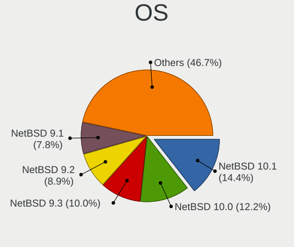

| Name               | Desktops | Percent |
|--------------------|----------|---------|
| NetBSD 10.1        | 13       | 14.44%  |
| NetBSD 10.0        | 11       | 12.22%  |
| NetBSD 9.3         | 9        | 10%     |
| NetBSD 9.2         | 8        | 8.89%   |
| NetBSD 9.1         | 7        | 7.78%   |
| NetBSD 10.1_STABLE | 6        | 6.67%   |
| NetBSD 9.0_STABLE  | 5        | 5.56%   |
| NetBSD 9.1_STABLE  | 3        | 3.33%   |
| NetBSD 10.0_BETA   | 3        | 3.33%   |
| NetBSD 9.99.94     | 2        | 2.22%   |
| NetBSD 9.99.93     | 2        | 2.22%   |
| NetBSD 9.99.77     | 2        | 2.22%   |
| NetBSD 9.3_STABLE  | 2        | 2.22%   |
| NetBSD 9.0         | 2        | 2.22%   |
| NetBSD 10.0_RC4    | 2        | 2.22%   |
| NetBSD 10.0_RC2    | 2        | 2.22%   |
| NetBSD 9.99.85     | 1        | 1.11%   |
| NetBSD 9.99.81     | 1        | 1.11%   |
| NetBSD 9.99.74     | 1        | 1.11%   |
| NetBSD 9.99.71     | 1        | 1.11%   |
| NetBSD 9.99.61     | 1        | 1.11%   |
| NetBSD 9.99.23     | 1        | 1.11%   |
| NetBSD 9.99.107    | 1        | 1.11%   |
| NetBSD 9.2_STABLE  | 1        | 1.11%   |
| NetBSD 10.0_STABLE | 1        | 1.11%   |
| NetBSD 10.0_RC5    | 1        | 1.11%   |
| NetBSD 10.0_RC1    | 1        | 1.11%   |

OS Family
---------

OS without a version

| Name   | Desktops | Percent |
|--------|----------|---------|
| NetBSD | 78       | 100%    |

Arch
----

OS architecture (x86_64, i586, etc.)

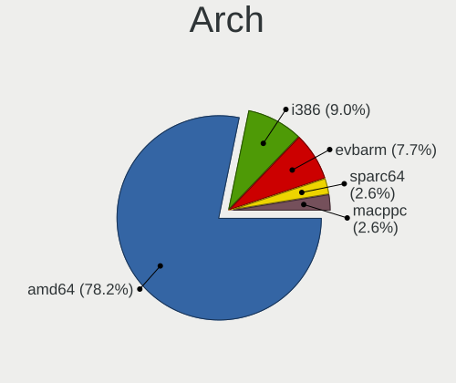

| Name    | Desktops | Percent |
|---------|----------|---------|
| amd64   | 61       | 78.21%  |
| i386    | 7        | 8.97%   |
| evbarm  | 6        | 7.69%   |
| sparc64 | 2        | 2.56%   |
| macppc  | 2        | 2.56%   |

DE
--

Desktop Environment

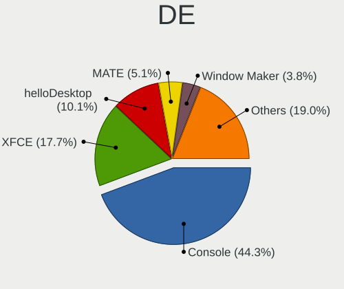

| Name         | Desktops | Percent |
|--------------|----------|---------|
| Console      | 35       | 44.3%   |
| XFCE         | 14       | 17.72%  |
| helloDesktop | 8        | 10.13%  |
| MATE         | 4        | 5.06%   |
| Window Maker | 3        | 3.8%    |
| Fluxbox      | 3        | 3.8%    |
| GNOME        | 2        | 2.53%   |
| CTWM         | 2        | 2.53%   |
| Xfwm4        | 1        | 1.27%   |
| spectrwm     | 1        | 1.27%   |
| Ratpoison    | 1        | 1.27%   |
| PekWM        | 1        | 1.27%   |
| LXDE         | 1        | 1.27%   |
| JWM          | 1        | 1.27%   |
| DWM          | 1        | 1.27%   |
| Blackbox     | 1        | 1.27%   |

Display Server
--------------

X11 or Wayland

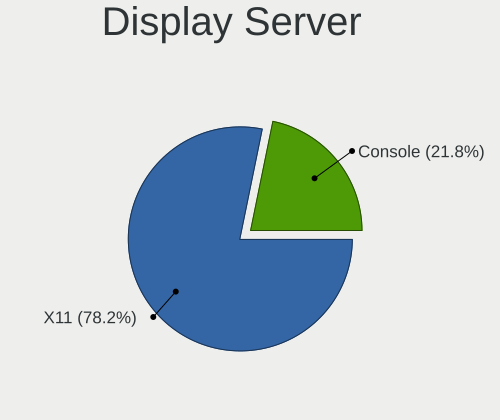

| Name    | Desktops | Percent |
|---------|----------|---------|
| X11     | 61       | 78.21%  |
| Console | 17       | 21.79%  |

Display Manager
---------------

SDDM, LightDM, etc.

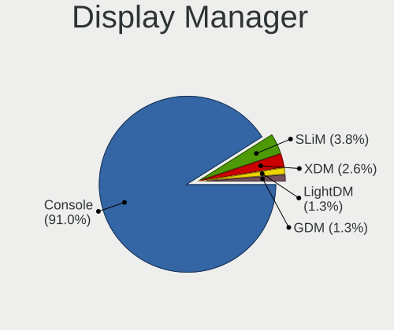

| Name    | Desktops | Percent |
|---------|----------|---------|
| Console | 71       | 91.03%  |
| SLiM    | 3        | 3.85%   |
| XDM     | 2        | 2.56%   |
| LightDM | 1        | 1.28%   |
| GDM     | 1        | 1.28%   |

OS Lang
-------

Language

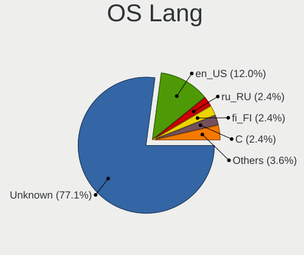

| Lang    | Desktops | Percent |
|---------|----------|---------|
| Unknown | 64       | 77.11%  |
| en_US   | 10       | 12.05%  |
| ru_RU   | 2        | 2.41%   |
| fi_FI   | 2        | 2.41%   |
| C       | 2        | 2.41%   |
| hu_HU   | 1        | 1.2%    |
| fr_FR   | 1        | 1.2%    |
| en_GB   | 1        | 1.2%    |

Boot Mode
---------

EFI or BIOS

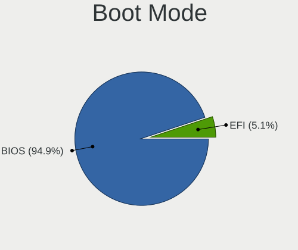

| Mode | Desktops | Percent |
|------|----------|---------|
| BIOS | 74       | 94.87%  |
| EFI  | 4        | 5.13%   |

Filesystem
----------

Type of filesystem

| Type    | Desktops | Percent |
|---------|----------|---------|
| Ufs     | 77       | 98.72%  |
| Unknown | 1        | 1.28%   |

Part. scheme
------------

Scheme of partitioning

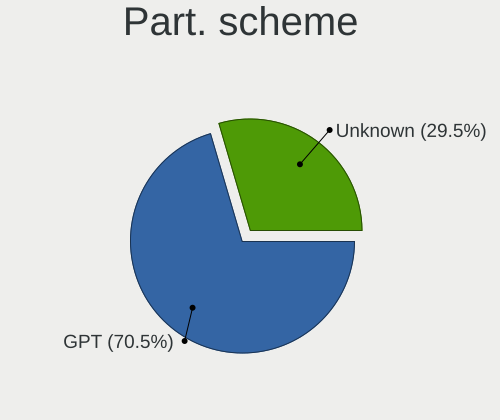

| Type    | Desktops | Percent |
|---------|----------|---------|
| GPT     | 54       | 69.23%  |
| Unknown | 24       | 30.77%  |

Board
-----

Vendor
------

Motherboard manufacturer

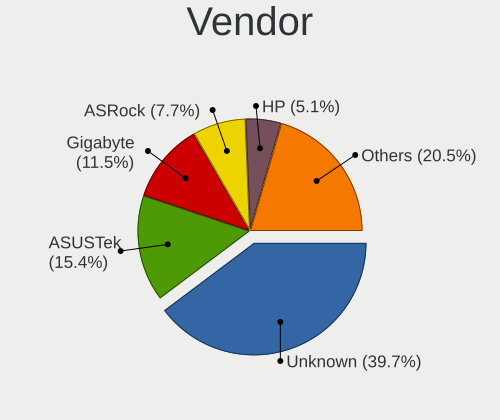

| Name                | Desktops | Percent |
|---------------------|----------|---------|
| Unknown             | 31       | 39.74%  |
| ASUSTek Computer    | 12       | 15.38%  |
| Gigabyte Technology | 9        | 11.54%  |
| ASRock              | 6        | 7.69%   |
| Hewlett-Packard     | 4        | 5.13%   |
| Lenovo              | 3        | 3.85%   |
| MSI                 | 2        | 2.56%   |
| Win Element         | 1        | 1.28%   |
| VIA Technologies    | 1        | 1.28%   |
| Packard Bell        | 1        | 1.28%   |
| KLLISRE             | 1        | 1.28%   |
| Intel               | 1        | 1.28%   |
| HUAWEI              | 1        | 1.28%   |
| Google              | 1        | 1.28%   |
| GEEKOM              | 1        | 1.28%   |
| Dell                | 1        | 1.28%   |
| BY OEM              | 1        | 1.28%   |
| Acer                | 1        | 1.28%   |

Model
-----

Motherboard model

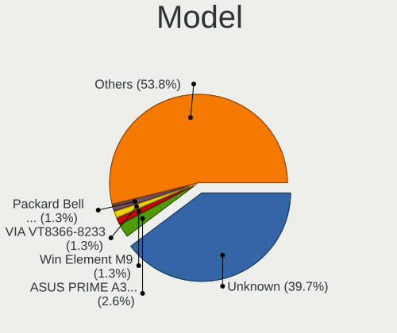

| Name                                        | Desktops | Percent |
|---------------------------------------------|----------|---------|
| Unknown                                     | 31       | 39.74%  |
| ASUS PRIME A320M-K                          | 2        | 2.56%   |
| Win Element M9                              | 1        | 1.28%   |
| VIA VT8366-8233                             | 1        | 1.28%   |
| Packard Bell IMEDIA S3800                   | 1        | 1.28%   |
| MSI MS-7B86                                 | 1        | 1.28%   |
| MSI MS-7551                                 | 1        | 1.28%   |
| Lenovo ThinkStation P520 30BFS8M400         | 1        | 1.28%   |
| Lenovo ThinkCentre M72e 3598CP8             | 1        | 1.28%   |
| Lenovo IdeaCentre Gaming5 14ACN6 90RW005PUL | 1        | 1.28%   |
| KLLISRE X99-B5 V1.0                         | 1        | 1.28%   |
| Intel DN2820FYK H24582-203                  | 1        | 1.28%   |
| HUAWEI PUM-WDX9                             | 1        | 1.28%   |
| HP Vectra                                   | 1        | 1.28%   |
| HP t520 Flexible Series TC                  | 1        | 1.28%   |
| HP EliteDesk 800 G5 Desktop Mini            | 1        | 1.28%   |
| HP EliteDesk 800 G2 TWR                     | 1        | 1.28%   |
| Google Monroe                               | 1        | 1.28%   |
| Gigabyte Z170X-Gaming 3                     | 1        | 1.28%   |
| Gigabyte X570 I AORUS PRO WIFI              | 1        | 1.28%   |
| Gigabyte X570 AORUS PRO                     | 1        | 1.28%   |
| Gigabyte P75-D3                             | 1        | 1.28%   |
| Gigabyte H61M-S2PV                          | 1        | 1.28%   |
| Gigabyte GA-990FX-GAMING                    | 1        | 1.28%   |
| Gigabyte B360M-D2V                          | 1        | 1.28%   |
| Gigabyte A320M-H                            | 1        | 1.28%   |
| Gigabyte 970A-D3P                           | 1        | 1.28%   |
| GEEKOM Mini IT13                            | 1        | 1.28%   |
| Dell OptiPlex 7040                          | 1        | 1.28%   |
| BY OEM ZRD310C5                             | 1        | 1.28%   |
| ASUS TUF B450-PRO GAMING                    | 1        | 1.28%   |
| ASUS TUF B450-PLUS GAMING                   | 1        | 1.28%   |
| ASUS TUF B360M-PLUS GAMING/BR               | 1        | 1.28%   |
| ASUS ProArt B650-CREATOR                    | 1        | 1.28%   |
| ASUS PRIME Z490M-PLUS                       | 1        | 1.28%   |
| ASUS P5A                                    | 1        | 1.28%   |
| ASUS E45M1-I DELUXE                         | 1        | 1.28%   |
| ASUS C-P6ND                                 | 1        | 1.28%   |
| ASUS B150M-K                                | 1        | 1.28%   |
| ASUS All Series                             | 1        | 1.28%   |

Model Family
------------

Motherboard model prefix

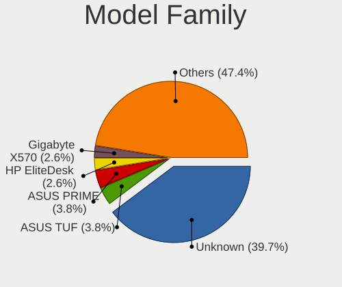

| Name                     | Desktops | Percent |
|--------------------------|----------|---------|
| Unknown                  | 31       | 39.74%  |
| ASUS TUF                 | 3        | 3.85%   |
| ASUS PRIME               | 3        | 3.85%   |
| HP EliteDesk             | 2        | 2.56%   |
| Gigabyte X570            | 2        | 2.56%   |
| ASRock 970               | 2        | 2.56%   |
| Win Element M9           | 1        | 1.28%   |
| VIA VT8366-8233          | 1        | 1.28%   |
| Packard Bell IMEDIA      | 1        | 1.28%   |
| MSI MS-7B86              | 1        | 1.28%   |
| MSI MS-7551              | 1        | 1.28%   |
| Lenovo ThinkStation      | 1        | 1.28%   |
| Lenovo ThinkCentre       | 1        | 1.28%   |
| Lenovo IdeaCentre        | 1        | 1.28%   |
| KLLISRE X99-B5           | 1        | 1.28%   |
| Intel DN2820FYK          | 1        | 1.28%   |
| HUAWEI PUM-WDX9          | 1        | 1.28%   |
| HP Vectra                | 1        | 1.28%   |
| HP t520                  | 1        | 1.28%   |
| Google Monroe            | 1        | 1.28%   |
| Gigabyte Z170X-Gaming    | 1        | 1.28%   |
| Gigabyte P75-D3          | 1        | 1.28%   |
| Gigabyte H61M-S2PV       | 1        | 1.28%   |
| Gigabyte GA-990FX-GAMING | 1        | 1.28%   |
| Gigabyte B360M-D2V       | 1        | 1.28%   |
| Gigabyte A320M-H         | 1        | 1.28%   |
| Gigabyte 970A-D3P        | 1        | 1.28%   |
| GEEKOM Mini              | 1        | 1.28%   |
| Dell OptiPlex            | 1        | 1.28%   |
| BY OEM ZRD310C5          | 1        | 1.28%   |
| ASUS ProArt              | 1        | 1.28%   |
| ASUS P5A                 | 1        | 1.28%   |
| ASUS E45M1-I             | 1        | 1.28%   |
| ASUS C-P6ND              | 1        | 1.28%   |
| ASUS B150M-K             | 1        | 1.28%   |
| ASUS All                 | 1        | 1.28%   |
| ASRock X470              | 1        | 1.28%   |
| ASRock N68-VS3           | 1        | 1.28%   |
| ASRock H270              | 1        | 1.28%   |
| ASRock B450              | 1        | 1.28%   |

MFG Year
--------

Motherboard manufacture year

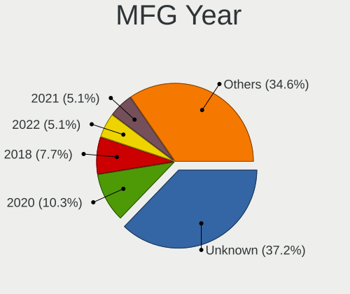

| Year    | Desktops | Percent |
|---------|----------|---------|
| Unknown | 29       | 37.18%  |
| 2020    | 8        | 10.26%  |
| 2018    | 6        | 7.69%   |
| 2022    | 4        | 5.13%   |
| 2021    | 4        | 5.13%   |
| 2019    | 3        | 3.85%   |
| 2016    | 3        | 3.85%   |
| 2013    | 3        | 3.85%   |
| 2023    | 2        | 2.56%   |
| 2017    | 2        | 2.56%   |
| 2014    | 2        | 2.56%   |
| 2012    | 2        | 2.56%   |
| 2011    | 2        | 2.56%   |
| 2001    | 2        | 2.56%   |
| 2025    | 1        | 1.28%   |
| 2024    | 1        | 1.28%   |
| 2015    | 1        | 1.28%   |
| 2010    | 1        | 1.28%   |
| 2009    | 1        | 1.28%   |
| 2003    | 1        | 1.28%   |

Form Factor
-----------

Physical design of the computer

| Name    | Desktops | Percent |
|---------|----------|---------|
| Desktop | 78       | 100%    |

Coreboot
--------

Have coreboot on board

| Used | Desktops | Percent |
|------|----------|---------|
| No   | 77       | 98.72%  |
| Yes  | 1        | 1.28%   |

RAM Size
--------

Total RAM memory

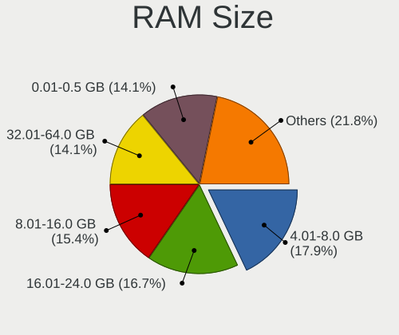

| Size in GB  | Desktops | Percent |
|-------------|----------|---------|
| 4.01-8.0    | 14       | 17.95%  |
| 16.01-24.0  | 13       | 16.67%  |
| 8.01-16.0   | 12       | 15.38%  |
| 32.01-64.0  | 11       | 14.1%   |
| 0.01-0.5    | 11       | 14.1%   |
| 3.01-4.0    | 6        | 7.69%   |
| 64.01-256.0 | 3        | 3.85%   |
| 1.01-2.0    | 3        | 3.85%   |
| 0.51-1.0    | 3        | 3.85%   |
| 24.01-32.0  | 2        | 2.56%   |

RAM Used
--------

Used RAM memory

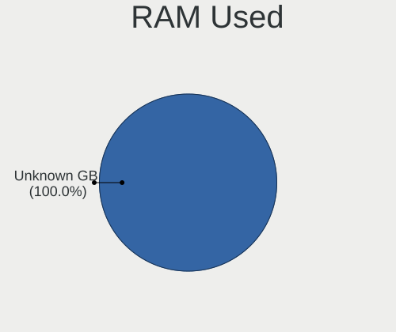

| Used GB | Desktops | Percent |
|---------|----------|---------|
| Unknown | 78       | 100%    |

Total Drives
------------

Number of drives on board

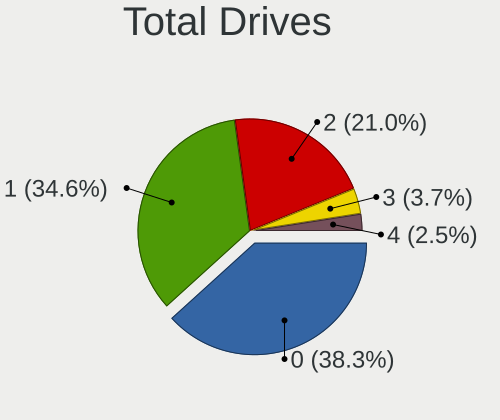

| Drives | Desktops | Percent |
|--------|----------|---------|
| 0      | 31       | 38.27%  |
| 1      | 28       | 34.57%  |
| 2      | 17       | 20.99%  |
| 3      | 3        | 3.7%    |
| 4      | 2        | 2.47%   |

Has CD-ROM
----------

Has CD-ROM on board

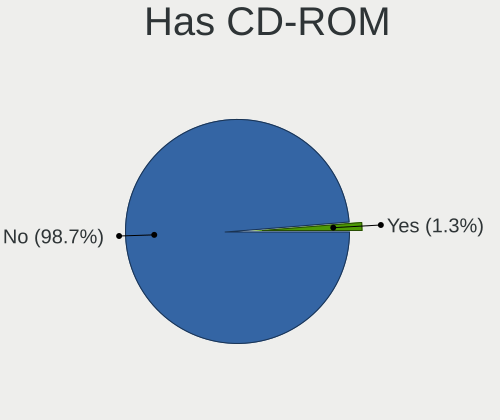

| Presented | Desktops | Percent |
|-----------|----------|---------|
| No        | 77       | 98.72%  |
| Yes       | 1        | 1.28%   |

Has Ethernet
------------

Has Ethernet on board

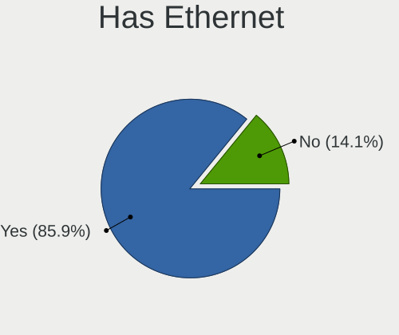

| Presented | Desktops | Percent |
|-----------|----------|---------|
| Yes       | 67       | 85.9%   |
| No        | 11       | 14.1%   |

Has WiFi
--------

Has WiFi module

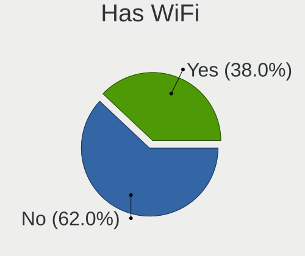

| Presented | Desktops | Percent |
|-----------|----------|---------|
| No        | 49       | 62.03%  |
| Yes       | 30       | 37.97%  |

Has Bluetooth
-------------

Has Bluetooth module

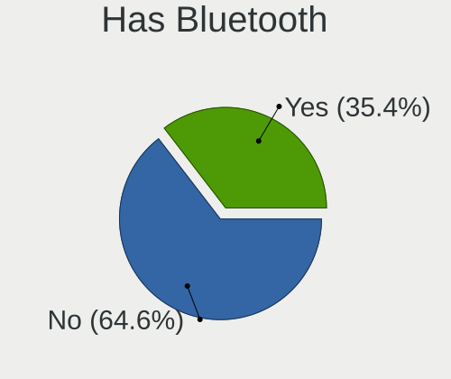

| Presented | Desktops | Percent |
|-----------|----------|---------|
| No        | 51       | 64.56%  |
| Yes       | 28       | 35.44%  |

Location
--------

Country
-------

Geographic location (country)

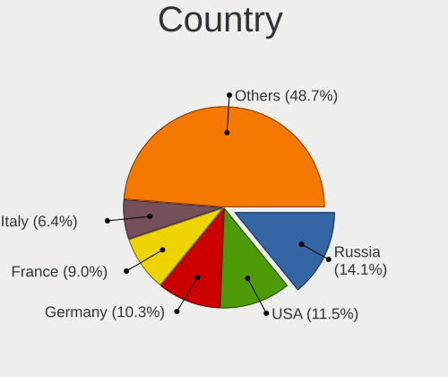

| Country                | Desktops | Percent |
|------------------------|----------|---------|
| Russia                 | 11       | 14.1%   |
| USA                    | 9        | 11.54%  |
| Germany                | 8        | 10.26%  |
| France                 | 7        | 8.97%   |
| Italy                  | 5        | 6.41%   |
| Denmark                | 4        | 5.13%   |
| UK                     | 3        | 3.85%   |
| Spain                  | 3        | 3.85%   |
| Romania                | 3        | 3.85%   |
| Finland                | 3        | 3.85%   |
| Poland                 | 2        | 2.56%   |
| Norway                 | 2        | 2.56%   |
| Latvia                 | 2        | 2.56%   |
| Japan                  | 2        | 2.56%   |
| Hungary                | 2        | 2.56%   |
| Brazil                 | 2        | 2.56%   |
| Australia              | 2        | 2.56%   |
| Sweden                 | 1        | 1.28%   |
| Saudi Arabia           | 1        | 1.28%   |
| Netherlands            | 1        | 1.28%   |
| Lithuania              | 1        | 1.28%   |
| India                  | 1        | 1.28%   |
| Greece                 | 1        | 1.28%   |
| Czechia                | 1        | 1.28%   |
| Bosnia and Herzegovina | 1        | 1.28%   |

City
----

Geographic location (city)

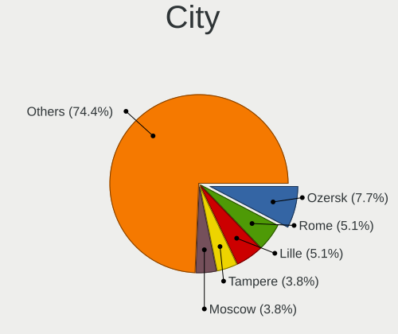

| City                  | Desktops | Percent |
|-----------------------|----------|---------|
| Ozersk                | 6        | 7.69%   |
| Rome                  | 4        | 5.13%   |
| Lille                 | 4        | 5.13%   |
| Tampere               | 3        | 3.85%   |
| Moscow                | 3        | 3.85%   |
| Bucharest             | 3        | 3.85%   |
| Sydney                | 2        | 2.56%   |
| Riga                  | 2        | 2.56%   |
| Poitiers              | 2        | 2.56%   |
| Higashihatsuishi      | 2        | 2.56%   |
| Frederiksberg         | 2        | 2.56%   |
| Berlin                | 2        | 2.56%   |
| Vilnius               | 1        | 1.28%   |
| Urupes                | 1        | 1.28%   |
| Unterhaching          | 1        | 1.28%   |
| Ulan-Ude              | 1        | 1.28%   |
| Turin                 | 1        | 1.28%   |
| Thessaloniki          | 1        | 1.28%   |
| Stourbridge           | 1        | 1.28%   |
| Stockholm             | 1        | 1.28%   |
| Sopron                | 1        | 1.28%   |
| Sarajevo              | 1        | 1.28%   |
| Royal Tunbridge Wells | 1        | 1.28%   |
| Riyadh                | 1        | 1.28%   |
| Reno                  | 1        | 1.28%   |
| Prague                | 1        | 1.28%   |
| Poznan                | 1        | 1.28%   |
| Portland              | 1        | 1.28%   |
| Oxon Hill             | 1        | 1.28%   |
| Noyon                 | 1        | 1.28%   |
| Novosibirsk           | 1        | 1.28%   |
| Newberg               | 1        | 1.28%   |
| Nagpur                | 1        | 1.28%   |
| Murcia                | 1        | 1.28%   |
| McKinney              | 1        | 1.28%   |
| Lorenskog             | 1        | 1.28%   |
| Lohr a. Main          | 1        | 1.28%   |
| Leipzig               | 1        | 1.28%   |
| Køge                 | 1        | 1.28%   |
| Kwidzyn               | 1        | 1.28%   |

Drives
------

Drive Vendor
------------

Hard drive vendors

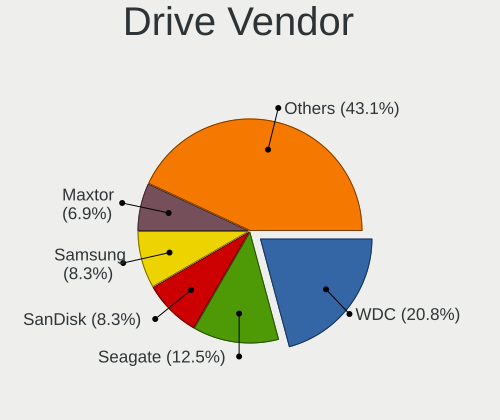

| Vendor              | Desktops | Drives | Percent |
|---------------------|----------|--------|---------|
| WDC                 | 15       | 19     | 20.83%  |
| Seagate             | 9        | 10     | 12.5%   |
| SanDisk             | 6        | 7      | 8.33%   |
| Samsung Electronics | 6        | 6      | 8.33%   |
| Maxtor              | 5        | 6      | 6.94%   |
| Toshiba             | 4        | 6      | 5.56%   |
| Kingston            | 4        | 5      | 5.56%   |
| Crucial             | 4        | 5      | 5.56%   |
| JetFlash            | 2        | 2      | 2.78%   |
| Generic             | 2        | 2      | 2.78%   |
| USB                 | 1        | 1      | 1.39%   |
| StoreJet            | 1        | 1      | 1.39%   |
| SMI                 | 1        | 1      | 1.39%   |
| SK hynix            | 1        | 2      | 1.39%   |
| PNY                 | 1        | 1      | 1.39%   |
| Patriot             | 1        | 1      | 1.39%   |
| Lexar               | 1        | 1      | 1.39%   |
| KingSpec            | 1        | 1      | 1.39%   |
| Intenso             | 1        | 1      | 1.39%   |
| IBM/Hitachi         | 1        | 1      | 1.39%   |
| HGST                | 1        | 1      | 1.39%   |
| Hewlett-Packard     | 1        | 1      | 1.39%   |
| Fanxiang            | 1        | 1      | 1.39%   |
| China               | 1        | 1      | 1.39%   |
| A-DATA Technology   | 1        | 1      | 1.39%   |

Drive Model
-----------

Hard drive models

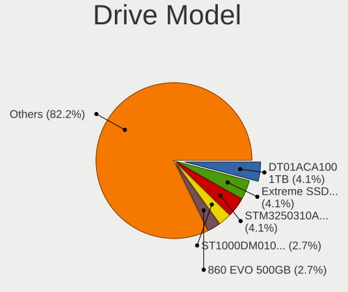

| Model                               | Desktops | Percent |
|-------------------------------------|----------|---------|
| Toshiba DT01ACA100 1TB              | 3        | 4.11%   |
| SanDisk Extreme SSD 1TB             | 3        | 4.11%   |
| Maxtor STM3250310AS 250GB           | 3        | 4.11%   |
| Seagate ST1000DM010-2EP102 1TB      | 2        | 2.74%   |
| Samsung SSD 860 EVO 500GB           | 2        | 2.74%   |
| Samsung HD103UJ 1TB                 | 2        | 2.74%   |
| Maxtor 6E040L0 40GB                 | 2        | 2.74%   |
| Kingston DataTraveler 3.0 32GB      | 2        | 2.74%   |
| JetFlash Transcend 16GB             | 2        | 2.74%   |
| Generic Flash Disk 64GB             | 2        | 2.74%   |
| WDC WDS240G2G0B-00EPW0 240GB        | 1        | 1.37%   |
| WDC WDS240G2G0A-00JH30 240GB        | 1        | 1.37%   |
| WDC WDS120G2G0A-00JH30 120GB        | 1        | 1.37%   |
| WDC WD800AAJS-18TDA1 80GB           | 1        | 1.37%   |
| WDC WD5003AZEX-00K3CA0 500GB        | 1        | 1.37%   |
| WDC WD5000AAKX-753CA1 500GB         | 1        | 1.37%   |
| WDC WD5000AACS-00ZUB0 500GB         | 1        | 1.37%   |
| WDC WD400BB-75DEA0 40GB             | 1        | 1.37%   |
| WDC WD2502ABYS-01B7A0 256GB         | 1        | 1.37%   |
| WDC WD20EFRX-68EUZN0 1TB            | 1        | 1.37%   |
| WDC WD20EARX-00PASB0 2TB            | 1        | 1.37%   |
| WDC WD200EB-00BHF0 20GB             | 1        | 1.37%   |
| WDC WD10EZRZ-00HTKB0 1TB            | 1        | 1.37%   |
| WDC WD10EZEX-60WN4A0 1TB            | 1        | 1.37%   |
| WDC WD10EADS-22M2B0 1TB             | 1        | 1.37%   |
| WDC WD1002FAEX-00Y9A0 1TB           | 1        | 1.37%   |
| USB SanDisk 3.2Gen1 64GB            | 1        | 1.37%   |
| Toshiba DT01ACA200 2TB              | 1        | 1.37%   |
| StoreJet Transcend 256GB            | 1        | 1.37%   |
| SMI USB DISK 16GB                   | 1        | 1.37%   |
| SK hynix HFS128G39TND-N210A 128GB   | 1        | 1.37%   |
| Seagate ST940110A 40GB              | 1        | 1.37%   |
| Seagate ST380011A 80GB              | 1        | 1.37%   |
| Seagate ST33221A 3GB                | 1        | 1.37%   |
| Seagate ST2000DM001-1CH164 2TB      | 1        | 1.37%   |
| Seagate ST2000DL003-9VT166 2TB      | 1        | 1.37%   |
| Seagate ST1000LM 024 HN-M101MBB 1TB | 1        | 1.37%   |
| Seagate ST1000DX001-1CM162 1TB      | 1        | 1.37%   |
| SanDisk SSD i110 16GB               | 1        | 1.37%   |
| SanDisk SDSSDH3512G 512GB           | 1        | 1.37%   |

HDD Vendor
----------

Hard disk drive vendors

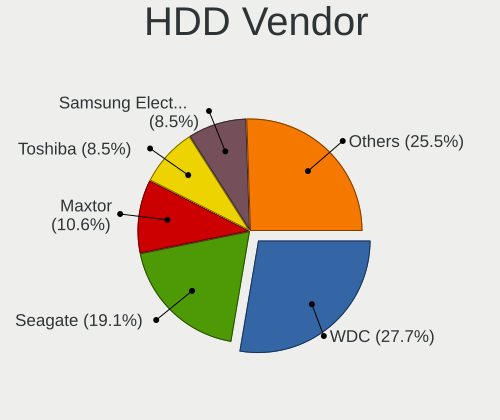

| Vendor              | Desktops | Drives | Percent |
|---------------------|----------|--------|---------|
| WDC                 | 13       | 16     | 27.66%  |
| Seagate             | 9        | 10     | 19.15%  |
| Maxtor              | 5        | 6      | 10.64%  |
| Toshiba             | 4        | 6      | 8.51%   |
| Samsung Electronics | 4        | 4      | 8.51%   |
| JetFlash            | 2        | 2      | 4.26%   |
| Generic             | 2        | 2      | 4.26%   |
| USB                 | 1        | 1      | 2.13%   |
| StoreJet            | 1        | 1      | 2.13%   |
| SMI                 | 1        | 1      | 2.13%   |
| Lexar               | 1        | 1      | 2.13%   |
| Intenso             | 1        | 1      | 2.13%   |
| IBM/Hitachi         | 1        | 1      | 2.13%   |
| HGST                | 1        | 1      | 2.13%   |
| Hewlett-Packard     | 1        | 1      | 2.13%   |

SSD Vendor
----------

Solid state drive vendors

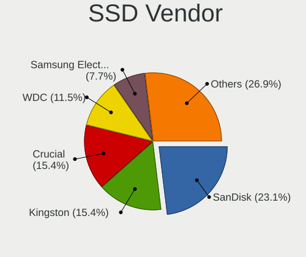

| Vendor              | Desktops | Drives | Percent |
|---------------------|----------|--------|---------|
| SanDisk             | 6        | 7      | 23.08%  |
| Kingston            | 4        | 5      | 15.38%  |
| Crucial             | 4        | 5      | 15.38%  |
| WDC                 | 3        | 3      | 11.54%  |
| Samsung Electronics | 2        | 2      | 7.69%   |
| SK hynix            | 1        | 2      | 3.85%   |
| PNY                 | 1        | 1      | 3.85%   |
| Patriot             | 1        | 1      | 3.85%   |
| KingSpec            | 1        | 1      | 3.85%   |
| Fanxiang            | 1        | 1      | 3.85%   |
| China               | 1        | 1      | 3.85%   |
| A-DATA Technology   | 1        | 1      | 3.85%   |

Drive Kind
----------

HDD or SSD

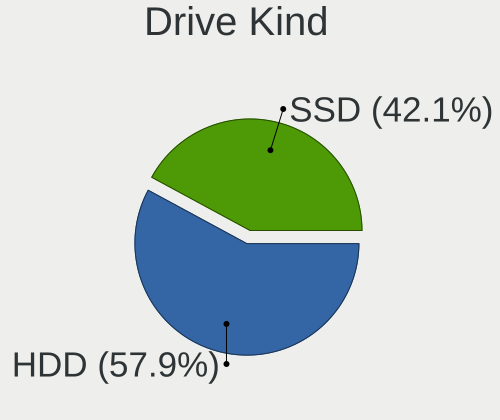

| Kind | Desktops | Drives | Percent |
|------|----------|--------|---------|
| HDD  | 33       | 54     | 57.89%  |
| SSD  | 24       | 30     | 42.11%  |

Drive Connector
---------------

SATA, SAS, NVMe, etc.

| Type | Desktops | Drives | Percent |
|------|----------|--------|---------|
| SATA | 48       | 84     | 100%    |

Drive Size
----------

Size of hard drive

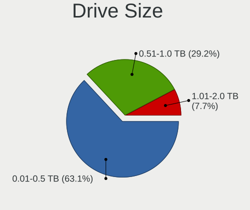

| Size in TB | Desktops | Drives | Percent |
|------------|----------|--------|---------|
| 0.01-0.5   | 41       | 52     | 63.08%  |
| 0.51-1.0   | 19       | 24     | 29.23%  |
| 1.01-2.0   | 5        | 8      | 7.69%   |

Space Total
-----------

Amount of disk space available on the file system

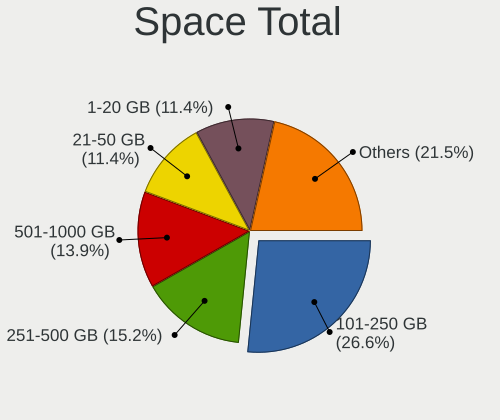

| Size in GB | Desktops | Percent |
|------------|----------|---------|
| 101-250    | 21       | 26.58%  |
| 251-500    | 12       | 15.19%  |
| 501-1000   | 11       | 13.92%  |
| 21-50      | 9        | 11.39%  |
| 1-20       | 9        | 11.39%  |
| 51-100     | 8        | 10.13%  |
| 1001-2000  | 6        | 7.59%   |
| 2001-3000  | 3        | 3.8%    |

Space Used
----------

Amount of used disk space

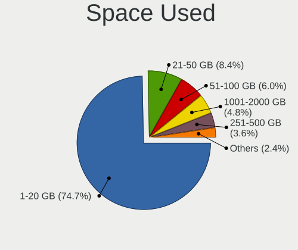

| Used GB   | Desktops | Percent |
|-----------|----------|---------|
| 1-20      | 62       | 74.7%   |
| 21-50     | 7        | 8.43%   |
| 51-100    | 5        | 6.02%   |
| 1001-2000 | 4        | 4.82%   |
| 251-500   | 3        | 3.61%   |
| 101-250   | 1        | 1.2%    |
| 501-1000  | 1        | 1.2%    |

Malfunc. Drives
---------------

Drive models with a malfunction

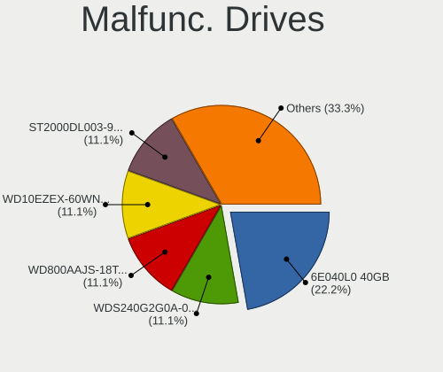

| Model                             | Desktops | Drives | Percent |
|-----------------------------------|----------|--------|---------|
| Maxtor 6E040L0 40GB               | 2        | 2      | 22.22%  |
| WDC WDS240G2G0A-00JH30 240GB      | 1        | 1      | 11.11%  |
| WDC WD800AAJS-18TDA1 80GB         | 1        | 1      | 11.11%  |
| WDC WD10EZEX-60WN4A0 1TB          | 1        | 1      | 11.11%  |
| SK hynix HFS128G39TND-N210A 128GB | 1        | 1      | 11.11%  |
| Seagate ST2000DL003-9VT166 2TB    | 1        | 1      | 11.11%  |
| Seagate ST1000DX001-1CM162 1TB    | 1        | 1      | 11.11%  |
| IBM/Hitachi IC25N040ATMR04-0 40GB | 1        | 1      | 11.11%  |

Malfunc. Drive Vendor
---------------------

Vendors of faulty drives

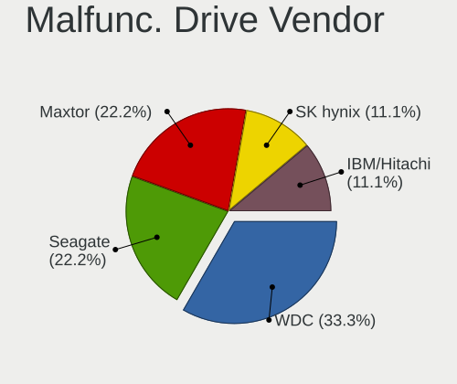

| Vendor      | Desktops | Drives | Percent |
|-------------|----------|--------|---------|
| WDC         | 3        | 3      | 33.33%  |
| Seagate     | 2        | 2      | 22.22%  |
| Maxtor      | 2        | 2      | 22.22%  |
| SK hynix    | 1        | 1      | 11.11%  |
| IBM/Hitachi | 1        | 1      | 11.11%  |

Malfunc. HDD Vendor
-------------------

Vendors of faulty HDD drives

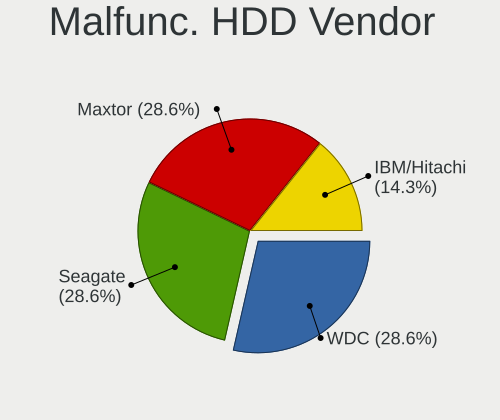

| Vendor      | Desktops | Drives | Percent |
|-------------|----------|--------|---------|
| WDC         | 2        | 2      | 28.57%  |
| Seagate     | 2        | 2      | 28.57%  |
| Maxtor      | 2        | 2      | 28.57%  |
| IBM/Hitachi | 1        | 1      | 14.29%  |

Malfunc. Drive Kind
-------------------

Kinds of faulty drives

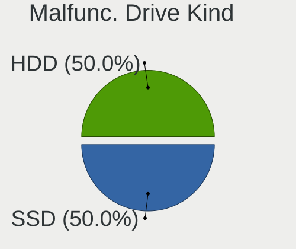

| Kind | Desktops | Drives | Percent |
|------|----------|--------|---------|
| HDD  | 7        | 7      | 77.78%  |
| SSD  | 2        | 2      | 22.22%  |

Failed Drives
-------------

Failed drive models

Zero info for selected period =(

Failed Drive Vendor
-------------------

Failed drive vendors

Zero info for selected period =(

Drive Status
------------

Number of failed and malfunc. drives

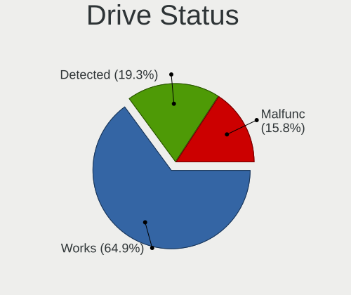

| Status   | Desktops | Drives | Percent |
|----------|----------|--------|---------|
| Works    | 37       | 64     | 64.91%  |
| Detected | 11       | 11     | 19.3%   |
| Malfunc  | 9        | 9      | 15.79%  |

Storage controller
------------------

Storage Vendor
--------------

Storage controller vendors

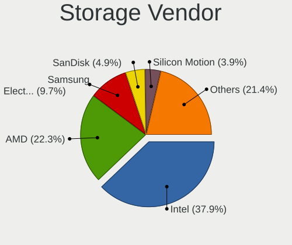

| Vendor                      | Desktops | Percent |
|-----------------------------|----------|---------|
| Intel                       | 39       | 37.86%  |
| AMD                         | 23       | 22.33%  |
| Samsung Electronics         | 10       | 9.71%   |
| SanDisk                     | 5        | 4.85%   |
| Silicon Motion              | 4        | 3.88%   |
| Phison Electronics          | 4        | 3.88%   |
| VIA Technologies            | 3        | 2.91%   |
| ULi Electronics             | 3        | 2.91%   |
| Silicon Image               | 3        | 2.91%   |
| Micron/Crucial Technology   | 3        | 2.91%   |
| ASMedia Technology          | 2        | 1.94%   |
| SK hynix                    | 1        | 0.97%   |
| Nvidia                      | 1        | 0.97%   |
| Kingston Technology Company | 1        | 0.97%   |
| Adaptec                     | 1        | 0.97%   |

Storage Model
-------------

Storage controller models

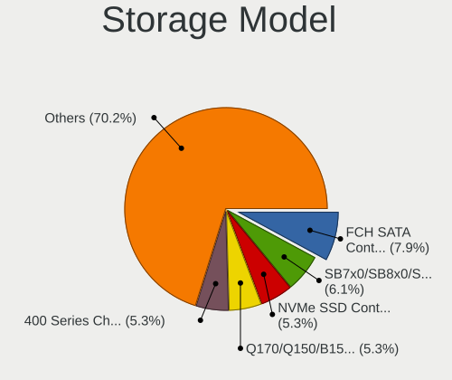

| Model                                                                          | Desktops | Percent |
|--------------------------------------------------------------------------------|----------|---------|
| AMD FCH SATA Controller [AHCI mode]                                            | 9        | 7.89%   |
| AMD SB7x0/SB8x0/SB9x0 SATA Controller [AHCI mode]                              | 7        | 6.14%   |
| Samsung NVMe SSD Controller SM981/PM981/PM983                                  | 6        | 5.26%   |
| Intel Q170/Q150/B150/H170/H110/Z170/CM236 Chipset SATA Controller [AHCI Mode]  | 6        | 5.26%   |
| AMD 400 Series Chipset SATA Controller                                         | 6        | 5.26%   |
| Silicon Motion SM2263EN/SM2263XT (DRAM-less) NVMe SSD Controllers              | 4        | 3.51%   |
| SanDisk Ultra 3D / WD PC SN530, IX SN530, Blue SN550 NVMe SSD (DRAM-less)      | 4        | 3.51%   |
| Intel Cannon Lake PCH SATA AHCI Controller                                     | 4        | 3.51%   |
| ULi M5229 IDE                                                                  | 3        | 2.63%   |
| Samsung NVMe SSD Controller 980 (DRAM-less)                                    | 3        | 2.63%   |
| Intel Alder Lake-N SATA AHCI Controller                                        | 3        | 2.63%   |
| Intel 7 Series/C210 Series Chipset Family 6-port SATA Controller [AHCI mode]   | 3        | 2.63%   |
| Intel 6 Series/C200 Series Chipset Family 6 port Desktop SATA AHCI Controller  | 3        | 2.63%   |
| Intel 200 Series PCH SATA controller [AHCI mode]                               | 3        | 2.63%   |
| AMD SB7x0/SB8x0/SB9x0 IDE Controller                                           | 3        | 2.63%   |
| AMD A320 Chipset SATA Controller [AHCI mode]                                   | 3        | 2.63%   |
| VIA VT82C586A/B/VT82C686/A/B/VT823x/A/C PIPC Bus Master IDE                    | 2        | 1.75%   |
| Silicon Image SiI 3114 [SATALink/SATARaid] Serial ATA Controller               | 2        | 1.75%   |
| Micron/Crucial P2 [Nick P2] / P3 / P3 Plus NVMe PCIe SSD (DRAM-less)           | 2        | 1.75%   |
| Intel 8 Series/C220 Series Chipset Family 6-port SATA Controller 1 [AHCI mode] | 2        | 1.75%   |
| Intel 7 Series Chipset Family 6-port SATA Controller [AHCI mode]               | 2        | 1.75%   |
| AMD 500 Series Chipset SATA Controller                                         | 2        | 1.75%   |
| VIA VX900 Series Serial-ATA Controller                                         | 1        | 0.88%   |
| SK hynix PC601 NVMe Solid State Drive                                          | 1        | 0.88%   |
| Silicon Image SiI 3112 [SATALink/SATARaid] Serial ATA Controller               | 1        | 0.88%   |
| Sandisk WD Green SN350 240GB (DRAM-less) / SN560E NVMe SSD                     | 1        | 0.88%   |
| Samsung NVMe SSD Controller SM961/PM961/SM963                                  | 1        | 0.88%   |
| Samsung NVMe SSD Controller S4LV008[Pascal]                                    | 1        | 0.88%   |
| Phison PS5021-E21 PCIe4 NVMe Controller (DRAM-less)                            | 1        | 0.88%   |
| Phison PS5013-E13 PCIe3 NVMe Controller (DRAM-less)                            | 1        | 0.88%   |
| Phison E16 PCIe4 NVMe Controller                                               | 1        | 0.88%   |
| Phison E12 NVMe Controller                                                     | 1        | 0.88%   |
| Nvidia MCP61 SATA Controller                                                   | 1        | 0.88%   |
| Nvidia MCP61 IDE                                                               | 1        | 0.88%   |
| Micron/Crucial P310 NVMe PCIe SSD (DRAM-less)                                  | 1        | 0.88%   |
| Kingston Company A2000 NVMe SSD [SM2263EN]                                     | 1        | 0.88%   |
| Intel Wildcat Point-LP SATA Controller [AHCI Mode]                             | 1        | 0.88%   |
| Intel Optane NVME SSD H10 with Solid State Storage [Teton Glacier]             | 1        | 0.88%   |
| Intel Jasper Lake SATA AHCI Controller                                         | 1        | 0.88%   |
| Intel Comet Lake SATA AHCI Controller                                          | 1        | 0.88%   |

Storage Kind
------------

Kind of storage controller (IDE, SATA, NVMe, SAS, ...)

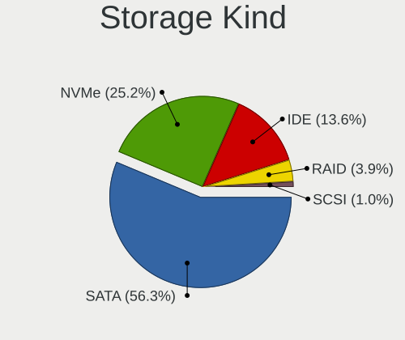

| Kind | Desktops | Percent |
|------|----------|---------|
| SATA | 58       | 56.31%  |
| NVMe | 26       | 25.24%  |
| IDE  | 14       | 13.59%  |
| RAID | 4        | 3.88%   |
| SCSI | 1        | 0.97%   |

Processor
---------

CPU Vendor
----------

Processor vendors

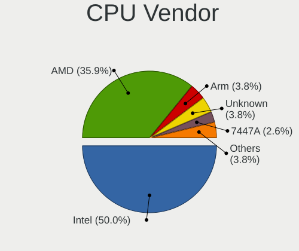

| Vendor             | Desktops | Percent |
|--------------------|----------|---------|
| Intel              | 39       | 50%     |
| AMD                | 28       | 35.9%   |
| Arm                | 3        | 3.85%   |
| Unknown            | 3        | 3.85%   |
| 7447A              | 2        | 2.56%   |
| VIA                | 1        | 1.28%   |
| SUNW,UltraAX-i2    | 1        | 1.28%   |
| SUNW,Sun-Blade-100 | 1        | 1.28%   |

CPU Model
---------

Processor models

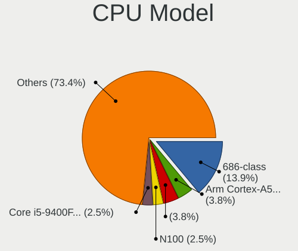

| Model                                              | Desktops | Percent |
|----------------------------------------------------|----------|---------|
| Intel 686-class                                    | 11       | 13.92%  |
| Arm Cortex-A53 r0p4 (v8-A)                         | 3        | 3.8%    |
|                                                    | 3        | 3.8%    |
| Intel N100                                         | 2        | 2.53%   |
| Intel Core i5-9400F CPU @ 2.90GHz                  | 2        | 2.53%   |
| AMD Ryzen 9 3900X 12-Core Processor                | 2        | 2.53%   |
| AMD Ryzen 3 3200G with Radeon Vega Graphics        | 2        | 2.53%   |
| AMD 686-class                                      | 2        | 2.53%   |
| 7447A (Revision 1.2)                               | 2        | 2.53%   |
| VIA Nano U3300@1200MHz                             | 1        | 1.27%   |
| SUNW,UltraAX-i2 (SUNW,UltraSPARC-IIe @ 500 MHz)    | 1        | 1.27%   |
| SUNW,Sun-Blade-100 (SUNW,UltraSPARC-IIe @ 502 MHz) | 1        | 1.27%   |
| Intel Xeon W-2133 CPU @ 3.60GHz                    | 1        | 1.27%   |
| Intel Xeon CPU E5-2630L v3 @ 1.80GHz               | 1        | 1.27%   |
| Intel Pentium Pro Processor                        | 1        | 1.27%   |
| Intel Pentium III                                  | 1        | 1.27%   |
| Intel Core i9-10850K CPU @ 3.60GHz                 | 1        | 1.27%   |
| Intel Core i7-9700 CPU @ 3.00GHz                   | 1        | 1.27%   |
| Intel Core i7-7700 CPU @ 3.60GHz                   | 1        | 1.27%   |
| Intel Core i7-6700K CPU @ 4.00GHz                  | 1        | 1.27%   |
| Intel Core i7-3770 CPU @ 3.40GHz                   | 1        | 1.27%   |
| Intel Core i7-2600 CPU @ 3.40GHz                   | 1        | 1.27%   |
| Intel Core i7 CPU 860 @ 2.80GHz                    | 1        | 1.27%   |
| Intel Core i5-9600K CPU @ 3.70GHz                  | 1        | 1.27%   |
| Intel Core i5-9400T CPU @ 1.80GHz                  | 1        | 1.27%   |
| Intel Core i5-7400 CPU @ 3.00GHz                   | 1        | 1.27%   |
| Intel Core i5-6500T CPU @ 2.50GHz                  | 1        | 1.27%   |
| Intel Core i5-6500 CPU @ 3.20GHz                   | 1        | 1.27%   |
| Intel Core i5-5300U CPU @ 2.30GHz                  | 1        | 1.27%   |
| Intel Core i5-4310M CPU @ 2.70GHz                  | 1        | 1.27%   |
| Intel Core i5-2500K CPU @ 3.30GHz                  | 1        | 1.27%   |
| Intel Core i5-2320 CPU @ 3.00GHz                   | 1        | 1.27%   |
| Intel Core i5-1035G1 CPU @ 1.00GHz                 | 1        | 1.27%   |
| Intel Core i3-4150 CPU @ 3.50GHz                   | 1        | 1.27%   |
| Intel Celeron CPU N2830 @ 2.16GHz                  | 1        | 1.27%   |
| Intel Celeron 2955U @ 1.40GHz                      | 1        | 1.27%   |
| Intel 13th Gen Core i7-13620H                      | 1        | 1.27%   |
| AMD Sempron 145 Processor                          | 1        | 1.27%   |
| AMD Ryzen 7 3700X 8-Core Processor                 | 1        | 1.27%   |
| AMD Ryzen 7 2700 Eight-Core Processor              | 1        | 1.27%   |

CPU Model Family
----------------

Processor model prefix

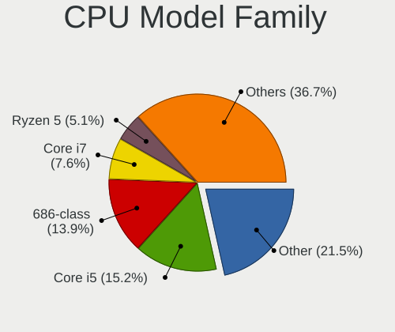

| Model             | Desktops | Percent |
|-------------------|----------|---------|
| Other             | 17       | 21.52%  |
| Intel Core i5     | 12       | 15.19%  |
| Intel 686-class   | 11       | 13.92%  |
| Intel Core i7     | 6        | 7.59%   |
| AMD Ryzen 5       | 4        | 5.06%   |
| AMD Ryzen 3       | 4        | 5.06%   |
| AMD FX            | 3        | 3.8%    |
| Intel Xeon        | 2        | 2.53%   |
| Intel Celeron     | 2        | 2.53%   |
| AMD Ryzen 9       | 2        | 2.53%   |
| AMD Ryzen 7       | 2        | 2.53%   |
| AMD 686-class     | 2        | 2.53%   |
| Intel Pentium III | 1        | 1.27%   |
| Intel Pentium     | 1        | 1.27%   |
| Intel Core i9     | 1        | 1.27%   |
| Intel Core i3     | 1        | 1.27%   |
| ARM Cortex        | 1        | 1.27%   |
| AMD Sempron       | 1        | 1.27%   |
| AMD Phenom II X6  | 1        | 1.27%   |
| AMD Phenom II X4  | 1        | 1.27%   |
| AMD GX            | 1        | 1.27%   |
| AMD EPYC          | 1        | 1.27%   |
| AMD E             | 1        | 1.27%   |
| AMD Athlon        | 1        | 1.27%   |

CPU Cores
---------

Number of processor cores

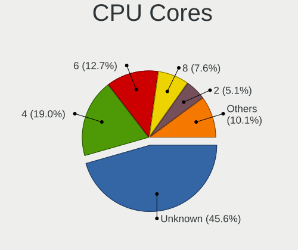

| Number  | Desktops | Percent |
|---------|----------|---------|
| Unknown | 36       | 45.57%  |
| 4       | 15       | 18.99%  |
| 6       | 10       | 12.66%  |
| 8       | 6        | 7.59%   |
| 2       | 4        | 5.06%   |
| 1       | 3        | 3.8%    |
| 12      | 2        | 2.53%   |
| 10      | 2        | 2.53%   |
| 24      | 1        | 1.27%   |

CPU Sockets
-----------

Number of sockets

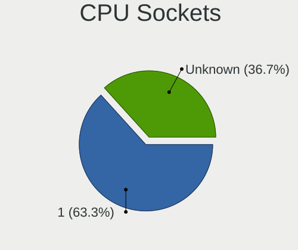

| Number  | Desktops | Percent |
|---------|----------|---------|
| 1       | 50       | 63.29%  |
| Unknown | 29       | 36.71%  |

CPU Threads
-----------

Threads per core (Hyper-Threading)

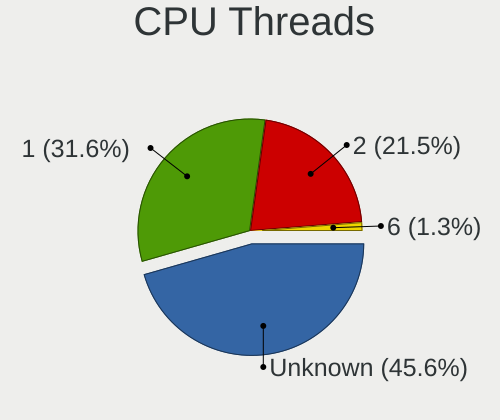

| Number  | Desktops | Percent |
|---------|----------|---------|
| Unknown | 36       | 45.57%  |
| 1       | 25       | 31.65%  |
| 2       | 17       | 21.52%  |
| 6       | 1        | 1.27%   |

CPU Microarch
-------------

Microarchitecture

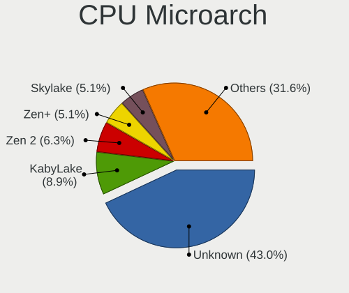

| Name        | Desktops | Percent |
|-------------|----------|---------|
| Unknown     | 34       | 43.04%  |
| KabyLake    | 7        | 8.86%   |
| Zen 2       | 5        | 6.33%   |
| Zen+        | 4        | 5.06%   |
| Skylake     | 4        | 5.06%   |
| Piledriver  | 3        | 3.8%    |
| P6          | 3        | 3.8%    |
| Haswell     | 3        | 3.8%    |
| Zen         | 2        | 2.53%   |
| SandyBridge | 2        | 2.53%   |
| K10         | 2        | 2.53%   |
| Geode       | 2        | 2.53%   |
| Zen 3       | 1        | 1.27%   |
| Silvermont  | 1        | 1.27%   |
| Puma        | 1        | 1.27%   |
| Nehalem     | 1        | 1.27%   |
| K6          | 1        | 1.27%   |
| IvyBridge   | 1        | 1.27%   |
| CometLake   | 1        | 1.27%   |
| Bobcat      | 1        | 1.27%   |

Graphics
--------

GPU Vendor
----------

Vendors of graphics cards

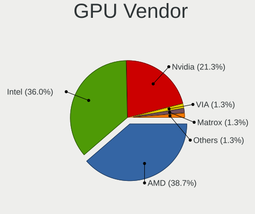

| Vendor                     | Desktops | Percent |
|----------------------------|----------|---------|
| AMD                        | 29       | 38.67%  |
| Intel                      | 27       | 36%     |
| Nvidia                     | 16       | 21.33%  |
| VIA Technologies           | 1        | 1.33%   |
| Matrox Electronics Systems | 1        | 1.33%   |
| 3Dfx Interactive           | 1        | 1.33%   |

GPU Model
---------

Graphics card models

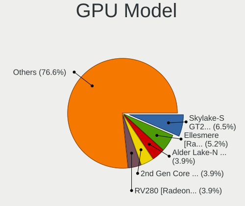

| Model                                                                     | Desktops | Percent |
|---------------------------------------------------------------------------|----------|---------|
| Intel Skylake-S GT2 [HD Graphics 530]                                     | 5        | 6.49%   |
| AMD Ellesmere [Radeon RX 470/480/570/570X/580/580X/590]                   | 4        | 5.19%   |
| Intel Alder Lake-N [UHD Graphics]                                         | 3        | 3.9%    |
| Intel 2nd Generation Core Processor Family Integrated Graphics Controller | 3        | 3.9%    |
| AMD RV280 [Radeon 9200]                                                   | 3        | 3.9%    |
| Nvidia GF114 [GeForce GTX 560]                                            | 2        | 2.6%    |
| Intel CoffeeLake-S GT2 [UHD Graphics 630]                                 | 2        | 2.6%    |
| AMD Cedar [Radeon HD 5000/6000/7350/8350 Series]                          | 2        | 2.6%    |
| VIA Technologies VX900 Graphics [Chrome9 HD]                              | 1        | 1.3%    |
| Nvidia TU116 [GeForce GTX 1660 SUPER]                                     | 1        | 1.3%    |
| Nvidia NV5 [Riva TNT2 Model 64 / Model 64 Pro]                            | 1        | 1.3%    |
| Nvidia NV34 [GeForce FX 5200]                                             | 1        | 1.3%    |
| Nvidia NV18 [GeForce4 MX 440 AGP 8x]                                      | 1        | 1.3%    |
| Nvidia GP107M [GeForce GTX 1050 Mobile]                                   | 1        | 1.3%    |
| Nvidia GP107 [GeForce GTX 1050 Ti]                                        | 1        | 1.3%    |
| Nvidia GP106 [GeForce GTX 1060 6GB]                                       | 1        | 1.3%    |
| Nvidia GP104GL [Quadro P4000]                                             | 1        | 1.3%    |
| Nvidia GP104 [GeForce GTX 1080]                                           | 1        | 1.3%    |
| Nvidia GM206 [GeForce GTX 960]                                            | 1        | 1.3%    |
| Nvidia GM204 [GeForce GTX 970]                                            | 1        | 1.3%    |
| Nvidia GK208B [GeForce GT 710]                                            | 1        | 1.3%    |
| Nvidia G86 [GeForce 8500 GT]                                              | 1        | 1.3%    |
| Nvidia C61 [GeForce 7025 / nForce 630a]                                   | 1        | 1.3%    |
| Matrox Electronics Systems MGA G400/G450                                  | 1        | 1.3%    |
| Intel Xeon E3-1200 v2/3rd Gen Core processor Graphics Controller          | 1        | 1.3%    |
| Intel Raptor Lake-P [UHD Graphics]                                        | 1        | 1.3%    |
| Intel Kaby Lake-S GT2 [HD Graphics 630]                                   | 1        | 1.3%    |
| Intel JasperLake [UHD Graphics]                                           | 1        | 1.3%    |
| Intel IvyBridge GT2 [HD Graphics 4000]                                    | 1        | 1.3%    |
| Intel Iris Plus Graphics G1 (Ice Lake)                                    | 1        | 1.3%    |
| Intel Haswell-ULT Integrated Graphics Controller                          | 1        | 1.3%    |
| Intel CometLake-S GT2 [UHD Graphics 630]                                  | 1        | 1.3%    |
| Intel CoffeeLake-H GT2 [UHD Graphics 630]                                 | 1        | 1.3%    |
| Intel Broadwell-U GT3 [Iris Graphics 6100]                                | 1        | 1.3%    |
| Intel Broadwell-U GT2 [HD Graphics 5500]                                  | 1        | 1.3%    |
| Intel Atom Processor Z36xxx/Z37xxx Series Graphics & Display              | 1        | 1.3%    |
| Intel 4th Gen Core Processor Integrated Graphics Controller               | 1        | 1.3%    |
| Intel 3rd Gen Core processor Graphics Controller                          | 1        | 1.3%    |
| AMD Wrestler [Radeon HD 6320]                                             | 1        | 1.3%    |
| AMD Wrestler [Radeon HD 6250]                                             | 1        | 1.3%    |

GPU Combo
---------

Combinations of graphics cards

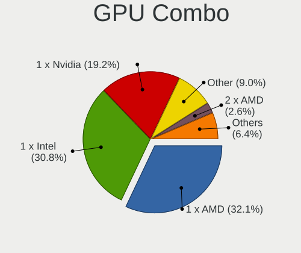

| Name                 | Desktops | Percent |
|----------------------|----------|---------|
| 1 x AMD              | 25       | 32.05%  |
| 1 x Intel            | 24       | 30.77%  |
| 1 x Nvidia           | 15       | 19.23%  |
| Other                | 7        | 8.97%   |
| 2 x AMD              | 2        | 2.56%   |
| 1 x VIA              | 1        | 1.28%   |
| 1 x Matrox           | 1        | 1.28%   |
| Intel + Nvidia       | 1        | 1.28%   |
| Intel + AMD          | 1        | 1.28%   |
| 1 x 3Dfx Interactive | 1        | 1.28%   |

GPU Driver
----------

Free vs proprietary

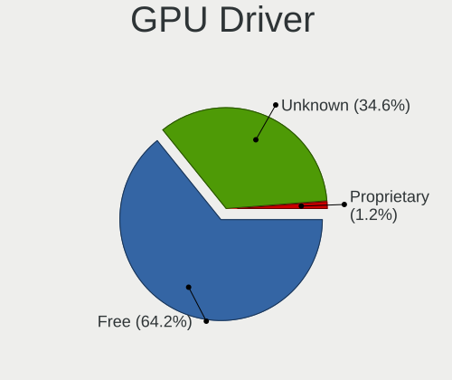

| Driver      | Desktops | Percent |
|-------------|----------|---------|
| Free        | 52       | 64.2%   |
| Unknown     | 28       | 34.57%  |
| Proprietary | 1        | 1.23%   |

GPU Memory
----------

Total video memory

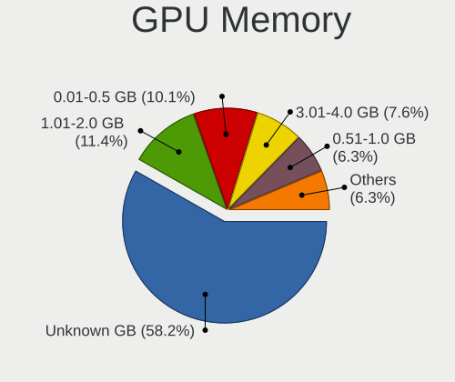

| Size in GB | Desktops | Percent |
|------------|----------|---------|
| Unknown    | 46       | 58.23%  |
| 1.01-2.0   | 9        | 11.39%  |
| 0.01-0.5   | 8        | 10.13%  |
| 3.01-4.0   | 6        | 7.59%   |
| 0.51-1.0   | 5        | 6.33%   |
| 7.01-8.0   | 4        | 5.06%   |
| 5.01-6.0   | 1        | 1.27%   |

Monitor
-------

Monitor Vendor
--------------

Monitor vendors

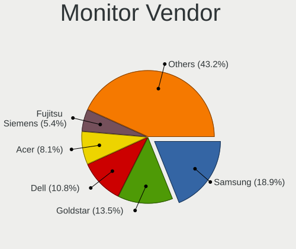

| Vendor                  | Desktops | Percent |
|-------------------------|----------|---------|
| Samsung Electronics     | 7        | 18.92%  |
| Goldstar                | 5        | 13.51%  |
| Dell                    | 4        | 10.81%  |
| Acer                    | 3        | 8.11%   |
| Fujitsu Siemens         | 2        | 5.41%   |
| Eizo                    | 2        | 5.41%   |
| ViewSonic               | 1        | 2.7%    |
| Unknown (CDD)           | 1        | 2.7%    |
| STD                     | 1        | 2.7%    |
| Sony                    | 1        | 2.7%    |
| RS                      | 1        | 2.7%    |
| Philips                 | 1        | 2.7%    |
| NEC Computers           | 1        | 2.7%    |
| LG Display              | 1        | 2.7%    |
| Lenovo                  | 1        | 2.7%    |
| Impression              | 1        | 2.7%    |
| Iiyama                  | 1        | 2.7%    |
| Hewlett-Packard         | 1        | 2.7%    |
| Chi Mei Optoelectronics | 1        | 2.7%    |
| Apple                   | 1        | 2.7%    |

Monitor Model
-------------

Monitor models

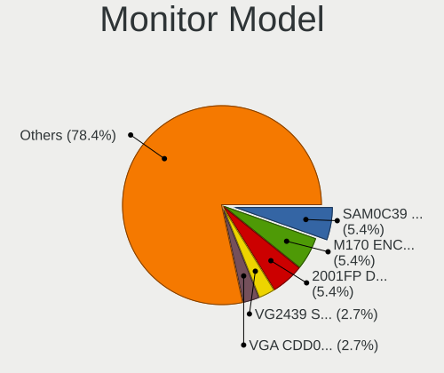

| Model                                                                  | Desktops | Percent |
|------------------------------------------------------------------------|----------|---------|
| Samsung Electronics LCD Monitor SAM0C39 1920x1080 700x390mm 31.5-inch  | 2        | 5.41%   |
| Eizo M170 ENC1768 1280x1024 340x270mm 17.1-inch                        | 2        | 5.41%   |
| Dell 2001FP DELA007 1600x1200 410x310mm 20.2-inch                      | 2        | 5.41%   |
| ViewSonic VG2439 Series VSCD22B 1920x1080 520x290mm 23.4-inch          | 1        | 2.7%    |
| Unknown (CDD) VGA CDD0030 1920x1080 1150x650mm 52.0-inch               | 1        | 2.7%    |
| STD LED STD0110 1680x1050 470x300mm 22.0-inch                          | 1        | 2.7%    |
| Sony TV SNY4D04 1920x1080                                              | 1        | 2.7%    |
| Samsung Electronics SyncMaster SAM01AE 1600x1200 410x310mm 20.2-inch   | 1        | 2.7%    |
| Samsung Electronics SMS27A350H SAM07CE 1920x1080 600x340mm 27.2-inch   | 1        | 2.7%    |
| Samsung Electronics S24C650 SAM09E9 1920x1080 520x290mm 23.4-inch      | 1        | 2.7%    |
| Samsung Electronics S24C650 SAM09E8 1920x1080 520x290mm 23.4-inch      | 1        | 2.7%    |
| Samsung Electronics S23C570 SAM0A56 1920x1080 510x290mm 23.1-inch      | 1        | 2.7%    |
| RS LE1940 BTC1940 1440x900 410x260mm 19.1-inch                         | 1        | 2.7%    |
| Philips PHL 245E1 PHLC20B 2560x1440 530x300mm 24.0-inch                | 1        | 2.7%    |
| NEC Computers P221W NEC674A 1680x1050 470x300mm 22.0-inch              | 1        | 2.7%    |
| LG Display LCD Monitor LGD045E 1366x768 310x170mm 13.9-inch            | 1        | 2.7%    |
| Lenovo P27h-20 LEN61E9 2560x1440 600x340mm 27.2-inch                   | 1        | 2.7%    |
| Impression R19W11 IMP1911 1440x900 410x260mm 19.1-inch                 | 1        | 2.7%    |
| Iiyama PL2792Q IVM6630 2560x1440 600x340mm 27.2-inch                   | 1        | 2.7%    |
| Hewlett-Packard OMEN 27i IPS HPN3673 2560x1440 600x340mm 27.2-inch     | 1        | 2.7%    |
| Goldstar W1952 GSM4B78 1440x900 410x260mm 19.1-inch                    | 1        | 2.7%    |
| Goldstar LG ULTRAWIDE GSM59F1 2560x1080 670x280mm 28.6-inch            | 1        | 2.7%    |
| Goldstar LG HDR 4K GSM7706 3840x2160 600x340mm 27.2-inch               | 1        | 2.7%    |
| Goldstar L226WTQ GSM564D 1680x1050 490x320mm 23.0-inch                 | 1        | 2.7%    |
| Goldstar L194WT GSM4B05 1440x900 410x260mm 19.1-inch                   | 1        | 2.7%    |
| Fujitsu Siemens SL27T-1 LED FUS07E5 1920x1080 600x340mm 27.2-inch      | 1        | 2.7%    |
| Fujitsu Siemens SL27T-1 LED FUS07E4 1920x1080 600x340mm 27.2-inch      | 1        | 2.7%    |
| Dell U2724D DEL42D0 2560x1440 600x340mm 27.2-inch                      | 1        | 2.7%    |
| Dell E196FP DELA015 1280x1024 380x300mm 19.1-inch                      | 1        | 2.7%    |
| Chi Mei Optoelectronics CMC 22 W CMO2228 1680x1050 470x300mm 22.0-inch | 1        | 2.7%    |
| Apple Color LCD APPA029 2560x1600 290x180mm 13.4-inch                  | 1        | 2.7%    |
| Acer SB220Q ACR06AB 1920x1080 480x270mm 21.7-inch                      | 1        | 2.7%    |
| Acer QG241Y ACR079C 1920x1080 520x320mm 24.0-inch                      | 1        | 2.7%    |
| Acer B193 ACR001D 1280x1024 380x300mm 19.1-inch                        | 1        | 2.7%    |

Monitor Resolution
------------------

Monitor screen resolution

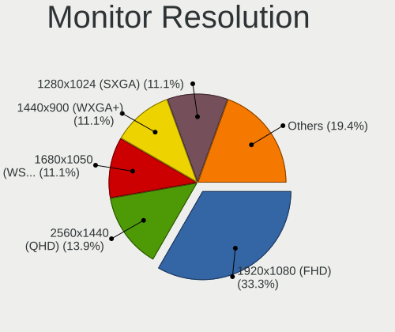

| Resolution         | Desktops | Percent |
|--------------------|----------|---------|
| 1920x1080 (FHD)    | 12       | 33.33%  |
| 2560x1440 (QHD)    | 5        | 13.89%  |
| 1680x1050 (WSXGA+) | 4        | 11.11%  |
| 1440x900 (WXGA+)   | 4        | 11.11%  |
| 1280x1024 (SXGA)   | 4        | 11.11%  |
| 1600x1200          | 3        | 8.33%   |
| 3840x2160 (4K)     | 1        | 2.78%   |
| 2560x1600          | 1        | 2.78%   |
| 2560x1080          | 1        | 2.78%   |
| 1366x768 (WXGA)    | 1        | 2.78%   |

Monitor Diagonal
----------------

Diagonal size in inches

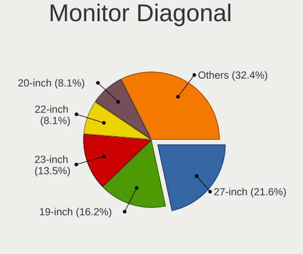

| Inches  | Desktops | Percent |
|---------|----------|---------|
| 27      | 8        | 21.62%  |
| 19      | 6        | 16.22%  |
| 23      | 5        | 13.51%  |
| 22      | 3        | 8.11%   |
| 20      | 3        | 8.11%   |
| 40      | 2        | 5.41%   |
| 24      | 2        | 5.41%   |
| 17      | 2        | 5.41%   |
| 13      | 2        | 5.41%   |
| 52      | 1        | 2.7%    |
| 34      | 1        | 2.7%    |
| 21      | 1        | 2.7%    |
| Unknown | 1        | 2.7%    |

Monitor Width
-------------

Physical width

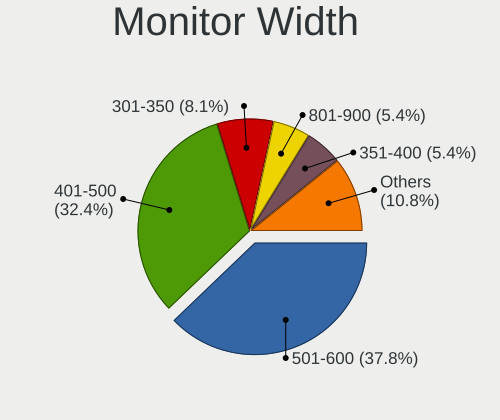

| Width in mm | Desktops | Percent |
|-------------|----------|---------|
| 501-600     | 14       | 37.84%  |
| 401-500     | 12       | 32.43%  |
| 301-350     | 3        | 8.11%   |
| 801-900     | 2        | 5.41%   |
| 351-400     | 2        | 5.41%   |
| 701-800     | 1        | 2.7%    |
| 201-300     | 1        | 2.7%    |
| 1001-1500   | 1        | 2.7%    |
| Unknown     | 1        | 2.7%    |

Aspect Ratio
------------

Proportional relationship between the width and the height

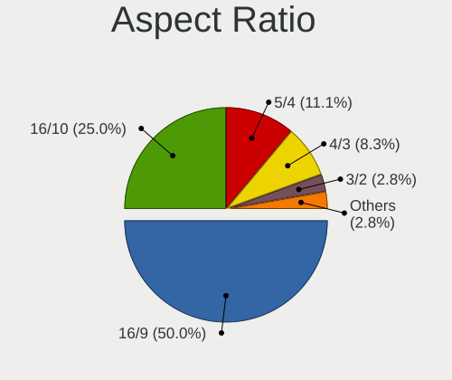

| Ratio | Desktops | Percent |
|-------|----------|---------|
| 16/9  | 18       | 50%     |
| 16/10 | 9        | 25%     |
| 5/4   | 4        | 11.11%  |
| 4/3   | 3        | 8.33%   |
| 3/2   | 1        | 2.78%   |
| 21/9  | 1        | 2.78%   |

Monitor Area
------------

Area in inch²

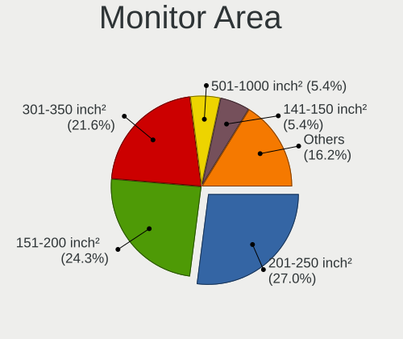

| Area in inch² | Desktops | Percent |
|----------------|----------|---------|
| 201-250        | 10       | 27.03%  |
| 151-200        | 9        | 24.32%  |
| 301-350        | 8        | 21.62%  |
| 81-90          | 2        | 5.41%   |
| 141-150        | 2        | 5.41%   |
| 501-1000       | 2        | 5.41%   |
| More than 1000 | 1        | 2.7%    |
| 351-500        | 1        | 2.7%    |
| 251-300        | 1        | 2.7%    |
| Unknown        | 1        | 2.7%    |

Pixel Density
-------------

Pixels per inch

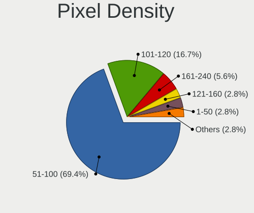

| Density | Desktops | Percent |
|---------|----------|---------|
| 51-100  | 25       | 69.44%  |
| 101-120 | 6        | 16.67%  |
| 161-240 | 2        | 5.56%   |
| 1-50    | 1        | 2.78%   |
| 121-160 | 1        | 2.78%   |
| Unknown | 1        | 2.78%   |

Multiple Monitors
-----------------

Total monitors connected

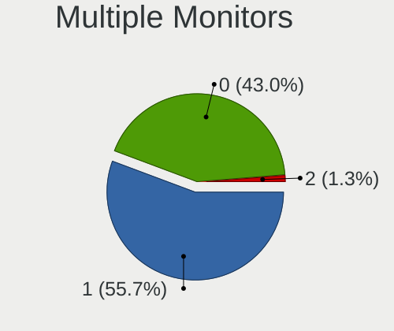

| Total | Desktops | Percent |
|-------|----------|---------|
| 1     | 44       | 55.7%   |
| 0     | 34       | 43.04%  |
| 2     | 1        | 1.27%   |

Network
-------

Net Controller Vendor
---------------------

Controller vendors

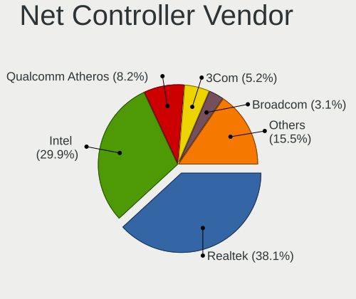

| Vendor                | Desktops | Percent |
|-----------------------|----------|---------|
| Realtek Semiconductor | 37       | 38.14%  |
| Intel                 | 29       | 29.9%   |
| Qualcomm Atheros      | 8        | 8.25%   |
| 3Com                  | 5        | 5.15%   |
| Broadcom              | 3        | 3.09%   |
| VIA Technologies      | 2        | 2.06%   |
| Huawei Technologies   | 2        | 2.06%   |
| PCTel                 | 1        | 1.03%   |
| Oracle/SUN            | 1        | 1.03%   |
| Oculus VR             | 1        | 1.03%   |
| Netchip Technology    | 1        | 1.03%   |
| Mercucys              | 1        | 1.03%   |
| MediaTek              | 1        | 1.03%   |
| Fry's Electronics     | 1        | 1.03%   |
| Davicom Semiconductor | 1        | 1.03%   |
| D-Link System         | 1        | 1.03%   |
| Arduino SA            | 1        | 1.03%   |
| Aquantia              | 1        | 1.03%   |

Net Controller Model
--------------------

Controller models

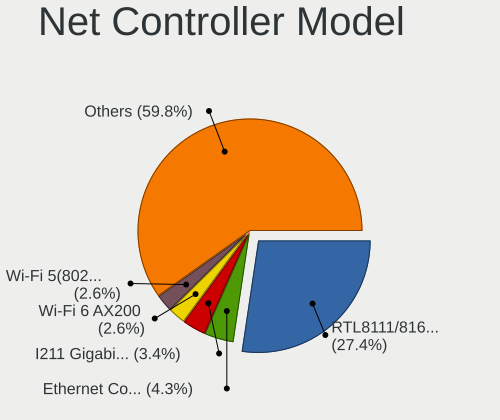

| Model                                                                  | Desktops | Percent |
|------------------------------------------------------------------------|----------|---------|
| Realtek RTL8111/8168/8211/8411 PCI Express Gigabit Ethernet Controller | 32       | 27.35%  |
| Intel Ethernet Connection (2) I219-LM                                  | 5        | 4.27%   |
| Intel I211 Gigabit Network Connection                                  | 4        | 3.42%   |
| Intel Wi-Fi 6 AX200                                                    | 3        | 2.56%   |
| Intel Wi-Fi 5(802.11ac) Wireless-AC 9x6x [Thunder Peak]                | 3        | 2.56%   |
| Intel Ethernet Controller I225-V                                       | 3        | 2.56%   |
| Intel 82579LM Gigabit Network Connection (Lewisville)                  | 3        | 2.56%   |
| Realtek RTL8822CE 802.11ac PCIe Wireless Network Adapter               | 2        | 1.71%   |
| Realtek RTL8812AE 802.11ac PCIe Wireless Network Adapter               | 2        | 1.71%   |
| Realtek RTL8169 PCI Gigabit Ethernet Controller                        | 2        | 1.71%   |
| Qualcomm Atheros AR8151 v2.0 Gigabit Ethernet                          | 2        | 1.71%   |
| Intel Cannon Lake PCH CNVi WiFi                                        | 2        | 1.71%   |
| Intel Alder Lake-N PCH CNVi WiFi                                       | 2        | 1.71%   |
| Huawei USB Device                                                      | 2        | 1.71%   |
| 3Com 3c905C-TX/TX-M [Tornado]                                          | 2        | 1.71%   |
| 3Com 3c905B 100BaseTX [Cyclone]                                        | 2        | 1.71%   |
| VIA VT6120/VT6121/VT6122/VT6130 Gigabit Ethernet Adapter               | 1        | 0.85%   |
| VIA VT6102/VT6103 [Rhine-II]                                           | 1        | 0.85%   |
| Realtek RTL8723BE PCIe Wireless Network Adapter                        | 1        | 0.85%   |
| Realtek RTL8192CU 802.11n WLAN Adapter                                 | 1        | 0.85%   |
| Realtek RTL8188FTV 802.11b/g/n 1T1R 2.4G WLAN Adapter                  | 1        | 0.85%   |
| Realtek RTL8188EUS 802.11n Wireless Network Adapter                    | 1        | 0.85%   |
| Realtek RTL8125 2.5GbE Controller                                      | 1        | 0.85%   |
| Realtek RTL8111/8168/8411 PCI Express Gigabit Ethernet Controller      | 1        | 0.85%   |
| Realtek RTL-8100/8101L/8139 PCI Fast Ethernet Adapter                  | 1        | 0.85%   |
| Qualcomm Atheros QCA9565 / AR9565 Wireless Network Adapter             | 1        | 0.85%   |
| Qualcomm Atheros Killer E2400 Gigabit Ethernet Controller              | 1        | 0.85%   |
| Qualcomm Atheros Killer E220x Gigabit Ethernet Controller              | 1        | 0.85%   |
| Qualcomm Atheros AR9485 Wireless Network Adapter                       | 1        | 0.85%   |
| Qualcomm Atheros AR9462 Wireless Network Adapter                       | 1        | 0.85%   |
| Qualcomm Atheros AR9285 Wireless Network Adapter (PCI-Express)         | 1        | 0.85%   |
| PCTel HSP56 MicroModem                                                 | 1        | 0.85%   |
| Oracle/SUN RIO 10/100 Ethernet [eri]                                   | 1        | 0.85%   |
| Oculus VR Rift S                                                       | 1        | 0.85%   |
| Netchip Linux-USB Serial Gadget (CDC ACM mode)                         | 1        | 0.85%   |
| Mercucys MERCUSYS Wireless USB Adapter                                 | 1        | 0.85%   |
| MediaTek MT7922 802.11ax PCI Express Wireless Network Adapter          | 1        | 0.85%   |
| Intel Wireless 8265 / 8275                                             | 1        | 0.85%   |
| Intel Wireless 7265                                                    | 1        | 0.85%   |
| Intel Wireless 7260                                                    | 1        | 0.85%   |

Wireless Vendor
---------------

Wireless vendors

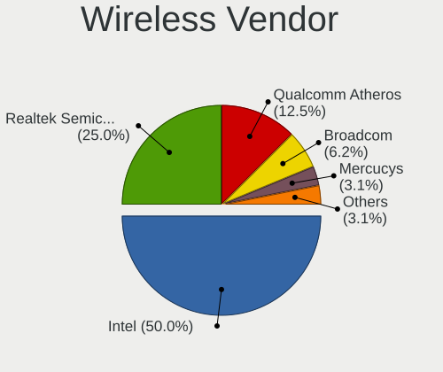

| Vendor                | Desktops | Percent |
|-----------------------|----------|---------|
| Intel                 | 16       | 50%     |
| Realtek Semiconductor | 8        | 25%     |
| Qualcomm Atheros      | 4        | 12.5%   |
| Broadcom              | 2        | 6.25%   |
| Mercucys              | 1        | 3.13%   |
| MediaTek              | 1        | 3.13%   |

Wireless Model
--------------

Wireless models

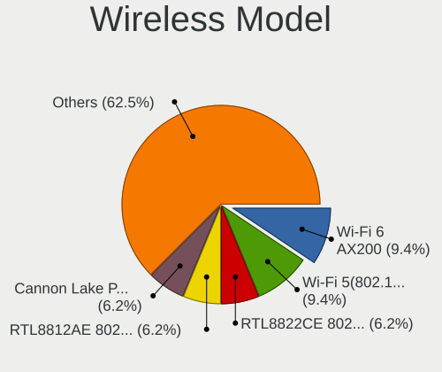

| Model                                                          | Desktops | Percent |
|----------------------------------------------------------------|----------|---------|
| Intel Wi-Fi 6 AX200                                            | 3        | 9.38%   |
| Intel Wi-Fi 5(802.11ac) Wireless-AC 9x6x [Thunder Peak]        | 3        | 9.38%   |
| Realtek RTL8822CE 802.11ac PCIe Wireless Network Adapter       | 2        | 6.25%   |
| Realtek RTL8812AE 802.11ac PCIe Wireless Network Adapter       | 2        | 6.25%   |
| Intel Cannon Lake PCH CNVi WiFi                                | 2        | 6.25%   |
| Intel Alder Lake-N PCH CNVi WiFi                               | 2        | 6.25%   |
| Realtek RTL8723BE PCIe Wireless Network Adapter                | 1        | 3.13%   |
| Realtek RTL8192CU 802.11n WLAN Adapter                         | 1        | 3.13%   |
| Realtek RTL8188FTV 802.11b/g/n 1T1R 2.4G WLAN Adapter          | 1        | 3.13%   |
| Realtek RTL8188EUS 802.11n Wireless Network Adapter            | 1        | 3.13%   |
| Qualcomm Atheros QCA9565 / AR9565 Wireless Network Adapter     | 1        | 3.13%   |
| Qualcomm Atheros AR9485 Wireless Network Adapter               | 1        | 3.13%   |
| Qualcomm Atheros AR9462 Wireless Network Adapter               | 1        | 3.13%   |
| Qualcomm Atheros AR9285 Wireless Network Adapter (PCI-Express) | 1        | 3.13%   |
| Mercucys MERCUSYS Wireless USB Adapter                         | 1        | 3.13%   |
| MediaTek MT7922 802.11ax PCI Express Wireless Network Adapter  | 1        | 3.13%   |
| Intel Wireless 8265 / 8275                                     | 1        | 3.13%   |
| Intel Wireless 7265                                            | 1        | 3.13%   |
| Intel Wireless 7260                                            | 1        | 3.13%   |
| Intel Jasper Lake PCH CNVi WiFi                                | 1        | 3.13%   |
| Intel Ice Lake-LP PCH CNVi WiFi                                | 1        | 3.13%   |
| Intel Dual Band Wireless-AC 3168NGW [Stone Peak]               | 1        | 3.13%   |
| Broadcom BCM43602 802.11ac Wireless LAN SoC                    | 1        | 3.13%   |
| Broadcom BCM4331 802.11a/b/g/n                                 | 1        | 3.13%   |

Ethernet Vendor
---------------

Ethernet vendors

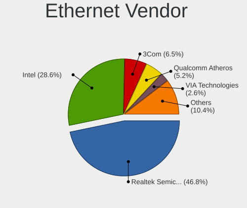

| Vendor                | Desktops | Percent |
|-----------------------|----------|---------|
| Realtek Semiconductor | 36       | 46.75%  |
| Intel                 | 22       | 28.57%  |
| 3Com                  | 5        | 6.49%   |
| Qualcomm Atheros      | 4        | 5.19%   |
| VIA Technologies      | 2        | 2.6%    |
| Huawei Technologies   | 2        | 2.6%    |
| Broadcom              | 2        | 2.6%    |
| Oracle/SUN            | 1        | 1.3%    |
| Davicom Semiconductor | 1        | 1.3%    |
| D-Link System         | 1        | 1.3%    |
| Aquantia              | 1        | 1.3%    |

Ethernet Model
--------------

Ethernet models

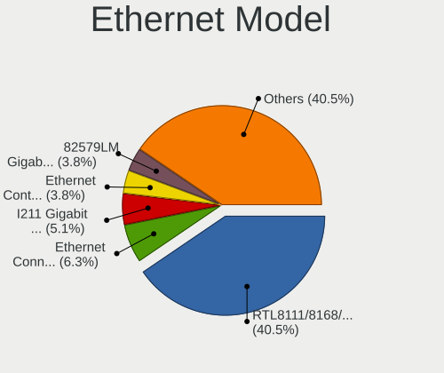

| Model                                                                          | Desktops | Percent |
|--------------------------------------------------------------------------------|----------|---------|
| Realtek RTL8111/8168/8211/8411 PCI Express Gigabit Ethernet Controller         | 32       | 40.51%  |
| Intel Ethernet Connection (2) I219-LM                                          | 5        | 6.33%   |
| Intel I211 Gigabit Network Connection                                          | 4        | 5.06%   |
| Intel Ethernet Controller I225-V                                               | 3        | 3.8%    |
| Intel 82579LM Gigabit Network Connection (Lewisville)                          | 3        | 3.8%    |
| Realtek RTL8169 PCI Gigabit Ethernet Controller                                | 2        | 2.53%   |
| Qualcomm Atheros AR8151 v2.0 Gigabit Ethernet                                  | 2        | 2.53%   |
| Huawei USB Device                                                              | 2        | 2.53%   |
| 3Com 3c905C-TX/TX-M [Tornado]                                                  | 2        | 2.53%   |
| 3Com 3c905B 100BaseTX [Cyclone]                                                | 2        | 2.53%   |
| VIA VT6120/VT6121/VT6122/VT6130 Gigabit Ethernet Adapter                       | 1        | 1.27%   |
| VIA VT6102/VT6103 [Rhine-II]                                                   | 1        | 1.27%   |
| Realtek RTL8125 2.5GbE Controller                                              | 1        | 1.27%   |
| Realtek RTL8111/8168/8411 PCI Express Gigabit Ethernet Controller              | 1        | 1.27%   |
| Realtek RTL-8100/8101L/8139 PCI Fast Ethernet Adapter                          | 1        | 1.27%   |
| Qualcomm Atheros Killer E2400 Gigabit Ethernet Controller                      | 1        | 1.27%   |
| Qualcomm Atheros Killer E220x Gigabit Ethernet Controller                      | 1        | 1.27%   |
| Oracle/SUN RIO 10/100 Ethernet [eri]                                           | 1        | 1.27%   |
| Intel Ethernet Connection I217-V                                               | 1        | 1.27%   |
| Intel Ethernet Connection (7) I219-V                                           | 1        | 1.27%   |
| Intel Ethernet Connection (7) I219-LM                                          | 1        | 1.27%   |
| Intel Ethernet Connection (3) I218-LM                                          | 1        | 1.27%   |
| Intel Ethernet Connection (2) I219-V                                           | 1        | 1.27%   |
| Intel Ethernet Connection (11) I219-V                                          | 1        | 1.27%   |
| Intel 82578DC Gigabit Network Connection                                       | 1        | 1.27%   |
| Intel 82574L Gigabit Network Connection                                        | 1        | 1.27%   |
| Davicom DM9102 Fast Ethernet Controller                                        | 1        | 1.27%   |
| D-Link System DGE-528T Gigabit Ethernet Adapter                                | 1        | 1.27%   |
| Broadcom NetXtreme BCM57766 Gigabit Ethernet PCIe                              | 1        | 1.27%   |
| Broadcom NetXtreme BCM5720 Gigabit Ethernet PCIe                               | 1        | 1.27%   |
| Aquantia AQtion AQC100 NBase-T/IEEE 802.3an Ethernet Controller [Atlantic 10G] | 1        | 1.27%   |
| 3Com 3c595 100BaseTX [Vortex]                                                  | 1        | 1.27%   |

Net Controller Kind
-------------------

Ethernet, WiFi or modem

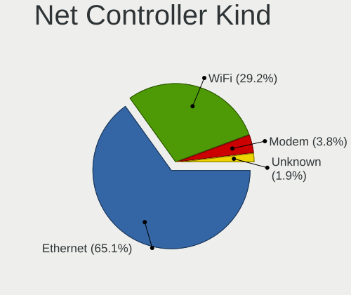

| Kind     | Desktops | Percent |
|----------|----------|---------|
| Ethernet | 69       | 65.09%  |
| WiFi     | 31       | 29.25%  |
| Modem    | 4        | 3.77%   |
| Unknown  | 2        | 1.89%   |

Used Controller
---------------

Currently used network controller

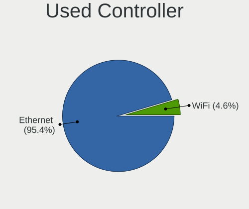

| Kind     | Desktops | Percent |
|----------|----------|---------|
| Ethernet | 62       | 95.38%  |
| WiFi     | 3        | 4.62%   |

NICs
----

Total network controllers on board

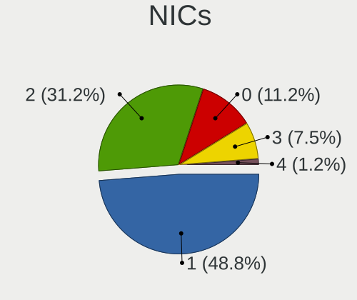

| Total | Desktops | Percent |
|-------|----------|---------|
| 1     | 39       | 48.75%  |
| 2     | 25       | 31.25%  |
| 0     | 9        | 11.25%  |
| 3     | 6        | 7.5%    |
| 4     | 1        | 1.25%   |

IPv6
----

IPv6 vs IPv4

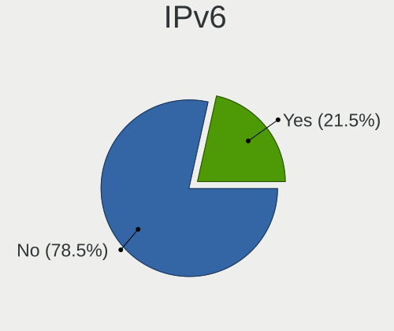

| Used | Desktops | Percent |
|------|----------|---------|
| No   | 62       | 78.48%  |
| Yes  | 17       | 21.52%  |

Bluetooth
---------

Bluetooth Vendor
----------------

Controller vendors

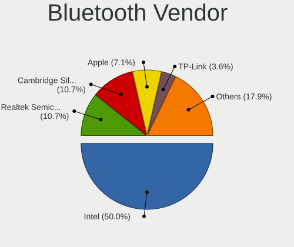

| Vendor                          | Desktops | Percent |
|---------------------------------|----------|---------|
| Intel                           | 14       | 50%     |
| Realtek Semiconductor           | 3        | 10.71%  |
| Cambridge Silicon Radio         | 3        | 10.71%  |
| Apple                           | 2        | 7.14%   |
| TP-Link                         | 1        | 3.57%   |
| Skylight Digital                | 1        | 3.57%   |
| Qualcomm Atheros Communications | 1        | 3.57%   |
| Lite-On Technology              | 1        | 3.57%   |
| IMC Networks                    | 1        | 3.57%   |
| ASUSTek Computer                | 1        | 3.57%   |

Bluetooth Model
---------------

Controller models

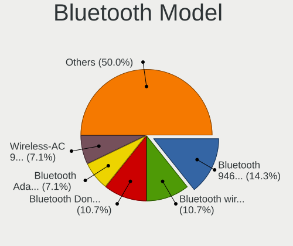

| Model                                               | Desktops | Percent |
|-----------------------------------------------------|----------|---------|
| Intel Bluetooth 9460/9560 Jefferson Peak (JfP)      | 4        | 14.29%  |
| Intel Bluetooth wireless interface                  | 3        | 10.71%  |
| Cambridge Silicon Radio Bluetooth Dongle (HCI mode) | 3        | 10.71%  |
| Realtek Bluetooth Adapter                           | 2        | 7.14%   |
| Intel Wireless-AC 9260 Bluetooth Adapter            | 2        | 7.14%   |
| Intel AX201 Bluetooth                               | 2        | 7.14%   |
| Intel AX200 Bluetooth                               | 2        | 7.14%   |
| TP-Link Bluetooth 5.0 USB Adapter                   | 1        | 3.57%   |
| Skylight Digital Realtek Bluetooth Adapter          | 1        | 3.57%   |
| Realtek Bluetooth 4.0 Adapter                       | 1        | 3.57%   |
| Qualcomm Atheros AR3012 Bluetooth 4.0               | 1        | 3.57%   |
| Lite-On Atheros AR3012 Bluetooth                    | 1        | 3.57%   |
| Intel Wireless-AC 3168 Bluetooth                    | 1        | 3.57%   |
| IMC Networks MediaTek Bluetooth Adapter             | 1        | 3.57%   |
| ASUS USB-BT500                                      | 1        | 3.57%   |
| Apple Broadcom Built-in Bluetooth                   | 1        | 3.57%   |
| Apple Bluetooth Host Controller                     | 1        | 3.57%   |

Sound
-----

Sound Vendor
------------

Sound card vendors

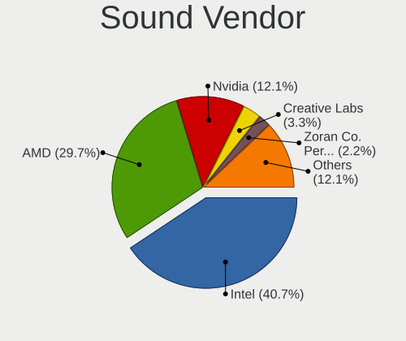

| Vendor                                       | Desktops | Percent |
|----------------------------------------------|----------|---------|
| Intel                                        | 37       | 40.66%  |
| AMD                                          | 27       | 29.67%  |
| Nvidia                                       | 11       | 12.09%  |
| Creative Labs                                | 3        | 3.3%    |
| Zoran Co. Personal Media Division (Nogatech) | 2        | 2.2%    |
| Logitech                                     | 2        | 2.2%    |
| Yamaha                                       | 1        | 1.1%    |
| Walmart                                      | 1        | 1.1%    |
| VIA Technologies                             | 1        | 1.1%    |
| ULi Electronics                              | 1        | 1.1%    |
| Samsung Electronics                          | 1        | 1.1%    |
| Realtek Semiconductor                        | 1        | 1.1%    |
| Native Instruments                           | 1        | 1.1%    |
| ESS Technology                               | 1        | 1.1%    |
| C-Media Electronics                          | 1        | 1.1%    |

Sound Model
-----------

Sound card models

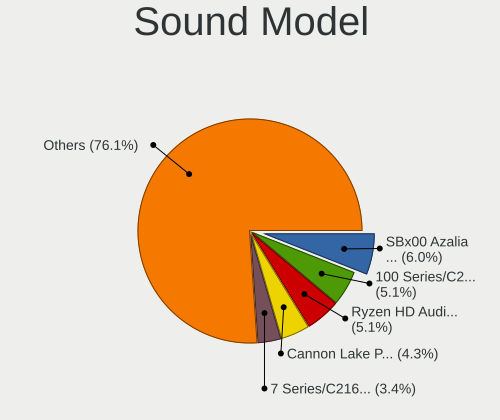

| Model                                                                             | Desktops | Percent |
|-----------------------------------------------------------------------------------|----------|---------|
| AMD SBx00 Azalia (Intel HDA)                                                      | 7        | 5.98%   |
| Intel 100 Series/C230 Series Chipset Family HD Audio Controller                   | 6        | 5.13%   |
| AMD Ryzen HD Audio Controller                                                     | 6        | 5.13%   |
| Intel Cannon Lake PCH cAVS                                                        | 5        | 4.27%   |
| Intel 7 Series/C216 Chipset Family High Definition Audio Controller               | 4        | 3.42%   |
| AMD Starship/Matisse HD Audio Controller                                          | 4        | 3.42%   |
| AMD Oland/Hainan/Cape Verde/Pitcairn HDMI Audio [Radeon HD 7000 Series]           | 4        | 3.42%   |
| AMD Family 17h (Models 00h-0fh) HD Audio Controller                               | 4        | 3.42%   |
| AMD Ellesmere HDMI Audio [Radeon RX 470/480 / 570/580/590]                        | 4        | 3.42%   |
| Intel Alder Lake-N PCH High Definition Audio Controller                           | 3        | 2.56%   |
| Intel 8 Series/C220 Series Chipset High Definition Audio Controller               | 3        | 2.56%   |
| Intel 6 Series/C200 Series Chipset Family High Definition Audio Controller        | 3        | 2.56%   |
| Zoran Co. Personal Media Division (Nogatech) USB Audio and HID                    | 2        | 1.71%   |
| Nvidia GP107GL High Definition Audio Controller                                   | 2        | 1.71%   |
| Nvidia GP104 High Definition Audio Controller                                     | 2        | 1.71%   |
| Nvidia GF114 HDMI Audio Controller                                                | 2        | 1.71%   |
| Intel Wildcat Point-LP High Definition Audio Controller                           | 2        | 1.71%   |
| Intel Broadwell-U Audio Controller                                                | 2        | 1.71%   |
| Intel 200 Series PCH HD Audio                                                     | 2        | 1.71%   |
| AMD Wrestler HDMI Audio                                                           | 2        | 1.71%   |
| AMD Raven/Raven2/Fenghuang HDMI/DP Audio Controller                               | 2        | 1.71%   |
| AMD Cedar HDMI Audio [Radeon HD 5400/6300/7300 Series]                            | 2        | 1.71%   |
| AMD Caicos HDMI Audio [Radeon HD 6450 / 7450/8450/8490 OEM / R5 230/235/235X OEM] | 2        | 1.71%   |
| Yamaha AG06/AG03                                                                  | 1        | 0.85%   |
| Walmart AB13X Headset Adapter                                                     | 1        | 0.85%   |
| VIA Technologies VX900/VT8xxx High Definition Audio Controller                    | 1        | 0.85%   |
| VIA Technologies VX900 Graphics [Chrome9 HD] HDMI Audio Device                    | 1        | 0.85%   |
| ULi Electronics M5451 PCI AC-Link Controller Audio Device                         | 1        | 0.85%   |
| Samsung Electronics Samsung Type-C to 3.5pi gender adapter                        | 1        | 0.85%   |
| Realtek Semiconductor ATH-M50xSTS-USB                                             | 1        | 0.85%   |
| Nvidia TU116 High Definition Audio Controller                                     | 1        | 0.85%   |
| Nvidia GP106 High Definition Audio Controller                                     | 1        | 0.85%   |
| Nvidia GM206 High Definition Audio Controller                                     | 1        | 0.85%   |
| Nvidia GM204 High Definition Audio Controller                                     | 1        | 0.85%   |
| Nvidia GK208 HDMI/DP Audio Controller                                             | 1        | 0.85%   |
| Native Instruments Komplete Audio 1                                               | 1        | 0.85%   |
| Logitech Zone Wired Earbuds                                                       | 1        | 0.85%   |
| Logitech H600 [Wireless Headset]                                                  | 1        | 0.85%   |
| Intel Xeon E3-1200 v3/4th Gen Core Processor HD Audio Controller                  | 1        | 0.85%   |
| Intel USB PnP Sound Device                                                        | 1        | 0.85%   |

Memory
------

Memory Vendor
-------------

Memory module vendors

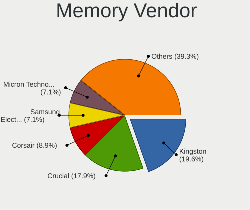

| Vendor              | Desktops | Percent |
|---------------------|----------|---------|
| Kingston            | 11       | 19.64%  |
| Crucial             | 10       | 17.86%  |
| Corsair             | 5        | 8.93%   |
| Samsung Electronics | 4        | 7.14%   |
| Micron Technology   | 4        | 7.14%   |
| G.Skill             | 4        | 7.14%   |
| Unknown             | 3        | 5.36%   |
| SK hynix            | 3        | 5.36%   |
| A-DATA Technology   | 3        | 5.36%   |
| Patriot             | 2        | 3.57%   |
| Unknown             | 2        | 3.57%   |
| Unifosa             | 1        | 1.79%   |
| Toshiba             | 1        | 1.79%   |
| Silicon Power       | 1        | 1.79%   |
| Lexar Co Limited    | 1        | 1.79%   |
| AMD                 | 1        | 1.79%   |

Memory Model
------------

Memory module models

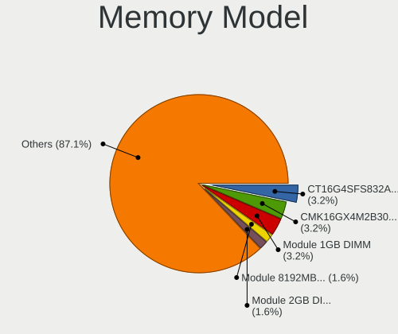

| Model                                                         | Desktops | Percent |
|---------------------------------------------------------------|----------|---------|
| Crucial RAM CT16G4SFS832A.C8FF 16GB SODIMM DDR4 3200MT/s      | 2        | 3.23%   |
| Corsair RAM CMK16GX4M2B3000C15 8GB DIMM DDR4 3000MT/s         | 2        | 3.23%   |
| Unknown                                                       | 2        | 3.23%   |
| Unknown RAM Module 8192MB DIMM 400MT/s                        | 1        | 1.61%   |
| Unknown RAM Module 2GB DIMM DDR2 800MT/s                      | 1        | 1.61%   |
| Unknown RAM Module 2048MB DIMM DDR2 800MT/s                   | 1        | 1.61%   |
| Unknown RAM Module 2048MB DIMM 400MT/s                        | 1        | 1.61%   |
| Unknown RAM Module 128MB DIMM DRAM                            | 1        | 1.61%   |
| Unifosa RAM GU512303EP0202 2GB DIMM DDR3 1333MT/s             | 1        | 1.61%   |
| Toshiba RAM 99U5471-001.A00LF 2GB DIMM DDR3 1333MT/s          | 1        | 1.61%   |
| SK hynix RAM Module 8GB DIMM DDR4 2400MT/s                    | 1        | 1.61%   |
| SK hynix RAM HMT451S6DFR8A-PB 4GB SODIMM DDR3 1600MT/s        | 1        | 1.61%   |
| SK hynix RAM HMT351U6CFR8C 4GB DIMM DDR3 667MT/s              | 1        | 1.61%   |
| Silicon Power RAM SP016GBLFU266F02 16GB DIMM DDR4 2133MT/s    | 1        | 1.61%   |
| Samsung RAM Module 8GB SODIMM DDR3 1333MT/s                   | 1        | 1.61%   |
| Samsung RAM Module 4GB DIMM DDR4 2133MT/s                     | 1        | 1.61%   |
| Samsung RAM M471A1K43EB1-CWE 8GB DIMM DDR4 3200MT/s           | 1        | 1.61%   |
| Samsung RAM M378A1K43EB2-CWE 8GB DIMM DDR4 3200MT/s           | 1        | 1.61%   |
| Patriot RAM PSD44G213382 4096MB DIMM DDR4 2133MT/s            | 1        | 1.61%   |
| Patriot RAM PSD34G13332 4GB DIMM DDR3 1333MT/s                | 1        | 1.61%   |
| Micron RAM 36ASF2G72PZ-2G1A2 16GB DIMM DDR4 2133MT/s          | 1        | 1.61%   |
| Micron RAM 16JTF51264AZ 4GB DIMM DDR3 667MT/s                 | 1        | 1.61%   |
| Micron RAM 16JTF1G64AZ-1G6J1 8GB DIMM DDR3 1333MT/s           | 1        | 1.61%   |
| Micron RAM 16ATF1G64HZ-2G1B1 8GB SODIMM DDR4 2133MT/s         | 1        | 1.61%   |
| Lexar Co Limited RAM LD4S16G32C22ST 16GB SODIMM DDR4 3200MT/s | 1        | 1.61%   |
| Kingston RAM KHX3000C15D4/8GX 8GB DIMM DDR4 2933MT/s          | 1        | 1.61%   |
| Kingston RAM KHX2400C15/8G 8GB DIMM DDR4 2400MT/s             | 1        | 1.61%   |
| Kingston RAM KHX1600C9D3/4GX 4GB DIMM DDR3 1600MT/s           | 1        | 1.61%   |
| Kingston RAM KF2666C16D4/16G 16GB DIMM DDR4 2667MT/s          | 1        | 1.61%   |
| Kingston RAM ACR26D4S9S8ME-8 8GB SODIMM DDR4 2667MT/s         | 1        | 1.61%   |
| Kingston RAM ACR16D3LS1KFG/4G 4GB DIMM DDR3 1600MT/s          | 1        | 1.61%   |
| Kingston RAM 99U5701-077.A00G 16GB DIMM DDR4 2667MT/s         | 1        | 1.61%   |
| Kingston RAM 99U5584-007.A 4GB DIMM DDR3 667MT/s              | 1        | 1.61%   |
| Kingston RAM 99U5471-028.A00LF 4GB DIMM DDR3 667MT/s          | 1        | 1.61%   |
| Kingston RAM 99U5471-017.A00LF 4GB SODIMM DDR3                | 1        | 1.61%   |
| Kingston RAM 9965794-016.A00G 32GB DIMM DDR5 4800MT/s         | 1        | 1.61%   |
| Kingston RAM 9905471-011.A00LF 4GB DIMM DDR3 1333MT/s         | 1        | 1.61%   |
| G.Skill RAM F4-3200C16-16GVK 16GB DIMM DDR4 3200MT/s          | 1        | 1.61%   |
| G.Skill RAM F4-3200C16-16GTZKW 16GB DIMM DDR4 3200MT/s        | 1        | 1.61%   |
| G.Skill RAM F4-2800C17-8GVR 8192MB DIMM DDR4 2133MT/s         | 1        | 1.61%   |

Memory Kind
-----------

Memory module kinds

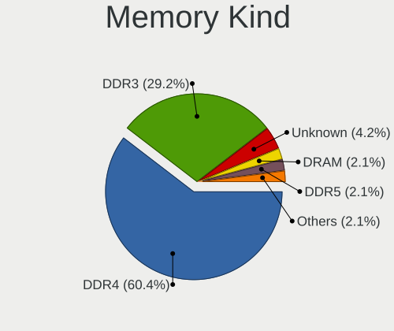

| Kind    | Desktops | Percent |
|---------|----------|---------|
| DDR4    | 29       | 60.42%  |
| DDR3    | 14       | 29.17%  |
| Unknown | 2        | 4.17%   |
| DRAM    | 1        | 2.08%   |
| DDR5    | 1        | 2.08%   |
| DDR2    | 1        | 2.08%   |

Memory Form Factor
------------------

Physical design of the memory module

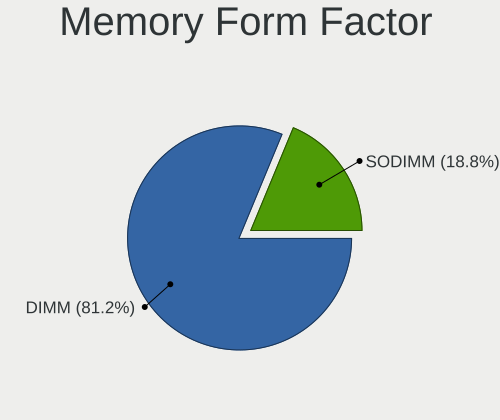

| Name   | Desktops | Percent |
|--------|----------|---------|
| DIMM   | 39       | 81.25%  |
| SODIMM | 9        | 18.75%  |

Memory Size
-----------

Memory module size

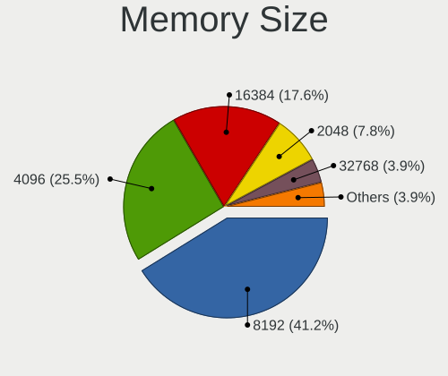

| Size  | Desktops | Percent |
|-------|----------|---------|
| 8192  | 21       | 41.18%  |
| 4096  | 13       | 25.49%  |
| 16384 | 9        | 17.65%  |
| 2048  | 4        | 7.84%   |
| 32768 | 2        | 3.92%   |
| 1024  | 1        | 1.96%   |
| 128   | 1        | 1.96%   |

Memory Speed
------------

Memory module speed

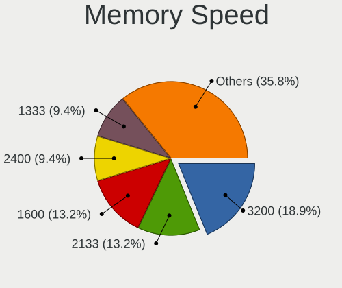

| Speed   | Desktops | Percent |
|---------|----------|---------|
| 3200    | 10       | 18.87%  |
| 2133    | 7        | 13.21%  |
| 1600    | 7        | 13.21%  |
| 2400    | 5        | 9.43%   |
| 1333    | 5        | 9.43%   |
| 2667    | 4        | 7.55%   |
| Unknown | 3        | 5.66%   |
| 3000    | 2        | 3.77%   |
| 2933    | 2        | 3.77%   |
| 800     | 2        | 3.77%   |
| 667     | 2        | 3.77%   |
| 4800    | 1        | 1.89%   |
| 3066    | 1        | 1.89%   |
| 2666    | 1        | 1.89%   |
| 400     | 1        | 1.89%   |

Printers & scanners
-------------------

Printer Vendor
--------------

Printer device vendors

Zero info for selected period =(

Printer Model
-------------

Printer device models

Zero info for selected period =(

Scanner Vendor
--------------

Scanner device vendors

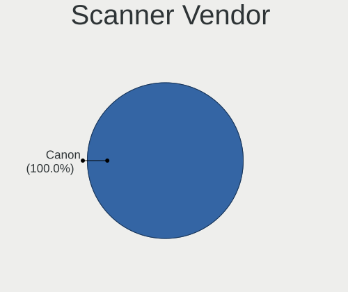

| Vendor | Desktops | Percent |
|--------|----------|---------|
| Canon  | 1        | 100%    |

Scanner Model
-------------

Scanner device models

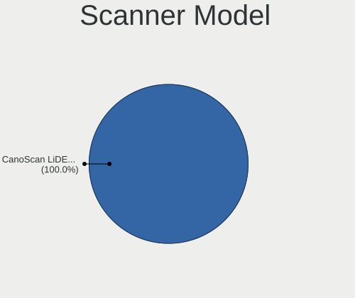

| Model                   | Desktops | Percent |
|-------------------------|----------|---------|
| Canon CanoScan LiDE 210 | 1        | 100%    |

Camera
------

Camera Vendor
-------------

Camera device vendors

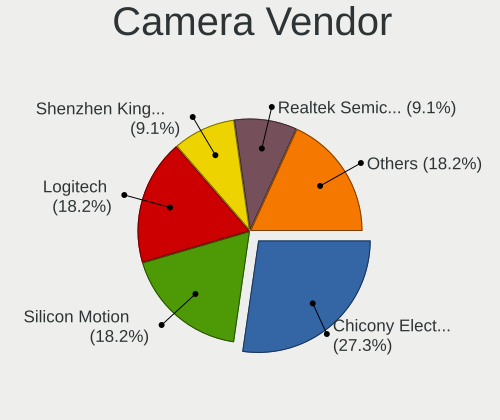

| Vendor                           | Desktops | Percent |
|----------------------------------|----------|---------|
| Chicony Electronics              | 3        | 27.27%  |
| Silicon Motion                   | 2        | 18.18%  |
| Logitech                         | 2        | 18.18%  |
| Shenzhen Kingcome Optoelectronic | 1        | 9.09%   |
| Realtek Semiconductor            | 1        | 9.09%   |
| IMC Networks                     | 1        | 9.09%   |
| ARC International                | 1        | 9.09%   |

Camera Model
------------

Camera device models

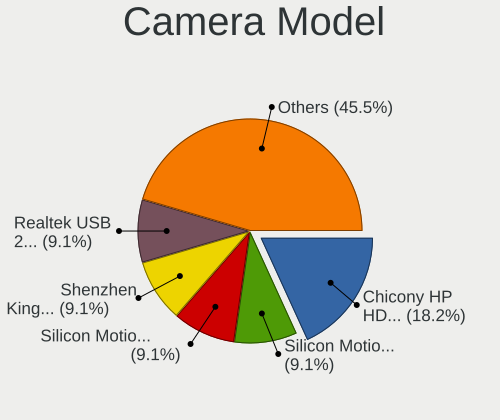

| Model                                                         | Desktops | Percent |
|---------------------------------------------------------------|----------|---------|
| Chicony HP HD Webcam [Fixed]                                  | 2        | 18.18%  |
| Silicon Motion LG HD WebCam                                   | 1        | 9.09%   |
| Silicon Motion 300k Pixel Camera                              | 1        | 9.09%   |
| Shenzhen Kingcome Optoelectronic NexiGo HelloCam N930W Camera | 1        | 9.09%   |
| Realtek USB 2.0 PC Camera                                     | 1        | 9.09%   |
| Logitech Webcam C270                                          | 1        | 9.09%   |
| Logitech C922 Pro Stream Webcam                               | 1        | 9.09%   |
| IMC Networks Realtek PC Camera                                | 1        | 9.09%   |
| Chicony USB2.0 VGA UVC WebCam                                 | 1        | 9.09%   |
| ARC International Camera                                      | 1        | 9.09%   |

Security
--------

Fingerprint Vendor
------------------

Fingerprint sensor vendors

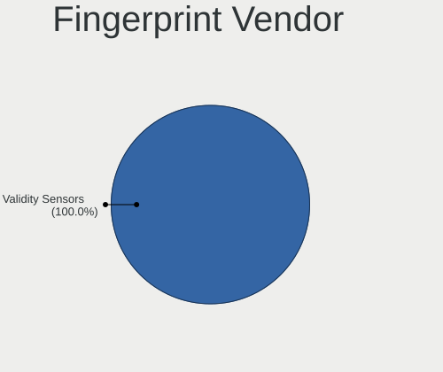

| Vendor           | Desktops | Percent |
|------------------|----------|---------|
| Validity Sensors | 1        | 100%    |

Fingerprint Model
-----------------

Fingerprint sensor models

| Model                                      | Desktops | Percent |
|--------------------------------------------|----------|---------|
| Validity Sensors VFS495 Fingerprint Reader | 1        | 100%    |

Chipcard Vendor
---------------

Chipcard module vendors

Zero info for selected period =(

Chipcard Model
--------------

Chipcard module models

Zero info for selected period =(

Unsupported
-----------

Unsupported Devices
-------------------

Total unsupported devices on board

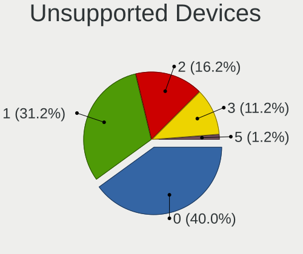

| Total | Desktops | Percent |
|-------|----------|---------|
| 0     | 32       | 40%     |
| 1     | 25       | 31.25%  |
| 2     | 13       | 16.25%  |
| 3     | 9        | 11.25%  |
| 5     | 1        | 1.25%   |

Unsupported Device Types
------------------------

Types of unsupported devices

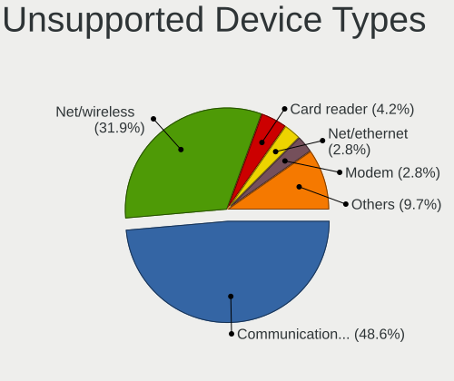

| Type                     | Desktops | Percent |
|--------------------------|----------|---------|
| Communication controller | 35       | 48.61%  |
| Net/wireless             | 23       | 31.94%  |
| Card reader              | 3        | 4.17%   |
| Net/ethernet             | 2        | 2.78%   |
| Modem                    | 2        | 2.78%   |
| Graphics card            | 2        | 2.78%   |
| Wireless                 | 1        | 1.39%   |
| Storage                  | 1        | 1.39%   |
| Sound                    | 1        | 1.39%   |
| Network                  | 1        | 1.39%   |
| Bluetooth                | 1        | 1.39%   |

