NetBSD - Tested Hardware & Statistics (Desktops)
------------------------------------------------

A project to collect tested hardware configurations for NetBSD.

Anyone can contribute to this report by the [hw-probe](https://github.com/linuxhw/hw-probe/blob/master/INSTALL.BSD.md) tool:

    hw-probe -all -upload

Please contribute! Especially if your hardware is rare.

Contents
--------

* [ Test Cases ](#test-cases)

* [ System ](#system)
  - [ OS                       ](#os)
  - [ OS Family                ](#os-family)
  - [ Arch                     ](#arch)
  - [ DE                       ](#de)
  - [ Display Server           ](#display-server)
  - [ Display Manager          ](#display-manager)
  - [ OS Lang                  ](#os-lang)
  - [ Boot Mode                ](#boot-mode)
  - [ Filesystem               ](#filesystem)
  - [ Part. scheme             ](#part-scheme)

* [ Board ](#board)
  - [ Vendor                   ](#vendor)
  - [ Model                    ](#model)
  - [ Model Family             ](#model-family)
  - [ MFG Year                 ](#mfg-year)
  - [ Form Factor              ](#form-factor)
  - [ Coreboot                 ](#coreboot)
  - [ RAM Size                 ](#ram-size)
  - [ RAM Used                 ](#ram-used)
  - [ Total Drives             ](#total-drives)
  - [ Has CD-ROM               ](#has-cd-rom)
  - [ Has Ethernet             ](#has-ethernet)
  - [ Has WiFi                 ](#has-wifi)
  - [ Has Bluetooth            ](#has-bluetooth)

* [ Location ](#location)
  - [ Country                  ](#country)
  - [ City                     ](#city)

* [ Drives ](#drives)
  - [ Drive Vendor             ](#drive-vendor)
  - [ Drive Model              ](#drive-model)
  - [ HDD Vendor               ](#hdd-vendor)
  - [ SSD Vendor               ](#ssd-vendor)
  - [ Drive Kind               ](#drive-kind)
  - [ Drive Connector          ](#drive-connector)
  - [ Drive Size               ](#drive-size)
  - [ Space Total              ](#space-total)
  - [ Space Used               ](#space-used)
  - [ Malfunc. Drives          ](#malfunc-drives)
  - [ Malfunc. Drive Vendor    ](#malfunc-drive-vendor)
  - [ Malfunc. HDD Vendor      ](#malfunc-hdd-vendor)
  - [ Malfunc. Drive Kind      ](#malfunc-drive-kind)
  - [ Failed Drives            ](#failed-drives)
  - [ Failed Drive Vendor      ](#failed-drive-vendor)
  - [ Drive Status             ](#drive-status)

* [ Storage controller ](#storage-controller)
  - [ Storage Vendor           ](#storage-vendor)
  - [ Storage Model            ](#storage-model)
  - [ Storage Kind             ](#storage-kind)

* [ Processor ](#processor)
  - [ CPU Vendor               ](#cpu-vendor)
  - [ CPU Model                ](#cpu-model)
  - [ CPU Model Family         ](#cpu-model-family)
  - [ CPU Cores                ](#cpu-cores)
  - [ CPU Sockets              ](#cpu-sockets)
  - [ CPU Threads              ](#cpu-threads)
  - [ CPU Microarch            ](#cpu-microarch)

* [ Graphics ](#graphics)
  - [ GPU Vendor               ](#gpu-vendor)
  - [ GPU Model                ](#gpu-model)
  - [ GPU Combo                ](#gpu-combo)
  - [ GPU Driver               ](#gpu-driver)
  - [ GPU Memory               ](#gpu-memory)

* [ Monitor ](#monitor)
  - [ Monitor Vendor           ](#monitor-vendor)
  - [ Monitor Model            ](#monitor-model)
  - [ Monitor Resolution       ](#monitor-resolution)
  - [ Monitor Diagonal         ](#monitor-diagonal)
  - [ Monitor Width            ](#monitor-width)
  - [ Aspect Ratio             ](#aspect-ratio)
  - [ Monitor Area             ](#monitor-area)
  - [ Pixel Density            ](#pixel-density)
  - [ Multiple Monitors        ](#multiple-monitors)

* [ Network ](#network)
  - [ Net Controller Vendor    ](#net-controller-vendor)
  - [ Net Controller Model     ](#net-controller-model)
  - [ Wireless Vendor          ](#wireless-vendor)
  - [ Wireless Model           ](#wireless-model)
  - [ Ethernet Vendor          ](#ethernet-vendor)
  - [ Ethernet Model           ](#ethernet-model)
  - [ Net Controller Kind      ](#net-controller-kind)
  - [ Used Controller          ](#used-controller)
  - [ NICs                     ](#nics)
  - [ IPv6                     ](#ipv6)

* [ Bluetooth ](#bluetooth)
  - [ Bluetooth Vendor         ](#bluetooth-vendor)
  - [ Bluetooth Model          ](#bluetooth-model)

* [ Sound ](#sound)
  - [ Sound Vendor             ](#sound-vendor)
  - [ Sound Model              ](#sound-model)

* [ Memory ](#memory)
  - [ Memory Vendor            ](#memory-vendor)
  - [ Memory Model             ](#memory-model)
  - [ Memory Kind              ](#memory-kind)
  - [ Memory Form Factor       ](#memory-form-factor)
  - [ Memory Size              ](#memory-size)
  - [ Memory Speed             ](#memory-speed)

* [ Printers & scanners ](#printers--scanners)
  - [ Printer Vendor           ](#printer-vendor)
  - [ Printer Model            ](#printer-model)
  - [ Scanner Vendor           ](#scanner-vendor)
  - [ Scanner Model            ](#scanner-model)

* [ Camera ](#camera)
  - [ Camera Vendor            ](#camera-vendor)
  - [ Camera Model             ](#camera-model)

* [ Security ](#security)
  - [ Fingerprint Vendor       ](#fingerprint-vendor)
  - [ Fingerprint Model        ](#fingerprint-model)
  - [ Chipcard Vendor          ](#chipcard-vendor)
  - [ Chipcard Model           ](#chipcard-model)

* [ Unsupported ](#unsupported)
  - [ Unsupported Devices      ](#unsupported-devices)
  - [ Unsupported Device Types ](#unsupported-device-types)

Test Cases
----------

Total: 48

| Vendor   | Model                   | Probe                                                     | Date         |
|----------|-------------------------|-----------------------------------------------------------|--------------|
| Gigabyte | X570 AORUS PRO          | [4e7d57df3b](https://bsd-hardware.info/?probe=4e7d57df3b) | Apr 18, 2022 |
| Unknown  | Unknown                 | [57765224eb](https://bsd-hardware.info/?probe=57765224eb) | Mar 18, 2022 |
| Gigabyte | 970A-D3P                | [fa03bdabb6](https://bsd-hardware.info/?probe=fa03bdabb6) | Mar 15, 2022 |
| KLLISRE  | X99-B5 V1.0             | [5dea1304b9](https://bsd-hardware.info/?probe=5dea1304b9) | Feb 26, 2022 |
| ASRock   | X470 Gaming-ITX/ac      | [18eeaf2963](https://bsd-hardware.info/?probe=18eeaf2963) | Dec 29, 2021 |
| Unknown  | Unknown                 | [6d184a1e62](https://bsd-hardware.info/?probe=6d184a1e62) | Dec 23, 2021 |
| ASRock   | 970 Extreme3            | [14907c62f1](https://bsd-hardware.info/?probe=14907c62f1) | Dec 04, 2021 |
| HP       | 3397                    | [155eceb394](https://bsd-hardware.info/?probe=155eceb394) | Nov 07, 2021 |
| ASUSTek  | ROG STRIX X470-F GAMING | [7259ec87e9](https://bsd-hardware.info/?probe=7259ec87e9) | Oct 05, 2021 |
| ASUSTek  | PRIME A320M-K           | [c574dcc409](https://bsd-hardware.info/?probe=c574dcc409) | Oct 01, 2021 |
| ASUSTek  | ROG STRIX X470-F GAMING | [b3a18fcab3](https://bsd-hardware.info/?probe=b3a18fcab3) | Sep 29, 2021 |
| Unknown  | Unknown                 | [2a56bcb7c1](https://bsd-hardware.info/?probe=2a56bcb7c1) | Sep 19, 2021 |
| MSI      | B450-A PRO MAX          | [4e3b1f226b](https://bsd-hardware.info/?probe=4e3b1f226b) | Jun 22, 2021 |
| Unknown  | Unknown                 | [f9fa9ae41a](https://bsd-hardware.info/?probe=f9fa9ae41a) | May 24, 2021 |
| Unknown  | Unknown                 | [ec302a221a](https://bsd-hardware.info/?probe=ec302a221a) | May 15, 2021 |
| Unknown  | Unknown                 | [364a778de1](https://bsd-hardware.info/?probe=364a778de1) | May 14, 2021 |
| ASRock   | X470 Gaming-ITX/ac      | [82e63b3fb9](https://bsd-hardware.info/?probe=82e63b3fb9) | Apr 14, 2021 |
| Unknown  | Unknown                 | [df793cf09f](https://bsd-hardware.info/?probe=df793cf09f) | Apr 08, 2021 |
| Unknown  | Unknown                 | [de8a18ca09](https://bsd-hardware.info/?probe=de8a18ca09) | Apr 08, 2021 |
| Unknown  | Unknown                 | [f8ba0ba112](https://bsd-hardware.info/?probe=f8ba0ba112) | Apr 08, 2021 |
| Unknown  | Unknown                 | [0541b120c2](https://bsd-hardware.info/?probe=0541b120c2) | Apr 02, 2021 |
| Unknown  | Unknown                 | [91dd02d436](https://bsd-hardware.info/?probe=91dd02d436) | Mar 30, 2021 |
| Unknown  | Unknown                 | [a1220fba93](https://bsd-hardware.info/?probe=a1220fba93) | Mar 24, 2021 |
| Unknown  | Unknown                 | [edea2d1a64](https://bsd-hardware.info/?probe=edea2d1a64) | Mar 18, 2021 |
| Unknown  | Unknown                 | [1afd7d4381](https://bsd-hardware.info/?probe=1afd7d4381) | Feb 27, 2021 |
| Unknown  | Unknown                 | [4c0171bc04](https://bsd-hardware.info/?probe=4c0171bc04) | Feb 25, 2021 |
| Unknown  | Unknown                 | [a5fa760573](https://bsd-hardware.info/?probe=a5fa760573) | Jan 02, 2021 |
| ASRock   | N68-VS3 UCC             | [647ab5967e](https://bsd-hardware.info/?probe=647ab5967e) | Dec 22, 2020 |
| Unknown  | Unknown                 | [8668b1d651](https://bsd-hardware.info/?probe=8668b1d651) | Dec 17, 2020 |
| ASUSTek  | E45M1-I DELUXE          | [8e767b517d](https://bsd-hardware.info/?probe=8e767b517d) | Dec 16, 2020 |
| Unknown  | Unknown                 | [153be3caa3](https://bsd-hardware.info/?probe=153be3caa3) | Nov 28, 2020 |
| HP       | System Board R3A        | [80593fc3da](https://bsd-hardware.info/?probe=80593fc3da) | Nov 03, 2020 |
| Gigabyte | Z170X-Gaming 3          | [615ac68e50](https://bsd-hardware.info/?probe=615ac68e50) | Oct 29, 2020 |
| Unknown  | Unknown                 | [d08d610bd0](https://bsd-hardware.info/?probe=d08d610bd0) | Oct 29, 2020 |
| ASUSTek  | B150M-K                 | [135db0e455](https://bsd-hardware.info/?probe=135db0e455) | Oct 22, 2020 |
| Unknown  | Unknown                 | [223aa9e0a3](https://bsd-hardware.info/?probe=223aa9e0a3) | Oct 22, 2020 |
| Gigabyte | P75-D3                  | [980218cf46](https://bsd-hardware.info/?probe=980218cf46) | Oct 02, 2020 |
| ASUSTek  | H81M-D PLUS             | [95b75130f4](https://bsd-hardware.info/?probe=95b75130f4) | Sep 26, 2020 |
| Unknown  | Unknown                 | [c6b2c64d14](https://bsd-hardware.info/?probe=c6b2c64d14) | Sep 20, 2020 |
| ASUSTek  | H81M-D PLUS             | [036d9cfecb](https://bsd-hardware.info/?probe=036d9cfecb) | Sep 19, 2020 |
| ASUSTek  | H81M-D PLUS             | [7be45f1bec](https://bsd-hardware.info/?probe=7be45f1bec) | Sep 19, 2020 |
| MSI      | KA790GX                 | [bba5499a4b](https://bsd-hardware.info/?probe=bba5499a4b) | Aug 29, 2020 |
| Unknown  | Unknown                 | [9fbca0a216](https://bsd-hardware.info/?probe=9fbca0a216) | Jun 17, 2020 |
| ASUSTek  | PRIME A320M-K           | [a49cf5c20b](https://bsd-hardware.info/?probe=a49cf5c20b) | May 28, 2020 |
| Gigabyte | H61M-S2PV               | [14e00aa09f](https://bsd-hardware.info/?probe=14e00aa09f) | May 25, 2020 |
| Intel    | DN2820FYK H24582-203    | [6cb240a9f6](https://bsd-hardware.info/?probe=6cb240a9f6) | May 25, 2020 |
| Unknown  | Unknown                 | [8ba62bd121](https://bsd-hardware.info/?probe=8ba62bd121) | May 25, 2020 |
| Unknown  | Unknown                 | [d3ad2b17ed](https://bsd-hardware.info/?probe=d3ad2b17ed) | May 22, 2020 |

System
------

OS
--

Installed operating systems

| Name              | Desktops | Percent |
|-------------------|----------|---------|
| NetBSD 9.2        | 6        | 15.79%  |
| NetBSD 9.1        | 6        | 15.79%  |
| NetBSD 9.0_STABLE | 6        | 15.79%  |
| NetBSD 9.99.94    | 3        | 7.89%   |
| NetBSD 9.1_STABLE | 3        | 7.89%   |
| NetBSD 9.0        | 3        | 7.89%   |
| NetBSD 9.99.93    | 2        | 5.26%   |
| NetBSD 9.99.77    | 2        | 5.26%   |
| NetBSD 9.99.85    | 1        | 2.63%   |
| NetBSD 9.99.81    | 1        | 2.63%   |
| NetBSD 9.99.74    | 1        | 2.63%   |
| NetBSD 9.99.71    | 1        | 2.63%   |
| NetBSD 9.99.61    | 1        | 2.63%   |
| NetBSD 9.99.23    | 1        | 2.63%   |
| NetBSD 9.2_STABLE | 1        | 2.63%   |

OS Family
---------

OS without a version

| Name   | Desktops | Percent |
|--------|----------|---------|
| NetBSD | 33       | 100%    |

Arch
----

OS architecture (x86_64, i586, etc.)

| Name   | Desktops | Percent |
|--------|----------|---------|
| amd64  | 27       | 81.82%  |
| evbarm | 5        | 15.15%  |
| i386   | 1        | 3.03%   |

DE
--

Desktop Environment

| Name         | Desktops | Percent |
|--------------|----------|---------|
| Console      | 13       | 38.24%  |
| XFCE         | 8        | 23.53%  |
| helloDesktop | 5        | 14.71%  |
| Fluxbox      | 2        | 5.88%   |
| Xfwm4        | 1        | 2.94%   |
| Ratpoison    | 1        | 2.94%   |
| PekWM        | 1        | 2.94%   |
| MATE         | 1        | 2.94%   |
| dwm          | 1        | 2.94%   |
| CTWM         | 1        | 2.94%   |

Display Server
--------------

X11 or Wayland

| Name    | Desktops | Percent |
|---------|----------|---------|
| X11     | 22       | 66.67%  |
| Console | 11       | 33.33%  |

Display Manager
---------------

SDDM, LightDM, etc.

| Name    | Desktops | Percent |
|---------|----------|---------|
| Console | 30       | 90.91%  |
| XDM     | 1        | 3.03%   |
| LightDM | 1        | 3.03%   |
| GDM     | 1        | 3.03%   |

OS Lang
-------

Language

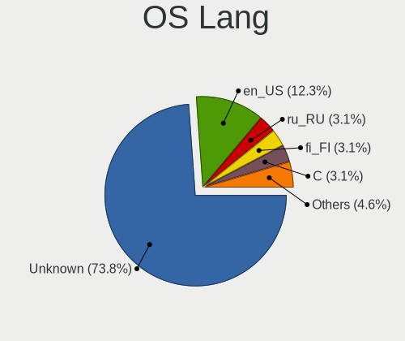

| Lang    | Desktops | Percent |
|---------|----------|---------|
| Unknown | 24       | 70.59%  |
| ru_RU   | 3        | 8.82%   |
| en_US   | 3        | 8.82%   |
| fi_FI   | 2        | 5.88%   |
| hu_HU   | 1        | 2.94%   |
| en_GB   | 1        | 2.94%   |

Boot Mode
---------

EFI or BIOS

| Mode | Desktops | Percent |
|------|----------|---------|
| BIOS | 31       | 93.94%  |
| EFI  | 2        | 6.06%   |

Filesystem
----------

Type of filesystem

| Type    | Desktops | Percent |
|---------|----------|---------|
| Ufs     | 32       | 96.97%  |
| Unknown | 1        | 3.03%   |

Part. scheme
------------

Scheme of partitioning

| Type    | Desktops | Percent |
|---------|----------|---------|
| GPT     | 22       | 66.67%  |
| Unknown | 11       | 33.33%  |

Board
-----

Vendor
------

Motherboard manufacturer

| Name                | Desktops | Percent |
|---------------------|----------|---------|
| Unknown             | 15       | 45.45%  |
| Gigabyte Technology | 5        | 15.15%  |
| ASUSTek Computer    | 5        | 15.15%  |
| ASRock              | 3        | 9.09%   |
| MSI                 | 2        | 6.06%   |
| KLLISRE             | 1        | 3.03%   |
| Intel               | 1        | 3.03%   |
| Hewlett-Packard     | 1        | 3.03%   |

Model
-----

Motherboard model

| Name                       | Desktops | Percent |
|----------------------------|----------|---------|
| Unknown                    | 15       | 45.45%  |
| ASUS PRIME A320M-K         | 2        | 6.06%   |
| MSI MS-7B86                | 1        | 3.03%   |
| MSI MS-7551                | 1        | 3.03%   |
| KLLISRE X99-B5 V1.0        | 1        | 3.03%   |
| Intel DN2820FYK H24582-203 | 1        | 3.03%   |
| HP Vectra                  | 1        | 3.03%   |
| Gigabyte Z170X-Gaming 3    | 1        | 3.03%   |
| Gigabyte X570 AORUS PRO    | 1        | 3.03%   |
| Gigabyte P75-D3            | 1        | 3.03%   |
| Gigabyte H61M-S2PV         | 1        | 3.03%   |
| Gigabyte 970A-D3P          | 1        | 3.03%   |
| ASUS E45M1-I DELUXE        | 1        | 3.03%   |
| ASUS B150M-K               | 1        | 3.03%   |
| ASUS All Series            | 1        | 3.03%   |
| ASRock X470 Gaming-ITX/ac  | 1        | 3.03%   |
| ASRock N68-VS3 UCC         | 1        | 3.03%   |
| ASRock 970 Extreme3        | 1        | 3.03%   |

Model Family
------------

Motherboard model prefix

| Name                  | Desktops | Percent |
|-----------------------|----------|---------|
| Unknown               | 15       | 45.45%  |
| ASUS PRIME            | 2        | 6.06%   |
| MSI MS-7B86           | 1        | 3.03%   |
| MSI MS-7551           | 1        | 3.03%   |
| KLLISRE X99-B5        | 1        | 3.03%   |
| Intel DN2820FYK       | 1        | 3.03%   |
| HP Vectra             | 1        | 3.03%   |
| Gigabyte Z170X-Gaming | 1        | 3.03%   |
| Gigabyte X570         | 1        | 3.03%   |
| Gigabyte P75-D3       | 1        | 3.03%   |
| Gigabyte H61M-S2PV    | 1        | 3.03%   |
| Gigabyte 970A-D3P     | 1        | 3.03%   |
| ASUS E45M1-I          | 1        | 3.03%   |
| ASUS B150M-K          | 1        | 3.03%   |
| ASUS All              | 1        | 3.03%   |
| ASRock X470           | 1        | 3.03%   |
| ASRock N68-VS3        | 1        | 3.03%   |
| ASRock 970            | 1        | 3.03%   |

MFG Year
--------

Motherboard manufacture year

| Year    | Desktops | Percent |
|---------|----------|---------|
| Unknown | 11       | 33.33%  |
| 2020    | 5        | 15.15%  |
| 2013    | 3        | 9.09%   |
| 2021    | 2        | 6.06%   |
| 2018    | 2        | 6.06%   |
| 2017    | 2        | 6.06%   |
| 2014    | 2        | 6.06%   |
| 2019    | 1        | 3.03%   |
| 2015    | 1        | 3.03%   |
| 2012    | 1        | 3.03%   |
| 2011    | 1        | 3.03%   |
| 2010    | 1        | 3.03%   |
| 2001    | 1        | 3.03%   |

Form Factor
-----------

Physical design of the computer

| Name    | Desktops | Percent |
|---------|----------|---------|
| Desktop | 33       | 100%    |

Coreboot
--------

Have coreboot on board

| Used | Desktops | Percent |
|------|----------|---------|
| No   | 33       | 100%    |

RAM Size
--------

Total RAM memory

| Size in GB  | Desktops | Percent |
|-------------|----------|---------|
| 4.01-8.0    | 7        | 21.21%  |
| 16.01-24.0  | 7        | 21.21%  |
| 8.01-16.0   | 5        | 15.15%  |
| 3.01-4.0    | 4        | 12.12%  |
| 32.01-64.0  | 2        | 6.06%   |
| 1.01-2.0    | 2        | 6.06%   |
| 0.51-1.0    | 2        | 6.06%   |
| 0.01-0.5    | 2        | 6.06%   |
| 24.01-32.0  | 1        | 3.03%   |
| 64.01-256.0 | 1        | 3.03%   |

RAM Used
--------

Used RAM memory

| Used GB | Desktops | Percent |
|---------|----------|---------|
| Unknown | 33       | 100%    |

Total Drives
------------

Number of drives on board

| Drives | Desktops | Percent |
|--------|----------|---------|
| 0      | 13       | 36.11%  |
| 1      | 11       | 30.56%  |
| 2      | 9        | 25%     |
| 3      | 2        | 5.56%   |
| 4      | 1        | 2.78%   |

Has CD-ROM
----------

Has CD-ROM on board

| Presented | Desktops | Percent |
|-----------|----------|---------|
| No        | 33       | 100%    |

Has Ethernet
------------

Has Ethernet on board

| Presented | Desktops | Percent |
|-----------|----------|---------|
| Yes       | 26       | 78.79%  |
| No        | 7        | 21.21%  |

Has WiFi
--------

Has WiFi module

| Presented | Desktops | Percent |
|-----------|----------|---------|
| No        | 23       | 69.7%   |
| Yes       | 10       | 30.3%   |

Has Bluetooth
-------------

Has Bluetooth module

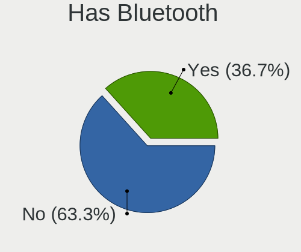

| Presented | Desktops | Percent |
|-----------|----------|---------|
| No        | 26       | 78.79%  |
| Yes       | 7        | 21.21%  |

Location
--------

Country
-------

Geographic location (country)

| Country      | Desktops | Percent |
|--------------|----------|---------|
| Russia       | 9        | 27.27%  |
| USA          | 4        | 12.12%  |
| UK           | 3        | 9.09%   |
| Italy        | 2        | 6.06%   |
| Hungary      | 2        | 6.06%   |
| Germany      | 2        | 6.06%   |
| Finland      | 2        | 6.06%   |
| Spain        | 1        | 3.03%   |
| Saudi Arabia | 1        | 3.03%   |
| Romania      | 1        | 3.03%   |
| Poland       | 1        | 3.03%   |
| Netherlands  | 1        | 3.03%   |
| Latvia       | 1        | 3.03%   |
| Czechia      | 1        | 3.03%   |
| Brazil       | 1        | 3.03%   |
| Australia    | 1        | 3.03%   |

City
----

Geographic location (city)

| City                  | Desktops | Percent |
|-----------------------|----------|---------|
| Ozersk                | 6        | 18.18%  |
| Tampere               | 2        | 6.06%   |
| Moscow                | 2        | 6.06%   |
| Urupes                | 1        | 3.03%   |
| Unterhaching          | 1        | 3.03%   |
| Ulan-Ude              | 1        | 3.03%   |
| Turin                 | 1        | 3.03%   |
| Sydney                | 1        | 3.03%   |
| Stourbridge           | 1        | 3.03%   |
| Sopron                | 1        | 3.03%   |
| Royal Tunbridge Wells | 1        | 3.03%   |
| Rome                  | 1        | 3.03%   |
| Riyadh                | 1        | 3.03%   |
| Riga                  | 1        | 3.03%   |
| Reno                  | 1        | 3.03%   |
| Prague                | 1        | 3.03%   |
| Poznan                | 1        | 3.03%   |
| Portland              | 1        | 3.03%   |
| Murcia                | 1        | 3.03%   |
| Hamilton              | 1        | 3.03%   |
| Gardony               | 1        | 3.03%   |
| Fort Wayne            | 1        | 3.03%   |
| Bucharest             | 1        | 3.03%   |
| Bloomsbury            | 1        | 3.03%   |
| Berlin                | 1        | 3.03%   |
| Amersfoort            | 1        | 3.03%   |

Drives
------

Drive Vendor
------------

Hard drive vendors

| Vendor              | Desktops | Drives | Percent |
|---------------------|----------|--------|---------|
| WDC                 | 8        | 11     | 24.24%  |
| Toshiba             | 4        | 5      | 12.12%  |
| Samsung Electronics | 4        | 4      | 12.12%  |
| SanDisk             | 3        | 4      | 9.09%   |
| Kingston            | 3        | 3      | 9.09%   |
| Seagate             | 2        | 2      | 6.06%   |
| MAXTOR              | 2        | 2      | 6.06%   |
| SK Hynix            | 1        | 2      | 3.03%   |
| Lexar               | 1        | 1      | 3.03%   |
| JetFlash            | 1        | 1      | 3.03%   |
| Hewlett-Packard     | 1        | 1      | 3.03%   |
| Generic             | 1        | 1      | 3.03%   |
| Crucial             | 1        | 2      | 3.03%   |
| China               | 1        | 1      | 3.03%   |

Drive Model
-----------

Hard drive models

| Model                             | Desktops | Percent |
|-----------------------------------|----------|---------|
| Toshiba DT01ACA100 1TB            | 3        | 8.82%   |
| Samsung SSD 860 EVO 500GB         | 2        | 5.88%   |
| Samsung HD103UJ 1TB               | 2        | 5.88%   |
| MAXTOR STM3250310AS 250GB         | 2        | 5.88%   |
| Kingston DataTraveler 3.0 32GB    | 2        | 5.88%   |
| WDC WDS240G2G0A-00JH30 240GB      | 1        | 2.94%   |
| WDC WDS120G2G0A-00JH30 120GB      | 1        | 2.94%   |
| WDC WD5003AZEX-00K3CA0 500GB      | 1        | 2.94%   |
| WDC WD5000AAKX-753CA1 500GB       | 1        | 2.94%   |
| WDC WD5000AACS-00ZUB0 500GB       | 1        | 2.94%   |
| WDC WD2502ABYS-01B7A0 256GB       | 1        | 2.94%   |
| WDC WD20EFRX-68EUZN0 2TB          | 1        | 2.94%   |
| WDC WD200EB-00BHF0 20GB           | 1        | 2.94%   |
| WDC WD10EZEX-60WN4A0 1TB          | 1        | 2.94%   |
| Toshiba DT01ACA200 2TB            | 1        | 2.94%   |
| SK Hynix HFS128G39TND-N210A 128GB | 1        | 2.94%   |
| Seagate ST380011A 80GB            | 1        | 2.94%   |
| Seagate ST2000DL003-9VT166 2TB    | 1        | 2.94%   |
| SanDisk SDSSDH3512G 512GB         | 1        | 2.94%   |
| SanDisk Extreme SSD 250GB         | 1        | 2.94%   |
| SanDisk Cruzer Glide 16GB         | 1        | 2.94%   |
| Lexar USB Flash Drive 64GB        | 1        | 2.94%   |
| Kingston SA400S37480G 480GB       | 1        | 2.94%   |
| JetFlash Transcend 16GB           | 1        | 2.94%   |
| HP v100w 8GB                      | 1        | 2.94%   |
| Generic Flash Disk 32GB           | 1        | 2.94%   |
| Crucial CT1000BX500SSD1 1TB       | 1        | 2.94%   |
| China SATA SSD 120GB              | 1        | 2.94%   |

HDD Vendor
----------

Hard disk drive vendors

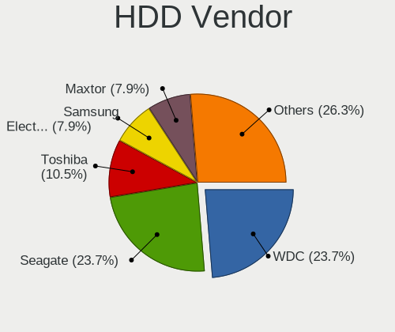

| Vendor              | Desktops | Drives | Percent |
|---------------------|----------|--------|---------|
| WDC                 | 7        | 9      | 33.33%  |
| Toshiba             | 4        | 5      | 19.05%  |
| Seagate             | 2        | 2      | 9.52%   |
| Samsung Electronics | 2        | 2      | 9.52%   |
| MAXTOR              | 2        | 2      | 9.52%   |
| Lexar               | 1        | 1      | 4.76%   |
| JetFlash            | 1        | 1      | 4.76%   |
| Hewlett-Packard     | 1        | 1      | 4.76%   |
| Generic             | 1        | 1      | 4.76%   |

SSD Vendor
----------

Solid state drive vendors

| Vendor              | Desktops | Drives | Percent |
|---------------------|----------|--------|---------|
| SanDisk             | 3        | 4      | 23.08%  |
| Kingston            | 3        | 3      | 23.08%  |
| WDC                 | 2        | 2      | 15.38%  |
| Samsung Electronics | 2        | 2      | 15.38%  |
| SK Hynix            | 1        | 2      | 7.69%   |
| Crucial             | 1        | 2      | 7.69%   |
| China               | 1        | 1      | 7.69%   |

Drive Kind
----------

HDD or SSD

| Kind | Desktops | Drives | Percent |
|------|----------|--------|---------|
| HDD  | 15       | 24     | 55.56%  |
| SSD  | 12       | 16     | 44.44%  |

Drive Connector
---------------

SATA, SAS, NVMe, etc.

| Type | Desktops | Drives | Percent |
|------|----------|--------|---------|
| SATA | 21       | 40     | 100%    |

Drive Size
----------

Size of hard drive

| Size in TB | Desktops | Drives | Percent |
|------------|----------|--------|---------|
| 0.01-0.5   | 20       | 26     | 66.67%  |
| 0.51-1.0   | 8        | 10     | 26.67%  |
| 1.01-2.0   | 2        | 4      | 6.67%   |

Space Total
-----------

Amount of disk space available on the file system

| Size in GB | Desktops | Percent |
|------------|----------|---------|
| 101-250    | 12       | 36.36%  |
| 251-500    | 5        | 15.15%  |
| 1-20       | 4        | 12.12%  |
| 501-1000   | 4        | 12.12%  |
| 51-100     | 4        | 12.12%  |
| 1001-2000  | 2        | 6.06%   |
| 21-50      | 1        | 3.03%   |
| 2001-3000  | 1        | 3.03%   |

Space Used
----------

Amount of used disk space

| Used GB   | Desktops | Percent |
|-----------|----------|---------|
| 1-20      | 23       | 63.89%  |
| 21-50     | 5        | 13.89%  |
| 51-100    | 3        | 8.33%   |
| 1001-2000 | 2        | 5.56%   |
| 251-500   | 1        | 2.78%   |
| 101-250   | 1        | 2.78%   |
| 501-1000  | 1        | 2.78%   |

Malfunc. Drives
---------------

Drive models with a malfunction

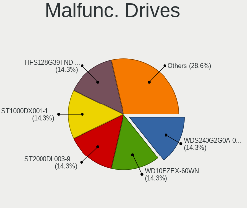

| Model                             | Desktops | Drives | Percent |
|-----------------------------------|----------|--------|---------|
| WDC WDS240G2G0A-00JH30 240GB      | 1        | 1      | 25%     |
| WDC WD10EZEX-60WN4A0 1TB          | 1        | 1      | 25%     |
| SK Hynix HFS128G39TND-N210A 128GB | 1        | 1      | 25%     |
| Seagate ST2000DL003-9VT166 2TB    | 1        | 1      | 25%     |

Malfunc. Drive Vendor
---------------------

Vendors of faulty drives

| Vendor   | Desktops | Drives | Percent |
|----------|----------|--------|---------|
| WDC      | 2        | 2      | 50%     |
| SK Hynix | 1        | 1      | 25%     |
| Seagate  | 1        | 1      | 25%     |

Malfunc. HDD Vendor
-------------------

Vendors of faulty HDD drives

| Vendor  | Desktops | Drives | Percent |
|---------|----------|--------|---------|
| WDC     | 1        | 1      | 50%     |
| Seagate | 1        | 1      | 50%     |

Malfunc. Drive Kind
-------------------

Kinds of faulty drives

| Kind | Desktops | Drives | Percent |
|------|----------|--------|---------|
| SSD  | 2        | 2      | 50%     |
| HDD  | 2        | 2      | 50%     |

Failed Drives
-------------

Failed drive models

Zero info for selected period =(

Failed Drive Vendor
-------------------

Failed drive vendors

Zero info for selected period =(

Drive Status
------------

Number of failed and malfunc. drives

| Status   | Desktops | Drives | Percent |
|----------|----------|--------|---------|
| Works    | 17       | 31     | 65.38%  |
| Detected | 5        | 5      | 19.23%  |
| Malfunc  | 4        | 4      | 15.38%  |

Storage controller
------------------

Storage Vendor
--------------

Storage controller vendors

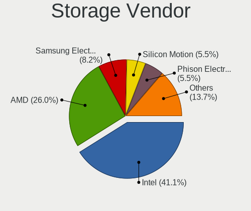

| Vendor              | Desktops | Percent |
|---------------------|----------|---------|
| Intel               | 16       | 43.24%  |
| AMD                 | 11       | 29.73%  |
| Silicon Motion      | 3        | 8.11%   |
| Sandisk             | 2        | 5.41%   |
| Samsung Electronics | 2        | 5.41%   |
| Phison Electronics  | 1        | 2.7%    |
| Nvidia              | 1        | 2.7%    |
| ASMedia Technology  | 1        | 2.7%    |

Storage Model
-------------

Storage controller models

| Model                                                                            | Desktops | Percent |
|----------------------------------------------------------------------------------|----------|---------|
| AMD FCH SATA Controller [AHCI mode]                                              | 6        | 13.64%  |
| AMD SB7x0/SB8x0/SB9x0 SATA Controller [AHCI mode]                                | 4        | 9.09%   |
| Silicon Motion SM2263EN/SM2263XT SSD Controller                                  | 3        | 6.82%   |
| Intel 7 Series/C210 Series Chipset Family 6-port SATA Controller [AHCI mode]     | 3        | 6.82%   |
| AMD 400 Series Chipset SATA Controller                                           | 3        | 6.82%   |
| Sandisk WD Blue SN550 NVMe SSD                                                   | 2        | 4.55%   |
| Intel Q170/Q150/B150/H170/H110/Z170/CM236 Chipset SATA Controller [AHCI Mode]    | 2        | 4.55%   |
| Intel 7 Series Chipset Family 6-port SATA Controller [AHCI mode]                 | 2        | 4.55%   |
| AMD SB7x0/SB8x0/SB9x0 IDE Controller                                             | 2        | 4.55%   |
| AMD FCH SATA Controller D                                                        | 2        | 4.55%   |
| Samsung NVMe SSD Controller SM981/PM981/PM983                                    | 1        | 2.27%   |
| Samsung NVMe SSD Controller 980                                                  | 1        | 2.27%   |
| Phison E16 PCIe4 NVMe Controller                                                 | 1        | 2.27%   |
| Nvidia MCP61 SATA Controller                                                     | 1        | 2.27%   |
| Nvidia MCP61 IDE                                                                 | 1        | 2.27%   |
| Intel Jasper Lake SATA AHCI Controller                                           | 1        | 2.27%   |
| Intel Cannon Lake PCH SATA AHCI Controller                                       | 1        | 2.27%   |
| Intel Cannon Lake Mobile PCH SATA AHCI Controller                                | 1        | 2.27%   |
| Intel Atom/Celeron/Pentium Processor x5-E8000/J3xxx/N3xxx Series SATA Controller | 1        | 2.27%   |
| Intel Atom Processor E3800 Series SATA AHCI Controller                           | 1        | 2.27%   |
| Intel 82801AA IDE Controller                                                     | 1        | 2.27%   |
| Intel 8 Series/C220 Series Chipset Family 6-port SATA Controller 1 [AHCI mode]   | 1        | 2.27%   |
| Intel 6 Series/C200 Series Chipset Family 6 port Desktop SATA AHCI Controller    | 1        | 2.27%   |
| Intel 400 Series Chipset Family SATA AHCI Controller                             | 1        | 2.27%   |
| ASMedia ASM1061 SATA IDE Controller                                              | 1        | 2.27%   |

Storage Kind
------------

Kind of storage controller (IDE, SATA, NVMe, SAS, ...)

| Kind | Desktops | Percent |
|------|----------|---------|
| SATA | 26       | 66.67%  |
| NVMe | 8        | 20.51%  |
| IDE  | 5        | 12.82%  |

Processor
---------

CPU Vendor
----------

Processor vendors

| Vendor  | Desktops | Percent |
|---------|----------|---------|
| Intel   | 17       | 51.52%  |
| AMD     | 11       | 33.33%  |
| Unknown | 3        | 9.09%   |
| Arm     | 2        | 6.06%   |

CPU Model
---------

Processor models

| Model                                       | Desktops | Percent |
|---------------------------------------------|----------|---------|
| Intel 686-class                             | 9        | 27.27%  |
|                                             | 3        | 9.09%   |
| Arm Cortex-A53 r0p4 (v8-A)                  | 2        | 6.06%   |
| Intel Xeon CPU E5-2630L v3 @ 1.80GHz        | 1        | 3.03%   |
| Intel Pentium III                           | 1        | 3.03%   |
| Intel Core i7-6700K CPU @ 4.00GHz           | 1        | 3.03%   |
| Intel Core i7-3770 CPU @ 3.40GHz            | 1        | 3.03%   |
| Intel Core i5-7400 CPU @ 3.00GHz            | 1        | 3.03%   |
| Intel Core i5-2320 CPU @ 3.00GHz            | 1        | 3.03%   |
| Intel Core i3-4150 CPU @ 3.50GHz            | 1        | 3.03%   |
| Intel Celeron CPU N2830 @ 2.16GHz           | 1        | 3.03%   |
| AMD Sempron 145 Processor                   | 1        | 3.03%   |
| AMD Ryzen 9 3900X 12-Core Processor         | 1        | 3.03%   |
| AMD Ryzen 5 3600 6-Core Processor           | 1        | 3.03%   |
| AMD Ryzen 5 2600 Six-Core Processor         | 1        | 3.03%   |
| AMD Ryzen 3 2200G with Radeon Vega Graphics | 1        | 3.03%   |
| AMD Ryzen 3 1200 Quad-Core Processor        | 1        | 3.03%   |
| AMD Phenom II X6 1055T Processor            | 1        | 3.03%   |
| AMD Phenom II X4 965 Processor              | 1        | 3.03%   |
| AMD FX-8350 Eight-Core Processor            | 1        | 3.03%   |
| AMD E-450 APU with Radeon HD Graphics       | 1        | 3.03%   |
| AMD 686-class                               | 1        | 3.03%   |

CPU Model Family
----------------

Processor model prefix

| Model             | Desktops | Percent |
|-------------------|----------|---------|
| Intel 686-class   | 9        | 27.27%  |
| Other             | 5        | 15.15%  |
| Intel Core i7     | 2        | 6.06%   |
| Intel Core i5     | 2        | 6.06%   |
| AMD Ryzen 5       | 2        | 6.06%   |
| AMD Ryzen 3       | 2        | 6.06%   |
| Intel Xeon        | 1        | 3.03%   |
| Intel Pentium III | 1        | 3.03%   |
| Intel Core i3     | 1        | 3.03%   |
| Intel Celeron     | 1        | 3.03%   |
| AMD Sempron       | 1        | 3.03%   |
| AMD Ryzen 9       | 1        | 3.03%   |
| AMD Phenom II X6  | 1        | 3.03%   |
| AMD Phenom II X4  | 1        | 3.03%   |
| AMD FX            | 1        | 3.03%   |
| AMD E             | 1        | 3.03%   |
| AMD 686-class     | 1        | 3.03%   |

CPU Cores
---------

Number of processor cores

| Number  | Desktops | Percent |
|---------|----------|---------|
| Unknown | 20       | 60.61%  |
| 4       | 6        | 18.18%  |
| 8       | 2        | 6.06%   |
| 6       | 2        | 6.06%   |
| 2       | 2        | 6.06%   |
| 12      | 1        | 3.03%   |

CPU Sockets
-----------

Number of sockets

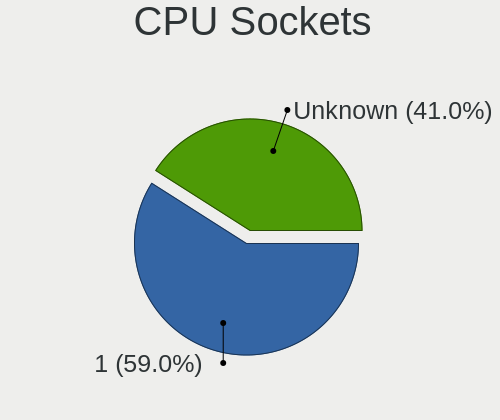

| Number  | Desktops | Percent |
|---------|----------|---------|
| 1       | 18       | 54.55%  |
| Unknown | 15       | 45.45%  |

CPU Threads
-----------

Threads per core (Hyper-Threading)

| Number  | Desktops | Percent |
|---------|----------|---------|
| Unknown | 20       | 60.61%  |
| 2       | 7        | 21.21%  |
| 1       | 6        | 18.18%  |

CPU Microarch
-------------

Microarchitecture

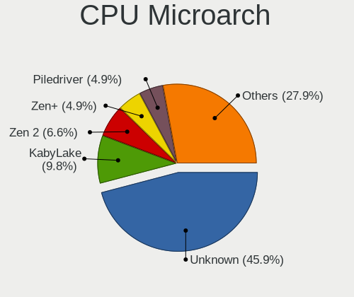

| Name        | Desktops | Percent |
|-------------|----------|---------|
| Unknown     | 16       | 48.48%  |
| Zen 2       | 2        | 6.06%   |
| Zen         | 2        | 6.06%   |
| K10         | 2        | 6.06%   |
| Haswell     | 2        | 6.06%   |
| Zen+        | 1        | 3.03%   |
| Skylake     | 1        | 3.03%   |
| Silvermont  | 1        | 3.03%   |
| SandyBridge | 1        | 3.03%   |
| Piledriver  | 1        | 3.03%   |
| P6          | 1        | 3.03%   |
| KabyLake    | 1        | 3.03%   |
| IvyBridge   | 1        | 3.03%   |
| Bobcat      | 1        | 3.03%   |

Graphics
--------

GPU Vendor
----------

Vendors of graphics cards

| Vendor | Desktops | Percent |
|--------|----------|---------|
| Intel  | 13       | 40.63%  |
| AMD    | 12       | 37.5%   |
| Nvidia | 7        | 21.88%  |

GPU Model
---------

Graphics card models

| Model                                                                                    | Desktops | Percent |
|------------------------------------------------------------------------------------------|----------|---------|
| Nvidia GF114 [GeForce GTX 560]                                                           | 2        | 6.06%   |
| AMD Ellesmere [Radeon RX 470/480/570/570X/580/580X/590]                                  | 2        | 6.06%   |
| Nvidia NV18 [GeForce4 MX 440 AGP 8x]                                                     | 1        | 3.03%   |
| Nvidia GP107M [GeForce GTX 1050 Mobile]                                                  | 1        | 3.03%   |
| Nvidia GM204 [GeForce GTX 970]                                                           | 1        | 3.03%   |
| Nvidia G86 [GeForce 8500 GT]                                                             | 1        | 3.03%   |
| Nvidia C61 [GeForce 7025 / nForce 630a]                                                  | 1        | 3.03%   |
| Intel Xeon E3-1200 v2/3rd Gen Core processor Graphics Controller                         | 1        | 3.03%   |
| Intel JasperLake [UHD Graphics]                                                          | 1        | 3.03%   |
| Intel IvyBridge GT2 [HD Graphics 4000]                                                   | 1        | 3.03%   |
| Intel Iris Graphics 6100                                                                 | 1        | 3.03%   |
| Intel HD Graphics 630                                                                    | 1        | 3.03%   |
| Intel HD Graphics 530                                                                    | 1        | 3.03%   |
| Intel CometLake-S GT2 [UHD Graphics 630]                                                 | 1        | 3.03%   |
| Intel CoffeeLake-S GT2 [UHD Graphics 630]                                                | 1        | 3.03%   |
| Intel CoffeeLake-H GT2 [UHD Graphics 630]                                                | 1        | 3.03%   |
| Intel Atom/Celeron/Pentium Processor x5-E8000/J3xxx/N3xxx Integrated Graphics Controller | 1        | 3.03%   |
| Intel Atom Processor Z36xxx/Z37xxx Series Graphics & Display                             | 1        | 3.03%   |
| Intel 3rd Gen Core processor Graphics Controller                                         | 1        | 3.03%   |
| Intel 2nd Generation Core Processor Family Integrated Graphics Controller                | 1        | 3.03%   |
| AMD Wrestler [Radeon HD 6320]                                                            | 1        | 3.03%   |
| AMD Tonga PRO [Radeon R9 285/380]                                                        | 1        | 3.03%   |
| AMD Sun LE [Radeon HD 8550M / R5 M230]                                                   | 1        | 3.03%   |
| AMD Stoney [Radeon R2/R3/R4/R5 Graphics]                                                 | 1        | 3.03%   |
| AMD Raven Ridge [Radeon Vega Series / Radeon Vega Mobile Series]                         | 1        | 3.03%   |
| AMD Oland PRO [Radeon R7 240/340 / Radeon 520]                                           | 1        | 3.03%   |
| AMD Lexa PRO [Radeon 540/540X/550/550X / RX 540X/550/550X]                               | 1        | 3.03%   |
| AMD Chelsea XT GL [FirePro M4000]                                                        | 1        | 3.03%   |
| AMD Cedar [Radeon HD 5000/6000/7350/8350 Series]                                         | 1        | 3.03%   |
| AMD Caicos [Radeon HD 6450/7450/8450 / R5 230 OEM]                                       | 1        | 3.03%   |
| AMD Caicos PRO [Radeon HD 7450]                                                          | 1        | 3.03%   |

GPU Combo
---------

Combinations of graphics cards

| Name           | Desktops | Percent |
|----------------|----------|---------|
| 1 x Intel      | 10       | 30.3%   |
| 1 x AMD        | 9        | 27.27%  |
| 1 x Nvidia     | 6        | 18.18%  |
| Other          | 5        | 15.15%  |
| 2 x AMD        | 1        | 3.03%   |
| Intel + Nvidia | 1        | 3.03%   |
| Intel + AMD    | 1        | 3.03%   |

GPU Driver
----------

Free vs proprietary

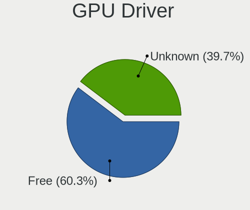

| Driver  | Desktops | Percent |
|---------|----------|---------|
| Free    | 23       | 65.71%  |
| Unknown | 12       | 34.29%  |

GPU Memory
----------

Total video memory

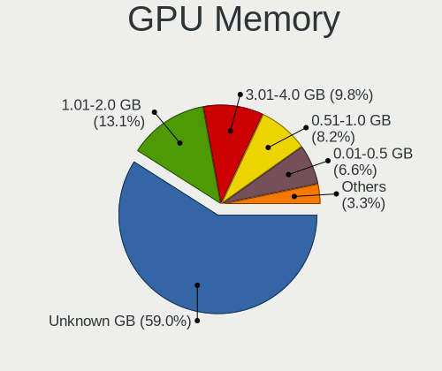

| Size in GB | Desktops | Percent |
|------------|----------|---------|
| Unknown    | 19       | 55.88%  |
| 1.01-2.0   | 5        | 14.71%  |
| 3.01-4.0   | 3        | 8.82%   |
| 0.51-1.0   | 3        | 8.82%   |
| 0.01-0.5   | 3        | 8.82%   |
| 7.01-8.0   | 1        | 2.94%   |

Monitor
-------

Monitor Vendor
--------------

Monitor vendors

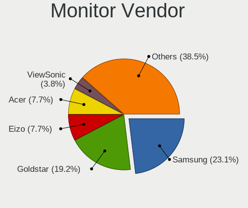

| Vendor              | Desktops | Percent |
|---------------------|----------|---------|
| Samsung Electronics | 5        | 35.71%  |
| Goldstar            | 4        | 28.57%  |
| ViewSonic           | 1        | 7.14%   |
| Unknown (CDD)       | 1        | 7.14%   |
| Impression          | 1        | 7.14%   |
| Apple               | 1        | 7.14%   |
| Acer                | 1        | 7.14%   |

Monitor Model
-------------

Monitor models

| Model                                                                 | Desktops | Percent |
|-----------------------------------------------------------------------|----------|---------|
| Samsung Electronics LCD Monitor SAM0C39 1920x1080 890x500mm 40.2-inch | 2        | 14.29%  |
| ViewSonic LCD Monitor VSCD22B 1920x1080 520x290mm 23.4-inch           | 1        | 7.14%   |
| Unknown (CDD) VGA CDD0030 1920x1080 1150x650mm 52.0-inch              | 1        | 7.14%   |
| Samsung Electronics SyncMaster SAM01AE 1600x1200 410x310mm 20.2-inch  | 1        | 7.14%   |
| Samsung Electronics SMS27A350H SAM07CE 1920x1080 600x340mm 27.2-inch  | 1        | 7.14%   |
| Samsung Electronics S23C570 SAM0A56 1920x1080 510x290mm 23.1-inch     | 1        | 7.14%   |
| Impression R19W11 IMP1911 1440x900 410x260mm 19.1-inch                | 1        | 7.14%   |
| Goldstar W1952 GSM4B78 1440x900 410x260mm 19.1-inch                   | 1        | 7.14%   |
| Goldstar LG ULTRAWIDE GSM59F1 2560x1080 670x280mm 28.6-inch           | 1        | 7.14%   |
| Goldstar LCD Monitor GSM5AB6 1920x1080 480x270mm 21.7-inch            | 1        | 7.14%   |
| Goldstar L194WT GSM4B05 1440x900 410x260mm 19.1-inch                  | 1        | 7.14%   |
| Apple Color LCD APPA029 2560x1600 290x180mm 13.4-inch                 | 1        | 7.14%   |
| Acer SB220Q ACR06AB 1920x1080 480x270mm 21.7-inch                     | 1        | 7.14%   |

Monitor Resolution
------------------

Monitor screen resolution

| Resolution       | Desktops | Percent |
|------------------|----------|---------|
| 1920x1080 (FHD)  | 8        | 57.14%  |
| 1440x900 (WXGA+) | 3        | 21.43%  |
| 2560x1600        | 1        | 7.14%   |
| 2560x1080        | 1        | 7.14%   |
| 1600x1200        | 1        | 7.14%   |

Monitor Diagonal
----------------

Diagonal size in inches

| Inches | Desktops | Percent |
|--------|----------|---------|
| 19     | 3        | 21.43%  |
| 40     | 2        | 14.29%  |
| 23     | 2        | 14.29%  |
| 21     | 2        | 14.29%  |
| 52     | 1        | 7.14%   |
| 28     | 1        | 7.14%   |
| 27     | 1        | 7.14%   |
| 20     | 1        | 7.14%   |
| 13     | 1        | 7.14%   |

Monitor Width
-------------

Physical width

| Width in mm | Desktops | Percent |
|-------------|----------|---------|
| 401-500     | 6        | 42.86%  |
| 501-600     | 3        | 21.43%  |
| 801-900     | 2        | 14.29%  |
| 601-700     | 1        | 7.14%   |
| 201-300     | 1        | 7.14%   |
| 1001-1500   | 1        | 7.14%   |

Aspect Ratio
------------

Proportional relationship between the width and the height

| Ratio | Desktops | Percent |
|-------|----------|---------|
| 16/9  | 8        | 57.14%  |
| 16/10 | 4        | 28.57%  |
| 4/3   | 1        | 7.14%   |
| 21/9  | 1        | 7.14%   |

Monitor Area
------------

Area in inch²

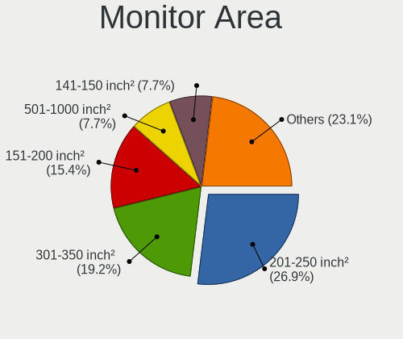

| Area in inch² | Desktops | Percent |
|----------------|----------|---------|
| 201-250        | 4        | 28.57%  |
| 151-200        | 4        | 28.57%  |
| 501-1000       | 2        | 14.29%  |
| More than 1000 | 1        | 7.14%   |
| 81-90          | 1        | 7.14%   |
| 301-350        | 1        | 7.14%   |
| 251-300        | 1        | 7.14%   |

Pixel Density
-------------

Pixels per inch

| Density | Desktops | Percent |
|---------|----------|---------|
| 51-100  | 10       | 71.43%  |
| 101-120 | 2        | 14.29%  |
| 1-50    | 1        | 7.14%   |
| 161-240 | 1        | 7.14%   |

Multiple Monitors
-----------------

Total monitors connected

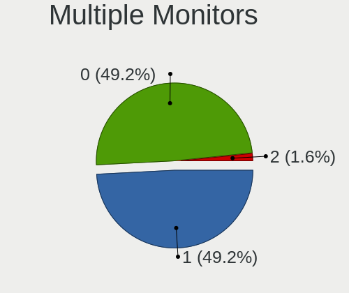

| Total | Desktops | Percent |
|-------|----------|---------|
| 0     | 17       | 50%     |
| 1     | 16       | 47.06%  |
| 2     | 1        | 2.94%   |

Network
-------

Net Controller Vendor
---------------------

Controller vendors

| Vendor                | Desktops | Percent |
|-----------------------|----------|---------|
| Realtek Semiconductor | 19       | 48.72%  |
| Intel                 | 9        | 23.08%  |
| Qualcomm Atheros      | 3        | 7.69%   |
| Huawei Technologies   | 2        | 5.13%   |
| Broadcom              | 2        | 5.13%   |
| Oculus VR             | 1        | 2.56%   |
| Netchip Technology    | 1        | 2.56%   |
| Mercucys              | 1        | 2.56%   |
| 3Com                  | 1        | 2.56%   |

Net Controller Model
--------------------

Controller models

| Model                                                             | Desktops | Percent |
|-------------------------------------------------------------------|----------|---------|
| Realtek RTL8111/8168/8411 PCI Express Gigabit Ethernet Controller | 18       | 40%     |
| Intel I211 Gigabit Network Connection                             | 3        | 6.67%   |
| Intel 82579LM Gigabit Network Connection (Lewisville)             | 3        | 6.67%   |
| Intel Cannon Lake PCH CNVi WiFi                                   | 2        | 4.44%   |
| Huawei USB Composite Device                                       | 2        | 4.44%   |
| Realtek RTL8723BE PCIe Wireless Network Adapter                   | 1        | 2.22%   |
| Realtek RTL8192CU 802.11n WLAN Adapter                            | 1        | 2.22%   |
| Realtek RTL-8100/8101L/8139 PCI Fast Ethernet Adapter             | 1        | 2.22%   |
| Qualcomm Atheros Killer E220x Gigabit Ethernet Controller         | 1        | 2.22%   |
| Qualcomm Atheros AR9285 Wireless Network Adapter (PCI-Express)    | 1        | 2.22%   |
| Qualcomm Atheros AR8151 v2.0 Gigabit Ethernet                     | 1        | 2.22%   |
| Oculus VR Rift S                                                  | 1        | 2.22%   |
| Netchip Linux-USB Serial Gadget (CDC ACM mode)                    | 1        | 2.22%   |
| Mercucys MERCUSYS Wireless USB Adapter                            | 1        | 2.22%   |
| Intel Wireless-AC 9260                                            | 1        | 2.22%   |
| Intel Wi-Fi 6 AX201 160MHz                                        | 1        | 2.22%   |
| Intel Wi-Fi 6 AX200                                               | 1        | 2.22%   |
| Intel Centrino Ultimate-N 6300                                    | 1        | 2.22%   |
| Broadcom NetXtreme BCM57766 Gigabit Ethernet PCIe                 | 1        | 2.22%   |
| Broadcom BCM43602 802.11ac Wireless LAN SoC                       | 1        | 2.22%   |
| Broadcom BCM4331 802.11a/b/g/n                                    | 1        | 2.22%   |
| 3Com 3c905C-TX/TX-M [Tornado]                                     | 1        | 2.22%   |

Wireless Vendor
---------------

Wireless vendors

| Vendor                | Desktops | Percent |
|-----------------------|----------|---------|
| Intel                 | 5        | 45.45%  |
| Realtek Semiconductor | 2        | 18.18%  |
| Broadcom              | 2        | 18.18%  |
| Qualcomm Atheros      | 1        | 9.09%   |
| Mercucys              | 1        | 9.09%   |

Wireless Model
--------------

Wireless models

| Model                                                          | Desktops | Percent |
|----------------------------------------------------------------|----------|---------|
| Intel Cannon Lake PCH CNVi WiFi                                | 2        | 18.18%  |
| Realtek RTL8723BE PCIe Wireless Network Adapter                | 1        | 9.09%   |
| Realtek RTL8192CU 802.11n WLAN Adapter                         | 1        | 9.09%   |
| Qualcomm Atheros AR9285 Wireless Network Adapter (PCI-Express) | 1        | 9.09%   |
| Mercucys MERCUSYS Wireless USB Adapter                         | 1        | 9.09%   |
| Intel Wireless-AC 9260                                         | 1        | 9.09%   |
| Intel Wi-Fi 6 AX201 160MHz                                     | 1        | 9.09%   |
| Intel Wi-Fi 6 AX200                                            | 1        | 9.09%   |
| Broadcom BCM43602 802.11ac Wireless LAN SoC                    | 1        | 9.09%   |
| Broadcom BCM4331 802.11a/b/g/n                                 | 1        | 9.09%   |

Ethernet Vendor
---------------

Ethernet vendors

| Vendor                | Desktops | Percent |
|-----------------------|----------|---------|
| Realtek Semiconductor | 19       | 61.29%  |
| Intel                 | 6        | 19.35%  |
| Qualcomm Atheros      | 2        | 6.45%   |
| Huawei Technologies   | 2        | 6.45%   |
| Broadcom              | 1        | 3.23%   |
| 3Com                  | 1        | 3.23%   |

Ethernet Model
--------------

Ethernet models

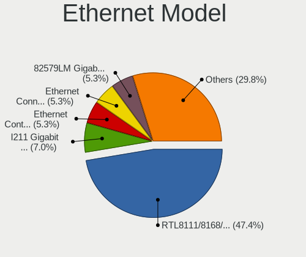

| Model                                                             | Desktops | Percent |
|-------------------------------------------------------------------|----------|---------|
| Realtek RTL8111/8168/8411 PCI Express Gigabit Ethernet Controller | 18       | 58.06%  |
| Intel I211 Gigabit Network Connection                             | 3        | 9.68%   |
| Intel 82579LM Gigabit Network Connection (Lewisville)             | 3        | 9.68%   |
| Huawei USB Composite Device                                       | 2        | 6.45%   |
| Realtek RTL-8100/8101L/8139 PCI Fast Ethernet Adapter             | 1        | 3.23%   |
| Qualcomm Atheros Killer E220x Gigabit Ethernet Controller         | 1        | 3.23%   |
| Qualcomm Atheros AR8151 v2.0 Gigabit Ethernet                     | 1        | 3.23%   |
| Broadcom NetXtreme BCM57766 Gigabit Ethernet PCIe                 | 1        | 3.23%   |
| 3Com 3c905C-TX/TX-M [Tornado]                                     | 1        | 3.23%   |

Net Controller Kind
-------------------

Ethernet, WiFi or modem

| Kind     | Desktops | Percent |
|----------|----------|---------|
| Ethernet | 28       | 66.67%  |
| WiFi     | 11       | 26.19%  |
| Modem    | 2        | 4.76%   |
| Unknown  | 1        | 2.38%   |

Used Controller
---------------

Currently used network controller

| Kind     | Desktops | Percent |
|----------|----------|---------|
| Ethernet | 26       | 92.86%  |
| WiFi     | 2        | 7.14%   |

NICs
----

Total network controllers on board

| Total | Desktops | Percent |
|-------|----------|---------|
| 1     | 18       | 54.55%  |
| 2     | 8        | 24.24%  |
| 0     | 6        | 18.18%  |
| 3     | 1        | 3.03%   |

IPv6
----

IPv6 vs IPv4

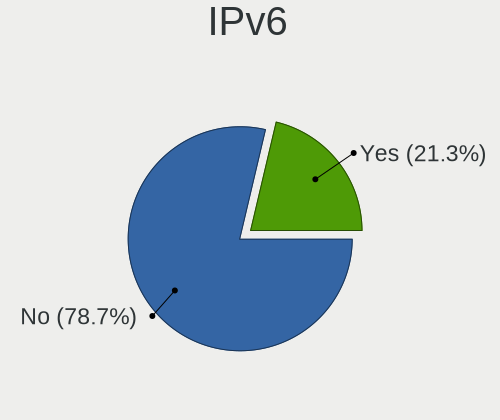

| Used | Desktops | Percent |
|------|----------|---------|
| No   | 29       | 85.29%  |
| Yes  | 5        | 14.71%  |

Bluetooth
---------

Bluetooth Vendor
----------------

Controller vendors

| Vendor                | Desktops | Percent |
|-----------------------|----------|---------|
| Intel                 | 4        | 57.14%  |
| Apple                 | 2        | 28.57%  |
| Realtek Semiconductor | 1        | 14.29%  |

Bluetooth Model
---------------

Controller models

| Model                                          | Desktops | Percent |
|------------------------------------------------|----------|---------|
| Intel Bluetooth 9460/9560 Jefferson Peak (JfP) | 3        | 42.86%  |
| Realtek  Bluetooth 4.0 Adapter                 | 1        | 14.29%  |
| Intel Wireless-AC 9260 Bluetooth Adapter       | 1        | 14.29%  |
| Apple Bluetooth Host Controller                | 1        | 14.29%  |
| Apple Apple Broadcom Built-in Bluetooth        | 1        | 14.29%  |

Sound
-----

Sound Vendor
------------

Sound card vendors

| Vendor              | Desktops | Percent |
|---------------------|----------|---------|
| Intel               | 17       | 44.74%  |
| AMD                 | 14       | 36.84%  |
| Nvidia              | 4        | 10.53%  |
| Yamaha              | 1        | 2.63%   |
| Samsung Electronics | 1        | 2.63%   |
| Logitech            | 1        | 2.63%   |

Sound Model
-----------

Sound card models

| Model                                                                                             | Desktops | Percent |
|---------------------------------------------------------------------------------------------------|----------|---------|
| Intel 7 Series/C216 Chipset Family High Definition Audio Controller                               | 4        | 8.33%   |
| AMD SBx00 Azalia (Intel HDA)                                                                      | 4        | 8.33%   |
| AMD Family 17h (Models 00h-0fh) HD Audio Controller                                               | 3        | 6.25%   |
| Nvidia GF114 HDMI Audio Controller                                                                | 2        | 4.17%   |
| Intel Cannon Lake PCH cAVS                                                                        | 2        | 4.17%   |
| Intel 8 Series/C220 Series Chipset High Definition Audio Controller                               | 2        | 4.17%   |
| Intel 100 Series/C230 Series Chipset Family HD Audio Controller                                   | 2        | 4.17%   |
| AMD Starship/Matisse HD Audio Controller                                                          | 2        | 4.17%   |
| AMD Oland/Hainan/Cape Verde/Pitcairn HDMI Audio [Radeon HD 7000 Series]                           | 2        | 4.17%   |
| AMD Ellesmere HDMI Audio [Radeon RX 470/480 / 570/580/590]                                        | 2        | 4.17%   |
| AMD Caicos HDMI Audio [Radeon HD 6450 / 7450/8450/8490 OEM / R5 230/235/235X OEM]                 | 2        | 4.17%   |
| Yamaha AG06/AG03                                                                                  | 1        | 2.08%   |
| Samsung Electronics Samsung Type-C to 3.5pi gender adapter                                        | 1        | 2.08%   |
| Nvidia GP107GL High Definition Audio Controller                                                   | 1        | 2.08%   |
| Nvidia GM204 High Definition Audio Controller                                                     | 1        | 2.08%   |
| Logitech Zone Wired Earbuds                                                                       | 1        | 2.08%   |
| Intel Wildcat Point-LP High Definition Audio Controller                                           | 1        | 2.08%   |
| Intel Jasper Lake HD Audio                                                                        | 1        | 2.08%   |
| Intel Comet Lake PCH-V cAVS                                                                       | 1        | 2.08%   |
| Intel Broadwell-U Audio Controller                                                                | 1        | 2.08%   |
| Intel Atom/Celeron/Pentium Processor x5-E8000/J3xxx/N3xxx Series High Definition Audio Controller | 1        | 2.08%   |
| Intel Atom Processor Z36xxx/Z37xxx Series High Definition Audio Controller                        | 1        | 2.08%   |
| Intel 82801AA AC'97 Audio Controller                                                              | 1        | 2.08%   |
| Intel 6 Series/C200 Series Chipset Family High Definition Audio Controller                        | 1        | 2.08%   |
| AMD Wrestler HDMI Audio                                                                           | 1        | 2.08%   |
| AMD Tonga HDMI Audio [Radeon R9 285/380]                                                          | 1        | 2.08%   |
| AMD Raven/Raven2/Fenghuang HDMI/DP Audio Controller                                               | 1        | 2.08%   |
| AMD High Definition Audio Controller                                                              | 1        | 2.08%   |
| AMD Family 17h/19h HD Audio Controller                                                            | 1        | 2.08%   |
| AMD Family 15h (Models 60h-6fh) Audio Controller                                                  | 1        | 2.08%   |
| AMD Cedar HDMI Audio [Radeon HD 5400/6300/7300 Series]                                            | 1        | 2.08%   |
| AMD Baffin HDMI/DP Audio [Radeon RX 550 640SP / RX 560/560X]                                      | 1        | 2.08%   |

Memory
------

Memory Vendor
-------------

Memory module vendors

| Vendor            | Desktops | Percent |
|-------------------|----------|---------|
| Kingston          | 5        | 25%     |
| Crucial           | 4        | 20%     |
| Unknown           | 3        | 15%     |
| G.Skill           | 3        | 15%     |
| Patriot           | 2        | 10%     |
| Micron Technology | 1        | 5%      |
| Corsair           | 1        | 5%      |
| A-DATA Technology | 1        | 5%      |

Memory Model
------------

Memory module models

| Model                                                   | Desktops | Percent |
|---------------------------------------------------------|----------|---------|
| Unknown RAM Module 8192MB DIMM 400MT/s                  | 1        | 4.55%   |
| Unknown RAM Module 2048MB DIMM DDR2 800MT/s             | 1        | 4.55%   |
| Unknown RAM Module 2048MB DIMM 400MT/s                  | 1        | 4.55%   |
| Unknown RAM Module 128MB DIMM DRAM                      | 1        | 4.55%   |
| Patriot RAM PSD44G213382 4096MB DIMM DDR4 2133MT/s      | 1        | 4.55%   |
| Patriot RAM PSD34G13332 4GB DIMM DDR3 1333MT/s          | 1        | 4.55%   |
| Micron RAM 36ASF2G72PZ-2G1A2 16GB DIMM DDR4 2133MT/s    | 1        | 4.55%   |
| Kingston RAM KHX2400C15/8G 8GB DIMM DDR4 2400MT/s       | 1        | 4.55%   |
| Kingston RAM KHX1600C9D3/4GX 4GB DIMM DDR3 1600MT/s     | 1        | 4.55%   |
| Kingston RAM ACR16D3LS1KFG/4G 4096MB DIMM DDR3 1600MT/s | 1        | 4.55%   |
| Kingston RAM 99U5701-077.A00G 16GB DIMM DDR4 2667MT/s   | 1        | 4.55%   |
| Kingston RAM 99U5471-028.A00LF 4GB DIMM DDR3 667MT/s    | 1        | 4.55%   |
| Kingston RAM 9905471-011.A00LF 4GB DIMM DDR3 1333MT/s   | 1        | 4.55%   |
| G.Skill RAM F4-3200C16-16GVK 16GB DIMM DDR4 3200MT/s    | 1        | 4.55%   |
| G.Skill RAM F4-2800C17-8GVR 8192MB DIMM DDR4 2133MT/s   | 1        | 4.55%   |
| G.Skill RAM F3-1600C11-8G 8GB DIMM DDR3 1600MT/s        | 1        | 4.55%   |
| Crucial RAM CT8G4DFS824A.M8FE 8GB DIMM DDR4 2933MT/s    | 1        | 4.55%   |
| Crucial RAM CT51264BA160B.C16F 4GB DIMM DDR3 1600MT/s   | 1        | 4.55%   |
| Crucial RAM CT102464BA160B.C16 8GB DIMM DDR3 1600MT/s   | 1        | 4.55%   |
| Crucial RAM BLS4G4D240FSE.8FBD 4GB DIMM DDR4 2400MT/s   | 1        | 4.55%   |
| Corsair RAM CMV8GX3M1A160 8GB DIMM DDR3 800MT/s         | 1        | 4.55%   |
| A-DATA RAM Module 8GB DIMM DDR4 2666MT/s                | 1        | 4.55%   |

Memory Kind
-----------

Memory module kinds

| Kind    | Desktops | Percent |
|---------|----------|---------|
| DDR4    | 9        | 47.37%  |
| DDR3    | 7        | 36.84%  |
| DRAM    | 1        | 5.26%   |
| DDR2    | 1        | 5.26%   |
| Unknown | 1        | 5.26%   |

Memory Form Factor
------------------

Physical design of the memory module

| Name | Desktops | Percent |
|------|----------|---------|
| DIMM | 19       | 100%    |

Memory Size
-----------

Memory module size

| Size  | Desktops | Percent |
|-------|----------|---------|
| 8192  | 7        | 35%     |
| 4096  | 7        | 35%     |
| 16384 | 3        | 15%     |
| 2048  | 2        | 10%     |
| 128   | 1        | 5%      |

Memory Speed
------------

Memory module speed

| Speed   | Desktops | Percent |
|---------|----------|---------|
| 1600    | 5        | 23.81%  |
| 2133    | 3        | 14.29%  |
| 2400    | 2        | 9.52%   |
| 1333    | 2        | 9.52%   |
| 800     | 2        | 9.52%   |
| 3200    | 1        | 4.76%   |
| 2933    | 1        | 4.76%   |
| 2667    | 1        | 4.76%   |
| 2666    | 1        | 4.76%   |
| 667     | 1        | 4.76%   |
| 400     | 1        | 4.76%   |
| Unknown | 1        | 4.76%   |

Printers & scanners
-------------------

Printer Vendor
--------------

Printer device vendors

Zero info for selected period =(

Printer Model
-------------

Printer device models

Zero info for selected period =(

Scanner Vendor
--------------

Scanner device vendors

| Vendor | Desktops | Percent |
|--------|----------|---------|
| Canon  | 1        | 100%    |

Scanner Model
-------------

Scanner device models

| Model                   | Desktops | Percent |
|-------------------------|----------|---------|
| Canon CanoScan LiDE 210 | 1        | 100%    |

Camera
------

Camera Vendor
-------------

Camera device vendors

| Vendor              | Desktops | Percent |
|---------------------|----------|---------|
| Silicon Motion      | 1        | 25%     |
| Quanta              | 1        | 25%     |
| Chicony Electronics | 1        | 25%     |
| ARC International   | 1        | 25%     |

Camera Model
------------

Camera device models

| Model                            | Desktops | Percent |
|----------------------------------|----------|---------|
| Silicon Motion 300k Pixel Camera | 1        | 25%     |
| Quanta VGA WebCam                | 1        | 25%     |
| Chicony USB2.0 VGA UVC WebCam    | 1        | 25%     |
| ARC International Camera         | 1        | 25%     |

Security
--------

Fingerprint Vendor
------------------

Fingerprint sensor vendors

Zero info for selected period =(

Fingerprint Model
-----------------

Fingerprint sensor models

Zero info for selected period =(

Chipcard Vendor
---------------

Chipcard module vendors

Zero info for selected period =(

Chipcard Model
--------------

Chipcard module models

Zero info for selected period =(

Unsupported
-----------

Unsupported Devices
-------------------

Total unsupported devices on board

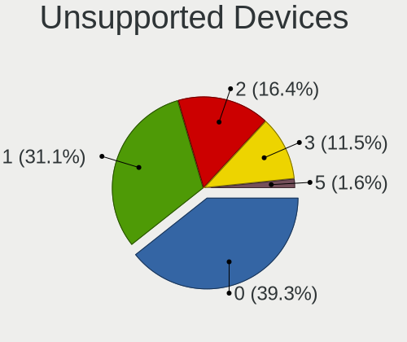

| Total | Desktops | Percent |
|-------|----------|---------|
| 0     | 16       | 47.06%  |
| 1     | 11       | 32.35%  |
| 3     | 3        | 8.82%   |
| 2     | 2        | 5.88%   |
| 5     | 1        | 2.94%   |
| 4     | 1        | 2.94%   |

Unsupported Device Types
------------------------

Types of unsupported devices

| Type                     | Desktops | Percent |
|--------------------------|----------|---------|
| Communication controller | 14       | 51.85%  |
| Net/wireless             | 8        | 29.63%  |
| Wireless                 | 1        | 3.7%    |
| Storage                  | 1        | 3.7%    |
| Graphics card            | 1        | 3.7%    |
| Card reader              | 1        | 3.7%    |
| Bluetooth                | 1        | 3.7%    |

