NetBSD - Tested Hardware & Statistics (Notebooks)
-------------------------------------------------

A project to collect tested hardware configurations for NetBSD.

Anyone can contribute to this report by the [hw-probe](https://github.com/linuxhw/hw-probe/blob/master/INSTALL.BSD.md) tool:

    hw-probe -all -upload

Please contribute! Especially if your hardware is rare.

Contents
--------

* [ Test Cases ](#test-cases)

* [ System ](#system)
  - [ OS                       ](#os)
  - [ OS Family                ](#os-family)
  - [ Arch                     ](#arch)
  - [ DE                       ](#de)
  - [ Display Server           ](#display-server)
  - [ Display Manager          ](#display-manager)
  - [ OS Lang                  ](#os-lang)
  - [ Boot Mode                ](#boot-mode)
  - [ Filesystem               ](#filesystem)
  - [ Part. scheme             ](#part-scheme)

* [ Board ](#board)
  - [ Vendor                   ](#vendor)
  - [ Model                    ](#model)
  - [ Model Family             ](#model-family)
  - [ MFG Year                 ](#mfg-year)
  - [ Form Factor              ](#form-factor)
  - [ Coreboot                 ](#coreboot)
  - [ RAM Size                 ](#ram-size)
  - [ RAM Used                 ](#ram-used)
  - [ Total Drives             ](#total-drives)
  - [ Has CD-ROM               ](#has-cd-rom)
  - [ Has Ethernet             ](#has-ethernet)
  - [ Has WiFi                 ](#has-wifi)
  - [ Has Bluetooth            ](#has-bluetooth)

* [ Location ](#location)
  - [ Country                  ](#country)
  - [ City                     ](#city)

* [ Drives ](#drives)
  - [ Drive Vendor             ](#drive-vendor)
  - [ Drive Model              ](#drive-model)
  - [ HDD Vendor               ](#hdd-vendor)
  - [ SSD Vendor               ](#ssd-vendor)
  - [ Drive Kind               ](#drive-kind)
  - [ Drive Connector          ](#drive-connector)
  - [ Drive Size               ](#drive-size)
  - [ Space Total              ](#space-total)
  - [ Space Used               ](#space-used)
  - [ Malfunc. Drives          ](#malfunc-drives)
  - [ Malfunc. Drive Vendor    ](#malfunc-drive-vendor)
  - [ Malfunc. HDD Vendor      ](#malfunc-hdd-vendor)
  - [ Malfunc. Drive Kind      ](#malfunc-drive-kind)
  - [ Failed Drives            ](#failed-drives)
  - [ Failed Drive Vendor      ](#failed-drive-vendor)
  - [ Drive Status             ](#drive-status)

* [ Storage controller ](#storage-controller)
  - [ Storage Vendor           ](#storage-vendor)
  - [ Storage Model            ](#storage-model)
  - [ Storage Kind             ](#storage-kind)

* [ Processor ](#processor)
  - [ CPU Vendor               ](#cpu-vendor)
  - [ CPU Model                ](#cpu-model)
  - [ CPU Model Family         ](#cpu-model-family)
  - [ CPU Cores                ](#cpu-cores)
  - [ CPU Sockets              ](#cpu-sockets)
  - [ CPU Threads              ](#cpu-threads)
  - [ CPU Microarch            ](#cpu-microarch)

* [ Graphics ](#graphics)
  - [ GPU Vendor               ](#gpu-vendor)
  - [ GPU Model                ](#gpu-model)
  - [ GPU Combo                ](#gpu-combo)
  - [ GPU Driver               ](#gpu-driver)
  - [ GPU Memory               ](#gpu-memory)

* [ Monitor ](#monitor)
  - [ Monitor Vendor           ](#monitor-vendor)
  - [ Monitor Model            ](#monitor-model)
  - [ Monitor Resolution       ](#monitor-resolution)
  - [ Monitor Diagonal         ](#monitor-diagonal)
  - [ Monitor Width            ](#monitor-width)
  - [ Aspect Ratio             ](#aspect-ratio)
  - [ Monitor Area             ](#monitor-area)
  - [ Pixel Density            ](#pixel-density)
  - [ Multiple Monitors        ](#multiple-monitors)

* [ Network ](#network)
  - [ Net Controller Vendor    ](#net-controller-vendor)
  - [ Net Controller Model     ](#net-controller-model)
  - [ Wireless Vendor          ](#wireless-vendor)
  - [ Wireless Model           ](#wireless-model)
  - [ Ethernet Vendor          ](#ethernet-vendor)
  - [ Ethernet Model           ](#ethernet-model)
  - [ Net Controller Kind      ](#net-controller-kind)
  - [ Used Controller          ](#used-controller)
  - [ NICs                     ](#nics)
  - [ IPv6                     ](#ipv6)

* [ Bluetooth ](#bluetooth)
  - [ Bluetooth Vendor         ](#bluetooth-vendor)
  - [ Bluetooth Model          ](#bluetooth-model)

* [ Sound ](#sound)
  - [ Sound Vendor             ](#sound-vendor)
  - [ Sound Model              ](#sound-model)

* [ Memory ](#memory)
  - [ Memory Vendor            ](#memory-vendor)
  - [ Memory Model             ](#memory-model)
  - [ Memory Kind              ](#memory-kind)
  - [ Memory Form Factor       ](#memory-form-factor)
  - [ Memory Size              ](#memory-size)
  - [ Memory Speed             ](#memory-speed)

* [ Printers & scanners ](#printers--scanners)
  - [ Printer Vendor           ](#printer-vendor)
  - [ Printer Model            ](#printer-model)
  - [ Scanner Vendor           ](#scanner-vendor)
  - [ Scanner Model            ](#scanner-model)

* [ Camera ](#camera)
  - [ Camera Vendor            ](#camera-vendor)
  - [ Camera Model             ](#camera-model)

* [ Security ](#security)
  - [ Fingerprint Vendor       ](#fingerprint-vendor)
  - [ Fingerprint Model        ](#fingerprint-model)
  - [ Chipcard Vendor          ](#chipcard-vendor)
  - [ Chipcard Model           ](#chipcard-model)

* [ Unsupported ](#unsupported)
  - [ Unsupported Devices      ](#unsupported-devices)
  - [ Unsupported Device Types ](#unsupported-device-types)

Test Cases
----------

Total: 79

| Vendor        | Model                       | Probe                                                     | Date         |
|---------------|-----------------------------|-----------------------------------------------------------|--------------|
| Lenovo        | ThinkPad E14 Gen 3 20Y70... | [30220e13a3](https://bsd-hardware.info/?probe=30220e13a3) | Dec 20, 2025 |
| Lenovo        | ThinkPad T460s 20FAS3L00... | [576e8fb25d](https://bsd-hardware.info/?probe=576e8fb25d) | Dec 08, 2025 |
| IBM           | 2648EU2                     | [73113a619e](https://bsd-hardware.info/?probe=73113a619e) | Nov 18, 2025 |
| ASUSTek       | X71SL                       | [c2d43ad651](https://bsd-hardware.info/?probe=c2d43ad651) | Nov 01, 2025 |
| Lenovo        | ThinkPad E575 20H8000HUS    | [8da24fbfa3](https://bsd-hardware.info/?probe=8da24fbfa3) | Oct 30, 2025 |
| ASUSTek       | K53SJ                       | [092f586122](https://bsd-hardware.info/?probe=092f586122) | Oct 28, 2025 |
| Samsung       | NC10                        | [509d4a9b20](https://bsd-hardware.info/?probe=509d4a9b20) | Oct 16, 2025 |
| ASUSTek       | K52F                        | [a195186b8f](https://bsd-hardware.info/?probe=a195186b8f) | Aug 31, 2025 |
| Lenovo        | ThinkPad X1 Extreme 20MF... | [27f17a9a16](https://bsd-hardware.info/?probe=27f17a9a16) | Aug 12, 2025 |
| ASUSTek       | K53SJ                       | [7105ddca26](https://bsd-hardware.info/?probe=7105ddca26) | May 31, 2025 |
| Lenovo        | ThinkPad X230 2325A39       | [41db2b37f5](https://bsd-hardware.info/?probe=41db2b37f5) | May 01, 2025 |
| Lenovo        | ThinkPad Edge E545 20B20... | [4e2ea48556](https://bsd-hardware.info/?probe=4e2ea48556) | May 01, 2025 |
| Panasonic     | CF-C1BD06EFG                | [72af222238](https://bsd-hardware.info/?probe=72af222238) | May 01, 2025 |
| ASUSTek       | K53SJ                       | [4fc246d3b4](https://bsd-hardware.info/?probe=4fc246d3b4) | May 01, 2025 |
| ASUSTek       | K53SJ                       | [3a312f438d](https://bsd-hardware.info/?probe=3a312f438d) | Apr 18, 2025 |
| ASUSTek       | K53SJ                       | [1e240331e0](https://bsd-hardware.info/?probe=1e240331e0) | Apr 18, 2025 |
| Acer          | TravelMate B118-M           | [2959c86683](https://bsd-hardware.info/?probe=2959c86683) | Apr 10, 2025 |
| Lenovo        | ThinkPad X201 3323K2M       | [152f2fe4d7](https://bsd-hardware.info/?probe=152f2fe4d7) | Mar 11, 2025 |
| Toshiba       | Satellite L50D-C            | [f8d95e1977](https://bsd-hardware.info/?probe=f8d95e1977) | Feb 12, 2025 |
| Lenovo        | ThinkPad P14s Gen 5 21G2... | [cf293b34e1](https://bsd-hardware.info/?probe=cf293b34e1) | Jan 14, 2025 |
| Lenovo        | ThinkPad P15 Gen 1 20SUS... | [2670f4d9f7](https://bsd-hardware.info/?probe=2670f4d9f7) | Jan 12, 2025 |
| Acer          | AO532h                      | [00b8f9da06](https://bsd-hardware.info/?probe=00b8f9da06) | Jan 06, 2025 |
| HUAWEI        | KPL-W0X                     | [ac7b8b09f0](https://bsd-hardware.info/?probe=ac7b8b09f0) | Dec 24, 2024 |
| Lenovo        | ThinkPad A285 20MXS01R00    | [9c548c9ffb](https://bsd-hardware.info/?probe=9c548c9ffb) | Sep 01, 2024 |
| Samsung       | 530U3C/530U4C/532U3C        | [f78f3487b8](https://bsd-hardware.info/?probe=f78f3487b8) | Aug 27, 2024 |
| ASUSTek       | VivoBook_ASUSLaptop X512... | [424a038d10](https://bsd-hardware.info/?probe=424a038d10) | Aug 16, 2024 |
| eMachines     | eM250                       | [98c37607a3](https://bsd-hardware.info/?probe=98c37607a3) | Aug 16, 2024 |
| ASUSTek       | VivoBook_ASUSLaptop X512... | [ffdc8ec717](https://bsd-hardware.info/?probe=ffdc8ec717) | Aug 15, 2024 |
| Lenovo        | ThinkPad X260 20F60097US    | [248dd70da2](https://bsd-hardware.info/?probe=248dd70da2) | Jul 25, 2024 |
| Lenovo        | ThinkPad T470 W10DG 20JN... | [3589bb8629](https://bsd-hardware.info/?probe=3589bb8629) | Jun 16, 2024 |
| Dell          | Precision 7520              | [48232bd1d6](https://bsd-hardware.info/?probe=48232bd1d6) | Jun 06, 2024 |
| MSI           | GE62 6QC                    | [d8fe2ac91a](https://bsd-hardware.info/?probe=d8fe2ac91a) | May 18, 2024 |
| Acer          | TravelMate B118-M           | [66fbf7ab6c](https://bsd-hardware.info/?probe=66fbf7ab6c) | May 12, 2024 |
| Apple         | MacBookPro8,1               | [23e113910f](https://bsd-hardware.info/?probe=23e113910f) | May 05, 2024 |
| Apple         | MacBookPro8,1               | [55560acf02](https://bsd-hardware.info/?probe=55560acf02) | May 05, 2024 |
| Timi          | TM1612                      | [c139dfdf05](https://bsd-hardware.info/?probe=c139dfdf05) | Apr 13, 2024 |
| ASUSTek       | VivoBook_ASUSLaptop X512... | [a818576415](https://bsd-hardware.info/?probe=a818576415) | Apr 13, 2024 |
| ASUSTek       | VivoBook_ASUSLaptop X512... | [d8288ba73a](https://bsd-hardware.info/?probe=d8288ba73a) | Apr 09, 2024 |
| Lenovo        | ThinkPad X260 20F60097US    | [5fa2016fc1](https://bsd-hardware.info/?probe=5fa2016fc1) | Mar 11, 2024 |
| Lenovo        | ThinkPad T490 20N3S4PX02    | [0dc4820d7e](https://bsd-hardware.info/?probe=0dc4820d7e) | Mar 05, 2024 |
| Lenovo        | ThinkPad T490 20N3S4PX02    | [c3f8fdaebb](https://bsd-hardware.info/?probe=c3f8fdaebb) | Mar 05, 2024 |
| Lenovo        | ThinkPad T480s 20L8S45W0... | [6c6fcc3427](https://bsd-hardware.info/?probe=6c6fcc3427) | Mar 04, 2024 |
| Lenovo        | ThinkPad T480s 20L8S45W0... | [b35f962bce](https://bsd-hardware.info/?probe=b35f962bce) | Mar 01, 2024 |
| Dell          | Precision 7520              | [bd40dd5305](https://bsd-hardware.info/?probe=bd40dd5305) | Feb 19, 2024 |
| Intel         | Jasper Lake Client Platf... | [6a041adf7a](https://bsd-hardware.info/?probe=6a041adf7a) | Feb 19, 2024 |
| Lenovo        | ThinkPad T410 2518A37       | [b2515cf7fb](https://bsd-hardware.info/?probe=b2515cf7fb) | Feb 19, 2024 |
| Lenovo        | ThinkPad T470 20HES0EV0A    | [05ecc99fe8](https://bsd-hardware.info/?probe=05ecc99fe8) | Feb 13, 2024 |
| Samsung       | N150/N210/N220              | [92c052e0d7](https://bsd-hardware.info/?probe=92c052e0d7) | Jan 14, 2024 |
| Google        | Kohaku                      | [94c3c0f6b7](https://bsd-hardware.info/?probe=94c3c0f6b7) | Nov 26, 2023 |
| Google        | Kohaku                      | [198b445c4e](https://bsd-hardware.info/?probe=198b445c4e) | Nov 26, 2023 |
| Dell          | Vostro 3500                 | [875b045b38](https://bsd-hardware.info/?probe=875b045b38) | Oct 29, 2023 |
| Apple         | MacBookPro11,1              | [1808e7891c](https://bsd-hardware.info/?probe=1808e7891c) | Sep 16, 2023 |
| Apple         | MacBookAir7,2               | [29fc7f6f45](https://bsd-hardware.info/?probe=29fc7f6f45) | Aug 19, 2023 |
| Lenovo        | ThinkPad T430 2347A45       | [6969cd9e1a](https://bsd-hardware.info/?probe=6969cd9e1a) | Jun 20, 2023 |
| HP            | Pavilion 17                 | [0f891b4377](https://bsd-hardware.info/?probe=0f891b4377) | Apr 21, 2023 |
| Lenovo        | ThinkPad 13 20GJCTO1WW      | [59713ca193](https://bsd-hardware.info/?probe=59713ca193) | Feb 15, 2023 |
| Lenovo        | ThinkPad T460s 20FAS3L00... | [ef6972d07a](https://bsd-hardware.info/?probe=ef6972d07a) | Jan 03, 2023 |
| Dell          | Precision M4500             | [ab63467f38](https://bsd-hardware.info/?probe=ab63467f38) | Nov 03, 2022 |
| ASUSTek       | X555LJ                      | [6bf51cc915](https://bsd-hardware.info/?probe=6bf51cc915) | Mar 28, 2022 |
| Acer          | Aspire A114-33              | [57765224eb](https://bsd-hardware.info/?probe=57765224eb) | Mar 18, 2022 |
| MiTAC         | 5033                        | [54df5c9e9e](https://bsd-hardware.info/?probe=54df5c9e9e) | Feb 10, 2022 |
| Lenovo        | ThinkPad T420 4236D26       | [5c64875424](https://bsd-hardware.info/?probe=5c64875424) | Oct 12, 2021 |
| ASUSTek       | X555LJ                      | [81dd2ba2f0](https://bsd-hardware.info/?probe=81dd2ba2f0) | Oct 02, 2021 |
| Toshiba       | Satellite A100              | [9ccf97d62c](https://bsd-hardware.info/?probe=9ccf97d62c) | Sep 05, 2021 |
| Sony          | SVF1421DSGW                 | [abadb65058](https://bsd-hardware.info/?probe=abadb65058) | Jun 01, 2021 |
| Apple         | MacBook2,1                  | [360f29bf3b](https://bsd-hardware.info/?probe=360f29bf3b) | Mar 05, 2021 |
| Apple         | MacBook2,1                  | [f6e7638f87](https://bsd-hardware.info/?probe=f6e7638f87) | Mar 05, 2021 |
| IBM           | ThinkPad R51 2887AVG        | [289177c624](https://bsd-hardware.info/?probe=289177c624) | Jan 02, 2021 |
| IBM           | ThinkPad R51 2887AVG        | [88d4fc2693](https://bsd-hardware.info/?probe=88d4fc2693) | Dec 30, 2020 |
| Lenovo        | ThinkPad T430s 23564H3      | [eda02dc46b](https://bsd-hardware.info/?probe=eda02dc46b) | Dec 25, 2020 |
| Fujitsu Si... | AMILO L7310                 | [0603b64315](https://bsd-hardware.info/?probe=0603b64315) | Dec 25, 2020 |
| Acer          | Aspire ES1-132              | [a4e45f3551](https://bsd-hardware.info/?probe=a4e45f3551) | Oct 22, 2020 |
| Lenovo        | ThinkPad T510 4313CTO       | [7f6095b266](https://bsd-hardware.info/?probe=7f6095b266) | Aug 20, 2020 |
| Unknown       | Unknown                     | [42027dfbb9](https://bsd-hardware.info/?probe=42027dfbb9) | Jul 25, 2020 |
| Lenovo        | G500 20236                  | [99cf14c489](https://bsd-hardware.info/?probe=99cf14c489) | Jun 03, 2020 |
| Lenovo        | ThinkPad X240 20AMS0J01N    | [4df07718d1](https://bsd-hardware.info/?probe=4df07718d1) | May 23, 2020 |
| Lenovo        | G570 20079                  | [3258f01592](https://bsd-hardware.info/?probe=3258f01592) | May 16, 2020 |
| ASUSTek       | A3L                         | [6b65fcf9c1](https://bsd-hardware.info/?probe=6b65fcf9c1) | May 15, 2020 |
| Lenovo        | G570 20079                  | [cd45078232](https://bsd-hardware.info/?probe=cd45078232) | May 05, 2020 |

System
------

OS
--

Installed operating systems

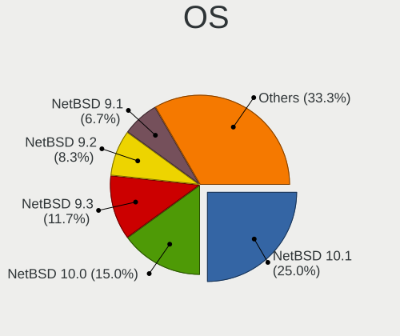

| Name               | Notebooks | Percent |
|--------------------|-----------|---------|
| NetBSD 10.1        | 15        | 25%     |
| NetBSD 10.0        | 9         | 15%     |
| NetBSD 9.3         | 7         | 11.67%  |
| NetBSD 9.2         | 5         | 8.33%   |
| NetBSD 9.1         | 4         | 6.67%   |
| NetBSD 9.0         | 3         | 5%      |
| NetBSD 10.1_STABLE | 2         | 3.33%   |
| NetBSD 10.0_RC5    | 2         | 3.33%   |
| NetBSD 10.0_RC4    | 2         | 3.33%   |
| NetBSD 10.0_RC3    | 2         | 3.33%   |
| NetBSD 9.99.94     | 1         | 1.67%   |
| NetBSD 9.2_STABLE  | 1         | 1.67%   |
| NetBSD 9.0_STABLE  | 1         | 1.67%   |
| NetBSD 8.99.51     | 1         | 1.67%   |
| NetBSD 7.2         | 1         | 1.67%   |
| NetBSD 10.99.10    | 1         | 1.67%   |
| NetBSD 10.99.1     | 1         | 1.67%   |
| NetBSD 10.0_RC2    | 1         | 1.67%   |
| NetBSD 10.0_BETA   | 1         | 1.67%   |

OS Family
---------

OS without a version

| Name   | Notebooks | Percent |
|--------|-----------|---------|
| NetBSD | 56        | 100%    |

Arch
----

OS architecture (x86_64, i586, etc.)

| Name  | Notebooks | Percent |
|-------|-----------|---------|
| amd64 | 47        | 83.93%  |
| i386  | 9         | 16.07%  |

DE
--

Desktop Environment

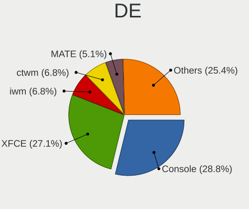

| Name         | Notebooks | Percent |
|--------------|-----------|---------|
| Console      | 17        | 28.81%  |
| XFCE         | 16        | 27.12%  |
| iwm          | 4         | 6.78%   |
| ctwm         | 4         | 6.78%   |
| MATE         | 3         | 5.08%   |
| LXQt         | 3         | 5.08%   |
| DWM          | 3         | 5.08%   |
| IceWM        | 2         | 3.39%   |
| Fluxbox      | 2         | 3.39%   |
| sdorfehs     | 1         | 1.69%   |
| Ratpoison    | 1         | 1.69%   |
| helloDesktop | 1         | 1.69%   |
| GNOME        | 1         | 1.69%   |
| Awesome      | 1         | 1.69%   |

Display Server
--------------

X11 or Wayland

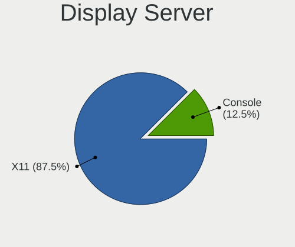

| Name    | Notebooks | Percent |
|---------|-----------|---------|
| X11     | 49        | 87.5%   |
| Console | 7         | 12.5%   |

Display Manager
---------------

SDDM, LightDM, etc.

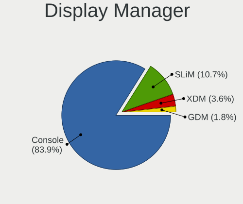

| Name    | Notebooks | Percent |
|---------|-----------|---------|
| Console | 47        | 83.93%  |
| SLiM    | 6         | 10.71%  |
| XDM     | 2         | 3.57%   |
| GDM     | 1         | 1.79%   |

OS Lang
-------

Language

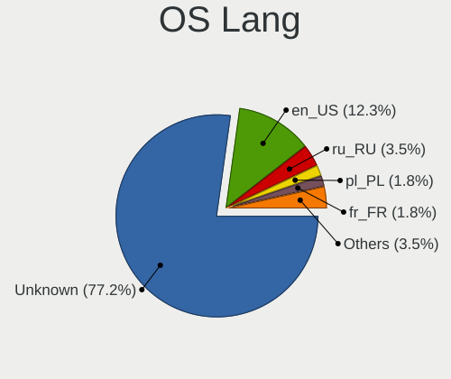

| Lang    | Notebooks | Percent |
|---------|-----------|---------|
| Unknown | 44        | 77.19%  |
| en_US   | 7         | 12.28%  |
| ru_RU   | 2         | 3.51%   |
| pl_PL   | 1         | 1.75%   |
| fr_FR   | 1         | 1.75%   |
| es_MX   | 1         | 1.75%   |
| de_DE   | 1         | 1.75%   |

Boot Mode
---------

EFI or BIOS

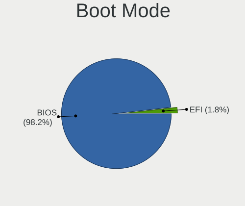

| Mode | Notebooks | Percent |
|------|-----------|---------|
| BIOS | 55        | 98.21%  |
| EFI  | 1         | 1.79%   |

Filesystem
----------

Type of filesystem

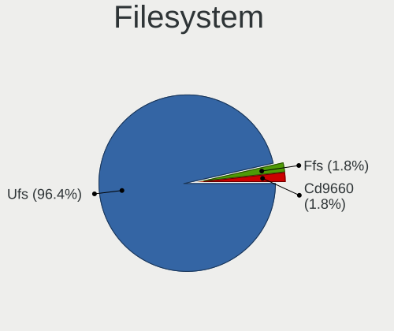

| Type   | Notebooks | Percent |
|--------|-----------|---------|
| Ufs    | 54        | 96.43%  |
| Ffs    | 1         | 1.79%   |
| Cd9660 | 1         | 1.79%   |

Part. scheme
------------

Scheme of partitioning

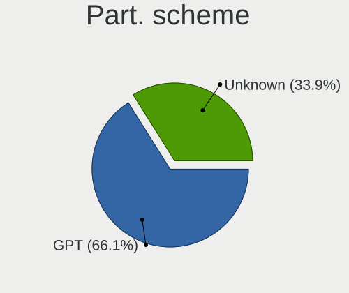

| Type    | Notebooks | Percent |
|---------|-----------|---------|
| GPT     | 37        | 66.07%  |
| Unknown | 19        | 33.93%  |

Board
-----

Vendor
------

Motherboard manufacturer

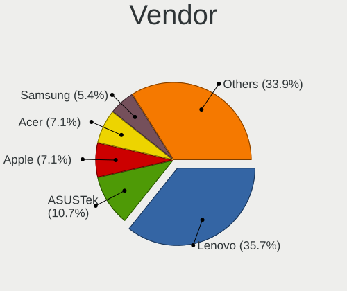

| Name                | Notebooks | Percent |
|---------------------|-----------|---------|
| Lenovo              | 20        | 35.71%  |
| ASUSTek Computer    | 6         | 10.71%  |
| Apple               | 4         | 7.14%   |
| Acer                | 4         | 7.14%   |
| Samsung Electronics | 3         | 5.36%   |
| Dell                | 3         | 5.36%   |
| Toshiba             | 2         | 3.57%   |
| IBM                 | 2         | 3.57%   |
| Timi                | 1         | 1.79%   |
| Sony                | 1         | 1.79%   |
| Panasonic           | 1         | 1.79%   |
| MSI                 | 1         | 1.79%   |
| MiTAC               | 1         | 1.79%   |
| Intel               | 1         | 1.79%   |
| HUAWEI              | 1         | 1.79%   |
| Hewlett-Packard     | 1         | 1.79%   |
| Google              | 1         | 1.79%   |
| Fujitsu Siemens     | 1         | 1.79%   |
| eMachines           | 1         | 1.79%   |
| Unknown             | 1         | 1.79%   |

Model
-----

Motherboard model

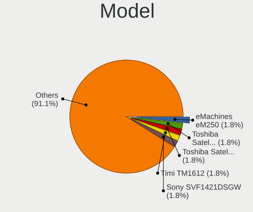

| Name                                  | Notebooks | Percent |
|---------------------------------------|-----------|---------|
| Toshiba Satellite L50D-C              | 1         | 1.79%   |
| Toshiba Satellite A100                | 1         | 1.79%   |
| Timi TM1612                           | 1         | 1.79%   |
| Sony SVF1421DSGW                      | 1         | 1.79%   |
| Samsung NC10                          | 1         | 1.79%   |
| Samsung N150/N210/N220                | 1         | 1.79%   |
| Samsung 530U3C/530U4C/532U3C          | 1         | 1.79%   |
| Panasonic CF-C1BD06EFG                | 1         | 1.79%   |
| MSI GE62 6QC                          | 1         | 1.79%   |
| MiTAC 5033                            | 1         | 1.79%   |
| Lenovo ThinkPad X260 20F60097US       | 1         | 1.79%   |
| Lenovo ThinkPad X240 20AMS0J01N       | 1         | 1.79%   |
| Lenovo ThinkPad X230 2325A39          | 1         | 1.79%   |
| Lenovo ThinkPad X201 3323K2M          | 1         | 1.79%   |
| Lenovo ThinkPad X1 Extreme 20MF000TGE | 1         | 1.79%   |
| Lenovo ThinkPad T510 4313CTO          | 1         | 1.79%   |
| Lenovo ThinkPad T490 20N3S4PX02       | 1         | 1.79%   |
| Lenovo ThinkPad T480s 20L8S45W00      | 1         | 1.79%   |
| Lenovo ThinkPad T470 W10DG 20JNS0L300 | 1         | 1.79%   |
| Lenovo ThinkPad T470 20HES0EV0A       | 1         | 1.79%   |
| Lenovo ThinkPad T460s 20FAS3L002      | 1         | 1.79%   |
| Lenovo ThinkPad T430s 23564H3         | 1         | 1.79%   |
| Lenovo ThinkPad T430 2347A45          | 1         | 1.79%   |
| Lenovo ThinkPad T420 4236D26          | 1         | 1.79%   |
| Lenovo ThinkPad T410 2518A37          | 1         | 1.79%   |
| Lenovo ThinkPad P15 Gen 1 20SUS59A00  | 1         | 1.79%   |
| Lenovo ThinkPad Edge E545 20B2000PGE  | 1         | 1.79%   |
| Lenovo ThinkPad E575 20H8000HUS       | 1         | 1.79%   |
| Lenovo ThinkPad 13 20GJCTO1WW         | 1         | 1.79%   |
| Lenovo G500 20236                     | 1         | 1.79%   |
| Intel Jasper Lake Client Platform     | 1         | 1.79%   |
| IBM ThinkPad R51 2887AVG              | 1         | 1.79%   |
| IBM 2648EU2                           | 1         | 1.79%   |
| HUAWEI KPL-W0X                        | 1         | 1.79%   |
| HP Pavilion 17                        | 1         | 1.79%   |
| Google Kohaku                         | 1         | 1.79%   |
| Fujitsu Siemens AMILO L7310           | 1         | 1.79%   |
| eMachines eM250                       | 1         | 1.79%   |
| Dell Vostro 3500                      | 1         | 1.79%   |
| Dell Precision M4500                  | 1         | 1.79%   |

Model Family
------------

Motherboard model prefix

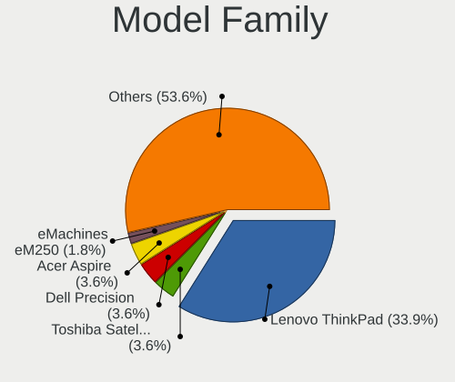

| Name                   | Notebooks | Percent |
|------------------------|-----------|---------|
| Lenovo ThinkPad        | 19        | 33.93%  |
| Toshiba Satellite      | 2         | 3.57%   |
| Dell Precision         | 2         | 3.57%   |
| Acer Aspire            | 2         | 3.57%   |
| Timi TM1612            | 1         | 1.79%   |
| Sony SVF1421DSGW       | 1         | 1.79%   |
| Samsung NC10           | 1         | 1.79%   |
| Samsung N150           | 1         | 1.79%   |
| Samsung 530U3C         | 1         | 1.79%   |
| Panasonic CF-C1BD06EFG | 1         | 1.79%   |
| MSI GE62               | 1         | 1.79%   |
| MiTAC 5033             | 1         | 1.79%   |
| Lenovo G500            | 1         | 1.79%   |
| Intel Jasper           | 1         | 1.79%   |
| IBM ThinkPad           | 1         | 1.79%   |
| IBM 2648EU2            | 1         | 1.79%   |
| HUAWEI KPL-W0X         | 1         | 1.79%   |
| HP Pavilion            | 1         | 1.79%   |
| Google Kohaku          | 1         | 1.79%   |
| Fujitsu Siemens AMILO  | 1         | 1.79%   |
| eMachines eM250        | 1         | 1.79%   |
| Dell Vostro            | 1         | 1.79%   |
| ASUS X71SL             | 1         | 1.79%   |
| ASUS X555LJ            | 1         | 1.79%   |
| ASUS VivoBook          | 1         | 1.79%   |
| ASUS K53SJ             | 1         | 1.79%   |
| ASUS K52F              | 1         | 1.79%   |
| ASUS A3L               | 1         | 1.79%   |
| Apple MacBookPro8      | 1         | 1.79%   |
| Apple MacBookPro11     | 1         | 1.79%   |
| Apple MacBookAir7      | 1         | 1.79%   |
| Apple MacBook2         | 1         | 1.79%   |
| Acer TravelMate        | 1         | 1.79%   |
| Acer AO532h            | 1         | 1.79%   |
| Unknown                | 1         | 1.79%   |

MFG Year
--------

Motherboard manufacture year

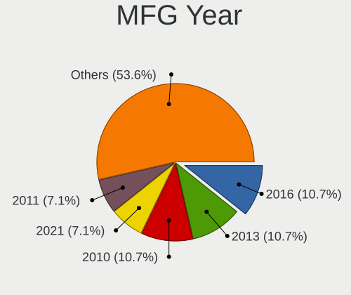

| Year    | Notebooks | Percent |
|---------|-----------|---------|
| 2016    | 6         | 10.71%  |
| 2013    | 6         | 10.71%  |
| 2010    | 6         | 10.71%  |
| 2021    | 4         | 7.14%   |
| 2011    | 4         | 7.14%   |
| 2022    | 3         | 5.36%   |
| 2020    | 3         | 5.36%   |
| 2019    | 3         | 5.36%   |
| 2018    | 3         | 5.36%   |
| 2017    | 3         | 5.36%   |
| 2005    | 3         | 5.36%   |
| 2012    | 2         | 3.57%   |
| 2009    | 2         | 3.57%   |
| 2008    | 2         | 3.57%   |
| 2007    | 2         | 3.57%   |
| 2023    | 1         | 1.79%   |
| 2014    | 1         | 1.79%   |
| 2002    | 1         | 1.79%   |
| Unknown | 1         | 1.79%   |

Form Factor
-----------

Physical design of the computer

| Name     | Notebooks | Percent |
|----------|-----------|---------|
| Notebook | 56        | 100%    |

Coreboot
--------

Have coreboot on board

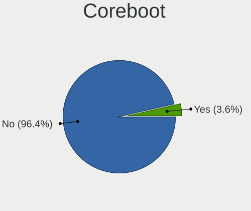

| Used | Notebooks | Percent |
|------|-----------|---------|
| No   | 54        | 96.43%  |
| Yes  | 2         | 3.57%   |

RAM Size
--------

Total RAM memory

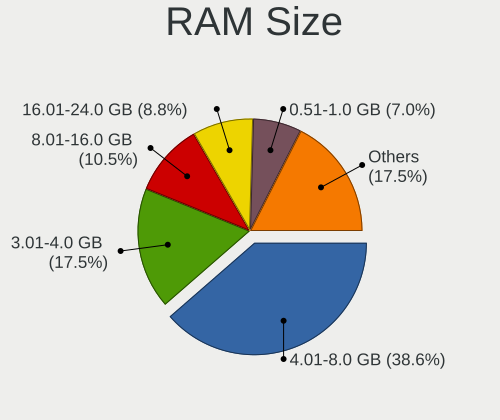

| Size in GB  | Notebooks | Percent |
|-------------|-----------|---------|
| 4.01-8.0    | 22        | 38.6%   |
| 3.01-4.0    | 10        | 17.54%  |
| 8.01-16.0   | 6         | 10.53%  |
| 16.01-24.0  | 5         | 8.77%   |
| 0.51-1.0    | 4         | 7.02%   |
| 1.01-2.0    | 3         | 5.26%   |
| 0.01-0.5    | 2         | 3.51%   |
| 32.01-64.0  | 1         | 1.75%   |
| 24.01-32.0  | 1         | 1.75%   |
| 2.01-3.0    | 1         | 1.75%   |
| 64.01-256.0 | 1         | 1.75%   |
| 0           | 1         | 1.75%   |

RAM Used
--------

Used RAM memory

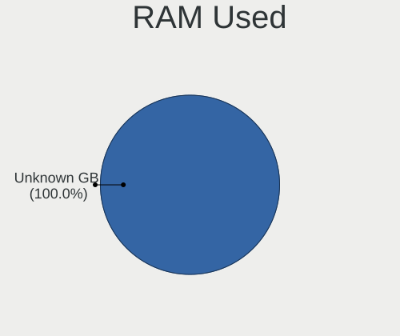

| Used GB | Notebooks | Percent |
|---------|-----------|---------|
| Unknown | 56        | 100%    |

Total Drives
------------

Number of drives on board

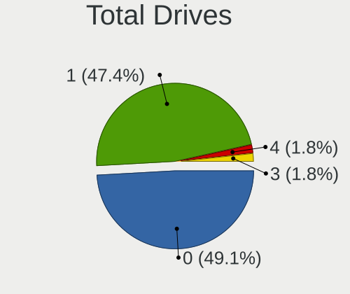

| Drives | Notebooks | Percent |
|--------|-----------|---------|
| 0      | 28        | 49.12%  |
| 1      | 27        | 47.37%  |
| 4      | 1         | 1.75%   |
| 3      | 1         | 1.75%   |

Has CD-ROM
----------

Has CD-ROM on board

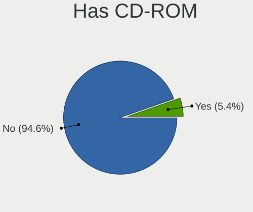

| Presented | Notebooks | Percent |
|-----------|-----------|---------|
| No        | 53        | 94.64%  |
| Yes       | 3         | 5.36%   |

Has Ethernet
------------

Has Ethernet on board

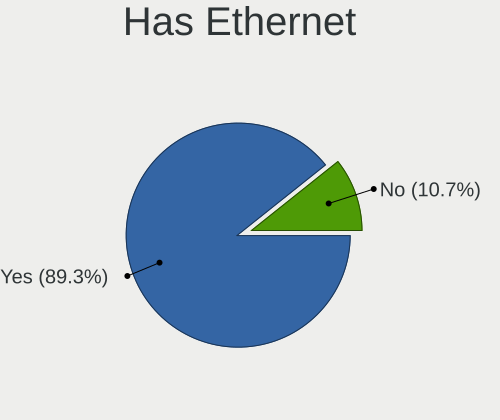

| Presented | Notebooks | Percent |
|-----------|-----------|---------|
| Yes       | 50        | 89.29%  |
| No        | 6         | 10.71%  |

Has WiFi
--------

Has WiFi module

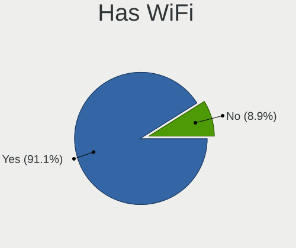

| Presented | Notebooks | Percent |
|-----------|-----------|---------|
| Yes       | 51        | 91.07%  |
| No        | 5         | 8.93%   |

Has Bluetooth
-------------

Has Bluetooth module

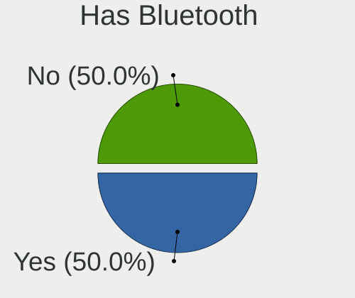

| Presented | Notebooks | Percent |
|-----------|-----------|---------|
| Yes       | 35        | 62.5%   |
| No        | 21        | 37.5%   |

Location
--------

Country
-------

Geographic location (country)

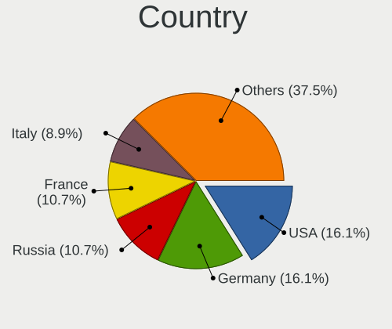

| Country      | Notebooks | Percent |
|--------------|-----------|---------|
| USA          | 9         | 16.07%  |
| Germany      | 9         | 16.07%  |
| Russia       | 6         | 10.71%  |
| France       | 6         | 10.71%  |
| Italy        | 5         | 8.93%   |
| Vietnam      | 2         | 3.57%   |
| Saudi Arabia | 2         | 3.57%   |
| India        | 2         | 3.57%   |
| Hungary      | 2         | 3.57%   |
| Canada       | 2         | 3.57%   |
| UK           | 1         | 1.79%   |
| Taiwan       | 1         | 1.79%   |
| Spain        | 1         | 1.79%   |
| Romania      | 1         | 1.79%   |
| Poland       | 1         | 1.79%   |
| Mexico       | 1         | 1.79%   |
| Finland      | 1         | 1.79%   |
| Denmark      | 1         | 1.79%   |
| China        | 1         | 1.79%   |
| Brazil       | 1         | 1.79%   |
| Australia    | 1         | 1.79%   |

City
----

Geographic location (city)

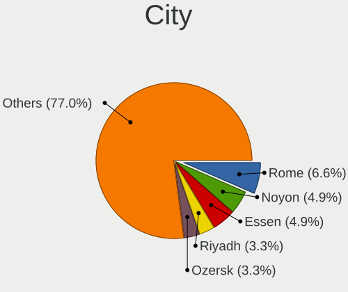

| City             | Notebooks | Percent |
|------------------|-----------|---------|
| Rome             | 4         | 6.56%   |
| Noyon            | 3         | 4.92%   |
| Essen            | 3         | 4.92%   |
| Riyadh           | 2         | 3.28%   |
| Ozersk           | 2         | 3.28%   |
| Moscow           | 2         | 3.28%   |
| Ho Chi Minh City | 2         | 3.28%   |
| Gardony          | 2         | 3.28%   |
| Washington       | 1         | 1.64%   |
| Ulyanovsk        | 1         | 1.64%   |
| Turenki          | 1         | 1.64%   |
| Taipei           | 1         | 1.64%   |
| Surrey           | 1         | 1.64%   |
| Sun Prairie      | 1         | 1.64%   |
| St Louis         | 1         | 1.64%   |
| Sasso Marconi    | 1         | 1.64%   |
| Rio Blanco       | 1         | 1.64%   |
| Poggio Renatico  | 1         | 1.64%   |
| Oxon Hill        | 1         | 1.64%   |
| Ottawa           | 1         | 1.64%   |
| Nuremberg        | 1         | 1.64%   |
| Novosibirsk      | 1         | 1.64%   |
| Newham           | 1         | 1.64%   |
| New York         | 1         | 1.64%   |
| Melbourne        | 1         | 1.64%   |
| Ladbergen        | 1         | 1.64%   |
| Korsze           | 1         | 1.64%   |
| Kalispell        | 1         | 1.64%   |
| Genzano di Roma  | 1         | 1.64%   |
| Frosinone        | 1         | 1.64%   |
| Frederiksberg    | 1         | 1.64%   |
| Fort Myers       | 1         | 1.64%   |
| Draguignan       | 1         | 1.64%   |
| Deggendorf       | 1         | 1.64%   |
| Córdoba         | 1         | 1.64%   |
| Chennai          | 1         | 1.64%   |
| Chengdu          | 1         | 1.64%   |
| Chandler         | 1         | 1.64%   |
| Carry-le-Rouet   | 1         | 1.64%   |
| Bucharest        | 1         | 1.64%   |

Drives
------

Drive Vendor
------------

Hard drive vendors

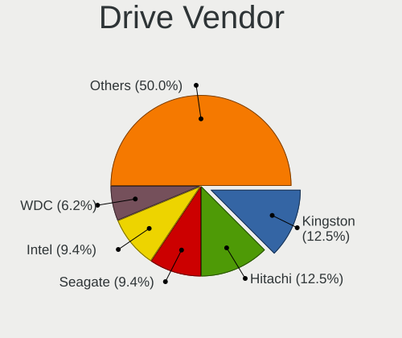

| Vendor                             | Notebooks | Drives | Percent |
|------------------------------------|-----------|--------|---------|
| Kingston                           | 4         | 4      | 12.5%   |
| Hitachi                            | 4         | 5      | 12.5%   |
| Seagate                            | 3         | 3      | 9.38%   |
| Intel                              | 3         | 3      | 9.38%   |
| WDC                                | 2         | 4      | 6.25%   |
| SanDisk                            | 2         | 2      | 6.25%   |
| HGST                               | 2         | 2      | 6.25%   |
| WLW                                | 1         | 1      | 3.13%   |
| Transcend                          | 1         | 1      | 3.13%   |
| Toshiba                            | 1         | 1      | 3.13%   |
| Samsung Electronics                | 1         | 1      | 3.13%   |
| Product:              USB DISK 2.0 | 1         | 1      | 3.13%   |
| Patriot                            | 1         | 1      | 3.13%   |
| KIOXIA-EXCERIA                     | 1         | 1      | 3.13%   |
| Intenso                            | 1         | 1      | 3.13%   |
| Generic                            | 1         | 1      | 3.13%   |
| Fujitsu                            | 1         | 1      | 3.13%   |
| Crucial                            | 1         | 1      | 3.13%   |
| Apacer                             | 1         | 1      | 3.13%   |

Drive Model
-----------

Hard drive models

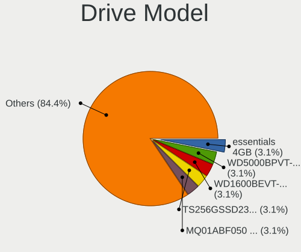

| Model                                               | Notebooks | Percent |
|-----------------------------------------------------|-----------|---------|
| WLW essentials 4GB                                  | 1         | 3.13%   |
| WDC WD5000BPVT-80HXZT1 500GB                        | 1         | 3.13%   |
| WDC WD1600BEVT-00A23T0 160GB                        | 1         | 3.13%   |
| Transcend TS256GSSD230S 256GB                       | 1         | 3.13%   |
| Toshiba MQ01ABF050 500GB                            | 1         | 3.13%   |
| Seagate ST750LM022 HN-M750MBB 752GB                 | 1         | 3.13%   |
| Seagate ST500VT000-1DK142 500GB                     | 1         | 3.13%   |
| Seagate ST500LT012-9WS142 500GB                     | 1         | 3.13%   |
| SanDisk Ultra USB 3.0 32GB                          | 1         | 3.13%   |
| SanDisk SSD i100 24GB                               | 1         | 3.13%   |
| Samsung HM080HC 80GB                                | 1         | 3.13%   |
| Product:              USB DISK 2.0 USB DISK 2.0 8GB | 1         | 3.13%   |
| Patriot P220 256GB                                  | 1         | 3.13%   |
| KIOXIA-EXCERIA SATA SSD 240GB                       | 1         | 3.13%   |
| Kingston SUV400S37240G 240GB                        | 1         | 3.13%   |
| Kingston SA400S37240G 240GB                         | 1         | 3.13%   |
| Kingston SA400S37120G 120GB                         | 1         | 3.13%   |
| Kingston DataTraveler 3.0 32GB                      | 1         | 3.13%   |
| Intenso Speed Line 8GB                              | 1         | 3.13%   |
| Intel SSDSC2KW120H6 120GB                           | 1         | 3.13%   |
| Intel SSDSC2CW120A3 120GB                           | 1         | 3.13%   |
| Intel SSDSC2BF180A4L 180GB                          | 1         | 3.13%   |
| Hitachi HTS721060G9AT00 64GB                        | 1         | 3.13%   |
| Hitachi HTS548040M9AT00 37GB                        | 1         | 3.13%   |
| Hitachi HTS545025B9A300 250GB                       | 1         | 3.13%   |
| Hitachi DK23DA-30B 32GB                             | 1         | 3.13%   |
| HGST HTS545050A7E680 500GB                          | 1         | 3.13%   |
| HGST HTS541010A9E680 1TB                            | 1         | 3.13%   |
| Generic STORAGE DEVICE 2GB                          | 1         | 3.13%   |
| Fujitsu MHZ2160BH G2 160GB                          | 1         | 3.13%   |
| Crucial CT120BX300SSD1 120GB                        | 1         | 3.13%   |
| Apacer AS350 128GB                                  | 1         | 3.13%   |

HDD Vendor
----------

Hard disk drive vendors

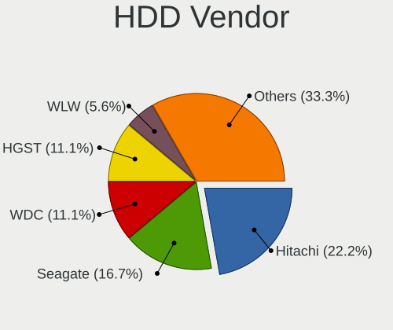

| Vendor                             | Notebooks | Drives | Percent |
|------------------------------------|-----------|--------|---------|
| Hitachi                            | 4         | 5      | 22.22%  |
| Seagate                            | 3         | 3      | 16.67%  |
| WDC                                | 2         | 4      | 11.11%  |
| HGST                               | 2         | 2      | 11.11%  |
| WLW                                | 1         | 1      | 5.56%   |
| Toshiba                            | 1         | 1      | 5.56%   |
| Samsung Electronics                | 1         | 1      | 5.56%   |
| Product:              USB DISK 2.0 | 1         | 1      | 5.56%   |
| Intenso                            | 1         | 1      | 5.56%   |
| Generic                            | 1         | 1      | 5.56%   |
| Fujitsu                            | 1         | 1      | 5.56%   |

SSD Vendor
----------

Solid state drive vendors

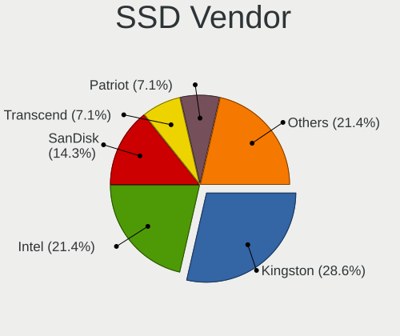

| Vendor         | Notebooks | Drives | Percent |
|----------------|-----------|--------|---------|
| Kingston       | 4         | 4      | 28.57%  |
| Intel          | 3         | 3      | 21.43%  |
| SanDisk        | 2         | 2      | 14.29%  |
| Transcend      | 1         | 1      | 7.14%   |
| Patriot        | 1         | 1      | 7.14%   |
| KIOXIA-EXCERIA | 1         | 1      | 7.14%   |
| Crucial        | 1         | 1      | 7.14%   |
| Apacer         | 1         | 1      | 7.14%   |

Drive Kind
----------

HDD or SSD

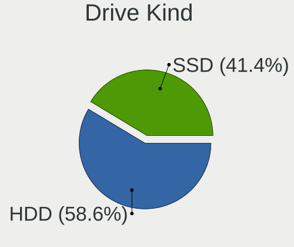

| Kind | Notebooks | Drives | Percent |
|------|-----------|--------|---------|
| HDD  | 17        | 21     | 58.62%  |
| SSD  | 12        | 14     | 41.38%  |

Drive Connector
---------------

SATA, SAS, NVMe, etc.

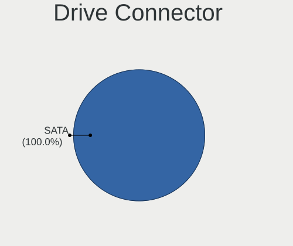

| Type | Notebooks | Drives | Percent |
|------|-----------|--------|---------|
| SATA | 27        | 35     | 100%    |

Drive Size
----------

Size of hard drive

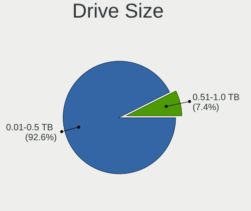

| Size in TB | Notebooks | Drives | Percent |
|------------|-----------|--------|---------|
| 0.01-0.5   | 25        | 33     | 92.59%  |
| 0.51-1.0   | 2         | 2      | 7.41%   |

Space Total
-----------

Amount of disk space available on the file system

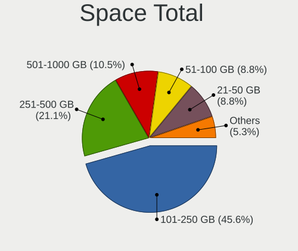

| Size in GB | Notebooks | Percent |
|------------|-----------|---------|
| 101-250    | 26        | 45.61%  |
| 251-500    | 12        | 21.05%  |
| 501-1000   | 6         | 10.53%  |
| 21-50      | 5         | 8.77%   |
| 51-100     | 5         | 8.77%   |
| 1-20       | 2         | 3.51%   |
| 1001-2000  | 1         | 1.75%   |

Space Used
----------

Amount of used disk space

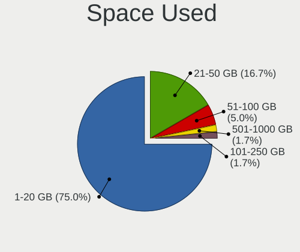

| Used GB  | Notebooks | Percent |
|----------|-----------|---------|
| 1-20     | 45        | 75%     |
| 21-50    | 10        | 16.67%  |
| 51-100   | 3         | 5%      |
| 101-250  | 1         | 1.67%   |
| 501-1000 | 1         | 1.67%   |

Malfunc. Drives
---------------

Drive models with a malfunction

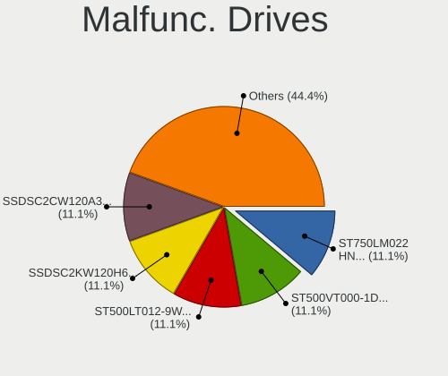

| Model                               | Notebooks | Drives | Percent |
|-------------------------------------|-----------|--------|---------|
| Seagate ST750LM022 HN-M750MBB 752GB | 1         | 1      | 11.11%  |
| Seagate ST500VT000-1DK142 500GB     | 1         | 1      | 11.11%  |
| Seagate ST500LT012-9WS142 500GB     | 1         | 1      | 11.11%  |
| Intel SSDSC2KW120H6 120GB           | 1         | 1      | 11.11%  |
| Intel SSDSC2CW120A3 120GB           | 1         | 1      | 11.11%  |
| Intel SSDSC2BF180A4L 180GB          | 1         | 1      | 11.11%  |
| Hitachi HTS721060G9AT00 64GB        | 1         | 1      | 11.11%  |
| Hitachi HTS548040M9AT00 37GB        | 1         | 2      | 11.11%  |
| Hitachi DK23DA-30B 32GB             | 1         | 1      | 11.11%  |

Malfunc. Drive Vendor
---------------------

Vendors of faulty drives

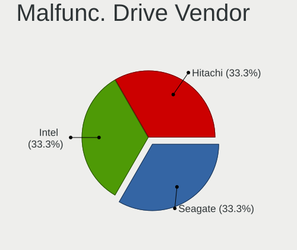

| Vendor  | Notebooks | Drives | Percent |
|---------|-----------|--------|---------|
| Seagate | 3         | 3      | 33.33%  |
| Intel   | 3         | 3      | 33.33%  |
| Hitachi | 3         | 4      | 33.33%  |

Malfunc. HDD Vendor
-------------------

Vendors of faulty HDD drives

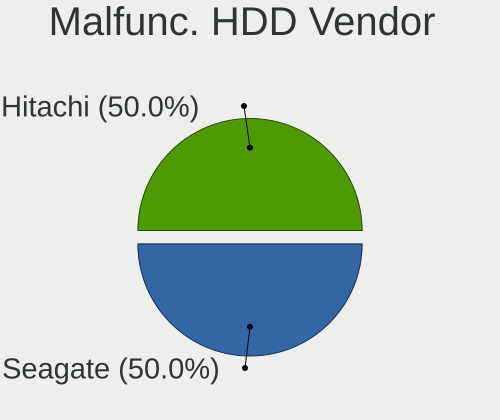

| Vendor  | Notebooks | Drives | Percent |
|---------|-----------|--------|---------|
| Seagate | 3         | 3      | 50%     |
| Hitachi | 3         | 4      | 50%     |

Malfunc. Drive Kind
-------------------

Kinds of faulty drives

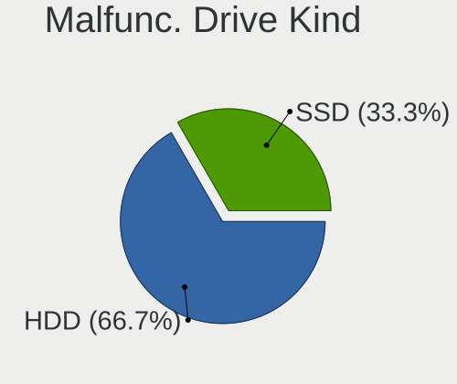

| Kind | Notebooks | Drives | Percent |
|------|-----------|--------|---------|
| HDD  | 6         | 7      | 66.67%  |
| SSD  | 3         | 3      | 33.33%  |

Failed Drives
-------------

Failed drive models

Zero info for selected period =(

Failed Drive Vendor
-------------------

Failed drive vendors

Zero info for selected period =(

Drive Status
------------

Number of failed and malfunc. drives

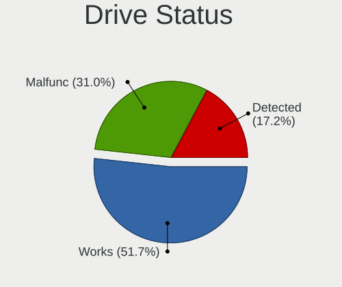

| Status   | Notebooks | Drives | Percent |
|----------|-----------|--------|---------|
| Works    | 15        | 19     | 51.72%  |
| Malfunc  | 9         | 10     | 31.03%  |
| Detected | 5         | 6      | 17.24%  |

Storage controller
------------------

Storage Vendor
--------------

Storage controller vendors

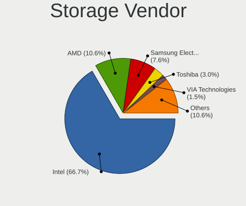

| Vendor                           | Notebooks | Percent |
|----------------------------------|-----------|---------|
| Intel                            | 44        | 66.67%  |
| AMD                              | 7         | 10.61%  |
| Samsung Electronics              | 5         | 7.58%   |
| Toshiba                          | 2         | 3.03%   |
| VIA Technologies                 | 1         | 1.52%   |
| Solid State Storage Technology   | 1         | 1.52%   |
| SK hynix                         | 1         | 1.52%   |
| Silicon Integrated Systems [SiS] | 1         | 1.52%   |
| Sandisk                          | 1         | 1.52%   |
| Micron/Crucial Technology        | 1         | 1.52%   |
| KIOXIA                           | 1         | 1.52%   |
| Kingston Technology Company      | 1         | 1.52%   |

Storage Model
-------------

Storage controller models

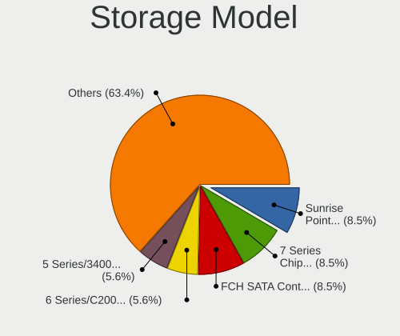

| Model                                                                         | Notebooks | Percent |
|-------------------------------------------------------------------------------|-----------|---------|
| Intel Sunrise Point-LP SATA Controller [AHCI mode]                            | 6         | 8.45%   |
| Intel 7 Series Chipset Family 6-port SATA Controller [AHCI mode]              | 6         | 8.45%   |
| AMD FCH SATA Controller [AHCI mode]                                           | 6         | 8.45%   |
| Intel 6 Series/C200 Series Chipset Family 6 port Mobile SATA AHCI Controller  | 4         | 5.63%   |
| Intel 5 Series/3400 Series Chipset 6 port SATA AHCI Controller                | 4         | 5.63%   |
| Intel SSD DC P4101/Pro 7600p/760p/E 6100p Series                              | 3         | 4.23%   |
| Samsung S4LN058A01[SSUBX] AHCI SSD Controller (Apple slot)                    | 2         | 2.82%   |
| Intel NM10/ICH7 Family SATA Controller [AHCI mode]                            | 2         | 2.82%   |
| Intel Jasper Lake SATA AHCI Controller                                        | 2         | 2.82%   |
| Intel 82801GBM/GHM (ICH7-M Family) SATA Controller [IDE mode]                 | 2         | 2.82%   |
| Intel 82801GBM/GHM (ICH7-M Family) SATA Controller [AHCI mode]                | 2         | 2.82%   |
| Intel 82801DBM (ICH4-M) IDE Controller                                        | 2         | 2.82%   |
| VIA VT82C586A/B/VT82C686/A/B/VT823x/A/C PIPC Bus Master IDE                   | 1         | 1.41%   |
| Toshiba XG6 NVMe SSD Controller                                               | 1         | 1.41%   |
| Toshiba XG3 NVMe SSD Controller                                               | 1         | 1.41%   |
| Solid State Storage CL1-3D256-Q11 NVMe SSD M.2                                | 1         | 1.41%   |
| SK hynix Platinum P41/PC801 NVMe Solid State Drive                            | 1         | 1.41%   |
| Silicon Integrated Systems [SiS] SATA Controller / IDE mode                   | 1         | 1.41%   |
| Silicon Integrated Systems [SiS] 5513 IDE Controller                          | 1         | 1.41%   |
| Sandisk PC SN530 NVMe SSD (DRAM-less)                                         | 1         | 1.41%   |
| Samsung S4LN053X01 AHCI SSD Controller(Apple slot)                            | 1         | 1.41%   |
| Samsung NVMe SSD Controller SM981/PM981/PM983                                 | 1         | 1.41%   |
| Samsung NVMe SSD Controller SM961/PM961/SM963                                 | 1         | 1.41%   |
| Micron/Crucial P5 Plus NVMe PCIe SSD                                          | 1         | 1.41%   |
| KIOXIA NVMe SSD Controller XG8                                                | 1         | 1.41%   |
| Kingston Company OM3PDP3 NVMe SSD                                             | 1         | 1.41%   |
| Intel Wildcat Point-LP SATA Controller [AHCI Mode]                            | 1         | 1.41%   |
| Intel Tiger Lake-LP SATA Controller                                           | 1         | 1.41%   |
| Intel Q170/Q150/B150/H170/H110/Z170/CM236 Chipset SATA Controller [AHCI Mode] | 1         | 1.41%   |
| Intel Optane NVME SSD H10 with Solid State Storage [Teton Glacier]            | 1         | 1.41%   |
| Intel HM170/QM170 Chipset SATA Controller [AHCI Mode]                         | 1         | 1.41%   |
| Intel Comet Lake SATA AHCI Controller                                         | 1         | 1.41%   |
| Intel Celeron/Pentium Silver Processor SATA Controller                        | 1         | 1.41%   |
| Intel Celeron N3350/Pentium N4200/Atom E3900 Series SATA AHCI Controller      | 1         | 1.41%   |
| Intel 82801G (ICH7 Family) IDE Controller                                     | 1         | 1.41%   |
| Intel 82801CAM IDE U100 Controller                                            | 1         | 1.41%   |
| Intel 82801 Mobile SATA Controller [RAID mode]                                | 1         | 1.41%   |
| Intel 82371AB/EB/MB PIIX4 IDE                                                 | 1         | 1.41%   |
| Intel 8 Series SATA Controller 1 [AHCI mode]                                  | 1         | 1.41%   |
| Intel 5 Series/3400 Series Chipset 4 port SATA AHCI Controller                | 1         | 1.41%   |

Storage Kind
------------

Kind of storage controller (IDE, SATA, NVMe, SAS, ...)

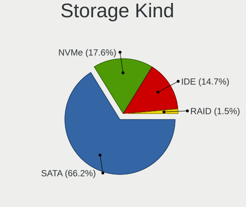

| Kind | Notebooks | Percent |
|------|-----------|---------|
| SATA | 45        | 66.18%  |
| NVMe | 12        | 17.65%  |
| IDE  | 10        | 14.71%  |
| RAID | 1         | 1.47%   |

Processor
---------

CPU Vendor
----------

Processor vendors

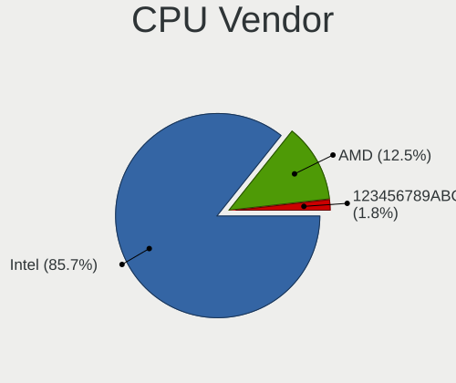

| Vendor       | Notebooks | Percent |
|--------------|-----------|---------|
| Intel        | 48        | 85.71%  |
| AMD          | 7         | 12.5%   |
| 123456789ABC | 1         | 1.79%   |

CPU Model
---------

Processor models

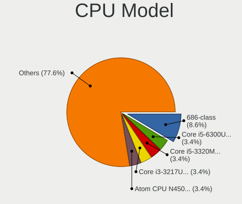

| Model                                  | Notebooks | Percent |
|----------------------------------------|-----------|---------|
| Intel 686-class                        | 5         | 8.62%   |
| Intel Core i5-6300U CPU @ 2.40GHz      | 2         | 3.45%   |
| Intel Core i5-3320M CPU @ 2.60GHz      | 2         | 3.45%   |
| Intel Core i3-3217U CPU @ 1.80GHz      | 2         | 3.45%   |
| Intel Atom CPU N450 @ 1.66GHz          | 2         | 3.45%   |
| Intel Pentium M processor 1.60GHz      | 1         | 1.72%   |
| Intel Pentium M processor              | 1         | 1.72%   |
| Intel Pentium III                      | 1         | 1.72%   |
| Intel Pentium Dual CPU T3200 @ 2.00GHz | 1         | 1.72%   |
| Intel Pentium CPU 2020M @ 2.40GHz      | 1         | 1.72%   |
| Intel CPU Version                      | 1         | 1.72%   |
| Intel Core m3-6Y30 CPU @ 0.90GHz       | 1         | 1.72%   |
| Intel Core i7-8750H CPU @ 2.20GHz      | 1         | 1.72%   |
| Intel Core i7-7920HQ CPU @ 3.10GHz     | 1         | 1.72%   |
| Intel Core i7-6700HQ CPU @ 2.60GHz     | 1         | 1.72%   |
| Intel Core i7-6600U CPU @ 2.60GHz      | 1         | 1.72%   |
| Intel Core i7-5500U CPU @ 2.40GHz      | 1         | 1.72%   |
| Intel Core i7-3520M CPU @ 2.90GHz      | 1         | 1.72%   |
| Intel Core i7-2640M CPU @ 2.80GHz      | 1         | 1.72%   |
| Intel Core i7-10850H CPU @ 2.70GHz     | 1         | 1.72%   |
| Intel Core i5-8365U CPU @ 1.60GHz      | 1         | 1.72%   |
| Intel Core i5-8350U CPU @ 1.70GHz      | 1         | 1.72%   |
| Intel Core i5-7300U CPU @ 2.60GHz      | 1         | 1.72%   |
| Intel Core i5-6200U CPU @ 2.30GHz      | 1         | 1.72%   |
| Intel Core i5-5350U CPU @ 1.80GHz      | 1         | 1.72%   |
| Intel Core i5-4300U CPU @ 1.90GHz      | 1         | 1.72%   |
| Intel Core i5-2520M CPU @ 2.50GHz      | 1         | 1.72%   |
| Intel Core i5-2435M CPU @ 2.40GHz      | 1         | 1.72%   |
| Intel Core i5-2410M CPU @ 2.30GHz      | 1         | 1.72%   |
| Intel Core i5-1035G1 CPU @ 1.00GHz     | 1         | 1.72%   |
| Intel Core i5-10210U CPU @ 1.60GHz     | 1         | 1.72%   |
| Intel Core i5 CPU M 560 @ 2.67GH       | 1         | 1.72%   |
| Intel Core i5 CPU M 540 @ 2.53GHz      | 1         | 1.72%   |
| Intel Core i5 CPU M 520 @ 2.40GHz      | 1         | 1.72%   |
| Intel Core i5 CPU M 430 @ 2.27GH       | 1         | 1.72%   |
| Intel Core i3 CPU M 330 @ 2.13GHz      | 1         | 1.72%   |
| Intel Core 2 CPU T7200 @ 2.00GHz       | 1         | 1.72%   |
| Intel Core 2 CPU T7                    | 1         | 1.72%   |
| Intel Celeron N5100 @ 1.10GHz          | 1         | 1.72%   |
| Intel Celeron N4120 CPU @ 1.10GHz      | 1         | 1.72%   |

CPU Model Family
----------------

Processor model prefix

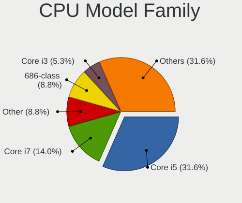

| Model              | Notebooks | Percent |
|--------------------|-----------|---------|
| Intel Core i5      | 18        | 31.58%  |
| Intel Core i7      | 8         | 14.04%  |
| Other              | 5         | 8.77%   |
| Intel 686-class    | 5         | 8.77%   |
| Intel Core i3      | 3         | 5.26%   |
| Intel Atom         | 3         | 5.26%   |
| Intel Pentium M    | 2         | 3.51%   |
| Intel Core 2       | 2         | 3.51%   |
| Intel Celeron      | 2         | 3.51%   |
| AMD A10            | 2         | 3.51%   |
| Intel Pentium III  | 1         | 1.75%   |
| Intel Pentium Dual | 1         | 1.75%   |
| Intel Pentium      | 1         | 1.75%   |
| Intel Core m3      | 1         | 1.75%   |
| AMD Ryzen 5        | 1         | 1.75%   |
| AMD Athlon II      | 1         | 1.75%   |
| AMD A8             | 1         | 1.75%   |

CPU Cores
---------

Number of processor cores

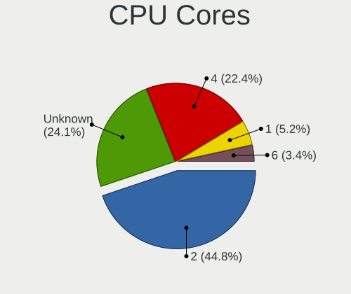

| Number  | Notebooks | Percent |
|---------|-----------|---------|
| 2       | 26        | 44.83%  |
| Unknown | 14        | 24.14%  |
| 4       | 13        | 22.41%  |
| 1       | 3         | 5.17%   |
| 6       | 2         | 3.45%   |

CPU Sockets
-----------

Number of sockets

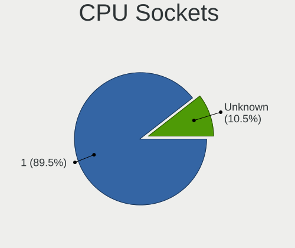

| Number  | Notebooks | Percent |
|---------|-----------|---------|
| 1       | 51        | 89.47%  |
| Unknown | 6         | 10.53%  |

CPU Threads
-----------

Threads per core (Hyper-Threading)

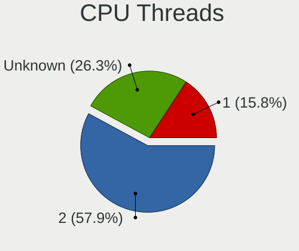

| Number  | Notebooks | Percent |
|---------|-----------|---------|
| 2       | 33        | 57.89%  |
| Unknown | 15        | 26.32%  |
| 1       | 9         | 15.79%  |

CPU Microarch
-------------

Microarchitecture

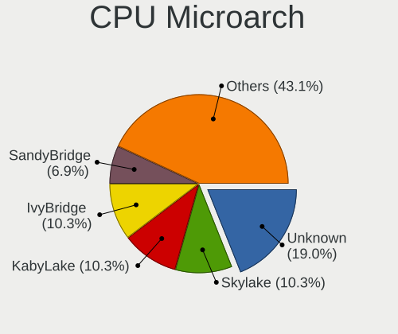

| Name          | Notebooks | Percent |
|---------------|-----------|---------|
| Unknown       | 11        | 18.97%  |
| Skylake       | 6         | 10.34%  |
| KabyLake      | 6         | 10.34%  |
| IvyBridge     | 6         | 10.34%  |
| SandyBridge   | 4         | 6.9%    |
| P6            | 3         | 5.17%   |
| Core          | 3         | 5.17%   |
| Bonnell       | 3         | 5.17%   |
| Westmere      | 2         | 3.45%   |
| Piledriver    | 2         | 3.45%   |
| Broadwell     | 2         | 3.45%   |
| Zen           | 1         | 1.72%   |
| TigerLake     | 1         | 1.72%   |
| Puma          | 1         | 1.72%   |
| K10           | 1         | 1.72%   |
| IceLake       | 1         | 1.72%   |
| Haswell       | 1         | 1.72%   |
| Goldmont plus | 1         | 1.72%   |
| Geode         | 1         | 1.72%   |
| Excavator     | 1         | 1.72%   |
| CometLake     | 1         | 1.72%   |

Graphics
--------

GPU Vendor
----------

Vendors of graphics cards

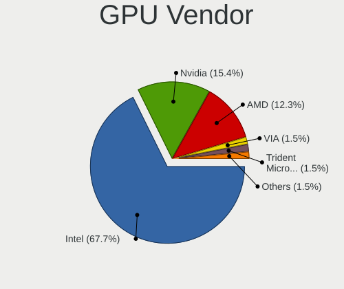

| Vendor               | Notebooks | Percent |
|----------------------|-----------|---------|
| Intel                | 44        | 67.69%  |
| Nvidia               | 10        | 15.38%  |
| AMD                  | 8         | 12.31%  |
| VIA Technologies     | 1         | 1.54%   |
| Trident Microsystems | 1         | 1.54%   |
| S3 Graphics          | 1         | 1.54%   |

GPU Model
---------

Graphics card models

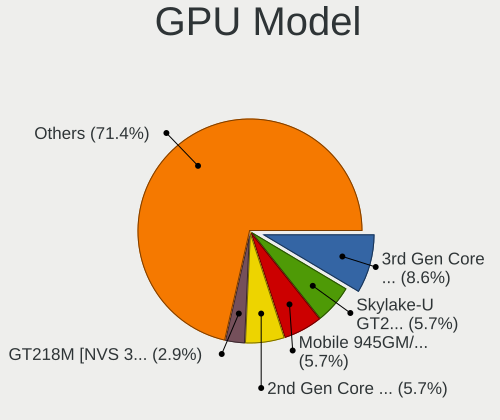

| Model                                                                         | Notebooks | Percent |
|-------------------------------------------------------------------------------|-----------|---------|
| Intel 3rd Gen Core processor Graphics Controller                              | 6         | 8.57%   |
| Intel Skylake-U GT2 [HD Graphics 520]                                         | 4         | 5.71%   |
| Intel Mobile 945GM/GMS/GME, 943/940GML Express Integrated Graphics Controller | 4         | 5.71%   |
| Intel 2nd Generation Core Processor Family Integrated Graphics Controller     | 4         | 5.71%   |
| Nvidia GT218M [NVS 3100M]                                                     | 2         | 2.86%   |
| Intel Mobile 945GSE Express Integrated Graphics Controller                    | 2         | 2.86%   |
| Intel Mobile 945GM/GMS, 943/940GML Express Integrated Graphics Controller     | 2         | 2.86%   |
| Intel JasperLake [UHD Graphics]                                               | 2         | 2.86%   |
| Intel Haswell-ULT Integrated Graphics Controller                              | 2         | 2.86%   |
| Intel Core Processor Integrated Graphics Controller                           | 2         | 2.86%   |
| Intel Broadwell-U GT3 [HD Graphics 6000]                                      | 2         | 2.86%   |
| Intel Atom Processor D4xx/D5xx/N4xx/N5xx Integrated Graphics Controller       | 2         | 2.86%   |
| Intel 82852/855GM Integrated Graphics Device                                  | 2         | 2.86%   |
| AMD Raven Ridge [Radeon Vega Series / Radeon Vega Mobile Series]              | 2         | 2.86%   |
| VIA Technologies CN400/PM800/PM880/PN800/PN880 [S3 UniChrome Pro]             | 1         | 1.43%   |
| Trident Microsystems TGUI 9660/938x/968x                                      | 1         | 1.43%   |
| S3 Graphics SuperSavage IX/C SDR                                              | 1         | 1.43%   |
| Nvidia TU117GLM [Quadro T1000 Mobile]                                         | 1         | 1.43%   |
| Nvidia GT216GLM [Quadro FX 880M]                                              | 1         | 1.43%   |
| Nvidia GP107M [GeForce GTX 1050 Ti Mobile]                                    | 1         | 1.43%   |
| Nvidia GM206GLM [Quadro M2200 Mobile]                                         | 1         | 1.43%   |
| Nvidia GM107M [GeForce GTX 960M]                                              | 1         | 1.43%   |
| Nvidia GK208BM [GeForce 920M]                                                 | 1         | 1.43%   |
| Nvidia GF108M [GeForce GT 540M]                                               | 1         | 1.43%   |
| Nvidia G98M [GeForce 9300M GS]                                                | 1         | 1.43%   |
| Intel WhiskeyLake-U GT2 [UHD Graphics 620]                                    | 1         | 1.43%   |
| Intel TigerLake-LP GT2 [Iris Xe Graphics]                                     | 1         | 1.43%   |
| Intel Skylake-Y GT2 [HD Graphics 515]                                         | 1         | 1.43%   |
| Intel Skylake-H GT2 [HD Graphics 530]                                         | 1         | 1.43%   |
| Intel Meteor Lake-P [Intel Arc Graphics]                                      | 1         | 1.43%   |
| Intel Kaby Lake-U GT2 [HD Graphics 620]                                       | 1         | 1.43%   |
| Intel Kaby Lake-R GT2 [UHD Graphics 620]                                      | 1         | 1.43%   |
| Intel Kaby Lake-H GT2 [HD Graphics 630]                                       | 1         | 1.43%   |
| Intel Iris Plus Graphics G1 (Ice Lake)                                        | 1         | 1.43%   |
| Intel GeminiLake [UHD Graphics 600]                                           | 1         | 1.43%   |
| Intel CometLake-U GT2 [UHD Graphics]                                          | 1         | 1.43%   |
| Intel CometLake-H GT2 [UHD Graphics]                                          | 1         | 1.43%   |
| Intel CoffeeLake-H GT2 [UHD Graphics 630]                                     | 1         | 1.43%   |
| Intel Broadwell-U GT2 [HD Graphics 5500]                                      | 1         | 1.43%   |
| Intel Apollo Lake [HD Graphics 505]                                           | 1         | 1.43%   |

GPU Combo
---------

Combinations of graphics cards

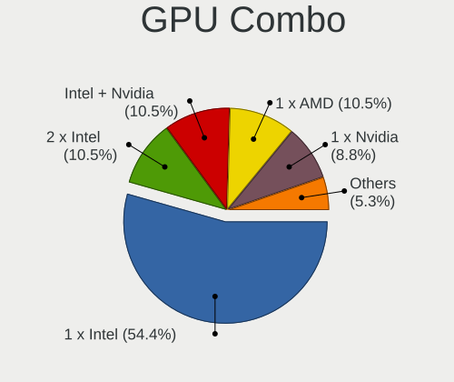

| Name                     | Notebooks | Percent |
|--------------------------|-----------|---------|
| 1 x Intel                | 31        | 54.39%  |
| 2 x Intel                | 6         | 10.53%  |
| Intel + Nvidia           | 6         | 10.53%  |
| 1 x AMD                  | 6         | 10.53%  |
| 1 x Nvidia               | 5         | 8.77%   |
| 1 x VIA                  | 1         | 1.75%   |
| 1 x Trident Microsystems | 1         | 1.75%   |
| 1 x S3 Graphics          | 1         | 1.75%   |

GPU Driver
----------

Free vs proprietary

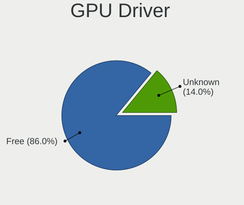

| Driver  | Notebooks | Percent |
|---------|-----------|---------|
| Free    | 49        | 85.96%  |
| Unknown | 8         | 14.04%  |

GPU Memory
----------

Total video memory

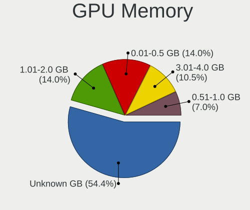

| Size in GB | Notebooks | Percent |
|------------|-----------|---------|
| Unknown    | 31        | 54.39%  |
| 1.01-2.0   | 8         | 14.04%  |
| 0.01-0.5   | 8         | 14.04%  |
| 3.01-4.0   | 6         | 10.53%  |
| 0.51-1.0   | 4         | 7.02%   |

Monitor
-------

Monitor Vendor
--------------

Monitor vendors

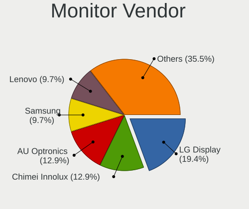

| Vendor                  | Notebooks | Percent |
|-------------------------|-----------|---------|
| LG Display              | 6         | 19.35%  |
| Chimei Innolux          | 4         | 12.9%   |
| AU Optronics            | 4         | 12.9%   |
| Samsung Electronics     | 3         | 9.68%   |
| Lenovo                  | 3         | 9.68%   |
| BOE                     | 3         | 9.68%   |
| Apple                   | 2         | 6.45%   |
| ViewSonic               | 1         | 3.23%   |
| LG Philips              | 1         | 3.23%   |
| InfoVision              | 1         | 3.23%   |
| Dell                    | 1         | 3.23%   |
| CPT                     | 1         | 3.23%   |
| Chi Mei Optoelectronics | 1         | 3.23%   |

Monitor Model
-------------

Monitor models

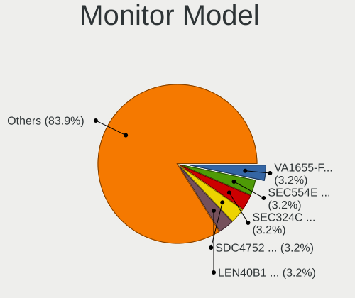

| Model                                                                   | Notebooks | Percent |
|-------------------------------------------------------------------------|-----------|---------|
| ViewSonic VA1655-FHD VSC313C 1920x1080 340x190mm 15.3-inch              | 1         | 3.23%   |
| Samsung Electronics LCD Monitor SEC554E 1024x600 220x130mm 10.1-inch    | 1         | 3.23%   |
| Samsung Electronics LCD Monitor SEC324C 1600x900 310x170mm 13.9-inch    | 1         | 3.23%   |
| Samsung Electronics LCD Monitor SDC4752 1366x768 340x190mm 15.3-inch    | 1         | 3.23%   |
| LG Philips LCD Monitor LPLDD00 1280x800 330x210mm 15.4-inch             | 1         | 3.23%   |
| LG Display LCD Monitor LGD40A0 1366x768 310x170mm 13.9-inch             | 1         | 3.23%   |
| LG Display LCD Monitor LGD0521 1920x1080 310x170mm 13.9-inch            | 1         | 3.23%   |
| LG Display LCD Monitor LGD0456 1366x768 340x190mm 15.3-inch             | 1         | 3.23%   |
| LG Display LCD Monitor LGD03CD 1366x768 280x160mm 12.7-inch             | 1         | 3.23%   |
| LG Display LCD Monitor LGD0335 1366x768 310x170mm 13.9-inch             | 1         | 3.23%   |
| LG Display LCD Monitor LGD029E 1600x900 340x190mm 15.3-inch             | 1         | 3.23%   |
| Lenovo LCD Monitor LEN40B1 1600x900 340x190mm 15.3-inch                 | 1         | 3.23%   |
| Lenovo LCD Monitor LEN4036 1440x900 300x190mm 14.0-inch                 | 1         | 3.23%   |
| Lenovo LCD Monitor LEN4011 1280x800 260x160mm 12.0-inch                 | 1         | 3.23%   |
| InfoVision LCD Monitor IVO057D 1920x1080 310x170mm 13.9-inch            | 1         | 3.23%   |
| Dell P2419H DELD0DA 1920x1080 530x300mm 24.0-inch                       | 1         | 3.23%   |
| CPT LCD Monitor CPT04C4 1024x600 230x140mm 10.6-inch                    | 1         | 3.23%   |
| Chimei Innolux LCD Monitor CMN15D2 1920x1080 340x190mm 15.3-inch        | 1         | 3.23%   |
| Chimei Innolux LCD Monitor CMN15CB 1920x1080 340x190mm 15.3-inch        | 1         | 3.23%   |
| Chimei Innolux LCD Monitor CMN15AB 1366x768 340x190mm 15.3-inch         | 1         | 3.23%   |
| Chimei Innolux LCD Monitor CMN1472 1366x768 310x170mm 13.9-inch         | 1         | 3.23%   |
| Chi Mei Optoelectronics LCD Monitor CMO1007 1024x600 220x120mm 9.9-inch | 1         | 3.23%   |
| BOE LCD Monitor BOE0827 1366x768 310x170mm 13.9-inch                    | 1         | 3.23%   |
| BOE LCD Monitor BOE074F 1920x1080 310x170mm 13.9-inch                   | 1         | 3.23%   |
| BOE LCD Monitor BOE0731 1366x768 260x140mm 11.6-inch                    | 1         | 3.23%   |
| AU Optronics LCD Monitor AUO6287 1440x900 370x230mm 17.2-inch           | 1         | 3.23%   |
| AU Optronics LCD Monitor AUO32EB 3840x2160 340x190mm 15.3-inch          | 1         | 3.23%   |
| AU Optronics LCD Monitor AUO26EC 1366x768 340x190mm 15.3-inch           | 1         | 3.23%   |
| AU Optronics LCD Monitor AUO22EC 1366x768 340x190mm 15.3-inch           | 1         | 3.23%   |
| Apple LCD Monitor APP9CC5 1280x800 290x180mm 13.4-inch                  | 1         | 3.23%   |
| Apple LCD Monitor APP9C5F 1280x800 290x180mm 13.4-inch                  | 1         | 3.23%   |

Monitor Resolution
------------------

Monitor screen resolution

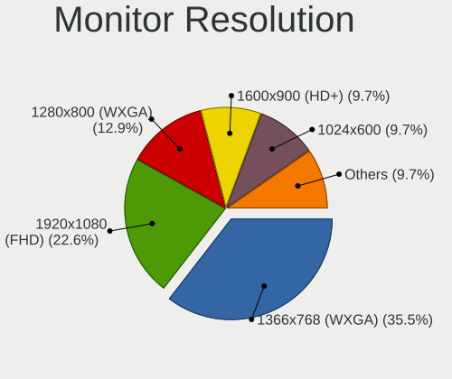

| Resolution       | Notebooks | Percent |
|------------------|-----------|---------|
| 1366x768 (WXGA)  | 11        | 35.48%  |
| 1920x1080 (FHD)  | 7         | 22.58%  |
| 1280x800 (WXGA)  | 4         | 12.9%   |
| 1600x900 (HD+)   | 3         | 9.68%   |
| 1024x600         | 3         | 9.68%   |
| 1440x900 (WXGA+) | 2         | 6.45%   |
| 3840x2160 (4K)   | 1         | 3.23%   |

Monitor Diagonal
----------------

Diagonal size in inches

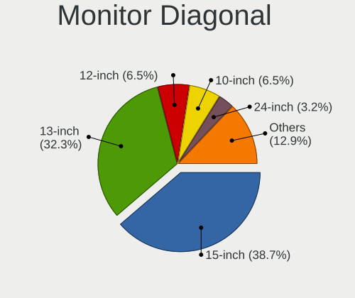

| Inches | Notebooks | Percent |
|--------|-----------|---------|
| 15     | 12        | 38.71%  |
| 13     | 10        | 32.26%  |
| 12     | 2         | 6.45%   |
| 10     | 2         | 6.45%   |
| 24     | 1         | 3.23%   |
| 17     | 1         | 3.23%   |
| 14     | 1         | 3.23%   |
| 11     | 1         | 3.23%   |
| 9      | 1         | 3.23%   |

Monitor Width
-------------

Physical width

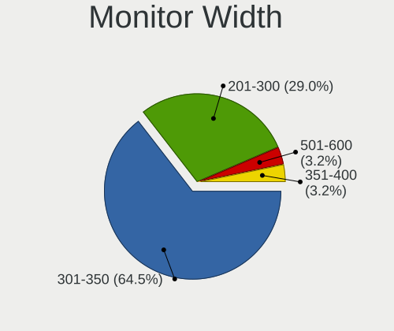

| Width in mm | Notebooks | Percent |
|-------------|-----------|---------|
| 301-350     | 20        | 64.52%  |
| 201-300     | 9         | 29.03%  |
| 501-600     | 1         | 3.23%   |
| 351-400     | 1         | 3.23%   |

Aspect Ratio
------------

Proportional relationship between the width and the height

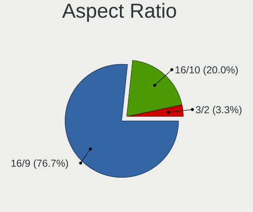

| Ratio | Notebooks | Percent |
|-------|-----------|---------|
| 16/9  | 23        | 76.67%  |
| 16/10 | 6         | 20%     |
| 3/2   | 1         | 3.33%   |

Monitor Area
------------

Area in inch²

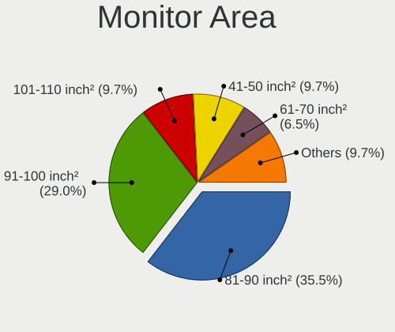

| Area in inch² | Notebooks | Percent |
|----------------|-----------|---------|
| 81-90          | 11        | 35.48%  |
| 91-100         | 9         | 29.03%  |
| 41-50          | 3         | 9.68%   |
| 101-110        | 3         | 9.68%   |
| 61-70          | 2         | 6.45%   |
| 51-60          | 1         | 3.23%   |
| 201-250        | 1         | 3.23%   |
| 131-140        | 1         | 3.23%   |

Pixel Density
-------------

Pixels per inch

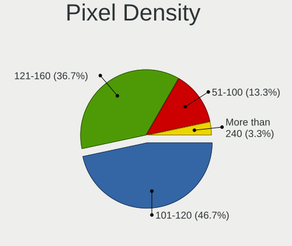

| Density       | Notebooks | Percent |
|---------------|-----------|---------|
| 101-120       | 14        | 46.67%  |
| 121-160       | 11        | 36.67%  |
| 51-100        | 4         | 13.33%  |
| More than 240 | 1         | 3.33%   |

Multiple Monitors
-----------------

Total monitors connected

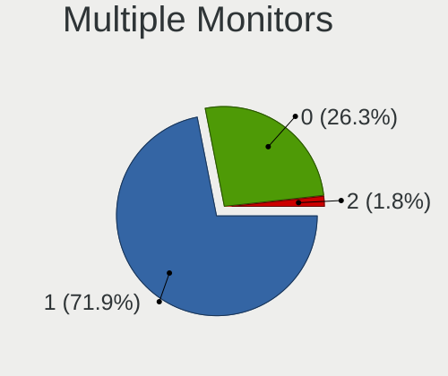

| Total | Notebooks | Percent |
|-------|-----------|---------|
| 1     | 41        | 71.93%  |
| 0     | 15        | 26.32%  |
| 2     | 1         | 1.75%   |

Network
-------

Net Controller Vendor
---------------------

Controller vendors

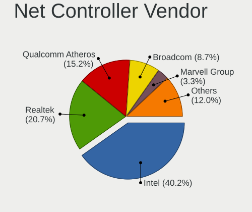

| Vendor                            | Notebooks | Percent |
|-----------------------------------|-----------|---------|
| Intel                             | 37        | 40.22%  |
| Realtek Semiconductor             | 19        | 20.65%  |
| Qualcomm Atheros                  | 14        | 15.22%  |
| Broadcom                          | 8         | 8.7%    |
| Marvell Technology Group          | 3         | 3.26%   |
| Ericsson Business Mobile Networks | 2         | 2.17%   |
| VIA Technologies                  | 1         | 1.09%   |
| TP-Link                           | 1         | 1.09%   |
| Silicon Integrated Systems [SiS]  | 1         | 1.09%   |
| Qualcomm Atheros Communications   | 1         | 1.09%   |
| JMicron Technology                | 1         | 1.09%   |
| Huawei Technologies               | 1         | 1.09%   |
| Dell                              | 1         | 1.09%   |
| D-Link                            | 1         | 1.09%   |
| Apple                             | 1         | 1.09%   |

Net Controller Model
--------------------

Controller models

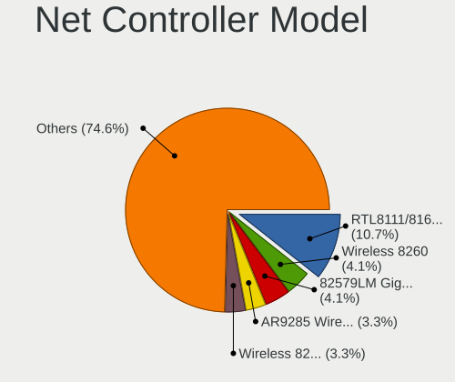

| Model                                                                                 | Notebooks | Percent |
|---------------------------------------------------------------------------------------|-----------|---------|
| Realtek RTL8111/8168/8211/8411 PCI Express Gigabit Ethernet Controller                | 13        | 10.66%  |
| Intel Wireless 8260                                                                   | 5         | 4.1%    |
| Intel 82579LM Gigabit Network Connection (Lewisville)                                 | 5         | 4.1%    |
| Qualcomm Atheros AR9285 Wireless Network Adapter (PCI-Express)                        | 4         | 3.28%   |
| Intel Wireless 8265 / 8275                                                            | 4         | 3.28%   |
| Intel Centrino Advanced-N 6205 [Taylor Peak]                                          | 4         | 3.28%   |
| Intel Wireless 7265                                                                   | 3         | 2.46%   |
| Intel Ethernet Connection I219-LM                                                     | 3         | 2.46%   |
| Broadcom BCM4360 802.11ac Dual Band Wireless Network Adapter                          | 3         | 2.46%   |
| Realtek RTL810xE PCI Express Fast Ethernet controller                                 | 2         | 1.64%   |
| Qualcomm Atheros AR8132 Fast Ethernet                                                 | 2         | 1.64%   |
| Qualcomm Atheros AR242x / AR542x Wireless Network Adapter (PCI-Express)               | 2         | 1.64%   |
| Qualcomm Atheros AR2413/AR2414 Wireless Network Adapter [AR5005G(S) 802.11bg]         | 2         | 1.64%   |
| Marvell Group 88E8040 PCI-E Fast Ethernet Controller                                  | 2         | 1.64%   |
| Intel Ethernet Connection (4) I219-LM                                                 | 2         | 1.64%   |
| Intel 82577LM Gigabit Network Connection                                              | 2         | 1.64%   |
| Broadcom BCM43142 802.11b/g/n                                                         | 2         | 1.64%   |
| VIA VT6102/VT6103 [Rhine-II]                                                          | 1         | 0.82%   |
| TP-Link TL-WN722N v2/v3 [Realtek RTL8188EUS]                                          | 1         | 0.82%   |
| Silicon Integrated Systems [SiS] 191 Gigabit Ethernet Adapter                         | 1         | 0.82%   |
| Realtek RTL8822BE 802.11a/b/g/n/ac WiFi adapter                                       | 1         | 0.82%   |
| Realtek RTL8821CE 802.11ac PCIe Wireless Network Adapter                              | 1         | 0.82%   |
| Realtek RTL8811AU 802.11a/b/g/n/ac WLAN Adapter                                       | 1         | 0.82%   |
| Realtek RTL8723BE PCIe Wireless Network Adapter                                       | 1         | 0.82%   |
| Realtek RTL8192CU 802.11n WLAN Adapter                                                | 1         | 0.82%   |
| Realtek RTL8188EUS 802.11n Wireless Network Adapter                                   | 1         | 0.82%   |
| Realtek RTL8188EE Wireless Network Adapter                                            | 1         | 0.82%   |
| Realtek RTL8188CUS 802.11n WLAN Adapter                                               | 1         | 0.82%   |
| Realtek RTL-8100/8101L/8139 PCI Fast Ethernet Adapter                                 | 1         | 0.82%   |
| Qualcomm Atheros QCA9565 / AR9565 Wireless Network Adapter                            | 1         | 0.82%   |
| Qualcomm Atheros QCA8172 Fast Ethernet                                                | 1         | 0.82%   |
| Qualcomm Atheros Killer E2400 Gigabit Ethernet Controller                             | 1         | 0.82%   |
| Qualcomm Atheros AR9271 802.11n                                                       | 1         | 0.82%   |
| Qualcomm Atheros AR928X Wireless Network Adapter (PCI-Express)                        | 1         | 0.82%   |
| Qualcomm Atheros AR5418 Wireless Network Adapter [AR5008E 802.11(a)bgn] (PCI-Express) | 1         | 0.82%   |
| Marvell Group 88E8053 PCI-E Gigabit Ethernet Controller                               | 1         | 0.82%   |
| JMicron JMC250 PCI Express Gigabit Ethernet Controller                                | 1         | 0.82%   |
| Intel Wireless 7260                                                                   | 1         | 0.82%   |
| Intel Wireless 3165                                                                   | 1         | 0.82%   |
| Intel Wi-Fi 6 AX201                                                                   | 1         | 0.82%   |

Wireless Vendor
---------------

Wireless vendors

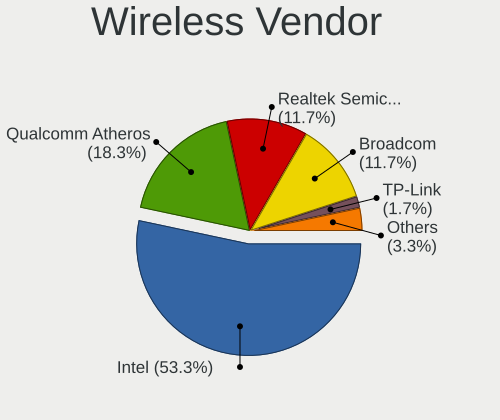

| Vendor                          | Notebooks | Percent |
|---------------------------------|-----------|---------|
| Intel                           | 32        | 53.33%  |
| Qualcomm Atheros                | 11        | 18.33%  |
| Realtek Semiconductor           | 7         | 11.67%  |
| Broadcom                        | 7         | 11.67%  |
| TP-Link                         | 1         | 1.67%   |
| Qualcomm Atheros Communications | 1         | 1.67%   |
| D-Link                          | 1         | 1.67%   |

Wireless Model
--------------

Wireless models

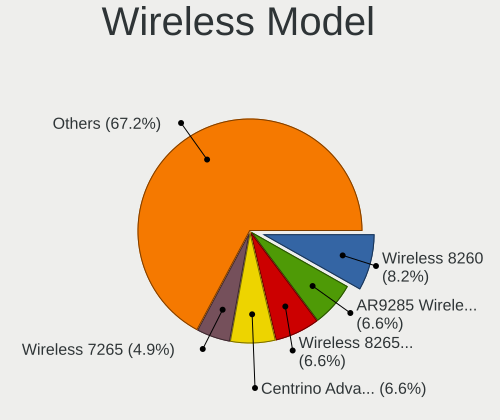

| Model                                                                                 | Notebooks | Percent |
|---------------------------------------------------------------------------------------|-----------|---------|
| Intel Wireless 8260                                                                   | 5         | 8.2%    |
| Qualcomm Atheros AR9285 Wireless Network Adapter (PCI-Express)                        | 4         | 6.56%   |
| Intel Wireless 8265 / 8275                                                            | 4         | 6.56%   |
| Intel Centrino Advanced-N 6205 [Taylor Peak]                                          | 4         | 6.56%   |
| Intel Wireless 7265                                                                   | 3         | 4.92%   |
| Broadcom BCM4360 802.11ac Dual Band Wireless Network Adapter                          | 3         | 4.92%   |
| Qualcomm Atheros AR242x / AR542x Wireless Network Adapter (PCI-Express)               | 2         | 3.28%   |
| Qualcomm Atheros AR2413/AR2414 Wireless Network Adapter [AR5005G(S) 802.11bg]         | 2         | 3.28%   |
| Broadcom BCM43142 802.11b/g/n                                                         | 2         | 3.28%   |
| TP-Link TL-WN722N v2/v3 [Realtek RTL8188EUS]                                          | 1         | 1.64%   |
| Realtek RTL8822BE 802.11a/b/g/n/ac WiFi adapter                                       | 1         | 1.64%   |
| Realtek RTL8821CE 802.11ac PCIe Wireless Network Adapter                              | 1         | 1.64%   |
| Realtek RTL8811AU 802.11a/b/g/n/ac WLAN Adapter                                       | 1         | 1.64%   |
| Realtek RTL8723BE PCIe Wireless Network Adapter                                       | 1         | 1.64%   |
| Realtek RTL8192CU 802.11n WLAN Adapter                                                | 1         | 1.64%   |
| Realtek RTL8188EUS 802.11n Wireless Network Adapter                                   | 1         | 1.64%   |
| Realtek RTL8188EE Wireless Network Adapter                                            | 1         | 1.64%   |
| Realtek RTL8188CUS 802.11n WLAN Adapter                                               | 1         | 1.64%   |
| Qualcomm Atheros QCA9565 / AR9565 Wireless Network Adapter                            | 1         | 1.64%   |
| Qualcomm Atheros AR9271 802.11n                                                       | 1         | 1.64%   |
| Qualcomm Atheros AR928X Wireless Network Adapter (PCI-Express)                        | 1         | 1.64%   |
| Qualcomm Atheros AR5418 Wireless Network Adapter [AR5008E 802.11(a)bgn] (PCI-Express) | 1         | 1.64%   |
| Intel Wireless 7260                                                                   | 1         | 1.64%   |
| Intel Wireless 3165                                                                   | 1         | 1.64%   |
| Intel Wi-Fi 6 AX201                                                                   | 1         | 1.64%   |
| Intel Wi-Fi 6 AX200                                                                   | 1         | 1.64%   |
| Intel PRO/Wireless 3945ABG [Golan] Network Connection                                 | 1         | 1.64%   |
| Intel PRO/Wireless 2200BG [Calexico2] Network Connection                              | 1         | 1.64%   |
| Intel Meteor Lake PCH CNVi WiFi                                                       | 1         | 1.64%   |
| Intel Jasper Lake PCH CNVi WiFi                                                       | 1         | 1.64%   |
| Intel Ice Lake-LP PCH CNVi WiFi                                                       | 1         | 1.64%   |
| Intel Dual Band Wireless-AC 3168NGW [Stone Peak]                                      | 1         | 1.64%   |
| Intel Comet Lake PCH-LP CNVi WiFi                                                     | 1         | 1.64%   |
| Intel Comet Lake PCH CNVi WiFi                                                        | 1         | 1.64%   |
| Intel Centrino Wireless-N 135                                                         | 1         | 1.64%   |
| Intel Centrino Wireless-N 1000 [Condor Peak]                                          | 1         | 1.64%   |
| Intel Cannon Point-LP CNVi [Wireless-AC]                                              | 1         | 1.64%   |
| Intel Cannon Lake PCH CNVi WiFi                                                       | 1         | 1.64%   |
| D-Link DWA-131 Wireless N Nano Adapter (Rev. E1) [Realtek RTL8192EU]                  | 1         | 1.64%   |
| Broadcom BCM4331 802.11a/b/g/n                                                        | 1         | 1.64%   |

Ethernet Vendor
---------------

Ethernet vendors

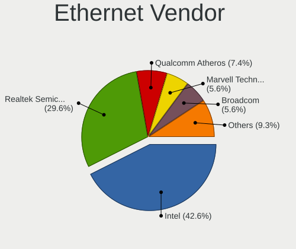

| Vendor                           | Notebooks | Percent |
|----------------------------------|-----------|---------|
| Intel                            | 23        | 42.59%  |
| Realtek Semiconductor            | 16        | 29.63%  |
| Qualcomm Atheros                 | 4         | 7.41%   |
| Marvell Technology Group         | 3         | 5.56%   |
| Broadcom                         | 3         | 5.56%   |
| VIA Technologies                 | 1         | 1.85%   |
| Silicon Integrated Systems [SiS] | 1         | 1.85%   |
| JMicron Technology               | 1         | 1.85%   |
| Huawei Technologies              | 1         | 1.85%   |
| Apple                            | 1         | 1.85%   |

Ethernet Model
--------------

Ethernet models

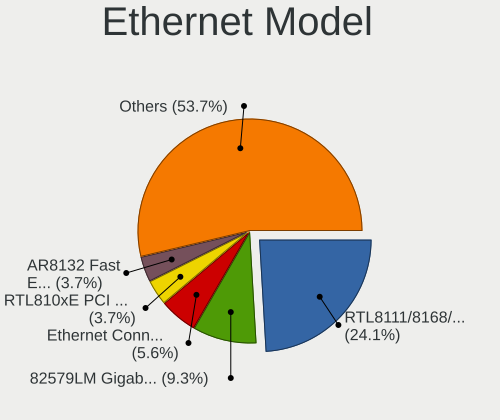

| Model                                                                  | Notebooks | Percent |
|------------------------------------------------------------------------|-----------|---------|
| Realtek RTL8111/8168/8211/8411 PCI Express Gigabit Ethernet Controller | 13        | 24.07%  |
| Intel 82579LM Gigabit Network Connection (Lewisville)                  | 5         | 9.26%   |
| Intel Ethernet Connection I219-LM                                      | 3         | 5.56%   |
| Realtek RTL810xE PCI Express Fast Ethernet controller                  | 2         | 3.7%    |
| Qualcomm Atheros AR8132 Fast Ethernet                                  | 2         | 3.7%    |
| Marvell Group 88E8040 PCI-E Fast Ethernet Controller                   | 2         | 3.7%    |
| Intel Ethernet Connection (4) I219-LM                                  | 2         | 3.7%    |
| Intel 82577LM Gigabit Network Connection                               | 2         | 3.7%    |
| VIA VT6102/VT6103 [Rhine-II]                                           | 1         | 1.85%   |
| Silicon Integrated Systems [SiS] 191 Gigabit Ethernet Adapter          | 1         | 1.85%   |
| Realtek RTL-8100/8101L/8139 PCI Fast Ethernet Adapter                  | 1         | 1.85%   |
| Qualcomm Atheros QCA8172 Fast Ethernet                                 | 1         | 1.85%   |
| Qualcomm Atheros Killer E2400 Gigabit Ethernet Controller              | 1         | 1.85%   |
| Marvell Group 88E8053 PCI-E Gigabit Ethernet Controller                | 1         | 1.85%   |
| JMicron JMC250 PCI Express Gigabit Ethernet Controller                 | 1         | 1.85%   |
| Intel PRO/100 VE Network Connection                                    | 1         | 1.85%   |
| Intel Ethernet Connection I219-V                                       | 1         | 1.85%   |
| Intel Ethernet Connection I218-LM                                      | 1         | 1.85%   |
| Intel Ethernet Connection (7) I219-V                                   | 1         | 1.85%   |
| Intel Ethernet Connection (6) I219-LM                                  | 1         | 1.85%   |
| Intel Ethernet Connection (5) I219-LM                                  | 1         | 1.85%   |
| Intel Ethernet Connection (18) I219-LM                                 | 1         | 1.85%   |
| Intel Ethernet Connection (11) I219-LM                                 | 1         | 1.85%   |
| Intel 82801DB PRO/100 VE (MOB) Ethernet Controller                     | 1         | 1.85%   |
| Intel 82801CAM (ICH3) PRO/100 VE (LOM) Ethernet Controller             | 1         | 1.85%   |
| Intel 82577LC Gigabit Network Connection                               | 1         | 1.85%   |
| Huawei USB Device                                                      | 1         | 1.85%   |
| Broadcom NetXtreme BCM57765 Gigabit Ethernet PCIe                      | 1         | 1.85%   |
| Broadcom NetXtreme BCM57762 Gigabit Ethernet PCIe                      | 1         | 1.85%   |
| Broadcom NetLink BCM57780 Gigabit Ethernet PCIe                        | 1         | 1.85%   |
| Apple Ethernet Adapter [A1277]                                         | 1         | 1.85%   |

Net Controller Kind
-------------------

Ethernet, WiFi or modem

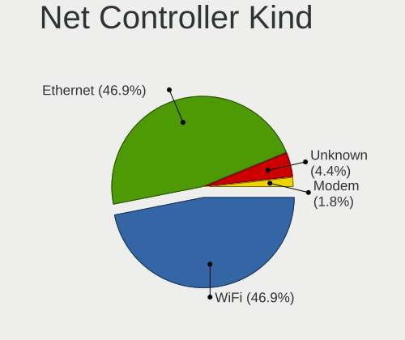

| Kind     | Notebooks | Percent |
|----------|-----------|---------|
| WiFi     | 53        | 46.9%   |
| Ethernet | 53        | 46.9%   |
| Unknown  | 5         | 4.42%   |
| Modem    | 2         | 1.77%   |

Used Controller
---------------

Currently used network controller

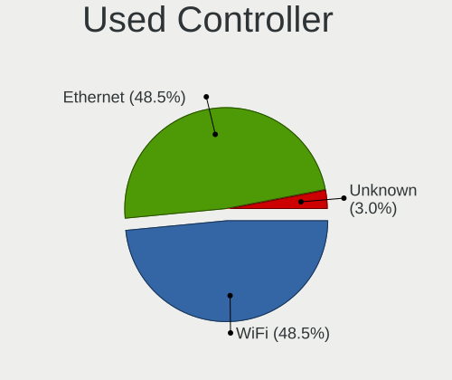

| Kind     | Notebooks | Percent |
|----------|-----------|---------|
| WiFi     | 32        | 48.48%  |
| Ethernet | 32        | 48.48%  |
| Unknown  | 2         | 3.03%   |

NICs
----

Total network controllers on board

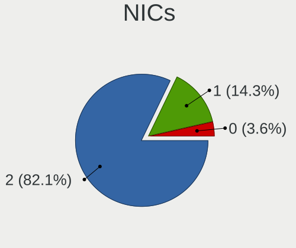

| Total | Notebooks | Percent |
|-------|-----------|---------|
| 2     | 46        | 82.14%  |
| 1     | 8         | 14.29%  |
| 0     | 2         | 3.57%   |

IPv6
----

IPv6 vs IPv4

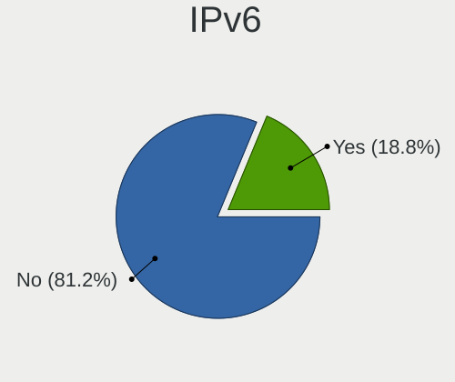

| Used | Notebooks | Percent |
|------|-----------|---------|
| No   | 38        | 66.67%  |
| Yes  | 19        | 33.33%  |

Bluetooth
---------

Bluetooth Vendor
----------------

Controller vendors

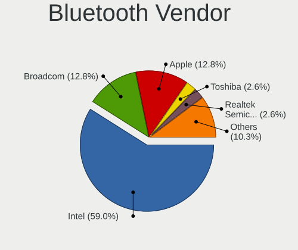

| Vendor                  | Notebooks | Percent |
|-------------------------|-----------|---------|
| Intel                   | 23        | 58.97%  |
| Broadcom                | 5         | 12.82%  |
| Apple                   | 5         | 12.82%  |
| Toshiba                 | 1         | 2.56%   |
| Realtek Semiconductor   | 1         | 2.56%   |
| IMC Networks            | 1         | 2.56%   |
| Cambridge Silicon Radio | 1         | 2.56%   |
| ASUSTek Computer        | 1         | 2.56%   |
| Alps Electric           | 1         | 2.56%   |

Bluetooth Model
---------------

Controller models

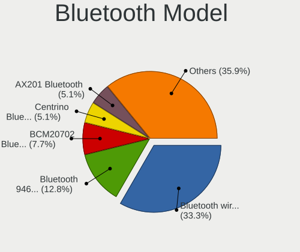

| Model                                               | Notebooks | Percent |
|-----------------------------------------------------|-----------|---------|
| Intel Bluetooth wireless interface                  | 13        | 33.33%  |
| Intel Bluetooth 9460/9560 Jefferson Peak (JfP)      | 5         | 12.82%  |
| Broadcom BCM20702 Bluetooth 4.0 [ThinkPad]          | 3         | 7.69%   |
| Intel Centrino Bluetooth Wireless Transceiver       | 2         | 5.13%   |
| Intel AX201 Bluetooth                               | 2         | 5.13%   |
| Apple Broadcom Built-in Bluetooth                   | 2         | 5.13%   |
| Apple Bluetooth Host Controller                     | 2         | 5.13%   |
| Toshiba Realtek Bluetooth 4.0 + High Speed Chip     | 1         | 2.56%   |
| Realtek Bluetooth Adapter                           | 1         | 2.56%   |
| Intel Wireless-AC 3168 Bluetooth                    | 1         | 2.56%   |
| IMC Networks Qualcomm Atheros Bluetooth 4.0 + HS    | 1         | 2.56%   |
| Cambridge Silicon Radio Bluetooth Dongle (HCI mode) | 1         | 2.56%   |
| Broadcom Bluetooth                                  | 1         | 2.56%   |
| Broadcom BCM2045B (BDC-2.1)                         | 1         | 2.56%   |
| ASUS Broadcom BCM20702A0 Bluetooth                  | 1         | 2.56%   |
| Apple Built-in iSight (no firmware loaded)          | 1         | 2.56%   |
| Alps Electric UGTZ4 Bluetooth                       | 1         | 2.56%   |

Sound
-----

Sound Vendor
------------

Sound card vendors

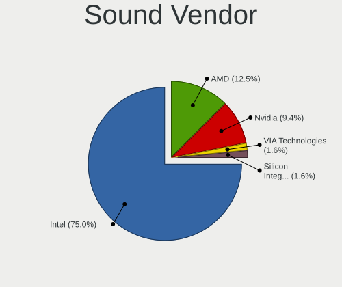

| Vendor                           | Notebooks | Percent |
|----------------------------------|-----------|---------|
| Intel                            | 48        | 75%     |
| AMD                              | 8         | 12.5%   |
| Nvidia                           | 6         | 9.38%   |
| VIA Technologies                 | 1         | 1.56%   |
| Silicon Integrated Systems [SiS] | 1         | 1.56%   |

Sound Model
-----------

Sound card models

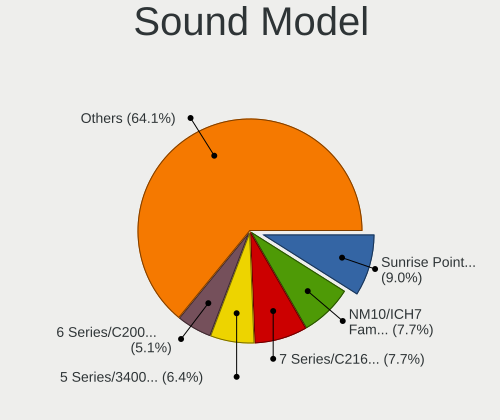

| Model                                                                      | Notebooks | Percent |
|----------------------------------------------------------------------------|-----------|---------|
| Intel Sunrise Point-LP HD Audio                                            | 7         | 8.97%   |
| Intel NM10/ICH7 Family High Definition Audio Controller                    | 6         | 7.69%   |
| Intel 7 Series/C216 Chipset Family High Definition Audio Controller        | 6         | 7.69%   |
| Intel 5 Series/3400 Series Chipset High Definition Audio                   | 5         | 6.41%   |
| Intel 6 Series/C200 Series Chipset Family High Definition Audio Controller | 4         | 5.13%   |
| Intel Wildcat Point-LP High Definition Audio Controller                    | 3         | 3.85%   |
| Intel Broadwell-U Audio Controller                                         | 3         | 3.85%   |
| AMD Ryzen HD Audio Controller                                              | 3         | 3.85%   |
| AMD FCH Azalia Controller                                                  | 3         | 3.85%   |
| Nvidia High Definition Audio Controller                                    | 2         | 2.56%   |
| Intel Jasper Lake HD Audio                                                 | 2         | 2.56%   |
| Intel Haswell-ULT HD Audio Controller                                      | 2         | 2.56%   |
| Intel 82801DB/DBL/DBM (ICH4/ICH4-L/ICH4-M) AC'97 Audio Controller          | 2         | 2.56%   |
| Intel 8 Series HD Audio Controller                                         | 2         | 2.56%   |
| AMD Trinity HDMI Audio Controller                                          | 2         | 2.56%   |
| AMD Raven/Raven2/Fenghuang HDMI/DP Audio Controller                        | 2         | 2.56%   |
| AMD Kabini HDMI/DP Audio                                                   | 2         | 2.56%   |
| VIA Technologies VT8233/A/8235/8237 AC97 Audio Controller                  | 1         | 1.28%   |
| Silicon Integrated Systems [SiS] Azalia Audio Controller                   | 1         | 1.28%   |
| Nvidia TU107 GeForce GTX 1650 High Definition Audio Controller             | 1         | 1.28%   |
| Nvidia GT216 HDMI Audio Controller                                         | 1         | 1.28%   |
| Nvidia GP107GL High Definition Audio Controller                            | 1         | 1.28%   |
| Nvidia GM206 High Definition Audio Controller                              | 1         | 1.28%   |
| Intel Tiger Lake-LP Smart Sound Technology Audio Controller                | 1         | 1.28%   |
| Intel Meteor Lake-P HD Audio Controller                                    | 1         | 1.28%   |
| Intel Ice Lake-LP Smart Sound Technology Audio Controller                  | 1         | 1.28%   |
| Intel Comet Lake PCH-LP cAVS                                               | 1         | 1.28%   |
| Intel Comet Lake PCH cAVS                                                  | 1         | 1.28%   |
| Intel CM238 HD Audio Controller                                            | 1         | 1.28%   |
| Intel Celeron/Pentium Silver Processor High Definition Audio               | 1         | 1.28%   |
| Intel Celeron N3350/Pentium N4200/Atom E3900 Series Audio Cluster          | 1         | 1.28%   |
| Intel Cannon Point-LP High Definition Audio Controller                     | 1         | 1.28%   |
| Intel Cannon Lake PCH cAVS                                                 | 1         | 1.28%   |
| Intel 82801CA/CAM AC'97 Audio Controller                                   | 1         | 1.28%   |
| Intel 100 Series/C230 Series Chipset Family HD Audio Controller            | 1         | 1.28%   |
| AMD SBx00 Azalia (Intel HDA)                                               | 1         | 1.28%   |
| AMD Renoir/Cezanne HDMI/DP Audio Controller                                | 1         | 1.28%   |
| AMD Family 15h (Models 60h-6fh) Audio Controller                           | 1         | 1.28%   |
| AMD Cedar HDMI Audio [Radeon HD 5400/6300/7300 Series]                     | 1         | 1.28%   |

Memory
------

Memory Vendor
-------------

Memory module vendors

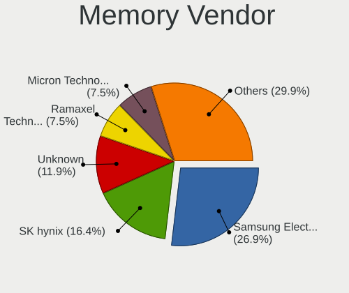

| Vendor              | Notebooks | Percent |
|---------------------|-----------|---------|
| Samsung Electronics | 18        | 26.87%  |
| SK hynix            | 11        | 16.42%  |
| Unknown             | 8         | 11.94%  |
| Ramaxel Technology  | 5         | 7.46%   |
| Micron Technology   | 5         | 7.46%   |
| Kingston            | 4         | 5.97%   |
| Crucial             | 3         | 4.48%   |
| Unknown             | 3         | 4.48%   |
| G.Skill             | 2         | 2.99%   |
| Elpida              | 2         | 2.99%   |
| SHARETRONIC         | 1         | 1.49%   |
| Patriot             | 1         | 1.49%   |
| Nanya Technology    | 1         | 1.49%   |
| ASint Technology    | 1         | 1.49%   |
| A-DATA Technology   | 1         | 1.49%   |
| 48spaces            | 1         | 1.49%   |

Memory Model
------------

Memory module models

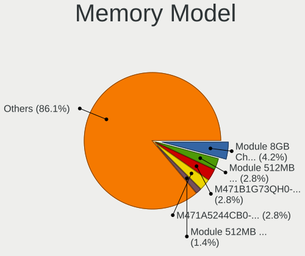

| Model                                                       | Notebooks | Percent |
|-------------------------------------------------------------|-----------|---------|
| Unknown                                                     | 3         | 4.17%   |
| Unknown RAM Module 512MB SODIMM DDR2 533MT/s                | 2         | 2.78%   |
| Samsung RAM M471B1G73QH0-YK0 8GB SODIMM DDR3 1867MT/s       | 2         | 2.78%   |
| Samsung RAM M471A5244CB0-CRC 4GB SODIMM DDR4 2400MT/s       | 2         | 2.78%   |
| Unknown RAM Module 512MB SODIMM SDRAM                       | 1         | 1.39%   |
| Unknown RAM Module 512MB SODIMM DRAM 166MT/s                | 1         | 1.39%   |
| Unknown RAM Module 4GB SODIMM DDR3 1333MT/s                 | 1         | 1.39%   |
| Unknown RAM Module 2GB SODIMM DDR3 1333MT/s                 | 1         | 1.39%   |
| Unknown RAM Module 2GB SODIMM DDR3                          | 1         | 1.39%   |
| Unknown RAM Module 256MB SODIMM DDR                         | 1         | 1.39%   |
| Unknown RAM Module 1024MB SODIMM SDRAM 266MT/s              | 1         | 1.39%   |
| SK hynix RAM Module 16GB SODIMM DDR4 2667MT/s               | 1         | 1.39%   |
| SK hynix RAM HMT41GS6BFR8A-PB 8GB SODIMM DDR3 1600MT/s      | 1         | 1.39%   |
| SK hynix RAM HMT351S6CFR8C-PB 4GB SODIMM DDR3 1600MT/s      | 1         | 1.39%   |
| SK hynix RAM HMT351S6BFR8C-H9 4GB SODIMM DDR3 1334MT/s      | 1         | 1.39%   |
| SK hynix RAM HMT351S6BFR8C-H9 4GB SODIMM DDR3 1333MT/s      | 1         | 1.39%   |
| SK hynix RAM HMT325S6EFR8A-PB 2GB SODIMM DDR3 1600MT/s      | 1         | 1.39%   |
| SK hynix RAM HMT325S6BFR8C-H9 2GB SODIMM DDR3 1333MT/s      | 1         | 1.39%   |
| SK hynix RAM HMT125S6TFR8C-G7 2GB SODIMM DDR3 1066MT/s      | 1         | 1.39%   |
| SK hynix RAM HMAA1GS6CJR6N-XN 8GB SODIMM DDR4 3200MT/s      | 1         | 1.39%   |
| SK hynix RAM HMA81GS6CJR8N-VK 8GB SODIMM DDR4 2667MT/s      | 1         | 1.39%   |
| SK hynix RAM HMA81GS6AFR8N-UH 8GB SODIMM DDR4 2400MT/s      | 1         | 1.39%   |
| SHARETRONIC RAM Module 2048MB SODIMM DDR3 1600MT/s          | 1         | 1.39%   |
| Samsung RAM Module 8GB SODIMM DDR3 1600MT/s                 | 1         | 1.39%   |
| Samsung RAM Module 4GB SODIMM DDR4 2400MT/s                 | 1         | 1.39%   |
| Samsung RAM Module 4GB Row Of Chips LPDDR3 2133MT/s         | 1         | 1.39%   |
| Samsung RAM Module 2GB SODIMM LPDDR3 1867MT/s               | 1         | 1.39%   |
| Samsung RAM Module 2GB SODIMM DDR3 1333MT/s                 | 1         | 1.39%   |
| Samsung RAM M471B5674EB0-YK0 2GB SODIMM DDR3 1600MT/s       | 1         | 1.39%   |
| Samsung RAM M471B5673FH0-CF8 2GB SODIMM DDR3 1067MT/s       | 1         | 1.39%   |
| Samsung RAM M471B5173DB0-YK0 4GB SODIMM DDR3 1600MT/s       | 1         | 1.39%   |
| Samsung RAM M471A5644EB0-CRC 2GB SODIMM DDR4 2400MT/s       | 1         | 1.39%   |
| Samsung RAM M471A5244CB0-CTD 4GB SODIMM DDR4 3200MT/s       | 1         | 1.39%   |
| Samsung RAM M471A5244BB0-CRC 4GB Row Of Chips DDR4 2400MT/s | 1         | 1.39%   |
| Samsung RAM M471A2K43DB1-CWE 16GB SODIMM DDR4 3200MT/s      | 1         | 1.39%   |
| Samsung RAM M471A2K43DB1-CTD 16GB SODIMM DDR4 2667MT/s      | 1         | 1.39%   |
| Samsung RAM M471A2K43CB1-CTD 16GB SODIMM DDR4 2667MT/s      | 1         | 1.39%   |
| Samsung RAM M471A2K43BB1-CPB 16GB SODIMM DDR4 2133MT/s      | 1         | 1.39%   |
| Samsung RAM M471A1K43BB1-CRC 8GB SODIMM DDR4 2400MT/s       | 1         | 1.39%   |
| Samsung RAM M425R6GA3PB0-CWMOD 48GB SODIMM DDR5 5600MT/s    | 1         | 1.39%   |

Memory Kind
-----------

Memory module kinds

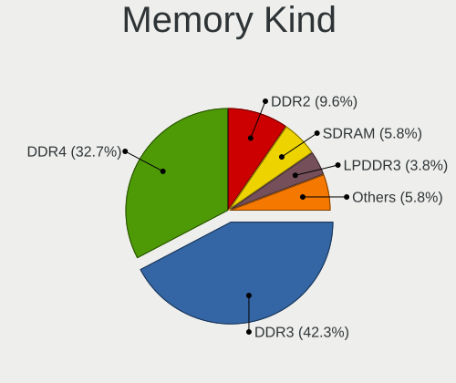

| Kind   | Notebooks | Percent |
|--------|-----------|---------|
| DDR3   | 22        | 42.31%  |
| DDR4   | 17        | 32.69%  |
| DDR2   | 5         | 9.62%   |
| SDRAM  | 3         | 5.77%   |
| LPDDR3 | 2         | 3.85%   |
| DRAM   | 1         | 1.92%   |
| DDR5   | 1         | 1.92%   |
| DDR    | 1         | 1.92%   |

Memory Form Factor
------------------

Physical design of the memory module

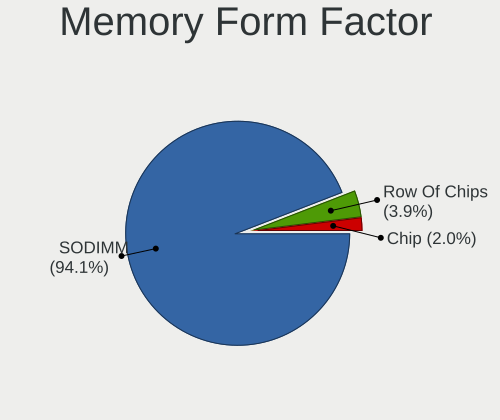

| Name         | Notebooks | Percent |
|--------------|-----------|---------|
| SODIMM       | 48        | 94.12%  |
| Row Of Chips | 2         | 3.92%   |
| Chip         | 1         | 1.96%   |

Memory Size
-----------

Memory module size

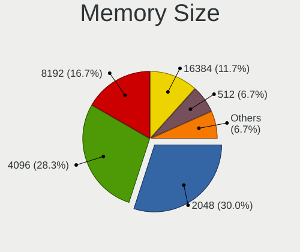

| Size  | Notebooks | Percent |
|-------|-----------|---------|
| 2048  | 18        | 30%     |
| 4096  | 17        | 28.33%  |
| 8192  | 10        | 16.67%  |
| 16384 | 7         | 11.67%  |
| 512   | 4         | 6.67%   |
| 1024  | 2         | 3.33%   |
| 49152 | 1         | 1.67%   |
| 256   | 1         | 1.67%   |

Memory Speed
------------

Memory module speed

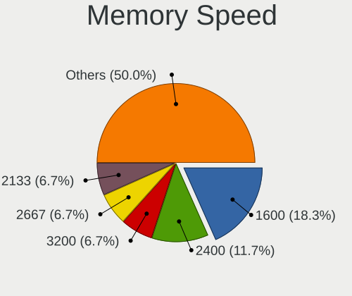

| Speed   | Notebooks | Percent |
|---------|-----------|---------|
| 1600    | 11        | 18.33%  |
| 2400    | 7         | 11.67%  |
| 3200    | 4         | 6.67%   |
| 2667    | 4         | 6.67%   |
| 2133    | 4         | 6.67%   |
| 1334    | 4         | 6.67%   |
| 1333    | 4         | 6.67%   |
| 1067    | 4         | 6.67%   |
| Unknown | 4         | 6.67%   |
| 1867    | 3         | 5%      |
| 533     | 3         | 5%      |
| 1066    | 2         | 3.33%   |
| 5600    | 1         | 1.67%   |
| 1200    | 1         | 1.67%   |
| 800     | 1         | 1.67%   |
| 667     | 1         | 1.67%   |
| 266     | 1         | 1.67%   |
| 166     | 1         | 1.67%   |

Printers & scanners
-------------------

Printer Vendor
--------------

Printer device vendors

Zero info for selected period =(

Printer Model
-------------

Printer device models

Zero info for selected period =(

Scanner Vendor
--------------

Scanner device vendors

Zero info for selected period =(

Scanner Model
-------------

Scanner device models

Zero info for selected period =(

Camera
------

Camera Vendor
-------------

Camera device vendors

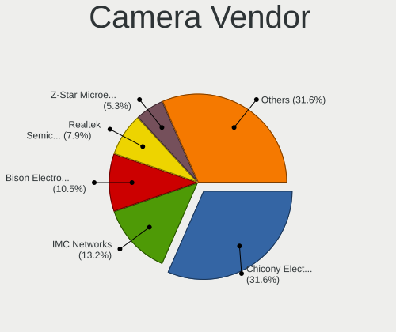

| Vendor                        | Notebooks | Percent |
|-------------------------------|-----------|---------|
| Chicony Electronics           | 12        | 31.58%  |
| IMC Networks                  | 5         | 13.16%  |
| Bison Electronics             | 4         | 10.53%  |
| Realtek Semiconductor         | 3         | 7.89%   |
| Z-Star Microelectronics       | 2         | 5.26%   |
| Lenovo                        | 2         | 5.26%   |
| ALi                           | 2         | 5.26%   |
| Syntek                        | 1         | 2.63%   |
| Suyin                         | 1         | 2.63%   |
| Sunplus Innovation Technology | 1         | 2.63%   |
| Silicon Motion                | 1         | 2.63%   |
| Quanta                        | 1         | 2.63%   |
| Microdia                      | 1         | 2.63%   |
| Lite-On Technology            | 1         | 2.63%   |
| Apple                         | 1         | 2.63%   |

Camera Model
------------

Camera device models

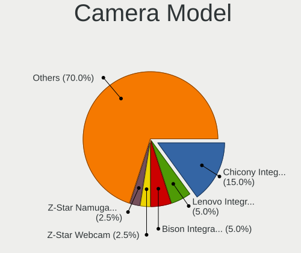

| Model                                    | Notebooks | Percent |
|------------------------------------------|-----------|---------|
| Chicony Integrated Camera                | 6         | 15%     |
| Lenovo Integrated Webcam [R5U877]        | 2         | 5%      |
| Bison Integrated Camera                  | 2         | 5%      |
| Z-Star Webcam                            | 1         | 2.5%    |
| Z-Star Namuga 1.3M Webcam                | 1         | 2.5%    |
| Syntek Lenovo EasyCamera                 | 1         | 2.5%    |
| Suyin Acer Crystal Eye webcam            | 1         | 2.5%    |
| Sunplus Integrated Camera                | 1         | 2.5%    |
| Silicon Motion Realtek USB 2.0 PC Camera | 1         | 2.5%    |
| Realtek USB Camera                       | 1         | 2.5%    |
| Realtek USB 2.0 PC Camera                | 1         | 2.5%    |
| Realtek Acer 640 x 480 laptop camera     | 1         | 2.5%    |
| Quanta VGA WebCam                        | 1         | 2.5%    |
| Microdia Integrated_Webcam_HD            | 1         | 2.5%    |
| Lite-On Integrated Camera                | 1         | 2.5%    |
| IMC Networks USB2.0 UVC VGA WebCam       | 1         | 2.5%    |
| IMC Networks TOSHIBA Web Camera - HD     | 1         | 2.5%    |
| IMC Networks Realtek PC Camera           | 1         | 2.5%    |
| IMC Networks EasyCamera                  | 1         | 2.5%    |
| IMC Networks ASUS USB 2.0 UVC VGA WebCam | 1         | 2.5%    |
| Chicony XiaoMi USB 2.0 Webcam            | 1         | 2.5%    |
| Chicony Thinkpad T430 camera             | 1         | 2.5%    |
| Chicony Integrated IR Camera             | 1         | 2.5%    |
| Chicony Integrated Camera [ThinkPad]     | 1         | 2.5%    |
| Chicony Integrated Camera (1280x720@30)  | 1         | 2.5%    |
| Chicony Front Camera                     | 1         | 2.5%    |
| Chicony 8M Camera                        | 1         | 2.5%    |
| Chicony 720p HD Camera                   | 1         | 2.5%    |
| Bison ThinkPad P50 Integrated Camera     | 1         | 2.5%    |
| Bison ThinkPad Integrated Camera         | 1         | 2.5%    |
| Apple FaceTime HD Camera                 | 1         | 2.5%    |
| ALi WebCam                               | 1         | 2.5%    |
| ALi Gateway Webcam                       | 1         | 2.5%    |

Security
--------

Fingerprint Vendor
------------------

Fingerprint sensor vendors

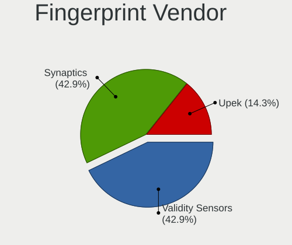

| Vendor           | Notebooks | Percent |
|------------------|-----------|---------|
| Validity Sensors | 3         | 42.86%  |
| Synaptics        | 3         | 42.86%  |
| Upek             | 1         | 14.29%  |

Fingerprint Model
-----------------

Fingerprint sensor models

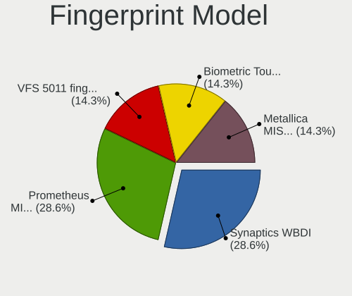

| Model                                                  | Notebooks | Percent |
|--------------------------------------------------------|-----------|---------|
| Validity Sensors Synaptics WBDI                        | 2         | 28.57%  |
| Synaptics Prometheus MIS Touch Fingerprint Reader      | 2         | 28.57%  |
| Validity Sensors VFS 5011 fingerprint sensor           | 1         | 14.29%  |
| Upek Biometric Touchchip/Touchstrip Fingerprint Sensor | 1         | 14.29%  |
| Synaptics Metallica MIS Touch Fingerprint Reader       | 1         | 14.29%  |

Chipcard Vendor
---------------

Chipcard module vendors

Zero info for selected period =(

Chipcard Model
--------------

Chipcard module models

Zero info for selected period =(

Unsupported
-----------

Unsupported Devices
-------------------

Total unsupported devices on board

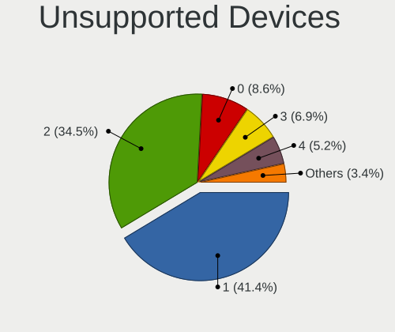

| Total | Notebooks | Percent |
|-------|-----------|---------|
| 1     | 24        | 41.38%  |
| 2     | 20        | 34.48%  |
| 0     | 5         | 8.62%   |
| 3     | 4         | 6.9%    |
| 4     | 3         | 5.17%   |
| 5     | 2         | 3.45%   |

Unsupported Device Types
------------------------

Types of unsupported devices

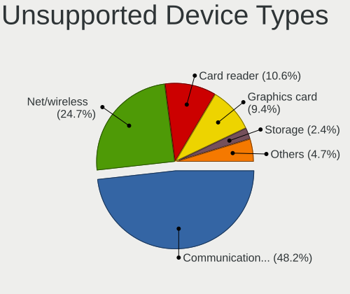

| Type                     | Notebooks | Percent |
|--------------------------|-----------|---------|
| Communication controller | 41        | 48.24%  |
| Net/wireless             | 21        | 24.71%  |
| Card reader              | 9         | 10.59%  |
| Graphics card            | 8         | 9.41%   |
| Storage                  | 2         | 2.35%   |
| Sound                    | 1         | 1.18%   |
| Net/ethernet             | 1         | 1.18%   |
| Modem                    | 1         | 1.18%   |
| Bluetooth                | 1         | 1.18%   |

