NetBSD - Tested Hardware & Statistics (Notebooks)
-------------------------------------------------

A project to collect tested hardware configurations for NetBSD.

Anyone can contribute to this report by the [hw-probe](https://github.com/linuxhw/hw-probe/blob/master/INSTALL.BSD.md) tool:

    hw-probe -all -upload

Please contribute! Especially if your hardware is rare.

Contents
--------

* [ Test Cases ](#test-cases)

* [ System ](#system)
  - [ OS                       ](#os)
  - [ OS Family                ](#os-family)
  - [ Arch                     ](#arch)
  - [ DE                       ](#de)
  - [ Display Server           ](#display-server)
  - [ Display Manager          ](#display-manager)
  - [ OS Lang                  ](#os-lang)
  - [ Boot Mode                ](#boot-mode)
  - [ Filesystem               ](#filesystem)
  - [ Part. scheme             ](#part-scheme)

* [ Board ](#board)
  - [ Vendor                   ](#vendor)
  - [ Model                    ](#model)
  - [ Model Family             ](#model-family)
  - [ MFG Year                 ](#mfg-year)
  - [ Form Factor              ](#form-factor)
  - [ Coreboot                 ](#coreboot)
  - [ RAM Size                 ](#ram-size)
  - [ RAM Used                 ](#ram-used)
  - [ Total Drives             ](#total-drives)
  - [ Has CD-ROM               ](#has-cd-rom)
  - [ Has Ethernet             ](#has-ethernet)
  - [ Has WiFi                 ](#has-wifi)
  - [ Has Bluetooth            ](#has-bluetooth)

* [ Location ](#location)
  - [ Country                  ](#country)
  - [ City                     ](#city)

* [ Drives ](#drives)
  - [ Drive Vendor             ](#drive-vendor)
  - [ Drive Model              ](#drive-model)
  - [ HDD Vendor               ](#hdd-vendor)
  - [ SSD Vendor               ](#ssd-vendor)
  - [ Drive Kind               ](#drive-kind)
  - [ Drive Connector          ](#drive-connector)
  - [ Drive Size               ](#drive-size)
  - [ Space Total              ](#space-total)
  - [ Space Used               ](#space-used)
  - [ Malfunc. Drives          ](#malfunc-drives)
  - [ Malfunc. Drive Vendor    ](#malfunc-drive-vendor)
  - [ Malfunc. HDD Vendor      ](#malfunc-hdd-vendor)
  - [ Malfunc. Drive Kind      ](#malfunc-drive-kind)
  - [ Failed Drives            ](#failed-drives)
  - [ Failed Drive Vendor      ](#failed-drive-vendor)
  - [ Drive Status             ](#drive-status)

* [ Storage controller ](#storage-controller)
  - [ Storage Vendor           ](#storage-vendor)
  - [ Storage Model            ](#storage-model)
  - [ Storage Kind             ](#storage-kind)

* [ Processor ](#processor)
  - [ CPU Vendor               ](#cpu-vendor)
  - [ CPU Model                ](#cpu-model)
  - [ CPU Model Family         ](#cpu-model-family)
  - [ CPU Cores                ](#cpu-cores)
  - [ CPU Sockets              ](#cpu-sockets)
  - [ CPU Threads              ](#cpu-threads)
  - [ CPU Microarch            ](#cpu-microarch)

* [ Graphics ](#graphics)
  - [ GPU Vendor               ](#gpu-vendor)
  - [ GPU Model                ](#gpu-model)
  - [ GPU Combo                ](#gpu-combo)
  - [ GPU Driver               ](#gpu-driver)
  - [ GPU Memory               ](#gpu-memory)

* [ Monitor ](#monitor)
  - [ Monitor Vendor           ](#monitor-vendor)
  - [ Monitor Model            ](#monitor-model)
  - [ Monitor Resolution       ](#monitor-resolution)
  - [ Monitor Diagonal         ](#monitor-diagonal)
  - [ Monitor Width            ](#monitor-width)
  - [ Aspect Ratio             ](#aspect-ratio)
  - [ Monitor Area             ](#monitor-area)
  - [ Pixel Density            ](#pixel-density)
  - [ Multiple Monitors        ](#multiple-monitors)

* [ Network ](#network)
  - [ Net Controller Vendor    ](#net-controller-vendor)
  - [ Net Controller Model     ](#net-controller-model)
  - [ Wireless Vendor          ](#wireless-vendor)
  - [ Wireless Model           ](#wireless-model)
  - [ Ethernet Vendor          ](#ethernet-vendor)
  - [ Ethernet Model           ](#ethernet-model)
  - [ Net Controller Kind      ](#net-controller-kind)
  - [ Used Controller          ](#used-controller)
  - [ NICs                     ](#nics)
  - [ IPv6                     ](#ipv6)

* [ Bluetooth ](#bluetooth)
  - [ Bluetooth Vendor         ](#bluetooth-vendor)
  - [ Bluetooth Model          ](#bluetooth-model)

* [ Sound ](#sound)
  - [ Sound Vendor             ](#sound-vendor)
  - [ Sound Model              ](#sound-model)

* [ Memory ](#memory)
  - [ Memory Vendor            ](#memory-vendor)
  - [ Memory Model             ](#memory-model)
  - [ Memory Kind              ](#memory-kind)
  - [ Memory Form Factor       ](#memory-form-factor)
  - [ Memory Size              ](#memory-size)
  - [ Memory Speed             ](#memory-speed)

* [ Printers & scanners ](#printers--scanners)
  - [ Printer Vendor           ](#printer-vendor)
  - [ Printer Model            ](#printer-model)
  - [ Scanner Vendor           ](#scanner-vendor)
  - [ Scanner Model            ](#scanner-model)

* [ Camera ](#camera)
  - [ Camera Vendor            ](#camera-vendor)
  - [ Camera Model             ](#camera-model)

* [ Security ](#security)
  - [ Fingerprint Vendor       ](#fingerprint-vendor)
  - [ Fingerprint Model        ](#fingerprint-model)
  - [ Chipcard Vendor          ](#chipcard-vendor)
  - [ Chipcard Model           ](#chipcard-model)

* [ Unsupported ](#unsupported)
  - [ Unsupported Devices      ](#unsupported-devices)
  - [ Unsupported Device Types ](#unsupported-device-types)

Test Cases
----------

Total: 22

| Vendor        | Model                    | Probe                                                     | Date         |
|---------------|--------------------------|-----------------------------------------------------------|--------------|
| Dell          | Precision M4500          | [ab63467f38](https://bsd-hardware.info/?probe=ab63467f38) | Nov 03, 2022 |
| ASUSTek       | X555LJ                   | [6bf51cc915](https://bsd-hardware.info/?probe=6bf51cc915) | Mar 28, 2022 |
| Acer          | Aspire A114-33           | [57765224eb](https://bsd-hardware.info/?probe=57765224eb) | Mar 18, 2022 |
| MiTAC         | 5033                     | [54df5c9e9e](https://bsd-hardware.info/?probe=54df5c9e9e) | Feb 10, 2022 |
| Lenovo        | ThinkPad T420 4236D26    | [5c64875424](https://bsd-hardware.info/?probe=5c64875424) | Oct 12, 2021 |
| ASUSTek       | X555LJ                   | [81dd2ba2f0](https://bsd-hardware.info/?probe=81dd2ba2f0) | Oct 02, 2021 |
| Toshiba       | Satellite A100           | [9ccf97d62c](https://bsd-hardware.info/?probe=9ccf97d62c) | Sep 05, 2021 |
| Sony          | SVF1421DSGW              | [abadb65058](https://bsd-hardware.info/?probe=abadb65058) | Jun 01, 2021 |
| Apple         | MacBook2,1               | [360f29bf3b](https://bsd-hardware.info/?probe=360f29bf3b) | Mar 05, 2021 |
| Apple         | MacBook2,1               | [f6e7638f87](https://bsd-hardware.info/?probe=f6e7638f87) | Mar 05, 2021 |
| IBM           | ThinkPad R51 2887AVG     | [289177c624](https://bsd-hardware.info/?probe=289177c624) | Jan 02, 2021 |
| IBM           | ThinkPad R51 2887AVG     | [88d4fc2693](https://bsd-hardware.info/?probe=88d4fc2693) | Dec 30, 2020 |
| Lenovo        | ThinkPad T430s 23564H3   | [eda02dc46b](https://bsd-hardware.info/?probe=eda02dc46b) | Dec 25, 2020 |
| Fujitsu Si... | AMILO L7310              | [0603b64315](https://bsd-hardware.info/?probe=0603b64315) | Dec 25, 2020 |
| Acer          | Aspire ES1-132           | [a4e45f3551](https://bsd-hardware.info/?probe=a4e45f3551) | Oct 22, 2020 |
| Lenovo        | ThinkPad T510 4313CTO    | [7f6095b266](https://bsd-hardware.info/?probe=7f6095b266) | Aug 20, 2020 |
| eMachines     | eME642G                  | [42027dfbb9](https://bsd-hardware.info/?probe=42027dfbb9) | Jul 25, 2020 |
| Lenovo        | G500 20236               | [99cf14c489](https://bsd-hardware.info/?probe=99cf14c489) | Jun 03, 2020 |
| Lenovo        | ThinkPad X240 20AMS0J01N | [4df07718d1](https://bsd-hardware.info/?probe=4df07718d1) | May 23, 2020 |
| Lenovo        | G570 20079               | [3258f01592](https://bsd-hardware.info/?probe=3258f01592) | May 16, 2020 |
| ASUSTek       | A3L                      | [6b65fcf9c1](https://bsd-hardware.info/?probe=6b65fcf9c1) | May 15, 2020 |
| Lenovo        | G570 20079               | [cd45078232](https://bsd-hardware.info/?probe=cd45078232) | May 05, 2020 |

System
------

OS
--

Installed operating systems

| Name              | Notebooks | Percent |
|-------------------|-----------|---------|
| NetBSD 9.2        | 5         | 27.78%  |
| NetBSD 9.1        | 4         | 22.22%  |
| NetBSD 9.0        | 3         | 16.67%  |
| NetBSD 9.99.94    | 1         | 5.56%   |
| NetBSD 9.3        | 1         | 5.56%   |
| NetBSD 9.2_STABLE | 1         | 5.56%   |
| NetBSD 9.0_STABLE | 1         | 5.56%   |
| NetBSD 8.99.51    | 1         | 5.56%   |
| NetBSD 7.2        | 1         | 5.56%   |

OS Family
---------

OS without a version

| Name   | Notebooks | Percent |
|--------|-----------|---------|
| NetBSD | 17        | 100%    |

Arch
----

OS architecture (x86_64, i586, etc.)

| Name  | Notebooks | Percent |
|-------|-----------|---------|
| amd64 | 12        | 70.59%  |
| i386  | 5         | 29.41%  |

DE
--

Desktop Environment

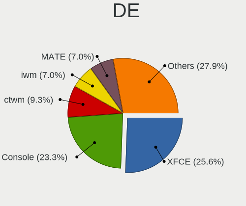

| Name         | Notebooks | Percent |
|--------------|-----------|---------|
| Console      | 6         | 33.33%  |
| XFCE         | 4         | 22.22%  |
| Fluxbox      | 2         | 11.11%  |
| ctwm         | 2         | 11.11%  |
| MATE         | 1         | 5.56%   |
| helloDesktop | 1         | 5.56%   |
| DWM          | 1         | 5.56%   |
| Awesome      | 1         | 5.56%   |

Display Server
--------------

X11 or Wayland

| Name    | Notebooks | Percent |
|---------|-----------|---------|
| X11     | 14        | 82.35%  |
| Console | 3         | 17.65%  |

Display Manager
---------------

SDDM, LightDM, etc.

| Name    | Notebooks | Percent |
|---------|-----------|---------|
| Console | 15        | 88.24%  |
| XDM     | 1         | 5.88%   |
| GDM     | 1         | 5.88%   |

OS Lang
-------

Language

| Lang    | Notebooks | Percent |
|---------|-----------|---------|
| Unknown | 12        | 70.59%  |
| en_US   | 4         | 23.53%  |
| ru_RU   | 1         | 5.88%   |

Boot Mode
---------

EFI or BIOS

| Mode | Notebooks | Percent |
|------|-----------|---------|
| BIOS | 17        | 100%    |

Filesystem
----------

Type of filesystem

| Type | Notebooks | Percent |
|------|-----------|---------|
| Ufs  | 17        | 100%    |

Part. scheme
------------

Scheme of partitioning

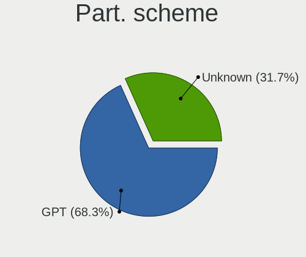

| Type    | Notebooks | Percent |
|---------|-----------|---------|
| Unknown | 10        | 58.82%  |
| GPT     | 7         | 41.18%  |

Board
-----

Vendor
------

Motherboard manufacturer

| Name             | Notebooks | Percent |
|------------------|-----------|---------|
| Lenovo           | 5         | 29.41%  |
| ASUSTek Computer | 2         | 11.76%  |
| Acer             | 2         | 11.76%  |
| Toshiba          | 1         | 5.88%   |
| Sony             | 1         | 5.88%   |
| MiTAC            | 1         | 5.88%   |
| IBM              | 1         | 5.88%   |
| Fujitsu Siemens  | 1         | 5.88%   |
| eMachines        | 1         | 5.88%   |
| Dell             | 1         | 5.88%   |
| Apple            | 1         | 5.88%   |

Model
-----

Motherboard model

| Name                            | Notebooks | Percent |
|---------------------------------|-----------|---------|
| Toshiba Satellite A100          | 1         | 5.88%   |
| Sony SVF1421DSGW                | 1         | 5.88%   |
| MiTAC 5033                      | 1         | 5.88%   |
| Lenovo ThinkPad X240 20AMS0J01N | 1         | 5.88%   |
| Lenovo ThinkPad T510 4313CTO    | 1         | 5.88%   |
| Lenovo ThinkPad T430s 23564H3   | 1         | 5.88%   |
| Lenovo ThinkPad T420 4236D26    | 1         | 5.88%   |
| Lenovo G500 20236               | 1         | 5.88%   |
| IBM ThinkPad R51 2887AVG        | 1         | 5.88%   |
| Fujitsu Siemens AMILO L7310     | 1         | 5.88%   |
| eMachines eME642G               | 1         | 5.88%   |
| Dell Precision M4500            | 1         | 5.88%   |
| ASUS X555LJ                     | 1         | 5.88%   |
| ASUS A3L                        | 1         | 5.88%   |
| Apple MacBook2,1                | 1         | 5.88%   |
| Acer Aspire ES1-132             | 1         | 5.88%   |
| Acer Aspire A114-33             | 1         | 5.88%   |

Model Family
------------

Motherboard model prefix

| Name                  | Notebooks | Percent |
|-----------------------|-----------|---------|
| Lenovo ThinkPad       | 4         | 23.53%  |
| Acer Aspire           | 2         | 11.76%  |
| Toshiba Satellite     | 1         | 5.88%   |
| Sony SVF1421DSGW      | 1         | 5.88%   |
| MiTAC 5033            | 1         | 5.88%   |
| Lenovo G500           | 1         | 5.88%   |
| IBM ThinkPad          | 1         | 5.88%   |
| Fujitsu Siemens AMILO | 1         | 5.88%   |
| eMachines eME642G     | 1         | 5.88%   |
| Dell Precision        | 1         | 5.88%   |
| ASUS X555LJ           | 1         | 5.88%   |
| ASUS A3L              | 1         | 5.88%   |
| Apple MacBook2        | 1         | 5.88%   |

MFG Year
--------

Motherboard manufacture year

| Year    | Notebooks | Percent |
|---------|-----------|---------|
| 2013    | 4         | 23.53%  |
| 2011    | 2         | 11.76%  |
| 2010    | 2         | 11.76%  |
| 2005    | 2         | 11.76%  |
| 2021    | 1         | 5.88%   |
| 2019    | 1         | 5.88%   |
| 2017    | 1         | 5.88%   |
| 2016    | 1         | 5.88%   |
| 2007    | 1         | 5.88%   |
| 2006    | 1         | 5.88%   |
| Unknown | 1         | 5.88%   |

Form Factor
-----------

Physical design of the computer

| Name     | Notebooks | Percent |
|----------|-----------|---------|
| Notebook | 17        | 100%    |

Coreboot
--------

Have coreboot on board

| Used | Notebooks | Percent |
|------|-----------|---------|
| No   | 16        | 94.12%  |
| Yes  | 1         | 5.88%   |

RAM Size
--------

Total RAM memory

| Size in GB | Notebooks | Percent |
|------------|-----------|---------|
| 4.01-8.0   | 6         | 35.29%  |
| 3.01-4.0   | 5         | 29.41%  |
| 0.51-1.0   | 2         | 11.76%  |
| 1.01-2.0   | 1         | 5.88%   |
| 8.01-16.0  | 1         | 5.88%   |
| 0.01-0.5   | 1         | 5.88%   |
| 0          | 1         | 5.88%   |

RAM Used
--------

Used RAM memory

| Used GB | Notebooks | Percent |
|---------|-----------|---------|
| Unknown | 17        | 100%    |

Total Drives
------------

Number of drives on board

| Drives | Notebooks | Percent |
|--------|-----------|---------|
| 1      | 12        | 70.59%  |
| 0      | 5         | 29.41%  |

Has CD-ROM
----------

Has CD-ROM on board

| Presented | Notebooks | Percent |
|-----------|-----------|---------|
| No        | 15        | 88.24%  |
| Yes       | 2         | 11.76%  |

Has Ethernet
------------

Has Ethernet on board

| Presented | Notebooks | Percent |
|-----------|-----------|---------|
| Yes       | 15        | 88.24%  |
| No        | 2         | 11.76%  |

Has WiFi
--------

Has WiFi module

| Presented | Notebooks | Percent |
|-----------|-----------|---------|
| Yes       | 16        | 94.12%  |
| No        | 1         | 5.88%   |

Has Bluetooth
-------------

Has Bluetooth module

| Presented | Notebooks | Percent |
|-----------|-----------|---------|
| No        | 9         | 52.94%  |
| Yes       | 8         | 47.06%  |

Location
--------

Country
-------

Geographic location (country)

| Country      | Notebooks | Percent |
|--------------|-----------|---------|
| Russia       | 3         | 17.65%  |
| Italy        | 3         | 17.65%  |
| Saudi Arabia | 2         | 11.76%  |
| Hungary      | 2         | 11.76%  |
| Vietnam      | 1         | 5.88%   |
| USA          | 1         | 5.88%   |
| India        | 1         | 5.88%   |
| Germany      | 1         | 5.88%   |
| France       | 1         | 5.88%   |
| Finland      | 1         | 5.88%   |
| Canada       | 1         | 5.88%   |

City
----

Geographic location (city)

| City             | Notebooks | Percent |
|------------------|-----------|---------|
| Rome             | 3         | 16.67%  |
| Riyadh           | 2         | 11.11%  |
| Moscow           | 2         | 11.11%  |
| Gardony          | 2         | 11.11%  |
| Washington       | 1         | 5.56%   |
| Turenki          | 1         | 5.56%   |
| Surrey           | 1         | 5.56%   |
| Ozersk           | 1         | 5.56%   |
| Ladbergen        | 1         | 5.56%   |
| Ho Chi Minh City | 1         | 5.56%   |
| Genzano di Roma  | 1         | 5.56%   |
| Carry-le-Rouet   | 1         | 5.56%   |
| Ahmedabad        | 1         | 5.56%   |

Drives
------

Drive Vendor
------------

Hard drive vendors

| Vendor              | Notebooks | Drives | Percent |
|---------------------|-----------|--------|---------|
| Intel               | 3         | 3      | 25%     |
| Seagate             | 2         | 2      | 16.67%  |
| Kingston            | 2         | 2      | 16.67%  |
| Hitachi             | 2         | 3      | 16.67%  |
| WDC                 | 1         | 1      | 8.33%   |
| Samsung Electronics | 1         | 1      | 8.33%   |
| HGST                | 1         | 1      | 8.33%   |

Drive Model
-----------

Hard drive models

| Model                           | Notebooks | Percent |
|---------------------------------|-----------|---------|
| WDC WD1600BEVT-00A23T0 160GB    | 1         | 8.33%   |
| Seagate ST500VT000-1DK142 500GB | 1         | 8.33%   |
| Seagate ST500LT012-9WS142 500GB | 1         | 8.33%   |
| Samsung HM080HC 80GB            | 1         | 8.33%   |
| Kingston SA400S37240G 240GB     | 1         | 8.33%   |
| Kingston SA400S37120G 120GB     | 1         | 8.33%   |
| Intel SSDSC2KW120H6 120GB       | 1         | 8.33%   |
| Intel SSDSC2CW120A3 120GB       | 1         | 8.33%   |
| Intel SSDSC2BF180A4L 180GB      | 1         | 8.33%   |
| Hitachi HTS721060G9AT00 64GB    | 1         | 8.33%   |
| Hitachi HTS548040M9AT00 37GB    | 1         | 8.33%   |
| HGST HTS545050A7E680 500GB      | 1         | 8.33%   |

HDD Vendor
----------

Hard disk drive vendors

| Vendor              | Notebooks | Drives | Percent |
|---------------------|-----------|--------|---------|
| Seagate             | 2         | 2      | 28.57%  |
| Hitachi             | 2         | 3      | 28.57%  |
| WDC                 | 1         | 1      | 14.29%  |
| Samsung Electronics | 1         | 1      | 14.29%  |
| HGST                | 1         | 1      | 14.29%  |

SSD Vendor
----------

Solid state drive vendors

| Vendor   | Notebooks | Drives | Percent |
|----------|-----------|--------|---------|
| Intel    | 3         | 3      | 60%     |
| Kingston | 2         | 2      | 40%     |

Drive Kind
----------

HDD or SSD

| Kind | Notebooks | Drives | Percent |
|------|-----------|--------|---------|
| HDD  | 7         | 8      | 58.33%  |
| SSD  | 5         | 5      | 41.67%  |

Drive Connector
---------------

SATA, SAS, NVMe, etc.

| Type | Notebooks | Drives | Percent |
|------|-----------|--------|---------|
| SATA | 12        | 13     | 100%    |

Drive Size
----------

Size of hard drive

| Size in TB | Notebooks | Drives | Percent |
|------------|-----------|--------|---------|
| 0.01-0.5   | 12        | 13     | 100%    |

Space Total
-----------

Amount of disk space available on the file system

| Size in GB | Notebooks | Percent |
|------------|-----------|---------|
| 101-250    | 6         | 35.29%  |
| 251-500    | 3         | 17.65%  |
| 51-100     | 3         | 17.65%  |
| 1-20       | 2         | 11.76%  |
| 501-1000   | 2         | 11.76%  |
| 21-50      | 1         | 5.88%   |

Space Used
----------

Amount of used disk space

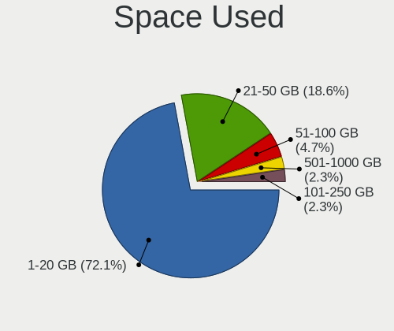

| Used GB | Notebooks | Percent |
|---------|-----------|---------|
| 1-20    | 12        | 66.67%  |
| 21-50   | 3         | 16.67%  |
| 51-100  | 2         | 11.11%  |
| 101-250 | 1         | 5.56%   |

Malfunc. Drives
---------------

Drive models with a malfunction

| Model                           | Notebooks | Drives | Percent |
|---------------------------------|-----------|--------|---------|
| Seagate ST500VT000-1DK142 500GB | 1         | 1      | 14.29%  |
| Seagate ST500LT012-9WS142 500GB | 1         | 1      | 14.29%  |
| Intel SSDSC2KW120H6 120GB       | 1         | 1      | 14.29%  |
| Intel SSDSC2CW120A3 120GB       | 1         | 1      | 14.29%  |
| Intel SSDSC2BF180A4L 180GB      | 1         | 1      | 14.29%  |
| Hitachi HTS721060G9AT00 64GB    | 1         | 1      | 14.29%  |
| Hitachi HTS548040M9AT00 37GB    | 1         | 2      | 14.29%  |

Malfunc. Drive Vendor
---------------------

Vendors of faulty drives

| Vendor  | Notebooks | Drives | Percent |
|---------|-----------|--------|---------|
| Intel   | 3         | 3      | 42.86%  |
| Seagate | 2         | 2      | 28.57%  |
| Hitachi | 2         | 3      | 28.57%  |

Malfunc. HDD Vendor
-------------------

Vendors of faulty HDD drives

| Vendor  | Notebooks | Drives | Percent |
|---------|-----------|--------|---------|
| Seagate | 2         | 2      | 50%     |
| Hitachi | 2         | 3      | 50%     |

Malfunc. Drive Kind
-------------------

Kinds of faulty drives

| Kind | Notebooks | Drives | Percent |
|------|-----------|--------|---------|
| HDD  | 4         | 5      | 57.14%  |
| SSD  | 3         | 3      | 42.86%  |

Failed Drives
-------------

Failed drive models

Zero info for selected period =(

Failed Drive Vendor
-------------------

Failed drive vendors

Zero info for selected period =(

Drive Status
------------

Number of failed and malfunc. drives

| Status   | Notebooks | Drives | Percent |
|----------|-----------|--------|---------|
| Malfunc  | 7         | 8      | 58.33%  |
| Works    | 4         | 4      | 33.33%  |
| Detected | 1         | 1      | 8.33%   |

Storage controller
------------------

Storage Vendor
--------------

Storage controller vendors

| Vendor           | Notebooks | Percent |
|------------------|-----------|---------|
| Intel            | 15        | 88.24%  |
| VIA Technologies | 1         | 5.88%   |
| AMD              | 1         | 5.88%   |

Storage Model
-------------

Storage controller models

| Model                                                                        | Notebooks | Percent |
|------------------------------------------------------------------------------|-----------|---------|
| Intel 7 Series Chipset Family 6-port SATA Controller [AHCI mode]             | 3         | 16.67%  |
| Intel 82801DBM (ICH4-M) IDE Controller                                       | 2         | 11.11%  |
| Intel 5 Series/3400 Series Chipset 6 port SATA AHCI Controller               | 2         | 11.11%  |
| VIA VT82C586A/B/VT82C686/A/B/VT823x/A/C PIPC Bus Master IDE                  | 1         | 5.56%   |
| Intel Wildcat Point-LP SATA Controller [AHCI Mode]                           | 1         | 5.56%   |
| Intel Jasper Lake SATA AHCI Controller                                       | 1         | 5.56%   |
| Intel Celeron N3350/Pentium N4200/Atom E3900 Series SATA AHCI Controller     | 1         | 5.56%   |
| Intel 82801GBM/GHM (ICH7-M Family) SATA Controller [IDE mode]                | 1         | 5.56%   |
| Intel 82801GBM/GHM (ICH7-M Family) SATA Controller [AHCI mode]               | 1         | 5.56%   |
| Intel 82801G (ICH7 Family) IDE Controller                                    | 1         | 5.56%   |
| Intel 82371AB/EB/MB PIIX4 IDE                                                | 1         | 5.56%   |
| Intel 8 Series SATA Controller 1 [AHCI mode]                                 | 1         | 5.56%   |
| Intel 6 Series/C200 Series Chipset Family 6 port Mobile SATA AHCI Controller | 1         | 5.56%   |
| AMD SB7x0/SB8x0/SB9x0 SATA Controller [AHCI mode]                            | 1         | 5.56%   |

Storage Kind
------------

Kind of storage controller (IDE, SATA, NVMe, SAS, ...)

| Kind | Notebooks | Percent |
|------|-----------|---------|
| SATA | 12        | 66.67%  |
| IDE  | 6         | 33.33%  |

Processor
---------

CPU Vendor
----------

Processor vendors

| Vendor       | Notebooks | Percent |
|--------------|-----------|---------|
| Intel        | 14        | 82.35%  |
| AMD          | 2         | 11.76%  |
| 123456789ABC | 1         | 5.88%   |

CPU Model
---------

Processor models

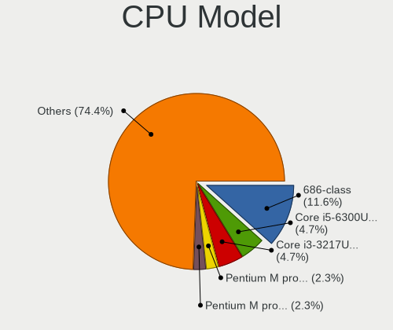

| Model                                  | Notebooks | Percent |
|----------------------------------------|-----------|---------|
| Intel 686-class                        | 3         | 16.67%  |
| Intel Pentium M processor 1.60GHz      | 1         | 5.56%   |
| Intel Pentium M processor              | 1         | 5.56%   |
| Intel Pentium CPU 2020M @ 2.40GHz      | 1         | 5.56%   |
| Intel Core i7-5500U CPU @ 2.40GHz      | 1         | 5.56%   |
| Intel Core i7-2640M CPU @ 2.80GHz      | 1         | 5.56%   |
| Intel Core i5-4300U CPU @ 1.90GHz      | 1         | 5.56%   |
| Intel Core i5-3320M CPU @ 2.60GHz      | 1         | 5.56%   |
| Intel Core i5 CPU M 560 @ 2.67GH       | 1         | 5.56%   |
| Intel Core i5 CPU M 540 @ 2.53GHz      | 1         | 5.56%   |
| Intel Core i3-3217U CPU @ 1.80GHz      | 1         | 5.56%   |
| Intel Core 2 CPU T7200 @ 2.00GHz       | 1         | 5.56%   |
| Intel Core 2 CPU T7                    | 1         | 5.56%   |
| AMD Tillamook                          | 1         | 5.56%   |
| AMD Athlon II P340 Dual-Core Processor | 1         | 5.56%   |
| 123456789ABC Pentium 4                 | 1         | 5.56%   |

CPU Model Family
----------------

Processor model prefix

| Model           | Notebooks | Percent |
|-----------------|-----------|---------|
| Intel Core i5   | 4         | 22.22%  |
| Intel 686-class | 3         | 16.67%  |
| Other           | 2         | 11.11%  |
| Intel Pentium M | 2         | 11.11%  |
| Intel Core i7   | 2         | 11.11%  |
| Intel Core 2    | 2         | 11.11%  |
| Intel Pentium   | 1         | 5.56%   |
| Intel Core i3   | 1         | 5.56%   |
| AMD Athlon II   | 1         | 5.56%   |

CPU Cores
---------

Number of processor cores

| Number  | Notebooks | Percent |
|---------|-----------|---------|
| 2       | 9         | 50%     |
| Unknown | 9         | 50%     |

CPU Sockets
-----------

Number of sockets

| Number  | Notebooks | Percent |
|---------|-----------|---------|
| 1       | 15        | 83.33%  |
| Unknown | 3         | 16.67%  |

CPU Threads
-----------

Threads per core (Hyper-Threading)

| Number  | Notebooks | Percent |
|---------|-----------|---------|
| Unknown | 9         | 50%     |
| 2       | 6         | 33.33%  |
| 1       | 3         | 16.67%  |

CPU Microarch
-------------

Microarchitecture

| Name        | Notebooks | Percent |
|-------------|-----------|---------|
| Unknown     | 5         | 27.78%  |
| IvyBridge   | 3         | 16.67%  |
| P6          | 2         | 11.11%  |
| Core        | 2         | 11.11%  |
| Westmere    | 1         | 5.56%   |
| SandyBridge | 1         | 5.56%   |
| K10         | 1         | 5.56%   |
| Haswell     | 1         | 5.56%   |
| Geode       | 1         | 5.56%   |
| Broadwell   | 1         | 5.56%   |

Graphics
--------

GPU Vendor
----------

Vendors of graphics cards

| Vendor               | Notebooks | Percent |
|----------------------|-----------|---------|
| Intel                | 12        | 66.67%  |
| Nvidia               | 3         | 16.67%  |
| VIA Technologies     | 1         | 5.56%   |
| Trident Microsystems | 1         | 5.56%   |
| AMD                  | 1         | 5.56%   |

GPU Model
---------

Graphics card models

| Model                                                                         | Notebooks | Percent |
|-------------------------------------------------------------------------------|-----------|---------|
| Intel 3rd Gen Core processor Graphics Controller                              | 3         | 15%     |
| Intel Mobile 945GM/GMS/GME, 943/940GML Express Integrated Graphics Controller | 2         | 10%     |
| Intel Mobile 945GM/GMS, 943/940GML Express Integrated Graphics Controller     | 2         | 10%     |
| Intel 82852/855GM Integrated Graphics Device                                  | 2         | 10%     |
| VIA Technologies CN400/PM800/PM880/PN800/PN880 [S3 UniChrome Pro]             | 1         | 5%      |
| Trident Microsystems TGUI 9660/938x/968x                                      | 1         | 5%      |
| Nvidia GT218M [NVS 3100M]                                                     | 1         | 5%      |
| Nvidia GT216GLM [Quadro FX 880M]                                              | 1         | 5%      |
| Nvidia GK208BM [GeForce 920M]                                                 | 1         | 5%      |
| Intel JasperLake [UHD Graphics]                                               | 1         | 5%      |
| Intel HD Graphics 5500                                                        | 1         | 5%      |
| Intel Haswell-ULT Integrated Graphics Controller                              | 1         | 5%      |
| Intel Apollo Lake [HD Graphics 505]                                           | 1         | 5%      |
| Intel 2nd Generation Core Processor Family Integrated Graphics Controller     | 1         | 5%      |
| AMD Park [Mobility Radeon HD 5430/5450/5470]                                  | 1         | 5%      |

GPU Combo
---------

Combinations of graphics cards

| Name                     | Notebooks | Percent |
|--------------------------|-----------|---------|
| 1 x Intel                | 9         | 52.94%  |
| 2 x Intel                | 2         | 11.76%  |
| 1 x Nvidia               | 2         | 11.76%  |
| 1 x VIA                  | 1         | 5.88%   |
| 1 x Trident Microsystems | 1         | 5.88%   |
| Intel + Nvidia           | 1         | 5.88%   |
| 1 x AMD                  | 1         | 5.88%   |

GPU Driver
----------

Free vs proprietary

| Driver  | Notebooks | Percent |
|---------|-----------|---------|
| Free    | 15        | 88.24%  |
| Unknown | 2         | 11.76%  |

GPU Memory
----------

Total video memory

| Size in GB | Notebooks | Percent |
|------------|-----------|---------|
| 0.01-0.5   | 6         | 35.29%  |
| 1.01-2.0   | 5         | 29.41%  |
| Unknown    | 4         | 23.53%  |
| 3.01-4.0   | 1         | 5.88%   |
| 0.51-1.0   | 1         | 5.88%   |

Monitor
-------

Monitor Vendor
--------------

Monitor vendors

| Vendor              | Notebooks | Percent |
|---------------------|-----------|---------|
| LG Display          | 4         | 40%     |
| Chimei Innolux      | 2         | 20%     |
| Samsung Electronics | 1         | 10%     |
| LG Philips          | 1         | 10%     |
| Lenovo              | 1         | 10%     |
| Apple               | 1         | 10%     |

Monitor Model
-------------

Monitor models

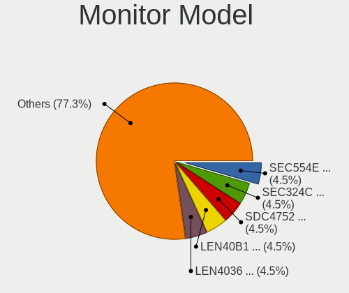

| Model                                                                | Notebooks | Percent |
|----------------------------------------------------------------------|-----------|---------|
| Samsung Electronics LCD Monitor SDC4752 1366x768 340x190mm 15.3-inch | 1         | 10%     |
| LG Philips LCD Monitor LPLDD00 1280x800 330x210mm 15.4-inch          | 1         | 10%     |
| LG Display LCD Monitor LGD40A0 1366x768 310x170mm 13.9-inch          | 1         | 10%     |
| LG Display LCD Monitor LGD03CD 1366x768 280x160mm 12.7-inch          | 1         | 10%     |
| LG Display LCD Monitor LGD0335 1366x768 310x170mm 13.9-inch          | 1         | 10%     |
| LG Display LCD Monitor LGD029E 1600x900 340x190mm 15.3-inch          | 1         | 10%     |
| Lenovo LCD Monitor LEN40B1 1600x900 350x190mm 15.7-inch              | 1         | 10%     |
| Chimei Innolux LCD Monitor CMN15AB 1366x768 340x190mm 15.3-inch      | 1         | 10%     |
| Chimei Innolux LCD Monitor CMN1472 1366x768 310x170mm 13.9-inch      | 1         | 10%     |
| Apple LCD Monitor APP9C5F 1280x800 290x180mm 13.4-inch               | 1         | 10%     |

Monitor Resolution
------------------

Monitor screen resolution

| Resolution      | Notebooks | Percent |
|-----------------|-----------|---------|
| 1366x768 (WXGA) | 6         | 60%     |
| 1600x900 (HD+)  | 2         | 20%     |
| 1280x800 (WXGA) | 2         | 20%     |

Monitor Diagonal
----------------

Diagonal size in inches

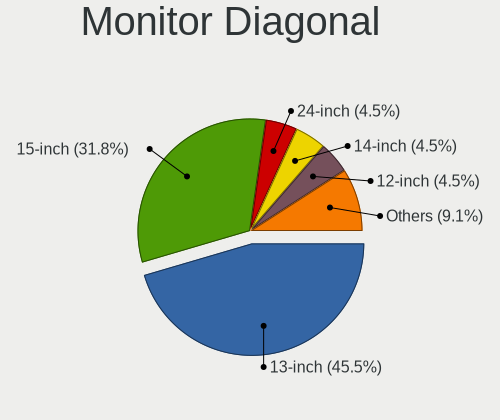

| Inches | Notebooks | Percent |
|--------|-----------|---------|
| 15     | 5         | 50%     |
| 13     | 4         | 40%     |
| 12     | 1         | 10%     |

Monitor Width
-------------

Physical width

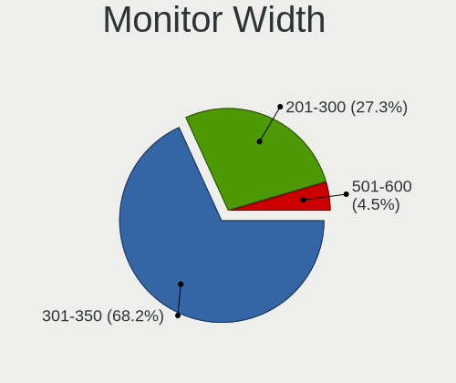

| Width in mm | Notebooks | Percent |
|-------------|-----------|---------|
| 301-350     | 8         | 80%     |
| 201-300     | 2         | 20%     |

Aspect Ratio
------------

Proportional relationship between the width and the height

| Ratio | Notebooks | Percent |
|-------|-----------|---------|
| 16/9  | 8         | 80%     |
| 16/10 | 2         | 20%     |

Monitor Area
------------

Area in inch²

| Area in inch² | Notebooks | Percent |
|----------------|-----------|---------|
| 81-90          | 4         | 40%     |
| 101-110        | 3         | 30%     |
| 91-100         | 2         | 20%     |
| 61-70          | 1         | 10%     |

Pixel Density
-------------

Pixels per inch

| Density | Notebooks | Percent |
|---------|-----------|---------|
| 101-120 | 7         | 70%     |
| 51-100  | 2         | 20%     |
| 121-160 | 1         | 10%     |

Multiple Monitors
-----------------

Total monitors connected

| Total | Notebooks | Percent |
|-------|-----------|---------|
| 1     | 13        | 76.47%  |
| 0     | 4         | 23.53%  |

Network
-------

Net Controller Vendor
---------------------

Controller vendors

| Vendor                   | Notebooks | Percent |
|--------------------------|-----------|---------|
| Intel                    | 10        | 35.71%  |
| Qualcomm Atheros         | 6         | 21.43%  |
| Realtek Semiconductor    | 5         | 17.86%  |
| Broadcom                 | 2         | 7.14%   |
| VIA Technologies         | 1         | 3.57%   |
| TP-Link                  | 1         | 3.57%   |
| Marvell Technology Group | 1         | 3.57%   |
| Huawei Technologies      | 1         | 3.57%   |
| D-Link                   | 1         | 3.57%   |

Net Controller Model
--------------------

Controller models

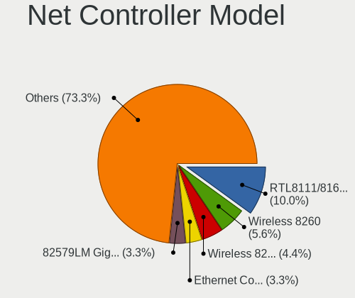

| Model                                                                                 | Notebooks | Percent |
|---------------------------------------------------------------------------------------|-----------|---------|
| Realtek RTL8111/8168/8411 PCI Express Gigabit Ethernet Controller                     | 4         | 11.43%  |
| Qualcomm Atheros AR2413/AR2414 Wireless Network Adapter [AR5005G(S) 802.11bg]         | 2         | 5.71%   |
| Intel Centrino Advanced-N 6205 [Taylor Peak]                                          | 2         | 5.71%   |
| Intel 82579LM Gigabit Network Connection (Lewisville)                                 | 2         | 5.71%   |
| VIA VT6102/VT6103 [Rhine-II]                                                          | 1         | 2.86%   |
| TP-Link TL-WN722N v2/v3 [Realtek RTL8188EUS]                                          | 1         | 2.86%   |
| Realtek RTL-8100/8101L/8139 PCI Fast Ethernet Adapter                                 | 1         | 2.86%   |
| Qualcomm Atheros QCA9565 / AR9565 Wireless Network Adapter                            | 1         | 2.86%   |
| Qualcomm Atheros QCA8172 Fast Ethernet                                                | 1         | 2.86%   |
| Qualcomm Atheros AR928X Wireless Network Adapter (PCI-Express)                        | 1         | 2.86%   |
| Qualcomm Atheros AR5418 Wireless Network Adapter [AR5008E 802.11(a)bgn] (PCI-Express) | 1         | 2.86%   |
| Marvell Group 88E8053 PCI-E Gigabit Ethernet Controller                               | 1         | 2.86%   |
| Intel Wireless 7265                                                                   | 1         | 2.86%   |
| Intel Wireless 7260                                                                   | 1         | 2.86%   |
| Intel Wi-Fi 6 AX201 160MHz                                                            | 1         | 2.86%   |
| Intel PRO/Wireless 3945ABG [Golan] Network Connection                                 | 1         | 2.86%   |
| Intel PRO/Wireless 2200BG [Calexico2] Network Connection                              | 1         | 2.86%   |
| Intel PRO/100 VE Network Connection                                                   | 1         | 2.86%   |
| Intel Ethernet Connection I218-LM                                                     | 1         | 2.86%   |
| Intel Dual Band Wireless-AC 3168NGW [Stone Peak]                                      | 1         | 2.86%   |
| Intel Centrino Wireless-N 135                                                         | 1         | 2.86%   |
| Intel Centrino Wireless-N 1000 [Condor Peak]                                          | 1         | 2.86%   |
| Intel 82801DB/DBL/DBM (ICH4/ICH4-L/ICH4-M) AC'97 Modem Controller                     | 1         | 2.86%   |
| Intel 82801DB PRO/100 VE (MOB) Ethernet Controller                                    | 1         | 2.86%   |
| Intel 82577LM Gigabit Network Connection                                              | 1         | 2.86%   |
| Huawei USB Composite Device                                                           | 1         | 2.86%   |
| D-Link DWA-131 Wireless N Nano Adapter (Rev. E1) [Realtek RTL8192EU]                  | 1         | 2.86%   |
| Broadcom NetLink BCM57780 Gigabit Ethernet PCIe                                       | 1         | 2.86%   |
| Broadcom BCM43142 802.11b/g/n                                                         | 1         | 2.86%   |

Wireless Vendor
---------------

Wireless vendors

| Vendor           | Notebooks | Percent |
|------------------|-----------|---------|
| Intel            | 10        | 55.56%  |
| Qualcomm Atheros | 5         | 27.78%  |
| TP-Link          | 1         | 5.56%   |
| D-Link           | 1         | 5.56%   |
| Broadcom         | 1         | 5.56%   |

Wireless Model
--------------

Wireless models

| Model                                                                                 | Notebooks | Percent |
|---------------------------------------------------------------------------------------|-----------|---------|
| Qualcomm Atheros AR2413/AR2414 Wireless Network Adapter [AR5005G(S) 802.11bg]         | 2         | 11.11%  |
| Intel Centrino Advanced-N 6205 [Taylor Peak]                                          | 2         | 11.11%  |
| TP-Link TL-WN722N v2/v3 [Realtek RTL8188EUS]                                          | 1         | 5.56%   |
| Qualcomm Atheros QCA9565 / AR9565 Wireless Network Adapter                            | 1         | 5.56%   |
| Qualcomm Atheros AR928X Wireless Network Adapter (PCI-Express)                        | 1         | 5.56%   |
| Qualcomm Atheros AR5418 Wireless Network Adapter [AR5008E 802.11(a)bgn] (PCI-Express) | 1         | 5.56%   |
| Intel Wireless 7265                                                                   | 1         | 5.56%   |
| Intel Wireless 7260                                                                   | 1         | 5.56%   |
| Intel Wi-Fi 6 AX201 160MHz                                                            | 1         | 5.56%   |
| Intel PRO/Wireless 3945ABG [Golan] Network Connection                                 | 1         | 5.56%   |
| Intel PRO/Wireless 2200BG [Calexico2] Network Connection                              | 1         | 5.56%   |
| Intel Dual Band Wireless-AC 3168NGW [Stone Peak]                                      | 1         | 5.56%   |
| Intel Centrino Wireless-N 135                                                         | 1         | 5.56%   |
| Intel Centrino Wireless-N 1000 [Condor Peak]                                          | 1         | 5.56%   |
| D-Link DWA-131 Wireless N Nano Adapter (Rev. E1) [Realtek RTL8192EU]                  | 1         | 5.56%   |
| Broadcom BCM43142 802.11b/g/n                                                         | 1         | 5.56%   |

Ethernet Vendor
---------------

Ethernet vendors

| Vendor                   | Notebooks | Percent |
|--------------------------|-----------|---------|
| Intel                    | 6         | 37.5%   |
| Realtek Semiconductor    | 5         | 31.25%  |
| VIA Technologies         | 1         | 6.25%   |
| Qualcomm Atheros         | 1         | 6.25%   |
| Marvell Technology Group | 1         | 6.25%   |
| Huawei Technologies      | 1         | 6.25%   |
| Broadcom                 | 1         | 6.25%   |

Ethernet Model
--------------

Ethernet models

| Model                                                             | Notebooks | Percent |
|-------------------------------------------------------------------|-----------|---------|
| Realtek RTL8111/8168/8411 PCI Express Gigabit Ethernet Controller | 4         | 25%     |
| Intel 82579LM Gigabit Network Connection (Lewisville)             | 2         | 12.5%   |
| VIA VT6102/VT6103 [Rhine-II]                                      | 1         | 6.25%   |
| Realtek RTL-8100/8101L/8139 PCI Fast Ethernet Adapter             | 1         | 6.25%   |
| Qualcomm Atheros QCA8172 Fast Ethernet                            | 1         | 6.25%   |
| Marvell Group 88E8053 PCI-E Gigabit Ethernet Controller           | 1         | 6.25%   |
| Intel PRO/100 VE Network Connection                               | 1         | 6.25%   |
| Intel Ethernet Connection I218-LM                                 | 1         | 6.25%   |
| Intel 82801DB PRO/100 VE (MOB) Ethernet Controller                | 1         | 6.25%   |
| Intel 82577LM Gigabit Network Connection                          | 1         | 6.25%   |
| Huawei USB Composite Device                                       | 1         | 6.25%   |
| Broadcom NetLink BCM57780 Gigabit Ethernet PCIe                   | 1         | 6.25%   |

Net Controller Kind
-------------------

Ethernet, WiFi or modem

| Kind     | Notebooks | Percent |
|----------|-----------|---------|
| WiFi     | 16        | 50%     |
| Ethernet | 15        | 46.88%  |
| Modem    | 1         | 3.13%   |

Used Controller
---------------

Currently used network controller

| Kind     | Notebooks | Percent |
|----------|-----------|---------|
| Ethernet | 14        | 51.85%  |
| WiFi     | 13        | 48.15%  |

NICs
----

Total network controllers on board

| Total | Notebooks | Percent |
|-------|-----------|---------|
| 2     | 15        | 88.24%  |
| 0     | 2         | 11.76%  |

IPv6
----

IPv6 vs IPv4

| Used | Notebooks | Percent |
|------|-----------|---------|
| No   | 14        | 82.35%  |
| Yes  | 3         | 17.65%  |

Bluetooth
---------

Bluetooth Vendor
----------------

Controller vendors

| Vendor                  | Notebooks | Percent |
|-------------------------|-----------|---------|
| Intel                   | 5         | 55.56%  |
| IMC Networks            | 1         | 11.11%  |
| Cambridge Silicon Radio | 1         | 11.11%  |
| Broadcom                | 1         | 11.11%  |
| Apple                   | 1         | 11.11%  |

Bluetooth Model
---------------

Controller models

| Model                                               | Notebooks | Percent |
|-----------------------------------------------------|-----------|---------|
| Intel Bluetooth wireless interface                  | 2         | 22.22%  |
| Intel Wireless-AC 3168 Bluetooth                    | 1         | 11.11%  |
| Intel Centrino Bluetooth Wireless Transceiver       | 1         | 11.11%  |
| Intel Bluetooth 9460/9560 Jefferson Peak (JfP)      | 1         | 11.11%  |
| IMC Networks Qualcomm Atheros Bluetooth 4.0 + HS    | 1         | 11.11%  |
| Cambridge Silicon Radio Bluetooth Dongle (HCI mode) | 1         | 11.11%  |
| Broadcom BCM20702 Bluetooth 4.0 [ThinkPad]          | 1         | 11.11%  |
| Apple Built-in iSight (no firmware loaded)          | 1         | 11.11%  |

Sound
-----

Sound Vendor
------------

Sound card vendors

| Vendor           | Notebooks | Percent |
|------------------|-----------|---------|
| Intel            | 14        | 77.78%  |
| Nvidia           | 2         | 11.11%  |
| VIA Technologies | 1         | 5.56%   |
| AMD              | 1         | 5.56%   |

Sound Model
-----------

Sound card models

| Model                                                                      | Notebooks | Percent |
|----------------------------------------------------------------------------|-----------|---------|
| Intel 7 Series/C216 Chipset Family High Definition Audio Controller        | 3         | 14.29%  |
| Intel NM10/ICH7 Family High Definition Audio Controller                    | 2         | 9.52%   |
| Intel 82801DB/DBL/DBM (ICH4/ICH4-L/ICH4-M) AC'97 Audio Controller          | 2         | 9.52%   |
| Intel 5 Series/3400 Series Chipset High Definition Audio                   | 2         | 9.52%   |
| VIA Technologies VT8233/A/8235/8237 AC97 Audio Controller                  | 1         | 4.76%   |
| Nvidia High Definition Audio Controller                                    | 1         | 4.76%   |
| Nvidia GT216 HDMI Audio Controller                                         | 1         | 4.76%   |
| Intel Wildcat Point-LP High Definition Audio Controller                    | 1         | 4.76%   |
| Intel Jasper Lake HD Audio                                                 | 1         | 4.76%   |
| Intel Haswell-ULT HD Audio Controller                                      | 1         | 4.76%   |
| Intel Celeron N3350/Pentium N4200/Atom E3900 Series Audio Cluster          | 1         | 4.76%   |
| Intel Broadwell-U Audio Controller                                         | 1         | 4.76%   |
| Intel 8 Series HD Audio Controller                                         | 1         | 4.76%   |
| Intel 6 Series/C200 Series Chipset Family High Definition Audio Controller | 1         | 4.76%   |
| AMD SBx00 Azalia (Intel HDA)                                               | 1         | 4.76%   |
| AMD Cedar HDMI Audio [Radeon HD 5400/6300/7300 Series]                     | 1         | 4.76%   |

Memory
------

Memory Vendor
-------------

Memory module vendors

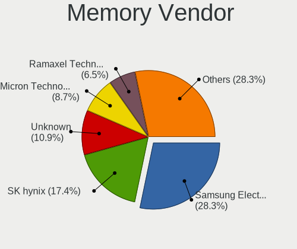

| Vendor              | Notebooks | Percent |
|---------------------|-----------|---------|
| Unknown             | 5         | 29.41%  |
| Samsung Electronics | 3         | 17.65%  |
| SK hynix            | 2         | 11.76%  |
| Micron Technology   | 2         | 11.76%  |
| Kingston            | 2         | 11.76%  |
| SHARETRONIC         | 1         | 5.88%   |
| Ramaxel Technology  | 1         | 5.88%   |
| Nanya Technology    | 1         | 5.88%   |

Memory Model
------------

Memory module models

| Model                                                      | Notebooks | Percent |
|------------------------------------------------------------|-----------|---------|
| Unknown RAM Module 512MB SODIMM DRAM 166MT/s               | 1         | 5.88%   |
| Unknown RAM Module 512MB SODIMM DDR2 533MT/s               | 1         | 5.88%   |
| Unknown RAM Module 2GB SODIMM DDR3                         | 1         | 5.88%   |
| Unknown RAM Module 256MB SODIMM DDR                        | 1         | 5.88%   |
| Unknown RAM Module 1024MB SODIMM SDRAM 266MT/s             | 1         | 5.88%   |
| SK hynix RAM HMT351S6BFR8C-H9 4GB SODIMM DDR3 1334MT/s     | 1         | 5.88%   |
| SK hynix RAM HMT351S6BFR8C-H9 4GB SODIMM DDR3 1333MT/s     | 1         | 5.88%   |
| SHARETRONIC RAM Module 2048MB SODIMM DDR3 1600MT/s         | 1         | 5.88%   |
| Samsung RAM M471B5673FH0-CF8 2GB SODIMM DDR3 1067MT/s      | 1         | 5.88%   |
| Samsung RAM M471B5173DB0-YK0 4GB SODIMM DDR3 1600MT/s      | 1         | 5.88%   |
| Samsung RAM M471B1G73QH0-YK0 8GB SODIMM DDR3 1867MT/s      | 1         | 5.88%   |
| Ramaxel RAM RMT3160ED58E9W1600 4GB SODIMM DDR3 1600MT/s    | 1         | 5.88%   |
| Nanya RAM NT2GC64B88B0NS-CG 2GB SODIMM DDR3 1334MT/s       | 1         | 5.88%   |
| Micron RAM 8KTF51264HZ-1G6N1 4GB SODIMM DDR3 1600MT/s      | 1         | 5.88%   |
| Micron RAM 16JSF51264HZ-1G1D1 4GB SODIMM DDR3 1067MT/s     | 1         | 5.88%   |
| Kingston RAM ACR16D3LFS1KBG/2G 2GB SODIMM DDR3 1600MT/s    | 1         | 5.88%   |
| Kingston RAM 9905428-026.A02LF 2048MB SODIMM DDR3 1066MT/s | 1         | 5.88%   |

Memory Kind
-----------

Memory module kinds

| Kind  | Notebooks | Percent |
|-------|-----------|---------|
| DDR3  | 9         | 69.23%  |
| SDRAM | 1         | 7.69%   |
| DRAM  | 1         | 7.69%   |
| DDR2  | 1         | 7.69%   |
| DDR   | 1         | 7.69%   |

Memory Form Factor
------------------

Physical design of the memory module

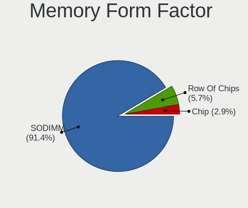

| Name   | Notebooks | Percent |
|--------|-----------|---------|
| SODIMM | 13        | 100%    |

Memory Size
-----------

Memory module size

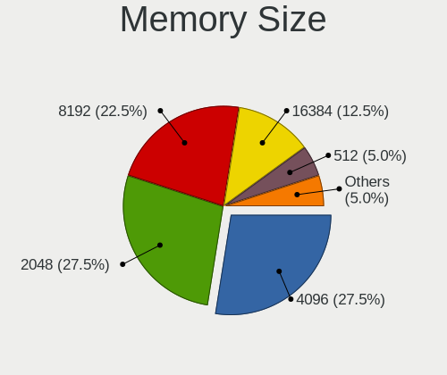

| Size | Notebooks | Percent |
|------|-----------|---------|
| 4096 | 4         | 30.77%  |
| 2048 | 4         | 30.77%  |
| 512  | 2         | 15.38%  |
| 8192 | 1         | 7.69%   |
| 1024 | 1         | 7.69%   |
| 256  | 1         | 7.69%   |

Memory Speed
------------

Memory module speed

| Speed   | Notebooks | Percent |
|---------|-----------|---------|
| 1600    | 3         | 20%     |
| 1334    | 2         | 13.33%  |
| 1067    | 2         | 13.33%  |
| Unknown | 2         | 13.33%  |
| 1867    | 1         | 6.67%   |
| 1333    | 1         | 6.67%   |
| 1066    | 1         | 6.67%   |
| 533     | 1         | 6.67%   |
| 266     | 1         | 6.67%   |
| 166     | 1         | 6.67%   |

Printers & scanners
-------------------

Printer Vendor
--------------

Printer device vendors

Zero info for selected period =(

Printer Model
-------------

Printer device models

Zero info for selected period =(

Scanner Vendor
--------------

Scanner device vendors

Zero info for selected period =(

Scanner Model
-------------

Scanner device models

Zero info for selected period =(

Camera
------

Camera Vendor
-------------

Camera device vendors

| Vendor                | Notebooks | Percent |
|-----------------------|-----------|---------|
| Chicony Electronics   | 3         | 30%     |
| Realtek Semiconductor | 2         | 20%     |
| Syntek                | 1         | 10%     |
| Quanta                | 1         | 10%     |
| Lenovo                | 1         | 10%     |
| ALi                   | 1         | 10%     |
| Acer                  | 1         | 10%     |

Camera Model
------------

Camera device models

| Model                                | Notebooks | Percent |
|--------------------------------------|-----------|---------|
| Chicony integrated camera            | 2         | 20%     |
| Syntek Lenovo EasyCamera             | 1         | 10%     |
| Realtek USB Camera                   | 1         | 10%     |
| Realtek Acer 640 x 480 laptop camera | 1         | 10%     |
| Quanta VGA WebCam                    | 1         | 10%     |
| Lenovo Integrated Webcam [R5U877]    | 1         | 10%     |
| Chicony Front Camera                 | 1         | 10%     |
| ALi Gateway Webcam                   | 1         | 10%     |
| Acer Integrated Camera               | 1         | 10%     |

Security
--------

Fingerprint Vendor
------------------

Fingerprint sensor vendors

| Vendor | Notebooks | Percent |
|--------|-----------|---------|
| Upek   | 1         | 100%    |

Fingerprint Model
-----------------

Fingerprint sensor models

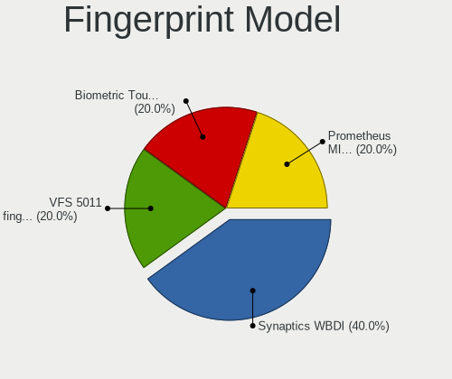

| Model                                                  | Notebooks | Percent |
|--------------------------------------------------------|-----------|---------|
| Upek Biometric Touchchip/Touchstrip Fingerprint Sensor | 1         | 100%    |

Chipcard Vendor
---------------

Chipcard module vendors

Zero info for selected period =(

Chipcard Model
--------------

Chipcard module models

Zero info for selected period =(

Unsupported
-----------

Unsupported Devices
-------------------

Total unsupported devices on board

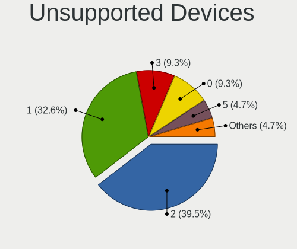

| Total | Notebooks | Percent |
|-------|-----------|---------|
| 1     | 6         | 35.29%  |
| 2     | 4         | 23.53%  |
| 0     | 4         | 23.53%  |
| 4     | 2         | 11.76%  |
| 5     | 1         | 5.88%   |

Unsupported Device Types
------------------------

Types of unsupported devices

| Type                     | Notebooks | Percent |
|--------------------------|-----------|---------|
| Communication controller | 10        | 47.62%  |
| Graphics card            | 4         | 19.05%  |
| Net/wireless             | 3         | 14.29%  |
| Card reader              | 2         | 9.52%   |
| Storage                  | 1         | 4.76%   |
| Modem                    | 1         | 4.76%   |

