NetBSD - Tested Hardware & Statistics
-------------------------------------

A project to collect tested hardware configurations for NetBSD.

Anyone can contribute to this report by the [hw-probe](https://github.com/linuxhw/hw-probe/blob/master/INSTALL.BSD.md) tool:

    hw-probe -all -upload

Please contribute! Especially if your hardware is rare.

This is a report for all computer types. See also reports for [desktops](/Dist/NetBSD/Desktop/README.md) and [notebooks](/Dist/NetBSD/Notebook/README.md).

Contents
--------

* [ Test Cases ](#test-cases)

* [ System ](#system)
  - [ OS                       ](#os)
  - [ OS Family                ](#os-family)
  - [ Arch                     ](#arch)
  - [ DE                       ](#de)
  - [ Display Server           ](#display-server)
  - [ Display Manager          ](#display-manager)
  - [ OS Lang                  ](#os-lang)
  - [ Boot Mode                ](#boot-mode)
  - [ Filesystem               ](#filesystem)
  - [ Part. scheme             ](#part-scheme)

* [ Board ](#board)
  - [ Vendor                   ](#vendor)
  - [ Model                    ](#model)
  - [ Model Family             ](#model-family)
  - [ MFG Year                 ](#mfg-year)
  - [ Form Factor              ](#form-factor)
  - [ Coreboot                 ](#coreboot)
  - [ RAM Size                 ](#ram-size)
  - [ RAM Used                 ](#ram-used)
  - [ Total Drives             ](#total-drives)
  - [ Has CD-ROM               ](#has-cd-rom)
  - [ Has Ethernet             ](#has-ethernet)
  - [ Has WiFi                 ](#has-wifi)
  - [ Has Bluetooth            ](#has-bluetooth)

* [ Location ](#location)
  - [ Country                  ](#country)
  - [ City                     ](#city)

* [ Drives ](#drives)
  - [ Drive Vendor             ](#drive-vendor)
  - [ Drive Model              ](#drive-model)
  - [ HDD Vendor               ](#hdd-vendor)
  - [ SSD Vendor               ](#ssd-vendor)
  - [ Drive Kind               ](#drive-kind)
  - [ Drive Connector          ](#drive-connector)
  - [ Drive Size               ](#drive-size)
  - [ Space Total              ](#space-total)
  - [ Space Used               ](#space-used)
  - [ Malfunc. Drives          ](#malfunc-drives)
  - [ Malfunc. Drive Vendor    ](#malfunc-drive-vendor)
  - [ Malfunc. HDD Vendor      ](#malfunc-hdd-vendor)
  - [ Malfunc. Drive Kind      ](#malfunc-drive-kind)
  - [ Failed Drives            ](#failed-drives)
  - [ Failed Drive Vendor      ](#failed-drive-vendor)
  - [ Drive Status             ](#drive-status)

* [ Storage controller ](#storage-controller)
  - [ Storage Vendor           ](#storage-vendor)
  - [ Storage Model            ](#storage-model)
  - [ Storage Kind             ](#storage-kind)

* [ Processor ](#processor)
  - [ CPU Vendor               ](#cpu-vendor)
  - [ CPU Model                ](#cpu-model)
  - [ CPU Model Family         ](#cpu-model-family)
  - [ CPU Cores                ](#cpu-cores)
  - [ CPU Sockets              ](#cpu-sockets)
  - [ CPU Threads              ](#cpu-threads)
  - [ CPU Microarch            ](#cpu-microarch)

* [ Graphics ](#graphics)
  - [ GPU Vendor               ](#gpu-vendor)
  - [ GPU Model                ](#gpu-model)
  - [ GPU Combo                ](#gpu-combo)
  - [ GPU Driver               ](#gpu-driver)
  - [ GPU Memory               ](#gpu-memory)

* [ Monitor ](#monitor)
  - [ Monitor Vendor           ](#monitor-vendor)
  - [ Monitor Model            ](#monitor-model)
  - [ Monitor Resolution       ](#monitor-resolution)
  - [ Monitor Diagonal         ](#monitor-diagonal)
  - [ Monitor Width            ](#monitor-width)
  - [ Aspect Ratio             ](#aspect-ratio)
  - [ Monitor Area             ](#monitor-area)
  - [ Pixel Density            ](#pixel-density)
  - [ Multiple Monitors        ](#multiple-monitors)

* [ Network ](#network)
  - [ Net Controller Vendor    ](#net-controller-vendor)
  - [ Net Controller Model     ](#net-controller-model)
  - [ Wireless Vendor          ](#wireless-vendor)
  - [ Wireless Model           ](#wireless-model)
  - [ Ethernet Vendor          ](#ethernet-vendor)
  - [ Ethernet Model           ](#ethernet-model)
  - [ Net Controller Kind      ](#net-controller-kind)
  - [ Used Controller          ](#used-controller)
  - [ NICs                     ](#nics)
  - [ IPv6                     ](#ipv6)

* [ Bluetooth ](#bluetooth)
  - [ Bluetooth Vendor         ](#bluetooth-vendor)
  - [ Bluetooth Model          ](#bluetooth-model)

* [ Sound ](#sound)
  - [ Sound Vendor             ](#sound-vendor)
  - [ Sound Model              ](#sound-model)

* [ Memory ](#memory)
  - [ Memory Vendor            ](#memory-vendor)
  - [ Memory Model             ](#memory-model)
  - [ Memory Kind              ](#memory-kind)
  - [ Memory Form Factor       ](#memory-form-factor)
  - [ Memory Size              ](#memory-size)
  - [ Memory Speed             ](#memory-speed)

* [ Printers & scanners ](#printers--scanners)
  - [ Printer Vendor           ](#printer-vendor)
  - [ Printer Model            ](#printer-model)
  - [ Scanner Vendor           ](#scanner-vendor)
  - [ Scanner Model            ](#scanner-model)

* [ Camera ](#camera)
  - [ Camera Vendor            ](#camera-vendor)
  - [ Camera Model             ](#camera-model)

* [ Security ](#security)
  - [ Fingerprint Vendor       ](#fingerprint-vendor)
  - [ Fingerprint Model        ](#fingerprint-model)
  - [ Chipcard Vendor          ](#chipcard-vendor)
  - [ Chipcard Model           ](#chipcard-model)

* [ Unsupported ](#unsupported)
  - [ Unsupported Devices      ](#unsupported-devices)
  - [ Unsupported Device Types ](#unsupported-device-types)

Test Cases
----------

Total: 227

| Vendor        | Model                       | Form-Factor | Probe                                                     | Date         |
|---------------|-----------------------------|-------------|-----------------------------------------------------------|--------------|
| Lenovo        | ThinkPad E14 Gen 3 20Y70... | Notebook    | [30220e13a3](https://bsd-hardware.info/?probe=30220e13a3) | Dec 20, 2025 |
| Lenovo        | ThinkPad T460s 20FAS3L00... | Notebook    | [576e8fb25d](https://bsd-hardware.info/?probe=576e8fb25d) | Dec 08, 2025 |
| ASUSTek       | NUC14MNB2 60AS00H0-MB7A0... | Mini pc     | [22e4681b13](https://bsd-hardware.info/?probe=22e4681b13) | Nov 26, 2025 |
| IBM           | 2648EU2                     | Notebook    | [73113a619e](https://bsd-hardware.info/?probe=73113a619e) | Nov 18, 2025 |
| Unknown       | Unknown                     | Desktop     | [dfd42b6aa2](https://bsd-hardware.info/?probe=dfd42b6aa2) | Nov 18, 2025 |
| Supermicro    | X9SRE/X9SRE-3F/X9SRi/X9S... | Server      | [f46e9a17dc](https://bsd-hardware.info/?probe=f46e9a17dc) | Nov 09, 2025 |
| ASUSTek       | X71SL                       | Notebook    | [c2d43ad651](https://bsd-hardware.info/?probe=c2d43ad651) | Nov 01, 2025 |
| Lenovo        | ThinkPad E575 20H8000HUS    | Notebook    | [8da24fbfa3](https://bsd-hardware.info/?probe=8da24fbfa3) | Oct 30, 2025 |
| ASUSTek       | K53SJ                       | Notebook    | [092f586122](https://bsd-hardware.info/?probe=092f586122) | Oct 28, 2025 |
| VIA Techno... | VT8366-8233                 | Desktop     | [9c4b031e64](https://bsd-hardware.info/?probe=9c4b031e64) | Oct 27, 2025 |
| Samsung       | NC10                        | Notebook    | [509d4a9b20](https://bsd-hardware.info/?probe=509d4a9b20) | Oct 16, 2025 |
| Unknown       | Unknown                     | Desktop     | [b5fe25229f](https://bsd-hardware.info/?probe=b5fe25229f) | Sep 25, 2025 |
| Unknown       | Unknown                     | Desktop     | [7ef8c740df](https://bsd-hardware.info/?probe=7ef8c740df) | Sep 12, 2025 |
| Unknown       | Unknown                     | Desktop     | [2dfad7d91b](https://bsd-hardware.info/?probe=2dfad7d91b) | Sep 12, 2025 |
| ASUSTek       | K52F                        | Notebook    | [a195186b8f](https://bsd-hardware.info/?probe=a195186b8f) | Aug 31, 2025 |
| Microsoft     | Surface Go 2                | Tablet      | [eeb5906169](https://bsd-hardware.info/?probe=eeb5906169) | Aug 13, 2025 |
| Lenovo        | ThinkPad X1 Extreme 20MF... | Notebook    | [27f17a9a16](https://bsd-hardware.info/?probe=27f17a9a16) | Aug 12, 2025 |
| Lenovo        | 1036 SDK0Q40104 WIN 3305... | Desktop     | [cb4d14cb1e](https://bsd-hardware.info/?probe=cb4d14cb1e) | Aug 10, 2025 |
| HP            | 21EF                        | Desktop     | [e47ffa047c](https://bsd-hardware.info/?probe=e47ffa047c) | Jul 18, 2025 |
| HP            | 21EF                        | Desktop     | [ad89678ca6](https://bsd-hardware.info/?probe=ad89678ca6) | Jul 17, 2025 |
| Unknown       | Unknown                     | Desktop     | [c4ea0e3429](https://bsd-hardware.info/?probe=c4ea0e3429) | Jul 11, 2025 |
| HP            | 21EF                        | Desktop     | [336bbc47d8](https://bsd-hardware.info/?probe=336bbc47d8) | Jul 06, 2025 |
| Raspberry ... | Raspberry Pi                | Soc         | [fa68ca9a77](https://bsd-hardware.info/?probe=fa68ca9a77) | Jul 06, 2025 |
| ASUSTek       | NUC12WSBI3 60AS00F0-MB5A... | Mini pc     | [ce313b2407](https://bsd-hardware.info/?probe=ce313b2407) | Jun 28, 2025 |
| ASUSTek       | K53SJ                       | Notebook    | [7105ddca26](https://bsd-hardware.info/?probe=7105ddca26) | May 31, 2025 |
| ASUSTek       | NUC14MNB2 60AS00H0-MB7A0... | Mini pc     | [ca8445af50](https://bsd-hardware.info/?probe=ca8445af50) | May 28, 2025 |
| Lenovo        | ThinkPad X230 2325A39       | Notebook    | [41db2b37f5](https://bsd-hardware.info/?probe=41db2b37f5) | May 01, 2025 |
| Lenovo        | ThinkPad Edge E545 20B20... | Notebook    | [4e2ea48556](https://bsd-hardware.info/?probe=4e2ea48556) | May 01, 2025 |
| Panasonic     | CF-C1BD06EFG                | Notebook    | [72af222238](https://bsd-hardware.info/?probe=72af222238) | May 01, 2025 |
| ASUSTek       | K53SJ                       | Notebook    | [4fc246d3b4](https://bsd-hardware.info/?probe=4fc246d3b4) | May 01, 2025 |
| ASUSTek       | PRIME Z490M-PLUS            | Desktop     | [25d8b39f97](https://bsd-hardware.info/?probe=25d8b39f97) | Apr 20, 2025 |
| ASUSTek       | K53SJ                       | Notebook    | [3a312f438d](https://bsd-hardware.info/?probe=3a312f438d) | Apr 18, 2025 |
| ASUSTek       | K53SJ                       | Notebook    | [1e240331e0](https://bsd-hardware.info/?probe=1e240331e0) | Apr 18, 2025 |
| ASUSTek       | ProArt B650-CREATOR         | Desktop     | [551434e96e](https://bsd-hardware.info/?probe=551434e96e) | Apr 14, 2025 |
| Win Elemen... | M9                          | Desktop     | [1c31d220b1](https://bsd-hardware.info/?probe=1c31d220b1) | Apr 10, 2025 |
| Intel         | NUC7JYB J67969-404          | Mini pc     | [62a67cbeb2](https://bsd-hardware.info/?probe=62a67cbeb2) | Apr 10, 2025 |
| Acer          | TravelMate B118-M           | Notebook    | [2959c86683](https://bsd-hardware.info/?probe=2959c86683) | Apr 10, 2025 |
| ASRock        | B450 Gaming K4              | Desktop     | [4ed2753dbc](https://bsd-hardware.info/?probe=4ed2753dbc) | Apr 03, 2025 |
| Unknown       | Unknown                     | Desktop     | [e4bc715e82](https://bsd-hardware.info/?probe=e4bc715e82) | Mar 26, 2025 |
| ASRock        | B450 Gaming K4              | Desktop     | [562041a0fc](https://bsd-hardware.info/?probe=562041a0fc) | Mar 17, 2025 |
| Lenovo        | ThinkPad X201 3323K2M       | Notebook    | [152f2fe4d7](https://bsd-hardware.info/?probe=152f2fe4d7) | Mar 11, 2025 |
| ASUSTek       | P5A                         | Desktop     | [63da9f33d3](https://bsd-hardware.info/?probe=63da9f33d3) | Feb 28, 2025 |
| Raspberry ... | Raspberry Pi                | Soc         | [d047ab509e](https://bsd-hardware.info/?probe=d047ab509e) | Feb 23, 2025 |
| HP            | ProLiant DL360 G5           | Server      | [5e740fdc7b](https://bsd-hardware.info/?probe=5e740fdc7b) | Feb 20, 2025 |
| HP            | 8053                        | Desktop     | [6f6a208164](https://bsd-hardware.info/?probe=6f6a208164) | Feb 16, 2025 |
| Toshiba       | Satellite L50D-C            | Notebook    | [f8d95e1977](https://bsd-hardware.info/?probe=f8d95e1977) | Feb 12, 2025 |
| BY OEM        | ZRD310C5                    | Desktop     | [5607e6cd36](https://bsd-hardware.info/?probe=5607e6cd36) | Feb 08, 2025 |
| Unknown       | Unknown                     | Desktop     | [566a65354f](https://bsd-hardware.info/?probe=566a65354f) | Feb 08, 2025 |
| HUAWEI        | PUM-WDX9-PCB-B1 M1010       | Desktop     | [deaefc78d8](https://bsd-hardware.info/?probe=deaefc78d8) | Feb 02, 2025 |
| Packard Be... | FIH57                       | Desktop     | [7b02970547](https://bsd-hardware.info/?probe=7b02970547) | Jan 21, 2025 |
| Unknown       | Unknown                     | Desktop     | [2ec3f61bc7](https://bsd-hardware.info/?probe=2ec3f61bc7) | Jan 18, 2025 |
| ASUSTek       | C-P6ND                      | Desktop     | [f6feb27f87](https://bsd-hardware.info/?probe=f6feb27f87) | Jan 18, 2025 |
| Lenovo        | 3136 SDK0J40697 WIN 3305... | Mini pc     | [b3b029ddec](https://bsd-hardware.info/?probe=b3b029ddec) | Jan 16, 2025 |
| Lenovo        | ThinkPad P14s Gen 5 21G2... | Notebook    | [cf293b34e1](https://bsd-hardware.info/?probe=cf293b34e1) | Jan 14, 2025 |
| Lenovo        | ThinkPad P15 Gen 1 20SUS... | Notebook    | [2670f4d9f7](https://bsd-hardware.info/?probe=2670f4d9f7) | Jan 12, 2025 |
| Acer          | AO532h                      | Notebook    | [00b8f9da06](https://bsd-hardware.info/?probe=00b8f9da06) | Jan 06, 2025 |
| HUAWEI        | KPL-W0X                     | Notebook    | [ac7b8b09f0](https://bsd-hardware.info/?probe=ac7b8b09f0) | Dec 24, 2024 |
| Lenovo        | 3136 SDK0J40697 WIN 3305... | Mini pc     | [279c62fea7](https://bsd-hardware.info/?probe=279c62fea7) | Nov 22, 2024 |
| Raspberry ... | Raspberry Pi                | Soc         | [17b78fd12d](https://bsd-hardware.info/?probe=17b78fd12d) | Oct 14, 2024 |
| Lenovo        | 3130 NOK                    | Mini pc     | [5669374138](https://bsd-hardware.info/?probe=5669374138) | Sep 04, 2024 |
| Lenovo        | ThinkPad A285 20MXS01R00    | Notebook    | [9c548c9ffb](https://bsd-hardware.info/?probe=9c548c9ffb) | Sep 01, 2024 |
| Samsung       | 530U3C/530U4C/532U3C        | Notebook    | [f78f3487b8](https://bsd-hardware.info/?probe=f78f3487b8) | Aug 27, 2024 |
| ASUSTek       | VivoBook_ASUSLaptop X512... | Notebook    | [424a038d10](https://bsd-hardware.info/?probe=424a038d10) | Aug 16, 2024 |
| eMachines     | eM250                       | Notebook    | [98c37607a3](https://bsd-hardware.info/?probe=98c37607a3) | Aug 16, 2024 |
| ASUSTek       | VivoBook_ASUSLaptop X512... | Notebook    | [ffdc8ec717](https://bsd-hardware.info/?probe=ffdc8ec717) | Aug 15, 2024 |
| Lenovo        | ThinkPad X260 20F60097US    | Notebook    | [248dd70da2](https://bsd-hardware.info/?probe=248dd70da2) | Jul 25, 2024 |
| ASUSTek       | TUF B360M-PLUS GAMING/BR    | Desktop     | [ed6505a58e](https://bsd-hardware.info/?probe=ed6505a58e) | Jul 19, 2024 |
| ASUSTek       | TUF B360M-PLUS GAMING/BR    | Desktop     | [b1de030d31](https://bsd-hardware.info/?probe=b1de030d31) | Jul 19, 2024 |
| Raspberry ... | Raspberry Pi                | Soc         | [bc76e0ecdb](https://bsd-hardware.info/?probe=bc76e0ecdb) | Jul 13, 2024 |
| Unknown       | Unknown                     | Desktop     | [ae3e63c3e6](https://bsd-hardware.info/?probe=ae3e63c3e6) | Jun 25, 2024 |
| Lenovo        | ThinkPad T470 W10DG 20JN... | Notebook    | [3589bb8629](https://bsd-hardware.info/?probe=3589bb8629) | Jun 16, 2024 |
| Raspberry ... | Raspberry Pi 4 Model B      | Soc         | [5c5138d19f](https://bsd-hardware.info/?probe=5c5138d19f) | Jun 08, 2024 |
| Raspberry ... | Raspberry Pi 4 Model B      | Soc         | [ab9b2e3147](https://bsd-hardware.info/?probe=ab9b2e3147) | Jun 07, 2024 |
| Raspberry ... | Raspberry Pi                | Soc         | [9b896d73b3](https://bsd-hardware.info/?probe=9b896d73b3) | Jun 07, 2024 |
| Intel         | NUC8BEB J72688-306          | Mini pc     | [80440d6327](https://bsd-hardware.info/?probe=80440d6327) | Jun 06, 2024 |
| Dell          | Precision 7520              | Notebook    | [48232bd1d6](https://bsd-hardware.info/?probe=48232bd1d6) | Jun 06, 2024 |
| HP            | 8594                        | Desktop     | [39702449a8](https://bsd-hardware.info/?probe=39702449a8) | May 20, 2024 |
| MSI           | GE62 6QC                    | Notebook    | [d8fe2ac91a](https://bsd-hardware.info/?probe=d8fe2ac91a) | May 18, 2024 |
| GEEKOM        | Mini IT13                   | Desktop     | [18e5e61859](https://bsd-hardware.info/?probe=18e5e61859) | May 18, 2024 |
| HP            | 8594                        | Desktop     | [209ddea7e7](https://bsd-hardware.info/?probe=209ddea7e7) | May 17, 2024 |
| Lenovo        | 3136 NOK                    | Mini pc     | [b9552d38f2](https://bsd-hardware.info/?probe=b9552d38f2) | May 15, 2024 |
| Raspberry ... | Raspberry Pi                | Soc         | [0f9e113064](https://bsd-hardware.info/?probe=0f9e113064) | May 14, 2024 |
| Acer          | TravelMate B118-M           | Notebook    | [66fbf7ab6c](https://bsd-hardware.info/?probe=66fbf7ab6c) | May 12, 2024 |
| Unknown       | Unknown                     | Desktop     | [c70960854a](https://bsd-hardware.info/?probe=c70960854a) | May 06, 2024 |
| Apple         | MacBookPro8,1               | Notebook    | [23e113910f](https://bsd-hardware.info/?probe=23e113910f) | May 05, 2024 |
| Apple         | MacBookPro8,1               | Notebook    | [55560acf02](https://bsd-hardware.info/?probe=55560acf02) | May 05, 2024 |
| Raspberry ... | Raspberry Pi 5 Model B      | Soc         | [755a7a8614](https://bsd-hardware.info/?probe=755a7a8614) | Apr 28, 2024 |
| Lenovo        | 3743 NOK                    | Desktop     | [4b8389c575](https://bsd-hardware.info/?probe=4b8389c575) | Apr 27, 2024 |
| ASRock        | 970 Pro3 R2.0               | Desktop     | [47b751dfa0](https://bsd-hardware.info/?probe=47b751dfa0) | Apr 20, 2024 |
| Timi          | TM1612                      | Notebook    | [c139dfdf05](https://bsd-hardware.info/?probe=c139dfdf05) | Apr 13, 2024 |
| ASUSTek       | VivoBook_ASUSLaptop X512... | Notebook    | [a818576415](https://bsd-hardware.info/?probe=a818576415) | Apr 13, 2024 |
| ASUSTek       | VivoBook_ASUSLaptop X512... | Notebook    | [d8288ba73a](https://bsd-hardware.info/?probe=d8288ba73a) | Apr 09, 2024 |
| Gigabyte      | B360M D2V                   | Desktop     | [766a437527](https://bsd-hardware.info/?probe=766a437527) | Apr 07, 2024 |
| Gigabyte      | X570 I AORUS PRO WIFI       | Desktop     | [3208fef860](https://bsd-hardware.info/?probe=3208fef860) | Apr 04, 2024 |
| Google        | Monroe                      | Desktop     | [7c9648d197](https://bsd-hardware.info/?probe=7c9648d197) | Apr 04, 2024 |
| Google        | Monroe                      | Desktop     | [383d7ee0f2](https://bsd-hardware.info/?probe=383d7ee0f2) | Apr 04, 2024 |
| Gigabyte      | X570 I AORUS PRO WIFI       | Desktop     | [767ef499db](https://bsd-hardware.info/?probe=767ef499db) | Apr 03, 2024 |
| Win Elemen... | M9                          | Desktop     | [3bcc4b4df3](https://bsd-hardware.info/?probe=3bcc4b4df3) | Mar 31, 2024 |
| Lenovo        | ThinkPad X260 20F60097US    | Notebook    | [5fa2016fc1](https://bsd-hardware.info/?probe=5fa2016fc1) | Mar 11, 2024 |
| Lenovo        | ThinkPad T490 20N3S4PX02    | Notebook    | [0dc4820d7e](https://bsd-hardware.info/?probe=0dc4820d7e) | Mar 05, 2024 |
| Lenovo        | ThinkPad T490 20N3S4PX02    | Notebook    | [c3f8fdaebb](https://bsd-hardware.info/?probe=c3f8fdaebb) | Mar 05, 2024 |
| Lenovo        | ThinkPad T480s 20L8S45W0... | Notebook    | [6c6fcc3427](https://bsd-hardware.info/?probe=6c6fcc3427) | Mar 04, 2024 |
| Lenovo        | ThinkPad T480s 20L8S45W0... | Notebook    | [b35f962bce](https://bsd-hardware.info/?probe=b35f962bce) | Mar 01, 2024 |
| Gigabyte      | GA-990FX-GAMING             | Desktop     | [13c1963782](https://bsd-hardware.info/?probe=13c1963782) | Mar 01, 2024 |
| MSI           | KA790GX                     | Desktop     | [7b431178e5](https://bsd-hardware.info/?probe=7b431178e5) | Feb 25, 2024 |
| Unknown       | Unknown                     | Desktop     | [d3ed7d1552](https://bsd-hardware.info/?probe=d3ed7d1552) | Feb 24, 2024 |
| Dell          | 096JG8 A01                  | Desktop     | [5a03257c9a](https://bsd-hardware.info/?probe=5a03257c9a) | Feb 19, 2024 |
| Dell          | Precision 7520              | Notebook    | [bd40dd5305](https://bsd-hardware.info/?probe=bd40dd5305) | Feb 19, 2024 |
| Intel         | Jasper Lake Client Platf... | Notebook    | [6a041adf7a](https://bsd-hardware.info/?probe=6a041adf7a) | Feb 19, 2024 |
| Lenovo        | ThinkPad T410 2518A37       | Notebook    | [b2515cf7fb](https://bsd-hardware.info/?probe=b2515cf7fb) | Feb 19, 2024 |
| Lenovo        | ThinkPad T470 20HES0EV0A    | Notebook    | [05ecc99fe8](https://bsd-hardware.info/?probe=05ecc99fe8) | Feb 13, 2024 |
| Raspberry ... | Raspberry Pi                | Soc         | [9b41695cf4](https://bsd-hardware.info/?probe=9b41695cf4) | Jan 30, 2024 |
| Apple         | Mac-7BA5B2DFE22DDD8C Mac... | Mini pc     | [14e2e2c18c](https://bsd-hardware.info/?probe=14e2e2c18c) | Jan 16, 2024 |
| ASUSTek       | TUF B450-PRO GAMING         | Desktop     | [d318950ac5](https://bsd-hardware.info/?probe=d318950ac5) | Jan 15, 2024 |
| Samsung       | N150/N210/N220              | Notebook    | [92c052e0d7](https://bsd-hardware.info/?probe=92c052e0d7) | Jan 14, 2024 |
| Win Elemen... | M9                          | Desktop     | [5deb235717](https://bsd-hardware.info/?probe=5deb235717) | Jan 05, 2024 |
| Intel         | NUC7JYB J67969-404          | Mini pc     | [5d4fc3e285](https://bsd-hardware.info/?probe=5d4fc3e285) | Jan 05, 2024 |
| Unknown       | Unknown                     | Desktop     | [d4bedea996](https://bsd-hardware.info/?probe=d4bedea996) | Dec 30, 2023 |
| Win Elemen... | M9                          | Desktop     | [19daaf5eee](https://bsd-hardware.info/?probe=19daaf5eee) | Dec 30, 2023 |
| Intel         | NUC7JYB J67969-404          | Mini pc     | [c1c8f32b44](https://bsd-hardware.info/?probe=c1c8f32b44) | Dec 30, 2023 |
| Raspberry ... | Raspberry Pi                | Soc         | [4ccf9a2566](https://bsd-hardware.info/?probe=4ccf9a2566) | Dec 21, 2023 |
| Raspberry ... | Raspberry Pi                | Soc         | [f3a2321558](https://bsd-hardware.info/?probe=f3a2321558) | Nov 29, 2023 |
| Google        | Kohaku                      | Notebook    | [94c3c0f6b7](https://bsd-hardware.info/?probe=94c3c0f6b7) | Nov 26, 2023 |
| Google        | Kohaku                      | Notebook    | [198b445c4e](https://bsd-hardware.info/?probe=198b445c4e) | Nov 26, 2023 |
| HP            | ProLiant DL360 G5           | Server      | [8b2811bcf5](https://bsd-hardware.info/?probe=8b2811bcf5) | Nov 14, 2023 |
| Dell          | Vostro 3500                 | Notebook    | [875b045b38](https://bsd-hardware.info/?probe=875b045b38) | Oct 29, 2023 |
| Lenovo        | NO DPK                      | Desktop     | [424c33d278](https://bsd-hardware.info/?probe=424c33d278) | Oct 27, 2023 |
| Unknown       | Unknown                     | Desktop     | [a88541d6a6](https://bsd-hardware.info/?probe=a88541d6a6) | Oct 27, 2023 |
| Lenovo        | NO DPK                      | Desktop     | [753b30d88b](https://bsd-hardware.info/?probe=753b30d88b) | Oct 27, 2023 |
| ASRock        | H270 Pro4                   | Desktop     | [cba80ecde3](https://bsd-hardware.info/?probe=cba80ecde3) | Sep 24, 2023 |
| Unknown       | Unknown                     | Desktop     | [dcf1ebd901](https://bsd-hardware.info/?probe=dcf1ebd901) | Sep 20, 2023 |
| Apple         | MacBookPro11,1              | Notebook    | [1808e7891c](https://bsd-hardware.info/?probe=1808e7891c) | Sep 16, 2023 |
| Unknown       | Unknown                     | Desktop     | [9c1891cda7](https://bsd-hardware.info/?probe=9c1891cda7) | Sep 03, 2023 |
| Raspberry ... | Raspberry Pi 4 Model B      | Soc         | [2beb3e34d8](https://bsd-hardware.info/?probe=2beb3e34d8) | Aug 20, 2023 |
| Apple         | MacBookAir7,2               | Notebook    | [29fc7f6f45](https://bsd-hardware.info/?probe=29fc7f6f45) | Aug 19, 2023 |
| Gigabyte      | A320M-H-CF                  | Desktop     | [d1a2b99edc](https://bsd-hardware.info/?probe=d1a2b99edc) | Jul 28, 2023 |
| Intel         | NUC5i7RYB H73774-102        | Mini pc     | [a2119ba1fe](https://bsd-hardware.info/?probe=a2119ba1fe) | Jul 10, 2023 |
| Lenovo        | ThinkPad T430 2347A45       | Notebook    | [6969cd9e1a](https://bsd-hardware.info/?probe=6969cd9e1a) | Jun 20, 2023 |
| Acer          | Revo RN86                   | Desktop     | [2e52c2b9b2](https://bsd-hardware.info/?probe=2e52c2b9b2) | May 13, 2023 |
| Unknown       | Unknown                     | Desktop     | [d6f92a5ecc](https://bsd-hardware.info/?probe=d6f92a5ecc) | Apr 28, 2023 |
| Samsung       | DP700A3D-A05UK SEC_SW_RE... | All in one  | [5718d8d05e](https://bsd-hardware.info/?probe=5718d8d05e) | Apr 24, 2023 |
| HP            | Pavilion 17                 | Notebook    | [0f891b4377](https://bsd-hardware.info/?probe=0f891b4377) | Apr 21, 2023 |
| Gigabyte      | B360M D2V                   | Desktop     | [f73cb94828](https://bsd-hardware.info/?probe=f73cb94828) | Apr 17, 2023 |
| Unknown       | Unknown                     | Desktop     | [8c93a7e552](https://bsd-hardware.info/?probe=8c93a7e552) | Mar 04, 2023 |
| Unknown       | Unknown                     | Desktop     | [85fdc49ec4](https://bsd-hardware.info/?probe=85fdc49ec4) | Mar 03, 2023 |
| Unknown       | Unknown                     | Desktop     | [8ae1891a85](https://bsd-hardware.info/?probe=8ae1891a85) | Feb 16, 2023 |
| Lenovo        | ThinkPad 13 20GJCTO1WW      | Notebook    | [59713ca193](https://bsd-hardware.info/?probe=59713ca193) | Feb 15, 2023 |
| Intel         | NUC7JYB J67969-404          | Mini pc     | [5921937764](https://bsd-hardware.info/?probe=5921937764) | Feb 06, 2023 |
| Intel         | NUC5PPYB H76558-102         | Mini pc     | [5f6f4145d4](https://bsd-hardware.info/?probe=5f6f4145d4) | Feb 06, 2023 |
| Intel         | DN2820FYK H24582-203        | Desktop     | [ae05d4c6cd](https://bsd-hardware.info/?probe=ae05d4c6cd) | Feb 06, 2023 |
| Lenovo        | ThinkPad T460s 20FAS3L00... | Notebook    | [ef6972d07a](https://bsd-hardware.info/?probe=ef6972d07a) | Jan 03, 2023 |
| Acer          | Revo RN86                   | Desktop     | [a4dcb7f7a2](https://bsd-hardware.info/?probe=a4dcb7f7a2) | Nov 27, 2022 |
| Unknown       | Unknown                     | Desktop     | [1d3bd58d18](https://bsd-hardware.info/?probe=1d3bd58d18) | Nov 25, 2022 |
| Dell          | Precision M4500             | Notebook    | [ab63467f38](https://bsd-hardware.info/?probe=ab63467f38) | Nov 03, 2022 |
| Unknown       | Unknown                     | Desktop     | [410283dd4f](https://bsd-hardware.info/?probe=410283dd4f) | Oct 22, 2022 |
| Unknown       | Unknown                     | Desktop     | [5e2f93a960](https://bsd-hardware.info/?probe=5e2f93a960) | Aug 06, 2022 |
| Unknown       | Unknown                     | Desktop     | [66fefba790](https://bsd-hardware.info/?probe=66fefba790) | Aug 06, 2022 |
| ASUSTek       | TUF B450-PLUS GAMING        | Desktop     | [aeee3a91e6](https://bsd-hardware.info/?probe=aeee3a91e6) | Jul 03, 2022 |
| Gigabyte      | X570 AORUS PRO              | Desktop     | [4e7d57df3b](https://bsd-hardware.info/?probe=4e7d57df3b) | Apr 18, 2022 |
| ASUSTek       | X555LJ                      | Notebook    | [6bf51cc915](https://bsd-hardware.info/?probe=6bf51cc915) | Mar 28, 2022 |
| Acer          | Aspire A114-33              | Notebook    | [57765224eb](https://bsd-hardware.info/?probe=57765224eb) | Mar 18, 2022 |
| Gigabyte      | 970A-D3P                    | Desktop     | [fa03bdabb6](https://bsd-hardware.info/?probe=fa03bdabb6) | Mar 15, 2022 |
| Raspberry ... | Raspberry Pi 4 Model B      | Soc         | [0394e3272e](https://bsd-hardware.info/?probe=0394e3272e) | Mar 03, 2022 |
| KLLISRE       | X99-B5 V1.0                 | Desktop     | [5dea1304b9](https://bsd-hardware.info/?probe=5dea1304b9) | Feb 26, 2022 |
| MiTAC         | 5033                        | Notebook    | [54df5c9e9e](https://bsd-hardware.info/?probe=54df5c9e9e) | Feb 10, 2022 |
| ASRock        | X470 Gaming-ITX/ac          | Desktop     | [18eeaf2963](https://bsd-hardware.info/?probe=18eeaf2963) | Dec 29, 2021 |
| Acer          | Revo RN86                   | Desktop     | [6d184a1e62](https://bsd-hardware.info/?probe=6d184a1e62) | Dec 23, 2021 |
| ASRock        | 970 Extreme3                | Desktop     | [14907c62f1](https://bsd-hardware.info/?probe=14907c62f1) | Dec 04, 2021 |
| HP            | 3397                        | Desktop     | [155eceb394](https://bsd-hardware.info/?probe=155eceb394) | Nov 07, 2021 |
| Lenovo        | ThinkPad T420 4236D26       | Notebook    | [5c64875424](https://bsd-hardware.info/?probe=5c64875424) | Oct 12, 2021 |
| ASUSTek       | ROG STRIX X470-F GAMING     | Desktop     | [7259ec87e9](https://bsd-hardware.info/?probe=7259ec87e9) | Oct 05, 2021 |
| ASUSTek       | X555LJ                      | Notebook    | [81dd2ba2f0](https://bsd-hardware.info/?probe=81dd2ba2f0) | Oct 02, 2021 |
| ASUSTek       | PRIME A320M-K               | Desktop     | [c574dcc409](https://bsd-hardware.info/?probe=c574dcc409) | Oct 01, 2021 |
| ASUSTek       | ROG STRIX X470-F GAMING     | Desktop     | [b3a18fcab3](https://bsd-hardware.info/?probe=b3a18fcab3) | Sep 29, 2021 |
| Unknown       | Unknown                     | Desktop     | [2a56bcb7c1](https://bsd-hardware.info/?probe=2a56bcb7c1) | Sep 19, 2021 |
| Toshiba       | Satellite A100              | Notebook    | [9ccf97d62c](https://bsd-hardware.info/?probe=9ccf97d62c) | Sep 05, 2021 |
| MSI           | B450-A PRO MAX              | Desktop     | [4e3b1f226b](https://bsd-hardware.info/?probe=4e3b1f226b) | Jun 22, 2021 |
| Sony          | SVF1421DSGW                 | Notebook    | [abadb65058](https://bsd-hardware.info/?probe=abadb65058) | Jun 01, 2021 |
| Unknown       | Unknown                     | Desktop     | [f9fa9ae41a](https://bsd-hardware.info/?probe=f9fa9ae41a) | May 24, 2021 |
| Acer          | Revo RN86                   | Desktop     | [ec302a221a](https://bsd-hardware.info/?probe=ec302a221a) | May 15, 2021 |
| Unknown       | Unknown                     | Desktop     | [364a778de1](https://bsd-hardware.info/?probe=364a778de1) | May 14, 2021 |
| ASRock        | X470 Gaming-ITX/ac          | Desktop     | [82e63b3fb9](https://bsd-hardware.info/?probe=82e63b3fb9) | Apr 14, 2021 |
| Unknown       | Unknown                     | Desktop     | [df793cf09f](https://bsd-hardware.info/?probe=df793cf09f) | Apr 08, 2021 |
| Unknown       | Unknown                     | Desktop     | [f8ba0ba112](https://bsd-hardware.info/?probe=f8ba0ba112) | Apr 08, 2021 |
| Unknown       | Unknown                     | Desktop     | [0541b120c2](https://bsd-hardware.info/?probe=0541b120c2) | Apr 02, 2021 |
| Unknown       | Unknown                     | Desktop     | [91dd02d436](https://bsd-hardware.info/?probe=91dd02d436) | Mar 30, 2021 |
| Unknown       | Unknown                     | Desktop     | [a1220fba93](https://bsd-hardware.info/?probe=a1220fba93) | Mar 24, 2021 |
| Unknown       | Unknown                     | Desktop     | [edea2d1a64](https://bsd-hardware.info/?probe=edea2d1a64) | Mar 18, 2021 |
| Apple         | MacBook2,1                  | Notebook    | [360f29bf3b](https://bsd-hardware.info/?probe=360f29bf3b) | Mar 05, 2021 |
| Apple         | MacBook2,1                  | Notebook    | [f6e7638f87](https://bsd-hardware.info/?probe=f6e7638f87) | Mar 05, 2021 |
| Unknown       | Unknown                     | Desktop     | [1afd7d4381](https://bsd-hardware.info/?probe=1afd7d4381) | Feb 27, 2021 |
| Unknown       | Unknown                     | Desktop     | [4c0171bc04](https://bsd-hardware.info/?probe=4c0171bc04) | Feb 25, 2021 |
| Unknown       | Unknown                     | Desktop     | [a5fa760573](https://bsd-hardware.info/?probe=a5fa760573) | Jan 02, 2021 |
| IBM           | ThinkPad R51 2887AVG        | Notebook    | [289177c624](https://bsd-hardware.info/?probe=289177c624) | Jan 02, 2021 |
| IBM           | ThinkPad R51 2887AVG        | Notebook    | [88d4fc2693](https://bsd-hardware.info/?probe=88d4fc2693) | Dec 30, 2020 |
| Lenovo        | ThinkPad T430s 23564H3      | Notebook    | [eda02dc46b](https://bsd-hardware.info/?probe=eda02dc46b) | Dec 25, 2020 |
| Fujitsu Si... | AMILO L7310                 | Notebook    | [0603b64315](https://bsd-hardware.info/?probe=0603b64315) | Dec 25, 2020 |
| ASRock        | N68-VS3 UCC                 | Desktop     | [647ab5967e](https://bsd-hardware.info/?probe=647ab5967e) | Dec 22, 2020 |
| Unknown       | Unknown                     | Desktop     | [8668b1d651](https://bsd-hardware.info/?probe=8668b1d651) | Dec 17, 2020 |
| ASUSTek       | E45M1-I DELUXE              | Desktop     | [8e767b517d](https://bsd-hardware.info/?probe=8e767b517d) | Dec 16, 2020 |
| Unknown       | Unknown                     | Desktop     | [153be3caa3](https://bsd-hardware.info/?probe=153be3caa3) | Nov 28, 2020 |
| HP            | System Board R3A            | Desktop     | [80593fc3da](https://bsd-hardware.info/?probe=80593fc3da) | Nov 03, 2020 |
| Gigabyte      | Z170X-Gaming 3              | Desktop     | [615ac68e50](https://bsd-hardware.info/?probe=615ac68e50) | Oct 29, 2020 |
| Unknown       | Unknown                     | Desktop     | [d08d610bd0](https://bsd-hardware.info/?probe=d08d610bd0) | Oct 29, 2020 |
| Acer          | Aspire ES1-132              | Notebook    | [a4e45f3551](https://bsd-hardware.info/?probe=a4e45f3551) | Oct 22, 2020 |
| ASUSTek       | B150M-K                     | Desktop     | [135db0e455](https://bsd-hardware.info/?probe=135db0e455) | Oct 22, 2020 |
| Unknown       | Unknown                     | Desktop     | [223aa9e0a3](https://bsd-hardware.info/?probe=223aa9e0a3) | Oct 22, 2020 |
| Gigabyte      | P75-D3                      | Desktop     | [980218cf46](https://bsd-hardware.info/?probe=980218cf46) | Oct 02, 2020 |
| ASUSTek       | H81M-D PLUS                 | Desktop     | [95b75130f4](https://bsd-hardware.info/?probe=95b75130f4) | Sep 26, 2020 |
| Dell          | 0W7H8C A03                  | Server      | [639b47e2ad](https://bsd-hardware.info/?probe=639b47e2ad) | Sep 21, 2020 |
| Acer          | Revo RN86                   | Desktop     | [c6b2c64d14](https://bsd-hardware.info/?probe=c6b2c64d14) | Sep 20, 2020 |
| ASUSTek       | H81M-D PLUS                 | Desktop     | [7be45f1bec](https://bsd-hardware.info/?probe=7be45f1bec) | Sep 19, 2020 |
| MSI           | KA790GX                     | Desktop     | [bba5499a4b](https://bsd-hardware.info/?probe=bba5499a4b) | Aug 29, 2020 |
| Lenovo        | ThinkPad T510 4313CTO       | Notebook    | [7f6095b266](https://bsd-hardware.info/?probe=7f6095b266) | Aug 20, 2020 |
| Unknown       | Unknown                     | Notebook    | [42027dfbb9](https://bsd-hardware.info/?probe=42027dfbb9) | Jul 25, 2020 |
| Intel         | NUC7JYB J67969-404          | Mini pc     | [35c4a3608e](https://bsd-hardware.info/?probe=35c4a3608e) | Jul 19, 2020 |
| Intel         | NUC5PPYB H76558-102         | Mini pc     | [9fbca0a216](https://bsd-hardware.info/?probe=9fbca0a216) | Jun 17, 2020 |
| Lenovo        | G500 20236                  | Notebook    | [99cf14c489](https://bsd-hardware.info/?probe=99cf14c489) | Jun 03, 2020 |
| ASUSTek       | PRIME A320M-K               | Desktop     | [a49cf5c20b](https://bsd-hardware.info/?probe=a49cf5c20b) | May 28, 2020 |
| Gigabyte      | H61M-S2PV                   | Desktop     | [14e00aa09f](https://bsd-hardware.info/?probe=14e00aa09f) | May 25, 2020 |
| Intel         | DN2820FYK H24582-203        | Desktop     | [6cb240a9f6](https://bsd-hardware.info/?probe=6cb240a9f6) | May 25, 2020 |
| Intel         | NUC5PPYB H76558-102         | Mini pc     | [8ba62bd121](https://bsd-hardware.info/?probe=8ba62bd121) | May 25, 2020 |
| Lenovo        | ThinkPad X240 20AMS0J01N    | Notebook    | [4df07718d1](https://bsd-hardware.info/?probe=4df07718d1) | May 23, 2020 |
| Unknown       | Unknown                     | Desktop     | [d3ad2b17ed](https://bsd-hardware.info/?probe=d3ad2b17ed) | May 22, 2020 |
| Lenovo        | G570 20079                  | Notebook    | [3258f01592](https://bsd-hardware.info/?probe=3258f01592) | May 16, 2020 |
| ASUSTek       | A3L                         | Notebook    | [6b65fcf9c1](https://bsd-hardware.info/?probe=6b65fcf9c1) | May 15, 2020 |
| Lenovo        | G570 20079                  | Notebook    | [cd45078232](https://bsd-hardware.info/?probe=cd45078232) | May 05, 2020 |

System
------

OS
--

Installed operating systems

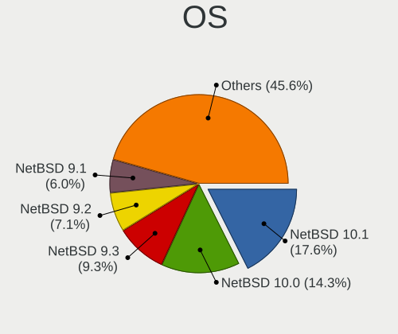

| Name               | Computers | Percent |
|--------------------|-----------|---------|
| NetBSD 10.1        | 32        | 17.58%  |
| NetBSD 10.0        | 26        | 14.29%  |
| NetBSD 9.3         | 17        | 9.34%   |
| NetBSD 9.2         | 13        | 7.14%   |
| NetBSD 9.1         | 11        | 6.04%   |
| NetBSD 10.1_STABLE | 11        | 6.04%   |
| NetBSD 9.0_STABLE  | 8         | 4.4%    |
| NetBSD 9.0         | 6         | 3.3%    |
| NetBSD 10.0_RC2    | 5         | 2.75%   |
| NetBSD 10.0_RC1    | 5         | 2.75%   |
| NetBSD 10.0_BETA   | 5         | 2.75%   |
| NetBSD 10.0_RC4    | 4         | 2.2%    |
| NetBSD 9.99.94     | 3         | 1.65%   |
| NetBSD 9.99.93     | 3         | 1.65%   |
| NetBSD 9.1_STABLE  | 3         | 1.65%   |
| NetBSD 10.0_STABLE | 3         | 1.65%   |
| NetBSD 10.0_RC5    | 3         | 1.65%   |
| NetBSD 9.99.77     | 2         | 1.1%    |
| NetBSD 9.3_STABLE  | 2         | 1.1%    |
| NetBSD 9.2_STABLE  | 2         | 1.1%    |
| NetBSD 10.0_RC3    | 2         | 1.1%    |
| NetBSD 9.99.85     | 1         | 0.55%   |
| NetBSD 9.99.81     | 1         | 0.55%   |
| NetBSD 9.99.74     | 1         | 0.55%   |
| NetBSD 9.99.71     | 1         | 0.55%   |
| NetBSD 9.99.61     | 1         | 0.55%   |
| NetBSD 9.99.23     | 1         | 0.55%   |
| NetBSD 9.99.107    | 1         | 0.55%   |
| NetBSD 8.99.51     | 1         | 0.55%   |
| NetBSD 8.2         | 1         | 0.55%   |
| NetBSD 7.2         | 1         | 0.55%   |
| NetBSD 11.99.4     | 1         | 0.55%   |
| NetBSD 11.0_BETA   | 1         | 0.55%   |
| NetBSD 10.99.7     | 1         | 0.55%   |
| NetBSD 10.99.12    | 1         | 0.55%   |
| NetBSD 10.99.10    | 1         | 0.55%   |
| NetBSD 10.99.1     | 1         | 0.55%   |

OS Family
---------

OS without a version

| Name   | Computers | Percent |
|--------|-----------|---------|
| NetBSD | 162       | 100%    |

Arch
----

OS architecture (x86_64, i586, etc.)

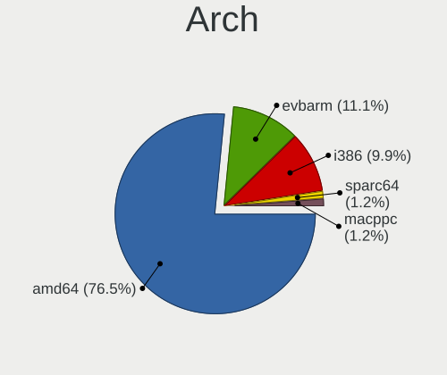

| Name    | Computers | Percent |
|---------|-----------|---------|
| amd64   | 124       | 76.54%  |
| evbarm  | 18        | 11.11%  |
| i386    | 16        | 9.88%   |
| sparc64 | 2         | 1.23%   |
| macppc  | 2         | 1.23%   |

DE
--

Desktop Environment

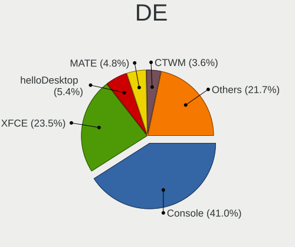

| Name         | Computers | Percent |
|--------------|-----------|---------|
| Console      | 68        | 40.96%  |
| XFCE         | 39        | 23.49%  |
| helloDesktop | 9         | 5.42%   |
| MATE         | 8         | 4.82%   |
| CTWM         | 6         | 3.61%   |
| Fluxbox      | 5         | 3.01%   |
| iwm          | 4         | 2.41%   |
| DWM          | 4         | 2.41%   |
| Window Maker | 3         | 1.81%   |
| LXQt         | 3         | 1.81%   |
| IceWM        | 3         | 1.81%   |
| GNOME        | 3         | 1.81%   |
| Ratpoison    | 2         | 1.2%    |
| Xfwm4        | 1         | 0.6%    |
| spectrwm     | 1         | 0.6%    |
| sdorfehs     | 1         | 0.6%    |
| PekWM        | 1         | 0.6%    |
| LXDE         | 1         | 0.6%    |
| JWM          | 1         | 0.6%    |
| i3           | 1         | 0.6%    |
| Blackbox     | 1         | 0.6%    |
| Awesome      | 1         | 0.6%    |

Display Server
--------------

X11 or Wayland

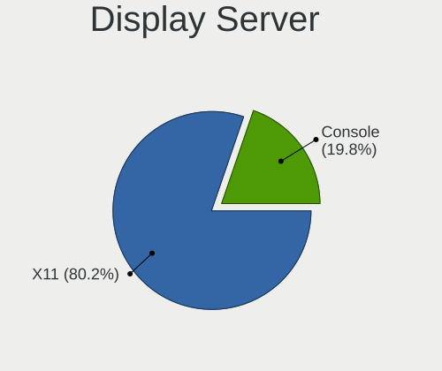

| Name    | Computers | Percent |
|---------|-----------|---------|
| X11     | 130       | 80.25%  |
| Console | 32        | 19.75%  |

Display Manager
---------------

SDDM, LightDM, etc.

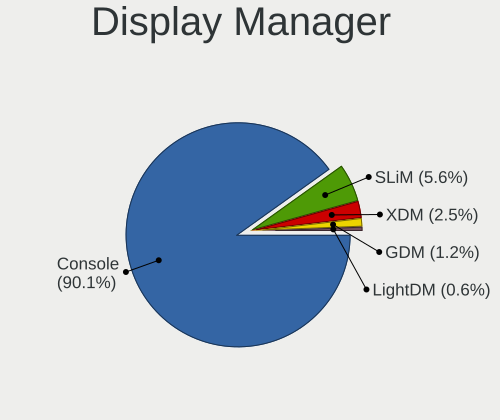

| Name    | Computers | Percent |
|---------|-----------|---------|
| Console | 146       | 90.12%  |
| SLiM    | 9         | 5.56%   |
| XDM     | 4         | 2.47%   |
| GDM     | 2         | 1.23%   |
| LightDM | 1         | 0.62%   |

OS Lang
-------

Language

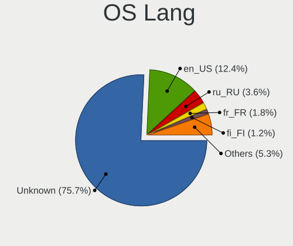

| Lang    | Computers | Percent |
|---------|-----------|---------|
| Unknown | 128       | 75.74%  |
| en_US   | 21        | 12.43%  |
| ru_RU   | 6         | 3.55%   |
| fr_FR   | 3         | 1.78%   |
| fi_FI   | 2         | 1.18%   |
| es_ES   | 2         | 1.18%   |
| C       | 2         | 1.18%   |
| pl_PL   | 1         | 0.59%   |
| hu_HU   | 1         | 0.59%   |
| es_MX   | 1         | 0.59%   |
| en_GB   | 1         | 0.59%   |
| de_DE   | 1         | 0.59%   |

Boot Mode
---------

EFI or BIOS

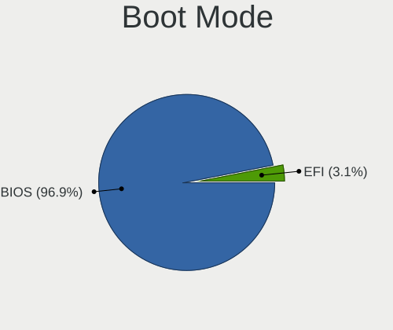

| Mode | Computers | Percent |
|------|-----------|---------|
| BIOS | 157       | 96.91%  |
| EFI  | 5         | 3.09%   |

Filesystem
----------

Type of filesystem

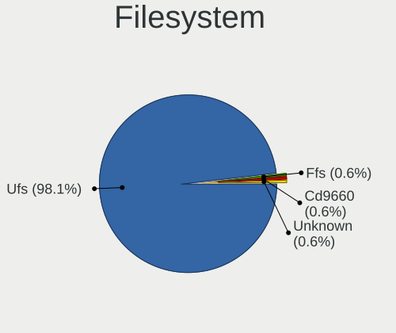

| Type    | Computers | Percent |
|---------|-----------|---------|
| Ufs     | 159       | 98.15%  |
| Ffs     | 1         | 0.62%   |
| Cd9660  | 1         | 0.62%   |
| Unknown | 1         | 0.62%   |

Part. scheme
------------

Scheme of partitioning

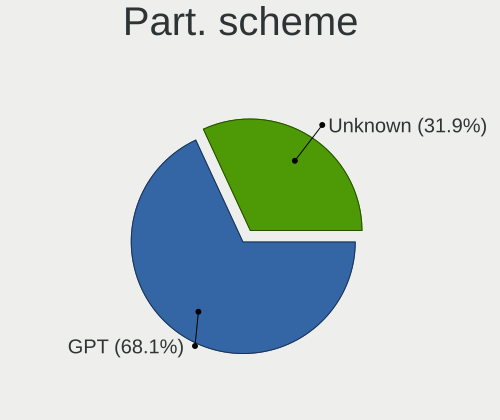

| Type    | Computers | Percent |
|---------|-----------|---------|
| GPT     | 111       | 68.1%   |
| Unknown | 52        | 31.9%   |

Board
-----

Vendor
------

Motherboard manufacturer

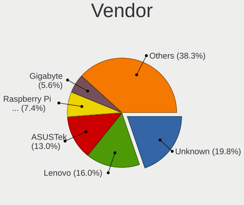

| Name                    | Computers | Percent |
|-------------------------|-----------|---------|
| Unknown                 | 32        | 19.75%  |
| Lenovo                  | 26        | 16.05%  |
| ASUSTek Computer        | 21        | 12.96%  |
| Raspberry Pi Foundation | 12        | 7.41%   |
| Gigabyte Technology     | 9         | 5.56%   |
| Intel                   | 6         | 3.7%    |
| Hewlett-Packard         | 6         | 3.7%    |
| ASRock                  | 6         | 3.7%    |
| Dell                    | 5         | 3.09%   |
| Apple                   | 5         | 3.09%   |
| Acer                    | 5         | 3.09%   |
| Samsung Electronics     | 4         | 2.47%   |
| MSI                     | 3         | 1.85%   |
| Toshiba                 | 2         | 1.23%   |
| IBM                     | 2         | 1.23%   |
| HUAWEI                  | 2         | 1.23%   |
| Google                  | 2         | 1.23%   |
| Win Element             | 1         | 0.62%   |
| VIA Technologies        | 1         | 0.62%   |
| Timi                    | 1         | 0.62%   |
| Supermicro              | 1         | 0.62%   |
| Sony                    | 1         | 0.62%   |
| Panasonic               | 1         | 0.62%   |
| Packard Bell            | 1         | 0.62%   |
| MiTAC                   | 1         | 0.62%   |
| Microsoft               | 1         | 0.62%   |
| KLLISRE                 | 1         | 0.62%   |
| GEEKOM                  | 1         | 0.62%   |
| Fujitsu Siemens         | 1         | 0.62%   |
| eMachines               | 1         | 0.62%   |
| BY OEM                  | 1         | 0.62%   |

Model
-----

Motherboard model

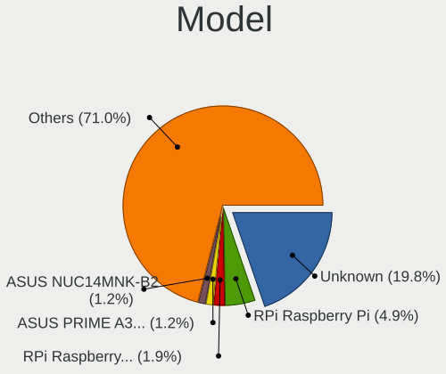

| Name                                        | Computers | Percent |
|---------------------------------------------|-----------|---------|
| Unknown                                     | 32        | 19.75%  |
| RPi Raspberry Pi                            | 8         | 4.94%   |
| RPi Raspberry Pi 4 Model B                  | 3         | 1.85%   |
| ASUS PRIME A320M-K                          | 2         | 1.23%   |
| ASUS NUC14MNK-B2                            | 2         | 1.23%   |
| Win Element M9                              | 1         | 0.62%   |
| VIA VT8366-8233                             | 1         | 0.62%   |
| Toshiba Satellite L50D-C                    | 1         | 0.62%   |
| Toshiba Satellite A100                      | 1         | 0.62%   |
| Timi TM1612                                 | 1         | 0.62%   |
| Supermicro X9SRE/X9SRE-3F/X9SRi/X9SRi-3F    | 1         | 0.62%   |
| Sony SVF1421DSGW                            | 1         | 0.62%   |
| Samsung NC10                                | 1         | 0.62%   |
| Samsung N150/N210/N220                      | 1         | 0.62%   |
| Samsung DP700A3D/DM700A3D/DB701A3D/DP700A7D | 1         | 0.62%   |
| Samsung 530U3C/530U4C/532U3C                | 1         | 0.62%   |
| RPi Raspberry Pi 5 Model B                  | 1         | 0.62%   |
| Panasonic CF-C1BD06EFG                      | 1         | 0.62%   |
| Packard Bell IMEDIA S3800                   | 1         | 0.62%   |
| MSI MS-7B86                                 | 1         | 0.62%   |
| MSI MS-7551                                 | 1         | 0.62%   |
| MSI GE62 6QC                                | 1         | 0.62%   |
| MiTAC 5033                                  | 1         | 0.62%   |
| Microsoft Surface Go 2                      | 1         | 0.62%   |
| Lenovo ThinkStation P520 30BFS8M400         | 1         | 0.62%   |
| Lenovo ThinkPad X260 20F60097US             | 1         | 0.62%   |
| Lenovo ThinkPad X240 20AMS0J01N             | 1         | 0.62%   |
| Lenovo ThinkPad X230 2325A39                | 1         | 0.62%   |
| Lenovo ThinkPad X201 3323K2M                | 1         | 0.62%   |
| Lenovo ThinkPad X1 Extreme 20MF000TGE       | 1         | 0.62%   |
| Lenovo ThinkPad T510 4313CTO                | 1         | 0.62%   |
| Lenovo ThinkPad T490 20N3S4PX02             | 1         | 0.62%   |
| Lenovo ThinkPad T480s 20L8S45W00            | 1         | 0.62%   |
| Lenovo ThinkPad T470 W10DG 20JNS0L300       | 1         | 0.62%   |
| Lenovo ThinkPad T470 20HES0EV0A             | 1         | 0.62%   |
| Lenovo ThinkPad T460s 20FAS3L002            | 1         | 0.62%   |
| Lenovo ThinkPad T430s 23564H3               | 1         | 0.62%   |
| Lenovo ThinkPad T430 2347A45                | 1         | 0.62%   |
| Lenovo ThinkPad T420 4236D26                | 1         | 0.62%   |
| Lenovo ThinkPad T410 2518A37                | 1         | 0.62%   |

Model Family
------------

Motherboard model prefix

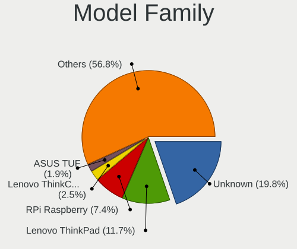

| Name                   | Computers | Percent |
|------------------------|-----------|---------|
| Unknown                | 32        | 19.75%  |
| Lenovo ThinkPad        | 19        | 11.73%  |
| RPi Raspberry          | 12        | 7.41%   |
| Lenovo ThinkCentre     | 4         | 2.47%   |
| ASUS TUF               | 3         | 1.85%   |
| ASUS PRIME             | 3         | 1.85%   |
| Toshiba Satellite      | 2         | 1.23%   |
| HP EliteDesk           | 2         | 1.23%   |
| Gigabyte X570          | 2         | 1.23%   |
| Dell Precision         | 2         | 1.23%   |
| ASUS NUC14MNK-B2       | 2         | 1.23%   |
| ASRock 970             | 2         | 1.23%   |
| Acer Aspire            | 2         | 1.23%   |
| Win Element M9         | 1         | 0.62%   |
| VIA VT8366-8233        | 1         | 0.62%   |
| Timi TM1612            | 1         | 0.62%   |
| Supermicro X9SRE       | 1         | 0.62%   |
| Sony SVF1421DSGW       | 1         | 0.62%   |
| Samsung NC10           | 1         | 0.62%   |
| Samsung N150           | 1         | 0.62%   |
| Samsung DP700A3D       | 1         | 0.62%   |
| Samsung 530U3C         | 1         | 0.62%   |
| Panasonic CF-C1BD06EFG | 1         | 0.62%   |
| Packard Bell IMEDIA    | 1         | 0.62%   |
| MSI MS-7B86            | 1         | 0.62%   |
| MSI MS-7551            | 1         | 0.62%   |
| MSI GE62               | 1         | 0.62%   |
| MiTAC 5033             | 1         | 0.62%   |
| Microsoft Surface      | 1         | 0.62%   |
| Lenovo ThinkStation    | 1         | 0.62%   |
| Lenovo IdeaCentre      | 1         | 0.62%   |
| Lenovo G500            | 1         | 0.62%   |
| KLLISRE X99-B5         | 1         | 0.62%   |
| Intel NUC8i7BEH        | 1         | 0.62%   |
| Intel NUC7PJYH         | 1         | 0.62%   |
| Intel NUC5PPYB         | 1         | 0.62%   |
| Intel NUC5i7RYB        | 1         | 0.62%   |
| Intel Jasper           | 1         | 0.62%   |
| Intel DN2820FYK        | 1         | 0.62%   |
| IBM ThinkPad           | 1         | 0.62%   |

MFG Year
--------

Motherboard manufacture year

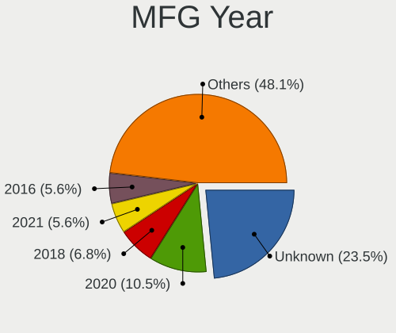

| Year    | Computers | Percent |
|---------|-----------|---------|
| Unknown | 38        | 23.46%  |
| 2020    | 17        | 10.49%  |
| 2018    | 11        | 6.79%   |
| 2021    | 9         | 5.56%   |
| 2016    | 9         | 5.56%   |
| 2013    | 9         | 5.56%   |
| 2019    | 8         | 4.94%   |
| 2022    | 7         | 4.32%   |
| 2010    | 7         | 4.32%   |
| 2024    | 6         | 3.7%    |
| 2011    | 6         | 3.7%    |
| 2017    | 5         | 3.09%   |
| 2014    | 4         | 2.47%   |
| 2012    | 4         | 2.47%   |
| 2023    | 3         | 1.85%   |
| 2015    | 3         | 1.85%   |
| 2009    | 3         | 1.85%   |
| 2007    | 3         | 1.85%   |
| 2005    | 3         | 1.85%   |
| 2008    | 2         | 1.23%   |
| 2001    | 2         | 1.23%   |
| 2025    | 1         | 0.62%   |
| 2003    | 1         | 0.62%   |
| 2002    | 1         | 0.62%   |

Form Factor
-----------

Physical design of the computer

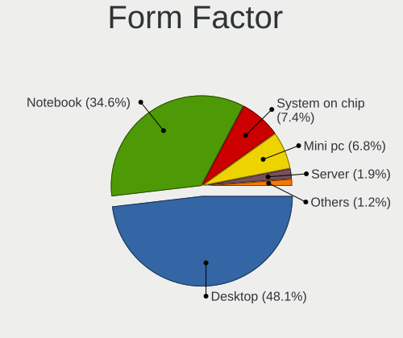

| Name           | Computers | Percent |
|----------------|-----------|---------|
| Desktop        | 78        | 48.15%  |
| Notebook       | 56        | 34.57%  |
| System on chip | 12        | 7.41%   |
| Mini pc        | 11        | 6.79%   |
| Server         | 3         | 1.85%   |
| Tablet         | 1         | 0.62%   |
| All in one     | 1         | 0.62%   |

Coreboot
--------

Have coreboot on board

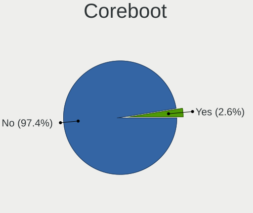

| Used | Computers | Percent |
|------|-----------|---------|
| No   | 159       | 98.15%  |
| Yes  | 3         | 1.85%   |

RAM Size
--------

Total RAM memory

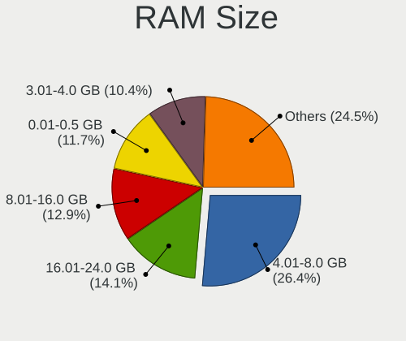

| Size in GB  | Computers | Percent |
|-------------|-----------|---------|
| 4.01-8.0    | 43        | 26.38%  |
| 16.01-24.0  | 23        | 14.11%  |
| 8.01-16.0   | 21        | 12.88%  |
| 0.01-0.5    | 19        | 11.66%  |
| 3.01-4.0    | 17        | 10.43%  |
| 32.01-64.0  | 12        | 7.36%   |
| 0.51-1.0    | 9         | 5.52%   |
| 1.01-2.0    | 6         | 3.68%   |
| 24.01-32.0  | 5         | 3.07%   |
| 64.01-256.0 | 5         | 3.07%   |
| 2.01-3.0    | 1         | 0.61%   |
| 0           | 1         | 0.61%   |
| Unknown     | 1         | 0.61%   |

RAM Used
--------

Used RAM memory

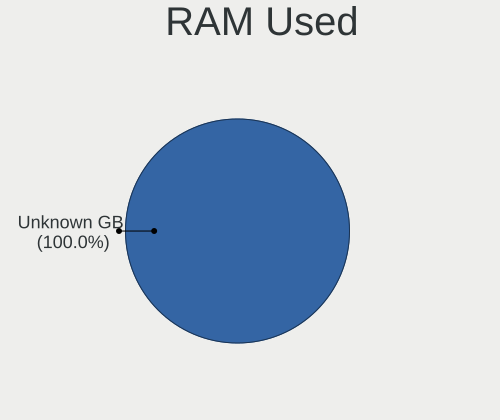

| Used GB | Computers | Percent |
|---------|-----------|---------|
| Unknown | 162       | 100%    |

Total Drives
------------

Number of drives on board

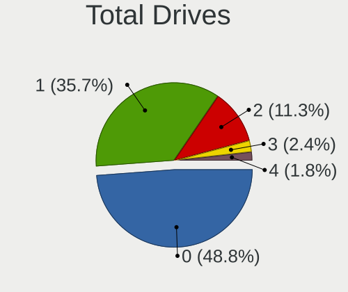

| Drives | Computers | Percent |
|--------|-----------|---------|
| 0      | 82        | 48.81%  |
| 1      | 60        | 35.71%  |
| 2      | 19        | 11.31%  |
| 3      | 4         | 2.38%   |
| 4      | 3         | 1.79%   |

Has CD-ROM
----------

Has CD-ROM on board

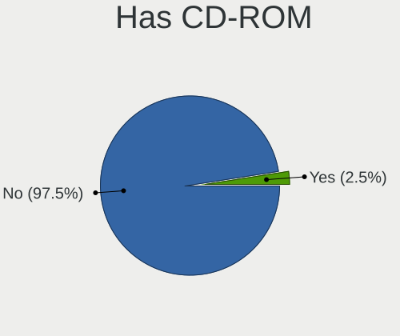

| Presented | Computers | Percent |
|-----------|-----------|---------|
| No        | 158       | 97.53%  |
| Yes       | 4         | 2.47%   |

Has Ethernet
------------

Has Ethernet on board

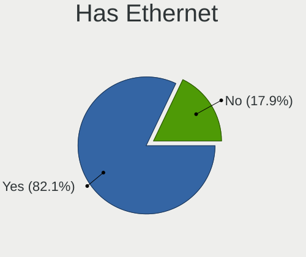

| Presented | Computers | Percent |
|-----------|-----------|---------|
| Yes       | 133       | 82.1%   |
| No        | 29        | 17.9%   |

Has WiFi
--------

Has WiFi module

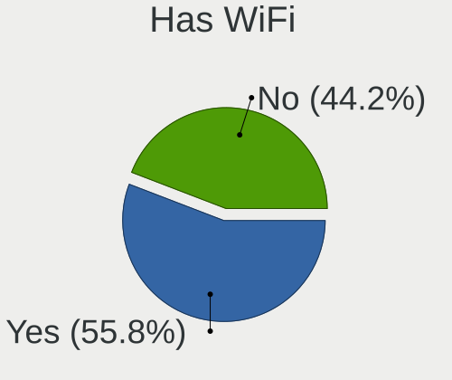

| Presented | Computers | Percent |
|-----------|-----------|---------|
| Yes       | 91        | 55.83%  |
| No        | 72        | 44.17%  |

Has Bluetooth
-------------

Has Bluetooth module

| Presented | Computers | Percent |
|-----------|-----------|---------|
| No        | 93        | 57.06%  |
| Yes       | 70        | 42.94%  |

Location
--------

Country
-------

Geographic location (country)

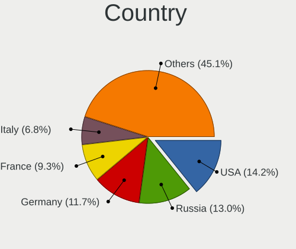

| Country                | Computers | Percent |
|------------------------|-----------|---------|
| USA                    | 23        | 14.2%   |
| Russia                 | 21        | 12.96%  |
| Germany                | 19        | 11.73%  |
| France                 | 15        | 9.26%   |
| Italy                  | 11        | 6.79%   |
| Spain                  | 8         | 4.94%   |
| UK                     | 7         | 4.32%   |
| Denmark                | 6         | 3.7%    |
| Poland                 | 5         | 3.09%   |
| Hungary                | 5         | 3.09%   |
| Romania                | 4         | 2.47%   |
| Finland                | 4         | 2.47%   |
| Saudi Arabia           | 3         | 1.85%   |
| Norway                 | 3         | 1.85%   |
| India                  | 3         | 1.85%   |
| Brazil                 | 3         | 1.85%   |
| Australia              | 3         | 1.85%   |
| Vietnam                | 2         | 1.23%   |
| Lithuania              | 2         | 1.23%   |
| Latvia                 | 2         | 1.23%   |
| Japan                  | 2         | 1.23%   |
| Canada                 | 2         | 1.23%   |
| Taiwan                 | 1         | 0.62%   |
| Sweden                 | 1         | 0.62%   |
| Netherlands            | 1         | 0.62%   |
| Mexico                 | 1         | 0.62%   |
| Greece                 | 1         | 0.62%   |
| Czechia                | 1         | 0.62%   |
| China                  | 1         | 0.62%   |
| Bosnia and Herzegovina | 1         | 0.62%   |
| Austria                | 1         | 0.62%   |

City
----

Geographic location (city)

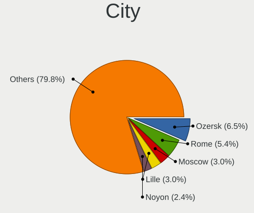

| City             | Computers | Percent |
|------------------|-----------|---------|
| Ozersk           | 11        | 6.55%   |
| Rome             | 9         | 5.36%   |
| Moscow           | 5         | 2.98%   |
| Lille            | 5         | 2.98%   |
| Noyon            | 4         | 2.38%   |
| Madrid           | 4         | 2.38%   |
| Bucharest        | 4         | 2.38%   |
| Tampere          | 3         | 1.79%   |
| Riyadh           | 3         | 1.79%   |
| Poitiers         | 3         | 1.79%   |
| Gardony          | 3         | 1.79%   |
| Frederiksberg    | 3         | 1.79%   |
| Essen            | 3         | 1.79%   |
| Berlin           | 3         | 1.79%   |
| Warsaw           | 2         | 1.19%   |
| Vilnius          | 2         | 1.19%   |
| Sydney           | 2         | 1.19%   |
| Riga             | 2         | 1.19%   |
| Oxon Hill        | 2         | 1.19%   |
| Novosibirsk      | 2         | 1.19%   |
| Newberg          | 2         | 1.19%   |
| Long Beach       | 2         | 1.19%   |
| Køge            | 2         | 1.19%   |
| Ho Chi Minh City | 2         | 1.19%   |
| Higashihatsuishi | 2         | 1.19%   |
| Hayward          | 2         | 1.19%   |
| A Coruña        | 2         | 1.19%   |
| Washington       | 1         | 0.6%    |
| Urupes           | 1         | 0.6%    |
| Unterhaching     | 1         | 0.6%    |
| Ulyanovsk        | 1         | 0.6%    |
| Ulan-Ude         | 1         | 0.6%    |
| Turin            | 1         | 0.6%    |
| Turenki          | 1         | 0.6%    |
| Thessaloniki     | 1         | 0.6%    |
| Techa            | 1         | 0.6%    |
| Taipei           | 1         | 0.6%    |
| Surrey           | 1         | 0.6%    |
| Sun Prairie      | 1         | 0.6%    |
| Stourbridge      | 1         | 0.6%    |

Drives
------

Drive Vendor
------------

Hard drive vendors

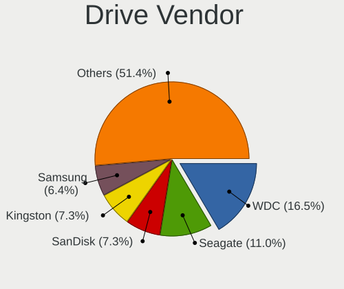

| Vendor                             | Computers | Drives | Percent |
|------------------------------------|-----------|--------|---------|
| WDC                                | 18        | 24     | 16.51%  |
| Seagate                            | 12        | 13     | 11.01%  |
| SanDisk                            | 8         | 9      | 7.34%   |
| Kingston                           | 8         | 9      | 7.34%   |
| Samsung Electronics                | 7         | 7      | 6.42%   |
| Crucial                            | 6         | 7      | 5.5%    |
| Toshiba                            | 5         | 7      | 4.59%   |
| Maxtor                             | 5         | 6      | 4.59%   |
| Hitachi                            | 4         | 5      | 3.67%   |
| Intel                              | 3         | 3      | 2.75%   |
| HGST                               | 3         | 3      | 2.75%   |
| Generic                            | 3         | 3      | 2.75%   |
| Patriot                            | 2         | 2      | 1.83%   |
| JetFlash                           | 2         | 2      | 1.83%   |
| Intenso                            | 2         | 2      | 1.83%   |
| Hewlett-Packard                    | 2         | 4      | 1.83%   |
| A-DATA Technology                  | 2         | 2      | 1.83%   |
| WLW                                | 1         | 1      | 0.92%   |
| USB                                | 1         | 1      | 0.92%   |
| Transcend                          | 1         | 1      | 0.92%   |
| StoreJet                           | 1         | 1      | 0.92%   |
| SMI                                | 1         | 1      | 0.92%   |
| SK hynix                           | 1         | 2      | 0.92%   |
| Product:              USB DISK 2.0 | 1         | 1      | 0.92%   |
| PNY                                | 1         | 1      | 0.92%   |
| Lexar                              | 1         | 1      | 0.92%   |
| KIOXIA-EXCERIA                     | 1         | 1      | 0.92%   |
| KingSpec                           | 1         | 1      | 0.92%   |
| IBM/Hitachi                        | 1         | 1      | 0.92%   |
| Fujitsu                            | 1         | 1      | 0.92%   |
| Fanxiang                           | 1         | 1      | 0.92%   |
| Dell                               | 1         | 2      | 0.92%   |
| China                              | 1         | 1      | 0.92%   |
| Apacer                             | 1         | 1      | 0.92%   |

Drive Model
-----------

Hard drive models

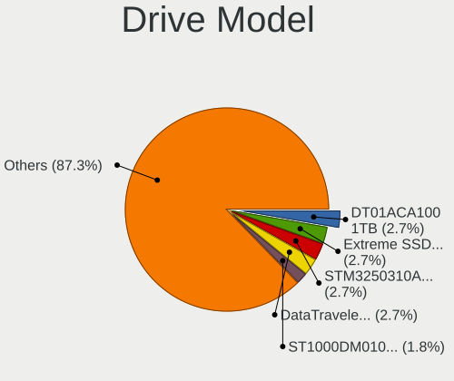

| Model                               | Computers | Percent |
|-------------------------------------|-----------|---------|
| Toshiba DT01ACA100 1TB              | 3         | 2.73%   |
| SanDisk Extreme SSD 1TB             | 3         | 2.73%   |
| Maxtor STM3250310AS 250GB           | 3         | 2.73%   |
| Kingston DataTraveler 3.0 32GB      | 3         | 2.73%   |
| Seagate ST1000DM010-2EP102 1TB      | 2         | 1.82%   |
| Samsung SSD 860 EVO 500GB           | 2         | 1.82%   |
| Samsung HD103UJ 1TB                 | 2         | 1.82%   |
| Maxtor 6E040L0 40GB                 | 2         | 1.82%   |
| JetFlash Transcend 16GB             | 2         | 1.82%   |
| HGST HTS541010A9E680 1TB            | 2         | 1.82%   |
| Generic Flash Disk 64GB             | 2         | 1.82%   |
| WLW essentials 4GB                  | 1         | 0.91%   |
| WDC WDS240G2G0B-00EPW0 240GB        | 1         | 0.91%   |
| WDC WDS240G2G0A-00JH30 240GB        | 1         | 0.91%   |
| WDC WDS120G2G0A-00JH30 120GB        | 1         | 0.91%   |
| WDC WD800AAJS-18TDA1 80GB           | 1         | 0.91%   |
| WDC WD5003AZEX-00K3CA0 500GB        | 1         | 0.91%   |
| WDC WD5000BPVT-80HXZT1 500GB        | 1         | 0.91%   |
| WDC WD5000AAKX-753CA1 500GB         | 1         | 0.91%   |
| WDC WD5000AACS-00ZUB0 500GB         | 1         | 0.91%   |
| WDC WD400BB-75DEA0 40GB             | 1         | 0.91%   |
| WDC WD2502ABYS-01B7A0 256GB         | 1         | 0.91%   |
| WDC WD20EFRX-68EUZN0 1TB            | 1         | 0.91%   |
| WDC WD20EARX-00PASB0 2TB            | 1         | 0.91%   |
| WDC WD200EB-00BHF0 20GB             | 1         | 0.91%   |
| WDC WD1600BEVT-00A23T0 160GB        | 1         | 0.91%   |
| WDC WD10EZRZ-00HTKB0 1TB            | 1         | 0.91%   |
| WDC WD10EZEX-60WN4A0 1TB            | 1         | 0.91%   |
| WDC WD10EADS-22M2B0 1TB             | 1         | 0.91%   |
| WDC WD1002FAEX-00Y9A0 1TB           | 1         | 0.91%   |
| WDC WD Elements 2621 2TB            | 1         | 0.91%   |
| USB SanDisk 3.2Gen1 64GB            | 1         | 0.91%   |
| Transcend TS256GSSD230S 256GB       | 1         | 0.91%   |
| Toshiba MQ01ABF050 500GB            | 1         | 0.91%   |
| Toshiba DT01ACA200 2TB              | 1         | 0.91%   |
| StoreJet Transcend 256GB            | 1         | 0.91%   |
| SMI USB DISK 16GB                   | 1         | 0.91%   |
| SK hynix HFS128G39TND-N210A 128GB   | 1         | 0.91%   |
| Seagate ST940110A 40GB              | 1         | 0.91%   |
| Seagate ST750LM022 HN-M750MBB 752GB | 1         | 0.91%   |

HDD Vendor
----------

Hard disk drive vendors

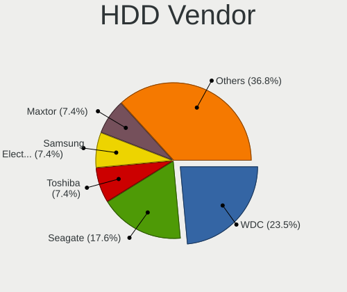

| Vendor                             | Computers | Drives | Percent |
|------------------------------------|-----------|--------|---------|
| WDC                                | 16        | 21     | 23.53%  |
| Seagate                            | 12        | 13     | 17.65%  |
| Toshiba                            | 5         | 7      | 7.35%   |
| Samsung Electronics                | 5         | 5      | 7.35%   |
| Maxtor                             | 5         | 6      | 7.35%   |
| Hitachi                            | 4         | 5      | 5.88%   |
| HGST                               | 3         | 3      | 4.41%   |
| Generic                            | 3         | 3      | 4.41%   |
| JetFlash                           | 2         | 2      | 2.94%   |
| Intenso                            | 2         | 2      | 2.94%   |
| Hewlett-Packard                    | 2         | 4      | 2.94%   |
| WLW                                | 1         | 1      | 1.47%   |
| USB                                | 1         | 1      | 1.47%   |
| StoreJet                           | 1         | 1      | 1.47%   |
| SMI                                | 1         | 1      | 1.47%   |
| Product:              USB DISK 2.0 | 1         | 1      | 1.47%   |
| Lexar                              | 1         | 1      | 1.47%   |
| IBM/Hitachi                        | 1         | 1      | 1.47%   |
| Fujitsu                            | 1         | 1      | 1.47%   |
| Dell                               | 1         | 2      | 1.47%   |

SSD Vendor
----------

Solid state drive vendors

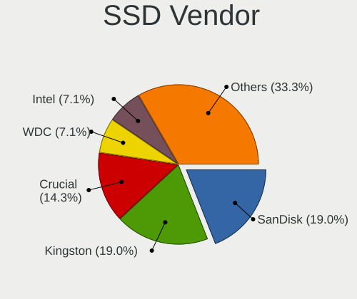

| Vendor              | Computers | Drives | Percent |
|---------------------|-----------|--------|---------|
| SanDisk             | 8         | 9      | 19.05%  |
| Kingston            | 8         | 9      | 19.05%  |
| Crucial             | 6         | 7      | 14.29%  |
| WDC                 | 3         | 3      | 7.14%   |
| Intel               | 3         | 3      | 7.14%   |
| Samsung Electronics | 2         | 2      | 4.76%   |
| Patriot             | 2         | 2      | 4.76%   |
| A-DATA Technology   | 2         | 2      | 4.76%   |
| Transcend           | 1         | 1      | 2.38%   |
| SK hynix            | 1         | 2      | 2.38%   |
| PNY                 | 1         | 1      | 2.38%   |
| KIOXIA-EXCERIA      | 1         | 1      | 2.38%   |
| KingSpec            | 1         | 1      | 2.38%   |
| Fanxiang            | 1         | 1      | 2.38%   |
| China               | 1         | 1      | 2.38%   |
| Apacer              | 1         | 1      | 2.38%   |

Drive Kind
----------

HDD or SSD

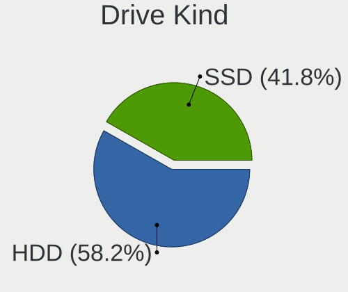

| Kind | Computers | Drives | Percent |
|------|-----------|--------|---------|
| HDD  | 53        | 81     | 58.24%  |
| SSD  | 38        | 46     | 41.76%  |

Drive Connector
---------------

SATA, SAS, NVMe, etc.

| Type | Computers | Drives | Percent |
|------|-----------|--------|---------|
| SATA | 80        | 127    | 100%    |

Drive Size
----------

Size of hard drive

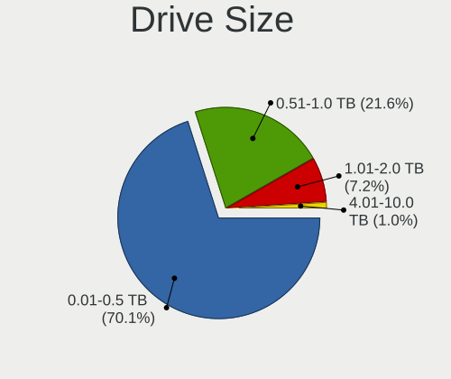

| Size in TB | Computers | Drives | Percent |
|------------|-----------|--------|---------|
| 0.01-0.5   | 68        | 87     | 70.1%   |
| 0.51-1.0   | 21        | 26     | 21.65%  |
| 1.01-2.0   | 7         | 12     | 7.22%   |
| 4.01-10.0  | 1         | 2      | 1.03%   |

Space Total
-----------

Amount of disk space available on the file system

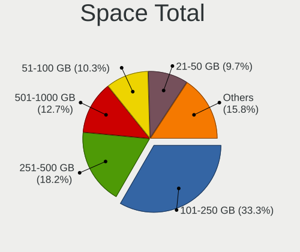

| Size in GB     | Computers | Percent |
|----------------|-----------|---------|
| 101-250        | 55        | 33.33%  |
| 251-500        | 30        | 18.18%  |
| 501-1000       | 21        | 12.73%  |
| 51-100         | 17        | 10.3%   |
| 21-50          | 16        | 9.7%    |
| 1-20           | 15        | 9.09%   |
| 1001-2000      | 7         | 4.24%   |
| 2001-3000      | 3         | 1.82%   |
| More than 3000 | 1         | 0.61%   |

Space Used
----------

Amount of used disk space

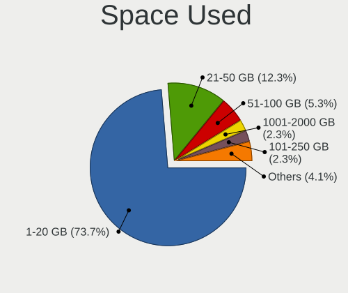

| Used GB        | Computers | Percent |
|----------------|-----------|---------|
| 1-20           | 126       | 73.68%  |
| 21-50          | 21        | 12.28%  |
| 51-100         | 9         | 5.26%   |
| 101-250        | 4         | 2.34%   |
| 1001-2000      | 4         | 2.34%   |
| 251-500        | 3         | 1.75%   |
| 501-1000       | 3         | 1.75%   |
| More than 3000 | 1         | 0.58%   |

Malfunc. Drives
---------------

Drive models with a malfunction

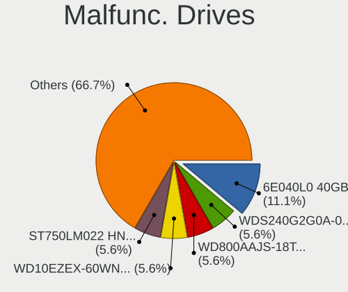

| Model                               | Computers | Drives | Percent |
|-------------------------------------|-----------|--------|---------|
| Maxtor 6E040L0 40GB                 | 2         | 2      | 11.11%  |
| WDC WDS240G2G0A-00JH30 240GB        | 1         | 1      | 5.56%   |
| WDC WD800AAJS-18TDA1 80GB           | 1         | 1      | 5.56%   |
| WDC WD10EZEX-60WN4A0 1TB            | 1         | 1      | 5.56%   |
| SK hynix HFS128G39TND-N210A 128GB   | 1         | 1      | 5.56%   |
| Seagate ST750LM022 HN-M750MBB 752GB | 1         | 1      | 5.56%   |
| Seagate ST500VT000-1DK142 500GB     | 1         | 1      | 5.56%   |
| Seagate ST500LT012-9WS142 500GB     | 1         | 1      | 5.56%   |
| Seagate ST2000DL003-9VT166 2TB      | 1         | 1      | 5.56%   |
| Seagate ST1000DX001-1CM162 1TB      | 1         | 1      | 5.56%   |
| Intel SSDSC2KW120H6 120GB           | 1         | 1      | 5.56%   |
| Intel SSDSC2CW120A3 120GB           | 1         | 1      | 5.56%   |
| Intel SSDSC2BF180A4L 180GB          | 1         | 1      | 5.56%   |
| IBM/Hitachi IC25N040ATMR04-0 40GB   | 1         | 1      | 5.56%   |
| Hitachi HTS721060G9AT00 64GB        | 1         | 1      | 5.56%   |
| Hitachi HTS548040M9AT00 37GB        | 1         | 2      | 5.56%   |
| Hitachi DK23DA-30B 32GB             | 1         | 1      | 5.56%   |

Malfunc. Drive Vendor
---------------------

Vendors of faulty drives

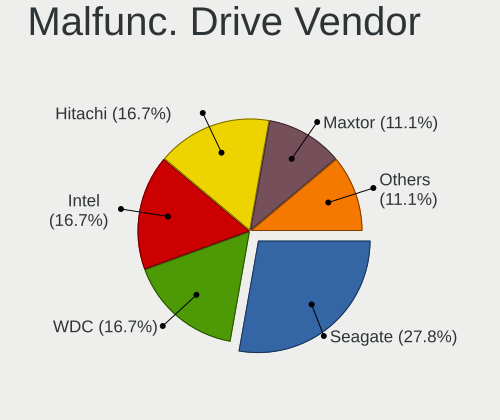

| Vendor      | Computers | Drives | Percent |
|-------------|-----------|--------|---------|
| Seagate     | 5         | 5      | 27.78%  |
| WDC         | 3         | 3      | 16.67%  |
| Intel       | 3         | 3      | 16.67%  |
| Hitachi     | 3         | 4      | 16.67%  |
| Maxtor      | 2         | 2      | 11.11%  |
| SK hynix    | 1         | 1      | 5.56%   |
| IBM/Hitachi | 1         | 1      | 5.56%   |

Malfunc. HDD Vendor
-------------------

Vendors of faulty HDD drives

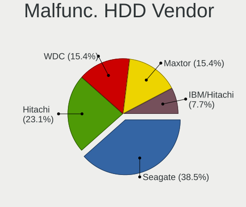

| Vendor      | Computers | Drives | Percent |
|-------------|-----------|--------|---------|
| Seagate     | 5         | 5      | 38.46%  |
| Hitachi     | 3         | 4      | 23.08%  |
| WDC         | 2         | 2      | 15.38%  |
| Maxtor      | 2         | 2      | 15.38%  |
| IBM/Hitachi | 1         | 1      | 7.69%   |

Malfunc. Drive Kind
-------------------

Kinds of faulty drives

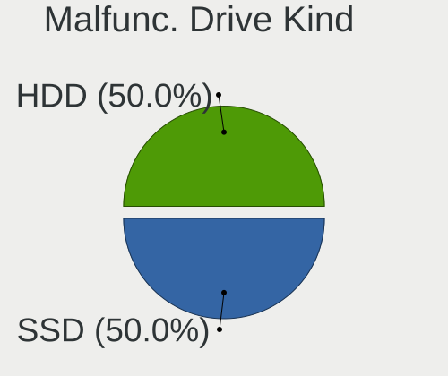

| Kind | Computers | Drives | Percent |
|------|-----------|--------|---------|
| HDD  | 13        | 14     | 72.22%  |
| SSD  | 5         | 5      | 27.78%  |

Failed Drives
-------------

Failed drive models

Zero info for selected period =(

Failed Drive Vendor
-------------------

Failed drive vendors

Zero info for selected period =(

Drive Status
------------

Number of failed and malfunc. drives

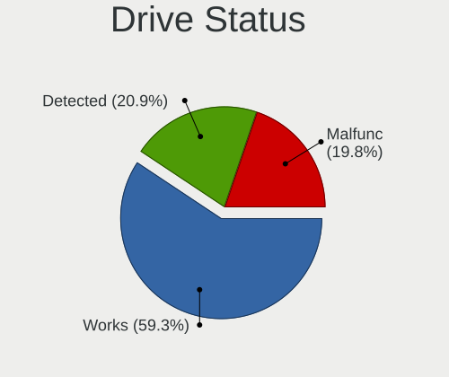

| Status   | Computers | Drives | Percent |
|----------|-----------|--------|---------|
| Works    | 54        | 85     | 59.34%  |
| Detected | 19        | 23     | 20.88%  |
| Malfunc  | 18        | 19     | 19.78%  |

Storage controller
------------------

Storage Vendor
--------------

Storage controller vendors

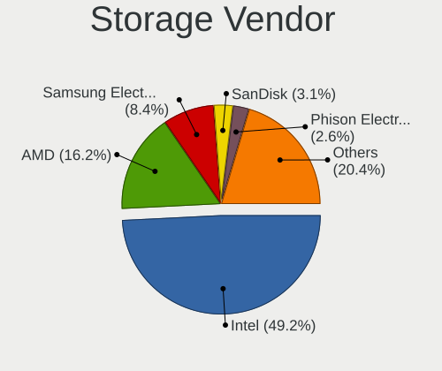

| Vendor                           | Computers | Percent |
|----------------------------------|-----------|---------|
| Intel                            | 94        | 49.21%  |
| AMD                              | 31        | 16.23%  |
| Samsung Electronics              | 16        | 8.38%   |
| SanDisk                          | 6         | 3.14%   |
| Phison Electronics               | 5         | 2.62%   |
| Micron/Crucial Technology        | 5         | 2.62%   |
| VIA Technologies                 | 4         | 2.09%   |
| Silicon Motion                   | 4         | 2.09%   |
| ULi Electronics                  | 3         | 1.57%   |
| Silicon Image                    | 3         | 1.57%   |
| Toshiba                          | 2         | 1.05%   |
| Solidigm                         | 2         | 1.05%   |
| SK hynix                         | 2         | 1.05%   |
| KIOXIA                           | 2         | 1.05%   |
| Kingston Technology Company      | 2         | 1.05%   |
| ASMedia Technology               | 2         | 1.05%   |
| Solid State Storage Technology   | 1         | 0.52%   |
| Silicon Integrated Systems [SiS] | 1         | 0.52%   |
| Nvidia                           | 1         | 0.52%   |
| Micron Technology                | 1         | 0.52%   |
| Hewlett-Packard                  | 1         | 0.52%   |
| Broadcom / LSI                   | 1         | 0.52%   |
| Apple                            | 1         | 0.52%   |
| Adaptec                          | 1         | 0.52%   |

Storage Model
-------------

Storage controller models

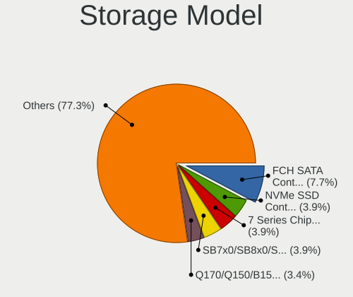

| Model                                                                         | Computers | Percent |
|-------------------------------------------------------------------------------|-----------|---------|
| AMD FCH SATA Controller [AHCI mode]                                           | 16        | 7.73%   |
| Samsung NVMe SSD Controller SM981/PM981/PM983                                 | 8         | 3.86%   |
| Intel 7 Series Chipset Family 6-port SATA Controller [AHCI mode]              | 8         | 3.86%   |
| AMD SB7x0/SB8x0/SB9x0 SATA Controller [AHCI mode]                             | 8         | 3.86%   |
| Intel Q170/Q150/B150/H170/H110/Z170/CM236 Chipset SATA Controller [AHCI Mode] | 7         | 3.38%   |
| Intel Sunrise Point-LP SATA Controller [AHCI mode]                            | 6         | 2.9%    |
| Intel Cannon Lake PCH SATA AHCI Controller                                    | 6         | 2.9%    |
| AMD 400 Series Chipset SATA Controller                                        | 6         | 2.9%    |
| Intel 5 Series/3400 Series Chipset 6 port SATA AHCI Controller                | 5         | 2.42%   |
| Silicon Motion SM2263EN/SM2263XT (DRAM-less) NVMe SSD Controllers             | 4         | 1.93%   |
| SanDisk Ultra 3D / WD PC SN530, IX SN530, Blue SN550 NVMe SSD (DRAM-less)     | 4         | 1.93%   |
| Intel 6 Series/C200 Series Chipset Family 6 port Mobile SATA AHCI Controller  | 4         | 1.93%   |
| Intel 6 Series/C200 Series Chipset Family 6 port Desktop SATA AHCI Controller | 4         | 1.93%   |
| VIA VT82C586A/B/VT82C686/A/B/VT823x/A/C PIPC Bus Master IDE                   | 3         | 1.45%   |
| ULi M5229 IDE                                                                 | 3         | 1.45%   |
| Samsung NVMe SSD Controller 980 (DRAM-less)                                   | 3         | 1.45%   |
| Intel Wildcat Point-LP SATA Controller [AHCI Mode]                            | 3         | 1.45%   |
| Intel SSD DC P4101/Pro 7600p/760p/E 6100p Series                              | 3         | 1.45%   |
| Intel Jasper Lake SATA AHCI Controller                                        | 3         | 1.45%   |
| Intel Alder Lake-N SATA AHCI Controller                                       | 3         | 1.45%   |
| Intel 7 Series/C210 Series Chipset Family 6-port SATA Controller [AHCI mode]  | 3         | 1.45%   |
| Intel 200 Series PCH SATA controller [AHCI mode]                              | 3         | 1.45%   |
| AMD SB7x0/SB8x0/SB9x0 IDE Controller                                          | 3         | 1.45%   |
| AMD A320 Chipset SATA Controller [AHCI mode]                                  | 3         | 1.45%   |
| Solidigm P41 Plus NVMe SSD (DRAM-less) [Echo Harbor]                          | 2         | 0.97%   |
| Silicon Image SiI 3114 [SATALink/SATARaid] Serial ATA Controller              | 2         | 0.97%   |
| Samsung S4LN058A01[SSUBX] AHCI SSD Controller (Apple slot)                    | 2         | 0.97%   |
| Samsung NVMe SSD Controller SM961/PM961/SM963                                 | 2         | 0.97%   |
| Phison PS5013-E13 PCIe3 NVMe Controller (DRAM-less)                           | 2         | 0.97%   |
| Micron/Crucial P2 [Nick P2] / P3 / P3 Plus NVMe PCIe SSD (DRAM-less)          | 2         | 0.97%   |
| Intel Optane NVME SSD H10 with Solid State Storage [Teton Glacier]            | 2         | 0.97%   |
| Intel NM10/ICH7 Family SATA Controller [AHCI mode]                            | 2         | 0.97%   |
| Intel Comet Lake SATA AHCI Controller                                         | 2         | 0.97%   |
| Intel Celeron/Pentium Silver Processor SATA Controller                        | 2         | 0.97%   |
| Intel C600/X79 series chipset 6-Port SATA AHCI Controller                     | 2         | 0.97%   |
| Intel Alder Lake-P SATA AHCI Controller                                       | 2         | 0.97%   |
| Intel 82801GBM/GHM (ICH7-M Family) SATA Controller [IDE mode]                 | 2         | 0.97%   |
| Intel 82801GBM/GHM (ICH7-M Family) SATA Controller [AHCI mode]                | 2         | 0.97%   |
| Intel 82801DBM (ICH4-M) IDE Controller                                        | 2         | 0.97%   |
| Intel 82801 Mobile SATA Controller [RAID mode]                                | 2         | 0.97%   |

Storage Kind
------------

Kind of storage controller (IDE, SATA, NVMe, SAS, ...)

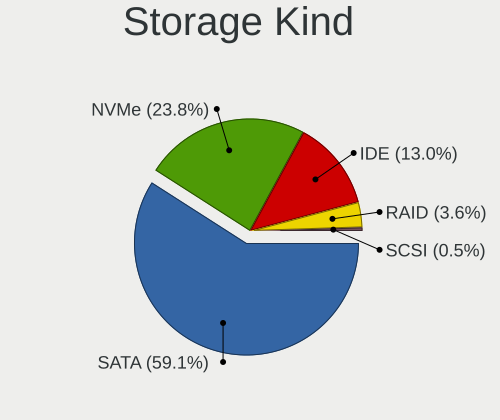

| Kind | Computers | Percent |
|------|-----------|---------|
| SATA | 114       | 59.07%  |
| NVMe | 46        | 23.83%  |
| IDE  | 25        | 12.95%  |
| RAID | 7         | 3.63%   |
| SCSI | 1         | 0.52%   |

Processor
---------

CPU Vendor
----------

Processor vendors

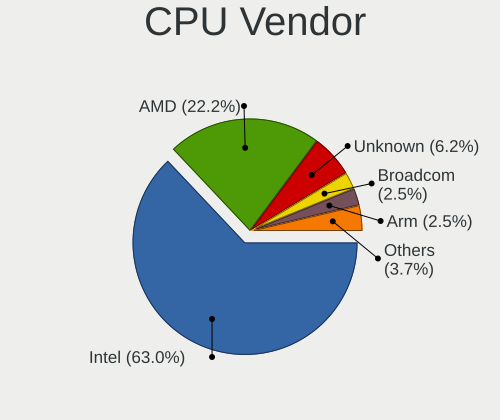

| Vendor             | Computers | Percent |
|--------------------|-----------|---------|
| Intel              | 102       | 62.96%  |
| AMD                | 36        | 22.22%  |
| Unknown            | 10        | 6.17%   |
| Broadcom           | 4         | 2.47%   |
| Arm                | 4         | 2.47%   |
| 7447A              | 2         | 1.23%   |
| VIA                | 1         | 0.62%   |
| SUNW,UltraAX-i2    | 1         | 0.62%   |
| SUNW,Sun-Blade-100 | 1         | 0.62%   |
| 123456789ABC       | 1         | 0.62%   |

CPU Model
---------

Processor models

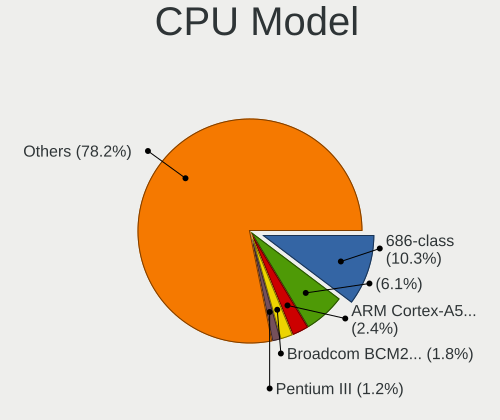

| Model                                              | Computers | Percent |
|----------------------------------------------------|-----------|---------|
| Intel 686-class                                    | 17        | 10.3%   |
|                                                    | 10        | 6.06%   |
| ARM Cortex-A53 r0p4 (v8-A)                         | 4         | 2.42%   |
| Broadcom BCM2711 (ARM Cortex-A72)                  | 3         | 1.82%   |
| Intel Pentium III                                  | 2         | 1.21%   |
| Intel N250                                         | 2         | 1.21%   |
| Intel N100                                         | 2         | 1.21%   |
| Intel Core i5-9400F CPU @ 2.90GHz                  | 2         | 1.21%   |
| Intel Core i5-6300U CPU @ 2.40GHz                  | 2         | 1.21%   |
| Intel Core i5-3320M CPU @ 2.60GHz                  | 2         | 1.21%   |
| Intel Core i5-1035G1 CPU @ 1.00GHz                 | 2         | 1.21%   |
| Intel Core i3-3217U CPU @ 1.80GHz                  | 2         | 1.21%   |
| Intel Atom CPU N450 @ 1.66GHz                      | 2         | 1.21%   |
| AMD Ryzen 9 3900X 12-Core Processor                | 2         | 1.21%   |
| AMD Ryzen 3 3200G with Radeon Vega Graphics        | 2         | 1.21%   |
| AMD 686-class                                      | 2         | 1.21%   |
| 7447A (Revision 1.2)                               | 2         | 1.21%   |
| VIA Nano U3300@1200MHz                             | 1         | 0.61%   |
| SUNW,UltraAX-i2 (SUNW,UltraSPARC-IIe @ 500 MHz)    | 1         | 0.61%   |
| SUNW,Sun-Blade-100 (SUNW,UltraSPARC-IIe @ 502 MHz) | 1         | 0.61%   |
| Intel Xeon W-2133 CPU @ 3.60GHz                    | 1         | 0.61%   |
| Intel Xeon CPU E5-4650 v2 @ 2.40GHz                | 1         | 0.61%   |
| Intel Xeon CPU E5-2630L v3 @ 1.80GHz               | 1         | 0.61%   |
| Intel Xeon CPU E5-2450L 0 @ 1.80GHz                | 1         | 0.61%   |
| Intel Xeon                                         | 1         | 0.61%   |
| Intel Pentium Silver J5005 CPU @ 1.50GHz           | 1         | 0.61%   |
| Intel Pentium Pro Processor                        | 1         | 0.61%   |
| Intel Pentium M processor 1.60GHz                  | 1         | 0.61%   |
| Intel Pentium M processor                          | 1         | 0.61%   |
| Intel Pentium Dual CPU T3200 @ 2.00GHz             | 1         | 0.61%   |
| Intel Pentium CPU 2020M @ 2.40GHz                  | 1         | 0.61%   |
| Intel CPU Version                                  | 1         | 0.61%   |
| Intel Core m3-8100Y CPU @ 1.10GHz                  | 1         | 0.61%   |
| Intel Core m3-6Y30 CPU @ 0.90GHz                   | 1         | 0.61%   |
| Intel Core i9-10850K CPU @ 3.60GHz                 | 1         | 0.61%   |
| Intel Core i7-9700 CPU @ 3.00GHz                   | 1         | 0.61%   |
| Intel Core i7-8750H CPU @ 2.20GHz                  | 1         | 0.61%   |
| Intel Core i7-8559U CPU @ 2.70GHz                  | 1         | 0.61%   |
| Intel Core i7-7920HQ CPU @ 3.10GHz                 | 1         | 0.61%   |
| Intel Core i7-7700 CPU @ 3.60GHz                   | 1         | 0.61%   |

CPU Model Family
----------------

Processor model prefix

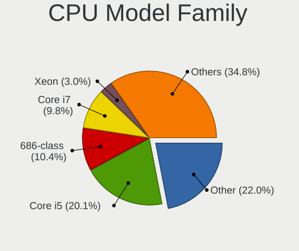

| Model                | Computers | Percent |
|----------------------|-----------|---------|
| Other                | 36        | 21.95%  |
| Intel Core i5        | 33        | 20.12%  |
| Intel 686-class      | 17        | 10.37%  |
| Intel Core i7        | 16        | 9.76%   |
| Intel Xeon           | 5         | 3.05%   |
| Intel Core i3        | 5         | 3.05%   |
| AMD Ryzen 5          | 5         | 3.05%   |
| Intel Celeron        | 4         | 2.44%   |
| AMD Ryzen 3          | 4         | 2.44%   |
| Intel Atom           | 3         | 1.83%   |
| AMD FX               | 3         | 1.83%   |
| Intel Pentium M      | 2         | 1.22%   |
| Intel Pentium III    | 2         | 1.22%   |
| Intel Pentium        | 2         | 1.22%   |
| Intel Core m3        | 2         | 1.22%   |
| Intel Core 2         | 2         | 1.22%   |
| ARM Cortex           | 2         | 1.22%   |
| AMD Ryzen 9          | 2         | 1.22%   |
| AMD Ryzen 7          | 2         | 1.22%   |
| AMD A10              | 2         | 1.22%   |
| AMD 686-class        | 2         | 1.22%   |
| Intel Pentium Silver | 1         | 0.61%   |
| Intel Pentium Dual   | 1         | 0.61%   |
| Intel Core i9        | 1         | 0.61%   |
| AMD Sempron          | 1         | 0.61%   |
| AMD Ryzen 3 PRO      | 1         | 0.61%   |
| AMD Phenom II X6     | 1         | 0.61%   |
| AMD Phenom II X4     | 1         | 0.61%   |
| AMD GX               | 1         | 0.61%   |
| AMD EPYC             | 1         | 0.61%   |
| AMD E                | 1         | 0.61%   |
| AMD Athlon II        | 1         | 0.61%   |
| AMD Athlon           | 1         | 0.61%   |
| AMD A8               | 1         | 0.61%   |

CPU Cores
---------

Number of processor cores

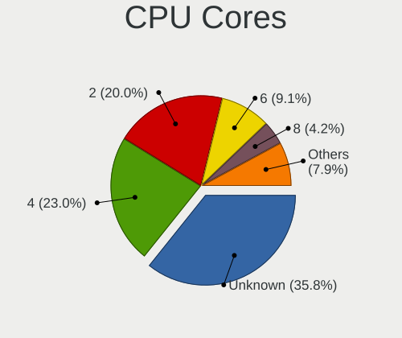

| Number  | Computers | Percent |
|---------|-----------|---------|
| Unknown | 59        | 35.76%  |
| 4       | 38        | 23.03%  |
| 2       | 33        | 20%     |
| 6       | 15        | 9.09%   |
| 8       | 7         | 4.24%   |
| 1       | 6         | 3.64%   |
| 10      | 4         | 2.42%   |
| 12      | 2         | 1.21%   |
| 24      | 1         | 0.61%   |

CPU Sockets
-----------

Number of sockets

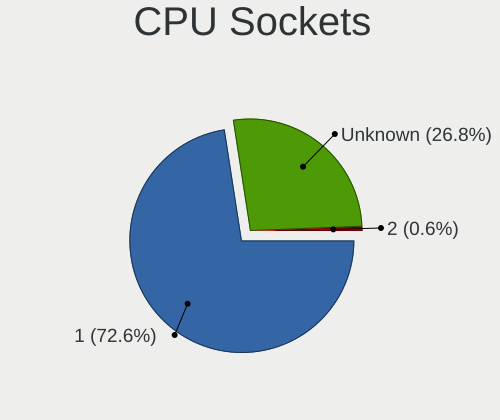

| Number  | Computers | Percent |
|---------|-----------|---------|
| 1       | 119       | 72.56%  |
| Unknown | 44        | 26.83%  |
| 2       | 1         | 0.61%   |

CPU Threads
-----------

Threads per core (Hyper-Threading)

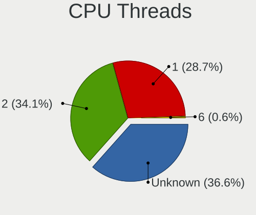

| Number  | Computers | Percent |
|---------|-----------|---------|
| Unknown | 60        | 36.59%  |
| 2       | 56        | 34.15%  |
| 1       | 47        | 28.66%  |
| 6       | 1         | 0.61%   |

CPU Microarch
-------------

Microarchitecture

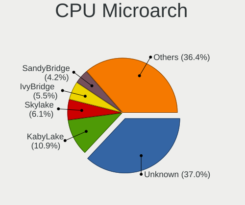

| Name          | Computers | Percent |
|---------------|-----------|---------|
| Unknown       | 61        | 36.97%  |
| KabyLake      | 18        | 10.91%  |
| Skylake       | 10        | 6.06%   |
| IvyBridge     | 9         | 5.45%   |
| SandyBridge   | 7         | 4.24%   |
| P6            | 6         | 3.64%   |
| Zen 2         | 5         | 3.03%   |
| Piledriver    | 5         | 3.03%   |
| Zen+          | 4         | 2.42%   |
| Zen           | 4         | 2.42%   |
| Haswell       | 4         | 2.42%   |
| Core          | 4         | 2.42%   |
| K10           | 3         | 1.82%   |
| Geode         | 3         | 1.82%   |
| Broadwell     | 3         | 1.82%   |
| Bonnell       | 3         | 1.82%   |
| Westmere      | 2         | 1.21%   |
| Puma          | 2         | 1.21%   |
| Goldmont plus | 2         | 1.21%   |
| CometLake     | 2         | 1.21%   |
| Zen 3         | 1         | 0.61%   |
| TigerLake     | 1         | 0.61%   |
| Silvermont    | 1         | 0.61%   |
| Nehalem       | 1         | 0.61%   |
| K6            | 1         | 0.61%   |
| IceLake       | 1         | 0.61%   |
| Excavator     | 1         | 0.61%   |
| Bobcat        | 1         | 0.61%   |

Graphics
--------

GPU Vendor
----------

Vendors of graphics cards

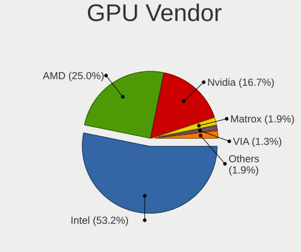

| Vendor                     | Computers | Percent |
|----------------------------|-----------|---------|
| Intel                      | 83        | 53.21%  |
| AMD                        | 39        | 25%     |
| Nvidia                     | 26        | 16.67%  |
| Matrox Electronics Systems | 3         | 1.92%   |
| VIA Technologies           | 2         | 1.28%   |
| Trident Microsystems       | 1         | 0.64%   |
| S3 Graphics                | 1         | 0.64%   |
| 3Dfx Interactive           | 1         | 0.64%   |

GPU Model
---------

Graphics card models

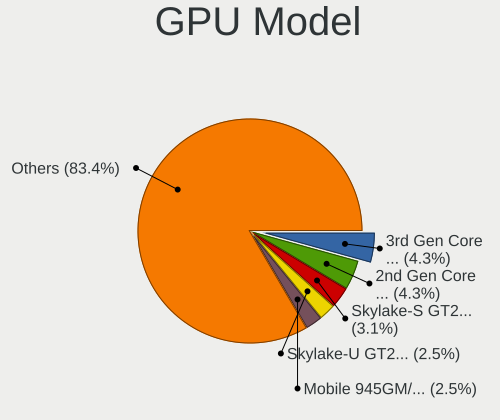

| Model                                                                         | Computers | Percent |
|-------------------------------------------------------------------------------|-----------|---------|
| Intel 3rd Gen Core processor Graphics Controller                              | 7         | 4.29%   |
| Intel 2nd Generation Core Processor Family Integrated Graphics Controller     | 7         | 4.29%   |
| Intel Skylake-S GT2 [HD Graphics 530]                                         | 5         | 3.07%   |
| Intel Skylake-U GT2 [HD Graphics 520]                                         | 4         | 2.45%   |
| Intel Mobile 945GM/GMS/GME, 943/940GML Express Integrated Graphics Controller | 4         | 2.45%   |
| Intel CoffeeLake-S GT2 [UHD Graphics 630]                                     | 4         | 2.45%   |
| AMD Raven Ridge [Radeon Vega Series / Radeon Vega Mobile Series]              | 4         | 2.45%   |
| AMD Ellesmere [Radeon RX 470/480/570/570X/580/580X/590]                       | 4         | 2.45%   |
| Intel JasperLake [UHD Graphics]                                               | 3         | 1.84%   |
| Intel Haswell-ULT Integrated Graphics Controller                              | 3         | 1.84%   |
| Intel CoffeeLake-H GT2 [UHD Graphics 630]                                     | 3         | 1.84%   |
| Intel Alder Lake-N [UHD Graphics]                                             | 3         | 1.84%   |
| AMD RV280 [Radeon 9200]                                                       | 3         | 1.84%   |
| Nvidia GT218M [NVS 3100M]                                                     | 2         | 1.23%   |
| Nvidia GF114 [GeForce GTX 560]                                                | 2         | 1.23%   |
| Intel Xeon E3-1200 v2/3rd Gen Core processor Graphics Controller              | 2         | 1.23%   |
| Intel Mobile 945GSE Express Integrated Graphics Controller                    | 2         | 1.23%   |
| Intel Mobile 945GM/GMS, 943/940GML Express Integrated Graphics Controller     | 2         | 1.23%   |
| Intel Iris Plus Graphics G1 (Ice Lake)                                        | 2         | 1.23%   |
| Intel Core Processor Integrated Graphics Controller                           | 2         | 1.23%   |
| Intel Broadwell-U GT3 [Iris Graphics 6100]                                    | 2         | 1.23%   |
| Intel Broadwell-U GT3 [HD Graphics 6000]                                      | 2         | 1.23%   |
| Intel Broadwell-U GT2 [HD Graphics 5500]                                      | 2         | 1.23%   |
| Intel Atom Processor D4xx/D5xx/N4xx/N5xx Integrated Graphics Controller       | 2         | 1.23%   |
| Intel Alder Lake-N [Intel Graphics]                                           | 2         | 1.23%   |
| Intel 82852/855GM Integrated Graphics Device                                  | 2         | 1.23%   |
| AMD Cedar [Radeon HD 5000/6000/7350/8350 Series]                              | 2         | 1.23%   |
| VIA Technologies VX900 Graphics [Chrome9 HD]                                  | 1         | 0.61%   |
| VIA Technologies CN400/PM800/PM880/PN800/PN880 [S3 UniChrome Pro]             | 1         | 0.61%   |
| Trident Microsystems TGUI 9660/938x/968x                                      | 1         | 0.61%   |
| S3 Graphics SuperSavage IX/C SDR                                              | 1         | 0.61%   |
| Nvidia TU117GLM [Quadro T1000 Mobile]                                         | 1         | 0.61%   |
| Nvidia TU116 [GeForce GTX 1660 SUPER]                                         | 1         | 0.61%   |
| Nvidia NV5 [Riva TNT2 Model 64 / Model 64 Pro]                                | 1         | 0.61%   |
| Nvidia NV34 [GeForce FX 5200]                                                 | 1         | 0.61%   |
| Nvidia NV18 [GeForce4 MX 440 AGP 8x]                                          | 1         | 0.61%   |
| Nvidia GT216GLM [Quadro FX 880M]                                              | 1         | 0.61%   |
| Nvidia GP107M [GeForce GTX 1050 Ti Mobile]                                    | 1         | 0.61%   |
| Nvidia GP107M [GeForce GTX 1050 Mobile]                                       | 1         | 0.61%   |
| Nvidia GP107 [GeForce GTX 1050 Ti]                                            | 1         | 0.61%   |

GPU Combo
---------

Combinations of graphics cards

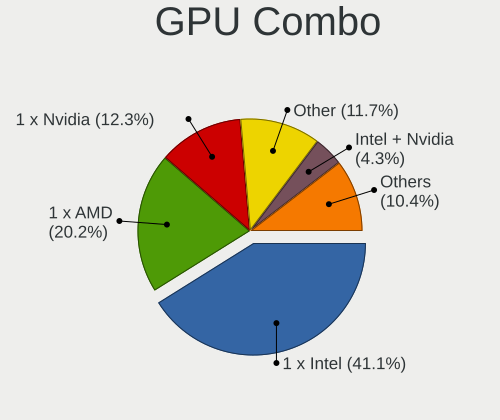

| Name                     | Computers | Percent |
|--------------------------|-----------|---------|
| 1 x Intel                | 67        | 41.1%   |
| 1 x AMD                  | 33        | 20.25%  |
| 1 x Nvidia               | 20        | 12.27%  |
| Other                    | 19        | 11.66%  |
| Intel + Nvidia           | 7         | 4.29%   |
| 2 x Intel                | 6         | 3.68%   |
| 1 x Matrox               | 3         | 1.84%   |
| 2 x AMD                  | 2         | 1.23%   |
| 1 x VIA                  | 2         | 1.23%   |
| 1 x Trident Microsystems | 1         | 0.61%   |
| 1 x S3 Graphics          | 1         | 0.61%   |
| Intel + AMD              | 1         | 0.61%   |
| 1 x 3Dfx Interactive     | 1         | 0.61%   |

GPU Driver
----------

Free vs proprietary

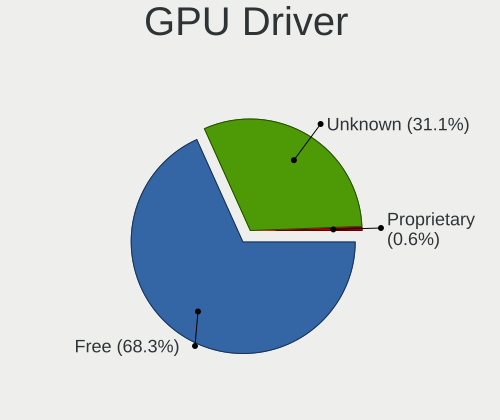

| Driver      | Computers | Percent |
|-------------|-----------|---------|
| Free        | 114       | 68.26%  |
| Unknown     | 52        | 31.14%  |
| Proprietary | 1         | 0.6%    |

GPU Memory
----------

Total video memory

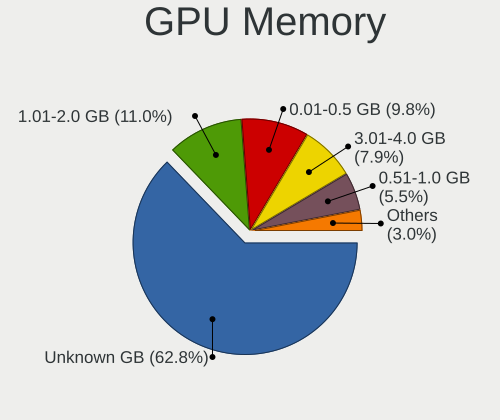

| Size in GB | Computers | Percent |
|------------|-----------|---------|
| Unknown    | 103       | 62.8%   |
| 1.01-2.0   | 18        | 10.98%  |
| 0.01-0.5   | 16        | 9.76%   |
| 3.01-4.0   | 13        | 7.93%   |
| 0.51-1.0   | 9         | 5.49%   |
| 7.01-8.0   | 4         | 2.44%   |
| 5.01-6.0   | 1         | 0.61%   |

Monitor
-------

Monitor Vendor
--------------

Monitor vendors

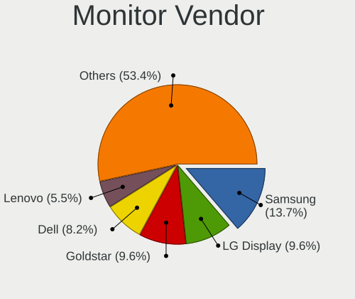

| Vendor                  | Computers | Percent |
|-------------------------|-----------|---------|
| Samsung Electronics     | 10        | 13.7%   |
| LG Display              | 7         | 9.59%   |
| Goldstar                | 7         | 9.59%   |
| Dell                    | 6         | 8.22%   |
| Lenovo                  | 4         | 5.48%   |
| Chimei Innolux          | 4         | 5.48%   |
| AU Optronics            | 4         | 5.48%   |
| BOE                     | 3         | 4.11%   |
| Apple                   | 3         | 4.11%   |
| Acer                    | 3         | 4.11%   |
| ViewSonic               | 2         | 2.74%   |
| Philips                 | 2         | 2.74%   |
| Hewlett-Packard         | 2         | 2.74%   |
| Fujitsu Siemens         | 2         | 2.74%   |
| Eizo                    | 2         | 2.74%   |
| Chi Mei Optoelectronics | 2         | 2.74%   |
| Unknown (CDD)           | 1         | 1.37%   |
| STD                     | 1         | 1.37%   |
| Sony                    | 1         | 1.37%   |
| RS                      | 1         | 1.37%   |
| NEC Computers           | 1         | 1.37%   |
| LG Philips              | 1         | 1.37%   |
| InfoVision              | 1         | 1.37%   |
| Impression              | 1         | 1.37%   |
| Iiyama                  | 1         | 1.37%   |
| CPT                     | 1         | 1.37%   |

Monitor Model
-------------

Monitor models

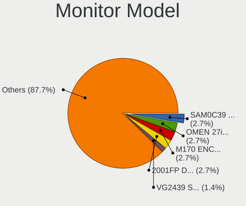

| Model                                                                 | Computers | Percent |
|-----------------------------------------------------------------------|-----------|---------|
| Samsung Electronics LCD Monitor SAM0C39 1920x1080 700x390mm 31.5-inch | 2         | 2.74%   |
| Hewlett-Packard OMEN 27i IPS HPN3673 2560x1440 600x340mm 27.2-inch    | 2         | 2.74%   |
| Eizo M170 ENC1768 1280x1024 340x270mm 17.1-inch                       | 2         | 2.74%   |
| Dell 2001FP DELA007 1600x1200 410x310mm 20.2-inch                     | 2         | 2.74%   |
| ViewSonic VG2439 Series VSCD22B 1920x1080 520x290mm 23.4-inch         | 1         | 1.37%   |
| ViewSonic VA1655-FHD VSC313C 1920x1080 340x190mm 15.3-inch            | 1         | 1.37%   |
| Unknown (CDD) VGA CDD0030 1920x1080 1150x650mm 52.0-inch              | 1         | 1.37%   |
| STD LED STD0110 1680x1050 470x300mm 22.0-inch                         | 1         | 1.37%   |
| Sony TV SNY4D04 1920x1080                                             | 1         | 1.37%   |
| Samsung Electronics SyncMaster SAM01AE 1600x1200 410x310mm 20.2-inch  | 1         | 1.37%   |
| Samsung Electronics SMS27A350H SAM07CE 1920x1080 600x340mm 27.2-inch  | 1         | 1.37%   |
| Samsung Electronics S24C650 SAM09E9 1920x1080 520x290mm 23.4-inch     | 1         | 1.37%   |
| Samsung Electronics S24C650 SAM09E8 1920x1080 520x290mm 23.4-inch     | 1         | 1.37%   |
| Samsung Electronics S23C570 SAM0A56 1920x1080 510x290mm 23.1-inch     | 1         | 1.37%   |
| Samsung Electronics LCD Monitor SEC554E 1024x600 220x130mm 10.1-inch  | 1         | 1.37%   |
| Samsung Electronics LCD Monitor SEC324C 1600x900 310x170mm 13.9-inch  | 1         | 1.37%   |
| Samsung Electronics LCD Monitor SDC4752 1366x768 340x190mm 15.3-inch  | 1         | 1.37%   |
| RS LE1940 BTC1940 1440x900 410x260mm 19.1-inch                        | 1         | 1.37%   |
| Philips PHL 273V7 PHLC156 1920x1080 600x340mm 27.2-inch               | 1         | 1.37%   |
| Philips PHL 245E1 PHLC20B 2560x1440 530x300mm 24.0-inch               | 1         | 1.37%   |
| NEC Computers P221W NEC674A 1680x1050 470x300mm 22.0-inch             | 1         | 1.37%   |
| LG Philips LCD Monitor LPLDD00 1280x800 330x210mm 15.4-inch           | 1         | 1.37%   |
| LG Display LCD Monitor LGD40A0 1366x768 310x170mm 13.9-inch           | 1         | 1.37%   |
| LG Display LCD Monitor LGD0521 1920x1080 310x170mm 13.9-inch          | 1         | 1.37%   |
| LG Display LCD Monitor LGD045E 1366x768 310x170mm 13.9-inch           | 1         | 1.37%   |
| LG Display LCD Monitor LGD0456 1366x768 340x190mm 15.3-inch           | 1         | 1.37%   |
| LG Display LCD Monitor LGD03CD 1366x768 280x160mm 12.7-inch           | 1         | 1.37%   |
| LG Display LCD Monitor LGD0335 1366x768 310x170mm 13.9-inch           | 1         | 1.37%   |
| LG Display LCD Monitor LGD029E 1600x900 340x190mm 15.3-inch           | 1         | 1.37%   |
| Lenovo P27h-20 LEN61E9 2560x1440 600x340mm 27.2-inch                  | 1         | 1.37%   |
| Lenovo LCD Monitor LEN40B1 1600x900 340x190mm 15.3-inch               | 1         | 1.37%   |
| Lenovo LCD Monitor LEN4036 1440x900 300x190mm 14.0-inch               | 1         | 1.37%   |
| Lenovo LCD Monitor LEN4011 1280x800 260x160mm 12.0-inch               | 1         | 1.37%   |
| InfoVision LCD Monitor IVO057D 1920x1080 310x170mm 13.9-inch          | 1         | 1.37%   |
| Impression R19W11 IMP1911 1440x900 410x260mm 19.1-inch                | 1         | 1.37%   |
| Iiyama PL2792Q IVM6630 2560x1440 600x340mm 27.2-inch                  | 1         | 1.37%   |
| Goldstar W1952 GSM4B78 1440x900 410x260mm 19.1-inch                   | 1         | 1.37%   |
| Goldstar LG ULTRAWIDE GSM59F1 2560x1080 670x280mm 28.6-inch           | 1         | 1.37%   |
| Goldstar LG IPS FULLHD GSM5AB6 1920x1080 480x270mm 21.7-inch          | 1         | 1.37%   |
| Goldstar LG HDR 4K GSM7706 3840x2160 600x340mm 27.2-inch              | 1         | 1.37%   |

Monitor Resolution
------------------

Monitor screen resolution

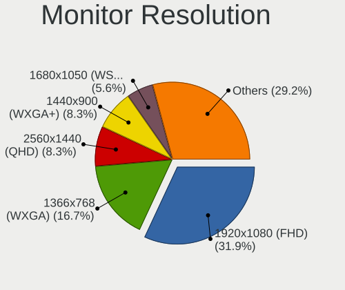

| Resolution         | Computers | Percent |
|--------------------|-----------|---------|
| 1920x1080 (FHD)    | 23        | 31.94%  |
| 1366x768 (WXGA)    | 12        | 16.67%  |
| 2560x1440 (QHD)    | 6         | 8.33%   |
| 1440x900 (WXGA+)   | 6         | 8.33%   |
| 1680x1050 (WSXGA+) | 4         | 5.56%   |
| 1280x800 (WXGA)    | 4         | 5.56%   |
| 1280x1024 (SXGA)   | 4         | 5.56%   |
| 1600x900 (HD+)     | 3         | 4.17%   |
| 1600x1200          | 3         | 4.17%   |
| 1024x600           | 3         | 4.17%   |
| 3840x2160 (4K)     | 2         | 2.78%   |
| 2560x1600          | 1         | 1.39%   |
| 2560x1080          | 1         | 1.39%   |

Monitor Diagonal
----------------

Diagonal size in inches

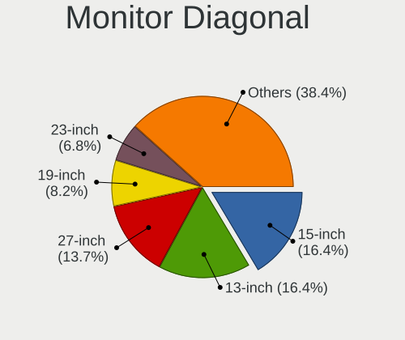

| Inches  | Computers | Percent |
|---------|-----------|---------|
| 15      | 12        | 16.44%  |
| 13      | 12        | 16.44%  |
| 27      | 10        | 13.7%   |
| 19      | 6         | 8.22%   |
| 23      | 5         | 6.85%   |
| 24      | 4         | 5.48%   |
| 22      | 3         | 4.11%   |
| 21      | 3         | 4.11%   |
| 20      | 3         | 4.11%   |
| 17      | 3         | 4.11%   |
| 40      | 2         | 2.74%   |
| 12      | 2         | 2.74%   |
| 10      | 2         | 2.74%   |
| 52      | 1         | 1.37%   |
| 34      | 1         | 1.37%   |
| 14      | 1         | 1.37%   |
| 11      | 1         | 1.37%   |
| 9       | 1         | 1.37%   |
| Unknown | 1         | 1.37%   |

Monitor Width
-------------

Physical width

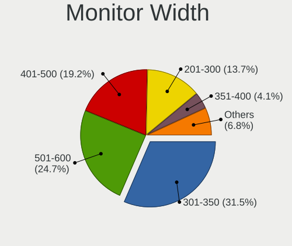

| Width in mm | Computers | Percent |
|-------------|-----------|---------|
| 301-350     | 23        | 31.51%  |
| 501-600     | 18        | 24.66%  |
| 401-500     | 14        | 19.18%  |
| 201-300     | 10        | 13.7%   |
| 351-400     | 3         | 4.11%   |
| 801-900     | 2         | 2.74%   |
| 701-800     | 1         | 1.37%   |
| 1001-1500   | 1         | 1.37%   |
| Unknown     | 1         | 1.37%   |

Aspect Ratio
------------

Proportional relationship between the width and the height

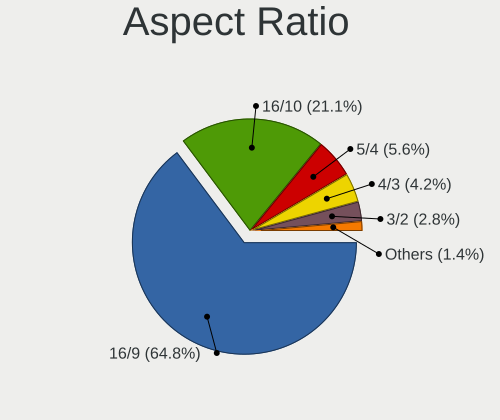

| Ratio | Computers | Percent |
|-------|-----------|---------|
| 16/9  | 46        | 64.79%  |
| 16/10 | 15        | 21.13%  |
| 5/4   | 4         | 5.63%   |
| 4/3   | 3         | 4.23%   |
| 3/2   | 2         | 2.82%   |
| 21/9  | 1         | 1.41%   |

Monitor Area
------------

Area in inch²

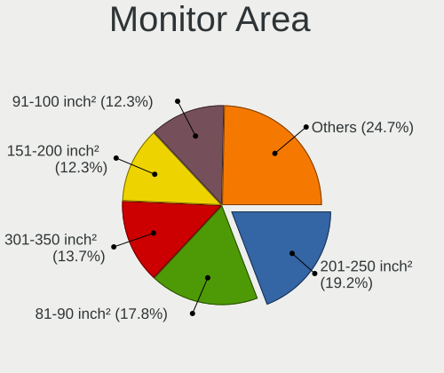

| Area in inch² | Computers | Percent |
|----------------|-----------|---------|
| 201-250        | 14        | 19.18%  |
| 81-90          | 13        | 17.81%  |
| 301-350        | 10        | 13.7%   |
| 151-200        | 9         | 12.33%  |
| 91-100         | 9         | 12.33%  |
| 41-50          | 3         | 4.11%   |
| 101-110        | 3         | 4.11%   |
| 61-70          | 2         | 2.74%   |
| 141-150        | 2         | 2.74%   |
| 501-1000       | 2         | 2.74%   |
| More than 1000 | 1         | 1.37%   |
| 51-60          | 1         | 1.37%   |
| 351-500        | 1         | 1.37%   |
| 251-300        | 1         | 1.37%   |
| 131-140        | 1         | 1.37%   |
| Unknown        | 1         | 1.37%   |

Pixel Density
-------------

Pixels per inch

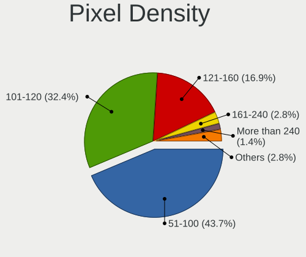

| Density       | Computers | Percent |
|---------------|-----------|---------|
| 51-100        | 31        | 43.66%  |
| 101-120       | 23        | 32.39%  |
| 121-160       | 12        | 16.9%   |
| 161-240       | 2         | 2.82%   |
| More than 240 | 1         | 1.41%   |
| 1-50          | 1         | 1.41%   |
| Unknown       | 1         | 1.41%   |

Multiple Monitors
-----------------

Total monitors connected

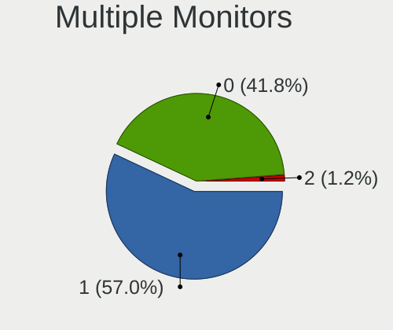

| Total | Computers | Percent |
|-------|-----------|---------|
| 1     | 94        | 56.97%  |
| 0     | 69        | 41.82%  |
| 2     | 2         | 1.21%   |

Network
-------

Net Controller Vendor
---------------------

Controller vendors

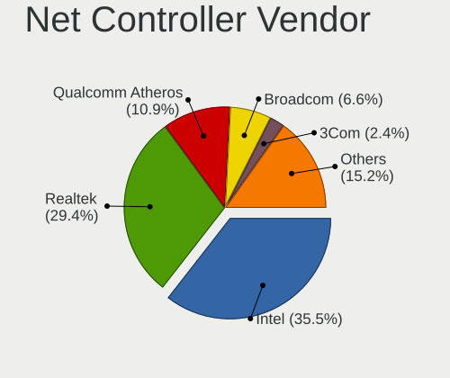

| Vendor                            | Computers | Percent |
|-----------------------------------|-----------|---------|
| Intel                             | 75        | 35.55%  |
| Realtek Semiconductor             | 62        | 29.38%  |
| Qualcomm Atheros                  | 23        | 10.9%   |
| Broadcom                          | 14        | 6.64%   |
| 3Com                              | 5         | 2.37%   |
| VIA Technologies                  | 3         | 1.42%   |
| Marvell Technology Group          | 3         | 1.42%   |
| Huawei Technologies               | 3         | 1.42%   |
| TP-Link                           | 2         | 0.95%   |
| Microchip Technology              | 2         | 0.95%   |
| Ericsson Business Mobile Networks | 2         | 0.95%   |
| Silicon Integrated Systems [SiS]  | 1         | 0.47%   |
| Qualcomm Atheros Communications   | 1         | 0.47%   |
| PCTel                             | 1         | 0.47%   |
| Oracle/SUN                        | 1         | 0.47%   |
| Oculus VR                         | 1         | 0.47%   |
| Netchip Technology                | 1         | 0.47%   |
| Mercucys                          | 1         | 0.47%   |
| MediaTek                          | 1         | 0.47%   |
| JMicron Technology                | 1         | 0.47%   |
| Fry's Electronics                 | 1         | 0.47%   |
| Dell                              | 1         | 0.47%   |
| Davicom Semiconductor             | 1         | 0.47%   |
| D-Link System                     | 1         | 0.47%   |
| D-Link                            | 1         | 0.47%   |
| Arduino SA                        | 1         | 0.47%   |
| Aquantia                          | 1         | 0.47%   |
| Apple                             | 1         | 0.47%   |

Net Controller Model
--------------------

Controller models

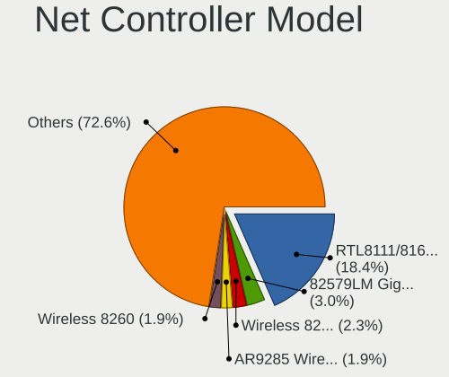

| Model                                                                         | Computers | Percent |
|-------------------------------------------------------------------------------|-----------|---------|
| Realtek RTL8111/8168/8211/8411 PCI Express Gigabit Ethernet Controller        | 49        | 18.42%  |
| Intel 82579LM Gigabit Network Connection (Lewisville)                         | 8         | 3.01%   |
| Intel Wireless 8265 / 8275                                                    | 6         | 2.26%   |
| Qualcomm Atheros AR9285 Wireless Network Adapter (PCI-Express)                | 5         | 1.88%   |
| Intel Wireless 8260                                                           | 5         | 1.88%   |
| Intel Wireless 7265                                                           | 5         | 1.88%   |
| Intel Wi-Fi 6 AX200                                                           | 5         | 1.88%   |
| Intel Ethernet Connection (2) I219-LM                                         | 5         | 1.88%   |
| Intel I211 Gigabit Network Connection                                         | 4         | 1.5%    |
| Intel Ethernet Controller I225-V                                              | 4         | 1.5%    |
| Intel Centrino Advanced-N 6205 [Taylor Peak]                                  | 4         | 1.5%    |
| Realtek RTL8188EUS 802.11n Wireless Network Adapter                           | 3         | 1.13%   |
| Intel Wi-Fi 5(802.11ac) Wireless-AC 9x6x [Thunder Peak]                       | 3         | 1.13%   |
| Intel Ethernet Connection I219-LM                                             | 3         | 1.13%   |
| Intel Ethernet Connection (7) I219-LM                                         | 3         | 1.13%   |
| Intel Cannon Lake PCH CNVi WiFi                                               | 3         | 1.13%   |
| Intel Alder Lake-N PCH CNVi WiFi                                              | 3         | 1.13%   |
| Huawei USB Device                                                             | 3         | 1.13%   |
| Broadcom BCM4360 802.11ac Dual Band Wireless Network Adapter                  | 3         | 1.13%   |
| VIA VT6102/VT6103 [Rhine-II]                                                  | 2         | 0.75%   |
| Realtek RTL8822CE 802.11ac PCIe Wireless Network Adapter                      | 2         | 0.75%   |
| Realtek RTL8812AE 802.11ac PCIe Wireless Network Adapter                      | 2         | 0.75%   |
| Realtek RTL8723BE PCIe Wireless Network Adapter                               | 2         | 0.75%   |
| Realtek RTL8192CU 802.11n WLAN Adapter                                        | 2         | 0.75%   |
| Realtek RTL8169 PCI Gigabit Ethernet Controller                               | 2         | 0.75%   |
| Realtek RTL8125 2.5GbE Controller                                             | 2         | 0.75%   |
| Realtek RTL810xE PCI Express Fast Ethernet controller                         | 2         | 0.75%   |
| Realtek RTL-8100/8101L/8139 PCI Fast Ethernet Adapter                         | 2         | 0.75%   |
| Qualcomm Atheros QCA9565 / AR9565 Wireless Network Adapter                    | 2         | 0.75%   |
| Qualcomm Atheros Killer E2400 Gigabit Ethernet Controller                     | 2         | 0.75%   |
| Qualcomm Atheros AR9462 Wireless Network Adapter                              | 2         | 0.75%   |
| Qualcomm Atheros AR8151 v2.0 Gigabit Ethernet                                 | 2         | 0.75%   |
| Qualcomm Atheros AR8132 Fast Ethernet                                         | 2         | 0.75%   |
| Qualcomm Atheros AR242x / AR542x Wireless Network Adapter (PCI-Express)       | 2         | 0.75%   |
| Qualcomm Atheros AR2413/AR2414 Wireless Network Adapter [AR5005G(S) 802.11bg] | 2         | 0.75%   |
| Microchip LAN7800 USB 3.0 Gigabit Ethernet Adapter                            | 2         | 0.75%   |
| Marvell Group 88E8040 PCI-E Fast Ethernet Controller                          | 2         | 0.75%   |
| Intel Wireless 7260                                                           | 2         | 0.75%   |
| Intel Jasper Lake PCH CNVi WiFi                                               | 2         | 0.75%   |
| Intel Ice Lake-LP PCH CNVi WiFi                                               | 2         | 0.75%   |

Wireless Vendor
---------------

Wireless vendors

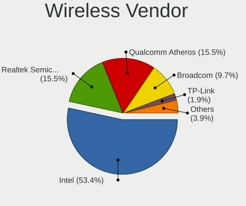

| Vendor                          | Computers | Percent |
|---------------------------------|-----------|---------|
| Intel                           | 55        | 53.4%   |
| Realtek Semiconductor           | 16        | 15.53%  |
| Qualcomm Atheros                | 16        | 15.53%  |
| Broadcom                        | 10        | 9.71%   |
| TP-Link                         | 2         | 1.94%   |
| Qualcomm Atheros Communications | 1         | 0.97%   |
| Mercucys                        | 1         | 0.97%   |
| MediaTek                        | 1         | 0.97%   |
| D-Link                          | 1         | 0.97%   |

Wireless Model
--------------

Wireless models

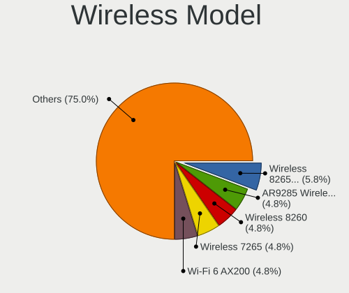

| Model                                                                                 | Computers | Percent |
|---------------------------------------------------------------------------------------|-----------|---------|
| Intel Wireless 8265 / 8275                                                            | 6         | 5.77%   |
| Qualcomm Atheros AR9285 Wireless Network Adapter (PCI-Express)                        | 5         | 4.81%   |
| Intel Wireless 8260                                                                   | 5         | 4.81%   |
| Intel Wireless 7265                                                                   | 5         | 4.81%   |
| Intel Wi-Fi 6 AX200                                                                   | 5         | 4.81%   |
| Intel Centrino Advanced-N 6205 [Taylor Peak]                                          | 4         | 3.85%   |
| Realtek RTL8188EUS 802.11n Wireless Network Adapter                                   | 3         | 2.88%   |
| Intel Wi-Fi 5(802.11ac) Wireless-AC 9x6x [Thunder Peak]                               | 3         | 2.88%   |
| Intel Cannon Lake PCH CNVi WiFi                                                       | 3         | 2.88%   |
| Intel Alder Lake-N PCH CNVi WiFi                                                      | 3         | 2.88%   |
| Broadcom BCM4360 802.11ac Dual Band Wireless Network Adapter                          | 3         | 2.88%   |
| Realtek RTL8822CE 802.11ac PCIe Wireless Network Adapter                              | 2         | 1.92%   |
| Realtek RTL8812AE 802.11ac PCIe Wireless Network Adapter                              | 2         | 1.92%   |
| Realtek RTL8723BE PCIe Wireless Network Adapter                                       | 2         | 1.92%   |
| Realtek RTL8192CU 802.11n WLAN Adapter                                                | 2         | 1.92%   |
| Qualcomm Atheros QCA9565 / AR9565 Wireless Network Adapter                            | 2         | 1.92%   |
| Qualcomm Atheros AR9462 Wireless Network Adapter                                      | 2         | 1.92%   |
| Qualcomm Atheros AR242x / AR542x Wireless Network Adapter (PCI-Express)               | 2         | 1.92%   |
| Qualcomm Atheros AR2413/AR2414 Wireless Network Adapter [AR5005G(S) 802.11bg]         | 2         | 1.92%   |
| Intel Wireless 7260                                                                   | 2         | 1.92%   |
| Intel Jasper Lake PCH CNVi WiFi                                                       | 2         | 1.92%   |
| Intel Ice Lake-LP PCH CNVi WiFi                                                       | 2         | 1.92%   |
| Intel Dual Band Wireless-AC 3168NGW [Stone Peak]                                      | 2         | 1.92%   |
| Intel Cannon Point-LP CNVi [Wireless-AC]                                              | 2         | 1.92%   |
| Broadcom BCM4331 802.11a/b/g/n                                                        | 2         | 1.92%   |
| Broadcom BCM43142 802.11b/g/n                                                         | 2         | 1.92%   |
| TP-Link TL-WN823N v2/v3 [Realtek RTL8192EU]                                           | 1         | 0.96%   |
| TP-Link TL-WN722N v2/v3 [Realtek RTL8188EUS]                                          | 1         | 0.96%   |
| Realtek RTL8822BE 802.11a/b/g/n/ac WiFi adapter                                       | 1         | 0.96%   |
| Realtek RTL8821CE 802.11ac PCIe Wireless Network Adapter                              | 1         | 0.96%   |
| Realtek RTL8811AU 802.11a/b/g/n/ac WLAN Adapter                                       | 1         | 0.96%   |
| Realtek RTL8188FTV 802.11b/g/n 1T1R 2.4G WLAN Adapter                                 | 1         | 0.96%   |
| Realtek RTL8188EE Wireless Network Adapter                                            | 1         | 0.96%   |
| Realtek RTL8188CUS 802.11n WLAN Adapter                                               | 1         | 0.96%   |
| Qualcomm Atheros AR9271 802.11n                                                       | 1         | 0.96%   |
| Qualcomm Atheros AR9485 Wireless Network Adapter                                      | 1         | 0.96%   |
| Qualcomm Atheros AR928X Wireless Network Adapter (PCI-Express)                        | 1         | 0.96%   |
| Qualcomm Atheros AR5418 Wireless Network Adapter [AR5008E 802.11(a)bgn] (PCI-Express) | 1         | 0.96%   |
| Mercucys MERCUSYS Wireless USB Adapter                                                | 1         | 0.96%   |
| MediaTek MT7922 802.11ax PCI Express Wireless Network Adapter                         | 1         | 0.96%   |

Ethernet Vendor
---------------

Ethernet vendors

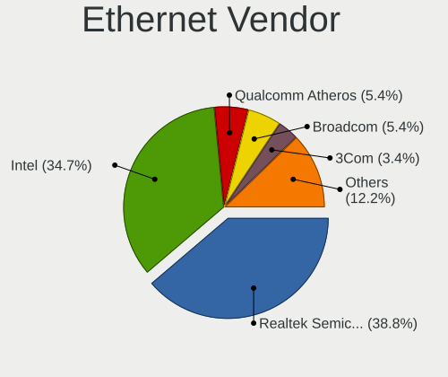

| Vendor                           | Computers | Percent |
|----------------------------------|-----------|---------|
| Realtek Semiconductor            | 57        | 38.78%  |
| Intel                            | 51        | 34.69%  |
| Qualcomm Atheros                 | 8         | 5.44%   |
| Broadcom                         | 8         | 5.44%   |
| 3Com                             | 5         | 3.4%    |
| VIA Technologies                 | 3         | 2.04%   |
| Marvell Technology Group         | 3         | 2.04%   |
| Huawei Technologies              | 3         | 2.04%   |
| Microchip Technology             | 2         | 1.36%   |
| Silicon Integrated Systems [SiS] | 1         | 0.68%   |
| Oracle/SUN                       | 1         | 0.68%   |
| JMicron Technology               | 1         | 0.68%   |
| Davicom Semiconductor            | 1         | 0.68%   |
| D-Link System                    | 1         | 0.68%   |
| Aquantia                         | 1         | 0.68%   |
| Apple                            | 1         | 0.68%   |

Ethernet Model
--------------

Ethernet models

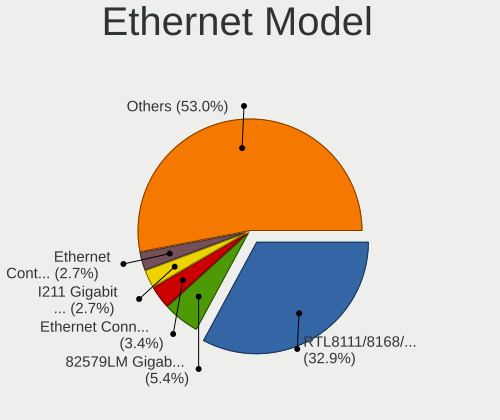

| Model                                                                  | Computers | Percent |
|------------------------------------------------------------------------|-----------|---------|
| Realtek RTL8111/8168/8211/8411 PCI Express Gigabit Ethernet Controller | 49        | 32.89%  |
| Intel 82579LM Gigabit Network Connection (Lewisville)                  | 8         | 5.37%   |
| Intel Ethernet Connection (2) I219-LM                                  | 5         | 3.36%   |
| Intel I211 Gigabit Network Connection                                  | 4         | 2.68%   |
| Intel Ethernet Controller I225-V                                       | 4         | 2.68%   |
| Intel Ethernet Connection I219-LM                                      | 3         | 2.01%   |
| Intel Ethernet Connection (7) I219-LM                                  | 3         | 2.01%   |
| Huawei USB Device                                                      | 3         | 2.01%   |
| VIA VT6102/VT6103 [Rhine-II]                                           | 2         | 1.34%   |
| Realtek RTL8169 PCI Gigabit Ethernet Controller                        | 2         | 1.34%   |
| Realtek RTL8125 2.5GbE Controller                                      | 2         | 1.34%   |
| Realtek RTL810xE PCI Express Fast Ethernet controller                  | 2         | 1.34%   |
| Realtek RTL-8100/8101L/8139 PCI Fast Ethernet Adapter                  | 2         | 1.34%   |
| Qualcomm Atheros Killer E2400 Gigabit Ethernet Controller              | 2         | 1.34%   |
| Qualcomm Atheros AR8151 v2.0 Gigabit Ethernet                          | 2         | 1.34%   |
| Qualcomm Atheros AR8132 Fast Ethernet                                  | 2         | 1.34%   |
| Microchip LAN7800 USB 3.0 Gigabit Ethernet Adapter                     | 2         | 1.34%   |
| Marvell Group 88E8040 PCI-E Fast Ethernet Controller                   | 2         | 1.34%   |
| Intel Ethernet Connection (7) I219-V                                   | 2         | 1.34%   |
| Intel Ethernet Connection (4) I219-LM                                  | 2         | 1.34%   |
| Intel 82577LM Gigabit Network Connection                               | 2         | 1.34%   |
| Broadcom NetXtreme BCM57766 Gigabit Ethernet PCIe                      | 2         | 1.34%   |
| Broadcom NetXtreme BCM5720 Gigabit Ethernet PCIe                       | 2         | 1.34%   |
| 3Com 3c905C-TX/TX-M [Tornado]                                          | 2         | 1.34%   |
| 3Com 3c905B 100BaseTX [Cyclone]                                        | 2         | 1.34%   |
| VIA VT6120/VT6121/VT6122/VT6130 Gigabit Ethernet Adapter               | 1         | 0.67%   |
| Silicon Integrated Systems [SiS] 191 Gigabit Ethernet Adapter          | 1         | 0.67%   |
| Realtek RTL8111/8168/8411 PCI Express Gigabit Ethernet Controller      | 1         | 0.67%   |
| Qualcomm Atheros QCA8172 Fast Ethernet                                 | 1         | 0.67%   |
| Qualcomm Atheros Killer E220x Gigabit Ethernet Controller              | 1         | 0.67%   |
| Oracle/SUN RIO 10/100 Ethernet [eri]                                   | 1         | 0.67%   |
| Marvell Group 88E8053 PCI-E Gigabit Ethernet Controller                | 1         | 0.67%   |
| JMicron JMC250 PCI Express Gigabit Ethernet Controller                 | 1         | 0.67%   |
| Intel PRO/100 VE Network Connection                                    | 1         | 0.67%   |
| Intel I350 Gigabit Network Connection                                  | 1         | 0.67%   |
| Intel Ethernet Connection I219-V                                       | 1         | 0.67%   |
| Intel Ethernet Connection I218-LM                                      | 1         | 0.67%   |
| Intel Ethernet Connection I217-V                                       | 1         | 0.67%   |
| Intel Ethernet Connection (6) I219-V                                   | 1         | 0.67%   |
| Intel Ethernet Connection (6) I219-LM                                  | 1         | 0.67%   |

Net Controller Kind
-------------------

Ethernet, WiFi or modem

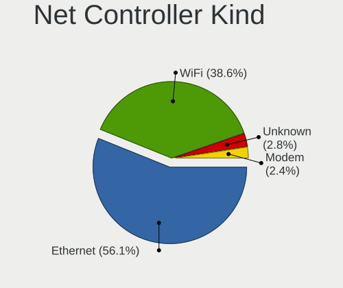

| Kind     | Computers | Percent |
|----------|-----------|---------|
| Ethernet | 138       | 56.1%   |
| WiFi     | 95        | 38.62%  |
| Unknown  | 7         | 2.85%   |
| Modem    | 6         | 2.44%   |

Used Controller
---------------

Currently used network controller

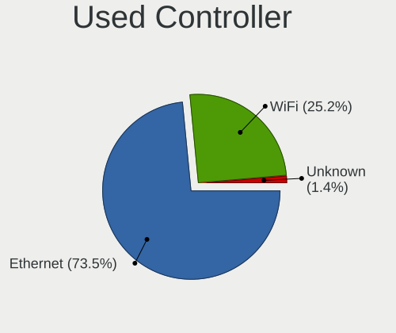

| Kind     | Computers | Percent |
|----------|-----------|---------|
| Ethernet | 108       | 73.47%  |
| WiFi     | 37        | 25.17%  |
| Unknown  | 2         | 1.36%   |

NICs
----

Total network controllers on board

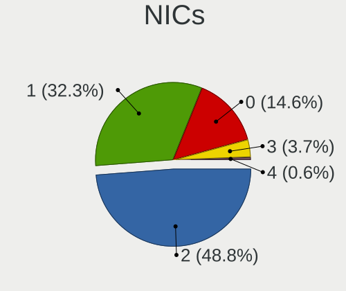

| Total | Computers | Percent |
|-------|-----------|---------|
| 2     | 80        | 48.78%  |
| 1     | 53        | 32.32%  |
| 0     | 24        | 14.63%  |
| 3     | 6         | 3.66%   |
| 4     | 1         | 0.61%   |

IPv6
----

IPv6 vs IPv4

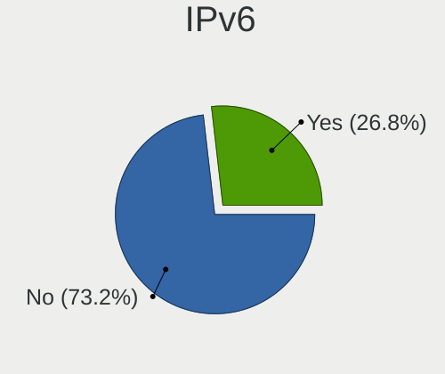

| Used | Computers | Percent |
|------|-----------|---------|
| No   | 120       | 73.17%  |
| Yes  | 44        | 26.83%  |

Bluetooth
---------

Bluetooth Vendor
----------------

Controller vendors

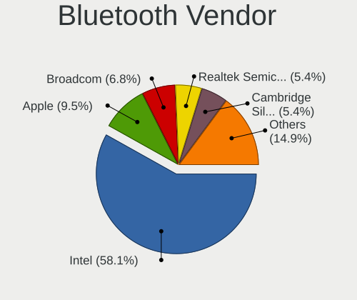

| Vendor                          | Computers | Percent |
|---------------------------------|-----------|---------|
| Intel                           | 43        | 58.11%  |
| Apple                           | 7         | 9.46%   |
| Broadcom                        | 5         | 6.76%   |
| Realtek Semiconductor           | 4         | 5.41%   |
| Cambridge Silicon Radio         | 4         | 5.41%   |
| Qualcomm Atheros Communications | 2         | 2.7%    |
| IMC Networks                    | 2         | 2.7%    |
| ASUSTek Computer                | 2         | 2.7%    |
| TP-Link                         | 1         | 1.35%   |
| Toshiba                         | 1         | 1.35%   |
| Skylight Digital                | 1         | 1.35%   |
| Lite-On Technology              | 1         | 1.35%   |
| Alps Electric                   | 1         | 1.35%   |

Bluetooth Model
---------------

Controller models

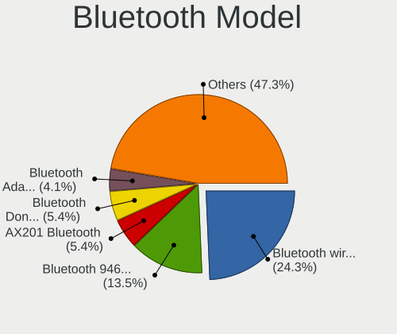

| Model                                               | Computers | Percent |
|-----------------------------------------------------|-----------|---------|
| Intel Bluetooth wireless interface                  | 18        | 24.32%  |
| Intel Bluetooth 9460/9560 Jefferson Peak (JfP)      | 10        | 13.51%  |
| Intel AX201 Bluetooth                               | 4         | 5.41%   |
| Cambridge Silicon Radio Bluetooth Dongle (HCI mode) | 4         | 5.41%   |
| Realtek Bluetooth Adapter                           | 3         | 4.05%   |
| Intel AX200 Bluetooth                               | 3         | 4.05%   |
| Broadcom BCM20702 Bluetooth 4.0 [ThinkPad]          | 3         | 4.05%   |
| Apple Broadcom Built-in Bluetooth                   | 3         | 4.05%   |
| Apple Bluetooth Host Controller                     | 3         | 4.05%   |
| Qualcomm Atheros AR3012 Bluetooth 4.0               | 2         | 2.7%    |
| Intel Wireless-AC 9260 Bluetooth Adapter            | 2         | 2.7%    |
| Intel Wireless-AC 3168 Bluetooth                    | 2         | 2.7%    |
| Intel Centrino Bluetooth Wireless Transceiver       | 2         | 2.7%    |
| Intel AX211 Bluetooth                               | 2         | 2.7%    |
| TP-Link Bluetooth 5.0 USB Adapter                   | 1         | 1.35%   |
| Toshiba Realtek Bluetooth 4.0 + High Speed Chip     | 1         | 1.35%   |
| Skylight Digital Realtek Bluetooth Adapter          | 1         | 1.35%   |
| Realtek Bluetooth 4.0 Adapter                       | 1         | 1.35%   |
| Lite-On Atheros AR3012 Bluetooth                    | 1         | 1.35%   |
| IMC Networks Qualcomm Atheros Bluetooth 4.0 + HS    | 1         | 1.35%   |
| IMC Networks MediaTek Bluetooth Adapter             | 1         | 1.35%   |
| Broadcom Bluetooth                                  | 1         | 1.35%   |
| Broadcom BCM2045B (BDC-2.1)                         | 1         | 1.35%   |
| ASUS USB-BT500                                      | 1         | 1.35%   |
| ASUS Broadcom BCM20702A0 Bluetooth                  | 1         | 1.35%   |
| Apple Built-in iSight (no firmware loaded)          | 1         | 1.35%   |
| Alps Electric UGTZ4 Bluetooth                       | 1         | 1.35%   |

Sound
-----

Sound Vendor
------------

Sound card vendors

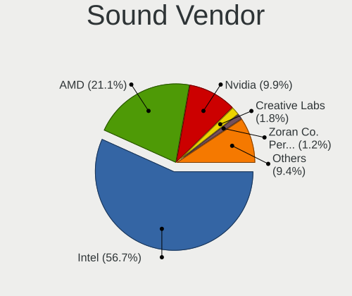

| Vendor                                       | Computers | Percent |
|----------------------------------------------|-----------|---------|
| Intel                                        | 97        | 56.73%  |
| AMD                                          | 36        | 21.05%  |
| Nvidia                                       | 17        | 9.94%   |
| Creative Labs                                | 3         | 1.75%   |
| Zoran Co. Personal Media Division (Nogatech) | 2         | 1.17%   |
| VIA Technologies                             | 2         | 1.17%   |
| Logitech                                     | 2         | 1.17%   |
| Yamaha                                       | 1         | 0.58%   |
| Walmart                                      | 1         | 0.58%   |
| ULi Electronics                              | 1         | 0.58%   |
| Texas Instruments                            | 1         | 0.58%   |
| Silicon Integrated Systems [SiS]             | 1         | 0.58%   |
| Samsung Electronics                          | 1         | 0.58%   |
| Realtek Semiconductor                        | 1         | 0.58%   |
| Native Instruments                           | 1         | 0.58%   |
| M-Audio                                      | 1         | 0.58%   |
| ESS Technology                               | 1         | 0.58%   |
| C-Media Electronics                          | 1         | 0.58%   |
| Apple                                        | 1         | 0.58%   |

Sound Model
-----------

Sound card models

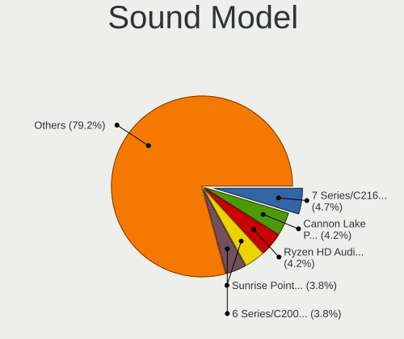

| Model                                                                      | Computers | Percent |
|----------------------------------------------------------------------------|-----------|---------|
| Intel 7 Series/C216 Chipset Family High Definition Audio Controller        | 10        | 4.72%   |
| Intel Cannon Lake PCH cAVS                                                 | 9         | 4.25%   |
| AMD Ryzen HD Audio Controller                                              | 9         | 4.25%   |
| Intel Sunrise Point-LP HD Audio                                            | 8         | 3.77%   |
| Intel 6 Series/C200 Series Chipset Family High Definition Audio Controller | 8         | 3.77%   |
| AMD SBx00 Azalia (Intel HDA)                                               | 8         | 3.77%   |
| Intel 100 Series/C230 Series Chipset Family HD Audio Controller            | 7         | 3.3%    |
| Intel Wildcat Point-LP High Definition Audio Controller                    | 6         | 2.83%   |
| Intel NM10/ICH7 Family High Definition Audio Controller                    | 6         | 2.83%   |
| Intel Broadwell-U Audio Controller                                         | 6         | 2.83%   |
| Intel 5 Series/3400 Series Chipset High Definition Audio                   | 6         | 2.83%   |
| Intel Alder Lake-N PCH High Definition Audio Controller                    | 5         | 2.36%   |
| AMD Raven/Raven2/Fenghuang HDMI/DP Audio Controller                        | 5         | 2.36%   |
| AMD Starship/Matisse HD Audio Controller                                   | 4         | 1.89%   |
| AMD Oland/Hainan/Cape Verde/Pitcairn HDMI Audio [Radeon HD 7000 Series]    | 4         | 1.89%   |
| AMD FCH Azalia Controller                                                  | 4         | 1.89%   |
| AMD Family 17h (Models 00h-0fh) HD Audio Controller                        | 4         | 1.89%   |
| AMD Ellesmere HDMI Audio [Radeon RX 470/480 / 570/580/590]                 | 4         | 1.89%   |
| Nvidia GP107GL High Definition Audio Controller                            | 3         | 1.42%   |
| Intel Jasper Lake HD Audio                                                 | 3         | 1.42%   |
| Intel Haswell-ULT HD Audio Controller                                      | 3         | 1.42%   |
| Intel 8 Series/C220 Series Chipset High Definition Audio Controller        | 3         | 1.42%   |
| Intel 8 Series HD Audio Controller                                         | 3         | 1.42%   |
| AMD Kabini HDMI/DP Audio                                                   | 3         | 1.42%   |
| AMD Cedar HDMI Audio [Radeon HD 5400/6300/7300 Series]                     | 3         | 1.42%   |
| Zoran Co. Personal Media Division (Nogatech) USB Audio and HID             | 2         | 0.94%   |
| Nvidia High Definition Audio Controller                                    | 2         | 0.94%   |
| Nvidia GP104 High Definition Audio Controller                              | 2         | 0.94%   |
| Nvidia GM206 High Definition Audio Controller                              | 2         | 0.94%   |
| Nvidia GF114 HDMI Audio Controller                                         | 2         | 0.94%   |
| Intel Ice Lake-LP Smart Sound Technology Audio Controller                  | 2         | 0.94%   |
| Intel Comet Lake PCH cAVS                                                  | 2         | 0.94%   |
| Intel Celeron/Pentium Silver Processor High Definition Audio               | 2         | 0.94%   |
| Intel Cannon Point-LP High Definition Audio Controller                     | 2         | 0.94%   |
| Intel 82801DB/DBL/DBM (ICH4/ICH4-L/ICH4-M) AC'97 Audio Controller          | 2         | 0.94%   |
| Intel 200 Series PCH HD Audio                                              | 2         | 0.94%   |
| AMD Wrestler HDMI Audio                                                    | 2         | 0.94%   |
| AMD Trinity HDMI Audio Controller                                          | 2         | 0.94%   |
| AMD Renoir/Cezanne HDMI/DP Audio Controller                                | 2         | 0.94%   |
| AMD Family 15h (Models 60h-6fh) Audio Controller                           | 2         | 0.94%   |

Memory
------

Memory Vendor
-------------

Memory module vendors

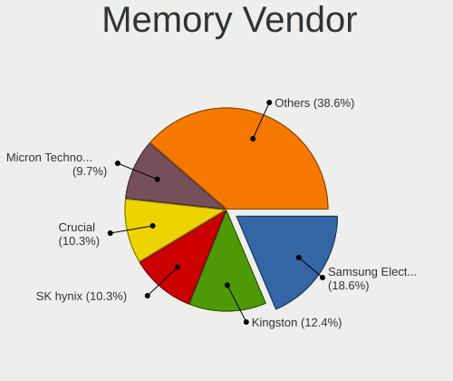

| Vendor                     | Computers | Percent |
|----------------------------|-----------|---------|
| Samsung Electronics        | 27        | 18.62%  |
| Kingston                   | 18        | 12.41%  |
| SK hynix                   | 15        | 10.34%  |
| Crucial                    | 15        | 10.34%  |
| Micron Technology          | 14        | 9.66%   |
| Unknown                    | 13        | 8.97%   |
| G.Skill                    | 6         | 4.14%   |
| Unknown                    | 6         | 4.14%   |
| Ramaxel Technology         | 5         | 3.45%   |
| Corsair                    | 5         | 3.45%   |
| A-DATA Technology          | 5         | 3.45%   |
| Patriot                    | 3         | 2.07%   |
| Xi'an UnilC Semiconductors | 2         | 1.38%   |
| Elpida                     | 2         | 1.38%   |
| Unifosa                    | 1         | 0.69%   |
| Toshiba                    | 1         | 0.69%   |
| Silicon Power              | 1         | 0.69%   |
| SHARETRONIC                | 1         | 0.69%   |
| Nanya Technology           | 1         | 0.69%   |
| Lexar Co Limited           | 1         | 0.69%   |
| ASint Technology           | 1         | 0.69%   |
| AMD                        | 1         | 0.69%   |
| 48spaces                   | 1         | 0.69%   |

Memory Model
------------

Memory module models

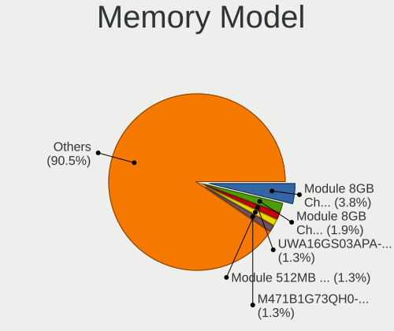

| Model                                                                    | Computers | Percent |
|--------------------------------------------------------------------------|-----------|---------|
| Unknown                                                                  | 6         | 3.8%    |
| Micron RAM Module 8GB Chip LPDDR4                                        | 3         | 1.9%    |
| Xi'an UnilC Semiconductors RAM UWA16GS03APA-56 16GB SODIMM DDR5 5600MT/s | 2         | 1.27%   |
| Unknown RAM Module 512MB SODIMM DDR2 533MT/s                             | 2         | 1.27%   |
| Samsung RAM M471B1G73QH0-YK0 8GB SODIMM DDR3 1867MT/s                    | 2         | 1.27%   |
| Samsung RAM M471A5244CB0-CRC 4GB SODIMM DDR4 2400MT/s                    | 2         | 1.27%   |
| Samsung RAM M471A2K43DB1-CTD 16GB SODIMM DDR4 2667MT/s                   | 2         | 1.27%   |
| Samsung RAM M471A2K43CB1-CTD 16GB SODIMM DDR4 2667MT/s                   | 2         | 1.27%   |
| Crucial RAM CT16G4SFS832A.C8FF 16GB SODIMM DDR4 3200MT/s                 | 2         | 1.27%   |
| Corsair RAM CMK16GX4M2B3000C15 8GB DIMM DDR4 3000MT/s                    | 2         | 1.27%   |
| Unknown RAM Module 8GB SODIMM DDR4 2400MT/s                              | 1         | 0.63%   |
| Unknown RAM Module 8192MB DIMM 400MT/s                                   | 1         | 0.63%   |
| Unknown RAM Module 512MB SODIMM SDRAM                                    | 1         | 0.63%   |
| Unknown RAM Module 512MB SODIMM DRAM 166MT/s                             | 1         | 0.63%   |
| Unknown RAM Module 4GB SODIMM DDR3 1333MT/s                              | 1         | 0.63%   |
| Unknown RAM Module 4GB FB-DIMM DDR2 667MT/s                              | 1         | 0.63%   |
| Unknown RAM Module 2GB SODIMM DDR3 1333MT/s                              | 1         | 0.63%   |
| Unknown RAM Module 2GB SODIMM DDR3                                       | 1         | 0.63%   |
| Unknown RAM Module 2GB FB-DIMM DDR2 667MT/s                              | 1         | 0.63%   |
| Unknown RAM Module 2GB DIMM DDR2 800MT/s                                 | 1         | 0.63%   |
| Unknown RAM Module 256MB SODIMM DDR                                      | 1         | 0.63%   |
| Unknown RAM Module 2048MB DIMM DDR2 800MT/s                              | 1         | 0.63%   |
| Unknown RAM Module 2048MB DIMM 400MT/s                                   | 1         | 0.63%   |
| Unknown RAM Module 128MB DIMM DRAM                                       | 1         | 0.63%   |
| Unknown RAM Module 1024MB SODIMM SDRAM 266MT/s                           | 1         | 0.63%   |
| Unifosa RAM GU512303EP0202 2GB DIMM DDR3 1333MT/s                        | 1         | 0.63%   |
| Toshiba RAM 99U5471-001.A00LF 2GB DIMM DDR3 1333MT/s                     | 1         | 0.63%   |
| SK hynix RAM Module 8GB DIMM DDR4 2400MT/s                               | 1         | 0.63%   |
| SK hynix RAM Module 16GB SODIMM DDR4 2667MT/s                            | 1         | 0.63%   |
| SK hynix RAM HMT451S6DFR8A-PB 4GB SODIMM DDR3 1600MT/s                   | 1         | 0.63%   |
| SK hynix RAM HMT41GS6BFR8A-PB 8GB SODIMM DDR3 1600MT/s                   | 1         | 0.63%   |
| SK hynix RAM HMT351U6CFR8C 4GB DIMM DDR3 667MT/s                         | 1         | 0.63%   |
| SK hynix RAM HMT351S6CFR8C-PB 4GB SODIMM DDR3 1600MT/s                   | 1         | 0.63%   |
| SK hynix RAM HMT351S6BFR8C-H9 4GB SODIMM DDR3 1334MT/s                   | 1         | 0.63%   |
| SK hynix RAM HMT351S6BFR8C-H9 4GB SODIMM DDR3 1333MT/s                   | 1         | 0.63%   |
| SK hynix RAM HMT325S6EFR8A-PB 2GB SODIMM DDR3 1600MT/s                   | 1         | 0.63%   |
| SK hynix RAM HMT325S6BFR8C-H9 2GB SODIMM DDR3 1333MT/s                   | 1         | 0.63%   |
| SK hynix RAM HMT125S6TFR8C-G7 2GB SODIMM DDR3 1066MT/s                   | 1         | 0.63%   |
| SK hynix RAM HMAA1GS6CJR6N-XN 8GB SODIMM DDR4 3200MT/s                   | 1         | 0.63%   |
| SK hynix RAM HMA81GS6CJR8N-VK 8GB SODIMM DDR4 2667MT/s                   | 1         | 0.63%   |

Memory Kind
-----------

Memory module kinds

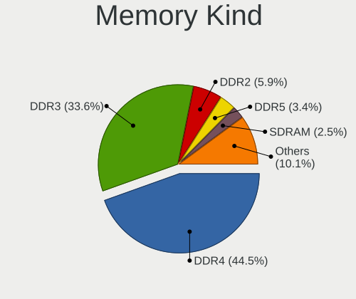

| Kind    | Computers | Percent |
|---------|-----------|---------|
| DDR4    | 53        | 44.54%  |
| DDR3    | 40        | 33.61%  |
| DDR2    | 7         | 5.88%   |
| DDR5    | 4         | 3.36%   |
| SDRAM   | 3         | 2.52%   |
| LPDDR4  | 3         | 2.52%   |
| LPDDR3  | 3         | 2.52%   |
| DRAM    | 2         | 1.68%   |
| Unknown | 2         | 1.68%   |
| LPDDR2  | 1         | 0.84%   |
| DDR     | 1         | 0.84%   |

Memory Form Factor
------------------

Physical design of the memory module

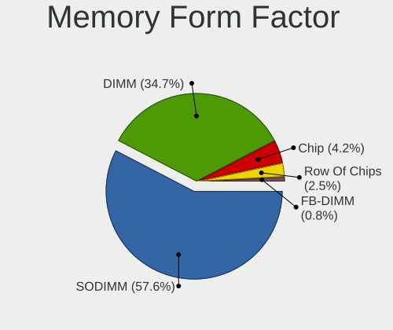

| Name         | Computers | Percent |
|--------------|-----------|---------|
| SODIMM       | 68        | 57.63%  |
| DIMM         | 41        | 34.75%  |
| Chip         | 5         | 4.24%   |
| Row Of Chips | 3         | 2.54%   |
| FB-DIMM      | 1         | 0.85%   |

Memory Size
-----------

Memory module size

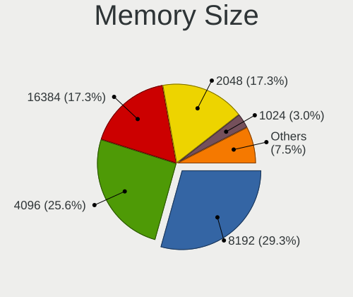

| Size  | Computers | Percent |
|-------|-----------|---------|
| 8192  | 39        | 29.32%  |
| 4096  | 34        | 25.56%  |
| 16384 | 23        | 17.29%  |
| 2048  | 23        | 17.29%  |
| 1024  | 4         | 3.01%   |
| 512   | 4         | 3.01%   |
| 32768 | 3         | 2.26%   |
| 49152 | 1         | 0.75%   |
| 256   | 1         | 0.75%   |
| 128   | 1         | 0.75%   |

Memory Speed
------------

Memory module speed

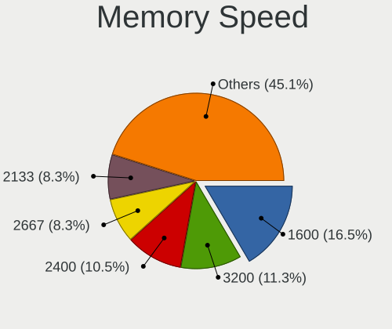

| Speed   | Computers | Percent |
|---------|-----------|---------|
| 1600    | 22        | 16.54%  |
| 3200    | 15        | 11.28%  |
| 2400    | 14        | 10.53%  |
| 2667    | 11        | 8.27%   |
| 2133    | 11        | 8.27%   |
| Unknown | 11        | 8.27%   |
| 1333    | 10        | 7.52%   |
| 1867    | 4         | 3.01%   |
| 1334    | 4         | 3.01%   |
| 1067    | 4         | 3.01%   |
| 667     | 4         | 3.01%   |
| 5600    | 3         | 2.26%   |
| 2933    | 3         | 2.26%   |
| 800     | 3         | 2.26%   |
| 533     | 3         | 2.26%   |
| 3000    | 2         | 1.5%    |
| 1066    | 2         | 1.5%    |
| 4800    | 1         | 0.75%   |
| 3066    | 1         | 0.75%   |
| 2666    | 1         | 0.75%   |
| 1200    | 1         | 0.75%   |
| 400     | 1         | 0.75%   |
| 266     | 1         | 0.75%   |
| 166     | 1         | 0.75%   |

Printers & scanners
-------------------

Printer Vendor
--------------

Printer device vendors

Zero info for selected period =(

Printer Model
-------------

Printer device models

Zero info for selected period =(

Scanner Vendor
--------------

Scanner device vendors

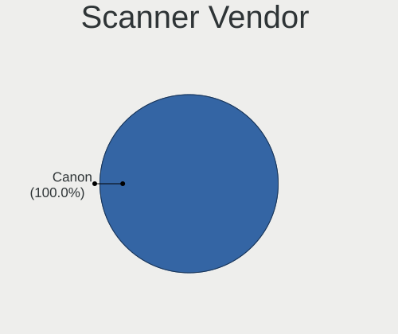

| Vendor | Computers | Percent |
|--------|-----------|---------|
| Canon  | 2         | 100%    |

Scanner Model
-------------

Scanner device models

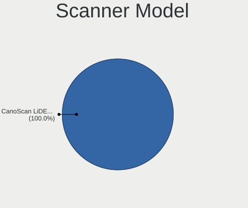

| Model                   | Computers | Percent |
|-------------------------|-----------|---------|
| Canon CanoScan LiDE 210 | 2         | 100%    |

Camera
------

Camera Vendor
-------------

Camera device vendors

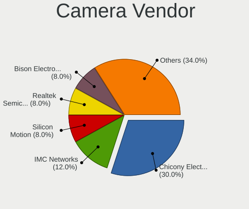

| Vendor                           | Computers | Percent |
|----------------------------------|-----------|---------|
| Chicony Electronics              | 15        | 30%     |
| IMC Networks                     | 6         | 12%     |
| Silicon Motion                   | 4         | 8%      |
| Realtek Semiconductor            | 4         | 8%      |
| Bison Electronics                | 4         | 8%      |
| Z-Star Microelectronics          | 2         | 4%      |
| Logitech                         | 2         | 4%      |
| Lenovo                           | 2         | 4%      |
| ALi                              | 2         | 4%      |
| Syntek                           | 1         | 2%      |
| Suyin                            | 1         | 2%      |
| Sunplus Innovation Technology    | 1         | 2%      |
| Shenzhen Kingcome Optoelectronic | 1         | 2%      |
| Quanta                           | 1         | 2%      |
| Microdia                         | 1         | 2%      |
| Lite-On Technology               | 1         | 2%      |
| ARC International                | 1         | 2%      |
| Apple                            | 1         | 2%      |

Camera Model
------------

Camera device models

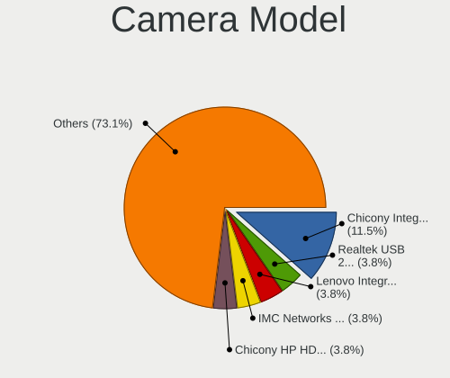

| Model                                                         | Computers | Percent |
|---------------------------------------------------------------|-----------|---------|
| Chicony Integrated Camera                                     | 6         | 11.54%  |
| Realtek USB 2.0 PC Camera                                     | 2         | 3.85%   |
| Lenovo Integrated Webcam [R5U877]                             | 2         | 3.85%   |
| IMC Networks Realtek PC Camera                                | 2         | 3.85%   |
| Chicony HP HD Webcam [Fixed]                                  | 2         | 3.85%   |
| Bison Integrated Camera                                       | 2         | 3.85%   |
| Z-Star Webcam                                                 | 1         | 1.92%   |
| Z-Star Namuga 1.3M Webcam                                     | 1         | 1.92%   |
| Syntek Lenovo EasyCamera                                      | 1         | 1.92%   |
| Suyin Acer Crystal Eye webcam                                 | 1         | 1.92%   |
| Sunplus Integrated Camera                                     | 1         | 1.92%   |
| Silicon Motion WebCam SC-10IRQ12340N                          | 1         | 1.92%   |
| Silicon Motion Realtek USB 2.0 PC Camera                      | 1         | 1.92%   |
| Silicon Motion LG HD WebCam                                   | 1         | 1.92%   |
| Silicon Motion 300k Pixel Camera                              | 1         | 1.92%   |
| Shenzhen Kingcome Optoelectronic NexiGo HelloCam N930W Camera | 1         | 1.92%   |
| Realtek USB Camera                                            | 1         | 1.92%   |
| Realtek Acer 640 x 480 laptop camera                          | 1         | 1.92%   |
| Quanta VGA WebCam                                             | 1         | 1.92%   |
| Microdia Integrated_Webcam_HD                                 | 1         | 1.92%   |
| Logitech Webcam C270                                          | 1         | 1.92%   |
| Logitech C922 Pro Stream Webcam                               | 1         | 1.92%   |
| Lite-On Integrated Camera                                     | 1         | 1.92%   |
| IMC Networks USB2.0 UVC VGA WebCam                            | 1         | 1.92%   |
| IMC Networks TOSHIBA Web Camera - HD                          | 1         | 1.92%   |
| IMC Networks EasyCamera                                       | 1         | 1.92%   |
| IMC Networks ASUS USB 2.0 UVC VGA WebCam                      | 1         | 1.92%   |
| Chicony XiaoMi USB 2.0 Webcam                                 | 1         | 1.92%   |
| Chicony USB2.0 VGA UVC WebCam                                 | 1         | 1.92%   |
| Chicony Thinkpad T430 camera                                  | 1         | 1.92%   |
| Chicony Integrated IR Camera                                  | 1         | 1.92%   |
| Chicony Integrated Camera [ThinkPad]                          | 1         | 1.92%   |
| Chicony Integrated Camera (1280x720@30)                       | 1         | 1.92%   |
| Chicony Front Camera                                          | 1         | 1.92%   |
| Chicony 8M Camera                                             | 1         | 1.92%   |
| Chicony 720p HD Camera                                        | 1         | 1.92%   |
| Bison ThinkPad P50 Integrated Camera                          | 1         | 1.92%   |
| Bison ThinkPad Integrated Camera                              | 1         | 1.92%   |
| ARC International Camera                                      | 1         | 1.92%   |
| Apple FaceTime HD Camera                                      | 1         | 1.92%   |

Security
--------

Fingerprint Vendor
------------------

Fingerprint sensor vendors

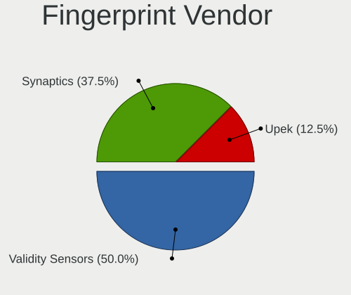

| Vendor           | Computers | Percent |
|------------------|-----------|---------|
| Validity Sensors | 4         | 50%     |
| Synaptics        | 3         | 37.5%   |
| Upek             | 1         | 12.5%   |

Fingerprint Model
-----------------

Fingerprint sensor models

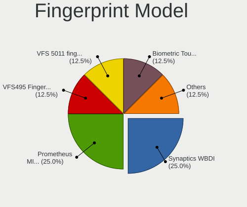

| Model                                                  | Computers | Percent |
|--------------------------------------------------------|-----------|---------|
| Validity Sensors Synaptics WBDI                        | 2         | 25%     |
| Synaptics Prometheus MIS Touch Fingerprint Reader      | 2         | 25%     |
| Validity Sensors VFS495 Fingerprint Reader             | 1         | 12.5%   |
| Validity Sensors VFS 5011 fingerprint sensor           | 1         | 12.5%   |
| Upek Biometric Touchchip/Touchstrip Fingerprint Sensor | 1         | 12.5%   |
| Synaptics Metallica MIS Touch Fingerprint Reader       | 1         | 12.5%   |

Chipcard Vendor
---------------

Chipcard module vendors

Zero info for selected period =(

Chipcard Model
--------------

Chipcard module models

Zero info for selected period =(

Unsupported
-----------

Unsupported Devices
-------------------

Total unsupported devices on board

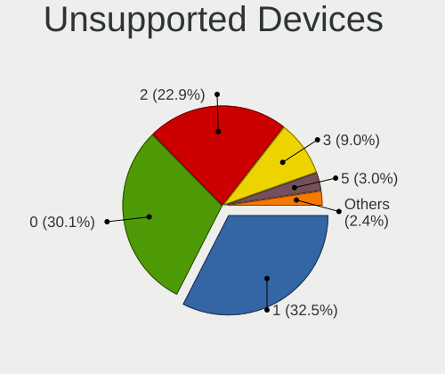

| Total | Computers | Percent |
|-------|-----------|---------|
| 1     | 54        | 32.53%  |
| 0     | 50        | 30.12%  |
| 2     | 38        | 22.89%  |
| 3     | 15        | 9.04%   |
| 5     | 5         | 3.01%   |
| 4     | 4         | 2.41%   |

Unsupported Device Types
------------------------

Types of unsupported devices

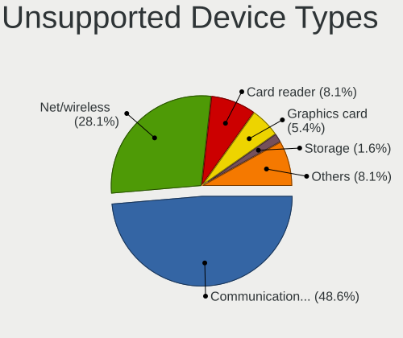

| Type                     | Computers | Percent |
|--------------------------|-----------|---------|
| Communication controller | 90        | 48.65%  |
| Net/wireless             | 52        | 28.11%  |
| Card reader              | 15        | 8.11%   |
| Graphics card            | 10        | 5.41%   |
| Storage                  | 3         | 1.62%   |
| Sound                    | 3         | 1.62%   |
| Net/ethernet             | 3         | 1.62%   |
| Modem                    | 3         | 1.62%   |
| Bluetooth                | 2         | 1.08%   |
| Wireless                 | 1         | 0.54%   |
| Storage/nvme             | 1         | 0.54%   |
| Network                  | 1         | 0.54%   |
| Dvb card                 | 1         | 0.54%   |

