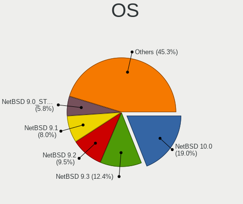
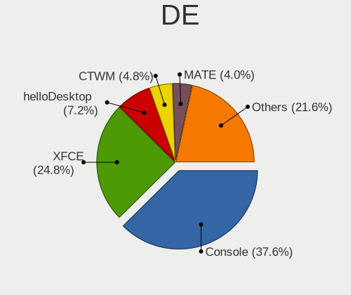
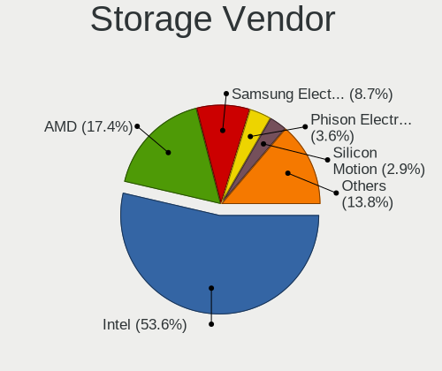
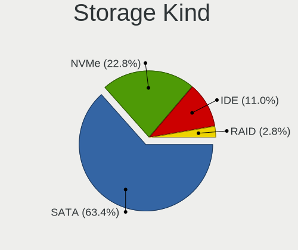
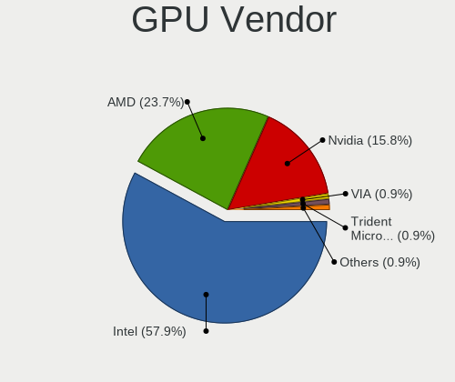
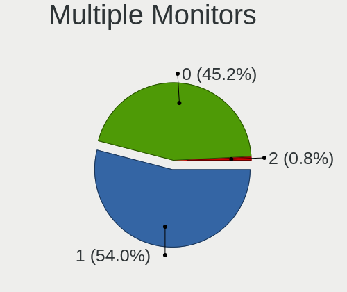
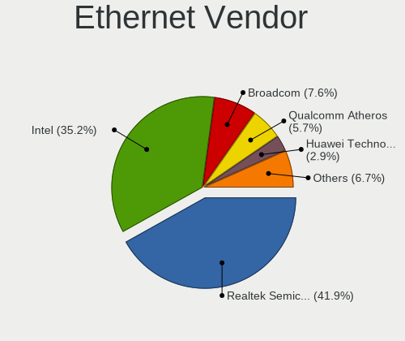
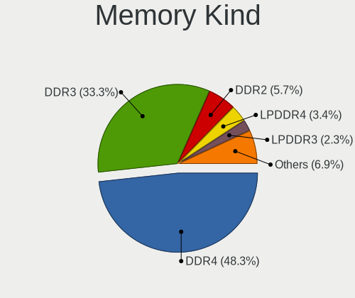

NetBSD - Tested Hardware & Statistics
-------------------------------------

A project to collect tested hardware configurations for NetBSD.

Anyone can contribute to this report by the [hw-probe](https://github.com/linuxhw/hw-probe/blob/master/INSTALL.BSD.md) tool:

    hw-probe -all -upload

Please contribute! Especially if your hardware is rare.

This is a report for all computer types. See also reports for [desktops](/Dist/NetBSD/Desktop/README.md) and [notebooks](/Dist/NetBSD/Notebook/README.md).

Contents
--------

* [ Test Cases ](#test-cases)

* [ System ](#system)
  - [ OS                       ](#os)
  - [ OS Family                ](#os-family)
  - [ Arch                     ](#arch)
  - [ DE                       ](#de)
  - [ Display Server           ](#display-server)
  - [ Display Manager          ](#display-manager)
  - [ OS Lang                  ](#os-lang)
  - [ Boot Mode                ](#boot-mode)
  - [ Filesystem               ](#filesystem)
  - [ Part. scheme             ](#part-scheme)

* [ Board ](#board)
  - [ Vendor                   ](#vendor)
  - [ Model                    ](#model)
  - [ Model Family             ](#model-family)
  - [ MFG Year                 ](#mfg-year)
  - [ Form Factor              ](#form-factor)
  - [ Coreboot                 ](#coreboot)
  - [ RAM Size                 ](#ram-size)
  - [ RAM Used                 ](#ram-used)
  - [ Total Drives             ](#total-drives)
  - [ Has CD-ROM               ](#has-cd-rom)
  - [ Has Ethernet             ](#has-ethernet)
  - [ Has WiFi                 ](#has-wifi)
  - [ Has Bluetooth            ](#has-bluetooth)

* [ Location ](#location)
  - [ Country                  ](#country)
  - [ City                     ](#city)

* [ Drives ](#drives)
  - [ Drive Vendor             ](#drive-vendor)
  - [ Drive Model              ](#drive-model)
  - [ HDD Vendor               ](#hdd-vendor)
  - [ SSD Vendor               ](#ssd-vendor)
  - [ Drive Kind               ](#drive-kind)
  - [ Drive Connector          ](#drive-connector)
  - [ Drive Size               ](#drive-size)
  - [ Space Total              ](#space-total)
  - [ Space Used               ](#space-used)
  - [ Malfunc. Drives          ](#malfunc-drives)
  - [ Malfunc. Drive Vendor    ](#malfunc-drive-vendor)
  - [ Malfunc. HDD Vendor      ](#malfunc-hdd-vendor)
  - [ Malfunc. Drive Kind      ](#malfunc-drive-kind)
  - [ Failed Drives            ](#failed-drives)
  - [ Failed Drive Vendor      ](#failed-drive-vendor)
  - [ Drive Status             ](#drive-status)

* [ Storage controller ](#storage-controller)
  - [ Storage Vendor           ](#storage-vendor)
  - [ Storage Model            ](#storage-model)
  - [ Storage Kind             ](#storage-kind)

* [ Processor ](#processor)
  - [ CPU Vendor               ](#cpu-vendor)
  - [ CPU Model                ](#cpu-model)
  - [ CPU Model Family         ](#cpu-model-family)
  - [ CPU Cores                ](#cpu-cores)
  - [ CPU Sockets              ](#cpu-sockets)
  - [ CPU Threads              ](#cpu-threads)
  - [ CPU Microarch            ](#cpu-microarch)

* [ Graphics ](#graphics)
  - [ GPU Vendor               ](#gpu-vendor)
  - [ GPU Model                ](#gpu-model)
  - [ GPU Combo                ](#gpu-combo)
  - [ GPU Driver               ](#gpu-driver)
  - [ GPU Memory               ](#gpu-memory)

* [ Monitor ](#monitor)
  - [ Monitor Vendor           ](#monitor-vendor)
  - [ Monitor Model            ](#monitor-model)
  - [ Monitor Resolution       ](#monitor-resolution)
  - [ Monitor Diagonal         ](#monitor-diagonal)
  - [ Monitor Width            ](#monitor-width)
  - [ Aspect Ratio             ](#aspect-ratio)
  - [ Monitor Area             ](#monitor-area)
  - [ Pixel Density            ](#pixel-density)
  - [ Multiple Monitors        ](#multiple-monitors)

* [ Network ](#network)
  - [ Net Controller Vendor    ](#net-controller-vendor)
  - [ Net Controller Model     ](#net-controller-model)
  - [ Wireless Vendor          ](#wireless-vendor)
  - [ Wireless Model           ](#wireless-model)
  - [ Ethernet Vendor          ](#ethernet-vendor)
  - [ Ethernet Model           ](#ethernet-model)
  - [ Net Controller Kind      ](#net-controller-kind)
  - [ Used Controller          ](#used-controller)
  - [ NICs                     ](#nics)
  - [ IPv6                     ](#ipv6)

* [ Bluetooth ](#bluetooth)
  - [ Bluetooth Vendor         ](#bluetooth-vendor)
  - [ Bluetooth Model          ](#bluetooth-model)

* [ Sound ](#sound)
  - [ Sound Vendor             ](#sound-vendor)
  - [ Sound Model              ](#sound-model)

* [ Memory ](#memory)
  - [ Memory Vendor            ](#memory-vendor)
  - [ Memory Model             ](#memory-model)
  - [ Memory Kind              ](#memory-kind)
  - [ Memory Form Factor       ](#memory-form-factor)
  - [ Memory Size              ](#memory-size)
  - [ Memory Speed             ](#memory-speed)

* [ Printers & scanners ](#printers--scanners)
  - [ Printer Vendor           ](#printer-vendor)
  - [ Printer Model            ](#printer-model)
  - [ Scanner Vendor           ](#scanner-vendor)
  - [ Scanner Model            ](#scanner-model)

* [ Camera ](#camera)
  - [ Camera Vendor            ](#camera-vendor)
  - [ Camera Model             ](#camera-model)

* [ Security ](#security)
  - [ Fingerprint Vendor       ](#fingerprint-vendor)
  - [ Fingerprint Model        ](#fingerprint-model)
  - [ Chipcard Vendor          ](#chipcard-vendor)
  - [ Chipcard Model           ](#chipcard-model)

* [ Unsupported ](#unsupported)
  - [ Unsupported Devices      ](#unsupported-devices)
  - [ Unsupported Device Types ](#unsupported-device-types)

Test Cases
----------

Total: 76

| Vendor        | Model                    | Form-Factor | Probe                                                     | Date         |
|---------------|--------------------------|-------------|-----------------------------------------------------------|--------------|
| Acer          | Revo RN86                | Desktop     | [a4dcb7f7a2](https://bsd-hardware.info/?probe=a4dcb7f7a2) | Nov 27, 2022 |
| Unknown       | Unknown                  | Desktop     | [1d3bd58d18](https://bsd-hardware.info/?probe=1d3bd58d18) | Nov 25, 2022 |
| Dell          | Precision M4500          | Notebook    | [ab63467f38](https://bsd-hardware.info/?probe=ab63467f38) | Nov 03, 2022 |
| Unknown       | Unknown                  | Desktop     | [410283dd4f](https://bsd-hardware.info/?probe=410283dd4f) | Oct 22, 2022 |
| Unknown       | Unknown                  | Desktop     | [5e2f93a960](https://bsd-hardware.info/?probe=5e2f93a960) | Aug 06, 2022 |
| Unknown       | Unknown                  | Desktop     | [66fefba790](https://bsd-hardware.info/?probe=66fefba790) | Aug 06, 2022 |
| ASUSTek       | TUF B450-PLUS GAMING     | Desktop     | [aeee3a91e6](https://bsd-hardware.info/?probe=aeee3a91e6) | Jul 03, 2022 |
| Gigabyte      | X570 AORUS PRO           | Desktop     | [4e7d57df3b](https://bsd-hardware.info/?probe=4e7d57df3b) | Apr 18, 2022 |
| ASUSTek       | X555LJ                   | Notebook    | [6bf51cc915](https://bsd-hardware.info/?probe=6bf51cc915) | Mar 28, 2022 |
| Acer          | Aspire A114-33           | Notebook    | [57765224eb](https://bsd-hardware.info/?probe=57765224eb) | Mar 18, 2022 |
| Gigabyte      | 970A-D3P                 | Desktop     | [fa03bdabb6](https://bsd-hardware.info/?probe=fa03bdabb6) | Mar 15, 2022 |
| Raspberry ... | Raspberry Pi 4 Model B   | Soc         | [0394e3272e](https://bsd-hardware.info/?probe=0394e3272e) | Mar 03, 2022 |
| KLLISRE       | X99-B5 V1.0              | Desktop     | [5dea1304b9](https://bsd-hardware.info/?probe=5dea1304b9) | Feb 26, 2022 |
| MiTAC         | 5033                     | Notebook    | [54df5c9e9e](https://bsd-hardware.info/?probe=54df5c9e9e) | Feb 10, 2022 |
| ASRock        | X470 Gaming-ITX/ac       | Desktop     | [18eeaf2963](https://bsd-hardware.info/?probe=18eeaf2963) | Dec 29, 2021 |
| Acer          | Revo RN86                | Desktop     | [6d184a1e62](https://bsd-hardware.info/?probe=6d184a1e62) | Dec 23, 2021 |
| ASRock        | 970 Extreme3             | Desktop     | [14907c62f1](https://bsd-hardware.info/?probe=14907c62f1) | Dec 04, 2021 |
| HP            | 3397                     | Desktop     | [155eceb394](https://bsd-hardware.info/?probe=155eceb394) | Nov 07, 2021 |
| Lenovo        | ThinkPad T420 4236D26    | Notebook    | [5c64875424](https://bsd-hardware.info/?probe=5c64875424) | Oct 12, 2021 |
| ASUSTek       | ROG STRIX X470-F GAMING  | Desktop     | [7259ec87e9](https://bsd-hardware.info/?probe=7259ec87e9) | Oct 05, 2021 |
| ASUSTek       | X555LJ                   | Notebook    | [81dd2ba2f0](https://bsd-hardware.info/?probe=81dd2ba2f0) | Oct 02, 2021 |
| ASUSTek       | PRIME A320M-K            | Desktop     | [c574dcc409](https://bsd-hardware.info/?probe=c574dcc409) | Oct 01, 2021 |
| ASUSTek       | ROG STRIX X470-F GAMING  | Desktop     | [b3a18fcab3](https://bsd-hardware.info/?probe=b3a18fcab3) | Sep 29, 2021 |
| Unknown       | Unknown                  | Desktop     | [2a56bcb7c1](https://bsd-hardware.info/?probe=2a56bcb7c1) | Sep 19, 2021 |
| Toshiba       | Satellite A100           | Notebook    | [9ccf97d62c](https://bsd-hardware.info/?probe=9ccf97d62c) | Sep 05, 2021 |
| MSI           | B450-A PRO MAX           | Desktop     | [4e3b1f226b](https://bsd-hardware.info/?probe=4e3b1f226b) | Jun 22, 2021 |
| Sony          | SVF1421DSGW              | Notebook    | [abadb65058](https://bsd-hardware.info/?probe=abadb65058) | Jun 01, 2021 |
| Unknown       | Unknown                  | Desktop     | [f9fa9ae41a](https://bsd-hardware.info/?probe=f9fa9ae41a) | May 24, 2021 |
| Acer          | Revo RN86                | Desktop     | [ec302a221a](https://bsd-hardware.info/?probe=ec302a221a) | May 15, 2021 |
| Unknown       | Unknown                  | Desktop     | [364a778de1](https://bsd-hardware.info/?probe=364a778de1) | May 14, 2021 |
| ASRock        | X470 Gaming-ITX/ac       | Desktop     | [82e63b3fb9](https://bsd-hardware.info/?probe=82e63b3fb9) | Apr 14, 2021 |
| Unknown       | Unknown                  | Desktop     | [df793cf09f](https://bsd-hardware.info/?probe=df793cf09f) | Apr 08, 2021 |
| Unknown       | Unknown                  | Desktop     | [f8ba0ba112](https://bsd-hardware.info/?probe=f8ba0ba112) | Apr 08, 2021 |
| Unknown       | Unknown                  | Desktop     | [0541b120c2](https://bsd-hardware.info/?probe=0541b120c2) | Apr 02, 2021 |
| Unknown       | Unknown                  | Desktop     | [91dd02d436](https://bsd-hardware.info/?probe=91dd02d436) | Mar 30, 2021 |
| Unknown       | Unknown                  | Desktop     | [a1220fba93](https://bsd-hardware.info/?probe=a1220fba93) | Mar 24, 2021 |
| Unknown       | Unknown                  | Desktop     | [edea2d1a64](https://bsd-hardware.info/?probe=edea2d1a64) | Mar 18, 2021 |
| Apple         | MacBook2,1               | Notebook    | [360f29bf3b](https://bsd-hardware.info/?probe=360f29bf3b) | Mar 05, 2021 |
| Apple         | MacBook2,1               | Notebook    | [f6e7638f87](https://bsd-hardware.info/?probe=f6e7638f87) | Mar 05, 2021 |
| Unknown       | Unknown                  | Desktop     | [1afd7d4381](https://bsd-hardware.info/?probe=1afd7d4381) | Feb 27, 2021 |
| Unknown       | Unknown                  | Desktop     | [4c0171bc04](https://bsd-hardware.info/?probe=4c0171bc04) | Feb 25, 2021 |
| Unknown       | Unknown                  | Desktop     | [a5fa760573](https://bsd-hardware.info/?probe=a5fa760573) | Jan 02, 2021 |
| IBM           | ThinkPad R51 2887AVG     | Notebook    | [289177c624](https://bsd-hardware.info/?probe=289177c624) | Jan 02, 2021 |
| IBM           | ThinkPad R51 2887AVG     | Notebook    | [88d4fc2693](https://bsd-hardware.info/?probe=88d4fc2693) | Dec 30, 2020 |
| Lenovo        | ThinkPad T430s 23564H3   | Notebook    | [eda02dc46b](https://bsd-hardware.info/?probe=eda02dc46b) | Dec 25, 2020 |
| Fujitsu Si... | AMILO L7310              | Notebook    | [0603b64315](https://bsd-hardware.info/?probe=0603b64315) | Dec 25, 2020 |
| ASRock        | N68-VS3 UCC              | Desktop     | [647ab5967e](https://bsd-hardware.info/?probe=647ab5967e) | Dec 22, 2020 |
| Unknown       | Unknown                  | Desktop     | [8668b1d651](https://bsd-hardware.info/?probe=8668b1d651) | Dec 17, 2020 |
| ASUSTek       | E45M1-I DELUXE           | Desktop     | [8e767b517d](https://bsd-hardware.info/?probe=8e767b517d) | Dec 16, 2020 |
| Unknown       | Unknown                  | Desktop     | [153be3caa3](https://bsd-hardware.info/?probe=153be3caa3) | Nov 28, 2020 |
| HP            | System Board R3A         | Desktop     | [80593fc3da](https://bsd-hardware.info/?probe=80593fc3da) | Nov 03, 2020 |
| Gigabyte      | Z170X-Gaming 3           | Desktop     | [615ac68e50](https://bsd-hardware.info/?probe=615ac68e50) | Oct 29, 2020 |
| Unknown       | Unknown                  | Desktop     | [d08d610bd0](https://bsd-hardware.info/?probe=d08d610bd0) | Oct 29, 2020 |
| Acer          | Aspire ES1-132           | Notebook    | [a4e45f3551](https://bsd-hardware.info/?probe=a4e45f3551) | Oct 22, 2020 |
| ASUSTek       | B150M-K                  | Desktop     | [135db0e455](https://bsd-hardware.info/?probe=135db0e455) | Oct 22, 2020 |
| Unknown       | Unknown                  | Desktop     | [223aa9e0a3](https://bsd-hardware.info/?probe=223aa9e0a3) | Oct 22, 2020 |
| Gigabyte      | P75-D3                   | Desktop     | [980218cf46](https://bsd-hardware.info/?probe=980218cf46) | Oct 02, 2020 |
| ASUSTek       | H81M-D PLUS              | Desktop     | [95b75130f4](https://bsd-hardware.info/?probe=95b75130f4) | Sep 26, 2020 |
| Dell          | 0W7H8C A03               | Server      | [639b47e2ad](https://bsd-hardware.info/?probe=639b47e2ad) | Sep 21, 2020 |
| Acer          | Revo RN86                | Desktop     | [c6b2c64d14](https://bsd-hardware.info/?probe=c6b2c64d14) | Sep 20, 2020 |
| ASUSTek       | H81M-D PLUS              | Desktop     | [7be45f1bec](https://bsd-hardware.info/?probe=7be45f1bec) | Sep 19, 2020 |
| MSI           | KA790GX                  | Desktop     | [bba5499a4b](https://bsd-hardware.info/?probe=bba5499a4b) | Aug 29, 2020 |
| Lenovo        | ThinkPad T510 4313CTO    | Notebook    | [7f6095b266](https://bsd-hardware.info/?probe=7f6095b266) | Aug 20, 2020 |
| eMachines     | eME642G                  | Notebook    | [42027dfbb9](https://bsd-hardware.info/?probe=42027dfbb9) | Jul 25, 2020 |
| Intel         | NUC7JYB J67969-404       | Mini pc     | [35c4a3608e](https://bsd-hardware.info/?probe=35c4a3608e) | Jul 19, 2020 |
| Intel         | NUC5PPYB                 | Mini pc     | [9fbca0a216](https://bsd-hardware.info/?probe=9fbca0a216) | Jun 17, 2020 |
| Lenovo        | G500 20236               | Notebook    | [99cf14c489](https://bsd-hardware.info/?probe=99cf14c489) | Jun 03, 2020 |
| ASUSTek       | PRIME A320M-K            | Desktop     | [a49cf5c20b](https://bsd-hardware.info/?probe=a49cf5c20b) | May 28, 2020 |
| Gigabyte      | H61M-S2PV                | Desktop     | [14e00aa09f](https://bsd-hardware.info/?probe=14e00aa09f) | May 25, 2020 |
| Intel         | DN2820FYK H24582-203     | Desktop     | [6cb240a9f6](https://bsd-hardware.info/?probe=6cb240a9f6) | May 25, 2020 |
| Intel         | NUC5PPYB                 | Mini pc     | [8ba62bd121](https://bsd-hardware.info/?probe=8ba62bd121) | May 25, 2020 |
| Lenovo        | ThinkPad X240 20AMS0J01N | Notebook    | [4df07718d1](https://bsd-hardware.info/?probe=4df07718d1) | May 23, 2020 |
| Unknown       | Unknown                  | Desktop     | [d3ad2b17ed](https://bsd-hardware.info/?probe=d3ad2b17ed) | May 22, 2020 |
| Lenovo        | G570 20079               | Notebook    | [3258f01592](https://bsd-hardware.info/?probe=3258f01592) | May 16, 2020 |
| ASUSTek       | A3L                      | Notebook    | [6b65fcf9c1](https://bsd-hardware.info/?probe=6b65fcf9c1) | May 15, 2020 |
| Lenovo        | G570 20079               | Notebook    | [cd45078232](https://bsd-hardware.info/?probe=cd45078232) | May 05, 2020 |

System
------

OS
--

Installed operating systems

| Name              | Computers | Percent |
|-------------------|-----------|---------|
| NetBSD 9.2        | 13        | 20.63%  |
| NetBSD 9.1        | 11        | 17.46%  |
| NetBSD 9.0_STABLE | 8         | 12.7%   |
| NetBSD 9.0        | 6         | 9.52%   |
| NetBSD 9.99.94    | 3         | 4.76%   |
| NetBSD 9.99.93    | 3         | 4.76%   |
| NetBSD 9.1_STABLE | 3         | 4.76%   |
| NetBSD 9.99.77    | 2         | 3.17%   |
| NetBSD 9.3        | 2         | 3.17%   |
| NetBSD 9.2_STABLE | 2         | 3.17%   |
| NetBSD 9.99.85    | 1         | 1.59%   |
| NetBSD 9.99.81    | 1         | 1.59%   |
| NetBSD 9.99.74    | 1         | 1.59%   |
| NetBSD 9.99.71    | 1         | 1.59%   |
| NetBSD 9.99.61    | 1         | 1.59%   |
| NetBSD 9.99.23    | 1         | 1.59%   |
| NetBSD 9.99.107   | 1         | 1.59%   |
| NetBSD 9.3_STABLE | 1         | 1.59%   |
| NetBSD 8.99.51    | 1         | 1.59%   |
| NetBSD 7.2        | 1         | 1.59%   |

OS Family
---------

OS without a version

| Name   | Computers | Percent |
|--------|-----------|---------|
| NetBSD | 55        | 100%    |

Arch
----

OS architecture (x86_64, i586, etc.)

| Name   | Computers | Percent |
|--------|-----------|---------|
| amd64  | 43        | 78.18%  |
| i386   | 6         | 10.91%  |
| evbarm | 6         | 10.91%  |

DE
--

Desktop Environment

| Name         | Computers | Percent |
|--------------|-----------|---------|
| Console      | 21        | 36.84%  |
| XFCE         | 12        | 21.05%  |
| helloDesktop | 9         | 15.79%  |
| Fluxbox      | 4         | 7.02%   |
| CTWM         | 3         | 5.26%   |
| MATE         | 2         | 3.51%   |
| DWM          | 2         | 3.51%   |
| Xfwm4        | 1         | 1.75%   |
| Ratpoison    | 1         | 1.75%   |
| PekWM        | 1         | 1.75%   |
| Awesome      | 1         | 1.75%   |

Display Server
--------------

X11 or Wayland

| Name    | Computers | Percent |
|---------|-----------|---------|
| X11     | 40        | 72.73%  |
| Console | 15        | 27.27%  |

Display Manager
---------------

SDDM, LightDM, etc.

| Name    | Computers | Percent |
|---------|-----------|---------|
| Console | 50        | 90.91%  |
| XDM     | 2         | 3.64%   |
| GDM     | 2         | 3.64%   |
| LightDM | 1         | 1.82%   |

OS Lang
-------

Language

| Lang    | Computers | Percent |
|---------|-----------|---------|
| Unknown | 42        | 72.41%  |
| en_US   | 8         | 13.79%  |
| ru_RU   | 3         | 5.17%   |
| fi_FI   | 2         | 3.45%   |
| hu_HU   | 1         | 1.72%   |
| en_GB   | 1         | 1.72%   |
| C       | 1         | 1.72%   |

Boot Mode
---------

EFI or BIOS

| Mode | Computers | Percent |
|------|-----------|---------|
| BIOS | 53        | 96.36%  |
| EFI  | 2         | 3.64%   |

Filesystem
----------

Type of filesystem

| Type    | Computers | Percent |
|---------|-----------|---------|
| Ufs     | 54        | 98.18%  |
| Unknown | 1         | 1.82%   |

Part. scheme
------------

Scheme of partitioning

| Type    | Computers | Percent |
|---------|-----------|---------|
| GPT     | 34        | 61.82%  |
| Unknown | 21        | 38.18%  |

Board
-----

Vendor
------

Motherboard manufacturer

| Name                    | Computers | Percent |
|-------------------------|-----------|---------|
| Unknown                 | 15        | 27.27%  |
| ASUSTek Computer        | 8         | 14.55%  |
| Lenovo                  | 5         | 9.09%   |
| Gigabyte Technology     | 5         | 9.09%   |
| ASRock                  | 3         | 5.45%   |
| Acer                    | 3         | 5.45%   |
| MSI                     | 2         | 3.64%   |
| Intel                   | 2         | 3.64%   |
| Dell                    | 2         | 3.64%   |
| Toshiba                 | 1         | 1.82%   |
| Sony                    | 1         | 1.82%   |
| Raspberry Pi Foundation | 1         | 1.82%   |
| MiTAC                   | 1         | 1.82%   |
| KLLISRE                 | 1         | 1.82%   |
| IBM                     | 1         | 1.82%   |
| Hewlett-Packard         | 1         | 1.82%   |
| Fujitsu Siemens         | 1         | 1.82%   |
| eMachines               | 1         | 1.82%   |
| Apple                   | 1         | 1.82%   |

Model
-----

Motherboard model

| Name                            | Computers | Percent |
|---------------------------------|-----------|---------|
| Unknown                         | 15        | 27.27%  |
| ASUS PRIME A320M-K              | 2         | 3.64%   |
| Toshiba Satellite A100          | 1         | 1.82%   |
| Sony SVF1421DSGW                | 1         | 1.82%   |
| RPi Raspberry Pi 4 Model B      | 1         | 1.82%   |
| MSI MS-7B86                     | 1         | 1.82%   |
| MSI MS-7551                     | 1         | 1.82%   |
| MiTAC 5033                      | 1         | 1.82%   |
| Lenovo ThinkPad X240 20AMS0J01N | 1         | 1.82%   |
| Lenovo ThinkPad T510 4313CTO    | 1         | 1.82%   |
| Lenovo ThinkPad T430s 23564H3   | 1         | 1.82%   |
| Lenovo ThinkPad T420 4236D26    | 1         | 1.82%   |
| Lenovo G500 20236               | 1         | 1.82%   |
| KLLISRE X99-B5 V1.0             | 1         | 1.82%   |
| Intel NUC5PPYB                  | 1         | 1.82%   |
| Intel DN2820FYK H24582-203      | 1         | 1.82%   |
| IBM ThinkPad R51 2887AVG        | 1         | 1.82%   |
| HP Vectra                       | 1         | 1.82%   |
| Gigabyte Z170X-Gaming 3         | 1         | 1.82%   |
| Gigabyte X570 AORUS PRO         | 1         | 1.82%   |
| Gigabyte P75-D3                 | 1         | 1.82%   |
| Gigabyte H61M-S2PV              | 1         | 1.82%   |
| Gigabyte 970A-D3P               | 1         | 1.82%   |
| Fujitsu Siemens AMILO L7310     | 1         | 1.82%   |
| eMachines eME642G               | 1         | 1.82%   |
| Dell Precision M4500            | 1         | 1.82%   |
| Dell PowerEdge T320             | 1         | 1.82%   |
| ASUS X555LJ                     | 1         | 1.82%   |
| ASUS TUF B450-PLUS GAMING       | 1         | 1.82%   |
| ASUS E45M1-I DELUXE             | 1         | 1.82%   |
| ASUS B150M-K                    | 1         | 1.82%   |
| ASUS All Series                 | 1         | 1.82%   |
| ASUS A3L                        | 1         | 1.82%   |
| ASRock X470 Gaming-ITX/ac       | 1         | 1.82%   |
| ASRock N68-VS3 UCC              | 1         | 1.82%   |
| ASRock 970 Extreme3             | 1         | 1.82%   |
| Apple MacBook2,1                | 1         | 1.82%   |
| Acer Revo RN86                  | 1         | 1.82%   |
| Acer Aspire ES1-132             | 1         | 1.82%   |
| Acer Aspire A114-33             | 1         | 1.82%   |

Model Family
------------

Motherboard model prefix

| Name                  | Computers | Percent |
|-----------------------|-----------|---------|
| Unknown               | 15        | 27.27%  |
| Lenovo ThinkPad       | 4         | 7.27%   |
| ASUS PRIME            | 2         | 3.64%   |
| Acer Aspire           | 2         | 3.64%   |
| Toshiba Satellite     | 1         | 1.82%   |
| Sony SVF1421DSGW      | 1         | 1.82%   |
| RPi Raspberry         | 1         | 1.82%   |
| MSI MS-7B86           | 1         | 1.82%   |
| MSI MS-7551           | 1         | 1.82%   |
| MiTAC 5033            | 1         | 1.82%   |
| Lenovo G500           | 1         | 1.82%   |
| KLLISRE X99-B5        | 1         | 1.82%   |
| Intel NUC5PPYB        | 1         | 1.82%   |
| Intel DN2820FYK       | 1         | 1.82%   |
| IBM ThinkPad          | 1         | 1.82%   |
| HP Vectra             | 1         | 1.82%   |
| Gigabyte Z170X-Gaming | 1         | 1.82%   |
| Gigabyte X570         | 1         | 1.82%   |
| Gigabyte P75-D3       | 1         | 1.82%   |
| Gigabyte H61M-S2PV    | 1         | 1.82%   |
| Gigabyte 970A-D3P     | 1         | 1.82%   |
| Fujitsu Siemens AMILO | 1         | 1.82%   |
| eMachines eME642G     | 1         | 1.82%   |
| Dell Precision        | 1         | 1.82%   |
| Dell PowerEdge        | 1         | 1.82%   |
| ASUS X555LJ           | 1         | 1.82%   |
| ASUS TUF              | 1         | 1.82%   |
| ASUS E45M1-I          | 1         | 1.82%   |
| ASUS B150M-K          | 1         | 1.82%   |
| ASUS All              | 1         | 1.82%   |
| ASUS A3L              | 1         | 1.82%   |
| ASRock X470           | 1         | 1.82%   |
| ASRock N68-VS3        | 1         | 1.82%   |
| ASRock 970            | 1         | 1.82%   |
| Apple MacBook2        | 1         | 1.82%   |
| Acer Revo             | 1         | 1.82%   |

MFG Year
--------

Motherboard manufacture year

| Year    | Computers | Percent |
|---------|-----------|---------|
| Unknown | 15        | 27.27%  |
| 2020    | 7         | 12.73%  |
| 2013    | 7         | 12.73%  |
| 2021    | 3         | 5.45%   |
| 2017    | 3         | 5.45%   |
| 2011    | 3         | 5.45%   |
| 2010    | 3         | 5.45%   |
| 2019    | 2         | 3.64%   |
| 2018    | 2         | 3.64%   |
| 2014    | 2         | 3.64%   |
| 2005    | 2         | 3.64%   |
| 2016    | 1         | 1.82%   |
| 2015    | 1         | 1.82%   |
| 2012    | 1         | 1.82%   |
| 2007    | 1         | 1.82%   |
| 2006    | 1         | 1.82%   |
| 2001    | 1         | 1.82%   |

Form Factor
-----------

Physical design of the computer

| Name           | Computers | Percent |
|----------------|-----------|---------|
| Desktop        | 35        | 63.64%  |
| Notebook       | 17        | 30.91%  |
| System on chip | 1         | 1.82%   |
| Mini pc        | 1         | 1.82%   |
| Server         | 1         | 1.82%   |

Coreboot
--------

Have coreboot on board

| Used | Computers | Percent |
|------|-----------|---------|
| No   | 54        | 98.18%  |
| Yes  | 1         | 1.82%   |

RAM Size
--------

Total RAM memory

| Size in GB  | Computers | Percent |
|-------------|-----------|---------|
| 4.01-8.0    | 15        | 27.27%  |
| 3.01-4.0    | 9         | 16.36%  |
| 16.01-24.0  | 8         | 14.55%  |
| 8.01-16.0   | 6         | 10.91%  |
| 0.51-1.0    | 4         | 7.27%   |
| 32.01-64.0  | 3         | 5.45%   |
| 1.01-2.0    | 3         | 5.45%   |
| 0.01-0.5    | 3         | 5.45%   |
| 24.01-32.0  | 1         | 1.82%   |
| 64.01-256.0 | 1         | 1.82%   |
| 0           | 1         | 1.82%   |
| Unknown     | 1         | 1.82%   |

RAM Used
--------

Used RAM memory

| Used GB | Computers | Percent |
|---------|-----------|---------|
| Unknown | 55        | 100%    |

Total Drives
------------

Number of drives on board

| Drives | Computers | Percent |
|--------|-----------|---------|
| 1      | 24        | 40.68%  |
| 0      | 22        | 37.29%  |
| 2      | 10        | 16.95%  |
| 3      | 2         | 3.39%   |
| 4      | 1         | 1.69%   |

Has CD-ROM
----------

Has CD-ROM on board

| Presented | Computers | Percent |
|-----------|-----------|---------|
| No        | 53        | 96.36%  |
| Yes       | 2         | 3.64%   |

Has Ethernet
------------

Has Ethernet on board

| Presented | Computers | Percent |
|-----------|-----------|---------|
| Yes       | 45        | 81.82%  |
| No        | 10        | 18.18%  |

Has WiFi
--------

Has WiFi module

| Presented | Computers | Percent |
|-----------|-----------|---------|
| Yes       | 28        | 50.91%  |
| No        | 27        | 49.09%  |

Has Bluetooth
-------------

Has Bluetooth module

| Presented | Computers | Percent |
|-----------|-----------|---------|
| No        | 39        | 70.91%  |
| Yes       | 16        | 29.09%  |

Location
--------

Country
-------

Geographic location (country)

| Country      | Computers | Percent |
|--------------|-----------|---------|
| Russia       | 11        | 20%     |
| Italy        | 6         | 10.91%  |
| USA          | 5         | 9.09%   |
| Germany      | 5         | 9.09%   |
| UK           | 4         | 7.27%   |
| Hungary      | 4         | 7.27%   |
| Saudi Arabia | 3         | 5.45%   |
| France       | 3         | 5.45%   |
| Finland      | 3         | 5.45%   |
| Vietnam      | 1         | 1.82%   |
| Spain        | 1         | 1.82%   |
| Romania      | 1         | 1.82%   |
| Poland       | 1         | 1.82%   |
| Netherlands  | 1         | 1.82%   |
| Latvia       | 1         | 1.82%   |
| India        | 1         | 1.82%   |
| Czechia      | 1         | 1.82%   |
| Canada       | 1         | 1.82%   |
| Brazil       | 1         | 1.82%   |
| Australia    | 1         | 1.82%   |

City
----

Geographic location (city)

| City                  | Computers | Percent |
|-----------------------|-----------|---------|
| Ozersk                | 6         | 10.71%  |
| Rome                  | 5         | 8.93%   |
| Moscow                | 4         | 7.14%   |
| Riyadh                | 3         | 5.36%   |
| Gardony               | 3         | 5.36%   |
| Tampere               | 2         | 3.57%   |
| Lille                 | 2         | 3.57%   |
| Washington            | 1         | 1.79%   |
| Urupes                | 1         | 1.79%   |
| Unterhaching          | 1         | 1.79%   |
| Ulan-Ude              | 1         | 1.79%   |
| Turin                 | 1         | 1.79%   |
| Turenki               | 1         | 1.79%   |
| Sydney                | 1         | 1.79%   |
| Surrey                | 1         | 1.79%   |
| Stourbridge           | 1         | 1.79%   |
| Sopron                | 1         | 1.79%   |
| Royal Tunbridge Wells | 1         | 1.79%   |
| Riga                  | 1         | 1.79%   |
| Reno                  | 1         | 1.79%   |
| Prague                | 1         | 1.79%   |
| Poznan                | 1         | 1.79%   |
| Portland              | 1         | 1.79%   |
| Murcia                | 1         | 1.79%   |
| Lohr a. Main          | 1         | 1.79%   |
| Ladbergen             | 1         | 1.79%   |
| Ho Chi Minh City      | 1         | 1.79%   |
| Hamilton              | 1         | 1.79%   |
| Genzano di Roma       | 1         | 1.79%   |
| Fort Wayne            | 1         | 1.79%   |
| Carry-le-Rouet        | 1         | 1.79%   |
| Bucharest             | 1         | 1.79%   |
| Bridgwater            | 1         | 1.79%   |
| Bloomsbury            | 1         | 1.79%   |
| Berlin                | 1         | 1.79%   |
| Amersfoort            | 1         | 1.79%   |
| Ahmedabad             | 1         | 1.79%   |
| Aachen                | 1         | 1.79%   |

Drives
------

Drive Vendor
------------

Hard drive vendors

| Vendor              | Computers | Drives | Percent |
|---------------------|-----------|--------|---------|
| WDC                 | 9         | 12     | 19.15%  |
| Samsung Electronics | 5         | 5      | 10.64%  |
| Kingston            | 5         | 5      | 10.64%  |
| Toshiba             | 4         | 6      | 8.51%   |
| Seagate             | 4         | 4      | 8.51%   |
| SanDisk             | 3         | 4      | 6.38%   |
| Intel               | 3         | 3      | 6.38%   |
| Maxtor              | 2         | 2      | 4.26%   |
| Hitachi             | 2         | 3      | 4.26%   |
| SK hynix            | 1         | 2      | 2.13%   |
| Lexar               | 1         | 1      | 2.13%   |
| JetFlash            | 1         | 1      | 2.13%   |
| Intenso             | 1         | 1      | 2.13%   |
| HGST                | 1         | 1      | 2.13%   |
| Hewlett-Packard     | 1         | 1      | 2.13%   |
| Generic             | 1         | 1      | 2.13%   |
| Dell                | 1         | 2      | 2.13%   |
| Crucial             | 1         | 2      | 2.13%   |
| China               | 1         | 1      | 2.13%   |

Drive Model
-----------

Hard drive models

| Model                             | Computers | Percent |
|-----------------------------------|-----------|---------|
| Toshiba DT01ACA100 1TB            | 3         | 6.25%   |
| Samsung SSD 860 EVO 500GB         | 2         | 4.17%   |
| Samsung HD103UJ 1TB               | 2         | 4.17%   |
| Maxtor STM3250310AS 250GB         | 2         | 4.17%   |
| Kingston DataTraveler 3.0 32GB    | 2         | 4.17%   |
| WDC WDS240G2G0A-00JH30 240GB      | 1         | 2.08%   |
| WDC WDS120G2G0A-00JH30 120GB      | 1         | 2.08%   |
| WDC WD5003AZEX-00K3CA0 500GB      | 1         | 2.08%   |
| WDC WD5000AAKX-753CA1 500GB       | 1         | 2.08%   |
| WDC WD5000AACS-00ZUB0 500GB       | 1         | 2.08%   |
| WDC WD2502ABYS-01B7A0 256GB       | 1         | 2.08%   |
| WDC WD20EFRX-68EUZN0 2TB          | 1         | 2.08%   |
| WDC WD200EB-00BHF0 20GB           | 1         | 2.08%   |
| WDC WD1600BEVT-00A23T0 160GB      | 1         | 2.08%   |
| WDC WD10EZEX-60WN4A0 1TB          | 1         | 2.08%   |
| Toshiba DT01ACA200 2TB            | 1         | 2.08%   |
| SK hynix HFS128G39TND-N210A 128GB | 1         | 2.08%   |
| Seagate ST500VT000-1DK142 500GB   | 1         | 2.08%   |
| Seagate ST500LT012-9WS142 500GB   | 1         | 2.08%   |
| Seagate ST380011A 80GB            | 1         | 2.08%   |
| Seagate ST2000DL003-9VT166 2TB    | 1         | 2.08%   |
| SanDisk SDSSDH3512G 512GB         | 1         | 2.08%   |
| SanDisk Extreme SSD 250GB         | 1         | 2.08%   |
| SanDisk Cruzer Glide 16GB         | 1         | 2.08%   |
| Samsung HM080HC 80GB              | 1         | 2.08%   |
| Lexar USB Flash Drive 64GB        | 1         | 2.08%   |
| Kingston SA400S37480G 480GB       | 1         | 2.08%   |
| Kingston SA400S37240G 240GB       | 1         | 2.08%   |
| Kingston SA400S37120G 120GB       | 1         | 2.08%   |
| JetFlash Transcend 16GB           | 1         | 2.08%   |
| Intenso Rainbow Line 8GB          | 1         | 2.08%   |
| Intel SSDSC2KW120H6 120GB         | 1         | 2.08%   |
| Intel SSDSC2CW120A3 120GB         | 1         | 2.08%   |
| Intel SSDSC2BF180A4L 180GB        | 1         | 2.08%   |
| Hitachi HTS721060G9AT00 64GB      | 1         | 2.08%   |
| Hitachi HTS548040M9AT00 37GB      | 1         | 2.08%   |
| HGST HTS545050A7E680 500GB        | 1         | 2.08%   |
| HP v100w 8GB                      | 1         | 2.08%   |
| Generic Flash Disk 2GB            | 1         | 2.08%   |
| Dell PERC H710P 8TB               | 1         | 2.08%   |

HDD Vendor
----------

Hard disk drive vendors

| Vendor              | Computers | Drives | Percent |
|---------------------|-----------|--------|---------|
| WDC                 | 8         | 10     | 26.67%  |
| Toshiba             | 4         | 6      | 13.33%  |
| Seagate             | 4         | 4      | 13.33%  |
| Samsung Electronics | 3         | 3      | 10%     |
| Maxtor              | 2         | 2      | 6.67%   |
| Hitachi             | 2         | 3      | 6.67%   |
| Lexar               | 1         | 1      | 3.33%   |
| JetFlash            | 1         | 1      | 3.33%   |
| Intenso             | 1         | 1      | 3.33%   |
| HGST                | 1         | 1      | 3.33%   |
| Hewlett-Packard     | 1         | 1      | 3.33%   |
| Generic             | 1         | 1      | 3.33%   |
| Dell                | 1         | 2      | 3.33%   |

SSD Vendor
----------

Solid state drive vendors

| Vendor              | Computers | Drives | Percent |
|---------------------|-----------|--------|---------|
| Kingston            | 5         | 5      | 27.78%  |
| SanDisk             | 3         | 4      | 16.67%  |
| Intel               | 3         | 3      | 16.67%  |
| WDC                 | 2         | 2      | 11.11%  |
| Samsung Electronics | 2         | 2      | 11.11%  |
| SK hynix            | 1         | 2      | 5.56%   |
| Crucial             | 1         | 2      | 5.56%   |
| China               | 1         | 1      | 5.56%   |

Drive Kind
----------

HDD or SSD

| Kind | Computers | Drives | Percent |
|------|-----------|--------|---------|
| HDD  | 24        | 36     | 58.54%  |
| SSD  | 17        | 21     | 41.46%  |

Drive Connector
---------------

SATA, SAS, NVMe, etc.

| Type | Computers | Drives | Percent |
|------|-----------|--------|---------|
| SATA | 35        | 57     | 100%    |

Drive Size
----------

Size of hard drive

| Size in TB | Computers | Drives | Percent |
|------------|-----------|--------|---------|
| 0.01-0.5   | 33        | 40     | 75%     |
| 0.51-1.0   | 8         | 11     | 18.18%  |
| 1.01-2.0   | 2         | 4      | 4.55%   |
| 4.01-10.0  | 1         | 2      | 2.27%   |

Space Total
-----------

Amount of disk space available on the file system

| Size in GB     | Computers | Percent |
|----------------|-----------|---------|
| 101-250        | 18        | 32.73%  |
| 251-500        | 9         | 16.36%  |
| 51-100         | 8         | 14.55%  |
| 501-1000       | 7         | 12.73%  |
| 1-20           | 6         | 10.91%  |
| 21-50          | 2         | 3.64%   |
| 2001-3000      | 2         | 3.64%   |
| 1001-2000      | 2         | 3.64%   |
| More than 3000 | 1         | 1.82%   |

Space Used
----------

Amount of used disk space

| Used GB        | Computers | Percent |
|----------------|-----------|---------|
| 1-20           | 40        | 65.57%  |
| 21-50          | 9         | 14.75%  |
| 51-100         | 5         | 8.2%    |
| 101-250        | 2         | 3.28%   |
| 1001-2000      | 2         | 3.28%   |
| More than 3000 | 1         | 1.64%   |
| 251-500        | 1         | 1.64%   |
| 501-1000       | 1         | 1.64%   |

Malfunc. Drives
---------------

Drive models with a malfunction

| Model                             | Computers | Drives | Percent |
|-----------------------------------|-----------|--------|---------|
| WDC WDS240G2G0A-00JH30 240GB      | 1         | 1      | 9.09%   |
| WDC WD10EZEX-60WN4A0 1TB          | 1         | 1      | 9.09%   |
| SK hynix HFS128G39TND-N210A 128GB | 1         | 1      | 9.09%   |
| Seagate ST500VT000-1DK142 500GB   | 1         | 1      | 9.09%   |
| Seagate ST500LT012-9WS142 500GB   | 1         | 1      | 9.09%   |
| Seagate ST2000DL003-9VT166 2TB    | 1         | 1      | 9.09%   |
| Intel SSDSC2KW120H6 120GB         | 1         | 1      | 9.09%   |
| Intel SSDSC2CW120A3 120GB         | 1         | 1      | 9.09%   |
| Intel SSDSC2BF180A4L 180GB        | 1         | 1      | 9.09%   |
| Hitachi HTS721060G9AT00 64GB      | 1         | 1      | 9.09%   |
| Hitachi HTS548040M9AT00 37GB      | 1         | 2      | 9.09%   |

Malfunc. Drive Vendor
---------------------

Vendors of faulty drives

| Vendor   | Computers | Drives | Percent |
|----------|-----------|--------|---------|
| Seagate  | 3         | 3      | 27.27%  |
| Intel    | 3         | 3      | 27.27%  |
| WDC      | 2         | 2      | 18.18%  |
| Hitachi  | 2         | 3      | 18.18%  |
| SK hynix | 1         | 1      | 9.09%   |

Malfunc. HDD Vendor
-------------------

Vendors of faulty HDD drives

| Vendor  | Computers | Drives | Percent |
|---------|-----------|--------|---------|
| Seagate | 3         | 3      | 50%     |
| Hitachi | 2         | 3      | 33.33%  |
| WDC     | 1         | 1      | 16.67%  |

Malfunc. Drive Kind
-------------------

Kinds of faulty drives

| Kind | Computers | Drives | Percent |
|------|-----------|--------|---------|
| HDD  | 6         | 7      | 54.55%  |
| SSD  | 5         | 5      | 45.45%  |

Failed Drives
-------------

Failed drive models

Zero info for selected period =(

Failed Drive Vendor
-------------------

Failed drive vendors

Zero info for selected period =(

Drive Status
------------

Number of failed and malfunc. drives

| Status   | Computers | Drives | Percent |
|----------|-----------|--------|---------|
| Works    | 21        | 36     | 52.5%   |
| Malfunc  | 11        | 12     | 27.5%   |
| Detected | 8         | 9      | 20%     |

Storage controller
------------------

Storage Vendor
--------------

Storage controller vendors

| Vendor              | Computers | Percent |
|---------------------|-----------|---------|
| Intel               | 35        | 57.38%  |
| AMD                 | 13        | 21.31%  |
| Silicon Motion      | 3         | 4.92%   |
| SanDisk             | 2         | 3.28%   |
| Samsung Electronics | 2         | 3.28%   |
| Phison Electronics  | 2         | 3.28%   |
| VIA Technologies    | 1         | 1.64%   |
| Nvidia              | 1         | 1.64%   |
| Broadcom / LSI      | 1         | 1.64%   |
| ASMedia Technology  | 1         | 1.64%   |

Storage Model
-------------

Storage controller models

| Model                                                                            | Computers | Percent |
|----------------------------------------------------------------------------------|-----------|---------|
| AMD FCH SATA Controller [AHCI mode]                                              | 7         | 10%     |
| Intel 7 Series Chipset Family 6-port SATA Controller [AHCI mode]                 | 5         | 7.14%   |
| AMD SB7x0/SB8x0/SB9x0 SATA Controller [AHCI mode]                                | 5         | 7.14%   |
| AMD 400 Series Chipset SATA Controller                                           | 4         | 5.71%   |
| Silicon Motion SM2263EN/SM2263XT SSD Controller                                  | 3         | 4.29%   |
| Intel Q170/Q150/B150/H170/H110/Z170/CM236 Chipset SATA Controller [AHCI Mode]    | 3         | 4.29%   |
| Intel 7 Series/C210 Series Chipset Family 6-port SATA Controller [AHCI mode]     | 3         | 4.29%   |
| SanDisk WD Blue SN550 NVMe SSD                                                   | 2         | 2.86%   |
| Intel Jasper Lake SATA AHCI Controller                                           | 2         | 2.86%   |
| Intel 82801DBM (ICH4-M) IDE Controller                                           | 2         | 2.86%   |
| Intel 8 Series/C220 Series Chipset Family 6-port SATA Controller 1 [AHCI mode]   | 2         | 2.86%   |
| Intel 5 Series/3400 Series Chipset 6 port SATA AHCI Controller                   | 2         | 2.86%   |
| AMD SB7x0/SB8x0/SB9x0 IDE Controller                                             | 2         | 2.86%   |
| AMD FCH SATA Controller D                                                        | 2         | 2.86%   |
| VIA VT82C586A/B/VT82C686/A/B/VT823x/A/C PIPC Bus Master IDE                      | 1         | 1.43%   |
| Samsung NVMe SSD Controller SM981/PM981/PM983                                    | 1         | 1.43%   |
| Samsung NVMe SSD Controller 980                                                  | 1         | 1.43%   |
| Phison E16 PCIe4 NVMe Controller                                                 | 1         | 1.43%   |
| Phison E12 NVMe Controller                                                       | 1         | 1.43%   |
| Nvidia MCP61 SATA Controller                                                     | 1         | 1.43%   |
| Nvidia MCP61 IDE                                                                 | 1         | 1.43%   |
| Intel Wildcat Point-LP SATA Controller [AHCI Mode]                               | 1         | 1.43%   |
| Intel Celeron/Pentium Silver Processor SATA Controller                           | 1         | 1.43%   |
| Intel Celeron N3350/Pentium N4200/Atom E3900 Series SATA AHCI Controller         | 1         | 1.43%   |
| Intel Cannon Lake PCH SATA AHCI Controller                                       | 1         | 1.43%   |
| Intel Cannon Lake Mobile PCH SATA AHCI Controller                                | 1         | 1.43%   |
| Intel C600/X79 series chipset 6-Port SATA AHCI Controller                        | 1         | 1.43%   |
| Intel Atom/Celeron/Pentium Processor x5-E8000/J3xxx/N3xxx Series SATA Controller | 1         | 1.43%   |
| Intel Atom Processor E3800 Series SATA AHCI Controller                           | 1         | 1.43%   |
| Intel 82801GBM/GHM (ICH7-M Family) SATA Controller [IDE mode]                    | 1         | 1.43%   |
| Intel 82801GBM/GHM (ICH7-M Family) SATA Controller [AHCI mode]                   | 1         | 1.43%   |
| Intel 82801G (ICH7 Family) IDE Controller                                        | 1         | 1.43%   |
| Intel 82801AA IDE Controller                                                     | 1         | 1.43%   |
| Intel 82371AB/EB/MB PIIX4 IDE                                                    | 1         | 1.43%   |
| Intel 8 Series SATA Controller 1 [AHCI mode]                                     | 1         | 1.43%   |
| Intel 6 Series/C200 Series Chipset Family 6 port Mobile SATA AHCI Controller     | 1         | 1.43%   |
| Intel 6 Series/C200 Series Chipset Family 6 port Desktop SATA AHCI Controller    | 1         | 1.43%   |
| Intel 400 Series Chipset Family SATA AHCI Controller                             | 1         | 1.43%   |
| Broadcom / LSI MegaRAID SAS 2208 [Thunderbolt]                                   | 1         | 1.43%   |
| ASMedia ASM1061 SATA IDE Controller                                              | 1         | 1.43%   |

Storage Kind
------------

Kind of storage controller (IDE, SATA, NVMe, SAS, ...)

| Kind | Computers | Percent |
|------|-----------|---------|
| SATA | 43        | 67.19%  |
| IDE  | 11        | 17.19%  |
| NVMe | 9         | 14.06%  |
| RAID | 1         | 1.56%   |

Processor
---------

CPU Vendor
----------

Processor vendors

| Vendor       | Computers | Percent |
|--------------|-----------|---------|
| Intel        | 34        | 61.82%  |
| AMD          | 14        | 25.45%  |
| Unknown      | 3         | 5.45%   |
| Arm          | 2         | 3.64%   |
| Broadcom     | 1         | 1.82%   |
| 123456789ABC | 1         | 1.82%   |

CPU Model
---------

Processor models

| Model                                       | Computers | Percent |
|---------------------------------------------|-----------|---------|
| Intel 686-class                             | 13        | 22.81%  |
|                                             | 3         | 5.26%   |
| Arm Cortex-A53 r0p4 (v8-A)                  | 2         | 3.51%   |
| Intel Xeon CPU E5-2630L v3 @ 1.80GHz        | 1         | 1.75%   |
| Intel Xeon CPU E5-2450L 0 @ 1.80GHz         | 1         | 1.75%   |
| Intel Pentium M processor 1.60GHz           | 1         | 1.75%   |
| Intel Pentium M processor                   | 1         | 1.75%   |
| Intel Pentium III                           | 1         | 1.75%   |
| Intel Pentium CPU 2020M @ 2.40GHz           | 1         | 1.75%   |
| Intel Core i7-6700K CPU @ 4.00GHz           | 1         | 1.75%   |
| Intel Core i7-5500U CPU @ 2.40GHz           | 1         | 1.75%   |
| Intel Core i7-3770 CPU @ 3.40GHz            | 1         | 1.75%   |
| Intel Core i7-2640M CPU @ 2.80GHz           | 1         | 1.75%   |
| Intel Core i5-9400T CPU @ 1.80GHz           | 1         | 1.75%   |
| Intel Core i5-7400 CPU @ 3.00GHz            | 1         | 1.75%   |
| Intel Core i5-4310M CPU @ 2.70GHz           | 1         | 1.75%   |
| Intel Core i5-4300U CPU @ 1.90GHz           | 1         | 1.75%   |
| Intel Core i5-3320M CPU @ 2.60GHz           | 1         | 1.75%   |
| Intel Core i5-2320 CPU @ 3.00GHz            | 1         | 1.75%   |
| Intel Core i5 CPU M 560 @ 2.67GH            | 1         | 1.75%   |
| Intel Core i5 CPU M 540 @ 2.53GHz           | 1         | 1.75%   |
| Intel Core i3-4150 CPU @ 3.50GHz            | 1         | 1.75%   |
| Intel Core i3-3217U CPU @ 1.80GHz           | 1         | 1.75%   |
| Intel Core 2 CPU T7200 @ 2.00GHz            | 1         | 1.75%   |
| Intel Core 2 CPU T7                         | 1         | 1.75%   |
| Intel Celeron CPU N2830 @ 2.16GHz           | 1         | 1.75%   |
| Broadcom BCM2711 (ARM Cortex-A72)           | 1         | 1.75%   |
| AMD Tillamook                               | 1         | 1.75%   |
| AMD Sempron 145 Processor                   | 1         | 1.75%   |
| AMD Ryzen 9 3900X 12-Core Processor         | 1         | 1.75%   |
| AMD Ryzen 7 2700 Eight-Core Processor       | 1         | 1.75%   |
| AMD Ryzen 5 3600 6-Core Processor           | 1         | 1.75%   |
| AMD Ryzen 5 2600 Six-Core Processor         | 1         | 1.75%   |
| AMD Ryzen 3 2200G with Radeon Vega Graphics | 1         | 1.75%   |
| AMD Ryzen 3 1200 Quad-Core Processor        | 1         | 1.75%   |
| AMD Phenom II X6 1055T Processor            | 1         | 1.75%   |
| AMD Phenom II X4 965 Processor              | 1         | 1.75%   |
| AMD FX-8350 Eight-Core Processor            | 1         | 1.75%   |
| AMD E-450 APU with Radeon HD Graphics       | 1         | 1.75%   |
| AMD Athlon II P340 Dual-Core Processor      | 1         | 1.75%   |

CPU Model Family
----------------

Processor model prefix

| Model             | Computers | Percent |
|-------------------|-----------|---------|
| Intel 686-class   | 13        | 22.81%  |
| Other             | 8         | 14.04%  |
| Intel Core i5     | 8         | 14.04%  |
| Intel Core i7     | 4         | 7.02%   |
| Intel Xeon        | 2         | 3.51%   |
| Intel Pentium M   | 2         | 3.51%   |
| Intel Core i3     | 2         | 3.51%   |
| Intel Core 2      | 2         | 3.51%   |
| AMD Ryzen 5       | 2         | 3.51%   |
| AMD Ryzen 3       | 2         | 3.51%   |
| Intel Pentium III | 1         | 1.75%   |
| Intel Pentium     | 1         | 1.75%   |
| Intel Celeron     | 1         | 1.75%   |
| AMD Sempron       | 1         | 1.75%   |
| AMD Ryzen 9       | 1         | 1.75%   |
| AMD Ryzen 7       | 1         | 1.75%   |
| AMD Phenom II X6  | 1         | 1.75%   |
| AMD Phenom II X4  | 1         | 1.75%   |
| AMD FX            | 1         | 1.75%   |
| AMD E             | 1         | 1.75%   |
| AMD Athlon II     | 1         | 1.75%   |
| AMD 686-class     | 1         | 1.75%   |

CPU Cores
---------

Number of processor cores

| Number  | Computers | Percent |
|---------|-----------|---------|
| Unknown | 31        | 54.39%  |
| 2       | 11        | 19.3%   |
| 4       | 7         | 12.28%  |
| 8       | 4         | 7.02%   |
| 6       | 3         | 5.26%   |
| 12      | 1         | 1.75%   |

CPU Sockets
-----------

Number of sockets

| Number  | Computers | Percent |
|---------|-----------|---------|
| 1       | 37        | 64.91%  |
| Unknown | 20        | 35.09%  |

CPU Threads
-----------

Threads per core (Hyper-Threading)

| Number  | Computers | Percent |
|---------|-----------|---------|
| Unknown | 31        | 54.39%  |
| 2       | 15        | 26.32%  |
| 1       | 11        | 19.3%   |

CPU Microarch
-------------

Microarchitecture

| Name        | Computers | Percent |
|-------------|-----------|---------|
| Unknown     | 24        | 42.11%  |
| IvyBridge   | 4         | 7.02%   |
| SandyBridge | 3         | 5.26%   |
| P6          | 3         | 5.26%   |
| K10         | 3         | 5.26%   |
| Haswell     | 3         | 5.26%   |
| Zen+        | 2         | 3.51%   |
| Zen 2       | 2         | 3.51%   |
| Zen         | 2         | 3.51%   |
| KabyLake    | 2         | 3.51%   |
| Core        | 2         | 3.51%   |
| Westmere    | 1         | 1.75%   |
| Skylake     | 1         | 1.75%   |
| Silvermont  | 1         | 1.75%   |
| Piledriver  | 1         | 1.75%   |
| Geode       | 1         | 1.75%   |
| Broadwell   | 1         | 1.75%   |
| Bobcat      | 1         | 1.75%   |

Graphics
--------

GPU Vendor
----------

Vendors of graphics cards

| Vendor                     | Computers | Percent |
|----------------------------|-----------|---------|
| Intel                      | 28        | 50.91%  |
| AMD                        | 14        | 25.45%  |
| Nvidia                     | 10        | 18.18%  |
| VIA Technologies           | 1         | 1.82%   |
| Trident Microsystems       | 1         | 1.82%   |
| Matrox Electronics Systems | 1         | 1.82%   |

GPU Model
---------

Graphics card models

| Model                                                                                    | Computers | Percent |
|------------------------------------------------------------------------------------------|-----------|---------|
| Intel 3rd Gen Core processor Graphics Controller                                         | 4         | 6.9%    |
| AMD Ellesmere [Radeon RX 470/480/570/570X/580/580X/590]                                  | 3         | 5.17%   |
| Nvidia GF114 [GeForce GTX 560]                                                           | 2         | 3.45%   |
| Intel Mobile 945GM/GMS/GME, 943/940GML Express Integrated Graphics Controller            | 2         | 3.45%   |
| Intel Mobile 945GM/GMS, 943/940GML Express Integrated Graphics Controller                | 2         | 3.45%   |
| Intel JasperLake [UHD Graphics]                                                          | 2         | 3.45%   |
| Intel HD Graphics 530                                                                    | 2         | 3.45%   |
| Intel 82852/855GM Integrated Graphics Device                                             | 2         | 3.45%   |
| Intel 2nd Generation Core Processor Family Integrated Graphics Controller                | 2         | 3.45%   |
| VIA Technologies CN400/PM800/PM880/PN800/PN880 [S3 UniChrome Pro]                        | 1         | 1.72%   |
| Trident Microsystems TGUI 9660/938x/968x                                                 | 1         | 1.72%   |
| Nvidia NV18 [GeForce4 MX 440 AGP 8x]                                                     | 1         | 1.72%   |
| Nvidia GT218M [NVS 3100M]                                                                | 1         | 1.72%   |
| Nvidia GT216GLM [Quadro FX 880M]                                                         | 1         | 1.72%   |
| Nvidia GP107M [GeForce GTX 1050 Mobile]                                                  | 1         | 1.72%   |
| Nvidia GM204 [GeForce GTX 970]                                                           | 1         | 1.72%   |
| Nvidia GK208BM [GeForce 920M]                                                            | 1         | 1.72%   |
| Nvidia G86 [GeForce 8500 GT]                                                             | 1         | 1.72%   |
| Nvidia C61 [GeForce 7025 / nForce 630a]                                                  | 1         | 1.72%   |
| Matrox Electronics Systems G200eR2                                                       | 1         | 1.72%   |
| Intel Xeon E3-1200 v2/3rd Gen Core processor Graphics Controller                         | 1         | 1.72%   |
| Intel IvyBridge GT2 [HD Graphics 4000]                                                   | 1         | 1.72%   |
| Intel Iris Graphics 6100                                                                 | 1         | 1.72%   |
| Intel HD Graphics 630                                                                    | 1         | 1.72%   |
| Intel HD Graphics 5500                                                                   | 1         | 1.72%   |
| Intel Haswell-ULT Integrated Graphics Controller                                         | 1         | 1.72%   |
| Intel GeminiLake [UHD Graphics 605]                                                      | 1         | 1.72%   |
| Intel CometLake-S GT2 [UHD Graphics 630]                                                 | 1         | 1.72%   |
| Intel CoffeeLake-S GT2 [UHD Graphics 630]                                                | 1         | 1.72%   |
| Intel CoffeeLake-H GT2 [UHD Graphics 630]                                                | 1         | 1.72%   |
| Intel Atom/Celeron/Pentium Processor x5-E8000/J3xxx/N3xxx Integrated Graphics Controller | 1         | 1.72%   |
| Intel Atom Processor Z36xxx/Z37xxx Series Graphics & Display                             | 1         | 1.72%   |
| Intel Apollo Lake [HD Graphics 505]                                                      | 1         | 1.72%   |
| Intel 4th Gen Core Processor Integrated Graphics Controller                              | 1         | 1.72%   |
| AMD Wrestler [Radeon HD 6320]                                                            | 1         | 1.72%   |
| AMD Tonga PRO [Radeon R9 285/380]                                                        | 1         | 1.72%   |
| AMD Sun LE [Radeon HD 8550M / R5 M230]                                                   | 1         | 1.72%   |
| AMD Stoney [Radeon R2/R3/R4/R5 Graphics]                                                 | 1         | 1.72%   |
| AMD Raven Ridge [Radeon Vega Series / Radeon Vega Mobile Series]                         | 1         | 1.72%   |
| AMD Park [Mobility Radeon HD 5430/5450/5470]                                             | 1         | 1.72%   |

GPU Combo
---------

Combinations of graphics cards

| Name                     | Computers | Percent |
|--------------------------|-----------|---------|
| 1 x Intel                | 21        | 38.18%  |
| 1 x AMD                  | 11        | 20%     |
| 1 x Nvidia               | 8         | 14.55%  |
| Other                    | 6         | 10.91%  |
| 2 x Intel                | 2         | 3.64%   |
| Intel + Nvidia           | 2         | 3.64%   |
| 2 x AMD                  | 1         | 1.82%   |
| 1 x VIA                  | 1         | 1.82%   |
| 1 x Trident Microsystems | 1         | 1.82%   |
| 1 x Matrox               | 1         | 1.82%   |
| Intel + AMD              | 1         | 1.82%   |

GPU Driver
----------

Free vs proprietary

| Driver  | Computers | Percent |
|---------|-----------|---------|
| Free    | 40        | 70.18%  |
| Unknown | 17        | 29.82%  |

GPU Memory
----------

Total video memory

| Size in GB | Computers | Percent |
|------------|-----------|---------|
| Unknown    | 26        | 46.43%  |
| 1.01-2.0   | 11        | 19.64%  |
| 0.01-0.5   | 9         | 16.07%  |
| 3.01-4.0   | 5         | 8.93%   |
| 0.51-1.0   | 4         | 7.14%   |
| 7.01-8.0   | 1         | 1.79%   |

Monitor
-------

Monitor Vendor
--------------

Monitor vendors

| Vendor              | Computers | Percent |
|---------------------|-----------|---------|
| Samsung Electronics | 6         | 24%     |
| LG Display          | 5         | 20%     |
| Goldstar            | 4         | 16%     |
| Chimei Innolux      | 2         | 8%      |
| Apple               | 2         | 8%      |
| ViewSonic           | 1         | 4%      |
| Unknown (CDD)       | 1         | 4%      |
| LG Philips          | 1         | 4%      |
| Lenovo              | 1         | 4%      |
| Impression          | 1         | 4%      |
| Acer                | 1         | 4%      |

Monitor Model
-------------

Monitor models

| Model                                                                 | Computers | Percent |
|-----------------------------------------------------------------------|-----------|---------|
| Samsung Electronics LCD Monitor SAM0C39 1920x1080 890x500mm 40.2-inch | 2         | 8%      |
| ViewSonic LCD Monitor VSCD22B 1920x1080 520x290mm 23.4-inch           | 1         | 4%      |
| Unknown (CDD) VGA CDD0030 1920x1080 1150x650mm 52.0-inch              | 1         | 4%      |
| Samsung Electronics SyncMaster SAM01AE 1600x1200 410x310mm 20.2-inch  | 1         | 4%      |
| Samsung Electronics SMS27A350H SAM07CE 1920x1080 600x340mm 27.2-inch  | 1         | 4%      |
| Samsung Electronics S23C570 SAM0A56 1920x1080 510x290mm 23.1-inch     | 1         | 4%      |
| Samsung Electronics LCD Monitor SDC4752 1366x768 340x190mm 15.3-inch  | 1         | 4%      |
| LG Philips LCD Monitor LPLDD00 1280x800 330x210mm 15.4-inch           | 1         | 4%      |
| LG Display LCD Monitor LGD40A0 1366x768 310x170mm 13.9-inch           | 1         | 4%      |
| LG Display LCD Monitor LGD045E 1366x768 310x170mm 13.9-inch           | 1         | 4%      |
| LG Display LCD Monitor LGD03CD 1366x768 280x160mm 12.7-inch           | 1         | 4%      |
| LG Display LCD Monitor LGD0335 1366x768 310x170mm 13.9-inch           | 1         | 4%      |
| LG Display LCD Monitor LGD029E 1600x900 340x190mm 15.3-inch           | 1         | 4%      |
| Lenovo LCD Monitor LEN40B1 1600x900 350x190mm 15.7-inch               | 1         | 4%      |
| Impression R19W11 IMP1911 1440x900 410x260mm 19.1-inch                | 1         | 4%      |
| Goldstar W1952 GSM4B78 1440x900 410x260mm 19.1-inch                   | 1         | 4%      |
| Goldstar LG ULTRAWIDE GSM59F1 2560x1080 800x340mm 34.2-inch           | 1         | 4%      |
| Goldstar LCD Monitor GSM5AB6 1920x1080 480x270mm 21.7-inch            | 1         | 4%      |
| Goldstar L194WT GSM4B05 1440x900 410x260mm 19.1-inch                  | 1         | 4%      |
| Chimei Innolux LCD Monitor CMN15AB 1366x768 340x190mm 15.3-inch       | 1         | 4%      |
| Chimei Innolux LCD Monitor CMN1472 1366x768 310x170mm 13.9-inch       | 1         | 4%      |
| Apple LCD Monitor APP9C5F 1280x800 290x180mm 13.4-inch                | 1         | 4%      |
| Apple Color LCD APPA029 2560x1600 290x180mm 13.4-inch                 | 1         | 4%      |
| Acer SB220Q ACR06AB 1920x1080 480x270mm 21.7-inch                     | 1         | 4%      |

Monitor Resolution
------------------

Monitor screen resolution

| Resolution       | Computers | Percent |
|------------------|-----------|---------|
| 1920x1080 (FHD)  | 8         | 32%     |
| 1366x768 (WXGA)  | 7         | 28%     |
| 1440x900 (WXGA+) | 3         | 12%     |
| 1600x900 (HD+)   | 2         | 8%      |
| 1280x800 (WXGA)  | 2         | 8%      |
| 2560x1600        | 1         | 4%      |
| 2560x1080        | 1         | 4%      |
| 1600x1200        | 1         | 4%      |

Monitor Diagonal
----------------

Diagonal size in inches

| Inches | Computers | Percent |
|--------|-----------|---------|
| 13     | 6         | 24%     |
| 15     | 5         | 20%     |
| 19     | 3         | 12%     |
| 40     | 2         | 8%      |
| 23     | 2         | 8%      |
| 21     | 2         | 8%      |
| 52     | 1         | 4%      |
| 34     | 1         | 4%      |
| 27     | 1         | 4%      |
| 20     | 1         | 4%      |
| 12     | 1         | 4%      |

Monitor Width
-------------

Physical width

| Width in mm | Computers | Percent |
|-------------|-----------|---------|
| 301-350     | 9         | 36%     |
| 401-500     | 6         | 24%     |
| 501-600     | 3         | 12%     |
| 201-300     | 3         | 12%     |
| 801-900     | 2         | 8%      |
| 701-800     | 1         | 4%      |
| 1001-1500   | 1         | 4%      |

Aspect Ratio
------------

Proportional relationship between the width and the height

| Ratio | Computers | Percent |
|-------|-----------|---------|
| 16/9  | 17        | 68%     |
| 16/10 | 6         | 24%     |
| 4/3   | 1         | 4%      |
| 21/9  | 1         | 4%      |

Monitor Area
------------

Area in inch

| Area in inch | Computers | Percent |
|----------------|-----------|---------|
| 81-90          | 6         | 24%     |
| 201-250        | 4         | 16%     |
| 151-200        | 4         | 16%     |
| 101-110        | 3         | 12%     |
| 501-1000       | 2         | 8%      |
| 91-100         | 2         | 8%      |
| More than 1000 | 1         | 4%      |
| 61-70          | 1         | 4%      |
| 351-500        | 1         | 4%      |
| 301-350        | 1         | 4%      |

Pixel Density
-------------

Pixels per inch

| Density | Computers | Percent |
|---------|-----------|---------|
| 51-100  | 12        | 48%     |
| 101-120 | 10        | 40%     |
| 1-50    | 1         | 4%      |
| 161-240 | 1         | 4%      |
| 121-160 | 1         | 4%      |

Multiple Monitors
-----------------

Total monitors connected

| Total | Computers | Percent |
|-------|-----------|---------|
| 1     | 31        | 55.36%  |
| 0     | 24        | 42.86%  |
| 2     | 1         | 1.79%   |

Network
-------

Net Controller Vendor
---------------------

Controller vendors

| Vendor                   | Computers | Percent |
|--------------------------|-----------|---------|
| Realtek Semiconductor    | 27        | 36%     |
| Intel                    | 22        | 29.33%  |
| Qualcomm Atheros         | 10        | 13.33%  |
| Broadcom                 | 5         | 6.67%   |
| Huawei Technologies      | 3         | 4%      |
| VIA Technologies         | 1         | 1.33%   |
| TP-Link                  | 1         | 1.33%   |
| Oculus VR                | 1         | 1.33%   |
| Netchip Technology       | 1         | 1.33%   |
| Mercucys                 | 1         | 1.33%   |
| Marvell Technology Group | 1         | 1.33%   |
| D-Link                   | 1         | 1.33%   |
| 3Com                     | 1         | 1.33%   |

Net Controller Model
--------------------

Controller models

| Model                                                                                 | Computers | Percent |
|---------------------------------------------------------------------------------------|-----------|---------|
| Realtek RTL8111/8168/8411 PCI Express Gigabit Ethernet Controller                     | 25        | 28.09%  |
| Intel 82579LM Gigabit Network Connection (Lewisville)                                 | 5         | 5.62%   |
| Intel I211 Gigabit Network Connection                                                 | 3         | 3.37%   |
| Huawei USB Composite Device                                                           | 3         | 3.37%   |
| Realtek RTL-8100/8101L/8139 PCI Fast Ethernet Adapter                                 | 2         | 2.25%   |
| Qualcomm Atheros AR2413/AR2414 Wireless Network Adapter [AR5005G(S) 802.11bg]         | 2         | 2.25%   |
| Intel Wi-Fi 6 AX201 160MHz                                                            | 2         | 2.25%   |
| Intel Centrino Advanced-N 6205 [Taylor Peak]                                          | 2         | 2.25%   |
| Intel Cannon Lake PCH CNVi WiFi                                                       | 2         | 2.25%   |
| VIA VT6102/VT6103 [Rhine-II]                                                          | 1         | 1.12%   |
| TP-Link TL-WN722N v2/v3 [Realtek RTL8188EUS]                                          | 1         | 1.12%   |
| Realtek RTL8812AE 802.11ac PCIe Wireless Network Adapter                              | 1         | 1.12%   |
| Realtek RTL8723BE PCIe Wireless Network Adapter                                       | 1         | 1.12%   |
| Realtek RTL8192CU 802.11n WLAN Adapter                                                | 1         | 1.12%   |
| Qualcomm Atheros QCA9565 / AR9565 Wireless Network Adapter                            | 1         | 1.12%   |
| Qualcomm Atheros QCA8172 Fast Ethernet                                                | 1         | 1.12%   |
| Qualcomm Atheros Killer E220x Gigabit Ethernet Controller                             | 1         | 1.12%   |
| Qualcomm Atheros AR9485 Wireless Network Adapter                                      | 1         | 1.12%   |
| Qualcomm Atheros AR928X Wireless Network Adapter (PCI-Express)                        | 1         | 1.12%   |
| Qualcomm Atheros AR9285 Wireless Network Adapter (PCI-Express)                        | 1         | 1.12%   |
| Qualcomm Atheros AR8151 v2.0 Gigabit Ethernet                                         | 1         | 1.12%   |
| Qualcomm Atheros AR5418 Wireless Network Adapter [AR5008E 802.11(a)bgn] (PCI-Express) | 1         | 1.12%   |
| Oculus VR Rift S                                                                      | 1         | 1.12%   |
| Netchip Linux-USB Serial Gadget (CDC ACM mode)                                        | 1         | 1.12%   |
| Mercucys MERCUSYS Wireless USB Adapter                                                | 1         | 1.12%   |
| Marvell Group 88E8053 PCI-E Gigabit Ethernet Controller                               | 1         | 1.12%   |
| Intel Wireless-AC 9260                                                                | 1         | 1.12%   |
| Intel Wireless 7265                                                                   | 1         | 1.12%   |
| Intel Wireless 7260                                                                   | 1         | 1.12%   |
| Intel Wi-Fi 6 AX200                                                                   | 1         | 1.12%   |
| Intel PRO/Wireless 3945ABG [Golan] Network Connection                                 | 1         | 1.12%   |
| Intel PRO/Wireless 2200BG [Calexico2] Network Connection                              | 1         | 1.12%   |
| Intel PRO/100 VE Network Connection                                                   | 1         | 1.12%   |
| Intel Gemini Lake PCH CNVi WiFi                                                       | 1         | 1.12%   |
| Intel Ethernet Connection I218-LM                                                     | 1         | 1.12%   |
| Intel Ethernet Connection I217-V                                                      | 1         | 1.12%   |
| Intel Ethernet Connection (2) I219-LM                                                 | 1         | 1.12%   |
| Intel Dual Band Wireless-AC 3168NGW [Stone Peak]                                      | 1         | 1.12%   |
| Intel Centrino Wireless-N 135                                                         | 1         | 1.12%   |
| Intel Centrino Wireless-N 1000 [Condor Peak]                                          | 1         | 1.12%   |

Wireless Vendor
---------------

Wireless vendors

| Vendor                | Computers | Percent |
|-----------------------|-----------|---------|
| Intel                 | 16        | 50%     |
| Qualcomm Atheros      | 7         | 21.88%  |
| Realtek Semiconductor | 3         | 9.38%   |
| Broadcom              | 3         | 9.38%   |
| TP-Link               | 1         | 3.13%   |
| Mercucys              | 1         | 3.13%   |
| D-Link                | 1         | 3.13%   |

Wireless Model
--------------

Wireless models

| Model                                                                                 | Computers | Percent |
|---------------------------------------------------------------------------------------|-----------|---------|
| Qualcomm Atheros AR2413/AR2414 Wireless Network Adapter [AR5005G(S) 802.11bg]         | 2         | 6.25%   |
| Intel Wi-Fi 6 AX201 160MHz                                                            | 2         | 6.25%   |
| Intel Centrino Advanced-N 6205 [Taylor Peak]                                          | 2         | 6.25%   |
| Intel Cannon Lake PCH CNVi WiFi                                                       | 2         | 6.25%   |
| TP-Link TL-WN722N v2/v3 [Realtek RTL8188EUS]                                          | 1         | 3.13%   |
| Realtek RTL8812AE 802.11ac PCIe Wireless Network Adapter                              | 1         | 3.13%   |
| Realtek RTL8723BE PCIe Wireless Network Adapter                                       | 1         | 3.13%   |
| Realtek RTL8192CU 802.11n WLAN Adapter                                                | 1         | 3.13%   |
| Qualcomm Atheros QCA9565 / AR9565 Wireless Network Adapter                            | 1         | 3.13%   |
| Qualcomm Atheros AR9485 Wireless Network Adapter                                      | 1         | 3.13%   |
| Qualcomm Atheros AR928X Wireless Network Adapter (PCI-Express)                        | 1         | 3.13%   |
| Qualcomm Atheros AR9285 Wireless Network Adapter (PCI-Express)                        | 1         | 3.13%   |
| Qualcomm Atheros AR5418 Wireless Network Adapter [AR5008E 802.11(a)bgn] (PCI-Express) | 1         | 3.13%   |
| Mercucys MERCUSYS Wireless USB Adapter                                                | 1         | 3.13%   |
| Intel Wireless-AC 9260                                                                | 1         | 3.13%   |
| Intel Wireless 7265                                                                   | 1         | 3.13%   |
| Intel Wireless 7260                                                                   | 1         | 3.13%   |
| Intel Wi-Fi 6 AX200                                                                   | 1         | 3.13%   |
| Intel PRO/Wireless 3945ABG [Golan] Network Connection                                 | 1         | 3.13%   |
| Intel PRO/Wireless 2200BG [Calexico2] Network Connection                              | 1         | 3.13%   |
| Intel Gemini Lake PCH CNVi WiFi                                                       | 1         | 3.13%   |
| Intel Dual Band Wireless-AC 3168NGW [Stone Peak]                                      | 1         | 3.13%   |
| Intel Centrino Wireless-N 135                                                         | 1         | 3.13%   |
| Intel Centrino Wireless-N 1000 [Condor Peak]                                          | 1         | 3.13%   |
| D-Link DWA-131 Wireless N Nano Adapter (Rev. E1) [Realtek RTL8192EU]                  | 1         | 3.13%   |
| Broadcom BCM43602 802.11ac Wireless LAN SoC                                           | 1         | 3.13%   |
| Broadcom BCM4331 802.11a/b/g/n                                                        | 1         | 3.13%   |
| Broadcom BCM43142 802.11b/g/n                                                         | 1         | 3.13%   |

Ethernet Vendor
---------------

Ethernet vendors

| Vendor                   | Computers | Percent |
|--------------------------|-----------|---------|
| Realtek Semiconductor    | 27        | 50.94%  |
| Intel                    | 14        | 26.42%  |
| Qualcomm Atheros         | 3         | 5.66%   |
| Huawei Technologies      | 3         | 5.66%   |
| Broadcom                 | 3         | 5.66%   |
| VIA Technologies         | 1         | 1.89%   |
| Marvell Technology Group | 1         | 1.89%   |
| 3Com                     | 1         | 1.89%   |

Ethernet Model
--------------

Ethernet models

| Model                                                             | Computers | Percent |
|-------------------------------------------------------------------|-----------|---------|
| Realtek RTL8111/8168/8411 PCI Express Gigabit Ethernet Controller | 25        | 47.17%  |
| Intel 82579LM Gigabit Network Connection (Lewisville)             | 5         | 9.43%   |
| Intel I211 Gigabit Network Connection                             | 3         | 5.66%   |
| Huawei USB Composite Device                                       | 3         | 5.66%   |
| Realtek RTL-8100/8101L/8139 PCI Fast Ethernet Adapter             | 2         | 3.77%   |
| VIA VT6102/VT6103 [Rhine-II]                                      | 1         | 1.89%   |
| Qualcomm Atheros QCA8172 Fast Ethernet                            | 1         | 1.89%   |
| Qualcomm Atheros Killer E220x Gigabit Ethernet Controller         | 1         | 1.89%   |
| Qualcomm Atheros AR8151 v2.0 Gigabit Ethernet                     | 1         | 1.89%   |
| Marvell Group 88E8053 PCI-E Gigabit Ethernet Controller           | 1         | 1.89%   |
| Intel PRO/100 VE Network Connection                               | 1         | 1.89%   |
| Intel Ethernet Connection I218-LM                                 | 1         | 1.89%   |
| Intel Ethernet Connection I217-V                                  | 1         | 1.89%   |
| Intel Ethernet Connection (2) I219-LM                             | 1         | 1.89%   |
| Intel 82801DB PRO/100 VE (MOB) Ethernet Controller                | 1         | 1.89%   |
| Intel 82577LM Gigabit Network Connection                          | 1         | 1.89%   |
| Broadcom NetXtreme BCM57766 Gigabit Ethernet PCIe                 | 1         | 1.89%   |
| Broadcom NetXtreme BCM5720 Gigabit Ethernet PCIe                  | 1         | 1.89%   |
| Broadcom NetLink BCM57780 Gigabit Ethernet PCIe                   | 1         | 1.89%   |
| 3Com 3c905C-TX/TX-M [Tornado]                                     | 1         | 1.89%   |

Net Controller Kind
-------------------

Ethernet, WiFi or modem

| Kind     | Computers | Percent |
|----------|-----------|---------|
| Ethernet | 48        | 58.54%  |
| WiFi     | 30        | 36.59%  |
| Modem    | 3         | 3.66%   |
| Unknown  | 1         | 1.22%   |

Used Controller
---------------

Currently used network controller

| Kind     | Computers | Percent |
|----------|-----------|---------|
| Ethernet | 44        | 74.58%  |
| WiFi     | 15        | 25.42%  |

NICs
----

Total network controllers on board

| Total | Computers | Percent |
|-------|-----------|---------|
| 2     | 24        | 43.64%  |
| 1     | 19        | 34.55%  |
| 0     | 9         | 16.36%  |
| 3     | 3         | 5.45%   |

IPv6
----

IPv6 vs IPv4

| Used | Computers | Percent |
|------|-----------|---------|
| No   | 46        | 82.14%  |
| Yes  | 10        | 17.86%  |

Bluetooth
---------

Bluetooth Vendor
----------------

Controller vendors

| Vendor                  | Computers | Percent |
|-------------------------|-----------|---------|
| Intel                   | 9         | 52.94%  |
| Apple                   | 3         | 17.65%  |
| Realtek Semiconductor   | 2         | 11.76%  |
| IMC Networks            | 1         | 5.88%   |
| Cambridge Silicon Radio | 1         | 5.88%   |
| Broadcom                | 1         | 5.88%   |

Bluetooth Model
---------------

Controller models

| Model                                               | Computers | Percent |
|-----------------------------------------------------|-----------|---------|
| Intel Bluetooth 9460/9560 Jefferson Peak (JfP)      | 4         | 23.53%  |
| Intel Bluetooth wireless interface                  | 2         | 11.76%  |
| Realtek  Bluetooth Adapter                          | 1         | 5.88%   |
| Realtek  Bluetooth 4.0 Adapter                      | 1         | 5.88%   |
| Intel Wireless-AC 9260 Bluetooth Adapter            | 1         | 5.88%   |
| Intel Wireless-AC 3168 Bluetooth                    | 1         | 5.88%   |
| Intel Centrino Bluetooth Wireless Transceiver       | 1         | 5.88%   |
| IMC Networks Qualcomm Atheros Bluetooth 4.0 + HS    | 1         | 5.88%   |
| Cambridge Silicon Radio Bluetooth Dongle (HCI mode) | 1         | 5.88%   |
| Broadcom BCM20702 Bluetooth 4.0 [ThinkPad]          | 1         | 5.88%   |
| Apple Built-in iSight (no firmware loaded)          | 1         | 5.88%   |
| Apple Bluetooth Host Controller                     | 1         | 5.88%   |
| Apple Apple Broadcom Built-in Bluetooth             | 1         | 5.88%   |

Sound
-----

Sound Vendor
------------

Sound card vendors

| Vendor              | Computers | Percent |
|---------------------|-----------|---------|
| Intel               | 34        | 54.84%  |
| AMD                 | 16        | 25.81%  |
| Nvidia              | 6         | 9.68%   |
| Yamaha              | 1         | 1.61%   |
| VIA Technologies    | 1         | 1.61%   |
| Samsung Electronics | 1         | 1.61%   |
| Native Instruments  | 1         | 1.61%   |
| Logitech            | 1         | 1.61%   |
| ESS Technology      | 1         | 1.61%   |

Sound Model
-----------

Sound card models

| Model                                                                                             | Computers | Percent |
|---------------------------------------------------------------------------------------------------|-----------|---------|
| Intel 7 Series/C216 Chipset Family High Definition Audio Controller                               | 7         | 9.09%   |
| AMD SBx00 Azalia (Intel HDA)                                                                      | 5         | 6.49%   |
| AMD Family 17h (Models 00h-0fh) HD Audio Controller                                               | 4         | 5.19%   |
| Intel 8 Series/C220 Series Chipset High Definition Audio Controller                               | 3         | 3.9%    |
| Intel 100 Series/C230 Series Chipset Family HD Audio Controller                                   | 3         | 3.9%    |
| AMD Ellesmere HDMI Audio [Radeon RX 470/480 / 570/580/590]                                        | 3         | 3.9%    |
| Nvidia GF114 HDMI Audio Controller                                                                | 2         | 2.6%    |
| Intel Wildcat Point-LP High Definition Audio Controller                                           | 2         | 2.6%    |
| Intel NM10/ICH7 Family High Definition Audio Controller                                           | 2         | 2.6%    |
| Intel Jasper Lake HD Audio                                                                        | 2         | 2.6%    |
| Intel Cannon Lake PCH cAVS                                                                        | 2         | 2.6%    |
| Intel Broadwell-U Audio Controller                                                                | 2         | 2.6%    |
| Intel 82801DB/DBL/DBM (ICH4/ICH4-L/ICH4-M) AC'97 Audio Controller                                 | 2         | 2.6%    |
| Intel 6 Series/C200 Series Chipset Family High Definition Audio Controller                        | 2         | 2.6%    |
| Intel 5 Series/3400 Series Chipset High Definition Audio                                          | 2         | 2.6%    |
| AMD Starship/Matisse HD Audio Controller                                                          | 2         | 2.6%    |
| AMD Oland/Hainan/Cape Verde/Pitcairn HDMI Audio [Radeon HD 7000 Series]                           | 2         | 2.6%    |
| AMD Cedar HDMI Audio [Radeon HD 5400/6300/7300 Series]                                            | 2         | 2.6%    |
| AMD Caicos HDMI Audio [Radeon HD 6450 / 7450/8450/8490 OEM / R5 230/235/235X OEM]                 | 2         | 2.6%    |
| Yamaha AG06/AG03                                                                                  | 1         | 1.3%    |
| VIA Technologies VT8233/A/8235/8237 AC97 Audio Controller                                         | 1         | 1.3%    |
| Samsung Electronics Samsung Type-C to 3.5pi gender adapter                                        | 1         | 1.3%    |
| Nvidia High Definition Audio Controller                                                           | 1         | 1.3%    |
| Nvidia GT216 HDMI Audio Controller                                                                | 1         | 1.3%    |
| Nvidia GP107GL High Definition Audio Controller                                                   | 1         | 1.3%    |
| Nvidia GM204 High Definition Audio Controller                                                     | 1         | 1.3%    |
| Native Instruments Komplete Audio 1                                                               | 1         | 1.3%    |
| Logitech Zone Wired Earbuds                                                                       | 1         | 1.3%    |
| Intel Xeon E3-1200 v3/4th Gen Core Processor HD Audio Controller                                  | 1         | 1.3%    |
| Intel Haswell-ULT HD Audio Controller                                                             | 1         | 1.3%    |
| Intel Comet Lake PCH-V cAVS                                                                       | 1         | 1.3%    |
| Intel Celeron/Pentium Silver Processor High Definition Audio                                      | 1         | 1.3%    |
| Intel Celeron N3350/Pentium N4200/Atom E3900 Series Audio Cluster                                 | 1         | 1.3%    |
| Intel Atom/Celeron/Pentium Processor x5-E8000/J3xxx/N3xxx Series High Definition Audio Controller | 1         | 1.3%    |
| Intel Atom Processor Z36xxx/Z37xxx Series High Definition Audio Controller                        | 1         | 1.3%    |
| Intel 82801AA AC'97 Audio Controller                                                              | 1         | 1.3%    |
| Intel 8 Series HD Audio Controller                                                                | 1         | 1.3%    |
| ESS Technology ESS USB DAC                                                                        | 1         | 1.3%    |
| AMD Wrestler HDMI Audio                                                                           | 1         | 1.3%    |
| AMD Tonga HDMI Audio [Radeon R9 285/380]                                                          | 1         | 1.3%    |

Memory
------

Memory Vendor
-------------

Memory module vendors

| Vendor              | Computers | Percent |
|---------------------|-----------|---------|
| Unknown             | 8         | 19.51%  |
| Kingston            | 8         | 19.51%  |
| Samsung Electronics | 4         | 9.76%   |
| Micron Technology   | 4         | 9.76%   |
| Crucial             | 4         | 9.76%   |
| G.Skill             | 3         | 7.32%   |
| SK hynix            | 2         | 4.88%   |
| Patriot             | 2         | 4.88%   |
| Corsair             | 2         | 4.88%   |
| SHARETRONIC         | 1         | 2.44%   |
| Ramaxel Technology  | 1         | 2.44%   |
| Nanya Technology    | 1         | 2.44%   |
| A-DATA Technology   | 1         | 2.44%   |

Memory Model
------------

Memory module models

| Model                                                      | Computers | Percent |
|------------------------------------------------------------|-----------|---------|
| Unknown RAM Module 8192MB DIMM 400MT/s                     | 1         | 2.22%   |
| Unknown RAM Module 512MB SODIMM DRAM 166MT/s               | 1         | 2.22%   |
| Unknown RAM Module 512MB SODIMM DDR2 533MT/s               | 1         | 2.22%   |
| Unknown RAM Module 2GB SODIMM DDR3                         | 1         | 2.22%   |
| Unknown RAM Module 256MB SODIMM DDR                        | 1         | 2.22%   |
| Unknown RAM Module 2048MB DIMM DDR2 800MT/s                | 1         | 2.22%   |
| Unknown RAM Module 2048MB DIMM 400MT/s                     | 1         | 2.22%   |
| Unknown RAM Module 128MB DIMM DRAM                         | 1         | 2.22%   |
| Unknown RAM Module 1024MB SODIMM SDRAM 266MT/s             | 1         | 2.22%   |
| SK hynix RAM HMT351S6BFR8C-H9 4GB SODIMM DDR3 1334MT/s     | 1         | 2.22%   |
| SK hynix RAM HMT351S6BFR8C-H9 4GB SODIMM DDR3 1333MT/s     | 1         | 2.22%   |
| SHARETRONIC RAM Module 2048MB SODIMM DDR3 1600MT/s         | 1         | 2.22%   |
| Samsung RAM M471B5673FH0-CF8 2GB SODIMM DDR3 1067MT/s      | 1         | 2.22%   |
| Samsung RAM M471B5173DB0-YK0 4GB SODIMM DDR3 1600MT/s      | 1         | 2.22%   |
| Samsung RAM M471B1G73QH0-YK0 8GB SODIMM DDR3 1867MT/s      | 1         | 2.22%   |
| Samsung RAM M386B4G70DM0-YK04 32GB DIMM DDR3 1600MT/s      | 1         | 2.22%   |
| Samsung RAM M386B4G70DM0-YK03 32GB DIMM DDR3 1600MT/s      | 1         | 2.22%   |
| Ramaxel RAM RMT3160ED58E9W1600 4GB SODIMM DDR3 1600MT/s    | 1         | 2.22%   |
| Patriot RAM PSD44G213382 4096MB DIMM DDR4 2133MT/s         | 1         | 2.22%   |
| Patriot RAM PSD34G13332 4GB DIMM DDR3 1333MT/s             | 1         | 2.22%   |
| Nanya RAM NT2GC64B88B0NS-CG 2GB SODIMM DDR3 1334MT/s       | 1         | 2.22%   |
| Micron RAM Module 8GB Chip LPDDR4                          | 1         | 2.22%   |
| Micron RAM 8KTF51264HZ-1G6N1 4GB SODIMM DDR3 1600MT/s      | 1         | 2.22%   |
| Micron RAM 36ASF2G72PZ-2G1A2 16GB DIMM DDR4 2133MT/s       | 1         | 2.22%   |
| Micron RAM 16JSF51264HZ-1G1D1 4GB SODIMM DDR3 1067MT/s     | 1         | 2.22%   |
| Kingston RAM KHX2400C15/8G 8GB DIMM DDR4 2400MT/s          | 1         | 2.22%   |
| Kingston RAM KHX1600C9D3/4GX 4GB DIMM DDR3 1600MT/s        | 1         | 2.22%   |
| Kingston RAM ACR26D4S9S8ME-8 8GB SODIMM DDR4 2667MT/s      | 1         | 2.22%   |
| Kingston RAM ACR16D3LS1KFG/4G 4GB DIMM DDR3 1600MT/s       | 1         | 2.22%   |
| Kingston RAM ACR16D3LFS1KBG/2G 2GB SODIMM DDR3 1600MT/s    | 1         | 2.22%   |
| Kingston RAM 99U5701-077.A00G 16GB DIMM DDR4 2667MT/s      | 1         | 2.22%   |
| Kingston RAM 99U5471-028.A00LF 4GB DIMM DDR3 667MT/s       | 1         | 2.22%   |
| Kingston RAM 9905471-011.A00LF 4GB DIMM DDR3 1333MT/s      | 1         | 2.22%   |
| Kingston RAM 9905428-026.A02LF 2048MB SODIMM DDR3 1066MT/s | 1         | 2.22%   |
| G.Skill RAM F4-3200C16-16GVK 16GB DIMM DDR4 3200MT/s       | 1         | 2.22%   |
| G.Skill RAM F4-2800C17-8GVR 8192MB DIMM DDR4 2133MT/s      | 1         | 2.22%   |
| G.Skill RAM F3-1600C11-8G 8GB DIMM DDR3 1600MT/s           | 1         | 2.22%   |
| Crucial RAM CT8G4DFS824A.M8FE 8GB DIMM DDR4 2933MT/s       | 1         | 2.22%   |
| Crucial RAM CT51264BA160B.C16F 4GB DIMM DDR3 1600MT/s      | 1         | 2.22%   |
| Crucial RAM CT102464BA160B.C16 8GB DIMM DDR3 1600MT/s      | 1         | 2.22%   |

Memory Kind
-----------

Memory module kinds

| Kind    | Computers | Percent |
|---------|-----------|---------|
| DDR3    | 17        | 47.22%  |
| DDR4    | 11        | 30.56%  |
| DRAM    | 2         | 5.56%   |
| DDR2    | 2         | 5.56%   |
| SDRAM   | 1         | 2.78%   |
| LPDDR4  | 1         | 2.78%   |
| DDR     | 1         | 2.78%   |
| Unknown | 1         | 2.78%   |

Memory Form Factor
------------------

Physical design of the memory module

| Name   | Computers | Percent |
|--------|-----------|---------|
| DIMM   | 21        | 58.33%  |
| SODIMM | 14        | 38.89%  |
| Chip   | 1         | 2.78%   |

Memory Size
-----------

Memory module size

| Size  | Computers | Percent |
|-------|-----------|---------|
| 8192  | 11        | 29.73%  |
| 4096  | 11        | 29.73%  |
| 2048  | 6         | 16.22%  |
| 16384 | 3         | 8.11%   |
| 512   | 2         | 5.41%   |
| 32768 | 1         | 2.7%    |
| 1024  | 1         | 2.7%    |
| 256   | 1         | 2.7%    |
| 128   | 1         | 2.7%    |

Memory Speed
------------

Memory module speed

| Speed   | Computers | Percent |
|---------|-----------|---------|
| 1600    | 9         | 21.95%  |
| Unknown | 4         | 9.76%   |
| 2133    | 3         | 7.32%   |
| 1333    | 3         | 7.32%   |
| 3200    | 2         | 4.88%   |
| 2933    | 2         | 4.88%   |
| 2667    | 2         | 4.88%   |
| 2400    | 2         | 4.88%   |
| 1334    | 2         | 4.88%   |
| 1067    | 2         | 4.88%   |
| 800     | 2         | 4.88%   |
| 2666    | 1         | 2.44%   |
| 1867    | 1         | 2.44%   |
| 1066    | 1         | 2.44%   |
| 667     | 1         | 2.44%   |
| 533     | 1         | 2.44%   |
| 400     | 1         | 2.44%   |
| 266     | 1         | 2.44%   |
| 166     | 1         | 2.44%   |

Printers & scanners
-------------------

Printer Vendor
--------------

Printer device vendors

Zero info for selected period =(

Printer Model
-------------

Printer device models

Zero info for selected period =(

Scanner Vendor
--------------

Scanner device vendors

| Vendor | Computers | Percent |
|--------|-----------|---------|
| Canon  | 1         | 100%    |

Scanner Model
-------------

Scanner device models

| Model                   | Computers | Percent |
|-------------------------|-----------|---------|
| Canon CanoScan LiDE 210 | 1         | 100%    |

Camera
------

Camera Vendor
-------------

Camera device vendors

| Vendor                | Computers | Percent |
|-----------------------|-----------|---------|
| Chicony Electronics   | 5         | 35.71%  |
| Realtek Semiconductor | 2         | 14.29%  |
| Syntek                | 1         | 7.14%   |
| Silicon Motion        | 1         | 7.14%   |
| Quanta                | 1         | 7.14%   |
| Lenovo                | 1         | 7.14%   |
| ARC International     | 1         | 7.14%   |
| ALi                   | 1         | 7.14%   |
| Acer                  | 1         | 7.14%   |

Camera Model
------------

Camera device models

| Model                                | Computers | Percent |
|--------------------------------------|-----------|---------|
| Chicony integrated camera            | 2         | 14.29%  |
| Syntek Lenovo EasyCamera             | 1         | 7.14%   |
| Silicon Motion 300k Pixel Camera     | 1         | 7.14%   |
| Realtek USB Camera                   | 1         | 7.14%   |
| Realtek Acer 640 x 480 laptop camera | 1         | 7.14%   |
| Quanta VGA WebCam                    | 1         | 7.14%   |
| Lenovo Integrated Webcam [R5U877]    | 1         | 7.14%   |
| Chicony USB2.0 VGA UVC WebCam        | 1         | 7.14%   |
| Chicony HP HD Webcam [Fixed]         | 1         | 7.14%   |
| Chicony Front Camera                 | 1         | 7.14%   |
| ARC International Camera             | 1         | 7.14%   |
| ALi Gateway Webcam                   | 1         | 7.14%   |
| Acer Integrated Camera               | 1         | 7.14%   |

Security
--------

Fingerprint Vendor
------------------

Fingerprint sensor vendors

| Vendor | Computers | Percent |
|--------|-----------|---------|
| Upek   | 1         | 100%    |

Fingerprint Model
-----------------

Fingerprint sensor models

| Model                                                  | Computers | Percent |
|--------------------------------------------------------|-----------|---------|
| Upek Biometric Touchchip/Touchstrip Fingerprint Sensor | 1         | 100%    |

Chipcard Vendor
---------------

Chipcard module vendors

Zero info for selected period =(

Chipcard Model
--------------

Chipcard module models

Zero info for selected period =(

Unsupported
-----------

Unsupported Devices
-------------------

Total unsupported devices on board

| Total | Computers | Percent |
|-------|-----------|---------|
| 0     | 22        | 39.29%  |
| 1     | 17        | 30.36%  |
| 2     | 8         | 14.29%  |
| 3     | 5         | 8.93%   |
| 5     | 2         | 3.57%   |
| 4     | 2         | 3.57%   |

Unsupported Device Types
------------------------

Types of unsupported devices

| Type                     | Computers | Percent |
|--------------------------|-----------|---------|
| Communication controller | 27        | 47.37%  |
| Net/wireless             | 14        | 24.56%  |
| Graphics card            | 5         | 8.77%   |
| Card reader              | 5         | 8.77%   |
| Storage                  | 2         | 3.51%   |
| Wireless                 | 1         | 1.75%   |
| Net/ethernet             | 1         | 1.75%   |
| Modem                    | 1         | 1.75%   |
| Bluetooth                | 1         | 1.75%   |

