NomadBSD - Tested Hardware & Statistics
---------------------------------------

A project to collect tested hardware configurations for NomadBSD.

Anyone can contribute to this report by the [hw-probe](https://github.com/linuxhw/hw-probe/blob/master/INSTALL.BSD.md) tool:

    hw-probe -all -upload

Please contribute! Especially if your hardware is rare.

This is a report for all computer types. See also reports for [desktops](/Dist/NomadBSD/Desktop/README.md) and [notebooks](/Dist/NomadBSD/Notebook/README.md).

Contents
--------

* [ Test Cases ](#test-cases)

* [ System ](#system)
  - [ OS                       ](#os)
  - [ OS Family                ](#os-family)
  - [ Arch                     ](#arch)
  - [ DE                       ](#de)
  - [ Display Server           ](#display-server)
  - [ Display Manager          ](#display-manager)
  - [ OS Lang                  ](#os-lang)
  - [ Boot Mode                ](#boot-mode)
  - [ Filesystem               ](#filesystem)
  - [ Part. scheme             ](#part-scheme)

* [ Board ](#board)
  - [ Vendor                   ](#vendor)
  - [ Model                    ](#model)
  - [ Model Family             ](#model-family)
  - [ MFG Year                 ](#mfg-year)
  - [ Form Factor              ](#form-factor)
  - [ Coreboot                 ](#coreboot)
  - [ RAM Size                 ](#ram-size)
  - [ RAM Used                 ](#ram-used)
  - [ Total Drives             ](#total-drives)
  - [ Has CD-ROM               ](#has-cd-rom)
  - [ Has Ethernet             ](#has-ethernet)
  - [ Has WiFi                 ](#has-wifi)
  - [ Has Bluetooth            ](#has-bluetooth)

* [ Location ](#location)
  - [ Country                  ](#country)
  - [ City                     ](#city)

* [ Drives ](#drives)
  - [ Drive Vendor             ](#drive-vendor)
  - [ Drive Model              ](#drive-model)
  - [ HDD Vendor               ](#hdd-vendor)
  - [ SSD Vendor               ](#ssd-vendor)
  - [ Drive Kind               ](#drive-kind)
  - [ Drive Connector          ](#drive-connector)
  - [ Drive Size               ](#drive-size)
  - [ Space Total              ](#space-total)
  - [ Space Used               ](#space-used)
  - [ Malfunc. Drives          ](#malfunc-drives)
  - [ Malfunc. Drive Vendor    ](#malfunc-drive-vendor)
  - [ Malfunc. HDD Vendor      ](#malfunc-hdd-vendor)
  - [ Malfunc. Drive Kind      ](#malfunc-drive-kind)
  - [ Failed Drives            ](#failed-drives)
  - [ Failed Drive Vendor      ](#failed-drive-vendor)
  - [ Drive Status             ](#drive-status)

* [ Storage controller ](#storage-controller)
  - [ Storage Vendor           ](#storage-vendor)
  - [ Storage Model            ](#storage-model)
  - [ Storage Kind             ](#storage-kind)

* [ Processor ](#processor)
  - [ CPU Vendor               ](#cpu-vendor)
  - [ CPU Model                ](#cpu-model)
  - [ CPU Model Family         ](#cpu-model-family)
  - [ CPU Cores                ](#cpu-cores)
  - [ CPU Sockets              ](#cpu-sockets)
  - [ CPU Threads              ](#cpu-threads)
  - [ CPU Microarch            ](#cpu-microarch)

* [ Graphics ](#graphics)
  - [ GPU Vendor               ](#gpu-vendor)
  - [ GPU Model                ](#gpu-model)
  - [ GPU Combo                ](#gpu-combo)
  - [ GPU Driver               ](#gpu-driver)
  - [ GPU Memory               ](#gpu-memory)

* [ Monitor ](#monitor)
  - [ Monitor Vendor           ](#monitor-vendor)
  - [ Monitor Model            ](#monitor-model)
  - [ Monitor Resolution       ](#monitor-resolution)
  - [ Monitor Diagonal         ](#monitor-diagonal)
  - [ Monitor Width            ](#monitor-width)
  - [ Aspect Ratio             ](#aspect-ratio)
  - [ Monitor Area             ](#monitor-area)
  - [ Pixel Density            ](#pixel-density)
  - [ Multiple Monitors        ](#multiple-monitors)

* [ Network ](#network)
  - [ Net Controller Vendor    ](#net-controller-vendor)
  - [ Net Controller Model     ](#net-controller-model)
  - [ Wireless Vendor          ](#wireless-vendor)
  - [ Wireless Model           ](#wireless-model)
  - [ Ethernet Vendor          ](#ethernet-vendor)
  - [ Ethernet Model           ](#ethernet-model)
  - [ Net Controller Kind      ](#net-controller-kind)
  - [ Used Controller          ](#used-controller)
  - [ NICs                     ](#nics)
  - [ IPv6                     ](#ipv6)

* [ Bluetooth ](#bluetooth)
  - [ Bluetooth Vendor         ](#bluetooth-vendor)
  - [ Bluetooth Model          ](#bluetooth-model)

* [ Sound ](#sound)
  - [ Sound Vendor             ](#sound-vendor)
  - [ Sound Model              ](#sound-model)

* [ Memory ](#memory)
  - [ Memory Vendor            ](#memory-vendor)
  - [ Memory Model             ](#memory-model)
  - [ Memory Kind              ](#memory-kind)
  - [ Memory Form Factor       ](#memory-form-factor)
  - [ Memory Size              ](#memory-size)
  - [ Memory Speed             ](#memory-speed)

* [ Printers & scanners ](#printers--scanners)
  - [ Printer Vendor           ](#printer-vendor)
  - [ Printer Model            ](#printer-model)
  - [ Scanner Vendor           ](#scanner-vendor)
  - [ Scanner Model            ](#scanner-model)

* [ Camera ](#camera)
  - [ Camera Vendor            ](#camera-vendor)
  - [ Camera Model             ](#camera-model)

* [ Security ](#security)
  - [ Fingerprint Vendor       ](#fingerprint-vendor)
  - [ Fingerprint Model        ](#fingerprint-model)
  - [ Chipcard Vendor          ](#chipcard-vendor)
  - [ Chipcard Model           ](#chipcard-model)

* [ Unsupported ](#unsupported)
  - [ Unsupported Devices      ](#unsupported-devices)
  - [ Unsupported Device Types ](#unsupported-device-types)

Test Cases
----------

Total: 265

| Vendor        | Model                       | Form-Factor | Probe                                                     | Date         |
|---------------|-----------------------------|-------------|-----------------------------------------------------------|--------------|
| Lenovo        | ThinkPad T15p Gen 1 20TN... | Notebook    | [5f31e6dc7e](https://bsd-hardware.info/?probe=5f31e6dc7e) | May 04, 2024 |
| Apple         | MacBookAir6,2               | Notebook    | [fc810b38b1](https://bsd-hardware.info/?probe=fc810b38b1) | Apr 16, 2024 |
| Lenovo        | ThinkPad X260 20F60093US    | Notebook    | [3b7eee9621](https://bsd-hardware.info/?probe=3b7eee9621) | Apr 04, 2024 |
| Gateway       | SX2185                      | Desktop     | [45623a4e3a](https://bsd-hardware.info/?probe=45623a4e3a) | Mar 24, 2024 |
| Gateway       | SX2185                      | Desktop     | [8d7eccbfda](https://bsd-hardware.info/?probe=8d7eccbfda) | Mar 24, 2024 |
| Dell          | Latitude 7220 Rugged Ext... | Notebook    | [d882577127](https://bsd-hardware.info/?probe=d882577127) | Mar 07, 2024 |
| Lenovo        | SKYBAY SDK0J40700 WIN 32... | Desktop     | [dced74ec00](https://bsd-hardware.info/?probe=dced74ec00) | Jan 22, 2024 |
| Lenovo        | IdeaPad 310-15IKB 80TV      | Notebook    | [dab1edae0c](https://bsd-hardware.info/?probe=dab1edae0c) | Jan 08, 2024 |
| Lenovo        | SHARKBAY SDK0E50510 PRO     | Desktop     | [8ff2212812](https://bsd-hardware.info/?probe=8ff2212812) | Jan 04, 2024 |
| Lenovo        | ThinkPad E495 20NE000BSP    | Notebook    | [9ed586661c](https://bsd-hardware.info/?probe=9ed586661c) | Jan 03, 2024 |
| ASUSTek       | VivoBook_ASUSLaptop X160... | Notebook    | [77d8cc2e7c](https://bsd-hardware.info/?probe=77d8cc2e7c) | Jan 02, 2024 |
| Intel         | H61M-DS2                    | Desktop     | [bd541b60c8](https://bsd-hardware.info/?probe=bd541b60c8) | Dec 30, 2023 |
| MSI           | B450M PRO-VDH PLUS          | Desktop     | [742764e130](https://bsd-hardware.info/?probe=742764e130) | Dec 25, 2023 |
| Lenovo        | ThinkPad E15 Gen 3 20YG0... | Notebook    | [02bf1d2cd4](https://bsd-hardware.info/?probe=02bf1d2cd4) | Dec 19, 2023 |
| MSI           | B450 TOMAHAWK MAX II        | Desktop     | [d9d33d12d7](https://bsd-hardware.info/?probe=d9d33d12d7) | Dec 14, 2023 |
| MSI           | B450 TOMAHAWK MAX II        | Desktop     | [9654df78b8](https://bsd-hardware.info/?probe=9654df78b8) | Dec 14, 2023 |
| Sony          | VJS122C11L                  | Notebook    | [7d100c8e2c](https://bsd-hardware.info/?probe=7d100c8e2c) | Dec 06, 2023 |
| ASRock        | H310M-HDV/M.2               | Desktop     | [56ef117b12](https://bsd-hardware.info/?probe=56ef117b12) | Dec 03, 2023 |
| Apple         | MacBookPro7,1               | Notebook    | [97267cbee9](https://bsd-hardware.info/?probe=97267cbee9) | Nov 13, 2023 |
| Lenovo        | ThinkPad X1 Carbon Gen 1... | Notebook    | [ed79ea60c4](https://bsd-hardware.info/?probe=ed79ea60c4) | Nov 13, 2023 |
| TUXEDO        | Pulse 15 Gen1               | Notebook    | [4f9885c454](https://bsd-hardware.info/?probe=4f9885c454) | Nov 05, 2023 |
| Lenovo        | ThinkPad P16s Gen 2 21K9... | Notebook    | [a9448cf3b5](https://bsd-hardware.info/?probe=a9448cf3b5) | Nov 04, 2023 |
| Lenovo        | ThinkPad X230 23205UG       | Notebook    | [f204abc5fc](https://bsd-hardware.info/?probe=f204abc5fc) | Oct 28, 2023 |
| Gigabyte      | J3455N-D3H                  | Desktop     | [6448ed1b12](https://bsd-hardware.info/?probe=6448ed1b12) | Oct 28, 2023 |
| Fujitsu       | D3314-E1 S26361-D3314-E1    | Desktop     | [2cde7906c1](https://bsd-hardware.info/?probe=2cde7906c1) | Oct 27, 2023 |
| Fujitsu       | D3314-A1 S26361-D3314-A1    | Desktop     | [d005339b5f](https://bsd-hardware.info/?probe=d005339b5f) | Oct 27, 2023 |
| Sophos        | UTM                         | Firewall    | [b6232a012b](https://bsd-hardware.info/?probe=b6232a012b) | Oct 27, 2023 |
| Lenovo        | ThinkPad X270 20HN006CUS    | Notebook    | [aa85ff898d](https://bsd-hardware.info/?probe=aa85ff898d) | Oct 26, 2023 |
| Acer          | Aspire E5-575G              | Notebook    | [f38d89e6c0](https://bsd-hardware.info/?probe=f38d89e6c0) | Oct 15, 2023 |
| ASUSTek       | K45VM                       | Notebook    | [054a6c3902](https://bsd-hardware.info/?probe=054a6c3902) | Oct 11, 2023 |
| Gigabyte      | H61M-S1                     | Desktop     | [723569d88a](https://bsd-hardware.info/?probe=723569d88a) | Oct 01, 2023 |
| ASUSTek       | 1005PXD                     | Notebook    | [1b05e8cf1b](https://bsd-hardware.info/?probe=1b05e8cf1b) | Sep 29, 2023 |
| MSI           | CX62 6QD                    | Notebook    | [e732d89b06](https://bsd-hardware.info/?probe=e732d89b06) | Sep 29, 2023 |
| Gigabyte      | H61M-S1                     | Desktop     | [8816b1ac4a](https://bsd-hardware.info/?probe=8816b1ac4a) | Sep 29, 2023 |
| Apple         | MacBookPro7,1               | Notebook    | [714516a696](https://bsd-hardware.info/?probe=714516a696) | Sep 29, 2023 |
| Apple         | MacBookPro9,1               | Notebook    | [cac0950717](https://bsd-hardware.info/?probe=cac0950717) | Sep 29, 2023 |
| ASUSTek       | K40IN                       | Notebook    | [3c69dd7003](https://bsd-hardware.info/?probe=3c69dd7003) | Sep 29, 2023 |
| Lenovo        | ThinkPad T16 Gen 2 21HHC... | Notebook    | [74d0396f87](https://bsd-hardware.info/?probe=74d0396f87) | Sep 27, 2023 |
| Dell          | XPS 13 7390                 | Notebook    | [6bb6186f22](https://bsd-hardware.info/?probe=6bb6186f22) | Sep 19, 2023 |
| eMachines     | G640                        | Notebook    | [c05619033c](https://bsd-hardware.info/?probe=c05619033c) | Sep 14, 2023 |
| Lenovo        | ThinkPad X1 Nano Gen 1 2... | Notebook    | [68efc7ef8d](https://bsd-hardware.info/?probe=68efc7ef8d) | Sep 06, 2023 |
| Lenovo        | ThinkPad X1 Nano Gen 1 2... | Notebook    | [f42dfa2992](https://bsd-hardware.info/?probe=f42dfa2992) | Sep 06, 2023 |
| Unknown       | Unknown                     | Notebook    | [084127fd8b](https://bsd-hardware.info/?probe=084127fd8b) | Sep 06, 2023 |
| Lenovo        | ThinkPad X230 2325IB1       | Notebook    | [41fbf7d1ca](https://bsd-hardware.info/?probe=41fbf7d1ca) | Aug 26, 2023 |
| Lenovo        | SHARKBAY SDK0E50510 WIN     | Desktop     | [66f982c40b](https://bsd-hardware.info/?probe=66f982c40b) | Aug 23, 2023 |
| Chuwi         | CoreBook X                  | Notebook    | [2854f97c81](https://bsd-hardware.info/?probe=2854f97c81) | Aug 01, 2023 |
| Fujitsu Si... | AMILO Li3710                | Notebook    | [7a5d32eb7f](https://bsd-hardware.info/?probe=7a5d32eb7f) | Jul 29, 2023 |
| Dell          | XPS 13 9360                 | Notebook    | [648c09752f](https://bsd-hardware.info/?probe=648c09752f) | Jun 27, 2023 |
| HP            | EliteBook 750 G1            | Notebook    | [e0af4797d4](https://bsd-hardware.info/?probe=e0af4797d4) | Jun 24, 2023 |
| Lenovo        | ThinkPad T430 2347A45       | Notebook    | [461a92a1a2](https://bsd-hardware.info/?probe=461a92a1a2) | Jun 20, 2023 |
| Lenovo        | ThinkPad E495 20NE000BSP    | Notebook    | [0e02b323ee](https://bsd-hardware.info/?probe=0e02b323ee) | Jun 01, 2023 |
| ASRockRack    | C226M WS                    | Desktop     | [06a8ca514a](https://bsd-hardware.info/?probe=06a8ca514a) | Apr 14, 2023 |
| ECS           | Z77H2-AX                    | Desktop     | [32a290eb5f](https://bsd-hardware.info/?probe=32a290eb5f) | Apr 13, 2023 |
| Samsung       | N150/N210/N220              | Notebook    | [f6e5189f54](https://bsd-hardware.info/?probe=f6e5189f54) | Apr 11, 2023 |
| Lenovo        | ThinkPad X280 20KESB4T00    | Notebook    | [fb6c7b3b09](https://bsd-hardware.info/?probe=fb6c7b3b09) | Apr 11, 2023 |
| Dell          | Latitude 7300               | Notebook    | [d036260cce](https://bsd-hardware.info/?probe=d036260cce) | Apr 08, 2023 |
| Lenovo        | ThinkPad X230 23255NG       | Notebook    | [2ef93a7621](https://bsd-hardware.info/?probe=2ef93a7621) | Mar 29, 2023 |
| Acer          | Swift SF314-56              | Notebook    | [94c7da1b3f](https://bsd-hardware.info/?probe=94c7da1b3f) | Mar 13, 2023 |
| Intel         | Jasper Lake Client Platf... | Notebook    | [de93a79b7d](https://bsd-hardware.info/?probe=de93a79b7d) | Mar 10, 2023 |
| Lenovo        | ThinkPad T470 20HES0EV0A    | Notebook    | [dd6c3fa0f7](https://bsd-hardware.info/?probe=dd6c3fa0f7) | Mar 10, 2023 |
| Fujitsu       | CELSIUS H730                | Notebook    | [d2292bbcda](https://bsd-hardware.info/?probe=d2292bbcda) | Mar 10, 2023 |
| ASRock        | N68-S UCC                   | Desktop     | [04f43c3d70](https://bsd-hardware.info/?probe=04f43c3d70) | Feb 23, 2023 |
| Acer          | Aspire 7738                 | Notebook    | [e61cd20061](https://bsd-hardware.info/?probe=e61cd20061) | Feb 18, 2023 |
| Lenovo        | ThinkPad W520 42844DG       | Notebook    | [d341f3c6f6](https://bsd-hardware.info/?probe=d341f3c6f6) | Feb 11, 2023 |
| Lenovo        | ThinkPad E14 20RA0036RT     | Notebook    | [941da31f26](https://bsd-hardware.info/?probe=941da31f26) | Feb 02, 2023 |
| HP            | 1589                        | Desktop     | [8a927b43cb](https://bsd-hardware.info/?probe=8a927b43cb) | Jan 26, 2023 |
| ASUSTek       | ROG STRIX B550-F GAMING     | Desktop     | [335c3c990a](https://bsd-hardware.info/?probe=335c3c990a) | Jan 08, 2023 |
| Lenovo        | G50-70 20351                | Notebook    | [6a1ff80054](https://bsd-hardware.info/?probe=6a1ff80054) | Jan 04, 2023 |
| Lenovo        | Yoga 710-11IKB 80V6         | Notebook    | [1d3ccd1fe6](https://bsd-hardware.info/?probe=1d3ccd1fe6) | Dec 22, 2022 |
| Apple         | MacBookPro14,1              | Notebook    | [5234a39100](https://bsd-hardware.info/?probe=5234a39100) | Dec 10, 2022 |
| ASUSTek       | ROG STRIX B550-F GAMING     | Desktop     | [d893e02d90](https://bsd-hardware.info/?probe=d893e02d90) | Nov 21, 2022 |
| ASUSTek       | ROG STRIX B550-F GAMING     | Desktop     | [7518e4f06a](https://bsd-hardware.info/?probe=7518e4f06a) | Nov 21, 2022 |
| TUXEDO        | InfinityBook S 15 Gen6      | Notebook    | [17d766d55a](https://bsd-hardware.info/?probe=17d766d55a) | Oct 08, 2022 |
| TUXEDO        | Pulse 15 Gen2               | Notebook    | [91a1870b65](https://bsd-hardware.info/?probe=91a1870b65) | Sep 01, 2022 |
| Lenovo        | ThinkPad T480 20L50000GE    | Notebook    | [cd7d7d83ba](https://bsd-hardware.info/?probe=cd7d7d83ba) | Aug 20, 2022 |
| Lenovo        | ThinkPad T480 20L6SB2N00    | Notebook    | [995a8a5e6f](https://bsd-hardware.info/?probe=995a8a5e6f) | Jul 16, 2022 |
| Lenovo        | V580 20147                  | Notebook    | [0615e8260d](https://bsd-hardware.info/?probe=0615e8260d) | Jul 02, 2022 |
| Lenovo        | V580 20147                  | Notebook    | [6f1fd71366](https://bsd-hardware.info/?probe=6f1fd71366) | Jul 02, 2022 |
| ASRock        | B550 Steel Legend           | Desktop     | [4e6381e037](https://bsd-hardware.info/?probe=4e6381e037) | Jun 22, 2022 |
| HP            | 2B29                        | Desktop     | [e8c355314e](https://bsd-hardware.info/?probe=e8c355314e) | Jun 17, 2022 |
| HP            | 1589                        | Desktop     | [3765f1cb09](https://bsd-hardware.info/?probe=3765f1cb09) | Jun 17, 2022 |
| Dell          | 0Y2G6P A03                  | Server      | [ecb370bba4](https://bsd-hardware.info/?probe=ecb370bba4) | Jun 17, 2022 |
| HP            | 255 G8 Notebook PC          | Notebook    | [004e039a23](https://bsd-hardware.info/?probe=004e039a23) | May 19, 2022 |
| HP            | 255 G8 Notebook PC          | Notebook    | [555a7733b7](https://bsd-hardware.info/?probe=555a7733b7) | May 19, 2022 |
| Dell          | Latitude 5290               | Notebook    | [11c3db8f1b](https://bsd-hardware.info/?probe=11c3db8f1b) | Apr 23, 2022 |
| Notebook      | W650DC,DD                   | Notebook    | [0f474b9ebb](https://bsd-hardware.info/?probe=0f474b9ebb) | Apr 23, 2022 |
| HP            | ProBook 450 G2              | Notebook    | [c4f7b8a774](https://bsd-hardware.info/?probe=c4f7b8a774) | Apr 22, 2022 |
| Dell          | Studio 1555                 | Notebook    | [6da8f97bcd](https://bsd-hardware.info/?probe=6da8f97bcd) | Apr 22, 2022 |
| ASUSTek       | Maximus VIII HERO           | Desktop     | [c776760a11](https://bsd-hardware.info/?probe=c776760a11) | Apr 13, 2022 |
| Lenovo        | ThinkPad T490s 20NX000DR... | Notebook    | [c052d7cab0](https://bsd-hardware.info/?probe=c052d7cab0) | Apr 01, 2022 |
| Intel         | NUC6i5SYB H81131-502        | Mini pc     | [95646c7b48](https://bsd-hardware.info/?probe=95646c7b48) | Mar 25, 2022 |
| Intel         | NUC6i5SYB H81131-502        | Mini pc     | [09116f9139](https://bsd-hardware.info/?probe=09116f9139) | Mar 24, 2022 |
| ASUSTek       | M51Sr                       | Notebook    | [936a577d1a](https://bsd-hardware.info/?probe=936a577d1a) | Mar 10, 2022 |
| Lenovo        | ThinkPad T440s 20AQ006HU... | Notebook    | [2af47b6502](https://bsd-hardware.info/?probe=2af47b6502) | Mar 03, 2022 |
| MSI           | U-100 Ver.001               | Desktop     | [6859308aa9](https://bsd-hardware.info/?probe=6859308aa9) | Mar 01, 2022 |
| Dell          | Latitude D630               | Notebook    | [ae56d2cedd](https://bsd-hardware.info/?probe=ae56d2cedd) | Feb 28, 2022 |
| HP            | Pavilion Notebook           | Notebook    | [e27a6f46fc](https://bsd-hardware.info/?probe=e27a6f46fc) | Feb 26, 2022 |
| Gigabyte      | X570S GAMING X              | Desktop     | [ff39ace6ec](https://bsd-hardware.info/?probe=ff39ace6ec) | Feb 16, 2022 |
| HP            | Laptop 15-db0xxx            | Notebook    | [766e62f699](https://bsd-hardware.info/?probe=766e62f699) | Feb 12, 2022 |
| HP            | Notebook                    | Notebook    | [1758596e26](https://bsd-hardware.info/?probe=1758596e26) | Feb 12, 2022 |
| HP            | Pavilion Notebook           | Notebook    | [24f3a7da57](https://bsd-hardware.info/?probe=24f3a7da57) | Feb 07, 2022 |
| Intel         | DCP847SKE                   | Desktop     | [2828ef2a6d](https://bsd-hardware.info/?probe=2828ef2a6d) | Jan 20, 2022 |
| ASUSTek       | 1000                        | Notebook    | [da8689c840](https://bsd-hardware.info/?probe=da8689c840) | Dec 08, 2021 |
| Dell          | 0M9KCM A01                  | Desktop     | [4db0a0ea05](https://bsd-hardware.info/?probe=4db0a0ea05) | Dec 06, 2021 |
| Gigabyte      | MZGLKBP-00                  | Desktop     | [e713e3adee](https://bsd-hardware.info/?probe=e713e3adee) | Dec 05, 2021 |
| HP            | ProBook x360 11 G6 EE       | Convertible | [7eaff44a64](https://bsd-hardware.info/?probe=7eaff44a64) | Nov 27, 2021 |
| ASUSTek       | PRIME Z390-P                | Desktop     | [1bd9270845](https://bsd-hardware.info/?probe=1bd9270845) | Nov 15, 2021 |
| Acer          | Aspire 3810T                | Notebook    | [86782a69be](https://bsd-hardware.info/?probe=86782a69be) | Nov 13, 2021 |
| Acer          | Aspire 3810T                | Notebook    | [608e43163d](https://bsd-hardware.info/?probe=608e43163d) | Nov 12, 2021 |
| Dell          | 0T10XW A01                  | Desktop     | [ae2203b146](https://bsd-hardware.info/?probe=ae2203b146) | Nov 12, 2021 |
| Unknown       | X79                         | Desktop     | [c80b658f36](https://bsd-hardware.info/?probe=c80b658f36) | Nov 09, 2021 |
| Lenovo        | ThinkPad T470s W10DG 20J... | Notebook    | [1d261120d3](https://bsd-hardware.info/?probe=1d261120d3) | Nov 06, 2021 |
| HP            | ZBook Studio G3             | Notebook    | [767b44a6ae](https://bsd-hardware.info/?probe=767b44a6ae) | Oct 30, 2021 |
| ASUSTek       | X202E                       | Notebook    | [54259ac9a1](https://bsd-hardware.info/?probe=54259ac9a1) | Oct 29, 2021 |
| Sony          | VJS121C11N                  | Notebook    | [d86c621ef0](https://bsd-hardware.info/?probe=d86c621ef0) | Oct 25, 2021 |
| ASUSTek       | TUF Gaming FX505DU_FX505... | Notebook    | [2d72b6939d](https://bsd-hardware.info/?probe=2d72b6939d) | Oct 24, 2021 |
| HP            | 87D6 SMVB                   | Desktop     | [f601f00e7c](https://bsd-hardware.info/?probe=f601f00e7c) | Oct 07, 2021 |
| Dell          | OptiPlex 3020               | Desktop     | [c391177240](https://bsd-hardware.info/?probe=c391177240) | Oct 05, 2021 |
| Dell          | OptiPlex 3020               | Desktop     | [070a0c6d62](https://bsd-hardware.info/?probe=070a0c6d62) | Sep 19, 2021 |
| ASUSTek       | X540YA                      | Notebook    | [c5751c736c](https://bsd-hardware.info/?probe=c5751c736c) | Sep 19, 2021 |
| Lenovo        | Legion Y7000 2019 PG0 81... | Notebook    | [d8f8901ae7](https://bsd-hardware.info/?probe=d8f8901ae7) | Sep 19, 2021 |
| Lenovo        | ThinkPad X13 Yoga Gen 1 ... | Convertible | [8818f01ff2](https://bsd-hardware.info/?probe=8818f01ff2) | Aug 27, 2021 |
| HP            | OMEN by HP Laptop 17-cb1... | Notebook    | [b00c8e76e8](https://bsd-hardware.info/?probe=b00c8e76e8) | Aug 23, 2021 |
| HP            | Pavilion g6                 | Notebook    | [f1dc5150c2](https://bsd-hardware.info/?probe=f1dc5150c2) | Aug 13, 2021 |
| HP            | 2000                        | Notebook    | [d2240a960b](https://bsd-hardware.info/?probe=d2240a960b) | Aug 05, 2021 |
| HP            | 2000                        | Notebook    | [65d183fe41](https://bsd-hardware.info/?probe=65d183fe41) | Aug 05, 2021 |
| Lenovo        | ThinkPad S1 Yoga 20C0S0M... | Notebook    | [39ef89f214](https://bsd-hardware.info/?probe=39ef89f214) | Aug 05, 2021 |
| Lenovo        | ThinkPad S1 Yoga 20C0S0M... | Notebook    | [4e7ace8a39](https://bsd-hardware.info/?probe=4e7ace8a39) | Aug 04, 2021 |
| Lenovo        | ThinkPad S1 Yoga 12 20DK... | Notebook    | [3348992bef](https://bsd-hardware.info/?probe=3348992bef) | Jul 23, 2021 |
| Fujitsu Si... | AMILO PRO V3515             | Notebook    | [77676fbcfc](https://bsd-hardware.info/?probe=77676fbcfc) | Jul 18, 2021 |
| Lenovo        | ThinkPad T510 4384FF3       | Notebook    | [25e208721d](https://bsd-hardware.info/?probe=25e208721d) | Jul 02, 2021 |
| Dell          | Inspiron 15-5568            | Notebook    | [3ed52ae70d](https://bsd-hardware.info/?probe=3ed52ae70d) | Jul 01, 2021 |
| Gigabyte      | Z370 AORUS ULTRAGAMING W... | Desktop     | [13371b2ab8](https://bsd-hardware.info/?probe=13371b2ab8) | Jun 27, 2021 |
| ASUSTek       | ROG STRIX X299-E GAMING     | Desktop     | [e91dc55970](https://bsd-hardware.info/?probe=e91dc55970) | Jun 22, 2021 |
| Apple         | MacBookAir6,1               | Notebook    | [46bf9edc63](https://bsd-hardware.info/?probe=46bf9edc63) | Jun 17, 2021 |
| Apple         | MacBookAir6,1               | Notebook    | [dbda48cff7](https://bsd-hardware.info/?probe=dbda48cff7) | Jun 17, 2021 |
| ASRock        | N68C-GS4 FX                 | Desktop     | [5abce24217](https://bsd-hardware.info/?probe=5abce24217) | Jun 06, 2021 |
| Lenovo        | ThinkPad X380 Yoga 20LJ0... | Convertible | [dab0ca2417](https://bsd-hardware.info/?probe=dab0ca2417) | Jun 01, 2021 |
| ASUSTek       | TUF GAMING B550M-PLUS       | Desktop     | [c6a1c1fa15](https://bsd-hardware.info/?probe=c6a1c1fa15) | May 25, 2021 |
| Lenovo        | ThinkPad X380 Yoga 20LJ0... | Convertible | [96cc0c27b0](https://bsd-hardware.info/?probe=96cc0c27b0) | May 25, 2021 |
| ASUSTek       | V-P7H55E                    | Desktop     | [8cf113ac55](https://bsd-hardware.info/?probe=8cf113ac55) | May 22, 2021 |
| Toshiba       | STI 005492G                 | Desktop     | [9a8e4a1328](https://bsd-hardware.info/?probe=9a8e4a1328) | May 17, 2021 |
| Acer          | Aspire E5-551               | Notebook    | [c9ab1cb207](https://bsd-hardware.info/?probe=c9ab1cb207) | Apr 29, 2021 |
| Lenovo        | ThinkPad S1 Yoga 20C0S0M... | Notebook    | [e9155d12c7](https://bsd-hardware.info/?probe=e9155d12c7) | Apr 27, 2021 |
| Apple         | MacBookPro8,1               | Notebook    | [d1aaeaad42](https://bsd-hardware.info/?probe=d1aaeaad42) | Apr 26, 2021 |
| Lenovo        | ThinkPad W541 20EGS04800    | Notebook    | [91d2cd471c](https://bsd-hardware.info/?probe=91d2cd471c) | Apr 16, 2021 |
| Apple         | MacBookPro8,1               | Notebook    | [0621acab4e](https://bsd-hardware.info/?probe=0621acab4e) | Apr 09, 2021 |
| Lenovo        | ThinkPad X1 Carbon 4th 2... | Notebook    | [821c81e652](https://bsd-hardware.info/?probe=821c81e652) | Apr 09, 2021 |
| ECT           | One Computer AMD A10-785... | Desktop     | [41a2a2e434](https://bsd-hardware.info/?probe=41a2a2e434) | Apr 07, 2021 |
| HP            | ProBook 640 G1              | Notebook    | [6bc6c5b2bf](https://bsd-hardware.info/?probe=6bc6c5b2bf) | Mar 31, 2021 |
| TUXEDO        | Unknown                     | Notebook    | [35aa6590c6](https://bsd-hardware.info/?probe=35aa6590c6) | Mar 29, 2021 |
| Lenovo        | IdeaPad 110-15IBR 80T7      | Notebook    | [c5e824b558](https://bsd-hardware.info/?probe=c5e824b558) | Mar 29, 2021 |
| Acer          | EG43M                       | Desktop     | [0bc978756c](https://bsd-hardware.info/?probe=0bc978756c) | Mar 27, 2021 |
| Dell          | 0NW6H5 A00                  | Desktop     | [650cd9b653](https://bsd-hardware.info/?probe=650cd9b653) | Mar 24, 2021 |
| Toshiba       | Satellite C660              | Notebook    | [7d64801e2b](https://bsd-hardware.info/?probe=7d64801e2b) | Mar 21, 2021 |
| MSI           | MS-N033                     | Notebook    | [650f6a1b70](https://bsd-hardware.info/?probe=650f6a1b70) | Mar 21, 2021 |
| Samsung       | N145P/N250P/N260P           | Notebook    | [eff02dafe1](https://bsd-hardware.info/?probe=eff02dafe1) | Mar 18, 2021 |
| Toshiba       | Satellite C660              | Notebook    | [83f9d05407](https://bsd-hardware.info/?probe=83f9d05407) | Mar 14, 2021 |
| Notebook      | N650DU                      | Notebook    | [90d705dd1e](https://bsd-hardware.info/?probe=90d705dd1e) | Mar 14, 2021 |
| HP            | Pavilion dv6000 (RP981EA... | Notebook    | [733c5edb74](https://bsd-hardware.info/?probe=733c5edb74) | Mar 08, 2021 |
| HP            | Pavilion dv6000 (RP981EA... | Notebook    | [56844725d1](https://bsd-hardware.info/?probe=56844725d1) | Mar 08, 2021 |
| Acer          | EG31M R01-C3                | Desktop     | [1186d46ac9](https://bsd-hardware.info/?probe=1186d46ac9) | Mar 08, 2021 |
| HP            | 158A                        | Desktop     | [da9d6bf86f](https://bsd-hardware.info/?probe=da9d6bf86f) | Mar 07, 2021 |
| HP            | Laptop 15-da0xxx            | Notebook    | [bf572bc102](https://bsd-hardware.info/?probe=bf572bc102) | Mar 06, 2021 |
| Dell          | 0R849J A00                  | Desktop     | [1bd1dc24c9](https://bsd-hardware.info/?probe=1bd1dc24c9) | Mar 06, 2021 |
| ASUSTek       | VivoBook_ASUSLaptop X509... | Notebook    | [be2ad24d1b](https://bsd-hardware.info/?probe=be2ad24d1b) | Mar 06, 2021 |
| ASUSTek       | VivoBook_ASUSLaptop X509... | Notebook    | [0e06b5f17f](https://bsd-hardware.info/?probe=0e06b5f17f) | Mar 06, 2021 |
| ASRock        | Z490M Pro4                  | Desktop     | [348d592fab](https://bsd-hardware.info/?probe=348d592fab) | Mar 05, 2021 |
| Dell          | 03CDJK A01                  | All in one  | [9468eeef92](https://bsd-hardware.info/?probe=9468eeef92) | Mar 04, 2021 |
| VeryPC        | S400                        | Desktop     | [edcea11cb7](https://bsd-hardware.info/?probe=edcea11cb7) | Mar 04, 2021 |
| Dell          | Latitude 5280               | Notebook    | [b84364959d](https://bsd-hardware.info/?probe=b84364959d) | Mar 04, 2021 |
| Lenovo        | IdeaPad S145-15API 81UT     | Notebook    | [1f226262cc](https://bsd-hardware.info/?probe=1f226262cc) | Mar 04, 2021 |
| ASUSTek       | X550LC                      | Notebook    | [e056f1c77c](https://bsd-hardware.info/?probe=e056f1c77c) | Mar 03, 2021 |
| Fujitsu       | LIFEBOOK E754               | Notebook    | [d3d033f879](https://bsd-hardware.info/?probe=d3d033f879) | Mar 03, 2021 |
| Fujitsu       | LIFEBOOK E736               | Notebook    | [845c584693](https://bsd-hardware.info/?probe=845c584693) | Mar 03, 2021 |
| ASUSTek       | VivoBook_ASUSLaptop X509... | Notebook    | [eb7d8c3502](https://bsd-hardware.info/?probe=eb7d8c3502) | Mar 02, 2021 |
| Acer          | EG31M R01-C3                | Desktop     | [046404e65c](https://bsd-hardware.info/?probe=046404e65c) | Mar 01, 2021 |
| Lenovo        | IdeaPad S145-15API 81UT     | Notebook    | [0dc468c860](https://bsd-hardware.info/?probe=0dc468c860) | Feb 22, 2021 |
| ASUSTek       | X751LN                      | Notebook    | [fe7d72b06a](https://bsd-hardware.info/?probe=fe7d72b06a) | Feb 21, 2021 |
| GEO           | GeoBook3                    | Notebook    | [ba18b9bf80](https://bsd-hardware.info/?probe=ba18b9bf80) | Feb 19, 2021 |
| Clevo         | W55xEU                      | Notebook    | [a66041bae0](https://bsd-hardware.info/?probe=a66041bae0) | Feb 17, 2021 |
| Pegatron      | T12Ah                       | Notebook    | [a5ab7068dc](https://bsd-hardware.info/?probe=a5ab7068dc) | Feb 14, 2021 |
| Dell          | 0T568R A00                  | Desktop     | [cd086a9092](https://bsd-hardware.info/?probe=cd086a9092) | Feb 12, 2021 |
| Clevo         | W55xEU                      | Notebook    | [796ad51947](https://bsd-hardware.info/?probe=796ad51947) | Feb 11, 2021 |
| Clevo         | W55xEU                      | Notebook    | [c28a6397b5](https://bsd-hardware.info/?probe=c28a6397b5) | Feb 11, 2021 |
| Alienware     | M18xR1                      | Notebook    | [67a336fac6](https://bsd-hardware.info/?probe=67a336fac6) | Feb 08, 2021 |
| ASRock        | B550 Phantom Gaming 4       | Desktop     | [2d0beb2534](https://bsd-hardware.info/?probe=2d0beb2534) | Feb 08, 2021 |
| Dell          | Latitude 3410               | Notebook    | [f81c1e338f](https://bsd-hardware.info/?probe=f81c1e338f) | Feb 07, 2021 |
| Dell          | Latitude E4300              | Notebook    | [84925c014a](https://bsd-hardware.info/?probe=84925c014a) | Feb 01, 2021 |
| Pegatron      | T12Ah                       | Notebook    | [4bda74f229](https://bsd-hardware.info/?probe=4bda74f229) | Jan 31, 2021 |
| Lenovo        | SHARKBAY 0B98401 WIN        | Desktop     | [2917a6fbe1](https://bsd-hardware.info/?probe=2917a6fbe1) | Jan 31, 2021 |
| HP            | 0AACh                       | Desktop     | [b7cac343f6](https://bsd-hardware.info/?probe=b7cac343f6) | Jan 29, 2021 |
| HP            | 3399                        | Desktop     | [b11946a41a](https://bsd-hardware.info/?probe=b11946a41a) | Jan 13, 2021 |
| Pegatron      | 2AB5                        | Desktop     | [8093f75ea2](https://bsd-hardware.info/?probe=8093f75ea2) | Jan 13, 2021 |
| Dell          | Latitude 5400               | Notebook    | [f242897c33](https://bsd-hardware.info/?probe=f242897c33) | Jan 13, 2021 |
| Dell          | Latitude 5490               | Notebook    | [3fba47b07f](https://bsd-hardware.info/?probe=3fba47b07f) | Jan 12, 2021 |
| Samsung       | 300E5EV/300E4EV/270E5EV/... | Notebook    | [ba45e27f88](https://bsd-hardware.info/?probe=ba45e27f88) | Jan 12, 2021 |
| ASUSTek       | N75SF                       | Notebook    | [7efb6557a2](https://bsd-hardware.info/?probe=7efb6557a2) | Jan 10, 2021 |
| Lenovo        | IdeaPad S145-15API 81UT     | Notebook    | [9ccf63e228](https://bsd-hardware.info/?probe=9ccf63e228) | Jan 09, 2021 |
| Lenovo        | IdeaPad S145-15API 81UT     | Notebook    | [e18df4623a](https://bsd-hardware.info/?probe=e18df4623a) | Jan 09, 2021 |
| Dell          | 03CDJK A01                  | All in one  | [d894ae5d09](https://bsd-hardware.info/?probe=d894ae5d09) | Jan 07, 2021 |
| Dell          | 0NW6H5 A00                  | Desktop     | [d54f451ea5](https://bsd-hardware.info/?probe=d54f451ea5) | Jan 07, 2021 |
| HP            | 3032h                       | Desktop     | [13648fd22d](https://bsd-hardware.info/?probe=13648fd22d) | Jan 07, 2021 |
| Dell          | 0KC9NP A01                  | Desktop     | [ee2d5f3289](https://bsd-hardware.info/?probe=ee2d5f3289) | Jan 07, 2021 |
| Dell          | 030VXY A01                  | Desktop     | [c117ffdc98](https://bsd-hardware.info/?probe=c117ffdc98) | Jan 07, 2021 |
| Gigabyte      | X570 AORUS MASTER           | Desktop     | [cfc292e9e8](https://bsd-hardware.info/?probe=cfc292e9e8) | Jan 07, 2021 |
| Sony          | VPCM13M1R                   | Notebook    | [30bb4fc23c](https://bsd-hardware.info/?probe=30bb4fc23c) | Jan 06, 2021 |
| NEC Comput... | PC-GL186Y3AZ                | Notebook    | [b9f8e78467](https://bsd-hardware.info/?probe=b9f8e78467) | Jan 05, 2021 |
| Dell          | Latitude 5280               | Notebook    | [1ae6e6ee2d](https://bsd-hardware.info/?probe=1ae6e6ee2d) | Jan 05, 2021 |
| Dell          | 0C27VV A02                  | Desktop     | [cfd6a0ab4b](https://bsd-hardware.info/?probe=cfd6a0ab4b) | Jan 04, 2021 |
| Dell          | 0C27VV A02                  | Desktop     | [876f5d7b92](https://bsd-hardware.info/?probe=876f5d7b92) | Jan 02, 2021 |
| Dell          | 0C27VV A02                  | Desktop     | [889bba9dbc](https://bsd-hardware.info/?probe=889bba9dbc) | Dec 30, 2020 |
| Gigabyte      | X570 AORUS PRO              | Desktop     | [a3e2c4eda1](https://bsd-hardware.info/?probe=a3e2c4eda1) | Dec 30, 2020 |
| Lenovo        | ThinkPad X201 Tablet 311... | Notebook    | [df9318dcea](https://bsd-hardware.info/?probe=df9318dcea) | Dec 27, 2020 |
| Dell          | Inspiron 5758               | Notebook    | [51ed7b02c2](https://bsd-hardware.info/?probe=51ed7b02c2) | Dec 21, 2020 |
| HP            | Spectre x360 Convertible... | Convertible | [c8c11a071d](https://bsd-hardware.info/?probe=c8c11a071d) | Dec 14, 2020 |
| Acer          | Aspire V5-122               | Notebook    | [ce0c079fd5](https://bsd-hardware.info/?probe=ce0c079fd5) | Dec 14, 2020 |
| Apple         | MacBookPro11,3              | Notebook    | [26f15a2838](https://bsd-hardware.info/?probe=26f15a2838) | Dec 07, 2020 |
| Lenovo        | ThinkPad T490 20RYS06R00    | Notebook    | [21d88f733e](https://bsd-hardware.info/?probe=21d88f733e) | Dec 07, 2020 |
| Lenovo        | ThinkPad T490 20RYS06R00    | Notebook    | [cdfcd11f7b](https://bsd-hardware.info/?probe=cdfcd11f7b) | Dec 07, 2020 |
| IBM           | 2647NG8                     | Notebook    | [a0f38de52f](https://bsd-hardware.info/?probe=a0f38de52f) | Nov 22, 2020 |
| HP            | ProBook 640 G1              | Notebook    | [bf763e72ad](https://bsd-hardware.info/?probe=bf763e72ad) | Nov 13, 2020 |
| Acer          | Aspire E5-432               | Notebook    | [39fb05c049](https://bsd-hardware.info/?probe=39fb05c049) | Nov 01, 2020 |
| Lenovo        | ThinkPad X1 Yoga 3rd 20L... | Convertible | [31f5a66353](https://bsd-hardware.info/?probe=31f5a66353) | Oct 25, 2020 |
| Acer          | Aspire V3-575G              | Notebook    | [1ff0e90d9d](https://bsd-hardware.info/?probe=1ff0e90d9d) | Oct 24, 2020 |
| ASUSTek       | Z170-A                      | Desktop     | [a1c6966373](https://bsd-hardware.info/?probe=a1c6966373) | Oct 21, 2020 |
| Google        | Chell                       | Notebook    | [4ffe68c199](https://bsd-hardware.info/?probe=4ffe68c199) | Oct 21, 2020 |
| ASRock        | AB350 Pro4                  | Desktop     | [407652fc8d](https://bsd-hardware.info/?probe=407652fc8d) | Oct 05, 2020 |
| Apple         | MacBookAir7,2               | Notebook    | [36d0d99aa6](https://bsd-hardware.info/?probe=36d0d99aa6) | Oct 04, 2020 |
| Lenovo        | G50-45 80E3                 | Notebook    | [1d227a9cd2](https://bsd-hardware.info/?probe=1d227a9cd2) | Oct 04, 2020 |
| Dell          | Precision 7530              | Notebook    | [717309ee39](https://bsd-hardware.info/?probe=717309ee39) | Sep 28, 2020 |
| Dell          | Precision 7530              | Notebook    | [6a2635237f](https://bsd-hardware.info/?probe=6a2635237f) | Sep 28, 2020 |
| Lenovo        | ThinkPad T530 24295VU       | Notebook    | [f7d13e4696](https://bsd-hardware.info/?probe=f7d13e4696) | Sep 23, 2020 |
| Lenovo        | ThinkPad T530 24295VU       | Notebook    | [45f410f4e4](https://bsd-hardware.info/?probe=45f410f4e4) | Sep 23, 2020 |
| Lenovo        | ThinkPad T430 2347C32       | Notebook    | [339c63a941](https://bsd-hardware.info/?probe=339c63a941) | Sep 22, 2020 |
| Apple         | MacBookPro8,1               | Notebook    | [89bb299f1e](https://bsd-hardware.info/?probe=89bb299f1e) | Sep 22, 2020 |
| Dell          | Vostro 3750                 | Notebook    | [587a9276bb](https://bsd-hardware.info/?probe=587a9276bb) | Sep 06, 2020 |
| Foxconn       | Napa HP P/N                 | Desktop     | [2a7cb7b214](https://bsd-hardware.info/?probe=2a7cb7b214) | Sep 03, 2020 |
| Panasonic     | CF-C1BD06EFG                | Notebook    | [3e876bada1](https://bsd-hardware.info/?probe=3e876bada1) | Sep 02, 2020 |
| Dell          | Inspiron 15-3567            | Notebook    | [4d1897ed1f](https://bsd-hardware.info/?probe=4d1897ed1f) | Aug 29, 2020 |
| ASUSTek       | EMERY                       | Desktop     | [c93b86b3ba](https://bsd-hardware.info/?probe=c93b86b3ba) | Aug 27, 2020 |
| Lenovo        | ThinkPad T460 20FMS78014    | Notebook    | [d78837860f](https://bsd-hardware.info/?probe=d78837860f) | Aug 23, 2020 |
| ASUSTek       | V241ICR-R                   | All in one  | [f21adeb92c](https://bsd-hardware.info/?probe=f21adeb92c) | Aug 20, 2020 |
| Dell          | Inspiron 5567               | Notebook    | [5ef34cd40f](https://bsd-hardware.info/?probe=5ef34cd40f) | Aug 20, 2020 |
| Acer          | Aspire 5735                 | Notebook    | [6ca9384f34](https://bsd-hardware.info/?probe=6ca9384f34) | Aug 20, 2020 |
| HP            | 0A64h                       | Desktop     | [10c48336b0](https://bsd-hardware.info/?probe=10c48336b0) | Aug 20, 2020 |
| ASUSTek       | M5A97 R2.0                  | Desktop     | [78d714a1a3](https://bsd-hardware.info/?probe=78d714a1a3) | Aug 19, 2020 |
| ASUSTek       | X71SL                       | Notebook    | [a2ee0c9edb](https://bsd-hardware.info/?probe=a2ee0c9edb) | Aug 15, 2020 |
| HP            | ProBook 640 G1              | Notebook    | [4b7eaf5a6a](https://bsd-hardware.info/?probe=4b7eaf5a6a) | Aug 12, 2020 |
| Dell          | Latitude 5480               | Notebook    | [907e0da9a4](https://bsd-hardware.info/?probe=907e0da9a4) | Aug 08, 2020 |
| HP            | EliteBook 820 G1            | Notebook    | [12ac8fc96f](https://bsd-hardware.info/?probe=12ac8fc96f) | Aug 07, 2020 |
| Google        | Lulu                        | Notebook    | [64aef60e6b](https://bsd-hardware.info/?probe=64aef60e6b) | Aug 02, 2020 |
| Lenovo        | ThinkPad T490s 20NX000DR... | Notebook    | [0919d8936f](https://bsd-hardware.info/?probe=0919d8936f) | Jul 27, 2020 |
| Lenovo        | G570 20079                  | Notebook    | [15e87049a7](https://bsd-hardware.info/?probe=15e87049a7) | Jul 27, 2020 |
| ASUSTek       | PRIME A320M-K               | Desktop     | [8a3cb911c3](https://bsd-hardware.info/?probe=8a3cb911c3) | Jul 18, 2020 |
| Lenovo        | ThinkPad T450 20BUS06B00    | Notebook    | [f437a3b5ab](https://bsd-hardware.info/?probe=f437a3b5ab) | Jul 06, 2020 |
| Unknown       | Unknown                     | Notebook    | [f9ed1dce06](https://bsd-hardware.info/?probe=f9ed1dce06) | Jul 05, 2020 |
| Gigabyte      | Z370 AORUS Ultra Gaming-... | Desktop     | [a03e1c19c1](https://bsd-hardware.info/?probe=a03e1c19c1) | Jul 04, 2020 |
| Lenovo        | ThinkPad T440p 20AWS0VK0... | Notebook    | [b726c4536b](https://bsd-hardware.info/?probe=b726c4536b) | Jul 04, 2020 |
| ASRock        | Z97 Extreme6/ac             | Desktop     | [9c2d19d0c3](https://bsd-hardware.info/?probe=9c2d19d0c3) | Jul 03, 2020 |
| Intel         | NUC5i3RYB H41000-507        | Mini pc     | [5fac785920](https://bsd-hardware.info/?probe=5fac785920) | Jul 03, 2020 |
| Dell          | Latitude E7240              | Notebook    | [1de87c0000](https://bsd-hardware.info/?probe=1de87c0000) | May 30, 2020 |
| ASRock        | B450M Pro4                  | Desktop     | [aa58b291b3](https://bsd-hardware.info/?probe=aa58b291b3) | May 24, 2020 |
| ASUSTek       | X71SL                       | Notebook    | [adf290251e](https://bsd-hardware.info/?probe=adf290251e) | May 09, 2020 |
| Sony          | SVE1713S1RW                 | Notebook    | [9a751ddfd8](https://bsd-hardware.info/?probe=9a751ddfd8) | May 08, 2020 |

System
------

OS
--

Installed operating systems

| Name              | Computers | Percent |
|-------------------|-----------|---------|
| NomadBSD 5806f915 | 54        | 25.47%  |
| NomadBSD 1.3.2    | 52        | 24.53%  |
| NomadBSD 20221130 | 34        | 16.04%  |
| NomadBSD 1.4      | 23        | 10.85%  |
| NomadBSD 20231013 | 11        | 5.19%   |
| NomadBSD 20231121 | 10        | 4.72%   |
| NomadBSD 1.4-RC1  | 10        | 4.72%   |
| NomadBSD 1.3.1    | 10        | 4.72%   |
| NomadBSD 20240126 | 4         | 1.89%   |
| NomadBSD 81e34fc3 | 1         | 0.47%   |
| NomadBSD 80dec9b9 | 1         | 0.47%   |
| NomadBSD 1.3      | 1         | 0.47%   |
| NomadBSD 1.0      | 1         | 0.47%   |

OS Family
---------

OS without a version

| Name     | Computers | Percent |
|----------|-----------|---------|
| NomadBSD | 206       | 100%    |

Arch
----

OS architecture (x86_64, i586, etc.)

| Name  | Computers | Percent |
|-------|-----------|---------|
| amd64 | 197       | 95.17%  |
| i386  | 10        | 4.83%   |

DE
--

Desktop Environment

| Name          | Computers | Percent |
|---------------|-----------|---------|
| Openbox       | 167       | 80.68%  |
| xinitrc       | 12        | 5.8%    |
| KDE5          | 11        | 5.31%   |
| GNOME         | 7         | 3.38%   |
| XFCE          | 5         | 2.42%   |
| Enlightenment | 3         | 1.45%   |
| GNUstep       | 1         | 0.48%   |
| filer         | 1         | 0.48%   |

Display Server
--------------

X11 or Wayland

| Name | Computers | Percent |
|------|-----------|---------|
| X11  | 206       | 100%    |

Display Manager
---------------

SDDM, LightDM, etc.

| Name    | Computers | Percent |
|---------|-----------|---------|
| SLiM    | 144       | 69.9%   |
| SDDM    | 60        | 29.13%  |
| LightDM | 2         | 0.97%   |

OS Lang
-------

Language

| Lang    | Computers | Percent |
|---------|-----------|---------|
| en_US   | 73        | 34.93%  |
| Unknown | 41        | 19.62%  |
| de_DE   | 18        | 8.61%   |
| en_GB   | 13        | 6.22%   |
| ru_RU   | 9         | 4.31%   |
| fr_FR   | 7         | 3.35%   |
| zh_TW   | 6         | 2.87%   |
| it_IT   | 5         | 2.39%   |
| hu_HU   | 5         | 2.39%   |
| fi_FI   | 5         | 2.39%   |
| zh_CN   | 3         | 1.44%   |
| tr_TR   | 3         | 1.44%   |
| pl_PL   | 3         | 1.44%   |
| es_ES   | 3         | 1.44%   |
| en_AU   | 3         | 1.44%   |
| pt_BR   | 2         | 0.96%   |
| cs_CZ   | 2         | 0.96%   |
| bg_BG   | 2         | 0.96%   |
| sv_SE   | 1         | 0.48%   |
| nl_NL   | 1         | 0.48%   |
| lt_LT   | 1         | 0.48%   |
| ko_KR   | 1         | 0.48%   |
| et_EE   | 1         | 0.48%   |
| C       | 1         | 0.48%   |

Boot Mode
---------

EFI or BIOS

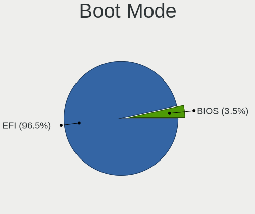

| Mode | Computers | Percent |
|------|-----------|---------|
| EFI  | 199       | 96.14%  |
| BIOS | 8         | 3.86%   |

Filesystem
----------

Type of filesystem

| Type | Computers | Percent |
|------|-----------|---------|
| Ufs  | 165       | 79.71%  |
| Zfs  | 42        | 20.29%  |

Part. scheme
------------

Scheme of partitioning

| Type | Computers | Percent |
|------|-----------|---------|
| GPT  | 144       | 69.57%  |
| MBR  | 63        | 30.43%  |

Board
-----

Vendor
------

Motherboard manufacturer

| Name                | Computers | Percent |
|---------------------|-----------|---------|
| Lenovo              | 47        | 22.82%  |
| Dell                | 26        | 12.62%  |
| ASUSTek Computer    | 26        | 12.62%  |
| Hewlett-Packard     | 25        | 12.14%  |
| Acer                | 12        | 5.83%   |
| Gigabyte Technology | 8         | 3.88%   |
| ASRock              | 7         | 3.4%    |
| Apple               | 7         | 3.4%    |
| Fujitsu             | 5         | 2.43%   |
| TUXEDO              | 4         | 1.94%   |
| Sony                | 4         | 1.94%   |
| Intel               | 4         | 1.94%   |
| Samsung Electronics | 3         | 1.46%   |
| MSI                 | 3         | 1.46%   |
| Pegatron            | 2         | 0.97%   |
| Notebook            | 2         | 0.97%   |
| Google              | 2         | 0.97%   |
| Fujitsu Siemens     | 2         | 0.97%   |
| Unknown             | 2         | 0.97%   |
| Toshiba             | 1         | 0.49%   |
| Sophos              | 1         | 0.49%   |
| Semp Toshiba        | 1         | 0.49%   |
| Panasonic           | 1         | 0.49%   |
| NEC Computers       | 1         | 0.49%   |
| IBM                 | 1         | 0.49%   |
| GEO                 | 1         | 0.49%   |
| Gateway             | 1         | 0.49%   |
| Foxconn             | 1         | 0.49%   |
| eMachines           | 1         | 0.49%   |
| ECS                 | 1         | 0.49%   |
| Clevo               | 1         | 0.49%   |
| Chuwi               | 1         | 0.49%   |
| ASRockRack          | 1         | 0.49%   |
| Alienware           | 1         | 0.49%   |

Model
-----

Motherboard model

| Name                                      | Computers | Percent |
|-------------------------------------------|-----------|---------|
| Unknown                                   | 3         | 1.46%   |
| HP Z420 Workstation                       | 2         | 0.97%   |
| Fujitsu FUTRO S520                        | 2         | 0.97%   |
| ASUS ROG STRIX B550-F GAMING              | 2         | 0.97%   |
| Apple MacBookPro7,1                       | 2         | 0.97%   |
| Acer Veriton M460                         | 2         | 0.97%   |
| TUXEDO Pulse 15 Gen2                      | 1         | 0.49%   |
| TUXEDO Pulse 15 Gen1                      | 1         | 0.49%   |
| TUXEDO InfinityBook S 15 Gen6             | 1         | 0.49%   |
| Toshiba Satellite C660                    | 1         | 0.49%   |
| Sophos UTM                                | 1         | 0.49%   |
| Sony VPCM13M1R                            | 1         | 0.49%   |
| Sony VJS122C11L                           | 1         | 0.49%   |
| Sony VJS121C11N                           | 1         | 0.49%   |
| Sony SVE1713S1RW                          | 1         | 0.49%   |
| Semp Toshiba STI                          | 1         | 0.49%   |
| Samsung N150/N210/N220                    | 1         | 0.49%   |
| Samsung N145P/N250P/N260P                 | 1         | 0.49%   |
| Samsung 300E5EV/300E4EV/270E5EV/270E4EV   | 1         | 0.49%   |
| Pegatron T12Ah                            | 1         | 0.49%   |
| Pegatron Elite 7300 Series MT             | 1         | 0.49%   |
| Panasonic CF-C1BD06EFG                    | 1         | 0.49%   |
| Notebook W650DC,DD                        | 1         | 0.49%   |
| Notebook N650DU                           | 1         | 0.49%   |
| NEC Computers PC-GL186Y3AZ                | 1         | 0.49%   |
| MSI MS-N033                               | 1         | 0.49%   |
| MSI MS-7C02                               | 1         | 0.49%   |
| MSI MS-7A38                               | 1         | 0.49%   |
| Lenovo Yoga 710-11IKB 80V6                | 1         | 0.49%   |
| Lenovo V580 20147                         | 1         | 0.49%   |
| Lenovo ThinkStation P300 30AH000SUS       | 1         | 0.49%   |
| Lenovo ThinkPad X380 Yoga 20LJ000WUK      | 1         | 0.49%   |
| Lenovo ThinkPad X280 20KESB4T00           | 1         | 0.49%   |
| Lenovo ThinkPad X270 20HN006CUS           | 1         | 0.49%   |
| Lenovo ThinkPad X260 20F60093US           | 1         | 0.49%   |
| Lenovo ThinkPad X230 2325IB1              | 1         | 0.49%   |
| Lenovo ThinkPad X230 23255NG              | 1         | 0.49%   |
| Lenovo ThinkPad X230 23205UG              | 1         | 0.49%   |
| Lenovo ThinkPad X201 Tablet 311396U       | 1         | 0.49%   |
| Lenovo ThinkPad X13 Yoga Gen 1 20SYS22H00 | 1         | 0.49%   |

Model Family
------------

Motherboard model prefix

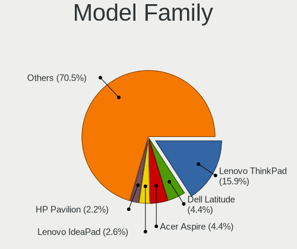

| Name                  | Computers | Percent |
|-----------------------|-----------|---------|
| Lenovo ThinkPad       | 34        | 16.5%   |
| Dell Latitude         | 10        | 4.85%   |
| Acer Aspire           | 9         | 4.37%   |
| Dell OptiPlex         | 5         | 2.43%   |
| HP Compaq             | 4         | 1.94%   |
| Lenovo IdeaPad        | 3         | 1.46%   |
| HP ProBook            | 3         | 1.46%   |
| HP Pavilion           | 3         | 1.46%   |
| Dell Studio           | 3         | 1.46%   |
| Dell Inspiron         | 3         | 1.46%   |
| ASUS ROG              | 3         | 1.46%   |
| Unknown               | 3         | 1.46%   |
| TUXEDO Pulse          | 2         | 0.97%   |
| Lenovo ThinkCentre    | 2         | 0.97%   |
| HP Z420               | 2         | 0.97%   |
| HP Laptop             | 2         | 0.97%   |
| HP EliteBook          | 2         | 0.97%   |
| Gigabyte Z370         | 2         | 0.97%   |
| Gigabyte X570         | 2         | 0.97%   |
| Fujitsu Siemens AMILO | 2         | 0.97%   |
| Fujitsu LIFEBOOK      | 2         | 0.97%   |
| Fujitsu FUTRO         | 2         | 0.97%   |
| Dell XPS              | 2         | 0.97%   |
| ASUS VivoBook         | 2         | 0.97%   |
| ASUS TUF              | 2         | 0.97%   |
| ASUS PRIME            | 2         | 0.97%   |
| Apple MacBookPro7     | 2         | 0.97%   |
| Acer Veriton          | 2         | 0.97%   |
| TUXEDO InfinityBook   | 1         | 0.49%   |
| Toshiba Satellite     | 1         | 0.49%   |
| Sophos UTM            | 1         | 0.49%   |
| Sony VPCM13M1R        | 1         | 0.49%   |
| Sony VJS122C11L       | 1         | 0.49%   |
| Sony VJS121C11N       | 1         | 0.49%   |
| Sony SVE1713S1RW      | 1         | 0.49%   |
| Semp Toshiba STI      | 1         | 0.49%   |
| Samsung N150          | 1         | 0.49%   |
| Samsung N145P         | 1         | 0.49%   |
| Samsung 300E5EV       | 1         | 0.49%   |
| Pegatron T12Ah        | 1         | 0.49%   |

MFG Year
--------

Motherboard manufacture year

| Year | Computers | Percent |
|------|-----------|---------|
| 2020 | 22        | 10.68%  |
| 2019 | 20        | 9.71%   |
| 2017 | 17        | 8.25%   |
| 2018 | 15        | 7.28%   |
| 2011 | 14        | 6.8%    |
| 2021 | 13        | 6.31%   |
| 2013 | 13        | 6.31%   |
| 2012 | 13        | 6.31%   |
| 2022 | 11        | 5.34%   |
| 2016 | 11        | 5.34%   |
| 2015 | 11        | 5.34%   |
| 2010 | 11        | 5.34%   |
| 2014 | 10        | 4.85%   |
| 2009 | 10        | 4.85%   |
| 2008 | 7         | 3.4%    |
| 2023 | 3         | 1.46%   |
| 2006 | 3         | 1.46%   |
| 2007 | 1         | 0.49%   |
| 2004 | 1         | 0.49%   |

Form Factor
-----------

Physical design of the computer

| Name        | Computers | Percent |
|-------------|-----------|---------|
| Notebook    | 134       | 65.05%  |
| Desktop     | 61        | 29.61%  |
| Convertible | 5         | 2.43%   |
| Mini pc     | 2         | 0.97%   |
| All in one  | 2         | 0.97%   |
| Firewall    | 1         | 0.49%   |
| Server      | 1         | 0.49%   |

Coreboot
--------

Have coreboot on board

| Used | Computers | Percent |
|------|-----------|---------|
| No   | 203       | 98.54%  |
| Yes  | 3         | 1.46%   |

RAM Size
--------

Total RAM memory

| Size in GB  | Computers | Percent |
|-------------|-----------|---------|
| 8.01-16.0   | 76        | 36.71%  |
| 16.01-24.0  | 49        | 23.67%  |
| 4.01-8.0    | 38        | 18.36%  |
| 32.01-64.0  | 18        | 8.7%    |
| 2.01-3.0    | 11        | 5.31%   |
| 64.01-256.0 | 7         | 3.38%   |
| 3.01-4.0    | 3         | 1.45%   |
| 0.51-1.0    | 3         | 1.45%   |
| 24.01-32.0  | 2         | 0.97%   |

RAM Used
--------

Used RAM memory

| Used GB   | Computers | Percent |
|-----------|-----------|---------|
| 0.01-0.5  | 103       | 49.05%  |
| 0.51-1.0  | 65        | 30.95%  |
| 1.01-2.0  | 29        | 13.81%  |
| 2.01-3.0  | 7         | 3.33%   |
| 4.01-8.0  | 3         | 1.43%   |
| 3.01-4.0  | 2         | 0.95%   |
| 8.01-16.0 | 1         | 0.48%   |

Total Drives
------------

Number of drives on board

| Drives | Computers | Percent |
|--------|-----------|---------|
| 1      | 136       | 65.38%  |
| 2      | 36        | 17.31%  |
| 0      | 18        | 8.65%   |
| 3      | 13        | 6.25%   |
| 4      | 4         | 1.92%   |
| 7      | 1         | 0.48%   |

Has CD-ROM
----------

Has CD-ROM on board

| Presented | Computers | Percent |
|-----------|-----------|---------|
| No        | 129       | 62.32%  |
| Yes       | 78        | 37.68%  |

Has Ethernet
------------

Has Ethernet on board

| Presented | Computers | Percent |
|-----------|-----------|---------|
| Yes       | 184       | 88.89%  |
| No        | 23        | 11.11%  |

Has WiFi
--------

Has WiFi module

| Presented | Computers | Percent |
|-----------|-----------|---------|
| Yes       | 168       | 81.55%  |
| No        | 38        | 18.45%  |

Has Bluetooth
-------------

Has Bluetooth module

| Presented | Computers | Percent |
|-----------|-----------|---------|
| Yes       | 121       | 58.45%  |
| No        | 86        | 41.55%  |

Location
--------

Country
-------

Geographic location (country)

| Country      | Computers | Percent |
|--------------|-----------|---------|
| USA          | 40        | 19.42%  |
| Germany      | 28        | 13.59%  |
| France       | 21        | 10.19%  |
| Russia       | 18        | 8.74%   |
| UK           | 13        | 6.31%   |
| Italy        | 7         | 3.4%    |
| Taiwan       | 6         | 2.91%   |
| Hungary      | 6         | 2.91%   |
| Finland      | 6         | 2.91%   |
| Turkey       | 5         | 2.43%   |
| Australia    | 4         | 1.94%   |
| Poland       | 3         | 1.46%   |
| Norway       | 3         | 1.46%   |
| Mexico       | 3         | 1.46%   |
| Colombia     | 3         | 1.46%   |
| China        | 3         | 1.46%   |
| Argentina    | 3         | 1.46%   |
| Thailand     | 2         | 0.97%   |
| Spain        | 2         | 0.97%   |
| Romania      | 2         | 0.97%   |
| Netherlands  | 2         | 0.97%   |
| Japan        | 2         | 0.97%   |
| Indonesia    | 2         | 0.97%   |
| Czechia      | 2         | 0.97%   |
| Bulgaria     | 2         | 0.97%   |
| Brazil       | 2         | 0.97%   |
| Ukraine      | 1         | 0.49%   |
| Switzerland  | 1         | 0.49%   |
| Sweden       | 1         | 0.49%   |
| South Korea  | 1         | 0.49%   |
| Slovakia     | 1         | 0.49%   |
| Serbia       | 1         | 0.49%   |
| Saudi Arabia | 1         | 0.49%   |
| San Marino   | 1         | 0.49%   |
| Philippines  | 1         | 0.49%   |
| Lithuania    | 1         | 0.49%   |
| Hong Kong    | 1         | 0.49%   |
| Estonia      | 1         | 0.49%   |
| Egypt        | 1         | 0.49%   |
| Denmark      | 1         | 0.49%   |

City
----

Geographic location (city)

| City                  | Computers | Percent |
|-----------------------|-----------|---------|
| Moscow                | 11        | 5.29%   |
| Franconville          | 6         | 2.88%   |
| Paris                 | 5         | 2.4%    |
| Hodmezovasarhely      | 5         | 2.4%    |
| Wuppertal             | 4         | 1.92%   |
| Istanbul              | 4         | 1.92%   |
| Duncan                | 4         | 1.92%   |
| Woodland              | 3         | 1.44%   |
| Whittier              | 3         | 1.44%   |
| Tijuana               | 3         | 1.44%   |
| Taipei                | 3         | 1.44%   |
| Taichung              | 3         | 1.44%   |
| Milan                 | 3         | 1.44%   |
| Markt Indersdorf      | 3         | 1.44%   |
| Zwingenberg           | 2         | 0.96%   |
| Warsaw                | 2         | 0.96%   |
| Volzhskiy             | 2         | 0.96%   |
| Vollen                | 2         | 0.96%   |
| Urcuit                | 2         | 0.96%   |
| Turku                 | 2         | 0.96%   |
| St Petersburg         | 2         | 0.96%   |
| Sofia                 | 2         | 0.96%   |
| Setagaya-ku           | 2         | 0.96%   |
| Rome                  | 2         | 0.96%   |
| Rio de Janeiro        | 2         | 0.96%   |
| New Braunfels         | 2         | 0.96%   |
| Melun                 | 2         | 0.96%   |
| McDonough             | 2         | 0.96%   |
| Lutherville-Timonium  | 2         | 0.96%   |
| Los Angeles           | 2         | 0.96%   |
| London                | 2         | 0.96%   |
| Greenwich             | 2         | 0.96%   |
| Drobeta-Turnu Severin | 2         | 0.96%   |
| Denver                | 2         | 0.96%   |
| Cologne               | 2         | 0.96%   |
| Changzhou             | 2         | 0.96%   |
| Brisbane              | 2         | 0.96%   |
| Bogot             | 2         | 0.96%   |
| Bangkok               | 2         | 0.96%   |
| Wloszczowa            | 1         | 0.48%   |

Drives
------

Drive Vendor
------------

Hard drive vendors

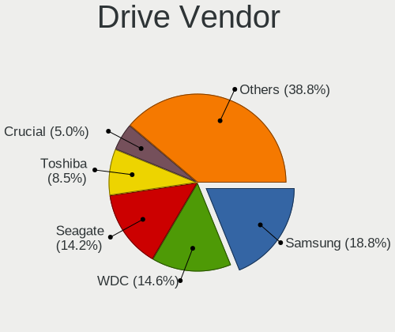

| Vendor              | Computers | Drives | Percent |
|---------------------|-----------|--------|---------|
| Samsung Electronics | 48        | 59     | 19.43%  |
| WDC                 | 38        | 46     | 15.38%  |
| Seagate             | 35        | 38     | 14.17%  |
| Toshiba             | 21        | 24     | 8.5%    |
| Crucial             | 12        | 12     | 4.86%   |
| SanDisk             | 9         | 10     | 3.64%   |
| Kingston            | 9         | 10     | 3.64%   |
| SK hynix            | 8         | 9      | 3.24%   |
| Transcend           | 7         | 7      | 2.83%   |
| Hitachi             | 7         | 8      | 2.83%   |
| Intel               | 6         | 6      | 2.43%   |
| A-DATA Technology   | 6         | 6      | 2.43%   |
| Apple               | 5         | 6      | 2.02%   |
| Micron Technology   | 3         | 3      | 1.21%   |
| HGST                | 3         | 3      | 1.21%   |
| Hewlett-Packard     | 3         | 3      | 1.21%   |
| SPCC                | 2         | 2      | 0.81%   |
| PNY                 | 2         | 2      | 0.81%   |
| OCZ                 | 2         | 2      | 0.81%   |
| Intenso             | 2         | 2      | 0.81%   |
| Gigabyte Technology | 2         | 2      | 0.81%   |
| Fujitsu             | 2         | 3      | 0.81%   |
| Corsair             | 2         | 2      | 0.81%   |
| UMIS                | 1         | 1      | 0.4%    |
| Team                | 1         | 1      | 0.4%    |
| Phison              | 1         | 1      | 0.4%    |
| Patriot             | 1         | 1      | 0.4%    |
| ORICO               | 1         | 1      | 0.4%    |
| Maxtor              | 1         | 1      | 0.4%    |
| LITEONIT            | 1         | 1      | 0.4%    |
| LITEON              | 1         | 1      | 0.4%    |
| KingDian            | 1         | 1      | 0.4%    |
| GAMER               | 1         | 1      | 0.4%    |
| Dogfish             | 1         | 1      | 0.4%    |
| ASUSTek Computer    | 1         | 2      | 0.4%    |
| AirDisk             | 1         | 1      | 0.4%    |

Drive Model
-----------

Hard drive models

| Model                                | Computers | Percent |
|--------------------------------------|-----------|---------|
| Samsung SSD 970 EVO Plus 1TB         | 4         | 1.52%   |
| Kingston SA400S37240G 240GB          | 4         | 1.52%   |
| Toshiba MQ01ABD100 1TB               | 3         | 1.14%   |
| Seagate ST1000LM049-2GH172 1TB       | 3         | 1.14%   |
| SanDisk pSSD 16GB                    | 3         | 1.14%   |
| WDC WDS100T1X0E-00AFY0 1TB           | 2         | 0.76%   |
| WDC WD40PURX-64GVNY0 4TB             | 2         | 0.76%   |
| WDC WD2500BEVT-80A23T0 250GB         | 2         | 0.76%   |
| WDC WD1600AAJS-22L7A0 160GB          | 2         | 0.76%   |
| WDC PC SN520 SDAPMUW-128G-1101 128GB | 2         | 0.76%   |
| Toshiba MQ01ABF050 500GB             | 2         | 0.76%   |
| Toshiba HDWD120 2TB                  | 2         | 0.76%   |
| Seagate ST95005620AS 500GB           | 2         | 0.76%   |
| Seagate ST9500325AS 500GB            | 2         | 0.76%   |
| Seagate ST500DM002-1BD142 500GB      | 2         | 0.76%   |
| Seagate ST1000LM035-1RK172 1TB       | 2         | 0.76%   |
| SanDisk SSD U100 24GB                | 2         | 0.76%   |
| Samsung SSD 980 PRO 250GB            | 2         | 0.76%   |
| Samsung SSD 970 EVO 500GB            | 2         | 0.76%   |
| Samsung SSD 870 QVO 2TB              | 2         | 0.76%   |
| Samsung SSD 840 EVO 250GB            | 2         | 0.76%   |
| Samsung SP2504C 250GB                | 2         | 0.76%   |
| Samsung MZVLB256HBHQ-000L7 256GB     | 2         | 0.76%   |
| Kingston SA400S37480G 480GB          | 2         | 0.76%   |
| HGST HTS725050A7E630 500GB           | 2         | 0.76%   |
| HP SSD EX950 2TB                     | 2         | 0.76%   |
| Crucial CT500MX500SSD1 500GB         | 2         | 0.76%   |
| Crucial CT1000P1SSD8 1TB             | 2         | 0.76%   |
| Apple SSD SM0512F 500GB              | 2         | 0.76%   |
| A-DATA SU630 240GB                   | 2         | 0.76%   |
| WDC WDS240G2G0B-00EPW0 240GB         | 1         | 0.38%   |
| WDC WDS240G2G0A-00JH30 240GB         | 1         | 0.38%   |
| WDC WDS120G2G0B-00EPW0 120GB         | 1         | 0.38%   |
| WDC WDS120G2G0A-00JH30 120GB         | 1         | 0.38%   |
| WDC WDS120G1G0A-00SS50 120GB         | 1         | 0.38%   |
| WDC WD7500BPKX-00HPJT0 752GB         | 1         | 0.38%   |
| WDC WD7500BPKT-75PK4T0 752GB         | 1         | 0.38%   |
| WDC WD6400AAKS-22A7B2 640GB          | 1         | 0.38%   |
| WDC WD60EZRZ-00GZ5B1 6TB             | 1         | 0.38%   |
| WDC WD40NMZW-11GX6S1 4TB             | 1         | 0.38%   |

HDD Vendor
----------

Hard disk drive vendors

| Vendor              | Computers | Drives | Percent |
|---------------------|-----------|--------|---------|
| Seagate             | 35        | 38     | 34.31%  |
| WDC                 | 31        | 34     | 30.39%  |
| Toshiba             | 16        | 18     | 15.69%  |
| Hitachi             | 7         | 8      | 6.86%   |
| Samsung Electronics | 5         | 5      | 4.9%    |
| HGST                | 3         | 3      | 2.94%   |
| Fujitsu             | 2         | 3      | 1.96%   |
| Maxtor              | 1         | 1      | 0.98%   |
| Hewlett-Packard     | 1         | 1      | 0.98%   |
| Apple               | 1         | 1      | 0.98%   |

SSD Vendor
----------

Solid state drive vendors

| Vendor              | Computers | Drives | Percent |
|---------------------|-----------|--------|---------|
| Samsung Electronics | 21        | 25     | 21.88%  |
| SanDisk             | 9         | 10     | 9.38%   |
| Kingston            | 8         | 9      | 8.33%   |
| Crucial             | 8         | 8      | 8.33%   |
| Transcend           | 7         | 7      | 7.29%   |
| A-DATA Technology   | 6         | 6      | 6.25%   |
| WDC                 | 4         | 5      | 4.17%   |
| Apple               | 4         | 5      | 4.17%   |
| Toshiba             | 3         | 3      | 3.13%   |
| Intel               | 3         | 3      | 3.13%   |
| SPCC                | 2         | 2      | 2.08%   |
| SK hynix            | 2         | 2      | 2.08%   |
| PNY                 | 2         | 2      | 2.08%   |
| OCZ                 | 2         | 2      | 2.08%   |
| Micron Technology   | 2         | 2      | 2.08%   |
| Intenso             | 2         | 2      | 2.08%   |
| Gigabyte Technology | 2         | 2      | 2.08%   |
| Team                | 1         | 1      | 1.04%   |
| Patriot             | 1         | 1      | 1.04%   |
| LITEONIT            | 1         | 1      | 1.04%   |
| LITEON              | 1         | 1      | 1.04%   |
| KingDian            | 1         | 1      | 1.04%   |
| GAMER               | 1         | 1      | 1.04%   |
| Dogfish             | 1         | 1      | 1.04%   |
| Corsair             | 1         | 1      | 1.04%   |
| ASUSTek Computer    | 1         | 2      | 1.04%   |

Drive Kind
----------

HDD or SSD

| Kind | Computers | Drives | Percent |
|------|-----------|--------|---------|
| HDD  | 89        | 112    | 39.73%  |
| SSD  | 86        | 105    | 38.39%  |
| NVMe | 49        | 62     | 21.88%  |

Drive Connector
---------------

SATA, SAS, NVMe, etc.

| Type | Computers | Drives | Percent |
|------|-----------|--------|---------|
| SATA | 157       | 217    | 76.21%  |
| NVMe | 49        | 62     | 23.79%  |

Drive Size
----------

Size of hard drive

| Size in TB | Computers | Drives | Percent |
|------------|-----------|--------|---------|
| 0.01-0.5   | 115       | 142    | 62.84%  |
| 0.51-1.0   | 47        | 52     | 25.68%  |
| 1.01-2.0   | 10        | 10     | 5.46%   |
| 3.01-4.0   | 6         | 6      | 3.28%   |
| 2.01-3.0   | 4         | 4      | 2.19%   |
| 4.01-10.0  | 1         | 3      | 0.55%   |

Space Total
-----------

Amount of disk space available on the file system

| Size in GB | Computers | Percent |
|------------|-----------|---------|
| 1-20       | 164       | 79.23%  |
| 101-250    | 17        | 8.21%   |
| 21-50      | 12        | 5.8%    |
| 51-100     | 6         | 2.9%    |
| 251-500    | 4         | 1.93%   |
| 501-1000   | 3         | 1.45%   |
| 1001-2000  | 1         | 0.48%   |

Space Used
----------

Amount of used disk space

| Used GB | Computers | Percent |
|---------|-----------|---------|
| 1-20    | 202       | 97.58%  |
| 21-50   | 3         | 1.45%   |
| 51-100  | 2         | 0.97%   |

Malfunc. Drives
---------------

Drive models with a malfunction

| Model                                            | Computers | Drives | Percent |
|--------------------------------------------------|-----------|--------|---------|
| WDC WD7500BPKT-75PK4T0 752GB                     | 1         | 1      | 2.86%   |
| WDC WD40PURX-64GVNY0 4TB                         | 1         | 1      | 2.86%   |
| WDC WD2500BEVT-80A23T0 250GB                     | 1         | 1      | 2.86%   |
| WDC WD1200BEVS-07LAT0 120GB                      | 1         | 1      | 2.86%   |
| WDC WD10JPVX-75JC3T0 1TB                         | 1         | 1      | 2.86%   |
| WDC WD10JPVX-60JC3T0 1TB                         | 1         | 1      | 2.86%   |
| WDC WD10EFRX-68PJCN0 1TB                         | 1         | 2      | 2.86%   |
| Toshiba MQ01ABF050 500GB                         | 1         | 1      | 2.86%   |
| Toshiba MQ01ABD100 1TB                           | 1         | 1      | 2.86%   |
| Toshiba MK7575GSX 752GB                          | 1         | 1      | 2.86%   |
| Toshiba MK3265GSX 320GB                          | 1         | 1      | 2.86%   |
| Toshiba HDWD120 2TB                              | 1         | 1      | 2.86%   |
| Toshiba DT01ABA300 3TB                           | 1         | 1      | 2.86%   |
| Seagate ST95005620AS 500GB                       | 1         | 1      | 2.86%   |
| Seagate ST9250315AS 250GB                        | 1         | 1      | 2.86%   |
| Seagate ST500LT012-9WS142 500GB                  | 1         | 1      | 2.86%   |
| Seagate ST500LM021-1KJ152 500GB                  | 1         | 1      | 2.86%   |
| Seagate ST500DM002-1BD142 500GB                  | 1         | 1      | 2.86%   |
| Seagate ST3250823AS 250GB                        | 1         | 1      | 2.86%   |
| Seagate ST310212A 10GB                           | 1         | 1      | 2.86%   |
| SanDisk SD9SN8W-128G-1006 128GB                  | 1         | 1      | 2.86%   |
| Samsung Electronics SSD PM810 2.5-inch 7mm 256GB | 1         | 1      | 2.86%   |
| Samsung Electronics SP2504C 250GB                | 1         | 1      | 2.86%   |
| Samsung Electronics HM160HI 160GB                | 1         | 1      | 2.86%   |
| Micron Technology MTFDDAK256MAM-1K12 256GB       | 1         | 1      | 2.86%   |
| Intenso SSD Sata III 128GB                       | 1         | 1      | 2.86%   |
| Intel SSDSC2CW060A3 64GB                         | 1         | 1      | 2.86%   |
| Hitachi HTS545050B9A300 500GB                    | 1         | 2      | 2.86%   |
| Hitachi HTS545032B9A302 320GB                    | 1         | 1      | 2.86%   |
| Hitachi HTS545032B9A300 320GB                    | 1         | 1      | 2.86%   |
| HGST HTS725050A7E630 500GB                       | 1         | 1      | 2.86%   |
| Hewlett-Packard MB1000GCWCV 1TB                  | 1         | 1      | 2.86%   |
| Crucial CT120M500SSD1 120GB                      | 1         | 1      | 2.86%   |
| Corsair Neutron GTX SSD 120GB                    | 1         | 1      | 2.86%   |
| A-DATA Technology XM13 32GB                      | 1         | 1      | 2.86%   |

Malfunc. Drive Vendor
---------------------

Vendors of faulty drives

| Vendor              | Computers | Drives | Percent |
|---------------------|-----------|--------|---------|
| WDC                 | 7         | 8      | 20%     |
| Seagate             | 7         | 7      | 20%     |
| Toshiba             | 6         | 6      | 17.14%  |
| Samsung Electronics | 3         | 3      | 8.57%   |
| Hitachi             | 3         | 4      | 8.57%   |
| SanDisk             | 1         | 1      | 2.86%   |
| Micron Technology   | 1         | 1      | 2.86%   |
| Intenso             | 1         | 1      | 2.86%   |
| Intel               | 1         | 1      | 2.86%   |
| HGST                | 1         | 1      | 2.86%   |
| Hewlett-Packard     | 1         | 1      | 2.86%   |
| Crucial             | 1         | 1      | 2.86%   |
| Corsair             | 1         | 1      | 2.86%   |
| A-DATA Technology   | 1         | 1      | 2.86%   |

Malfunc. HDD Vendor
-------------------

Vendors of faulty HDD drives

| Vendor              | Computers | Drives | Percent |
|---------------------|-----------|--------|---------|
| WDC                 | 7         | 8      | 25.93%  |
| Seagate             | 7         | 7      | 25.93%  |
| Toshiba             | 6         | 6      | 22.22%  |
| Hitachi             | 3         | 4      | 11.11%  |
| Samsung Electronics | 2         | 2      | 7.41%   |
| HGST                | 1         | 1      | 3.7%    |
| Hewlett-Packard     | 1         | 1      | 3.7%    |

Malfunc. Drive Kind
-------------------

Kinds of faulty drives

| Kind | Computers | Drives | Percent |
|------|-----------|--------|---------|
| HDD  | 26        | 29     | 76.47%  |
| SSD  | 8         | 8      | 23.53%  |

Failed Drives
-------------

Failed drive models

| Model             | Computers | Drives | Percent |
|-------------------|-----------|--------|---------|
| SanDisk pSSD 16GB | 1         | 1      | 100%    |

Failed Drive Vendor
-------------------

Failed drive vendors

| Vendor  | Computers | Drives | Percent |
|---------|-----------|--------|---------|
| SanDisk | 1         | 1      | 100%    |

Drive Status
------------

Number of failed and malfunc. drives

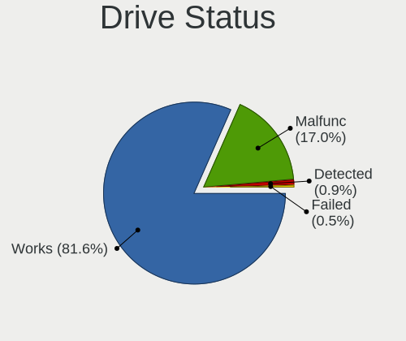

| Status   | Computers | Drives | Percent |
|----------|-----------|--------|---------|
| Works    | 164       | 233    | 81.59%  |
| Malfunc  | 34        | 37     | 16.92%  |
| Detected | 2         | 8      | 1%      |
| Failed   | 1         | 1      | 0.5%    |

Storage controller
------------------

Storage Vendor
--------------

Storage controller vendors

| Vendor                                  | Computers | Percent |
|-----------------------------------------|-----------|---------|
| Intel                                   | 139       | 55.82%  |
| AMD                                     | 33        | 13.25%  |
| Samsung Electronics                     | 29        | 11.65%  |
| SanDisk                                 | 8         | 3.21%   |
| ASMedia Technology                      | 7         | 2.81%   |
| Nvidia                                  | 6         | 2.41%   |
| SK hynix                                | 5         | 2.01%   |
| Micron/Crucial Technology               | 4         | 1.61%   |
| VIA Technologies                        | 2         | 0.8%    |
| Toshiba                                 | 2         | 0.8%    |
| Phison Electronics                      | 2         | 0.8%    |
| KIOXIA                                  | 2         | 0.8%    |
| Kingston Technology Company             | 2         | 0.8%    |
| Biwin Storage Technology                | 2         | 0.8%    |
| Silicon Motion                          | 1         | 0.4%    |
| Silicon Integrated Systems [SiS]        | 1         | 0.4%    |
| Shenzhen Unionmemory Information System | 1         | 0.4%    |
| Micron Technology                       | 1         | 0.4%    |
| MAXIO Technology (Hangzhou)             | 1         | 0.4%    |
| JMicron Technology                      | 1         | 0.4%    |

Storage Model
-------------

Storage controller models

| Model                                                                          | Computers | Percent |
|--------------------------------------------------------------------------------|-----------|---------|
| AMD FCH SATA Controller [AHCI mode]                                            | 23        | 7.96%   |
| Intel Sunrise Point-LP SATA Controller [AHCI mode]                             | 18        | 6.23%   |
| Samsung NVMe SSD Controller SM981/PM981/PM983                                  | 17        | 5.88%   |
| Intel 7 Series Chipset Family 6-port SATA Controller [AHCI mode]               | 13        | 4.5%    |
| Intel 8 Series/C220 Series Chipset Family 6-port SATA Controller 1 [AHCI mode] | 9         | 3.11%   |
| Intel 8 Series SATA Controller 1 [AHCI mode]                                   | 9         | 3.11%   |
| Intel 82801 Mobile SATA Controller [RAID mode]                                 | 8         | 2.77%   |
| ASMedia ASM1061/ASM1062 Serial ATA Controller                                  | 7         | 2.42%   |
| Intel Q170/Q150/B150/H170/H110/Z170/CM236 Chipset SATA Controller [AHCI Mode]  | 6         | 2.08%   |
| Intel 82801IBM/IEM (ICH9M/ICH9M-E) 4 port SATA Controller [AHCI mode]          | 6         | 2.08%   |
| Intel 6 Series/C200 Series Chipset Family 6 port Mobile SATA AHCI Controller   | 6         | 2.08%   |
| Samsung NVMe SSD Controller PM9A1/PM9A3/980PRO                                 | 4         | 1.38%   |
| Intel SATA Controller [RAID Mode]                                              | 4         | 1.38%   |
| Intel NM10/ICH7 Family SATA Controller [IDE mode]                              | 4         | 1.38%   |
| Intel 82801G (ICH7 Family) IDE Controller                                      | 4         | 1.38%   |
| AMD 500 Series Chipset SATA Controller                                         | 4         | 1.38%   |
| AMD 400 Series Chipset SATA Controller                                         | 4         | 1.38%   |
| Samsung NVMe SSD Controller SM961/PM961/SM963                                  | 3         | 1.04%   |
| Intel Wildcat Point-LP SATA Controller [AHCI Mode]                             | 3         | 1.04%   |
| Intel NM10/ICH7 Family SATA Controller [AHCI mode]                             | 3         | 1.04%   |
| Intel C602 chipset 4-Port SATA Storage Control Unit                            | 3         | 1.04%   |
| Intel 82801HM/HEM (ICH8M/ICH8M-E) SATA Controller [AHCI mode]                  | 3         | 1.04%   |
| Intel 82801HM/HEM (ICH8M/ICH8M-E) IDE Controller                               | 3         | 1.04%   |
| Intel 7 Series/C210 Series Chipset Family 6-port SATA Controller [AHCI mode]   | 3         | 1.04%   |
| Intel 5 Series/3400 Series Chipset 6 port SATA AHCI Controller                 | 3         | 1.04%   |
| Intel 200 Series PCH SATA controller [AHCI mode]                               | 3         | 1.04%   |
| SanDisk WD PC SN810 / Black SN850 NVMe SSD                                     | 2         | 0.69%   |
| SanDisk PC SN520 x2 M.2 2242 NVMe SSD                                          | 2         | 0.69%   |
| Samsung S4LN058A01[SSUBX] AHCI SSD Controller (Apple slot)                     | 2         | 0.69%   |
| Samsung S4LN053X01 AHCI SSD Controller(Apple slot)                             | 2         | 0.69%   |
| Nvidia MCP89 SATA Controller (AHCI mode)                                       | 2         | 0.69%   |
| Nvidia MCP61 SATA Controller                                                   | 2         | 0.69%   |
| Nvidia MCP61 IDE                                                               | 2         | 0.69%   |
| KIOXIA NVMe SSD Controller BG4 (DRAM-less)                                     | 2         | 0.69%   |
| Intel Comet Lake SATA AHCI Controller                                          | 2         | 0.69%   |
| Intel Celeron/Pentium Silver Processor SATA Controller                         | 2         | 0.69%   |
| Intel Cannon Lake PCH SATA AHCI Controller                                     | 2         | 0.69%   |
| Intel Cannon Lake Mobile PCH SATA AHCI Controller                              | 2         | 0.69%   |
| Intel C600/X79 series chipset IDE-r Controller                                 | 2         | 0.69%   |
| Intel C600/X79 series chipset 4-Port SATA IDE Controller                       | 2         | 0.69%   |

Storage Kind
------------

Kind of storage controller (IDE, SATA, NVMe, SAS, ...)

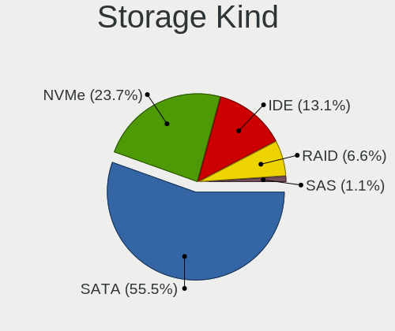

| Kind | Computers | Percent |
|------|-----------|---------|
| SATA | 142       | 56.57%  |
| NVMe | 55        | 21.91%  |
| IDE  | 35        | 13.94%  |
| RAID | 16        | 6.37%   |
| SAS  | 3         | 1.2%    |

Processor
---------

CPU Vendor
----------

Processor vendors

| Vendor | Computers | Percent |
|--------|-----------|---------|
| Intel  | 168       | 81.16%  |
| AMD    | 39        | 18.84%  |

CPU Model
---------

Processor models

| Model                                         | Computers | Percent |
|-----------------------------------------------|-----------|---------|
| Intel Core i5-6300U CPU @ 2.40GHz             | 5         | 2.42%   |
| Intel Core i5-8250U CPU @ 1.60GHz             | 4         | 1.93%   |
| Intel Core i5-7200U CPU @ 2.50GHz             | 4         | 1.93%   |
| Intel CPU Version                             | 3         | 1.45%   |
| Intel Core i7-4600U CPU @ 2.10GHz             | 3         | 1.45%   |
| Intel Core i7-2630QM CPU @ 2.00GHz            | 3         | 1.45%   |
| Intel Core i7-10510U CPU @ 1.80GHz            | 3         | 1.45%   |
| Intel Core i5-6200U CPU @ 2.30GHz             | 3         | 1.45%   |
| Intel Core i5-3470 CPU @ 3.20GHz              | 3         | 1.45%   |
| Intel Core i5-3320M CPU @ 2.60GHz             | 3         | 1.45%   |
| Intel Core 2 Duo CPU P8600 @ 2.40GHz          | 3         | 1.45%   |
| Intel Core i7-8665U CPU @ 1.90GHz             | 2         | 0.97%   |
| Intel Core i7-3520M CPU @ 2.90GHz             | 2         | 0.97%   |
| Intel Core i7-10750H CPU @ 2.60GHz            | 2         | 0.97%   |
| Intel Core i5-8350U CPU @ 1.70GHz             | 2         | 0.97%   |
| Intel Core i5-8265U CPU @ 1.60GHz             | 2         | 0.97%   |
| Intel Core i5-7300U CPU @ 2.60GHz             | 2         | 0.97%   |
| Intel Core i5-4210U CPU @ 1.70GHz             | 2         | 0.97%   |
| Intel Core i5-3210M CPU @ 2.50GHz             | 2         | 0.97%   |
| Intel Core i5-2430M CPU @ 2.40GHz             | 2         | 0.97%   |
| Intel Core i5-10210U CPU @ 1.60GHz            | 2         | 0.97%   |
| Intel Core 2 Duo CPU E7300 @ 2.66GHz          | 2         | 0.97%   |
| Intel Core 2 Duo                              | 2         | 0.97%   |
| Intel Celeron Dual-Core CPU T3000 @ 1.80GHz   | 2         | 0.97%   |
| Intel Atom CPU N450 @ 1.66GHz                 | 2         | 0.97%   |
| AMD Ryzen 9 5900X 12-Core Processor           | 2         | 0.97%   |
| AMD Ryzen 7 5700U with Radeon Graphics        | 2         | 0.97%   |
| AMD Ryzen 7 3700U with Radeon Vega Mobile Gfx | 2         | 0.97%   |
| AMD Ryzen 5 2400G with Radeon Vega Graphics   | 2         | 0.97%   |
| AMD A8-7410 APU with AMD Radeon R5 Graphics   | 2         | 0.97%   |
| Intel Xeon CPU E5640 @ 2.67GHz                | 1         | 0.48%   |
| Intel Xeon CPU E5-2690 0 @ 2.90GHz            | 1         | 0.48%   |
| Intel Xeon CPU E5-2670 @ 2.60GHz              | 1         | 0.48%   |
| Intel Xeon CPU E5-1650 v2 @ 3.50GHz           | 1         | 0.48%   |
| Intel Xeon CPU E5-1620 v2 @ 3.70GHz           | 1         | 0.48%   |
| Intel Xeon CPU E3-1505M v5 @ 2.80GHz          | 1         | 0.48%   |
| Intel Xeon CPU E3-1276 v3 @ 3.60GHz           | 1         | 0.48%   |
| Intel Pentium Silver J5005 CPU @ 1.50GHz      | 1         | 0.48%   |
| Intel Pentium III                             | 1         | 0.48%   |
| Intel Pentium Dual-Core CPU E5800 @ 3.20GHz   | 1         | 0.48%   |

CPU Model Family
----------------

Processor model prefix

| Model                   | Computers | Percent |
|-------------------------|-----------|---------|
| Intel Core i5           | 60        | 28.99%  |
| Intel Core i7           | 43        | 20.77%  |
| Other                   | 12        | 5.8%    |
| Intel Core 2 Duo        | 12        | 5.8%    |
| AMD Ryzen 5             | 10        | 4.83%   |
| Intel Core i3           | 9         | 4.35%   |
| AMD Ryzen 7             | 9         | 4.35%   |
| Intel Xeon              | 7         | 3.38%   |
| Intel Atom              | 6         | 2.9%    |
| Intel Celeron           | 5         | 2.42%   |
| AMD A6                  | 4         | 1.93%   |
| Intel Pentium           | 3         | 1.45%   |
| AMD A8                  | 3         | 1.45%   |
| Intel Pentium Dual-Core | 2         | 0.97%   |
| Intel Core i9           | 2         | 0.97%   |
| Intel Celeron Dual-Core | 2         | 0.97%   |
| AMD Ryzen 9             | 2         | 0.97%   |
| AMD GX                  | 2         | 0.97%   |
| AMD Athlon 64 X2        | 2         | 0.97%   |
| Intel Pentium Silver    | 1         | 0.48%   |
| Intel Pentium III       | 1         | 0.48%   |
| Intel Pentium D         | 1         | 0.48%   |
| Intel Genuine           | 1         | 0.48%   |
| Intel Core m5           | 1         | 0.48%   |
| Intel Core 2            | 1         | 0.48%   |
| Intel Celeron M         | 1         | 0.48%   |
| AMD Ryzen 7 PRO         | 1         | 0.48%   |
| AMD Phenom II X4        | 1         | 0.48%   |
| AMD FX                  | 1         | 0.48%   |
| AMD E1                  | 1         | 0.48%   |
| AMD A10                 | 1         | 0.48%   |

CPU Cores
---------

Number of processor cores

| Number  | Computers | Percent |
|---------|-----------|---------|
| 2       | 83        | 40.1%   |
| 4       | 68        | 32.85%  |
| 8       | 12        | 5.8%    |
| Unknown | 12        | 5.8%    |
| 6       | 10        | 4.83%   |
| 16      | 8         | 3.86%   |
| 12      | 7         | 3.38%   |
| 1       | 5         | 2.42%   |
| 24      | 2         | 0.97%   |

CPU Sockets
-----------

Number of sockets

| Number  | Computers | Percent |
|---------|-----------|---------|
| 1       | 202       | 98.06%  |
| 2       | 3         | 1.46%   |
| Unknown | 1         | 0.49%   |

CPU Threads
-----------

Threads per core (Hyper-Threading)

| Number  | Computers | Percent |
|---------|-----------|---------|
| 2       | 116       | 56.04%  |
| 1       | 77        | 37.2%   |
| Unknown | 14        | 6.76%   |

CPU Microarch
-------------

Microarchitecture

| Name          | Computers | Percent |
|---------------|-----------|---------|
| KabyLake      | 40        | 19.32%  |
| Haswell       | 24        | 11.59%  |
| IvyBridge     | 20        | 9.66%   |
| Penryn        | 18        | 8.7%    |
| Skylake       | 17        | 8.21%   |
| SandyBridge   | 12        | 5.8%    |
| Zen+          | 7         | 3.38%   |
| Bonnell       | 7         | 3.38%   |
| Unknown       | 7         | 3.38%   |
| Puma          | 6         | 2.9%    |
| Zen 2         | 5         | 2.42%   |
| Broadwell     | 4         | 1.93%   |
| Zen 3         | 3         | 1.45%   |
| Zen           | 3         | 1.45%   |
| Westmere      | 3         | 1.45%   |
| TigerLake     | 3         | 1.45%   |
| Nehalem       | 3         | 1.45%   |
| Jaguar        | 3         | 1.45%   |
| Core          | 3         | 1.45%   |
| CometLake     | 3         | 1.45%   |
| Silvermont    | 2         | 0.97%   |
| P6            | 2         | 0.97%   |
| K8 Hammer     | 2         | 0.97%   |
| K10           | 2         | 0.97%   |
| Goldmont plus | 2         | 0.97%   |
| Steamroller   | 1         | 0.48%   |
| Piledriver    | 1         | 0.48%   |
| NetBurst      | 1         | 0.48%   |
| K10 Llano     | 1         | 0.48%   |
| Goldmont      | 1         | 0.48%   |
| Excavator     | 1         | 0.48%   |

Graphics
--------

GPU Vendor
----------

Vendors of graphics cards

| Vendor                     | Computers | Percent |
|----------------------------|-----------|---------|
| Intel                      | 130       | 57.27%  |
| AMD                        | 49        | 21.59%  |
| Nvidia                     | 45        | 19.82%  |
| VIA Technologies           | 1         | 0.44%   |
| S3 Graphics                | 1         | 0.44%   |
| Matrox Electronics Systems | 1         | 0.44%   |

GPU Model
---------

Graphics card models

| Model                                                                                    | Computers | Percent |
|------------------------------------------------------------------------------------------|-----------|---------|
| Intel 3rd Gen Core processor Graphics Controller                                         | 13        | 5.6%    |
| Intel Haswell-ULT Integrated Graphics Controller                                         | 11        | 4.74%   |
| Intel Skylake GT2 [HD Graphics 520]                                                      | 10        | 4.31%   |
| Intel 2nd Generation Core Processor Family Integrated Graphics Controller                | 9         | 3.88%   |
| Intel UHD Graphics 620                                                                   | 8         | 3.45%   |
| Intel HD Graphics 620                                                                    | 7         | 3.02%   |
| Intel WhiskeyLake-U GT2 [UHD Graphics 620]                                               | 6         | 2.59%   |
| Intel CometLake-U GT2 [UHD Graphics]                                                     | 6         | 2.59%   |
| Intel Atom Processor D4xx/D5xx/N4xx/N5xx Integrated Graphics Controller                  | 5         | 2.16%   |
| Intel 4th Gen Core Processor Integrated Graphics Controller                              | 5         | 2.16%   |
| AMD Picasso/Raven 2 [Radeon Vega Series / Radeon Vega Mobile Series]                     | 5         | 2.16%   |
| Nvidia GP106 [GeForce GTX 1060 6GB]                                                      | 4         | 1.72%   |
| Intel Xeon E3-1200 v3/4th Gen Core Processor Integrated Graphics Controller              | 4         | 1.72%   |
| Intel Mobile 4 Series Chipset Integrated Graphics Controller                             | 4         | 1.72%   |
| AMD Mullins [Radeon R4/R5 Graphics]                                                      | 4         | 1.72%   |
| Intel Xeon E3-1200 v2/3rd Gen Core processor Graphics Controller                         | 3         | 1.29%   |
| Intel HD Graphics 530                                                                    | 3         | 1.29%   |
| AMD Lucienne                                                                             | 3         | 1.29%   |
| Nvidia MCP89 [GeForce 320M]                                                              | 2         | 0.86%   |
| Nvidia GK208B [GeForce GT 710]                                                           | 2         | 0.86%   |
| Nvidia GK106GLM [Quadro K2100M]                                                          | 2         | 0.86%   |
| Intel TigerLake-LP GT2 [Iris Xe Graphics]                                                | 2         | 0.86%   |
| Intel Mobile 945GSE Express Integrated Graphics Controller                               | 2         | 0.86%   |
| Intel Mobile 945GM/GMS/GME, 943/940GML Express Integrated Graphics Controller            | 2         | 0.86%   |
| Intel HD Graphics 630                                                                    | 2         | 0.86%   |
| Intel HD Graphics 5500                                                                   | 2         | 0.86%   |
| Intel Core Processor Integrated Graphics Controller                                      | 2         | 0.86%   |
| Intel Atom/Celeron/Pentium Processor x5-E8000/J3xxx/N3xxx Integrated Graphics Controller | 2         | 0.86%   |
| Intel 82G33/G31 Express Integrated Graphics Controller                                   | 2         | 0.86%   |
| AMD Renoir [Radeon RX Vega 6 (Ryzen 4000/5000 Mobile Series)]                            | 2         | 0.86%   |
| AMD Navi 21 [Radeon RX 6800/6800 XT / 6900 XT]                                           | 2         | 0.86%   |
| AMD Mullins [Radeon R2 Graphics]                                                         | 2         | 0.86%   |
| AMD Ellesmere [Radeon RX 470/480/570/570X/580/580X/590]                                  | 2         | 0.86%   |
| AMD Cedar [Radeon HD 5000/6000/7350/8350 Series]                                         | 2         | 0.86%   |
| VIA Technologies CN896/VN896/P4M900 [Chrome 9 HC]                                        | 1         | 0.43%   |
| S3 Graphics SuperSavage IX/C SDR                                                         | 1         | 0.43%   |
| Nvidia TU117M [GeForce GTX 1650 Mobile / Max-Q]                                          | 1         | 0.43%   |
| Nvidia TU116M [GeForce GTX 1660 Ti Mobile]                                               | 1         | 0.43%   |
| Nvidia TU104BM [GeForce RTX 2070 SUPER Mobile / Max-Q]                                   | 1         | 0.43%   |
| Nvidia GT218 [GeForce 210]                                                               | 1         | 0.43%   |

GPU Combo
---------

Combinations of graphics cards

| Name            | Computers | Percent |
|-----------------|-----------|---------|
| 1 x Intel       | 100       | 48.31%  |
| 1 x AMD         | 45        | 21.74%  |
| 1 x Nvidia      | 28        | 13.53%  |
| Intel + Nvidia  | 16        | 7.73%   |
| 2 x Intel       | 11        | 5.31%   |
| Intel + AMD     | 2         | 0.97%   |
| 2 x AMD         | 1         | 0.48%   |
| 1 x VIA         | 1         | 0.48%   |
| 1 x S3 Graphics | 1         | 0.48%   |
| 1 x Matrox      | 1         | 0.48%   |
| AMD + Nvidia    | 1         | 0.48%   |

GPU Driver
----------

Free vs proprietary

| Driver      | Computers | Percent |
|-------------|-----------|---------|
| Free        | 170       | 82.52%  |
| Proprietary | 19        | 9.22%   |
| Unknown     | 17        | 8.25%   |

GPU Memory
----------

Total video memory

| Size in GB | Computers | Percent |
|------------|-----------|---------|
| Unknown    | 170       | 82.13%  |
| 0.01-0.5   | 11        | 5.31%   |
| 1.01-2.0   | 8         | 3.86%   |
| 0.51-1.0   | 6         | 2.9%    |
| 3.01-4.0   | 5         | 2.42%   |
| 5.01-6.0   | 4         | 1.93%   |
| 7.01-8.0   | 3         | 1.45%   |

Monitor
-------

Monitor Vendor
--------------

Monitor vendors

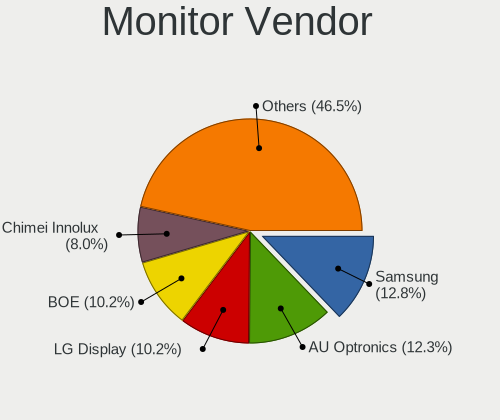

| Vendor                  | Computers | Percent |
|-------------------------|-----------|---------|
| Samsung Electronics     | 19        | 11.31%  |
| AU Optronics            | 19        | 11.31%  |
| LG Display              | 17        | 10.12%  |
| BOE                     | 16        | 9.52%   |
| Chimei Innolux          | 13        | 7.74%   |
| Goldstar                | 11        | 6.55%   |
| Dell                    | 9         | 5.36%   |
| Hewlett-Packard         | 6         | 3.57%   |
| Acer                    | 6         | 3.57%   |
| Sharp                   | 5         | 2.98%   |
| HannStar                | 5         | 2.98%   |
| Apple                   | 5         | 2.98%   |
| ViewSonic               | 4         | 2.38%   |
| Fujitsu Siemens         | 4         | 2.38%   |
| Chi Mei Optoelectronics | 4         | 2.38%   |
| Lenovo                  | 3         | 1.79%   |
| Philips                 | 2         | 1.19%   |
| Panasonic               | 2         | 1.19%   |
| NEC Computers           | 2         | 1.19%   |
| BenQ                    | 2         | 1.19%   |
| ASUSTek Computer        | 2         | 1.19%   |
| Ancor Communications    | 2         | 1.19%   |
| ___                     | 1         | 0.6%    |
| Westinghouse            | 1         | 0.6%    |
| Vizio                   | 1         | 0.6%    |
| Toshiba                 | 1         | 0.6%    |
| Sony                    | 1         | 0.6%    |
| LG Philips              | 1         | 0.6%    |
| LG Electronics          | 1         | 0.6%    |
| CSO                     | 1         | 0.6%    |
| CPT                     | 1         | 0.6%    |
| AOC                     | 1         | 0.6%    |

Monitor Model
-------------

Monitor models

| Model                                                                    | Computers | Percent |
|--------------------------------------------------------------------------|-----------|---------|
| HannStar LCD Monitor HSD03E9 1024x600 220x130mm 10.1-inch                | 3         | 1.76%   |
| Fujitsu Siemens B24-9 WE FUS08C3 1920x1200 520x320mm 24.0-inch           | 3         | 1.76%   |
| Samsung Electronics C24F390 SAM0D2C 1920x1080 520x290mm 23.4-inch        | 2         | 1.18%   |
| Panasonic LCD Monitor MEI96A2 3840x2160 380x210mm 17.1-inch              | 2         | 1.18%   |
| LG Display LCD Monitor LGD02DC 1366x768 340x190mm 15.3-inch              | 2         | 1.18%   |
| Chi Mei Optoelectronics LCD Monitor CMO15A3 1366x768 350x190mm 15.7-inch | 2         | 1.18%   |
| BOE LCD Monitor BOE0671 1366x768 340x190mm 15.3-inch                     | 2         | 1.18%   |
| BOE HF BOE0691 1920x1080 280x160mm 12.7-inch                             | 2         | 1.18%   |
| AU Optronics LCD Monitor AUO8174 1280x800 330x210mm 15.4-inch            | 2         | 1.18%   |
| AU Optronics LCD Monitor AUO70EC 1366x768 340x190mm 15.3-inch            | 2         | 1.18%   |
| AU Optronics LCD Monitor AUO243D 1920x1080 310x170mm 13.9-inch           | 2         | 1.18%   |
| AU Optronics LCD Monitor AUO106C 1366x768 280x160mm 12.7-inch            | 2         | 1.18%   |
| ASUSTek Computer VG245 AUS24A1 1920x1080 530x300mm 24.0-inch             | 2         | 1.18%   |
| ___ MY TV LED TV ___0101 1920x1080                                       | 1         | 0.59%   |
| Westinghouse DWM40F3G1 WET1ECC 1920x1080 880x480mm 39.5-inch             | 1         | 0.59%   |
| Vizio SV370XVT VIZ0057 1920x1080 820x460mm 37.0-inch                     | 1         | 0.59%   |
| ViewSonic VX910 VSC3C19 1280x1024 380x300mm 19.1-inch                    | 1         | 0.59%   |
| ViewSonic VA2418-FHD VSCD739 1920x1080 530x300mm 24.0-inch               | 1         | 0.59%   |
| ViewSonic VA2212 Series VSCBD2B 1920x1080 480x270mm 21.7-inch            | 1         | 0.59%   |
| ViewSonic TD2420 SERIES VSC452D 1920x1080 520x290mm 23.4-inch            | 1         | 0.59%   |
| Toshiba LCD-MONITOR LCDC980 1280x1024 380x300mm 19.1-inch                | 1         | 0.59%   |
| Sony TV SNY5D01 1360x768                                                 | 1         | 0.59%   |
| Sharp LQ133M1JW01 SHP141B 1920x1080 290x170mm 13.2-inch                  | 1         | 0.59%   |
| Sharp LCD Monitor SHP14C2 1920x1080 260x140mm 11.6-inch                  | 1         | 0.59%   |
| Sharp LCD Monitor SHP1449 1920x1080 290x170mm 13.2-inch                  | 1         | 0.59%   |
| Sharp LCD Monitor SHP1445 3840x2160 350x190mm 15.7-inch                  | 1         | 0.59%   |
| Sharp LCD Monitor SHP140E 2560x1440 290x170mm 13.2-inch                  | 1         | 0.59%   |
| Samsung Electronics U28E510 SAM0D68 3840x2160 610x350mm 27.7-inch        | 1         | 0.59%   |
| Samsung Electronics SyncMaster SAM036F 1440x900 410x260mm 19.1-inch      | 1         | 0.59%   |
| Samsung Electronics SA300/350/360 SAM07D5 1920x1080 530x300mm 24.0-inch  | 1         | 0.59%   |
| Samsung Electronics S27E330 SAM0D91 1920x1080 600x340mm 27.2-inch        | 1         | 0.59%   |
| Samsung Electronics LF24T450F SAM7094 1920x1080 530x300mm 24.0-inch      | 1         | 0.59%   |
| Samsung Electronics LCD Monitor U28E590 3840x2160                        | 1         | 0.59%   |
| Samsung Electronics LCD Monitor SEC5448 1920x1080 410x230mm 18.5-inch    | 1         | 0.59%   |
| Samsung Electronics LCD Monitor SEC4E41 1366x768 350x200mm 15.9-inch     | 1         | 0.59%   |
| Samsung Electronics LCD Monitor SEC4457 1440x900 300x190mm 14.0-inch     | 1         | 0.59%   |
| Samsung Electronics LCD Monitor SEC4251 1366x768 340x190mm 15.3-inch     | 1         | 0.59%   |
| Samsung Electronics LCD Monitor SEC3030 1024x600 220x130mm 10.1-inch     | 1         | 0.59%   |
| Samsung Electronics LCD Monitor SDC834D 1920x1080 290x160mm 13.0-inch    | 1         | 0.59%   |
| Samsung Electronics LCD Monitor SDC4D42 1366x768 310x170mm 13.9-inch     | 1         | 0.59%   |

Monitor Resolution
------------------

Monitor screen resolution

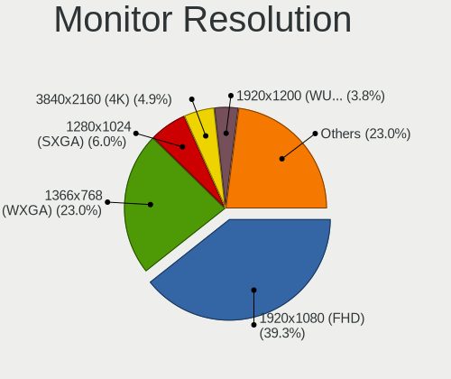

| Resolution         | Computers | Percent |
|--------------------|-----------|---------|
| 1920x1080 (FHD)    | 63        | 38.18%  |
| 1366x768 (WXGA)    | 39        | 23.64%  |
| 1280x1024 (SXGA)   | 11        | 6.67%   |
| 3840x2160 (4K)     | 9         | 5.45%   |
| 1920x1200 (WUXGA)  | 7         | 4.24%   |
| 1600x900 (HD+)     | 7         | 4.24%   |
| 1440x900 (WXGA+)   | 6         | 3.64%   |
| 1024x600           | 5         | 3.03%   |
| 2560x1440 (QHD)    | 4         | 2.42%   |
| 1280x800 (WXGA)    | 4         | 2.42%   |
| 2880x1800          | 2         | 1.21%   |
| 1680x1050 (WSXGA+) | 2         | 1.21%   |
| 1360x768           | 2         | 1.21%   |
| 3200x1800 (QHD+)   | 1         | 0.61%   |
| 2560x1080          | 1         | 0.61%   |
| 2160x1350          | 1         | 0.61%   |
| 1600x1200          | 1         | 0.61%   |

Monitor Diagonal
----------------

Diagonal size in inches

| Inches  | Computers | Percent |
|---------|-----------|---------|
| 15      | 41        | 24.26%  |
| 13      | 28        | 16.57%  |
| 24      | 16        | 9.47%   |
| 17      | 14        | 8.28%   |
| 12      | 13        | 7.69%   |
| 19      | 10        | 5.92%   |
| 27      | 9         | 5.33%   |
| 21      | 8         | 4.73%   |
| 23      | 6         | 3.55%   |
| 11      | 5         | 2.96%   |
| 10      | 5         | 2.96%   |
| Unknown | 4         | 2.37%   |
| 18      | 3         | 1.78%   |
| 22      | 2         | 1.18%   |
| 39      | 1         | 0.59%   |
| 37      | 1         | 0.59%   |
| 34      | 1         | 0.59%   |
| 25      | 1         | 0.59%   |
| 14      | 1         | 0.59%   |

Monitor Width
-------------

Physical width

| Width in mm | Computers | Percent |
|-------------|-----------|---------|
| 301-350     | 62        | 37.13%  |
| 201-300     | 37        | 22.16%  |
| 501-600     | 29        | 17.37%  |
| 401-500     | 17        | 10.18%  |
| 351-400     | 13        | 7.78%   |
| Unknown     | 4         | 2.4%    |
| 801-900     | 2         | 1.2%    |
| 601-700     | 2         | 1.2%    |
| 701-800     | 1         | 0.6%    |

Aspect Ratio
------------

Proportional relationship between the width and the height

| Ratio   | Computers | Percent |
|---------|-----------|---------|
| 16/9    | 122       | 76.73%  |
| 16/10   | 21        | 13.21%  |
| 5/4     | 11        | 6.92%   |
| 3/2     | 2         | 1.26%   |
| Unknown | 2         | 1.26%   |
| 21/9    | 1         | 0.63%   |

Monitor Area
------------

Area in inch

| Area in inch | Computers | Percent |
|----------------|-----------|---------|
| 91-100         | 31        | 18.34%  |
| 201-250        | 27        | 15.98%  |
| 81-90          | 20        | 11.83%  |
| 61-70          | 12        | 7.1%    |
| 71-80          | 10        | 5.92%   |
| 151-200        | 10        | 5.92%   |
| 301-350        | 9         | 5.33%   |
| 141-150        | 9         | 5.33%   |
| 101-110        | 9         | 5.33%   |
| 121-130        | 7         | 4.14%   |
| 251-300        | 6         | 3.55%   |
| 51-60          | 5         | 2.96%   |
| 41-50          | 5         | 2.96%   |
| Unknown        | 4         | 2.37%   |
| 501-1000       | 2         | 1.18%   |
| 351-500        | 1         | 0.59%   |
| 131-140        | 1         | 0.59%   |
| 111-120        | 1         | 0.59%   |

Pixel Density
-------------

Pixels per inch

| Density       | Computers | Percent |
|---------------|-----------|---------|
| 51-100        | 51        | 30.91%  |
| 101-120       | 47        | 28.48%  |
| 121-160       | 37        | 22.42%  |
| 161-240       | 19        | 11.52%  |
| More than 240 | 7         | 4.24%   |
| Unknown       | 4         | 2.42%   |

Multiple Monitors
-----------------

Total monitors connected

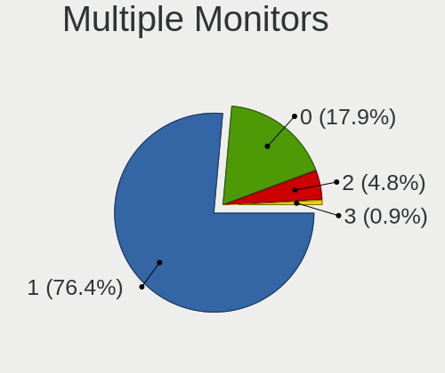

| Total | Computers | Percent |
|-------|-----------|---------|
| 1     | 159       | 76.44%  |
| 0     | 38        | 18.27%  |
| 2     | 9         | 4.33%   |
| 3     | 2         | 0.96%   |

Network
-------

Net Controller Vendor
---------------------

Controller vendors

| Vendor                            | Computers | Percent |
|-----------------------------------|-----------|---------|
| Intel                             | 117       | 37.26%  |
| Realtek Semiconductor             | 88        | 28.03%  |
| Qualcomm Atheros                  | 40        | 12.74%  |
| Broadcom                          | 21        | 6.69%   |
| Samsung Electronics               | 5         | 1.59%   |
| Ralink Technology                 | 5         | 1.59%   |
| TP-Link                           | 4         | 1.27%   |
| Ralink                            | 4         | 1.27%   |
| Marvell Technology Group          | 3         | 0.96%   |
| Sierra Wireless                   | 2         | 0.64%   |
| Qualcomm                          | 2         | 0.64%   |
| Mellanox Technologies             | 2         | 0.64%   |
| Fibocom                           | 2         | 0.64%   |
| Ericsson Business Mobile Networks | 2         | 0.64%   |
| VIA Technologies                  | 1         | 0.32%   |
| U-Blox                            | 1         | 0.32%   |
| Silicon Integrated Systems [SiS]  | 1         | 0.32%   |
| Qualcomm Technologies             | 1         | 0.32%   |
| Nvidia                            | 1         | 0.32%   |
| NetGear                           | 1         | 0.32%   |
| Microchip Technology              | 1         | 0.32%   |
| MediaTek                          | 1         | 0.32%   |
| JMicron Technology                | 1         | 0.32%   |
| Huawei Technologies               | 1         | 0.32%   |
| Edimax Technology                 | 1         | 0.32%   |
| Dell                              | 1         | 0.32%   |
| D-Link System                     | 1         | 0.32%   |
| D-Link                            | 1         | 0.32%   |
| Brooktrout Technology             | 1         | 0.32%   |
| Atheros                           | 1         | 0.32%   |
| Apple                             | 1         | 0.32%   |

Net Controller Model
--------------------

Controller models

| Model                                                                  | Computers | Percent |
|------------------------------------------------------------------------|-----------|---------|
| Realtek RTL8111/8168/8211/8411 PCI Express Gigabit Ethernet Controller | 62        | 15.78%  |
| Realtek RTL810xE PCI Express Fast Ethernet controller                  | 14        | 3.56%   |
| Intel 82579LM Gigabit Network Connection (Lewisville)                  | 13        | 3.31%   |
| Intel Wireless 8265 / 8275                                             | 11        | 2.8%    |
| Intel Wireless 7260                                                    | 11        | 2.8%    |
| Intel Ethernet Connection I217-LM                                      | 9         | 2.29%   |
| Intel Wireless 8260                                                    | 8         | 2.04%   |
| Intel Ethernet Connection (4) I219-LM                                  | 8         | 2.04%   |
| Realtek RTL8188EUS 802.11n Wireless Network Adapter                    | 6         | 1.53%   |
| Qualcomm Atheros AR9485 Wireless Network Adapter                       | 6         | 1.53%   |
| Intel Wireless 3165                                                    | 6         | 1.53%   |
| Qualcomm Atheros QCA9565 / AR9565 Wireless Network Adapter             | 5         | 1.27%   |
| Qualcomm Atheros QCA9377 802.11ac Wireless Network Adapter             | 5         | 1.27%   |
| Qualcomm Atheros QCA6174 802.11ac Wireless Network Adapter             | 5         | 1.27%   |
| Intel Wi-Fi 6 AX200                                                    | 5         | 1.27%   |
| Intel Ethernet Connection (2) I219-V                                   | 5         | 1.27%   |
| Intel Centrino Advanced-N 6205 [Taylor Peak]                           | 5         | 1.27%   |
| Intel Cannon Point-LP CNVi [Wireless-AC]                               | 5         | 1.27%   |
| Samsung Galaxy series, misc. (tethering mode)                          | 4         | 1.02%   |
| Realtek RTL8821CE 802.11ac PCIe Wireless Network Adapter               | 4         | 1.02%   |
| Realtek RTL8723BE PCIe Wireless Network Adapter                        | 4         | 1.02%   |
| Realtek RTL8125 2.5GbE Controller                                      | 4         | 1.02%   |
| Qualcomm Atheros AR928X Wireless Network Adapter (PCI-Express)         | 4         | 1.02%   |
| Qualcomm Atheros AR9285 Wireless Network Adapter (PCI-Express)         | 4         | 1.02%   |
| Intel Ethernet Connection I219-LM                                      | 4         | 1.02%   |
| Intel Ethernet Connection I218-LM                                      | 4         | 1.02%   |
| Intel Comet Lake PCH-LP CNVi WiFi                                      | 4         | 1.02%   |
| Broadcom BCM4360 802.11ac Dual Band Wireless Network Adapter           | 4         | 1.02%   |
| Intel Wireless 7265                                                    | 3         | 0.76%   |
| Intel WiFi Link 5100                                                   | 3         | 0.76%   |
| Intel Wi-Fi 6 AX201                                                    | 3         | 0.76%   |
| Intel Centrino Ultimate-N 6300                                         | 3         | 0.76%   |
| Broadcom NetXtreme BCM57762 Gigabit Ethernet PCIe                      | 3         | 0.76%   |
| Realtek RTL8822BE 802.11a/b/g/n/ac WiFi adapter                        | 2         | 0.51%   |
| Realtek RTL8192CE PCIe Wireless Network Adapter                        | 2         | 0.51%   |
| Realtek RTL8188EE Wireless Network Adapter                             | 2         | 0.51%   |
| Ralink RT5372 Wireless Adapter                                         | 2         | 0.51%   |
| Ralink RT2501/RT2573 Wireless Adapter                                  | 2         | 0.51%   |
| Qualcomm Atheros AR9462 Wireless Network Adapter                       | 2         | 0.51%   |
| Qualcomm Atheros AR8152 v2.0 Fast Ethernet                             | 2         | 0.51%   |

Wireless Vendor
---------------

Wireless vendors

| Vendor                | Computers | Percent |
|-----------------------|-----------|---------|
| Intel                 | 87        | 47.8%   |
| Qualcomm Atheros      | 34        | 18.68%  |
| Realtek Semiconductor | 27        | 14.84%  |
| Broadcom              | 13        | 7.14%   |
| Ralink Technology     | 5         | 2.75%   |
| TP-Link               | 4         | 2.2%    |
| Ralink                | 4         | 2.2%    |
| Sierra Wireless       | 1         | 0.55%   |
| Qualcomm Technologies | 1         | 0.55%   |
| NetGear               | 1         | 0.55%   |
| MediaTek              | 1         | 0.55%   |
| Edimax Technology     | 1         | 0.55%   |
| D-Link System         | 1         | 0.55%   |
| D-Link                | 1         | 0.55%   |
| Atheros               | 1         | 0.55%   |

Wireless Model
--------------

Wireless models

| Model                                                          | Computers | Percent |
|----------------------------------------------------------------|-----------|---------|
| Intel Wireless 8265 / 8275                                     | 11        | 5.95%   |
| Intel Wireless 7260                                            | 11        | 5.95%   |
| Intel Wireless 8260                                            | 8         | 4.32%   |
| Realtek RTL8188EUS 802.11n Wireless Network Adapter            | 6         | 3.24%   |
| Qualcomm Atheros AR9485 Wireless Network Adapter               | 6         | 3.24%   |
| Intel Wireless 3165                                            | 6         | 3.24%   |
| Qualcomm Atheros QCA9565 / AR9565 Wireless Network Adapter     | 5         | 2.7%    |
| Qualcomm Atheros QCA9377 802.11ac Wireless Network Adapter     | 5         | 2.7%    |
| Qualcomm Atheros QCA6174 802.11ac Wireless Network Adapter     | 5         | 2.7%    |
| Intel Wi-Fi 6 AX200                                            | 5         | 2.7%    |
| Intel Centrino Advanced-N 6205 [Taylor Peak]                   | 5         | 2.7%    |
| Intel Cannon Point-LP CNVi [Wireless-AC]                       | 5         | 2.7%    |
| Realtek RTL8821CE 802.11ac PCIe Wireless Network Adapter       | 4         | 2.16%   |
| Realtek RTL8723BE PCIe Wireless Network Adapter                | 4         | 2.16%   |
| Qualcomm Atheros AR928X Wireless Network Adapter (PCI-Express) | 4         | 2.16%   |
| Qualcomm Atheros AR9285 Wireless Network Adapter (PCI-Express) | 4         | 2.16%   |
| Intel Comet Lake PCH-LP CNVi WiFi                              | 4         | 2.16%   |
| Broadcom BCM4360 802.11ac Dual Band Wireless Network Adapter   | 4         | 2.16%   |
| Intel Wireless 7265                                            | 3         | 1.62%   |
| Intel WiFi Link 5100                                           | 3         | 1.62%   |
| Intel Wi-Fi 6 AX201                                            | 3         | 1.62%   |
| Intel Centrino Ultimate-N 6300                                 | 3         | 1.62%   |
| Realtek RTL8822BE 802.11a/b/g/n/ac WiFi adapter                | 2         | 1.08%   |
| Realtek RTL8192CE PCIe Wireless Network Adapter                | 2         | 1.08%   |
| Realtek RTL8188EE Wireless Network Adapter                     | 2         | 1.08%   |
| Ralink RT5372 Wireless Adapter                                 | 2         | 1.08%   |
| Ralink RT2501/RT2573 Wireless Adapter                          | 2         | 1.08%   |
| Qualcomm Atheros AR9462 Wireless Network Adapter               | 2         | 1.08%   |
| Intel Wi-Fi 5(802.11ac) Wireless-AC 9x6x [Thunder Peak]        | 2         | 1.08%   |
| Intel PRO/Wireless 4965 AG or AGN [Kedron] Network Connection  | 2         | 1.08%   |
| Intel Comet Lake PCH CNVi WiFi                                 | 2         | 1.08%   |
| Intel Centrino Advanced-N 6200                                 | 2         | 1.08%   |
| Intel Alder Lake-P PCH CNVi WiFi                               | 2         | 1.08%   |
| Broadcom BCM43142 802.11b/g/n                                  | 2         | 1.08%   |
| TP-Link Wireless USB Adapter                                   | 1         | 0.54%   |
| TP-Link TL-WN722N v2/v3 [Realtek RTL8188EUS]                   | 1         | 0.54%   |
| TP-Link Archer T3U [Realtek RTL8812BU]                         | 1         | 0.54%   |
| TP-Link AC600 wireless Realtek RTL8811AU [Archer T2U Nano]     | 1         | 0.54%   |
| Sierra Wireless EM7455                                         | 1         | 0.54%   |
| Realtek RTL8822CE 802.11ac PCIe Wireless Network Adapter       | 1         | 0.54%   |

Ethernet Vendor
---------------

Ethernet vendors

| Vendor                           | Computers | Percent |
|----------------------------------|-----------|---------|
| Realtek Semiconductor            | 80        | 41.67%  |
| Intel                            | 76        | 39.58%  |
| Broadcom                         | 12        | 6.25%   |
| Qualcomm Atheros                 | 9         | 4.69%   |
| Samsung Electronics              | 5         | 2.6%    |
| Marvell Technology Group         | 3         | 1.56%   |
| Qualcomm                         | 2         | 1.04%   |
| VIA Technologies                 | 1         | 0.52%   |
| Silicon Integrated Systems [SiS] | 1         | 0.52%   |
| Nvidia                           | 1         | 0.52%   |
| JMicron Technology               | 1         | 0.52%   |
| Apple                            | 1         | 0.52%   |

Ethernet Model
--------------

Ethernet models

| Model                                                                  | Computers | Percent |
|------------------------------------------------------------------------|-----------|---------|
| Realtek RTL8111/8168/8211/8411 PCI Express Gigabit Ethernet Controller | 62        | 31.63%  |
| Realtek RTL810xE PCI Express Fast Ethernet controller                  | 14        | 7.14%   |
| Intel 82579LM Gigabit Network Connection (Lewisville)                  | 13        | 6.63%   |
| Intel Ethernet Connection I217-LM                                      | 9         | 4.59%   |
| Intel Ethernet Connection (4) I219-LM                                  | 8         | 4.08%   |
| Intel Ethernet Connection (2) I219-V                                   | 5         | 2.55%   |
| Samsung Galaxy series, misc. (tethering mode)                          | 4         | 2.04%   |
| Realtek RTL8125 2.5GbE Controller                                      | 4         | 2.04%   |
| Intel Ethernet Connection I219-LM                                      | 4         | 2.04%   |
| Intel Ethernet Connection I218-LM                                      | 4         | 2.04%   |
| Broadcom NetXtreme BCM57762 Gigabit Ethernet PCIe                      | 3         | 1.53%   |
| Qualcomm Atheros AR8152 v2.0 Fast Ethernet                             | 2         | 1.02%   |
| Qualcomm Atheros AR8151 v2.0 Gigabit Ethernet                          | 2         | 1.02%   |
| Qualcomm ALCATEL RNDIS Interface                                       | 2         | 1.02%   |
| Marvell Group 88E8040 PCI-E Fast Ethernet Controller                   | 2         | 1.02%   |
| Intel I211 Gigabit Network Connection                                  | 2         | 1.02%   |
| Intel Ethernet Controller I225-V                                       | 2         | 1.02%   |
| Intel Ethernet Connection I219-V                                       | 2         | 1.02%   |
| Intel Ethernet Connection (7) I219-V                                   | 2         | 1.02%   |
| Intel Ethernet Connection (6) I219-V                                   | 2         | 1.02%   |
| Intel Ethernet Connection (4) I219-V                                   | 2         | 1.02%   |
| Intel 82577LM Gigabit Network Connection                               | 2         | 1.02%   |
| Intel 82567LM-3 Gigabit Network Connection                             | 2         | 1.02%   |
| Broadcom NetXtreme BCM5764M Gigabit Ethernet PCIe                      | 2         | 1.02%   |
| Broadcom NetLink BCM5784M Gigabit Ethernet PCIe                        | 2         | 1.02%   |
| Broadcom NetLink BCM57780 Gigabit Ethernet PCIe                        | 2         | 1.02%   |
| VIA VT6102/VT6103 [Rhine-II]                                           | 1         | 0.51%   |
| Silicon Integrated Systems [SiS] 191 Gigabit Ethernet Adapter          | 1         | 0.51%   |
| Samsung GT-I9070 (network tethering, USB debugging enabled)            | 1         | 0.51%   |
| Qualcomm Atheros QCA8171 Gigabit Ethernet                              | 1         | 0.51%   |
| Qualcomm Atheros Attansic L1 Gigabit Ethernet                          | 1         | 0.51%   |
| Qualcomm Atheros AR8162 Fast Ethernet                                  | 1         | 0.51%   |
| Qualcomm Atheros AR8131 Gigabit Ethernet                               | 1         | 0.51%   |
| Qualcomm Atheros AR8121/AR8113/AR8114 Gigabit or Fast Ethernet         | 1         | 0.51%   |
| Nvidia MCP73 Ethernet                                                  | 1         | 0.51%   |
| Marvell Group 88E8071 PCI-E Gigabit Ethernet Controller                | 1         | 0.51%   |
| JMicron JMC260 PCI Express Fast Ethernet Controller                    | 1         | 0.51%   |
| Intel NM10/ICH7 Family LAN Controller                                  | 1         | 0.51%   |
| Intel I210 Gigabit Network Connection                                  | 1         | 0.51%   |
| Intel Ethernet Connection (7) I219-LM                                  | 1         | 0.51%   |

Net Controller Kind
-------------------

Ethernet, WiFi or modem

| Kind     | Computers | Percent |
|----------|-----------|---------|
| Ethernet | 185       | 50.55%  |
| WiFi     | 169       | 46.17%  |
| Unknown  | 10        | 2.73%   |
| Modem    | 2         | 0.55%   |

Used Controller
---------------

Currently used network controller

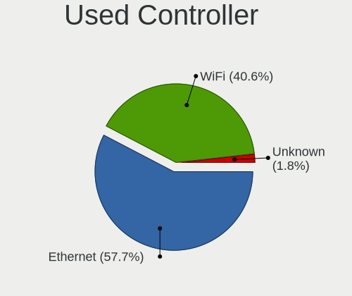

| Kind     | Computers | Percent |
|----------|-----------|---------|
| Ethernet | 152       | 57.79%  |
| WiFi     | 106       | 40.3%   |
| Unknown  | 5         | 1.9%    |

NICs
----

Total network controllers on board

| Total | Computers | Percent |
|-------|-----------|---------|
| 2     | 137       | 66.18%  |
| 1     | 64        | 30.92%  |
| 4     | 3         | 1.45%   |
| 3     | 2         | 0.97%   |
| 0     | 1         | 0.48%   |

IPv6
----

IPv6 vs IPv4

| Used | Computers | Percent |
|------|-----------|---------|
| No   | 182       | 87.92%  |
| Yes  | 25        | 12.08%  |

Bluetooth
---------

Bluetooth Vendor
----------------

Controller vendors

| Vendor                          | Computers | Percent |
|---------------------------------|-----------|---------|
| Intel                           | 59        | 47.97%  |
| Broadcom                        | 11        | 8.94%   |
| Realtek Semiconductor           | 9         | 7.32%   |
| Qualcomm Atheros Communications | 9         | 7.32%   |
| Apple                           | 7         | 5.69%   |
| Lite-On Technology              | 6         | 4.88%   |
| IMC Networks                    | 5         | 4.07%   |
| ASUSTek Computer                | 5         | 4.07%   |
| Foxconn / Hon Hai               | 4         | 3.25%   |
| Cambridge Silicon Radio         | 3         | 2.44%   |
| USI                             | 1         | 0.81%   |
| TP-Link                         | 1         | 0.81%   |
| Hewlett-Packard                 | 1         | 0.81%   |
| Dell                            | 1         | 0.81%   |
| Alps Electric                   | 1         | 0.81%   |

Bluetooth Model
---------------

Controller models

| Model                                                       | Computers | Percent |
|-------------------------------------------------------------|-----------|---------|
| Intel Bluetooth wireless interface                          | 33        | 26.83%  |
| Intel AX201 Bluetooth                                       | 8         | 6.5%    |
| Intel Bluetooth 9460/9560 Jefferson Peak (JfP)              | 7         | 5.69%   |
| Intel AX200 Bluetooth                                       | 5         | 4.07%   |
| Apple Bluetooth Host Controller                             | 5         | 4.07%   |
| Broadcom BCM20702 Bluetooth 4.0 [ThinkPad]                  | 4         | 3.25%   |
| Cambridge Silicon Radio Bluetooth Dongle (HCI mode)         | 3         | 2.44%   |
| Realtek RTL8723B Bluetooth                                  | 2         | 1.63%   |
| Realtek  Bluetooth 4.2 Adapter                              | 2         | 1.63%   |
| Qualcomm Atheros QCA9377 Bluetooth 4.1                      | 2         | 1.63%   |
| Qualcomm Atheros AR3012 Bluetooth 4.0                       | 2         | 1.63%   |
| Lite-On Qualcomm Atheros QCA9377 Bluetooth                  | 2         | 1.63%   |
| Lite-On Atheros AR3012 Bluetooth                            | 2         | 1.63%   |
| Intel Wireless-AC 9260 Bluetooth Adapter                    | 2         | 1.63%   |
| Intel AX211 Bluetooth                                       | 2         | 1.63%   |
| IMC Networks Realtek Bluetooth Adapter                      | 2         | 1.63%   |
| Foxconn / Hon Hai Bluetooth USB Module                      | 2         | 1.63%   |
| Broadcom BCM2045B (BDC-2.1)                                 | 2         | 1.63%   |
| ASUS BT-253 Bluetooth Adapter                               | 2         | 1.63%   |
| Apple Broadcom Built-in Bluetooth                           | 2         | 1.63%   |
| USI Qualcomm WCN685x Bluetooth Adapter                      | 1         | 0.81%   |
| TP-Link Bluetooth 5.0 USB Adapter                           | 1         | 0.81%   |
| Realtek RTL8822BE Bluetooth 4.2 Adapter                     | 1         | 0.81%   |
| Realtek RTL8821A Bluetooth                                  | 1         | 0.81%   |
| Realtek Bluetooth 4.2 Adapter                               | 1         | 0.81%   |
| Realtek Bluetooth 4.0 Adapter                               | 1         | 0.81%   |
| Realtek Bluetooth 4.0 + High Speed Chip                     | 1         | 0.81%   |
| Qualcomm Atheros QCA61x4 Bluetooth 4.0                      | 1         | 0.81%   |
| Qualcomm Atheros Dell Wireless 1820 Bluetooth 4.1LE         | 1         | 0.81%   |
| Qualcomm Atheros Dell Wireless 1707 Bluetooth 4.0 LE Device | 1         | 0.81%   |
| Qualcomm Atheros Dell Wireless 1601 Bluetooth Device        | 1         | 0.81%   |
| Qualcomm Atheros AR3011 Bluetooth (no firmware)             | 1         | 0.81%   |
| Lite-On Bluetooth USB Module                                | 1         | 0.81%   |
| Lite-On Atheros Bluetooth                                   | 1         | 0.81%   |
| Intel Wireless-AC 3168 Bluetooth                            | 1         | 0.81%   |
| Intel Centrino Advanced-N 6230 Bluetooth adapter            | 1         | 0.81%   |
| IMC Networks Qualcomm Atheros Bluetooth 4.1                 | 1         | 0.81%   |
| IMC Networks Qualcomm Atheros Bluetooth 4.0 + HS            | 1         | 0.81%   |
| IMC Networks Atheros AR3012 Bluetooth 4.0 Adapter           | 1         | 0.81%   |
| HP Bluetooth 2.0 Interface [Broadcom BCM2045]               | 1         | 0.81%   |

Sound
-----

Sound Vendor
------------

Sound card vendors

| Vendor                           | Computers | Percent |
|----------------------------------|-----------|---------|
| Intel                            | 159       | 61.39%  |
| AMD                              | 49        | 18.92%  |
| Nvidia                           | 27        | 10.42%  |
| C-Media Electronics              | 3         | 1.16%   |
| XMOS                             | 2         | 0.77%   |
| Sony                             | 2         | 0.77%   |
| Realtek Semiconductor            | 2         | 0.77%   |
| Corsair                          | 2         | 0.77%   |
| BEHRINGER International          | 2         | 0.77%   |
| VIA Technologies                 | 1         | 0.39%   |
| Tenx Technology                  | 1         | 0.39%   |
| Silicon Integrated Systems [SiS] | 1         | 0.39%   |
| Quanta                           | 1         | 0.39%   |
| LG Electronics                   | 1         | 0.39%   |
| Lenovo                           | 1         | 0.39%   |
| Creative Technology              | 1         | 0.39%   |
| Creative Labs                    | 1         | 0.39%   |
| Blue Microphones                 | 1         | 0.39%   |
| Audio-Technica                   | 1         | 0.39%   |
| ASUSTek Computer                 | 1         | 0.39%   |

Sound Model
-----------

Sound card models

| Model                                                                                             | Computers | Percent |
|---------------------------------------------------------------------------------------------------|-----------|---------|
| Intel Sunrise Point-LP HD Audio                                                                   | 30        | 9.35%   |
| Intel 7 Series/C216 Chipset Family High Definition Audio Controller                               | 19        | 5.92%   |
| AMD Family 17h/19h HD Audio Controller                                                            | 14        | 4.36%   |
| Intel 8 Series/C220 Series Chipset High Definition Audio Controller                               | 12        | 3.74%   |
| Intel 6 Series/C200 Series Chipset Family High Definition Audio Controller                        | 12        | 3.74%   |
| Intel Xeon E3-1200 v3/4th Gen Core Processor HD Audio Controller                                  | 11        | 3.43%   |
| Intel NM10/ICH7 Family High Definition Audio Controller                                           | 11        | 3.43%   |
| Intel Haswell-ULT HD Audio Controller                                                             | 11        | 3.43%   |
| Intel 8 Series HD Audio Controller                                                                | 11        | 3.43%   |
| AMD FCH Azalia Controller                                                                         | 11        | 3.43%   |
| AMD Kabini HDMI/DP Audio                                                                          | 9         | 2.8%    |
| Intel Comet Lake PCH-LP cAVS                                                                      | 7         | 2.18%   |
| Intel 82801I (ICH9 Family) HD Audio Controller                                                    | 7         | 2.18%   |
| Intel Cannon Point-LP High Definition Audio Controller                                            | 6         | 1.87%   |
| Intel 100 Series/C230 Series Chipset Family HD Audio Controller                                   | 6         | 1.87%   |
| AMD Renoir Radeon High Definition Audio Controller                                                | 6         | 1.87%   |
| Intel Cannon Lake PCH cAVS                                                                        | 5         | 1.56%   |
| AMD Starship/Matisse HD Audio Controller                                                          | 5         | 1.56%   |
| AMD Raven/Raven2/Fenghuang HDMI/DP Audio Controller                                               | 5         | 1.56%   |
| Nvidia GP106 High Definition Audio Controller                                                     | 4         | 1.25%   |
| Intel Wildcat Point-LP High Definition Audio Controller                                           | 4         | 1.25%   |
| Intel Broadwell-U Audio Controller                                                                | 4         | 1.25%   |
| Intel 5 Series/3400 Series Chipset High Definition Audio                                          | 4         | 1.25%   |
| AMD Navi 21/23 HDMI/DP Audio Controller                                                           | 4         | 1.25%   |
| Nvidia GM107 High Definition Audio Controller [GeForce 940MX]                                     | 3         | 0.93%   |
| Intel Tiger Lake-LP Smart Sound Technology Audio Controller                                       | 3         | 0.93%   |
| Intel C600/X79 series chipset High Definition Audio Controller                                    | 3         | 0.93%   |
| Intel 200 Series PCH HD Audio                                                                     | 3         | 0.93%   |
| AMD SBx00 Azalia (Intel HDA)                                                                      | 3         | 0.93%   |
| AMD Family 17h (Models 00h-0fh) HD Audio Controller                                               | 3         | 0.93%   |
| AMD Cedar HDMI Audio [Radeon HD 5400/6300/7300 Series]                                            | 3         | 0.93%   |
| Nvidia MCP89 High Definition Audio                                                                | 2         | 0.62%   |
| Nvidia MCP61 High Definition Audio                                                                | 2         | 0.62%   |
| Nvidia GK208 HDMI/DP Audio Controller                                                             | 2         | 0.62%   |
| Intel Comet Lake PCH cAVS                                                                         | 2         | 0.62%   |
| Intel Celeron/Pentium Silver Processor High Definition Audio                                      | 2         | 0.62%   |
| Intel Atom/Celeron/Pentium Processor x5-E8000/J3xxx/N3xxx Series High Definition Audio Controller | 2         | 0.62%   |
| Intel Alder Lake PCH-P High Definition Audio Controller                                           | 2         | 0.62%   |
| Intel 82801JI (ICH10 Family) HD Audio Controller                                                  | 2         | 0.62%   |
| Intel 82801H (ICH8 Family) HD Audio Controller                                                    | 2         | 0.62%   |

Memory
------

Memory Vendor
-------------

Memory module vendors

| Vendor              | Computers | Percent |
|---------------------|-----------|---------|
| Samsung Electronics | 67        | 27.8%   |
| SK hynix            | 47        | 19.5%   |
| Micron Technology   | 27        | 11.2%   |
| Unknown             | 20        | 8.3%    |
| Kingston            | 20        | 8.3%    |
| Corsair             | 10        | 4.15%   |
| G.Skill             | 8         | 3.32%   |
| Crucial             | 8         | 3.32%   |
| Elpida              | 7         | 2.9%    |
| Unknown             | 7         | 2.9%    |
| Nanya Technology    | 5         | 2.07%   |
| A-DATA Technology   | 4         | 1.66%   |
| Transcend           | 3         | 1.24%   |
| Ramaxel Technology  | 2         | 0.83%   |
| 48spaces            | 2         | 0.83%   |
| Unknown (ABCD)      | 1         | 0.41%   |
| Unknown (09D5)      | 1         | 0.41%   |
| Magnum Tech         | 1         | 0.41%   |
| EVGA                | 1         | 0.41%   |

Memory Model
------------

Memory module models

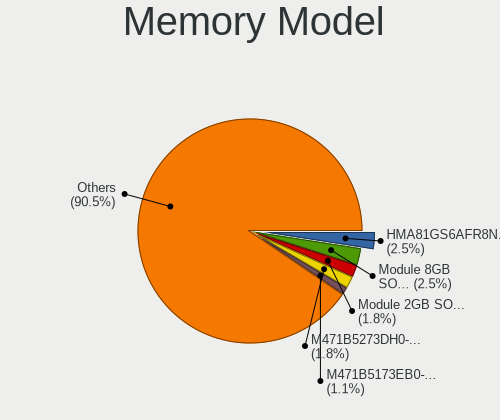

| Model                                                                     | Computers | Percent |
|---------------------------------------------------------------------------|-----------|---------|
| SK hynix RAM HMA81GS6AFR8N-UH 8GB SODIMM DDR4 2400MT/s                    | 7         | 2.7%    |
| Unknown                                                                   | 7         | 2.7%    |
| Unknown RAM Module 2GB SODIMM DDR2 667MT/s                                | 5         | 1.93%   |
| Samsung RAM M471B5273DH0-CH9 4GB SODIMM DDR3 1334MT/s                     | 5         | 1.93%   |
| SK hynix RAM HMT451S6BFR8A-PB 4GB SODIMM DDR3 1600MT/s                    | 3         | 1.16%   |
| SK hynix RAM HMT351S6CFR8C-PB 4GB SODIMM DDR3 1600MT/s                    | 3         | 1.16%   |
| Samsung RAM M471B5173DB0-YK0 4GB SODIMM DDR3 1600MT/s                     | 3         | 1.16%   |
| Samsung RAM M471B1G73EB0-YK0 8GB SODIMM DDR3 1600MT/s                     | 3         | 1.16%   |
| Samsung RAM M471A5244CB0-CTD 4GB SODIMM DDR4 2667MT/s                     | 3         | 1.16%   |
| Samsung RAM M471A1K43CB1-CTD 8GB SODIMM DDR4 2667MT/s                     | 3         | 1.16%   |
| Unknown RAM Module 8GB DIMM DDR3 1600MT/s                                 | 2         | 0.77%   |
| Unknown RAM Module 2GB DIMM DDR2 800MT/s                                  | 2         | 0.77%   |
| SK hynix RAM Module 2GB SODIMM DDR3 1067MT/s                              | 2         | 0.77%   |
| SK hynix RAM HMT41GS6BFR8A-PB 8GB SODIMM DDR3 1600MT/s                    | 2         | 0.77%   |
| SK hynix RAM HMT351S6EFR8C-PB 4GB SODIMM DDR3 1600MT/s                    | 2         | 0.77%   |
| SK hynix RAM HMA851S6AFR6N-UH 4GB SODIMM DDR4 2400MT/s                    | 2         | 0.77%   |
| SK hynix RAM HMA82GS6JJR8N-VK 16GB SODIMM DDR4 2667MT/s                   | 2         | 0.77%   |
| SK hynix RAM HMA81GS6JJR8N-VK 8GB SODIMM DDR4 2667MT/s                    | 2         | 0.77%   |
| SK hynix RAM H9CCNNNCLGALAR-NVD 8GB Row Of Chips LPDDR3 2133MT/s          | 2         | 0.77%   |
| Samsung RAM M471B5773DH0-CH9 2GB SODIMM DDR3 1334MT/s                     | 2         | 0.77%   |
| Samsung RAM M471B5273DH0-CK0 4GB SODIMM DDR3 1600MT/s                     | 2         | 0.77%   |
| Samsung RAM M471B5173QH0-YK0 4GB SODIMM DDR3 1600MT/s                     | 2         | 0.77%   |
| Samsung RAM M471B5173EB0-YK0 4GB SODIMM DDR3 1600MT/s                     | 2         | 0.77%   |
| Samsung RAM M471B1G73QH0-YK0 8GB SODIMM DDR3 1867MT/s                     | 2         | 0.77%   |
| Samsung RAM M471B1G73DB0-YK0 8GB SODIMM DDR3 1600MT/s                     | 2         | 0.77%   |
| Samsung RAM M471A1K43DB1-CWE 8GB SODIMM DDR4 3200MT/s                     | 2         | 0.77%   |
| Samsung RAM M471A1K43CB1-CRC 8GB SODIMM DDR4 2667MT/s                     | 2         | 0.77%   |
| Micron RAM Module 4096MB SODIMM DDR3 1600MT/s                             | 2         | 0.77%   |
| Micron RAM ITC 4GB DIMM DDR3 1066MT/s                                     | 2         | 0.77%   |
| Kingston RAM KHX2666C16/8G 8GB DIMM DDR4 2933MT/s                         | 2         | 0.77%   |
| Kingston RAM KF3200C16D4/16GX 16GB DIMM DDR4 3200MT/s                     | 2         | 0.77%   |
| G.Skill RAM F4-3200C16-8GVKB 8GB DIMM DDR4 3200MT/s                       | 2         | 0.77%   |
| 48spaces RAM 012345678901234567890123456789012345 1GB SODIMM DDR2 800MT/s | 2         | 0.77%   |
| Unknown SODIMM 2048MB SODIMM DDR2 667MT/s                                 | 1         | 0.39%   |
| Unknown SODIMM 1024MB SODIMM DDR2 667MT/s                                 | 1         | 0.39%   |
| Unknown RAM Module 512MB SODIMM SDRAM                                     | 1         | 0.39%   |
| Unknown RAM Module 4096MB SODIMM DDR3 1333MT/s                            | 1         | 0.39%   |
| Unknown RAM Module 2GB SODIMM DDR2                                        | 1         | 0.39%   |
| Unknown RAM Module 2GB DIMM SDRAM                                         | 1         | 0.39%   |
| Unknown RAM Module 2GB DIMM DDR 1333MT/s                                  | 1         | 0.39%   |

Memory Kind
-----------

Memory module kinds

| Kind    | Computers | Percent |
|---------|-----------|---------|
| DDR3    | 87        | 41.63%  |
| DDR4    | 72        | 34.45%  |
| DDR2    | 21        | 10.05%  |
| LPDDR3  | 11        | 5.26%   |
| SDRAM   | 5         | 2.39%   |
| Unknown | 4         | 1.91%   |
| LPDDR5  | 3         | 1.44%   |
| LPDDR4  | 2         | 0.96%   |
| RAM     | 1         | 0.48%   |
| DRAM    | 1         | 0.48%   |
| DDR5    | 1         | 0.48%   |
| DDR     | 1         | 0.48%   |

Memory Form Factor
------------------

Physical design of the memory module

| Name         | Computers | Percent |
|--------------|-----------|---------|
| SODIMM       | 136       | 65.38%  |
| DIMM         | 57        | 27.4%   |
| Row Of Chips | 9         | 4.33%   |
| Chip         | 4         | 1.92%   |
| Unknown      | 2         | 0.96%   |

Memory Size
-----------

Memory module size

| Size  | Computers | Percent |
|-------|-----------|---------|
| 8192  | 83        | 35.62%  |
| 4096  | 76        | 32.62%  |
| 2048  | 41        | 17.6%   |
| 16384 | 19        | 8.15%   |
| 1024  | 9         | 3.86%   |
| 32768 | 3         | 1.29%   |
| 512   | 1         | 0.43%   |
| 128   | 1         | 0.43%   |

Memory Speed
------------

Memory module speed

| Speed   | Computers | Percent |
|---------|-----------|---------|
| 1600    | 57        | 25.79%  |
| 2400    | 22        | 9.95%   |
| 3200    | 19        | 8.6%    |
| 2667    | 19        | 8.6%    |
| 2133    | 18        | 8.14%   |
| 1333    | 16        | 7.24%   |
| 800     | 10        | 4.52%   |
| 1334    | 9         | 4.07%   |
| 667     | 8         | 3.62%   |
| 1867    | 6         | 2.71%   |
| Unknown | 6         | 2.71%   |
| 1067    | 5         | 2.26%   |
| 1066    | 5         | 2.26%   |
| 6400    | 3         | 1.36%   |
| 3600    | 3         | 1.36%   |
| 3000    | 3         | 1.36%   |
| 2933    | 3         | 1.36%   |
| 533     | 3         | 1.36%   |
| 5600    | 1         | 0.45%   |
| 4267    | 1         | 0.45%   |
| 1866    | 1         | 0.45%   |
| 1639    | 1         | 0.45%   |
| 975     | 1         | 0.45%   |
| 400     | 1         | 0.45%   |

Printers & scanners
-------------------

Printer Vendor
--------------

Printer device vendors

| Vendor             | Computers | Percent |
|--------------------|-----------|---------|
| Hewlett-Packard    | 1         | 25%     |
| Dymo-CoStar        | 1         | 25%     |
| Brother Industries | 1         | 25%     |
| Apple              | 1         | 25%     |

Printer Model
-------------

Printer device models

| Model                                                                    | Computers | Percent |
|--------------------------------------------------------------------------|-----------|---------|
| HP PNP Fax Null                                                          | 1         | 20%     |
| HP HP LaserJet M101-M106 Printer HP LEDM HP LEDM IPP Printer IPP Printer | 1         | 20%     |
| Dymo-CoStar DYMO LabelWriter 450 DUO                                     | 1         | 20%     |
| Brother HL-L2340D series                                                 | 1         | 20%     |
| Apple Gamesir-G3s 2.10                                                   | 1         | 20%     |

Scanner Vendor
--------------

Scanner device vendors

Zero info for selected period =(

Scanner Model
-------------

Scanner device models

Zero info for selected period =(

Camera
------

Camera Vendor
-------------

Camera device vendors

| Vendor                                 | Computers | Percent |
|----------------------------------------|-----------|---------|
| Chicony Electronics                    | 33        | 27.5%   |
| Bison Electronics                      | 15        | 12.5%   |
| Realtek Semiconductor                  | 13        | 10.83%  |
| Sunplus Innovation Technology          | 9         | 7.5%    |
| Suyin                                  | 8         | 6.67%   |
| IMC Networks                           | 8         | 6.67%   |
| Microdia                               | 7         | 5.83%   |
| Quanta                                 | 4         | 3.33%   |
| Logitech                               | 4         | 3.33%   |
| Lite-On Technology                     | 4         | 3.33%   |
| Cheng Uei Precision Industry (Foxlink) | 4         | 3.33%   |
| Silicon Motion                         | 3         | 2.5%    |
| Z-Star Microelectronics                | 1         | 0.83%   |
| Novatek Microelectronics               | 1         | 0.83%   |
| Luxvisions Innotech Limited            | 1         | 0.83%   |
| Intel                                  | 1         | 0.83%   |
| Genesys Logic                          | 1         | 0.83%   |
| Cubeternet                             | 1         | 0.83%   |
| Apple                                  | 1         | 0.83%   |
| Alcor Micro                            | 1         | 0.83%   |

Camera Model
------------

Camera device models

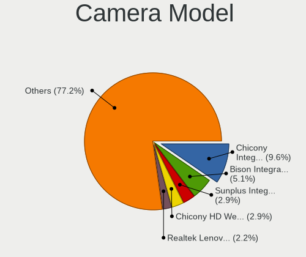

| Model                                                       | Computers | Percent |
|-------------------------------------------------------------|-----------|---------|
| Chicony Integrated Camera                                   | 12        | 9.92%   |
| Bison Integrated Camera                                     | 7         | 5.79%   |
| Sunplus Integrated_Webcam_HD                                | 4         | 3.31%   |
| Chicony HD WebCam                                           | 4         | 3.31%   |
| Realtek Lenovo EasyCamera                                   | 3         | 2.48%   |
| Realtek Integrated_Webcam_HD                                | 3         | 2.48%   |
| Microdia Integrated Webcam                                  | 3         | 2.48%   |
| Suyin Acer Crystal Eye webcam                               | 2         | 1.65%   |
| Realtek USB 2.0 PC Camera                                   | 2         | 1.65%   |
| Quanta Realtek DMFT RGB                                     | 2         | 1.65%   |
| Quanta Front Camera                                         | 2         | 1.65%   |
| Microdia Integrated_Webcam_HD                               | 2         | 1.65%   |
| Lite-On Integrated Camera                                   | 2         | 1.65%   |
| IMC Networks Realtek PC Camera                              | 2         | 1.65%   |
| IMC Networks EasyCamera                                     | 2         | 1.65%   |
| Chicony FJ Camera                                           | 2         | 1.65%   |
| Cheng Uei Precision Industry (Foxlink) HP HD Webcam         | 2         | 1.65%   |
| Bison ThinkPad Integrated Camera                            | 2         | 1.65%   |
| Bison SunplusIT Integrated Camera                           | 2         | 1.65%   |
| Z-Star Webcam                                               | 1         | 0.83%   |
| Suyin USB 2.0 UVC 1.3M WebCam                               | 1         | 0.83%   |
| Suyin Laptop_Integrated_Webcam_3M                           | 1         | 0.83%   |
| Suyin HD WebCam                                             | 1         | 0.83%   |
| Suyin HD Video WebCam                                       | 1         | 0.83%   |
| Suyin Acer/HP Integrated Webcam [CN0314]                    | 1         | 0.83%   |
| Suyin 1.3M WebCam (notebook emachines E730, Acer sub-brand) | 1         | 0.83%   |
| Sunplus Laptop_Integrated_Webcam_FHD                        | 1         | 0.83%   |
| Sunplus Integrated_Webcam_5M                                | 1         | 0.83%   |
| Sunplus Integrated Webcam                                   | 1         | 0.83%   |
| Sunplus Hy HD Camera                                        | 1         | 0.83%   |
| Sunplus Asus Webcam                                         | 1         | 0.83%   |
| Silicon Motion WebCam SCX Series                            | 1         | 0.83%   |
| Silicon Motion Realtek USB 2.0 PC Camera                    | 1         | 0.83%   |
| Silicon Motion 300k Pixel Camera                            | 1         | 0.83%   |
| Realtek USB2.0 VGA UVC WebCam                               | 1         | 0.83%   |
| Realtek USB Video Composite                                 | 1         | 0.83%   |
| Realtek USB Camera                                          | 1         | 0.83%   |
| Realtek PC Camera                                           | 1         | 0.83%   |
| Realtek HD Webcam - Realtek                                 | 1         | 0.83%   |
| Novatek HP High Definition 2MP Webcam                       | 1         | 0.83%   |

Security
--------

Fingerprint Vendor
------------------

Fingerprint sensor vendors

| Vendor                     | Computers | Percent |
|----------------------------|-----------|---------|
| Validity Sensors           | 15        | 44.12%  |
| Synaptics                  | 8         | 23.53%  |
| Upek                       | 4         | 11.76%  |
| Shenzhen Goodix Technology | 2         | 5.88%   |
| LighTuning Technology      | 2         | 5.88%   |
| Elan Microelectronics      | 1         | 2.94%   |
| Broadcom                   | 1         | 2.94%   |
| AuthenTec                  | 1         | 2.94%   |

Fingerprint Model
-----------------

Fingerprint sensor models

| Model                                                                        | Computers | Percent |
|------------------------------------------------------------------------------|-----------|---------|
| Validity Sensors VFS 5011 fingerprint sensor                                 | 4         | 11.76%  |
| Validity Sensors Synaptics WBDI                                              | 4         | 11.76%  |
| Upek Biometric Touchchip/Touchstrip Fingerprint Sensor                       | 4         | 11.76%  |
| Synaptics Prometheus MIS Touch Fingerprint Reader                            | 4         | 11.76%  |
| Validity Sensors VFS495 Fingerprint Reader                                   | 3         | 8.82%   |
| Synaptics Metallica MIS Touch Fingerprint Reader                             | 3         | 8.82%   |
| Validity Sensors Swipe Fingerprint Sensor                                    | 2         | 5.88%   |
| Shenzhen Goodix Fingerprint Reader                                           | 2         | 5.88%   |
| Validity Sensors VFS7552 Touch Fingerprint Sensor                            | 1         | 2.94%   |
| Validity Sensors VFS7500 Touch Fingerprint Sensor                            | 1         | 2.94%   |
| LighTuning Fingerprint Reader                                                | 1         | 2.94%   |
| LighTuning EgisTec Touch Fingerprint Sensor                                  | 1         | 2.94%   |
| Elan Fingerprint Sensor                                                      | 1         | 2.94%   |
| Broadcom BCM5880 Secure Applications Processor with fingerprint swipe sensor | 1         | 2.94%   |
| AuthenTec AES1600                                                            | 1         | 2.94%   |
| Unknown                                                                      | 1         | 2.94%   |

Chipcard Vendor
---------------

Chipcard module vendors

Zero info for selected period =(

Chipcard Model
--------------

Chipcard module models

Zero info for selected period =(

Unsupported
-----------

Unsupported Devices
-------------------

Total unsupported devices on board

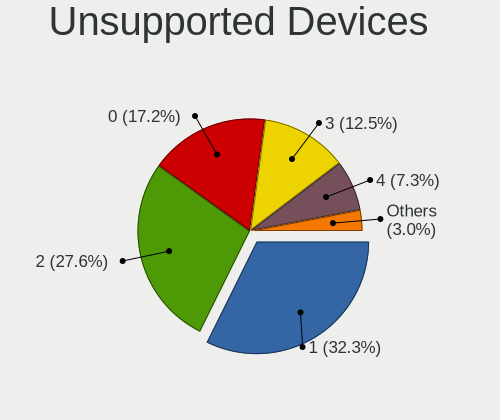

| Total | Computers | Percent |
|-------|-----------|---------|
| 1     | 71        | 33.65%  |
| 2     | 58        | 27.49%  |
| 0     | 37        | 17.54%  |
| 3     | 25        | 11.85%  |
| 4     | 14        | 6.64%   |
| 5     | 3         | 1.42%   |
| 7     | 2         | 0.95%   |
| 6     | 1         | 0.47%   |

Unsupported Device Types
------------------------

Types of unsupported devices

| Type                     | Computers | Percent |
|--------------------------|-----------|---------|
| Communication controller | 133       | 41.82%  |
| Net/wireless             | 53        | 16.67%  |
| Bluetooth                | 39        | 12.26%  |
| Fingerprint reader       | 33        | 10.38%  |
| Firewire controller      | 25        | 7.86%   |
| Card reader              | 23        | 7.23%   |
| Network                  | 6         | 1.89%   |
| Sound                    | 4         | 1.26%   |
| Storage/raid             | 1         | 0.31%   |
| Net/ethernet             | 1         | 0.31%   |

