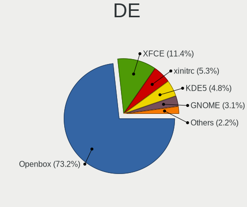
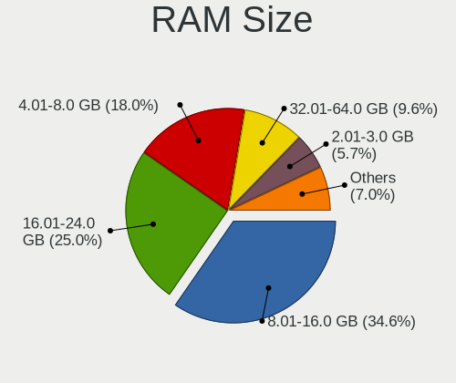
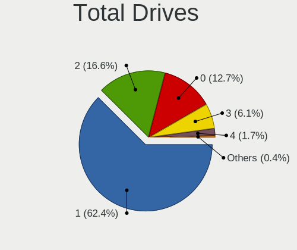
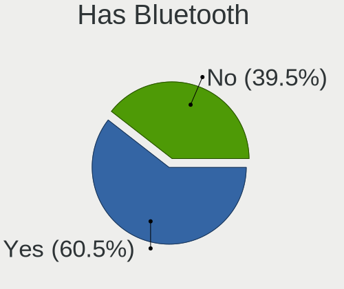
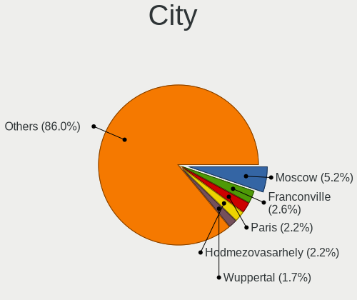

NomadBSD - Tested Hardware & Statistics
---------------------------------------

A project to collect tested hardware configurations for NomadBSD.

Anyone can contribute to this report by the [hw-probe](https://github.com/linuxhw/hw-probe/blob/master/INSTALL.BSD.md) tool:

    hw-probe -all -upload

Please contribute! Especially if your hardware is rare.

This is a report for all computer types. See also reports for [desktops](/Dist/NomadBSD/Desktop/README.md) and [notebooks](/Dist/NomadBSD/Notebook/README.md).

Contents
--------

* [ Test Cases ](#test-cases)

* [ System ](#system)
  - [ OS                       ](#os)
  - [ OS Family                ](#os-family)
  - [ Arch                     ](#arch)
  - [ DE                       ](#de)
  - [ Display Server           ](#display-server)
  - [ Display Manager          ](#display-manager)
  - [ OS Lang                  ](#os-lang)
  - [ Boot Mode                ](#boot-mode)
  - [ Filesystem               ](#filesystem)
  - [ Part. scheme             ](#part-scheme)

* [ Board ](#board)
  - [ Vendor                   ](#vendor)
  - [ Model                    ](#model)
  - [ Model Family             ](#model-family)
  - [ MFG Year                 ](#mfg-year)
  - [ Form Factor              ](#form-factor)
  - [ Coreboot                 ](#coreboot)
  - [ RAM Size                 ](#ram-size)
  - [ RAM Used                 ](#ram-used)
  - [ Total Drives             ](#total-drives)
  - [ Has CD-ROM               ](#has-cd-rom)
  - [ Has Ethernet             ](#has-ethernet)
  - [ Has WiFi                 ](#has-wifi)
  - [ Has Bluetooth            ](#has-bluetooth)

* [ Location ](#location)
  - [ Country                  ](#country)
  - [ City                     ](#city)

* [ Drives ](#drives)
  - [ Drive Vendor             ](#drive-vendor)
  - [ Drive Model              ](#drive-model)
  - [ HDD Vendor               ](#hdd-vendor)
  - [ SSD Vendor               ](#ssd-vendor)
  - [ Drive Kind               ](#drive-kind)
  - [ Drive Connector          ](#drive-connector)
  - [ Drive Size               ](#drive-size)
  - [ Space Total              ](#space-total)
  - [ Space Used               ](#space-used)
  - [ Malfunc. Drives          ](#malfunc-drives)
  - [ Malfunc. Drive Vendor    ](#malfunc-drive-vendor)
  - [ Malfunc. HDD Vendor      ](#malfunc-hdd-vendor)
  - [ Malfunc. Drive Kind      ](#malfunc-drive-kind)
  - [ Failed Drives            ](#failed-drives)
  - [ Failed Drive Vendor      ](#failed-drive-vendor)
  - [ Drive Status             ](#drive-status)

* [ Storage controller ](#storage-controller)
  - [ Storage Vendor           ](#storage-vendor)
  - [ Storage Model            ](#storage-model)
  - [ Storage Kind             ](#storage-kind)

* [ Processor ](#processor)
  - [ CPU Vendor               ](#cpu-vendor)
  - [ CPU Model                ](#cpu-model)
  - [ CPU Model Family         ](#cpu-model-family)
  - [ CPU Cores                ](#cpu-cores)
  - [ CPU Sockets              ](#cpu-sockets)
  - [ CPU Threads              ](#cpu-threads)
  - [ CPU Microarch            ](#cpu-microarch)

* [ Graphics ](#graphics)
  - [ GPU Vendor               ](#gpu-vendor)
  - [ GPU Model                ](#gpu-model)
  - [ GPU Combo                ](#gpu-combo)
  - [ GPU Driver               ](#gpu-driver)
  - [ GPU Memory               ](#gpu-memory)

* [ Monitor ](#monitor)
  - [ Monitor Vendor           ](#monitor-vendor)
  - [ Monitor Model            ](#monitor-model)
  - [ Monitor Resolution       ](#monitor-resolution)
  - [ Monitor Diagonal         ](#monitor-diagonal)
  - [ Monitor Width            ](#monitor-width)
  - [ Aspect Ratio             ](#aspect-ratio)
  - [ Monitor Area             ](#monitor-area)
  - [ Pixel Density            ](#pixel-density)
  - [ Multiple Monitors        ](#multiple-monitors)

* [ Network ](#network)
  - [ Net Controller Vendor    ](#net-controller-vendor)
  - [ Net Controller Model     ](#net-controller-model)
  - [ Wireless Vendor          ](#wireless-vendor)
  - [ Wireless Model           ](#wireless-model)
  - [ Ethernet Vendor          ](#ethernet-vendor)
  - [ Ethernet Model           ](#ethernet-model)
  - [ Net Controller Kind      ](#net-controller-kind)
  - [ Used Controller          ](#used-controller)
  - [ NICs                     ](#nics)
  - [ IPv6                     ](#ipv6)

* [ Bluetooth ](#bluetooth)
  - [ Bluetooth Vendor         ](#bluetooth-vendor)
  - [ Bluetooth Model          ](#bluetooth-model)

* [ Sound ](#sound)
  - [ Sound Vendor             ](#sound-vendor)
  - [ Sound Model              ](#sound-model)

* [ Memory ](#memory)
  - [ Memory Vendor            ](#memory-vendor)
  - [ Memory Model             ](#memory-model)
  - [ Memory Kind              ](#memory-kind)
  - [ Memory Form Factor       ](#memory-form-factor)
  - [ Memory Size              ](#memory-size)
  - [ Memory Speed             ](#memory-speed)

* [ Printers & scanners ](#printers--scanners)
  - [ Printer Vendor           ](#printer-vendor)
  - [ Printer Model            ](#printer-model)
  - [ Scanner Vendor           ](#scanner-vendor)
  - [ Scanner Model            ](#scanner-model)

* [ Camera ](#camera)
  - [ Camera Vendor            ](#camera-vendor)
  - [ Camera Model             ](#camera-model)

* [ Security ](#security)
  - [ Fingerprint Vendor       ](#fingerprint-vendor)
  - [ Fingerprint Model        ](#fingerprint-model)
  - [ Chipcard Vendor          ](#chipcard-vendor)
  - [ Chipcard Model           ](#chipcard-model)

* [ Unsupported ](#unsupported)
  - [ Unsupported Devices      ](#unsupported-devices)
  - [ Unsupported Device Types ](#unsupported-device-types)

Test Cases
----------

Total: 190

| Vendor        | Model                       | Form-Factor | Probe                                                     | Date         |
|---------------|-----------------------------|-------------|-----------------------------------------------------------|--------------|
| HP            | 255 G8 Notebook PC          | Notebook    | [004e039a23](https://bsd-hardware.info/?probe=004e039a23) | May 19, 2022 |
| HP            | 255 G8 Notebook PC          | Notebook    | [555a7733b7](https://bsd-hardware.info/?probe=555a7733b7) | May 19, 2022 |
| Dell          | Latitude 5290               | Notebook    | [11c3db8f1b](https://bsd-hardware.info/?probe=11c3db8f1b) | Apr 23, 2022 |
| Notebook      | W650DC,DD                   | Notebook    | [0f474b9ebb](https://bsd-hardware.info/?probe=0f474b9ebb) | Apr 23, 2022 |
| HP            | ProBook 450 G2              | Notebook    | [c4f7b8a774](https://bsd-hardware.info/?probe=c4f7b8a774) | Apr 22, 2022 |
| Dell          | Studio 1555                 | Notebook    | [6da8f97bcd](https://bsd-hardware.info/?probe=6da8f97bcd) | Apr 22, 2022 |
| ASUSTek       | Maximus VIII HERO           | Desktop     | [c776760a11](https://bsd-hardware.info/?probe=c776760a11) | Apr 13, 2022 |
| Lenovo        | ThinkPad T490s 20NX000DR... | Notebook    | [c052d7cab0](https://bsd-hardware.info/?probe=c052d7cab0) | Apr 01, 2022 |
| Intel         | NUC6i5SYB H81131-502        | Mini pc     | [95646c7b48](https://bsd-hardware.info/?probe=95646c7b48) | Mar 25, 2022 |
| Intel         | NUC6i5SYB H81131-502        | Mini pc     | [94f78425f1](https://bsd-hardware.info/?probe=94f78425f1) | Mar 25, 2022 |
| Intel         | NUC6i5SYB H81131-502        | Mini pc     | [09116f9139](https://bsd-hardware.info/?probe=09116f9139) | Mar 24, 2022 |
| ASUSTek       | M51Sr                       | Notebook    | [936a577d1a](https://bsd-hardware.info/?probe=936a577d1a) | Mar 10, 2022 |
| Lenovo        | ThinkPad T440s 20AQ006HU... | Notebook    | [2af47b6502](https://bsd-hardware.info/?probe=2af47b6502) | Mar 03, 2022 |
| MSI           | U-100 Ver.001               | Desktop     | [6859308aa9](https://bsd-hardware.info/?probe=6859308aa9) | Mar 01, 2022 |
| Dell          | Latitude D630               | Notebook    | [ae56d2cedd](https://bsd-hardware.info/?probe=ae56d2cedd) | Feb 28, 2022 |
| HP            | Pavilion Notebook           | Notebook    | [e27a6f46fc](https://bsd-hardware.info/?probe=e27a6f46fc) | Feb 26, 2022 |
| Gigabyte      | X570S GAMING X              | Desktop     | [ff39ace6ec](https://bsd-hardware.info/?probe=ff39ace6ec) | Feb 16, 2022 |
| HP            | Laptop 15-db0xxx            | Notebook    | [766e62f699](https://bsd-hardware.info/?probe=766e62f699) | Feb 12, 2022 |
| HP            | Notebook                    | Notebook    | [1758596e26](https://bsd-hardware.info/?probe=1758596e26) | Feb 12, 2022 |
| HP            | Pavilion Notebook           | Notebook    | [24f3a7da57](https://bsd-hardware.info/?probe=24f3a7da57) | Feb 07, 2022 |
| Intel         | DCP847SKE                   | Desktop     | [2828ef2a6d](https://bsd-hardware.info/?probe=2828ef2a6d) | Jan 20, 2022 |
| ASUSTek       | 1000                        | Notebook    | [da8689c840](https://bsd-hardware.info/?probe=da8689c840) | Dec 08, 2021 |
| Dell          | 0M9KCM A01                  | Desktop     | [4db0a0ea05](https://bsd-hardware.info/?probe=4db0a0ea05) | Dec 06, 2021 |
| Gigabyte      | MZGLKBP-00                  | Desktop     | [e713e3adee](https://bsd-hardware.info/?probe=e713e3adee) | Dec 05, 2021 |
| HP            | ProBook x360 11 G6 EE       | Convertible | [7eaff44a64](https://bsd-hardware.info/?probe=7eaff44a64) | Nov 27, 2021 |
| ASUSTek       | PRIME Z390-P                | Desktop     | [1bd9270845](https://bsd-hardware.info/?probe=1bd9270845) | Nov 15, 2021 |
| Acer          | Aspire 3810T                | Notebook    | [86782a69be](https://bsd-hardware.info/?probe=86782a69be) | Nov 13, 2021 |
| Acer          | Aspire 3810T                | Notebook    | [608e43163d](https://bsd-hardware.info/?probe=608e43163d) | Nov 12, 2021 |
| Dell          | 0T10XW A01                  | Desktop     | [ae2203b146](https://bsd-hardware.info/?probe=ae2203b146) | Nov 12, 2021 |
| Unknown       | X79                         | Desktop     | [c80b658f36](https://bsd-hardware.info/?probe=c80b658f36) | Nov 09, 2021 |
| Lenovo        | ThinkPad T470s W10DG 20J... | Notebook    | [1d261120d3](https://bsd-hardware.info/?probe=1d261120d3) | Nov 06, 2021 |
| HP            | ZBook Studio G3             | Notebook    | [767b44a6ae](https://bsd-hardware.info/?probe=767b44a6ae) | Oct 30, 2021 |
| ASUSTek       | X202E                       | Notebook    | [54259ac9a1](https://bsd-hardware.info/?probe=54259ac9a1) | Oct 29, 2021 |
| Sony          | VJS121C11N                  | Notebook    | [d86c621ef0](https://bsd-hardware.info/?probe=d86c621ef0) | Oct 25, 2021 |
| ASUSTek       | TUF Gaming FX505DU_FX505... | Notebook    | [2d72b6939d](https://bsd-hardware.info/?probe=2d72b6939d) | Oct 24, 2021 |
| HP            | 87D6 SMVB                   | Desktop     | [f601f00e7c](https://bsd-hardware.info/?probe=f601f00e7c) | Oct 07, 2021 |
| Dell          | OptiPlex 3020               | Desktop     | [c391177240](https://bsd-hardware.info/?probe=c391177240) | Oct 05, 2021 |
| Dell          | OptiPlex 3020               | Desktop     | [070a0c6d62](https://bsd-hardware.info/?probe=070a0c6d62) | Sep 19, 2021 |
| ASUSTek       | X540YA                      | Notebook    | [c5751c736c](https://bsd-hardware.info/?probe=c5751c736c) | Sep 19, 2021 |
| Lenovo        | Legion Y7000 2019 PG0 81... | Notebook    | [d8f8901ae7](https://bsd-hardware.info/?probe=d8f8901ae7) | Sep 19, 2021 |
| Lenovo        | ThinkPad X13 Yoga Gen 1 ... | Convertible | [8818f01ff2](https://bsd-hardware.info/?probe=8818f01ff2) | Aug 27, 2021 |
| HP            | OMEN by HP Laptop 17-cb1... | Notebook    | [b00c8e76e8](https://bsd-hardware.info/?probe=b00c8e76e8) | Aug 23, 2021 |
| HP            | Pavilion g6                 | Notebook    | [f1dc5150c2](https://bsd-hardware.info/?probe=f1dc5150c2) | Aug 13, 2021 |
| HP            | 2000                        | Notebook    | [d2240a960b](https://bsd-hardware.info/?probe=d2240a960b) | Aug 05, 2021 |
| HP            | 2000                        | Notebook    | [65d183fe41](https://bsd-hardware.info/?probe=65d183fe41) | Aug 05, 2021 |
| Lenovo        | ThinkPad S1 Yoga 20C0S0M... | Notebook    | [39ef89f214](https://bsd-hardware.info/?probe=39ef89f214) | Aug 05, 2021 |
| Lenovo        | ThinkPad S1 Yoga 20C0S0M... | Notebook    | [4e7ace8a39](https://bsd-hardware.info/?probe=4e7ace8a39) | Aug 04, 2021 |
| Lenovo        | ThinkPad S1 Yoga 12 20DK... | Notebook    | [3348992bef](https://bsd-hardware.info/?probe=3348992bef) | Jul 23, 2021 |
| Fujitsu Si... | AMILO PRO V3515             | Notebook    | [77676fbcfc](https://bsd-hardware.info/?probe=77676fbcfc) | Jul 18, 2021 |
| Lenovo        | ThinkPad T510 4384FF3       | Notebook    | [25e208721d](https://bsd-hardware.info/?probe=25e208721d) | Jul 02, 2021 |
| Dell          | Inspiron 15-5568            | Notebook    | [3ed52ae70d](https://bsd-hardware.info/?probe=3ed52ae70d) | Jul 01, 2021 |
| Gigabyte      | Z370 AORUS ULTRAGAMING W... | Desktop     | [13371b2ab8](https://bsd-hardware.info/?probe=13371b2ab8) | Jun 27, 2021 |
| ASUSTek       | ROG STRIX X299-E GAMING     | Desktop     | [e91dc55970](https://bsd-hardware.info/?probe=e91dc55970) | Jun 22, 2021 |
| Apple         | MacBookAir6,1               | Notebook    | [46bf9edc63](https://bsd-hardware.info/?probe=46bf9edc63) | Jun 17, 2021 |
| Apple         | MacBookAir6,1               | Notebook    | [dbda48cff7](https://bsd-hardware.info/?probe=dbda48cff7) | Jun 17, 2021 |
| ASRock        | N68C-GS4 FX                 | Desktop     | [5abce24217](https://bsd-hardware.info/?probe=5abce24217) | Jun 06, 2021 |
| Lenovo        | ThinkPad X380 Yoga 20LJ0... | Convertible | [dab0ca2417](https://bsd-hardware.info/?probe=dab0ca2417) | Jun 01, 2021 |
| Lenovo        | ThinkPad X380 Yoga 20LJ0... | Convertible | [2d874470d0](https://bsd-hardware.info/?probe=2d874470d0) | Jun 01, 2021 |
| ASUSTek       | TUF GAMING B550M-PLUS       | Desktop     | [c6a1c1fa15](https://bsd-hardware.info/?probe=c6a1c1fa15) | May 25, 2021 |
| Lenovo        | ThinkPad X380 Yoga 20LJ0... | Convertible | [96cc0c27b0](https://bsd-hardware.info/?probe=96cc0c27b0) | May 25, 2021 |
| ASUSTek       | V-P7H55E                    | Desktop     | [8cf113ac55](https://bsd-hardware.info/?probe=8cf113ac55) | May 22, 2021 |
| Toshiba       | STI 005492G                 | Desktop     | [9a8e4a1328](https://bsd-hardware.info/?probe=9a8e4a1328) | May 17, 2021 |
| Acer          | Aspire E5-551               | Notebook    | [c9ab1cb207](https://bsd-hardware.info/?probe=c9ab1cb207) | Apr 29, 2021 |
| Lenovo        | ThinkPad S1 Yoga 20C0S0M... | Notebook    | [e9155d12c7](https://bsd-hardware.info/?probe=e9155d12c7) | Apr 27, 2021 |
| Apple         | MacBookPro8,1               | Notebook    | [d1aaeaad42](https://bsd-hardware.info/?probe=d1aaeaad42) | Apr 26, 2021 |
| Lenovo        | ThinkPad W541 20EGS04800    | Notebook    | [91d2cd471c](https://bsd-hardware.info/?probe=91d2cd471c) | Apr 16, 2021 |
| Apple         | MacBookPro8,1               | Notebook    | [0621acab4e](https://bsd-hardware.info/?probe=0621acab4e) | Apr 09, 2021 |
| Lenovo        | ThinkPad X1 Carbon 4th 2... | Notebook    | [821c81e652](https://bsd-hardware.info/?probe=821c81e652) | Apr 09, 2021 |
| ECT           | One Computer AMD A10-785... | Desktop     | [41a2a2e434](https://bsd-hardware.info/?probe=41a2a2e434) | Apr 07, 2021 |
| HP            | ProBook 640 G1              | Notebook    | [6bc6c5b2bf](https://bsd-hardware.info/?probe=6bc6c5b2bf) | Mar 31, 2021 |
| TUXEDO        | Unknown                     | Notebook    | [35aa6590c6](https://bsd-hardware.info/?probe=35aa6590c6) | Mar 29, 2021 |
| Lenovo        | IdeaPad 110-15IBR 80T7      | Notebook    | [c5e824b558](https://bsd-hardware.info/?probe=c5e824b558) | Mar 29, 2021 |
| Acer          | EG43M                       | Desktop     | [0bc978756c](https://bsd-hardware.info/?probe=0bc978756c) | Mar 27, 2021 |
| Dell          | 0NW6H5 A00                  | Desktop     | [650cd9b653](https://bsd-hardware.info/?probe=650cd9b653) | Mar 24, 2021 |
| Toshiba       | Satellite C660              | Notebook    | [7d64801e2b](https://bsd-hardware.info/?probe=7d64801e2b) | Mar 21, 2021 |
| MSI           | MS-N033                     | Notebook    | [650f6a1b70](https://bsd-hardware.info/?probe=650f6a1b70) | Mar 21, 2021 |
| Samsung       | N145P/N250P/N260P           | Notebook    | [eff02dafe1](https://bsd-hardware.info/?probe=eff02dafe1) | Mar 18, 2021 |
| Toshiba       | Satellite C660              | Notebook    | [83f9d05407](https://bsd-hardware.info/?probe=83f9d05407) | Mar 14, 2021 |
| Notebook      | N650DU                      | Notebook    | [90d705dd1e](https://bsd-hardware.info/?probe=90d705dd1e) | Mar 14, 2021 |
| HP            | Pavilion dv6000 (RP981EA... | Notebook    | [733c5edb74](https://bsd-hardware.info/?probe=733c5edb74) | Mar 08, 2021 |
| HP            | Pavilion dv6000 (RP981EA... | Notebook    | [56844725d1](https://bsd-hardware.info/?probe=56844725d1) | Mar 08, 2021 |
| Acer          | EG31M R01-C3                | Desktop     | [1186d46ac9](https://bsd-hardware.info/?probe=1186d46ac9) | Mar 08, 2021 |
| HP            | 158A                        | Desktop     | [da9d6bf86f](https://bsd-hardware.info/?probe=da9d6bf86f) | Mar 07, 2021 |
| HP            | Laptop 15-da0xxx            | Notebook    | [bf572bc102](https://bsd-hardware.info/?probe=bf572bc102) | Mar 06, 2021 |
| Dell          | 0R849J A00                  | Desktop     | [1bd1dc24c9](https://bsd-hardware.info/?probe=1bd1dc24c9) | Mar 06, 2021 |
| ASUSTek       | VivoBook_ASUSLaptop X509... | Notebook    | [be2ad24d1b](https://bsd-hardware.info/?probe=be2ad24d1b) | Mar 06, 2021 |
| ASUSTek       | VivoBook_ASUSLaptop X509... | Notebook    | [0e06b5f17f](https://bsd-hardware.info/?probe=0e06b5f17f) | Mar 06, 2021 |
| ASRock        | Z490M Pro4                  | Desktop     | [348d592fab](https://bsd-hardware.info/?probe=348d592fab) | Mar 05, 2021 |
| Dell          | 03CDJK A01                  | All in one  | [9468eeef92](https://bsd-hardware.info/?probe=9468eeef92) | Mar 04, 2021 |
| VeryPC        | S400                        | Desktop     | [edcea11cb7](https://bsd-hardware.info/?probe=edcea11cb7) | Mar 04, 2021 |
| Dell          | Latitude 5280               | Notebook    | [b84364959d](https://bsd-hardware.info/?probe=b84364959d) | Mar 04, 2021 |
| Lenovo        | IdeaPad S145-15API 81UT     | Notebook    | [1f226262cc](https://bsd-hardware.info/?probe=1f226262cc) | Mar 04, 2021 |
| ASUSTek       | X550LC                      | Notebook    | [e056f1c77c](https://bsd-hardware.info/?probe=e056f1c77c) | Mar 03, 2021 |
| Fujitsu       | LIFEBOOK E754               | Notebook    | [d3d033f879](https://bsd-hardware.info/?probe=d3d033f879) | Mar 03, 2021 |
| Fujitsu       | LIFEBOOK E736               | Notebook    | [845c584693](https://bsd-hardware.info/?probe=845c584693) | Mar 03, 2021 |
| ASUSTek       | VivoBook_ASUSLaptop X509... | Notebook    | [eb7d8c3502](https://bsd-hardware.info/?probe=eb7d8c3502) | Mar 02, 2021 |
| Acer          | EG31M R01-C3                | Desktop     | [046404e65c](https://bsd-hardware.info/?probe=046404e65c) | Mar 01, 2021 |
| Lenovo        | IdeaPad S145-15API 81UT     | Notebook    | [0dc468c860](https://bsd-hardware.info/?probe=0dc468c860) | Feb 22, 2021 |
| ASUSTek       | X751LN                      | Notebook    | [fe7d72b06a](https://bsd-hardware.info/?probe=fe7d72b06a) | Feb 21, 2021 |
| GEO           | GeoBook3                    | Notebook    | [ba18b9bf80](https://bsd-hardware.info/?probe=ba18b9bf80) | Feb 19, 2021 |
| Clevo         | W55xEU                      | Notebook    | [a66041bae0](https://bsd-hardware.info/?probe=a66041bae0) | Feb 17, 2021 |
| Pegatron      | T12Ah                       | Notebook    | [a5ab7068dc](https://bsd-hardware.info/?probe=a5ab7068dc) | Feb 14, 2021 |
| Dell          | 0T568R A00                  | Desktop     | [cd086a9092](https://bsd-hardware.info/?probe=cd086a9092) | Feb 12, 2021 |
| Clevo         | W55xEU                      | Notebook    | [796ad51947](https://bsd-hardware.info/?probe=796ad51947) | Feb 11, 2021 |
| Clevo         | W55xEU                      | Notebook    | [c28a6397b5](https://bsd-hardware.info/?probe=c28a6397b5) | Feb 11, 2021 |
| Alienware     | M18xR1                      | Notebook    | [67a336fac6](https://bsd-hardware.info/?probe=67a336fac6) | Feb 08, 2021 |
| ASRock        | B550 Phantom Gaming 4       | Desktop     | [2d0beb2534](https://bsd-hardware.info/?probe=2d0beb2534) | Feb 08, 2021 |
| Dell          | Latitude 3410               | Notebook    | [f81c1e338f](https://bsd-hardware.info/?probe=f81c1e338f) | Feb 07, 2021 |
| Dell          | Latitude E4300              | Notebook    | [84925c014a](https://bsd-hardware.info/?probe=84925c014a) | Feb 01, 2021 |
| Pegatron      | T12Ah                       | Notebook    | [4bda74f229](https://bsd-hardware.info/?probe=4bda74f229) | Jan 31, 2021 |
| Lenovo        | SHARKBAY 0B98401 WIN        | Desktop     | [2917a6fbe1](https://bsd-hardware.info/?probe=2917a6fbe1) | Jan 31, 2021 |
| HP            | 0AACh                       | Desktop     | [b7cac343f6](https://bsd-hardware.info/?probe=b7cac343f6) | Jan 29, 2021 |
| HP            | 3399                        | Desktop     | [b11946a41a](https://bsd-hardware.info/?probe=b11946a41a) | Jan 13, 2021 |
| Pegatron      | 2AB5                        | Desktop     | [8093f75ea2](https://bsd-hardware.info/?probe=8093f75ea2) | Jan 13, 2021 |
| Dell          | Latitude 5400               | Notebook    | [f242897c33](https://bsd-hardware.info/?probe=f242897c33) | Jan 13, 2021 |
| Dell          | Latitude 5490               | Notebook    | [3fba47b07f](https://bsd-hardware.info/?probe=3fba47b07f) | Jan 12, 2021 |
| Samsung       | 300E5EV/300E4EV/270E5EV/... | Notebook    | [ba45e27f88](https://bsd-hardware.info/?probe=ba45e27f88) | Jan 12, 2021 |
| ASUSTek       | N75SF                       | Notebook    | [7efb6557a2](https://bsd-hardware.info/?probe=7efb6557a2) | Jan 10, 2021 |
| Lenovo        | IdeaPad S145-15API 81UT     | Notebook    | [9ccf63e228](https://bsd-hardware.info/?probe=9ccf63e228) | Jan 09, 2021 |
| Lenovo        | IdeaPad S145-15API 81UT     | Notebook    | [e18df4623a](https://bsd-hardware.info/?probe=e18df4623a) | Jan 09, 2021 |
| Dell          | 03CDJK A01                  | All in one  | [d894ae5d09](https://bsd-hardware.info/?probe=d894ae5d09) | Jan 07, 2021 |
| Dell          | 0NW6H5 A00                  | Desktop     | [d54f451ea5](https://bsd-hardware.info/?probe=d54f451ea5) | Jan 07, 2021 |
| HP            | 3032h                       | Desktop     | [13648fd22d](https://bsd-hardware.info/?probe=13648fd22d) | Jan 07, 2021 |
| Dell          | 0KC9NP A01                  | Desktop     | [ee2d5f3289](https://bsd-hardware.info/?probe=ee2d5f3289) | Jan 07, 2021 |
| Dell          | 030VXY A01                  | Desktop     | [c117ffdc98](https://bsd-hardware.info/?probe=c117ffdc98) | Jan 07, 2021 |
| Gigabyte      | X570 AORUS MASTER           | Desktop     | [cfc292e9e8](https://bsd-hardware.info/?probe=cfc292e9e8) | Jan 07, 2021 |
| Sony          | VPCM13M1R                   | Notebook    | [30bb4fc23c](https://bsd-hardware.info/?probe=30bb4fc23c) | Jan 06, 2021 |
| NEC Comput... | PC-GL186Y3AZ                | Notebook    | [b9f8e78467](https://bsd-hardware.info/?probe=b9f8e78467) | Jan 05, 2021 |
| Dell          | Latitude 5280               | Notebook    | [1ae6e6ee2d](https://bsd-hardware.info/?probe=1ae6e6ee2d) | Jan 05, 2021 |
| Dell          | 0C27VV A02                  | Desktop     | [cfd6a0ab4b](https://bsd-hardware.info/?probe=cfd6a0ab4b) | Jan 04, 2021 |
| Dell          | 0C27VV A02                  | Desktop     | [c532e18070](https://bsd-hardware.info/?probe=c532e18070) | Jan 04, 2021 |
| Dell          | 0C27VV A02                  | Desktop     | [876f5d7b92](https://bsd-hardware.info/?probe=876f5d7b92) | Jan 02, 2021 |
| Dell          | 0C27VV A02                  | Desktop     | [0bf1fa2725](https://bsd-hardware.info/?probe=0bf1fa2725) | Jan 02, 2021 |
| Dell          | 0C27VV A02                  | Desktop     | [87e4734cb8](https://bsd-hardware.info/?probe=87e4734cb8) | Dec 30, 2020 |
| Dell          | 0C27VV A02                  | Desktop     | [d892bd7805](https://bsd-hardware.info/?probe=d892bd7805) | Dec 30, 2020 |
| Dell          | 0C27VV A02                  | Desktop     | [917e6fde25](https://bsd-hardware.info/?probe=917e6fde25) | Dec 30, 2020 |
| Dell          | 0C27VV A02                  | Desktop     | [889bba9dbc](https://bsd-hardware.info/?probe=889bba9dbc) | Dec 30, 2020 |
| Gigabyte      | X570 AORUS PRO              | Desktop     | [a3e2c4eda1](https://bsd-hardware.info/?probe=a3e2c4eda1) | Dec 30, 2020 |
| Lenovo        | ThinkPad X201 Tablet 311... | Notebook    | [df9318dcea](https://bsd-hardware.info/?probe=df9318dcea) | Dec 27, 2020 |
| Dell          | Inspiron 5758               | Notebook    | [51ed7b02c2](https://bsd-hardware.info/?probe=51ed7b02c2) | Dec 21, 2020 |
| HP            | Spectre x360 Convertible... | Convertible | [c8c11a071d](https://bsd-hardware.info/?probe=c8c11a071d) | Dec 14, 2020 |
| Acer          | Aspire V5-122               | Notebook    | [ce0c079fd5](https://bsd-hardware.info/?probe=ce0c079fd5) | Dec 14, 2020 |
| Apple         | MacBookPro11,3              | Notebook    | [26f15a2838](https://bsd-hardware.info/?probe=26f15a2838) | Dec 07, 2020 |
| Lenovo        | ThinkPad T490 20RYS06R00    | Notebook    | [21d88f733e](https://bsd-hardware.info/?probe=21d88f733e) | Dec 07, 2020 |
| Lenovo        | ThinkPad T490 20RYS06R00    | Notebook    | [cdfcd11f7b](https://bsd-hardware.info/?probe=cdfcd11f7b) | Dec 07, 2020 |
| IBM           | 2647NG8                     | Notebook    | [a0f38de52f](https://bsd-hardware.info/?probe=a0f38de52f) | Nov 22, 2020 |
| HP            | ProBook 640 G1              | Notebook    | [bf763e72ad](https://bsd-hardware.info/?probe=bf763e72ad) | Nov 13, 2020 |
| Acer          | Aspire E5-432               | Notebook    | [39fb05c049](https://bsd-hardware.info/?probe=39fb05c049) | Nov 01, 2020 |
| Lenovo        | ThinkPad X1 Yoga 3rd 20L... | Convertible | [31f5a66353](https://bsd-hardware.info/?probe=31f5a66353) | Oct 25, 2020 |
| Acer          | Aspire V3-575G              | Notebook    | [1ff0e90d9d](https://bsd-hardware.info/?probe=1ff0e90d9d) | Oct 24, 2020 |
| ASUSTek       | Z170-A                      | Desktop     | [a1c6966373](https://bsd-hardware.info/?probe=a1c6966373) | Oct 21, 2020 |
| Google        | Chell                       | Notebook    | [4ffe68c199](https://bsd-hardware.info/?probe=4ffe68c199) | Oct 21, 2020 |
| ASRock        | AB350 Pro4                  | Desktop     | [407652fc8d](https://bsd-hardware.info/?probe=407652fc8d) | Oct 05, 2020 |
| Apple         | MacBookAir7,2               | Notebook    | [36d0d99aa6](https://bsd-hardware.info/?probe=36d0d99aa6) | Oct 04, 2020 |
| Lenovo        | G50-45 80E3                 | Notebook    | [1d227a9cd2](https://bsd-hardware.info/?probe=1d227a9cd2) | Oct 04, 2020 |
| Dell          | Precision 7530              | Notebook    | [717309ee39](https://bsd-hardware.info/?probe=717309ee39) | Sep 28, 2020 |
| Dell          | Precision 7530              | Notebook    | [6a2635237f](https://bsd-hardware.info/?probe=6a2635237f) | Sep 28, 2020 |
| Lenovo        | ThinkPad T530 24295VU       | Notebook    | [f7d13e4696](https://bsd-hardware.info/?probe=f7d13e4696) | Sep 23, 2020 |
| Lenovo        | ThinkPad T530 24295VU       | Notebook    | [45f410f4e4](https://bsd-hardware.info/?probe=45f410f4e4) | Sep 23, 2020 |
| Lenovo        | ThinkPad T430 2347C32       | Notebook    | [339c63a941](https://bsd-hardware.info/?probe=339c63a941) | Sep 22, 2020 |
| Apple         | MacBookPro8,1               | Notebook    | [89bb299f1e](https://bsd-hardware.info/?probe=89bb299f1e) | Sep 22, 2020 |
| Dell          | Vostro 3750                 | Notebook    | [587a9276bb](https://bsd-hardware.info/?probe=587a9276bb) | Sep 06, 2020 |
| Foxconn       | Napa HP P/N                 | Desktop     | [2a7cb7b214](https://bsd-hardware.info/?probe=2a7cb7b214) | Sep 03, 2020 |
| Panasonic     | CF-C1BD06EFG                | Notebook    | [3e876bada1](https://bsd-hardware.info/?probe=3e876bada1) | Sep 02, 2020 |
| Dell          | Inspiron 15-3567            | Notebook    | [4d1897ed1f](https://bsd-hardware.info/?probe=4d1897ed1f) | Aug 29, 2020 |
| ASUSTek       | EMERY                       | Desktop     | [c93b86b3ba](https://bsd-hardware.info/?probe=c93b86b3ba) | Aug 27, 2020 |
| Lenovo        | ThinkPad T460 20FMS78014    | Notebook    | [d78837860f](https://bsd-hardware.info/?probe=d78837860f) | Aug 23, 2020 |
| ASUSTek       | V241ICR-R                   | All in one  | [f21adeb92c](https://bsd-hardware.info/?probe=f21adeb92c) | Aug 20, 2020 |
| Dell          | Inspiron 5567               | Notebook    | [5ef34cd40f](https://bsd-hardware.info/?probe=5ef34cd40f) | Aug 20, 2020 |
| Acer          | Aspire 5735                 | Notebook    | [6ca9384f34](https://bsd-hardware.info/?probe=6ca9384f34) | Aug 20, 2020 |
| HP            | 0A64h                       | Desktop     | [10c48336b0](https://bsd-hardware.info/?probe=10c48336b0) | Aug 20, 2020 |
| ASUSTek       | M5A97 R2.0                  | Desktop     | [78d714a1a3](https://bsd-hardware.info/?probe=78d714a1a3) | Aug 19, 2020 |
| ASUSTek       | X71SL                       | Notebook    | [a2ee0c9edb](https://bsd-hardware.info/?probe=a2ee0c9edb) | Aug 15, 2020 |
| HP            | ProBook 640 G1              | Notebook    | [4b7eaf5a6a](https://bsd-hardware.info/?probe=4b7eaf5a6a) | Aug 12, 2020 |
| Dell          | Latitude 5480               | Notebook    | [907e0da9a4](https://bsd-hardware.info/?probe=907e0da9a4) | Aug 08, 2020 |
| HP            | EliteBook 820 G1            | Notebook    | [12ac8fc96f](https://bsd-hardware.info/?probe=12ac8fc96f) | Aug 07, 2020 |
| Google        | Lulu                        | Notebook    | [64aef60e6b](https://bsd-hardware.info/?probe=64aef60e6b) | Aug 02, 2020 |
| Lenovo        | ThinkPad T490s 20NX000DR... | Notebook    | [0919d8936f](https://bsd-hardware.info/?probe=0919d8936f) | Jul 27, 2020 |
| Lenovo        | G570 20079                  | Notebook    | [15e87049a7](https://bsd-hardware.info/?probe=15e87049a7) | Jul 27, 2020 |
| ASUSTek       | PRIME A320M-K               | Desktop     | [8a3cb911c3](https://bsd-hardware.info/?probe=8a3cb911c3) | Jul 18, 2020 |
| Lenovo        | ThinkPad T450 20BUS06B00    | Notebook    | [f437a3b5ab](https://bsd-hardware.info/?probe=f437a3b5ab) | Jul 06, 2020 |
| Unknown       | Unknown                     | Notebook    | [f9ed1dce06](https://bsd-hardware.info/?probe=f9ed1dce06) | Jul 05, 2020 |
| Gigabyte      | Z370 AORUS Ultra Gaming-... | Desktop     | [a03e1c19c1](https://bsd-hardware.info/?probe=a03e1c19c1) | Jul 04, 2020 |
| Lenovo        | ThinkPad T440p 20AWS0VK0... | Notebook    | [b726c4536b](https://bsd-hardware.info/?probe=b726c4536b) | Jul 04, 2020 |
| ASRock        | Z97 Extreme6/ac             | Desktop     | [9c2d19d0c3](https://bsd-hardware.info/?probe=9c2d19d0c3) | Jul 03, 2020 |
| Intel         | NUC5i3RYB H41000-507        | Mini pc     | [5fac785920](https://bsd-hardware.info/?probe=5fac785920) | Jul 03, 2020 |
| Dell          | Latitude E7240              | Notebook    | [1de87c0000](https://bsd-hardware.info/?probe=1de87c0000) | May 30, 2020 |
| ASRock        | B450M Pro4                  | Desktop     | [aa58b291b3](https://bsd-hardware.info/?probe=aa58b291b3) | May 24, 2020 |
| ASUSTek       | X71SL                       | Notebook    | [adf290251e](https://bsd-hardware.info/?probe=adf290251e) | May 09, 2020 |
| Sony          | SVE1713S1RW                 | Notebook    | [9a751ddfd8](https://bsd-hardware.info/?probe=9a751ddfd8) | May 08, 2020 |

System
------

OS
--

Installed operating systems

| Name              | Computers | Percent |
|-------------------|-----------|---------|
| NomadBSD 1.3.2    | 52        | 36.36%  |
| NomadBSD 5806f915 | 46        | 32.17%  |
| NomadBSD 1.4      | 23        | 16.08%  |
| NomadBSD 1.4-RC1  | 10        | 6.99%   |
| NomadBSD 1.3.1    | 10        | 6.99%   |
| NomadBSD 1.3      | 1         | 0.7%    |
| NomadBSD 1.0      | 1         | 0.7%    |

OS Family
---------

OS without a version

| Name     | Computers | Percent |
|----------|-----------|---------|
| NomadBSD | 138       | 100%    |

Arch
----

OS architecture (x86_64, i586, etc.)

| Name  | Computers | Percent |
|-------|-----------|---------|
| amd64 | 131       | 94.24%  |
| i386  | 8         | 5.76%   |

DE
--

Desktop Environment

| Name          | Computers | Percent |
|---------------|-----------|---------|
| Openbox       | 125       | 89.93%  |
| GNOME         | 7         | 5.04%   |
| KDE5          | 3         | 2.16%   |
| XFCE          | 1         | 0.72%   |
| GNUstep       | 1         | 0.72%   |
| filer         | 1         | 0.72%   |
| Enlightenment | 1         | 0.72%   |

Display Server
--------------

X11 or Wayland

| Name | Computers | Percent |
|------|-----------|---------|
| X11  | 138       | 100%    |

Display Manager
---------------

SDDM, LightDM, etc.

| Name | Computers | Percent |
|------|-----------|---------|
| SLiM | 136       | 98.55%  |
| SDDM | 2         | 1.45%   |

OS Lang
-------

Language

| Lang    | Computers | Percent |
|---------|-----------|---------|
| en_US   | 52        | 37.14%  |
| Unknown | 26        | 18.57%  |
| de_DE   | 15        | 10.71%  |
| ru_RU   | 7         | 5%      |
| en_GB   | 7         | 5%      |
| it_IT   | 5         | 3.57%   |
| hu_HU   | 5         | 3.57%   |
| zh_CN   | 3         | 2.14%   |
| tr_TR   | 3         | 2.14%   |
| es_ES   | 3         | 2.14%   |
| pt_BR   | 2         | 1.43%   |
| pl_PL   | 2         | 1.43%   |
| fr_FR   | 2         | 1.43%   |
| en_AU   | 2         | 1.43%   |
| cs_CZ   | 2         | 1.43%   |
| ko_KR   | 1         | 0.71%   |
| fi_FI   | 1         | 0.71%   |
| et_EE   | 1         | 0.71%   |
| bg_BG   | 1         | 0.71%   |

Boot Mode
---------

EFI or BIOS

| Mode | Computers | Percent |
|------|-----------|---------|
| EFI  | 132       | 94.96%  |
| BIOS | 7         | 5.04%   |

Filesystem
----------

Type of filesystem

| Type | Computers | Percent |
|------|-----------|---------|
| Ufs  | 124       | 89.86%  |
| Zfs  | 14        | 10.14%  |

Part. scheme
------------

Scheme of partitioning

| Type | Computers | Percent |
|------|-----------|---------|
| GPT  | 98        | 70.5%   |
| MBR  | 41        | 29.5%   |

Board
-----

Vendor
------

Motherboard manufacturer

| Name                | Computers | Percent |
|---------------------|-----------|---------|
| Lenovo              | 23        | 16.67%  |
| Hewlett-Packard     | 21        | 15.22%  |
| Dell                | 21        | 15.22%  |
| ASUSTek Computer    | 20        | 14.49%  |
| Acer                | 9         | 6.52%   |
| Gigabyte Technology | 6         | 4.35%   |
| ASRock              | 4         | 2.9%    |
| Apple               | 4         | 2.9%    |
| Sony                | 3         | 2.17%   |
| Intel               | 3         | 2.17%   |
| Samsung Electronics | 2         | 1.45%   |
| Pegatron            | 2         | 1.45%   |
| Notebook            | 2         | 1.45%   |
| Google              | 2         | 1.45%   |
| Fujitsu             | 2         | 1.45%   |
| Unknown             | 2         | 1.45%   |
| TUXEDO              | 1         | 0.72%   |
| Toshiba             | 1         | 0.72%   |
| Semp Toshiba        | 1         | 0.72%   |
| Panasonic           | 1         | 0.72%   |
| NEC Computers       | 1         | 0.72%   |
| MSI                 | 1         | 0.72%   |
| IBM                 | 1         | 0.72%   |
| GEO                 | 1         | 0.72%   |
| Fujitsu Siemens     | 1         | 0.72%   |
| Foxconn             | 1         | 0.72%   |
| Clevo               | 1         | 0.72%   |
| Alienware           | 1         | 0.72%   |

Model
-----

Motherboard model

| Name                                      | Computers | Percent |
|-------------------------------------------|-----------|---------|
| Unknown                                   | 3         | 2.17%   |
| Acer Veriton M460                         | 2         | 1.45%   |
| Toshiba Satellite C660                    | 1         | 0.72%   |
| Sony VPCM13M1R                            | 1         | 0.72%   |
| Sony VJS121C11N                           | 1         | 0.72%   |
| Sony SVE1713S1RW                          | 1         | 0.72%   |
| Semp Toshiba STI                          | 1         | 0.72%   |
| Samsung N145P/N250P/N260P                 | 1         | 0.72%   |
| Samsung 300E5EV/300E4EV/270E5EV/270E4EV   | 1         | 0.72%   |
| Pegatron T12Ah                            | 1         | 0.72%   |
| Pegatron Elite 7300 Series MT             | 1         | 0.72%   |
| Panasonic CF-C1BD06EFG                    | 1         | 0.72%   |
| Notebook W650DC,DD                        | 1         | 0.72%   |
| Notebook N650DU                           | 1         | 0.72%   |
| NEC Computers PC-GL186Y3AZ                | 1         | 0.72%   |
| MSI MS-N033                               | 1         | 0.72%   |
| Lenovo ThinkPad X380 Yoga 20LJ000WUK      | 1         | 0.72%   |
| Lenovo ThinkPad X201 Tablet 311396U       | 1         | 0.72%   |
| Lenovo ThinkPad X13 Yoga Gen 1 20SYS22H00 | 1         | 0.72%   |
| Lenovo ThinkPad X1 Yoga 3rd 20LDS1CG00    | 1         | 0.72%   |
| Lenovo ThinkPad X1 Carbon 4th 20FB001XAU  | 1         | 0.72%   |
| Lenovo ThinkPad W541 20EGS04800           | 1         | 0.72%   |
| Lenovo ThinkPad T530 24295VU              | 1         | 0.72%   |
| Lenovo ThinkPad T510 4384FF3              | 1         | 0.72%   |
| Lenovo ThinkPad T490s 20NX000DRT          | 1         | 0.72%   |
| Lenovo ThinkPad T490 20RYS06R00           | 1         | 0.72%   |
| Lenovo ThinkPad T470s W10DG 20JS001FGE    | 1         | 0.72%   |
| Lenovo ThinkPad T460 20FMS78014           | 1         | 0.72%   |
| Lenovo ThinkPad T450 20BUS06B00           | 1         | 0.72%   |
| Lenovo ThinkPad T440s 20AQ006HUS          | 1         | 0.72%   |
| Lenovo ThinkPad T440p 20AWS0VK00          | 1         | 0.72%   |
| Lenovo ThinkPad T430 2347C32              | 1         | 0.72%   |
| Lenovo ThinkPad S1 Yoga 20C0S0M300        | 1         | 0.72%   |
| Lenovo ThinkCentre M93p 10A8001HUS        | 1         | 0.72%   |
| Lenovo Legion Y7000 2019 PG0 81T0         | 1         | 0.72%   |
| Lenovo IdeaPad S145-15API 81UT            | 1         | 0.72%   |
| Lenovo IdeaPad 110-15IBR 80T7             | 1         | 0.72%   |
| Lenovo G570 20079                         | 1         | 0.72%   |
| Lenovo G50-45 80E3                        | 1         | 0.72%   |
| Intel NUC6i5SYB H81131-502                | 1         | 0.72%   |
| Intel NUC5i3RYB H41000-507                | 1         | 0.72%   |
| Intel DCP847SKE                           | 1         | 0.72%   |
| IBM 2647NG8                               | 1         | 0.72%   |
| HP ZBook Studio G3                        | 1         | 0.72%   |
| HP Z620 Workstation                       | 1         | 0.72%   |
| HP Spectre x360 Convertible 13-w0XX       | 1         | 0.72%   |
| HP ProBook x360 11 G6 EE                  | 1         | 0.72%   |
| HP ProBook 640 G1                         | 1         | 0.72%   |
| HP ProBook 450 G2                         | 1         | 0.72%   |
| HP Pavilion Notebook                      | 1         | 0.72%   |
| HP Pavilion g6                            | 1         | 0.72%   |
| HP Pavilion dv6000 (RP981EA#AB8)          | 1         | 0.72%   |
| HP OMEN by HP Laptop 17-cb1xxx            | 1         | 0.72%   |
| HP Notebook                               | 1         | 0.72%   |
| HP Laptop 15-db0xxx                       | 1         | 0.72%   |
| HP Laptop 15-da0xxx                       | 1         | 0.72%   |
| HP EliteBook 820 G1                       | 1         | 0.72%   |
| HP Desktop M01-F1xxx                      | 1         | 0.72%   |
| HP Compaq Elite 8300 Touch All-in-One PC  | 1         | 0.72%   |
| HP Compaq dc7900 Convertible Minitower    | 1         | 0.72%   |

Model Family
------------

Motherboard model prefix

| Name                       | Computers | Percent |
|----------------------------|-----------|---------|
| Lenovo ThinkPad            | 17        | 12.32%  |
| Dell Latitude              | 8         | 5.8%    |
| Acer Aspire                | 7         | 5.07%   |
| Dell OptiPlex              | 5         | 3.62%   |
| HP Compaq                  | 4         | 2.9%    |
| HP ProBook                 | 3         | 2.17%   |
| HP Pavilion                | 3         | 2.17%   |
| Dell Studio                | 3         | 2.17%   |
| Dell Inspiron              | 3         | 2.17%   |
| Unknown                    | 3         | 2.17%   |
| Lenovo IdeaPad             | 2         | 1.45%   |
| HP Laptop                  | 2         | 1.45%   |
| Gigabyte Z370              | 2         | 1.45%   |
| Gigabyte X570              | 2         | 1.45%   |
| Fujitsu LIFEBOOK           | 2         | 1.45%   |
| ASUS TUF                   | 2         | 1.45%   |
| ASUS PRIME                 | 2         | 1.45%   |
| Acer Veriton               | 2         | 1.45%   |
| Toshiba Satellite          | 1         | 0.72%   |
| Sony VPCM13M1R             | 1         | 0.72%   |
| Sony VJS121C11N            | 1         | 0.72%   |
| Sony SVE1713S1RW           | 1         | 0.72%   |
| Semp Toshiba STI           | 1         | 0.72%   |
| Samsung N145P              | 1         | 0.72%   |
| Samsung 300E5EV            | 1         | 0.72%   |
| Pegatron T12Ah             | 1         | 0.72%   |
| Pegatron Elite             | 1         | 0.72%   |
| Panasonic CF-C1BD06EFG     | 1         | 0.72%   |
| Notebook W650DC            | 1         | 0.72%   |
| Notebook N650DU            | 1         | 0.72%   |
| NEC Computers PC-GL186Y3AZ | 1         | 0.72%   |
| MSI MS-N033                | 1         | 0.72%   |
| Lenovo ThinkCentre         | 1         | 0.72%   |
| Lenovo Legion              | 1         | 0.72%   |
| Lenovo G570                | 1         | 0.72%   |
| Lenovo G50-45              | 1         | 0.72%   |
| Intel NUC6i5SYB            | 1         | 0.72%   |
| Intel NUC5i3RYB            | 1         | 0.72%   |
| Intel DCP847SKE            | 1         | 0.72%   |
| IBM 2647NG8                | 1         | 0.72%   |
| HP ZBook                   | 1         | 0.72%   |
| HP Z620                    | 1         | 0.72%   |
| HP Spectre                 | 1         | 0.72%   |
| HP OMEN                    | 1         | 0.72%   |
| HP Notebook                | 1         | 0.72%   |
| HP EliteBook               | 1         | 0.72%   |
| HP Desktop                 | 1         | 0.72%   |
| HP 255                     | 1         | 0.72%   |
| HP 2000                    | 1         | 0.72%   |
| Google Lulu                | 1         | 0.72%   |
| Google Chell               | 1         | 0.72%   |
| Gigabyte X570S             | 1         | 0.72%   |
| Gigabyte MZGLKBP-00        | 1         | 0.72%   |
| GEO GeoBook3               | 1         | 0.72%   |
| Fujitsu Siemens AMILO      | 1         | 0.72%   |
| Foxconn Napa               | 1         | 0.72%   |
| Dell Vostro                | 1         | 0.72%   |
| Dell Precision             | 1         | 0.72%   |
| Clevo W55xEU               | 1         | 0.72%   |
| ASUS Z170-A                | 1         | 0.72%   |

MFG Year
--------

Motherboard manufacture year

| Year | Computers | Percent |
|------|-----------|---------|
| 2019 | 19        | 13.77%  |
| 2020 | 17        | 12.32%  |
| 2017 | 14        | 10.14%  |
| 2015 | 10        | 7.25%   |
| 2021 | 8         | 5.8%    |
| 2010 | 8         | 5.8%    |
| 2009 | 8         | 5.8%    |
| 2018 | 7         | 5.07%   |
| 2016 | 7         | 5.07%   |
| 2014 | 7         | 5.07%   |
| 2012 | 7         | 5.07%   |
| 2011 | 7         | 5.07%   |
| 2008 | 7         | 5.07%   |
| 2013 | 6         | 4.35%   |
| 2006 | 3         | 2.17%   |
| 2022 | 1         | 0.72%   |
| 2007 | 1         | 0.72%   |
| 2004 | 1         | 0.72%   |

Form Factor
-----------

Physical design of the computer

| Name        | Computers | Percent |
|-------------|-----------|---------|
| Notebook    | 89        | 64.49%  |
| Desktop     | 40        | 28.99%  |
| Convertible | 5         | 3.62%   |
| Mini pc     | 2         | 1.45%   |
| All in one  | 2         | 1.45%   |

Coreboot
--------

Have coreboot on board

| Used | Computers | Percent |
|------|-----------|---------|
| No   | 136       | 98.55%  |
| Yes  | 2         | 1.45%   |

RAM Size
--------

Total RAM memory

| Size in GB  | Computers | Percent |
|-------------|-----------|---------|
| 8.01-16.0   | 54        | 38.85%  |
| 4.01-8.0    | 33        | 23.74%  |
| 16.01-24.0  | 28        | 20.14%  |
| 32.01-64.0  | 10        | 7.19%   |
| 2.01-3.0    | 4         | 2.88%   |
| 3.01-4.0    | 3         | 2.16%   |
| 64.01-256.0 | 3         | 2.16%   |
| 0.51-1.0    | 3         | 2.16%   |
| 24.01-32.0  | 1         | 0.72%   |

RAM Used
--------

Used RAM memory

| Used GB   | Computers | Percent |
|-----------|-----------|---------|
| 0.01-0.5  | 75        | 53.19%  |
| 0.51-1.0  | 41        | 29.08%  |
| 1.01-2.0  | 16        | 11.35%  |
| 2.01-3.0  | 5         | 3.55%   |
| 4.01-8.0  | 2         | 1.42%   |
| 3.01-4.0  | 1         | 0.71%   |
| 8.01-16.0 | 1         | 0.71%   |

Total Drives
------------

Number of drives on board

| Drives | Computers | Percent |
|--------|-----------|---------|
| 1      | 93        | 66.91%  |
| 2      | 26        | 18.71%  |
| 3      | 10        | 7.19%   |
| 0      | 7         | 5.04%   |
| 4      | 2         | 1.44%   |
| 7      | 1         | 0.72%   |

Has CD-ROM
----------

Has CD-ROM on board

| Presented | Computers | Percent |
|-----------|-----------|---------|
| No        | 81        | 58.27%  |
| Yes       | 58        | 41.73%  |

Has Ethernet
------------

Has Ethernet on board

| Presented | Computers | Percent |
|-----------|-----------|---------|
| Yes       | 127       | 91.37%  |
| No        | 12        | 8.63%   |

Has WiFi
--------

Has WiFi module

| Presented | Computers | Percent |
|-----------|-----------|---------|
| Yes       | 114       | 82.61%  |
| No        | 24        | 17.39%  |

Has Bluetooth
-------------

Has Bluetooth module

| Presented | Computers | Percent |
|-----------|-----------|---------|
| Yes       | 80        | 57.55%  |
| No        | 59        | 42.45%  |

Location
--------

Country
-------

Geographic location (country)

| Country     | Computers | Percent |
|-------------|-----------|---------|
| USA         | 29        | 21.01%  |
| Germany     | 18        | 13.04%  |
| Russia      | 15        | 10.87%  |
| France      | 14        | 10.14%  |
| UK          | 7         | 5.07%   |
| Italy       | 7         | 5.07%   |
| Turkey      | 5         | 3.62%   |
| Hungary     | 5         | 3.62%   |
| Mexico      | 3         | 2.17%   |
| Colombia    | 3         | 2.17%   |
| China       | 3         | 2.17%   |
| Romania     | 2         | 1.45%   |
| Poland      | 2         | 1.45%   |
| Norway      | 2         | 1.45%   |
| Japan       | 2         | 1.45%   |
| Czechia     | 2         | 1.45%   |
| Brazil      | 2         | 1.45%   |
| Australia   | 2         | 1.45%   |
| Argentina   | 2         | 1.45%   |
| Ukraine     | 1         | 0.72%   |
| Thailand    | 1         | 0.72%   |
| Spain       | 1         | 0.72%   |
| South Korea | 1         | 0.72%   |
| Slovakia    | 1         | 0.72%   |
| Serbia      | 1         | 0.72%   |
| Philippines | 1         | 0.72%   |
| Hong Kong   | 1         | 0.72%   |
| Finland     | 1         | 0.72%   |
| Estonia     | 1         | 0.72%   |
| Denmark     | 1         | 0.72%   |
| Bulgaria    | 1         | 0.72%   |
| Belarus     | 1         | 0.72%   |

City
----

Geographic location (city)

| City                  | Computers | Percent |
|-----------------------|-----------|---------|
| Moscow                | 9         | 6.43%   |
| Franconville          | 6         | 4.29%   |
| Paris                 | 5         | 3.57%   |
| Hodmezovasarhely      | 5         | 3.57%   |
| Istanbul              | 4         | 2.86%   |
| Woodland              | 3         | 2.14%   |
| Whittier              | 3         | 2.14%   |
| Tijuana               | 3         | 2.14%   |
| Milan                 | 3         | 2.14%   |
| Markt Indersdorf      | 3         | 2.14%   |
| Zwingenberg           | 2         | 1.43%   |
| Volzhskiy             | 2         | 1.43%   |
| St Petersburg         | 2         | 1.43%   |
| Setagaya-ku           | 2         | 1.43%   |
| Rome                  | 2         | 1.43%   |
| Rio de Janeiro        | 2         | 1.43%   |
| New Braunfels         | 2         | 1.43%   |
| McDonough             | 2         | 1.43%   |
| Los Angeles           | 2         | 1.43%   |
| Greenwich             | 2         | 1.43%   |
| Drobeta-Turnu Severin | 2         | 1.43%   |
| Cologne               | 2         | 1.43%   |
| Changzhou             | 2         | 1.43%   |
| Brisbane              | 2         | 1.43%   |
| Bogot             | 2         | 1.43%   |
| Wloszczowa            | 1         | 0.71%   |
| Wissen                | 1         | 0.71%   |
| Winter Haven          | 1         | 0.71%   |
| Wilhelmshaven         | 1         | 0.71%   |
| Warsaw                | 1         | 0.71%   |
| Vollen                | 1         | 0.71%   |
| Vladimir              | 1         | 0.71%   |
| Vertou                | 1         | 0.71%   |
| Tucson                | 1         | 0.71%   |
| Trieste               | 1         | 0.71%   |
| Tallinn               | 1         | 0.71%   |
| Syracuse              | 1         | 0.71%   |
| Swindon               | 1         | 0.71%   |
| Suwon                 | 1         | 0.71%   |
| Southampton           | 1         | 0.71%   |
| Sofia                 | 1         | 0.71%   |
| Shanghai              | 1         | 0.71%   |
| Sedavi                | 1         | 0.71%   |
| Scottsdale            | 1         | 0.71%   |
| San Francisco         | 1         | 0.71%   |
| San Bernardino        | 1         | 0.71%   |
| Saint-Denis           | 1         | 0.71%   |
| Rionegro              | 1         | 0.71%   |
| Peoria                | 1         | 0.71%   |
| Pasig                 | 1         | 0.71%   |
| Palmer                | 1         | 0.71%   |
| Palm Bay              | 1         | 0.71%   |
| Oslo                  | 1         | 0.71%   |
| Nueve de Julio        | 1         | 0.71%   |
| Novosibirsk           | 1         | 0.71%   |
| Niederlauer           | 1         | 0.71%   |
| Munich                | 1         | 0.71%   |
| Mogilev               | 1         | 0.71%   |
| Melcice               | 1         | 0.71%   |
| Marburg               | 1         | 0.71%   |

Drives
------

Drive Vendor
------------

Hard drive vendors

| Vendor              | Computers | Drives | Percent |
|---------------------|-----------|--------|---------|
| Samsung Electronics | 33        | 40     | 18.64%  |
| WDC                 | 30        | 37     | 16.95%  |
| Seagate             | 26        | 29     | 14.69%  |
| Toshiba             | 18        | 20     | 10.17%  |
| Crucial             | 7         | 7      | 3.95%   |
| SanDisk             | 6         | 7      | 3.39%   |
| Kingston            | 6         | 6      | 3.39%   |
| Intel               | 5         | 5      | 2.82%   |
| Hitachi             | 5         | 5      | 2.82%   |
| Apple               | 5         | 6      | 2.82%   |
| A-DATA Technology   | 5         | 5      | 2.82%   |
| SK Hynix            | 4         | 5      | 2.26%   |
| Micron Technology   | 3         | 3      | 1.69%   |
| Transcend           | 2         | 2      | 1.13%   |
| PNY                 | 2         | 2      | 1.13%   |
| OCZ                 | 2         | 2      | 1.13%   |
| Intenso             | 2         | 2      | 1.13%   |
| HGST                | 2         | 2      | 1.13%   |
| Hewlett-Packard     | 2         | 2      | 1.13%   |
| Gigabyte Technology | 2         | 2      | 1.13%   |
| Fujitsu             | 2         | 3      | 1.13%   |
| Team                | 1         | 1      | 0.56%   |
| SPCC                | 1         | 1      | 0.56%   |
| ORICO               | 1         | 1      | 0.56%   |
| MAXTOR              | 1         | 1      | 0.56%   |
| LITEONIT            | 1         | 1      | 0.56%   |
| KingDian            | 1         | 1      | 0.56%   |
| Corsair             | 1         | 1      | 0.56%   |
| ASUSTek Computer    | 1         | 2      | 0.56%   |

Drive Model
-----------

Hard drive models

| Model                                | Computers | Percent |
|--------------------------------------|-----------|---------|
| Toshiba MQ01ABD100 1TB               | 3         | 1.59%   |
| Seagate ST1000LM049-2GH172 1TB       | 3         | 1.59%   |
| WDC WD1600AAJS-22L7A0 160GB          | 2         | 1.06%   |
| WDC PC SN520 SDAPMUW-128G-1101 128GB | 2         | 1.06%   |
| Toshiba MQ01ABF050 500GB             | 2         | 1.06%   |
| Toshiba HDWD120 2TB                  | 2         | 1.06%   |
| Seagate ST95005620AS 500GB           | 2         | 1.06%   |
| Seagate ST9500325AS 500GB            | 2         | 1.06%   |
| Seagate ST500DM002-1BD142 500GB      | 2         | 1.06%   |
| Seagate ST1000LM035-1RK172 1TB       | 2         | 1.06%   |
| SanDisk SSD U100 24GB                | 2         | 1.06%   |
| SanDisk pSSD 256GB                   | 2         | 1.06%   |
| Samsung SSD 970 EVO Plus 1TB         | 2         | 1.06%   |
| Samsung SSD 970 EVO 500GB            | 2         | 1.06%   |
| Samsung SSD 870 QVO 2TB              | 2         | 1.06%   |
| Samsung SSD 840 EVO 250GB            | 2         | 1.06%   |
| Samsung MZVLB256HBHQ-000L7 256GB     | 2         | 1.06%   |
| Kingston SA400S37480G 480GB          | 2         | 1.06%   |
| Kingston SA400S37240G 240GB          | 2         | 1.06%   |
| HGST HTS725050A7E630 500GB           | 2         | 1.06%   |
| Crucial CT500MX500SSD1 500GB         | 2         | 1.06%   |
| Crucial CT1000P1SSD8 1TB             | 2         | 1.06%   |
| Apple SSD SM0512F 500GB              | 2         | 1.06%   |
| A-DATA SU630 240GB                   | 2         | 1.06%   |
| WDC WDS240G2G0B-00EPW0 240GB         | 1         | 0.53%   |
| WDC WDS240G2G0A-00JH30 240GB         | 1         | 0.53%   |
| WDC WDS120G2G0B-00EPW0 120GB         | 1         | 0.53%   |
| WDC WDS120G2G0A-00JH30 120GB         | 1         | 0.53%   |
| WDC WDS120G1G0A-00SS50 120GB         | 1         | 0.53%   |
| WDC WDS100T1X0E-00AFY0 1TB           | 1         | 0.53%   |
| WDC WD7500BPKT-75PK4T0 752GB         | 1         | 0.53%   |
| WDC WD6400AAKS-22A7B2 640GB          | 1         | 0.53%   |
| WDC WD40PURX-64GVNY0 4TB             | 1         | 0.53%   |
| WDC WD40NMZW-11GX6S1 4TB             | 1         | 0.53%   |
| WDC WD3200BEVT-75ZCT2 320GB          | 1         | 0.53%   |
| WDC WD3200BEKT-60PVMT0 320GB         | 1         | 0.53%   |
| WDC WD2500LPCX-24C6HT0 250GB         | 1         | 0.53%   |
| WDC WD2500BEVT-80A23T0 250GB         | 1         | 0.53%   |
| WDC WD2500BEKT-00PVMT0 250GB         | 1         | 0.53%   |
| WDC WD2004FBYZ-01YCBB1 2TB           | 1         | 0.53%   |
| WDC WD1200BEVS-07LAT0 120GB          | 1         | 0.53%   |
| WDC WD1200BEVE-00UYT0 120GB          | 1         | 0.53%   |
| WDC WD10SPZX-60Z10T0 1TB             | 1         | 0.53%   |
| WDC WD10SPZX-00Z10T0 1TB             | 1         | 0.53%   |
| WDC WD10SMRW-11Y43S0 1TB             | 1         | 0.53%   |
| WDC WD10JPVX-75JC3T0 1TB             | 1         | 0.53%   |
| WDC WD10JPVX-60JC3T0 1TB             | 1         | 0.53%   |
| WDC WD10JPVX-22JC3T0 1TB             | 1         | 0.53%   |
| WDC WD10JPLX-00MBPT0 1TB             | 1         | 0.53%   |
| WDC WD10EZRZ-00HTKB0 1TB             | 1         | 0.53%   |
| WDC WD10EZRX-00L4HB0 1TB             | 1         | 0.53%   |
| WDC WD10EFRX-68PJCN0 1TB             | 1         | 0.53%   |
| WDC WD10EADS-00P8B0 1TB              | 1         | 0.53%   |
| WDC PC SN720 SDAPNTW-1T00-1006 1TB   | 1         | 0.53%   |
| WDC PC SN530 SDBPNPZ-256G-1002 256GB | 1         | 0.53%   |
| WDC PC SN520 SDAPNUW-256G-1002 256GB | 1         | 0.53%   |
| Transcend TS512GSSD370S 512GB        | 1         | 0.53%   |
| Transcend TS32GCF800 32GB            | 1         | 0.53%   |
| Toshiba TR200 240GB                  | 1         | 0.53%   |
| Toshiba THNSNC128GBSJ                | 1         | 0.53%   |

HDD Vendor
----------

Hard disk drive vendors

| Vendor              | Computers | Drives | Percent |
|---------------------|-----------|--------|---------|
| Seagate             | 26        | 29     | 32.91%  |
| WDC                 | 23        | 26     | 29.11%  |
| Toshiba             | 14        | 15     | 17.72%  |
| Hitachi             | 5         | 5      | 6.33%   |
| Samsung Electronics | 4         | 4      | 5.06%   |
| HGST                | 2         | 2      | 2.53%   |
| Fujitsu             | 2         | 3      | 2.53%   |
| MAXTOR              | 1         | 1      | 1.27%   |
| Hewlett-Packard     | 1         | 1      | 1.27%   |
| Apple               | 1         | 1      | 1.27%   |

SSD Vendor
----------

Solid state drive vendors

| Vendor              | Computers | Drives | Percent |
|---------------------|-----------|--------|---------|
| Samsung Electronics | 15        | 19     | 22.06%  |
| SanDisk             | 6         | 7      | 8.82%   |
| Kingston            | 5         | 5      | 7.35%   |
| A-DATA Technology   | 5         | 5      | 7.35%   |
| WDC                 | 4         | 5      | 5.88%   |
| Crucial             | 4         | 4      | 5.88%   |
| Apple               | 4         | 5      | 5.88%   |
| Toshiba             | 3         | 3      | 4.41%   |
| Intel               | 3         | 3      | 4.41%   |
| Transcend           | 2         | 2      | 2.94%   |
| PNY                 | 2         | 2      | 2.94%   |
| OCZ                 | 2         | 2      | 2.94%   |
| Micron Technology   | 2         | 2      | 2.94%   |
| Intenso             | 2         | 2      | 2.94%   |
| Gigabyte Technology | 2         | 2      | 2.94%   |
| Team                | 1         | 1      | 1.47%   |
| SPCC                | 1         | 1      | 1.47%   |
| SK Hynix            | 1         | 1      | 1.47%   |
| LITEONIT            | 1         | 1      | 1.47%   |
| KingDian            | 1         | 1      | 1.47%   |
| Corsair             | 1         | 1      | 1.47%   |
| ASUSTek Computer    | 1         | 2      | 1.47%   |

Drive Kind
----------

HDD or SSD

| Kind | Computers | Drives | Percent |
|------|-----------|--------|---------|
| HDD  | 69        | 87     | 43.13%  |
| SSD  | 60        | 76     | 37.5%   |
| NVMe | 31        | 38     | 19.38%  |

Drive Connector
---------------

SATA, SAS, NVMe, etc.

| Type | Computers | Drives | Percent |
|------|-----------|--------|---------|
| SATA | 115       | 163    | 78.77%  |
| NVMe | 31        | 38     | 21.23%  |

Drive Size
----------

Size of hard drive

| Size in TB | Computers | Drives | Percent |
|------------|-----------|--------|---------|
| 0.01-0.5   | 86        | 109    | 63.7%   |
| 0.51-1.0   | 36        | 41     | 26.67%  |
| 1.01-2.0   | 7         | 7      | 5.19%   |
| 3.01-4.0   | 3         | 3      | 2.22%   |
| 2.01-3.0   | 3         | 3      | 2.22%   |

Space Total
-----------

Amount of disk space available on the file system

| Size in GB | Computers | Percent |
|------------|-----------|---------|
| 1-20       | 115       | 83.33%  |
| 101-250    | 12        | 8.7%    |
| 51-100     | 5         | 3.62%   |
| 251-500    | 2         | 1.45%   |
| 21-50      | 2         | 1.45%   |
| 501-1000   | 2         | 1.45%   |

