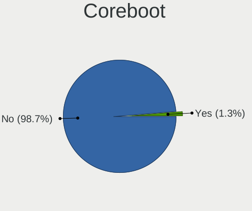
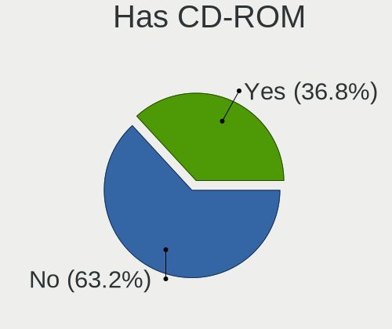
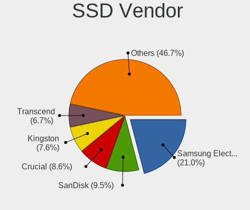
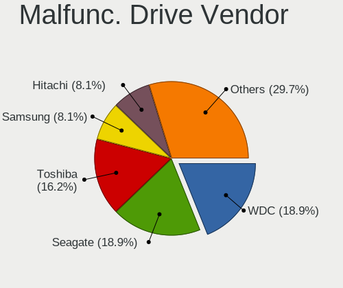
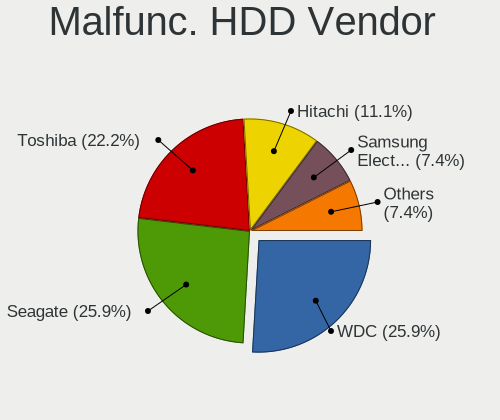
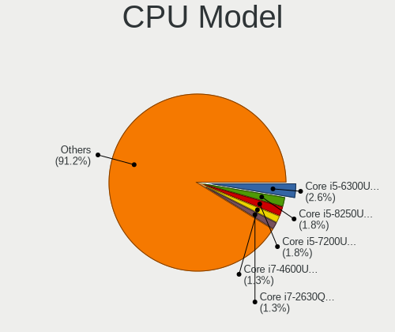
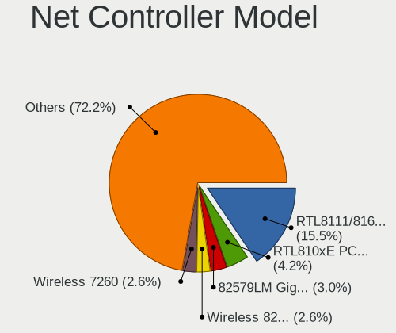
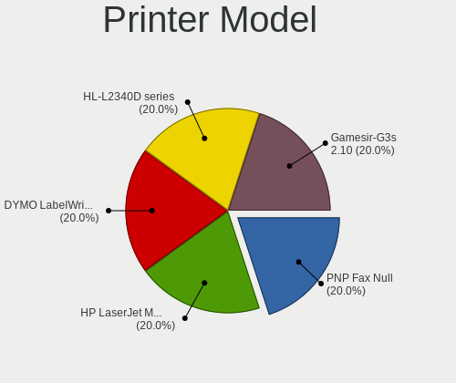
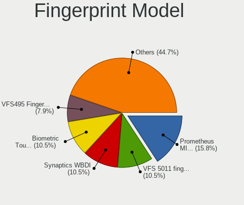

NomadBSD - Tested Hardware & Statistics
---------------------------------------

A project to collect tested hardware configurations for NomadBSD.

Anyone can contribute to this report by the [hw-probe](https://github.com/linuxhw/hw-probe/blob/master/INSTALL.BSD.md) tool:

    hw-probe -all -upload

Please contribute! Especially if your hardware is rare.

This is a report for all computer types. See also reports for [desktops](/Dist/NomadBSD/Desktop/README.md) and [notebooks](/Dist/NomadBSD/Notebook/README.md).

Contents
--------

* [ Test Cases ](#test-cases)

* [ System ](#system)
  - [ OS                       ](#os)
  - [ OS Family                ](#os-family)
  - [ Arch                     ](#arch)
  - [ DE                       ](#de)
  - [ Display Server           ](#display-server)
  - [ Display Manager          ](#display-manager)
  - [ OS Lang                  ](#os-lang)
  - [ Boot Mode                ](#boot-mode)
  - [ Filesystem               ](#filesystem)
  - [ Part. scheme             ](#part-scheme)

* [ Board ](#board)
  - [ Vendor                   ](#vendor)
  - [ Model                    ](#model)
  - [ Model Family             ](#model-family)
  - [ MFG Year                 ](#mfg-year)
  - [ Form Factor              ](#form-factor)
  - [ Coreboot                 ](#coreboot)
  - [ RAM Size                 ](#ram-size)
  - [ RAM Used                 ](#ram-used)
  - [ Total Drives             ](#total-drives)
  - [ Has CD-ROM               ](#has-cd-rom)
  - [ Has Ethernet             ](#has-ethernet)
  - [ Has WiFi                 ](#has-wifi)
  - [ Has Bluetooth            ](#has-bluetooth)

* [ Location ](#location)
  - [ Country                  ](#country)
  - [ City                     ](#city)

* [ Drives ](#drives)
  - [ Drive Vendor             ](#drive-vendor)
  - [ Drive Model              ](#drive-model)
  - [ HDD Vendor               ](#hdd-vendor)
  - [ SSD Vendor               ](#ssd-vendor)
  - [ Drive Kind               ](#drive-kind)
  - [ Drive Connector          ](#drive-connector)
  - [ Drive Size               ](#drive-size)
  - [ Space Total              ](#space-total)
  - [ Space Used               ](#space-used)
  - [ Malfunc. Drives          ](#malfunc-drives)
  - [ Malfunc. Drive Vendor    ](#malfunc-drive-vendor)
  - [ Malfunc. HDD Vendor      ](#malfunc-hdd-vendor)
  - [ Malfunc. Drive Kind      ](#malfunc-drive-kind)
  - [ Failed Drives            ](#failed-drives)
  - [ Failed Drive Vendor      ](#failed-drive-vendor)
  - [ Drive Status             ](#drive-status)

* [ Storage controller ](#storage-controller)
  - [ Storage Vendor           ](#storage-vendor)
  - [ Storage Model            ](#storage-model)
  - [ Storage Kind             ](#storage-kind)

* [ Processor ](#processor)
  - [ CPU Vendor               ](#cpu-vendor)
  - [ CPU Model                ](#cpu-model)
  - [ CPU Model Family         ](#cpu-model-family)
  - [ CPU Cores                ](#cpu-cores)
  - [ CPU Sockets              ](#cpu-sockets)
  - [ CPU Threads              ](#cpu-threads)
  - [ CPU Microarch            ](#cpu-microarch)

* [ Graphics ](#graphics)
  - [ GPU Vendor               ](#gpu-vendor)
  - [ GPU Model                ](#gpu-model)
  - [ GPU Combo                ](#gpu-combo)
  - [ GPU Driver               ](#gpu-driver)
  - [ GPU Memory               ](#gpu-memory)

* [ Monitor ](#monitor)
  - [ Monitor Vendor           ](#monitor-vendor)
  - [ Monitor Model            ](#monitor-model)
  - [ Monitor Resolution       ](#monitor-resolution)
  - [ Monitor Diagonal         ](#monitor-diagonal)
  - [ Monitor Width            ](#monitor-width)
  - [ Aspect Ratio             ](#aspect-ratio)
  - [ Monitor Area             ](#monitor-area)
  - [ Pixel Density            ](#pixel-density)
  - [ Multiple Monitors        ](#multiple-monitors)

* [ Network ](#network)
  - [ Net Controller Vendor    ](#net-controller-vendor)
  - [ Net Controller Model     ](#net-controller-model)
  - [ Wireless Vendor          ](#wireless-vendor)
  - [ Wireless Model           ](#wireless-model)
  - [ Ethernet Vendor          ](#ethernet-vendor)
  - [ Ethernet Model           ](#ethernet-model)
  - [ Net Controller Kind      ](#net-controller-kind)
  - [ Used Controller          ](#used-controller)
  - [ NICs                     ](#nics)
  - [ IPv6                     ](#ipv6)

* [ Bluetooth ](#bluetooth)
  - [ Bluetooth Vendor         ](#bluetooth-vendor)
  - [ Bluetooth Model          ](#bluetooth-model)

* [ Sound ](#sound)
  - [ Sound Vendor             ](#sound-vendor)
  - [ Sound Model              ](#sound-model)

* [ Memory ](#memory)
  - [ Memory Vendor            ](#memory-vendor)
  - [ Memory Model             ](#memory-model)
  - [ Memory Kind              ](#memory-kind)
  - [ Memory Form Factor       ](#memory-form-factor)
  - [ Memory Size              ](#memory-size)
  - [ Memory Speed             ](#memory-speed)

* [ Printers & scanners ](#printers--scanners)
  - [ Printer Vendor           ](#printer-vendor)
  - [ Printer Model            ](#printer-model)
  - [ Scanner Vendor           ](#scanner-vendor)
  - [ Scanner Model            ](#scanner-model)

* [ Camera ](#camera)
  - [ Camera Vendor            ](#camera-vendor)
  - [ Camera Model             ](#camera-model)

* [ Security ](#security)
  - [ Fingerprint Vendor       ](#fingerprint-vendor)
  - [ Fingerprint Model        ](#fingerprint-model)
  - [ Chipcard Vendor          ](#chipcard-vendor)
  - [ Chipcard Model           ](#chipcard-model)

* [ Unsupported ](#unsupported)
  - [ Unsupported Devices      ](#unsupported-devices)
  - [ Unsupported Device Types ](#unsupported-device-types)

Test Cases
----------

Total: 204

| Vendor        | Model                       | Form-Factor | Probe                                                     | Date         |
|---------------|-----------------------------|-------------|-----------------------------------------------------------|--------------|
| ASRock        | N68-S UCC                   | Desktop     | [04f43c3d70](https://bsd-hardware.info/?probe=04f43c3d70) | Feb 23, 2023 |
| Acer          | Aspire 7738                 | Notebook    | [e61cd20061](https://bsd-hardware.info/?probe=e61cd20061) | Feb 18, 2023 |
| Lenovo        | ThinkPad W520 42844DG       | Notebook    | [d341f3c6f6](https://bsd-hardware.info/?probe=d341f3c6f6) | Feb 11, 2023 |
| Lenovo        | ThinkPad E14 20RA0036RT     | Notebook    | [941da31f26](https://bsd-hardware.info/?probe=941da31f26) | Feb 02, 2023 |
| HP            | 1589                        | Desktop     | [8a927b43cb](https://bsd-hardware.info/?probe=8a927b43cb) | Jan 26, 2023 |
| ASUSTek       | ROG STRIX B550-F GAMING     | Desktop     | [335c3c990a](https://bsd-hardware.info/?probe=335c3c990a) | Jan 08, 2023 |
| Lenovo        | G50-70 20351                | Notebook    | [6a1ff80054](https://bsd-hardware.info/?probe=6a1ff80054) | Jan 04, 2023 |
| Lenovo        | Yoga 710-11IKB 80V6         | Notebook    | [1d3ccd1fe6](https://bsd-hardware.info/?probe=1d3ccd1fe6) | Dec 22, 2022 |
| Apple         | MacBookPro14,1              | Notebook    | [5234a39100](https://bsd-hardware.info/?probe=5234a39100) | Dec 10, 2022 |
| ASUSTek       | ROG STRIX B550-F GAMING     | Desktop     | [d893e02d90](https://bsd-hardware.info/?probe=d893e02d90) | Nov 21, 2022 |
| ASUSTek       | ROG STRIX B550-F GAMING     | Desktop     | [7518e4f06a](https://bsd-hardware.info/?probe=7518e4f06a) | Nov 21, 2022 |
| TUXEDO        | InfinityBook S 15 Gen6      | Notebook    | [17d766d55a](https://bsd-hardware.info/?probe=17d766d55a) | Oct 08, 2022 |
| TUXEDO        | Pulse 15 Gen2               | Notebook    | [91a1870b65](https://bsd-hardware.info/?probe=91a1870b65) | Sep 01, 2022 |
| Lenovo        | ThinkPad T480 20L50000GE    | Notebook    | [cd7d7d83ba](https://bsd-hardware.info/?probe=cd7d7d83ba) | Aug 20, 2022 |
| Lenovo        | ThinkPad T480 20L6SB2N00    | Notebook    | [995a8a5e6f](https://bsd-hardware.info/?probe=995a8a5e6f) | Jul 16, 2022 |
| Lenovo        | V580 20147                  | Notebook    | [0615e8260d](https://bsd-hardware.info/?probe=0615e8260d) | Jul 02, 2022 |
| Lenovo        | V580 20147                  | Notebook    | [6f1fd71366](https://bsd-hardware.info/?probe=6f1fd71366) | Jul 02, 2022 |
| ASRock        | B550 Steel Legend           | Desktop     | [4e6381e037](https://bsd-hardware.info/?probe=4e6381e037) | Jun 22, 2022 |
| HP            | 2B29                        | Desktop     | [e8c355314e](https://bsd-hardware.info/?probe=e8c355314e) | Jun 17, 2022 |
| HP            | 1589                        | Desktop     | [3765f1cb09](https://bsd-hardware.info/?probe=3765f1cb09) | Jun 17, 2022 |
| Dell          | 0Y2G6P A03                  | Server      | [ecb370bba4](https://bsd-hardware.info/?probe=ecb370bba4) | Jun 17, 2022 |
| HP            | 255 G8 Notebook PC          | Notebook    | [004e039a23](https://bsd-hardware.info/?probe=004e039a23) | May 19, 2022 |
| HP            | 255 G8 Notebook PC          | Notebook    | [555a7733b7](https://bsd-hardware.info/?probe=555a7733b7) | May 19, 2022 |
| Dell          | Latitude 5290               | Notebook    | [11c3db8f1b](https://bsd-hardware.info/?probe=11c3db8f1b) | Apr 23, 2022 |
| Notebook      | W650DC,DD                   | Notebook    | [0f474b9ebb](https://bsd-hardware.info/?probe=0f474b9ebb) | Apr 23, 2022 |
| HP            | ProBook 450 G2              | Notebook    | [c4f7b8a774](https://bsd-hardware.info/?probe=c4f7b8a774) | Apr 22, 2022 |
| Dell          | Studio 1555                 | Notebook    | [6da8f97bcd](https://bsd-hardware.info/?probe=6da8f97bcd) | Apr 22, 2022 |
| ASUSTek       | Maximus VIII HERO           | Desktop     | [c776760a11](https://bsd-hardware.info/?probe=c776760a11) | Apr 13, 2022 |
| Lenovo        | ThinkPad T490s 20NX000DR... | Notebook    | [c052d7cab0](https://bsd-hardware.info/?probe=c052d7cab0) | Apr 01, 2022 |
| Intel         | NUC6i5SYB H81131-502        | Mini pc     | [95646c7b48](https://bsd-hardware.info/?probe=95646c7b48) | Mar 25, 2022 |
| Intel         | NUC6i5SYB H81131-502        | Mini pc     | [09116f9139](https://bsd-hardware.info/?probe=09116f9139) | Mar 24, 2022 |
| ASUSTek       | M51Sr                       | Notebook    | [936a577d1a](https://bsd-hardware.info/?probe=936a577d1a) | Mar 10, 2022 |
| Lenovo        | ThinkPad T440s 20AQ006HU... | Notebook    | [2af47b6502](https://bsd-hardware.info/?probe=2af47b6502) | Mar 03, 2022 |
| MSI           | U-100 Ver.001               | Desktop     | [6859308aa9](https://bsd-hardware.info/?probe=6859308aa9) | Mar 01, 2022 |
| Dell          | Latitude D630               | Notebook    | [ae56d2cedd](https://bsd-hardware.info/?probe=ae56d2cedd) | Feb 28, 2022 |
| HP            | Pavilion Notebook           | Notebook    | [e27a6f46fc](https://bsd-hardware.info/?probe=e27a6f46fc) | Feb 26, 2022 |
| Gigabyte      | X570S GAMING X              | Desktop     | [ff39ace6ec](https://bsd-hardware.info/?probe=ff39ace6ec) | Feb 16, 2022 |
| HP            | Laptop 15-db0xxx            | Notebook    | [766e62f699](https://bsd-hardware.info/?probe=766e62f699) | Feb 12, 2022 |
| HP            | Notebook                    | Notebook    | [1758596e26](https://bsd-hardware.info/?probe=1758596e26) | Feb 12, 2022 |
| HP            | Pavilion Notebook           | Notebook    | [24f3a7da57](https://bsd-hardware.info/?probe=24f3a7da57) | Feb 07, 2022 |
| Intel         | DCP847SKE                   | Desktop     | [2828ef2a6d](https://bsd-hardware.info/?probe=2828ef2a6d) | Jan 20, 2022 |
| ASUSTek       | 1000                        | Notebook    | [da8689c840](https://bsd-hardware.info/?probe=da8689c840) | Dec 08, 2021 |
| Dell          | 0M9KCM A01                  | Desktop     | [4db0a0ea05](https://bsd-hardware.info/?probe=4db0a0ea05) | Dec 06, 2021 |
| Gigabyte      | MZGLKBP-00                  | Desktop     | [e713e3adee](https://bsd-hardware.info/?probe=e713e3adee) | Dec 05, 2021 |
| HP            | ProBook x360 11 G6 EE       | Convertible | [7eaff44a64](https://bsd-hardware.info/?probe=7eaff44a64) | Nov 27, 2021 |
| ASUSTek       | PRIME Z390-P                | Desktop     | [1bd9270845](https://bsd-hardware.info/?probe=1bd9270845) | Nov 15, 2021 |
| Acer          | Aspire 3810T                | Notebook    | [86782a69be](https://bsd-hardware.info/?probe=86782a69be) | Nov 13, 2021 |
| Acer          | Aspire 3810T                | Notebook    | [608e43163d](https://bsd-hardware.info/?probe=608e43163d) | Nov 12, 2021 |
| Dell          | 0T10XW A01                  | Desktop     | [ae2203b146](https://bsd-hardware.info/?probe=ae2203b146) | Nov 12, 2021 |
| Unknown       | X79                         | Desktop     | [c80b658f36](https://bsd-hardware.info/?probe=c80b658f36) | Nov 09, 2021 |
| Lenovo        | ThinkPad T470s W10DG 20J... | Notebook    | [1d261120d3](https://bsd-hardware.info/?probe=1d261120d3) | Nov 06, 2021 |
| HP            | ZBook Studio G3             | Notebook    | [767b44a6ae](https://bsd-hardware.info/?probe=767b44a6ae) | Oct 30, 2021 |
| ASUSTek       | X202E                       | Notebook    | [54259ac9a1](https://bsd-hardware.info/?probe=54259ac9a1) | Oct 29, 2021 |
| Sony          | VJS121C11N                  | Notebook    | [d86c621ef0](https://bsd-hardware.info/?probe=d86c621ef0) | Oct 25, 2021 |
| ASUSTek       | TUF Gaming FX505DU_FX505... | Notebook    | [2d72b6939d](https://bsd-hardware.info/?probe=2d72b6939d) | Oct 24, 2021 |
| HP            | 87D6 SMVB                   | Desktop     | [f601f00e7c](https://bsd-hardware.info/?probe=f601f00e7c) | Oct 07, 2021 |
| Dell          | OptiPlex 3020               | Desktop     | [c391177240](https://bsd-hardware.info/?probe=c391177240) | Oct 05, 2021 |
| Dell          | OptiPlex 3020               | Desktop     | [070a0c6d62](https://bsd-hardware.info/?probe=070a0c6d62) | Sep 19, 2021 |
| ASUSTek       | X540YA                      | Notebook    | [c5751c736c](https://bsd-hardware.info/?probe=c5751c736c) | Sep 19, 2021 |
| Lenovo        | Legion Y7000 2019 PG0 81... | Notebook    | [d8f8901ae7](https://bsd-hardware.info/?probe=d8f8901ae7) | Sep 19, 2021 |
| Lenovo        | ThinkPad X13 Yoga Gen 1 ... | Convertible | [8818f01ff2](https://bsd-hardware.info/?probe=8818f01ff2) | Aug 27, 2021 |
| HP            | OMEN by HP Laptop 17-cb1... | Notebook    | [b00c8e76e8](https://bsd-hardware.info/?probe=b00c8e76e8) | Aug 23, 2021 |
| HP            | Pavilion g6                 | Notebook    | [f1dc5150c2](https://bsd-hardware.info/?probe=f1dc5150c2) | Aug 13, 2021 |
| HP            | 2000                        | Notebook    | [d2240a960b](https://bsd-hardware.info/?probe=d2240a960b) | Aug 05, 2021 |
| HP            | 2000                        | Notebook    | [65d183fe41](https://bsd-hardware.info/?probe=65d183fe41) | Aug 05, 2021 |
| Lenovo        | ThinkPad S1 Yoga 20C0S0M... | Notebook    | [39ef89f214](https://bsd-hardware.info/?probe=39ef89f214) | Aug 05, 2021 |
| Lenovo        | ThinkPad S1 Yoga 20C0S0M... | Notebook    | [4e7ace8a39](https://bsd-hardware.info/?probe=4e7ace8a39) | Aug 04, 2021 |
| Lenovo        | ThinkPad S1 Yoga 12 20DK... | Notebook    | [3348992bef](https://bsd-hardware.info/?probe=3348992bef) | Jul 23, 2021 |
| Fujitsu Si... | AMILO PRO V3515             | Notebook    | [77676fbcfc](https://bsd-hardware.info/?probe=77676fbcfc) | Jul 18, 2021 |
| Lenovo        | ThinkPad T510 4384FF3       | Notebook    | [25e208721d](https://bsd-hardware.info/?probe=25e208721d) | Jul 02, 2021 |
| Dell          | Inspiron 15-5568            | Notebook    | [3ed52ae70d](https://bsd-hardware.info/?probe=3ed52ae70d) | Jul 01, 2021 |
| Gigabyte      | Z370 AORUS ULTRAGAMING W... | Desktop     | [13371b2ab8](https://bsd-hardware.info/?probe=13371b2ab8) | Jun 27, 2021 |
| ASUSTek       | ROG STRIX X299-E GAMING     | Desktop     | [e91dc55970](https://bsd-hardware.info/?probe=e91dc55970) | Jun 22, 2021 |
| Apple         | MacBookAir6,1               | Notebook    | [46bf9edc63](https://bsd-hardware.info/?probe=46bf9edc63) | Jun 17, 2021 |
| Apple         | MacBookAir6,1               | Notebook    | [dbda48cff7](https://bsd-hardware.info/?probe=dbda48cff7) | Jun 17, 2021 |
| ASRock        | N68C-GS4 FX                 | Desktop     | [5abce24217](https://bsd-hardware.info/?probe=5abce24217) | Jun 06, 2021 |
| Lenovo        | ThinkPad X380 Yoga 20LJ0... | Convertible | [dab0ca2417](https://bsd-hardware.info/?probe=dab0ca2417) | Jun 01, 2021 |
| ASUSTek       | TUF GAMING B550M-PLUS       | Desktop     | [c6a1c1fa15](https://bsd-hardware.info/?probe=c6a1c1fa15) | May 25, 2021 |
| Lenovo        | ThinkPad X380 Yoga 20LJ0... | Convertible | [96cc0c27b0](https://bsd-hardware.info/?probe=96cc0c27b0) | May 25, 2021 |
| ASUSTek       | V-P7H55E                    | Desktop     | [8cf113ac55](https://bsd-hardware.info/?probe=8cf113ac55) | May 22, 2021 |
| Toshiba       | STI 005492G                 | Desktop     | [9a8e4a1328](https://bsd-hardware.info/?probe=9a8e4a1328) | May 17, 2021 |
| Acer          | Aspire E5-551               | Notebook    | [c9ab1cb207](https://bsd-hardware.info/?probe=c9ab1cb207) | Apr 29, 2021 |
| Lenovo        | ThinkPad S1 Yoga 20C0S0M... | Notebook    | [e9155d12c7](https://bsd-hardware.info/?probe=e9155d12c7) | Apr 27, 2021 |
| Apple         | MacBookPro8,1               | Notebook    | [d1aaeaad42](https://bsd-hardware.info/?probe=d1aaeaad42) | Apr 26, 2021 |
| Lenovo        | ThinkPad W541 20EGS04800    | Notebook    | [91d2cd471c](https://bsd-hardware.info/?probe=91d2cd471c) | Apr 16, 2021 |
| Apple         | MacBookPro8,1               | Notebook    | [0621acab4e](https://bsd-hardware.info/?probe=0621acab4e) | Apr 09, 2021 |
| Lenovo        | ThinkPad X1 Carbon 4th 2... | Notebook    | [821c81e652](https://bsd-hardware.info/?probe=821c81e652) | Apr 09, 2021 |
| ECT           | One Computer AMD A10-785... | Desktop     | [41a2a2e434](https://bsd-hardware.info/?probe=41a2a2e434) | Apr 07, 2021 |
| HP            | ProBook 640 G1              | Notebook    | [6bc6c5b2bf](https://bsd-hardware.info/?probe=6bc6c5b2bf) | Mar 31, 2021 |
| TUXEDO        | Unknown                     | Notebook    | [35aa6590c6](https://bsd-hardware.info/?probe=35aa6590c6) | Mar 29, 2021 |
| Lenovo        | IdeaPad 110-15IBR 80T7      | Notebook    | [c5e824b558](https://bsd-hardware.info/?probe=c5e824b558) | Mar 29, 2021 |
| Acer          | EG43M                       | Desktop     | [0bc978756c](https://bsd-hardware.info/?probe=0bc978756c) | Mar 27, 2021 |
| Dell          | 0NW6H5 A00                  | Desktop     | [650cd9b653](https://bsd-hardware.info/?probe=650cd9b653) | Mar 24, 2021 |
| Toshiba       | Satellite C660              | Notebook    | [7d64801e2b](https://bsd-hardware.info/?probe=7d64801e2b) | Mar 21, 2021 |
| MSI           | MS-N033                     | Notebook    | [650f6a1b70](https://bsd-hardware.info/?probe=650f6a1b70) | Mar 21, 2021 |
| Samsung       | N145P/N250P/N260P           | Notebook    | [eff02dafe1](https://bsd-hardware.info/?probe=eff02dafe1) | Mar 18, 2021 |
| Toshiba       | Satellite C660              | Notebook    | [83f9d05407](https://bsd-hardware.info/?probe=83f9d05407) | Mar 14, 2021 |
| Notebook      | N650DU                      | Notebook    | [90d705dd1e](https://bsd-hardware.info/?probe=90d705dd1e) | Mar 14, 2021 |
| HP            | Pavilion dv6000 (RP981EA... | Notebook    | [733c5edb74](https://bsd-hardware.info/?probe=733c5edb74) | Mar 08, 2021 |
| HP            | Pavilion dv6000 (RP981EA... | Notebook    | [56844725d1](https://bsd-hardware.info/?probe=56844725d1) | Mar 08, 2021 |
| Acer          | EG31M R01-C3                | Desktop     | [1186d46ac9](https://bsd-hardware.info/?probe=1186d46ac9) | Mar 08, 2021 |
| HP            | 158A                        | Desktop     | [da9d6bf86f](https://bsd-hardware.info/?probe=da9d6bf86f) | Mar 07, 2021 |
| HP            | Laptop 15-da0xxx            | Notebook    | [bf572bc102](https://bsd-hardware.info/?probe=bf572bc102) | Mar 06, 2021 |
| Dell          | 0R849J A00                  | Desktop     | [1bd1dc24c9](https://bsd-hardware.info/?probe=1bd1dc24c9) | Mar 06, 2021 |
| ASUSTek       | VivoBook_ASUSLaptop X509... | Notebook    | [be2ad24d1b](https://bsd-hardware.info/?probe=be2ad24d1b) | Mar 06, 2021 |
| ASUSTek       | VivoBook_ASUSLaptop X509... | Notebook    | [0e06b5f17f](https://bsd-hardware.info/?probe=0e06b5f17f) | Mar 06, 2021 |
| ASRock        | Z490M Pro4                  | Desktop     | [348d592fab](https://bsd-hardware.info/?probe=348d592fab) | Mar 05, 2021 |
| Dell          | 03CDJK A01                  | All in one  | [9468eeef92](https://bsd-hardware.info/?probe=9468eeef92) | Mar 04, 2021 |
| VeryPC        | S400                        | Desktop     | [edcea11cb7](https://bsd-hardware.info/?probe=edcea11cb7) | Mar 04, 2021 |
| Dell          | Latitude 5280               | Notebook    | [b84364959d](https://bsd-hardware.info/?probe=b84364959d) | Mar 04, 2021 |
| Lenovo        | IdeaPad S145-15API 81UT     | Notebook    | [1f226262cc](https://bsd-hardware.info/?probe=1f226262cc) | Mar 04, 2021 |
| ASUSTek       | X550LC                      | Notebook    | [e056f1c77c](https://bsd-hardware.info/?probe=e056f1c77c) | Mar 03, 2021 |
| Fujitsu       | LIFEBOOK E754               | Notebook    | [d3d033f879](https://bsd-hardware.info/?probe=d3d033f879) | Mar 03, 2021 |
| Fujitsu       | LIFEBOOK E736               | Notebook    | [845c584693](https://bsd-hardware.info/?probe=845c584693) | Mar 03, 2021 |
| ASUSTek       | VivoBook_ASUSLaptop X509... | Notebook    | [eb7d8c3502](https://bsd-hardware.info/?probe=eb7d8c3502) | Mar 02, 2021 |
| Acer          | EG31M R01-C3                | Desktop     | [046404e65c](https://bsd-hardware.info/?probe=046404e65c) | Mar 01, 2021 |
| Lenovo        | IdeaPad S145-15API 81UT     | Notebook    | [0dc468c860](https://bsd-hardware.info/?probe=0dc468c860) | Feb 22, 2021 |
| ASUSTek       | X751LN                      | Notebook    | [fe7d72b06a](https://bsd-hardware.info/?probe=fe7d72b06a) | Feb 21, 2021 |
| GEO           | GeoBook3                    | Notebook    | [ba18b9bf80](https://bsd-hardware.info/?probe=ba18b9bf80) | Feb 19, 2021 |
| Clevo         | W55xEU                      | Notebook    | [a66041bae0](https://bsd-hardware.info/?probe=a66041bae0) | Feb 17, 2021 |
| Pegatron      | T12Ah                       | Notebook    | [a5ab7068dc](https://bsd-hardware.info/?probe=a5ab7068dc) | Feb 14, 2021 |
| Dell          | 0T568R A00                  | Desktop     | [cd086a9092](https://bsd-hardware.info/?probe=cd086a9092) | Feb 12, 2021 |
| Clevo         | W55xEU                      | Notebook    | [796ad51947](https://bsd-hardware.info/?probe=796ad51947) | Feb 11, 2021 |
| Clevo         | W55xEU                      | Notebook    | [c28a6397b5](https://bsd-hardware.info/?probe=c28a6397b5) | Feb 11, 2021 |
| Alienware     | M18xR1                      | Notebook    | [67a336fac6](https://bsd-hardware.info/?probe=67a336fac6) | Feb 08, 2021 |
| ASRock        | B550 Phantom Gaming 4       | Desktop     | [2d0beb2534](https://bsd-hardware.info/?probe=2d0beb2534) | Feb 08, 2021 |
| Dell          | Latitude 3410               | Notebook    | [f81c1e338f](https://bsd-hardware.info/?probe=f81c1e338f) | Feb 07, 2021 |
| Dell          | Latitude E4300              | Notebook    | [84925c014a](https://bsd-hardware.info/?probe=84925c014a) | Feb 01, 2021 |
| Pegatron      | T12Ah                       | Notebook    | [4bda74f229](https://bsd-hardware.info/?probe=4bda74f229) | Jan 31, 2021 |
| Lenovo        | SHARKBAY 0B98401 WIN        | Desktop     | [2917a6fbe1](https://bsd-hardware.info/?probe=2917a6fbe1) | Jan 31, 2021 |
| HP            | 0AACh                       | Desktop     | [b7cac343f6](https://bsd-hardware.info/?probe=b7cac343f6) | Jan 29, 2021 |
| HP            | 3399                        | Desktop     | [b11946a41a](https://bsd-hardware.info/?probe=b11946a41a) | Jan 13, 2021 |
| Pegatron      | 2AB5                        | Desktop     | [8093f75ea2](https://bsd-hardware.info/?probe=8093f75ea2) | Jan 13, 2021 |
| Dell          | Latitude 5400               | Notebook    | [f242897c33](https://bsd-hardware.info/?probe=f242897c33) | Jan 13, 2021 |
| Dell          | Latitude 5490               | Notebook    | [3fba47b07f](https://bsd-hardware.info/?probe=3fba47b07f) | Jan 12, 2021 |
| Samsung       | 300E5EV/300E4EV/270E5EV/... | Notebook    | [ba45e27f88](https://bsd-hardware.info/?probe=ba45e27f88) | Jan 12, 2021 |
| ASUSTek       | N75SF                       | Notebook    | [7efb6557a2](https://bsd-hardware.info/?probe=7efb6557a2) | Jan 10, 2021 |
| Lenovo        | IdeaPad S145-15API 81UT     | Notebook    | [9ccf63e228](https://bsd-hardware.info/?probe=9ccf63e228) | Jan 09, 2021 |
| Lenovo        | IdeaPad S145-15API 81UT     | Notebook    | [e18df4623a](https://bsd-hardware.info/?probe=e18df4623a) | Jan 09, 2021 |
| Dell          | 03CDJK A01                  | All in one  | [d894ae5d09](https://bsd-hardware.info/?probe=d894ae5d09) | Jan 07, 2021 |
| Dell          | 0NW6H5 A00                  | Desktop     | [d54f451ea5](https://bsd-hardware.info/?probe=d54f451ea5) | Jan 07, 2021 |
| HP            | 3032h                       | Desktop     | [13648fd22d](https://bsd-hardware.info/?probe=13648fd22d) | Jan 07, 2021 |
| Dell          | 0KC9NP A01                  | Desktop     | [ee2d5f3289](https://bsd-hardware.info/?probe=ee2d5f3289) | Jan 07, 2021 |
| Dell          | 030VXY A01                  | Desktop     | [c117ffdc98](https://bsd-hardware.info/?probe=c117ffdc98) | Jan 07, 2021 |
| Gigabyte      | X570 AORUS MASTER           | Desktop     | [cfc292e9e8](https://bsd-hardware.info/?probe=cfc292e9e8) | Jan 07, 2021 |
| Sony          | VPCM13M1R                   | Notebook    | [30bb4fc23c](https://bsd-hardware.info/?probe=30bb4fc23c) | Jan 06, 2021 |
| NEC Comput... | PC-GL186Y3AZ                | Notebook    | [b9f8e78467](https://bsd-hardware.info/?probe=b9f8e78467) | Jan 05, 2021 |
| Dell          | Latitude 5280               | Notebook    | [1ae6e6ee2d](https://bsd-hardware.info/?probe=1ae6e6ee2d) | Jan 05, 2021 |
| Dell          | 0C27VV A02                  | Desktop     | [cfd6a0ab4b](https://bsd-hardware.info/?probe=cfd6a0ab4b) | Jan 04, 2021 |
| Dell          | 0C27VV A02                  | Desktop     | [876f5d7b92](https://bsd-hardware.info/?probe=876f5d7b92) | Jan 02, 2021 |
| Dell          | 0C27VV A02                  | Desktop     | [889bba9dbc](https://bsd-hardware.info/?probe=889bba9dbc) | Dec 30, 2020 |
| Gigabyte      | X570 AORUS PRO              | Desktop     | [a3e2c4eda1](https://bsd-hardware.info/?probe=a3e2c4eda1) | Dec 30, 2020 |
| Lenovo        | ThinkPad X201 Tablet 311... | Notebook    | [df9318dcea](https://bsd-hardware.info/?probe=df9318dcea) | Dec 27, 2020 |
| Dell          | Inspiron 5758               | Notebook    | [51ed7b02c2](https://bsd-hardware.info/?probe=51ed7b02c2) | Dec 21, 2020 |
| HP            | Spectre x360 Convertible... | Convertible | [c8c11a071d](https://bsd-hardware.info/?probe=c8c11a071d) | Dec 14, 2020 |
| Acer          | Aspire V5-122               | Notebook    | [ce0c079fd5](https://bsd-hardware.info/?probe=ce0c079fd5) | Dec 14, 2020 |
| Apple         | MacBookPro11,3              | Notebook    | [26f15a2838](https://bsd-hardware.info/?probe=26f15a2838) | Dec 07, 2020 |
| Lenovo        | ThinkPad T490 20RYS06R00    | Notebook    | [21d88f733e](https://bsd-hardware.info/?probe=21d88f733e) | Dec 07, 2020 |
| Lenovo        | ThinkPad T490 20RYS06R00    | Notebook    | [cdfcd11f7b](https://bsd-hardware.info/?probe=cdfcd11f7b) | Dec 07, 2020 |
| IBM           | 2647NG8                     | Notebook    | [a0f38de52f](https://bsd-hardware.info/?probe=a0f38de52f) | Nov 22, 2020 |
| HP            | ProBook 640 G1              | Notebook    | [bf763e72ad](https://bsd-hardware.info/?probe=bf763e72ad) | Nov 13, 2020 |
| Acer          | Aspire E5-432               | Notebook    | [39fb05c049](https://bsd-hardware.info/?probe=39fb05c049) | Nov 01, 2020 |
| Lenovo        | ThinkPad X1 Yoga 3rd 20L... | Convertible | [31f5a66353](https://bsd-hardware.info/?probe=31f5a66353) | Oct 25, 2020 |
| Acer          | Aspire V3-575G              | Notebook    | [1ff0e90d9d](https://bsd-hardware.info/?probe=1ff0e90d9d) | Oct 24, 2020 |
| ASUSTek       | Z170-A                      | Desktop     | [a1c6966373](https://bsd-hardware.info/?probe=a1c6966373) | Oct 21, 2020 |
| Google        | Chell                       | Notebook    | [4ffe68c199](https://bsd-hardware.info/?probe=4ffe68c199) | Oct 21, 2020 |
| ASRock        | AB350 Pro4                  | Desktop     | [407652fc8d](https://bsd-hardware.info/?probe=407652fc8d) | Oct 05, 2020 |
| Apple         | MacBookAir7,2               | Notebook    | [36d0d99aa6](https://bsd-hardware.info/?probe=36d0d99aa6) | Oct 04, 2020 |
| Lenovo        | G50-45 80E3                 | Notebook    | [1d227a9cd2](https://bsd-hardware.info/?probe=1d227a9cd2) | Oct 04, 2020 |
| Dell          | Precision 7530              | Notebook    | [717309ee39](https://bsd-hardware.info/?probe=717309ee39) | Sep 28, 2020 |
| Dell          | Precision 7530              | Notebook    | [6a2635237f](https://bsd-hardware.info/?probe=6a2635237f) | Sep 28, 2020 |
| Lenovo        | ThinkPad T530 24295VU       | Notebook    | [f7d13e4696](https://bsd-hardware.info/?probe=f7d13e4696) | Sep 23, 2020 |
| Lenovo        | ThinkPad T530 24295VU       | Notebook    | [45f410f4e4](https://bsd-hardware.info/?probe=45f410f4e4) | Sep 23, 2020 |
| Lenovo        | ThinkPad T430 2347C32       | Notebook    | [339c63a941](https://bsd-hardware.info/?probe=339c63a941) | Sep 22, 2020 |
| Apple         | MacBookPro8,1               | Notebook    | [89bb299f1e](https://bsd-hardware.info/?probe=89bb299f1e) | Sep 22, 2020 |
| Dell          | Vostro 3750                 | Notebook    | [587a9276bb](https://bsd-hardware.info/?probe=587a9276bb) | Sep 06, 2020 |
| Foxconn       | Napa HP P/N                 | Desktop     | [2a7cb7b214](https://bsd-hardware.info/?probe=2a7cb7b214) | Sep 03, 2020 |
| Panasonic     | CF-C1BD06EFG                | Notebook    | [3e876bada1](https://bsd-hardware.info/?probe=3e876bada1) | Sep 02, 2020 |
| Dell          | Inspiron 15-3567            | Notebook    | [4d1897ed1f](https://bsd-hardware.info/?probe=4d1897ed1f) | Aug 29, 2020 |
| ASUSTek       | EMERY                       | Desktop     | [c93b86b3ba](https://bsd-hardware.info/?probe=c93b86b3ba) | Aug 27, 2020 |
| Lenovo        | ThinkPad T460 20FMS78014    | Notebook    | [d78837860f](https://bsd-hardware.info/?probe=d78837860f) | Aug 23, 2020 |
| ASUSTek       | V241ICR-R                   | All in one  | [f21adeb92c](https://bsd-hardware.info/?probe=f21adeb92c) | Aug 20, 2020 |
| Dell          | Inspiron 5567               | Notebook    | [5ef34cd40f](https://bsd-hardware.info/?probe=5ef34cd40f) | Aug 20, 2020 |
| Acer          | Aspire 5735                 | Notebook    | [6ca9384f34](https://bsd-hardware.info/?probe=6ca9384f34) | Aug 20, 2020 |
| HP            | 0A64h                       | Desktop     | [10c48336b0](https://bsd-hardware.info/?probe=10c48336b0) | Aug 20, 2020 |
| ASUSTek       | M5A97 R2.0                  | Desktop     | [78d714a1a3](https://bsd-hardware.info/?probe=78d714a1a3) | Aug 19, 2020 |
| ASUSTek       | X71SL                       | Notebook    | [a2ee0c9edb](https://bsd-hardware.info/?probe=a2ee0c9edb) | Aug 15, 2020 |
| HP            | ProBook 640 G1              | Notebook    | [4b7eaf5a6a](https://bsd-hardware.info/?probe=4b7eaf5a6a) | Aug 12, 2020 |
| Dell          | Latitude 5480               | Notebook    | [907e0da9a4](https://bsd-hardware.info/?probe=907e0da9a4) | Aug 08, 2020 |
| HP            | EliteBook 820 G1            | Notebook    | [12ac8fc96f](https://bsd-hardware.info/?probe=12ac8fc96f) | Aug 07, 2020 |
| Google        | Lulu                        | Notebook    | [64aef60e6b](https://bsd-hardware.info/?probe=64aef60e6b) | Aug 02, 2020 |
| Lenovo        | ThinkPad T490s 20NX000DR... | Notebook    | [0919d8936f](https://bsd-hardware.info/?probe=0919d8936f) | Jul 27, 2020 |
| Lenovo        | G570 20079                  | Notebook    | [15e87049a7](https://bsd-hardware.info/?probe=15e87049a7) | Jul 27, 2020 |
| ASUSTek       | PRIME A320M-K               | Desktop     | [8a3cb911c3](https://bsd-hardware.info/?probe=8a3cb911c3) | Jul 18, 2020 |
| Lenovo        | ThinkPad T450 20BUS06B00    | Notebook    | [f437a3b5ab](https://bsd-hardware.info/?probe=f437a3b5ab) | Jul 06, 2020 |
| Unknown       | Unknown                     | Notebook    | [f9ed1dce06](https://bsd-hardware.info/?probe=f9ed1dce06) | Jul 05, 2020 |
| Gigabyte      | Z370 AORUS Ultra Gaming-... | Desktop     | [a03e1c19c1](https://bsd-hardware.info/?probe=a03e1c19c1) | Jul 04, 2020 |
| Lenovo        | ThinkPad T440p 20AWS0VK0... | Notebook    | [b726c4536b](https://bsd-hardware.info/?probe=b726c4536b) | Jul 04, 2020 |
| ASRock        | Z97 Extreme6/ac             | Desktop     | [9c2d19d0c3](https://bsd-hardware.info/?probe=9c2d19d0c3) | Jul 03, 2020 |
| Intel         | NUC5i3RYB H41000-507        | Mini pc     | [5fac785920](https://bsd-hardware.info/?probe=5fac785920) | Jul 03, 2020 |
| Dell          | Latitude E7240              | Notebook    | [1de87c0000](https://bsd-hardware.info/?probe=1de87c0000) | May 30, 2020 |
| ASRock        | B450M Pro4                  | Desktop     | [aa58b291b3](https://bsd-hardware.info/?probe=aa58b291b3) | May 24, 2020 |
| ASUSTek       | X71SL                       | Notebook    | [adf290251e](https://bsd-hardware.info/?probe=adf290251e) | May 09, 2020 |
| Sony          | SVE1713S1RW                 | Notebook    | [9a751ddfd8](https://bsd-hardware.info/?probe=9a751ddfd8) | May 08, 2020 |

System
------

OS
--

Installed operating systems

| Name              | Computers | Percent |
|-------------------|-----------|---------|
| NomadBSD 5806f915 | 54        | 33.54%  |
| NomadBSD 1.3.2    | 52        | 32.3%   |
| NomadBSD 1.4      | 23        | 14.29%  |
| NomadBSD 1.4-RC1  | 10        | 6.21%   |
| NomadBSD 1.3.1    | 10        | 6.21%   |
| NomadBSD 20221130 | 9         | 5.59%   |
| NomadBSD 80dec9b9 | 1         | 0.62%   |
| NomadBSD 1.3      | 1         | 0.62%   |
| NomadBSD 1.0      | 1         | 0.62%   |

OS Family
---------

OS without a version

| Name     | Computers | Percent |
|----------|-----------|---------|
| NomadBSD | 156       | 100%    |

Arch
----

OS architecture (x86_64, i586, etc.)

| Name  | Computers | Percent |
|-------|-----------|---------|
| amd64 | 148       | 94.27%  |
| i386  | 9         | 5.73%   |

DE
--

Desktop Environment

| Name          | Computers | Percent |
|---------------|-----------|---------|
| Openbox       | 141       | 89.81%  |
| GNOME         | 7         | 4.46%   |
| KDE5          | 4         | 2.55%   |
| xinitrc       | 1         | 0.64%   |
| XFCE          | 1         | 0.64%   |
| GNUstep       | 1         | 0.64%   |
| filer         | 1         | 0.64%   |
| Enlightenment | 1         | 0.64%   |

Display Server
--------------

X11 or Wayland

| Name | Computers | Percent |
|------|-----------|---------|
| X11  | 156       | 100%    |

Display Manager
---------------

SDDM, LightDM, etc.

| Name | Computers | Percent |
|------|-----------|---------|
| SLiM | 144       | 92.31%  |
| SDDM | 12        | 7.69%   |

OS Lang
-------

Language

| Lang    | Computers | Percent |
|---------|-----------|---------|
| en_US   | 58        | 36.71%  |
| Unknown | 29        | 18.35%  |
| de_DE   | 17        | 10.76%  |
| en_GB   | 9         | 5.7%    |
| ru_RU   | 8         | 5.06%   |
| it_IT   | 5         | 3.16%   |
| hu_HU   | 5         | 3.16%   |
| zh_CN   | 3         | 1.9%    |
| tr_TR   | 3         | 1.9%    |
| fr_FR   | 3         | 1.9%    |
| es_ES   | 3         | 1.9%    |
| pt_BR   | 2         | 1.27%   |
| pl_PL   | 2         | 1.27%   |
| fi_FI   | 2         | 1.27%   |
| en_AU   | 2         | 1.27%   |
| cs_CZ   | 2         | 1.27%   |
| bg_BG   | 2         | 1.27%   |
| lt_LT   | 1         | 0.63%   |
| ko_KR   | 1         | 0.63%   |
| et_EE   | 1         | 0.63%   |

Boot Mode
---------

EFI or BIOS

| Mode | Computers | Percent |
|------|-----------|---------|
| EFI  | 150       | 95.54%  |
| BIOS | 7         | 4.46%   |

Filesystem
----------

Type of filesystem

| Type | Computers | Percent |
|------|-----------|---------|
| Ufs  | 139       | 89.1%   |
| Zfs  | 17        | 10.9%   |

Part. scheme
------------

Scheme of partitioning

| Type | Computers | Percent |
|------|-----------|---------|
| GPT  | 114       | 72.61%  |
| MBR  | 43        | 27.39%  |

Board
-----

Vendor
------

Motherboard manufacturer

| Name                | Computers | Percent |
|---------------------|-----------|---------|
| Lenovo              | 29        | 18.59%  |
| Hewlett-Packard     | 24        | 15.38%  |
| Dell                | 22        | 14.1%   |
| ASUSTek Computer    | 22        | 14.1%   |
| Acer                | 10        | 6.41%   |
| Gigabyte Technology | 6         | 3.85%   |
| ASRock              | 6         | 3.85%   |
| Apple               | 5         | 3.21%   |
| TUXEDO              | 3         | 1.92%   |
| Sony                | 3         | 1.92%   |
| Intel               | 3         | 1.92%   |
| Samsung Electronics | 2         | 1.28%   |
| Pegatron            | 2         | 1.28%   |
| Notebook            | 2         | 1.28%   |
| Google              | 2         | 1.28%   |
| Fujitsu             | 2         | 1.28%   |
| Unknown             | 2         | 1.28%   |
| Toshiba             | 1         | 0.64%   |
| Semp Toshiba        | 1         | 0.64%   |
| Panasonic           | 1         | 0.64%   |
| NEC Computers       | 1         | 0.64%   |
| MSI                 | 1         | 0.64%   |
| IBM                 | 1         | 0.64%   |
| GEO                 | 1         | 0.64%   |
| Fujitsu Siemens     | 1         | 0.64%   |
| Foxconn             | 1         | 0.64%   |
| Clevo               | 1         | 0.64%   |
| Alienware           | 1         | 0.64%   |

Model
-----

Motherboard model

| Name                                      | Computers | Percent |
|-------------------------------------------|-----------|---------|
| Unknown                                   | 3         | 1.92%   |
| HP Z420 Workstation                       | 2         | 1.28%   |
| ASUS ROG STRIX B550-F GAMING              | 2         | 1.28%   |
| Acer Veriton M460                         | 2         | 1.28%   |
| TUXEDO Pulse 15 Gen2                      | 1         | 0.64%   |
| TUXEDO InfinityBook S 15 Gen6             | 1         | 0.64%   |
| Toshiba Satellite C660                    | 1         | 0.64%   |
| Sony VPCM13M1R                            | 1         | 0.64%   |
| Sony VJS121C11N                           | 1         | 0.64%   |
| Sony SVE1713S1RW                          | 1         | 0.64%   |
| Semp Toshiba STI                          | 1         | 0.64%   |
| Samsung N145P/N250P/N260P                 | 1         | 0.64%   |
| Samsung 300E5EV/300E4EV/270E5EV/270E4EV   | 1         | 0.64%   |
| Pegatron T12Ah                            | 1         | 0.64%   |
| Pegatron Elite 7300 Series MT             | 1         | 0.64%   |
| Panasonic CF-C1BD06EFG                    | 1         | 0.64%   |
| Notebook W650DC,DD                        | 1         | 0.64%   |
| Notebook N650DU                           | 1         | 0.64%   |
| NEC Computers PC-GL186Y3AZ                | 1         | 0.64%   |
| MSI MS-N033                               | 1         | 0.64%   |
| Lenovo Yoga 710-11IKB 80V6                | 1         | 0.64%   |
| Lenovo V580 20147                         | 1         | 0.64%   |
| Lenovo ThinkPad X380 Yoga 20LJ000WUK      | 1         | 0.64%   |
| Lenovo ThinkPad X201 Tablet 311396U       | 1         | 0.64%   |
| Lenovo ThinkPad X13 Yoga Gen 1 20SYS22H00 | 1         | 0.64%   |
| Lenovo ThinkPad X1 Yoga 3rd 20LDS1CG00    | 1         | 0.64%   |
| Lenovo ThinkPad X1 Carbon 4th 20FB001XAU  | 1         | 0.64%   |
| Lenovo ThinkPad W541 20EGS04800           | 1         | 0.64%   |
| Lenovo ThinkPad W520 42844DG              | 1         | 0.64%   |
| Lenovo ThinkPad T530 24295VU              | 1         | 0.64%   |
| Lenovo ThinkPad T510 4384FF3              | 1         | 0.64%   |
| Lenovo ThinkPad T490s 20NX000DRT          | 1         | 0.64%   |
| Lenovo ThinkPad T490 20RYS06R00           | 1         | 0.64%   |
| Lenovo ThinkPad T480 20L50000GE           | 1         | 0.64%   |
| Lenovo ThinkPad T470s W10DG 20JS001FGE    | 1         | 0.64%   |
| Lenovo ThinkPad T460 20FMS78014           | 1         | 0.64%   |
| Lenovo ThinkPad T450 20BUS06B00           | 1         | 0.64%   |
| Lenovo ThinkPad T440s 20AQ006HUS          | 1         | 0.64%   |
| Lenovo ThinkPad T440p 20AWS0VK00          | 1         | 0.64%   |
| Lenovo ThinkPad T430 2347C32              | 1         | 0.64%   |

Model Family
------------

Motherboard model prefix

| Name                       | Computers | Percent |
|----------------------------|-----------|---------|
| Lenovo ThinkPad            | 20        | 12.82%  |
| Dell Latitude              | 8         | 5.13%   |
| Acer Aspire                | 8         | 5.13%   |
| Dell OptiPlex              | 5         | 3.21%   |
| HP Compaq                  | 4         | 2.56%   |
| HP ProBook                 | 3         | 1.92%   |
| HP Pavilion                | 3         | 1.92%   |
| Dell Studio                | 3         | 1.92%   |
| Dell Inspiron              | 3         | 1.92%   |
| ASUS ROG                   | 3         | 1.92%   |
| Unknown                    | 3         | 1.92%   |
| Lenovo IdeaPad             | 2         | 1.28%   |
| HP Z420                    | 2         | 1.28%   |
| HP Laptop                  | 2         | 1.28%   |
| Gigabyte Z370              | 2         | 1.28%   |
| Gigabyte X570              | 2         | 1.28%   |
| Fujitsu LIFEBOOK           | 2         | 1.28%   |
| ASUS TUF                   | 2         | 1.28%   |
| ASUS PRIME                 | 2         | 1.28%   |
| Acer Veriton               | 2         | 1.28%   |
| TUXEDO Pulse               | 1         | 0.64%   |
| TUXEDO InfinityBook        | 1         | 0.64%   |
| Toshiba Satellite          | 1         | 0.64%   |
| Sony VPCM13M1R             | 1         | 0.64%   |
| Sony VJS121C11N            | 1         | 0.64%   |
| Sony SVE1713S1RW           | 1         | 0.64%   |
| Semp Toshiba STI           | 1         | 0.64%   |
| Samsung N145P              | 1         | 0.64%   |
| Samsung 300E5EV            | 1         | 0.64%   |
| Pegatron T12Ah             | 1         | 0.64%   |
| Pegatron Elite             | 1         | 0.64%   |
| Panasonic CF-C1BD06EFG     | 1         | 0.64%   |
| Notebook W650DC            | 1         | 0.64%   |
| Notebook N650DU            | 1         | 0.64%   |
| NEC Computers PC-GL186Y3AZ | 1         | 0.64%   |
| MSI MS-N033                | 1         | 0.64%   |
| Lenovo Yoga                | 1         | 0.64%   |
| Lenovo V580                | 1         | 0.64%   |
| Lenovo ThinkCentre         | 1         | 0.64%   |
| Lenovo Legion              | 1         | 0.64%   |

MFG Year
--------

Motherboard manufacture year

| Year | Computers | Percent |
|------|-----------|---------|
| 2020 | 19        | 12.18%  |
| 2019 | 19        | 12.18%  |
| 2017 | 14        | 8.97%   |
| 2021 | 11        | 7.05%   |
| 2015 | 11        | 7.05%   |
| 2013 | 10        | 6.41%   |
| 2012 | 9         | 5.77%   |
| 2009 | 9         | 5.77%   |
| 2018 | 8         | 5.13%   |
| 2014 | 8         | 5.13%   |
| 2011 | 8         | 5.13%   |
| 2010 | 8         | 5.13%   |
| 2016 | 7         | 4.49%   |
| 2008 | 7         | 4.49%   |
| 2022 | 3         | 1.92%   |
| 2006 | 3         | 1.92%   |
| 2007 | 1         | 0.64%   |
| 2004 | 1         | 0.64%   |

Form Factor
-----------

Physical design of the computer

| Name        | Computers | Percent |
|-------------|-----------|---------|
| Notebook    | 99        | 63.46%  |
| Desktop     | 47        | 30.13%  |
| Convertible | 5         | 3.21%   |
| Mini pc     | 2         | 1.28%   |
| All in one  | 2         | 1.28%   |
| Server      | 1         | 0.64%   |

Coreboot
--------

Have coreboot on board

| Used | Computers | Percent |
|------|-----------|---------|
| No   | 154       | 98.72%  |
| Yes  | 2         | 1.28%   |

RAM Size
--------

Total RAM memory

| Size in GB  | Computers | Percent |
|-------------|-----------|---------|
| 8.01-16.0   | 61        | 38.85%  |
| 4.01-8.0    | 34        | 21.66%  |
| 16.01-24.0  | 33        | 21.02%  |
| 32.01-64.0  | 12        | 7.64%   |
| 64.01-256.0 | 6         | 3.82%   |
| 2.01-3.0    | 4         | 2.55%   |
| 3.01-4.0    | 3         | 1.91%   |
| 0.51-1.0    | 3         | 1.91%   |
| 24.01-32.0  | 1         | 0.64%   |

RAM Used
--------

Used RAM memory

| Used GB   | Computers | Percent |
|-----------|-----------|---------|
| 0.01-0.5  | 82        | 51.57%  |
| 0.51-1.0  | 47        | 29.56%  |
| 1.01-2.0  | 20        | 12.58%  |
| 2.01-3.0  | 6         | 3.77%   |
| 4.01-8.0  | 2         | 1.26%   |
| 3.01-4.0  | 1         | 0.63%   |
| 8.01-16.0 | 1         | 0.63%   |

Total Drives
------------

Number of drives on board

| Drives | Computers | Percent |
|--------|-----------|---------|
| 1      | 101       | 64.33%  |
| 2      | 32        | 20.38%  |
| 3      | 13        | 8.28%   |
| 0      | 7         | 4.46%   |
| 4      | 3         | 1.91%   |
| 7      | 1         | 0.64%   |

Has CD-ROM
----------

Has CD-ROM on board

| Presented | Computers | Percent |
|-----------|-----------|---------|
| No        | 93        | 59.24%  |
| Yes       | 64        | 40.76%  |

Has Ethernet
------------

Has Ethernet on board

| Presented | Computers | Percent |
|-----------|-----------|---------|
| Yes       | 143       | 91.08%  |
| No        | 14        | 8.92%   |

Has WiFi
--------

Has WiFi module

| Presented | Computers | Percent |
|-----------|-----------|---------|
| Yes       | 126       | 80.77%  |
| No        | 30        | 19.23%  |

Has Bluetooth
-------------

Has Bluetooth module

| Presented | Computers | Percent |
|-----------|-----------|---------|
| Yes       | 89        | 56.69%  |
| No        | 68        | 43.31%  |

Location
--------

Country
-------

Geographic location (country)

| Country     | Computers | Percent |
|-------------|-----------|---------|
| USA         | 33        | 21.15%  |
| Germany     | 21        | 13.46%  |
| Russia      | 17        | 10.9%   |
| France      | 15        | 9.62%   |
| UK          | 8         | 5.13%   |
| Italy       | 7         | 4.49%   |
| Turkey      | 5         | 3.21%   |
| Hungary     | 5         | 3.21%   |
| Norway      | 3         | 1.92%   |
| Mexico      | 3         | 1.92%   |
| Colombia    | 3         | 1.92%   |
| China       | 3         | 1.92%   |
| Argentina   | 3         | 1.92%   |
| Thailand    | 2         | 1.28%   |
| Romania     | 2         | 1.28%   |
| Poland      | 2         | 1.28%   |
| Japan       | 2         | 1.28%   |
| Finland     | 2         | 1.28%   |
| Czechia     | 2         | 1.28%   |
| Bulgaria    | 2         | 1.28%   |
| Brazil      | 2         | 1.28%   |
| Australia   | 2         | 1.28%   |
| Ukraine     | 1         | 0.64%   |
| Spain       | 1         | 0.64%   |
| South Korea | 1         | 0.64%   |
| Slovakia    | 1         | 0.64%   |
| Serbia      | 1         | 0.64%   |
| Philippines | 1         | 0.64%   |
| Netherlands | 1         | 0.64%   |
| Lithuania   | 1         | 0.64%   |
| Hong Kong   | 1         | 0.64%   |
| Estonia     | 1         | 0.64%   |
| Denmark     | 1         | 0.64%   |
| Belarus     | 1         | 0.64%   |

City
----

Geographic location (city)

| City                  | Computers | Percent |
|-----------------------|-----------|---------|
| Moscow                | 10        | 6.33%   |
| Franconville          | 6         | 3.8%    |
| Paris                 | 5         | 3.16%   |
| Hodmezovasarhely      | 5         | 3.16%   |
| Istanbul              | 4         | 2.53%   |
| Duncan                | 4         | 2.53%   |
| Woodland              | 3         | 1.9%    |
| Whittier              | 3         | 1.9%    |
| Tijuana               | 3         | 1.9%    |
| Milan                 | 3         | 1.9%    |
| Markt Indersdorf      | 3         | 1.9%    |
| Zwingenberg           | 2         | 1.27%   |
| Volzhskiy             | 2         | 1.27%   |
| Vollen                | 2         | 1.27%   |
| St Petersburg         | 2         | 1.27%   |
| Sofia                 | 2         | 1.27%   |
| Setagaya-ku           | 2         | 1.27%   |
| Rome                  | 2         | 1.27%   |
| Rio de Janeiro        | 2         | 1.27%   |
| New Braunfels         | 2         | 1.27%   |
| McDonough             | 2         | 1.27%   |
| Los Angeles           | 2         | 1.27%   |
| Greenwich             | 2         | 1.27%   |
| Drobeta-Turnu Severin | 2         | 1.27%   |
| Cologne               | 2         | 1.27%   |
| Changzhou             | 2         | 1.27%   |
| Brisbane              | 2         | 1.27%   |
| Bogot             | 2         | 1.27%   |
| Bangkok               | 2         | 1.27%   |
| Wloszczowa            | 1         | 0.63%   |
| Wissen                | 1         | 0.63%   |
| Winter Haven          | 1         | 0.63%   |
| Wilhelmshaven         | 1         | 0.63%   |
| Warsaw                | 1         | 0.63%   |
| Vladimir              | 1         | 0.63%   |
| Vilnius               | 1         | 0.63%   |
| Vertou                | 1         | 0.63%   |
| Vaasa                 | 1         | 0.63%   |
| Ufa                   | 1         | 0.63%   |
| Tucson                | 1         | 0.63%   |

Drives
------

Drive Vendor
------------

Hard drive vendors

| Vendor              | Computers | Drives | Percent |
|---------------------|-----------|--------|---------|
| Samsung Electronics | 39        | 50     | 19.21%  |
| WDC                 | 35        | 43     | 17.24%  |
| Seagate             | 29        | 32     | 14.29%  |
| Toshiba             | 19        | 22     | 9.36%   |
| Crucial             | 10        | 10     | 4.93%   |
| SanDisk             | 7         | 8      | 3.45%   |
| Kingston            | 7         | 7      | 3.45%   |
| Hitachi             | 6         | 7      | 2.96%   |
| SK hynix            | 5         | 6      | 2.46%   |
| Intel               | 5         | 5      | 2.46%   |
| Apple               | 5         | 6      | 2.46%   |
| A-DATA Technology   | 5         | 5      | 2.46%   |
| Micron Technology   | 3         | 3      | 1.48%   |
| Hewlett-Packard     | 3         | 3      | 1.48%   |
| Transcend           | 2         | 2      | 0.99%   |
| PNY                 | 2         | 2      | 0.99%   |
| OCZ                 | 2         | 2      | 0.99%   |
| Intenso             | 2         | 2      | 0.99%   |
| HGST                | 2         | 2      | 0.99%   |
| Gigabyte Technology | 2         | 2      | 0.99%   |
| Fujitsu             | 2         | 3      | 0.99%   |
| Corsair             | 2         | 2      | 0.99%   |
| UMIS                | 1         | 1      | 0.49%   |
| Team                | 1         | 1      | 0.49%   |
| SPCC                | 1         | 1      | 0.49%   |
| Phison              | 1         | 1      | 0.49%   |
| ORICO               | 1         | 1      | 0.49%   |
| Maxtor              | 1         | 1      | 0.49%   |
| LITEONIT            | 1         | 1      | 0.49%   |
| KingDian            | 1         | 1      | 0.49%   |
| ASUSTek Computer    | 1         | 2      | 0.49%   |

Drive Model
-----------

Hard drive models

| Model                                | Computers | Percent |
|--------------------------------------|-----------|---------|
| Toshiba MQ01ABD100 1TB               | 3         | 1.38%   |
| Seagate ST1000LM049-2GH172 1TB       | 3         | 1.38%   |
| SanDisk pSSD 32GB                    | 3         | 1.38%   |
| Samsung SSD 970 EVO Plus 1TB         | 3         | 1.38%   |
| Kingston SA400S37240G 240GB          | 3         | 1.38%   |
| WDC WDS100T1X0E-00AFY0 1TB           | 2         | 0.92%   |
| WDC WD40PURX-64GVNY0 4TB             | 2         | 0.92%   |
| WDC WD1600AAJS-22L7A0 160GB          | 2         | 0.92%   |
| WDC PC SN520 SDAPMUW-128G-1101 128GB | 2         | 0.92%   |
| Toshiba MQ01ABF050 500GB             | 2         | 0.92%   |
| Toshiba HDWD120 2TB                  | 2         | 0.92%   |
| Seagate ST95005620AS 500GB           | 2         | 0.92%   |
| Seagate ST9500325AS 500GB            | 2         | 0.92%   |
| Seagate ST500DM002-1BD142 500GB      | 2         | 0.92%   |
| Seagate ST1000LM035-1RK172 1TB       | 2         | 0.92%   |
| SanDisk SSD U100 24GB                | 2         | 0.92%   |
| Samsung SSD 980 PRO 250GB            | 2         | 0.92%   |
| Samsung SSD 970 EVO 500GB            | 2         | 0.92%   |
| Samsung SSD 870 QVO 2TB              | 2         | 0.92%   |
| Samsung SSD 840 EVO 250GB            | 2         | 0.92%   |
| Samsung MZVLB256HBHQ-000L7 256GB     | 2         | 0.92%   |
| Kingston SA400S37480G 480GB          | 2         | 0.92%   |
| HGST HTS725050A7E630 500GB           | 2         | 0.92%   |
| HP SSD EX950 2TB                     | 2         | 0.92%   |
| Crucial CT500MX500SSD1 500GB         | 2         | 0.92%   |
| Crucial CT1000P1SSD8 1TB             | 2         | 0.92%   |
| Apple SSD SM0512F 500GB              | 2         | 0.92%   |
| A-DATA SU630 240GB                   | 2         | 0.92%   |
| WDC WDS240G2G0B-00EPW0 240GB         | 1         | 0.46%   |
| WDC WDS240G2G0A-00JH30 240GB         | 1         | 0.46%   |
| WDC WDS120G2G0B-00EPW0 120GB         | 1         | 0.46%   |
| WDC WDS120G2G0A-00JH30 120GB         | 1         | 0.46%   |
| WDC WDS120G1G0A-00SS50 120GB         | 1         | 0.46%   |
| WDC WD7500BPKX-00HPJT0 752GB         | 1         | 0.46%   |
| WDC WD7500BPKT-75PK4T0 752GB         | 1         | 0.46%   |
| WDC WD6400AAKS-22A7B2 640GB          | 1         | 0.46%   |
| WDC WD60EZRZ-00GZ5B1 6TB             | 1         | 0.46%   |
| WDC WD40NMZW-11GX6S1 4TB             | 1         | 0.46%   |
| WDC WD3200BEVT-75ZCT2 320GB          | 1         | 0.46%   |
| WDC WD3200BEKT-60PVMT0 320GB         | 1         | 0.46%   |

HDD Vendor
----------

Hard disk drive vendors

| Vendor              | Computers | Drives | Percent |
|---------------------|-----------|--------|---------|
| Seagate             | 29        | 32     | 32.58%  |
| WDC                 | 28        | 31     | 31.46%  |
| Toshiba             | 15        | 17     | 16.85%  |
| Hitachi             | 6         | 7      | 6.74%   |
| Samsung Electronics | 4         | 4      | 4.49%   |
| HGST                | 2         | 2      | 2.25%   |
| Fujitsu             | 2         | 3      | 2.25%   |
| Maxtor              | 1         | 1      | 1.12%   |
| Hewlett-Packard     | 1         | 1      | 1.12%   |
| Apple               | 1         | 1      | 1.12%   |

SSD Vendor
----------

Solid state drive vendors

| Vendor              | Computers | Drives | Percent |
|---------------------|-----------|--------|---------|
| Samsung Electronics | 17        | 21     | 22.67%  |
| SanDisk             | 7         | 8      | 9.33%   |
| Kingston            | 6         | 6      | 8%      |
| Crucial             | 6         | 6      | 8%      |
| A-DATA Technology   | 5         | 5      | 6.67%   |
| WDC                 | 4         | 5      | 5.33%   |
| Apple               | 4         | 5      | 5.33%   |
| Toshiba             | 3         | 3      | 4%      |
| Intel               | 3         | 3      | 4%      |
| Transcend           | 2         | 2      | 2.67%   |
| SK hynix            | 2         | 2      | 2.67%   |
| PNY                 | 2         | 2      | 2.67%   |
| OCZ                 | 2         | 2      | 2.67%   |
| Micron Technology   | 2         | 2      | 2.67%   |
| Intenso             | 2         | 2      | 2.67%   |
| Gigabyte Technology | 2         | 2      | 2.67%   |
| Team                | 1         | 1      | 1.33%   |
| SPCC                | 1         | 1      | 1.33%   |
| LITEONIT            | 1         | 1      | 1.33%   |
| KingDian            | 1         | 1      | 1.33%   |
| Corsair             | 1         | 1      | 1.33%   |
| ASUSTek Computer    | 1         | 2      | 1.33%   |

Drive Kind
----------

HDD or SSD

| Kind | Computers | Drives | Percent |
|------|-----------|--------|---------|
| HDD  | 77        | 99     | 42.08%  |
| SSD  | 67        | 83     | 36.61%  |
| NVMe | 39        | 52     | 21.31%  |

Drive Connector
---------------

SATA, SAS, NVMe, etc.

| Type | Computers | Drives | Percent |
|------|-----------|--------|---------|
| SATA | 128       | 182    | 76.65%  |
| NVMe | 39        | 52     | 23.35%  |

Drive Size
----------

Size of hard drive

| Size in TB | Computers | Drives | Percent |
|------------|-----------|--------|---------|
| 0.01-0.5   | 94        | 118    | 62.25%  |
| 0.51-1.0   | 40        | 45     | 26.49%  |
| 1.01-2.0   | 8         | 8      | 5.3%    |
| 3.01-4.0   | 4         | 4      | 2.65%   |
| 2.01-3.0   | 4         | 4      | 2.65%   |
| 4.01-10.0  | 1         | 3      | 0.66%   |

Space Total
-----------

Amount of disk space available on the file system

| Size in GB | Computers | Percent |
|------------|-----------|---------|
| 1-20       | 130       | 83.33%  |
| 101-250    | 12        | 7.69%   |
| 51-100     | 6         | 3.85%   |
| 251-500    | 3         | 1.92%   |
| 501-1000   | 3         | 1.92%   |
| 21-50      | 2         | 1.28%   |

Space Used
----------

Amount of used disk space

| Used GB | Computers | Percent |
|---------|-----------|---------|
| 1-20    | 152       | 96.82%  |
| 21-50   | 3         | 1.91%   |
| 51-100  | 2         | 1.27%   |

Malfunc. Drives
---------------

Drive models with a malfunction

| Model                                            | Computers | Drives | Percent |
|--------------------------------------------------|-----------|--------|---------|
| WDC WD7500BPKT-75PK4T0 752GB                     | 1         | 1      | 3.23%   |
| WDC WD40PURX-64GVNY0 4TB                         | 1         | 1      | 3.23%   |
| WDC WD2500BEVT-80A23T0 250GB                     | 1         | 1      | 3.23%   |
| WDC WD1200BEVS-07LAT0 120GB                      | 1         | 1      | 3.23%   |
| WDC WD10JPVX-75JC3T0 1TB                         | 1         | 1      | 3.23%   |
| WDC WD10JPVX-60JC3T0 1TB                         | 1         | 1      | 3.23%   |
| WDC WD10EFRX-68PJCN0 1TB                         | 1         | 2      | 3.23%   |
| Toshiba MQ01ABF050 500GB                         | 1         | 1      | 3.23%   |
| Toshiba MQ01ABD100 1TB                           | 1         | 1      | 3.23%   |
| Toshiba MK7575GSX 752GB                          | 1         | 1      | 3.23%   |
| Toshiba HDWD120 2TB                              | 1         | 1      | 3.23%   |
| Toshiba DT01ABA300 3TB                           | 1         | 1      | 3.23%   |
| Seagate ST95005620AS 500GB                       | 1         | 1      | 3.23%   |
| Seagate ST500LT012-9WS142 500GB                  | 1         | 1      | 3.23%   |
| Seagate ST500LM021-1KJ152 500GB                  | 1         | 1      | 3.23%   |
| Seagate ST500DM002-1BD142 500GB                  | 1         | 1      | 3.23%   |
| Seagate ST3250823AS 250GB                        | 1         | 1      | 3.23%   |
| Seagate ST310212A 10GB                           | 1         | 1      | 3.23%   |
| SanDisk SD9SN8W-128G-1006 128GB                  | 1         | 1      | 3.23%   |
| Samsung Electronics SSD PM810 2.5-inch 7mm 256GB | 1         | 1      | 3.23%   |
| Samsung Electronics HM160HI 160GB                | 1         | 1      | 3.23%   |
| Micron Technology MTFDDAK256MAM-1K12 256GB       | 1         | 1      | 3.23%   |
| Intenso SSD Sata III 128GB                       | 1         | 1      | 3.23%   |
| Intel SSDSC2CW060A3 64GB                         | 1         | 1      | 3.23%   |
| Hitachi HTS545050B9A300 500GB                    | 1         | 2      | 3.23%   |
| Hitachi HTS545032B9A302 320GB                    | 1         | 1      | 3.23%   |
| Hitachi HTS545032B9A300 320GB                    | 1         | 1      | 3.23%   |
| HGST HTS725050A7E630 500GB                       | 1         | 1      | 3.23%   |
| Hewlett-Packard MB1000GCWCV 1TB                  | 1         | 1      | 3.23%   |
| Corsair Neutron GTX SSD 120GB                    | 1         | 1      | 3.23%   |
| A-DATA Technology XM13 32GB                      | 1         | 1      | 3.23%   |

Malfunc. Drive Vendor
---------------------

Vendors of faulty drives

| Vendor              | Computers | Drives | Percent |
|---------------------|-----------|--------|---------|
| WDC                 | 7         | 8      | 22.58%  |
| Seagate             | 6         | 6      | 19.35%  |
| Toshiba             | 5         | 5      | 16.13%  |
| Hitachi             | 3         | 4      | 9.68%   |
| Samsung Electronics | 2         | 2      | 6.45%   |
| SanDisk             | 1         | 1      | 3.23%   |
| Micron Technology   | 1         | 1      | 3.23%   |
| Intenso             | 1         | 1      | 3.23%   |
| Intel               | 1         | 1      | 3.23%   |
| HGST                | 1         | 1      | 3.23%   |
| Hewlett-Packard     | 1         | 1      | 3.23%   |
| Corsair             | 1         | 1      | 3.23%   |
| A-DATA Technology   | 1         | 1      | 3.23%   |

Malfunc. HDD Vendor
-------------------

Vendors of faulty HDD drives

| Vendor              | Computers | Drives | Percent |
|---------------------|-----------|--------|---------|
| WDC                 | 7         | 8      | 29.17%  |
| Seagate             | 6         | 6      | 25%     |
| Toshiba             | 5         | 5      | 20.83%  |
| Hitachi             | 3         | 4      | 12.5%   |
| Samsung Electronics | 1         | 1      | 4.17%   |
| HGST                | 1         | 1      | 4.17%   |
| Hewlett-Packard     | 1         | 1      | 4.17%   |

Malfunc. Drive Kind
-------------------

Kinds of faulty drives

| Kind | Computers | Drives | Percent |
|------|-----------|--------|---------|
| HDD  | 23        | 26     | 76.67%  |
| SSD  | 7         | 7      | 23.33%  |

Failed Drives
-------------

Failed drive models

| Model             | Computers | Drives | Percent |
|-------------------|-----------|--------|---------|
| SanDisk pSSD 32GB | 1         | 1      | 100%    |

Failed Drive Vendor
-------------------

Failed drive vendors

| Vendor  | Computers | Drives | Percent |
|---------|-----------|--------|---------|
| SanDisk | 1         | 1      | 100%    |

Drive Status
------------

Number of failed and malfunc. drives

| Status   | Computers | Drives | Percent |
|----------|-----------|--------|---------|
| Works    | 127       | 192    | 79.38%  |
| Malfunc  | 30        | 33     | 18.75%  |
| Detected | 2         | 8      | 1.25%   |
| Failed   | 1         | 1      | 0.63%   |

Storage controller
------------------

Storage Vendor
--------------

Storage controller vendors

| Vendor                                  | Computers | Percent |
|-----------------------------------------|-----------|---------|
| Intel                                   | 110       | 56.7%   |
| AMD                                     | 26        | 13.4%   |
| Samsung Electronics                     | 24        | 12.37%  |
| SanDisk                                 | 7         | 3.61%   |
| ASMedia Technology                      | 5         | 2.58%   |
| Micron/Crucial Technology               | 4         | 2.06%   |
| Nvidia                                  | 3         | 1.55%   |
| VIA Technologies                        | 2         | 1.03%   |
| SK hynix                                | 2         | 1.03%   |
| Phison Electronics                      | 2         | 1.03%   |
| Biwin Storage Technology                | 2         | 1.03%   |
| Toshiba                                 | 1         | 0.52%   |
| Silicon Motion                          | 1         | 0.52%   |
| Silicon Integrated Systems [SiS]        | 1         | 0.52%   |
| Shenzhen Unionmemory Information System | 1         | 0.52%   |
| Micron Technology                       | 1         | 0.52%   |
| Kingston Technology Company             | 1         | 0.52%   |
| JMicron Technology                      | 1         | 0.52%   |

Storage Model
-------------

Storage controller models

| Model                                                                            | Computers | Percent |
|----------------------------------------------------------------------------------|-----------|---------|
| AMD FCH SATA Controller [AHCI mode]                                              | 19        | 8.33%   |
| Samsung NVMe SSD Controller SM981/PM981/PM983                                    | 13        | 5.7%    |
| Intel Sunrise Point-LP SATA Controller [AHCI mode]                               | 13        | 5.7%    |
| Intel 8 Series SATA Controller 1 [AHCI mode]                                     | 8         | 3.51%   |
| Intel 7 Series Chipset Family 6-port SATA Controller [AHCI mode]                 | 8         | 3.51%   |
| Intel 82801 Mobile SATA Controller [RAID mode]                                   | 6         | 2.63%   |
| Intel 6 Series/C200 Series Chipset Family 6 port Mobile SATA AHCI Controller     | 6         | 2.63%   |
| Unknown                                                                          | 6         | 2.63%   |
| Intel Q170/Q150/B150/H170/H110/Z170/CM236 Chipset SATA Controller [AHCI Mode]    | 5         | 2.19%   |
| Intel 82801IBM/IEM (ICH9M/ICH9M-E) 4 port SATA Controller [AHCI mode]            | 5         | 2.19%   |
| Intel 8 Series/C220 Series Chipset Family 6-port SATA Controller 1 [AHCI mode]   | 5         | 2.19%   |
| ASMedia ASM1062 Serial ATA Controller                                            | 5         | 2.19%   |
| Intel NM10/ICH7 Family SATA Controller [IDE mode]                                | 4         | 1.75%   |
| Intel 82801G (ICH7 Family) IDE Controller                                        | 4         | 1.75%   |
| AMD 500 Series Chipset SATA Controller                                           | 4         | 1.75%   |
| Samsung NVMe SSD Controller SM961/PM961/SM963                                    | 3         | 1.32%   |
| Samsung NVMe SSD Controller PM9A1/PM9A3/980PRO                                   | 3         | 1.32%   |
| Intel Wildcat Point-LP SATA Controller [AHCI Mode]                               | 3         | 1.32%   |
| Intel SATA Controller [RAID mode]                                                | 3         | 1.32%   |
| Intel C602 chipset 4-Port SATA Storage Control Unit                              | 3         | 1.32%   |
| Intel 7 Series/C210 Series Chipset Family 6-port SATA Controller [AHCI mode]     | 3         | 1.32%   |
| Intel 5 Series/3400 Series Chipset 6 port SATA AHCI Controller                   | 3         | 1.32%   |
| Intel 200 Series PCH SATA controller [AHCI mode]                                 | 3         | 1.32%   |
| SanDisk WD PC SN810 / Black SN850 NVMe SSD                                       | 2         | 0.88%   |
| SanDisk PC SN520 NVMe SSD                                                        | 2         | 0.88%   |
| Samsung SM951 AHCI                                                               | 2         | 0.88%   |
| Samsung Apple PCIe SSD                                                           | 2         | 0.88%   |
| Nvidia MCP61 SATA Controller                                                     | 2         | 0.88%   |
| Nvidia MCP61 IDE                                                                 | 2         | 0.88%   |
| Intel Comet Lake SATA AHCI Controller                                            | 2         | 0.88%   |
| Intel Celeron/Pentium Silver Processor SATA Controller                           | 2         | 0.88%   |
| Intel Cannon Lake Mobile PCH SATA AHCI Controller                                | 2         | 0.88%   |
| Intel C600/X79 series chipset IDE-r Controller                                   | 2         | 0.88%   |
| Intel C600/X79 series chipset 4-Port SATA IDE Controller                         | 2         | 0.88%   |
| Intel C600/X79 series chipset 2-Port SATA IDE Controller                         | 2         | 0.88%   |
| Intel Atom/Celeron/Pentium Processor x5-E8000/J3xxx/N3xxx Series SATA Controller | 2         | 0.88%   |
| Intel 82801JI (ICH10 Family) 4 port SATA IDE Controller #1                       | 2         | 0.88%   |
| Intel 82801JI (ICH10 Family) 2 port SATA IDE Controller #2                       | 2         | 0.88%   |
| Intel 82801JD/DO (ICH10 Family) SATA AHCI Controller                             | 2         | 0.88%   |
| Intel 82801HM/HEM (ICH8M/ICH8M-E) SATA Controller [AHCI mode]                    | 2         | 0.88%   |

Storage Kind
------------

Kind of storage controller (IDE, SATA, NVMe, SAS, ...)

| Kind | Computers | Percent |
|------|-----------|---------|
| SATA | 109       | 56.19%  |
| NVMe | 39        | 20.1%   |
| IDE  | 30        | 15.46%  |
| RAID | 13        | 6.7%    |
| SAS  | 3         | 1.55%   |

Processor
---------

CPU Vendor
----------

Processor vendors

| Vendor | Computers | Percent |
|--------|-----------|---------|
| Intel  | 128       | 81.53%  |
| AMD    | 29        | 18.47%  |

CPU Model
---------

Processor models

| Model                                       | Computers | Percent |
|---------------------------------------------|-----------|---------|
| Intel Core i5-6300U CPU @ 2.40GHz           | 4         | 2.55%   |
| Intel CPU Version                           | 3         | 1.91%   |
| Intel Core i7-4600U CPU @ 2.10GHz           | 3         | 1.91%   |
| Intel Core i7-2630QM CPU @ 2.00GHz          | 3         | 1.91%   |
| Intel Core i5-8250U CPU @ 1.60GHz           | 3         | 1.91%   |
| Intel Core i5-7200U CPU @ 2.50GHz           | 3         | 1.91%   |
| Intel Core i7-10510U CPU @ 1.80GHz          | 2         | 1.27%   |
| Intel Core i5-8350U CPU @ 1.70GHz           | 2         | 1.27%   |
| Intel Core i5-6200U CPU @ 2.30GHz           | 2         | 1.27%   |
| Intel Core i5-3470 CPU @ 3.20GHz            | 2         | 1.27%   |
| Intel Core i5-3320M CPU @ 2.60GHz           | 2         | 1.27%   |
| Intel Core i5-2430M CPU @ 2.40GHz           | 2         | 1.27%   |
| Intel Core i5-10210U CPU @ 1.60GHz          | 2         | 1.27%   |
| Intel Core 2 Duo CPU E7300 @ 2.66GHz        | 2         | 1.27%   |
| Intel Core 2 Duo                            | 2         | 1.27%   |
| AMD Ryzen 9 5900X 12-Core Processor         | 2         | 1.27%   |
| AMD Ryzen 5 2400G with Radeon Vega Graphics | 2         | 1.27%   |
| AMD A8-7410 APU with AMD Radeon R5 Graphics | 2         | 1.27%   |
| Intel Xeon CPU E5640 @ 2.67GHz              | 1         | 0.64%   |
| Intel Xeon CPU E5-2690 0 @ 2.90GHz          | 1         | 0.64%   |
| Intel Xeon CPU E5-2670 @ 2.60GHz            | 1         | 0.64%   |
| Intel Xeon CPU E5-1650 v2 @ 3.50GHz         | 1         | 0.64%   |
| Intel Xeon CPU E5-1620 v2 @ 3.70GHz         | 1         | 0.64%   |
| Intel Xeon CPU E3-1505M v5 @ 2.80GHz        | 1         | 0.64%   |
| Intel Pentium Silver J5005 CPU @ 1.50GHz    | 1         | 0.64%   |
| Intel Pentium III                           | 1         | 0.64%   |
| Intel Pentium Dual-Core CPU E5800 @ 3.20GHz | 1         | 0.64%   |
| Intel Pentium Dual-Core CPU E5300 @ 2.60GHz | 1         | 0.64%   |
| Intel Pentium D CPU 2.80GHz                 | 1         | 0.64%   |
| Intel Pentium CPU N3710 @ 1.60GHz           | 1         | 0.64%   |
| Intel Pentium CPU N3700 @ 1.60GHz           | 1         | 0.64%   |
| Intel Pentium CPU 2117U @ 1.80GHz           | 1         | 0.64%   |
| Intel Genuine CPU U7300 @ 1.30GHz           | 1         | 0.64%   |
| Intel Core m5-6Y57 CPU @ 1.10GHz            | 1         | 0.64%   |
| Intel Core i9-8950HK CPU @ 2.90GHz          | 1         | 0.64%   |
| Intel Core i9-7960X CPU @ 2.80GHz           | 1         | 0.64%   |
| Intel Core i7-9700K CPU @ 3.60GHz           | 1         | 0.64%   |
| Intel Core i7-8700K CPU @ 3.70GHz           | 1         | 0.64%   |
| Intel Core i7-8700 CPU @ 3.20GHz            | 1         | 0.64%   |
| Intel Core i7-8665U CPU @ 1.90GHz           | 1         | 0.64%   |

CPU Model Family
----------------

Processor model prefix

| Model                   | Computers | Percent |
|-------------------------|-----------|---------|
| Intel Core i5           | 44        | 28.03%  |
| Intel Core i7           | 34        | 21.66%  |
| Intel Core 2 Duo        | 10        | 6.37%   |
| Intel Core i3           | 9         | 5.73%   |
| AMD Ryzen 5             | 9         | 5.73%   |
| Other                   | 6         | 3.82%   |
| Intel Xeon              | 6         | 3.82%   |
| AMD Ryzen 7             | 5         | 3.18%   |
| Intel Pentium           | 3         | 1.91%   |
| Intel Celeron           | 3         | 1.91%   |
| Intel Atom              | 3         | 1.91%   |
| AMD A8                  | 3         | 1.91%   |
| AMD A6                  | 3         | 1.91%   |
| Intel Pentium Dual-Core | 2         | 1.27%   |
| Intel Core i9           | 2         | 1.27%   |
| AMD Ryzen 9             | 2         | 1.27%   |
| AMD Athlon 64 X2        | 2         | 1.27%   |
| Intel Pentium Silver    | 1         | 0.64%   |
| Intel Pentium III       | 1         | 0.64%   |
| Intel Pentium D         | 1         | 0.64%   |
| Intel Genuine           | 1         | 0.64%   |
| Intel Core m5           | 1         | 0.64%   |
| Intel Core 2            | 1         | 0.64%   |
| Intel Celeron M         | 1         | 0.64%   |
| AMD Phenom II X4        | 1         | 0.64%   |
| AMD FX                  | 1         | 0.64%   |
| AMD E1                  | 1         | 0.64%   |
| AMD A10                 | 1         | 0.64%   |

CPU Cores
---------

Number of processor cores

| Number  | Computers | Percent |
|---------|-----------|---------|
| 2       | 67        | 42.68%  |
| 4       | 51        | 32.48%  |
| 8       | 9         | 5.73%   |
| Unknown | 9         | 5.73%   |
| 6       | 7         | 4.46%   |
| 12      | 5         | 3.18%   |
| 16      | 4         | 2.55%   |
| 1       | 3         | 1.91%   |
| 24      | 2         | 1.27%   |

CPU Sockets
-----------

Number of sockets

| Number | Computers | Percent |
|--------|-----------|---------|
| 1      | 155       | 99.36%  |
| 2      | 1         | 0.64%   |

CPU Threads
-----------

Threads per core (Hyper-Threading)

| Number  | Computers | Percent |
|---------|-----------|---------|
| 2       | 89        | 56.69%  |
| 1       | 57        | 36.31%  |
| Unknown | 11        | 7.01%   |

CPU Microarch
-------------

Microarchitecture

| Name          | Computers | Percent |
|---------------|-----------|---------|
| KabyLake      | 30        | 19.11%  |
| Haswell       | 19        | 12.1%   |
| Skylake       | 14        | 8.92%   |
| Penryn        | 14        | 8.92%   |
| IvyBridge     | 14        | 8.92%   |
| SandyBridge   | 11        | 7.01%   |
| Zen+          | 5         | 3.18%   |
| Puma          | 5         | 3.18%   |
| Broadwell     | 4         | 2.55%   |
| Bonnell       | 4         | 2.55%   |
| Zen 3         | 3         | 1.91%   |
| Zen 2         | 3         | 1.91%   |
| Zen           | 3         | 1.91%   |
| Westmere      | 3         | 1.91%   |
| Nehalem       | 3         | 1.91%   |
| Core          | 3         | 1.91%   |
| Silvermont    | 2         | 1.27%   |
| P6            | 2         | 1.27%   |
| K8 Hammer     | 2         | 1.27%   |
| Goldmont plus | 2         | 1.27%   |
| Unknown       | 2         | 1.27%   |
| TigerLake     | 1         | 0.64%   |
| Steamroller   | 1         | 0.64%   |
| Piledriver    | 1         | 0.64%   |
| NetBurst      | 1         | 0.64%   |
| K10 Llano     | 1         | 0.64%   |
| K10           | 1         | 0.64%   |
| Jaguar        | 1         | 0.64%   |
| Excavator     | 1         | 0.64%   |
| CometLake     | 1         | 0.64%   |

Graphics
--------

GPU Vendor
----------

Vendors of graphics cards

| Vendor                     | Computers | Percent |
|----------------------------|-----------|---------|
| Intel                      | 96        | 56.14%  |
| AMD                        | 39        | 22.81%  |
| Nvidia                     | 33        | 19.3%   |
| VIA Technologies           | 1         | 0.58%   |
| S3 Graphics                | 1         | 0.58%   |
| Matrox Electronics Systems | 1         | 0.58%   |

GPU Model
---------

Graphics card models

| Model                                                                                    | Computers | Percent |
|------------------------------------------------------------------------------------------|-----------|---------|
| Intel Haswell-ULT Integrated Graphics Controller                                         | 10        | 5.68%   |
| Intel 2nd Generation Core Processor Family Integrated Graphics Controller                | 9         | 5.11%   |
| Intel Skylake GT2 [HD Graphics 520]                                                      | 8         | 4.55%   |
| Intel 3rd Gen Core processor Graphics Controller                                         | 8         | 4.55%   |
| Intel UHD Graphics 620                                                                   | 6         | 3.41%   |
| Intel CometLake-U GT2 [UHD Graphics]                                                     | 5         | 2.84%   |
| Nvidia GP106 [GeForce GTX 1060 6GB]                                                      | 4         | 2.27%   |
| Intel HD Graphics 620                                                                    | 4         | 2.27%   |
| Intel 4th Gen Core Processor Integrated Graphics Controller                              | 4         | 2.27%   |
| AMD Mullins [Radeon R4/R5 Graphics]                                                      | 4         | 2.27%   |
| Intel Xeon E3-1200 v2/3rd Gen Core processor Graphics Controller                         | 3         | 1.7%    |
| Intel WhiskeyLake-U GT2 [UHD Graphics 620]                                               | 3         | 1.7%    |
| Intel Mobile 4 Series Chipset Integrated Graphics Controller                             | 3         | 1.7%    |
| AMD Picasso/Raven 2 [Radeon Vega Series / Radeon Vega Mobile Series]                     | 3         | 1.7%    |
| Nvidia GK208B [GeForce GT 710]                                                           | 2         | 1.14%   |
| Intel Xeon E3-1200 v3/4th Gen Core Processor Integrated Graphics Controller              | 2         | 1.14%   |
| Intel Mobile 945GSE Express Integrated Graphics Controller                               | 2         | 1.14%   |
| Intel Mobile 945GM/GMS/GME, 943/940GML Express Integrated Graphics Controller            | 2         | 1.14%   |
| Intel HD Graphics 630                                                                    | 2         | 1.14%   |
| Intel HD Graphics 5500                                                                   | 2         | 1.14%   |
| Intel HD Graphics 530                                                                    | 2         | 1.14%   |
| Intel Core Processor Integrated Graphics Controller                                      | 2         | 1.14%   |
| Intel Atom/Celeron/Pentium Processor x5-E8000/J3xxx/N3xxx Integrated Graphics Controller | 2         | 1.14%   |
| Intel Atom Processor D4xx/D5xx/N4xx/N5xx Integrated Graphics Controller                  | 2         | 1.14%   |
| Intel 82G33/G31 Express Integrated Graphics Controller                                   | 2         | 1.14%   |
| AMD Navi 21 [Radeon RX 6800/6800 XT / 6900 XT]                                           | 2         | 1.14%   |
| AMD Lucienne                                                                             | 2         | 1.14%   |
| AMD Ellesmere [Radeon RX 470/480/570/570X/580/580X/590]                                  | 2         | 1.14%   |
| AMD Cedar [Radeon HD 5000/6000/7350/8350 Series]                                         | 2         | 1.14%   |
| VIA Technologies CN896/VN896/P4M900 [Chrome 9 HC]                                        | 1         | 0.57%   |
| S3 Graphics SuperSavage IX/C SDR                                                         | 1         | 0.57%   |
| Nvidia TU117M [GeForce GTX 1650 Mobile / Max-Q]                                          | 1         | 0.57%   |
| Nvidia TU116M [GeForce GTX 1660 Ti Mobile]                                               | 1         | 0.57%   |
| Nvidia TU104BM [GeForce RTX 2070 SUPER Mobile / Max-Q]                                   | 1         | 0.57%   |
| Nvidia GT218 [GeForce 210]                                                               | 1         | 0.57%   |
| Nvidia GT216M [GeForce GT 240M]                                                          | 1         | 0.57%   |
| Nvidia GP108 [GeForce GT 1030]                                                           | 1         | 0.57%   |
| Nvidia GP104 [GeForce GTX 1070 Ti]                                                       | 1         | 0.57%   |
| Nvidia GM108M [GeForce 940M]                                                             | 1         | 0.57%   |
| Nvidia GM108M [GeForce 930MX]                                                            | 1         | 0.57%   |

GPU Combo
---------

Combinations of graphics cards

| Name            | Computers | Percent |
|-----------------|-----------|---------|
| 1 x Intel       | 76        | 48.41%  |
| 1 x AMD         | 35        | 22.29%  |
| 1 x Nvidia      | 21        | 13.38%  |
| Intel + Nvidia  | 11        | 7.01%   |
| 2 x Intel       | 7         | 4.46%   |
| Intel + AMD     | 2         | 1.27%   |
| 2 x AMD         | 1         | 0.64%   |
| 1 x VIA         | 1         | 0.64%   |
| 1 x S3 Graphics | 1         | 0.64%   |
| 1 x Matrox      | 1         | 0.64%   |
| AMD + Nvidia    | 1         | 0.64%   |

GPU Driver
----------

Free vs proprietary

| Driver      | Computers | Percent |
|-------------|-----------|---------|
| Free        | 124       | 79.49%  |
| Proprietary | 16        | 10.26%  |
| Unknown     | 16        | 10.26%  |

GPU Memory
----------

Total video memory

| Size in GB | Computers | Percent |
|------------|-----------|---------|
| Unknown    | 124       | 78.98%  |
| 0.01-0.5   | 10        | 6.37%   |
| 1.01-2.0   | 8         | 5.1%    |
| 0.51-1.0   | 5         | 3.18%   |
| 5.01-6.0   | 4         | 2.55%   |
| 7.01-8.0   | 3         | 1.91%   |
| 3.01-4.0   | 3         | 1.91%   |

Monitor
-------

Monitor Vendor
--------------

Monitor vendors

| Vendor                  | Computers | Percent |
|-------------------------|-----------|---------|
| Samsung Electronics     | 15        | 11.36%  |
| LG Display              | 15        | 11.36%  |
| AU Optronics            | 14        | 10.61%  |
| BOE                     | 12        | 9.09%   |
| Goldstar                | 9         | 6.82%   |
| Chimei Innolux          | 9         | 6.82%   |
| Dell                    | 8         | 6.06%   |
| Acer                    | 6         | 4.55%   |
| Hewlett-Packard         | 5         | 3.79%   |
| Chi Mei Optoelectronics | 4         | 3.03%   |
| Apple                   | 4         | 3.03%   |
| Sharp                   | 3         | 2.27%   |
| Lenovo                  | 3         | 2.27%   |
| HannStar                | 3         | 2.27%   |
| Philips                 | 2         | 1.52%   |
| Panasonic               | 2         | 1.52%   |
| NEC Computers           | 2         | 1.52%   |
| BenQ                    | 2         | 1.52%   |
| ASUSTek Computer        | 2         | 1.52%   |
| Ancor Communications    | 2         | 1.52%   |
| ___                     | 1         | 0.76%   |
| Westinghouse            | 1         | 0.76%   |
| Vizio                   | 1         | 0.76%   |
| ViewSonic               | 1         | 0.76%   |
| Toshiba                 | 1         | 0.76%   |
| Sony                    | 1         | 0.76%   |
| LG Philips              | 1         | 0.76%   |
| LG Electronics          | 1         | 0.76%   |
| CPT                     | 1         | 0.76%   |
| AOC                     | 1         | 0.76%   |

Monitor Model
-------------

Monitor models

| Model                                                                    | Computers | Percent |
|--------------------------------------------------------------------------|-----------|---------|
| Panasonic VVX13F009G00 MEI96A2 1920x1080 290x170mm 13.2-inch             | 2         | 1.49%   |
| LG Display LCD Monitor LGD02DC 1366x768 340x190mm 15.3-inch              | 2         | 1.49%   |
| HannStar LCD Monitor HSD03E9 1024x600 220x130mm 10.1-inch                | 2         | 1.49%   |
| Chi Mei Optoelectronics LCD Monitor CMO15A3 1366x768 350x190mm 15.7-inch | 2         | 1.49%   |
| BOE LCD Monitor BOE0671 1366x768 340x190mm 15.3-inch                     | 2         | 1.49%   |
| AU Optronics LCD Monitor AUO8174 1280x800 330x210mm 15.4-inch            | 2         | 1.49%   |
| AU Optronics LCD Monitor AUO70EC 1366x768 340x190mm 15.3-inch            | 2         | 1.49%   |
| AU Optronics LCD Monitor AUO243D 1920x1080 310x170mm 13.9-inch           | 2         | 1.49%   |
| AU Optronics LCD Monitor AUO106C 1366x768 280x160mm 12.7-inch            | 2         | 1.49%   |
| ASUSTek Computer VG245 AUS24A1 1920x1080 530x300mm 24.0-inch             | 2         | 1.49%   |
| ___ MY TV LED TV ___0101 1920x1080                                       | 1         | 0.75%   |
| Westinghouse DWM40F3G1 WET1ECC 1920x1080 880x480mm 39.5-inch             | 1         | 0.75%   |
| Vizio SV370XVT VIZ0057 1920x1080 820x460mm 37.0-inch                     | 1         | 0.75%   |
| ViewSonic VX910 VSC3C19 1280x1024 380x300mm 19.1-inch                    | 1         | 0.75%   |
| Toshiba LCD-MONITOR LCDC980 1280x1024 380x300mm 19.1-inch                | 1         | 0.75%   |
| Sony TV SNY5D01 1360x768                                                 | 1         | 0.75%   |
| Sharp LQ133M1JW01 SHP141B 1920x1080 290x170mm 13.2-inch                  | 1         | 0.75%   |
| Sharp LCD Monitor SHP1445 3840x2160 350x190mm 15.7-inch                  | 1         | 0.75%   |
| Sharp LCD Monitor SHP140E 2560x1440 290x170mm 13.2-inch                  | 1         | 0.75%   |
| Samsung Electronics U28E510 SAM0D68 3840x2160 610x350mm 27.7-inch        | 1         | 0.75%   |
| Samsung Electronics SyncMaster SAM036F 1440x900 410x260mm 19.1-inch      | 1         | 0.75%   |
| Samsung Electronics S27E330 SAM0D91 1920x1080 600x340mm 27.2-inch        | 1         | 0.75%   |
| Samsung Electronics LF24T450F SAM7094 1920x1080 530x300mm 24.0-inch      | 1         | 0.75%   |
| Samsung Electronics LCD Monitor U28E590 3840x2160                        | 1         | 0.75%   |
| Samsung Electronics LCD Monitor SEC5448 1920x1080 410x230mm 18.5-inch    | 1         | 0.75%   |
| Samsung Electronics LCD Monitor SEC4457 1440x900 300x190mm 14.0-inch     | 1         | 0.75%   |
| Samsung Electronics LCD Monitor SEC4251 1366x768 340x190mm 15.3-inch     | 1         | 0.75%   |
| Samsung Electronics LCD Monitor SEC3030 1024x600 220x130mm 10.1-inch     | 1         | 0.75%   |
| Samsung Electronics LCD Monitor SDC834D 1920x1080 290x160mm 13.0-inch    | 1         | 0.75%   |
| Samsung Electronics LCD Monitor SDC4D42 1366x768 310x170mm 13.9-inch     | 1         | 0.75%   |
| Samsung Electronics LCD Monitor SDC4852 1366x768 340x190mm 15.3-inch     | 1         | 0.75%   |
| Samsung Electronics LCD Monitor SDC415A 3200x1800 290x160mm 13.0-inch    | 1         | 0.75%   |
| Samsung Electronics LCD Monitor SDC314D 1366x768 310x170mm 13.9-inch     | 1         | 0.75%   |
| Samsung Electronics C27FG7x SAM0E41 1920x1080 600x340mm 27.2-inch        | 1         | 0.75%   |
| Philips PHL 243V7 PHLC155 1920x1080 530x300mm 24.0-inch                  | 1         | 0.75%   |
| Philips 170S PHL0856 1280x1024 340x270mm 17.1-inch                       | 1         | 0.75%   |
| NEC Computers EA275WMi NEC2BA7 2560x1440 600x340mm 27.2-inch             | 1         | 0.75%   |
| NEC Computers EA223WM NEC6890 1680x1050 470x300mm 22.0-inch              | 1         | 0.75%   |
| LG Philips LCD Monitor LPLA101 1440x900 370x230mm 17.2-inch              | 1         | 0.75%   |
| LG Electronics LCD Monitor LG HDR QHD 2560x1440                          | 1         | 0.75%   |

Monitor Resolution
------------------

Monitor screen resolution

| Resolution         | Computers | Percent |
|--------------------|-----------|---------|
| 1920x1080 (FHD)    | 45        | 34.62%  |
| 1366x768 (WXGA)    | 34        | 26.15%  |
| 1280x1024 (SXGA)   | 11        | 8.46%   |
| 1600x900 (HD+)     | 7         | 5.38%   |
| 3840x2160 (4K)     | 5         | 3.85%   |
| 2560x1440 (QHD)    | 4         | 3.08%   |
| 1440x900 (WXGA+)   | 4         | 3.08%   |
| 1280x800 (WXGA)    | 4         | 3.08%   |
| 1024x600           | 4         | 3.08%   |
| 2880x1800          | 2         | 1.54%   |
| 2880x1620          | 2         | 1.54%   |
| 1920x1200 (WUXGA)  | 2         | 1.54%   |
| 1680x1050 (WSXGA+) | 2         | 1.54%   |
| 1360x768           | 2         | 1.54%   |
| 3200x1800 (QHD+)   | 1         | 0.77%   |
| 1600x1200          | 1         | 0.77%   |

Monitor Diagonal
----------------

Diagonal size in inches

| Inches  | Computers | Percent |
|---------|-----------|---------|
| 15      | 35        | 26.32%  |
| 13      | 22        | 16.54%  |
| 17      | 12        | 9.02%   |
| 24      | 10        | 7.52%   |
| 19      | 9         | 6.77%   |
| 27      | 8         | 6.02%   |
| 21      | 7         | 5.26%   |
| 12      | 7         | 5.26%   |
| 11      | 4         | 3.01%   |
| 10      | 4         | 3.01%   |
| Unknown | 4         | 3.01%   |
| 18      | 3         | 2.26%   |
| 23      | 2         | 1.5%    |
| 22      | 2         | 1.5%    |
| 39      | 1         | 0.75%   |
| 37      | 1         | 0.75%   |
| 25      | 1         | 0.75%   |
| 14      | 1         | 0.75%   |

Monitor Width
-------------

Physical width

| Width in mm | Computers | Percent |
|-------------|-----------|---------|
| 301-350     | 53        | 40.46%  |
| 201-300     | 26        | 19.85%  |
| 501-600     | 18        | 13.74%  |
| 401-500     | 15        | 11.45%  |
| 351-400     | 11        | 8.4%    |
| Unknown     | 4         | 3.05%   |
| 801-900     | 2         | 1.53%   |
| 601-700     | 2         | 1.53%   |

Aspect Ratio
------------

Proportional relationship between the width and the height

| Ratio   | Computers | Percent |
|---------|-----------|---------|
| 16/9    | 96        | 77.42%  |
| 16/10   | 14        | 11.29%  |
| 5/4     | 11        | 8.87%   |
| Unknown | 2         | 1.61%   |
| 3/2     | 1         | 0.81%   |

Monitor Area
------------

Area in inch

| Area in inch | Computers | Percent |
|----------------|-----------|---------|
| 91-100         | 27        | 20.3%   |
| 201-250        | 20        | 15.04%  |
| 81-90          | 16        | 12.03%  |
| 151-200        | 9         | 6.77%   |
| 141-150        | 9         | 6.77%   |
| 301-350        | 8         | 6.02%   |
| 101-110        | 8         | 6.02%   |
| 71-80          | 7         | 5.26%   |
| 61-70          | 7         | 5.26%   |
| 121-130        | 5         | 3.76%   |
| 51-60          | 4         | 3.01%   |
| 41-50          | 4         | 3.01%   |
| Unknown        | 4         | 3.01%   |
| 251-300        | 2         | 1.5%    |
| 501-1000       | 2         | 1.5%    |
| 131-140        | 1         | 0.75%   |

Pixel Density
-------------

Pixels per inch

| Density       | Computers | Percent |
|---------------|-----------|---------|
| 101-120       | 43        | 33.59%  |
| 51-100        | 38        | 29.69%  |
| 121-160       | 27        | 21.09%  |
| 161-240       | 13        | 10.16%  |
| Unknown       | 4         | 3.13%   |
| More than 240 | 3         | 2.34%   |

Multiple Monitors
-----------------

Total monitors connected

| Total | Computers | Percent |
|-------|-----------|---------|
| 1     | 118       | 74.68%  |
| 0     | 30        | 18.99%  |
| 2     | 8         | 5.06%   |
| 3     | 2         | 1.27%   |

Network
-------

Net Controller Vendor
---------------------

Controller vendors

| Vendor                            | Computers | Percent |
|-----------------------------------|-----------|---------|
| Intel                             | 90        | 39.13%  |
| Realtek Semiconductor             | 65        | 28.26%  |
| Qualcomm Atheros                  | 29        | 12.61%  |
| Broadcom                          | 17        | 7.39%   |
| Ralink                            | 3         | 1.3%    |
| TP-Link                           | 2         | 0.87%   |
| Ralink Technology                 | 2         | 0.87%   |
| Qualcomm                          | 2         | 0.87%   |
| Mellanox Technologies             | 2         | 0.87%   |
| Marvell Technology Group          | 2         | 0.87%   |
| Fibocom                           | 2         | 0.87%   |
| Ericsson Business Mobile Networks | 2         | 0.87%   |
| VIA Technologies                  | 1         | 0.43%   |
| Silicon Integrated Systems [SiS]  | 1         | 0.43%   |
| Sierra Wireless                   | 1         | 0.43%   |
| Samsung Electronics               | 1         | 0.43%   |
| Nvidia                            | 1         | 0.43%   |
| Microchip Technology              | 1         | 0.43%   |
| JMicron Technology                | 1         | 0.43%   |
| Edimax Technology                 | 1         | 0.43%   |
| D-Link System                     | 1         | 0.43%   |
| Brooktrout Technology             | 1         | 0.43%   |
| Atheros                           | 1         | 0.43%   |
| Apple                             | 1         | 0.43%   |

Net Controller Model
--------------------

Controller models

| Model                                                             | Computers | Percent |
|-------------------------------------------------------------------|-----------|---------|
| Realtek RTL8111/8168/8411 PCI Express Gigabit Ethernet Controller | 43        | 14.58%  |
| Realtek RTL810xE PCI Express Fast Ethernet controller             | 13        | 4.41%   |
| Intel Wireless 7260                                               | 10        | 3.39%   |
| Intel 82579LM Gigabit Network Connection (Lewisville)             | 9         | 3.05%   |
| Intel Wireless 8265 / 8275                                        | 8         | 2.71%   |
| Intel Wireless 8260                                               | 7         | 2.37%   |
| Intel Wireless 3165                                               | 6         | 2.03%   |
| Intel Ethernet Connection (4) I219-LM                             | 6         | 2.03%   |
| Realtek RTL8188EUS 802.11n Wireless Network Adapter               | 5         | 1.69%   |
| Qualcomm Atheros QCA9565 / AR9565 Wireless Network Adapter        | 5         | 1.69%   |
| Qualcomm Atheros AR9485 Wireless Network Adapter                  | 5         | 1.69%   |
| Intel Ethernet Connection I217-LM                                 | 5         | 1.69%   |
| Intel Ethernet Connection (2) I219-V                              | 5         | 1.69%   |
| Realtek RTL8821CE 802.11ac PCIe Wireless Network Adapter          | 4         | 1.36%   |
| Realtek RTL8723BE PCIe Wireless Network Adapter                   | 4         | 1.36%   |
| Realtek RTL8125 2.5GbE Controller                                 | 4         | 1.36%   |
| Intel Comet Lake PCH-LP CNVi WiFi                                 | 4         | 1.36%   |
| Broadcom BCM4360 802.11ac Wireless Network Adapter                | 4         | 1.36%   |
| Qualcomm Atheros QCA9377 802.11ac Wireless Network Adapter        | 3         | 1.02%   |
| Qualcomm Atheros QCA6174 802.11ac Wireless Network Adapter        | 3         | 1.02%   |
| Qualcomm Atheros AR928X Wireless Network Adapter (PCI-Express)    | 3         | 1.02%   |
| Intel Wireless 7265                                               | 3         | 1.02%   |
| Intel WiFi Link 5100                                              | 3         | 1.02%   |
| Intel Wi-Fi 6 AX200                                               | 3         | 1.02%   |
| Intel Ethernet Connection I219-LM                                 | 3         | 1.02%   |
| Intel Ethernet Connection I218-LM                                 | 3         | 1.02%   |
| Intel Centrino Advanced-N 6205 [Taylor Peak]                      | 3         | 1.02%   |
| Broadcom NetXtreme BCM57762 Gigabit Ethernet PCIe                 | 3         | 1.02%   |
| Realtek RTL8192CE PCIe Wireless Network Adapter                   | 2         | 0.68%   |
| Qualcomm Atheros AR9285 Wireless Network Adapter (PCI-Express)    | 2         | 0.68%   |
| Qualcomm Atheros AR8151 v2.0 Gigabit Ethernet                     | 2         | 0.68%   |
| Qualcomm ALCATEL Composite RNDIS Interface                        | 2         | 0.68%   |
| Mellanox MT27500 Family [ConnectX-3]                              | 2         | 0.68%   |
| Intel Wireless-AC 9260                                            | 2         | 0.68%   |
| Intel PRO/Wireless 4965 AG or AGN [Kedron] Network Connection     | 2         | 0.68%   |
| Intel I211 Gigabit Network Connection                             | 2         | 0.68%   |
| Intel Ethernet Controller I225-V                                  | 2         | 0.68%   |
| Intel Ethernet Connection I219-V                                  | 2         | 0.68%   |
| Intel Ethernet Connection (6) I219-V                              | 2         | 0.68%   |
| Intel Centrino Ultimate-N 6300                                    | 2         | 0.68%   |

Wireless Vendor
---------------

Wireless vendors

| Vendor                | Computers | Percent |
|-----------------------|-----------|---------|
| Intel                 | 67        | 49.63%  |
| Realtek Semiconductor | 23        | 17.04%  |
| Qualcomm Atheros      | 23        | 17.04%  |
| Broadcom              | 11        | 8.15%   |
| Ralink                | 3         | 2.22%   |
| TP-Link               | 2         | 1.48%   |
| Ralink Technology     | 2         | 1.48%   |
| Sierra Wireless       | 1         | 0.74%   |
| Edimax Technology     | 1         | 0.74%   |
| D-Link System         | 1         | 0.74%   |
| Atheros               | 1         | 0.74%   |

Wireless Model
--------------

Wireless models

| Model                                                          | Computers | Percent |
|----------------------------------------------------------------|-----------|---------|
| Intel Wireless 7260                                            | 10        | 7.25%   |
| Intel Wireless 8265 / 8275                                     | 8         | 5.8%    |
| Intel Wireless 8260                                            | 7         | 5.07%   |
| Intel Wireless 3165                                            | 6         | 4.35%   |
| Realtek RTL8188EUS 802.11n Wireless Network Adapter            | 5         | 3.62%   |
| Qualcomm Atheros QCA9565 / AR9565 Wireless Network Adapter     | 5         | 3.62%   |
| Qualcomm Atheros AR9485 Wireless Network Adapter               | 5         | 3.62%   |
| Realtek RTL8821CE 802.11ac PCIe Wireless Network Adapter       | 4         | 2.9%    |
| Realtek RTL8723BE PCIe Wireless Network Adapter                | 4         | 2.9%    |
| Intel Comet Lake PCH-LP CNVi WiFi                              | 4         | 2.9%    |
| Broadcom BCM4360 802.11ac Wireless Network Adapter             | 4         | 2.9%    |
| Qualcomm Atheros QCA9377 802.11ac Wireless Network Adapter     | 3         | 2.17%   |
| Qualcomm Atheros QCA6174 802.11ac Wireless Network Adapter     | 3         | 2.17%   |
| Qualcomm Atheros AR928X Wireless Network Adapter (PCI-Express) | 3         | 2.17%   |
| Intel Wireless 7265                                            | 3         | 2.17%   |
| Intel WiFi Link 5100                                           | 3         | 2.17%   |
| Intel Wi-Fi 6 AX200                                            | 3         | 2.17%   |
| Intel Centrino Advanced-N 6205 [Taylor Peak]                   | 3         | 2.17%   |
| Realtek RTL8192CE PCIe Wireless Network Adapter                | 2         | 1.45%   |
| Qualcomm Atheros AR9285 Wireless Network Adapter (PCI-Express) | 2         | 1.45%   |
| Intel Wireless-AC 9260                                         | 2         | 1.45%   |
| Intel PRO/Wireless 4965 AG or AGN [Kedron] Network Connection  | 2         | 1.45%   |
| Intel Centrino Ultimate-N 6300                                 | 2         | 1.45%   |
| Intel Centrino Advanced-N 6200                                 | 2         | 1.45%   |
| Intel Cannon Point-LP CNVi [Wireless-AC]                       | 2         | 1.45%   |
| Broadcom BCM43142 802.11b/g/n                                  | 2         | 1.45%   |
| TP-Link TP-LINK Wireless USB Adapter                           | 1         | 0.72%   |
| TP-Link AC600 wireless Realtek RTL8811AU [Archer T2U Nano]     | 1         | 0.72%   |
| Sierra Wireless EM7455                                         | 1         | 0.72%   |
| Realtek RTL8822CE 802.11ac PCIe Wireless Network Adapter       | 1         | 0.72%   |
| Realtek RTL8822BE 802.11a/b/g/n/ac WiFi adapter                | 1         | 0.72%   |
| Realtek RTL8821AE 802.11ac PCIe Wireless Network Adapter       | 1         | 0.72%   |
| Realtek RTL8811AU 802.11a/b/g/n/ac WLAN Adapter                | 1         | 0.72%   |
| Realtek RTL8723DE Wireless Network Adapter                     | 1         | 0.72%   |
| Realtek RTL8188FTV 802.11b/g/n 1T1R 2.4G WLAN Adapter          | 1         | 0.72%   |
| Realtek RTL8188EE Wireless Network Adapter                     | 1         | 0.72%   |
| Realtek RTL8188CE 802.11b/g/n WiFi Adapter                     | 1         | 0.72%   |
| Realtek Realtek Bluetooth 4.2 Adapter                          | 1         | 0.72%   |
| Ralink RT5372 Wireless Adapter                                 | 1         | 0.72%   |
| Ralink MT7610U ("Archer T2U" 2.4G+5G WLAN Adapter              | 1         | 0.72%   |

Ethernet Vendor
---------------

Ethernet vendors

| Vendor                           | Computers | Percent |
|----------------------------------|-----------|---------|
| Realtek Semiconductor            | 60        | 41.1%   |
| Intel                            | 59        | 40.41%  |
| Broadcom                         | 9         | 6.16%   |
| Qualcomm Atheros                 | 8         | 5.48%   |
| Qualcomm                         | 2         | 1.37%   |
| Marvell Technology Group         | 2         | 1.37%   |
| VIA Technologies                 | 1         | 0.68%   |
| Silicon Integrated Systems [SiS] | 1         | 0.68%   |
| Samsung Electronics              | 1         | 0.68%   |
| Nvidia                           | 1         | 0.68%   |
| JMicron Technology               | 1         | 0.68%   |
| Apple                            | 1         | 0.68%   |

Ethernet Model
--------------

Ethernet models

| Model                                                             | Computers | Percent |
|-------------------------------------------------------------------|-----------|---------|
| Realtek RTL8111/8168/8411 PCI Express Gigabit Ethernet Controller | 43        | 28.86%  |
| Realtek RTL810xE PCI Express Fast Ethernet controller             | 13        | 8.72%   |
| Intel 82579LM Gigabit Network Connection (Lewisville)             | 9         | 6.04%   |
| Intel Ethernet Connection (4) I219-LM                             | 6         | 4.03%   |
| Intel Ethernet Connection I217-LM                                 | 5         | 3.36%   |
| Intel Ethernet Connection (2) I219-V                              | 5         | 3.36%   |
| Realtek RTL8125 2.5GbE Controller                                 | 4         | 2.68%   |
| Intel Ethernet Connection I219-LM                                 | 3         | 2.01%   |
| Intel Ethernet Connection I218-LM                                 | 3         | 2.01%   |
| Broadcom NetXtreme BCM57762 Gigabit Ethernet PCIe                 | 3         | 2.01%   |
| Qualcomm Atheros AR8151 v2.0 Gigabit Ethernet                     | 2         | 1.34%   |
| Qualcomm ALCATEL Composite RNDIS Interface                        | 2         | 1.34%   |
| Intel I211 Gigabit Network Connection                             | 2         | 1.34%   |
| Intel Ethernet Controller I225-V                                  | 2         | 1.34%   |
| Intel Ethernet Connection I219-V                                  | 2         | 1.34%   |
| Intel Ethernet Connection (6) I219-V                              | 2         | 1.34%   |
| Intel 82577LM Gigabit Network Connection                          | 2         | 1.34%   |
| Intel 82567LM-3 Gigabit Network Connection                        | 2         | 1.34%   |
| Broadcom NetLink BCM5784M Gigabit Ethernet PCIe                   | 2         | 1.34%   |
| VIA VT6102/VT6103 [Rhine-II]                                      | 1         | 0.67%   |
| Silicon Integrated Systems [SiS] 191 Gigabit Ethernet Adapter     | 1         | 0.67%   |
| Samsung GT-I9070 (network tethering, USB debugging enabled)       | 1         | 0.67%   |
| Qualcomm Atheros QCA8171 Gigabit Ethernet                         | 1         | 0.67%   |
| Qualcomm Atheros Attansic L1 Gigabit Ethernet                     | 1         | 0.67%   |
| Qualcomm Atheros AR8162 Fast Ethernet                             | 1         | 0.67%   |
| Qualcomm Atheros AR8152 v2.0 Fast Ethernet                        | 1         | 0.67%   |
| Qualcomm Atheros AR8131 Gigabit Ethernet                          | 1         | 0.67%   |
| Qualcomm Atheros AR8121/AR8113/AR8114 Gigabit or Fast Ethernet    | 1         | 0.67%   |
| Nvidia MCP73 Ethernet                                             | 1         | 0.67%   |
| Marvell Group 88E8071 PCI-E Gigabit Ethernet Controller           | 1         | 0.67%   |
| Marvell Group 88E8040 PCI-E Fast Ethernet Controller              | 1         | 0.67%   |
| JMicron JMC260 PCI Express Fast Ethernet Controller               | 1         | 0.67%   |
| Intel NM10/ICH7 Family LAN Controller                             | 1         | 0.67%   |
| Intel Ethernet Connection (7) I219-V                              | 1         | 0.67%   |
| Intel Ethernet Connection (7) I219-LM                             | 1         | 0.67%   |
| Intel Ethernet Connection (6) I219-LM                             | 1         | 0.67%   |
| Intel Ethernet Connection (4) I219-V                              | 1         | 0.67%   |
| Intel Ethernet Connection (3) I218-V                              | 1         | 0.67%   |
| Intel Ethernet Connection (3) I218-LM                             | 1         | 0.67%   |
| Intel Ethernet Connection (2) I219-LM                             | 1         | 0.67%   |

Net Controller Kind
-------------------

Ethernet, WiFi or modem

| Kind     | Computers | Percent |
|----------|-----------|---------|
| Ethernet | 142       | 51.45%  |
| WiFi     | 126       | 45.65%  |
| Unknown  | 7         | 2.54%   |
| Modem    | 1         | 0.36%   |

Used Controller
---------------

Currently used network controller

| Kind     | Computers | Percent |
|----------|-----------|---------|
| Ethernet | 129       | 57.59%  |
| WiFi     | 90        | 40.18%  |
| Unknown  | 5         | 2.23%   |

NICs
----

Total network controllers on board

| Total | Computers | Percent |
|-------|-----------|---------|
| 2     | 108       | 68.79%  |
| 1     | 45        | 28.66%  |
| 4     | 2         | 1.27%   |
| 3     | 1         | 0.64%   |
| 0     | 1         | 0.64%   |

IPv6
----

IPv6 vs IPv4

| Used | Computers | Percent |
|------|-----------|---------|
| No   | 142       | 90.45%  |
| Yes  | 15        | 9.55%   |

Bluetooth
---------

Bluetooth Vendor
----------------

Controller vendors

| Vendor                          | Computers | Percent |
|---------------------------------|-----------|---------|
| Intel                           | 42        | 46.15%  |
| Realtek Semiconductor           | 8         | 8.79%   |
| Broadcom                        | 8         | 8.79%   |
| Qualcomm Atheros Communications | 6         | 6.59%   |
| Lite-On Technology              | 5         | 5.49%   |
| ASUSTek Computer                | 5         | 5.49%   |
| Apple                           | 5         | 5.49%   |
| IMC Networks                    | 4         | 4.4%    |
| Cambridge Silicon Radio         | 3         | 3.3%    |
| Foxconn / Hon Hai               | 2         | 2.2%    |
| Hewlett-Packard                 | 1         | 1.1%    |
| Dell                            | 1         | 1.1%    |
| Alps Electric                   | 1         | 1.1%    |

Bluetooth Model
---------------

Controller models

| Model                                                       | Computers | Percent |
|-------------------------------------------------------------|-----------|---------|
| Intel Bluetooth wireless interface                          | 27        | 29.67%  |
| Intel AX201 Bluetooth                                       | 5         | 5.49%   |
| Realtek  Bluetooth 4.2 Adapter                              | 3         | 3.3%    |
| Intel Bluetooth 9460/9560 Jefferson Peak (JfP)              | 3         | 3.3%    |
| Intel AX200 Bluetooth                                       | 3         | 3.3%    |
| Cambridge Silicon Radio Bluetooth Dongle (HCI mode)         | 3         | 3.3%    |
| Apple Bluetooth Host Controller                             | 3         | 3.3%    |
| Realtek RTL8723B Bluetooth                                  | 2         | 2.2%    |
| Qualcomm Atheros AR3012 Bluetooth 4.0                       | 2         | 2.2%    |
| Lite-On Atheros AR3012 Bluetooth                            | 2         | 2.2%    |
| Intel Wireless-AC 9260 Bluetooth Adapter                    | 2         | 2.2%    |
| IMC Networks Realtek Bluetooth Adapter                      | 2         | 2.2%    |
| Broadcom BCM20702 Bluetooth 4.0 [ThinkPad]                  | 2         | 2.2%    |
| Broadcom BCM2045B (BDC-2.1)                                 | 2         | 2.2%    |
| ASUS BT-253 Bluetooth Adapter                               | 2         | 2.2%    |
| Apple Apple Broadcom Built-in Bluetooth                     | 2         | 2.2%    |
| Realtek RTL8821A Bluetooth                                  | 1         | 1.1%    |
| Realtek  Bluetooth 4.0 Adapter                              | 1         | 1.1%    |
| Realtek  Bluetooth 4.0 + High Speed Chip                    | 1         | 1.1%    |
| Qualcomm Atheros  QCA9377 Bluetooth 4.1                     | 1         | 1.1%    |
| Qualcomm Atheros Dell Wireless 1820 Bluetooth 4.1LE         | 1         | 1.1%    |
| Qualcomm Atheros Dell Wireless 1707 Bluetooth 4.0 LE Device | 1         | 1.1%    |
| Qualcomm Atheros Dell Wireless 1601 Bluetooth Device        | 1         | 1.1%    |
| Lite-On Qualcomm Atheros QCA9377 Bluetooth                  | 1         | 1.1%    |
| Lite-On Bluetooth USB Module                                | 1         | 1.1%    |
| Lite-On Atheros Bluetooth                                   | 1         | 1.1%    |
| Intel Wireless-AC 3168 Bluetooth                            | 1         | 1.1%    |
| Intel Centrino Advanced-N 6230 Bluetooth adapter            | 1         | 1.1%    |
| IMC Networks Qualcomm Atheros Bluetooth 4.1                 | 1         | 1.1%    |
| IMC Networks Qualcomm Atheros Bluetooth 4.0 + HS            | 1         | 1.1%    |
| HP Bluetooth 2.0 Interface [Broadcom BCM2045]               | 1         | 1.1%    |
| Foxconn / Hon Hai Qualcomm Atheros AR3012 Bluetooth Adapter | 1         | 1.1%    |
| Foxconn / Hon Hai Bluetooth USB Module                      | 1         | 1.1%    |
| Dell DW375 Bluetooth Module                                 | 1         | 1.1%    |
| Broadcom Broadcom Bluetooth 4.0                             | 1         | 1.1%    |
| Broadcom BCM43142A0 Bluetooth Device                        | 1         | 1.1%    |
| Broadcom BCM43142A0 Bluetooth 4.0                           | 1         | 1.1%    |
| Broadcom BCM2045 Bluetooth                                  | 1         | 1.1%    |
| ASUS BT-183 Bluetooth 2.0+EDR adapter                       | 1         | 1.1%    |
| ASUS Bluetooth Controller                                   | 1         | 1.1%    |

Sound
-----

Sound Vendor
------------

Sound card vendors

| Vendor                           | Computers | Percent |
|----------------------------------|-----------|---------|
| Intel                            | 122       | 61%     |
| AMD                              | 39        | 19.5%   |
| Nvidia                           | 21        | 10.5%   |
| XMOS                             | 2         | 1%      |
| Sony                             | 2         | 1%      |
| Corsair                          | 2         | 1%      |
| C-Media Electronics              | 2         | 1%      |
| VIA Technologies                 | 1         | 0.5%    |
| Tenx Technology                  | 1         | 0.5%    |
| Silicon Integrated Systems [SiS] | 1         | 0.5%    |
| Realtek Semiconductor            | 1         | 0.5%    |
| Quanta                           | 1         | 0.5%    |
| LG Electronics                   | 1         | 0.5%    |
| Creative Technology              | 1         | 0.5%    |
| Blue Microphones                 | 1         | 0.5%    |
| BEHRINGER International          | 1         | 0.5%    |
| Audio-Technica                   | 1         | 0.5%    |

Sound Model
-----------

Sound card models

| Model                                                                                             | Computers | Percent |
|---------------------------------------------------------------------------------------------------|-----------|---------|
| Intel Sunrise Point-LP HD Audio                                                                   | 23        | 9.31%   |
| Intel 7 Series/C216 Chipset Family High Definition Audio Controller                               | 13        | 5.26%   |
| Intel Haswell-ULT HD Audio Controller                                                             | 10        | 4.05%   |
| Intel 8 Series HD Audio Controller                                                                | 10        | 4.05%   |
| Intel 6 Series/C200 Series Chipset Family High Definition Audio Controller                        | 10        | 4.05%   |
| Intel NM10/ICH7 Family High Definition Audio Controller                                           | 9         | 3.64%   |
| AMD Family 17h/19h HD Audio Controller                                                            | 9         | 3.64%   |
| Intel 8 Series/C220 Series Chipset High Definition Audio Controller                               | 8         | 3.24%   |
| AMD FCH Azalia Controller                                                                         | 8         | 3.24%   |
| Intel Xeon E3-1200 v3/4th Gen Core Processor HD Audio Controller                                  | 7         | 2.83%   |
| Intel 82801I (ICH9 Family) HD Audio Controller                                                    | 6         | 2.43%   |
| AMD Kabini HDMI/DP Audio                                                                          | 6         | 2.43%   |
| Intel Comet Lake PCH-LP cAVS                                                                      | 5         | 2.02%   |
| Intel 100 Series/C230 Series Chipset Family HD Audio Controller                                   | 5         | 2.02%   |
| Nvidia GP106 High Definition Audio Controller                                                     | 4         | 1.62%   |
| Intel Wildcat Point-LP High Definition Audio Controller                                           | 4         | 1.62%   |
| Intel Cannon Lake PCH cAVS                                                                        | 4         | 1.62%   |
| Intel Broadwell-U Audio Controller                                                                | 4         | 1.62%   |
| Intel 5 Series/3400 Series Chipset High Definition Audio                                          | 4         | 1.62%   |
| AMD Starship/Matisse HD Audio Controller                                                          | 4         | 1.62%   |
| AMD Renoir Radeon High Definition Audio Controller                                                | 4         | 1.62%   |
| Nvidia GM107 High Definition Audio Controller [GeForce 940MX]                                     | 3         | 1.21%   |
| Intel Cannon Point-LP High Definition Audio Controller                                            | 3         | 1.21%   |
| Intel C600/X79 series chipset High Definition Audio Controller                                    | 3         | 1.21%   |
| Intel 200 Series PCH HD Audio                                                                     | 3         | 1.21%   |
| AMD Raven/Raven2/Fenghuang HDMI/DP Audio Controller                                               | 3         | 1.21%   |
| AMD Navi 21/23 HDMI/DP Audio Controller                                                           | 3         | 1.21%   |
| AMD Family 17h (Models 00h-0fh) HD Audio Controller                                               | 3         | 1.21%   |
| Nvidia MCP61 High Definition Audio                                                                | 2         | 0.81%   |
| Nvidia GK208 HDMI/DP Audio Controller                                                             | 2         | 0.81%   |
| Intel Celeron/Pentium Silver Processor High Definition Audio                                      | 2         | 0.81%   |
| Intel Atom/Celeron/Pentium Processor x5-E8000/J3xxx/N3xxx Series High Definition Audio Controller | 2         | 0.81%   |
| Intel 82801JI (ICH10 Family) HD Audio Controller                                                  | 2         | 0.81%   |
| Intel 82801H (ICH8 Family) HD Audio Controller                                                    | 2         | 0.81%   |
| Corsair Corsair VOID PRO Wireless Gaming Headset                                                  | 2         | 0.81%   |
| AMD SBx00 Azalia (Intel HDA)                                                                      | 2         | 0.81%   |
| AMD RV710/730 HDMI Audio [Radeon HD 4000 series]                                                  | 2         | 0.81%   |
| AMD Oland/Hainan/Cape Verde/Pitcairn HDMI Audio [Radeon HD 7000 Series]                           | 2         | 0.81%   |
| AMD Ellesmere HDMI Audio [Radeon RX 470/480 / 570/580/590]                                        | 2         | 0.81%   |
| AMD Cedar HDMI Audio [Radeon HD 5400/6300/7300 Series]                                            | 2         | 0.81%   |

Memory
------

Memory Vendor
-------------

Memory module vendors

| Vendor              | Computers | Percent |
|---------------------|-----------|---------|
| Samsung Electronics | 48        | 26.23%  |
| SK hynix            | 34        | 18.58%  |
| Micron Technology   | 21        | 11.48%  |
| Unknown             | 17        | 9.29%   |
| Kingston            | 17        | 9.29%   |
| G.Skill             | 8         | 4.37%   |
| Crucial             | 8         | 4.37%   |
| Elpida              | 6         | 3.28%   |
| Corsair             | 6         | 3.28%   |
| Nanya Technology    | 4         | 2.19%   |
| Unknown             | 3         | 1.64%   |
| Transcend           | 2         | 1.09%   |
| Ramaxel Technology  | 2         | 1.09%   |
| A-DATA Technology   | 2         | 1.09%   |
| Unknown (ABCD)      | 1         | 0.55%   |
| Unknown (09D5)      | 1         | 0.55%   |
| Magnum Tech         | 1         | 0.55%   |
| EVGA                | 1         | 0.55%   |
| 48spaces            | 1         | 0.55%   |

Memory Model
------------

Memory module models

| Model                                                            | Computers | Percent |
|------------------------------------------------------------------|-----------|---------|
| SK hynix RAM HMA81GS6AFR8N-UH 8GB SODIMM DDR4 2400MT/s           | 7         | 3.57%   |
| Samsung RAM M471B5273DH0-CH9 4GB SODIMM DDR3 1334MT/s            | 5         | 2.55%   |
| Unknown RAM Module 2GB SODIMM DDR2 667MT/s                       | 3         | 1.53%   |
| SK hynix RAM HMT451S6BFR8A-PB 4GB SODIMM DDR3 1600MT/s           | 3         | 1.53%   |
| Samsung RAM M471B5173DB0-YK0 4GB SODIMM DDR3 1600MT/s            | 3         | 1.53%   |
| Samsung RAM M471B1G73EB0-YK0 8GB SODIMM DDR3 1600MT/s            | 3         | 1.53%   |
| Samsung RAM M471A5244CB0-CTD 4GB SODIMM DDR4 2667MT/s            | 3         | 1.53%   |
| Samsung RAM M471A1K43CB1-CTD 8GB SODIMM DDR4 2667MT/s            | 3         | 1.53%   |
| Unknown                                                          | 3         | 1.53%   |
| Unknown RAM Module 2GB DIMM DDR2 800MT/s                         | 2         | 1.02%   |
| SK hynix RAM HMA851S6AFR6N-UH 4GB SODIMM DDR4 2400MT/s           | 2         | 1.02%   |
| SK hynix RAM HMA81GS6JJR8N-VK 8GB SODIMM DDR4 2667MT/s           | 2         | 1.02%   |
| Samsung RAM M471B5273DH0-CK0 4GB SODIMM DDR3 1600MT/s            | 2         | 1.02%   |
| Samsung RAM M471B5173EB0-YK0 4GB SODIMM DDR3 1600MT/s            | 2         | 1.02%   |
| Samsung RAM M471B1G73QH0-YK0 8GB SODIMM DDR3 1867MT/s            | 2         | 1.02%   |
| Samsung RAM M471A1K43DB1-CWE 8GB SODIMM DDR4 3200MT/s            | 2         | 1.02%   |
| Micron RAM Module 4096MB SODIMM DDR3 1600MT/s                    | 2         | 1.02%   |
| Micron RAM ITC 4GB DIMM DDR3 1066MT/s                            | 2         | 1.02%   |
| Kingston RAM KF3200C16D4/16GX 16GB DIMM DDR4 3200MT/s            | 2         | 1.02%   |
| G.Skill RAM F4-3200C16-8GVKB 8GB DIMM DDR4 3200MT/s              | 2         | 1.02%   |
| Unknown SODIMM 2048MB SODIMM DDR2 667MT/s                        | 1         | 0.51%   |
| Unknown SODIMM 1024MB SODIMM DDR2 667MT/s                        | 1         | 0.51%   |
| Unknown RAM Module 8GB DIMM DDR3 1600MT/s                        | 1         | 0.51%   |
| Unknown RAM Module 512MB SODIMM SDRAM                            | 1         | 0.51%   |
| Unknown RAM Module 4096MB SODIMM DDR3 1333MT/s                   | 1         | 0.51%   |
| Unknown RAM Module 2GB SODIMM DDR2                               | 1         | 0.51%   |
| Unknown RAM Module 2GB DIMM SDRAM                                | 1         | 0.51%   |
| Unknown RAM Module 2GB DIMM DDR 1333MT/s                         | 1         | 0.51%   |
| Unknown RAM Module 2048MB SODIMM SDRAM                           | 1         | 0.51%   |
| Unknown RAM Module 1GB SODIMM DRAM 533MT/s                       | 1         | 0.51%   |
| Unknown RAM Module 1GB SODIMM DDR2 667MT/s                       | 1         | 0.51%   |
| Unknown RAM Module 128MB SODIMM SDRAM                            | 1         | 0.51%   |
| Unknown RAM Module 1024MB SODIMM RAM                             | 1         | 0.51%   |
| Unknown RAM Module 1024MB DIMM DDR2 533MT/s                      | 1         | 0.51%   |
| Unknown RAM 7TE39AA# 8GB DIMM DDR4 2667MT/s                      | 1         | 0.51%   |
| Unknown (ABCD) RAM 123456789012345678 2GB SODIMM LPDDR4 2133MT/s | 1         | 0.51%   |
| Unknown (09D5) RAM Module 16GB SODIMM DDR4 2400MT/s              | 1         | 0.51%   |
| Transcend RAM TS512MSK64V1N 4GB SODIMM 800MT/s                   | 1         | 0.51%   |
| Transcend RAM JM800QSU-2G 2GB SODIMM DDR 667MT/s                 | 1         | 0.51%   |
| SK hynix RAM Zhidian4GDDR800000 4GB DIMM DDR2 800MT/s            | 1         | 0.51%   |

Memory Kind
-----------

Memory module kinds

| Kind    | Computers | Percent |
|---------|-----------|---------|
| DDR3    | 68        | 42.5%   |
| DDR4    | 55        | 34.38%  |
| DDR2    | 17        | 10.63%  |
| LPDDR3  | 7         | 4.38%   |
| SDRAM   | 4         | 2.5%    |
| Unknown | 4         | 2.5%    |
| DDR     | 2         | 1.25%   |
| RAM     | 1         | 0.63%   |
| LPDDR4  | 1         | 0.63%   |
| DRAM    | 1         | 0.63%   |

Memory Form Factor
------------------

Physical design of the memory module

| Name         | Computers | Percent |
|--------------|-----------|---------|
| SODIMM       | 104       | 65.82%  |
| DIMM         | 46        | 29.11%  |
| Row Of Chips | 3         | 1.9%    |
| Chip         | 3         | 1.9%    |
| Unknown      | 2         | 1.27%   |

Memory Size
-----------

Memory module size

| Size  | Computers | Percent |
|-------|-----------|---------|
| 4096  | 67        | 37.85%  |
| 8192  | 56        | 31.64%  |
| 2048  | 27        | 15.25%  |
| 16384 | 14        | 7.91%   |
| 1024  | 9         | 5.08%   |
| 32768 | 2         | 1.13%   |
| 512   | 1         | 0.56%   |
| 128   | 1         | 0.56%   |

Memory Speed
------------

Memory module speed

| Speed   | Computers | Percent |
|---------|-----------|---------|
| 1600    | 45        | 26.47%  |
| 2400    | 22        | 12.94%  |
| 2667    | 15        | 8.82%   |
| 3200    | 14        | 8.24%   |
| 1333    | 12        | 7.06%   |
| 2133    | 11        | 6.47%   |
| 1334    | 8         | 4.71%   |
| 800     | 8         | 4.71%   |
| 667     | 7         | 4.12%   |
| Unknown | 6         | 3.53%   |
| 1867    | 5         | 2.94%   |
| 1066    | 5         | 2.94%   |
| 1067    | 3         | 1.76%   |
| 533     | 3         | 1.76%   |
| 3600    | 2         | 1.18%   |
| 3000    | 1         | 0.59%   |
| 2933    | 1         | 0.59%   |
| 1866    | 1         | 0.59%   |
| 975     | 1         | 0.59%   |

Printers & scanners
-------------------

Printer Vendor
--------------

Printer device vendors

| Vendor          | Computers | Percent |
|-----------------|-----------|---------|
| Hewlett-Packard | 1         | 33.33%  |
| Dymo-CoStar     | 1         | 33.33%  |
| Apple           | 1         | 33.33%  |

Printer Model
-------------

Printer device models

| Model                                                                    | Computers | Percent |
|--------------------------------------------------------------------------|-----------|---------|
| HP PNP Fax Null                                                          | 1         | 25%     |
| HP HP LaserJet M101-M106 Printer HP LEDM HP LEDM IPP Printer IPP Printer | 1         | 25%     |
| Dymo-CoStar DYMO LabelWriter 450 DUO                                     | 1         | 25%     |
| Apple Gamesir-G3s 2.10                                                   | 1         | 25%     |

Scanner Vendor
--------------

Scanner device vendors

Zero info for selected period =(

Scanner Model
-------------

Scanner device models

Zero info for selected period =(

Camera
------

Camera Vendor
-------------

Camera device vendors

| Vendor                                 | Computers | Percent |
|----------------------------------------|-----------|---------|
| Chicony Electronics                    | 24        | 26.97%  |
| Realtek Semiconductor                  | 10        | 11.24%  |
| Bison Electronics                      | 9         | 10.11%  |
| Suyin                                  | 7         | 7.87%   |
| Sunplus Innovation Technology          | 7         | 7.87%   |
| Microdia                               | 5         | 5.62%   |
| IMC Networks                           | 5         | 5.62%   |
| Logitech                               | 4         | 4.49%   |
| Cheng Uei Precision Industry (Foxlink) | 4         | 4.49%   |
| Silicon Motion                         | 3         | 3.37%   |
| Quanta                                 | 3         | 3.37%   |
| Lite-On Technology                     | 3         | 3.37%   |
| Novatek Microelectronics               | 1         | 1.12%   |
| Intel                                  | 1         | 1.12%   |
| Genesys Logic                          | 1         | 1.12%   |
| Apple                                  | 1         | 1.12%   |
| Alcor Micro                            | 1         | 1.12%   |

Camera Model
------------

Camera device models

| Model                                               | Computers | Percent |
|-----------------------------------------------------|-----------|---------|
| Chicony Integrated Camera                           | 9         | 10%     |
| Bison Integrated Camera                             | 5         | 5.56%   |
| Sunplus Integrated_Webcam_HD                        | 4         | 4.44%   |
| Realtek Lenovo EasyCamera                           | 3         | 3.33%   |
| Suyin Acer Crystal Eye webcam                       | 2         | 2.22%   |
| Realtek Realtek USB2.0 PC Camera                    | 2         | 2.22%   |
| Quanta Realtek DMFT - RGB                           | 2         | 2.22%   |
| Microdia Integrated_Webcam_HD                       | 2         | 2.22%   |
| Microdia Integrated Webcam                          | 2         | 2.22%   |
| IMC Networks EasyCamera                             | 2         | 2.22%   |
| Chicony HD WebCam                                   | 2         | 2.22%   |
| Chicony Chicony USB2.0 Camera                       | 2         | 2.22%   |
| Cheng Uei Precision Industry (Foxlink) HP HD Webcam | 2         | 2.22%   |
| Suyin USB 2.0 UVC 1.3M WebCam                       | 1         | 1.11%   |
| Suyin Laptop_Integrated_Webcam_3M                   | 1         | 1.11%   |
| Suyin HD WebCam                                     | 1         | 1.11%   |
| Suyin HD Video WebCam                               | 1         | 1.11%   |
| Suyin Acer/HP Integrated Webcam [CN0314]            | 1         | 1.11%   |
| Sunplus Laptop_Integrated_Webcam_FHD                | 1         | 1.11%   |
| Sunplus Integrated Webcam                           | 1         | 1.11%   |
| Sunplus Asus Webcam                                 | 1         | 1.11%   |
| Silicon Motion WebCam SCX Series                    | 1         | 1.11%   |
| Silicon Motion Realtek USB2.0 PC Camera             | 1         | 1.11%   |
| Silicon Motion 300k Pixel Camera                    | 1         | 1.11%   |
| Realtek USB2.0 VGA UVC WebCam                       | 1         | 1.11%   |
| Realtek USB2.0 HD UVC WebCam                        | 1         | 1.11%   |
| Realtek USB Camera                                  | 1         | 1.11%   |
| Realtek Integrated_Webcam_HD                        | 1         | 1.11%   |
| Realtek HD Webcam - Realtek                         | 1         | 1.11%   |
| Quanta Front camera                                 | 1         | 1.11%   |
| Novatek HP High Definition 2MP Webcam               | 1         | 1.11%   |
| Microdia Sonix USB 2.0 Camera                       | 1         | 1.11%   |
| Logitech Webcam C310                                | 1         | 1.11%   |
| Logitech Webcam C270                                | 1         | 1.11%   |
| Logitech HD Pro Webcam C920                         | 1         | 1.11%   |
| Logitech C505 HD Webcam                             | 1         | 1.11%   |
| Lite-On Realtek PC Camera                           | 1         | 1.11%   |
| Lite-On Integrated Camera                           | 1         | 1.11%   |
| Lite-On HP Universal Camera                         | 1         | 1.11%   |
| Intel WiMAX Connection 2400m                        | 1         | 1.11%   |

Security
--------

Fingerprint Vendor
------------------

Fingerprint sensor vendors

| Vendor                | Computers | Percent |
|-----------------------|-----------|---------|
| Validity Sensors      | 11        | 47.83%  |
| Synaptics             | 6         | 26.09%  |
| Upek                  | 3         | 13.04%  |
| LighTuning Technology | 1         | 4.35%   |
| Broadcom              | 1         | 4.35%   |
| AuthenTec             | 1         | 4.35%   |

Fingerprint Model
-----------------

Fingerprint sensor models

| Model                                                                        | Computers | Percent |
|------------------------------------------------------------------------------|-----------|---------|
| Validity Sensors VFS495 Fingerprint Reader                                   | 3         | 13.04%  |
| Validity Sensors VFS 5011 fingerprint sensor                                 | 3         | 13.04%  |
| Upek Biometric Touchchip/Touchstrip Fingerprint Sensor                       | 3         | 13.04%  |
| Synaptics Metallica MIS Touch Fingerprint Reader                             | 3         | 13.04%  |
| Validity Sensors Synaptics WBDI                                              | 2         | 8.7%    |
| Validity Sensors Swipe Fingerprint Sensor                                    | 2         | 8.7%    |
| Synaptics Prometheus MIS Touch Fingerprint Reader                            | 2         | 8.7%    |
| Validity Sensors VFS7500 Touch Fingerprint Sensor                            | 1         | 4.35%   |
| LighTuning Fingerprint Reader                                                | 1         | 4.35%   |
| Broadcom BCM5880 Secure Applications Processor with fingerprint swipe sensor | 1         | 4.35%   |
| AuthenTec AES1600                                                            | 1         | 4.35%   |
| Unknown                                                                      | 1         | 4.35%   |

Chipcard Vendor
---------------

Chipcard module vendors

Zero info for selected period =(

Chipcard Model
--------------

Chipcard module models

Zero info for selected period =(

Unsupported
-----------

Unsupported Devices
-------------------

Total unsupported devices on board

| Total | Computers | Percent |
|-------|-----------|---------|
| 1     | 56        | 35%     |
| 2     | 47        | 29.38%  |
| 0     | 26        | 16.25%  |
| 3     | 17        | 10.63%  |
| 4     | 10        | 6.25%   |
| 5     | 2         | 1.25%   |
| 7     | 1         | 0.63%   |
| 6     | 1         | 0.63%   |

Unsupported Device Types
------------------------

Types of unsupported devices

| Type                     | Computers | Percent |
|--------------------------|-----------|---------|
| Communication controller | 99        | 41.6%   |
| Net/wireless             | 40        | 16.81%  |
| Bluetooth                | 25        | 10.5%   |
| Fingerprint reader       | 23        | 9.66%   |
| Firewire controller      | 22        | 9.24%   |
| Card reader              | 19        | 7.98%   |
| Network                  | 5         | 2.1%    |
| Sound                    | 4         | 1.68%   |
| Storage/raid             | 1         | 0.42%   |

