NomadBSD - Tested Hardware & Statistics (Desktops)
--------------------------------------------------

A project to collect tested hardware configurations for NomadBSD.

Anyone can contribute to this report by the [hw-probe](https://github.com/linuxhw/hw-probe/blob/master/INSTALL.BSD.md) tool:

    hw-probe -all -upload

Please contribute! Especially if your hardware is rare.

Contents
--------

* [ Test Cases ](#test-cases)

* [ System ](#system)
  - [ OS                       ](#os)
  - [ OS Family                ](#os-family)
  - [ Arch                     ](#arch)
  - [ DE                       ](#de)
  - [ Display Server           ](#display-server)
  - [ Display Manager          ](#display-manager)
  - [ OS Lang                  ](#os-lang)
  - [ Boot Mode                ](#boot-mode)
  - [ Filesystem               ](#filesystem)
  - [ Part. scheme             ](#part-scheme)

* [ Board ](#board)
  - [ Vendor                   ](#vendor)
  - [ Model                    ](#model)
  - [ Model Family             ](#model-family)
  - [ MFG Year                 ](#mfg-year)
  - [ Form Factor              ](#form-factor)
  - [ Coreboot                 ](#coreboot)
  - [ RAM Size                 ](#ram-size)
  - [ RAM Used                 ](#ram-used)
  - [ Total Drives             ](#total-drives)
  - [ Has CD-ROM               ](#has-cd-rom)
  - [ Has Ethernet             ](#has-ethernet)
  - [ Has WiFi                 ](#has-wifi)
  - [ Has Bluetooth            ](#has-bluetooth)

* [ Location ](#location)
  - [ Country                  ](#country)
  - [ City                     ](#city)

* [ Drives ](#drives)
  - [ Drive Vendor             ](#drive-vendor)
  - [ Drive Model              ](#drive-model)
  - [ HDD Vendor               ](#hdd-vendor)
  - [ SSD Vendor               ](#ssd-vendor)
  - [ Drive Kind               ](#drive-kind)
  - [ Drive Connector          ](#drive-connector)
  - [ Drive Size               ](#drive-size)
  - [ Space Total              ](#space-total)
  - [ Space Used               ](#space-used)
  - [ Malfunc. Drives          ](#malfunc-drives)
  - [ Malfunc. Drive Vendor    ](#malfunc-drive-vendor)
  - [ Malfunc. HDD Vendor      ](#malfunc-hdd-vendor)
  - [ Malfunc. Drive Kind      ](#malfunc-drive-kind)
  - [ Failed Drives            ](#failed-drives)
  - [ Failed Drive Vendor      ](#failed-drive-vendor)
  - [ Drive Status             ](#drive-status)

* [ Storage controller ](#storage-controller)
  - [ Storage Vendor           ](#storage-vendor)
  - [ Storage Model            ](#storage-model)
  - [ Storage Kind             ](#storage-kind)

* [ Processor ](#processor)
  - [ CPU Vendor               ](#cpu-vendor)
  - [ CPU Model                ](#cpu-model)
  - [ CPU Model Family         ](#cpu-model-family)
  - [ CPU Cores                ](#cpu-cores)
  - [ CPU Sockets              ](#cpu-sockets)
  - [ CPU Threads              ](#cpu-threads)
  - [ CPU Microarch            ](#cpu-microarch)

* [ Graphics ](#graphics)
  - [ GPU Vendor               ](#gpu-vendor)
  - [ GPU Model                ](#gpu-model)
  - [ GPU Combo                ](#gpu-combo)
  - [ GPU Driver               ](#gpu-driver)
  - [ GPU Memory               ](#gpu-memory)

* [ Monitor ](#monitor)
  - [ Monitor Vendor           ](#monitor-vendor)
  - [ Monitor Model            ](#monitor-model)
  - [ Monitor Resolution       ](#monitor-resolution)
  - [ Monitor Diagonal         ](#monitor-diagonal)
  - [ Monitor Width            ](#monitor-width)
  - [ Aspect Ratio             ](#aspect-ratio)
  - [ Monitor Area             ](#monitor-area)
  - [ Pixel Density            ](#pixel-density)
  - [ Multiple Monitors        ](#multiple-monitors)

* [ Network ](#network)
  - [ Net Controller Vendor    ](#net-controller-vendor)
  - [ Net Controller Model     ](#net-controller-model)
  - [ Wireless Vendor          ](#wireless-vendor)
  - [ Wireless Model           ](#wireless-model)
  - [ Ethernet Vendor          ](#ethernet-vendor)
  - [ Ethernet Model           ](#ethernet-model)
  - [ Net Controller Kind      ](#net-controller-kind)
  - [ Used Controller          ](#used-controller)
  - [ NICs                     ](#nics)
  - [ IPv6                     ](#ipv6)

* [ Bluetooth ](#bluetooth)
  - [ Bluetooth Vendor         ](#bluetooth-vendor)
  - [ Bluetooth Model          ](#bluetooth-model)

* [ Sound ](#sound)
  - [ Sound Vendor             ](#sound-vendor)
  - [ Sound Model              ](#sound-model)

* [ Memory ](#memory)
  - [ Memory Vendor            ](#memory-vendor)
  - [ Memory Model             ](#memory-model)
  - [ Memory Kind              ](#memory-kind)
  - [ Memory Form Factor       ](#memory-form-factor)
  - [ Memory Size              ](#memory-size)
  - [ Memory Speed             ](#memory-speed)

* [ Printers & scanners ](#printers--scanners)
  - [ Printer Vendor           ](#printer-vendor)
  - [ Printer Model            ](#printer-model)
  - [ Scanner Vendor           ](#scanner-vendor)
  - [ Scanner Model            ](#scanner-model)

* [ Camera ](#camera)
  - [ Camera Vendor            ](#camera-vendor)
  - [ Camera Model             ](#camera-model)

* [ Security ](#security)
  - [ Fingerprint Vendor       ](#fingerprint-vendor)
  - [ Fingerprint Model        ](#fingerprint-model)
  - [ Chipcard Vendor          ](#chipcard-vendor)
  - [ Chipcard Model           ](#chipcard-model)

* [ Unsupported ](#unsupported)
  - [ Unsupported Devices      ](#unsupported-devices)
  - [ Unsupported Device Types ](#unsupported-device-types)

Test Cases
----------

Total: 85

| Vendor        | Model                       | Probe                                                     | Date         |
|---------------|-----------------------------|-----------------------------------------------------------|--------------|
| ASUSTek       | PRIME X470-PRO              | [9dce4e7c2b](https://bsd-hardware.info/?probe=9dce4e7c2b) | Sep 21, 2025 |
| ASUSTek       | PRIME X470-PRO              | [62913ae3dd](https://bsd-hardware.info/?probe=62913ae3dd) | Sep 14, 2025 |
| Gigabyte      | B560M DS3H V2               | [a5bad15424](https://bsd-hardware.info/?probe=a5bad15424) | Mar 30, 2025 |
| MSI           | B85M-P33                    | [0161c3c78f](https://bsd-hardware.info/?probe=0161c3c78f) | Mar 29, 2025 |
| Shenzhen M... | F7BSC                       | [f8cba480a7](https://bsd-hardware.info/?probe=f8cba480a7) | Mar 28, 2025 |
| Acer          | FIH57                       | [a6f2511109](https://bsd-hardware.info/?probe=a6f2511109) | Jan 29, 2025 |
| ASRock        | B550 Taichi                 | [524c9eda2c](https://bsd-hardware.info/?probe=524c9eda2c) | May 23, 2024 |
| ASRock        | B550 Taichi                 | [bf60c50ac6](https://bsd-hardware.info/?probe=bf60c50ac6) | May 23, 2024 |
| Gateway       | SX2185                      | [45623a4e3a](https://bsd-hardware.info/?probe=45623a4e3a) | Mar 24, 2024 |
| Gateway       | SX2185                      | [8d7eccbfda](https://bsd-hardware.info/?probe=8d7eccbfda) | Mar 24, 2024 |
| Lenovo        | SKYBAY SDK0J40700 WIN 32... | [dced74ec00](https://bsd-hardware.info/?probe=dced74ec00) | Jan 22, 2024 |
| Lenovo        | SHARKBAY SDK0E50510 PRO     | [8ff2212812](https://bsd-hardware.info/?probe=8ff2212812) | Jan 04, 2024 |
| Intel         | H61M-DS2                    | [bd541b60c8](https://bsd-hardware.info/?probe=bd541b60c8) | Dec 30, 2023 |
| MSI           | B450M PRO-VDH PLUS          | [742764e130](https://bsd-hardware.info/?probe=742764e130) | Dec 25, 2023 |
| MSI           | B450 TOMAHAWK MAX II        | [d9d33d12d7](https://bsd-hardware.info/?probe=d9d33d12d7) | Dec 14, 2023 |
| MSI           | B450 TOMAHAWK MAX II        | [9654df78b8](https://bsd-hardware.info/?probe=9654df78b8) | Dec 14, 2023 |
| ASRock        | H310M-HDV/M.2               | [56ef117b12](https://bsd-hardware.info/?probe=56ef117b12) | Dec 03, 2023 |
| Gigabyte      | J3455N-D3H                  | [6448ed1b12](https://bsd-hardware.info/?probe=6448ed1b12) | Oct 28, 2023 |
| Fujitsu       | D3314-E1 S26361-D3314-E1    | [2cde7906c1](https://bsd-hardware.info/?probe=2cde7906c1) | Oct 27, 2023 |
| Fujitsu       | D3314-A1 S26361-D3314-A1    | [d005339b5f](https://bsd-hardware.info/?probe=d005339b5f) | Oct 27, 2023 |
| Gigabyte      | H61M-S1                     | [723569d88a](https://bsd-hardware.info/?probe=723569d88a) | Oct 01, 2023 |
| Gigabyte      | H61M-S1                     | [8816b1ac4a](https://bsd-hardware.info/?probe=8816b1ac4a) | Sep 29, 2023 |
| Lenovo        | SHARKBAY SDK0E50510 WIN     | [66f982c40b](https://bsd-hardware.info/?probe=66f982c40b) | Aug 23, 2023 |
| ASRockRack    | C226M WS                    | [06a8ca514a](https://bsd-hardware.info/?probe=06a8ca514a) | Apr 14, 2023 |
| ECS           | Z77H2-AX                    | [32a290eb5f](https://bsd-hardware.info/?probe=32a290eb5f) | Apr 13, 2023 |
| ASRock        | N68-S UCC                   | [04f43c3d70](https://bsd-hardware.info/?probe=04f43c3d70) | Feb 23, 2023 |
| HP            | 1589                        | [8a927b43cb](https://bsd-hardware.info/?probe=8a927b43cb) | Jan 26, 2023 |
| ASUSTek       | ROG STRIX B550-F GAMING     | [335c3c990a](https://bsd-hardware.info/?probe=335c3c990a) | Jan 08, 2023 |
| ASUSTek       | ROG STRIX B550-F GAMING     | [d893e02d90](https://bsd-hardware.info/?probe=d893e02d90) | Nov 21, 2022 |
| ASUSTek       | ROG STRIX B550-F GAMING     | [7518e4f06a](https://bsd-hardware.info/?probe=7518e4f06a) | Nov 21, 2022 |
| ASRock        | B550 Steel Legend           | [4e6381e037](https://bsd-hardware.info/?probe=4e6381e037) | Jun 22, 2022 |
| HP            | 2B29                        | [e8c355314e](https://bsd-hardware.info/?probe=e8c355314e) | Jun 17, 2022 |
| HP            | 1589                        | [3765f1cb09](https://bsd-hardware.info/?probe=3765f1cb09) | Jun 17, 2022 |
| ASUSTek       | Maximus VIII HERO           | [c776760a11](https://bsd-hardware.info/?probe=c776760a11) | Apr 13, 2022 |
| MSI           | U-100 Ver.001               | [6859308aa9](https://bsd-hardware.info/?probe=6859308aa9) | Mar 01, 2022 |
| Gigabyte      | X570S GAMING X              | [ff39ace6ec](https://bsd-hardware.info/?probe=ff39ace6ec) | Feb 16, 2022 |
| Intel         | DCP847SKE                   | [2828ef2a6d](https://bsd-hardware.info/?probe=2828ef2a6d) | Jan 20, 2022 |
| Dell          | 0M9KCM A01                  | [4db0a0ea05](https://bsd-hardware.info/?probe=4db0a0ea05) | Dec 06, 2021 |
| Gigabyte      | MZGLKBP-00                  | [e713e3adee](https://bsd-hardware.info/?probe=e713e3adee) | Dec 05, 2021 |
| ASUSTek       | PRIME Z390-P                | [1bd9270845](https://bsd-hardware.info/?probe=1bd9270845) | Nov 15, 2021 |
| Dell          | 0T10XW A01                  | [ae2203b146](https://bsd-hardware.info/?probe=ae2203b146) | Nov 12, 2021 |
| Unknown       | X79                         | [c80b658f36](https://bsd-hardware.info/?probe=c80b658f36) | Nov 09, 2021 |
| HP            | 87D6 SMVB                   | [f601f00e7c](https://bsd-hardware.info/?probe=f601f00e7c) | Oct 07, 2021 |
| Dell          | OptiPlex 3020               | [c391177240](https://bsd-hardware.info/?probe=c391177240) | Oct 05, 2021 |
| Dell          | OptiPlex 3020               | [070a0c6d62](https://bsd-hardware.info/?probe=070a0c6d62) | Sep 19, 2021 |
| Gigabyte      | Z370 AORUS ULTRAGAMING W... | [13371b2ab8](https://bsd-hardware.info/?probe=13371b2ab8) | Jun 27, 2021 |
| ASUSTek       | ROG STRIX X299-E GAMING     | [e91dc55970](https://bsd-hardware.info/?probe=e91dc55970) | Jun 22, 2021 |
| ASRock        | N68C-GS4 FX                 | [5abce24217](https://bsd-hardware.info/?probe=5abce24217) | Jun 06, 2021 |
| ASUSTek       | TUF GAMING B550M-PLUS       | [c6a1c1fa15](https://bsd-hardware.info/?probe=c6a1c1fa15) | May 25, 2021 |
| ASUSTek       | V-P7H55E                    | [8cf113ac55](https://bsd-hardware.info/?probe=8cf113ac55) | May 22, 2021 |
| Toshiba       | STI 005492G                 | [9a8e4a1328](https://bsd-hardware.info/?probe=9a8e4a1328) | May 17, 2021 |
| ECT           | One Computer AMD A10-785... | [41a2a2e434](https://bsd-hardware.info/?probe=41a2a2e434) | Apr 07, 2021 |
| Acer          | EG43M                       | [0bc978756c](https://bsd-hardware.info/?probe=0bc978756c) | Mar 27, 2021 |
| Dell          | 0NW6H5 A00                  | [650cd9b653](https://bsd-hardware.info/?probe=650cd9b653) | Mar 24, 2021 |
| Acer          | EG31M R01-C3                | [1186d46ac9](https://bsd-hardware.info/?probe=1186d46ac9) | Mar 08, 2021 |
| HP            | 158A                        | [da9d6bf86f](https://bsd-hardware.info/?probe=da9d6bf86f) | Mar 07, 2021 |
| Dell          | 0R849J A00                  | [1bd1dc24c9](https://bsd-hardware.info/?probe=1bd1dc24c9) | Mar 06, 2021 |
| ASRock        | Z490M Pro4                  | [348d592fab](https://bsd-hardware.info/?probe=348d592fab) | Mar 05, 2021 |
| VeryPC        | S400                        | [edcea11cb7](https://bsd-hardware.info/?probe=edcea11cb7) | Mar 04, 2021 |
| Acer          | EG31M R01-C3                | [046404e65c](https://bsd-hardware.info/?probe=046404e65c) | Mar 01, 2021 |
| Dell          | 0T568R A00                  | [cd086a9092](https://bsd-hardware.info/?probe=cd086a9092) | Feb 12, 2021 |
| ASRock        | B550 Phantom Gaming 4       | [2d0beb2534](https://bsd-hardware.info/?probe=2d0beb2534) | Feb 08, 2021 |
| Lenovo        | SHARKBAY 0B98401 WIN        | [2917a6fbe1](https://bsd-hardware.info/?probe=2917a6fbe1) | Jan 31, 2021 |
| HP            | 0AACh                       | [b7cac343f6](https://bsd-hardware.info/?probe=b7cac343f6) | Jan 29, 2021 |
| HP            | 3399                        | [b11946a41a](https://bsd-hardware.info/?probe=b11946a41a) | Jan 13, 2021 |
| Pegatron      | 2AB5                        | [8093f75ea2](https://bsd-hardware.info/?probe=8093f75ea2) | Jan 13, 2021 |
| Dell          | 0NW6H5 A00                  | [d54f451ea5](https://bsd-hardware.info/?probe=d54f451ea5) | Jan 07, 2021 |
| HP            | 3032h                       | [13648fd22d](https://bsd-hardware.info/?probe=13648fd22d) | Jan 07, 2021 |
| Dell          | 0KC9NP A01                  | [ee2d5f3289](https://bsd-hardware.info/?probe=ee2d5f3289) | Jan 07, 2021 |
| Dell          | 030VXY A01                  | [c117ffdc98](https://bsd-hardware.info/?probe=c117ffdc98) | Jan 07, 2021 |
| Gigabyte      | X570 AORUS MASTER           | [cfc292e9e8](https://bsd-hardware.info/?probe=cfc292e9e8) | Jan 07, 2021 |
| Dell          | 0C27VV A02                  | [cfd6a0ab4b](https://bsd-hardware.info/?probe=cfd6a0ab4b) | Jan 04, 2021 |
| Dell          | 0C27VV A02                  | [876f5d7b92](https://bsd-hardware.info/?probe=876f5d7b92) | Jan 02, 2021 |
| Dell          | 0C27VV A02                  | [889bba9dbc](https://bsd-hardware.info/?probe=889bba9dbc) | Dec 30, 2020 |
| Gigabyte      | X570 AORUS PRO              | [a3e2c4eda1](https://bsd-hardware.info/?probe=a3e2c4eda1) | Dec 30, 2020 |
| ASUSTek       | Z170-A                      | [a1c6966373](https://bsd-hardware.info/?probe=a1c6966373) | Oct 21, 2020 |
| ASRock        | AB350 Pro4                  | [407652fc8d](https://bsd-hardware.info/?probe=407652fc8d) | Oct 05, 2020 |
| Foxconn       | Napa HP P/N                 | [2a7cb7b214](https://bsd-hardware.info/?probe=2a7cb7b214) | Sep 03, 2020 |
| ASUSTek       | EMERY                       | [c93b86b3ba](https://bsd-hardware.info/?probe=c93b86b3ba) | Aug 27, 2020 |
| HP            | 0A64h                       | [10c48336b0](https://bsd-hardware.info/?probe=10c48336b0) | Aug 20, 2020 |
| ASUSTek       | M5A97 R2.0                  | [78d714a1a3](https://bsd-hardware.info/?probe=78d714a1a3) | Aug 19, 2020 |
| ASUSTek       | PRIME A320M-K               | [8a3cb911c3](https://bsd-hardware.info/?probe=8a3cb911c3) | Jul 18, 2020 |
| Gigabyte      | Z370 AORUS Ultra Gaming-... | [a03e1c19c1](https://bsd-hardware.info/?probe=a03e1c19c1) | Jul 04, 2020 |
| ASRock        | Z97 Extreme6/ac             | [9c2d19d0c3](https://bsd-hardware.info/?probe=9c2d19d0c3) | Jul 03, 2020 |
| ASRock        | B450M Pro4                  | [aa58b291b3](https://bsd-hardware.info/?probe=aa58b291b3) | May 24, 2020 |

System
------

OS
--

Installed operating systems

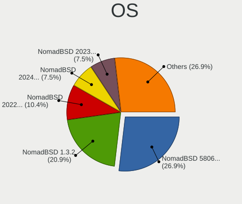

| Name              | Desktops | Percent |
|-------------------|----------|---------|
| NomadBSD 5806f915 | 18       | 26.87%  |
| NomadBSD 1.3.2    | 14       | 20.9%   |
| NomadBSD 20221130 | 7        | 10.45%  |
| NomadBSD 20240711 | 5        | 7.46%   |
| NomadBSD 20231121 | 5        | 7.46%   |
| NomadBSD 20231013 | 4        | 5.97%   |
| NomadBSD 1.4-RC1  | 4        | 5.97%   |
| NomadBSD 1.4      | 3        | 4.48%   |
| NomadBSD 20240126 | 2        | 2.99%   |
| NomadBSD 1.3.1    | 2        | 2.99%   |
| NomadBSD 80dec9b9 | 1        | 1.49%   |
| NomadBSD 1.3      | 1        | 1.49%   |
| NomadBSD 1.0      | 1        | 1.49%   |

OS Family
---------

OS without a version

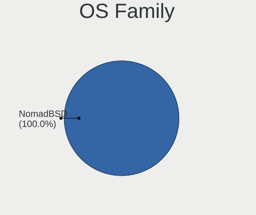

| Name     | Desktops | Percent |
|----------|----------|---------|
| NomadBSD | 67       | 100%    |

Arch
----

OS architecture (x86_64, i586, etc.)

| Name  | Desktops | Percent |
|-------|----------|---------|
| amd64 | 65       | 97.01%  |
| i386  | 2        | 2.99%   |

DE
--

Desktop Environment

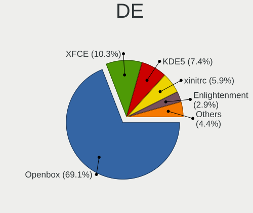

| Name          | Desktops | Percent |
|---------------|----------|---------|
| Openbox       | 47       | 69.12%  |
| XFCE          | 7        | 10.29%  |
| KDE5          | 5        | 7.35%   |
| xinitrc       | 4        | 5.88%   |
| Enlightenment | 2        | 2.94%   |
| GNUstep       | 1        | 1.47%   |
| GNOME         | 1        | 1.47%   |
| filer         | 1        | 1.47%   |

Display Server
--------------

X11 or Wayland

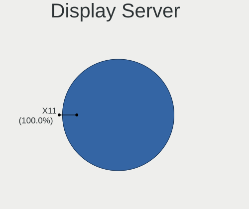

| Name | Desktops | Percent |
|------|----------|---------|
| X11  | 67       | 100%    |

Display Manager
---------------

SDDM, LightDM, etc.

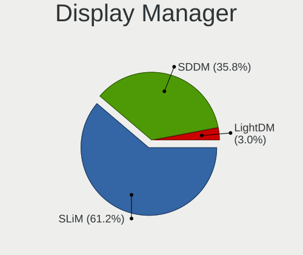

| Name    | Desktops | Percent |
|---------|----------|---------|
| SLiM    | 41       | 61.19%  |
| SDDM    | 24       | 35.82%  |
| LightDM | 2        | 2.99%   |

OS Lang
-------

Language

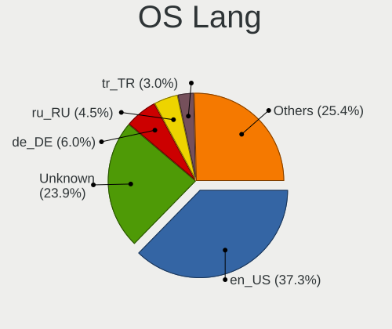

| Lang    | Desktops | Percent |
|---------|----------|---------|
| en_US   | 25       | 37.31%  |
| Unknown | 16       | 23.88%  |
| de_DE   | 4        | 5.97%   |
| ru_RU   | 3        | 4.48%   |
| tr_TR   | 2        | 2.99%   |
| pt_BR   | 2        | 2.99%   |
| it_IT   | 2        | 2.99%   |
| hu_HU   | 2        | 2.99%   |
| fi_FI   | 2        | 2.99%   |
| es_ES   | 2        | 2.99%   |
| zh_TW   | 1        | 1.49%   |
| pl_PL   | 1        | 1.49%   |
| nl_NL   | 1        | 1.49%   |
| en_AU   | 1        | 1.49%   |
| cs_CZ   | 1        | 1.49%   |
| C       | 1        | 1.49%   |
| bg_BG   | 1        | 1.49%   |

Boot Mode
---------

EFI or BIOS

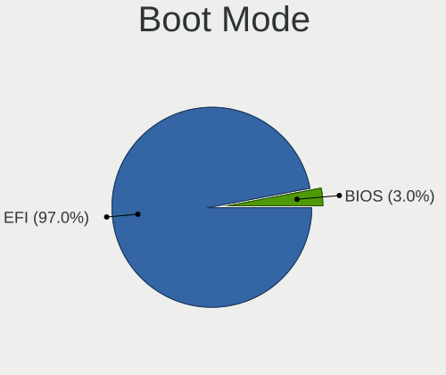

| Mode | Desktops | Percent |
|------|----------|---------|
| EFI  | 65       | 97.01%  |
| BIOS | 2        | 2.99%   |

Filesystem
----------

Type of filesystem

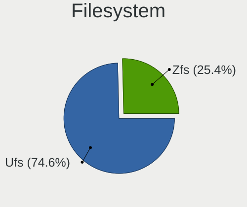

| Type | Desktops | Percent |
|------|----------|---------|
| Ufs  | 50       | 74.63%  |
| Zfs  | 17       | 25.37%  |

Part. scheme
------------

Scheme of partitioning

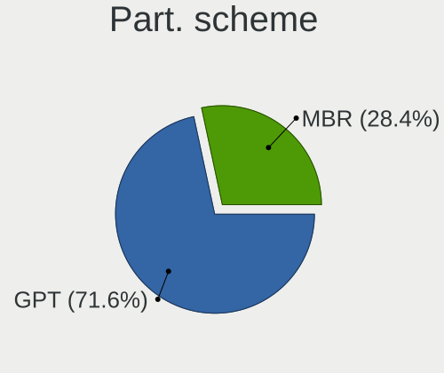

| Type | Desktops | Percent |
|------|----------|---------|
| GPT  | 48       | 71.64%  |
| MBR  | 19       | 28.36%  |

Board
-----

Vendor
------

Motherboard manufacturer

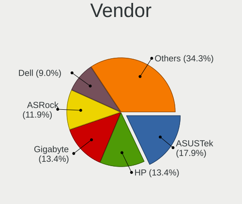

| Name                                 | Desktops | Percent |
|--------------------------------------|----------|---------|
| ASUSTek Computer                     | 12       | 17.91%  |
| Hewlett-Packard                      | 9        | 13.43%  |
| Gigabyte Technology                  | 9        | 13.43%  |
| ASRock                               | 8        | 11.94%  |
| Dell                                 | 6        | 8.96%   |
| Lenovo                               | 4        | 5.97%   |
| Acer                                 | 4        | 5.97%   |
| MSI                                  | 3        | 4.48%   |
| Intel                                | 2        | 2.99%   |
| Fujitsu                              | 2        | 2.99%   |
| Shenzhen Meigao Electronic Equipment | 1        | 1.49%   |
| Semp Toshiba                         | 1        | 1.49%   |
| Pegatron                             | 1        | 1.49%   |
| Gateway                              | 1        | 1.49%   |
| Foxconn                              | 1        | 1.49%   |
| ECS                                  | 1        | 1.49%   |
| ASRockRack                           | 1        | 1.49%   |
| Unknown                              | 1        | 1.49%   |

Model
-----

Motherboard model

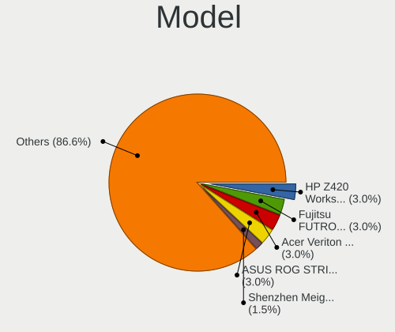

| Name                                       | Desktops | Percent |
|--------------------------------------------|----------|---------|
| HP Z420 Workstation                        | 2        | 2.99%   |
| Fujitsu FUTRO S520                         | 2        | 2.99%   |
| ASUS ROG STRIX B550-F GAMING               | 2        | 2.99%   |
| Acer Veriton M460                          | 2        | 2.99%   |
| Shenzhen Meigao Electronic Equipment F7BSC | 1        | 1.49%   |
| Semp Toshiba STI                           | 1        | 1.49%   |
| Pegatron Elite 7300 Series MT              | 1        | 1.49%   |
| MSI MS-7C02                                | 1        | 1.49%   |
| MSI MS-7A38                                | 1        | 1.49%   |
| MSI MS-7817                                | 1        | 1.49%   |
| Lenovo ThinkStation P300 30AH000SUS        | 1        | 1.49%   |
| Lenovo ThinkCentre M93p 10AAS4EN00         | 1        | 1.49%   |
| Lenovo ThinkCentre M93p 10A8001HUS         | 1        | 1.49%   |
| Lenovo IdeaCentre 510S-08ISH 90FN008FNY    | 1        | 1.49%   |
| Intel H61M-DS2                             | 1        | 1.49%   |
| Intel DCP847SKE                            | 1        | 1.49%   |
| HP Z620 Workstation                        | 1        | 1.49%   |
| HP Desktop M01-F1xxx                       | 1        | 1.49%   |
| HP Compaq Elite 8300 Touch All-in-One PC   | 1        | 1.49%   |
| HP Compaq dc7900 Convertible Minitower     | 1        | 1.49%   |
| HP Compaq dc7800p Convertible Minitower    | 1        | 1.49%   |
| HP Compaq dc5750 Microtower                | 1        | 1.49%   |
| HP 550-a114                                | 1        | 1.49%   |
| Gigabyte Z370 AORUS ULTRAGAMING WIFI-OP    | 1        | 1.49%   |
| Gigabyte Z370 AORUS Ultra Gaming           | 1        | 1.49%   |
| Gigabyte X570S GAMING X                    | 1        | 1.49%   |
| Gigabyte X570 AORUS PRO                    | 1        | 1.49%   |
| Gigabyte X570 AORUS MASTER                 | 1        | 1.49%   |
| Gigabyte MZGLKBP-00                        | 1        | 1.49%   |
| Gigabyte J3455N-D3H                        | 1        | 1.49%   |
| Gigabyte H61M-S1                           | 1        | 1.49%   |
| Gigabyte B560M DS3H V2                     | 1        | 1.49%   |
| Gateway SX2185                             | 1        | 1.49%   |
| Foxconn Napa                               | 1        | 1.49%   |
| ECS Z77H2-AX                               | 1        | 1.49%   |
| Dell Studio XPS 8100                       | 1        | 1.49%   |
| Dell Studio XPS 435MT                      | 1        | 1.49%   |
| Dell OptiPlex 9010                         | 1        | 1.49%   |
| Dell OptiPlex 780                          | 1        | 1.49%   |
| Dell OptiPlex 3020                         | 1        | 1.49%   |

Model Family
------------

Motherboard model prefix

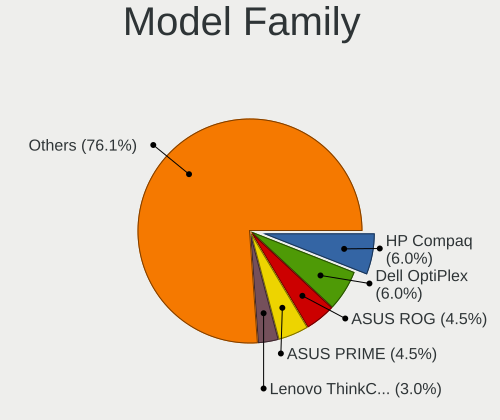

| Name                                       | Desktops | Percent |
|--------------------------------------------|----------|---------|
| HP Compaq                                  | 4        | 5.97%   |
| Dell OptiPlex                              | 4        | 5.97%   |
| ASUS ROG                                   | 3        | 4.48%   |
| ASUS PRIME                                 | 3        | 4.48%   |
| Lenovo ThinkCentre                         | 2        | 2.99%   |
| HP Z420                                    | 2        | 2.99%   |
| Gigabyte Z370                              | 2        | 2.99%   |
| Gigabyte X570                              | 2        | 2.99%   |
| Fujitsu FUTRO                              | 2        | 2.99%   |
| Dell Studio                                | 2        | 2.99%   |
| ASRock B550                                | 2        | 2.99%   |
| Acer Veriton                               | 2        | 2.99%   |
| Acer Aspire                                | 2        | 2.99%   |
| Shenzhen Meigao Electronic Equipment F7BSC | 1        | 1.49%   |
| Semp Toshiba STI                           | 1        | 1.49%   |
| Pegatron Elite                             | 1        | 1.49%   |
| MSI MS-7C02                                | 1        | 1.49%   |
| MSI MS-7A38                                | 1        | 1.49%   |
| MSI MS-7817                                | 1        | 1.49%   |
| Lenovo ThinkStation                        | 1        | 1.49%   |
| Lenovo IdeaCentre                          | 1        | 1.49%   |
| Intel H61M-DS2                             | 1        | 1.49%   |
| Intel DCP847SKE                            | 1        | 1.49%   |
| HP Z620                                    | 1        | 1.49%   |
| HP Desktop                                 | 1        | 1.49%   |
| HP 550-a114                                | 1        | 1.49%   |
| Gigabyte X570S                             | 1        | 1.49%   |
| Gigabyte MZGLKBP-00                        | 1        | 1.49%   |
| Gigabyte J3455N-D3H                        | 1        | 1.49%   |
| Gigabyte H61M-S1                           | 1        | 1.49%   |
| Gigabyte B560M                             | 1        | 1.49%   |
| Gateway SX2185                             | 1        | 1.49%   |
| Foxconn Napa                               | 1        | 1.49%   |
| ECS Z77H2-AX                               | 1        | 1.49%   |
| ASUS Z170-A                                | 1        | 1.49%   |
| ASUS V-P7H55E                              | 1        | 1.49%   |
| ASUS TUF                                   | 1        | 1.49%   |
| ASUS Maximus                               | 1        | 1.49%   |
| ASUS M5A97                                 | 1        | 1.49%   |
| ASUS ER904AA-ABA                           | 1        | 1.49%   |

MFG Year
--------

Motherboard manufacture year

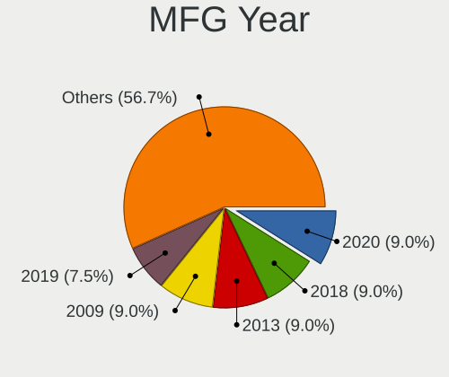

| Year | Desktops | Percent |
|------|----------|---------|
| 2020 | 6        | 8.96%   |
| 2018 | 6        | 8.96%   |
| 2013 | 6        | 8.96%   |
| 2009 | 6        | 8.96%   |
| 2019 | 5        | 7.46%   |
| 2016 | 5        | 7.46%   |
| 2015 | 5        | 7.46%   |
| 2010 | 5        | 7.46%   |
| 2021 | 4        | 5.97%   |
| 2017 | 4        | 5.97%   |
| 2022 | 3        | 4.48%   |
| 2012 | 3        | 4.48%   |
| 2011 | 3        | 4.48%   |
| 2014 | 2        | 2.99%   |
| 2023 | 1        | 1.49%   |
| 2008 | 1        | 1.49%   |
| 2007 | 1        | 1.49%   |
| 2006 | 1        | 1.49%   |

Form Factor
-----------

Physical design of the computer

| Name    | Desktops | Percent |
|---------|----------|---------|
| Desktop | 67       | 100%    |

Coreboot
--------

Have coreboot on board

| Used | Desktops | Percent |
|------|----------|---------|
| No   | 67       | 100%    |

RAM Size
--------

Total RAM memory

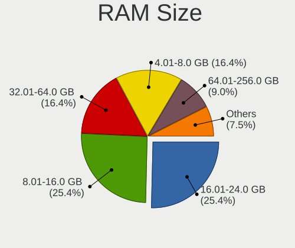

| Size in GB  | Desktops | Percent |
|-------------|----------|---------|
| 16.01-24.0  | 17       | 25.37%  |
| 8.01-16.0   | 17       | 25.37%  |
| 4.01-8.0    | 11       | 16.42%  |
| 32.01-64.0  | 11       | 16.42%  |
| 64.01-256.0 | 6        | 8.96%   |
| 2.01-3.0    | 4        | 5.97%   |
| 3.01-4.0    | 1        | 1.49%   |

RAM Used
--------

Used RAM memory

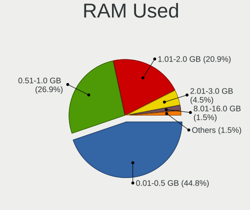

| Used GB   | Desktops | Percent |
|-----------|----------|---------|
| 0.01-0.5  | 30       | 44.78%  |
| 0.51-1.0  | 18       | 26.87%  |
| 1.01-2.0  | 14       | 20.9%   |
| 2.01-3.0  | 3        | 4.48%   |
| 3.01-4.0  | 1        | 1.49%   |
| 8.01-16.0 | 1        | 1.49%   |

Total Drives
------------

Number of drives on board

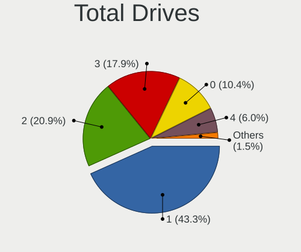

| Drives | Desktops | Percent |
|--------|----------|---------|
| 1      | 29       | 43.28%  |
| 2      | 14       | 20.9%   |
| 3      | 12       | 17.91%  |
| 0      | 7        | 10.45%  |
| 4      | 4        | 5.97%   |
| 7      | 1        | 1.49%   |

Has CD-ROM
----------

Has CD-ROM on board

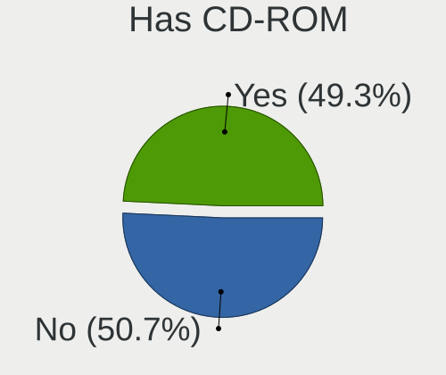

| Presented | Desktops | Percent |
|-----------|----------|---------|
| No        | 34       | 50.75%  |
| Yes       | 33       | 49.25%  |

Has Ethernet
------------

Has Ethernet on board

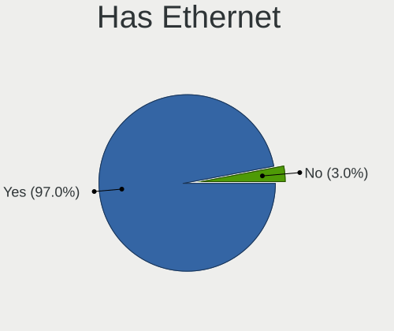

| Presented | Desktops | Percent |
|-----------|----------|---------|
| Yes       | 65       | 97.01%  |
| No        | 2        | 2.99%   |

Has WiFi
--------

Has WiFi module

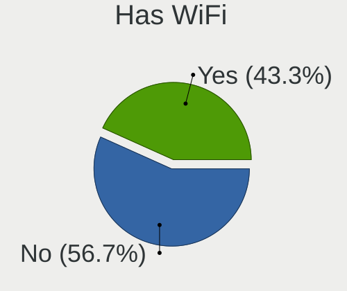

| Presented | Desktops | Percent |
|-----------|----------|---------|
| No        | 38       | 56.72%  |
| Yes       | 29       | 43.28%  |

Has Bluetooth
-------------

Has Bluetooth module

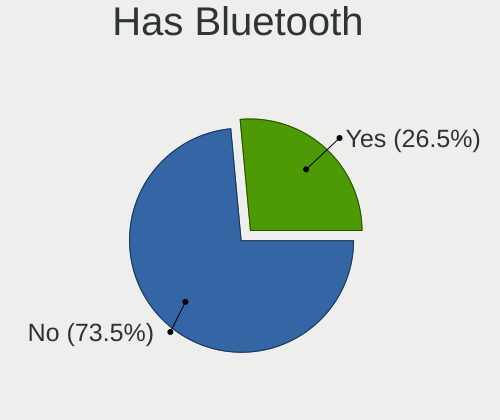

| Presented | Desktops | Percent |
|-----------|----------|---------|
| No        | 50       | 73.53%  |
| Yes       | 18       | 26.47%  |

Location
--------

Country
-------

Geographic location (country)

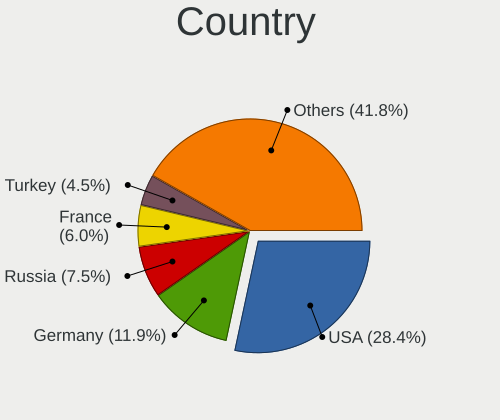

| Country      | Desktops | Percent |
|--------------|----------|---------|
| USA          | 19       | 28.36%  |
| Germany      | 8        | 11.94%  |
| Russia       | 5        | 7.46%   |
| France       | 4        | 5.97%   |
| Turkey       | 3        | 4.48%   |
| Thailand     | 2        | 2.99%   |
| Netherlands  | 2        | 2.99%   |
| Montenegro   | 2        | 2.99%   |
| Italy        | 2        | 2.99%   |
| Hungary      | 2        | 2.99%   |
| Finland      | 2        | 2.99%   |
| Brazil       | 2        | 2.99%   |
| Argentina    | 2        | 2.99%   |
| UK           | 1        | 1.49%   |
| Taiwan       | 1        | 1.49%   |
| Spain        | 1        | 1.49%   |
| Slovakia     | 1        | 1.49%   |
| Serbia       | 1        | 1.49%   |
| Saudi Arabia | 1        | 1.49%   |
| Poland       | 1        | 1.49%   |
| Indonesia    | 1        | 1.49%   |
| Czechia      | 1        | 1.49%   |
| Colombia     | 1        | 1.49%   |
| Bulgaria     | 1        | 1.49%   |
| Australia    | 1        | 1.49%   |

City
----

Geographic location (city)

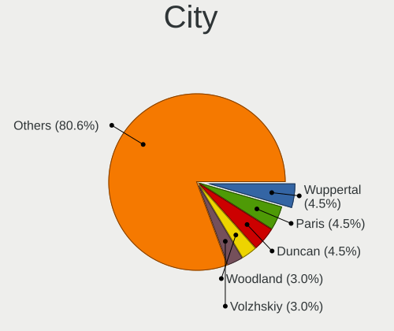

| City                 | Desktops | Percent |
|----------------------|----------|---------|
| Wuppertal            | 3        | 4.48%   |
| Paris                | 3        | 4.48%   |
| Duncan               | 3        | 4.48%   |
| Woodland             | 2        | 2.99%   |
| Volzhskiy            | 2        | 2.99%   |
| Rio de Janeiro       | 2        | 2.99%   |
| Podgorica            | 2        | 2.99%   |
| Moscow               | 2        | 2.99%   |
| Milan                | 2        | 2.99%   |
| Lutherville-Timonium | 2        | 2.99%   |
| Istanbul             | 2        | 2.99%   |
| Hodmezovasarhely     | 2        | 2.99%   |
| Bangkok              | 2        | 2.99%   |
| Westervoort          | 1        | 1.49%   |
| Warsaw               | 1        | 1.49%   |
| Urcuit               | 1        | 1.49%   |
| Tucson               | 1        | 1.49%   |
| Taipei               | 1        | 1.49%   |
| Spring Hill          | 1        | 1.49%   |
| South Tangerang      | 1        | 1.49%   |
| Sofia                | 1        | 1.49%   |
| Seville              | 1        | 1.49%   |
| Scottsdale           | 1        | 1.49%   |
| San Francisco        | 1        | 1.49%   |
| Rostov-on-Don        | 1        | 1.49%   |
| Peoria               | 1        | 1.49%   |
| Palm Bay             | 1        | 1.49%   |
| North Highlands      | 1        | 1.49%   |
| Melcice              | 1        | 1.49%   |
| McDonough            | 1        | 1.49%   |
| Marburg              | 1        | 1.49%   |
| Ludwigsburg          | 1        | 1.49%   |
| London               | 1        | 1.49%   |
| Langen               | 1        | 1.49%   |
| Joensuu              | 1        | 1.49%   |
| Helsinki             | 1        | 1.49%   |
| Frisco               | 1        | 1.49%   |
| Eindhoven            | 1        | 1.49%   |
| Dortmund             | 1        | 1.49%   |
| Denver               | 1        | 1.49%   |

Drives
------

Drive Vendor
------------

Hard drive vendors

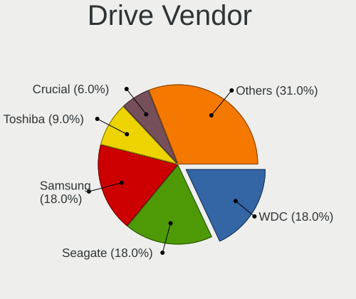

| Vendor              | Desktops | Drives | Percent |
|---------------------|----------|--------|---------|
| WDC                 | 18       | 24     | 18%     |
| Seagate             | 18       | 19     | 18%     |
| Samsung Electronics | 18       | 23     | 18%     |
| Toshiba             | 9        | 11     | 9%      |
| Crucial             | 6        | 6      | 6%      |
| Kingston            | 5        | 6      | 5%      |
| A-DATA Technology   | 5        | 5      | 5%      |
| Intel               | 3        | 4      | 3%      |
| Hitachi             | 3        | 3      | 3%      |
| Hewlett-Packard     | 3        | 3      | 3%      |
| SK hynix            | 2        | 2      | 2%      |
| SanDisk             | 2        | 3      | 2%      |
| Transcend           | 1        | 1      | 1%      |
| Team                | 1        | 1      | 1%      |
| Patriot             | 1        | 1      | 1%      |
| ORICO               | 1        | 1      | 1%      |
| Maxtor              | 1        | 1      | 1%      |
| HGST                | 1        | 1      | 1%      |
| GAMER               | 1        | 1      | 1%      |
| Corsair             | 1        | 1      | 1%      |

Drive Model
-----------

Hard drive models

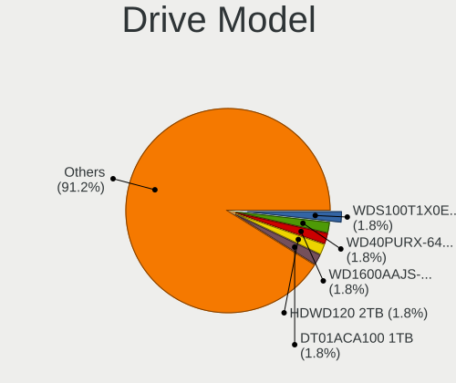

| Model                                     | Desktops | Percent |
|-------------------------------------------|----------|---------|
| WDC WDS100T1X0E-00AFY0 1TB                | 2        | 1.77%   |
| WDC WD40PURX-64GVNY0 4TB                  | 2        | 1.77%   |
| WDC WD1600AAJS-22L7A0 160GB               | 2        | 1.77%   |
| Toshiba HDWD120 2TB                       | 2        | 1.77%   |
| Toshiba DT01ACA100 1TB                    | 2        | 1.77%   |
| Seagate ST500DM002-1BD142 500GB           | 2        | 1.77%   |
| Samsung SSD 970 EVO Plus 1TB              | 2        | 1.77%   |
| Samsung SSD 970 EVO 500GB                 | 2        | 1.77%   |
| Samsung SSD 870 QVO 2TB                   | 2        | 1.77%   |
| Samsung SP2504C 250GB                     | 2        | 1.77%   |
| Kingston SA400S37480G 480GB               | 2        | 1.77%   |
| Kingston SA400S37240G 240GB               | 2        | 1.77%   |
| HP SSD EX950 2TB                          | 2        | 1.77%   |
| A-DATA SU630 240GB                        | 2        | 1.77%   |
| WDC WDS240G2G0B-00EPW0 240GB              | 1        | 0.88%   |
| WDC WDS120G2G0A-00JH30 120GB              | 1        | 0.88%   |
| WDC WD6400AAKS-22A7B2 640GB               | 1        | 0.88%   |
| WDC WD60EZRZ-00GZ5B1 6TB                  | 1        | 0.88%   |
| WDC WD40NMZW-11GX6S1 4TB                  | 1        | 0.88%   |
| WDC WD40EFAX-68JH4N0 4TB                  | 1        | 0.88%   |
| WDC WD30EZRZ-00GXCB0 3TB                  | 1        | 0.88%   |
| WDC WD2500BEKT-00PVMT0 250GB              | 1        | 0.88%   |
| WDC WD2004FBYZ-01YCBB1 2TB                | 1        | 0.88%   |
| WDC WD1200BEVE-00UYT0 120GB               | 1        | 0.88%   |
| WDC WD10JPLX-00MBPT0 1TB                  | 1        | 0.88%   |
| WDC WD10EZRZ-00HTKB0 1TB                  | 1        | 0.88%   |
| WDC WD10EZRX-00L4HB0 1TB                  | 1        | 0.88%   |
| WDC WD10EZEX-22MFCA0 1TB                  | 1        | 0.88%   |
| WDC WD10EFRX-68PJCN0 1TB                  | 1        | 0.88%   |
| WDC WD10EADS-00P8B0 1TB                   | 1        | 0.88%   |
| WDC PC SN520 SDAPMUW-128G-1101 128GB      | 1        | 0.88%   |
| Transcend TS32GCF800 32GB                 | 1        | 0.88%   |
| Toshiba MQ01ABD075 752GB                  | 1        | 0.88%   |
| Toshiba MK1032GAX 100GB                   | 1        | 0.88%   |
| Toshiba MG06ACA800E 8TB                   | 1        | 0.88%   |
| Toshiba HDWD130 3TB                       | 1        | 0.88%   |
| Toshiba HDWD110 1TB                       | 1        | 0.88%   |
| Toshiba DT01ABA300 3TB                    | 1        | 0.88%   |
| Team TEAML5Lite3D1T 1TB                   | 1        | 0.88%   |
| SK hynix SKHynix_HFS256GD9TNI-L2B0B 256GB | 1        | 0.88%   |

HDD Vendor
----------

Hard disk drive vendors

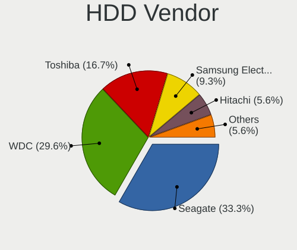

| Vendor              | Desktops | Drives | Percent |
|---------------------|----------|--------|---------|
| Seagate             | 18       | 19     | 33.33%  |
| WDC                 | 16       | 19     | 29.63%  |
| Toshiba             | 9        | 11     | 16.67%  |
| Samsung Electronics | 5        | 5      | 9.26%   |
| Hitachi             | 3        | 3      | 5.56%   |
| Maxtor              | 1        | 1      | 1.85%   |
| HGST                | 1        | 1      | 1.85%   |
| Hewlett-Packard     | 1        | 1      | 1.85%   |

SSD Vendor
----------

Solid state drive vendors

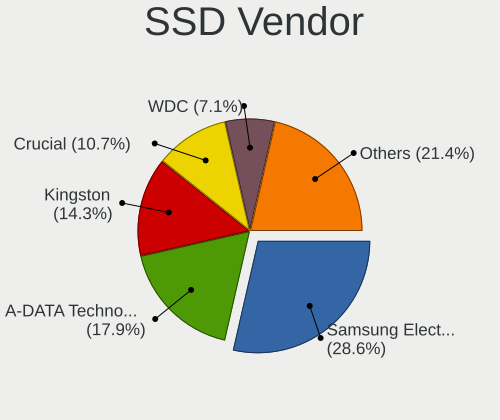

| Vendor              | Desktops | Drives | Percent |
|---------------------|----------|--------|---------|
| Samsung Electronics | 8        | 10     | 26.67%  |
| A-DATA Technology   | 5        | 5      | 16.67%  |
| Kingston            | 4        | 5      | 13.33%  |
| Crucial             | 3        | 3      | 10%     |
| WDC                 | 2        | 2      | 6.67%   |
| SanDisk             | 2        | 3      | 6.67%   |
| Transcend           | 1        | 1      | 3.33%   |
| Team                | 1        | 1      | 3.33%   |
| SK hynix            | 1        | 1      | 3.33%   |
| Patriot             | 1        | 1      | 3.33%   |
| Intel               | 1        | 2      | 3.33%   |
| GAMER               | 1        | 1      | 3.33%   |

Drive Kind
----------

HDD or SSD

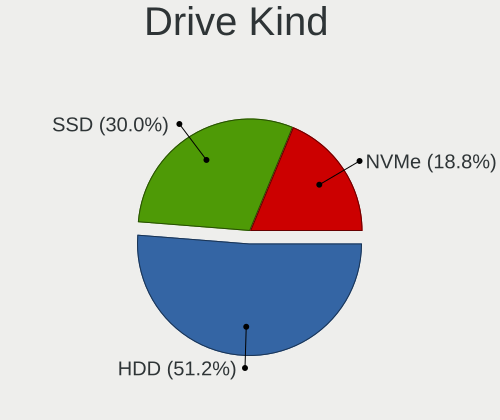

| Kind | Desktops | Drives | Percent |
|------|----------|--------|---------|
| HDD  | 41       | 60     | 51.25%  |
| SSD  | 24       | 35     | 30%     |
| NVMe | 15       | 22     | 18.75%  |

Drive Connector
---------------

SATA, SAS, NVMe, etc.

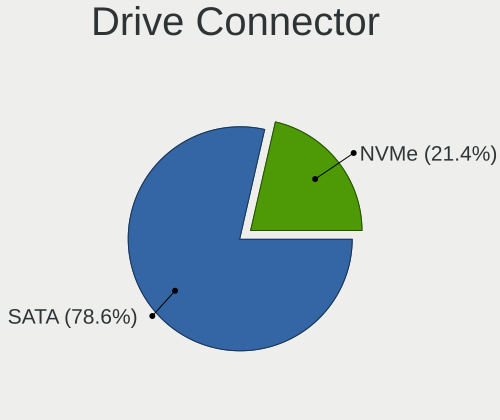

| Type | Desktops | Drives | Percent |
|------|----------|--------|---------|
| SATA | 55       | 95     | 78.57%  |
| NVMe | 15       | 22     | 21.43%  |

Drive Size
----------

Size of hard drive

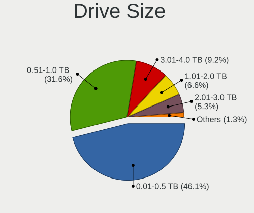

| Size in TB | Desktops | Drives | Percent |
|------------|----------|--------|---------|
| 0.01-0.5   | 35       | 48     | 46.05%  |
| 0.51-1.0   | 24       | 27     | 31.58%  |
| 3.01-4.0   | 7        | 8      | 9.21%   |
| 1.01-2.0   | 5        | 5      | 6.58%   |
| 2.01-3.0   | 4        | 4      | 5.26%   |
| 4.01-10.0  | 1        | 3      | 1.32%   |

Space Total
-----------

Amount of disk space available on the file system

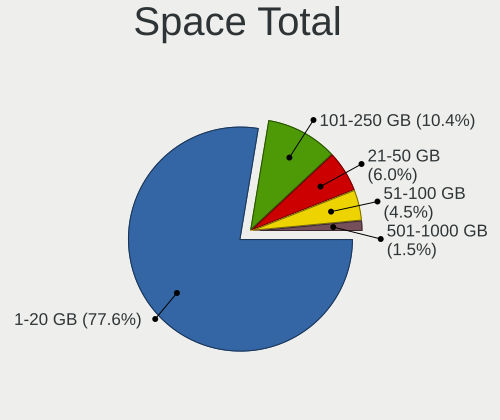

| Size in GB | Desktops | Percent |
|------------|----------|---------|
| 1-20       | 52       | 77.61%  |
| 101-250    | 7        | 10.45%  |
| 21-50      | 4        | 5.97%   |
| 51-100     | 3        | 4.48%   |
| 501-1000   | 1        | 1.49%   |

Space Used
----------

Amount of used disk space

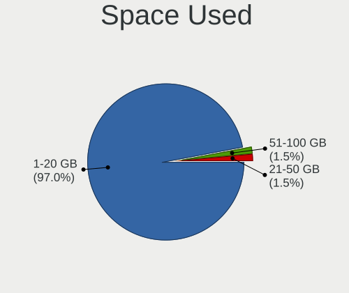

| Used GB | Desktops | Percent |
|---------|----------|---------|
| 1-20    | 65       | 97.01%  |
| 21-50   | 1        | 1.49%   |
| 51-100  | 1        | 1.49%   |

Malfunc. Drives
---------------

Drive models with a malfunction

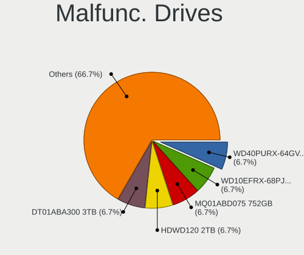

| Model                             | Desktops | Drives | Percent |
|-----------------------------------|----------|--------|---------|
| WDC WD40PURX-64GVNY0 4TB          | 1        | 1      | 6.67%   |
| WDC WD10EFRX-68PJCN0 1TB          | 1        | 2      | 6.67%   |
| Toshiba MQ01ABD075 752GB          | 1        | 1      | 6.67%   |
| Toshiba HDWD120 2TB               | 1        | 1      | 6.67%   |
| Toshiba DT01ABA300 3TB            | 1        | 1      | 6.67%   |
| Seagate ST9250315AS 250GB         | 1        | 1      | 6.67%   |
| Seagate ST500DM002-1BD142 500GB   | 1        | 1      | 6.67%   |
| Seagate ST3250823AS 250GB         | 1        | 1      | 6.67%   |
| Seagate ST310212A 10GB            | 1        | 1      | 6.67%   |
| Samsung Electronics SP2504C 250GB | 1        | 1      | 6.67%   |
| Samsung Electronics HM160HI 160GB | 1        | 1      | 6.67%   |
| Hitachi HDT721010SLA360 1TB       | 1        | 1      | 6.67%   |
| Hewlett-Packard MB1000GCWCV 1TB   | 1        | 1      | 6.67%   |
| Crucial CT120M500SSD1 120GB       | 1        | 1      | 6.67%   |
| A-DATA Technology XM13 32GB       | 1        | 1      | 6.67%   |

Malfunc. Drive Vendor
---------------------

Vendors of faulty drives

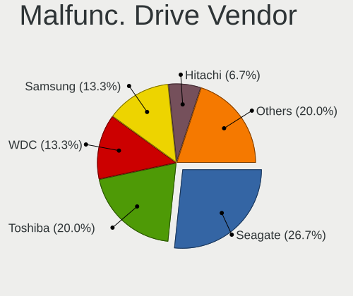

| Vendor              | Desktops | Drives | Percent |
|---------------------|----------|--------|---------|
| Seagate             | 4        | 4      | 26.67%  |
| Toshiba             | 3        | 3      | 20%     |
| WDC                 | 2        | 3      | 13.33%  |
| Samsung Electronics | 2        | 2      | 13.33%  |
| Hitachi             | 1        | 1      | 6.67%   |
| Hewlett-Packard     | 1        | 1      | 6.67%   |
| Crucial             | 1        | 1      | 6.67%   |
| A-DATA Technology   | 1        | 1      | 6.67%   |

Malfunc. HDD Vendor
-------------------

Vendors of faulty HDD drives

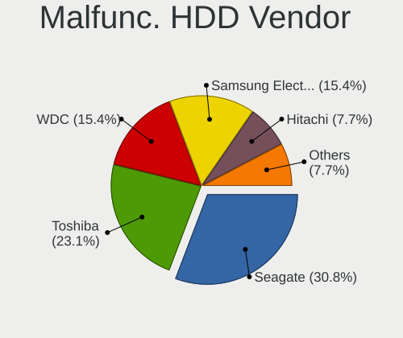

| Vendor              | Desktops | Drives | Percent |
|---------------------|----------|--------|---------|
| Seagate             | 4        | 4      | 30.77%  |
| Toshiba             | 3        | 3      | 23.08%  |
| WDC                 | 2        | 3      | 15.38%  |
| Samsung Electronics | 2        | 2      | 15.38%  |
| Hitachi             | 1        | 1      | 7.69%   |
| Hewlett-Packard     | 1        | 1      | 7.69%   |

Malfunc. Drive Kind
-------------------

Kinds of faulty drives

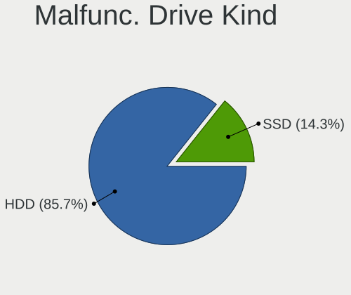

| Kind | Desktops | Drives | Percent |
|------|----------|--------|---------|
| HDD  | 12       | 14     | 85.71%  |
| SSD  | 2        | 2      | 14.29%  |

Failed Drives
-------------

Failed drive models

Zero info for selected period =(

Failed Drive Vendor
-------------------

Failed drive vendors

Zero info for selected period =(

Drive Status
------------

Number of failed and malfunc. drives

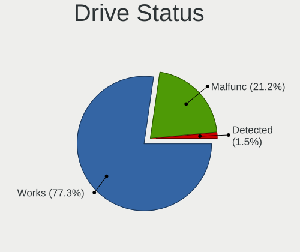

| Status   | Desktops | Drives | Percent |
|----------|----------|--------|---------|
| Works    | 51       | 95     | 77.27%  |
| Malfunc  | 14       | 16     | 21.21%  |
| Detected | 1        | 6      | 1.52%   |

Storage controller
------------------

Storage Vendor
--------------

Storage controller vendors

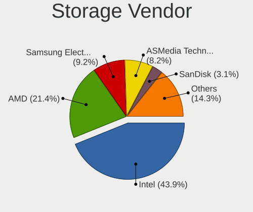

| Vendor                      | Desktops | Percent |
|-----------------------------|----------|---------|
| Intel                       | 43       | 43.88%  |
| AMD                         | 21       | 21.43%  |
| Samsung Electronics         | 9        | 9.18%   |
| ASMedia Technology          | 8        | 8.16%   |
| SanDisk                     | 3        | 3.06%   |
| Nvidia                      | 3        | 3.06%   |
| Micron/Crucial Technology   | 3        | 3.06%   |
| Kingston Technology Company | 3        | 3.06%   |
| Biwin Storage Technology    | 2        | 2.04%   |
| VIA Technologies            | 1        | 1.02%   |
| Silicon Motion              | 1        | 1.02%   |
| Phison Electronics          | 1        | 1.02%   |

Storage Model
-------------

Storage controller models

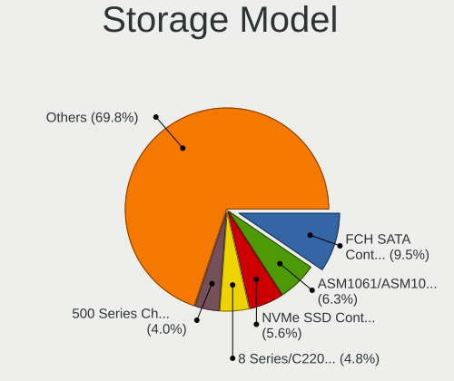

| Model                                                                                   | Desktops | Percent |
|-----------------------------------------------------------------------------------------|----------|---------|
| AMD FCH SATA Controller [AHCI mode]                                                     | 12       | 9.52%   |
| ASMedia ASM1061/ASM1062 Serial ATA Controller                                           | 8        | 6.35%   |
| Samsung NVMe SSD Controller SM981/PM981/PM983                                           | 7        | 5.56%   |
| Intel 8 Series/C220 Series Chipset Family 6-port SATA Controller 1 [AHCI mode]          | 6        | 4.76%   |
| AMD 500 Series Chipset SATA Controller                                                  | 5        | 3.97%   |
| AMD 400 Series Chipset SATA Controller                                                  | 5        | 3.97%   |
| Intel SATA Controller [RAID Mode]                                                       | 3        | 2.38%   |
| Intel Q170/Q150/B150/H170/H110/Z170/CM236 Chipset SATA Controller [AHCI Mode]           | 3        | 2.38%   |
| Intel NM10/ICH7 Family SATA Controller [IDE mode]                                       | 3        | 2.38%   |
| Intel C602 chipset 4-Port SATA Storage Control Unit                                     | 3        | 2.38%   |
| Intel 82801G (ICH7 Family) IDE Controller                                               | 3        | 2.38%   |
| Intel 7 Series/C210 Series Chipset Family 6-port SATA Controller [AHCI mode]            | 3        | 2.38%   |
| Intel 200 Series PCH SATA controller [AHCI mode]                                        | 3        | 2.38%   |
| SanDisk WD PC SN810 / Black SN850 NVMe SSD                                              | 2        | 1.59%   |
| Nvidia MCP61 SATA Controller                                                            | 2        | 1.59%   |
| Nvidia MCP61 IDE                                                                        | 2        | 1.59%   |
| Intel Cannon Lake PCH SATA AHCI Controller                                              | 2        | 1.59%   |
| Intel C600/X79 series chipset IDE-r Controller                                          | 2        | 1.59%   |
| Intel C600/X79 series chipset 4-Port SATA IDE Controller                                | 2        | 1.59%   |
| Intel C600/X79 series chipset 2-Port SATA IDE Controller                                | 2        | 1.59%   |
| Intel 82801JD/DO (ICH10 Family) SATA AHCI Controller                                    | 2        | 1.59%   |
| Intel 6 Series/C200 Series Chipset Family Desktop SATA Controller (IDE mode, ports 4-5) | 2        | 1.59%   |
| Intel 6 Series/C200 Series Chipset Family Desktop SATA Controller (IDE mode, ports 0-3) | 2        | 1.59%   |
| Intel 6 Series/C200 Series Chipset Family 6 port Desktop SATA AHCI Controller           | 2        | 1.59%   |
| Intel 5 Series/3400 Series Chipset 6 port SATA AHCI Controller                          | 2        | 1.59%   |
| Intel 4 Series Chipset PT IDER Controller                                               | 2        | 1.59%   |
| Biwin Storage EX950 NVMe SSD                                                            | 2        | 1.59%   |
| VIA VT6421 IDE/SATA Controller                                                          | 1        | 0.79%   |
| Silicon Motion SM2263EN/SM2263XT (DRAM-less) NVMe SSD Controllers                       | 1        | 0.79%   |
| SanDisk PC SN520 x2 M.2 2242 NVMe SSD                                                   | 1        | 0.79%   |
| Samsung NVMe SSD Controller SM961/PM961/SM963                                           | 1        | 0.79%   |
| Samsung NVMe SSD Controller PM9A1/PM9A3/980PRO                                          | 1        | 0.79%   |
| Phison PS5021-E21 PCIe4 NVMe Controller (DRAM-less)                                     | 1        | 0.79%   |
| Nvidia MCP73 SATA Controller (IDE mode)                                                 | 1        | 0.79%   |
| Nvidia MCP73 IDE Controller                                                             | 1        | 0.79%   |
| Micron/Crucial P5 NVMe PCIe SSD[SlashP5]                                                | 1        | 0.79%   |
| Micron/Crucial P2 [Nick P2] / P3 / P3 Plus NVMe PCIe SSD (DRAM-less)                    | 1        | 0.79%   |
| Micron/Crucial P1 NVMe PCIe SSD[Frampton]                                               | 1        | 0.79%   |
| Kingston Company OM8PGP4 NVMe PCIe SSD (DRAM-less)                                      | 1        | 0.79%   |
| Kingston Company NV2 NVMe SSD [E21T] (DRAM-less)                                        | 1        | 0.79%   |

Storage Kind
------------

Kind of storage controller (IDE, SATA, NVMe, SAS, ...)

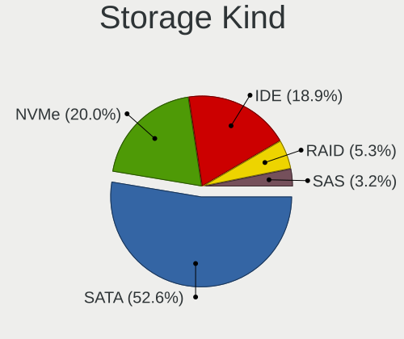

| Kind | Desktops | Percent |
|------|----------|---------|
| SATA | 50       | 52.63%  |
| NVMe | 19       | 20%     |
| IDE  | 18       | 18.95%  |
| RAID | 5        | 5.26%   |
| SAS  | 3        | 3.16%   |

Processor
---------

CPU Vendor
----------

Processor vendors

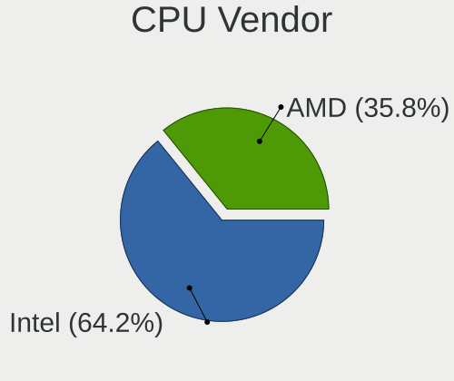

| Vendor | Desktops | Percent |
|--------|----------|---------|
| Intel  | 43       | 64.18%  |
| AMD    | 24       | 35.82%  |

CPU Model
---------

Processor models

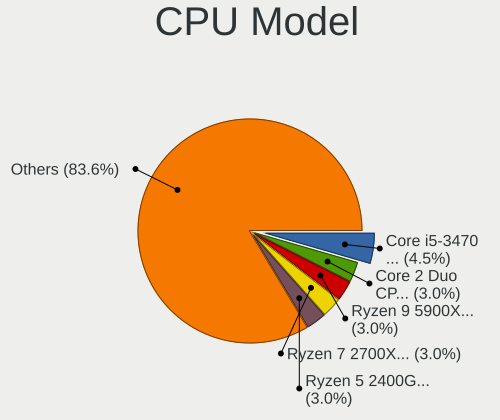

| Model                                       | Desktops | Percent |
|---------------------------------------------|----------|---------|
| Intel Core i5-3470 CPU @ 3.20GHz            | 3        | 4.48%   |
| Intel Core 2 Duo CPU E7300 @ 2.66GHz        | 2        | 2.99%   |
| AMD Ryzen 9 5900X 12-Core Processor         | 2        | 2.99%   |
| AMD Ryzen 7 2700X Eight-Core Processor      | 2        | 2.99%   |
| AMD Ryzen 5 2400G with Radeon Vega Graphics | 2        | 2.99%   |
| Intel Xeon CPU E5-2690 0 @ 2.90GHz          | 1        | 1.49%   |
| Intel Xeon CPU E5-2670 @ 2.60GHz            | 1        | 1.49%   |
| Intel Xeon CPU E5-1650 v2 @ 3.50GHz         | 1        | 1.49%   |
| Intel Xeon CPU E5-1620 v2 @ 3.70GHz         | 1        | 1.49%   |
| Intel Xeon CPU E3-1276 v3 @ 3.60GHz         | 1        | 1.49%   |
| Intel Pentium Silver J5005 CPU @ 1.50GHz    | 1        | 1.49%   |
| Intel Pentium Dual-Core CPU E5800 @ 3.20GHz | 1        | 1.49%   |
| Intel Pentium Dual-Core CPU E5300 @ 2.60GHz | 1        | 1.49%   |
| Intel Pentium D CPU 2.80GHz                 | 1        | 1.49%   |
| Intel Core i9-7960X CPU @ 2.80GHz           | 1        | 1.49%   |
| Intel Core i7-9700K CPU @ 3.60GHz           | 1        | 1.49%   |
| Intel Core i7-8700K CPU @ 3.70GHz           | 1        | 1.49%   |
| Intel Core i7-7700K CPU @ 4.20GHz           | 1        | 1.49%   |
| Intel Core i7-6700 CPU @ 3.40GHz            | 1        | 1.49%   |
| Intel Core i7-4790K CPU @ 4.00GHz           | 1        | 1.49%   |
| Intel Core i7-4790 CPU @ 3.60GHz            | 1        | 1.49%   |
| Intel Core i7-3770K CPU @ 3.50GHz           | 1        | 1.49%   |
| Intel Core i7 CPU 920 @ 2.67GHz             | 1        | 1.49%   |
| Intel Core i7 CPU 860 @ 2.80GHz             | 1        | 1.49%   |
| Intel Core i5-9400F CPU @ 2.90GHz           | 1        | 1.49%   |
| Intel Core i5-8600K CPU @ 3.60GHz           | 1        | 1.49%   |
| Intel Core i5-6400 CPU @ 2.70GHz            | 1        | 1.49%   |
| Intel Core i5-4590T CPU @ 2.00GHz           | 1        | 1.49%   |
| Intel Core i5-4570 CPU @ 3.20GHz            | 1        | 1.49%   |
| Intel Core i5-3570 CPU @ 3.40GHz            | 1        | 1.49%   |
| Intel Core i5-2500 CPU @ 3.30GHz            | 1        | 1.49%   |
| Intel Core i5 CPU 750 @ 2.67GHz             | 1        | 1.49%   |
| Intel Core i5 CPU 650 @ 3.20GHz             | 1        | 1.49%   |
| Intel Core i3-4150 CPU @ 3.50GHz            | 1        | 1.49%   |
| Intel Core i3-4130 CPU @ 3.40GHz            | 1        | 1.49%   |
| Intel Core 2 Duo CPU E8600 @ 3.33GHz        | 1        | 1.49%   |
| Intel Core 2 Duo CPU E8500 @ 3.16GHz        | 1        | 1.49%   |
| Intel Core 2 Duo CPU E8300 @ 2.83GHz        | 1        | 1.49%   |
| Intel Core 2 Duo                            | 1        | 1.49%   |
| Intel Celeron CPU J3455 @ 1.50GHz           | 1        | 1.49%   |

CPU Model Family
----------------

Processor model prefix

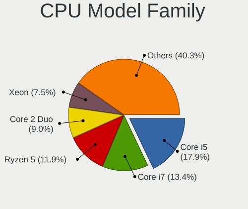

| Model                   | Desktops | Percent |
|-------------------------|----------|---------|
| Intel Core i5           | 12       | 17.91%  |
| Intel Core i7           | 9        | 13.43%  |
| AMD Ryzen 5             | 8        | 11.94%  |
| Intel Core 2 Duo        | 6        | 8.96%   |
| Intel Xeon              | 5        | 7.46%   |
| AMD Ryzen 7             | 4        | 5.97%   |
| Intel Celeron           | 3        | 4.48%   |
| AMD Ryzen 9             | 3        | 4.48%   |
| Intel Pentium Dual-Core | 2        | 2.99%   |
| Intel Core i3           | 2        | 2.99%   |
| AMD GX                  | 2        | 2.99%   |
| AMD Athlon 64 X2        | 2        | 2.99%   |
| Other                   | 1        | 1.49%   |
| Intel Pentium Silver    | 1        | 1.49%   |
| Intel Pentium D         | 1        | 1.49%   |
| Intel Core i9           | 1        | 1.49%   |
| AMD Ryzen 7 PRO         | 1        | 1.49%   |
| AMD Phenom II X4        | 1        | 1.49%   |
| AMD FX                  | 1        | 1.49%   |
| AMD A8                  | 1        | 1.49%   |
| AMD A6                  | 1        | 1.49%   |

CPU Cores
---------

Number of processor cores

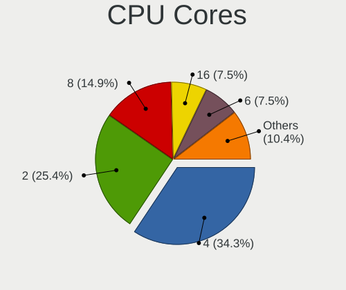

| Number  | Desktops | Percent |
|---------|----------|---------|
| 4       | 23       | 34.33%  |
| 2       | 17       | 25.37%  |
| 8       | 10       | 14.93%  |
| 16      | 5        | 7.46%   |
| 6       | 5        | 7.46%   |
| 12      | 4        | 5.97%   |
| 24      | 2        | 2.99%   |
| Unknown | 1        | 1.49%   |

CPU Sockets
-----------

Number of sockets

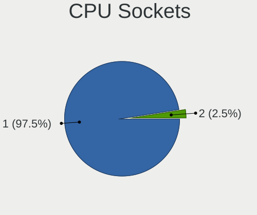

| Number | Desktops | Percent |
|--------|----------|---------|
| 1      | 66       | 98.51%  |
| 2      | 1        | 1.49%   |

CPU Threads
-----------

Threads per core (Hyper-Threading)

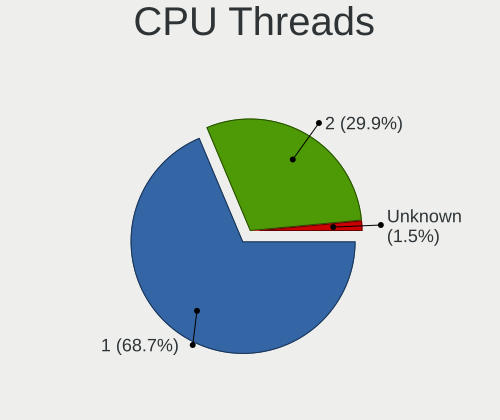

| Number  | Desktops | Percent |
|---------|----------|---------|
| 1       | 46       | 68.66%  |
| 2       | 20       | 29.85%  |
| Unknown | 1        | 1.49%   |

CPU Microarch
-------------

Microarchitecture

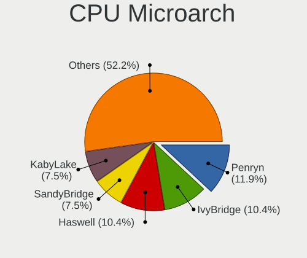

| Name          | Desktops | Percent |
|---------------|----------|---------|
| Penryn        | 8        | 11.94%  |
| IvyBridge     | 7        | 10.45%  |
| Haswell       | 7        | 10.45%  |
| SandyBridge   | 5        | 7.46%   |
| KabyLake      | 5        | 7.46%   |
| Zen+          | 4        | 5.97%   |
| Zen 3         | 4        | 5.97%   |
| Zen 2         | 4        | 5.97%   |
| Zen           | 3        | 4.48%   |
| Skylake       | 3        | 4.48%   |
| Nehalem       | 3        | 4.48%   |
| Puma          | 2        | 2.99%   |
| K8 Hammer     | 2        | 2.99%   |
| Jaguar        | 2        | 2.99%   |
| Unknown       | 2        | 2.99%   |
| Westmere      | 1        | 1.49%   |
| Piledriver    | 1        | 1.49%   |
| NetBurst      | 1        | 1.49%   |
| K10           | 1        | 1.49%   |
| Goldmont plus | 1        | 1.49%   |
| Goldmont      | 1        | 1.49%   |

Graphics
--------

GPU Vendor
----------

Vendors of graphics cards

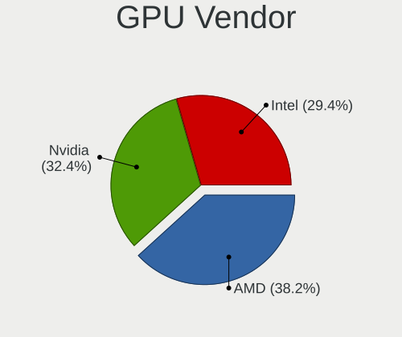

| Vendor | Desktops | Percent |
|--------|----------|---------|
| AMD    | 26       | 38.24%  |
| Nvidia | 22       | 32.35%  |
| Intel  | 20       | 29.41%  |

GPU Model
---------

Graphics card models

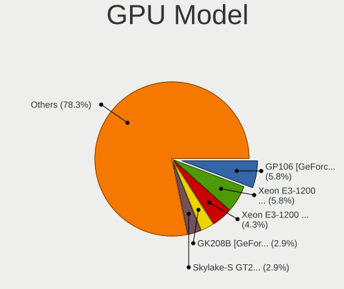

| Model                                                                       | Desktops | Percent |
|-----------------------------------------------------------------------------|----------|---------|
| Nvidia GP106 [GeForce GTX 1060 6GB]                                         | 4        | 5.8%    |
| Intel Xeon E3-1200 v3/4th Gen Core Processor Integrated Graphics Controller | 4        | 5.8%    |
| Intel Xeon E3-1200 v2/3rd Gen Core processor Graphics Controller            | 3        | 4.35%   |
| Nvidia GK208B [GeForce GT 710]                                              | 2        | 2.9%    |
| Intel Skylake-S GT2 [HD Graphics 530]                                       | 2        | 2.9%    |
| Intel 82G33/G31 Express Integrated Graphics Controller                      | 2        | 2.9%    |
| Intel 2nd Generation Core Processor Family Integrated Graphics Controller   | 2        | 2.9%    |
| AMD Navi 21 [Radeon RX 6800/6800 XT / 6900 XT]                              | 2        | 2.9%    |
| AMD Ellesmere [Radeon RX 470/480/570/570X/580/580X/590]                     | 2        | 2.9%    |
| AMD Cedar [Radeon HD 5000/6000/7350/8350 Series]                            | 2        | 2.9%    |
| Nvidia GT218 [GeForce 210]                                                  | 1        | 1.45%   |
| Nvidia GP108 [GeForce GT 1030]                                              | 1        | 1.45%   |
| Nvidia GP107 [GeForce GTX 1050 Ti]                                          | 1        | 1.45%   |
| Nvidia GP104 [GeForce GTX 1070 Ti]                                          | 1        | 1.45%   |
| Nvidia GP102 [TITAN X Pascal]                                               | 1        | 1.45%   |
| Nvidia GP102 [GeForce GTX 1080 Ti]                                          | 1        | 1.45%   |
| Nvidia GM107GL [Quadro K2200]                                               | 1        | 1.45%   |
| Nvidia GM107 [GeForce GTX 750]                                              | 1        | 1.45%   |
| Nvidia GM107 [GeForce GTX 750 Ti]                                           | 1        | 1.45%   |
| Nvidia GK107 [GeForce GTX 650]                                              | 1        | 1.45%   |
| Nvidia GF108 [GeForce GT 630]                                               | 1        | 1.45%   |
| Nvidia GA104 [GeForce RTX 3070]                                             | 1        | 1.45%   |
| Nvidia GA104 [GeForce RTX 3070 Lite Hash Rate]                              | 1        | 1.45%   |
| Nvidia G92 [GeForce GTS 250]                                                | 1        | 1.45%   |
| Nvidia G72 [GeForce 7300 LE]                                                | 1        | 1.45%   |
| Nvidia C61 [GeForce 7025 / nForce 630a]                                     | 1        | 1.45%   |
| Intel Xeon E3-1200 v3 Processor Integrated Graphics Controller              | 1        | 1.45%   |
| Intel Kaby Lake-S GT2 [HD Graphics 630]                                     | 1        | 1.45%   |
| Intel GeminiLake [UHD Graphics 605]                                         | 1        | 1.45%   |
| Intel Core Processor Integrated Graphics Controller                         | 1        | 1.45%   |
| Intel Apollo Lake GT1 [HD Graphics 500]                                     | 1        | 1.45%   |
| Intel 82Q35 Express Integrated Graphics Controller                          | 1        | 1.45%   |
| Intel 4th Generation Core Processor Family Integrated Graphics Controller   | 1        | 1.45%   |
| AMD Vega 20 [Radeon VII]                                                    | 1        | 1.45%   |
| AMD RV620 PRO [Radeon HD 3470]                                              | 1        | 1.45%   |
| AMD RS482/RS485 [Radeon Xpress 1100/1150]                                   | 1        | 1.45%   |
| AMD RS480 [Radeon Xpress 1150] (Secondary)                                  | 1        | 1.45%   |
| AMD Renoir [Radeon Vega Series / Radeon Vega Mobile Series]                 | 1        | 1.45%   |
| AMD Raven Ridge [Radeon Vega Series / Radeon Vega Mobile Series]            | 1        | 1.45%   |
| AMD Pitcairn XT GL [FirePro W7000]                                          | 1        | 1.45%   |

GPU Combo
---------

Combinations of graphics cards

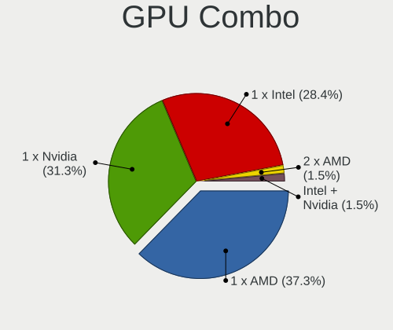

| Name           | Desktops | Percent |
|----------------|----------|---------|
| 1 x AMD        | 25       | 37.31%  |
| 1 x Nvidia     | 21       | 31.34%  |
| 1 x Intel      | 19       | 28.36%  |
| 2 x AMD        | 1        | 1.49%   |
| Intel + Nvidia | 1        | 1.49%   |

GPU Driver
----------

Free vs proprietary

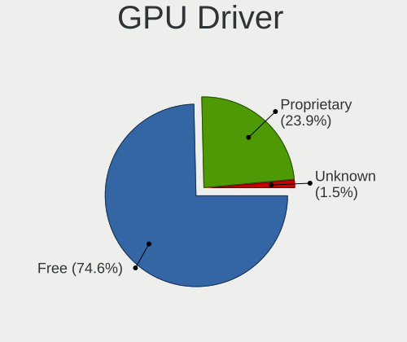

| Driver      | Desktops | Percent |
|-------------|----------|---------|
| Free        | 50       | 74.63%  |
| Proprietary | 16       | 23.88%  |
| Unknown     | 1        | 1.49%   |

GPU Memory
----------

Total video memory

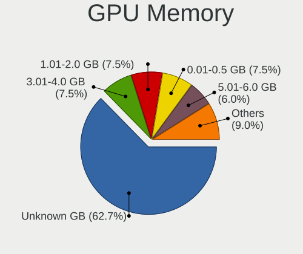

| Size in GB | Desktops | Percent |
|------------|----------|---------|
| Unknown    | 42       | 62.69%  |
| 3.01-4.0   | 5        | 7.46%   |
| 1.01-2.0   | 5        | 7.46%   |
| 0.01-0.5   | 5        | 7.46%   |
| 5.01-6.0   | 4        | 5.97%   |
| 7.01-8.0   | 3        | 4.48%   |
| 0.51-1.0   | 2        | 2.99%   |
| 8.01-16.0  | 1        | 1.49%   |

Monitor
-------

Monitor Vendor
--------------

Monitor vendors

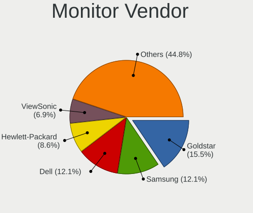

| Vendor               | Desktops | Percent |
|----------------------|----------|---------|
| Goldstar             | 9        | 15.52%  |
| Samsung Electronics  | 7        | 12.07%  |
| Dell                 | 7        | 12.07%  |
| Hewlett-Packard      | 5        | 8.62%   |
| ViewSonic            | 4        | 6.9%    |
| Ancor Communications | 4        | 6.9%    |
| Acer                 | 4        | 6.9%    |
| Fujitsu Siemens      | 3        | 5.17%   |
| ASUSTek Computer     | 2        | 3.45%   |
| ___                  | 1        | 1.72%   |
| Westinghouse         | 1        | 1.72%   |
| Vizio                | 1        | 1.72%   |
| Toshiba              | 1        | 1.72%   |
| Sony                 | 1        | 1.72%   |
| Philips              | 1        | 1.72%   |
| NEC Computers        | 1        | 1.72%   |
| MSI                  | 1        | 1.72%   |
| Mi                   | 1        | 1.72%   |
| LG Electronics       | 1        | 1.72%   |
| HannStar             | 1        | 1.72%   |
| BenQ                 | 1        | 1.72%   |
| Belinea              | 1        | 1.72%   |

Monitor Model
-------------

Monitor models

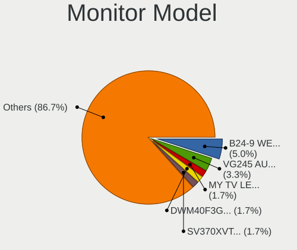

| Model                                                                   | Desktops | Percent |
|-------------------------------------------------------------------------|----------|---------|
| Fujitsu Siemens B24-9 WE FUS08C3 1920x1200 520x320mm 24.0-inch          | 3        | 5%      |
| ASUSTek Computer VG245 AUS24A1 1920x1080 530x300mm 24.0-inch            | 2        | 3.33%   |
| ___ MY TV LED TV ___0101 1920x1080                                      | 1        | 1.67%   |
| Westinghouse DWM40F3G1 WET1ECC 1920x1080 880x480mm 39.5-inch            | 1        | 1.67%   |
| Vizio SV370XVT VIZ0057 1920x1080 820x460mm 37.0-inch                    | 1        | 1.67%   |
| ViewSonic VX910 VSC3C19 1280x1024 380x300mm 19.1-inch                   | 1        | 1.67%   |
| ViewSonic VA2418-FHD VSCD739 1920x1080 530x300mm 24.0-inch              | 1        | 1.67%   |
| ViewSonic VA2212 Series VSCBD2B 1920x1080 480x270mm 21.7-inch           | 1        | 1.67%   |
| ViewSonic TD2420 SERIES VSC452D 1920x1080 520x290mm 23.4-inch           | 1        | 1.67%   |
| Toshiba LCD-MONITOR LCDC980 1280x1024 380x300mm 19.1-inch               | 1        | 1.67%   |
| Sony TV SNY5D01 1360x768                                                | 1        | 1.67%   |
| Samsung Electronics U28E510 SAM0D68 3840x2160 610x350mm 27.7-inch       | 1        | 1.67%   |
| Samsung Electronics SyncMaster SAM036F 1440x900 410x260mm 19.1-inch     | 1        | 1.67%   |
| Samsung Electronics SA300/350/360 SAM07D5 1920x1080 530x300mm 24.0-inch | 1        | 1.67%   |
| Samsung Electronics S27E330 SAM0D91 1920x1080 600x340mm 27.2-inch       | 1        | 1.67%   |
| Samsung Electronics LCD Monitor U28E590 3840x2160                       | 1        | 1.67%   |
| Samsung Electronics C27FG7x SAM0E41 1920x1080 600x340mm 27.2-inch       | 1        | 1.67%   |
| Samsung Electronics C24F390 SAM0D2C 1920x1080 520x290mm 23.4-inch       | 1        | 1.67%   |
| Philips 170S PHL0856 1280x1024 340x270mm 17.1-inch                      | 1        | 1.67%   |
| NEC Computers EA275WMi NEC2BA7 2560x1440 600x340mm 27.2-inch            | 1        | 1.67%   |
| MSI G32C4W MSI5DA6 1920x1080 700x390mm 31.5-inch                        | 1        | 1.67%   |
| Mi Monitor XMI27A1 2560x1440 600x330mm 27.0-inch                        | 1        | 1.67%   |
| LG Electronics LCD Monitor LG HDR QHD 2560x1440                         | 1        | 1.67%   |
| Hewlett-Packard W2072a HWP299F 1600x900 440x250mm 19.9-inch             | 1        | 1.67%   |
| Hewlett-Packard vs17 HWP2647 1280x1024 340x270mm 17.1-inch              | 1        | 1.67%   |
| Hewlett-Packard L1710 HWP26EB 1280x1024 340x270mm 17.1-inch             | 1        | 1.67%   |
| Hewlett-Packard HPQ 8300 AiO HWP4212 1920x1080 510x290mm 23.1-inch      | 1        | 1.67%   |
| Hewlett-Packard 27f 4k HPN3639 3840x2160 600x340mm 27.2-inch            | 1        | 1.67%   |
| HannStar LCD Monitor HSD0013 1280x1024 380x300mm 19.1-inch              | 1        | 1.67%   |
| Goldstar W1943 GSM4BAD 1360x768 410x230mm 18.5-inch                     | 1        | 1.67%   |
| Goldstar W1934 GSM4B7A 1440x900 410x260mm 19.1-inch                     | 1        | 1.67%   |
| Goldstar LG ULTRAWIDE GSM5AFB 2560x1080 800x340mm 34.2-inch             | 1        | 1.67%   |
| Goldstar LG UltraFine GSM5B10 3840x2160 480x270mm 21.7-inch             | 1        | 1.67%   |
| Goldstar LG FULL HD GSM5B55 1920x1080 480x270mm 21.7-inch               | 1        | 1.67%   |
| Goldstar LCD Monitor GSM5AB7 1920x1080 480x270mm 21.7-inch              | 1        | 1.67%   |
| Goldstar E2742 GSM58C9 1920x1080 600x340mm 27.2-inch                    | 1        | 1.67%   |
| Goldstar E2241 GSM581A 1920x1080 480x270mm 21.7-inch                    | 1        | 1.67%   |
| Goldstar 22MP55 GSM5A26 1920x1080 480x270mm 21.7-inch                   | 1        | 1.67%   |
| Dell U2722D DEL422F 2560x1440 600x340mm 27.2-inch                       | 1        | 1.67%   |
| Dell U2722D DEL422D 2560x1440 600x340mm 27.2-inch                       | 1        | 1.67%   |

Monitor Resolution
------------------

Monitor screen resolution

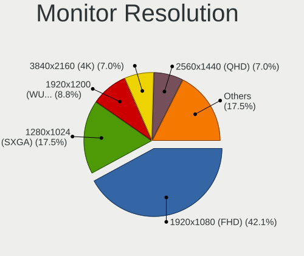

| Resolution         | Desktops | Percent |
|--------------------|----------|---------|
| 1920x1080 (FHD)    | 24       | 42.11%  |
| 1280x1024 (SXGA)   | 10       | 17.54%  |
| 1920x1200 (WUXGA)  | 5        | 8.77%   |
| 3840x2160 (4K)     | 4        | 7.02%   |
| 2560x1440 (QHD)    | 4        | 7.02%   |
| 1600x900 (HD+)     | 2        | 3.51%   |
| 1440x900 (WXGA+)   | 2        | 3.51%   |
| 1360x768           | 2        | 3.51%   |
| 2560x1080          | 1        | 1.75%   |
| 1680x1050 (WSXGA+) | 1        | 1.75%   |
| 1600x1200          | 1        | 1.75%   |
| 1366x768 (WXGA)    | 1        | 1.75%   |

Monitor Diagonal
----------------

Diagonal size in inches

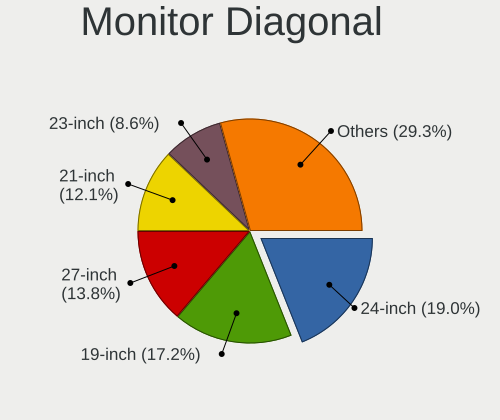

| Inches  | Desktops | Percent |
|---------|----------|---------|
| 24      | 11       | 18.97%  |
| 19      | 10       | 17.24%  |
| 27      | 8        | 13.79%  |
| 21      | 7        | 12.07%  |
| 23      | 5        | 8.62%   |
| 17      | 5        | 8.62%   |
| Unknown | 4        | 6.9%    |
| 18      | 2        | 3.45%   |
| 39      | 1        | 1.72%   |
| 37      | 1        | 1.72%   |
| 34      | 1        | 1.72%   |
| 31      | 1        | 1.72%   |
| 25      | 1        | 1.72%   |
| 22      | 1        | 1.72%   |

Monitor Width
-------------

Physical width

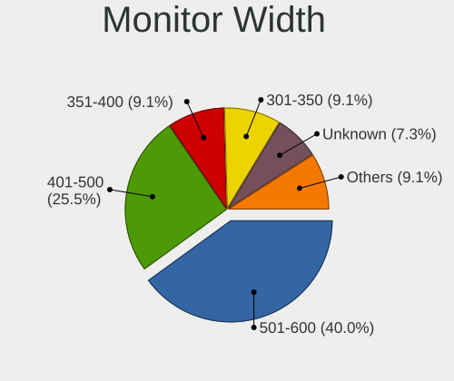

| Width in mm | Desktops | Percent |
|-------------|----------|---------|
| 501-600     | 22       | 40%     |
| 401-500     | 14       | 25.45%  |
| 351-400     | 5        | 9.09%   |
| 301-350     | 5        | 9.09%   |
| Unknown     | 4        | 7.27%   |
| 801-900     | 2        | 3.64%   |
| 601-700     | 2        | 3.64%   |
| 701-800     | 1        | 1.82%   |

Aspect Ratio
------------

Proportional relationship between the width and the height

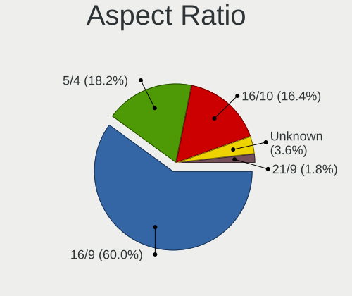

| Ratio   | Desktops | Percent |
|---------|----------|---------|
| 16/9    | 33       | 60%     |
| 5/4     | 10       | 18.18%  |
| 16/10   | 9        | 16.36%  |
| Unknown | 2        | 3.64%   |
| 21/9    | 1        | 1.82%   |

Monitor Area
------------

Area in inch²

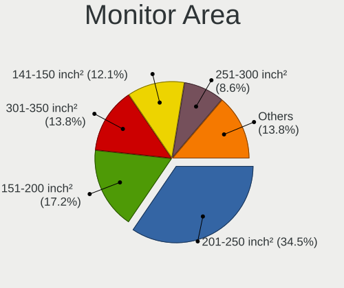

| Area in inch² | Desktops | Percent |
|----------------|----------|---------|
| 201-250        | 20       | 34.48%  |
| 151-200        | 10       | 17.24%  |
| 301-350        | 8        | 13.79%  |
| 141-150        | 7        | 12.07%  |
| 251-300        | 5        | 8.62%   |
| Unknown        | 4        | 6.9%    |
| 351-500        | 2        | 3.45%   |
| 501-1000       | 2        | 3.45%   |

Pixel Density
-------------

Pixels per inch

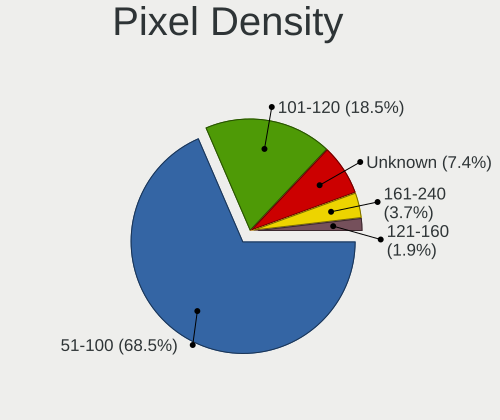

| Density | Desktops | Percent |
|---------|----------|---------|
| 51-100  | 37       | 68.52%  |
| 101-120 | 10       | 18.52%  |
| Unknown | 4        | 7.41%   |
| 161-240 | 2        | 3.7%    |
| 121-160 | 1        | 1.85%   |

Multiple Monitors
-----------------

Total monitors connected

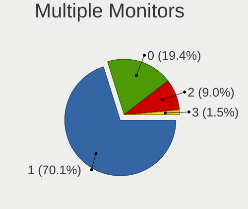

| Total | Desktops | Percent |
|-------|----------|---------|
| 1     | 47       | 70.15%  |
| 0     | 13       | 19.4%   |
| 2     | 6        | 8.96%   |
| 3     | 1        | 1.49%   |

Network
-------

Net Controller Vendor
---------------------

Controller vendors

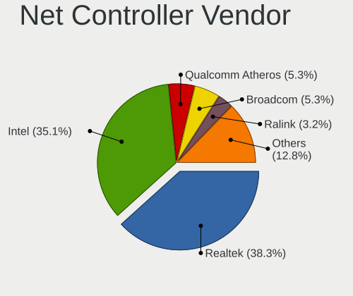

| Vendor                | Desktops | Percent |
|-----------------------|----------|---------|
| Realtek Semiconductor | 36       | 38.3%   |
| Intel                 | 33       | 35.11%  |
| Qualcomm Atheros      | 5        | 5.32%   |
| Broadcom              | 5        | 5.32%   |
| Ralink Technology     | 3        | 3.19%   |
| Mellanox Technologies | 2        | 2.13%   |
| TP-Link               | 1        | 1.06%   |
| Samsung Electronics   | 1        | 1.06%   |
| Ralink                | 1        | 1.06%   |
| Qualcomm              | 1        | 1.06%   |
| Nvidia                | 1        | 1.06%   |
| Microchip Technology  | 1        | 1.06%   |
| Huawei Technologies   | 1        | 1.06%   |
| Edimax Technology     | 1        | 1.06%   |
| D-Link System         | 1        | 1.06%   |
| Brooktrout Technology | 1        | 1.06%   |

Net Controller Model
--------------------

Controller models

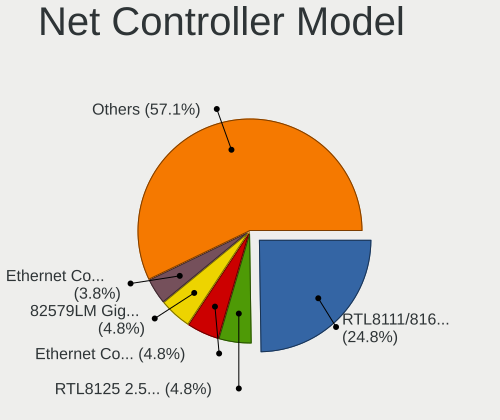

| Model                                                                                 | Desktops | Percent |
|---------------------------------------------------------------------------------------|----------|---------|
| Realtek RTL8111/8168/8211/8411 PCI Express Gigabit Ethernet Controller                | 26       | 24.76%  |
| Realtek RTL8125 2.5GbE Controller                                                     | 5        | 4.76%   |
| Intel Ethernet Connection (2) I219-V                                                  | 5        | 4.76%   |
| Intel 82579LM Gigabit Network Connection (Lewisville)                                 | 5        | 4.76%   |
| Intel Ethernet Connection I217-LM                                                     | 4        | 3.81%   |
| Intel I211 Gigabit Network Connection                                                 | 3        | 2.86%   |
| Intel Ethernet Controller I225-V                                                      | 3        | 2.86%   |
| Realtek RTL8192CE PCIe Wireless Network Adapter                                       | 2        | 1.9%    |
| Ralink RT2501/RT2573 Wireless Adapter                                                 | 2        | 1.9%    |
| Mellanox MT27500 Family [ConnectX-3]                                                  | 2        | 1.9%    |
| Intel 82567LM-3 Gigabit Network Connection                                            | 2        | 1.9%    |
| TP-Link Archer T3U [Realtek RTL8812BU]                                                | 1        | 0.95%   |
| Samsung Galaxy series, misc. (tethering mode)                                         | 1        | 0.95%   |
| Realtek RTL8822BE 802.11a/b/g/n/ac WiFi adapter                                       | 1        | 0.95%   |
| Realtek RTL8821CE 802.11ac PCIe Wireless Network Adapter                              | 1        | 0.95%   |
| Realtek RTL8811AU 802.11a/b/g/n/ac WLAN Adapter                                       | 1        | 0.95%   |
| Realtek RTL8188FTV 802.11b/g/n 1T1R 2.4G WLAN Adapter                                 | 1        | 0.95%   |
| Realtek RTL8188EUS 802.11n Wireless Network Adapter                                   | 1        | 0.95%   |
| Realtek RTL8188EE Wireless Network Adapter                                            | 1        | 0.95%   |
| Realtek RTL810xE PCI Express Fast Ethernet controller                                 | 1        | 0.95%   |
| Ralink RT5372 Wireless Adapter                                                        | 1        | 0.95%   |
| Ralink RT5392 PCIe Wireless Network Adapter                                           | 1        | 0.95%   |
| Qualcomm Atheros QCA8171 Gigabit Ethernet                                             | 1        | 0.95%   |
| Qualcomm Atheros AR9485 Wireless Network Adapter                                      | 1        | 0.95%   |
| Qualcomm Atheros AR9462 Wireless Network Adapter                                      | 1        | 0.95%   |
| Qualcomm Atheros AR928X Wireless Network Adapter (PCI-Express)                        | 1        | 0.95%   |
| Qualcomm Atheros AR5418 Wireless Network Adapter [AR5008E 802.11(a)bgn] (PCI-Express) | 1        | 0.95%   |
| Qualcomm ALCATEL RNDIS Interface                                                      | 1        | 0.95%   |
| Nvidia MCP73 Ethernet                                                                 | 1        | 0.95%   |
| Microchip MCP2200 USB-to-Serial Port                                                  | 1        | 0.95%   |
| Intel Wireless 8265 / 8275                                                            | 1        | 0.95%   |
| Intel Wireless 7260                                                                   | 1        | 0.95%   |
| Intel Wireless 3165                                                                   | 1        | 0.95%   |
| Intel Wi-Fi 6E(802.11ax) AX210/AX1675* 2x2 [Typhoon Peak]                             | 1        | 0.95%   |
| Intel Wi-Fi 6 AX200                                                                   | 1        | 0.95%   |
| Intel NM10/ICH7 Family LAN Controller                                                 | 1        | 0.95%   |
| Intel I210 Gigabit Network Connection                                                 | 1        | 0.95%   |
| Intel Ethernet Connection (7) I219-V                                                  | 1        | 0.95%   |
| Intel Ethernet Connection (2) I218-V                                                  | 1        | 0.95%   |
| Intel Dual Band Wireless-AC 3168NGW [Stone Peak]                                      | 1        | 0.95%   |

Wireless Vendor
---------------

Wireless vendors

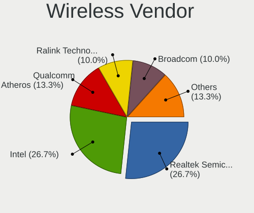

| Vendor                | Desktops | Percent |
|-----------------------|----------|---------|
| Realtek Semiconductor | 8        | 26.67%  |
| Intel                 | 8        | 26.67%  |
| Qualcomm Atheros      | 4        | 13.33%  |
| Ralink Technology     | 3        | 10%     |
| Broadcom              | 3        | 10%     |
| TP-Link               | 1        | 3.33%   |
| Ralink                | 1        | 3.33%   |
| Edimax Technology     | 1        | 3.33%   |
| D-Link System         | 1        | 3.33%   |

Wireless Model
--------------

Wireless models

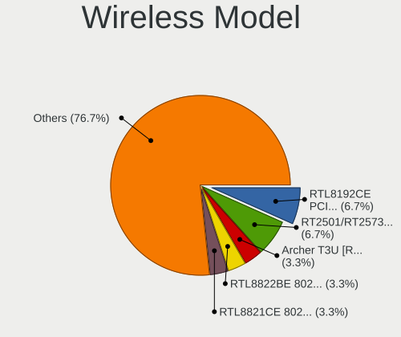

| Model                                                                                 | Desktops | Percent |
|---------------------------------------------------------------------------------------|----------|---------|
| Realtek RTL8192CE PCIe Wireless Network Adapter                                       | 2        | 6.67%   |
| Ralink RT2501/RT2573 Wireless Adapter                                                 | 2        | 6.67%   |
| TP-Link Archer T3U [Realtek RTL8812BU]                                                | 1        | 3.33%   |
| Realtek RTL8822BE 802.11a/b/g/n/ac WiFi adapter                                       | 1        | 3.33%   |
| Realtek RTL8821CE 802.11ac PCIe Wireless Network Adapter                              | 1        | 3.33%   |
| Realtek RTL8811AU 802.11a/b/g/n/ac WLAN Adapter                                       | 1        | 3.33%   |
| Realtek RTL8188FTV 802.11b/g/n 1T1R 2.4G WLAN Adapter                                 | 1        | 3.33%   |
| Realtek RTL8188EUS 802.11n Wireless Network Adapter                                   | 1        | 3.33%   |
| Realtek RTL8188EE Wireless Network Adapter                                            | 1        | 3.33%   |
| Ralink RT5372 Wireless Adapter                                                        | 1        | 3.33%   |
| Ralink RT5392 PCIe Wireless Network Adapter                                           | 1        | 3.33%   |
| Qualcomm Atheros AR9485 Wireless Network Adapter                                      | 1        | 3.33%   |
| Qualcomm Atheros AR9462 Wireless Network Adapter                                      | 1        | 3.33%   |
| Qualcomm Atheros AR928X Wireless Network Adapter (PCI-Express)                        | 1        | 3.33%   |
| Qualcomm Atheros AR5418 Wireless Network Adapter [AR5008E 802.11(a)bgn] (PCI-Express) | 1        | 3.33%   |
| Intel Wireless 8265 / 8275                                                            | 1        | 3.33%   |
| Intel Wireless 7260                                                                   | 1        | 3.33%   |
| Intel Wireless 3165                                                                   | 1        | 3.33%   |
| Intel Wi-Fi 6E(802.11ax) AX210/AX1675* 2x2 [Typhoon Peak]                             | 1        | 3.33%   |
| Intel Wi-Fi 6 AX200                                                                   | 1        | 3.33%   |
| Intel Dual Band Wireless-AC 3168NGW [Stone Peak]                                      | 1        | 3.33%   |
| Intel Dual Band Wireless-AC 3165 Plus Bluetooth                                       | 1        | 3.33%   |
| Intel Centrino Wireless-N 105                                                         | 1        | 3.33%   |
| Edimax EW-7811Un 802.11n Wireless Adapter [Realtek RTL8188CUS]                        | 1        | 3.33%   |
| D-Link System DWA-125 Wireless N 150 Adapter(rev.A1) [Ralink RT3070]                  | 1        | 3.33%   |
| Broadcom BCM4360 802.11ac Dual Band Wireless Network Adapter                          | 1        | 3.33%   |
| Broadcom BCM4352 802.11ac Dual Band Wireless Network Adapter                          | 1        | 3.33%   |
| Broadcom BCM43142 802.11b/g/n                                                         | 1        | 3.33%   |

Ethernet Vendor
---------------

Ethernet vendors

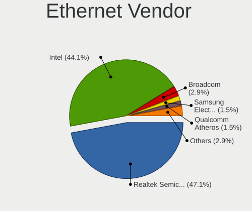

| Vendor                | Desktops | Percent |
|-----------------------|----------|---------|
| Realtek Semiconductor | 32       | 47.06%  |
| Intel                 | 30       | 44.12%  |
| Broadcom              | 2        | 2.94%   |
| Samsung Electronics   | 1        | 1.47%   |
| Qualcomm Atheros      | 1        | 1.47%   |
| Qualcomm              | 1        | 1.47%   |
| Nvidia                | 1        | 1.47%   |

Ethernet Model
--------------

Ethernet models

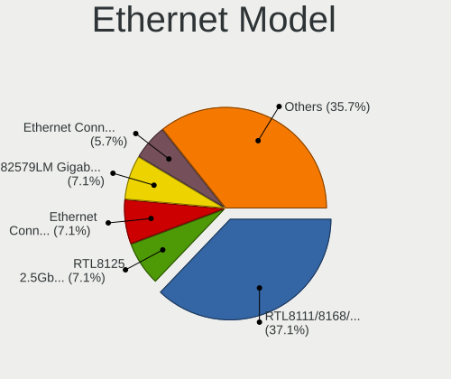

| Model                                                                  | Desktops | Percent |
|------------------------------------------------------------------------|----------|---------|
| Realtek RTL8111/8168/8211/8411 PCI Express Gigabit Ethernet Controller | 26       | 37.14%  |
| Realtek RTL8125 2.5GbE Controller                                      | 5        | 7.14%   |
| Intel Ethernet Connection (2) I219-V                                   | 5        | 7.14%   |
| Intel 82579LM Gigabit Network Connection (Lewisville)                  | 5        | 7.14%   |
| Intel Ethernet Connection I217-LM                                      | 4        | 5.71%   |
| Intel I211 Gigabit Network Connection                                  | 3        | 4.29%   |
| Intel Ethernet Controller I225-V                                       | 3        | 4.29%   |
| Intel 82567LM-3 Gigabit Network Connection                             | 2        | 2.86%   |
| Samsung Galaxy series, misc. (tethering mode)                          | 1        | 1.43%   |
| Realtek RTL810xE PCI Express Fast Ethernet controller                  | 1        | 1.43%   |
| Qualcomm Atheros QCA8171 Gigabit Ethernet                              | 1        | 1.43%   |
| Qualcomm ALCATEL RNDIS Interface                                       | 1        | 1.43%   |
| Nvidia MCP73 Ethernet                                                  | 1        | 1.43%   |
| Intel NM10/ICH7 Family LAN Controller                                  | 1        | 1.43%   |
| Intel I210 Gigabit Network Connection                                  | 1        | 1.43%   |
| Intel Ethernet Connection (7) I219-V                                   | 1        | 1.43%   |
| Intel Ethernet Connection (2) I218-V                                   | 1        | 1.43%   |
| Intel 82579V Gigabit Network Connection                                | 1        | 1.43%   |
| Intel 82578DC Gigabit Network Connection                               | 1        | 1.43%   |
| Intel 82574L Gigabit Network Connection                                | 1        | 1.43%   |
| Intel 82567V-2 Gigabit Network Connection                              | 1        | 1.43%   |
| Intel 82567LF-2 Gigabit Network Connection                             | 1        | 1.43%   |
| Intel 82566DM-2 Gigabit Network Connection                             | 1        | 1.43%   |
| Broadcom NetXtreme BCM5755 Gigabit Ethernet PCI Express                | 1        | 1.43%   |
| Broadcom NetLink BCM57780 Gigabit Ethernet PCIe                        | 1        | 1.43%   |

Net Controller Kind
-------------------

Ethernet, WiFi or modem

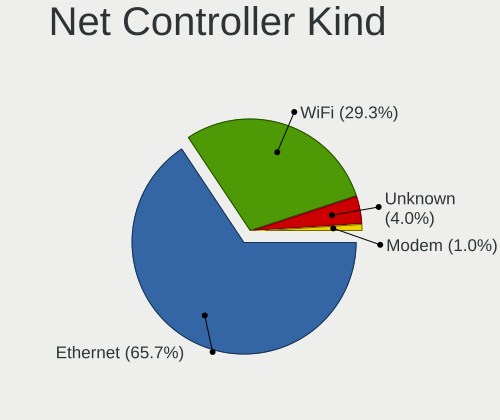

| Kind     | Desktops | Percent |
|----------|----------|---------|
| Ethernet | 65       | 65.66%  |
| WiFi     | 29       | 29.29%  |
| Unknown  | 4        | 4.04%   |
| Modem    | 1        | 1.01%   |

Used Controller
---------------

Currently used network controller

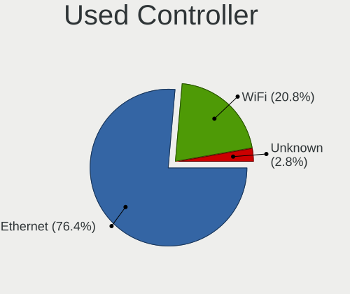

| Kind     | Desktops | Percent |
|----------|----------|---------|
| Ethernet | 55       | 76.39%  |
| WiFi     | 15       | 20.83%  |
| Unknown  | 2        | 2.78%   |

NICs
----

Total network controllers on board

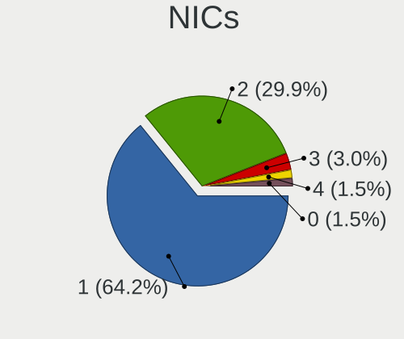

| Total | Desktops | Percent |
|-------|----------|---------|
| 1     | 43       | 64.18%  |
| 2     | 20       | 29.85%  |
| 3     | 2        | 2.99%   |
| 4     | 1        | 1.49%   |
| 0     | 1        | 1.49%   |

IPv6
----

IPv6 vs IPv4

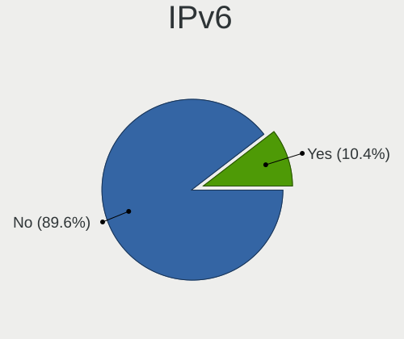

| Used | Desktops | Percent |
|------|----------|---------|
| No   | 60       | 89.55%  |
| Yes  | 7        | 10.45%  |

Bluetooth
---------

Bluetooth Vendor
----------------

Controller vendors

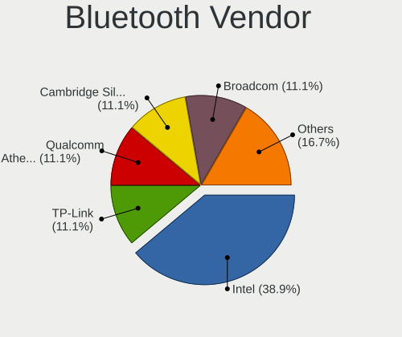

| Vendor                          | Desktops | Percent |
|---------------------------------|----------|---------|
| Intel                           | 7        | 38.89%  |
| TP-Link                         | 2        | 11.11%  |
| Qualcomm Atheros Communications | 2        | 11.11%  |
| Cambridge Silicon Radio         | 2        | 11.11%  |
| Broadcom                        | 2        | 11.11%  |
| Realtek Semiconductor           | 1        | 5.56%   |
| ASUSTek Computer                | 1        | 5.56%   |
| Apple                           | 1        | 5.56%   |

Bluetooth Model
---------------

Controller models

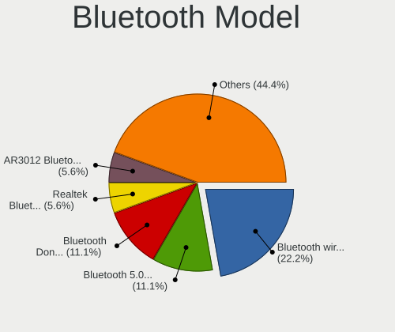

| Model                                               | Desktops | Percent |
|-----------------------------------------------------|----------|---------|
| Intel Bluetooth wireless interface                  | 4        | 22.22%  |
| TP-Link Bluetooth 5.0 USB Adapter                   | 2        | 11.11%  |
| Cambridge Silicon Radio Bluetooth Dongle (HCI mode) | 2        | 11.11%  |
| Realtek  Bluetooth 4.2 Adapter                      | 1        | 5.56%   |
| Qualcomm Atheros AR3012 Bluetooth 4.0               | 1        | 5.56%   |
| Qualcomm Atheros AR3011 Bluetooth (no firmware)     | 1        | 5.56%   |
| Intel Wireless-AC 3168 Bluetooth                    | 1        | 5.56%   |
| Intel AX210 Bluetooth                               | 1        | 5.56%   |
| Intel AX200 Bluetooth                               | 1        | 5.56%   |
| Broadcom BCM43142A0 Bluetooth Device                | 1        | 5.56%   |
| Broadcom BCM2045 Bluetooth                          | 1        | 5.56%   |
| ASUS Bluetooth Controller                           | 1        | 5.56%   |
| Apple Bluetooth Host Controller                     | 1        | 5.56%   |

Sound
-----

Sound Vendor
------------

Sound card vendors

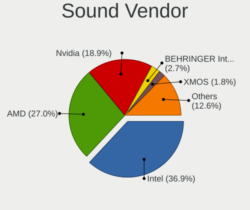

| Vendor                  | Desktops | Percent |
|-------------------------|----------|---------|
| Intel                   | 41       | 36.94%  |
| AMD                     | 30       | 27.03%  |
| Nvidia                  | 21       | 18.92%  |
| BEHRINGER International | 3        | 2.7%    |
| XMOS                    | 2        | 1.8%    |
| Sony                    | 2        | 1.8%    |
| C-Media Electronics     | 2        | 1.8%    |
| Tenx Technology         | 1        | 0.9%    |
| RME                     | 1        | 0.9%    |
| Realtek Semiconductor   | 1        | 0.9%    |
| Quanta                  | 1        | 0.9%    |
| LG Electronics          | 1        | 0.9%    |
| JMTek                   | 1        | 0.9%    |
| Creative Technology     | 1        | 0.9%    |
| Creative Labs           | 1        | 0.9%    |
| Corsair                 | 1        | 0.9%    |
| Audio-Technica          | 1        | 0.9%    |

Sound Model
-----------

Sound card models

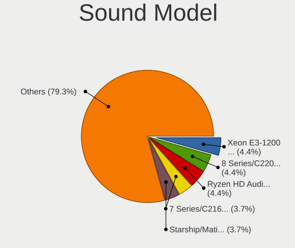

| Model                                                                      | Desktops | Percent |
|----------------------------------------------------------------------------|----------|---------|
| Intel Xeon E3-1200 v3/4th Gen Core Processor HD Audio Controller           | 6        | 4.44%   |
| Intel 8 Series/C220 Series Chipset High Definition Audio Controller        | 6        | 4.44%   |
| AMD Ryzen HD Audio Controller                                              | 6        | 4.44%   |
| Intel 7 Series/C216 Chipset Family High Definition Audio Controller        | 5        | 3.7%    |
| AMD Starship/Matisse HD Audio Controller                                   | 5        | 3.7%    |
| Nvidia GP106 High Definition Audio Controller                              | 4        | 2.96%   |
| Intel NM10/ICH7 Family High Definition Audio Controller                    | 4        | 2.96%   |
| Intel 6 Series/C200 Series Chipset Family High Definition Audio Controller | 4        | 2.96%   |
| AMD Navi 21/23 HDMI/DP Audio Controller                                    | 4        | 2.96%   |
| AMD Kabini HDMI/DP Audio                                                   | 4        | 2.96%   |
| AMD FCH Azalia Controller                                                  | 4        | 2.96%   |
| AMD Family 17h (Models 00h-0fh) HD Audio Controller                        | 4        | 2.96%   |
| Nvidia GM107 High Definition Audio Controller [GeForce 940MX]              | 3        | 2.22%   |
| Intel C600/X79 series chipset High Definition Audio Controller             | 3        | 2.22%   |
| Intel 5 Series/3400 Series Chipset High Definition Audio                   | 3        | 2.22%   |
| Intel 200 Series PCH HD Audio                                              | 3        | 2.22%   |
| Intel 100 Series/C230 Series Chipset Family HD Audio Controller            | 3        | 2.22%   |
| AMD Renoir/Cezanne HDMI/DP Audio Controller                                | 3        | 2.22%   |
| Nvidia MCP61 High Definition Audio                                         | 2        | 1.48%   |
| Nvidia GP102 HDMI Audio Controller                                         | 2        | 1.48%   |
| Nvidia GK208 HDMI/DP Audio Controller                                      | 2        | 1.48%   |
| Nvidia GA104 High Definition Audio Controller                              | 2        | 1.48%   |
| Intel Cannon Lake PCH cAVS                                                 | 2        | 1.48%   |
| Intel 82801JI (ICH10 Family) HD Audio Controller                           | 2        | 1.48%   |
| AMD SBx00 Azalia (Intel HDA)                                               | 2        | 1.48%   |
| AMD Raven/Raven2/Fenghuang HDMI/DP Audio Controller                        | 2        | 1.48%   |
| AMD Oland/Hainan/Cape Verde/Pitcairn HDMI Audio [Radeon HD 7000 Series]    | 2        | 1.48%   |
| AMD Ellesmere HDMI Audio [Radeon RX 470/480 / 570/580/590]                 | 2        | 1.48%   |
| AMD Cedar HDMI Audio [Radeon HD 5400/6300/7300 Series]                     | 2        | 1.48%   |
| XMOS XS1-U8 MFA (ST)                                                       | 1        | 0.74%   |
| XMOS Shanling UA2                                                          | 1        | 0.74%   |
| Tenx Technology USB  AUDIO                                                 | 1        | 0.74%   |
| Sony DualShock 4 [CUH-ZCT2x]                                               | 1        | 0.74%   |
| Sony Audio                                                                 | 1        | 0.74%   |
| RME ADI-2 DAC (57750520)                                                   | 1        | 0.74%   |
| Realtek Semiconductor UACDemoV1.0 HoverCam Solo Spark Audio                | 1        | 0.74%   |
| Quanta USB Audio Realtek USB2.0 Audio Microphone                           | 1        | 0.74%   |
| Nvidia MCP73 High Definition Audio                                         | 1        | 0.74%   |
| Nvidia High Definition Audio Controller                                    | 1        | 0.74%   |
| Nvidia GP108 High Definition Audio Controller                              | 1        | 0.74%   |

Memory
------

Memory Vendor
-------------

Memory module vendors

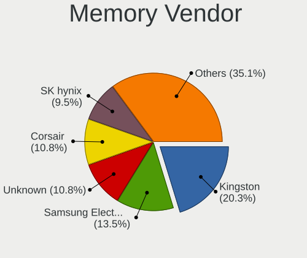

| Vendor              | Desktops | Percent |
|---------------------|----------|---------|
| Kingston            | 15       | 20.27%  |
| Samsung Electronics | 10       | 13.51%  |
| Unknown             | 8        | 10.81%  |
| Corsair             | 8        | 10.81%  |
| SK hynix            | 7        | 9.46%   |
| Micron Technology   | 6        | 8.11%   |
| G.Skill             | 6        | 8.11%   |
| Elpida              | 3        | 4.05%   |
| Crucial             | 3        | 4.05%   |
| Nanya Technology    | 2        | 2.7%    |
| Unifosa             | 1        | 1.35%   |
| Transcend           | 1        | 1.35%   |
| Silicon Power       | 1        | 1.35%   |
| Hitachi             | 1        | 1.35%   |
| EVGA                | 1        | 1.35%   |
| Unknown             | 1        | 1.35%   |

Memory Model
------------

Memory module models

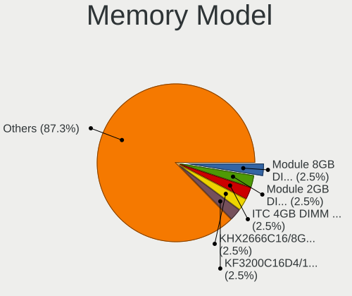

| Model                                                 | Desktops | Percent |
|-------------------------------------------------------|----------|---------|
| Unknown RAM Module 8GB DIMM DDR3 1600MT/s             | 2        | 2.53%   |
| Unknown RAM Module 2GB DIMM DDR2 800MT/s              | 2        | 2.53%   |
| Micron RAM ITC 4GB DIMM DDR3 1066MT/s                 | 2        | 2.53%   |
| Kingston RAM KHX2666C16/8G 8GB DIMM DDR4 2933MT/s     | 2        | 2.53%   |
| Kingston RAM KF3200C16D4/16GX 16GB DIMM DDR4 3200MT/s | 2        | 2.53%   |
| G.Skill RAM F4-3200C16-8GVKB 8GB DIMM DDR4 3200MT/s   | 2        | 2.53%   |
| Unknown RAM Module 2GB DIMM SDRAM                     | 1        | 1.27%   |
| Unknown RAM Module 2GB DIMM DDR 1333MT/s              | 1        | 1.27%   |
| Unknown RAM Module 1024MB DIMM DDR2 533MT/s           | 1        | 1.27%   |
| Unknown RAM 7TE39AA# 8GB DIMM DDR4 2667MT/s           | 1        | 1.27%   |
| Unifosa RAM GU502203EP0201 1GB DIMM DDR3 1333MT/s     | 1        | 1.27%   |
| Transcend RAM JM1333KLN-4G 4GB DIMM DDR3 1333MT/s     | 1        | 1.27%   |
| Transcend RAM JM1333KLH-8G 8GB DIMM DDR3 1333MT/s     | 1        | 1.27%   |
| SK hynix RAM Zhidian4GDDR800000 4GB DIMM DDR2 800MT/s | 1        | 1.27%   |
| SK hynix RAM HMT451U6AFR8C-PB 4GB DIMM DDR3 1600MT/s  | 1        | 1.27%   |
| SK hynix RAM HMT351U6EFR8C-PB 4GB DIMM DDR3 1600MT/s  | 1        | 1.27%   |
| SK hynix RAM HMT351U6CFR8C-PB 4GB DIMM DDR3 1600MT/s  | 1        | 1.27%   |
| SK hynix RAM HMT31GR7BFR4C-H9 8GB DIMM DDR3 1333MT/s  | 1        | 1.27%   |
| SK hynix RAM HMT31GR7AFR4C-H9 8GB DIMM DDR3 1333MT/s  | 1        | 1.27%   |
| SK hynix RAM HMT125U6AFP8C-G7 2GB DIMM DDR3 1066MT/s  | 1        | 1.27%   |
| SK hynix RAM HMT112U6AFP8C-G7 1GB DIMM 1066MT/s       | 1        | 1.27%   |
| SK hynix RAM HMA41GU6AFR8N-TF 8GB DIMM DDR4 2133MT/s  | 1        | 1.27%   |
| Silicon Power RAM DCLT4GN128S 4GB DIMM DDR3 1600MT/s  | 1        | 1.27%   |
| Samsung RAM M471B5674QH0-YK0 2GB SODIMM DDR3 1600MT/s | 1        | 1.27%   |
| Samsung RAM M471B5674EB0-YK0 2GB SODIMM DDR3 1600MT/s | 1        | 1.27%   |
| Samsung RAM M471B5273CM0-CH9 4GB SODIMM DDR3 1333MT/s | 1        | 1.27%   |
| Samsung RAM M471B5273CH0-CK0 4GB SODIMM DDR3 1600MT/s | 1        | 1.27%   |
| Samsung RAM M471B1G73DB0-YK0 8GB SODIMM DDR3 1600MT/s | 1        | 1.27%   |
| Samsung RAM M391B1G73QH0-YK0 8GB DIMM DDR3 1600MT/s   | 1        | 1.27%   |
| Samsung RAM M378B5673DZ1-CF8 2GB DIMM DDR3 1067MT/s   | 1        | 1.27%   |
| Samsung RAM M378B5173EB0-CK0 4GB DIMM DDR3 1600MT/s   | 1        | 1.27%   |
| Samsung RAM M378B1G73QH0-CK0 8GB DIMM DDR3 1600MT/s   | 1        | 1.27%   |
| Samsung RAM M378B1G73EB0-YK0 8GB DIMM DDR3 1600MT/s   | 1        | 1.27%   |
| Nanya RAM NT4GC64B88B1NF-DI 4GB DIMM DDR3 1600MT/s    | 1        | 1.27%   |
| Nanya RAM NT1GT64U88D0BY-AD 1GB DIMM DDR2 800MT/s     | 1        | 1.27%   |
| Micron RAM 8HTF12864AZ-800H1 1GB DIMM DDR2 800MT/s    | 1        | 1.27%   |
| Micron RAM 36JSZF1G72PZ-1G4D 8GB DIMM DDR3 1333MT/s   | 1        | 1.27%   |
| Micron RAM 36JSF1G72PZ-1 8GB DIMM DDR3 1600MT/s       | 1        | 1.27%   |
| Micron RAM 16JTF51264AZ-1G4M1 4GB DIMM DDR3 1333MT/s  | 1        | 1.27%   |
| Kingston RAM KY996D-ELD 2GB DIMM DDR3 1066MT/s        | 1        | 1.27%   |

Memory Kind
-----------

Memory module kinds

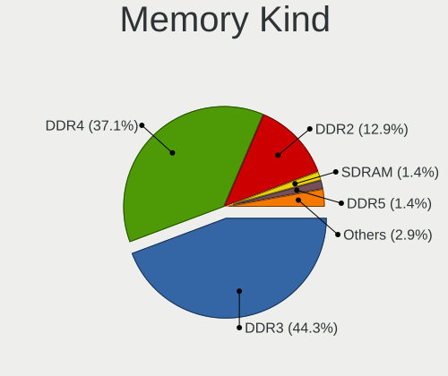

| Kind    | Desktops | Percent |
|---------|----------|---------|
| DDR3    | 31       | 44.29%  |
| DDR4    | 26       | 37.14%  |
| DDR2    | 9        | 12.86%  |
| SDRAM   | 1        | 1.43%   |
| DDR5    | 1        | 1.43%   |
| DDR     | 1        | 1.43%   |
| Unknown | 1        | 1.43%   |

Memory Form Factor
------------------

Physical design of the memory module

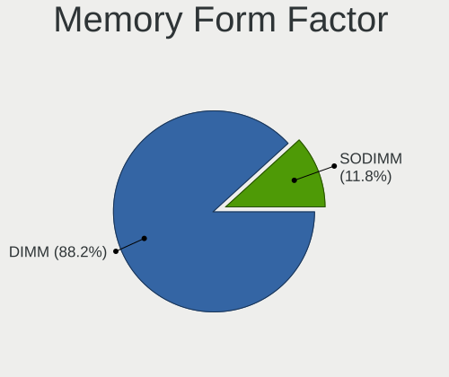

| Name   | Desktops | Percent |
|--------|----------|---------|
| DIMM   | 60       | 88.24%  |
| SODIMM | 8        | 11.76%  |

Memory Size
-----------

Memory module size

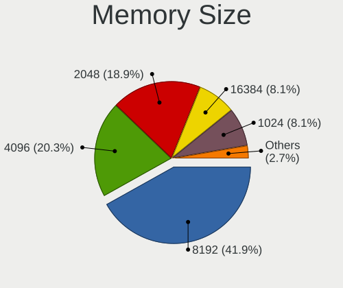

| Size  | Desktops | Percent |
|-------|----------|---------|
| 8192  | 31       | 41.89%  |
| 4096  | 15       | 20.27%  |
| 2048  | 14       | 18.92%  |
| 16384 | 6        | 8.11%   |
| 1024  | 6        | 8.11%   |
| 32768 | 2        | 2.7%    |

Memory Speed
------------

Memory module speed

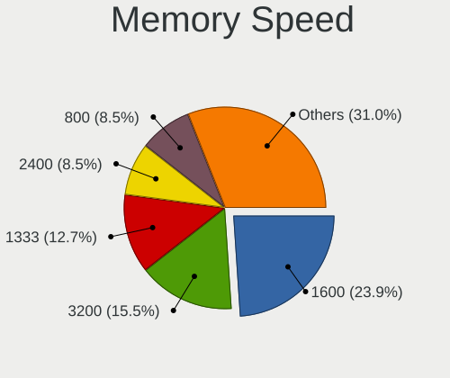

| Speed   | Desktops | Percent |
|---------|----------|---------|
| 1600    | 17       | 23.94%  |
| 3200    | 11       | 15.49%  |
| 1333    | 9        | 12.68%  |
| 2400    | 6        | 8.45%   |
| 800     | 6        | 8.45%   |
| 1066    | 4        | 5.63%   |
| 3600    | 3        | 4.23%   |
| 3000    | 3        | 4.23%   |
| 2933    | 3        | 4.23%   |
| 533     | 2        | 2.82%   |
| 5600    | 1        | 1.41%   |
| 2667    | 1        | 1.41%   |
| 2133    | 1        | 1.41%   |
| 1866    | 1        | 1.41%   |
| 1067    | 1        | 1.41%   |
| 667     | 1        | 1.41%   |
| Unknown | 1        | 1.41%   |

Printers & scanners
-------------------

Printer Vendor
--------------

Printer device vendors

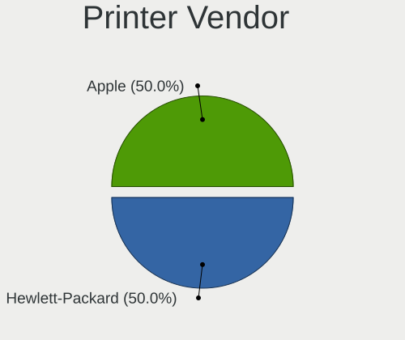

| Vendor          | Desktops | Percent |
|-----------------|----------|---------|
| Hewlett-Packard | 1        | 50%     |
| Apple           | 1        | 50%     |

Printer Model
-------------

Printer device models

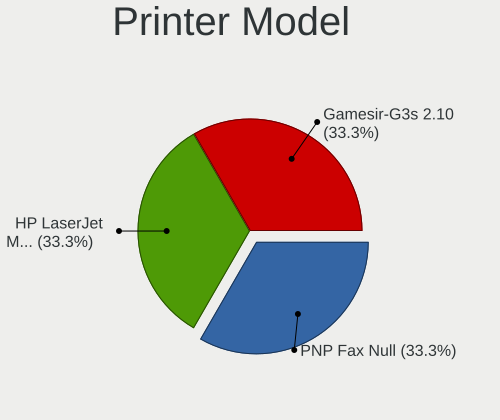

| Model                                                                    | Desktops | Percent |
|--------------------------------------------------------------------------|----------|---------|
| HP PNP Fax Null                                                          | 1        | 33.33%  |
| HP HP LaserJet M101-M106 Printer HP LEDM HP LEDM IPP Printer IPP Printer | 1        | 33.33%  |
| Apple Gamesir-G3s 2.10                                                   | 1        | 33.33%  |

Scanner Vendor
--------------

Scanner device vendors

| Vendor      | Desktops | Percent |
|-------------|----------|---------|
| Seiko Epson | 1        | 100%    |

Scanner Model
-------------

Scanner device models

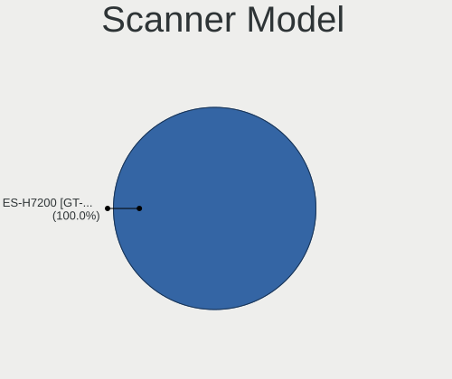

| Model                           | Desktops | Percent |
|---------------------------------|----------|---------|
| Seiko Epson ES-H7200 [GT-20000] | 1        | 100%    |

Camera
------

Camera Vendor
-------------

Camera device vendors

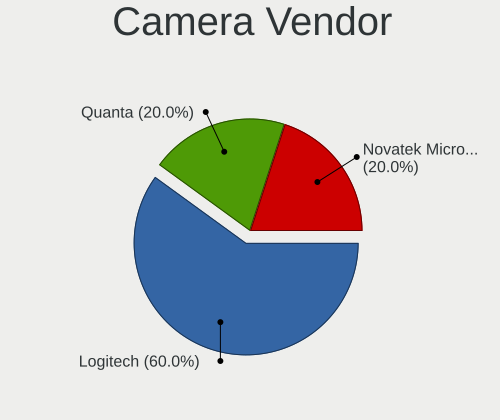

| Vendor                   | Desktops | Percent |
|--------------------------|----------|---------|
| Logitech                 | 3        | 42.86%  |
| Quanta                   | 1        | 14.29%  |
| Novatek Microelectronics | 1        | 14.29%  |
| Microdia                 | 1        | 14.29%  |
| Cubeternet               | 1        | 14.29%  |

Camera Model
------------

Camera device models

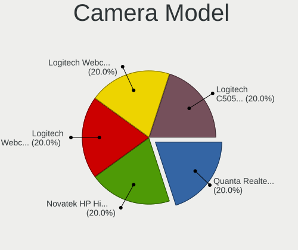

| Model                                                               | Desktops | Percent |
|---------------------------------------------------------------------|----------|---------|
| Quanta Realtek DMFT RGB                                             | 1        | 14.29%  |
| Novatek HP High Definition 2MP Webcam                               | 1        | 14.29%  |
| Microdia USB 2.0 Camera                                             | 1        | 14.29%  |
| Logitech Webcam C310                                                | 1        | 14.29%  |
| Logitech Webcam C270                                                | 1        | 14.29%  |
| Logitech C505 HD Webcam                                             | 1        | 14.29%  |
| Cubeternet EtronTech CMOS based eSP570 WebCam [Onyx Titanium TC101] | 1        | 14.29%  |

Security
--------

Fingerprint Vendor
------------------

Fingerprint sensor vendors

Zero info for selected period =(

Fingerprint Model
-----------------

Fingerprint sensor models

Zero info for selected period =(

Chipcard Vendor
---------------

Chipcard module vendors

Zero info for selected period =(

Chipcard Model
--------------

Chipcard module models

Zero info for selected period =(

Unsupported
-----------

Unsupported Devices
-------------------

Total unsupported devices on board

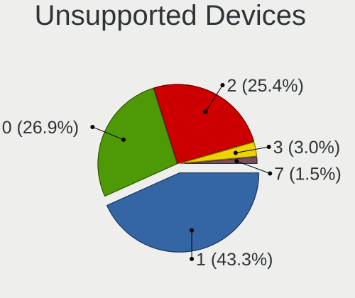

| Total | Desktops | Percent |
|-------|----------|---------|
| 1     | 29       | 43.28%  |
| 0     | 18       | 26.87%  |
| 2     | 17       | 25.37%  |
| 3     | 2        | 2.99%   |
| 7     | 1        | 1.49%   |

Unsupported Device Types
------------------------

Types of unsupported devices

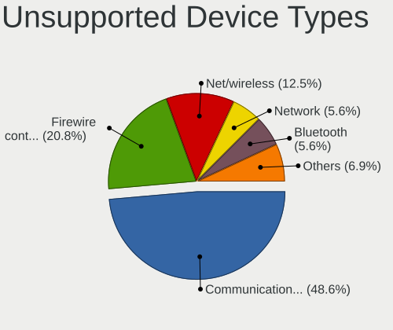

| Type                     | Desktops | Percent |
|--------------------------|----------|---------|
| Communication controller | 35       | 48.61%  |
| Firewire controller      | 15       | 20.83%  |
| Net/wireless             | 9        | 12.5%   |
| Network                  | 4        | 5.56%   |
| Bluetooth                | 4        | 5.56%   |
| Sound                    | 3        | 4.17%   |
| Net/ethernet             | 1        | 1.39%   |
| Card reader              | 1        | 1.39%   |

