NomadBSD - Tested Hardware & Statistics (Desktops)
--------------------------------------------------

A project to collect tested hardware configurations for NomadBSD.

Anyone can contribute to this report by the [hw-probe](https://github.com/linuxhw/hw-probe/blob/master/INSTALL.BSD.md) tool:

    hw-probe -all -upload

Please submit a probe of your configuration if it's not presented on the page or is rare.

Full-feature report is available here: https://bsd-hardware.info/?view=trends

Contents
--------

* [ Test Cases ](#test-cases)

* [ System ](#system)
  - [ Arch                     ](#arch)
  - [ DE                       ](#de)
  - [ Display Server           ](#display-server)
  - [ Display Manager          ](#display-manager)
  - [ OS Lang                  ](#os-lang)
  - [ Boot Mode                ](#boot-mode)
  - [ Filesystem               ](#filesystem)
  - [ Part. scheme             ](#part-scheme)

* [ Board ](#board)
  - [ Vendor                   ](#vendor)
  - [ Model                    ](#model)
  - [ Model Family             ](#model-family)
  - [ MFG Year                 ](#mfg-year)
  - [ Form Factor              ](#form-factor)
  - [ Coreboot                 ](#coreboot)
  - [ RAM Size                 ](#ram-size)
  - [ RAM Used                 ](#ram-used)
  - [ Total Drives             ](#total-drives)
  - [ Has CD-ROM               ](#has-cd-rom)
  - [ Has Ethernet             ](#has-ethernet)
  - [ Has WiFi                 ](#has-wifi)
  - [ Has Bluetooth            ](#has-bluetooth)

* [ Location ](#location)
  - [ Country                  ](#country)
  - [ City                     ](#city)

* [ Drives ](#drives)
  - [ Drive Vendor             ](#drive-vendor)
  - [ Drive Model              ](#drive-model)
  - [ HDD Vendor               ](#hdd-vendor)
  - [ SSD Vendor               ](#ssd-vendor)
  - [ Drive Kind               ](#drive-kind)
  - [ Drive Connector          ](#drive-connector)
  - [ Drive Size               ](#drive-size)
  - [ Space Total              ](#space-total)
  - [ Space Used               ](#space-used)
  - [ Malfunc. Drives          ](#malfunc-drives)
  - [ Malfunc. Drive Vendor    ](#malfunc-drive-vendor)
  - [ Malfunc. HDD Vendor      ](#malfunc-hdd-vendor)
  - [ Malfunc. Drive Kind      ](#malfunc-drive-kind)
  - [ Failed Drives            ](#failed-drives)
  - [ Failed Drive Vendor      ](#failed-drive-vendor)
  - [ Drive Status             ](#drive-status)

* [ Storage controller ](#storage-controller)
  - [ Storage Vendor           ](#storage-vendor)
  - [ Storage Model            ](#storage-model)
  - [ Storage Kind             ](#storage-kind)

* [ Processor ](#processor)
  - [ CPU Vendor               ](#cpu-vendor)
  - [ CPU Model                ](#cpu-model)
  - [ CPU Model Family         ](#cpu-model-family)
  - [ CPU Cores                ](#cpu-cores)
  - [ CPU Sockets              ](#cpu-sockets)
  - [ CPU Threads              ](#cpu-threads)
  - [ CPU Microarch            ](#cpu-microarch)

* [ Graphics ](#graphics)
  - [ GPU Vendor               ](#gpu-vendor)
  - [ GPU Model                ](#gpu-model)
  - [ GPU Combo                ](#gpu-combo)
  - [ GPU Driver               ](#gpu-driver)
  - [ GPU Memory               ](#gpu-memory)

* [ Monitor ](#monitor)
  - [ Monitor Vendor           ](#monitor-vendor)
  - [ Monitor Model            ](#monitor-model)
  - [ Monitor Resolution       ](#monitor-resolution)
  - [ Monitor Diagonal         ](#monitor-diagonal)
  - [ Monitor Width            ](#monitor-width)
  - [ Aspect Ratio             ](#aspect-ratio)
  - [ Monitor Area             ](#monitor-area)
  - [ Pixel Density            ](#pixel-density)
  - [ Multiple Monitors        ](#multiple-monitors)

* [ Network ](#network)
  - [ Net Controller Vendor    ](#net-controller-vendor)
  - [ Net Controller Model     ](#net-controller-model)
  - [ Wireless Vendor          ](#wireless-vendor)
  - [ Wireless Model           ](#wireless-model)
  - [ Ethernet Vendor          ](#ethernet-vendor)
  - [ Ethernet Model           ](#ethernet-model)
  - [ Net Controller Kind      ](#net-controller-kind)
  - [ Used Controller          ](#used-controller)
  - [ NICs                     ](#nics)
  - [ IPv6                     ](#ipv6)

* [ Bluetooth ](#bluetooth)
  - [ Bluetooth Vendor         ](#bluetooth-vendor)
  - [ Bluetooth Model          ](#bluetooth-model)

* [ Sound ](#sound)
  - [ Sound Vendor             ](#sound-vendor)
  - [ Sound Model              ](#sound-model)

* [ Memory ](#memory)
  - [ Memory Vendor            ](#memory-vendor)
  - [ Memory Model             ](#memory-model)
  - [ Memory Kind              ](#memory-kind)
  - [ Memory Form Factor       ](#memory-form-factor)
  - [ Memory Size              ](#memory-size)
  - [ Memory Speed             ](#memory-speed)

* [ Printers & scanners ](#printers--scanners)
  - [ Printer Vendor           ](#printer-vendor)
  - [ Printer Model            ](#printer-model)
  - [ Scanner Vendor           ](#scanner-vendor)
  - [ Scanner Model            ](#scanner-model)

* [ Camera ](#camera)
  - [ Camera Vendor            ](#camera-vendor)
  - [ Camera Model             ](#camera-model)

* [ Security ](#security)
  - [ Fingerprint Vendor       ](#fingerprint-vendor)
  - [ Fingerprint Model        ](#fingerprint-model)
  - [ Chipcard Vendor          ](#chipcard-vendor)
  - [ Chipcard Model           ](#chipcard-model)

* [ Unsupported ](#unsupported)
  - [ Unsupported Devices      ](#unsupported-devices)
  - [ Unsupported Device Types ](#unsupported-device-types)

Test Cases
----------

| Vendor   | Model                       | Probe                                                     | Date         |
|----------|-----------------------------|-----------------------------------------------------------|--------------|
| Gigabyte | X570S GAMING X              | [ff39ace6ec](https://bsd-hardware.info/?probe=ff39ace6ec) | Feb 16, 2022 |
| Intel    | DCP847SKE G80890-105        | [2828ef2a6d](https://bsd-hardware.info/?probe=2828ef2a6d) | Jan 20, 2022 |
| Dell     | 0M9KCM A01                  | [4db0a0ea05](https://bsd-hardware.info/?probe=4db0a0ea05) | Dec 06, 2021 |
| Gigabyte | MZGLKBP-00                  | [e713e3adee](https://bsd-hardware.info/?probe=e713e3adee) | Dec 05, 2021 |
| ASUSTek  | PRIME Z390-P                | [1bd9270845](https://bsd-hardware.info/?probe=1bd9270845) | Nov 15, 2021 |
| Dell     | 0T10XW A01                  | [ae2203b146](https://bsd-hardware.info/?probe=ae2203b146) | Nov 12, 2021 |
| Unknown  | X79                         | [c80b658f36](https://bsd-hardware.info/?probe=c80b658f36) | Nov 09, 2021 |
| HP       | 87D6 SMVB                   | [f601f00e7c](https://bsd-hardware.info/?probe=f601f00e7c) | Oct 07, 2021 |
| Dell     | OptiPlex 3020               | [c391177240](https://bsd-hardware.info/?probe=c391177240) | Oct 05, 2021 |
| Dell     | OptiPlex 3020               | [070a0c6d62](https://bsd-hardware.info/?probe=070a0c6d62) | Sep 19, 2021 |
| Gigabyte | Z370 AORUS ULTRAGAMING W... | [13371b2ab8](https://bsd-hardware.info/?probe=13371b2ab8) | Jun 27, 2021 |
| ASUSTek  | ROG STRIX X299-E GAMING     | [e91dc55970](https://bsd-hardware.info/?probe=e91dc55970) | Jun 22, 2021 |
| ASRock   | N68C-GS4 FX                 | [5abce24217](https://bsd-hardware.info/?probe=5abce24217) | Jun 06, 2021 |
| ASUSTek  | TUF GAMING B550M-PLUS       | [c6a1c1fa15](https://bsd-hardware.info/?probe=c6a1c1fa15) | May 25, 2021 |
| ASUSTek  | V-P7H55E                    | [8cf113ac55](https://bsd-hardware.info/?probe=8cf113ac55) | May 22, 2021 |
| Toshiba  | STI 005492G                 | [9a8e4a1328](https://bsd-hardware.info/?probe=9a8e4a1328) | May 17, 2021 |
| ECT      | One Computer AMD A10-785... | [41a2a2e434](https://bsd-hardware.info/?probe=41a2a2e434) | Apr 07, 2021 |
| Acer     | EG43M                       | [0bc978756c](https://bsd-hardware.info/?probe=0bc978756c) | Mar 27, 2021 |
| Dell     | 0NW6H5 A00                  | [650cd9b653](https://bsd-hardware.info/?probe=650cd9b653) | Mar 24, 2021 |
| Acer     | EG31M R01-C3                | [1186d46ac9](https://bsd-hardware.info/?probe=1186d46ac9) | Mar 08, 2021 |
| HP       | 158A                        | [da9d6bf86f](https://bsd-hardware.info/?probe=da9d6bf86f) | Mar 07, 2021 |
| Dell     | 0R849J A00                  | [1bd1dc24c9](https://bsd-hardware.info/?probe=1bd1dc24c9) | Mar 06, 2021 |
| ASRock   | Z490M Pro4                  | [348d592fab](https://bsd-hardware.info/?probe=348d592fab) | Mar 05, 2021 |
| VeryPC   | S400                        | [edcea11cb7](https://bsd-hardware.info/?probe=edcea11cb7) | Mar 04, 2021 |
| Acer     | EG31M R01-C3                | [046404e65c](https://bsd-hardware.info/?probe=046404e65c) | Mar 01, 2021 |
| Dell     | 0T568R A00                  | [cd086a9092](https://bsd-hardware.info/?probe=cd086a9092) | Feb 12, 2021 |
| ASRock   | B550 Phantom Gaming 4       | [2d0beb2534](https://bsd-hardware.info/?probe=2d0beb2534) | Feb 08, 2021 |
| Lenovo   | SHARKBAY 0B98401 WIN        | [2917a6fbe1](https://bsd-hardware.info/?probe=2917a6fbe1) | Jan 31, 2021 |
| HP       | 0AACh                       | [b7cac343f6](https://bsd-hardware.info/?probe=b7cac343f6) | Jan 29, 2021 |
| HP       | 3399                        | [b11946a41a](https://bsd-hardware.info/?probe=b11946a41a) | Jan 13, 2021 |
| Pegatron | 2AB5                        | [8093f75ea2](https://bsd-hardware.info/?probe=8093f75ea2) | Jan 13, 2021 |
| Dell     | 0NW6H5 A00                  | [d54f451ea5](https://bsd-hardware.info/?probe=d54f451ea5) | Jan 07, 2021 |
| HP       | 3032h                       | [13648fd22d](https://bsd-hardware.info/?probe=13648fd22d) | Jan 07, 2021 |
| Dell     | 0KC9NP A01                  | [ee2d5f3289](https://bsd-hardware.info/?probe=ee2d5f3289) | Jan 07, 2021 |
| Dell     | 030VXY A01                  | [c117ffdc98](https://bsd-hardware.info/?probe=c117ffdc98) | Jan 07, 2021 |
| Gigabyte | X570 AORUS MASTER           | [cfc292e9e8](https://bsd-hardware.info/?probe=cfc292e9e8) | Jan 07, 2021 |
| Dell     | 0C27VV A02                  | [cfd6a0ab4b](https://bsd-hardware.info/?probe=cfd6a0ab4b) | Jan 04, 2021 |
| Dell     | 0C27VV A02                  | [c532e18070](https://bsd-hardware.info/?probe=c532e18070) | Jan 04, 2021 |
| Dell     | 0C27VV A02                  | [876f5d7b92](https://bsd-hardware.info/?probe=876f5d7b92) | Jan 02, 2021 |
| Dell     | 0C27VV A02                  | [0bf1fa2725](https://bsd-hardware.info/?probe=0bf1fa2725) | Jan 02, 2021 |
| Dell     | 0C27VV A02                  | [87e4734cb8](https://bsd-hardware.info/?probe=87e4734cb8) | Dec 30, 2020 |
| Dell     | 0C27VV A02                  | [d892bd7805](https://bsd-hardware.info/?probe=d892bd7805) | Dec 30, 2020 |
| Dell     | 0C27VV A02                  | [917e6fde25](https://bsd-hardware.info/?probe=917e6fde25) | Dec 30, 2020 |
| Dell     | 0C27VV A02                  | [889bba9dbc](https://bsd-hardware.info/?probe=889bba9dbc) | Dec 30, 2020 |
| Gigabyte | X570 AORUS PRO              | [a3e2c4eda1](https://bsd-hardware.info/?probe=a3e2c4eda1) | Dec 30, 2020 |
| ASUSTek  | Z170-A                      | [a1c6966373](https://bsd-hardware.info/?probe=a1c6966373) | Oct 21, 2020 |
| ASRock   | AB350 Pro4                  | [407652fc8d](https://bsd-hardware.info/?probe=407652fc8d) | Oct 05, 2020 |
| Foxconn  | Napa HP P/N                 | [2a7cb7b214](https://bsd-hardware.info/?probe=2a7cb7b214) | Sep 03, 2020 |
| ASUSTek  | EMERY                       | [c93b86b3ba](https://bsd-hardware.info/?probe=c93b86b3ba) | Aug 27, 2020 |
| HP       | 0A64h                       | [10c48336b0](https://bsd-hardware.info/?probe=10c48336b0) | Aug 20, 2020 |
| ASUSTek  | M5A97 R2.0                  | [78d714a1a3](https://bsd-hardware.info/?probe=78d714a1a3) | Aug 19, 2020 |
| ASUSTek  | PRIME A320M-K               | [8a3cb911c3](https://bsd-hardware.info/?probe=8a3cb911c3) | Jul 18, 2020 |
| Gigabyte | Z370 AORUS Ultra Gaming-... | [a03e1c19c1](https://bsd-hardware.info/?probe=a03e1c19c1) | Jul 04, 2020 |
| ASRock   | Z97 Extreme6/ac             | [9c2d19d0c3](https://bsd-hardware.info/?probe=9c2d19d0c3) | Jul 03, 2020 |
| ASRock   | B450M Pro4                  | [aa58b291b3](https://bsd-hardware.info/?probe=aa58b291b3) | May 24, 2020 |

System
------

Arch
----

OS architecture (x86_64, i586, etc.)

| Name  | Desktops | Percent |
|-------|----------|---------|
| amd64 | 38       | 97.44%  |
| i386  | 1        | 2.56%   |

DE
--

Desktop Environment

| Name    | Desktops | Percent |
|---------|----------|---------|
| Openbox | 35       | 87.5%   |
| KDE5    | 2        | 5%      |
| GNUstep | 1        | 2.5%    |
| GNOME   | 1        | 2.5%    |
| filer   | 1        | 2.5%    |

Display Server
--------------

X11 or Wayland

| Name | Desktops | Percent |
|------|----------|---------|
| X11  | 39       | 100%    |

Display Manager
---------------

SDDM, LightDM, etc.

| Name | Desktops | Percent |
|------|----------|---------|
| SLiM | 37       | 94.87%  |
| SDDM | 2        | 5.13%   |

OS Lang
-------

Language

| Lang    | Desktops | Percent |
|---------|----------|---------|
| en_US   | 13       | 33.33%  |
| Unknown | 9        | 23.08%  |
| de_DE   | 3        | 7.69%   |
| tr_TR   | 2        | 5.13%   |
| ru_RU   | 2        | 5.13%   |
| pt_BR   | 2        | 5.13%   |
| it_IT   | 2        | 5.13%   |
| hu_HU   | 2        | 5.13%   |
| fi_FI   | 1        | 2.56%   |
| es_ES   | 1        | 2.56%   |
| en_AU   | 1        | 2.56%   |
| cs_CZ   | 1        | 2.56%   |

Boot Mode
---------

EFI or BIOS

| Mode | Desktops | Percent |
|------|----------|---------|
| EFI  | 38       | 97.44%  |
| BIOS | 1        | 2.56%   |

Filesystem
----------

Type of filesystem

| Type | Desktops | Percent |
|------|----------|---------|
| Ufs  | 33       | 84.62%  |
| Zfs  | 6        | 15.38%  |

Part. scheme
------------

Scheme of partitioning

| Type | Desktops | Percent |
|------|----------|---------|
| GPT  | 29       | 74.36%  |
| MBR  | 10       | 25.64%  |

Board
-----

Vendor
------

Motherboard manufacturer

| Name                | Desktops | Percent |
|---------------------|----------|---------|
| ASUSTek Computer    | 8        | 20.51%  |
| Hewlett-Packard     | 6        | 15.38%  |
| Gigabyte Technology | 6        | 15.38%  |
| Dell                | 6        | 15.38%  |
| ASRock              | 4        | 10.26%  |
| Acer                | 3        | 7.69%   |
| Semp Toshiba        | 1        | 2.56%   |
| Pegatron            | 1        | 2.56%   |
| Lenovo              | 1        | 2.56%   |
| Intel               | 1        | 2.56%   |
| Foxconn             | 1        | 2.56%   |
| Unknown             | 1        | 2.56%   |

Model
-----

Motherboard model

| Name                                     | Desktops | Percent |
|------------------------------------------|----------|---------|
| Acer Veriton M460                        | 2        | 5.13%   |
| Semp Toshiba STI                         | 1        | 2.56%   |
| Pegatron Elite 7300 Series MT            | 1        | 2.56%   |
| Lenovo ThinkCentre M93p 10A8001HUS       | 1        | 2.56%   |
| Intel DCP847SKE G80890-105               | 1        | 2.56%   |
| HP Z620 Workstation                      | 1        | 2.56%   |
| HP Desktop M01-F1xxx                     | 1        | 2.56%   |
| HP Compaq Elite 8300 Touch All-in-One PC | 1        | 2.56%   |
| HP Compaq dc7900 Convertible Minitower   | 1        | 2.56%   |
| HP Compaq dc7800p Convertible Minitower  | 1        | 2.56%   |
| HP Compaq dc5750 Microtower              | 1        | 2.56%   |
| Gigabyte Z370 AORUS ULTRAGAMING WIFI-OP  | 1        | 2.56%   |
| Gigabyte Z370 AORUS Ultra Gaming         | 1        | 2.56%   |
| Gigabyte X570S GAMING X                  | 1        | 2.56%   |
| Gigabyte X570 AORUS PRO                  | 1        | 2.56%   |
| Gigabyte X570 AORUS MASTER               | 1        | 2.56%   |
| Gigabyte MZGLKBP-00                      | 1        | 2.56%   |
| Foxconn Napa                             | 1        | 2.56%   |
| Dell Studio XPS 8100                     | 1        | 2.56%   |
| Dell Studio XPS 435MT                    | 1        | 2.56%   |
| Dell OptiPlex 9010                       | 1        | 2.56%   |
| Dell OptiPlex 780                        | 1        | 2.56%   |
| Dell OptiPlex 3020                       | 1        | 2.56%   |
| Dell OptiPlex 3010                       | 1        | 2.56%   |
| ASUS Z170-A                              | 1        | 2.56%   |
| ASUS V-P7H55E                            | 1        | 2.56%   |
| ASUS TUF GAMING B550M-PLUS               | 1        | 2.56%   |
| ASUS ROG STRIX X299-E GAMING             | 1        | 2.56%   |
| ASUS PRIME Z390-P                        | 1        | 2.56%   |
| ASUS PRIME A320M-K                       | 1        | 2.56%   |
| ASUS M5A97 R2.0                          | 1        | 2.56%   |
| ASUS ER904AA-ABA A1440N                  | 1        | 2.56%   |
| ASRock Z97 Extreme6/ac                   | 1        | 2.56%   |
| ASRock N68C-GS4 FX                       | 1        | 2.56%   |
| ASRock B450M Pro4                        | 1        | 2.56%   |
| ASRock AB350 Pro4                        | 1        | 2.56%   |
| Acer Aspire M3900                        | 1        | 2.56%   |
| Unknown                                  | 1        | 2.56%   |

Model Family
------------

Motherboard model prefix

| Name                | Desktops | Percent |
|---------------------|----------|---------|
| HP Compaq           | 4        | 10.26%  |
| Dell OptiPlex       | 4        | 10.26%  |
| Gigabyte Z370       | 2        | 5.13%   |
| Gigabyte X570       | 2        | 5.13%   |
| Dell Studio         | 2        | 5.13%   |
| ASUS PRIME          | 2        | 5.13%   |
| Acer Veriton        | 2        | 5.13%   |
| Semp Toshiba STI    | 1        | 2.56%   |
| Pegatron Elite      | 1        | 2.56%   |
| Lenovo ThinkCentre  | 1        | 2.56%   |
| Intel DCP847SKE     | 1        | 2.56%   |
| HP Z620             | 1        | 2.56%   |
| HP Desktop          | 1        | 2.56%   |
| Gigabyte X570S      | 1        | 2.56%   |
| Gigabyte MZGLKBP-00 | 1        | 2.56%   |
| Foxconn Napa        | 1        | 2.56%   |
| ASUS Z170-A         | 1        | 2.56%   |
| ASUS V-P7H55E       | 1        | 2.56%   |
| ASUS TUF            | 1        | 2.56%   |
| ASUS ROG            | 1        | 2.56%   |
| ASUS M5A97          | 1        | 2.56%   |
| ASUS ER904AA-ABA    | 1        | 2.56%   |
| ASRock Z97          | 1        | 2.56%   |
| ASRock N68C-GS4     | 1        | 2.56%   |
| ASRock B450M        | 1        | 2.56%   |
| ASRock AB350        | 1        | 2.56%   |
| Acer Aspire         | 1        | 2.56%   |
| Unknown             | 1        | 2.56%   |

MFG Year
--------

Motherboard manufacture year

| Year | Desktops | Percent |
|------|----------|---------|
| 2009 | 6        | 15.38%  |
| 2019 | 5        | 12.82%  |
| 2021 | 3        | 7.69%   |
| 2020 | 3        | 7.69%   |
| 2017 | 3        | 7.69%   |
| 2016 | 3        | 7.69%   |
| 2010 | 3        | 7.69%   |
| 2018 | 2        | 5.13%   |
| 2015 | 2        | 5.13%   |
| 2013 | 2        | 5.13%   |
| 2012 | 2        | 5.13%   |
| 2014 | 1        | 2.56%   |
| 2011 | 1        | 2.56%   |
| 2008 | 1        | 2.56%   |
| 2007 | 1        | 2.56%   |
| 2006 | 1        | 2.56%   |

Form Factor
-----------

Physical design of the computer

| Name    | Desktops | Percent |
|---------|----------|---------|
| Desktop | 39       | 100%    |

Coreboot
--------

Have coreboot on board

| Used | Desktops | Percent |
|------|----------|---------|
| No   | 39       | 100%    |

RAM Size
--------

Total RAM memory

| Size in GB  | Desktops | Percent |
|-------------|----------|---------|
| 8.01-16.0   | 11       | 28.21%  |
| 4.01-8.0    | 10       | 25.64%  |
| 16.01-24.0  | 9        | 23.08%  |
| 32.01-64.0  | 5        | 12.82%  |
| 64.01-256.0 | 2        | 5.13%   |
| 3.01-4.0    | 1        | 2.56%   |
| 2.01-3.0    | 1        | 2.56%   |

RAM Used
--------

Used RAM memory

| Used GB  | Desktops | Percent |
|----------|----------|---------|
| 0.01-0.5 | 21       | 53.85%  |
| 0.51-1.0 | 10       | 25.64%  |
| 1.01-2.0 | 6        | 15.38%  |
| 2.01-3.0 | 2        | 5.13%   |

Total Drives
------------

Number of drives on board

| Drives | Desktops | Percent |
|--------|----------|---------|
| 1      | 17       | 43.59%  |
| 2      | 10       | 25.64%  |
| 3      | 8        | 20.51%  |
| 4      | 2        | 5.13%   |
| 7      | 1        | 2.56%   |
| 0      | 1        | 2.56%   |

Has CD-ROM
----------

Has CD-ROM on board

| Presented | Desktops | Percent |
|-----------|----------|---------|
| Yes       | 22       | 56.41%  |
| No        | 17       | 43.59%  |

Has Ethernet
------------

Has Ethernet on board

| Presented | Desktops | Percent |
|-----------|----------|---------|
| Yes       | 38       | 97.44%  |
| No        | 1        | 2.56%   |

Has WiFi
--------

Has WiFi module

| Presented | Desktops | Percent |
|-----------|----------|---------|
| No        | 21       | 53.85%  |
| Yes       | 18       | 46.15%  |

Has Bluetooth
-------------

Has Bluetooth module

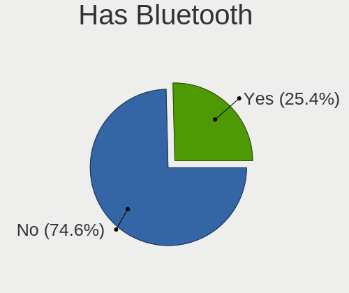

| Presented | Desktops | Percent |
|-----------|----------|---------|
| No        | 30       | 75%     |
| Yes       | 10       | 25%     |

Location
--------

Country
-------

Geographic location (country)

| Country   | Desktops | Percent |
|-----------|----------|---------|
| USA       | 12       | 30.77%  |
| Germany   | 4        | 10.26%  |
| Turkey    | 3        | 7.69%   |
| Russia    | 3        | 7.69%   |
| France    | 3        | 7.69%   |
| Italy     | 2        | 5.13%   |
| Hungary   | 2        | 5.13%   |
| Brazil    | 2        | 5.13%   |
| Thailand  | 1        | 2.56%   |
| Slovakia  | 1        | 2.56%   |
| Serbia    | 1        | 2.56%   |
| Finland   | 1        | 2.56%   |
| Czechia   | 1        | 2.56%   |
| Colombia  | 1        | 2.56%   |
| Australia | 1        | 2.56%   |
| Argentina | 1        | 2.56%   |

City
----

Geographic location (city)

| City             | Desktops | Percent |
|------------------|----------|---------|
| Paris            | 3        | 7.69%   |
| Woodland         | 2        | 5.13%   |
| Volzhskiy        | 2        | 5.13%   |
| Rio de Janeiro   | 2        | 5.13%   |
| Milan            | 2        | 5.13%   |
| Istanbul         | 2        | 5.13%   |
| Hodmezovasarhely | 2        | 5.13%   |
| Tucson           | 1        | 2.56%   |
| San Francisco    | 1        | 2.56%   |
| Peoria           | 1        | 2.56%   |
| Palm Bay         | 1        | 2.56%   |
| Moscow           | 1        | 2.56%   |
| Melcice          | 1        | 2.56%   |
| McDonough        | 1        | 2.56%   |
| Marburg          | 1        | 2.56%   |
| Langen           | 1        | 2.56%   |
| Helsinki         | 1        | 2.56%   |
| Frisco           | 1        | 2.56%   |
| Duncan           | 1        | 2.56%   |
| Dortmund         | 1        | 2.56%   |
| Denver           | 1        | 2.56%   |
| CГіrdoba       | 1        | 2.56%   |
| Conway           | 1        | 2.56%   |
| Cologne          | 1        | 2.56%   |
| Cleveland        | 1        | 2.56%   |
| Brisbane         | 1        | 2.56%   |
| BogotГЎ        | 1        | 2.56%   |
| Bilina           | 1        | 2.56%   |
| Belgrade         | 1        | 2.56%   |
| Bangkok          | 1        | 2.56%   |
| BalД±kesir     | 1        | 2.56%   |

Drives
------

Drive Vendor
------------

Hard drive vendors

| Vendor              | Desktops | Drives | Percent |
|---------------------|----------|--------|---------|
| WDC                 | 13       | 18     | 19.4%   |
| Seagate             | 12       | 13     | 17.91%  |
| Samsung Electronics | 12       | 15     | 17.91%  |
| Toshiba             | 6        | 7      | 8.96%   |
| A-DATA Technology   | 5        | 5      | 7.46%   |
| Kingston            | 4        | 4      | 5.97%   |
| Intel               | 2        | 2      | 2.99%   |
| Hitachi             | 2        | 2      | 2.99%   |
| Hewlett-Packard     | 2        | 2      | 2.99%   |
| Crucial             | 2        | 2      | 2.99%   |
| Transcend           | 1        | 1      | 1.49%   |
| Team                | 1        | 1      | 1.49%   |
| SK Hynix            | 1        | 1      | 1.49%   |
| SanDisk             | 1        | 2      | 1.49%   |
| ORICO               | 1        | 1      | 1.49%   |
| MAXTOR              | 1        | 1      | 1.49%   |
| HGST                | 1        | 1      | 1.49%   |

Drive Model
-----------

Hard drive models

| Model                                     | Desktops | Percent |
|-------------------------------------------|----------|---------|
| WDC WD1600AAJS-22L7A0 160GB               | 2        | 2.67%   |
| Toshiba HDWD120 2TB                       | 2        | 2.67%   |
| Seagate ST500DM002-1BD142 500GB           | 2        | 2.67%   |
| Samsung SSD 970 EVO 500GB                 | 2        | 2.67%   |
| Samsung SSD 870 QVO 2TB                   | 2        | 2.67%   |
| Kingston SA400S37480G 480GB               | 2        | 2.67%   |
| A-DATA SU630 240GB                        | 2        | 2.67%   |
| WDC WDS240G2G0B-00EPW0 240GB              | 1        | 1.33%   |
| WDC WDS120G2G0A-00JH30 120GB              | 1        | 1.33%   |
| WDC WDS100T1X0E-00AFY0 1TB                | 1        | 1.33%   |
| WDC WD6400AAKS-22A7B2 640GB               | 1        | 1.33%   |
| WDC WD40PURX-64GVNY0 4TB                  | 1        | 1.33%   |
| WDC WD40NMZW-11GX6S1 4TB                  | 1        | 1.33%   |
| WDC WD2500BEKT-00PVMT0 250GB              | 1        | 1.33%   |
| WDC WD2004FBYZ-01YCBB1 2TB                | 1        | 1.33%   |
| WDC WD1200BEVE-00UYT0 120GB               | 1        | 1.33%   |
| WDC WD10JPLX-00MBPT0 1TB                  | 1        | 1.33%   |
| WDC WD10EZRZ-00HTKB0 1TB                  | 1        | 1.33%   |
| WDC WD10EZRX-00L4HB0 1TB                  | 1        | 1.33%   |
| WDC WD10EFRX-68PJCN0 1TB                  | 1        | 1.33%   |
| WDC WD10EADS-00P8B0 1TB                   | 1        | 1.33%   |
| WDC PC SN520 SDAPMUW-128G-1101 128GB      | 1        | 1.33%   |
| Transcend TS32GCF800 32GB                 | 1        | 1.33%   |
| Toshiba MK1032GAX 100GB                   | 1        | 1.33%   |
| Toshiba HDWD130 3TB                       | 1        | 1.33%   |
| Toshiba HDWD110 1TB                       | 1        | 1.33%   |
| Toshiba DT01ACA100 1TB                    | 1        | 1.33%   |
| Toshiba DT01ABA300 3TB                    | 1        | 1.33%   |
| Team TEAML5Lite3D1T 1TB                   | 1        | 1.33%   |
| SK Hynix SKHynix_HFS256GD9TNI-L2B0B 256GB | 1        | 1.33%   |
| Seagate ST9500325AS 500GB                 | 1        | 1.33%   |
| Seagate ST4000DM000-2AE166 4TB            | 1        | 1.33%   |
| Seagate ST3500418AS 500GB                 | 1        | 1.33%   |
| Seagate ST3250823AS 250GB                 | 1        | 1.33%   |
| Seagate ST3250310AS 250GB                 | 1        | 1.33%   |
| Seagate ST31000528AS 1TB                  | 1        | 1.33%   |
| Seagate ST3000DM008-2DM166 3TB            | 1        | 1.33%   |
| Seagate ST1000LX015-1U7172 1TB            | 1        | 1.33%   |
| Seagate ST1000LM049-2GH172 1TB            | 1        | 1.33%   |
| Seagate ST1000DM003-1CH162 1TB            | 1        | 1.33%   |
| SanDisk SSD PLUS 120GB                    | 1        | 1.33%   |
| Samsung SSD 970 EVO Plus 1TB              | 1        | 1.33%   |
| Samsung SSD 970 EVO 2TB                   | 1        | 1.33%   |
| Samsung SSD 960 EVO 1TB                   | 1        | 1.33%   |
| Samsung SSD 870 EVO 1TB                   | 1        | 1.33%   |
| Samsung SSD 850 EVO M.2 500GB             | 1        | 1.33%   |
| Samsung SSD 850 EVO 500GB                 | 1        | 1.33%   |
| Samsung SSD 840 EVO 250GB                 | 1        | 1.33%   |
| Samsung SP2504C 250GB                     | 1        | 1.33%   |
| Samsung HM160HI 160GB                     | 1        | 1.33%   |
| Samsung HD161HJ 160GB                     | 1        | 1.33%   |
| Samsung HD161GJ 160GB                     | 1        | 1.33%   |
| ORICO V500 1TB                            | 1        | 1.33%   |
| MAXTOR STM3250310AS 250GB                 | 1        | 1.33%   |
| Kingston SA400S37240G 240GB               | 1        | 1.33%   |
| Kingston SA2000M8500G 500GB               | 1        | 1.33%   |
| Intel SSDPEKNW020T8 2TB                   | 1        | 1.33%   |
| Intel MEMPEK1W032GA 32GB                  | 1        | 1.33%   |
| Hitachi HDS721032CLA362 320GB             | 1        | 1.33%   |
| Hitachi HDS721010CLA632 1TB               | 1        | 1.33%   |

HDD Vendor
----------

Hard disk drive vendors

| Vendor              | Desktops | Drives | Percent |
|---------------------|----------|--------|---------|
| Seagate             | 12       | 13     | 31.58%  |
| WDC                 | 11       | 14     | 28.95%  |
| Toshiba             | 6        | 7      | 15.79%  |
| Samsung Electronics | 4        | 4      | 10.53%  |
| Hitachi             | 2        | 2      | 5.26%   |
| MAXTOR              | 1        | 1      | 2.63%   |
| HGST                | 1        | 1      | 2.63%   |
| Hewlett-Packard     | 1        | 1      | 2.63%   |

SSD Vendor
----------

Solid state drive vendors

| Vendor              | Desktops | Drives | Percent |
|---------------------|----------|--------|---------|
| A-DATA Technology   | 5        | 5      | 27.78%  |
| Samsung Electronics | 4        | 6      | 22.22%  |
| Kingston            | 3        | 3      | 16.67%  |
| WDC                 | 2        | 2      | 11.11%  |
| Transcend           | 1        | 1      | 5.56%   |
| Team                | 1        | 1      | 5.56%   |
| SanDisk             | 1        | 2      | 5.56%   |
| Crucial             | 1        | 1      | 5.56%   |

Drive Kind
----------

HDD or SSD

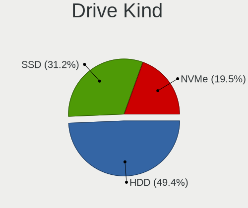

| Kind | Desktops | Drives | Percent |
|------|----------|--------|---------|
| HDD  | 28       | 43     | 52.83%  |
| SSD  | 14       | 21     | 26.42%  |
| NVMe | 11       | 14     | 20.75%  |

Drive Connector
---------------

SATA, SAS, NVMe, etc.

| Type | Desktops | Drives | Percent |
|------|----------|--------|---------|
| SATA | 35       | 64     | 76.09%  |
| NVMe | 11       | 14     | 23.91%  |

Drive Size
----------

Size of hard drive

| Size in TB | Desktops | Drives | Percent |
|------------|----------|--------|---------|
| 0.01-0.5   | 26       | 36     | 50.98%  |
| 0.51-1.0   | 14       | 17     | 27.45%  |
| 1.01-2.0   | 5        | 5      | 9.8%    |
| 3.01-4.0   | 3        | 3      | 5.88%   |
| 2.01-3.0   | 3        | 3      | 5.88%   |

Space Total
-----------

Amount of disk space available on the file system

| Size in GB | Desktops | Percent |
|------------|----------|---------|
| 1-20       | 31       | 79.49%  |
| 101-250    | 5        | 12.82%  |
| 51-100     | 2        | 5.13%   |
| 501-1000   | 1        | 2.56%   |

Space Used
----------

Amount of used disk space

| Used GB | Desktops | Percent |
|---------|----------|---------|
| 1-20    | 37       | 94.87%  |
| 21-50   | 1        | 2.56%   |
| 51-100  | 1        | 2.56%   |

Malfunc. Drives
---------------

Drive models with a malfunction

| Model                             | Desktops | Drives | Percent |
|-----------------------------------|----------|--------|---------|
| WDC WD10EFRX-68PJCN0 1TB          | 1        | 2      | 12.5%   |
| Toshiba HDWD120 2TB               | 1        | 1      | 12.5%   |
| Toshiba DT01ABA300 3TB            | 1        | 1      | 12.5%   |
| Seagate ST500DM002-1BD142 500GB   | 1        | 1      | 12.5%   |
| Seagate ST3250823AS 250GB         | 1        | 1      | 12.5%   |
| Samsung Electronics HM160HI 160GB | 1        | 1      | 12.5%   |
| Hewlett-Packard MB1000GCWCV 1TB   | 1        | 1      | 12.5%   |
| A-DATA Technology XM13 32GB       | 1        | 1      | 12.5%   |

Malfunc. Drive Vendor
---------------------

Vendors of faulty drives

| Vendor              | Desktops | Drives | Percent |
|---------------------|----------|--------|---------|
| Toshiba             | 2        | 2      | 25%     |
| Seagate             | 2        | 2      | 25%     |
| WDC                 | 1        | 2      | 12.5%   |
| Samsung Electronics | 1        | 1      | 12.5%   |
| Hewlett-Packard     | 1        | 1      | 12.5%   |
| A-DATA Technology   | 1        | 1      | 12.5%   |

Malfunc. HDD Vendor
-------------------

Vendors of faulty HDD drives

| Vendor              | Desktops | Drives | Percent |
|---------------------|----------|--------|---------|
| Toshiba             | 2        | 2      | 28.57%  |
| Seagate             | 2        | 2      | 28.57%  |
| WDC                 | 1        | 2      | 14.29%  |
| Samsung Electronics | 1        | 1      | 14.29%  |
| Hewlett-Packard     | 1        | 1      | 14.29%  |

Malfunc. Drive Kind
-------------------

Kinds of faulty drives

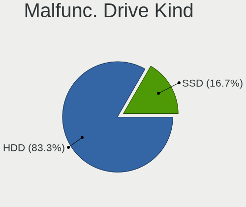

| Kind | Desktops | Drives | Percent |
|------|----------|--------|---------|
| HDD  | 6        | 8      | 85.71%  |
| SSD  | 1        | 1      | 14.29%  |

Failed Drives
-------------

Failed drive models

Zero info for selected period =(

Failed Drive Vendor
-------------------

Failed drive vendors

Zero info for selected period =(

Drive Status
------------

Number of failed and malfunc. drives

| Status   | Desktops | Drives | Percent |
|----------|----------|--------|---------|
| Works    | 34       | 63     | 80.95%  |
| Malfunc  | 7        | 9      | 16.67%  |
| Detected | 1        | 6      | 2.38%   |

Storage controller
------------------

Storage Vendor
--------------

Storage controller vendors

| Vendor                      | Desktops | Percent |
|-----------------------------|----------|---------|
| Intel                       | 28       | 50%     |
| AMD                         | 10       | 17.86%  |
| Samsung Electronics         | 5        | 8.93%   |
| ASMedia Technology          | 4        | 7.14%   |
| Sandisk                     | 2        | 3.57%   |
| Nvidia                      | 2        | 3.57%   |
| VIA Technologies            | 1        | 1.79%   |
| Silicon Motion              | 1        | 1.79%   |
| Micron/Crucial Technology   | 1        | 1.79%   |
| Kingston Technology Company | 1        | 1.79%   |
| Biwin Storage Technology    | 1        | 1.79%   |

Storage Model
-------------

Storage controller models

| Model                                                                          | Desktops | Percent |
|--------------------------------------------------------------------------------|----------|---------|
| AMD FCH SATA Controller [AHCI mode]                                            | 7        | 9.33%   |
| Samsung NVMe SSD Controller SM981/PM981/PM983                                  | 4        | 5.33%   |
| ASMedia ASM1062 Serial ATA Controller                                          | 4        | 5.33%   |
| Intel NM10/ICH7 Family SATA Controller [IDE mode]                              | 3        | 4%      |
| Intel 82801G (ICH7 Family) IDE Controller                                      | 3        | 4%      |
| Intel 7 Series/C210 Series Chipset Family 6-port SATA Controller [AHCI mode]   | 3        | 4%      |
| Intel 200 Series PCH SATA controller [AHCI mode]                               | 3        | 4%      |
| Intel SATA Controller [RAID mode]                                              | 2        | 2.67%   |
| Intel 82801JD/DO (ICH10 Family) SATA AHCI Controller                           | 2        | 2.67%   |
| Intel 8 Series/C220 Series Chipset Family 6-port SATA Controller 1 [AHCI mode] | 2        | 2.67%   |
| Intel 6 Series/C200 Series Chipset Family 6 port Desktop SATA AHCI Controller  | 2        | 2.67%   |
| Intel 4 Series Chipset PT IDER Controller                                      | 2        | 2.67%   |
| AMD 400 Series Chipset SATA Controller                                         | 2        | 2.67%   |
| VIA VT6421 IDE/SATA Controller                                                 | 1        | 1.33%   |
| Silicon Motion SM2263EN/SM2263XT SSD Controller                                | 1        | 1.33%   |
| Sandisk WD PC SN810 / Black SN850 NVMe SSD                                     | 1        | 1.33%   |
| Sandisk PC SN520 NVMe SSD                                                      | 1        | 1.33%   |
| Samsung NVMe SSD Controller SM961/PM961/SM963                                  | 1        | 1.33%   |
| Nvidia MCP73 SATA Controller (IDE mode)                                        | 1        | 1.33%   |
| Nvidia MCP73 IDE Controller                                                    | 1        | 1.33%   |
| Nvidia MCP61 SATA Controller                                                   | 1        | 1.33%   |
| Nvidia MCP61 IDE                                                               | 1        | 1.33%   |
| Micron/Crucial P1 NVMe PCIe SSD                                                | 1        | 1.33%   |
| Kingston Company A2000 NVMe SSD                                                | 1        | 1.33%   |
| Intel SSD 660P Series                                                          | 1        | 1.33%   |
| Intel Q170/Q150/B150/H170/H110/Z170/CM236 Chipset SATA Controller [AHCI Mode]  | 1        | 1.33%   |
| Intel NVMe Optane Memory Series                                                | 1        | 1.33%   |
| Intel Celeron/Pentium Silver Processor SATA Controller                         | 1        | 1.33%   |
| Intel Cannon Lake PCH SATA AHCI Controller                                     | 1        | 1.33%   |
| Intel C602 chipset 4-Port SATA Storage Control Unit                            | 1        | 1.33%   |
| Intel C600/X79 series chipset IDE-r Controller                                 | 1        | 1.33%   |
| Intel C600/X79 series chipset 4-Port SATA IDE Controller                       | 1        | 1.33%   |
| Intel C600/X79 series chipset 2-Port SATA IDE Controller                       | 1        | 1.33%   |
| Intel 9 Series Chipset Family SATA Controller [AHCI Mode]                      | 1        | 1.33%   |
| Intel 82Q35 Express PT IDER Controller                                         | 1        | 1.33%   |
| Intel 82801JI (ICH10 Family) 4 port SATA IDE Controller #1                     | 1        | 1.33%   |
| Intel 82801JI (ICH10 Family) 2 port SATA IDE Controller #2                     | 1        | 1.33%   |
| Intel 82801IR/IO/IH (ICH9R/DO/DH) 4 port SATA Controller [IDE mode]            | 1        | 1.33%   |
| Intel 82801I (ICH9 Family) 2 port SATA Controller [IDE mode]                   | 1        | 1.33%   |
| Intel 82801GR/GDH (ICH7R/ICH7DH) SATA Controller [RAID mode]                   | 1        | 1.33%   |
| Intel 7 Series Chipset Family 6-port SATA Controller [AHCI mode]               | 1        | 1.33%   |
| Intel 5 Series/3400 Series Chipset 6 port SATA AHCI Controller                 | 1        | 1.33%   |
| AMD Starship/Matisse Chipset SATA Controller [AHCI mode]                       | 1        | 1.33%   |
| AMD SB7x0/SB8x0/SB9x0 SATA Controller [AHCI mode]                              | 1        | 1.33%   |
| AMD SB600 Non-Raid-5 SATA                                                      | 1        | 1.33%   |
| AMD SB600 IDE                                                                  | 1        | 1.33%   |
| AMD FCH SATA Controller D                                                      | 1        | 1.33%   |
| AMD 300 Series Chipset SATA Controller                                         | 1        | 1.33%   |
| Unknown                                                                        | 1        | 1.33%   |

Storage Kind
------------

Kind of storage controller (IDE, SATA, NVMe, SAS, ...)

| Kind | Desktops | Percent |
|------|----------|---------|
| SATA | 28       | 50%     |
| IDE  | 12       | 21.43%  |
| NVMe | 11       | 19.64%  |
| RAID | 4        | 7.14%   |
| SAS  | 1        | 1.79%   |

Processor
---------

CPU Vendor
----------

Processor vendors

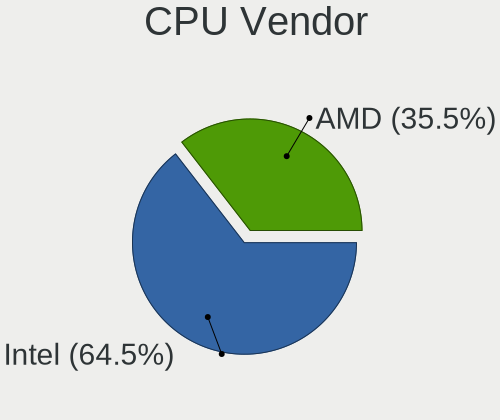

| Vendor | Desktops | Percent |
|--------|----------|---------|
| Intel  | 28       | 71.79%  |
| AMD    | 11       | 28.21%  |

CPU Model
---------

Processor models

| Model                                       | Desktops | Percent |
|---------------------------------------------|----------|---------|
| Intel Core i5-3470 CPU @ 3.20GHz            | 2        | 5.13%   |
| Intel Core 2 Duo CPU E7300 @ 2.66GHz        | 2        | 5.13%   |
| AMD Ryzen 5 2400G with Radeon Vega Graphics | 2        | 5.13%   |
| Intel Xeon CPU E5-2690 0 @ 2.90GHz          | 1        | 2.56%   |
| Intel Xeon CPU E5-2670 @ 2.60GHz            | 1        | 2.56%   |
| Intel Pentium Silver J5005 CPU @ 1.50GHz    | 1        | 2.56%   |
| Intel Pentium Dual-Core CPU E5800 @ 3.20GHz | 1        | 2.56%   |
| Intel Pentium Dual-Core CPU E5300 @ 2.60GHz | 1        | 2.56%   |
| Intel Pentium D CPU 2.80GHz                 | 1        | 2.56%   |
| Intel Core i9-7960X CPU @ 2.80GHz           | 1        | 2.56%   |
| Intel Core i7-9700K CPU @ 3.60GHz           | 1        | 2.56%   |
| Intel Core i7-8700K CPU @ 3.70GHz           | 1        | 2.56%   |
| Intel Core i7-6700 CPU @ 3.40GHz            | 1        | 2.56%   |
| Intel Core i7-4790K CPU @ 4.00GHz           | 1        | 2.56%   |
| Intel Core i7 CPU 920 @ 2.67GHz             | 1        | 2.56%   |
| Intel Core i7 CPU 860 @ 2.80GHz             | 1        | 2.56%   |
| Intel Core i5-8600K CPU @ 3.60GHz           | 1        | 2.56%   |
| Intel Core i5-4570 CPU @ 3.20GHz            | 1        | 2.56%   |
| Intel Core i5-3570 CPU @ 3.40GHz            | 1        | 2.56%   |
| Intel Core i5-2500 CPU @ 3.30GHz            | 1        | 2.56%   |
| Intel Core i5 CPU 750 @ 2.67GHz             | 1        | 2.56%   |
| Intel Core i3-4150 CPU @ 3.50GHz            | 1        | 2.56%   |
| Intel Core 2 Duo CPU E8600 @ 3.33GHz        | 1        | 2.56%   |
| Intel Core 2 Duo CPU E8500 @ 3.16GHz        | 1        | 2.56%   |
| Intel Core 2 Duo CPU E8300 @ 2.83GHz        | 1        | 2.56%   |
| Intel Core 2 Duo                            | 1        | 2.56%   |
| Intel Celeron CPU 847E @ 1.10GHz            | 1        | 2.56%   |
| AMD Ryzen 9 5900X 12-Core Processor         | 1        | 2.56%   |
| AMD Ryzen 7 2700X Eight-Core Processor      | 1        | 2.56%   |
| AMD Ryzen 5 4600G with Radeon Graphics      | 1        | 2.56%   |
| AMD Ryzen 5 3600XT 6-Core Processor         | 1        | 2.56%   |
| AMD Ryzen 5 2600 Six-Core Processor         | 1        | 2.56%   |
| AMD Ryzen 5 1500X Quad-Core Processor       | 1        | 2.56%   |
| AMD FX-6300 Six-Core Processor              | 1        | 2.56%   |
| AMD Athlon 64 X2 Dual Core Processor 5600+  | 1        | 2.56%   |
| AMD Athlon 64 X2 Dual Core Processor 4000+  | 1        | 2.56%   |

CPU Model Family
----------------

Processor model prefix

| Model                   | Desktops | Percent |
|-------------------------|----------|---------|
| Intel Core i5           | 7        | 17.95%  |
| Intel Core i7           | 6        | 15.38%  |
| Intel Core 2 Duo        | 6        | 15.38%  |
| AMD Ryzen 5             | 6        | 15.38%  |
| Intel Xeon              | 2        | 5.13%   |
| Intel Pentium Dual-Core | 2        | 5.13%   |
| AMD Athlon 64 X2        | 2        | 5.13%   |
| Intel Pentium Silver    | 1        | 2.56%   |
| Intel Pentium D         | 1        | 2.56%   |
| Intel Core i9           | 1        | 2.56%   |
| Intel Core i3           | 1        | 2.56%   |
| Intel Celeron           | 1        | 2.56%   |
| AMD Ryzen 9             | 1        | 2.56%   |
| AMD Ryzen 7             | 1        | 2.56%   |
| AMD FX                  | 1        | 2.56%   |

CPU Cores
---------

Number of processor cores

| Number  | Desktops | Percent |
|---------|----------|---------|
| 2       | 12       | 30.77%  |
| 4       | 11       | 28.21%  |
| 8       | 6        | 15.38%  |
| 12      | 3        | 7.69%   |
| 6       | 3        | 7.69%   |
| 16      | 2        | 5.13%   |
| 24      | 1        | 2.56%   |
| Unknown | 1        | 2.56%   |

CPU Sockets
-----------

Number of sockets

| Number | Desktops | Percent |
|--------|----------|---------|
| 1      | 38       | 97.44%  |
| 2      | 1        | 2.56%   |

CPU Threads
-----------

Threads per core (Hyper-Threading)

| Number  | Desktops | Percent |
|---------|----------|---------|
| 1       | 29       | 74.36%  |
| 2       | 9        | 23.08%  |
| Unknown | 1        | 2.56%   |

CPU Microarch
-------------

Microarchitecture

| Name          | Desktops | Percent |
|---------------|----------|---------|
| Penryn        | 8        | 20.51%  |
| SandyBridge   | 4        | 10.26%  |
| Zen           | 3        | 7.69%   |
| Nehalem       | 3        | 7.69%   |
| KabyLake      | 3        | 7.69%   |
| IvyBridge     | 3        | 7.69%   |
| Haswell       | 3        | 7.69%   |
| Zen+          | 2        | 5.13%   |
| Zen 2         | 2        | 5.13%   |
| Skylake       | 2        | 5.13%   |
| K8 Hammer     | 2        | 5.13%   |
| Zen 3         | 1        | 2.56%   |
| Piledriver    | 1        | 2.56%   |
| NetBurst      | 1        | 2.56%   |
| Goldmont plus | 1        | 2.56%   |

Graphics
--------

GPU Vendor
----------

Vendors of graphics cards

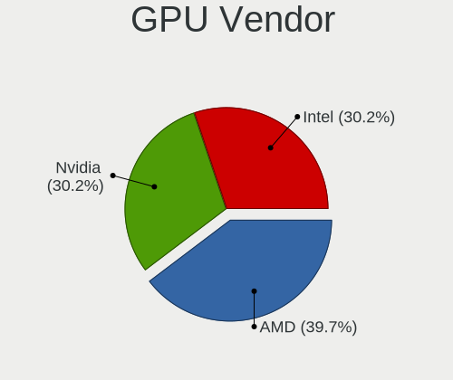

| Vendor | Desktops | Percent |
|--------|----------|---------|
| Nvidia | 14       | 35%     |
| Intel  | 13       | 32.5%   |
| AMD    | 13       | 32.5%   |

GPU Model
---------

Graphics card models

| Model                                                                       | Desktops | Percent |
|-----------------------------------------------------------------------------|----------|---------|
| Nvidia GP106 [GeForce GTX 1060 6GB]                                         | 4        | 9.76%   |
| Intel Xeon E3-1200 v2/3rd Gen Core processor Graphics Controller            | 3        | 7.32%   |
| Nvidia GK208B [GeForce GT 710]                                              | 2        | 4.88%   |
| Intel Xeon E3-1200 v3/4th Gen Core Processor Integrated Graphics Controller | 2        | 4.88%   |
| Intel 82G33/G31 Express Integrated Graphics Controller                      | 2        | 4.88%   |
| Intel 2nd Generation Core Processor Family Integrated Graphics Controller   | 2        | 4.88%   |
| AMD Ellesmere [Radeon RX 470/480/570/570X/580/580X/590]                     | 2        | 4.88%   |
| AMD Cedar [Radeon HD 5000/6000/7350/8350 Series]                            | 2        | 4.88%   |
| Nvidia GT218 [GeForce 210]                                                  | 1        | 2.44%   |
| Nvidia GP108 [GeForce GT 1030]                                              | 1        | 2.44%   |
| Nvidia GP104 [GeForce GTX 1070 Ti]                                          | 1        | 2.44%   |
| Nvidia GM107GL [Quadro K2200]                                               | 1        | 2.44%   |
| Nvidia GM107 [GeForce GTX 750]                                              | 1        | 2.44%   |
| Nvidia GM107 [GeForce GTX 750 Ti]                                           | 1        | 2.44%   |
| Nvidia GA104 [GeForce RTX 3070]                                             | 1        | 2.44%   |
| Nvidia G72 [GeForce 7300 LE]                                                | 1        | 2.44%   |
| Intel HD Graphics 530                                                       | 1        | 2.44%   |
| Intel GeminiLake [UHD Graphics 605]                                         | 1        | 2.44%   |
| Intel 82Q35 Express Integrated Graphics Controller                          | 1        | 2.44%   |
| Intel 4th Generation Core Processor Family Integrated Graphics Controller   | 1        | 2.44%   |
| AMD Vega 20 [Radeon VII]                                                    | 1        | 2.44%   |
| AMD RV620 PRO [Radeon HD 3470]                                              | 1        | 2.44%   |
| AMD RS482/RS485 [Radeon Xpress 1100/1150]                                   | 1        | 2.44%   |
| AMD RS480 [Radeon Xpress 1150] (Secondary)                                  | 1        | 2.44%   |
| AMD Renoir                                                                  | 1        | 2.44%   |
| AMD Raven Ridge [Radeon Vega Series / Radeon Vega Mobile Series]            | 1        | 2.44%   |
| AMD Navi 21 [Radeon RX 6800/6800 XT / 6900 XT]                              | 1        | 2.44%   |
| AMD Juniper XT [Radeon HD 5770]                                             | 1        | 2.44%   |
| AMD Caicos [Radeon HD 6450/7450/8450 / R5 230 OEM]                          | 1        | 2.44%   |
| AMD Baffin [Radeon RX 460/560D / Pro 450/455/460/555/555X/560/560X]         | 1        | 2.44%   |

GPU Combo
---------

Combinations of graphics cards

| Name           | Desktops | Percent |
|----------------|----------|---------|
| 1 x Nvidia     | 13       | 33.33%  |
| 1 x Intel      | 12       | 30.77%  |
| 1 x AMD        | 12       | 30.77%  |
| 2 x AMD        | 1        | 2.56%   |
| Intel + Nvidia | 1        | 2.56%   |

GPU Driver
----------

Free vs proprietary

| Driver      | Desktops | Percent |
|-------------|----------|---------|
| Free        | 26       | 66.67%  |
| Proprietary | 12       | 30.77%  |
| Unknown     | 1        | 2.56%   |

GPU Memory
----------

Total video memory

| Size in GB | Desktops | Percent |
|------------|----------|---------|
| Unknown    | 22       | 56.41%  |
| 1.01-2.0   | 5        | 12.82%  |
| 5.01-6.0   | 4        | 10.26%  |
| 0.01-0.5   | 3        | 7.69%   |
| 7.01-8.0   | 2        | 5.13%   |
| 3.01-4.0   | 2        | 5.13%   |
| 0.51-1.0   | 1        | 2.56%   |

Monitor
-------

Monitor Vendor
--------------

Monitor vendors

| Vendor               | Desktops | Percent |
|----------------------|----------|---------|
| Goldstar             | 6        | 17.14%  |
| Dell                 | 6        | 17.14%  |
| Samsung Electronics  | 4        | 11.43%  |
| Hewlett-Packard      | 4        | 11.43%  |
| Acer                 | 4        | 11.43%  |
| ___                  | 1        | 2.86%   |
| Westinghouse         | 1        | 2.86%   |
| Vizio                | 1        | 2.86%   |
| ViewSonic            | 1        | 2.86%   |
| Toshiba              | 1        | 2.86%   |
| Sony                 | 1        | 2.86%   |
| Philips              | 1        | 2.86%   |
| LG Electronics       | 1        | 2.86%   |
| HannStar             | 1        | 2.86%   |
| BenQ                 | 1        | 2.86%   |
| Ancor Communications | 1        | 2.86%   |

Monitor Model
-------------

Monitor models

| Model                                                                | Desktops | Percent |
|----------------------------------------------------------------------|----------|---------|
| ___ MY TV LED TV ___0101 1920x1080                                   | 1        | 2.78%   |
| Westinghouse DWM40F3G1 WET1ECC 1920x1080 880x480mm 39.5-inch         | 1        | 2.78%   |
| Vizio SV370XVT VIZ0057 1920x1080 820x460mm 37.0-inch                 | 1        | 2.78%   |
| ViewSonic VX910 VSC3C19 1280x1024 380x300mm 19.1-inch                | 1        | 2.78%   |
| Toshiba LCD-MONITOR LCDC980 1280x1024 380x300mm 19.1-inch            | 1        | 2.78%   |
| Sony TV SNY5D01 1360x768                                             | 1        | 2.78%   |
| Samsung Electronics U28E510 SAM0D68 3840x2160 610x350mm 27.7-inch    | 1        | 2.78%   |
| Samsung Electronics SyncMaster SAM036F 1440x900 410x260mm 19.1-inch  | 1        | 2.78%   |
| Samsung Electronics S27E330 SAM0D91 1920x1080 600x340mm 27.2-inch    | 1        | 2.78%   |
| Samsung Electronics LCD Monitor U28E590 3840x2160                    | 1        | 2.78%   |
| Philips 170S PHL0856 1280x1024 340x270mm 17.1-inch                   | 1        | 2.78%   |
| LG Electronics LCD Monitor LG HDR QHD 2560x1440                      | 1        | 2.78%   |
| Hewlett-Packard W2072a HWP299F 1600x900 440x250mm 19.9-inch          | 1        | 2.78%   |
| Hewlett-Packard vs17 HWP2647 1280x1024 340x270mm 17.1-inch           | 1        | 2.78%   |
| Hewlett-Packard L1710 HWP26EB 1280x1024 340x270mm 17.1-inch          | 1        | 2.78%   |
| Hewlett-Packard HPQ 8300 AiO HWP4212 1920x1080 510x290mm 23.1-inch   | 1        | 2.78%   |
| HannStar LCD Monitor HSD0013 1280x1024 380x300mm 19.1-inch           | 1        | 2.78%   |
| Goldstar W1943 GSM4BAD 1360x768 410x230mm 18.5-inch                  | 1        | 2.78%   |
| Goldstar LG FULL HD GSM5B55 1920x1080 480x270mm 21.7-inch            | 1        | 2.78%   |
| Goldstar LCD Monitor GSM5AB7 1920x1080 480x270mm 21.7-inch           | 1        | 2.78%   |
| Goldstar E2742 GSM58C9 1920x1080 600x340mm 27.2-inch                 | 1        | 2.78%   |
| Goldstar E2241 GSM581A 1920x1080 480x270mm 21.7-inch                 | 1        | 2.78%   |
| Goldstar 22MP55 GSM5A26 1920x1080 480x270mm 21.7-inch                | 1        | 2.78%   |
| Dell U2414H DELA0A4 1920x1080 530x300mm 24.0-inch                    | 1        | 2.78%   |
| Dell U2414H DELA0A2 1920x1080 530x300mm 24.0-inch                    | 1        | 2.78%   |
| Dell U2412M DELA07A 1920x1200 520x320mm 24.0-inch                    | 1        | 2.78%   |
| Dell S2309W DELA041 1920x1080 510x290mm 23.1-inch                    | 1        | 2.78%   |
| Dell P1917S DELD091 1280x1024 380x300mm 19.1-inch                    | 1        | 2.78%   |
| Dell E2014H DELD03B 1600x900 430x240mm 19.4-inch                     | 1        | 2.78%   |
| Dell E1715S DELD062 1280x1024 340x270mm 17.1-inch                    | 1        | 2.78%   |
| BenQ GW2260 BNQ78C4 1920x1080 480x270mm 21.7-inch                    | 1        | 2.78%   |
| Ancor Communications ASUS VS197 ACI19F2 1366x768 410x230mm 18.5-inch | 1        | 2.78%   |
| Acer V173 ACR0019 1280x1024 340x270mm 17.1-inch                      | 1        | 2.78%   |
| Acer P191W ACR0010 1600x1200 410x260mm 19.1-inch                     | 1        | 2.78%   |
| Acer KG241 ACR0699 1920x1080 530x300mm 24.0-inch                     | 1        | 2.78%   |
| Acer AL2223W ACRAD84 1680x1050 470x300mm 22.0-inch                   | 1        | 2.78%   |

Monitor Resolution
------------------

Monitor screen resolution

| Resolution         | Desktops | Percent |
|--------------------|----------|---------|
| 1920x1080 (FHD)    | 13       | 38.24%  |
| 1280x1024 (SXGA)   | 9        | 26.47%  |
| 3840x2160 (4K)     | 2        | 5.88%   |
| 1600x900 (HD+)     | 2        | 5.88%   |
| 1360x768           | 2        | 5.88%   |
| 2560x1440 (QHD)    | 1        | 2.94%   |
| 1920x1200 (WUXGA)  | 1        | 2.94%   |
| 1680x1050 (WSXGA+) | 1        | 2.94%   |
| 1600x1200          | 1        | 2.94%   |
| 1440x900 (WXGA+)   | 1        | 2.94%   |
| 1366x768 (WXGA)    | 1        | 2.94%   |

Monitor Diagonal
----------------

Diagonal size in inches

| Inches  | Desktops | Percent |
|---------|----------|---------|
| 19      | 8        | 22.86%  |
| 21      | 5        | 14.29%  |
| 17      | 5        | 14.29%  |
| Unknown | 4        | 11.43%  |
| 27      | 3        | 8.57%   |
| 24      | 3        | 8.57%   |
| 23      | 2        | 5.71%   |
| 18      | 2        | 5.71%   |
| 39      | 1        | 2.86%   |
| 37      | 1        | 2.86%   |
| 22      | 1        | 2.86%   |

Monitor Width
-------------

Physical width

| Width in mm | Desktops | Percent |
|-------------|----------|---------|
| 401-500     | 11       | 32.35%  |
| 501-600     | 7        | 20.59%  |
| 301-350     | 5        | 14.71%  |
| 351-400     | 4        | 11.76%  |
| Unknown     | 4        | 11.76%  |
| 801-900     | 2        | 5.88%   |
| 601-700     | 1        | 2.94%   |

Aspect Ratio
------------

Proportional relationship between the width and the height

| Ratio   | Desktops | Percent |
|---------|----------|---------|
| 16/9    | 18       | 54.55%  |
| 5/4     | 9        | 27.27%  |
| 16/10   | 4        | 12.12%  |
| Unknown | 2        | 6.06%   |

Monitor Area
------------

Area in inch²

| Area in inch² | Desktops | Percent |
|----------------|----------|---------|
| 201-250        | 10       | 28.57%  |
| 151-200        | 8        | 22.86%  |
| 141-150        | 7        | 20%     |
| Unknown        | 4        | 11.43%  |
| 301-350        | 3        | 8.57%   |
| 501-1000       | 2        | 5.71%   |
| 251-300        | 1        | 2.86%   |

Pixel Density
-------------

Pixels per inch

| Density | Desktops | Percent |
|---------|----------|---------|
| 51-100  | 21       | 65.63%  |
| 101-120 | 6        | 18.75%  |
| Unknown | 4        | 12.5%   |
| 121-160 | 1        | 3.13%   |

Multiple Monitors
-----------------

Total monitors connected

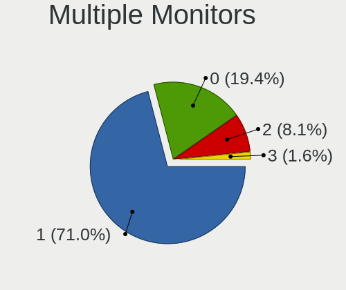

| Total | Desktops | Percent |
|-------|----------|---------|
| 1     | 28       | 71.79%  |
| 0     | 7        | 17.95%  |
| 2     | 3        | 7.69%   |
| 3     | 1        | 2.56%   |

Network
-------

Net Controller Vendor
---------------------

Controller vendors

| Vendor                | Desktops | Percent |
|-----------------------|----------|---------|
| Realtek Semiconductor | 20       | 37.04%  |
| Intel                 | 19       | 35.19%  |
| Qualcomm Atheros      | 4        | 7.41%   |
| Broadcom              | 3        | 5.56%   |
| Mellanox Technologies | 2        | 3.7%    |
| Ralink Technology     | 1        | 1.85%   |
| Qualcomm              | 1        | 1.85%   |
| Nvidia                | 1        | 1.85%   |
| Microchip Technology  | 1        | 1.85%   |
| D-Link System         | 1        | 1.85%   |
| Brooktrout Technology | 1        | 1.85%   |

Net Controller Model
--------------------

Controller models

| Model                                                                                 | Desktops | Percent |
|---------------------------------------------------------------------------------------|----------|---------|
| Realtek RTL8111/8168/8411 PCI Express Gigabit Ethernet Controller                     | 14       | 21.88%  |
| Intel Ethernet Connection (2) I219-V                                                  | 4        | 6.25%   |
| Realtek RTL8125 2.5GbE Controller                                                     | 3        | 4.69%   |
| Intel 82579LM Gigabit Network Connection (Lewisville)                                 | 3        | 4.69%   |
| Realtek RTL8192CE PCIe Wireless Network Adapter                                       | 2        | 3.13%   |
| Mellanox MT27500 Family [ConnectX-3]                                                  | 2        | 3.13%   |
| Intel I211 Gigabit Network Connection                                                 | 2        | 3.13%   |
| Intel 82567LM-3 Gigabit Network Connection                                            | 2        | 3.13%   |
| Realtek RTL8822BE 802.11a/b/g/n/ac WiFi adapter                                       | 1        | 1.56%   |
| Realtek RTL8821CE 802.11ac PCIe Wireless Network Adapter                              | 1        | 1.56%   |
| Realtek RTL8811AU 802.11a/b/g/n/ac WLAN Adapter                                       | 1        | 1.56%   |
| Realtek RTL8188FTV 802.11b/g/n 1T1R 2.4G WLAN Adapter                                 | 1        | 1.56%   |
| Realtek RTL8188EUS 802.11n Wireless Network Adapter                                   | 1        | 1.56%   |
| Ralink RT5372 Wireless Adapter                                                        | 1        | 1.56%   |
| Qualcomm Atheros QCA8171 Gigabit Ethernet                                             | 1        | 1.56%   |
| Qualcomm Atheros AR9485 Wireless Network Adapter                                      | 1        | 1.56%   |
| Qualcomm Atheros AR928X Wireless Network Adapter (PCI-Express)                        | 1        | 1.56%   |
| Qualcomm Atheros AR5418 Wireless Network Adapter [AR5008E 802.11(a)bgn] (PCI-Express) | 1        | 1.56%   |
| Qualcomm ALCATEL Composite RNDIS Interface                                            | 1        | 1.56%   |
| Nvidia MCP73 Ethernet                                                                 | 1        | 1.56%   |
| Microchip MCP2200 USB-to-Serial Port                                                  | 1        | 1.56%   |
| Intel Wireless 8265 / 8275                                                            | 1        | 1.56%   |
| Intel Wireless 7260                                                                   | 1        | 1.56%   |
| Intel Wireless 3165                                                                   | 1        | 1.56%   |
| Intel Wi-Fi 6 AX200                                                                   | 1        | 1.56%   |
| Intel NM10/ICH7 Family LAN Controller                                                 | 1        | 1.56%   |
| Intel Ethernet Connection I217-LM                                                     | 1        | 1.56%   |
| Intel Ethernet Connection (2) I218-V                                                  | 1        | 1.56%   |
| Intel Dual Band Wireless-AC 3168NGW [Stone Peak]                                      | 1        | 1.56%   |
| Intel Centrino Wireless-N 105                                                         | 1        | 1.56%   |
| Intel 82579V Gigabit Network Connection                                               | 1        | 1.56%   |
| Intel 82574L Gigabit Network Connection                                               | 1        | 1.56%   |
| Intel 82567V-2 Gigabit Network Connection                                             | 1        | 1.56%   |
| Intel 82567LF-2 Gigabit Network Connection                                            | 1        | 1.56%   |
| Intel 82566DM-2 Gigabit Network Connection                                            | 1        | 1.56%   |
| D-Link System DWA-125 Wireless N 150 Adapter(rev.A1) [Ralink RT3070]                  | 1        | 1.56%   |
| Brooktrout TruFax Board                                                               | 1        | 1.56%   |
| Broadcom NetXtreme BCM5755 Gigabit Ethernet PCI Express                               | 1        | 1.56%   |
| Broadcom NetLink BCM57780 Gigabit Ethernet PCIe                                       | 1        | 1.56%   |
| Broadcom BCM4352 802.11ac Wireless Network Adapter                                    | 1        | 1.56%   |

Wireless Vendor
---------------

Wireless vendors

| Vendor                | Desktops | Percent |
|-----------------------|----------|---------|
| Realtek Semiconductor | 7        | 36.84%  |
| Intel                 | 6        | 31.58%  |
| Qualcomm Atheros      | 3        | 15.79%  |
| Ralink Technology     | 1        | 5.26%   |
| D-Link System         | 1        | 5.26%   |
| Broadcom              | 1        | 5.26%   |

Wireless Model
--------------

Wireless models

| Model                                                                                 | Desktops | Percent |
|---------------------------------------------------------------------------------------|----------|---------|
| Realtek RTL8192CE PCIe Wireless Network Adapter                                       | 2        | 10.53%  |
| Realtek RTL8822BE 802.11a/b/g/n/ac WiFi adapter                                       | 1        | 5.26%   |
| Realtek RTL8821CE 802.11ac PCIe Wireless Network Adapter                              | 1        | 5.26%   |
| Realtek RTL8811AU 802.11a/b/g/n/ac WLAN Adapter                                       | 1        | 5.26%   |
| Realtek RTL8188FTV 802.11b/g/n 1T1R 2.4G WLAN Adapter                                 | 1        | 5.26%   |
| Realtek RTL8188EUS 802.11n Wireless Network Adapter                                   | 1        | 5.26%   |
| Ralink RT5372 Wireless Adapter                                                        | 1        | 5.26%   |
| Qualcomm Atheros AR9485 Wireless Network Adapter                                      | 1        | 5.26%   |
| Qualcomm Atheros AR928X Wireless Network Adapter (PCI-Express)                        | 1        | 5.26%   |
| Qualcomm Atheros AR5418 Wireless Network Adapter [AR5008E 802.11(a)bgn] (PCI-Express) | 1        | 5.26%   |
| Intel Wireless 8265 / 8275                                                            | 1        | 5.26%   |
| Intel Wireless 7260                                                                   | 1        | 5.26%   |
| Intel Wireless 3165                                                                   | 1        | 5.26%   |
| Intel Wi-Fi 6 AX200                                                                   | 1        | 5.26%   |
| Intel Dual Band Wireless-AC 3168NGW [Stone Peak]                                      | 1        | 5.26%   |
| Intel Centrino Wireless-N 105                                                         | 1        | 5.26%   |
| D-Link System DWA-125 Wireless N 150 Adapter(rev.A1) [Ralink RT3070]                  | 1        | 5.26%   |
| Broadcom BCM4352 802.11ac Wireless Network Adapter                                    | 1        | 5.26%   |

Ethernet Vendor
---------------

Ethernet vendors

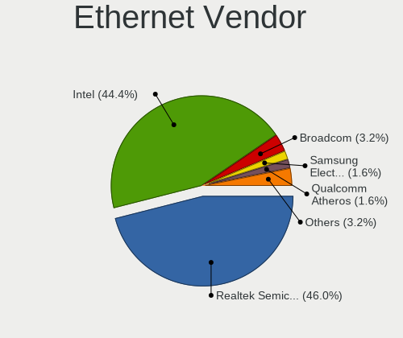

| Vendor                | Desktops | Percent |
|-----------------------|----------|---------|
| Intel                 | 18       | 45%     |
| Realtek Semiconductor | 17       | 42.5%   |
| Broadcom              | 2        | 5%      |
| Qualcomm Atheros      | 1        | 2.5%    |
| Qualcomm              | 1        | 2.5%    |
| Nvidia                | 1        | 2.5%    |

Ethernet Model
--------------

Ethernet models

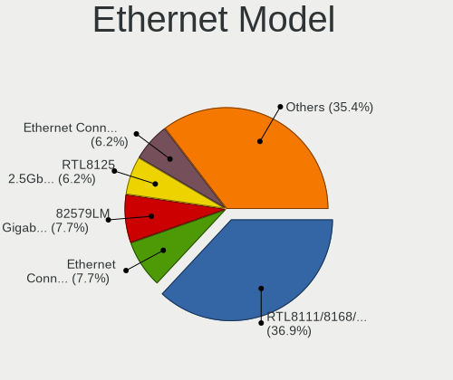

| Model                                                             | Desktops | Percent |
|-------------------------------------------------------------------|----------|---------|
| Realtek RTL8111/8168/8411 PCI Express Gigabit Ethernet Controller | 14       | 34.15%  |
| Intel Ethernet Connection (2) I219-V                              | 4        | 9.76%   |
| Realtek RTL8125 2.5GbE Controller                                 | 3        | 7.32%   |
| Intel 82579LM Gigabit Network Connection (Lewisville)             | 3        | 7.32%   |
| Intel I211 Gigabit Network Connection                             | 2        | 4.88%   |
| Intel 82567LM-3 Gigabit Network Connection                        | 2        | 4.88%   |
| Qualcomm Atheros QCA8171 Gigabit Ethernet                         | 1        | 2.44%   |
| Qualcomm ALCATEL Composite RNDIS Interface                        | 1        | 2.44%   |
| Nvidia MCP73 Ethernet                                             | 1        | 2.44%   |
| Intel NM10/ICH7 Family LAN Controller                             | 1        | 2.44%   |
| Intel Ethernet Connection I217-LM                                 | 1        | 2.44%   |
| Intel Ethernet Connection (2) I218-V                              | 1        | 2.44%   |
| Intel 82579V Gigabit Network Connection                           | 1        | 2.44%   |
| Intel 82574L Gigabit Network Connection                           | 1        | 2.44%   |
| Intel 82567V-2 Gigabit Network Connection                         | 1        | 2.44%   |
| Intel 82567LF-2 Gigabit Network Connection                        | 1        | 2.44%   |
| Intel 82566DM-2 Gigabit Network Connection                        | 1        | 2.44%   |
| Broadcom NetXtreme BCM5755 Gigabit Ethernet PCI Express           | 1        | 2.44%   |
| Broadcom NetLink BCM57780 Gigabit Ethernet PCIe                   | 1        | 2.44%   |

Net Controller Kind
-------------------

Ethernet, WiFi or modem

| Kind     | Desktops | Percent |
|----------|----------|---------|
| Ethernet | 38       | 63.33%  |
| WiFi     | 18       | 30%     |
| Unknown  | 3        | 5%      |
| Modem    | 1        | 1.67%   |

Used Controller
---------------

Currently used network controller

| Kind     | Desktops | Percent |
|----------|----------|---------|
| Ethernet | 36       | 69.23%  |
| WiFi     | 14       | 26.92%  |
| Unknown  | 2        | 3.85%   |

NICs
----

Total network controllers on board

| Total | Desktops | Percent |
|-------|----------|---------|
| 1     | 24       | 61.54%  |
| 2     | 13       | 33.33%  |
| 4     | 1        | 2.56%   |
| 3     | 1        | 2.56%   |

IPv6
----

IPv6 vs IPv4

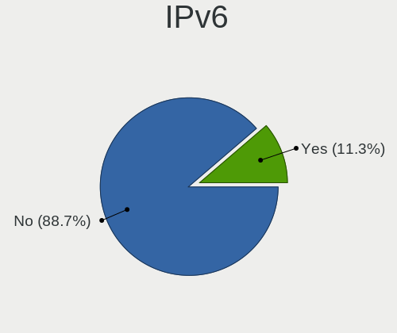

| Used | Desktops | Percent |
|------|----------|---------|
| No   | 36       | 92.31%  |
| Yes  | 3        | 7.69%   |

Bluetooth
---------

Bluetooth Vendor
----------------

Controller vendors

| Vendor                          | Desktops | Percent |
|---------------------------------|----------|---------|
| Intel                           | 5        | 50%     |
| Realtek Semiconductor           | 1        | 10%     |
| Qualcomm Atheros Communications | 1        | 10%     |
| Cambridge Silicon Radio         | 1        | 10%     |
| Broadcom                        | 1        | 10%     |
| ASUSTek Computer                | 1        | 10%     |

Bluetooth Model
---------------

Controller models

| Model                                               | Desktops | Percent |
|-----------------------------------------------------|----------|---------|
| Intel Bluetooth wireless interface                  | 3        | 30%     |
| Realtek  Bluetooth 4.2 Adapter                      | 1        | 10%     |
| Qualcomm Atheros AR3012 Bluetooth 4.0               | 1        | 10%     |
| Intel Wireless-AC 3168 Bluetooth                    | 1        | 10%     |
| Intel AX200 Bluetooth                               | 1        | 10%     |
| Cambridge Silicon Radio Bluetooth Dongle (HCI mode) | 1        | 10%     |
| Broadcom BCM2045 Bluetooth                          | 1        | 10%     |
| ASUS Bluetooth Controller                           | 1        | 10%     |

Sound
-----

Sound Vendor
------------

Sound card vendors

| Vendor              | Desktops | Percent |
|---------------------|----------|---------|
| Intel               | 26       | 40%     |
| AMD                 | 16       | 24.62%  |
| Nvidia              | 14       | 21.54%  |
| Sony                | 2        | 3.08%   |
| C-Media Electronics | 2        | 3.08%   |
| XMOS                | 1        | 1.54%   |
| Quanta              | 1        | 1.54%   |
| Creative Technology | 1        | 1.54%   |
| Corsair             | 1        | 1.54%   |
| Audio-Technica      | 1        | 1.54%   |

Sound Model
-----------

Sound card models

| Model                                                                             | Desktops | Percent |
|-----------------------------------------------------------------------------------|----------|---------|
| Nvidia GP106 High Definition Audio Controller                                     | 4        | 5.33%   |
| Intel NM10/ICH7 Family High Definition Audio Controller                           | 4        | 5.33%   |
| Intel 7 Series/C216 Chipset Family High Definition Audio Controller               | 4        | 5.33%   |
| Nvidia GM107 High Definition Audio Controller [GeForce 940MX]                     | 3        | 4%      |
| Intel Xeon E3-1200 v3/4th Gen Core Processor HD Audio Controller                  | 3        | 4%      |
| Intel 200 Series PCH HD Audio                                                     | 3        | 4%      |
| AMD Family 17h/19h HD Audio Controller                                            | 3        | 4%      |
| AMD Family 17h (Models 00h-0fh) HD Audio Controller                               | 3        | 4%      |
| Nvidia GK208 HDMI/DP Audio Controller                                             | 2        | 2.67%   |
| Intel 82801JI (ICH10 Family) HD Audio Controller                                  | 2        | 2.67%   |
| Intel 8 Series/C220 Series Chipset High Definition Audio Controller               | 2        | 2.67%   |
| Intel 6 Series/C200 Series Chipset Family High Definition Audio Controller        | 2        | 2.67%   |
| Intel 5 Series/3400 Series Chipset High Definition Audio                          | 2        | 2.67%   |
| AMD Starship/Matisse HD Audio Controller                                          | 2        | 2.67%   |
| AMD SBx00 Azalia (Intel HDA)                                                      | 2        | 2.67%   |
| AMD Ellesmere HDMI Audio [Radeon RX 470/480 / 570/580/590]                        | 2        | 2.67%   |
| AMD Cedar HDMI Audio [Radeon HD 5400/6300/7300 Series]                            | 2        | 2.67%   |
| XMOS XMOS XS1-U8 MFA (ST)                                                         | 1        | 1.33%   |
| Sony Sony Audio                                                                   | 1        | 1.33%   |
| Sony DualShock 4 [CUH-ZCT2x]                                                      | 1        | 1.33%   |
| Quanta USB Audio Realtek USB2.0 Audio Microphone                                  | 1        | 1.33%   |
| Nvidia MCP73 High Definition Audio                                                | 1        | 1.33%   |
| Nvidia MCP61 High Definition Audio                                                | 1        | 1.33%   |
| Nvidia High Definition Audio Controller                                           | 1        | 1.33%   |
| Nvidia GP108 High Definition Audio Controller                                     | 1        | 1.33%   |
| Nvidia GP104 High Definition Audio Controller                                     | 1        | 1.33%   |
| Nvidia GA104 High Definition Audio Controller                                     | 1        | 1.33%   |
| Intel Celeron/Pentium Silver Processor High Definition Audio                      | 1        | 1.33%   |
| Intel Cannon Lake PCH cAVS                                                        | 1        | 1.33%   |
| Intel C600/X79 series chipset High Definition Audio Controller                    | 1        | 1.33%   |
| Intel 9 Series Chipset Family HD Audio Controller                                 | 1        | 1.33%   |
| Intel 82801JD/DO (ICH10 Family) HD Audio Controller                               | 1        | 1.33%   |
| Intel 82801I (ICH9 Family) HD Audio Controller                                    | 1        | 1.33%   |
| Intel 100 Series/C230 Series Chipset Family HD Audio Controller                   | 1        | 1.33%   |
| Creative Technology Sound Blaster Omni Surround 5.1                               | 1        | 1.33%   |
| Corsair Corsair VOID PRO Wireless Gaming Headset                                  | 1        | 1.33%   |
| Corsair Corsair ST100 Headset Output                                              | 1        | 1.33%   |
| C-Media Electronics Audio Device                                                  | 1        | 1.33%   |
| C-Media Electronics Audio Adapter                                                 | 1        | 1.33%   |
| Audio-Technica AT2020USB+                                                         | 1        | 1.33%   |
| AMD Vega 20 HDMI Audio [Radeon VII]                                               | 1        | 1.33%   |
| AMD Renoir Radeon High Definition Audio Controller                                | 1        | 1.33%   |
| AMD Raven/Raven2/Fenghuang HDMI/DP Audio Controller                               | 1        | 1.33%   |
| AMD Navi 21 HDMI Audio [Radeon RX 6800/6800 XT / 6900 XT]                         | 1        | 1.33%   |
| AMD Juniper HDMI Audio [Radeon HD 5700 Series]                                    | 1        | 1.33%   |
| AMD Caicos HDMI Audio [Radeon HD 6450 / 7450/8450/8490 OEM / R5 230/235/235X OEM] | 1        | 1.33%   |
| AMD Baffin HDMI/DP Audio [Radeon RX 550 640SP / RX 560/560X]                      | 1        | 1.33%   |

Memory
------

Memory Vendor
-------------

Memory module vendors

| Vendor              | Desktops | Percent |
|---------------------|----------|---------|
| Kingston            | 7        | 15.91%  |
| Unknown             | 6        | 13.64%  |
| SK Hynix            | 6        | 13.64%  |
| Micron Technology   | 5        | 11.36%  |
| G.Skill             | 5        | 11.36%  |
| Corsair             | 4        | 9.09%   |
| Samsung Electronics | 3        | 6.82%   |
| Crucial             | 3        | 6.82%   |
| Nanya Technology    | 2        | 4.55%   |
| Elpida              | 2        | 4.55%   |
| EVGA                | 1        | 2.27%   |

Memory Model
------------

Memory module models

| Model                                                     | Desktops | Percent |
|-----------------------------------------------------------|----------|---------|
| Unknown RAM Module 2GB DIMM DDR2 800MT/s                  | 2        | 4.26%   |
| Micron RAM ITC 4096MB DIMM DDR3 1066MT/s                  | 2        | 4.26%   |
| Unknown RAM Module 2GB DIMM SDRAM                         | 1        | 2.13%   |
| Unknown RAM Module 2GB DIMM DDR 1333MT/s                  | 1        | 2.13%   |
| Unknown RAM Module 1024MB DIMM DDR2 533MT/s               | 1        | 2.13%   |
| Unknown RAM 7TE39AA# 8GB DIMM DDR4 2667MT/s               | 1        | 2.13%   |
| SK Hynix RAM Zhidian4GDDR800000 4GB DIMM DDR2 800MT/s     | 1        | 2.13%   |
| SK Hynix RAM HMT451U6AFR8C-PB 4GB DIMM DDR3 1600MT/s      | 1        | 2.13%   |
| SK Hynix RAM HMT351U6EFR8C-PB 4GB DIMM DDR3 1600MT/s      | 1        | 2.13%   |
| SK Hynix RAM HMT351U6CFR8C-PB 4GB DIMM 192MT/s            | 1        | 2.13%   |
| SK Hynix RAM HMT31GR7BFR4C-H9 8GB DIMM DDR3 1333MT/s      | 1        | 2.13%   |
| SK Hynix RAM HMT31GR7AFR4C-H9 8GB DIMM DDR3 1333MT/s      | 1        | 2.13%   |
| SK Hynix RAM HMT125U6AFP8C-G7 2048MB DIMM DDR3 1066MT/s   | 1        | 2.13%   |
| SK Hynix RAM HMT112U6AFP8C-G7 1GB DIMM 1066MT/s           | 1        | 2.13%   |
| Samsung RAM M471B5273CM0-CH9 4GB SODIMM DDR3 1333MT/s     | 1        | 2.13%   |
| Samsung RAM M471B5273CH0-CK0 4GB SODIMM DDR3 1600MT/s     | 1        | 2.13%   |
| Samsung RAM M378B5173EB0-CK0 4GB DIMM DDR3 1600MT/s       | 1        | 2.13%   |
| Nanya RAM NT4GC64B88B1NF-DI 4GB DIMM DDR3 1600MT/s        | 1        | 2.13%   |
| Nanya RAM NT1GT64U88D0BY-AD 1024MB DIMM DDR2 800MT/s      | 1        | 2.13%   |
| Micron RAM 8HTF12864AZ-800H1 1GB DIMM DDR2 800MT/s        | 1        | 2.13%   |
| Micron RAM 36JSF1G72PZ-1 8GB DIMM DDR3 1600MT/s           | 1        | 2.13%   |
| Micron RAM 16JTF51264AZ-1G4M1 4GB DIMM DDR3 1333MT/s      | 1        | 2.13%   |
| Kingston RAM KY996D-ELD 2GB DIMM 1066MT/s                 | 1        | 2.13%   |
| Kingston RAM KHX2666C16/8G 8GB DIMM DDR4 2667MT/s         | 1        | 2.13%   |
| Kingston RAM KHX2400C15D4/8G 8192MB DIMM DDR4 2400MT/s    | 1        | 2.13%   |
| Kingston RAM KF3200C16D4/16GX 16GB DIMM DDR4 2400MT/s     | 1        | 2.13%   |
| Kingston RAM K531R8-ETB 4GB DIMM DDR3 1600MT/s            | 1        | 2.13%   |
| Kingston RAM ACR256X64D3U1333C9 2GB DIMM DDR3 800MT/s     | 1        | 2.13%   |
| Kingston RAM 99U5704-001.A00G 4GB SODIMM DDR4 2400MT/s    | 1        | 2.13%   |
| Kingston RAM 9905711-015.A00G 4GB SODIMM DDR4 2400MT/s    | 1        | 2.13%   |
| G.Skill RAM F4-3600C18-8GTZN 8192MB DIMM DDR4 3600MT/s    | 1        | 2.13%   |
| G.Skill RAM F4-3600C17-16GTZSW 16GB DIMM DDR4 3600MT/s    | 1        | 2.13%   |
| G.Skill RAM F4-3200C16-8GVKB 8GB DIMM DDR4 3200MT/s       | 1        | 2.13%   |
| G.Skill RAM F4-3000C16-8GISB 8GB DIMM DDR4 2933MT/s       | 1        | 2.13%   |
| G.Skill RAM F4-2400C17-8GVR 8192MB DIMM DDR4 2400MT/s     | 1        | 2.13%   |
| EVGA RAM 8GX-D4-3200-MR 8192MB DIMM DDR4 3200MT/s         | 1        | 2.13%   |
| Elpida RAM EBJ21UE8BAFA-AE-E 2GB DIMM 1066MT/s            | 1        | 2.13%   |
| Elpida RAM EBE11UD8AJWA-6E-E 1024MB DIMM DDR2 667MT/s     | 1        | 2.13%   |
| Crucial RAM CT16G4DFD824A.M16FE 16GB DIMM DDR4 2400MT/s   | 1        | 2.13%   |
| Crucial RAM BLS8G4D240FSEK.8FBD 8192MB DIMM DDR4 2400MT/s | 1        | 2.13%   |
| Crucial RAM BLS8G4D240FSB.16FBD 8GB DIMM DDR4 2933MT/s    | 1        | 2.13%   |
| Corsair RAM Module 8GB DIMM DDR4 3200MT/s                 | 1        | 2.13%   |
| Corsair RAM CMZ4GX3M2A1600C9 2048MB DIMM DDR3 1333MT/s    | 1        | 2.13%   |
| Corsair RAM CMY16GX3M2A2400C11 8192MB DIMM DDR3 2400MT/s  | 1        | 2.13%   |
| Corsair RAM CM2X2048-6400C5 2048MB DIMM DDR2 800MT/s      | 1        | 2.13%   |

Memory Kind
-----------

Memory module kinds

| Kind    | Desktops | Percent |
|---------|----------|---------|
| DDR4    | 15       | 36.59%  |
| DDR3    | 14       | 34.15%  |
| DDR2    | 8        | 19.51%  |
| Unknown | 2        | 4.88%   |
| SDRAM   | 1        | 2.44%   |
| DDR     | 1        | 2.44%   |

Memory Form Factor
------------------

Physical design of the memory module

| Name   | Desktops | Percent |
|--------|----------|---------|
| DIMM   | 37       | 92.5%   |
| SODIMM | 3        | 7.5%    |

Memory Size
-----------

Memory module size

| Size  | Desktops | Percent |
|-------|----------|---------|
| 8192  | 14       | 31.82%  |
| 4096  | 12       | 27.27%  |
| 2048  | 10       | 22.73%  |
| 1024  | 5        | 11.36%  |
| 16384 | 3        | 6.82%   |

Memory Speed
------------

Memory module speed

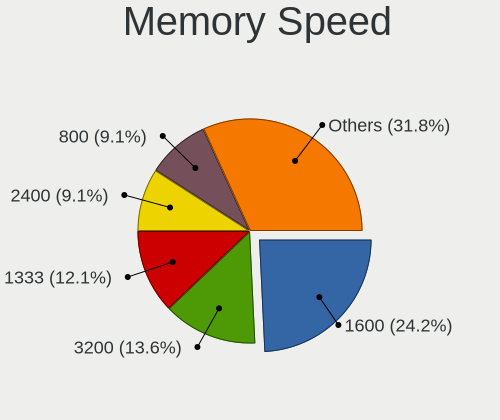

| Speed   | Desktops | Percent |
|---------|----------|---------|
| 2400    | 7        | 16.67%  |
| 800     | 7        | 16.67%  |
| 1600    | 6        | 14.29%  |
| 1333    | 5        | 11.9%   |
| 1066    | 4        | 9.52%   |
| 3200    | 3        | 7.14%   |
| 3600    | 2        | 4.76%   |
| 2933    | 2        | 4.76%   |
| 2667    | 2        | 4.76%   |
| 667     | 1        | 2.38%   |
| 533     | 1        | 2.38%   |
| 192     | 1        | 2.38%   |
| Unknown | 1        | 2.38%   |

Printers & scanners
-------------------

Printer Vendor
--------------

Printer device vendors

| Vendor          | Desktops | Percent |
|-----------------|----------|---------|
| Hewlett-Packard | 1        | 50%     |
| Apple           | 1        | 50%     |

Printer Model
-------------

Printer device models

| Model                                                                    | Desktops | Percent |
|--------------------------------------------------------------------------|----------|---------|
| HP PNP Fax Null                                                          | 1        | 33.33%  |
| HP HP LaserJet M101-M106 Printer HP LEDM HP LEDM IPP Printer IPP Printer | 1        | 33.33%  |
| Apple Gamesir-G3s 2.10                                                   | 1        | 33.33%  |

Scanner Vendor
--------------

Scanner device vendors

Zero info for selected period =(

Scanner Model
-------------

Scanner device models

Zero info for selected period =(

Camera
------

Camera Vendor
-------------

Camera device vendors

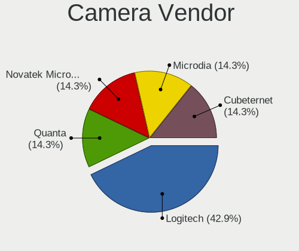

| Vendor                   | Desktops | Percent |
|--------------------------|----------|---------|
| Logitech                 | 3        | 60%     |
| Quanta                   | 1        | 20%     |
| Novatek Microelectronics | 1        | 20%     |

Camera Model
------------

Camera device models

| Model                                 | Desktops | Percent |
|---------------------------------------|----------|---------|
| Quanta Realtek DMFT - RGB             | 1        | 20%     |
| Novatek HP High Definition 2MP Webcam | 1        | 20%     |
| Logitech Webcam C310                  | 1        | 20%     |
| Logitech Webcam C270                  | 1        | 20%     |
| Logitech C505 HD Webcam               | 1        | 20%     |

Security
--------

Fingerprint Vendor
------------------

Fingerprint sensor vendors

Zero info for selected period =(

Fingerprint Model
-----------------

Fingerprint sensor models

Zero info for selected period =(

Chipcard Vendor
---------------

Chipcard module vendors

Zero info for selected period =(

Chipcard Model
--------------

Chipcard module models

Zero info for selected period =(

Unsupported
-----------

Unsupported Devices
-------------------

Total unsupported devices on board

| Total | Desktops | Percent |
|-------|----------|---------|
| 1     | 18       | 46.15%  |
| 2     | 11       | 28.21%  |
| 0     | 9        | 23.08%  |
| 3     | 1        | 2.56%   |

Unsupported Device Types
------------------------

Types of unsupported devices

| Type                     | Desktops | Percent |
|--------------------------|----------|---------|
| Communication controller | 21       | 48.84%  |
| Firewire controller      | 11       | 25.58%  |
| Net/wireless             | 5        | 11.63%  |
| Network                  | 3        | 6.98%   |
| Bluetooth                | 2        | 4.65%   |
| Sound                    | 1        | 2.33%   |

