NomadBSD - Tested Hardware & Statistics (Notebooks)
---------------------------------------------------

A project to collect tested hardware configurations for NomadBSD.

Anyone can contribute to this report by the [hw-probe](https://github.com/linuxhw/hw-probe/blob/master/INSTALL.BSD.md) tool:

    hw-probe -all -upload

Please contribute! Especially if your hardware is rare.

Contents
--------

* [ Test Cases ](#test-cases)

* [ System ](#system)
  - [ OS                       ](#os)
  - [ OS Family                ](#os-family)
  - [ Arch                     ](#arch)
  - [ DE                       ](#de)
  - [ Display Server           ](#display-server)
  - [ Display Manager          ](#display-manager)
  - [ OS Lang                  ](#os-lang)
  - [ Boot Mode                ](#boot-mode)
  - [ Filesystem               ](#filesystem)
  - [ Part. scheme             ](#part-scheme)

* [ Board ](#board)
  - [ Vendor                   ](#vendor)
  - [ Model                    ](#model)
  - [ Model Family             ](#model-family)
  - [ MFG Year                 ](#mfg-year)
  - [ Form Factor              ](#form-factor)
  - [ Coreboot                 ](#coreboot)
  - [ RAM Size                 ](#ram-size)
  - [ RAM Used                 ](#ram-used)
  - [ Total Drives             ](#total-drives)
  - [ Has CD-ROM               ](#has-cd-rom)
  - [ Has Ethernet             ](#has-ethernet)
  - [ Has WiFi                 ](#has-wifi)
  - [ Has Bluetooth            ](#has-bluetooth)

* [ Location ](#location)
  - [ Country                  ](#country)
  - [ City                     ](#city)

* [ Drives ](#drives)
  - [ Drive Vendor             ](#drive-vendor)
  - [ Drive Model              ](#drive-model)
  - [ HDD Vendor               ](#hdd-vendor)
  - [ SSD Vendor               ](#ssd-vendor)
  - [ Drive Kind               ](#drive-kind)
  - [ Drive Connector          ](#drive-connector)
  - [ Drive Size               ](#drive-size)
  - [ Space Total              ](#space-total)
  - [ Space Used               ](#space-used)
  - [ Malfunc. Drives          ](#malfunc-drives)
  - [ Malfunc. Drive Vendor    ](#malfunc-drive-vendor)
  - [ Malfunc. HDD Vendor      ](#malfunc-hdd-vendor)
  - [ Malfunc. Drive Kind      ](#malfunc-drive-kind)
  - [ Failed Drives            ](#failed-drives)
  - [ Failed Drive Vendor      ](#failed-drive-vendor)
  - [ Drive Status             ](#drive-status)

* [ Storage controller ](#storage-controller)
  - [ Storage Vendor           ](#storage-vendor)
  - [ Storage Model            ](#storage-model)
  - [ Storage Kind             ](#storage-kind)

* [ Processor ](#processor)
  - [ CPU Vendor               ](#cpu-vendor)
  - [ CPU Model                ](#cpu-model)
  - [ CPU Model Family         ](#cpu-model-family)
  - [ CPU Cores                ](#cpu-cores)
  - [ CPU Sockets              ](#cpu-sockets)
  - [ CPU Threads              ](#cpu-threads)
  - [ CPU Microarch            ](#cpu-microarch)

* [ Graphics ](#graphics)
  - [ GPU Vendor               ](#gpu-vendor)
  - [ GPU Model                ](#gpu-model)
  - [ GPU Combo                ](#gpu-combo)
  - [ GPU Driver               ](#gpu-driver)
  - [ GPU Memory               ](#gpu-memory)

* [ Monitor ](#monitor)
  - [ Monitor Vendor           ](#monitor-vendor)
  - [ Monitor Model            ](#monitor-model)
  - [ Monitor Resolution       ](#monitor-resolution)
  - [ Monitor Diagonal         ](#monitor-diagonal)
  - [ Monitor Width            ](#monitor-width)
  - [ Aspect Ratio             ](#aspect-ratio)
  - [ Monitor Area             ](#monitor-area)
  - [ Pixel Density            ](#pixel-density)
  - [ Multiple Monitors        ](#multiple-monitors)

* [ Network ](#network)
  - [ Net Controller Vendor    ](#net-controller-vendor)
  - [ Net Controller Model     ](#net-controller-model)
  - [ Wireless Vendor          ](#wireless-vendor)
  - [ Wireless Model           ](#wireless-model)
  - [ Ethernet Vendor          ](#ethernet-vendor)
  - [ Ethernet Model           ](#ethernet-model)
  - [ Net Controller Kind      ](#net-controller-kind)
  - [ Used Controller          ](#used-controller)
  - [ NICs                     ](#nics)
  - [ IPv6                     ](#ipv6)

* [ Bluetooth ](#bluetooth)
  - [ Bluetooth Vendor         ](#bluetooth-vendor)
  - [ Bluetooth Model          ](#bluetooth-model)

* [ Sound ](#sound)
  - [ Sound Vendor             ](#sound-vendor)
  - [ Sound Model              ](#sound-model)

* [ Memory ](#memory)
  - [ Memory Vendor            ](#memory-vendor)
  - [ Memory Model             ](#memory-model)
  - [ Memory Kind              ](#memory-kind)
  - [ Memory Form Factor       ](#memory-form-factor)
  - [ Memory Size              ](#memory-size)
  - [ Memory Speed             ](#memory-speed)

* [ Printers & scanners ](#printers--scanners)
  - [ Printer Vendor           ](#printer-vendor)
  - [ Printer Model            ](#printer-model)
  - [ Scanner Vendor           ](#scanner-vendor)
  - [ Scanner Model            ](#scanner-model)

* [ Camera ](#camera)
  - [ Camera Vendor            ](#camera-vendor)
  - [ Camera Model             ](#camera-model)

* [ Security ](#security)
  - [ Fingerprint Vendor       ](#fingerprint-vendor)
  - [ Fingerprint Model        ](#fingerprint-model)
  - [ Chipcard Vendor          ](#chipcard-vendor)
  - [ Chipcard Model           ](#chipcard-model)

* [ Unsupported ](#unsupported)
  - [ Unsupported Devices      ](#unsupported-devices)
  - [ Unsupported Device Types ](#unsupported-device-types)

Test Cases
----------

Total: 168

| Vendor        | Model                       | Probe                                                     | Date         |
|---------------|-----------------------------|-----------------------------------------------------------|--------------|
| ASUSTek       | VivoBook_ASUSLaptop X160... | [77d8cc2e7c](https://bsd-hardware.info/?probe=77d8cc2e7c) | Jan 02, 2024 |
| Lenovo        | ThinkPad E15 Gen 3 20YG0... | [02bf1d2cd4](https://bsd-hardware.info/?probe=02bf1d2cd4) | Dec 19, 2023 |
| Sony          | VJS122C11L                  | [7d100c8e2c](https://bsd-hardware.info/?probe=7d100c8e2c) | Dec 06, 2023 |
| Apple         | MacBookPro7,1               | [97267cbee9](https://bsd-hardware.info/?probe=97267cbee9) | Nov 13, 2023 |
| Lenovo        | ThinkPad X1 Carbon Gen 1... | [ed79ea60c4](https://bsd-hardware.info/?probe=ed79ea60c4) | Nov 13, 2023 |
| TUXEDO        | Pulse 15 Gen1               | [4f9885c454](https://bsd-hardware.info/?probe=4f9885c454) | Nov 05, 2023 |
| Lenovo        | ThinkPad P16s Gen 2 21K9... | [a9448cf3b5](https://bsd-hardware.info/?probe=a9448cf3b5) | Nov 04, 2023 |
| Lenovo        | ThinkPad X230 23205UG       | [f204abc5fc](https://bsd-hardware.info/?probe=f204abc5fc) | Oct 28, 2023 |
| Lenovo        | ThinkPad X270 20HN006CUS    | [aa85ff898d](https://bsd-hardware.info/?probe=aa85ff898d) | Oct 26, 2023 |
| Acer          | Aspire E5-575G              | [f38d89e6c0](https://bsd-hardware.info/?probe=f38d89e6c0) | Oct 15, 2023 |
| ASUSTek       | K45VM                       | [054a6c3902](https://bsd-hardware.info/?probe=054a6c3902) | Oct 11, 2023 |
| ASUSTek       | 1005PXD                     | [1b05e8cf1b](https://bsd-hardware.info/?probe=1b05e8cf1b) | Sep 29, 2023 |
| MSI           | CX62 6QD                    | [e732d89b06](https://bsd-hardware.info/?probe=e732d89b06) | Sep 29, 2023 |
| Apple         | MacBookPro7,1               | [714516a696](https://bsd-hardware.info/?probe=714516a696) | Sep 29, 2023 |
| Apple         | MacBookPro9,1               | [cac0950717](https://bsd-hardware.info/?probe=cac0950717) | Sep 29, 2023 |
| ASUSTek       | K40IN                       | [3c69dd7003](https://bsd-hardware.info/?probe=3c69dd7003) | Sep 29, 2023 |
| Lenovo        | ThinkPad T16 Gen 2 21HHC... | [74d0396f87](https://bsd-hardware.info/?probe=74d0396f87) | Sep 27, 2023 |
| Dell          | XPS 13 7390                 | [6bb6186f22](https://bsd-hardware.info/?probe=6bb6186f22) | Sep 19, 2023 |
| eMachines     | G640                        | [c05619033c](https://bsd-hardware.info/?probe=c05619033c) | Sep 14, 2023 |
| Lenovo        | ThinkPad X1 Nano Gen 1 2... | [68efc7ef8d](https://bsd-hardware.info/?probe=68efc7ef8d) | Sep 06, 2023 |
| Lenovo        | ThinkPad X1 Nano Gen 1 2... | [f42dfa2992](https://bsd-hardware.info/?probe=f42dfa2992) | Sep 06, 2023 |
| Unknown       | Unknown                     | [084127fd8b](https://bsd-hardware.info/?probe=084127fd8b) | Sep 06, 2023 |
| Lenovo        | ThinkPad X230 2325IB1       | [41fbf7d1ca](https://bsd-hardware.info/?probe=41fbf7d1ca) | Aug 26, 2023 |
| Chuwi         | CoreBook X                  | [2854f97c81](https://bsd-hardware.info/?probe=2854f97c81) | Aug 01, 2023 |
| Fujitsu Si... | AMILO Li3710                | [7a5d32eb7f](https://bsd-hardware.info/?probe=7a5d32eb7f) | Jul 29, 2023 |
| Dell          | XPS 13 9360                 | [648c09752f](https://bsd-hardware.info/?probe=648c09752f) | Jun 27, 2023 |
| HP            | EliteBook 750 G1            | [e0af4797d4](https://bsd-hardware.info/?probe=e0af4797d4) | Jun 24, 2023 |
| Lenovo        | ThinkPad T430 2347A45       | [461a92a1a2](https://bsd-hardware.info/?probe=461a92a1a2) | Jun 20, 2023 |
| Lenovo        | ThinkPad E495 20NE000BSP    | [0e02b323ee](https://bsd-hardware.info/?probe=0e02b323ee) | Jun 01, 2023 |
| Samsung       | N150/N210/N220              | [f6e5189f54](https://bsd-hardware.info/?probe=f6e5189f54) | Apr 11, 2023 |
| Lenovo        | ThinkPad X280 20KESB4T00    | [fb6c7b3b09](https://bsd-hardware.info/?probe=fb6c7b3b09) | Apr 11, 2023 |
| Dell          | Latitude 7300               | [d036260cce](https://bsd-hardware.info/?probe=d036260cce) | Apr 08, 2023 |
| Lenovo        | ThinkPad X230 23255NG       | [2ef93a7621](https://bsd-hardware.info/?probe=2ef93a7621) | Mar 29, 2023 |
| Acer          | Swift SF314-56              | [94c7da1b3f](https://bsd-hardware.info/?probe=94c7da1b3f) | Mar 13, 2023 |
| Intel         | Jasper Lake Client Platf... | [de93a79b7d](https://bsd-hardware.info/?probe=de93a79b7d) | Mar 10, 2023 |
| Lenovo        | ThinkPad T470 20HES0EV0A    | [dd6c3fa0f7](https://bsd-hardware.info/?probe=dd6c3fa0f7) | Mar 10, 2023 |
| Fujitsu       | CELSIUS H730                | [d2292bbcda](https://bsd-hardware.info/?probe=d2292bbcda) | Mar 10, 2023 |
| Acer          | Aspire 7738                 | [e61cd20061](https://bsd-hardware.info/?probe=e61cd20061) | Feb 18, 2023 |
| Lenovo        | ThinkPad W520 42844DG       | [d341f3c6f6](https://bsd-hardware.info/?probe=d341f3c6f6) | Feb 11, 2023 |
| Lenovo        | ThinkPad E14 20RA0036RT     | [941da31f26](https://bsd-hardware.info/?probe=941da31f26) | Feb 02, 2023 |
| Lenovo        | G50-70 20351                | [6a1ff80054](https://bsd-hardware.info/?probe=6a1ff80054) | Jan 04, 2023 |
| Lenovo        | Yoga 710-11IKB 80V6         | [1d3ccd1fe6](https://bsd-hardware.info/?probe=1d3ccd1fe6) | Dec 22, 2022 |
| Apple         | MacBookPro14,1              | [5234a39100](https://bsd-hardware.info/?probe=5234a39100) | Dec 10, 2022 |
| TUXEDO        | InfinityBook S 15 Gen6      | [17d766d55a](https://bsd-hardware.info/?probe=17d766d55a) | Oct 08, 2022 |
| TUXEDO        | Pulse 15 Gen2               | [91a1870b65](https://bsd-hardware.info/?probe=91a1870b65) | Sep 01, 2022 |
| Lenovo        | ThinkPad T480 20L50000GE    | [cd7d7d83ba](https://bsd-hardware.info/?probe=cd7d7d83ba) | Aug 20, 2022 |
| Lenovo        | ThinkPad T480 20L6SB2N00    | [995a8a5e6f](https://bsd-hardware.info/?probe=995a8a5e6f) | Jul 16, 2022 |
| Lenovo        | V580 20147                  | [0615e8260d](https://bsd-hardware.info/?probe=0615e8260d) | Jul 02, 2022 |
| Lenovo        | V580 20147                  | [6f1fd71366](https://bsd-hardware.info/?probe=6f1fd71366) | Jul 02, 2022 |
| HP            | 255 G8 Notebook PC          | [004e039a23](https://bsd-hardware.info/?probe=004e039a23) | May 19, 2022 |
| HP            | 255 G8 Notebook PC          | [555a7733b7](https://bsd-hardware.info/?probe=555a7733b7) | May 19, 2022 |
| Dell          | Latitude 5290               | [11c3db8f1b](https://bsd-hardware.info/?probe=11c3db8f1b) | Apr 23, 2022 |
| Notebook      | W650DC,DD                   | [0f474b9ebb](https://bsd-hardware.info/?probe=0f474b9ebb) | Apr 23, 2022 |
| HP            | ProBook 450 G2              | [c4f7b8a774](https://bsd-hardware.info/?probe=c4f7b8a774) | Apr 22, 2022 |
| Dell          | Studio 1555                 | [6da8f97bcd](https://bsd-hardware.info/?probe=6da8f97bcd) | Apr 22, 2022 |
| Lenovo        | ThinkPad T490s 20NX000DR... | [c052d7cab0](https://bsd-hardware.info/?probe=c052d7cab0) | Apr 01, 2022 |
| ASUSTek       | M51Sr                       | [936a577d1a](https://bsd-hardware.info/?probe=936a577d1a) | Mar 10, 2022 |
| Lenovo        | ThinkPad T440s 20AQ006HU... | [2af47b6502](https://bsd-hardware.info/?probe=2af47b6502) | Mar 03, 2022 |
| Dell          | Latitude D630               | [ae56d2cedd](https://bsd-hardware.info/?probe=ae56d2cedd) | Feb 28, 2022 |
| HP            | Pavilion Notebook           | [e27a6f46fc](https://bsd-hardware.info/?probe=e27a6f46fc) | Feb 26, 2022 |
| HP            | Laptop 15-db0xxx            | [766e62f699](https://bsd-hardware.info/?probe=766e62f699) | Feb 12, 2022 |
| HP            | Notebook                    | [1758596e26](https://bsd-hardware.info/?probe=1758596e26) | Feb 12, 2022 |
| HP            | Pavilion Notebook           | [24f3a7da57](https://bsd-hardware.info/?probe=24f3a7da57) | Feb 07, 2022 |
| ASUSTek       | 1000                        | [da8689c840](https://bsd-hardware.info/?probe=da8689c840) | Dec 08, 2021 |
| Acer          | Aspire 3810T                | [86782a69be](https://bsd-hardware.info/?probe=86782a69be) | Nov 13, 2021 |
| Acer          | Aspire 3810T                | [608e43163d](https://bsd-hardware.info/?probe=608e43163d) | Nov 12, 2021 |
| Lenovo        | ThinkPad T470s W10DG 20J... | [1d261120d3](https://bsd-hardware.info/?probe=1d261120d3) | Nov 06, 2021 |
| HP            | ZBook Studio G3             | [767b44a6ae](https://bsd-hardware.info/?probe=767b44a6ae) | Oct 30, 2021 |
| ASUSTek       | X202E                       | [54259ac9a1](https://bsd-hardware.info/?probe=54259ac9a1) | Oct 29, 2021 |
| Sony          | VJS121C11N                  | [d86c621ef0](https://bsd-hardware.info/?probe=d86c621ef0) | Oct 25, 2021 |
| ASUSTek       | TUF Gaming FX505DU_FX505... | [2d72b6939d](https://bsd-hardware.info/?probe=2d72b6939d) | Oct 24, 2021 |
| ASUSTek       | X540YA                      | [c5751c736c](https://bsd-hardware.info/?probe=c5751c736c) | Sep 19, 2021 |
| Lenovo        | Legion Y7000 2019 PG0 81... | [d8f8901ae7](https://bsd-hardware.info/?probe=d8f8901ae7) | Sep 19, 2021 |
| HP            | OMEN by HP Laptop 17-cb1... | [b00c8e76e8](https://bsd-hardware.info/?probe=b00c8e76e8) | Aug 23, 2021 |
| HP            | Pavilion g6                 | [f1dc5150c2](https://bsd-hardware.info/?probe=f1dc5150c2) | Aug 13, 2021 |
| HP            | 2000                        | [d2240a960b](https://bsd-hardware.info/?probe=d2240a960b) | Aug 05, 2021 |
| HP            | 2000                        | [65d183fe41](https://bsd-hardware.info/?probe=65d183fe41) | Aug 05, 2021 |
| Lenovo        | ThinkPad S1 Yoga 20C0S0M... | [39ef89f214](https://bsd-hardware.info/?probe=39ef89f214) | Aug 05, 2021 |
| Lenovo        | ThinkPad S1 Yoga 20C0S0M... | [4e7ace8a39](https://bsd-hardware.info/?probe=4e7ace8a39) | Aug 04, 2021 |
| Lenovo        | ThinkPad S1 Yoga 12 20DK... | [3348992bef](https://bsd-hardware.info/?probe=3348992bef) | Jul 23, 2021 |
| Fujitsu Si... | AMILO PRO V3515             | [77676fbcfc](https://bsd-hardware.info/?probe=77676fbcfc) | Jul 18, 2021 |
| Lenovo        | ThinkPad T510 4384FF3       | [25e208721d](https://bsd-hardware.info/?probe=25e208721d) | Jul 02, 2021 |
| Dell          | Inspiron 15-5568            | [3ed52ae70d](https://bsd-hardware.info/?probe=3ed52ae70d) | Jul 01, 2021 |
| Apple         | MacBookAir6,1               | [46bf9edc63](https://bsd-hardware.info/?probe=46bf9edc63) | Jun 17, 2021 |
| Apple         | MacBookAir6,1               | [dbda48cff7](https://bsd-hardware.info/?probe=dbda48cff7) | Jun 17, 2021 |
| Acer          | Aspire E5-551               | [c9ab1cb207](https://bsd-hardware.info/?probe=c9ab1cb207) | Apr 29, 2021 |
| Lenovo        | ThinkPad S1 Yoga 20C0S0M... | [e9155d12c7](https://bsd-hardware.info/?probe=e9155d12c7) | Apr 27, 2021 |
| Apple         | MacBookPro8,1               | [d1aaeaad42](https://bsd-hardware.info/?probe=d1aaeaad42) | Apr 26, 2021 |
| Lenovo        | ThinkPad W541 20EGS04800    | [91d2cd471c](https://bsd-hardware.info/?probe=91d2cd471c) | Apr 16, 2021 |
| Apple         | MacBookPro8,1               | [0621acab4e](https://bsd-hardware.info/?probe=0621acab4e) | Apr 09, 2021 |
| Lenovo        | ThinkPad X1 Carbon 4th 2... | [821c81e652](https://bsd-hardware.info/?probe=821c81e652) | Apr 09, 2021 |
| HP            | ProBook 640 G1              | [6bc6c5b2bf](https://bsd-hardware.info/?probe=6bc6c5b2bf) | Mar 31, 2021 |
| TUXEDO        | Unknown                     | [35aa6590c6](https://bsd-hardware.info/?probe=35aa6590c6) | Mar 29, 2021 |
| Lenovo        | IdeaPad 110-15IBR 80T7      | [c5e824b558](https://bsd-hardware.info/?probe=c5e824b558) | Mar 29, 2021 |
| Toshiba       | Satellite C660              | [7d64801e2b](https://bsd-hardware.info/?probe=7d64801e2b) | Mar 21, 2021 |
| MSI           | MS-N033                     | [650f6a1b70](https://bsd-hardware.info/?probe=650f6a1b70) | Mar 21, 2021 |
| Samsung       | N145P/N250P/N260P           | [eff02dafe1](https://bsd-hardware.info/?probe=eff02dafe1) | Mar 18, 2021 |
| Toshiba       | Satellite C660              | [83f9d05407](https://bsd-hardware.info/?probe=83f9d05407) | Mar 14, 2021 |
| Notebook      | N650DU                      | [90d705dd1e](https://bsd-hardware.info/?probe=90d705dd1e) | Mar 14, 2021 |
| HP            | Pavilion dv6000 (RP981EA... | [733c5edb74](https://bsd-hardware.info/?probe=733c5edb74) | Mar 08, 2021 |
| HP            | Pavilion dv6000 (RP981EA... | [56844725d1](https://bsd-hardware.info/?probe=56844725d1) | Mar 08, 2021 |
| HP            | Laptop 15-da0xxx            | [bf572bc102](https://bsd-hardware.info/?probe=bf572bc102) | Mar 06, 2021 |
| ASUSTek       | VivoBook_ASUSLaptop X509... | [be2ad24d1b](https://bsd-hardware.info/?probe=be2ad24d1b) | Mar 06, 2021 |
| ASUSTek       | VivoBook_ASUSLaptop X509... | [0e06b5f17f](https://bsd-hardware.info/?probe=0e06b5f17f) | Mar 06, 2021 |
| Dell          | Latitude 5280               | [b84364959d](https://bsd-hardware.info/?probe=b84364959d) | Mar 04, 2021 |
| Lenovo        | IdeaPad S145-15API 81UT     | [1f226262cc](https://bsd-hardware.info/?probe=1f226262cc) | Mar 04, 2021 |
| ASUSTek       | X550LC                      | [e056f1c77c](https://bsd-hardware.info/?probe=e056f1c77c) | Mar 03, 2021 |
| Fujitsu       | LIFEBOOK E754               | [d3d033f879](https://bsd-hardware.info/?probe=d3d033f879) | Mar 03, 2021 |
| Fujitsu       | LIFEBOOK E736               | [845c584693](https://bsd-hardware.info/?probe=845c584693) | Mar 03, 2021 |
| ASUSTek       | VivoBook_ASUSLaptop X509... | [eb7d8c3502](https://bsd-hardware.info/?probe=eb7d8c3502) | Mar 02, 2021 |
| Lenovo        | IdeaPad S145-15API 81UT     | [0dc468c860](https://bsd-hardware.info/?probe=0dc468c860) | Feb 22, 2021 |
| ASUSTek       | X751LN                      | [fe7d72b06a](https://bsd-hardware.info/?probe=fe7d72b06a) | Feb 21, 2021 |
| GEO           | GeoBook3                    | [ba18b9bf80](https://bsd-hardware.info/?probe=ba18b9bf80) | Feb 19, 2021 |
| Clevo         | W55xEU                      | [a66041bae0](https://bsd-hardware.info/?probe=a66041bae0) | Feb 17, 2021 |
| Pegatron      | T12Ah                       | [a5ab7068dc](https://bsd-hardware.info/?probe=a5ab7068dc) | Feb 14, 2021 |
| Clevo         | W55xEU                      | [796ad51947](https://bsd-hardware.info/?probe=796ad51947) | Feb 11, 2021 |
| Clevo         | W55xEU                      | [c28a6397b5](https://bsd-hardware.info/?probe=c28a6397b5) | Feb 11, 2021 |
| Alienware     | M18xR1                      | [67a336fac6](https://bsd-hardware.info/?probe=67a336fac6) | Feb 08, 2021 |
| Dell          | Latitude 3410               | [f81c1e338f](https://bsd-hardware.info/?probe=f81c1e338f) | Feb 07, 2021 |
| Dell          | Latitude E4300              | [84925c014a](https://bsd-hardware.info/?probe=84925c014a) | Feb 01, 2021 |
| Pegatron      | T12Ah                       | [4bda74f229](https://bsd-hardware.info/?probe=4bda74f229) | Jan 31, 2021 |
| Dell          | Latitude 5400               | [f242897c33](https://bsd-hardware.info/?probe=f242897c33) | Jan 13, 2021 |
| Dell          | Latitude 5490               | [3fba47b07f](https://bsd-hardware.info/?probe=3fba47b07f) | Jan 12, 2021 |
| Samsung       | 300E5EV/300E4EV/270E5EV/... | [ba45e27f88](https://bsd-hardware.info/?probe=ba45e27f88) | Jan 12, 2021 |
| ASUSTek       | N75SF                       | [7efb6557a2](https://bsd-hardware.info/?probe=7efb6557a2) | Jan 10, 2021 |
| Lenovo        | IdeaPad S145-15API 81UT     | [9ccf63e228](https://bsd-hardware.info/?probe=9ccf63e228) | Jan 09, 2021 |
| Lenovo        | IdeaPad S145-15API 81UT     | [e18df4623a](https://bsd-hardware.info/?probe=e18df4623a) | Jan 09, 2021 |
| Sony          | VPCM13M1R                   | [30bb4fc23c](https://bsd-hardware.info/?probe=30bb4fc23c) | Jan 06, 2021 |
| NEC Comput... | PC-GL186Y3AZ                | [b9f8e78467](https://bsd-hardware.info/?probe=b9f8e78467) | Jan 05, 2021 |
| Dell          | Latitude 5280               | [1ae6e6ee2d](https://bsd-hardware.info/?probe=1ae6e6ee2d) | Jan 05, 2021 |
| Lenovo        | ThinkPad X201 Tablet 311... | [df9318dcea](https://bsd-hardware.info/?probe=df9318dcea) | Dec 27, 2020 |
| Dell          | Inspiron 5758               | [51ed7b02c2](https://bsd-hardware.info/?probe=51ed7b02c2) | Dec 21, 2020 |
| Acer          | Aspire V5-122               | [ce0c079fd5](https://bsd-hardware.info/?probe=ce0c079fd5) | Dec 14, 2020 |
| Apple         | MacBookPro11,3              | [26f15a2838](https://bsd-hardware.info/?probe=26f15a2838) | Dec 07, 2020 |
| Lenovo        | ThinkPad T490 20RYS06R00    | [21d88f733e](https://bsd-hardware.info/?probe=21d88f733e) | Dec 07, 2020 |
| Lenovo        | ThinkPad T490 20RYS06R00    | [cdfcd11f7b](https://bsd-hardware.info/?probe=cdfcd11f7b) | Dec 07, 2020 |
| IBM           | 2647NG8                     | [a0f38de52f](https://bsd-hardware.info/?probe=a0f38de52f) | Nov 22, 2020 |
| HP            | ProBook 640 G1              | [bf763e72ad](https://bsd-hardware.info/?probe=bf763e72ad) | Nov 13, 2020 |
| Acer          | Aspire E5-432               | [39fb05c049](https://bsd-hardware.info/?probe=39fb05c049) | Nov 01, 2020 |
| Acer          | Aspire V3-575G              | [1ff0e90d9d](https://bsd-hardware.info/?probe=1ff0e90d9d) | Oct 24, 2020 |
| Google        | Chell                       | [4ffe68c199](https://bsd-hardware.info/?probe=4ffe68c199) | Oct 21, 2020 |
| Apple         | MacBookAir7,2               | [36d0d99aa6](https://bsd-hardware.info/?probe=36d0d99aa6) | Oct 04, 2020 |
| Lenovo        | G50-45 80E3                 | [1d227a9cd2](https://bsd-hardware.info/?probe=1d227a9cd2) | Oct 04, 2020 |
| Dell          | Precision 7530              | [717309ee39](https://bsd-hardware.info/?probe=717309ee39) | Sep 28, 2020 |
| Dell          | Precision 7530              | [6a2635237f](https://bsd-hardware.info/?probe=6a2635237f) | Sep 28, 2020 |
| Lenovo        | ThinkPad T530 24295VU       | [f7d13e4696](https://bsd-hardware.info/?probe=f7d13e4696) | Sep 23, 2020 |
| Lenovo        | ThinkPad T530 24295VU       | [45f410f4e4](https://bsd-hardware.info/?probe=45f410f4e4) | Sep 23, 2020 |
| Lenovo        | ThinkPad T430 2347C32       | [339c63a941](https://bsd-hardware.info/?probe=339c63a941) | Sep 22, 2020 |
| Apple         | MacBookPro8,1               | [89bb299f1e](https://bsd-hardware.info/?probe=89bb299f1e) | Sep 22, 2020 |
| Dell          | Vostro 3750                 | [587a9276bb](https://bsd-hardware.info/?probe=587a9276bb) | Sep 06, 2020 |
| Panasonic     | CF-C1BD06EFG                | [3e876bada1](https://bsd-hardware.info/?probe=3e876bada1) | Sep 02, 2020 |
| Dell          | Inspiron 15-3567            | [4d1897ed1f](https://bsd-hardware.info/?probe=4d1897ed1f) | Aug 29, 2020 |
| Lenovo        | ThinkPad T460 20FMS78014    | [d78837860f](https://bsd-hardware.info/?probe=d78837860f) | Aug 23, 2020 |
| Dell          | Inspiron 5567               | [5ef34cd40f](https://bsd-hardware.info/?probe=5ef34cd40f) | Aug 20, 2020 |
| Acer          | Aspire 5735                 | [6ca9384f34](https://bsd-hardware.info/?probe=6ca9384f34) | Aug 20, 2020 |
| ASUSTek       | X71SL                       | [a2ee0c9edb](https://bsd-hardware.info/?probe=a2ee0c9edb) | Aug 15, 2020 |
| HP            | ProBook 640 G1              | [4b7eaf5a6a](https://bsd-hardware.info/?probe=4b7eaf5a6a) | Aug 12, 2020 |
| Dell          | Latitude 5480               | [907e0da9a4](https://bsd-hardware.info/?probe=907e0da9a4) | Aug 08, 2020 |
| HP            | EliteBook 820 G1            | [12ac8fc96f](https://bsd-hardware.info/?probe=12ac8fc96f) | Aug 07, 2020 |
| Google        | Lulu                        | [64aef60e6b](https://bsd-hardware.info/?probe=64aef60e6b) | Aug 02, 2020 |
| Lenovo        | ThinkPad T490s 20NX000DR... | [0919d8936f](https://bsd-hardware.info/?probe=0919d8936f) | Jul 27, 2020 |
| Lenovo        | G570 20079                  | [15e87049a7](https://bsd-hardware.info/?probe=15e87049a7) | Jul 27, 2020 |
| Lenovo        | ThinkPad T450 20BUS06B00    | [f437a3b5ab](https://bsd-hardware.info/?probe=f437a3b5ab) | Jul 06, 2020 |
| Unknown       | Unknown                     | [f9ed1dce06](https://bsd-hardware.info/?probe=f9ed1dce06) | Jul 05, 2020 |
| Lenovo        | ThinkPad T440p 20AWS0VK0... | [b726c4536b](https://bsd-hardware.info/?probe=b726c4536b) | Jul 04, 2020 |
| Dell          | Latitude E7240              | [1de87c0000](https://bsd-hardware.info/?probe=1de87c0000) | May 30, 2020 |
| ASUSTek       | X71SL                       | [adf290251e](https://bsd-hardware.info/?probe=adf290251e) | May 09, 2020 |
| Sony          | SVE1713S1RW                 | [9a751ddfd8](https://bsd-hardware.info/?probe=9a751ddfd8) | May 08, 2020 |

System
------

OS
--

Installed operating systems

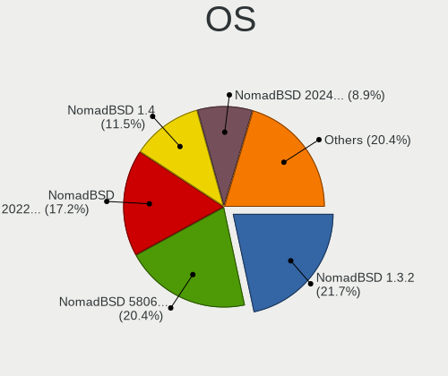

| Name              | Notebooks | Percent |
|-------------------|-----------|---------|
| NomadBSD 1.3.2    | 34        | 25.37%  |
| NomadBSD 5806f915 | 32        | 23.88%  |
| NomadBSD 20221130 | 27        | 20.15%  |
| NomadBSD 1.4      | 18        | 13.43%  |
| NomadBSD 1.3.1    | 7         | 5.22%   |
| NomadBSD 20231013 | 6         | 4.48%   |
| NomadBSD 1.4-RC1  | 6         | 4.48%   |
| NomadBSD 20231121 | 3         | 2.24%   |
| NomadBSD 81e34fc3 | 1         | 0.75%   |

OS Family
---------

OS without a version

| Name     | Notebooks | Percent |
|----------|-----------|---------|
| NomadBSD | 130       | 100%    |

Arch
----

OS architecture (x86_64, i586, etc.)

| Name  | Notebooks | Percent |
|-------|-----------|---------|
| amd64 | 123       | 93.89%  |
| i386  | 8         | 6.11%   |

DE
--

Desktop Environment

| Name    | Notebooks | Percent |
|---------|-----------|---------|
| Openbox | 110       | 84.62%  |
| xinitrc | 8         | 6.15%   |
| GNOME   | 6         | 4.62%   |
| KDE5    | 5         | 3.85%   |
| XFCE    | 1         | 0.77%   |

Display Server
--------------

X11 or Wayland

| Name | Notebooks | Percent |
|------|-----------|---------|
| X11  | 130       | 100%    |

Display Manager
---------------

SDDM, LightDM, etc.

| Name | Notebooks | Percent |
|------|-----------|---------|
| SLiM | 93        | 71.54%  |
| SDDM | 37        | 28.46%  |

OS Lang
-------

Language

| Lang    | Notebooks | Percent |
|---------|-----------|---------|
| en_US   | 43        | 32.82%  |
| Unknown | 21        | 16.03%  |
| de_DE   | 13        | 9.92%   |
| en_GB   | 12        | 9.16%   |
| ru_RU   | 7         | 5.34%   |
| fr_FR   | 7         | 5.34%   |
| zh_TW   | 5         | 3.82%   |
| zh_CN   | 3         | 2.29%   |
| it_IT   | 3         | 2.29%   |
| fi_FI   | 3         | 2.29%   |
| pl_PL   | 2         | 1.53%   |
| hu_HU   | 2         | 1.53%   |
| es_ES   | 2         | 1.53%   |
| en_AU   | 2         | 1.53%   |
| tr_TR   | 1         | 0.76%   |
| sv_SE   | 1         | 0.76%   |
| lt_LT   | 1         | 0.76%   |
| ko_KR   | 1         | 0.76%   |
| cs_CZ   | 1         | 0.76%   |
| bg_BG   | 1         | 0.76%   |

Boot Mode
---------

EFI or BIOS

| Mode | Notebooks | Percent |
|------|-----------|---------|
| EFI  | 125       | 95.42%  |
| BIOS | 6         | 4.58%   |

Filesystem
----------

Type of filesystem

| Type | Notebooks | Percent |
|------|-----------|---------|
| Ufs  | 106       | 81.54%  |
| Zfs  | 24        | 18.46%  |

Part. scheme
------------

Scheme of partitioning

| Type | Notebooks | Percent |
|------|-----------|---------|
| GPT  | 89        | 67.94%  |
| MBR  | 42        | 32.06%  |

Board
-----

Vendor
------

Motherboard manufacturer

| Name                | Notebooks | Percent |
|---------------------|-----------|---------|
| Lenovo              | 37        | 28.46%  |
| Dell                | 17        | 13.08%  |
| Hewlett-Packard     | 14        | 10.77%  |
| ASUSTek Computer    | 14        | 10.77%  |
| Acer                | 9         | 6.92%   |
| Apple               | 7         | 5.38%   |
| TUXEDO              | 4         | 3.08%   |
| Sony                | 4         | 3.08%   |
| Samsung Electronics | 3         | 2.31%   |
| Fujitsu             | 3         | 2.31%   |
| Notebook            | 2         | 1.54%   |
| Google              | 2         | 1.54%   |
| Fujitsu Siemens     | 2         | 1.54%   |
| Toshiba             | 1         | 0.77%   |
| Pegatron            | 1         | 0.77%   |
| Panasonic           | 1         | 0.77%   |
| NEC Computers       | 1         | 0.77%   |
| MSI                 | 1         | 0.77%   |
| IBM                 | 1         | 0.77%   |
| GEO                 | 1         | 0.77%   |
| eMachines           | 1         | 0.77%   |
| Clevo               | 1         | 0.77%   |
| Chuwi               | 1         | 0.77%   |
| Alienware           | 1         | 0.77%   |
| Unknown             | 1         | 0.77%   |

Model
-----

Motherboard model

| Name                                        | Notebooks | Percent |
|---------------------------------------------|-----------|---------|
| Apple MacBookPro7,1                         | 2         | 1.54%   |
| Unknown                                     | 2         | 1.54%   |
| TUXEDO Pulse 15 Gen2                        | 1         | 0.77%   |
| TUXEDO Pulse 15 Gen1                        | 1         | 0.77%   |
| TUXEDO InfinityBook S 15 Gen6               | 1         | 0.77%   |
| Toshiba Satellite C660                      | 1         | 0.77%   |
| Sony VPCM13M1R                              | 1         | 0.77%   |
| Sony VJS122C11L                             | 1         | 0.77%   |
| Sony VJS121C11N                             | 1         | 0.77%   |
| Sony SVE1713S1RW                            | 1         | 0.77%   |
| Samsung N150/N210/N220                      | 1         | 0.77%   |
| Samsung N145P/N250P/N260P                   | 1         | 0.77%   |
| Samsung 300E5EV/300E4EV/270E5EV/270E4EV     | 1         | 0.77%   |
| Pegatron T12Ah                              | 1         | 0.77%   |
| Panasonic CF-C1BD06EFG                      | 1         | 0.77%   |
| Notebook W650DC,DD                          | 1         | 0.77%   |
| Notebook N650DU                             | 1         | 0.77%   |
| NEC Computers PC-GL186Y3AZ                  | 1         | 0.77%   |
| MSI MS-N033                                 | 1         | 0.77%   |
| Lenovo Yoga 710-11IKB 80V6                  | 1         | 0.77%   |
| Lenovo V580 20147                           | 1         | 0.77%   |
| Lenovo ThinkPad X280 20KESB4T00             | 1         | 0.77%   |
| Lenovo ThinkPad X270 20HN006CUS             | 1         | 0.77%   |
| Lenovo ThinkPad X230 2325IB1                | 1         | 0.77%   |
| Lenovo ThinkPad X230 23255NG                | 1         | 0.77%   |
| Lenovo ThinkPad X230 23205UG                | 1         | 0.77%   |
| Lenovo ThinkPad X201 Tablet 311396U         | 1         | 0.77%   |
| Lenovo ThinkPad X1 Nano Gen 1 20UN005LRT    | 1         | 0.77%   |
| Lenovo ThinkPad X1 Carbon Gen 10 21CBCTO1WW | 1         | 0.77%   |
| Lenovo ThinkPad X1 Carbon 4th 20FB001XAU    | 1         | 0.77%   |
| Lenovo ThinkPad W541 20EGS04800             | 1         | 0.77%   |
| Lenovo ThinkPad W520 42844DG                | 1         | 0.77%   |
| Lenovo ThinkPad T530 24295VU                | 1         | 0.77%   |
| Lenovo ThinkPad T510 4384FF3                | 1         | 0.77%   |
| Lenovo ThinkPad T490s 20NX000DRT            | 1         | 0.77%   |
| Lenovo ThinkPad T490 20RYS06R00             | 1         | 0.77%   |
| Lenovo ThinkPad T480 20L50000GE             | 1         | 0.77%   |
| Lenovo ThinkPad T470s W10DG 20JS001FGE      | 1         | 0.77%   |
| Lenovo ThinkPad T470 20HES0EV0A             | 1         | 0.77%   |
| Lenovo ThinkPad T460 20FMS78014             | 1         | 0.77%   |

Model Family
------------

Motherboard model prefix

| Name                       | Notebooks | Percent |
|----------------------------|-----------|---------|
| Lenovo ThinkPad            | 29        | 22.31%  |
| Dell Latitude              | 9         | 6.92%   |
| Acer Aspire                | 8         | 6.15%   |
| HP Pavilion                | 3         | 2.31%   |
| Dell Inspiron              | 3         | 2.31%   |
| TUXEDO Pulse               | 2         | 1.54%   |
| Lenovo IdeaPad             | 2         | 1.54%   |
| HP ProBook                 | 2         | 1.54%   |
| HP Laptop                  | 2         | 1.54%   |
| HP EliteBook               | 2         | 1.54%   |
| Fujitsu Siemens AMILO      | 2         | 1.54%   |
| Fujitsu LIFEBOOK           | 2         | 1.54%   |
| Dell XPS                   | 2         | 1.54%   |
| ASUS VivoBook              | 2         | 1.54%   |
| Apple MacBookPro7          | 2         | 1.54%   |
| Unknown                    | 2         | 1.54%   |
| TUXEDO InfinityBook        | 1         | 0.77%   |
| Toshiba Satellite          | 1         | 0.77%   |
| Sony VPCM13M1R             | 1         | 0.77%   |
| Sony VJS122C11L            | 1         | 0.77%   |
| Sony VJS121C11N            | 1         | 0.77%   |
| Sony SVE1713S1RW           | 1         | 0.77%   |
| Samsung N150               | 1         | 0.77%   |
| Samsung N145P              | 1         | 0.77%   |
| Samsung 300E5EV            | 1         | 0.77%   |
| Pegatron T12Ah             | 1         | 0.77%   |
| Panasonic CF-C1BD06EFG     | 1         | 0.77%   |
| Notebook W650DC            | 1         | 0.77%   |
| Notebook N650DU            | 1         | 0.77%   |
| NEC Computers PC-GL186Y3AZ | 1         | 0.77%   |
| MSI MS-N033                | 1         | 0.77%   |
| Lenovo Yoga                | 1         | 0.77%   |
| Lenovo V580                | 1         | 0.77%   |
| Lenovo Legion              | 1         | 0.77%   |
| Lenovo G570                | 1         | 0.77%   |
| Lenovo G50-70              | 1         | 0.77%   |
| Lenovo G50-45              | 1         | 0.77%   |
| IBM 2647NG8                | 1         | 0.77%   |
| HP ZBook                   | 1         | 0.77%   |
| HP OMEN                    | 1         | 0.77%   |

MFG Year
--------

Motherboard manufacture year

| Year | Notebooks | Percent |
|------|-----------|---------|
| 2019 | 15        | 11.54%  |
| 2020 | 12        | 9.23%   |
| 2017 | 10        | 7.69%   |
| 2012 | 10        | 7.69%   |
| 2011 | 10        | 7.69%   |
| 2022 | 8         | 6.15%   |
| 2021 | 8         | 6.15%   |
| 2018 | 8         | 6.15%   |
| 2014 | 8         | 6.15%   |
| 2015 | 7         | 5.38%   |
| 2010 | 7         | 5.38%   |
| 2013 | 6         | 4.62%   |
| 2008 | 6         | 4.62%   |
| 2016 | 5         | 3.85%   |
| 2009 | 4         | 3.08%   |
| 2023 | 3         | 2.31%   |
| 2006 | 2         | 1.54%   |
| 2004 | 1         | 0.77%   |

Form Factor
-----------

Physical design of the computer

| Name     | Notebooks | Percent |
|----------|-----------|---------|
| Notebook | 130       | 100%    |

Coreboot
--------

Have coreboot on board

| Used | Notebooks | Percent |
|------|-----------|---------|
| No   | 127       | 97.69%  |
| Yes  | 3         | 2.31%   |

RAM Size
--------

Total RAM memory

| Size in GB  | Notebooks | Percent |
|-------------|-----------|---------|
| 8.01-16.0   | 54        | 41.22%  |
| 4.01-8.0    | 27        | 20.61%  |
| 16.01-24.0  | 27        | 20.61%  |
| 32.01-64.0  | 7         | 5.34%   |
| 2.01-3.0    | 6         | 4.58%   |
| 64.01-256.0 | 3         | 2.29%   |
| 0.51-1.0    | 3         | 2.29%   |
| 3.01-4.0    | 2         | 1.53%   |
| 24.01-32.0  | 2         | 1.53%   |

RAM Used
--------

Used RAM memory

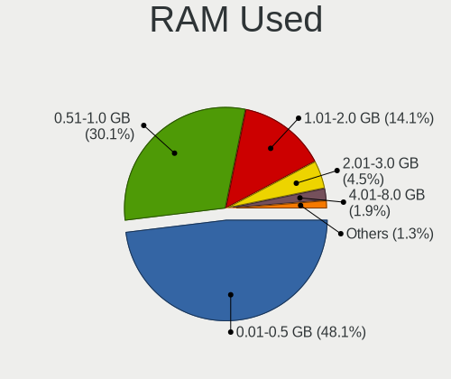

| Used GB   | Notebooks | Percent |
|-----------|-----------|---------|
| 0.01-0.5  | 69        | 51.88%  |
| 0.51-1.0  | 40        | 30.08%  |
| 1.01-2.0  | 14        | 10.53%  |
| 2.01-3.0  | 5         | 3.76%   |
| 4.01-8.0  | 3         | 2.26%   |
| 3.01-4.0  | 1         | 0.75%   |
| 8.01-16.0 | 1         | 0.75%   |

Total Drives
------------

Number of drives on board

| Drives | Notebooks | Percent |
|--------|-----------|---------|
| 1      | 99        | 76.15%  |
| 2      | 19        | 14.62%  |
| 0      | 10        | 7.69%   |
| 3      | 2         | 1.54%   |

Has CD-ROM
----------

Has CD-ROM on board

| Presented | Notebooks | Percent |
|-----------|-----------|---------|
| No        | 84        | 64.12%  |
| Yes       | 47        | 35.88%  |

Has Ethernet
------------

Has Ethernet on board

| Presented | Notebooks | Percent |
|-----------|-----------|---------|
| Yes       | 112       | 85.5%   |
| No        | 19        | 14.5%   |

Has WiFi
--------

Has WiFi module

| Presented | Notebooks | Percent |
|-----------|-----------|---------|
| Yes       | 129       | 99.23%  |
| No        | 1         | 0.77%   |

Has Bluetooth
-------------

Has Bluetooth module

| Presented | Notebooks | Percent |
|-----------|-----------|---------|
| Yes       | 95        | 73.08%  |
| No        | 35        | 26.92%  |

Location
--------

Country
-------

Geographic location (country)

| Country     | Notebooks | Percent |
|-------------|-----------|---------|
| USA         | 17        | 13.08%  |
| Germany     | 17        | 13.08%  |
| France      | 16        | 12.31%  |
| Russia      | 14        | 10.77%  |
| UK          | 12        | 9.23%   |
| Taiwan      | 5         | 3.85%   |
| Italy       | 5         | 3.85%   |
| Norway      | 3         | 2.31%   |
| Mexico      | 3         | 2.31%   |
| Hungary     | 3         | 2.31%   |
| Finland     | 3         | 2.31%   |
| China       | 3         | 2.31%   |
| Australia   | 3         | 2.31%   |
| Turkey      | 2         | 1.54%   |
| Spain       | 2         | 1.54%   |
| Romania     | 2         | 1.54%   |
| Poland      | 2         | 1.54%   |
| Japan       | 2         | 1.54%   |
| Colombia    | 2         | 1.54%   |
| Ukraine     | 1         | 0.77%   |
| Sweden      | 1         | 0.77%   |
| South Korea | 1         | 0.77%   |
| San Marino  | 1         | 0.77%   |
| Philippines | 1         | 0.77%   |
| Lithuania   | 1         | 0.77%   |
| Indonesia   | 1         | 0.77%   |
| Hong Kong   | 1         | 0.77%   |
| Egypt       | 1         | 0.77%   |
| Denmark     | 1         | 0.77%   |
| Czechia     | 1         | 0.77%   |
| Bulgaria    | 1         | 0.77%   |
| Belarus     | 1         | 0.77%   |
| Argentina   | 1         | 0.77%   |

City
----

Geographic location (city)

| City                  | Notebooks | Percent |
|-----------------------|-----------|---------|
| Moscow                | 10        | 7.58%   |
| Franconville          | 6         | 4.55%   |
| Whittier              | 3         | 2.27%   |
| Tijuana               | 3         | 2.27%   |
| Taichung              | 3         | 2.27%   |
| Markt Indersdorf      | 3         | 2.27%   |
| Zwingenberg           | 2         | 1.52%   |
| Vollen                | 2         | 1.52%   |
| Turku                 | 2         | 1.52%   |
| Taipei                | 2         | 1.52%   |
| Setagaya-ku           | 2         | 1.52%   |
| Rome                  | 2         | 1.52%   |
| New Braunfels         | 2         | 1.52%   |
| Melun                 | 2         | 1.52%   |
| Los Angeles           | 2         | 1.52%   |
| Istanbul              | 2         | 1.52%   |
| Hodmezovasarhely      | 2         | 1.52%   |
| Greenwich             | 2         | 1.52%   |
| Drobeta-Turnu Severin | 2         | 1.52%   |
| Changzhou             | 2         | 1.52%   |
| Woodland              | 1         | 0.76%   |
| Wloszczowa            | 1         | 0.76%   |
| Wissen                | 1         | 0.76%   |
| Wilhelmshaven         | 1         | 0.76%   |
| West Bromwich         | 1         | 0.76%   |
| Warsaw                | 1         | 0.76%   |
| Wakefield             | 1         | 0.76%   |
| Vladimir              | 1         | 0.76%   |
| Vilnius               | 1         | 0.76%   |
| Vertou                | 1         | 0.76%   |
| Vaasa                 | 1         | 0.76%   |
| Urcuit                | 1         | 0.76%   |
| Ufa                   | 1         | 0.76%   |
| Trieste               | 1         | 0.76%   |
| Sydney                | 1         | 0.76%   |
| Swindon               | 1         | 0.76%   |
| Suwon                 | 1         | 0.76%   |
| St Petersburg         | 1         | 0.76%   |
| Southampton           | 1         | 0.76%   |
| Sofia                 | 1         | 0.76%   |

Drives
------

Drive Vendor
------------

Hard drive vendors

| Vendor              | Notebooks | Drives | Percent |
|---------------------|-----------|--------|---------|
| Samsung Electronics | 27        | 33     | 19.85%  |
| WDC                 | 20        | 22     | 14.71%  |
| Toshiba             | 13        | 13     | 9.56%   |
| Seagate             | 13        | 14     | 9.56%   |
| SanDisk             | 8         | 8      | 5.88%   |
| Transcend           | 5         | 5      | 3.68%   |
| Hitachi             | 5         | 6      | 3.68%   |
| Crucial             | 5         | 5      | 3.68%   |
| Apple               | 5         | 6      | 3.68%   |
| SK hynix            | 4         | 5      | 2.94%   |
| Intel               | 4         | 4      | 2.94%   |
| Micron Technology   | 3         | 3      | 2.21%   |
| Kingston            | 3         | 3      | 2.21%   |
| SPCC                | 2         | 2      | 1.47%   |
| OCZ                 | 2         | 2      | 1.47%   |
| Gigabyte Technology | 2         | 2      | 1.47%   |
| Fujitsu             | 2         | 3      | 1.47%   |
| UMIS                | 1         | 1      | 0.74%   |
| PNY                 | 1         | 1      | 0.74%   |
| Phison              | 1         | 1      | 0.74%   |
| LITEONIT            | 1         | 1      | 0.74%   |
| LITEON              | 1         | 1      | 0.74%   |
| KingDian            | 1         | 1      | 0.74%   |
| Intenso             | 1         | 1      | 0.74%   |
| HGST                | 1         | 1      | 0.74%   |
| Dogfish             | 1         | 1      | 0.74%   |
| Corsair             | 1         | 1      | 0.74%   |
| ASUSTek Computer    | 1         | 2      | 0.74%   |
| AirDisk             | 1         | 1      | 0.74%   |
| A-DATA Technology   | 1         | 1      | 0.74%   |

Drive Model
-----------

Hard drive models

| Model                                | Notebooks | Percent |
|--------------------------------------|-----------|---------|
| Toshiba MQ01ABD100 1TB               | 3         | 2.14%   |
| SanDisk pSSD 16GB                    | 3         | 2.14%   |
| WDC WD2500BEVT-80A23T0 250GB         | 2         | 1.43%   |
| Toshiba MQ01ABF050 500GB             | 2         | 1.43%   |
| Seagate ST95005620AS 500GB           | 2         | 1.43%   |
| SanDisk SSD U100 24GB                | 2         | 1.43%   |
| Samsung SSD 970 EVO Plus 1TB         | 2         | 1.43%   |
| Kingston SA400S37240G 240GB          | 2         | 1.43%   |
| Crucial CT500MX500SSD1 500GB         | 2         | 1.43%   |
| Apple SSD SM0512F 500GB              | 2         | 1.43%   |
| WDC WDS240G2G0A-00JH30 240GB         | 1         | 0.71%   |
| WDC WDS120G2G0B-00EPW0 120GB         | 1         | 0.71%   |
| WDC WDS120G1G0A-00SS50 120GB         | 1         | 0.71%   |
| WDC WD7500BPKX-00HPJT0 752GB         | 1         | 0.71%   |
| WDC WD7500BPKT-75PK4T0 752GB         | 1         | 0.71%   |
| WDC WD3200BEVT-75ZCT2 320GB          | 1         | 0.71%   |
| WDC WD3200BEKT-60PVMT0 320GB         | 1         | 0.71%   |
| WDC WD2500LPCX-24C6HT0 250GB         | 1         | 0.71%   |
| WDC WD1200BEVS-07LAT0 120GB          | 1         | 0.71%   |
| WDC WD10SPZX-60Z10T0 1TB             | 1         | 0.71%   |
| WDC WD10SPZX-00Z10T0 1TB             | 1         | 0.71%   |
| WDC WD10SMRW-11Y43S0 1TB             | 1         | 0.71%   |
| WDC WD10JPVX-75JC3T0 1TB             | 1         | 0.71%   |
| WDC WD10JPVX-60JC3T0 1TB             | 1         | 0.71%   |
| WDC WD10JPVX-22JC3T0 1TB             | 1         | 0.71%   |
| WDC WD10JPVT-08A1YT2 1TB             | 1         | 0.71%   |
| WDC PC SN720 SDAPNTW-1T00-1006 1TB   | 1         | 0.71%   |
| WDC PC SN530 SDBPNPZ-256G-1002 256GB | 1         | 0.71%   |
| WDC PC SN520 SDAPNUW-256G-1002 256GB | 1         | 0.71%   |
| WDC PC SN520 SDAPMUW-128G-1101 128GB | 1         | 0.71%   |
| UMIS RPJTJ256MED1OWX 256GB           | 1         | 0.71%   |
| Transcend TS512GSSD370S 512GB        | 1         | 0.71%   |
| Transcend TS512GSSD230S 512GB        | 1         | 0.71%   |
| Transcend TS128GSSD340K 128GB        | 1         | 0.71%   |
| Transcend TS128GSSD340 128GB         | 1         | 0.71%   |
| Transcend TS120GSSD220S 120GB        | 1         | 0.71%   |
| Toshiba TR200 240GB                  | 1         | 0.71%   |
| Toshiba THNSNC128GBSJ                | 1         | 0.71%   |
| Toshiba MQ04ABF100 1TB               | 1         | 0.71%   |
| Toshiba MK7575GSX 752GB              | 1         | 0.71%   |

HDD Vendor
----------

Hard disk drive vendors

| Vendor  | Notebooks | Drives | Percent |
|---------|-----------|--------|---------|
| WDC     | 15        | 15     | 32.61%  |
| Seagate | 13        | 14     | 28.26%  |
| Toshiba | 9         | 9      | 19.57%  |
| Hitachi | 5         | 6      | 10.87%  |
| Fujitsu | 2         | 3      | 4.35%   |
| HGST    | 1         | 1      | 2.17%   |
| Apple   | 1         | 1      | 2.17%   |

SSD Vendor
----------

Solid state drive vendors

| Vendor              | Notebooks | Drives | Percent |
|---------------------|-----------|--------|---------|
| Samsung Electronics | 13        | 15     | 20.97%  |
| SanDisk             | 8         | 8      | 12.9%   |
| Transcend           | 5         | 5      | 8.06%   |
| Crucial             | 4         | 4      | 6.45%   |
| Apple               | 4         | 5      | 6.45%   |
| Toshiba             | 3         | 3      | 4.84%   |
| Kingston            | 3         | 3      | 4.84%   |
| Intel               | 3         | 3      | 4.84%   |
| WDC                 | 2         | 3      | 3.23%   |
| SPCC                | 2         | 2      | 3.23%   |
| OCZ                 | 2         | 2      | 3.23%   |
| Micron Technology   | 2         | 2      | 3.23%   |
| Gigabyte Technology | 2         | 2      | 3.23%   |
| PNY                 | 1         | 1      | 1.61%   |
| LITEONIT            | 1         | 1      | 1.61%   |
| LITEON              | 1         | 1      | 1.61%   |
| KingDian            | 1         | 1      | 1.61%   |
| Intenso             | 1         | 1      | 1.61%   |
| Dogfish             | 1         | 1      | 1.61%   |
| Corsair             | 1         | 1      | 1.61%   |
| ASUSTek Computer    | 1         | 2      | 1.61%   |
| A-DATA Technology   | 1         | 1      | 1.61%   |

Drive Kind
----------

HDD or SSD

| Kind | Notebooks | Drives | Percent |
|------|-----------|--------|---------|
| SSD  | 58        | 67     | 43.61%  |
| HDD  | 46        | 49     | 34.59%  |
| NVMe | 29        | 34     | 21.8%   |

Drive Connector
---------------

SATA, SAS, NVMe, etc.

| Type | Notebooks | Drives | Percent |
|------|-----------|--------|---------|
| SATA | 97        | 116    | 76.98%  |
| NVMe | 29        | 34     | 23.02%  |

Drive Size
----------

Size of hard drive

| Size in TB | Notebooks | Drives | Percent |
|------------|-----------|--------|---------|
| 0.01-0.5   | 75        | 88     | 73.53%  |
| 0.51-1.0   | 24        | 25     | 23.53%  |
| 1.01-2.0   | 3         | 3      | 2.94%   |

Space Total
-----------

Amount of disk space available on the file system

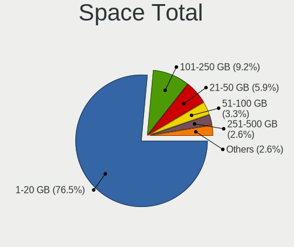

| Size in GB | Notebooks | Percent |
|------------|-----------|---------|
| 1-20       | 105       | 80.77%  |
| 101-250    | 8         | 6.15%   |
| 21-50      | 7         | 5.38%   |
| 251-500    | 4         | 3.08%   |
| 51-100     | 3         | 2.31%   |
| 501-1000   | 2         | 1.54%   |
| 1001-2000  | 1         | 0.77%   |

Space Used
----------

Amount of used disk space

| Used GB | Notebooks | Percent |
|---------|-----------|---------|
| 1-20    | 128       | 97.71%  |
| 21-50   | 2         | 1.53%   |
| 51-100  | 1         | 0.76%   |

Malfunc. Drives
---------------

Drive models with a malfunction

| Model                                            | Notebooks | Drives | Percent |
|--------------------------------------------------|-----------|--------|---------|
| WDC WD7500BPKT-75PK4T0 752GB                     | 1         | 1      | 4.76%   |
| WDC WD2500BEVT-80A23T0 250GB                     | 1         | 1      | 4.76%   |
| WDC WD1200BEVS-07LAT0 120GB                      | 1         | 1      | 4.76%   |
| WDC WD10JPVX-75JC3T0 1TB                         | 1         | 1      | 4.76%   |
| WDC WD10JPVX-60JC3T0 1TB                         | 1         | 1      | 4.76%   |
| Toshiba MQ01ABF050 500GB                         | 1         | 1      | 4.76%   |
| Toshiba MQ01ABD100 1TB                           | 1         | 1      | 4.76%   |
| Toshiba MK7575GSX 752GB                          | 1         | 1      | 4.76%   |
| Toshiba MK3265GSX 320GB                          | 1         | 1      | 4.76%   |
| Seagate ST95005620AS 500GB                       | 1         | 1      | 4.76%   |
| Seagate ST500LT012-9WS142 500GB                  | 1         | 1      | 4.76%   |
| Seagate ST500LM021-1KJ152 500GB                  | 1         | 1      | 4.76%   |
| SanDisk SD9SN8W-128G-1006 128GB                  | 1         | 1      | 4.76%   |
| Samsung Electronics SSD PM810 2.5-inch 7mm 256GB | 1         | 1      | 4.76%   |
| Micron Technology MTFDDAK256MAM-1K12 256GB       | 1         | 1      | 4.76%   |
| Intel SSDSC2CW060A3 64GB                         | 1         | 1      | 4.76%   |
| Hitachi HTS545050B9A300 500GB                    | 1         | 2      | 4.76%   |
| Hitachi HTS545032B9A302 320GB                    | 1         | 1      | 4.76%   |
| Hitachi HTS545032B9A300 320GB                    | 1         | 1      | 4.76%   |
| HGST HTS725050A7E630 500GB                       | 1         | 1      | 4.76%   |
| Corsair Neutron GTX SSD 120GB                    | 1         | 1      | 4.76%   |

Malfunc. Drive Vendor
---------------------

Vendors of faulty drives

| Vendor              | Notebooks | Drives | Percent |
|---------------------|-----------|--------|---------|
| WDC                 | 5         | 5      | 23.81%  |
| Toshiba             | 4         | 4      | 19.05%  |
| Seagate             | 3         | 3      | 14.29%  |
| Hitachi             | 3         | 4      | 14.29%  |
| SanDisk             | 1         | 1      | 4.76%   |
| Samsung Electronics | 1         | 1      | 4.76%   |
| Micron Technology   | 1         | 1      | 4.76%   |
| Intel               | 1         | 1      | 4.76%   |
| HGST                | 1         | 1      | 4.76%   |
| Corsair             | 1         | 1      | 4.76%   |

Malfunc. HDD Vendor
-------------------

Vendors of faulty HDD drives

| Vendor  | Notebooks | Drives | Percent |
|---------|-----------|--------|---------|
| WDC     | 5         | 5      | 31.25%  |
| Toshiba | 4         | 4      | 25%     |
| Seagate | 3         | 3      | 18.75%  |
| Hitachi | 3         | 4      | 18.75%  |
| HGST    | 1         | 1      | 6.25%   |

Malfunc. Drive Kind
-------------------

Kinds of faulty drives

| Kind | Notebooks | Drives | Percent |
|------|-----------|--------|---------|
| HDD  | 16        | 17     | 76.19%  |
| SSD  | 5         | 5      | 23.81%  |

Failed Drives
-------------

Failed drive models

| Model             | Notebooks | Drives | Percent |
|-------------------|-----------|--------|---------|
| SanDisk pSSD 16GB | 1         | 1      | 100%    |

Failed Drive Vendor
-------------------

Failed drive vendors

| Vendor  | Notebooks | Drives | Percent |
|---------|-----------|--------|---------|
| SanDisk | 1         | 1      | 100%    |

Drive Status
------------

Number of failed and malfunc. drives

| Status   | Notebooks | Drives | Percent |
|----------|-----------|--------|---------|
| Works    | 103       | 125    | 81.75%  |
| Malfunc  | 21        | 22     | 16.67%  |
| Detected | 1         | 2      | 0.79%   |
| Failed   | 1         | 1      | 0.79%   |

Storage controller
------------------

Storage Vendor
--------------

Storage controller vendors

| Vendor                                  | Notebooks | Percent |
|-----------------------------------------|-----------|---------|
| Intel                                   | 91        | 62.76%  |
| Samsung Electronics                     | 18        | 12.41%  |
| AMD                                     | 14        | 9.66%   |
| SanDisk                                 | 5         | 3.45%   |
| SK hynix                                | 4         | 2.76%   |
| Nvidia                                  | 3         | 2.07%   |
| KIOXIA                                  | 2         | 1.38%   |
| VIA Technologies                        | 1         | 0.69%   |
| Silicon Integrated Systems [SiS]        | 1         | 0.69%   |
| Shenzhen Unionmemory Information System | 1         | 0.69%   |
| Phison Electronics                      | 1         | 0.69%   |
| Micron/Crucial Technology               | 1         | 0.69%   |
| Micron Technology                       | 1         | 0.69%   |
| MAXIO Technology (Hangzhou)             | 1         | 0.69%   |
| JMicron Technology                      | 1         | 0.69%   |

Storage Model
-------------

Storage controller models

| Model                                                                            | Notebooks | Percent |
|----------------------------------------------------------------------------------|-----------|---------|
| Intel Sunrise Point-LP SATA Controller [AHCI mode]                               | 14        | 8.97%   |
| Intel 7 Series Chipset Family 6-port SATA Controller [AHCI mode]                 | 12        | 7.69%   |
| AMD FCH SATA Controller [AHCI mode]                                              | 12        | 7.69%   |
| Samsung NVMe SSD Controller SM981/PM981/PM983                                    | 10        | 6.41%   |
| Intel 8 Series SATA Controller 1 [AHCI mode]                                     | 9         | 5.77%   |
| Intel 82801 Mobile SATA Controller [RAID mode]                                   | 8         | 5.13%   |
| Intel 82801IBM/IEM (ICH9M/ICH9M-E) 4 port SATA Controller [AHCI mode]            | 6         | 3.85%   |
| Intel 6 Series/C200 Series Chipset Family 6 port Mobile SATA AHCI Controller     | 6         | 3.85%   |
| Intel 8 Series/C220 Series Chipset Family 6-port SATA Controller 1 [AHCI mode]   | 4         | 2.56%   |
| Samsung NVMe SSD Controller PM9A1/PM9A3/980PRO                                   | 3         | 1.92%   |
| Intel Q170/Q150/B150/H170/H110/Z170/CM236 Chipset SATA Controller [AHCI Mode]    | 3         | 1.92%   |
| Intel NM10/ICH7 Family SATA Controller [AHCI mode]                               | 3         | 1.92%   |
| Samsung S4LN058A01[SSUBX] AHCI SSD Controller (Apple slot)                       | 2         | 1.28%   |
| Samsung S4LN053X01 AHCI SSD Controller(Apple slot)                               | 2         | 1.28%   |
| Nvidia MCP89 SATA Controller (AHCI mode)                                         | 2         | 1.28%   |
| KIOXIA NVMe SSD Controller BG4 (DRAM-less)                                       | 2         | 1.28%   |
| Intel Wildcat Point-LP SATA Controller [AHCI Mode]                               | 2         | 1.28%   |
| Intel Comet Lake SATA AHCI Controller                                            | 2         | 1.28%   |
| Intel Cannon Lake Mobile PCH SATA AHCI Controller                                | 2         | 1.28%   |
| Intel Atom/Celeron/Pentium Processor x5-E8000/J3xxx/N3xxx Series SATA Controller | 2         | 1.28%   |
| Intel 82801HM/HEM (ICH8M/ICH8M-E) SATA Controller [AHCI mode]                    | 2         | 1.28%   |
| Intel 82801HM/HEM (ICH8M/ICH8M-E) IDE Controller                                 | 2         | 1.28%   |
| Intel 82801GBM/GHM (ICH7-M Family) SATA Controller [AHCI mode]                   | 2         | 1.28%   |
| Intel 7 Series Chipset Family 4-port SATA Controller [IDE mode]                  | 2         | 1.28%   |
| Intel 7 Series Chipset Family 2-port SATA Controller [IDE mode]                  | 2         | 1.28%   |
| Intel 5 Series/3400 Series Chipset 6 port SATA AHCI Controller                   | 2         | 1.28%   |
| VIA VT82C586A/B/VT82C686/A/B/VT823x/A/C PIPC Bus Master IDE                      | 1         | 0.64%   |
| VIA VT8237A SATA 2-Port Controller                                               | 1         | 0.64%   |
| SK hynix Platinum P41/PC801 NVMe Solid State Drive                               | 1         | 0.64%   |
| SK hynix PC601 NVMe Solid State Drive                                            | 1         | 0.64%   |
| SK hynix PC401 NVMe Solid State Drive 256GB                                      | 1         | 0.64%   |
| SK hynix BC501 NVMe Solid State Drive                                            | 1         | 0.64%   |
| Silicon Integrated Systems [SiS] SATA Controller / IDE mode                      | 1         | 0.64%   |
| Silicon Integrated Systems [SiS] 5513 IDE Controller                             | 1         | 0.64%   |
| Shenzhen Unionmemory Information System AM611 PCIe 3.0 x2 NVMe SSD 256GB         | 1         | 0.64%   |
| SanDisk WD Blue SN500 / PC SN520 x2 M.2 2280 NVMe SSD                            | 1         | 0.64%   |
| Sandisk WD Black SN770 / PC SN740 256GB / PC SN560 (DRAM-less) NVMe SSD          | 1         | 0.64%   |
| SanDisk Ultra 3D / WD Blue SN550 NVMe SSD                                        | 1         | 0.64%   |
| SanDisk PC SN520 x2 M.2 2242 NVMe SSD                                            | 1         | 0.64%   |
| SanDisk Extreme Pro / WD Black 2018/SN750/PC SN720 NVMe SSD                      | 1         | 0.64%   |

Storage Kind
------------

Kind of storage controller (IDE, SATA, NVMe, SAS, ...)

| Kind | Notebooks | Percent |
|------|-----------|---------|
| SATA | 91        | 61.49%  |
| NVMe | 32        | 21.62%  |
| IDE  | 15        | 10.14%  |
| RAID | 10        | 6.76%   |

Processor
---------

CPU Vendor
----------

Processor vendors

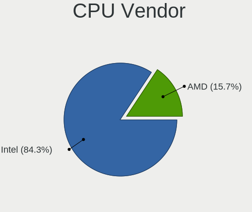

| Vendor | Notebooks | Percent |
|--------|-----------|---------|
| Intel  | 113       | 86.26%  |
| AMD    | 18        | 13.74%  |

CPU Model
---------

Processor models

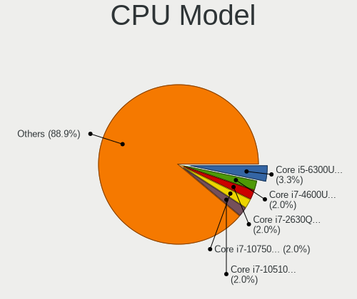

| Model                                         | Notebooks | Percent |
|-----------------------------------------------|-----------|---------|
| Intel Core i5-6300U CPU @ 2.40GHz             | 4         | 3.05%   |
| Intel CPU Version                             | 3         | 2.29%   |
| Intel Core i7-4600U CPU @ 2.10GHz             | 3         | 2.29%   |
| Intel Core i7-2630QM CPU @ 2.00GHz            | 3         | 2.29%   |
| Intel Core i7-10510U CPU @ 1.80GHz            | 3         | 2.29%   |
| Intel Core i5-8250U CPU @ 1.60GHz             | 3         | 2.29%   |
| Intel Core i5-6200U CPU @ 2.30GHz             | 3         | 2.29%   |
| Intel Core i5-3320M CPU @ 2.60GHz             | 3         | 2.29%   |
| Intel Core 2 Duo CPU P8600 @ 2.40GHz          | 3         | 2.29%   |
| Intel Core i7-8665U CPU @ 1.90GHz             | 2         | 1.53%   |
| Intel Core i7-3520M CPU @ 2.90GHz             | 2         | 1.53%   |
| Intel Core i5-8265U CPU @ 1.60GHz             | 2         | 1.53%   |
| Intel Core i5-7300U CPU @ 2.60GHz             | 2         | 1.53%   |
| Intel Core i5-7200U CPU @ 2.50GHz             | 2         | 1.53%   |
| Intel Core i5-4210U CPU @ 1.70GHz             | 2         | 1.53%   |
| Intel Core i5-3210M CPU @ 2.50GHz             | 2         | 1.53%   |
| Intel Core i5-2430M CPU @ 2.40GHz             | 2         | 1.53%   |
| Intel Core i5-10210U CPU @ 1.60GHz            | 2         | 1.53%   |
| Intel Celeron Dual-Core CPU T3000 @ 1.80GHz   | 2         | 1.53%   |
| AMD Ryzen 7 5700U with Radeon Graphics        | 2         | 1.53%   |
| AMD Ryzen 7 3700U with Radeon Vega Mobile Gfx | 2         | 1.53%   |
| AMD A8-7410 APU with AMD Radeon R5 Graphics   | 2         | 1.53%   |
| Intel Xeon CPU E3-1505M v5 @ 2.80GHz          | 1         | 0.76%   |
| Intel Pentium III                             | 1         | 0.76%   |
| Intel Pentium CPU N3710 @ 1.60GHz             | 1         | 0.76%   |
| Intel Pentium CPU N3700 @ 1.60GHz             | 1         | 0.76%   |
| Intel Pentium CPU 2117U @ 1.80GHz             | 1         | 0.76%   |
| Intel Genuine CPU U7300 @ 1.30GHz             | 1         | 0.76%   |
| Intel Core m5-6Y57 CPU @ 1.10GHz              | 1         | 0.76%   |
| Intel Core i9-8950HK CPU @ 2.90GHz            | 1         | 0.76%   |
| Intel Core i7-8565U CPU @ 1.80GHz             | 1         | 0.76%   |
| Intel Core i7-8550U CPU @ 1.80GHz             | 1         | 0.76%   |
| Intel Core i7-7700 CPU @ 3.60GHz              | 1         | 0.76%   |
| Intel Core i7-6600U CPU @ 2.60GHz             | 1         | 0.76%   |
| Intel Core i7-4910MQ CPU @ 2.90GHz            | 1         | 0.76%   |
| Intel Core i7-4900MQ CPU @ 2.80GHz            | 1         | 0.76%   |
| Intel Core i7-4850HQ CPU @ 2.30GHz            | 1         | 0.76%   |
| Intel Core i7-4770HQ CPU @ 2.20GHz            | 1         | 0.76%   |
| Intel Core i7-4650U CPU @ 1.70GHz             | 1         | 0.76%   |
| Intel Core i7-4610M CPU @ 3.00GHz             | 1         | 0.76%   |

CPU Model Family
----------------

Processor model prefix

| Model                   | Notebooks | Percent |
|-------------------------|-----------|---------|
| Intel Core i5           | 40        | 30.53%  |
| Intel Core i7           | 31        | 23.66%  |
| Other                   | 12        | 9.16%   |
| Intel Core i3           | 7         | 5.34%   |
| Intel Core 2 Duo        | 6         | 4.58%   |
| AMD Ryzen 7             | 6         | 4.58%   |
| Intel Atom              | 5         | 3.82%   |
| Intel Pentium           | 3         | 2.29%   |
| AMD A6                  | 3         | 2.29%   |
| Intel Celeron Dual-Core | 2         | 1.53%   |
| Intel Celeron           | 2         | 1.53%   |
| AMD Ryzen 5             | 2         | 1.53%   |
| AMD A8                  | 2         | 1.53%   |
| Intel Xeon              | 1         | 0.76%   |
| Intel Pentium III       | 1         | 0.76%   |
| Intel Genuine           | 1         | 0.76%   |
| Intel Core m5           | 1         | 0.76%   |
| Intel Core i9           | 1         | 0.76%   |
| Intel Core 2            | 1         | 0.76%   |
| Intel Celeron M         | 1         | 0.76%   |
| AMD Ryzen 7 PRO         | 1         | 0.76%   |
| AMD E1                  | 1         | 0.76%   |
| AMD A10                 | 1         | 0.76%   |

CPU Cores
---------

Number of processor cores

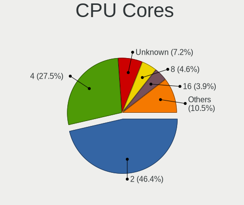

| Number  | Notebooks | Percent |
|---------|-----------|---------|
| 2       | 63        | 48.09%  |
| 4       | 38        | 29.01%  |
| Unknown | 11        | 8.4%    |
| 8       | 5         | 3.82%   |
| 16      | 4         | 3.05%   |
| 1       | 4         | 3.05%   |
| 12      | 3         | 2.29%   |
| 6       | 3         | 2.29%   |

CPU Sockets
-----------

Number of sockets

| Number  | Notebooks | Percent |
|---------|-----------|---------|
| 1       | 127       | 97.69%  |
| 2       | 2         | 1.54%   |
| Unknown | 1         | 0.77%   |

CPU Threads
-----------

Threads per core (Hyper-Threading)

| Number  | Notebooks | Percent |
|---------|-----------|---------|
| 2       | 86        | 65.65%  |
| 1       | 32        | 24.43%  |
| Unknown | 13        | 9.92%   |

CPU Microarch
-------------

Microarchitecture

| Name          | Notebooks | Percent |
|---------------|-----------|---------|
| KabyLake      | 26        | 19.85%  |
| Haswell       | 18        | 13.74%  |
| IvyBridge     | 13        | 9.92%   |
| Skylake       | 12        | 9.16%   |
| Penryn        | 10        | 7.63%   |
| SandyBridge   | 7         | 5.34%   |
| Unknown       | 7         | 5.34%   |
| Bonnell       | 6         | 4.58%   |
| Zen+          | 4         | 3.05%   |
| Puma          | 4         | 3.05%   |
| TigerLake     | 3         | 2.29%   |
| Core          | 3         | 2.29%   |
| Broadwell     | 3         | 2.29%   |
| Westmere      | 2         | 1.53%   |
| Silvermont    | 2         | 1.53%   |
| P6            | 2         | 1.53%   |
| CometLake     | 2         | 1.53%   |
| Zen 2         | 1         | 0.76%   |
| Steamroller   | 1         | 0.76%   |
| K10 Llano     | 1         | 0.76%   |
| K10           | 1         | 0.76%   |
| Jaguar        | 1         | 0.76%   |
| Goldmont plus | 1         | 0.76%   |
| Excavator     | 1         | 0.76%   |

Graphics
--------

GPU Vendor
----------

Vendors of graphics cards

| Vendor           | Notebooks | Percent |
|------------------|-----------|---------|
| Intel            | 97        | 65.99%  |
| AMD              | 25        | 17.01%  |
| Nvidia           | 23        | 15.65%  |
| VIA Technologies | 1         | 0.68%   |
| S3 Graphics      | 1         | 0.68%   |

GPU Model
---------

Graphics card models

| Model                                                                                    | Notebooks | Percent |
|------------------------------------------------------------------------------------------|-----------|---------|
| Intel 3rd Gen Core processor Graphics Controller                                         | 13        | 8.61%   |
| Intel Haswell-ULT Integrated Graphics Controller                                         | 11        | 7.28%   |
| Intel Skylake GT2 [HD Graphics 520]                                                      | 9         | 5.96%   |
| Intel 2nd Generation Core Processor Family Integrated Graphics Controller                | 7         | 4.64%   |
| Intel WhiskeyLake-U GT2 [UHD Graphics 620]                                               | 5         | 3.31%   |
| Intel UHD Graphics 620                                                                   | 5         | 3.31%   |
| Intel HD Graphics 620                                                                    | 5         | 3.31%   |
| Intel CometLake-U GT2 [UHD Graphics]                                                     | 5         | 3.31%   |
| Intel 4th Gen Core Processor Integrated Graphics Controller                              | 5         | 3.31%   |
| Intel Mobile 4 Series Chipset Integrated Graphics Controller                             | 4         | 2.65%   |
| Intel Atom Processor D4xx/D5xx/N4xx/N5xx Integrated Graphics Controller                  | 4         | 2.65%   |
| AMD Picasso/Raven 2 [Radeon Vega Series / Radeon Vega Mobile Series]                     | 4         | 2.65%   |
| AMD Mullins [Radeon R4/R5 Graphics]                                                      | 3         | 1.99%   |
| AMD Lucienne                                                                             | 3         | 1.99%   |
| Nvidia MCP89 [GeForce 320M]                                                              | 2         | 1.32%   |
| Nvidia GK106GLM [Quadro K2100M]                                                          | 2         | 1.32%   |
| Intel TigerLake-LP GT2 [Iris Xe Graphics]                                                | 2         | 1.32%   |
| Intel Mobile 945GSE Express Integrated Graphics Controller                               | 2         | 1.32%   |
| Intel Mobile 945GM/GMS/GME, 943/940GML Express Integrated Graphics Controller            | 2         | 1.32%   |
| Intel Core Processor Integrated Graphics Controller                                      | 2         | 1.32%   |
| Intel Atom/Celeron/Pentium Processor x5-E8000/J3xxx/N3xxx Integrated Graphics Controller | 2         | 1.32%   |
| VIA Technologies CN896/VN896/P4M900 [Chrome 9 HC]                                        | 1         | 0.66%   |
| S3 Graphics SuperSavage IX/C SDR                                                         | 1         | 0.66%   |
| Nvidia TU117M [GeForce GTX 1650 Mobile / Max-Q]                                          | 1         | 0.66%   |
| Nvidia TU116M [GeForce GTX 1660 Ti Mobile]                                               | 1         | 0.66%   |
| Nvidia TU104BM [GeForce RTX 2070 SUPER Mobile / Max-Q]                                   | 1         | 0.66%   |
| Nvidia GT216M [GeForce GT 240M]                                                          | 1         | 0.66%   |
| Nvidia GM108M [GeForce 940M]                                                             | 1         | 0.66%   |
| Nvidia GM108M [GeForce 840M]                                                             | 1         | 0.66%   |
| Nvidia GM107M [GeForce GTX 950M]                                                         | 1         | 0.66%   |
| Nvidia GM107 [GeForce 940MX]                                                             | 1         | 0.66%   |
| Nvidia GK107M [GeForce GT 750M Mac Edition]                                              | 1         | 0.66%   |
| Nvidia GK107M [GeForce GT 645M]                                                          | 1         | 0.66%   |
| Nvidia GF117M [GeForce 610M/710M/810M/820M / GT 620M/625M/630M/720M]                     | 1         | 0.66%   |
| Nvidia GF116M [GeForce GT 555M/635M]                                                     | 1         | 0.66%   |
| Nvidia GF114M [GeForce GTX 580M]                                                         | 1         | 0.66%   |
| Nvidia GF108M [GeForce GT 620M/630M/635M/640M LE]                                        | 1         | 0.66%   |
| Nvidia GF108M [GeForce GT 525M]                                                          | 1         | 0.66%   |
| Nvidia GF108GLM [Quadro 1000M]                                                           | 1         | 0.66%   |
| Nvidia G98M [GeForce 9300M GS]                                                           | 1         | 0.66%   |

GPU Combo
---------

Combinations of graphics cards

| Name            | Notebooks | Percent |
|-----------------|-----------|---------|
| 1 x Intel       | 72        | 54.96%  |
| 1 x AMD         | 22        | 16.79%  |
| Intel + Nvidia  | 12        | 9.16%   |
| 2 x Intel       | 10        | 7.63%   |
| 1 x Nvidia      | 10        | 7.63%   |
| Intel + AMD     | 2         | 1.53%   |
| 1 x VIA         | 1         | 0.76%   |
| 1 x S3 Graphics | 1         | 0.76%   |
| AMD + Nvidia    | 1         | 0.76%   |

GPU Driver
----------

Free vs proprietary

| Driver      | Notebooks | Percent |
|-------------|-----------|---------|
| Free        | 111       | 85.38%  |
| Unknown     | 15        | 11.54%  |
| Proprietary | 4         | 3.08%   |

GPU Memory
----------

Total video memory

| Size in GB | Notebooks | Percent |
|------------|-----------|---------|
| Unknown    | 117       | 89.31%  |
| 0.01-0.5   | 6         | 4.58%   |
| 0.51-1.0   | 5         | 3.82%   |
| 1.01-2.0   | 3         | 2.29%   |

Monitor
-------

Monitor Vendor
--------------

Monitor vendors

| Vendor                  | Notebooks | Percent |
|-------------------------|-----------|---------|
| AU Optronics            | 17        | 17.35%  |
| LG Display              | 16        | 16.33%  |
| BOE                     | 15        | 15.31%  |
| Samsung Electronics     | 11        | 11.22%  |
| Chimei Innolux          | 11        | 11.22%  |
| Sharp                   | 4         | 4.08%   |
| HannStar                | 4         | 4.08%   |
| Chi Mei Optoelectronics | 4         | 4.08%   |
| Apple                   | 4         | 4.08%   |
| Lenovo                  | 3         | 3.06%   |
| Panasonic               | 2         | 2.04%   |
| LG Philips              | 1         | 1.02%   |
| Hewlett-Packard         | 1         | 1.02%   |
| Goldstar                | 1         | 1.02%   |
| CPT                     | 1         | 1.02%   |
| BenQ                    | 1         | 1.02%   |
| AOC                     | 1         | 1.02%   |
| Acer                    | 1         | 1.02%   |

Monitor Model
-------------

Monitor models

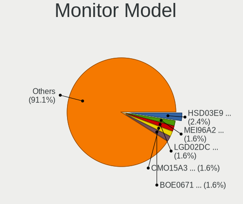

| Model                                                                    | Notebooks | Percent |
|--------------------------------------------------------------------------|-----------|---------|
| HannStar LCD Monitor HSD03E9 1024x600 220x130mm 10.1-inch                | 3         | 3.03%   |
| Panasonic LCD Monitor MEI96A2 3840x2160 380x210mm 17.1-inch              | 2         | 2.02%   |
| LG Display LCD Monitor LGD02DC 1366x768 340x190mm 15.3-inch              | 2         | 2.02%   |
| Chi Mei Optoelectronics LCD Monitor CMO15A3 1366x768 350x190mm 15.7-inch | 2         | 2.02%   |
| BOE LCD Monitor BOE0671 1366x768 340x190mm 15.3-inch                     | 2         | 2.02%   |
| BOE HF BOE0691 1920x1080 280x160mm 12.7-inch                             | 2         | 2.02%   |
| AU Optronics LCD Monitor AUO8174 1280x800 330x210mm 15.4-inch            | 2         | 2.02%   |
| AU Optronics LCD Monitor AUO70EC 1366x768 340x190mm 15.3-inch            | 2         | 2.02%   |
| AU Optronics LCD Monitor AUO243D 1920x1080 310x170mm 13.9-inch           | 2         | 2.02%   |
| AU Optronics LCD Monitor AUO106C 1366x768 280x160mm 12.7-inch            | 2         | 2.02%   |
| Sharp LQ133M1JW01 SHP141B 1920x1080 290x170mm 13.2-inch                  | 1         | 1.01%   |
| Sharp LCD Monitor SHP1449 1920x1080 290x170mm 13.2-inch                  | 1         | 1.01%   |
| Sharp LCD Monitor SHP1445 3840x2160 350x190mm 15.7-inch                  | 1         | 1.01%   |
| Sharp LCD Monitor SHP140E 2560x1440 290x170mm 13.2-inch                  | 1         | 1.01%   |
| Samsung Electronics LF24T450F SAM7094 1920x1080 530x300mm 24.0-inch      | 1         | 1.01%   |
| Samsung Electronics LCD Monitor SEC5448 1920x1080 410x230mm 18.5-inch    | 1         | 1.01%   |
| Samsung Electronics LCD Monitor SEC4E41 1366x768 350x200mm 15.9-inch     | 1         | 1.01%   |
| Samsung Electronics LCD Monitor SEC4457 1440x900 300x190mm 14.0-inch     | 1         | 1.01%   |
| Samsung Electronics LCD Monitor SEC4251 1366x768 340x190mm 15.3-inch     | 1         | 1.01%   |
| Samsung Electronics LCD Monitor SEC3030 1024x600 220x130mm 10.1-inch     | 1         | 1.01%   |
| Samsung Electronics LCD Monitor SDC834D 1920x1080 290x160mm 13.0-inch    | 1         | 1.01%   |
| Samsung Electronics LCD Monitor SDC4D42 1366x768 310x170mm 13.9-inch     | 1         | 1.01%   |
| Samsung Electronics LCD Monitor SDC4852 1366x768 340x190mm 15.3-inch     | 1         | 1.01%   |
| Samsung Electronics LCD Monitor SDC415A 3200x1800 290x160mm 13.0-inch    | 1         | 1.01%   |
| Samsung Electronics LCD Monitor SDC314D 1366x768 310x170mm 13.9-inch     | 1         | 1.01%   |
| LG Philips LCD Monitor LPLA101 1440x900 370x230mm 17.2-inch              | 1         | 1.01%   |
| LG Display LCD Monitor LGD7001 1366x768 340x190mm 15.3-inch              | 1         | 1.01%   |
| LG Display LCD Monitor LGD6301 1366x768 340x190mm 15.3-inch              | 1         | 1.01%   |
| LG Display LCD Monitor LGD0612 1920x1080 340x190mm 15.3-inch             | 1         | 1.01%   |
| LG Display LCD Monitor LGD0532 1920x1080 340x190mm 15.3-inch             | 1         | 1.01%   |
| LG Display LCD Monitor LGD0456 1366x768 340x190mm 15.3-inch              | 1         | 1.01%   |
| LG Display LCD Monitor LGD0414 1920x1080 280x160mm 12.7-inch             | 1         | 1.01%   |
| LG Display LCD Monitor LGD040A 1920x1080 310x170mm 13.9-inch             | 1         | 1.01%   |
| LG Display LCD Monitor LGD0408 1920x1080 280x160mm 12.7-inch             | 1         | 1.01%   |
| LG Display LCD Monitor LGD03A3 1366x768 280x160mm 12.7-inch              | 1         | 1.01%   |
| LG Display LCD Monitor LGD0353 1366x768 350x190mm 15.7-inch              | 1         | 1.01%   |
| LG Display LCD Monitor LGD034D 1366x768 340x190mm 15.3-inch              | 1         | 1.01%   |
| LG Display LCD Monitor LGD0303 1600x900 380x210mm 17.1-inch              | 1         | 1.01%   |
| LG Display LCD Monitor LGD02D8 1366x768 280x160mm 12.7-inch              | 1         | 1.01%   |
| LG Display LCD Monitor LGD01F7 1366x768 290x160mm 13.0-inch              | 1         | 1.01%   |

Monitor Resolution
------------------

Monitor screen resolution

| Resolution        | Notebooks | Percent |
|-------------------|-----------|---------|
| 1366x768 (WXGA)   | 37        | 38.14%  |
| 1920x1080 (FHD)   | 32        | 32.99%  |
| 1600x900 (HD+)    | 5         | 5.15%   |
| 1024x600          | 5         | 5.15%   |
| 3840x2160 (4K)    | 4         | 4.12%   |
| 1280x800 (WXGA)   | 4         | 4.12%   |
| 1440x900 (WXGA+)  | 3         | 3.09%   |
| 2880x1800         | 2         | 2.06%   |
| 3200x1800 (QHD+)  | 1         | 1.03%   |
| 2560x1440 (QHD)   | 1         | 1.03%   |
| 2160x1350         | 1         | 1.03%   |
| 1920x1200 (WUXGA) | 1         | 1.03%   |
| 1280x1024 (SXGA)  | 1         | 1.03%   |

Monitor Diagonal
----------------

Diagonal size in inches

| Inches | Notebooks | Percent |
|--------|-----------|---------|
| 15     | 39        | 39.39%  |
| 13     | 24        | 24.24%  |
| 12     | 12        | 12.12%  |
| 17     | 9         | 9.09%   |
| 10     | 5         | 5.05%   |
| 24     | 3         | 3.03%   |
| 11     | 3         | 3.03%   |
| 27     | 2         | 2.02%   |
| 18     | 1         | 1.01%   |
| 14     | 1         | 1.01%   |

Monitor Width
-------------

Physical width

| Width in mm | Notebooks | Percent |
|-------------|-----------|---------|
| 301-350     | 54        | 54.55%  |
| 201-300     | 31        | 31.31%  |
| 351-400     | 8         | 8.08%   |
| 501-600     | 4         | 4.04%   |
| 601-700     | 1         | 1.01%   |
| 401-500     | 1         | 1.01%   |

Aspect Ratio
------------

Proportional relationship between the width and the height

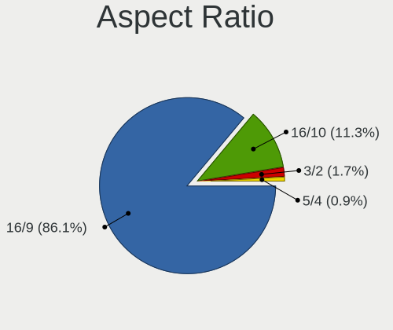

| Ratio | Notebooks | Percent |
|-------|-----------|---------|
| 16/9  | 81        | 87.1%   |
| 16/10 | 9         | 9.68%   |
| 3/2   | 2         | 2.15%   |
| 5/4   | 1         | 1.08%   |

Monitor Area
------------

Area in inch

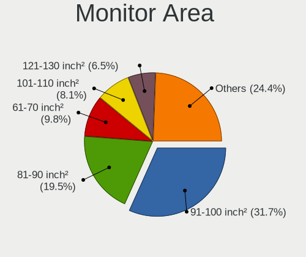

| Area in inch | Notebooks | Percent |
|----------------|-----------|---------|
| 91-100         | 29        | 29.29%  |
| 81-90          | 18        | 18.18%  |
| 61-70          | 11        | 11.11%  |
| 101-110        | 9         | 9.09%   |
| 71-80          | 8         | 8.08%   |
| 121-130        | 7         | 7.07%   |
| 41-50          | 5         | 5.05%   |
| 51-60          | 3         | 3.03%   |
| 201-250        | 3         | 3.03%   |
| 301-350        | 2         | 2.02%   |
| 141-150        | 2         | 2.02%   |
| 131-140        | 1         | 1.01%   |
| 111-120        | 1         | 1.01%   |

Pixel Density
-------------

Pixels per inch

| Density       | Notebooks | Percent |
|---------------|-----------|---------|
| 101-120       | 37        | 37.37%  |
| 121-160       | 32        | 32.32%  |
| 161-240       | 13        | 13.13%  |
| 51-100        | 11        | 11.11%  |
| More than 240 | 6         | 6.06%   |

Multiple Monitors
-----------------

Total monitors connected

| Total | Notebooks | Percent |
|-------|-----------|---------|
| 1     | 103       | 78.03%  |
| 0     | 25        | 18.94%  |
| 2     | 3         | 2.27%   |
| 3     | 1         | 0.76%   |

Network
-------

Net Controller Vendor
---------------------

Controller vendors

| Vendor                            | Notebooks | Percent |
|-----------------------------------|-----------|---------|
| Intel                             | 76        | 36.71%  |
| Realtek Semiconductor             | 52        | 25.12%  |
| Qualcomm Atheros                  | 33        | 15.94%  |
| Broadcom                          | 15        | 7.25%   |
| Samsung Electronics               | 4         | 1.93%   |
| TP-Link                           | 3         | 1.45%   |
| Ralink                            | 3         | 1.45%   |
| Marvell Technology Group          | 3         | 1.45%   |
| Sierra Wireless                   | 2         | 0.97%   |
| Ralink Technology                 | 2         | 0.97%   |
| Ericsson Business Mobile Networks | 2         | 0.97%   |
| VIA Technologies                  | 1         | 0.48%   |
| Silicon Integrated Systems [SiS]  | 1         | 0.48%   |
| Qualcomm Technologies             | 1         | 0.48%   |
| Qualcomm                          | 1         | 0.48%   |
| NetGear                           | 1         | 0.48%   |
| MediaTek                          | 1         | 0.48%   |
| JMicron Technology                | 1         | 0.48%   |
| Fibocom                           | 1         | 0.48%   |
| Dell                              | 1         | 0.48%   |
| D-Link                            | 1         | 0.48%   |
| Atheros                           | 1         | 0.48%   |
| Apple                             | 1         | 0.48%   |

Net Controller Model
--------------------

Controller models

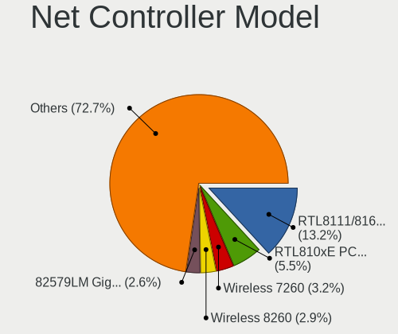

| Model                                                             | Notebooks | Percent |
|-------------------------------------------------------------------|-----------|---------|
| Realtek RTL8111/8168/8411 PCI Express Gigabit Ethernet Controller | 35        | 13.06%  |
| Realtek RTL810xE PCI Express Fast Ethernet controller             | 13        | 4.85%   |
| Intel Wireless 7260                                               | 10        | 3.73%   |
| Intel 82579LM Gigabit Network Connection (Lewisville)             | 8         | 2.99%   |
| Intel Wireless 8265 / 8275                                        | 7         | 2.61%   |
| Intel Wireless 8260                                               | 7         | 2.61%   |
| Intel Ethernet Connection (4) I219-LM                             | 6         | 2.24%   |
| Realtek RTL8188EUS 802.11n Wireless Network Adapter               | 5         | 1.87%   |
| Qualcomm Atheros QCA9565 / AR9565 Wireless Network Adapter        | 5         | 1.87%   |
| Qualcomm Atheros QCA6174 802.11ac Wireless Network Adapter        | 5         | 1.87%   |
| Qualcomm Atheros AR9485 Wireless Network Adapter                  | 5         | 1.87%   |
| Intel Wireless 3165                                               | 5         | 1.87%   |
| Intel Ethernet Connection I217-LM                                 | 5         | 1.87%   |
| Intel Centrino Advanced-N 6205 [Taylor Peak]                      | 5         | 1.87%   |
| Realtek RTL8723BE PCIe Wireless Network Adapter                   | 4         | 1.49%   |
| Qualcomm Atheros AR9285 Wireless Network Adapter (PCI-Express)    | 4         | 1.49%   |
| Intel Wi-Fi 6 AX200                                               | 4         | 1.49%   |
| Intel Ethernet Connection I218-LM                                 | 4         | 1.49%   |
| Intel Cannon Point-LP CNVi [Wireless-AC]                          | 4         | 1.49%   |
| Samsung Galaxy series, misc. (tethering mode)                     | 3         | 1.12%   |
| Realtek RTL8821CE 802.11ac PCIe Wireless Network Adapter          | 3         | 1.12%   |
| Qualcomm Atheros QCA9377 802.11ac Wireless Network Adapter        | 3         | 1.12%   |
| Qualcomm Atheros AR928X Wireless Network Adapter (PCI-Express)    | 3         | 1.12%   |
| Intel WiFi Link 5100                                              | 3         | 1.12%   |
| Intel Wi-Fi 6 AX201                                               | 3         | 1.12%   |
| Intel Ethernet Connection I219-LM                                 | 3         | 1.12%   |
| Intel Comet Lake PCH-LP CNVi WiFi                                 | 3         | 1.12%   |
| Intel Centrino Ultimate-N 6300                                    | 3         | 1.12%   |
| Broadcom NetXtreme BCM57762 Gigabit Ethernet PCIe                 | 3         | 1.12%   |
| Broadcom BCM4360 802.11ac Dual Band Wireless Network Adapter      | 3         | 1.12%   |
| Qualcomm Atheros AR8152 v2.0 Fast Ethernet                        | 2         | 0.75%   |
| Qualcomm Atheros AR8151 v2.0 Gigabit Ethernet                     | 2         | 0.75%   |
| Marvell Group 88E8040 PCI-E Fast Ethernet Controller              | 2         | 0.75%   |
| Intel Wireless 7265                                               | 2         | 0.75%   |
| Intel PRO/Wireless 4965 AG or AGN [Kedron] Network Connection     | 2         | 0.75%   |
| Intel Ethernet Connection (6) I219-V                              | 2         | 0.75%   |
| Intel Ethernet Connection (4) I219-V                              | 2         | 0.75%   |
| Intel Centrino Advanced-N 6200                                    | 2         | 0.75%   |
| Intel Alder Lake-P PCH CNVi WiFi                                  | 2         | 0.75%   |
| Intel 82577LM Gigabit Network Connection                          | 2         | 0.75%   |

Wireless Vendor
---------------

Wireless vendors

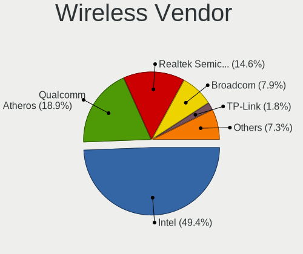

| Vendor                | Notebooks | Percent |
|-----------------------|-----------|---------|
| Intel                 | 71        | 50%     |
| Qualcomm Atheros      | 28        | 19.72%  |
| Realtek Semiconductor | 19        | 13.38%  |
| Broadcom              | 10        | 7.04%   |
| TP-Link               | 3         | 2.11%   |
| Ralink                | 3         | 2.11%   |
| Ralink Technology     | 2         | 1.41%   |
| Sierra Wireless       | 1         | 0.7%    |
| Qualcomm Technologies | 1         | 0.7%    |
| NetGear               | 1         | 0.7%    |
| MediaTek              | 1         | 0.7%    |
| D-Link                | 1         | 0.7%    |
| Atheros               | 1         | 0.7%    |

Wireless Model
--------------

Wireless models

| Model                                                          | Notebooks | Percent |
|----------------------------------------------------------------|-----------|---------|
| Intel Wireless 7260                                            | 10        | 6.9%    |
| Intel Wireless 8265 / 8275                                     | 7         | 4.83%   |
| Intel Wireless 8260                                            | 7         | 4.83%   |
| Realtek RTL8188EUS 802.11n Wireless Network Adapter            | 5         | 3.45%   |
| Qualcomm Atheros QCA9565 / AR9565 Wireless Network Adapter     | 5         | 3.45%   |
| Qualcomm Atheros QCA6174 802.11ac Wireless Network Adapter     | 5         | 3.45%   |
| Qualcomm Atheros AR9485 Wireless Network Adapter               | 5         | 3.45%   |
| Intel Wireless 3165                                            | 5         | 3.45%   |
| Intel Centrino Advanced-N 6205 [Taylor Peak]                   | 5         | 3.45%   |
| Realtek RTL8723BE PCIe Wireless Network Adapter                | 4         | 2.76%   |
| Qualcomm Atheros AR9285 Wireless Network Adapter (PCI-Express) | 4         | 2.76%   |
| Intel Wi-Fi 6 AX200                                            | 4         | 2.76%   |
| Intel Cannon Point-LP CNVi [Wireless-AC]                       | 4         | 2.76%   |
| Realtek RTL8821CE 802.11ac PCIe Wireless Network Adapter       | 3         | 2.07%   |
| Qualcomm Atheros QCA9377 802.11ac Wireless Network Adapter     | 3         | 2.07%   |
| Qualcomm Atheros AR928X Wireless Network Adapter (PCI-Express) | 3         | 2.07%   |
| Intel WiFi Link 5100                                           | 3         | 2.07%   |
| Intel Wi-Fi 6 AX201                                            | 3         | 2.07%   |
| Intel Comet Lake PCH-LP CNVi WiFi                              | 3         | 2.07%   |
| Intel Centrino Ultimate-N 6300                                 | 3         | 2.07%   |
| Broadcom BCM4360 802.11ac Dual Band Wireless Network Adapter   | 3         | 2.07%   |
| Intel Wireless 7265                                            | 2         | 1.38%   |
| Intel PRO/Wireless 4965 AG or AGN [Kedron] Network Connection  | 2         | 1.38%   |
| Intel Centrino Advanced-N 6200                                 | 2         | 1.38%   |
| Intel Alder Lake-P PCH CNVi WiFi                               | 2         | 1.38%   |
| TP-Link Wireless USB Adapter                                   | 1         | 0.69%   |
| TP-Link TL-WN722N v2/v3 [Realtek RTL8188EUS]                   | 1         | 0.69%   |
| TP-Link AC600 wireless Realtek RTL8811AU [Archer T2U Nano]     | 1         | 0.69%   |
| Sierra Wireless EM7455                                         | 1         | 0.69%   |
| Realtek RTL8822CE 802.11ac PCIe Wireless Network Adapter       | 1         | 0.69%   |
| Realtek RTL8822BE 802.11a/b/g/n/ac WiFi adapter                | 1         | 0.69%   |
| Realtek RTL8821AE 802.11ac PCIe Wireless Network Adapter       | 1         | 0.69%   |
| Realtek RTL8723DE Wireless Network Adapter                     | 1         | 0.69%   |
| Realtek RTL8192E/RTL8192SE Wireless LAN Controller             | 1         | 0.69%   |
| Realtek RTL8188EE Wireless Network Adapter                     | 1         | 0.69%   |
| Realtek RTL8188CE 802.11b/g/n WiFi Adapter                     | 1         | 0.69%   |
| Realtek Realtek Bluetooth 4.2 Adapter                          | 1         | 0.69%   |
| Ralink RT5372 Wireless Adapter                                 | 1         | 0.69%   |
| Ralink MT7610U ("Archer T2U" 2.4G+5G WLAN Adapter              | 1         | 0.69%   |
| Ralink RT5390R 802.11bgn PCIe Wireless Network Adapter         | 1         | 0.69%   |

Ethernet Vendor
---------------

Ethernet vendors

| Vendor                           | Notebooks | Percent |
|----------------------------------|-----------|---------|
| Realtek Semiconductor            | 48        | 41.03%  |
| Intel                            | 40        | 34.19%  |
| Broadcom                         | 9         | 7.69%   |
| Qualcomm Atheros                 | 8         | 6.84%   |
| Samsung Electronics              | 4         | 3.42%   |
| Marvell Technology Group         | 3         | 2.56%   |
| VIA Technologies                 | 1         | 0.85%   |
| Silicon Integrated Systems [SiS] | 1         | 0.85%   |
| Qualcomm                         | 1         | 0.85%   |
| JMicron Technology               | 1         | 0.85%   |
| Apple                            | 1         | 0.85%   |

Ethernet Model
--------------

Ethernet models

| Model                                                             | Notebooks | Percent |
|-------------------------------------------------------------------|-----------|---------|
| Realtek RTL8111/8168/8411 PCI Express Gigabit Ethernet Controller | 35        | 29.66%  |
| Realtek RTL810xE PCI Express Fast Ethernet controller             | 13        | 11.02%  |
| Intel 82579LM Gigabit Network Connection (Lewisville)             | 8         | 6.78%   |
| Intel Ethernet Connection (4) I219-LM                             | 6         | 5.08%   |
| Intel Ethernet Connection I217-LM                                 | 5         | 4.24%   |
| Intel Ethernet Connection I218-LM                                 | 4         | 3.39%   |
| Samsung Galaxy series, misc. (tethering mode)                     | 3         | 2.54%   |
| Intel Ethernet Connection I219-LM                                 | 3         | 2.54%   |
| Broadcom NetXtreme BCM57762 Gigabit Ethernet PCIe                 | 3         | 2.54%   |
| Qualcomm Atheros AR8152 v2.0 Fast Ethernet                        | 2         | 1.69%   |
| Qualcomm Atheros AR8151 v2.0 Gigabit Ethernet                     | 2         | 1.69%   |
| Marvell Group 88E8040 PCI-E Fast Ethernet Controller              | 2         | 1.69%   |
| Intel Ethernet Connection (6) I219-V                              | 2         | 1.69%   |
| Intel Ethernet Connection (4) I219-V                              | 2         | 1.69%   |
| Intel 82577LM Gigabit Network Connection                          | 2         | 1.69%   |
| Broadcom NetXtreme BCM5764M Gigabit Ethernet PCIe                 | 2         | 1.69%   |
| Broadcom NetLink BCM5784M Gigabit Ethernet PCIe                   | 2         | 1.69%   |
| VIA VT6102/VT6103 [Rhine-II]                                      | 1         | 0.85%   |
| Silicon Integrated Systems [SiS] 191 Gigabit Ethernet Adapter     | 1         | 0.85%   |
| Samsung GT-I9070 (network tethering, USB debugging enabled)       | 1         | 0.85%   |
| Qualcomm Atheros Attansic L1 Gigabit Ethernet                     | 1         | 0.85%   |
| Qualcomm Atheros AR8162 Fast Ethernet                             | 1         | 0.85%   |
| Qualcomm Atheros AR8131 Gigabit Ethernet                          | 1         | 0.85%   |
| Qualcomm Atheros AR8121/AR8113/AR8114 Gigabit or Fast Ethernet    | 1         | 0.85%   |
| Qualcomm ALCATEL RNDIS Interface                                  | 1         | 0.85%   |
| Marvell Group 88E8071 PCI-E Gigabit Ethernet Controller           | 1         | 0.85%   |
| JMicron JMC260 PCI Express Fast Ethernet Controller               | 1         | 0.85%   |
| Intel Ethernet Connection I219-V                                  | 1         | 0.85%   |
| Intel Ethernet Connection (7) I219-LM                             | 1         | 0.85%   |
| Intel Ethernet Connection (6) I219-LM                             | 1         | 0.85%   |
| Intel Ethernet Connection (3) I218-LM                             | 1         | 0.85%   |
| Intel Ethernet Connection (23) I219-V                             | 1         | 0.85%   |
| Intel Ethernet Connection (2) I219-LM                             | 1         | 0.85%   |
| Intel 82801CAM (ICH3) PRO/100 VE (LOM) Ethernet Controller        | 1         | 0.85%   |
| Intel 82573L Gigabit Ethernet Controller                          | 1         | 0.85%   |
| Broadcom NetXtreme BCM57765 Gigabit Ethernet PCIe                 | 1         | 0.85%   |
| Broadcom NetXtreme BCM5755M Gigabit Ethernet PCI Express          | 1         | 0.85%   |
| Broadcom NetLink BCM57780 Gigabit Ethernet PCIe                   | 1         | 0.85%   |
| Apple Ethernet Adapter [A1277]                                    | 1         | 0.85%   |

Net Controller Kind
-------------------

Ethernet, WiFi or modem

| Kind     | Notebooks | Percent |
|----------|-----------|---------|
| WiFi     | 130       | 52.42%  |
| Ethernet | 113       | 45.56%  |
| Unknown  | 5         | 2.02%   |

Used Controller
---------------

Currently used network controller

| Kind     | Notebooks | Percent |
|----------|-----------|---------|
| Ethernet | 90        | 50.85%  |
| WiFi     | 85        | 48.02%  |
| Unknown  | 2         | 1.13%   |

NICs
----

Total network controllers on board

| Total | Notebooks | Percent |
|-------|-----------|---------|
| 2     | 109       | 83.21%  |
| 1     | 22        | 16.79%  |

IPv6
----

IPv6 vs IPv4

| Used | Notebooks | Percent |
|------|-----------|---------|
| No   | 115       | 87.79%  |
| Yes  | 16        | 12.21%  |

Bluetooth
---------

Bluetooth Vendor
----------------

Controller vendors

| Vendor                          | Notebooks | Percent |
|---------------------------------|-----------|---------|
| Intel                           | 45        | 46.39%  |
| Broadcom                        | 9         | 9.28%   |
| Realtek Semiconductor           | 8         | 8.25%   |
| Qualcomm Atheros Communications | 6         | 6.19%   |
| Lite-On Technology              | 6         | 6.19%   |
| Apple                           | 6         | 6.19%   |
| IMC Networks                    | 4         | 4.12%   |
| Foxconn / Hon Hai               | 4         | 4.12%   |
| ASUSTek Computer                | 4         | 4.12%   |
| USI                             | 1         | 1.03%   |
| Hewlett-Packard                 | 1         | 1.03%   |
| Dell                            | 1         | 1.03%   |
| Cambridge Silicon Radio         | 1         | 1.03%   |
| Alps Electric                   | 1         | 1.03%   |

Bluetooth Model
---------------

Controller models

| Model                                                       | Notebooks | Percent |
|-------------------------------------------------------------|-----------|---------|
| Intel Bluetooth wireless interface                          | 25        | 25.77%  |
| Intel Bluetooth 9460/9560 Jefferson Peak (JfP)              | 6         | 6.19%   |
| Intel AX201 Bluetooth                                       | 6         | 6.19%   |
| Intel AX200 Bluetooth                                       | 4         | 4.12%   |
| Broadcom BCM20702 Bluetooth 4.0 [ThinkPad]                  | 4         | 4.12%   |
| Apple Bluetooth Host Controller                             | 4         | 4.12%   |
| Realtek RTL8723B Bluetooth                                  | 2         | 2.06%   |
| Lite-On Qualcomm Atheros QCA9377 Bluetooth                  | 2         | 2.06%   |
| Lite-On Atheros AR3012 Bluetooth                            | 2         | 2.06%   |
| Intel AX211 Bluetooth                                       | 2         | 2.06%   |
| IMC Networks Realtek Bluetooth Adapter                      | 2         | 2.06%   |
| Foxconn / Hon Hai Bluetooth USB Module                      | 2         | 2.06%   |
| Broadcom BCM2045B (BDC-2.1)                                 | 2         | 2.06%   |
| ASUS BT-253 Bluetooth Adapter                               | 2         | 2.06%   |
| Apple Broadcom Built-in Bluetooth                           | 2         | 2.06%   |
| USI Qualcomm WCN685x Bluetooth Adapter                      | 1         | 1.03%   |
| Realtek RTL8822BE Bluetooth 4.2 Adapter                     | 1         | 1.03%   |
| Realtek RTL8821A Bluetooth                                  | 1         | 1.03%   |
| Realtek  Bluetooth 4.2 Adapter                              | 1         | 1.03%   |
| Realtek Bluetooth 4.2 Adapter                               | 1         | 1.03%   |
| Realtek Bluetooth 4.0 Adapter                               | 1         | 1.03%   |
| Realtek Bluetooth 4.0 + High Speed Chip                     | 1         | 1.03%   |
| Qualcomm Atheros QCA9377 Bluetooth 4.1                      | 1         | 1.03%   |
| Qualcomm Atheros QCA61x4 Bluetooth 4.0                      | 1         | 1.03%   |
| Qualcomm Atheros Dell Wireless 1820 Bluetooth 4.1LE         | 1         | 1.03%   |
| Qualcomm Atheros Dell Wireless 1707 Bluetooth 4.0 LE Device | 1         | 1.03%   |
| Qualcomm Atheros Dell Wireless 1601 Bluetooth Device        | 1         | 1.03%   |
| Qualcomm Atheros AR3012 Bluetooth 4.0                       | 1         | 1.03%   |
| Lite-On Bluetooth USB Module                                | 1         | 1.03%   |
| Lite-On Atheros Bluetooth                                   | 1         | 1.03%   |
| Intel Wireless-AC 9260 Bluetooth Adapter                    | 1         | 1.03%   |
| Intel Centrino Advanced-N 6230 Bluetooth adapter            | 1         | 1.03%   |
| IMC Networks Qualcomm Atheros Bluetooth 4.0 + HS            | 1         | 1.03%   |
| IMC Networks Atheros AR3012 Bluetooth 4.0 Adapter           | 1         | 1.03%   |
| HP Bluetooth 2.0 Interface [Broadcom BCM2045]               | 1         | 1.03%   |
| Foxconn / Hon Hai Qualcomm Atheros AR3012 Bluetooth Adapter | 1         | 1.03%   |
| Foxconn / Hon Hai MediaTek Bluetooth Adapter                | 1         | 1.03%   |
| Dell DW375 Bluetooth Module                                 | 1         | 1.03%   |
| Cambridge Silicon Radio Bluetooth Dongle (HCI mode)         | 1         | 1.03%   |
| Broadcom Bluetooth 4.0                                      | 1         | 1.03%   |

Sound
-----

Sound Vendor
------------

Sound card vendors

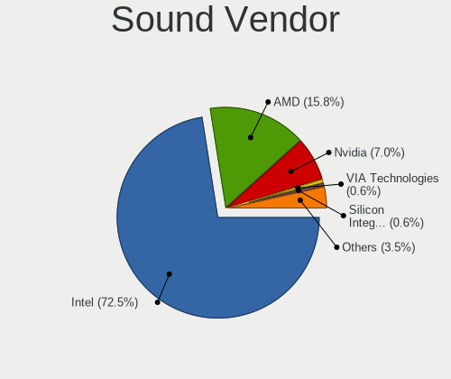

| Vendor                           | Notebooks | Percent |
|----------------------------------|-----------|---------|
| Intel                            | 108       | 75%     |
| AMD                              | 22        | 15.28%  |
| Nvidia                           | 9         | 6.25%   |
| VIA Technologies                 | 1         | 0.69%   |
| Silicon Integrated Systems [SiS] | 1         | 0.69%   |
| Realtek Semiconductor            | 1         | 0.69%   |
| Blue Microphones                 | 1         | 0.69%   |
| ASUSTek Computer                 | 1         | 0.69%   |

Sound Model
-----------

Sound card models

| Model                                                                                             | Notebooks | Percent |
|---------------------------------------------------------------------------------------------------|-----------|---------|
| Intel Sunrise Point-LP HD Audio                                                                   | 22        | 12.09%  |
| Intel 7 Series/C216 Chipset Family High Definition Audio Controller                               | 14        | 7.69%   |
| Intel Haswell-ULT HD Audio Controller                                                             | 11        | 6.04%   |
| Intel 8 Series HD Audio Controller                                                                | 11        | 6.04%   |
| AMD Family 17h/19h HD Audio Controller                                                            | 9         | 4.95%   |
| Intel 6 Series/C200 Series Chipset Family High Definition Audio Controller                        | 8         | 4.4%    |
| Intel NM10/ICH7 Family High Definition Audio Controller                                           | 7         | 3.85%   |
| Intel 8 Series/C220 Series Chipset High Definition Audio Controller                               | 7         | 3.85%   |
| AMD FCH Azalia Controller                                                                         | 7         | 3.85%   |
| Intel Comet Lake PCH-LP cAVS                                                                      | 6         | 3.3%    |
| Intel 82801I (ICH9 Family) HD Audio Controller                                                    | 6         | 3.3%    |
| Intel Xeon E3-1200 v3/4th Gen Core Processor HD Audio Controller                                  | 5         | 2.75%   |
| Intel Cannon Point-LP High Definition Audio Controller                                            | 5         | 2.75%   |
| AMD Kabini HDMI/DP Audio                                                                          | 5         | 2.75%   |
| AMD Renoir Radeon High Definition Audio Controller                                                | 4         | 2.2%    |
| Intel Wildcat Point-LP High Definition Audio Controller                                           | 3         | 1.65%   |
| Intel Tiger Lake-LP Smart Sound Technology Audio Controller                                       | 3         | 1.65%   |
| Intel Broadwell-U Audio Controller                                                                | 3         | 1.65%   |
| Intel 100 Series/C230 Series Chipset Family HD Audio Controller                                   | 3         | 1.65%   |
| AMD Raven/Raven2/Fenghuang HDMI/DP Audio Controller                                               | 3         | 1.65%   |
| Nvidia MCP89 High Definition Audio                                                                | 2         | 1.1%    |
| Intel Cannon Lake PCH cAVS                                                                        | 2         | 1.1%    |
| Intel Atom/Celeron/Pentium Processor x5-E8000/J3xxx/N3xxx Series High Definition Audio Controller | 2         | 1.1%    |
| Intel Alder Lake PCH-P High Definition Audio Controller                                           | 2         | 1.1%    |
| Intel 82801H (ICH8 Family) HD Audio Controller                                                    | 2         | 1.1%    |
| Intel 5 Series/3400 Series Chipset High Definition Audio                                          | 2         | 1.1%    |
| AMD RV710/730 HDMI Audio [Radeon HD 4000 series]                                                  | 2         | 1.1%    |
| VIA Technologies VX900/VT8xxx High Definition Audio Controller                                    | 1         | 0.55%   |
| Silicon Integrated Systems [SiS] Azalia Audio Controller                                          | 1         | 0.55%   |
| Realtek Semiconductor USB Audio                                                                   | 1         | 0.55%   |
| Nvidia TU116 High Definition Audio Controller                                                     | 1         | 0.55%   |
| Nvidia TU107 GeForce GTX 1650 High Definition Audio Controller                                    | 1         | 0.55%   |
| Nvidia TU104 HD Audio Controller                                                                  | 1         | 0.55%   |
| Nvidia MCP79 High Definition Audio                                                                | 1         | 0.55%   |
| Nvidia GT216 HDMI Audio Controller                                                                | 1         | 0.55%   |
| Nvidia GK107 HDMI Audio Controller                                                                | 1         | 0.55%   |
| Nvidia GF114 HDMI Audio Controller                                                                | 1         | 0.55%   |
| Intel Raptor Lake-P/U/H cAVS                                                                      | 1         | 0.55%   |
| Intel Crystal Well HD Audio Controller                                                            | 1         | 0.55%   |
| Intel Comet Lake PCH cAVS                                                                         | 1         | 0.55%   |

Memory
------

Memory Vendor
-------------

Memory module vendors

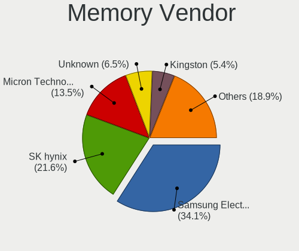

| Vendor              | Notebooks | Percent |
|---------------------|-----------|---------|
| Samsung Electronics | 52        | 32.91%  |
| SK hynix            | 37        | 23.42%  |
| Micron Technology   | 18        | 11.39%  |
| Unknown             | 11        | 6.96%   |
| Kingston            | 9         | 5.7%    |
| Unknown             | 6         | 3.8%    |
| Elpida              | 4         | 2.53%   |
| Crucial             | 4         | 2.53%   |
| A-DATA Technology   | 4         | 2.53%   |
| Transcend           | 2         | 1.27%   |
| Ramaxel Technology  | 2         | 1.27%   |
| Nanya Technology    | 2         | 1.27%   |
| 48spaces            | 2         | 1.27%   |
| Unknown (ABCD)      | 1         | 0.63%   |
| Unknown (09D5)      | 1         | 0.63%   |
| Magnum Tech         | 1         | 0.63%   |
| G.Skill             | 1         | 0.63%   |
| Corsair             | 1         | 0.63%   |

Memory Model
------------

Memory module models

| Model                                                                     | Notebooks | Percent |
|---------------------------------------------------------------------------|-----------|---------|
| SK hynix RAM HMA81GS6AFR8N-UH 8GB SODIMM DDR4 2400MT/s                    | 7         | 4.09%   |
| Unknown                                                                   | 6         | 3.51%   |
| Samsung RAM M471B5273DH0-CH9 4GB SODIMM DDR3 1334MT/s                     | 5         | 2.92%   |
| Unknown RAM Module 2GB SODIMM DDR2 667MT/s                                | 4         | 2.34%   |
| SK hynix RAM HMT451S6BFR8A-PB 4GB SODIMM DDR3 1600MT/s                    | 3         | 1.75%   |
| SK hynix RAM HMT351S6CFR8C-PB 4GB SODIMM DDR3 1600MT/s                    | 3         | 1.75%   |
| Samsung RAM M471B5173DB0-YK0 4GB SODIMM DDR3 1600MT/s                     | 3         | 1.75%   |
| Samsung RAM M471B1G73EB0-YK0 8GB SODIMM DDR3 1600MT/s                     | 3         | 1.75%   |
| Samsung RAM M471A5244CB0-CTD 4GB SODIMM DDR4 2667MT/s                     | 3         | 1.75%   |
| Samsung RAM M471A1K43CB1-CTD 8GB SODIMM DDR4 2667MT/s                     | 3         | 1.75%   |
| SK hynix RAM Module 2GB SODIMM DDR3 1067MT/s                              | 2         | 1.17%   |
| SK hynix RAM HMT41GS6BFR8A-PB 8GB SODIMM DDR3 1600MT/s                    | 2         | 1.17%   |
| SK hynix RAM HMT351S6EFR8C-PB 4GB SODIMM DDR3 1600MT/s                    | 2         | 1.17%   |
| SK hynix RAM HMA82GS6JJR8N-VK 16GB SODIMM DDR4 2667MT/s                   | 2         | 1.17%   |
| SK hynix RAM HMA81GS6JJR8N-VK 8GB SODIMM DDR4 2667MT/s                    | 2         | 1.17%   |
| Samsung RAM M471B5773DH0-CH9 2GB SODIMM DDR3 1334MT/s                     | 2         | 1.17%   |
| Samsung RAM M471B5273DH0-CK0 4GB SODIMM DDR3 1600MT/s                     | 2         | 1.17%   |
| Samsung RAM M471B5173QH0-YK0 4GB SODIMM DDR3 1600MT/s                     | 2         | 1.17%   |
| Samsung RAM M471B5173EB0-YK0 4GB SODIMM DDR3 1600MT/s                     | 2         | 1.17%   |
| Samsung RAM M471B1G73QH0-YK0 8GB SODIMM DDR3 1867MT/s                     | 2         | 1.17%   |
| Samsung RAM M471A1K43DB1-CWE 8GB SODIMM DDR4 3200MT/s                     | 2         | 1.17%   |
| Samsung RAM M471A1K43CB1-CRC 8GB SODIMM DDR4 2667MT/s                     | 2         | 1.17%   |
| Micron RAM Module 4096MB SODIMM DDR3 1600MT/s                             | 2         | 1.17%   |
| 48spaces RAM 012345678901234567890123456789012345 2GB SODIMM DDR2 800MT/s | 2         | 1.17%   |
| Unknown SODIMM 2048MB SODIMM DDR2 667MT/s                                 | 1         | 0.58%   |
| Unknown SODIMM 1024MB SODIMM DDR2 667MT/s                                 | 1         | 0.58%   |
| Unknown RAM Module 512MB SODIMM SDRAM                                     | 1         | 0.58%   |
| Unknown RAM Module 4096MB SODIMM DDR3 1333MT/s                            | 1         | 0.58%   |
| Unknown RAM Module 2GB SODIMM DDR2                                        | 1         | 0.58%   |
| Unknown RAM Module 2048MB SODIMM SDRAM                                    | 1         | 0.58%   |
| Unknown RAM Module 1GB SODIMM DRAM 533MT/s                                | 1         | 0.58%   |
| Unknown RAM Module 1GB SODIMM DDR2 667MT/s                                | 1         | 0.58%   |
| Unknown RAM Module 128MB SODIMM SDRAM                                     | 1         | 0.58%   |
| Unknown RAM Module 1024MB SODIMM RAM                                      | 1         | 0.58%   |
| Unknown (ABCD) RAM 123456789012345678 2GB SODIMM LPDDR4 2400MT/s          | 1         | 0.58%   |
| Unknown (09D5) RAM Module 16GB SODIMM DDR4 2400MT/s                       | 1         | 0.58%   |
| Transcend RAM TS512MSK64V1N 4GB SODIMM 800MT/s                            | 1         | 0.58%   |
| Transcend RAM JM800QSU-2G 2GB SODIMM DDR2 667MT/s                         | 1         | 0.58%   |
| SK hynix RAM Module 4GB SODIMM DDR3 1600MT/s                              | 1         | 0.58%   |
| SK hynix RAM HYMP125S64CP8-Y5 2GB SODIMM DDR2 667MT/s                     | 1         | 0.58%   |

Memory Kind
-----------

Memory module kinds

| Kind    | Notebooks | Percent |
|---------|-----------|---------|
| DDR3    | 57        | 43.51%  |
| DDR4    | 41        | 31.3%   |
| DDR2    | 11        | 8.4%    |
| LPDDR3  | 8         | 6.11%   |
| SDRAM   | 4         | 3.05%   |
| LPDDR5  | 3         | 2.29%   |
| LPDDR4  | 2         | 1.53%   |
| Unknown | 2         | 1.53%   |
| RAM     | 1         | 0.76%   |
| DRAM    | 1         | 0.76%   |
| DDR5    | 1         | 0.76%   |

Memory Form Factor
------------------

Physical design of the memory module

| Name         | Notebooks | Percent |
|--------------|-----------|---------|
| SODIMM       | 120       | 90.91%  |
| Row Of Chips | 6         | 4.55%   |
| Chip         | 3         | 2.27%   |
| Unknown      | 2         | 1.52%   |
| DIMM         | 1         | 0.76%   |

Memory Size
-----------

Memory module size

| Size  | Notebooks | Percent |
|-------|-----------|---------|
| 4096  | 56        | 37.09%  |
| 8192  | 47        | 31.13%  |
| 2048  | 27        | 17.88%  |
| 16384 | 13        | 8.61%   |
| 1024  | 4         | 2.65%   |
| 32768 | 2         | 1.32%   |
| 512   | 1         | 0.66%   |
| 128   | 1         | 0.66%   |

Memory Speed
------------

Memory module speed

| Speed   | Notebooks | Percent |
|---------|-----------|---------|
| 1600    | 40        | 28.37%  |
| 2667    | 17        | 12.06%  |
| 2400    | 14        | 9.93%   |
| 2133    | 11        | 7.8%    |
| 3200    | 9         | 6.38%   |
| 1334    | 9         | 6.38%   |
| 1333    | 7         | 4.96%   |
| 1867    | 6         | 4.26%   |
| 667     | 6         | 4.26%   |
| Unknown | 5         | 3.55%   |
| 1067    | 4         | 2.84%   |
| 800     | 4         | 2.84%   |
| 6400    | 3         | 2.13%   |
| 5600    | 1         | 0.71%   |
| 4267    | 1         | 0.71%   |
| 1639    | 1         | 0.71%   |
| 975     | 1         | 0.71%   |
| 533     | 1         | 0.71%   |
| 400     | 1         | 0.71%   |

Printers & scanners
-------------------

Printer Vendor
--------------

Printer device vendors

Zero info for selected period =(

Printer Model
-------------

Printer device models

Zero info for selected period =(

Scanner Vendor
--------------

Scanner device vendors

Zero info for selected period =(

Scanner Model
-------------

Scanner device models

Zero info for selected period =(

Camera
------

Camera Vendor
-------------

Camera device vendors

| Vendor                                 | Notebooks | Percent |
|----------------------------------------|-----------|---------|
| Chicony Electronics                    | 29        | 28.43%  |
| Bison Electronics                      | 14        | 13.73%  |
| Realtek Semiconductor                  | 10        | 9.8%    |
| Suyin                                  | 8         | 7.84%   |
| Sunplus Innovation Technology          | 8         | 7.84%   |
| IMC Networks                           | 8         | 7.84%   |
| Microdia                               | 6         | 5.88%   |
| Silicon Motion                         | 3         | 2.94%   |
| Quanta                                 | 3         | 2.94%   |
| Lite-On Technology                     | 3         | 2.94%   |
| Cheng Uei Precision Industry (Foxlink) | 3         | 2.94%   |
| Z-Star Microelectronics                | 1         | 0.98%   |
| Luxvisions Innotech Limited            | 1         | 0.98%   |
| Logitech                               | 1         | 0.98%   |
| Intel                                  | 1         | 0.98%   |
| Genesys Logic                          | 1         | 0.98%   |
| Apple                                  | 1         | 0.98%   |
| Alcor Micro                            | 1         | 0.98%   |

Camera Model
------------

Camera device models

| Model                                                       | Notebooks | Percent |
|-------------------------------------------------------------|-----------|---------|
| Chicony Integrated Camera                                   | 10        | 9.8%    |
| Bison Integrated Camera                                     | 6         | 5.88%   |
| Chicony HD WebCam                                           | 4         | 3.92%   |
| Sunplus Integrated_Webcam_HD                                | 3         | 2.94%   |
| Realtek Integrated_Webcam_HD                                | 3         | 2.94%   |
| Microdia Integrated Webcam                                  | 3         | 2.94%   |
| Suyin Acer Crystal Eye webcam                               | 2         | 1.96%   |
| Realtek USB 2.0 PC Camera                                   | 2         | 1.96%   |
| Realtek Lenovo EasyCamera                                   | 2         | 1.96%   |
| Quanta Front Camera                                         | 2         | 1.96%   |
| Microdia Integrated_Webcam_HD                               | 2         | 1.96%   |
| IMC Networks Realtek PC Camera                              | 2         | 1.96%   |
| IMC Networks EasyCamera                                     | 2         | 1.96%   |
| Chicony FJ Camera                                           | 2         | 1.96%   |
| Cheng Uei Precision Industry (Foxlink) HP HD Webcam         | 2         | 1.96%   |
| Bison ThinkPad Integrated Camera                            | 2         | 1.96%   |
| Bison SunplusIT Integrated Camera                           | 2         | 1.96%   |
| Z-Star Webcam                                               | 1         | 0.98%   |
| Suyin USB 2.0 UVC 1.3M WebCam                               | 1         | 0.98%   |
| Suyin Laptop_Integrated_Webcam_3M                           | 1         | 0.98%   |
| Suyin HD WebCam                                             | 1         | 0.98%   |
| Suyin HD Video WebCam                                       | 1         | 0.98%   |
| Suyin Acer/HP Integrated Webcam [CN0314]                    | 1         | 0.98%   |
| Suyin 1.3M WebCam (notebook emachines E730, Acer sub-brand) | 1         | 0.98%   |
| Sunplus Laptop_Integrated_Webcam_FHD                        | 1         | 0.98%   |
| Sunplus Integrated Webcam                                   | 1         | 0.98%   |
| Sunplus Hy HD Camera                                        | 1         | 0.98%   |
| Sunplus hama C-600 Pro Webcam                               | 1         | 0.98%   |
| Sunplus Asus Webcam                                         | 1         | 0.98%   |
| Silicon Motion WebCam SCX Series                            | 1         | 0.98%   |
| Silicon Motion Realtek USB 2.0 PC Camera                    | 1         | 0.98%   |
| Silicon Motion 300k Pixel Camera                            | 1         | 0.98%   |
| Realtek USB2.0 VGA UVC WebCam                               | 1         | 0.98%   |
| Realtek USB Camera                                          | 1         | 0.98%   |
| Realtek HD Webcam - Realtek                                 | 1         | 0.98%   |
| Quanta Realtek DMFT RGB                                     | 1         | 0.98%   |
| Microdia Sonix USB 2.0 Camera                               | 1         | 0.98%   |
| Luxvisions Innotech Limited Integrated Camera               | 1         | 0.98%   |
| Logitech HD Pro Webcam C920                                 | 1         | 0.98%   |
| Lite-On Realtek PC Camera                                   | 1         | 0.98%   |

Security
--------

Fingerprint Vendor
------------------

Fingerprint sensor vendors

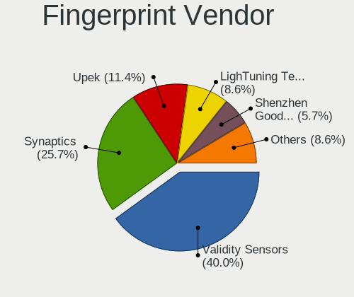

| Vendor                     | Notebooks | Percent |
|----------------------------|-----------|---------|
| Validity Sensors           | 13        | 44.83%  |
| Synaptics                  | 5         | 17.24%  |
| Upek                       | 4         | 13.79%  |
| Shenzhen Goodix Technology | 2         | 6.9%    |
| LighTuning Technology      | 2         | 6.9%    |
| Elan Microelectronics      | 1         | 3.45%   |
| Broadcom                   | 1         | 3.45%   |
| AuthenTec                  | 1         | 3.45%   |

Fingerprint Model
-----------------

Fingerprint sensor models

| Model                                                                        | Notebooks | Percent |
|------------------------------------------------------------------------------|-----------|---------|
| Upek Biometric Touchchip/Touchstrip Fingerprint Sensor                       | 4         | 13.79%  |
| Validity Sensors VFS495 Fingerprint Reader                                   | 3         | 10.34%  |
| Validity Sensors VFS 5011 fingerprint sensor                                 | 3         | 10.34%  |
| Validity Sensors Synaptics WBDI                                              | 3         | 10.34%  |
| Validity Sensors Swipe Fingerprint Sensor                                    | 2         | 6.9%    |
| Synaptics Prometheus MIS Touch Fingerprint Reader                            | 2         | 6.9%    |
| Synaptics Metallica MIS Touch Fingerprint Reader                             | 2         | 6.9%    |
| Shenzhen Goodix Fingerprint Reader                                           | 2         | 6.9%    |
| Validity Sensors VFS7552 Touch Fingerprint Sensor                            | 1         | 3.45%   |
| Validity Sensors VFS7500 Touch Fingerprint Sensor                            | 1         | 3.45%   |
| LighTuning Fingerprint Reader                                                | 1         | 3.45%   |
| LighTuning EgisTec Touch Fingerprint Sensor                                  | 1         | 3.45%   |
| Elan Fingerprint Sensor                                                      | 1         | 3.45%   |
| Broadcom BCM5880 Secure Applications Processor with fingerprint swipe sensor | 1         | 3.45%   |
| AuthenTec AES1600                                                            | 1         | 3.45%   |
| Unknown                                                                      | 1         | 3.45%   |

Chipcard Vendor
---------------

Chipcard module vendors

Zero info for selected period =(

Chipcard Model
--------------

Chipcard module models

Zero info for selected period =(

Unsupported
-----------

Unsupported Devices
-------------------

Total unsupported devices on board

| Total | Notebooks | Percent |
|-------|-----------|---------|
| 1     | 41        | 30.83%  |
| 2     | 38        | 28.57%  |
| 3     | 21        | 15.79%  |
| 0     | 18        | 13.53%  |
| 4     | 11        | 8.27%   |
| 5     | 2         | 1.5%    |
| 7     | 1         | 0.75%   |
| 6     | 1         | 0.75%   |

Unsupported Device Types
------------------------

Types of unsupported devices

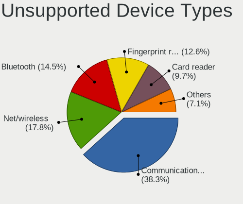

| Type                     | Notebooks | Percent |
|--------------------------|-----------|---------|
| Communication controller | 88        | 39.29%  |
| Net/wireless             | 41        | 18.3%   |
| Bluetooth                | 31        | 13.84%  |
| Fingerprint reader       | 28        | 12.5%   |
| Card reader              | 20        | 8.93%   |
| Firewire controller      | 11        | 4.91%   |
| Network                  | 2         | 0.89%   |
| Storage/raid             | 1         | 0.45%   |
| Sound                    | 1         | 0.45%   |
| Net/ethernet             | 1         | 0.45%   |

