NomadBSD 1.3.2 - Tested Hardware & Statistics (Desktops)
--------------------------------------------------------

A project to collect tested hardware configurations for NomadBSD 1.3.2.

Anyone can contribute to this report by the [hw-probe](https://github.com/linuxhw/hw-probe/blob/master/INSTALL.BSD.md) tool:

    hw-probe -all -upload

Please submit a probe of your configuration if it's not presented on the page or is rare.

Full-feature report is available here: https://bsd-hardware.info/?view=trends&rel=nomadbsd-1.3.2

Contents
--------

* [ Test Cases ](#test-cases)

* [ System ](#system)
  - [ Arch                     ](#arch)
  - [ DE                       ](#de)
  - [ Display Server           ](#display-server)
  - [ Display Manager          ](#display-manager)
  - [ OS Lang                  ](#os-lang)
  - [ Boot Mode                ](#boot-mode)
  - [ Filesystem               ](#filesystem)
  - [ Part. scheme             ](#part-scheme)

* [ Board ](#board)
  - [ Vendor                   ](#vendor)
  - [ Model                    ](#model)
  - [ Model Family             ](#model-family)
  - [ MFG Year                 ](#mfg-year)
  - [ Form Factor              ](#form-factor)
  - [ Coreboot                 ](#coreboot)
  - [ RAM Size                 ](#ram-size)
  - [ RAM Used                 ](#ram-used)
  - [ Total Drives             ](#total-drives)
  - [ Has CD-ROM               ](#has-cd-rom)
  - [ Has Ethernet             ](#has-ethernet)
  - [ Has WiFi                 ](#has-wifi)
  - [ Has Bluetooth            ](#has-bluetooth)

* [ Location ](#location)
  - [ Country                  ](#country)
  - [ City                     ](#city)

* [ Drives ](#drives)
  - [ Drive Vendor             ](#drive-vendor)
  - [ Drive Model              ](#drive-model)
  - [ HDD Vendor               ](#hdd-vendor)
  - [ SSD Vendor               ](#ssd-vendor)
  - [ Drive Kind               ](#drive-kind)
  - [ Drive Connector          ](#drive-connector)
  - [ Drive Size               ](#drive-size)
  - [ Space Total              ](#space-total)
  - [ Space Used               ](#space-used)
  - [ Malfunc. Drives          ](#malfunc-drives)
  - [ Malfunc. Drive Vendor    ](#malfunc-drive-vendor)
  - [ Malfunc. HDD Vendor      ](#malfunc-hdd-vendor)
  - [ Malfunc. Drive Kind      ](#malfunc-drive-kind)
  - [ Failed Drives            ](#failed-drives)
  - [ Failed Drive Vendor      ](#failed-drive-vendor)
  - [ Drive Status             ](#drive-status)

* [ Storage controller ](#storage-controller)
  - [ Storage Vendor           ](#storage-vendor)
  - [ Storage Model            ](#storage-model)
  - [ Storage Kind             ](#storage-kind)

* [ Processor ](#processor)
  - [ CPU Vendor               ](#cpu-vendor)
  - [ CPU Model                ](#cpu-model)
  - [ CPU Model Family         ](#cpu-model-family)
  - [ CPU Cores                ](#cpu-cores)
  - [ CPU Sockets              ](#cpu-sockets)
  - [ CPU Threads              ](#cpu-threads)
  - [ CPU Microarch            ](#cpu-microarch)

* [ Graphics ](#graphics)
  - [ GPU Vendor               ](#gpu-vendor)
  - [ GPU Model                ](#gpu-model)
  - [ GPU Combo                ](#gpu-combo)
  - [ GPU Driver               ](#gpu-driver)
  - [ GPU Memory               ](#gpu-memory)

* [ Monitor ](#monitor)
  - [ Monitor Vendor           ](#monitor-vendor)
  - [ Monitor Model            ](#monitor-model)
  - [ Monitor Resolution       ](#monitor-resolution)
  - [ Monitor Diagonal         ](#monitor-diagonal)
  - [ Monitor Width            ](#monitor-width)
  - [ Aspect Ratio             ](#aspect-ratio)
  - [ Monitor Area             ](#monitor-area)
  - [ Pixel Density            ](#pixel-density)
  - [ Multiple Monitors        ](#multiple-monitors)

* [ Network ](#network)
  - [ Net Controller Vendor    ](#net-controller-vendor)
  - [ Net Controller Model     ](#net-controller-model)
  - [ Wireless Vendor          ](#wireless-vendor)
  - [ Wireless Model           ](#wireless-model)
  - [ Ethernet Vendor          ](#ethernet-vendor)
  - [ Ethernet Model           ](#ethernet-model)
  - [ Net Controller Kind      ](#net-controller-kind)
  - [ Used Controller          ](#used-controller)
  - [ NICs                     ](#nics)
  - [ IPv6                     ](#ipv6)

* [ Bluetooth ](#bluetooth)
  - [ Bluetooth Vendor         ](#bluetooth-vendor)
  - [ Bluetooth Model          ](#bluetooth-model)

* [ Sound ](#sound)
  - [ Sound Vendor             ](#sound-vendor)
  - [ Sound Model              ](#sound-model)

* [ Memory ](#memory)
  - [ Memory Vendor            ](#memory-vendor)
  - [ Memory Model             ](#memory-model)
  - [ Memory Kind              ](#memory-kind)
  - [ Memory Form Factor       ](#memory-form-factor)
  - [ Memory Size              ](#memory-size)
  - [ Memory Speed             ](#memory-speed)

* [ Printers & scanners ](#printers--scanners)
  - [ Printer Vendor           ](#printer-vendor)
  - [ Printer Model            ](#printer-model)
  - [ Scanner Vendor           ](#scanner-vendor)
  - [ Scanner Model            ](#scanner-model)

* [ Camera ](#camera)
  - [ Camera Vendor            ](#camera-vendor)
  - [ Camera Model             ](#camera-model)

* [ Security ](#security)
  - [ Fingerprint Vendor       ](#fingerprint-vendor)
  - [ Fingerprint Model        ](#fingerprint-model)
  - [ Chipcard Vendor          ](#chipcard-vendor)
  - [ Chipcard Model           ](#chipcard-model)

* [ Unsupported ](#unsupported)
  - [ Unsupported Devices      ](#unsupported-devices)
  - [ Unsupported Device Types ](#unsupported-device-types)

Test Cases
----------

| Vendor   | Model             | Probe                                                     | Date         |
|----------|-------------------|-----------------------------------------------------------|--------------|
| HP       | 0AACh             | [b7cac343f6](https://bsd-hardware.info/?probe=b7cac343f6) | Jan 29, 2021 |
| HP       | 3399              | [b11946a41a](https://bsd-hardware.info/?probe=b11946a41a) | Jan 13, 2021 |
| Pegatron | 2AB5              | [8093f75ea2](https://bsd-hardware.info/?probe=8093f75ea2) | Jan 13, 2021 |
| Dell     | 0NW6H5 A00        | [d54f451ea5](https://bsd-hardware.info/?probe=d54f451ea5) | Jan 07, 2021 |
| HP       | 3032h             | [13648fd22d](https://bsd-hardware.info/?probe=13648fd22d) | Jan 07, 2021 |
| Dell     | 0KC9NP A01        | [ee2d5f3289](https://bsd-hardware.info/?probe=ee2d5f3289) | Jan 07, 2021 |
| Dell     | 030VXY A01        | [c117ffdc98](https://bsd-hardware.info/?probe=c117ffdc98) | Jan 07, 2021 |
| Gigabyte | X570 AORUS MASTER | [cfc292e9e8](https://bsd-hardware.info/?probe=cfc292e9e8) | Jan 07, 2021 |
| Dell     | 0C27VV A02        | [cfd6a0ab4b](https://bsd-hardware.info/?probe=cfd6a0ab4b) | Jan 04, 2021 |
| Dell     | 0C27VV A02        | [c532e18070](https://bsd-hardware.info/?probe=c532e18070) | Jan 04, 2021 |
| Dell     | 0C27VV A02        | [876f5d7b92](https://bsd-hardware.info/?probe=876f5d7b92) | Jan 02, 2021 |
| Dell     | 0C27VV A02        | [0bf1fa2725](https://bsd-hardware.info/?probe=0bf1fa2725) | Jan 02, 2021 |
| Dell     | 0C27VV A02        | [87e4734cb8](https://bsd-hardware.info/?probe=87e4734cb8) | Dec 30, 2020 |
| Dell     | 0C27VV A02        | [d892bd7805](https://bsd-hardware.info/?probe=d892bd7805) | Dec 30, 2020 |
| Dell     | 0C27VV A02        | [917e6fde25](https://bsd-hardware.info/?probe=917e6fde25) | Dec 30, 2020 |
| Dell     | 0C27VV A02        | [889bba9dbc](https://bsd-hardware.info/?probe=889bba9dbc) | Dec 30, 2020 |
| Gigabyte | X570 AORUS PRO    | [a3e2c4eda1](https://bsd-hardware.info/?probe=a3e2c4eda1) | Dec 30, 2020 |
| ASUSTek  | Z170-A            | [a1c6966373](https://bsd-hardware.info/?probe=a1c6966373) | Oct 21, 2020 |
| ASRock   | AB350 Pro4        | [407652fc8d](https://bsd-hardware.info/?probe=407652fc8d) | Oct 05, 2020 |
| Foxconn  | Napa HP P/N       | [2a7cb7b214](https://bsd-hardware.info/?probe=2a7cb7b214) | Sep 03, 2020 |
| ASUSTek  | EMERY             | [c93b86b3ba](https://bsd-hardware.info/?probe=c93b86b3ba) | Aug 27, 2020 |
| HP       | 0A64h             | [10c48336b0](https://bsd-hardware.info/?probe=10c48336b0) | Aug 20, 2020 |
| ASUSTek  | M5A97 R2.0        | [78d714a1a3](https://bsd-hardware.info/?probe=78d714a1a3) | Aug 19, 2020 |
| ASUSTek  | PRIME A320M-K     | [8a3cb911c3](https://bsd-hardware.info/?probe=8a3cb911c3) | Jul 18, 2020 |

System
------

Arch
----

OS architecture (x86_64, i586, etc.)

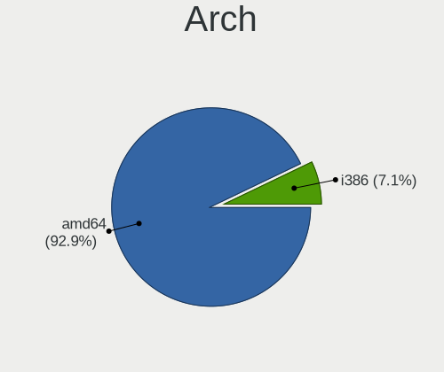

| Name  | Desktops | Percent |
|-------|----------|---------|
| amd64 | 13       | 92.86%  |
| i386  | 1        | 7.14%   |

DE
--

Desktop Environment

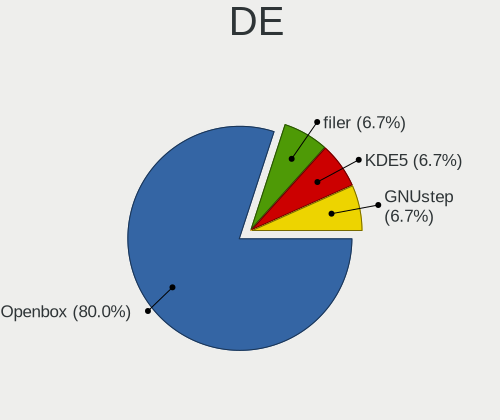

| Name    | Desktops | Percent |
|---------|----------|---------|
| Openbox | 12       | 80%     |
| KDE5    | 1        | 6.67%   |
| GNUstep | 1        | 6.67%   |
| filer   | 1        | 6.67%   |

Display Server
--------------

X11 or Wayland

| Name | Desktops | Percent |
|------|----------|---------|
| X11  | 14       | 100%    |

Display Manager
---------------

SDDM, LightDM, etc.

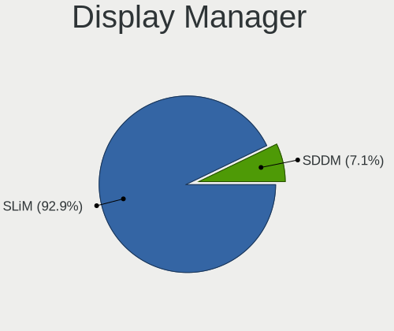

| Name | Desktops | Percent |
|------|----------|---------|
| SLiM | 13       | 92.86%  |
| SDDM | 1        | 7.14%   |

OS Lang
-------

Language

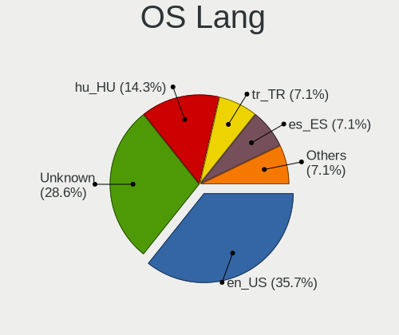

| Lang    | Desktops | Percent |
|---------|----------|---------|
| en_US   | 5        | 35.71%  |
| Unknown | 4        | 28.57%  |
| hu_HU   | 2        | 14.29%  |
| tr_TR   | 1        | 7.14%   |
| es_ES   | 1        | 7.14%   |
| de_DE   | 1        | 7.14%   |

Boot Mode
---------

EFI or BIOS

| Mode | Desktops | Percent |
|------|----------|---------|
| EFI  | 13       | 92.86%  |
| BIOS | 1        | 7.14%   |

Filesystem
----------

Type of filesystem

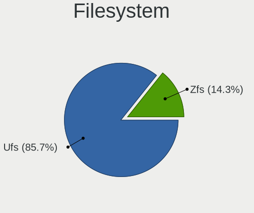

| Type | Desktops | Percent |
|------|----------|---------|
| Ufs  | 12       | 85.71%  |
| Zfs  | 2        | 14.29%  |

Part. scheme
------------

Scheme of partitioning

| Type | Desktops | Percent |
|------|----------|---------|
| GPT  | 8        | 57.14%  |
| MBR  | 6        | 42.86%  |

Board
-----

Vendor
------

Motherboard manufacturer

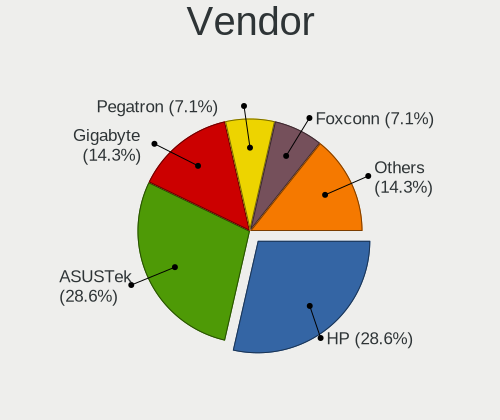

| Name                | Desktops | Percent |
|---------------------|----------|---------|
| Hewlett-Packard     | 4        | 28.57%  |
| ASUSTek Computer    | 4        | 28.57%  |
| Gigabyte Technology | 2        | 14.29%  |
| Pegatron            | 1        | 7.14%   |
| Foxconn             | 1        | 7.14%   |
| Dell                | 1        | 7.14%   |
| ASRock              | 1        | 7.14%   |

Model
-----

Motherboard model

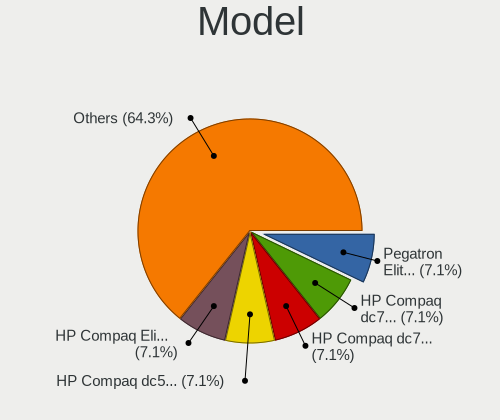

| Name                                     | Desktops | Percent |
|------------------------------------------|----------|---------|
| Pegatron Elite 7300 Series MT            | 1        | 7.14%   |
| HP Compaq Elite 8300 Touch All-in-One PC | 1        | 7.14%   |
| HP Compaq dc7900 Convertible Minitower   | 1        | 7.14%   |
| HP Compaq dc7800p Convertible Minitower  | 1        | 7.14%   |
| HP Compaq dc5750 Microtower              | 1        | 7.14%   |
| Gigabyte X570 AORUS PRO                  | 1        | 7.14%   |
| Gigabyte X570 AORUS MASTER               | 1        | 7.14%   |
| Foxconn Napa                             | 1        | 7.14%   |
| Dell OptiPlex 780                        | 1        | 7.14%   |
| ASUS Z170-A                              | 1        | 7.14%   |
| ASUS PRIME A320M-K                       | 1        | 7.14%   |
| ASUS M5A97 R2.0                          | 1        | 7.14%   |
| ASUS ER904AA-ABA A1440N                  | 1        | 7.14%   |
| ASRock AB350 Pro4                        | 1        | 7.14%   |

Model Family
------------

Motherboard model prefix

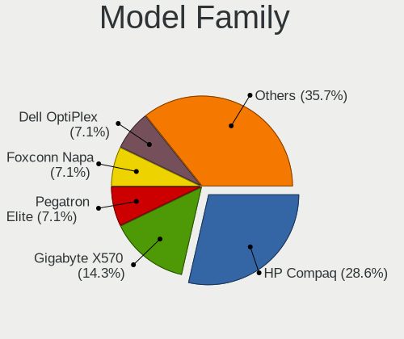

| Name             | Desktops | Percent |
|------------------|----------|---------|
| HP Compaq        | 4        | 28.57%  |
| Gigabyte X570    | 2        | 14.29%  |
| Pegatron Elite   | 1        | 7.14%   |
| Foxconn Napa     | 1        | 7.14%   |
| Dell OptiPlex    | 1        | 7.14%   |
| ASUS Z170-A      | 1        | 7.14%   |
| ASUS PRIME       | 1        | 7.14%   |
| ASUS M5A97       | 1        | 7.14%   |
| ASUS ER904AA-ABA | 1        | 7.14%   |
| ASRock AB350     | 1        | 7.14%   |

MFG Year
--------

Motherboard manufacture year

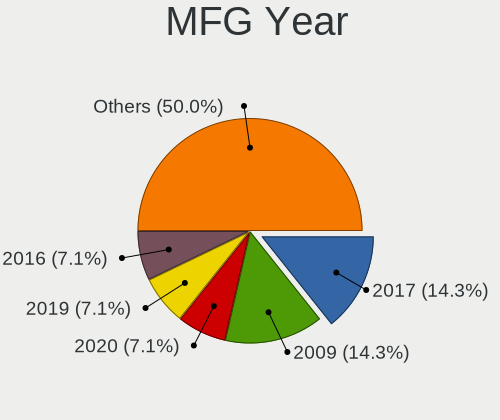

| Year | Desktops | Percent |
|------|----------|---------|
| 2019 | 2        | 14.29%  |
| 2009 | 2        | 14.29%  |
| 2020 | 1        | 7.14%   |
| 2017 | 1        | 7.14%   |
| 2016 | 1        | 7.14%   |
| 2015 | 1        | 7.14%   |
| 2013 | 1        | 7.14%   |
| 2012 | 1        | 7.14%   |
| 2011 | 1        | 7.14%   |
| 2008 | 1        | 7.14%   |
| 2007 | 1        | 7.14%   |
| 2006 | 1        | 7.14%   |

Form Factor
-----------

Physical design of the computer

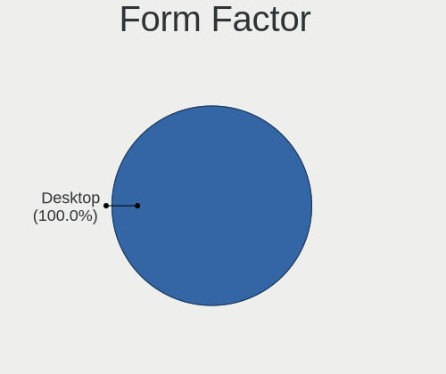

| Name    | Desktops | Percent |
|---------|----------|---------|
| Desktop | 14       | 100%    |

Coreboot
--------

Have coreboot on board

| Used | Desktops | Percent |
|------|----------|---------|
| No   | 14       | 100%    |

RAM Size
--------

Total RAM memory

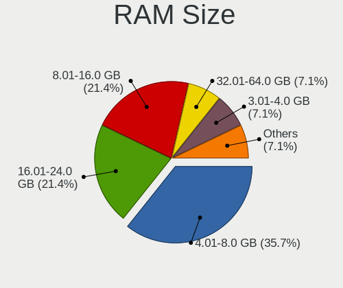

| Size in GB | Desktops | Percent |
|------------|----------|---------|
| 4.01-8.0   | 5        | 35.71%  |
| 16.01-24.0 | 3        | 21.43%  |
| 8.01-16.0  | 3        | 21.43%  |
| 32.01-64.0 | 1        | 7.14%   |
| 3.01-4.0   | 1        | 7.14%   |
| 2.01-3.0   | 1        | 7.14%   |

RAM Used
--------

Used RAM memory

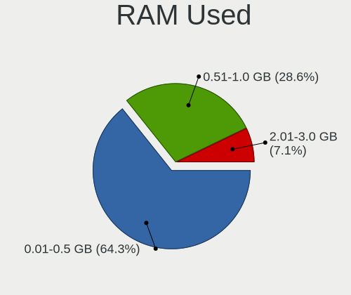

| Used GB  | Desktops | Percent |
|----------|----------|---------|
| 0.01-0.5 | 9        | 64.29%  |
| 0.51-1.0 | 4        | 28.57%  |
| 2.01-3.0 | 1        | 7.14%   |

Total Drives
------------

Number of drives on board

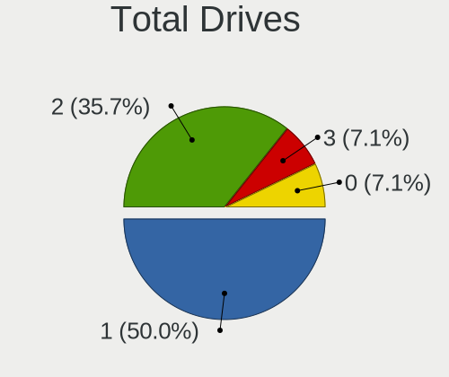

| Drives | Desktops | Percent |
|--------|----------|---------|
| 1      | 7        | 50%     |
| 2      | 5        | 35.71%  |
| 3      | 1        | 7.14%   |
| 0      | 1        | 7.14%   |

Has CD-ROM
----------

Has CD-ROM on board

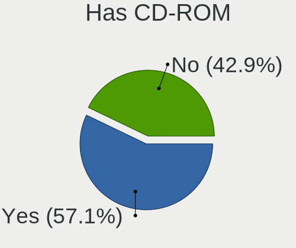

| Presented | Desktops | Percent |
|-----------|----------|---------|
| Yes       | 8        | 57.14%  |
| No        | 6        | 42.86%  |

Has Ethernet
------------

Has Ethernet on board

| Presented | Desktops | Percent |
|-----------|----------|---------|
| Yes       | 14       | 100%    |

Has WiFi
--------

Has WiFi module

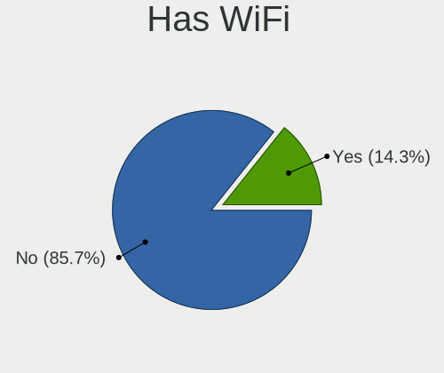

| Presented | Desktops | Percent |
|-----------|----------|---------|
| No        | 12       | 85.71%  |
| Yes       | 2        | 14.29%  |

Has Bluetooth
-------------

Has Bluetooth module

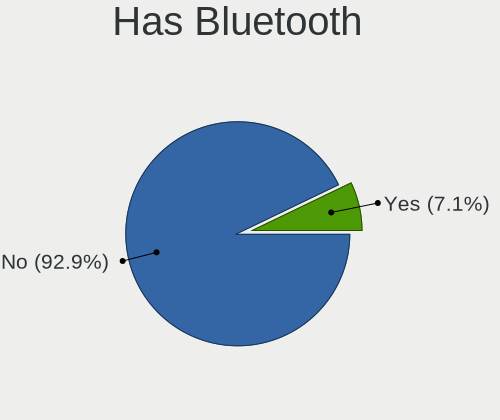

| Presented | Desktops | Percent |
|-----------|----------|---------|
| No        | 13       | 92.86%  |
| Yes       | 1        | 7.14%   |

Location
--------

Country
-------

Geographic location (country)

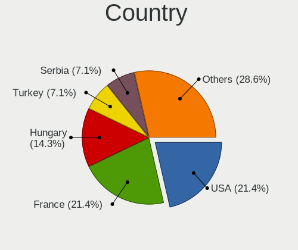

| Country   | Desktops | Percent |
|-----------|----------|---------|
| USA       | 3        | 21.43%  |
| France    | 3        | 21.43%  |
| Hungary   | 2        | 14.29%  |
| Turkey    | 1        | 7.14%   |
| Serbia    | 1        | 7.14%   |
| Russia    | 1        | 7.14%   |
| Germany   | 1        | 7.14%   |
| Colombia  | 1        | 7.14%   |
| Argentina | 1        | 7.14%   |

City
----

Geographic location (city)

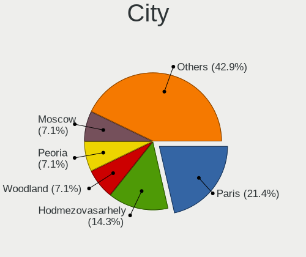

| City             | Desktops | Percent |
|------------------|----------|---------|
| Paris            | 3        | 21.43%  |
| Hodmezovasarhely | 2        | 14.29%  |
| Woodland         | 1        | 7.14%   |
| Peoria           | 1        | 7.14%   |
| Moscow           | 1        | 7.14%   |
| Langen           | 1        | 7.14%   |
| Duncan           | 1        | 7.14%   |
| Córdoba         | 1        | 7.14%   |
| Bogotá          | 1        | 7.14%   |
| Belgrade         | 1        | 7.14%   |
| Balıkesir       | 1        | 7.14%   |

Drives
------

Drive Vendor
------------

Hard drive vendors

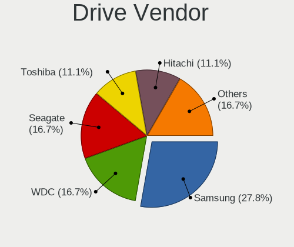

| Vendor              | Desktops | Drives | Percent |
|---------------------|----------|--------|---------|
| Samsung Electronics | 5        | 5      | 27.78%  |
| WDC                 | 3        | 5      | 16.67%  |
| Seagate             | 3        | 3      | 16.67%  |
| Toshiba             | 2        | 2      | 11.11%  |
| Hitachi             | 2        | 2      | 11.11%  |
| SanDisk             | 1        | 2      | 5.56%   |
| ORICO               | 1        | 1      | 5.56%   |
| HGST                | 1        | 1      | 5.56%   |

Drive Model
-----------

Hard drive models

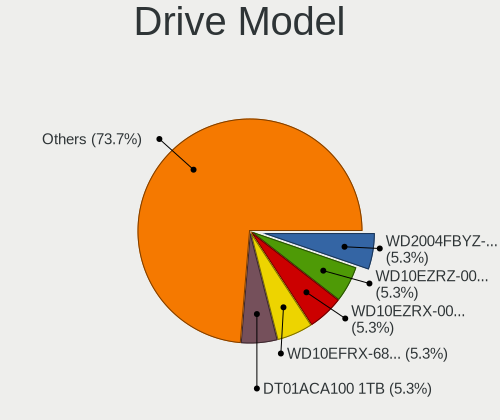

| Model                           | Desktops | Percent |
|---------------------------------|----------|---------|
| WDC WD2004FBYZ-01YCBB1 2TB      | 1        | 5.26%   |
| WDC WD10EZRZ-00HTKB0 1TB        | 1        | 5.26%   |
| WDC WD10EZRX-00L4HB0 1TB        | 1        | 5.26%   |
| WDC WD10EFRX-68PJCN0 1TB        | 1        | 5.26%   |
| Toshiba DT01ACA100 1TB          | 1        | 5.26%   |
| Toshiba DT01ABA300 3TB          | 1        | 5.26%   |
| Seagate ST500DM002-1BD142 500GB | 1        | 5.26%   |
| Seagate ST3500418AS 500GB       | 1        | 5.26%   |
| Seagate ST1000DM003-1CH162 1TB  | 1        | 5.26%   |
| SanDisk SSD PLUS 120GB          | 1        | 5.26%   |
| Samsung SSD 970 EVO Plus 1TB    | 1        | 5.26%   |
| Samsung SSD 970 EVO 500GB       | 1        | 5.26%   |
| Samsung SSD 850 EVO M.2 500GB   | 1        | 5.26%   |
| Samsung SP2504C 250GB           | 1        | 5.26%   |
| Samsung HD161HJ 160GB           | 1        | 5.26%   |
| ORICO V500 1TB                  | 1        | 5.26%   |
| Hitachi HDS721032CLA362 320GB   | 1        | 5.26%   |
| Hitachi HDS721010CLA632 1TB     | 1        | 5.26%   |
| HGST HTS725050A7E630 500GB      | 1        | 5.26%   |

HDD Vendor
----------

Hard disk drive vendors

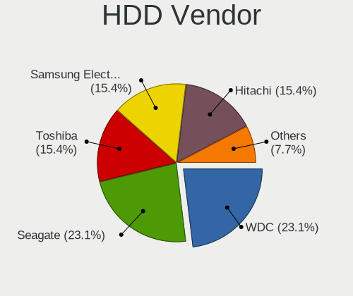

| Vendor              | Desktops | Drives | Percent |
|---------------------|----------|--------|---------|
| WDC                 | 3        | 5      | 23.08%  |
| Seagate             | 3        | 3      | 23.08%  |
| Toshiba             | 2        | 2      | 15.38%  |
| Samsung Electronics | 2        | 2      | 15.38%  |
| Hitachi             | 2        | 2      | 15.38%  |
| HGST                | 1        | 1      | 7.69%   |

SSD Vendor
----------

Solid state drive vendors

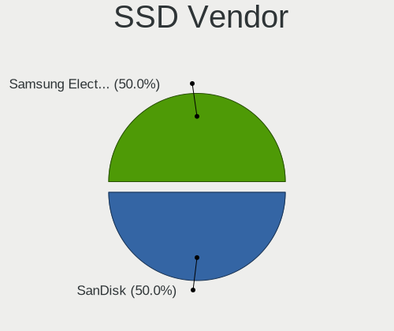

| Vendor              | Desktops | Drives | Percent |
|---------------------|----------|--------|---------|
| SanDisk             | 1        | 2      | 50%     |
| Samsung Electronics | 1        | 1      | 50%     |

Drive Kind
----------

HDD or SSD

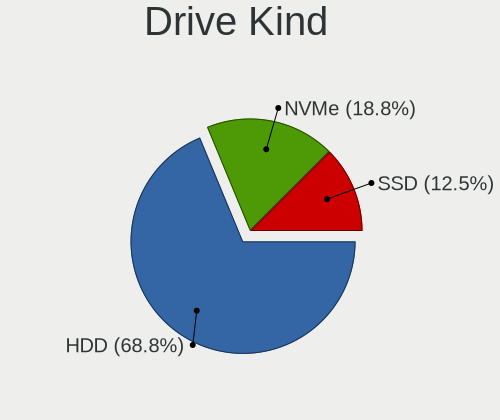

| Kind | Desktops | Drives | Percent |
|------|----------|--------|---------|
| HDD  | 11       | 15     | 68.75%  |
| NVMe | 3        | 3      | 18.75%  |
| SSD  | 2        | 3      | 12.5%   |

Drive Connector
---------------

SATA, SAS, NVMe, etc.

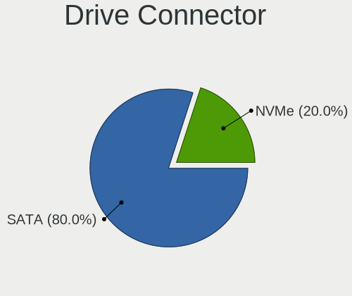

| Type | Desktops | Drives | Percent |
|------|----------|--------|---------|
| SATA | 12       | 18     | 80%     |
| NVMe | 3        | 3      | 20%     |

Drive Size
----------

Size of hard drive

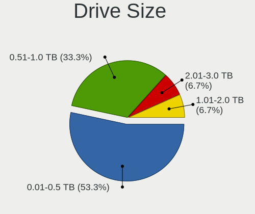

| Size in TB | Desktops | Drives | Percent |
|------------|----------|--------|---------|
| 0.01-0.5   | 8        | 9      | 53.33%  |
| 0.51-1.0   | 5        | 7      | 33.33%  |
| 2.01-3.0   | 1        | 1      | 6.67%   |
| 1.01-2.0   | 1        | 1      | 6.67%   |

Space Total
-----------

Amount of disk space available on the file system

| Size in GB | Desktops | Percent |
|------------|----------|---------|
| 1-20       | 12       | 85.71%  |
| 101-250    | 1        | 7.14%   |
| 51-100     | 1        | 7.14%   |

Space Used
----------

Amount of used disk space

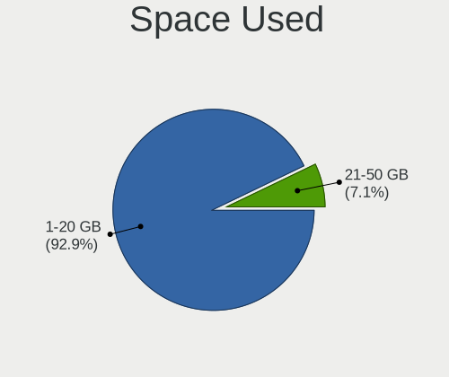

| Used GB | Desktops | Percent |
|---------|----------|---------|
| 1-20    | 13       | 92.86%  |
| 21-50   | 1        | 7.14%   |

Malfunc. Drives
---------------

Drive models with a malfunction

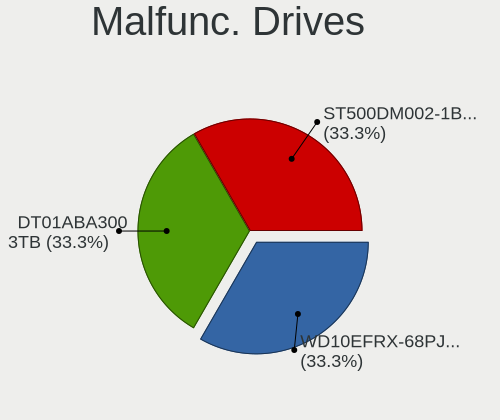

| Model                           | Desktops | Drives | Percent |
|---------------------------------|----------|--------|---------|
| WDC WD10EFRX-68PJCN0 1TB        | 1        | 2      | 33.33%  |
| Toshiba DT01ABA300 3TB          | 1        | 1      | 33.33%  |
| Seagate ST500DM002-1BD142 500GB | 1        | 1      | 33.33%  |

Malfunc. Drive Vendor
---------------------

Vendors of faulty drives

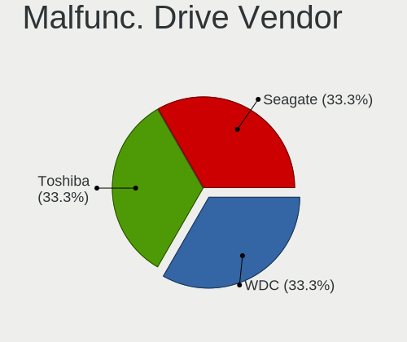

| Vendor  | Desktops | Drives | Percent |
|---------|----------|--------|---------|
| WDC     | 1        | 2      | 33.33%  |
| Toshiba | 1        | 1      | 33.33%  |
| Seagate | 1        | 1      | 33.33%  |

Malfunc. HDD Vendor
-------------------

Vendors of faulty HDD drives

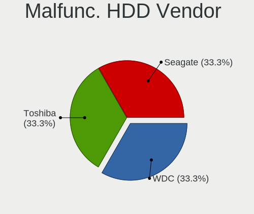

| Vendor  | Desktops | Drives | Percent |
|---------|----------|--------|---------|
| WDC     | 1        | 2      | 33.33%  |
| Toshiba | 1        | 1      | 33.33%  |
| Seagate | 1        | 1      | 33.33%  |

Malfunc. Drive Kind
-------------------

Kinds of faulty drives

| Kind | Desktops | Drives | Percent |
|------|----------|--------|---------|
| HDD  | 3        | 4      | 100%    |

Failed Drives
-------------

Failed drive models

Zero info for selected period =(

Failed Drive Vendor
-------------------

Failed drive vendors

Zero info for selected period =(

Drive Status
------------

Number of failed and malfunc. drives

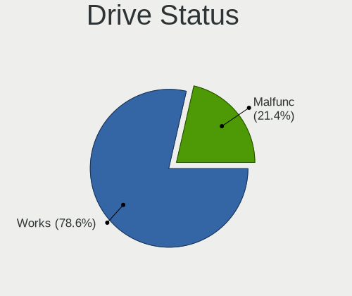

| Status  | Desktops | Drives | Percent |
|---------|----------|--------|---------|
| Works   | 11       | 17     | 78.57%  |
| Malfunc | 3        | 4      | 21.43%  |

Storage controller
------------------

Storage Vendor
--------------

Storage controller vendors

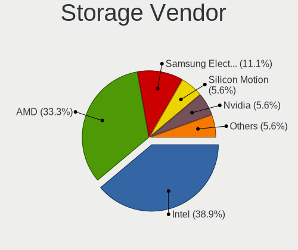

| Vendor              | Desktops | Percent |
|---------------------|----------|---------|
| Intel               | 7        | 38.89%  |
| AMD                 | 6        | 33.33%  |
| Samsung Electronics | 2        | 11.11%  |
| Silicon Motion      | 1        | 5.56%   |
| Nvidia              | 1        | 5.56%   |
| ASMedia Technology  | 1        | 5.56%   |

Storage Model
-------------

Storage controller models

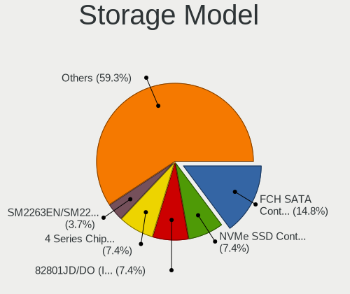

| Model                                                                         | Desktops | Percent |
|-------------------------------------------------------------------------------|----------|---------|
| AMD FCH SATA Controller [AHCI mode]                                           | 4        | 14.81%  |
| Samsung NVMe SSD Controller SM981/PM981/PM983                                 | 2        | 7.41%   |
| Intel 82801JD/DO (ICH10 Family) SATA AHCI Controller                          | 2        | 7.41%   |
| Intel 4 Series Chipset PT IDER Controller                                     | 2        | 7.41%   |
| Silicon Motion SM2263EN/SM2263XT SSD Controller                               | 1        | 3.7%    |
| Nvidia MCP73 SATA Controller (IDE mode)                                       | 1        | 3.7%    |
| Nvidia MCP73 IDE Controller                                                   | 1        | 3.7%    |
| Intel Q170/Q150/B150/H170/H110/Z170/CM236 Chipset SATA Controller [AHCI Mode] | 1        | 3.7%    |
| Intel 82Q35 Express PT IDER Controller                                        | 1        | 3.7%    |
| Intel 82801IR/IO/IH (ICH9R/DO/DH) 4 port SATA Controller [IDE mode]           | 1        | 3.7%    |
| Intel 82801I (ICH9 Family) 2 port SATA Controller [IDE mode]                  | 1        | 3.7%    |
| Intel 82801GR/GDH (ICH7R/ICH7DH) SATA Controller [RAID mode]                  | 1        | 3.7%    |
| Intel 82801G (ICH7 Family) IDE Controller                                     | 1        | 3.7%    |
| Intel 7 Series/C210 Series Chipset Family 6-port SATA Controller [AHCI mode]  | 1        | 3.7%    |
| Intel 6 Series/C200 Series Chipset Family 6 port Desktop SATA AHCI Controller | 1        | 3.7%    |
| ASMedia ASM1062 Serial ATA Controller                                         | 1        | 3.7%    |
| AMD SB7x0/SB8x0/SB9x0 SATA Controller [AHCI mode]                             | 1        | 3.7%    |
| AMD SB600 Non-Raid-5 SATA                                                     | 1        | 3.7%    |
| AMD SB600 IDE                                                                 | 1        | 3.7%    |
| AMD FCH SATA Controller D                                                     | 1        | 3.7%    |
| AMD 300 Series Chipset SATA Controller                                        | 1        | 3.7%    |

Storage Kind
------------

Kind of storage controller (IDE, SATA, NVMe, SAS, ...)

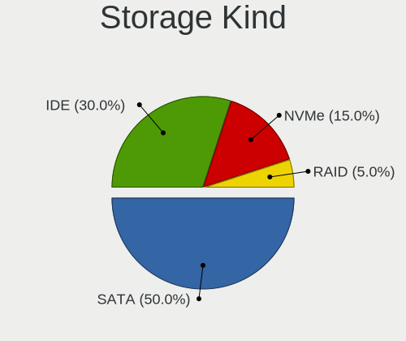

| Kind | Desktops | Percent |
|------|----------|---------|
| SATA | 10       | 50%     |
| IDE  | 6        | 30%     |
| NVMe | 3        | 15%     |
| RAID | 1        | 5%      |

Processor
---------

CPU Vendor
----------

Processor vendors

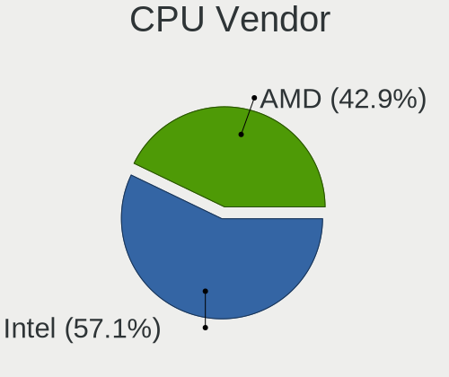

| Vendor | Desktops | Percent |
|--------|----------|---------|
| Intel  | 8        | 57.14%  |
| AMD    | 6        | 42.86%  |

CPU Model
---------

Processor models

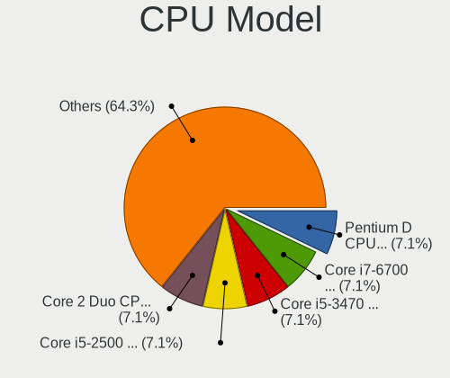

| Model                                       | Desktops | Percent |
|---------------------------------------------|----------|---------|
| Intel Pentium D CPU 2.80GHz                 | 1        | 7.14%   |
| Intel Core i7-6700 CPU @ 3.40GHz            | 1        | 7.14%   |
| Intel Core i5-3470 CPU @ 3.20GHz            | 1        | 7.14%   |
| Intel Core i5-2500 CPU @ 3.30GHz            | 1        | 7.14%   |
| Intel Core 2 Duo CPU E8600 @ 3.33GHz        | 1        | 7.14%   |
| Intel Core 2 Duo CPU E8500 @ 3.16GHz        | 1        | 7.14%   |
| Intel Core 2 Duo CPU E8300 @ 2.83GHz        | 1        | 7.14%   |
| Intel Core 2 Duo                            | 1        | 7.14%   |
| AMD Ryzen 7 2700X Eight-Core Processor      | 1        | 7.14%   |
| AMD Ryzen 5 2600 Six-Core Processor         | 1        | 7.14%   |
| AMD Ryzen 5 2400G with Radeon Vega Graphics | 1        | 7.14%   |
| AMD Ryzen 5 1500X Quad-Core Processor       | 1        | 7.14%   |
| AMD FX-6300 Six-Core Processor              | 1        | 7.14%   |
| AMD Athlon 64 X2 Dual Core Processor 4000+  | 1        | 7.14%   |

CPU Model Family
----------------

Processor model prefix

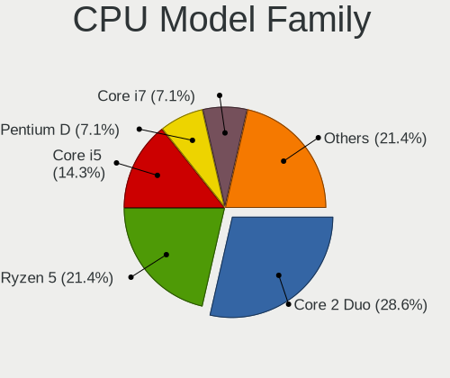

| Model            | Desktops | Percent |
|------------------|----------|---------|
| Intel Core 2 Duo | 4        | 28.57%  |
| AMD Ryzen 5      | 3        | 21.43%  |
| Intel Core i5    | 2        | 14.29%  |
| Intel Pentium D  | 1        | 7.14%   |
| Intel Core i7    | 1        | 7.14%   |
| AMD Ryzen 7      | 1        | 7.14%   |
| AMD FX           | 1        | 7.14%   |
| AMD Athlon 64 X2 | 1        | 7.14%   |

CPU Cores
---------

Number of processor cores

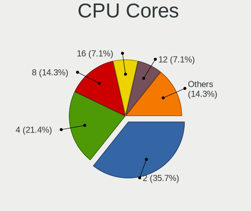

| Number  | Desktops | Percent |
|---------|----------|---------|
| 2       | 5        | 35.71%  |
| 4       | 3        | 21.43%  |
| 8       | 2        | 14.29%  |
| 16      | 1        | 7.14%   |
| 12      | 1        | 7.14%   |
| 6       | 1        | 7.14%   |
| Unknown | 1        | 7.14%   |

CPU Sockets
-----------

Number of sockets

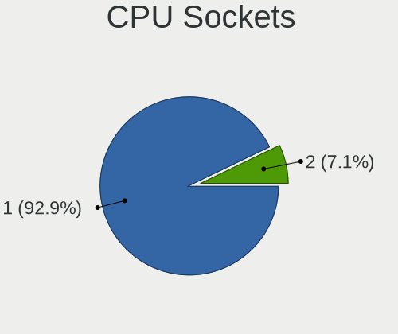

| Number | Desktops | Percent |
|--------|----------|---------|
| 1      | 13       | 92.86%  |
| 2      | 1        | 7.14%   |

CPU Threads
-----------

Threads per core (Hyper-Threading)

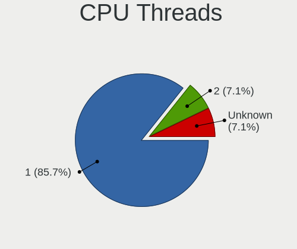

| Number  | Desktops | Percent |
|---------|----------|---------|
| 1       | 12       | 85.71%  |
| 2       | 1        | 7.14%   |
| Unknown | 1        | 7.14%   |

CPU Microarch
-------------

Microarchitecture

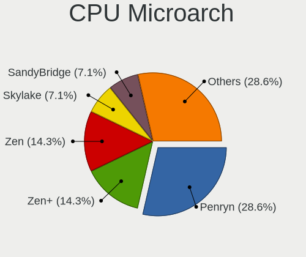

| Name        | Desktops | Percent |
|-------------|----------|---------|
| Penryn      | 4        | 28.57%  |
| Zen+        | 2        | 14.29%  |
| Zen         | 2        | 14.29%  |
| Skylake     | 1        | 7.14%   |
| SandyBridge | 1        | 7.14%   |
| Piledriver  | 1        | 7.14%   |
| NetBurst    | 1        | 7.14%   |
| K8 Hammer   | 1        | 7.14%   |
| IvyBridge   | 1        | 7.14%   |

Graphics
--------

GPU Vendor
----------

Vendors of graphics cards

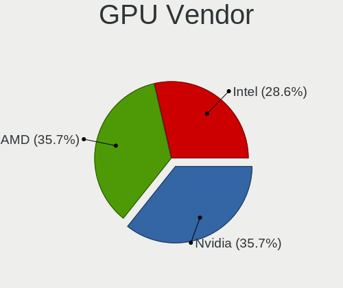

| Vendor | Desktops | Percent |
|--------|----------|---------|
| Nvidia | 5        | 35.71%  |
| AMD    | 5        | 35.71%  |
| Intel  | 4        | 28.57%  |

GPU Model
---------

Graphics card models

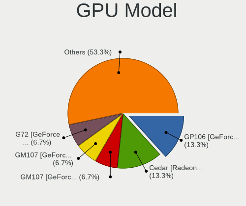

| Model                                                                     | Desktops | Percent |
|---------------------------------------------------------------------------|----------|---------|
| Nvidia GP106 [GeForce GTX 1060 6GB]                                       | 2        | 13.33%  |
| AMD Cedar [Radeon HD 5000/6000/7350/8350 Series]                          | 2        | 13.33%  |
| Nvidia GM107 [GeForce GTX 750]                                            | 1        | 6.67%   |
| Nvidia GM107 [GeForce GTX 750 Ti]                                         | 1        | 6.67%   |
| Nvidia G72 [GeForce 7300 LE]                                              | 1        | 6.67%   |
| Intel Xeon E3-1200 v2/3rd Gen Core processor Graphics Controller          | 1        | 6.67%   |
| Intel HD Graphics 530                                                     | 1        | 6.67%   |
| Intel 82Q35 Express Integrated Graphics Controller                        | 1        | 6.67%   |
| Intel 2nd Generation Core Processor Family Integrated Graphics Controller | 1        | 6.67%   |
| AMD RV620 PRO [Radeon HD 3470]                                            | 1        | 6.67%   |
| AMD RS482/RS485 [Radeon Xpress 1100/1150]                                 | 1        | 6.67%   |
| AMD RS480 [Radeon Xpress 1150] (Secondary)                                | 1        | 6.67%   |
| AMD Raven Ridge [Radeon Vega Series / Radeon Vega Mobile Series]          | 1        | 6.67%   |

GPU Combo
---------

Combinations of graphics cards

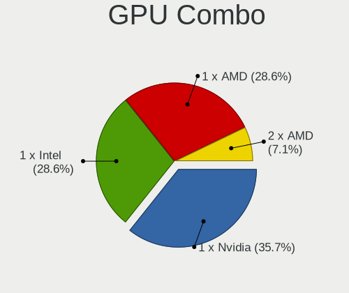

| Name       | Desktops | Percent |
|------------|----------|---------|
| 1 x Nvidia | 5        | 35.71%  |
| 1 x Intel  | 4        | 28.57%  |
| 1 x AMD    | 4        | 28.57%  |
| 2 x AMD    | 1        | 7.14%   |

GPU Driver
----------

Free vs proprietary

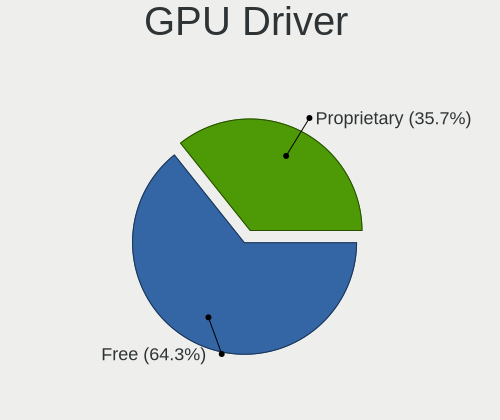

| Driver      | Desktops | Percent |
|-------------|----------|---------|
| Free        | 9        | 64.29%  |
| Proprietary | 5        | 35.71%  |

GPU Memory
----------

Total video memory

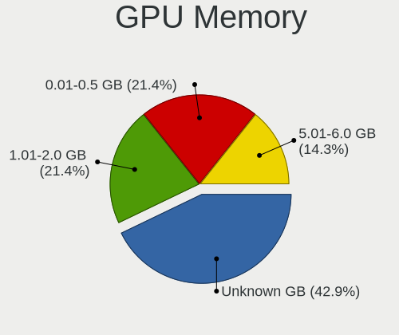

| Size in GB | Desktops | Percent |
|------------|----------|---------|
| Unknown    | 6        | 42.86%  |
| 1.01-2.0   | 3        | 21.43%  |
| 0.01-0.5   | 3        | 21.43%  |
| 5.01-6.0   | 2        | 14.29%  |

Monitor
-------

Monitor Vendor
--------------

Monitor vendors

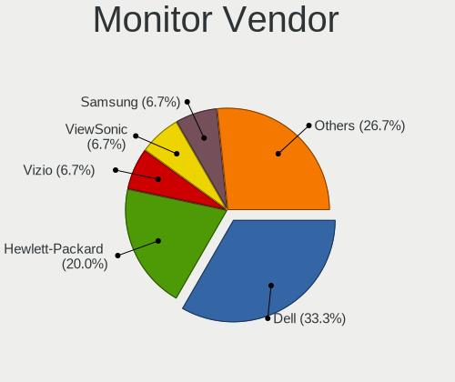

| Vendor              | Desktops | Percent |
|---------------------|----------|---------|
| Dell                | 5        | 33.33%  |
| Hewlett-Packard     | 3        | 20%     |
| Vizio               | 1        | 6.67%   |
| ViewSonic           | 1        | 6.67%   |
| Samsung Electronics | 1        | 6.67%   |
| Philips             | 1        | 6.67%   |
| HannStar            | 1        | 6.67%   |
| Goldstar            | 1        | 6.67%   |
| BenQ                | 1        | 6.67%   |

Monitor Model
-------------

Monitor models

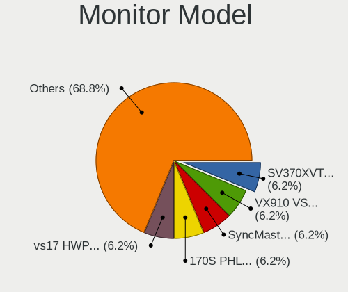

| Model                                                               | Desktops | Percent |
|---------------------------------------------------------------------|----------|---------|
| Vizio SV370XVT VIZ0057 1920x1080 820x460mm 37.0-inch                | 1        | 6.25%   |
| ViewSonic VX910 VSC3C19 1280x1024 380x300mm 19.1-inch               | 1        | 6.25%   |
| Samsung Electronics SyncMaster SAM036F 1440x900 410x260mm 19.1-inch | 1        | 6.25%   |
| Philips 170S PHL0856 1280x1024 340x270mm 17.1-inch                  | 1        | 6.25%   |
| Hewlett-Packard vs17 HWP2647 1280x1024 340x270mm 17.1-inch          | 1        | 6.25%   |
| Hewlett-Packard L1710 HWP26EB 1280x1024 340x270mm 17.1-inch         | 1        | 6.25%   |
| Hewlett-Packard HPQ 8300 AiO HWP4212 1920x1080 510x290mm 23.1-inch  | 1        | 6.25%   |
| HannStar LCD Monitor HSD0013 1280x1024 380x300mm 19.1-inch          | 1        | 6.25%   |
| Goldstar 22MP55 GSM5A26 1920x1080 480x270mm 21.7-inch               | 1        | 6.25%   |
| Dell U2414H DELA0A4 1920x1080 530x300mm 24.0-inch                   | 1        | 6.25%   |
| Dell U2414H DELA0A2 1920x1080 530x300mm 24.0-inch                   | 1        | 6.25%   |
| Dell U2412M DELA07A 1920x1200 520x320mm 24.0-inch                   | 1        | 6.25%   |
| Dell P1917S DELD091 1280x1024 380x300mm 19.1-inch                   | 1        | 6.25%   |
| Dell E2014H DELD03B 1600x900 430x240mm 19.4-inch                    | 1        | 6.25%   |
| Dell E1715S DELD062 1280x1024 340x270mm 17.1-inch                   | 1        | 6.25%   |
| BenQ GW2260 BNQ78C4 1920x1080 480x270mm 21.7-inch                   | 1        | 6.25%   |

Monitor Resolution
------------------

Monitor screen resolution

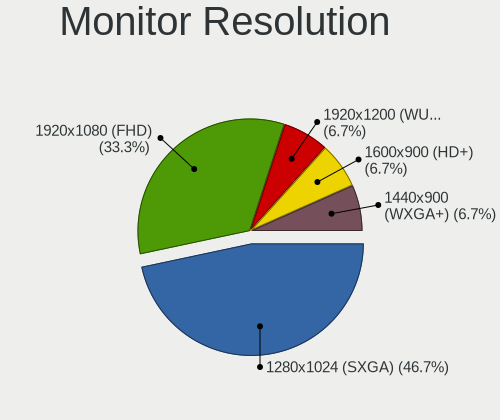

| Resolution        | Desktops | Percent |
|-------------------|----------|---------|
| 1280x1024 (SXGA)  | 7        | 46.67%  |
| 1920x1080 (FHD)   | 5        | 33.33%  |
| 1920x1200 (WUXGA) | 1        | 6.67%   |
| 1600x900 (HD+)    | 1        | 6.67%   |
| 1440x900 (WXGA+)  | 1        | 6.67%   |

Monitor Diagonal
----------------

Diagonal size in inches

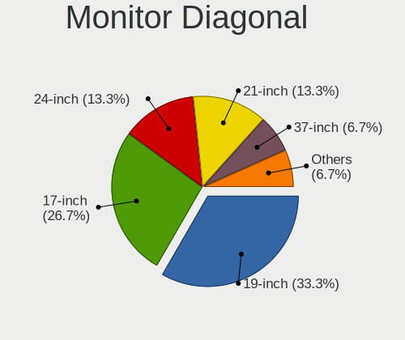

| Inches | Desktops | Percent |
|--------|----------|---------|
| 19     | 5        | 33.33%  |
| 17     | 4        | 26.67%  |
| 24     | 2        | 13.33%  |
| 21     | 2        | 13.33%  |
| 37     | 1        | 6.67%   |
| 23     | 1        | 6.67%   |

Monitor Width
-------------

Physical width

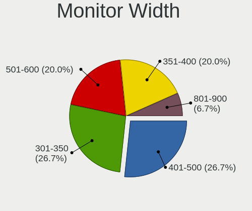

| Width in mm | Desktops | Percent |
|-------------|----------|---------|
| 401-500     | 4        | 26.67%  |
| 301-350     | 4        | 26.67%  |
| 501-600     | 3        | 20%     |
| 351-400     | 3        | 20%     |
| 801-900     | 1        | 6.67%   |

Aspect Ratio
------------

Proportional relationship between the width and the height

| Ratio | Desktops | Percent |
|-------|----------|---------|
| 5/4   | 7        | 46.67%  |
| 16/9  | 6        | 40%     |
| 16/10 | 2        | 13.33%  |

Monitor Area
------------

Area in inch²

| Area in inch² | Desktops | Percent |
|----------------|----------|---------|
| 151-200        | 5        | 33.33%  |
| 201-250        | 4        | 26.67%  |
| 141-150        | 4        | 26.67%  |
| 251-300        | 1        | 6.67%   |
| 501-1000       | 1        | 6.67%   |

Pixel Density
-------------

Pixels per inch

| Density | Desktops | Percent |
|---------|----------|---------|
| 51-100  | 13       | 86.67%  |
| 101-120 | 2        | 13.33%  |

Multiple Monitors
-----------------

Total monitors connected

| Total | Desktops | Percent |
|-------|----------|---------|
| 1     | 11       | 78.57%  |
| 2     | 2        | 14.29%  |
| 0     | 1        | 7.14%   |

Network
-------

Net Controller Vendor
---------------------

Controller vendors

| Vendor                | Desktops | Percent |
|-----------------------|----------|---------|
| Intel                 | 8        | 47.06%  |
| Realtek Semiconductor | 5        | 29.41%  |
| Qualcomm              | 1        | 5.88%   |
| Nvidia                | 1        | 5.88%   |
| Mellanox Technologies | 1        | 5.88%   |
| Broadcom              | 1        | 5.88%   |

Net Controller Model
--------------------

Controller models

| Model                                                             | Desktops | Percent |
|-------------------------------------------------------------------|----------|---------|
| Realtek RTL8111/8168/8411 PCI Express Gigabit Ethernet Controller | 4        | 21.05%  |
| Intel I211 Gigabit Network Connection                             | 2        | 10.53%  |
| Intel 82567LM-3 Gigabit Network Connection                        | 2        | 10.53%  |
| Realtek RTL8811AU 802.11a/b/g/n/ac WLAN Adapter                   | 1        | 5.26%   |
| Realtek RTL8125 2.5GbE Controller                                 | 1        | 5.26%   |
| Qualcomm ALCATEL Composite RNDIS Interface                        | 1        | 5.26%   |
| Nvidia MCP73 Ethernet                                             | 1        | 5.26%   |
| Mellanox MT27500 Family [ConnectX-3]                              | 1        | 5.26%   |
| Intel Wi-Fi 6 AX200                                               | 1        | 5.26%   |
| Intel NM10/ICH7 Family LAN Controller                             | 1        | 5.26%   |
| Intel Ethernet Connection (2) I219-V                              | 1        | 5.26%   |
| Intel 82579LM Gigabit Network Connection (Lewisville)             | 1        | 5.26%   |
| Intel 82566DM-2 Gigabit Network Connection                        | 1        | 5.26%   |
| Broadcom NetXtreme BCM5755 Gigabit Ethernet PCI Express           | 1        | 5.26%   |

Wireless Vendor
---------------

Wireless vendors

| Vendor                | Desktops | Percent |
|-----------------------|----------|---------|
| Realtek Semiconductor | 1        | 50%     |
| Intel                 | 1        | 50%     |

Wireless Model
--------------

Wireless models

| Model                                           | Desktops | Percent |
|-------------------------------------------------|----------|---------|
| Realtek RTL8811AU 802.11a/b/g/n/ac WLAN Adapter | 1        | 50%     |
| Intel Wi-Fi 6 AX200                             | 1        | 50%     |

Ethernet Vendor
---------------

Ethernet vendors

| Vendor                | Desktops | Percent |
|-----------------------|----------|---------|
| Intel                 | 8        | 50%     |
| Realtek Semiconductor | 5        | 31.25%  |
| Qualcomm              | 1        | 6.25%   |
| Nvidia                | 1        | 6.25%   |
| Broadcom              | 1        | 6.25%   |

Ethernet Model
--------------

Ethernet models

| Model                                                             | Desktops | Percent |
|-------------------------------------------------------------------|----------|---------|
| Realtek RTL8111/8168/8411 PCI Express Gigabit Ethernet Controller | 4        | 25%     |
| Intel I211 Gigabit Network Connection                             | 2        | 12.5%   |
| Intel 82567LM-3 Gigabit Network Connection                        | 2        | 12.5%   |
| Realtek RTL8125 2.5GbE Controller                                 | 1        | 6.25%   |
| Qualcomm ALCATEL Composite RNDIS Interface                        | 1        | 6.25%   |
| Nvidia MCP73 Ethernet                                             | 1        | 6.25%   |
| Intel NM10/ICH7 Family LAN Controller                             | 1        | 6.25%   |
| Intel Ethernet Connection (2) I219-V                              | 1        | 6.25%   |
| Intel 82579LM Gigabit Network Connection (Lewisville)             | 1        | 6.25%   |
| Intel 82566DM-2 Gigabit Network Connection                        | 1        | 6.25%   |
| Broadcom NetXtreme BCM5755 Gigabit Ethernet PCI Express           | 1        | 6.25%   |

Net Controller Kind
-------------------

Ethernet, WiFi or modem

| Kind     | Desktops | Percent |
|----------|----------|---------|
| Ethernet | 14       | 82.35%  |
| WiFi     | 2        | 11.76%  |
| Unknown  | 1        | 5.88%   |

Used Controller
---------------

Currently used network controller

| Kind     | Desktops | Percent |
|----------|----------|---------|
| Ethernet | 13       | 86.67%  |
| WiFi     | 1        | 6.67%   |
| Unknown  | 1        | 6.67%   |

NICs
----

Total network controllers on board

| Total | Desktops | Percent |
|-------|----------|---------|
| 1     | 13       | 92.86%  |
| 4     | 1        | 7.14%   |

IPv6
----

IPv6 vs IPv4

| Used | Desktops | Percent |
|------|----------|---------|
| No   | 14       | 100%    |

Bluetooth
---------

Bluetooth Vendor
----------------

Controller vendors

| Vendor | Desktops | Percent |
|--------|----------|---------|
| Intel  | 1        | 100%    |

Bluetooth Model
---------------

Controller models

| Model                 | Desktops | Percent |
|-----------------------|----------|---------|
| Intel AX200 Bluetooth | 1        | 100%    |

Sound
-----

Sound Vendor
------------

Sound card vendors

| Vendor              | Desktops | Percent |
|---------------------|----------|---------|
| AMD                 | 7        | 36.84%  |
| Intel               | 6        | 31.58%  |
| Nvidia              | 5        | 26.32%  |
| C-Media Electronics | 1        | 5.26%   |

Sound Model
-----------

Sound card models

| Model                                                                      | Desktops | Percent |
|----------------------------------------------------------------------------|----------|---------|
| AMD Family 17h (Models 00h-0fh) HD Audio Controller                        | 3        | 14.29%  |
| Nvidia GP106 High Definition Audio Controller                              | 2        | 9.52%   |
| Nvidia GM107 High Definition Audio Controller [GeForce 940MX]              | 2        | 9.52%   |
| AMD SBx00 Azalia (Intel HDA)                                               | 2        | 9.52%   |
| AMD Cedar HDMI Audio [Radeon HD 5400/6300/7300 Series]                     | 2        | 9.52%   |
| Nvidia MCP73 High Definition Audio                                         | 1        | 4.76%   |
| Intel NM10/ICH7 Family High Definition Audio Controller                    | 1        | 4.76%   |
| Intel 82801JD/DO (ICH10 Family) HD Audio Controller                        | 1        | 4.76%   |
| Intel 82801I (ICH9 Family) HD Audio Controller                             | 1        | 4.76%   |
| Intel 7 Series/C216 Chipset Family High Definition Audio Controller        | 1        | 4.76%   |
| Intel 6 Series/C200 Series Chipset Family High Definition Audio Controller | 1        | 4.76%   |
| Intel 100 Series/C230 Series Chipset Family HD Audio Controller            | 1        | 4.76%   |
| C-Media Electronics Audio Adapter                                          | 1        | 4.76%   |
| AMD Raven/Raven2/Fenghuang HDMI/DP Audio Controller                        | 1        | 4.76%   |
| AMD Family 17h (Models 10h-1fh) HD Audio Controller                        | 1        | 4.76%   |

Memory
------

Memory Vendor
-------------

Memory module vendors

| Vendor              | Desktops | Percent |
|---------------------|----------|---------|
| Micron Technology   | 4        | 25%     |
| Kingston            | 2        | 12.5%   |
| G.Skill             | 2        | 12.5%   |
| Corsair             | 2        | 12.5%   |
| Unknown             | 1        | 6.25%   |
| SK Hynix            | 1        | 6.25%   |
| Samsung Electronics | 1        | 6.25%   |
| Nanya Technology    | 1        | 6.25%   |
| Elpida              | 1        | 6.25%   |
| Crucial             | 1        | 6.25%   |

Memory Model
------------

Memory module models

| Model                                                     | Desktops | Percent |
|-----------------------------------------------------------|----------|---------|
| Micron RAM ITC 4096MB DIMM DDR3 1066MT/s                  | 2        | 12.5%   |
| Unknown RAM Module 1024MB DIMM DDR2 533MT/s               | 1        | 6.25%   |
| SK Hynix RAM HMT125U6AFP8C-G7 2048MB DIMM DDR3 1066MT/s   | 1        | 6.25%   |
| Samsung RAM M471B5273CH0-CK0 4GB SODIMM DDR3 1600MT/s     | 1        | 6.25%   |
| Nanya RAM NT1GT64U88D0BY-AD 1024MB DIMM DDR2 800MT/s      | 1        | 6.25%   |
| Micron RAM 8HTF12864AZ-800H1 1GB DIMM DDR2 800MT/s        | 1        | 6.25%   |
| Micron RAM 16JTF51264AZ-1G4M1 4GB DIMM DDR3 1333MT/s      | 1        | 6.25%   |
| Kingston RAM KHX2666C16/8G 8GB DIMM DDR4 2667MT/s         | 1        | 6.25%   |
| Kingston RAM KHX2400C15D4/8G 8192MB DIMM DDR4 2400MT/s    | 1        | 6.25%   |
| G.Skill RAM F4-3600C18-8GTZN 8192MB DIMM DDR4 3600MT/s    | 1        | 6.25%   |
| G.Skill RAM F4-2400C17-8GVR 8192MB DIMM DDR4 2400MT/s     | 1        | 6.25%   |
| Elpida RAM EBE11UD8AJWA-6E-E 1024MB DIMM DDR2 667MT/s     | 1        | 6.25%   |
| Crucial RAM BLS8G4D240FSEK.8FBD 8192MB DIMM DDR4 2400MT/s | 1        | 6.25%   |
| Corsair RAM CMZ4GX3M2A1600C9 2048MB DIMM DDR3 1333MT/s    | 1        | 6.25%   |
| Corsair RAM CM2X2048-6400C5 2048MB DIMM DDR2 800MT/s      | 1        | 6.25%   |

Memory Kind
-----------

Memory module kinds

| Kind | Desktops | Percent |
|------|----------|---------|
| DDR4 | 5        | 33.33%  |
| DDR3 | 5        | 33.33%  |
| DDR2 | 5        | 33.33%  |

Memory Form Factor
------------------

Physical design of the memory module

| Name   | Desktops | Percent |
|--------|----------|---------|
| DIMM   | 13       | 92.86%  |
| SODIMM | 1        | 7.14%   |

Memory Size
-----------

Memory module size

| Size | Desktops | Percent |
|------|----------|---------|
| 8192 | 5        | 31.25%  |
| 4096 | 4        | 25%     |
| 1024 | 4        | 25%     |
| 2048 | 3        | 18.75%  |

Memory Speed
------------

Memory module speed

| Speed | Desktops | Percent |
|-------|----------|---------|
| 2400  | 3        | 20%     |
| 800   | 3        | 20%     |
| 1333  | 2        | 13.33%  |
| 1066  | 2        | 13.33%  |
| 3600  | 1        | 6.67%   |
| 2667  | 1        | 6.67%   |
| 1600  | 1        | 6.67%   |
| 667   | 1        | 6.67%   |
| 533   | 1        | 6.67%   |

Printers & scanners
-------------------

Printer Vendor
--------------

Printer device vendors

Zero info for selected period =(

Printer Model
-------------

Printer device models

Zero info for selected period =(

Scanner Vendor
--------------

Scanner device vendors

Zero info for selected period =(

Scanner Model
-------------

Scanner device models

Zero info for selected period =(

Camera
------

Camera Vendor
-------------

Camera device vendors

| Vendor                   | Desktops | Percent |
|--------------------------|----------|---------|
| Novatek Microelectronics | 1        | 50%     |
| Logitech                 | 1        | 50%     |

Camera Model
------------

Camera device models

| Model                                 | Desktops | Percent |
|---------------------------------------|----------|---------|
| Novatek HP High Definition 2MP Webcam | 1        | 50%     |
| Logitech Webcam C270                  | 1        | 50%     |

Security
--------

Fingerprint Vendor
------------------

Fingerprint sensor vendors

Zero info for selected period =(

Fingerprint Model
-----------------

Fingerprint sensor models

Zero info for selected period =(

Chipcard Vendor
---------------

Chipcard module vendors

Zero info for selected period =(

Chipcard Model
--------------

Chipcard module models

Zero info for selected period =(

Unsupported
-----------

Unsupported Devices
-------------------

Total unsupported devices on board

| Total | Desktops | Percent |
|-------|----------|---------|
| 0     | 5        | 35.71%  |
| 2     | 4        | 28.57%  |
| 1     | 4        | 28.57%  |
| 3     | 1        | 7.14%   |

Unsupported Device Types
------------------------

Types of unsupported devices

| Type                     | Desktops | Percent |
|--------------------------|----------|---------|
| Communication controller | 7        | 50%     |
| Firewire controller      | 4        | 28.57%  |
| Network                  | 1        | 7.14%   |
| Net/wireless             | 1        | 7.14%   |
| Bluetooth                | 1        | 7.14%   |

