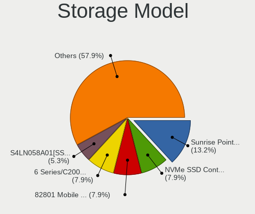
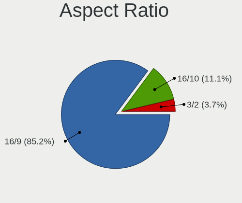
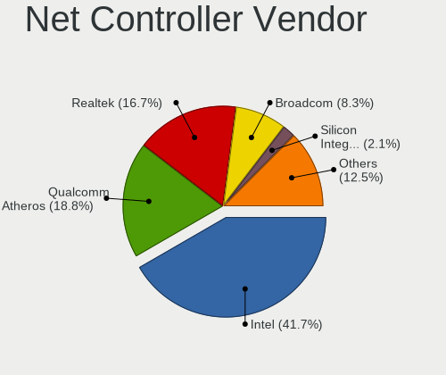
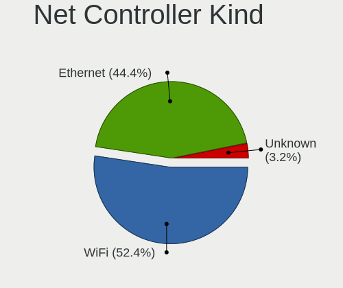
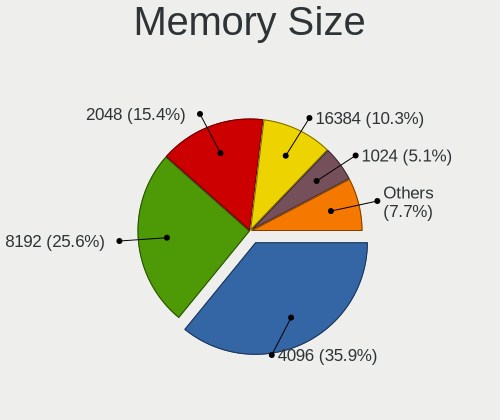
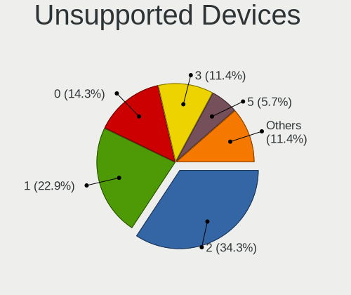
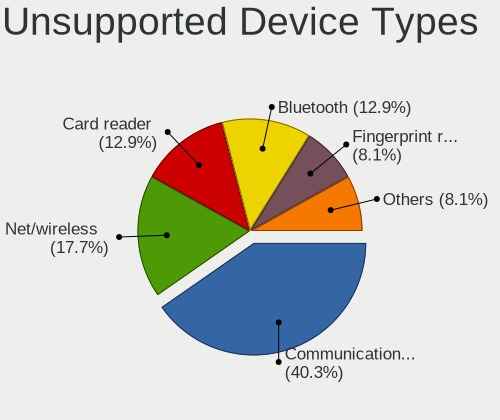

NomadBSD 1.3.2 - Tested Hardware & Statistics (Notebooks)
---------------------------------------------------------

A project to collect tested hardware configurations for NomadBSD 1.3.2.

Anyone can contribute to this report by the [hw-probe](https://github.com/linuxhw/hw-probe/blob/master/INSTALL.BSD.md) tool:

    hw-probe -all -upload

Please contribute! Especially if your hardware is rare.

Contents
--------

* [ Test Cases ](#test-cases)

* [ System ](#system)
  - [ Arch                     ](#arch)
  - [ DE                       ](#de)
  - [ Display Server           ](#display-server)
  - [ Display Manager          ](#display-manager)
  - [ OS Lang                  ](#os-lang)
  - [ Boot Mode                ](#boot-mode)
  - [ Filesystem               ](#filesystem)
  - [ Part. scheme             ](#part-scheme)

* [ Board ](#board)
  - [ Vendor                   ](#vendor)
  - [ Model                    ](#model)
  - [ Model Family             ](#model-family)
  - [ MFG Year                 ](#mfg-year)
  - [ Form Factor              ](#form-factor)
  - [ Coreboot                 ](#coreboot)
  - [ RAM Size                 ](#ram-size)
  - [ RAM Used                 ](#ram-used)
  - [ Total Drives             ](#total-drives)
  - [ Has CD-ROM               ](#has-cd-rom)
  - [ Has Ethernet             ](#has-ethernet)
  - [ Has WiFi                 ](#has-wifi)
  - [ Has Bluetooth            ](#has-bluetooth)

* [ Location ](#location)
  - [ Country                  ](#country)
  - [ City                     ](#city)

* [ Drives ](#drives)
  - [ Drive Vendor             ](#drive-vendor)
  - [ Drive Model              ](#drive-model)
  - [ HDD Vendor               ](#hdd-vendor)
  - [ SSD Vendor               ](#ssd-vendor)
  - [ Drive Kind               ](#drive-kind)
  - [ Drive Connector          ](#drive-connector)
  - [ Drive Size               ](#drive-size)
  - [ Space Total              ](#space-total)
  - [ Space Used               ](#space-used)
  - [ Malfunc. Drives          ](#malfunc-drives)
  - [ Malfunc. Drive Vendor    ](#malfunc-drive-vendor)
  - [ Malfunc. HDD Vendor      ](#malfunc-hdd-vendor)
  - [ Malfunc. Drive Kind      ](#malfunc-drive-kind)
  - [ Failed Drives            ](#failed-drives)
  - [ Failed Drive Vendor      ](#failed-drive-vendor)
  - [ Drive Status             ](#drive-status)

* [ Storage controller ](#storage-controller)
  - [ Storage Vendor           ](#storage-vendor)
  - [ Storage Model            ](#storage-model)
  - [ Storage Kind             ](#storage-kind)

* [ Processor ](#processor)
  - [ CPU Vendor               ](#cpu-vendor)
  - [ CPU Model                ](#cpu-model)
  - [ CPU Model Family         ](#cpu-model-family)
  - [ CPU Cores                ](#cpu-cores)
  - [ CPU Sockets              ](#cpu-sockets)
  - [ CPU Threads              ](#cpu-threads)
  - [ CPU Microarch            ](#cpu-microarch)

* [ Graphics ](#graphics)
  - [ GPU Vendor               ](#gpu-vendor)
  - [ GPU Model                ](#gpu-model)
  - [ GPU Combo                ](#gpu-combo)
  - [ GPU Driver               ](#gpu-driver)
  - [ GPU Memory               ](#gpu-memory)

* [ Monitor ](#monitor)
  - [ Monitor Vendor           ](#monitor-vendor)
  - [ Monitor Model            ](#monitor-model)
  - [ Monitor Resolution       ](#monitor-resolution)
  - [ Monitor Diagonal         ](#monitor-diagonal)
  - [ Monitor Width            ](#monitor-width)
  - [ Aspect Ratio             ](#aspect-ratio)
  - [ Monitor Area             ](#monitor-area)
  - [ Pixel Density            ](#pixel-density)
  - [ Multiple Monitors        ](#multiple-monitors)

* [ Network ](#network)
  - [ Net Controller Vendor    ](#net-controller-vendor)
  - [ Net Controller Model     ](#net-controller-model)
  - [ Wireless Vendor          ](#wireless-vendor)
  - [ Wireless Model           ](#wireless-model)
  - [ Ethernet Vendor          ](#ethernet-vendor)
  - [ Ethernet Model           ](#ethernet-model)
  - [ Net Controller Kind      ](#net-controller-kind)
  - [ Used Controller          ](#used-controller)
  - [ NICs                     ](#nics)
  - [ IPv6                     ](#ipv6)

* [ Bluetooth ](#bluetooth)
  - [ Bluetooth Vendor         ](#bluetooth-vendor)
  - [ Bluetooth Model          ](#bluetooth-model)

* [ Sound ](#sound)
  - [ Sound Vendor             ](#sound-vendor)
  - [ Sound Model              ](#sound-model)

* [ Memory ](#memory)
  - [ Memory Vendor            ](#memory-vendor)
  - [ Memory Model             ](#memory-model)
  - [ Memory Kind              ](#memory-kind)
  - [ Memory Form Factor       ](#memory-form-factor)
  - [ Memory Size              ](#memory-size)
  - [ Memory Speed             ](#memory-speed)

* [ Printers & scanners ](#printers--scanners)
  - [ Printer Vendor           ](#printer-vendor)
  - [ Printer Model            ](#printer-model)
  - [ Scanner Vendor           ](#scanner-vendor)
  - [ Scanner Model            ](#scanner-model)

* [ Camera ](#camera)
  - [ Camera Vendor            ](#camera-vendor)
  - [ Camera Model             ](#camera-model)

* [ Security ](#security)
  - [ Fingerprint Vendor       ](#fingerprint-vendor)
  - [ Fingerprint Model        ](#fingerprint-model)
  - [ Chipcard Vendor          ](#chipcard-vendor)
  - [ Chipcard Model           ](#chipcard-model)

* [ Unsupported ](#unsupported)
  - [ Unsupported Devices      ](#unsupported-devices)
  - [ Unsupported Device Types ](#unsupported-device-types)

Test Cases
----------

Total: 44

| Vendor        | Model                       | Probe                                                     | Date         |
|---------------|-----------------------------|-----------------------------------------------------------|--------------|
| Apple         | MacBookPro8,1               | [d1aaeaad42](https://bsd-hardware.info/?probe=d1aaeaad42) | Apr 26, 2021 |
| Apple         | MacBookPro8,1               | [0621acab4e](https://bsd-hardware.info/?probe=0621acab4e) | Apr 09, 2021 |
| Lenovo        | IdeaPad S145-15API 81UT     | [0dc468c860](https://bsd-hardware.info/?probe=0dc468c860) | Feb 22, 2021 |
| ASUSTek       | X751LN                      | [fe7d72b06a](https://bsd-hardware.info/?probe=fe7d72b06a) | Feb 21, 2021 |
| Dell          | Latitude 3410               | [f81c1e338f](https://bsd-hardware.info/?probe=f81c1e338f) | Feb 07, 2021 |
| Dell          | Latitude 5400               | [f242897c33](https://bsd-hardware.info/?probe=f242897c33) | Jan 13, 2021 |
| Dell          | Latitude 5490               | [3fba47b07f](https://bsd-hardware.info/?probe=3fba47b07f) | Jan 12, 2021 |
| Samsung       | 300E5EV/300E4EV/270E5EV/... | [ba45e27f88](https://bsd-hardware.info/?probe=ba45e27f88) | Jan 12, 2021 |
| ASUSTek       | N75SF                       | [7efb6557a2](https://bsd-hardware.info/?probe=7efb6557a2) | Jan 10, 2021 |
| Lenovo        | IdeaPad S145-15API 81UT     | [9ccf63e228](https://bsd-hardware.info/?probe=9ccf63e228) | Jan 09, 2021 |
| Lenovo        | IdeaPad S145-15API 81UT     | [e18df4623a](https://bsd-hardware.info/?probe=e18df4623a) | Jan 09, 2021 |
| Sony          | VPCM13M1R                   | [30bb4fc23c](https://bsd-hardware.info/?probe=30bb4fc23c) | Jan 06, 2021 |
| NEC Comput... | PC-GL186Y3AZ                | [b9f8e78467](https://bsd-hardware.info/?probe=b9f8e78467) | Jan 05, 2021 |
| Dell          | Latitude 5280               | [1ae6e6ee2d](https://bsd-hardware.info/?probe=1ae6e6ee2d) | Jan 05, 2021 |
| Lenovo        | ThinkPad X201 Tablet 311... | [df9318dcea](https://bsd-hardware.info/?probe=df9318dcea) | Dec 27, 2020 |
| Dell          | Inspiron 5758               | [51ed7b02c2](https://bsd-hardware.info/?probe=51ed7b02c2) | Dec 21, 2020 |
| Acer          | Aspire V5-122               | [ce0c079fd5](https://bsd-hardware.info/?probe=ce0c079fd5) | Dec 14, 2020 |
| Apple         | MacBookPro11,3              | [26f15a2838](https://bsd-hardware.info/?probe=26f15a2838) | Dec 07, 2020 |
| Lenovo        | ThinkPad T490 20RYS06R00    | [21d88f733e](https://bsd-hardware.info/?probe=21d88f733e) | Dec 07, 2020 |
| Lenovo        | ThinkPad T490 20RYS06R00    | [cdfcd11f7b](https://bsd-hardware.info/?probe=cdfcd11f7b) | Dec 07, 2020 |
| IBM           | 2647NG8                     | [a0f38de52f](https://bsd-hardware.info/?probe=a0f38de52f) | Nov 22, 2020 |
| HP            | ProBook 640 G1              | [bf763e72ad](https://bsd-hardware.info/?probe=bf763e72ad) | Nov 13, 2020 |
| Acer          | Aspire E5-432               | [39fb05c049](https://bsd-hardware.info/?probe=39fb05c049) | Nov 01, 2020 |
| Acer          | Aspire V3-575G              | [1ff0e90d9d](https://bsd-hardware.info/?probe=1ff0e90d9d) | Oct 24, 2020 |
| Google        | Chell                       | [4ffe68c199](https://bsd-hardware.info/?probe=4ffe68c199) | Oct 21, 2020 |
| Apple         | MacBookAir7,2               | [36d0d99aa6](https://bsd-hardware.info/?probe=36d0d99aa6) | Oct 04, 2020 |
| Lenovo        | G50-45 80E3                 | [1d227a9cd2](https://bsd-hardware.info/?probe=1d227a9cd2) | Oct 04, 2020 |
| Dell          | Precision 7530              | [717309ee39](https://bsd-hardware.info/?probe=717309ee39) | Sep 28, 2020 |
| Dell          | Precision 7530              | [6a2635237f](https://bsd-hardware.info/?probe=6a2635237f) | Sep 28, 2020 |
| Lenovo        | ThinkPad T530 24295VU       | [f7d13e4696](https://bsd-hardware.info/?probe=f7d13e4696) | Sep 23, 2020 |
| Lenovo        | ThinkPad T530 24295VU       | [45f410f4e4](https://bsd-hardware.info/?probe=45f410f4e4) | Sep 23, 2020 |
| Lenovo        | ThinkPad T430 2347C32       | [339c63a941](https://bsd-hardware.info/?probe=339c63a941) | Sep 22, 2020 |
| Apple         | MacBookPro8,1               | [89bb299f1e](https://bsd-hardware.info/?probe=89bb299f1e) | Sep 22, 2020 |
| Dell          | Inspiron 15-3567            | [4d1897ed1f](https://bsd-hardware.info/?probe=4d1897ed1f) | Aug 29, 2020 |
| Lenovo        | ThinkPad T460 20FMS78014    | [d78837860f](https://bsd-hardware.info/?probe=d78837860f) | Aug 23, 2020 |
| Dell          | Inspiron 5567               | [5ef34cd40f](https://bsd-hardware.info/?probe=5ef34cd40f) | Aug 20, 2020 |
| Acer          | Aspire 5735                 | [6ca9384f34](https://bsd-hardware.info/?probe=6ca9384f34) | Aug 20, 2020 |
| ASUSTek       | X71SL                       | [a2ee0c9edb](https://bsd-hardware.info/?probe=a2ee0c9edb) | Aug 15, 2020 |
| HP            | ProBook 640 G1              | [4b7eaf5a6a](https://bsd-hardware.info/?probe=4b7eaf5a6a) | Aug 12, 2020 |
| Dell          | Latitude 5480               | [907e0da9a4](https://bsd-hardware.info/?probe=907e0da9a4) | Aug 08, 2020 |
| HP            | EliteBook 820 G1            | [12ac8fc96f](https://bsd-hardware.info/?probe=12ac8fc96f) | Aug 07, 2020 |
| Google        | Lulu                        | [64aef60e6b](https://bsd-hardware.info/?probe=64aef60e6b) | Aug 02, 2020 |
| Lenovo        | ThinkPad T490s 20NX000DR... | [0919d8936f](https://bsd-hardware.info/?probe=0919d8936f) | Jul 27, 2020 |
| Lenovo        | G570 20079                  | [15e87049a7](https://bsd-hardware.info/?probe=15e87049a7) | Jul 27, 2020 |

System
------

Arch
----

OS architecture (x86_64, i586, etc.)

| Name  | Notebooks | Percent |
|-------|-----------|---------|
| amd64 | 30        | 88.24%  |
| i386  | 4         | 11.76%  |

DE
--

Desktop Environment

| Name    | Notebooks | Percent |
|---------|-----------|---------|
| Openbox | 32        | 94.12%  |
| KDE5    | 1         | 2.94%   |
| GNOME   | 1         | 2.94%   |

Display Server
--------------

X11 or Wayland

| Name | Notebooks | Percent |
|------|-----------|---------|
| X11  | 34        | 100%    |

Display Manager
---------------

SDDM, LightDM, etc.

| Name | Notebooks | Percent |
|------|-----------|---------|
| SLiM | 34        | 100%    |

OS Lang
-------

Language

| Lang    | Notebooks | Percent |
|---------|-----------|---------|
| en_US   | 12        | 34.29%  |
| Unknown | 10        | 28.57%  |
| ru_RU   | 3         | 8.57%   |
| en_GB   | 3         | 8.57%   |
| it_IT   | 2         | 5.71%   |
| hu_HU   | 2         | 5.71%   |
| es_ES   | 1         | 2.86%   |
| de_DE   | 1         | 2.86%   |
| cs_CZ   | 1         | 2.86%   |

Boot Mode
---------

EFI or BIOS

| Mode | Notebooks | Percent |
|------|-----------|---------|
| EFI  | 30        | 88.24%  |
| BIOS | 4         | 11.76%  |

Filesystem
----------

Type of filesystem

| Type | Notebooks | Percent |
|------|-----------|---------|
| Ufs  | 32        | 94.12%  |
| Zfs  | 2         | 5.88%   |

Part. scheme
------------

Scheme of partitioning

| Type | Notebooks | Percent |
|------|-----------|---------|
| GPT  | 21        | 61.76%  |
| MBR  | 13        | 38.24%  |

Board
-----

Vendor
------

Motherboard manufacturer

| Name                | Notebooks | Percent |
|---------------------|-----------|---------|
| Lenovo              | 9         | 26.47%  |
| Dell                | 7         | 20.59%  |
| Acer                | 4         | 11.76%  |
| ASUSTek Computer    | 3         | 8.82%   |
| Apple               | 3         | 8.82%   |
| Hewlett-Packard     | 2         | 5.88%   |
| Google              | 2         | 5.88%   |
| Sony                | 1         | 2.94%   |
| Samsung Electronics | 1         | 2.94%   |
| NEC Computers       | 1         | 2.94%   |
| IBM                 | 1         | 2.94%   |

Model
-----

Motherboard model

| Name                                    | Notebooks | Percent |
|-----------------------------------------|-----------|---------|
| Sony VPCM13M1R                          | 1         | 2.94%   |
| Samsung 300E5EV/300E4EV/270E5EV/270E4EV | 1         | 2.94%   |
| NEC Computers PC-GL186Y3AZ              | 1         | 2.94%   |
| Lenovo ThinkPad X201 Tablet 311396U     | 1         | 2.94%   |
| Lenovo ThinkPad T530 24295VU            | 1         | 2.94%   |
| Lenovo ThinkPad T490s 20NX000DRT        | 1         | 2.94%   |
| Lenovo ThinkPad T490 20RYS06R00         | 1         | 2.94%   |
| Lenovo ThinkPad T460 20FMS78014         | 1         | 2.94%   |
| Lenovo ThinkPad T430 2347C32            | 1         | 2.94%   |
| Lenovo IdeaPad S145-15API 81UT          | 1         | 2.94%   |
| Lenovo G570 20079                       | 1         | 2.94%   |
| Lenovo G50-45 80E3                      | 1         | 2.94%   |
| IBM 2647NG8                             | 1         | 2.94%   |
| HP ProBook 640 G1                       | 1         | 2.94%   |
| HP EliteBook 820 G1                     | 1         | 2.94%   |
| Google Lulu                             | 1         | 2.94%   |
| Google Chell                            | 1         | 2.94%   |
| Dell Precision 7530                     | 1         | 2.94%   |
| Dell Latitude 5490                      | 1         | 2.94%   |
| Dell Latitude 5480                      | 1         | 2.94%   |
| Dell Latitude 5400                      | 1         | 2.94%   |
| Dell Latitude 3410                      | 1         | 2.94%   |
| Dell Inspiron 5567                      | 1         | 2.94%   |
| Dell Inspiron 15-3567                   | 1         | 2.94%   |
| ASUS X751LN                             | 1         | 2.94%   |
| ASUS X71SL                              | 1         | 2.94%   |
| ASUS N75SF                              | 1         | 2.94%   |
| Apple MacBookPro8,1                     | 1         | 2.94%   |
| Apple MacBookPro11,3                    | 1         | 2.94%   |
| Apple MacBookAir7,2                     | 1         | 2.94%   |
| Acer Aspire V5-122                      | 1         | 2.94%   |
| Acer Aspire V3-575G                     | 1         | 2.94%   |
| Acer Aspire E5-432                      | 1         | 2.94%   |
| Acer Aspire 5735                        | 1         | 2.94%   |

Model Family
------------

Motherboard model prefix

| Name                       | Notebooks | Percent |
|----------------------------|-----------|---------|
| Lenovo ThinkPad            | 6         | 17.65%  |
| Dell Latitude              | 4         | 11.76%  |
| Acer Aspire                | 4         | 11.76%  |
| Dell Inspiron              | 2         | 5.88%   |
| Sony VPCM13M1R             | 1         | 2.94%   |
| Samsung 300E5EV            | 1         | 2.94%   |
| NEC Computers PC-GL186Y3AZ | 1         | 2.94%   |
| Lenovo IdeaPad             | 1         | 2.94%   |
| Lenovo G570                | 1         | 2.94%   |
| Lenovo G50-45              | 1         | 2.94%   |
| IBM 2647NG8                | 1         | 2.94%   |
| HP ProBook                 | 1         | 2.94%   |
| HP EliteBook               | 1         | 2.94%   |
| Google Lulu                | 1         | 2.94%   |
| Google Chell               | 1         | 2.94%   |
| Dell Precision             | 1         | 2.94%   |
| ASUS X751LN                | 1         | 2.94%   |
| ASUS X71SL                 | 1         | 2.94%   |
| ASUS N75SF                 | 1         | 2.94%   |
| Apple MacBookPro8          | 1         | 2.94%   |
| Apple MacBookPro11         | 1         | 2.94%   |
| Apple MacBookAir7          | 1         | 2.94%   |

MFG Year
--------

Motherboard manufacture year

| Year | Notebooks | Percent |
|------|-----------|---------|
| 2020 | 8         | 23.53%  |
| 2014 | 4         | 11.76%  |
| 2013 | 4         | 11.76%  |
| 2019 | 3         | 8.82%   |
| 2018 | 3         | 8.82%   |
| 2016 | 2         | 5.88%   |
| 2015 | 2         | 5.88%   |
| 2011 | 2         | 5.88%   |
| 2010 | 2         | 5.88%   |
| 2008 | 2         | 5.88%   |
| 2017 | 1         | 2.94%   |
| 2004 | 1         | 2.94%   |

Form Factor
-----------

Physical design of the computer

| Name     | Notebooks | Percent |
|----------|-----------|---------|
| Notebook | 34        | 100%    |

Coreboot
--------

Have coreboot on board

| Used | Notebooks | Percent |
|------|-----------|---------|
| No   | 32        | 94.12%  |
| Yes  | 2         | 5.88%   |

RAM Size
--------

Total RAM memory

| Size in GB  | Notebooks | Percent |
|-------------|-----------|---------|
| 8.01-16.0   | 12        | 35.29%  |
| 4.01-8.0    | 10        | 29.41%  |
| 16.01-24.0  | 7         | 20.59%  |
| 0.51-1.0    | 2         | 5.88%   |
| 32.01-64.0  | 1         | 2.94%   |
| 3.01-4.0    | 1         | 2.94%   |
| 64.01-256.0 | 1         | 2.94%   |

RAM Used
--------

Used RAM memory

| Used GB   | Notebooks | Percent |
|-----------|-----------|---------|
| 0.01-0.5  | 19        | 55.88%  |
| 0.51-1.0  | 10        | 29.41%  |
| 2.01-3.0  | 2         | 5.88%   |
| 4.01-8.0  | 1         | 2.94%   |
| 1.01-2.0  | 1         | 2.94%   |
| 8.01-16.0 | 1         | 2.94%   |

Total Drives
------------

Number of drives on board

| Drives | Notebooks | Percent |
|--------|-----------|---------|
| 1      | 24        | 70.59%  |
| 2      | 5         | 14.71%  |
| 0      | 4         | 11.76%  |
| 3      | 1         | 2.94%   |

Has CD-ROM
----------

Has CD-ROM on board

| Presented | Notebooks | Percent |
|-----------|-----------|---------|
| No        | 23        | 65.71%  |
| Yes       | 12        | 34.29%  |

Has Ethernet
------------

Has Ethernet on board

| Presented | Notebooks | Percent |
|-----------|-----------|---------|
| Yes       | 29        | 85.29%  |
| No        | 5         | 14.71%  |

Has WiFi
--------

Has WiFi module

| Presented | Notebooks | Percent |
|-----------|-----------|---------|
| Yes       | 34        | 100%    |

Has Bluetooth
-------------

Has Bluetooth module

| Presented | Notebooks | Percent |
|-----------|-----------|---------|
| Yes       | 28        | 82.35%  |
| No        | 6         | 17.65%  |

Location
--------

Country
-------

Geographic location (country)

| Country     | Notebooks | Percent |
|-------------|-----------|---------|
| Russia      | 7         | 20.59%  |
| USA         | 6         | 17.65%  |
| France      | 6         | 17.65%  |
| UK          | 3         | 8.82%   |
| Italy       | 2         | 5.88%   |
| Hungary     | 2         | 5.88%   |
| Colombia    | 2         | 5.88%   |
| Philippines | 1         | 2.94%   |
| Norway      | 1         | 2.94%   |
| Hong Kong   | 1         | 2.94%   |
| Germany     | 1         | 2.94%   |
| Czechia     | 1         | 2.94%   |
| Argentina   | 1         | 2.94%   |

City
----

Geographic location (city)

| City             | Notebooks | Percent |
|------------------|-----------|---------|
| Moscow           | 5         | 14.29%  |
| Franconville     | 4         | 11.43%  |
| Rome             | 2         | 5.71%   |
| New Braunfels    | 2         | 5.71%   |
| Los Angeles      | 2         | 5.71%   |
| Hodmezovasarhely | 2         | 5.71%   |
| Woodland         | 1         | 2.86%   |
| Wissen           | 1         | 2.86%   |
| Vladimir         | 1         | 2.86%   |
| Swindon          | 1         | 2.86%   |
| St Petersburg    | 1         | 2.86%   |
| Southampton      | 1         | 2.86%   |
| Saint-Denis      | 1         | 2.86%   |
| Rionegro         | 1         | 2.86%   |
| Pasig            | 1         | 2.86%   |
| Paris            | 1         | 2.86%   |
| Oslo             | 1         | 2.86%   |
| Nueve de Julio   | 1         | 2.86%   |
| Malton           | 1         | 2.86%   |
| London           | 1         | 2.86%   |
| Kowloon          | 1         | 2.86%   |
| Hranice          | 1         | 2.86%   |
| BogotГЎ        | 1         | 2.86%   |
| Atlanta          | 1         | 2.86%   |

Drives
------

Drive Vendor
------------

Hard drive vendors

| Vendor              | Notebooks | Drives | Percent |
|---------------------|-----------|--------|---------|
| Toshiba             | 5         | 5      | 14.71%  |
| Samsung Electronics | 5         | 7      | 14.71%  |
| Seagate             | 4         | 5      | 11.76%  |
| WDC                 | 3         | 3      | 8.82%   |
| Apple               | 3         | 4      | 8.82%   |
| SanDisk             | 2         | 2      | 5.88%   |
| OCZ                 | 2         | 2      | 5.88%   |
| Hitachi             | 2         | 2      | 5.88%   |
| SK hynix            | 1         | 1      | 2.94%   |
| Micron Technology   | 1         | 1      | 2.94%   |
| Kingston            | 1         | 1      | 2.94%   |
| KingDian            | 1         | 1      | 2.94%   |
| Intel               | 1         | 1      | 2.94%   |
| Gigabyte Technology | 1         | 1      | 2.94%   |
| Fujitsu             | 1         | 1      | 2.94%   |
| Crucial             | 1         | 1      | 2.94%   |

Drive Model
-----------

Hard drive models

| Model                                     | Notebooks | Percent |
|-------------------------------------------|-----------|---------|
| Toshiba MQ01ABD100 1TB                    | 2         | 5.71%   |
| SanDisk pSSD 256GB                        | 2         | 5.71%   |
| WDC WD2500LPCX-24C6HT0 250GB              | 1         | 2.86%   |
| WDC WD10SPZX-00Z10T0 1TB                  | 1         | 2.86%   |
| WDC WD10JPVX-22JC3T0 1TB                  | 1         | 2.86%   |
| Toshiba MQ01ABF050 500GB                  | 1         | 2.86%   |
| Toshiba MK7575GSX 752GB                   | 1         | 2.86%   |
| Toshiba KSG60ZMV256G M.2 2280 256GB       | 1         | 2.86%   |
| SK hynix SKHynix_HFS512GD9TNG-L5B0B 512GB | 1         | 2.86%   |
| Seagate ST9750423AS 752GB                 | 1         | 2.86%   |
| Seagate ST500LM021-1KJ152 500GB           | 1         | 2.86%   |
| Seagate ST2000LM015-2E8174 2TB            | 1         | 2.86%   |
| Seagate ST1000LM024 HN-M101MBB 1TB        | 1         | 2.86%   |
| Samsung SSD 970 PRO 1TB                   | 1         | 2.86%   |
| Samsung SSD 970 EVO Plus 500GB            | 1         | 2.86%   |
| Samsung SSD 840 EVO 250GB                 | 1         | 2.86%   |
| Samsung PM981 NVMe 256GB                  | 1         | 2.86%   |
| Samsung MZVLB256HBHQ-000L7 256GB          | 1         | 2.86%   |
| Samsung MZMTD256HAGM-000L1 256GB          | 1         | 2.86%   |
| OCZ TRION150 240GB                        | 1         | 2.86%   |
| OCZ AGILITY3 120GB                        | 1         | 2.86%   |
| Micron MTFDDAK256MAM-1K12 256GB           | 1         | 2.86%   |
| Kingston SA400S37240G 240GB               | 1         | 2.86%   |
| KingDian S280 120GB                       | 1         | 2.86%   |
| Intel SSDSC2BF180A5H REF 180GB            | 1         | 2.86%   |
| Hitachi HTS545032B9A302 320GB             | 1         | 2.86%   |
| Hitachi HTS543232L9A300 320GB             | 1         | 2.86%   |
| Gigabyte GP-GSTFS31120GNTD 120GB          | 1         | 2.86%   |
| Fujitsu MHT2080AH 80GB                    | 1         | 2.86%   |
| Crucial CT500MX500SSD1 500GB              | 1         | 2.86%   |
| Apple SSD SM0512G 500GB                   | 1         | 2.86%   |
| Apple SSD SM0512F 500GB                   | 1         | 2.86%   |
| Apple SSD SM0128G 121GB                   | 1         | 2.86%   |

HDD Vendor
----------

Hard disk drive vendors

| Vendor  | Notebooks | Drives | Percent |
|---------|-----------|--------|---------|
| Toshiba | 4         | 4      | 28.57%  |
| Seagate | 4         | 5      | 28.57%  |
| WDC     | 3         | 3      | 21.43%  |
| Hitachi | 2         | 2      | 14.29%  |
| Fujitsu | 1         | 1      | 7.14%   |

SSD Vendor
----------

Solid state drive vendors

| Vendor              | Notebooks | Drives | Percent |
|---------------------|-----------|--------|---------|
| Apple               | 3         | 4      | 18.75%  |
| SanDisk             | 2         | 2      | 12.5%   |
| Samsung Electronics | 2         | 2      | 12.5%   |
| OCZ                 | 2         | 2      | 12.5%   |
| Toshiba             | 1         | 1      | 6.25%   |
| Micron Technology   | 1         | 1      | 6.25%   |
| Kingston            | 1         | 1      | 6.25%   |
| KingDian            | 1         | 1      | 6.25%   |
| Intel               | 1         | 1      | 6.25%   |
| Gigabyte Technology | 1         | 1      | 6.25%   |
| Crucial             | 1         | 1      | 6.25%   |

Drive Kind
----------

HDD or SSD

| Kind | Notebooks | Drives | Percent |
|------|-----------|--------|---------|
| SSD  | 15        | 17     | 45.45%  |
| HDD  | 14        | 15     | 42.42%  |
| NVMe | 4         | 6      | 12.12%  |

Drive Connector
---------------

SATA, SAS, NVMe, etc.

| Type | Notebooks | Drives | Percent |
|------|-----------|--------|---------|
| SATA | 27        | 32     | 87.1%   |
| NVMe | 4         | 6      | 12.9%   |

Drive Size
----------

Size of hard drive

| Size in TB | Notebooks | Drives | Percent |
|------------|-----------|--------|---------|
| 0.01-0.5   | 20        | 23     | 71.43%  |
| 0.51-1.0   | 7         | 8      | 25%     |
| 1.01-2.0   | 1         | 1      | 3.57%   |

Space Total
-----------

Amount of disk space available on the file system

| Size in GB | Notebooks | Percent |
|------------|-----------|---------|
| 1-20       | 29        | 85.29%  |
| 101-250    | 3         | 8.82%   |
| 501-1000   | 1         | 2.94%   |
| 51-100     | 1         | 2.94%   |

Space Used
----------

Amount of used disk space

| Used GB | Notebooks | Percent |
|---------|-----------|---------|
| 1-20    | 34        | 97.14%  |
| 21-50   | 1         | 2.86%   |

Malfunc. Drives
---------------

Drive models with a malfunction

| Model                                      | Notebooks | Drives | Percent |
|--------------------------------------------|-----------|--------|---------|
| Toshiba MQ01ABF050 500GB                   | 1         | 1      | 16.67%  |
| Toshiba MQ01ABD100 1TB                     | 1         | 1      | 16.67%  |
| Toshiba MK7575GSX 752GB                    | 1         | 1      | 16.67%  |
| Seagate ST500LM021-1KJ152 500GB            | 1         | 1      | 16.67%  |
| Micron Technology MTFDDAK256MAM-1K12 256GB | 1         | 1      | 16.67%  |
| Hitachi HTS545032B9A302 320GB              | 1         | 1      | 16.67%  |

Malfunc. Drive Vendor
---------------------

Vendors of faulty drives

| Vendor            | Notebooks | Drives | Percent |
|-------------------|-----------|--------|---------|
| Toshiba           | 3         | 3      | 50%     |
| Seagate           | 1         | 1      | 16.67%  |
| Micron Technology | 1         | 1      | 16.67%  |
| Hitachi           | 1         | 1      | 16.67%  |

Malfunc. HDD Vendor
-------------------

Vendors of faulty HDD drives

| Vendor  | Notebooks | Drives | Percent |
|---------|-----------|--------|---------|
| Toshiba | 3         | 3      | 60%     |
| Seagate | 1         | 1      | 20%     |
| Hitachi | 1         | 1      | 20%     |

Malfunc. Drive Kind
-------------------

Kinds of faulty drives

| Kind | Notebooks | Drives | Percent |
|------|-----------|--------|---------|
| HDD  | 5         | 5      | 83.33%  |
| SSD  | 1         | 1      | 16.67%  |

Failed Drives
-------------

Failed drive models

Zero info for selected period =(

Failed Drive Vendor
-------------------

Failed drive vendors

Zero info for selected period =(

Drive Status
------------

Number of failed and malfunc. drives

| Status  | Notebooks | Drives | Percent |
|---------|-----------|--------|---------|
| Works   | 26        | 32     | 81.25%  |
| Malfunc | 6         | 6      | 18.75%  |

Storage controller
------------------

Storage Vendor
--------------

Storage controller vendors

| Vendor                           | Notebooks | Percent |
|----------------------------------|-----------|---------|
| Intel                            | 25        | 71.43%  |
| Samsung Electronics              | 6         | 17.14%  |
| AMD                              | 2         | 5.71%   |
| SK hynix                         | 1         | 2.86%   |
| Silicon Integrated Systems [SiS] | 1         | 2.86%   |

Storage Model
-------------

Storage controller models

| Model                                                                            | Notebooks | Percent |
|----------------------------------------------------------------------------------|-----------|---------|
| Intel Sunrise Point-LP SATA Controller [AHCI mode]                               | 5         | 13.16%  |
| Samsung NVMe SSD Controller SM981/PM981/PM983                                    | 3         | 7.89%   |
| Intel 82801 Mobile SATA Controller [RAID mode]                                   | 3         | 7.89%   |
| Intel 6 Series/C200 Series Chipset Family 6 port Mobile SATA AHCI Controller     | 3         | 7.89%   |
| Samsung S4LN058A01[SSUBX] AHCI SSD Controller (Apple slot)                       | 2         | 5.26%   |
| Intel 8 Series SATA Controller 1 [AHCI mode]                                     | 2         | 5.26%   |
| Intel 7 Series Chipset Family 6-port SATA Controller [AHCI mode]                 | 2         | 5.26%   |
| AMD FCH SATA Controller [AHCI mode]                                              | 2         | 5.26%   |
| SK hynix PC601 NVMe Solid State Drive                                            | 1         | 2.63%   |
| Silicon Integrated Systems [SiS] SATA Controller / IDE mode                      | 1         | 2.63%   |
| Silicon Integrated Systems [SiS] 5513 IDE Controller                             | 1         | 2.63%   |
| Samsung S4LN053X01 AHCI SSD Controller(Apple slot)                               | 1         | 2.63%   |
| Intel Wildcat Point-LP SATA Controller [AHCI Mode]                               | 1         | 2.63%   |
| Intel NM10/ICH7 Family SATA Controller [IDE mode]                                | 1         | 2.63%   |
| Intel Comet Lake RAID Controller                                                 | 1         | 2.63%   |
| Intel Cannon Lake Mobile PCH SATA AHCI Controller                                | 1         | 2.63%   |
| Intel Atom/Celeron/Pentium Processor x5-E8000/J3xxx/N3xxx Series SATA Controller | 1         | 2.63%   |
| Intel 82801IBM/IEM (ICH9M/ICH9M-E) 2 port SATA Controller [IDE mode]             | 1         | 2.63%   |
| Intel 82801CAM IDE U100 Controller                                               | 1         | 2.63%   |
| Intel 8 Series/C220 Series Chipset Family 2-port SATA Controller 2 [IDE mode]    | 1         | 2.63%   |
| Intel 8 Series Chipset Family 4-port SATA Controller 1 [IDE mode] - Mobile       | 1         | 2.63%   |
| Intel 7 Series Chipset Family 4-port SATA Controller [IDE mode]                  | 1         | 2.63%   |
| Intel 7 Series Chipset Family 2-port SATA Controller [IDE mode]                  | 1         | 2.63%   |
| Intel 5 Series/3400 Series Chipset 6 port SATA AHCI Controller                   | 1         | 2.63%   |

Storage Kind
------------

Kind of storage controller (IDE, SATA, NVMe, SAS, ...)

| Kind | Notebooks | Percent |
|------|-----------|---------|
| SATA | 20        | 58.82%  |
| IDE  | 6         | 17.65%  |
| RAID | 4         | 11.76%  |
| NVMe | 4         | 11.76%  |

Processor
---------

CPU Vendor
----------

Processor vendors

| Vendor | Notebooks | Percent |
|--------|-----------|---------|
| Intel  | 32        | 94.12%  |
| AMD    | 2         | 5.88%   |

CPU Model
---------

Processor models

| Model                                       | Notebooks | Percent |
|---------------------------------------------|-----------|---------|
| Intel Core i5-6300U CPU @ 2.40GHz           | 2         | 5.88%   |
| Intel Core i5-3320M CPU @ 2.60GHz           | 2         | 5.88%   |
| Intel Pentium III                           | 1         | 2.94%   |
| Intel Pentium CPU N3700 @ 1.60GHz           | 1         | 2.94%   |
| Intel Pentium CPU 2117U @ 1.80GHz           | 1         | 2.94%   |
| Intel CPU Version                           | 1         | 2.94%   |
| Intel Core m5-6Y57 CPU @ 1.10GHz            | 1         | 2.94%   |
| Intel Core i9-8950HK CPU @ 2.90GHz          | 1         | 2.94%   |
| Intel Core i7-8665U CPU @ 1.90GHz           | 1         | 2.94%   |
| Intel Core i7-8565U CPU @ 1.80GHz           | 1         | 2.94%   |
| Intel Core i7-4850HQ CPU @ 2.30GHz          | 1         | 2.94%   |
| Intel Core i7-4770HQ CPU @ 2.20GHz          | 1         | 2.94%   |
| Intel Core i7-4600U CPU @ 2.10GHz           | 1         | 2.94%   |
| Intel Core i7-4510U CPU @ 2.00GHz           | 1         | 2.94%   |
| Intel Core i7-4500U CPU                     | 1         | 2.94%   |
| Intel Core i7-2630QM CPU @ 2.00GHz          | 1         | 2.94%   |
| Intel Core i7-10510U CPU @ 1.80GHz          | 1         | 2.94%   |
| Intel Core i7 CPU L 640 @ 2.13GHz           | 1         | 2.94%   |
| Intel Core i5-8250U CPU @ 1.60GHz           | 1         | 2.94%   |
| Intel Core i5-7200U CPU @ 2.50GHz           | 1         | 2.94%   |
| Intel Core i5-6200U CPU @ 2.30GHz           | 1         | 2.94%   |
| Intel Core i5-5350U CPU @ 1.80GHz           | 1         | 2.94%   |
| Intel Core i5-4310M CPU @ 2.70GHz           | 1         | 2.94%   |
| Intel Core i5-2430M CPU @ 2.40GHz           | 1         | 2.94%   |
| Intel Core i5-10310U CPU @ 1.70GHz          | 1         | 2.94%   |
| Intel Core i5-10210U CPU @ 1.60GHz          | 1         | 2.94%   |
| Intel Core i3-6006U CPU @ 2.00GHz           | 1         | 2.94%   |
| Intel Core 2 Duo CPU P8600 @ 2.40GHz        | 1         | 2.94%   |
| Intel Celeron CPU 3215U @ 1.70GHz           | 1         | 2.94%   |
| Intel Atom CPU N470 @ 1.83GHz               | 1         | 2.94%   |
| AMD E1-6010 APU with AMD Radeon R2 Graphics | 1         | 2.94%   |
| AMD A6-1450 APU with Radeon HD Graphics     | 1         | 2.94%   |

CPU Model Family
----------------

Processor model prefix

| Model             | Notebooks | Percent |
|-------------------|-----------|---------|
| Intel Core i5     | 12        | 35.29%  |
| Intel Core i7     | 10        | 29.41%  |
| Intel Pentium     | 2         | 5.88%   |
| Other             | 1         | 2.94%   |
| Intel Pentium III | 1         | 2.94%   |
| Intel Core m5     | 1         | 2.94%   |
| Intel Core i9     | 1         | 2.94%   |
| Intel Core i3     | 1         | 2.94%   |
| Intel Core 2 Duo  | 1         | 2.94%   |
| Intel Celeron     | 1         | 2.94%   |
| Intel Atom        | 1         | 2.94%   |
| AMD E1            | 1         | 2.94%   |
| AMD A6            | 1         | 2.94%   |

CPU Cores
---------

Number of processor cores

| Number  | Notebooks | Percent |
|---------|-----------|---------|
| 2       | 19        | 55.88%  |
| 4       | 11        | 32.35%  |
| Unknown | 2         | 5.88%   |
| 6       | 1         | 2.94%   |
| 1       | 1         | 2.94%   |

CPU Sockets
-----------

Number of sockets

| Number | Notebooks | Percent |
|--------|-----------|---------|
| 1      | 34        | 100%    |

CPU Threads
-----------

Threads per core (Hyper-Threading)

| Number  | Notebooks | Percent |
|---------|-----------|---------|
| 2       | 25        | 73.53%  |
| 1       | 6         | 17.65%  |
| Unknown | 3         | 8.82%   |

CPU Microarch
-------------

Microarchitecture

| Name        | Notebooks | Percent |
|-------------|-----------|---------|
| KabyLake    | 8         | 23.53%  |
| Haswell     | 6         | 17.65%  |
| Skylake     | 5         | 14.71%  |
| IvyBridge   | 3         | 8.82%   |
| SandyBridge | 2         | 5.88%   |
| Broadwell   | 2         | 5.88%   |
| Westmere    | 1         | 2.94%   |
| Silvermont  | 1         | 2.94%   |
| Puma        | 1         | 2.94%   |
| Penryn      | 1         | 2.94%   |
| P6          | 1         | 2.94%   |
| Jaguar      | 1         | 2.94%   |
| Core        | 1         | 2.94%   |
| Bonnell     | 1         | 2.94%   |

Graphics
--------

GPU Vendor
----------

Vendors of graphics cards

| Vendor      | Notebooks | Percent |
|-------------|-----------|---------|
| Intel       | 27        | 72.97%  |
| Nvidia      | 5         | 13.51%  |
| AMD         | 4         | 10.81%  |
| S3 Graphics | 1         | 2.7%    |

GPU Model
---------

Graphics card models

| Model                                                                                    | Notebooks | Percent |
|------------------------------------------------------------------------------------------|-----------|---------|
| Intel Skylake GT2 [HD Graphics 520]                                                      | 4         | 10.53%  |
| Intel Haswell-ULT Integrated Graphics Controller                                         | 3         | 7.89%   |
| Intel 3rd Gen Core processor Graphics Controller                                         | 3         | 7.89%   |
| Intel 2nd Generation Core Processor Family Integrated Graphics Controller                | 3         | 7.89%   |
| Intel WhiskeyLake-U GT2 [UHD Graphics 620]                                               | 2         | 5.26%   |
| Intel CometLake-U GT2 [UHD Graphics]                                                     | 2         | 5.26%   |
| S3 Graphics SuperSavage IX/C SDR                                                         | 1         | 2.63%   |
| Nvidia GM108M [GeForce 940M]                                                             | 1         | 2.63%   |
| Nvidia GM108M [GeForce 840M]                                                             | 1         | 2.63%   |
| Nvidia GK107M [GeForce GT 750M Mac Edition]                                              | 1         | 2.63%   |
| Nvidia GF116M [GeForce GT 555M/635M]                                                     | 1         | 2.63%   |
| Nvidia G98M [GeForce 9300M GS]                                                           | 1         | 2.63%   |
| Intel UHD Graphics 620                                                                   | 1         | 2.63%   |
| Intel Mobile 4 Series Chipset Integrated Graphics Controller                             | 1         | 2.63%   |
| Intel HD Graphics 620                                                                    | 1         | 2.63%   |
| Intel HD Graphics 6000                                                                   | 1         | 2.63%   |
| Intel HD Graphics 515                                                                    | 1         | 2.63%   |
| Intel HD Graphics                                                                        | 1         | 2.63%   |
| Intel Crystal Well Integrated Graphics Controller                                        | 1         | 2.63%   |
| Intel Core Processor Integrated Graphics Controller                                      | 1         | 2.63%   |
| Intel Atom/Celeron/Pentium Processor x5-E8000/J3xxx/N3xxx Integrated Graphics Controller | 1         | 2.63%   |
| Intel Atom Processor D4xx/D5xx/N4xx/N5xx Integrated Graphics Controller                  | 1         | 2.63%   |
| Intel 4th Gen Core Processor Integrated Graphics Controller                              | 1         | 2.63%   |
| AMD Topaz XT [Radeon R7 M260/M265 / M340/M360 / M440/M445 / 530/535 / 620/625 Mobile]    | 1         | 2.63%   |
| AMD Temash [Radeon HD 8250/8280G]                                                        | 1         | 2.63%   |
| AMD Mullins [Radeon R2 Graphics]                                                         | 1         | 2.63%   |
| AMD Baffin [Radeon Pro WX 4130/4150]                                                     | 1         | 2.63%   |

GPU Combo
---------

Combinations of graphics cards

| Name            | Notebooks | Percent |
|-----------------|-----------|---------|
| 1 x Intel       | 22        | 64.71%  |
| Intel + Nvidia  | 3         | 8.82%   |
| 1 x AMD         | 3         | 8.82%   |
| 2 x Intel       | 2         | 5.88%   |
| 1 x Nvidia      | 2         | 5.88%   |
| 1 x S3 Graphics | 1         | 2.94%   |
| Intel + AMD     | 1         | 2.94%   |

GPU Driver
----------

Free vs proprietary

| Driver      | Notebooks | Percent |
|-------------|-----------|---------|
| Free        | 24        | 70.59%  |
| Unknown     | 9         | 26.47%  |
| Proprietary | 1         | 2.94%   |

GPU Memory
----------

Total video memory

| Size in GB | Notebooks | Percent |
|------------|-----------|---------|
| Unknown    | 31        | 91.18%  |
| 1.01-2.0   | 2         | 5.88%   |
| 0.01-0.5   | 1         | 2.94%   |

Monitor
-------

Monitor Vendor
--------------

Monitor vendors

| Vendor                  | Notebooks | Percent |
|-------------------------|-----------|---------|
| BOE                     | 6         | 22.22%  |
| Chimei Innolux          | 4         | 14.81%  |
| Samsung Electronics     | 3         | 11.11%  |
| LG Display              | 3         | 11.11%  |
| Chi Mei Optoelectronics | 3         | 11.11%  |
| Lenovo                  | 2         | 7.41%   |
| Apple                   | 2         | 7.41%   |
| Sharp                   | 1         | 3.7%    |
| LG Philips              | 1         | 3.7%    |
| HannStar                | 1         | 3.7%    |
| AU Optronics            | 1         | 3.7%    |

Monitor Model
-------------

Monitor models

| Model                                                                     | Notebooks | Percent |
|---------------------------------------------------------------------------|-----------|---------|
| BOE LCD Monitor BOE0671 1366x768 340x190mm 15.3-inch                      | 2         | 7.14%   |
| Sharp LCD Monitor SHP140E 2560x1440 290x170mm 13.2-inch                   | 1         | 3.57%   |
| Samsung Electronics LCD Monitor SDC834D 1920x1080 290x160mm 13.0-inch     | 1         | 3.57%   |
| Samsung Electronics LCD Monitor SDC4D42 1366x768 310x170mm 13.9-inch      | 1         | 3.57%   |
| Samsung Electronics LCD Monitor SDC415A 3200x1800 290x160mm 13.0-inch     | 1         | 3.57%   |
| LG Philips LCD Monitor LPLA101 1440x900 370x230mm 17.2-inch               | 1         | 3.57%   |
| LG Display LCD Monitor LGD6301 1366x768 340x190mm 15.3-inch               | 1         | 3.57%   |
| LG Display LCD Monitor LGD0456 1366x768 340x190mm 15.3-inch               | 1         | 3.57%   |
| LG Display LCD Monitor LGD02DC 1366x768 340x190mm 15.3-inch               | 1         | 3.57%   |
| Lenovo LCD Monitor LEN40B1 1600x900 340x190mm 15.3-inch                   | 1         | 3.57%   |
| Lenovo LCD Monitor LEN4011 1280x800 260x160mm 12.0-inch                   | 1         | 3.57%   |
| HannStar LCD Monitor HSD03E9 1024x600 220x130mm 10.1-inch                 | 1         | 3.57%   |
| Chimei Innolux LCD Monitor CMN1734 1600x900 380x210mm 17.1-inch           | 1         | 3.57%   |
| Chimei Innolux LCD Monitor CMN14C9 1920x1080 310x170mm 13.9-inch          | 1         | 3.57%   |
| Chimei Innolux LCD Monitor CMN1490 1366x768 310x170mm 13.9-inch           | 1         | 3.57%   |
| Chimei Innolux LCD Monitor CMN1471 1366x768 310x170mm 13.9-inch           | 1         | 3.57%   |
| Chi Mei Optoelectronics LCD Monitor CMO1726 1920x1080 380x210mm 17.1-inch | 1         | 3.57%   |
| Chi Mei Optoelectronics LCD Monitor CMO1720 1920x1080 380x210mm 17.1-inch | 1         | 3.57%   |
| Chi Mei Optoelectronics LCD Monitor CMO15A3 1366x768 350x190mm 15.7-inch  | 1         | 3.57%   |
| BOE LCD Monitor BOE0812 1920x1080 340x190mm 15.3-inch                     | 1         | 3.57%   |
| BOE LCD Monitor BOE07E8 1366x768 310x170mm 13.9-inch                      | 1         | 3.57%   |
| BOE LCD Monitor BOE070D 1366x768 310x170mm 13.9-inch                      | 1         | 3.57%   |
| BOE LCD Monitor BOE05F5 1366x768 280x160mm 12.7-inch                      | 1         | 3.57%   |
| AU Optronics LCD Monitor AUO106C 1366x768 280x160mm 12.7-inch             | 1         | 3.57%   |
| Apple LCD Monitor APP9CCB 1280x800 290x180mm 13.4-inch                    | 1         | 3.57%   |
| Apple Color LCD APPA02E 2880x1800 330x210mm 15.4-inch                     | 1         | 3.57%   |
| Apple Color LCD APPA01B 1440x900 290x180mm 13.4-inch                      | 1         | 3.57%   |

Monitor Resolution
------------------

Monitor screen resolution

| Resolution       | Notebooks | Percent |
|------------------|-----------|---------|
| 1366x768 (WXGA)  | 13        | 46.43%  |
| 1920x1080 (FHD)  | 5         | 17.86%  |
| 1600x900 (HD+)   | 2         | 7.14%   |
| 1440x900 (WXGA+) | 2         | 7.14%   |
| 1280x800 (WXGA)  | 2         | 7.14%   |
| 3200x1800 (QHD+) | 1         | 3.57%   |
| 2880x1800        | 1         | 3.57%   |
| 2560x1440 (QHD)  | 1         | 3.57%   |
| 1024x600         | 1         | 3.57%   |

Monitor Diagonal
----------------

Diagonal size in inches

| Inches | Notebooks | Percent |
|--------|-----------|---------|
| 13     | 11        | 39.29%  |
| 15     | 9         | 32.14%  |
| 17     | 4         | 14.29%  |
| 12     | 3         | 10.71%  |
| 10     | 1         | 3.57%   |

Monitor Width
-------------

Physical width

| Width in mm | Notebooks | Percent |
|-------------|-----------|---------|
| 301-350     | 15        | 53.57%  |
| 201-300     | 9         | 32.14%  |
| 351-400     | 4         | 14.29%  |

Aspect Ratio
------------

Proportional relationship between the width and the height

| Ratio | Notebooks | Percent |
|-------|-----------|---------|
| 16/9  | 23        | 85.19%  |
| 16/10 | 3         | 11.11%  |
| 3/2   | 1         | 3.7%    |

Monitor Area
------------

Area in inch²

| Area in inch² | Notebooks | Percent |
|----------------|-----------|---------|
| 81-90          | 8         | 28.57%  |
| 91-100         | 6         | 21.43%  |
| 71-80          | 3         | 10.71%  |
| 61-70          | 3         | 10.71%  |
| 121-130        | 3         | 10.71%  |
| 101-110        | 3         | 10.71%  |
| 41-50          | 1         | 3.57%   |
| 131-140        | 1         | 3.57%   |

Pixel Density
-------------

Pixels per inch

| Density       | Notebooks | Percent |
|---------------|-----------|---------|
| 101-120       | 14        | 50%     |
| 121-160       | 8         | 28.57%  |
| 161-240       | 3         | 10.71%  |
| 51-100        | 2         | 7.14%   |
| More than 240 | 1         | 3.57%   |

Multiple Monitors
-----------------

Total monitors connected

| Total | Notebooks | Percent |
|-------|-----------|---------|
| 1     | 25        | 73.53%  |
| 0     | 9         | 26.47%  |

Network
-------

Net Controller Vendor
---------------------

Controller vendors

| Vendor                           | Notebooks | Percent |
|----------------------------------|-----------|---------|
| Intel                            | 20        | 41.67%  |
| Qualcomm Atheros                 | 9         | 18.75%  |
| Realtek Semiconductor            | 8         | 16.67%  |
| Broadcom                         | 4         | 8.33%   |
| Silicon Integrated Systems [SiS] | 1         | 2.08%   |
| Ralink                           | 1         | 2.08%   |
| Qualcomm                         | 1         | 2.08%   |
| Marvell Technology Group         | 1         | 2.08%   |
| JMicron Technology               | 1         | 2.08%   |
| Fibocom                          | 1         | 2.08%   |
| Dell                             | 1         | 2.08%   |

Net Controller Model
--------------------

Controller models

| Model                                                             | Notebooks | Percent |
|-------------------------------------------------------------------|-----------|---------|
| Realtek RTL8111/8168/8411 PCI Express Gigabit Ethernet Controller | 5         | 7.35%   |
| Intel Wireless 7260                                               | 4         | 5.88%   |
| Realtek RTL810xE PCI Express Fast Ethernet controller             | 3         | 4.41%   |
| Qualcomm Atheros QCA9565 / AR9565 Wireless Network Adapter        | 3         | 4.41%   |
| Intel Wireless 8265 / 8275                                        | 2         | 2.94%   |
| Intel Wireless 8260                                               | 2         | 2.94%   |
| Intel Ethernet Connection (6) I219-V                              | 2         | 2.94%   |
| Intel Ethernet Connection (4) I219-LM                             | 2         | 2.94%   |
| Intel Comet Lake PCH-LP CNVi WiFi                                 | 2         | 2.94%   |
| Intel Centrino Advanced-N 6205 [Taylor Peak]                      | 2         | 2.94%   |
| Intel Cannon Point-LP CNVi [Wireless-AC]                          | 2         | 2.94%   |
| Intel 82579LM Gigabit Network Connection (Lewisville)             | 2         | 2.94%   |
| Broadcom NetXtreme BCM57762 Gigabit Ethernet PCIe                 | 2         | 2.94%   |
| Broadcom BCM4360 802.11ac Wireless Network Adapter                | 2         | 2.94%   |
| Silicon Integrated Systems [SiS] 191 Gigabit Ethernet Adapter     | 1         | 1.47%   |
| Realtek RTL8723BE PCIe Wireless Network Adapter                   | 1         | 1.47%   |
| Realtek RTL8188EUS 802.11n Wireless Network Adapter               | 1         | 1.47%   |
| Ralink RT3090 Wireless 802.11n 1T/1R PCIe                         | 1         | 1.47%   |
| Qualcomm Atheros QCA9377 802.11ac Wireless Network Adapter        | 1         | 1.47%   |
| Qualcomm Atheros QCA6174 802.11ac Wireless Network Adapter        | 1         | 1.47%   |
| Qualcomm Atheros AR9485 Wireless Network Adapter                  | 1         | 1.47%   |
| Qualcomm Atheros AR928X Wireless Network Adapter (PCI-Express)    | 1         | 1.47%   |
| Qualcomm Atheros AR9285 Wireless Network Adapter (PCI-Express)    | 1         | 1.47%   |
| Qualcomm Atheros AR8152 v2.0 Fast Ethernet                        | 1         | 1.47%   |
| Qualcomm Atheros AR8151 v2.0 Gigabit Ethernet                     | 1         | 1.47%   |
| Qualcomm ALCATEL RNDIS Interface                                  | 1         | 1.47%   |
| Marvell Group 88E8071 PCI-E Gigabit Ethernet Controller           | 1         | 1.47%   |
| JMicron JMC260 PCI Express Fast Ethernet Controller               | 1         | 1.47%   |
| Intel Wireless 7265                                               | 1         | 1.47%   |
| Intel Wireless 3165                                               | 1         | 1.47%   |
| Intel PRO/Wireless 4965 AG or AGN [Kedron] Network Connection     | 1         | 1.47%   |
| Intel Ethernet Connection I219-LM                                 | 1         | 1.47%   |
| Intel Ethernet Connection I218-LM                                 | 1         | 1.47%   |
| Intel Ethernet Connection I217-LM                                 | 1         | 1.47%   |
| Intel Ethernet Connection (7) I219-LM                             | 1         | 1.47%   |
| Intel Ethernet Connection (6) I219-LM                             | 1         | 1.47%   |
| Intel Centrino Wireless-N 6150                                    | 1         | 1.47%   |
| Intel Centrino WiMAX 6150                                         | 1         | 1.47%   |
| Intel Centrino Advanced-N 6200                                    | 1         | 1.47%   |
| Intel 82801CAM (ICH3) PRO/100 VE (LOM) Ethernet Controller        | 1         | 1.47%   |

Wireless Vendor
---------------

Wireless vendors

| Vendor                | Notebooks | Percent |
|-----------------------|-----------|---------|
| Intel                 | 19        | 55.88%  |
| Qualcomm Atheros      | 8         | 23.53%  |
| Broadcom              | 4         | 11.76%  |
| Realtek Semiconductor | 2         | 5.88%   |
| Ralink                | 1         | 2.94%   |

Wireless Model
--------------

Wireless models

| Model                                                               | Notebooks | Percent |
|---------------------------------------------------------------------|-----------|---------|
| Intel Wireless 7260                                                 | 4         | 11.11%  |
| Qualcomm Atheros QCA9565 / AR9565 Wireless Network Adapter          | 3         | 8.33%   |
| Intel Wireless 8265 / 8275                                          | 2         | 5.56%   |
| Intel Wireless 8260                                                 | 2         | 5.56%   |
| Intel Comet Lake PCH-LP CNVi WiFi                                   | 2         | 5.56%   |
| Intel Centrino Advanced-N 6205 [Taylor Peak]                        | 2         | 5.56%   |
| Intel Cannon Point-LP CNVi [Wireless-AC]                            | 2         | 5.56%   |
| Broadcom BCM4360 802.11ac Wireless Network Adapter                  | 2         | 5.56%   |
| Realtek RTL8723BE PCIe Wireless Network Adapter                     | 1         | 2.78%   |
| Realtek RTL8188EUS 802.11n Wireless Network Adapter                 | 1         | 2.78%   |
| Ralink RT3090 Wireless 802.11n 1T/1R PCIe                           | 1         | 2.78%   |
| Qualcomm Atheros QCA9377 802.11ac Wireless Network Adapter          | 1         | 2.78%   |
| Qualcomm Atheros QCA6174 802.11ac Wireless Network Adapter          | 1         | 2.78%   |
| Qualcomm Atheros AR9485 Wireless Network Adapter                    | 1         | 2.78%   |
| Qualcomm Atheros AR928X Wireless Network Adapter (PCI-Express)      | 1         | 2.78%   |
| Qualcomm Atheros AR9285 Wireless Network Adapter (PCI-Express)      | 1         | 2.78%   |
| Intel Wireless 7265                                                 | 1         | 2.78%   |
| Intel Wireless 3165                                                 | 1         | 2.78%   |
| Intel PRO/Wireless 4965 AG or AGN [Kedron] Network Connection       | 1         | 2.78%   |
| Intel Centrino Wireless-N 6150                                      | 1         | 2.78%   |
| Intel Centrino WiMAX 6150                                           | 1         | 2.78%   |
| Intel Centrino Advanced-N 6200                                      | 1         | 2.78%   |
| Broadcom BCM43602 802.11ac Wireless LAN SoC                         | 1         | 2.78%   |
| Broadcom BCM4331 802.11a/b/g/n                                      | 1         | 2.78%   |
| Broadcom BCM4318 [AirForce One 54g] 802.11g Wireless LAN Controller | 1         | 2.78%   |

Ethernet Vendor
---------------

Ethernet vendors

| Vendor                           | Notebooks | Percent |
|----------------------------------|-----------|---------|
| Intel                            | 13        | 44.83%  |
| Realtek Semiconductor            | 8         | 27.59%  |
| Qualcomm Atheros                 | 2         | 6.9%    |
| Broadcom                         | 2         | 6.9%    |
| Silicon Integrated Systems [SiS] | 1         | 3.45%   |
| Qualcomm                         | 1         | 3.45%   |
| Marvell Technology Group         | 1         | 3.45%   |
| JMicron Technology               | 1         | 3.45%   |

Ethernet Model
--------------

Ethernet models

| Model                                                             | Notebooks | Percent |
|-------------------------------------------------------------------|-----------|---------|
| Realtek RTL8111/8168/8411 PCI Express Gigabit Ethernet Controller | 5         | 16.67%  |
| Realtek RTL810xE PCI Express Fast Ethernet controller             | 3         | 10%     |
| Intel Ethernet Connection (6) I219-V                              | 2         | 6.67%   |
| Intel Ethernet Connection (4) I219-LM                             | 2         | 6.67%   |
| Intel 82579LM Gigabit Network Connection (Lewisville)             | 2         | 6.67%   |
| Broadcom NetXtreme BCM57762 Gigabit Ethernet PCIe                 | 2         | 6.67%   |
| Silicon Integrated Systems [SiS] 191 Gigabit Ethernet Adapter     | 1         | 3.33%   |
| Qualcomm Atheros AR8152 v2.0 Fast Ethernet                        | 1         | 3.33%   |
| Qualcomm Atheros AR8151 v2.0 Gigabit Ethernet                     | 1         | 3.33%   |
| Qualcomm ALCATEL RNDIS Interface                                  | 1         | 3.33%   |
| Marvell Group 88E8071 PCI-E Gigabit Ethernet Controller           | 1         | 3.33%   |
| JMicron JMC260 PCI Express Fast Ethernet Controller               | 1         | 3.33%   |
| Intel Ethernet Connection I219-LM                                 | 1         | 3.33%   |
| Intel Ethernet Connection I218-LM                                 | 1         | 3.33%   |
| Intel Ethernet Connection I217-LM                                 | 1         | 3.33%   |
| Intel Ethernet Connection (7) I219-LM                             | 1         | 3.33%   |
| Intel Ethernet Connection (6) I219-LM                             | 1         | 3.33%   |
| Intel 82801CAM (ICH3) PRO/100 VE (LOM) Ethernet Controller        | 1         | 3.33%   |
| Intel 82577LM Gigabit Network Connection                          | 1         | 3.33%   |
| Broadcom NetXtreme BCM57765 Gigabit Ethernet PCIe                 | 1         | 3.33%   |

Net Controller Kind
-------------------

Ethernet, WiFi or modem

| Kind     | Notebooks | Percent |
|----------|-----------|---------|
| WiFi     | 33        | 52.38%  |
| Ethernet | 28        | 44.44%  |
| Unknown  | 2         | 3.17%   |

Used Controller
---------------

Currently used network controller

| Kind     | Notebooks | Percent |
|----------|-----------|---------|
| Ethernet | 26        | 50%     |
| WiFi     | 25        | 48.08%  |
| Unknown  | 1         | 1.92%   |

NICs
----

Total network controllers on board

| Total | Notebooks | Percent |
|-------|-----------|---------|
| 2     | 29        | 85.29%  |
| 1     | 5         | 14.71%  |

IPv6
----

IPv6 vs IPv4

| Used | Notebooks | Percent |
|------|-----------|---------|
| No   | 34        | 100%    |

Bluetooth
---------

Bluetooth Vendor
----------------

Controller vendors

| Vendor                          | Notebooks | Percent |
|---------------------------------|-----------|---------|
| Intel                           | 13        | 48.15%  |
| Lite-On Technology              | 3         | 11.11%  |
| Broadcom                        | 3         | 11.11%  |
| Apple                           | 3         | 11.11%  |
| Qualcomm Atheros Communications | 2         | 7.41%   |
| Realtek Semiconductor           | 1         | 3.7%    |
| IMC Networks                    | 1         | 3.7%    |
| ASUSTek Computer                | 1         | 3.7%    |

Bluetooth Model
---------------

Controller models

| Model                                                       | Notebooks | Percent |
|-------------------------------------------------------------|-----------|---------|
| Intel Bluetooth wireless interface                          | 9         | 33.33%  |
| Intel Bluetooth 9460/9560 Jefferson Peak (JfP)              | 2         | 7.41%   |
| Intel AX201 Bluetooth                                       | 2         | 7.41%   |
| Broadcom BCM20702 Bluetooth 4.0 [ThinkPad]                  | 2         | 7.41%   |
| Apple Bluetooth Host Controller                             | 2         | 7.41%   |
| Realtek RTL8723B Bluetooth                                  | 1         | 3.7%    |
| Qualcomm Atheros Dell Wireless 1707 Bluetooth 4.0 LE Device | 1         | 3.7%    |
| Qualcomm Atheros AR3012 Bluetooth 4.0                       | 1         | 3.7%    |
| Lite-On Qualcomm Atheros QCA9377 Bluetooth                  | 1         | 3.7%    |
| Lite-On Bluetooth USB Module                                | 1         | 3.7%    |
| Lite-On Atheros AR3012 Bluetooth                            | 1         | 3.7%    |
| IMC Networks Qualcomm Atheros Bluetooth 4.0 + HS            | 1         | 3.7%    |
| Broadcom BCM2045B (BDC-2.1)                                 | 1         | 3.7%    |
| ASUS BT-253 Bluetooth Adapter                               | 1         | 3.7%    |
| Apple Broadcom Built-in Bluetooth                           | 1         | 3.7%    |

Sound
-----

Sound Vendor
------------

Sound card vendors

| Vendor                           | Notebooks | Percent |
|----------------------------------|-----------|---------|
| Intel                            | 30        | 81.08%  |
| AMD                              | 3         | 8.11%   |
| Silicon Integrated Systems [SiS] | 1         | 2.7%    |
| Realtek Semiconductor            | 1         | 2.7%    |
| Nvidia                           | 1         | 2.7%    |
| Blue Microphones                 | 1         | 2.7%    |

Sound Model
-----------

Sound card models

| Model                                                                                             | Notebooks | Percent |
|---------------------------------------------------------------------------------------------------|-----------|---------|
| Intel Sunrise Point-LP HD Audio                                                                   | 7         | 14.89%  |
| Intel Haswell-ULT HD Audio Controller                                                             | 3         | 6.38%   |
| Intel 8 Series/C220 Series Chipset High Definition Audio Controller                               | 3         | 6.38%   |
| Intel 8 Series HD Audio Controller                                                                | 3         | 6.38%   |
| Intel 7 Series/C216 Chipset Family High Definition Audio Controller                               | 3         | 6.38%   |
| Intel 6 Series/C200 Series Chipset Family High Definition Audio Controller                        | 3         | 6.38%   |
| Intel Wildcat Point-LP High Definition Audio Controller                                           | 2         | 4.26%   |
| Intel Comet Lake PCH-LP cAVS                                                                      | 2         | 4.26%   |
| Intel Cannon Point-LP High Definition Audio Controller                                            | 2         | 4.26%   |
| Intel Broadwell-U Audio Controller                                                                | 2         | 4.26%   |
| AMD Kabini HDMI/DP Audio                                                                          | 2         | 4.26%   |
| AMD FCH Azalia Controller                                                                         | 2         | 4.26%   |
| Silicon Integrated Systems [SiS] Azalia Audio Controller                                          | 1         | 2.13%   |
| Realtek Semiconductor USB Audio                                                                   | 1         | 2.13%   |
| Nvidia GK107 HDMI Audio Controller                                                                | 1         | 2.13%   |
| Intel Xeon E3-1200 v3/4th Gen Core Processor HD Audio Controller                                  | 1         | 2.13%   |
| Intel NM10/ICH7 Family High Definition Audio Controller                                           | 1         | 2.13%   |
| Intel Crystal Well HD Audio Controller                                                            | 1         | 2.13%   |
| Intel Cannon Lake PCH cAVS                                                                        | 1         | 2.13%   |
| Intel Atom/Celeron/Pentium Processor x5-E8000/J3xxx/N3xxx Series High Definition Audio Controller | 1         | 2.13%   |
| Intel 82801I (ICH9 Family) HD Audio Controller                                                    | 1         | 2.13%   |
| Intel 82801CA/CAM AC'97 Audio Controller                                                          | 1         | 2.13%   |
| Intel 5 Series/3400 Series Chipset High Definition Audio                                          | 1         | 2.13%   |
| Blue Microphones Yeti Stereo Microphone                                                           | 1         | 2.13%   |
| AMD Baffin HDMI/DP Audio [Radeon RX 550 640SP / RX 560/560X]                                      | 1         | 2.13%   |

Memory
------

Memory Vendor
-------------

Memory module vendors

| Vendor              | Notebooks | Percent |
|---------------------|-----------|---------|
| Samsung Electronics | 11        | 28.21%  |
| SK hynix            | 9         | 23.08%  |
| Micron Technology   | 5         | 12.82%  |
| Unknown             | 4         | 10.26%  |
| Kingston            | 3         | 7.69%   |
| Elpida              | 2         | 5.13%   |
| A-DATA Technology   | 2         | 5.13%   |
| Magnum Tech         | 1         | 2.56%   |
| Crucial             | 1         | 2.56%   |
| Corsair             | 1         | 2.56%   |

Memory Model
------------

Memory module models

| Model                                                         | Notebooks | Percent |
|---------------------------------------------------------------|-----------|---------|
| SK hynix RAM HMA81GS6AFR8N-UH 8GB SODIMM DDR4 2400MT/s        | 3         | 7.14%   |
| SK hynix RAM HMT451S6BFR8A-PB 4GB SODIMM DDR3 1600MT/s        | 2         | 4.76%   |
| Micron RAM Module 4096MB SODIMM DDR3 1600MT/s                 | 2         | 4.76%   |
| Unknown SODIMM 2048MB SODIMM DDR2 667MT/s                     | 1         | 2.38%   |
| Unknown SODIMM 1024MB SODIMM DDR2 667MT/s                     | 1         | 2.38%   |
| Unknown RAM Module 512MB SODIMM SDRAM                         | 1         | 2.38%   |
| Unknown RAM Module 2048MB SODIMM SDRAM                        | 1         | 2.38%   |
| Unknown RAM Module 128MB SODIMM SDRAM                         | 1         | 2.38%   |
| Unknown RAM Module 1024MB SODIMM RAM                          | 1         | 2.38%   |
| SK hynix RAM HMAB2GS6AMR6N-XN 16GB SODIMM DDR4 3200MT/s       | 1         | 2.38%   |
| SK hynix RAM HMA82GS6JJR8N-VK 16GB SODIMM DDR4 2667MT/s       | 1         | 2.38%   |
| SK hynix RAM H9CCNNNBJTMLAR-NUD 4096MB SODIMM LPDDR3 1867MT/s | 1         | 2.38%   |
| SK hynix RAM H5TC8G63AMR-PBA 4096MB 1600MT/s                  | 1         | 2.38%   |
| Samsung RAM M471B5673FH0-CF8 2GB SODIMM 1067MT/s              | 1         | 2.38%   |
| Samsung RAM M471B5273DH0-CK0 4GB SODIMM DDR3 1600MT/s         | 1         | 2.38%   |
| Samsung RAM M471B5273DH0-CH9 4GB SODIMM DDR3 1334MT/s         | 1         | 2.38%   |
| Samsung RAM M471B5273CH0-YK0 4GB SODIMM DDR3 1600MT/s         | 1         | 2.38%   |
| Samsung RAM M471B5173EB0-YK0 4GB SODIMM DDR3 1600MT/s         | 1         | 2.38%   |
| Samsung RAM M471B5173DB0-YK0 4GB SODIMM DDR3 1600MT/s         | 1         | 2.38%   |
| Samsung RAM M471B5173CB0-YK0 4GB SODIMM DDR3 1600MT/s         | 1         | 2.38%   |
| Samsung RAM M471B5173BH0-CK0 4GB SODIMM DDR3 1600MT/s         | 1         | 2.38%   |
| Samsung RAM M471B1G73QH0-YK0 8GB SODIMM DDR3 1867MT/s         | 1         | 2.38%   |
| Samsung RAM M471B1G73EB0-YK0 8GB SODIMM DDR3 1600MT/s         | 1         | 2.38%   |
| Samsung RAM M471A4G43MB1-CTD 32GB SODIMM DDR4 2667MT/s        | 1         | 2.38%   |
| Samsung RAM M471A1K43CB1-CTD 8GB SODIMM DDR4 2667MT/s         | 1         | 2.38%   |
| Micron RAM Module 8192MB SODIMM DDR3 1600MT/s                 | 1         | 2.38%   |
| Micron RAM 4KTF25664HZ-1G6E1 2048MB DDR3 1600MT/s             | 1         | 2.38%   |
| Micron RAM 4ATS1G64HZ-2G6E1 8GB SODIMM DDR4 2667MT/s          | 1         | 2.38%   |
| Magnum Tech RAM MAGNUMTECH 2GB SODIMM DDR3 1600MT/s           | 1         | 2.38%   |
| Kingston RAM KHYXPX-MIE 8GB SODIMM DDR4 2667MT/s              | 1         | 2.38%   |
| Kingston RAM ACR16D3LS1KNG/4G 4GB SODIMM DDR3 1600MT/s        | 1         | 2.38%   |
| Kingston RAM ACR16D3LFS1KBG/2G 2GB SODIMM DDR3 1600MT/s       | 1         | 2.38%   |
| Elpida RAM Module 8192MB SODIMM DDR3 1600MT/s                 | 1         | 2.38%   |
| Elpida RAM Module 2048MB SODIMM DDR3 800MT/s                  | 1         | 2.38%   |
| Crucial RAM Module 4096MB SODIMM DDR3 1333MT/s                | 1         | 2.38%   |
| Corsair RAM CMSO8GX3M1A1600C11 8192MB SODIMM DDR3 1600MT/s    | 1         | 2.38%   |
| A-DATA RAM AO1P32NCST2-BZ6SHD 16384MB SODIMM DDR4 3200MT/s    | 1         | 2.38%   |
| A-DATA RAM AM1L16BC2P1-B1FS 2048MB SODIMM DDR3 800MT/s        | 1         | 2.38%   |

Memory Kind
-----------

Memory module kinds

| Kind    | Notebooks | Percent |
|---------|-----------|---------|
| DDR3    | 18        | 54.55%  |
| DDR4    | 9         | 27.27%  |
| SDRAM   | 2         | 6.06%   |
| RAM     | 1         | 3.03%   |
| LPDDR3  | 1         | 3.03%   |
| DDR2    | 1         | 3.03%   |
| Unknown | 1         | 3.03%   |

Memory Form Factor
------------------

Physical design of the memory module

| Name    | Notebooks | Percent |
|---------|-----------|---------|
| SODIMM  | 31        | 93.94%  |
| Unknown | 2         | 6.06%   |

Memory Size
-----------

Memory module size

| Size  | Notebooks | Percent |
|-------|-----------|---------|
| 4096  | 14        | 35.9%   |
| 8192  | 11        | 28.21%  |
| 2048  | 6         | 15.38%  |
| 16384 | 3         | 7.69%   |
| 1024  | 2         | 5.13%   |
| 32768 | 1         | 2.56%   |
| 512   | 1         | 2.56%   |
| 128   | 1         | 2.56%   |

Memory Speed
------------

Memory module speed

| Speed   | Notebooks | Percent |
|---------|-----------|---------|
| 1600    | 16        | 45.71%  |
| 2667    | 4         | 11.43%  |
| 2400    | 3         | 8.57%   |
| Unknown | 3         | 8.57%   |
| 3200    | 2         | 5.71%   |
| 1867    | 2         | 5.71%   |
| 1334    | 1         | 2.86%   |
| 1333    | 1         | 2.86%   |
| 1067    | 1         | 2.86%   |
| 800     | 1         | 2.86%   |
| 667     | 1         | 2.86%   |

Printers & scanners
-------------------

Printer Vendor
--------------

Printer device vendors

Zero info for selected period =(

Printer Model
-------------

Printer device models

Zero info for selected period =(

Scanner Vendor
--------------

Scanner device vendors

Zero info for selected period =(

Scanner Model
-------------

Scanner device models

Zero info for selected period =(

Camera
------

Camera Vendor
-------------

Camera device vendors

| Vendor                                 | Notebooks | Percent |
|----------------------------------------|-----------|---------|
| Realtek Semiconductor                  | 6         | 22.22%  |
| Chicony Electronics                    | 6         | 22.22%  |
| Sunplus Innovation Technology          | 4         | 14.81%  |
| Suyin                                  | 3         | 11.11%  |
| Cheng Uei Precision Industry (Foxlink) | 2         | 7.41%   |
| Silicon Motion                         | 1         | 3.7%    |
| Microdia                               | 1         | 3.7%    |
| Logitech                               | 1         | 3.7%    |
| Lite-On Technology                     | 1         | 3.7%    |
| Bison Electronics                      | 1         | 3.7%    |
| Apple                                  | 1         | 3.7%    |

Camera Model
------------

Camera device models

| Model                                               | Notebooks | Percent |
|-----------------------------------------------------|-----------|---------|
| Sunplus Integrated_Webcam_HD                        | 2         | 7.41%   |
| Realtek USB 2.0 PC Camera                           | 2         | 7.41%   |
| Chicony Integrated Camera                           | 2         | 7.41%   |
| Cheng Uei Precision Industry (Foxlink) HP HD Webcam | 2         | 7.41%   |
| Suyin HD WebCam                                     | 1         | 3.7%    |
| Suyin Acer/HP Integrated Webcam [CN0314]            | 1         | 3.7%    |
| Suyin Acer Crystal Eye webcam                       | 1         | 3.7%    |
| Sunplus SPCA2650 AV Camera                          | 1         | 3.7%    |
| Sunplus Asus Webcam                                 | 1         | 3.7%    |
| Silicon Motion Realtek USB 2.0 PC Camera            | 1         | 3.7%    |
| Realtek USB Camera                                  | 1         | 3.7%    |
| Realtek Lenovo EasyCamera                           | 1         | 3.7%    |
| Realtek Integrated_Webcam_HD                        | 1         | 3.7%    |
| Realtek HD Webcam - Realtek                         | 1         | 3.7%    |
| Microdia Integrated_Webcam_HD                       | 1         | 3.7%    |
| Logitech HD Pro Webcam C920                         | 1         | 3.7%    |
| Lite-On Integrated Camera                           | 1         | 3.7%    |
| Chicony Thinkpad T430 camera                        | 1         | 3.7%    |
| Chicony Lenovo EasyCamera                           | 1         | 3.7%    |
| Chicony Integrated Camera [ThinkPad]                | 1         | 3.7%    |
| Chicony HD WebCam                                   | 1         | 3.7%    |
| Bison NEC HD WebCam                                 | 1         | 3.7%    |
| Apple FaceTime HD Camera                            | 1         | 3.7%    |

Security
--------

Fingerprint Vendor
------------------

Fingerprint sensor vendors

| Vendor           | Notebooks | Percent |
|------------------|-----------|---------|
| Validity Sensors | 3         | 60%     |
| Upek             | 1         | 20%     |
| Synaptics        | 1         | 20%     |

Fingerprint Model
-----------------

Fingerprint sensor models

| Model                                                  | Notebooks | Percent |
|--------------------------------------------------------|-----------|---------|
| Validity Sensors VFS495 Fingerprint Reader             | 2         | 40%     |
| Validity Sensors VFS 5011 fingerprint sensor           | 1         | 20%     |
| Upek Biometric Touchchip/Touchstrip Fingerprint Sensor | 1         | 20%     |
| Synaptics Prometheus MIS Touch Fingerprint Reader      | 1         | 20%     |

Chipcard Vendor
---------------

Chipcard module vendors

Zero info for selected period =(

Chipcard Model
--------------

Chipcard module models

Zero info for selected period =(

Unsupported
-----------

Unsupported Devices
-------------------

Total unsupported devices on board

| Total | Notebooks | Percent |
|-------|-----------|---------|
| 2     | 12        | 34.29%  |
| 1     | 8         | 22.86%  |
| 0     | 5         | 14.29%  |
| 3     | 4         | 11.43%  |
| 5     | 2         | 5.71%   |
| 4     | 2         | 5.71%   |
| 7     | 1         | 2.86%   |
| 6     | 1         | 2.86%   |

Unsupported Device Types
------------------------

Types of unsupported devices

| Type                     | Notebooks | Percent |
|--------------------------|-----------|---------|
| Communication controller | 25        | 40.32%  |
| Net/wireless             | 11        | 17.74%  |
| Card reader              | 8         | 12.9%   |
| Bluetooth                | 8         | 12.9%   |
| Fingerprint reader       | 5         | 8.06%   |
| Firewire controller      | 2         | 3.23%   |
| Storage/raid             | 1         | 1.61%   |
| Sound                    | 1         | 1.61%   |
| Network                  | 1         | 1.61%   |

