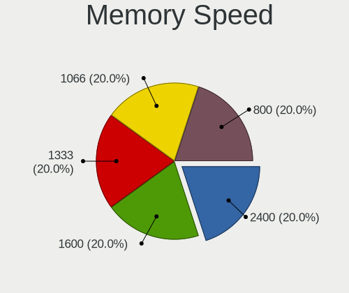

NomadBSD 1.4 - Tested Hardware & Statistics (Desktops)
------------------------------------------------------

A project to collect tested hardware configurations for NomadBSD 1.4.

Anyone can contribute to this report by the [hw-probe](https://github.com/linuxhw/hw-probe/blob/master/INSTALL.BSD.md) tool:

    hw-probe -all -upload

Please contribute! Especially if your hardware is rare.

Contents
--------

* [ Test Cases ](#test-cases)

* [ System ](#system)
  - [ Arch                     ](#arch)
  - [ DE                       ](#de)
  - [ Display Server           ](#display-server)
  - [ Display Manager          ](#display-manager)
  - [ OS Lang                  ](#os-lang)
  - [ Boot Mode                ](#boot-mode)
  - [ Filesystem               ](#filesystem)
  - [ Part. scheme             ](#part-scheme)

* [ Board ](#board)
  - [ Vendor                   ](#vendor)
  - [ Model                    ](#model)
  - [ Model Family             ](#model-family)
  - [ MFG Year                 ](#mfg-year)
  - [ Form Factor              ](#form-factor)
  - [ Coreboot                 ](#coreboot)
  - [ RAM Size                 ](#ram-size)
  - [ RAM Used                 ](#ram-used)
  - [ Total Drives             ](#total-drives)
  - [ Has CD-ROM               ](#has-cd-rom)
  - [ Has Ethernet             ](#has-ethernet)
  - [ Has WiFi                 ](#has-wifi)
  - [ Has Bluetooth            ](#has-bluetooth)

* [ Location ](#location)
  - [ Country                  ](#country)
  - [ City                     ](#city)

* [ Drives ](#drives)
  - [ Drive Vendor             ](#drive-vendor)
  - [ Drive Model              ](#drive-model)
  - [ HDD Vendor               ](#hdd-vendor)
  - [ SSD Vendor               ](#ssd-vendor)
  - [ Drive Kind               ](#drive-kind)
  - [ Drive Connector          ](#drive-connector)
  - [ Drive Size               ](#drive-size)
  - [ Space Total              ](#space-total)
  - [ Space Used               ](#space-used)
  - [ Malfunc. Drives          ](#malfunc-drives)
  - [ Malfunc. Drive Vendor    ](#malfunc-drive-vendor)
  - [ Malfunc. HDD Vendor      ](#malfunc-hdd-vendor)
  - [ Malfunc. Drive Kind      ](#malfunc-drive-kind)
  - [ Failed Drives            ](#failed-drives)
  - [ Failed Drive Vendor      ](#failed-drive-vendor)
  - [ Drive Status             ](#drive-status)

* [ Storage controller ](#storage-controller)
  - [ Storage Vendor           ](#storage-vendor)
  - [ Storage Model            ](#storage-model)
  - [ Storage Kind             ](#storage-kind)

* [ Processor ](#processor)
  - [ CPU Vendor               ](#cpu-vendor)
  - [ CPU Model                ](#cpu-model)
  - [ CPU Model Family         ](#cpu-model-family)
  - [ CPU Cores                ](#cpu-cores)
  - [ CPU Sockets              ](#cpu-sockets)
  - [ CPU Threads              ](#cpu-threads)
  - [ CPU Microarch            ](#cpu-microarch)

* [ Graphics ](#graphics)
  - [ GPU Vendor               ](#gpu-vendor)
  - [ GPU Model                ](#gpu-model)
  - [ GPU Combo                ](#gpu-combo)
  - [ GPU Driver               ](#gpu-driver)
  - [ GPU Memory               ](#gpu-memory)

* [ Monitor ](#monitor)
  - [ Monitor Vendor           ](#monitor-vendor)
  - [ Monitor Model            ](#monitor-model)
  - [ Monitor Resolution       ](#monitor-resolution)
  - [ Monitor Diagonal         ](#monitor-diagonal)
  - [ Monitor Width            ](#monitor-width)
  - [ Aspect Ratio             ](#aspect-ratio)
  - [ Monitor Area             ](#monitor-area)
  - [ Pixel Density            ](#pixel-density)
  - [ Multiple Monitors        ](#multiple-monitors)

* [ Network ](#network)
  - [ Net Controller Vendor    ](#net-controller-vendor)
  - [ Net Controller Model     ](#net-controller-model)
  - [ Wireless Vendor          ](#wireless-vendor)
  - [ Wireless Model           ](#wireless-model)
  - [ Ethernet Vendor          ](#ethernet-vendor)
  - [ Ethernet Model           ](#ethernet-model)
  - [ Net Controller Kind      ](#net-controller-kind)
  - [ Used Controller          ](#used-controller)
  - [ NICs                     ](#nics)
  - [ IPv6                     ](#ipv6)

* [ Bluetooth ](#bluetooth)
  - [ Bluetooth Vendor         ](#bluetooth-vendor)
  - [ Bluetooth Model          ](#bluetooth-model)

* [ Sound ](#sound)
  - [ Sound Vendor             ](#sound-vendor)
  - [ Sound Model              ](#sound-model)

* [ Memory ](#memory)
  - [ Memory Vendor            ](#memory-vendor)
  - [ Memory Model             ](#memory-model)
  - [ Memory Kind              ](#memory-kind)
  - [ Memory Form Factor       ](#memory-form-factor)
  - [ Memory Size              ](#memory-size)
  - [ Memory Speed             ](#memory-speed)

* [ Printers & scanners ](#printers--scanners)
  - [ Printer Vendor           ](#printer-vendor)
  - [ Printer Model            ](#printer-model)
  - [ Scanner Vendor           ](#scanner-vendor)
  - [ Scanner Model            ](#scanner-model)

* [ Camera ](#camera)
  - [ Camera Vendor            ](#camera-vendor)
  - [ Camera Model             ](#camera-model)

* [ Security ](#security)
  - [ Fingerprint Vendor       ](#fingerprint-vendor)
  - [ Fingerprint Model        ](#fingerprint-model)
  - [ Chipcard Vendor          ](#chipcard-vendor)
  - [ Chipcard Model           ](#chipcard-model)

* [ Unsupported ](#unsupported)
  - [ Unsupported Devices      ](#unsupported-devices)
  - [ Unsupported Device Types ](#unsupported-device-types)

Test Cases
----------

Total: 7

| Vendor | Model                       | Probe                                                     | Date         |
|--------|-----------------------------|-----------------------------------------------------------|--------------|
| ECT    | One Computer AMD A10-785... | [41a2a2e434](https://bsd-hardware.info/?probe=41a2a2e434) | Apr 07, 2021 |
| Acer   | EG43M                       | [0bc978756c](https://bsd-hardware.info/?probe=0bc978756c) | Mar 27, 2021 |
| Dell   | 0NW6H5 A00                  | [650cd9b653](https://bsd-hardware.info/?probe=650cd9b653) | Mar 24, 2021 |
| Acer   | EG31M R01-C3                | [1186d46ac9](https://bsd-hardware.info/?probe=1186d46ac9) | Mar 08, 2021 |
| Dell   | 0R849J A00                  | [1bd1dc24c9](https://bsd-hardware.info/?probe=1bd1dc24c9) | Mar 06, 2021 |
| ASRock | Z490M Pro4                  | [348d592fab](https://bsd-hardware.info/?probe=348d592fab) | Mar 05, 2021 |
| VeryPC | S400                        | [edcea11cb7](https://bsd-hardware.info/?probe=edcea11cb7) | Mar 04, 2021 |

System
------

Arch
----

OS architecture (x86_64, i586, etc.)

| Name  | Desktops | Percent |
|-------|----------|---------|
| amd64 | 3        | 100%    |

DE
--

Desktop Environment

| Name    | Desktops | Percent |
|---------|----------|---------|
| Openbox | 3        | 100%    |

Display Server
--------------

X11 or Wayland

| Name | Desktops | Percent |
|------|----------|---------|
| X11  | 3        | 100%    |

Display Manager
---------------

SDDM, LightDM, etc.

| Name | Desktops | Percent |
|------|----------|---------|
| SLiM | 3        | 100%    |

OS Lang
-------

Language

| Lang    | Desktops | Percent |
|---------|----------|---------|
| it_IT   | 2        | 66.67%  |
| Unknown | 1        | 33.33%  |

Boot Mode
---------

EFI or BIOS

| Mode | Desktops | Percent |
|------|----------|---------|
| EFI  | 3        | 100%    |

Filesystem
----------

Type of filesystem

| Type | Desktops | Percent |
|------|----------|---------|
| Ufs  | 3        | 100%    |

Part. scheme
------------

Scheme of partitioning

| Type | Desktops | Percent |
|------|----------|---------|
| MBR  | 2        | 66.67%  |
| GPT  | 1        | 33.33%  |

Board
-----

Vendor
------

Motherboard manufacturer

| Name | Desktops | Percent |
|------|----------|---------|
| Acer | 2        | 66.67%  |
| Dell | 1        | 33.33%  |

Model
-----

Motherboard model

| Name                  | Desktops | Percent |
|-----------------------|----------|---------|
| Dell Studio XPS 435MT | 1        | 33.33%  |
| Acer Veriton M460     | 1        | 33.33%  |
| Acer Aspire M3900     | 1        | 33.33%  |

Model Family
------------

Motherboard model prefix

| Name         | Desktops | Percent |
|--------------|----------|---------|
| Dell Studio  | 1        | 33.33%  |
| Acer Veriton | 1        | 33.33%  |
| Acer Aspire  | 1        | 33.33%  |

MFG Year
--------

Motherboard manufacture year

| Year | Desktops | Percent |
|------|----------|---------|
| 2009 | 2        | 66.67%  |
| 2010 | 1        | 33.33%  |

Form Factor
-----------

Physical design of the computer

| Name    | Desktops | Percent |
|---------|----------|---------|
| Desktop | 3        | 100%    |

Coreboot
--------

Have coreboot on board

| Used | Desktops | Percent |
|------|----------|---------|
| No   | 3        | 100%    |

RAM Size
--------

Total RAM memory

| Size in GB | Desktops | Percent |
|------------|----------|---------|
| 4.01-8.0   | 2        | 66.67%  |
| 8.01-16.0  | 1        | 33.33%  |

RAM Used
--------

Used RAM memory

| Used GB  | Desktops | Percent |
|----------|----------|---------|
| 0.01-0.5 | 3        | 100%    |

Total Drives
------------

Number of drives on board

| Drives | Desktops | Percent |
|--------|----------|---------|
| 3      | 1        | 33.33%  |
| 2      | 1        | 33.33%  |
| 1      | 1        | 33.33%  |

Has CD-ROM
----------

Has CD-ROM on board

| Presented | Desktops | Percent |
|-----------|----------|---------|
| Yes       | 2        | 66.67%  |
| No        | 1        | 33.33%  |

Has Ethernet
------------

Has Ethernet on board

| Presented | Desktops | Percent |
|-----------|----------|---------|
| Yes       | 3        | 100%    |

Has WiFi
--------

Has WiFi module

| Presented | Desktops | Percent |
|-----------|----------|---------|
| Yes       | 2        | 66.67%  |
| No        | 1        | 33.33%  |

Has Bluetooth
-------------

Has Bluetooth module

| Presented | Desktops | Percent |
|-----------|----------|---------|
| No        | 3        | 100%    |

Location
--------

Country
-------

Geographic location (country)

| Country | Desktops | Percent |
|---------|----------|---------|
| Italy   | 2        | 66.67%  |
| Turkey  | 1        | 33.33%  |

City
----

Geographic location (city)

| City     | Desktops | Percent |
|----------|----------|---------|
| Milan    | 2        | 66.67%  |
| Istanbul | 1        | 33.33%  |

Drives
------

Drive Vendor
------------

Hard drive vendors

| Vendor              | Desktops | Drives | Percent |
|---------------------|----------|--------|---------|
| WDC                 | 2        | 2      | 40%     |
| Seagate             | 1        | 1      | 20%     |
| Samsung Electronics | 1        | 2      | 20%     |
| Maxtor              | 1        | 1      | 20%     |

Drive Model
-----------

Hard drive models

| Model                          | Desktops | Percent |
|--------------------------------|----------|---------|
| WDC WD40NMZW-11GX6S1 4TB       | 1        | 16.67%  |
| WDC WD1600AAJS-22L7A0 160GB    | 1        | 16.67%  |
| Seagate ST1000LX015-1U7172 1TB | 1        | 16.67%  |
| Samsung SSD 870 QVO 2TB        | 1        | 16.67%  |
| Samsung SSD 850 EVO 500GB      | 1        | 16.67%  |
| Maxtor STM3250310AS 250GB      | 1        | 16.67%  |

HDD Vendor
----------

Hard disk drive vendors

| Vendor  | Desktops | Drives | Percent |
|---------|----------|--------|---------|
| WDC     | 2        | 2      | 50%     |
| Seagate | 1        | 1      | 25%     |
| Maxtor  | 1        | 1      | 25%     |

SSD Vendor
----------

Solid state drive vendors

| Vendor              | Desktops | Drives | Percent |
|---------------------|----------|--------|---------|
| Samsung Electronics | 1        | 2      | 100%    |

Drive Kind
----------

HDD or SSD

| Kind | Desktops | Drives | Percent |
|------|----------|--------|---------|
| HDD  | 2        | 4      | 66.67%  |
| SSD  | 1        | 2      | 33.33%  |

Drive Connector
---------------

SATA, SAS, NVMe, etc.

| Type | Desktops | Drives | Percent |
|------|----------|--------|---------|
| SATA | 3        | 6      | 100%    |

Drive Size
----------

Size of hard drive

| Size in TB | Desktops | Drives | Percent |
|------------|----------|--------|---------|
| 0.01-0.5   | 3        | 3      | 50%     |
| 3.01-4.0   | 1        | 1      | 16.67%  |
| 1.01-2.0   | 1        | 1      | 16.67%  |
| 0.51-1.0   | 1        | 1      | 16.67%  |

Space Total
-----------

Amount of disk space available on the file system

| Size in GB | Desktops | Percent |
|------------|----------|---------|
| 1-20       | 3        | 100%    |

Space Used
----------

Amount of used disk space

| Used GB | Desktops | Percent |
|---------|----------|---------|
| 1-20    | 3        | 100%    |

Malfunc. Drives
---------------

Drive models with a malfunction

Zero info for selected period =(

Malfunc. Drive Vendor
---------------------

Vendors of faulty drives

Zero info for selected period =(

Malfunc. HDD Vendor
-------------------

Vendors of faulty HDD drives

Zero info for selected period =(

Malfunc. Drive Kind
-------------------

Kinds of faulty drives

Zero info for selected period =(

Failed Drives
-------------

Failed drive models

Zero info for selected period =(

Failed Drive Vendor
-------------------

Failed drive vendors

Zero info for selected period =(

Drive Status
------------

Number of failed and malfunc. drives

| Status | Desktops | Drives | Percent |
|--------|----------|--------|---------|
| Works  | 3        | 6      | 100%    |

Storage controller
------------------

Storage Vendor
--------------

Storage controller vendors

| Vendor | Desktops | Percent |
|--------|----------|---------|
| Intel  | 3        | 100%    |

Storage Model
-------------

Storage controller models

| Model                                                      | Desktops | Percent |
|------------------------------------------------------------|----------|---------|
| Intel SATA Controller [RAID mode]                          | 1        | 20%     |
| Intel NM10/ICH7 Family SATA Controller [IDE mode]          | 1        | 20%     |
| Intel 82801JI (ICH10 Family) 4 port SATA IDE Controller #1 | 1        | 20%     |
| Intel 82801JI (ICH10 Family) 2 port SATA IDE Controller #2 | 1        | 20%     |
| Intel 82801G (ICH7 Family) IDE Controller                  | 1        | 20%     |

Storage Kind
------------

Kind of storage controller (IDE, SATA, NVMe, SAS, ...)

| Kind | Desktops | Percent |
|------|----------|---------|
| IDE  | 2        | 66.67%  |
| RAID | 1        | 33.33%  |

Processor
---------

CPU Vendor
----------

Processor vendors

| Vendor | Desktops | Percent |
|--------|----------|---------|
| Intel  | 3        | 100%    |

CPU Model
---------

Processor models

| Model                                       | Desktops | Percent |
|---------------------------------------------|----------|---------|
| Intel Pentium Dual-Core CPU E5800 @ 3.20GHz | 1        | 33.33%  |
| Intel Core i7 CPU 920 @ 2.67GHz             | 1        | 33.33%  |
| Intel Core 2 Duo CPU E7300 @ 2.66GHz        | 1        | 33.33%  |

CPU Model Family
----------------

Processor model prefix

| Model                   | Desktops | Percent |
|-------------------------|----------|---------|
| Intel Pentium Dual-Core | 1        | 33.33%  |
| Intel Core i7           | 1        | 33.33%  |
| Intel Core 2 Duo        | 1        | 33.33%  |

CPU Cores
---------

Number of processor cores

| Number | Desktops | Percent |
|--------|----------|---------|
| 2      | 2        | 66.67%  |
| 4      | 1        | 33.33%  |

CPU Sockets
-----------

Number of sockets

| Number | Desktops | Percent |
|--------|----------|---------|
| 1      | 3        | 100%    |

CPU Threads
-----------

Threads per core (Hyper-Threading)

| Number | Desktops | Percent |
|--------|----------|---------|
| 1      | 2        | 66.67%  |
| 2      | 1        | 33.33%  |

CPU Microarch
-------------

Microarchitecture

| Name    | Desktops | Percent |
|---------|----------|---------|
| Penryn  | 2        | 66.67%  |
| Nehalem | 1        | 33.33%  |

Graphics
--------

GPU Vendor
----------

Vendors of graphics cards

| Vendor | Desktops | Percent |
|--------|----------|---------|
| AMD    | 2        | 66.67%  |
| Intel  | 1        | 33.33%  |

GPU Model
---------

Graphics card models

| Model                                                               | Desktops | Percent |
|---------------------------------------------------------------------|----------|---------|
| Intel 82G33/G31 Express Integrated Graphics Controller              | 1        | 33.33%  |
| AMD Caicos [Radeon HD 6450/7450/8450 / R5 230 OEM]                  | 1        | 33.33%  |
| AMD Baffin [Radeon RX 460/560D / Pro 450/455/460/555/555X/560/560X] | 1        | 33.33%  |

GPU Combo
---------

Combinations of graphics cards

| Name      | Desktops | Percent |
|-----------|----------|---------|
| 1 x AMD   | 2        | 66.67%  |
| 1 x Intel | 1        | 33.33%  |

GPU Driver
----------

Free vs proprietary

| Driver | Desktops | Percent |
|--------|----------|---------|
| Free   | 3        | 100%    |

GPU Memory
----------

Total video memory

| Size in GB | Desktops | Percent |
|------------|----------|---------|
| 3.01-4.0   | 1        | 33.33%  |
| 1.01-2.0   | 1        | 33.33%  |
| Unknown    | 1        | 33.33%  |

Monitor
-------

Monitor Vendor
--------------

Monitor vendors

| Vendor | Desktops | Percent |
|--------|----------|---------|
| Sony   | 1        | 33.33%  |
| Dell   | 1        | 33.33%  |
| Acer   | 1        | 33.33%  |

Monitor Model
-------------

Monitor models

| Model                                             | Desktops | Percent |
|---------------------------------------------------|----------|---------|
| Sony TV SNY5D01 1360x768                          | 1        | 33.33%  |
| Dell S2309W DELA041 1920x1080 510x290mm 23.1-inch | 1        | 33.33%  |
| Acer V173 ACR0019 1280x1024 340x270mm 17.1-inch   | 1        | 33.33%  |

Monitor Resolution
------------------

Monitor screen resolution

| Resolution       | Desktops | Percent |
|------------------|----------|---------|
| 1920x1080 (FHD)  | 1        | 33.33%  |
| 1360x768         | 1        | 33.33%  |
| 1280x1024 (SXGA) | 1        | 33.33%  |

Monitor Diagonal
----------------

Diagonal size in inches

| Inches  | Desktops | Percent |
|---------|----------|---------|
| 23      | 1        | 33.33%  |
| 17      | 1        | 33.33%  |
| Unknown | 1        | 33.33%  |

Monitor Width
-------------

Physical width

| Width in mm | Desktops | Percent |
|-------------|----------|---------|
| 501-600     | 1        | 33.33%  |
| 301-350     | 1        | 33.33%  |
| Unknown     | 1        | 33.33%  |

Aspect Ratio
------------

Proportional relationship between the width and the height

| Ratio | Desktops | Percent |
|-------|----------|---------|
| 16/9  | 2        | 66.67%  |
| 5/4   | 1        | 33.33%  |

Monitor Area
------------

Area in inch²

| Area in inch² | Desktops | Percent |
|----------------|----------|---------|
| 201-250        | 1        | 33.33%  |
| 141-150        | 1        | 33.33%  |
| Unknown        | 1        | 33.33%  |

Pixel Density
-------------

Pixels per inch

| Density | Desktops | Percent |
|---------|----------|---------|
| 51-100  | 2        | 66.67%  |
| Unknown | 1        | 33.33%  |

Multiple Monitors
-----------------

Total monitors connected

| Total | Desktops | Percent |
|-------|----------|---------|
| 1     | 3        | 100%    |

Network
-------

Net Controller Vendor
---------------------

Controller vendors

| Vendor                | Desktops | Percent |
|-----------------------|----------|---------|
| Realtek Semiconductor | 2        | 40%     |
| Intel                 | 2        | 40%     |
| Qualcomm Atheros      | 1        | 20%     |

Net Controller Model
--------------------

Controller models

| Model                                                                                 | Desktops | Percent |
|---------------------------------------------------------------------------------------|----------|---------|
| Realtek RTL8192CE PCIe Wireless Network Adapter                                       | 1        | 20%     |
| Realtek RTL8111/8168/8211/8411 PCI Express Gigabit Ethernet Controller                | 1        | 20%     |
| Qualcomm Atheros AR5418 Wireless Network Adapter [AR5008E 802.11(a)bgn] (PCI-Express) | 1        | 20%     |
| Intel 82567V-2 Gigabit Network Connection                                             | 1        | 20%     |
| Intel 82567LF-2 Gigabit Network Connection                                            | 1        | 20%     |

Wireless Vendor
---------------

Wireless vendors

| Vendor                | Desktops | Percent |
|-----------------------|----------|---------|
| Realtek Semiconductor | 1        | 50%     |
| Qualcomm Atheros      | 1        | 50%     |

Wireless Model
--------------

Wireless models

| Model                                                                                 | Desktops | Percent |
|---------------------------------------------------------------------------------------|----------|---------|
| Realtek RTL8192CE PCIe Wireless Network Adapter                                       | 1        | 50%     |
| Qualcomm Atheros AR5418 Wireless Network Adapter [AR5008E 802.11(a)bgn] (PCI-Express) | 1        | 50%     |

Ethernet Vendor
---------------

Ethernet vendors

| Vendor                | Desktops | Percent |
|-----------------------|----------|---------|
| Intel                 | 2        | 66.67%  |
| Realtek Semiconductor | 1        | 33.33%  |

Ethernet Model
--------------

Ethernet models

| Model                                                                  | Desktops | Percent |
|------------------------------------------------------------------------|----------|---------|
| Realtek RTL8111/8168/8211/8411 PCI Express Gigabit Ethernet Controller | 1        | 33.33%  |
| Intel 82567V-2 Gigabit Network Connection                              | 1        | 33.33%  |
| Intel 82567LF-2 Gigabit Network Connection                             | 1        | 33.33%  |

Net Controller Kind
-------------------

Ethernet, WiFi or modem

| Kind     | Desktops | Percent |
|----------|----------|---------|
| Ethernet | 3        | 60%     |
| WiFi     | 2        | 40%     |

Used Controller
---------------

Currently used network controller

| Kind     | Desktops | Percent |
|----------|----------|---------|
| Ethernet | 3        | 60%     |
| WiFi     | 2        | 40%     |

NICs
----

Total network controllers on board

| Total | Desktops | Percent |
|-------|----------|---------|
| 2     | 2        | 66.67%  |
| 1     | 1        | 33.33%  |

IPv6
----

IPv6 vs IPv4

| Used | Desktops | Percent |
|------|----------|---------|
| No   | 3        | 100%    |

Bluetooth
---------

Bluetooth Vendor
----------------

Controller vendors

Zero info for selected period =(

Bluetooth Model
---------------

Controller models

Zero info for selected period =(

Sound
-----

Sound Vendor
------------

Sound card vendors

| Vendor | Desktops | Percent |
|--------|----------|---------|
| Intel  | 3        | 60%     |
| AMD    | 2        | 40%     |

Sound Model
-----------

Sound card models

| Model                                                                             | Desktops | Percent |
|-----------------------------------------------------------------------------------|----------|---------|
| Intel 82801JI (ICH10 Family) HD Audio Controller                                  | 2        | 40%     |
| Intel NM10/ICH7 Family High Definition Audio Controller                           | 1        | 20%     |
| AMD Caicos HDMI Audio [Radeon HD 6450 / 7450/8450/8490 OEM / R5 230/235/235X OEM] | 1        | 20%     |
| AMD Baffin HDMI/DP Audio [Radeon RX 550 640SP / RX 560/560X]                      | 1        | 20%     |

Memory
------

Memory Vendor
-------------

Memory module vendors

| Vendor   | Desktops | Percent |
|----------|----------|---------|
| Unknown  | 1        | 20%     |
| SK hynix | 1        | 20%     |
| Kingston | 1        | 20%     |
| Elpida   | 1        | 20%     |
| Crucial  | 1        | 20%     |

Memory Model
------------

Memory module models

| Model                                                   | Desktops | Percent |
|---------------------------------------------------------|----------|---------|
| Unknown RAM Module 2GB DIMM DDR2 800MT/s                | 1        | 16.67%  |
| SK hynix RAM HMT351U6CFR8C-PB 4GB DIMM 1600MT/s         | 1        | 16.67%  |
| SK hynix RAM HMT112U6AFP8C-G7 1GB DIMM 1066MT/s         | 1        | 16.67%  |
| Kingston RAM ACR256X64D3U1333C9 2GB DIMM DDR3 1333MT/s  | 1        | 16.67%  |
| Elpida RAM EBJ21UE8BAFA-AE-E 2GB DIMM 1066MT/s          | 1        | 16.67%  |
| Crucial RAM CT16G4DFD824A.M16FE 16GB DIMM DDR4 2400MT/s | 1        | 16.67%  |

Memory Kind
-----------

Memory module kinds

| Kind    | Desktops | Percent |
|---------|----------|---------|
| DDR3    | 2        | 40%     |
| DDR4    | 1        | 20%     |
| DDR2    | 1        | 20%     |
| Unknown | 1        | 20%     |

Memory Form Factor
------------------

Physical design of the memory module

| Name | Desktops | Percent |
|------|----------|---------|
| DIMM | 4        | 100%    |

Memory Size
-----------

Memory module size

| Size  | Desktops | Percent |
|-------|----------|---------|
| 2048  | 3        | 50%     |
| 16384 | 1        | 16.67%  |
| 4096  | 1        | 16.67%  |
| 1024  | 1        | 16.67%  |

Memory Speed
------------

Memory module speed

| Speed | Desktops | Percent |
|-------|----------|---------|
| 2400  | 1        | 20%     |
| 1600  | 1        | 20%     |
| 1333  | 1        | 20%     |
| 1066  | 1        | 20%     |
| 800   | 1        | 20%     |

Printers & scanners
-------------------

Printer Vendor
--------------

Printer device vendors

Zero info for selected period =(

Printer Model
-------------

Printer device models

Zero info for selected period =(

Scanner Vendor
--------------

Scanner device vendors

Zero info for selected period =(

Scanner Model
-------------

Scanner device models

Zero info for selected period =(

Camera
------

Camera Vendor
-------------

Camera device vendors

| Vendor   | Desktops | Percent |
|----------|----------|---------|
| Logitech | 1        | 100%    |

Camera Model
------------

Camera device models

| Model                   | Desktops | Percent |
|-------------------------|----------|---------|
| Logitech C505 HD Webcam | 1        | 100%    |

Security
--------

Fingerprint Vendor
------------------

Fingerprint sensor vendors

Zero info for selected period =(

Fingerprint Model
-----------------

Fingerprint sensor models

Zero info for selected period =(

Chipcard Vendor
---------------

Chipcard module vendors

Zero info for selected period =(

Chipcard Model
--------------

Chipcard module models

Zero info for selected period =(

Unsupported
-----------

Unsupported Devices
-------------------

Total unsupported devices on board

| Total | Desktops | Percent |
|-------|----------|---------|
| 1     | 2        | 66.67%  |
| 0     | 1        | 33.33%  |

Unsupported Device Types
------------------------

Types of unsupported devices

| Type                | Desktops | Percent |
|---------------------|----------|---------|
| Firewire controller | 2        | 100%    |

