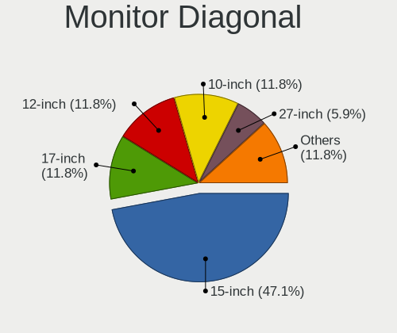
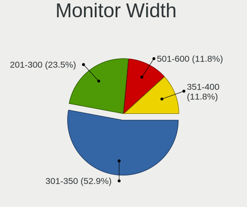
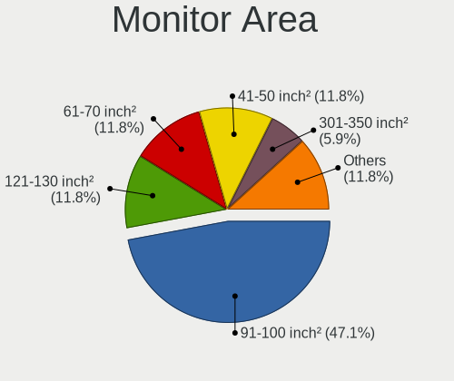
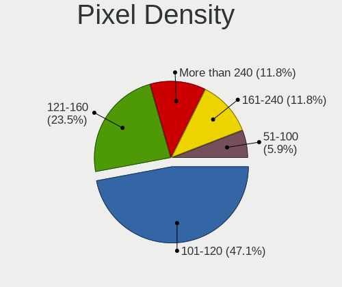
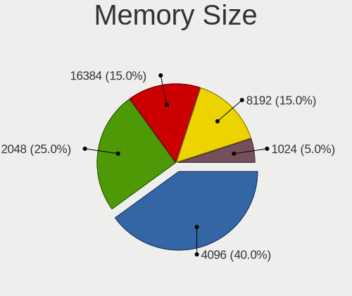
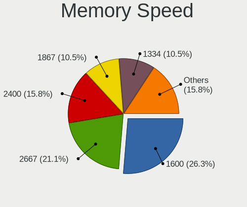

NomadBSD 1.4 - Tested Hardware & Statistics (Notebooks)
-------------------------------------------------------

A project to collect tested hardware configurations for NomadBSD 1.4 (Beta test).

Anyone can contribute to this report by the [hw-probe](https://github.com/linuxhw/hw-probe/blob/master/INSTALL.BSD.md) tool:

    hw-probe -all -upload

Please submit a probe of your configuration if it's not presented on the page or is rare.

Full-feature report is available here: https://bsd-hardware.info/?view=trends&rel=nomadbsd-1.4

Contents
--------

* [ Test Cases ](#test-cases)

* [ System ](#system)
  - [ Arch                     ](#arch)
  - [ DE                       ](#de)
  - [ Display Server           ](#display-server)
  - [ Display Manager          ](#display-manager)
  - [ OS Lang                  ](#os-lang)
  - [ Boot Mode                ](#boot-mode)
  - [ Filesystem               ](#filesystem)
  - [ Part. scheme             ](#part-scheme)

* [ Board ](#board)
  - [ Vendor                   ](#vendor)
  - [ Model                    ](#model)
  - [ Model Family             ](#model-family)
  - [ MFG Year                 ](#mfg-year)
  - [ Form Factor              ](#form-factor)
  - [ Coreboot                 ](#coreboot)
  - [ RAM Size                 ](#ram-size)
  - [ RAM Used                 ](#ram-used)
  - [ Total Drives             ](#total-drives)
  - [ Has CD-ROM               ](#has-cd-rom)
  - [ Has Ethernet             ](#has-ethernet)
  - [ Has WiFi                 ](#has-wifi)
  - [ Has Bluetooth            ](#has-bluetooth)

* [ Location ](#location)
  - [ Country                  ](#country)
  - [ City                     ](#city)

* [ Drives ](#drives)
  - [ Drive Vendor             ](#drive-vendor)
  - [ Drive Model              ](#drive-model)
  - [ HDD Vendor               ](#hdd-vendor)
  - [ SSD Vendor               ](#ssd-vendor)
  - [ Drive Kind               ](#drive-kind)
  - [ Drive Connector          ](#drive-connector)
  - [ Drive Size               ](#drive-size)
  - [ Space Total              ](#space-total)
  - [ Space Used               ](#space-used)
  - [ Malfunc. Drives          ](#malfunc-drives)
  - [ Malfunc. Drive Vendor    ](#malfunc-drive-vendor)
  - [ Malfunc. HDD Vendor      ](#malfunc-hdd-vendor)
  - [ Malfunc. Drive Kind      ](#malfunc-drive-kind)
  - [ Failed Drives            ](#failed-drives)
  - [ Failed Drive Vendor      ](#failed-drive-vendor)
  - [ Drive Status             ](#drive-status)

* [ Storage controller ](#storage-controller)
  - [ Storage Vendor           ](#storage-vendor)
  - [ Storage Model            ](#storage-model)
  - [ Storage Kind             ](#storage-kind)

* [ Processor ](#processor)
  - [ CPU Vendor               ](#cpu-vendor)
  - [ CPU Model                ](#cpu-model)
  - [ CPU Model Family         ](#cpu-model-family)
  - [ CPU Cores                ](#cpu-cores)
  - [ CPU Sockets              ](#cpu-sockets)
  - [ CPU Threads              ](#cpu-threads)
  - [ CPU Microarch            ](#cpu-microarch)

* [ Graphics ](#graphics)
  - [ GPU Vendor               ](#gpu-vendor)
  - [ GPU Model                ](#gpu-model)
  - [ GPU Combo                ](#gpu-combo)
  - [ GPU Driver               ](#gpu-driver)
  - [ GPU Memory               ](#gpu-memory)

* [ Monitor ](#monitor)
  - [ Monitor Vendor           ](#monitor-vendor)
  - [ Monitor Model            ](#monitor-model)
  - [ Monitor Resolution       ](#monitor-resolution)
  - [ Monitor Diagonal         ](#monitor-diagonal)
  - [ Monitor Width            ](#monitor-width)
  - [ Aspect Ratio             ](#aspect-ratio)
  - [ Monitor Area             ](#monitor-area)
  - [ Pixel Density            ](#pixel-density)
  - [ Multiple Monitors        ](#multiple-monitors)

* [ Network ](#network)
  - [ Net Controller Vendor    ](#net-controller-vendor)
  - [ Net Controller Model     ](#net-controller-model)
  - [ Wireless Vendor          ](#wireless-vendor)
  - [ Wireless Model           ](#wireless-model)
  - [ Ethernet Vendor          ](#ethernet-vendor)
  - [ Ethernet Model           ](#ethernet-model)
  - [ Net Controller Kind      ](#net-controller-kind)
  - [ Used Controller          ](#used-controller)
  - [ NICs                     ](#nics)
  - [ IPv6                     ](#ipv6)

* [ Bluetooth ](#bluetooth)
  - [ Bluetooth Vendor         ](#bluetooth-vendor)
  - [ Bluetooth Model          ](#bluetooth-model)

* [ Sound ](#sound)
  - [ Sound Vendor             ](#sound-vendor)
  - [ Sound Model              ](#sound-model)

* [ Memory ](#memory)
  - [ Memory Vendor            ](#memory-vendor)
  - [ Memory Model             ](#memory-model)
  - [ Memory Kind              ](#memory-kind)
  - [ Memory Form Factor       ](#memory-form-factor)
  - [ Memory Size              ](#memory-size)
  - [ Memory Speed             ](#memory-speed)

* [ Printers & scanners ](#printers--scanners)
  - [ Printer Vendor           ](#printer-vendor)
  - [ Printer Model            ](#printer-model)
  - [ Scanner Vendor           ](#scanner-vendor)
  - [ Scanner Model            ](#scanner-model)

* [ Camera ](#camera)
  - [ Camera Vendor            ](#camera-vendor)
  - [ Camera Model             ](#camera-model)

* [ Security ](#security)
  - [ Fingerprint Vendor       ](#fingerprint-vendor)
  - [ Fingerprint Model        ](#fingerprint-model)
  - [ Chipcard Vendor          ](#chipcard-vendor)
  - [ Chipcard Model           ](#chipcard-model)

* [ Unsupported ](#unsupported)
  - [ Unsupported Devices      ](#unsupported-devices)
  - [ Unsupported Device Types ](#unsupported-device-types)

Test Cases
----------

| Vendor   | Model                       | Probe                                                     | Date         |
|----------|-----------------------------|-----------------------------------------------------------|--------------|
| Lenovo   | ThinkPad T510 4384FF3       | [25e208721d](https://bsd-hardware.info/?probe=25e208721d) | Jul 02, 2021 |
| Acer     | Aspire E5-551               | [c9ab1cb207](https://bsd-hardware.info/?probe=c9ab1cb207) | Apr 29, 2021 |
| Lenovo   | ThinkPad S1 Yoga 20C0S0M... | [e9155d12c7](https://bsd-hardware.info/?probe=e9155d12c7) | Apr 27, 2021 |
| Lenovo   | ThinkPad W541 20EGS04800    | [91d2cd471c](https://bsd-hardware.info/?probe=91d2cd471c) | Apr 16, 2021 |
| Lenovo   | ThinkPad X1 Carbon 4th 2... | [821c81e652](https://bsd-hardware.info/?probe=821c81e652) | Apr 09, 2021 |
| HP       | ProBook 640 G1              | [6bc6c5b2bf](https://bsd-hardware.info/?probe=6bc6c5b2bf) | Mar 31, 2021 |
| TUXEDO   | Unknown                     | [35aa6590c6](https://bsd-hardware.info/?probe=35aa6590c6) | Mar 29, 2021 |
| Lenovo   | IdeaPad 110-15IBR 80T7      | [c5e824b558](https://bsd-hardware.info/?probe=c5e824b558) | Mar 29, 2021 |
| Toshiba  | Satellite C660              | [7d64801e2b](https://bsd-hardware.info/?probe=7d64801e2b) | Mar 21, 2021 |
| MSI      | MS-N033                     | [650f6a1b70](https://bsd-hardware.info/?probe=650f6a1b70) | Mar 21, 2021 |
| Samsung  | N145P/N250P/N260P           | [eff02dafe1](https://bsd-hardware.info/?probe=eff02dafe1) | Mar 18, 2021 |
| Toshiba  | Satellite C660              | [83f9d05407](https://bsd-hardware.info/?probe=83f9d05407) | Mar 14, 2021 |
| Notebook | N650DU                      | [90d705dd1e](https://bsd-hardware.info/?probe=90d705dd1e) | Mar 14, 2021 |
| HP       | Pavilion dv6000 (RP981EA... | [733c5edb74](https://bsd-hardware.info/?probe=733c5edb74) | Mar 08, 2021 |
| HP       | Pavilion dv6000 (RP981EA... | [56844725d1](https://bsd-hardware.info/?probe=56844725d1) | Mar 08, 2021 |
| HP       | Laptop 15-da0xxx            | [bf572bc102](https://bsd-hardware.info/?probe=bf572bc102) | Mar 06, 2021 |
| ASUSTek  | VivoBook_ASUSLaptop X509... | [be2ad24d1b](https://bsd-hardware.info/?probe=be2ad24d1b) | Mar 06, 2021 |
| ASUSTek  | VivoBook_ASUSLaptop X509... | [0e06b5f17f](https://bsd-hardware.info/?probe=0e06b5f17f) | Mar 06, 2021 |
| Dell     | Latitude 5280               | [b84364959d](https://bsd-hardware.info/?probe=b84364959d) | Mar 04, 2021 |
| Lenovo   | IdeaPad S145-15API 81UT     | [1f226262cc](https://bsd-hardware.info/?probe=1f226262cc) | Mar 04, 2021 |
| ASUSTek  | X550LC                      | [e056f1c77c](https://bsd-hardware.info/?probe=e056f1c77c) | Mar 03, 2021 |

System
------

Arch
----

OS architecture (x86_64, i586, etc.)

| Name  | Notebooks | Percent |
|-------|-----------|---------|
| amd64 | 17        | 94.44%  |
| i386  | 1         | 5.56%   |

DE
--

Desktop Environment

| Name    | Notebooks | Percent |
|---------|-----------|---------|
| Openbox | 15        | 83.33%  |
| GNOME   | 2         | 11.11%  |
| XFCE    | 1         | 5.56%   |

Display Server
--------------

X11 or Wayland

| Name | Notebooks | Percent |
|------|-----------|---------|
| X11  | 18        | 100%    |

Display Manager
---------------

SDDM, LightDM, etc.

| Name | Notebooks | Percent |
|------|-----------|---------|
| SLiM | 18        | 100%    |

OS Lang
-------

Language

| Lang    | Notebooks | Percent |
|---------|-----------|---------|
| Unknown | 5         | 27.78%  |
| de_DE   | 4         | 22.22%  |
| tr_TR   | 1         | 5.56%   |
| ru_RU   | 1         | 5.56%   |
| ko_KR   | 1         | 5.56%   |
| it_IT   | 1         | 5.56%   |
| fr_FR   | 1         | 5.56%   |
| en_US   | 1         | 5.56%   |
| en_GB   | 1         | 5.56%   |
| en_AU   | 1         | 5.56%   |
| bg_BG   | 1         | 5.56%   |

Boot Mode
---------

EFI or BIOS

| Mode | Notebooks | Percent |
|------|-----------|---------|
| EFI  | 17        | 94.44%  |
| BIOS | 1         | 5.56%   |

Filesystem
----------

Type of filesystem

| Type | Notebooks | Percent |
|------|-----------|---------|
| Ufs  | 16        | 88.89%  |
| Zfs  | 2         | 11.11%  |

Part. scheme
------------

Scheme of partitioning

| Type | Notebooks | Percent |
|------|-----------|---------|
| GPT  | 13        | 72.22%  |
| MBR  | 5         | 27.78%  |

Board
-----

Vendor
------

Motherboard manufacturer

| Name                | Notebooks | Percent |
|---------------------|-----------|---------|
| Lenovo              | 6         | 33.33%  |
| Hewlett-Packard     | 3         | 16.67%  |
| ASUSTek Computer    | 2         | 11.11%  |
| TUXEDO              | 1         | 5.56%   |
| Toshiba             | 1         | 5.56%   |
| Samsung Electronics | 1         | 5.56%   |
| Notebook            | 1         | 5.56%   |
| MSI                 | 1         | 5.56%   |
| Dell                | 1         | 5.56%   |
| Acer                | 1         | 5.56%   |

Model
-----

Motherboard model

| Name                                     | Notebooks | Percent |
|------------------------------------------|-----------|---------|
| Toshiba Satellite C660                   | 1         | 5.56%   |
| Samsung N145P/N250P/N260P                | 1         | 5.56%   |
| Notebook N650DU                          | 1         | 5.56%   |
| MSI MS-N033                              | 1         | 5.56%   |
| Lenovo ThinkPad X1 Carbon 4th 20FB001XAU | 1         | 5.56%   |
| Lenovo ThinkPad W541 20EGS04800          | 1         | 5.56%   |
| Lenovo ThinkPad T510 4384FF3             | 1         | 5.56%   |
| Lenovo ThinkPad S1 Yoga 20C0S0M300       | 1         | 5.56%   |
| Lenovo IdeaPad S145-15API 81UT           | 1         | 5.56%   |
| Lenovo IdeaPad 110-15IBR 80T7            | 1         | 5.56%   |
| HP ProBook 640 G1                        | 1         | 5.56%   |
| HP Pavilion dv6000 (RP981EA#AB8)         | 1         | 5.56%   |
| HP Laptop 15-da0xxx                      | 1         | 5.56%   |
| Dell Latitude 5280                       | 1         | 5.56%   |
| ASUS X550LC                              | 1         | 5.56%   |
| ASUS VivoBook_ASUSLaptop X509DA_D509DA   | 1         | 5.56%   |
| Acer Aspire E5-551                       | 1         | 5.56%   |
| Unknown                                  | 1         | 5.56%   |

Model Family
------------

Motherboard model prefix

| Name              | Notebooks | Percent |
|-------------------|-----------|---------|
| Lenovo ThinkPad   | 4         | 22.22%  |
| Lenovo IdeaPad    | 2         | 11.11%  |
| Toshiba Satellite | 1         | 5.56%   |
| Samsung N145P     | 1         | 5.56%   |
| Notebook N650DU   | 1         | 5.56%   |
| MSI MS-N033       | 1         | 5.56%   |
| HP ProBook        | 1         | 5.56%   |
| HP Pavilion       | 1         | 5.56%   |
| HP Laptop         | 1         | 5.56%   |
| Dell Latitude     | 1         | 5.56%   |
| ASUS X550LC       | 1         | 5.56%   |
| ASUS VivoBook     | 1         | 5.56%   |
| Acer Aspire       | 1         | 5.56%   |
| Unknown           | 1         | 5.56%   |

MFG Year
--------

Motherboard manufacture year

| Year | Notebooks | Percent |
|------|-----------|---------|
| 2019 | 5         | 27.78%  |
| 2010 | 3         | 16.67%  |
| 2020 | 2         | 11.11%  |
| 2017 | 2         | 11.11%  |
| 2016 | 1         | 5.56%   |
| 2015 | 1         | 5.56%   |
| 2014 | 1         | 5.56%   |
| 2013 | 1         | 5.56%   |
| 2011 | 1         | 5.56%   |
| 2006 | 1         | 5.56%   |

Form Factor
-----------

Physical design of the computer

| Name     | Notebooks | Percent |
|----------|-----------|---------|
| Notebook | 18        | 100%    |

Coreboot
--------

Have coreboot on board

| Used | Notebooks | Percent |
|------|-----------|---------|
| No   | 18        | 100%    |

RAM Size
--------

Total RAM memory

| Size in GB | Notebooks | Percent |
|------------|-----------|---------|
| 8.01-16.0  | 8         | 44.44%  |
| 4.01-8.0   | 3         | 16.67%  |
| 16.01-24.0 | 3         | 16.67%  |
| 32.01-64.0 | 1         | 5.56%   |
| 3.01-4.0   | 1         | 5.56%   |
| 2.01-3.0   | 1         | 5.56%   |
| 0.51-1.0   | 1         | 5.56%   |

RAM Used
--------

Used RAM memory

| Used GB  | Notebooks | Percent |
|----------|-----------|---------|
| 0.01-0.5 | 10        | 55.56%  |
| 0.51-1.0 | 4         | 22.22%  |
| 1.01-2.0 | 2         | 11.11%  |
| 4.01-8.0 | 1         | 5.56%   |
| 2.01-3.0 | 1         | 5.56%   |

Total Drives
------------

Number of drives on board

| Drives | Notebooks | Percent |
|--------|-----------|---------|
| 1      | 14        | 77.78%  |
| 2      | 2         | 11.11%  |
| 3      | 1         | 5.56%   |
| 0      | 1         | 5.56%   |

Has CD-ROM
----------

Has CD-ROM on board

| Presented | Notebooks | Percent |
|-----------|-----------|---------|
| No        | 12        | 66.67%  |
| Yes       | 6         | 33.33%  |

Has Ethernet
------------

Has Ethernet on board

| Presented | Notebooks | Percent |
|-----------|-----------|---------|
| Yes       | 15        | 83.33%  |
| No        | 3         | 16.67%  |

Has WiFi
--------

Has WiFi module

| Presented | Notebooks | Percent |
|-----------|-----------|---------|
| Yes       | 18        | 100%    |

Has Bluetooth
-------------

Has Bluetooth module

| Presented | Notebooks | Percent |
|-----------|-----------|---------|
| Yes       | 12        | 66.67%  |
| No        | 6         | 33.33%  |

Location
--------

Country
-------

Geographic location (country)

| Country     | Notebooks | Percent |
|-------------|-----------|---------|
| Germany     | 4         | 22.22%  |
| France      | 4         | 22.22%  |
| Turkey      | 2         | 11.11%  |
| USA         | 1         | 5.56%   |
| UK          | 1         | 5.56%   |
| South Korea | 1         | 5.56%   |
| Russia      | 1         | 5.56%   |
| Italy       | 1         | 5.56%   |
| Denmark     | 1         | 5.56%   |
| Bulgaria    | 1         | 5.56%   |
| Australia   | 1         | 5.56%   |

City
----

Geographic location (city)

| City                | Notebooks | Percent |
|---------------------|-----------|---------|
| Franconville        | 3         | 16.67%  |
| Zwingenberg         | 2         | 11.11%  |
| Istanbul            | 2         | 11.11%  |
| Wilhelmshaven       | 1         | 5.56%   |
| Vertou              | 1         | 5.56%   |
| Suwon               | 1         | 5.56%   |
| Sofia               | 1         | 5.56%   |
| Moscow              | 1         | 5.56%   |
| Milan               | 1         | 5.56%   |
| Grafing bei Munchen | 1         | 5.56%   |
| Glasgow             | 1         | 5.56%   |
| Copenhagen          | 1         | 5.56%   |
| Chino Hills         | 1         | 5.56%   |
| Brisbane            | 1         | 5.56%   |

Drives
------

Drive Vendor
------------

Hard drive vendors

| Vendor              | Notebooks | Drives | Percent |
|---------------------|-----------|--------|---------|
| WDC                 | 5         | 7      | 27.78%  |
| Samsung Electronics | 4         | 5      | 22.22%  |
| Seagate             | 3         | 3      | 16.67%  |
| Toshiba             | 2         | 2      | 11.11%  |
| SanDisk             | 1         | 1      | 5.56%   |
| Micron Technology   | 1         | 1      | 5.56%   |
| Intel               | 1         | 1      | 5.56%   |
| Corsair             | 1         | 1      | 5.56%   |

Drive Model
-----------

Hard drive models

| Model                                | Notebooks | Percent |
|--------------------------------------|-----------|---------|
| WDC WDS120G2G0B-00EPW0 120GB         | 1         | 4.76%   |
| WDC WDS120G1G0A-00SS50 120GB         | 1         | 4.76%   |
| WDC WD3200BEKT-60PVMT0 320GB         | 1         | 4.76%   |
| WDC WD2500BEVT-80A23T0 250GB         | 1         | 4.76%   |
| WDC WD10JPVX-75JC3T0 1TB             | 1         | 4.76%   |
| WDC PC SN530 SDBPNPZ-256G-1002 256GB | 1         | 4.76%   |
| WDC PC SN520 SDAPMUW-128G-1101 128GB | 1         | 4.76%   |
| Toshiba TR200 240GB                  | 1         | 4.76%   |
| Toshiba MQ01ABD100 1TB               | 1         | 4.76%   |
| Seagate ST95005620AS 500GB           | 1         | 4.76%   |
| Seagate ST1000LM049-2GH172 1TB       | 1         | 4.76%   |
| Seagate ST1000LM035-1RK172 1TB       | 1         | 4.76%   |
| SanDisk SD9SN8W-128G-1006 128GB      | 1         | 4.76%   |
| Samsung SSD 970 EVO Plus 1TB         | 1         | 4.76%   |
| Samsung SSD 860 EVO 250GB            | 1         | 4.76%   |
| Samsung SSD 850 PRO 512GB            | 1         | 4.76%   |
| Samsung MZNLN256HCHP-000L7 256GB     | 1         | 4.76%   |
| Samsung MZ7TD128HAFV-000L1 128GB     | 1         | 4.76%   |
| Micron 1100 SATA 256GB               | 1         | 4.76%   |
| Intel SSDSC2CW060A3 64GB             | 1         | 4.76%   |
| Corsair Neutron GTX SSD 120GB        | 1         | 4.76%   |

HDD Vendor
----------

Hard disk drive vendors

| Vendor  | Notebooks | Drives | Percent |
|---------|-----------|--------|---------|
| WDC     | 3         | 3      | 42.86%  |
| Seagate | 3         | 3      | 42.86%  |
| Toshiba | 1         | 1      | 14.29%  |

SSD Vendor
----------

Solid state drive vendors

| Vendor              | Notebooks | Drives | Percent |
|---------------------|-----------|--------|---------|
| Samsung Electronics | 3         | 4      | 33.33%  |
| WDC                 | 1         | 2      | 11.11%  |
| Toshiba             | 1         | 1      | 11.11%  |
| SanDisk             | 1         | 1      | 11.11%  |
| Micron Technology   | 1         | 1      | 11.11%  |
| Intel               | 1         | 1      | 11.11%  |
| Corsair             | 1         | 1      | 11.11%  |

Drive Kind
----------

HDD or SSD

| Kind | Notebooks | Drives | Percent |
|------|-----------|--------|---------|
| SSD  | 9         | 11     | 47.37%  |
| HDD  | 7         | 7      | 36.84%  |
| NVMe | 3         | 3      | 15.79%  |

Drive Connector
---------------

SATA, SAS, NVMe, etc.

| Type | Notebooks | Drives | Percent |
|------|-----------|--------|---------|
| SATA | 15        | 18     | 83.33%  |
| NVMe | 3         | 3      | 16.67%  |

Drive Size
----------

Size of hard drive

| Size in TB | Notebooks | Drives | Percent |
|------------|-----------|--------|---------|
| 0.01-0.5   | 12        | 13     | 70.59%  |
| 0.51-1.0   | 5         | 5      | 29.41%  |

Space Total
-----------

Amount of disk space available on the file system

| Size in GB | Notebooks | Percent |
|------------|-----------|---------|
| 1-20       | 14        | 77.78%  |
| 251-500    | 1         | 5.56%   |
| 21-50      | 1         | 5.56%   |
| 101-250    | 1         | 5.56%   |
| 51-100     | 1         | 5.56%   |

Space Used
----------

Amount of used disk space

| Used GB | Notebooks | Percent |
|---------|-----------|---------|
| 1-20    | 17        | 94.44%  |
| 21-50   | 1         | 5.56%   |

Malfunc. Drives
---------------

Drive models with a malfunction

| Model                           | Notebooks | Drives | Percent |
|---------------------------------|-----------|--------|---------|
| WDC WD2500BEVT-80A23T0 250GB    | 1         | 1      | 20%     |
| WDC WD10JPVX-75JC3T0 1TB        | 1         | 1      | 20%     |
| SanDisk SD9SN8W-128G-1006 128GB | 1         | 1      | 20%     |
| Intel SSDSC2CW060A3 64GB        | 1         | 1      | 20%     |
| Corsair Neutron GTX SSD 120GB   | 1         | 1      | 20%     |

Malfunc. Drive Vendor
---------------------

Vendors of faulty drives

| Vendor  | Notebooks | Drives | Percent |
|---------|-----------|--------|---------|
| WDC     | 2         | 2      | 40%     |
| SanDisk | 1         | 1      | 20%     |
| Intel   | 1         | 1      | 20%     |
| Corsair | 1         | 1      | 20%     |

Malfunc. HDD Vendor
-------------------

Vendors of faulty HDD drives

| Vendor | Notebooks | Drives | Percent |
|--------|-----------|--------|---------|
| WDC    | 2         | 2      | 100%    |

Malfunc. Drive Kind
-------------------

Kinds of faulty drives

| Kind | Notebooks | Drives | Percent |
|------|-----------|--------|---------|
| SSD  | 3         | 3      | 60%     |
| HDD  | 2         | 2      | 40%     |

Failed Drives
-------------

Failed drive models

Zero info for selected period =(

Failed Drive Vendor
-------------------

Failed drive vendors

Zero info for selected period =(

Drive Status
------------

Number of failed and malfunc. drives

| Status  | Notebooks | Drives | Percent |
|---------|-----------|--------|---------|
| Works   | 13        | 16     | 72.22%  |
| Malfunc | 5         | 5      | 27.78%  |

Storage controller
------------------

Storage Vendor
--------------

Storage controller vendors

| Vendor              | Notebooks | Percent |
|---------------------|-----------|---------|
| Intel               | 15        | 71.43%  |
| AMD                 | 3         | 14.29%  |
| Sandisk             | 2         | 9.52%   |
| Samsung Electronics | 1         | 4.76%   |

Storage Model
-------------

Storage controller models

| Model                                                                            | Notebooks | Percent |
|----------------------------------------------------------------------------------|-----------|---------|
| AMD FCH SATA Controller [AHCI mode]                                              | 3         | 13.04%  |
| Intel Sunrise Point-LP SATA Controller [AHCI mode]                               | 2         | 8.7%    |
| Intel 82801GBM/GHM (ICH7-M Family) SATA Controller [AHCI mode]                   | 2         | 8.7%    |
| Intel 8 Series SATA Controller 1 [AHCI mode]                                     | 2         | 8.7%    |
| Sandisk WD Blue SN550 NVMe SSD                                                   | 1         | 4.35%   |
| Sandisk PC SN520 NVMe SSD                                                        | 1         | 4.35%   |
| Samsung NVMe SSD Controller SM981/PM981/PM983                                    | 1         | 4.35%   |
| Intel Q170/Q150/B150/H170/H110/Z170/CM236 Chipset SATA Controller [AHCI Mode]    | 1         | 4.35%   |
| Intel NM10/ICH7 Family SATA Controller [AHCI mode]                               | 1         | 4.35%   |
| Intel Comet Lake SATA AHCI Controller                                            | 1         | 4.35%   |
| Intel Atom/Celeron/Pentium Processor x5-E8000/J3xxx/N3xxx Series SATA Controller | 1         | 4.35%   |
| Intel 82801G (ICH7 Family) IDE Controller                                        | 1         | 4.35%   |
| Intel 82801 Mobile SATA Controller [RAID mode]                                   | 1         | 4.35%   |
| Intel 8 Series/C220 Series Chipset Family 6-port SATA Controller 1 [AHCI mode]   | 1         | 4.35%   |
| Intel 8 Series/C220 Series Chipset Family 2-port SATA Controller 2 [IDE mode]    | 1         | 4.35%   |
| Intel 8 Series Chipset Family 4-port SATA Controller 1 [IDE mode] - Mobile       | 1         | 4.35%   |
| Intel 6 Series/C200 Series Chipset Family 6 port Mobile SATA AHCI Controller     | 1         | 4.35%   |
| Intel 5 Series/3400 Series Chipset 6 port SATA AHCI Controller                   | 1         | 4.35%   |

Storage Kind
------------

Kind of storage controller (IDE, SATA, NVMe, SAS, ...)

| Kind | Notebooks | Percent |
|------|-----------|---------|
| SATA | 16        | 72.73%  |
| NVMe | 3         | 13.64%  |
| IDE  | 2         | 9.09%   |
| RAID | 1         | 4.55%   |

Processor
---------

CPU Vendor
----------

Processor vendors

| Vendor | Notebooks | Percent |
|--------|-----------|---------|
| Intel  | 15        | 83.33%  |
| AMD    | 3         | 16.67%  |

CPU Model
---------

Processor models

| Model                                          | Notebooks | Percent |
|------------------------------------------------|-----------|---------|
| Intel Pentium CPU N3710 @ 1.60GHz              | 1         | 5.56%   |
| Intel Core i7-7700 CPU @ 3.60GHz               | 1         | 5.56%   |
| Intel Core i7-4900MQ CPU @ 2.80GHz             | 1         | 5.56%   |
| Intel Core i7-4500U CPU @ 1.80GHz              | 1         | 5.56%   |
| Intel Core i7-10510U CPU @ 1.80GHz             | 1         | 5.56%   |
| Intel Core i5-7200U CPU @ 2.50GHz              | 1         | 5.56%   |
| Intel Core i5-6300U CPU @ 2.40GHz              | 1         | 5.56%   |
| Intel Core i5-4310M CPU @ 2.70GHz              | 1         | 5.56%   |
| Intel Core i5-4200U CPU @ 1.60GHz              | 1         | 5.56%   |
| Intel Core i5-2430M CPU @ 2.40GHz              | 1         | 5.56%   |
| Intel Core i5 CPU M 560 @ 2.67GHz              | 1         | 5.56%   |
| Intel Core i3-7020U CPU @ 2.30GHz              | 1         | 5.56%   |
| Intel Core 2 CPU T7200                         | 1         | 5.56%   |
| Intel C1                                       | 1         | 5.56%   |
| Intel Atom CPU N280 @ 1.66GH                   | 1         | 5.56%   |
| AMD Ryzen 7 3700U with Radeon Vega Mobile Gfx  | 1         | 5.56%   |
| AMD Ryzen 5 3500U with Radeon Vega Mobile Gfx  | 1         | 5.56%   |
| AMD A10-7300 Radeon R6, 10 Compute Cores 4C+6G | 1         | 5.56%   |

CPU Model Family
----------------

Processor model prefix

| Model         | Notebooks | Percent |
|---------------|-----------|---------|
| Intel Core i5 | 6         | 33.33%  |
| Intel Core i7 | 4         | 22.22%  |
| Other         | 1         | 5.56%   |
| Intel Pentium | 1         | 5.56%   |
| Intel Core i3 | 1         | 5.56%   |
| Intel Core 2  | 1         | 5.56%   |
| Intel Atom    | 1         | 5.56%   |
| AMD Ryzen 7   | 1         | 5.56%   |
| AMD Ryzen 5   | 1         | 5.56%   |
| AMD A10       | 1         | 5.56%   |

CPU Cores
---------

Number of processor cores

| Number  | Notebooks | Percent |
|---------|-----------|---------|
| 2       | 8         | 44.44%  |
| 4       | 5         | 27.78%  |
| 8       | 2         | 11.11%  |
| Unknown | 2         | 11.11%  |
| 1       | 1         | 5.56%   |

CPU Sockets
-----------

Number of sockets

| Number | Notebooks | Percent |
|--------|-----------|---------|
| 1      | 18        | 100%    |

CPU Threads
-----------

Threads per core (Hyper-Threading)

| Number  | Notebooks | Percent |
|---------|-----------|---------|
| 2       | 12        | 66.67%  |
| 1       | 4         | 22.22%  |
| Unknown | 2         | 11.11%  |

CPU Microarch
-------------

Microarchitecture

| Name        | Notebooks | Percent |
|-------------|-----------|---------|
| KabyLake    | 4         | 22.22%  |
| Haswell     | 4         | 22.22%  |
| Zen+        | 2         | 11.11%  |
| Bonnell     | 2         | 11.11%  |
| Westmere    | 1         | 5.56%   |
| Steamroller | 1         | 5.56%   |
| Skylake     | 1         | 5.56%   |
| Silvermont  | 1         | 5.56%   |
| SandyBridge | 1         | 5.56%   |
| Core        | 1         | 5.56%   |

Graphics
--------

GPU Vendor
----------

Vendors of graphics cards

| Vendor | Notebooks | Percent |
|--------|-----------|---------|
| Intel  | 14        | 70%     |
| Nvidia | 3         | 15%     |
| AMD    | 3         | 15%     |

GPU Model
---------

Graphics card models

| Model                                                                                    | Notebooks | Percent |
|------------------------------------------------------------------------------------------|-----------|---------|
| Intel HD Graphics 620                                                                    | 2         | 9.52%   |
| Intel Haswell-ULT Integrated Graphics Controller                                         | 2         | 9.52%   |
| Intel 4th Gen Core Processor Integrated Graphics Controller                              | 2         | 9.52%   |
| AMD Picasso                                                                              | 2         | 9.52%   |
| Nvidia GK106GLM [Quadro K2100M]                                                          | 1         | 4.76%   |
| Nvidia GF117M [GeForce 610M/710M/810M/820M / GT 620M/625M/630M/720M]                     | 1         | 4.76%   |
| Nvidia G72M [GeForce Go 7400]                                                            | 1         | 4.76%   |
| Intel Skylake GT2 [HD Graphics 520]                                                      | 1         | 4.76%   |
| Intel Mobile 945GSE Express Integrated Graphics Controller                               | 1         | 4.76%   |
| Intel Mobile 945GM/GMS/GME, 943/940GML Express Integrated Graphics Controller            | 1         | 4.76%   |
| Intel HD Graphics 630                                                                    | 1         | 4.76%   |
| Intel Core Processor Integrated Graphics Controller                                      | 1         | 4.76%   |
| Intel CometLake-U GT2 [UHD Graphics]                                                     | 1         | 4.76%   |
| Intel Atom/Celeron/Pentium Processor x5-E8000/J3xxx/N3xxx Integrated Graphics Controller | 1         | 4.76%   |
| Intel Atom Processor D4xx/D5xx/N4xx/N5xx Integrated Graphics Controller                  | 1         | 4.76%   |
| Intel 2nd Generation Core Processor Family Integrated Graphics Controller                | 1         | 4.76%   |
| AMD Kaveri [Radeon R6 Graphics]                                                          | 1         | 4.76%   |

GPU Combo
---------

Combinations of graphics cards

| Name           | Notebooks | Percent |
|----------------|-----------|---------|
| 1 x Intel      | 10        | 55.56%  |
| 1 x AMD        | 3         | 16.67%  |
| 2 x Intel      | 2         | 11.11%  |
| Intel + Nvidia | 2         | 11.11%  |
| 1 x Nvidia     | 1         | 5.56%   |

GPU Driver
----------

Free vs proprietary

| Driver      | Notebooks | Percent |
|-------------|-----------|---------|
| Free        | 14        | 77.78%  |
| Unknown     | 3         | 16.67%  |
| Proprietary | 1         | 5.56%   |

GPU Memory
----------

Total video memory

| Size in GB | Notebooks | Percent |
|------------|-----------|---------|
| Unknown    | 17        | 94.44%  |
| 0.51-1.0   | 1         | 5.56%   |

Monitor
-------

Monitor Vendor
--------------

Monitor vendors

| Vendor              | Notebooks | Percent |
|---------------------|-----------|---------|
| AU Optronics        | 4         | 23.53%  |
| LG Display          | 3         | 17.65%  |
| Samsung Electronics | 2         | 11.76%  |
| Panasonic           | 2         | 11.76%  |
| BOE                 | 2         | 11.76%  |
| Lenovo              | 1         | 5.88%   |
| Goldstar            | 1         | 5.88%   |
| CPT                 | 1         | 5.88%   |
| Acer                | 1         | 5.88%   |

Monitor Model
-------------

Monitor models

| Model                                                                | Notebooks | Percent |
|----------------------------------------------------------------------|-----------|---------|
| Panasonic VVX13F009G00 MEI96A2 1920x1080 290x170mm 13.2-inch         | 2         | 11.76%  |
| Samsung Electronics LCD Monitor SEC3030 1024x600 220x130mm 10.1-inch | 1         | 5.88%   |
| Samsung Electronics LCD Monitor SDC4D42 1366x768 310x170mm 13.9-inch | 1         | 5.88%   |
| LG Display LCD Monitor LGD0532 1920x1080 340x190mm 15.3-inch         | 1         | 5.88%   |
| LG Display LCD Monitor LGD0414 1920x1080 280x160mm 12.7-inch         | 1         | 5.88%   |
| LG Display LCD Monitor LGD02DC 1366x768 340x190mm 15.3-inch          | 1         | 5.88%   |
| Lenovo LCD Monitor LEN40B0 1366x768 340x190mm 15.3-inch              | 1         | 5.88%   |
| Goldstar LG Ultra HD GSM5B09 3840x2160 600x340mm 27.2-inch           | 1         | 5.88%   |
| CPT LCD Monitor CPT04C4 1024x600 230x140mm 10.6-inch                 | 1         | 5.88%   |
| BOE LCD Monitor BOE0812 1920x1080 340x190mm 15.3-inch                | 1         | 5.88%   |
| BOE LCD Monitor BOE06A4 1366x768 340x190mm 15.3-inch                 | 1         | 5.88%   |
| AU Optronics LCD Monitor AUO70EC 1366x768 340x190mm 15.3-inch        | 1         | 5.88%   |
| AU Optronics LCD Monitor AUO48EC 1366x768 340x190mm 15.3-inch        | 1         | 5.88%   |
| AU Optronics LCD Monitor AUO21ED 1920x1080 340x190mm 15.3-inch       | 1         | 5.88%   |
| AU Optronics LCD Monitor AUO106C 1366x768 280x160mm 12.7-inch        | 1         | 5.88%   |
| Acer V246HL ACR032E 1920x1080 530x300mm 24.0-inch                    | 1         | 5.88%   |

Monitor Resolution
------------------

Monitor screen resolution

| Resolution      | Notebooks | Percent |
|-----------------|-----------|---------|
| 1366x768 (WXGA) | 7         | 41.18%  |
| 1920x1080 (FHD) | 5         | 29.41%  |
| 2880x1620       | 2         | 11.76%  |
| 1024x600        | 2         | 11.76%  |
| 3840x2160 (4K)  | 1         | 5.88%   |

Monitor Diagonal
----------------

Diagonal size in inches

| Inches | Notebooks | Percent |
|--------|-----------|---------|
| 15     | 10        | 58.82%  |
| 12     | 2         | 11.76%  |
| 10     | 2         | 11.76%  |
| 27     | 1         | 5.88%   |
| 24     | 1         | 5.88%   |
| 13     | 1         | 5.88%   |

Monitor Width
-------------

Physical width

| Width in mm | Notebooks | Percent |
|-------------|-----------|---------|
| 301-350     | 11        | 64.71%  |
| 201-300     | 4         | 23.53%  |
| 501-600     | 2         | 11.76%  |

Aspect Ratio
------------

Proportional relationship between the width and the height

| Ratio | Notebooks | Percent |
|-------|-----------|---------|
| 16/9  | 14        | 93.33%  |
| 16/10 | 1         | 6.67%   |

Monitor Area
------------

Area in inch²

| Area in inch² | Notebooks | Percent |
|----------------|-----------|---------|
| 91-100         | 10        | 58.82%  |
| 61-70          | 2         | 11.76%  |
| 41-50          | 2         | 11.76%  |
| 81-90          | 1         | 5.88%   |
| 301-350        | 1         | 5.88%   |
| 201-250        | 1         | 5.88%   |

Pixel Density
-------------

Pixels per inch

| Density | Notebooks | Percent |
|---------|-----------|---------|
| 101-120 | 8         | 50%     |
| 121-160 | 4         | 25%     |
| 161-240 | 3         | 18.75%  |
| 51-100  | 1         | 6.25%   |

Multiple Monitors
-----------------

Total monitors connected

| Total | Notebooks | Percent |
|-------|-----------|---------|
| 1     | 13        | 72.22%  |
| 0     | 3         | 16.67%  |
| 2     | 2         | 11.11%  |

Network
-------

Net Controller Vendor
---------------------

Controller vendors

| Vendor                   | Notebooks | Percent |
|--------------------------|-----------|---------|
| Realtek Semiconductor    | 9         | 36%     |
| Intel                    | 9         | 36%     |
| Qualcomm Atheros         | 5         | 20%     |
| TP-Link                  | 1         | 4%      |
| Marvell Technology Group | 1         | 4%      |

Net Controller Model
--------------------

Controller models

| Model                                                             | Notebooks | Percent |
|-------------------------------------------------------------------|-----------|---------|
| Realtek RTL8111/8168/8411 PCI Express Gigabit Ethernet Controller | 5         | 14.71%  |
| Realtek RTL810xE PCI Express Fast Ethernet controller             | 3         | 8.82%   |
| Intel Wireless 7260                                               | 3         | 8.82%   |
| Realtek RTL8821CE 802.11ac PCIe Wireless Network Adapter          | 2         | 5.88%   |
| Intel Ethernet Connection I217-LM                                 | 2         | 5.88%   |
| TP-Link AC600 wireless Realtek RTL8811AU [Archer T2U Nano]        | 1         | 2.94%   |
| Realtek RTL8821AE 802.11ac PCIe Wireless Network Adapter          | 1         | 2.94%   |
| Realtek RTL8188CE 802.11b/g/n WiFi Adapter                        | 1         | 2.94%   |
| Qualcomm Atheros QCA9565 / AR9565 Wireless Network Adapter        | 1         | 2.94%   |
| Qualcomm Atheros QCA9377 802.11ac Wireless Network Adapter        | 1         | 2.94%   |
| Qualcomm Atheros AR9485 Wireless Network Adapter                  | 1         | 2.94%   |
| Qualcomm Atheros AR928X Wireless Network Adapter (PCI-Express)    | 1         | 2.94%   |
| Qualcomm Atheros AR9285 Wireless Network Adapter (PCI-Express)    | 1         | 2.94%   |
| Marvell Group 88E8040 PCI-E Fast Ethernet Controller              | 1         | 2.94%   |
| Intel Wireless-AC 9260                                            | 1         | 2.94%   |
| Intel Wireless 8265 / 8275                                        | 1         | 2.94%   |
| Intel Wireless 8260                                               | 1         | 2.94%   |
| Intel Wireless 3165                                               | 1         | 2.94%   |
| Intel PRO/Wireless 3945ABG [Golan] Network Connection             | 1         | 2.94%   |
| Intel Ethernet Connection I219-LM                                 | 1         | 2.94%   |
| Intel Ethernet Connection (4) I219-LM                             | 1         | 2.94%   |
| Intel Centrino Advanced-N 6200                                    | 1         | 2.94%   |
| Intel 82577LM Gigabit Network Connection                          | 1         | 2.94%   |
| Intel 82573L Gigabit Ethernet Controller                          | 1         | 2.94%   |

Wireless Vendor
---------------

Wireless vendors

| Vendor                | Notebooks | Percent |
|-----------------------|-----------|---------|
| Intel                 | 9         | 47.37%  |
| Qualcomm Atheros      | 5         | 26.32%  |
| Realtek Semiconductor | 4         | 21.05%  |
| TP-Link               | 1         | 5.26%   |

Wireless Model
--------------

Wireless models

| Model                                                          | Notebooks | Percent |
|----------------------------------------------------------------|-----------|---------|
| Intel Wireless 7260                                            | 3         | 15.79%  |
| Realtek RTL8821CE 802.11ac PCIe Wireless Network Adapter       | 2         | 10.53%  |
| TP-Link AC600 wireless Realtek RTL8811AU [Archer T2U Nano]     | 1         | 5.26%   |
| Realtek RTL8821AE 802.11ac PCIe Wireless Network Adapter       | 1         | 5.26%   |
| Realtek RTL8188CE 802.11b/g/n WiFi Adapter                     | 1         | 5.26%   |
| Qualcomm Atheros QCA9565 / AR9565 Wireless Network Adapter     | 1         | 5.26%   |
| Qualcomm Atheros QCA9377 802.11ac Wireless Network Adapter     | 1         | 5.26%   |
| Qualcomm Atheros AR9485 Wireless Network Adapter               | 1         | 5.26%   |
| Qualcomm Atheros AR928X Wireless Network Adapter (PCI-Express) | 1         | 5.26%   |
| Qualcomm Atheros AR9285 Wireless Network Adapter (PCI-Express) | 1         | 5.26%   |
| Intel Wireless-AC 9260                                         | 1         | 5.26%   |
| Intel Wireless 8265 / 8275                                     | 1         | 5.26%   |
| Intel Wireless 8260                                            | 1         | 5.26%   |
| Intel Wireless 3165                                            | 1         | 5.26%   |
| Intel PRO/Wireless 3945ABG [Golan] Network Connection          | 1         | 5.26%   |
| Intel Centrino Advanced-N 6200                                 | 1         | 5.26%   |

Ethernet Vendor
---------------

Ethernet vendors

| Vendor                   | Notebooks | Percent |
|--------------------------|-----------|---------|
| Realtek Semiconductor    | 8         | 53.33%  |
| Intel                    | 6         | 40%     |
| Marvell Technology Group | 1         | 6.67%   |

Ethernet Model
--------------

Ethernet models

| Model                                                             | Notebooks | Percent |
|-------------------------------------------------------------------|-----------|---------|
| Realtek RTL8111/8168/8411 PCI Express Gigabit Ethernet Controller | 5         | 33.33%  |
| Realtek RTL810xE PCI Express Fast Ethernet controller             | 3         | 20%     |
| Intel Ethernet Connection I217-LM                                 | 2         | 13.33%  |
| Marvell Group 88E8040 PCI-E Fast Ethernet Controller              | 1         | 6.67%   |
| Intel Ethernet Connection I219-LM                                 | 1         | 6.67%   |
| Intel Ethernet Connection (4) I219-LM                             | 1         | 6.67%   |
| Intel 82577LM Gigabit Network Connection                          | 1         | 6.67%   |
| Intel 82573L Gigabit Ethernet Controller                          | 1         | 6.67%   |

Net Controller Kind
-------------------

Ethernet, WiFi or modem

| Kind     | Notebooks | Percent |
|----------|-----------|---------|
| WiFi     | 18        | 54.55%  |
| Ethernet | 15        | 45.45%  |

Used Controller
---------------

Currently used network controller

| Kind     | Notebooks | Percent |
|----------|-----------|---------|
| WiFi     | 15        | 50%     |
| Ethernet | 15        | 50%     |

NICs
----

Total network controllers on board

| Total | Notebooks | Percent |
|-------|-----------|---------|
| 2     | 15        | 83.33%  |
| 1     | 3         | 16.67%  |

IPv6
----

IPv6 vs IPv4

| Used | Notebooks | Percent |
|------|-----------|---------|
| No   | 14        | 77.78%  |
| Yes  | 4         | 22.22%  |

Bluetooth
---------

Bluetooth Vendor
----------------

Controller vendors

| Vendor                          | Notebooks | Percent |
|---------------------------------|-----------|---------|
| Intel                           | 6         | 50%     |
| Realtek Semiconductor           | 2         | 16.67%  |
| Qualcomm Atheros Communications | 1         | 8.33%   |
| Lite-On Technology              | 1         | 8.33%   |
| IMC Networks                    | 1         | 8.33%   |
| Hewlett-Packard                 | 1         | 8.33%   |

Bluetooth Model
---------------

Controller models

| Model                                         | Notebooks | Percent |
|-----------------------------------------------|-----------|---------|
| Intel Bluetooth wireless interface            | 5         | 41.67%  |
| Realtek RTL8821A Bluetooth                    | 1         | 8.33%   |
| Realtek  Bluetooth 4.2 Adapter                | 1         | 8.33%   |
| Qualcomm Atheros  QCA9377 Bluetooth 4.1       | 1         | 8.33%   |
| Lite-On Atheros AR3012 Bluetooth              | 1         | 8.33%   |
| Intel Wireless-AC 9260 Bluetooth Adapter      | 1         | 8.33%   |
| IMC Networks Realtek Bluetooth Adapter        | 1         | 8.33%   |
| HP Bluetooth 2.0 Interface [Broadcom BCM2045] | 1         | 8.33%   |

Sound
-----

Sound Vendor
------------

Sound card vendors

| Vendor | Notebooks | Percent |
|--------|-----------|---------|
| Intel  | 15        | 83.33%  |
| AMD    | 3         | 16.67%  |

Sound Model
-----------

Sound card models

| Model                                                                                             | Notebooks | Percent |
|---------------------------------------------------------------------------------------------------|-----------|---------|
| Intel Sunrise Point-LP HD Audio                                                                   | 3         | 12%     |
| Intel NM10/ICH7 Family High Definition Audio Controller                                           | 3         | 12%     |
| Intel Xeon E3-1200 v3/4th Gen Core Processor HD Audio Controller                                  | 2         | 8%      |
| Intel Haswell-ULT HD Audio Controller                                                             | 2         | 8%      |
| Intel 8 Series/C220 Series Chipset High Definition Audio Controller                               | 2         | 8%      |
| Intel 8 Series HD Audio Controller                                                                | 2         | 8%      |
| AMD Raven/Raven2/Fenghuang HDMI/DP Audio Controller                                               | 2         | 8%      |
| AMD Family 17h (Models 10h-1fh) HD Audio Controller                                               | 2         | 8%      |
| Intel Comet Lake PCH-LP cAVS                                                                      | 1         | 4%      |
| Intel Atom/Celeron/Pentium Processor x5-E8000/J3xxx/N3xxx Series High Definition Audio Controller | 1         | 4%      |
| Intel 6 Series/C200 Series Chipset Family High Definition Audio Controller                        | 1         | 4%      |
| Intel 5 Series/3400 Series Chipset High Definition Audio                                          | 1         | 4%      |
| Intel 100 Series/C230 Series Chipset Family HD Audio Controller                                   | 1         | 4%      |
| AMD Kaveri HDMI/DP Audio Controller                                                               | 1         | 4%      |
| AMD FCH Azalia Controller                                                                         | 1         | 4%      |

Memory
------

Memory Vendor
-------------

Memory module vendors

| Vendor              | Notebooks | Percent |
|---------------------|-----------|---------|
| Samsung Electronics | 8         | 40%     |
| Micron Technology   | 3         | 15%     |
| Unknown             | 2         | 10%     |
| SK Hynix            | 2         | 10%     |
| Unknown (09D5)      | 1         | 5%      |
| Nanya Technology    | 1         | 5%      |
| Elpida              | 1         | 5%      |
| Crucial             | 1         | 5%      |
| 48spaces            | 1         | 5%      |

Memory Model
------------

Memory module models

| Model                                                                        | Notebooks | Percent |
|------------------------------------------------------------------------------|-----------|---------|
| Samsung RAM M471A5244CB0-CTD 4GB SODIMM DDR4 2667MT/s                        | 2         | 8.7%    |
| Samsung RAM M471A1K43CB1-CTD 8GB SODIMM DDR4 2667MT/s                        | 2         | 8.7%    |
| Unknown RAM Module 2GB SODIMM DDR2 667MT/s                                   | 1         | 4.35%   |
| Unknown RAM Module 2GB SODIMM DDR2                                           | 1         | 4.35%   |
| Unknown RAM Module 1GB SODIMM DDR2 667MT/s                                   | 1         | 4.35%   |
| Unknown (09D5) RAM Module 16GB SODIMM DDR4 2400MT/s                          | 1         | 4.35%   |
| SK Hynix RAM HMT851S6AMR6R-PB 4GB Chip DDR3 1600MT/s                         | 1         | 4.35%   |
| SK Hynix RAM HMA81GS6AFR8N-UH 8GB SODIMM DDR4 2400MT/s                       | 1         | 4.35%   |
| Samsung RAM M471B5773DH0-CH9 2GB SODIMM DDR3 1333MT/s                        | 1         | 4.35%   |
| Samsung RAM M471B5273DH0-CH9 4GB SODIMM DDR3 1334MT/s                        | 1         | 4.35%   |
| Samsung RAM M471B5173EB0-YK0 4GB SODIMM DDR3 1600MT/s                        | 1         | 4.35%   |
| Samsung RAM M471B5173BH0-YK0 4GB SODIMM DDR3 1600MT/s                        | 1         | 4.35%   |
| Samsung RAM K4E6E304EE-EGCF 4GB SODIMM LPDDR3 1867MT/s                       | 1         | 4.35%   |
| Samsung RAM K4E6E304EE-EGCF 4GB Chip LPDDR3 1867MT/s                         | 1         | 4.35%   |
| Nanya RAM NT2GC64B88B0NS-CG 2GB SODIMM DDR3 1334MT/s                         | 1         | 4.35%   |
| Micron RAM 4KTF51264HZ-1G6A1 4GB SODIMM DDR3 1600MT/s                        | 1         | 4.35%   |
| Micron RAM 4ATF51264HZ-2G6E! 4GB SODIMM DDR4 2400MT/s                        | 1         | 4.35%   |
| Micron RAM 16KTF1G64HZ-1G6E1 8GB SODIMM DDR3 1600MT/s                        | 1         | 4.35%   |
| Elpida RAM Module 4GB SODIMM DDR3 1600MT/s                                   | 1         | 4.35%   |
| Crucial RAM BLS8G3N18AES4.16FE 8GB SODIMM DDR3 1866MT/s                      | 1         | 4.35%   |
| 48spaces RAM 012345678901234567890123456789012345 2048MB SODIMM DDR2 667MT/s | 1         | 4.35%   |

Memory Kind
-----------

Memory module kinds

| Kind   | Notebooks | Percent |
|--------|-----------|---------|
| DDR3   | 8         | 44.44%  |
| DDR4   | 6         | 33.33%  |
| DDR2   | 3         | 16.67%  |
| LPDDR3 | 1         | 5.56%   |

Memory Form Factor
------------------

Physical design of the memory module

| Name   | Notebooks | Percent |
|--------|-----------|---------|
| SODIMM | 17        | 89.47%  |
| Chip   | 2         | 10.53%  |

Memory Size
-----------

Memory module size

| Size  | Notebooks | Percent |
|-------|-----------|---------|
| 4096  | 8         | 40%     |
| 8192  | 5         | 25%     |
| 2048  | 5         | 25%     |
| 16384 | 1         | 5%      |
| 1024  | 1         | 5%      |

Memory Speed
------------

Memory module speed

| Speed   | Notebooks | Percent |
|---------|-----------|---------|
| 1600    | 5         | 25%     |
| 2667    | 4         | 20%     |
| 2400    | 3         | 15%     |
| 1334    | 2         | 10%     |
| 667     | 2         | 10%     |
| 1867    | 1         | 5%      |
| 1866    | 1         | 5%      |
| 1333    | 1         | 5%      |
| Unknown | 1         | 5%      |

Printers & scanners
-------------------

Printer Vendor
--------------

Printer device vendors

Zero info for selected period =(

Printer Model
-------------

Printer device models

Zero info for selected period =(

Scanner Vendor
--------------

Scanner device vendors

Zero info for selected period =(

Scanner Model
-------------

Scanner device models

Zero info for selected period =(

Camera
------

Camera Vendor
-------------

Camera device vendors

| Vendor                                 | Notebooks | Percent |
|----------------------------------------|-----------|---------|
| Chicony Electronics                    | 6         | 42.86%  |
| Acer                                   | 3         | 21.43%  |
| Sunplus Innovation Technology          | 1         | 7.14%   |
| Silicon Motion                         | 1         | 7.14%   |
| Microdia                               | 1         | 7.14%   |
| IMC Networks                           | 1         | 7.14%   |
| Cheng Uei Precision Industry (Foxlink) | 1         | 7.14%   |

Camera Model
------------

Camera device models

| Model                                               | Notebooks | Percent |
|-----------------------------------------------------|-----------|---------|
| Chicony Integrated Camera                           | 2         | 14.29%  |
| Sunplus Integrated_Webcam_HD                        | 1         | 7.14%   |
| Silicon Motion WebCam SCX Series                    | 1         | 7.14%   |
| Microdia Sonix USB 2.0 Camera                       | 1         | 7.14%   |
| IMC Networks USB2.0 VGA UVC WebCam                  | 1         | 7.14%   |
| Chicony Webcam                                      | 1         | 7.14%   |
| Chicony USB2.0 HD UVC WebCam                        | 1         | 7.14%   |
| Chicony HP TrueVision HD Camera                     | 1         | 7.14%   |
| Chicony HD WebCam                                   | 1         | 7.14%   |
| Cheng Uei Precision Industry (Foxlink) HP HD Webcam | 1         | 7.14%   |
| Acer Lenovo EasyCamera                              | 1         | 7.14%   |
| Acer Integrated Camera                              | 1         | 7.14%   |
| Acer EasyCamera                                     | 1         | 7.14%   |

Security
--------

Fingerprint Vendor
------------------

Fingerprint sensor vendors

| Vendor           | Notebooks | Percent |
|------------------|-----------|---------|
| Validity Sensors | 2         | 66.67%  |
| Synaptics        | 1         | 33.33%  |

Fingerprint Model
-----------------

Fingerprint sensor models

| Model                                             | Notebooks | Percent |
|---------------------------------------------------|-----------|---------|
| Validity Sensors VFS7500 Touch Fingerprint Sensor | 1         | 33.33%  |
| Validity Sensors VFS495 Fingerprint Reader        | 1         | 33.33%  |
| Unknown                                           | 1         | 33.33%  |

Chipcard Vendor
---------------

Chipcard module vendors

Zero info for selected period =(

Chipcard Model
--------------

Chipcard module models

Zero info for selected period =(

Unsupported
-----------

Unsupported Devices
-------------------

Total unsupported devices on board

| Total | Notebooks | Percent |
|-------|-----------|---------|
| 1     | 7         | 38.89%  |
| 2     | 5         | 27.78%  |
| 3     | 3         | 16.67%  |
| 0     | 3         | 16.67%  |

Unsupported Device Types
------------------------

Types of unsupported devices

| Type                     | Notebooks | Percent |
|--------------------------|-----------|---------|
| Communication controller | 11        | 42.31%  |
| Net/wireless             | 4         | 15.38%  |
| Fingerprint reader       | 3         | 11.54%  |
| Card reader              | 3         | 11.54%  |
| Bluetooth                | 3         | 11.54%  |
| Firewire controller      | 2         | 7.69%   |

