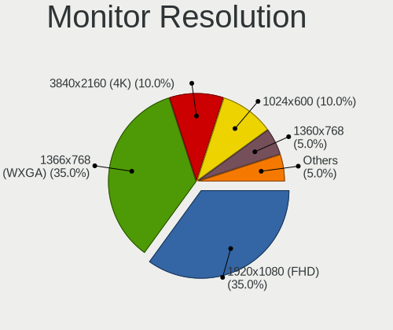
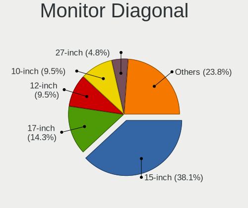
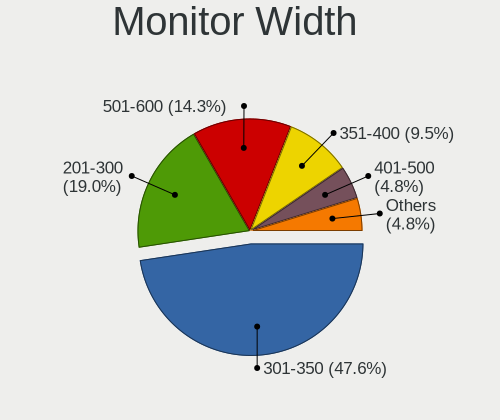
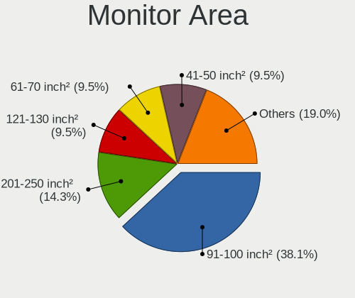
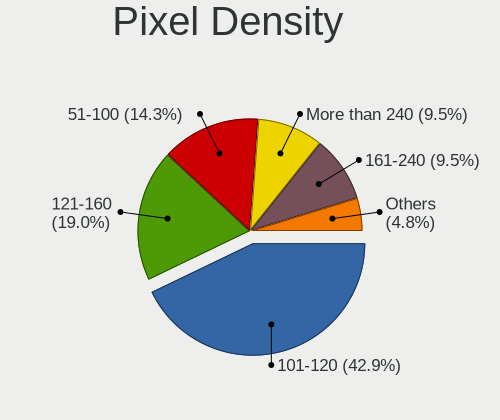
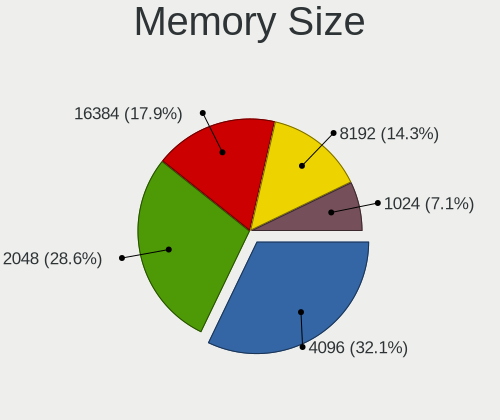
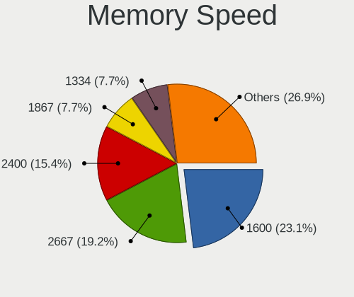
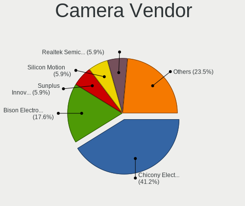

NomadBSD 1.4 - Tested Hardware & Statistics
-------------------------------------------

A project to collect tested hardware configurations for NomadBSD 1.4.

Anyone can contribute to this report by the [hw-probe](https://github.com/linuxhw/hw-probe/blob/master/INSTALL.BSD.md) tool:

    hw-probe -all -upload

Please contribute! Especially if your hardware is rare.

This is a report for all computer types. See also reports for [desktops](/Dist/NomadBSD_1.4/Desktop/README.md) and [notebooks](/Dist/NomadBSD_1.4/Notebook/README.md).

Contents
--------

* [ Test Cases ](#test-cases)

* [ System ](#system)
  - [ Arch                     ](#arch)
  - [ DE                       ](#de)
  - [ Display Server           ](#display-server)
  - [ Display Manager          ](#display-manager)
  - [ OS Lang                  ](#os-lang)
  - [ Boot Mode                ](#boot-mode)
  - [ Filesystem               ](#filesystem)
  - [ Part. scheme             ](#part-scheme)

* [ Board ](#board)
  - [ Vendor                   ](#vendor)
  - [ Model                    ](#model)
  - [ Model Family             ](#model-family)
  - [ MFG Year                 ](#mfg-year)
  - [ Form Factor              ](#form-factor)
  - [ Coreboot                 ](#coreboot)
  - [ RAM Size                 ](#ram-size)
  - [ RAM Used                 ](#ram-used)
  - [ Total Drives             ](#total-drives)
  - [ Has CD-ROM               ](#has-cd-rom)
  - [ Has Ethernet             ](#has-ethernet)
  - [ Has WiFi                 ](#has-wifi)
  - [ Has Bluetooth            ](#has-bluetooth)

* [ Location ](#location)
  - [ Country                  ](#country)
  - [ City                     ](#city)

* [ Drives ](#drives)
  - [ Drive Vendor             ](#drive-vendor)
  - [ Drive Model              ](#drive-model)
  - [ HDD Vendor               ](#hdd-vendor)
  - [ SSD Vendor               ](#ssd-vendor)
  - [ Drive Kind               ](#drive-kind)
  - [ Drive Connector          ](#drive-connector)
  - [ Drive Size               ](#drive-size)
  - [ Space Total              ](#space-total)
  - [ Space Used               ](#space-used)
  - [ Malfunc. Drives          ](#malfunc-drives)
  - [ Malfunc. Drive Vendor    ](#malfunc-drive-vendor)
  - [ Malfunc. HDD Vendor      ](#malfunc-hdd-vendor)
  - [ Malfunc. Drive Kind      ](#malfunc-drive-kind)
  - [ Failed Drives            ](#failed-drives)
  - [ Failed Drive Vendor      ](#failed-drive-vendor)
  - [ Drive Status             ](#drive-status)

* [ Storage controller ](#storage-controller)
  - [ Storage Vendor           ](#storage-vendor)
  - [ Storage Model            ](#storage-model)
  - [ Storage Kind             ](#storage-kind)

* [ Processor ](#processor)
  - [ CPU Vendor               ](#cpu-vendor)
  - [ CPU Model                ](#cpu-model)
  - [ CPU Model Family         ](#cpu-model-family)
  - [ CPU Cores                ](#cpu-cores)
  - [ CPU Sockets              ](#cpu-sockets)
  - [ CPU Threads              ](#cpu-threads)
  - [ CPU Microarch            ](#cpu-microarch)

* [ Graphics ](#graphics)
  - [ GPU Vendor               ](#gpu-vendor)
  - [ GPU Model                ](#gpu-model)
  - [ GPU Combo                ](#gpu-combo)
  - [ GPU Driver               ](#gpu-driver)
  - [ GPU Memory               ](#gpu-memory)

* [ Monitor ](#monitor)
  - [ Monitor Vendor           ](#monitor-vendor)
  - [ Monitor Model            ](#monitor-model)
  - [ Monitor Resolution       ](#monitor-resolution)
  - [ Monitor Diagonal         ](#monitor-diagonal)
  - [ Monitor Width            ](#monitor-width)
  - [ Aspect Ratio             ](#aspect-ratio)
  - [ Monitor Area             ](#monitor-area)
  - [ Pixel Density            ](#pixel-density)
  - [ Multiple Monitors        ](#multiple-monitors)

* [ Network ](#network)
  - [ Net Controller Vendor    ](#net-controller-vendor)
  - [ Net Controller Model     ](#net-controller-model)
  - [ Wireless Vendor          ](#wireless-vendor)
  - [ Wireless Model           ](#wireless-model)
  - [ Ethernet Vendor          ](#ethernet-vendor)
  - [ Ethernet Model           ](#ethernet-model)
  - [ Net Controller Kind      ](#net-controller-kind)
  - [ Used Controller          ](#used-controller)
  - [ NICs                     ](#nics)
  - [ IPv6                     ](#ipv6)

* [ Bluetooth ](#bluetooth)
  - [ Bluetooth Vendor         ](#bluetooth-vendor)
  - [ Bluetooth Model          ](#bluetooth-model)

* [ Sound ](#sound)
  - [ Sound Vendor             ](#sound-vendor)
  - [ Sound Model              ](#sound-model)

* [ Memory ](#memory)
  - [ Memory Vendor            ](#memory-vendor)
  - [ Memory Model             ](#memory-model)
  - [ Memory Kind              ](#memory-kind)
  - [ Memory Form Factor       ](#memory-form-factor)
  - [ Memory Size              ](#memory-size)
  - [ Memory Speed             ](#memory-speed)

* [ Printers & scanners ](#printers--scanners)
  - [ Printer Vendor           ](#printer-vendor)
  - [ Printer Model            ](#printer-model)
  - [ Scanner Vendor           ](#scanner-vendor)
  - [ Scanner Model            ](#scanner-model)

* [ Camera ](#camera)
  - [ Camera Vendor            ](#camera-vendor)
  - [ Camera Model             ](#camera-model)

* [ Security ](#security)
  - [ Fingerprint Vendor       ](#fingerprint-vendor)
  - [ Fingerprint Model        ](#fingerprint-model)
  - [ Chipcard Vendor          ](#chipcard-vendor)
  - [ Chipcard Model           ](#chipcard-model)

* [ Unsupported ](#unsupported)
  - [ Unsupported Devices      ](#unsupported-devices)
  - [ Unsupported Device Types ](#unsupported-device-types)

Test Cases
----------

Total: 30

| Vendor   | Model                       | Form-Factor | Probe                                                     | Date         |
|----------|-----------------------------|-------------|-----------------------------------------------------------|--------------|
| Lenovo   | ThinkPad X13 Yoga Gen 1 ... | Convertible | [8818f01ff2](https://bsd-hardware.info/?probe=8818f01ff2) | Aug 27, 2021 |
| Lenovo   | ThinkPad T510 4384FF3       | Notebook    | [25e208721d](https://bsd-hardware.info/?probe=25e208721d) | Jul 02, 2021 |
| Acer     | Aspire E5-551               | Notebook    | [c9ab1cb207](https://bsd-hardware.info/?probe=c9ab1cb207) | Apr 29, 2021 |
| Lenovo   | ThinkPad S1 Yoga 20C0S0M... | Notebook    | [e9155d12c7](https://bsd-hardware.info/?probe=e9155d12c7) | Apr 27, 2021 |
| Lenovo   | ThinkPad W541 20EGS04800    | Notebook    | [91d2cd471c](https://bsd-hardware.info/?probe=91d2cd471c) | Apr 16, 2021 |
| Lenovo   | ThinkPad X1 Carbon 4th 2... | Notebook    | [821c81e652](https://bsd-hardware.info/?probe=821c81e652) | Apr 09, 2021 |
| ECT      | One Computer AMD A10-785... | Desktop     | [41a2a2e434](https://bsd-hardware.info/?probe=41a2a2e434) | Apr 07, 2021 |
| HP       | ProBook 640 G1              | Notebook    | [6bc6c5b2bf](https://bsd-hardware.info/?probe=6bc6c5b2bf) | Mar 31, 2021 |
| TUXEDO   | Unknown                     | Notebook    | [35aa6590c6](https://bsd-hardware.info/?probe=35aa6590c6) | Mar 29, 2021 |
| Lenovo   | IdeaPad 110-15IBR 80T7      | Notebook    | [c5e824b558](https://bsd-hardware.info/?probe=c5e824b558) | Mar 29, 2021 |
| Acer     | EG43M                       | Desktop     | [0bc978756c](https://bsd-hardware.info/?probe=0bc978756c) | Mar 27, 2021 |
| Dell     | 0NW6H5 A00                  | Desktop     | [650cd9b653](https://bsd-hardware.info/?probe=650cd9b653) | Mar 24, 2021 |
| Toshiba  | Satellite C660              | Notebook    | [7d64801e2b](https://bsd-hardware.info/?probe=7d64801e2b) | Mar 21, 2021 |
| MSI      | MS-N033                     | Notebook    | [650f6a1b70](https://bsd-hardware.info/?probe=650f6a1b70) | Mar 21, 2021 |
| Samsung  | N145P/N250P/N260P           | Notebook    | [eff02dafe1](https://bsd-hardware.info/?probe=eff02dafe1) | Mar 18, 2021 |
| Toshiba  | Satellite C660              | Notebook    | [83f9d05407](https://bsd-hardware.info/?probe=83f9d05407) | Mar 14, 2021 |
| Notebook | N650DU                      | Notebook    | [90d705dd1e](https://bsd-hardware.info/?probe=90d705dd1e) | Mar 14, 2021 |
| HP       | Pavilion dv6000 (RP981EA... | Notebook    | [733c5edb74](https://bsd-hardware.info/?probe=733c5edb74) | Mar 08, 2021 |
| HP       | Pavilion dv6000 (RP981EA... | Notebook    | [56844725d1](https://bsd-hardware.info/?probe=56844725d1) | Mar 08, 2021 |
| Acer     | EG31M R01-C3                | Desktop     | [1186d46ac9](https://bsd-hardware.info/?probe=1186d46ac9) | Mar 08, 2021 |
| HP       | Laptop 15-da0xxx            | Notebook    | [bf572bc102](https://bsd-hardware.info/?probe=bf572bc102) | Mar 06, 2021 |
| Dell     | 0R849J A00                  | Desktop     | [1bd1dc24c9](https://bsd-hardware.info/?probe=1bd1dc24c9) | Mar 06, 2021 |
| ASUSTek  | VivoBook_ASUSLaptop X509... | Notebook    | [be2ad24d1b](https://bsd-hardware.info/?probe=be2ad24d1b) | Mar 06, 2021 |
| ASUSTek  | VivoBook_ASUSLaptop X509... | Notebook    | [0e06b5f17f](https://bsd-hardware.info/?probe=0e06b5f17f) | Mar 06, 2021 |
| ASRock   | Z490M Pro4                  | Desktop     | [348d592fab](https://bsd-hardware.info/?probe=348d592fab) | Mar 05, 2021 |
| Dell     | 03CDJK A01                  | All in one  | [9468eeef92](https://bsd-hardware.info/?probe=9468eeef92) | Mar 04, 2021 |
| VeryPC   | S400                        | Desktop     | [edcea11cb7](https://bsd-hardware.info/?probe=edcea11cb7) | Mar 04, 2021 |
| Dell     | Latitude 5280               | Notebook    | [b84364959d](https://bsd-hardware.info/?probe=b84364959d) | Mar 04, 2021 |
| Lenovo   | IdeaPad S145-15API 81UT     | Notebook    | [1f226262cc](https://bsd-hardware.info/?probe=1f226262cc) | Mar 04, 2021 |
| ASUSTek  | X550LC                      | Notebook    | [e056f1c77c](https://bsd-hardware.info/?probe=e056f1c77c) | Mar 03, 2021 |

System
------

Arch
----

OS architecture (x86_64, i586, etc.)

| Name  | Computers | Percent |
|-------|-----------|---------|
| amd64 | 22        | 95.65%  |
| i386  | 1         | 4.35%   |

DE
--

Desktop Environment

| Name    | Computers | Percent |
|---------|-----------|---------|
| Openbox | 20        | 86.96%  |
| GNOME   | 2         | 8.7%    |
| XFCE    | 1         | 4.35%   |

Display Server
--------------

X11 or Wayland

| Name | Computers | Percent |
|------|-----------|---------|
| X11  | 23        | 100%    |

Display Manager
---------------

SDDM, LightDM, etc.

| Name | Computers | Percent |
|------|-----------|---------|
| SLiM | 23        | 100%    |

OS Lang
-------

Language

| Lang    | Computers | Percent |
|---------|-----------|---------|
| Unknown | 7         | 30.43%  |
| de_DE   | 4         | 17.39%  |
| it_IT   | 3         | 13.04%  |
| tr_TR   | 1         | 4.35%   |
| ru_RU   | 1         | 4.35%   |
| ko_KR   | 1         | 4.35%   |
| fr_FR   | 1         | 4.35%   |
| et_EE   | 1         | 4.35%   |
| en_US   | 1         | 4.35%   |
| en_GB   | 1         | 4.35%   |
| en_AU   | 1         | 4.35%   |
| bg_BG   | 1         | 4.35%   |

Boot Mode
---------

EFI or BIOS

| Mode | Computers | Percent |
|------|-----------|---------|
| EFI  | 22        | 95.65%  |
| BIOS | 1         | 4.35%   |

Filesystem
----------

Type of filesystem

| Type | Computers | Percent |
|------|-----------|---------|
| Ufs  | 21        | 91.3%   |
| Zfs  | 2         | 8.7%    |

Part. scheme
------------

Scheme of partitioning

| Type | Computers | Percent |
|------|-----------|---------|
| GPT  | 16        | 69.57%  |
| MBR  | 7         | 30.43%  |

Board
-----

Vendor
------

Motherboard manufacturer

| Name                | Computers | Percent |
|---------------------|-----------|---------|
| Lenovo              | 7         | 30.43%  |
| Hewlett-Packard     | 3         | 13.04%  |
| Dell                | 3         | 13.04%  |
| Acer                | 3         | 13.04%  |
| ASUSTek Computer    | 2         | 8.7%    |
| TUXEDO              | 1         | 4.35%   |
| Toshiba             | 1         | 4.35%   |
| Samsung Electronics | 1         | 4.35%   |
| Notebook            | 1         | 4.35%   |
| MSI                 | 1         | 4.35%   |

Model
-----

Motherboard model

| Name                                      | Computers | Percent |
|-------------------------------------------|-----------|---------|
| Toshiba Satellite C660                    | 1         | 4.35%   |
| Samsung N145P/N250P/N260P                 | 1         | 4.35%   |
| Notebook N650DU                           | 1         | 4.35%   |
| MSI MS-N033                               | 1         | 4.35%   |
| Lenovo ThinkPad X13 Yoga Gen 1 20SYS22H00 | 1         | 4.35%   |
| Lenovo ThinkPad X1 Carbon 4th 20FB001XAU  | 1         | 4.35%   |
| Lenovo ThinkPad W541 20EGS04800           | 1         | 4.35%   |
| Lenovo ThinkPad T510 4384FF3              | 1         | 4.35%   |
| Lenovo ThinkPad S1 Yoga 20C0S0M300        | 1         | 4.35%   |
| Lenovo IdeaPad S145-15API 81UT            | 1         | 4.35%   |
| Lenovo IdeaPad 110-15IBR 80T7             | 1         | 4.35%   |
| HP ProBook 640 G1                         | 1         | 4.35%   |
| HP Pavilion dv6000 (RP981EA#AB8)          | 1         | 4.35%   |
| HP Laptop 15-da0xxx                       | 1         | 4.35%   |
| Dell Studio XPS 435MT                     | 1         | 4.35%   |
| Dell OptiPlex 5260 AIO                    | 1         | 4.35%   |
| Dell Latitude 5280                        | 1         | 4.35%   |
| ASUS X550LC                               | 1         | 4.35%   |
| ASUS VivoBook_ASUSLaptop X509DA_D509DA    | 1         | 4.35%   |
| Acer Veriton M460                         | 1         | 4.35%   |
| Acer Aspire M3900                         | 1         | 4.35%   |
| Acer Aspire E5-551                        | 1         | 4.35%   |
| Unknown                                   | 1         | 4.35%   |

Model Family
------------

Motherboard model prefix

| Name              | Computers | Percent |
|-------------------|-----------|---------|
| Lenovo ThinkPad   | 5         | 21.74%  |
| Lenovo IdeaPad    | 2         | 8.7%    |
| Acer Aspire       | 2         | 8.7%    |
| Toshiba Satellite | 1         | 4.35%   |
| Samsung N145P     | 1         | 4.35%   |
| Notebook N650DU   | 1         | 4.35%   |
| MSI MS-N033       | 1         | 4.35%   |
| HP ProBook        | 1         | 4.35%   |
| HP Pavilion       | 1         | 4.35%   |
| HP Laptop         | 1         | 4.35%   |
| Dell Studio       | 1         | 4.35%   |
| Dell OptiPlex     | 1         | 4.35%   |
| Dell Latitude     | 1         | 4.35%   |
| ASUS X550LC       | 1         | 4.35%   |
| ASUS VivoBook     | 1         | 4.35%   |
| Acer Veriton      | 1         | 4.35%   |
| Unknown           | 1         | 4.35%   |

MFG Year
--------

Motherboard manufacture year

| Year | Computers | Percent |
|------|-----------|---------|
| 2019 | 4         | 17.39%  |
| 2010 | 4         | 17.39%  |
| 2020 | 3         | 13.04%  |
| 2017 | 2         | 8.7%    |
| 2015 | 2         | 8.7%    |
| 2009 | 2         | 8.7%    |
| 2021 | 1         | 4.35%   |
| 2016 | 1         | 4.35%   |
| 2014 | 1         | 4.35%   |
| 2013 | 1         | 4.35%   |
| 2011 | 1         | 4.35%   |
| 2006 | 1         | 4.35%   |

Form Factor
-----------

Physical design of the computer

| Name        | Computers | Percent |
|-------------|-----------|---------|
| Notebook    | 18        | 78.26%  |
| Desktop     | 3         | 13.04%  |
| Convertible | 1         | 4.35%   |
| All in one  | 1         | 4.35%   |

Coreboot
--------

Have coreboot on board

| Used | Computers | Percent |
|------|-----------|---------|
| No   | 23        | 100%    |

RAM Size
--------

Total RAM memory

| Size in GB | Computers | Percent |
|------------|-----------|---------|
| 8.01-16.0  | 9         | 39.13%  |
| 4.01-8.0   | 5         | 21.74%  |
| 16.01-24.0 | 5         | 21.74%  |
| 32.01-64.0 | 1         | 4.35%   |
| 3.01-4.0   | 1         | 4.35%   |
| 2.01-3.0   | 1         | 4.35%   |
| 0.51-1.0   | 1         | 4.35%   |

RAM Used
--------

Used RAM memory

| Used GB  | Computers | Percent |
|----------|-----------|---------|
| 0.01-0.5 | 13        | 56.52%  |
| 0.51-1.0 | 6         | 26.09%  |
| 1.01-2.0 | 2         | 8.7%    |
| 4.01-8.0 | 1         | 4.35%   |
| 2.01-3.0 | 1         | 4.35%   |

Total Drives
------------

Number of drives on board

| Drives | Computers | Percent |
|--------|-----------|---------|
| 1      | 17        | 73.91%  |
| 2      | 3         | 13.04%  |
| 3      | 2         | 8.7%    |
| 0      | 1         | 4.35%   |

Has CD-ROM
----------

Has CD-ROM on board

| Presented | Computers | Percent |
|-----------|-----------|---------|
| No        | 15        | 65.22%  |
| Yes       | 8         | 34.78%  |

Has Ethernet
------------

Has Ethernet on board

| Presented | Computers | Percent |
|-----------|-----------|---------|
| Yes       | 20        | 86.96%  |
| No        | 3         | 13.04%  |

Has WiFi
--------

Has WiFi module

| Presented | Computers | Percent |
|-----------|-----------|---------|
| Yes       | 21        | 91.3%   |
| No        | 2         | 8.7%    |

Has Bluetooth
-------------

Has Bluetooth module

| Presented | Computers | Percent |
|-----------|-----------|---------|
| Yes       | 13        | 56.52%  |
| No        | 10        | 43.48%  |

Location
--------

Country
-------

Geographic location (country)

| Country     | Computers | Percent |
|-------------|-----------|---------|
| France      | 5         | 21.74%  |
| Germany     | 4         | 17.39%  |
| Turkey      | 3         | 13.04%  |
| Italy       | 3         | 13.04%  |
| USA         | 1         | 4.35%   |
| UK          | 1         | 4.35%   |
| South Korea | 1         | 4.35%   |
| Russia      | 1         | 4.35%   |
| Estonia     | 1         | 4.35%   |
| Denmark     | 1         | 4.35%   |
| Bulgaria    | 1         | 4.35%   |
| Australia   | 1         | 4.35%   |

City
----

Geographic location (city)

| City                | Computers | Percent |
|---------------------|-----------|---------|
| Milan               | 3         | 13.04%  |
| Istanbul            | 3         | 13.04%  |
| Franconville        | 3         | 13.04%  |
| Zwingenberg         | 2         | 8.7%    |
| Wilhelmshaven       | 1         | 4.35%   |
| Vertou              | 1         | 4.35%   |
| Tallinn             | 1         | 4.35%   |
| Suwon               | 1         | 4.35%   |
| Sofia               | 1         | 4.35%   |
| Paris               | 1         | 4.35%   |
| Moscow              | 1         | 4.35%   |
| Grafing bei Munchen | 1         | 4.35%   |
| Glasgow             | 1         | 4.35%   |
| Copenhagen          | 1         | 4.35%   |
| Chino Hills         | 1         | 4.35%   |
| Brisbane            | 1         | 4.35%   |

Drives
------

Drive Vendor
------------

Hard drive vendors

| Vendor              | Computers | Drives | Percent |
|---------------------|-----------|--------|---------|
| WDC                 | 7         | 9      | 28%     |
| Samsung Electronics | 6         | 8      | 24%     |
| Seagate             | 5         | 5      | 20%     |
| Toshiba             | 2         | 2      | 8%      |
| SanDisk             | 1         | 1      | 4%      |
| Micron Technology   | 1         | 1      | 4%      |
| Maxtor              | 1         | 1      | 4%      |
| Intel               | 1         | 1      | 4%      |
| Corsair             | 1         | 1      | 4%      |

Drive Model
-----------

Hard drive models

| Model                                | Computers | Percent |
|--------------------------------------|-----------|---------|
| Seagate ST1000LM049-2GH172 1TB       | 2         | 6.9%    |
| WDC WDS120G2G0B-00EPW0 120GB         | 1         | 3.45%   |
| WDC WDS120G1G0A-00SS50 120GB         | 1         | 3.45%   |
| WDC WD40NMZW-11GX6S1 4TB             | 1         | 3.45%   |
| WDC WD3200BEKT-60PVMT0 320GB         | 1         | 3.45%   |
| WDC WD2500BEVT-80A23T0 250GB         | 1         | 3.45%   |
| WDC WD1600AAJS-22L7A0 160GB          | 1         | 3.45%   |
| WDC WD10JPVX-75JC3T0 1TB             | 1         | 3.45%   |
| WDC PC SN530 SDBPNPZ-256G-1002 256GB | 1         | 3.45%   |
| WDC PC SN520 SDAPMUW-128G-1101 128GB | 1         | 3.45%   |
| Toshiba TR200 240GB                  | 1         | 3.45%   |
| Toshiba MQ01ABD100 1TB               | 1         | 3.45%   |
| Seagate ST95005620AS 500GB           | 1         | 3.45%   |
| Seagate ST1000LX015-1U7172 1TB       | 1         | 3.45%   |
| Seagate ST1000LM035-1RK172 1TB       | 1         | 3.45%   |
| SanDisk SD9SN8W-128G-1006 128GB      | 1         | 3.45%   |
| Samsung SSD 980 1TB                  | 1         | 3.45%   |
| Samsung SSD 970 EVO Plus 1TB         | 1         | 3.45%   |
| Samsung SSD 870 QVO 2TB              | 1         | 3.45%   |
| Samsung SSD 860 EVO 250GB            | 1         | 3.45%   |
| Samsung SSD 850 PRO 512GB            | 1         | 3.45%   |
| Samsung SSD 850 EVO 500GB            | 1         | 3.45%   |
| Samsung MZNLN256HCHP-000L7 256GB     | 1         | 3.45%   |
| Samsung MZ7TD128HAFV-000L1 128GB     | 1         | 3.45%   |
| Micron 1100 SATA 256GB               | 1         | 3.45%   |
| Maxtor STM3250310AS 250GB            | 1         | 3.45%   |
| Intel SSDSC2CW060A3 64GB             | 1         | 3.45%   |
| Corsair Neutron GTX SSD 120GB        | 1         | 3.45%   |

HDD Vendor
----------

Hard disk drive vendors

| Vendor  | Computers | Drives | Percent |
|---------|-----------|--------|---------|
| WDC     | 5         | 5      | 41.67%  |
| Seagate | 5         | 5      | 41.67%  |
| Toshiba | 1         | 1      | 8.33%   |
| Maxtor  | 1         | 1      | 8.33%   |

SSD Vendor
----------

Solid state drive vendors

| Vendor              | Computers | Drives | Percent |
|---------------------|-----------|--------|---------|
| Samsung Electronics | 4         | 6      | 40%     |
| WDC                 | 1         | 2      | 10%     |
| Toshiba             | 1         | 1      | 10%     |
| SanDisk             | 1         | 1      | 10%     |
| Micron Technology   | 1         | 1      | 10%     |
| Intel               | 1         | 1      | 10%     |
| Corsair             | 1         | 1      | 10%     |

Drive Kind
----------

HDD or SSD

| Kind | Computers | Drives | Percent |
|------|-----------|--------|---------|
| SSD  | 10        | 13     | 41.67%  |
| HDD  | 10        | 12     | 41.67%  |
| NVMe | 4         | 4      | 16.67%  |

Drive Connector
---------------

SATA, SAS, NVMe, etc.

| Type | Computers | Drives | Percent |
|------|-----------|--------|---------|
| SATA | 19        | 25     | 82.61%  |
| NVMe | 4         | 4      | 17.39%  |

Drive Size
----------

Size of hard drive

| Size in TB | Computers | Drives | Percent |
|------------|-----------|--------|---------|
| 0.01-0.5   | 15        | 16     | 62.5%   |
| 0.51-1.0   | 7         | 7      | 29.17%  |
| 3.01-4.0   | 1         | 1      | 4.17%   |
| 1.01-2.0   | 1         | 1      | 4.17%   |

Space Total
-----------

Amount of disk space available on the file system

| Size in GB | Computers | Percent |
|------------|-----------|---------|
| 1-20       | 19        | 82.61%  |
| 251-500    | 1         | 4.35%   |
| 21-50      | 1         | 4.35%   |
| 101-250    | 1         | 4.35%   |
| 51-100     | 1         | 4.35%   |

Space Used
----------

Amount of used disk space

| Used GB | Computers | Percent |
|---------|-----------|---------|
| 1-20    | 22        | 95.65%  |
| 21-50   | 1         | 4.35%   |

Malfunc. Drives
---------------

Drive models with a malfunction

| Model                           | Computers | Drives | Percent |
|---------------------------------|-----------|--------|---------|
| WDC WD2500BEVT-80A23T0 250GB    | 1         | 1      | 20%     |
| WDC WD10JPVX-75JC3T0 1TB        | 1         | 1      | 20%     |
| SanDisk SD9SN8W-128G-1006 128GB | 1         | 1      | 20%     |
| Intel SSDSC2CW060A3 64GB        | 1         | 1      | 20%     |
| Corsair Neutron GTX SSD 120GB   | 1         | 1      | 20%     |

Malfunc. Drive Vendor
---------------------

Vendors of faulty drives

| Vendor  | Computers | Drives | Percent |
|---------|-----------|--------|---------|
| WDC     | 2         | 2      | 40%     |
| SanDisk | 1         | 1      | 20%     |
| Intel   | 1         | 1      | 20%     |
| Corsair | 1         | 1      | 20%     |

Malfunc. HDD Vendor
-------------------

Vendors of faulty HDD drives

| Vendor | Computers | Drives | Percent |
|--------|-----------|--------|---------|
| WDC    | 2         | 2      | 100%    |

Malfunc. Drive Kind
-------------------

Kinds of faulty drives

| Kind | Computers | Drives | Percent |
|------|-----------|--------|---------|
| SSD  | 3         | 3      | 60%     |
| HDD  | 2         | 2      | 40%     |

Failed Drives
-------------

Failed drive models

Zero info for selected period =(

Failed Drive Vendor
-------------------

Failed drive vendors

Zero info for selected period =(

Drive Status
------------

Number of failed and malfunc. drives

| Status  | Computers | Drives | Percent |
|---------|-----------|--------|---------|
| Works   | 18        | 24     | 78.26%  |
| Malfunc | 5         | 5      | 21.74%  |

Storage controller
------------------

Storage Vendor
--------------

Storage controller vendors

| Vendor              | Computers | Percent |
|---------------------|-----------|---------|
| Intel               | 19        | 73.08%  |
| AMD                 | 3         | 11.54%  |
| SanDisk             | 2         | 7.69%   |
| Samsung Electronics | 2         | 7.69%   |

Storage Model
-------------

Storage controller models

| Model                                                                            | Computers | Percent |
|----------------------------------------------------------------------------------|-----------|---------|
| AMD FCH SATA Controller [AHCI mode]                                              | 3         | 10%     |
| Intel Sunrise Point-LP SATA Controller [AHCI mode]                               | 2         | 6.67%   |
| Intel SATA Controller [RAID mode]                                                | 2         | 6.67%   |
| Intel 82801GBM/GHM (ICH7-M Family) SATA Controller [AHCI mode]                   | 2         | 6.67%   |
| Intel 82801G (ICH7 Family) IDE Controller                                        | 2         | 6.67%   |
| Intel 8 Series SATA Controller 1 [AHCI mode]                                     | 2         | 6.67%   |
| SanDisk Ultra 3D / WD PC SN530, IX SN530, Blue SN550 NVMe SSD (DRAM-less)        | 1         | 3.33%   |
| SanDisk PC SN520 x2 M.2 2242 NVMe SSD                                            | 1         | 3.33%   |
| Samsung NVMe SSD Controller SM981/PM981/PM983                                    | 1         | 3.33%   |
| Samsung NVMe SSD Controller 980 (DRAM-less)                                      | 1         | 3.33%   |
| Intel Q170/Q150/B150/H170/H110/Z170/CM236 Chipset SATA Controller [AHCI Mode]    | 1         | 3.33%   |
| Intel NM10/ICH7 Family SATA Controller [IDE mode]                                | 1         | 3.33%   |
| Intel NM10/ICH7 Family SATA Controller [AHCI mode]                               | 1         | 3.33%   |
| Intel Comet Lake SATA AHCI Controller                                            | 1         | 3.33%   |
| Intel Atom/Celeron/Pentium Processor x5-E8000/J3xxx/N3xxx Series SATA Controller | 1         | 3.33%   |
| Intel 82801JI (ICH10 Family) 4 port SATA IDE Controller #1                       | 1         | 3.33%   |
| Intel 82801JI (ICH10 Family) 2 port SATA IDE Controller #2                       | 1         | 3.33%   |
| Intel 82801 Mobile SATA Controller [RAID mode]                                   | 1         | 3.33%   |
| Intel 8 Series/C220 Series Chipset Family 6-port SATA Controller 1 [AHCI mode]   | 1         | 3.33%   |
| Intel 8 Series/C220 Series Chipset Family 2-port SATA Controller 2 [IDE mode]    | 1         | 3.33%   |
| Intel 8 Series Chipset Family 4-port SATA Controller 1 [IDE mode] - Mobile       | 1         | 3.33%   |
| Intel 6 Series/C200 Series Chipset Family 6 port Mobile SATA AHCI Controller     | 1         | 3.33%   |
| Intel 5 Series/3400 Series Chipset 6 port SATA AHCI Controller                   | 1         | 3.33%   |

Storage Kind
------------

Kind of storage controller (IDE, SATA, NVMe, SAS, ...)

| Kind | Computers | Percent |
|------|-----------|---------|
| SATA | 16        | 59.26%  |
| NVMe | 4         | 14.81%  |
| IDE  | 4         | 14.81%  |
| RAID | 3         | 11.11%  |

Processor
---------

CPU Vendor
----------

Processor vendors

| Vendor | Computers | Percent |
|--------|-----------|---------|
| Intel  | 20        | 86.96%  |
| AMD    | 3         | 13.04%  |

CPU Model
---------

Processor models

| Model                                          | Computers | Percent |
|------------------------------------------------|-----------|---------|
| Intel Pentium Dual-Core CPU E5800 @ 3.20GHz    | 1         | 4.35%   |
| Intel Pentium CPU N3710 @ 1.60GHz              | 1         | 4.35%   |
| Intel Core i7-8700 CPU @ 3.20GHz               | 1         | 4.35%   |
| Intel Core i7-7700 CPU @ 3.60GHz               | 1         | 4.35%   |
| Intel Core i7-4900MQ CPU @ 2.80GHz             | 1         | 4.35%   |
| Intel Core i7-4500U CPU @ 1.80GHz              | 1         | 4.35%   |
| Intel Core i7-10610U CPU @ 1.80GHz             | 1         | 4.35%   |
| Intel Core i7-10510U CPU @ 1.80GHz             | 1         | 4.35%   |
| Intel Core i7 CPU 920 @ 2.67GHz                | 1         | 4.35%   |
| Intel Core i5-7200U CPU @ 2.50GHz              | 1         | 4.35%   |
| Intel Core i5-6300U CPU @ 2.40GHz              | 1         | 4.35%   |
| Intel Core i5-4310M CPU @ 2.70GHz              | 1         | 4.35%   |
| Intel Core i5-4200U CPU @ 1.60GHz              | 1         | 4.35%   |
| Intel Core i5-2430M CPU @ 2.40GHz              | 1         | 4.35%   |
| Intel Core i5 CPU M 560 @ 2.67GHz              | 1         | 4.35%   |
| Intel Core i3-7020U CPU @ 2.30GHz              | 1         | 4.35%   |
| Intel Core 2 Duo CPU E7300 @ 2.66GHz           | 1         | 4.35%   |
| Intel Core 2 CPU T7200                         | 1         | 4.35%   |
| Intel C1                                       | 1         | 4.35%   |
| Intel Atom CPU N280 @ 1.66GH                   | 1         | 4.35%   |
| AMD Ryzen 7 3700U with Radeon Vega Mobile Gfx  | 1         | 4.35%   |
| AMD Ryzen 5 3500U with Radeon Vega Mobile Gfx  | 1         | 4.35%   |
| AMD A10-7300 Radeon R6, 10 Compute Cores 4C+6G | 1         | 4.35%   |

CPU Model Family
----------------

Processor model prefix

| Model                   | Computers | Percent |
|-------------------------|-----------|---------|
| Intel Core i7           | 7         | 30.43%  |
| Intel Core i5           | 6         | 26.09%  |
| Other                   | 1         | 4.35%   |
| Intel Pentium Dual-Core | 1         | 4.35%   |
| Intel Pentium           | 1         | 4.35%   |
| Intel Core i3           | 1         | 4.35%   |
| Intel Core 2 Duo        | 1         | 4.35%   |
| Intel Core 2            | 1         | 4.35%   |
| Intel Atom              | 1         | 4.35%   |
| AMD Ryzen 7             | 1         | 4.35%   |
| AMD Ryzen 5             | 1         | 4.35%   |
| AMD A10                 | 1         | 4.35%   |

CPU Cores
---------

Number of processor cores

| Number  | Computers | Percent |
|---------|-----------|---------|
| 2       | 10        | 43.48%  |
| 4       | 7         | 30.43%  |
| 8       | 2         | 8.7%    |
| Unknown | 2         | 8.7%    |
| 6       | 1         | 4.35%   |
| 1       | 1         | 4.35%   |

CPU Sockets
-----------

Number of sockets

| Number | Computers | Percent |
|--------|-----------|---------|
| 1      | 23        | 100%    |

CPU Threads
-----------

Threads per core (Hyper-Threading)

| Number  | Computers | Percent |
|---------|-----------|---------|
| 2       | 15        | 65.22%  |
| 1       | 6         | 26.09%  |
| Unknown | 2         | 8.7%    |

CPU Microarch
-------------

Microarchitecture

| Name        | Computers | Percent |
|-------------|-----------|---------|
| KabyLake    | 6         | 26.09%  |
| Haswell     | 4         | 17.39%  |
| Zen+        | 2         | 8.7%    |
| Penryn      | 2         | 8.7%    |
| Bonnell     | 2         | 8.7%    |
| Westmere    | 1         | 4.35%   |
| Steamroller | 1         | 4.35%   |
| Skylake     | 1         | 4.35%   |
| Silvermont  | 1         | 4.35%   |
| SandyBridge | 1         | 4.35%   |
| Nehalem     | 1         | 4.35%   |
| Core        | 1         | 4.35%   |

Graphics
--------

GPU Vendor
----------

Vendors of graphics cards

| Vendor | Computers | Percent |
|--------|-----------|---------|
| Intel  | 17        | 68%     |
| AMD    | 5         | 20%     |
| Nvidia | 3         | 12%     |

GPU Model
---------

Graphics card models

| Model                                                                                    | Computers | Percent |
|------------------------------------------------------------------------------------------|-----------|---------|
| Intel HD Graphics 620                                                                    | 2         | 7.69%   |
| Intel Haswell-ULT Integrated Graphics Controller                                         | 2         | 7.69%   |
| Intel CometLake-U GT2 [UHD Graphics]                                                     | 2         | 7.69%   |
| Intel 4th Gen Core Processor Integrated Graphics Controller                              | 2         | 7.69%   |
| AMD Picasso/Raven 2 [Radeon Vega Series / Radeon Vega Mobile Series]                     | 2         | 7.69%   |
| Nvidia GK106GLM [Quadro K2100M]                                                          | 1         | 3.85%   |
| Nvidia GF117M [GeForce 610M/710M/810M/820M / GT 620M/625M/630M/720M]                     | 1         | 3.85%   |
| Nvidia G72M [GeForce Go 7400]                                                            | 1         | 3.85%   |
| Intel Skylake GT2 [HD Graphics 520]                                                      | 1         | 3.85%   |
| Intel Mobile 945GSE Express Integrated Graphics Controller                               | 1         | 3.85%   |
| Intel Mobile 945GM/GMS/GME, 943/940GML Express Integrated Graphics Controller            | 1         | 3.85%   |
| Intel HD Graphics 630                                                                    | 1         | 3.85%   |
| Intel Core Processor Integrated Graphics Controller                                      | 1         | 3.85%   |
| Intel CoffeeLake-S GT2 [UHD Graphics 630]                                                | 1         | 3.85%   |
| Intel Atom/Celeron/Pentium Processor x5-E8000/J3xxx/N3xxx Integrated Graphics Controller | 1         | 3.85%   |
| Intel Atom Processor D4xx/D5xx/N4xx/N5xx Integrated Graphics Controller                  | 1         | 3.85%   |
| Intel 82G33/G31 Express Integrated Graphics Controller                                   | 1         | 3.85%   |
| Intel 2nd Generation Core Processor Family Integrated Graphics Controller                | 1         | 3.85%   |
| AMD Kaveri [Radeon R6 Graphics]                                                          | 1         | 3.85%   |
| AMD Caicos [Radeon HD 6450/7450/8450 / R5 230 OEM]                                       | 1         | 3.85%   |
| AMD Baffin [Radeon RX 460/560D / Pro 450/455/460/555/555X/560/560X]                      | 1         | 3.85%   |

GPU Combo
---------

Combinations of graphics cards

| Name           | Computers | Percent |
|----------------|-----------|---------|
| 1 x Intel      | 13        | 56.52%  |
| 1 x AMD        | 5         | 21.74%  |
| 2 x Intel      | 2         | 8.7%    |
| Intel + Nvidia | 2         | 8.7%    |
| 1 x Nvidia     | 1         | 4.35%   |

GPU Driver
----------

Free vs proprietary

| Driver      | Computers | Percent |
|-------------|-----------|---------|
| Free        | 18        | 78.26%  |
| Unknown     | 4         | 17.39%  |
| Proprietary | 1         | 4.35%   |

GPU Memory
----------

Total video memory

| Size in GB | Computers | Percent |
|------------|-----------|---------|
| Unknown    | 20        | 86.96%  |
| 3.01-4.0   | 1         | 4.35%   |
| 1.01-2.0   | 1         | 4.35%   |
| 0.51-1.0   | 1         | 4.35%   |

Monitor
-------

Monitor Vendor
--------------

Monitor vendors

| Vendor              | Computers | Percent |
|---------------------|-----------|---------|
| AU Optronics        | 4         | 19.05%  |
| LG Display          | 3         | 14.29%  |
| Samsung Electronics | 2         | 9.52%   |
| Panasonic           | 2         | 9.52%   |
| Dell                | 2         | 9.52%   |
| BOE                 | 2         | 9.52%   |
| Acer                | 2         | 9.52%   |
| Sony                | 1         | 4.76%   |
| Lenovo              | 1         | 4.76%   |
| Goldstar            | 1         | 4.76%   |
| CPT                 | 1         | 4.76%   |

Monitor Model
-------------

Monitor models

| Model                                                                | Computers | Percent |
|----------------------------------------------------------------------|-----------|---------|
| Panasonic LCD Monitor MEI96A2 3840x2160 380x210mm 17.1-inch          | 2         | 9.52%   |
| Sony TV SNY5D01 1360x768                                             | 1         | 4.76%   |
| Samsung Electronics LCD Monitor SEC3030 1024x600 220x130mm 10.1-inch | 1         | 4.76%   |
| Samsung Electronics LCD Monitor SDC4D42 1366x768 310x170mm 13.9-inch | 1         | 4.76%   |
| LG Display LCD Monitor LGD0532 1920x1080 340x190mm 15.3-inch         | 1         | 4.76%   |
| LG Display LCD Monitor LGD0414 1920x1080 280x160mm 12.7-inch         | 1         | 4.76%   |
| LG Display LCD Monitor LGD02DC 1366x768 340x190mm 15.3-inch          | 1         | 4.76%   |
| Lenovo LCD Monitor LEN40B0 1366x768 340x190mm 15.3-inch              | 1         | 4.76%   |
| Goldstar LG Ultra HD GSM5B09 3840x2160 600x340mm 27.2-inch           | 1         | 4.76%   |
| Dell S2309W DELA041 1920x1080 510x290mm 23.1-inch                    | 1         | 4.76%   |
| Dell LCD Monitor DEL93F2 1920x1080 480x270mm 21.7-inch               | 1         | 4.76%   |
| CPT LCD Monitor CPT04C4 1024x600 230x140mm 10.6-inch                 | 1         | 4.76%   |
| BOE LCD Monitor BOE0812 1920x1080 340x190mm 15.3-inch                | 1         | 4.76%   |
| BOE LCD Monitor BOE06A4 1366x768 340x190mm 15.3-inch                 | 1         | 4.76%   |
| AU Optronics LCD Monitor AUO70EC 1366x768 340x190mm 15.3-inch        | 1         | 4.76%   |
| AU Optronics LCD Monitor AUO48EC 1366x768 340x190mm 15.3-inch        | 1         | 4.76%   |
| AU Optronics LCD Monitor AUO21ED 1920x1080 340x190mm 15.3-inch       | 1         | 4.76%   |
| AU Optronics LCD Monitor AUO106C 1366x768 280x160mm 12.7-inch        | 1         | 4.76%   |
| Acer V246HL ACR032E 1920x1080 530x300mm 24.0-inch                    | 1         | 4.76%   |
| Acer V173 ACR0019 1280x1024 340x270mm 17.1-inch                      | 1         | 4.76%   |

Monitor Resolution
------------------

Monitor screen resolution

| Resolution       | Computers | Percent |
|------------------|-----------|---------|
| 1920x1080 (FHD)  | 7         | 35%     |
| 1366x768 (WXGA)  | 7         | 35%     |
| 3840x2160 (4K)   | 2         | 10%     |
| 1024x600         | 2         | 10%     |
| 1360x768         | 1         | 5%      |
| 1280x1024 (SXGA) | 1         | 5%      |

Monitor Diagonal
----------------

Diagonal size in inches

| Inches  | Computers | Percent |
|---------|-----------|---------|
| 15      | 8         | 38.1%   |
| 17      | 3         | 14.29%  |
| 12      | 2         | 9.52%   |
| 10      | 2         | 9.52%   |
| 27      | 1         | 4.76%   |
| 24      | 1         | 4.76%   |
| 23      | 1         | 4.76%   |
| 21      | 1         | 4.76%   |
| 13      | 1         | 4.76%   |
| Unknown | 1         | 4.76%   |

Monitor Width
-------------

Physical width

| Width in mm | Computers | Percent |
|-------------|-----------|---------|
| 301-350     | 10        | 47.62%  |
| 201-300     | 4         | 19.05%  |
| 501-600     | 3         | 14.29%  |
| 351-400     | 2         | 9.52%   |
| 401-500     | 1         | 4.76%   |
| Unknown     | 1         | 4.76%   |

Aspect Ratio
------------

Proportional relationship between the width and the height

| Ratio | Computers | Percent |
|-------|-----------|---------|
| 16/9  | 17        | 89.47%  |
| 5/4   | 1         | 5.26%   |
| 16/10 | 1         | 5.26%   |

Monitor Area
------------

Area in inch²

| Area in inch² | Computers | Percent |
|----------------|-----------|---------|
| 91-100         | 8         | 38.1%   |
| 201-250        | 3         | 14.29%  |
| 61-70          | 2         | 9.52%   |
| 41-50          | 2         | 9.52%   |
| 121-130        | 2         | 9.52%   |
| 81-90          | 1         | 4.76%   |
| 301-350        | 1         | 4.76%   |
| 141-150        | 1         | 4.76%   |
| Unknown        | 1         | 4.76%   |

Pixel Density
-------------

Pixels per inch

| Density       | Computers | Percent |
|---------------|-----------|---------|
| 101-120       | 9         | 42.86%  |
| 121-160       | 4         | 19.05%  |
| 51-100        | 3         | 14.29%  |
| More than 240 | 2         | 9.52%   |
| 161-240       | 2         | 9.52%   |
| Unknown       | 1         | 4.76%   |

Multiple Monitors
-----------------

Total monitors connected

| Total | Computers | Percent |
|-------|-----------|---------|
| 1     | 17        | 73.91%  |
| 0     | 4         | 17.39%  |
| 2     | 2         | 8.7%    |

Network
-------

Net Controller Vendor
---------------------

Controller vendors

| Vendor                   | Computers | Percent |
|--------------------------|-----------|---------|
| Intel                    | 13        | 40.63%  |
| Realtek Semiconductor    | 11        | 34.38%  |
| Qualcomm Atheros         | 6         | 18.75%  |
| TP-Link                  | 1         | 3.13%   |
| Marvell Technology Group | 1         | 3.13%   |

Net Controller Model
--------------------

Controller models

| Model                                                                                 | Computers | Percent |
|---------------------------------------------------------------------------------------|-----------|---------|
| Realtek RTL8111/8168/8211/8411 PCI Express Gigabit Ethernet Controller                | 6         | 14.29%  |
| Realtek RTL810xE PCI Express Fast Ethernet controller                                 | 3         | 7.14%   |
| Intel Wireless 7260                                                                   | 3         | 7.14%   |
| Realtek RTL8821CE 802.11ac PCIe Wireless Network Adapter                              | 2         | 4.76%   |
| Intel Ethernet Connection I217-LM                                                     | 2         | 4.76%   |
| TP-Link AC600 wireless Realtek RTL8811AU [Archer T2U Nano]                            | 1         | 2.38%   |
| Realtek RTL8821AE 802.11ac PCIe Wireless Network Adapter                              | 1         | 2.38%   |
| Realtek RTL8192CE PCIe Wireless Network Adapter                                       | 1         | 2.38%   |
| Realtek RTL8188CE 802.11b/g/n WiFi Adapter                                            | 1         | 2.38%   |
| Qualcomm Atheros QCA9565 / AR9565 Wireless Network Adapter                            | 1         | 2.38%   |
| Qualcomm Atheros QCA9377 802.11ac Wireless Network Adapter                            | 1         | 2.38%   |
| Qualcomm Atheros AR9485 Wireless Network Adapter                                      | 1         | 2.38%   |
| Qualcomm Atheros AR928X Wireless Network Adapter (PCI-Express)                        | 1         | 2.38%   |
| Qualcomm Atheros AR9285 Wireless Network Adapter (PCI-Express)                        | 1         | 2.38%   |
| Qualcomm Atheros AR5418 Wireless Network Adapter [AR5008E 802.11(a)bgn] (PCI-Express) | 1         | 2.38%   |
| Marvell Group 88E8040 PCI-E Fast Ethernet Controller                                  | 1         | 2.38%   |
| Intel Wireless 8265 / 8275                                                            | 1         | 2.38%   |
| Intel Wireless 8260                                                                   | 1         | 2.38%   |
| Intel Wireless 3165                                                                   | 1         | 2.38%   |
| Intel Wi-Fi 5(802.11ac) Wireless-AC 9x6x [Thunder Peak]                               | 1         | 2.38%   |
| Intel PRO/Wireless 3945ABG [Golan] Network Connection                                 | 1         | 2.38%   |
| Intel Ethernet Connection I219-LM                                                     | 1         | 2.38%   |
| Intel Ethernet Connection (7) I219-V                                                  | 1         | 2.38%   |
| Intel Ethernet Connection (4) I219-LM                                                 | 1         | 2.38%   |
| Intel Ethernet Connection (10) I219-LM                                                | 1         | 2.38%   |
| Intel Comet Lake PCH-LP CNVi WiFi                                                     | 1         | 2.38%   |
| Intel Centrino Advanced-N 6200                                                        | 1         | 2.38%   |
| Intel 82577LM Gigabit Network Connection                                              | 1         | 2.38%   |
| Intel 82573L Gigabit Ethernet Controller                                              | 1         | 2.38%   |
| Intel 82567V-2 Gigabit Network Connection                                             | 1         | 2.38%   |
| Intel 82567LF-2 Gigabit Network Connection                                            | 1         | 2.38%   |

Wireless Vendor
---------------

Wireless vendors

| Vendor                | Computers | Percent |
|-----------------------|-----------|---------|
| Intel                 | 10        | 45.45%  |
| Qualcomm Atheros      | 6         | 27.27%  |
| Realtek Semiconductor | 5         | 22.73%  |
| TP-Link               | 1         | 4.55%   |

Wireless Model
--------------

Wireless models

| Model                                                                                 | Computers | Percent |
|---------------------------------------------------------------------------------------|-----------|---------|
| Intel Wireless 7260                                                                   | 3         | 13.64%  |
| Realtek RTL8821CE 802.11ac PCIe Wireless Network Adapter                              | 2         | 9.09%   |
| TP-Link AC600 wireless Realtek RTL8811AU [Archer T2U Nano]                            | 1         | 4.55%   |
| Realtek RTL8821AE 802.11ac PCIe Wireless Network Adapter                              | 1         | 4.55%   |
| Realtek RTL8192CE PCIe Wireless Network Adapter                                       | 1         | 4.55%   |
| Realtek RTL8188CE 802.11b/g/n WiFi Adapter                                            | 1         | 4.55%   |
| Qualcomm Atheros QCA9565 / AR9565 Wireless Network Adapter                            | 1         | 4.55%   |
| Qualcomm Atheros QCA9377 802.11ac Wireless Network Adapter                            | 1         | 4.55%   |
| Qualcomm Atheros AR9485 Wireless Network Adapter                                      | 1         | 4.55%   |
| Qualcomm Atheros AR928X Wireless Network Adapter (PCI-Express)                        | 1         | 4.55%   |
| Qualcomm Atheros AR9285 Wireless Network Adapter (PCI-Express)                        | 1         | 4.55%   |
| Qualcomm Atheros AR5418 Wireless Network Adapter [AR5008E 802.11(a)bgn] (PCI-Express) | 1         | 4.55%   |
| Intel Wireless 8265 / 8275                                                            | 1         | 4.55%   |
| Intel Wireless 8260                                                                   | 1         | 4.55%   |
| Intel Wireless 3165                                                                   | 1         | 4.55%   |
| Intel Wi-Fi 5(802.11ac) Wireless-AC 9x6x [Thunder Peak]                               | 1         | 4.55%   |
| Intel PRO/Wireless 3945ABG [Golan] Network Connection                                 | 1         | 4.55%   |
| Intel Comet Lake PCH-LP CNVi WiFi                                                     | 1         | 4.55%   |
| Intel Centrino Advanced-N 6200                                                        | 1         | 4.55%   |

Ethernet Vendor
---------------

Ethernet vendors

| Vendor                   | Computers | Percent |
|--------------------------|-----------|---------|
| Intel                    | 10        | 50%     |
| Realtek Semiconductor    | 9         | 45%     |
| Marvell Technology Group | 1         | 5%      |

Ethernet Model
--------------

Ethernet models

| Model                                                                  | Computers | Percent |
|------------------------------------------------------------------------|-----------|---------|
| Realtek RTL8111/8168/8211/8411 PCI Express Gigabit Ethernet Controller | 6         | 30%     |
| Realtek RTL810xE PCI Express Fast Ethernet controller                  | 3         | 15%     |
| Intel Ethernet Connection I217-LM                                      | 2         | 10%     |
| Marvell Group 88E8040 PCI-E Fast Ethernet Controller                   | 1         | 5%      |
| Intel Ethernet Connection I219-LM                                      | 1         | 5%      |
| Intel Ethernet Connection (7) I219-V                                   | 1         | 5%      |
| Intel Ethernet Connection (4) I219-LM                                  | 1         | 5%      |
| Intel Ethernet Connection (10) I219-LM                                 | 1         | 5%      |
| Intel 82577LM Gigabit Network Connection                               | 1         | 5%      |
| Intel 82573L Gigabit Ethernet Controller                               | 1         | 5%      |
| Intel 82567V-2 Gigabit Network Connection                              | 1         | 5%      |
| Intel 82567LF-2 Gigabit Network Connection                             | 1         | 5%      |

Net Controller Kind
-------------------

Ethernet, WiFi or modem

| Kind     | Computers | Percent |
|----------|-----------|---------|
| WiFi     | 21        | 51.22%  |
| Ethernet | 20        | 48.78%  |

Used Controller
---------------

Currently used network controller

| Kind     | Computers | Percent |
|----------|-----------|---------|
| Ethernet | 20        | 54.05%  |
| WiFi     | 17        | 45.95%  |

NICs
----

Total network controllers on board

| Total | Computers | Percent |
|-------|-----------|---------|
| 2     | 18        | 78.26%  |
| 1     | 5         | 21.74%  |

IPv6
----

IPv6 vs IPv4

| Used | Computers | Percent |
|------|-----------|---------|
| No   | 19        | 82.61%  |
| Yes  | 4         | 17.39%  |

Bluetooth
---------

Bluetooth Vendor
----------------

Controller vendors

| Vendor                          | Computers | Percent |
|---------------------------------|-----------|---------|
| Intel                           | 7         | 53.85%  |
| Realtek Semiconductor           | 2         | 15.38%  |
| Qualcomm Atheros Communications | 1         | 7.69%   |
| Lite-On Technology              | 1         | 7.69%   |
| IMC Networks                    | 1         | 7.69%   |
| Hewlett-Packard                 | 1         | 7.69%   |

Bluetooth Model
---------------

Controller models

| Model                                         | Computers | Percent |
|-----------------------------------------------|-----------|---------|
| Intel Bluetooth wireless interface            | 5         | 38.46%  |
| Realtek RTL8821A Bluetooth                    | 1         | 7.69%   |
| Realtek  Bluetooth 4.2 Adapter                | 1         | 7.69%   |
| Qualcomm Atheros QCA9377 Bluetooth 4.1        | 1         | 7.69%   |
| Lite-On Atheros AR3012 Bluetooth              | 1         | 7.69%   |
| Intel Wireless-AC 9260 Bluetooth Adapter      | 1         | 7.69%   |
| Intel AX201 Bluetooth                         | 1         | 7.69%   |
| IMC Networks Realtek Bluetooth Adapter        | 1         | 7.69%   |
| HP Bluetooth 2.0 Interface [Broadcom BCM2045] | 1         | 7.69%   |

Sound
-----

Sound Vendor
------------

Sound card vendors

| Vendor | Computers | Percent |
|--------|-----------|---------|
| Intel  | 20        | 80%     |
| AMD    | 5         | 20%     |

Sound Model
-----------

Sound card models

| Model                                                                                             | Computers | Percent |
|---------------------------------------------------------------------------------------------------|-----------|---------|
| Intel NM10/ICH7 Family High Definition Audio Controller                                           | 4         | 12.5%   |
| Intel Sunrise Point-LP HD Audio                                                                   | 3         | 9.38%   |
| Intel Xeon E3-1200 v3/4th Gen Core Processor HD Audio Controller                                  | 2         | 6.25%   |
| Intel Haswell-ULT HD Audio Controller                                                             | 2         | 6.25%   |
| Intel Comet Lake PCH-LP cAVS                                                                      | 2         | 6.25%   |
| Intel 82801JI (ICH10 Family) HD Audio Controller                                                  | 2         | 6.25%   |
| Intel 8 Series/C220 Series Chipset High Definition Audio Controller                               | 2         | 6.25%   |
| Intel 8 Series HD Audio Controller                                                                | 2         | 6.25%   |
| AMD Raven/Raven2/Fenghuang HDMI/DP Audio Controller                                               | 2         | 6.25%   |
| AMD Family 17h/19h/1ah HD Audio Controller                                                        | 2         | 6.25%   |
| Intel Cannon Lake PCH cAVS                                                                        | 1         | 3.13%   |
| Intel Atom/Celeron/Pentium Processor x5-E8000/J3xxx/N3xxx Series High Definition Audio Controller | 1         | 3.13%   |
| Intel 6 Series/C200 Series Chipset Family High Definition Audio Controller                        | 1         | 3.13%   |
| Intel 5 Series/3400 Series Chipset High Definition Audio                                          | 1         | 3.13%   |
| Intel 100 Series/C230 Series Chipset Family HD Audio Controller                                   | 1         | 3.13%   |
| AMD Kaveri HDMI/DP Audio Controller                                                               | 1         | 3.13%   |
| AMD FCH Azalia Controller                                                                         | 1         | 3.13%   |
| AMD Caicos HDMI Audio [Radeon HD 6450 / 7450/8450/8490 OEM / R5 230/235/235X OEM]                 | 1         | 3.13%   |
| AMD Baffin HDMI/DP Audio [Radeon RX 550 640SP / RX 560/560X]                                      | 1         | 3.13%   |

Memory
------

Memory Vendor
-------------

Memory module vendors

| Vendor              | Computers | Percent |
|---------------------|-----------|---------|
| Samsung Electronics | 9         | 33.33%  |
| Micron Technology   | 4         | 14.81%  |
| Unknown             | 3         | 11.11%  |
| SK hynix            | 3         | 11.11%  |
| Elpida              | 2         | 7.41%   |
| Crucial             | 2         | 7.41%   |
| Unknown (09D5)      | 1         | 3.7%    |
| Nanya Technology    | 1         | 3.7%    |
| Kingston            | 1         | 3.7%    |
| 48spaces            | 1         | 3.7%    |

Memory Model
------------

Memory module models

| Model                                                                     | Computers | Percent |
|---------------------------------------------------------------------------|-----------|---------|
| Samsung RAM M471A5244CB0-CTD 4GB SODIMM DDR4 2667MT/s                     | 2         | 6.45%   |
| Samsung RAM M471A1K43CB1-CTD 8GB SODIMM DDR4 2667MT/s                     | 2         | 6.45%   |
| Unknown RAM Module 2GB SODIMM DDR2 667MT/s                                | 1         | 3.23%   |
| Unknown RAM Module 2GB SODIMM DDR2                                        | 1         | 3.23%   |
| Unknown RAM Module 2GB DIMM DDR2 800MT/s                                  | 1         | 3.23%   |
| Unknown RAM Module 1GB SODIMM DDR2 667MT/s                                | 1         | 3.23%   |
| Unknown (09D5) RAM Module 16GB SODIMM DDR4 2400MT/s                       | 1         | 3.23%   |
| SK hynix RAM HMT851S6AMR6R-PB 4GB Chip DDR3 1600MT/s                      | 1         | 3.23%   |
| SK hynix RAM HMT351U6CFR8C-PB 4GB DIMM DDR3 1600MT/s                      | 1         | 3.23%   |
| SK hynix RAM HMT112U6AFP8C-G7 1GB DIMM 1066MT/s                           | 1         | 3.23%   |
| SK hynix RAM HMA81GS6AFR8N-UH 8GB SODIMM DDR4 2400MT/s                    | 1         | 3.23%   |
| Samsung RAM M471B5773DH0-CH9 2GB SODIMM DDR3 1334MT/s                     | 1         | 3.23%   |
| Samsung RAM M471B5273DH0-CH9 4GB SODIMM DDR3 1334MT/s                     | 1         | 3.23%   |
| Samsung RAM M471B5173EB0-YK0 4GB SODIMM DDR3 1600MT/s                     | 1         | 3.23%   |
| Samsung RAM M471B5173BH0-YK0 4GB SODIMM DDR3 1600MT/s                     | 1         | 3.23%   |
| Samsung RAM M471A1G44AB0-CWE 8GB SODIMM DDR4 3200MT/s                     | 1         | 3.23%   |
| Samsung RAM K4E6E304EE-EGCF 4GB SODIMM LPDDR3 1867MT/s                    | 1         | 3.23%   |
| Samsung RAM K4E6E304EE-EGCF 4GB Chip LPDDR3 1867MT/s                      | 1         | 3.23%   |
| Nanya RAM NT2GC64B88B0NS-CG 2GB SODIMM DDR3 1334MT/s                      | 1         | 3.23%   |
| Micron RAM 4KTF51264HZ-1G6A1 4GB SODIMM DDR3 1600MT/s                     | 1         | 3.23%   |
| Micron RAM 4ATF51264HZ-2G6E! 4GB SODIMM DDR4 2400MT/s                     | 1         | 3.23%   |
| Micron RAM 16KTF1G64HZ-1G6E1 8GB SODIMM DDR3 1600MT/s                     | 1         | 3.23%   |
| Micron RAM 16ATF2G64HZ-2G6E1 16GB SODIMM DDR4 2667MT/s                    | 1         | 3.23%   |
| Kingston RAM ACR256X64D3U1333C9 2GB DIMM DDR3 1333MT/s                    | 1         | 3.23%   |
| Elpida RAM Module 4GB SODIMM DDR3 1600MT/s                                | 1         | 3.23%   |
| Elpida RAM EBJ21UE8BAFA-AE-E 2GB DIMM 1066MT/s                            | 1         | 3.23%   |
| Crucial RAM CT16G4DFD824A.M16FE 16GB DIMM DDR4 2400MT/s                   | 1         | 3.23%   |
| Crucial RAM BLS8G3N18AES4.16FE 8GB SODIMM DDR3 1867MT/s                   | 1         | 3.23%   |
| 48spaces RAM 012345678901234567890123456789012345 1GB SODIMM DDR2 800MT/s | 1         | 3.23%   |

Memory Kind
-----------

Memory module kinds

| Kind    | Computers | Percent |
|---------|-----------|---------|
| DDR3    | 10        | 40%     |
| DDR4    | 9         | 36%     |
| DDR2    | 4         | 16%     |
| LPDDR3  | 1         | 4%      |
| Unknown | 1         | 4%      |

Memory Form Factor
------------------

Physical design of the memory module

| Name   | Computers | Percent |
|--------|-----------|---------|
| SODIMM | 19        | 76%     |
| DIMM   | 4         | 16%     |
| Chip   | 2         | 8%      |

Memory Size
-----------

Memory module size

| Size  | Computers | Percent |
|-------|-----------|---------|
| 4096  | 9         | 32.14%  |
| 2048  | 8         | 28.57%  |
| 16384 | 5         | 17.86%  |
| 8192  | 4         | 14.29%  |
| 1024  | 2         | 7.14%   |

Memory Speed
------------

Memory module speed

| Speed   | Computers | Percent |
|---------|-----------|---------|
| 1600    | 6         | 23.08%  |
| 2667    | 5         | 19.23%  |
| 2400    | 4         | 15.38%  |
| 1867    | 2         | 7.69%   |
| 1334    | 2         | 7.69%   |
| 800     | 2         | 7.69%   |
| 3200    | 1         | 3.85%   |
| 1333    | 1         | 3.85%   |
| 1066    | 1         | 3.85%   |
| 667     | 1         | 3.85%   |
| Unknown | 1         | 3.85%   |

Printers & scanners
-------------------

Printer Vendor
--------------

Printer device vendors

| Vendor      | Computers | Percent |
|-------------|-----------|---------|
| Dymo-CoStar | 1         | 100%    |

Printer Model
-------------

Printer device models

| Model                                | Computers | Percent |
|--------------------------------------|-----------|---------|
| Dymo-CoStar DYMO LabelWriter 450 DUO | 1         | 100%    |

Scanner Vendor
--------------

Scanner device vendors

Zero info for selected period =(

Scanner Model
-------------

Scanner device models

Zero info for selected period =(

Camera
------

Camera Vendor
-------------

Camera device vendors

| Vendor                                 | Computers | Percent |
|----------------------------------------|-----------|---------|
| Chicony Electronics                    | 7         | 41.18%  |
| Bison Electronics                      | 3         | 17.65%  |
| Sunplus Innovation Technology          | 1         | 5.88%   |
| Silicon Motion                         | 1         | 5.88%   |
| Realtek Semiconductor                  | 1         | 5.88%   |
| Microdia                               | 1         | 5.88%   |
| Logitech                               | 1         | 5.88%   |
| IMC Networks                           | 1         | 5.88%   |
| Cheng Uei Precision Industry (Foxlink) | 1         | 5.88%   |

Camera Model
------------

Camera device models

| Model                                               | Computers | Percent |
|-----------------------------------------------------|-----------|---------|
| Chicony Integrated Camera                           | 3         | 17.65%  |
| Sunplus Integrated_Webcam_HD                        | 1         | 5.88%   |
| Silicon Motion WebCam SCX Series                    | 1         | 5.88%   |
| Realtek Lenovo EasyCamera                           | 1         | 5.88%   |
| Microdia Sonix USB 2.0 Camera                       | 1         | 5.88%   |
| Logitech C505 HD Webcam                             | 1         | 5.88%   |
| IMC Networks Realtek DMFT RGB                       | 1         | 5.88%   |
| Chicony Webcam                                      | 1         | 5.88%   |
| Chicony USB2.0 HD UVC WebCam                        | 1         | 5.88%   |
| Chicony HP TrueVision HD Camera                     | 1         | 5.88%   |
| Chicony HD WebCam                                   | 1         | 5.88%   |
| Cheng Uei Precision Industry (Foxlink) HP HD Webcam | 1         | 5.88%   |
| Bison Lenovo EasyCamera                             | 1         | 5.88%   |
| Bison Integrated Camera                             | 1         | 5.88%   |
| Bison EasyCamera                                    | 1         | 5.88%   |

Security
--------

Fingerprint Vendor
------------------

Fingerprint sensor vendors

| Vendor           | Computers | Percent |
|------------------|-----------|---------|
| Validity Sensors | 2         | 50%     |
| Synaptics        | 2         | 50%     |

Fingerprint Model
-----------------

Fingerprint sensor models

| Model                                             | Computers | Percent |
|---------------------------------------------------|-----------|---------|
| Validity Sensors VFS7500 Touch Fingerprint Sensor | 1         | 25%     |
| Validity Sensors VFS495 Fingerprint Reader        | 1         | 25%     |
| Synaptics Prometheus MIS Touch Fingerprint Reader | 1         | 25%     |
| Unknown                                           | 1         | 25%     |

Chipcard Vendor
---------------

Chipcard module vendors

Zero info for selected period =(

Chipcard Model
--------------

Chipcard module models

Zero info for selected period =(

Unsupported
-----------

Unsupported Devices
-------------------

Total unsupported devices on board

| Total | Computers | Percent |
|-------|-----------|---------|
| 1     | 9         | 39.13%  |
| 2     | 6         | 26.09%  |
| 0     | 4         | 17.39%  |
| 3     | 3         | 13.04%  |
| 5     | 1         | 4.35%   |

Unsupported Device Types
------------------------

Types of unsupported devices

| Type                     | Computers | Percent |
|--------------------------|-----------|---------|
| Communication controller | 13        | 40.63%  |
| Net/wireless             | 5         | 15.63%  |
| Firewire controller      | 4         | 12.5%   |
| Fingerprint reader       | 4         | 12.5%   |
| Card reader              | 3         | 9.38%   |
| Bluetooth                | 3         | 9.38%   |

