NomadBSD 20221130 - Tested Hardware & Statistics
------------------------------------------------

A project to collect tested hardware configurations for NomadBSD 20221130.

Anyone can contribute to this report by the [hw-probe](https://github.com/linuxhw/hw-probe/blob/master/INSTALL.BSD.md) tool:

    hw-probe -all -upload

Please contribute! Especially if your hardware is rare.

This is a report for all computer types. See also reports for [desktops](/Dist/NomadBSD_20221130/Desktop/README.md) and [notebooks](/Dist/NomadBSD_20221130/Notebook/README.md).

Contents
--------

* [ Test Cases ](#test-cases)

* [ System ](#system)
  - [ Arch                     ](#arch)
  - [ DE                       ](#de)
  - [ Display Server           ](#display-server)
  - [ Display Manager          ](#display-manager)
  - [ OS Lang                  ](#os-lang)
  - [ Boot Mode                ](#boot-mode)
  - [ Filesystem               ](#filesystem)
  - [ Part. scheme             ](#part-scheme)

* [ Board ](#board)
  - [ Vendor                   ](#vendor)
  - [ Model                    ](#model)
  - [ Model Family             ](#model-family)
  - [ MFG Year                 ](#mfg-year)
  - [ Form Factor              ](#form-factor)
  - [ Coreboot                 ](#coreboot)
  - [ RAM Size                 ](#ram-size)
  - [ RAM Used                 ](#ram-used)
  - [ Total Drives             ](#total-drives)
  - [ Has CD-ROM               ](#has-cd-rom)
  - [ Has Ethernet             ](#has-ethernet)
  - [ Has WiFi                 ](#has-wifi)
  - [ Has Bluetooth            ](#has-bluetooth)

* [ Location ](#location)
  - [ Country                  ](#country)
  - [ City                     ](#city)

* [ Drives ](#drives)
  - [ Drive Vendor             ](#drive-vendor)
  - [ Drive Model              ](#drive-model)
  - [ HDD Vendor               ](#hdd-vendor)
  - [ SSD Vendor               ](#ssd-vendor)
  - [ Drive Kind               ](#drive-kind)
  - [ Drive Connector          ](#drive-connector)
  - [ Drive Size               ](#drive-size)
  - [ Space Total              ](#space-total)
  - [ Space Used               ](#space-used)
  - [ Malfunc. Drives          ](#malfunc-drives)
  - [ Malfunc. Drive Vendor    ](#malfunc-drive-vendor)
  - [ Malfunc. HDD Vendor      ](#malfunc-hdd-vendor)
  - [ Malfunc. Drive Kind      ](#malfunc-drive-kind)
  - [ Failed Drives            ](#failed-drives)
  - [ Failed Drive Vendor      ](#failed-drive-vendor)
  - [ Drive Status             ](#drive-status)

* [ Storage controller ](#storage-controller)
  - [ Storage Vendor           ](#storage-vendor)
  - [ Storage Model            ](#storage-model)
  - [ Storage Kind             ](#storage-kind)

* [ Processor ](#processor)
  - [ CPU Vendor               ](#cpu-vendor)
  - [ CPU Model                ](#cpu-model)
  - [ CPU Model Family         ](#cpu-model-family)
  - [ CPU Cores                ](#cpu-cores)
  - [ CPU Sockets              ](#cpu-sockets)
  - [ CPU Threads              ](#cpu-threads)
  - [ CPU Microarch            ](#cpu-microarch)

* [ Graphics ](#graphics)
  - [ GPU Vendor               ](#gpu-vendor)
  - [ GPU Model                ](#gpu-model)
  - [ GPU Combo                ](#gpu-combo)
  - [ GPU Driver               ](#gpu-driver)
  - [ GPU Memory               ](#gpu-memory)

* [ Monitor ](#monitor)
  - [ Monitor Vendor           ](#monitor-vendor)
  - [ Monitor Model            ](#monitor-model)
  - [ Monitor Resolution       ](#monitor-resolution)
  - [ Monitor Diagonal         ](#monitor-diagonal)
  - [ Monitor Width            ](#monitor-width)
  - [ Aspect Ratio             ](#aspect-ratio)
  - [ Monitor Area             ](#monitor-area)
  - [ Pixel Density            ](#pixel-density)
  - [ Multiple Monitors        ](#multiple-monitors)

* [ Network ](#network)
  - [ Net Controller Vendor    ](#net-controller-vendor)
  - [ Net Controller Model     ](#net-controller-model)
  - [ Wireless Vendor          ](#wireless-vendor)
  - [ Wireless Model           ](#wireless-model)
  - [ Ethernet Vendor          ](#ethernet-vendor)
  - [ Ethernet Model           ](#ethernet-model)
  - [ Net Controller Kind      ](#net-controller-kind)
  - [ Used Controller          ](#used-controller)
  - [ NICs                     ](#nics)
  - [ IPv6                     ](#ipv6)

* [ Bluetooth ](#bluetooth)
  - [ Bluetooth Vendor         ](#bluetooth-vendor)
  - [ Bluetooth Model          ](#bluetooth-model)

* [ Sound ](#sound)
  - [ Sound Vendor             ](#sound-vendor)
  - [ Sound Model              ](#sound-model)

* [ Memory ](#memory)
  - [ Memory Vendor            ](#memory-vendor)
  - [ Memory Model             ](#memory-model)
  - [ Memory Kind              ](#memory-kind)
  - [ Memory Form Factor       ](#memory-form-factor)
  - [ Memory Size              ](#memory-size)
  - [ Memory Speed             ](#memory-speed)

* [ Printers & scanners ](#printers--scanners)
  - [ Printer Vendor           ](#printer-vendor)
  - [ Printer Model            ](#printer-model)
  - [ Scanner Vendor           ](#scanner-vendor)
  - [ Scanner Model            ](#scanner-model)

* [ Camera ](#camera)
  - [ Camera Vendor            ](#camera-vendor)
  - [ Camera Model             ](#camera-model)

* [ Security ](#security)
  - [ Fingerprint Vendor       ](#fingerprint-vendor)
  - [ Fingerprint Model        ](#fingerprint-model)
  - [ Chipcard Vendor          ](#chipcard-vendor)
  - [ Chipcard Model           ](#chipcard-model)

* [ Unsupported ](#unsupported)
  - [ Unsupported Devices      ](#unsupported-devices)
  - [ Unsupported Device Types ](#unsupported-device-types)

Test Cases
----------

Total: 20

| Vendor     | Model                       | Form-Factor | Probe                                                     | Date         |
|------------|-----------------------------|-------------|-----------------------------------------------------------|--------------|
| Lenovo     | ThinkPad E495 20NE000BSP    | Notebook    | [0e02b323ee](https://bsd-hardware.info/?probe=0e02b323ee) | Jun 01, 2023 |
| ASRockRack | C226M WS                    | Desktop     | [06a8ca514a](https://bsd-hardware.info/?probe=06a8ca514a) | Apr 14, 2023 |
| ECS        | Z77H2-AX                    | Desktop     | [32a290eb5f](https://bsd-hardware.info/?probe=32a290eb5f) | Apr 13, 2023 |
| Samsung    | N150/N210/N220              | Notebook    | [f6e5189f54](https://bsd-hardware.info/?probe=f6e5189f54) | Apr 11, 2023 |
| Lenovo     | ThinkPad X280 20KESB4T00    | Notebook    | [fb6c7b3b09](https://bsd-hardware.info/?probe=fb6c7b3b09) | Apr 11, 2023 |
| Dell       | Latitude 7300               | Notebook    | [d036260cce](https://bsd-hardware.info/?probe=d036260cce) | Apr 08, 2023 |
| Lenovo     | ThinkPad X230 23255NG       | Notebook    | [2ef93a7621](https://bsd-hardware.info/?probe=2ef93a7621) | Mar 29, 2023 |
| Acer       | Swift SF314-56              | Notebook    | [94c7da1b3f](https://bsd-hardware.info/?probe=94c7da1b3f) | Mar 13, 2023 |
| Intel      | Jasper Lake Client Platf... | Notebook    | [de93a79b7d](https://bsd-hardware.info/?probe=de93a79b7d) | Mar 10, 2023 |
| Lenovo     | ThinkPad T470 20HES0EV0A    | Notebook    | [dd6c3fa0f7](https://bsd-hardware.info/?probe=dd6c3fa0f7) | Mar 10, 2023 |
| Fujitsu    | CELSIUS H730                | Notebook    | [d2292bbcda](https://bsd-hardware.info/?probe=d2292bbcda) | Mar 10, 2023 |
| ASRock     | N68-S UCC                   | Desktop     | [04f43c3d70](https://bsd-hardware.info/?probe=04f43c3d70) | Feb 23, 2023 |
| Acer       | Aspire 7738                 | Notebook    | [e61cd20061](https://bsd-hardware.info/?probe=e61cd20061) | Feb 18, 2023 |
| Lenovo     | ThinkPad W520 42844DG       | Notebook    | [d341f3c6f6](https://bsd-hardware.info/?probe=d341f3c6f6) | Feb 11, 2023 |
| Lenovo     | ThinkPad E14 20RA0036RT     | Notebook    | [941da31f26](https://bsd-hardware.info/?probe=941da31f26) | Feb 02, 2023 |
| HP         | 1589                        | Desktop     | [8a927b43cb](https://bsd-hardware.info/?probe=8a927b43cb) | Jan 26, 2023 |
| ASUSTek    | ROG STRIX B550-F GAMING     | Desktop     | [335c3c990a](https://bsd-hardware.info/?probe=335c3c990a) | Jan 08, 2023 |
| Lenovo     | G50-70 20351                | Notebook    | [6a1ff80054](https://bsd-hardware.info/?probe=6a1ff80054) | Jan 04, 2023 |
| Lenovo     | Yoga 710-11IKB 80V6         | Notebook    | [1d3ccd1fe6](https://bsd-hardware.info/?probe=1d3ccd1fe6) | Dec 22, 2022 |
| Apple      | MacBookPro14,1              | Notebook    | [5234a39100](https://bsd-hardware.info/?probe=5234a39100) | Dec 10, 2022 |

System
------

Arch
----

OS architecture (x86_64, i586, etc.)

| Name  | Computers | Percent |
|-------|-----------|---------|
| amd64 | 18        | 94.74%  |
| i386  | 1         | 5.26%   |

DE
--

Desktop Environment

| Name          | Computers | Percent |
|---------------|-----------|---------|
| Openbox       | 9         | 47.37%  |
| xinitrc       | 6         | 31.58%  |
| KDE5          | 2         | 10.53%  |
| Enlightenment | 2         | 10.53%  |

Display Server
--------------

X11 or Wayland

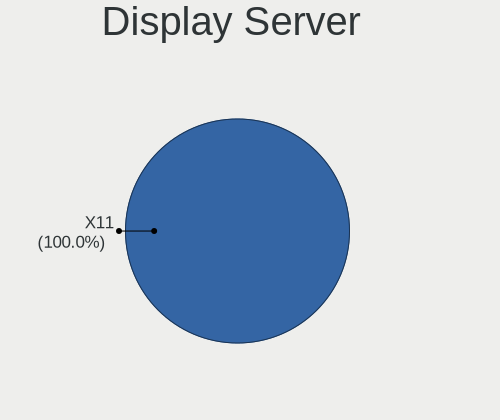

| Name | Computers | Percent |
|------|-----------|---------|
| X11  | 19        | 100%    |

Display Manager
---------------

SDDM, LightDM, etc.

| Name    | Computers | Percent |
|---------|-----------|---------|
| SDDM    | 17        | 89.47%  |
| LightDM | 2         | 10.53%  |

OS Lang
-------

Language

| Lang    | Computers | Percent |
|---------|-----------|---------|
| en_US   | 7         | 36.84%  |
| fr_FR   | 4         | 21.05%  |
| en_GB   | 4         | 21.05%  |
| lt_LT   | 1         | 5.26%   |
| fi_FI   | 1         | 5.26%   |
| bg_BG   | 1         | 5.26%   |
| Unknown | 1         | 5.26%   |

Boot Mode
---------

EFI or BIOS

| Mode | Computers | Percent |
|------|-----------|---------|
| EFI  | 19        | 100%    |

Filesystem
----------

Type of filesystem

| Type | Computers | Percent |
|------|-----------|---------|
| Ufs  | 10        | 52.63%  |
| Zfs  | 9         | 47.37%  |

Part. scheme
------------

Scheme of partitioning

| Type | Computers | Percent |
|------|-----------|---------|
| GPT  | 12        | 63.16%  |
| MBR  | 7         | 36.84%  |

Board
-----

Vendor
------

Motherboard manufacturer

| Name                | Computers | Percent |
|---------------------|-----------|---------|
| Lenovo              | 8         | 42.11%  |
| Acer                | 2         | 10.53%  |
| Samsung Electronics | 1         | 5.26%   |
| Hewlett-Packard     | 1         | 5.26%   |
| Fujitsu             | 1         | 5.26%   |
| ECS                 | 1         | 5.26%   |
| Dell                | 1         | 5.26%   |
| ASUSTek Computer    | 1         | 5.26%   |
| ASRockRack          | 1         | 5.26%   |
| ASRock              | 1         | 5.26%   |
| Apple               | 1         | 5.26%   |

Model
-----

Motherboard model

| Name                            | Computers | Percent |
|---------------------------------|-----------|---------|
| Samsung N150/N210/N220          | 1         | 5.26%   |
| Lenovo Yoga 710-11IKB 80V6      | 1         | 5.26%   |
| Lenovo ThinkPad X280 20KESB4T00 | 1         | 5.26%   |
| Lenovo ThinkPad X230 23255NG    | 1         | 5.26%   |
| Lenovo ThinkPad W520 42844DG    | 1         | 5.26%   |
| Lenovo ThinkPad T470 20HES0EV0A | 1         | 5.26%   |
| Lenovo ThinkPad E495 20NE000BSP | 1         | 5.26%   |
| Lenovo ThinkPad E14 20RA0036RT  | 1         | 5.26%   |
| Lenovo G50-70 20351             | 1         | 5.26%   |
| HP Z420 Workstation             | 1         | 5.26%   |
| Fujitsu CELSIUS H730            | 1         | 5.26%   |
| ECS Z77H2-AX                    | 1         | 5.26%   |
| Dell Latitude 7300              | 1         | 5.26%   |
| ASUS ROG STRIX B550-F GAMING    | 1         | 5.26%   |
| ASRockRack C226M WS             | 1         | 5.26%   |
| ASRock N68-S UCC                | 1         | 5.26%   |
| Apple MacBookPro14,1            | 1         | 5.26%   |
| Acer Swift SF314-56             | 1         | 5.26%   |
| Acer Aspire 7738                | 1         | 5.26%   |

Model Family
------------

Motherboard model prefix

| Name               | Computers | Percent |
|--------------------|-----------|---------|
| Lenovo ThinkPad    | 6         | 31.58%  |
| Samsung N150       | 1         | 5.26%   |
| Lenovo Yoga        | 1         | 5.26%   |
| Lenovo G50-70      | 1         | 5.26%   |
| HP Z420            | 1         | 5.26%   |
| Fujitsu CELSIUS    | 1         | 5.26%   |
| ECS Z77H2-AX       | 1         | 5.26%   |
| Dell Latitude      | 1         | 5.26%   |
| ASUS ROG           | 1         | 5.26%   |
| ASRockRack C226M   | 1         | 5.26%   |
| ASRock N68-S       | 1         | 5.26%   |
| Apple MacBookPro14 | 1         | 5.26%   |
| Acer Swift         | 1         | 5.26%   |
| Acer Aspire        | 1         | 5.26%   |

MFG Year
--------

Motherboard manufacture year

| Year | Computers | Percent |
|------|-----------|---------|
| 2019 | 3         | 15.79%  |
| 2012 | 3         | 15.79%  |
| 2020 | 2         | 10.53%  |
| 2018 | 2         | 10.53%  |
| 2022 | 1         | 5.26%   |
| 2021 | 1         | 5.26%   |
| 2016 | 1         | 5.26%   |
| 2015 | 1         | 5.26%   |
| 2014 | 1         | 5.26%   |
| 2013 | 1         | 5.26%   |
| 2011 | 1         | 5.26%   |
| 2010 | 1         | 5.26%   |
| 2009 | 1         | 5.26%   |

Form Factor
-----------

Physical design of the computer

| Name     | Computers | Percent |
|----------|-----------|---------|
| Notebook | 14        | 73.68%  |
| Desktop  | 5         | 26.32%  |

Coreboot
--------

Have coreboot on board

| Used | Computers | Percent |
|------|-----------|---------|
| No   | 18        | 94.74%  |
| Yes  | 1         | 5.26%   |

RAM Size
--------

Total RAM memory

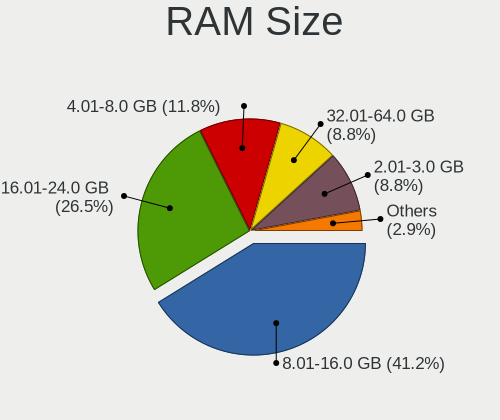

| Size in GB | Computers | Percent |
|------------|-----------|---------|
| 8.01-16.0  | 9         | 47.37%  |
| 16.01-24.0 | 4         | 21.05%  |
| 32.01-64.0 | 3         | 15.79%  |
| 4.01-8.0   | 1         | 5.26%   |
| 24.01-32.0 | 1         | 5.26%   |
| 2.01-3.0   | 1         | 5.26%   |

RAM Used
--------

Used RAM memory

| Used GB  | Computers | Percent |
|----------|-----------|---------|
| 0.01-0.5 | 9         | 47.37%  |
| 0.51-1.0 | 6         | 31.58%  |
| 1.01-2.0 | 3         | 15.79%  |
| 2.01-3.0 | 1         | 5.26%   |

Total Drives
------------

Number of drives on board

| Drives | Computers | Percent |
|--------|-----------|---------|
| 1      | 11        | 57.89%  |
| 2      | 4         | 21.05%  |
| 0      | 2         | 10.53%  |
| 4      | 1         | 5.26%   |
| 3      | 1         | 5.26%   |

Has CD-ROM
----------

Has CD-ROM on board

| Presented | Computers | Percent |
|-----------|-----------|---------|
| No        | 16        | 84.21%  |
| Yes       | 3         | 15.79%  |

Has Ethernet
------------

Has Ethernet on board

| Presented | Computers | Percent |
|-----------|-----------|---------|
| Yes       | 15        | 78.95%  |
| No        | 4         | 21.05%  |

Has WiFi
--------

Has WiFi module

| Presented | Computers | Percent |
|-----------|-----------|---------|
| Yes       | 15        | 78.95%  |
| No        | 4         | 21.05%  |

Has Bluetooth
-------------

Has Bluetooth module

| Presented | Computers | Percent |
|-----------|-----------|---------|
| Yes       | 12        | 63.16%  |
| No        | 7         | 36.84%  |

Location
--------

Country
-------

Geographic location (country)

| Country     | Computers | Percent |
|-------------|-----------|---------|
| USA         | 4         | 21.05%  |
| UK          | 4         | 21.05%  |
| France      | 4         | 21.05%  |
| Spain       | 1         | 5.26%   |
| Russia      | 1         | 5.26%   |
| Netherlands | 1         | 5.26%   |
| Lithuania   | 1         | 5.26%   |
| Finland     | 1         | 5.26%   |
| Bulgaria    | 1         | 5.26%   |
| Argentina   | 1         | 5.26%   |

City
----

Geographic location (city)

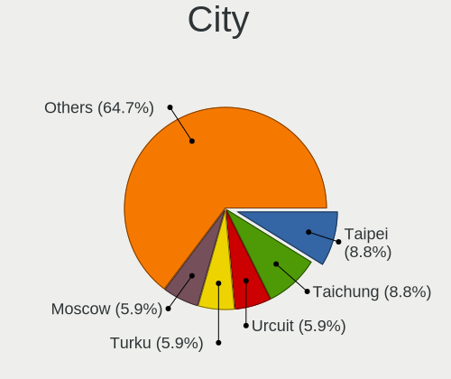

| City                 | Computers | Percent |
|----------------------|-----------|---------|
| Melun                | 2         | 10.53%  |
| Lutherville-Timonium | 2         | 10.53%  |
| West Bromwich        | 1         | 5.26%   |
| Wakefield            | 1         | 5.26%   |
| Vilnius              | 1         | 5.26%   |
| Vaasa                | 1         | 5.26%   |
| Sofia                | 1         | 5.26%   |
| Seattle              | 1         | 5.26%   |
| Sartrouville         | 1         | 5.26%   |
| Saint-Raphaël       | 1         | 5.26%   |
| Rubí                | 1         | 5.26%   |
| Portland             | 1         | 5.26%   |
| Moscow               | 1         | 5.26%   |
| Lincoln              | 1         | 5.26%   |
| Eindhoven            | 1         | 5.26%   |
| Córdoba             | 1         | 5.26%   |
| Addlestone           | 1         | 5.26%   |

Drives
------

Drive Vendor
------------

Hard drive vendors

| Vendor              | Computers | Drives | Percent |
|---------------------|-----------|--------|---------|
| Samsung Electronics | 4         | 5      | 17.39%  |
| WDC                 | 3         | 3      | 13.04%  |
| Seagate             | 3         | 3      | 13.04%  |
| SanDisk             | 2         | 2      | 8.7%    |
| Kingston            | 2         | 3      | 8.7%    |
| Crucial             | 2         | 2      | 8.7%    |
| UMIS                | 1         | 1      | 4.35%   |
| SPCC                | 1         | 1      | 4.35%   |
| SK hynix            | 1         | 1      | 4.35%   |
| Phison              | 1         | 1      | 4.35%   |
| Intel               | 1         | 1      | 4.35%   |
| Hitachi             | 1         | 2      | 4.35%   |
| Corsair             | 1         | 1      | 4.35%   |

Drive Model
-----------

Hard drive models

| Model                             | Computers | Percent |
|-----------------------------------|-----------|---------|
| Kingston SA400S37240G 240GB       | 2         | 8%      |
| WDC WD7500BPKX-00HPJT0 752GB      | 1         | 4%      |
| WDC WD40EFAX-68JH4N0 4TB          | 1         | 4%      |
| WDC WD30EZRZ-00GXCB0 3TB          | 1         | 4%      |
| UMIS RPJTJ256MED1OWX 256GB        | 1         | 4%      |
| SPCC Solid State Disk 128GB       | 1         | 4%      |
| SK hynix HFM512GDHTNG-8710B 512GB | 1         | 4%      |
| Seagate ST9250315AS 250GB         | 1         | 4%      |
| Seagate ST310212A 10GB            | 1         | 4%      |
| Seagate ST1000DM010-2EP102 1TB    | 1         | 4%      |
| SanDisk X400 M.2 2280 256GB       | 1         | 4%      |
| SanDisk pSSD 128GB                | 1         | 4%      |
| Samsung SSD 970 EVO Plus 2TB      | 1         | 4%      |
| Samsung SSD 970 EVO Plus 1TB      | 1         | 4%      |
| Samsung SSD 860 EVO M.2 250GB     | 1         | 4%      |
| Samsung SSD 850 EVO mSATA 1TB     | 1         | 4%      |
| Samsung SSD 850 EVO 2TB           | 1         | 4%      |
| Phison Sabrent Rocket nano 512GB  | 1         | 4%      |
| Kingston SA400M8240G 240GB        | 1         | 4%      |
| Intel SSDPEKKF256G8L 256GB        | 1         | 4%      |
| Hitachi HTS545050B9A300 500GB     | 1         | 4%      |
| Crucial CT256MX100SSD1 256GB      | 1         | 4%      |
| Crucial CT2000BX500SSD1 2TB       | 1         | 4%      |
| Corsair MP600 GS 1TB              | 1         | 4%      |

HDD Vendor
----------

Hard disk drive vendors

| Vendor  | Computers | Drives | Percent |
|---------|-----------|--------|---------|
| WDC     | 3         | 3      | 42.86%  |
| Seagate | 3         | 3      | 42.86%  |
| Hitachi | 1         | 2      | 14.29%  |

SSD Vendor
----------

Solid state drive vendors

| Vendor              | Computers | Drives | Percent |
|---------------------|-----------|--------|---------|
| Samsung Electronics | 3         | 3      | 30%     |
| SanDisk             | 2         | 2      | 20%     |
| Kingston            | 2         | 3      | 20%     |
| Crucial             | 2         | 2      | 20%     |
| SPCC                | 1         | 1      | 10%     |

Drive Kind
----------

HDD or SSD

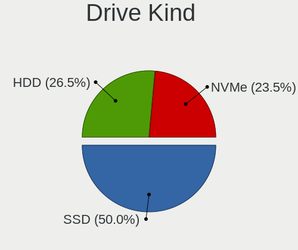

| Kind | Computers | Drives | Percent |
|------|-----------|--------|---------|
| SSD  | 10        | 11     | 50%     |
| NVMe | 5         | 7      | 25%     |
| HDD  | 5         | 8      | 25%     |

Drive Connector
---------------

SATA, SAS, NVMe, etc.

| Type | Computers | Drives | Percent |
|------|-----------|--------|---------|
| SATA | 13        | 19     | 72.22%  |
| NVMe | 5         | 7      | 27.78%  |

Drive Size
----------

Size of hard drive

| Size in TB | Computers | Drives | Percent |
|------------|-----------|--------|---------|
| 0.01-0.5   | 9         | 12     | 56.25%  |
| 0.51-1.0   | 3         | 3      | 18.75%  |
| 1.01-2.0   | 2         | 2      | 12.5%   |
| 3.01-4.0   | 1         | 1      | 6.25%   |
| 2.01-3.0   | 1         | 1      | 6.25%   |

Space Total
-----------

Amount of disk space available on the file system

| Size in GB | Computers | Percent |
|------------|-----------|---------|
| 1-20       | 9         | 47.37%  |
| 101-250    | 4         | 21.05%  |
| 21-50      | 3         | 15.79%  |
| 251-500    | 1         | 5.26%   |
| 501-1000   | 1         | 5.26%   |
| 51-100     | 1         | 5.26%   |

Space Used
----------

Amount of used disk space

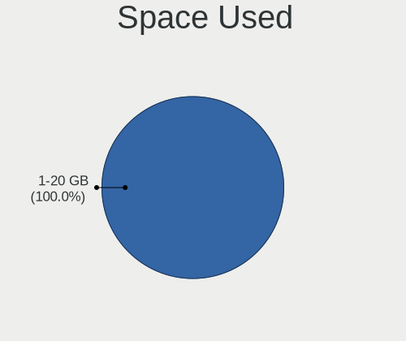

| Used GB | Computers | Percent |
|---------|-----------|---------|
| 1-20    | 19        | 100%    |

Malfunc. Drives
---------------

Drive models with a malfunction

| Model                         | Computers | Drives | Percent |
|-------------------------------|-----------|--------|---------|
| Seagate ST9250315AS 250GB     | 1         | 1      | 33.33%  |
| Seagate ST310212A 10GB        | 1         | 1      | 33.33%  |
| Hitachi HTS545050B9A300 500GB | 1         | 2      | 33.33%  |

Malfunc. Drive Vendor
---------------------

Vendors of faulty drives

| Vendor  | Computers | Drives | Percent |
|---------|-----------|--------|---------|
| Seagate | 2         | 2      | 66.67%  |
| Hitachi | 1         | 2      | 33.33%  |

Malfunc. HDD Vendor
-------------------

Vendors of faulty HDD drives

| Vendor  | Computers | Drives | Percent |
|---------|-----------|--------|---------|
| Seagate | 2         | 2      | 66.67%  |
| Hitachi | 1         | 2      | 33.33%  |

Malfunc. Drive Kind
-------------------

Kinds of faulty drives

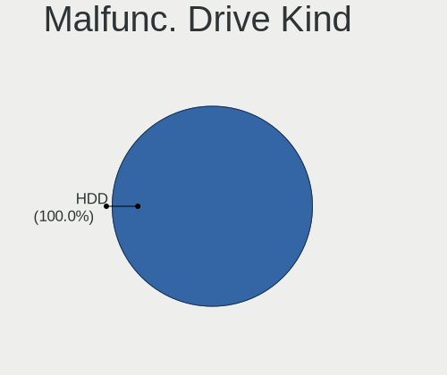

| Kind | Computers | Drives | Percent |
|------|-----------|--------|---------|
| HDD  | 3         | 4      | 100%    |

Failed Drives
-------------

Failed drive models

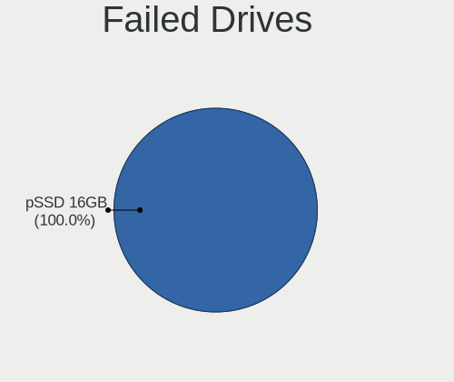

| Model              | Computers | Drives | Percent |
|--------------------|-----------|--------|---------|
| SanDisk pSSD 128GB | 1         | 1      | 100%    |

Failed Drive Vendor
-------------------

Failed drive vendors

| Vendor  | Computers | Drives | Percent |
|---------|-----------|--------|---------|
| SanDisk | 1         | 1      | 100%    |

Drive Status
------------

Number of failed and malfunc. drives

| Status  | Computers | Drives | Percent |
|---------|-----------|--------|---------|
| Works   | 15        | 21     | 78.95%  |
| Malfunc | 3         | 4      | 15.79%  |
| Failed  | 1         | 1      | 5.26%   |

Storage controller
------------------

Storage Vendor
--------------

Storage controller vendors

| Vendor                                  | Computers | Percent |
|-----------------------------------------|-----------|---------|
| Intel                                   | 15        | 65.22%  |
| Phison Electronics                      | 2         | 8.7%    |
| SK hynix                                | 1         | 4.35%   |
| Shenzhen Unionmemory Information System | 1         | 4.35%   |
| Samsung Electronics                     | 1         | 4.35%   |
| Nvidia                                  | 1         | 4.35%   |
| ASMedia Technology                      | 1         | 4.35%   |
| AMD                                     | 1         | 4.35%   |

Storage Model
-------------

Storage controller models

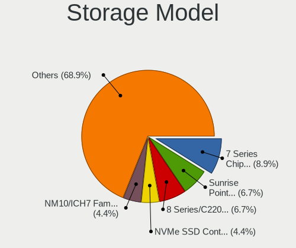

| Model                                                                          | Computers | Percent |
|--------------------------------------------------------------------------------|-----------|---------|
| Intel Sunrise Point-LP SATA Controller [AHCI mode]                             | 2         | 7.41%   |
| Intel 82801 Mobile SATA Controller [RAID mode]                                 | 2         | 7.41%   |
| Intel 8 Series/C220 Series Chipset Family 6-port SATA Controller 1 [AHCI mode] | 2         | 7.41%   |
| Unknown                                                                        | 2         | 7.41%   |
| SK hynix BC501 NVMe Solid State Drive                                          | 1         | 3.7%    |
| Samsung NVMe SSD Controller SM981/PM981/PM983                                  | 1         | 3.7%    |
| Phison PS5013 E13 NVMe Controller                                              | 1         | 3.7%    |
| Nvidia MCP61 SATA Controller                                                   | 1         | 3.7%    |
| Nvidia MCP61 IDE                                                               | 1         | 3.7%    |
| Intel SSD Pro 7600p/760p/E 6100p Series                                        | 1         | 3.7%    |
| Intel NM10/ICH7 Family SATA Controller [AHCI mode]                             | 1         | 3.7%    |
| Intel Comet Lake SATA AHCI Controller                                          | 1         | 3.7%    |
| Intel C602 chipset 4-Port SATA Storage Control Unit                            | 1         | 3.7%    |
| Intel C600/X79 series chipset 4-Port SATA IDE Controller                       | 1         | 3.7%    |
| Intel C600/X79 series chipset 2-Port SATA IDE Controller                       | 1         | 3.7%    |
| Intel 82801IBM/IEM (ICH9M/ICH9M-E) 4 port SATA Controller [AHCI mode]          | 1         | 3.7%    |
| Intel 8 Series SATA Controller 1 [AHCI mode]                                   | 1         | 3.7%    |
| Intel 7 Series/C210 Series Chipset Family 4-port SATA Controller [IDE mode]    | 1         | 3.7%    |
| Intel 7 Series/C210 Series Chipset Family 2-port SATA Controller [IDE mode]    | 1         | 3.7%    |
| Intel 7 Series Chipset Family 6-port SATA Controller [AHCI mode]               | 1         | 3.7%    |
| Intel 6 Series/C200 Series Chipset Family 6 port Mobile SATA AHCI Controller   | 1         | 3.7%    |
| ASMedia ASM1062 Serial ATA Controller                                          | 1         | 3.7%    |
| AMD 500 Series Chipset SATA Controller                                         | 1         | 3.7%    |

Storage Kind
------------

Kind of storage controller (IDE, SATA, NVMe, SAS, ...)

| Kind | Computers | Percent |
|------|-----------|---------|
| SATA | 12        | 52.17%  |
| NVMe | 5         | 21.74%  |
| IDE  | 3         | 13.04%  |
| RAID | 2         | 8.7%    |
| SAS  | 1         | 4.35%   |

Processor
---------

CPU Vendor
----------

Processor vendors

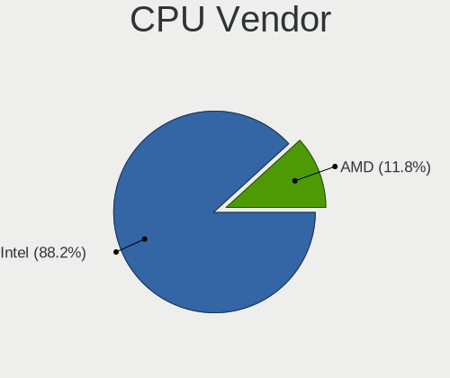

| Vendor | Computers | Percent |
|--------|-----------|---------|
| Intel  | 16        | 84.21%  |
| AMD    | 3         | 15.79%  |

CPU Model
---------

Processor models

| Model                                         | Computers | Percent |
|-----------------------------------------------|-----------|---------|
| Intel Xeon CPU E5-1650 v2 @ 3.50GHz           | 1         | 5.26%   |
| Intel Xeon CPU E3-1276 v3 @ 3.60GHz           | 1         | 5.26%   |
| Intel CPU Version                             | 1         | 5.26%   |
| Intel Core i7-8665U CPU @ 1.90GHz             | 1         | 5.26%   |
| Intel Core i7-4910MQ CPU @ 2.90GHz            | 1         | 5.26%   |
| Intel Core i7-3770K CPU @ 3.50GHz             | 1         | 5.26%   |
| Intel Core i7-2630QM CPU @ 2.00GHz            | 1         | 5.26%   |
| Intel Core i5-8265U CPU @ 1.60GHz             | 1         | 5.26%   |
| Intel Core i5-8250U CPU @ 1.60GHz             | 1         | 5.26%   |
| Intel Core i5-7Y54 CPU @ 1.20GHz              | 1         | 5.26%   |
| Intel Core i5-7360U CPU @ 2.30GHz             | 1         | 5.26%   |
| Intel Core i5-7300U CPU @ 2.60GHz             | 1         | 5.26%   |
| Intel Core i5-3320M CPU @ 2.60GHz             | 1         | 5.26%   |
| Intel Core i5-10210U CPU @ 1.60GHz            | 1         | 5.26%   |
| Intel Core i3-4030U CPU @ 1.90GHz             | 1         | 5.26%   |
| Intel Atom CPU N450 @ 1.66GHz                 | 1         | 5.26%   |
| AMD Ryzen 7 5700G with Radeon Graphics        | 1         | 5.26%   |
| AMD Ryzen 7 3700U with Radeon Vega Mobile Gfx | 1         | 5.26%   |
| AMD Phenom II X4 945 Processor                | 1         | 5.26%   |

CPU Model Family
----------------

Processor model prefix

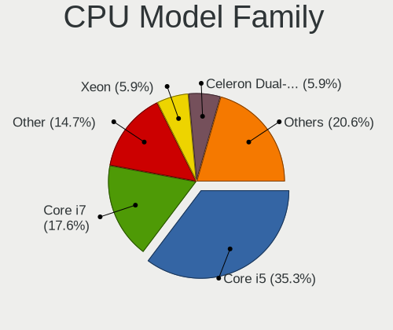

| Model            | Computers | Percent |
|------------------|-----------|---------|
| Intel Core i5    | 7         | 36.84%  |
| Intel Core i7    | 4         | 21.05%  |
| Intel Xeon       | 2         | 10.53%  |
| AMD Ryzen 7      | 2         | 10.53%  |
| Other            | 1         | 5.26%   |
| Intel Core i3    | 1         | 5.26%   |
| Intel Atom       | 1         | 5.26%   |
| AMD Phenom II X4 | 1         | 5.26%   |

CPU Cores
---------

Number of processor cores

| Number  | Computers | Percent |
|---------|-----------|---------|
| 4       | 9         | 47.37%  |
| 2       | 6         | 31.58%  |
| 16      | 1         | 5.26%   |
| 8       | 1         | 5.26%   |
| 6       | 1         | 5.26%   |
| Unknown | 1         | 5.26%   |

CPU Sockets
-----------

Number of sockets

| Number  | Computers | Percent |
|---------|-----------|---------|
| 1       | 18        | 94.74%  |
| Unknown | 1         | 5.26%   |

CPU Threads
-----------

Threads per core (Hyper-Threading)

| Number  | Computers | Percent |
|---------|-----------|---------|
| 2       | 14        | 73.68%  |
| 1       | 4         | 21.05%  |
| Unknown | 1         | 5.26%   |

CPU Microarch
-------------

Microarchitecture

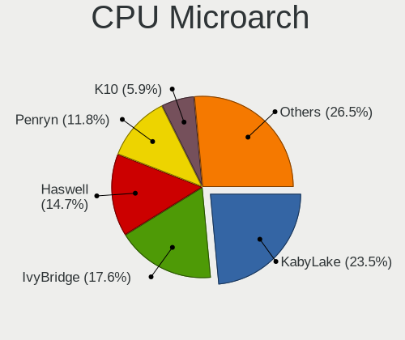

| Name        | Computers | Percent |
|-------------|-----------|---------|
| KabyLake    | 7         | 36.84%  |
| IvyBridge   | 3         | 15.79%  |
| Haswell     | 3         | 15.79%  |
| Zen+        | 1         | 5.26%   |
| Zen 3       | 1         | 5.26%   |
| SandyBridge | 1         | 5.26%   |
| Penryn      | 1         | 5.26%   |
| K10         | 1         | 5.26%   |
| Bonnell     | 1         | 5.26%   |

Graphics
--------

GPU Vendor
----------

Vendors of graphics cards

| Vendor | Computers | Percent |
|--------|-----------|---------|
| Intel  | 13        | 61.9%   |
| Nvidia | 5         | 23.81%  |
| AMD    | 3         | 14.29%  |

GPU Model
---------

Graphics card models

| Model                                                                     | Computers | Percent |
|---------------------------------------------------------------------------|-----------|---------|
| Intel WhiskeyLake-U GT2 [UHD Graphics 620]                                | 2         | 9.52%   |
| Nvidia GT216M [GeForce GT 240M]                                           | 1         | 4.76%   |
| Nvidia GP102 [TITAN X]                                                    | 1         | 4.76%   |
| Nvidia GK106GLM [Quadro K2100M]                                           | 1         | 4.76%   |
| Nvidia GF108GLM [Quadro 1000M]                                            | 1         | 4.76%   |
| Nvidia C61 [GeForce 7025 / nForce 630a]                                   | 1         | 4.76%   |
| Intel Xeon E3-1200 v3 Processor Integrated Graphics Controller            | 1         | 4.76%   |
| Intel UHD Graphics 620                                                    | 1         | 4.76%   |
| Intel Iris Plus Graphics 640                                              | 1         | 4.76%   |
| Intel HD Graphics 620                                                     | 1         | 4.76%   |
| Intel HD Graphics 615                                                     | 1         | 4.76%   |
| Intel Haswell-ULT Integrated Graphics Controller                          | 1         | 4.76%   |
| Intel CometLake-U GT2 [UHD Graphics]                                      | 1         | 4.76%   |
| Intel Atom Processor D4xx/D5xx/N4xx/N5xx Integrated Graphics Controller   | 1         | 4.76%   |
| Intel 4th Gen Core Processor Integrated Graphics Controller               | 1         | 4.76%   |
| Intel 3rd Gen Core processor Graphics Controller                          | 1         | 4.76%   |
| Intel 2nd Generation Core Processor Family Integrated Graphics Controller | 1         | 4.76%   |
| AMD Picasso/Raven 2 [Radeon Vega Series / Radeon Vega Mobile Series]      | 1         | 4.76%   |
| AMD Navi 23 [Radeon RX 6650 XT / 6700S / 6800S]                           | 1         | 4.76%   |
| AMD Cape Verde GL [FirePro W4100]                                         | 1         | 4.76%   |

GPU Combo
---------

Combinations of graphics cards

| Name           | Computers | Percent |
|----------------|-----------|---------|
| 1 x Intel      | 10        | 52.63%  |
| 1 x Nvidia     | 3         | 15.79%  |
| 1 x AMD        | 3         | 15.79%  |
| Intel + Nvidia | 2         | 10.53%  |
| 2 x Intel      | 1         | 5.26%   |

GPU Driver
----------

Free vs proprietary

| Driver      | Computers | Percent |
|-------------|-----------|---------|
| Free        | 17        | 89.47%  |
| Proprietary | 2         | 10.53%  |

GPU Memory
----------

Total video memory

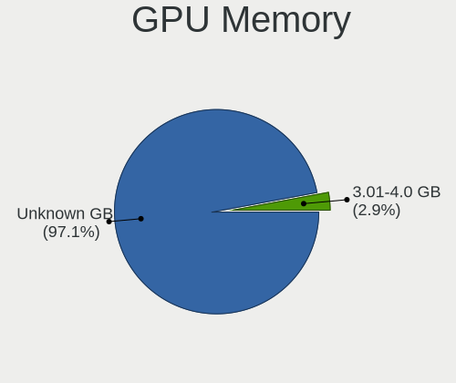

| Size in GB | Computers | Percent |
|------------|-----------|---------|
| Unknown    | 19        | 100%    |

Monitor
-------

Monitor Vendor
--------------

Monitor vendors

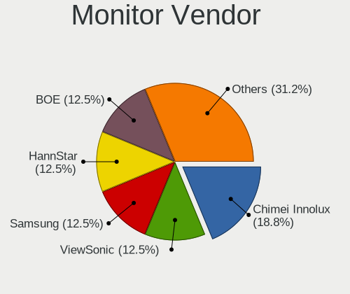

| Vendor              | Computers | Percent |
|---------------------|-----------|---------|
| Samsung Electronics | 1         | 20%     |
| NEC Computers       | 1         | 20%     |
| Chimei Innolux      | 1         | 20%     |
| BOE                 | 1         | 20%     |
| Apple               | 1         | 20%     |

Monitor Model
-------------

Monitor models

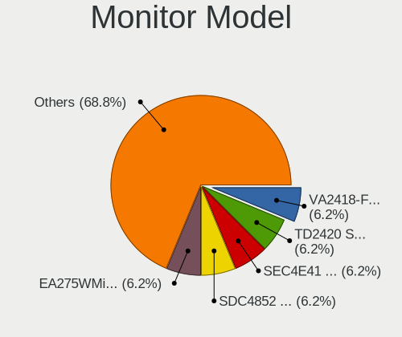

| Model                                                                | Computers | Percent |
|----------------------------------------------------------------------|-----------|---------|
| Samsung Electronics LCD Monitor SDC4852 1366x768 340x190mm 15.3-inch | 1         | 20%     |
| NEC Computers EA275WMi NEC2BA7 2560x1440 600x340mm 27.2-inch         | 1         | 20%     |
| Chimei Innolux LCD Monitor CMN1137 1920x1080 260x140mm 11.6-inch     | 1         | 20%     |
| BOE LCD Monitor BOE0742 1920x1080 310x170mm 13.9-inch                | 1         | 20%     |
| Apple Color LCD APPA034 2880x1800 290x180mm 13.4-inch                | 1         | 20%     |

Monitor Resolution
------------------

Monitor screen resolution

| Resolution      | Computers | Percent |
|-----------------|-----------|---------|
| 1920x1080 (FHD) | 3         | 60%     |
| 2880x1800       | 1         | 20%     |
| 2560x1440 (QHD) | 1         | 20%     |

Monitor Diagonal
----------------

Diagonal size in inches

| Inches | Computers | Percent |
|--------|-----------|---------|
| 13     | 2         | 40%     |
| 27     | 1         | 20%     |
| 15     | 1         | 20%     |
| 11     | 1         | 20%     |

Monitor Width
-------------

Physical width

| Width in mm | Computers | Percent |
|-------------|-----------|---------|
| 301-350     | 2         | 40%     |
| 201-300     | 2         | 40%     |
| 501-600     | 1         | 20%     |

Aspect Ratio
------------

Proportional relationship between the width and the height

| Ratio | Computers | Percent |
|-------|-----------|---------|
| 16/9  | 4         | 80%     |
| 16/10 | 1         | 20%     |

Monitor Area
------------

Area in inch²

| Area in inch² | Computers | Percent |
|----------------|-----------|---------|
| 81-90          | 2         | 40%     |
| 51-60          | 1         | 20%     |
| 301-350        | 1         | 20%     |
| 91-100         | 1         | 20%     |

Pixel Density
-------------

Pixels per inch

| Density       | Computers | Percent |
|---------------|-----------|---------|
| 101-120       | 2         | 40%     |
| More than 240 | 1         | 20%     |
| 161-240       | 1         | 20%     |
| 121-160       | 1         | 20%     |

Multiple Monitors
-----------------

Total monitors connected

| Total | Computers | Percent |
|-------|-----------|---------|
| 1     | 15        | 78.95%  |
| 0     | 4         | 21.05%  |

Network
-------

Net Controller Vendor
---------------------

Controller vendors

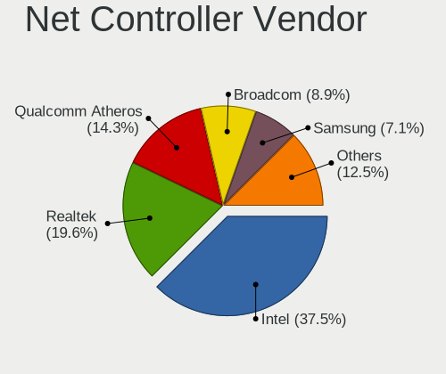

| Vendor                            | Computers | Percent |
|-----------------------------------|-----------|---------|
| Intel                             | 13        | 46.43%  |
| Realtek Semiconductor             | 6         | 21.43%  |
| Qualcomm Atheros                  | 2         | 7.14%   |
| Broadcom                          | 2         | 7.14%   |
| TP-Link                           | 1         | 3.57%   |
| Sierra Wireless                   | 1         | 3.57%   |
| Marvell Technology Group          | 1         | 3.57%   |
| Ericsson Business Mobile Networks | 1         | 3.57%   |
| Apple                             | 1         | 3.57%   |

Net Controller Model
--------------------

Controller models

| Model                                                                       | Computers | Percent |
|-----------------------------------------------------------------------------|-----------|---------|
| Realtek RTL8111/8168/8411 PCI Express Gigabit Ethernet Controller           | 4         | 11.43%  |
| Intel 82579LM Gigabit Network Connection (Lewisville)                       | 3         | 8.57%   |
| Intel Wireless 8265 / 8275                                                  | 2         | 5.71%   |
| Intel Ethernet Connection I217-LM                                           | 2         | 5.71%   |
| Intel Cannon Point-LP CNVi [Wireless-AC]                                    | 2         | 5.71%   |
| TP-Link Wireless USB Adapter                                                | 1         | 2.86%   |
| Sierra Wireless EM7305 Modem                                                | 1         | 2.86%   |
| Realtek RTL8822BE 802.11a/b/g/n/ac WiFi adapter                             | 1         | 2.86%   |
| Realtek RTL8723BE PCIe Wireless Network Adapter                             | 1         | 2.86%   |
| Realtek RTL8192E/RTL8192SE Wireless LAN Controller                          | 1         | 2.86%   |
| Realtek RTL8188EUS 802.11n Wireless Network Adapter                         | 1         | 2.86%   |
| Qualcomm Atheros AR9462 Wireless Network Adapter                            | 1         | 2.86%   |
| Qualcomm Atheros AR93xx Wireless Network Adapter                            | 1         | 2.86%   |
| Marvell Group 88E8040 PCI-E Fast Ethernet Controller                        | 1         | 2.86%   |
| Intel Wireless 8260                                                         | 1         | 2.86%   |
| Intel Wireless 7260                                                         | 1         | 2.86%   |
| Intel WiFi Link 5100                                                        | 1         | 2.86%   |
| Intel I210 Gigabit Network Connection                                       | 1         | 2.86%   |
| Intel Ethernet Controller I225-V                                            | 1         | 2.86%   |
| Intel Ethernet Connection (4) I219-V                                        | 1         | 2.86%   |
| Intel Ethernet Connection (4) I219-LM                                       | 1         | 2.86%   |
| Intel Comet Lake PCH-LP CNVi WiFi                                           | 1         | 2.86%   |
| Intel Centrino Ultimate-N 6300                                              | 1         | 2.86%   |
| Ericsson Business Mobile Networks F5521 gw Mobile Broadband Serial Port III | 1         | 2.86%   |
| Broadcom NetLink BCM5784M Gigabit Ethernet PCIe                             | 1         | 2.86%   |
| Broadcom BCM4350 802.11ac Wireless Network Adapter                          | 1         | 2.86%   |
| Apple Ethernet Adapter [A1277]                                              | 1         | 2.86%   |

Wireless Vendor
---------------

Wireless vendors

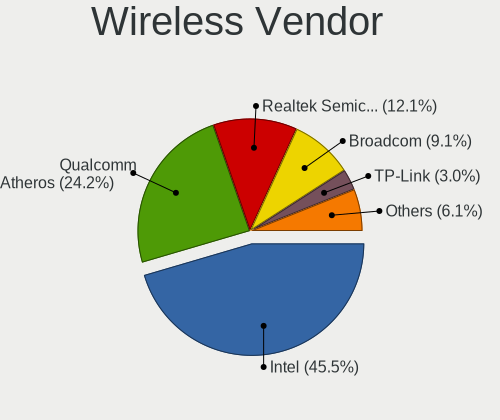

| Vendor                | Computers | Percent |
|-----------------------|-----------|---------|
| Intel                 | 9         | 52.94%  |
| Realtek Semiconductor | 4         | 23.53%  |
| Qualcomm Atheros      | 2         | 11.76%  |
| TP-Link               | 1         | 5.88%   |
| Broadcom              | 1         | 5.88%   |

Wireless Model
--------------

Wireless models

| Model                                               | Computers | Percent |
|-----------------------------------------------------|-----------|---------|
| Intel Wireless 8265 / 8275                          | 2         | 11.76%  |
| Intel Cannon Point-LP CNVi [Wireless-AC]            | 2         | 11.76%  |
| TP-Link Wireless USB Adapter                        | 1         | 5.88%   |
| Realtek RTL8822BE 802.11a/b/g/n/ac WiFi adapter     | 1         | 5.88%   |
| Realtek RTL8723BE PCIe Wireless Network Adapter     | 1         | 5.88%   |
| Realtek RTL8192E/RTL8192SE Wireless LAN Controller  | 1         | 5.88%   |
| Realtek RTL8188EUS 802.11n Wireless Network Adapter | 1         | 5.88%   |
| Qualcomm Atheros AR9462 Wireless Network Adapter    | 1         | 5.88%   |
| Qualcomm Atheros AR93xx Wireless Network Adapter    | 1         | 5.88%   |
| Intel Wireless 8260                                 | 1         | 5.88%   |
| Intel Wireless 7260                                 | 1         | 5.88%   |
| Intel WiFi Link 5100                                | 1         | 5.88%   |
| Intel Comet Lake PCH-LP CNVi WiFi                   | 1         | 5.88%   |
| Intel Centrino Ultimate-N 6300                      | 1         | 5.88%   |
| Broadcom BCM4350 802.11ac Wireless Network Adapter  | 1         | 5.88%   |

Ethernet Vendor
---------------

Ethernet vendors

| Vendor                   | Computers | Percent |
|--------------------------|-----------|---------|
| Intel                    | 8         | 53.33%  |
| Realtek Semiconductor    | 4         | 26.67%  |
| Marvell Technology Group | 1         | 6.67%   |
| Broadcom                 | 1         | 6.67%   |
| Apple                    | 1         | 6.67%   |

Ethernet Model
--------------

Ethernet models

| Model                                                             | Computers | Percent |
|-------------------------------------------------------------------|-----------|---------|
| Realtek RTL8111/8168/8411 PCI Express Gigabit Ethernet Controller | 4         | 25%     |
| Intel 82579LM Gigabit Network Connection (Lewisville)             | 3         | 18.75%  |
| Intel Ethernet Connection I217-LM                                 | 2         | 12.5%   |
| Marvell Group 88E8040 PCI-E Fast Ethernet Controller              | 1         | 6.25%   |
| Intel I210 Gigabit Network Connection                             | 1         | 6.25%   |
| Intel Ethernet Controller I225-V                                  | 1         | 6.25%   |
| Intel Ethernet Connection (4) I219-V                              | 1         | 6.25%   |
| Intel Ethernet Connection (4) I219-LM                             | 1         | 6.25%   |
| Broadcom NetLink BCM5784M Gigabit Ethernet PCIe                   | 1         | 6.25%   |
| Apple Ethernet Adapter [A1277]                                    | 1         | 6.25%   |

Net Controller Kind
-------------------

Ethernet, WiFi or modem

| Kind     | Computers | Percent |
|----------|-----------|---------|
| WiFi     | 15        | 46.88%  |
| Ethernet | 15        | 46.88%  |
| Unknown  | 2         | 6.25%   |

Used Controller
---------------

Currently used network controller

| Kind     | Computers | Percent |
|----------|-----------|---------|
| Ethernet | 11        | 68.75%  |
| WiFi     | 5         | 31.25%  |

NICs
----

Total network controllers on board

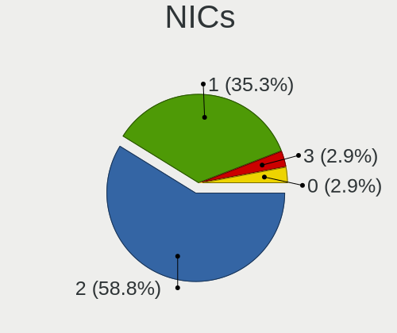

| Total | Computers | Percent |
|-------|-----------|---------|
| 2     | 10        | 52.63%  |
| 1     | 7         | 36.84%  |
| 3     | 1         | 5.26%   |
| 0     | 1         | 5.26%   |

IPv6
----

IPv6 vs IPv4

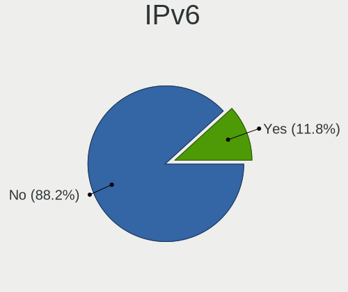

| Used | Computers | Percent |
|------|-----------|---------|
| No   | 17        | 89.47%  |
| Yes  | 2         | 10.53%  |

Bluetooth
---------

Bluetooth Vendor
----------------

Controller vendors

| Vendor                          | Computers | Percent |
|---------------------------------|-----------|---------|
| Intel                           | 6         | 50%     |
| Realtek Semiconductor           | 2         | 16.67%  |
| Broadcom                        | 2         | 16.67%  |
| Qualcomm Atheros Communications | 1         | 8.33%   |
| Cambridge Silicon Radio         | 1         | 8.33%   |

Bluetooth Model
---------------

Controller models

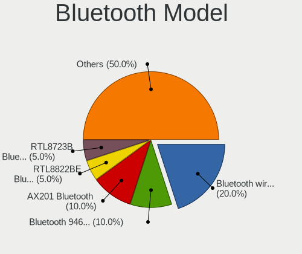

| Model                                               | Computers | Percent |
|-----------------------------------------------------|-----------|---------|
| Intel Bluetooth wireless interface                  | 4         | 33.33%  |
| Intel Bluetooth 9460/9560 Jefferson Peak (JfP)      | 2         | 16.67%  |
| Realtek RTL8822BE Bluetooth 4.2 Adapter             | 1         | 8.33%   |
| Realtek RTL8723B Bluetooth                          | 1         | 8.33%   |
| Qualcomm Atheros AR3011 Bluetooth (no firmware)     | 1         | 8.33%   |
| Cambridge Silicon Radio Bluetooth Dongle (HCI mode) | 1         | 8.33%   |
| Broadcom Bluetooth 2.1 Device                       | 1         | 8.33%   |
| Broadcom BCM2045B (BDC-2.1)                         | 1         | 8.33%   |

Sound
-----

Sound Vendor
------------

Sound card vendors

| Vendor                  | Computers | Percent |
|-------------------------|-----------|---------|
| Intel                   | 16        | 66.67%  |
| Nvidia                  | 3         | 12.5%   |
| AMD                     | 3         | 12.5%   |
| Creative Labs           | 1         | 4.17%   |
| BEHRINGER International | 1         | 4.17%   |

Sound Model
-----------

Sound card models

| Model                                                                      | Computers | Percent |
|----------------------------------------------------------------------------|-----------|---------|
| Intel Sunrise Point-LP HD Audio                                            | 4         | 13.33%  |
| Intel Xeon E3-1200 v3/4th Gen Core Processor HD Audio Controller           | 2         | 6.67%   |
| Intel Cannon Point-LP High Definition Audio Controller                     | 2         | 6.67%   |
| Intel 8 Series/C220 Series Chipset High Definition Audio Controller        | 2         | 6.67%   |
| Intel 7 Series/C216 Chipset Family High Definition Audio Controller        | 2         | 6.67%   |
| AMD Family 17h/19h HD Audio Controller                                     | 2         | 6.67%   |
| Nvidia MCP61 High Definition Audio                                         | 1         | 3.33%   |
| Nvidia GT216 HDMI Audio Controller                                         | 1         | 3.33%   |
| Nvidia GP102 HDMI Audio Controller                                         | 1         | 3.33%   |
| Intel NM10/ICH7 Family High Definition Audio Controller                    | 1         | 3.33%   |
| Intel Haswell-ULT HD Audio Controller                                      | 1         | 3.33%   |
| Intel Comet Lake PCH-LP cAVS                                               | 1         | 3.33%   |
| Intel C600/X79 series chipset High Definition Audio Controller             | 1         | 3.33%   |
| Intel 82801I (ICH9 Family) HD Audio Controller                             | 1         | 3.33%   |
| Intel 8 Series HD Audio Controller                                         | 1         | 3.33%   |
| Intel 6 Series/C200 Series Chipset Family High Definition Audio Controller | 1         | 3.33%   |
| Creative Labs EMU10k2/CA0100/CA0102/CA10200 [Sound Blaster Audigy Series]  | 1         | 3.33%   |
| BEHRINGER International UMC 202HD 192k                                     | 1         | 3.33%   |
| AMD Renoir Radeon High Definition Audio Controller                         | 1         | 3.33%   |
| AMD Raven/Raven2/Fenghuang HDMI/DP Audio Controller                        | 1         | 3.33%   |
| AMD Oland/Hainan/Cape Verde/Pitcairn HDMI Audio [Radeon HD 7000 Series]    | 1         | 3.33%   |
| AMD Navi 21/23 HDMI/DP Audio Controller                                    | 1         | 3.33%   |

Memory
------

Memory Vendor
-------------

Memory module vendors

| Vendor              | Computers | Percent |
|---------------------|-----------|---------|
| Samsung Electronics | 7         | 30.43%  |
| Kingston            | 5         | 21.74%  |
| SK hynix            | 4         | 17.39%  |
| Micron Technology   | 2         | 8.7%    |
| Unknown             | 2         | 8.7%    |
| Ramaxel Technology  | 1         | 4.35%   |
| Corsair             | 1         | 4.35%   |
| 48spaces            | 1         | 4.35%   |

Memory Model
------------

Memory module models

| Model                                                                     | Computers | Percent |
|---------------------------------------------------------------------------|-----------|---------|
| Unknown                                                                   | 2         | 8%      |
| SK hynix RAM HMT451S6AFR8C-PB 4GB SODIMM DDR3 1600MT/s                    | 1         | 4%      |
| SK hynix RAM HMT351S6EFR8C-PB 4GB SODIMM DDR3 1600MT/s                    | 1         | 4%      |
| SK hynix RAM HMA851S6CJR6N-VK 4GB SODIMM DDR4 2667MT/s                    | 1         | 4%      |
| SK hynix RAM HMA82GS6JJR8N-VK 16GB SODIMM DDR4 2667MT/s                   | 1         | 4%      |
| SK hynix RAM HMA82GS6DJR8N-VK 16GB SODIMM DDR4 2667MT/s                   | 1         | 4%      |
| SK hynix RAM HMA81GS6CJR8N-VK 8GB SODIMM DDR4 2667MT/s                    | 1         | 4%      |
| Samsung RAM M471B5673EH1-CF8 2GB SODIMM DDR3 1067MT/s                     | 1         | 4%      |
| Samsung RAM M471B5273DH0-CH9 4GB SODIMM DDR3 1334MT/s                     | 1         | 4%      |
| Samsung RAM M471B5173QH0-YK0 4GB SODIMM DDR3 1600MT/s                     | 1         | 4%      |
| Samsung RAM M471A2K43DB1-CTD 16GB SODIMM DDR4 2667MT/s                    | 1         | 4%      |
| Samsung RAM M471A1K43DB1-CTD 8GB SODIMM DDR4 2667MT/s                     | 1         | 4%      |
| Samsung RAM M391B1G73QH0-YK0 8GB DIMM DDR3 1600MT/s                       | 1         | 4%      |
| Samsung RAM K4E6E304EB-EGCF 4GB Row Of Chips LPDDR3 1867MT/s              | 1         | 4%      |
| Ramaxel RAM RMT3170EF68F9W1600 4GB SODIMM DDR3 1600MT/s                   | 1         | 4%      |
| Micron RAM Module 4GB SODIMM LPDDR3 2133MT/s                              | 1         | 4%      |
| Micron RAM 4ATF51264HZ-2G6E1 4GB SODIMM DDR4 2667MT/s                     | 1         | 4%      |
| Kingston RAM KF3600C17D4/8GX 8GB DIMM DDR4 3600MT/s                       | 1         | 4%      |
| Kingston RAM 99U5428-063.A00LF 8GB SODIMM DDR4 2400MT/s                   | 1         | 4%      |
| Kingston RAM 99U5428-018.A00LF 8GB SODIMM DDR3 1600MT/s                   | 1         | 4%      |
| Kingston RAM 9965525-138.A00LF 8GB DIMM DDR3 1600MT/s                     | 1         | 4%      |
| Kingston RAM 9905428-105.A00G 8GB SODIMM DDR3 1333MT/s                    | 1         | 4%      |
| Corsair RAM CMY16GX3M2A2133C11 8GB DIMM DDR3 1866MT/s                     | 1         | 4%      |
| 48spaces RAM 012345678901234567890123456789012345 2GB SODIMM DDR2 667MT/s | 1         | 4%      |

Memory Kind
-----------

Memory module kinds

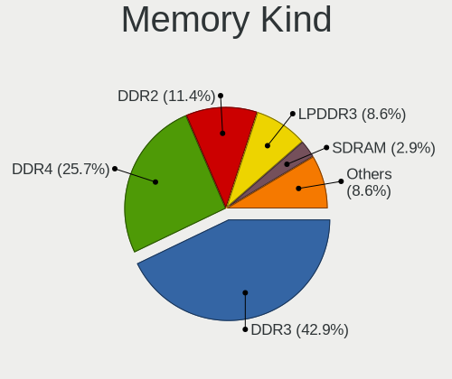

| Kind   | Computers | Percent |
|--------|-----------|---------|
| DDR4   | 8         | 40%     |
| DDR3   | 8         | 40%     |
| LPDDR3 | 2         | 10%     |
| DDR2   | 2         | 10%     |

Memory Form Factor
------------------

Physical design of the memory module

| Name         | Computers | Percent |
|--------------|-----------|---------|
| SODIMM       | 13        | 68.42%  |
| DIMM         | 5         | 26.32%  |
| Row Of Chips | 1         | 5.26%   |

Memory Size
-----------

Memory module size

| Size  | Computers | Percent |
|-------|-----------|---------|
| 8192  | 10        | 43.48%  |
| 4096  | 9         | 39.13%  |
| 16384 | 2         | 8.7%    |
| 2048  | 2         | 8.7%    |

Memory Speed
------------

Memory module speed

| Speed | Computers | Percent |
|-------|-----------|---------|
| 2667  | 5         | 23.81%  |
| 1600  | 5         | 23.81%  |
| 2400  | 2         | 9.52%   |
| 3600  | 1         | 4.76%   |
| 2133  | 1         | 4.76%   |
| 1867  | 1         | 4.76%   |
| 1866  | 1         | 4.76%   |
| 1334  | 1         | 4.76%   |
| 1333  | 1         | 4.76%   |
| 1067  | 1         | 4.76%   |
| 667   | 1         | 4.76%   |
| 533   | 1         | 4.76%   |

Printers & scanners
-------------------

Printer Vendor
--------------

Printer device vendors

Zero info for selected period =(

Printer Model
-------------

Printer device models

Zero info for selected period =(

Scanner Vendor
--------------

Scanner device vendors

Zero info for selected period =(

Scanner Model
-------------

Scanner device models

Zero info for selected period =(

Camera
------

Camera Vendor
-------------

Camera device vendors

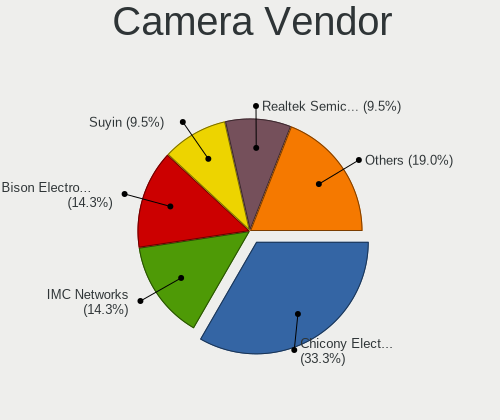

| Vendor                  | Computers | Percent |
|-------------------------|-----------|---------|
| Chicony Electronics     | 4         | 36.36%  |
| Realtek Semiconductor   | 2         | 18.18%  |
| Bison Electronics       | 2         | 18.18%  |
| Z-Star Microelectronics | 1         | 9.09%   |
| Suyin                   | 1         | 9.09%   |
| IMC Networks            | 1         | 9.09%   |

Camera Model
------------

Camera device models

| Model                                    | Computers | Percent |
|------------------------------------------|-----------|---------|
| Bison SunplusIT Integrated Camera        | 2         | 18.18%  |
| Z-Star Webcam                            | 1         | 9.09%   |
| Suyin HD Video WebCam                    | 1         | 9.09%   |
| Realtek Lenovo EasyCamera                | 1         | 9.09%   |
| Realtek Integrated_Webcam_HD             | 1         | 9.09%   |
| IMC Networks EasyCamera                  | 1         | 9.09%   |
| Chicony Lenovo Integrated Camera (0.3MP) | 1         | 9.09%   |
| Chicony Integrated Camera                | 1         | 9.09%   |
| Chicony HD WebCam                        | 1         | 9.09%   |
| Chicony FJ Camera                        | 1         | 9.09%   |

Security
--------

Fingerprint Vendor
------------------

Fingerprint sensor vendors

| Vendor                | Computers | Percent |
|-----------------------|-----------|---------|
| LighTuning Technology | 2         | 50%     |
| Validity Sensors      | 1         | 25%     |
| Upek                  | 1         | 25%     |

Fingerprint Model
-----------------

Fingerprint sensor models

| Model                                                  | Computers | Percent |
|--------------------------------------------------------|-----------|---------|
| Validity Sensors Synaptics WBDI                        | 1         | 25%     |
| Upek Biometric Touchchip/Touchstrip Fingerprint Sensor | 1         | 25%     |
| LighTuning Fingerprint Reader                          | 1         | 25%     |
| LighTuning EgisTec Touch Fingerprint Sensor            | 1         | 25%     |

Chipcard Vendor
---------------

Chipcard module vendors

Zero info for selected period =(

Chipcard Model
--------------

Chipcard module models

Zero info for selected period =(

Unsupported
-----------

Unsupported Devices
-------------------

Total unsupported devices on board

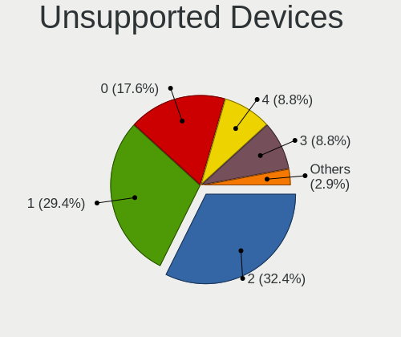

| Total | Computers | Percent |
|-------|-----------|---------|
| 2     | 6         | 31.58%  |
| 1     | 6         | 31.58%  |
| 4     | 2         | 10.53%  |
| 3     | 2         | 10.53%  |
| 0     | 2         | 10.53%  |
| 7     | 1         | 5.26%   |

Unsupported Device Types
------------------------

Types of unsupported devices

| Type                     | Computers | Percent |
|--------------------------|-----------|---------|
| Communication controller | 13        | 38.24%  |
| Bluetooth                | 6         | 17.65%  |
| Net/wireless             | 5         | 14.71%  |
| Fingerprint reader       | 4         | 11.76%  |
| Firewire controller      | 3         | 8.82%   |
| Card reader              | 2         | 5.88%   |
| Sound                    | 1         | 2.94%   |

