NomadBSD 20221130 - Tested Hardware & Statistics (Desktops)
-----------------------------------------------------------

A project to collect tested hardware configurations for NomadBSD 20221130.

Anyone can contribute to this report by the [hw-probe](https://github.com/linuxhw/hw-probe/blob/master/INSTALL.BSD.md) tool:

    hw-probe -all -upload

Please contribute! Especially if your hardware is rare.

Contents
--------

* [ Test Cases ](#test-cases)

* [ System ](#system)
  - [ Arch                     ](#arch)
  - [ DE                       ](#de)
  - [ Display Server           ](#display-server)
  - [ Display Manager          ](#display-manager)
  - [ OS Lang                  ](#os-lang)
  - [ Boot Mode                ](#boot-mode)
  - [ Filesystem               ](#filesystem)
  - [ Part. scheme             ](#part-scheme)

* [ Board ](#board)
  - [ Vendor                   ](#vendor)
  - [ Model                    ](#model)
  - [ Model Family             ](#model-family)
  - [ MFG Year                 ](#mfg-year)
  - [ Form Factor              ](#form-factor)
  - [ Coreboot                 ](#coreboot)
  - [ RAM Size                 ](#ram-size)
  - [ RAM Used                 ](#ram-used)
  - [ Total Drives             ](#total-drives)
  - [ Has CD-ROM               ](#has-cd-rom)
  - [ Has Ethernet             ](#has-ethernet)
  - [ Has WiFi                 ](#has-wifi)
  - [ Has Bluetooth            ](#has-bluetooth)

* [ Location ](#location)
  - [ Country                  ](#country)
  - [ City                     ](#city)

* [ Drives ](#drives)
  - [ Drive Vendor             ](#drive-vendor)
  - [ Drive Model              ](#drive-model)
  - [ HDD Vendor               ](#hdd-vendor)
  - [ SSD Vendor               ](#ssd-vendor)
  - [ Drive Kind               ](#drive-kind)
  - [ Drive Connector          ](#drive-connector)
  - [ Drive Size               ](#drive-size)
  - [ Space Total              ](#space-total)
  - [ Space Used               ](#space-used)
  - [ Malfunc. Drives          ](#malfunc-drives)
  - [ Malfunc. Drive Vendor    ](#malfunc-drive-vendor)
  - [ Malfunc. HDD Vendor      ](#malfunc-hdd-vendor)
  - [ Malfunc. Drive Kind      ](#malfunc-drive-kind)
  - [ Failed Drives            ](#failed-drives)
  - [ Failed Drive Vendor      ](#failed-drive-vendor)
  - [ Drive Status             ](#drive-status)

* [ Storage controller ](#storage-controller)
  - [ Storage Vendor           ](#storage-vendor)
  - [ Storage Model            ](#storage-model)
  - [ Storage Kind             ](#storage-kind)

* [ Processor ](#processor)
  - [ CPU Vendor               ](#cpu-vendor)
  - [ CPU Model                ](#cpu-model)
  - [ CPU Model Family         ](#cpu-model-family)
  - [ CPU Cores                ](#cpu-cores)
  - [ CPU Sockets              ](#cpu-sockets)
  - [ CPU Threads              ](#cpu-threads)
  - [ CPU Microarch            ](#cpu-microarch)

* [ Graphics ](#graphics)
  - [ GPU Vendor               ](#gpu-vendor)
  - [ GPU Model                ](#gpu-model)
  - [ GPU Combo                ](#gpu-combo)
  - [ GPU Driver               ](#gpu-driver)
  - [ GPU Memory               ](#gpu-memory)

* [ Monitor ](#monitor)
  - [ Monitor Vendor           ](#monitor-vendor)
  - [ Monitor Model            ](#monitor-model)
  - [ Monitor Resolution       ](#monitor-resolution)
  - [ Monitor Diagonal         ](#monitor-diagonal)
  - [ Monitor Width            ](#monitor-width)
  - [ Aspect Ratio             ](#aspect-ratio)
  - [ Monitor Area             ](#monitor-area)
  - [ Pixel Density            ](#pixel-density)
  - [ Multiple Monitors        ](#multiple-monitors)

* [ Network ](#network)
  - [ Net Controller Vendor    ](#net-controller-vendor)
  - [ Net Controller Model     ](#net-controller-model)
  - [ Wireless Vendor          ](#wireless-vendor)
  - [ Wireless Model           ](#wireless-model)
  - [ Ethernet Vendor          ](#ethernet-vendor)
  - [ Ethernet Model           ](#ethernet-model)
  - [ Net Controller Kind      ](#net-controller-kind)
  - [ Used Controller          ](#used-controller)
  - [ NICs                     ](#nics)
  - [ IPv6                     ](#ipv6)

* [ Bluetooth ](#bluetooth)
  - [ Bluetooth Vendor         ](#bluetooth-vendor)
  - [ Bluetooth Model          ](#bluetooth-model)

* [ Sound ](#sound)
  - [ Sound Vendor             ](#sound-vendor)
  - [ Sound Model              ](#sound-model)

* [ Memory ](#memory)
  - [ Memory Vendor            ](#memory-vendor)
  - [ Memory Model             ](#memory-model)
  - [ Memory Kind              ](#memory-kind)
  - [ Memory Form Factor       ](#memory-form-factor)
  - [ Memory Size              ](#memory-size)
  - [ Memory Speed             ](#memory-speed)

* [ Printers & scanners ](#printers--scanners)
  - [ Printer Vendor           ](#printer-vendor)
  - [ Printer Model            ](#printer-model)
  - [ Scanner Vendor           ](#scanner-vendor)
  - [ Scanner Model            ](#scanner-model)

* [ Camera ](#camera)
  - [ Camera Vendor            ](#camera-vendor)
  - [ Camera Model             ](#camera-model)

* [ Security ](#security)
  - [ Fingerprint Vendor       ](#fingerprint-vendor)
  - [ Fingerprint Model        ](#fingerprint-model)
  - [ Chipcard Vendor          ](#chipcard-vendor)
  - [ Chipcard Model           ](#chipcard-model)

* [ Unsupported ](#unsupported)
  - [ Unsupported Devices      ](#unsupported-devices)
  - [ Unsupported Device Types ](#unsupported-device-types)

Test Cases
----------

Total: 6

| Vendor     | Model                   | Probe                                                     | Date         |
|------------|-------------------------|-----------------------------------------------------------|--------------|
| Lenovo     | SHARKBAY SDK0E50510 WIN | [66f982c40b](https://bsd-hardware.info/?probe=66f982c40b) | Aug 23, 2023 |
| ASRockRack | C226M WS                | [06a8ca514a](https://bsd-hardware.info/?probe=06a8ca514a) | Apr 14, 2023 |
| ECS        | Z77H2-AX                | [32a290eb5f](https://bsd-hardware.info/?probe=32a290eb5f) | Apr 13, 2023 |
| ASRock     | N68-S UCC               | [04f43c3d70](https://bsd-hardware.info/?probe=04f43c3d70) | Feb 23, 2023 |
| HP         | 1589                    | [8a927b43cb](https://bsd-hardware.info/?probe=8a927b43cb) | Jan 26, 2023 |
| ASUSTek    | ROG STRIX B550-F GAMING | [335c3c990a](https://bsd-hardware.info/?probe=335c3c990a) | Jan 08, 2023 |

System
------

Arch
----

OS architecture (x86_64, i586, etc.)

| Name  | Desktops | Percent |
|-------|----------|---------|
| amd64 | 6        | 100%    |

DE
--

Desktop Environment

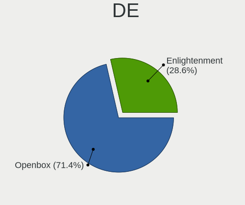

| Name          | Desktops | Percent |
|---------------|----------|---------|
| Openbox       | 4        | 66.67%  |
| Enlightenment | 2        | 33.33%  |

Display Server
--------------

X11 or Wayland

| Name | Desktops | Percent |
|------|----------|---------|
| X11  | 6        | 100%    |

Display Manager
---------------

SDDM, LightDM, etc.

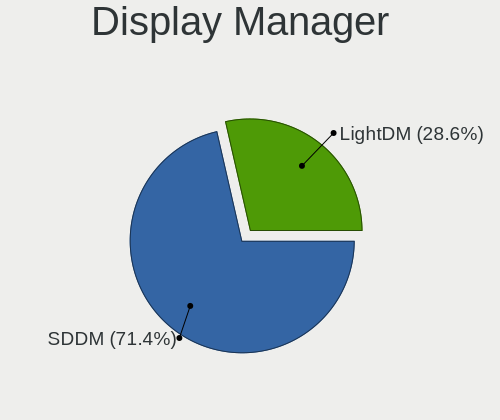

| Name    | Desktops | Percent |
|---------|----------|---------|
| SDDM    | 4        | 66.67%  |
| LightDM | 2        | 33.33%  |

OS Lang
-------

Language

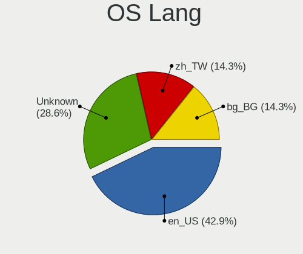

| Lang    | Desktops | Percent |
|---------|----------|---------|
| en_US   | 3        | 50%     |
| Unknown | 2        | 33.33%  |
| bg_BG   | 1        | 16.67%  |

Boot Mode
---------

EFI or BIOS

| Mode | Desktops | Percent |
|------|----------|---------|
| EFI  | 6        | 100%    |

Filesystem
----------

Type of filesystem

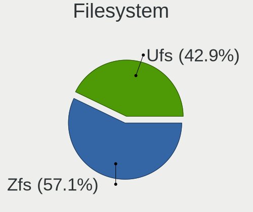

| Type | Desktops | Percent |
|------|----------|---------|
| Zfs  | 3        | 50%     |
| Ufs  | 3        | 50%     |

Part. scheme
------------

Scheme of partitioning

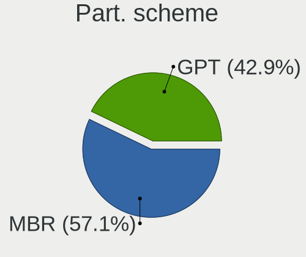

| Type | Desktops | Percent |
|------|----------|---------|
| MBR  | 3        | 50%     |
| GPT  | 3        | 50%     |

Board
-----

Vendor
------

Motherboard manufacturer

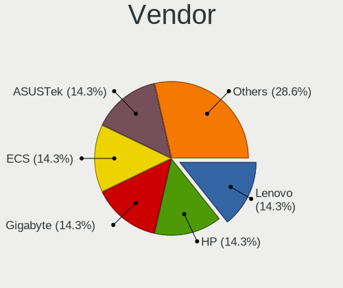

| Name             | Desktops | Percent |
|------------------|----------|---------|
| Lenovo           | 1        | 16.67%  |
| Hewlett-Packard  | 1        | 16.67%  |
| ECS              | 1        | 16.67%  |
| ASUSTek Computer | 1        | 16.67%  |
| ASRockRack       | 1        | 16.67%  |
| ASRock           | 1        | 16.67%  |

Model
-----

Motherboard model

| Name                               | Desktops | Percent |
|------------------------------------|----------|---------|
| Lenovo ThinkCentre M93p 10AAS4EN00 | 1        | 16.67%  |
| HP Z420 Workstation                | 1        | 16.67%  |
| ECS Z77H2-AX                       | 1        | 16.67%  |
| ASUS ROG STRIX B550-F GAMING       | 1        | 16.67%  |
| ASRockRack C226M WS                | 1        | 16.67%  |
| ASRock N68-S UCC                   | 1        | 16.67%  |

Model Family
------------

Motherboard model prefix

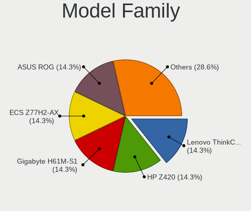

| Name               | Desktops | Percent |
|--------------------|----------|---------|
| Lenovo ThinkCentre | 1        | 16.67%  |
| HP Z420            | 1        | 16.67%  |
| ECS Z77H2-AX       | 1        | 16.67%  |
| ASUS ROG           | 1        | 16.67%  |
| ASRockRack C226M   | 1        | 16.67%  |
| ASRock N68-S       | 1        | 16.67%  |

MFG Year
--------

Motherboard manufacture year

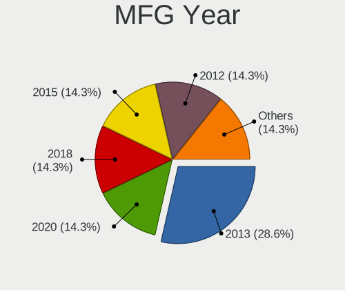

| Year | Desktops | Percent |
|------|----------|---------|
| 2020 | 1        | 16.67%  |
| 2018 | 1        | 16.67%  |
| 2015 | 1        | 16.67%  |
| 2013 | 1        | 16.67%  |
| 2012 | 1        | 16.67%  |
| 2011 | 1        | 16.67%  |

Form Factor
-----------

Physical design of the computer

| Name    | Desktops | Percent |
|---------|----------|---------|
| Desktop | 6        | 100%    |

Coreboot
--------

Have coreboot on board

| Used | Desktops | Percent |
|------|----------|---------|
| No   | 6        | 100%    |

RAM Size
--------

Total RAM memory

| Size in GB | Desktops | Percent |
|------------|----------|---------|
| 32.01-64.0 | 2        | 33.33%  |
| 16.01-24.0 | 2        | 33.33%  |
| 8.01-16.0  | 2        | 33.33%  |

RAM Used
--------

Used RAM memory

| Used GB  | Desktops | Percent |
|----------|----------|---------|
| 0.51-1.0 | 3        | 50%     |
| 1.01-2.0 | 2        | 33.33%  |
| 0.01-0.5 | 1        | 16.67%  |

Total Drives
------------

Number of drives on board

| Drives | Desktops | Percent |
|--------|----------|---------|
| 1      | 3        | 50%     |
| 4      | 1        | 16.67%  |
| 3      | 1        | 16.67%  |
| 2      | 1        | 16.67%  |

Has CD-ROM
----------

Has CD-ROM on board

| Presented | Desktops | Percent |
|-----------|----------|---------|
| No        | 6        | 100%    |

Has Ethernet
------------

Has Ethernet on board

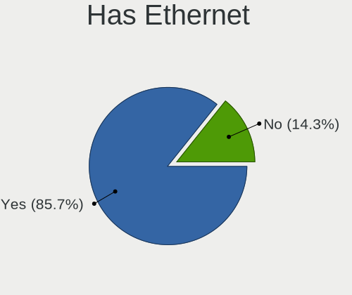

| Presented | Desktops | Percent |
|-----------|----------|---------|
| Yes       | 5        | 83.33%  |
| No        | 1        | 16.67%  |

Has WiFi
--------

Has WiFi module

| Presented | Desktops | Percent |
|-----------|----------|---------|
| No        | 5        | 83.33%  |
| Yes       | 1        | 16.67%  |

Has Bluetooth
-------------

Has Bluetooth module

| Presented | Desktops | Percent |
|-----------|----------|---------|
| No        | 4        | 66.67%  |
| Yes       | 2        | 33.33%  |

Location
--------

Country
-------

Geographic location (country)

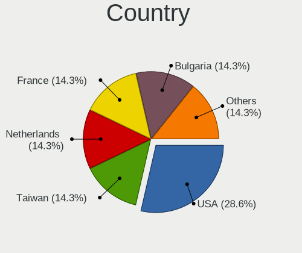

| Country     | Desktops | Percent |
|-------------|----------|---------|
| USA         | 2        | 33.33%  |
| Netherlands | 1        | 16.67%  |
| France      | 1        | 16.67%  |
| Bulgaria    | 1        | 16.67%  |
| Argentina   | 1        | 16.67%  |

City
----

Geographic location (city)

| City                 | Desktops | Percent |
|----------------------|----------|---------|
| Lutherville-Timonium | 2        | 33.33%  |
| Urcuit               | 1        | 16.67%  |
| Sofia                | 1        | 16.67%  |
| Eindhoven            | 1        | 16.67%  |
| Córdoba             | 1        | 16.67%  |

Drives
------

Drive Vendor
------------

Hard drive vendors

| Vendor              | Desktops | Drives | Percent |
|---------------------|----------|--------|---------|
| Seagate             | 3        | 3      | 30%     |
| Samsung Electronics | 3        | 4      | 30%     |
| WDC                 | 2        | 2      | 20%     |
| Kingston            | 1        | 2      | 10%     |
| Corsair             | 1        | 1      | 10%     |

Drive Model
-----------

Hard drive models

| Model                            | Desktops | Percent |
|----------------------------------|----------|---------|
| WDC WD40EFAX-68JH4N0 4TB         | 1        | 8.33%   |
| WDC WD30EZRZ-00GXCB0 3TB         | 1        | 8.33%   |
| Seagate ST9250315AS 250GB        | 1        | 8.33%   |
| Seagate ST310212A 10GB           | 1        | 8.33%   |
| Seagate ST1000DM010-2EP102 1TB   | 1        | 8.33%   |
| Samsung SSD 970 EVO Plus 2TB     | 1        | 8.33%   |
| Samsung SSD 970 EVO Plus 1TB     | 1        | 8.33%   |
| Samsung SSD 850 EVO mSATA 1TB    | 1        | 8.33%   |
| Samsung MZ7LN256HCHP-000L1 256GB | 1        | 8.33%   |
| Kingston SA400S37240G 240GB      | 1        | 8.33%   |
| Kingston SA400M8240G 240GB       | 1        | 8.33%   |
| Corsair MP600 GS 1TB             | 1        | 8.33%   |

HDD Vendor
----------

Hard disk drive vendors

| Vendor  | Desktops | Drives | Percent |
|---------|----------|--------|---------|
| Seagate | 3        | 3      | 60%     |
| WDC     | 2        | 2      | 40%     |

SSD Vendor
----------

Solid state drive vendors

| Vendor              | Desktops | Drives | Percent |
|---------------------|----------|--------|---------|
| Samsung Electronics | 2        | 2      | 66.67%  |
| Kingston            | 1        | 2      | 33.33%  |

Drive Kind
----------

HDD or SSD

| Kind | Desktops | Drives | Percent |
|------|----------|--------|---------|
| SSD  | 3        | 4      | 42.86%  |
| HDD  | 3        | 5      | 42.86%  |
| NVMe | 1        | 3      | 14.29%  |

Drive Connector
---------------

SATA, SAS, NVMe, etc.

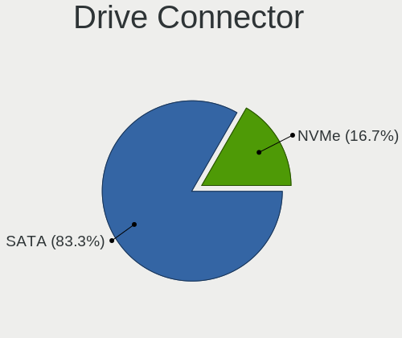

| Type | Desktops | Drives | Percent |
|------|----------|--------|---------|
| SATA | 5        | 9      | 83.33%  |
| NVMe | 1        | 3      | 16.67%  |

Drive Size
----------

Size of hard drive

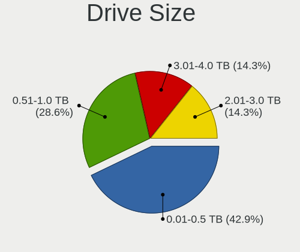

| Size in TB | Desktops | Drives | Percent |
|------------|----------|--------|---------|
| 0.01-0.5   | 3        | 5      | 42.86%  |
| 0.51-1.0   | 2        | 2      | 28.57%  |
| 3.01-4.0   | 1        | 1      | 14.29%  |
| 2.01-3.0   | 1        | 1      | 14.29%  |

Space Total
-----------

Amount of disk space available on the file system

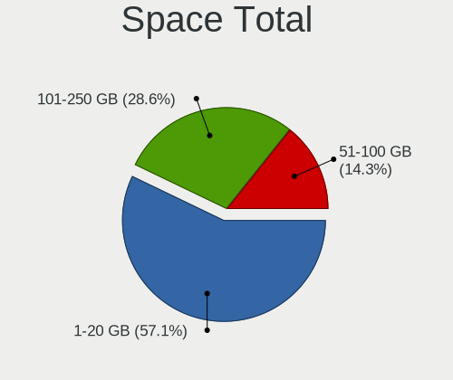

| Size in GB | Desktops | Percent |
|------------|----------|---------|
| 1-20       | 3        | 50%     |
| 101-250    | 2        | 33.33%  |
| 51-100     | 1        | 16.67%  |

Space Used
----------

Amount of used disk space

| Used GB | Desktops | Percent |
|---------|----------|---------|
| 1-20    | 6        | 100%    |

Malfunc. Drives
---------------

Drive models with a malfunction

| Model                     | Desktops | Drives | Percent |
|---------------------------|----------|--------|---------|
| Seagate ST9250315AS 250GB | 1        | 1      | 50%     |
| Seagate ST310212A 10GB    | 1        | 1      | 50%     |

Malfunc. Drive Vendor
---------------------

Vendors of faulty drives

| Vendor  | Desktops | Drives | Percent |
|---------|----------|--------|---------|
| Seagate | 2        | 2      | 100%    |

Malfunc. HDD Vendor
-------------------

Vendors of faulty HDD drives

| Vendor  | Desktops | Drives | Percent |
|---------|----------|--------|---------|
| Seagate | 2        | 2      | 100%    |

Malfunc. Drive Kind
-------------------

Kinds of faulty drives

| Kind | Desktops | Drives | Percent |
|------|----------|--------|---------|
| HDD  | 2        | 2      | 100%    |

Failed Drives
-------------

Failed drive models

Zero info for selected period =(

Failed Drive Vendor
-------------------

Failed drive vendors

Zero info for selected period =(

Drive Status
------------

Number of failed and malfunc. drives

| Status  | Desktops | Drives | Percent |
|---------|----------|--------|---------|
| Works   | 5        | 10     | 71.43%  |
| Malfunc | 2        | 2      | 28.57%  |

Storage controller
------------------

Storage Vendor
--------------

Storage controller vendors

| Vendor              | Desktops | Percent |
|---------------------|----------|---------|
| Intel               | 4        | 44.44%  |
| Samsung Electronics | 1        | 11.11%  |
| Phison Electronics  | 1        | 11.11%  |
| Nvidia              | 1        | 11.11%  |
| ASMedia Technology  | 1        | 11.11%  |
| AMD                 | 1        | 11.11%  |

Storage Model
-------------

Storage controller models

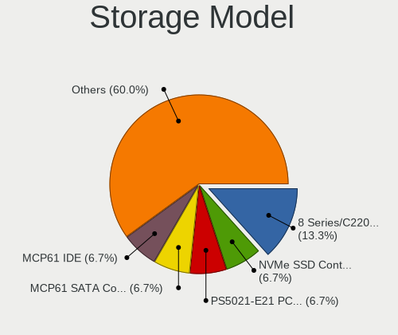

| Model                                                                          | Desktops | Percent |
|--------------------------------------------------------------------------------|----------|---------|
| Intel 8 Series/C220 Series Chipset Family 6-port SATA Controller 1 [AHCI mode] | 2        | 15.38%  |
| Samsung NVMe SSD Controller SM981/PM981/PM983                                  | 1        | 7.69%   |
| Phison PS5021-E21 PCIe4 NVMe Controller (DRAM-less)                            | 1        | 7.69%   |
| Nvidia MCP61 SATA Controller                                                   | 1        | 7.69%   |
| Nvidia MCP61 IDE                                                               | 1        | 7.69%   |
| Intel C602 chipset 4-Port SATA Storage Control Unit                            | 1        | 7.69%   |
| Intel C600/X79 series chipset 4-Port SATA IDE Controller                       | 1        | 7.69%   |
| Intel C600/X79 series chipset 2-Port SATA IDE Controller                       | 1        | 7.69%   |
| Intel 7 Series/C210 Series Chipset Family 4-port SATA Controller [IDE mode]    | 1        | 7.69%   |
| Intel 7 Series/C210 Series Chipset Family 2-port SATA Controller [IDE mode]    | 1        | 7.69%   |
| ASMedia ASM1062 Serial ATA Controller                                          | 1        | 7.69%   |
| AMD 500 Series Chipset SATA Controller                                         | 1        | 7.69%   |

Storage Kind
------------

Kind of storage controller (IDE, SATA, NVMe, SAS, ...)

| Kind | Desktops | Percent |
|------|----------|---------|
| SATA | 4        | 44.44%  |
| IDE  | 3        | 33.33%  |
| SAS  | 1        | 11.11%  |
| NVMe | 1        | 11.11%  |

Processor
---------

CPU Vendor
----------

Processor vendors

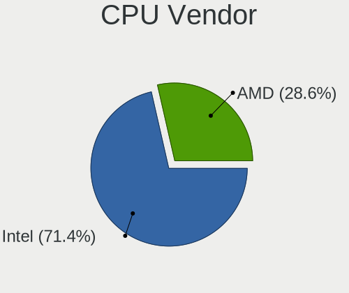

| Vendor | Desktops | Percent |
|--------|----------|---------|
| Intel  | 4        | 66.67%  |
| AMD    | 2        | 33.33%  |

CPU Model
---------

Processor models

| Model                                  | Desktops | Percent |
|----------------------------------------|----------|---------|
| Intel Xeon CPU E5-1650 v2 @ 3.50GHz    | 1        | 16.67%  |
| Intel Xeon CPU E3-1276 v3 @ 3.60GHz    | 1        | 16.67%  |
| Intel Core i7-3770K CPU @ 3.50GHz      | 1        | 16.67%  |
| Intel Core i5-4590T CPU @ 2.00GHz      | 1        | 16.67%  |
| AMD Ryzen 7 5700G with Radeon Graphics | 1        | 16.67%  |
| AMD Phenom II X4 945 Processor         | 1        | 16.67%  |

CPU Model Family
----------------

Processor model prefix

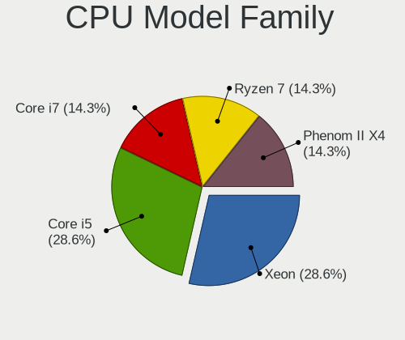

| Model            | Desktops | Percent |
|------------------|----------|---------|
| Intel Xeon       | 2        | 33.33%  |
| Intel Core i7    | 1        | 16.67%  |
| Intel Core i5    | 1        | 16.67%  |
| AMD Ryzen 7      | 1        | 16.67%  |
| AMD Phenom II X4 | 1        | 16.67%  |

CPU Cores
---------

Number of processor cores

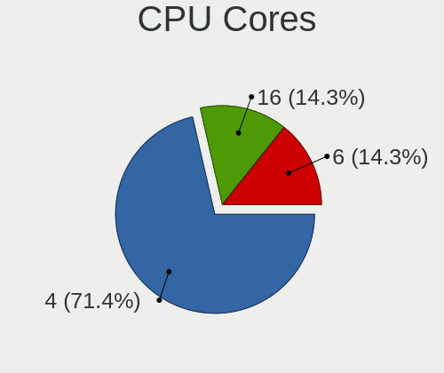

| Number | Desktops | Percent |
|--------|----------|---------|
| 4      | 4        | 66.67%  |
| 16     | 1        | 16.67%  |
| 6      | 1        | 16.67%  |

CPU Sockets
-----------

Number of sockets

| Number | Desktops | Percent |
|--------|----------|---------|
| 1      | 6        | 100%    |

CPU Threads
-----------

Threads per core (Hyper-Threading)

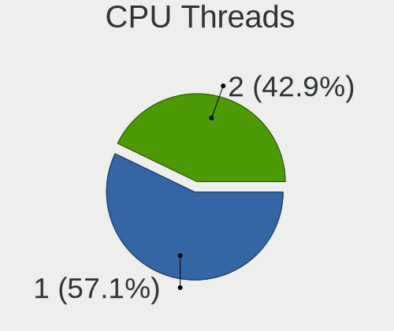

| Number | Desktops | Percent |
|--------|----------|---------|
| 2      | 3        | 50%     |
| 1      | 3        | 50%     |

CPU Microarch
-------------

Microarchitecture

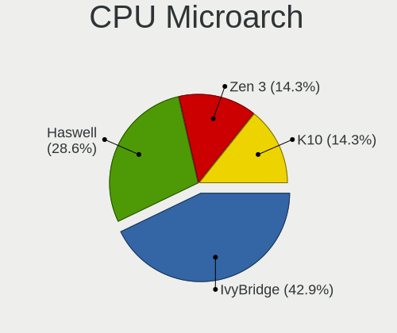

| Name      | Desktops | Percent |
|-----------|----------|---------|
| IvyBridge | 2        | 33.33%  |
| Haswell   | 2        | 33.33%  |
| Zen 3     | 1        | 16.67%  |
| K10       | 1        | 16.67%  |

Graphics
--------

GPU Vendor
----------

Vendors of graphics cards

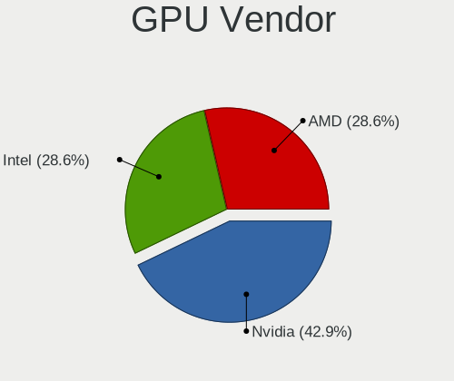

| Vendor | Desktops | Percent |
|--------|----------|---------|
| Nvidia | 2        | 33.33%  |
| Intel  | 2        | 33.33%  |
| AMD    | 2        | 33.33%  |

GPU Model
---------

Graphics card models

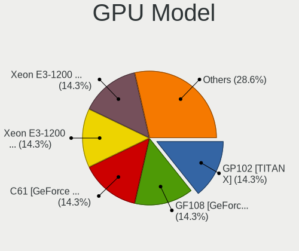

| Model                                                                       | Desktops | Percent |
|-----------------------------------------------------------------------------|----------|---------|
| Nvidia GP102 [TITAN X]                                                      | 1        | 16.67%  |
| Nvidia C61 [GeForce 7025 / nForce 630a]                                     | 1        | 16.67%  |
| Intel Xeon E3-1200 v3/4th Gen Core Processor Integrated Graphics Controller | 1        | 16.67%  |
| Intel Xeon E3-1200 v3 Processor Integrated Graphics Controller              | 1        | 16.67%  |
| AMD Navi 23 [Radeon RX 6650 XT / 6700S / 6800S]                             | 1        | 16.67%  |
| AMD Cape Verde GL [FirePro W4100]                                           | 1        | 16.67%  |

GPU Combo
---------

Combinations of graphics cards

| Name       | Desktops | Percent |
|------------|----------|---------|
| 1 x Nvidia | 2        | 33.33%  |
| 1 x Intel  | 2        | 33.33%  |
| 1 x AMD    | 2        | 33.33%  |

GPU Driver
----------

Free vs proprietary

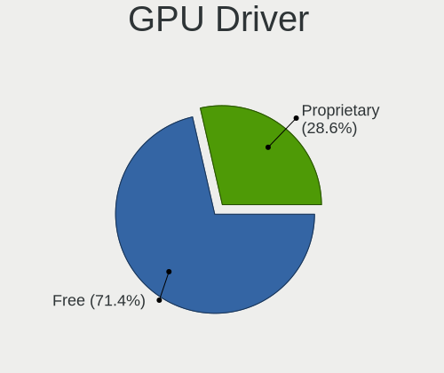

| Driver      | Desktops | Percent |
|-------------|----------|---------|
| Free        | 5        | 83.33%  |
| Proprietary | 1        | 16.67%  |

GPU Memory
----------

Total video memory

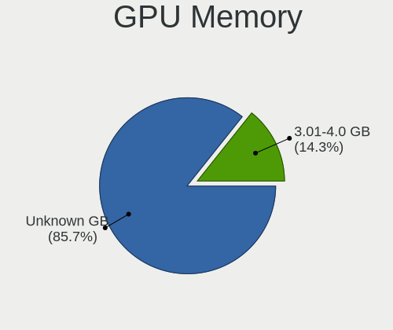

| Size in GB | Desktops | Percent |
|------------|----------|---------|
| Unknown    | 6        | 100%    |

Monitor
-------

Monitor Vendor
--------------

Monitor vendors

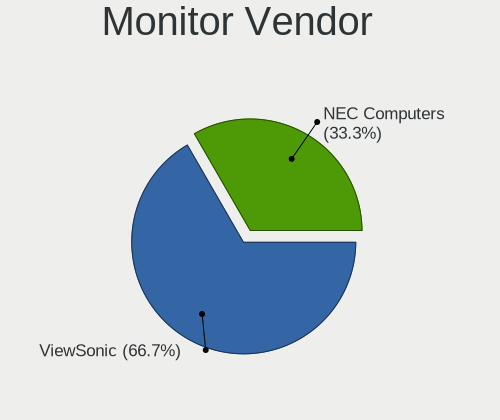

| Vendor        | Desktops | Percent |
|---------------|----------|---------|
| ViewSonic     | 1        | 50%     |
| NEC Computers | 1        | 50%     |

Monitor Model
-------------

Monitor models

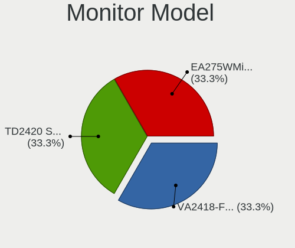

| Model                                                         | Desktops | Percent |
|---------------------------------------------------------------|----------|---------|
| ViewSonic TD2420 SERIES VSC452D 1920x1080 520x290mm 23.4-inch | 1        | 50%     |
| NEC Computers EA275WMi NEC2BA7 2560x1440 600x340mm 27.2-inch  | 1        | 50%     |

Monitor Resolution
------------------

Monitor screen resolution

| Resolution      | Desktops | Percent |
|-----------------|----------|---------|
| 2560x1440 (QHD) | 1        | 50%     |
| 1920x1080 (FHD) | 1        | 50%     |

Monitor Diagonal
----------------

Diagonal size in inches

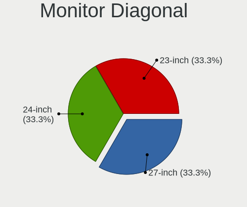

| Inches | Desktops | Percent |
|--------|----------|---------|
| 27     | 1        | 50%     |
| 23     | 1        | 50%     |

Monitor Width
-------------

Physical width

| Width in mm | Desktops | Percent |
|-------------|----------|---------|
| 501-600     | 2        | 100%    |

Aspect Ratio
------------

Proportional relationship between the width and the height

| Ratio | Desktops | Percent |
|-------|----------|---------|
| 16/9  | 2        | 100%    |

Monitor Area
------------

Area in inch²

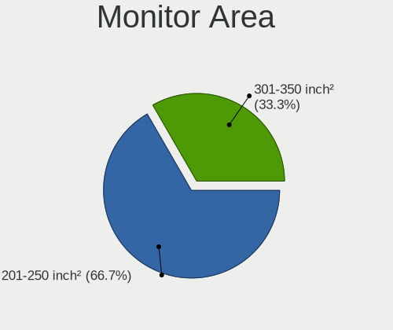

| Area in inch² | Desktops | Percent |
|----------------|----------|---------|
| 301-350        | 1        | 50%     |
| 201-250        | 1        | 50%     |

Pixel Density
-------------

Pixels per inch

| Density | Desktops | Percent |
|---------|----------|---------|
| 101-120 | 1        | 50%     |
| 51-100  | 1        | 50%     |

Multiple Monitors
-----------------

Total monitors connected

| Total | Desktops | Percent |
|-------|----------|---------|
| 1     | 3        | 50%     |
| 0     | 3        | 50%     |

Network
-------

Net Controller Vendor
---------------------

Controller vendors

| Vendor                | Desktops | Percent |
|-----------------------|----------|---------|
| Intel                 | 4        | 66.67%  |
| Realtek Semiconductor | 1        | 16.67%  |
| Qualcomm Atheros      | 1        | 16.67%  |

Net Controller Model
--------------------

Controller models

| Model                                                             | Desktops | Percent |
|-------------------------------------------------------------------|----------|---------|
| Intel Ethernet Connection I217-LM                                 | 2        | 28.57%  |
| Realtek RTL8111/8168/8411 PCI Express Gigabit Ethernet Controller | 1        | 14.29%  |
| Qualcomm Atheros AR9462 Wireless Network Adapter                  | 1        | 14.29%  |
| Intel I210 Gigabit Network Connection                             | 1        | 14.29%  |
| Intel Ethernet Controller I225-V                                  | 1        | 14.29%  |
| Intel 82579LM Gigabit Network Connection (Lewisville)             | 1        | 14.29%  |

Wireless Vendor
---------------

Wireless vendors

| Vendor           | Desktops | Percent |
|------------------|----------|---------|
| Qualcomm Atheros | 1        | 100%    |

Wireless Model
--------------

Wireless models

| Model                                            | Desktops | Percent |
|--------------------------------------------------|----------|---------|
| Qualcomm Atheros AR9462 Wireless Network Adapter | 1        | 100%    |

Ethernet Vendor
---------------

Ethernet vendors

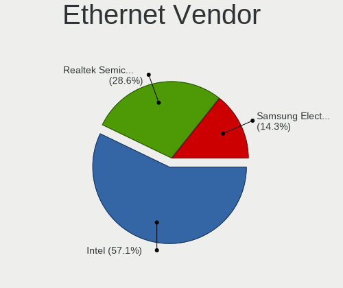

| Vendor                | Desktops | Percent |
|-----------------------|----------|---------|
| Intel                 | 4        | 80%     |
| Realtek Semiconductor | 1        | 20%     |

Ethernet Model
--------------

Ethernet models

| Model                                                             | Desktops | Percent |
|-------------------------------------------------------------------|----------|---------|
| Intel Ethernet Connection I217-LM                                 | 2        | 33.33%  |
| Realtek RTL8111/8168/8411 PCI Express Gigabit Ethernet Controller | 1        | 16.67%  |
| Intel I210 Gigabit Network Connection                             | 1        | 16.67%  |
| Intel Ethernet Controller I225-V                                  | 1        | 16.67%  |
| Intel 82579LM Gigabit Network Connection (Lewisville)             | 1        | 16.67%  |

Net Controller Kind
-------------------

Ethernet, WiFi or modem

| Kind     | Desktops | Percent |
|----------|----------|---------|
| Ethernet | 5        | 83.33%  |
| WiFi     | 1        | 16.67%  |

Used Controller
---------------

Currently used network controller

| Kind     | Desktops | Percent |
|----------|----------|---------|
| Ethernet | 5        | 100%    |

NICs
----

Total network controllers on board

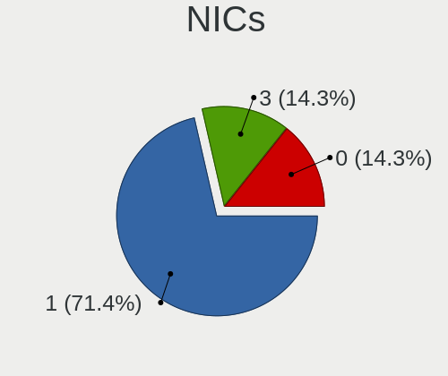

| Total | Desktops | Percent |
|-------|----------|---------|
| 1     | 4        | 66.67%  |
| 3     | 1        | 16.67%  |
| 0     | 1        | 16.67%  |

IPv6
----

IPv6 vs IPv4

| Used | Desktops | Percent |
|------|----------|---------|
| No   | 5        | 83.33%  |
| Yes  | 1        | 16.67%  |

Bluetooth
---------

Bluetooth Vendor
----------------

Controller vendors

| Vendor                          | Desktops | Percent |
|---------------------------------|----------|---------|
| Qualcomm Atheros Communications | 1        | 50%     |
| Cambridge Silicon Radio         | 1        | 50%     |

Bluetooth Model
---------------

Controller models

| Model                                               | Desktops | Percent |
|-----------------------------------------------------|----------|---------|
| Qualcomm Atheros AR3011 Bluetooth (no firmware)     | 1        | 50%     |
| Cambridge Silicon Radio Bluetooth Dongle (HCI mode) | 1        | 50%     |

Sound
-----

Sound Vendor
------------

Sound card vendors

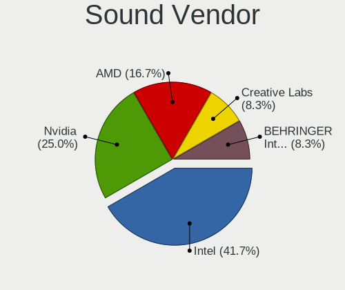

| Vendor                  | Desktops | Percent |
|-------------------------|----------|---------|
| Intel                   | 4        | 40%     |
| Nvidia                  | 2        | 20%     |
| AMD                     | 2        | 20%     |
| Creative Labs           | 1        | 10%     |
| BEHRINGER International | 1        | 10%     |

Sound Model
-----------

Sound card models

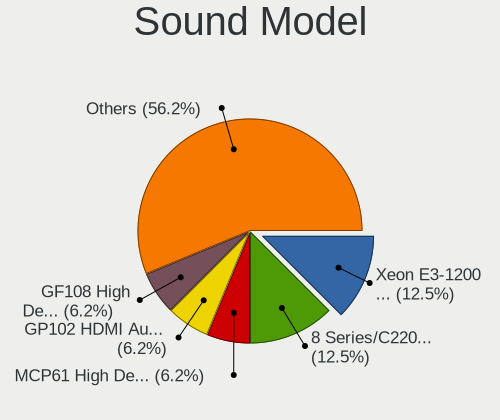

| Model                                                                     | Desktops | Percent |
|---------------------------------------------------------------------------|----------|---------|
| Intel Xeon E3-1200 v3/4th Gen Core Processor HD Audio Controller          | 2        | 14.29%  |
| Intel 8 Series/C220 Series Chipset High Definition Audio Controller       | 2        | 14.29%  |
| Nvidia MCP61 High Definition Audio                                        | 1        | 7.14%   |
| Nvidia GP102 HDMI Audio Controller                                        | 1        | 7.14%   |
| Intel C600/X79 series chipset High Definition Audio Controller            | 1        | 7.14%   |
| Intel 7 Series/C216 Chipset Family High Definition Audio Controller       | 1        | 7.14%   |
| Creative Labs EMU10k2/CA0100/CA0102/CA10200 [Sound Blaster Audigy Series] | 1        | 7.14%   |
| BEHRINGER International UMC 202HD 192k                                    | 1        | 7.14%   |
| AMD Renoir Radeon High Definition Audio Controller                        | 1        | 7.14%   |
| AMD Oland/Hainan/Cape Verde/Pitcairn HDMI Audio [Radeon HD 7000 Series]   | 1        | 7.14%   |
| AMD Navi 21/23 HDMI/DP Audio Controller                                   | 1        | 7.14%   |
| AMD Family 17h/19h HD Audio Controller                                    | 1        | 7.14%   |

Memory
------

Memory Vendor
-------------

Memory module vendors

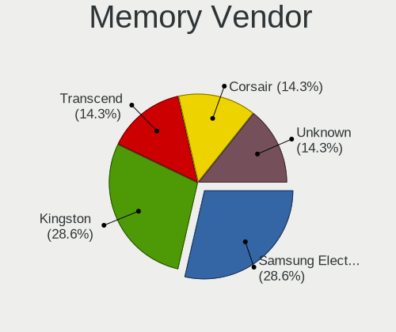

| Vendor              | Desktops | Percent |
|---------------------|----------|---------|
| Samsung Electronics | 2        | 33.33%  |
| Kingston            | 2        | 33.33%  |
| Corsair             | 1        | 16.67%  |
| Unknown             | 1        | 16.67%  |

Memory Model
------------

Memory module models

| Model                                                 | Desktops | Percent |
|-------------------------------------------------------|----------|---------|
| Samsung RAM M471B1G73DB0-YK0 8GB SODIMM DDR3 1600MT/s | 1        | 16.67%  |
| Samsung RAM M391B1G73QH0-YK0 8GB DIMM DDR3 1600MT/s   | 1        | 16.67%  |
| Kingston RAM KF3600C17D4/8GX 8GB DIMM DDR4 3600MT/s   | 1        | 16.67%  |
| Kingston RAM 9965525-138.A00LF 8GB DIMM DDR3 1600MT/s | 1        | 16.67%  |
| Corsair RAM CMY16GX3M2A2133C11 8GB DIMM DDR3 1866MT/s | 1        | 16.67%  |
| Unknown                                               | 1        | 16.67%  |

Memory Kind
-----------

Memory module kinds

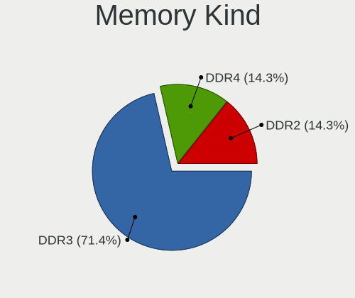

| Kind | Desktops | Percent |
|------|----------|---------|
| DDR3 | 4        | 66.67%  |
| DDR4 | 1        | 16.67%  |
| DDR2 | 1        | 16.67%  |

Memory Form Factor
------------------

Physical design of the memory module

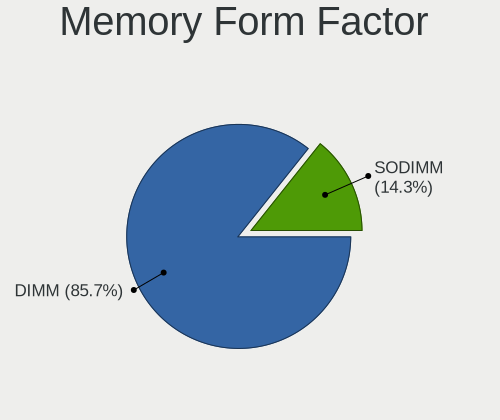

| Name   | Desktops | Percent |
|--------|----------|---------|
| DIMM   | 5        | 83.33%  |
| SODIMM | 1        | 16.67%  |

Memory Size
-----------

Memory module size

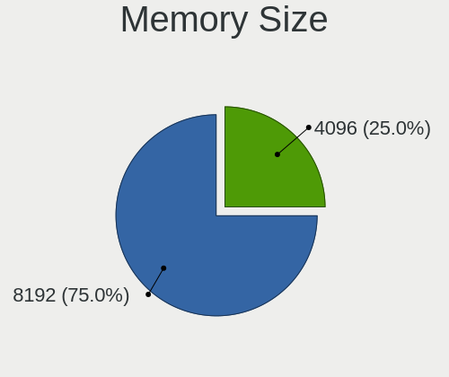

| Size | Desktops | Percent |
|------|----------|---------|
| 8192 | 5        | 83.33%  |
| 4096 | 1        | 16.67%  |

Memory Speed
------------

Memory module speed

| Speed | Desktops | Percent |
|-------|----------|---------|
| 1600  | 3        | 50%     |
| 3600  | 1        | 16.67%  |
| 1866  | 1        | 16.67%  |
| 533   | 1        | 16.67%  |

Printers & scanners
-------------------

Printer Vendor
--------------

Printer device vendors

Zero info for selected period =(

Printer Model
-------------

Printer device models

Zero info for selected period =(

Scanner Vendor
--------------

Scanner device vendors

Zero info for selected period =(

Scanner Model
-------------

Scanner device models

Zero info for selected period =(

Camera
------

Camera Vendor
-------------

Camera device vendors

Zero info for selected period =(

Camera Model
------------

Camera device models

Zero info for selected period =(

Security
--------

Fingerprint Vendor
------------------

Fingerprint sensor vendors

Zero info for selected period =(

Fingerprint Model
-----------------

Fingerprint sensor models

Zero info for selected period =(

Chipcard Vendor
---------------

Chipcard module vendors

Zero info for selected period =(

Chipcard Model
--------------

Chipcard module models

Zero info for selected period =(

Unsupported
-----------

Unsupported Devices
-------------------

Total unsupported devices on board

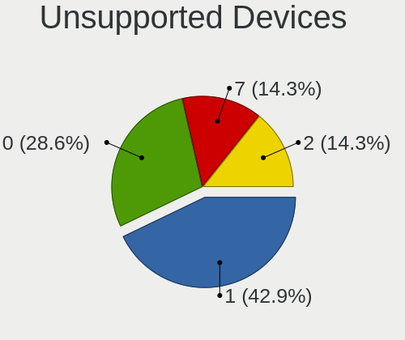

| Total | Desktops | Percent |
|-------|----------|---------|
| 1     | 2        | 33.33%  |
| 0     | 2        | 33.33%  |
| 7     | 1        | 16.67%  |
| 2     | 1        | 16.67%  |

Unsupported Device Types
------------------------

Types of unsupported devices

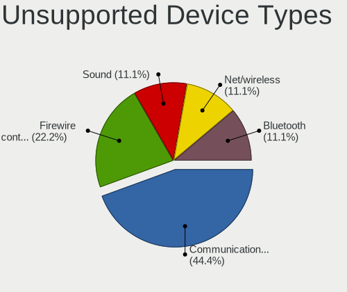

| Type                     | Desktops | Percent |
|--------------------------|----------|---------|
| Communication controller | 3        | 37.5%   |
| Firewire controller      | 2        | 25%     |
| Sound                    | 1        | 12.5%   |
| Net/wireless             | 1        | 12.5%   |
| Bluetooth                | 1        | 12.5%   |

