NomadBSD 20221130 - Tested Hardware & Statistics (Notebooks)
------------------------------------------------------------

A project to collect tested hardware configurations for NomadBSD 20221130.

Anyone can contribute to this report by the [hw-probe](https://github.com/linuxhw/hw-probe/blob/master/INSTALL.BSD.md) tool:

    hw-probe -all -upload

Please contribute! Especially if your hardware is rare.

Contents
--------

* [ Test Cases ](#test-cases)

* [ System ](#system)
  - [ Arch                     ](#arch)
  - [ DE                       ](#de)
  - [ Display Server           ](#display-server)
  - [ Display Manager          ](#display-manager)
  - [ OS Lang                  ](#os-lang)
  - [ Boot Mode                ](#boot-mode)
  - [ Filesystem               ](#filesystem)
  - [ Part. scheme             ](#part-scheme)

* [ Board ](#board)
  - [ Vendor                   ](#vendor)
  - [ Model                    ](#model)
  - [ Model Family             ](#model-family)
  - [ MFG Year                 ](#mfg-year)
  - [ Form Factor              ](#form-factor)
  - [ Coreboot                 ](#coreboot)
  - [ RAM Size                 ](#ram-size)
  - [ RAM Used                 ](#ram-used)
  - [ Total Drives             ](#total-drives)
  - [ Has CD-ROM               ](#has-cd-rom)
  - [ Has Ethernet             ](#has-ethernet)
  - [ Has WiFi                 ](#has-wifi)
  - [ Has Bluetooth            ](#has-bluetooth)

* [ Location ](#location)
  - [ Country                  ](#country)
  - [ City                     ](#city)

* [ Drives ](#drives)
  - [ Drive Vendor             ](#drive-vendor)
  - [ Drive Model              ](#drive-model)
  - [ HDD Vendor               ](#hdd-vendor)
  - [ SSD Vendor               ](#ssd-vendor)
  - [ Drive Kind               ](#drive-kind)
  - [ Drive Connector          ](#drive-connector)
  - [ Drive Size               ](#drive-size)
  - [ Space Total              ](#space-total)
  - [ Space Used               ](#space-used)
  - [ Malfunc. Drives          ](#malfunc-drives)
  - [ Malfunc. Drive Vendor    ](#malfunc-drive-vendor)
  - [ Malfunc. HDD Vendor      ](#malfunc-hdd-vendor)
  - [ Malfunc. Drive Kind      ](#malfunc-drive-kind)
  - [ Failed Drives            ](#failed-drives)
  - [ Failed Drive Vendor      ](#failed-drive-vendor)
  - [ Drive Status             ](#drive-status)

* [ Storage controller ](#storage-controller)
  - [ Storage Vendor           ](#storage-vendor)
  - [ Storage Model            ](#storage-model)
  - [ Storage Kind             ](#storage-kind)

* [ Processor ](#processor)
  - [ CPU Vendor               ](#cpu-vendor)
  - [ CPU Model                ](#cpu-model)
  - [ CPU Model Family         ](#cpu-model-family)
  - [ CPU Cores                ](#cpu-cores)
  - [ CPU Sockets              ](#cpu-sockets)
  - [ CPU Threads              ](#cpu-threads)
  - [ CPU Microarch            ](#cpu-microarch)

* [ Graphics ](#graphics)
  - [ GPU Vendor               ](#gpu-vendor)
  - [ GPU Model                ](#gpu-model)
  - [ GPU Combo                ](#gpu-combo)
  - [ GPU Driver               ](#gpu-driver)
  - [ GPU Memory               ](#gpu-memory)

* [ Monitor ](#monitor)
  - [ Monitor Vendor           ](#monitor-vendor)
  - [ Monitor Model            ](#monitor-model)
  - [ Monitor Resolution       ](#monitor-resolution)
  - [ Monitor Diagonal         ](#monitor-diagonal)
  - [ Monitor Width            ](#monitor-width)
  - [ Aspect Ratio             ](#aspect-ratio)
  - [ Monitor Area             ](#monitor-area)
  - [ Pixel Density            ](#pixel-density)
  - [ Multiple Monitors        ](#multiple-monitors)

* [ Network ](#network)
  - [ Net Controller Vendor    ](#net-controller-vendor)
  - [ Net Controller Model     ](#net-controller-model)
  - [ Wireless Vendor          ](#wireless-vendor)
  - [ Wireless Model           ](#wireless-model)
  - [ Ethernet Vendor          ](#ethernet-vendor)
  - [ Ethernet Model           ](#ethernet-model)
  - [ Net Controller Kind      ](#net-controller-kind)
  - [ Used Controller          ](#used-controller)
  - [ NICs                     ](#nics)
  - [ IPv6                     ](#ipv6)

* [ Bluetooth ](#bluetooth)
  - [ Bluetooth Vendor         ](#bluetooth-vendor)
  - [ Bluetooth Model          ](#bluetooth-model)

* [ Sound ](#sound)
  - [ Sound Vendor             ](#sound-vendor)
  - [ Sound Model              ](#sound-model)

* [ Memory ](#memory)
  - [ Memory Vendor            ](#memory-vendor)
  - [ Memory Model             ](#memory-model)
  - [ Memory Kind              ](#memory-kind)
  - [ Memory Form Factor       ](#memory-form-factor)
  - [ Memory Size              ](#memory-size)
  - [ Memory Speed             ](#memory-speed)

* [ Printers & scanners ](#printers--scanners)
  - [ Printer Vendor           ](#printer-vendor)
  - [ Printer Model            ](#printer-model)
  - [ Scanner Vendor           ](#scanner-vendor)
  - [ Scanner Model            ](#scanner-model)

* [ Camera ](#camera)
  - [ Camera Vendor            ](#camera-vendor)
  - [ Camera Model             ](#camera-model)

* [ Security ](#security)
  - [ Fingerprint Vendor       ](#fingerprint-vendor)
  - [ Fingerprint Model        ](#fingerprint-model)
  - [ Chipcard Vendor          ](#chipcard-vendor)
  - [ Chipcard Model           ](#chipcard-model)

* [ Unsupported ](#unsupported)
  - [ Unsupported Devices      ](#unsupported-devices)
  - [ Unsupported Device Types ](#unsupported-device-types)

Test Cases
----------

Total: 19

| Vendor        | Model                       | Probe                                                     | Date         |
|---------------|-----------------------------|-----------------------------------------------------------|--------------|
| Chuwi         | CoreBook X                  | [2854f97c81](https://bsd-hardware.info/?probe=2854f97c81) | Aug 01, 2023 |
| Fujitsu Si... | AMILO Li3710                | [7a5d32eb7f](https://bsd-hardware.info/?probe=7a5d32eb7f) | Jul 29, 2023 |
| HP            | EliteBook 750 G1            | [e0af4797d4](https://bsd-hardware.info/?probe=e0af4797d4) | Jun 24, 2023 |
| Lenovo        | ThinkPad T430 2347A45       | [461a92a1a2](https://bsd-hardware.info/?probe=461a92a1a2) | Jun 20, 2023 |
| Lenovo        | ThinkPad E495 20NE000BSP    | [0e02b323ee](https://bsd-hardware.info/?probe=0e02b323ee) | Jun 01, 2023 |
| Samsung       | N150/N210/N220              | [f6e5189f54](https://bsd-hardware.info/?probe=f6e5189f54) | Apr 11, 2023 |
| Lenovo        | ThinkPad X280 20KESB4T00    | [fb6c7b3b09](https://bsd-hardware.info/?probe=fb6c7b3b09) | Apr 11, 2023 |
| Dell          | Latitude 7300               | [d036260cce](https://bsd-hardware.info/?probe=d036260cce) | Apr 08, 2023 |
| Lenovo        | ThinkPad X230 23255NG       | [2ef93a7621](https://bsd-hardware.info/?probe=2ef93a7621) | Mar 29, 2023 |
| Acer          | Swift SF314-56              | [94c7da1b3f](https://bsd-hardware.info/?probe=94c7da1b3f) | Mar 13, 2023 |
| Intel         | Jasper Lake Client Platf... | [de93a79b7d](https://bsd-hardware.info/?probe=de93a79b7d) | Mar 10, 2023 |
| Lenovo        | ThinkPad T470 20HES0EV0A    | [dd6c3fa0f7](https://bsd-hardware.info/?probe=dd6c3fa0f7) | Mar 10, 2023 |
| Fujitsu       | CELSIUS H730                | [d2292bbcda](https://bsd-hardware.info/?probe=d2292bbcda) | Mar 10, 2023 |
| Acer          | Aspire 7738                 | [e61cd20061](https://bsd-hardware.info/?probe=e61cd20061) | Feb 18, 2023 |
| Lenovo        | ThinkPad W520 42844DG       | [d341f3c6f6](https://bsd-hardware.info/?probe=d341f3c6f6) | Feb 11, 2023 |
| Lenovo        | ThinkPad E14 20RA0036RT     | [941da31f26](https://bsd-hardware.info/?probe=941da31f26) | Feb 02, 2023 |
| Lenovo        | G50-70 20351                | [6a1ff80054](https://bsd-hardware.info/?probe=6a1ff80054) | Jan 04, 2023 |
| Lenovo        | Yoga 710-11IKB 80V6         | [1d3ccd1fe6](https://bsd-hardware.info/?probe=1d3ccd1fe6) | Dec 22, 2022 |
| Apple         | MacBookPro14,1              | [5234a39100](https://bsd-hardware.info/?probe=5234a39100) | Dec 10, 2022 |

System
------

Arch
----

OS architecture (x86_64, i586, etc.)

| Name  | Notebooks | Percent |
|-------|-----------|---------|
| amd64 | 16        | 94.12%  |
| i386  | 1         | 5.88%   |

DE
--

Desktop Environment

| Name    | Notebooks | Percent |
|---------|-----------|---------|
| Openbox | 9         | 52.94%  |
| xinitrc | 6         | 35.29%  |
| KDE5    | 2         | 11.76%  |

Display Server
--------------

X11 or Wayland

| Name | Notebooks | Percent |
|------|-----------|---------|
| X11  | 17        | 100%    |

Display Manager
---------------

SDDM, LightDM, etc.

| Name | Notebooks | Percent |
|------|-----------|---------|
| SDDM | 17        | 100%    |

OS Lang
-------

Language

| Lang    | Notebooks | Percent |
|---------|-----------|---------|
| en_US   | 5         | 29.41%  |
| fr_FR   | 4         | 23.53%  |
| en_GB   | 4         | 23.53%  |
| fi_FI   | 2         | 11.76%  |
| lt_LT   | 1         | 5.88%   |
| Unknown | 1         | 5.88%   |

Boot Mode
---------

EFI or BIOS

| Mode | Notebooks | Percent |
|------|-----------|---------|
| EFI  | 17        | 100%    |

Filesystem
----------

Type of filesystem

| Type | Notebooks | Percent |
|------|-----------|---------|
| Ufs  | 11        | 64.71%  |
| Zfs  | 6         | 35.29%  |

Part. scheme
------------

Scheme of partitioning

| Type | Notebooks | Percent |
|------|-----------|---------|
| GPT  | 11        | 64.71%  |
| MBR  | 6         | 35.29%  |

Board
-----

Vendor
------

Motherboard manufacturer

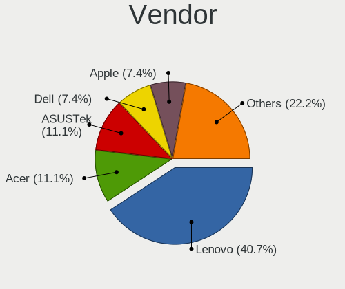

| Name                | Notebooks | Percent |
|---------------------|-----------|---------|
| Lenovo              | 8         | 47.06%  |
| Acer                | 2         | 11.76%  |
| Samsung Electronics | 1         | 5.88%   |
| Hewlett-Packard     | 1         | 5.88%   |
| Fujitsu Siemens     | 1         | 5.88%   |
| Fujitsu             | 1         | 5.88%   |
| Dell                | 1         | 5.88%   |
| Chuwi               | 1         | 5.88%   |
| Apple               | 1         | 5.88%   |

Model
-----

Motherboard model

| Name                            | Notebooks | Percent |
|---------------------------------|-----------|---------|
| Samsung N150/N210/N220          | 1         | 5.88%   |
| Lenovo Yoga 710-11IKB 80V6      | 1         | 5.88%   |
| Lenovo ThinkPad X280 20KESB4T00 | 1         | 5.88%   |
| Lenovo ThinkPad X230 23255NG    | 1         | 5.88%   |
| Lenovo ThinkPad W520 42844DG    | 1         | 5.88%   |
| Lenovo ThinkPad T470 20HES0EV0A | 1         | 5.88%   |
| Lenovo ThinkPad E495 20NE000BSP | 1         | 5.88%   |
| Lenovo ThinkPad E14 20RA0036RT  | 1         | 5.88%   |
| Lenovo G50-70 20351             | 1         | 5.88%   |
| HP EliteBook 750 G1             | 1         | 5.88%   |
| Fujitsu Siemens AMILO Li3710    | 1         | 5.88%   |
| Fujitsu CELSIUS H730            | 1         | 5.88%   |
| Dell Latitude 7300              | 1         | 5.88%   |
| Chuwi CoreBook X                | 1         | 5.88%   |
| Apple MacBookPro14,1            | 1         | 5.88%   |
| Acer Swift SF314-56             | 1         | 5.88%   |
| Acer Aspire 7738                | 1         | 5.88%   |

Model Family
------------

Motherboard model prefix

| Name                  | Notebooks | Percent |
|-----------------------|-----------|---------|
| Lenovo ThinkPad       | 6         | 35.29%  |
| Samsung N150          | 1         | 5.88%   |
| Lenovo Yoga           | 1         | 5.88%   |
| Lenovo G50-70         | 1         | 5.88%   |
| HP EliteBook          | 1         | 5.88%   |
| Fujitsu Siemens AMILO | 1         | 5.88%   |
| Fujitsu CELSIUS       | 1         | 5.88%   |
| Dell Latitude         | 1         | 5.88%   |
| Chuwi CoreBook        | 1         | 5.88%   |
| Apple MacBookPro14    | 1         | 5.88%   |
| Acer Swift            | 1         | 5.88%   |
| Acer Aspire           | 1         | 5.88%   |

MFG Year
--------

Motherboard manufacture year

| Year | Notebooks | Percent |
|------|-----------|---------|
| 2019 | 3         | 17.65%  |
| 2020 | 2         | 11.76%  |
| 2012 | 2         | 11.76%  |
| 2009 | 2         | 11.76%  |
| 2023 | 1         | 5.88%   |
| 2022 | 1         | 5.88%   |
| 2021 | 1         | 5.88%   |
| 2018 | 1         | 5.88%   |
| 2016 | 1         | 5.88%   |
| 2015 | 1         | 5.88%   |
| 2014 | 1         | 5.88%   |
| 2010 | 1         | 5.88%   |

Form Factor
-----------

Physical design of the computer

| Name     | Notebooks | Percent |
|----------|-----------|---------|
| Notebook | 17        | 100%    |

Coreboot
--------

Have coreboot on board

| Used | Notebooks | Percent |
|------|-----------|---------|
| No   | 16        | 94.12%  |
| Yes  | 1         | 5.88%   |

RAM Size
--------

Total RAM memory

| Size in GB | Notebooks | Percent |
|------------|-----------|---------|
| 8.01-16.0  | 8         | 47.06%  |
| 16.01-24.0 | 4         | 23.53%  |
| 2.01-3.0   | 2         | 11.76%  |
| 4.01-8.0   | 1         | 5.88%   |
| 32.01-64.0 | 1         | 5.88%   |
| 24.01-32.0 | 1         | 5.88%   |

RAM Used
--------

Used RAM memory

| Used GB  | Notebooks | Percent |
|----------|-----------|---------|
| 0.01-0.5 | 10        | 58.82%  |
| 0.51-1.0 | 4         | 23.53%  |
| 1.01-2.0 | 2         | 11.76%  |
| 2.01-3.0 | 1         | 5.88%   |

Total Drives
------------

Number of drives on board

| Drives | Notebooks | Percent |
|--------|-----------|---------|
| 1      | 12        | 70.59%  |
| 2      | 3         | 17.65%  |
| 0      | 2         | 11.76%  |

Has CD-ROM
----------

Has CD-ROM on board

| Presented | Notebooks | Percent |
|-----------|-----------|---------|
| No        | 13        | 76.47%  |
| Yes       | 4         | 23.53%  |

Has Ethernet
------------

Has Ethernet on board

| Presented | Notebooks | Percent |
|-----------|-----------|---------|
| Yes       | 13        | 76.47%  |
| No        | 4         | 23.53%  |

Has WiFi
--------

Has WiFi module

| Presented | Notebooks | Percent |
|-----------|-----------|---------|
| Yes       | 17        | 100%    |

Has Bluetooth
-------------

Has Bluetooth module

| Presented | Notebooks | Percent |
|-----------|-----------|---------|
| Yes       | 11        | 64.71%  |
| No        | 6         | 35.29%  |

Location
--------

Country
-------

Geographic location (country)

| Country    | Notebooks | Percent |
|------------|-----------|---------|
| France     | 5         | 29.41%  |
| UK         | 4         | 23.53%  |
| USA        | 2         | 11.76%  |
| Finland    | 2         | 11.76%  |
| Spain      | 1         | 5.88%   |
| San Marino | 1         | 5.88%   |
| Russia     | 1         | 5.88%   |
| Lithuania  | 1         | 5.88%   |

City
----

Geographic location (city)

| City           | Notebooks | Percent |
|----------------|-----------|---------|
| Melun          | 2         | 11.76%  |
| West Bromwich  | 1         | 5.88%   |
| Wakefield      | 1         | 5.88%   |
| Vilnius        | 1         | 5.88%   |
| Vaasa          | 1         | 5.88%   |
| Urcuit         | 1         | 5.88%   |
| Turku          | 1         | 5.88%   |
| Seattle        | 1         | 5.88%   |
| Sartrouville   | 1         | 5.88%   |
| San Marino     | 1         | 5.88%   |
| Saint-Raphaël | 1         | 5.88%   |
| Rubí          | 1         | 5.88%   |
| Portland       | 1         | 5.88%   |
| Moscow         | 1         | 5.88%   |
| Lincoln        | 1         | 5.88%   |
| Addlestone     | 1         | 5.88%   |

Drives
------

Drive Vendor
------------

Hard drive vendors

| Vendor              | Notebooks | Drives | Percent |
|---------------------|-----------|--------|---------|
| SanDisk             | 3         | 3      | 16.67%  |
| Samsung Electronics | 2         | 2      | 11.11%  |
| Crucial             | 2         | 2      | 11.11%  |
| WDC                 | 1         | 1      | 5.56%   |
| UMIS                | 1         | 1      | 5.56%   |
| SPCC                | 1         | 1      | 5.56%   |
| SK hynix            | 1         | 1      | 5.56%   |
| Seagate             | 1         | 1      | 5.56%   |
| Phison              | 1         | 1      | 5.56%   |
| Kingston            | 1         | 1      | 5.56%   |
| Intel               | 1         | 1      | 5.56%   |
| Hitachi             | 1         | 2      | 5.56%   |
| AirDisk             | 1         | 1      | 5.56%   |
| A-DATA Technology   | 1         | 1      | 5.56%   |

Drive Model
-----------

Hard drive models

| Model                             | Notebooks | Percent |
|-----------------------------------|-----------|---------|
| WDC WD7500BPKX-00HPJT0 752GB      | 1         | 5.56%   |
| UMIS RPJTJ256MED1OWX 256GB        | 1         | 5.56%   |
| SPCC Solid State Disk 128GB       | 1         | 5.56%   |
| SK hynix HFM512GDHTNG-8710B 512GB | 1         | 5.56%   |
| Seagate ST9160314AS 160GB         | 1         | 5.56%   |
| SanDisk X400 M.2 2280 256GB       | 1         | 5.56%   |
| SanDisk SDSSDA240G 240GB          | 1         | 5.56%   |
| SanDisk pSSD 16GB                 | 1         | 5.56%   |
| Samsung SSD 860 EVO M.2 250GB     | 1         | 5.56%   |
| Samsung SSD 850 EVO 2TB           | 1         | 5.56%   |
| Phison Sabrent Rocket nano 512GB  | 1         | 5.56%   |
| Kingston SA400S37240G 240GB       | 1         | 5.56%   |
| Intel SSDPEKKF256G8L 256GB        | 1         | 5.56%   |
| Hitachi HTS545050B9A300 500GB     | 1         | 5.56%   |
| Crucial CT256MX100SSD1 256GB      | 1         | 5.56%   |
| Crucial CT2000BX500SSD1 2TB       | 1         | 5.56%   |
| AirDisk 512GB SSD                 | 1         | 5.56%   |
| A-DATA SSD DP900 512GB-DL3        | 1         | 5.56%   |

HDD Vendor
----------

Hard disk drive vendors

| Vendor  | Notebooks | Drives | Percent |
|---------|-----------|--------|---------|
| WDC     | 1         | 1      | 33.33%  |
| Seagate | 1         | 1      | 33.33%  |
| Hitachi | 1         | 2      | 33.33%  |

SSD Vendor
----------

Solid state drive vendors

| Vendor              | Notebooks | Drives | Percent |
|---------------------|-----------|--------|---------|
| SanDisk             | 3         | 3      | 30%     |
| Samsung Electronics | 2         | 2      | 20%     |
| Crucial             | 2         | 2      | 20%     |
| SPCC                | 1         | 1      | 10%     |
| Kingston            | 1         | 1      | 10%     |
| A-DATA Technology   | 1         | 1      | 10%     |

Drive Kind
----------

HDD or SSD

| Kind | Notebooks | Drives | Percent |
|------|-----------|--------|---------|
| SSD  | 10        | 10     | 55.56%  |
| NVMe | 5         | 5      | 27.78%  |
| HDD  | 3         | 4      | 16.67%  |

Drive Connector
---------------

SATA, SAS, NVMe, etc.

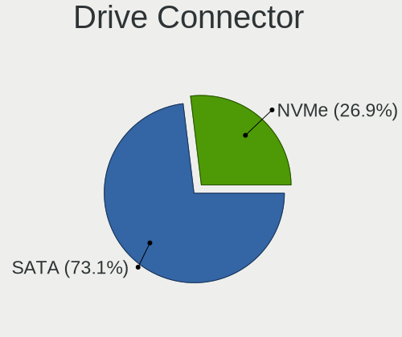

| Type | Notebooks | Drives | Percent |
|------|-----------|--------|---------|
| SATA | 12        | 14     | 70.59%  |
| NVMe | 5         | 5      | 29.41%  |

Drive Size
----------

Size of hard drive

| Size in TB | Notebooks | Drives | Percent |
|------------|-----------|--------|---------|
| 0.01-0.5   | 9         | 10     | 69.23%  |
| 1.01-2.0   | 2         | 2      | 15.38%  |
| 0.51-1.0   | 2         | 2      | 15.38%  |

Space Total
-----------

Amount of disk space available on the file system

| Size in GB | Notebooks | Percent |
|------------|-----------|---------|
| 1-20       | 10        | 58.82%  |
| 21-50      | 3         | 17.65%  |
| 101-250    | 2         | 11.76%  |
| 251-500    | 1         | 5.88%   |
| 501-1000   | 1         | 5.88%   |

Space Used
----------

Amount of used disk space

| Used GB | Notebooks | Percent |
|---------|-----------|---------|
| 1-20    | 17        | 100%    |

Malfunc. Drives
---------------

Drive models with a malfunction

| Model                         | Notebooks | Drives | Percent |
|-------------------------------|-----------|--------|---------|
| Hitachi HTS545050B9A300 500GB | 1         | 2      | 100%    |

Malfunc. Drive Vendor
---------------------

Vendors of faulty drives

| Vendor  | Notebooks | Drives | Percent |
|---------|-----------|--------|---------|
| Hitachi | 1         | 2      | 100%    |

Malfunc. HDD Vendor
-------------------

Vendors of faulty HDD drives

| Vendor  | Notebooks | Drives | Percent |
|---------|-----------|--------|---------|
| Hitachi | 1         | 2      | 100%    |

Malfunc. Drive Kind
-------------------

Kinds of faulty drives

| Kind | Notebooks | Drives | Percent |
|------|-----------|--------|---------|
| HDD  | 1         | 2      | 100%    |

Failed Drives
-------------

Failed drive models

| Model             | Notebooks | Drives | Percent |
|-------------------|-----------|--------|---------|
| SanDisk pSSD 16GB | 1         | 1      | 100%    |

Failed Drive Vendor
-------------------

Failed drive vendors

| Vendor  | Notebooks | Drives | Percent |
|---------|-----------|--------|---------|
| SanDisk | 1         | 1      | 100%    |

Drive Status
------------

Number of failed and malfunc. drives

| Status  | Notebooks | Drives | Percent |
|---------|-----------|--------|---------|
| Works   | 15        | 16     | 88.24%  |
| Malfunc | 1         | 2      | 5.88%   |
| Failed  | 1         | 1      | 5.88%   |

Storage controller
------------------

Storage Vendor
--------------

Storage controller vendors

| Vendor                                  | Notebooks | Percent |
|-----------------------------------------|-----------|---------|
| Intel                                   | 15        | 78.95%  |
| SK hynix                                | 1         | 5.26%   |
| Shenzhen Unionmemory Information System | 1         | 5.26%   |
| Phison Electronics                      | 1         | 5.26%   |
| MAXIO Technology (Hangzhou)             | 1         | 5.26%   |

Storage Model
-------------

Storage controller models

| Model                                                                          | Notebooks | Percent |
|--------------------------------------------------------------------------------|-----------|---------|
| Intel Sunrise Point-LP SATA Controller [AHCI mode]                             | 2         | 10.53%  |
| Intel 82801IBM/IEM (ICH9M/ICH9M-E) 4 port SATA Controller [AHCI mode]          | 2         | 10.53%  |
| Intel 82801 Mobile SATA Controller [RAID mode]                                 | 2         | 10.53%  |
| Intel 8 Series SATA Controller 1 [AHCI mode]                                   | 2         | 10.53%  |
| Intel 7 Series Chipset Family 6-port SATA Controller [AHCI mode]               | 2         | 10.53%  |
| SK hynix BC501 NVMe Solid State Drive                                          | 1         | 5.26%   |
| Shenzhen Unionmemory Information System AM611 PCIe 3.0 NVMe SSD 256GB          | 1         | 5.26%   |
| Phison PS5013 E13 NVMe Controller                                              | 1         | 5.26%   |
| MAXIO (Hangzhou) NVMe SSD Controller MAP1202                                   | 1         | 5.26%   |
| Intel SSD DC P4101/Pro 7600p/760p/E 6100p Series                               | 1         | 5.26%   |
| Intel NM10/ICH7 Family SATA Controller [AHCI mode]                             | 1         | 5.26%   |
| Intel Comet Lake SATA AHCI Controller                                          | 1         | 5.26%   |
| Intel 8 Series/C220 Series Chipset Family 6-port SATA Controller 1 [AHCI mode] | 1         | 5.26%   |
| Intel 6 Series/C200 Series Chipset Family 6 port Mobile SATA AHCI Controller   | 1         | 5.26%   |

Storage Kind
------------

Kind of storage controller (IDE, SATA, NVMe, SAS, ...)

| Kind | Notebooks | Percent |
|------|-----------|---------|
| SATA | 12        | 63.16%  |
| NVMe | 5         | 26.32%  |
| RAID | 2         | 10.53%  |

Processor
---------

CPU Vendor
----------

Processor vendors

| Vendor | Notebooks | Percent |
|--------|-----------|---------|
| Intel  | 16        | 94.12%  |
| AMD    | 1         | 5.88%   |

CPU Model
---------

Processor models

| Model                                         | Notebooks | Percent |
|-----------------------------------------------|-----------|---------|
| Intel CPU Version                             | 1         | 5.88%   |
| Intel Core i7-8665U CPU @ 1.90GHz             | 1         | 5.88%   |
| Intel Core i7-4910MQ CPU @ 2.90GHz            | 1         | 5.88%   |
| Intel Core i7-2630QM CPU @ 2.00GHz            | 1         | 5.88%   |
| Intel Core i5-8265U CPU @ 1.60GHz             | 1         | 5.88%   |
| Intel Core i5-8250U CPU @ 1.60GHz             | 1         | 5.88%   |
| Intel Core i5-7Y54 CPU @ 1.20GHz              | 1         | 5.88%   |
| Intel Core i5-7360U CPU @ 2.30GHz             | 1         | 5.88%   |
| Intel Core i5-7300U CPU @ 2.60GHz             | 1         | 5.88%   |
| Intel Core i5-4210U CPU @ 1.70GHz             | 1         | 5.88%   |
| Intel Core i5-3320M CPU @ 2.60GHz             | 1         | 5.88%   |
| Intel Core i5-10210U CPU @ 1.60GHz            | 1         | 5.88%   |
| Intel Core i3-4030U CPU @ 1.90GHz             | 1         | 5.88%   |
| Intel Celeron Dual-Core CPU T3000 @ 1.80GHz   | 1         | 5.88%   |
| Intel Atom CPU N450 @ 1.66GHz                 | 1         | 5.88%   |
| Intel 12th Gen Core i5-1235U                  | 1         | 5.88%   |
| AMD Ryzen 7 3700U with Radeon Vega Mobile Gfx | 1         | 5.88%   |

CPU Model Family
----------------

Processor model prefix

| Model                   | Notebooks | Percent |
|-------------------------|-----------|---------|
| Intel Core i5           | 8         | 47.06%  |
| Intel Core i7           | 3         | 17.65%  |
| Other                   | 2         | 11.76%  |
| Intel Core i3           | 1         | 5.88%   |
| Intel Celeron Dual-Core | 1         | 5.88%   |
| Intel Atom              | 1         | 5.88%   |
| AMD Ryzen 7             | 1         | 5.88%   |

CPU Cores
---------

Number of processor cores

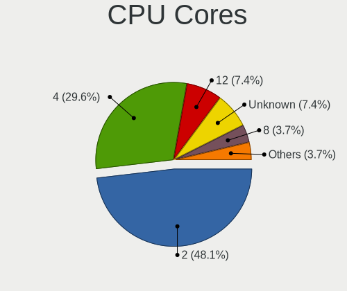

| Number  | Notebooks | Percent |
|---------|-----------|---------|
| 2       | 8         | 47.06%  |
| 4       | 6         | 35.29%  |
| 12      | 1         | 5.88%   |
| 8       | 1         | 5.88%   |
| Unknown | 1         | 5.88%   |

CPU Sockets
-----------

Number of sockets

| Number  | Notebooks | Percent |
|---------|-----------|---------|
| 1       | 16        | 94.12%  |
| Unknown | 1         | 5.88%   |

CPU Threads
-----------

Threads per core (Hyper-Threading)

| Number  | Notebooks | Percent |
|---------|-----------|---------|
| 2       | 12        | 70.59%  |
| 1       | 4         | 23.53%  |
| Unknown | 1         | 5.88%   |

CPU Microarch
-------------

Microarchitecture

| Name        | Notebooks | Percent |
|-------------|-----------|---------|
| KabyLake    | 7         | 41.18%  |
| Haswell     | 3         | 17.65%  |
| Penryn      | 2         | 11.76%  |
| Zen+        | 1         | 5.88%   |
| SandyBridge | 1         | 5.88%   |
| IvyBridge   | 1         | 5.88%   |
| Bonnell     | 1         | 5.88%   |
| Unknown     | 1         | 5.88%   |

Graphics
--------

GPU Vendor
----------

Vendors of graphics cards

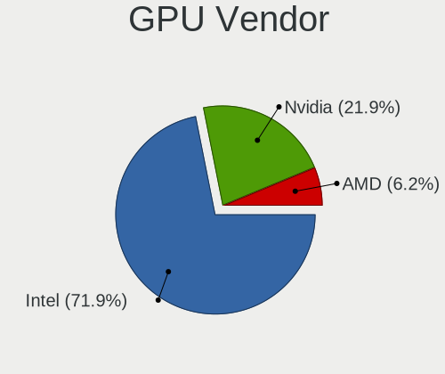

| Vendor | Notebooks | Percent |
|--------|-----------|---------|
| Intel  | 16        | 80%     |
| Nvidia | 3         | 15%     |
| AMD    | 1         | 5%      |

GPU Model
---------

Graphics card models

| Model                                                                     | Notebooks | Percent |
|---------------------------------------------------------------------------|-----------|---------|
| Intel WhiskeyLake-U GT2 [UHD Graphics 620]                                | 2         | 10%     |
| Intel Haswell-ULT Integrated Graphics Controller                          | 2         | 10%     |
| Intel 3rd Gen Core processor Graphics Controller                          | 2         | 10%     |
| Nvidia GT216M [GeForce GT 240M]                                           | 1         | 5%      |
| Nvidia GK106GLM [Quadro K2100M]                                           | 1         | 5%      |
| Nvidia GF108GLM [Quadro 1000M]                                            | 1         | 5%      |
| Intel UHD Graphics 620                                                    | 1         | 5%      |
| Intel Mobile 4 Series Chipset Integrated Graphics Controller              | 1         | 5%      |
| Intel Iris Plus Graphics 640                                              | 1         | 5%      |
| Intel HD Graphics 620                                                     | 1         | 5%      |
| Intel HD Graphics 615                                                     | 1         | 5%      |
| Intel CometLake-U GT2 [UHD Graphics]                                      | 1         | 5%      |
| Intel Atom Processor D4xx/D5xx/N4xx/N5xx Integrated Graphics Controller   | 1         | 5%      |
| Intel Alder Lake-UP3 GT2 [Iris Xe Graphics]                               | 1         | 5%      |
| Intel 4th Gen Core Processor Integrated Graphics Controller               | 1         | 5%      |
| Intel 2nd Generation Core Processor Family Integrated Graphics Controller | 1         | 5%      |
| AMD Picasso/Raven 2 [Radeon Vega Series / Radeon Vega Mobile Series]      | 1         | 5%      |

GPU Combo
---------

Combinations of graphics cards

| Name           | Notebooks | Percent |
|----------------|-----------|---------|
| 1 x Intel      | 11        | 64.71%  |
| 2 x Intel      | 2         | 11.76%  |
| Intel + Nvidia | 2         | 11.76%  |
| 1 x Nvidia     | 1         | 5.88%   |
| 1 x AMD        | 1         | 5.88%   |

GPU Driver
----------

Free vs proprietary

| Driver      | Notebooks | Percent |
|-------------|-----------|---------|
| Free        | 16        | 94.12%  |
| Proprietary | 1         | 5.88%   |

GPU Memory
----------

Total video memory

| Size in GB | Notebooks | Percent |
|------------|-----------|---------|
| Unknown    | 17        | 100%    |

Monitor
-------

Monitor Vendor
--------------

Monitor vendors

| Vendor              | Notebooks | Percent |
|---------------------|-----------|---------|
| Samsung Electronics | 2         | 33.33%  |
| Chimei Innolux      | 1         | 16.67%  |
| BOE                 | 1         | 16.67%  |
| AU Optronics        | 1         | 16.67%  |
| Apple               | 1         | 16.67%  |

Monitor Model
-------------

Monitor models

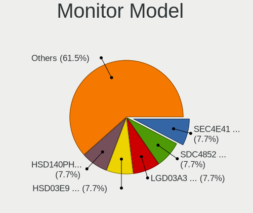

| Model                                                                | Notebooks | Percent |
|----------------------------------------------------------------------|-----------|---------|
| Samsung Electronics LCD Monitor SEC4E41 1366x768 350x200mm 15.9-inch | 1         | 16.67%  |
| Samsung Electronics LCD Monitor SDC4852 1366x768 340x190mm 15.3-inch | 1         | 16.67%  |
| Chimei Innolux LCD Monitor CMN1137 1920x1080 260x140mm 11.6-inch     | 1         | 16.67%  |
| BOE LCD Monitor BOE0742 1920x1080 310x170mm 13.9-inch                | 1         | 16.67%  |
| AU Optronics LCD Monitor AUO34ED 1920x1080 340x190mm 15.3-inch       | 1         | 16.67%  |
| Apple Color LCD APPA034 2880x1800 290x180mm 13.4-inch                | 1         | 16.67%  |

Monitor Resolution
------------------

Monitor screen resolution

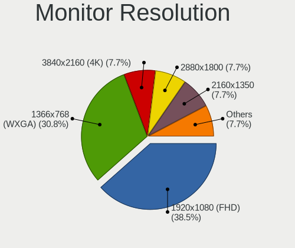

| Resolution      | Notebooks | Percent |
|-----------------|-----------|---------|
| 1920x1080 (FHD) | 4         | 66.67%  |
| 2880x1800       | 1         | 16.67%  |
| 1366x768 (WXGA) | 1         | 16.67%  |

Monitor Diagonal
----------------

Diagonal size in inches

| Inches | Notebooks | Percent |
|--------|-----------|---------|
| 15     | 3         | 50%     |
| 13     | 2         | 33.33%  |
| 11     | 1         | 16.67%  |

Monitor Width
-------------

Physical width

| Width in mm | Notebooks | Percent |
|-------------|-----------|---------|
| 301-350     | 4         | 66.67%  |
| 201-300     | 2         | 33.33%  |

Aspect Ratio
------------

Proportional relationship between the width and the height

| Ratio | Notebooks | Percent |
|-------|-----------|---------|
| 16/9  | 5         | 83.33%  |
| 16/10 | 1         | 16.67%  |

Monitor Area
------------

Area in inch²

| Area in inch² | Notebooks | Percent |
|----------------|-----------|---------|
| 81-90          | 2         | 33.33%  |
| 91-100         | 2         | 33.33%  |
| 51-60          | 1         | 16.67%  |
| 101-110        | 1         | 16.67%  |

Pixel Density
-------------

Pixels per inch

| Density       | Notebooks | Percent |
|---------------|-----------|---------|
| 121-160       | 2         | 33.33%  |
| More than 240 | 1         | 16.67%  |
| 161-240       | 1         | 16.67%  |
| 101-120       | 1         | 16.67%  |
| 51-100        | 1         | 16.67%  |

Multiple Monitors
-----------------

Total monitors connected

| Total | Notebooks | Percent |
|-------|-----------|---------|
| 1     | 15        | 88.24%  |
| 0     | 2         | 11.76%  |

Network
-------

Net Controller Vendor
---------------------

Controller vendors

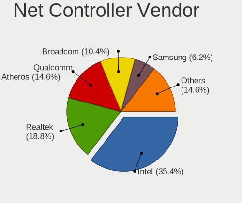

| Vendor                            | Notebooks | Percent |
|-----------------------------------|-----------|---------|
| Intel                             | 13        | 44.83%  |
| Realtek Semiconductor             | 6         | 20.69%  |
| Broadcom                          | 3         | 10.34%  |
| Qualcomm Atheros                  | 2         | 6.9%    |
| TP-Link                           | 1         | 3.45%   |
| Sierra Wireless                   | 1         | 3.45%   |
| Marvell Technology Group          | 1         | 3.45%   |
| Ericsson Business Mobile Networks | 1         | 3.45%   |
| Apple                             | 1         | 3.45%   |

Net Controller Model
--------------------

Controller models

| Model                                                                       | Notebooks | Percent |
|-----------------------------------------------------------------------------|-----------|---------|
| Realtek RTL8111/8168/8411 PCI Express Gigabit Ethernet Controller           | 3         | 8.33%   |
| Intel 82579LM Gigabit Network Connection (Lewisville)                       | 3         | 8.33%   |
| Intel Wireless 8265 / 8275                                                  | 2         | 5.56%   |
| Intel Centrino Ultimate-N 6300                                              | 2         | 5.56%   |
| Intel Cannon Point-LP CNVi [Wireless-AC]                                    | 2         | 5.56%   |
| TP-Link Wireless USB Adapter                                                | 1         | 2.78%   |
| Sierra Wireless EM7305 Modem                                                | 1         | 2.78%   |
| Realtek RTL8822BE 802.11a/b/g/n/ac WiFi adapter                             | 1         | 2.78%   |
| Realtek RTL8723BE PCIe Wireless Network Adapter                             | 1         | 2.78%   |
| Realtek RTL8192E/RTL8192SE Wireless LAN Controller                          | 1         | 2.78%   |
| Realtek RTL8188EUS 802.11n Wireless Network Adapter                         | 1         | 2.78%   |
| Realtek RTL810xE PCI Express Fast Ethernet controller                       | 1         | 2.78%   |
| Qualcomm Atheros AR93xx Wireless Network Adapter                            | 1         | 2.78%   |
| Qualcomm Atheros AR242x / AR542x Wireless Network Adapter (PCI-Express)     | 1         | 2.78%   |
| Marvell Group 88E8040 PCI-E Fast Ethernet Controller                        | 1         | 2.78%   |
| Intel Wireless 8260                                                         | 1         | 2.78%   |
| Intel Wireless 7260                                                         | 1         | 2.78%   |
| Intel WiFi Link 5100                                                        | 1         | 2.78%   |
| Intel Ethernet Connection I218-LM                                           | 1         | 2.78%   |
| Intel Ethernet Connection I217-LM                                           | 1         | 2.78%   |
| Intel Ethernet Connection (4) I219-V                                        | 1         | 2.78%   |
| Intel Ethernet Connection (4) I219-LM                                       | 1         | 2.78%   |
| Intel Comet Lake PCH-LP CNVi WiFi                                           | 1         | 2.78%   |
| Intel Alder Lake-P PCH CNVi WiFi                                            | 1         | 2.78%   |
| Ericsson Business Mobile Networks F5521 gw Mobile Broadband Serial Port III | 1         | 2.78%   |
| Broadcom NetLink BCM5784M Gigabit Ethernet PCIe                             | 1         | 2.78%   |
| Broadcom BCM4350 802.11ac Wireless Network Adapter                          | 1         | 2.78%   |
| Broadcom BCM43228 802.11a/b/g/n                                             | 1         | 2.78%   |
| Apple Ethernet Adapter [A1277]                                              | 1         | 2.78%   |

Wireless Vendor
---------------

Wireless vendors

| Vendor                | Notebooks | Percent |
|-----------------------|-----------|---------|
| Intel                 | 11        | 55%     |
| Realtek Semiconductor | 4         | 20%     |
| Qualcomm Atheros      | 2         | 10%     |
| Broadcom              | 2         | 10%     |
| TP-Link               | 1         | 5%      |

Wireless Model
--------------

Wireless models

| Model                                                                   | Notebooks | Percent |
|-------------------------------------------------------------------------|-----------|---------|
| Intel Wireless 8265 / 8275                                              | 2         | 10%     |
| Intel Centrino Ultimate-N 6300                                          | 2         | 10%     |
| Intel Cannon Point-LP CNVi [Wireless-AC]                                | 2         | 10%     |
| TP-Link Wireless USB Adapter                                            | 1         | 5%      |
| Realtek RTL8822BE 802.11a/b/g/n/ac WiFi adapter                         | 1         | 5%      |
| Realtek RTL8723BE PCIe Wireless Network Adapter                         | 1         | 5%      |
| Realtek RTL8192E/RTL8192SE Wireless LAN Controller                      | 1         | 5%      |
| Realtek RTL8188EUS 802.11n Wireless Network Adapter                     | 1         | 5%      |
| Qualcomm Atheros AR93xx Wireless Network Adapter                        | 1         | 5%      |
| Qualcomm Atheros AR242x / AR542x Wireless Network Adapter (PCI-Express) | 1         | 5%      |
| Intel Wireless 8260                                                     | 1         | 5%      |
| Intel Wireless 7260                                                     | 1         | 5%      |
| Intel WiFi Link 5100                                                    | 1         | 5%      |
| Intel Comet Lake PCH-LP CNVi WiFi                                       | 1         | 5%      |
| Intel Alder Lake-P PCH CNVi WiFi                                        | 1         | 5%      |
| Broadcom BCM4350 802.11ac Wireless Network Adapter                      | 1         | 5%      |
| Broadcom BCM43228 802.11a/b/g/n                                         | 1         | 5%      |

Ethernet Vendor
---------------

Ethernet vendors

| Vendor                   | Notebooks | Percent |
|--------------------------|-----------|---------|
| Intel                    | 7         | 50%     |
| Realtek Semiconductor    | 4         | 28.57%  |
| Marvell Technology Group | 1         | 7.14%   |
| Broadcom                 | 1         | 7.14%   |
| Apple                    | 1         | 7.14%   |

Ethernet Model
--------------

Ethernet models

| Model                                                             | Notebooks | Percent |
|-------------------------------------------------------------------|-----------|---------|
| Realtek RTL8111/8168/8411 PCI Express Gigabit Ethernet Controller | 3         | 21.43%  |
| Intel 82579LM Gigabit Network Connection (Lewisville)             | 3         | 21.43%  |
| Realtek RTL810xE PCI Express Fast Ethernet controller             | 1         | 7.14%   |
| Marvell Group 88E8040 PCI-E Fast Ethernet Controller              | 1         | 7.14%   |
| Intel Ethernet Connection I218-LM                                 | 1         | 7.14%   |
| Intel Ethernet Connection I217-LM                                 | 1         | 7.14%   |
| Intel Ethernet Connection (4) I219-V                              | 1         | 7.14%   |
| Intel Ethernet Connection (4) I219-LM                             | 1         | 7.14%   |
| Broadcom NetLink BCM5784M Gigabit Ethernet PCIe                   | 1         | 7.14%   |
| Apple Ethernet Adapter [A1277]                                    | 1         | 7.14%   |

Net Controller Kind
-------------------

Ethernet, WiFi or modem

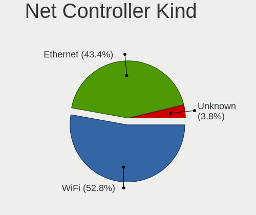

| Kind     | Notebooks | Percent |
|----------|-----------|---------|
| WiFi     | 18        | 52.94%  |
| Ethernet | 14        | 41.18%  |
| Unknown  | 2         | 5.88%   |

Used Controller
---------------

Currently used network controller

| Kind     | Notebooks | Percent |
|----------|-----------|---------|
| Ethernet | 9         | 56.25%  |
| WiFi     | 7         | 43.75%  |

NICs
----

Total network controllers on board

| Total | Notebooks | Percent |
|-------|-----------|---------|
| 2     | 12        | 70.59%  |
| 1     | 5         | 29.41%  |

IPv6
----

IPv6 vs IPv4

| Used | Notebooks | Percent |
|------|-----------|---------|
| No   | 16        | 94.12%  |
| Yes  | 1         | 5.88%   |

Bluetooth
---------

Bluetooth Vendor
----------------

Controller vendors

| Vendor                | Notebooks | Percent |
|-----------------------|-----------|---------|
| Intel                 | 7         | 63.64%  |
| Realtek Semiconductor | 2         | 18.18%  |
| Broadcom              | 2         | 18.18%  |

Bluetooth Model
---------------

Controller models

| Model                                          | Notebooks | Percent |
|------------------------------------------------|-----------|---------|
| Intel Bluetooth wireless interface             | 4         | 36.36%  |
| Intel Bluetooth 9460/9560 Jefferson Peak (JfP) | 2         | 18.18%  |
| Realtek RTL8822BE Bluetooth 4.2 Adapter        | 1         | 9.09%   |
| Realtek RTL8723B Bluetooth                     | 1         | 9.09%   |
| Intel AX201 Bluetooth                          | 1         | 9.09%   |
| Broadcom Bluetooth 2.1 Device                  | 1         | 9.09%   |
| Broadcom BCM2045B (BDC-2.1)                    | 1         | 9.09%   |

Sound
-----

Sound Vendor
------------

Sound card vendors

| Vendor | Notebooks | Percent |
|--------|-----------|---------|
| Intel  | 17        | 89.47%  |
| Nvidia | 1         | 5.26%   |
| AMD    | 1         | 5.26%   |

Sound Model
-----------

Sound card models

| Model                                                                      | Notebooks | Percent |
|----------------------------------------------------------------------------|-----------|---------|
| Intel Sunrise Point-LP HD Audio                                            | 4         | 17.39%  |
| Intel Haswell-ULT HD Audio Controller                                      | 2         | 8.7%    |
| Intel Cannon Point-LP High Definition Audio Controller                     | 2         | 8.7%    |
| Intel 82801I (ICH9 Family) HD Audio Controller                             | 2         | 8.7%    |
| Intel 8 Series HD Audio Controller                                         | 2         | 8.7%    |
| Intel 7 Series/C216 Chipset Family High Definition Audio Controller        | 2         | 8.7%    |
| Nvidia GT216 HDMI Audio Controller                                         | 1         | 4.35%   |
| Intel Xeon E3-1200 v3/4th Gen Core Processor HD Audio Controller           | 1         | 4.35%   |
| Intel NM10/ICH7 Family High Definition Audio Controller                    | 1         | 4.35%   |
| Intel Comet Lake PCH-LP cAVS                                               | 1         | 4.35%   |
| Intel Alder Lake PCH-P High Definition Audio Controller                    | 1         | 4.35%   |
| Intel 8 Series/C220 Series Chipset High Definition Audio Controller        | 1         | 4.35%   |
| Intel 6 Series/C200 Series Chipset Family High Definition Audio Controller | 1         | 4.35%   |
| AMD Raven/Raven2/Fenghuang HDMI/DP Audio Controller                        | 1         | 4.35%   |
| AMD Family 17h/19h HD Audio Controller                                     | 1         | 4.35%   |

Memory
------

Memory Vendor
-------------

Memory module vendors

| Vendor              | Notebooks | Percent |
|---------------------|-----------|---------|
| Samsung Electronics | 6         | 28.57%  |
| SK hynix            | 5         | 23.81%  |
| Micron Technology   | 3         | 14.29%  |
| Kingston            | 3         | 14.29%  |
| Unknown             | 2         | 9.52%   |
| Ramaxel Technology  | 1         | 4.76%   |
| 48spaces            | 1         | 4.76%   |

Memory Model
------------

Memory module models

| Model                                                                     | Notebooks | Percent |
|---------------------------------------------------------------------------|-----------|---------|
| Unknown                                                                   | 2         | 8.7%    |
| SK hynix RAM HMT451S6AFR8C-PB 4GB SODIMM DDR3 1600MT/s                    | 1         | 4.35%   |
| SK hynix RAM HMT41GS6BFR8A-PB 8GB SODIMM DDR3 1600MT/s                    | 1         | 4.35%   |
| SK hynix RAM HMT351S6EFR8C-PB 4GB SODIMM DDR3 1600MT/s                    | 1         | 4.35%   |
| SK hynix RAM HMA851S6CJR6N-VK 4GB SODIMM DDR4 2667MT/s                    | 1         | 4.35%   |
| SK hynix RAM HMA82GS6JJR8N-VK 16GB SODIMM DDR4 2667MT/s                   | 1         | 4.35%   |
| SK hynix RAM HMA82GS6DJR8N-VK 16GB SODIMM DDR4 2667MT/s                   | 1         | 4.35%   |
| SK hynix RAM HMA81GS6CJR8N-VK 8GB SODIMM DDR4 2667MT/s                    | 1         | 4.35%   |
| Samsung RAM M471B5673EH1-CF8 2GB SODIMM 1067MT/s                          | 1         | 4.35%   |
| Samsung RAM M471B5273DH0-CH9 4GB SODIMM DDR3 1334MT/s                     | 1         | 4.35%   |
| Samsung RAM M471B5173QH0-YK0 4GB SODIMM DDR3 1600MT/s                     | 1         | 4.35%   |
| Samsung RAM M471A2K43DB1-CTD 16GB SODIMM DDR4 2667MT/s                    | 1         | 4.35%   |
| Samsung RAM M471A1K43DB1-CTD 8GB SODIMM DDR4 2667MT/s                     | 1         | 4.35%   |
| Samsung RAM K4E6E304EB-EGCF 4GB Row Of Chips LPDDR3 1867MT/s              | 1         | 4.35%   |
| Ramaxel RAM RMT3170EF68F9W1600 4GB SODIMM DDR3 1600MT/s                   | 1         | 4.35%   |
| Micron RAM Module 4GB SODIMM LPDDR3 2133MT/s                              | 1         | 4.35%   |
| Micron RAM Module 2GB Row Of Chips LPDDR5 6400MT/s                        | 1         | 4.35%   |
| Micron RAM 4ATF51264HZ-2G6E1 4GB SODIMM DDR4 2667MT/s                     | 1         | 4.35%   |
| Kingston RAM 99U5428-063.A00LF 8GB SODIMM DDR3 2400MT/s                   | 1         | 4.35%   |
| Kingston RAM 99U5428-018.A00LF 8GB SODIMM DDR3 1600MT/s                   | 1         | 4.35%   |
| Kingston RAM 9905428-105.A00G 8GB SODIMM DDR3 1333MT/s                    | 1         | 4.35%   |
| 48spaces RAM 012345678901234567890123456789012345 2GB SODIMM DDR2 667MT/s | 1         | 4.35%   |

Memory Kind
-----------

Memory module kinds

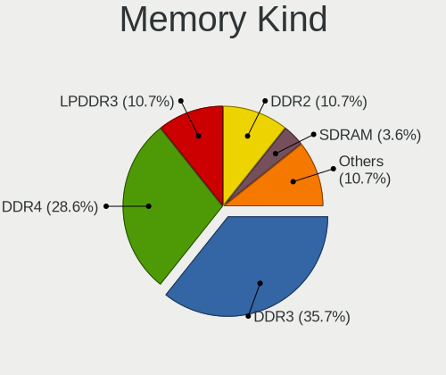

| Kind   | Notebooks | Percent |
|--------|-----------|---------|
| DDR4   | 7         | 38.89%  |
| DDR3   | 6         | 33.33%  |
| LPDDR3 | 2         | 11.11%  |
| DDR2   | 2         | 11.11%  |
| LPDDR5 | 1         | 5.56%   |

Memory Form Factor
------------------

Physical design of the memory module

| Name         | Notebooks | Percent |
|--------------|-----------|---------|
| SODIMM       | 15        | 88.24%  |
| Row Of Chips | 2         | 11.76%  |

Memory Size
-----------

Memory module size

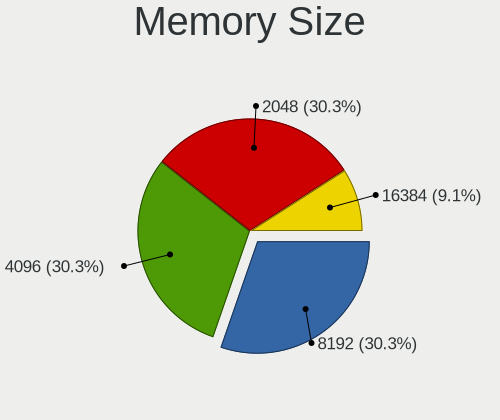

| Size  | Notebooks | Percent |
|-------|-----------|---------|
| 4096  | 8         | 38.1%   |
| 8192  | 7         | 33.33%  |
| 2048  | 4         | 19.05%  |
| 16384 | 2         | 9.52%   |

Memory Speed
------------

Memory module speed

| Speed | Notebooks | Percent |
|-------|-----------|---------|
| 2667  | 5         | 26.32%  |
| 1600  | 4         | 21.05%  |
| 2400  | 2         | 10.53%  |
| 6400  | 1         | 5.26%   |
| 2133  | 1         | 5.26%   |
| 1867  | 1         | 5.26%   |
| 1334  | 1         | 5.26%   |
| 1333  | 1         | 5.26%   |
| 1067  | 1         | 5.26%   |
| 667   | 1         | 5.26%   |
| 400   | 1         | 5.26%   |

Printers & scanners
-------------------

Printer Vendor
--------------

Printer device vendors

Zero info for selected period =(

Printer Model
-------------

Printer device models

Zero info for selected period =(

Scanner Vendor
--------------

Scanner device vendors

Zero info for selected period =(

Scanner Model
-------------

Scanner device models

Zero info for selected period =(

Camera
------

Camera Vendor
-------------

Camera device vendors

| Vendor                        | Notebooks | Percent |
|-------------------------------|-----------|---------|
| Chicony Electronics           | 4         | 33.33%  |
| Realtek Semiconductor         | 2         | 16.67%  |
| Bison Electronics             | 2         | 16.67%  |
| Z-Star Microelectronics       | 1         | 8.33%   |
| Suyin                         | 1         | 8.33%   |
| Sunplus Innovation Technology | 1         | 8.33%   |
| IMC Networks                  | 1         | 8.33%   |

Camera Model
------------

Camera device models

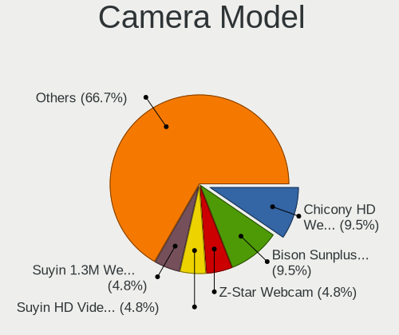

| Model                                    | Notebooks | Percent |
|------------------------------------------|-----------|---------|
| Bison SunplusIT Integrated Camera        | 2         | 16.67%  |
| Z-Star Webcam                            | 1         | 8.33%   |
| Suyin HD Video WebCam                    | 1         | 8.33%   |
| Sunplus Hy HD Camera                     | 1         | 8.33%   |
| Realtek Lenovo EasyCamera                | 1         | 8.33%   |
| Realtek Integrated_Webcam_HD             | 1         | 8.33%   |
| IMC Networks EasyCamera                  | 1         | 8.33%   |
| Chicony Lenovo Integrated Camera (0.3MP) | 1         | 8.33%   |
| Chicony Integrated Camera                | 1         | 8.33%   |
| Chicony HD WebCam                        | 1         | 8.33%   |
| Chicony FJ Camera                        | 1         | 8.33%   |

Security
--------

Fingerprint Vendor
------------------

Fingerprint sensor vendors

| Vendor                | Notebooks | Percent |
|-----------------------|-----------|---------|
| LighTuning Technology | 2         | 50%     |
| Validity Sensors      | 1         | 25%     |
| Upek                  | 1         | 25%     |

Fingerprint Model
-----------------

Fingerprint sensor models

| Model                                                  | Notebooks | Percent |
|--------------------------------------------------------|-----------|---------|
| Validity Sensors Synaptics WBDI                        | 1         | 25%     |
| Upek Biometric Touchchip/Touchstrip Fingerprint Sensor | 1         | 25%     |
| LighTuning Fingerprint Reader                          | 1         | 25%     |
| LighTuning EgisTec Touch Fingerprint Sensor            | 1         | 25%     |

Chipcard Vendor
---------------

Chipcard module vendors

Zero info for selected period =(

Chipcard Model
--------------

Chipcard module models

Zero info for selected period =(

Unsupported
-----------

Unsupported Devices
-------------------

Total unsupported devices on board

| Total | Notebooks | Percent |
|-------|-----------|---------|
| 2     | 7         | 41.18%  |
| 1     | 5         | 29.41%  |
| 4     | 2         | 11.76%  |
| 3     | 2         | 11.76%  |
| 0     | 1         | 5.88%   |

Unsupported Device Types
------------------------

Types of unsupported devices

| Type                     | Notebooks | Percent |
|--------------------------|-----------|---------|
| Communication controller | 14        | 43.75%  |
| Bluetooth                | 6         | 18.75%  |
| Net/wireless             | 5         | 15.63%  |
| Fingerprint reader       | 4         | 12.5%   |
| Card reader              | 2         | 6.25%   |
| Firewire controller      | 1         | 3.13%   |

