NomadBSD 20221130 - Tested Hardware & Statistics
------------------------------------------------

A project to collect tested hardware configurations for NomadBSD 20221130.

Anyone can contribute to this report by the [hw-probe](https://github.com/linuxhw/hw-probe/blob/master/INSTALL.BSD.md) tool:

    hw-probe -all -upload

Please contribute! Especially if your hardware is rare.

This is a report for all computer types. See also reports for [desktops](/Dist/NomadBSD_20221130/Desktop/README.md) and [notebooks](/Dist/NomadBSD_20221130/Notebook/README.md).

Contents
--------

* [ Test Cases ](#test-cases)

* [ System ](#system)
  - [ Arch                     ](#arch)
  - [ DE                       ](#de)
  - [ Display Server           ](#display-server)
  - [ Display Manager          ](#display-manager)
  - [ OS Lang                  ](#os-lang)
  - [ Boot Mode                ](#boot-mode)
  - [ Filesystem               ](#filesystem)
  - [ Part. scheme             ](#part-scheme)

* [ Board ](#board)
  - [ Vendor                   ](#vendor)
  - [ Model                    ](#model)
  - [ Model Family             ](#model-family)
  - [ MFG Year                 ](#mfg-year)
  - [ Form Factor              ](#form-factor)
  - [ Coreboot                 ](#coreboot)
  - [ RAM Size                 ](#ram-size)
  - [ RAM Used                 ](#ram-used)
  - [ Total Drives             ](#total-drives)
  - [ Has CD-ROM               ](#has-cd-rom)
  - [ Has Ethernet             ](#has-ethernet)
  - [ Has WiFi                 ](#has-wifi)
  - [ Has Bluetooth            ](#has-bluetooth)

* [ Location ](#location)
  - [ Country                  ](#country)
  - [ City                     ](#city)

* [ Drives ](#drives)
  - [ Drive Vendor             ](#drive-vendor)
  - [ Drive Model              ](#drive-model)
  - [ HDD Vendor               ](#hdd-vendor)
  - [ SSD Vendor               ](#ssd-vendor)
  - [ Drive Kind               ](#drive-kind)
  - [ Drive Connector          ](#drive-connector)
  - [ Drive Size               ](#drive-size)
  - [ Space Total              ](#space-total)
  - [ Space Used               ](#space-used)
  - [ Malfunc. Drives          ](#malfunc-drives)
  - [ Malfunc. Drive Vendor    ](#malfunc-drive-vendor)
  - [ Malfunc. HDD Vendor      ](#malfunc-hdd-vendor)
  - [ Malfunc. Drive Kind      ](#malfunc-drive-kind)
  - [ Failed Drives            ](#failed-drives)
  - [ Failed Drive Vendor      ](#failed-drive-vendor)
  - [ Drive Status             ](#drive-status)

* [ Storage controller ](#storage-controller)
  - [ Storage Vendor           ](#storage-vendor)
  - [ Storage Model            ](#storage-model)
  - [ Storage Kind             ](#storage-kind)

* [ Processor ](#processor)
  - [ CPU Vendor               ](#cpu-vendor)
  - [ CPU Model                ](#cpu-model)
  - [ CPU Model Family         ](#cpu-model-family)
  - [ CPU Cores                ](#cpu-cores)
  - [ CPU Sockets              ](#cpu-sockets)
  - [ CPU Threads              ](#cpu-threads)
  - [ CPU Microarch            ](#cpu-microarch)

* [ Graphics ](#graphics)
  - [ GPU Vendor               ](#gpu-vendor)
  - [ GPU Model                ](#gpu-model)
  - [ GPU Combo                ](#gpu-combo)
  - [ GPU Driver               ](#gpu-driver)
  - [ GPU Memory               ](#gpu-memory)

* [ Monitor ](#monitor)
  - [ Monitor Vendor           ](#monitor-vendor)
  - [ Monitor Model            ](#monitor-model)
  - [ Monitor Resolution       ](#monitor-resolution)
  - [ Monitor Diagonal         ](#monitor-diagonal)
  - [ Monitor Width            ](#monitor-width)
  - [ Aspect Ratio             ](#aspect-ratio)
  - [ Monitor Area             ](#monitor-area)
  - [ Pixel Density            ](#pixel-density)
  - [ Multiple Monitors        ](#multiple-monitors)

* [ Network ](#network)
  - [ Net Controller Vendor    ](#net-controller-vendor)
  - [ Net Controller Model     ](#net-controller-model)
  - [ Wireless Vendor          ](#wireless-vendor)
  - [ Wireless Model           ](#wireless-model)
  - [ Ethernet Vendor          ](#ethernet-vendor)
  - [ Ethernet Model           ](#ethernet-model)
  - [ Net Controller Kind      ](#net-controller-kind)
  - [ Used Controller          ](#used-controller)
  - [ NICs                     ](#nics)
  - [ IPv6                     ](#ipv6)

* [ Bluetooth ](#bluetooth)
  - [ Bluetooth Vendor         ](#bluetooth-vendor)
  - [ Bluetooth Model          ](#bluetooth-model)

* [ Sound ](#sound)
  - [ Sound Vendor             ](#sound-vendor)
  - [ Sound Model              ](#sound-model)

* [ Memory ](#memory)
  - [ Memory Vendor            ](#memory-vendor)
  - [ Memory Model             ](#memory-model)
  - [ Memory Kind              ](#memory-kind)
  - [ Memory Form Factor       ](#memory-form-factor)
  - [ Memory Size              ](#memory-size)
  - [ Memory Speed             ](#memory-speed)

* [ Printers & scanners ](#printers--scanners)
  - [ Printer Vendor           ](#printer-vendor)
  - [ Printer Model            ](#printer-model)
  - [ Scanner Vendor           ](#scanner-vendor)
  - [ Scanner Model            ](#scanner-model)

* [ Camera ](#camera)
  - [ Camera Vendor            ](#camera-vendor)
  - [ Camera Model             ](#camera-model)

* [ Security ](#security)
  - [ Fingerprint Vendor       ](#fingerprint-vendor)
  - [ Fingerprint Model        ](#fingerprint-model)
  - [ Chipcard Vendor          ](#chipcard-vendor)
  - [ Chipcard Model           ](#chipcard-model)

* [ Unsupported ](#unsupported)
  - [ Unsupported Devices      ](#unsupported-devices)
  - [ Unsupported Device Types ](#unsupported-device-types)

Test Cases
----------

Total: 41

| Vendor        | Model                       | Form-Factor | Probe                                                     | Date         |
|---------------|-----------------------------|-------------|-----------------------------------------------------------|--------------|
| Acer          | Aspire E5-575G              | Notebook    | [f38d89e6c0](https://bsd-hardware.info/?probe=f38d89e6c0) | Oct 15, 2023 |
| ASUSTek       | K45VM                       | Notebook    | [054a6c3902](https://bsd-hardware.info/?probe=054a6c3902) | Oct 11, 2023 |
| Gigabyte      | H61M-S1                     | Desktop     | [723569d88a](https://bsd-hardware.info/?probe=723569d88a) | Oct 01, 2023 |
| ASUSTek       | 1005PXD                     | Notebook    | [1b05e8cf1b](https://bsd-hardware.info/?probe=1b05e8cf1b) | Sep 29, 2023 |
| MSI           | CX62 6QD                    | Notebook    | [e732d89b06](https://bsd-hardware.info/?probe=e732d89b06) | Sep 29, 2023 |
| Gigabyte      | H61M-S1                     | Desktop     | [8816b1ac4a](https://bsd-hardware.info/?probe=8816b1ac4a) | Sep 29, 2023 |
| Apple         | MacBookPro7,1               | Notebook    | [714516a696](https://bsd-hardware.info/?probe=714516a696) | Sep 29, 2023 |
| Apple         | MacBookPro9,1               | Notebook    | [cac0950717](https://bsd-hardware.info/?probe=cac0950717) | Sep 29, 2023 |
| ASUSTek       | K40IN                       | Notebook    | [3c69dd7003](https://bsd-hardware.info/?probe=3c69dd7003) | Sep 29, 2023 |
| Lenovo        | ThinkPad T16 Gen 2 21HHC... | Notebook    | [74d0396f87](https://bsd-hardware.info/?probe=74d0396f87) | Sep 27, 2023 |
| Dell          | XPS 13 7390                 | Notebook    | [6bb6186f22](https://bsd-hardware.info/?probe=6bb6186f22) | Sep 19, 2023 |
| eMachines     | G640                        | Notebook    | [c05619033c](https://bsd-hardware.info/?probe=c05619033c) | Sep 14, 2023 |
| Lenovo        | ThinkPad X1 Nano Gen 1 2... | Notebook    | [68efc7ef8d](https://bsd-hardware.info/?probe=68efc7ef8d) | Sep 06, 2023 |
| Lenovo        | ThinkPad X1 Nano Gen 1 2... | Notebook    | [f42dfa2992](https://bsd-hardware.info/?probe=f42dfa2992) | Sep 06, 2023 |
| Unknown       | Unknown                     | Notebook    | [084127fd8b](https://bsd-hardware.info/?probe=084127fd8b) | Sep 06, 2023 |
| Lenovo        | ThinkPad X230 2325IB1       | Notebook    | [41fbf7d1ca](https://bsd-hardware.info/?probe=41fbf7d1ca) | Aug 26, 2023 |
| Lenovo        | SHARKBAY SDK0E50510 WIN     | Desktop     | [66f982c40b](https://bsd-hardware.info/?probe=66f982c40b) | Aug 23, 2023 |
| Chuwi         | CoreBook X                  | Notebook    | [2854f97c81](https://bsd-hardware.info/?probe=2854f97c81) | Aug 01, 2023 |
| Fujitsu Si... | AMILO Li3710                | Notebook    | [7a5d32eb7f](https://bsd-hardware.info/?probe=7a5d32eb7f) | Jul 29, 2023 |
| HP            | EliteBook 750 G1            | Notebook    | [e0af4797d4](https://bsd-hardware.info/?probe=e0af4797d4) | Jun 24, 2023 |
| Lenovo        | ThinkPad T430 2347A45       | Notebook    | [461a92a1a2](https://bsd-hardware.info/?probe=461a92a1a2) | Jun 20, 2023 |
| Lenovo        | ThinkPad E495 20NE000BSP    | Notebook    | [0e02b323ee](https://bsd-hardware.info/?probe=0e02b323ee) | Jun 01, 2023 |
| ASRockRack    | C226M WS                    | Desktop     | [06a8ca514a](https://bsd-hardware.info/?probe=06a8ca514a) | Apr 14, 2023 |
| ECS           | Z77H2-AX                    | Desktop     | [32a290eb5f](https://bsd-hardware.info/?probe=32a290eb5f) | Apr 13, 2023 |
| Samsung       | N150/N210/N220              | Notebook    | [f6e5189f54](https://bsd-hardware.info/?probe=f6e5189f54) | Apr 11, 2023 |
| Lenovo        | ThinkPad X280 20KESB4T00    | Notebook    | [fb6c7b3b09](https://bsd-hardware.info/?probe=fb6c7b3b09) | Apr 11, 2023 |
| Dell          | Latitude 7300               | Notebook    | [d036260cce](https://bsd-hardware.info/?probe=d036260cce) | Apr 08, 2023 |
| Lenovo        | ThinkPad X230 23255NG       | Notebook    | [2ef93a7621](https://bsd-hardware.info/?probe=2ef93a7621) | Mar 29, 2023 |
| Acer          | Swift SF314-56              | Notebook    | [94c7da1b3f](https://bsd-hardware.info/?probe=94c7da1b3f) | Mar 13, 2023 |
| Intel         | Jasper Lake Client Platf... | Notebook    | [de93a79b7d](https://bsd-hardware.info/?probe=de93a79b7d) | Mar 10, 2023 |
| Lenovo        | ThinkPad T470 20HES0EV0A    | Notebook    | [dd6c3fa0f7](https://bsd-hardware.info/?probe=dd6c3fa0f7) | Mar 10, 2023 |
| Fujitsu       | CELSIUS H730                | Notebook    | [d2292bbcda](https://bsd-hardware.info/?probe=d2292bbcda) | Mar 10, 2023 |
| ASRock        | N68-S UCC                   | Desktop     | [04f43c3d70](https://bsd-hardware.info/?probe=04f43c3d70) | Feb 23, 2023 |
| Acer          | Aspire 7738                 | Notebook    | [e61cd20061](https://bsd-hardware.info/?probe=e61cd20061) | Feb 18, 2023 |
| Lenovo        | ThinkPad W520 42844DG       | Notebook    | [d341f3c6f6](https://bsd-hardware.info/?probe=d341f3c6f6) | Feb 11, 2023 |
| Lenovo        | ThinkPad E14 20RA0036RT     | Notebook    | [941da31f26](https://bsd-hardware.info/?probe=941da31f26) | Feb 02, 2023 |
| HP            | 1589                        | Desktop     | [8a927b43cb](https://bsd-hardware.info/?probe=8a927b43cb) | Jan 26, 2023 |
| ASUSTek       | ROG STRIX B550-F GAMING     | Desktop     | [335c3c990a](https://bsd-hardware.info/?probe=335c3c990a) | Jan 08, 2023 |
| Lenovo        | G50-70 20351                | Notebook    | [6a1ff80054](https://bsd-hardware.info/?probe=6a1ff80054) | Jan 04, 2023 |
| Lenovo        | Yoga 710-11IKB 80V6         | Notebook    | [1d3ccd1fe6](https://bsd-hardware.info/?probe=1d3ccd1fe6) | Dec 22, 2022 |
| Apple         | MacBookPro14,1              | Notebook    | [5234a39100](https://bsd-hardware.info/?probe=5234a39100) | Dec 10, 2022 |

System
------

Arch
----

OS architecture (x86_64, i586, etc.)

| Name  | Computers | Percent |
|-------|-----------|---------|
| amd64 | 33        | 97.06%  |
| i386  | 1         | 2.94%   |

DE
--

Desktop Environment

| Name          | Computers | Percent |
|---------------|-----------|---------|
| Openbox       | 24        | 70.59%  |
| xinitrc       | 6         | 17.65%  |
| KDE5          | 2         | 5.88%   |
| Enlightenment | 2         | 5.88%   |

Display Server
--------------

X11 or Wayland

| Name | Computers | Percent |
|------|-----------|---------|
| X11  | 34        | 100%    |

Display Manager
---------------

SDDM, LightDM, etc.

| Name    | Computers | Percent |
|---------|-----------|---------|
| SDDM    | 32        | 94.12%  |
| LightDM | 2         | 5.88%   |

OS Lang
-------

Language

| Lang    | Computers | Percent |
|---------|-----------|---------|
| en_US   | 9         | 26.47%  |
| zh_TW   | 6         | 17.65%  |
| en_GB   | 5         | 14.71%  |
| fr_FR   | 4         | 11.76%  |
| fi_FI   | 3         | 8.82%   |
| Unknown | 3         | 8.82%   |
| sv_SE   | 1         | 2.94%   |
| ru_RU   | 1         | 2.94%   |
| lt_LT   | 1         | 2.94%   |
| bg_BG   | 1         | 2.94%   |

Boot Mode
---------

EFI or BIOS

| Mode | Computers | Percent |
|------|-----------|---------|
| EFI  | 34        | 100%    |

Filesystem
----------

Type of filesystem

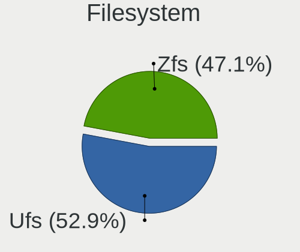

| Type | Computers | Percent |
|------|-----------|---------|
| Ufs  | 18        | 52.94%  |
| Zfs  | 16        | 47.06%  |

Part. scheme
------------

Scheme of partitioning

| Type | Computers | Percent |
|------|-----------|---------|
| GPT  | 20        | 58.82%  |
| MBR  | 14        | 41.18%  |

Board
-----

Vendor
------

Motherboard manufacturer

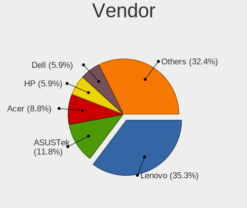

| Name                | Computers | Percent |
|---------------------|-----------|---------|
| Lenovo              | 12        | 35.29%  |
| ASUSTek Computer    | 4         | 11.76%  |
| Acer                | 3         | 8.82%   |
| Hewlett-Packard     | 2         | 5.88%   |
| Dell                | 2         | 5.88%   |
| Apple               | 2         | 5.88%   |
| Samsung Electronics | 1         | 2.94%   |
| Gigabyte Technology | 1         | 2.94%   |
| Fujitsu Siemens     | 1         | 2.94%   |
| Fujitsu             | 1         | 2.94%   |
| eMachines           | 1         | 2.94%   |
| ECS                 | 1         | 2.94%   |
| Chuwi               | 1         | 2.94%   |
| ASRockRack          | 1         | 2.94%   |
| ASRock              | 1         | 2.94%   |

Model
-----

Motherboard model

| Name                                     | Computers | Percent |
|------------------------------------------|-----------|---------|
| Samsung N150/N210/N220                   | 1         | 2.94%   |
| Lenovo Yoga 710-11IKB 80V6               | 1         | 2.94%   |
| Lenovo ThinkPad X280 20KESB4T00          | 1         | 2.94%   |
| Lenovo ThinkPad X230 2325IB1             | 1         | 2.94%   |
| Lenovo ThinkPad X230 23255NG             | 1         | 2.94%   |
| Lenovo ThinkPad X1 Nano Gen 1 20UN005LRT | 1         | 2.94%   |
| Lenovo ThinkPad W520 42844DG             | 1         | 2.94%   |
| Lenovo ThinkPad T470 20HES0EV0A          | 1         | 2.94%   |
| Lenovo ThinkPad T16 Gen 2 21HHCTO1WW     | 1         | 2.94%   |
| Lenovo ThinkPad E495 20NE000BSP          | 1         | 2.94%   |
| Lenovo ThinkPad E14 20RA0036RT           | 1         | 2.94%   |
| Lenovo ThinkCentre M93p 10AAS4EN00       | 1         | 2.94%   |
| Lenovo G50-70 20351                      | 1         | 2.94%   |
| HP Z420 Workstation                      | 1         | 2.94%   |
| HP EliteBook 750 G1                      | 1         | 2.94%   |
| Gigabyte H61M-S1                         | 1         | 2.94%   |
| Fujitsu Siemens AMILO Li3710             | 1         | 2.94%   |
| Fujitsu CELSIUS H730                     | 1         | 2.94%   |
| eMachines G640                           | 1         | 2.94%   |
| ECS Z77H2-AX                             | 1         | 2.94%   |
| Dell XPS 13 7390                         | 1         | 2.94%   |
| Dell Latitude 7300                       | 1         | 2.94%   |
| Chuwi CoreBook X                         | 1         | 2.94%   |
| ASUS ROG STRIX B550-F GAMING             | 1         | 2.94%   |
| ASUS K45VM                               | 1         | 2.94%   |
| ASUS K40IN                               | 1         | 2.94%   |
| ASUS 1005PXD                             | 1         | 2.94%   |
| ASRockRack C226M WS                      | 1         | 2.94%   |
| ASRock N68-S UCC                         | 1         | 2.94%   |
| Apple MacBookPro7,1                      | 1         | 2.94%   |
| Apple MacBookPro14,1                     | 1         | 2.94%   |
| Acer Swift SF314-56                      | 1         | 2.94%   |
| Acer Aspire E5-575G                      | 1         | 2.94%   |
| Acer Aspire 7738                         | 1         | 2.94%   |

Model Family
------------

Motherboard model prefix

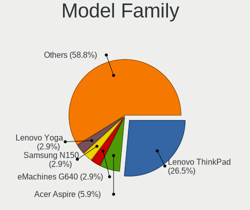

| Name                  | Computers | Percent |
|-----------------------|-----------|---------|
| Lenovo ThinkPad       | 9         | 26.47%  |
| Acer Aspire           | 2         | 5.88%   |
| Samsung N150          | 1         | 2.94%   |
| Lenovo Yoga           | 1         | 2.94%   |
| Lenovo ThinkCentre    | 1         | 2.94%   |
| Lenovo G50-70         | 1         | 2.94%   |
| HP Z420               | 1         | 2.94%   |
| HP EliteBook          | 1         | 2.94%   |
| Gigabyte H61M-S1      | 1         | 2.94%   |
| Fujitsu Siemens AMILO | 1         | 2.94%   |
| Fujitsu CELSIUS       | 1         | 2.94%   |
| eMachines G640        | 1         | 2.94%   |
| ECS Z77H2-AX          | 1         | 2.94%   |
| Dell XPS              | 1         | 2.94%   |
| Dell Latitude         | 1         | 2.94%   |
| Chuwi CoreBook        | 1         | 2.94%   |
| ASUS ROG              | 1         | 2.94%   |
| ASUS K45VM            | 1         | 2.94%   |
| ASUS K40IN            | 1         | 2.94%   |
| ASUS 1005PXD          | 1         | 2.94%   |
| ASRockRack C226M      | 1         | 2.94%   |
| ASRock N68-S          | 1         | 2.94%   |
| Apple MacBookPro7     | 1         | 2.94%   |
| Apple MacBookPro14    | 1         | 2.94%   |
| Acer Swift            | 1         | 2.94%   |

MFG Year
--------

Motherboard manufacture year

| Year | Computers | Percent |
|------|-----------|---------|
| 2018 | 4         | 11.76%  |
| 2012 | 4         | 11.76%  |
| 2011 | 4         | 11.76%  |
| 2022 | 3         | 8.82%   |
| 2020 | 3         | 8.82%   |
| 2023 | 2         | 5.88%   |
| 2019 | 2         | 5.88%   |
| 2015 | 2         | 5.88%   |
| 2014 | 2         | 5.88%   |
| 2013 | 2         | 5.88%   |
| 2010 | 2         | 5.88%   |
| 2009 | 2         | 5.88%   |
| 2021 | 1         | 2.94%   |
| 2016 | 1         | 2.94%   |

Form Factor
-----------

Physical design of the computer

| Name     | Computers | Percent |
|----------|-----------|---------|
| Notebook | 27        | 79.41%  |
| Desktop  | 7         | 20.59%  |

Coreboot
--------

Have coreboot on board

| Used | Computers | Percent |
|------|-----------|---------|
| No   | 33        | 97.06%  |
| Yes  | 1         | 2.94%   |

RAM Size
--------

Total RAM memory

| Size in GB | Computers | Percent |
|------------|-----------|---------|
| 8.01-16.0  | 14        | 41.18%  |
| 16.01-24.0 | 9         | 26.47%  |
| 4.01-8.0   | 4         | 11.76%  |
| 32.01-64.0 | 3         | 8.82%   |
| 2.01-3.0   | 3         | 8.82%   |
| 24.01-32.0 | 1         | 2.94%   |

RAM Used
--------

Used RAM memory

| Used GB  | Computers | Percent |
|----------|-----------|---------|
| 0.01-0.5 | 17        | 50%     |
| 0.51-1.0 | 12        | 35.29%  |
| 1.01-2.0 | 4         | 11.76%  |
| 2.01-3.0 | 1         | 2.94%   |

Total Drives
------------

Number of drives on board

| Drives | Computers | Percent |
|--------|-----------|---------|
| 1      | 24        | 70.59%  |
| 2      | 5         | 14.71%  |
| 0      | 3         | 8.82%   |
| 4      | 1         | 2.94%   |
| 3      | 1         | 2.94%   |

Has CD-ROM
----------

Has CD-ROM on board

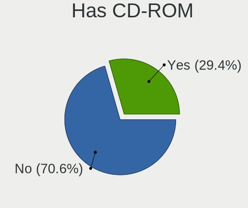

| Presented | Computers | Percent |
|-----------|-----------|---------|
| No        | 24        | 70.59%  |
| Yes       | 10        | 29.41%  |

Has Ethernet
------------

Has Ethernet on board

| Presented | Computers | Percent |
|-----------|-----------|---------|
| Yes       | 27        | 79.41%  |
| No        | 7         | 20.59%  |

Has WiFi
--------

Has WiFi module

| Presented | Computers | Percent |
|-----------|-----------|---------|
| Yes       | 28        | 82.35%  |
| No        | 6         | 17.65%  |

Has Bluetooth
-------------

Has Bluetooth module

| Presented | Computers | Percent |
|-----------|-----------|---------|
| Yes       | 20        | 58.82%  |
| No        | 14        | 41.18%  |

Location
--------

Country
-------

Geographic location (country)

| Country     | Computers | Percent |
|-------------|-----------|---------|
| Taiwan      | 6         | 17.65%  |
| France      | 6         | 17.65%  |
| USA         | 5         | 14.71%  |
| UK          | 5         | 14.71%  |
| Finland     | 3         | 8.82%   |
| Russia      | 2         | 5.88%   |
| Sweden      | 1         | 2.94%   |
| Spain       | 1         | 2.94%   |
| San Marino  | 1         | 2.94%   |
| Netherlands | 1         | 2.94%   |
| Lithuania   | 1         | 2.94%   |
| Bulgaria    | 1         | 2.94%   |
| Argentina   | 1         | 2.94%   |

City
----

Geographic location (city)

| City                 | Computers | Percent |
|----------------------|-----------|---------|
| Taipei               | 3         | 8.82%   |
| Taichung             | 3         | 8.82%   |
| Urcuit               | 2         | 5.88%   |
| Turku                | 2         | 5.88%   |
| Moscow               | 2         | 5.88%   |
| Melun                | 2         | 5.88%   |
| Lutherville-Timonium | 2         | 5.88%   |
| West Bromwich        | 1         | 2.94%   |
| Wakefield            | 1         | 2.94%   |
| Vilnius              | 1         | 2.94%   |
| Vaasa                | 1         | 2.94%   |
| Sofia                | 1         | 2.94%   |
| Södertälje         | 1         | 2.94%   |
| Seattle              | 1         | 2.94%   |
| Sartrouville         | 1         | 2.94%   |
| San Marino           | 1         | 2.94%   |
| Saint-Raphaël       | 1         | 2.94%   |
| Rubí                | 1         | 2.94%   |
| Portland             | 1         | 2.94%   |
| Lincoln              | 1         | 2.94%   |
| Leesburg             | 1         | 2.94%   |
| Eindhoven            | 1         | 2.94%   |
| Córdoba             | 1         | 2.94%   |
| Belfast              | 1         | 2.94%   |
| Addlestone           | 1         | 2.94%   |

Drives
------

Drive Vendor
------------

Hard drive vendors

| Vendor              | Computers | Drives | Percent |
|---------------------|-----------|--------|---------|
| Samsung Electronics | 7         | 8      | 18.92%  |
| Seagate             | 5         | 5      | 13.51%  |
| WDC                 | 4         | 4      | 10.81%  |
| Transcend           | 3         | 3      | 8.11%   |
| SanDisk             | 3         | 3      | 8.11%   |
| Toshiba             | 2         | 2      | 5.41%   |
| Kingston            | 2         | 3      | 5.41%   |
| Crucial             | 2         | 2      | 5.41%   |
| UMIS                | 1         | 1      | 2.7%    |
| SPCC                | 1         | 1      | 2.7%    |
| SK hynix            | 1         | 1      | 2.7%    |
| Phison              | 1         | 1      | 2.7%    |
| Intel               | 1         | 1      | 2.7%    |
| Hitachi             | 1         | 2      | 2.7%    |
| Corsair             | 1         | 1      | 2.7%    |
| AirDisk             | 1         | 1      | 2.7%    |
| A-DATA Technology   | 1         | 1      | 2.7%    |

Drive Model
-----------

Hard drive models

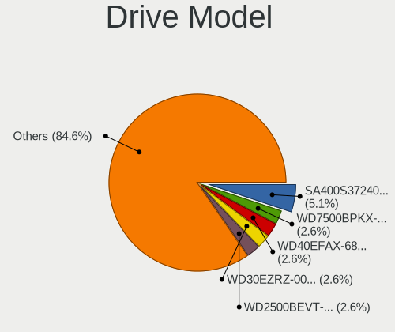

| Model                             | Computers | Percent |
|-----------------------------------|-----------|---------|
| Kingston SA400S37240G 240GB       | 2         | 5.13%   |
| WDC WD7500BPKX-00HPJT0 752GB      | 1         | 2.56%   |
| WDC WD40EFAX-68JH4N0 4TB          | 1         | 2.56%   |
| WDC WD30EZRZ-00GXCB0 3TB          | 1         | 2.56%   |
| WDC WD2500BEVT-80A23T0 250GB      | 1         | 2.56%   |
| UMIS RPJTJ256MED1OWX 256GB        | 1         | 2.56%   |
| Transcend TS512GSSD230S 512GB     | 1         | 2.56%   |
| Transcend TS128GSSD340K 128GB     | 1         | 2.56%   |
| Transcend TS128GSSD340 128GB      | 1         | 2.56%   |
| Toshiba MK3265GSX 320GB           | 1         | 2.56%   |
| Toshiba KBG40ZNT512G MEMORY 512GB | 1         | 2.56%   |
| SPCC Solid State Disk 128GB       | 1         | 2.56%   |
| SK hynix HFM512GDHTNG-8710B 512GB | 1         | 2.56%   |
| Seagate ST9250315AS 250GB         | 1         | 2.56%   |
| Seagate ST9160314AS 160GB         | 1         | 2.56%   |
| Seagate ST500LT012-1DG142 500GB   | 1         | 2.56%   |
| Seagate ST310212A 10GB            | 1         | 2.56%   |
| Seagate ST1000DM010-2EP102 1TB    | 1         | 2.56%   |
| SanDisk X400 M.2 2280 256GB       | 1         | 2.56%   |
| SanDisk SDSSDA240G 240GB          | 1         | 2.56%   |
| SanDisk pSSD 16GB                 | 1         | 2.56%   |
| Samsung SSD PM851 2.5 7mm 256GB   | 1         | 2.56%   |
| Samsung SSD 970 EVO Plus 2TB      | 1         | 2.56%   |
| Samsung SSD 970 EVO Plus 1TB      | 1         | 2.56%   |
| Samsung SSD 860 EVO M.2 250GB     | 1         | 2.56%   |
| Samsung SSD 850 EVO mSATA 1TB     | 1         | 2.56%   |
| Samsung SSD 850 EVO 2TB           | 1         | 2.56%   |
| Samsung PM981a NVMe 512GB         | 1         | 2.56%   |
| Samsung MZ7LN256HCHP-000L1 256GB  | 1         | 2.56%   |
| Phison Sabrent Rocket nano 512GB  | 1         | 2.56%   |
| Kingston SA400M8240G 240GB        | 1         | 2.56%   |
| Intel SSDPEKKF256G8L 256GB        | 1         | 2.56%   |
| Hitachi HTS545050B9A300 500GB     | 1         | 2.56%   |
| Crucial CT256MX100SSD1 256GB      | 1         | 2.56%   |
| Crucial CT2000BX500SSD1 2TB       | 1         | 2.56%   |
| Corsair MP600 GS 1TB              | 1         | 2.56%   |
| AirDisk 512GB SSD                 | 1         | 2.56%   |
| A-DATA SSD DP900 512GB-DL3        | 1         | 2.56%   |

HDD Vendor
----------

Hard disk drive vendors

| Vendor  | Computers | Drives | Percent |
|---------|-----------|--------|---------|
| Seagate | 5         | 5      | 45.45%  |
| WDC     | 4         | 4      | 36.36%  |
| Toshiba | 1         | 1      | 9.09%   |
| Hitachi | 1         | 2      | 9.09%   |

SSD Vendor
----------

Solid state drive vendors

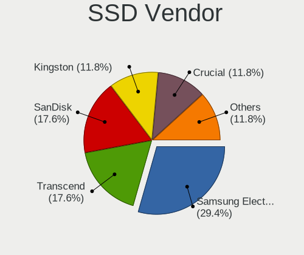

| Vendor              | Computers | Drives | Percent |
|---------------------|-----------|--------|---------|
| Samsung Electronics | 5         | 5      | 29.41%  |
| Transcend           | 3         | 3      | 17.65%  |
| SanDisk             | 3         | 3      | 17.65%  |
| Kingston            | 2         | 3      | 11.76%  |
| Crucial             | 2         | 2      | 11.76%  |
| SPCC                | 1         | 1      | 5.88%   |
| A-DATA Technology   | 1         | 1      | 5.88%   |

Drive Kind
----------

HDD or SSD

| Kind | Computers | Drives | Percent |
|------|-----------|--------|---------|
| SSD  | 17        | 18     | 50%     |
| HDD  | 9         | 12     | 26.47%  |
| NVMe | 8         | 10     | 23.53%  |

Drive Connector
---------------

SATA, SAS, NVMe, etc.

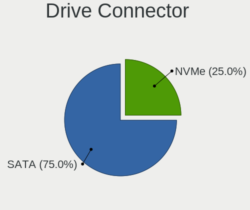

| Type | Computers | Drives | Percent |
|------|-----------|--------|---------|
| SATA | 24        | 30     | 75%     |
| NVMe | 8         | 10     | 25%     |

Drive Size
----------

Size of hard drive

| Size in TB | Computers | Drives | Percent |
|------------|-----------|--------|---------|
| 0.01-0.5   | 18        | 21     | 66.67%  |
| 0.51-1.0   | 5         | 5      | 18.52%  |
| 1.01-2.0   | 2         | 2      | 7.41%   |
| 3.01-4.0   | 1         | 1      | 3.7%    |
| 2.01-3.0   | 1         | 1      | 3.7%    |

Space Total
-----------

Amount of disk space available on the file system

| Size in GB | Computers | Percent |
|------------|-----------|---------|
| 1-20       | 23        | 67.65%  |
| 21-50      | 4         | 11.76%  |
| 101-250    | 4         | 11.76%  |
| 251-500    | 1         | 2.94%   |
| 501-1000   | 1         | 2.94%   |
| 51-100     | 1         | 2.94%   |

Space Used
----------

Amount of used disk space

| Used GB | Computers | Percent |
|---------|-----------|---------|
| 1-20    | 34        | 100%    |

Malfunc. Drives
---------------

Drive models with a malfunction

| Model                         | Computers | Drives | Percent |
|-------------------------------|-----------|--------|---------|
| Toshiba MK3265GSX 320GB       | 1         | 1      | 25%     |
| Seagate ST9250315AS 250GB     | 1         | 1      | 25%     |
| Seagate ST310212A 10GB        | 1         | 1      | 25%     |
| Hitachi HTS545050B9A300 500GB | 1         | 2      | 25%     |

Malfunc. Drive Vendor
---------------------

Vendors of faulty drives

| Vendor  | Computers | Drives | Percent |
|---------|-----------|--------|---------|
| Seagate | 2         | 2      | 50%     |
| Toshiba | 1         | 1      | 25%     |
| Hitachi | 1         | 2      | 25%     |

Malfunc. HDD Vendor
-------------------

Vendors of faulty HDD drives

| Vendor  | Computers | Drives | Percent |
|---------|-----------|--------|---------|
| Seagate | 2         | 2      | 50%     |
| Toshiba | 1         | 1      | 25%     |
| Hitachi | 1         | 2      | 25%     |

Malfunc. Drive Kind
-------------------

Kinds of faulty drives

| Kind | Computers | Drives | Percent |
|------|-----------|--------|---------|
| HDD  | 4         | 5      | 100%    |

Failed Drives
-------------

Failed drive models

| Model             | Computers | Drives | Percent |
|-------------------|-----------|--------|---------|
| SanDisk pSSD 16GB | 1         | 1      | 100%    |

Failed Drive Vendor
-------------------

Failed drive vendors

| Vendor  | Computers | Drives | Percent |
|---------|-----------|--------|---------|
| SanDisk | 1         | 1      | 100%    |

Drive Status
------------

Number of failed and malfunc. drives

| Status  | Computers | Drives | Percent |
|---------|-----------|--------|---------|
| Works   | 28        | 34     | 84.85%  |
| Malfunc | 4         | 5      | 12.12%  |
| Failed  | 1         | 1      | 3.03%   |

Storage controller
------------------

Storage Vendor
--------------

Storage controller vendors

| Vendor                                  | Computers | Percent |
|-----------------------------------------|-----------|---------|
| Intel                                   | 24        | 61.54%  |
| Nvidia                                  | 3         | 7.69%   |
| Samsung Electronics                     | 2         | 5.13%   |
| Phison Electronics                      | 2         | 5.13%   |
| AMD                                     | 2         | 5.13%   |
| SK hynix                                | 1         | 2.56%   |
| Shenzhen Unionmemory Information System | 1         | 2.56%   |
| Sandisk                                 | 1         | 2.56%   |
| MAXIO Technology (Hangzhou)             | 1         | 2.56%   |
| KIOXIA                                  | 1         | 2.56%   |
| ASMedia Technology                      | 1         | 2.56%   |

Storage Model
-------------

Storage controller models

| Model                                                                                   | Computers | Percent |
|-----------------------------------------------------------------------------------------|-----------|---------|
| Intel 7 Series Chipset Family 6-port SATA Controller [AHCI mode]                        | 4         | 8.89%   |
| Intel Sunrise Point-LP SATA Controller [AHCI mode]                                      | 3         | 6.67%   |
| Intel 8 Series/C220 Series Chipset Family 6-port SATA Controller 1 [AHCI mode]          | 3         | 6.67%   |
| Samsung NVMe SSD Controller SM981/PM981/PM983                                           | 2         | 4.44%   |
| Intel NM10/ICH7 Family SATA Controller [AHCI mode]                                      | 2         | 4.44%   |
| Intel 82801IBM/IEM (ICH9M/ICH9M-E) 4 port SATA Controller [AHCI mode]                   | 2         | 4.44%   |
| Intel 82801 Mobile SATA Controller [RAID mode]                                          | 2         | 4.44%   |
| Intel 8 Series SATA Controller 1 [AHCI mode]                                            | 2         | 4.44%   |
| SK hynix BC501 NVMe Solid State Drive                                                   | 1         | 2.22%   |
| Shenzhen Unionmemory Information System AM611 PCIe 3.0 x2 NVMe SSD 256GB                | 1         | 2.22%   |
| Sandisk WD Black SN770 / PC SN740 256GB / PC SN560 (DRAM-less) NVMe SSD                 | 1         | 2.22%   |
| Phison PS5021-E21 PCIe4 NVMe Controller (DRAM-less)                                     | 1         | 2.22%   |
| Phison PS5013-E13 PCIe3 NVMe Controller (DRAM-less)                                     | 1         | 2.22%   |
| Nvidia MCP89 SATA Controller (AHCI mode)                                                | 1         | 2.22%   |
| Nvidia MCP79 AHCI Controller                                                            | 1         | 2.22%   |
| Nvidia MCP61 SATA Controller                                                            | 1         | 2.22%   |
| Nvidia MCP61 IDE                                                                        | 1         | 2.22%   |
| MAXIO (Hangzhou) NVMe SSD Controller MAP1202                                            | 1         | 2.22%   |
| KIOXIA NVMe SSD Controller BG4 (DRAM-less)                                              | 1         | 2.22%   |
| Intel SSD DC P4101/Pro 7600p/760p/E 6100p Series                                        | 1         | 2.22%   |
| Intel Comet Lake SATA AHCI Controller                                                   | 1         | 2.22%   |
| Intel C602 chipset 4-Port SATA Storage Control Unit                                     | 1         | 2.22%   |
| Intel C600/X79 series chipset 4-Port SATA IDE Controller                                | 1         | 2.22%   |
| Intel C600/X79 series chipset 2-Port SATA IDE Controller                                | 1         | 2.22%   |
| Intel 7 Series/C210 Series Chipset Family 4-port SATA Controller [IDE mode]             | 1         | 2.22%   |
| Intel 7 Series/C210 Series Chipset Family 2-port SATA Controller [IDE mode]             | 1         | 2.22%   |
| Intel 6 Series/C200 Series Chipset Family Desktop SATA Controller (IDE mode, ports 4-5) | 1         | 2.22%   |
| Intel 6 Series/C200 Series Chipset Family Desktop SATA Controller (IDE mode, ports 0-3) | 1         | 2.22%   |
| Intel 6 Series/C200 Series Chipset Family 6 port Mobile SATA AHCI Controller            | 1         | 2.22%   |
| ASMedia ASM1062 Serial ATA Controller                                                   | 1         | 2.22%   |
| AMD SB7x0/SB8x0/SB9x0 SATA Controller [AHCI mode]                                       | 1         | 2.22%   |
| AMD SB7x0/SB8x0/SB9x0 IDE Controller                                                    | 1         | 2.22%   |
| AMD 500 Series Chipset SATA Controller                                                  | 1         | 2.22%   |

Storage Kind
------------

Kind of storage controller (IDE, SATA, NVMe, SAS, ...)

| Kind | Computers | Percent |
|------|-----------|---------|
| SATA | 23        | 57.5%   |
| NVMe | 9         | 22.5%   |
| IDE  | 5         | 12.5%   |
| RAID | 2         | 5%      |
| SAS  | 1         | 2.5%    |

Processor
---------

CPU Vendor
----------

Processor vendors

| Vendor | Computers | Percent |
|--------|-----------|---------|
| Intel  | 30        | 88.24%  |
| AMD    | 4         | 11.76%  |

CPU Model
---------

Processor models

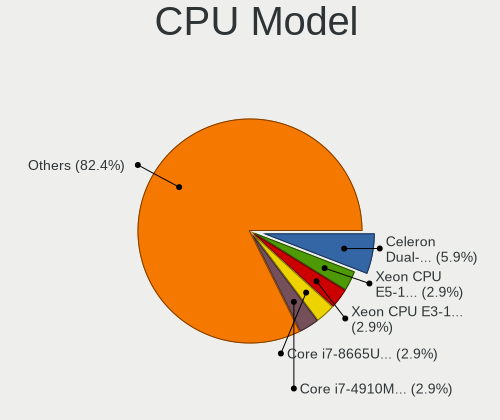

| Model                                         | Computers | Percent |
|-----------------------------------------------|-----------|---------|
| Intel Celeron Dual-Core CPU T3000 @ 1.80GHz   | 2         | 5.88%   |
| Intel Xeon CPU E5-1650 v2 @ 3.50GHz           | 1         | 2.94%   |
| Intel Xeon CPU E3-1276 v3 @ 3.60GHz           | 1         | 2.94%   |
| Intel CPU Version                             | 1         | 2.94%   |
| Intel Core i7-8665U CPU @ 1.90GHz             | 1         | 2.94%   |
| Intel Core i7-4910MQ CPU @ 2.90GHz            | 1         | 2.94%   |
| Intel Core i7-3770K CPU @ 3.50GHz             | 1         | 2.94%   |
| Intel Core i7-3520M CPU @ 2.90GHz             | 1         | 2.94%   |
| Intel Core i7-2630QM CPU @ 2.00GHz            | 1         | 2.94%   |
| Intel Core i7-10510U CPU @ 1.80GHz            | 1         | 2.94%   |
| Intel Core i5-8265U CPU @ 1.60GHz             | 1         | 2.94%   |
| Intel Core i5-8250U CPU @ 1.60GHz             | 1         | 2.94%   |
| Intel Core i5-7Y54 CPU @ 1.20GHz              | 1         | 2.94%   |
| Intel Core i5-7360U CPU @ 2.30GHz             | 1         | 2.94%   |
| Intel Core i5-7300U CPU @ 2.60GHz             | 1         | 2.94%   |
| Intel Core i5-6200U CPU @ 2.30GHz             | 1         | 2.94%   |
| Intel Core i5-4590T CPU @ 2.00GHz             | 1         | 2.94%   |
| Intel Core i5-4210U CPU @ 1.70GHz             | 1         | 2.94%   |
| Intel Core i5-3470 CPU @ 3.20GHz              | 1         | 2.94%   |
| Intel Core i5-3320M CPU @ 2.60GHz             | 1         | 2.94%   |
| Intel Core i5-3210M CPU @ 2.50GHz             | 1         | 2.94%   |
| Intel Core i5-10210U CPU @ 1.60GHz            | 1         | 2.94%   |
| Intel Core i3-4030U CPU @ 1.90GHz             | 1         | 2.94%   |
| Intel Core 2 Duo CPU P8600 @ 2.40GHz          | 1         | 2.94%   |
| Intel Atom CPU N455 @ 1.66GHz                 | 1         | 2.94%   |
| Intel Atom CPU N450 @ 1.66GHz                 | 1         | 2.94%   |
| Intel 13th Gen Core i7-1355U                  | 1         | 2.94%   |
| Intel 12th Gen Core i5-1235U                  | 1         | 2.94%   |
| Intel 11th Gen Core i5-1130G7 @ 1.10GHz       | 1         | 2.94%   |
| AMD Ryzen 7 5700G with Radeon Graphics        | 1         | 2.94%   |
| AMD Ryzen 7 3700U with Radeon Vega Mobile Gfx | 1         | 2.94%   |
| AMD Phenom II X4 945 Processor                | 1         | 2.94%   |
| AMD New Processor Technology                  | 1         | 2.94%   |

CPU Model Family
----------------

Processor model prefix

| Model                   | Computers | Percent |
|-------------------------|-----------|---------|
| Intel Core i5           | 12        | 35.29%  |
| Intel Core i7           | 6         | 17.65%  |
| Other                   | 5         | 14.71%  |
| Intel Xeon              | 2         | 5.88%   |
| Intel Celeron Dual-Core | 2         | 5.88%   |
| Intel Atom              | 2         | 5.88%   |
| AMD Ryzen 7             | 2         | 5.88%   |
| Intel Core i3           | 1         | 2.94%   |
| Intel Core 2 Duo        | 1         | 2.94%   |
| AMD Phenom II X4        | 1         | 2.94%   |

CPU Cores
---------

Number of processor cores

| Number  | Computers | Percent |
|---------|-----------|---------|
| 4       | 13        | 38.24%  |
| 2       | 13        | 38.24%  |
| 12      | 2         | 5.88%   |
| Unknown | 2         | 5.88%   |
| 16      | 1         | 2.94%   |
| 8       | 1         | 2.94%   |
| 6       | 1         | 2.94%   |
| 1       | 1         | 2.94%   |

CPU Sockets
-----------

Number of sockets

| Number  | Computers | Percent |
|---------|-----------|---------|
| 1       | 32        | 94.12%  |
| 2       | 1         | 2.94%   |
| Unknown | 1         | 2.94%   |

CPU Threads
-----------

Threads per core (Hyper-Threading)

| Number  | Computers | Percent |
|---------|-----------|---------|
| 2       | 21        | 61.76%  |
| 1       | 11        | 32.35%  |
| Unknown | 2         | 5.88%   |

CPU Microarch
-------------

Microarchitecture

| Name        | Computers | Percent |
|-------------|-----------|---------|
| KabyLake    | 8         | 23.53%  |
| IvyBridge   | 6         | 17.65%  |
| Haswell     | 5         | 14.71%  |
| Penryn      | 4         | 11.76%  |
| K10         | 2         | 5.88%   |
| Bonnell     | 2         | 5.88%   |
| Unknown     | 2         | 5.88%   |
| Zen+        | 1         | 2.94%   |
| Zen 3       | 1         | 2.94%   |
| TigerLake   | 1         | 2.94%   |
| Skylake     | 1         | 2.94%   |
| SandyBridge | 1         | 2.94%   |

Graphics
--------

GPU Vendor
----------

Vendors of graphics cards

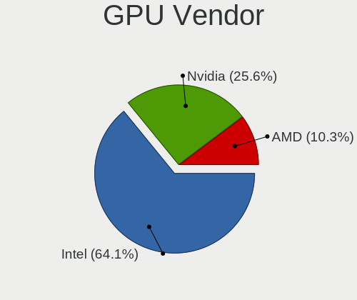

| Vendor | Computers | Percent |
|--------|-----------|---------|
| Intel  | 25        | 64.1%   |
| Nvidia | 10        | 25.64%  |
| AMD    | 4         | 10.26%  |

GPU Model
---------

Graphics card models

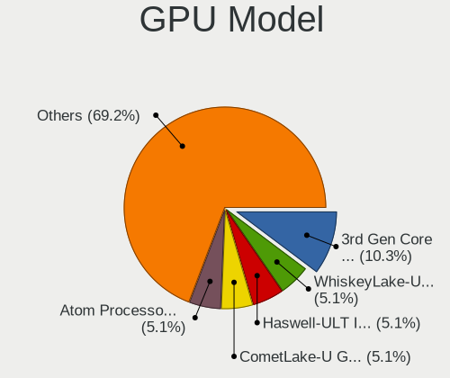

| Model                                                                       | Computers | Percent |
|-----------------------------------------------------------------------------|-----------|---------|
| Intel 3rd Gen Core processor Graphics Controller                            | 4         | 10.26%  |
| Intel WhiskeyLake-U GT2 [UHD Graphics 620]                                  | 2         | 5.13%   |
| Intel Haswell-ULT Integrated Graphics Controller                            | 2         | 5.13%   |
| Intel CometLake-U GT2 [UHD Graphics]                                        | 2         | 5.13%   |
| Intel Atom Processor D4xx/D5xx/N4xx/N5xx Integrated Graphics Controller     | 2         | 5.13%   |
| Nvidia MCP89 [GeForce 320M]                                                 | 1         | 2.56%   |
| Nvidia GT216M [GeForce GT 240M]                                             | 1         | 2.56%   |
| Nvidia GP102 [TITAN X]                                                      | 1         | 2.56%   |
| Nvidia GM107 [GeForce 940MX]                                                | 1         | 2.56%   |
| Nvidia GK106GLM [Quadro K2100M]                                             | 1         | 2.56%   |
| Nvidia GF108M [GeForce GT 620M/630M/635M/640M LE]                           | 1         | 2.56%   |
| Nvidia GF108GLM [Quadro 1000M]                                              | 1         | 2.56%   |
| Nvidia GF108 [GeForce GT 630]                                               | 1         | 2.56%   |
| Nvidia C79 [GeForce G102M]                                                  | 1         | 2.56%   |
| Nvidia C61 [GeForce 7025 / nForce 630a]                                     | 1         | 2.56%   |
| Intel Xeon E3-1200 v3/4th Gen Core Processor Integrated Graphics Controller | 1         | 2.56%   |
| Intel Xeon E3-1200 v3 Processor Integrated Graphics Controller              | 1         | 2.56%   |
| Intel UHD Graphics 620                                                      | 1         | 2.56%   |
| Intel Tiger Lake-UP4 GT2 [Iris Xe Graphics]                                 | 1         | 2.56%   |
| Intel Skylake GT2 [HD Graphics 520]                                         | 1         | 2.56%   |
| Intel Raptor Lake-P [UHD Graphics]                                          | 1         | 2.56%   |
| Intel Mobile 4 Series Chipset Integrated Graphics Controller                | 1         | 2.56%   |
| Intel Iris Plus Graphics 640                                                | 1         | 2.56%   |
| Intel HD Graphics 620                                                       | 1         | 2.56%   |
| Intel HD Graphics 615                                                       | 1         | 2.56%   |
| Intel Alder Lake-UP3 GT2 [Iris Xe Graphics]                                 | 1         | 2.56%   |
| Intel 4th Gen Core Processor Integrated Graphics Controller                 | 1         | 2.56%   |
| Intel 2nd Generation Core Processor Family Integrated Graphics Controller   | 1         | 2.56%   |
| AMD Picasso/Raven 2 [Radeon Vega Series / Radeon Vega Mobile Series]        | 1         | 2.56%   |
| AMD Park [Mobility Radeon HD 5430/5450/5470]                                | 1         | 2.56%   |
| AMD Navi 23 [Radeon RX 6650 XT / 6700S / 6800S]                             | 1         | 2.56%   |
| AMD Cape Verde GL [FirePro W4100]                                           | 1         | 2.56%   |

GPU Combo
---------

Combinations of graphics cards

| Name           | Computers | Percent |
|----------------|-----------|---------|
| 1 x Intel      | 17        | 50%     |
| 1 x Nvidia     | 6         | 17.65%  |
| Intel + Nvidia | 4         | 11.76%  |
| 1 x AMD        | 4         | 11.76%  |
| 2 x Intel      | 3         | 8.82%   |

GPU Driver
----------

Free vs proprietary

| Driver      | Computers | Percent |
|-------------|-----------|---------|
| Free        | 30        | 88.24%  |
| Proprietary | 3         | 8.82%   |
| Unknown     | 1         | 2.94%   |

GPU Memory
----------

Total video memory

| Size in GB | Computers | Percent |
|------------|-----------|---------|
| Unknown    | 33        | 97.06%  |
| 3.01-4.0   | 1         | 2.94%   |

Monitor
-------

Monitor Vendor
--------------

Monitor vendors

| Vendor              | Computers | Percent |
|---------------------|-----------|---------|
| Chimei Innolux      | 3         | 18.75%  |
| ViewSonic           | 2         | 12.5%   |
| Samsung Electronics | 2         | 12.5%   |
| HannStar            | 2         | 12.5%   |
| BOE                 | 2         | 12.5%   |
| AU Optronics        | 2         | 12.5%   |
| NEC Computers       | 1         | 6.25%   |
| LG Display          | 1         | 6.25%   |
| Apple               | 1         | 6.25%   |

Monitor Model
-------------

Monitor models

| Model                                                                | Computers | Percent |
|----------------------------------------------------------------------|-----------|---------|
| ViewSonic VA2418-FHD VSCD739 1920x1080 530x300mm 24.0-inch           | 1         | 6.25%   |
| ViewSonic TD2420 SERIES VSC452D 1920x1080 520x290mm 23.4-inch        | 1         | 6.25%   |
| Samsung Electronics LCD Monitor SEC4E41 1366x768 350x200mm 15.9-inch | 1         | 6.25%   |
| Samsung Electronics LCD Monitor SDC4852 1366x768 340x190mm 15.3-inch | 1         | 6.25%   |
| NEC Computers EA275WMi NEC2BA7 2560x1440 600x340mm 27.2-inch         | 1         | 6.25%   |
| LG Display LCD Monitor LGD03A3 1366x768 280x160mm 12.7-inch          | 1         | 6.25%   |
| HannStar LCD Monitor HSD03E9 1024x600 220x130mm 10.1-inch            | 1         | 6.25%   |
| HannStar HSD140PHW1 HSD0583 1366x768 310x170mm 13.9-inch             | 1         | 6.25%   |
| Chimei Innolux LCD Monitor CMN15C4 1920x1080 340x190mm 15.3-inch     | 1         | 6.25%   |
| Chimei Innolux LCD Monitor CMN1301 2160x1350 280x170mm 12.9-inch     | 1         | 6.25%   |
| Chimei Innolux LCD Monitor CMN1137 1920x1080 260x140mm 11.6-inch     | 1         | 6.25%   |
| BOE LCD Monitor BOE0742 1920x1080 310x170mm 13.9-inch                | 1         | 6.25%   |
| BOE LCD Monitor BOE05FE 1366x768 310x170mm 13.9-inch                 | 1         | 6.25%   |
| AU Optronics LCD Monitor AUO34ED 1920x1080 340x190mm 15.3-inch       | 1         | 6.25%   |
| AU Optronics LCD Monitor AUO282B 3840x2160 290x170mm 13.2-inch       | 1         | 6.25%   |
| Apple Color LCD APPA034 2880x1800 290x180mm 13.4-inch                | 1         | 6.25%   |

Monitor Resolution
------------------

Monitor screen resolution

| Resolution      | Computers | Percent |
|-----------------|-----------|---------|
| 1920x1080 (FHD) | 7         | 43.75%  |
| 1366x768 (WXGA) | 4         | 25%     |
| 3840x2160 (4K)  | 1         | 6.25%   |
| 2880x1800       | 1         | 6.25%   |
| 2560x1440 (QHD) | 1         | 6.25%   |
| 2160x1350       | 1         | 6.25%   |
| 1024x600        | 1         | 6.25%   |

Monitor Diagonal
----------------

Diagonal size in inches

| Inches | Computers | Percent |
|--------|-----------|---------|
| 13     | 5         | 31.25%  |
| 15     | 4         | 25%     |
| 12     | 2         | 12.5%   |
| 27     | 1         | 6.25%   |
| 24     | 1         | 6.25%   |
| 23     | 1         | 6.25%   |
| 11     | 1         | 6.25%   |
| 10     | 1         | 6.25%   |

Monitor Width
-------------

Physical width

| Width in mm | Computers | Percent |
|-------------|-----------|---------|
| 301-350     | 7         | 43.75%  |
| 201-300     | 6         | 37.5%   |
| 501-600     | 3         | 18.75%  |

Aspect Ratio
------------

Proportional relationship between the width and the height

| Ratio | Computers | Percent |
|-------|-----------|---------|
| 16/9  | 14        | 87.5%   |
| 16/10 | 2         | 12.5%   |

Monitor Area
------------

Area in inch²

| Area in inch² | Computers | Percent |
|----------------|-----------|---------|
| 81-90          | 4         | 25%     |
| 91-100         | 3         | 18.75%  |
| 71-80          | 2         | 12.5%   |
| 201-250        | 2         | 12.5%   |
| 61-70          | 1         | 6.25%   |
| 51-60          | 1         | 6.25%   |
| 41-50          | 1         | 6.25%   |
| 301-350        | 1         | 6.25%   |
| 101-110        | 1         | 6.25%   |

Pixel Density
-------------

Pixels per inch

| Density       | Computers | Percent |
|---------------|-----------|---------|
| 101-120       | 5         | 31.25%  |
| 121-160       | 4         | 25%     |
| 51-100        | 3         | 18.75%  |
| More than 240 | 2         | 12.5%   |
| 161-240       | 2         | 12.5%   |

Multiple Monitors
-----------------

Total monitors connected

| Total | Computers | Percent |
|-------|-----------|---------|
| 1     | 27        | 79.41%  |
| 0     | 7         | 20.59%  |

Network
-------

Net Controller Vendor
---------------------

Controller vendors

| Vendor                            | Computers | Percent |
|-----------------------------------|-----------|---------|
| Intel                             | 21        | 37.5%   |
| Realtek Semiconductor             | 11        | 19.64%  |
| Qualcomm Atheros                  | 8         | 14.29%  |
| Broadcom                          | 5         | 8.93%   |
| Samsung Electronics               | 4         | 7.14%   |
| TP-Link                           | 1         | 1.79%   |
| Sierra Wireless                   | 1         | 1.79%   |
| Ralink Technology                 | 1         | 1.79%   |
| Marvell Technology Group          | 1         | 1.79%   |
| Ericsson Business Mobile Networks | 1         | 1.79%   |
| D-Link                            | 1         | 1.79%   |
| Apple                             | 1         | 1.79%   |

Net Controller Model
--------------------

Controller models

| Model                                                                       | Computers | Percent |
|-----------------------------------------------------------------------------|-----------|---------|
| Realtek RTL8111/8168/8411 PCI Express Gigabit Ethernet Controller           | 8         | 11.76%  |
| Intel 82579LM Gigabit Network Connection (Lewisville)                       | 5         | 7.35%   |
| Samsung Galaxy series, misc. (tethering mode)                               | 4         | 5.88%   |
| Intel Ethernet Connection I217-LM                                           | 3         | 4.41%   |
| Qualcomm Atheros AR9285 Wireless Network Adapter (PCI-Express)              | 2         | 2.94%   |
| Intel Wireless 8265 / 8275                                                  | 2         | 2.94%   |
| Intel Centrino Ultimate-N 6300                                              | 2         | 2.94%   |
| Intel Cannon Point-LP CNVi [Wireless-AC]                                    | 2         | 2.94%   |
| TP-Link Wireless USB Adapter                                                | 1         | 1.47%   |
| Sierra Wireless EM7305 Modem                                                | 1         | 1.47%   |
| Realtek RTL8822BE 802.11a/b/g/n/ac WiFi adapter                             | 1         | 1.47%   |
| Realtek RTL8723BE PCIe Wireless Network Adapter                             | 1         | 1.47%   |
| Realtek RTL8192E/RTL8192SE Wireless LAN Controller                          | 1         | 1.47%   |
| Realtek RTL8188EUS 802.11n Wireless Network Adapter                         | 1         | 1.47%   |
| Realtek RTL810xE PCI Express Fast Ethernet controller                       | 1         | 1.47%   |
| Ralink RT5372 Wireless Adapter                                              | 1         | 1.47%   |
| Qualcomm Atheros QCA9377 802.11ac Wireless Network Adapter                  | 1         | 1.47%   |
| Qualcomm Atheros AR9485 Wireless Network Adapter                            | 1         | 1.47%   |
| Qualcomm Atheros AR9462 Wireless Network Adapter                            | 1         | 1.47%   |
| Qualcomm Atheros AR93xx Wireless Network Adapter                            | 1         | 1.47%   |
| Qualcomm Atheros AR928X Wireless Network Adapter (PCI-Express)              | 1         | 1.47%   |
| Qualcomm Atheros AR8152 v2.0 Fast Ethernet                                  | 1         | 1.47%   |
| Qualcomm Atheros AR242x / AR542x Wireless Network Adapter (PCI-Express)     | 1         | 1.47%   |
| Marvell Group 88E8040 PCI-E Fast Ethernet Controller                        | 1         | 1.47%   |
| Intel Wireless 8260                                                         | 1         | 1.47%   |
| Intel Wireless 7260                                                         | 1         | 1.47%   |
| Intel WiFi Link 5100                                                        | 1         | 1.47%   |
| Intel Wi-Fi 6 AX201                                                         | 1         | 1.47%   |
| Intel Wi-Fi 6 AX200                                                         | 1         | 1.47%   |
| Intel Raptor Lake PCH CNVi WiFi                                             | 1         | 1.47%   |
| Intel I210 Gigabit Network Connection                                       | 1         | 1.47%   |
| Intel Ethernet Controller I225-V                                            | 1         | 1.47%   |
| Intel Ethernet Connection I218-LM                                           | 1         | 1.47%   |
| Intel Ethernet Connection (4) I219-V                                        | 1         | 1.47%   |
| Intel Ethernet Connection (4) I219-LM                                       | 1         | 1.47%   |
| Intel Ethernet Connection (23) I219-V                                       | 1         | 1.47%   |
| Intel Comet Lake PCH-LP CNVi WiFi                                           | 1         | 1.47%   |
| Intel Centrino Advanced-N 6205 [Taylor Peak]                                | 1         | 1.47%   |
| Intel Alder Lake-P PCH CNVi WiFi                                            | 1         | 1.47%   |
| Ericsson Business Mobile Networks F5521 gw Mobile Broadband Serial Port III | 1         | 1.47%   |

Wireless Vendor
---------------

Wireless vendors

| Vendor                | Computers | Percent |
|-----------------------|-----------|---------|
| Intel                 | 15        | 45.45%  |
| Qualcomm Atheros      | 8         | 24.24%  |
| Realtek Semiconductor | 4         | 12.12%  |
| Broadcom              | 3         | 9.09%   |
| TP-Link               | 1         | 3.03%   |
| Ralink Technology     | 1         | 3.03%   |
| D-Link                | 1         | 3.03%   |

Wireless Model
--------------

Wireless models

| Model                                                                   | Computers | Percent |
|-------------------------------------------------------------------------|-----------|---------|
| Qualcomm Atheros AR9285 Wireless Network Adapter (PCI-Express)          | 2         | 6.06%   |
| Intel Wireless 8265 / 8275                                              | 2         | 6.06%   |
| Intel Centrino Ultimate-N 6300                                          | 2         | 6.06%   |
| Intel Cannon Point-LP CNVi [Wireless-AC]                                | 2         | 6.06%   |
| TP-Link Wireless USB Adapter                                            | 1         | 3.03%   |
| Realtek RTL8822BE 802.11a/b/g/n/ac WiFi adapter                         | 1         | 3.03%   |
| Realtek RTL8723BE PCIe Wireless Network Adapter                         | 1         | 3.03%   |
| Realtek RTL8192E/RTL8192SE Wireless LAN Controller                      | 1         | 3.03%   |
| Realtek RTL8188EUS 802.11n Wireless Network Adapter                     | 1         | 3.03%   |
| Ralink RT5372 Wireless Adapter                                          | 1         | 3.03%   |
| Qualcomm Atheros QCA9377 802.11ac Wireless Network Adapter              | 1         | 3.03%   |
| Qualcomm Atheros AR9485 Wireless Network Adapter                        | 1         | 3.03%   |
| Qualcomm Atheros AR9462 Wireless Network Adapter                        | 1         | 3.03%   |
| Qualcomm Atheros AR93xx Wireless Network Adapter                        | 1         | 3.03%   |
| Qualcomm Atheros AR928X Wireless Network Adapter (PCI-Express)          | 1         | 3.03%   |
| Qualcomm Atheros AR242x / AR542x Wireless Network Adapter (PCI-Express) | 1         | 3.03%   |
| Intel Wireless 8260                                                     | 1         | 3.03%   |
| Intel Wireless 7260                                                     | 1         | 3.03%   |
| Intel WiFi Link 5100                                                    | 1         | 3.03%   |
| Intel Wi-Fi 6 AX201                                                     | 1         | 3.03%   |
| Intel Wi-Fi 6 AX200                                                     | 1         | 3.03%   |
| Intel Raptor Lake PCH CNVi WiFi                                         | 1         | 3.03%   |
| Intel Comet Lake PCH-LP CNVi WiFi                                       | 1         | 3.03%   |
| Intel Centrino Advanced-N 6205 [Taylor Peak]                            | 1         | 3.03%   |
| Intel Alder Lake-P PCH CNVi WiFi                                        | 1         | 3.03%   |
| D-Link DWA-131 Wireless N Nano Adapter (Rev. E1) [Realtek RTL8192EU]    | 1         | 3.03%   |
| Broadcom BCM4350 802.11ac Wireless Network Adapter                      | 1         | 3.03%   |
| Broadcom BCM43228 802.11a/b/g/n                                         | 1         | 3.03%   |
| Broadcom BCM4322 802.11a/b/g/n Wireless LAN Controller                  | 1         | 3.03%   |

Ethernet Vendor
---------------

Ethernet vendors

| Vendor                   | Computers | Percent |
|--------------------------|-----------|---------|
| Intel                    | 13        | 40.63%  |
| Realtek Semiconductor    | 9         | 28.13%  |
| Samsung Electronics      | 4         | 12.5%   |
| Broadcom                 | 3         | 9.38%   |
| Qualcomm Atheros         | 1         | 3.13%   |
| Marvell Technology Group | 1         | 3.13%   |
| Apple                    | 1         | 3.13%   |

Ethernet Model
--------------

Ethernet models

| Model                                                             | Computers | Percent |
|-------------------------------------------------------------------|-----------|---------|
| Realtek RTL8111/8168/8411 PCI Express Gigabit Ethernet Controller | 8         | 24.24%  |
| Intel 82579LM Gigabit Network Connection (Lewisville)             | 5         | 15.15%  |
| Samsung Galaxy series, misc. (tethering mode)                     | 4         | 12.12%  |
| Intel Ethernet Connection I217-LM                                 | 3         | 9.09%   |
| Realtek RTL810xE PCI Express Fast Ethernet controller             | 1         | 3.03%   |
| Qualcomm Atheros AR8152 v2.0 Fast Ethernet                        | 1         | 3.03%   |
| Marvell Group 88E8040 PCI-E Fast Ethernet Controller              | 1         | 3.03%   |
| Intel I210 Gigabit Network Connection                             | 1         | 3.03%   |
| Intel Ethernet Controller I225-V                                  | 1         | 3.03%   |
| Intel Ethernet Connection I218-LM                                 | 1         | 3.03%   |
| Intel Ethernet Connection (4) I219-V                              | 1         | 3.03%   |
| Intel Ethernet Connection (4) I219-LM                             | 1         | 3.03%   |
| Intel Ethernet Connection (23) I219-V                             | 1         | 3.03%   |
| Broadcom NetXtreme BCM5764M Gigabit Ethernet PCIe                 | 1         | 3.03%   |
| Broadcom NetLink BCM5784M Gigabit Ethernet PCIe                   | 1         | 3.03%   |
| Broadcom NetLink BCM57780 Gigabit Ethernet PCIe                   | 1         | 3.03%   |
| Apple Ethernet Adapter [A1277]                                    | 1         | 3.03%   |

Net Controller Kind
-------------------

Ethernet, WiFi or modem

| Kind     | Computers | Percent |
|----------|-----------|---------|
| WiFi     | 29        | 48.33%  |
| Ethernet | 29        | 48.33%  |
| Unknown  | 2         | 3.33%   |

Used Controller
---------------

Currently used network controller

| Kind     | Computers | Percent |
|----------|-----------|---------|
| Ethernet | 15        | 53.57%  |
| WiFi     | 13        | 46.43%  |

NICs
----

Total network controllers on board

| Total | Computers | Percent |
|-------|-----------|---------|
| 2     | 20        | 58.82%  |
| 1     | 12        | 35.29%  |
| 3     | 1         | 2.94%   |
| 0     | 1         | 2.94%   |

IPv6
----

IPv6 vs IPv4

| Used | Computers | Percent |
|------|-----------|---------|
| No   | 30        | 88.24%  |
| Yes  | 4         | 11.76%  |

Bluetooth
---------

Bluetooth Vendor
----------------

Controller vendors

| Vendor                          | Computers | Percent |
|---------------------------------|-----------|---------|
| Intel                           | 10        | 50%     |
| Broadcom                        | 3         | 15%     |
| Realtek Semiconductor           | 2         | 10%     |
| Qualcomm Atheros Communications | 1         | 5%      |
| Lite-On Technology              | 1         | 5%      |
| IMC Networks                    | 1         | 5%      |
| Cambridge Silicon Radio         | 1         | 5%      |
| Apple                           | 1         | 5%      |

Bluetooth Model
---------------

Controller models

| Model                                               | Computers | Percent |
|-----------------------------------------------------|-----------|---------|
| Intel Bluetooth wireless interface                  | 4         | 20%     |
| Intel Bluetooth 9460/9560 Jefferson Peak (JfP)      | 2         | 10%     |
| Intel AX201 Bluetooth                               | 2         | 10%     |
| Realtek RTL8822BE Bluetooth 4.2 Adapter             | 1         | 5%      |
| Realtek RTL8723B Bluetooth                          | 1         | 5%      |
| Qualcomm Atheros AR3011 Bluetooth (no firmware)     | 1         | 5%      |
| Lite-On Qualcomm Atheros QCA9377 Bluetooth          | 1         | 5%      |
| Intel AX211 Bluetooth                               | 1         | 5%      |
| Intel AX200 Bluetooth                               | 1         | 5%      |
| IMC Networks Atheros AR3012 Bluetooth 4.0 Adapter   | 1         | 5%      |
| Cambridge Silicon Radio Bluetooth Dongle (HCI mode) | 1         | 5%      |
| Broadcom Bluetooth 2.1 Device                       | 1         | 5%      |
| Broadcom BCM20702 Bluetooth 4.0 [ThinkPad]          | 1         | 5%      |
| Broadcom BCM2045B (BDC-2.1)                         | 1         | 5%      |
| Apple Bluetooth Host Controller                     | 1         | 5%      |

Sound
-----

Sound Vendor
------------

Sound card vendors

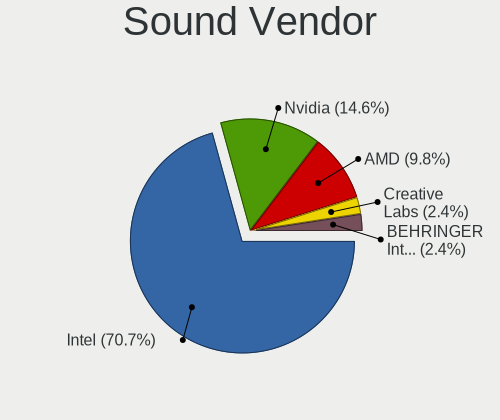

| Vendor                  | Computers | Percent |
|-------------------------|-----------|---------|
| Intel                   | 29        | 70.73%  |
| Nvidia                  | 6         | 14.63%  |
| AMD                     | 4         | 9.76%   |
| Creative Labs           | 1         | 2.44%   |
| BEHRINGER International | 1         | 2.44%   |

Sound Model
-----------

Sound card models

| Model                                                                      | Computers | Percent |
|----------------------------------------------------------------------------|-----------|---------|
| Intel Sunrise Point-LP HD Audio                                            | 5         | 10%     |
| Intel 7 Series/C216 Chipset Family High Definition Audio Controller        | 5         | 10%     |
| Intel Xeon E3-1200 v3/4th Gen Core Processor HD Audio Controller           | 3         | 6%      |
| Intel 8 Series/C220 Series Chipset High Definition Audio Controller        | 3         | 6%      |
| Intel NM10/ICH7 Family High Definition Audio Controller                    | 2         | 4%      |
| Intel Haswell-ULT HD Audio Controller                                      | 2         | 4%      |
| Intel Comet Lake PCH-LP cAVS                                               | 2         | 4%      |
| Intel Cannon Point-LP High Definition Audio Controller                     | 2         | 4%      |
| Intel 82801I (ICH9 Family) HD Audio Controller                             | 2         | 4%      |
| Intel 8 Series HD Audio Controller                                         | 2         | 4%      |
| Intel 6 Series/C200 Series Chipset Family High Definition Audio Controller | 2         | 4%      |
| AMD Family 17h/19h HD Audio Controller                                     | 2         | 4%      |
| Nvidia MCP89 High Definition Audio                                         | 1         | 2%      |
| Nvidia MCP79 High Definition Audio                                         | 1         | 2%      |
| Nvidia MCP61 High Definition Audio                                         | 1         | 2%      |
| Nvidia GT216 HDMI Audio Controller                                         | 1         | 2%      |
| Nvidia GP102 HDMI Audio Controller                                         | 1         | 2%      |
| Nvidia GF108 High Definition Audio Controller                              | 1         | 2%      |
| Intel Tiger Lake-LP Smart Sound Technology Audio Controller                | 1         | 2%      |
| Intel Raptor Lake-P/U/H cAVS                                               | 1         | 2%      |
| Intel C600/X79 series chipset High Definition Audio Controller             | 1         | 2%      |
| Intel Alder Lake PCH-P High Definition Audio Controller                    | 1         | 2%      |
| Creative Labs EMU10k2/CA0100/CA0102/CA10200 [Sound Blaster Audigy Series]  | 1         | 2%      |
| BEHRINGER International UMC 202HD 192k                                     | 1         | 2%      |
| AMD SBx00 Azalia (Intel HDA)                                               | 1         | 2%      |
| AMD Renoir Radeon High Definition Audio Controller                         | 1         | 2%      |
| AMD Raven/Raven2/Fenghuang HDMI/DP Audio Controller                        | 1         | 2%      |
| AMD Oland/Hainan/Cape Verde/Pitcairn HDMI Audio [Radeon HD 7000 Series]    | 1         | 2%      |
| AMD Navi 21/23 HDMI/DP Audio Controller                                    | 1         | 2%      |
| AMD Cedar HDMI Audio [Radeon HD 5400/6300/7300 Series]                     | 1         | 2%      |

Memory
------

Memory Vendor
-------------

Memory module vendors

| Vendor              | Computers | Percent |
|---------------------|-----------|---------|
| Samsung Electronics | 12        | 29.27%  |
| SK hynix            | 7         | 17.07%  |
| Kingston            | 6         | 14.63%  |
| Micron Technology   | 4         | 9.76%   |
| Unknown             | 4         | 9.76%   |
| A-DATA Technology   | 2         | 4.88%   |
| Unknown             | 1         | 2.44%   |
| Transcend           | 1         | 2.44%   |
| Ramaxel Technology  | 1         | 2.44%   |
| Nanya Technology    | 1         | 2.44%   |
| Corsair             | 1         | 2.44%   |
| 48spaces            | 1         | 2.44%   |

Memory Model
------------

Memory module models

| Model                                                        | Computers | Percent |
|--------------------------------------------------------------|-----------|---------|
| Unknown                                                      | 4         | 8.89%   |
| SK hynix RAM HMT351S6EFR8C-PB 4GB SODIMM DDR3 1600MT/s       | 2         | 4.44%   |
| Unknown RAM Module 2GB SODIMM DDR2 667MT/s                   | 1         | 2.22%   |
| Transcend RAM JM1333KLN-4G 4GB DIMM DDR3 1333MT/s            | 1         | 2.22%   |
| Transcend RAM JM1333KLH-8G 8GB DIMM DDR3 1333MT/s            | 1         | 2.22%   |
| SK hynix RAM Module 2GB SODIMM DDR3 1067MT/s                 | 1         | 2.22%   |
| SK hynix RAM HMT451S6AFR8C-PB 4GB SODIMM DDR3 1600MT/s       | 1         | 2.22%   |
| SK hynix RAM HMT41GS6BFR8A-PB 8GB SODIMM DDR3 1600MT/s       | 1         | 2.22%   |
| SK hynix RAM HMT351S6CFR8C-PB 4GB SODIMM DDR3 1600MT/s       | 1         | 2.22%   |
| SK hynix RAM HMA851S6CJR6N-VK 4GB SODIMM DDR4 2667MT/s       | 1         | 2.22%   |
| SK hynix RAM HMA82GS6JJR8N-VK 16GB SODIMM DDR4 2667MT/s      | 1         | 2.22%   |
| SK hynix RAM HMA82GS6DJR8N-VK 16GB SODIMM DDR4 2667MT/s      | 1         | 2.22%   |
| SK hynix RAM HMA81GS6CJR8N-VK 8GB SODIMM DDR4 2667MT/s       | 1         | 2.22%   |
| Samsung RAM M471B5773DH0-CH9 2GB SODIMM DDR3 1334MT/s        | 1         | 2.22%   |
| Samsung RAM M471B5673EH1-CF8 2GB SODIMM DDR3 1067MT/s        | 1         | 2.22%   |
| Samsung RAM M471B5273DH0-CH9 4GB SODIMM DDR3 1334MT/s        | 1         | 2.22%   |
| Samsung RAM M471B5173QH0-YK0 4GB SODIMM DDR3 1600MT/s        | 1         | 2.22%   |
| Samsung RAM M471B1G73DB0-YK0 8GB SODIMM DDR3 1600MT/s        | 1         | 2.22%   |
| Samsung RAM M471A2K43DB1-CTD 16GB SODIMM DDR4 2667MT/s       | 1         | 2.22%   |
| Samsung RAM M471A1K43DB1-CTD 8GB SODIMM DDR4 2667MT/s        | 1         | 2.22%   |
| Samsung RAM M425R1GB4DB0-CWMOL 16GB SODIMM DDR5 5600MT/s     | 1         | 2.22%   |
| Samsung RAM M4 70T5663RZ3-CF7 2GB SODIMM DDR 1639MT/s        | 1         | 2.22%   |
| Samsung RAM M391B1G73QH0-YK0 8GB DIMM DDR3 1600MT/s          | 1         | 2.22%   |
| Samsung RAM K4EBE304EC-EGCG 8GB Row Of Chips LPDDR3 2133MT/s | 1         | 2.22%   |
| Samsung RAM K4E6E304EB-EGCF 4GB Row Of Chips LPDDR3 1867MT/s | 1         | 2.22%   |
| Ramaxel RAM RMT3170EF68F9W1600 4GB SODIMM DDR3 1600MT/s      | 1         | 2.22%   |
| Nanya RAM NT2GC64B8HC0NS-CG 2GB SODIMM DDR3 1333MT/s         | 1         | 2.22%   |
| Micron RAM Module 4GB SODIMM LPDDR3 2133MT/s                 | 1         | 2.22%   |
| Micron RAM Module 2GB Row Of Chips LPDDR5 6400MT/s           | 1         | 2.22%   |
| Micron RAM Module 2GB Row Of Chips LPDDR4 4267MT/s           | 1         | 2.22%   |
| Micron RAM 4ATF51264HZ-2G6E1 4GB SODIMM DDR4 2667MT/s        | 1         | 2.22%   |
| Kingston RAM KF3600C17D4/8GX 8GB DIMM DDR4 3600MT/s          | 1         | 2.22%   |
| Kingston RAM ACR21D4S15HAG/4G 4GB SODIMM DDR4 2133MT/s       | 1         | 2.22%   |
| Kingston RAM 99U5428-063.A00LF 8GB SODIMM DDR3 2400MT/s      | 1         | 2.22%   |
| Kingston RAM 99U5428-018.A00LF 8GB SODIMM DDR3 1600MT/s      | 1         | 2.22%   |
| Kingston RAM 9965525-138.A00LF 8GB DIMM DDR3 1600MT/s        | 1         | 2.22%   |
| Kingston RAM 9905428-105.A00G 8GB SODIMM DDR3 1333MT/s       | 1         | 2.22%   |
| Corsair RAM CMY16GX3M2A2133C11 8GB DIMM DDR3 1866MT/s        | 1         | 2.22%   |
| A-DATA RAM Module 8GB SODIMM DDR3 1333MT/s                   | 1         | 2.22%   |
| A-DATA RAM MIOVE1B163BZ 2GB SODIMM SDRAM 1639MT/s            | 1         | 2.22%   |

Memory Kind
-----------

Memory module kinds

| Kind   | Computers | Percent |
|--------|-----------|---------|
| DDR3   | 15        | 42.86%  |
| DDR4   | 9         | 25.71%  |
| DDR2   | 4         | 11.43%  |
| LPDDR3 | 3         | 8.57%   |
| SDRAM  | 1         | 2.86%   |
| LPDDR5 | 1         | 2.86%   |
| LPDDR4 | 1         | 2.86%   |
| DDR5   | 1         | 2.86%   |

Memory Form Factor
------------------

Physical design of the memory module

| Name         | Computers | Percent |
|--------------|-----------|---------|
| SODIMM       | 24        | 70.59%  |
| DIMM         | 6         | 17.65%  |
| Row Of Chips | 4         | 11.76%  |

Memory Size
-----------

Memory module size

| Size  | Computers | Percent |
|-------|-----------|---------|
| 8192  | 16        | 39.02%  |
| 4096  | 12        | 29.27%  |
| 2048  | 10        | 24.39%  |
| 16384 | 3         | 7.32%   |

Memory Speed
------------

Memory module speed

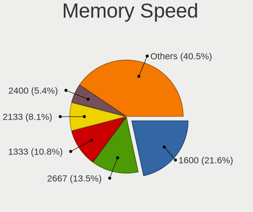

| Speed | Computers | Percent |
|-------|-----------|---------|
| 1600  | 8         | 21.62%  |
| 2667  | 5         | 13.51%  |
| 1333  | 4         | 10.81%  |
| 2133  | 3         | 8.11%   |
| 2400  | 2         | 5.41%   |
| 1334  | 2         | 5.41%   |
| 1067  | 2         | 5.41%   |
| 6400  | 1         | 2.7%    |
| 5600  | 1         | 2.7%    |
| 4267  | 1         | 2.7%    |
| 3600  | 1         | 2.7%    |
| 1867  | 1         | 2.7%    |
| 1866  | 1         | 2.7%    |
| 1639  | 1         | 2.7%    |
| 800   | 1         | 2.7%    |
| 667   | 1         | 2.7%    |
| 533   | 1         | 2.7%    |
| 400   | 1         | 2.7%    |

Printers & scanners
-------------------

Printer Vendor
--------------

Printer device vendors

Zero info for selected period =(

Printer Model
-------------

Printer device models

Zero info for selected period =(

Scanner Vendor
--------------

Scanner device vendors

Zero info for selected period =(

Scanner Model
-------------

Scanner device models

Zero info for selected period =(

Camera
------

Camera Vendor
-------------

Camera device vendors

| Vendor                        | Computers | Percent |
|-------------------------------|-----------|---------|
| Chicony Electronics           | 7         | 33.33%  |
| IMC Networks                  | 3         | 14.29%  |
| Bison Electronics             | 3         | 14.29%  |
| Suyin                         | 2         | 9.52%   |
| Realtek Semiconductor         | 2         | 9.52%   |
| Z-Star Microelectronics       | 1         | 4.76%   |
| Sunplus Innovation Technology | 1         | 4.76%   |
| Microdia                      | 1         | 4.76%   |
| Luxvisions Innotech Limited   | 1         | 4.76%   |

Camera Model
------------

Camera device models

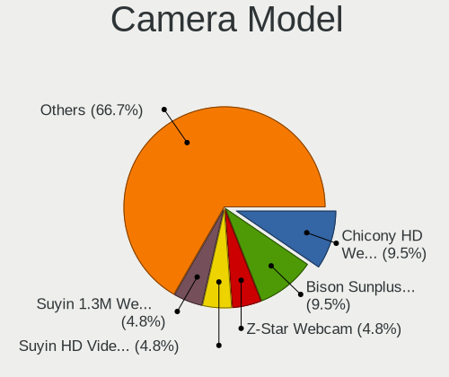

| Model                                                       | Computers | Percent |
|-------------------------------------------------------------|-----------|---------|
| Chicony HD WebCam                                           | 2         | 9.52%   |
| Bison SunplusIT Integrated Camera                           | 2         | 9.52%   |
| Z-Star Webcam                                               | 1         | 4.76%   |
| Suyin HD Video WebCam                                       | 1         | 4.76%   |
| Suyin 1.3M WebCam (notebook emachines E730, Acer sub-brand) | 1         | 4.76%   |
| Sunplus Hy HD Camera                                        | 1         | 4.76%   |
| Realtek Lenovo EasyCamera                                   | 1         | 4.76%   |
| Realtek Integrated_Webcam_HD                                | 1         | 4.76%   |
| Microdia Integrated Webcam                                  | 1         | 4.76%   |
| Luxvisions Innotech Limited Integrated Camera               | 1         | 4.76%   |
| IMC Networks UVC VGA Webcam                                 | 1         | 4.76%   |
| IMC Networks Integrated Camera                              | 1         | 4.76%   |
| IMC Networks EasyCamera                                     | 1         | 4.76%   |
| Chicony UVC 1.00 device HD UVC WebCam                       | 1         | 4.76%   |
| Chicony Lenovo Integrated Camera (0.3MP)                    | 1         | 4.76%   |
| Chicony Integrated Camera                                   | 1         | 4.76%   |
| Chicony FJ Camera                                           | 1         | 4.76%   |
| Chicony 2.0M UVC Webcam / CNF7129                           | 1         | 4.76%   |
| Bison ThinkPad Integrated Camera                            | 1         | 4.76%   |

Security
--------

Fingerprint Vendor
------------------

Fingerprint sensor vendors

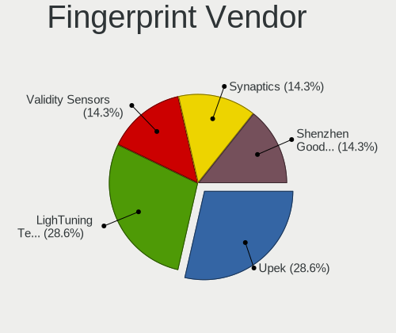

| Vendor                     | Computers | Percent |
|----------------------------|-----------|---------|
| Upek                       | 2         | 28.57%  |
| LighTuning Technology      | 2         | 28.57%  |
| Validity Sensors           | 1         | 14.29%  |
| Synaptics                  | 1         | 14.29%  |
| Shenzhen Goodix Technology | 1         | 14.29%  |

Fingerprint Model
-----------------

Fingerprint sensor models

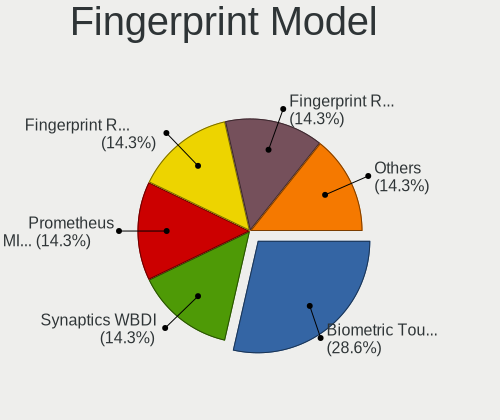

| Model                                                  | Computers | Percent |
|--------------------------------------------------------|-----------|---------|
| Upek Biometric Touchchip/Touchstrip Fingerprint Sensor | 2         | 28.57%  |
| Validity Sensors Synaptics WBDI                        | 1         | 14.29%  |
| Synaptics Prometheus MIS Touch Fingerprint Reader      | 1         | 14.29%  |
| Shenzhen Goodix Fingerprint Reader                     | 1         | 14.29%  |
| LighTuning Fingerprint Reader                          | 1         | 14.29%  |
| LighTuning EgisTec Touch Fingerprint Sensor            | 1         | 14.29%  |

Chipcard Vendor
---------------

Chipcard module vendors

Zero info for selected period =(

Chipcard Model
--------------

Chipcard module models

Zero info for selected period =(

Unsupported
-----------

Unsupported Devices
-------------------

Total unsupported devices on board

| Total | Computers | Percent |
|-------|-----------|---------|
| 2     | 11        | 32.35%  |
| 1     | 10        | 29.41%  |
| 0     | 6         | 17.65%  |
| 4     | 3         | 8.82%   |
| 3     | 3         | 8.82%   |
| 7     | 1         | 2.94%   |

Unsupported Device Types
------------------------

Types of unsupported devices

| Type                     | Computers | Percent |
|--------------------------|-----------|---------|
| Communication controller | 24        | 42.11%  |
| Bluetooth                | 10        | 17.54%  |
| Net/wireless             | 9         | 15.79%  |
| Fingerprint reader       | 6         | 10.53%  |
| Firewire controller      | 4         | 7.02%   |
| Card reader              | 2         | 3.51%   |
| Sound                    | 1         | 1.75%   |
| Net/ethernet             | 1         | 1.75%   |

