NomadBSD 5806f915 - Tested Hardware & Statistics
------------------------------------------------

A project to collect tested hardware configurations for NomadBSD 5806f915.

Anyone can contribute to this report by the [hw-probe](https://github.com/linuxhw/hw-probe/blob/master/INSTALL.BSD.md) tool:

    hw-probe -all -upload

Please contribute! Especially if your hardware is rare.

This is a report for all computer types. See also reports for [desktops](/Dist/NomadBSD_5806f915/Desktop/README.md) and [notebooks](/Dist/NomadBSD_5806f915/Notebook/README.md).

Contents
--------

* [ Test Cases ](#test-cases)

* [ System ](#system)
  - [ Arch                     ](#arch)
  - [ DE                       ](#de)
  - [ Display Server           ](#display-server)
  - [ Display Manager          ](#display-manager)
  - [ OS Lang                  ](#os-lang)
  - [ Boot Mode                ](#boot-mode)
  - [ Filesystem               ](#filesystem)
  - [ Part. scheme             ](#part-scheme)

* [ Board ](#board)
  - [ Vendor                   ](#vendor)
  - [ Model                    ](#model)
  - [ Model Family             ](#model-family)
  - [ MFG Year                 ](#mfg-year)
  - [ Form Factor              ](#form-factor)
  - [ Coreboot                 ](#coreboot)
  - [ RAM Size                 ](#ram-size)
  - [ RAM Used                 ](#ram-used)
  - [ Total Drives             ](#total-drives)
  - [ Has CD-ROM               ](#has-cd-rom)
  - [ Has Ethernet             ](#has-ethernet)
  - [ Has WiFi                 ](#has-wifi)
  - [ Has Bluetooth            ](#has-bluetooth)

* [ Location ](#location)
  - [ Country                  ](#country)
  - [ City                     ](#city)

* [ Drives ](#drives)
  - [ Drive Vendor             ](#drive-vendor)
  - [ Drive Model              ](#drive-model)
  - [ HDD Vendor               ](#hdd-vendor)
  - [ SSD Vendor               ](#ssd-vendor)
  - [ Drive Kind               ](#drive-kind)
  - [ Drive Connector          ](#drive-connector)
  - [ Drive Size               ](#drive-size)
  - [ Space Total              ](#space-total)
  - [ Space Used               ](#space-used)
  - [ Malfunc. Drives          ](#malfunc-drives)
  - [ Malfunc. Drive Vendor    ](#malfunc-drive-vendor)
  - [ Malfunc. HDD Vendor      ](#malfunc-hdd-vendor)
  - [ Malfunc. Drive Kind      ](#malfunc-drive-kind)
  - [ Failed Drives            ](#failed-drives)
  - [ Failed Drive Vendor      ](#failed-drive-vendor)
  - [ Drive Status             ](#drive-status)

* [ Storage controller ](#storage-controller)
  - [ Storage Vendor           ](#storage-vendor)
  - [ Storage Model            ](#storage-model)
  - [ Storage Kind             ](#storage-kind)

* [ Processor ](#processor)
  - [ CPU Vendor               ](#cpu-vendor)
  - [ CPU Model                ](#cpu-model)
  - [ CPU Model Family         ](#cpu-model-family)
  - [ CPU Cores                ](#cpu-cores)
  - [ CPU Sockets              ](#cpu-sockets)
  - [ CPU Threads              ](#cpu-threads)
  - [ CPU Microarch            ](#cpu-microarch)

* [ Graphics ](#graphics)
  - [ GPU Vendor               ](#gpu-vendor)
  - [ GPU Model                ](#gpu-model)
  - [ GPU Combo                ](#gpu-combo)
  - [ GPU Driver               ](#gpu-driver)
  - [ GPU Memory               ](#gpu-memory)

* [ Monitor ](#monitor)
  - [ Monitor Vendor           ](#monitor-vendor)
  - [ Monitor Model            ](#monitor-model)
  - [ Monitor Resolution       ](#monitor-resolution)
  - [ Monitor Diagonal         ](#monitor-diagonal)
  - [ Monitor Width            ](#monitor-width)
  - [ Aspect Ratio             ](#aspect-ratio)
  - [ Monitor Area             ](#monitor-area)
  - [ Pixel Density            ](#pixel-density)
  - [ Multiple Monitors        ](#multiple-monitors)

* [ Network ](#network)
  - [ Net Controller Vendor    ](#net-controller-vendor)
  - [ Net Controller Model     ](#net-controller-model)
  - [ Wireless Vendor          ](#wireless-vendor)
  - [ Wireless Model           ](#wireless-model)
  - [ Ethernet Vendor          ](#ethernet-vendor)
  - [ Ethernet Model           ](#ethernet-model)
  - [ Net Controller Kind      ](#net-controller-kind)
  - [ Used Controller          ](#used-controller)
  - [ NICs                     ](#nics)
  - [ IPv6                     ](#ipv6)

* [ Bluetooth ](#bluetooth)
  - [ Bluetooth Vendor         ](#bluetooth-vendor)
  - [ Bluetooth Model          ](#bluetooth-model)

* [ Sound ](#sound)
  - [ Sound Vendor             ](#sound-vendor)
  - [ Sound Model              ](#sound-model)

* [ Memory ](#memory)
  - [ Memory Vendor            ](#memory-vendor)
  - [ Memory Model             ](#memory-model)
  - [ Memory Kind              ](#memory-kind)
  - [ Memory Form Factor       ](#memory-form-factor)
  - [ Memory Size              ](#memory-size)
  - [ Memory Speed             ](#memory-speed)

* [ Printers & scanners ](#printers--scanners)
  - [ Printer Vendor           ](#printer-vendor)
  - [ Printer Model            ](#printer-model)
  - [ Scanner Vendor           ](#scanner-vendor)
  - [ Scanner Model            ](#scanner-model)

* [ Camera ](#camera)
  - [ Camera Vendor            ](#camera-vendor)
  - [ Camera Model             ](#camera-model)

* [ Security ](#security)
  - [ Fingerprint Vendor       ](#fingerprint-vendor)
  - [ Fingerprint Model        ](#fingerprint-model)
  - [ Chipcard Vendor          ](#chipcard-vendor)
  - [ Chipcard Model           ](#chipcard-model)

* [ Unsupported ](#unsupported)
  - [ Unsupported Devices      ](#unsupported-devices)
  - [ Unsupported Device Types ](#unsupported-device-types)

Test Cases
----------

Total: 68

| Vendor        | Model                       | Form-Factor | Probe                                                     | Date         |
|---------------|-----------------------------|-------------|-----------------------------------------------------------|--------------|
| TUXEDO        | Pulse 15 Gen2               | Notebook    | [91a1870b65](https://bsd-hardware.info/?probe=91a1870b65) | Sep 01, 2022 |
| Lenovo        | ThinkPad T480 20L50000GE    | Notebook    | [cd7d7d83ba](https://bsd-hardware.info/?probe=cd7d7d83ba) | Aug 20, 2022 |
| Lenovo        | ThinkPad T480 20L6SB2N00    | Notebook    | [995a8a5e6f](https://bsd-hardware.info/?probe=995a8a5e6f) | Jul 16, 2022 |
| Lenovo        | V580 20147                  | Notebook    | [0615e8260d](https://bsd-hardware.info/?probe=0615e8260d) | Jul 02, 2022 |
| Lenovo        | V580 20147                  | Notebook    | [6f1fd71366](https://bsd-hardware.info/?probe=6f1fd71366) | Jul 02, 2022 |
| ASRock        | B550 Steel Legend           | Desktop     | [4e6381e037](https://bsd-hardware.info/?probe=4e6381e037) | Jun 22, 2022 |
| HP            | 2B29                        | Desktop     | [e8c355314e](https://bsd-hardware.info/?probe=e8c355314e) | Jun 17, 2022 |
| HP            | 1589                        | Desktop     | [3765f1cb09](https://bsd-hardware.info/?probe=3765f1cb09) | Jun 17, 2022 |
| Dell          | 0Y2G6P A03                  | Server      | [ecb370bba4](https://bsd-hardware.info/?probe=ecb370bba4) | Jun 17, 2022 |
| HP            | 255 G8 Notebook PC          | Notebook    | [004e039a23](https://bsd-hardware.info/?probe=004e039a23) | May 19, 2022 |
| HP            | 255 G8 Notebook PC          | Notebook    | [555a7733b7](https://bsd-hardware.info/?probe=555a7733b7) | May 19, 2022 |
| Dell          | Latitude 5290               | Notebook    | [11c3db8f1b](https://bsd-hardware.info/?probe=11c3db8f1b) | Apr 23, 2022 |
| Notebook      | W650DC,DD                   | Notebook    | [0f474b9ebb](https://bsd-hardware.info/?probe=0f474b9ebb) | Apr 23, 2022 |
| HP            | ProBook 450 G2              | Notebook    | [c4f7b8a774](https://bsd-hardware.info/?probe=c4f7b8a774) | Apr 22, 2022 |
| Dell          | Studio 1555                 | Notebook    | [6da8f97bcd](https://bsd-hardware.info/?probe=6da8f97bcd) | Apr 22, 2022 |
| ASUSTek       | Maximus VIII HERO           | Desktop     | [c776760a11](https://bsd-hardware.info/?probe=c776760a11) | Apr 13, 2022 |
| Lenovo        | ThinkPad T490s 20NX000DR... | Notebook    | [c052d7cab0](https://bsd-hardware.info/?probe=c052d7cab0) | Apr 01, 2022 |
| Intel         | NUC6i5SYB H81131-502        | Mini pc     | [95646c7b48](https://bsd-hardware.info/?probe=95646c7b48) | Mar 25, 2022 |
| Intel         | NUC6i5SYB H81131-502        | Mini pc     | [94f78425f1](https://bsd-hardware.info/?probe=94f78425f1) | Mar 25, 2022 |
| Intel         | NUC6i5SYB H81131-502        | Mini pc     | [09116f9139](https://bsd-hardware.info/?probe=09116f9139) | Mar 24, 2022 |
| ASUSTek       | M51Sr                       | Notebook    | [936a577d1a](https://bsd-hardware.info/?probe=936a577d1a) | Mar 10, 2022 |
| Lenovo        | ThinkPad T440s 20AQ006HU... | Notebook    | [2af47b6502](https://bsd-hardware.info/?probe=2af47b6502) | Mar 03, 2022 |
| MSI           | U-100 Ver.001               | Desktop     | [6859308aa9](https://bsd-hardware.info/?probe=6859308aa9) | Mar 01, 2022 |
| Dell          | Latitude D630               | Notebook    | [ae56d2cedd](https://bsd-hardware.info/?probe=ae56d2cedd) | Feb 28, 2022 |
| HP            | Pavilion Notebook           | Notebook    | [e27a6f46fc](https://bsd-hardware.info/?probe=e27a6f46fc) | Feb 26, 2022 |
| Gigabyte      | X570S GAMING X              | Desktop     | [ff39ace6ec](https://bsd-hardware.info/?probe=ff39ace6ec) | Feb 16, 2022 |
| HP            | Laptop 15-db0xxx            | Notebook    | [766e62f699](https://bsd-hardware.info/?probe=766e62f699) | Feb 12, 2022 |
| HP            | Notebook                    | Notebook    | [1758596e26](https://bsd-hardware.info/?probe=1758596e26) | Feb 12, 2022 |
| HP            | Pavilion Notebook           | Notebook    | [24f3a7da57](https://bsd-hardware.info/?probe=24f3a7da57) | Feb 07, 2022 |
| Intel         | DCP847SKE                   | Desktop     | [2828ef2a6d](https://bsd-hardware.info/?probe=2828ef2a6d) | Jan 20, 2022 |
| ASUSTek       | 1000                        | Notebook    | [da8689c840](https://bsd-hardware.info/?probe=da8689c840) | Dec 08, 2021 |
| Dell          | 0M9KCM A01                  | Desktop     | [4db0a0ea05](https://bsd-hardware.info/?probe=4db0a0ea05) | Dec 06, 2021 |
| Gigabyte      | MZGLKBP-00                  | Desktop     | [e713e3adee](https://bsd-hardware.info/?probe=e713e3adee) | Dec 05, 2021 |
| HP            | ProBook x360 11 G6 EE       | Convertible | [7eaff44a64](https://bsd-hardware.info/?probe=7eaff44a64) | Nov 27, 2021 |
| ASUSTek       | PRIME Z390-P                | Desktop     | [1bd9270845](https://bsd-hardware.info/?probe=1bd9270845) | Nov 15, 2021 |
| Acer          | Aspire 3810T                | Notebook    | [86782a69be](https://bsd-hardware.info/?probe=86782a69be) | Nov 13, 2021 |
| Acer          | Aspire 3810T                | Notebook    | [608e43163d](https://bsd-hardware.info/?probe=608e43163d) | Nov 12, 2021 |
| Dell          | 0T10XW A01                  | Desktop     | [ae2203b146](https://bsd-hardware.info/?probe=ae2203b146) | Nov 12, 2021 |
| Unknown       | X79                         | Desktop     | [c80b658f36](https://bsd-hardware.info/?probe=c80b658f36) | Nov 09, 2021 |
| Lenovo        | ThinkPad T470s W10DG 20J... | Notebook    | [1d261120d3](https://bsd-hardware.info/?probe=1d261120d3) | Nov 06, 2021 |
| HP            | ZBook Studio G3             | Notebook    | [767b44a6ae](https://bsd-hardware.info/?probe=767b44a6ae) | Oct 30, 2021 |
| ASUSTek       | X202E                       | Notebook    | [54259ac9a1](https://bsd-hardware.info/?probe=54259ac9a1) | Oct 29, 2021 |
| Sony          | VJS121C11N                  | Notebook    | [d86c621ef0](https://bsd-hardware.info/?probe=d86c621ef0) | Oct 25, 2021 |
| ASUSTek       | TUF Gaming FX505DU_FX505... | Notebook    | [2d72b6939d](https://bsd-hardware.info/?probe=2d72b6939d) | Oct 24, 2021 |
| HP            | 87D6 SMVB                   | Desktop     | [f601f00e7c](https://bsd-hardware.info/?probe=f601f00e7c) | Oct 07, 2021 |
| Dell          | OptiPlex 3020               | Desktop     | [c391177240](https://bsd-hardware.info/?probe=c391177240) | Oct 05, 2021 |
| Dell          | OptiPlex 3020               | Desktop     | [070a0c6d62](https://bsd-hardware.info/?probe=070a0c6d62) | Sep 19, 2021 |
| ASUSTek       | X540YA                      | Notebook    | [c5751c736c](https://bsd-hardware.info/?probe=c5751c736c) | Sep 19, 2021 |
| Lenovo        | Legion Y7000 2019 PG0 81... | Notebook    | [d8f8901ae7](https://bsd-hardware.info/?probe=d8f8901ae7) | Sep 19, 2021 |
| HP            | OMEN by HP Laptop 17-cb1... | Notebook    | [b00c8e76e8](https://bsd-hardware.info/?probe=b00c8e76e8) | Aug 23, 2021 |
| HP            | Pavilion g6                 | Notebook    | [f1dc5150c2](https://bsd-hardware.info/?probe=f1dc5150c2) | Aug 13, 2021 |
| HP            | 2000                        | Notebook    | [d2240a960b](https://bsd-hardware.info/?probe=d2240a960b) | Aug 05, 2021 |
| HP            | 2000                        | Notebook    | [65d183fe41](https://bsd-hardware.info/?probe=65d183fe41) | Aug 05, 2021 |
| Lenovo        | ThinkPad S1 Yoga 20C0S0M... | Notebook    | [39ef89f214](https://bsd-hardware.info/?probe=39ef89f214) | Aug 05, 2021 |
| Lenovo        | ThinkPad S1 Yoga 20C0S0M... | Notebook    | [4e7ace8a39](https://bsd-hardware.info/?probe=4e7ace8a39) | Aug 04, 2021 |
| Lenovo        | ThinkPad S1 Yoga 12 20DK... | Notebook    | [3348992bef](https://bsd-hardware.info/?probe=3348992bef) | Jul 23, 2021 |
| Fujitsu Si... | AMILO PRO V3515             | Notebook    | [77676fbcfc](https://bsd-hardware.info/?probe=77676fbcfc) | Jul 18, 2021 |
| Dell          | Inspiron 15-5568            | Notebook    | [3ed52ae70d](https://bsd-hardware.info/?probe=3ed52ae70d) | Jul 01, 2021 |
| Gigabyte      | Z370 AORUS ULTRAGAMING W... | Desktop     | [13371b2ab8](https://bsd-hardware.info/?probe=13371b2ab8) | Jun 27, 2021 |
| ASUSTek       | ROG STRIX X299-E GAMING     | Desktop     | [e91dc55970](https://bsd-hardware.info/?probe=e91dc55970) | Jun 22, 2021 |
| Apple         | MacBookAir6,1               | Notebook    | [46bf9edc63](https://bsd-hardware.info/?probe=46bf9edc63) | Jun 17, 2021 |
| Apple         | MacBookAir6,1               | Notebook    | [dbda48cff7](https://bsd-hardware.info/?probe=dbda48cff7) | Jun 17, 2021 |
| Lenovo        | ThinkPad X380 Yoga 20LJ0... | Convertible | [dab0ca2417](https://bsd-hardware.info/?probe=dab0ca2417) | Jun 01, 2021 |
| Lenovo        | ThinkPad X380 Yoga 20LJ0... | Convertible | [2d874470d0](https://bsd-hardware.info/?probe=2d874470d0) | Jun 01, 2021 |
| ASUSTek       | TUF GAMING B550M-PLUS       | Desktop     | [c6a1c1fa15](https://bsd-hardware.info/?probe=c6a1c1fa15) | May 25, 2021 |
| Lenovo        | ThinkPad X380 Yoga 20LJ0... | Convertible | [96cc0c27b0](https://bsd-hardware.info/?probe=96cc0c27b0) | May 25, 2021 |
| ASUSTek       | V-P7H55E                    | Desktop     | [8cf113ac55](https://bsd-hardware.info/?probe=8cf113ac55) | May 22, 2021 |
| Toshiba       | STI 005492G                 | Desktop     | [9a8e4a1328](https://bsd-hardware.info/?probe=9a8e4a1328) | May 17, 2021 |

System
------

Arch
----

OS architecture (x86_64, i586, etc.)

| Name  | Computers | Percent |
|-------|-----------|---------|
| amd64 | 51        | 96.23%  |
| i386  | 2         | 3.77%   |

DE
--

Desktop Environment

| Name    | Computers | Percent |
|---------|-----------|---------|
| Openbox | 52        | 98.11%  |
| KDE5    | 1         | 1.89%   |

Display Server
--------------

X11 or Wayland

| Name | Computers | Percent |
|------|-----------|---------|
| X11  | 53        | 100%    |

Display Manager
---------------

SDDM, LightDM, etc.

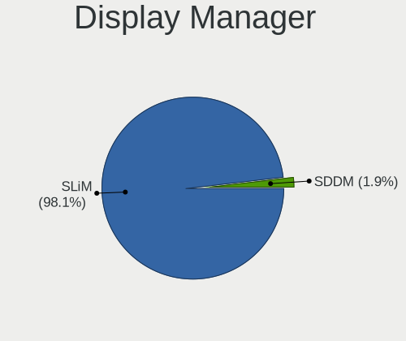

| Name | Computers | Percent |
|------|-----------|---------|
| SLiM | 52        | 98.11%  |
| SDDM | 1         | 1.89%   |

OS Lang
-------

Language

| Lang    | Computers | Percent |
|---------|-----------|---------|
| en_US   | 27        | 50%     |
| de_DE   | 5         | 9.26%   |
| Unknown | 5         | 9.26%   |
| ru_RU   | 4         | 7.41%   |
| en_GB   | 4         | 7.41%   |
| zh_CN   | 2         | 3.7%    |
| pt_BR   | 2         | 3.7%    |
| pl_PL   | 1         | 1.85%   |
| fr_FR   | 1         | 1.85%   |
| fi_FI   | 1         | 1.85%   |
| es_ES   | 1         | 1.85%   |
| en_AU   | 1         | 1.85%   |

Boot Mode
---------

EFI or BIOS

| Mode | Computers | Percent |
|------|-----------|---------|
| EFI  | 52        | 98.11%  |
| BIOS | 1         | 1.89%   |

Filesystem
----------

Type of filesystem

| Type | Computers | Percent |
|------|-----------|---------|
| Ufs  | 49        | 92.45%  |
| Zfs  | 4         | 7.55%   |

Part. scheme
------------

Scheme of partitioning

| Type | Computers | Percent |
|------|-----------|---------|
| GPT  | 43        | 81.13%  |
| MBR  | 10        | 18.87%  |

Board
-----

Vendor
------

Motherboard manufacturer

| Name                | Computers | Percent |
|---------------------|-----------|---------|
| Hewlett-Packard     | 13        | 24.53%  |
| ASUSTek Computer    | 10        | 18.87%  |
| Lenovo              | 8         | 15.09%  |
| Dell                | 8         | 15.09%  |
| Gigabyte Technology | 3         | 5.66%   |
| Intel               | 2         | 3.77%   |
| TUXEDO              | 1         | 1.89%   |
| Sony                | 1         | 1.89%   |
| Semp Toshiba        | 1         | 1.89%   |
| Notebook            | 1         | 1.89%   |
| Fujitsu Siemens     | 1         | 1.89%   |
| ASRock              | 1         | 1.89%   |
| Apple               | 1         | 1.89%   |
| Acer                | 1         | 1.89%   |
| Unknown             | 1         | 1.89%   |

Model
-----

Motherboard model

| Name                                    | Computers | Percent |
|-----------------------------------------|-----------|---------|
| TUXEDO Pulse 15 Gen2                    | 1         | 1.89%   |
| Sony VJS121C11N                         | 1         | 1.89%   |
| Semp Toshiba STI                        | 1         | 1.89%   |
| Notebook W650DC,DD                      | 1         | 1.89%   |
| Lenovo V580 20147                       | 1         | 1.89%   |
| Lenovo ThinkPad X380 Yoga 20LJ000WUK    | 1         | 1.89%   |
| Lenovo ThinkPad T490s 20NX000DRT        | 1         | 1.89%   |
| Lenovo ThinkPad T480 20L50000GE         | 1         | 1.89%   |
| Lenovo ThinkPad T470s W10DG 20JS001FGE  | 1         | 1.89%   |
| Lenovo ThinkPad T440s 20AQ006HUS        | 1         | 1.89%   |
| Lenovo ThinkPad S1 Yoga 20C0S0M300      | 1         | 1.89%   |
| Lenovo Legion Y7000 2019 PG0 81T0       | 1         | 1.89%   |
| Intel NUC6i5SYB H81131-502              | 1         | 1.89%   |
| Intel DCP847SKE                         | 1         | 1.89%   |
| HP ZBook Studio G3                      | 1         | 1.89%   |
| HP Z420 Workstation                     | 1         | 1.89%   |
| HP ProBook x360 11 G6 EE                | 1         | 1.89%   |
| HP ProBook 450 G2                       | 1         | 1.89%   |
| HP Pavilion Notebook                    | 1         | 1.89%   |
| HP Pavilion g6                          | 1         | 1.89%   |
| HP OMEN by HP Laptop 17-cb1xxx          | 1         | 1.89%   |
| HP Notebook                             | 1         | 1.89%   |
| HP Laptop 15-db0xxx                     | 1         | 1.89%   |
| HP Desktop M01-F1xxx                    | 1         | 1.89%   |
| HP 550-a114                             | 1         | 1.89%   |
| HP 255 G8 Notebook PC                   | 1         | 1.89%   |
| HP 2000                                 | 1         | 1.89%   |
| Gigabyte Z370 AORUS ULTRAGAMING WIFI-OP | 1         | 1.89%   |
| Gigabyte X570S GAMING X                 | 1         | 1.89%   |
| Gigabyte MZGLKBP-00                     | 1         | 1.89%   |
| Fujitsu Siemens AMILO PRO V3515         | 1         | 1.89%   |
| Dell Studio 1555                        | 1         | 1.89%   |
| Dell PowerEdge T410                     | 1         | 1.89%   |
| Dell OptiPlex 9010                      | 1         | 1.89%   |
| Dell OptiPlex 3020                      | 1         | 1.89%   |
| Dell OptiPlex 3010                      | 1         | 1.89%   |
| Dell Latitude D630                      | 1         | 1.89%   |
| Dell Latitude 5290                      | 1         | 1.89%   |
| Dell Inspiron 15-5568                   | 1         | 1.89%   |
| ASUS X540YA                             | 1         | 1.89%   |
| ASUS X202E                              | 1         | 1.89%   |
| ASUS V-P7H55E                           | 1         | 1.89%   |
| ASUS TUF Gaming FX505DU_FX505DU         | 1         | 1.89%   |
| ASUS TUF GAMING B550M-PLUS              | 1         | 1.89%   |
| ASUS ROG STRIX X299-E GAMING            | 1         | 1.89%   |
| ASUS PRIME Z390-P                       | 1         | 1.89%   |
| ASUS Maximus VIII HERO                  | 1         | 1.89%   |
| ASUS M51Sr                              | 1         | 1.89%   |
| ASUS 1000                               | 1         | 1.89%   |
| ASRock B550 Steel Legend                | 1         | 1.89%   |
| Apple MacBookAir6,1                     | 1         | 1.89%   |
| Acer Aspire 3810T                       | 1         | 1.89%   |
| Unknown                                 | 1         | 1.89%   |

Model Family
------------

Motherboard model prefix

| Name                  | Computers | Percent |
|-----------------------|-----------|---------|
| Lenovo ThinkPad       | 6         | 11.32%  |
| Dell OptiPlex         | 3         | 5.66%   |
| HP ProBook            | 2         | 3.77%   |
| HP Pavilion           | 2         | 3.77%   |
| Dell Latitude         | 2         | 3.77%   |
| ASUS TUF              | 2         | 3.77%   |
| TUXEDO Pulse          | 1         | 1.89%   |
| Sony VJS121C11N       | 1         | 1.89%   |
| Semp Toshiba STI      | 1         | 1.89%   |
| Notebook W650DC       | 1         | 1.89%   |
| Lenovo V580           | 1         | 1.89%   |
| Lenovo Legion         | 1         | 1.89%   |
| Intel NUC6i5SYB       | 1         | 1.89%   |
| Intel DCP847SKE       | 1         | 1.89%   |
| HP ZBook              | 1         | 1.89%   |
| HP Z420               | 1         | 1.89%   |
| HP OMEN               | 1         | 1.89%   |
| HP Notebook           | 1         | 1.89%   |
| HP Laptop             | 1         | 1.89%   |
| HP Desktop            | 1         | 1.89%   |
| HP 550-a114           | 1         | 1.89%   |
| HP 255                | 1         | 1.89%   |
| HP 2000               | 1         | 1.89%   |
| Gigabyte Z370         | 1         | 1.89%   |
| Gigabyte X570S        | 1         | 1.89%   |
| Gigabyte MZGLKBP-00   | 1         | 1.89%   |
| Fujitsu Siemens AMILO | 1         | 1.89%   |
| Dell Studio           | 1         | 1.89%   |
| Dell PowerEdge        | 1         | 1.89%   |
| Dell Inspiron         | 1         | 1.89%   |
| ASUS X540YA           | 1         | 1.89%   |
| ASUS X202E            | 1         | 1.89%   |
| ASUS V-P7H55E         | 1         | 1.89%   |
| ASUS ROG              | 1         | 1.89%   |
| ASUS PRIME            | 1         | 1.89%   |
| ASUS Maximus          | 1         | 1.89%   |
| ASUS M51Sr            | 1         | 1.89%   |
| ASUS 1000             | 1         | 1.89%   |
| ASRock B550           | 1         | 1.89%   |
| Apple MacBookAir6     | 1         | 1.89%   |
| Acer Aspire           | 1         | 1.89%   |
| Unknown               | 1         | 1.89%   |

MFG Year
--------

Motherboard manufacture year

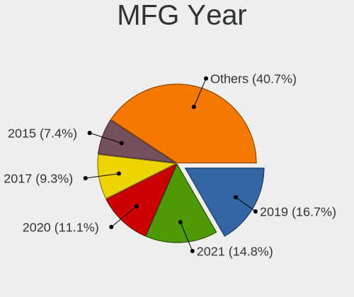

| Year | Computers | Percent |
|------|-----------|---------|
| 2019 | 9         | 16.98%  |
| 2021 | 8         | 15.09%  |
| 2020 | 5         | 9.43%   |
| 2017 | 5         | 9.43%   |
| 2015 | 4         | 7.55%   |
| 2022 | 3         | 5.66%   |
| 2018 | 3         | 5.66%   |
| 2013 | 3         | 5.66%   |
| 2012 | 3         | 5.66%   |
| 2009 | 3         | 5.66%   |
| 2008 | 3         | 5.66%   |
| 2014 | 1         | 1.89%   |
| 2011 | 1         | 1.89%   |
| 2010 | 1         | 1.89%   |
| 2006 | 1         | 1.89%   |

Form Factor
-----------

Physical design of the computer

| Name        | Computers | Percent |
|-------------|-----------|---------|
| Notebook    | 31        | 58.49%  |
| Desktop     | 18        | 33.96%  |
| Convertible | 2         | 3.77%   |
| Mini pc     | 1         | 1.89%   |
| Server      | 1         | 1.89%   |

Coreboot
--------

Have coreboot on board

| Used | Computers | Percent |
|------|-----------|---------|
| No   | 53        | 100%    |

RAM Size
--------

Total RAM memory

| Size in GB  | Computers | Percent |
|-------------|-----------|---------|
| 8.01-16.0   | 20        | 37.74%  |
| 16.01-24.0  | 12        | 22.64%  |
| 4.01-8.0    | 8         | 15.09%  |
| 32.01-64.0  | 6         | 11.32%  |
| 64.01-256.0 | 4         | 7.55%   |
| 2.01-3.0    | 2         | 3.77%   |
| 24.01-32.0  | 1         | 1.89%   |

RAM Used
--------

Used RAM memory

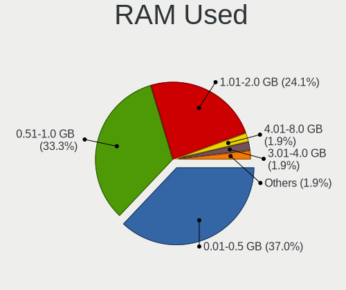

| Used GB  | Computers | Percent |
|----------|-----------|---------|
| 0.01-0.5 | 20        | 37.74%  |
| 0.51-1.0 | 17        | 32.08%  |
| 1.01-2.0 | 13        | 24.53%  |
| 4.01-8.0 | 1         | 1.89%   |
| 3.01-4.0 | 1         | 1.89%   |
| 2.01-3.0 | 1         | 1.89%   |

Total Drives
------------

Number of drives on board

| Drives | Computers | Percent |
|--------|-----------|---------|
| 1      | 33        | 61.11%  |
| 2      | 13        | 24.07%  |
| 3      | 6         | 11.11%  |
| 4      | 2         | 3.7%    |

Has CD-ROM
----------

Has CD-ROM on board

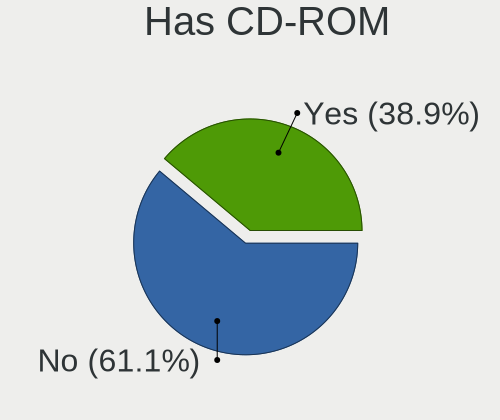

| Presented | Computers | Percent |
|-----------|-----------|---------|
| No        | 32        | 60.38%  |
| Yes       | 21        | 39.62%  |

Has Ethernet
------------

Has Ethernet on board

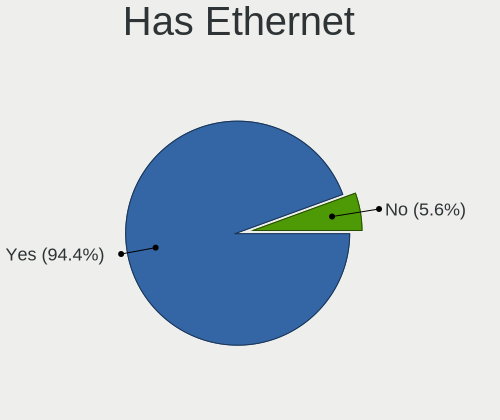

| Presented | Computers | Percent |
|-----------|-----------|---------|
| Yes       | 50        | 94.34%  |
| No        | 3         | 5.66%   |

Has WiFi
--------

Has WiFi module

| Presented | Computers | Percent |
|-----------|-----------|---------|
| Yes       | 45        | 84.91%  |
| No        | 8         | 15.09%  |

Has Bluetooth
-------------

Has Bluetooth module

| Presented | Computers | Percent |
|-----------|-----------|---------|
| Yes       | 31        | 57.41%  |
| No        | 23        | 42.59%  |

Location
--------

Country
-------

Geographic location (country)

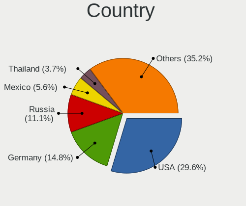

| Country   | Computers | Percent |
|-----------|-----------|---------|
| USA       | 16        | 30.19%  |
| Germany   | 7         | 13.21%  |
| Russia    | 6         | 11.32%  |
| Mexico    | 3         | 5.66%   |
| Thailand  | 2         | 3.77%   |
| Romania   | 2         | 3.77%   |
| Norway    | 2         | 3.77%   |
| Japan     | 2         | 3.77%   |
| China     | 2         | 3.77%   |
| Brazil    | 2         | 3.77%   |
| Spain     | 1         | 1.89%   |
| Slovakia  | 1         | 1.89%   |
| Poland    | 1         | 1.89%   |
| Italy     | 1         | 1.89%   |
| France    | 1         | 1.89%   |
| Finland   | 1         | 1.89%   |
| Denmark   | 1         | 1.89%   |
| Belarus   | 1         | 1.89%   |
| Australia | 1         | 1.89%   |

City
----

Geographic location (city)

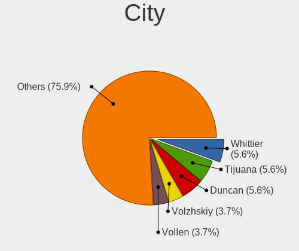

| City                  | Computers | Percent |
|-----------------------|-----------|---------|
| Whittier              | 3         | 5.66%   |
| Tijuana               | 3         | 5.66%   |
| Duncan                | 3         | 5.66%   |
| Volzhskiy             | 2         | 3.77%   |
| Vollen                | 2         | 3.77%   |
| Setagaya-ku           | 2         | 3.77%   |
| Rio de Janeiro        | 2         | 3.77%   |
| Moscow                | 2         | 3.77%   |
| Drobeta-Turnu Severin | 2         | 3.77%   |
| Cologne               | 2         | 3.77%   |
| Changzhou             | 2         | 3.77%   |
| Bangkok               | 2         | 3.77%   |
| Wloszczowa            | 1         | 1.89%   |
| Winter Haven          | 1         | 1.89%   |
| Ufa                   | 1         | 1.89%   |
| Tucson                | 1         | 1.89%   |
| Trieste               | 1         | 1.89%   |
| Syracuse              | 1         | 1.89%   |
| Sedavi                | 1         | 1.89%   |
| Scottsdale            | 1         | 1.89%   |
| San Francisco         | 1         | 1.89%   |
| San Bernardino        | 1         | 1.89%   |
| Palmer                | 1         | 1.89%   |
| Palm Bay              | 1         | 1.89%   |
| Novosibirsk           | 1         | 1.89%   |
| Mogilev               | 1         | 1.89%   |
| Melcice               | 1         | 1.89%   |
| Marburg               | 1         | 1.89%   |
| Helsinki              | 1         | 1.89%   |
| Hadenfeld             | 1         | 1.89%   |
| Greifswald            | 1         | 1.89%   |
| Fontenay-sous-Bois    | 1         | 1.89%   |
| Düsseldorf         | 1         | 1.89%   |
| Cupertino             | 1         | 1.89%   |
| Copenhagen            | 1         | 1.89%   |
| Conway                | 1         | 1.89%   |
| Brisbane              | 1         | 1.89%   |
| Berlin                | 1         | 1.89%   |

Drives
------

Drive Vendor
------------

Hard drive vendors

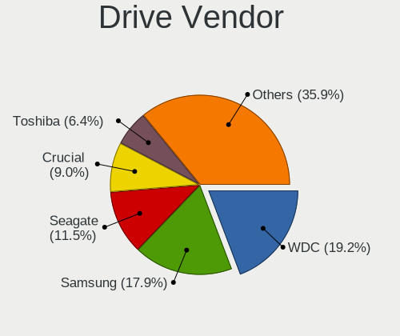

| Vendor              | Computers | Drives | Percent |
|---------------------|-----------|--------|---------|
| WDC                 | 15        | 17     | 19.48%  |
| Samsung Electronics | 13        | 16     | 16.88%  |
| Seagate             | 9         | 10     | 11.69%  |
| Crucial             | 7         | 7      | 9.09%   |
| Toshiba             | 5         | 7      | 6.49%   |
| SK hynix            | 4         | 4      | 5.19%   |
| Kingston            | 3         | 3      | 3.9%    |
| Intel               | 3         | 3      | 3.9%    |
| A-DATA Technology   | 3         | 3      | 3.9%    |
| SanDisk             | 2         | 2      | 2.6%    |
| PNY                 | 2         | 2      | 2.6%    |
| Hewlett-Packard     | 2         | 2      | 2.6%    |
| Apple               | 2         | 2      | 2.6%    |
| Transcend           | 1         | 1      | 1.3%    |
| Team                | 1         | 1      | 1.3%    |
| SPCC                | 1         | 1      | 1.3%    |
| Micron Technology   | 1         | 1      | 1.3%    |
| HGST                | 1         | 1      | 1.3%    |
| Gigabyte Technology | 1         | 1      | 1.3%    |
| ASUSTek Computer    | 1         | 2      | 1.3%    |

Drive Model
-----------

Hard drive models

| Model                                     | Computers | Percent |
|-------------------------------------------|-----------|---------|
| WDC WDS100T1X0E-00AFY0 1TB                | 2         | 2.47%   |
| WDC WD40PURX-64GVNY0 4TB                  | 2         | 2.47%   |
| Seagate ST9500325AS 500GB                 | 2         | 2.47%   |
| SanDisk SSD U100 24GB                     | 2         | 2.47%   |
| Kingston SA400S37480G 480GB               | 2         | 2.47%   |
| HP SSD EX950 2TB                          | 2         | 2.47%   |
| Crucial CT1000P1SSD8 1TB                  | 2         | 2.47%   |
| A-DATA SU630 240GB                        | 2         | 2.47%   |
| WDC WDS120G2G0A-00JH30 120GB              | 1         | 1.23%   |
| WDC WD60EZRZ-00GZ5B1 6TB                  | 1         | 1.23%   |
| WDC WD3200BEVT-75ZCT2 320GB               | 1         | 1.23%   |
| WDC WD2500BEKT-00PVMT0 250GB              | 1         | 1.23%   |
| WDC WD1200BEVS-07LAT0 120GB               | 1         | 1.23%   |
| WDC WD10SPZX-60Z10T0 1TB                  | 1         | 1.23%   |
| WDC WD10SMRW-11Y43S0 1TB                  | 1         | 1.23%   |
| WDC WD10JPVX-60JC3T0 1TB                  | 1         | 1.23%   |
| WDC WD10JPVT-08A1YT2 1TB                  | 1         | 1.23%   |
| WDC WD10EADS-00P8B0 1TB                   | 1         | 1.23%   |
| WDC PC SN720 SDAPNTW-1T00-1006 1TB        | 1         | 1.23%   |
| WDC PC SN520 SDAPNUW-256G-1002 256GB      | 1         | 1.23%   |
| WDC PC SN520 SDAPMUW-128G-1101 128GB      | 1         | 1.23%   |
| Transcend TS512GSSD370S 512GB             | 1         | 1.23%   |
| Toshiba MQ01ABF050 500GB                  | 1         | 1.23%   |
| Toshiba MK1637GSX 160GB                   | 1         | 1.23%   |
| Toshiba MG06ACA800E 8TB                   | 1         | 1.23%   |
| Toshiba KXG5AZNV256G 256GB                | 1         | 1.23%   |
| Toshiba HDWD120 2TB                       | 1         | 1.23%   |
| Team TEAML5Lite3D1T 1TB                   | 1         | 1.23%   |
| SPCC Solid State Disk 240GB               | 1         | 1.23%   |
| SK hynix SKHynix_HFS512GD9TNG-L5B0B 512GB | 1         | 1.23%   |
| SK hynix SKHynix_HFS256GD9TNI-L2B0B 256GB | 1         | 1.23%   |
| SK hynix SHGS31-500GS-2 500GB             | 1         | 1.23%   |
| SK hynix BC511 HFM256GDJTNI-82A0A 256GB   | 1         | 1.23%   |
| Seagate ST500LT012-9WS142 500GB           | 1         | 1.23%   |
| Seagate ST500LM030-2E717D 500GB           | 1         | 1.23%   |
| Seagate ST500DM002-1BD142 500GB           | 1         | 1.23%   |
| Seagate ST4000DM000-2AE166 4TB            | 1         | 1.23%   |
| Seagate ST3000DM008-2DM166 3TB            | 1         | 1.23%   |
| Seagate ST2000LM007-1R8174 2TB            | 1         | 1.23%   |
| Seagate ST2000DM001-1CH164 2TB            | 1         | 1.23%   |
| Samsung SSD 980 PRO 1TB                   | 1         | 1.23%   |
| Samsung SSD 970 EVO 500GB                 | 1         | 1.23%   |
| Samsung SSD 970 EVO 2TB                   | 1         | 1.23%   |
| Samsung SSD 870 QVO 2TB                   | 1         | 1.23%   |
| Samsung SSD 870 EVO 1TB                   | 1         | 1.23%   |
| Samsung SSD 860 EVO 1TB                   | 1         | 1.23%   |
| Samsung SSD 840 EVO 250GB                 | 1         | 1.23%   |
| Samsung MZVLB256HBHQ-000L2 256GB          | 1         | 1.23%   |
| Samsung MZVLB256HAHQ-000L7 256GB          | 1         | 1.23%   |
| Samsung MZVLB256HAHQ-00000 256GB          | 1         | 1.23%   |
| Samsung MZVKW512HMJP-000H1 512GB          | 1         | 1.23%   |
| Samsung MZ7TD256HAFV-000L9 256GB          | 1         | 1.23%   |
| Samsung MZ7TD128HAFV-000L1 128GB          | 1         | 1.23%   |
| Samsung HM160HI 160GB                     | 1         | 1.23%   |
| Samsung HD161GJ 160GB                     | 1         | 1.23%   |
| PNY SSD2SC240G1CS1754D117-489 240GB       | 1         | 1.23%   |
| PNY CS1311 120GB SSD                      | 1         | 1.23%   |
| Micron MTFDHBA512QFD-1AX1AABHA 512GB      | 1         | 1.23%   |
| Kingston SA2000M8500G 500GB               | 1         | 1.23%   |
| Intel SSDSCKKW240H6 240GB                 | 1         | 1.23%   |

HDD Vendor
----------

Hard disk drive vendors

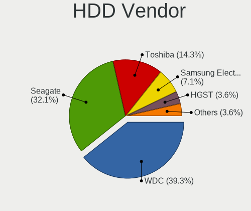

| Vendor              | Computers | Drives | Percent |
|---------------------|-----------|--------|---------|
| WDC                 | 11        | 11     | 39.29%  |
| Seagate             | 9         | 10     | 32.14%  |
| Toshiba             | 4         | 5      | 14.29%  |
| Samsung Electronics | 2         | 2      | 7.14%   |
| HGST                | 1         | 1      | 3.57%   |
| Apple               | 1         | 1      | 3.57%   |

SSD Vendor
----------

Solid state drive vendors

| Vendor              | Computers | Drives | Percent |
|---------------------|-----------|--------|---------|
| Samsung Electronics | 5         | 6      | 18.52%  |
| Crucial             | 4         | 4      | 14.81%  |
| A-DATA Technology   | 3         | 3      | 11.11%  |
| SanDisk             | 2         | 2      | 7.41%   |
| PNY                 | 2         | 2      | 7.41%   |
| Kingston            | 2         | 2      | 7.41%   |
| WDC                 | 1         | 1      | 3.7%    |
| Transcend           | 1         | 1      | 3.7%    |
| Team                | 1         | 1      | 3.7%    |
| SPCC                | 1         | 1      | 3.7%    |
| SK hynix            | 1         | 1      | 3.7%    |
| Intel               | 1         | 1      | 3.7%    |
| Gigabyte Technology | 1         | 1      | 3.7%    |
| ASUSTek Computer    | 1         | 2      | 3.7%    |
| Apple               | 1         | 1      | 3.7%    |

Drive Kind
----------

HDD or SSD

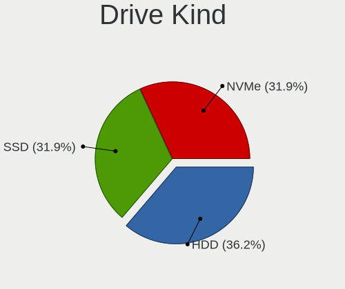

| Kind | Computers | Drives | Percent |
|------|-----------|--------|---------|
| HDD  | 25        | 30     | 36.76%  |
| SSD  | 22        | 29     | 32.35%  |
| NVMe | 21        | 27     | 30.88%  |

Drive Connector
---------------

SATA, SAS, NVMe, etc.

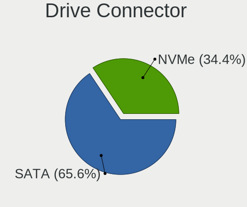

| Type | Computers | Drives | Percent |
|------|-----------|--------|---------|
| SATA | 42        | 59     | 66.67%  |
| NVMe | 21        | 27     | 33.33%  |

Drive Size
----------

Size of hard drive

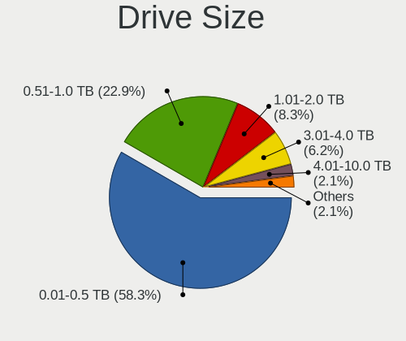

| Size in TB | Computers | Drives | Percent |
|------------|-----------|--------|---------|
| 0.01-0.5   | 28        | 37     | 58.33%  |
| 0.51-1.0   | 11        | 11     | 22.92%  |
| 1.01-2.0   | 4         | 4      | 8.33%   |
| 3.01-4.0   | 3         | 3      | 6.25%   |
| 2.01-3.0   | 1         | 1      | 2.08%   |
| 4.01-10.0  | 1         | 3      | 2.08%   |

Space Total
-----------

Amount of disk space available on the file system

| Size in GB | Computers | Percent |
|------------|-----------|---------|
| 1-20       | 47        | 88.68%  |
| 101-250    | 4         | 7.55%   |
| 251-500    | 1         | 1.89%   |
| 51-100     | 1         | 1.89%   |

Space Used
----------

Amount of used disk space

| Used GB | Computers | Percent |
|---------|-----------|---------|
| 1-20    | 52        | 98.11%  |
| 51-100  | 1         | 1.89%   |

Malfunc. Drives
---------------

Drive models with a malfunction

| Model                             | Computers | Drives | Percent |
|-----------------------------------|-----------|--------|---------|
| WDC WD40PURX-64GVNY0 4TB          | 1         | 1      | 12.5%   |
| WDC WD1200BEVS-07LAT0 120GB       | 1         | 1      | 12.5%   |
| WDC WD10JPVX-60JC3T0 1TB          | 1         | 1      | 12.5%   |
| Toshiba HDWD120 2TB               | 1         | 1      | 12.5%   |
| Seagate ST500LT012-9WS142 500GB   | 1         | 1      | 12.5%   |
| Samsung Electronics HM160HI 160GB | 1         | 1      | 12.5%   |
| HGST HTS725050A7E630 500GB        | 1         | 1      | 12.5%   |
| A-DATA Technology XM13 32GB       | 1         | 1      | 12.5%   |

Malfunc. Drive Vendor
---------------------

Vendors of faulty drives

| Vendor              | Computers | Drives | Percent |
|---------------------|-----------|--------|---------|
| WDC                 | 3         | 3      | 37.5%   |
| Toshiba             | 1         | 1      | 12.5%   |
| Seagate             | 1         | 1      | 12.5%   |
| Samsung Electronics | 1         | 1      | 12.5%   |
| HGST                | 1         | 1      | 12.5%   |
| A-DATA Technology   | 1         | 1      | 12.5%   |

Malfunc. HDD Vendor
-------------------

Vendors of faulty HDD drives

| Vendor              | Computers | Drives | Percent |
|---------------------|-----------|--------|---------|
| WDC                 | 3         | 3      | 42.86%  |
| Toshiba             | 1         | 1      | 14.29%  |
| Seagate             | 1         | 1      | 14.29%  |
| Samsung Electronics | 1         | 1      | 14.29%  |
| HGST                | 1         | 1      | 14.29%  |

Malfunc. Drive Kind
-------------------

Kinds of faulty drives

| Kind | Computers | Drives | Percent |
|------|-----------|--------|---------|
| HDD  | 6         | 7      | 85.71%  |
| SSD  | 1         | 1      | 14.29%  |

Failed Drives
-------------

Failed drive models

Zero info for selected period =(

Failed Drive Vendor
-------------------

Failed drive vendors

Zero info for selected period =(

Drive Status
------------

Number of failed and malfunc. drives

| Status   | Computers | Drives | Percent |
|----------|-----------|--------|---------|
| Works    | 47        | 76     | 85.45%  |
| Malfunc  | 7         | 8      | 12.73%  |
| Detected | 1         | 2      | 1.82%   |

Storage controller
------------------

Storage Vendor
--------------

Storage controller vendors

| Vendor                      | Computers | Percent |
|-----------------------------|-----------|---------|
| Intel                       | 33        | 45.83%  |
| AMD                         | 12        | 16.67%  |
| Samsung Electronics         | 8         | 11.11%  |
| SanDisk                     | 5         | 6.94%   |
| Micron/Crucial Technology   | 3         | 4.17%   |
| SK hynix                    | 2         | 2.78%   |
| Biwin Storage Technology    | 2         | 2.78%   |
| ASMedia Technology          | 2         | 2.78%   |
| VIA Technologies            | 1         | 1.39%   |
| Toshiba                     | 1         | 1.39%   |
| Micron Technology           | 1         | 1.39%   |
| Kingston Technology Company | 1         | 1.39%   |
| JMicron Technology          | 1         | 1.39%   |

Storage Model
-------------

Storage controller models

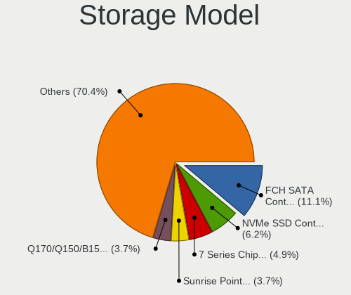

| Model                                                                          | Computers | Percent |
|--------------------------------------------------------------------------------|-----------|---------|
| AMD FCH SATA Controller [AHCI mode]                                            | 9         | 11.25%  |
| Samsung NVMe SSD Controller SM981/PM981/PM983                                  | 5         | 6.25%   |
| Intel 7 Series Chipset Family 6-port SATA Controller [AHCI mode]               | 4         | 5%      |
| Unknown                                                                        | 4         | 5%      |
| Intel Sunrise Point-LP SATA Controller [AHCI mode]                             | 3         | 3.75%   |
| Intel Q170/Q150/B150/H170/H110/Z170/CM236 Chipset SATA Controller [AHCI Mode]  | 3         | 3.75%   |
| Intel 8 Series SATA Controller 1 [AHCI mode]                                   | 3         | 3.75%   |
| SanDisk WD PC SN810 / Black SN850 NVMe SSD                                     | 2         | 2.5%    |
| Intel 82801IBM/IEM (ICH9M/ICH9M-E) 4 port SATA Controller [AHCI mode]          | 2         | 2.5%    |
| Intel 82801HM/HEM (ICH8M/ICH8M-E) SATA Controller [AHCI mode]                  | 2         | 2.5%    |
| Intel 82801HM/HEM (ICH8M/ICH8M-E) IDE Controller                               | 2         | 2.5%    |
| Intel 7 Series/C210 Series Chipset Family 6-port SATA Controller [AHCI mode]   | 2         | 2.5%    |
| Intel 200 Series PCH SATA controller [AHCI mode]                               | 2         | 2.5%    |
| ASMedia ASM1062 Serial ATA Controller                                          | 2         | 2.5%    |
| AMD 500 Series Chipset SATA Controller                                         | 2         | 2.5%    |
| VIA VT82C586A/B/VT82C686/A/B/VT823x/A/C PIPC Bus Master IDE                    | 1         | 1.25%   |
| VIA VT8237A SATA 2-Port Controller                                             | 1         | 1.25%   |
| Toshiba unknown                                                                | 1         | 1.25%   |
| SK hynix hynix unknown                                                         | 1         | 1.25%   |
| SK hynix BC511                                                                 | 1         | 1.25%   |
| SanDisk WD Blue SN500 / PC SN520 NVMe SSD                                      | 1         | 1.25%   |
| SanDisk WD Black 2018/SN750 / PC SN720 NVMe SSD                                | 1         | 1.25%   |
| SanDisk PC SN520 NVMe SSD                                                      | 1         | 1.25%   |
| Samsung NVMe SSD Controller SM961/PM961/SM963                                  | 1         | 1.25%   |
| Samsung NVMe SSD Controller PM9A1/PM9A3/980PRO                                 | 1         | 1.25%   |
| Samsung Apple PCIe SSD                                                         | 1         | 1.25%   |
| Micron/Crucial P1 NVMe PCIe SSD                                                | 1         | 1.25%   |
| Micron/Crucial NVMe Controller                                                 | 1         | 1.25%   |
| Kingston Company A2000 NVMe SSD                                                | 1         | 1.25%   |
| JMicron JMB360 AHCI Controller                                                 | 1         | 1.25%   |
| Intel SSD 660P Series                                                          | 1         | 1.25%   |
| Intel NVMe Optane Memory Series                                                | 1         | 1.25%   |
| Intel NM10/ICH7 Family SATA Controller [IDE mode]                              | 1         | 1.25%   |
| Intel Celeron/Pentium Silver Processor SATA Controller                         | 1         | 1.25%   |
| Intel Cannon Lake PCH SATA AHCI Controller                                     | 1         | 1.25%   |
| Intel Cannon Lake Mobile PCH SATA AHCI Controller                              | 1         | 1.25%   |
| Intel C602 chipset 4-Port SATA Storage Control Unit                            | 1         | 1.25%   |
| Intel C600/X79 series chipset SATA RAID Controller                             | 1         | 1.25%   |
| Intel C600/X79 series chipset IDE-r Controller                                 | 1         | 1.25%   |
| Intel 82801JI (ICH10 Family) 4 port SATA IDE Controller #1                     | 1         | 1.25%   |
| Intel 82801JI (ICH10 Family) 2 port SATA IDE Controller #2                     | 1         | 1.25%   |
| Intel 82801GBM/GHM (ICH7-M Family) SATA Controller [IDE mode]                  | 1         | 1.25%   |
| Intel 82801 Mobile SATA Controller [RAID mode]                                 | 1         | 1.25%   |
| Intel 8 Series/C220 Series Chipset Family 6-port SATA Controller 1 [AHCI mode] | 1         | 1.25%   |
| Intel 6 Series/C200 Series Chipset Family 6 port Desktop SATA AHCI Controller  | 1         | 1.25%   |
| Intel 5 Series/3400 Series Chipset 6 port SATA AHCI Controller                 | 1         | 1.25%   |
| AMD FCH SATA Controller [IDE mode]                                             | 1         | 1.25%   |
| AMD 400 Series Chipset SATA Controller                                         | 1         | 1.25%   |

Storage Kind
------------

Kind of storage controller (IDE, SATA, NVMe, SAS, ...)

| Kind | Computers | Percent |
|------|-----------|---------|
| SATA | 39        | 54.93%  |
| NVMe | 21        | 29.58%  |
| IDE  | 8         | 11.27%  |
| RAID | 2         | 2.82%   |
| SAS  | 1         | 1.41%   |

Processor
---------

CPU Vendor
----------

Processor vendors

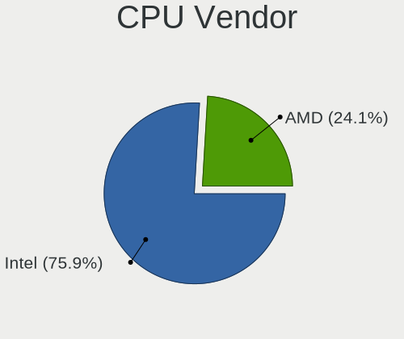

| Vendor | Computers | Percent |
|--------|-----------|---------|
| Intel  | 40        | 75.47%  |
| AMD    | 13        | 24.53%  |

CPU Model
---------

Processor models

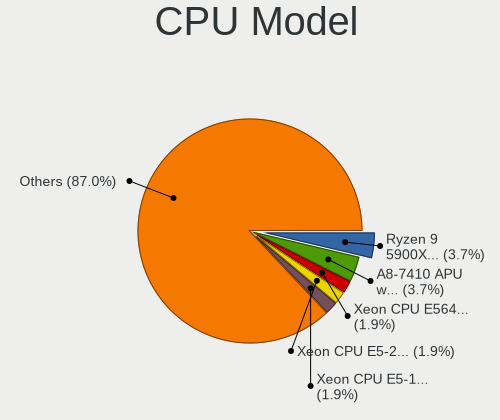

| Model                                         | Computers | Percent |
|-----------------------------------------------|-----------|---------|
| AMD Ryzen 9 5900X 12-Core Processor           | 2         | 3.77%   |
| AMD A8-7410 APU with AMD Radeon R5 Graphics   | 2         | 3.77%   |
| Intel Xeon CPU E5640 @ 2.67GHz                | 1         | 1.89%   |
| Intel Xeon CPU E5-2690 0 @ 2.90GHz            | 1         | 1.89%   |
| Intel Xeon CPU E5-1620 v2 @ 3.70GHz           | 1         | 1.89%   |
| Intel Xeon CPU E3-1505M v5 @ 2.80GHz          | 1         | 1.89%   |
| Intel Pentium Silver J5005 CPU @ 1.50GHz      | 1         | 1.89%   |
| Intel Pentium Dual-Core CPU E5300 @ 2.60GHz   | 1         | 1.89%   |
| Intel Genuine CPU U7300 @ 1.30GHz             | 1         | 1.89%   |
| Intel CPU Version                             | 1         | 1.89%   |
| Intel Core i9-7960X CPU @ 2.80GHz             | 1         | 1.89%   |
| Intel Core i7-9700K CPU @ 3.60GHz             | 1         | 1.89%   |
| Intel Core i7-8700K CPU @ 3.70GHz             | 1         | 1.89%   |
| Intel Core i7-8565U CPU @ 1.80GHz             | 1         | 1.89%   |
| Intel Core i7-7700K CPU @ 4.20GHz             | 1         | 1.89%   |
| Intel Core i7-4650U CPU @ 1.70GHz             | 1         | 1.89%   |
| Intel Core i7-4600U CPU @ 2.10GHz             | 1         | 1.89%   |
| Intel Core i7-3520M CPU @ 2.90GHz             | 1         | 1.89%   |
| Intel Core i7-10750H CPU @ 2.60GHz            | 1         | 1.89%   |
| Intel Core i5-9300HF CPU @ 2.40GHz            | 1         | 1.89%   |
| Intel Core i5-8350U CPU @ 1.70GHz             | 1         | 1.89%   |
| Intel Core i5-8265U CPU @ 1.60GHz             | 1         | 1.89%   |
| Intel Core i5-8250U CPU @ 1.60GHz             | 1         | 1.89%   |
| Intel Core i5-6500 CPU @ 3.20GHz              | 1         | 1.89%   |
| Intel Core i5-6300U CPU @ 2.40GHz             | 1         | 1.89%   |
| Intel Core i5-6260U CPU @ 1.80GHz             | 1         | 1.89%   |
| Intel Core i5-6200U CPU @ 2.30GHz             | 1         | 1.89%   |
| Intel Core i5-4210U CPU @ 1.70GHz             | 1         | 1.89%   |
| Intel Core i5-4200U CPU @ 1.60GHz             | 1         | 1.89%   |
| Intel Core i5-3570 CPU @ 3.40GHz              | 1         | 1.89%   |
| Intel Core i5-3470 CPU @ 3.20GHz              | 1         | 1.89%   |
| Intel Core i5-10210Y CPU @ 1.00GHz            | 1         | 1.89%   |
| Intel Core i5 CPU 750 @ 2.67GHz               | 1         | 1.89%   |
| Intel Core i3-8130U CPU @ 2.20GHz             | 1         | 1.89%   |
| Intel Core i3-4150 CPU @ 3.50GHz              | 1         | 1.89%   |
| Intel Core i3-3217U CPU @ 1.80GHz             | 1         | 1.89%   |
| Intel Core i3-3110M CPU @ 2.40GHz             | 1         | 1.89%   |
| Intel Core 2 Duo CPU T8100 @ 2.10GHz          | 1         | 1.89%   |
| Intel Core 2 Duo                              | 1         | 1.89%   |
| Intel Celeron M CPU                           | 1         | 1.89%   |
| Intel Celeron CPU 847E @ 1.10GHz              | 1         | 1.89%   |
| Intel Atom CPU N270 @ 1.60GHz                 | 1         | 1.89%   |
| AMD Ryzen 7 5700U with Radeon Graphics        | 1         | 1.89%   |
| AMD Ryzen 7 3750H with Radeon Vega Mobile Gfx | 1         | 1.89%   |
| AMD Ryzen 5 5500U with Radeon Graphics        | 1         | 1.89%   |
| AMD Ryzen 5 4600G with Radeon Graphics        | 1         | 1.89%   |
| AMD Ryzen 5 3600XT 6-Core Processor           | 1         | 1.89%   |
| AMD A9-9425 RADEON R5, 5 COMPUTE CORES 2C+3G  | 1         | 1.89%   |
| AMD A8-6410 APU with AMD Radeon R5 Graphics   | 1         | 1.89%   |
| AMD A6-6310 APU with AMD Radeon R4 Graphics   | 1         | 1.89%   |
| AMD A6-3420M APU with Radeon HD Graphics      | 1         | 1.89%   |

CPU Model Family
----------------

Processor model prefix

| Model                   | Computers | Percent |
|-------------------------|-----------|---------|
| Intel Core i5           | 14        | 26.42%  |
| Intel Core i7           | 8         | 15.09%  |
| Intel Xeon              | 4         | 7.55%   |
| Intel Core i3           | 4         | 7.55%   |
| AMD Ryzen 5             | 3         | 5.66%   |
| AMD A8                  | 3         | 5.66%   |
| Other                   | 2         | 3.77%   |
| Intel Core 2 Duo        | 2         | 3.77%   |
| AMD Ryzen 9             | 2         | 3.77%   |
| AMD Ryzen 7             | 2         | 3.77%   |
| AMD A6                  | 2         | 3.77%   |
| Intel Pentium Silver    | 1         | 1.89%   |
| Intel Pentium Dual-Core | 1         | 1.89%   |
| Intel Genuine           | 1         | 1.89%   |
| Intel Core i9           | 1         | 1.89%   |
| Intel Celeron M         | 1         | 1.89%   |
| Intel Celeron           | 1         | 1.89%   |
| Intel Atom              | 1         | 1.89%   |

CPU Cores
---------

Number of processor cores

| Number  | Computers | Percent |
|---------|-----------|---------|
| 4       | 20        | 37.74%  |
| 2       | 17        | 32.08%  |
| 12      | 3         | 5.66%   |
| 8       | 3         | 5.66%   |
| Unknown | 3         | 5.66%   |
| 24      | 2         | 3.77%   |
| 16      | 2         | 3.77%   |
| 6       | 2         | 3.77%   |
| 1       | 1         | 1.89%   |

CPU Sockets
-----------

Number of sockets

| Number | Computers | Percent |
|--------|-----------|---------|
| 1      | 53        | 100%    |

CPU Threads
-----------

Threads per core (Hyper-Threading)

| Number  | Computers | Percent |
|---------|-----------|---------|
| 2       | 26        | 49.06%  |
| 1       | 23        | 43.4%   |
| Unknown | 4         | 7.55%   |

CPU Microarch
-------------

Microarchitecture

| Name          | Computers | Percent |
|---------------|-----------|---------|
| KabyLake      | 10        | 18.87%  |
| Skylake       | 6         | 11.32%  |
| IvyBridge     | 6         | 11.32%  |
| Haswell       | 5         | 9.43%   |
| Puma          | 4         | 7.55%   |
| Penryn        | 4         | 7.55%   |
| Zen 3         | 2         | 3.77%   |
| Zen 2         | 2         | 3.77%   |
| SandyBridge   | 2         | 3.77%   |
| Unknown       | 2         | 3.77%   |
| Zen+          | 1         | 1.89%   |
| Westmere      | 1         | 1.89%   |
| P6            | 1         | 1.89%   |
| Nehalem       | 1         | 1.89%   |
| K10 Llano     | 1         | 1.89%   |
| Goldmont plus | 1         | 1.89%   |
| Excavator     | 1         | 1.89%   |
| Core          | 1         | 1.89%   |
| CometLake     | 1         | 1.89%   |
| Bonnell       | 1         | 1.89%   |

Graphics
--------

GPU Vendor
----------

Vendors of graphics cards

| Vendor                     | Computers | Percent |
|----------------------------|-----------|---------|
| Intel                      | 27        | 45.76%  |
| AMD                        | 19        | 32.2%   |
| Nvidia                     | 11        | 18.64%  |
| VIA Technologies           | 1         | 1.69%   |
| Matrox Electronics Systems | 1         | 1.69%   |

GPU Model
---------

Graphics card models

| Model                                                                         | Computers | Percent |
|-------------------------------------------------------------------------------|-----------|---------|
| Intel Haswell-ULT Integrated Graphics Controller                              | 4         | 6.56%   |
| AMD Mullins [Radeon R4/R5 Graphics]                                           | 4         | 6.56%   |
| Intel UHD Graphics 620                                                        | 3         | 4.92%   |
| Intel 3rd Gen Core processor Graphics Controller                              | 3         | 4.92%   |
| Intel Xeon E3-1200 v2/3rd Gen Core processor Graphics Controller              | 2         | 3.28%   |
| Intel WhiskeyLake-U GT2 [UHD Graphics 620]                                    | 2         | 3.28%   |
| Intel Skylake GT2 [HD Graphics 520]                                           | 2         | 3.28%   |
| AMD Navi 21 [Radeon RX 6800/6800 XT / 6900 XT]                                | 2         | 3.28%   |
| AMD Lucienne                                                                  | 2         | 3.28%   |
| VIA Technologies CN896/VN896/P4M900 [Chrome 9 HC]                             | 1         | 1.64%   |
| Nvidia TU117M [GeForce GTX 1650 Mobile / Max-Q]                               | 1         | 1.64%   |
| Nvidia TU116M [GeForce GTX 1660 Ti Mobile]                                    | 1         | 1.64%   |
| Nvidia TU104BM [GeForce RTX 2070 SUPER Mobile / Max-Q]                        | 1         | 1.64%   |
| Nvidia GT218 [GeForce 210]                                                    | 1         | 1.64%   |
| Nvidia GP108 [GeForce GT 1030]                                                | 1         | 1.64%   |
| Nvidia GP106 [GeForce GTX 1060 6GB]                                           | 1         | 1.64%   |
| Nvidia GP104 [GeForce GTX 1070 Ti]                                            | 1         | 1.64%   |
| Nvidia GM107M [GeForce GTX 950M]                                              | 1         | 1.64%   |
| Nvidia GK208B [GeForce GT 710]                                                | 1         | 1.64%   |
| Nvidia GK107M [GeForce GT 645M]                                               | 1         | 1.64%   |
| Nvidia GA104 [GeForce RTX 3070]                                               | 1         | 1.64%   |
| Matrox Electronics Systems MGA G200eW WPCM450                                 | 1         | 1.64%   |
| Intel UHD Graphics 615                                                        | 1         | 1.64%   |
| Intel Mobile GM965/GL960 Integrated Graphics Controller (secondary)           | 1         | 1.64%   |
| Intel Mobile GM965/GL960 Integrated Graphics Controller (primary)             | 1         | 1.64%   |
| Intel Mobile 945GSE Express Integrated Graphics Controller                    | 1         | 1.64%   |
| Intel Mobile 945GM/GMS/GME, 943/940GML Express Integrated Graphics Controller | 1         | 1.64%   |
| Intel Mobile 4 Series Chipset Integrated Graphics Controller                  | 1         | 1.64%   |
| Intel Iris Graphics 540                                                       | 1         | 1.64%   |
| Intel HD Graphics P530                                                        | 1         | 1.64%   |
| Intel HD Graphics 630                                                         | 1         | 1.64%   |
| Intel HD Graphics 530                                                         | 1         | 1.64%   |
| Intel GeminiLake [UHD Graphics 605]                                           | 1         | 1.64%   |
| Intel 4th Generation Core Processor Family Integrated Graphics Controller     | 1         | 1.64%   |
| Intel 2nd Generation Core Processor Family Integrated Graphics Controller     | 1         | 1.64%   |
| AMD Vega 20 [Radeon VII]                                                      | 1         | 1.64%   |
| AMD Topaz PRO [Radeon R5 M255]                                                | 1         | 1.64%   |
| AMD Sumo [Radeon HD 6520G]                                                    | 1         | 1.64%   |
| AMD Stoney [Radeon R2/R3/R4/R5 Graphics]                                      | 1         | 1.64%   |
| AMD RV710/M92 [Mobility Radeon HD 4530/4570/545v]                             | 1         | 1.64%   |
| AMD RV710/M92 [Mobility Radeon HD 4330/4350/4550]                             | 1         | 1.64%   |
| AMD RV610/M72-S [Mobility Radeon HD 2400]                                     | 1         | 1.64%   |
| AMD Renoir                                                                    | 1         | 1.64%   |
| AMD Pitcairn XT GL [FirePro W7000]                                            | 1         | 1.64%   |
| AMD Picasso/Raven 2 [Radeon Vega Series / Radeon Vega Mobile Series]          | 1         | 1.64%   |
| AMD Ellesmere [Radeon RX 470/480/570/570X/580/580X/590]                       | 1         | 1.64%   |

GPU Combo
---------

Combinations of graphics cards

| Name           | Computers | Percent |
|----------------|-----------|---------|
| 1 x Intel      | 20        | 37.74%  |
| 1 x AMD        | 17        | 32.08%  |
| 1 x Nvidia     | 7         | 13.21%  |
| Intel + Nvidia | 3         | 5.66%   |
| 2 x Intel      | 2         | 3.77%   |
| 1 x VIA        | 1         | 1.89%   |
| 1 x Matrox     | 1         | 1.89%   |
| Intel + AMD    | 1         | 1.89%   |
| AMD + Nvidia   | 1         | 1.89%   |

GPU Driver
----------

Free vs proprietary

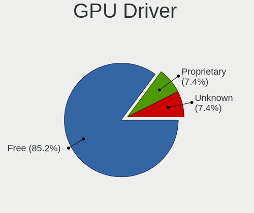

| Driver      | Computers | Percent |
|-------------|-----------|---------|
| Free        | 45        | 84.91%  |
| Proprietary | 4         | 7.55%   |
| Unknown     | 4         | 7.55%   |

GPU Memory
----------

Total video memory

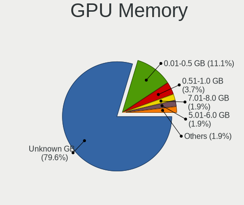

| Size in GB | Computers | Percent |
|------------|-----------|---------|
| Unknown    | 42        | 79.25%  |
| 0.01-0.5   | 6         | 11.32%  |
| 0.51-1.0   | 2         | 3.77%   |
| 7.01-8.0   | 1         | 1.89%   |
| 5.01-6.0   | 1         | 1.89%   |
| 3.01-4.0   | 1         | 1.89%   |

Monitor
-------

Monitor Vendor
--------------

Monitor vendors

| Vendor                  | Computers | Percent |
|-------------------------|-----------|---------|
| AU Optronics            | 8         | 17.78%  |
| LG Display              | 6         | 13.33%  |
| Goldstar                | 6         | 13.33%  |
| Samsung Electronics     | 5         | 11.11%  |
| BOE                     | 4         | 8.89%   |
| Chimei Innolux          | 2         | 4.44%   |
| ASUSTek Computer        | 2         | 4.44%   |
| Ancor Communications    | 2         | 4.44%   |
| ___                     | 1         | 2.22%   |
| Westinghouse            | 1         | 2.22%   |
| Sharp                   | 1         | 2.22%   |
| Hewlett-Packard         | 1         | 2.22%   |
| HannStar                | 1         | 2.22%   |
| Dell                    | 1         | 2.22%   |
| Chi Mei Optoelectronics | 1         | 2.22%   |
| Apple                   | 1         | 2.22%   |
| AOC                     | 1         | 2.22%   |
| Acer                    | 1         | 2.22%   |

Monitor Model
-------------

Monitor models

| Model                                                                    | Computers | Percent |
|--------------------------------------------------------------------------|-----------|---------|
| AU Optronics LCD Monitor AUO243D 1920x1080 310x170mm 13.9-inch           | 2         | 4.44%   |
| ASUSTek Computer VG245 AUS24A1 1920x1080 530x300mm 24.0-inch             | 2         | 4.44%   |
| ___ MY TV LED TV ___0101 1920x1080                                       | 1         | 2.22%   |
| Westinghouse DWM40F3G1 WET1ECC 1920x1080 880x480mm 39.5-inch             | 1         | 2.22%   |
| Sharp LCD Monitor SHP1445 3840x2160 350x190mm 15.7-inch                  | 1         | 2.22%   |
| Samsung Electronics S27E330 SAM0D91 1920x1080 600x340mm 27.2-inch        | 1         | 2.22%   |
| Samsung Electronics LF24T450F SAM7094 1920x1080 530x300mm 24.0-inch      | 1         | 2.22%   |
| Samsung Electronics LCD Monitor U28E590 3840x2160                        | 1         | 2.22%   |
| Samsung Electronics LCD Monitor SEC4457 1440x900 300x190mm 14.0-inch     | 1         | 2.22%   |
| Samsung Electronics LCD Monitor SEC4251 1366x768 340x190mm 15.3-inch     | 1         | 2.22%   |
| LG Display LCD Monitor LGD7001 1366x768 340x190mm 15.3-inch              | 1         | 2.22%   |
| LG Display LCD Monitor LGD05B3 1920x1080 290x170mm 13.2-inch             | 1         | 2.22%   |
| LG Display LCD Monitor LGD0414 1920x1080 280x160mm 12.7-inch             | 1         | 2.22%   |
| LG Display LCD Monitor LGD040A 1920x1080 310x170mm 13.9-inch             | 1         | 2.22%   |
| LG Display LCD Monitor LGD034D 1366x768 340x190mm 15.3-inch              | 1         | 2.22%   |
| LG Display LCD Monitor LGD01F7 1366x768 290x160mm 13.0-inch              | 1         | 2.22%   |
| Hewlett-Packard 24fw HPN3545 1920x1080 530x300mm 24.0-inch               | 1         | 2.22%   |
| HannStar LCD Monitor HSD03E9 1024x600 220x130mm 10.1-inch                | 1         | 2.22%   |
| Goldstar W2261 GSM56CF 1920x1080 530x300mm 24.0-inch                     | 1         | 2.22%   |
| Goldstar W1943 GSM4BAD 1360x768 410x230mm 18.5-inch                      | 1         | 2.22%   |
| Goldstar LG UltraFine GSM5B10 3840x2160 480x270mm 21.7-inch              | 1         | 2.22%   |
| Goldstar LG FULL HD GSM5B55 1920x1080 480x270mm 21.7-inch                | 1         | 2.22%   |
| Goldstar LCD Monitor GSM5AB7 1920x1080 480x270mm 21.7-inch               | 1         | 2.22%   |
| Goldstar E2241 GSM581A 1920x1080 480x270mm 21.7-inch                     | 1         | 2.22%   |
| Dell E196FP DELA015 1280x1024 380x300mm 19.1-inch                        | 1         | 2.22%   |
| Chimei Innolux LCD Monitor CMN15CA 1366x768 340x190mm 15.3-inch          | 1         | 2.22%   |
| Chimei Innolux LCD Monitor CMN15BE 1366x768 340x190mm 15.3-inch          | 1         | 2.22%   |
| Chi Mei Optoelectronics LCD Monitor CMO15A3 1366x768 350x190mm 15.7-inch | 1         | 2.22%   |
| BOE LCD Monitor BOE0715 1366x768 250x140mm 11.3-inch                     | 1         | 2.22%   |
| BOE LCD Monitor BOE069B 1600x900 380x210mm 17.1-inch                     | 1         | 2.22%   |
| BOE LCD Monitor BOE0691 1920x1080 280x160mm 12.7-inch                    | 1         | 2.22%   |
| BOE LCD Monitor BOE062B 1920x1080 340x190mm 15.3-inch                    | 1         | 2.22%   |
| AU Optronics LCD Monitor AUO8174 1280x800 330x210mm 15.4-inch            | 1         | 2.22%   |
| AU Optronics LCD Monitor AUO70EC 1366x768 340x190mm 15.3-inch            | 1         | 2.22%   |
| AU Optronics LCD Monitor AUO305C 1366x768 260x140mm 11.6-inch            | 1         | 2.22%   |
| AU Optronics LCD Monitor AUO10ED 1920x1080 340x190mm 15.3-inch           | 1         | 2.22%   |
| AU Optronics LCD Monitor AUO10EC 1366x768 340x190mm 15.3-inch            | 1         | 2.22%   |
| AU Optronics LCD Monitor AUO106C 1366x768 280x160mm 12.7-inch            | 1         | 2.22%   |
| Apple Color LCD APP9CF3 1366x768 260x140mm 11.6-inch                     | 1         | 2.22%   |
| AOC U2879G6 AOC2879 3840x2160 620x340mm 27.8-inch                        | 1         | 2.22%   |
| Ancor Communications PA248 ACI24B1 1920x1200 550x350mm 25.7-inch         | 1         | 2.22%   |
| Ancor Communications ASUS VS197 ACI19F2 1366x768 410x230mm 18.5-inch     | 1         | 2.22%   |
| Acer KW272U ACR099D 2560x1440 600x340mm 27.2-inch                        | 1         | 2.22%   |

Monitor Resolution
------------------

Monitor screen resolution

| Resolution        | Computers | Percent |
|-------------------|-----------|---------|
| 1920x1080 (FHD)   | 17        | 40.48%  |
| 1366x768 (WXGA)   | 14        | 33.33%  |
| 3840x2160 (4K)    | 3         | 7.14%   |
| 2560x1440 (QHD)   | 1         | 2.38%   |
| 1920x1200 (WUXGA) | 1         | 2.38%   |
| 1600x900 (HD+)    | 1         | 2.38%   |
| 1440x900 (WXGA+)  | 1         | 2.38%   |
| 1360x768          | 1         | 2.38%   |
| 1280x800 (WXGA)   | 1         | 2.38%   |
| 1280x1024 (SXGA)  | 1         | 2.38%   |
| 1024x600          | 1         | 2.38%   |

Monitor Diagonal
----------------

Diagonal size in inches

| Inches  | Computers | Percent |
|---------|-----------|---------|
| 15      | 12        | 26.67%  |
| 24      | 5         | 11.11%  |
| 13      | 5         | 11.11%  |
| 21      | 4         | 8.89%   |
| 27      | 3         | 6.67%   |
| 12      | 3         | 6.67%   |
| 11      | 3         | 6.67%   |
| 18      | 2         | 4.44%   |
| Unknown | 2         | 4.44%   |
| 39      | 1         | 2.22%   |
| 25      | 1         | 2.22%   |
| 19      | 1         | 2.22%   |
| 17      | 1         | 2.22%   |
| 14      | 1         | 2.22%   |
| 10      | 1         | 2.22%   |

Monitor Width
-------------

Physical width

| Width in mm | Computers | Percent |
|-------------|-----------|---------|
| 301-350     | 15        | 34.09%  |
| 201-300     | 10        | 22.73%  |
| 501-600     | 7         | 15.91%  |
| 401-500     | 6         | 13.64%  |
| 351-400     | 2         | 4.55%   |
| Unknown     | 2         | 4.55%   |
| 801-900     | 1         | 2.27%   |
| 601-700     | 1         | 2.27%   |

Aspect Ratio
------------

Proportional relationship between the width and the height

| Ratio   | Computers | Percent |
|---------|-----------|---------|
| 16/9    | 35        | 87.5%   |
| 16/10   | 3         | 7.5%    |
| 5/4     | 1         | 2.5%    |
| Unknown | 1         | 2.5%    |

Monitor Area
------------

Area in inch²

| Area in inch² | Computers | Percent |
|----------------|-----------|---------|
| 201-250        | 9         | 20%     |
| 91-100         | 9         | 20%     |
| 81-90          | 4         | 8.89%   |
| 61-70          | 3         | 6.67%   |
| 51-60          | 3         | 6.67%   |
| 301-350        | 3         | 6.67%   |
| 101-110        | 3         | 6.67%   |
| 71-80          | 2         | 4.44%   |
| 141-150        | 2         | 4.44%   |
| Unknown        | 2         | 4.44%   |
| 41-50          | 1         | 2.22%   |
| 251-300        | 1         | 2.22%   |
| 151-200        | 1         | 2.22%   |
| 121-130        | 1         | 2.22%   |
| 501-1000       | 1         | 2.22%   |

Pixel Density
-------------

Pixels per inch

| Density       | Computers | Percent |
|---------------|-----------|---------|
| 101-120       | 13        | 30.23%  |
| 121-160       | 12        | 27.91%  |
| 51-100        | 11        | 25.58%  |
| 161-240       | 4         | 9.3%    |
| Unknown       | 2         | 4.65%   |
| More than 240 | 1         | 2.33%   |

Multiple Monitors
-----------------

Total monitors connected

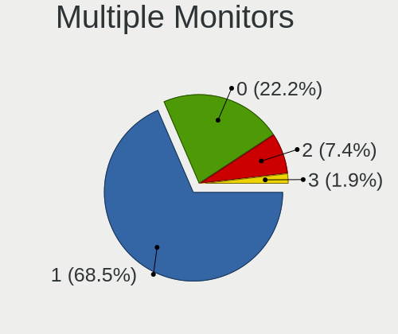

| Total | Computers | Percent |
|-------|-----------|---------|
| 1     | 36        | 67.92%  |
| 0     | 12        | 22.64%  |
| 2     | 4         | 7.55%   |
| 3     | 1         | 1.89%   |

Network
-------

Net Controller Vendor
---------------------

Controller vendors

| Vendor                | Computers | Percent |
|-----------------------|-----------|---------|
| Realtek Semiconductor | 29        | 34.12%  |
| Intel                 | 26        | 30.59%  |
| Broadcom              | 9         | 10.59%  |
| Qualcomm Atheros      | 8         | 9.41%   |
| Ralink Technology     | 2         | 2.35%   |
| Ralink                | 2         | 2.35%   |
| Fibocom               | 2         | 2.35%   |
| VIA Technologies      | 1         | 1.18%   |
| Sierra Wireless       | 1         | 1.18%   |
| Samsung Electronics   | 1         | 1.18%   |
| Microchip Technology  | 1         | 1.18%   |
| Edimax Technology     | 1         | 1.18%   |
| D-Link System         | 1         | 1.18%   |
| Atheros               | 1         | 1.18%   |

Net Controller Model
--------------------

Controller models

| Model                                                                | Computers | Percent |
|----------------------------------------------------------------------|-----------|---------|
| Realtek RTL8111/8168/8411 PCI Express Gigabit Ethernet Controller    | 18        | 16.98%  |
| Realtek RTL810xE PCI Express Fast Ethernet controller                | 6         | 5.66%   |
| Realtek RTL8188EUS 802.11n Wireless Network Adapter                  | 3         | 2.83%   |
| Realtek RTL8125 2.5GbE Controller                                    | 3         | 2.83%   |
| Intel Wireless 8265 / 8275                                           | 3         | 2.83%   |
| Intel Ethernet Connection (2) I219-V                                 | 3         | 2.83%   |
| Realtek RTL8821CE 802.11ac PCIe Wireless Network Adapter             | 2         | 1.89%   |
| Realtek RTL8723BE PCIe Wireless Network Adapter                      | 2         | 1.89%   |
| Qualcomm Atheros QCA6174 802.11ac Wireless Network Adapter           | 2         | 1.89%   |
| Qualcomm Atheros AR9485 Wireless Network Adapter                     | 2         | 1.89%   |
| Intel Wireless 8260                                                  | 2         | 1.89%   |
| Intel Wireless 7260                                                  | 2         | 1.89%   |
| Intel Wireless 3165                                                  | 2         | 1.89%   |
| Intel Wi-Fi 6 AX200                                                  | 2         | 1.89%   |
| Intel Ethernet Connection (4) I219-LM                                | 2         | 1.89%   |
| Intel 82579LM Gigabit Network Connection (Lewisville)                | 2         | 1.89%   |
| Fibocom L830-EB-00 LTE WWAN Modem                                    | 2         | 1.89%   |
| Broadcom BCM4360 802.11ac Wireless Network Adapter                   | 2         | 1.89%   |
| Broadcom BCM43142 802.11b/g/n                                        | 2         | 1.89%   |
| VIA VT6102/VT6103 [Rhine-II]                                         | 1         | 0.94%   |
| Sierra Wireless EM7455                                               | 1         | 0.94%   |
| Samsung GT-I9070 (network tethering, USB debugging enabled)          | 1         | 0.94%   |
| Realtek RTL8822CE 802.11ac PCIe Wireless Network Adapter             | 1         | 0.94%   |
| Realtek RTL8822BE 802.11a/b/g/n/ac WiFi adapter                      | 1         | 0.94%   |
| Realtek RTL8723DE Wireless Network Adapter                           | 1         | 0.94%   |
| Realtek RTL8192CE PCIe Wireless Network Adapter                      | 1         | 0.94%   |
| Realtek RTL8188FTV 802.11b/g/n 1T1R 2.4G WLAN Adapter                | 1         | 0.94%   |
| Realtek Realtek Bluetooth 4.2 Adapter                                | 1         | 0.94%   |
| Ralink RT5372 Wireless Adapter                                       | 1         | 0.94%   |
| Ralink MT7610U ("Archer T2U" 2.4G+5G WLAN Adapter                    | 1         | 0.94%   |
| Ralink RT5390R 802.11bgn PCIe Wireless Network Adapter               | 1         | 0.94%   |
| Ralink RT5390 Wireless 802.11n 1T/1R PCIe                            | 1         | 0.94%   |
| Qualcomm Atheros QCA9565 / AR9565 Wireless Network Adapter           | 1         | 0.94%   |
| Qualcomm Atheros Attansic L1 Gigabit Ethernet                        | 1         | 0.94%   |
| Qualcomm Atheros AR8162 Fast Ethernet                                | 1         | 0.94%   |
| Qualcomm Atheros AR8131 Gigabit Ethernet                             | 1         | 0.94%   |
| Qualcomm Atheros AR8121/AR8113/AR8114 Gigabit or Fast Ethernet       | 1         | 0.94%   |
| Microchip MCP2200 USB-to-Serial Port                                 | 1         | 0.94%   |
| Intel Wireless-AC 9260                                               | 1         | 0.94%   |
| Intel WiMAX/WiFi Link 5150                                           | 1         | 0.94%   |
| Intel WiFi Link 5100                                                 | 1         | 0.94%   |
| Intel PRO/Wireless 4965 AG or AGN [Kedron] Network Connection        | 1         | 0.94%   |
| Intel Ethernet Connection I219-V                                     | 1         | 0.94%   |
| Intel Ethernet Connection I219-LM                                    | 1         | 0.94%   |
| Intel Ethernet Connection I218-LM                                    | 1         | 0.94%   |
| Intel Ethernet Connection (6) I219-V                                 | 1         | 0.94%   |
| Intel Ethernet Connection (4) I219-V                                 | 1         | 0.94%   |
| Intel Ethernet Connection (2) I219-LM                                | 1         | 0.94%   |
| Intel Dual Band Wireless-AC 3168NGW [Stone Peak]                     | 1         | 0.94%   |
| Intel Comet Lake PCH CNVi WiFi                                       | 1         | 0.94%   |
| Intel Cannon Point-LP CNVi [Wireless-AC]                             | 1         | 0.94%   |
| Intel Cannon Lake PCH CNVi WiFi                                      | 1         | 0.94%   |
| Intel 82579V Gigabit Network Connection                              | 1         | 0.94%   |
| Edimax EW-7811Un 802.11n Wireless Adapter [Realtek RTL8188CUS]       | 1         | 0.94%   |
| D-Link System DWA-125 Wireless N 150 Adapter(rev.A1) [Ralink RT3070] | 1         | 0.94%   |
| Broadcom NetXtreme II BCM5716 Gigabit Ethernet                       | 1         | 0.94%   |
| Broadcom NetXtreme II BCM5709 Gigabit Ethernet                       | 1         | 0.94%   |
| Broadcom NetXtreme BCM57762 Gigabit Ethernet PCIe                    | 1         | 0.94%   |
| Broadcom NetXtreme BCM5755M Gigabit Ethernet PCI Express             | 1         | 0.94%   |
| Broadcom NetLink BCM5784M Gigabit Ethernet PCIe                      | 1         | 0.94%   |

Wireless Vendor
---------------

Wireless vendors

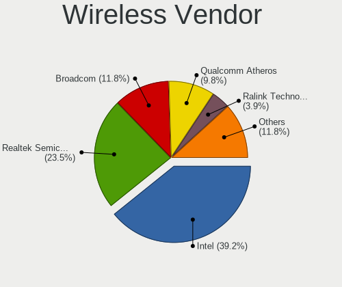

| Vendor                | Computers | Percent |
|-----------------------|-----------|---------|
| Intel                 | 19        | 38%     |
| Realtek Semiconductor | 12        | 24%     |
| Broadcom              | 6         | 12%     |
| Qualcomm Atheros      | 5         | 10%     |
| Ralink Technology     | 2         | 4%      |
| Ralink                | 2         | 4%      |
| Sierra Wireless       | 1         | 2%      |
| Edimax Technology     | 1         | 2%      |
| D-Link System         | 1         | 2%      |
| Atheros               | 1         | 2%      |

Wireless Model
--------------

Wireless models

| Model                                                                | Computers | Percent |
|----------------------------------------------------------------------|-----------|---------|
| Realtek RTL8188EUS 802.11n Wireless Network Adapter                  | 3         | 5.88%   |
| Intel Wireless 8265 / 8275                                           | 3         | 5.88%   |
| Realtek RTL8821CE 802.11ac PCIe Wireless Network Adapter             | 2         | 3.92%   |
| Realtek RTL8723BE PCIe Wireless Network Adapter                      | 2         | 3.92%   |
| Qualcomm Atheros QCA6174 802.11ac Wireless Network Adapter           | 2         | 3.92%   |
| Qualcomm Atheros AR9485 Wireless Network Adapter                     | 2         | 3.92%   |
| Intel Wireless 8260                                                  | 2         | 3.92%   |
| Intel Wireless 7260                                                  | 2         | 3.92%   |
| Intel Wireless 3165                                                  | 2         | 3.92%   |
| Intel Wi-Fi 6 AX200                                                  | 2         | 3.92%   |
| Broadcom BCM4360 802.11ac Wireless Network Adapter                   | 2         | 3.92%   |
| Broadcom BCM43142 802.11b/g/n                                        | 2         | 3.92%   |
| Sierra Wireless EM7455                                               | 1         | 1.96%   |
| Realtek RTL8822CE 802.11ac PCIe Wireless Network Adapter             | 1         | 1.96%   |
| Realtek RTL8822BE 802.11a/b/g/n/ac WiFi adapter                      | 1         | 1.96%   |
| Realtek RTL8723DE Wireless Network Adapter                           | 1         | 1.96%   |
| Realtek RTL8192CE PCIe Wireless Network Adapter                      | 1         | 1.96%   |
| Realtek RTL8188FTV 802.11b/g/n 1T1R 2.4G WLAN Adapter                | 1         | 1.96%   |
| Realtek Realtek Bluetooth 4.2 Adapter                                | 1         | 1.96%   |
| Ralink RT5372 Wireless Adapter                                       | 1         | 1.96%   |
| Ralink MT7610U ("Archer T2U" 2.4G+5G WLAN Adapter                    | 1         | 1.96%   |
| Ralink RT5390R 802.11bgn PCIe Wireless Network Adapter               | 1         | 1.96%   |
| Ralink RT5390 Wireless 802.11n 1T/1R PCIe                            | 1         | 1.96%   |
| Qualcomm Atheros QCA9565 / AR9565 Wireless Network Adapter           | 1         | 1.96%   |
| Intel Wireless-AC 9260                                               | 1         | 1.96%   |
| Intel WiMAX/WiFi Link 5150                                           | 1         | 1.96%   |
| Intel WiFi Link 5100                                                 | 1         | 1.96%   |
| Intel PRO/Wireless 4965 AG or AGN [Kedron] Network Connection        | 1         | 1.96%   |
| Intel Dual Band Wireless-AC 3168NGW [Stone Peak]                     | 1         | 1.96%   |
| Intel Comet Lake PCH CNVi WiFi                                       | 1         | 1.96%   |
| Intel Cannon Point-LP CNVi [Wireless-AC]                             | 1         | 1.96%   |
| Intel Cannon Lake PCH CNVi WiFi                                      | 1         | 1.96%   |
| Edimax EW-7811Un 802.11n Wireless Adapter [Realtek RTL8188CUS]       | 1         | 1.96%   |
| D-Link System DWA-125 Wireless N 150 Adapter(rev.A1) [Ralink RT3070] | 1         | 1.96%   |
| Broadcom BCM4352 802.11ac Wireless Network Adapter                   | 1         | 1.96%   |
| Broadcom BCM4313 802.11bgn Wireless Network Adapter                  | 1         | 1.96%   |
| Atheros AR2413/AR2414 Wireless Network Adapter [AR5005G(S) 802.11bg] | 1         | 1.96%   |

Ethernet Vendor
---------------

Ethernet vendors

| Vendor                | Computers | Percent |
|-----------------------|-----------|---------|
| Realtek Semiconductor | 27        | 52.94%  |
| Intel                 | 14        | 27.45%  |
| Qualcomm Atheros      | 4         | 7.84%   |
| Broadcom              | 4         | 7.84%   |
| VIA Technologies      | 1         | 1.96%   |
| Samsung Electronics   | 1         | 1.96%   |

Ethernet Model
--------------

Ethernet models

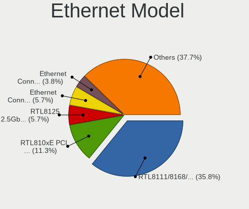

| Model                                                             | Computers | Percent |
|-------------------------------------------------------------------|-----------|---------|
| Realtek RTL8111/8168/8411 PCI Express Gigabit Ethernet Controller | 18        | 34.62%  |
| Realtek RTL810xE PCI Express Fast Ethernet controller             | 6         | 11.54%  |
| Realtek RTL8125 2.5GbE Controller                                 | 3         | 5.77%   |
| Intel Ethernet Connection (2) I219-V                              | 3         | 5.77%   |
| Intel Ethernet Connection (4) I219-LM                             | 2         | 3.85%   |
| Intel 82579LM Gigabit Network Connection (Lewisville)             | 2         | 3.85%   |
| VIA VT6102/VT6103 [Rhine-II]                                      | 1         | 1.92%   |
| Samsung GT-I9070 (network tethering, USB debugging enabled)       | 1         | 1.92%   |
| Qualcomm Atheros Attansic L1 Gigabit Ethernet                     | 1         | 1.92%   |
| Qualcomm Atheros AR8162 Fast Ethernet                             | 1         | 1.92%   |
| Qualcomm Atheros AR8131 Gigabit Ethernet                          | 1         | 1.92%   |
| Qualcomm Atheros AR8121/AR8113/AR8114 Gigabit or Fast Ethernet    | 1         | 1.92%   |
| Intel Ethernet Connection I219-V                                  | 1         | 1.92%   |
| Intel Ethernet Connection I219-LM                                 | 1         | 1.92%   |
| Intel Ethernet Connection I218-LM                                 | 1         | 1.92%   |
| Intel Ethernet Connection (6) I219-V                              | 1         | 1.92%   |
| Intel Ethernet Connection (4) I219-V                              | 1         | 1.92%   |
| Intel Ethernet Connection (2) I219-LM                             | 1         | 1.92%   |
| Intel 82579V Gigabit Network Connection                           | 1         | 1.92%   |
| Broadcom NetXtreme II BCM5716 Gigabit Ethernet                    | 1         | 1.92%   |
| Broadcom NetXtreme II BCM5709 Gigabit Ethernet                    | 1         | 1.92%   |
| Broadcom NetXtreme BCM57762 Gigabit Ethernet PCIe                 | 1         | 1.92%   |
| Broadcom NetXtreme BCM5755M Gigabit Ethernet PCI Express          | 1         | 1.92%   |
| Broadcom NetLink BCM5784M Gigabit Ethernet PCIe                   | 1         | 1.92%   |

Net Controller Kind
-------------------

Ethernet, WiFi or modem

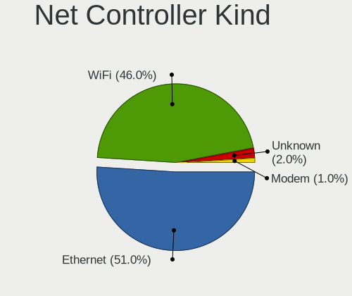

| Kind     | Computers | Percent |
|----------|-----------|---------|
| Ethernet | 50        | 51.02%  |
| WiFi     | 45        | 45.92%  |
| Unknown  | 2         | 2.04%   |
| Modem    | 1         | 1.02%   |

Used Controller
---------------

Currently used network controller

| Kind     | Computers | Percent |
|----------|-----------|---------|
| Ethernet | 42        | 60%     |
| WiFi     | 27        | 38.57%  |
| Unknown  | 1         | 1.43%   |

NICs
----

Total network controllers on board

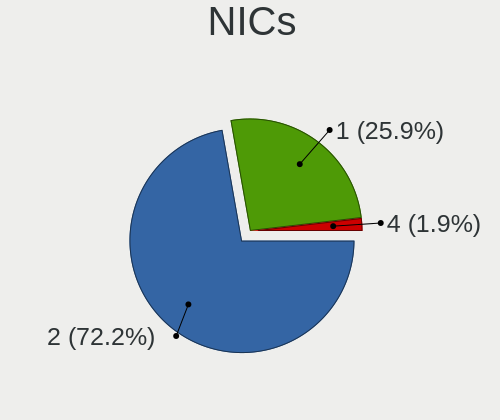

| Total | Computers | Percent |
|-------|-----------|---------|
| 2     | 38        | 71.7%   |
| 1     | 14        | 26.42%  |
| 4     | 1         | 1.89%   |

IPv6
----

IPv6 vs IPv4

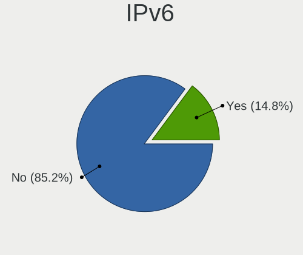

| Used | Computers | Percent |
|------|-----------|---------|
| No   | 45        | 84.91%  |
| Yes  | 8         | 15.09%  |

Bluetooth
---------

Bluetooth Vendor
----------------

Controller vendors

| Vendor                          | Computers | Percent |
|---------------------------------|-----------|---------|
| Intel                           | 14        | 42.42%  |
| Realtek Semiconductor           | 4         | 12.12%  |
| Broadcom                        | 4         | 12.12%  |
| ASUSTek Computer                | 3         | 9.09%   |
| Qualcomm Atheros Communications | 2         | 6.06%   |
| Apple                           | 2         | 6.06%   |
| Lite-On Technology              | 1         | 3.03%   |
| IMC Networks                    | 1         | 3.03%   |
| Foxconn / Hon Hai               | 1         | 3.03%   |
| Cambridge Silicon Radio         | 1         | 3.03%   |

Bluetooth Model
---------------

Controller models

| Model                                               | Computers | Percent |
|-----------------------------------------------------|-----------|---------|
| Intel Bluetooth wireless interface                  | 7         | 21.21%  |
| Realtek  Bluetooth 4.2 Adapter                      | 2         | 6.06%   |
| Intel Bluetooth 9460/9560 Jefferson Peak (JfP)      | 2         | 6.06%   |
| Intel AX200 Bluetooth                               | 2         | 6.06%   |
| Apple Apple Broadcom Built-in Bluetooth             | 2         | 6.06%   |
| Realtek  Bluetooth 4.0 Adapter                      | 1         | 3.03%   |
| Realtek  Bluetooth 4.0 + High Speed Chip            | 1         | 3.03%   |
| Qualcomm Atheros Dell Wireless 1820 Bluetooth 4.1LE | 1         | 3.03%   |
| Qualcomm Atheros AR3012 Bluetooth 4.0               | 1         | 3.03%   |
| Lite-On Atheros Bluetooth                           | 1         | 3.03%   |
| Intel Wireless-AC 9260 Bluetooth Adapter            | 1         | 3.03%   |
| Intel Wireless-AC 3168 Bluetooth                    | 1         | 3.03%   |
| Intel AX201 Bluetooth                               | 1         | 3.03%   |
| IMC Networks Realtek Bluetooth Adapter              | 1         | 3.03%   |
| Foxconn / Hon Hai Bluetooth USB Module              | 1         | 3.03%   |
| Cambridge Silicon Radio Bluetooth Dongle (HCI mode) | 1         | 3.03%   |
| Broadcom Broadcom Bluetooth 4.0                     | 1         | 3.03%   |
| Broadcom BCM43142A0 Bluetooth Device                | 1         | 3.03%   |
| Broadcom BCM43142A0 Bluetooth 4.0                   | 1         | 3.03%   |
| Broadcom BCM2045 Bluetooth                          | 1         | 3.03%   |
| ASUS BT-183 Bluetooth 2.0+EDR adapter               | 1         | 3.03%   |
| ASUS Bluetooth Controller                           | 1         | 3.03%   |
| ASUS ASUS USB-BT500                                 | 1         | 3.03%   |

Sound
-----

Sound Vendor
------------

Sound card vendors

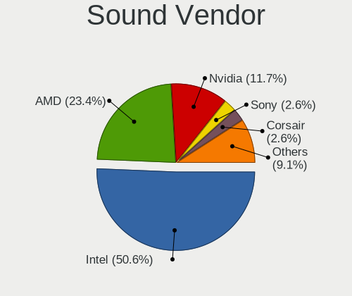

| Vendor              | Computers | Percent |
|---------------------|-----------|---------|
| Intel               | 38        | 50%     |
| AMD                 | 18        | 23.68%  |
| Nvidia              | 9         | 11.84%  |
| Sony                | 2         | 2.63%   |
| Corsair             | 2         | 2.63%   |
| XMOS                | 1         | 1.32%   |
| VIA Technologies    | 1         | 1.32%   |
| Quanta              | 1         | 1.32%   |
| LG Electronics      | 1         | 1.32%   |
| Creative Technology | 1         | 1.32%   |
| C-Media Electronics | 1         | 1.32%   |
| Audio-Technica      | 1         | 1.32%   |

Sound Model
-----------

Sound card models

| Model                                                                      | Computers | Percent |
|----------------------------------------------------------------------------|-----------|---------|
| Intel Sunrise Point-LP HD Audio                                            | 7         | 7.53%   |
| Intel 7 Series/C216 Chipset Family High Definition Audio Controller        | 6         | 6.45%   |
| AMD FCH Azalia Controller                                                  | 5         | 5.38%   |
| Intel Haswell-ULT HD Audio Controller                                      | 4         | 4.3%    |
| Intel 8 Series HD Audio Controller                                         | 4         | 4.3%    |
| AMD Kabini HDMI/DP Audio                                                   | 4         | 4.3%    |
| AMD Family 17h/19h HD Audio Controller                                     | 4         | 4.3%    |
| Intel 100 Series/C230 Series Chipset Family HD Audio Controller            | 3         | 3.23%   |
| AMD Starship/Matisse HD Audio Controller                                   | 3         | 3.23%   |
| AMD Renoir Radeon High Definition Audio Controller                         | 3         | 3.23%   |
| Intel NM10/ICH7 Family High Definition Audio Controller                    | 2         | 2.15%   |
| Intel Cannon Point-LP High Definition Audio Controller                     | 2         | 2.15%   |
| Intel Cannon Lake PCH cAVS                                                 | 2         | 2.15%   |
| Intel 82801I (ICH9 Family) HD Audio Controller                             | 2         | 2.15%   |
| Intel 82801H (ICH8 Family) HD Audio Controller                             | 2         | 2.15%   |
| Intel 200 Series PCH HD Audio                                              | 2         | 2.15%   |
| Corsair Corsair VOID PRO Wireless Gaming Headset                           | 2         | 2.15%   |
| AMD RV710/730 HDMI Audio [Radeon HD 4000 series]                           | 2         | 2.15%   |
| AMD Navi 21/23 HDMI/DP Audio Controller                                    | 2         | 2.15%   |
| XMOS Shanling UA2                                                          | 1         | 1.08%   |
| VIA Technologies VX900/VT8xxx High Definition Audio Controller             | 1         | 1.08%   |
| Sony Sony Audio                                                            | 1         | 1.08%   |
| Sony DualShock 4 [CUH-ZCT2x]                                               | 1         | 1.08%   |
| Quanta USB Audio Realtek USB2.0 Audio Microphone                           | 1         | 1.08%   |
| Nvidia TU116 High Definition Audio Controller                              | 1         | 1.08%   |
| Nvidia TU107 GeForce GTX 1650 High Definition Audio Controller             | 1         | 1.08%   |
| Nvidia TU104 HD Audio Controller                                           | 1         | 1.08%   |
| Nvidia High Definition Audio Controller                                    | 1         | 1.08%   |
| Nvidia GP108 High Definition Audio Controller                              | 1         | 1.08%   |
| Nvidia GP106 High Definition Audio Controller                              | 1         | 1.08%   |
| Nvidia GP104 High Definition Audio Controller                              | 1         | 1.08%   |
| Nvidia GK208 HDMI/DP Audio Controller                                      | 1         | 1.08%   |
| Nvidia GA104 High Definition Audio Controller                              | 1         | 1.08%   |
| LG Electronics USB Audio LG UltraFine Display Audio                        | 1         | 1.08%   |
| Intel Xeon E3-1200 v3/4th Gen Core Processor HD Audio Controller           | 1         | 1.08%   |
| Intel Comet Lake PCH cAVS                                                  | 1         | 1.08%   |
| Intel Celeron/Pentium Silver Processor High Definition Audio               | 1         | 1.08%   |
| Intel C600/X79 series chipset High Definition Audio Controller             | 1         | 1.08%   |
| Intel 8 Series/C220 Series Chipset High Definition Audio Controller        | 1         | 1.08%   |
| Intel 6 Series/C200 Series Chipset Family High Definition Audio Controller | 1         | 1.08%   |
| Intel 5 Series/3400 Series Chipset High Definition Audio                   | 1         | 1.08%   |
| Creative Technology Sound Blaster Omni Surround 5.1                        | 1         | 1.08%   |
| Corsair Corsair ST100 Headset Output                                       | 1         | 1.08%   |
| C-Media Electronics Audio Device                                           | 1         | 1.08%   |
| Audio-Technica AT2020USB+                                                  | 1         | 1.08%   |
| AMD Vega 20 HDMI Audio [Radeon VII]                                        | 1         | 1.08%   |
| AMD Oland/Hainan/Cape Verde/Pitcairn HDMI Audio [Radeon HD 7000 Series]    | 1         | 1.08%   |
| AMD High Definition Audio Controller                                       | 1         | 1.08%   |
| AMD Family 15h (Models 60h-6fh) Audio Controller                           | 1         | 1.08%   |
| AMD Ellesmere HDMI Audio [Radeon RX 470/480 / 570/580/590]                 | 1         | 1.08%   |
| AMD BeaverCreek HDMI Audio [Radeon HD 6500D and 6400G-6600G series]        | 1         | 1.08%   |

Memory
------

Memory Vendor
-------------

Memory module vendors

| Vendor              | Computers | Percent |
|---------------------|-----------|---------|
| SK hynix            | 17        | 26.56%  |
| Samsung Electronics | 14        | 21.88%  |
| Unknown             | 6         | 9.38%   |
| Micron Technology   | 6         | 9.38%   |
| Kingston            | 4         | 6.25%   |
| G.Skill             | 4         | 6.25%   |
| Crucial             | 3         | 4.69%   |
| Transcend           | 2         | 3.13%   |
| Nanya Technology    | 2         | 3.13%   |
| Corsair             | 2         | 3.13%   |
| Unknown             | 2         | 3.13%   |
| Ramaxel Technology  | 1         | 1.56%   |
| Elpida              | 1         | 1.56%   |

Memory Model
------------

Memory module models

| Model                                                     | Computers | Percent |
|-----------------------------------------------------------|-----------|---------|
| SK hynix RAM HMA81GS6AFR8N-UH 8GB SODIMM DDR4 2400MT/s    | 3         | 4.48%   |
| SK hynix RAM HMA81GS6JJR8N-VK 8GB SODIMM DDR4 2667MT/s    | 2         | 2.99%   |
| Samsung RAM M471B1G73EB0-YK0 8GB SODIMM DDR3 1600MT/s     | 2         | 2.99%   |
| Kingston RAM KF3200C16D4/16GX 16GB DIMM DDR4 2400MT/s     | 2         | 2.99%   |
| Unknown                                                   | 2         | 2.99%   |
| Unknown RAM Module 8GB DIMM DDR3 1600MT/s                 | 1         | 1.49%   |
| Unknown RAM Module 2GB SODIMM DDR2 667MT/s                | 1         | 1.49%   |
| Unknown RAM Module 2GB DIMM SDRAM                         | 1         | 1.49%   |
| Unknown RAM Module 2GB DIMM DDR 1333MT/s                  | 1         | 1.49%   |
| Unknown RAM Module 1GB SODIMM DRAM 533MT/s                | 1         | 1.49%   |
| Unknown RAM 7TE39AA# 8GB DIMM DDR4 2667MT/s               | 1         | 1.49%   |
| Transcend RAM TS512MSK64V1N 4GB SODIMM 800MT/s            | 1         | 1.49%   |
| Transcend RAM JM800QSU-2G 2GB SODIMM DDR 667MT/s          | 1         | 1.49%   |
| SK hynix RAM Module 4GB SODIMM DDR3 1600MT/s              | 1         | 1.49%   |
| SK hynix RAM HYMP125S64CP8-Y5 2GB SODIMM DDR 667MT/s      | 1         | 1.49%   |
| SK hynix RAM HYMP125S64CP8-S6 2GB SODIMM DDR2 975MT/s     | 1         | 1.49%   |
| SK hynix RAM HMT851S6AMR6R-PB 4GB Chip DDR3 1600MT/s      | 1         | 1.49%   |
| SK hynix RAM HMT851S6AMR6A-PB 4GB Chip DDR3 1600MT/s      | 1         | 1.49%   |
| SK hynix RAM HMT451U6AFR8C-PB 4GB DIMM DDR3 1600MT/s      | 1         | 1.49%   |
| SK hynix RAM HMT451S6CFR6A-PB 4GB SODIMM DDR3 1600MT/s    | 1         | 1.49%   |
| SK hynix RAM HMT451S6BFR8A-PB 4GB SODIMM DDR3 1600MT/s    | 1         | 1.49%   |
| SK hynix RAM HMT351U6EFR8C-PB 4GB DIMM DDR3 1600MT/s      | 1         | 1.49%   |
| SK hynix RAM HMT351S6EFR8A-PB 4GB SODIMM DDR3 1333MT/s    | 1         | 1.49%   |
| SK hynix RAM HMA851S6AFR6N-UH 4GB SODIMM DDR4 2400MT/s    | 1         | 1.49%   |
| SK hynix RAM HMA82GS6MFR8N-TF 16GB SODIMM DDR4 2133MT/s   | 1         | 1.49%   |
| SK hynix RAM HMA451S6AFR8N-TF 4GB SODIMM DDR4 2133MT/s    | 1         | 1.49%   |
| Samsung RAM Module 16GB SODIMM DDR4 2133MT/s              | 1         | 1.49%   |
| Samsung RAM M471B5273CM0-CH9 4GB SODIMM DDR3 1333MT/s     | 1         | 1.49%   |
| Samsung RAM M471B5273CH0-CH9 4GB SODIMM DDR3 1334MT/s     | 1         | 1.49%   |
| Samsung RAM M471B5173EB0-YK0 4GB SODIMM DDR3 1600MT/s     | 1         | 1.49%   |
| Samsung RAM M471B5173DB0-YK0 4GB SODIMM DDR3 1600MT/s     | 1         | 1.49%   |
| Samsung RAM M471B1G73DB0-YK0 8GB SODIMM DDR3 1600MT/s     | 1         | 1.49%   |
| Samsung RAM M471A5244CB0-CTD 4GB SODIMM DDR4 2667MT/s     | 1         | 1.49%   |
| Samsung RAM M471A5244CB0-CRC 4GB SODIMM DDR4 2400MT/s     | 1         | 1.49%   |
| Samsung RAM M471A4G43AB1-CWE 32GB SODIMM DDR4 3200MT/s    | 1         | 1.49%   |
| Samsung RAM M471A1K43DB1-CWE 8GB SODIMM DDR4 3200MT/s     | 1         | 1.49%   |
| Samsung RAM M471A1K43CB1-CRC 8GB SODIMM DDR4 2400MT/s     | 1         | 1.49%   |
| Samsung RAM M393B5170FHD-CF8 4GB DIMM DDR3 1066MT/s       | 1         | 1.49%   |
| Samsung RAM M378B1G73EB0-YK0 8GB DIMM DDR3 1600MT/s       | 1         | 1.49%   |
| Ramaxel RAM RMT3160ED58E9W1600 4GB SODIMM DDR3 1600MT/s   | 1         | 1.49%   |
| Nanya RAM NT4GC64B88B1NF-DI 4GB DIMM DDR3 1600MT/s        | 1         | 1.49%   |
| Nanya RAM Module 4GB Row Of Chips LPDDR3 2133MT/s         | 1         | 1.49%   |
| Micron RAM 8ATF1G64HZ-3G2R1 8GB SODIMM DDR4 3200MT/s      | 1         | 1.49%   |
| Micron RAM 8ATF1G64HZ-3G2J1 8GB SODIMM DDR4 3200MT/s      | 1         | 1.49%   |
| Micron RAM 4ATS1G64HZ-2G6E1 8GB SODIMM DDR4 2667MT/s      | 1         | 1.49%   |
| Micron RAM 36JSZF51272PZ1G4G1 4GB DIMM DDR3 1333MT/s      | 1         | 1.49%   |
| Micron RAM 36JSZF1G72PZ-1G4D 8GB DIMM DDR3 1333MT/s       | 1         | 1.49%   |
| Micron RAM 36JSF1G72PZ-1 8GB DIMM DDR3 1600MT/s           | 1         | 1.49%   |
| Kingston RAM K531R8-ETB 4GB DIMM DDR3 1600MT/s            | 1         | 1.49%   |
| Kingston RAM 99U5704-001.A00G 4GB SODIMM DDR4 2400MT/s    | 1         | 1.49%   |
| Kingston RAM 9905711-015.A00G 4GB SODIMM DDR4 2400MT/s    | 1         | 1.49%   |
| G.Skill RAM F4-3600C17-16GTZSW 16GB DIMM DDR4 3600MT/s    | 1         | 1.49%   |
| G.Skill RAM F4-3200C16-8GVKB 8GB DIMM DDR4 3200MT/s       | 1         | 1.49%   |
| G.Skill RAM F4-2133C15-8GRS 8GB SODIMM DDR4 2133MT/s      | 1         | 1.49%   |
| G.Skill RAM F3-1600C9-4GRSL 4GB SODIMM DDR3 1600MT/s      | 1         | 1.49%   |
| Elpida RAM EBJ41UF8BCS0-DJ-F 4GB SODIMM DDR3 1333MT/s     | 1         | 1.49%   |
| Crucial RAM CT16G4SFD8266.C16FN 16GB SODIMM DDR4 2133MT/s | 1         | 1.49%   |
| Crucial RAM BLS8G4D240FSB.16FBD 8GB DIMM DDR4 2933MT/s    | 1         | 1.49%   |
| Crucial RAM BLS16G4S26BFSD.16FD 16GB SODIMM DDR4 2400MT/s | 1         | 1.49%   |
| Corsair RAM Module 8GB DIMM DDR4 3200MT/s                 | 1         | 1.49%   |

Memory Kind
-----------

Memory module kinds

| Kind    | Computers | Percent |
|---------|-----------|---------|
| DDR4    | 24        | 44.44%  |
| DDR3    | 19        | 35.19%  |
| DDR2    | 3         | 5.56%   |
| SDRAM   | 2         | 3.7%    |
| LPDDR3  | 2         | 3.7%    |
| DDR     | 2         | 3.7%    |
| DRAM    | 1         | 1.85%   |
| Unknown | 1         | 1.85%   |

Memory Form Factor
------------------

Physical design of the memory module

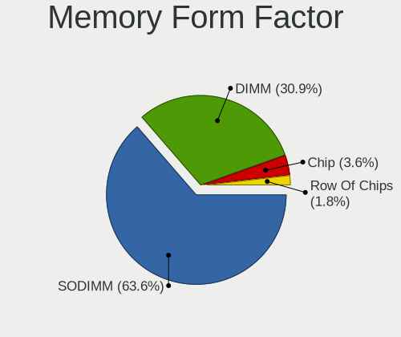

| Name         | Computers | Percent |
|--------------|-----------|---------|
| SODIMM       | 34        | 62.96%  |
| DIMM         | 17        | 31.48%  |
| Chip         | 2         | 3.7%    |
| Row Of Chips | 1         | 1.85%   |

Memory Size
-----------

Memory module size

| Size  | Computers | Percent |
|-------|-----------|---------|
| 4096  | 23        | 39.66%  |
| 8192  | 19        | 32.76%  |
| 16384 | 8         | 13.79%  |
| 2048  | 6         | 10.34%  |
| 32768 | 1         | 1.72%   |
| 1024  | 1         | 1.72%   |

Memory Speed
------------

Memory module speed

| Speed   | Computers | Percent |
|---------|-----------|---------|
| 1600    | 14        | 23.73%  |
| 2400    | 10        | 16.95%  |
| 2133    | 7         | 11.86%  |
| 3200    | 6         | 10.17%  |
| 1333    | 6         | 10.17%  |
| 2667    | 5         | 8.47%   |
| 667     | 2         | 3.39%   |
| Unknown | 2         | 3.39%   |
| 3600    | 1         | 1.69%   |
| 2933    | 1         | 1.69%   |
| 1334    | 1         | 1.69%   |
| 1066    | 1         | 1.69%   |
| 975     | 1         | 1.69%   |
| 800     | 1         | 1.69%   |
| 533     | 1         | 1.69%   |

Printers & scanners
-------------------

Printer Vendor
--------------

Printer device vendors

| Vendor          | Computers | Percent |
|-----------------|-----------|---------|
| Hewlett-Packard | 1         | 100%    |

Printer Model
-------------

Printer device models

| Model                                                                    | Computers | Percent |
|--------------------------------------------------------------------------|-----------|---------|
| HP PNP Fax Null                                                          | 1         | 50%     |
| HP HP LaserJet M101-M106 Printer HP LEDM HP LEDM IPP Printer IPP Printer | 1         | 50%     |

Scanner Vendor
--------------

Scanner device vendors

Zero info for selected period =(

Scanner Model
-------------

Scanner device models

Zero info for selected period =(

Camera
------

Camera Vendor
-------------

Camera device vendors

| Vendor                                 | Computers | Percent |
|----------------------------------------|-----------|---------|
| Chicony Electronics                    | 6         | 22.22%  |
| Acer                                   | 4         | 14.81%  |
| Quanta                                 | 3         | 11.11%  |
| IMC Networks                           | 3         | 11.11%  |
| Microdia                               | 2         | 7.41%   |
| Lite-On Technology                     | 2         | 7.41%   |
| Cheng Uei Precision Industry (Foxlink) | 2         | 7.41%   |
| Suyin                                  | 1         | 3.7%    |
| Sunplus Innovation Technology          | 1         | 3.7%    |
| Realtek Semiconductor                  | 1         | 3.7%    |
| Intel                                  | 1         | 3.7%    |
| Alcor Micro                            | 1         | 3.7%    |

Camera Model
------------

Camera device models

| Model                                                          | Computers | Percent |
|----------------------------------------------------------------|-----------|---------|
| Chicony Integrated Camera                                      | 3         | 11.11%  |
| Acer Integrated Camera                                         | 3         | 11.11%  |
| Quanta Realtek DMFT - RGB                                      | 2         | 7.41%   |
| Suyin USB 2.0 UVC 1.3M WebCam                                  | 1         | 3.7%    |
| Sunplus Integrated Webcam                                      | 1         | 3.7%    |
| Realtek USB2.0 VGA UVC WebCam                                  | 1         | 3.7%    |
| Quanta Front camera                                            | 1         | 3.7%    |
| Microdia Integrated_Webcam_HD                                  | 1         | 3.7%    |
| Microdia Integrated Webcam                                     | 1         | 3.7%    |
| Lite-On Realtek PC Camera                                      | 1         | 3.7%    |
| Lite-On HP Universal Camera                                    | 1         | 3.7%    |
| Intel WiMAX Connection 2400m                                   | 1         | 3.7%    |
| IMC Networks USB2.0 UVC HD Webcam                              | 1         | 3.7%    |
| IMC Networks USB2.0 HD UVC WebCam                              | 1         | 3.7%    |
| IMC Networks EasyCamera                                        | 1         | 3.7%    |
| Chicony HP HD Webcam [Fixed]                                   | 1         | 3.7%    |
| Chicony HD Webcam                                              | 1         | 3.7%    |
| Chicony Chicony USB2.0 Camera                                  | 1         | 3.7%    |
| Cheng Uei Precision Industry (Foxlink) HP TrueVision HD Camera | 1         | 3.7%    |
| Cheng Uei Precision Industry (Foxlink) HP HD Camera            | 1         | 3.7%    |
| Alcor Micro HP WebCam-101                                      | 1         | 3.7%    |
| Acer Lenovo EasyCamera                                         | 1         | 3.7%    |

Security
--------

Fingerprint Vendor
------------------

Fingerprint sensor vendors

| Vendor           | Computers | Percent |
|------------------|-----------|---------|
| Validity Sensors | 4         | 44.44%  |
| Synaptics        | 3         | 33.33%  |
| Upek             | 1         | 11.11%  |
| AuthenTec        | 1         | 11.11%  |

Fingerprint Model
-----------------

Fingerprint sensor models

| Model                                                  | Computers | Percent |
|--------------------------------------------------------|-----------|---------|
| Validity Sensors Synaptics WBDI                        | 2         | 22.22%  |
| Synaptics Metallica MIS Touch Fingerprint Reader       | 2         | 22.22%  |
| Validity Sensors VFS495 Fingerprint Reader             | 1         | 11.11%  |
| Validity Sensors VFS 5011 fingerprint sensor           | 1         | 11.11%  |
| Upek Biometric Touchchip/Touchstrip Fingerprint Sensor | 1         | 11.11%  |
| Synaptics Prometheus MIS Touch Fingerprint Reader      | 1         | 11.11%  |
| AuthenTec AES1600                                      | 1         | 11.11%  |

Chipcard Vendor
---------------

Chipcard module vendors

Zero info for selected period =(

Chipcard Model
--------------

Chipcard module models

Zero info for selected period =(

Unsupported
-----------

Unsupported Devices
-------------------

Total unsupported devices on board

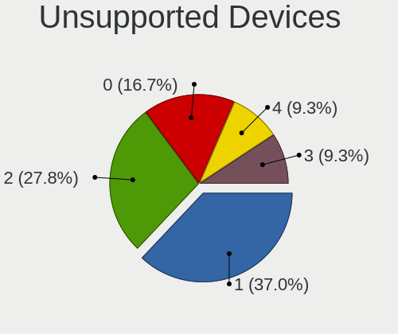

| Total | Computers | Percent |
|-------|-----------|---------|
| 1     | 20        | 37.74%  |
| 2     | 15        | 28.3%   |
| 0     | 9         | 16.98%  |
| 4     | 5         | 9.43%   |
| 3     | 4         | 7.55%   |

Unsupported Device Types
------------------------

Types of unsupported devices

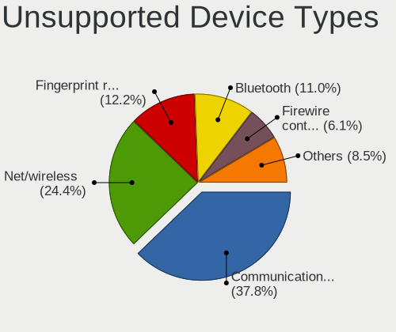

| Type                     | Computers | Percent |
|--------------------------|-----------|---------|
| Communication controller | 31        | 39.24%  |
| Net/wireless             | 19        | 24.05%  |
| Fingerprint reader       | 9         | 11.39%  |
| Bluetooth                | 8         | 10.13%  |
| Firewire controller      | 5         | 6.33%   |
| Network                  | 3         | 3.8%    |
| Card reader              | 3         | 3.8%    |
| Sound                    | 1         | 1.27%   |

