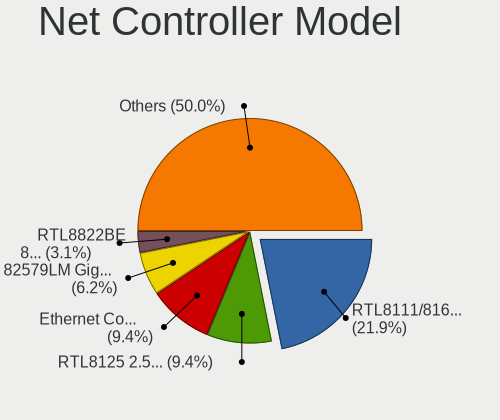
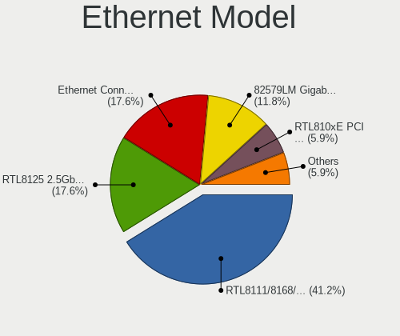
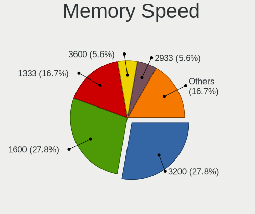

NomadBSD 5806f915 - Tested Hardware & Statistics (Desktops)
-----------------------------------------------------------

A project to collect tested hardware configurations for NomadBSD 5806f915.

Anyone can contribute to this report by the [hw-probe](https://github.com/linuxhw/hw-probe/blob/master/INSTALL.BSD.md) tool:

    hw-probe -all -upload

Please contribute! Especially if your hardware is rare.

Contents
--------

* [ Test Cases ](#test-cases)

* [ System ](#system)
  - [ Arch                     ](#arch)
  - [ DE                       ](#de)
  - [ Display Server           ](#display-server)
  - [ Display Manager          ](#display-manager)
  - [ OS Lang                  ](#os-lang)
  - [ Boot Mode                ](#boot-mode)
  - [ Filesystem               ](#filesystem)
  - [ Part. scheme             ](#part-scheme)

* [ Board ](#board)
  - [ Vendor                   ](#vendor)
  - [ Model                    ](#model)
  - [ Model Family             ](#model-family)
  - [ MFG Year                 ](#mfg-year)
  - [ Form Factor              ](#form-factor)
  - [ Coreboot                 ](#coreboot)
  - [ RAM Size                 ](#ram-size)
  - [ RAM Used                 ](#ram-used)
  - [ Total Drives             ](#total-drives)
  - [ Has CD-ROM               ](#has-cd-rom)
  - [ Has Ethernet             ](#has-ethernet)
  - [ Has WiFi                 ](#has-wifi)
  - [ Has Bluetooth            ](#has-bluetooth)

* [ Location ](#location)
  - [ Country                  ](#country)
  - [ City                     ](#city)

* [ Drives ](#drives)
  - [ Drive Vendor             ](#drive-vendor)
  - [ Drive Model              ](#drive-model)
  - [ HDD Vendor               ](#hdd-vendor)
  - [ SSD Vendor               ](#ssd-vendor)
  - [ Drive Kind               ](#drive-kind)
  - [ Drive Connector          ](#drive-connector)
  - [ Drive Size               ](#drive-size)
  - [ Space Total              ](#space-total)
  - [ Space Used               ](#space-used)
  - [ Malfunc. Drives          ](#malfunc-drives)
  - [ Malfunc. Drive Vendor    ](#malfunc-drive-vendor)
  - [ Malfunc. HDD Vendor      ](#malfunc-hdd-vendor)
  - [ Malfunc. Drive Kind      ](#malfunc-drive-kind)
  - [ Failed Drives            ](#failed-drives)
  - [ Failed Drive Vendor      ](#failed-drive-vendor)
  - [ Drive Status             ](#drive-status)

* [ Storage controller ](#storage-controller)
  - [ Storage Vendor           ](#storage-vendor)
  - [ Storage Model            ](#storage-model)
  - [ Storage Kind             ](#storage-kind)

* [ Processor ](#processor)
  - [ CPU Vendor               ](#cpu-vendor)
  - [ CPU Model                ](#cpu-model)
  - [ CPU Model Family         ](#cpu-model-family)
  - [ CPU Cores                ](#cpu-cores)
  - [ CPU Sockets              ](#cpu-sockets)
  - [ CPU Threads              ](#cpu-threads)
  - [ CPU Microarch            ](#cpu-microarch)

* [ Graphics ](#graphics)
  - [ GPU Vendor               ](#gpu-vendor)
  - [ GPU Model                ](#gpu-model)
  - [ GPU Combo                ](#gpu-combo)
  - [ GPU Driver               ](#gpu-driver)
  - [ GPU Memory               ](#gpu-memory)

* [ Monitor ](#monitor)
  - [ Monitor Vendor           ](#monitor-vendor)
  - [ Monitor Model            ](#monitor-model)
  - [ Monitor Resolution       ](#monitor-resolution)
  - [ Monitor Diagonal         ](#monitor-diagonal)
  - [ Monitor Width            ](#monitor-width)
  - [ Aspect Ratio             ](#aspect-ratio)
  - [ Monitor Area             ](#monitor-area)
  - [ Pixel Density            ](#pixel-density)
  - [ Multiple Monitors        ](#multiple-monitors)

* [ Network ](#network)
  - [ Net Controller Vendor    ](#net-controller-vendor)
  - [ Net Controller Model     ](#net-controller-model)
  - [ Wireless Vendor          ](#wireless-vendor)
  - [ Wireless Model           ](#wireless-model)
  - [ Ethernet Vendor          ](#ethernet-vendor)
  - [ Ethernet Model           ](#ethernet-model)
  - [ Net Controller Kind      ](#net-controller-kind)
  - [ Used Controller          ](#used-controller)
  - [ NICs                     ](#nics)
  - [ IPv6                     ](#ipv6)

* [ Bluetooth ](#bluetooth)
  - [ Bluetooth Vendor         ](#bluetooth-vendor)
  - [ Bluetooth Model          ](#bluetooth-model)

* [ Sound ](#sound)
  - [ Sound Vendor             ](#sound-vendor)
  - [ Sound Model              ](#sound-model)

* [ Memory ](#memory)
  - [ Memory Vendor            ](#memory-vendor)
  - [ Memory Model             ](#memory-model)
  - [ Memory Kind              ](#memory-kind)
  - [ Memory Form Factor       ](#memory-form-factor)
  - [ Memory Size              ](#memory-size)
  - [ Memory Speed             ](#memory-speed)

* [ Printers & scanners ](#printers--scanners)
  - [ Printer Vendor           ](#printer-vendor)
  - [ Printer Model            ](#printer-model)
  - [ Scanner Vendor           ](#scanner-vendor)
  - [ Scanner Model            ](#scanner-model)

* [ Camera ](#camera)
  - [ Camera Vendor            ](#camera-vendor)
  - [ Camera Model             ](#camera-model)

* [ Security ](#security)
  - [ Fingerprint Vendor       ](#fingerprint-vendor)
  - [ Fingerprint Model        ](#fingerprint-model)
  - [ Chipcard Vendor          ](#chipcard-vendor)
  - [ Chipcard Model           ](#chipcard-model)

* [ Unsupported ](#unsupported)
  - [ Unsupported Devices      ](#unsupported-devices)
  - [ Unsupported Device Types ](#unsupported-device-types)

Test Cases
----------

Total: 17

| Vendor   | Model                       | Probe                                                     | Date         |
|----------|-----------------------------|-----------------------------------------------------------|--------------|
| ASUSTek  | Maximus VIII HERO           | [c776760a11](https://bsd-hardware.info/?probe=c776760a11) | Apr 13, 2022 |
| MSI      | U-100 Ver.001               | [6859308aa9](https://bsd-hardware.info/?probe=6859308aa9) | Mar 01, 2022 |
| Gigabyte | X570S GAMING X              | [ff39ace6ec](https://bsd-hardware.info/?probe=ff39ace6ec) | Feb 16, 2022 |
| Intel    | DCP847SKE                   | [2828ef2a6d](https://bsd-hardware.info/?probe=2828ef2a6d) | Jan 20, 2022 |
| Dell     | 0M9KCM A01                  | [4db0a0ea05](https://bsd-hardware.info/?probe=4db0a0ea05) | Dec 06, 2021 |
| Gigabyte | MZGLKBP-00                  | [e713e3adee](https://bsd-hardware.info/?probe=e713e3adee) | Dec 05, 2021 |
| ASUSTek  | PRIME Z390-P                | [1bd9270845](https://bsd-hardware.info/?probe=1bd9270845) | Nov 15, 2021 |
| Dell     | 0T10XW A01                  | [ae2203b146](https://bsd-hardware.info/?probe=ae2203b146) | Nov 12, 2021 |
| Unknown  | X79                         | [c80b658f36](https://bsd-hardware.info/?probe=c80b658f36) | Nov 09, 2021 |
| HP       | 87D6 SMVB                   | [f601f00e7c](https://bsd-hardware.info/?probe=f601f00e7c) | Oct 07, 2021 |
| Dell     | OptiPlex 3020               | [c391177240](https://bsd-hardware.info/?probe=c391177240) | Oct 05, 2021 |
| Dell     | OptiPlex 3020               | [070a0c6d62](https://bsd-hardware.info/?probe=070a0c6d62) | Sep 19, 2021 |
| Gigabyte | Z370 AORUS ULTRAGAMING W... | [13371b2ab8](https://bsd-hardware.info/?probe=13371b2ab8) | Jun 27, 2021 |
| ASUSTek  | ROG STRIX X299-E GAMING     | [e91dc55970](https://bsd-hardware.info/?probe=e91dc55970) | Jun 22, 2021 |
| ASUSTek  | TUF GAMING B550M-PLUS       | [c6a1c1fa15](https://bsd-hardware.info/?probe=c6a1c1fa15) | May 25, 2021 |
| ASUSTek  | V-P7H55E                    | [8cf113ac55](https://bsd-hardware.info/?probe=8cf113ac55) | May 22, 2021 |
| Toshiba  | STI 005492G                 | [9a8e4a1328](https://bsd-hardware.info/?probe=9a8e4a1328) | May 17, 2021 |

System
------

Arch
----

OS architecture (x86_64, i586, etc.)

| Name  | Desktops | Percent |
|-------|----------|---------|
| amd64 | 15       | 100%    |

DE
--

Desktop Environment

| Name    | Desktops | Percent |
|---------|----------|---------|
| Openbox | 14       | 93.33%  |
| KDE5    | 1        | 6.67%   |

Display Server
--------------

X11 or Wayland

| Name | Desktops | Percent |
|------|----------|---------|
| X11  | 15       | 100%    |

Display Manager
---------------

SDDM, LightDM, etc.

| Name | Desktops | Percent |
|------|----------|---------|
| SLiM | 14       | 93.33%  |
| SDDM | 1        | 6.67%   |

OS Lang
-------

Language

| Lang    | Desktops | Percent |
|---------|----------|---------|
| en_US   | 5        | 33.33%  |
| ru_RU   | 2        | 13.33%  |
| pt_BR   | 2        | 13.33%  |
| de_DE   | 2        | 13.33%  |
| Unknown | 2        | 13.33%  |
| fi_FI   | 1        | 6.67%   |
| en_AU   | 1        | 6.67%   |

Boot Mode
---------

EFI or BIOS

| Mode | Desktops | Percent |
|------|----------|---------|
| EFI  | 15       | 100%    |

Filesystem
----------

Type of filesystem

| Type | Desktops | Percent |
|------|----------|---------|
| Ufs  | 14       | 93.33%  |
| Zfs  | 1        | 6.67%   |

Part. scheme
------------

Scheme of partitioning

| Type | Desktops | Percent |
|------|----------|---------|
| GPT  | 15       | 100%    |

Board
-----

Vendor
------

Motherboard manufacturer

| Name                | Desktops | Percent |
|---------------------|----------|---------|
| ASUSTek Computer    | 5        | 33.33%  |
| Gigabyte Technology | 3        | 20%     |
| Dell                | 3        | 20%     |
| Semp Toshiba        | 1        | 6.67%   |
| Intel               | 1        | 6.67%   |
| Hewlett-Packard     | 1        | 6.67%   |
| Unknown             | 1        | 6.67%   |

Model
-----

Motherboard model

| Name                                    | Desktops | Percent |
|-----------------------------------------|----------|---------|
| Semp Toshiba STI                        | 1        | 6.67%   |
| Intel DCP847SKE                         | 1        | 6.67%   |
| HP Desktop M01-F1xxx                    | 1        | 6.67%   |
| Gigabyte Z370 AORUS ULTRAGAMING WIFI-OP | 1        | 6.67%   |
| Gigabyte X570S GAMING X                 | 1        | 6.67%   |
| Gigabyte MZGLKBP-00                     | 1        | 6.67%   |
| Dell OptiPlex 9010                      | 1        | 6.67%   |
| Dell OptiPlex 3020                      | 1        | 6.67%   |
| Dell OptiPlex 3010                      | 1        | 6.67%   |
| ASUS V-P7H55E                           | 1        | 6.67%   |
| ASUS TUF GAMING B550M-PLUS              | 1        | 6.67%   |
| ASUS ROG STRIX X299-E GAMING            | 1        | 6.67%   |
| ASUS PRIME Z390-P                       | 1        | 6.67%   |
| ASUS Maximus VIII HERO                  | 1        | 6.67%   |
| Unknown                                 | 1        | 6.67%   |

Model Family
------------

Motherboard model prefix

| Name                | Desktops | Percent |
|---------------------|----------|---------|
| Dell OptiPlex       | 3        | 20%     |
| Semp Toshiba STI    | 1        | 6.67%   |
| Intel DCP847SKE     | 1        | 6.67%   |
| HP Desktop          | 1        | 6.67%   |
| Gigabyte Z370       | 1        | 6.67%   |
| Gigabyte X570S      | 1        | 6.67%   |
| Gigabyte MZGLKBP-00 | 1        | 6.67%   |
| ASUS V-P7H55E       | 1        | 6.67%   |
| ASUS TUF            | 1        | 6.67%   |
| ASUS ROG            | 1        | 6.67%   |
| ASUS PRIME          | 1        | 6.67%   |
| ASUS Maximus        | 1        | 6.67%   |
| Unknown             | 1        | 6.67%   |

MFG Year
--------

Motherboard manufacture year

| Year | Desktops | Percent |
|------|----------|---------|
| 2019 | 4        | 26.67%  |
| 2021 | 3        | 20%     |
| 2020 | 2        | 13.33%  |
| 2015 | 2        | 13.33%  |
| 2018 | 1        | 6.67%   |
| 2013 | 1        | 6.67%   |
| 2010 | 1        | 6.67%   |
| 2009 | 1        | 6.67%   |

Form Factor
-----------

Physical design of the computer

| Name    | Desktops | Percent |
|---------|----------|---------|
| Desktop | 15       | 100%    |

Coreboot
--------

Have coreboot on board

| Used | Desktops | Percent |
|------|----------|---------|
| No   | 15       | 100%    |

RAM Size
--------

Total RAM memory

| Size in GB  | Desktops | Percent |
|-------------|----------|---------|
| 8.01-16.0   | 5        | 33.33%  |
| 32.01-64.0  | 4        | 26.67%  |
| 16.01-24.0  | 3        | 20%     |
| 4.01-8.0    | 2        | 13.33%  |
| 64.01-256.0 | 1        | 6.67%   |

RAM Used
--------

Used RAM memory

| Used GB  | Desktops | Percent |
|----------|----------|---------|
| 1.01-2.0 | 6        | 40%     |
| 0.01-0.5 | 6        | 40%     |
| 0.51-1.0 | 3        | 20%     |

Total Drives
------------

Number of drives on board

| Drives | Desktops | Percent |
|--------|----------|---------|
| 3      | 5        | 33.33%  |
| 2      | 5        | 33.33%  |
| 1      | 4        | 26.67%  |
| 4      | 1        | 6.67%   |

Has CD-ROM
----------

Has CD-ROM on board

| Presented | Desktops | Percent |
|-----------|----------|---------|
| No        | 9        | 60%     |
| Yes       | 6        | 40%     |

Has Ethernet
------------

Has Ethernet on board

| Presented | Desktops | Percent |
|-----------|----------|---------|
| Yes       | 14       | 93.33%  |
| No        | 1        | 6.67%   |

Has WiFi
--------

Has WiFi module

| Presented | Desktops | Percent |
|-----------|----------|---------|
| Yes       | 11       | 73.33%  |
| No        | 4        | 26.67%  |

Has Bluetooth
-------------

Has Bluetooth module

| Presented | Desktops | Percent |
|-----------|----------|---------|
| Yes       | 8        | 50%     |
| No        | 8        | 50%     |

Location
--------

Country
-------

Geographic location (country)

| Country   | Desktops | Percent |
|-----------|----------|---------|
| USA       | 5        | 33.33%  |
| Russia    | 2        | 13.33%  |
| Germany   | 2        | 13.33%  |
| Brazil    | 2        | 13.33%  |
| Thailand  | 1        | 6.67%   |
| Slovakia  | 1        | 6.67%   |
| Finland   | 1        | 6.67%   |
| Australia | 1        | 6.67%   |

City
----

Geographic location (city)

| City           | Desktops | Percent |
|----------------|----------|---------|
| Volzhskiy      | 2        | 13.33%  |
| Rio de Janeiro | 2        | 13.33%  |
| Tucson         | 1        | 6.67%   |
| Scottsdale     | 1        | 6.67%   |
| San Francisco  | 1        | 6.67%   |
| Palm Bay       | 1        | 6.67%   |
| Melcice        | 1        | 6.67%   |
| Marburg        | 1        | 6.67%   |
| Helsinki       | 1        | 6.67%   |
| Conway         | 1        | 6.67%   |
| Cologne        | 1        | 6.67%   |
| Brisbane       | 1        | 6.67%   |
| Bangkok        | 1        | 6.67%   |

Drives
------

Drive Vendor
------------

Hard drive vendors

| Vendor              | Desktops | Drives | Percent |
|---------------------|----------|--------|---------|
| Samsung Electronics | 6        | 8      | 20%     |
| WDC                 | 5        | 6      | 16.67%  |
| Seagate             | 4        | 5      | 13.33%  |
| Kingston            | 3        | 3      | 10%     |
| Crucial             | 3        | 3      | 10%     |
| A-DATA Technology   | 3        | 3      | 10%     |
| Intel               | 2        | 2      | 6.67%   |
| Toshiba             | 1        | 1      | 3.33%   |
| Team                | 1        | 1      | 3.33%   |
| SK Hynix            | 1        | 1      | 3.33%   |
| Hewlett-Packard     | 1        | 1      | 3.33%   |

Drive Model
-----------

Hard drive models

| Model                                     | Desktops | Percent |
|-------------------------------------------|----------|---------|
| Kingston SA400S37480G 480GB               | 2        | 6.06%   |
| A-DATA SU630 240GB                        | 2        | 6.06%   |
| WDC WDS120G2G0A-00JH30 120GB              | 1        | 3.03%   |
| WDC WDS100T1X0E-00AFY0 1TB                | 1        | 3.03%   |
| WDC WD40PURX-64GVNY0 4TB                  | 1        | 3.03%   |
| WDC WD2500BEKT-00PVMT0 250GB              | 1        | 3.03%   |
| WDC WD10EADS-00P8B0 1TB                   | 1        | 3.03%   |
| WDC PC SN520 SDAPMUW-128G-1101 128GB      | 1        | 3.03%   |
| Toshiba HDWD120 2TB                       | 1        | 3.03%   |
| Team TEAML5Lite3D1T 1TB                   | 1        | 3.03%   |
| SK Hynix SKHynix_HFS256GD9TNI-L2B0B 256GB | 1        | 3.03%   |
| Seagate ST9500325AS 500GB                 | 1        | 3.03%   |
| Seagate ST500DM002-1BD142 500GB           | 1        | 3.03%   |
| Seagate ST4000DM000-2AE166 4TB            | 1        | 3.03%   |
| Seagate ST3000DM008-2DM166 3TB            | 1        | 3.03%   |
| Samsung SSD 970 EVO 500GB                 | 1        | 3.03%   |
| Samsung SSD 970 EVO 2TB                   | 1        | 3.03%   |
| Samsung SSD 870 QVO 2TB                   | 1        | 3.03%   |
| Samsung SSD 870 EVO 1TB                   | 1        | 3.03%   |
| Samsung SSD 860 EVO 1TB                   | 1        | 3.03%   |
| Samsung SSD 840 EVO 250GB                 | 1        | 3.03%   |
| Samsung HM160HI 160GB                     | 1        | 3.03%   |
| Samsung HD161GJ 160GB                     | 1        | 3.03%   |
| Kingston SA2000M8500G 500GB               | 1        | 3.03%   |
| Intel SSDPEKNW020T8 2TB                   | 1        | 3.03%   |
| Intel MEMPEK1W032GA 32GB                  | 1        | 3.03%   |
| HP SSD EX950 2TB                          | 1        | 3.03%   |
| Crucial CT120BX300SSD1 120GB              | 1        | 3.03%   |
| Crucial CT1000P5SSD8 1TB                  | 1        | 3.03%   |
| Crucial CT1000P1SSD8 1TB                  | 1        | 3.03%   |
| A-DATA XM13 32GB                          | 1        | 3.03%   |

HDD Vendor
----------

Hard disk drive vendors

| Vendor              | Desktops | Drives | Percent |
|---------------------|----------|--------|---------|
| Seagate             | 4        | 5      | 40%     |
| WDC                 | 3        | 3      | 30%     |
| Samsung Electronics | 2        | 2      | 20%     |
| Toshiba             | 1        | 1      | 10%     |

SSD Vendor
----------

Solid state drive vendors

| Vendor              | Desktops | Drives | Percent |
|---------------------|----------|--------|---------|
| Samsung Electronics | 3        | 4      | 27.27%  |
| A-DATA Technology   | 3        | 3      | 27.27%  |
| Kingston            | 2        | 2      | 18.18%  |
| WDC                 | 1        | 1      | 9.09%   |
| Team                | 1        | 1      | 9.09%   |
| Crucial             | 1        | 1      | 9.09%   |

Drive Kind
----------

HDD or SSD

| Kind | Desktops | Drives | Percent |
|------|----------|--------|---------|
| NVMe | 8        | 11     | 33.33%  |
| SSD  | 8        | 12     | 33.33%  |
| HDD  | 8        | 11     | 33.33%  |

Drive Connector
---------------

SATA, SAS, NVMe, etc.

| Type | Desktops | Drives | Percent |
|------|----------|--------|---------|
| SATA | 13       | 23     | 61.9%   |
| NVMe | 8        | 11     | 38.1%   |

Drive Size
----------

Size of hard drive

| Size in TB | Desktops | Drives | Percent |
|------------|----------|--------|---------|
| 0.01-0.5   | 9        | 14     | 50%     |
| 0.51-1.0   | 4        | 4      | 22.22%  |
| 3.01-4.0   | 2        | 2      | 11.11%  |
| 1.01-2.0   | 2        | 2      | 11.11%  |
| 2.01-3.0   | 1        | 1      | 5.56%   |

Space Total
-----------

Amount of disk space available on the file system

| Size in GB | Desktops | Percent |
|------------|----------|---------|
| 1-20       | 12       | 80%     |
| 101-250    | 2        | 13.33%  |
| 51-100     | 1        | 6.67%   |

Space Used
----------

Amount of used disk space

| Used GB | Desktops | Percent |
|---------|----------|---------|
| 1-20    | 14       | 93.33%  |
| 51-100  | 1        | 6.67%   |

Malfunc. Drives
---------------

Drive models with a malfunction

| Model                             | Desktops | Drives | Percent |
|-----------------------------------|----------|--------|---------|
| Toshiba HDWD120 2TB               | 1        | 1      | 33.33%  |
| Samsung Electronics HM160HI 160GB | 1        | 1      | 33.33%  |
| A-DATA Technology XM13 32GB       | 1        | 1      | 33.33%  |

Malfunc. Drive Vendor
---------------------

Vendors of faulty drives

| Vendor              | Desktops | Drives | Percent |
|---------------------|----------|--------|---------|
| Toshiba             | 1        | 1      | 33.33%  |
| Samsung Electronics | 1        | 1      | 33.33%  |
| A-DATA Technology   | 1        | 1      | 33.33%  |

Malfunc. HDD Vendor
-------------------

Vendors of faulty HDD drives

| Vendor              | Desktops | Drives | Percent |
|---------------------|----------|--------|---------|
| Toshiba             | 1        | 1      | 50%     |
| Samsung Electronics | 1        | 1      | 50%     |

Malfunc. Drive Kind
-------------------

Kinds of faulty drives

| Kind | Desktops | Drives | Percent |
|------|----------|--------|---------|
| SSD  | 1        | 1      | 50%     |
| HDD  | 1        | 2      | 50%     |

Failed Drives
-------------

Failed drive models

Zero info for selected period =(

Failed Drive Vendor
-------------------

Failed drive vendors

Zero info for selected period =(

Drive Status
------------

Number of failed and malfunc. drives

| Status  | Desktops | Drives | Percent |
|---------|----------|--------|---------|
| Works   | 14       | 31     | 87.5%   |
| Malfunc | 2        | 3      | 12.5%   |

Storage controller
------------------

Storage Vendor
--------------

Storage controller vendors

| Vendor                      | Desktops | Percent |
|-----------------------------|----------|---------|
| Intel                       | 13       | 50%     |
| AMD                         | 3        | 11.54%  |
| Sandisk                     | 2        | 7.69%   |
| Samsung Electronics         | 2        | 7.69%   |
| Micron/Crucial Technology   | 2        | 7.69%   |
| ASMedia Technology          | 2        | 7.69%   |
| Kingston Technology Company | 1        | 3.85%   |
| Biwin Storage Technology    | 1        | 3.85%   |

Storage Model
-------------

Storage controller models

| Model                                                                          | Desktops | Percent |
|--------------------------------------------------------------------------------|----------|---------|
| Samsung NVMe SSD Controller SM981/PM981/PM983                                  | 2        | 7.14%   |
| Intel 7 Series/C210 Series Chipset Family 6-port SATA Controller [AHCI mode]   | 2        | 7.14%   |
| Intel 200 Series PCH SATA controller [AHCI mode]                               | 2        | 7.14%   |
| ASMedia ASM1062 Serial ATA Controller                                          | 2        | 7.14%   |
| AMD FCH SATA Controller [AHCI mode]                                            | 2        | 7.14%   |
| Unknown                                                                        | 2        | 7.14%   |
| Sandisk WD PC SN810 / Black SN850 NVMe SSD                                     | 1        | 3.57%   |
| Sandisk PC SN520 NVMe SSD                                                      | 1        | 3.57%   |
| Micron/Crucial P1 NVMe PCIe SSD                                                | 1        | 3.57%   |
| Kingston Company A2000 NVMe SSD                                                | 1        | 3.57%   |
| Intel SSD 660P Series                                                          | 1        | 3.57%   |
| Intel Q170/Q150/B150/H170/H110/Z170/CM236 Chipset SATA Controller [AHCI Mode]  | 1        | 3.57%   |
| Intel NVMe Optane Memory Series                                                | 1        | 3.57%   |
| Intel NM10/ICH7 Family SATA Controller [IDE mode]                              | 1        | 3.57%   |
| Intel Celeron/Pentium Silver Processor SATA Controller                         | 1        | 3.57%   |
| Intel Cannon Lake PCH SATA AHCI Controller                                     | 1        | 3.57%   |
| Intel 8 Series/C220 Series Chipset Family 6-port SATA Controller 1 [AHCI mode] | 1        | 3.57%   |
| Intel 7 Series Chipset Family 6-port SATA Controller [AHCI mode]               | 1        | 3.57%   |
| Intel 6 Series/C200 Series Chipset Family 6 port Desktop SATA AHCI Controller  | 1        | 3.57%   |
| Intel 5 Series/3400 Series Chipset 6 port SATA AHCI Controller                 | 1        | 3.57%   |
| AMD 500 Series Chipset SATA Controller                                         | 1        | 3.57%   |
| AMD 400 Series Chipset SATA Controller                                         | 1        | 3.57%   |

Storage Kind
------------

Kind of storage controller (IDE, SATA, NVMe, SAS, ...)

| Kind | Desktops | Percent |
|------|----------|---------|
| SATA | 14       | 60.87%  |
| NVMe | 8        | 34.78%  |
| IDE  | 1        | 4.35%   |

Processor
---------

CPU Vendor
----------

Processor vendors

| Vendor | Desktops | Percent |
|--------|----------|---------|
| Intel  | 12       | 80%     |
| AMD    | 3        | 20%     |

CPU Model
---------

Processor models

| Model                                       | Desktops | Percent |
|---------------------------------------------|----------|---------|
| Intel Xeon CPU E5-2690 0 @ 2.90GHz          | 1        | 6.67%   |
| Intel Pentium Silver J5005 CPU @ 1.50GHz    | 1        | 6.67%   |
| Intel Pentium Dual-Core CPU E5300 @ 2.60GHz | 1        | 6.67%   |
| Intel Core i9-7960X CPU @ 2.80GHz           | 1        | 6.67%   |
| Intel Core i7-9700K CPU @ 3.60GHz           | 1        | 6.67%   |
| Intel Core i7-8700K CPU @ 3.70GHz           | 1        | 6.67%   |
| Intel Core i7-7700K CPU @ 4.20GHz           | 1        | 6.67%   |
| Intel Core i5-3570 CPU @ 3.40GHz            | 1        | 6.67%   |
| Intel Core i5-3470 CPU @ 3.20GHz            | 1        | 6.67%   |
| Intel Core i5 CPU 750 @ 2.67GHz             | 1        | 6.67%   |
| Intel Core i3-4150 CPU @ 3.50GHz            | 1        | 6.67%   |
| Intel Celeron CPU 847E @ 1.10GHz            | 1        | 6.67%   |
| AMD Ryzen 9 5900X 12-Core Processor         | 1        | 6.67%   |
| AMD Ryzen 5 4600G with Radeon Graphics      | 1        | 6.67%   |
| AMD Ryzen 5 3600XT 6-Core Processor         | 1        | 6.67%   |

CPU Model Family
----------------

Processor model prefix

| Model                   | Desktops | Percent |
|-------------------------|----------|---------|
| Intel Core i7           | 3        | 20%     |
| Intel Core i5           | 3        | 20%     |
| AMD Ryzen 5             | 2        | 13.33%  |
| Intel Xeon              | 1        | 6.67%   |
| Intel Pentium Silver    | 1        | 6.67%   |
| Intel Pentium Dual-Core | 1        | 6.67%   |
| Intel Core i9           | 1        | 6.67%   |
| Intel Core i3           | 1        | 6.67%   |
| Intel Celeron           | 1        | 6.67%   |
| AMD Ryzen 9             | 1        | 6.67%   |

CPU Cores
---------

Number of processor cores

| Number | Desktops | Percent |
|--------|----------|---------|
| 4      | 5        | 33.33%  |
| 2      | 3        | 20%     |
| 12     | 2        | 13.33%  |
| 8      | 2        | 13.33%  |
| 24     | 1        | 6.67%   |
| 16     | 1        | 6.67%   |
| 6      | 1        | 6.67%   |

CPU Sockets
-----------

Number of sockets

| Number | Desktops | Percent |
|--------|----------|---------|
| 1      | 15       | 100%    |

CPU Threads
-----------

Threads per core (Hyper-Threading)

| Number | Desktops | Percent |
|--------|----------|---------|
| 1      | 10       | 66.67%  |
| 2      | 5        | 33.33%  |

CPU Microarch
-------------

Microarchitecture

| Name          | Desktops | Percent |
|---------------|----------|---------|
| KabyLake      | 3        | 20%     |
| Zen 2         | 2        | 13.33%  |
| SandyBridge   | 2        | 13.33%  |
| IvyBridge     | 2        | 13.33%  |
| Zen 3         | 1        | 6.67%   |
| Skylake       | 1        | 6.67%   |
| Penryn        | 1        | 6.67%   |
| Nehalem       | 1        | 6.67%   |
| Haswell       | 1        | 6.67%   |
| Goldmont plus | 1        | 6.67%   |

Graphics
--------

GPU Vendor
----------

Vendors of graphics cards

| Vendor | Desktops | Percent |
|--------|----------|---------|
| Nvidia | 6        | 37.5%   |
| Intel  | 6        | 37.5%   |
| AMD    | 4        | 25%     |

GPU Model
---------

Graphics card models

| Model                                                                     | Desktops | Percent |
|---------------------------------------------------------------------------|----------|---------|
| Intel Xeon E3-1200 v2/3rd Gen Core processor Graphics Controller          | 2        | 12.5%   |
| Nvidia GT218 [GeForce 210]                                                | 1        | 6.25%   |
| Nvidia GP108 [GeForce GT 1030]                                            | 1        | 6.25%   |
| Nvidia GP106 [GeForce GTX 1060 6GB]                                       | 1        | 6.25%   |
| Nvidia GP104 [GeForce GTX 1070 Ti]                                        | 1        | 6.25%   |
| Nvidia GK208B [GeForce GT 710]                                            | 1        | 6.25%   |
| Nvidia GA104 [GeForce RTX 3070]                                           | 1        | 6.25%   |
| Intel HD Graphics 630                                                     | 1        | 6.25%   |
| Intel GeminiLake [UHD Graphics 605]                                       | 1        | 6.25%   |
| Intel 4th Generation Core Processor Family Integrated Graphics Controller | 1        | 6.25%   |
| Intel 2nd Generation Core Processor Family Integrated Graphics Controller | 1        | 6.25%   |
| AMD Vega 20 [Radeon VII]                                                  | 1        | 6.25%   |
| AMD Renoir                                                                | 1        | 6.25%   |
| AMD Navi 21 [Radeon RX 6800/6800 XT / 6900 XT]                            | 1        | 6.25%   |
| AMD Ellesmere [Radeon RX 470/480/570/570X/580/580X/590]                   | 1        | 6.25%   |

GPU Combo
---------

Combinations of graphics cards

| Name           | Desktops | Percent |
|----------------|----------|---------|
| 1 x Nvidia     | 5        | 33.33%  |
| 1 x Intel      | 5        | 33.33%  |
| 1 x AMD        | 4        | 26.67%  |
| Intel + Nvidia | 1        | 6.67%   |

GPU Driver
----------

Free vs proprietary

| Driver      | Desktops | Percent |
|-------------|----------|---------|
| Free        | 10       | 66.67%  |
| Proprietary | 4        | 26.67%  |
| Unknown     | 1        | 6.67%   |

GPU Memory
----------

Total video memory

| Size in GB | Desktops | Percent |
|------------|----------|---------|
| Unknown    | 13       | 86.67%  |
| 7.01-8.0   | 1        | 6.67%   |
| 5.01-6.0   | 1        | 6.67%   |

Monitor
-------

Monitor Vendor
--------------

Monitor vendors

| Vendor               | Desktops | Percent |
|----------------------|----------|---------|
| Goldstar             | 5        | 50%     |
| Samsung Electronics  | 2        | 20%     |
| ___                  | 1        | 10%     |
| Westinghouse         | 1        | 10%     |
| Ancor Communications | 1        | 10%     |

Monitor Model
-------------

Monitor models

| Model                                                                | Desktops | Percent |
|----------------------------------------------------------------------|----------|---------|
| ___ MY TV LED TV ___0101 1920x1080                                   | 1        | 10%     |
| Westinghouse DWM40F3G1 WET1ECC 1920x1080 880x480mm 39.5-inch         | 1        | 10%     |
| Samsung Electronics S27E330 SAM0D91 1920x1080 600x340mm 27.2-inch    | 1        | 10%     |
| Samsung Electronics LCD Monitor U28E590 3840x2160                    | 1        | 10%     |
| Goldstar W1943 GSM4BAD 1360x768 410x230mm 18.5-inch                  | 1        | 10%     |
| Goldstar LG UltraFine GSM5B10 3840x2160 480x270mm 21.7-inch          | 1        | 10%     |
| Goldstar LG FULL HD GSM5B55 1920x1080 480x270mm 21.7-inch            | 1        | 10%     |
| Goldstar LCD Monitor GSM5AB7 1920x1080 480x270mm 21.7-inch           | 1        | 10%     |
| Goldstar E2241 GSM581A 1920x1080 480x270mm 21.7-inch                 | 1        | 10%     |
| Ancor Communications ASUS VS197 ACI19F2 1366x768 410x230mm 18.5-inch | 1        | 10%     |

Monitor Resolution
------------------

Monitor screen resolution

| Resolution      | Desktops | Percent |
|-----------------|----------|---------|
| 1920x1080 (FHD) | 5        | 55.56%  |
| 3840x2160 (4K)  | 2        | 22.22%  |
| 1366x768 (WXGA) | 1        | 11.11%  |
| 1360x768        | 1        | 11.11%  |

Monitor Diagonal
----------------

Diagonal size in inches

| Inches  | Desktops | Percent |
|---------|----------|---------|
| 21      | 4        | 40%     |
| 18      | 2        | 20%     |
| Unknown | 2        | 20%     |
| 39      | 1        | 10%     |
| 27      | 1        | 10%     |

Monitor Width
-------------

Physical width

| Width in mm | Desktops | Percent |
|-------------|----------|---------|
| 401-500     | 6        | 60%     |
| Unknown     | 2        | 20%     |
| 801-900     | 1        | 10%     |
| 501-600     | 1        | 10%     |

Aspect Ratio
------------

Proportional relationship between the width and the height

| Ratio   | Desktops | Percent |
|---------|----------|---------|
| 16/9    | 8        | 88.89%  |
| Unknown | 1        | 11.11%  |

Monitor Area
------------

Area in inch²

| Area in inch² | Desktops | Percent |
|----------------|----------|---------|
| 201-250        | 4        | 40%     |
| 141-150        | 2        | 20%     |
| Unknown        | 2        | 20%     |
| 301-350        | 1        | 10%     |
| 501-1000       | 1        | 10%     |

Pixel Density
-------------

Pixels per inch

| Density | Desktops | Percent |
|---------|----------|---------|
| 101-120 | 3        | 33.33%  |
| 51-100  | 3        | 33.33%  |
| Unknown | 2        | 22.22%  |
| 161-240 | 1        | 11.11%  |

Multiple Monitors
-----------------

Total monitors connected

| Total | Desktops | Percent |
|-------|----------|---------|
| 1     | 9        | 60%     |
| 0     | 5        | 33.33%  |
| 2     | 1        | 6.67%   |

Network
-------

Net Controller Vendor
---------------------

Controller vendors

| Vendor                | Desktops | Percent |
|-----------------------|----------|---------|
| Realtek Semiconductor | 11       | 47.83%  |
| Intel                 | 6        | 26.09%  |
| Broadcom              | 2        | 8.7%    |
| Ralink Technology     | 1        | 4.35%   |
| Qualcomm Atheros      | 1        | 4.35%   |
| Microchip Technology  | 1        | 4.35%   |
| D-Link System         | 1        | 4.35%   |

Net Controller Model
--------------------

Controller models

| Model                                                                | Desktops | Percent |
|----------------------------------------------------------------------|----------|---------|
| Realtek RTL8111/8168/8411 PCI Express Gigabit Ethernet Controller    | 7        | 25.93%  |
| Intel Ethernet Connection (2) I219-V                                 | 3        | 11.11%  |
| Realtek RTL8125 2.5GbE Controller                                    | 2        | 7.41%   |
| Realtek RTL8822BE 802.11a/b/g/n/ac WiFi adapter                      | 1        | 3.7%    |
| Realtek RTL8821CE 802.11ac PCIe Wireless Network Adapter             | 1        | 3.7%    |
| Realtek RTL8192CE PCIe Wireless Network Adapter                      | 1        | 3.7%    |
| Realtek RTL8188FTV 802.11b/g/n 1T1R 2.4G WLAN Adapter                | 1        | 3.7%    |
| Realtek RTL8188EUS 802.11n Wireless Network Adapter                  | 1        | 3.7%    |
| Ralink RT5372 Wireless Adapter                                       | 1        | 3.7%    |
| Qualcomm Atheros AR9485 Wireless Network Adapter                     | 1        | 3.7%    |
| Microchip MCP2200 USB-to-Serial Port                                 | 1        | 3.7%    |
| Intel Wireless 8265 / 8275                                           | 1        | 3.7%    |
| Intel Dual Band Wireless-AC 3168NGW [Stone Peak]                     | 1        | 3.7%    |
| Intel 82579V Gigabit Network Connection                              | 1        | 3.7%    |
| Intel 82579LM Gigabit Network Connection (Lewisville)                | 1        | 3.7%    |
| D-Link System DWA-125 Wireless N 150 Adapter(rev.A1) [Ralink RT3070] | 1        | 3.7%    |
| Broadcom BCM4360 802.11ac Wireless Network Adapter                   | 1        | 3.7%    |
| Broadcom BCM4352 802.11ac Wireless Network Adapter                   | 1        | 3.7%    |

Wireless Vendor
---------------

Wireless vendors

| Vendor                | Desktops | Percent |
|-----------------------|----------|---------|
| Realtek Semiconductor | 5        | 41.67%  |
| Intel                 | 2        | 16.67%  |
| Broadcom              | 2        | 16.67%  |
| Ralink Technology     | 1        | 8.33%   |
| Qualcomm Atheros      | 1        | 8.33%   |
| D-Link System         | 1        | 8.33%   |

Wireless Model
--------------

Wireless models

| Model                                                                | Desktops | Percent |
|----------------------------------------------------------------------|----------|---------|
| Realtek RTL8822BE 802.11a/b/g/n/ac WiFi adapter                      | 1        | 8.33%   |
| Realtek RTL8821CE 802.11ac PCIe Wireless Network Adapter             | 1        | 8.33%   |
| Realtek RTL8192CE PCIe Wireless Network Adapter                      | 1        | 8.33%   |
| Realtek RTL8188FTV 802.11b/g/n 1T1R 2.4G WLAN Adapter                | 1        | 8.33%   |
| Realtek RTL8188EUS 802.11n Wireless Network Adapter                  | 1        | 8.33%   |
| Ralink RT5372 Wireless Adapter                                       | 1        | 8.33%   |
| Qualcomm Atheros AR9485 Wireless Network Adapter                     | 1        | 8.33%   |
| Intel Wireless 8265 / 8275                                           | 1        | 8.33%   |
| Intel Dual Band Wireless-AC 3168NGW [Stone Peak]                     | 1        | 8.33%   |
| D-Link System DWA-125 Wireless N 150 Adapter(rev.A1) [Ralink RT3070] | 1        | 8.33%   |
| Broadcom BCM4360 802.11ac Wireless Network Adapter                   | 1        | 8.33%   |
| Broadcom BCM4352 802.11ac Wireless Network Adapter                   | 1        | 8.33%   |

Ethernet Vendor
---------------

Ethernet vendors

| Vendor                | Desktops | Percent |
|-----------------------|----------|---------|
| Realtek Semiconductor | 9        | 64.29%  |
| Intel                 | 5        | 35.71%  |

Ethernet Model
--------------

Ethernet models

| Model                                                             | Desktops | Percent |
|-------------------------------------------------------------------|----------|---------|
| Realtek RTL8111/8168/8411 PCI Express Gigabit Ethernet Controller | 7        | 50%     |
| Intel Ethernet Connection (2) I219-V                              | 3        | 21.43%  |
| Realtek RTL8125 2.5GbE Controller                                 | 2        | 14.29%  |
| Intel 82579V Gigabit Network Connection                           | 1        | 7.14%   |
| Intel 82579LM Gigabit Network Connection (Lewisville)             | 1        | 7.14%   |

Net Controller Kind
-------------------

Ethernet, WiFi or modem

| Kind     | Desktops | Percent |
|----------|----------|---------|
| Ethernet | 14       | 53.85%  |
| WiFi     | 11       | 42.31%  |
| Modem    | 1        | 3.85%   |

Used Controller
---------------

Currently used network controller

| Kind     | Desktops | Percent |
|----------|----------|---------|
| Ethernet | 13       | 65%     |
| WiFi     | 7        | 35%     |

NICs
----

Total network controllers on board

| Total | Desktops | Percent |
|-------|----------|---------|
| 1     | 8        | 53.33%  |
| 2     | 7        | 46.67%  |

IPv6
----

IPv6 vs IPv4

| Used | Desktops | Percent |
|------|----------|---------|
| No   | 13       | 86.67%  |
| Yes  | 2        | 13.33%  |

Bluetooth
---------

Bluetooth Vendor
----------------

Controller vendors

| Vendor                          | Desktops | Percent |
|---------------------------------|----------|---------|
| Intel                           | 2        | 25%     |
| Realtek Semiconductor           | 1        | 12.5%   |
| Qualcomm Atheros Communications | 1        | 12.5%   |
| Cambridge Silicon Radio         | 1        | 12.5%   |
| Broadcom                        | 1        | 12.5%   |
| ASUSTek Computer                | 1        | 12.5%   |
| Apple                           | 1        | 12.5%   |

Bluetooth Model
---------------

Controller models

| Model                                               | Desktops | Percent |
|-----------------------------------------------------|----------|---------|
| Realtek  Bluetooth 4.2 Adapter                      | 1        | 12.5%   |
| Qualcomm Atheros AR3012 Bluetooth 4.0               | 1        | 12.5%   |
| Intel Wireless-AC 3168 Bluetooth                    | 1        | 12.5%   |
| Intel Bluetooth wireless interface                  | 1        | 12.5%   |
| Cambridge Silicon Radio Bluetooth Dongle (HCI mode) | 1        | 12.5%   |
| Broadcom BCM2045 Bluetooth                          | 1        | 12.5%   |
| ASUS Bluetooth Controller                           | 1        | 12.5%   |
| Apple Apple Broadcom Built-in Bluetooth             | 1        | 12.5%   |

Sound
-----

Sound Vendor
------------

Sound card vendors

| Vendor              | Desktops | Percent |
|---------------------|----------|---------|
| Intel               | 12       | 38.71%  |
| Nvidia              | 6        | 19.35%  |
| AMD                 | 5        | 16.13%  |
| Sony                | 2        | 6.45%   |
| Quanta              | 1        | 3.23%   |
| LG Electronics      | 1        | 3.23%   |
| Creative Technology | 1        | 3.23%   |
| Corsair             | 1        | 3.23%   |
| C-Media Electronics | 1        | 3.23%   |
| Audio-Technica      | 1        | 3.23%   |

Sound Model
-----------

Sound card models

| Model                                                                      | Desktops | Percent |
|----------------------------------------------------------------------------|----------|---------|
| Intel 7 Series/C216 Chipset Family High Definition Audio Controller        | 3        | 8.57%   |
| Intel 200 Series PCH HD Audio                                              | 2        | 5.71%   |
| AMD Starship/Matisse HD Audio Controller                                   | 2        | 5.71%   |
| Sony Sony Audio                                                            | 1        | 2.86%   |
| Sony DualShock 4 [CUH-ZCT2x]                                               | 1        | 2.86%   |
| Quanta USB Audio Realtek USB2.0 Audio Microphone                           | 1        | 2.86%   |
| Nvidia High Definition Audio Controller                                    | 1        | 2.86%   |
| Nvidia GP108 High Definition Audio Controller                              | 1        | 2.86%   |
| Nvidia GP106 High Definition Audio Controller                              | 1        | 2.86%   |
| Nvidia GP104 High Definition Audio Controller                              | 1        | 2.86%   |
| Nvidia GK208 HDMI/DP Audio Controller                                      | 1        | 2.86%   |
| Nvidia GA104 High Definition Audio Controller                              | 1        | 2.86%   |
| LG Electronics USB Audio LG UltraFine Display Audio                        | 1        | 2.86%   |
| Intel Xeon E3-1200 v3/4th Gen Core Processor HD Audio Controller           | 1        | 2.86%   |
| Intel NM10/ICH7 Family High Definition Audio Controller                    | 1        | 2.86%   |
| Intel Celeron/Pentium Silver Processor High Definition Audio               | 1        | 2.86%   |
| Intel Cannon Lake PCH cAVS                                                 | 1        | 2.86%   |
| Intel 8 Series/C220 Series Chipset High Definition Audio Controller        | 1        | 2.86%   |
| Intel 6 Series/C200 Series Chipset Family High Definition Audio Controller | 1        | 2.86%   |
| Intel 5 Series/3400 Series Chipset High Definition Audio                   | 1        | 2.86%   |
| Intel 100 Series/C230 Series Chipset Family HD Audio Controller            | 1        | 2.86%   |
| Creative Technology Sound Blaster Omni Surround 5.1                        | 1        | 2.86%   |
| Corsair Corsair VOID PRO Wireless Gaming Headset                           | 1        | 2.86%   |
| Corsair Corsair ST100 Headset Output                                       | 1        | 2.86%   |
| C-Media Electronics Audio Device                                           | 1        | 2.86%   |
| Audio-Technica AT2020USB+                                                  | 1        | 2.86%   |
| AMD Vega 20 HDMI Audio [Radeon VII]                                        | 1        | 2.86%   |
| AMD Renoir Radeon High Definition Audio Controller                         | 1        | 2.86%   |
| AMD Navi 21/23 HDMI/DP Audio Controller                                    | 1        | 2.86%   |
| AMD Family 17h/19h HD Audio Controller                                     | 1        | 2.86%   |
| AMD Ellesmere HDMI Audio [Radeon RX 470/480 / 570/580/590]                 | 1        | 2.86%   |

Memory
------

Memory Vendor
-------------

Memory module vendors

| Vendor              | Desktops | Percent |
|---------------------|----------|---------|
| Unknown             | 3        | 18.75%  |
| Kingston            | 3        | 18.75%  |
| SK Hynix            | 2        | 12.5%   |
| G.Skill             | 2        | 12.5%   |
| Corsair             | 2        | 12.5%   |
| Samsung Electronics | 1        | 6.25%   |
| Nanya Technology    | 1        | 6.25%   |
| Micron Technology   | 1        | 6.25%   |
| Crucial             | 1        | 6.25%   |

Memory Model
------------

Memory module models

| Model                                                  | Desktops | Percent |
|--------------------------------------------------------|----------|---------|
| Unknown RAM Module 2GB DIMM SDRAM                      | 1        | 5.88%   |
| Unknown RAM Module 2GB DIMM DDR 1333MT/s               | 1        | 5.88%   |
| Unknown RAM 7TE39AA# 8GB DIMM DDR4 2667MT/s            | 1        | 5.88%   |
| SK Hynix RAM HMT451U6AFR8C-PB 4GB DIMM DDR3 1600MT/s   | 1        | 5.88%   |
| SK Hynix RAM HMT351U6EFR8C-PB 4GB DIMM DDR3 1600MT/s   | 1        | 5.88%   |
| Samsung RAM M471B5273CM0-CH9 4GB SODIMM DDR3 1333MT/s  | 1        | 5.88%   |
| Nanya RAM NT4GC64B88B1NF-DI 4GB DIMM DDR3 1600MT/s     | 1        | 5.88%   |
| Micron RAM 36JSF1G72PZ-1 8GB DIMM DDR3 1600MT/s        | 1        | 5.88%   |
| Kingston RAM KF3200C16D4/16GX 16GB DIMM DDR4 2400MT/s  | 1        | 5.88%   |
| Kingston RAM K531R8-ETB 4GB DIMM DDR3 1600MT/s         | 1        | 5.88%   |
| Kingston RAM 99U5704-001.A00G 4GB SODIMM DDR4 2400MT/s | 1        | 5.88%   |
| Kingston RAM 9905711-015.A00G 4GB SODIMM DDR4 2400MT/s | 1        | 5.88%   |
| G.Skill RAM F4-3600C17-16GTZSW 16GB DIMM DDR4 3600MT/s | 1        | 5.88%   |
| G.Skill RAM F4-3200C16-8GVKB 8GB DIMM DDR4 3200MT/s    | 1        | 5.88%   |
| Crucial RAM BLS8G4D240FSB.16FBD 8GB DIMM DDR4 2933MT/s | 1        | 5.88%   |
| Corsair RAM Module 8GB DIMM DDR4 3200MT/s              | 1        | 5.88%   |
| Corsair RAM CMK32GX4M2B3200C16 16GB DIMM DDR4 3200MT/s | 1        | 5.88%   |

Memory Kind
-----------

Memory module kinds

| Kind  | Desktops | Percent |
|-------|----------|---------|
| DDR4  | 8        | 53.33%  |
| DDR3  | 5        | 33.33%  |
| SDRAM | 1        | 6.67%   |
| DDR   | 1        | 6.67%   |

Memory Form Factor
------------------

Physical design of the memory module

| Name   | Desktops | Percent |
|--------|----------|---------|
| DIMM   | 13       | 86.67%  |
| SODIMM | 2        | 13.33%  |

Memory Size
-----------

Memory module size

| Size  | Desktops | Percent |
|-------|----------|---------|
| 8192  | 5        | 33.33%  |
| 4096  | 5        | 33.33%  |
| 16384 | 3        | 20%     |
| 2048  | 2        | 13.33%  |

Memory Speed
------------

Memory module speed

| Speed   | Desktops | Percent |
|---------|----------|---------|
| 1600    | 4        | 26.67%  |
| 3200    | 3        | 20%     |
| 2400    | 2        | 13.33%  |
| 1333    | 2        | 13.33%  |
| 3600    | 1        | 6.67%   |
| 2933    | 1        | 6.67%   |
| 2667    | 1        | 6.67%   |
| Unknown | 1        | 6.67%   |

Printers & scanners
-------------------

Printer Vendor
--------------

Printer device vendors

| Vendor          | Desktops | Percent |
|-----------------|----------|---------|
| Hewlett-Packard | 1        | 100%    |

Printer Model
-------------

Printer device models

| Model                                                                    | Desktops | Percent |
|--------------------------------------------------------------------------|----------|---------|
| HP PNP Fax Null                                                          | 1        | 50%     |
| HP HP LaserJet M101-M106 Printer HP LEDM HP LEDM IPP Printer IPP Printer | 1        | 50%     |

Scanner Vendor
--------------

Scanner device vendors

Zero info for selected period =(

Scanner Model
-------------

Scanner device models

Zero info for selected period =(

Camera
------

Camera Vendor
-------------

Camera device vendors

| Vendor | Desktops | Percent |
|--------|----------|---------|
| Quanta | 1        | 100%    |

Camera Model
------------

Camera device models

| Model                     | Desktops | Percent |
|---------------------------|----------|---------|
| Quanta Realtek DMFT - RGB | 1        | 100%    |

Security
--------

Fingerprint Vendor
------------------

Fingerprint sensor vendors

Zero info for selected period =(

Fingerprint Model
-----------------

Fingerprint sensor models

Zero info for selected period =(

Chipcard Vendor
---------------

Chipcard module vendors

Zero info for selected period =(

Chipcard Model
--------------

Chipcard module models

Zero info for selected period =(

Unsupported
-----------

Unsupported Devices
-------------------

Total unsupported devices on board

| Total | Desktops | Percent |
|-------|----------|---------|
| 1     | 7        | 46.67%  |
| 2     | 6        | 40%     |
| 0     | 2        | 13.33%  |

Unsupported Device Types
------------------------

Types of unsupported devices

| Type                     | Desktops | Percent |
|--------------------------|----------|---------|
| Communication controller | 10       | 52.63%  |
| Net/wireless             | 5        | 26.32%  |
| Firewire controller      | 2        | 10.53%  |
| Network                  | 1        | 5.26%   |
| Bluetooth                | 1        | 5.26%   |

