NomadBSD 5806f915 - Tested Hardware & Statistics (Notebooks)
------------------------------------------------------------

A project to collect tested hardware configurations for NomadBSD 5806f915.

Anyone can contribute to this report by the [hw-probe](https://github.com/linuxhw/hw-probe/blob/master/INSTALL.BSD.md) tool:

    hw-probe -all -upload

Please contribute! Especially if your hardware is rare.

Contents
--------

* [ Test Cases ](#test-cases)

* [ System ](#system)
  - [ Arch                     ](#arch)
  - [ DE                       ](#de)
  - [ Display Server           ](#display-server)
  - [ Display Manager          ](#display-manager)
  - [ OS Lang                  ](#os-lang)
  - [ Boot Mode                ](#boot-mode)
  - [ Filesystem               ](#filesystem)
  - [ Part. scheme             ](#part-scheme)

* [ Board ](#board)
  - [ Vendor                   ](#vendor)
  - [ Model                    ](#model)
  - [ Model Family             ](#model-family)
  - [ MFG Year                 ](#mfg-year)
  - [ Form Factor              ](#form-factor)
  - [ Coreboot                 ](#coreboot)
  - [ RAM Size                 ](#ram-size)
  - [ RAM Used                 ](#ram-used)
  - [ Total Drives             ](#total-drives)
  - [ Has CD-ROM               ](#has-cd-rom)
  - [ Has Ethernet             ](#has-ethernet)
  - [ Has WiFi                 ](#has-wifi)
  - [ Has Bluetooth            ](#has-bluetooth)

* [ Location ](#location)
  - [ Country                  ](#country)
  - [ City                     ](#city)

* [ Drives ](#drives)
  - [ Drive Vendor             ](#drive-vendor)
  - [ Drive Model              ](#drive-model)
  - [ HDD Vendor               ](#hdd-vendor)
  - [ SSD Vendor               ](#ssd-vendor)
  - [ Drive Kind               ](#drive-kind)
  - [ Drive Connector          ](#drive-connector)
  - [ Drive Size               ](#drive-size)
  - [ Space Total              ](#space-total)
  - [ Space Used               ](#space-used)
  - [ Malfunc. Drives          ](#malfunc-drives)
  - [ Malfunc. Drive Vendor    ](#malfunc-drive-vendor)
  - [ Malfunc. HDD Vendor      ](#malfunc-hdd-vendor)
  - [ Malfunc. Drive Kind      ](#malfunc-drive-kind)
  - [ Failed Drives            ](#failed-drives)
  - [ Failed Drive Vendor      ](#failed-drive-vendor)
  - [ Drive Status             ](#drive-status)

* [ Storage controller ](#storage-controller)
  - [ Storage Vendor           ](#storage-vendor)
  - [ Storage Model            ](#storage-model)
  - [ Storage Kind             ](#storage-kind)

* [ Processor ](#processor)
  - [ CPU Vendor               ](#cpu-vendor)
  - [ CPU Model                ](#cpu-model)
  - [ CPU Model Family         ](#cpu-model-family)
  - [ CPU Cores                ](#cpu-cores)
  - [ CPU Sockets              ](#cpu-sockets)
  - [ CPU Threads              ](#cpu-threads)
  - [ CPU Microarch            ](#cpu-microarch)

* [ Graphics ](#graphics)
  - [ GPU Vendor               ](#gpu-vendor)
  - [ GPU Model                ](#gpu-model)
  - [ GPU Combo                ](#gpu-combo)
  - [ GPU Driver               ](#gpu-driver)
  - [ GPU Memory               ](#gpu-memory)

* [ Monitor ](#monitor)
  - [ Monitor Vendor           ](#monitor-vendor)
  - [ Monitor Model            ](#monitor-model)
  - [ Monitor Resolution       ](#monitor-resolution)
  - [ Monitor Diagonal         ](#monitor-diagonal)
  - [ Monitor Width            ](#monitor-width)
  - [ Aspect Ratio             ](#aspect-ratio)
  - [ Monitor Area             ](#monitor-area)
  - [ Pixel Density            ](#pixel-density)
  - [ Multiple Monitors        ](#multiple-monitors)

* [ Network ](#network)
  - [ Net Controller Vendor    ](#net-controller-vendor)
  - [ Net Controller Model     ](#net-controller-model)
  - [ Wireless Vendor          ](#wireless-vendor)
  - [ Wireless Model           ](#wireless-model)
  - [ Ethernet Vendor          ](#ethernet-vendor)
  - [ Ethernet Model           ](#ethernet-model)
  - [ Net Controller Kind      ](#net-controller-kind)
  - [ Used Controller          ](#used-controller)
  - [ NICs                     ](#nics)
  - [ IPv6                     ](#ipv6)

* [ Bluetooth ](#bluetooth)
  - [ Bluetooth Vendor         ](#bluetooth-vendor)
  - [ Bluetooth Model          ](#bluetooth-model)

* [ Sound ](#sound)
  - [ Sound Vendor             ](#sound-vendor)
  - [ Sound Model              ](#sound-model)

* [ Memory ](#memory)
  - [ Memory Vendor            ](#memory-vendor)
  - [ Memory Model             ](#memory-model)
  - [ Memory Kind              ](#memory-kind)
  - [ Memory Form Factor       ](#memory-form-factor)
  - [ Memory Size              ](#memory-size)
  - [ Memory Speed             ](#memory-speed)

* [ Printers & scanners ](#printers--scanners)
  - [ Printer Vendor           ](#printer-vendor)
  - [ Printer Model            ](#printer-model)
  - [ Scanner Vendor           ](#scanner-vendor)
  - [ Scanner Model            ](#scanner-model)

* [ Camera ](#camera)
  - [ Camera Vendor            ](#camera-vendor)
  - [ Camera Model             ](#camera-model)

* [ Security ](#security)
  - [ Fingerprint Vendor       ](#fingerprint-vendor)
  - [ Fingerprint Model        ](#fingerprint-model)
  - [ Chipcard Vendor          ](#chipcard-vendor)
  - [ Chipcard Model           ](#chipcard-model)

* [ Unsupported ](#unsupported)
  - [ Unsupported Devices      ](#unsupported-devices)
  - [ Unsupported Device Types ](#unsupported-device-types)

Test Cases
----------

Total: 41

| Vendor        | Model                       | Probe                                                     | Date         |
|---------------|-----------------------------|-----------------------------------------------------------|--------------|
| TUXEDO        | InfinityBook S 15 Gen6      | [17d766d55a](https://bsd-hardware.info/?probe=17d766d55a) | Oct 08, 2022 |
| TUXEDO        | Pulse 15 Gen2               | [91a1870b65](https://bsd-hardware.info/?probe=91a1870b65) | Sep 01, 2022 |
| Lenovo        | ThinkPad T480 20L50000GE    | [cd7d7d83ba](https://bsd-hardware.info/?probe=cd7d7d83ba) | Aug 20, 2022 |
| Lenovo        | ThinkPad T480 20L6SB2N00    | [995a8a5e6f](https://bsd-hardware.info/?probe=995a8a5e6f) | Jul 16, 2022 |
| Lenovo        | V580 20147                  | [0615e8260d](https://bsd-hardware.info/?probe=0615e8260d) | Jul 02, 2022 |
| Lenovo        | V580 20147                  | [6f1fd71366](https://bsd-hardware.info/?probe=6f1fd71366) | Jul 02, 2022 |
| HP            | 255 G8 Notebook PC          | [004e039a23](https://bsd-hardware.info/?probe=004e039a23) | May 19, 2022 |
| HP            | 255 G8 Notebook PC          | [555a7733b7](https://bsd-hardware.info/?probe=555a7733b7) | May 19, 2022 |
| Dell          | Latitude 5290               | [11c3db8f1b](https://bsd-hardware.info/?probe=11c3db8f1b) | Apr 23, 2022 |
| Notebook      | W650DC,DD                   | [0f474b9ebb](https://bsd-hardware.info/?probe=0f474b9ebb) | Apr 23, 2022 |
| HP            | ProBook 450 G2              | [c4f7b8a774](https://bsd-hardware.info/?probe=c4f7b8a774) | Apr 22, 2022 |
| Dell          | Studio 1555                 | [6da8f97bcd](https://bsd-hardware.info/?probe=6da8f97bcd) | Apr 22, 2022 |
| Lenovo        | ThinkPad T490s 20NX000DR... | [c052d7cab0](https://bsd-hardware.info/?probe=c052d7cab0) | Apr 01, 2022 |
| ASUSTek       | M51Sr                       | [936a577d1a](https://bsd-hardware.info/?probe=936a577d1a) | Mar 10, 2022 |
| Lenovo        | ThinkPad T440s 20AQ006HU... | [2af47b6502](https://bsd-hardware.info/?probe=2af47b6502) | Mar 03, 2022 |
| Dell          | Latitude D630               | [ae56d2cedd](https://bsd-hardware.info/?probe=ae56d2cedd) | Feb 28, 2022 |
| HP            | Pavilion Notebook           | [e27a6f46fc](https://bsd-hardware.info/?probe=e27a6f46fc) | Feb 26, 2022 |
| HP            | Laptop 15-db0xxx            | [766e62f699](https://bsd-hardware.info/?probe=766e62f699) | Feb 12, 2022 |
| HP            | Notebook                    | [1758596e26](https://bsd-hardware.info/?probe=1758596e26) | Feb 12, 2022 |
| HP            | Pavilion Notebook           | [24f3a7da57](https://bsd-hardware.info/?probe=24f3a7da57) | Feb 07, 2022 |
| ASUSTek       | 1000                        | [da8689c840](https://bsd-hardware.info/?probe=da8689c840) | Dec 08, 2021 |
| Acer          | Aspire 3810T                | [86782a69be](https://bsd-hardware.info/?probe=86782a69be) | Nov 13, 2021 |
| Acer          | Aspire 3810T                | [608e43163d](https://bsd-hardware.info/?probe=608e43163d) | Nov 12, 2021 |
| Lenovo        | ThinkPad T470s W10DG 20J... | [1d261120d3](https://bsd-hardware.info/?probe=1d261120d3) | Nov 06, 2021 |
| HP            | ZBook Studio G3             | [767b44a6ae](https://bsd-hardware.info/?probe=767b44a6ae) | Oct 30, 2021 |
| ASUSTek       | X202E                       | [54259ac9a1](https://bsd-hardware.info/?probe=54259ac9a1) | Oct 29, 2021 |
| Sony          | VJS121C11N                  | [d86c621ef0](https://bsd-hardware.info/?probe=d86c621ef0) | Oct 25, 2021 |
| ASUSTek       | TUF Gaming FX505DU_FX505... | [2d72b6939d](https://bsd-hardware.info/?probe=2d72b6939d) | Oct 24, 2021 |
| ASUSTek       | X540YA                      | [c5751c736c](https://bsd-hardware.info/?probe=c5751c736c) | Sep 19, 2021 |
| Lenovo        | Legion Y7000 2019 PG0 81... | [d8f8901ae7](https://bsd-hardware.info/?probe=d8f8901ae7) | Sep 19, 2021 |
| HP            | OMEN by HP Laptop 17-cb1... | [b00c8e76e8](https://bsd-hardware.info/?probe=b00c8e76e8) | Aug 23, 2021 |
| HP            | Pavilion g6                 | [f1dc5150c2](https://bsd-hardware.info/?probe=f1dc5150c2) | Aug 13, 2021 |
| HP            | 2000                        | [d2240a960b](https://bsd-hardware.info/?probe=d2240a960b) | Aug 05, 2021 |
| HP            | 2000                        | [65d183fe41](https://bsd-hardware.info/?probe=65d183fe41) | Aug 05, 2021 |
| Lenovo        | ThinkPad S1 Yoga 20C0S0M... | [39ef89f214](https://bsd-hardware.info/?probe=39ef89f214) | Aug 05, 2021 |
| Lenovo        | ThinkPad S1 Yoga 20C0S0M... | [4e7ace8a39](https://bsd-hardware.info/?probe=4e7ace8a39) | Aug 04, 2021 |
| Lenovo        | ThinkPad S1 Yoga 12 20DK... | [3348992bef](https://bsd-hardware.info/?probe=3348992bef) | Jul 23, 2021 |
| Fujitsu Si... | AMILO PRO V3515             | [77676fbcfc](https://bsd-hardware.info/?probe=77676fbcfc) | Jul 18, 2021 |
| Dell          | Inspiron 15-5568            | [3ed52ae70d](https://bsd-hardware.info/?probe=3ed52ae70d) | Jul 01, 2021 |
| Apple         | MacBookAir6,1               | [46bf9edc63](https://bsd-hardware.info/?probe=46bf9edc63) | Jun 17, 2021 |
| Apple         | MacBookAir6,1               | [dbda48cff7](https://bsd-hardware.info/?probe=dbda48cff7) | Jun 17, 2021 |

System
------

Arch
----

OS architecture (x86_64, i586, etc.)

| Name  | Notebooks | Percent |
|-------|-----------|---------|
| amd64 | 30        | 93.75%  |
| i386  | 2         | 6.25%   |

DE
--

Desktop Environment

| Name    | Notebooks | Percent |
|---------|-----------|---------|
| Openbox | 32        | 100%    |

Display Server
--------------

X11 or Wayland

| Name | Notebooks | Percent |
|------|-----------|---------|
| X11  | 32        | 100%    |

Display Manager
---------------

SDDM, LightDM, etc.

| Name | Notebooks | Percent |
|------|-----------|---------|
| SLiM | 32        | 100%    |

OS Lang
-------

Language

| Lang    | Notebooks | Percent |
|---------|-----------|---------|
| en_US   | 17        | 53.13%  |
| en_GB   | 3         | 9.38%   |
| de_DE   | 3         | 9.38%   |
| zh_CN   | 2         | 6.25%   |
| ru_RU   | 2         | 6.25%   |
| Unknown | 2         | 6.25%   |
| pl_PL   | 1         | 3.13%   |
| fr_FR   | 1         | 3.13%   |
| es_ES   | 1         | 3.13%   |

Boot Mode
---------

EFI or BIOS

| Mode | Notebooks | Percent |
|------|-----------|---------|
| EFI  | 31        | 96.88%  |
| BIOS | 1         | 3.13%   |

Filesystem
----------

Type of filesystem

| Type | Notebooks | Percent |
|------|-----------|---------|
| Ufs  | 29        | 90.63%  |
| Zfs  | 3         | 9.38%   |

Part. scheme
------------

Scheme of partitioning

| Type | Notebooks | Percent |
|------|-----------|---------|
| GPT  | 22        | 68.75%  |
| MBR  | 10        | 31.25%  |

Board
-----

Vendor
------

Motherboard manufacturer

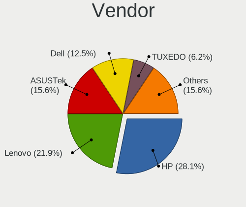

| Name             | Notebooks | Percent |
|------------------|-----------|---------|
| Hewlett-Packard  | 9         | 28.13%  |
| Lenovo           | 7         | 21.88%  |
| ASUSTek Computer | 5         | 15.63%  |
| Dell             | 4         | 12.5%   |
| TUXEDO           | 2         | 6.25%   |
| Sony             | 1         | 3.13%   |
| Notebook         | 1         | 3.13%   |
| Fujitsu Siemens  | 1         | 3.13%   |
| Apple            | 1         | 3.13%   |
| Acer             | 1         | 3.13%   |

Model
-----

Motherboard model

| Name                                   | Notebooks | Percent |
|----------------------------------------|-----------|---------|
| TUXEDO Pulse 15 Gen2                   | 1         | 3.13%   |
| TUXEDO InfinityBook S 15 Gen6          | 1         | 3.13%   |
| Sony VJS121C11N                        | 1         | 3.13%   |
| Notebook W650DC,DD                     | 1         | 3.13%   |
| Lenovo V580 20147                      | 1         | 3.13%   |
| Lenovo ThinkPad T490s 20NX000DRT       | 1         | 3.13%   |
| Lenovo ThinkPad T480 20L50000GE        | 1         | 3.13%   |
| Lenovo ThinkPad T470s W10DG 20JS001FGE | 1         | 3.13%   |
| Lenovo ThinkPad T440s 20AQ006HUS       | 1         | 3.13%   |
| Lenovo ThinkPad S1 Yoga 20C0S0M300     | 1         | 3.13%   |
| Lenovo Legion Y7000 2019 PG0 81T0      | 1         | 3.13%   |
| HP ZBook Studio G3                     | 1         | 3.13%   |
| HP ProBook 450 G2                      | 1         | 3.13%   |
| HP Pavilion Notebook                   | 1         | 3.13%   |
| HP Pavilion g6                         | 1         | 3.13%   |
| HP OMEN by HP Laptop 17-cb1xxx         | 1         | 3.13%   |
| HP Notebook                            | 1         | 3.13%   |
| HP Laptop 15-db0xxx                    | 1         | 3.13%   |
| HP 255 G8 Notebook PC                  | 1         | 3.13%   |
| HP 2000                                | 1         | 3.13%   |
| Fujitsu Siemens AMILO PRO V3515        | 1         | 3.13%   |
| Dell Studio 1555                       | 1         | 3.13%   |
| Dell Latitude D630                     | 1         | 3.13%   |
| Dell Latitude 5290                     | 1         | 3.13%   |
| Dell Inspiron 15-5568                  | 1         | 3.13%   |
| ASUS X540YA                            | 1         | 3.13%   |
| ASUS X202E                             | 1         | 3.13%   |
| ASUS TUF Gaming FX505DU_FX505DU        | 1         | 3.13%   |
| ASUS M51Sr                             | 1         | 3.13%   |
| ASUS 1000                              | 1         | 3.13%   |
| Apple MacBookAir6,1                    | 1         | 3.13%   |
| Acer Aspire 3810T                      | 1         | 3.13%   |

Model Family
------------

Motherboard model prefix

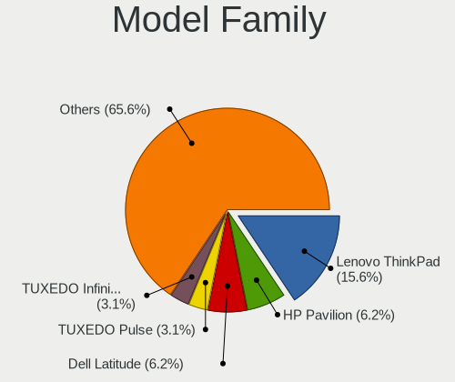

| Name                  | Notebooks | Percent |
|-----------------------|-----------|---------|
| Lenovo ThinkPad       | 5         | 15.63%  |
| HP Pavilion           | 2         | 6.25%   |
| Dell Latitude         | 2         | 6.25%   |
| TUXEDO Pulse          | 1         | 3.13%   |
| TUXEDO InfinityBook   | 1         | 3.13%   |
| Sony VJS121C11N       | 1         | 3.13%   |
| Notebook W650DC       | 1         | 3.13%   |
| Lenovo V580           | 1         | 3.13%   |
| Lenovo Legion         | 1         | 3.13%   |
| HP ZBook              | 1         | 3.13%   |
| HP ProBook            | 1         | 3.13%   |
| HP OMEN               | 1         | 3.13%   |
| HP Notebook           | 1         | 3.13%   |
| HP Laptop             | 1         | 3.13%   |
| HP 255                | 1         | 3.13%   |
| HP 2000               | 1         | 3.13%   |
| Fujitsu Siemens AMILO | 1         | 3.13%   |
| Dell Studio           | 1         | 3.13%   |
| Dell Inspiron         | 1         | 3.13%   |
| ASUS X540YA           | 1         | 3.13%   |
| ASUS X202E            | 1         | 3.13%   |
| ASUS TUF              | 1         | 3.13%   |
| ASUS M51Sr            | 1         | 3.13%   |
| ASUS 1000             | 1         | 3.13%   |
| Apple MacBookAir6     | 1         | 3.13%   |
| Acer Aspire           | 1         | 3.13%   |

MFG Year
--------

Motherboard manufacture year

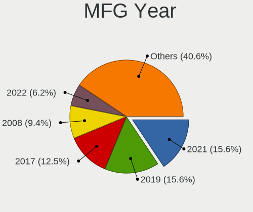

| Year | Notebooks | Percent |
|------|-----------|---------|
| 2021 | 5         | 15.63%  |
| 2019 | 5         | 15.63%  |
| 2017 | 4         | 12.5%   |
| 2012 | 3         | 9.38%   |
| 2008 | 3         | 9.38%   |
| 2022 | 2         | 6.25%   |
| 2020 | 2         | 6.25%   |
| 2018 | 2         | 6.25%   |
| 2009 | 2         | 6.25%   |
| 2015 | 1         | 3.13%   |
| 2014 | 1         | 3.13%   |
| 2011 | 1         | 3.13%   |
| 2006 | 1         | 3.13%   |

Form Factor
-----------

Physical design of the computer

| Name     | Notebooks | Percent |
|----------|-----------|---------|
| Notebook | 32        | 100%    |

Coreboot
--------

Have coreboot on board

| Used | Notebooks | Percent |
|------|-----------|---------|
| No   | 32        | 100%    |

RAM Size
--------

Total RAM memory

| Size in GB  | Notebooks | Percent |
|-------------|-----------|---------|
| 8.01-16.0   | 13        | 40.63%  |
| 16.01-24.0  | 7         | 21.88%  |
| 4.01-8.0    | 6         | 18.75%  |
| 32.01-64.0  | 2         | 6.25%   |
| 2.01-3.0    | 2         | 6.25%   |
| 24.01-32.0  | 1         | 3.13%   |
| 64.01-256.0 | 1         | 3.13%   |

RAM Used
--------

Used RAM memory

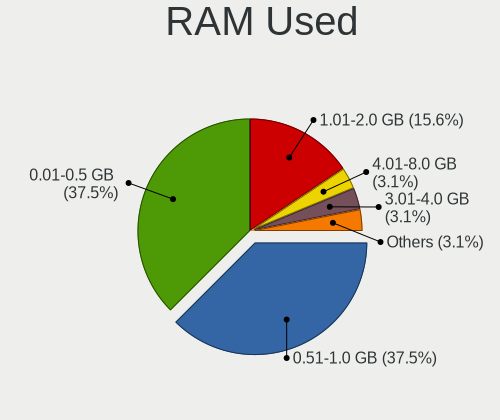

| Used GB  | Notebooks | Percent |
|----------|-----------|---------|
| 0.51-1.0 | 12        | 37.5%   |
| 0.01-0.5 | 12        | 37.5%   |
| 1.01-2.0 | 5         | 15.63%  |
| 4.01-8.0 | 1         | 3.13%   |
| 3.01-4.0 | 1         | 3.13%   |
| 2.01-3.0 | 1         | 3.13%   |

Total Drives
------------

Number of drives on board

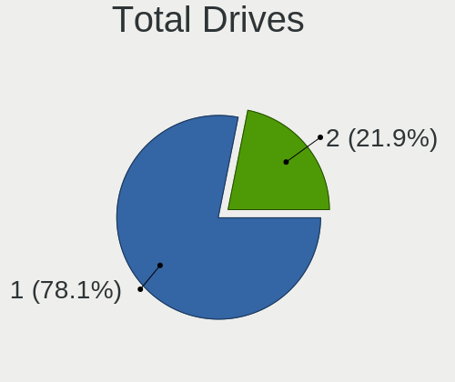

| Drives | Notebooks | Percent |
|--------|-----------|---------|
| 1      | 25        | 78.13%  |
| 2      | 7         | 21.88%  |

Has CD-ROM
----------

Has CD-ROM on board

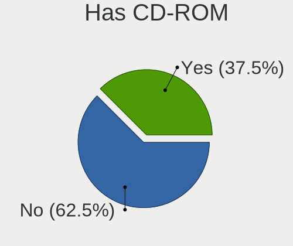

| Presented | Notebooks | Percent |
|-----------|-----------|---------|
| No        | 20        | 62.5%   |
| Yes       | 12        | 37.5%   |

Has Ethernet
------------

Has Ethernet on board

| Presented | Notebooks | Percent |
|-----------|-----------|---------|
| Yes       | 30        | 93.75%  |
| No        | 2         | 6.25%   |

Has WiFi
--------

Has WiFi module

| Presented | Notebooks | Percent |
|-----------|-----------|---------|
| Yes       | 31        | 96.88%  |
| No        | 1         | 3.13%   |

Has Bluetooth
-------------

Has Bluetooth module

| Presented | Notebooks | Percent |
|-----------|-----------|---------|
| Yes       | 21        | 65.63%  |
| No        | 11        | 34.38%  |

Location
--------

Country
-------

Geographic location (country)

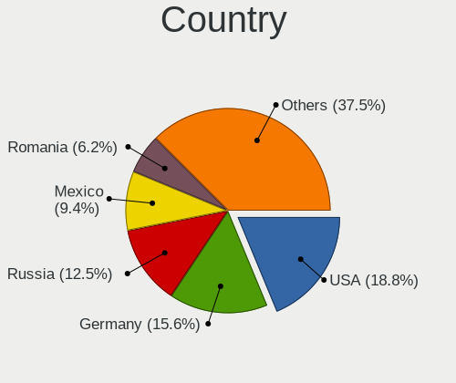

| Country | Notebooks | Percent |
|---------|-----------|---------|
| USA     | 6         | 18.75%  |
| Germany | 5         | 15.63%  |
| Russia  | 4         | 12.5%   |
| Mexico  | 3         | 9.38%   |
| Romania | 2         | 6.25%   |
| Norway  | 2         | 6.25%   |
| Japan   | 2         | 6.25%   |
| China   | 2         | 6.25%   |
| Spain   | 1         | 3.13%   |
| Poland  | 1         | 3.13%   |
| Italy   | 1         | 3.13%   |
| France  | 1         | 3.13%   |
| Denmark | 1         | 3.13%   |
| Belarus | 1         | 3.13%   |

City
----

Geographic location (city)

| City                  | Notebooks | Percent |
|-----------------------|-----------|---------|
| Whittier              | 3         | 9.38%   |
| Tijuana               | 3         | 9.38%   |
| Vollen                | 2         | 6.25%   |
| Setagaya-ku           | 2         | 6.25%   |
| Moscow                | 2         | 6.25%   |
| Drobeta-Turnu Severin | 2         | 6.25%   |
| Changzhou             | 2         | 6.25%   |
| Wloszczowa            | 1         | 3.13%   |
| Ufa                   | 1         | 3.13%   |
| Trieste               | 1         | 3.13%   |
| Sedavi                | 1         | 3.13%   |
| San Bernardino        | 1         | 3.13%   |
| Palmer                | 1         | 3.13%   |
| Novosibirsk           | 1         | 3.13%   |
| Münster              | 1         | 3.13%   |
| Mogilev               | 1         | 3.13%   |
| Hadenfeld             | 1         | 3.13%   |
| Greifswald            | 1         | 3.13%   |
| Fontenay-sous-Bois    | 1         | 3.13%   |
| Düsseldorf         | 1         | 3.13%   |
| Cupertino             | 1         | 3.13%   |
| Copenhagen            | 1         | 3.13%   |
| Berlin                | 1         | 3.13%   |

Drives
------

Drive Vendor
------------

Hard drive vendors

| Vendor              | Notebooks | Drives | Percent |
|---------------------|-----------|--------|---------|
| WDC                 | 8         | 8      | 22.22%  |
| Samsung Electronics | 8         | 10     | 22.22%  |
| Seagate             | 3         | 3      | 8.33%   |
| Toshiba             | 2         | 2      | 5.56%   |
| SanDisk             | 2         | 2      | 5.56%   |
| Crucial             | 2         | 2      | 5.56%   |
| Apple               | 2         | 2      | 5.56%   |
| Transcend           | 1         | 1      | 2.78%   |
| SPCC                | 1         | 1      | 2.78%   |
| SK hynix            | 1         | 1      | 2.78%   |
| PNY                 | 1         | 1      | 2.78%   |
| Micron Technology   | 1         | 1      | 2.78%   |
| Intel               | 1         | 1      | 2.78%   |
| HGST                | 1         | 1      | 2.78%   |
| Gigabyte Technology | 1         | 1      | 2.78%   |
| ASUSTek Computer    | 1         | 2      | 2.78%   |

Drive Model
-----------

Hard drive models

| Model                                     | Notebooks | Percent |
|-------------------------------------------|-----------|---------|
| SanDisk SSD U100 24GB                     | 2         | 5.56%   |
| WDC WD3200BEVT-75ZCT2 320GB               | 1         | 2.78%   |
| WDC WD1200BEVS-07LAT0 120GB               | 1         | 2.78%   |
| WDC WD10SPZX-60Z10T0 1TB                  | 1         | 2.78%   |
| WDC WD10SMRW-11Y43S0 1TB                  | 1         | 2.78%   |
| WDC WD10JPVX-60JC3T0 1TB                  | 1         | 2.78%   |
| WDC WD10JPVT-08A1YT2 1TB                  | 1         | 2.78%   |
| WDC PC SN720 SDAPNTW-1T00-1006 1TB        | 1         | 2.78%   |
| WDC PC SN520 SDAPNUW-256G-1002 256GB      | 1         | 2.78%   |
| Transcend TS512GSSD370S 512GB             | 1         | 2.78%   |
| Toshiba MQ01ABF050 500GB                  | 1         | 2.78%   |
| Toshiba MK1637GSX 160GB                   | 1         | 2.78%   |
| SPCC Solid State Disk 240GB               | 1         | 2.78%   |
| SK hynix SKHynix_HFS512GD9TNG-L5B0B 512GB | 1         | 2.78%   |
| Seagate ST9500325AS 500GB                 | 1         | 2.78%   |
| Seagate ST500LT012-9WS142 500GB           | 1         | 2.78%   |
| Seagate ST500LM030-2E717D 500GB           | 1         | 2.78%   |
| Samsung SSD 980 PRO 250GB                 | 1         | 2.78%   |
| Samsung SSD 980 PRO 1TB                   | 1         | 2.78%   |
| Samsung MZVLB256HBHQ-000L2 256GB          | 1         | 2.78%   |
| Samsung MZVLB256HAHQ-000L7 256GB          | 1         | 2.78%   |
| Samsung MZVLB256HAHQ-00000 256GB          | 1         | 2.78%   |
| Samsung MZVKW512HMJP-000H1 512GB          | 1         | 2.78%   |
| Samsung MZ7TD256HAFV-000L9 256GB          | 1         | 2.78%   |
| Samsung MZ7TD128HAFV-000L1 128GB          | 1         | 2.78%   |
| PNY CS1311 120GB SSD                      | 1         | 2.78%   |
| Micron MTFDHBA512QFD-1AX1AABHA 512GB      | 1         | 2.78%   |
| Intel SSDSCKKW240H6 240GB                 | 1         | 2.78%   |
| HGST HTS725050A7E630 500GB                | 1         | 2.78%   |
| Gigabyte GP-GSTFS31480GNTD 480GB          | 1         | 2.78%   |
| Crucial CT500MX500SSD1 500GB              | 1         | 2.78%   |
| Crucial CT1000P1SSD8 1TB                  | 1         | 2.78%   |
| ASUS PHISON SSD 32GB                      | 1         | 2.78%   |
| Apple SSD SM0512F 500GB                   | 1         | 2.78%   |
| Apple HDD HTS541010A9E662 1TB             | 1         | 2.78%   |

HDD Vendor
----------

Hard disk drive vendors

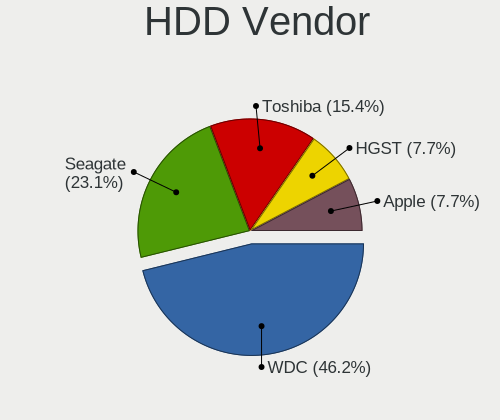

| Vendor  | Notebooks | Drives | Percent |
|---------|-----------|--------|---------|
| WDC     | 6         | 6      | 46.15%  |
| Seagate | 3         | 3      | 23.08%  |
| Toshiba | 2         | 2      | 15.38%  |
| HGST    | 1         | 1      | 7.69%   |
| Apple   | 1         | 1      | 7.69%   |

SSD Vendor
----------

Solid state drive vendors

| Vendor              | Notebooks | Drives | Percent |
|---------------------|-----------|--------|---------|
| SanDisk             | 2         | 2      | 16.67%  |
| Samsung Electronics | 2         | 2      | 16.67%  |
| Transcend           | 1         | 1      | 8.33%   |
| SPCC                | 1         | 1      | 8.33%   |
| PNY                 | 1         | 1      | 8.33%   |
| Intel               | 1         | 1      | 8.33%   |
| Gigabyte Technology | 1         | 1      | 8.33%   |
| Crucial             | 1         | 1      | 8.33%   |
| ASUSTek Computer    | 1         | 2      | 8.33%   |
| Apple               | 1         | 1      | 8.33%   |

Drive Kind
----------

HDD or SSD

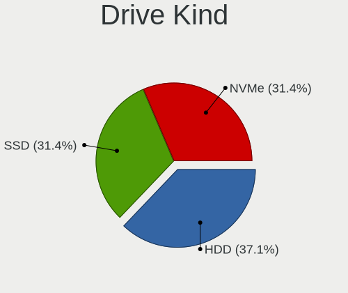

| Kind | Notebooks | Drives | Percent |
|------|-----------|--------|---------|
| HDD  | 13        | 13     | 37.14%  |
| NVMe | 11        | 13     | 31.43%  |
| SSD  | 11        | 13     | 31.43%  |

Drive Connector
---------------

SATA, SAS, NVMe, etc.

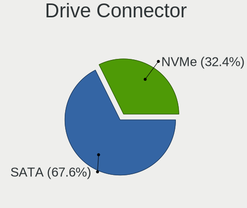

| Type | Notebooks | Drives | Percent |
|------|-----------|--------|---------|
| SATA | 23        | 26     | 67.65%  |
| NVMe | 11        | 13     | 32.35%  |

Drive Size
----------

Size of hard drive

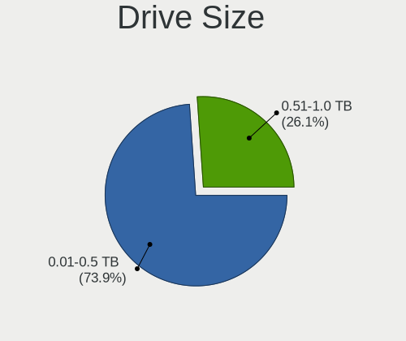

| Size in TB | Notebooks | Drives | Percent |
|------------|-----------|--------|---------|
| 0.01-0.5   | 17        | 20     | 73.91%  |
| 0.51-1.0   | 6         | 6      | 26.09%  |

Space Total
-----------

Amount of disk space available on the file system

| Size in GB | Notebooks | Percent |
|------------|-----------|---------|
| 1-20       | 29        | 90.63%  |
| 101-250    | 2         | 6.25%   |
| 251-500    | 1         | 3.13%   |

Space Used
----------

Amount of used disk space

| Used GB | Notebooks | Percent |
|---------|-----------|---------|
| 1-20    | 32        | 100%    |

Malfunc. Drives
---------------

Drive models with a malfunction

| Model                           | Notebooks | Drives | Percent |
|---------------------------------|-----------|--------|---------|
| WDC WD1200BEVS-07LAT0 120GB     | 1         | 1      | 25%     |
| WDC WD10JPVX-60JC3T0 1TB        | 1         | 1      | 25%     |
| Seagate ST500LT012-9WS142 500GB | 1         | 1      | 25%     |
| HGST HTS725050A7E630 500GB      | 1         | 1      | 25%     |

Malfunc. Drive Vendor
---------------------

Vendors of faulty drives

| Vendor  | Notebooks | Drives | Percent |
|---------|-----------|--------|---------|
| WDC     | 2         | 2      | 50%     |
| Seagate | 1         | 1      | 25%     |
| HGST    | 1         | 1      | 25%     |

Malfunc. HDD Vendor
-------------------

Vendors of faulty HDD drives

| Vendor  | Notebooks | Drives | Percent |
|---------|-----------|--------|---------|
| WDC     | 2         | 2      | 50%     |
| Seagate | 1         | 1      | 25%     |
| HGST    | 1         | 1      | 25%     |

Malfunc. Drive Kind
-------------------

Kinds of faulty drives

| Kind | Notebooks | Drives | Percent |
|------|-----------|--------|---------|
| HDD  | 4         | 4      | 100%    |

Failed Drives
-------------

Failed drive models

Zero info for selected period =(

Failed Drive Vendor
-------------------

Failed drive vendors

Zero info for selected period =(

Drive Status
------------

Number of failed and malfunc. drives

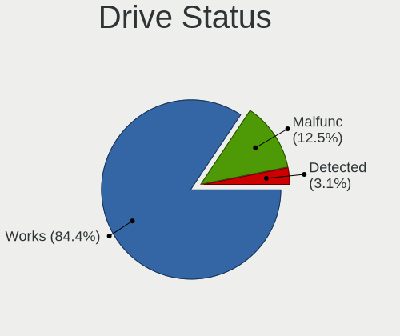

| Status   | Notebooks | Drives | Percent |
|----------|-----------|--------|---------|
| Works    | 27        | 33     | 84.38%  |
| Malfunc  | 4         | 4      | 12.5%   |
| Detected | 1         | 2      | 3.13%   |

Storage controller
------------------

Storage Vendor
--------------

Storage controller vendors

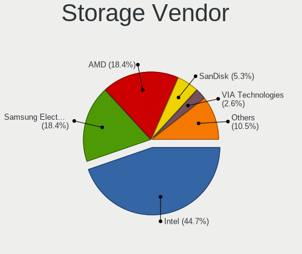

| Vendor                    | Notebooks | Percent |
|---------------------------|-----------|---------|
| Intel                     | 17        | 44.74%  |
| Samsung Electronics       | 7         | 18.42%  |
| AMD                       | 7         | 18.42%  |
| SanDisk                   | 2         | 5.26%   |
| VIA Technologies          | 1         | 2.63%   |
| SK hynix                  | 1         | 2.63%   |
| Micron/Crucial Technology | 1         | 2.63%   |
| Micron Technology         | 1         | 2.63%   |
| JMicron Technology        | 1         | 2.63%   |

Storage Model
-------------

Storage controller models

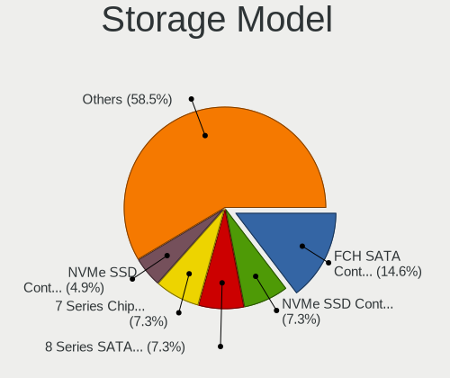

| Model                                                                         | Notebooks | Percent |
|-------------------------------------------------------------------------------|-----------|---------|
| AMD FCH SATA Controller [AHCI mode]                                           | 6         | 14.63%  |
| Samsung NVMe SSD Controller SM981/PM981/PM983                                 | 3         | 7.32%   |
| Intel 8 Series SATA Controller 1 [AHCI mode]                                  | 3         | 7.32%   |
| Intel 7 Series Chipset Family 6-port SATA Controller [AHCI mode]              | 3         | 7.32%   |
| Samsung NVMe SSD Controller PM9A1/PM9A3/980PRO                                | 2         | 4.88%   |
| Intel Sunrise Point-LP SATA Controller [AHCI mode]                            | 2         | 4.88%   |
| Intel Q170/Q150/B150/H170/H110/Z170/CM236 Chipset SATA Controller [AHCI Mode] | 2         | 4.88%   |
| Intel 82801IBM/IEM (ICH9M/ICH9M-E) 4 port SATA Controller [AHCI mode]         | 2         | 4.88%   |
| Intel 82801HM/HEM (ICH8M/ICH8M-E) SATA Controller [AHCI mode]                 | 2         | 4.88%   |
| Intel 82801HM/HEM (ICH8M/ICH8M-E) IDE Controller                              | 2         | 4.88%   |
| VIA VT82C586A/B/VT82C686/A/B/VT823x/A/C PIPC Bus Master IDE                   | 1         | 2.44%   |
| VIA VT8237A SATA 2-Port Controller                                            | 1         | 2.44%   |
| SK hynix hynix unknown                                                        | 1         | 2.44%   |
| SanDisk WD Blue SN500 / PC SN520 NVMe SSD                                     | 1         | 2.44%   |
| SanDisk WD Black 2018/SN750 / PC SN720 NVMe SSD                               | 1         | 2.44%   |
| Samsung NVMe SSD Controller SM961/PM961/SM963                                 | 1         | 2.44%   |
| Samsung Apple PCIe SSD                                                        | 1         | 2.44%   |
| Micron/Crucial NVMe Storage Controller                                        | 1         | 2.44%   |
| Micron NVMe Storage Controller                                                | 1         | 2.44%   |
| JMicron JMB360 AHCI Controller                                                | 1         | 2.44%   |
| Intel Cannon Lake Mobile PCH SATA AHCI Controller                             | 1         | 2.44%   |
| Intel 82801GBM/GHM (ICH7-M Family) SATA Controller [IDE mode]                 | 1         | 2.44%   |
| Intel 82801 Mobile SATA Controller [RAID mode]                                | 1         | 2.44%   |
| AMD FCH SATA Controller [IDE mode]                                            | 1         | 2.44%   |

Storage Kind
------------

Kind of storage controller (IDE, SATA, NVMe, SAS, ...)

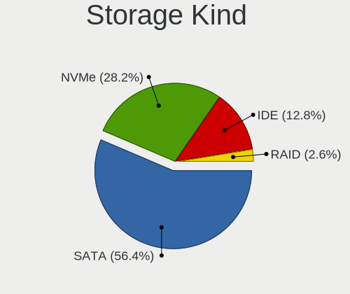

| Kind | Notebooks | Percent |
|------|-----------|---------|
| SATA | 22        | 56.41%  |
| NVMe | 11        | 28.21%  |
| IDE  | 5         | 12.82%  |
| RAID | 1         | 2.56%   |

Processor
---------

CPU Vendor
----------

Processor vendors

| Vendor | Notebooks | Percent |
|--------|-----------|---------|
| Intel  | 24        | 75%     |
| AMD    | 8         | 25%     |

CPU Model
---------

Processor models

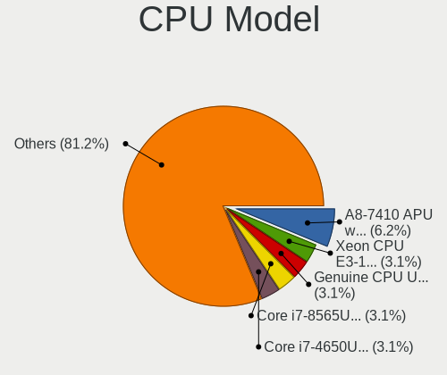

| Model                                         | Notebooks | Percent |
|-----------------------------------------------|-----------|---------|
| AMD A8-7410 APU with AMD Radeon R5 Graphics   | 2         | 6.25%   |
| Intel Xeon CPU E3-1505M v5 @ 2.80GHz          | 1         | 3.13%   |
| Intel Genuine CPU U7300 @ 1.30GHz             | 1         | 3.13%   |
| Intel CPU Version                             | 1         | 3.13%   |
| Intel Core i7-8565U CPU @ 1.80GHz             | 1         | 3.13%   |
| Intel Core i7-4650U CPU @ 1.70GHz             | 1         | 3.13%   |
| Intel Core i7-4600U CPU @ 2.10GHz             | 1         | 3.13%   |
| Intel Core i7-3520M CPU @ 2.90GHz             | 1         | 3.13%   |
| Intel Core i7-10750H CPU @ 2.60GHz            | 1         | 3.13%   |
| Intel Core i5-9300HF CPU @ 2.40GHz            | 1         | 3.13%   |
| Intel Core i5-8265U CPU @ 1.60GHz             | 1         | 3.13%   |
| Intel Core i5-8250U CPU @ 1.60GHz             | 1         | 3.13%   |
| Intel Core i5-6500 CPU @ 3.20GHz              | 1         | 3.13%   |
| Intel Core i5-6300U CPU @ 2.40GHz             | 1         | 3.13%   |
| Intel Core i5-6200U CPU @ 2.30GHz             | 1         | 3.13%   |
| Intel Core i5-4210U CPU @ 1.70GHz             | 1         | 3.13%   |
| Intel Core i5-4200U CPU @ 1.60GHz             | 1         | 3.13%   |
| Intel Core i3-8130U CPU @ 2.20GHz             | 1         | 3.13%   |
| Intel Core i3-3217U CPU @ 1.80GHz             | 1         | 3.13%   |
| Intel Core i3-3110M CPU @ 2.40GHz             | 1         | 3.13%   |
| Intel Core 2 Duo CPU T8100 @ 2.10GHz          | 1         | 3.13%   |
| Intel Core 2 Duo                              | 1         | 3.13%   |
| Intel Celeron M CPU                           | 1         | 3.13%   |
| Intel Atom CPU N270 @ 1.60GHz                 | 1         | 3.13%   |
| Intel 11th Gen Core i7-1165G7 @ 2.80GHz       | 1         | 3.13%   |
| AMD Ryzen 7 5700U with Radeon Graphics        | 1         | 3.13%   |
| AMD Ryzen 7 3750H with Radeon Vega Mobile Gfx | 1         | 3.13%   |
| AMD Ryzen 5 5500U with Radeon Graphics        | 1         | 3.13%   |
| AMD A9-9425 RADEON R5, 5 COMPUTE CORES 2C+3G  | 1         | 3.13%   |
| AMD A6-6310 APU with AMD Radeon R4 Graphics   | 1         | 3.13%   |
| AMD A6-3420M APU with Radeon HD Graphics      | 1         | 3.13%   |

CPU Model Family
----------------

Processor model prefix

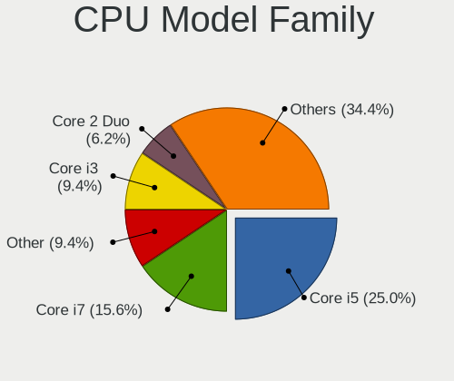

| Model            | Notebooks | Percent |
|------------------|-----------|---------|
| Intel Core i5    | 8         | 25%     |
| Intel Core i7    | 5         | 15.63%  |
| Other            | 3         | 9.38%   |
| Intel Core i3    | 3         | 9.38%   |
| Intel Core 2 Duo | 2         | 6.25%   |
| AMD Ryzen 7      | 2         | 6.25%   |
| AMD A8           | 2         | 6.25%   |
| AMD A6           | 2         | 6.25%   |
| Intel Xeon       | 1         | 3.13%   |
| Intel Genuine    | 1         | 3.13%   |
| Intel Celeron M  | 1         | 3.13%   |
| Intel Atom       | 1         | 3.13%   |
| AMD Ryzen 5      | 1         | 3.13%   |

CPU Cores
---------

Number of processor cores

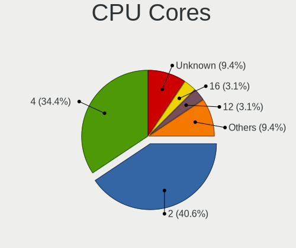

| Number  | Notebooks | Percent |
|---------|-----------|---------|
| 2       | 13        | 40.63%  |
| 4       | 11        | 34.38%  |
| Unknown | 3         | 9.38%   |
| 16      | 1         | 3.13%   |
| 12      | 1         | 3.13%   |
| 8       | 1         | 3.13%   |
| 6       | 1         | 3.13%   |
| 1       | 1         | 3.13%   |

CPU Sockets
-----------

Number of sockets

| Number | Notebooks | Percent |
|--------|-----------|---------|
| 1      | 32        | 100%    |

CPU Threads
-----------

Threads per core (Hyper-Threading)

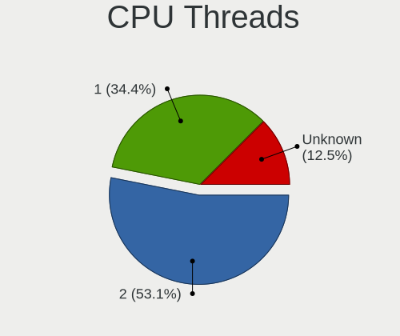

| Number  | Notebooks | Percent |
|---------|-----------|---------|
| 2       | 17        | 53.13%  |
| 1       | 11        | 34.38%  |
| Unknown | 4         | 12.5%   |

CPU Microarch
-------------

Microarchitecture

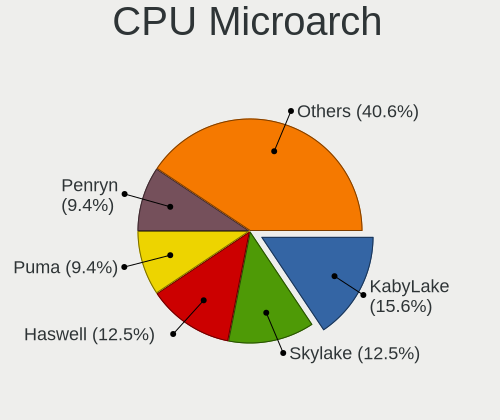

| Name      | Notebooks | Percent |
|-----------|-----------|---------|
| KabyLake  | 5         | 15.63%  |
| Skylake   | 4         | 12.5%   |
| Haswell   | 4         | 12.5%   |
| Puma      | 3         | 9.38%   |
| Penryn    | 3         | 9.38%   |
| IvyBridge | 3         | 9.38%   |
| Unknown   | 2         | 6.25%   |
| Zen+      | 1         | 3.13%   |
| TigerLake | 1         | 3.13%   |
| P6        | 1         | 3.13%   |
| K10 Llano | 1         | 3.13%   |
| Excavator | 1         | 3.13%   |
| Core      | 1         | 3.13%   |
| CometLake | 1         | 3.13%   |
| Bonnell   | 1         | 3.13%   |

Graphics
--------

GPU Vendor
----------

Vendors of graphics cards

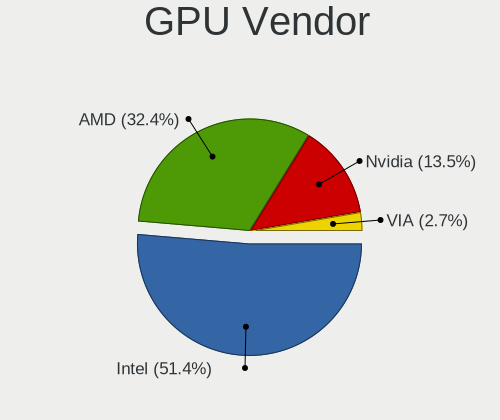

| Vendor           | Notebooks | Percent |
|------------------|-----------|---------|
| Intel            | 19        | 51.35%  |
| AMD              | 12        | 32.43%  |
| Nvidia           | 5         | 13.51%  |
| VIA Technologies | 1         | 2.7%    |

GPU Model
---------

Graphics card models

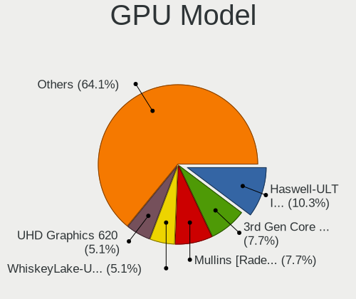

| Model                                                                         | Notebooks | Percent |
|-------------------------------------------------------------------------------|-----------|---------|
| Intel Haswell-ULT Integrated Graphics Controller                              | 4         | 10.26%  |
| Intel 3rd Gen Core processor Graphics Controller                              | 3         | 7.69%   |
| AMD Mullins [Radeon R4/R5 Graphics]                                           | 3         | 7.69%   |
| Intel WhiskeyLake-U GT2 [UHD Graphics 620]                                    | 2         | 5.13%   |
| Intel UHD Graphics 620                                                        | 2         | 5.13%   |
| Intel Skylake GT2 [HD Graphics 520]                                           | 2         | 5.13%   |
| AMD Lucienne                                                                  | 2         | 5.13%   |
| VIA Technologies CN896/VN896/P4M900 [Chrome 9 HC]                             | 1         | 2.56%   |
| Nvidia TU117M [GeForce GTX 1650 Mobile / Max-Q]                               | 1         | 2.56%   |
| Nvidia TU116M [GeForce GTX 1660 Ti Mobile]                                    | 1         | 2.56%   |
| Nvidia TU104BM [GeForce RTX 2070 SUPER Mobile / Max-Q]                        | 1         | 2.56%   |
| Nvidia GM107M [GeForce GTX 950M]                                              | 1         | 2.56%   |
| Nvidia GK107M [GeForce GT 645M]                                               | 1         | 2.56%   |
| Intel TigerLake-LP GT2 [Iris Xe Graphics]                                     | 1         | 2.56%   |
| Intel Mobile GM965/GL960 Integrated Graphics Controller (secondary)           | 1         | 2.56%   |
| Intel Mobile GM965/GL960 Integrated Graphics Controller (primary)             | 1         | 2.56%   |
| Intel Mobile 945GSE Express Integrated Graphics Controller                    | 1         | 2.56%   |
| Intel Mobile 945GM/GMS/GME, 943/940GML Express Integrated Graphics Controller | 1         | 2.56%   |
| Intel Mobile 4 Series Chipset Integrated Graphics Controller                  | 1         | 2.56%   |
| Intel HD Graphics P530                                                        | 1         | 2.56%   |
| Intel HD Graphics 530                                                         | 1         | 2.56%   |
| AMD Topaz PRO [Radeon R5 M255]                                                | 1         | 2.56%   |
| AMD Sumo [Radeon HD 6520G]                                                    | 1         | 2.56%   |
| AMD Stoney [Radeon R2/R3/R4/R5 Graphics]                                      | 1         | 2.56%   |
| AMD RV710/M92 [Mobility Radeon HD 4530/4570/5145/530v/540v/545v]              | 1         | 2.56%   |
| AMD RV710/M92 [Mobility Radeon HD 4330/4350/4550]                             | 1         | 2.56%   |
| AMD RV610/M72-S [Mobility Radeon HD 2400]                                     | 1         | 2.56%   |
| AMD Picasso/Raven 2 [Radeon Vega Series / Radeon Vega Mobile Series]          | 1         | 2.56%   |

GPU Combo
---------

Combinations of graphics cards

| Name           | Notebooks | Percent |
|----------------|-----------|---------|
| 1 x Intel      | 13        | 40.63%  |
| 1 x AMD        | 10        | 31.25%  |
| 2 x Intel      | 2         | 6.25%   |
| 1 x Nvidia     | 2         | 6.25%   |
| Intel + Nvidia | 2         | 6.25%   |
| 1 x VIA        | 1         | 3.13%   |
| Intel + AMD    | 1         | 3.13%   |
| AMD + Nvidia   | 1         | 3.13%   |

GPU Driver
----------

Free vs proprietary

| Driver  | Notebooks | Percent |
|---------|-----------|---------|
| Free    | 29        | 90.63%  |
| Unknown | 3         | 9.38%   |

GPU Memory
----------

Total video memory

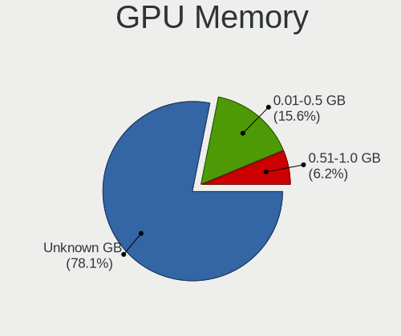

| Size in GB | Notebooks | Percent |
|------------|-----------|---------|
| Unknown    | 25        | 78.13%  |
| 0.01-0.5   | 5         | 15.63%  |
| 0.51-1.0   | 2         | 6.25%   |

Monitor
-------

Monitor Vendor
--------------

Monitor vendors

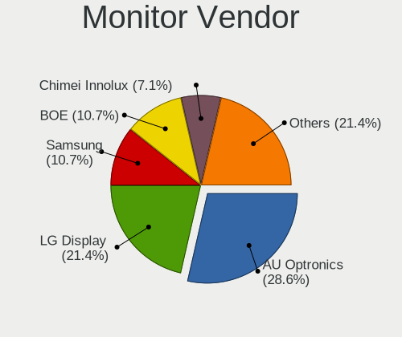

| Vendor                  | Notebooks | Percent |
|-------------------------|-----------|---------|
| AU Optronics            | 8         | 28.57%  |
| LG Display              | 6         | 21.43%  |
| Samsung Electronics     | 3         | 10.71%  |
| BOE                     | 3         | 10.71%  |
| Chimei Innolux          | 2         | 7.14%   |
| Sharp                   | 1         | 3.57%   |
| Hewlett-Packard         | 1         | 3.57%   |
| HannStar                | 1         | 3.57%   |
| Chi Mei Optoelectronics | 1         | 3.57%   |
| Apple                   | 1         | 3.57%   |
| AOC                     | 1         | 3.57%   |

Monitor Model
-------------

Monitor models

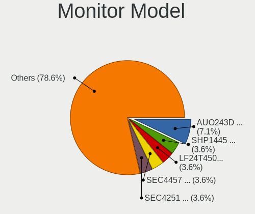

| Model                                                                    | Notebooks | Percent |
|--------------------------------------------------------------------------|-----------|---------|
| AU Optronics LCD Monitor AUO243D 1920x1080 310x170mm 13.9-inch           | 2         | 7.14%   |
| Sharp LCD Monitor SHP1445 3840x2160 350x190mm 15.7-inch                  | 1         | 3.57%   |
| Samsung Electronics LF24T450F SAM7094 1920x1080 530x300mm 24.0-inch      | 1         | 3.57%   |
| Samsung Electronics LCD Monitor SEC4457 1440x900 300x190mm 14.0-inch     | 1         | 3.57%   |
| Samsung Electronics LCD Monitor SEC4251 1366x768 340x190mm 15.3-inch     | 1         | 3.57%   |
| LG Display LCD Monitor LGD7001 1366x768 340x190mm 15.3-inch              | 1         | 3.57%   |
| LG Display LCD Monitor LGD0612 1920x1080 340x190mm 15.3-inch             | 1         | 3.57%   |
| LG Display LCD Monitor LGD0414 1920x1080 280x160mm 12.7-inch             | 1         | 3.57%   |
| LG Display LCD Monitor LGD040A 1920x1080 310x170mm 13.9-inch             | 1         | 3.57%   |
| LG Display LCD Monitor LGD034D 1366x768 340x190mm 15.3-inch              | 1         | 3.57%   |
| LG Display LCD Monitor LGD01F7 1366x768 290x160mm 13.0-inch              | 1         | 3.57%   |
| Hewlett-Packard 24fw HPN3545 1920x1080 530x300mm 24.0-inch               | 1         | 3.57%   |
| HannStar LCD Monitor HSD03E9 1024x600 220x130mm 10.1-inch                | 1         | 3.57%   |
| Chimei Innolux LCD Monitor CMN15CA 1366x768 340x190mm 15.3-inch          | 1         | 3.57%   |
| Chimei Innolux LCD Monitor CMN15BE 1366x768 340x190mm 15.3-inch          | 1         | 3.57%   |
| Chi Mei Optoelectronics LCD Monitor CMO15A3 1366x768 350x190mm 15.7-inch | 1         | 3.57%   |
| BOE LCD Monitor BOE069B 1600x900 380x210mm 17.1-inch                     | 1         | 3.57%   |
| BOE LCD Monitor BOE0691 1920x1080 280x160mm 12.7-inch                    | 1         | 3.57%   |
| BOE LCD Monitor BOE062B 1920x1080 340x190mm 15.3-inch                    | 1         | 3.57%   |
| AU Optronics LCD Monitor AUO8174 1280x800 330x210mm 15.4-inch            | 1         | 3.57%   |
| AU Optronics LCD Monitor AUO70EC 1366x768 340x190mm 15.3-inch            | 1         | 3.57%   |
| AU Optronics LCD Monitor AUO305C 1366x768 260x140mm 11.6-inch            | 1         | 3.57%   |
| AU Optronics LCD Monitor AUO10ED 1920x1080 340x190mm 15.3-inch           | 1         | 3.57%   |
| AU Optronics LCD Monitor AUO10EC 1366x768 340x190mm 15.3-inch            | 1         | 3.57%   |
| AU Optronics LCD Monitor AUO106C 1366x768 280x160mm 12.7-inch            | 1         | 3.57%   |
| Apple Color LCD APP9CF3 1366x768 260x140mm 11.6-inch                     | 1         | 3.57%   |
| AOC U2879G6 AOC2879 3840x2160 620x340mm 27.8-inch                        | 1         | 3.57%   |

Monitor Resolution
------------------

Monitor screen resolution

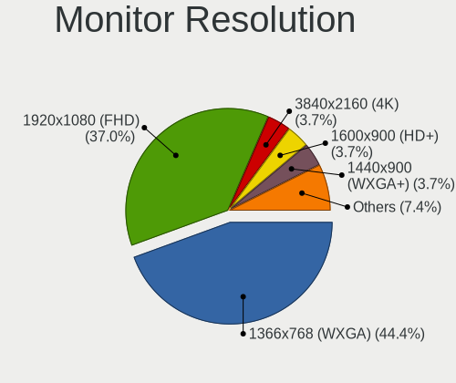

| Resolution       | Notebooks | Percent |
|------------------|-----------|---------|
| 1366x768 (WXGA)  | 12        | 44.44%  |
| 1920x1080 (FHD)  | 10        | 37.04%  |
| 3840x2160 (4K)   | 1         | 3.7%    |
| 1600x900 (HD+)   | 1         | 3.7%    |
| 1440x900 (WXGA+) | 1         | 3.7%    |
| 1280x800 (WXGA)  | 1         | 3.7%    |
| 1024x600         | 1         | 3.7%    |

Monitor Diagonal
----------------

Diagonal size in inches

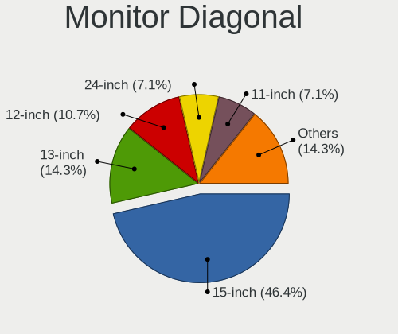

| Inches | Notebooks | Percent |
|--------|-----------|---------|
| 15     | 13        | 46.43%  |
| 13     | 4         | 14.29%  |
| 12     | 3         | 10.71%  |
| 24     | 2         | 7.14%   |
| 11     | 2         | 7.14%   |
| 27     | 1         | 3.57%   |
| 17     | 1         | 3.57%   |
| 14     | 1         | 3.57%   |
| 10     | 1         | 3.57%   |

Monitor Width
-------------

Physical width

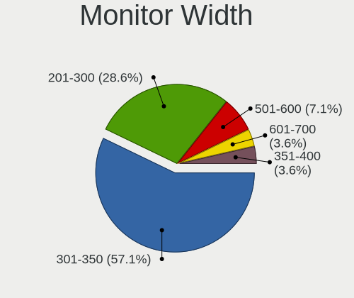

| Width in mm | Notebooks | Percent |
|-------------|-----------|---------|
| 301-350     | 16        | 57.14%  |
| 201-300     | 8         | 28.57%  |
| 501-600     | 2         | 7.14%   |
| 601-700     | 1         | 3.57%   |
| 351-400     | 1         | 3.57%   |

Aspect Ratio
------------

Proportional relationship between the width and the height

| Ratio | Notebooks | Percent |
|-------|-----------|---------|
| 16/9  | 23        | 92%     |
| 16/10 | 2         | 8%      |

Monitor Area
------------

Area in inch²

| Area in inch² | Notebooks | Percent |
|----------------|-----------|---------|
| 91-100         | 10        | 35.71%  |
| 81-90          | 4         | 14.29%  |
| 61-70          | 3         | 10.71%  |
| 101-110        | 3         | 10.71%  |
| 51-60          | 2         | 7.14%   |
| 201-250        | 2         | 7.14%   |
| 71-80          | 1         | 3.57%   |
| 41-50          | 1         | 3.57%   |
| 301-350        | 1         | 3.57%   |
| 121-130        | 1         | 3.57%   |

Pixel Density
-------------

Pixels per inch

| Density       | Notebooks | Percent |
|---------------|-----------|---------|
| 121-160       | 12        | 42.86%  |
| 101-120       | 9         | 32.14%  |
| 51-100        | 4         | 14.29%  |
| 161-240       | 2         | 7.14%   |
| More than 240 | 1         | 3.57%   |

Multiple Monitors
-----------------

Total monitors connected

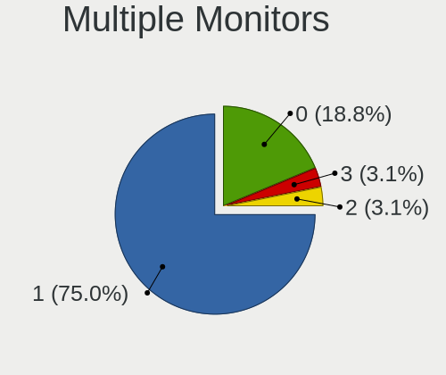

| Total | Notebooks | Percent |
|-------|-----------|---------|
| 1     | 24        | 75%     |
| 0     | 6         | 18.75%  |
| 3     | 1         | 3.13%   |
| 2     | 1         | 3.13%   |

Network
-------

Net Controller Vendor
---------------------

Controller vendors

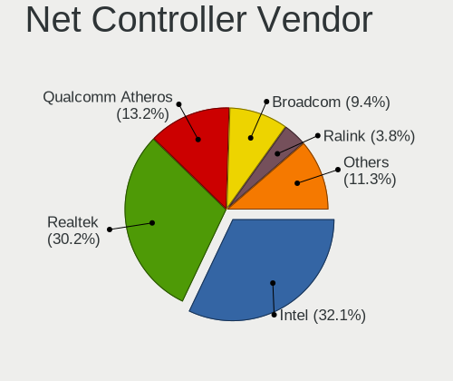

| Vendor                | Notebooks | Percent |
|-----------------------|-----------|---------|
| Intel                 | 17        | 32.08%  |
| Realtek Semiconductor | 16        | 30.19%  |
| Qualcomm Atheros      | 7         | 13.21%  |
| Broadcom              | 5         | 9.43%   |
| Ralink                | 2         | 3.77%   |
| VIA Technologies      | 1         | 1.89%   |
| Sierra Wireless       | 1         | 1.89%   |
| Samsung Electronics   | 1         | 1.89%   |
| Ralink Technology     | 1         | 1.89%   |
| Fibocom               | 1         | 1.89%   |
| Atheros               | 1         | 1.89%   |

Net Controller Model
--------------------

Controller models

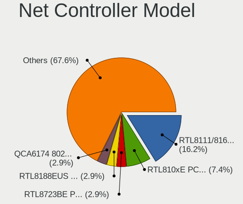

| Model                                                             | Notebooks | Percent |
|-------------------------------------------------------------------|-----------|---------|
| Realtek RTL8111/8168/8411 PCI Express Gigabit Ethernet Controller | 11        | 16.18%  |
| Realtek RTL810xE PCI Express Fast Ethernet controller             | 5         | 7.35%   |
| Realtek RTL8723BE PCIe Wireless Network Adapter                   | 2         | 2.94%   |
| Realtek RTL8188EUS 802.11n Wireless Network Adapter               | 2         | 2.94%   |
| Qualcomm Atheros QCA6174 802.11ac Wireless Network Adapter        | 2         | 2.94%   |
| Intel Wireless 8260                                               | 2         | 2.94%   |
| Intel Wireless 7260                                               | 2         | 2.94%   |
| Intel Wireless 3165                                               | 2         | 2.94%   |
| Intel Wi-Fi 6 AX200                                               | 2         | 2.94%   |
| VIA VT6102/VT6103 [Rhine-II]                                      | 1         | 1.47%   |
| Sierra Wireless EM7455                                            | 1         | 1.47%   |
| Samsung GT-I9070 (network tethering, USB debugging enabled)       | 1         | 1.47%   |
| Realtek RTL8822CE 802.11ac PCIe Wireless Network Adapter          | 1         | 1.47%   |
| Realtek RTL8821CE 802.11ac PCIe Wireless Network Adapter          | 1         | 1.47%   |
| Realtek RTL8723DE Wireless Network Adapter                        | 1         | 1.47%   |
| Realtek Realtek Bluetooth 4.2 Adapter                             | 1         | 1.47%   |
| Ralink MT7610U ("Archer T2U" 2.4G+5G WLAN Adapter                 | 1         | 1.47%   |
| Ralink RT5390R 802.11bgn PCIe Wireless Network Adapter            | 1         | 1.47%   |
| Ralink RT5390 Wireless 802.11n 1T/1R PCIe                         | 1         | 1.47%   |
| Qualcomm Atheros QCA9565 / AR9565 Wireless Network Adapter        | 1         | 1.47%   |
| Qualcomm Atheros Attansic L1 Gigabit Ethernet                     | 1         | 1.47%   |
| Qualcomm Atheros AR9485 Wireless Network Adapter                  | 1         | 1.47%   |
| Qualcomm Atheros AR8162 Fast Ethernet                             | 1         | 1.47%   |
| Qualcomm Atheros AR8131 Gigabit Ethernet                          | 1         | 1.47%   |
| Qualcomm Atheros AR8121/AR8113/AR8114 Gigabit or Fast Ethernet    | 1         | 1.47%   |
| Intel Wireless 8265 / 8275                                        | 1         | 1.47%   |
| Intel WiMAX/WiFi Link 5150                                        | 1         | 1.47%   |
| Intel WiFi Link 5100                                              | 1         | 1.47%   |
| Intel Wi-Fi 6 AX201                                               | 1         | 1.47%   |
| Intel PRO/Wireless 4965 AG or AGN [Kedron] Network Connection     | 1         | 1.47%   |
| Intel Ethernet Connection I219-LM                                 | 1         | 1.47%   |
| Intel Ethernet Connection I218-LM                                 | 1         | 1.47%   |
| Intel Ethernet Connection (6) I219-V                              | 1         | 1.47%   |
| Intel Ethernet Connection (4) I219-V                              | 1         | 1.47%   |
| Intel Ethernet Connection (4) I219-LM                             | 1         | 1.47%   |
| Intel Ethernet Connection (2) I219-LM                             | 1         | 1.47%   |
| Intel Comet Lake PCH CNVi WiFi                                    | 1         | 1.47%   |
| Intel Cannon Point-LP CNVi [Wireless-AC]                          | 1         | 1.47%   |
| Intel Cannon Lake PCH CNVi WiFi                                   | 1         | 1.47%   |
| Fibocom L830-EB-00 LTE WWAN Modem                                 | 1         | 1.47%   |

Wireless Vendor
---------------

Wireless vendors

| Vendor                | Notebooks | Percent |
|-----------------------|-----------|---------|
| Intel                 | 16        | 45.71%  |
| Realtek Semiconductor | 7         | 20%     |
| Qualcomm Atheros      | 4         | 11.43%  |
| Broadcom              | 3         | 8.57%   |
| Ralink                | 2         | 5.71%   |
| Sierra Wireless       | 1         | 2.86%   |
| Ralink Technology     | 1         | 2.86%   |
| Atheros               | 1         | 2.86%   |

Wireless Model
--------------

Wireless models

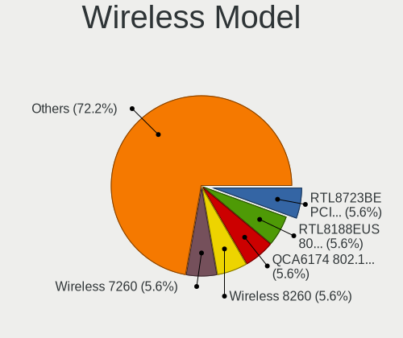

| Model                                                                | Notebooks | Percent |
|----------------------------------------------------------------------|-----------|---------|
| Realtek RTL8723BE PCIe Wireless Network Adapter                      | 2         | 5.56%   |
| Realtek RTL8188EUS 802.11n Wireless Network Adapter                  | 2         | 5.56%   |
| Qualcomm Atheros QCA6174 802.11ac Wireless Network Adapter           | 2         | 5.56%   |
| Intel Wireless 8260                                                  | 2         | 5.56%   |
| Intel Wireless 7260                                                  | 2         | 5.56%   |
| Intel Wireless 3165                                                  | 2         | 5.56%   |
| Intel Wi-Fi 6 AX200                                                  | 2         | 5.56%   |
| Sierra Wireless EM7455                                               | 1         | 2.78%   |
| Realtek RTL8822CE 802.11ac PCIe Wireless Network Adapter             | 1         | 2.78%   |
| Realtek RTL8821CE 802.11ac PCIe Wireless Network Adapter             | 1         | 2.78%   |
| Realtek RTL8723DE Wireless Network Adapter                           | 1         | 2.78%   |
| Realtek Realtek Bluetooth 4.2 Adapter                                | 1         | 2.78%   |
| Ralink MT7610U ("Archer T2U" 2.4G+5G WLAN Adapter                    | 1         | 2.78%   |
| Ralink RT5390R 802.11bgn PCIe Wireless Network Adapter               | 1         | 2.78%   |
| Ralink RT5390 Wireless 802.11n 1T/1R PCIe                            | 1         | 2.78%   |
| Qualcomm Atheros QCA9565 / AR9565 Wireless Network Adapter           | 1         | 2.78%   |
| Qualcomm Atheros AR9485 Wireless Network Adapter                     | 1         | 2.78%   |
| Intel Wireless 8265 / 8275                                           | 1         | 2.78%   |
| Intel WiMAX/WiFi Link 5150                                           | 1         | 2.78%   |
| Intel WiFi Link 5100                                                 | 1         | 2.78%   |
| Intel Wi-Fi 6 AX201                                                  | 1         | 2.78%   |
| Intel PRO/Wireless 4965 AG or AGN [Kedron] Network Connection        | 1         | 2.78%   |
| Intel Comet Lake PCH CNVi WiFi                                       | 1         | 2.78%   |
| Intel Cannon Point-LP CNVi [Wireless-AC]                             | 1         | 2.78%   |
| Intel Cannon Lake PCH CNVi WiFi                                      | 1         | 2.78%   |
| Broadcom BCM4360 802.11ac Wireless Network Adapter                   | 1         | 2.78%   |
| Broadcom BCM43142 802.11b/g/n                                        | 1         | 2.78%   |
| Broadcom BCM4313 802.11bgn Wireless Network Adapter                  | 1         | 2.78%   |
| Atheros AR2413/AR2414 Wireless Network Adapter [AR5005G(S) 802.11bg] | 1         | 2.78%   |

Ethernet Vendor
---------------

Ethernet vendors

| Vendor                | Notebooks | Percent |
|-----------------------|-----------|---------|
| Realtek Semiconductor | 16        | 51.61%  |
| Intel                 | 6         | 19.35%  |
| Qualcomm Atheros      | 4         | 12.9%   |
| Broadcom              | 3         | 9.68%   |
| VIA Technologies      | 1         | 3.23%   |
| Samsung Electronics   | 1         | 3.23%   |

Ethernet Model
--------------

Ethernet models

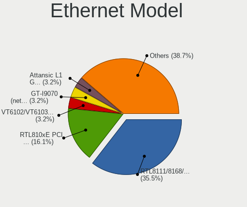

| Model                                                             | Notebooks | Percent |
|-------------------------------------------------------------------|-----------|---------|
| Realtek RTL8111/8168/8411 PCI Express Gigabit Ethernet Controller | 11        | 35.48%  |
| Realtek RTL810xE PCI Express Fast Ethernet controller             | 5         | 16.13%  |
| VIA VT6102/VT6103 [Rhine-II]                                      | 1         | 3.23%   |
| Samsung GT-I9070 (network tethering, USB debugging enabled)       | 1         | 3.23%   |
| Qualcomm Atheros Attansic L1 Gigabit Ethernet                     | 1         | 3.23%   |
| Qualcomm Atheros AR8162 Fast Ethernet                             | 1         | 3.23%   |
| Qualcomm Atheros AR8131 Gigabit Ethernet                          | 1         | 3.23%   |
| Qualcomm Atheros AR8121/AR8113/AR8114 Gigabit or Fast Ethernet    | 1         | 3.23%   |
| Intel Ethernet Connection I219-LM                                 | 1         | 3.23%   |
| Intel Ethernet Connection I218-LM                                 | 1         | 3.23%   |
| Intel Ethernet Connection (6) I219-V                              | 1         | 3.23%   |
| Intel Ethernet Connection (4) I219-V                              | 1         | 3.23%   |
| Intel Ethernet Connection (4) I219-LM                             | 1         | 3.23%   |
| Intel Ethernet Connection (2) I219-LM                             | 1         | 3.23%   |
| Broadcom NetXtreme BCM57762 Gigabit Ethernet PCIe                 | 1         | 3.23%   |
| Broadcom NetXtreme BCM5755M Gigabit Ethernet PCI Express          | 1         | 3.23%   |
| Broadcom NetLink BCM5784M Gigabit Ethernet PCIe                   | 1         | 3.23%   |

Net Controller Kind
-------------------

Ethernet, WiFi or modem

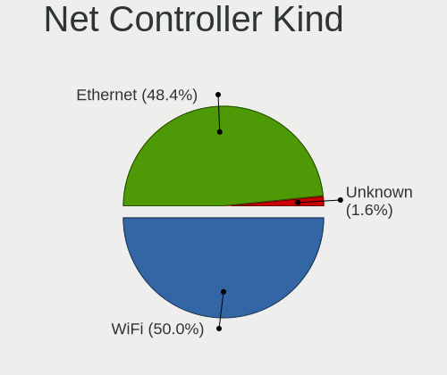

| Kind     | Notebooks | Percent |
|----------|-----------|---------|
| WiFi     | 31        | 50%     |
| Ethernet | 30        | 48.39%  |
| Unknown  | 1         | 1.61%   |

Used Controller
---------------

Currently used network controller

| Kind     | Notebooks | Percent |
|----------|-----------|---------|
| Ethernet | 25        | 58.14%  |
| WiFi     | 18        | 41.86%  |

NICs
----

Total network controllers on board

| Total | Notebooks | Percent |
|-------|-----------|---------|
| 2     | 29        | 90.63%  |
| 1     | 3         | 9.38%   |

IPv6
----

IPv6 vs IPv4

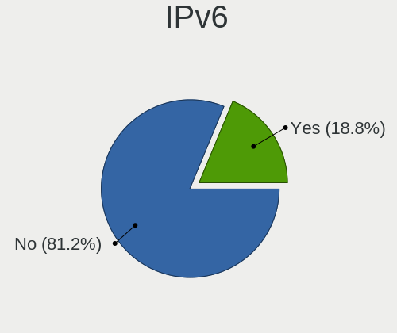

| Used | Notebooks | Percent |
|------|-----------|---------|
| No   | 26        | 81.25%  |
| Yes  | 6         | 18.75%  |

Bluetooth
---------

Bluetooth Vendor
----------------

Controller vendors

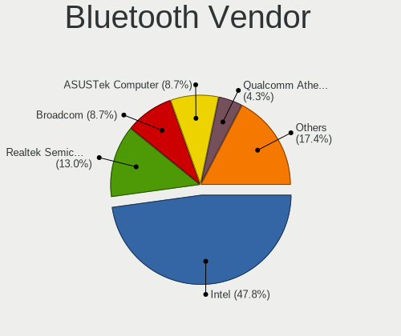

| Vendor                          | Notebooks | Percent |
|---------------------------------|-----------|---------|
| Intel                           | 11        | 47.83%  |
| Realtek Semiconductor           | 3         | 13.04%  |
| Broadcom                        | 2         | 8.7%    |
| ASUSTek Computer                | 2         | 8.7%    |
| Qualcomm Atheros Communications | 1         | 4.35%   |
| Lite-On Technology              | 1         | 4.35%   |
| IMC Networks                    | 1         | 4.35%   |
| Foxconn / Hon Hai               | 1         | 4.35%   |
| Apple                           | 1         | 4.35%   |

Bluetooth Model
---------------

Controller models

| Model                                               | Notebooks | Percent |
|-----------------------------------------------------|-----------|---------|
| Intel Bluetooth wireless interface                  | 5         | 21.74%  |
| Intel Bluetooth 9460/9560 Jefferson Peak (JfP)      | 2         | 8.7%    |
| Intel AX201 Bluetooth                               | 2         | 8.7%    |
| Intel AX200 Bluetooth                               | 2         | 8.7%    |
| Realtek Bluetooth 4.2 Adapter                       | 1         | 4.35%   |
| Realtek Bluetooth 4.0 Adapter                       | 1         | 4.35%   |
| Realtek Bluetooth 4.0 + High Speed Chip             | 1         | 4.35%   |
| Qualcomm Atheros Dell Wireless 1820 Bluetooth 4.1LE | 1         | 4.35%   |
| Lite-On Atheros Bluetooth                           | 1         | 4.35%   |
| IMC Networks Realtek Bluetooth Adapter              | 1         | 4.35%   |
| Foxconn / Hon Hai Bluetooth USB Module              | 1         | 4.35%   |
| Broadcom Bluetooth 4.0                              | 1         | 4.35%   |
| Broadcom BCM43142A0 Bluetooth 4.0                   | 1         | 4.35%   |
| ASUS USB-BT500                                      | 1         | 4.35%   |
| ASUS BT-183 Bluetooth 2.0+EDR adapter               | 1         | 4.35%   |
| Apple Broadcom Built-in Bluetooth                   | 1         | 4.35%   |

Sound
-----

Sound Vendor
------------

Sound card vendors

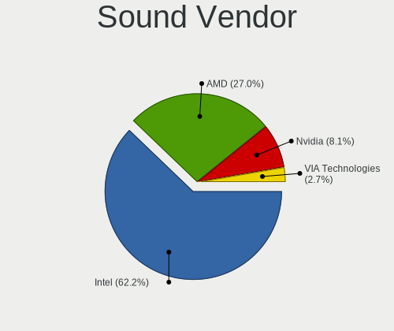

| Vendor           | Notebooks | Percent |
|------------------|-----------|---------|
| Intel            | 23        | 62.16%  |
| AMD              | 10        | 27.03%  |
| Nvidia           | 3         | 8.11%   |
| VIA Technologies | 1         | 2.7%    |

Sound Model
-----------

Sound card models

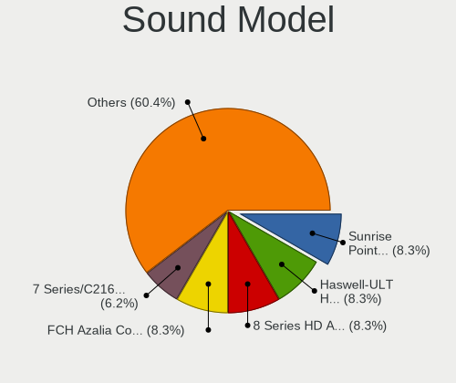

| Model                                                               | Notebooks | Percent |
|---------------------------------------------------------------------|-----------|---------|
| Intel Sunrise Point-LP HD Audio                                     | 4         | 8.33%   |
| Intel Haswell-ULT HD Audio Controller                               | 4         | 8.33%   |
| Intel 8 Series HD Audio Controller                                  | 4         | 8.33%   |
| AMD FCH Azalia Controller                                           | 4         | 8.33%   |
| Intel 7 Series/C216 Chipset Family High Definition Audio Controller | 3         | 6.25%   |
| AMD Kabini HDMI/DP Audio                                            | 3         | 6.25%   |
| AMD Family 17h/19h HD Audio Controller                              | 3         | 6.25%   |
| Intel Cannon Point-LP High Definition Audio Controller              | 2         | 4.17%   |
| Intel 82801I (ICH9 Family) HD Audio Controller                      | 2         | 4.17%   |
| Intel 82801H (ICH8 Family) HD Audio Controller                      | 2         | 4.17%   |
| Intel 100 Series/C230 Series Chipset Family HD Audio Controller     | 2         | 4.17%   |
| AMD RV710/730 HDMI Audio [Radeon HD 4000 series]                    | 2         | 4.17%   |
| AMD Renoir Radeon High Definition Audio Controller                  | 2         | 4.17%   |
| VIA Technologies VX900/VT8xxx High Definition Audio Controller      | 1         | 2.08%   |
| Nvidia TU116 High Definition Audio Controller                       | 1         | 2.08%   |
| Nvidia TU107 GeForce GTX 1650 High Definition Audio Controller      | 1         | 2.08%   |
| Nvidia TU104 HD Audio Controller                                    | 1         | 2.08%   |
| Intel Tiger Lake-LP Smart Sound Technology Audio Controller         | 1         | 2.08%   |
| Intel NM10/ICH7 Family High Definition Audio Controller             | 1         | 2.08%   |
| Intel Comet Lake PCH cAVS                                           | 1         | 2.08%   |
| Intel Cannon Lake PCH cAVS                                          | 1         | 2.08%   |
| AMD High Definition Audio Controller                                | 1         | 2.08%   |
| AMD Family 15h (Models 60h-6fh) Audio Controller                    | 1         | 2.08%   |
| AMD BeaverCreek HDMI Audio [Radeon HD 6500D and 6400G-6600G series] | 1         | 2.08%   |

Memory
------

Memory Vendor
-------------

Memory module vendors

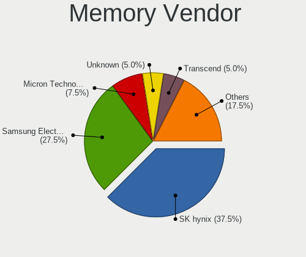

| Vendor              | Notebooks | Percent |
|---------------------|-----------|---------|
| SK hynix            | 15        | 37.5%   |
| Samsung Electronics | 11        | 27.5%   |
| Micron Technology   | 3         | 7.5%    |
| Unknown             | 2         | 5%      |
| Transcend           | 2         | 5%      |
| Crucial             | 2         | 5%      |
| Unknown             | 2         | 5%      |
| Ramaxel Technology  | 1         | 2.5%    |
| G.Skill             | 1         | 2.5%    |
| Elpida              | 1         | 2.5%    |

Memory Model
------------

Memory module models

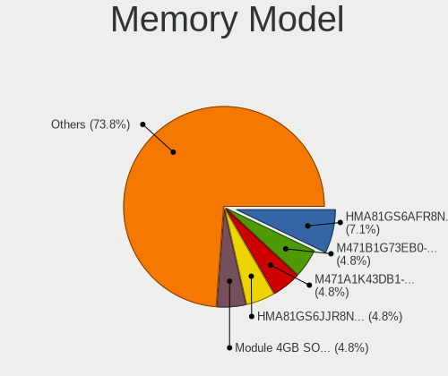

| Model                                                     | Notebooks | Percent |
|-----------------------------------------------------------|-----------|---------|
| SK hynix RAM HMA81GS6AFR8N-UH 8GB SODIMM DDR4 2400MT/s    | 3         | 7.14%   |
| SK hynix RAM HMA81GS6JJR8N-VK 8GB SODIMM DDR4 2667MT/s    | 2         | 4.76%   |
| Samsung RAM M471B1G73EB0-YK0 8GB SODIMM DDR3 1600MT/s     | 2         | 4.76%   |
| Samsung RAM M471A1K43DB1-CWE 8GB SODIMM DDR4 3200MT/s     | 2         | 4.76%   |
| Unknown                                                   | 2         | 4.76%   |
| Unknown RAM Module 2GB SODIMM DDR2 667MT/s                | 1         | 2.38%   |
| Unknown RAM Module 1GB SODIMM DRAM 533MT/s                | 1         | 2.38%   |
| Transcend RAM TS512MSK64V1N 4GB SODIMM 800MT/s            | 1         | 2.38%   |
| Transcend RAM JM800QSU-2G 2GB SODIMM DDR 667MT/s          | 1         | 2.38%   |
| SK hynix RAM Module 4GB SODIMM DDR3 1600MT/s              | 1         | 2.38%   |
| SK hynix RAM HYMP125S64CP8-Y5 2GB SODIMM DDR 667MT/s      | 1         | 2.38%   |
| SK hynix RAM HYMP125S64CP8-S6 2GB SODIMM DDR2 975MT/s     | 1         | 2.38%   |
| SK hynix RAM HMT851S6AMR6R-PB 4GB Chip DDR3 1600MT/s      | 1         | 2.38%   |
| SK hynix RAM HMT851S6AMR6A-PB 4GB Chip DDR3 1600MT/s      | 1         | 2.38%   |
| SK hynix RAM HMT451S6CFR6A-PB 4GB SODIMM DDR3 1600MT/s    | 1         | 2.38%   |
| SK hynix RAM HMT451S6BFR8A-PB 4GB SODIMM DDR3 1600MT/s    | 1         | 2.38%   |
| SK hynix RAM HMT351S6EFR8A-PB 4GB SODIMM DDR3 1333MT/s    | 1         | 2.38%   |
| SK hynix RAM HMA851S6AFR6N-UH 4GB SODIMM DDR4 2400MT/s    | 1         | 2.38%   |
| SK hynix RAM HMA82GS6MFR8N-TF 16GB SODIMM DDR4 2133MT/s   | 1         | 2.38%   |
| SK hynix RAM HMA451S6AFR8N-TF 4GB SODIMM DDR4 2133MT/s    | 1         | 2.38%   |
| Samsung RAM Module 16GB SODIMM DDR4 2133MT/s              | 1         | 2.38%   |
| Samsung RAM M471B5273CH0-CH9 4GB SODIMM DDR3 1334MT/s     | 1         | 2.38%   |
| Samsung RAM M471B5173EB0-YK0 4GB SODIMM DDR3 1600MT/s     | 1         | 2.38%   |
| Samsung RAM M471B5173DB0-YK0 4GB SODIMM DDR3 1600MT/s     | 1         | 2.38%   |
| Samsung RAM M471B1G73DB0-YK0 8GB SODIMM DDR3 1600MT/s     | 1         | 2.38%   |
| Samsung RAM M471A5244CB0-CTD 4GB SODIMM DDR4 2667MT/s     | 1         | 2.38%   |
| Samsung RAM M471A4G43AB1-CWE 32GB SODIMM DDR4 3200MT/s    | 1         | 2.38%   |
| Samsung RAM M471A1K43CB1-CRC 8GB SODIMM DDR4 2400MT/s     | 1         | 2.38%   |
| Ramaxel RAM RMT3160ED58E9W1600 4GB SODIMM DDR3 1600MT/s   | 1         | 2.38%   |
| Micron RAM 8ATF1G64HZ-3G2R1 8GB SODIMM DDR4 3200MT/s      | 1         | 2.38%   |
| Micron RAM 8ATF1G64HZ-3G2J1 8GB SODIMM DDR4 3200MT/s      | 1         | 2.38%   |
| Micron RAM 4ATS1G64HZ-2G6E1 8GB SODIMM DDR4 2667MT/s      | 1         | 2.38%   |
| G.Skill RAM F3-1600C9-4GRSL 4GB SODIMM DDR3 1600MT/s      | 1         | 2.38%   |
| Elpida RAM EBJ41UF8BCS0-DJ-F 4GB SODIMM DDR3 1334MT/s     | 1         | 2.38%   |
| Crucial RAM CT16G4SFD8266.C16FN 16GB SODIMM DDR4 2133MT/s | 1         | 2.38%   |
| Crucial RAM BLS16G4S26BFSD.16FD 16GB SODIMM DDR4 2400MT/s | 1         | 2.38%   |

Memory Kind
-----------

Memory module kinds

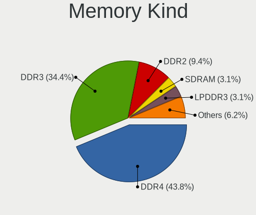

| Kind    | Notebooks | Percent |
|---------|-----------|---------|
| DDR4    | 14        | 42.42%  |
| DDR3    | 11        | 33.33%  |
| DDR2    | 3         | 9.09%   |
| SDRAM   | 1         | 3.03%   |
| LPDDR3  | 1         | 3.03%   |
| DRAM    | 1         | 3.03%   |
| DDR     | 1         | 3.03%   |
| Unknown | 1         | 3.03%   |

Memory Form Factor
------------------

Physical design of the memory module

| Name   | Notebooks | Percent |
|--------|-----------|---------|
| SODIMM | 31        | 93.94%  |
| Chip   | 2         | 6.06%   |

Memory Size
-----------

Memory module size

| Size  | Notebooks | Percent |
|-------|-----------|---------|
| 4096  | 15        | 40.54%  |
| 8192  | 12        | 32.43%  |
| 16384 | 4         | 10.81%  |
| 2048  | 4         | 10.81%  |
| 32768 | 1         | 2.7%    |
| 1024  | 1         | 2.7%    |

Memory Speed
------------

Memory module speed

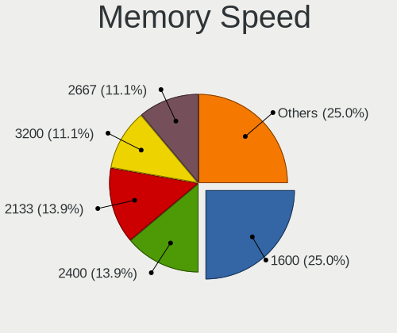

| Speed   | Notebooks | Percent |
|---------|-----------|---------|
| 1600    | 9         | 24.32%  |
| 2400    | 6         | 16.22%  |
| 2133    | 5         | 13.51%  |
| 3200    | 4         | 10.81%  |
| 2667    | 4         | 10.81%  |
| 1334    | 2         | 5.41%   |
| 667     | 2         | 5.41%   |
| 1333    | 1         | 2.7%    |
| 975     | 1         | 2.7%    |
| 800     | 1         | 2.7%    |
| 533     | 1         | 2.7%    |
| Unknown | 1         | 2.7%    |

Printers & scanners
-------------------

Printer Vendor
--------------

Printer device vendors

Zero info for selected period =(

Printer Model
-------------

Printer device models

Zero info for selected period =(

Scanner Vendor
--------------

Scanner device vendors

Zero info for selected period =(

Scanner Model
-------------

Scanner device models

Zero info for selected period =(

Camera
------

Camera Vendor
-------------

Camera device vendors

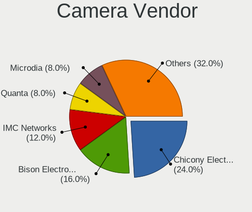

| Vendor                                 | Notebooks | Percent |
|----------------------------------------|-----------|---------|
| Chicony Electronics                    | 6         | 24%     |
| Bison Electronics                      | 4         | 16%     |
| IMC Networks                           | 3         | 12%     |
| Quanta                                 | 2         | 8%      |
| Microdia                               | 2         | 8%      |
| Lite-On Technology                     | 2         | 8%      |
| Suyin                                  | 1         | 4%      |
| Sunplus Innovation Technology          | 1         | 4%      |
| Realtek Semiconductor                  | 1         | 4%      |
| Intel                                  | 1         | 4%      |
| Cheng Uei Precision Industry (Foxlink) | 1         | 4%      |
| Alcor Micro                            | 1         | 4%      |

Camera Model
------------

Camera device models

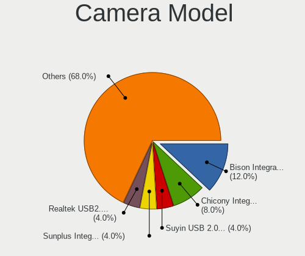

| Model                                                          | Notebooks | Percent |
|----------------------------------------------------------------|-----------|---------|
| Bison Integrated Camera                                        | 3         | 12%     |
| Chicony Integrated Camera                                      | 2         | 8%      |
| Suyin USB 2.0 UVC 1.3M WebCam                                  | 1         | 4%      |
| Sunplus Integrated Webcam                                      | 1         | 4%      |
| Realtek USB2.0 VGA UVC WebCam                                  | 1         | 4%      |
| Quanta Realtek DMFT RGB                                        | 1         | 4%      |
| Quanta Front camera                                            | 1         | 4%      |
| Microdia Integrated_Webcam_HD                                  | 1         | 4%      |
| Microdia Integrated Webcam                                     | 1         | 4%      |
| Lite-On Realtek PC Camera                                      | 1         | 4%      |
| Lite-On HP Universal Camera                                    | 1         | 4%      |
| Intel WiMAX Connection 2400m                                   | 1         | 4%      |
| IMC Networks USB 2.0 UVC HD Webcam                             | 1         | 4%      |
| IMC Networks Realtek PC Camera                                 | 1         | 4%      |
| IMC Networks EasyCamera                                        | 1         | 4%      |
| Chicony Realtek DMFT RGB                                       | 1         | 4%      |
| Chicony Integrated IR Camera                                   | 1         | 4%      |
| Chicony HP HD Webcam [Fixed]                                   | 1         | 4%      |
| Chicony Chicony USB2.0 Camera                                  | 1         | 4%      |
| Cheng Uei Precision Industry (Foxlink) HP TrueVision HD Camera | 1         | 4%      |
| Bison Lenovo EasyCamera                                        | 1         | 4%      |
| Alcor Micro HP WebCam-101                                      | 1         | 4%      |

Security
--------

Fingerprint Vendor
------------------

Fingerprint sensor vendors

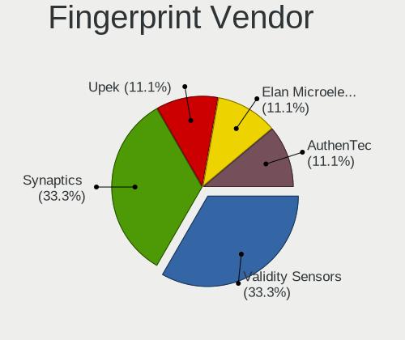

| Vendor           | Notebooks | Percent |
|------------------|-----------|---------|
| Validity Sensors | 3         | 37.5%   |
| Synaptics        | 3         | 37.5%   |
| Upek             | 1         | 12.5%   |
| AuthenTec        | 1         | 12.5%   |

Fingerprint Model
-----------------

Fingerprint sensor models

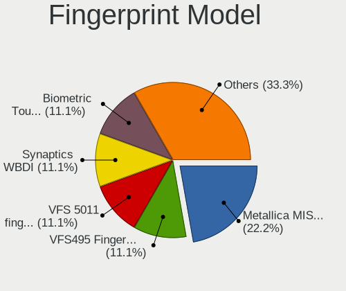

| Model                                                  | Notebooks | Percent |
|--------------------------------------------------------|-----------|---------|
| Synaptics Metallica MIS Touch Fingerprint Reader       | 2         | 25%     |
| Validity Sensors VFS495 Fingerprint Reader             | 1         | 12.5%   |
| Validity Sensors VFS 5011 fingerprint sensor           | 1         | 12.5%   |
| Validity Sensors Synaptics WBDI                        | 1         | 12.5%   |
| Upek Biometric Touchchip/Touchstrip Fingerprint Sensor | 1         | 12.5%   |
| Synaptics Prometheus MIS Touch Fingerprint Reader      | 1         | 12.5%   |
| AuthenTec AES1600                                      | 1         | 12.5%   |

Chipcard Vendor
---------------

Chipcard module vendors

Zero info for selected period =(

Chipcard Model
--------------

Chipcard module models

Zero info for selected period =(

Unsupported
-----------

Unsupported Devices
-------------------

Total unsupported devices on board

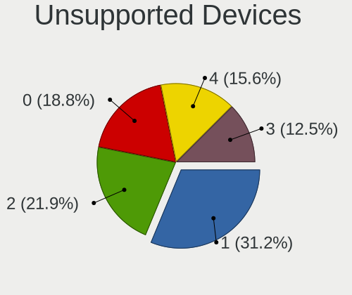

| Total | Notebooks | Percent |
|-------|-----------|---------|
| 1     | 10        | 31.25%  |
| 2     | 8         | 25%     |
| 0     | 6         | 18.75%  |
| 4     | 5         | 15.63%  |
| 3     | 3         | 9.38%   |

Unsupported Device Types
------------------------

Types of unsupported devices

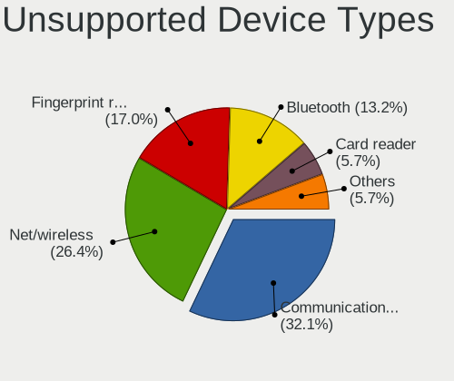

| Type                     | Notebooks | Percent |
|--------------------------|-----------|---------|
| Communication controller | 17        | 32.69%  |
| Net/wireless             | 14        | 26.92%  |
| Fingerprint reader       | 8         | 15.38%  |
| Bluetooth                | 7         | 13.46%  |
| Card reader              | 3         | 5.77%   |
| Firewire controller      | 2         | 3.85%   |
| Network                  | 1         | 1.92%   |

