OPNsense - Tested Hardware & Statistics
---------------------------------------

A project to collect tested hardware configurations for OPNsense.

Anyone can contribute to this report by the [hw-probe](https://github.com/linuxhw/hw-probe/blob/master/INSTALL.BSD.md) tool:

    hw-probe -all -upload

Please contribute! Especially if your hardware is rare.

Contents
--------

* [ Test Cases ](#test-cases)

* [ System ](#system)
  - [ OS                       ](#os)
  - [ OS Family                ](#os-family)
  - [ Arch                     ](#arch)
  - [ DE                       ](#de)
  - [ Display Server           ](#display-server)
  - [ Display Manager          ](#display-manager)
  - [ OS Lang                  ](#os-lang)
  - [ Boot Mode                ](#boot-mode)
  - [ Filesystem               ](#filesystem)
  - [ Part. scheme             ](#part-scheme)

* [ Board ](#board)
  - [ Vendor                   ](#vendor)
  - [ Model                    ](#model)
  - [ Model Family             ](#model-family)
  - [ MFG Year                 ](#mfg-year)
  - [ Form Factor              ](#form-factor)
  - [ Coreboot                 ](#coreboot)
  - [ RAM Size                 ](#ram-size)
  - [ RAM Used                 ](#ram-used)
  - [ Total Drives             ](#total-drives)
  - [ Has CD-ROM               ](#has-cd-rom)
  - [ Has Ethernet             ](#has-ethernet)
  - [ Has WiFi                 ](#has-wifi)
  - [ Has Bluetooth            ](#has-bluetooth)

* [ Location ](#location)
  - [ Country                  ](#country)
  - [ City                     ](#city)

* [ Drives ](#drives)
  - [ Drive Vendor             ](#drive-vendor)
  - [ Drive Model              ](#drive-model)
  - [ HDD Vendor               ](#hdd-vendor)
  - [ SSD Vendor               ](#ssd-vendor)
  - [ Drive Kind               ](#drive-kind)
  - [ Drive Connector          ](#drive-connector)
  - [ Drive Size               ](#drive-size)
  - [ Space Total              ](#space-total)
  - [ Space Used               ](#space-used)
  - [ Malfunc. Drives          ](#malfunc-drives)
  - [ Malfunc. Drive Vendor    ](#malfunc-drive-vendor)
  - [ Malfunc. HDD Vendor      ](#malfunc-hdd-vendor)
  - [ Malfunc. Drive Kind      ](#malfunc-drive-kind)
  - [ Failed Drives            ](#failed-drives)
  - [ Failed Drive Vendor      ](#failed-drive-vendor)
  - [ Drive Status             ](#drive-status)

* [ Storage controller ](#storage-controller)
  - [ Storage Vendor           ](#storage-vendor)
  - [ Storage Model            ](#storage-model)
  - [ Storage Kind             ](#storage-kind)

* [ Processor ](#processor)
  - [ CPU Vendor               ](#cpu-vendor)
  - [ CPU Model                ](#cpu-model)
  - [ CPU Model Family         ](#cpu-model-family)
  - [ CPU Cores                ](#cpu-cores)
  - [ CPU Sockets              ](#cpu-sockets)
  - [ CPU Threads              ](#cpu-threads)
  - [ CPU Microarch            ](#cpu-microarch)

* [ Graphics ](#graphics)
  - [ GPU Vendor               ](#gpu-vendor)
  - [ GPU Model                ](#gpu-model)
  - [ GPU Combo                ](#gpu-combo)
  - [ GPU Driver               ](#gpu-driver)
  - [ GPU Memory               ](#gpu-memory)

* [ Monitor ](#monitor)
  - [ Monitor Vendor           ](#monitor-vendor)
  - [ Monitor Model            ](#monitor-model)
  - [ Monitor Resolution       ](#monitor-resolution)
  - [ Monitor Diagonal         ](#monitor-diagonal)
  - [ Monitor Width            ](#monitor-width)
  - [ Aspect Ratio             ](#aspect-ratio)
  - [ Monitor Area             ](#monitor-area)
  - [ Pixel Density            ](#pixel-density)
  - [ Multiple Monitors        ](#multiple-monitors)

* [ Network ](#network)
  - [ Net Controller Vendor    ](#net-controller-vendor)
  - [ Net Controller Model     ](#net-controller-model)
  - [ Wireless Vendor          ](#wireless-vendor)
  - [ Wireless Model           ](#wireless-model)
  - [ Ethernet Vendor          ](#ethernet-vendor)
  - [ Ethernet Model           ](#ethernet-model)
  - [ Net Controller Kind      ](#net-controller-kind)
  - [ Used Controller          ](#used-controller)
  - [ NICs                     ](#nics)
  - [ IPv6                     ](#ipv6)

* [ Bluetooth ](#bluetooth)
  - [ Bluetooth Vendor         ](#bluetooth-vendor)
  - [ Bluetooth Model          ](#bluetooth-model)

* [ Sound ](#sound)
  - [ Sound Vendor             ](#sound-vendor)
  - [ Sound Model              ](#sound-model)

* [ Memory ](#memory)
  - [ Memory Vendor            ](#memory-vendor)
  - [ Memory Model             ](#memory-model)
  - [ Memory Kind              ](#memory-kind)
  - [ Memory Form Factor       ](#memory-form-factor)
  - [ Memory Size              ](#memory-size)
  - [ Memory Speed             ](#memory-speed)

* [ Printers & scanners ](#printers--scanners)
  - [ Printer Vendor           ](#printer-vendor)
  - [ Printer Model            ](#printer-model)
  - [ Scanner Vendor           ](#scanner-vendor)
  - [ Scanner Model            ](#scanner-model)

* [ Camera ](#camera)
  - [ Camera Vendor            ](#camera-vendor)
  - [ Camera Model             ](#camera-model)

* [ Security ](#security)
  - [ Fingerprint Vendor       ](#fingerprint-vendor)
  - [ Fingerprint Model        ](#fingerprint-model)
  - [ Chipcard Vendor          ](#chipcard-vendor)
  - [ Chipcard Model           ](#chipcard-model)

* [ Unsupported ](#unsupported)
  - [ Unsupported Devices      ](#unsupported-devices)
  - [ Unsupported Device Types ](#unsupported-device-types)

Test Cases
----------

Total: 23906

| Vendor        | Model                       | Form-Factor | Probe                                                     | Date         |
|---------------|-----------------------------|-------------|-----------------------------------------------------------|--------------|
| MSI           | Boston                      | Desktop     | [69c1e82629](https://bsd-hardware.info/?probe=69c1e82629) | Jan 03, 2026 |
| Intel         | DH61AG AAG23736-400         | Desktop     | [d9e65d18b8](https://bsd-hardware.info/?probe=d9e65d18b8) | Jan 03, 2026 |
| Unknown       | adnbsc01                    | Desktop     | [5a5f9e1b9b](https://bsd-hardware.info/?probe=5a5f9e1b9b) | Jan 03, 2026 |
| AMI           | Aptio CRB                   | Mini pc     | [0c4c34753e](https://bsd-hardware.info/?probe=0c4c34753e) | Jan 03, 2026 |
| AMI           | Aptio CRB                   | Mini pc     | [06e4c3b7c8](https://bsd-hardware.info/?probe=06e4c3b7c8) | Jan 03, 2026 |
| Unknown       | Unknown                     | Desktop     | [d2e0854dcf](https://bsd-hardware.info/?probe=d2e0854dcf) | Jan 03, 2026 |
| Cisco         | ASA5525 A0                  | Desktop     | [0ff88bf36c](https://bsd-hardware.info/?probe=0ff88bf36c) | Jan 03, 2026 |
| Unknown       | QGLK03                      | Desktop     | [99fd520559](https://bsd-hardware.info/?probe=99fd520559) | Jan 03, 2026 |
| Protectli     | FW6 Ver                     | Desktop     | [4a85a19847](https://bsd-hardware.info/?probe=4a85a19847) | Jan 03, 2026 |
| Dell          | 07WP95 A02                  | Desktop     | [6ceea70304](https://bsd-hardware.info/?probe=6ceea70304) | Jan 02, 2026 |
| Lenovo        | 312D SDK0J40697 WIN 3305... | Mini pc     | [58b2eee2d0](https://bsd-hardware.info/?probe=58b2eee2d0) | Jan 02, 2026 |
| Dell          | 0NV0M7 A01                  | Desktop     | [64850a456f](https://bsd-hardware.info/?probe=64850a456f) | Jan 02, 2026 |
| PC Engines    | APU2                        | Desktop     | [6a6b0755a9](https://bsd-hardware.info/?probe=6a6b0755a9) | Jan 02, 2026 |
| Unknown       | Unknown                     | Desktop     | [eae539d1e8](https://bsd-hardware.info/?probe=eae539d1e8) | Jan 02, 2026 |
| Advantech     | FWA-1320 A103               | Server      | [28394b4f28](https://bsd-hardware.info/?probe=28394b4f28) | Jan 02, 2026 |
| Lenovo        | 312D SDK0J40697 WIN 3305... | Mini pc     | [623b36fe51](https://bsd-hardware.info/?probe=623b36fe51) | Jan 02, 2026 |
| Unknown       | Unknown                     | Desktop     | [a5bbf2798d](https://bsd-hardware.info/?probe=a5bbf2798d) | Jan 02, 2026 |
| Protectli     | VP2420                      | Desktop     | [4484909d41](https://bsd-hardware.info/?probe=4484909d41) | Jan 02, 2026 |
| ASUSTek       | VivoBook_ASUSLaptop X509... | Notebook    | [0f95b521f1](https://bsd-hardware.info/?probe=0f95b521f1) | Jan 02, 2026 |
| Unknown       | Unknown                     | Desktop     | [c14d381fb6](https://bsd-hardware.info/?probe=c14d381fb6) | Jan 02, 2026 |
| Dell          | 0NV0M7 A01                  | Desktop     | [b2319232a4](https://bsd-hardware.info/?probe=b2319232a4) | Jan 02, 2026 |
| Unknown       | Unknown                     | Desktop     | [d1e02c8726](https://bsd-hardware.info/?probe=d1e02c8726) | Jan 01, 2026 |
| Unknown       | Unknown                     | Desktop     | [4c0a31104f](https://bsd-hardware.info/?probe=4c0a31104f) | Jan 01, 2026 |
| AZW           | MINI S                      | Mini pc     | [178e523a28](https://bsd-hardware.info/?probe=178e523a28) | Jan 01, 2026 |
| AZW           | EQ                          | Desktop     | [eeb9d5cf31](https://bsd-hardware.info/?probe=eeb9d5cf31) | Jan 01, 2026 |
| HP            | 829A                        | Mini pc     | [5cba7d6902](https://bsd-hardware.info/?probe=5cba7d6902) | Jan 01, 2026 |
| Unknown       | Unknown                     | Desktop     | [45c4b8acd5](https://bsd-hardware.info/?probe=45c4b8acd5) | Jan 01, 2026 |
| Unknown       | Unknown                     | Desktop     | [433d59d6be](https://bsd-hardware.info/?probe=433d59d6be) | Jan 01, 2026 |
| Lenovo        | ThinkCentre M90p L1BRM6H    | Desktop     | [800565bf84](https://bsd-hardware.info/?probe=800565bf84) | Jan 01, 2026 |
| MW            | GMLK-2_5G4L                 | Desktop     | [324e993084](https://bsd-hardware.info/?probe=324e993084) | Dec 31, 2025 |
| Deciso        | NetBoard-A20                | Notebook    | [2c1df99f46](https://bsd-hardware.info/?probe=2c1df99f46) | Dec 31, 2025 |
| AMI           | Aptio CRB                   | Mini pc     | [6689965a39](https://bsd-hardware.info/?probe=6689965a39) | Dec 31, 2025 |
| Lenovo        | ThinkPad X240 20AMS0250T    | Notebook    | [897f3c936d](https://bsd-hardware.info/?probe=897f3c936d) | Dec 31, 2025 |
| Dell          | 0VD5HY A07                  | Desktop     | [a8aa482345](https://bsd-hardware.info/?probe=a8aa482345) | Dec 31, 2025 |
| YF            | ADLNN01 V0.1                | Desktop     | [935b949c87](https://bsd-hardware.info/?probe=935b949c87) | Dec 31, 2025 |
| Protectli     | FW2B Ver                    | Desktop     | [f3be3b3acc](https://bsd-hardware.info/?probe=f3be3b3acc) | Dec 31, 2025 |
| Protectli     | V1410                       | Desktop     | [c1783c223a](https://bsd-hardware.info/?probe=c1783c223a) | Dec 31, 2025 |
| Unknown       | QDNV01                      | Desktop     | [7782909112](https://bsd-hardware.info/?probe=7782909112) | Dec 31, 2025 |
| ASUSTek       | Q87T                        | Desktop     | [939ba63ac9](https://bsd-hardware.info/?probe=939ba63ac9) | Dec 31, 2025 |
| AMI           | Aptio CRB                   | Mini pc     | [82b8e0ded8](https://bsd-hardware.info/?probe=82b8e0ded8) | Dec 31, 2025 |
| Unknown       | Unknown                     | Desktop     | [b01f762000](https://bsd-hardware.info/?probe=b01f762000) | Dec 31, 2025 |
| ASRock        | C2750D4I                    | Desktop     | [7bcc9f9bdd](https://bsd-hardware.info/?probe=7bcc9f9bdd) | Dec 31, 2025 |
| CWWK          | CW-J6-6L                    | Desktop     | [a6abcd8b4d](https://bsd-hardware.info/?probe=a6abcd8b4d) | Dec 30, 2025 |
| Intel         | ChiefRiver                  | Desktop     | [7fca98fc48](https://bsd-hardware.info/?probe=7fca98fc48) | Dec 30, 2025 |
| SLIMBOOK      | ZERO-N100-4RJ               | Desktop     | [cfd87a10db](https://bsd-hardware.info/?probe=cfd87a10db) | Dec 30, 2025 |
| Acer          | Aspire XC-830               | Desktop     | [966f291e21](https://bsd-hardware.info/?probe=966f291e21) | Dec 30, 2025 |
| Unknown       | Unknown                     | Desktop     | [98270995a4](https://bsd-hardware.info/?probe=98270995a4) | Dec 30, 2025 |
| Fisusen Te... | FSX-V6L-N200 Ver:1.2        | Desktop     | [502d7c7534](https://bsd-hardware.info/?probe=502d7c7534) | Dec 30, 2025 |
| Dell          | 042P49 A02                  | Desktop     | [370af47460](https://bsd-hardware.info/?probe=370af47460) | Dec 30, 2025 |
| Sophos        | SG                          | Firewall    | [96a1de5936](https://bsd-hardware.info/?probe=96a1de5936) | Dec 30, 2025 |
| AMI           | Aptio CRB                   | Mini pc     | [c8a38d6bf8](https://bsd-hardware.info/?probe=c8a38d6bf8) | Dec 30, 2025 |
| Supermicro    | X10SLM-F                    | Server      | [44ec26ff37](https://bsd-hardware.info/?probe=44ec26ff37) | Dec 30, 2025 |
| Lenovo        | 3136 SDK0J40697 WIN 3305... | Mini pc     | [db36388766](https://bsd-hardware.info/?probe=db36388766) | Dec 30, 2025 |
| Protectli     | VP2440                      | Desktop     | [205c2b0629](https://bsd-hardware.info/?probe=205c2b0629) | Dec 30, 2025 |
| MW            | GMLK-2_5G4L                 | Desktop     | [434e6750ad](https://bsd-hardware.info/?probe=434e6750ad) | Dec 30, 2025 |
| Protectli     | V1410                       | Desktop     | [b881beb33b](https://bsd-hardware.info/?probe=b881beb33b) | Dec 30, 2025 |
| Lenovo        | 310B SDK0J40697 WIN 3305... | Mini pc     | [d29f979e1d](https://bsd-hardware.info/?probe=d29f979e1d) | Dec 29, 2025 |
| Supermicro    | A1SRi 123456789             | Mini pc     | [3867cb1110](https://bsd-hardware.info/?probe=3867cb1110) | Dec 29, 2025 |
| Protectli     | FW4B Ver                    | Desktop     | [578cc5e151](https://bsd-hardware.info/?probe=578cc5e151) | Dec 29, 2025 |
| Deciso        | Netboard A20                | Notebook    | [7e9773146f](https://bsd-hardware.info/?probe=7e9773146f) | Dec 29, 2025 |
| Protectli     | VP2420                      | Desktop     | [1415ea724a](https://bsd-hardware.info/?probe=1415ea724a) | Dec 29, 2025 |
| Techvision    | TVI7309X B0                 | Desktop     | [4088969008](https://bsd-hardware.info/?probe=4088969008) | Dec 29, 2025 |
| ASRock        | H81M-HDS                    | Desktop     | [1382b792dc](https://bsd-hardware.info/?probe=1382b792dc) | Dec 29, 2025 |
| Sophos        | XG                          | Firewall    | [d51e1a4e66](https://bsd-hardware.info/?probe=d51e1a4e66) | Dec 29, 2025 |
| Protectli     | VP6630                      | Desktop     | [dd4e1c39b5](https://bsd-hardware.info/?probe=dd4e1c39b5) | Dec 29, 2025 |
| Lenovo        | SHARKBAY 0B98401 WIN        | Desktop     | [fb353cc6aa](https://bsd-hardware.info/?probe=fb353cc6aa) | Dec 29, 2025 |
| Unknown       | MS-98N1                     | Desktop     | [2c731baef5](https://bsd-hardware.info/?probe=2c731baef5) | Dec 29, 2025 |
| Deciso        | NetBoard-A20                | Notebook    | [80bb405674](https://bsd-hardware.info/?probe=80bb405674) | Dec 28, 2025 |
| Lenovo        | 3136 SDK0J40697 WIN 3305... | Mini pc     | [7a23ceb2b8](https://bsd-hardware.info/?probe=7a23ceb2b8) | Dec 28, 2025 |
| Protectli     | VP2420                      | Desktop     | [8984679422](https://bsd-hardware.info/?probe=8984679422) | Dec 28, 2025 |
| CncTion       | Tiger Lake-6L B0            | Desktop     | [737e686c03](https://bsd-hardware.info/?probe=737e686c03) | Dec 28, 2025 |
| Dell          | 0C27VV A01                  | Desktop     | [c468a9deab](https://bsd-hardware.info/?probe=c468a9deab) | Dec 28, 2025 |
| Dell          | 0T10XW A01                  | Desktop     | [d0b59d9824](https://bsd-hardware.info/?probe=d0b59d9824) | Dec 28, 2025 |
| Gigabyte      | J4005ND2P-CF                | Desktop     | [fab0b32dc7](https://bsd-hardware.info/?probe=fab0b32dc7) | Dec 28, 2025 |
| Biostar       | J4125NHU                    | Desktop     | [9d72923faf](https://bsd-hardware.info/?probe=9d72923faf) | Dec 28, 2025 |
| Biostar       | J4125NHU                    | Desktop     | [a2e45c2a59](https://bsd-hardware.info/?probe=a2e45c2a59) | Dec 28, 2025 |
| Lenovo        | 3106                        | Desktop     | [b3a046a500](https://bsd-hardware.info/?probe=b3a046a500) | Dec 28, 2025 |
| Protectli     | VP2430                      | Desktop     | [f00c97fae4](https://bsd-hardware.info/?probe=f00c97fae4) | Dec 28, 2025 |
| MSI           | Z77A-G43                    | Desktop     | [1d2c2d4b4e](https://bsd-hardware.info/?probe=1d2c2d4b4e) | Dec 28, 2025 |
| ASRock        | N100M                       | Desktop     | [4f99de8a31](https://bsd-hardware.info/?probe=4f99de8a31) | Dec 28, 2025 |
| Lenovo        | 310B SDK0J40697 WIN 3305... | Mini pc     | [6e58155bb1](https://bsd-hardware.info/?probe=6e58155bb1) | Dec 27, 2025 |
| Unknown       | Unknown                     | Desktop     | [ce35af183d](https://bsd-hardware.info/?probe=ce35af183d) | Dec 27, 2025 |
| Supermicro    | X13SAZ-F                    | Server      | [04a4e2af89](https://bsd-hardware.info/?probe=04a4e2af89) | Dec 27, 2025 |
| HP            | ProLiant DL20 Gen9          | Server      | [dfdc520281](https://bsd-hardware.info/?probe=dfdc520281) | Dec 27, 2025 |
| Unknown       | Unknown                     | Desktop     | [94ff13d9f2](https://bsd-hardware.info/?probe=94ff13d9f2) | Dec 27, 2025 |
| Shuttle       | DS77U                       | Notebook    | [6bf60f3010](https://bsd-hardware.info/?probe=6bf60f3010) | Dec 27, 2025 |
| AWOW          | MC02                        | Mini pc     | [b543e450c8](https://bsd-hardware.info/?probe=b543e450c8) | Dec 27, 2025 |
| Intel         | JSL MRD                     | Desktop     | [947c76b05e](https://bsd-hardware.info/?probe=947c76b05e) | Dec 27, 2025 |
| HP            | 8054                        | Desktop     | [497c86ee18](https://bsd-hardware.info/?probe=497c86ee18) | Dec 27, 2025 |
| Unknown       | Unknown                     | Desktop     | [38f59185e0](https://bsd-hardware.info/?probe=38f59185e0) | Dec 27, 2025 |
| AZW           | EQ                          | Desktop     | [6cdd654310](https://bsd-hardware.info/?probe=6cdd654310) | Dec 27, 2025 |
| Protectli     | V1410                       | Desktop     | [dea2e5ed75](https://bsd-hardware.info/?probe=dea2e5ed75) | Dec 27, 2025 |
| MSI           | MAG B550 TOMAHAWK           | Desktop     | [b2b5087066](https://bsd-hardware.info/?probe=b2b5087066) | Dec 27, 2025 |
| ASUSTek       | TUF Gaming X570-PLUS        | Desktop     | [f2e6a70447](https://bsd-hardware.info/?probe=f2e6a70447) | Dec 27, 2025 |
| Datto         | Unknown                     | Notebook    | [705177afca](https://bsd-hardware.info/?probe=705177afca) | Dec 27, 2025 |
| Gigabyte      | GB-BSi7A-6500               | Notebook    | [851bdd1cc0](https://bsd-hardware.info/?probe=851bdd1cc0) | Dec 27, 2025 |
| PC Engines    | APU2                        | Desktop     | [0896f72a74](https://bsd-hardware.info/?probe=0896f72a74) | Dec 27, 2025 |
| Unknown       | Unknown                     | Desktop     | [ac9c3243fc](https://bsd-hardware.info/?probe=ac9c3243fc) | Dec 26, 2025 |
| AMI           | Aptio CRB                   | Mini pc     | [eb595ce574](https://bsd-hardware.info/?probe=eb595ce574) | Dec 26, 2025 |
| Unknown       | Unknown                     | Desktop     | [5a40598cf3](https://bsd-hardware.info/?probe=5a40598cf3) | Dec 26, 2025 |
| Unknown       | Unknown                     | Desktop     | [e1c66665da](https://bsd-hardware.info/?probe=e1c66665da) | Dec 26, 2025 |
| Unknown       | Unknown                     | Desktop     | [a8dc8ee7ac](https://bsd-hardware.info/?probe=a8dc8ee7ac) | Dec 26, 2025 |
| Gigabyte      | B560M DS3H                  | Desktop     | [ab9b132a7a](https://bsd-hardware.info/?probe=ab9b132a7a) | Dec 26, 2025 |
| Unknown       | QCML03                      | Desktop     | [b83f3a3f52](https://bsd-hardware.info/?probe=b83f3a3f52) | Dec 26, 2025 |
| Protectli     | VP2420                      | Desktop     | [ecc16973ed](https://bsd-hardware.info/?probe=ecc16973ed) | Dec 26, 2025 |
| Acer          | Veriton S4630G V:1.0        | Desktop     | [72fac2cb73](https://bsd-hardware.info/?probe=72fac2cb73) | Dec 26, 2025 |
| Techvision    | TVI7309X B0                 | Desktop     | [8df86ea8d7](https://bsd-hardware.info/?probe=8df86ea8d7) | Dec 26, 2025 |
| Lenovo        | 312D SDK0J40697 WIN 3305... | Mini pc     | [dd02442801](https://bsd-hardware.info/?probe=dd02442801) | Dec 26, 2025 |
| Deciso        | Netboard A20                | Notebook    | [656af0975a](https://bsd-hardware.info/?probe=656af0975a) | Dec 26, 2025 |
| SJRC          | SJ-ADLN-6L                  | Desktop     | [5ce06658cc](https://bsd-hardware.info/?probe=5ce06658cc) | Dec 26, 2025 |
| Fujitsu       | D3313-E1 S26361-D3313-E1    | Desktop     | [21a2443c1e](https://bsd-hardware.info/?probe=21a2443c1e) | Dec 26, 2025 |
| Unknown       | Unknown                     | Desktop     | [2542b1491f](https://bsd-hardware.info/?probe=2542b1491f) | Dec 26, 2025 |
| Unknown       | Unknown                     | Desktop     | [80f39b70f4](https://bsd-hardware.info/?probe=80f39b70f4) | Dec 26, 2025 |
| Dell          | 02K9CR A01                  | Desktop     | [a13eacfe1a](https://bsd-hardware.info/?probe=a13eacfe1a) | Dec 25, 2025 |
| Deciso        | Netboard A8V2               | Desktop     | [c62e96587d](https://bsd-hardware.info/?probe=c62e96587d) | Dec 25, 2025 |
| OEM           | H81 JHS359                  | Desktop     | [edbf15401b](https://bsd-hardware.info/?probe=edbf15401b) | Dec 25, 2025 |
| Lenovo        | 312D SDK0J40697 WIN 3305... | Mini pc     | [29e982b96e](https://bsd-hardware.info/?probe=29e982b96e) | Dec 25, 2025 |
| Biostar       | A68MD PRO                   | Desktop     | [5a20676e81](https://bsd-hardware.info/?probe=5a20676e81) | Dec 25, 2025 |
| Huanan        | H81-PLUS V1.4               | Desktop     | [9deba8b808](https://bsd-hardware.info/?probe=9deba8b808) | Dec 25, 2025 |
| Dell          | 0N5JWR A00                  | Mini pc     | [9db90d9211](https://bsd-hardware.info/?probe=9db90d9211) | Dec 25, 2025 |
| SZQFTX        | DNB19-SC                    | Mini pc     | [900450559f](https://bsd-hardware.info/?probe=900450559f) | Dec 25, 2025 |
| HP            | 8299                        | Desktop     | [3bf3b61017](https://bsd-hardware.info/?probe=3bf3b61017) | Dec 25, 2025 |
| Unknown       | Unknown                     | Desktop     | [f18fa5d51b](https://bsd-hardware.info/?probe=f18fa5d51b) | Dec 25, 2025 |
| Nitrokey      | NitroWall                   | Desktop     | [5667ee6ebc](https://bsd-hardware.info/?probe=5667ee6ebc) | Dec 25, 2025 |
| HP            | 82F2 A01                    | Desktop     | [91fe212f9c](https://bsd-hardware.info/?probe=91fe212f9c) | Dec 24, 2025 |
| Dell          | 08NPPY A00                  | Desktop     | [511902f606](https://bsd-hardware.info/?probe=511902f606) | Dec 24, 2025 |
| Dell          | 08NPPY A00                  | Desktop     | [e9cb2d618c](https://bsd-hardware.info/?probe=e9cb2d618c) | Dec 24, 2025 |
| Dell          | 0HD5W2 A01                  | Desktop     | [6e6476252e](https://bsd-hardware.info/?probe=6e6476252e) | Dec 24, 2025 |
| Supermicro    | X10SDV-TP8F                 | Server      | [4ecd192dd0](https://bsd-hardware.info/?probe=4ecd192dd0) | Dec 24, 2025 |
| Protectli     | FW4C Ver                    | Desktop     | [3bfe51671c](https://bsd-hardware.info/?probe=3bfe51671c) | Dec 24, 2025 |
| Unknown       | Unknown                     | Desktop     | [0021edd329](https://bsd-hardware.info/?probe=0021edd329) | Dec 24, 2025 |
| Sophos        | SG                          | Firewall    | [9e6c98aae1](https://bsd-hardware.info/?probe=9e6c98aae1) | Dec 24, 2025 |
| PC Engines    | APU2                        | Desktop     | [a7ecb1afd2](https://bsd-hardware.info/?probe=a7ecb1afd2) | Dec 24, 2025 |
| HP            | 8267 A01                    | Mini pc     | [eb942b5a7c](https://bsd-hardware.info/?probe=eb942b5a7c) | Dec 24, 2025 |
| Shenzhen M... | F1WSA                       | Desktop     | [0b10d72b8b](https://bsd-hardware.info/?probe=0b10d72b8b) | Dec 24, 2025 |
| Unknown       | Unknown                     | Desktop     | [491b8f551f](https://bsd-hardware.info/?probe=491b8f551f) | Dec 24, 2025 |
| Supermicro    | A1SRi-2758F                 | Mini pc     | [34d69d4a02](https://bsd-hardware.info/?probe=34d69d4a02) | Dec 24, 2025 |
| HP            | 18E4                        | Desktop     | [97e1e55d8e](https://bsd-hardware.info/?probe=97e1e55d8e) | Dec 24, 2025 |
| Unknown       | Unknown                     | Desktop     | [257e8393ec](https://bsd-hardware.info/?probe=257e8393ec) | Dec 24, 2025 |
| Protectli     | FW6E                        | Desktop     | [db6d5397df](https://bsd-hardware.info/?probe=db6d5397df) | Dec 23, 2025 |
| HP            | 18E9                        | Desktop     | [90557003ba](https://bsd-hardware.info/?probe=90557003ba) | Dec 23, 2025 |
| Fujitsu       | D3373-B1 S26361-D3373-B1... | Server      | [079dedd457](https://bsd-hardware.info/?probe=079dedd457) | Dec 23, 2025 |
| Lenovo        | 3135 SDK0R32862 WIN 3258... | Mini pc     | [73c9bf2eeb](https://bsd-hardware.info/?probe=73c9bf2eeb) | Dec 23, 2025 |
| AMI           | Aptio CRB                   | Mini pc     | [4f5f2a4b9d](https://bsd-hardware.info/?probe=4f5f2a4b9d) | Dec 23, 2025 |
| Dell          | 008PGD A00                  | Desktop     | [295959f4ec](https://bsd-hardware.info/?probe=295959f4ec) | Dec 23, 2025 |
| Dell          | 008PGD A00                  | Desktop     | [8691d19823](https://bsd-hardware.info/?probe=8691d19823) | Dec 23, 2025 |
| Unknown       | Unknown                     | Desktop     | [4fc21572d6](https://bsd-hardware.info/?probe=4fc21572d6) | Dec 23, 2025 |
| HP            | 1825                        | Desktop     | [7e9080c044](https://bsd-hardware.info/?probe=7e9080c044) | Dec 23, 2025 |
| Unknown       | Unknown                     | Desktop     | [f00f5b9991](https://bsd-hardware.info/?probe=f00f5b9991) | Dec 23, 2025 |
| Protectli     | VP2420                      | Desktop     | [2bdb9c0ac8](https://bsd-hardware.info/?probe=2bdb9c0ac8) | Dec 22, 2025 |
| Gigabyte      | Q87M-D2H                    | Desktop     | [d0fbff9451](https://bsd-hardware.info/?probe=d0fbff9451) | Dec 22, 2025 |
| Shenzhen M... | AHWSA                       | Desktop     | [e36d86ba49](https://bsd-hardware.info/?probe=e36d86ba49) | Dec 22, 2025 |
| Intel         | BKHD-1264-SFP               | Desktop     | [ff1c9701fc](https://bsd-hardware.info/?probe=ff1c9701fc) | Dec 22, 2025 |
| Shuttle       | FS110SE                     | Desktop     | [b0fb1a7fab](https://bsd-hardware.info/?probe=b0fb1a7fab) | Dec 22, 2025 |
| ECS           | APLD-MINI                   | Desktop     | [e6761f99e0](https://bsd-hardware.info/?probe=e6761f99e0) | Dec 22, 2025 |
| Unknown       | Unknown                     | Mini pc     | [beb1c65a23](https://bsd-hardware.info/?probe=beb1c65a23) | Dec 22, 2025 |
| HP            | 1998                        | Desktop     | [c07aa20bbb](https://bsd-hardware.info/?probe=c07aa20bbb) | Dec 22, 2025 |
| PC Engines    | APU2                        | Desktop     | [8df772a49c](https://bsd-hardware.info/?probe=8df772a49c) | Dec 22, 2025 |
| Deciso        | NetBoard-A20                | Notebook    | [06217f37f3](https://bsd-hardware.info/?probe=06217f37f3) | Dec 22, 2025 |
| DNI           | SNDTP-1513N 5508015890      | Desktop     | [2ab2c29c18](https://bsd-hardware.info/?probe=2ab2c29c18) | Dec 22, 2025 |
| Shenzhen M... | AHWSA                       | Desktop     | [9cc3dc34d5](https://bsd-hardware.info/?probe=9cc3dc34d5) | Dec 22, 2025 |
| Protectli     | FW4B                        | Desktop     | [39963d0dfd](https://bsd-hardware.info/?probe=39963d0dfd) | Dec 22, 2025 |
| Protectli     | FW6                         | Desktop     | [c8e469c431](https://bsd-hardware.info/?probe=c8e469c431) | Dec 22, 2025 |
| ASRock        | N100DC-ITX                  | Desktop     | [74b223e10a](https://bsd-hardware.info/?probe=74b223e10a) | Dec 22, 2025 |
| Protectli     | FW6                         | Desktop     | [77c8921ce4](https://bsd-hardware.info/?probe=77c8921ce4) | Dec 22, 2025 |
| Unknown       | Unknown                     | Desktop     | [36273958a1](https://bsd-hardware.info/?probe=36273958a1) | Dec 21, 2025 |
| Teknoservi... | TTL TeknoSlim               | Desktop     | [7b331a4759](https://bsd-hardware.info/?probe=7b331a4759) | Dec 21, 2025 |
| Lenovo        | 3136 SDK0J40697 WIN 3305... | Mini pc     | [cf6905bf6e](https://bsd-hardware.info/?probe=cf6905bf6e) | Dec 21, 2025 |
| Techvision    | TVI7309X B0                 | Desktop     | [ba9f5083a7](https://bsd-hardware.info/?probe=ba9f5083a7) | Dec 21, 2025 |
| Protectli     | V1410                       | Desktop     | [655f503723](https://bsd-hardware.info/?probe=655f503723) | Dec 21, 2025 |
| Unknown       | Unknown                     | Desktop     | [c5c0519a34](https://bsd-hardware.info/?probe=c5c0519a34) | Dec 21, 2025 |
| CWWK          | CW-AD4L-N V1                | Desktop     | [a374059d2c](https://bsd-hardware.info/?probe=a374059d2c) | Dec 21, 2025 |
| Protectli     | VP2420                      | Desktop     | [5767818baa](https://bsd-hardware.info/?probe=5767818baa) | Dec 21, 2025 |
| Unknown       | Unknown                     | Desktop     | [139bf7531f](https://bsd-hardware.info/?probe=139bf7531f) | Dec 21, 2025 |
| Deciso        | NetBoard-A10                | Notebook    | [e7efa80213](https://bsd-hardware.info/?probe=e7efa80213) | Dec 21, 2025 |
| Lenovo        | 3308 SDK0T76530 WIN 3556... | Mini pc     | [12e11bf498](https://bsd-hardware.info/?probe=12e11bf498) | Dec 21, 2025 |
| Gigabyte      | F2A68HM-H                   | Desktop     | [a766857e93](https://bsd-hardware.info/?probe=a766857e93) | Dec 21, 2025 |
| Sophos        | SG                          | Firewall    | [e6b4a54a61](https://bsd-hardware.info/?probe=e6b4a54a61) | Dec 21, 2025 |
| Sophos        | SG                          | Firewall    | [cf2c45f5c7](https://bsd-hardware.info/?probe=cf2c45f5c7) | Dec 21, 2025 |
| Intel         | NUC9V7QNB K47180-402        | Mini pc     | [c747d04a61](https://bsd-hardware.info/?probe=c747d04a61) | Dec 21, 2025 |
| Apple         | Mac-35C5E08120C7EEAF Mac... | Mini pc     | [b17fd7000d](https://bsd-hardware.info/?probe=b17fd7000d) | Dec 21, 2025 |
| Supermicro    | A2SDi-4C-HLN4F              | Server      | [8131ecd9da](https://bsd-hardware.info/?probe=8131ecd9da) | Dec 21, 2025 |
| Lenovo        | 3135 SDK0R32862 WIN 3258... | Mini pc     | [04648b332d](https://bsd-hardware.info/?probe=04648b332d) | Dec 20, 2025 |
| Apple         | Mac-35C5E08120C7EEAF Mac... | Mini pc     | [7040a54485](https://bsd-hardware.info/?probe=7040a54485) | Dec 20, 2025 |
| Intel         | BOX-J41L4A V3.01            | Desktop     | [b634dbafd2](https://bsd-hardware.info/?probe=b634dbafd2) | Dec 20, 2025 |
| Star Labs     | Byte                        | Desktop     | [383868a718](https://bsd-hardware.info/?probe=383868a718) | Dec 20, 2025 |
| Fujitsu       | D3313-B1 S26361-D3313-B1    | Desktop     | [0b504098f4](https://bsd-hardware.info/?probe=0b504098f4) | Dec 20, 2025 |
| ASRockRack    | Z690D4U-2L2T/G5             | Server      | [6cbabedaa0](https://bsd-hardware.info/?probe=6cbabedaa0) | Dec 20, 2025 |
| ECS           | APLD-MINI                   | Desktop     | [9dada8f422](https://bsd-hardware.info/?probe=9dada8f422) | Dec 20, 2025 |
| Datto         | SSD                         | Desktop     | [ab46ddc835](https://bsd-hardware.info/?probe=ab46ddc835) | Dec 20, 2025 |
| Protectli     | VP2420                      | Desktop     | [4a4e86170e](https://bsd-hardware.info/?probe=4a4e86170e) | Dec 20, 2025 |
| Unknown       | Unknown                     | Desktop     | [4eefb88bdd](https://bsd-hardware.info/?probe=4eefb88bdd) | Dec 20, 2025 |
| Unknown       | Unknown                     | Desktop     | [83ce707bbd](https://bsd-hardware.info/?probe=83ce707bbd) | Dec 20, 2025 |
| ASRockRack    | Z690D4U-2L2T/G5             | Server      | [5853ee281b](https://bsd-hardware.info/?probe=5853ee281b) | Dec 20, 2025 |
| HP            | EliteBook 840 G2            | Notebook    | [e6c9e98a71](https://bsd-hardware.info/?probe=e6c9e98a71) | Dec 20, 2025 |
| Shenzhen M... | AHWSA                       | Desktop     | [e4d3be5b79](https://bsd-hardware.info/?probe=e4d3be5b79) | Dec 20, 2025 |
| ShenZhen M... | MW-NANO-APL-4L              | Desktop     | [28099d95d9](https://bsd-hardware.info/?probe=28099d95d9) | Dec 20, 2025 |
| Unknown       | Unknown                     | Desktop     | [c74ac31391](https://bsd-hardware.info/?probe=c74ac31391) | Dec 19, 2025 |
| Unknown       | Unknown                     | Desktop     | [aa7b0c2b20](https://bsd-hardware.info/?probe=aa7b0c2b20) | Dec 19, 2025 |
| Sophos        | SG                          | Firewall    | [fb3a7c3427](https://bsd-hardware.info/?probe=fb3a7c3427) | Dec 19, 2025 |
| Unknown       | HSX-TGLNP                   | Desktop     | [d66b1a66aa](https://bsd-hardware.info/?probe=d66b1a66aa) | Dec 19, 2025 |
| ASRock        | B450M Pro4 R2.0             | Desktop     | [f886343e30](https://bsd-hardware.info/?probe=f886343e30) | Dec 19, 2025 |
| JGINYUE       | B650I Night Devil Ver:      | Desktop     | [e6324d75c3](https://bsd-hardware.info/?probe=e6324d75c3) | Dec 19, 2025 |
| Sophos        | UTM                         | Firewall    | [a13ae4041b](https://bsd-hardware.info/?probe=a13ae4041b) | Dec 19, 2025 |
| Dell          | 04JN2K A01                  | Server      | [fc8a755fc2](https://bsd-hardware.info/?probe=fc8a755fc2) | Dec 19, 2025 |
| Dell          | 0GXM1W A01                  | Desktop     | [516ec3b736](https://bsd-hardware.info/?probe=516ec3b736) | Dec 19, 2025 |
| Intel         | JSL MRD                     | Desktop     | [7700f1d23d](https://bsd-hardware.info/?probe=7700f1d23d) | Dec 19, 2025 |
| Intel         | JSL MRD                     | Desktop     | [a66a562551](https://bsd-hardware.info/?probe=a66a562551) | Dec 19, 2025 |
| Unknown       | QDNV01                      | Desktop     | [5330d1c32a](https://bsd-hardware.info/?probe=5330d1c32a) | Dec 19, 2025 |
| Stonesoft ... | 2105-4-C1                   | Server      | [79afcc5e55](https://bsd-hardware.info/?probe=79afcc5e55) | Dec 19, 2025 |
| Sophos        | XG                          | Firewall    | [9daf7113a6](https://bsd-hardware.info/?probe=9daf7113a6) | Dec 19, 2025 |
| Unknown       | Unknown                     | Desktop     | [cf5047b233](https://bsd-hardware.info/?probe=cf5047b233) | Dec 19, 2025 |
| Deciso        | NetBoard-A30 R1.1           | Server      | [32bc76da51](https://bsd-hardware.info/?probe=32bc76da51) | Dec 18, 2025 |
| MSI           | B450M PRO-VDH MAX           | Desktop     | [ba163e1313](https://bsd-hardware.info/?probe=ba163e1313) | Dec 18, 2025 |
| Fujitsu       | D3313-S3 S26361-D3313-S3    | Desktop     | [3a68757f1a](https://bsd-hardware.info/?probe=3a68757f1a) | Dec 18, 2025 |
| Unknown       | Unknown                     | Desktop     | [4915ce02c7](https://bsd-hardware.info/?probe=4915ce02c7) | Dec 18, 2025 |
| Sophos        | UTM                         | Firewall    | [b409075b50](https://bsd-hardware.info/?probe=b409075b50) | Dec 18, 2025 |
| Unknown       | Unknown                     | Desktop     | [cf2d44af5c](https://bsd-hardware.info/?probe=cf2d44af5c) | Dec 18, 2025 |
| ASUSTek       | P9D-I Series                | Server      | [40756f5ab7](https://bsd-hardware.info/?probe=40756f5ab7) | Dec 18, 2025 |
| Supermicro    | X10SLM-F                    | Server      | [5aa3fbc742](https://bsd-hardware.info/?probe=5aa3fbc742) | Dec 18, 2025 |
| Supermicro    | X10SLM-F                    | Server      | [919ba15dd4](https://bsd-hardware.info/?probe=919ba15dd4) | Dec 18, 2025 |
| ASRock        | Q1900-ITX                   | Desktop     | [acb81d8969](https://bsd-hardware.info/?probe=acb81d8969) | Dec 18, 2025 |
| Dell          | 02C2CP A03                  | Server      | [ae73e09add](https://bsd-hardware.info/?probe=ae73e09add) | Dec 18, 2025 |
| Dell          | 02C2CP A03                  | Server      | [9dc57f9add](https://bsd-hardware.info/?probe=9dc57f9add) | Dec 18, 2025 |
| Sophos        | XG                          | Firewall    | [455e234b7a](https://bsd-hardware.info/?probe=455e234b7a) | Dec 18, 2025 |
| Lenovo        | 312D SDK0J40697 WIN 3305... | Mini pc     | [ea74c27094](https://bsd-hardware.info/?probe=ea74c27094) | Dec 18, 2025 |
| Unknown       | Unknown                     | Desktop     | [ca912292dc](https://bsd-hardware.info/?probe=ca912292dc) | Dec 18, 2025 |
| OEM           | H81 JHS359                  | Desktop     | [e7373b4f6f](https://bsd-hardware.info/?probe=e7373b4f6f) | Dec 18, 2025 |
| Unknown       | Unknown                     | Desktop     | [0dbdd1c692](https://bsd-hardware.info/?probe=0dbdd1c692) | Dec 18, 2025 |
| HP            | 8464                        | Desktop     | [0d9f871dc0](https://bsd-hardware.info/?probe=0d9f871dc0) | Dec 17, 2025 |
| ASUSTek       | P10S-I Series               | Desktop     | [cacbc75671](https://bsd-hardware.info/?probe=cacbc75671) | Dec 17, 2025 |
| Lenovo        | 312D SDK0J40697 WIN 3305... | Mini pc     | [358a94b1ef](https://bsd-hardware.info/?probe=358a94b1ef) | Dec 17, 2025 |
| AMI           | Aptio CRB                   | Mini pc     | [60a2cadb02](https://bsd-hardware.info/?probe=60a2cadb02) | Dec 17, 2025 |
| Supermicro    | X10SLQ                      | Server      | [667b0e778d](https://bsd-hardware.info/?probe=667b0e778d) | Dec 17, 2025 |
| Lenovo        | 3308 SDK0T76530 WIN 3556... | Mini pc     | [81ab0b07a3](https://bsd-hardware.info/?probe=81ab0b07a3) | Dec 17, 2025 |
| TianBei       | N1 PRO                      | Desktop     | [101d0abd8e](https://bsd-hardware.info/?probe=101d0abd8e) | Dec 17, 2025 |
| HP            | 82A2                        | Desktop     | [c43c9ae13d](https://bsd-hardware.info/?probe=c43c9ae13d) | Dec 17, 2025 |
| HP            | 8767 A                      | Desktop     | [72eafb9e47](https://bsd-hardware.info/?probe=72eafb9e47) | Dec 17, 2025 |
| Dell          | 0FDY5C A00                  | Desktop     | [f1a8da72cf](https://bsd-hardware.info/?probe=f1a8da72cf) | Dec 17, 2025 |
| Gowin Solu... | GW-MB-U01                   | Desktop     | [df01a454bc](https://bsd-hardware.info/?probe=df01a454bc) | Dec 17, 2025 |
| AMI           | Aptio CRB                   | Mini pc     | [a381c87e60](https://bsd-hardware.info/?probe=a381c87e60) | Dec 16, 2025 |
| Deciso        | Netboard-A10 Gen.3 R2.1     | Server      | [8cf6e43710](https://bsd-hardware.info/?probe=8cf6e43710) | Dec 16, 2025 |
| Unknown       | QDNV01                      | Desktop     | [8eb6ab2620](https://bsd-hardware.info/?probe=8eb6ab2620) | Dec 16, 2025 |
| Unknown       | QDNV01                      | Desktop     | [90f4b107ea](https://bsd-hardware.info/?probe=90f4b107ea) | Dec 16, 2025 |
| Techvision    | TVI7309X B0                 | Desktop     | [fefe871c7d](https://bsd-hardware.info/?probe=fefe871c7d) | Dec 16, 2025 |
| Unknown       | Unknown                     | Desktop     | [ac5b054ff0](https://bsd-hardware.info/?probe=ac5b054ff0) | Dec 16, 2025 |
| Dell          | 0N28XX A02                  | Server      | [5922a99440](https://bsd-hardware.info/?probe=5922a99440) | Dec 16, 2025 |
| Unknown       | Unknown                     | Desktop     | [2671d04ee1](https://bsd-hardware.info/?probe=2671d04ee1) | Dec 16, 2025 |
| Protectli     | FW6                         | Desktop     | [dfe0817996](https://bsd-hardware.info/?probe=dfe0817996) | Dec 16, 2025 |
| Dell          | 03NXH8 A00                  | Mini pc     | [f368f21a9e](https://bsd-hardware.info/?probe=f368f21a9e) | Dec 16, 2025 |
| Unknown       | ADL-N Prod                  | Desktop     | [12b78a6bec](https://bsd-hardware.info/?probe=12b78a6bec) | Dec 16, 2025 |
| Gigabyte      | Z390 UD                     | Desktop     | [30709fdf65](https://bsd-hardware.info/?probe=30709fdf65) | Dec 15, 2025 |
| Intel         | BKHD-1264-SFP               | Desktop     | [20486b6ee7](https://bsd-hardware.info/?probe=20486b6ee7) | Dec 15, 2025 |
| Unknown       | QDNV01                      | Desktop     | [6388efe6da](https://bsd-hardware.info/?probe=6388efe6da) | Dec 15, 2025 |
| Deciso        | NetBoard-A30 R1.1           | Server      | [18ed7c2541](https://bsd-hardware.info/?probe=18ed7c2541) | Dec 15, 2025 |
| Deciso        | NetBoard-A30 R1.1           | Server      | [12deb04a1a](https://bsd-hardware.info/?probe=12deb04a1a) | Dec 15, 2025 |
| Lenovo        | 3106 SDK0J40697 WIN 3305... | Desktop     | [06d3945dac](https://bsd-hardware.info/?probe=06d3945dac) | Dec 15, 2025 |
| Gigabyte      | B360M D3H-CF                | Desktop     | [181e2e0e68](https://bsd-hardware.info/?probe=181e2e0e68) | Dec 15, 2025 |
| Lenovo        | ThinkCentre M90p L1BRM6H    | Desktop     | [bdb4f5e891](https://bsd-hardware.info/?probe=bdb4f5e891) | Dec 15, 2025 |
| Lenovo        | 3106 SDK0J40697 WIN 3305... | Desktop     | [9966d2ef1a](https://bsd-hardware.info/?probe=9966d2ef1a) | Dec 15, 2025 |
| Fujitsu       | D3313-E1 S26361-D3313-E1    | Desktop     | [23bfc8b4ad](https://bsd-hardware.info/?probe=23bfc8b4ad) | Dec 15, 2025 |
| Intel         | CM11EBI38W K93946-306       | Mini pc     | [d4c7315e12](https://bsd-hardware.info/?probe=d4c7315e12) | Dec 15, 2025 |
| Unknown       | Unknown                     | Desktop     | [ea3783b202](https://bsd-hardware.info/?probe=ea3783b202) | Dec 15, 2025 |
| Protectli     | VP4630                      | Desktop     | [864cd285eb](https://bsd-hardware.info/?probe=864cd285eb) | Dec 15, 2025 |
| Fujitsu       | D3224-A1 S26361-D3224-A1    | Desktop     | [116062e3c7](https://bsd-hardware.info/?probe=116062e3c7) | Dec 15, 2025 |
| Supermicro    | X11SSH-F                    | Desktop     | [5e62dde81e](https://bsd-hardware.info/?probe=5e62dde81e) | Dec 15, 2025 |
| Yanling       | YL-KBR6L Ver:1.01           | Desktop     | [49f779b84e](https://bsd-hardware.info/?probe=49f779b84e) | Dec 15, 2025 |
| Gigabyte      | GA-78LMT-USB3 x.x           | Desktop     | [aec4100e91](https://bsd-hardware.info/?probe=aec4100e91) | Dec 15, 2025 |
| Dell          | 00V62H A01                  | Desktop     | [fbc7deabe7](https://bsd-hardware.info/?probe=fbc7deabe7) | Dec 14, 2025 |
| Unknown       | QGLK03                      | Desktop     | [1c250903fa](https://bsd-hardware.info/?probe=1c250903fa) | Dec 14, 2025 |
| Unknown       | Unknown                     | Desktop     | [71781f4b3b](https://bsd-hardware.info/?probe=71781f4b3b) | Dec 14, 2025 |
| Deciso        | NetBoard-A10                | Notebook    | [1afa4d67cd](https://bsd-hardware.info/?probe=1afa4d67cd) | Dec 14, 2025 |
| Unknown       | Unknown                     | Desktop     | [2a8a0ae3b0](https://bsd-hardware.info/?probe=2a8a0ae3b0) | Dec 14, 2025 |
| SLIMBOOK      | ZERO-N100-4RJ               | Desktop     | [e8d30918fa](https://bsd-hardware.info/?probe=e8d30918fa) | Dec 14, 2025 |
| Dell          | 02YYK5 A00                  | Desktop     | [8acbbb6f5a](https://bsd-hardware.info/?probe=8acbbb6f5a) | Dec 14, 2025 |
| Unknown       | Unknown                     | Desktop     | [3ee68f4513](https://bsd-hardware.info/?probe=3ee68f4513) | Dec 14, 2025 |
| MSI           | B450M-A PRO MAX II          | Desktop     | [50e2dafd2a](https://bsd-hardware.info/?probe=50e2dafd2a) | Dec 14, 2025 |
| AMI           | Aptio CRB                   | Mini pc     | [8697fb2297](https://bsd-hardware.info/?probe=8697fb2297) | Dec 14, 2025 |
| MSI           | Boston                      | Desktop     | [25b6b26ca5](https://bsd-hardware.info/?probe=25b6b26ca5) | Dec 14, 2025 |
| Lenovo        | 312F NOK                    | Mini pc     | [69fc394173](https://bsd-hardware.info/?probe=69fc394173) | Dec 14, 2025 |
| Protectli     | VP4670                      | Desktop     | [bce05d9296](https://bsd-hardware.info/?probe=bce05d9296) | Dec 14, 2025 |
| Unknown       | Unknown                     | Desktop     | [b8291a45ea](https://bsd-hardware.info/?probe=b8291a45ea) | Dec 14, 2025 |
| HP            | 8768 A                      | Desktop     | [e9e418e3e2](https://bsd-hardware.info/?probe=e9e418e3e2) | Dec 14, 2025 |
| Deciso        | NetBoard-A10_Gen.3          | Notebook    | [937bc95626](https://bsd-hardware.info/?probe=937bc95626) | Dec 14, 2025 |
| Deciso        | NetBoard-A20                | Notebook    | [95c5498986](https://bsd-hardware.info/?probe=95c5498986) | Dec 14, 2025 |
| Supermicro    | X10SLH-N6-ST031             | Server      | [00942093cb](https://bsd-hardware.info/?probe=00942093cb) | Dec 13, 2025 |
| Sophos        | XG                          | Firewall    | [4f5a936d36](https://bsd-hardware.info/?probe=4f5a936d36) | Dec 13, 2025 |
| Dell          | 0W0CHX A01                  | Desktop     | [65dc191c4d](https://bsd-hardware.info/?probe=65dc191c4d) | Dec 13, 2025 |
| HP            | 872B                        | Desktop     | [0627a0368c](https://bsd-hardware.info/?probe=0627a0368c) | Dec 13, 2025 |
| Protectli     | VP6630                      | Desktop     | [f067712413](https://bsd-hardware.info/?probe=f067712413) | Dec 13, 2025 |
| Unknown       | QDNV01                      | Desktop     | [28a05c37eb](https://bsd-hardware.info/?probe=28a05c37eb) | Dec 13, 2025 |
| Dell          | 03NXH8 A00                  | Mini pc     | [e4f62cca1e](https://bsd-hardware.info/?probe=e4f62cca1e) | Dec 13, 2025 |
| Unknown       | Unknown                     | Desktop     | [7f386f1a6d](https://bsd-hardware.info/?probe=7f386f1a6d) | Dec 13, 2025 |
| HP            | 8103 A01                    | Mini pc     | [e63548e14d](https://bsd-hardware.info/?probe=e63548e14d) | Dec 13, 2025 |
| Deciso        | Netboard A8V2               | Desktop     | [6c79af4944](https://bsd-hardware.info/?probe=6c79af4944) | Dec 13, 2025 |
| Supermicro    | A1SRi 123456789             | Mini pc     | [dc725f4911](https://bsd-hardware.info/?probe=dc725f4911) | Dec 13, 2025 |
| YF            | ADLNN01 V0.1                | Desktop     | [e1cdc7239d](https://bsd-hardware.info/?probe=e1cdc7239d) | Dec 13, 2025 |
| Supermicro    | X12SDV-4C-SP6F              | Desktop     | [72b9c0c77e](https://bsd-hardware.info/?probe=72b9c0c77e) | Dec 13, 2025 |
| Dell          | 0C1R19 A02                  | Desktop     | [c0edad3b9e](https://bsd-hardware.info/?probe=c0edad3b9e) | Dec 13, 2025 |
| Fujitsu       | D3431-A1 S26361-D3431-A1    | Desktop     | [a22ff6d655](https://bsd-hardware.info/?probe=a22ff6d655) | Dec 13, 2025 |
| HP            | 8768 A                      | Desktop     | [c97b14f278](https://bsd-hardware.info/?probe=c97b14f278) | Dec 13, 2025 |
| Unknown       | Unknown                     | Desktop     | [e60e976fcc](https://bsd-hardware.info/?probe=e60e976fcc) | Dec 13, 2025 |
| HP            | 8299                        | Desktop     | [0e56e12496](https://bsd-hardware.info/?probe=0e56e12496) | Dec 13, 2025 |
| HP            | 872B                        | Desktop     | [3560f36aff](https://bsd-hardware.info/?probe=3560f36aff) | Dec 13, 2025 |
| Supermicro    | X10SLL-F                    | Desktop     | [8fb2b6ad50](https://bsd-hardware.info/?probe=8fb2b6ad50) | Dec 13, 2025 |
| SLIMBOOK      | ZERO-N100-4RJ               | Desktop     | [4aa2ad5005](https://bsd-hardware.info/?probe=4aa2ad5005) | Dec 12, 2025 |
| Unknown       | Unknown                     | Desktop     | [11bdc86b06](https://bsd-hardware.info/?probe=11bdc86b06) | Dec 12, 2025 |
| PAIQ          | EC3-BT19D4L A1              | Desktop     | [015dbd74c3](https://bsd-hardware.info/?probe=015dbd74c3) | Dec 12, 2025 |
| Unknown       | Unknown                     | Desktop     | [aeef8c73de](https://bsd-hardware.info/?probe=aeef8c73de) | Dec 12, 2025 |
| HP            | ProLiant DL320e Gen8 v2     | Server      | [d5c26344d7](https://bsd-hardware.info/?probe=d5c26344d7) | Dec 12, 2025 |
| Unknown       | Unknown                     | Desktop     | [1e26e6588d](https://bsd-hardware.info/?probe=1e26e6588d) | Dec 12, 2025 |
| HP            | 8299                        | Desktop     | [82048f26e5](https://bsd-hardware.info/?probe=82048f26e5) | Dec 12, 2025 |
| HP            | 8103 A01                    | Mini pc     | [ad18a6a92b](https://bsd-hardware.info/?probe=ad18a6a92b) | Dec 12, 2025 |
| Protectli     | V1410                       | Desktop     | [42efa7fc68](https://bsd-hardware.info/?probe=42efa7fc68) | Dec 12, 2025 |
| Protectli     | VP3230                      | Desktop     | [fdec19275a](https://bsd-hardware.info/?probe=fdec19275a) | Dec 12, 2025 |
| Deciso        | Netboard A20                | Notebook    | [bd1909e469](https://bsd-hardware.info/?probe=bd1909e469) | Dec 12, 2025 |
| HP            | 859C                        | Desktop     | [95fe81fb3c](https://bsd-hardware.info/?probe=95fe81fb3c) | Dec 11, 2025 |
| ASUSTek       | Pro WS B850M-ACE SE         | Desktop     | [74b6632855](https://bsd-hardware.info/?probe=74b6632855) | Dec 11, 2025 |
| Supermicro    | X10SDV-TP8F                 | Server      | [5151e1d49f](https://bsd-hardware.info/?probe=5151e1d49f) | Dec 11, 2025 |
| Unknown       | Unknown                     | Firewall    | [b49b714578](https://bsd-hardware.info/?probe=b49b714578) | Dec 11, 2025 |
| Fujitsu       | D3401-H1 S26361-D3401-H1    | Desktop     | [a1fdd774de](https://bsd-hardware.info/?probe=a1fdd774de) | Dec 11, 2025 |
| Unknown       | Unknown                     | Desktop     | [201f46cb2a](https://bsd-hardware.info/?probe=201f46cb2a) | Dec 11, 2025 |
| Unknown       | Unknown                     | Desktop     | [c691b0e51d](https://bsd-hardware.info/?probe=c691b0e51d) | Dec 11, 2025 |
| Lenovo        | 312F NOK                    | Mini pc     | [d0e0c256c1](https://bsd-hardware.info/?probe=d0e0c256c1) | Dec 10, 2025 |
| GIADA         | BayTrail JHS60K             | Desktop     | [c4cc377450](https://bsd-hardware.info/?probe=c4cc377450) | Dec 10, 2025 |
| Unknown       | Unknown                     | Desktop     | [518386ff6e](https://bsd-hardware.info/?probe=518386ff6e) | Dec 10, 2025 |
| PC Engines    | APU                         | Desktop     | [334ffb08f1](https://bsd-hardware.info/?probe=334ffb08f1) | Dec 10, 2025 |
| AZW           | EQ                          | Mini pc     | [02478cc995](https://bsd-hardware.info/?probe=02478cc995) | Dec 10, 2025 |
| Deciso        | NetBoard-A10                | Notebook    | [aae23bbb2f](https://bsd-hardware.info/?probe=aae23bbb2f) | Dec 10, 2025 |
| HP            | 8103 A01                    | Mini pc     | [55095b1acd](https://bsd-hardware.info/?probe=55095b1acd) | Dec 10, 2025 |
| MSI           | GF65 Thin 10UE              | Notebook    | [45706fe08c](https://bsd-hardware.info/?probe=45706fe08c) | Dec 10, 2025 |
| Advantech     | NAMB-3250 A102-1            | Desktop     | [681d7ee23c](https://bsd-hardware.info/?probe=681d7ee23c) | Dec 10, 2025 |
| Lenovo        | 312D SDK0J40697 WIN 3305... | Mini pc     | [80d093ad51](https://bsd-hardware.info/?probe=80d093ad51) | Dec 10, 2025 |
| HP            | 8768 A                      | Desktop     | [459ba89fac](https://bsd-hardware.info/?probe=459ba89fac) | Dec 10, 2025 |
| Lenovo        | 312D SDK0J40697 WIN 3305... | Mini pc     | [cd699f9297](https://bsd-hardware.info/?probe=cd699f9297) | Dec 10, 2025 |
| Techvision    | TVI7309X B0                 | Desktop     | [cfe4b6d92e](https://bsd-hardware.info/?probe=cfe4b6d92e) | Dec 10, 2025 |
| ASRock        | A520M Phantom Gaming 4      | Desktop     | [3456daffa8](https://bsd-hardware.info/?probe=3456daffa8) | Dec 10, 2025 |
| Unknown       | Unknown                     | Desktop     | [f39e618268](https://bsd-hardware.info/?probe=f39e618268) | Dec 09, 2025 |
| ASUSTek       | ROG STRIX B450-I GAMING     | Desktop     | [8f74b46642](https://bsd-hardware.info/?probe=8f74b46642) | Dec 09, 2025 |
| Dell          | 0GXM1W A02                  | Desktop     | [00ca15d591](https://bsd-hardware.info/?probe=00ca15d591) | Dec 09, 2025 |
| Unknown       | Unknown                     | Desktop     | [a74f0a140f](https://bsd-hardware.info/?probe=a74f0a140f) | Dec 09, 2025 |
| Lenovo        | ThinkCentre M90p L1BRM6H    | Desktop     | [8585182662](https://bsd-hardware.info/?probe=8585182662) | Dec 09, 2025 |
| Dell          | 0C3YXR A00                  | Desktop     | [c9c9ea1cd7](https://bsd-hardware.info/?probe=c9c9ea1cd7) | Dec 09, 2025 |
| Unknown       | Unknown                     | Desktop     | [e3c5a7d8a0](https://bsd-hardware.info/?probe=e3c5a7d8a0) | Dec 09, 2025 |
| ASRock        | Q1900-ITX                   | Desktop     | [ef8e99dc7c](https://bsd-hardware.info/?probe=ef8e99dc7c) | Dec 09, 2025 |
| Unknown       | Unknown                     | Desktop     | [11b43ba925](https://bsd-hardware.info/?probe=11b43ba925) | Dec 09, 2025 |
| Shenzhen M... | AHBNB OEM                   | Desktop     | [e87e11e303](https://bsd-hardware.info/?probe=e87e11e303) | Dec 09, 2025 |
| Lenovo        | 312D SDK0J40697 WIN 3305... | Mini pc     | [b4d65b9653](https://bsd-hardware.info/?probe=b4d65b9653) | Dec 09, 2025 |
| Shenzhen M... | AHBNB OEM                   | Desktop     | [928730b34f](https://bsd-hardware.info/?probe=928730b34f) | Dec 09, 2025 |
| Intel         | B75                         | Desktop     | [a7cd91259f](https://bsd-hardware.info/?probe=a7cd91259f) | Dec 09, 2025 |
| MSI           | AM1I                        | Desktop     | [0a85685ae4](https://bsd-hardware.info/?probe=0a85685ae4) | Dec 08, 2025 |
| ASUSTek       | PL64                        | Mini pc     | [bb33f74dca](https://bsd-hardware.info/?probe=bb33f74dca) | Dec 08, 2025 |
| Dell          | 00V62H A01                  | Desktop     | [b04fca2565](https://bsd-hardware.info/?probe=b04fca2565) | Dec 08, 2025 |
| Sophos        | SG                          | Firewall    | [a71b05ac97](https://bsd-hardware.info/?probe=a71b05ac97) | Dec 08, 2025 |
| Techvision    | TVI7309X B0                 | Desktop     | [57c5d3f6b8](https://bsd-hardware.info/?probe=57c5d3f6b8) | Dec 08, 2025 |
| Unknown       | Unknown                     | Desktop     | [4aec046330](https://bsd-hardware.info/?probe=4aec046330) | Dec 08, 2025 |
| HP            | 83F2                        | Desktop     | [da2329c4a5](https://bsd-hardware.info/?probe=da2329c4a5) | Dec 08, 2025 |
| Dell          | 04Y8V0 A02                  | Desktop     | [a48222f54f](https://bsd-hardware.info/?probe=a48222f54f) | Dec 08, 2025 |
| TianBei       | N1 PRO                      | Desktop     | [36e18cbf57](https://bsd-hardware.info/?probe=36e18cbf57) | Dec 08, 2025 |
| AZW           | EQ                          | Desktop     | [55c910a886](https://bsd-hardware.info/?probe=55c910a886) | Dec 08, 2025 |
| Intel         | SKYBAY                      | Desktop     | [32e868bdc9](https://bsd-hardware.info/?probe=32e868bdc9) | Dec 08, 2025 |
| Unknown       | Unknown                     | Desktop     | [19487063a4](https://bsd-hardware.info/?probe=19487063a4) | Dec 08, 2025 |
| TianBei       | N1 PRO                      | Desktop     | [1b323c5438](https://bsd-hardware.info/?probe=1b323c5438) | Dec 08, 2025 |
| Protectli     | V1410                       | Desktop     | [fc9ac3ca93](https://bsd-hardware.info/?probe=fc9ac3ca93) | Dec 08, 2025 |
| Unknown       | Unknown                     | Desktop     | [1f987d1e1c](https://bsd-hardware.info/?probe=1f987d1e1c) | Dec 08, 2025 |
| TianBei       | N1 PRO                      | Desktop     | [6c0b7e5d98](https://bsd-hardware.info/?probe=6c0b7e5d98) | Dec 08, 2025 |
| Supermicro    | C7Z87                       | Server      | [69c4027a9f](https://bsd-hardware.info/?probe=69c4027a9f) | Dec 08, 2025 |
| ASUSTek       | PRIME X470-PRO              | Desktop     | [107fd6066c](https://bsd-hardware.info/?probe=107fd6066c) | Dec 07, 2025 |
| HP            | 8103 A01                    | Mini pc     | [05508ca89a](https://bsd-hardware.info/?probe=05508ca89a) | Dec 07, 2025 |
| Dell          | Edge Gateway 5000           | Mini pc     | [1f47d6efbe](https://bsd-hardware.info/?probe=1f47d6efbe) | Dec 07, 2025 |
| Unknown       | Unknown                     | Desktop     | [50deb3943f](https://bsd-hardware.info/?probe=50deb3943f) | Dec 07, 2025 |
| Intel         | NUC5i5RYB H40999-506        | Mini pc     | [e77811fdbd](https://bsd-hardware.info/?probe=e77811fdbd) | Dec 07, 2025 |
| CWWK          | MINIPC-G4                   | Desktop     | [0a3a0bbbbe](https://bsd-hardware.info/?probe=0a3a0bbbbe) | Dec 07, 2025 |
| Unknown       | Unknown                     | Desktop     | [a9ddb2b45d](https://bsd-hardware.info/?probe=a9ddb2b45d) | Dec 07, 2025 |
| Unknown       | Unknown                     | Desktop     | [acee412fa9](https://bsd-hardware.info/?probe=acee412fa9) | Dec 07, 2025 |
| PC Engines    | APU2                        | Desktop     | [67101ce0c5](https://bsd-hardware.info/?probe=67101ce0c5) | Dec 07, 2025 |
| PC Engines    | APU2                        | Desktop     | [73eecb51c0](https://bsd-hardware.info/?probe=73eecb51c0) | Dec 07, 2025 |
| Supermicro    | X7SLA                       | Desktop     | [98c02f588c](https://bsd-hardware.info/?probe=98c02f588c) | Dec 07, 2025 |
| Unknown       | Unknown                     | Desktop     | [dff66bf3b9](https://bsd-hardware.info/?probe=dff66bf3b9) | Dec 07, 2025 |
| Intel         | NUC5i5RYB H40999-502        | Mini pc     | [e86710f424](https://bsd-hardware.info/?probe=e86710f424) | Dec 07, 2025 |
| Protectli     | FW6 Ver                     | Desktop     | [e280289247](https://bsd-hardware.info/?probe=e280289247) | Dec 06, 2025 |
| Techvision    | TVI7309X B0                 | Desktop     | [c6d6e8812b](https://bsd-hardware.info/?probe=c6d6e8812b) | Dec 06, 2025 |
| Supermicro    | A1SRI-2758F                 | Desktop     | [0afdca8b0e](https://bsd-hardware.info/?probe=0afdca8b0e) | Dec 06, 2025 |
| Techvision    | TVI7309X B0                 | Desktop     | [050ba175b2](https://bsd-hardware.info/?probe=050ba175b2) | Dec 06, 2025 |
| Fujitsu       | D3034-A1 S26361-D3034-A1... | Server      | [8fc4715acd](https://bsd-hardware.info/?probe=8fc4715acd) | Dec 06, 2025 |
| AWOW          | AZ51                        | Mini pc     | [375fa0a52f](https://bsd-hardware.info/?probe=375fa0a52f) | Dec 06, 2025 |
| Intel         | BKHD-1264-SFP               | Desktop     | [03f7fe3d30](https://bsd-hardware.info/?probe=03f7fe3d30) | Dec 06, 2025 |
| Intel         | BKHD-1264-SFP               | Desktop     | [95157aa28e](https://bsd-hardware.info/?probe=95157aa28e) | Dec 06, 2025 |
| Unknown       | Unknown                     | Desktop     | [c35783a4c1](https://bsd-hardware.info/?probe=c35783a4c1) | Dec 06, 2025 |
| HP            | 8522 A01                    | Mini pc     | [eb059dd20a](https://bsd-hardware.info/?probe=eb059dd20a) | Dec 06, 2025 |
| TianBei       | WTR PRO                     | Desktop     | [af1798cf16](https://bsd-hardware.info/?probe=af1798cf16) | Dec 06, 2025 |
| Supermicro    | A1SRI-2758F                 | Desktop     | [ae0e3be92f](https://bsd-hardware.info/?probe=ae0e3be92f) | Dec 06, 2025 |
| Dell          | 018D1Y A00                  | Desktop     | [e997bfacb8](https://bsd-hardware.info/?probe=e997bfacb8) | Dec 06, 2025 |
| Dell          | 0WMJ54 A00                  | Desktop     | [5d40a1cdf8](https://bsd-hardware.info/?probe=5d40a1cdf8) | Dec 06, 2025 |
| Dell          | 07WP95 A02                  | Desktop     | [a9706d7583](https://bsd-hardware.info/?probe=a9706d7583) | Dec 06, 2025 |
| AZW           | SER V3.0                    | Mini pc     | [aea1ab8a9c](https://bsd-hardware.info/?probe=aea1ab8a9c) | Dec 06, 2025 |
| Protectli     | VP2440                      | Desktop     | [3ad4ac5e8b](https://bsd-hardware.info/?probe=3ad4ac5e8b) | Dec 05, 2025 |
| Unknown       | QADL04                      | Desktop     | [5a56c549c8](https://bsd-hardware.info/?probe=5a56c549c8) | Dec 05, 2025 |
| Trigkey       | Key N                       | Mini pc     | [bd385dd978](https://bsd-hardware.info/?probe=bd385dd978) | Dec 05, 2025 |
| Unknown       | Unknown                     | Desktop     | [675d3dd37f](https://bsd-hardware.info/?probe=675d3dd37f) | Dec 05, 2025 |
| ASUSTek       | EX-B760M-V5 D4              | Desktop     | [7ca5f88978](https://bsd-hardware.info/?probe=7ca5f88978) | Dec 05, 2025 |
| AMI           | Aptio CRB                   | Mini pc     | [11f62d9351](https://bsd-hardware.info/?probe=11f62d9351) | Dec 05, 2025 |
| HP            | 213D A01                    | Desktop     | [ada015998e](https://bsd-hardware.info/?probe=ada015998e) | Dec 05, 2025 |
| Wistron       | ProLiant ML110 G6           | Desktop     | [e76c924297](https://bsd-hardware.info/?probe=e76c924297) | Dec 05, 2025 |
| SIEMENS       | SIMATIC IPC127E             | Notebook    | [eaab0caa02](https://bsd-hardware.info/?probe=eaab0caa02) | Dec 05, 2025 |
| Unknown       | QD-WHLU01                   | Desktop     | [dbd2e1cfe3](https://bsd-hardware.info/?probe=dbd2e1cfe3) | Dec 05, 2025 |
| Unknown       | Unknown                     | Desktop     | [0d5639c00b](https://bsd-hardware.info/?probe=0d5639c00b) | Dec 05, 2025 |
| PC Engines    | APU2                        | Desktop     | [c2d4a8dd68](https://bsd-hardware.info/?probe=c2d4a8dd68) | Dec 05, 2025 |
| Dell          | 0KWVT8 A03                  | Desktop     | [3c8740cde4](https://bsd-hardware.info/?probe=3c8740cde4) | Dec 05, 2025 |
| Unknown       | QGLK03                      | Desktop     | [e919fa7e5f](https://bsd-hardware.info/?probe=e919fa7e5f) | Dec 05, 2025 |
| Dell          | 0WR7PY A01                  | Desktop     | [2f7fd52386](https://bsd-hardware.info/?probe=2f7fd52386) | Dec 05, 2025 |
| Shenzhen M... | AHWSA                       | Desktop     | [4240ba2e4c](https://bsd-hardware.info/?probe=4240ba2e4c) | Dec 05, 2025 |
| Gigabyte      | Z390 UD                     | Desktop     | [e721aea164](https://bsd-hardware.info/?probe=e721aea164) | Dec 05, 2025 |
| Gigabyte      | N3150ND3V                   | Desktop     | [c10e606197](https://bsd-hardware.info/?probe=c10e606197) | Dec 05, 2025 |
| HP            | 829E                        | Mini pc     | [ab922fe7f7](https://bsd-hardware.info/?probe=ab922fe7f7) | Dec 04, 2025 |
| Supermicro    | X10SRL-FB                   | Server      | [1555831b85](https://bsd-hardware.info/?probe=1555831b85) | Dec 04, 2025 |
| Dell          | 08NPPY A00                  | Desktop     | [4e72066eba](https://bsd-hardware.info/?probe=4e72066eba) | Dec 04, 2025 |
| LANCOM Sys... | UF-760                      | Desktop     | [2ceabc1d02](https://bsd-hardware.info/?probe=2ceabc1d02) | Dec 04, 2025 |
| Deciso        | DEC2700 - OPNsense Appli... | Notebook    | [b618ebfac6](https://bsd-hardware.info/?probe=b618ebfac6) | Dec 04, 2025 |
| Unknown       | Unknown                     | Desktop     | [e318c7ccbc](https://bsd-hardware.info/?probe=e318c7ccbc) | Dec 04, 2025 |
| Unknown       | Unknown                     | Desktop     | [b317b4f521](https://bsd-hardware.info/?probe=b317b4f521) | Dec 04, 2025 |
| ASUSTek       | P5KPL-AM SE                 | Desktop     | [9acdf4e4d9](https://bsd-hardware.info/?probe=9acdf4e4d9) | Dec 04, 2025 |
| Intel         | CM8I7CB8N K53740-202        | Mini pc     | [9d1c1c0d68](https://bsd-hardware.info/?probe=9d1c1c0d68) | Dec 04, 2025 |
| AMI           | Aptio CRB                   | Mini pc     | [dc04f5ab9d](https://bsd-hardware.info/?probe=dc04f5ab9d) | Dec 04, 2025 |
| SaiHua        | iAN09P                      | Mini pc     | [cb4ed319ed](https://bsd-hardware.info/?probe=cb4ed319ed) | Dec 03, 2025 |
| Dell          | 07GPTK A00                  | Server      | [eec959a08d](https://bsd-hardware.info/?probe=eec959a08d) | Dec 03, 2025 |
| ASRockRack    | EPC621D6U-2T                | Desktop     | [59984331dd](https://bsd-hardware.info/?probe=59984331dd) | Dec 03, 2025 |
| Dell          | 07GPTK A00                  | Server      | [ad78099884](https://bsd-hardware.info/?probe=ad78099884) | Dec 03, 2025 |
| Lenovo        | 312D SDK0J40697 WIN 3305... | Mini pc     | [860cace5ae](https://bsd-hardware.info/?probe=860cace5ae) | Dec 03, 2025 |
| Supermicro    | X10SLQ                      | Server      | [034136d392](https://bsd-hardware.info/?probe=034136d392) | Dec 03, 2025 |
| Intel         | CM8I7CB8N K53740-202        | Mini pc     | [02937be8f6](https://bsd-hardware.info/?probe=02937be8f6) | Dec 03, 2025 |
| Supermicro    | X10SDV-TP8F                 | Server      | [5347dfdfb2](https://bsd-hardware.info/?probe=5347dfdfb2) | Dec 03, 2025 |
| MSI           | MAG B550M MORTAR MAX WIF... | Desktop     | [2647e8f6e3](https://bsd-hardware.info/?probe=2647e8f6e3) | Dec 03, 2025 |
| ASRockRack    | B650D4U                     | Server      | [7bc22d9e6f](https://bsd-hardware.info/?probe=7bc22d9e6f) | Dec 03, 2025 |
| Unknown       | Unknown                     | Desktop     | [887bf6ecc2](https://bsd-hardware.info/?probe=887bf6ecc2) | Dec 03, 2025 |
| Shenzhen M... | AHWSA                       | Desktop     | [c12bbd3e82](https://bsd-hardware.info/?probe=c12bbd3e82) | Dec 03, 2025 |
| Protectli     | V1410                       | Desktop     | [65cd31dd92](https://bsd-hardware.info/?probe=65cd31dd92) | Dec 03, 2025 |
| Lenovo        | 310B SDK0J40700 WIN 3258... | Mini pc     | [c707d19c5e](https://bsd-hardware.info/?probe=c707d19c5e) | Dec 03, 2025 |
| Lenovo        | 310B SDK0J40700 WIN 3258... | Mini pc     | [88069ebf41](https://bsd-hardware.info/?probe=88069ebf41) | Dec 03, 2025 |
| Deciso        | Netboard A20                | Notebook    | [eae455b7f9](https://bsd-hardware.info/?probe=eae455b7f9) | Dec 02, 2025 |
| Acer          | VN1502G-13N V1.0            | Mini pc     | [20a7e42ebb](https://bsd-hardware.info/?probe=20a7e42ebb) | Dec 02, 2025 |
| Apple         | Mac-7BA5B2794B2CDB12 Mac... | Mini pc     | [c0af65d1c4](https://bsd-hardware.info/?probe=c0af65d1c4) | Dec 02, 2025 |
| Deciso        | NetBoard-A10_Gen.3          | Notebook    | [239d703e1c](https://bsd-hardware.info/?probe=239d703e1c) | Dec 02, 2025 |
| Thomas-Kre... | LES plus                    | Desktop     | [d00f35a899](https://bsd-hardware.info/?probe=d00f35a899) | Dec 02, 2025 |
| Wistron       | ProLiant ML110 G6           | Desktop     | [d1baeb4331](https://bsd-hardware.info/?probe=d1baeb4331) | Dec 02, 2025 |
| Intel         | QHSW02                      | Desktop     | [cfebf45d22](https://bsd-hardware.info/?probe=cfebf45d22) | Dec 02, 2025 |
| Unknown       | Unknown                     | Desktop     | [68810bc939](https://bsd-hardware.info/?probe=68810bc939) | Dec 02, 2025 |
| PC Engines    | APU2                        | Desktop     | [72b55f4770](https://bsd-hardware.info/?probe=72b55f4770) | Dec 02, 2025 |
| Accton Tec... | SAF4121 MK                  | Desktop     | [81bfa94c0b](https://bsd-hardware.info/?probe=81bfa94c0b) | Dec 02, 2025 |
| AWOW          | PC BOX                      | Mini pc     | [2322515db3](https://bsd-hardware.info/?probe=2322515db3) | Dec 02, 2025 |
| Techvision    | TVI7309X B0                 | Desktop     | [fe7d149807](https://bsd-hardware.info/?probe=fe7d149807) | Dec 02, 2025 |
| Unknown       | Unknown                     | Desktop     | [442c3c98a3](https://bsd-hardware.info/?probe=442c3c98a3) | Dec 02, 2025 |
| Unknown       | Unknown                     | Desktop     | [9c5643cbf7](https://bsd-hardware.info/?probe=9c5643cbf7) | Dec 01, 2025 |
| Unknown       | Unknown                     | Desktop     | [eb1495b7d8](https://bsd-hardware.info/?probe=eb1495b7d8) | Dec 01, 2025 |
| Unknown       | Unknown                     | Desktop     | [01ba0c4e6c](https://bsd-hardware.info/?probe=01ba0c4e6c) | Dec 01, 2025 |
| Unknown       | Unknown                     | Desktop     | [08b670de6f](https://bsd-hardware.info/?probe=08b670de6f) | Dec 01, 2025 |
| ASRockRack    | X470D4U                     | Desktop     | [6a4aff83d4](https://bsd-hardware.info/?probe=6a4aff83d4) | Dec 01, 2025 |
| Shuttle       | FS110SE                     | Desktop     | [de19bbe804](https://bsd-hardware.info/?probe=de19bbe804) | Dec 01, 2025 |
| Unknown       | Unknown                     | Desktop     | [b719fe3769](https://bsd-hardware.info/?probe=b719fe3769) | Dec 01, 2025 |
| Sophos        | XG                          | Firewall    | [6d90646ab7](https://bsd-hardware.info/?probe=6d90646ab7) | Dec 01, 2025 |
| Protectli     | VP2410                      | Desktop     | [32753342d0](https://bsd-hardware.info/?probe=32753342d0) | Dec 01, 2025 |
| IceWhale T... | ZimaBoard 832 ZMB           | Desktop     | [41490bd1f5](https://bsd-hardware.info/?probe=41490bd1f5) | Dec 01, 2025 |
| Supermicro    | X10SRW-FB                   | Desktop     | [52c4b71378](https://bsd-hardware.info/?probe=52c4b71378) | Dec 01, 2025 |
| Dell          | 0W0CHX A01                  | Desktop     | [3046cc37d7](https://bsd-hardware.info/?probe=3046cc37d7) | Nov 30, 2025 |
| Dell          | 073Y7Y A00                  | Desktop     | [d8b79f5292](https://bsd-hardware.info/?probe=d8b79f5292) | Nov 30, 2025 |
| PC Engines    | apu4                        | Desktop     | [e5948bd859](https://bsd-hardware.info/?probe=e5948bd859) | Nov 30, 2025 |
| Sophos        | XG                          | Firewall    | [2070c5e6bc](https://bsd-hardware.info/?probe=2070c5e6bc) | Nov 30, 2025 |
| ASUSTek       | K30AD_M31AD_M51AD_M32AD     | Desktop     | [c2ad6b359c](https://bsd-hardware.info/?probe=c2ad6b359c) | Nov 30, 2025 |
| Unknown       | Unknown                     | Desktop     | [2646de8fde](https://bsd-hardware.info/?probe=2646de8fde) | Nov 30, 2025 |
| Supermicro    | X11SDV-4C-TP8F              | Server      | [e40aa8166d](https://bsd-hardware.info/?probe=e40aa8166d) | Nov 30, 2025 |
| Inventec      | DQ Class A02                | Desktop     | [3415023522](https://bsd-hardware.info/?probe=3415023522) | Nov 30, 2025 |
| Yanling       | YL-KBR6L Ver:1.01           | Desktop     | [10ab10561c](https://bsd-hardware.info/?probe=10ab10561c) | Nov 30, 2025 |
| Unknown       | Unknown                     | Desktop     | [fcf03eda3c](https://bsd-hardware.info/?probe=fcf03eda3c) | Nov 30, 2025 |
| Sophos        | XG                          | Firewall    | [473ad8d8e7](https://bsd-hardware.info/?probe=473ad8d8e7) | Nov 30, 2025 |
| Dell          | 05GD68 A00                  | Desktop     | [e3a38f3bd4](https://bsd-hardware.info/?probe=e3a38f3bd4) | Nov 30, 2025 |
| Protectli     | FW4B Ver                    | Desktop     | [b631637c53](https://bsd-hardware.info/?probe=b631637c53) | Nov 30, 2025 |
| Sophos        | XG                          | Firewall    | [ba0e4db317](https://bsd-hardware.info/?probe=ba0e4db317) | Nov 30, 2025 |
| ASRockRack    | X570D4I-2T                  | Server      | [9aa5f7ab21](https://bsd-hardware.info/?probe=9aa5f7ab21) | Nov 30, 2025 |
| ASRockRack    | X570D4I-2T                  | Server      | [cdf413d652](https://bsd-hardware.info/?probe=cdf413d652) | Nov 30, 2025 |
| Hardkernel    | ODROID-H2                   | Desktop     | [ea630f51ab](https://bsd-hardware.info/?probe=ea630f51ab) | Nov 29, 2025 |
| Protectli     | VP4630                      | Desktop     | [cfa1ca3179](https://bsd-hardware.info/?probe=cfa1ca3179) | Nov 29, 2025 |
| Protectli     | VP2440                      | Desktop     | [cac03b0516](https://bsd-hardware.info/?probe=cac03b0516) | Nov 29, 2025 |
| Cisco         | ASA5512 A0                  | Desktop     | [93d2251f1d](https://bsd-hardware.info/?probe=93d2251f1d) | Nov 29, 2025 |
| Protectli     | VP4630                      | Desktop     | [274a159317](https://bsd-hardware.info/?probe=274a159317) | Nov 29, 2025 |
| Shenzhen M... | AHBNB OEM                   | Desktop     | [f2cb04e335](https://bsd-hardware.info/?probe=f2cb04e335) | Nov 29, 2025 |
| HP            | 1998                        | Desktop     | [5fb4fcf5c2](https://bsd-hardware.info/?probe=5fb4fcf5c2) | Nov 29, 2025 |
| PC Engines    | apu1                        | Desktop     | [836bbe183c](https://bsd-hardware.info/?probe=836bbe183c) | Nov 29, 2025 |
| Dell          | 01TN68 A02                  | Desktop     | [c45f788c3c](https://bsd-hardware.info/?probe=c45f788c3c) | Nov 29, 2025 |
| Gigabyte      | F2A68HM-H                   | Desktop     | [2926391644](https://bsd-hardware.info/?probe=2926391644) | Nov 29, 2025 |
| Dell          | 0WR7PY A02                  | Desktop     | [33dfe9c719](https://bsd-hardware.info/?probe=33dfe9c719) | Nov 29, 2025 |
| Unknown       | Unknown                     | Desktop     | [bebe952710](https://bsd-hardware.info/?probe=bebe952710) | Nov 29, 2025 |
| Dell          | 0GCPWH A00                  | Mini pc     | [a5a17e1c0e](https://bsd-hardware.info/?probe=a5a17e1c0e) | Nov 29, 2025 |
| Fujitsu       | D3313-S3 S26361-D3313-S3    | Desktop     | [ff9eb76ac3](https://bsd-hardware.info/?probe=ff9eb76ac3) | Nov 29, 2025 |
| Unknown       | Unknown                     | Desktop     | [64d86ffea9](https://bsd-hardware.info/?probe=64d86ffea9) | Nov 29, 2025 |
| Unknown       | Unknown                     | Notebook    | [e34897e53f](https://bsd-hardware.info/?probe=e34897e53f) | Nov 29, 2025 |
| SJRC          | ADLN-6L                     | Desktop     | [4158102765](https://bsd-hardware.info/?probe=4158102765) | Nov 29, 2025 |
| Unknown       | Unknown                     | Desktop     | [be06809cfb](https://bsd-hardware.info/?probe=be06809cfb) | Nov 28, 2025 |
| Intel         | BKHD-1264-SFP               | Desktop     | [a3c0b67e88](https://bsd-hardware.info/?probe=a3c0b67e88) | Nov 28, 2025 |
| Fujitsu       | D3600-A1 S26361-D3600-A1    | Desktop     | [1cc97d7fe6](https://bsd-hardware.info/?probe=1cc97d7fe6) | Nov 28, 2025 |
| Hardkernel    | ODROID-H2                   | Desktop     | [878c541b31](https://bsd-hardware.info/?probe=878c541b31) | Nov 28, 2025 |
| Techvision    | TVI7309X B0                 | Desktop     | [a79a5e75d7](https://bsd-hardware.info/?probe=a79a5e75d7) | Nov 28, 2025 |
| Apple         | Mac-7BA5B2794B2CDB12 Mac... | Mini pc     | [f2a6ac0d93](https://bsd-hardware.info/?probe=f2a6ac0d93) | Nov 28, 2025 |
| Lenovo        | 312D SDK0J40675 WIN 3305... | Mini pc     | [db2c263466](https://bsd-hardware.info/?probe=db2c263466) | Nov 28, 2025 |
| Unknown       | Unknown                     | Desktop     | [29df952d4a](https://bsd-hardware.info/?probe=29df952d4a) | Nov 28, 2025 |
| Unknown       | Unknown                     | Desktop     | [6342755e7a](https://bsd-hardware.info/?probe=6342755e7a) | Nov 28, 2025 |
| ASUSTek       | PRIME B250M-C               | Desktop     | [7d166f4be3](https://bsd-hardware.info/?probe=7d166f4be3) | Nov 28, 2025 |
| Fujitsu       | D3313-S3 S26361-D3313-S3    | Desktop     | [1a037407e8](https://bsd-hardware.info/?probe=1a037407e8) | Nov 28, 2025 |
| Dell          | 060J9C A00                  | Mini pc     | [96cec2cb85](https://bsd-hardware.info/?probe=96cec2cb85) | Nov 28, 2025 |
| ASUSTek       | X555LB                      | Notebook    | [520bce0450](https://bsd-hardware.info/?probe=520bce0450) | Nov 28, 2025 |
| Gigabyte      | H110M-A-CF                  | Desktop     | [9e72decce9](https://bsd-hardware.info/?probe=9e72decce9) | Nov 28, 2025 |
| Unknown       | Unknown                     | Desktop     | [ba04fcb31b](https://bsd-hardware.info/?probe=ba04fcb31b) | Nov 28, 2025 |
| PC Engines    | apu4                        | Desktop     | [ccd321163a](https://bsd-hardware.info/?probe=ccd321163a) | Nov 27, 2025 |
| Acer          | VN1502G-13N V1.0            | Mini pc     | [b1ab554eaf](https://bsd-hardware.info/?probe=b1ab554eaf) | Nov 27, 2025 |
| Unknown       | Unknown                     | Desktop     | [9649d80895](https://bsd-hardware.info/?probe=9649d80895) | Nov 27, 2025 |
| SJRC          | ADLN-6L                     | Desktop     | [f295466f3e](https://bsd-hardware.info/?probe=f295466f3e) | Nov 27, 2025 |
| SJRC          | SJ-ADLN-6L                  | Desktop     | [cdcf5d5c5a](https://bsd-hardware.info/?probe=cdcf5d5c5a) | Nov 27, 2025 |
| Dell          | 01P8W3 A00                  | Desktop     | [03fbb8e4dd](https://bsd-hardware.info/?probe=03fbb8e4dd) | Nov 27, 2025 |
| HP            | 8103 A01                    | Mini pc     | [cae0ce5935](https://bsd-hardware.info/?probe=cae0ce5935) | Nov 27, 2025 |
| ASUSTek       | PRIME B250M-C               | Desktop     | [e77e132d34](https://bsd-hardware.info/?probe=e77e132d34) | Nov 27, 2025 |
| Dell          | 0W0CHX A01                  | Desktop     | [6e0503eccb](https://bsd-hardware.info/?probe=6e0503eccb) | Nov 27, 2025 |
| Deciso        | Netboard A20                | Notebook    | [c317cec96f](https://bsd-hardware.info/?probe=c317cec96f) | Nov 27, 2025 |
| HP            | Pavilion x360 Convertibl... | Convertible | [b5c8d372e2](https://bsd-hardware.info/?probe=b5c8d372e2) | Nov 27, 2025 |
| Intel         | B75 V1.1                    | Desktop     | [cda5ec3ff7](https://bsd-hardware.info/?probe=cda5ec3ff7) | Nov 27, 2025 |
| HP            | 859C                        | Desktop     | [05e4a97174](https://bsd-hardware.info/?probe=05e4a97174) | Nov 27, 2025 |
| Unknown       | Unknown                     | Desktop     | [95d910dfa4](https://bsd-hardware.info/?probe=95d910dfa4) | Nov 27, 2025 |
| Sophos        | XG                          | Firewall    | [894672497c](https://bsd-hardware.info/?probe=894672497c) | Nov 27, 2025 |
| MSI           | B85-G43                     | Desktop     | [2bdad429a8](https://bsd-hardware.info/?probe=2bdad429a8) | Nov 27, 2025 |
| Intel         | DENLOW_REFRESH_WS           | Desktop     | [724aa072b9](https://bsd-hardware.info/?probe=724aa072b9) | Nov 26, 2025 |
| Unknown       | Unknown                     | Desktop     | [980c3f3def](https://bsd-hardware.info/?probe=980c3f3def) | Nov 26, 2025 |
| Unknown       | Unknown                     | Desktop     | [b73c3cbf71](https://bsd-hardware.info/?probe=b73c3cbf71) | Nov 26, 2025 |
| Unknown       | Unknown                     | Desktop     | [a5da347493](https://bsd-hardware.info/?probe=a5da347493) | Nov 26, 2025 |
| Sophos        | XG                          | Firewall    | [d80cd0abe4](https://bsd-hardware.info/?probe=d80cd0abe4) | Nov 26, 2025 |
| Supermicro    | H12SSW-NTR                  | Server      | [6bb7d15ec3](https://bsd-hardware.info/?probe=6bb7d15ec3) | Nov 26, 2025 |
| Yanling       | YL-KBR6L Ver:1.01           | Desktop     | [e019f1355c](https://bsd-hardware.info/?probe=e019f1355c) | Nov 26, 2025 |
| Shenzhen M... | AHWSA                       | Desktop     | [150845c9eb](https://bsd-hardware.info/?probe=150845c9eb) | Nov 26, 2025 |
| HP            | 802E                        | Desktop     | [0cab3252b2](https://bsd-hardware.info/?probe=0cab3252b2) | Nov 26, 2025 |
| Unknown       | Unknown                     | Desktop     | [4592d44577](https://bsd-hardware.info/?probe=4592d44577) | Nov 26, 2025 |
| Sophos        | SG                          | Firewall    | [2dcaed362a](https://bsd-hardware.info/?probe=2dcaed362a) | Nov 26, 2025 |
| Dell          | 0RW203                      | Desktop     | [f641a90c54](https://bsd-hardware.info/?probe=f641a90c54) | Nov 26, 2025 |
| Dell          | 0N28XX A02                  | Server      | [b022a096f9](https://bsd-hardware.info/?probe=b022a096f9) | Nov 26, 2025 |
| ASUSTek       | PRIME N100I-D D4            | Desktop     | [ec2b94e46c](https://bsd-hardware.info/?probe=ec2b94e46c) | Nov 26, 2025 |
| Unknown       | QGLK03                      | Desktop     | [4a31564adb](https://bsd-hardware.info/?probe=4a31564adb) | Nov 26, 2025 |
| TianBei       | N1 PRO                      | Desktop     | [1ca1b81065](https://bsd-hardware.info/?probe=1ca1b81065) | Nov 26, 2025 |
| AZW           | EQ                          | Mini pc     | [6dcd23ba96](https://bsd-hardware.info/?probe=6dcd23ba96) | Nov 26, 2025 |
| AZW           | EQ                          | Desktop     | [b5b6bde371](https://bsd-hardware.info/?probe=b5b6bde371) | Nov 26, 2025 |
| HP            | 1589                        | Desktop     | [f3012cf4fb](https://bsd-hardware.info/?probe=f3012cf4fb) | Nov 26, 2025 |
| YANYU         | ITX-N29 VER:1.5 baytrail    | Desktop     | [d904f04884](https://bsd-hardware.info/?probe=d904f04884) | Nov 26, 2025 |
| Dell          | 0FF8V4 A03                  | Server      | [36335ef591](https://bsd-hardware.info/?probe=36335ef591) | Nov 26, 2025 |
| MSI           | MAG B550M MORTAR MAX WIF... | Desktop     | [04be0149cb](https://bsd-hardware.info/?probe=04be0149cb) | Nov 26, 2025 |
| Gigabyte      | GA-78LMT-USB3 x.x           | Desktop     | [e53651453c](https://bsd-hardware.info/?probe=e53651453c) | Nov 26, 2025 |
| Lenovo        | 312D SDK0J40697 WIN 3305... | Mini pc     | [84cb854c94](https://bsd-hardware.info/?probe=84cb854c94) | Nov 26, 2025 |
| ZOTAC         | ZBOX-CI329NANO              | Mini pc     | [8c323e617b](https://bsd-hardware.info/?probe=8c323e617b) | Nov 25, 2025 |
| Acer          | Veriton X4650G V:1.0        | Desktop     | [8b6d42c4a1](https://bsd-hardware.info/?probe=8b6d42c4a1) | Nov 25, 2025 |
| PC Engines    | APU2                        | Desktop     | [8dbe82a617](https://bsd-hardware.info/?probe=8dbe82a617) | Nov 25, 2025 |
| Unknown       | Unknown                     | Desktop     | [8956e60171](https://bsd-hardware.info/?probe=8956e60171) | Nov 25, 2025 |
| Fujitsu       | D3313-A1 S26361-D3313-A1    | Desktop     | [1dcbb7e96d](https://bsd-hardware.info/?probe=1dcbb7e96d) | Nov 25, 2025 |
| Unknown       | Unknown                     | Desktop     | [6a0bdd5f1a](https://bsd-hardware.info/?probe=6a0bdd5f1a) | Nov 25, 2025 |
| AWOW          | AK10                        | Desktop     | [5aabb891dc](https://bsd-hardware.info/?probe=5aabb891dc) | Nov 25, 2025 |
| MSI           | MAG B550M MORTAR MAX WIF... | Desktop     | [3bb19560d4](https://bsd-hardware.info/?probe=3bb19560d4) | Nov 25, 2025 |
| Unknown       | QGLK03                      | Desktop     | [f98ae072d0](https://bsd-hardware.info/?probe=f98ae072d0) | Nov 25, 2025 |
| Unknown       | Unknown                     | Desktop     | [20085358b4](https://bsd-hardware.info/?probe=20085358b4) | Nov 25, 2025 |
| Dell          | 04GJJT A00                  | Desktop     | [9dabfad9cd](https://bsd-hardware.info/?probe=9dabfad9cd) | Nov 25, 2025 |
| Supermicro    | A3SSV-8C-SPLN10F            | Server      | [615467120d](https://bsd-hardware.info/?probe=615467120d) | Nov 25, 2025 |
| Fujitsu       | D3600-A1 S26361-D3600-A1    | Desktop     | [08761aff56](https://bsd-hardware.info/?probe=08761aff56) | Nov 25, 2025 |
| Protectli     | VP4630                      | Desktop     | [cf2277243d](https://bsd-hardware.info/?probe=cf2277243d) | Nov 24, 2025 |
| Protectli     | V1610                       | Desktop     | [e3b285f2bb](https://bsd-hardware.info/?probe=e3b285f2bb) | Nov 24, 2025 |
| Lenovo        | 3136 SDK0J40697 WIN 3305... | Mini pc     | [119dbab0a6](https://bsd-hardware.info/?probe=119dbab0a6) | Nov 24, 2025 |
| HP            | ProLiant MicroServer Gen... | Desktop     | [7b2aec3868](https://bsd-hardware.info/?probe=7b2aec3868) | Nov 24, 2025 |
| PC Engines    | APU2                        | Desktop     | [d0debeddda](https://bsd-hardware.info/?probe=d0debeddda) | Nov 24, 2025 |
| ASUSTek       | ROG STRIX X570-I GAMING     | Desktop     | [7693ef53ad](https://bsd-hardware.info/?probe=7693ef53ad) | Nov 24, 2025 |
| Sophos        | XG                          | Firewall    | [77136dab37](https://bsd-hardware.info/?probe=77136dab37) | Nov 24, 2025 |
| Unknown       | Unknown                     | Desktop     | [e65e58c866](https://bsd-hardware.info/?probe=e65e58c866) | Nov 24, 2025 |
| Dell          | 03X6X0 A03                  | Server      | [60ee2b7f51](https://bsd-hardware.info/?probe=60ee2b7f51) | Nov 24, 2025 |
| Unknown       | Unknown                     | Desktop     | [1b55739dfa](https://bsd-hardware.info/?probe=1b55739dfa) | Nov 24, 2025 |
| Lex           | Pineview-D                  | Desktop     | [02b8b3d748](https://bsd-hardware.info/?probe=02b8b3d748) | Nov 24, 2025 |
| Unknown       | Unknown                     | Desktop     | [6193d555ed](https://bsd-hardware.info/?probe=6193d555ed) | Nov 24, 2025 |
| Lenovo        | 312D SDK0J40697 WIN 3305... | Mini pc     | [84ae69157a](https://bsd-hardware.info/?probe=84ae69157a) | Nov 24, 2025 |
| Protectli     | VP2420                      | Desktop     | [7d56325b8d](https://bsd-hardware.info/?probe=7d56325b8d) | Nov 24, 2025 |
| Lenovo        | 3135 SDK0J40697 WIN 3305... | Mini pc     | [9963b754b3](https://bsd-hardware.info/?probe=9963b754b3) | Nov 24, 2025 |
| Accton Tec... | SAF4121 MK                  | Desktop     | [f240f27b07](https://bsd-hardware.info/?probe=f240f27b07) | Nov 24, 2025 |
| Unknown       | Unknown                     | Desktop     | [dadd3d8c29](https://bsd-hardware.info/?probe=dadd3d8c29) | Nov 24, 2025 |
| PC Engines    | APU2                        | Desktop     | [04c41740ba](https://bsd-hardware.info/?probe=04c41740ba) | Nov 24, 2025 |
| Yanling       | YL-KBR6L Ver:1.01           | Desktop     | [2d70e4ada0](https://bsd-hardware.info/?probe=2d70e4ada0) | Nov 24, 2025 |
| Intel         | CM8I7CB8N K53740-202        | Mini pc     | [16cbd5ddfd](https://bsd-hardware.info/?probe=16cbd5ddfd) | Nov 24, 2025 |
| Dell          | 00V62H A01                  | Desktop     | [fc439fef2b](https://bsd-hardware.info/?probe=fc439fef2b) | Nov 24, 2025 |
| Unknown       | Unknown                     | Desktop     | [bfc13fa66f](https://bsd-hardware.info/?probe=bfc13fa66f) | Nov 24, 2025 |
| Lenovo        | ThinkCentre M90p L1BRM6H    | Desktop     | [aabc4d488d](https://bsd-hardware.info/?probe=aabc4d488d) | Nov 24, 2025 |
| ZOTAC         | ZBOX-CI323NANO              | Mini pc     | [9b4133f99f](https://bsd-hardware.info/?probe=9b4133f99f) | Nov 24, 2025 |
| PC Engines    | apu4                        | Desktop     | [2a15591b10](https://bsd-hardware.info/?probe=2a15591b10) | Nov 23, 2025 |
| Lenovo        | SHARKBAY SDK0E50510 WIN     | Desktop     | [e0f53548aa](https://bsd-hardware.info/?probe=e0f53548aa) | Nov 23, 2025 |
| HP            | 8464                        | Desktop     | [3f013a9efe](https://bsd-hardware.info/?probe=3f013a9efe) | Nov 23, 2025 |
| Unknown       | Unknown                     | Desktop     | [b7426b179d](https://bsd-hardware.info/?probe=b7426b179d) | Nov 23, 2025 |
| Dell          | 0HV8FN A01                  | Desktop     | [f3f98de7a9](https://bsd-hardware.info/?probe=f3f98de7a9) | Nov 23, 2025 |
| NP93B         | 1.0                         | Desktop     | [6f1223b8b2](https://bsd-hardware.info/?probe=6f1223b8b2) | Nov 23, 2025 |
| HP            | ProLiant ML10 v2            | Desktop     | [a7d7fac945](https://bsd-hardware.info/?probe=a7d7fac945) | Nov 23, 2025 |
| Sophos        | SG                          | Firewall    | [7adc6c21f4](https://bsd-hardware.info/?probe=7adc6c21f4) | Nov 23, 2025 |
| ASUSTek       | H110M-K                     | Desktop     | [ff0f84046d](https://bsd-hardware.info/?probe=ff0f84046d) | Nov 23, 2025 |
| BASE_BOARD... | N5105IH                     | Desktop     | [05cdb1cac7](https://bsd-hardware.info/?probe=05cdb1cac7) | Nov 23, 2025 |
| OEM           | PB-1900-A                   | Desktop     | [ed6055ab00](https://bsd-hardware.info/?probe=ed6055ab00) | Nov 23, 2025 |
| ZOTAC         | ZBOX-CI323NANO              | Mini pc     | [f11cdffb95](https://bsd-hardware.info/?probe=f11cdffb95) | Nov 23, 2025 |
| Dell          | 0HD5W2 A01                  | Desktop     | [ea7fbcfa45](https://bsd-hardware.info/?probe=ea7fbcfa45) | Nov 23, 2025 |
| Unknown       | Unknown                     | Desktop     | [3caecfe77e](https://bsd-hardware.info/?probe=3caecfe77e) | Nov 23, 2025 |
| Gigabyte      | M5NM1AI                     | Desktop     | [d9e1baddc9](https://bsd-hardware.info/?probe=d9e1baddc9) | Nov 23, 2025 |
| Dell          | 0HD5W2 A01                  | Desktop     | [b942616e2e](https://bsd-hardware.info/?probe=b942616e2e) | Nov 23, 2025 |
| Protectli     | VP4630                      | Desktop     | [190aacf864](https://bsd-hardware.info/?probe=190aacf864) | Nov 22, 2025 |
| Gigabyte      | GA-890GPA-UD3H              | Desktop     | [b4d1c2c6c6](https://bsd-hardware.info/?probe=b4d1c2c6c6) | Nov 22, 2025 |
| Unknown       | Unknown                     | Desktop     | [c9aa3f5191](https://bsd-hardware.info/?probe=c9aa3f5191) | Nov 22, 2025 |
| Supermicro    | X11SDV-8C-TP8F              | Desktop     | [8871062a8e](https://bsd-hardware.info/?probe=8871062a8e) | Nov 22, 2025 |
| MSI           | AM1I                        | Desktop     | [9d346b4c84](https://bsd-hardware.info/?probe=9d346b4c84) | Nov 22, 2025 |
| MSI           | AM1I                        | Desktop     | [caaa0e9f99](https://bsd-hardware.info/?probe=caaa0e9f99) | Nov 22, 2025 |
| Unknown       | QADL02                      | Desktop     | [1db218dbb5](https://bsd-hardware.info/?probe=1db218dbb5) | Nov 22, 2025 |
| Intel         | JSL MRD                     | Desktop     | [e087e9c415](https://bsd-hardware.info/?probe=e087e9c415) | Nov 22, 2025 |
| ASUSTek       | ROG STRIX X570-I GAMING     | Desktop     | [939d93f595](https://bsd-hardware.info/?probe=939d93f595) | Nov 22, 2025 |
| Protectli     | VP2440                      | Desktop     | [ac1f1c54ea](https://bsd-hardware.info/?probe=ac1f1c54ea) | Nov 22, 2025 |
| Dell          | 0HV8FN A01                  | Desktop     | [f3140018c7](https://bsd-hardware.info/?probe=f3140018c7) | Nov 22, 2025 |
| Yanling       | YL-CLU6L-V1                 | Desktop     | [ccb69485f1](https://bsd-hardware.info/?probe=ccb69485f1) | Nov 22, 2025 |
| YANYU         | R250                        | Desktop     | [f75a89efcb](https://bsd-hardware.info/?probe=f75a89efcb) | Nov 21, 2025 |
| CncTion       | N5105-4L B0                 | Desktop     | [1cd3dc6c5d](https://bsd-hardware.info/?probe=1cd3dc6c5d) | Nov 21, 2025 |
| HP            | 8710                        | Mini pc     | [010f5b91b5](https://bsd-hardware.info/?probe=010f5b91b5) | Nov 21, 2025 |
| Shuttle       | FS57U                       | Desktop     | [6441ebe478](https://bsd-hardware.info/?probe=6441ebe478) | Nov 21, 2025 |
| ASRock        | B150M Pro4                  | Desktop     | [330af64ae9](https://bsd-hardware.info/?probe=330af64ae9) | Nov 21, 2025 |
| Supermicro    | X9SCL/X9SCMA                | Desktop     | [26f1e3b2d7](https://bsd-hardware.info/?probe=26f1e3b2d7) | Nov 21, 2025 |
| Intel         | ITX-M2F VER:1.2A            | Desktop     | [f1e3b498c1](https://bsd-hardware.info/?probe=f1e3b498c1) | Nov 21, 2025 |
| IceWhale T... | ZMB216-i ZMB                | Desktop     | [586edfbaa2](https://bsd-hardware.info/?probe=586edfbaa2) | Nov 21, 2025 |
| Gigabyte      | H610M K DDR4                | Desktop     | [27fd2f2776](https://bsd-hardware.info/?probe=27fd2f2776) | Nov 21, 2025 |
| Sophos        | SG                          | Firewall    | [2c21dfcf4a](https://bsd-hardware.info/?probe=2c21dfcf4a) | Nov 20, 2025 |
| Unknown       | QDNV01                      | Desktop     | [88ddc31051](https://bsd-hardware.info/?probe=88ddc31051) | Nov 20, 2025 |
| CWWK          | CW-AD4L-N V1                | Desktop     | [921e1113d1](https://bsd-hardware.info/?probe=921e1113d1) | Nov 20, 2025 |
| Unknown       | Unknown                     | Desktop     | [765e16cb5c](https://bsd-hardware.info/?probe=765e16cb5c) | Nov 20, 2025 |
| MSI           | MAG Z790 TOMAHAWK MAX WI... | Desktop     | [dd395c355e](https://bsd-hardware.info/?probe=dd395c355e) | Nov 20, 2025 |
| AZW           | EQ                          | Mini pc     | [11f2495abc](https://bsd-hardware.info/?probe=11f2495abc) | Nov 20, 2025 |
| Yanling       | YL-GML4 V1                  | Desktop     | [4d8d33c430](https://bsd-hardware.info/?probe=4d8d33c430) | Nov 20, 2025 |
| BESSTAR Te... | IB9                         | Desktop     | [c109767ea5](https://bsd-hardware.info/?probe=c109767ea5) | Nov 20, 2025 |
| ASRockRack    | Z690D4U-2L2T/G5             | Server      | [ebcc83b0ca](https://bsd-hardware.info/?probe=ebcc83b0ca) | Nov 20, 2025 |
| Lenovo        | 3178 SDK0J40697 WIN 3305... | Desktop     | [bc1819dbca](https://bsd-hardware.info/?probe=bc1819dbca) | Nov 20, 2025 |
| Dell          | 015HP0 A00                  | Mini pc     | [81af6a7d2d](https://bsd-hardware.info/?probe=81af6a7d2d) | Nov 20, 2025 |
| AWOW          | AZ51                        | Mini pc     | [eea164c0e0](https://bsd-hardware.info/?probe=eea164c0e0) | Nov 20, 2025 |
| HP            | 805F                        | Desktop     | [ef63f91dc7](https://bsd-hardware.info/?probe=ef63f91dc7) | Nov 20, 2025 |
| Gigabyte      | B550M DS3H                  | Desktop     | [a4f9740176](https://bsd-hardware.info/?probe=a4f9740176) | Nov 19, 2025 |
| PC Engines    | apu4                        | Desktop     | [1702ea0f09](https://bsd-hardware.info/?probe=1702ea0f09) | Nov 19, 2025 |
| Deciso        | NetBoard-A20                | Notebook    | [8eabf4ecbe](https://bsd-hardware.info/?probe=8eabf4ecbe) | Nov 19, 2025 |
| Sophos        | SG                          | Firewall    | [a722e4bcbb](https://bsd-hardware.info/?probe=a722e4bcbb) | Nov 19, 2025 |
| Unknown       | Unknown                     | Desktop     | [827c531be4](https://bsd-hardware.info/?probe=827c531be4) | Nov 19, 2025 |
| Dell          | 0NW6H5 A00                  | Desktop     | [9ad54fb46b](https://bsd-hardware.info/?probe=9ad54fb46b) | Nov 19, 2025 |
| AWOW          | AZ51                        | Mini pc     | [b4b1aa66bc](https://bsd-hardware.info/?probe=b4b1aa66bc) | Nov 19, 2025 |
| Fujitsu       | D3313-G1 S26361-D3313-G1    | Desktop     | [b0d48480f3](https://bsd-hardware.info/?probe=b0d48480f3) | Nov 19, 2025 |
| Unknown       | Unknown                     | Desktop     | [21e47d39bc](https://bsd-hardware.info/?probe=21e47d39bc) | Nov 19, 2025 |
| Unknown       | Unknown                     | Desktop     | [6d786624d9](https://bsd-hardware.info/?probe=6d786624d9) | Nov 18, 2025 |
| Supermicro    | X11SDV-4C-TP8F              | Server      | [a9dd497cd0](https://bsd-hardware.info/?probe=a9dd497cd0) | Nov 18, 2025 |
| Supermicro    | X10SLH-N6-ST031             | Server      | [9aebac7cd4](https://bsd-hardware.info/?probe=9aebac7cd4) | Nov 18, 2025 |
| HP            | 83E2                        | Desktop     | [ed9ad7be47](https://bsd-hardware.info/?probe=ed9ad7be47) | Nov 18, 2025 |
| CWWK          | MINIPC-G4                   | Desktop     | [b70a275b52](https://bsd-hardware.info/?probe=b70a275b52) | Nov 18, 2025 |
| Deciso        | NetBoard-A20                | Notebook    | [fd33c9b936](https://bsd-hardware.info/?probe=fd33c9b936) | Nov 18, 2025 |
| Supermicro    | X11SSH-F                    | Desktop     | [58b29f21ac](https://bsd-hardware.info/?probe=58b29f21ac) | Nov 18, 2025 |
| SLIMBOOK      | ZERO-N100-4RJ               | Desktop     | [e0b0130771](https://bsd-hardware.info/?probe=e0b0130771) | Nov 18, 2025 |
| Unknown       | Unknown                     | Desktop     | [4d9a18308c](https://bsd-hardware.info/?probe=4d9a18308c) | Nov 18, 2025 |
| ZOTAC         | ZBOX-CI325NANO              | Mini pc     | [c15b457622](https://bsd-hardware.info/?probe=c15b457622) | Nov 17, 2025 |
| CNCTION-IA... | Unknown                     | Desktop     | [52f222460e](https://bsd-hardware.info/?probe=52f222460e) | Nov 17, 2025 |
| Dell          | 04Y8V0 A02                  | Desktop     | [4f5b2697a3](https://bsd-hardware.info/?probe=4f5b2697a3) | Nov 17, 2025 |
| MW            | GMLK-2_5G4L                 | Desktop     | [c987a9be24](https://bsd-hardware.info/?probe=c987a9be24) | Nov 17, 2025 |
| Unknown       | Unknown                     | Desktop     | [8eaefa887f](https://bsd-hardware.info/?probe=8eaefa887f) | Nov 17, 2025 |
| AMI           | Aptio CRB                   | Mini pc     | [39d8435c06](https://bsd-hardware.info/?probe=39d8435c06) | Nov 17, 2025 |
| Dell          | 02YYK5 A01                  | Desktop     | [ccf2fe1da6](https://bsd-hardware.info/?probe=ccf2fe1da6) | Nov 17, 2025 |
| Versa Netw... | NCA-4010Y                   | Server      | [97267dba17](https://bsd-hardware.info/?probe=97267dba17) | Nov 17, 2025 |
| Lenovo        | 3136 SDK0J40697 WIN 3305... | Mini pc     | [ffb0e9ee6c](https://bsd-hardware.info/?probe=ffb0e9ee6c) | Nov 17, 2025 |
| Unknown       | Unknown                     | Desktop     | [3e673d4541](https://bsd-hardware.info/?probe=3e673d4541) | Nov 17, 2025 |
| Unknown       | Unknown                     | Desktop     | [c473f67730](https://bsd-hardware.info/?probe=c473f67730) | Nov 16, 2025 |
| Shenzhen M... | AHWSA                       | Desktop     | [a4f4a1a0c3](https://bsd-hardware.info/?probe=a4f4a1a0c3) | Nov 16, 2025 |
| Sophos        | SG                          | Firewall    | [f4f151d3f9](https://bsd-hardware.info/?probe=f4f151d3f9) | Nov 16, 2025 |
| HP            | 870C                        | Desktop     | [70e0f7b148](https://bsd-hardware.info/?probe=70e0f7b148) | Nov 16, 2025 |
| Intel         | Q3XXG4-P V1.0               | Desktop     | [913af02d82](https://bsd-hardware.info/?probe=913af02d82) | Nov 16, 2025 |
| Gigabyte      | Z370P D3-CF                 | Desktop     | [7e3e11e275](https://bsd-hardware.info/?probe=7e3e11e275) | Nov 16, 2025 |
| Dell          | 0HV8FN A01                  | Desktop     | [3d1e92c58a](https://bsd-hardware.info/?probe=3d1e92c58a) | Nov 16, 2025 |
| Standard      | Mini Air12                  | Desktop     | [303f7a9135](https://bsd-hardware.info/?probe=303f7a9135) | Nov 16, 2025 |
| CWWK          | MINIPC-G4                   | Desktop     | [cde493a81b](https://bsd-hardware.info/?probe=cde493a81b) | Nov 16, 2025 |
| CWWK          | MINIPC-G4                   | Desktop     | [ed55289192](https://bsd-hardware.info/?probe=ed55289192) | Nov 16, 2025 |
| CWWK          | CW-J6-6L                    | Desktop     | [41c79277da](https://bsd-hardware.info/?probe=41c79277da) | Nov 16, 2025 |
| Dell          | 0D6H9T A00                  | Desktop     | [ffa5f64866](https://bsd-hardware.info/?probe=ffa5f64866) | Nov 16, 2025 |
| Dell          | 0D6H9T A00                  | Desktop     | [2b9b6cb9e7](https://bsd-hardware.info/?probe=2b9b6cb9e7) | Nov 16, 2025 |
| Supermicro    | X9SCL/X9SCMA                | Desktop     | [ad5481cb8c](https://bsd-hardware.info/?probe=ad5481cb8c) | Nov 16, 2025 |
| YANYU         | ITX-N29 VER:1.5 baytrail    | Desktop     | [09cc5dc63f](https://bsd-hardware.info/?probe=09cc5dc63f) | Nov 16, 2025 |
| Unknown       | Unknown                     | Desktop     | [6c84ccaf82](https://bsd-hardware.info/?probe=6c84ccaf82) | Nov 16, 2025 |
| AWOW          | AK10                        | Desktop     | [82700c7b2d](https://bsd-hardware.info/?probe=82700c7b2d) | Nov 16, 2025 |
| CWWK          | CW-AD4L-N V1                | Desktop     | [3478ea8bcf](https://bsd-hardware.info/?probe=3478ea8bcf) | Nov 16, 2025 |
| Dell          | 0WMJ54 A01                  | Desktop     | [c56a1dc951](https://bsd-hardware.info/?probe=c56a1dc951) | Nov 15, 2025 |
| Silicom       | 80300-0214-G10 4            | Desktop     | [b4fbff8a80](https://bsd-hardware.info/?probe=b4fbff8a80) | Nov 15, 2025 |
| Sophos        | SG                          | Firewall    | [510944d3c3](https://bsd-hardware.info/?probe=510944d3c3) | Nov 15, 2025 |
| HP            | 872B                        | Desktop     | [de3cda763e](https://bsd-hardware.info/?probe=de3cda763e) | Nov 15, 2025 |
| Fujitsu       | D3313-E1 S26361-D3313-E1    | Desktop     | [c2323850a3](https://bsd-hardware.info/?probe=c2323850a3) | Nov 15, 2025 |
| Unknown       | Unknown                     | Desktop     | [3440f25b5e](https://bsd-hardware.info/?probe=3440f25b5e) | Nov 15, 2025 |
| Intel         | MAHOBAY                     | Desktop     | [c68a1b68b3](https://bsd-hardware.info/?probe=c68a1b68b3) | Nov 15, 2025 |
| ASUSTek       | H110M-K                     | Desktop     | [0ca77c08b8](https://bsd-hardware.info/?probe=0ca77c08b8) | Nov 15, 2025 |
| Lenovo        | 0B98401 PRO                 | Desktop     | [3019385a2b](https://bsd-hardware.info/?probe=3019385a2b) | Nov 15, 2025 |
| Lenovo        | 3136 SDK0J40697 WIN 3305... | Mini pc     | [a65cd4c890](https://bsd-hardware.info/?probe=a65cd4c890) | Nov 15, 2025 |
| Unknown       | Unknown                     | Desktop     | [7e55b52d40](https://bsd-hardware.info/?probe=7e55b52d40) | Nov 15, 2025 |
| AMI           | Aptio CRB                   | Mini pc     | [e9a5df3689](https://bsd-hardware.info/?probe=e9a5df3689) | Nov 15, 2025 |
| Protectli     | VP2430                      | Desktop     | [33ec42dee2](https://bsd-hardware.info/?probe=33ec42dee2) | Nov 15, 2025 |
| Dell          | 0GCPWH A00                  | Mini pc     | [a6a4008dc7](https://bsd-hardware.info/?probe=a6a4008dc7) | Nov 15, 2025 |
| Unknown       | QADL04                      | Desktop     | [a2c1fdba0d](https://bsd-hardware.info/?probe=a2c1fdba0d) | Nov 15, 2025 |
| Shenzhen M... | F1FXM                       | Desktop     | [e79beabba2](https://bsd-hardware.info/?probe=e79beabba2) | Nov 15, 2025 |
| Dell          | 0DF42J A00                  | Desktop     | [8079cb938d](https://bsd-hardware.info/?probe=8079cb938d) | Nov 15, 2025 |
| Advantech     | NAMB-3250 A102-1            | Desktop     | [495ad442db](https://bsd-hardware.info/?probe=495ad442db) | Nov 15, 2025 |
| PC Engines    | APU2                        | Desktop     | [10eb41c640](https://bsd-hardware.info/?probe=10eb41c640) | Nov 14, 2025 |
| Sophos        | SG                          | Firewall    | [db0a732f2e](https://bsd-hardware.info/?probe=db0a732f2e) | Nov 14, 2025 |
| Hardkernel    | ODROID-H2                   | Desktop     | [de8a517471](https://bsd-hardware.info/?probe=de8a517471) | Nov 14, 2025 |
| Dell          | 07GPTK A00                  | Server      | [aff13b89ab](https://bsd-hardware.info/?probe=aff13b89ab) | Nov 14, 2025 |
| ECS           | GLKD-I2                     | Desktop     | [4fabe439b3](https://bsd-hardware.info/?probe=4fabe439b3) | Nov 14, 2025 |
| Unknown       | Unknown                     | Desktop     | [e06b5ee462](https://bsd-hardware.info/?probe=e06b5ee462) | Nov 14, 2025 |
| Unknown       | YL-J1900-V2                 | Desktop     | [b569531e04](https://bsd-hardware.info/?probe=b569531e04) | Nov 14, 2025 |
| HP            | 2820h                       | Desktop     | [0a5107bb11](https://bsd-hardware.info/?probe=0a5107bb11) | Nov 14, 2025 |
| Unknown       | adnasc01                    | Desktop     | [c3144b6e9b](https://bsd-hardware.info/?probe=c3144b6e9b) | Nov 14, 2025 |
| Unknown       | Unknown                     | Desktop     | [6194c73947](https://bsd-hardware.info/?probe=6194c73947) | Nov 14, 2025 |
| Supermicro    | X9DRT-HF+J-NI22             | Desktop     | [d6098c992a](https://bsd-hardware.info/?probe=d6098c992a) | Nov 14, 2025 |
| Dell          | 0YNVJG A01                  | Desktop     | [d6b5dbd9fd](https://bsd-hardware.info/?probe=d6b5dbd9fd) | Nov 14, 2025 |
| Unknown       | Unknown                     | Desktop     | [ff33586af9](https://bsd-hardware.info/?probe=ff33586af9) | Nov 14, 2025 |
| Deciso        | NetBoard-A30 R1.1           | Server      | [cdd36ecefc](https://bsd-hardware.info/?probe=cdd36ecefc) | Nov 14, 2025 |
| Lenovo        | ThinkPad T530 2394CG6       | Notebook    | [6755d4b15e](https://bsd-hardware.info/?probe=6755d4b15e) | Nov 13, 2025 |
| Protectli     | VP2420                      | Desktop     | [a883bfd1ce](https://bsd-hardware.info/?probe=a883bfd1ce) | Nov 13, 2025 |
| Sophos        | SG                          | Firewall    | [5e486a436a](https://bsd-hardware.info/?probe=5e486a436a) | Nov 13, 2025 |
| CWWK          | CW-AD4L-N V1                | Desktop     | [a5568ce0cc](https://bsd-hardware.info/?probe=a5568ce0cc) | Nov 13, 2025 |
| HP            | 8103 A01                    | Mini pc     | [f3ce6a81aa](https://bsd-hardware.info/?probe=f3ce6a81aa) | Nov 13, 2025 |
| Unknown       | Unknown                     | Desktop     | [42185b1be0](https://bsd-hardware.info/?probe=42185b1be0) | Nov 13, 2025 |
| Dell          | 0NW6H5 A00                  | Desktop     | [6bf6b0188f](https://bsd-hardware.info/?probe=6bf6b0188f) | Nov 13, 2025 |
| Unknown       | Unknown                     | Desktop     | [81f552f3f9](https://bsd-hardware.info/?probe=81f552f3f9) | Nov 13, 2025 |
| Unknown       | Unknown                     | Desktop     | [62e9fe94a1](https://bsd-hardware.info/?probe=62e9fe94a1) | Nov 13, 2025 |
| Sophos        | XG                          | Firewall    | [89f4a6567a](https://bsd-hardware.info/?probe=89f4a6567a) | Nov 12, 2025 |
| Unknown       | Unknown                     | Desktop     | [6cec7497be](https://bsd-hardware.info/?probe=6cec7497be) | Nov 12, 2025 |
| Dell          | 00V62H A01                  | Desktop     | [88f7f9c6c8](https://bsd-hardware.info/?probe=88f7f9c6c8) | Nov 12, 2025 |
| Fujitsu       | D3222-B1 S26361-D3222-B1    | Desktop     | [bf8d62b520](https://bsd-hardware.info/?probe=bf8d62b520) | Nov 12, 2025 |
| Techvision    | TVI7309X B0                 | Desktop     | [3918395458](https://bsd-hardware.info/?probe=3918395458) | Nov 12, 2025 |
| Shenzhen M... | AHWSA                       | Desktop     | [2e73dcf5bf](https://bsd-hardware.info/?probe=2e73dcf5bf) | Nov 12, 2025 |
| Sophos        | XG                          | Firewall    | [bb5cdc923f](https://bsd-hardware.info/?probe=bb5cdc923f) | Nov 12, 2025 |
| Unknown       | Unknown                     | Desktop     | [92a2b0879e](https://bsd-hardware.info/?probe=92a2b0879e) | Nov 12, 2025 |
| Dell          | 00V62H A01                  | Desktop     | [97cc66bcae](https://bsd-hardware.info/?probe=97cc66bcae) | Nov 12, 2025 |
| Protectli     | VP2430                      | Desktop     | [8e6bc2a983](https://bsd-hardware.info/?probe=8e6bc2a983) | Nov 12, 2025 |
| HP            | 8464                        | Desktop     | [aeedc8f351](https://bsd-hardware.info/?probe=aeedc8f351) | Nov 12, 2025 |
| OEM           | PB-1900-A                   | Desktop     | [4b70996473](https://bsd-hardware.info/?probe=4b70996473) | Nov 12, 2025 |
| Dell          | 0DRG19 A00                  | Mini pc     | [a36c909168](https://bsd-hardware.info/?probe=a36c909168) | Nov 12, 2025 |
| Deciso        | NetBoard-A20 R2.0           | Desktop     | [82d079a358](https://bsd-hardware.info/?probe=82d079a358) | Nov 12, 2025 |
| Mini PC       | ADLN62L V110                | Mini pc     | [6f8a241c3f](https://bsd-hardware.info/?probe=6f8a241c3f) | Nov 11, 2025 |
| Shenzhen M... | F1FXM                       | Desktop     | [7a6e22c827](https://bsd-hardware.info/?probe=7a6e22c827) | Nov 11, 2025 |
| Protectli     | FW4B                        | Desktop     | [7b87d3af38](https://bsd-hardware.info/?probe=7b87d3af38) | Nov 11, 2025 |
| Intel         | JSL MRD                     | Desktop     | [3ca63c37f7](https://bsd-hardware.info/?probe=3ca63c37f7) | Nov 11, 2025 |
| AMI           | Aptio CRB                   | Mini pc     | [3e768ef965](https://bsd-hardware.info/?probe=3e768ef965) | Nov 11, 2025 |
| Deciso        | NetBoard-A20                | Notebook    | [e052222377](https://bsd-hardware.info/?probe=e052222377) | Nov 11, 2025 |
| Dell          | 0HD5W2 A01                  | Desktop     | [076e44e8f9](https://bsd-hardware.info/?probe=076e44e8f9) | Nov 11, 2025 |
| MW            | GMLK-2_5G4L                 | Desktop     | [9d20d26645](https://bsd-hardware.info/?probe=9d20d26645) | Nov 11, 2025 |
| Dell          | 02C2CP A02                  | Server      | [b5eb123620](https://bsd-hardware.info/?probe=b5eb123620) | Nov 11, 2025 |
| PC Engines    | apu4                        | Desktop     | [e311419ee8](https://bsd-hardware.info/?probe=e311419ee8) | Nov 11, 2025 |
| MSI           | 970 GAMING                  | Desktop     | [4885349976](https://bsd-hardware.info/?probe=4885349976) | Nov 10, 2025 |
| YANYU         | R250                        | Desktop     | [e270d1b38b](https://bsd-hardware.info/?probe=e270d1b38b) | Nov 10, 2025 |
| Dell          | 081N4V A04                  | Server      | [38a3462c35](https://bsd-hardware.info/?probe=38a3462c35) | Nov 10, 2025 |
| Dell          | 0HD5W2 A01                  | Desktop     | [383c8dfe41](https://bsd-hardware.info/?probe=383c8dfe41) | Nov 10, 2025 |
| Gigabyte      | B450 I AORUS PRO WIFI-CF    | Desktop     | [0fbdddc76c](https://bsd-hardware.info/?probe=0fbdddc76c) | Nov 10, 2025 |
| AMI           | Aptio CRB                   | Mini pc     | [c462316949](https://bsd-hardware.info/?probe=c462316949) | Nov 10, 2025 |
| HPE           | ProLiant DL20 Gen10         | Server      | [b7c6a2fe16](https://bsd-hardware.info/?probe=b7c6a2fe16) | Nov 10, 2025 |
| Protectli     | VP6650                      | Desktop     | [13c61636ef](https://bsd-hardware.info/?probe=13c61636ef) | Nov 10, 2025 |
| Dell          | 01KD4V A01                  | Desktop     | [96f5b4454a](https://bsd-hardware.info/?probe=96f5b4454a) | Nov 09, 2025 |
| Unknown       | Unknown                     | Notebook    | [4bcb9b5b7e](https://bsd-hardware.info/?probe=4bcb9b5b7e) | Nov 09, 2025 |
| Techvision    | TVI7309X B0                 | Desktop     | [f6c7ad1562](https://bsd-hardware.info/?probe=f6c7ad1562) | Nov 09, 2025 |
| HP            | 21EF 00.~                   | Desktop     | [c4c315d548](https://bsd-hardware.info/?probe=c4c315d548) | Nov 09, 2025 |
| Gigabyte      | B450M DS3H-CF               | Desktop     | [4dcccc60af](https://bsd-hardware.info/?probe=4dcccc60af) | Nov 09, 2025 |
| Unknown       | J3160-4L                    | Desktop     | [5f628c632b](https://bsd-hardware.info/?probe=5f628c632b) | Nov 09, 2025 |
| CncTion       | N5105-4L B0                 | Desktop     | [33a784771f](https://bsd-hardware.info/?probe=33a784771f) | Nov 09, 2025 |
| Dell          | 04Y8V0 A02                  | Desktop     | [a146dd359f](https://bsd-hardware.info/?probe=a146dd359f) | Nov 09, 2025 |
| AOpen         | iBTMx-DS R1.10 55DED10A0... | Desktop     | [ef232a7d5d](https://bsd-hardware.info/?probe=ef232a7d5d) | Nov 09, 2025 |
| Supermicro    | X10SLL-F                    | Desktop     | [c131ea9543](https://bsd-hardware.info/?probe=c131ea9543) | Nov 09, 2025 |
| Unknown       | Unknown                     | Desktop     | [2457ab6378](https://bsd-hardware.info/?probe=2457ab6378) | Nov 09, 2025 |
| MSI           | B450M-A PRO MAX II          | Desktop     | [355a233604](https://bsd-hardware.info/?probe=355a233604) | Nov 09, 2025 |
| Barracuda ... | Barracuda NG Firewall F1... | Firewall    | [a442ce289f](https://bsd-hardware.info/?probe=a442ce289f) | Nov 09, 2025 |
| Intel         | CD1M3128MK J39466-502       | Desktop     | [09e62e9c41](https://bsd-hardware.info/?probe=09e62e9c41) | Nov 08, 2025 |
| Unknown       | Unknown                     | Desktop     | [c62b88b258](https://bsd-hardware.info/?probe=c62b88b258) | Nov 08, 2025 |
| Techvision    | TVI7309X B0                 | Desktop     | [1ba96d8b01](https://bsd-hardware.info/?probe=1ba96d8b01) | Nov 08, 2025 |
| Hardkernel    | ODROID-H3                   | Desktop     | [de53a5b7f5](https://bsd-hardware.info/?probe=de53a5b7f5) | Nov 08, 2025 |
| Unknown       | Unknown                     | Desktop     | [5aae25dbf2](https://bsd-hardware.info/?probe=5aae25dbf2) | Nov 08, 2025 |
| Supermicro    | X10SRW-FB                   | Desktop     | [3240cd9640](https://bsd-hardware.info/?probe=3240cd9640) | Nov 08, 2025 |
| Unknown       | Unknown                     | Desktop     | [4bed31a02e](https://bsd-hardware.info/?probe=4bed31a02e) | Nov 08, 2025 |
| Deciso        | NetBoard-A10                | Notebook    | [5af1e03f4d](https://bsd-hardware.info/?probe=5af1e03f4d) | Nov 08, 2025 |
| Dell          | 04Y8V0 A02                  | Desktop     | [e6f47df002](https://bsd-hardware.info/?probe=e6f47df002) | Nov 08, 2025 |
| SLIMBOOK      | ZERO-N100-4RJ               | Desktop     | [8141da7974](https://bsd-hardware.info/?probe=8141da7974) | Nov 08, 2025 |
| Unknown       | Unknown                     | Desktop     | [fa1bbcca2d](https://bsd-hardware.info/?probe=fa1bbcca2d) | Nov 08, 2025 |
| Unknown       | Unknown                     | Desktop     | [b1ad0a1f46](https://bsd-hardware.info/?probe=b1ad0a1f46) | Nov 08, 2025 |
| Protectli     | V1610                       | Desktop     | [f53c39e83d](https://bsd-hardware.info/?probe=f53c39e83d) | Nov 08, 2025 |
| Unknown       | Unknown                     | Desktop     | [788d3bef98](https://bsd-hardware.info/?probe=788d3bef98) | Nov 08, 2025 |
| ASRock        | Q1900-ITX                   | Desktop     | [5bc9a5d192](https://bsd-hardware.info/?probe=5bc9a5d192) | Nov 08, 2025 |
| CWWK          | MINIPC-G12                  | Desktop     | [f3efe7a6e4](https://bsd-hardware.info/?probe=f3efe7a6e4) | Nov 08, 2025 |
| Unknown       | Unknown                     | Desktop     | [e36cbb13b3](https://bsd-hardware.info/?probe=e36cbb13b3) | Nov 08, 2025 |
| Unknown       | Unknown                     | Desktop     | [00e4346986](https://bsd-hardware.info/?probe=00e4346986) | Nov 07, 2025 |
| Intel         | DQ77MK AAG39642-400         | Desktop     | [165ad8ccf7](https://bsd-hardware.info/?probe=165ad8ccf7) | Nov 07, 2025 |
| Unknown       | Unknown                     | Desktop     | [f94ceec067](https://bsd-hardware.info/?probe=f94ceec067) | Nov 07, 2025 |
| Fujitsu       | D3313-A1 S26361-D3313-A1    | Desktop     | [1849bfae28](https://bsd-hardware.info/?probe=1849bfae28) | Nov 07, 2025 |
| Sophos        | XG                          | Firewall    | [723a01f82f](https://bsd-hardware.info/?probe=723a01f82f) | Nov 07, 2025 |
| Shenzhen M... | GB7                         | Mini pc     | [bcc35811b4](https://bsd-hardware.info/?probe=bcc35811b4) | Nov 07, 2025 |
| BESSTAR Te... | GB7                         | Mini pc     | [c806461b9e](https://bsd-hardware.info/?probe=c806461b9e) | Nov 07, 2025 |
| Unknown       | QDNV01                      | Desktop     | [e46bb86e19](https://bsd-hardware.info/?probe=e46bb86e19) | Nov 07, 2025 |
| Dell          | 0PJPW3 A03                  | Server      | [5b0b890e2a](https://bsd-hardware.info/?probe=5b0b890e2a) | Nov 07, 2025 |
| Unknown       | Unknown                     | Desktop     | [bf41ace9e0](https://bsd-hardware.info/?probe=bf41ace9e0) | Nov 07, 2025 |
| ASRock        | Z790 Steel Legend WiFi      | Desktop     | [e4d7577d9f](https://bsd-hardware.info/?probe=e4d7577d9f) | Nov 07, 2025 |
| Advantech     | FWA-3210 A101-3             | Server      | [eec214f25c](https://bsd-hardware.info/?probe=eec214f25c) | Nov 07, 2025 |
| Techvision    | TVI7309X B0                 | Desktop     | [d52c6aeb18](https://bsd-hardware.info/?probe=d52c6aeb18) | Nov 07, 2025 |
| ASRockRack    | B550D4ID-2L2T               | Desktop     | [889dc2883f](https://bsd-hardware.info/?probe=889dc2883f) | Nov 07, 2025 |
| CncTion       | N5105-4L B0                 | Desktop     | [0e104da983](https://bsd-hardware.info/?probe=0e104da983) | Nov 07, 2025 |
| Techvision    | TVI7309X B0                 | Desktop     | [c95f6c1cca](https://bsd-hardware.info/?probe=c95f6c1cca) | Nov 07, 2025 |
| Acer          | Aspire XC-830               | Desktop     | [4e06a8777f](https://bsd-hardware.info/?probe=4e06a8777f) | Nov 07, 2025 |
| Lenovo        | 312D SDK0J40697 WIN 3305... | Mini pc     | [853d4ec171](https://bsd-hardware.info/?probe=853d4ec171) | Nov 07, 2025 |
| ASRockRack    | X570D4U-2L2T                | Server      | [acc7c6d4cc](https://bsd-hardware.info/?probe=acc7c6d4cc) | Nov 07, 2025 |
| Supermicro    | X9DRD-iF                    | Server      | [740cf6186d](https://bsd-hardware.info/?probe=740cf6186d) | Nov 07, 2025 |
| Shuttle       | FH170                       | Desktop     | [f11cadf088](https://bsd-hardware.info/?probe=f11cadf088) | Nov 06, 2025 |
| BESSTAR Te... | GB7                         | Mini pc     | [50b4c41ecc](https://bsd-hardware.info/?probe=50b4c41ecc) | Nov 06, 2025 |
| ASUSTek       | P10S-C Series               | Desktop     | [b03dd6183c](https://bsd-hardware.info/?probe=b03dd6183c) | Nov 06, 2025 |
| Dell          | 02YYK5 A00                  | Desktop     | [5715e8b553](https://bsd-hardware.info/?probe=5715e8b553) | Nov 06, 2025 |
| Unknown       | Unknown                     | Desktop     | [f444c3038d](https://bsd-hardware.info/?probe=f444c3038d) | Nov 06, 2025 |
| Unknown       | Unknown                     | Desktop     | [c81ec1565c](https://bsd-hardware.info/?probe=c81ec1565c) | Nov 06, 2025 |
| Firebat_Co... | T8_Plus                     | Desktop     | [1dd8d60469](https://bsd-hardware.info/?probe=1dd8d60469) | Nov 06, 2025 |
| AZW           | EQ                          | Mini pc     | [942285614e](https://bsd-hardware.info/?probe=942285614e) | Nov 06, 2025 |
| Sophos        | SG                          | Firewall    | [2d4087681c](https://bsd-hardware.info/?probe=2d4087681c) | Nov 06, 2025 |
| Unknown       | Unknown                     | Desktop     | [81eca378bf](https://bsd-hardware.info/?probe=81eca378bf) | Nov 06, 2025 |
| Dell          | 09C7P8 A02                  | Server      | [ead74ae924](https://bsd-hardware.info/?probe=ead74ae924) | Nov 05, 2025 |
| Intel         | SHARKBAY                    | Desktop     | [22dcc80698](https://bsd-hardware.info/?probe=22dcc80698) | Nov 05, 2025 |
| TianBei       | N1 PRO                      | Desktop     | [88bfa53dc7](https://bsd-hardware.info/?probe=88bfa53dc7) | Nov 05, 2025 |
| Unknown       | Unknown                     | Desktop     | [4304c2bdec](https://bsd-hardware.info/?probe=4304c2bdec) | Nov 05, 2025 |
| Dell          | 0HN7XN A01                  | Desktop     | [70fad874a8](https://bsd-hardware.info/?probe=70fad874a8) | Nov 05, 2025 |
| Deciso        | NetBoard-A10_Gen.3          | Notebook    | [459c85a23f](https://bsd-hardware.info/?probe=459c85a23f) | Nov 05, 2025 |
| HP            | 8299                        | Desktop     | [088481293e](https://bsd-hardware.info/?probe=088481293e) | Nov 05, 2025 |
| YF            | ADLNN01 V0.1                | Desktop     | [6a11db30a7](https://bsd-hardware.info/?probe=6a11db30a7) | Nov 05, 2025 |
| Shuttle       | DS10U                       | Desktop     | [cd5364c9b5](https://bsd-hardware.info/?probe=cd5364c9b5) | Nov 05, 2025 |
| Unknown       | QGLK03                      | Desktop     | [52731e372c](https://bsd-hardware.info/?probe=52731e372c) | Nov 05, 2025 |
| Unknown       | Unknown                     | Desktop     | [0596f5d9c1](https://bsd-hardware.info/?probe=0596f5d9c1) | Nov 05, 2025 |
| Intel         | H81U                        | Notebook    | [3024d89b6b](https://bsd-hardware.info/?probe=3024d89b6b) | Nov 05, 2025 |
| Protectli     | V1410                       | Desktop     | [8eb8ae712d](https://bsd-hardware.info/?probe=8eb8ae712d) | Nov 05, 2025 |
| Unknown       | 6098002                     | Desktop     | [2f13f28f5c](https://bsd-hardware.info/?probe=2f13f28f5c) | Nov 05, 2025 |
| GMKtec        | V1.0                        | Mini pc     | [92d34969f4](https://bsd-hardware.info/?probe=92d34969f4) | Nov 04, 2025 |
| Intel         | JSL MRD                     | Desktop     | [18c91d641f](https://bsd-hardware.info/?probe=18c91d641f) | Nov 04, 2025 |
| Intel         | JSL MRD                     | Desktop     | [f9f3b4e00a](https://bsd-hardware.info/?probe=f9f3b4e00a) | Nov 04, 2025 |
| ASUSTek       | Q87M-E                      | Desktop     | [6093655edb](https://bsd-hardware.info/?probe=6093655edb) | Nov 04, 2025 |
| Lenovo        | 312D SDK0J40700 WIN 3258... | Mini pc     | [2cab0b851c](https://bsd-hardware.info/?probe=2cab0b851c) | Nov 04, 2025 |
| ASRockRack    | B650D4U3-2L2Q/BCMA          | Server      | [daee0718b6](https://bsd-hardware.info/?probe=daee0718b6) | Nov 04, 2025 |
| Supermicro    | X8SIL                       | Desktop     | [252e0c0ec2](https://bsd-hardware.info/?probe=252e0c0ec2) | Nov 04, 2025 |
| Unknown       | Unknown                     | Desktop     | [7f3c67382d](https://bsd-hardware.info/?probe=7f3c67382d) | Nov 04, 2025 |
| GMKtec        | V1.0                        | Mini pc     | [7975f2a89f](https://bsd-hardware.info/?probe=7975f2a89f) | Nov 04, 2025 |
| ASUSTek       | P8Z68-V PRO GEN3            | Desktop     | [9170cf5a13](https://bsd-hardware.info/?probe=9170cf5a13) | Nov 04, 2025 |
| WeiBu         | ADL-N Prod                  | Desktop     | [015b061068](https://bsd-hardware.info/?probe=015b061068) | Nov 04, 2025 |
| Unknown       | Unknown                     | Desktop     | [1a11d2ff75](https://bsd-hardware.info/?probe=1a11d2ff75) | Nov 03, 2025 |
| ASUSTek       | P8Z68-V PRO GEN3            | Desktop     | [6464da927f](https://bsd-hardware.info/?probe=6464da927f) | Nov 03, 2025 |
| Shenzhen M... | F1WSA                       | Desktop     | [8ac5025b94](https://bsd-hardware.info/?probe=8ac5025b94) | Nov 03, 2025 |
| Supermicro    | X12SDV-4C-SPT8F             | Desktop     | [60587c9eb9](https://bsd-hardware.info/?probe=60587c9eb9) | Nov 03, 2025 |
| KEBA          | CP505_BIOS_01.03            | Desktop     | [2a633926d0](https://bsd-hardware.info/?probe=2a633926d0) | Nov 03, 2025 |
| ASRock        | J4105M                      | Desktop     | [b860ce81ff](https://bsd-hardware.info/?probe=b860ce81ff) | Nov 03, 2025 |
| Unknown       | Unknown                     | Desktop     | [19d5f6fc2e](https://bsd-hardware.info/?probe=19d5f6fc2e) | Nov 03, 2025 |
| HP            | 82B4                        | Desktop     | [93aef3140a](https://bsd-hardware.info/?probe=93aef3140a) | Nov 03, 2025 |
| Dell          | 042P49 A02                  | Desktop     | [fc5eaae828](https://bsd-hardware.info/?probe=fc5eaae828) | Nov 02, 2025 |
| Techvision    | TVI7309X B0                 | Desktop     | [385fb6dc06](https://bsd-hardware.info/?probe=385fb6dc06) | Nov 02, 2025 |
| Unknown       | Unknown                     | Desktop     | [19a8e6bf16](https://bsd-hardware.info/?probe=19a8e6bf16) | Nov 02, 2025 |
| Lenovo        | SHARKBAY 0B98401 WIN        | Desktop     | [c1ac3f5b39](https://bsd-hardware.info/?probe=c1ac3f5b39) | Nov 02, 2025 |
| ShenZhen M... | MW-GMLK-2.5G6L              | Desktop     | [697160e1d4](https://bsd-hardware.info/?probe=697160e1d4) | Nov 02, 2025 |
| ASRock        | N100M                       | Desktop     | [61168a465c](https://bsd-hardware.info/?probe=61168a465c) | Nov 02, 2025 |
| AMI           | Aptio CRB                   | Mini pc     | [fe06e47994](https://bsd-hardware.info/?probe=fe06e47994) | Nov 02, 2025 |
| Fujitsu       | D3531-A1 S26361-D3531-A1    | Desktop     | [da5d2a84f9](https://bsd-hardware.info/?probe=da5d2a84f9) | Nov 02, 2025 |
| CncTion       | N5105-4L-I225 B0            | Desktop     | [eb715eee5a](https://bsd-hardware.info/?probe=eb715eee5a) | Nov 02, 2025 |
| Unknown       | Unknown                     | Desktop     | [ee0029d047](https://bsd-hardware.info/?probe=ee0029d047) | Nov 02, 2025 |
| Unknown       | Unknown                     | Desktop     | [10b88f1d45](https://bsd-hardware.info/?probe=10b88f1d45) | Nov 02, 2025 |
| Fujitsu       | D3313-G1 S26361-D3313-G1    | Desktop     | [8b288f096c](https://bsd-hardware.info/?probe=8b288f096c) | Nov 02, 2025 |
| Acer          | Veriton X4650G V:1.0        | Desktop     | [81f1e06e9f](https://bsd-hardware.info/?probe=81f1e06e9f) | Nov 02, 2025 |
| Dell          | 042P49 A02                  | Desktop     | [ac6920a6c2](https://bsd-hardware.info/?probe=ac6920a6c2) | Nov 02, 2025 |
| Dell EMC      | EDGE680-CPU A00             | Desktop     | [75d2736f85](https://bsd-hardware.info/?probe=75d2736f85) | Nov 02, 2025 |
| HP            | 8522 A01                    | Mini pc     | [1dec9fb1dd](https://bsd-hardware.info/?probe=1dec9fb1dd) | Nov 02, 2025 |
| HC Technol... | HCAR6000-MI2                | Desktop     | [807e2584c3](https://bsd-hardware.info/?probe=807e2584c3) | Nov 02, 2025 |
| Supermicro    | A1SAi 123456789             | Mini pc     | [5911355b9e](https://bsd-hardware.info/?probe=5911355b9e) | Nov 01, 2025 |
| MSI           | H310I PRO                   | Desktop     | [eef6172652](https://bsd-hardware.info/?probe=eef6172652) | Nov 01, 2025 |
| HP            | 8103 A01                    | Mini pc     | [55623dd07d](https://bsd-hardware.info/?probe=55623dd07d) | Nov 01, 2025 |
| ASUSTek       | PRIME A320M-K               | Desktop     | [4ed92ec57b](https://bsd-hardware.info/?probe=4ed92ec57b) | Nov 01, 2025 |
| ASRock        | N100M                       | Desktop     | [b13a57a676](https://bsd-hardware.info/?probe=b13a57a676) | Nov 01, 2025 |
| MSI           | Z87-G55                     | Desktop     | [0dcb56cfe0](https://bsd-hardware.info/?probe=0dcb56cfe0) | Nov 01, 2025 |
| Deciso        | NetBoard-A10                | Notebook    | [b4e4804f13](https://bsd-hardware.info/?probe=b4e4804f13) | Nov 01, 2025 |
| Advantech     | NAMB-T012MB A101            | Desktop     | [c100b4a634](https://bsd-hardware.info/?probe=c100b4a634) | Nov 01, 2025 |
| Gigabyte      | H97N-WIFI                   | Desktop     | [4eccba6c11](https://bsd-hardware.info/?probe=4eccba6c11) | Nov 01, 2025 |
| Unknown       | Unknown                     | Desktop     | [78e0dce780](https://bsd-hardware.info/?probe=78e0dce780) | Nov 01, 2025 |
| Unknown       | adnbsc01                    | Desktop     | [0bba42b086](https://bsd-hardware.info/?probe=0bba42b086) | Nov 01, 2025 |
| Fujitsu       | D3544-A1 S26361-D3544-A1... | Desktop     | [0f65ad9b93](https://bsd-hardware.info/?probe=0f65ad9b93) | Nov 01, 2025 |
| Unknown       | adnbsc01                    | Desktop     | [e3e1e5fcdd](https://bsd-hardware.info/?probe=e3e1e5fcdd) | Nov 01, 2025 |
| Dell          | 0YC03K A04                  | Desktop     | [0ad1654af2](https://bsd-hardware.info/?probe=0ad1654af2) | Nov 01, 2025 |
| Unknown       | Unknown                     | Desktop     | [dd430b5681](https://bsd-hardware.info/?probe=dd430b5681) | Nov 01, 2025 |
| Gigabyte      | H97N-WIFI                   | Desktop     | [2c8ebfa267](https://bsd-hardware.info/?probe=2c8ebfa267) | Nov 01, 2025 |
| Lenovo        | 3136 SDK0J40697 WIN 3305... | Mini pc     | [5347d67792](https://bsd-hardware.info/?probe=5347d67792) | Nov 01, 2025 |
| Unknown       | Unknown                     | Desktop     | [7b73a179db](https://bsd-hardware.info/?probe=7b73a179db) | Nov 01, 2025 |
| Protectli     | V1410                       | Desktop     | [3f72a455f1](https://bsd-hardware.info/?probe=3f72a455f1) | Nov 01, 2025 |
| GMKtec        | NucBox_G10                  | Mini pc     | [4a9045bd1c](https://bsd-hardware.info/?probe=4a9045bd1c) | Nov 01, 2025 |
| BESSTAR Te... | GB7                         | Mini pc     | [de330c42cd](https://bsd-hardware.info/?probe=de330c42cd) | Nov 01, 2025 |
| Lenovo        | 312D                        | Mini pc     | [6beb07c823](https://bsd-hardware.info/?probe=6beb07c823) | Nov 01, 2025 |
| Protectli     | VP4670                      | Desktop     | [0cb44017eb](https://bsd-hardware.info/?probe=0cb44017eb) | Oct 31, 2025 |
| Unknown       | Unknown                     | Desktop     | [e2b5078c38](https://bsd-hardware.info/?probe=e2b5078c38) | Oct 31, 2025 |
| Intel         | Q3XXG4-P V1.0               | Desktop     | [1a6cbc2c84](https://bsd-hardware.info/?probe=1a6cbc2c84) | Oct 31, 2025 |
| Unknown       | Unknown                     | Desktop     | [a93af77e8b](https://bsd-hardware.info/?probe=a93af77e8b) | Oct 31, 2025 |
| Intel         | Q3XXG4-P V1.0               | Desktop     | [b50d52dc2f](https://bsd-hardware.info/?probe=b50d52dc2f) | Oct 31, 2025 |
| Unknown       | Unknown                     | Notebook    | [f4459c125f](https://bsd-hardware.info/?probe=f4459c125f) | Oct 31, 2025 |
| Techvision    | TVI7309X B0                 | Desktop     | [1bc6c13ee5](https://bsd-hardware.info/?probe=1bc6c13ee5) | Oct 31, 2025 |
| Unknown       | Unknown                     | Desktop     | [82f8f9b9f5](https://bsd-hardware.info/?probe=82f8f9b9f5) | Oct 31, 2025 |
| Unknown       | Unknown                     | Desktop     | [b1bab1a894](https://bsd-hardware.info/?probe=b1bab1a894) | Oct 31, 2025 |
| Unknown       | Unknown                     | Desktop     | [449976df23](https://bsd-hardware.info/?probe=449976df23) | Oct 31, 2025 |
| Intel         | Q3XXG4-P V1.0               | Desktop     | [a84c81069e](https://bsd-hardware.info/?probe=a84c81069e) | Oct 31, 2025 |
| Intel         | Q3XXG4-P V1.0               | Desktop     | [62a06d38be](https://bsd-hardware.info/?probe=62a06d38be) | Oct 31, 2025 |
| Unknown       | Unknown                     | Desktop     | [badddca379](https://bsd-hardware.info/?probe=badddca379) | Oct 31, 2025 |
| Advantech     | NAMB-T012MB A101            | Desktop     | [707d01496d](https://bsd-hardware.info/?probe=707d01496d) | Oct 31, 2025 |
| Deciso        | Netboard-A10 Gen.3 R2.1     | Desktop     | [28ef81bebd](https://bsd-hardware.info/?probe=28ef81bebd) | Oct 31, 2025 |
| Deciso        | NetBoard-A10                | Notebook    | [1b8c7b9ec1](https://bsd-hardware.info/?probe=1b8c7b9ec1) | Oct 31, 2025 |
| Citrix        | CB-1100                     | Desktop     | [fab73696bc](https://bsd-hardware.info/?probe=fab73696bc) | Oct 31, 2025 |
| Unknown       | Unknown                     | Desktop     | [a9e2db1281](https://bsd-hardware.info/?probe=a9e2db1281) | Oct 31, 2025 |
| Deciso        | Netboard A8V2               | Desktop     | [0773feb6cd](https://bsd-hardware.info/?probe=0773feb6cd) | Oct 31, 2025 |
| Lenovo        | 312D SDK0J40697 WIN 3305... | Mini pc     | [44241b019b](https://bsd-hardware.info/?probe=44241b019b) | Oct 30, 2025 |
| Sophos        | XG                          | Firewall    | [3c5df50b81](https://bsd-hardware.info/?probe=3c5df50b81) | Oct 30, 2025 |
| Gigabyte      | H97N-WIFI                   | Desktop     | [23d44acd60](https://bsd-hardware.info/?probe=23d44acd60) | Oct 30, 2025 |
| HP            | 83EE                        | Desktop     | [e7af547e78](https://bsd-hardware.info/?probe=e7af547e78) | Oct 30, 2025 |
| Protectli     | VP6630                      | Desktop     | [fff3a98db6](https://bsd-hardware.info/?probe=fff3a98db6) | Oct 30, 2025 |
| Unknown       | Unknown                     | Desktop     | [5c24c9b198](https://bsd-hardware.info/?probe=5c24c9b198) | Oct 30, 2025 |
| Protectli     | VP6630                      | Desktop     | [952b70d252](https://bsd-hardware.info/?probe=952b70d252) | Oct 30, 2025 |
| Unknown       | Unknown                     | Desktop     | [73ac566824](https://bsd-hardware.info/?probe=73ac566824) | Oct 30, 2025 |
| Unknown       | Unknown                     | Desktop     | [533b617aa9](https://bsd-hardware.info/?probe=533b617aa9) | Oct 30, 2025 |
| Sophos        | SG                          | Firewall    | [2aa0cfcfc5](https://bsd-hardware.info/?probe=2aa0cfcfc5) | Oct 30, 2025 |
| Protectli     | FW4B                        | Desktop     | [4e85d1b4c2](https://bsd-hardware.info/?probe=4e85d1b4c2) | Oct 30, 2025 |
| Citrix        | CB-1100                     | Desktop     | [143c148257](https://bsd-hardware.info/?probe=143c148257) | Oct 30, 2025 |
| Dell          | OptiPlex 3020               | Desktop     | [c1ffc3f3ff](https://bsd-hardware.info/?probe=c1ffc3f3ff) | Oct 30, 2025 |
| Protectli     | VP2410 10                   | Desktop     | [a459d2e585](https://bsd-hardware.info/?probe=a459d2e585) | Oct 30, 2025 |
| Supermicro    | X10SLH-N6-ST031             | Server      | [3c20c969be](https://bsd-hardware.info/?probe=3c20c969be) | Oct 30, 2025 |
| Unknown       | Unknown                     | Desktop     | [079f4af36a](https://bsd-hardware.info/?probe=079f4af36a) | Oct 30, 2025 |
| Deciso        | NetBoard-A20                | Notebook    | [6c8304aa42](https://bsd-hardware.info/?probe=6c8304aa42) | Oct 30, 2025 |
| CncTion       | J4125-4L-I225               | Desktop     | [7ca5f911cf](https://bsd-hardware.info/?probe=7ca5f911cf) | Oct 29, 2025 |
| Fujitsu       | D3313-A1 S26361-D3313-A1    | Desktop     | [711470eef1](https://bsd-hardware.info/?probe=711470eef1) | Oct 29, 2025 |
| HP            | 843F                        | Desktop     | [9a51fef581](https://bsd-hardware.info/?probe=9a51fef581) | Oct 29, 2025 |
| AZW           | EQ                          | Mini pc     | [f56d5fbc0c](https://bsd-hardware.info/?probe=f56d5fbc0c) | Oct 29, 2025 |
| Supermicro    | X10SLL-S                    | Server      | [ee77d26715](https://bsd-hardware.info/?probe=ee77d26715) | Oct 29, 2025 |
| Unknown       | Unknown                     | Desktop     | [0518a0e48b](https://bsd-hardware.info/?probe=0518a0e48b) | Oct 29, 2025 |
| Unknown       | Unknown                     | Desktop     | [b32979df3a](https://bsd-hardware.info/?probe=b32979df3a) | Oct 29, 2025 |
| Unknown       | Unknown                     | Desktop     | [8ad1e34d79](https://bsd-hardware.info/?probe=8ad1e34d79) | Oct 29, 2025 |
| HC Technol... | HCAR6000-MI2                | Desktop     | [29ff987fac](https://bsd-hardware.info/?probe=29ff987fac) | Oct 29, 2025 |
| Dell          | 02N3WF A03                  | Desktop     | [0d6e17696c](https://bsd-hardware.info/?probe=0d6e17696c) | Oct 29, 2025 |
| MSI           | MS-B0A81                    | Desktop     | [bf65eaba1d](https://bsd-hardware.info/?probe=bf65eaba1d) | Oct 29, 2025 |
| Protectli     | FW4B                        | Desktop     | [9d5164e07c](https://bsd-hardware.info/?probe=9d5164e07c) | Oct 29, 2025 |
| Protectli     | VP2420                      | Desktop     | [4bdd8500d4](https://bsd-hardware.info/?probe=4bdd8500d4) | Oct 29, 2025 |
| Shenzhen M... | AHWSA                       | Desktop     | [f8b3e84f0e](https://bsd-hardware.info/?probe=f8b3e84f0e) | Oct 29, 2025 |
| Unknown       | Unknown                     | Desktop     | [d5e0ff82b8](https://bsd-hardware.info/?probe=d5e0ff82b8) | Oct 29, 2025 |
| Gigabyte      | N3150ND3V                   | Desktop     | [9553a05e99](https://bsd-hardware.info/?probe=9553a05e99) | Oct 29, 2025 |
| Dell          | 0D7449 A01                  | Server      | [62d6de1303](https://bsd-hardware.info/?probe=62d6de1303) | Oct 29, 2025 |
| Unknown       | Unknown                     | Desktop     | [a050294d5f](https://bsd-hardware.info/?probe=a050294d5f) | Oct 28, 2025 |
| Unknown       | Unknown                     | Desktop     | [aa827297e7](https://bsd-hardware.info/?probe=aa827297e7) | Oct 28, 2025 |
| Unknown       | YL-J1900-V2                 | Desktop     | [9d14023abf](https://bsd-hardware.info/?probe=9d14023abf) | Oct 28, 2025 |
| ASUSTek       | H110T                       | Mini pc     | [12cdc6a5ef](https://bsd-hardware.info/?probe=12cdc6a5ef) | Oct 28, 2025 |
| MW            | GMLK-2_5G4L                 | Desktop     | [cf02fa554d](https://bsd-hardware.info/?probe=cf02fa554d) | Oct 28, 2025 |
| Unknown       | Unknown                     | Desktop     | [ababc0dfce](https://bsd-hardware.info/?probe=ababc0dfce) | Oct 28, 2025 |
| Unknown       | Unknown                     | Desktop     | [02668cb530](https://bsd-hardware.info/?probe=02668cb530) | Oct 28, 2025 |
| Dell          | 0WR7PY A01                  | Desktop     | [e65d8229da](https://bsd-hardware.info/?probe=e65d8229da) | Oct 28, 2025 |
| Sophos        | SG                          | Firewall    | [503cb4bd4e](https://bsd-hardware.info/?probe=503cb4bd4e) | Oct 27, 2025 |
| Lenovo        | 3111 SDK0J40697 WIN 3305... | Mini pc     | [bbaee53dee](https://bsd-hardware.info/?probe=bbaee53dee) | Oct 27, 2025 |
| Sophos        | XG                          | Firewall    | [135505304a](https://bsd-hardware.info/?probe=135505304a) | Oct 27, 2025 |
| Intel         | Q3XXG4-P V1.0               | Desktop     | [dd54d30a2b](https://bsd-hardware.info/?probe=dd54d30a2b) | Oct 27, 2025 |
| Supermicro    | X10SLQ                      | Server      | [d0c3a7fecb](https://bsd-hardware.info/?probe=d0c3a7fecb) | Oct 27, 2025 |
| ASUSTek       | H97I-PLUS                   | Desktop     | [ab49eb7d98](https://bsd-hardware.info/?probe=ab49eb7d98) | Oct 27, 2025 |
| HP            | 870C                        | Desktop     | [6e20d2d80b](https://bsd-hardware.info/?probe=6e20d2d80b) | Oct 27, 2025 |
| SJRC          | ADLN-6L                     | Desktop     | [61f347503d](https://bsd-hardware.info/?probe=61f347503d) | Oct 27, 2025 |
| Supermicro    | X10SRH-CFA                  | Server      | [f3fd1bae28](https://bsd-hardware.info/?probe=f3fd1bae28) | Oct 27, 2025 |
| Supermicro    | X10SRH-CFA                  | Server      | [acbcb87fea](https://bsd-hardware.info/?probe=acbcb87fea) | Oct 27, 2025 |
| Dell          | 0PJPW3 A03                  | Server      | [976455d724](https://bsd-hardware.info/?probe=976455d724) | Oct 27, 2025 |
| Sophos        | SG                          | Firewall    | [dc61ac1fd1](https://bsd-hardware.info/?probe=dc61ac1fd1) | Oct 27, 2025 |
| Protectli     | V1211                       | Desktop     | [4107e3be6a](https://bsd-hardware.info/?probe=4107e3be6a) | Oct 27, 2025 |
| Lenovo        | 3136 SDK0J40697 WIN 3305... | Mini pc     | [3ccf6771f0](https://bsd-hardware.info/?probe=3ccf6771f0) | Oct 27, 2025 |
| ASUSTek       | Q87M-E                      | Desktop     | [59679528fe](https://bsd-hardware.info/?probe=59679528fe) | Oct 27, 2025 |
| ASUSTek       | P8P67 PRO                   | Desktop     | [0385cc00bd](https://bsd-hardware.info/?probe=0385cc00bd) | Oct 26, 2025 |
| GMKtec        | NucBox M6                   | Desktop     | [299010300f](https://bsd-hardware.info/?probe=299010300f) | Oct 26, 2025 |
| Lenovo        | SHARKBAY NOK                | Desktop     | [38112b36a7](https://bsd-hardware.info/?probe=38112b36a7) | Oct 26, 2025 |
| Pegatron      | 2A99                        | Desktop     | [3dd057a760](https://bsd-hardware.info/?probe=3dd057a760) | Oct 26, 2025 |
| Unknown       | Unknown                     | Desktop     | [e050e23013](https://bsd-hardware.info/?probe=e050e23013) | Oct 26, 2025 |
| Pegatron      | 2A99                        | Desktop     | [7324fbc91d](https://bsd-hardware.info/?probe=7324fbc91d) | Oct 26, 2025 |
| Unknown       | Unknown                     | Desktop     | [606b3e7d15](https://bsd-hardware.info/?probe=606b3e7d15) | Oct 26, 2025 |
| Unknown       | Unknown                     | Desktop     | [f5d9da92b2](https://bsd-hardware.info/?probe=f5d9da92b2) | Oct 26, 2025 |
| GMKtec        | NucBox M6 Ultra             | Mini pc     | [7d8e022be2](https://bsd-hardware.info/?probe=7d8e022be2) | Oct 26, 2025 |
| Dell          | 0NW6H5 A00                  | Desktop     | [08f3a01bca](https://bsd-hardware.info/?probe=08f3a01bca) | Oct 26, 2025 |
| AZW           | EQ                          | Desktop     | [1d42e4a8be](https://bsd-hardware.info/?probe=1d42e4a8be) | Oct 26, 2025 |
| ASRockRack    | X570D4U-2L2T                | Server      | [ba0df84bf6](https://bsd-hardware.info/?probe=ba0df84bf6) | Oct 26, 2025 |
| Unknown       | Unknown                     | Desktop     | [133a1afce2](https://bsd-hardware.info/?probe=133a1afce2) | Oct 26, 2025 |
| Unknown       | Unknown                     | Desktop     | [9d3455d7c9](https://bsd-hardware.info/?probe=9d3455d7c9) | Oct 26, 2025 |
| AZW           | U59                         | Desktop     | [f6115c6be8](https://bsd-hardware.info/?probe=f6115c6be8) | Oct 25, 2025 |
| Lenovo        | 3136 SDK0J40697 WIN 3305... | Mini pc     | [c18275c7c8](https://bsd-hardware.info/?probe=c18275c7c8) | Oct 25, 2025 |
| TianBei       | N1 PRO                      | Desktop     | [63ae5ffd65](https://bsd-hardware.info/?probe=63ae5ffd65) | Oct 25, 2025 |
| Unknown       | Unknown                     | Desktop     | [1c0028a8fd](https://bsd-hardware.info/?probe=1c0028a8fd) | Oct 25, 2025 |
| Fujitsu       | D3313-A1 S26361-D3313-A1    | Desktop     | [9200cca331](https://bsd-hardware.info/?probe=9200cca331) | Oct 25, 2025 |
| HPE           | ProLiant MicroServer Gen... | Desktop     | [50228ba8e5](https://bsd-hardware.info/?probe=50228ba8e5) | Oct 25, 2025 |
| Sophos        | XG                          | Firewall    | [6760efdbb6](https://bsd-hardware.info/?probe=6760efdbb6) | Oct 25, 2025 |
| Dell          | 0XDN97 A02                  | Server      | [7e325fffcc](https://bsd-hardware.info/?probe=7e325fffcc) | Oct 25, 2025 |
| Dell          | 0XDN97 A02                  | Server      | [3b48583fec](https://bsd-hardware.info/?probe=3b48583fec) | Oct 25, 2025 |
| ASUSTek       | P5Q DELUXE                  | Desktop     | [6307b04292](https://bsd-hardware.info/?probe=6307b04292) | Oct 25, 2025 |
| Deciso        | NetBoard-A10_Gen.3          | Notebook    | [05b20ec8a9](https://bsd-hardware.info/?probe=05b20ec8a9) | Oct 25, 2025 |
| ASRock        | A520M Phantom Gaming 4      | Desktop     | [e6ab4d43e1](https://bsd-hardware.info/?probe=e6ab4d43e1) | Oct 24, 2025 |
| Sophos        | SG                          | Firewall    | [0f846d0d96](https://bsd-hardware.info/?probe=0f846d0d96) | Oct 24, 2025 |
| Lenovo        | 3135 SDK0J40697 WIN 3305... | Mini pc     | [9427cd9411](https://bsd-hardware.info/?probe=9427cd9411) | Oct 24, 2025 |
| Unknown       | QSKL01                      | Desktop     | [32b1f5ddda](https://bsd-hardware.info/?probe=32b1f5ddda) | Oct 24, 2025 |
| Fujitsu       | D3313-A1 S26361-D3313-A1    | Desktop     | [9270b21ca6](https://bsd-hardware.info/?probe=9270b21ca6) | Oct 24, 2025 |
| Lenovo        | 3136 SDK0J40697 WIN 3305... | Mini pc     | [62085d10a2](https://bsd-hardware.info/?probe=62085d10a2) | Oct 24, 2025 |
| Cisco         | ASA5545 A0                  | Desktop     | [83ef668dec](https://bsd-hardware.info/?probe=83ef668dec) | Oct 24, 2025 |
| Unknown       | Unknown                     | Desktop     | [26e7f57dd5](https://bsd-hardware.info/?probe=26e7f57dd5) | Oct 24, 2025 |
| Dell          | 0NW6H5 A00                  | Desktop     | [89c0e5056b](https://bsd-hardware.info/?probe=89c0e5056b) | Oct 24, 2025 |
| Unknown       | Unknown                     | Desktop     | [37b964adef](https://bsd-hardware.info/?probe=37b964adef) | Oct 24, 2025 |
| Sophos        | XG                          | Firewall    | [c93426c0c8](https://bsd-hardware.info/?probe=c93426c0c8) | Oct 24, 2025 |

...

See full list of test cases in the file [Test_Cases.md](</Dist/OPNsense/All/Test_Cases.md>).

System
------

OS
--

Installed operating systems

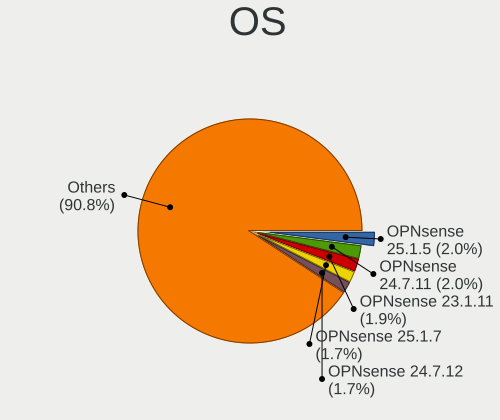

| Name             | Computers | Percent |
|------------------|-----------|---------|
| OPNsense 25.1.5  | 404       | 2.05%   |
| OPNsense 24.7.11 | 390       | 1.98%   |
| OPNsense 23.1.11 | 370       | 1.87%   |
| OPNsense 25.1.7  | 327       | 1.66%   |
| OPNsense 24.7.12 | 327       | 1.66%   |
| OPNsense 24.1.6  | 298       | 1.51%   |
| OPNsense 25.1    | 295       | 1.49%   |
| OPNsense 21.7.7  | 281       | 1.42%   |
| OPNsense 23.7.10 | 270       | 1.37%   |
| OPNsense 22.7.10 | 262       | 1.33%   |
| OPNsense 23.7.12 | 249       | 1.26%   |
| OPNsense 25.1.1  | 245       | 1.24%   |
| OPNsense 24.1.10 | 240       | 1.22%   |
| OPNsense 21.1    | 240       | 1.22%   |
| OPNsense 23.1    | 230       | 1.17%   |
| OPNsense 21.7.1  | 229       | 1.16%   |
| OPNsense 24.7    | 227       | 1.15%   |
| OPNsense 22.1    | 227       | 1.15%   |
| OPNsense 21.7.3  | 225       | 1.14%   |
| OPNsense 21.1.5  | 224       | 1.13%   |
| OPNsense 23.1.5  | 221       | 1.12%   |
| OPNsense 23.7.9  | 220       | 1.11%   |
| OPNsense 25.7.1  | 217       | 1.1%    |
| OPNsense 24.1.9  | 217       | 1.1%    |
| OPNsense 24.7.8  | 216       | 1.09%   |
| OPNsense 22.7.4  | 214       | 1.08%   |
| OPNsense 20.7.8  | 214       | 1.08%   |
| OPNsense 25.1.3  | 213       | 1.08%   |
| OPNsense 25.7.3  | 212       | 1.07%   |
| OPNsense 21.1.3  | 205       | 1.04%   |
| OPNsense 25.1.4  | 199       | 1.01%   |
| OPNsense 25.7.7  | 197       | 1%      |
| OPNsense 24.7.4  | 197       | 1%      |
| OPNsense 25.7.2  | 196       | 0.99%   |
| OPNsense 23.1.7  | 196       | 0.99%   |
| OPNsense 24.7.7  | 194       | 0.98%   |
| OPNsense 22.1.10 | 194       | 0.98%   |
| OPNsense 24.1.4  | 192       | 0.97%   |
| OPNsense 23.1.1  | 192       | 0.97%   |
| OPNsense 22.1.6  | 192       | 0.97%   |

OS Family
---------

OS without a version

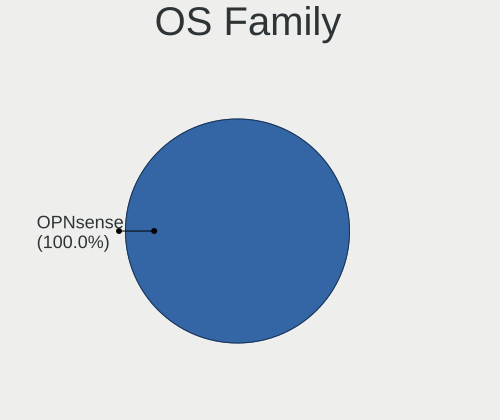

| Name     | Computers | Percent |
|----------|-----------|---------|
| OPNsense | 12877     | 100%    |

Arch
----

OS architecture (x86_64, i586, etc.)

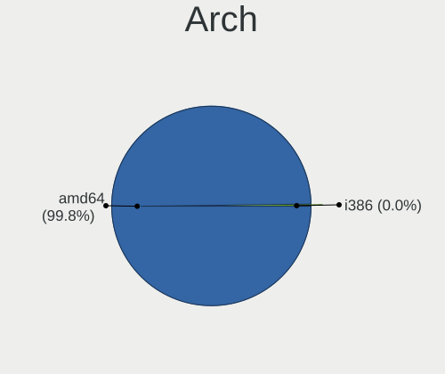

| Name  | Computers | Percent |
|-------|-----------|---------|
| amd64 | 12851     | 99.8%   |
| arm64 | 25        | 0.19%   |
| i386  | 1         | 0.01%   |

DE
--

Desktop Environment

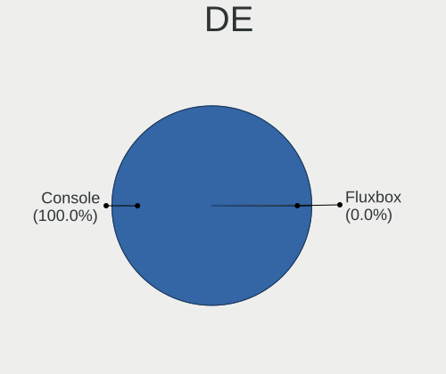

| Name         | Computers | Percent |
|--------------|-----------|---------|
| Console      | 12876     | 99.97%  |
| TWM          | 1         | 0.01%   |
| helloDesktop | 1         | 0.01%   |
| GNOME        | 1         | 0.01%   |
| Fluxbox      | 1         | 0.01%   |

Display Server
--------------

X11 or Wayland

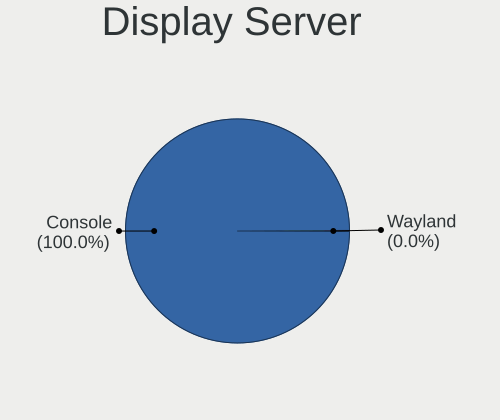

| Name    | Computers | Percent |
|---------|-----------|---------|
| Console | 12877     | 99.98%  |
| X11     | 1         | 0.01%   |
| Wayland | 1         | 0.01%   |

Display Manager
---------------

SDDM, LightDM, etc.

| Name    | Computers | Percent |
|---------|-----------|---------|
| Console | 12877     | 99.98%  |
| SLiM    | 1         | 0.01%   |
| GDM     | 1         | 0.01%   |

OS Lang
-------

Language

| Lang    | Computers | Percent |
|---------|-----------|---------|
| Unknown | 12687     | 97.59%  |
| C       | 311       | 2.39%   |
| en_US   | 2         | 0.02%   |

Boot Mode
---------

EFI or BIOS

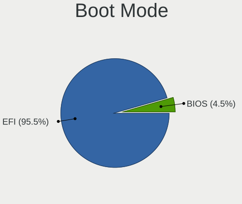

| Mode | Computers | Percent |
|------|-----------|---------|
| EFI  | 12376     | 95.55%  |
| BIOS | 577       | 4.45%   |

Filesystem
----------

Type of filesystem

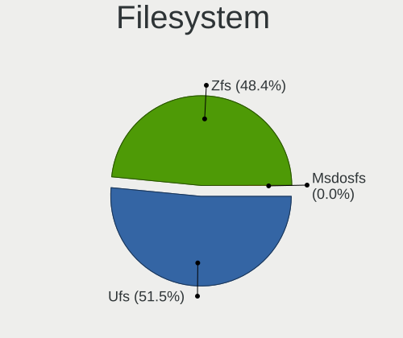

| Type    | Computers | Percent |
|---------|-----------|---------|
| Ufs     | 6853      | 51.54%  |
| Zfs     | 6438      | 48.42%  |
| Cd9660  | 5         | 0.04%   |
| Msdosfs | 1         | 0.01%   |

Part. scheme
------------

Scheme of partitioning

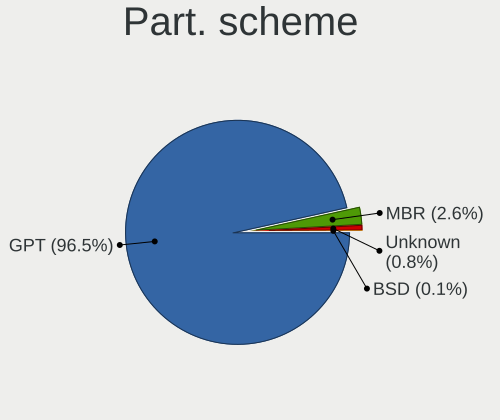

| Type    | Computers | Percent |
|---------|-----------|---------|
| GPT     | 12486     | 96.53%  |
| MBR     | 335       | 2.59%   |
| Unknown | 106       | 0.82%   |
| BSD     | 8         | 0.06%   |

Board
-----

Vendor
------

Motherboard manufacturer

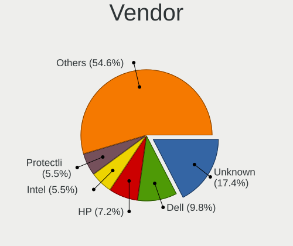

| Name                                 | Computers | Percent |
|--------------------------------------|-----------|---------|
| Unknown                              | 2245      | 17.43%  |
| Dell                                 | 1256      | 9.75%   |
| Hewlett-Packard                      | 926       | 7.19%   |
| Intel                                | 713       | 5.54%   |
| Protectli                            | 708       | 5.5%    |
| Supermicro                           | 675       | 5.24%   |
| Lenovo                               | 605       | 4.7%    |
| ASUSTek Computer                     | 516       | 4.01%   |
| PC Engines                           | 418       | 3.25%   |
| Sophos                               | 409       | 3.18%   |
| ASRock                               | 378       | 2.94%   |
| Gigabyte Technology                  | 358       | 2.78%   |
| AMI                                  | 342       | 2.66%   |
| Fujitsu                              | 300       | 2.33%   |
| Deciso                               | 243       | 1.89%   |
| Techvision                           | 236       | 1.83%   |
| MSI                                  | 220       | 1.71%   |
| AZW                                  | 144       | 1.12%   |
| ZOTAC                                | 137       | 1.06%   |
| BESSTAR Tech                         | 96        | 0.75%   |
| Shuttle                              | 94        | 0.73%   |
| CWWK                                 | 83        | 0.64%   |
| MW                                   | 81        | 0.63%   |
| Shenzhen Meigao Electronic Equipment | 80        | 0.62%   |
| CncTion                              | 67        | 0.52%   |
| IceWhale Technology                  | 62        | 0.48%   |
| Acer                                 | 60        | 0.47%   |
| AWOW                                 | 51        | 0.4%    |
| Hardkernel                           | 49        | 0.38%   |
| ASRockRack                           | 44        | 0.34%   |
| Apple                                | 44        | 0.34%   |
| Gowin Solution                       | 43        | 0.33%   |
| CompuLab                             | 41        | 0.32%   |
| Biostar                              | 38        | 0.3%    |
| Advantech                            | 36        | 0.28%   |
| AAEON                                | 36        | 0.28%   |
| CheckPoint                           | 35        | 0.27%   |
| SJRC                                 | 34        | 0.26%   |
| TianBei                              | 32        | 0.25%   |
| Cisco                                | 31        | 0.24%   |

Model
-----

Motherboard model

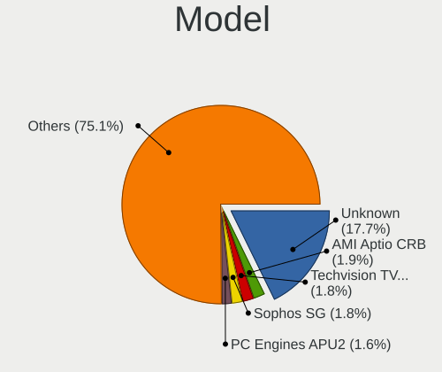

| Name                                              | Computers | Percent |
|---------------------------------------------------|-----------|---------|
| Unknown                                           | 2283      | 17.73%  |
| AMI Aptio CRB                                     | 249       | 1.93%   |
| Techvision TVI7309X                               | 236       | 1.83%   |
| Sophos SG                                         | 228       | 1.77%   |
| PC Engines APU2                                   | 207       | 1.61%   |
| Supermicro Super Server                           | 189       | 1.47%   |
| Protectli FW4B                                    | 181       | 1.41%   |
| Intel Q3XXG4-P V1.0                               | 164       | 1.27%   |
| Sophos XG                                         | 136       | 1.06%   |
| Fujitsu FUTRO S920                                | 134       | 1.04%   |
| PC Engines apu4                                   | 132       | 1.03%   |
| Protectli FW6                                     | 130       | 1.01%   |
| AZW EQ                                            | 92        | 0.71%   |
| Protectli VP2420                                  | 91        | 0.71%   |
| HP t730 Thin Client                               | 89        | 0.69%   |
| MW GMLK-2_5G4L                                    | 81        | 0.63%   |
| ASUS All Series                                   | 72        | 0.56%   |
| Shenzhen Meigao Electronic Equipment Venus Series | 68        | 0.53%   |
| HP t620 PLUS Quad Core TC                         | 68        | 0.53%   |
| Dell PowerEdge R210 II                            | 67        | 0.52%   |
| Dell OptiPlex 9020                                | 66        | 0.51%   |
| Dell Wyse 5070 Extended Thin Client               | 59        | 0.46%   |
| Dell OptiPlex 3020                                | 58        | 0.45%   |
| Dell OptiPlex 7010                                | 57        | 0.44%   |
| Protectli FW4C                                    | 53        | 0.41%   |
| Deciso NetBoard-A20                               | 53        | 0.41%   |
| Protectli VP2410                                  | 47        | 0.36%   |
| Supermicro X10SLH-N6-ST031                        | 45        | 0.35%   |
| Dell OptiPlex 7040                                | 45        | 0.35%   |
| BESSTAR Tech GK41                                 | 43        | 0.33%   |
| Supermicro A1SAi                                  | 42        | 0.33%   |
| Sophos UTM                                        | 42        | 0.33%   |
| HP EliteDesk 800 G1 SFF                           | 42        | 0.33%   |
| Dell OptiPlex 3050                                | 42        | 0.33%   |
| IceWhale ZimaBoard 832 ZMB                        | 41        | 0.32%   |
| Protectli FW2B                                    | 37        | 0.29%   |
| CWWK CW-AD4L-N V1                                 | 35        | 0.27%   |
| GoWin Solution R86S                               | 34        | 0.26%   |
| Dell OptiPlex 7050                                | 34        | 0.26%   |
| Deciso NetBoard-A10                               | 34        | 0.26%   |

Model Family
------------

Motherboard model prefix

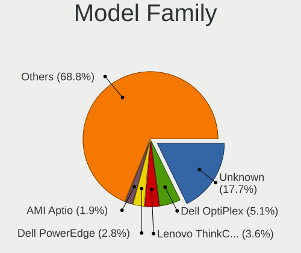

| Name                                       | Computers | Percent |
|--------------------------------------------|-----------|---------|
| Unknown                                    | 2283      | 17.73%  |
| Dell OptiPlex                              | 662       | 5.14%   |
| Lenovo ThinkCentre                         | 460       | 3.57%   |
| Dell PowerEdge                             | 360       | 2.8%    |
| AMI Aptio                                  | 251       | 1.95%   |
| Techvision TVI7309X                        | 236       | 1.83%   |
| Sophos SG                                  | 228       | 1.77%   |
| PC Engines APU2                            | 207       | 1.61%   |
| Supermicro Super                           | 189       | 1.47%   |
| HP EliteDesk                               | 189       | 1.47%   |
| Fujitsu FUTRO                              | 188       | 1.46%   |
| Protectli FW4B                             | 181       | 1.41%   |
| Intel Q3XXG4-P                             | 164       | 1.27%   |
| HP ProLiant                                | 159       | 1.23%   |
| HP ProDesk                                 | 159       | 1.23%   |
| Sophos XG                                  | 136       | 1.06%   |
| PC Engines apu4                            | 132       | 1.03%   |
| Protectli FW6                              | 130       | 1.01%   |
| ASUS PRIME                                 | 97        | 0.75%   |
| HP Compaq                                  | 95        | 0.74%   |
| Dell Wyse                                  | 93        | 0.72%   |
| AZW EQ                                     | 92        | 0.71%   |
| Protectli VP2420                           | 91        | 0.71%   |
| HP t730                                    | 91        | 0.71%   |
| Deciso Netboard                            | 84        | 0.65%   |
| MW GMLK-2                                  | 81        | 0.63%   |
| HP t620                                    | 72        | 0.56%   |
| ASUS All                                   | 72        | 0.56%   |
| Shenzhen Meigao Electronic Equipment Venus | 68        | 0.53%   |
| Deciso NetBoard-A10                        | 63        | 0.49%   |
| Dell Precision                             | 59        | 0.46%   |
| IceWhale ZimaBoard                         | 55        | 0.43%   |
| Protectli FW4C                             | 53        | 0.41%   |
| Deciso NetBoard-A20                        | 53        | 0.41%   |
| Fujitsu ESPRIMO                            | 51        | 0.4%    |
| Protectli VP2410                           | 47        | 0.36%   |
| Supermicro X10SLH-N6-ST031                 | 45        | 0.35%   |
| BESSTAR Tech GK41                          | 43        | 0.33%   |
| Supermicro A1SAi                           | 42        | 0.33%   |
| Sophos UTM                                 | 42        | 0.33%   |

MFG Year
--------

Motherboard manufacture year

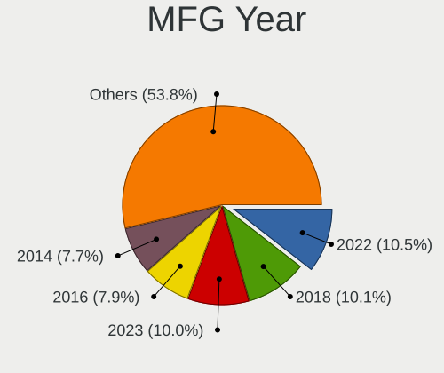

| Year    | Computers | Percent |
|---------|-----------|---------|
| 2022    | 1354      | 10.51%  |
| 2018    | 1298      | 10.08%  |
| 2023    | 1289      | 10.01%  |
| 2016    | 1017      | 7.9%    |
| 2014    | 997       | 7.74%   |
| 2021    | 977       | 7.59%   |
| 2024    | 864       | 6.71%   |
| 2019    | 826       | 6.41%   |
| 2017    | 799       | 6.2%    |
| 2020    | 738       | 5.73%   |
| 2013    | 611       | 4.74%   |
| 2015    | 535       | 4.15%   |
| 2012    | 495       | 3.84%   |
| 2011    | 404       | 3.14%   |
| 2010    | 217       | 1.69%   |
| 2025    | 146       | 1.13%   |
| 2009    | 122       | 0.95%   |
| 2008    | 113       | 0.88%   |
| 2007    | 40        | 0.31%   |
| 2006    | 18        | 0.14%   |
| Unknown | 14        | 0.11%   |
| 2005    | 2         | 0.02%   |
| 2004    | 1         | 0.01%   |

Form Factor
-----------

Physical design of the computer

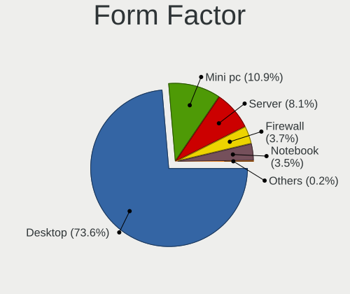

| Name           | Computers | Percent |
|----------------|-----------|---------|
| Desktop        | 9482      | 73.64%  |
| Mini pc        | 1400      | 10.87%  |
| Server         | 1044      | 8.11%   |
| Firewall       | 472       | 3.67%   |
| Notebook       | 450       | 3.49%   |
| All in one     | 12        | 0.09%   |
| Convertible    | 8         | 0.06%   |
| System on chip | 6         | 0.05%   |
| Tablet         | 3         | 0.02%   |

Coreboot
--------

Have coreboot on board

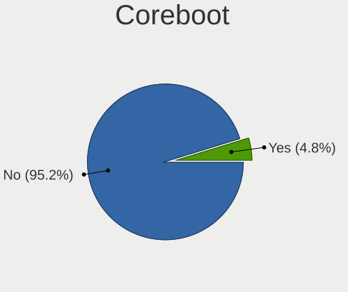

| Used | Computers | Percent |
|------|-----------|---------|
| No   | 12267     | 95.24%  |
| Yes  | 613       | 4.76%   |

RAM Size
--------

Total RAM memory

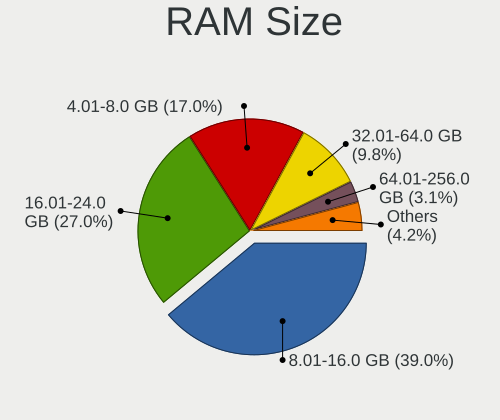

| Size in GB      | Computers | Percent |
|-----------------|-----------|---------|
| 8.01-16.0       | 5170      | 38.95%  |
| 16.01-24.0      | 3586      | 27.02%  |
| 4.01-8.0        | 2250      | 16.95%  |
| 32.01-64.0      | 1304      | 9.82%   |
| 64.01-256.0     | 409       | 3.08%   |
| 2.01-3.0        | 330       | 2.49%   |
| 24.01-32.0      | 128       | 0.96%   |
| 3.01-4.0        | 49        | 0.37%   |
| 1.01-2.0        | 16        | 0.12%   |
| 0.51-1.0        | 16        | 0.12%   |
| More than 256.0 | 15        | 0.11%   |

RAM Used
--------

Used RAM memory

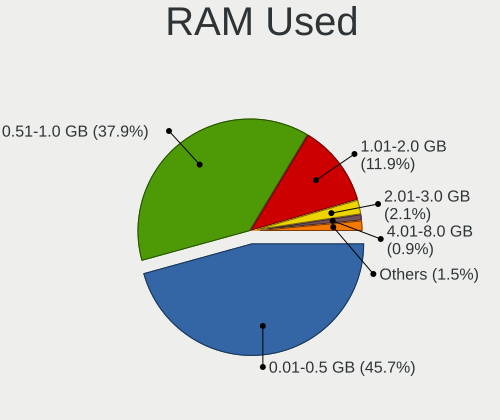

| Used GB     | Computers | Percent |
|-------------|-----------|---------|
| 0.01-0.5    | 6097      | 45.72%  |
| 0.51-1.0    | 5055      | 37.9%   |
| 1.01-2.0    | 1584      | 11.88%  |
| 2.01-3.0    | 281       | 2.11%   |
| 4.01-8.0    | 118       | 0.88%   |
| 3.01-4.0    | 118       | 0.88%   |
| 8.01-16.0   | 50        | 0.37%   |
| 16.01-24.0  | 13        | 0.1%    |
| 32.01-64.0  | 9         | 0.07%   |
| 24.01-32.0  | 6         | 0.04%   |
| 64.01-256.0 | 3         | 0.02%   |
| 0           | 2         | 0.01%   |

Total Drives
------------

Number of drives on board

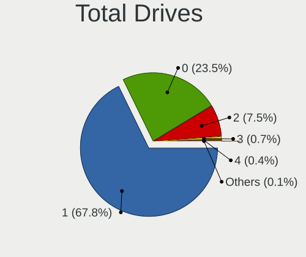

| Drives | Computers | Percent |
|--------|-----------|---------|
| 1      | 9112      | 67.78%  |
| 0      | 3164      | 23.53%  |
| 2      | 1009      | 7.51%   |
| 3      | 90        | 0.67%   |
| 4      | 54        | 0.4%    |
| 5      | 7         | 0.05%   |
| 6      | 3         | 0.02%   |
| 25     | 2         | 0.01%   |
| 8      | 2         | 0.01%   |
| 16     | 1         | 0.01%   |

Has CD-ROM
----------

Has CD-ROM on board

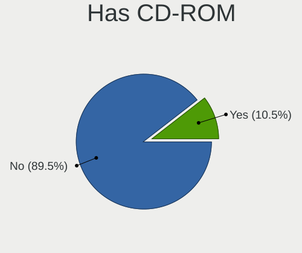

| Presented | Computers | Percent |
|-----------|-----------|---------|
| No        | 11621     | 89.48%  |
| Yes       | 1366      | 10.52%  |

Has Ethernet
------------

Has Ethernet on board

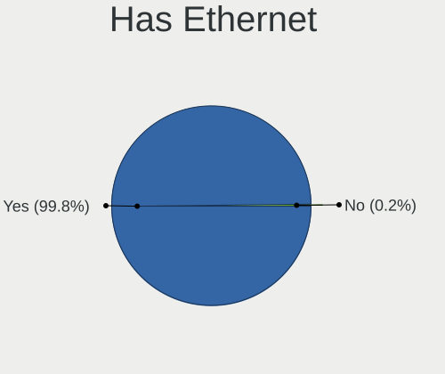

| Presented | Computers | Percent |
|-----------|-----------|---------|
| Yes       | 12854     | 99.81%  |
| No        | 24        | 0.19%   |

Has WiFi
--------

Has WiFi module

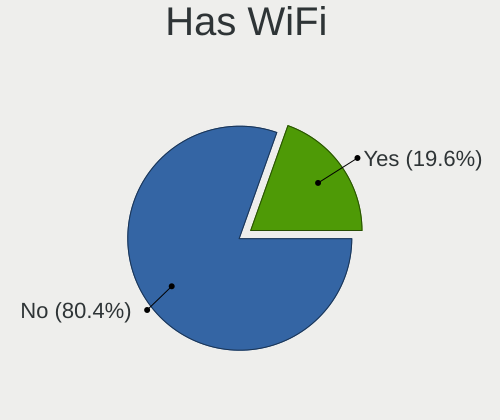

| Presented | Computers | Percent |
|-----------|-----------|---------|
| No        | 10487     | 80.43%  |
| Yes       | 2552      | 19.57%  |

Has Bluetooth
-------------

Has Bluetooth module

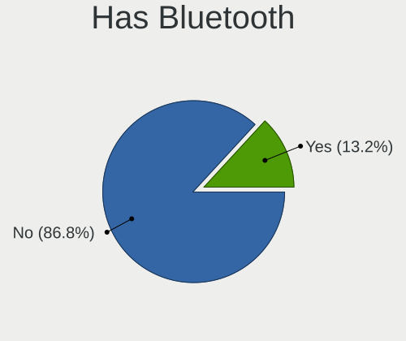

| Presented | Computers | Percent |
|-----------|-----------|---------|
| No        | 11270     | 86.85%  |
| Yes       | 1707      | 13.15%  |

Location
--------

Country
-------

Geographic location (country)

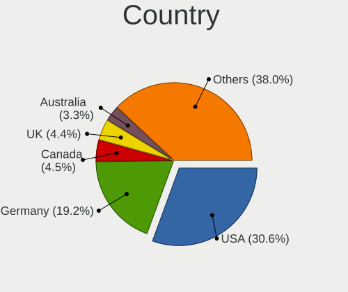

| Country         | Computers | Percent |
|-----------------|-----------|---------|
| USA             | 3958      | 30.58%  |
| Germany         | 2488      | 19.22%  |
| Canada          | 586       | 4.53%   |
| UK              | 568       | 4.39%   |
| Australia       | 422       | 3.26%   |
| France          | 419       | 3.24%   |
| Netherlands     | 320       | 2.47%   |
| Poland          | 282       | 2.18%   |
| Switzerland     | 259       | 2%      |
| Austria         | 253       | 1.95%   |
| Brazil          | 239       | 1.85%   |
| Sweden          | 227       | 1.75%   |
| Italy           | 218       | 1.68%   |
| Russia          | 212       | 1.64%   |
| Belgium         | 141       | 1.09%   |
| China           | 125       | 0.97%   |
| Spain           | 123       | 0.95%   |
| Norway          | 118       | 0.91%   |
| Finland         | 117       | 0.9%    |
| Romania         | 109       | 0.84%   |
| Portugal        | 101       | 0.78%   |
| Denmark         | 95        | 0.73%   |
| South Korea     | 88        | 0.68%   |
| India           | 73        | 0.56%   |
| New Zealand     | 72        | 0.56%   |
| Taiwan          | 71        | 0.55%   |
| Czechia         | 68        | 0.53%   |
| South Africa    | 67        | 0.52%   |
| Hungary         | 61        | 0.47%   |
| Japan           | 59        | 0.46%   |
| Indonesia       | 58        | 0.45%   |
| Bulgaria        | 50        | 0.39%   |
| Singapore       | 47        | 0.36%   |
| Hong Kong       | 45        | 0.35%   |
| Vietnam         | 39        | 0.3%    |
| The Netherlands | 39        | 0.3%    |
| Slovakia        | 37        | 0.29%   |
| Israel          | 37        | 0.29%   |
| Philippines     | 36        | 0.28%   |
| Turkey          | 35        | 0.27%   |

City
----

Geographic location (city)

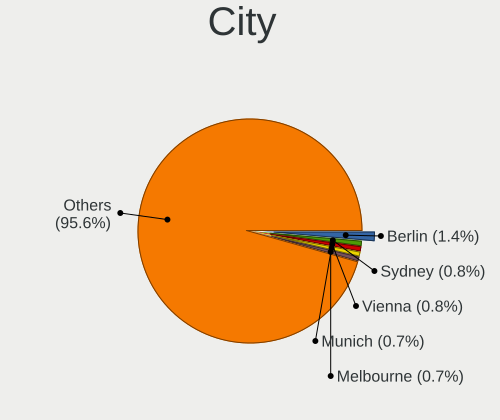

| City              | Computers | Percent |
|-------------------|-----------|---------|
| Berlin            | 207       | 1.38%   |
| Sydney            | 119       | 0.79%   |
| Vienna            | 115       | 0.77%   |
| Munich            | 108       | 0.72%   |
| Melbourne         | 105       | 0.7%    |
| Seattle           | 94        | 0.63%   |
| Hamburg           | 90        | 0.6%    |
| Paris             | 86        | 0.57%   |
| Moscow            | 77        | 0.51%   |
| Frankfurt am Main | 75        | 0.5%    |
| London            | 73        | 0.49%   |
| Denver            | 71        | 0.47%   |
| Cologne           | 71        | 0.47%   |
| Zurich            | 67        | 0.45%   |
| Warsaw            | 63        | 0.42%   |
| Toronto           | 62        | 0.41%   |
| Brisbane          | 58        | 0.39%   |
| Montreal          | 52        | 0.35%   |
| Stockholm         | 50        | 0.33%   |
| Chicago           | 50        | 0.33%   |
| Perth             | 48        | 0.32%   |
| Helsinki          | 47        | 0.31%   |
| Singapore         | 46        | 0.31%   |
| Bucharest         | 44        | 0.29%   |
| Auckland          | 44        | 0.29%   |
| Los Angeles       | 43        | 0.29%   |
| New York          | 42        | 0.28%   |
| Oakland           | 41        | 0.27%   |
| Dallas            | 41        | 0.27%   |
| Hanover           | 40        | 0.27%   |
| Calgary           | 40        | 0.27%   |
| Amsterdam         | 40        | 0.27%   |
| Stuttgart         | 39        | 0.26%   |
| Sao Paulo         | 38        | 0.25%   |
| Oslo              | 38        | 0.25%   |
| Madrid            | 36        | 0.24%   |
| Philadelphia      | 35        | 0.23%   |
| Edmonton          | 35        | 0.23%   |
| Columbus          | 34        | 0.23%   |
| Portland          | 33        | 0.22%   |

Drives
------

Drive Vendor
------------

Hard drive vendors

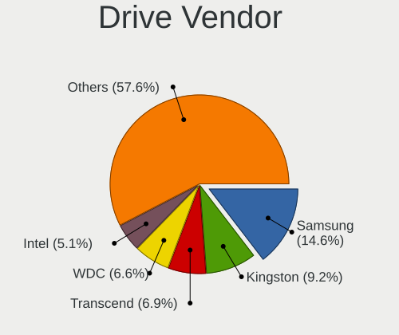

| Vendor              | Computers | Drives | Percent |
|---------------------|-----------|--------|---------|
| Samsung Electronics | 1621      | 2698   | 14.59%  |
| Kingston            | 1024      | 1659   | 9.21%   |
| Transcend           | 767       | 1232   | 6.9%    |
| WDC                 | 734       | 1221   | 6.6%    |
| Intel               | 564       | 936    | 5.08%   |
| Crucial             | 527       | 909    | 4.74%   |
| Seagate             | 500       | 843    | 4.5%    |
| SanDisk             | 495       | 721    | 4.45%   |
| China               | 484       | 733    | 4.36%   |
| A-DATA Technology   | 331       | 507    | 2.98%   |
| Hoodisk             | 307       | 510    | 2.76%   |
| Toshiba             | 230       | 404    | 2.07%   |
| Phison              | 174       | 255    | 1.57%   |
| FORESEE             | 172       | 271    | 1.55%   |
| Protectli           | 167       | 291    | 1.5%    |
| Micron Technology   | 153       | 244    | 1.38%   |
| SK hynix            | 145       | 229    | 1.3%    |
| SPCC                | 138       | 262    | 1.24%   |
| Hewlett-Packard     | 130       | 259    | 1.17%   |
| Apacer              | 115       | 176    | 1.03%   |
| Patriot             | 110       | 183    | 0.99%   |
| Hitachi             | 104       | 158    | 0.94%   |
| PNY                 | 99        | 172    | 0.89%   |
| Innodisk            | 98        | 133    | 0.88%   |
| OCZ                 | 93        | 147    | 0.84%   |
| Silicon Motion      | 88        | 121    | 0.79%   |
| Intenso             | 86        | 163    | 0.77%   |
| HGST                | 73        | 130    | 0.66%   |
| Dogfish             | 72        | 135    | 0.65%   |
| Team                | 66        | 125    | 0.59%   |
| BIWIN               | 60        | 91     | 0.54%   |
| LITEON              | 55        | 97     | 0.49%   |
| ShiJi               | 54        | 77     | 0.49%   |
| KingSpec            | 52        | 77     | 0.47%   |
| Fanxiang            | 52        | 85     | 0.47%   |
| Corsair             | 52        | 88     | 0.47%   |
| LITEONIT            | 51        | 84     | 0.46%   |
| Lexar               | 49        | 66     | 0.44%   |
| ATP                 | 42        | 54     | 0.38%   |
| Gigabyte Technology | 41        | 57     | 0.37%   |

Drive Model
-----------

Hard drive models

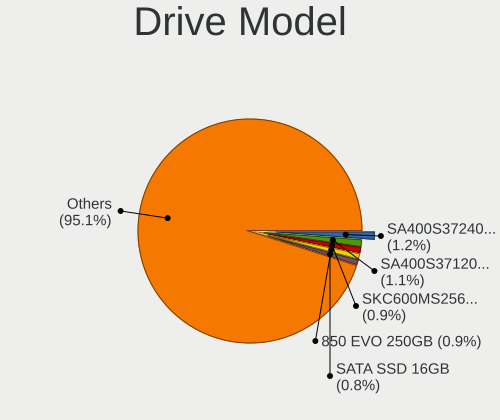

| Model                           | Computers | Percent |
|---------------------------------|-----------|---------|
| Kingston SA400S37240G 240GB     | 135       | 1.19%   |
| Kingston SA400S37120G 120GB     | 123       | 1.09%   |
| Kingston SKC600MS256G 256GB     | 104       | 0.92%   |
| Samsung SSD 850 EVO 250GB       | 103       | 0.91%   |
| China SATA SSD 16GB             | 92        | 0.81%   |
| Transcend TS128GMSA230S 128GB   | 88        | 0.78%   |
| Hoodisk SSD 32GB                | 88        | 0.78%   |
| Hoodisk SSD 128GB               | 87        | 0.77%   |
| A-DATA IM2S3134N-064GM 64GB     | 85        | 0.75%   |
| Hoodisk SSD 64GB                | 81        | 0.72%   |
| Crucial CT240BX500SSD1 240GB    | 80        | 0.71%   |
| FORESEE 128GB SSD               | 77        | 0.68%   |
| Kingston SUV500MS120G 120GB     | 72        | 0.64%   |
| Kingston SV300S37A120G 120GB    | 70        | 0.62%   |
| Samsung SSD 870 EVO 250GB       | 63        | 0.56%   |
| Phison SATA SSD 16GB            | 62        | 0.55%   |
| Crucial CT250MX500SSD1 250GB    | 61        | 0.54%   |
| Samsung SSD 860 EVO 250GB       | 56        | 0.5%    |
| Seagate ST500DM002-1BD142 500GB | 55        | 0.49%   |
| Transcend TS64GSSD370 64GB      | 50        | 0.44%   |
| Transcend TS64GMSA230S 64GB     | 50        | 0.44%   |
| HP RAID 1(1+0) 119GB            | 49        | 0.43%   |
| FORESEE 64GB SSD                | 48        | 0.42%   |
| Samsung SSD 870 EVO 500GB       | 46        | 0.41%   |
| Crucial CT120BX500SSD1 120GB    | 46        | 0.41%   |
| Samsung SSD 860 EVO 500GB       | 44        | 0.39%   |
| Samsung SSD 850 EVO 500GB       | 44        | 0.39%   |
| Transcend TS256GMTS952T2 256GB  | 42        | 0.37%   |
| Transcend TS256GMSA230S 256GB   | 42        | 0.37%   |
| Samsung SSD 840 EVO 120GB       | 42        | 0.37%   |
| Protectli 120GB mSATA           | 41        | 0.36%   |
| PNY CS900 120GB SSD             | 41        | 0.36%   |
| Crucial CT500MX500SSD1 500GB    | 39        | 0.34%   |
| Samsung SSD 850 PRO 256GB       | 38        | 0.34%   |
| Samsung SSD 840 EVO 250GB       | 38        | 0.34%   |
| BIWIN SSD 128GB                 | 38        | 0.34%   |
| Samsung SSD 850 EVO 120GB       | 36        | 0.32%   |
| Kingston SUV500MS240G 240GB     | 36        | 0.32%   |
| A-DATA SU650 120GB              | 36        | 0.32%   |
| Intel SSDSC2BW180A4 180GB       | 35        | 0.31%   |

HDD Vendor
----------

Hard disk drive vendors

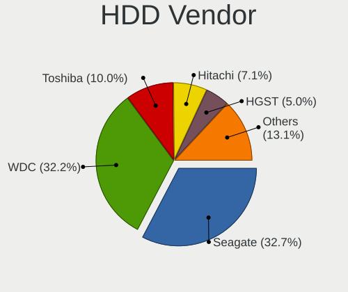

| Vendor               | Computers | Drives | Percent |
|----------------------|-----------|--------|---------|
| Seagate              | 468       | 779    | 32.68%  |
| WDC                  | 461       | 773    | 32.19%  |
| Toshiba              | 143       | 255    | 9.99%   |
| Hitachi              | 101       | 155    | 7.05%   |
| HGST                 | 72        | 128    | 5.03%   |
| Hewlett-Packard      | 52        | 105    | 3.63%   |
| Samsung Electronics  | 47        | 64     | 3.28%   |
| Apple                | 15        | 19     | 1.05%   |
| Maxtor               | 13        | 14     | 0.91%   |
| HPE                  | 12        | 32     | 0.84%   |
| Fujitsu              | 9         | 11     | 0.63%   |
| LSI                  | 6         | 6      | 0.42%   |
| China                | 6         | 8      | 0.42%   |
| MARVELL              | 3         | 3      | 0.21%   |
| Dell                 | 3         | 49     | 0.21%   |
| Adaptec              | 3         | 3      | 0.21%   |
| QEMU                 | 2         | 2      | 0.14%   |
| NETAPP               | 2         | 4      | 0.14%   |
| LSILOGIC             | 2         | 5      | 0.14%   |
| Lexar                | 2         | 3      | 0.14%   |
| IBM-207x             | 2         | 2      | 0.14%   |
| Cisco                | 2         | 5      | 0.14%   |
| Synology             | 1         | 1      | 0.07%   |
| InnoLite             | 1         | 1      | 0.07%   |
| FTS                  | 1         | 1      | 0.07%   |
| ExcelStor Technology | 1         | 1      | 0.07%   |
| Cactus               | 1         | 1      | 0.07%   |
| ASMedia              | 1         | 2      | 0.07%   |

SSD Vendor
----------

Solid state drive vendors

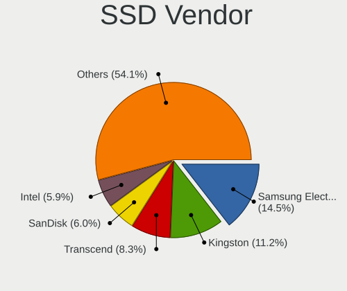

| Vendor              | Computers | Drives | Percent |
|---------------------|-----------|--------|---------|
| Samsung Electronics | 1182      | 1984   | 14.49%  |
| Kingston            | 912       | 1493   | 11.18%  |
| Transcend           | 673       | 1107   | 8.25%   |
| SanDisk             | 492       | 718    | 6.03%   |
| Intel               | 481       | 815    | 5.9%    |
| China               | 478       | 725    | 5.86%   |
| Crucial             | 440       | 774    | 5.39%   |
| A-DATA Technology   | 310       | 472    | 3.8%    |
| Hoodisk             | 305       | 508    | 3.74%   |
| WDC                 | 174       | 280    | 2.13%   |
| Protectli           | 167       | 291    | 2.05%   |
| FORESEE             | 159       | 254    | 1.95%   |
| Micron Technology   | 136       | 218    | 1.67%   |
| Apacer              | 114       | 172    | 1.4%    |
| SPCC                | 109       | 205    | 1.34%   |
| Phison              | 107       | 145    | 1.31%   |
| Innodisk            | 98        | 133    | 1.2%    |
| PNY                 | 93        | 162    | 1.14%   |
| OCZ                 | 93        | 147    | 1.14%   |
| SK hynix            | 89        | 143    | 1.09%   |
| Intenso             | 79        | 151    | 0.97%   |
| Hewlett-Packard     | 74        | 138    | 0.91%   |
| Patriot             | 73        | 132    | 0.89%   |
| Dogfish             | 72        | 135    | 0.88%   |
| Toshiba             | 52        | 95     | 0.64%   |
| LITEON              | 52        | 93     | 0.64%   |
| KingSpec            | 52        | 77     | 0.64%   |
| LITEONIT            | 51        | 84     | 0.63%   |
| BIWIN               | 50        | 80     | 0.61%   |
| Corsair             | 44        | 70     | 0.54%   |
| ShiJi               | 40        | 60     | 0.49%   |
| Team                | 38        | 86     | 0.47%   |
| ATP                 | 37        | 46     | 0.45%   |
| Lexar               | 32        | 44     | 0.39%   |
| Kston               | 30        | 46     | 0.37%   |
| Netac               | 29        | 54     | 0.36%   |
| Verbatim            | 25        | 38     | 0.31%   |
| Gigabyte Technology | 25        | 37     | 0.31%   |
| Seagate             | 22        | 51     | 0.27%   |
| Plextor             | 21        | 36     | 0.26%   |

Drive Kind
----------

HDD or SSD

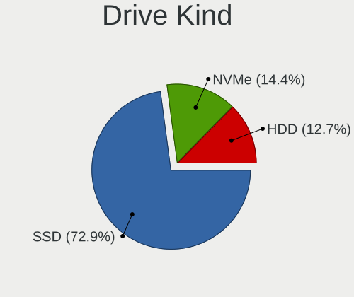

| Kind | Computers | Drives | Percent |
|------|-----------|--------|---------|
| SSD  | 7678      | 13287  | 72.91%  |
| NVMe | 1520      | 2349   | 14.43%  |
| HDD  | 1333      | 2432   | 12.66%  |

Drive Connector
---------------

SATA, SAS, NVMe, etc.

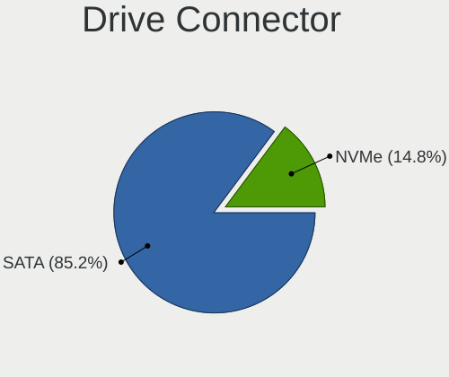

| Type | Computers | Drives | Percent |
|------|-----------|--------|---------|
| SATA | 8748      | 15719  | 85.2%   |
| NVMe | 1520      | 2349   | 14.8%   |

Drive Size
----------

Size of hard drive

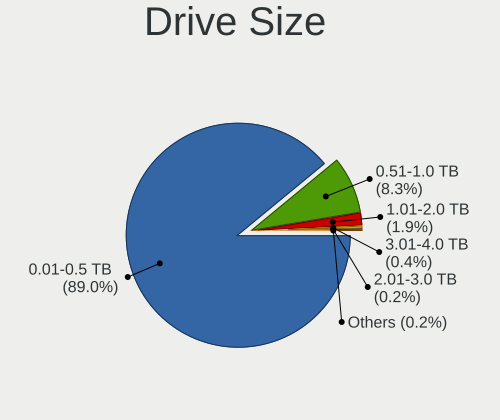

| Size in TB | Computers | Drives | Percent |
|------------|-----------|--------|---------|
| 0.01-0.5   | 7977      | 13955  | 89.03%  |
| 0.51-1.0   | 746       | 1314   | 8.33%   |
| 1.01-2.0   | 167       | 309    | 1.86%   |
| 3.01-4.0   | 37        | 59     | 0.41%   |
| 2.01-3.0   | 17        | 31     | 0.19%   |
| 4.01-10.0  | 12        | 46     | 0.13%   |
| 10.01-20.0 | 4         | 5      | 0.04%   |

Space Total
-----------

Amount of disk space available on the file system

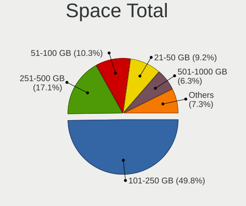

| Size in GB     | Computers | Percent |
|----------------|-----------|---------|
| 101-250        | 6652      | 49.79%  |
| 251-500        | 2289      | 17.13%  |
| 51-100         | 1373      | 10.28%  |
| 21-50          | 1224      | 9.16%   |
| 501-1000       | 844       | 6.32%   |
| 1-20           | 763       | 5.71%   |
| 1001-2000      | 159       | 1.19%   |
| More than 3000 | 36        | 0.27%   |
| 2001-3000      | 13        | 0.1%    |
| Unknown        | 8         | 0.06%   |

Space Used
----------

Amount of used disk space

| Used GB  | Computers | Percent |
|----------|-----------|---------|
| 1-20     | 12594     | 94.22%  |
| 21-50    | 548       | 4.1%    |
| 51-100   | 155       | 1.16%   |
| 101-250  | 54        | 0.4%    |
| Unknown  | 8         | 0.06%   |
| 251-500  | 6         | 0.04%   |
| 501-1000 | 1         | 0.01%   |

Malfunc. Drives
---------------

Drive models with a malfunction

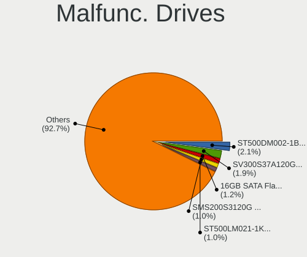

| Model                                  | Computers | Drives | Percent |
|----------------------------------------|-----------|--------|---------|
| Seagate ST500DM002-1BD142 500GB        | 24        | 42     | 2.1%    |
| Kingston SV300S37A120G 120GB           | 22        | 28     | 1.92%   |
| Apacer 16GB SATA Flash Drive           | 14        | 21     | 1.22%   |
| Kingston SMS200S3120G 120GB            | 12        | 22     | 1.05%   |
| Seagate ST500LM021-1KJ152 500GB        | 11        | 16     | 0.96%   |
| Kingston SV300S37A60G 64GB             | 10        | 13     | 0.87%   |
| WDC WDS240G2G0A-00JH30 240GB           | 8         | 13     | 0.7%    |
| Kingston SMS200S360G 64GB              | 8         | 12     | 0.7%    |
| HGST HTS725050A7E630 500GB             | 8         | 14     | 0.7%    |
| Crucial CT275MX300SSD1 275GB           | 8         | 11     | 0.7%    |
| Kingston SHFS37A120G 120GB             | 7         | 19     | 0.61%   |
| Seagate ST3160815AS 160GB              | 6         | 9      | 0.52%   |
| Samsung Electronics SSD 870 EVO 500GB  | 6         | 19     | 0.52%   |
| Kingston SA400S37240G 240GB            | 6         | 6      | 0.52%   |
| Intel SSDSC2CT120A3 120GB              | 6         | 10     | 0.52%   |
| Intel SSDSA2M160G2GC 160GB             | 6         | 9      | 0.52%   |
| Crucial CT128MX100SSD1 128GB           | 6         | 15     | 0.52%   |
| Crucial CT120M500SSD1 120GB            | 6         | 9      | 0.52%   |
| A-DATA Technology ASU800SS-256GT 256GB | 6         | 6      | 0.52%   |
| WDC WDS120G2G0A-00JH30 120GB           | 5         | 6      | 0.44%   |
| WDC WD1600AAJS-75M0A0 160GB            | 5         | 5      | 0.44%   |
| Seagate ST9500420AS 500GB              | 5         | 7      | 0.44%   |
| Seagate ST3500418AS 500GB              | 5         | 12     | 0.44%   |
| Seagate ST250DM000-1BD141 250GB        | 5         | 6      | 0.44%   |
| Patriot Burst Elite 120GB              | 5         | 7      | 0.44%   |
| LITEON CV8-8E128-HP 128GB              | 5         | 13     | 0.44%   |
| Kingston SA400S37120G 120GB            | 5         | 6      | 0.44%   |
| Intel SSDSC2BW180A4 180GB              | 5         | 5      | 0.44%   |
| Intel SSDSC2BW120H6 120GB              | 5         | 8      | 0.44%   |
| Intel SSDSA2M080G2GC 80GB              | 5         | 10     | 0.44%   |
| Hitachi HTS541612J9SA00 120GB          | 5         | 8      | 0.44%   |
| Crucial CT240M500SSD1 240GB            | 5         | 6      | 0.44%   |
| A-DATA Technology SU800 128GB          | 5         | 6      | 0.44%   |
| WDC WD5000AAKX-75U6AA0 500GB           | 4         | 5      | 0.35%   |
| WDC WD2502ABYS-18B7A0 250GB            | 4         | 4      | 0.35%   |
| Toshiba DT01ACA100 1TB                 | 4         | 4      | 0.35%   |
| SK hynix SC308 SATA 128GB              | 4         | 7      | 0.35%   |
| Seagate ST9320423AS 320GB              | 4         | 4      | 0.35%   |
| Seagate ST500LT012-9WS142 500GB        | 4         | 6      | 0.35%   |
| Seagate ST3160318AS 160GB              | 4         | 8      | 0.35%   |

Malfunc. Drive Vendor
---------------------

Vendors of faulty drives

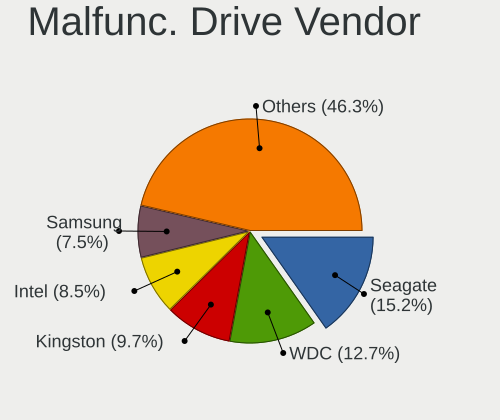

| Vendor              | Computers | Drives | Percent |
|---------------------|-----------|--------|---------|
| Seagate             | 173       | 278    | 15.24%  |
| WDC                 | 144       | 224    | 12.69%  |
| Kingston            | 110       | 171    | 9.69%   |
| Intel               | 97        | 145    | 8.55%   |
| Samsung Electronics | 85        | 144    | 7.49%   |
| SanDisk             | 54        | 78     | 4.76%   |
| Crucial             | 51        | 98     | 4.49%   |
| Toshiba             | 42        | 60     | 3.7%    |
| Hitachi             | 42        | 59     | 3.7%    |
| China               | 29        | 35     | 2.56%   |
| SK hynix            | 26        | 38     | 2.29%   |
| Micron Technology   | 25        | 38     | 2.2%    |
| HGST                | 25        | 36     | 2.2%    |
| A-DATA Technology   | 25        | 32     | 2.2%    |
| Apacer              | 22        | 31     | 1.94%   |
| OCZ                 | 16        | 23     | 1.41%   |
| HP Phison           | 11        | 16     | 0.97%   |
| Transcend           | 10        | 13     | 0.88%   |
| Corsair             | 10        | 16     | 0.88%   |
| Patriot             | 9         | 15     | 0.79%   |
| SPCC                | 8         | 12     | 0.7%    |
| Dogfish             | 8         | 18     | 0.7%    |
| LITEON              | 7         | 17     | 0.62%   |
| Hewlett-Packard     | 7         | 12     | 0.62%   |
| Netac               | 6         | 14     | 0.53%   |
| Phison              | 5         | 7      | 0.44%   |
| Maxtor              | 5         | 5      | 0.44%   |
| KingSpec            | 5         | 6      | 0.44%   |
| BIWIN               | 5         | 7      | 0.44%   |
| SSSTC               | 4         | 8      | 0.35%   |
| Plextor             | 4         | 4      | 0.35%   |
| VisionTek           | 3         | 7      | 0.26%   |
| PNY                 | 3         | 3      | 0.26%   |
| Mushkin             | 3         | 4      | 0.26%   |
| KingDian            | 3         | 6      | 0.26%   |
| Intenso             | 3         | 3      | 0.26%   |
| Apple               | 3         | 3      | 0.26%   |
| Team                | 2         | 4      | 0.18%   |
| SUNEAST             | 2         | 6      | 0.18%   |
| ShiJi               | 2         | 3      | 0.18%   |

Malfunc. HDD Vendor
-------------------

Vendors of faulty HDD drives

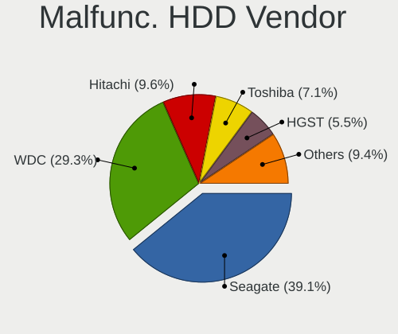

| Vendor              | Computers | Drives | Percent |
|---------------------|-----------|--------|---------|
| Seagate             | 171       | 276    | 39.13%  |
| WDC                 | 128       | 202    | 29.29%  |
| Hitachi             | 42        | 59     | 9.61%   |
| Toshiba             | 31        | 39     | 7.09%   |
| HGST                | 24        | 34     | 5.49%   |
| Samsung Electronics | 22        | 28     | 5.03%   |
| Maxtor              | 5         | 5      | 1.14%   |
| Hewlett-Packard     | 4         | 5      | 0.92%   |
| China               | 4         | 6      | 0.92%   |
| HPE                 | 2         | 5      | 0.46%   |
| InnoLite            | 1         | 1      | 0.23%   |
| Fujitsu             | 1         | 2      | 0.23%   |
| Cactus              | 1         | 1      | 0.23%   |
| Apple               | 1         | 1      | 0.23%   |

Malfunc. Drive Kind
-------------------

Kinds of faulty drives

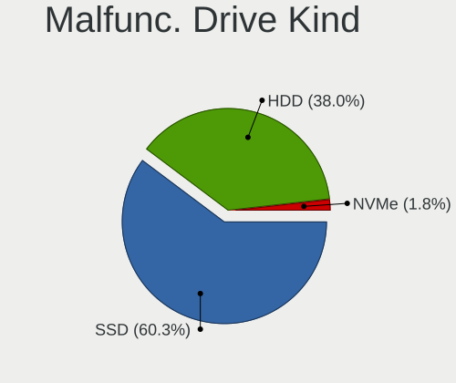

| Kind | Computers | Drives | Percent |
|------|-----------|--------|---------|
| SSD  | 673       | 1068   | 60.25%  |
| HDD  | 424       | 664    | 37.96%  |
| NVMe | 20        | 28     | 1.79%   |

Failed Drives
-------------

Failed drive models

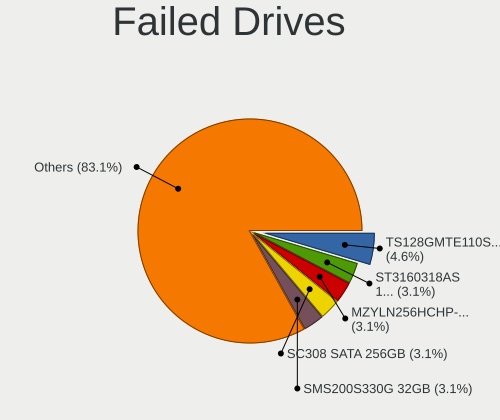

| Model                                            | Computers | Drives | Percent |
|--------------------------------------------------|-----------|--------|---------|
| Transcend TS128GMTE110S 128GB                    | 3         | 3      | 4.62%   |
| SK hynix SC308 SATA 256GB                        | 2         | 3      | 3.08%   |
| Seagate ST3160318AS 160GB                        | 2         | 2      | 3.08%   |
| Samsung Electronics MZYLN256HCHP-000L2 256GB     | 2         | 2      | 3.08%   |
| Kingston SMS200S330G 32GB                        | 2         | 2      | 3.08%   |
| Intel SSDSC2BW180A4 180GB                        | 2         | 2      | 3.08%   |
| Crucial CT500P3SSD8 500GB                        | 2         | 2      | 3.08%   |
| WDC WD3200L 320GB                                | 1         | 1      | 1.54%   |
| WDC WD3200BPVT-16JJ5T0 320GB                     | 1         | 1      | 1.54%   |
| WDC WD1600BEKX-00B7WT0 160GB                     | 1         | 1      | 1.54%   |
| WDC WD10SPZX-00Z10T0 1TB                         | 1         | 1      | 1.54%   |
| WDC PC SN530 SDBPMPZ-256G-1101 256GB             | 1         | 1      | 1.54%   |
| Vaseky V900-120G                                 | 1         | 1      | 1.54%   |
| Transcend TS32GSSD370S 32GB                      | 1         | 4      | 1.54%   |
| Toshiba THNSNK128GCS8 SATA 128GB                 | 1         | 1      | 1.54%   |
| Toshiba KXG50ZNV256G NVMe 256GB                  | 1         | 1      | 1.54%   |
| Supermicro SSD 16GB                              | 1         | 1      | 1.54%   |
| SK hynix SC308 SATA 128GB                        | 1         | 1      | 1.54%   |
| SK hynix BC501 HFM256GDJTNG-8310A 256GB          | 1         | 1      | 1.54%   |
| Seagate ST4000NM0025 4TB                         | 1         | 2      | 1.54%   |
| Seagate ST3500418AS 500GB                        | 1         | 2      | 1.54%   |
| SanDisk SD9SN8W-256G-1006 256GB                  | 1         | 1      | 1.54%   |
| SanDisk SD7TB6S256G1001 256GB                    | 1         | 2      | 1.54%   |
| SanDisk pSSD 32GB                                | 1         | 1      | 1.54%   |
| Samsung Electronics SSD PM830 2.5-inch 7mm 256GB | 1         | 1      | 1.54%   |
| Samsung Electronics SSD 980 250GB                | 1         | 2      | 1.54%   |
| Samsung Electronics SSD 970 EVO Plus 500GB       | 1         | 1      | 1.54%   |
| Samsung Electronics SSD 960 EVO 500GB            | 1         | 1      | 1.54%   |
| Samsung Electronics PM981 NVMe 256GB             | 1         | 1      | 1.54%   |
| Samsung Electronics PM961 NVMe 256GB             | 1         | 1      | 1.54%   |
| Samsung Electronics MZVLW256HEHP-000L7 256GB     | 1         | 1      | 1.54%   |
| Samsung Electronics MZVLW256HEHP-000H1 256GB     | 1         | 2      | 1.54%   |
| Samsung Electronics MZVLW256HEHP-00000 256GB     | 1         | 1      | 1.54%   |
| Samsung Electronics MZVLB256HBHQ-000H1 256GB     | 1         | 1      | 1.54%   |
| Samsung Electronics MZVLB256HAHQ-000L7 256GB     | 1         | 1      | 1.54%   |
| Samsung Electronics MZNTE256HMHP-000L7 256GB     | 1         | 1      | 1.54%   |
| Samsung Electronics MZALQ256HBJD-00BL2 256GB     | 1         | 1      | 1.54%   |
| Samsung Electronics MZ7LN256HAJQ-000H1 256GB     | 1         | 2      | 1.54%   |
| Samsung Electronics MZ7LN128HCHP-000H1 128GB     | 1         | 1      | 1.54%   |
| Phison PCIe SSD 2TB                              | 1         | 1      | 1.54%   |

Failed Drive Vendor
-------------------

Failed drive vendors

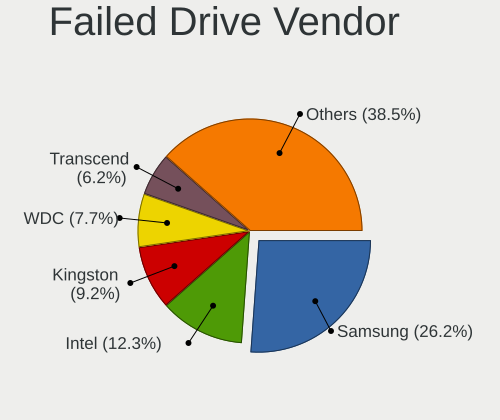

| Vendor              | Computers | Drives | Percent |
|---------------------|-----------|--------|---------|
| Samsung Electronics | 17        | 20     | 26.15%  |
| Intel               | 8         | 10     | 12.31%  |
| Kingston            | 6         | 7      | 9.23%   |
| WDC                 | 5         | 5      | 7.69%   |
| Transcend           | 4         | 7      | 6.15%   |
| SK hynix            | 4         | 5      | 6.15%   |
| Seagate             | 4         | 6      | 6.15%   |
| Crucial             | 4         | 4      | 6.15%   |
| SanDisk             | 3         | 4      | 4.62%   |
| Toshiba             | 2         | 2      | 3.08%   |
| Vaseky              | 1         | 1      | 1.54%   |
| Supermicro          | 1         | 1      | 1.54%   |
| Phison              | 1         | 1      | 1.54%   |
| Patriot             | 1         | 1      | 1.54%   |
| Micron Technology   | 1         | 1      | 1.54%   |
| KingDian            | 1         | 1      | 1.54%   |
| Hoodisk             | 1         | 1      | 1.54%   |
| China               | 1         | 1      | 1.54%   |

Drive Status
------------

Number of failed and malfunc. drives

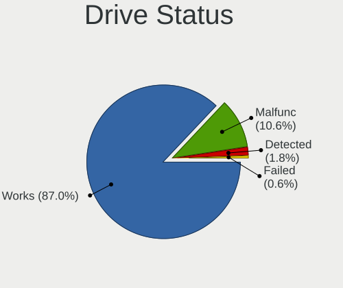

| Status   | Computers | Drives | Percent |
|----------|-----------|--------|---------|
| Works    | 9130      | 15926  | 87.04%  |
| Malfunc  | 1107      | 1760   | 10.55%  |
| Detected | 188       | 304    | 1.79%   |
| Failed   | 65        | 78     | 0.62%   |

Storage controller
------------------

Storage Vendor
--------------

Storage controller vendors

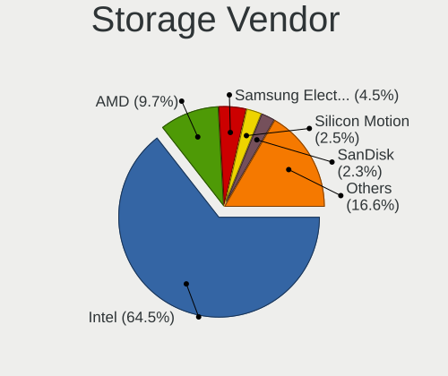

| Vendor                                  | Computers | Percent |
|-----------------------------------------|-----------|---------|
| Intel                                   | 10408     | 64.46%  |
| AMD                                     | 1561      | 9.67%   |
| Samsung Electronics                     | 721       | 4.47%   |
| Silicon Motion                          | 408       | 2.53%   |
| SanDisk                                 | 366       | 2.27%   |
| MAXIO Technology (Hangzhou)             | 352       | 2.18%   |
| Broadcom / LSI                          | 277       | 1.72%   |
| Phison Electronics                      | 235       | 1.46%   |
| Kingston Technology Company             | 229       | 1.42%   |
| Transcend                               | 177       | 1.1%    |
| ASMedia Technology                      | 150       | 0.93%   |
| SK hynix                                | 133       | 0.82%   |
| Micron/Crucial Technology               | 126       | 0.78%   |
| Micron Technology                       | 126       | 0.78%   |
| Toshiba                                 | 91        | 0.56%   |
| Hewlett-Packard                         | 90        | 0.56%   |
| Realtek Semiconductor                   | 73        | 0.45%   |
| Shenzhen Longsys Electronics            | 64        | 0.4%    |
| Marvell Technology Group                | 59        | 0.37%   |
| Hosin Global Electronics                | 59        | 0.37%   |
| KIOXIA                                  | 53        | 0.33%   |
| JMicron Technology                      | 53        | 0.33%   |
| Chelsio Communications                  | 52        | 0.32%   |
| Yangtze Memory Technologies             | 33        | 0.2%    |
| ADATA Technology                        | 33        | 0.2%    |
| Nvidia                                  | 29        | 0.18%   |
| Shenzhen Unionmemory Information System | 18        | 0.11%   |
| INNOGRIT                                | 17        | 0.11%   |
| Seagate Technology                      | 14        | 0.09%   |
| Netac Technology                        | 14        | 0.09%   |
| Adaptec                                 | 14        | 0.09%   |
| Lite-On Technology                      | 13        | 0.08%   |
| Solid State Storage Technology          | 12        | 0.07%   |
| Unknown                                 | 11        | 0.07%   |
| VIA Technologies                        | 8         | 0.05%   |
| Solidigm                                | 8         | 0.05%   |
| ATP ELECTRONICS                         | 8         | 0.05%   |
| Silicon Image                           | 7         | 0.04%   |
| Biwin Storage Technology                | 7         | 0.04%   |
| Union Memory (Shenzhen)                 | 6         | 0.04%   |

Storage Model
-------------

Storage controller models

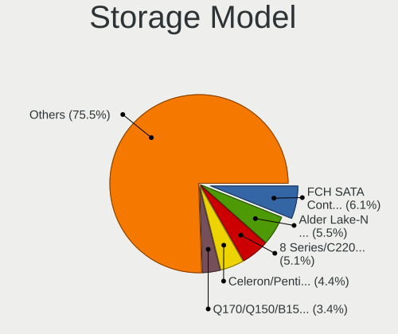

| Model                                                                            | Computers | Percent |
|----------------------------------------------------------------------------------|-----------|---------|
| AMD FCH SATA Controller [AHCI mode]                                              | 1080      | 6.08%   |
| Intel Alder Lake-N SATA AHCI Controller                                          | 975       | 5.49%   |
| Intel 8 Series/C220 Series Chipset Family 6-port SATA Controller 1 [AHCI mode]   | 914       | 5.14%   |
| Intel Celeron/Pentium Silver Processor SATA Controller                           | 782       | 4.4%    |
| Intel Q170/Q150/B150/H170/H110/Z170/CM236 Chipset SATA Controller [AHCI Mode]    | 596       | 3.35%   |
| Intel Atom/Celeron/Pentium Processor x5-E8000/J3xxx/N3xxx Series SATA Controller | 563       | 3.17%   |
| Intel Jasper Lake SATA AHCI Controller                                           | 551       | 3.1%    |
| Intel Cannon Lake PCH SATA AHCI Controller                                       | 508       | 2.86%   |
| Intel Atom Processor E3800 Series SATA AHCI Controller                           | 504       | 2.84%   |
| Intel Sunrise Point-LP SATA Controller [AHCI mode]                               | 435       | 2.45%   |
| Intel 6 Series/C200 Series Chipset Family 6 port Desktop SATA AHCI Controller    | 424       | 2.39%   |
| Silicon Motion SM2263EN/SM2263XT (DRAM-less) NVMe SSD Controllers                | 394       | 2.22%   |
| MAXIO (Hangzhou) NVMe SSD Controller MAP1202 (DRAM-less)                         | 344       | 1.94%   |
| Intel 200 Series PCH SATA controller [AHCI mode]                                 | 323       | 1.82%   |
| Samsung NVMe SSD Controller SM981/PM981/PM983                                    | 308       | 1.73%   |
| Intel Celeron N3350/Pentium N4200/Atom E3900 Series SATA AHCI Controller         | 305       | 1.72%   |
| Intel SATA Controller [RAID mode]                                                | 264       | 1.49%   |
| Intel 7 Series/C210 Series Chipset Family 6-port SATA Controller [AHCI mode]     | 227       | 1.28%   |
| Intel Atom Processor C3000 Series SATA Controller 0                              | 223       | 1.25%   |
| Intel 8 Series SATA Controller 1 [AHCI mode]                                     | 190       | 1.07%   |
| Intel Atom Processor C3000 Series SATA Controller 1                              | 184       | 1.04%   |
| Intel Atom processor C2000 AHCI SATA3 Controller                                 | 177       | 1%      |
| Intel Wildcat Point-LP SATA Controller [AHCI Mode]                               | 171       | 0.96%   |
| AMD FCH SATA Controller [IDE mode]                                               | 169       | 0.95%   |
| Intel Elkhart Lake SATA AHCI                                                     | 168       | 0.95%   |
| Samsung NVMe SSD Controller 980 (DRAM-less)                                      | 149       | 0.84%   |
| AMD SB7x0/SB8x0/SB9x0 SATA Controller [AHCI mode]                                | 149       | 0.84%   |
| Intel Comet Lake SATA AHCI Controller                                            | 144       | 0.81%   |
| Intel 82801G (ICH7 Family) IDE Controller                                        | 143       | 0.8%    |
| Intel Alder Lake-P SATA AHCI Controller                                          | 141       | 0.79%   |
| Intel NM10/ICH7 Family SATA Controller [IDE mode]                                | 140       | 0.79%   |
| ASMedia ASM1061/ASM1062 Serial ATA Controller                                    | 124       | 0.7%    |
| Samsung NVMe SSD Controller SM961/PM961/SM963                                    | 114       | 0.64%   |
| Phison PS5013-E13 PCIe3 NVMe Controller (DRAM-less)                              | 111       | 0.62%   |
| Intel 5 Series/3400 Series Chipset 6 port SATA AHCI Controller                   | 109       | 0.61%   |
| AMD FCH IDE Controller                                                           | 108       | 0.61%   |
| AMD 400 Series Chipset SATA Controller                                           | 107       | 0.6%    |
| Intel C600/X79 series chipset 6-Port SATA AHCI Controller                        | 104       | 0.59%   |
| Intel Atom processor C2000 AHCI SATA2 Controller                                 | 104       | 0.59%   |
| Intel C620 Series Chipset Family SSATA Controller [AHCI mode]                    | 93        | 0.52%   |

Storage Kind
------------

Kind of storage controller (IDE, SATA, NVMe, SAS, ...)

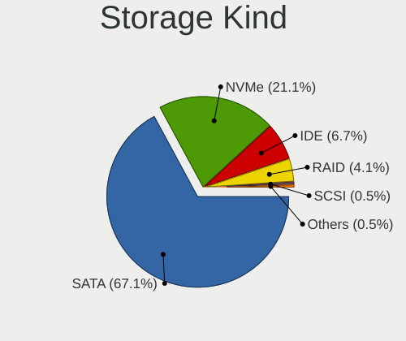

| Kind | Computers | Percent |
|------|-----------|---------|
| SATA | 10953     | 67.11%  |
| NVMe | 3437      | 21.06%  |
| IDE  | 1089      | 6.67%   |
| RAID | 667       | 4.09%   |
| SCSI | 88        | 0.54%   |
| SAS  | 87        | 0.53%   |

Processor
---------

CPU Vendor
----------

Processor vendors

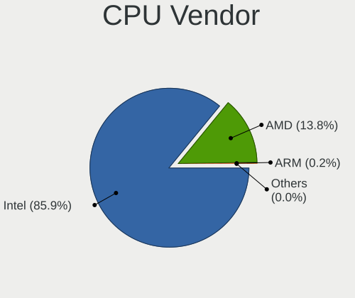

| Vendor   | Computers | Percent |
|----------|-----------|---------|
| Intel    | 11094     | 85.92%  |
| AMD      | 1785      | 13.82%  |
| ARM      | 21        | 0.16%   |
| VIA      | 4         | 0.03%   |
| QEMU     | 3         | 0.02%   |
| Unknown  | 3         | 0.02%   |
| Rockchip | 1         | 0.01%   |
| Red Hat  | 1         | 0.01%   |

CPU Model
---------

Processor models

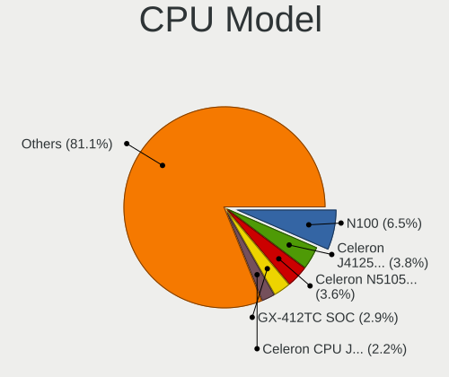

| Model                                    | Computers | Percent |
|------------------------------------------|-----------|---------|
| Intel N100                               | 851       | 6.51%   |
| Intel Celeron J4125 CPU @ 2.00GHz        | 494       | 3.78%   |
| Intel Celeron N5105 @ 2.00GHz            | 469       | 3.59%   |
| AMD GX-412TC SOC                         | 375       | 2.87%   |
| Intel Celeron CPU J1900 @ 1.99GHz        | 287       | 2.19%   |
| Intel Celeron CPU J3160 @ 1.60GHz        | 257       | 1.96%   |
| Intel N150                               | 205       | 1.57%   |
| Intel Core i5-6500 CPU @ 3.20GHz         | 161       | 1.23%   |
| Intel Core i3-N305                       | 131       | 1%      |
| Intel Celeron J6412 @ 2.00GHz            | 118       | 0.9%    |
| Intel Atom CPU C3558 @ 2.20GHz           | 105       | 0.8%    |
| AMD GX-415GA SOC with Radeon HD Graphics | 102       | 0.78%   |
| Intel Core i5-3470 CPU @ 3.20GHz         | 96        | 0.73%   |
| AMD RX-427BB with AMD Radeon R7 Graphics | 96        | 0.73%   |
| Intel Pentium Silver J5005 CPU @ 1.50GHz | 95        | 0.73%   |
| Intel Core i5-8500T CPU @ 2.10GHz        | 92        | 0.7%    |
| Intel Core i5-4590 CPU @ 3.30GHz         | 87        | 0.67%   |
| AMD Ryzen Embedded V1500B                | 87        | 0.67%   |
| Intel Celeron CPU J3455 @ 1.50GHz        | 86        | 0.66%   |
| Intel Celeron J4105 CPU @ 1.50GHz        | 84        | 0.64%   |
| Intel Core i5-4570 CPU @ 3.20GHz         | 83        | 0.63%   |
| AMD GX-420CA SOC with Radeon HD Graphics | 83        | 0.63%   |
| Intel Core i5-7200U CPU @ 2.50GHz        | 82        | 0.63%   |
| Intel Celeron CPU N3450 @ 1.10GHz        | 80        | 0.61%   |
| Intel Pentium Silver N6005 @ 2.00GHz     | 79        | 0.6%    |
| Intel Core i5-7500 CPU @ 3.40GHz         | 77        | 0.59%   |
| Intel Atom CPU D525 @ 1.80GHz            | 75        | 0.57%   |
| Intel Pentium CPU N3700 @ 1.60GHz        | 72        | 0.55%   |
| AMD EPYC 3201 8-Core Processor           | 72        | 0.55%   |
| Intel Core i3-6100 CPU @ 3.70GHz         | 68        | 0.52%   |
| Intel Core i7-6700 CPU @ 3.40GHz         | 67        | 0.51%   |
| Intel Core i5-8500 CPU @ 3.00GHz         | 59        | 0.45%   |
| Intel Atom CPU E3845 @ 1.91GHz           | 59        | 0.45%   |
| Intel Core i5-6500T CPU @ 2.50GHz        | 58        | 0.44%   |
| Intel Atom CPU C3758R @ 2.40GHz          | 58        | 0.44%   |
| Intel N95                                | 57        | 0.44%   |
| Intel Celeron N5100 @ 1.10GHz            | 55        | 0.42%   |
| Intel Celeron CPU N3160 @ 1.60GHz        | 55        | 0.42%   |
| Intel Pentium CPU J3710 @ 1.60GHz        | 54        | 0.41%   |
| Intel Celeron CPU N3150 @ 1.60GHz        | 54        | 0.41%   |

CPU Model Family
----------------

Processor model prefix

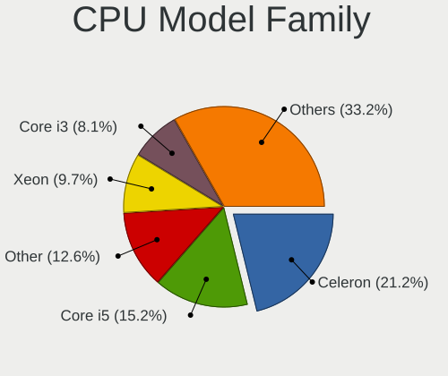

| Model                   | Computers | Percent |
|-------------------------|-----------|---------|
| Intel Celeron           | 2761      | 21.2%   |
| Intel Core i5           | 1985      | 15.24%  |
| Other                   | 1640      | 12.59%  |
| Intel Xeon              | 1258      | 9.66%   |
| Intel Core i3           | 1056      | 8.11%   |
| Intel Atom              | 865       | 6.64%   |
| Intel Core i7           | 753       | 5.78%   |
| AMD GX                  | 717       | 5.5%    |
| Intel Pentium           | 397       | 3.05%   |
| Intel Pentium Silver    | 197       | 1.51%   |
| AMD Ryzen 5             | 151       | 1.16%   |
| AMD EPYC                | 135       | 1.04%   |
| AMD Ryzen Embedded      | 114       | 0.88%   |
| AMD Ryzen 7             | 106       | 0.81%   |
| Intel Core 2 Duo        | 94        | 0.72%   |
| Intel Pentium Gold      | 83        | 0.64%   |
| AMD G                   | 83        | 0.64%   |
| Intel Core 2 Quad       | 60        | 0.46%   |
| AMD FX                  | 51        | 0.39%   |
| Intel Pentium Dual-Core | 48        | 0.37%   |
| AMD Athlon              | 41        | 0.31%   |
| AMD Ryzen 3             | 36        | 0.28%   |
| AMD Ryzen 5 PRO         | 27        | 0.21%   |
| Intel Xeon Silver       | 24        | 0.18%   |
| AMD Ryzen 9             | 22        | 0.17%   |
| ARM Cortex              | 21        | 0.16%   |
| AMD A8                  | 20        | 0.15%   |
| Intel Core              | 19        | 0.15%   |
| AMD A10                 | 18        | 0.14%   |
| Intel Xeon Gold         | 17        | 0.13%   |
| AMD A4                  | 17        | 0.13%   |
| Intel Pentium Dual      | 15        | 0.12%   |
| Intel Core i9           | 14        | 0.11%   |
| AMD Opteron             | 14        | 0.11%   |
| AMD E                   | 14        | 0.11%   |
| AMD Athlon 64 X2        | 13        | 0.1%    |
| Intel Core 2            | 11        | 0.08%   |
| AMD Phenom II X4        | 10        | 0.08%   |
| AMD Ryzen 3 PRO         | 9         | 0.07%   |
| AMD A6                  | 9         | 0.07%   |

CPU Cores
---------

Number of processor cores

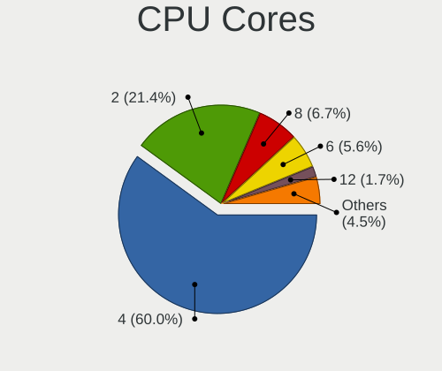

| Number  | Computers | Percent |
|---------|-----------|---------|
| 4       | 7861      | 60.03%  |
| 2       | 2804      | 21.41%  |
| 8       | 880       | 6.72%   |
| 6       | 738       | 5.64%   |
| 12      | 229       | 1.75%   |
| 16      | 171       | 1.31%   |
| Unknown | 140       | 1.07%   |
| 1       | 66        | 0.5%    |
| 10      | 61        | 0.47%   |
| 20      | 36        | 0.27%   |
| 3       | 26        | 0.2%    |
| 24      | 25        | 0.19%   |
| 32      | 17        | 0.13%   |
| 28      | 9         | 0.07%   |
| 14      | 8         | 0.06%   |
| 64      | 4         | 0.03%   |
| 48      | 4         | 0.03%   |
| 36      | 3         | 0.02%   |
| 22      | 3         | 0.02%   |
| 18      | 3         | 0.02%   |
| 128     | 2         | 0.02%   |
| 40      | 2         | 0.02%   |
| 5       | 2         | 0.02%   |
| 80      | 1         | 0.01%   |

CPU Sockets
-----------

Number of sockets

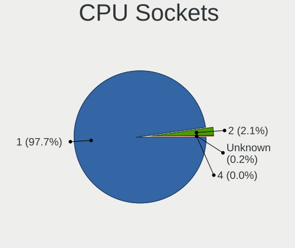

| Number  | Computers | Percent |
|---------|-----------|---------|
| 1       | 12591     | 97.72%  |
| 2       | 265       | 2.06%   |
| Unknown | 25        | 0.19%   |
| 4       | 4         | 0.03%   |

CPU Threads
-----------

Threads per core (Hyper-Threading)

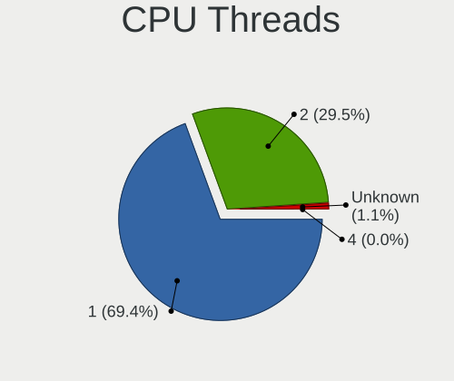

| Number  | Computers | Percent |
|---------|-----------|---------|
| 1       | 9064      | 69.42%  |
| 2       | 3851      | 29.49%  |
| Unknown | 141       | 1.08%   |
| 4       | 1         | 0.01%   |

CPU Microarch
-------------

Microarchitecture

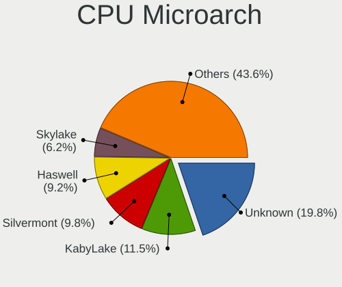

| Name          | Computers | Percent |
|---------------|-----------|---------|
| Unknown       | 2575      | 19.79%  |
| KabyLake      | 1492      | 11.47%  |
| Silvermont    | 1276      | 9.81%   |
| Haswell       | 1194      | 9.18%   |
| Skylake       | 802       | 6.16%   |
| Goldmont plus | 787       | 6.05%   |
| IvyBridge     | 614       | 4.72%   |
| Goldmont      | 591       | 4.54%   |
| SandyBridge   | 496       | 3.81%   |
| Puma          | 493       | 3.79%   |
| Broadwell     | 327       | 2.51%   |
| Zen           | 277       | 2.13%   |
| Jaguar        | 271       | 2.08%   |
| Penryn        | 218       | 1.68%   |
| Bonnell       | 184       | 1.41%   |
| CometLake     | 182       | 1.4%    |
| Westmere      | 161       | 1.24%   |
| Zen 3         | 132       | 1.01%   |
| Nehalem       | 130       | 1%      |
| Steamroller   | 117       | 0.9%    |
| Core          | 111       | 0.85%   |
| Bobcat        | 101       | 0.78%   |
| Zen 2         | 93        | 0.71%   |
| Zen+          | 87        | 0.67%   |
| TigerLake     | 83        | 0.64%   |
| Piledriver    | 62        | 0.48%   |
| K10           | 48        | 0.37%   |
| Excavator     | 34        | 0.26%   |
| K8 Hammer     | 21        | 0.16%   |
| NetBurst      | 17        | 0.13%   |
| Bulldozer     | 15        | 0.12%   |
| IceLake       | 14        | 0.11%   |
| K10 Llano     | 6         | 0.05%   |

Graphics
--------

GPU Vendor
----------

Vendors of graphics cards

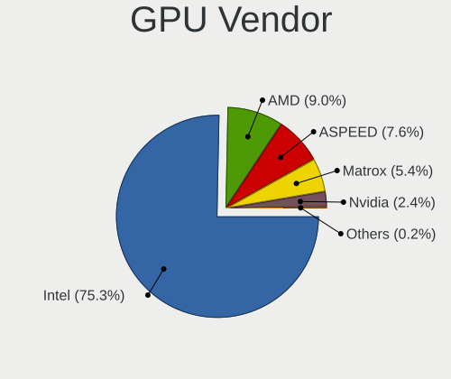

| Vendor                                       | Computers | Percent |
|----------------------------------------------|-----------|---------|
| Intel                                        | 9119      | 75.31%  |
| AMD                                          | 1090      | 9%      |
| ASPEED Technology                            | 921       | 7.61%   |
| Matrox Electronics Systems                   | 652       | 5.38%   |
| Nvidia                                       | 296       | 2.44%   |
| XGI Technology (eXtreme Graphics Innovation) | 9         | 0.07%   |
| VIA Technologies                             | 4         | 0.03%   |
| Red Hat                                      | 4         | 0.03%   |
| Silicon Motion                               | 3         | 0.02%   |
| Silicon Integrated Systems [SiS]             | 3         | 0.02%   |
| RDC Semiconductor                            | 3         | 0.02%   |
| S3 Graphics                                  | 2         | 0.02%   |
| Tseng Labs                                   | 1         | 0.01%   |
| Cirrus Logic                                 | 1         | 0.01%   |

GPU Model
---------

Graphics card models

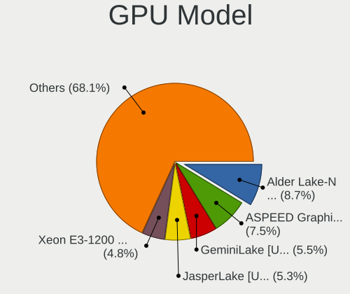

| Model                                                                                    | Computers | Percent |
|------------------------------------------------------------------------------------------|-----------|---------|
| Intel Alder Lake-N [UHD Graphics]                                                        | 1069      | 8.72%   |
| ASPEED Technology ASPEED Graphics Family                                                 | 921       | 7.52%   |
| Intel GeminiLake [UHD Graphics 600]                                                      | 677       | 5.53%   |
| Intel JasperLake [UHD Graphics]                                                          | 652       | 5.32%   |
| Intel Xeon E3-1200 v3/4th Gen Core Processor Integrated Graphics Controller              | 586       | 4.78%   |
| Intel Atom/Celeron/Pentium Processor x5-E8000/J3xxx/N3xxx Integrated Graphics Controller | 577       | 4.71%   |
| Intel CoffeeLake-S GT2 [UHD Graphics 630]                                                | 526       | 4.29%   |
| Intel Atom Processor Z36xxx/Z37xxx Series Graphics & Display                             | 509       | 4.15%   |
| Intel Skylake-S GT2 [HD Graphics 530]                                                    | 462       | 3.77%   |
| Intel 2nd Generation Core Processor Family Integrated Graphics Controller                | 298       | 2.43%   |
| Intel Apollo Lake GT1 [HD Graphics 500]                                                  | 280       | 2.29%   |
| Matrox Electronics Systems MGA G200eW WPCM450                                            | 269       | 2.2%    |
| Intel Xeon E3-1200 v2/3rd Gen Core processor Graphics Controller                         | 250       | 2.04%   |
| Intel Kaby Lake-S GT2 [HD Graphics 630]                                                  | 237       | 1.93%   |
| Intel Alder Lake-N [Intel Graphics]                                                      | 217       | 1.77%   |
| Intel Kaby Lake-U GT2 [HD Graphics 620]                                                  | 196       | 1.6%    |
| Intel Elkhart Lake [UHD Graphics Gen11 16EU]                                             | 170       | 1.39%   |
| Intel Haswell-ULT Integrated Graphics Controller                                         | 169       | 1.38%   |
| Intel 4 Series Chipset Integrated Graphics Controller                                    | 156       | 1.27%   |
| Matrox Electronics Systems G200eR2                                                       | 146       | 1.19%   |
| Intel 4th Generation Core Processor Family Integrated Graphics Controller                | 127       | 1.04%   |
| AMD Kaveri [Radeon R7 Graphics]                                                          | 115       | 0.94%   |
| Intel GeminiLake [UHD Graphics 605]                                                      | 110       | 0.9%    |
| Intel CometLake-S GT2 [UHD Graphics 630]                                                 | 107       | 0.87%   |
| Intel Atom Processor D4xx/D5xx/N4xx/N5xx Integrated Graphics Controller                  | 107       | 0.87%   |
| Intel Kaby Lake-R GT2 [UHD Graphics 620]                                                 | 102       | 0.83%   |
| AMD Kabini [Radeon HD 8330E]                                                             | 102       | 0.83%   |
| Intel Broadwell-U GT2 [HD Graphics 5500]                                                 | 101       | 0.82%   |
| AMD Cezanne [Radeon Vega Series / Radeon Vega Mobile Series]                             | 95        | 0.78%   |
| Matrox Electronics Systems MGA G200EH                                                    | 94        | 0.77%   |
| Intel 3rd Gen Core processor Graphics Controller                                         | 89        | 0.73%   |
| AMD Kabini [Radeon HD 8400E]                                                             | 84        | 0.69%   |
| Intel IvyBridge GT2 [HD Graphics 4000]                                                   | 83        | 0.68%   |
| Intel Skylake-S GT1 [HD Graphics 510]                                                    | 81        | 0.66%   |
| AMD Mullins [Radeon R4/R5 Graphics]                                                      | 81        | 0.66%   |
| AMD ES1000                                                                               | 78        | 0.64%   |
| Matrox Electronics Systems MGA G200e [Pilot] ServerEngines (SEP1)                        | 71        | 0.58%   |
| Intel Kaby Lake-U GT1 [HD Graphics 610]                                                  | 67        | 0.55%   |
| Intel Alder Lake-UP3 GT1 [UHD Graphics]                                                  | 66        | 0.54%   |
| Intel TigerLake-LP GT2 [Iris Xe Graphics]                                                | 62        | 0.51%   |

GPU Combo
---------

Combinations of graphics cards

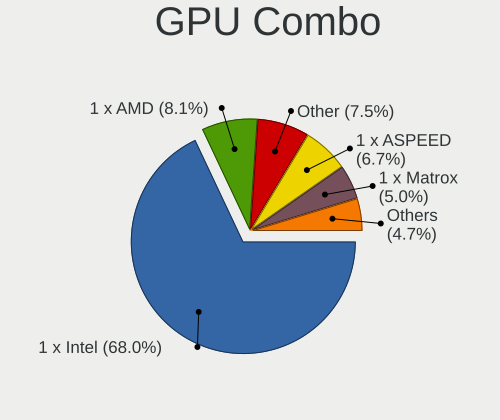

| Name                   | Computers | Percent |
|------------------------|-----------|---------|
| 1 x Intel              | 8812      | 67.98%  |
| 1 x AMD                | 1051      | 8.11%   |
| Other                  | 973       | 7.51%   |
| 1 x ASPEED             | 870       | 6.71%   |
| 1 x Matrox             | 644       | 4.97%   |
| 1 x Nvidia             | 248       | 1.91%   |
| 2 x Intel              | 207       | 1.6%    |
| Intel + ASPEED         | 40        | 0.31%   |
| Intel + Nvidia         | 36        | 0.28%   |
| Intel + AMD            | 20        | 0.15%   |
| 1 x XGI                | 9         | 0.07%   |
| AMD + ASPEED           | 9         | 0.07%   |
| 2 x AMD                | 8         | 0.06%   |
| Nvidia + Matrox        | 5         | 0.04%   |
| 1 x VIA                | 4         | 0.03%   |
| 1 x Red Hat            | 4         | 0.03%   |
| 1 x SiS                | 3         | 0.02%   |
| 1 x Silicon Motion     | 3         | 0.02%   |
| 1 x RDC Semiconductor  | 3         | 0.02%   |
| 1 x S3 Graphics        | 2         | 0.02%   |
| Nvidia + ASPEED        | 2         | 0.02%   |
| Intel + Matrox         | 2         | 0.02%   |
| AMD + Nvidia           | 2         | 0.02%   |
| 2 x Nvidia             | 1         | 0.01%   |
| 2 x Intel + 1 x Nvidia | 1         | 0.01%   |
| 1 x Tseng Labs         | 1         | 0.01%   |
| Intel + 2 x AMD        | 1         | 0.01%   |
| 1 x Cirrus Logic       | 1         | 0.01%   |

GPU Driver
----------

Free vs proprietary

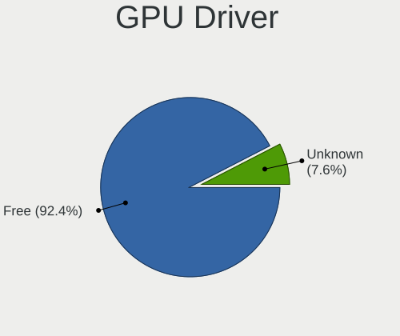

| Driver  | Computers | Percent |
|---------|-----------|---------|
| Free    | 11921     | 92.43%  |
| Unknown | 976       | 7.57%   |

GPU Memory
----------

Total video memory

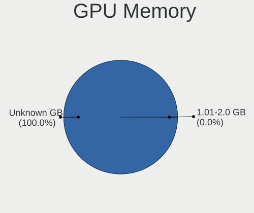

| Size in GB | Computers | Percent |
|------------|-----------|---------|
| Unknown    | 12877     | 99.99%  |
| 1.01-2.0   | 1         | 0.01%   |

Monitor
-------

Monitor Vendor
--------------

Monitor vendors

| Vendor | Computers | Percent |
|--------|-----------|---------|
| Dell   | 2         | 100%    |

Monitor Model
-------------

Monitor models

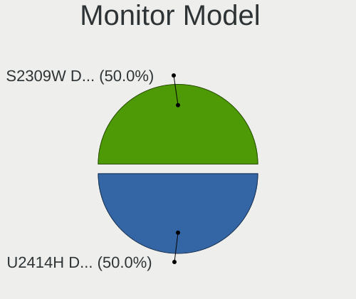

| Model                                             | Computers | Percent |
|---------------------------------------------------|-----------|---------|
| Dell U2414H DELA0A4 1920x1080 530x300mm 24.0-inch | 1         | 50%     |
| Dell S2309W DELA041 1920x1080 510x290mm 23.1-inch | 1         | 50%     |

Monitor Resolution
------------------

Monitor screen resolution

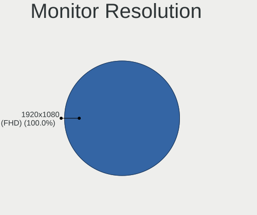

| Resolution      | Computers | Percent |
|-----------------|-----------|---------|
| 1920x1080 (FHD) | 2         | 100%    |

Monitor Diagonal
----------------

Diagonal size in inches

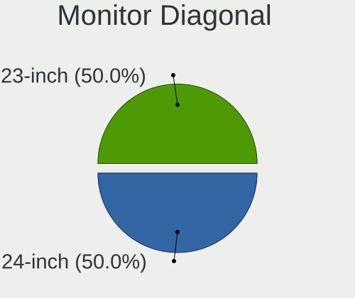

| Inches | Computers | Percent |
|--------|-----------|---------|
| 24     | 1         | 50%     |
| 23     | 1         | 50%     |

Monitor Width
-------------

Physical width

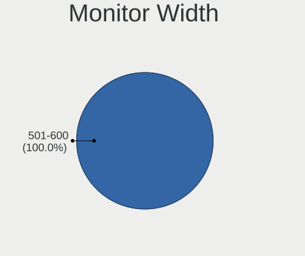

| Width in mm | Computers | Percent |
|-------------|-----------|---------|
| 501-600     | 2         | 100%    |

Aspect Ratio
------------

Proportional relationship between the width and the height

| Ratio | Computers | Percent |
|-------|-----------|---------|
| 16/9  | 2         | 100%    |

Monitor Area
------------

Area in inch²

| Area in inch² | Computers | Percent |
|----------------|-----------|---------|
| 201-250        | 2         | 100%    |

Pixel Density
-------------

Pixels per inch

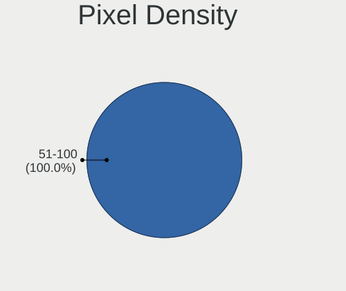

| Density | Computers | Percent |
|---------|-----------|---------|
| 51-100  | 2         | 100%    |

Multiple Monitors
-----------------

Total monitors connected

| Total | Computers | Percent |
|-------|-----------|---------|
| 0     | 12876     | 99.98%  |
| 1     | 3         | 0.02%   |

Network
-------

Net Controller Vendor
---------------------

Controller vendors

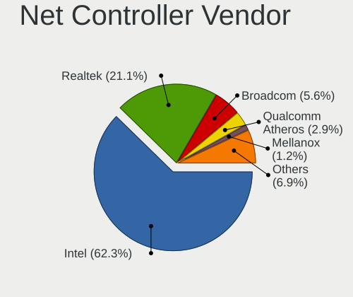

| Vendor                          | Computers | Percent |
|---------------------------------|-----------|---------|
| Intel                           | 11090     | 62.29%  |
| Realtek Semiconductor           | 3756      | 21.1%   |
| Broadcom                        | 993       | 5.58%   |
| Qualcomm Atheros                | 523       | 2.94%   |
| Mellanox Technologies           | 209       | 1.17%   |
| AMD                             | 188       | 1.06%   |
| IMC Networks                    | 117       | 0.66%   |
| MediaTek                        | 86        | 0.48%   |
| Chelsio Communications          | 69        | 0.39%   |
| Ralink Technology               | 60        | 0.34%   |
| D-Link System                   | 57        | 0.32%   |
| U-Blox                          | 55        | 0.31%   |
| TP-Link                         | 51        | 0.29%   |
| American Megatrends             | 36        | 0.2%    |
| Marvell Technology Group        | 31        | 0.17%   |
| Aquantia                        | 28        | 0.16%   |
| Solarflare Communications       | 27        | 0.15%   |
| Insyde Software                 | 27        | 0.15%   |
| Emulex                          | 25        | 0.14%   |
| Huawei Technologies             | 23        | 0.13%   |
| Edimax Technology               | 19        | 0.11%   |
| Ralink                          | 17        | 0.1%    |
| QLogic                          | 17        | 0.1%    |
| Samsung Electronics             | 16        | 0.09%   |
| Seeed Technology                | 15        | 0.08%   |
| IBM                             | 15        | 0.08%   |
| ZTE WCDMA Technologies MSM      | 14        | 0.08%   |
| 3Com                            | 14        | 0.08%   |
| Dell                            | 13        | 0.07%   |
| sipeed                          | 11        | 0.06%   |
| VIA Technologies                | 10        | 0.06%   |
| Qualcomm Atheros Communications | 10        | 0.06%   |
| ICS Advent                      | 9         | 0.05%   |
| Google                          | 9         | 0.05%   |
| Novatel Wireless                | 8         | 0.04%   |
| NetXen Incorporated             | 8         | 0.04%   |
| ASUSTek Computer                | 8         | 0.04%   |
| Apple                           | 7         | 0.04%   |
| Nvidia                          | 6         | 0.03%   |
| Sierra Wireless                 | 5         | 0.03%   |

Net Controller Model
--------------------

Controller models

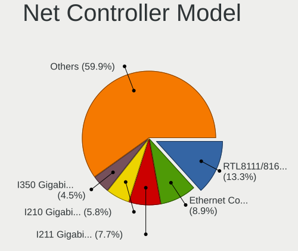

| Model                                                                         | Computers | Percent |
|-------------------------------------------------------------------------------|-----------|---------|
| Realtek RTL8111/8168/8211/8411 PCI Express Gigabit Ethernet Controller        | 3090      | 13.26%  |
| Intel Ethernet Controller I226-V                                              | 2076      | 8.91%   |
| Intel I211 Gigabit Network Connection                                         | 1801      | 7.73%   |
| Intel I210 Gigabit Network Connection                                         | 1348      | 5.78%   |
| Intel I350 Gigabit Network Connection                                         | 1040      | 4.46%   |
| Intel Ethernet Controller I225-V                                              | 997       | 4.28%   |
| Intel 82599ES 10-Gigabit SFI/SFP+ Network Connection                          | 600       | 2.57%   |
| Intel 82574L Gigabit Network Connection                                       | 587       | 2.52%   |
| Intel 82579LM Gigabit Network Connection (Lewisville)                         | 389       | 1.67%   |
| Realtek RTL8125 2.5GbE Controller                                             | 381       | 1.63%   |
| Intel 82576 Gigabit Network Connection                                        | 353       | 1.51%   |
| Intel Ethernet Connection I217-LM                                             | 326       | 1.4%    |
| Intel 82580 Gigabit Network Connection                                        | 317       | 1.36%   |
| Intel 82583V Gigabit Network Connection                                       | 316       | 1.36%   |
| Intel Ethernet Controller 10-Gigabit X540-AT2                                 | 298       | 1.28%   |
| Intel 82571EB/82571GB Gigabit Ethernet Controller D0/D1 (copper applications) | 274       | 1.18%   |
| Broadcom NetXtreme BCM5720 Gigabit Ethernet PCIe                              | 231       | 0.99%   |
| Intel Ethernet Connection (2) I219-LM                                         | 220       | 0.94%   |
| Intel Ethernet Controller X710 for 10GbE SFP+                                 | 214       | 0.92%   |
| Intel 82571EB/82571GB Gigabit Ethernet Controller (Copper)                    | 210       | 0.9%    |
| Intel Ethernet Connection (7) I219-LM                                         | 205       | 0.88%   |
| Realtek RTL8821CE 802.11ac PCIe Wireless Network Adapter                      | 192       | 0.82%   |
| Intel I210 Gigabit Fiber Network Connection                                   | 190       | 0.82%   |
| AMD XGMAC 10GbE Controller                                                    | 187       | 0.8%    |
| Intel Ethernet Connection I354                                                | 178       | 0.76%   |
| Intel Ethernet Connection (7) I219-V                                          | 177       | 0.76%   |
| Intel Ethernet Controller X550                                                | 175       | 0.75%   |
| Intel Ethernet Connection X553 1GbE                                           | 168       | 0.72%   |
| Realtek RTL8111/8168/8411 PCI Express Gigabit Ethernet Controller             | 158       | 0.68%   |
| Intel Ethernet Connection (2) I219-V                                          | 157       | 0.67%   |
| Broadcom NetXtreme II BCM5709 Gigabit Ethernet                                | 144       | 0.62%   |
| Intel Ethernet Connection X553 10 GbE SFP+                                    | 128       | 0.55%   |
| Intel Alder Lake-N PCH CNVi WiFi                                              | 123       | 0.53%   |
| Intel Wireless 3165                                                           | 121       | 0.52%   |
| Broadcom NetXtreme BCM5719 Gigabit Ethernet PCIe                              | 119       | 0.51%   |
| IMC Networks 802.11 n/g/b Wireless LAN USB Mini-Card                          | 117       | 0.5%    |
| Intel Wi-Fi 6 AX200                                                           | 114       | 0.49%   |
| Intel Wireless 7265                                                           | 110       | 0.47%   |
| Broadcom NetXtreme II BCM5716 Gigabit Ethernet                                | 106       | 0.45%   |
| Intel 82575EB Gigabit Network Connection                                      | 102       | 0.44%   |

Wireless Vendor
---------------

Wireless vendors

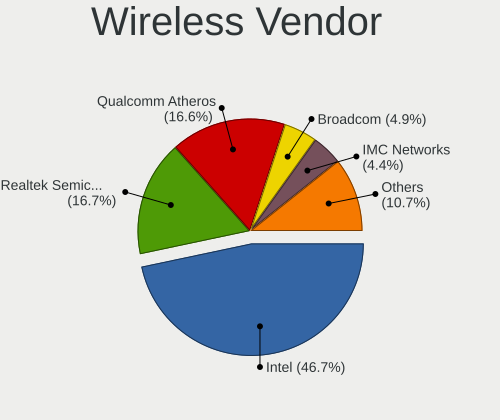

| Vendor                                | Computers | Percent |
|---------------------------------------|-----------|---------|
| Intel                                 | 1239      | 46.68%  |
| Realtek Semiconductor                 | 444       | 16.73%  |
| Qualcomm Atheros                      | 441       | 16.62%  |
| Broadcom                              | 129       | 4.86%   |
| IMC Networks                          | 117       | 4.41%   |
| MediaTek                              | 84        | 3.17%   |
| Ralink Technology                     | 60        | 2.26%   |
| TP-Link                               | 49        | 1.85%   |
| Edimax Technology                     | 19        | 0.72%   |
| Ralink                                | 17        | 0.64%   |
| Qualcomm Atheros Communications       | 10        | 0.38%   |
| ASUSTek Computer                      | 8         | 0.3%    |
| NetGear                               | 5         | 0.19%   |
| Sierra Wireless                       | 4         | 0.15%   |
| Linksys                               | 4         | 0.15%   |
| D-Link                                | 4         | 0.15%   |
| Marvell Technology Group              | 3         | 0.11%   |
| ZyXEL Communications                  | 2         | 0.08%   |
| Mercucys                              | 2         | 0.08%   |
| Dell                                  | 2         | 0.08%   |
| D-Link System                         | 2         | 0.08%   |
| Belkin Components                     | 2         | 0.08%   |
| Sitecom Europe                        | 1         | 0.04%   |
| Senao                                 | 1         | 0.04%   |
| Samsung Electronics                   | 1         | 0.04%   |
| Gemtek                                | 1         | 0.04%   |
| BUFFALO                               | 1         | 0.04%   |
| Accton Technology                     | 1         | 0.04%   |
| 802.11g Adapter [Linksys WUSB54GC v3] | 1         | 0.04%   |

Wireless Model
--------------

Wireless models

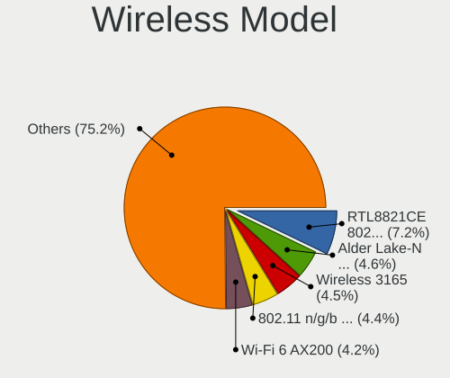

| Model                                                           | Computers | Percent |
|-----------------------------------------------------------------|-----------|---------|
| Realtek RTL8821CE 802.11ac PCIe Wireless Network Adapter        | 192       | 7.15%   |
| Intel Alder Lake-N PCH CNVi WiFi                                | 123       | 4.58%   |
| Intel Wireless 3165                                             | 121       | 4.51%   |
| IMC Networks 802.11 n/g/b Wireless LAN USB Mini-Card            | 117       | 4.36%   |
| Intel Wi-Fi 6 AX200                                             | 114       | 4.25%   |
| Intel Wireless 7265                                             | 110       | 4.1%    |
| Intel Wireless 7260                                             | 80        | 2.98%   |
| Intel Wireless 8265 / 8275                                      | 75        | 2.79%   |
| Intel Gemini Lake PCH CNVi WiFi                                 | 75        | 2.79%   |
| Qualcomm Atheros AR928X Wireless Network Adapter (PCI-Express)  | 72        | 2.68%   |
| Qualcomm Atheros QCA9377 802.11ac Wireless Network Adapter      | 70        | 2.61%   |
| Intel Wireless 3160                                             | 62        | 2.31%   |
| Qualcomm Atheros AR93xx Wireless Network Adapter                | 60        | 2.23%   |
| Intel Wi-Fi 6E(802.11ax) AX210/AX1675* 2x2 [Typhoon Peak]       | 58        | 2.16%   |
| Qualcomm Atheros QCA986x/988x 802.11ac Wireless Network Adapter | 55        | 2.05%   |
| Intel Dual Band Wireless-AC 3168NGW [Stone Peak]                | 53        | 1.97%   |
| MediaTek MT7922 802.11ax PCI Express Wireless Network Adapter   | 45        | 1.68%   |
| Intel Wireless 8260                                             | 45        | 1.68%   |
| Qualcomm Atheros AR9485 Wireless Network Adapter                | 41        | 1.53%   |
| Intel Jasper Lake PCH CNVi WiFi                                 | 39        | 1.45%   |
| Realtek RTL8188EUS 802.11n Wireless Network Adapter             | 36        | 1.34%   |
| Intel Cannon Lake PCH CNVi WiFi                                 | 34        | 1.27%   |
| Realtek RTL8852BE PCIe 802.11ax Wireless Network Controller     | 31        | 1.15%   |
| Qualcomm Atheros QCA6174 802.11ac Wireless Network Adapter      | 31        | 1.15%   |
| Intel Centrino Advanced-N 6205 [Taylor Peak]                    | 30        | 1.12%   |
| Broadcom BCM43228 802.11a/b/g/n                                 | 30        | 1.12%   |
| Qualcomm Atheros AR9462 Wireless Network Adapter                | 27        | 1.01%   |
| Qualcomm Atheros AR9287 Wireless Network Adapter (PCI-Express)  | 27        | 1.01%   |
| Intel Wi-Fi 5(802.11ac) Wireless-AC 9x6x [Thunder Peak]         | 26        | 0.97%   |
| MediaTek MT7921K (RZ608) Wi-Fi 6E 80MHz                         | 25        | 0.93%   |
| Intel Centrino Advanced-N 6235                                  | 25        | 0.93%   |
| Realtek RTL8188EE Wireless Network Adapter                      | 23        | 0.86%   |
| Ralink RT5370 Wireless Adapter                                  | 23        | 0.86%   |
| Qualcomm Atheros AR9285 Wireless Network Adapter (PCI-Express)  | 23        | 0.86%   |
| Broadcom BCM4331 802.11a/b/g/n                                  | 22        | 0.82%   |
| Broadcom BCM4360 802.11ac Dual Band Wireless Network Adapter    | 21        | 0.78%   |
| Qualcomm Atheros QCA9565 / AR9565 Wireless Network Adapter      | 20        | 0.74%   |
| Intel Cannon Point-LP CNVi [Wireless-AC]                        | 19        | 0.71%   |
| Realtek RTL8821AE 802.11ac PCIe Wireless Network Adapter        | 17        | 0.63%   |
| Intel Centrino Wireless-N 2230                                  | 16        | 0.6%    |

Ethernet Vendor
---------------

Ethernet vendors

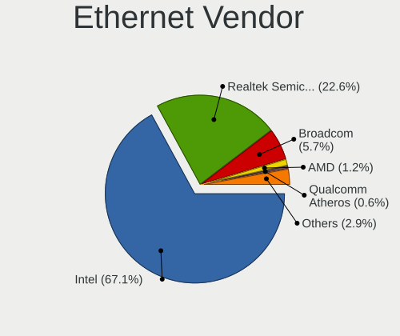

| Vendor                     | Computers | Percent |
|----------------------------|-----------|---------|
| Intel                      | 10602     | 67.05%  |
| Realtek Semiconductor      | 3570      | 22.58%  |
| Broadcom                   | 906       | 5.73%   |
| AMD                        | 188       | 1.19%   |
| Qualcomm Atheros           | 89        | 0.56%   |
| D-Link System              | 53        | 0.34%   |
| Chelsio Communications     | 52        | 0.33%   |
| American Megatrends        | 36        | 0.23%   |
| Solarflare Communications  | 27        | 0.17%   |
| Insyde Software            | 27        | 0.17%   |
| Aquantia                   | 27        | 0.17%   |
| Marvell Technology Group   | 26        | 0.16%   |
| Emulex                     | 22        | 0.14%   |
| QLogic                     | 17        | 0.11%   |
| Samsung Electronics        | 15        | 0.09%   |
| IBM                        | 15        | 0.09%   |
| ZTE WCDMA Technologies MSM | 13        | 0.08%   |
| 3Com                       | 13        | 0.08%   |
| sipeed                     | 11        | 0.07%   |
| VIA Technologies           | 10        | 0.06%   |
| ICS Advent                 | 9         | 0.06%   |
| Novatel Wireless           | 8         | 0.05%   |
| Apple                      | 7         | 0.04%   |
| Nvidia                     | 6         | 0.04%   |
| Qualcomm                   | 5         | 0.03%   |
| Xiaomi                     | 4         | 0.03%   |
| Microsoft                  | 4         | 0.03%   |
| Davicom Semiconductor      | 4         | 0.03%   |
| Silicom                    | 3         | 0.02%   |
| MYRICOM                    | 3         | 0.02%   |
| Huawei Technologies        | 3         | 0.02%   |
| Google                     | 3         | 0.02%   |
| TRENDnet                   | 2         | 0.01%   |
| TP-Link                    | 2         | 0.01%   |
| T & A Mobile Phones        | 2         | 0.01%   |
| SysKonnect                 | 2         | 0.01%   |
| Netchip Technology         | 2         | 0.01%   |
| National Semiconductor     | 2         | 0.01%   |
| Mobile                     | 2         | 0.01%   |
| MediaTek                   | 2         | 0.01%   |

Ethernet Model
--------------

Ethernet models

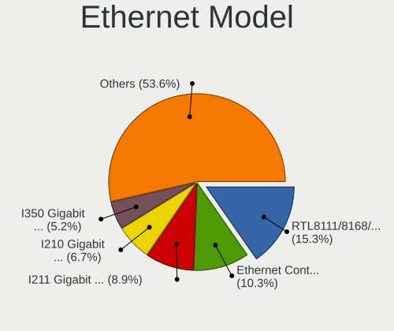

| Model                                                                         | Computers | Percent |
|-------------------------------------------------------------------------------|-----------|---------|
| Realtek RTL8111/8168/8211/8411 PCI Express Gigabit Ethernet Controller        | 3090      | 15.33%  |
| Intel Ethernet Controller I226-V                                              | 2076      | 10.3%   |
| Intel I211 Gigabit Network Connection                                         | 1801      | 8.94%   |
| Intel I210 Gigabit Network Connection                                         | 1348      | 6.69%   |
| Intel I350 Gigabit Network Connection                                         | 1040      | 5.16%   |
| Intel Ethernet Controller I225-V                                              | 997       | 4.95%   |
| Intel 82599ES 10-Gigabit SFI/SFP+ Network Connection                          | 600       | 2.98%   |
| Intel 82574L Gigabit Network Connection                                       | 587       | 2.91%   |
| Intel 82579LM Gigabit Network Connection (Lewisville)                         | 389       | 1.93%   |
| Realtek RTL8125 2.5GbE Controller                                             | 379       | 1.88%   |
| Intel 82576 Gigabit Network Connection                                        | 353       | 1.75%   |
| Intel Ethernet Connection I217-LM                                             | 326       | 1.62%   |
| Intel 82580 Gigabit Network Connection                                        | 317       | 1.57%   |
| Intel 82583V Gigabit Network Connection                                       | 316       | 1.57%   |
| Intel Ethernet Controller 10-Gigabit X540-AT2                                 | 298       | 1.48%   |
| Intel 82571EB/82571GB Gigabit Ethernet Controller D0/D1 (copper applications) | 274       | 1.36%   |
| Broadcom NetXtreme BCM5720 Gigabit Ethernet PCIe                              | 231       | 1.15%   |
| Intel Ethernet Connection (2) I219-LM                                         | 220       | 1.09%   |
| Intel Ethernet Controller X710 for 10GbE SFP+                                 | 214       | 1.06%   |
| Intel 82571EB/82571GB Gigabit Ethernet Controller (Copper)                    | 210       | 1.04%   |
| Intel Ethernet Connection (7) I219-LM                                         | 205       | 1.02%   |
| Intel I210 Gigabit Fiber Network Connection                                   | 190       | 0.94%   |
| AMD XGMAC 10GbE Controller                                                    | 187       | 0.93%   |
| Intel Ethernet Connection I354                                                | 178       | 0.88%   |
| Intel Ethernet Connection (7) I219-V                                          | 177       | 0.88%   |
| Intel Ethernet Controller X550                                                | 175       | 0.87%   |
| Intel Ethernet Connection X553 1GbE                                           | 168       | 0.83%   |
| Realtek RTL8111/8168/8411 PCI Express Gigabit Ethernet Controller             | 158       | 0.78%   |
| Intel Ethernet Connection (2) I219-V                                          | 157       | 0.78%   |
| Broadcom NetXtreme II BCM5709 Gigabit Ethernet                                | 144       | 0.71%   |
| Intel Ethernet Connection X553 10 GbE SFP+                                    | 128       | 0.64%   |
| Broadcom NetXtreme BCM5719 Gigabit Ethernet PCIe                              | 119       | 0.59%   |
| Broadcom NetXtreme II BCM5716 Gigabit Ethernet                                | 106       | 0.53%   |
| Intel 82575EB Gigabit Network Connection                                      | 102       | 0.51%   |
| Intel Ethernet Connection (5) I219-LM                                         | 101       | 0.5%    |
| Broadcom NetXtreme II BCM57810 10 Gigabit Ethernet                            | 98        | 0.49%   |
| Realtek USB 2.5GbE Controller                                                 | 90        | 0.45%   |
| Intel I350 Gigabit Fiber Network Connection                                   | 75        | 0.37%   |
| Realtek RTL8169 PCI Gigabit Ethernet Controller                               | 71        | 0.35%   |
| Intel Ethernet Controller I226-LM                                             | 62        | 0.31%   |

Net Controller Kind
-------------------

Ethernet, WiFi or modem

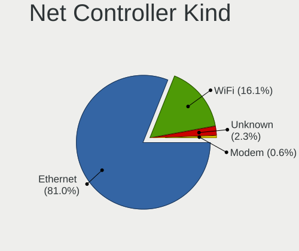

| Kind     | Computers | Percent |
|----------|-----------|---------|
| Ethernet | 12854     | 81.04%  |
| WiFi     | 2550      | 16.08%  |
| Unknown  | 363       | 2.29%   |
| Modem    | 95        | 0.6%    |

Used Controller
---------------

Currently used network controller

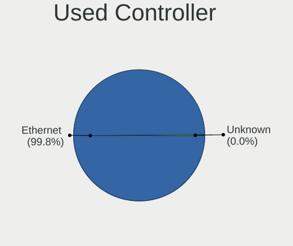

| Kind     | Computers | Percent |
|----------|-----------|---------|
| Ethernet | 12751     | 99.83%  |
| WiFi     | 21        | 0.16%   |
| Unknown  | 1         | 0.01%   |

NICs
----

Total network controllers on board

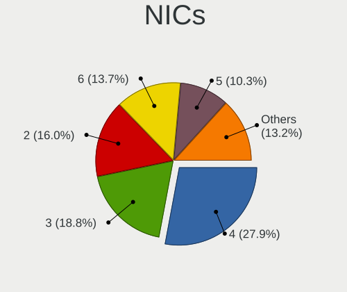

| Total | Computers | Percent |
|-------|-----------|---------|
| 4     | 3685      | 27.94%  |
| 3     | 2477      | 18.78%  |
| 2     | 2113      | 16.02%  |
| 6     | 1808      | 13.71%  |
| 5     | 1357      | 10.29%  |
| 8     | 469       | 3.56%   |
| 1     | 365       | 2.77%   |
| 9     | 273       | 2.07%   |
| 7     | 265       | 2.01%   |
| 10    | 167       | 1.27%   |
| 12    | 80        | 0.61%   |
| 14    | 32        | 0.24%   |
| 11    | 22        | 0.17%   |
| 16    | 17        | 0.13%   |
| 13    | 17        | 0.13%   |
| 0     | 16        | 0.12%   |
| 15    | 9         | 0.07%   |
| 20    | 5         | 0.04%   |
| 17    | 5         | 0.04%   |
| 18    | 2         | 0.02%   |
| 25    | 1         | 0.01%   |
| 21    | 1         | 0.01%   |
| 19    | 1         | 0.01%   |

IPv6
----

IPv6 vs IPv4

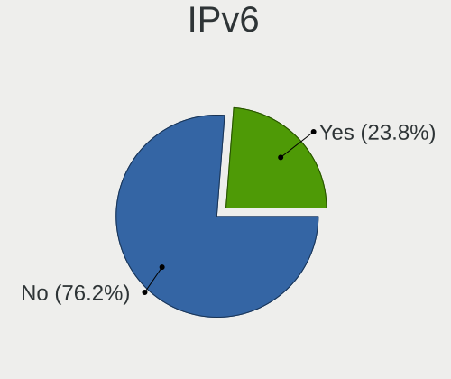

| Used | Computers | Percent |
|------|-----------|---------|
| No   | 10343     | 76.24%  |
| Yes  | 3224      | 23.76%  |

Bluetooth
---------

Bluetooth Vendor
----------------

Controller vendors

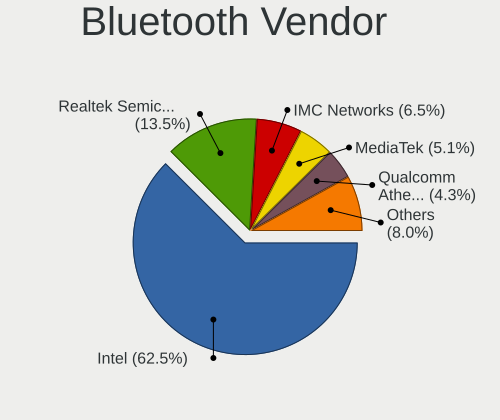

| Vendor                          | Computers | Percent |
|---------------------------------|-----------|---------|
| Intel                           | 1079      | 62.48%  |
| Realtek Semiconductor           | 233       | 13.49%  |
| IMC Networks                    | 113       | 6.54%   |
| MediaTek                        | 88        | 5.1%    |
| Qualcomm Atheros Communications | 75        | 4.34%   |
| Apple                           | 43        | 2.49%   |
| Broadcom                        | 26        | 1.51%   |
| ASUSTek Computer                | 18        | 1.04%   |
| Lite-On Technology              | 14        | 0.81%   |
| Cambridge Silicon Radio         | 14        | 0.81%   |
| Foxconn / Hon Hai               | 11        | 0.64%   |
| Dell                            | 4         | 0.23%   |
| Hewlett-Packard                 | 3         | 0.17%   |
| AMPAK Technology                | 2         | 0.12%   |
| Qcom                            | 1         | 0.06%   |
| Fujitsu Siemens Computers       | 1         | 0.06%   |
| Dynex                           | 1         | 0.06%   |
| Chicony Electronics             | 1         | 0.06%   |

Bluetooth Model
---------------

Controller models

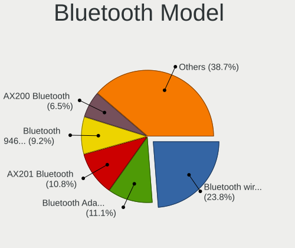

| Model                                                       | Computers | Percent |
|-------------------------------------------------------------|-----------|---------|
| Intel Bluetooth wireless interface                          | 412       | 23.77%  |
| Realtek Bluetooth Adapter                                   | 192       | 11.08%  |
| Intel AX201 Bluetooth                                       | 187       | 10.79%  |
| Intel Bluetooth 9460/9560 Jefferson Peak (JfP)              | 159       | 9.17%   |
| Intel AX200 Bluetooth                                       | 112       | 6.46%   |
| Intel Wireless-AC 3168 Bluetooth                            | 54        | 3.12%   |
| Intel AX210 Bluetooth                                       | 54        | 3.12%   |
| Intel Centrino Bluetooth Wireless Transceiver               | 50        | 2.89%   |
| IMC Networks Qualcomm Atheros Bluetooth 4.1                 | 50        | 2.89%   |
| MediaTek Wireless_Device                                    | 47        | 2.71%   |
| Apple Bluetooth Host Controller                             | 35        | 2.02%   |
| IMC Networks Realtek Bluetooth Adapter                      | 28        | 1.62%   |
| Qualcomm Atheros AR3012 Bluetooth 4.0                       | 25        | 1.44%   |
| MediaTek RZ608 Bluetooth Adapter                            | 25        | 1.44%   |
| Intel Wireless-AC 9260 Bluetooth Adapter                    | 25        | 1.44%   |
| Intel AX211 Bluetooth                                       | 25        | 1.44%   |
| IMC Networks Realtek Bluetooth 4.0 + High Speed Chip        | 19        | 1.1%    |
| Realtek  Bluetooth 4.2 Adapter                              | 16        | 0.92%   |
| Qualcomm Atheros QCA61x4 Bluetooth 4.0                      | 16        | 0.92%   |
| Cambridge Silicon Radio Bluetooth Dongle (HCI mode)         | 14        | 0.81%   |
| MediaTek Bluetooth Adapter                                  | 11        | 0.63%   |
| Qualcomm Atheros AR3011 Bluetooth (no firmware)             | 9         | 0.52%   |
| Qualcomm Atheros AR9462 Bluetooth                           | 8         | 0.46%   |
| Realtek Bluetooth 4.2 Adapter                               | 7         | 0.4%    |
| IMC Networks Bluetooth Module                               | 7         | 0.4%    |
| Lite-On Qualcomm Atheros QCA9377 Bluetooth                  | 6         | 0.35%   |
| Apple Broadcom Built-in Bluetooth                           | 6         | 0.35%   |
| Qualcomm Atheros QCA9377 Bluetooth 4.1                      | 5         | 0.29%   |
| Qualcomm Atheros Dell Wireless 1707 Bluetooth 4.0 LE Device | 5         | 0.29%   |
| MediaTek RZ616 Bluetooth Adapter                            | 5         | 0.29%   |
| Broadcom BCM2045B (BDC-2.1)                                 | 5         | 0.29%   |
| ASUS Qualcomm Bluetooth 4.1                                 | 5         | 0.29%   |
| Realtek RTL8723A Bluetooth                                  | 4         | 0.23%   |
| Realtek Bluetooth Radio                                     | 4         | 0.23%   |
| Intel BE200 Bluetooth                                       | 4         | 0.23%   |
| Foxconn / Hon Hai Bluetooth USB Module                      | 4         | 0.23%   |
| Broadcom BCM20702 Bluetooth 4.0 [ThinkPad]                  | 4         | 0.23%   |
| Broadcom 20702 Bluetooth 4.0 Adapter                        | 4         | 0.23%   |
| ASUS Bluetooth USB module                                   | 4         | 0.23%   |
| Realtek RTL8821A Bluetooth                                  | 3         | 0.17%   |

Sound
-----

Sound Vendor
------------

Sound card vendors

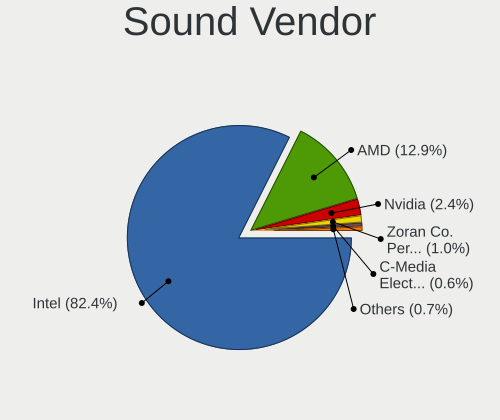

| Vendor                                       | Computers | Percent |
|----------------------------------------------|-----------|---------|
| Intel                                        | 7891      | 82.43%  |
| AMD                                          | 1237      | 12.92%  |
| Nvidia                                       | 229       | 2.39%   |
| Zoran Co. Personal Media Division (Nogatech) | 100       | 1.04%   |
| C-Media Electronics                          | 53        | 0.55%   |
| KTMicro                                      | 15        | 0.16%   |
| ESS Technology                               | 9         | 0.09%   |
| MosArt Semiconductor                         | 8         | 0.08%   |
| Walmart                                      | 5         | 0.05%   |
| Realtek Semiconductor                        | 4         | 0.04%   |
| VIA Technologies                             | 3         | 0.03%   |
| Nordic Semiconductor ASA                     | 3         | 0.03%   |
| Silicon Integrated Systems [SiS]             | 2         | 0.02%   |
| Micro Star International                     | 2         | 0.02%   |
| Giga-Byte Technology                         | 2         | 0.02%   |
| Creative Labs                                | 2         | 0.02%   |
| XING WEI 2.4G USB                            | 1         | 0.01%   |
| Logitech                                     | 1         | 0.01%   |
| Lenovo                                       | 1         | 0.01%   |
| Hewlett-Packard                              | 1         | 0.01%   |
| GN Netcom                                    | 1         | 0.01%   |
| Genesys Logic                                | 1         | 0.01%   |
| Generalplus Technology                       | 1         | 0.01%   |
| Apple                                        | 1         | 0.01%   |

Sound Model
-----------

Sound card models

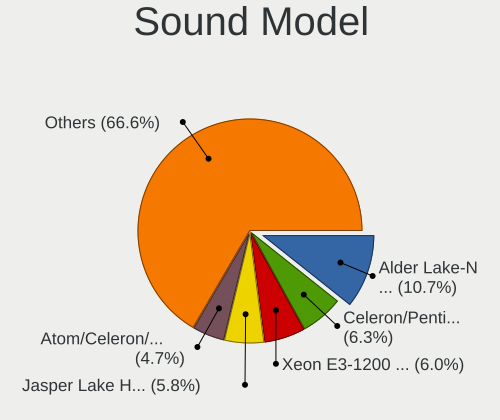

| Model                                                                                             | Computers | Percent |
|---------------------------------------------------------------------------------------------------|-----------|---------|
| Intel Alder Lake-N PCH High Definition Audio Controller                                           | 1191      | 10.7%   |
| Intel Celeron/Pentium Silver Processor High Definition Audio                                      | 699       | 6.28%   |
| Intel Xeon E3-1200 v3/4th Gen Core Processor HD Audio Controller                                  | 666       | 5.98%   |
| Intel Jasper Lake HD Audio                                                                        | 642       | 5.77%   |
| Intel Atom/Celeron/Pentium Processor x5-E8000/J3xxx/N3xxx Series High Definition Audio Controller | 523       | 4.7%    |
| Intel 8 Series/C220 Series Chipset High Definition Audio Controller                               | 493       | 4.43%   |
| Intel 100 Series/C230 Series Chipset Family HD Audio Controller                                   | 443       | 3.98%   |
| Intel Cannon Lake PCH cAVS                                                                        | 435       | 3.91%   |
| AMD FCH Azalia Controller                                                                         | 400       | 3.59%   |
| Intel Atom Processor Z36xxx/Z37xxx Series High Definition Audio Controller                        | 366       | 3.29%   |
| AMD Kabini HDMI/DP Audio                                                                          | 333       | 2.99%   |
| AMD Ryzen HD Audio Controller                                                                     | 329       | 2.95%   |
| Intel 7 Series/C216 Chipset Family High Definition Audio Controller                               | 310       | 2.78%   |
| Intel 200 Series PCH HD Audio                                                                     | 302       | 2.71%   |
| Intel 6 Series/C200 Series Chipset Family High Definition Audio Controller                        | 296       | 2.66%   |
| Intel Sunrise Point-LP HD Audio                                                                   | 292       | 2.62%   |
| Intel Celeron N3350/Pentium N4200/Atom E3900 Series Audio Cluster                                 | 204       | 1.83%   |
| Intel Haswell-ULT HD Audio Controller                                                             | 180       | 1.62%   |
| Intel 8 Series HD Audio Controller                                                                | 180       | 1.62%   |
| Intel Elkhart Lake High Density Audio bus interface                                               | 159       | 1.43%   |
| Intel Broadwell-U Audio Controller                                                                | 158       | 1.42%   |
| Intel Wildcat Point-LP High Definition Audio Controller                                           | 155       | 1.39%   |
| AMD Renoir/Cezanne HDMI/DP Audio Controller                                                       | 153       | 1.37%   |
| Intel Alder Lake PCH-P High Definition Audio Controller                                           | 144       | 1.29%   |
| AMD Kaveri HDMI/DP Audio Controller                                                               | 115       | 1.03%   |
| Intel NM10/ICH7 Family High Definition Audio Controller                                           | 107       | 0.96%   |
| AMD SBx00 Azalia (Intel HDA)                                                                      | 107       | 0.96%   |
| AMD Raven/Raven2/Fenghuang HDMI/DP Audio Controller                                               | 107       | 0.96%   |
| Zoran Co. Personal Media Division (Nogatech) USB Audio and HID                                    | 100       | 0.9%    |
| Intel Comet Lake PCH-LP cAVS                                                                      | 88        | 0.79%   |
| AMD Family 17h (Models 00h-0fh) HD Audio Controller                                               | 88        | 0.79%   |
| Intel Tiger Lake-LP Smart Sound Technology Audio Controller                                       | 78        | 0.7%    |
| Intel Alder Lake-S HD Audio Controller                                                            | 78        | 0.7%    |
| Intel Cannon Point-LP High Definition Audio Controller                                            | 77        | 0.69%   |
| Nvidia GK208 HDMI/DP Audio Controller                                                             | 60        | 0.54%   |
| AMD Starship/Matisse HD Audio Controller                                                          | 52        | 0.47%   |
| Intel Comet Lake PCH cAVS                                                                         | 50        | 0.45%   |
| AMD Wrestler HDMI Audio                                                                           | 50        | 0.45%   |
| C-Media Electronics Audio Adapter (Unitek Y-247A)                                                 | 42        | 0.38%   |
| Intel 5 Series/3400 Series Chipset High Definition Audio                                          | 41        | 0.37%   |

Memory
------

Memory Vendor
-------------

Memory module vendors

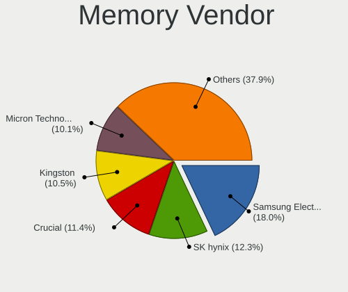

| Vendor                                  | Computers | Percent |
|-----------------------------------------|-----------|---------|
| Samsung Electronics                     | 2474      | 17.97%  |
| SK hynix                                | 1688      | 12.26%  |
| Crucial                                 | 1565      | 11.37%  |
| Kingston                                | 1442      | 10.47%  |
| Micron Technology                       | 1386      | 10.07%  |
| Unknown                                 | 1159      | 8.42%   |
| Unknown                                 | 538       | 3.91%   |
| Corsair                                 | 521       | 3.78%   |
| G.Skill                                 | 393       | 2.85%   |
| Transcend                               | 365       | 2.65%   |
| A-DATA Technology                       | 259       | 1.88%   |
| Unknown (ABCD)                          | 237       | 1.72%   |
| Ramaxel Technology                      | 150       | 1.09%   |
| Team                                    | 144       | 1.05%   |
| Nanya Technology                        | 97        | 0.7%    |
| Kimtigo                                 | 88        | 0.64%   |
| Patriot                                 | 86        | 0.62%   |
| Toshiba                                 | 82        | 0.6%    |
| Apacer                                  | 80        | 0.58%   |
| Timetec                                 | 57        | 0.41%   |
| Hewlett-Packard                         | 57        | 0.41%   |
| ATP                                     | 53        | 0.38%   |
| Elpida                                  | 42        | 0.31%   |
| SK_Hynix                                | 36        | 0.26%   |
| PNY                                     | 29        | 0.21%   |
| Silicon Power                           | 27        | 0.2%    |
| Lexar Co Limited                        | 26        | 0.19%   |
| Smart                                   | 24        | 0.17%   |
| Innodisk                                | 24        | 0.17%   |
| Unknown (AB)                            | 23        | 0.17%   |
| Teikon                                  | 21        | 0.15%   |
| Patriot Memory (PDP Systems)            | 19        | 0.14%   |
| Avant                                   | 19        | 0.14%   |
| Smart Modular                           | 18        | 0.13%   |
| Silicon Power Computer & Communications | 18        | 0.13%   |
| GOODRAM                                 | 17        | 0.12%   |
| Unknown (0x0FBA)                        | 15        | 0.11%   |
| Super Talent                            | 15        | 0.11%   |
| Wodposit                                | 14        | 0.1%    |
| HPE                                     | 14        | 0.1%    |

Memory Model
------------

Memory module models

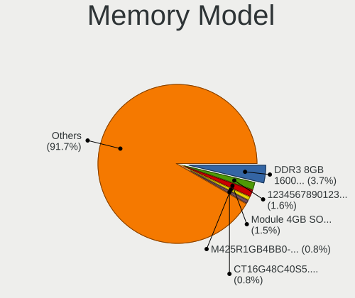

| Model                                                         | Computers | Percent |
|---------------------------------------------------------------|-----------|---------|
| Unknown                                                       | 538       | 3.71%   |
| Unknown (ABCD) RAM 123456789012345678 8GB DIMM DDR4 2400MT/s  | 234       | 1.61%   |
| Unknown RAM Module 4GB SODIMM DDR3 1333MT/s                   | 211       | 1.45%   |
| Samsung RAM M425R1GB4BB0-CQKOL 8GB SODIMM DDR5 4800MT/s       | 114       | 0.79%   |
| Crucial RAM CT16G48C40S5.M8A1 16GB SODIMM DDR5 4800MT/s       | 111       | 0.76%   |
| Transcend RAM TS1GLH64V6BL 8GB SODIMM DDR4 2667MT/s           | 106       | 0.73%   |
| Samsung RAM M471A1K43CB1-CTD 8GB SODIMM DDR4 3200MT/s         | 101       | 0.7%    |
| SK hynix RAM HMT451S6BFR8A-PB 4GB SODIMM DDR3 1600MT/s        | 98        | 0.67%   |
| Crucial RAM CT16G56C46S5.M8G1 16GB SODIMM DDR5 5600MT/s       | 80        | 0.55%   |
| Unknown RAM Module 8GB DIMM DDR3 1600MT/s                     | 73        | 0.5%    |
| Unknown RAM Module 4GB DIMM DDR3 1333MT/s                     | 68        | 0.47%   |
| Samsung RAM M471B5173EB0-YK0 4GB SODIMM DDR3 1600MT/s         | 68        | 0.47%   |
| SK hynix RAM HMA81GS6AFR8N-UH 8GB SODIMM DDR4 2400MT/s        | 66        | 0.45%   |
| Samsung RAM M471B5173QH0-YK0 4GB SODIMM DDR3 1600MT/s         | 66        | 0.45%   |
| Unknown RAM Module 8GB 1600MT/s                               | 55        | 0.38%   |
| Samsung RAM M471B1G73QH0-YK0 8GB DIMM DDR3 1600MT/s           | 54        | 0.37%   |
| Crucial RAM CT8G48C40S5.M4A1 8GB SODIMM DDR5 4800MT/s         | 52        | 0.36%   |
| Samsung RAM M378B5173DB0-CK0 4GB DIMM DDR3 1600MT/s           | 50        | 0.34%   |
| Kimtigo RAM KT8GS3EDF 8GB SODIMM DDR3 1600MT/s                | 49        | 0.34%   |
| Samsung RAM M471A1K43DB1-CTD 8GB SODIMM DDR4 2667MT/s         | 48        | 0.33%   |
| Micron RAM 8JTF51264AZ-1G6E1 4GB DIMM DDR3 1600MT/s           | 48        | 0.33%   |
| Samsung RAM M471B1G73DB0-YK0 8GB DIMM DDR3 1600MT/s           | 46        | 0.32%   |
| Corsair RAM CMSX16GX5M1A4800C40 16GB SODIMM DDR5 4800MT/s     | 43        | 0.3%    |
| Samsung RAM Module 2GB Row Of Chips LPDDR5 6400MT/s           | 42        | 0.29%   |
| Samsung RAM M471B5173DB0-YK0 4GB SODIMM DDR3 1600MT/s         | 42        | 0.29%   |
| Unknown RAM Module 2GB DIMM DDR2 800MT/s                      | 41        | 0.28%   |
| SK hynix RAM HMT451U6AFR8C-PB 4GB DIMM DDR3 1600MT/s          | 41        | 0.28%   |
| Micron RAM 53D512M64D4RQ-046 8GB Row Of Chips LPDDR4 4800MT/s | 41        | 0.28%   |
| Unknown RAM Module 4GB DIMM DDR3 1600MT/s                     | 40        | 0.28%   |
| SK hynix RAM HMT351U6CFR8C-PB 4GB DIMM DDR3 1600MT/s          | 40        | 0.28%   |
| Samsung RAM M471A1K43CB1-CRC 8GB SODIMM DDR4 2667MT/s         | 40        | 0.28%   |
| Unknown RAM Module 4GB SODIMM DDR3 667MT/s                    | 39        | 0.27%   |
| SK hynix RAM HMT451U6BFR8A-PB 4GB DIMM DDR3 1600MT/s          | 39        | 0.27%   |
| Samsung RAM M471A5244CB0-CTD 4GB SODIMM DDR4 3200MT/s         | 39        | 0.27%   |
| SK hynix RAM HMA851S6AFR6N-UH 4GB SODIMM DDR4 2400MT/s        | 38        | 0.26%   |
| SK hynix RAM HMA81GU6AFR8N-UH 8GB DIMM DDR4 2400MT/s          | 38        | 0.26%   |
| Crucial RAM CT16G48C40S5.C8A1 16GB SODIMM DDR5 4800MT/s       | 38        | 0.26%   |
| Micron RAM MTC4C10163S1SC48BA1 8GB SODIMM DDR5 4800MT/s       | 37        | 0.25%   |
| Micron RAM 8KTF51264HZ-1G9P1 4GB SODIMM DDR3 1867MT/s         | 37        | 0.25%   |
| SK hynix RAM HMA81GS6CJR8N-VK 8GB SODIMM DDR4 2667MT/s        | 36        | 0.25%   |

Memory Kind
-----------

Memory module kinds

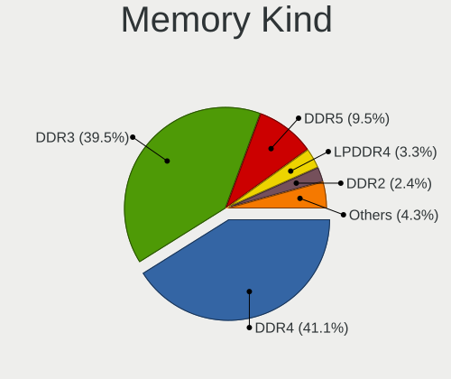

| Kind            | Computers | Percent |
|-----------------|-----------|---------|
| DDR4            | 5088      | 41.1%   |
| DDR3            | 4893      | 39.53%  |
| DDR5            | 1172      | 9.47%   |
| LPDDR4          | 403       | 3.26%   |
| DDR2            | 293       | 2.37%   |
| Unknown         | 216       | 1.74%   |
| LPDDR5          | 178       | 1.44%   |
| SDRAM           | 94        | 0.76%   |
| DDR             | 20        | 0.16%   |
| LPDDR3          | 8         | 0.06%   |
| DRAM            | 8         | 0.06%   |
| RAM             | 4         | 0.03%   |
| Logical non-vol | 1         | 0.01%   |
| EEPROM          | 1         | 0.01%   |

Memory Form Factor
------------------

Physical design of the memory module

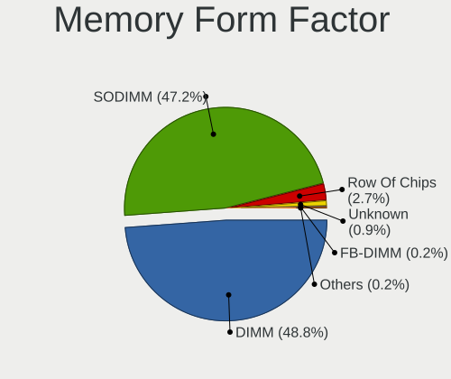

| Name         | Computers | Percent |
|--------------|-----------|---------|
| DIMM         | 6014      | 48.83%  |
| SODIMM       | 5812      | 47.19%  |
| Row Of Chips | 330       | 2.68%   |
| Unknown      | 111       | 0.9%    |
| FB-DIMM      | 23        | 0.19%   |
| Chip         | 13        | 0.11%   |
| RIMM         | 12        | 0.1%    |

Memory Size
-----------

Memory module size

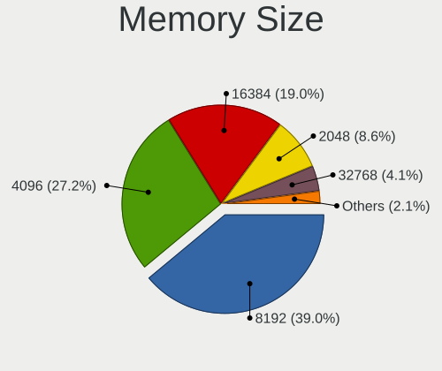

| Size   | Computers | Percent |
|--------|-----------|---------|
| 8192   | 5109      | 38.96%  |
| 4096   | 3567      | 27.2%   |
| 16384  | 2493      | 19.01%  |
| 2048   | 1124      | 8.57%   |
| 32768  | 541       | 4.13%   |
| 1024   | 183       | 1.4%    |
| 3072   | 54        | 0.41%   |
| 512    | 12        | 0.09%   |
| 49152  | 11        | 0.08%   |
| 65536  | 9         | 0.07%   |
| 24576  | 3         | 0.02%   |
| 6144   | 3         | 0.02%   |
| 131072 | 2         | 0.02%   |
| 32767  | 2         | 0.02%   |
| 1      | 1         | 0.01%   |

Memory Speed
------------

Memory module speed

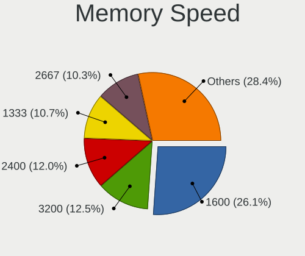

| Speed   | Computers | Percent |
|---------|-----------|---------|
| 1600    | 3412      | 26.09%  |
| 3200    | 1637      | 12.52%  |
| 2400    | 1569      | 12%     |
| 1333    | 1402      | 10.72%  |
| 2667    | 1343      | 10.27%  |
| 4800    | 868       | 6.64%   |
| 2133    | 738       | 5.64%   |
| 5600    | 367       | 2.81%   |
| 800     | 251       | 1.92%   |
| 2666    | 212       | 1.62%   |
| 667     | 203       | 1.55%   |
| 6400    | 127       | 0.97%   |
| Unknown | 123       | 0.94%   |
| 1066    | 119       | 0.91%   |
| 1867    | 112       | 0.86%   |
| 1866    | 97        | 0.74%   |
| 1067    | 72        | 0.55%   |
| 3000    | 60        | 0.46%   |
| 2933    | 60        | 0.46%   |
| 1334    | 56        | 0.43%   |
| 3600    | 55        | 0.42%   |
| 3733    | 40        | 0.31%   |
| 4267    | 21        | 0.16%   |
| 4000    | 20        | 0.15%   |
| 400     | 20        | 0.15%   |
| 5200    | 17        | 0.13%   |
| 533     | 12        | 0.09%   |
| 1033    | 9         | 0.07%   |
| 6000    | 5         | 0.04%   |
| 2600    | 5         | 0.04%   |
| 65535   | 4         | 0.03%   |
| 1400    | 4         | 0.03%   |
| 1332    | 4         | 0.03%   |
| 333     | 4         | 0.03%   |
| 6600    | 3         | 0.02%   |
| 2800    | 3         | 0.02%   |
| 4266    | 2         | 0.02%   |
| 3066    | 2         | 0.02%   |
| 2048    | 2         | 0.02%   |
| 1200    | 2         | 0.02%   |

Printers & scanners
-------------------

Printer Vendor
--------------

Printer device vendors

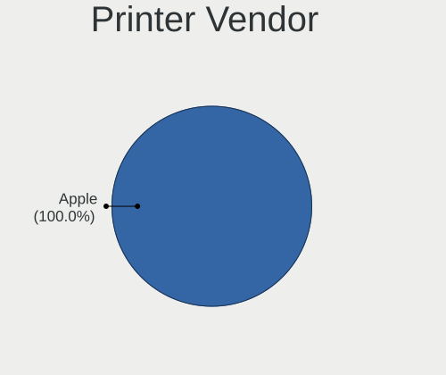

| Vendor | Computers | Percent |
|--------|-----------|---------|
| Apple  | 1         | 100%    |

Printer Model
-------------

Printer device models

| Model                  | Computers | Percent |
|------------------------|-----------|---------|
| Apple Gamesir-G3v 1.00 | 1         | 100%    |

Scanner Vendor
--------------

Scanner device vendors

Zero info for selected period =(

Scanner Model
-------------

Scanner device models

Zero info for selected period =(

Camera
------

Camera Vendor
-------------

Camera device vendors

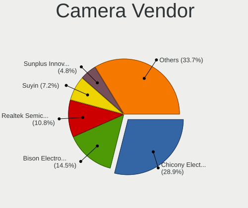

| Vendor                                 | Computers | Percent |
|----------------------------------------|-----------|---------|
| Chicony Electronics                    | 24        | 28.92%  |
| Bison Electronics                      | 12        | 14.46%  |
| Realtek Semiconductor                  | 9         | 10.84%  |
| Suyin                                  | 6         | 7.23%   |
| Sunplus Innovation Technology          | 4         | 4.82%   |
| Microdia                               | 4         | 4.82%   |
| Lite-On Technology                     | 4         | 4.82%   |
| Apple                                  | 4         | 4.82%   |
| Logitech                               | 3         | 3.61%   |
| Quanta                                 | 2         | 2.41%   |
| IMC Networks                           | 2         | 2.41%   |
| Z-Star Microelectronics                | 1         | 1.2%    |
| Syntek                                 | 1         | 1.2%    |
| SIMPLO Technology                      | 1         | 1.2%    |
| Silicon Motion                         | 1         | 1.2%    |
| Primax Electronics                     | 1         | 1.2%    |
| Luxvisions Innotech Limited            | 1         | 1.2%    |
| Lenovo                                 | 1         | 1.2%    |
| Cheng Uei Precision Industry (Foxlink) | 1         | 1.2%    |
| ALi                                    | 1         | 1.2%    |

Camera Model
------------

Camera device models

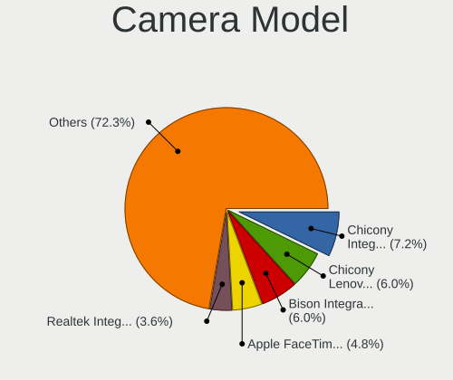

| Model                                                       | Computers | Percent |
|-------------------------------------------------------------|-----------|---------|
| Chicony Integrated Camera                                   | 6         | 7.23%   |
| Chicony Lenovo Integrated Camera (0.3MP)                    | 5         | 6.02%   |
| Bison Integrated Camera                                     | 5         | 6.02%   |
| Apple FaceTime HD Camera                                    | 4         | 4.82%   |
| Realtek Integrated_Webcam_HD                                | 3         | 3.61%   |
| Lite-On Integrated Camera                                   | 3         | 3.61%   |
| Chicony HP HD Webcam [Fixed]                                | 3         | 3.61%   |
| Suyin 1.3M WebCam (notebook emachines E730, Acer sub-brand) | 2         | 2.41%   |
| Realtek USB Camera                                          | 2         | 2.41%   |
| Chicony Integrated Camera [ThinkPad]                        | 2         | 2.41%   |
| Chicony HD WebCam                                           | 2         | 2.41%   |
| Bison Lenovo Integrated Webcam                              | 2         | 2.41%   |
| Bison Lenovo EasyCamera                                     | 2         | 2.41%   |
| Z-Star WebCam SC-03FFL11739P                                | 1         | 1.2%    |
| Syntek EasyCamera                                           | 1         | 1.2%    |
| Suyin UVC 1.3MPixel WebCam                                  | 1         | 1.2%    |
| Suyin HP Webcam                                             | 1         | 1.2%    |
| Suyin HD WebCam                                             | 1         | 1.2%    |
| Suyin Acer/Lenovo Webcam [CN0316]                           | 1         | 1.2%    |
| Sunplus Laptop_Integrated_Webcam_HD                         | 1         | 1.2%    |
| Sunplus Laptop_Integrated_Webcam_1.3M                       | 1         | 1.2%    |
| Sunplus Laptop Integrated Webcam HD                         | 1         | 1.2%    |
| Sunplus HP HD Webcam [Fixed]                                | 1         | 1.2%    |
| SIMPLO USB 2.0 Camera                                       | 1         | 1.2%    |
| Silicon Motion WebCam SCB-0385N                             | 1         | 1.2%    |
| Realtek PC Camera                                           | 1         | 1.2%    |
| Realtek Lenovo EasyCamera                                   | 1         | 1.2%    |
| Realtek Integrated Webcam HD                                | 1         | 1.2%    |
| Realtek Acer 640 x 480 laptop camera                        | 1         | 1.2%    |
| Quanta Integrated Webcam                                    | 1         | 1.2%    |
| Quanta HP Universal Camera                                  | 1         | 1.2%    |
| Primax HP HD Webcam [Fixed]                                 | 1         | 1.2%    |
| Microdia USB 2.0 Camera                                     | 1         | 1.2%    |
| Microdia Laptop_Integrated_Webcam_HD                        | 1         | 1.2%    |
| Microdia Laptop_Integrated_Webcam_0.3M                      | 1         | 1.2%    |
| Microdia 1.3 MPixel Integrated Webcam                       | 1         | 1.2%    |
| Luxvisions Innotech Limited HP Wide Vision HD Camera        | 1         | 1.2%    |
| Logitech Webcam C930e                                       | 1         | 1.2%    |
| Logitech Webcam C270                                        | 1         | 1.2%    |
| Logitech HD Pro Webcam C920                                 | 1         | 1.2%    |

Security
--------

Fingerprint Vendor
------------------

Fingerprint sensor vendors

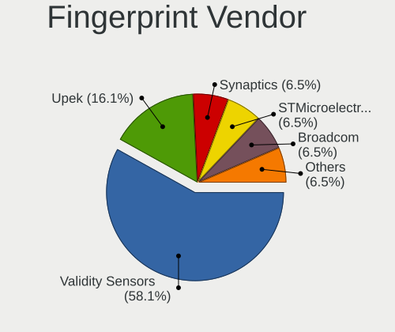

| Vendor             | Computers | Percent |
|--------------------|-----------|---------|
| Validity Sensors   | 18        | 58.06%  |
| Upek               | 5         | 16.13%  |
| Synaptics          | 2         | 6.45%   |
| STMicroelectronics | 2         | 6.45%   |
| Broadcom           | 2         | 6.45%   |
| AuthenTec          | 2         | 6.45%   |

Fingerprint Model
-----------------

Fingerprint sensor models

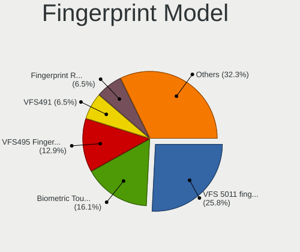

| Model                                                                        | Computers | Percent |
|------------------------------------------------------------------------------|-----------|---------|
| Validity Sensors VFS 5011 fingerprint sensor                                 | 8         | 25.81%  |
| Upek Biometric Touchchip/Touchstrip Fingerprint Sensor                       | 5         | 16.13%  |
| Validity Sensors VFS495 Fingerprint Reader                                   | 4         | 12.9%   |
| Validity Sensors VFS491                                                      | 2         | 6.45%   |
| STMicroelectronics Fingerprint Reader                                        | 2         | 6.45%   |
| Broadcom BCM5880 Secure Applications Processor with fingerprint swipe sensor | 2         | 6.45%   |
| AuthenTec AES2550 Fingerprint Sensor                                         | 2         | 6.45%   |
| Validity Sensors VFS7500 Touch Fingerprint Sensor                            | 1         | 3.23%   |
| Validity Sensors VFS471 Fingerprint Reader                                   | 1         | 3.23%   |
| Validity Sensors VFS451 Fingerprint Reader                                   | 1         | 3.23%   |
| Validity Sensors Synaptics WBDI                                              | 1         | 3.23%   |
| Synaptics Prometheus MIS Touch Fingerprint Reader                            | 1         | 3.23%   |
| Synaptics Metallica MIS Touch Fingerprint Reader                             | 1         | 3.23%   |

Chipcard Vendor
---------------

Chipcard module vendors

Zero info for selected period =(

Chipcard Model
--------------

Chipcard module models

Zero info for selected period =(

Unsupported
-----------

Unsupported Devices
-------------------

Total unsupported devices on board

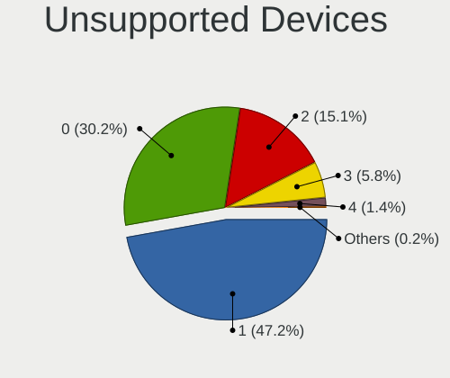

| Total | Computers | Percent |
|-------|-----------|---------|
| 1     | 6253      | 47.18%  |
| 0     | 4007      | 30.23%  |
| 2     | 2003      | 15.11%  |
| 3     | 774       | 5.84%   |
| 4     | 187       | 1.41%   |
| 5     | 26        | 0.2%    |
| 6     | 2         | 0.02%   |
| 9     | 1         | 0.01%   |
| 8     | 1         | 0.01%   |

Unsupported Device Types
------------------------

Types of unsupported devices

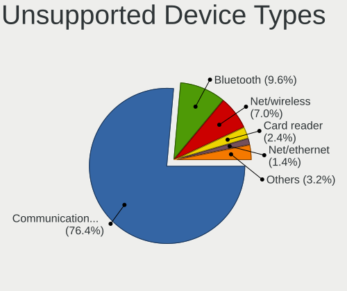

| Type                     | Computers | Percent |
|--------------------------|-----------|---------|
| Communication controller | 8459      | 76.4%   |
| Bluetooth                | 1066      | 9.63%   |
| Net/wireless             | 777       | 7.02%   |
| Card reader              | 270       | 2.44%   |
| Net/ethernet             | 150       | 1.35%   |
| Network                  | 122       | 1.1%    |
| Firewire controller      | 117       | 1.06%   |
| Sound                    | 62        | 0.56%   |
| Fingerprint reader       | 31        | 0.28%   |
| Storage/raid             | 12        | 0.11%   |
| Storage                  | 5         | 0.05%   |
| Modem                    | 1         | 0.01%   |

