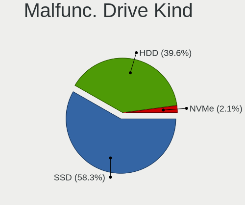

OPNsense - Tested Hardware & Statistics
---------------------------------------

A project to collect tested hardware configurations for OPNsense.

Anyone can contribute to this report by the [hw-probe](https://github.com/linuxhw/hw-probe/blob/master/INSTALL.BSD.md) tool:

    hw-probe -all -upload

Please contribute! Especially if your hardware is rare.

Contents
--------

* [ Test Cases ](#test-cases)

* [ System ](#system)
  - [ OS                       ](#os)
  - [ OS Family                ](#os-family)
  - [ Arch                     ](#arch)
  - [ DE                       ](#de)
  - [ Display Server           ](#display-server)
  - [ Display Manager          ](#display-manager)
  - [ OS Lang                  ](#os-lang)
  - [ Boot Mode                ](#boot-mode)
  - [ Filesystem               ](#filesystem)
  - [ Part. scheme             ](#part-scheme)

* [ Board ](#board)
  - [ Vendor                   ](#vendor)
  - [ Model                    ](#model)
  - [ Model Family             ](#model-family)
  - [ MFG Year                 ](#mfg-year)
  - [ Form Factor              ](#form-factor)
  - [ Coreboot                 ](#coreboot)
  - [ RAM Size                 ](#ram-size)
  - [ RAM Used                 ](#ram-used)
  - [ Total Drives             ](#total-drives)
  - [ Has CD-ROM               ](#has-cd-rom)
  - [ Has Ethernet             ](#has-ethernet)
  - [ Has WiFi                 ](#has-wifi)
  - [ Has Bluetooth            ](#has-bluetooth)

* [ Location ](#location)
  - [ Country                  ](#country)
  - [ City                     ](#city)

* [ Drives ](#drives)
  - [ Drive Vendor             ](#drive-vendor)
  - [ Drive Model              ](#drive-model)
  - [ HDD Vendor               ](#hdd-vendor)
  - [ SSD Vendor               ](#ssd-vendor)
  - [ Drive Kind               ](#drive-kind)
  - [ Drive Connector          ](#drive-connector)
  - [ Drive Size               ](#drive-size)
  - [ Space Total              ](#space-total)
  - [ Space Used               ](#space-used)
  - [ Malfunc. Drives          ](#malfunc-drives)
  - [ Malfunc. Drive Vendor    ](#malfunc-drive-vendor)
  - [ Malfunc. HDD Vendor      ](#malfunc-hdd-vendor)
  - [ Malfunc. Drive Kind      ](#malfunc-drive-kind)
  - [ Failed Drives            ](#failed-drives)
  - [ Failed Drive Vendor      ](#failed-drive-vendor)
  - [ Drive Status             ](#drive-status)

* [ Storage controller ](#storage-controller)
  - [ Storage Vendor           ](#storage-vendor)
  - [ Storage Model            ](#storage-model)
  - [ Storage Kind             ](#storage-kind)

* [ Processor ](#processor)
  - [ CPU Vendor               ](#cpu-vendor)
  - [ CPU Model                ](#cpu-model)
  - [ CPU Model Family         ](#cpu-model-family)
  - [ CPU Cores                ](#cpu-cores)
  - [ CPU Sockets              ](#cpu-sockets)
  - [ CPU Threads              ](#cpu-threads)
  - [ CPU Microarch            ](#cpu-microarch)

* [ Graphics ](#graphics)
  - [ GPU Vendor               ](#gpu-vendor)
  - [ GPU Model                ](#gpu-model)
  - [ GPU Combo                ](#gpu-combo)
  - [ GPU Driver               ](#gpu-driver)
  - [ GPU Memory               ](#gpu-memory)

* [ Monitor ](#monitor)
  - [ Monitor Vendor           ](#monitor-vendor)
  - [ Monitor Model            ](#monitor-model)
  - [ Monitor Resolution       ](#monitor-resolution)
  - [ Monitor Diagonal         ](#monitor-diagonal)
  - [ Monitor Width            ](#monitor-width)
  - [ Aspect Ratio             ](#aspect-ratio)
  - [ Monitor Area             ](#monitor-area)
  - [ Pixel Density            ](#pixel-density)
  - [ Multiple Monitors        ](#multiple-monitors)

* [ Network ](#network)
  - [ Net Controller Vendor    ](#net-controller-vendor)
  - [ Net Controller Model     ](#net-controller-model)
  - [ Wireless Vendor          ](#wireless-vendor)
  - [ Wireless Model           ](#wireless-model)
  - [ Ethernet Vendor          ](#ethernet-vendor)
  - [ Ethernet Model           ](#ethernet-model)
  - [ Net Controller Kind      ](#net-controller-kind)
  - [ Used Controller          ](#used-controller)
  - [ NICs                     ](#nics)
  - [ IPv6                     ](#ipv6)

* [ Bluetooth ](#bluetooth)
  - [ Bluetooth Vendor         ](#bluetooth-vendor)
  - [ Bluetooth Model          ](#bluetooth-model)

* [ Sound ](#sound)
  - [ Sound Vendor             ](#sound-vendor)
  - [ Sound Model              ](#sound-model)

* [ Memory ](#memory)
  - [ Memory Vendor            ](#memory-vendor)
  - [ Memory Model             ](#memory-model)
  - [ Memory Kind              ](#memory-kind)
  - [ Memory Form Factor       ](#memory-form-factor)
  - [ Memory Size              ](#memory-size)
  - [ Memory Speed             ](#memory-speed)

* [ Printers & scanners ](#printers--scanners)
  - [ Printer Vendor           ](#printer-vendor)
  - [ Printer Model            ](#printer-model)
  - [ Scanner Vendor           ](#scanner-vendor)
  - [ Scanner Model            ](#scanner-model)

* [ Camera ](#camera)
  - [ Camera Vendor            ](#camera-vendor)
  - [ Camera Model             ](#camera-model)

* [ Security ](#security)
  - [ Fingerprint Vendor       ](#fingerprint-vendor)
  - [ Fingerprint Model        ](#fingerprint-model)
  - [ Chipcard Vendor          ](#chipcard-vendor)
  - [ Chipcard Model           ](#chipcard-model)

* [ Unsupported ](#unsupported)
  - [ Unsupported Devices      ](#unsupported-devices)
  - [ Unsupported Device Types ](#unsupported-device-types)

Test Cases
----------

Total: 7105

| Vendor        | Model                       | Form-Factor | Probe                                                     | Date         |
|---------------|-----------------------------|-------------|-----------------------------------------------------------|--------------|
| Unknown       | Unknown                     | Desktop     | [243e309a04](https://bsd-hardware.info/?probe=243e309a04) | Dec 01, 2022 |
| Gigabyte      | Z170X-Gaming 3              | Desktop     | [03708406e8](https://bsd-hardware.info/?probe=03708406e8) | Dec 01, 2022 |
| HP            | 8054                        | Desktop     | [c25adeb2ff](https://bsd-hardware.info/?probe=c25adeb2ff) | Dec 01, 2022 |
| Thomas-Kre... | P9A-I/2550/4L               | Firewall    | [6bec1ec37d](https://bsd-hardware.info/?probe=6bec1ec37d) | Dec 01, 2022 |
| Unknown       | Unknown                     | Desktop     | [32a4df9cae](https://bsd-hardware.info/?probe=32a4df9cae) | Dec 01, 2022 |
| Lenovo        | 312D SDK0J40697 WIN 3305... | Mini pc     | [a7c2e16f5c](https://bsd-hardware.info/?probe=a7c2e16f5c) | Dec 01, 2022 |
| Unknown       | Unknown                     | Desktop     | [504a659236](https://bsd-hardware.info/?probe=504a659236) | Dec 01, 2022 |
| MSI           | Z87I                        | Desktop     | [570046969c](https://bsd-hardware.info/?probe=570046969c) | Dec 01, 2022 |
| HP            | 8103 A01                    | Mini pc     | [5cd982c2ee](https://bsd-hardware.info/?probe=5cd982c2ee) | Nov 30, 2022 |
| Intel         | Q3XXG4-P V1.0               | Desktop     | [84d1656c05](https://bsd-hardware.info/?probe=84d1656c05) | Nov 30, 2022 |
| Dell          | 08NPPY A00                  | Desktop     | [6a1a5865cb](https://bsd-hardware.info/?probe=6a1a5865cb) | Nov 30, 2022 |
| PC Engines    | apu4                        | Desktop     | [7c8b9014b1](https://bsd-hardware.info/?probe=7c8b9014b1) | Nov 30, 2022 |
| PC Engines    | apu4                        | Desktop     | [dd39e91713](https://bsd-hardware.info/?probe=dd39e91713) | Nov 30, 2022 |
| Gigabyte      | B450M DS3H-CF               | Desktop     | [794e041b13](https://bsd-hardware.info/?probe=794e041b13) | Nov 30, 2022 |
| AWOW          | PC BOX                      | Mini pc     | [ac4f4b181a](https://bsd-hardware.info/?probe=ac4f4b181a) | Nov 30, 2022 |
| Protectli     | FW6                         | Desktop     | [95f3201109](https://bsd-hardware.info/?probe=95f3201109) | Nov 30, 2022 |
| Protectli     | FW4A Ver                    | Desktop     | [9e6e0f5548](https://bsd-hardware.info/?probe=9e6e0f5548) | Nov 30, 2022 |
| Intel         | D54250WYK H13922-303        | Desktop     | [f3b09cfb70](https://bsd-hardware.info/?probe=f3b09cfb70) | Nov 30, 2022 |
| Intel         | D33217CK G76541-300         | Desktop     | [bbdd9a1b98](https://bsd-hardware.info/?probe=bbdd9a1b98) | Nov 30, 2022 |
| Sophos        | SG                          | Firewall    | [357c380b7c](https://bsd-hardware.info/?probe=357c380b7c) | Nov 29, 2022 |
| Protectli     | FW4B Ver                    | Desktop     | [cfaeaeb2f2](https://bsd-hardware.info/?probe=cfaeaeb2f2) | Nov 29, 2022 |
| Unknown       | Unknown                     | Desktop     | [a5b10d3f79](https://bsd-hardware.info/?probe=a5b10d3f79) | Nov 29, 2022 |
| ACMA          | X8SIE                       | Desktop     | [532b81e55f](https://bsd-hardware.info/?probe=532b81e55f) | Nov 29, 2022 |
| ASUSTek       | ROG STRIX B450-F GAMING     | Desktop     | [7308d658dc](https://bsd-hardware.info/?probe=7308d658dc) | Nov 29, 2022 |
| ZOTAC         | ZBOX-CI341                  | Mini pc     | [2299087d09](https://bsd-hardware.info/?probe=2299087d09) | Nov 29, 2022 |
| Unknown       | A04                         | Server      | [07f21afacc](https://bsd-hardware.info/?probe=07f21afacc) | Nov 29, 2022 |
| Lenovo        | 316A SDK0J40697 WIN 3305... | Mini pc     | [26c9557a0a](https://bsd-hardware.info/?probe=26c9557a0a) | Nov 29, 2022 |
| HP            | 8299                        | Desktop     | [d697a2e953](https://bsd-hardware.info/?probe=d697a2e953) | Nov 29, 2022 |
| ACMA          | X8SIE                       | Desktop     | [d0112d027b](https://bsd-hardware.info/?probe=d0112d027b) | Nov 28, 2022 |
| Unknown       | Unknown                     | Desktop     | [4e40278b06](https://bsd-hardware.info/?probe=4e40278b06) | Nov 28, 2022 |
| MSI           | Z77A-G43                    | Desktop     | [28dd3a0b1b](https://bsd-hardware.info/?probe=28dd3a0b1b) | Nov 28, 2022 |
| Deciso        | Netboard A10 GEN2 Model ... | Desktop     | [d48dbd053d](https://bsd-hardware.info/?probe=d48dbd053d) | Nov 28, 2022 |
| PC Engines    | apu4                        | Desktop     | [588e065800](https://bsd-hardware.info/?probe=588e065800) | Nov 28, 2022 |
| Intel         | D54250WYK H13922-303        | Desktop     | [e850e0ae9c](https://bsd-hardware.info/?probe=e850e0ae9c) | Nov 28, 2022 |
| Gigabyte      | H110M-S2H-CF                | Desktop     | [35950045c6](https://bsd-hardware.info/?probe=35950045c6) | Nov 28, 2022 |
| Unknown       | Unknown                     | Desktop     | [2fe35064cb](https://bsd-hardware.info/?probe=2fe35064cb) | Nov 28, 2022 |
| Intel         | Q3XXG4-P V1.0               | Desktop     | [b1f32ca8a1](https://bsd-hardware.info/?probe=b1f32ca8a1) | Nov 28, 2022 |
| Lenovo        | 370A SDK0J40700 WIN 3258... | Desktop     | [b4cc780c40](https://bsd-hardware.info/?probe=b4cc780c40) | Nov 28, 2022 |
| Shuttle       | FS81                        | Desktop     | [f714ba647f](https://bsd-hardware.info/?probe=f714ba647f) | Nov 28, 2022 |
| ShenZhen M... | MW-NANO-APL-4L              | Desktop     | [fd111870fa](https://bsd-hardware.info/?probe=fd111870fa) | Nov 28, 2022 |
| Fujitsu       | D3313-G1 S26361-D3313-G1    | Desktop     | [ae55a799e8](https://bsd-hardware.info/?probe=ae55a799e8) | Nov 28, 2022 |
| PC Engines    | apu6                        | Desktop     | [13dcbe5748](https://bsd-hardware.info/?probe=13dcbe5748) | Nov 27, 2022 |
| YANYU         | R250                        | Desktop     | [0be0925e5b](https://bsd-hardware.info/?probe=0be0925e5b) | Nov 27, 2022 |
| Protectli     | FW4B Ver                    | Desktop     | [e8e158f783](https://bsd-hardware.info/?probe=e8e158f783) | Nov 27, 2022 |
| Supermicro    | X10SRG-F                    | Desktop     | [66b7819b2a](https://bsd-hardware.info/?probe=66b7819b2a) | Nov 27, 2022 |
| Unknown       | Unknown                     | Desktop     | [512a05eefb](https://bsd-hardware.info/?probe=512a05eefb) | Nov 27, 2022 |
| Gigabyte      | H110M-S2H-CF                | Desktop     | [ed6b1f75ae](https://bsd-hardware.info/?probe=ed6b1f75ae) | Nov 27, 2022 |
| ASRock        | J4125B-ITX                  | Desktop     | [ad497a63ac](https://bsd-hardware.info/?probe=ad497a63ac) | Nov 27, 2022 |
| HP            | 18E7                        | Desktop     | [c7635c715f](https://bsd-hardware.info/?probe=c7635c715f) | Nov 26, 2022 |
| Intel         | DH87MC AAG74242-401         | Desktop     | [33c1878560](https://bsd-hardware.info/?probe=33c1878560) | Nov 26, 2022 |
| CompuLab      | fit-PC3                     | Mini pc     | [34dd85f78d](https://bsd-hardware.info/?probe=34dd85f78d) | Nov 26, 2022 |
| ASUSTek       | P5K-E                       | Desktop     | [2b00248458](https://bsd-hardware.info/?probe=2b00248458) | Nov 26, 2022 |
| Intel         | CRESCENTBAY                 | Desktop     | [bd1f1fa769](https://bsd-hardware.info/?probe=bd1f1fa769) | Nov 26, 2022 |
| CompuLab      | fit-PC3                     | Mini pc     | [54a64a269c](https://bsd-hardware.info/?probe=54a64a269c) | Nov 26, 2022 |
| Lenovo        | SHARKBAY NOK                | Desktop     | [7c9df6da87](https://bsd-hardware.info/?probe=7c9df6da87) | Nov 26, 2022 |
| Lenovo        | SHARKBAY NOK                | Desktop     | [b87ed70877](https://bsd-hardware.info/?probe=b87ed70877) | Nov 26, 2022 |
| MW            | GMLK-2_5G4L                 | Desktop     | [7f9869324b](https://bsd-hardware.info/?probe=7f9869324b) | Nov 26, 2022 |
| Unknown       | Unknown                     | Desktop     | [222e69ff59](https://bsd-hardware.info/?probe=222e69ff59) | Nov 26, 2022 |
| HP            | ProLiant DL360p Gen8        | Server      | [a5514d3f4b](https://bsd-hardware.info/?probe=a5514d3f4b) | Nov 26, 2022 |
| Sophos        | SG                          | Firewall    | [d0fc510660](https://bsd-hardware.info/?probe=d0fc510660) | Nov 26, 2022 |
| Unknown       | Unknown                     | Desktop     | [6de307244e](https://bsd-hardware.info/?probe=6de307244e) | Nov 26, 2022 |
| MW            | GMLK-2_5G4L                 | Desktop     | [787a2db2cd](https://bsd-hardware.info/?probe=787a2db2cd) | Nov 26, 2022 |
| ASUSTek       | SABERTOOTH Z77              | Desktop     | [88929a3594](https://bsd-hardware.info/?probe=88929a3594) | Nov 25, 2022 |
| ASUSTek       | SABERTOOTH Z77              | Desktop     | [ef6190861c](https://bsd-hardware.info/?probe=ef6190861c) | Nov 25, 2022 |
| Protectli     | FW6                         | Desktop     | [74510f3177](https://bsd-hardware.info/?probe=74510f3177) | Nov 25, 2022 |
| ASUSTek       | P8H61-M LX3 R2.0            | Desktop     | [76ecd68ff6](https://bsd-hardware.info/?probe=76ecd68ff6) | Nov 25, 2022 |
| Protectli     | FW2B Ver                    | Desktop     | [e03929e52f](https://bsd-hardware.info/?probe=e03929e52f) | Nov 25, 2022 |
| Dell          | 0F0XJ6 A13                  | Server      | [1d71d3c9e7](https://bsd-hardware.info/?probe=1d71d3c9e7) | Nov 25, 2022 |
| Techvision    | TVI7309X B0                 | Desktop     | [317231bad8](https://bsd-hardware.info/?probe=317231bad8) | Nov 25, 2022 |
| Supermicro    | M11SDV-4CT-LN4F             | Server      | [dc8015adc3](https://bsd-hardware.info/?probe=dc8015adc3) | Nov 25, 2022 |
| ASRock        | H510M-HDV                   | Desktop     | [d2029ae805](https://bsd-hardware.info/?probe=d2029ae805) | Nov 25, 2022 |
| Dell          | 0F0XJ6 A13                  | Server      | [1fb28aaef2](https://bsd-hardware.info/?probe=1fb28aaef2) | Nov 25, 2022 |
| Lenovo        | 1106A14 ThinkServer TS13... | Desktop     | [28aca8c985](https://bsd-hardware.info/?probe=28aca8c985) | Nov 25, 2022 |
| Gigabyte      | G31M-ES2C                   | Desktop     | [2959091a59](https://bsd-hardware.info/?probe=2959091a59) | Nov 25, 2022 |
| Dell          | 0HFG24 A01                  | Server      | [ca48ff12d3](https://bsd-hardware.info/?probe=ca48ff12d3) | Nov 25, 2022 |
| HP            | 8055                        | Desktop     | [ace4570d15](https://bsd-hardware.info/?probe=ace4570d15) | Nov 25, 2022 |
| HP            | ProLiant DL360p Gen8        | Server      | [7bb8186465](https://bsd-hardware.info/?probe=7bb8186465) | Nov 25, 2022 |
| MW            | GMLK-2_5G4L                 | Desktop     | [de7f2ee053](https://bsd-hardware.info/?probe=de7f2ee053) | Nov 25, 2022 |
| Techvision    | TVI7309X B0                 | Desktop     | [7258992b77](https://bsd-hardware.info/?probe=7258992b77) | Nov 24, 2022 |
| Lenovo        | 312D SDK0J40697 WIN 3305... | Mini pc     | [4a8efeb7a6](https://bsd-hardware.info/?probe=4a8efeb7a6) | Nov 24, 2022 |
| HP            | ProLiant DL360 G5           | Server      | [4a44193c5f](https://bsd-hardware.info/?probe=4a44193c5f) | Nov 24, 2022 |
| Deciso        | OPNsense Appliance          | Notebook    | [0bbf4f46e7](https://bsd-hardware.info/?probe=0bbf4f46e7) | Nov 24, 2022 |
| Dell          | 0W13NR A07                  | Server      | [c5b09b219b](https://bsd-hardware.info/?probe=c5b09b219b) | Nov 24, 2022 |
| Unknown       | Unknown                     | Desktop     | [d4246caa0f](https://bsd-hardware.info/?probe=d4246caa0f) | Nov 24, 2022 |
| Deciso        | OPNsense Appliance          | Notebook    | [75a7bf9b27](https://bsd-hardware.info/?probe=75a7bf9b27) | Nov 24, 2022 |
| Unknown       | Unknown                     | Desktop     | [5aa1f0193a](https://bsd-hardware.info/?probe=5aa1f0193a) | Nov 24, 2022 |
| Unknown       | Unknown                     | Desktop     | [c5562e1851](https://bsd-hardware.info/?probe=c5562e1851) | Nov 24, 2022 |
| MW            | GMLK-2_5G4L                 | Desktop     | [b6bbaa13e8](https://bsd-hardware.info/?probe=b6bbaa13e8) | Nov 24, 2022 |
| Dell          | 07F37C A01                  | Desktop     | [08d048da80](https://bsd-hardware.info/?probe=08d048da80) | Nov 24, 2022 |
| ASRock Ind... | NUC-1240P                   | Desktop     | [75547bc09a](https://bsd-hardware.info/?probe=75547bc09a) | Nov 24, 2022 |
| Fujitsu       | D3313-G1 S26361-D3313-G1    | Desktop     | [aa3c44499f](https://bsd-hardware.info/?probe=aa3c44499f) | Nov 23, 2022 |
| ASUSTek       | TUF Gaming Z590-PLUS WIF... | Desktop     | [1b6870d481](https://bsd-hardware.info/?probe=1b6870d481) | Nov 23, 2022 |
| Unknown       | Unknown                     | Desktop     | [77e932dd9e](https://bsd-hardware.info/?probe=77e932dd9e) | Nov 23, 2022 |
| IceWhale T... | ZimaBoard 216 ZMB           | Desktop     | [b75d6c6581](https://bsd-hardware.info/?probe=b75d6c6581) | Nov 23, 2022 |
| Dell          | 06D7TR A00                  | Desktop     | [7fabc0cb8a](https://bsd-hardware.info/?probe=7fabc0cb8a) | Nov 23, 2022 |
| Unknown       | Unknown                     | Desktop     | [337d5f0f4b](https://bsd-hardware.info/?probe=337d5f0f4b) | Nov 23, 2022 |
| ZOTAC         | ZBOX-CI622/CI642/CI662NA... | Mini pc     | [4c3be7ec24](https://bsd-hardware.info/?probe=4c3be7ec24) | Nov 23, 2022 |
| IceWhale T... | ZimaBoard 832 ZMB           | Desktop     | [1860d18e39](https://bsd-hardware.info/?probe=1860d18e39) | Nov 23, 2022 |
| Protectli     | FW4B                        | Desktop     | [d3090c9e8e](https://bsd-hardware.info/?probe=d3090c9e8e) | Nov 23, 2022 |
| Infoblox      | IB-1410                     | Desktop     | [7521108ef5](https://bsd-hardware.info/?probe=7521108ef5) | Nov 23, 2022 |
| HP            | 3396                        | Desktop     | [dc94cbde1a](https://bsd-hardware.info/?probe=dc94cbde1a) | Nov 23, 2022 |
| PC Engines    | apu6                        | Desktop     | [bc334caa03](https://bsd-hardware.info/?probe=bc334caa03) | Nov 23, 2022 |
| PC Engines    | APU2                        | Desktop     | [4d33b6da51](https://bsd-hardware.info/?probe=4d33b6da51) | Nov 23, 2022 |
| Sophos        | UTM                         | Firewall    | [1c0805f9ae](https://bsd-hardware.info/?probe=1c0805f9ae) | Nov 23, 2022 |
| CncTion       | N5105-4L B0                 | Desktop     | [d4791d1dfc](https://bsd-hardware.info/?probe=d4791d1dfc) | Nov 22, 2022 |
| Dell          | 0TW855 A07                  | Server      | [d2d859c434](https://bsd-hardware.info/?probe=d2d859c434) | Nov 22, 2022 |
| Dell          | 0MD99X A05                  | Server      | [8adc53c921](https://bsd-hardware.info/?probe=8adc53c921) | Nov 22, 2022 |
| HP            | ProLiant DL360 G7           | Server      | [b666129e73](https://bsd-hardware.info/?probe=b666129e73) | Nov 22, 2022 |
| Datto         | SSD                         | Desktop     | [08d401fa34](https://bsd-hardware.info/?probe=08d401fa34) | Nov 22, 2022 |
| Gigabyte      | J3455N-D3H                  | Desktop     | [2f812bd8c3](https://bsd-hardware.info/?probe=2f812bd8c3) | Nov 22, 2022 |
| Dell          | Edge Gateway 5000           | Mini pc     | [18f8f8f8b5](https://bsd-hardware.info/?probe=18f8f8f8b5) | Nov 22, 2022 |
| AMI           | Aptio CRB                   | Mini pc     | [7742fc7455](https://bsd-hardware.info/?probe=7742fc7455) | Nov 21, 2022 |
| Protectli     | FW4B Ver                    | Desktop     | [77fa42b66c](https://bsd-hardware.info/?probe=77fa42b66c) | Nov 21, 2022 |
| Lenovo        | 310B SDK0J40697 WIN 3305... | Mini pc     | [e0f08b66c2](https://bsd-hardware.info/?probe=e0f08b66c2) | Nov 21, 2022 |
| Supermicro    | M11SDV-4CT-LN4F             | Server      | [2d8d0056c4](https://bsd-hardware.info/?probe=2d8d0056c4) | Nov 21, 2022 |
| Fujitsu       | D3313-A1 S26361-D3313-A1    | Desktop     | [298fde4e33](https://bsd-hardware.info/?probe=298fde4e33) | Nov 21, 2022 |
| Unknown       | SKYBAY                      | Desktop     | [5030575f0a](https://bsd-hardware.info/?probe=5030575f0a) | Nov 20, 2022 |
| HP            | ProLiant DL380 G6           | Server      | [3e3b056cdf](https://bsd-hardware.info/?probe=3e3b056cdf) | Nov 20, 2022 |
| Sophos        | XG                          | Firewall    | [3868856b34](https://bsd-hardware.info/?probe=3868856b34) | Nov 20, 2022 |
| Dell          | 07F37C A01                  | Desktop     | [efb5c9d03d](https://bsd-hardware.info/?probe=efb5c9d03d) | Nov 20, 2022 |
| Techvision    | TVI7309X B0                 | Desktop     | [98684b1d19](https://bsd-hardware.info/?probe=98684b1d19) | Nov 20, 2022 |
| IceWhale T... | ZimaBoard 832 ZMB           | Desktop     | [f6491f1950](https://bsd-hardware.info/?probe=f6491f1950) | Nov 20, 2022 |
| OEM           | 1.0                         | Desktop     | [a821818533](https://bsd-hardware.info/?probe=a821818533) | Nov 20, 2022 |
| HP            | 8054                        | Desktop     | [2c1e20c9e7](https://bsd-hardware.info/?probe=2c1e20c9e7) | Nov 20, 2022 |
| Dell          | 0TW855 A07                  | Server      | [dbeaf80924](https://bsd-hardware.info/?probe=dbeaf80924) | Nov 20, 2022 |
| Hardkernel    | ODROID-H3                   | Desktop     | [ec7611edd1](https://bsd-hardware.info/?probe=ec7611edd1) | Nov 20, 2022 |
| Dell          | 0YNVJG A01                  | Desktop     | [15d32e1e36](https://bsd-hardware.info/?probe=15d32e1e36) | Nov 20, 2022 |
| AMI           | Aptio CRB                   | Mini pc     | [29210f2239](https://bsd-hardware.info/?probe=29210f2239) | Nov 20, 2022 |
| Techvision    | TVI7309X B0                 | Desktop     | [c226ac3d9b](https://bsd-hardware.info/?probe=c226ac3d9b) | Nov 20, 2022 |
| ASUSTek       | PRIME B450M-A II            | Desktop     | [5d3ccb6891](https://bsd-hardware.info/?probe=5d3ccb6891) | Nov 20, 2022 |
| CncTion       | N5105-4L B0                 | Desktop     | [449dcd1463](https://bsd-hardware.info/?probe=449dcd1463) | Nov 19, 2022 |
| Dell          | 09D2HH A00                  | Desktop     | [794fe8eb65](https://bsd-hardware.info/?probe=794fe8eb65) | Nov 19, 2022 |
| Deciso        | NetBoard-A10                | Notebook    | [20058331ef](https://bsd-hardware.info/?probe=20058331ef) | Nov 19, 2022 |
| Supermicro    | A2SDi-4C-HLN4F              | Server      | [bf83fc6cdb](https://bsd-hardware.info/?probe=bf83fc6cdb) | Nov 19, 2022 |
| Supermicro    | X11SDV-4C-TP8F              | Desktop     | [402a623ed0](https://bsd-hardware.info/?probe=402a623ed0) | Nov 19, 2022 |
| Foxconn       | H67S/H61SP                  | Desktop     | [80ad331089](https://bsd-hardware.info/?probe=80ad331089) | Nov 19, 2022 |
| ZOTAC         | ZBOX-CI327NANO-GS-01        | Mini pc     | [7bfffa2718](https://bsd-hardware.info/?probe=7bfffa2718) | Nov 19, 2022 |
| Dell          | 060J9C A00                  | Mini pc     | [efcae22b58](https://bsd-hardware.info/?probe=efcae22b58) | Nov 19, 2022 |
| Lenovo        | MAHOBAY NOK                 | Desktop     | [18062e5bd5](https://bsd-hardware.info/?probe=18062e5bd5) | Nov 19, 2022 |
| Dell          | 0KYJ8C A02                  | Desktop     | [7282ce8fe2](https://bsd-hardware.info/?probe=7282ce8fe2) | Nov 19, 2022 |
| Dell          | 0GN4PW A00                  | Desktop     | [9127ec4dac](https://bsd-hardware.info/?probe=9127ec4dac) | Nov 19, 2022 |
| Techvision    | TVI7309X B0                 | Desktop     | [d3cbc9d6ca](https://bsd-hardware.info/?probe=d3cbc9d6ca) | Nov 19, 2022 |
| ASUSTek       | TUF B450M-PLUS GAMING       | Desktop     | [2eba32390f](https://bsd-hardware.info/?probe=2eba32390f) | Nov 19, 2022 |
| PC Engines    | apu6                        | Desktop     | [1e9acc3ae6](https://bsd-hardware.info/?probe=1e9acc3ae6) | Nov 18, 2022 |
| MSI           | Z97S SLI Krait Edition      | Desktop     | [f25480c54a](https://bsd-hardware.info/?probe=f25480c54a) | Nov 18, 2022 |
| Lenovo        | 312D SDK0J40697 WIN 3305... | Mini pc     | [5537746c27](https://bsd-hardware.info/?probe=5537746c27) | Nov 18, 2022 |
| ASUSTek       | M5A97 PLUS                  | Desktop     | [7c7a121711](https://bsd-hardware.info/?probe=7c7a121711) | Nov 18, 2022 |
| Intel         | SHARKBAY                    | Desktop     | [5875ecec9f](https://bsd-hardware.info/?probe=5875ecec9f) | Nov 18, 2022 |
| HP            | 82FE 11                     | Desktop     | [547e5e3ce1](https://bsd-hardware.info/?probe=547e5e3ce1) | Nov 18, 2022 |
| Fujitsu       | D3289-A1 S26361-D3289-A1... | Desktop     | [dae7027898](https://bsd-hardware.info/?probe=dae7027898) | Nov 18, 2022 |
| Dell          | 051FJ8 A02                  | Desktop     | [296b446a8f](https://bsd-hardware.info/?probe=296b446a8f) | Nov 18, 2022 |
| ASRock        | N3150M                      | Desktop     | [d3b3be7936](https://bsd-hardware.info/?probe=d3b3be7936) | Nov 17, 2022 |
| ASUSTek       | H110I-PLUS                  | Desktop     | [f1f56fe86c](https://bsd-hardware.info/?probe=f1f56fe86c) | Nov 17, 2022 |
| Gigabyte      | H110TN                      | Desktop     | [c121bad3fb](https://bsd-hardware.info/?probe=c121bad3fb) | Nov 17, 2022 |
| MSI           | Z97S SLI Krait Edition      | Desktop     | [ddf3f8603a](https://bsd-hardware.info/?probe=ddf3f8603a) | Nov 17, 2022 |
| Fujitsu       | D3313-A1 S26361-D3313-A1    | Desktop     | [64d8291a91](https://bsd-hardware.info/?probe=64d8291a91) | Nov 17, 2022 |
| PC Engines    | apu4                        | Desktop     | [212f27d85a](https://bsd-hardware.info/?probe=212f27d85a) | Nov 17, 2022 |
| AAEON         | MF-001 V1.0                 | Desktop     | [d98d84f1a4](https://bsd-hardware.info/?probe=d98d84f1a4) | Nov 17, 2022 |
| Intel         | NUC8BEB J72692-309          | Mini pc     | [f362b4c2ea](https://bsd-hardware.info/?probe=f362b4c2ea) | Nov 17, 2022 |
| AZW           | U59                         | Desktop     | [25e1349c5f](https://bsd-hardware.info/?probe=25e1349c5f) | Nov 17, 2022 |
| HP            | ProLiant DL380 G7           | Server      | [79c7aad234](https://bsd-hardware.info/?probe=79c7aad234) | Nov 17, 2022 |
| Supermicro    | A2SDi-4C-HLN4F              | Desktop     | [9cd1c1fc21](https://bsd-hardware.info/?probe=9cd1c1fc21) | Nov 17, 2022 |
| Dell          | 05XGC8 A00                  | Desktop     | [15458aff84](https://bsd-hardware.info/?probe=15458aff84) | Nov 16, 2022 |
| MSI           | Z97S SLI Krait Edition      | Desktop     | [47f82850da](https://bsd-hardware.info/?probe=47f82850da) | Nov 16, 2022 |
| HP            | ProLiant DL120 Gen9         | Server      | [94513a53f8](https://bsd-hardware.info/?probe=94513a53f8) | Nov 16, 2022 |
| ASRock        | J5040-ITX                   | Desktop     | [753c68cfb9](https://bsd-hardware.info/?probe=753c68cfb9) | Nov 16, 2022 |
| Lenovo        | 312D SDK0J40697 WIN 3305... | Mini pc     | [abbd5ab7ff](https://bsd-hardware.info/?probe=abbd5ab7ff) | Nov 16, 2022 |
| Lenovo        | 312D SDK0J40697 WIN 3305... | Mini pc     | [b7ed699f3c](https://bsd-hardware.info/?probe=b7ed699f3c) | Nov 16, 2022 |
| Dell          | 05XGC8 A00                  | Desktop     | [94afb24fbc](https://bsd-hardware.info/?probe=94afb24fbc) | Nov 16, 2022 |
| Fujitsu       | D3313-A1 S26361-D3313-A1    | Desktop     | [2714f36aca](https://bsd-hardware.info/?probe=2714f36aca) | Nov 16, 2022 |
| Intel         | Q3XXG4-P V1.0               | Desktop     | [5096994f99](https://bsd-hardware.info/?probe=5096994f99) | Nov 16, 2022 |
| HP            | 82B4                        | Desktop     | [d4badfa185](https://bsd-hardware.info/?probe=d4badfa185) | Nov 15, 2022 |
| ASUSTek       | P6T DELUXE V2               | Desktop     | [314916c885](https://bsd-hardware.info/?probe=314916c885) | Nov 15, 2022 |
| Protectli     | FW4B Ver                    | Desktop     | [dd637e0562](https://bsd-hardware.info/?probe=dd637e0562) | Nov 15, 2022 |
| PC Engines    | apu4                        | Desktop     | [589dec199e](https://bsd-hardware.info/?probe=589dec199e) | Nov 15, 2022 |
| Acer          | TDPS05 R3700                | Desktop     | [4ebc5df17c](https://bsd-hardware.info/?probe=4ebc5df17c) | Nov 15, 2022 |
| Acer          | TDPS05 R3700                | Desktop     | [6e1273fdd6](https://bsd-hardware.info/?probe=6e1273fdd6) | Nov 15, 2022 |
| AMI           | Aptio CRB                   | Mini pc     | [3425326f3f](https://bsd-hardware.info/?probe=3425326f3f) | Nov 14, 2022 |
| Dell          | 0WR7PY A03                  | Desktop     | [cecda8d045](https://bsd-hardware.info/?probe=cecda8d045) | Nov 14, 2022 |
| Shuttle       | FH61V                       | Desktop     | [012a5c0fcc](https://bsd-hardware.info/?probe=012a5c0fcc) | Nov 14, 2022 |
| Dell          | 06D7TR A00                  | Desktop     | [9e568eb5ee](https://bsd-hardware.info/?probe=9e568eb5ee) | Nov 14, 2022 |
| Unknown       | Unknown                     | Desktop     | [b9994aa302](https://bsd-hardware.info/?probe=b9994aa302) | Nov 14, 2022 |
| MW            | GMLK-2_5G4L                 | Desktop     | [a678226171](https://bsd-hardware.info/?probe=a678226171) | Nov 14, 2022 |
| ASUSTek       | H110I-PLUS                  | Desktop     | [0079838512](https://bsd-hardware.info/?probe=0079838512) | Nov 13, 2022 |
| Gigabyte      | J3455N-D3H                  | Desktop     | [86dcacdb40](https://bsd-hardware.info/?probe=86dcacdb40) | Nov 13, 2022 |
| Intel         | Q3XXG4-P V1.0               | Desktop     | [74a717c2e6](https://bsd-hardware.info/?probe=74a717c2e6) | Nov 13, 2022 |
| Protectli     | FW4B Ver                    | Desktop     | [80c0d775a7](https://bsd-hardware.info/?probe=80c0d775a7) | Nov 13, 2022 |
| HP            | 83E1                        | Desktop     | [689b01c121](https://bsd-hardware.info/?probe=689b01c121) | Nov 13, 2022 |
| Sophos        | SG                          | Firewall    | [3d17d672bd](https://bsd-hardware.info/?probe=3d17d672bd) | Nov 13, 2022 |
| Shuttle       | FS35V5                      | Mini pc     | [8b634987b4](https://bsd-hardware.info/?probe=8b634987b4) | Nov 13, 2022 |
| AWOW          | PC BOX                      | Mini pc     | [269f915ce2](https://bsd-hardware.info/?probe=269f915ce2) | Nov 13, 2022 |
| Dell          | 04415J A00                  | Mini pc     | [5125bff15a](https://bsd-hardware.info/?probe=5125bff15a) | Nov 13, 2022 |
| HP            | 3397                        | Desktop     | [d087515b69](https://bsd-hardware.info/?probe=d087515b69) | Nov 13, 2022 |
| Unknown       | Unknown                     | Desktop     | [838256315e](https://bsd-hardware.info/?probe=838256315e) | Nov 13, 2022 |
| Fujitsu       | D3313-G1 S26361-D3313-G1    | Desktop     | [ee16ad1ffb](https://bsd-hardware.info/?probe=ee16ad1ffb) | Nov 12, 2022 |
| Fujitsu       | D3373-A1 S26361-D3373-A1... | Server      | [9e972fd1a1](https://bsd-hardware.info/?probe=9e972fd1a1) | Nov 12, 2022 |
| HP            | 8169                        | Desktop     | [e80c8a40a5](https://bsd-hardware.info/?probe=e80c8a40a5) | Nov 12, 2022 |
| Sophos        | SG                          | Firewall    | [4727b6a74e](https://bsd-hardware.info/?probe=4727b6a74e) | Nov 12, 2022 |
| Protectli     | FW4B Ver                    | Desktop     | [75b586fdfc](https://bsd-hardware.info/?probe=75b586fdfc) | Nov 12, 2022 |
| Fujitsu       | D3313-A1 S26361-D3313-A1    | Desktop     | [e5b3cb0bcd](https://bsd-hardware.info/?probe=e5b3cb0bcd) | Nov 12, 2022 |
| AMI           | Aptio CRB                   | Mini pc     | [f1cd4bdbf3](https://bsd-hardware.info/?probe=f1cd4bdbf3) | Nov 12, 2022 |
| Sophos        | SG                          | Firewall    | [b07c5da938](https://bsd-hardware.info/?probe=b07c5da938) | Nov 12, 2022 |
| PC Engines    | APU2                        | Desktop     | [b92faf9ebb](https://bsd-hardware.info/?probe=b92faf9ebb) | Nov 12, 2022 |
| PC Engines    | APU2                        | Desktop     | [34960ed27c](https://bsd-hardware.info/?probe=34960ed27c) | Nov 12, 2022 |
| Unknown       | Unknown                     | Desktop     | [817c69a4b0](https://bsd-hardware.info/?probe=817c69a4b0) | Nov 12, 2022 |
| Lenovo        | ThinkServer RS140           | Desktop     | [0dd05e08aa](https://bsd-hardware.info/?probe=0dd05e08aa) | Nov 12, 2022 |
| Supermicro    | X10SDV-TP8F                 | Server      | [cb88c3311a](https://bsd-hardware.info/?probe=cb88c3311a) | Nov 12, 2022 |
| MSI           | MS-9897                     | Desktop     | [2527ac44f4](https://bsd-hardware.info/?probe=2527ac44f4) | Nov 12, 2022 |
| Unknown       | Unknown                     | Desktop     | [790e616e22](https://bsd-hardware.info/?probe=790e616e22) | Nov 12, 2022 |
| Dell          | 06D7TR A00                  | Desktop     | [b8ee0562af](https://bsd-hardware.info/?probe=b8ee0562af) | Nov 12, 2022 |
| HP            | 8000 X4                     | Desktop     | [824d5f1ace](https://bsd-hardware.info/?probe=824d5f1ace) | Nov 12, 2022 |
| HP            | 83E1                        | Desktop     | [1760935c91](https://bsd-hardware.info/?probe=1760935c91) | Nov 12, 2022 |
| Lenovo        | 370A SDK0J40700 WIN 3258... | Desktop     | [54dd33114e](https://bsd-hardware.info/?probe=54dd33114e) | Nov 12, 2022 |
| Unknown       | Unknown                     | Firewall    | [2d2b5ee614](https://bsd-hardware.info/?probe=2d2b5ee614) | Nov 12, 2022 |
| Protectli     | FW6 Ver                     | Desktop     | [23a0c08442](https://bsd-hardware.info/?probe=23a0c08442) | Nov 12, 2022 |
| HP            | ProLiant DL360p Gen8        | Server      | [863c472910](https://bsd-hardware.info/?probe=863c472910) | Nov 12, 2022 |
| AMI           | Aptio CRB                   | Mini pc     | [0989913192](https://bsd-hardware.info/?probe=0989913192) | Nov 12, 2022 |
| ASUSTek       | H110I-PLUS                  | Desktop     | [e3161d12c5](https://bsd-hardware.info/?probe=e3161d12c5) | Nov 11, 2022 |
| Unknown       | Unknown                     | Desktop     | [a2b2bb3a77](https://bsd-hardware.info/?probe=a2b2bb3a77) | Nov 11, 2022 |
| IceWhale T... | ZimaBoard 832 ZMB           | Desktop     | [0fcbc68304](https://bsd-hardware.info/?probe=0fcbc68304) | Nov 11, 2022 |
| HP            | 1998                        | Desktop     | [e397526bac](https://bsd-hardware.info/?probe=e397526bac) | Nov 11, 2022 |
| HP            | 806A                        | Desktop     | [9567b6949c](https://bsd-hardware.info/?probe=9567b6949c) | Nov 11, 2022 |
| MSI           | MS-B1831                    | Desktop     | [0db8392019](https://bsd-hardware.info/?probe=0db8392019) | Nov 11, 2022 |
| Lenovo        | ThinkServer RS140           | Desktop     | [b2b1509adf](https://bsd-hardware.info/?probe=b2b1509adf) | Nov 11, 2022 |
| HP            | 1998                        | Desktop     | [6a38c36a3e](https://bsd-hardware.info/?probe=6a38c36a3e) | Nov 11, 2022 |
| Lenovo        | 30D9 No DPK                 | Desktop     | [bb9cf416c4](https://bsd-hardware.info/?probe=bb9cf416c4) | Nov 11, 2022 |
| Supermicro    | X10SDV-8C-TLN4F+            | Server      | [515a9245ac](https://bsd-hardware.info/?probe=515a9245ac) | Nov 11, 2022 |
| Supermicro    | X10SDV-8C-TLN4F+            | Server      | [f12f8c8fb2](https://bsd-hardware.info/?probe=f12f8c8fb2) | Nov 11, 2022 |
| Intel         | NUC8BEB J72692-309          | Mini pc     | [5a5e24fdf7](https://bsd-hardware.info/?probe=5a5e24fdf7) | Nov 11, 2022 |
| HP            | 18E9                        | Desktop     | [b9df70f7eb](https://bsd-hardware.info/?probe=b9df70f7eb) | Nov 11, 2022 |
| Supermicro    | X10SLH-N6-ST031             | Server      | [391c6bed59](https://bsd-hardware.info/?probe=391c6bed59) | Nov 11, 2022 |
| Supermicro    | X10SDV-TLN4F                | Server      | [2c96fe37f6](https://bsd-hardware.info/?probe=2c96fe37f6) | Nov 10, 2022 |
| ASRock        | J4005B-ITX                  | Desktop     | [554b92cae5](https://bsd-hardware.info/?probe=554b92cae5) | Nov 10, 2022 |
| Deciso        | Netboard A20                | Notebook    | [0320675a86](https://bsd-hardware.info/?probe=0320675a86) | Nov 10, 2022 |
| CheckPoint    | PH-30-00                    | Desktop     | [e42768cd01](https://bsd-hardware.info/?probe=e42768cd01) | Nov 10, 2022 |
| BESSTAR Te... | GB7                         | Mini pc     | [c741b2fbfa](https://bsd-hardware.info/?probe=c741b2fbfa) | Nov 10, 2022 |
| Deciso        | NetBoard-A20                | Notebook    | [61157ac2b6](https://bsd-hardware.info/?probe=61157ac2b6) | Nov 10, 2022 |
| Unknown       | Unknown                     | Desktop     | [521008f8da](https://bsd-hardware.info/?probe=521008f8da) | Nov 10, 2022 |
| Techvision    | TVI7309X B0                 | Desktop     | [d8030d23b0](https://bsd-hardware.info/?probe=d8030d23b0) | Nov 10, 2022 |
| Gigabyte      | B450M DS3H V2               | Desktop     | [686447d655](https://bsd-hardware.info/?probe=686447d655) | Nov 10, 2022 |
| BESSTAR Te... | TH50                        | Desktop     | [1300135627](https://bsd-hardware.info/?probe=1300135627) | Nov 10, 2022 |
| Cisco         | C170 A0                     | Desktop     | [3ba579a78c](https://bsd-hardware.info/?probe=3ba579a78c) | Nov 10, 2022 |
| AZW           | GK55                        | Desktop     | [d73ef4f4fc](https://bsd-hardware.info/?probe=d73ef4f4fc) | Nov 10, 2022 |
| Dell          | 0M5DCD A00                  | Desktop     | [4bb9a9324b](https://bsd-hardware.info/?probe=4bb9a9324b) | Nov 10, 2022 |
| HP            | 843F                        | Desktop     | [23d8a9bda7](https://bsd-hardware.info/?probe=23d8a9bda7) | Nov 10, 2022 |
| ASUSTek       | PRIME Z490M-PLUS            | Desktop     | [9e3a09a0b3](https://bsd-hardware.info/?probe=9e3a09a0b3) | Nov 10, 2022 |
| Protectli     | FW2B                        | Desktop     | [d15326180f](https://bsd-hardware.info/?probe=d15326180f) | Nov 10, 2022 |
| Gigabyte      | J3455N-D3H                  | Desktop     | [f8e610e161](https://bsd-hardware.info/?probe=f8e610e161) | Nov 09, 2022 |
| Protectli     | FW6 Ver                     | Desktop     | [d75162607b](https://bsd-hardware.info/?probe=d75162607b) | Nov 09, 2022 |
| ASRock        | H570M-ITX/ac                | Desktop     | [8addd09aa7](https://bsd-hardware.info/?probe=8addd09aa7) | Nov 09, 2022 |
| Sophos        | SG                          | Firewall    | [04b1bf9b24](https://bsd-hardware.info/?probe=04b1bf9b24) | Nov 09, 2022 |
| Intel         | SHARKBAY                    | Desktop     | [667abc6f38](https://bsd-hardware.info/?probe=667abc6f38) | Nov 09, 2022 |
| HP            | 1632                        | Desktop     | [96d60382b7](https://bsd-hardware.info/?probe=96d60382b7) | Nov 09, 2022 |
| ASUSTek       | P8H77-I                     | Desktop     | [04ea3cc97d](https://bsd-hardware.info/?probe=04ea3cc97d) | Nov 09, 2022 |
| Gigabyte      | A520M H                     | Desktop     | [a751c4e782](https://bsd-hardware.info/?probe=a751c4e782) | Nov 09, 2022 |
| Unknown       | Unknown                     | Desktop     | [47e6a4fa8b](https://bsd-hardware.info/?probe=47e6a4fa8b) | Nov 09, 2022 |
| Deciso        | NetBoard-A10                | Notebook    | [1fc6403341](https://bsd-hardware.info/?probe=1fc6403341) | Nov 08, 2022 |
| Thomas-Kre... | P9A-I/2550/4L               | Firewall    | [d63fd6f7bd](https://bsd-hardware.info/?probe=d63fd6f7bd) | Nov 08, 2022 |
| Dell          | 0G261D A00                  | Desktop     | [c3eb1a6caf](https://bsd-hardware.info/?probe=c3eb1a6caf) | Nov 08, 2022 |
| Intel         | JSL MRD                     | Desktop     | [5800246e28](https://bsd-hardware.info/?probe=5800246e28) | Nov 08, 2022 |
| ASUSTek       | EX-H110M-V                  | Desktop     | [f9832b4966](https://bsd-hardware.info/?probe=f9832b4966) | Nov 08, 2022 |
| AWOW          | PC BOX                      | Mini pc     | [a84d0a0380](https://bsd-hardware.info/?probe=a84d0a0380) | Nov 08, 2022 |
| Dell          | 0W3F1J A00                  | Mini pc     | [5c70ba3a0d](https://bsd-hardware.info/?probe=5c70ba3a0d) | Nov 08, 2022 |
| Supermicro    | X8DT6                       | Server      | [e7536e4a4c](https://bsd-hardware.info/?probe=e7536e4a4c) | Nov 07, 2022 |
| AMI           | Aptio CRB                   | Mini pc     | [970443066b](https://bsd-hardware.info/?probe=970443066b) | Nov 07, 2022 |
| AMI           | Aptio CRB                   | Mini pc     | [da16bac6f5](https://bsd-hardware.info/?probe=da16bac6f5) | Nov 07, 2022 |
| HP            | ProLiant ML310e Gen8        | Desktop     | [cb5bb2c3b5](https://bsd-hardware.info/?probe=cb5bb2c3b5) | Nov 07, 2022 |
| Dell          | 081N4V A08                  | Server      | [6454631448](https://bsd-hardware.info/?probe=6454631448) | Nov 07, 2022 |
| Unknown       | Unknown                     | Desktop     | [31ff384824](https://bsd-hardware.info/?probe=31ff384824) | Nov 07, 2022 |
| HP            | 8768 A                      | Desktop     | [c8a44e84c6](https://bsd-hardware.info/?probe=c8a44e84c6) | Nov 07, 2022 |
| Sophos        | SG                          | Firewall    | [4547062398](https://bsd-hardware.info/?probe=4547062398) | Nov 07, 2022 |
| Unknown       | Unknown                     | Desktop     | [659ec0b365](https://bsd-hardware.info/?probe=659ec0b365) | Nov 07, 2022 |
| PC Engines    | APU2                        | Desktop     | [2a913e7a43](https://bsd-hardware.info/?probe=2a913e7a43) | Nov 06, 2022 |
| PC Engines    | APU2                        | Desktop     | [4fda77e4ca](https://bsd-hardware.info/?probe=4fda77e4ca) | Nov 06, 2022 |
| ASUSTek       | TUF Gaming Z590-PLUS WIF... | Desktop     | [70e257e360](https://bsd-hardware.info/?probe=70e257e360) | Nov 06, 2022 |
| Unknown       | Unknown                     | Desktop     | [fed7f55a01](https://bsd-hardware.info/?probe=fed7f55a01) | Nov 06, 2022 |
| HP            | 18E7                        | Desktop     | [6a80fc5241](https://bsd-hardware.info/?probe=6a80fc5241) | Nov 06, 2022 |
| Protectli     | VP2410                      | Desktop     | [de5de1ca21](https://bsd-hardware.info/?probe=de5de1ca21) | Nov 06, 2022 |
| ASUSTek       | TUF Gaming Z590-PLUS WIF... | Desktop     | [59b8857bba](https://bsd-hardware.info/?probe=59b8857bba) | Nov 06, 2022 |
| Cisco Syst... | UCSC-C240-M5SX 74-105773... | Server      | [2633eaf68b](https://bsd-hardware.info/?probe=2633eaf68b) | Nov 06, 2022 |
| Protectli     | FW6                         | Desktop     | [654e223853](https://bsd-hardware.info/?probe=654e223853) | Nov 06, 2022 |
| Unknown       | Unknown                     | Desktop     | [a33d1a4123](https://bsd-hardware.info/?probe=a33d1a4123) | Nov 06, 2022 |
| Supermicro    | X7SPA-HF                    | Desktop     | [66819692d5](https://bsd-hardware.info/?probe=66819692d5) | Nov 06, 2022 |
| Unknown       | Unknown                     | Desktop     | [6fb650e2e8](https://bsd-hardware.info/?probe=6fb650e2e8) | Nov 06, 2022 |
| Unknown       | Unknown                     | Desktop     | [47efa8b4bc](https://bsd-hardware.info/?probe=47efa8b4bc) | Nov 06, 2022 |
| Unknown       | Unknown                     | Desktop     | [3771535d50](https://bsd-hardware.info/?probe=3771535d50) | Nov 06, 2022 |
| Dell          | OptiPlex 5050               | Desktop     | [cfd442a25d](https://bsd-hardware.info/?probe=cfd442a25d) | Nov 06, 2022 |
| Datto         | SSD                         | Desktop     | [235483110d](https://bsd-hardware.info/?probe=235483110d) | Nov 05, 2022 |
| Protectli     | FW4B Ver                    | Desktop     | [33eea3a422](https://bsd-hardware.info/?probe=33eea3a422) | Nov 05, 2022 |
| Sophos        | SG                          | Firewall    | [d80c273f85](https://bsd-hardware.info/?probe=d80c273f85) | Nov 05, 2022 |
| Intel         | SHARKBAY                    | Desktop     | [80a31985d9](https://bsd-hardware.info/?probe=80a31985d9) | Nov 05, 2022 |
| Intel         | CRESCENTBAY                 | Desktop     | [0312c464c4](https://bsd-hardware.info/?probe=0312c464c4) | Nov 05, 2022 |
| Protectli     | FW4C Ver                    | Desktop     | [71c0c846f1](https://bsd-hardware.info/?probe=71c0c846f1) | Nov 05, 2022 |
| Apple         | Mac-35C5E08120C7EEAF Mac... | Mini pc     | [3fa9f3aa5c](https://bsd-hardware.info/?probe=3fa9f3aa5c) | Nov 05, 2022 |
| Dell          | 05GD68 A00                  | Desktop     | [946c93ec7b](https://bsd-hardware.info/?probe=946c93ec7b) | Nov 05, 2022 |
| Dell          | 0CN7CM A06                  | Server      | [6efd22e598](https://bsd-hardware.info/?probe=6efd22e598) | Nov 04, 2022 |
| HP            | 213D A01                    | Desktop     | [f579ee6387](https://bsd-hardware.info/?probe=f579ee6387) | Nov 04, 2022 |
| Dell          | 0G7WYD A01                  | Server      | [655a9e7af2](https://bsd-hardware.info/?probe=655a9e7af2) | Nov 04, 2022 |
| ASRock        | H670M-ITX/ax                | Desktop     | [378889e1cd](https://bsd-hardware.info/?probe=378889e1cd) | Nov 04, 2022 |
| MW            | GMLK-2_5G4L                 | Desktop     | [73230496b2](https://bsd-hardware.info/?probe=73230496b2) | Nov 04, 2022 |
| Dell          | 0KM5PX A01                  | Server      | [a1a15662d0](https://bsd-hardware.info/?probe=a1a15662d0) | Nov 04, 2022 |
| Dell          | 0KM5PX A01                  | Server      | [0ee82f0b87](https://bsd-hardware.info/?probe=0ee82f0b87) | Nov 04, 2022 |
| Unknown       | Unknown                     | Desktop     | [4f58f89a6e](https://bsd-hardware.info/?probe=4f58f89a6e) | Nov 04, 2022 |
| Fujitsu       | D3049-A1 S26361-D3049-A1... | Server      | [1b27159e27](https://bsd-hardware.info/?probe=1b27159e27) | Nov 04, 2022 |
| HP            | 82A2                        | Desktop     | [d83974a5ed](https://bsd-hardware.info/?probe=d83974a5ed) | Nov 03, 2022 |
| HP            | 339A                        | Desktop     | [a1e829d9d9](https://bsd-hardware.info/?probe=a1e829d9d9) | Nov 03, 2022 |
| Unknown       | 1.0                         | Desktop     | [9fe6ac4e68](https://bsd-hardware.info/?probe=9fe6ac4e68) | Nov 03, 2022 |
| Deciso        | NetBoard-A20                | Notebook    | [9c133326c9](https://bsd-hardware.info/?probe=9c133326c9) | Nov 03, 2022 |
| PC Engines    | apu4                        | Desktop     | [7ed7638be3](https://bsd-hardware.info/?probe=7ed7638be3) | Nov 03, 2022 |
| AMD           | Inagua CRB                  | Desktop     | [5d27c08853](https://bsd-hardware.info/?probe=5d27c08853) | Nov 03, 2022 |
| Sophos        | XG                          | Firewall    | [f2f91c4258](https://bsd-hardware.info/?probe=f2f91c4258) | Nov 03, 2022 |
| ASRock        | G41M-VS3                    | Desktop     | [3021b8ee09](https://bsd-hardware.info/?probe=3021b8ee09) | Nov 03, 2022 |
| Seeed Stud... | ODYSSEY-X86J4105 SD-BS-C... | Desktop     | [7729ec0863](https://bsd-hardware.info/?probe=7729ec0863) | Nov 03, 2022 |
| ASUSTek       | H110M-CS/BR                 | Desktop     | [0841d714d0](https://bsd-hardware.info/?probe=0841d714d0) | Nov 03, 2022 |
| Dell          | 05GD68 A00                  | Desktop     | [8e0c8344af](https://bsd-hardware.info/?probe=8e0c8344af) | Nov 03, 2022 |
| HP            | 843F                        | Desktop     | [f921634ea0](https://bsd-hardware.info/?probe=f921634ea0) | Nov 02, 2022 |
| HP            | 339A                        | Desktop     | [370d93ecde](https://bsd-hardware.info/?probe=370d93ecde) | Nov 02, 2022 |
| Dell          | 0VWT90 A10                  | Server      | [b74220aee1](https://bsd-hardware.info/?probe=b74220aee1) | Nov 02, 2022 |
| Lenovo        | 00FN849 E63448-400          | Server      | [0794efc014](https://bsd-hardware.info/?probe=0794efc014) | Nov 02, 2022 |
| Hardkernel    | ODROID-H2                   | Desktop     | [f0e3f3177a](https://bsd-hardware.info/?probe=f0e3f3177a) | Nov 02, 2022 |
| ASRock        | G41M-VS3                    | Desktop     | [b6044fb84c](https://bsd-hardware.info/?probe=b6044fb84c) | Nov 02, 2022 |
| Dell          | 0W3F1J A00                  | Mini pc     | [7c95a69cc9](https://bsd-hardware.info/?probe=7c95a69cc9) | Nov 02, 2022 |
| Lenovo        | ThinkPad T450s 20BXCTO1W... | Notebook    | [7708c4bb19](https://bsd-hardware.info/?probe=7708c4bb19) | Nov 02, 2022 |
| HP            | 843F                        | Desktop     | [bba76c5ce6](https://bsd-hardware.info/?probe=bba76c5ce6) | Nov 02, 2022 |
| Unknown       | Unknown                     | Desktop     | [bc7a300434](https://bsd-hardware.info/?probe=bc7a300434) | Nov 02, 2022 |
| Lenovo        | ThinkPad T450s 20BXCTO1W... | Notebook    | [22d3fc953a](https://bsd-hardware.info/?probe=22d3fc953a) | Nov 01, 2022 |
| MSI           | B560M-A PRO                 | Desktop     | [ac1e500e91](https://bsd-hardware.info/?probe=ac1e500e91) | Nov 01, 2022 |
| ASRock        | H670M-ITX/ax                | Desktop     | [bb78d5d8ea](https://bsd-hardware.info/?probe=bb78d5d8ea) | Nov 01, 2022 |
| Cisco         | ASA5512 A0                  | Desktop     | [871a5c449f](https://bsd-hardware.info/?probe=871a5c449f) | Nov 01, 2022 |
| Dell          | 09T7VV A02                  | Server      | [6e89de5b97](https://bsd-hardware.info/?probe=6e89de5b97) | Nov 01, 2022 |
| AMI           | Aptio CRB                   | Mini pc     | [8b2537708c](https://bsd-hardware.info/?probe=8b2537708c) | Nov 01, 2022 |
| Sophos        | SG                          | Firewall    | [ef9269be7e](https://bsd-hardware.info/?probe=ef9269be7e) | Nov 01, 2022 |
| ASRock        | H110 Pro BTC+               | Desktop     | [fb24f0fa6e](https://bsd-hardware.info/?probe=fb24f0fa6e) | Nov 01, 2022 |
| Sophos        | XG                          | Firewall    | [a245d23614](https://bsd-hardware.info/?probe=a245d23614) | Nov 01, 2022 |
| ASUSTek       | K30AM-J_A_F_K31AM-J         | Desktop     | [f587ec97a4](https://bsd-hardware.info/?probe=f587ec97a4) | Nov 01, 2022 |
| Dell          | 05GD68 A00                  | Desktop     | [23483285a8](https://bsd-hardware.info/?probe=23483285a8) | Nov 01, 2022 |
| Cisco         | ASA5512 A0                  | Desktop     | [5758027775](https://bsd-hardware.info/?probe=5758027775) | Oct 31, 2022 |
| ASUSTek       | TUF Gaming Z590-PLUS WIF... | Desktop     | [6afa103d09](https://bsd-hardware.info/?probe=6afa103d09) | Oct 31, 2022 |
| Supermicro    | X10SDV-TP8F                 | Server      | [09cb46f6bf](https://bsd-hardware.info/?probe=09cb46f6bf) | Oct 31, 2022 |
| Protectli     | FW6 Ver                     | Desktop     | [6f21c02bba](https://bsd-hardware.info/?probe=6f21c02bba) | Oct 31, 2022 |
| Supermicro    | X10DRU-i+                   | Desktop     | [1ffd63a929](https://bsd-hardware.info/?probe=1ffd63a929) | Oct 31, 2022 |
| maiyunda      | www.maiyunda.com            | Desktop     | [4dfd35f622](https://bsd-hardware.info/?probe=4dfd35f622) | Oct 31, 2022 |
| AWOW          | PC BOX                      | Mini pc     | [d2d5364c96](https://bsd-hardware.info/?probe=d2d5364c96) | Oct 31, 2022 |
| Unknown       | Unknown                     | Desktop     | [9737a80a1c](https://bsd-hardware.info/?probe=9737a80a1c) | Oct 31, 2022 |
| Unknown       | Unknown                     | Desktop     | [c14a3eb06b](https://bsd-hardware.info/?probe=c14a3eb06b) | Oct 31, 2022 |
| Supermicro    | X7SPA-HF                    | Desktop     | [18b3b416ce](https://bsd-hardware.info/?probe=18b3b416ce) | Oct 31, 2022 |
| ASRock        | H110 Pro BTC+               | Desktop     | [20f2ab4251](https://bsd-hardware.info/?probe=20f2ab4251) | Oct 30, 2022 |
| Sophos        | SG                          | Firewall    | [cab7a59023](https://bsd-hardware.info/?probe=cab7a59023) | Oct 30, 2022 |
| Gigabyte      | Z68XP-UD3                   | Desktop     | [0f22defdb3](https://bsd-hardware.info/?probe=0f22defdb3) | Oct 30, 2022 |
| Cisco Syst... | UCSC-C240-M5SX 74-105773... | Server      | [5a7e972a9e](https://bsd-hardware.info/?probe=5a7e972a9e) | Oct 30, 2022 |
| Protectli     | FW6 Ver                     | Desktop     | [a52d7dda08](https://bsd-hardware.info/?probe=a52d7dda08) | Oct 30, 2022 |
| Cisco Syst... | UCSC-C240-M5SX 74-105773... | Server      | [da2336a58a](https://bsd-hardware.info/?probe=da2336a58a) | Oct 30, 2022 |
| Intel         | NUC8BEB J72692-309          | Mini pc     | [af6807035f](https://bsd-hardware.info/?probe=af6807035f) | Oct 30, 2022 |
| Protectli     | FW6 Ver                     | Desktop     | [4aecc55dcc](https://bsd-hardware.info/?probe=4aecc55dcc) | Oct 30, 2022 |
| Thomas-Kre... | LES network 6L              | Desktop     | [0816f2da97](https://bsd-hardware.info/?probe=0816f2da97) | Oct 30, 2022 |
| AMI           | Aptio CRB                   | Mini pc     | [1eaa616342](https://bsd-hardware.info/?probe=1eaa616342) | Oct 30, 2022 |
| Unknown       | J3160-4L                    | Desktop     | [e05d9b2d17](https://bsd-hardware.info/?probe=e05d9b2d17) | Oct 30, 2022 |
| maiyunda      | www.maiyunda.com            | Desktop     | [ed59c93b79](https://bsd-hardware.info/?probe=ed59c93b79) | Oct 29, 2022 |
| Sophos        | SG                          | Firewall    | [03633cdc2e](https://bsd-hardware.info/?probe=03633cdc2e) | Oct 29, 2022 |
| ASRock        | N68-GS4 FX R2.0             | Desktop     | [85be4177d6](https://bsd-hardware.info/?probe=85be4177d6) | Oct 29, 2022 |
| Sophos        | SG                          | Firewall    | [01f57abe1b](https://bsd-hardware.info/?probe=01f57abe1b) | Oct 29, 2022 |
| Dell          | 03X6X0 A00                  | Server      | [f8652952a4](https://bsd-hardware.info/?probe=f8652952a4) | Oct 29, 2022 |
| ASRock        | H570M-ITX/ac                | Desktop     | [06a8abdbf4](https://bsd-hardware.info/?probe=06a8abdbf4) | Oct 29, 2022 |
| Unknown       | Unknown                     | Desktop     | [acf41f7000](https://bsd-hardware.info/?probe=acf41f7000) | Oct 29, 2022 |
| AWOW          | AK34Pro                     | Mini pc     | [70cc64ba78](https://bsd-hardware.info/?probe=70cc64ba78) | Oct 29, 2022 |
| Unknown       | Unknown                     | Desktop     | [b8323aa325](https://bsd-hardware.info/?probe=b8323aa325) | Oct 29, 2022 |
| Intel         | Q3XXG4-P V1.0               | Desktop     | [02d617a604](https://bsd-hardware.info/?probe=02d617a604) | Oct 29, 2022 |
| Dell          | 0XCR8D A01                  | Desktop     | [a019244c85](https://bsd-hardware.info/?probe=a019244c85) | Oct 29, 2022 |
| Acer          | JM11-MS                     | Notebook    | [3ff8b20107](https://bsd-hardware.info/?probe=3ff8b20107) | Oct 29, 2022 |
| Unknown       | Unknown                     | Desktop     | [3744629487](https://bsd-hardware.info/?probe=3744629487) | Oct 29, 2022 |
| Unknown       | Unknown                     | Desktop     | [9a12cd02f0](https://bsd-hardware.info/?probe=9a12cd02f0) | Oct 28, 2022 |
| Unknown       | Unknown                     | Notebook    | [2df5c5b434](https://bsd-hardware.info/?probe=2df5c5b434) | Oct 28, 2022 |
| YANYU         | R250                        | Desktop     | [f39d55e42d](https://bsd-hardware.info/?probe=f39d55e42d) | Oct 28, 2022 |
| Lenovo        | 310B SDK0J40697 WIN 3305... | Mini pc     | [484e5520b7](https://bsd-hardware.info/?probe=484e5520b7) | Oct 28, 2022 |
| Centerm       | GA690-2 2                   | Desktop     | [9d6c3d67cd](https://bsd-hardware.info/?probe=9d6c3d67cd) | Oct 28, 2022 |
| MSI           | B360I GMAING PRO AC         | Desktop     | [7287c670f0](https://bsd-hardware.info/?probe=7287c670f0) | Oct 28, 2022 |
| Unknown       | Unknown                     | Desktop     | [c483de83a9](https://bsd-hardware.info/?probe=c483de83a9) | Oct 28, 2022 |
| Protectli     | FW4B Ver                    | Desktop     | [6dda683e10](https://bsd-hardware.info/?probe=6dda683e10) | Oct 28, 2022 |
| Unknown       | Unknown                     | Desktop     | [c03e63a0a8](https://bsd-hardware.info/?probe=c03e63a0a8) | Oct 28, 2022 |
| ASUSTek       | P5BV-M                      | Desktop     | [c5277ae3cd](https://bsd-hardware.info/?probe=c5277ae3cd) | Oct 27, 2022 |
| Unknown       | YL-J3160L4                  | Desktop     | [fa8d5e324b](https://bsd-hardware.info/?probe=fa8d5e324b) | Oct 27, 2022 |
| PC Engines    | APU2                        | Desktop     | [0c573848ce](https://bsd-hardware.info/?probe=0c573848ce) | Oct 27, 2022 |
| ASRock        | B550M Phantom Gaming 4      | Desktop     | [16c226553c](https://bsd-hardware.info/?probe=16c226553c) | Oct 27, 2022 |
| Unknown       | Unknown                     | Desktop     | [4e01e68bb2](https://bsd-hardware.info/?probe=4e01e68bb2) | Oct 27, 2022 |
| Unknown       | Unknown                     | Desktop     | [9de7465e6e](https://bsd-hardware.info/?probe=9de7465e6e) | Oct 27, 2022 |
| Dell          | 0CNCJW A08                  | Server      | [38a54bc15c](https://bsd-hardware.info/?probe=38a54bc15c) | Oct 27, 2022 |
| Dell          | 0WMJ54 A01                  | Desktop     | [f89024b7be](https://bsd-hardware.info/?probe=f89024b7be) | Oct 27, 2022 |
| Protectli     | FW4B Ver                    | Desktop     | [766ee6f4eb](https://bsd-hardware.info/?probe=766ee6f4eb) | Oct 27, 2022 |
| BESSTAR Te... | GB7                         | Mini pc     | [14f174bd7c](https://bsd-hardware.info/?probe=14f174bd7c) | Oct 26, 2022 |
| CncTion       | N5105-4L B0                 | Desktop     | [d2adcc8230](https://bsd-hardware.info/?probe=d2adcc8230) | Oct 26, 2022 |
| HP            | 8103 A01                    | Mini pc     | [9017d1ac90](https://bsd-hardware.info/?probe=9017d1ac90) | Oct 26, 2022 |
| HP            | 82B4                        | Desktop     | [f3b7970068](https://bsd-hardware.info/?probe=f3b7970068) | Oct 26, 2022 |
| Deciso        | NetBoard-A10                | Notebook    | [5d4c95dcac](https://bsd-hardware.info/?probe=5d4c95dcac) | Oct 26, 2022 |
| Dell          | 0HD5W2 A00                  | Desktop     | [7b330abf44](https://bsd-hardware.info/?probe=7b330abf44) | Oct 26, 2022 |
| Dell          | 0CNCJW A08                  | Server      | [a514dcc456](https://bsd-hardware.info/?probe=a514dcc456) | Oct 26, 2022 |
| Dell          | 081N4V A05                  | Server      | [913791b3cc](https://bsd-hardware.info/?probe=913791b3cc) | Oct 26, 2022 |
| Unknown       | Unknown                     | Desktop     | [a6d41c71fd](https://bsd-hardware.info/?probe=a6d41c71fd) | Oct 26, 2022 |
| Supermicro    | A2SDi-4C-HLN4F              | Desktop     | [f6df7bf1e8](https://bsd-hardware.info/?probe=f6df7bf1e8) | Oct 26, 2022 |
| Dell          | 0HD5W2 A00                  | Desktop     | [84502a19a0](https://bsd-hardware.info/?probe=84502a19a0) | Oct 26, 2022 |
| PC Engines    | APU2                        | Desktop     | [0677b5c196](https://bsd-hardware.info/?probe=0677b5c196) | Oct 25, 2022 |
| Supermicro    | X11SSH-F                    | Server      | [66c10b64cb](https://bsd-hardware.info/?probe=66c10b64cb) | Oct 25, 2022 |
| Dell          | 05XGC8 A01                  | Desktop     | [97947568ee](https://bsd-hardware.info/?probe=97947568ee) | Oct 25, 2022 |
| Lenovo        | 3136 SDK0J40697 WIN 3305... | Mini pc     | [69a9ae7bde](https://bsd-hardware.info/?probe=69a9ae7bde) | Oct 25, 2022 |
| PC Engines    | apu1                        | Desktop     | [b8643f364d](https://bsd-hardware.info/?probe=b8643f364d) | Oct 25, 2022 |
| BESSTAR Te... | GB7                         | Mini pc     | [0e2cd201d0](https://bsd-hardware.info/?probe=0e2cd201d0) | Oct 24, 2022 |
| Acer          | Veriton X2610G              | Desktop     | [e4289c3f15](https://bsd-hardware.info/?probe=e4289c3f15) | Oct 24, 2022 |
| Unknown       | Unknown                     | Desktop     | [1f2cd1f9ea](https://bsd-hardware.info/?probe=1f2cd1f9ea) | Oct 24, 2022 |
| Fujitsu       | D3313-A1 S26361-D3313-A1    | Desktop     | [079830f938](https://bsd-hardware.info/?probe=079830f938) | Oct 24, 2022 |
| Fujitsu       | D3313-A1 S26361-D3313-A1    | Desktop     | [2fa4641b0e](https://bsd-hardware.info/?probe=2fa4641b0e) | Oct 24, 2022 |
| ASUSTek       | TUF Gaming Z590-PLUS WIF... | Desktop     | [09e5063724](https://bsd-hardware.info/?probe=09e5063724) | Oct 24, 2022 |
| ZOTAC         | ZBOX-MI522NANO/MI542NANO    | Mini pc     | [0d6e868d9c](https://bsd-hardware.info/?probe=0d6e868d9c) | Oct 24, 2022 |
| Intel         | H81U                        | Notebook    | [b0e1f80338](https://bsd-hardware.info/?probe=b0e1f80338) | Oct 24, 2022 |
| Cisco         | ASA5515 A0                  | Desktop     | [3f20d7f9bb](https://bsd-hardware.info/?probe=3f20d7f9bb) | Oct 24, 2022 |
| Fujitsu       | D3313-G1 S26361-D3313-G1    | Desktop     | [eea9a0bef3](https://bsd-hardware.info/?probe=eea9a0bef3) | Oct 24, 2022 |
| Intel         | DQ77MK AAG39642-500         | Desktop     | [0708c0f089](https://bsd-hardware.info/?probe=0708c0f089) | Oct 24, 2022 |
| Intel         | D34010WYK H14771-305        | Desktop     | [5414062624](https://bsd-hardware.info/?probe=5414062624) | Oct 24, 2022 |
| Unknown       | YL-J3160L4                  | Desktop     | [746694bb1d](https://bsd-hardware.info/?probe=746694bb1d) | Oct 24, 2022 |
| MSI           | MAG B550M MORTAR            | Desktop     | [607fcd2571](https://bsd-hardware.info/?probe=607fcd2571) | Oct 24, 2022 |
| Sophos        | SG                          | Firewall    | [bb50acf083](https://bsd-hardware.info/?probe=bb50acf083) | Oct 24, 2022 |
| HP            | ProLiant DL360 G5           | Server      | [8a90c37da4](https://bsd-hardware.info/?probe=8a90c37da4) | Oct 23, 2022 |
| ASUSTek       | P5BV-M                      | Desktop     | [f7bfa3deed](https://bsd-hardware.info/?probe=f7bfa3deed) | Oct 23, 2022 |
| CncTion       | N5105-4L B0                 | Desktop     | [6f0d5a7497](https://bsd-hardware.info/?probe=6f0d5a7497) | Oct 23, 2022 |
| Dell          | Latitude 5591               | Notebook    | [58b577382a](https://bsd-hardware.info/?probe=58b577382a) | Oct 23, 2022 |
| Gigabyte      | H61M-DS2 x.x                | Desktop     | [10ea57e48f](https://bsd-hardware.info/?probe=10ea57e48f) | Oct 23, 2022 |
| Unknown       | 1.21                        | Desktop     | [f8a845fcda](https://bsd-hardware.info/?probe=f8a845fcda) | Oct 23, 2022 |
| Unknown       | Unknown                     | Desktop     | [89d0639a68](https://bsd-hardware.info/?probe=89d0639a68) | Oct 23, 2022 |
| Lenovo        | ThinkServer RS140           | Server      | [d6111b8ff1](https://bsd-hardware.info/?probe=d6111b8ff1) | Oct 23, 2022 |
| CncTion       | N5105-4L B0                 | Desktop     | [d7829c8f35](https://bsd-hardware.info/?probe=d7829c8f35) | Oct 22, 2022 |
| Cisco         | ASA5515 A0                  | Desktop     | [7f848d7c57](https://bsd-hardware.info/?probe=7f848d7c57) | Oct 22, 2022 |
| Dell          | 01W23F A02                  | Server      | [8e2465430e](https://bsd-hardware.info/?probe=8e2465430e) | Oct 22, 2022 |
| Techvision    | TVI7309X B0                 | Desktop     | [af3a73431f](https://bsd-hardware.info/?probe=af3a73431f) | Oct 22, 2022 |
| Fujitsu       | D3313-G1 S26361-D3313-G1    | Desktop     | [a1b0ef3b39](https://bsd-hardware.info/?probe=a1b0ef3b39) | Oct 22, 2022 |
| HP            | 8719                        | Desktop     | [6bca1a0466](https://bsd-hardware.info/?probe=6bca1a0466) | Oct 22, 2022 |
| HP            | 8103 A01                    | Mini pc     | [d7df2919b1](https://bsd-hardware.info/?probe=d7df2919b1) | Oct 22, 2022 |
| HP            | 8103 A01                    | Mini pc     | [ff724ee8a1](https://bsd-hardware.info/?probe=ff724ee8a1) | Oct 22, 2022 |
| MW            | GMLK-2_5G4L                 | Desktop     | [172b2c53fe](https://bsd-hardware.info/?probe=172b2c53fe) | Oct 22, 2022 |
| Gigabyte      | H61M-DS2 x.x                | Desktop     | [947d061849](https://bsd-hardware.info/?probe=947d061849) | Oct 22, 2022 |
| Sophos        | UTM                         | Firewall    | [bae9180e3f](https://bsd-hardware.info/?probe=bae9180e3f) | Oct 22, 2022 |
| ASRock        | B250M-HDV                   | Desktop     | [803b44339b](https://bsd-hardware.info/?probe=803b44339b) | Oct 22, 2022 |
| Supermicro    | X9DRD-iF                    | Server      | [d21c2d1a10](https://bsd-hardware.info/?probe=d21c2d1a10) | Oct 22, 2022 |
| Intel         | D2500CC AAG81477-401        | Desktop     | [f27ff1a7c3](https://bsd-hardware.info/?probe=f27ff1a7c3) | Oct 22, 2022 |
| Supermicro    | X9DRD-iF                    | Server      | [c708a7828f](https://bsd-hardware.info/?probe=c708a7828f) | Oct 22, 2022 |
| Dell          | 0M877N A00                  | Server      | [dd965c2bfc](https://bsd-hardware.info/?probe=dd965c2bfc) | Oct 22, 2022 |
| Dell          | 0KM5PX A04                  | Server      | [9c2ca983ac](https://bsd-hardware.info/?probe=9c2ca983ac) | Oct 22, 2022 |
| MSI           | 890GXM-G65                  | Desktop     | [03c116d78f](https://bsd-hardware.info/?probe=03c116d78f) | Oct 22, 2022 |
| Apple         | MacBookPro8,1               | Notebook    | [623594855a](https://bsd-hardware.info/?probe=623594855a) | Oct 22, 2022 |
| Alienware     | 0PGRP5 A01                  | Desktop     | [e34219da0f](https://bsd-hardware.info/?probe=e34219da0f) | Oct 22, 2022 |
| Gigabyte      | 945PLM-S2                   | Desktop     | [ca0d187a0b](https://bsd-hardware.info/?probe=ca0d187a0b) | Oct 22, 2022 |
| Gigabyte      | 945PLM-S2                   | Desktop     | [5b8c853c20](https://bsd-hardware.info/?probe=5b8c853c20) | Oct 22, 2022 |
| PC Engines    | APU2                        | Desktop     | [f9ca8e5fdd](https://bsd-hardware.info/?probe=f9ca8e5fdd) | Oct 21, 2022 |
| Intel         | H67SL_VER1.2A               | Desktop     | [a469ad62a4](https://bsd-hardware.info/?probe=a469ad62a4) | Oct 21, 2022 |
| AMI           | Aptio CRB                   | Mini pc     | [0cd674332b](https://bsd-hardware.info/?probe=0cd674332b) | Oct 21, 2022 |
| Dell          | 0CN7CM A06                  | Server      | [764a816130](https://bsd-hardware.info/?probe=764a816130) | Oct 21, 2022 |
| AMI           | Aptio CRB                   | Mini pc     | [3b11114e36](https://bsd-hardware.info/?probe=3b11114e36) | Oct 21, 2022 |
| Protectli     | FW6 Ver                     | Desktop     | [d04ef8c45b](https://bsd-hardware.info/?probe=d04ef8c45b) | Oct 21, 2022 |
| Sophos        | UTM                         | Firewall    | [6a4c00a973](https://bsd-hardware.info/?probe=6a4c00a973) | Oct 21, 2022 |
| Dell          | 0FDY5C A00                  | Desktop     | [a47e59ad6b](https://bsd-hardware.info/?probe=a47e59ad6b) | Oct 21, 2022 |
| Dell          | 0FDY5C A00                  | Desktop     | [eb9ffe08e7](https://bsd-hardware.info/?probe=eb9ffe08e7) | Oct 21, 2022 |
| Protectli     | FW6                         | Desktop     | [528ef94fb5](https://bsd-hardware.info/?probe=528ef94fb5) | Oct 21, 2022 |
| Hardkernel    | ODROID-H3                   | Desktop     | [304db9bbbf](https://bsd-hardware.info/?probe=304db9bbbf) | Oct 20, 2022 |
| Dell          | 0CN7CM A06                  | Server      | [09bca1b1ff](https://bsd-hardware.info/?probe=09bca1b1ff) | Oct 20, 2022 |
| ASRock        | B460M-ITX/ac                | Desktop     | [c1a691f99c](https://bsd-hardware.info/?probe=c1a691f99c) | Oct 20, 2022 |
| Sophos        | SG                          | Firewall    | [a8593e1424](https://bsd-hardware.info/?probe=a8593e1424) | Oct 20, 2022 |
| Dell          | 04415J A00                  | Mini pc     | [bef50b27cb](https://bsd-hardware.info/?probe=bef50b27cb) | Oct 20, 2022 |
| PC Engines    | APU2                        | Desktop     | [c2e7b76bdf](https://bsd-hardware.info/?probe=c2e7b76bdf) | Oct 20, 2022 |
| PC Engines    | APU2                        | Desktop     | [ade8432e80](https://bsd-hardware.info/?probe=ade8432e80) | Oct 20, 2022 |
| Unknown       | Unknown                     | Desktop     | [1778396ba9](https://bsd-hardware.info/?probe=1778396ba9) | Oct 20, 2022 |
| Dell          | 012KND A00                  | Mini pc     | [c59e578a6f](https://bsd-hardware.info/?probe=c59e578a6f) | Oct 19, 2022 |
| Unknown       | Unknown                     | Desktop     | [1188b56e14](https://bsd-hardware.info/?probe=1188b56e14) | Oct 19, 2022 |
| Unknown       | Unknown                     | Desktop     | [915c66f8bd](https://bsd-hardware.info/?probe=915c66f8bd) | Oct 19, 2022 |
| Protectli     | FW6                         | Desktop     | [a7dabc97b0](https://bsd-hardware.info/?probe=a7dabc97b0) | Oct 19, 2022 |
| Quanmax       | spo-book TECH QUAD B1       | Desktop     | [f3db09e0f0](https://bsd-hardware.info/?probe=f3db09e0f0) | Oct 19, 2022 |
| Supermicro    | X10SLL-F                    | Server      | [ef14460db8](https://bsd-hardware.info/?probe=ef14460db8) | Oct 19, 2022 |
| Supermicro    | X11SSL-F                    | Desktop     | [24faa4663c](https://bsd-hardware.info/?probe=24faa4663c) | Oct 19, 2022 |
| Protectli     | FW4B                        | Desktop     | [0acd6e1143](https://bsd-hardware.info/?probe=0acd6e1143) | Oct 19, 2022 |
| Lenovo        | 312D SDK0J40697 WIN 3305... | Mini pc     | [fa1f806269](https://bsd-hardware.info/?probe=fa1f806269) | Oct 19, 2022 |
| Unknown       | MANIFOLD 2-C                | Desktop     | [a6c8096599](https://bsd-hardware.info/?probe=a6c8096599) | Oct 19, 2022 |
| Supermicro    | X10SDV-TP8F                 | Server      | [8c6555d6be](https://bsd-hardware.info/?probe=8c6555d6be) | Oct 18, 2022 |
| ASUSTek       | E35M1-I DELUXE              | Desktop     | [2fdf1c6db6](https://bsd-hardware.info/?probe=2fdf1c6db6) | Oct 18, 2022 |
| Lenovo        | 3188 SDK0J40697 WIN 3305... | Desktop     | [f84b205626](https://bsd-hardware.info/?probe=f84b205626) | Oct 18, 2022 |
| Iomega        | StorCenter Pro px2 SA       | Desktop     | [d4e8f25586](https://bsd-hardware.info/?probe=d4e8f25586) | Oct 18, 2022 |
| Protectli     | FW4B Ver                    | Desktop     | [c75bcb519e](https://bsd-hardware.info/?probe=c75bcb519e) | Oct 18, 2022 |
| Intel         | NUC9i7QNB K49245-500        | Mini pc     | [154dad5874](https://bsd-hardware.info/?probe=154dad5874) | Oct 18, 2022 |
| Fujitsu       | D3313-A1 S26361-D3313-A1    | Desktop     | [c7971db0b8](https://bsd-hardware.info/?probe=c7971db0b8) | Oct 18, 2022 |
| CncTion       | N5105-4L B0                 | Desktop     | [45d6590312](https://bsd-hardware.info/?probe=45d6590312) | Oct 18, 2022 |
| Dell          | 02K9CR A02                  | Desktop     | [a5cda6c49e](https://bsd-hardware.info/?probe=a5cda6c49e) | Oct 18, 2022 |
| Supermicro    | X10SLH-N6-ST031             | Desktop     | [2e4cd910d7](https://bsd-hardware.info/?probe=2e4cd910d7) | Oct 17, 2022 |
| Dell          | 0CNCJW A10                  | Server      | [1bc8c02062](https://bsd-hardware.info/?probe=1bc8c02062) | Oct 17, 2022 |
| Dell          | 0CNCJW A10                  | Server      | [25666c6950](https://bsd-hardware.info/?probe=25666c6950) | Oct 17, 2022 |
| Dell          | 03X6X0 A00                  | Server      | [7024873a21](https://bsd-hardware.info/?probe=7024873a21) | Oct 17, 2022 |
| PC Engines    | apu4                        | Desktop     | [20cfd8a3c8](https://bsd-hardware.info/?probe=20cfd8a3c8) | Oct 17, 2022 |
| NF541         | 1.0                         | Desktop     | [6f4f72398d](https://bsd-hardware.info/?probe=6f4f72398d) | Oct 17, 2022 |
| Pegatron      | 2ACF                        | Desktop     | [c57cc3a923](https://bsd-hardware.info/?probe=c57cc3a923) | Oct 17, 2022 |
| BESSTAR Te... | GB7B                        | Mini pc     | [75ee70a8cd](https://bsd-hardware.info/?probe=75ee70a8cd) | Oct 17, 2022 |
| Intel         | DH57DD AAE82022-202         | Desktop     | [01622a2528](https://bsd-hardware.info/?probe=01622a2528) | Oct 17, 2022 |
| Lenovo        | SHARKBAY 0B98401 WIN        | Desktop     | [242e320350](https://bsd-hardware.info/?probe=242e320350) | Oct 17, 2022 |
| ASUSTek       | TUF Gaming X570-PLUS        | Desktop     | [2885a5ce85](https://bsd-hardware.info/?probe=2885a5ce85) | Oct 17, 2022 |
| Yanling       | YL-KBR6L Ver:1.00           | Desktop     | [c3f0ae254e](https://bsd-hardware.info/?probe=c3f0ae254e) | Oct 17, 2022 |
| HP            | 1588h                       | Desktop     | [e78a0308c7](https://bsd-hardware.info/?probe=e78a0308c7) | Oct 16, 2022 |
| Unknown       | Unknown                     | Desktop     | [4fd307fbb4](https://bsd-hardware.info/?probe=4fd307fbb4) | Oct 16, 2022 |
| Techvision    | TVI7309X B0                 | Desktop     | [f7d0616889](https://bsd-hardware.info/?probe=f7d0616889) | Oct 16, 2022 |
| AMI           | Aptio CRB                   | Mini pc     | [0c91327549](https://bsd-hardware.info/?probe=0c91327549) | Oct 16, 2022 |
| HP            | 8719                        | Desktop     | [87efb126fc](https://bsd-hardware.info/?probe=87efb126fc) | Oct 16, 2022 |
| AMI           | Aptio CRB                   | Mini pc     | [e7fe2f3a54](https://bsd-hardware.info/?probe=e7fe2f3a54) | Oct 16, 2022 |
| Dell          | 0200DY A02                  | Desktop     | [d32449b8c4](https://bsd-hardware.info/?probe=d32449b8c4) | Oct 16, 2022 |
| Dell          | 0HD5W2 A00                  | Desktop     | [f80953ee2f](https://bsd-hardware.info/?probe=f80953ee2f) | Oct 16, 2022 |
| Dell          | 0HD5W2 A00                  | Desktop     | [f27ffa7217](https://bsd-hardware.info/?probe=f27ffa7217) | Oct 16, 2022 |
| Yanling       | YL-KBR6L Ver:1.00           | Desktop     | [b4e02e3f51](https://bsd-hardware.info/?probe=b4e02e3f51) | Oct 16, 2022 |
| Hardkernel    | ODROID-H2                   | Desktop     | [77d3019212](https://bsd-hardware.info/?probe=77d3019212) | Oct 16, 2022 |
| AMI           | Aptio CRB                   | Mini pc     | [baf0edf73a](https://bsd-hardware.info/?probe=baf0edf73a) | Oct 16, 2022 |
| Protectli     | FW4B                        | Desktop     | [57ae1d8cda](https://bsd-hardware.info/?probe=57ae1d8cda) | Oct 15, 2022 |
| Unknown       | Unknown                     | Desktop     | [83ceb2fb33](https://bsd-hardware.info/?probe=83ceb2fb33) | Oct 15, 2022 |
| PC Engines    | apu4                        | Desktop     | [cefbafec73](https://bsd-hardware.info/?probe=cefbafec73) | Oct 15, 2022 |
| ASUSTek       | TUF Gaming Z590-PLUS WIF... | Desktop     | [76a1007c46](https://bsd-hardware.info/?probe=76a1007c46) | Oct 15, 2022 |
| Protectli     | FW6 Ver                     | Desktop     | [55967e02f6](https://bsd-hardware.info/?probe=55967e02f6) | Oct 15, 2022 |
| Sophos        | SG                          | Firewall    | [885bf4ef1e](https://bsd-hardware.info/?probe=885bf4ef1e) | Oct 15, 2022 |
| TYAN Compu... | Tiger K8W Dual AMD Opter... | Desktop     | [bbd42243ae](https://bsd-hardware.info/?probe=bbd42243ae) | Oct 15, 2022 |
| Techvision    | TVI7309X B0                 | Desktop     | [b02dcbb7b5](https://bsd-hardware.info/?probe=b02dcbb7b5) | Oct 15, 2022 |
| TYAN Compu... | Tiger K8W Dual AMD Opter... | Desktop     | [0e9ac1e935](https://bsd-hardware.info/?probe=0e9ac1e935) | Oct 15, 2022 |
| Dell          | 081N4V A09                  | Server      | [3cbacacfa4](https://bsd-hardware.info/?probe=3cbacacfa4) | Oct 15, 2022 |
| Fujitsu       | D3313-G1 S26361-D3313-G1    | Desktop     | [a8bdbe4d1b](https://bsd-hardware.info/?probe=a8bdbe4d1b) | Oct 15, 2022 |
| Lenovo        | 312D SDK0J40697 WIN 3305... | Mini pc     | [799410c58f](https://bsd-hardware.info/?probe=799410c58f) | Oct 15, 2022 |
| MW            | GMLK-2_5G4L                 | Desktop     | [73960ade29](https://bsd-hardware.info/?probe=73960ade29) | Oct 15, 2022 |
| Sophos        | SG                          | Firewall    | [4fbe0156a8](https://bsd-hardware.info/?probe=4fbe0156a8) | Oct 15, 2022 |
| Intel         | Q3XXG4-P V1.0               | Desktop     | [5a56504b92](https://bsd-hardware.info/?probe=5a56504b92) | Oct 15, 2022 |
| AZW           | Green G1                    | Desktop     | [f6f16c5141](https://bsd-hardware.info/?probe=f6f16c5141) | Oct 15, 2022 |
| MW            | GMLK-2_5G4L                 | Desktop     | [ae4868c65b](https://bsd-hardware.info/?probe=ae4868c65b) | Oct 15, 2022 |
| Sophos        | XG                          | Firewall    | [e80ccac6ff](https://bsd-hardware.info/?probe=e80ccac6ff) | Oct 15, 2022 |
| Lenovo        | 3132 SDK0J40697 WIN 3305... | Desktop     | [e08c408ced](https://bsd-hardware.info/?probe=e08c408ced) | Oct 14, 2022 |
| BESSTAR Te... | GB7                         | Mini pc     | [27d7eb468e](https://bsd-hardware.info/?probe=27d7eb468e) | Oct 14, 2022 |
| Unknown       | Unknown                     | Notebook    | [3b7146c456](https://bsd-hardware.info/?probe=3b7146c456) | Oct 14, 2022 |
| Supermicro    | X10SLL-F                    | Desktop     | [3b13ea475b](https://bsd-hardware.info/?probe=3b13ea475b) | Oct 14, 2022 |
| Dell          | 0WMJ54 A01                  | Desktop     | [5acdcd628d](https://bsd-hardware.info/?probe=5acdcd628d) | Oct 14, 2022 |
| PC Engines    | apu1                        | Desktop     | [06debf0076](https://bsd-hardware.info/?probe=06debf0076) | Oct 14, 2022 |
| Unknown       | Unknown                     | Notebook    | [1ad8d9e64c](https://bsd-hardware.info/?probe=1ad8d9e64c) | Oct 14, 2022 |
| Lenovo        | 312D SDK0J40697 WIN 3305... | Mini pc     | [91cc2cadd4](https://bsd-hardware.info/?probe=91cc2cadd4) | Oct 14, 2022 |
| Dell          | 00V62H A00                  | Desktop     | [17a6b61af7](https://bsd-hardware.info/?probe=17a6b61af7) | Oct 14, 2022 |
| Unknown       | Unknown                     | Desktop     | [6c330d9bab](https://bsd-hardware.info/?probe=6c330d9bab) | Oct 14, 2022 |
| PC Engines    | APU2                        | Desktop     | [856e29140e](https://bsd-hardware.info/?probe=856e29140e) | Oct 14, 2022 |
| PC Engines    | APU2                        | Desktop     | [0e09ac984a](https://bsd-hardware.info/?probe=0e09ac984a) | Oct 14, 2022 |
| Lenovo        | 312D SDK0J40697 WIN 3305... | Mini pc     | [3a84a32c84](https://bsd-hardware.info/?probe=3a84a32c84) | Oct 14, 2022 |
| Unknown       | J3160-4L                    | Desktop     | [42c01a3aaf](https://bsd-hardware.info/?probe=42c01a3aaf) | Oct 13, 2022 |
| ASUSTek       | P5L-VM 1394                 | Desktop     | [d7c3749eba](https://bsd-hardware.info/?probe=d7c3749eba) | Oct 13, 2022 |
| Sophos        | UTM                         | Firewall    | [364e007b1c](https://bsd-hardware.info/?probe=364e007b1c) | Oct 13, 2022 |
| Intel         | H81U                        | Notebook    | [9b212d2264](https://bsd-hardware.info/?probe=9b212d2264) | Oct 13, 2022 |
| Unknown       | Unknown                     | Desktop     | [00b5fa7a4e](https://bsd-hardware.info/?probe=00b5fa7a4e) | Oct 13, 2022 |
| ASRock        | B550M Phantom Gaming 4      | Desktop     | [0da821d451](https://bsd-hardware.info/?probe=0da821d451) | Oct 13, 2022 |
| Gigabyte      | J3455N-D3H                  | Desktop     | [9757e40c42](https://bsd-hardware.info/?probe=9757e40c42) | Oct 13, 2022 |
| Unknown       | Unknown                     | Desktop     | [763365591a](https://bsd-hardware.info/?probe=763365591a) | Oct 12, 2022 |
| PC Engines    | APU2                        | Desktop     | [a06a344954](https://bsd-hardware.info/?probe=a06a344954) | Oct 12, 2022 |
| Unknown       | YL-1900L4-V2                | Desktop     | [1f55db62cc](https://bsd-hardware.info/?probe=1f55db62cc) | Oct 12, 2022 |
| HP            | ProLiant DL360e Gen8        | Server      | [0da59dff8f](https://bsd-hardware.info/?probe=0da59dff8f) | Oct 12, 2022 |
| ASRock        | H570M-ITX/ac                | Desktop     | [ea8b1fd760](https://bsd-hardware.info/?probe=ea8b1fd760) | Oct 12, 2022 |
| Unknown       | Unknown                     | Desktop     | [7000ef7aeb](https://bsd-hardware.info/?probe=7000ef7aeb) | Oct 12, 2022 |
| Protectli     | FW4B                        | Desktop     | [2fd9fcda8e](https://bsd-hardware.info/?probe=2fd9fcda8e) | Oct 11, 2022 |
| Unknown       | Unknown                     | Desktop     | [94915735cc](https://bsd-hardware.info/?probe=94915735cc) | Oct 11, 2022 |
| CompuLab      | fitlet2                     | Mini pc     | [abceadc2e3](https://bsd-hardware.info/?probe=abceadc2e3) | Oct 11, 2022 |
| AMD           | Inagua CRB                  | Desktop     | [59c41dcd31](https://bsd-hardware.info/?probe=59c41dcd31) | Oct 11, 2022 |
| MW            | GMLK-2_5G4L                 | Desktop     | [ff2b9a916f](https://bsd-hardware.info/?probe=ff2b9a916f) | Oct 11, 2022 |
| maiyunda      | www.maiyunda.com            | Desktop     | [869687f6f0](https://bsd-hardware.info/?probe=869687f6f0) | Oct 11, 2022 |
| AMD           | Inagua CRB                  | Desktop     | [ff4eccae8a](https://bsd-hardware.info/?probe=ff4eccae8a) | Oct 11, 2022 |
| ASUSTek       | ROG STRIX X570-I GAMING     | Desktop     | [9d3b9cb318](https://bsd-hardware.info/?probe=9d3b9cb318) | Oct 11, 2022 |
| ASUSTek       | H110M-CS/BR                 | Desktop     | [097a263bfc](https://bsd-hardware.info/?probe=097a263bfc) | Oct 11, 2022 |
| maiyunda      | www.maiyunda.com            | Desktop     | [f4b5bf9026](https://bsd-hardware.info/?probe=f4b5bf9026) | Oct 11, 2022 |
| Supermicro    | X11SDV-4C-TP8F              | Desktop     | [2cba6fbbb7](https://bsd-hardware.info/?probe=2cba6fbbb7) | Oct 11, 2022 |
| ASRock        | B450M Pro4-F                | Desktop     | [edead8a3ae](https://bsd-hardware.info/?probe=edead8a3ae) | Oct 11, 2022 |
| AZW           | U59                         | Desktop     | [8839497803](https://bsd-hardware.info/?probe=8839497803) | Oct 11, 2022 |
| Unknown       | Unknown                     | Desktop     | [a5cbd6786d](https://bsd-hardware.info/?probe=a5cbd6786d) | Oct 11, 2022 |
| Dell          | 0HD5W2 A00                  | Desktop     | [4fb69eef28](https://bsd-hardware.info/?probe=4fb69eef28) | Oct 11, 2022 |
| Shuttle       | FH170                       | Desktop     | [8fd08beffa](https://bsd-hardware.info/?probe=8fd08beffa) | Oct 10, 2022 |
| PCWare        | IPMH81G1                    | Desktop     | [58b53464d1](https://bsd-hardware.info/?probe=58b53464d1) | Oct 10, 2022 |
| Dell          | 06X1TJ A00                  | Desktop     | [c70e4d6b3c](https://bsd-hardware.info/?probe=c70e4d6b3c) | Oct 10, 2022 |
| NU941         | 1.0                         | Desktop     | [2690c2a8df](https://bsd-hardware.info/?probe=2690c2a8df) | Oct 10, 2022 |
| ASRock        | J4005B-ITX                  | Desktop     | [6cf37e95da](https://bsd-hardware.info/?probe=6cf37e95da) | Oct 10, 2022 |
| ASUSTek       | TUF Gaming Z590-PLUS WIF... | Desktop     | [4c9069df20](https://bsd-hardware.info/?probe=4c9069df20) | Oct 10, 2022 |
| HP            | 1495                        | Desktop     | [cfa8ab5df3](https://bsd-hardware.info/?probe=cfa8ab5df3) | Oct 10, 2022 |
| ASRock        | J3355B-ITX                  | Desktop     | [d802705c1d](https://bsd-hardware.info/?probe=d802705c1d) | Oct 10, 2022 |
| MSI           | GL65 Leopard 10SFSK         | Notebook    | [2ea7c7f9a2](https://bsd-hardware.info/?probe=2ea7c7f9a2) | Oct 10, 2022 |
| Gigabyte      | G31M-S2C                    | Desktop     | [8b8f621562](https://bsd-hardware.info/?probe=8b8f621562) | Oct 10, 2022 |
| Dell          | 06X1TJ A00                  | Desktop     | [21117c0374](https://bsd-hardware.info/?probe=21117c0374) | Oct 10, 2022 |
| CncTion       | Jasper-4L B0                | Desktop     | [53c643dc95](https://bsd-hardware.info/?probe=53c643dc95) | Oct 10, 2022 |
| Unknown       | Unknown                     | Desktop     | [2fc5bd737a](https://bsd-hardware.info/?probe=2fc5bd737a) | Oct 09, 2022 |
| Protectli     | FW1 Ver                     | Desktop     | [1015ef5e66](https://bsd-hardware.info/?probe=1015ef5e66) | Oct 09, 2022 |
| HP            | 8103 A01                    | Mini pc     | [f187229469](https://bsd-hardware.info/?probe=f187229469) | Oct 09, 2022 |
| Seeed Stud... | ODYSSEY-X86J41X5 SD-BS-C... | Desktop     | [e08e2ca6e0](https://bsd-hardware.info/?probe=e08e2ca6e0) | Oct 09, 2022 |
| ShenZhen M... | MW-NANO-APL-4L              | Desktop     | [5d929362ca](https://bsd-hardware.info/?probe=5d929362ca) | Oct 09, 2022 |
| Hardkernel    | ODROID-H2                   | Desktop     | [73c9bfe38b](https://bsd-hardware.info/?probe=73c9bfe38b) | Oct 09, 2022 |
| HP            | 84F5                        | Mini pc     | [99c0387102](https://bsd-hardware.info/?probe=99c0387102) | Oct 09, 2022 |
| Lenovo        | SHARKBAY 0B98401 PRO        | Desktop     | [e595ade938](https://bsd-hardware.info/?probe=e595ade938) | Oct 09, 2022 |
| ASRock        | J4005B-ITX                  | Desktop     | [0e0ff27c25](https://bsd-hardware.info/?probe=0e0ff27c25) | Oct 09, 2022 |
| MiTAC         | PH11CMI                     | Desktop     | [71802cdcad](https://bsd-hardware.info/?probe=71802cdcad) | Oct 09, 2022 |
| Lenovo        | SHARKBAY 0B98401 PRO        | Desktop     | [464739212c](https://bsd-hardware.info/?probe=464739212c) | Oct 08, 2022 |
| HP            | 339A                        | Desktop     | [7ad68046ce](https://bsd-hardware.info/?probe=7ad68046ce) | Oct 08, 2022 |
| HP            | 84F5                        | Mini pc     | [ecdab22807](https://bsd-hardware.info/?probe=ecdab22807) | Oct 08, 2022 |
| Unknown       | Unknown                     | Desktop     | [f31f4c00cd](https://bsd-hardware.info/?probe=f31f4c00cd) | Oct 08, 2022 |
| Unknown       | Unknown                     | Desktop     | [e76890ff26](https://bsd-hardware.info/?probe=e76890ff26) | Oct 08, 2022 |
| Unknown       | Unknown                     | Desktop     | [d6396a74dd](https://bsd-hardware.info/?probe=d6396a74dd) | Oct 08, 2022 |
| HP            | 18E7                        | Desktop     | [35e68316d8](https://bsd-hardware.info/?probe=35e68316d8) | Oct 08, 2022 |
| Lenovo        | ThinkCentre M72e 3664AD9    | Desktop     | [f6fded284d](https://bsd-hardware.info/?probe=f6fded284d) | Oct 08, 2022 |
| Unknown       | Unknown                     | Desktop     | [e4e47282a9](https://bsd-hardware.info/?probe=e4e47282a9) | Oct 08, 2022 |
| ZOTAC         | ZBOX-CI527/CI547            | Mini pc     | [231a0f9ce0](https://bsd-hardware.info/?probe=231a0f9ce0) | Oct 08, 2022 |
| CompuLab      | fitlet2                     | Mini pc     | [82335a8874](https://bsd-hardware.info/?probe=82335a8874) | Oct 07, 2022 |
| Unknown       | Unknown                     | Desktop     | [d25832111e](https://bsd-hardware.info/?probe=d25832111e) | Oct 07, 2022 |
| Unknown       | Unknown                     | Desktop     | [a34c1b8ccd](https://bsd-hardware.info/?probe=a34c1b8ccd) | Oct 07, 2022 |
| Intel         | SHARKBAY                    | Desktop     | [9d3eed2bec](https://bsd-hardware.info/?probe=9d3eed2bec) | Oct 07, 2022 |
| Lenovo        | ThinkPad X270 20HMS04P00    | Notebook    | [7647b7a0b2](https://bsd-hardware.info/?probe=7647b7a0b2) | Oct 07, 2022 |
| Unknown       | Unknown                     | Desktop     | [ad8b88d10b](https://bsd-hardware.info/?probe=ad8b88d10b) | Oct 07, 2022 |
| HP            | ProLiant MicroServer Gen... | Desktop     | [31ce3d5e46](https://bsd-hardware.info/?probe=31ce3d5e46) | Oct 07, 2022 |
| Dell          | 04YP6J A01                  | Desktop     | [ce728798a1](https://bsd-hardware.info/?probe=ce728798a1) | Oct 07, 2022 |
| Intel         | CRESCENTBAY                 | Desktop     | [36fb81bec0](https://bsd-hardware.info/?probe=36fb81bec0) | Oct 07, 2022 |
| YANYU         | H67SL                       | Desktop     | [373902d38b](https://bsd-hardware.info/?probe=373902d38b) | Oct 07, 2022 |
| Acer          | Aspire ES1-523              | Notebook    | [92a125995f](https://bsd-hardware.info/?probe=92a125995f) | Oct 07, 2022 |
| ASRock        | B75M R2.0                   | Desktop     | [a28ea59f1f](https://bsd-hardware.info/?probe=a28ea59f1f) | Oct 07, 2022 |
| Dell          | 0KYJ8C A02                  | Desktop     | [130a05a115](https://bsd-hardware.info/?probe=130a05a115) | Oct 07, 2022 |
| ASRock        | B450M-HDV                   | Desktop     | [84300e7dcc](https://bsd-hardware.info/?probe=84300e7dcc) | Oct 07, 2022 |
| ADI Engine... | RCC-VE                      | Desktop     | [f6a9012bb2](https://bsd-hardware.info/?probe=f6a9012bb2) | Oct 07, 2022 |
| Jingsha       | x79-P3 by xUz               | Desktop     | [7e24ab5841](https://bsd-hardware.info/?probe=7e24ab5841) | Oct 07, 2022 |
| Jingsha       | x79-P3 by xUz               | Desktop     | [11e04b0c73](https://bsd-hardware.info/?probe=11e04b0c73) | Oct 07, 2022 |
| AMI           | Aptio CRB                   | Mini pc     | [34d05fe49c](https://bsd-hardware.info/?probe=34d05fe49c) | Oct 07, 2022 |
| Seeed Stud... | ODYSSEY-X86J41X5 SD-BS-C... | Desktop     | [f521533d51](https://bsd-hardware.info/?probe=f521533d51) | Oct 06, 2022 |
| Unknown       | Unknown                     | Desktop     | [7658e5e20d](https://bsd-hardware.info/?probe=7658e5e20d) | Oct 06, 2022 |
| PC Engines    | apu1                        | Desktop     | [1a8ff34d31](https://bsd-hardware.info/?probe=1a8ff34d31) | Oct 06, 2022 |
| Lenovo        | 312D SDK0J40697 WIN 3305... | Mini pc     | [cc0380b2c6](https://bsd-hardware.info/?probe=cc0380b2c6) | Oct 06, 2022 |
| PC Engines    | APU2                        | Desktop     | [02416f3157](https://bsd-hardware.info/?probe=02416f3157) | Oct 06, 2022 |
| AMI           | Aptio CRB                   | Mini pc     | [6dff6ec466](https://bsd-hardware.info/?probe=6dff6ec466) | Oct 06, 2022 |
| Unknown       | Unknown                     | Desktop     | [b889791d9f](https://bsd-hardware.info/?probe=b889791d9f) | Oct 06, 2022 |
| Protectli     | FW4B                        | Desktop     | [89a0375ecb](https://bsd-hardware.info/?probe=89a0375ecb) | Oct 06, 2022 |
| Protectli     | VP4650                      | Desktop     | [c9f3c90f23](https://bsd-hardware.info/?probe=c9f3c90f23) | Oct 06, 2022 |
| YANYU         | ITX-M9F VER:1.1             | Desktop     | [dcb1d22084](https://bsd-hardware.info/?probe=dcb1d22084) | Oct 06, 2022 |
| Dell          | 081N4V A04                  | Server      | [a2d73ebe76](https://bsd-hardware.info/?probe=a2d73ebe76) | Oct 05, 2022 |
| HP            | 8299                        | Desktop     | [e0f84d2500](https://bsd-hardware.info/?probe=e0f84d2500) | Oct 05, 2022 |
| MW            | GMLK-2_5G4L                 | Desktop     | [7eba59d7ca](https://bsd-hardware.info/?probe=7eba59d7ca) | Oct 05, 2022 |
| CncTion       | J4125-4L-I225               | Desktop     | [eb746dc4a1](https://bsd-hardware.info/?probe=eb746dc4a1) | Oct 05, 2022 |
| Cisco         | ASA5515 A0                  | Desktop     | [bdda6913d3](https://bsd-hardware.info/?probe=bdda6913d3) | Oct 05, 2022 |
| Sophos        | SG                          | Firewall    | [44ca915943](https://bsd-hardware.info/?probe=44ca915943) | Oct 05, 2022 |
| Sophos        | XG                          | Firewall    | [cf528e776d](https://bsd-hardware.info/?probe=cf528e776d) | Oct 05, 2022 |
| Unknown       | Unknown                     | Desktop     | [7718c8e9ca](https://bsd-hardware.info/?probe=7718c8e9ca) | Oct 05, 2022 |
| Protectli     | FW4B Ver                    | Desktop     | [63b36c077a](https://bsd-hardware.info/?probe=63b36c077a) | Oct 05, 2022 |
| Dell          | 05GD68 A00                  | Desktop     | [ec799eed0c](https://bsd-hardware.info/?probe=ec799eed0c) | Oct 05, 2022 |
| Sophos        | XG                          | Firewall    | [7db10dce96](https://bsd-hardware.info/?probe=7db10dce96) | Oct 05, 2022 |
| PC Engines    | APU2                        | Desktop     | [47e38f3abe](https://bsd-hardware.info/?probe=47e38f3abe) | Oct 05, 2022 |
| Lenovo        | 312D SDK0J40697 WIN 3305... | Mini pc     | [2ef96dc13f](https://bsd-hardware.info/?probe=2ef96dc13f) | Oct 04, 2022 |
| Dell          | 0WMJ54 A00                  | Desktop     | [541e5011d9](https://bsd-hardware.info/?probe=541e5011d9) | Oct 04, 2022 |
| ASRock        | Z370M-ITX/ac                | Desktop     | [e73c308b5f](https://bsd-hardware.info/?probe=e73c308b5f) | Oct 04, 2022 |
| HP            | 18E7                        | Desktop     | [ad345682d8](https://bsd-hardware.info/?probe=ad345682d8) | Oct 04, 2022 |
| ZOTAC         | ZBOX-CI341                  | Mini pc     | [724c70cfa3](https://bsd-hardware.info/?probe=724c70cfa3) | Oct 04, 2022 |
| MSI           | MS-B1831                    | Desktop     | [7cf04bb1f4](https://bsd-hardware.info/?probe=7cf04bb1f4) | Oct 04, 2022 |
| Unknown       | Unknown                     | Desktop     | [c3608a94b1](https://bsd-hardware.info/?probe=c3608a94b1) | Oct 04, 2022 |
| ASRock        | J3355M                      | Desktop     | [0240dbc2bb](https://bsd-hardware.info/?probe=0240dbc2bb) | Oct 04, 2022 |
| Techvision    | TVI7309X B0                 | Desktop     | [1fd10e86d9](https://bsd-hardware.info/?probe=1fd10e86d9) | Oct 04, 2022 |
| Neousys Te... | NVS-5000 Rev. A3            | Server      | [49d9f0e06a](https://bsd-hardware.info/?probe=49d9f0e06a) | Oct 04, 2022 |
| Sophos        | XG                          | Firewall    | [6408d528c9](https://bsd-hardware.info/?probe=6408d528c9) | Oct 03, 2022 |
| Sophos        | XG                          | Firewall    | [4b62b03461](https://bsd-hardware.info/?probe=4b62b03461) | Oct 03, 2022 |
| Protectli     | FW4B                        | Desktop     | [36c62d7ffe](https://bsd-hardware.info/?probe=36c62d7ffe) | Oct 03, 2022 |
| Intel         | Q3XXG4-P V1.0               | Desktop     | [58def8d407](https://bsd-hardware.info/?probe=58def8d407) | Oct 03, 2022 |
| ASRock        | AM1H-ITX                    | Desktop     | [8123ab15ec](https://bsd-hardware.info/?probe=8123ab15ec) | Oct 03, 2022 |
| Unknown       | Unknown                     | Desktop     | [dac9b93a46](https://bsd-hardware.info/?probe=dac9b93a46) | Oct 03, 2022 |
| Gigabyte      | X570 I AORUS PRO WIFI       | Desktop     | [bb4a59dd43](https://bsd-hardware.info/?probe=bb4a59dd43) | Oct 03, 2022 |
| maiyunda      | www.maiyunda.com            | Desktop     | [d30234a34e](https://bsd-hardware.info/?probe=d30234a34e) | Oct 03, 2022 |
| Unknown       | Unknown                     | Desktop     | [02a9700c12](https://bsd-hardware.info/?probe=02a9700c12) | Oct 03, 2022 |
| Unknown       | Unknown                     | Desktop     | [79060c241b](https://bsd-hardware.info/?probe=79060c241b) | Oct 03, 2022 |
| AWOW          | PC BOX                      | Mini pc     | [3590d4504c](https://bsd-hardware.info/?probe=3590d4504c) | Oct 02, 2022 |
| Dell          | 04YP6J A02                  | Desktop     | [dacf88ac40](https://bsd-hardware.info/?probe=dacf88ac40) | Oct 02, 2022 |
| Unknown       | Unknown                     | Desktop     | [4e021d720f](https://bsd-hardware.info/?probe=4e021d720f) | Oct 02, 2022 |
| Unknown       | Unknown                     | Desktop     | [f2647037ec](https://bsd-hardware.info/?probe=f2647037ec) | Oct 02, 2022 |
| Biostar       | B450NH                      | Desktop     | [27f932ee37](https://bsd-hardware.info/?probe=27f932ee37) | Oct 02, 2022 |
| ECS           | H61H2-MV                    | Desktop     | [6f40caa9f8](https://bsd-hardware.info/?probe=6f40caa9f8) | Oct 02, 2022 |
| Supermicro    | X11SSL-F                    | Server      | [d3c50c8d60](https://bsd-hardware.info/?probe=d3c50c8d60) | Oct 02, 2022 |
| Supermicro    | X10SDV-8C-TLN4F+            | Server      | [5671721752](https://bsd-hardware.info/?probe=5671721752) | Oct 02, 2022 |
| HP            | 8767 A                      | Desktop     | [9d98b3baa4](https://bsd-hardware.info/?probe=9d98b3baa4) | Oct 02, 2022 |
| Gigabyte      | C1037UN-EU                  | Desktop     | [734ff7f48c](https://bsd-hardware.info/?probe=734ff7f48c) | Oct 02, 2022 |
| ASUSTek       | PRIME H310M-K R2.0          | Desktop     | [122f6f6837](https://bsd-hardware.info/?probe=122f6f6837) | Oct 02, 2022 |
| AAEON         | FWS-2350 V1.0               | Desktop     | [00cc54cbad](https://bsd-hardware.info/?probe=00cc54cbad) | Oct 01, 2022 |
| Unknown       | Unknown                     | Desktop     | [01566cd078](https://bsd-hardware.info/?probe=01566cd078) | Oct 01, 2022 |
| Protectli     | FW6 Ver                     | Desktop     | [23450789e4](https://bsd-hardware.info/?probe=23450789e4) | Oct 01, 2022 |
| AMI           | PICO PC                     | Desktop     | [ab45092607](https://bsd-hardware.info/?probe=ab45092607) | Oct 01, 2022 |
| Shuttle       | FH61V                       | Desktop     | [305f06cd6a](https://bsd-hardware.info/?probe=305f06cd6a) | Oct 01, 2022 |
| AMI           | Aptio CRB                   | Mini pc     | [6f087682a4](https://bsd-hardware.info/?probe=6f087682a4) | Oct 01, 2022 |
| MSI           | GL65 Leopard 10SFSK         | Notebook    | [489567748e](https://bsd-hardware.info/?probe=489567748e) | Oct 01, 2022 |
| AMI           | Aptio CRB                   | Mini pc     | [9c419c5d32](https://bsd-hardware.info/?probe=9c419c5d32) | Oct 01, 2022 |
| Deciso        | NetBoard-A10                | Notebook    | [9b95ddf7b9](https://bsd-hardware.info/?probe=9b95ddf7b9) | Oct 01, 2022 |
| Unknown       | Unknown                     | Desktop     | [c4e771c07c](https://bsd-hardware.info/?probe=c4e771c07c) | Oct 01, 2022 |
| Dell          | 0WMJ54 A01                  | Desktop     | [53dfc5844c](https://bsd-hardware.info/?probe=53dfc5844c) | Oct 01, 2022 |
| BESSTAR Te... | IB9                         | Desktop     | [0cb7bacc88](https://bsd-hardware.info/?probe=0cb7bacc88) | Oct 01, 2022 |
| Protectli     | FW4B Ver                    | Desktop     | [05651f8664](https://bsd-hardware.info/?probe=05651f8664) | Oct 01, 2022 |
| Dell          | 0PC5F7 A00                  | Desktop     | [376550557f](https://bsd-hardware.info/?probe=376550557f) | Sep 30, 2022 |
| Cisco         | ASA5512 A0                  | Desktop     | [5b31d03140](https://bsd-hardware.info/?probe=5b31d03140) | Sep 30, 2022 |
| Jingsha       | x79-P3 by xUz               | Desktop     | [6853ba1191](https://bsd-hardware.info/?probe=6853ba1191) | Sep 30, 2022 |
| Lenovo        | SHARKBAY NOK                | Desktop     | [c1c59c9d14](https://bsd-hardware.info/?probe=c1c59c9d14) | Sep 30, 2022 |
| Dell          | 0WMJ54 A01                  | Desktop     | [30cb759583](https://bsd-hardware.info/?probe=30cb759583) | Sep 30, 2022 |
| Intel         | S1200RP_SE G62252-406       | Server      | [4763fe7595](https://bsd-hardware.info/?probe=4763fe7595) | Sep 30, 2022 |
| Intel         | CARLOW                      | Desktop     | [25b6d62332](https://bsd-hardware.info/?probe=25b6d62332) | Sep 29, 2022 |
| BESSTAR Te... | IB9                         | Desktop     | [eb0e449150](https://bsd-hardware.info/?probe=eb0e449150) | Sep 29, 2022 |
| Gigabyte      | X570 AORUS MASTER           | Desktop     | [353008eb5e](https://bsd-hardware.info/?probe=353008eb5e) | Sep 29, 2022 |
| Biostar       | N68S3B                      | Desktop     | [24c8fcee9a](https://bsd-hardware.info/?probe=24c8fcee9a) | Sep 29, 2022 |
| Dell          | 0MFXTY A02                  | Server      | [6484798368](https://bsd-hardware.info/?probe=6484798368) | Sep 29, 2022 |
| HP            | 17E2                        | Mini pc     | [15ec4829ce](https://bsd-hardware.info/?probe=15ec4829ce) | Sep 29, 2022 |
| Lenovo        | ThinkPad W530 2436CTO       | Notebook    | [6515a18552](https://bsd-hardware.info/?probe=6515a18552) | Sep 29, 2022 |
| Intel         | H81U                        | Notebook    | [fa8c32528a](https://bsd-hardware.info/?probe=fa8c32528a) | Sep 28, 2022 |
| ASRock        | B450M-HDV                   | Desktop     | [a3e25236fc](https://bsd-hardware.info/?probe=a3e25236fc) | Sep 28, 2022 |
| Unknown       | Unknown                     | Desktop     | [2926e2dc6f](https://bsd-hardware.info/?probe=2926e2dc6f) | Sep 28, 2022 |
| Biostar       | B450NH                      | Desktop     | [4beab225f6](https://bsd-hardware.info/?probe=4beab225f6) | Sep 28, 2022 |
| Unknown       | Unknown                     | Desktop     | [c3f8e853ef](https://bsd-hardware.info/?probe=c3f8e853ef) | Sep 28, 2022 |
| Sophos        | SG                          | Firewall    | [6511e9620b](https://bsd-hardware.info/?probe=6511e9620b) | Sep 28, 2022 |
| Techvision    | TVI7309X B0                 | Desktop     | [441eb24fd2](https://bsd-hardware.info/?probe=441eb24fd2) | Sep 28, 2022 |
| Dell          | 0MFXTY A02                  | Server      | [901ca48f69](https://bsd-hardware.info/?probe=901ca48f69) | Sep 28, 2022 |
| ASUSTek       | M5A78L-M/USB3               | Desktop     | [3234a0b453](https://bsd-hardware.info/?probe=3234a0b453) | Sep 28, 2022 |
| Sophos        | UTM                         | Firewall    | [9856bb0d34](https://bsd-hardware.info/?probe=9856bb0d34) | Sep 28, 2022 |
| Dell          | 081N4V A04                  | Server      | [34f2cbafda](https://bsd-hardware.info/?probe=34f2cbafda) | Sep 28, 2022 |
| ASRock        | Z97 Professional            | Desktop     | [8936497eed](https://bsd-hardware.info/?probe=8936497eed) | Sep 27, 2022 |
| Supermicro    | X11SDV-4C-TP8F              | Desktop     | [390f4301dd](https://bsd-hardware.info/?probe=390f4301dd) | Sep 27, 2022 |
| Unknown       | Unknown                     | Desktop     | [16f6784862](https://bsd-hardware.info/?probe=16f6784862) | Sep 27, 2022 |
| Intel         | D34010WYK H14771-305        | Desktop     | [93e4627cc9](https://bsd-hardware.info/?probe=93e4627cc9) | Sep 27, 2022 |
| Fujitsu       | D3313-E1 S26361-D3313-E1    | Desktop     | [a605b4582c](https://bsd-hardware.info/?probe=a605b4582c) | Sep 27, 2022 |
| ASRockRack    | X470D4U                     | Desktop     | [27a82e5fc8](https://bsd-hardware.info/?probe=27a82e5fc8) | Sep 27, 2022 |
| ASUSTek       | PRIME Z490M-PLUS            | Desktop     | [3877787983](https://bsd-hardware.info/?probe=3877787983) | Sep 27, 2022 |
| Protectli     | FW4B                        | Desktop     | [431bcb4425](https://bsd-hardware.info/?probe=431bcb4425) | Sep 27, 2022 |
| Intel         | DH87MC AAG74242-401         | Desktop     | [5e823b71da](https://bsd-hardware.info/?probe=5e823b71da) | Sep 27, 2022 |
| Supermicro    | X11SBA-LN4F                 | Desktop     | [4c7f997199](https://bsd-hardware.info/?probe=4c7f997199) | Sep 26, 2022 |
| Unknown       | Unknown                     | Desktop     | [69a8b9b8d9](https://bsd-hardware.info/?probe=69a8b9b8d9) | Sep 26, 2022 |
| Cisco         | ASA5515 A0                  | Desktop     | [7b1ba71a42](https://bsd-hardware.info/?probe=7b1ba71a42) | Sep 26, 2022 |
| Sophos        | SG                          | Firewall    | [fdd950a5e8](https://bsd-hardware.info/?probe=fdd950a5e8) | Sep 26, 2022 |
| ASRock        | B550M Phantom Gaming 4      | Desktop     | [cfcfd2a636](https://bsd-hardware.info/?probe=cfcfd2a636) | Sep 26, 2022 |
| Intel         | Q3XXG4-P V1.0               | Desktop     | [cde2481e46](https://bsd-hardware.info/?probe=cde2481e46) | Sep 26, 2022 |
| Dell          | 0T10XW A02                  | Desktop     | [b8db4655e5](https://bsd-hardware.info/?probe=b8db4655e5) | Sep 26, 2022 |
| Dell          | 0KYJ8C A02                  | Desktop     | [12493c3802](https://bsd-hardware.info/?probe=12493c3802) | Sep 26, 2022 |
| ASRock        | 990FX Extreme3              | Desktop     | [68d99cffe1](https://bsd-hardware.info/?probe=68d99cffe1) | Sep 26, 2022 |
| AWOW          | PC BOX                      | Mini pc     | [2c1aad67d1](https://bsd-hardware.info/?probe=2c1aad67d1) | Sep 26, 2022 |
| Deciso        | OPNsense Appliance          | Notebook    | [659b695f09](https://bsd-hardware.info/?probe=659b695f09) | Sep 26, 2022 |
| Techvision    | TVI7309X B0                 | Desktop     | [33b252016c](https://bsd-hardware.info/?probe=33b252016c) | Sep 26, 2022 |
| Dell          | 0TDG4V A00                  | Desktop     | [cc92be7e52](https://bsd-hardware.info/?probe=cc92be7e52) | Sep 25, 2022 |
| PC Engines    | APU2                        | Desktop     | [3fcc5e5ae2](https://bsd-hardware.info/?probe=3fcc5e5ae2) | Sep 25, 2022 |
| Techvision    | TVI7309X B0                 | Desktop     | [ae535b0b49](https://bsd-hardware.info/?probe=ae535b0b49) | Sep 25, 2022 |
| AWOW          | PC BOX                      | Mini pc     | [c33dc6a072](https://bsd-hardware.info/?probe=c33dc6a072) | Sep 25, 2022 |
| ASRock        | B550M Phantom Gaming 4      | Desktop     | [83607fc711](https://bsd-hardware.info/?probe=83607fc711) | Sep 25, 2022 |
| HP            | ProLiant MicroServer Gen... | Desktop     | [8f4900d0e6](https://bsd-hardware.info/?probe=8f4900d0e6) | Sep 25, 2022 |
| CncTion       | Jasper-4L B0                | Desktop     | [2998faa879](https://bsd-hardware.info/?probe=2998faa879) | Sep 25, 2022 |
| Supermicro    | X9SCL/X9SCMA                | Desktop     | [fe44242c3b](https://bsd-hardware.info/?probe=fe44242c3b) | Sep 25, 2022 |
| IceWhale T... | ZimaBoard 832 ZMB           | Desktop     | [6e2d053e1c](https://bsd-hardware.info/?probe=6e2d053e1c) | Sep 25, 2022 |
| iEi           | SAE1 V1.04                  | Desktop     | [cc006e5c32](https://bsd-hardware.info/?probe=cc006e5c32) | Sep 25, 2022 |
| HP            | 3397                        | Desktop     | [8b019e6a96](https://bsd-hardware.info/?probe=8b019e6a96) | Sep 25, 2022 |
| ASRock        | 990FX Extreme3              | Desktop     | [c81d389fd2](https://bsd-hardware.info/?probe=c81d389fd2) | Sep 25, 2022 |
| Unknown       | Unknown                     | Desktop     | [9f998deaa4](https://bsd-hardware.info/?probe=9f998deaa4) | Sep 25, 2022 |
| Biostar       | N68S3B                      | Desktop     | [59bd37df63](https://bsd-hardware.info/?probe=59bd37df63) | Sep 25, 2022 |
| HP            | 8592                        | Desktop     | [898ce46c1f](https://bsd-hardware.info/?probe=898ce46c1f) | Sep 25, 2022 |
| Dell          | 05KX61 A04                  | Server      | [f1232f79c4](https://bsd-hardware.info/?probe=f1232f79c4) | Sep 25, 2022 |
| AMI           | Aptio CRB                   | Mini pc     | [de9d75d495](https://bsd-hardware.info/?probe=de9d75d495) | Sep 25, 2022 |
| AMI           | Aptio CRB                   | Mini pc     | [8883d36139](https://bsd-hardware.info/?probe=8883d36139) | Sep 25, 2022 |
| HP            | ProLiant MicroServer Gen... | Desktop     | [59886931c5](https://bsd-hardware.info/?probe=59886931c5) | Sep 24, 2022 |
| MSI           | A88XM-E45                   | Desktop     | [d9d06daa51](https://bsd-hardware.info/?probe=d9d06daa51) | Sep 24, 2022 |
| HP            | 18E7                        | Desktop     | [02ac7695d7](https://bsd-hardware.info/?probe=02ac7695d7) | Sep 24, 2022 |
| HP            | 339A                        | Desktop     | [fb436c3cc3](https://bsd-hardware.info/?probe=fb436c3cc3) | Sep 24, 2022 |
| Gigabyte      | X570 I AORUS PRO WIFI       | Desktop     | [8ed018c141](https://bsd-hardware.info/?probe=8ed018c141) | Sep 24, 2022 |
| ASUSTek       | Rampage II Extreme          | Desktop     | [eccb37382c](https://bsd-hardware.info/?probe=eccb37382c) | Sep 24, 2022 |
| YANYU         | H67SL                       | Desktop     | [5f5819ef11](https://bsd-hardware.info/?probe=5f5819ef11) | Sep 24, 2022 |
| Dell          | 045M96 A00                  | Server      | [c5af7bf9e5](https://bsd-hardware.info/?probe=c5af7bf9e5) | Sep 24, 2022 |
| Lenovo        | G475 20080                  | Notebook    | [fb07463a9a](https://bsd-hardware.info/?probe=fb07463a9a) | Sep 24, 2022 |
| Lenovo        | G475 20080                  | Notebook    | [c4b1acb6d1](https://bsd-hardware.info/?probe=c4b1acb6d1) | Sep 24, 2022 |
| Unknown       | Unknown                     | Desktop     | [8f42ff0969](https://bsd-hardware.info/?probe=8f42ff0969) | Sep 24, 2022 |
| Lenovo        | ThinkPad T460p 20FW003PM... | Notebook    | [ac8e728222](https://bsd-hardware.info/?probe=ac8e728222) | Sep 24, 2022 |
| Unknown       | Unknown                     | Desktop     | [95b1404339](https://bsd-hardware.info/?probe=95b1404339) | Sep 23, 2022 |
| Deciso        | Netboard A20                | Notebook    | [388e27791d](https://bsd-hardware.info/?probe=388e27791d) | Sep 23, 2022 |
| TYAN Compu... | S5530WG2NR-LE-AKA           | Desktop     | [18c4588a0e](https://bsd-hardware.info/?probe=18c4588a0e) | Sep 23, 2022 |
| ASUSTek       | M5A78L-M/USB3               | Desktop     | [a0672c6af1](https://bsd-hardware.info/?probe=a0672c6af1) | Sep 23, 2022 |
| Unknown       | Unknown                     | Desktop     | [ffa40a08e8](https://bsd-hardware.info/?probe=ffa40a08e8) | Sep 23, 2022 |
| Intel         | S3210SH FRU Ver             | Server      | [e6d299ffc1](https://bsd-hardware.info/?probe=e6d299ffc1) | Sep 23, 2022 |
| Sophos        | UTM                         | Firewall    | [fe6cf3c1ab](https://bsd-hardware.info/?probe=fe6cf3c1ab) | Sep 22, 2022 |
| ZOTAC         | ZBOX-MI522NANO/MI542NANO    | Mini pc     | [495b0dfebd](https://bsd-hardware.info/?probe=495b0dfebd) | Sep 22, 2022 |
| Intel         | Q3XXG4-P V1.0               | Desktop     | [5029142d61](https://bsd-hardware.info/?probe=5029142d61) | Sep 22, 2022 |
| Dell          | 042P49 A01                  | Desktop     | [13f6367ce8](https://bsd-hardware.info/?probe=13f6367ce8) | Sep 22, 2022 |
| Unknown       | Unknown                     | Desktop     | [b7bfcbef72](https://bsd-hardware.info/?probe=b7bfcbef72) | Sep 22, 2022 |
| Protectli     | FW4B Ver                    | Desktop     | [036004bbfe](https://bsd-hardware.info/?probe=036004bbfe) | Sep 22, 2022 |
| Unknown       | Unknown                     | Desktop     | [58b6d3d116](https://bsd-hardware.info/?probe=58b6d3d116) | Sep 21, 2022 |
| PC Engines    | APU                         | Desktop     | [a65b17ba04](https://bsd-hardware.info/?probe=a65b17ba04) | Sep 21, 2022 |
| Sophos        | SG                          | Firewall    | [d485561c3b](https://bsd-hardware.info/?probe=d485561c3b) | Sep 21, 2022 |
| Unknown       | Unknown                     | Notebook    | [fbd1af0e98](https://bsd-hardware.info/?probe=fbd1af0e98) | Sep 21, 2022 |
| Deciso        | NetBoard-A10                | Notebook    | [5cec3595a3](https://bsd-hardware.info/?probe=5cec3595a3) | Sep 21, 2022 |
| HP            | ProLiant DL160 G5           | Server      | [1a754b2a9e](https://bsd-hardware.info/?probe=1a754b2a9e) | Sep 21, 2022 |
| Unknown       | Unknown                     | Desktop     | [199ad16750](https://bsd-hardware.info/?probe=199ad16750) | Sep 21, 2022 |
| Dell          | 0HD5W2 A00                  | Desktop     | [6c169bdb6a](https://bsd-hardware.info/?probe=6c169bdb6a) | Sep 20, 2022 |
| AMI           | Aptio CRB                   | Mini pc     | [37acdfe51c](https://bsd-hardware.info/?probe=37acdfe51c) | Sep 20, 2022 |
| MSI           | MS-B1831                    | Desktop     | [42f48d632c](https://bsd-hardware.info/?probe=42f48d632c) | Sep 20, 2022 |
| MW            | GMLK-2_5G4L                 | Desktop     | [37cafd59eb](https://bsd-hardware.info/?probe=37cafd59eb) | Sep 20, 2022 |
| Dell          | 02YRK5 A03                  | Desktop     | [2ec32e432d](https://bsd-hardware.info/?probe=2ec32e432d) | Sep 20, 2022 |
| ASUSTek       | PRIME H310M-K R2.0          | Desktop     | [ca3b8f6b48](https://bsd-hardware.info/?probe=ca3b8f6b48) | Sep 20, 2022 |
| Fujitsu       | D3313-E1 S26361-D3313-E1    | Desktop     | [3c74fc1690](https://bsd-hardware.info/?probe=3c74fc1690) | Sep 20, 2022 |
| Unknown       | Unknown                     | Desktop     | [8e55c8e637](https://bsd-hardware.info/?probe=8e55c8e637) | Sep 20, 2022 |
| HP            | 1495                        | Desktop     | [163ac0a58b](https://bsd-hardware.info/?probe=163ac0a58b) | Sep 20, 2022 |
| Gigabyte      | Z590I AORUS ULTRA           | Desktop     | [c057b7ab09](https://bsd-hardware.info/?probe=c057b7ab09) | Sep 20, 2022 |
| ShenZhen M... | MW-GMLK-2.5G6L              | Desktop     | [a1a2cbc6c9](https://bsd-hardware.info/?probe=a1a2cbc6c9) | Sep 20, 2022 |
| Supermicro    | X9SCL/X9SCMA                | Desktop     | [16479f1a2c](https://bsd-hardware.info/?probe=16479f1a2c) | Sep 20, 2022 |
| Unknown       | Unknown                     | Desktop     | [1ceba97eb9](https://bsd-hardware.info/?probe=1ceba97eb9) | Sep 20, 2022 |
| Intel         | SHARKBAY                    | Desktop     | [afbedcb189](https://bsd-hardware.info/?probe=afbedcb189) | Sep 20, 2022 |
| Supermicro    | X9DRD-iF                    | Server      | [f5e927f8ba](https://bsd-hardware.info/?probe=f5e927f8ba) | Sep 20, 2022 |
| Supermicro    | X9SCI/X9SCA                 | Desktop     | [1270203d0b](https://bsd-hardware.info/?probe=1270203d0b) | Sep 19, 2022 |
| BESSTAR Te... | GB7                         | Mini pc     | [80e1559386](https://bsd-hardware.info/?probe=80e1559386) | Sep 19, 2022 |
| Lenovo        | 32E1 SDK0J40697 WIN 3305... | Desktop     | [b394504429](https://bsd-hardware.info/?probe=b394504429) | Sep 19, 2022 |
| Foxconn       | G31MXP FAB:1.1              | Desktop     | [9d291758ef](https://bsd-hardware.info/?probe=9d291758ef) | Sep 19, 2022 |
| AMI           | Aptio CRB                   | Mini pc     | [8956b895ab](https://bsd-hardware.info/?probe=8956b895ab) | Sep 19, 2022 |
| Supermicro    | A2SDi-8C-HLN4F              | Desktop     | [393da0c00c](https://bsd-hardware.info/?probe=393da0c00c) | Sep 19, 2022 |
| Lenovo        | 32E1 SDK0J40697 WIN 3305... | Desktop     | [d1c81ef222](https://bsd-hardware.info/?probe=d1c81ef222) | Sep 19, 2022 |
| Gigabyte      | H61M-DS2V                   | Desktop     | [55f8e635b8](https://bsd-hardware.info/?probe=55f8e635b8) | Sep 19, 2022 |
| Dell          | 01TJ2K A02                  | Desktop     | [b34cf533f3](https://bsd-hardware.info/?probe=b34cf533f3) | Sep 19, 2022 |
| ASUSTek       | PRIME X570-P                | Desktop     | [a2f56848a9](https://bsd-hardware.info/?probe=a2f56848a9) | Sep 19, 2022 |
| Sophos        | UTM                         | Firewall    | [785bb6c2a0](https://bsd-hardware.info/?probe=785bb6c2a0) | Sep 19, 2022 |
| Lenovo        | ThinkStation D10 6493WEU    | Desktop     | [526e5eea0b](https://bsd-hardware.info/?probe=526e5eea0b) | Sep 18, 2022 |
| Supermicro    | A2SDi-TP8F                  | Desktop     | [db2194c9b9](https://bsd-hardware.info/?probe=db2194c9b9) | Sep 18, 2022 |
| ASUSTek       | M5A78L-M/USB3               | Desktop     | [cad2b5fd02](https://bsd-hardware.info/?probe=cad2b5fd02) | Sep 18, 2022 |
| Sophos        | XG                          | Firewall    | [e8aca06194](https://bsd-hardware.info/?probe=e8aca06194) | Sep 18, 2022 |
| Intel         | D34010WYK H14771-305        | Desktop     | [e734b98922](https://bsd-hardware.info/?probe=e734b98922) | Sep 18, 2022 |
| HP            | Pavilion dv6700             | Notebook    | [f3058f97f9](https://bsd-hardware.info/?probe=f3058f97f9) | Sep 18, 2022 |
| MSI           | MS-B1831                    | Desktop     | [94a3d6891a](https://bsd-hardware.info/?probe=94a3d6891a) | Sep 18, 2022 |
| ECS           | H61H2-MV                    | Desktop     | [d2945c003e](https://bsd-hardware.info/?probe=d2945c003e) | Sep 18, 2022 |
| HP            | 213D A01                    | Desktop     | [6e8a38b6ca](https://bsd-hardware.info/?probe=6e8a38b6ca) | Sep 18, 2022 |
| BESSTAR Te... | TH50                        | Desktop     | [d027a503a5](https://bsd-hardware.info/?probe=d027a503a5) | Sep 18, 2022 |
| EAGLE EYE ... | BayTrail-D Rev.00           | Desktop     | [261f623516](https://bsd-hardware.info/?probe=261f623516) | Sep 18, 2022 |
| CONTEC        | G1/EMB-CV1/iD2550           | Desktop     | [266ef0ca6a](https://bsd-hardware.info/?probe=266ef0ca6a) | Sep 18, 2022 |
| AMI           | Aptio CRB                   | Mini pc     | [55c82d4dd0](https://bsd-hardware.info/?probe=55c82d4dd0) | Sep 18, 2022 |
| HP            | 18E7                        | Desktop     | [e999bdd87e](https://bsd-hardware.info/?probe=e999bdd87e) | Sep 17, 2022 |
| Unknown       | Unknown                     | Desktop     | [050c365fcd](https://bsd-hardware.info/?probe=050c365fcd) | Sep 17, 2022 |
| Intel         | D53427RKE G87971-403        | Desktop     | [aa00c60448](https://bsd-hardware.info/?probe=aa00c60448) | Sep 17, 2022 |
| Unknown       | Unknown                     | Desktop     | [af8f180c2c](https://bsd-hardware.info/?probe=af8f180c2c) | Sep 17, 2022 |
| Gigabyte      | X570 I AORUS PRO WIFI       | Desktop     | [a9da12dec0](https://bsd-hardware.info/?probe=a9da12dec0) | Sep 17, 2022 |
| CncTion       | N5105-4L B0                 | Desktop     | [22f23ccfa5](https://bsd-hardware.info/?probe=22f23ccfa5) | Sep 17, 2022 |
| HP            | 8103 A01                    | Mini pc     | [533a1ebabe](https://bsd-hardware.info/?probe=533a1ebabe) | Sep 17, 2022 |
| Deciso        | Netboard A10 GEN2 Model ... | Desktop     | [e0b8ceecae](https://bsd-hardware.info/?probe=e0b8ceecae) | Sep 16, 2022 |
| ASUSTek       | PRIME X570-P                | Desktop     | [9fc1f66fcc](https://bsd-hardware.info/?probe=9fc1f66fcc) | Sep 16, 2022 |
| Fujitsu       | D3544-A1 S26361-D3544-A1... | Desktop     | [eb09d789de](https://bsd-hardware.info/?probe=eb09d789de) | Sep 16, 2022 |
| Unknown       | Unknown                     | Desktop     | [050dee62c1](https://bsd-hardware.info/?probe=050dee62c1) | Sep 16, 2022 |
| HP            | EliteBook 840 G3            | Notebook    | [7bf7249432](https://bsd-hardware.info/?probe=7bf7249432) | Sep 16, 2022 |
| Intel BOXJ... | Unknown                     | Desktop     | [c28fe204f3](https://bsd-hardware.info/?probe=c28fe204f3) | Sep 16, 2022 |
| Intel BOXJ... | Unknown                     | Desktop     | [a900f3bc8b](https://bsd-hardware.info/?probe=a900f3bc8b) | Sep 16, 2022 |
| Unknown       | Unknown                     | Desktop     | [3b66741f97](https://bsd-hardware.info/?probe=3b66741f97) | Sep 16, 2022 |
| Standard      | SFFGL Series                | Mini pc     | [a537bcd507](https://bsd-hardware.info/?probe=a537bcd507) | Sep 16, 2022 |
| Standard      | SFFGL Series                | Mini pc     | [f1b8de71f4](https://bsd-hardware.info/?probe=f1b8de71f4) | Sep 15, 2022 |
| Supermicro    | A2SDi-TP8F                  | Desktop     | [8c67aa0f6e](https://bsd-hardware.info/?probe=8c67aa0f6e) | Sep 15, 2022 |
| Techvision    | TVI7309X B0                 | Desktop     | [505feb51ca](https://bsd-hardware.info/?probe=505feb51ca) | Sep 15, 2022 |
| Dell          | 081N4V A04                  | Server      | [1b5150b554](https://bsd-hardware.info/?probe=1b5150b554) | Sep 15, 2022 |
| Deciso        | DEC2700 - OPNsense Appli... | Notebook    | [eee7bdda02](https://bsd-hardware.info/?probe=eee7bdda02) | Sep 15, 2022 |
| Unknown       | Unknown                     | Desktop     | [7df7bc66e7](https://bsd-hardware.info/?probe=7df7bc66e7) | Sep 15, 2022 |
| AMI           | Aptio CRB                   | Mini pc     | [6d0be3dcf1](https://bsd-hardware.info/?probe=6d0be3dcf1) | Sep 15, 2022 |
| Intel         | ChiefRiver                  | Desktop     | [5361453e6a](https://bsd-hardware.info/?probe=5361453e6a) | Sep 15, 2022 |
| Gigabyte      | H270-HD3-CF                 | Desktop     | [0157925fad](https://bsd-hardware.info/?probe=0157925fad) | Sep 15, 2022 |
| Dell          | 0R230R A00                  | Desktop     | [ad70ccea4d](https://bsd-hardware.info/?probe=ad70ccea4d) | Sep 15, 2022 |
| Supermicro    | X11SSM-F                    | Server      | [a1dc602460](https://bsd-hardware.info/?probe=a1dc602460) | Sep 15, 2022 |
| YANYU         | H67SL                       | Desktop     | [37ba00c2f3](https://bsd-hardware.info/?probe=37ba00c2f3) | Sep 15, 2022 |
| Intel         | DENLOW_WS                   | Desktop     | [7ec0e7257d](https://bsd-hardware.info/?probe=7ec0e7257d) | Sep 14, 2022 |
| AZW           | Green G1                    | Desktop     | [1ccd8f86b3](https://bsd-hardware.info/?probe=1ccd8f86b3) | Sep 14, 2022 |
| Protectli     | FW6                         | Desktop     | [23227c99a0](https://bsd-hardware.info/?probe=23227c99a0) | Sep 14, 2022 |
| Intel         | Q3XXG4-P V1.0               | Desktop     | [13ec5a6f20](https://bsd-hardware.info/?probe=13ec5a6f20) | Sep 14, 2022 |
| Intel         | Q3XXG4-P V1.0               | Desktop     | [7aa564bfb2](https://bsd-hardware.info/?probe=7aa564bfb2) | Sep 14, 2022 |
| HP            | 8103 A01                    | Mini pc     | [94ba5ceedb](https://bsd-hardware.info/?probe=94ba5ceedb) | Sep 14, 2022 |
| ASUSTek       | H61M-K                      | Desktop     | [0ee299e989](https://bsd-hardware.info/?probe=0ee299e989) | Sep 14, 2022 |
| Dell          | 0FDY5C A00                  | Desktop     | [cce6101086](https://bsd-hardware.info/?probe=cce6101086) | Sep 14, 2022 |
| Protectli     | FW4B Ver                    | Desktop     | [58caab8946](https://bsd-hardware.info/?probe=58caab8946) | Sep 14, 2022 |
| ASUSTek       | Rampage II Extreme          | Desktop     | [924dc8e7e1](https://bsd-hardware.info/?probe=924dc8e7e1) | Sep 14, 2022 |
| AMI           | Aptio CRB                   | Mini pc     | [d2ad4471e0](https://bsd-hardware.info/?probe=d2ad4471e0) | Sep 14, 2022 |
| Techvision    | TVI7309X B0                 | Desktop     | [a444259756](https://bsd-hardware.info/?probe=a444259756) | Sep 14, 2022 |
| Lenovo        | SHARKBAY 0B98401 WIN        | Desktop     | [dc557f4385](https://bsd-hardware.info/?probe=dc557f4385) | Sep 14, 2022 |
| Unknown       | Unknown                     | Desktop     | [992ddc4118](https://bsd-hardware.info/?probe=992ddc4118) | Sep 14, 2022 |
| HP            | ProLiant DL160 G5           | Server      | [77727b5832](https://bsd-hardware.info/?probe=77727b5832) | Sep 14, 2022 |
| Deciso        | DEC2700 - OPNsense Appli... | Notebook    | [9e6bd1263d](https://bsd-hardware.info/?probe=9e6bd1263d) | Sep 13, 2022 |
| maiyunda      | www.maiyunda.com            | Desktop     | [cbc4aeb7be](https://bsd-hardware.info/?probe=cbc4aeb7be) | Sep 13, 2022 |
| Intel         | Q3XXG4-P V1.0               | Desktop     | [e8848edf41](https://bsd-hardware.info/?probe=e8848edf41) | Sep 13, 2022 |
| AMI           | Aptio CRB                   | Mini pc     | [e95ac333fe](https://bsd-hardware.info/?probe=e95ac333fe) | Sep 13, 2022 |
| Sophos        | XG                          | Firewall    | [1540138670](https://bsd-hardware.info/?probe=1540138670) | Sep 13, 2022 |
| Deciso        | Netboard A20                | Notebook    | [8af40be425](https://bsd-hardware.info/?probe=8af40be425) | Sep 13, 2022 |
| ASRock        | Q1900B-ITX                  | Desktop     | [81722a937a](https://bsd-hardware.info/?probe=81722a937a) | Sep 13, 2022 |
| PC Engines    | APU2                        | Desktop     | [95ae240b55](https://bsd-hardware.info/?probe=95ae240b55) | Sep 13, 2022 |
| Protectli     | FW4B                        | Desktop     | [0553a226de](https://bsd-hardware.info/?probe=0553a226de) | Sep 13, 2022 |
| BESSTAR Te... | GB7                         | Mini pc     | [d3ee67f09b](https://bsd-hardware.info/?probe=d3ee67f09b) | Sep 13, 2022 |
| SIEMENS       | SIMATIC IPC127E             | Notebook    | [d16e38e6b2](https://bsd-hardware.info/?probe=d16e38e6b2) | Sep 12, 2022 |
| Dell          | 03X6X0 A09                  | Server      | [ce56845976](https://bsd-hardware.info/?probe=ce56845976) | Sep 12, 2022 |
| Dell          | 07WP95 A01                  | Desktop     | [98e67ff164](https://bsd-hardware.info/?probe=98e67ff164) | Sep 12, 2022 |
| Yanling       | YL-KBR6L Ver:1.00           | Desktop     | [05b5d1e01a](https://bsd-hardware.info/?probe=05b5d1e01a) | Sep 12, 2022 |
| HP            | 18E7                        | Desktop     | [f09635a7ee](https://bsd-hardware.info/?probe=f09635a7ee) | Sep 12, 2022 |
| BESSTAR Te... | GB7                         | Mini pc     | [66e543ee47](https://bsd-hardware.info/?probe=66e543ee47) | Sep 12, 2022 |
| Fujitsu       | D3313-G1 S26361-D3313-G1    | Desktop     | [2b4e2212dc](https://bsd-hardware.info/?probe=2b4e2212dc) | Sep 12, 2022 |
| HP            | 213D A01                    | Desktop     | [6354ddb4a8](https://bsd-hardware.info/?probe=6354ddb4a8) | Sep 12, 2022 |
| Protectli     | FW4B                        | Desktop     | [0ccd9a9f2c](https://bsd-hardware.info/?probe=0ccd9a9f2c) | Sep 12, 2022 |
| HP            | 8054                        | Desktop     | [3385f78f9c](https://bsd-hardware.info/?probe=3385f78f9c) | Sep 12, 2022 |
| BESSTAR Te... | TH50                        | Desktop     | [71e53af7f9](https://bsd-hardware.info/?probe=71e53af7f9) | Sep 12, 2022 |
| Dell EMC      | VEP1425-V210-CPU A00        | Desktop     | [871a29677b](https://bsd-hardware.info/?probe=871a29677b) | Sep 12, 2022 |
| MSI           | H81M-E33                    | Desktop     | [b80a45410b](https://bsd-hardware.info/?probe=b80a45410b) | Sep 12, 2022 |
| HP            | 213D A01                    | Desktop     | [54288c6759](https://bsd-hardware.info/?probe=54288c6759) | Sep 11, 2022 |
| Intel         | S1200KP AAG34877-201        | Desktop     | [db5bbdec3c](https://bsd-hardware.info/?probe=db5bbdec3c) | Sep 11, 2022 |
| HP            | ProLiant DL20 Gen9          | Server      | [32e9f95095](https://bsd-hardware.info/?probe=32e9f95095) | Sep 11, 2022 |
| Supermicro    | M11SDV-8C-LN4FA             | Desktop     | [21e7190ff2](https://bsd-hardware.info/?probe=21e7190ff2) | Sep 11, 2022 |
| Unknown       | Unknown                     | Desktop     | [37588a8565](https://bsd-hardware.info/?probe=37588a8565) | Sep 11, 2022 |
| Unknown       | Unknown                     | Desktop     | [700e6ba6a9](https://bsd-hardware.info/?probe=700e6ba6a9) | Sep 11, 2022 |
| MSI           | H81M-E33                    | Desktop     | [66d179c5f4](https://bsd-hardware.info/?probe=66d179c5f4) | Sep 11, 2022 |
| ASUSTek       | M5A97 PLUS                  | Desktop     | [3c152ae7bd](https://bsd-hardware.info/?probe=3c152ae7bd) | Sep 11, 2022 |
| Dell          | 0NW6H5 A00                  | Desktop     | [ce6906d604](https://bsd-hardware.info/?probe=ce6906d604) | Sep 10, 2022 |
| MSI           | A88XM-E45                   | Desktop     | [2df6d013e9](https://bsd-hardware.info/?probe=2df6d013e9) | Sep 10, 2022 |
| Fujitsu       | D3313-A1 S26361-D3313-A1    | Desktop     | [b2dc861f47](https://bsd-hardware.info/?probe=b2dc861f47) | Sep 10, 2022 |
| AOpen         | iBTMx-DS R1.03 55DED10A0... | Desktop     | [50ac5c0aaf](https://bsd-hardware.info/?probe=50ac5c0aaf) | Sep 10, 2022 |
| HP            | 8103 A01                    | Mini pc     | [34f00f7f28](https://bsd-hardware.info/?probe=34f00f7f28) | Sep 10, 2022 |
| Supermicro    | M11SDV-8C-LN4FA             | Desktop     | [89b185547b](https://bsd-hardware.info/?probe=89b185547b) | Sep 10, 2022 |
| Maxtang       | BYT30                       | Desktop     | [90053990c3](https://bsd-hardware.info/?probe=90053990c3) | Sep 10, 2022 |
| Fujitsu       | D3313-G1 S26361-D3313-G1    | Desktop     | [836927cf63](https://bsd-hardware.info/?probe=836927cf63) | Sep 10, 2022 |
| Fujitsu       | D3313-A1 S26361-D3313-A1    | Desktop     | [b54e6663f9](https://bsd-hardware.info/?probe=b54e6663f9) | Sep 10, 2022 |
| Dell          | 0KYJ8C A02                  | Desktop     | [7e8d44c688](https://bsd-hardware.info/?probe=7e8d44c688) | Sep 10, 2022 |
| HP            | ProLiant DL160 G5           | Server      | [130de630ad](https://bsd-hardware.info/?probe=130de630ad) | Sep 10, 2022 |
| CONTEC        | G1/EMB-CV1/iD2550           | Desktop     | [0df35f9c64](https://bsd-hardware.info/?probe=0df35f9c64) | Sep 10, 2022 |
| ASUSTek       | PRIME X570-P                | Desktop     | [8eb8bf52d4](https://bsd-hardware.info/?probe=8eb8bf52d4) | Sep 10, 2022 |
| Intel         | DH87MC AAG74242-401         | Desktop     | [6b449e63d3](https://bsd-hardware.info/?probe=6b449e63d3) | Sep 10, 2022 |
| Sophos        | SG                          | Firewall    | [0213c8bb69](https://bsd-hardware.info/?probe=0213c8bb69) | Sep 09, 2022 |
| ASRock        | H81M-DGS                    | Desktop     | [3c2b784001](https://bsd-hardware.info/?probe=3c2b784001) | Sep 09, 2022 |
| ASRock        | H81M-DGS                    | Desktop     | [581219cbc5](https://bsd-hardware.info/?probe=581219cbc5) | Sep 09, 2022 |
| Intel         | NUC6i3SYB H81132-505        | Mini pc     | [c25d3df4e2](https://bsd-hardware.info/?probe=c25d3df4e2) | Sep 09, 2022 |
| Gigabyte      | B450M DS3H V2               | Desktop     | [b1a126ce25](https://bsd-hardware.info/?probe=b1a126ce25) | Sep 09, 2022 |
| Intel         | SandyBridge Platform        | Notebook    | [7c10326786](https://bsd-hardware.info/?probe=7c10326786) | Sep 09, 2022 |
| AZW           | Green G1                    | Desktop     | [b9e82f5157](https://bsd-hardware.info/?probe=b9e82f5157) | Sep 09, 2022 |
| EAGLE EYE ... | BayTrail-D Rev.00           | Desktop     | [1e62e2ea85](https://bsd-hardware.info/?probe=1e62e2ea85) | Sep 09, 2022 |
| Unknown       | Unknown                     | Desktop     | [1cd83a6904](https://bsd-hardware.info/?probe=1cd83a6904) | Sep 09, 2022 |
| maiyunda      | www.maiyunda.com            | Desktop     | [8776541164](https://bsd-hardware.info/?probe=8776541164) | Sep 09, 2022 |
| HP            | ProLiant DL380 G7           | Server      | [fb678970df](https://bsd-hardware.info/?probe=fb678970df) | Sep 09, 2022 |
| Techvision    | TVI7309X B0                 | Desktop     | [4e393e3814](https://bsd-hardware.info/?probe=4e393e3814) | Sep 08, 2022 |
| Deciso        | Netboard A10 GEN2 Model ... | Desktop     | [e082eca671](https://bsd-hardware.info/?probe=e082eca671) | Sep 08, 2022 |
| EPSON DIRE... | ST170E                      | Desktop     | [1ac571538d](https://bsd-hardware.info/?probe=1ac571538d) | Sep 08, 2022 |
| Unknown       | YL-J3060L2                  | Desktop     | [2210876ea3](https://bsd-hardware.info/?probe=2210876ea3) | Sep 08, 2022 |
| BESSTAR Te... | GB7                         | Mini pc     | [6130d9c1d0](https://bsd-hardware.info/?probe=6130d9c1d0) | Sep 07, 2022 |
| Unknown       | J3160-4L                    | Desktop     | [4db37ff154](https://bsd-hardware.info/?probe=4db37ff154) | Sep 07, 2022 |
| Techvision    | TVI7309X B0                 | Desktop     | [1d81b77310](https://bsd-hardware.info/?probe=1d81b77310) | Sep 07, 2022 |
| Dell          | 0W0W22 A08                  | Server      | [4d371914ed](https://bsd-hardware.info/?probe=4d371914ed) | Sep 07, 2022 |
| Deciso        | Netboard A10 V2.1           | Desktop     | [6c88b88822](https://bsd-hardware.info/?probe=6c88b88822) | Sep 07, 2022 |
| Intel         | SYS-2USM03-6M01E            | Desktop     | [d4f98f18b9](https://bsd-hardware.info/?probe=d4f98f18b9) | Sep 07, 2022 |
| Protectli     | FW4B                        | Desktop     | [b934171c54](https://bsd-hardware.info/?probe=b934171c54) | Sep 07, 2022 |
| Techvision    | TVI7309X B0                 | Desktop     | [3c3c40a10f](https://bsd-hardware.info/?probe=3c3c40a10f) | Sep 07, 2022 |
| Protectli     | VP2410 10                   | Desktop     | [f431032a32](https://bsd-hardware.info/?probe=f431032a32) | Sep 07, 2022 |
| Techvision    | TVI7309X B0                 | Desktop     | [b803a767af](https://bsd-hardware.info/?probe=b803a767af) | Sep 06, 2022 |
| Intel         | J1900                       | Desktop     | [a95dd12c65](https://bsd-hardware.info/?probe=a95dd12c65) | Sep 06, 2022 |
| Sophos        | SG                          | Firewall    | [4b393a08cd](https://bsd-hardware.info/?probe=4b393a08cd) | Sep 06, 2022 |
| HP            | 1495                        | Desktop     | [4ba1b5820e](https://bsd-hardware.info/?probe=4ba1b5820e) | Sep 06, 2022 |
| Dell          | 0200DY A02                  | Desktop     | [cd90f548c8](https://bsd-hardware.info/?probe=cd90f548c8) | Sep 06, 2022 |
| ASRock        | 4X4-4000 Series             | Desktop     | [00ee0319aa](https://bsd-hardware.info/?probe=00ee0319aa) | Sep 06, 2022 |
| Intel         | MAHOBAY                     | Desktop     | [a854e50942](https://bsd-hardware.info/?probe=a854e50942) | Sep 06, 2022 |
| Supermicro    | X10SDV-TP8F                 | Server      | [4bcc55d57f](https://bsd-hardware.info/?probe=4bcc55d57f) | Sep 06, 2022 |
| Unknown       | J3160-4L                    | Desktop     | [817b37c259](https://bsd-hardware.info/?probe=817b37c259) | Sep 06, 2022 |
| Intel         | S5520UR E22554-753          | Server      | [9048eea837](https://bsd-hardware.info/?probe=9048eea837) | Sep 06, 2022 |
| HP            | 1496                        | Desktop     | [7cd97bd330](https://bsd-hardware.info/?probe=7cd97bd330) | Sep 05, 2022 |
| ASUSTek       | Rampage II Extreme          | Desktop     | [975b49af4a](https://bsd-hardware.info/?probe=975b49af4a) | Sep 05, 2022 |
| Unknown       | Unknown                     | Desktop     | [865dca4859](https://bsd-hardware.info/?probe=865dca4859) | Sep 05, 2022 |
| Gigabyte      | H61M-DS2 x.x                | Desktop     | [3f5ad2f043](https://bsd-hardware.info/?probe=3f5ad2f043) | Sep 05, 2022 |
| PC Engines    | APU2                        | Desktop     | [1650d8c419](https://bsd-hardware.info/?probe=1650d8c419) | Sep 05, 2022 |
| PC Engines    | APU2                        | Desktop     | [d9216cb730](https://bsd-hardware.info/?probe=d9216cb730) | Sep 05, 2022 |
| AMI           | Aptio CRB                   | Mini pc     | [68ac9de055](https://bsd-hardware.info/?probe=68ac9de055) | Sep 05, 2022 |
| ASUSTek       | Rampage II Extreme          | Desktop     | [5a49c5aa98](https://bsd-hardware.info/?probe=5a49c5aa98) | Sep 05, 2022 |
| Protectli     | FW4B Ver                    | Desktop     | [91664c3bc1](https://bsd-hardware.info/?probe=91664c3bc1) | Sep 05, 2022 |
| BESSTAR Te... | TH50                        | Desktop     | [734a8e61c4](https://bsd-hardware.info/?probe=734a8e61c4) | Sep 05, 2022 |
| Supermicro    | X10SLH-N6-ST031             | Desktop     | [34bc2f5c5b](https://bsd-hardware.info/?probe=34bc2f5c5b) | Sep 04, 2022 |
| HP            | ProLiant DL20 Gen9          | Server      | [1eb31c7e35](https://bsd-hardware.info/?probe=1eb31c7e35) | Sep 04, 2022 |
| HP            | ProLiant DL360 G5           | Server      | [770f185ee2](https://bsd-hardware.info/?probe=770f185ee2) | Sep 04, 2022 |
| Unknown       | Unknown                     | Desktop     | [c1967c7cf8](https://bsd-hardware.info/?probe=c1967c7cf8) | Sep 04, 2022 |
| Dell          | 0H5J4J A01                  | Server      | [ab1c1b4aad](https://bsd-hardware.info/?probe=ab1c1b4aad) | Sep 04, 2022 |
| Gigabyte      | GA-890FXA-UD5               | Desktop     | [3ee914e3a0](https://bsd-hardware.info/?probe=3ee914e3a0) | Sep 04, 2022 |
| HP            | ProLiant DL360 G5           | Server      | [387e5946f7](https://bsd-hardware.info/?probe=387e5946f7) | Sep 04, 2022 |
| Protectli     | FW4B Ver                    | Desktop     | [a769499d94](https://bsd-hardware.info/?probe=a769499d94) | Sep 04, 2022 |
| MSI           | A68HM-E33 V2                | Desktop     | [0f35d398cb](https://bsd-hardware.info/?probe=0f35d398cb) | Sep 04, 2022 |
| Lenovo        | SHARKBAY 0B98401 WIN        | Desktop     | [860518eb18](https://bsd-hardware.info/?probe=860518eb18) | Sep 04, 2022 |
| Protectli     | FW4B                        | Desktop     | [86a4422a0f](https://bsd-hardware.info/?probe=86a4422a0f) | Sep 04, 2022 |
| Supermicro    | M11SDV-8C-LN4FA             | Desktop     | [b53e1d28cd](https://bsd-hardware.info/?probe=b53e1d28cd) | Sep 04, 2022 |
| Unknown       | Unknown                     | Desktop     | [4034fae93d](https://bsd-hardware.info/?probe=4034fae93d) | Sep 04, 2022 |
| AMD           | Inagua CRB                  | Desktop     | [de18cc5073](https://bsd-hardware.info/?probe=de18cc5073) | Sep 04, 2022 |
| Supermicro    | A2SDi-4C-HLN4F              | Server      | [5ea71c99c7](https://bsd-hardware.info/?probe=5ea71c99c7) | Sep 03, 2022 |
| Maxtang       | BYT30                       | Desktop     | [f5c34c7662](https://bsd-hardware.info/?probe=f5c34c7662) | Sep 03, 2022 |
| HP            | 1496                        | Desktop     | [94e8713f6d](https://bsd-hardware.info/?probe=94e8713f6d) | Sep 03, 2022 |
| Intel         | Q3XXG4-P V1.0               | Desktop     | [88d8df1e3a](https://bsd-hardware.info/?probe=88d8df1e3a) | Sep 03, 2022 |
| ASRock        | Z97 Killer                  | Desktop     | [fac5afc851](https://bsd-hardware.info/?probe=fac5afc851) | Sep 03, 2022 |
| ASRock        | X570S PG Riptide            | Desktop     | [37a7192776](https://bsd-hardware.info/?probe=37a7192776) | Sep 03, 2022 |
| CompuLab      | fitlet                      | Mini pc     | [9772776314](https://bsd-hardware.info/?probe=9772776314) | Sep 03, 2022 |
| Lenovo        | 30D9 SDK0J40705 WIN 3425... | Desktop     | [72cdc4123c](https://bsd-hardware.info/?probe=72cdc4123c) | Sep 03, 2022 |
| Techvision    | TVI7309X B0                 | Desktop     | [9941ee7afb](https://bsd-hardware.info/?probe=9941ee7afb) | Sep 03, 2022 |
| ASRockRack    | C3558D4I-4L                 | Desktop     | [9beb572e0d](https://bsd-hardware.info/?probe=9beb572e0d) | Sep 03, 2022 |
| Lenovo        | ThinkCentre M70e 0833A29    | Desktop     | [b7c5b9a51d](https://bsd-hardware.info/?probe=b7c5b9a51d) | Sep 03, 2022 |
| ASRock        | X570S PG Riptide            | Desktop     | [0c17c8dc3b](https://bsd-hardware.info/?probe=0c17c8dc3b) | Sep 03, 2022 |
| Dell          | 0DVNTK A00                  | Mini pc     | [216197e933](https://bsd-hardware.info/?probe=216197e933) | Sep 03, 2022 |
| Lenovo        | 312D SDK0J40697 WIN 3305... | Mini pc     | [549daa1a49](https://bsd-hardware.info/?probe=549daa1a49) | Sep 03, 2022 |
| AMD           | Larne CRB                   | Desktop     | [787a51fa78](https://bsd-hardware.info/?probe=787a51fa78) | Sep 03, 2022 |
| Dell          | 0WMJ54 A00                  | Desktop     | [39ee331ecb](https://bsd-hardware.info/?probe=39ee331ecb) | Sep 03, 2022 |
| Fujitsu       | D3313-A1 S26361-D3313-A1    | Desktop     | [62946d2956](https://bsd-hardware.info/?probe=62946d2956) | Sep 03, 2022 |
| Unknown       | Unknown                     | Desktop     | [b2e4674180](https://bsd-hardware.info/?probe=b2e4674180) | Sep 03, 2022 |
| Intel         | DQ67EP AAG12529-307         | Desktop     | [1fb1fd6705](https://bsd-hardware.info/?probe=1fb1fd6705) | Sep 03, 2022 |
| MW            | GMLK-2_5G4L                 | Desktop     | [bb379f7083](https://bsd-hardware.info/?probe=bb379f7083) | Sep 03, 2022 |
| Supermicro    | M11SDV-8C-LN4FA             | Desktop     | [2e4b87acd2](https://bsd-hardware.info/?probe=2e4b87acd2) | Sep 03, 2022 |
| Lenovo        | 312D SDK0J40697 WIN 3305... | Mini pc     | [be2c7c6555](https://bsd-hardware.info/?probe=be2c7c6555) | Sep 03, 2022 |
| Unknown       | YL-E3845L4-V2               | Desktop     | [3082ae8ab3](https://bsd-hardware.info/?probe=3082ae8ab3) | Sep 02, 2022 |
| Lenovo        | 30D9 SDK0J40705 WIN 3425... | Desktop     | [1e05b51bf1](https://bsd-hardware.info/?probe=1e05b51bf1) | Sep 02, 2022 |
| Protectli     | FW4B                        | Desktop     | [1e384b1cf6](https://bsd-hardware.info/?probe=1e384b1cf6) | Sep 02, 2022 |
| Intel         | CRESCENTBAY                 | Desktop     | [b0ad128162](https://bsd-hardware.info/?probe=b0ad128162) | Sep 02, 2022 |
| Gigabyte      | H270-HD3-CF                 | Desktop     | [ce9dc034c9](https://bsd-hardware.info/?probe=ce9dc034c9) | Sep 02, 2022 |
| MSI           | H410M-A PRO                 | Desktop     | [d71ca3999c](https://bsd-hardware.info/?probe=d71ca3999c) | Sep 02, 2022 |
| ASUSTek       | Rampage II Extreme          | Desktop     | [8575ceca09](https://bsd-hardware.info/?probe=8575ceca09) | Sep 02, 2022 |
| HP            | 213D A01                    | Desktop     | [5e8fa931ef](https://bsd-hardware.info/?probe=5e8fa931ef) | Sep 02, 2022 |
| Intel         | MAHOBAY                     | Desktop     | [1c24e80838](https://bsd-hardware.info/?probe=1c24e80838) | Sep 02, 2022 |
| Intel         | D34010WYK H14771-305        | Desktop     | [ab544a7950](https://bsd-hardware.info/?probe=ab544a7950) | Sep 02, 2022 |
| Supermicro    | X10SLH-N6-ST031             | Desktop     | [73304d07bb](https://bsd-hardware.info/?probe=73304d07bb) | Sep 01, 2022 |
| Deciso        | NetBoard-A10                | Notebook    | [3547d9da9c](https://bsd-hardware.info/?probe=3547d9da9c) | Sep 01, 2022 |
| Apple         | MacBookPro8,1               | Notebook    | [0ff0fc4c3b](https://bsd-hardware.info/?probe=0ff0fc4c3b) | Sep 01, 2022 |
| Unknown       | DTB1168                     | Desktop     | [e924ba2a44](https://bsd-hardware.info/?probe=e924ba2a44) | Sep 01, 2022 |
| Unknown       | Unknown                     | Desktop     | [f2a26e2adc](https://bsd-hardware.info/?probe=f2a26e2adc) | Sep 01, 2022 |

...

See full list of test cases in the file [Test_Cases.md](</Dist/OPNsense/All/Test_Cases.md>).

System
------

OS
--

Installed operating systems

| Name             | Computers | Percent |
|------------------|-----------|---------|
| OPNsense 21.7.7  | 281       | 4.88%   |
| OPNsense 21.1    | 240       | 4.17%   |
| OPNsense 21.7.1  | 229       | 3.98%   |
| OPNsense 22.1    | 227       | 3.94%   |
| OPNsense 21.7.3  | 225       | 3.91%   |
| OPNsense 21.1.5  | 225       | 3.91%   |
| OPNsense 22.7.4  | 214       | 3.72%   |
| OPNsense 20.7.8  | 214       | 3.72%   |
| OPNsense 21.1.3  | 205       | 3.56%   |
| OPNsense 22.1.6  | 191       | 3.32%   |
| OPNsense 22.1.8  | 187       | 3.25%   |
| OPNsense 22.7.6  | 178       | 3.09%   |
| OPNsense 21.1.4  | 175       | 3.04%   |
| OPNsense 22.1.10 | 162       | 2.81%   |
| OPNsense 21.1.1  | 157       | 2.73%   |
| OPNsense 21.1.2  | 147       | 2.55%   |
| OPNsense 22.1.4  | 134       | 2.33%   |
| OPNsense 21.7.6  | 131       | 2.27%   |
| OPNsense 21.1.6  | 129       | 2.24%   |
| OPNsense 22.7    | 128       | 2.22%   |
| OPNsense 21.1.7  | 127       | 2.21%   |
| OPNsense 22.7.2  | 122       | 2.12%   |
| OPNsense 21.1.8  | 122       | 2.12%   |
| OPNsense 22.1.2  | 120       | 2.08%   |
| OPNsense 22.7.8  | 118       | 2.05%   |
| OPNsense 22.1.1  | 116       | 2.01%   |
| OPNsense 22.7.7  | 114       | 1.98%   |
| OPNsense 21.7.5  | 113       | 1.96%   |
| OPNsense 22.1.7  | 106       | 1.84%   |
| OPNsense 21.7.2  | 95        | 1.65%   |
| OPNsense 21.7.4  | 93        | 1.61%   |
| OPNsense 21.7    | 92        | 1.6%    |
| OPNsense 22.1.9  | 89        | 1.55%   |
| OPNsense 21.7.8  | 82        | 1.42%   |
| OPNsense 22.1.3  | 76        | 1.32%   |
| OPNsense 22.7.5  | 68        | 1.18%   |
| OPNsense 22.7.1  | 63        | 1.09%   |
| OPNsense 22.1.5  | 63        | 1.09%   |
| OPNsense 22.7.3  | 51        | 0.89%   |
| OPNsense 21.1.9  | 41        | 0.71%   |

OS Family
---------

OS without a version

| Name     | Computers | Percent |
|----------|-----------|---------|
| OPNsense | 4158      | 100%    |

Arch
----

OS architecture (x86_64, i586, etc.)

| Name  | Computers | Percent |
|-------|-----------|---------|
| amd64 | 4145      | 99.69%  |
| arm64 | 12        | 0.29%   |
| i386  | 1         | 0.02%   |

DE
--

Desktop Environment

| Name         | Computers | Percent |
|--------------|-----------|---------|
| Console      | 4157      | 99.98%  |
| helloDesktop | 1         | 0.02%   |

Display Server
--------------

X11 or Wayland

| Name    | Computers | Percent |
|---------|-----------|---------|
| Console | 4158      | 100%    |

Display Manager
---------------

SDDM, LightDM, etc.

| Name    | Computers | Percent |
|---------|-----------|---------|
| Console | 4158      | 100%    |

OS Lang
-------

Language

| Lang    | Computers | Percent |
|---------|-----------|---------|
| Unknown | 4117      | 98.61%  |
| C       | 57        | 1.37%   |
| en_US   | 1         | 0.02%   |

Boot Mode
---------

EFI or BIOS

| Mode | Computers | Percent |
|------|-----------|---------|
| EFI  | 3837      | 91.4%   |
| BIOS | 361       | 8.6%    |

Filesystem
----------

Type of filesystem

| Type   | Computers | Percent |
|--------|-----------|---------|
| Ufs    | 3233      | 76%     |
| Zfs    | 1020      | 23.98%  |
| Cd9660 | 1         | 0.02%   |

Part. scheme
------------

Scheme of partitioning

| Type    | Computers | Percent |
|---------|-----------|---------|
| GPT     | 3885      | 92.77%  |
| MBR     | 249       | 5.95%   |
| Unknown | 50        | 1.19%   |
| BSD     | 4         | 0.1%    |

Board
-----

Vendor
------

Motherboard manufacturer

| Name                       | Computers | Percent |
|----------------------------|-----------|---------|
| Dell                       | 455       | 10.94%  |
| Unknown                    | 439       | 10.56%  |
| Hewlett-Packard            | 350       | 8.42%   |
| Supermicro                 | 294       | 7.07%   |
| Intel                      | 268       | 6.45%   |
| Protectli                  | 235       | 5.65%   |
| PC Engines                 | 227       | 5.46%   |
| ASUSTek Computer           | 186       | 4.47%   |
| ASRock                     | 171       | 4.11%   |
| Lenovo                     | 148       | 3.56%   |
| AMI                        | 148       | 3.56%   |
| Gigabyte Technology        | 125       | 3.01%   |
| Sophos                     | 102       | 2.45%   |
| MSI                        | 93        | 2.24%   |
| Fujitsu                    | 92        | 2.21%   |
| ZOTAC                      | 69        | 1.66%   |
| Deciso                     | 60        | 1.44%   |
| BESSTAR Tech               | 55        | 1.32%   |
| Shuttle                    | 46        | 1.11%   |
| AWOW                       | 28        | 0.67%   |
| MW                         | 26        | 0.63%   |
| HARDKERNEL                 | 25        | 0.6%    |
| CompuLab                   | 25        | 0.6%    |
| Biostar                    | 24        | 0.58%   |
| Acer                       | 23        | 0.55%   |
| AZW                        | 19        | 0.46%   |
| Techvision                 | 17        | 0.41%   |
| ASRockRack                 | 15        | 0.36%   |
| YANYU                      | 14        | 0.34%   |
| ShenZhen MinWin Technology | 14        | 0.34%   |
| CheckPoint                 | 14        | 0.34%   |
| Apple                      | 13        | 0.31%   |
| AAEON                      | 13        | 0.31%   |
| Thomas-Krenn.AG            | 12        | 0.29%   |
| Foxconn                    | 12        | 0.29%   |
| Seeed Studio               | 11        | 0.26%   |
| Inventec                   | 11        | 0.26%   |
| HPE                        | 10        | 0.24%   |
| Cisco                      | 10        | 0.24%   |
| SeeedStudio                | 9         | 0.22%   |

Model
-----

Motherboard model

| Name                                | Computers | Percent |
|-------------------------------------|-----------|---------|
| Unknown                             | 453       | 10.89%  |
| AMI Aptio CRB                       | 118       | 2.84%   |
| PC Engines APU2                     | 111       | 2.67%   |
| Protectli FW4B                      | 98        | 2.36%   |
| Intel Q3XXG4-P V1.0                 | 94        | 2.26%   |
| Supermicro Super Server             | 83        | 2%      |
| PC Engines apu4                     | 78        | 1.88%   |
| Protectli FW6                       | 72        | 1.73%   |
| Sophos SG                           | 50        | 1.2%    |
| HP t620 PLUS Quad Core TC           | 42        | 1.01%   |
| Fujitsu FUTRO S920                  | 39        | 0.94%   |
| HP t730 Thin Client                 | 38        | 0.91%   |
| Dell PowerEdge R210 II              | 35        | 0.84%   |
| Sophos XG                           | 30        | 0.72%   |
| Dell OptiPlex 9020                  | 29        | 0.7%    |
| Dell OptiPlex 3020                  | 27        | 0.65%   |
| ASUS All Series                     | 27        | 0.65%   |
| MW GMLK-2_5G4L                      | 26        | 0.63%   |
| HARDKERNEL ODROID-H2                | 23        | 0.55%   |
| Sophos UTM                          | 22        | 0.53%   |
| Dell OptiPlex 7010                  | 21        | 0.51%   |
| Supermicro A1SAi                    | 19        | 0.46%   |
| CompuLab fitlet2                    | 19        | 0.46%   |
| AWOW PC BOX                         | 19        | 0.46%   |
| Supermicro X10SLH-N6-ST031          | 18        | 0.43%   |
| HP EliteDesk 800 G1 SFF             | 18        | 0.43%   |
| Deciso Netboard A20                 | 18        | 0.43%   |
| Techvision TVI7309X                 | 17        | 0.41%   |
| Supermicro X9SCL/X9SCM              | 17        | 0.41%   |
| Protectli VP2410                    | 17        | 0.41%   |
| Dell Wyse 5070 Extended Thin Client | 17        | 0.41%   |
| PC Engines APU3                     | 15        | 0.36%   |
| PC Engines APU                      | 15        | 0.36%   |
| BESSTAR Tech GK41                   | 15        | 0.36%   |
| ZOTAC ZBOX-CI329NANO                | 14        | 0.34%   |
| ZOTAC ZBOX-CI327NANO-GS-01          | 13        | 0.31%   |
| Protectli FW2B                      | 13        | 0.31%   |
| Intel CRESCENTBAY                   | 13        | 0.31%   |
| Dell PowerEdge R610                 | 13        | 0.31%   |
| ZOTAC ZBOX-CI323NANO                | 12        | 0.29%   |

Model Family
------------

Motherboard model prefix

| Name                       | Computers | Percent |
|----------------------------|-----------|---------|
| Unknown                    | 453       | 10.89%  |
| Dell OptiPlex              | 205       | 4.93%   |
| Dell PowerEdge             | 174       | 4.18%   |
| AMI Aptio                  | 120       | 2.89%   |
| PC Engines APU2            | 111       | 2.67%   |
| Protectli FW4B             | 98        | 2.36%   |
| Lenovo ThinkCentre         | 96        | 2.31%   |
| Intel Q3XXG4-P             | 94        | 2.26%   |
| HP ProLiant                | 84        | 2.02%   |
| Supermicro Super           | 83        | 2%      |
| PC Engines apu4            | 78        | 1.88%   |
| Protectli FW6              | 72        | 1.73%   |
| Fujitsu FUTRO              | 55        | 1.32%   |
| Sophos SG                  | 50        | 1.2%    |
| HP ProDesk                 | 49        | 1.18%   |
| HP t620                    | 44        | 1.06%   |
| HP EliteDesk               | 42        | 1.01%   |
| HP Compaq                  | 42        | 1.01%   |
| HP t730                    | 38        | 0.91%   |
| Deciso Netboard            | 36        | 0.87%   |
| Sophos XG                  | 30        | 0.72%   |
| ASUS All                   | 27        | 0.65%   |
| MW GMLK-2                  | 26        | 0.63%   |
| ASUS PRIME                 | 24        | 0.58%   |
| HARDKERNEL ODROID-H2       | 23        | 0.55%   |
| Sophos UTM                 | 22        | 0.53%   |
| Dell Wyse                  | 20        | 0.48%   |
| Supermicro A1SAi           | 19        | 0.46%   |
| Fujitsu ESPRIMO            | 19        | 0.46%   |
| Dell Precision             | 19        | 0.46%   |
| CompuLab fitlet2           | 19        | 0.46%   |
| AWOW PC                    | 19        | 0.46%   |
| Supermicro X10SLH-N6-ST031 | 18        | 0.43%   |
| Techvision TVI7309X        | 17        | 0.41%   |
| Supermicro X9SCL           | 17        | 0.41%   |
| Protectli VP2410           | 17        | 0.41%   |
| Lenovo ThinkPad            | 17        | 0.41%   |
| Supermicro 1HE             | 16        | 0.38%   |
| PC Engines APU3            | 15        | 0.36%   |
| PC Engines APU             | 15        | 0.36%   |

MFG Year
--------

Motherboard manufacture year

| Year    | Computers | Percent |
|---------|-----------|---------|
| 2018    | 606       | 14.57%  |
| 2019    | 439       | 10.56%  |
| 2020    | 427       | 10.27%  |
| 2016    | 423       | 10.17%  |
| 2021    | 371       | 8.92%   |
| 2014    | 354       | 8.51%   |
| 2017    | 265       | 6.37%   |
| 2013    | 254       | 6.11%   |
| 2015    | 232       | 5.58%   |
| 2011    | 195       | 4.69%   |
| 2022    | 167       | 4.02%   |
| 2012    | 167       | 4.02%   |
| 2010    | 112       | 2.69%   |
| 2009    | 67        | 1.61%   |
| 2008    | 44        | 1.06%   |
| 2007    | 18        | 0.43%   |
| 2006    | 9         | 0.22%   |
| Unknown | 6         | 0.14%   |
| 2005    | 1         | 0.02%   |
| 2004    | 1         | 0.02%   |

Form Factor
-----------

Physical design of the computer

| Name           | Computers | Percent |
|----------------|-----------|---------|
| Desktop        | 2962      | 71.24%  |
| Server         | 454       | 10.92%  |
| Mini pc        | 452       | 10.87%  |
| Notebook       | 158       | 3.8%    |
| Firewall       | 123       | 2.96%   |
| All in one     | 5         | 0.12%   |
| Convertible    | 3         | 0.07%   |
| System on chip | 1         | 0.02%   |

Coreboot
--------

Have coreboot on board

| Used | Computers | Percent |
|------|-----------|---------|
| No   | 3842      | 92.4%   |
| Yes  | 316       | 7.6%    |

RAM Size
--------

Total RAM memory

| Size in GB      | Computers | Percent |
|-----------------|-----------|---------|
| 8.01-16.0       | 1712      | 40.24%  |
| 4.01-8.0        | 1076      | 25.29%  |
| 16.01-24.0      | 815       | 19.16%  |
| 32.01-64.0      | 282       | 6.63%   |
| 2.01-3.0        | 174       | 4.09%   |
| 64.01-256.0     | 95        | 2.23%   |
| 24.01-32.0      | 40        | 0.94%   |
| 3.01-4.0        | 32        | 0.75%   |
| 1.01-2.0        | 15        | 0.35%   |
| 0.51-1.0        | 9         | 0.21%   |
| More than 256.0 | 4         | 0.09%   |

RAM Used
--------

Used RAM memory

| Used GB     | Computers | Percent |
|-------------|-----------|---------|
| 0.01-0.5    | 2514      | 57.99%  |
| 0.51-1.0    | 1184      | 27.31%  |
| 1.01-2.0    | 362       | 8.35%   |
| 2.01-3.0    | 89        | 2.05%   |
| 4.01-8.0    | 80        | 1.85%   |
| 3.01-4.0    | 50        | 1.15%   |
| 8.01-16.0   | 33        | 0.76%   |
| 16.01-24.0  | 10        | 0.23%   |
| 24.01-32.0  | 6         | 0.14%   |
| 32.01-64.0  | 3         | 0.07%   |
| 64.01-256.0 | 3         | 0.07%   |
| 0           | 1         | 0.02%   |

Total Drives
------------

Number of drives on board

| Drives | Computers | Percent |
|--------|-----------|---------|
| 1      | 3424      | 81.08%  |
| 0      | 417       | 9.87%   |
| 2      | 327       | 7.74%   |
| 3      | 31        | 0.73%   |
| 4      | 15        | 0.36%   |
| 5      | 4         | 0.09%   |
| 25     | 2         | 0.05%   |
| 6      | 2         | 0.05%   |
| 8      | 1         | 0.02%   |

Has CD-ROM
----------

Has CD-ROM on board

| Presented | Computers | Percent |
|-----------|-----------|---------|
| No        | 3626      | 86.64%  |
| Yes       | 559       | 13.36%  |

Has Ethernet
------------

Has Ethernet on board

| Presented | Computers | Percent |
|-----------|-----------|---------|
| Yes       | 4146      | 99.71%  |
| No        | 12        | 0.29%   |

Has WiFi
--------

Has WiFi module

| Presented | Computers | Percent |
|-----------|-----------|---------|
| No        | 3375      | 80.34%  |
| Yes       | 826       | 19.66%  |

Has Bluetooth
-------------

Has Bluetooth module

| Presented | Computers | Percent |
|-----------|-----------|---------|
| No        | 3744      | 89.44%  |
| Yes       | 442       | 10.56%  |

Location
--------

Country
-------

Geographic location (country)

| Country      | Computers | Percent |
|--------------|-----------|---------|
| USA          | 1210      | 28.98%  |
| Germany      | 950       | 22.75%  |
| UK           | 175       | 4.19%   |
| Canada       | 167       | 4%      |
| France       | 150       | 3.59%   |
| Netherlands  | 120       | 2.87%   |
| Australia    | 105       | 2.51%   |
| Switzerland  | 101       | 2.42%   |
| Austria      | 101       | 2.42%   |
| Poland       | 82        | 1.96%   |
| Sweden       | 72        | 1.72%   |
| Brazil       | 71        | 1.7%    |
| Italy        | 58        | 1.39%   |
| Russia       | 52        | 1.25%   |
| China        | 52        | 1.25%   |
| Spain        | 46        | 1.1%    |
| Belgium      | 37        | 0.89%   |
| Portugal     | 33        | 0.79%   |
| Romania      | 32        | 0.77%   |
| Finland      | 31        | 0.74%   |
| Denmark      | 31        | 0.74%   |
| Indonesia    | 28        | 0.67%   |
| South Africa | 27        | 0.65%   |
| Norway       | 26        | 0.62%   |
| Czechia      | 26        | 0.62%   |
| South Korea  | 25        | 0.6%    |
| Taiwan       | 23        | 0.55%   |
| Hungary      | 20        | 0.48%   |
| New Zealand  | 18        | 0.43%   |
| India        | 18        | 0.43%   |
| Japan        | 17        | 0.41%   |
| Singapore    | 15        | 0.36%   |
| Mexico       | 15        | 0.36%   |
| Israel       | 14        | 0.34%   |
| Hong Kong    | 14        | 0.34%   |
| Slovenia     | 12        | 0.29%   |
| Bulgaria     | 10        | 0.24%   |
| Lithuania    | 9         | 0.22%   |
| Latvia       | 9         | 0.22%   |
| Chile        | 9         | 0.22%   |

City
----

Geographic location (city)

| City              | Computers | Percent |
|-------------------|-----------|---------|
| Berlin            | 80        | 1.71%   |
| Munich            | 47        | 1%      |
| Vienna            | 44        | 0.94%   |
| Hamburg           | 42        | 0.9%    |
| Paris             | 34        | 0.73%   |
| Frankfurt am Main | 28        | 0.6%    |
| Cologne           | 27        | 0.58%   |
| Zurich            | 23        | 0.49%   |
| Sydney            | 23        | 0.49%   |
| Melbourne         | 22        | 0.47%   |
| Toronto           | 21        | 0.45%   |
| Moscow            | 20        | 0.43%   |
| Bucharest         | 20        | 0.43%   |
| Stuttgart         | 19        | 0.41%   |
| Denver            | 19        | 0.41%   |
| Karlsruhe         | 17        | 0.36%   |
| Dallas            | 17        | 0.36%   |
| Seattle           | 16        | 0.34%   |
| London            | 16        | 0.34%   |
| Chicago           | 16        | 0.34%   |
| Warsaw            | 15        | 0.32%   |
| Perth             | 15        | 0.32%   |
| New York          | 15        | 0.32%   |
| Jakarta           | 15        | 0.32%   |
| Amsterdam         | 15        | 0.32%   |
| Singapore         | 14        | 0.3%    |
| Mountain View     | 14        | 0.3%    |
| Brisbane          | 14        | 0.3%    |
| Austin            | 14        | 0.3%    |
| Columbus          | 13        | 0.28%   |
| Ottawa            | 12        | 0.26%   |
| Madrid            | 12        | 0.26%   |
| Johannesburg      | 12        | 0.26%   |
| Hanover           | 12        | 0.26%   |
| Montreal          | 11        | 0.24%   |
| Dresden           | 11        | 0.24%   |
| Beijing           | 11        | 0.24%   |
| So Paulo      | 10        | 0.21%   |
| Shanghai          | 10        | 0.21%   |
| Oslo              | 10        | 0.21%   |

Drives
------

Drive Vendor
------------

Hard drive vendors

| Vendor              | Computers | Drives | Percent |
|---------------------|-----------|--------|---------|
| Samsung Electronics | 594       | 859    | 14.52%  |
| Kingston            | 390       | 568    | 9.53%   |
| Transcend           | 321       | 459    | 7.84%   |
| WDC                 | 309       | 473    | 7.55%   |
| Seagate             | 233       | 370    | 5.69%   |
| SanDisk             | 221       | 298    | 5.4%    |
| Intel               | 201       | 302    | 4.91%   |
| Crucial             | 191       | 290    | 4.67%   |
| Hoodisk             | 163       | 232    | 3.98%   |
| Phison              | 109       | 155    | 2.66%   |
| China               | 108       | 152    | 2.64%   |
| Toshiba             | 90        | 159    | 2.2%    |
| A-DATA Technology   | 88        | 129    | 2.15%   |
| FORESEE             | 70        | 102    | 1.71%   |
| Hewlett-Packard     | 63        | 113    | 1.54%   |
| Protectli           | 48        | 78     | 1.17%   |
| Dogfish             | 48        | 75     | 1.17%   |
| OCZ                 | 45        | 63     | 1.1%    |
| Hitachi             | 44        | 64     | 1.08%   |
| Micron Technology   | 43        | 70     | 1.05%   |
| Apacer              | 42        | 50     | 1.03%   |
| SPCC                | 40        | 60     | 0.98%   |
| PNY                 | 35        | 57     | 0.86%   |
| BIWIN               | 33        | 47     | 0.81%   |
| Intenso             | 32        | 58     | 0.78%   |
| HGST                | 32        | 70     | 0.78%   |
| Innodisk            | 31        | 37     | 0.76%   |
| SK hynix            | 29        | 40     | 0.71%   |
| Corsair             | 29        | 44     | 0.71%   |
| LITEONIT            | 20        | 23     | 0.49%   |
| LITEON              | 20        | 28     | 0.49%   |
| ATP                 | 19        | 22     | 0.46%   |
| Kston               | 18        | 23     | 0.44%   |
| KingSpec            | 16        | 19     | 0.39%   |
| Patriot             | 15        | 24     | 0.37%   |
| Silicon Motion      | 14        | 16     | 0.34%   |
| Plextor             | 13        | 20     | 0.32%   |
| ShiJi               | 12        | 21     | 0.29%   |
| Gigabyte Technology | 11        | 16     | 0.27%   |
| Netac               | 9         | 13     | 0.22%   |

Drive Model
-----------

Hard drive models

| Model                           | Computers | Percent |
|---------------------------------|-----------|---------|
| Phison SATA SSD 16GB            | 62        | 1.49%   |
| Kingston SUV500MS120G 120GB     | 53        | 1.28%   |
| Kingston SA400S37240G 240GB     | 50        | 1.21%   |
| Kingston SA400S37120G 120GB     | 48        | 1.16%   |
| Samsung SSD 850 EVO 250GB       | 46        | 1.11%   |
| Hoodisk SSD 32GB                | 45        | 1.08%   |
| Hoodisk SSD 128GB               | 44        | 1.06%   |
| Hoodisk SSD 64GB                | 43        | 1.04%   |
| Transcend TS128GMSA230S 128GB   | 42        | 1.01%   |
| FORESEE 128GB SSD               | 40        | 0.96%   |
| HP RAID 1(1+0) 119GB            | 31        | 0.75%   |
| Crucial CT240BX500SSD1 240GB    | 31        | 0.75%   |
| Kingston SUV500MS240G 240GB     | 28        | 0.67%   |
| Crucial CT120BX500SSD1 120GB    | 27        | 0.65%   |
| Seagate ST500DM002-1BD142 500GB | 26        | 0.63%   |
| Transcend TS64GMSA230S 64GB     | 25        | 0.6%    |
| Crucial CT250MX500SSD1 250GB    | 25        | 0.6%    |
| BIWIN SSD 128GB                 | 25        | 0.6%    |
| Samsung SSD 860 EVO 250GB       | 23        | 0.55%   |
| Transcend TS256GMSA230S 256GB   | 22        | 0.53%   |
| Kingston SKC600MS256G 256GB     | 22        | 0.53%   |
| China SATA SSD 16GB             | 22        | 0.53%   |
| Kingston SV300S37A120G 120GB    | 21        | 0.51%   |
| Transcend TS256GMTS952T2 256GB  | 20        | 0.48%   |
| Protectli 120GB mSATA           | 20        | 0.48%   |
| PNY CS900 120GB SSD             | 20        | 0.48%   |
| Samsung SSD 870 EVO 250GB       | 19        | 0.46%   |
| Samsung SSD 840 EVO 250GB       | 19        | 0.46%   |
| SanDisk SDSSDA120G 120GB        | 18        | 0.43%   |
| Samsung SSD 860 EVO 500GB       | 18        | 0.43%   |
| FORESEE 64GB SSD                | 18        | 0.43%   |
| A-DATA SU650 120GB              | 18        | 0.43%   |
| WDC WDS120G2G0A-00JH30 120GB    | 17        | 0.41%   |
| Transcend TS64GMSA370 64GB      | 17        | 0.41%   |
| Transcend TS128GMSA370 128GB    | 17        | 0.41%   |
| Hoodisk SSD 16GB                | 17        | 0.41%   |
| SanDisk SSD PLUS 120GB          | 16        | 0.39%   |
| SanDisk SDSA6MM-016G-1006 16GB  | 16        | 0.39%   |
| Samsung SSD 970 EVO Plus 250GB  | 16        | 0.39%   |
| Samsung SSD 850 EVO 500GB       | 16        | 0.39%   |

HDD Vendor
----------

Hard disk drive vendors

| Vendor              | Computers | Drives | Percent |
|---------------------|-----------|--------|---------|
| Seagate             | 216       | 338    | 32.98%  |
| WDC                 | 205       | 318    | 31.3%   |
| Toshiba             | 64        | 115    | 9.77%   |
| Hitachi             | 44        | 64     | 6.72%   |
| HGST                | 32        | 70     | 4.89%   |
| Samsung Electronics | 27        | 35     | 4.12%   |
| Hewlett-Packard     | 27        | 53     | 4.12%   |
| Maxtor              | 9         | 10     | 1.37%   |
| HPE                 | 5         | 17     | 0.76%   |
| Fujitsu             | 5         | 6      | 0.76%   |
| Apple               | 4         | 6      | 0.61%   |
| Dell                | 3         | 49     | 0.46%   |
| NETAPP              | 2         | 4      | 0.31%   |
| LSILOGIC            | 2         | 5      | 0.31%   |
| Cisco               | 2         | 4      | 0.31%   |
| Adaptec             | 2         | 2      | 0.31%   |
| MARVELL             | 1         | 1      | 0.15%   |
| LSI                 | 1         | 1      | 0.15%   |
| InnoLite            | 1         | 1      | 0.15%   |
| IBM-207x            | 1         | 1      | 0.15%   |
| China               | 1         | 1      | 0.15%   |
| Cactus              | 1         | 1      | 0.15%   |

SSD Vendor
----------

Solid state drive vendors

| Vendor              | Computers | Drives | Percent |
|---------------------|-----------|--------|---------|
| Samsung Electronics | 442       | 623    | 14.44%  |
| Kingston            | 354       | 514    | 11.56%  |
| Transcend           | 297       | 432    | 9.7%    |
| SanDisk             | 220       | 297    | 7.18%   |
| Intel               | 183       | 278    | 5.98%   |
| Crucial             | 174       | 266    | 5.68%   |
| Hoodisk             | 162       | 231    | 5.29%   |
| China               | 107       | 151    | 3.49%   |
| Phison              | 96        | 131    | 3.14%   |
| A-DATA Technology   | 77        | 110    | 2.51%   |
| FORESEE             | 68        | 100    | 2.22%   |
| WDC                 | 62        | 88     | 2.02%   |
| Protectli           | 48        | 78     | 1.57%   |
| Dogfish             | 48        | 75     | 1.57%   |
| OCZ                 | 45        | 63     | 1.47%   |
| Apacer              | 42        | 50     | 1.37%   |
| Micron Technology   | 40        | 65     | 1.31%   |
| Hewlett-Packard     | 38        | 60     | 1.24%   |
| SPCC                | 35        | 51     | 1.14%   |
| PNY                 | 34        | 56     | 1.11%   |
| BIWIN               | 33        | 47     | 1.08%   |
| Intenso             | 32        | 58     | 1.05%   |
| Innodisk            | 31        | 37     | 1.01%   |
| Corsair             | 25        | 37     | 0.82%   |
| LITEONIT            | 20        | 23     | 0.65%   |
| Toshiba             | 19        | 33     | 0.62%   |
| LITEON              | 19        | 27     | 0.62%   |
| Kston               | 18        | 23     | 0.59%   |
| SK hynix            | 17        | 23     | 0.56%   |
| KingSpec            | 16        | 19     | 0.52%   |
| ATP                 | 16        | 16     | 0.52%   |
| Patriot             | 14        | 23     | 0.46%   |
| Plextor             | 12        | 18     | 0.39%   |
| ShiJi               | 11        | 20     | 0.36%   |
| Seagate             | 11        | 25     | 0.36%   |
| Netac               | 9         | 13     | 0.29%   |
| Mushkin             | 9         | 14     | 0.29%   |
| TCSUNBOW            | 7         | 12     | 0.23%   |
| KingDian            | 7         | 8      | 0.23%   |
| Gigabyte Technology | 7         | 12     | 0.23%   |

Drive Kind
----------

HDD or SSD

| Kind | Computers | Drives | Percent |
|------|-----------|--------|---------|
| SSD  | 2921      | 4441   | 74.63%  |
| HDD  | 614       | 1102   | 15.69%  |
| NVMe | 379       | 563    | 9.68%   |

Drive Connector
---------------

SATA, SAS, NVMe, etc.

| Type | Computers | Drives | Percent |
|------|-----------|--------|---------|
| SATA | 3430      | 5543   | 90.05%  |
| NVMe | 379       | 563    | 9.95%   |

Drive Size
----------

Size of hard drive

| Size in TB | Computers | Drives | Percent |
|------------|-----------|--------|---------|
| 0.01-0.5   | 3210      | 5059   | 91.69%  |
| 0.51-1.0   | 239       | 366    | 6.83%   |
| 1.01-2.0   | 39        | 75     | 1.11%   |
| 2.01-3.0   | 6         | 9      | 0.17%   |
| 3.01-4.0   | 4         | 5      | 0.11%   |
| 4.01-10.0  | 3         | 29     | 0.09%   |

Space Total
-----------

Amount of disk space available on the file system

| Size in GB     | Computers | Percent |
|----------------|-----------|---------|
| 101-250        | 1996      | 46.61%  |
| 251-500        | 572       | 13.36%  |
| 21-50          | 567       | 13.24%  |
| 51-100         | 558       | 13.03%  |
| 1-20           | 336       | 7.85%   |
| 501-1000       | 198       | 4.62%   |
| 1001-2000      | 38        | 0.89%   |
| More than 3000 | 8         | 0.19%   |
| 2001-3000      | 5         | 0.12%   |
| Unknown        | 4         | 0.09%   |

Space Used
----------

Amount of used disk space

| Used GB | Computers | Percent |
|---------|-----------|---------|
| 1-20    | 4065      | 95.15%  |
| 21-50   | 143       | 3.35%   |
| 51-100  | 46        | 1.08%   |
| 101-250 | 14        | 0.33%   |
| Unknown | 4         | 0.09%   |

Malfunc. Drives
---------------

Drive models with a malfunction

| Model                                 | Computers | Drives | Percent |
|---------------------------------------|-----------|--------|---------|
| Seagate ST500DM002-1BD142 500GB       | 13        | 23     | 3.03%   |
| Kingston SV300S37A120G 120GB          | 10        | 12     | 2.33%   |
| Apacer 16GB SATA Flash Drive          | 8         | 10     | 1.86%   |
| Seagate ST500LM021-1KJ152 500GB       | 6         | 6      | 1.4%    |
| Kingston SV300S37A60G 64GB            | 6         | 8      | 1.4%    |
| Seagate ST3160815AS 160GB             | 5         | 6      | 1.17%   |
| HGST HTS725050A7E630 500GB            | 5         | 7      | 1.17%   |
| Crucial CT275MX300SSD1 275GB          | 5         | 6      | 1.17%   |
| Intel SSDSA2M160G2GC 160GB            | 4         | 6      | 0.93%   |
| WDC WD1600AAJS-75M0A0 160GB           | 3         | 3      | 0.7%    |
| VisionTek mSATA 120GB                 | 3         | 7      | 0.7%    |
| Seagate ST500LT012-1DG142 500GB       | 3         | 4      | 0.7%    |
| Seagate ST3500418AS 500GB             | 3         | 9      | 0.7%    |
| Seagate ST3250310AS 250GB             | 3         | 3      | 0.7%    |
| Seagate ST320LT007-9ZV142 320GB       | 3         | 3      | 0.7%    |
| Seagate ST3160318AS 160GB             | 3         | 6      | 0.7%    |
| LITEON CV8-8E128-HP 128GB             | 3         | 4      | 0.7%    |
| Kingston SUV400S37120G 120GB          | 3         | 5      | 0.7%    |
| Kingston SMS200S360G 64GB             | 3         | 3      | 0.7%    |
| Kingston SMS200S3120G 120GB           | 3         | 4      | 0.7%    |
| Hitachi HDS721050CLA660 500GB         | 3         | 4      | 0.7%    |
| WDC WDS120G2G0A-00JH30 120GB          | 2         | 3      | 0.47%   |
| WDC WD800JD-60LSA5 80GB               | 2         | 2      | 0.47%   |
| WDC WD5000LPVX-22V0TT0 500GB          | 2         | 3      | 0.47%   |
| WDC WD5000AAKS-22V1A0 500GB           | 2         | 2      | 0.47%   |
| Toshiba MQ01ABD075 752GB              | 2         | 2      | 0.47%   |
| Toshiba DT01ACA100 1TB                | 2         | 2      | 0.47%   |
| Toshiba DT01ACA050 500GB              | 2         | 2      | 0.47%   |
| SK hynix SC210 mSATA 256GB            | 2         | 2      | 0.47%   |
| Seagate ST9320423AS 320GB             | 2         | 2      | 0.47%   |
| Seagate ST500LT012-9WS142 500GB       | 2         | 3      | 0.47%   |
| Seagate ST380815AS 80GB               | 2         | 2      | 0.47%   |
| Seagate ST3160310CS 160GB             | 2         | 2      | 0.47%   |
| Seagate ST1000NM0011 1TB              | 2         | 3      | 0.47%   |
| Seagate ST1000LM024 HN-M101MBB 1TB    | 2         | 3      | 0.47%   |
| SanDisk SSD P4 16GB                   | 2         | 2      | 0.47%   |
| SanDisk SDSSDA240G 240GB              | 2         | 3      | 0.47%   |
| SanDisk SDCFHS-016G                   | 2         | 3      | 0.47%   |
| SanDisk SD8TB8U-256G-1006 256GB       | 2         | 10     | 0.47%   |
| Samsung Electronics SSD 840 EVO 120GB | 2         | 2      | 0.47%   |

Malfunc. Drive Vendor
---------------------

Vendors of faulty drives

| Vendor              | Computers | Drives | Percent |
|---------------------|-----------|--------|---------|
| Seagate             | 85        | 133    | 19.81%  |
| WDC                 | 52        | 77     | 12.12%  |
| Kingston            | 39        | 51     | 9.09%   |
| Intel               | 36        | 54     | 8.39%   |
| Samsung Electronics | 32        | 47     | 7.46%   |
| Crucial             | 23        | 33     | 5.36%   |
| Hitachi             | 19        | 25     | 4.43%   |
| Toshiba             | 17        | 22     | 3.96%   |
| SanDisk             | 15        | 27     | 3.5%    |
| Apacer              | 11        | 13     | 2.56%   |
| OCZ                 | 10        | 12     | 2.33%   |
| HGST                | 9         | 12     | 2.1%    |
| China               | 7         | 8      | 1.63%   |
| A-DATA Technology   | 6         | 9      | 1.4%    |
| SK hynix            | 5         | 7      | 1.17%   |
| Micron Technology   | 5         | 5      | 1.17%   |
| Dogfish             | 5         | 11     | 1.17%   |
| Corsair             | 5         | 8      | 1.17%   |
| Maxtor              | 4         | 4      | 0.93%   |
| LITEON              | 4         | 5      | 0.93%   |
| VisionTek           | 3         | 7      | 0.7%    |
| Hewlett-Packard     | 3         | 4      | 0.7%    |
| BIWIN               | 3         | 5      | 0.7%    |
| Transcend           | 2         | 3      | 0.47%   |
| SPCC                | 2         | 4      | 0.47%   |
| Phison              | 2         | 2      | 0.47%   |
| MyDigitalSSD        | 2         | 4      | 0.47%   |
| KingDian            | 2         | 2      | 0.47%   |
| Intenso             | 2         | 2      | 0.47%   |
| HP Phison           | 2         | 2      | 0.47%   |
| ZTC                 | 1         | 3      | 0.23%   |
| Wintec              | 1         | 1      | 0.23%   |
| V-GeN               | 1         | 1      | 0.23%   |
| Terabit             | 1         | 1      | 0.23%   |
| SMI                 | 1         | 1      | 0.23%   |
| Plextor             | 1         | 1      | 0.23%   |
| Netac               | 1         | 1      | 0.23%   |
| Mushkin             | 1         | 1      | 0.23%   |
| MARVELL             | 1         | 1      | 0.23%   |
| Kston               | 1         | 1      | 0.23%   |

Malfunc. HDD Vendor
-------------------

Vendors of faulty HDD drives

| Vendor              | Computers | Drives | Percent |
|---------------------|-----------|--------|---------|
| Seagate             | 85        | 133    | 42.93%  |
| WDC                 | 48        | 72     | 24.24%  |
| Hitachi             | 19        | 25     | 9.6%    |
| Toshiba             | 13        | 14     | 6.57%   |
| Samsung Electronics | 13        | 15     | 6.57%   |
| HGST                | 9         | 12     | 4.55%   |
| Maxtor              | 4         | 4      | 2.02%   |
| Hewlett-Packard     | 3         | 4      | 1.52%   |
| InnoLite            | 1         | 1      | 0.51%   |
| HPE                 | 1         | 3      | 0.51%   |
| China               | 1         | 1      | 0.51%   |
| Cactus              | 1         | 1      | 0.51%   |

Malfunc. Drive Kind
-------------------

Kinds of faulty drives

| Kind | Computers | Drives | Percent |
|------|-----------|--------|---------|
| SSD  | 227       | 326    | 53.41%  |
| HDD  | 195       | 285    | 45.88%  |
| NVMe | 3         | 8      | 0.71%   |

Failed Drives
-------------

Failed drive models

| Model                                        | Computers | Drives | Percent |
|----------------------------------------------|-----------|--------|---------|
| Samsung Electronics MZYLN256HCHP-000L2 256GB | 2         | 2      | 20%     |
| WDC WD3200BPVT-16JJ5T0 320GB                 | 1         | 1      | 10%     |
| WDC WD10SPZX-00Z10T0 1TB                     | 1         | 1      | 10%     |
| SK hynix SC308 SATA 256GB                    | 1         | 1      | 10%     |
| Seagate ST4000NM0025 4TB                     | 1         | 2      | 10%     |
| Seagate ST3500418AS 500GB                    | 1         | 1      | 10%     |
| Micron Technology 1100_MTFDDAV256TBN 256GB   | 1         | 1      | 10%     |
| Kingston SV300S37A60G 64GB                   | 1         | 1      | 10%     |
| Intel SSDSC2BW120H6 120GB                    | 1         | 1      | 10%     |

Failed Drive Vendor
-------------------

Failed drive vendors

| Vendor              | Computers | Drives | Percent |
|---------------------|-----------|--------|---------|
| WDC                 | 2         | 2      | 20%     |
| Seagate             | 2         | 3      | 20%     |
| Samsung Electronics | 2         | 2      | 20%     |
| SK hynix            | 1         | 1      | 10%     |
| Micron Technology   | 1         | 1      | 10%     |
| Kingston            | 1         | 1      | 10%     |
| Intel               | 1         | 1      | 10%     |

Drive Status
------------

Number of failed and malfunc. drives

| Status   | Computers | Drives | Percent |
|----------|-----------|--------|---------|
| Works    | 3357      | 5323   | 86.41%  |
| Malfunc  | 421       | 619    | 10.84%  |
| Detected | 97        | 153    | 2.5%    |
| Failed   | 10        | 11     | 0.26%   |

Storage controller
------------------

Storage Vendor
--------------

Storage controller vendors

| Vendor                           | Computers | Percent |
|----------------------------------|-----------|---------|
| Intel                            | 3383      | 71.22%  |
| AMD                              | 652       | 13.73%  |
| Samsung Electronics              | 130       | 2.74%   |
| Broadcom / LSI                   | 129       | 2.72%   |
| ASMedia Technology               | 56        | 1.18%   |
| SanDisk                          | 52        | 1.09%   |
| Hewlett-Packard                  | 48        | 1.01%   |
| Kingston Technology Company      | 35        | 0.74%   |
| Silicon Motion                   | 30        | 0.63%   |
| Phison Electronics               | 29        | 0.61%   |
| Marvell Technology Group         | 28        | 0.59%   |
| Chelsio Communications           | 26        | 0.55%   |
| Transcend                        | 20        | 0.42%   |
| Micron/Crucial Technology        | 16        | 0.34%   |
| SK hynix                         | 12        | 0.25%   |
| Nvidia                           | 12        | 0.25%   |
| JMicron Technology               | 12        | 0.25%   |
| ADATA Technology                 | 9         | 0.19%   |
| Toshiba                          | 8         | 0.17%   |
| Silicon Image                    | 6         | 0.13%   |
| Shenzhen Longsys Electronics     | 6         | 0.13%   |
| Seagate Technology               | 6         | 0.13%   |
| Micron Technology                | 5         | 0.11%   |
| KIOXIA                           | 5         | 0.11%   |
| ATP ELECTRONICS                  | 5         | 0.11%   |
| Adaptec                          | 5         | 0.11%   |
| MAXIO Technology (Hangzhou)      | 4         | 0.08%   |
| VIA Technologies                 | 3         | 0.06%   |
| Realtek Semiconductor            | 3         | 0.06%   |
| Dell                             | 3         | 0.06%   |
| XenSource                        | 2         | 0.04%   |
| Solid State Storage Technology   | 2         | 0.04%   |
| Lite-On Technology               | 2         | 0.04%   |
| Unknown                          | 1         | 0.02%   |
| Union Memory (Shenzhen)          | 1         | 0.02%   |
| Silicon Integrated Systems [SiS] | 1         | 0.02%   |
| Integrated Technology Express    | 1         | 0.02%   |
| Biwin Storage Technology         | 1         | 0.02%   |
| 3ware                            | 1         | 0.02%   |

Storage Model
-------------

Storage controller models

| Model                                                                                   | Computers | Percent |
|-----------------------------------------------------------------------------------------|-----------|---------|
| AMD FCH SATA Controller [AHCI mode]                                                     | 450       | 8.38%   |
| Intel 8 Series/C220 Series Chipset Family 6-port SATA Controller 1 [AHCI mode]          | 376       | 7%      |
| Intel Celeron/Pentium Silver Processor SATA Controller                                  | 262       | 4.88%   |
| Intel Sunrise Point-LP SATA Controller [AHCI mode]                                      | 257       | 4.78%   |
| Intel Atom/Celeron/Pentium Processor x5-E8000/J3xxx/N3xxx Series SATA Controller        | 247       | 4.6%    |
| Intel Atom Processor E3800 Series SATA AHCI Controller                                  | 237       | 4.41%   |
| Intel 6 Series/C200 Series Chipset Family 6 port Desktop SATA AHCI Controller           | 201       | 3.74%   |
| Intel Q170/Q150/B150/H170/H110/Z170/CM236 Chipset SATA Controller [AHCI Mode]           | 157       | 2.92%   |
| Intel Celeron N3350/Pentium N4200/Atom E3900 Series SATA AHCI Controller                | 143       | 2.66%   |
| Intel 7 Series/C210 Series Chipset Family 6-port SATA Controller [AHCI mode]            | 102       | 1.9%    |
| Intel Cannon Lake PCH SATA AHCI Controller                                              | 95        | 1.77%   |
| Intel 8 Series SATA Controller 1 [AHCI mode]                                            | 90        | 1.68%   |
| AMD FCH SATA Controller [IDE mode]                                                      | 87        | 1.62%   |
| Intel 82801G (ICH7 Family) IDE Controller                                               | 85        | 1.58%   |
| Intel Wildcat Point-LP SATA Controller [AHCI Mode]                                      | 81        | 1.51%   |
| Intel NM10/ICH7 Family SATA Controller [IDE mode]                                       | 79        | 1.47%   |
| Intel 200 Series PCH SATA controller [AHCI mode]                                        | 73        | 1.36%   |
| AMD SB7x0/SB8x0/SB9x0 SATA Controller [AHCI mode]                                       | 72        | 1.34%   |
| Intel Atom processor C2000 AHCI SATA3 Controller                                        | 65        | 1.21%   |
| Unknown                                                                                 | 65        | 1.21%   |
| Intel SATA Controller [RAID mode]                                                       | 61        | 1.14%   |
| Samsung NVMe SSD Controller SM981/PM981/PM983                                           | 58        | 1.08%   |
| Intel Jasper Lake SATA AHCI Controller                                                  | 58        | 1.08%   |
| ASMedia ASM1062 Serial ATA Controller                                                   | 56        | 1.04%   |
| Intel NM10/ICH7 Family SATA Controller [AHCI mode]                                      | 50        | 0.93%   |
| Intel 5 Series/3400 Series Chipset 6 port SATA AHCI Controller                          | 50        | 0.93%   |
| Intel C600/X79 series chipset 6-Port SATA AHCI Controller                               | 48        | 0.89%   |
| Intel Atom Processor C3000 Series SATA Controller 0                                     | 46        | 0.86%   |
| Intel 82801HM/HEM (ICH8M/ICH8M-E) IDE Controller                                        | 45        | 0.84%   |
| Intel Atom Processor C3000 Series SATA Controller 1                                     | 43        | 0.8%    |
| AMD FCH IDE Controller                                                                  | 42        | 0.78%   |
| Intel Cannon Point-LP SATA Controller [AHCI Mode]                                       | 39        | 0.73%   |
| Intel Atom processor C2000 AHCI SATA2 Controller                                        | 39        | 0.73%   |
| AMD 400 Series Chipset SATA Controller                                                  | 39        | 0.73%   |
| Intel 6 Series/C200 Series Chipset Family Desktop SATA Controller (IDE mode, ports 4-5) | 36        | 0.67%   |
| Intel 6 Series/C200 Series Chipset Family Desktop SATA Controller (IDE mode, ports 0-3) | 36        | 0.67%   |
| Intel Comet Lake SATA AHCI Controller                                                   | 35        | 0.65%   |
| Intel C620 Series Chipset Family SSATA Controller [AHCI mode]                           | 35        | 0.65%   |
| Intel 7 Series Chipset Family 6-port SATA Controller [AHCI mode]                        | 35        | 0.65%   |
| Intel 82801JI (ICH10 Family) 4 port SATA IDE Controller #1                              | 34        | 0.63%   |

Storage Kind
------------

Kind of storage controller (IDE, SATA, NVMe, SAS, ...)

| Kind | Computers | Percent |
|------|-----------|---------|
| SATA | 3562      | 73.4%   |
| IDE  | 549       | 11.31%  |
| NVMe | 395       | 8.14%   |
| RAID | 273       | 5.63%   |
| SCSI | 44        | 0.91%   |
| SAS  | 30        | 0.62%   |

Processor
---------

CPU Vendor
----------

Processor vendors

| Vendor  | Computers | Percent |
|---------|-----------|---------|
| Intel   | 3466      | 83.16%  |
| AMD     | 688       | 16.51%  |
| ARM     | 9         | 0.22%   |
| Unknown | 3         | 0.07%   |
| VIA     | 2         | 0.05%   |

CPU Model
---------

Processor models

| Model                                    | Computers | Percent |
|------------------------------------------|-----------|---------|
| AMD GX-412TC SOC                         | 205       | 4.86%   |
| Intel Celeron J4125 CPU @ 2.00GHz        | 152       | 3.61%   |
| Intel Celeron CPU J3160 @ 1.60GHz        | 147       | 3.49%   |
| Intel Celeron CPU J1900 @ 1.99GHz        | 136       | 3.23%   |
| Intel Celeron CPU J3455 @ 1.50GHz        | 55        | 1.3%    |
| Intel Core i5-7200U CPU @ 2.50GHz        | 54        | 1.28%   |
| Intel Celeron N5105 @ 2.00GHz            | 51        | 1.21%   |
| Intel Core i5-6500 CPU @ 3.20GHz         | 45        | 1.07%   |
| AMD GX-420CA SOC with Radeon HD Graphics | 44        | 1.04%   |
| Intel Core i5-3470 CPU @ 3.20GHz         | 42        | 1%      |
| Intel Core i5-4570 CPU @ 3.20GHz         | 41        | 0.97%   |
| Intel Atom CPU D525 @ 1.80GHz            | 39        | 0.93%   |
| AMD RX-427BB with AMD Radeon R7 Graphics | 39        | 0.93%   |
| Intel Core i5-4590 CPU @ 3.30GHz         | 34        | 0.81%   |
| Intel Celeron J4105 CPU @ 1.50GHz        | 34        | 0.81%   |
| Intel Celeron CPU 3865U @ 1.80GHz        | 34        | 0.81%   |
| Intel Core i3-7100U CPU @ 2.40GHz        | 33        | 0.78%   |
| Intel Celeron CPU N3450 @ 1.10GHz        | 31        | 0.74%   |
| Intel Atom CPU C3558 @ 2.20GHz           | 31        | 0.74%   |
| Intel Core i5-8250U CPU @ 1.60GHz        | 30        | 0.71%   |
| AMD GX-415GA SOC with Radeon HD Graphics | 29        | 0.69%   |
| Intel Celeron CPU N3150 @ 1.60GHz        | 28        | 0.66%   |
| Intel Atom CPU E3845 @ 1.91GHz           | 27        | 0.64%   |
| Intel Xeon CPU D-1518 @ 2.20GHz          | 25        | 0.59%   |
| Intel Core i7-7500U CPU @ 2.70GHz        | 25        | 0.59%   |
| Intel Celeron CPU J1800 @ 2.41GHz        | 25        | 0.59%   |
| Intel Pentium Silver J5005 CPU @ 1.50GHz | 23        | 0.55%   |
| Intel Pentium CPU N3700 @ 1.60GHz        | 23        | 0.55%   |
| Intel Atom CPU C2558 @ 2.40GHz           | 23        | 0.55%   |
| Intel Core i5-2400 CPU @ 3.10GHz         | 21        | 0.5%    |
| AMD G-T40E Processor                     | 21        | 0.5%    |
| Intel Xeon CPU E3-1220 v3 @ 3.10GHz      | 20        | 0.47%   |
| Intel Celeron N4100 CPU @ 1.10GHz        | 20        | 0.47%   |
| Intel Celeron J4115 CPU @ 1.80GHz        | 20        | 0.47%   |
| Intel Celeron CPU N3160 @ 1.60GHz        | 20        | 0.47%   |
| Intel Xeon CPU E31220 @ 3.10GHz          | 19        | 0.45%   |
| Intel Core i7-8550U CPU @ 1.80GHz        | 19        | 0.45%   |
| Intel Core i7-3770 CPU @ 3.40GHz         | 19        | 0.45%   |
| Intel Celeron CPU N2940 @ 1.83GHz        | 19        | 0.45%   |
| Intel Atom CPU C2358 @ 1.74GHz           | 18        | 0.43%   |

CPU Model Family
----------------

Processor model prefix

| Model                   | Computers | Percent |
|-------------------------|-----------|---------|
| Intel Celeron           | 964       | 22.97%  |
| Intel Core i5           | 700       | 16.68%  |
| Intel Xeon              | 539       | 12.85%  |
| Intel Core i3           | 379       | 9.03%   |
| AMD GX                  | 326       | 7.77%   |
| Intel Atom              | 299       | 7.13%   |
| Intel Core i7           | 250       | 5.96%   |
| Intel Pentium           | 128       | 3.05%   |
| Other                   | 88        | 2.1%    |
| AMD G                   | 44        | 1.05%   |
| Intel Core 2 Duo        | 41        | 0.98%   |
| AMD Ryzen 5             | 40        | 0.95%   |
| Intel Pentium Silver    | 35        | 0.83%   |
| AMD EPYC                | 33        | 0.79%   |
| Intel Core 2 Quad       | 31        | 0.74%   |
| AMD Ryzen Embedded      | 26        | 0.62%   |
| Intel Pentium Dual-Core | 25        | 0.6%    |
| AMD Ryzen 7             | 24        | 0.57%   |
| AMD FX                  | 24        | 0.57%   |
| Intel Pentium Gold      | 19        | 0.45%   |
| AMD Athlon              | 19        | 0.45%   |
| AMD Ryzen 3             | 13        | 0.31%   |
| AMD A4                  | 11        | 0.26%   |
| Intel Pentium Dual      | 10        | 0.24%   |
| AMD Ryzen 5 PRO         | 10        | 0.24%   |
| Intel Xeon Silver       | 9         | 0.21%   |
| ARM Cortex              | 9         | 0.21%   |
| Intel Core 2            | 7         | 0.17%   |
| AMD Opteron             | 7         | 0.17%   |
| AMD E                   | 7         | 0.17%   |
| Intel Genuine           | 6         | 0.14%   |
| AMD A10                 | 6         | 0.14%   |
| Intel Xeon Gold         | 5         | 0.12%   |
| Intel Pentium 4         | 5         | 0.12%   |
| AMD Athlon 64 X2        | 5         | 0.12%   |
| Intel Core i9           | 4         | 0.1%    |
| AMD Turion II Neo       | 4         | 0.1%    |
| AMD A8                  | 4         | 0.1%    |
| AMD A6                  | 4         | 0.1%    |
| AMD Ryzen 9             | 3         | 0.07%   |

CPU Cores
---------

Number of processor cores

| Number  | Computers | Percent |
|---------|-----------|---------|
| 4       | 2384      | 56.82%  |
| 2       | 1220      | 29.08%  |
| 8       | 205       | 4.89%   |
| 6       | 133       | 3.17%   |
| 12      | 74        | 1.76%   |
| Unknown | 66        | 1.57%   |
| 16      | 47        | 1.12%   |
| 1       | 33        | 0.79%   |
| 10      | 10        | 0.24%   |
| 24      | 5         | 0.12%   |
| 64      | 4         | 0.1%    |
| 20      | 4         | 0.1%    |
| 32      | 3         | 0.07%   |
| 36      | 2         | 0.05%   |
| 28      | 2         | 0.05%   |
| 3       | 2         | 0.05%   |
| 128     | 1         | 0.02%   |
| 40      | 1         | 0.02%   |

CPU Sockets
-----------

Number of sockets

| Number  | Computers | Percent |
|---------|-----------|---------|
| 1       | 4020      | 96.61%  |
| 2       | 127       | 3.05%   |
| Unknown | 10        | 0.24%   |
| 4       | 4         | 0.1%    |

CPU Threads
-----------

Threads per core (Hyper-Threading)

| Number  | Computers | Percent |
|---------|-----------|---------|
| 1       | 2728      | 65.31%  |
| 2       | 1381      | 33.06%  |
| Unknown | 67        | 1.6%    |
| 4       | 1         | 0.02%   |

CPU Microarch
-------------

Microarchitecture

| Name          | Computers | Percent |
|---------------|-----------|---------|
| Silvermont    | 565       | 13.46%  |
| KabyLake      | 499       | 11.89%  |
| Haswell       | 495       | 11.79%  |
| IvyBridge     | 272       | 6.48%   |
| Goldmont plus | 265       | 6.31%   |
| Puma          | 242       | 5.77%   |
| Skylake       | 231       | 5.5%    |
| SandyBridge   | 228       | 5.43%   |
| Goldmont      | 203       | 4.84%   |
| Broadwell     | 137       | 3.26%   |
| Jaguar        | 110       | 2.62%   |
| Unknown       | 108       | 2.57%   |
| Penryn        | 103       | 2.45%   |
| Bonnell       | 95        | 2.26%   |
| Westmere      | 85        | 2.03%   |
| Zen           | 74        | 1.76%   |
| Core          | 68        | 1.62%   |
| Nehalem       | 64        | 1.52%   |
| CometLake     | 56        | 1.33%   |
| Bobcat        | 55        | 1.31%   |
| Steamroller   | 45        | 1.07%   |
| Zen+          | 36        | 0.86%   |
| Piledriver    | 30        | 0.71%   |
| Zen 2         | 28        | 0.67%   |
| Zen 3         | 23        | 0.55%   |
| K10           | 15        | 0.36%   |
| TigerLake     | 13        | 0.31%   |
| Excavator     | 13        | 0.31%   |
| IceLake       | 12        | 0.29%   |
| NetBurst      | 10        | 0.24%   |
| K8 Hammer     | 10        | 0.24%   |
| Bulldozer     | 5         | 0.12%   |
| K10 Llano     | 2         | 0.05%   |

Graphics
--------

GPU Vendor
----------

Vendors of graphics cards

| Vendor                                       | Computers | Percent |
|----------------------------------------------|-----------|---------|
| Intel                                        | 2682      | 70.01%  |
| AMD                                          | 408       | 10.65%  |
| Matrox Electronics Systems                   | 307       | 8.01%   |
| ASPEED Technology                            | 304       | 7.94%   |
| Nvidia                                       | 116       | 3.03%   |
| XGI Technology (eXtreme Graphics Innovation) | 5         | 0.13%   |
| VIA Technologies                             | 2         | 0.05%   |
| Silicon Motion                               | 2         | 0.05%   |
| Cirrus Logic                                 | 2         | 0.05%   |
| Tseng Labs                                   | 1         | 0.03%   |
| Silicon Integrated Systems [SiS]             | 1         | 0.03%   |
| S3 Graphics                                  | 1         | 0.03%   |

GPU Model
---------

Graphics card models

| Model                                                                                    | Computers | Percent |
|------------------------------------------------------------------------------------------|-----------|---------|
| ASPEED Technology ASPEED Graphics Family                                                 | 304       | 7.86%   |
| Intel Atom/Celeron/Pentium Processor x5-E8000/J3xxx/N3xxx Integrated Graphics Controller | 252       | 6.51%   |
| Intel Atom Processor Z36xxx/Z37xxx Series Graphics & Display                             | 240       | 6.2%    |
| Intel GeminiLake [UHD Graphics 600]                                                      | 237       | 6.13%   |
| Intel Xeon E3-1200 v3/4th Gen Core Processor Integrated Graphics Controller              | 221       | 5.71%   |
| Matrox Electronics Systems MGA G200eW WPCM450                                            | 142       | 3.67%   |
| Intel HD Graphics 500                                                                    | 133       | 3.44%   |
| Intel 2nd Generation Core Processor Family Integrated Graphics Controller                | 128       | 3.31%   |
| Intel HD Graphics 620                                                                    | 119       | 3.08%   |
| Intel HD Graphics 530                                                                    | 108       | 2.79%   |
| Intel Xeon E3-1200 v2/3rd Gen Core processor Graphics Controller                         | 107       | 2.77%   |
| Intel CoffeeLake-S GT2 [UHD Graphics 630]                                                | 85        | 2.2%    |
| Intel Haswell-ULT Integrated Graphics Controller                                         | 81        | 2.09%   |
| Intel 4 Series Chipset Integrated Graphics Controller                                    | 76        | 1.96%   |
| Matrox Electronics Systems G200eR2                                                       | 66        | 1.71%   |
| Intel JasperLake [UHD Graphics]                                                          | 62        | 1.6%    |
| Intel 4th Generation Core Processor Family Integrated Graphics Controller                | 61        | 1.58%   |
| Intel Atom Processor D4xx/D5xx/N4xx/N5xx Integrated Graphics Controller                  | 57        | 1.47%   |
| Intel UHD Graphics 620                                                                   | 52        | 1.34%   |
| Intel HD Graphics 630                                                                    | 52        | 1.34%   |
| Intel HD Graphics 610                                                                    | 50        | 1.29%   |
| Intel HD Graphics 5500                                                                   | 46        | 1.19%   |
| AMD ES1000                                                                               | 46        | 1.19%   |
| AMD Kaveri [Radeon R7 Graphics]                                                          | 45        | 1.16%   |
| AMD Kabini [Radeon HD 8400E]                                                             | 44        | 1.14%   |
| Matrox Electronics Systems MGA G200EH                                                    | 42        | 1.09%   |
| Intel IvyBridge GT2 [HD Graphics 4000]                                                   | 39        | 1.01%   |
| Intel CometLake-S GT2 [UHD Graphics 630]                                                 | 37        | 0.96%   |
| Intel WhiskeyLake-U GT2 [UHD Graphics 620]                                               | 35        | 0.9%    |
| Intel 3rd Gen Core processor Graphics Controller                                         | 35        | 0.9%    |
| Matrox Electronics Systems MGA G200e [Pilot] ServerEngines (SEP1)                        | 30        | 0.78%   |
| AMD Kabini [Radeon HD 8330E]                                                             | 29        | 0.75%   |
| Intel GeminiLake [UHD Graphics 605]                                                      | 28        | 0.72%   |
| Intel HD Graphics 6000                                                                   | 27        | 0.7%    |
| Intel HD Graphics 510                                                                    | 27        | 0.7%    |
| AMD Picasso/Raven 2 [Radeon Vega Series / Radeon Vega Mobile Series]                     | 26        | 0.67%   |
| Intel Skylake GT2 [HD Graphics 520]                                                      | 25        | 0.65%   |
| AMD Mullins [Radeon R4/R5 Graphics]                                                      | 25        | 0.65%   |
| Intel Core Processor Integrated Graphics Controller                                      | 21        | 0.54%   |
| Intel Atom Processor D2xxx/N2xxx Integrated Graphics Controller                          | 21        | 0.54%   |

GPU Combo
---------

Combinations of graphics cards

| Name                   | Computers | Percent |
|------------------------|-----------|---------|
| 1 x Intel              | 2546      | 60.91%  |
| 1 x AMD                | 397       | 9.5%    |
| Other                  | 390       | 9.33%   |
| 1 x Matrox             | 304       | 7.27%   |
| 1 x ASPEED             | 287       | 6.87%   |
| 1 x Nvidia             | 102       | 2.44%   |
| 2 x Intel              | 101       | 2.42%   |
| Intel + ASPEED         | 15        | 0.36%   |
| Intel + Nvidia         | 9         | 0.22%   |
| Intel + AMD            | 7         | 0.17%   |
| 1 x XGI                | 5         | 0.12%   |
| 2 x AMD                | 3         | 0.07%   |
| 1 x VIA                | 2         | 0.05%   |
| 1 x Silicon Motion     | 2         | 0.05%   |
| 1 x Cirrus Logic       | 2         | 0.05%   |
| 2 x Intel + 1 x Nvidia | 1         | 0.02%   |
| 1 x Tseng Labs         | 1         | 0.02%   |
| 1 x SiS                | 1         | 0.02%   |
| 1 x S3 Graphics        | 1         | 0.02%   |
| Nvidia + Matrox        | 1         | 0.02%   |
| Nvidia + ASPEED        | 1         | 0.02%   |
| Intel + Matrox         | 1         | 0.02%   |
| AMD + ASPEED           | 1         | 0.02%   |

GPU Driver
----------

Free vs proprietary

| Driver  | Computers | Percent |
|---------|-----------|---------|
| Free    | 3777      | 90.68%  |
| Unknown | 388       | 9.32%   |

GPU Memory
----------

Total video memory

| Size in GB | Computers | Percent |
|------------|-----------|---------|
| Unknown    | 4158      | 99.98%  |
| 1.01-2.0   | 1         | 0.02%   |

Monitor
-------

Monitor Vendor
--------------

Monitor vendors

Zero info for selected period =(

Monitor Model
-------------

Monitor models

Zero info for selected period =(

Monitor Resolution
------------------

Monitor screen resolution

Zero info for selected period =(

Monitor Diagonal
----------------

Diagonal size in inches

Zero info for selected period =(

Monitor Width
-------------

Physical width

Zero info for selected period =(

Aspect Ratio
------------

Proportional relationship between the width and the height

Zero info for selected period =(

Monitor Area
------------

Area in inch

Zero info for selected period =(

Pixel Density
-------------

Pixels per inch

Zero info for selected period =(

Multiple Monitors
-----------------

Total monitors connected

| Total | Computers | Percent |
|-------|-----------|---------|
| 0     | 4158      | 99.98%  |
| 1     | 1         | 0.02%   |

Network
-------

Net Controller Vendor
---------------------

Controller vendors

| Vendor                          | Computers | Percent |
|---------------------------------|-----------|---------|
| Intel                           | 3486      | 59.01%  |
| Realtek Semiconductor           | 1346      | 22.79%  |
| Broadcom                        | 411       | 6.96%   |
| Qualcomm Atheros                | 215       | 3.64%   |
| IMC Networks                    | 49        | 0.83%   |
| AMD                             | 42        | 0.71%   |
| Chelsio Communications          | 37        | 0.63%   |
| Mellanox Technologies           | 36        | 0.61%   |
| Ralink Technology               | 28        | 0.47%   |
| D-Link System                   | 19        | 0.32%   |
| Marvell Technology Group        | 17        | 0.29%   |
| U-Blox                          | 14        | 0.24%   |
| TP-Link                         | 13        | 0.22%   |
| Solarflare Communications       | 11        | 0.19%   |
| Ralink                          | 11        | 0.19%   |
| American Megatrends             | 11        | 0.19%   |
| QLogic                          | 10        | 0.17%   |
| Emulex                          | 9         | 0.15%   |
| Aquantia                        | 9         | 0.15%   |
| ZTE WCDMA Technologies MSM      | 7         | 0.12%   |
| Seeed Technology                | 7         | 0.12%   |
| MediaTek                        | 7         | 0.12%   |
| IBM                             | 7         | 0.12%   |
| Huawei Technologies             | 7         | 0.12%   |
| ICS Advent                      | 6         | 0.1%    |
| Edimax Technology               | 6         | 0.1%    |
| VIA Technologies                | 5         | 0.08%   |
| Novatel Wireless                | 5         | 0.08%   |
| ASUSTek Computer                | 5         | 0.08%   |
| Apple                           | 5         | 0.08%   |
| Qualcomm Atheros Communications | 4         | 0.07%   |
| Dell                            | 4         | 0.07%   |
| 3Com                            | 4         | 0.07%   |
| Samsung Electronics             | 3         | 0.05%   |
| NetXen Incorporated             | 3         | 0.05%   |
| Insyde Software                 | 3         | 0.05%   |
| Xiaomi                          | 2         | 0.03%   |
| Silicom                         | 2         | 0.03%   |
| Nvidia                          | 2         | 0.03%   |
| NetGear                         | 2         | 0.03%   |

Net Controller Model
--------------------

Controller models

| Model                                                                         | Computers | Percent |
|-------------------------------------------------------------------------------|-----------|---------|
| Realtek RTL8111/8168/8411 PCI Express Gigabit Ethernet Controller             | 1190      | 16.18%  |
| Intel I211 Gigabit Network Connection                                         | 835       | 11.35%  |
| Intel I210 Gigabit Network Connection                                         | 563       | 7.65%   |
| Intel I350 Gigabit Network Connection                                         | 371       | 5.04%   |
| Intel 82574L Gigabit Network Connection                                       | 276       | 3.75%   |
| Intel 82579LM Gigabit Network Connection (Lewisville)                         | 178       | 2.42%   |
| Intel 82583V Gigabit Network Connection                                       | 172       | 2.34%   |
| Intel 82576 Gigabit Network Connection                                        | 150       | 2.04%   |
| Intel 82580 Gigabit Network Connection                                        | 142       | 1.93%   |
| Intel Ethernet Connection I217-LM                                             | 132       | 1.79%   |
| Intel Ethernet Controller I225-V                                              | 127       | 1.73%   |
| Intel 82571EB/82571GB Gigabit Ethernet Controller D0/D1 (copper applications) | 127       | 1.73%   |
| Intel 82599ES 10-Gigabit SFI/SFP+ Network Connection                          | 104       | 1.41%   |
| Broadcom NetXtreme BCM5720 Gigabit Ethernet PCIe                              | 99        | 1.35%   |
| Intel 82571EB/82571GB Gigabit Ethernet Controller (Copper)                    | 96        | 1.31%   |
| Realtek RTL8125 2.5GbE Controller                                             | 88        | 1.2%    |
| Intel Ethernet Controller 10-Gigabit X540-AT2                                 | 80        | 1.09%   |
| Broadcom NetXtreme II BCM5709 Gigabit Ethernet                                | 73        | 0.99%   |
| Intel Wireless 3165                                                           | 69        | 0.94%   |
| Intel Ethernet Connection I354                                                | 67        | 0.91%   |
| Broadcom NetXtreme II BCM5716 Gigabit Ethernet                                | 53        | 0.72%   |
| Intel Ethernet Connection (2) I219-LM                                         | 52        | 0.71%   |
| Intel Ethernet Connection X553 1GbE                                           | 50        | 0.68%   |
| IMC Networks 802.11 n/g/b Wireless LAN USB Mini-Card                          | 49        | 0.67%   |
| Intel Wi-Fi 6 AX200                                                           | 45        | 0.61%   |
| Intel Ethernet Connection (2) I219-V                                          | 42        | 0.57%   |
| AMD Family 17h Processor 10 Gb Ethernet Controller Port 0                     | 41        | 0.56%   |
| Intel Wireless 7265                                                           | 40        | 0.54%   |
| Intel Gemini Lake PCH CNVi WiFi                                               | 39        | 0.53%   |
| Qualcomm Atheros AR928X Wireless Network Adapter (PCI-Express)                | 38        | 0.52%   |
| Intel Ethernet Controller X550                                                | 34        | 0.46%   |
| Intel Wireless 3160                                                           | 33        | 0.45%   |
| Broadcom NetXtreme II BCM57810 10 Gigabit Ethernet                            | 33        | 0.45%   |
| Broadcom NetXtreme BCM5719 Gigabit Ethernet PCIe                              | 33        | 0.45%   |
| Intel I210 Gigabit Fiber Network Connection                                   | 32        | 0.44%   |
| Intel Ethernet Controller X710 for 10GbE SFP+                                 | 30        | 0.41%   |
| Intel Ethernet Connection X552 10 GbE SFP+                                    | 28        | 0.38%   |
| Intel Ethernet Connection I217-V                                              | 28        | 0.38%   |
| Intel Ethernet Connection (7) I219-LM                                         | 28        | 0.38%   |
| Realtek RTL-8100/8101L/8139 PCI Fast Ethernet Adapter                         | 27        | 0.37%   |

Wireless Vendor
---------------

Wireless vendors

| Vendor                          | Computers | Percent |
|---------------------------------|-----------|---------|
| Intel                           | 401       | 46.68%  |
| Qualcomm Atheros                | 176       | 20.49%  |
| Realtek Semiconductor           | 96        | 11.18%  |
| Broadcom                        | 51        | 5.94%   |
| IMC Networks                    | 49        | 5.7%    |
| Ralink Technology               | 28        | 3.26%   |
| TP-Link                         | 13        | 1.51%   |
| Ralink                          | 11        | 1.28%   |
| MediaTek                        | 7         | 0.81%   |
| Edimax Technology               | 6         | 0.7%    |
| ASUSTek Computer                | 5         | 0.58%   |
| Qualcomm Atheros Communications | 4         | 0.47%   |
| NetGear                         | 2         | 0.23%   |
| ZyXEL Communications            | 1         | 0.12%   |
| Sitecom Europe                  | 1         | 0.12%   |
| Sierra Wireless                 | 1         | 0.12%   |
| Mercucys                        | 1         | 0.12%   |
| Marvell Technology Group        | 1         | 0.12%   |
| Gemtek                          | 1         | 0.12%   |
| Dell                            | 1         | 0.12%   |
| D-Link                          | 1         | 0.12%   |
| Belkin Components               | 1         | 0.12%   |
| Accton Technology               | 1         | 0.12%   |

Wireless Model
--------------

Wireless models

| Model                                                           | Computers | Percent |
|-----------------------------------------------------------------|-----------|---------|
| Intel Wireless 3165                                             | 69        | 7.96%   |
| IMC Networks 802.11 n/g/b Wireless LAN USB Mini-Card            | 49        | 5.65%   |
| Intel Wi-Fi 6 AX200                                             | 45        | 5.19%   |
| Intel Wireless 7265                                             | 40        | 4.61%   |
| Intel Gemini Lake PCH CNVi WiFi                                 | 39        | 4.5%    |
| Qualcomm Atheros AR928X Wireless Network Adapter (PCI-Express)  | 38        | 4.38%   |
| Intel Wireless 3160                                             | 33        | 3.81%   |
| Qualcomm Atheros QCA9377 802.11ac Wireless Network Adapter      | 27        | 3.11%   |
| Intel Wireless 7260                                             | 26        | 3%      |
| Intel Dual Band Wireless-AC 3168NGW [Stone Peak]                | 21        | 2.42%   |
| Qualcomm Atheros AR93xx Wireless Network Adapter                | 20        | 2.31%   |
| Qualcomm Atheros AR9485 Wireless Network Adapter                | 18        | 2.08%   |
| Intel Wireless 8260                                             | 17        | 1.96%   |
| Qualcomm Atheros QCA986x/988x 802.11ac Wireless Network Adapter | 16        | 1.85%   |
| Qualcomm Atheros AR9285 Wireless Network Adapter (PCI-Express)  | 16        | 1.85%   |
| Realtek RTL8821CE 802.11ac PCIe Wireless Network Adapter        | 15        | 1.73%   |
| Ralink RT5370 Wireless Adapter                                  | 14        | 1.61%   |
| Intel Wireless 8265 / 8275                                      | 14        | 1.61%   |
| Broadcom BCM43228 802.11a/b/g/n                                 | 14        | 1.61%   |
| Realtek RTL8188EUS 802.11n Wireless Network Adapter             | 11        | 1.27%   |
| Realtek RTL8821AE 802.11ac PCIe Wireless Network Adapter        | 10        | 1.15%   |
| Intel Wi-Fi 6 AX210/AX211/AX411 160MHz                          | 10        | 1.15%   |
| Intel Centrino Advanced-N 6235                                  | 10        | 1.15%   |
| Intel Cannon Point-LP CNVi [Wireless-AC]                        | 10        | 1.15%   |
| Qualcomm Atheros AR9287 Wireless Network Adapter (PCI-Express)  | 9         | 1.04%   |
| Intel Centrino Advanced-N 6205 [Taylor Peak]                    | 9         | 1.04%   |
| Qualcomm Atheros QCA6174 802.11ac Wireless Network Adapter      | 8         | 0.92%   |
| Qualcomm Atheros AR9462 Wireless Network Adapter                | 8         | 0.92%   |
| Intel Wireless-AC 9260                                          | 8         | 0.92%   |
| Broadcom BCM4331 802.11a/b/g/n                                  | 8         | 0.92%   |
| Broadcom BCM4313 802.11bgn Wireless Network Adapter             | 8         | 0.92%   |
| Intel Comet Lake PCH-LP CNVi WiFi                               | 7         | 0.81%   |
| Realtek RTL8822CE 802.11ac PCIe Wireless Network Adapter        | 6         | 0.69%   |
| Realtek RTL8188EE Wireless Network Adapter                      | 6         | 0.69%   |
| Ralink RT5572 Wireless Adapter                                  | 6         | 0.69%   |
| Intel WiFi Link 5100                                            | 6         | 0.69%   |
| Broadcom BCM43224 802.11a/b/g/n                                 | 6         | 0.69%   |
| Realtek RTL8723BE PCIe Wireless Network Adapter                 | 5         | 0.58%   |
| Realtek RTL8192CU 802.11n WLAN Adapter                          | 5         | 0.58%   |
| Realtek RTL8188CE 802.11b/g/n WiFi Adapter                      | 5         | 0.58%   |

Ethernet Vendor
---------------

Ethernet vendors

| Vendor                      | Computers | Percent |
|-----------------------------|-----------|---------|
| Intel                       | 3267      | 63%     |
| Realtek Semiconductor       | 1296      | 24.99%  |
| Broadcom                    | 372       | 7.17%   |
| Qualcomm Atheros            | 42        | 0.81%   |
| AMD                         | 42        | 0.81%   |
| Chelsio Communications      | 26        | 0.5%    |
| D-Link System               | 17        | 0.33%   |
| Marvell Technology Group    | 16        | 0.31%   |
| Solarflare Communications   | 11        | 0.21%   |
| American Megatrends         | 11        | 0.21%   |
| QLogic                      | 10        | 0.19%   |
| Aquantia                    | 9         | 0.17%   |
| Emulex                      | 8         | 0.15%   |
| IBM                         | 7         | 0.13%   |
| ICS Advent                  | 6         | 0.12%   |
| VIA Technologies            | 5         | 0.1%    |
| Novatel Wireless            | 5         | 0.1%    |
| Apple                       | 5         | 0.1%    |
| 3Com                        | 4         | 0.08%   |
| Samsung Electronics         | 3         | 0.06%   |
| Insyde Software             | 3         | 0.06%   |
| Xiaomi                      | 2         | 0.04%   |
| Silicom                     | 2         | 0.04%   |
| Nvidia                      | 2         | 0.04%   |
| Microsoft                   | 2         | 0.04%   |
| Digital Equipment           | 2         | 0.04%   |
| ZTE WCDMA Technologies MSM  | 1         | 0.02%   |
| SysKonnect                  | 1         | 0.02%   |
| Standard Microsystems [SMC] | 1         | 0.02%   |
| Realtek                     | 1         | 0.02%   |
| QNAP System                 | 1         | 0.02%   |
| Netchip Technology          | 1         | 0.02%   |
| National Semiconductor      | 1         | 0.02%   |
| MYRICOM                     | 1         | 0.02%   |
| Google                      | 1         | 0.02%   |
| Davicom Semiconductor       | 1         | 0.02%   |
| ADMtek                      | 1         | 0.02%   |

Ethernet Model
--------------

Ethernet models

| Model                                                                         | Computers | Percent |
|-------------------------------------------------------------------------------|-----------|---------|
| Realtek RTL8111/8168/8411 PCI Express Gigabit Ethernet Controller             | 1190      | 18.73%  |
| Intel I211 Gigabit Network Connection                                         | 835       | 13.15%  |
| Intel I210 Gigabit Network Connection                                         | 563       | 8.86%   |
| Intel I350 Gigabit Network Connection                                         | 371       | 5.84%   |
| Intel 82574L Gigabit Network Connection                                       | 276       | 4.35%   |
| Intel 82579LM Gigabit Network Connection (Lewisville)                         | 178       | 2.8%    |
| Intel 82583V Gigabit Network Connection                                       | 172       | 2.71%   |
| Intel 82576 Gigabit Network Connection                                        | 150       | 2.36%   |
| Intel 82580 Gigabit Network Connection                                        | 142       | 2.24%   |
| Intel Ethernet Connection I217-LM                                             | 132       | 2.08%   |
| Intel Ethernet Controller I225-V                                              | 127       | 2%      |
| Intel 82571EB/82571GB Gigabit Ethernet Controller D0/D1 (copper applications) | 127       | 2%      |
| Intel 82599ES 10-Gigabit SFI/SFP+ Network Connection                          | 104       | 1.64%   |
| Broadcom NetXtreme BCM5720 Gigabit Ethernet PCIe                              | 99        | 1.56%   |
| Intel 82571EB/82571GB Gigabit Ethernet Controller (Copper)                    | 96        | 1.51%   |
| Realtek RTL8125 2.5GbE Controller                                             | 87        | 1.37%   |
| Intel Ethernet Controller 10-Gigabit X540-AT2                                 | 80        | 1.26%   |
| Broadcom NetXtreme II BCM5709 Gigabit Ethernet                                | 73        | 1.15%   |
| Intel Ethernet Connection I354                                                | 67        | 1.05%   |
| Broadcom NetXtreme II BCM5716 Gigabit Ethernet                                | 53        | 0.83%   |
| Intel Ethernet Connection (2) I219-LM                                         | 52        | 0.82%   |
| Intel Ethernet Connection X553 1GbE                                           | 50        | 0.79%   |
| Intel Ethernet Connection (2) I219-V                                          | 42        | 0.66%   |
| AMD Family 17h Processor 10 Gb Ethernet Controller Port 0                     | 41        | 0.65%   |
| Intel Ethernet Controller X550                                                | 34        | 0.54%   |
| Broadcom NetXtreme II BCM57810 10 Gigabit Ethernet                            | 33        | 0.52%   |
| Broadcom NetXtreme BCM5719 Gigabit Ethernet PCIe                              | 33        | 0.52%   |
| Intel I210 Gigabit Fiber Network Connection                                   | 32        | 0.5%    |
| Intel Ethernet Controller X710 for 10GbE SFP+                                 | 30        | 0.47%   |
| Intel Ethernet Connection X552 10 GbE SFP+                                    | 28        | 0.44%   |
| Intel Ethernet Connection I217-V                                              | 28        | 0.44%   |
| Intel Ethernet Connection (7) I219-LM                                         | 28        | 0.44%   |
| Realtek RTL-8100/8101L/8139 PCI Fast Ethernet Adapter                         | 27        | 0.43%   |
| Intel Ethernet Controller I226-V                                              | 26        | 0.41%   |
| Realtek RTL8169 PCI Gigabit Ethernet Controller                               | 25        | 0.39%   |
| Intel Ethernet Connection X722 for 10GbE SFP+                                 | 24        | 0.38%   |
| Intel Ethernet Connection (7) I219-V                                          | 24        | 0.38%   |
| Intel 82579V Gigabit Network Connection                                       | 24        | 0.38%   |
| Intel Ethernet Connection X722 for 10GBASE-T                                  | 22        | 0.35%   |
| Intel 82572EI Gigabit Ethernet Controller (Copper)                            | 22        | 0.35%   |

Net Controller Kind
-------------------

Ethernet, WiFi or modem

| Kind     | Computers | Percent |
|----------|-----------|---------|
| Ethernet | 4146      | 81.21%  |
| WiFi     | 827       | 16.2%   |
| Unknown  | 98        | 1.92%   |
| Modem    | 34        | 0.67%   |

Used Controller
---------------

Currently used network controller

| Kind     | Computers | Percent |
|----------|-----------|---------|
| Ethernet | 4115      | 99.49%  |
| WiFi     | 20        | 0.48%   |
| Unknown  | 1         | 0.02%   |

NICs
----

Total network controllers on board

| Total | Computers | Percent |
|-------|-----------|---------|
| 4     | 1059      | 25.02%  |
| 3     | 830       | 19.61%  |
| 2     | 760       | 17.96%  |
| 6     | 601       | 14.2%   |
| 5     | 430       | 10.16%  |
| 8     | 168       | 3.97%   |
| 1     | 137       | 3.24%   |
| 7     | 98        | 2.32%   |
| 10    | 50        | 1.18%   |
| 9     | 45        | 1.06%   |
| 12    | 17        | 0.4%    |
| 14    | 10        | 0.24%   |
| 11    | 7         | 0.17%   |
| 13    | 6         | 0.14%   |
| 0     | 6         | 0.14%   |
| 16    | 3         | 0.07%   |
| 15    | 3         | 0.07%   |
| 20    | 2         | 0.05%   |

IPv6
----

IPv6 vs IPv4

| Used | Computers | Percent |
|------|-----------|---------|
| No   | 3485      | 80.36%  |
| Yes  | 852       | 19.64%  |

Bluetooth
---------

Bluetooth Vendor
----------------

Controller vendors

| Vendor                          | Computers | Percent |
|---------------------------------|-----------|---------|
| Intel                           | 299       | 67.04%  |
| IMC Networks                    | 49        | 10.99%  |
| Qualcomm Atheros Communications | 22        | 4.93%   |
| Broadcom                        | 17        | 3.81%   |
| Apple                           | 13        | 2.91%   |
| Realtek Semiconductor           | 12        | 2.69%   |
| Cambridge Silicon Radio         | 8         | 1.79%   |
| Foxconn / Hon Hai               | 6         | 1.35%   |
| MediaTek                        | 5         | 1.12%   |
| Lite-On Technology              | 5         | 1.12%   |
| Dell                            | 4         | 0.9%    |
| ASUSTek Computer                | 3         | 0.67%   |
| Qcom                            | 1         | 0.22%   |
| Hewlett-Packard                 | 1         | 0.22%   |
| Dynex                           | 1         | 0.22%   |

Bluetooth Model
---------------

Controller models

| Model                                                      | Computers | Percent |
|------------------------------------------------------------|-----------|---------|
| Intel Bluetooth wireless interface                         | 132       | 29.6%   |
| Intel Bluetooth 9460/9560 Jefferson Peak (JfP)             | 55        | 12.33%  |
| Intel AX200 Bluetooth                                      | 45        | 10.09%  |
| Intel Wireless-AC 3168 Bluetooth                           | 21        | 4.71%   |
| IMC Networks Qualcomm Atheros Bluetooth 4.1                | 20        | 4.48%   |
| Intel Centrino Bluetooth Wireless Transceiver              | 17        | 3.81%   |
| IMC Networks Realtek Bluetooth 4.0 + High Speed Chip       | 12        | 2.69%   |
| Apple Bluetooth Host Controller                            | 11        | 2.47%   |
| Intel AX201 Bluetooth                                      | 10        | 2.24%   |
| Intel AX210 Bluetooth                                      | 9         | 2.02%   |
| IMC Networks Realtek Bluetooth Adapter                     | 8         | 1.79%   |
| Cambridge Silicon Radio Bluetooth Dongle (HCI mode)        | 8         | 1.79%   |
| Realtek  Bluetooth 4.2 Adapter                             | 7         | 1.57%   |
| Intel Wireless-AC 9260 Bluetooth Adapter                   | 7         | 1.57%   |
| Qualcomm Atheros AR3012 Bluetooth 4.0                      | 6         | 1.35%   |
| MediaTek Wireless_Device                                   | 5         | 1.12%   |
| IMC Networks Bluetooth Radio                               | 5         | 1.12%   |
| Qualcomm Atheros QCA61x4 Bluetooth 4.0                     | 4         | 0.9%    |
| Qualcomm Atheros AR9462 Bluetooth                          | 3         | 0.67%   |
| Qualcomm Atheros AR3011 Bluetooth (no firmware)            | 3         | 0.67%   |
| Intel Intel Wireless Bluetooth                             | 3         | 0.67%   |
| Foxconn / Hon Hai Bluetooth USB Module                     | 3         | 0.67%   |
| Broadcom BCM20702 Bluetooth 4.0 [ThinkPad]                 | 3         | 0.67%   |
| Broadcom BCM2045B (BDC-2.1)                                | 3         | 0.67%   |
| Realtek RTL8821A Bluetooth                                 | 2         | 0.45%   |
| Realtek RTL8723A Bluetooth                                 | 2         | 0.45%   |
| Qualcomm Atheros  QCA9377 Bluetooth 4.1                    | 2         | 0.45%   |
| Qualcomm Atheros Atheros AR9462 Bluetooth 3.0 + HS Adapter | 2         | 0.45%   |
| Lite-On Qualcomm Atheros QCA9377 Bluetooth                 | 2         | 0.45%   |
| Dell Dell Wireless 380 Bluetooth 4.0 Module                | 2         | 0.45%   |
| Broadcom HP Bluethunder                                    | 2         | 0.45%   |
| Broadcom Broadcom 20702 Bluetooth 4.0 Adapter              | 2         | 0.45%   |
| ASUS Bluetooth Controller                                  | 2         | 0.45%   |
| Realtek RTL8822BE Bluetooth 4.2 Adapter                    | 1         | 0.22%   |
| Qualcomm Atheros Dell Wireless 1820 Bluetooth 4.1LE        | 1         | 0.22%   |
| Qualcomm Atheros AR3012 Bluetooth                          | 1         | 0.22%   |
| Qcom Broadcom BCM2070 Bluetooth 2.1+EDR USB Device         | 1         | 0.22%   |
| Lite-On Qualcomm Atheros QCA61x4A Bluetooth 4.1            | 1         | 0.22%   |
| Lite-On Bluetooth USB Module                               | 1         | 0.22%   |
| Lite-On Atheros AR3012 Bluetooth                           | 1         | 0.22%   |

Sound
-----

Sound Vendor
------------

Sound card vendors

| Vendor                                       | Computers | Percent |
|----------------------------------------------|-----------|---------|
| Intel                                        | 2220      | 80.52%  |
| AMD                                          | 430       | 15.6%   |
| Nvidia                                       | 84        | 3.05%   |
| C-Media Electronics                          | 8         | 0.29%   |
| Zoran Co. Personal Media Division (Nogatech) | 5         | 0.18%   |
| VIA Technologies                             | 2         | 0.07%   |
| KTMicro                                      | 2         | 0.07%   |
| Silicon Integrated Systems [SiS]             | 1         | 0.04%   |
| Logitech                                     | 1         | 0.04%   |
| GN Netcom                                    | 1         | 0.04%   |
| Giga-Byte Technology                         | 1         | 0.04%   |
| Genesys Logic                                | 1         | 0.04%   |
| ESS Technology                               | 1         | 0.04%   |

Sound Model
-----------

Sound card models

| Model                                                                                             | Computers | Percent |
|---------------------------------------------------------------------------------------------------|-----------|---------|
| Intel Xeon E3-1200 v3/4th Gen Core Processor HD Audio Controller                                  | 270       | 8.06%   |
| Intel Celeron/Pentium Silver Processor High Definition Audio                                      | 233       | 6.96%   |
| Intel Atom/Celeron/Pentium Processor x5-E8000/J3xxx/N3xxx Series High Definition Audio Controller | 222       | 6.63%   |
| Intel 8 Series/C220 Series Chipset High Definition Audio Controller                               | 213       | 6.36%   |
| Intel Atom Processor Z36xxx/Z37xxx Series High Definition Audio Controller                        | 175       | 5.22%   |
| Intel Sunrise Point-LP HD Audio                                                                   | 157       | 4.69%   |
| AMD FCH Azalia Controller                                                                         | 154       | 4.6%    |
| Intel 6 Series/C200 Series Chipset Family High Definition Audio Controller                        | 129       | 3.85%   |
| Intel 7 Series/C216 Chipset Family High Definition Audio Controller                               | 128       | 3.82%   |
| AMD Kabini HDMI/DP Audio                                                                          | 128       | 3.82%   |
| Intel 100 Series/C230 Series Chipset Family HD Audio Controller                                   | 114       | 3.4%    |
| Intel Celeron N3350/Pentium N4200/Atom E3900 Series Audio Cluster                                 | 108       | 3.22%   |
| Intel Haswell-ULT HD Audio Controller                                                             | 85        | 2.54%   |
| Intel 8 Series HD Audio Controller                                                                | 83        | 2.48%   |
| Intel Wildcat Point-LP High Definition Audio Controller                                           | 73        | 2.18%   |
| Intel Broadwell-U Audio Controller                                                                | 73        | 2.18%   |
| AMD Family 17h/19h HD Audio Controller                                                            | 70        | 2.09%   |
| Intel 200 Series PCH HD Audio                                                                     | 67        | 2%      |
| Intel Cannon Lake PCH cAVS                                                                        | 66        | 1.97%   |
| Intel NM10/ICH7 Family High Definition Audio Controller                                           | 62        | 1.85%   |
| Intel Jasper Lake HD Audio                                                                        | 62        | 1.85%   |
| AMD SBx00 Azalia (Intel HDA)                                                                      | 47        | 1.4%    |
| AMD Raven/Raven2/Fenghuang HDMI/DP Audio Controller                                               | 45        | 1.34%   |
| AMD Kaveri HDMI/DP Audio Controller                                                               | 45        | 1.34%   |
| Intel Cannon Point-LP High Definition Audio Controller                                            | 42        | 1.25%   |
| AMD Family 17h (Models 00h-0fh) HD Audio Controller                                               | 35        | 1.04%   |
| AMD Wrestler HDMI Audio                                                                           | 30        | 0.9%    |
| AMD Renoir Radeon High Definition Audio Controller                                                | 28        | 0.84%   |
| Nvidia GK208 HDMI/DP Audio Controller                                                             | 23        | 0.69%   |
| Intel 82801H (ICH8 Family) HD Audio Controller                                                    | 21        | 0.63%   |
| AMD Starship/Matisse HD Audio Controller                                                          | 20        | 0.6%    |
| Intel Comet Lake PCH cAVS                                                                         | 19        | 0.57%   |
| Intel 5 Series/3400 Series Chipset High Definition Audio                                          | 19        | 0.57%   |
| Intel Comet Lake PCH-V cAVS                                                                       | 17        | 0.51%   |
| Intel Comet Lake PCH-LP cAVS                                                                      | 17        | 0.51%   |
| Intel 82801JI (ICH10 Family) HD Audio Controller                                                  | 15        | 0.45%   |
| Intel 82801I (ICH9 Family) HD Audio Controller                                                    | 15        | 0.45%   |
| Nvidia High Definition Audio Controller                                                           | 14        | 0.42%   |
| Intel 82801JD/DO (ICH10 Family) HD Audio Controller                                               | 14        | 0.42%   |
| Intel Tiger Lake-LP Smart Sound Technology Audio Controller                                       | 13        | 0.39%   |

Memory
------

Memory Vendor
-------------

Memory module vendors

| Vendor              | Computers | Percent |
|---------------------|-----------|---------|
| Samsung Electronics | 749       | 17.08%  |
| Unknown             | 589       | 13.44%  |
| Kingston            | 550       | 12.55%  |
| SK hynix            | 542       | 12.36%  |
| Crucial             | 422       | 9.63%   |
| Micron Technology   | 338       | 7.71%   |
| Corsair             | 165       | 3.76%   |
| G.Skill             | 135       | 3.08%   |
| Unknown             | 125       | 2.85%   |
| Unknown (ABCD)      | 103       | 2.35%   |
| Transcend           | 95        | 2.17%   |
| A-DATA Technology   | 55        | 1.25%   |
| Nanya Technology    | 48        | 1.09%   |
| Ramaxel Technology  | 41        | 0.94%   |
| Patriot             | 36        | 0.82%   |
| Kimtigo             | 31        | 0.71%   |
| Team                | 30        | 0.68%   |
| Apacer              | 29        | 0.66%   |
| Toshiba             | 28        | 0.64%   |
| Hewlett-Packard     | 23        | 0.52%   |
| Elpida              | 20        | 0.46%   |
| ATP                 | 19        | 0.43%   |
| TIMETEC             | 14        | 0.32%   |
| Teikon              | 12        | 0.27%   |
| PNY                 | 11        | 0.25%   |
| Innodisk            | 10        | 0.23%   |
| Smart               | 9         | 0.21%   |
| GOODRAM             | 9         | 0.21%   |
| Tigo                | 8         | 0.18%   |
| Super Talent        | 7         | 0.16%   |
| HPE                 | 6         | 0.14%   |
| GeIL                | 6         | 0.14%   |
| Goldenmars          | 5         | 0.11%   |
| Unknown (0x0C26)    | 4         | 0.09%   |
| Smart Modular       | 4         | 0.09%   |
| Silicon Power       | 4         | 0.09%   |
| OCZ                 | 4         | 0.09%   |
| 019400B300CE        | 4         | 0.09%   |
| Unknown (07FB)      | 3         | 0.07%   |
| SK_Hynix            | 3         | 0.07%   |

Memory Model
------------

Memory module models

| Model                                                             | Computers | Percent |
|-------------------------------------------------------------------|-----------|---------|
| Unknown                                                           | 125       | 2.69%   |
| Unknown RAM Module 4GB SODIMM DDR3 1333MT/s                       | 103       | 2.22%   |
| Unknown (ABCD) RAM 123456789012345678 1536MB DIMM LPDDR3 2400MT/s | 102       | 2.2%    |
| Unknown RAM Module 4GB DIMM DDR3 1333MT/s                         | 45        | 0.97%   |
| Samsung RAM M471B5173QH0-YK0 4GB SODIMM DDR3 1600MT/s             | 33        | 0.71%   |
| SK hynix RAM HMT451S6BFR8A-PB 4GB SODIMM DDR3 1600MT/s            | 30        | 0.65%   |
| Unknown RAM Module 8GB DIMM DDR3 1600MT/s                         | 27        | 0.58%   |
| Samsung RAM M471B5173EB0-YK0 4GB SODIMM DDR3 1600MT/s             | 25        | 0.54%   |
| Unknown RAM Module 8GB 1600MT/s                                   | 24        | 0.52%   |
| SK hynix RAM HMT351U6CFR8C-PB 4GB DIMM DDR3 1600MT/s              | 24        | 0.52%   |
| Samsung RAM M471A1K43CB1-CTD 8GB SODIMM DDR4 2667MT/s             | 22        | 0.47%   |
| Unknown RAM Module 4GB SODIMM DDR3 667MT/s                        | 21        | 0.45%   |
| Samsung RAM M471B1G73DB0-YK0 8GB DIMM DDR3 1600MT/s               | 21        | 0.45%   |
| Crucial RAM CT102464BF160B.C16 8GB SODIMM DDR3 1600MT/s           | 20        | 0.43%   |
| Crucial RAM CT102464BF160B.C16 8GB DIMM DDR3 1600MT/s             | 20        | 0.43%   |
| Unknown RAM Module 4GB DIMM DDR3 1600MT/s                         | 19        | 0.41%   |
| Unknown RAM Module 2GB DIMM DDR2 800MT/s                          | 19        | 0.41%   |
| SK hynix RAM HMT451U6AFR8C-PB 4GB DIMM DDR3 1600MT/s              | 19        | 0.41%   |
| Samsung RAM M471B5173DB0-YK0 4GB SODIMM DDR3 1600MT/s             | 19        | 0.41%   |
| Samsung RAM M471B1G73QH0-YK0 8GB DIMM DDR3 1600MT/s               | 19        | 0.41%   |
| Transcend RAM TS1GLH64V6BL 8GB SODIMM DDR4 2667MT/s               | 18        | 0.39%   |
| SK hynix RAM HMT451U6BFR8A-PB 4GB DIMM DDR3 1600MT/s              | 18        | 0.39%   |
| Samsung RAM M378B5173QH0-CK0 4GB DIMM DDR3 1600MT/s               | 18        | 0.39%   |
| Kimtigo RAM KT8GS3EDF 8GB SODIMM DDR3 1600MT/s                    | 18        | 0.39%   |
| Micron RAM 8KTF51264HZ-1G9P1 4GB SODIMM DDR3 1867MT/s             | 17        | 0.37%   |
| Crucial RAM CT102464BF160B.M16 8GB DIMM DDR3 1600MT/s             | 17        | 0.37%   |
| Unknown RAM Module 2GB DIMM SDRAM                                 | 16        | 0.34%   |
| Samsung RAM M471B5173QH0-YK0 4GB DIMM DDR3 1600MT/s               | 16        | 0.34%   |
| Unknown RAM Module 2GB SODIMM DDR3 800MT/s                        | 15        | 0.32%   |
| Unknown RAM Module 2GB DIMM DDR3 1333MT/s                         | 15        | 0.32%   |
| Samsung RAM M378B5173DB0-CK0 4GB DIMM DDR3 1600MT/s               | 15        | 0.32%   |
| Micron RAM 8JTF51264AZ-1G6E1 4GB DIMM DDR3 1600MT/s               | 15        | 0.32%   |
| Kingston RAM 99U5469-045.A00LF 4GB DIMM DDR3 1600MT/s             | 15        | 0.32%   |
| Unknown RAM Module 8GB DIMM DDR3 1333MT/s                         | 14        | 0.3%    |
| Unknown RAM Module 2GB SODIMM DDR2 667MT/s                        | 14        | 0.3%    |
| Unknown RAM Module 1GB DIMM SDRAM                                 | 13        | 0.28%   |
| Samsung RAM M471B5273DH0-CH9 4GB SODIMM DDR3 1334MT/s             | 13        | 0.28%   |
| Unknown RAM Module 8GB SODIMM DDR3 1600MT/s                       | 12        | 0.26%   |
| Unknown RAM Module 2GB DIMM DDR2 667MT/s                          | 12        | 0.26%   |
| SK hynix RAM HMT351U6EFR8C-PB 4GB DIMM DDR3 1600MT/s              | 12        | 0.26%   |

Memory Kind
-----------

Memory module kinds

| Kind            | Computers | Percent |
|-----------------|-----------|---------|
| DDR3            | 2200      | 55.74%  |
| DDR4            | 1303      | 33.01%  |
| DDR2            | 155       | 3.93%   |
| LPDDR4          | 124       | 3.14%   |
| Unknown         | 104       | 2.63%   |
| SDRAM           | 41        | 1.04%   |
| DDR             | 13        | 0.33%   |
| RAM             | 2         | 0.05%   |
| LPDDR3          | 2         | 0.05%   |
| DRAM            | 2         | 0.05%   |
| Logical non-vol | 1         | 0.03%   |

Memory Form Factor
------------------

Physical design of the memory module

| Name         | Computers | Percent |
|--------------|-----------|---------|
| DIMM         | 2325      | 59.21%  |
| SODIMM       | 1508      | 38.4%   |
| Unknown      | 52        | 1.32%   |
| Row Of Chips | 17        | 0.43%   |
| FB-DIMM      | 14        | 0.36%   |
| Chip         | 7         | 0.18%   |
| RIMM         | 4         | 0.1%    |

Memory Size
-----------

Memory module size

| Size   | Computers | Percent |
|--------|-----------|---------|
| 4096   | 1507      | 36.3%   |
| 8192   | 1484      | 35.74%  |
| 2048   | 523       | 12.6%   |
| 16384  | 484       | 11.66%  |
| 1024   | 90        | 2.17%   |
| 32768  | 48        | 1.16%   |
| 512    | 8         | 0.19%   |
| 65536  | 2         | 0.05%   |
| 32767  | 2         | 0.05%   |
| 129728 | 1         | 0.02%   |
| 6144   | 1         | 0.02%   |
| 4092   | 1         | 0.02%   |
| 1556   | 1         | 0.02%   |

Memory Speed
------------

Memory module speed

| Speed   | Computers | Percent |
|---------|-----------|---------|
| 1600    | 1425      | 34.32%  |
| 1333    | 689       | 16.59%  |
| 2400    | 571       | 13.75%  |
| 2667    | 356       | 8.57%   |
| 2133    | 250       | 6.02%   |
| 3200    | 175       | 4.21%   |
| 667     | 122       | 2.94%   |
| 800     | 120       | 2.89%   |
| 2666    | 69        | 1.66%   |
| 1066    | 65        | 1.57%   |
| Unknown | 59        | 1.42%   |
| 1867    | 50        | 1.2%    |
| 1067    | 36        | 0.87%   |
| 1334    | 34        | 0.82%   |
| 1866    | 33        | 0.79%   |
| 2933    | 20        | 0.48%   |
| 3000    | 16        | 0.39%   |
| 3600    | 14        | 0.34%   |
| 400     | 10        | 0.24%   |
| 1033    | 5         | 0.12%   |
| 533     | 5         | 0.12%   |
| 65535   | 4         | 0.1%    |
| 1332    | 4         | 0.1%    |
| 1400    | 3         | 0.07%   |
| 2600    | 2         | 0.05%   |
| 1200    | 2         | 0.05%   |
| 133     | 2         | 0.05%   |
| 59392   | 1         | 0.02%   |
| 6400    | 1         | 0.02%   |
| 5354    | 1         | 0.02%   |
| 5200    | 1         | 0.02%   |
| 4000    | 1         | 0.02%   |
| 3534    | 1         | 0.02%   |
| 2134    | 1         | 0.02%   |
| 1419    | 1         | 0.02%   |
| 933     | 1         | 0.02%   |
| 333     | 1         | 0.02%   |
| 200     | 1         | 0.02%   |

Printers & scanners
-------------------

Printer Vendor
--------------

Printer device vendors

Zero info for selected period =(

Printer Model
-------------

Printer device models

Zero info for selected period =(

Scanner Vendor
--------------

Scanner device vendors

Zero info for selected period =(

Scanner Model
-------------

Scanner device models

Zero info for selected period =(

Camera
------

Camera Vendor
-------------

Camera device vendors

| Vendor                        | Computers | Percent |
|-------------------------------|-----------|---------|
| Chicony Electronics           | 12        | 28.57%  |
| Acer                          | 6         | 14.29%  |
| Suyin                         | 4         | 9.52%   |
| Realtek Semiconductor         | 3         | 7.14%   |
| Microdia                      | 3         | 7.14%   |
| Apple                         | 3         | 7.14%   |
| Sunplus Innovation Technology | 2         | 4.76%   |
| Lite-On Technology            | 2         | 4.76%   |
| Z-Star Microelectronics       | 1         | 2.38%   |
| Syntek                        | 1         | 2.38%   |
| Sonix Technology              | 1         | 2.38%   |
| Silicon Motion                | 1         | 2.38%   |
| Lenovo                        | 1         | 2.38%   |
| IMC Networks                  | 1         | 2.38%   |
| ALi                           | 1         | 2.38%   |

Camera Model
------------

Camera device models

| Model                                    | Computers | Percent |
|------------------------------------------|-----------|---------|
| Chicony Integrated Camera                | 4         | 9.52%   |
| Apple FaceTime HD Camera                 | 3         | 7.14%   |
| Acer Integrated Camera                   | 3         | 7.14%   |
| Realtek Integrated_Webcam_HD             | 2         | 4.76%   |
| Chicony Lenovo Integrated Camera (0.3MP) | 2         | 4.76%   |
| Chicony HP HD Webcam [Fixed]             | 2         | 4.76%   |
| Acer Lenovo EasyCamera                   | 2         | 4.76%   |
| Z-Star WebCam SC-03FFL11739P             | 1         | 2.38%   |
| Syntek EasyCamera                        | 1         | 2.38%   |
| Suyin UVC 1.3MPixel WebCam               | 1         | 2.38%   |
| Suyin HP Webcam                          | 1         | 2.38%   |
| Suyin HD WebCam                          | 1         | 2.38%   |
| Suyin Acer/Lenovo Webcam [CN0316]        | 1         | 2.38%   |
| Sunplus Laptop_Integrated_Webcam_HD      | 1         | 2.38%   |
| Sunplus Laptop_Integrated_Webcam_1.3M    | 1         | 2.38%   |
| Sonix USB 2.0 Camera                     | 1         | 2.38%   |
| Silicon Motion WebCam SCB-0385N          | 1         | 2.38%   |
| Realtek Integrated Webcam HD             | 1         | 2.38%   |
| Microdia Laptop_Integrated_Webcam_HD     | 1         | 2.38%   |
| Microdia Laptop_Integrated_Webcam_0.3M   | 1         | 2.38%   |
| Microdia 1.3 MPixel Integrated Webcam    | 1         | 2.38%   |
| Lite-On Integrated Camera                | 1         | 2.38%   |
| Lite-On HP HD Webcam [Fixed]             | 1         | 2.38%   |
| Lenovo Integrated Camera                 | 1         | 2.38%   |
| IMC Networks USB2.0 UVC 1.3M WebCam      | 1         | 2.38%   |
| Chicony Integrated Camera [ThinkPad]     | 1         | 2.38%   |
| Chicony HD WebCam (Acer)                 | 1         | 2.38%   |
| Chicony HD Webcam                        | 1         | 2.38%   |
| Chicony Camera                           | 1         | 2.38%   |
| ALi Gateway Webcam                       | 1         | 2.38%   |
| Acer Lenovo Integrated Webcam            | 1         | 2.38%   |

Security
--------

Fingerprint Vendor
------------------

Fingerprint sensor vendors

| Vendor           | Computers | Percent |
|------------------|-----------|---------|
| Validity Sensors | 9         | 64.29%  |
| Upek             | 2         | 14.29%  |
| AuthenTec        | 2         | 14.29%  |
| Broadcom         | 1         | 7.14%   |

Fingerprint Model
-----------------

Fingerprint sensor models

| Model                                                                        | Computers | Percent |
|------------------------------------------------------------------------------|-----------|---------|
| Validity Sensors VFS 5011 fingerprint sensor                                 | 3         | 21.43%  |
| Validity Sensors VFS495 Fingerprint Reader                                   | 2         | 14.29%  |
| Upek Biometric Touchchip/Touchstrip Fingerprint Sensor                       | 2         | 14.29%  |
| AuthenTec AES2550 Fingerprint Sensor                                         | 2         | 14.29%  |
| Validity Sensors VFS7500 Touch Fingerprint Sensor                            | 1         | 7.14%   |
| Validity Sensors VFS491                                                      | 1         | 7.14%   |
| Validity Sensors VFS471 Fingerprint Reader                                   | 1         | 7.14%   |
| Validity Sensors Synaptics WBDI                                              | 1         | 7.14%   |
| Broadcom BCM5880 Secure Applications Processor with fingerprint swipe sensor | 1         | 7.14%   |

Chipcard Vendor
---------------

Chipcard module vendors

Zero info for selected period =(

Chipcard Model
--------------

Chipcard module models

Zero info for selected period =(

Unsupported
-----------

Unsupported Devices
-------------------

Total unsupported devices on board

| Total | Computers | Percent |
|-------|-----------|---------|
| 1     | 1733      | 40.59%  |
| 0     | 1707      | 39.98%  |
| 2     | 528       | 12.37%  |
| 3     | 214       | 5.01%   |
| 4     | 72        | 1.69%   |
| 5     | 16        | 0.37%   |

Unsupported Device Types
------------------------

Types of unsupported devices

| Type                     | Computers | Percent |
|--------------------------|-----------|---------|
| Communication controller | 2295      | 72.65%  |
| Net/wireless             | 258       | 8.17%   |
| Bluetooth                | 250       | 7.91%   |
| Card reader              | 146       | 4.62%   |
| Net/ethernet             | 57        | 1.8%    |
| Firewire controller      | 52        | 1.65%   |
| Network                  | 50        | 1.58%   |
| Sound                    | 28        | 0.89%   |
| Fingerprint reader       | 14        | 0.44%   |
| Storage/raid             | 6         | 0.19%   |
| Storage                  | 3         | 0.09%   |

