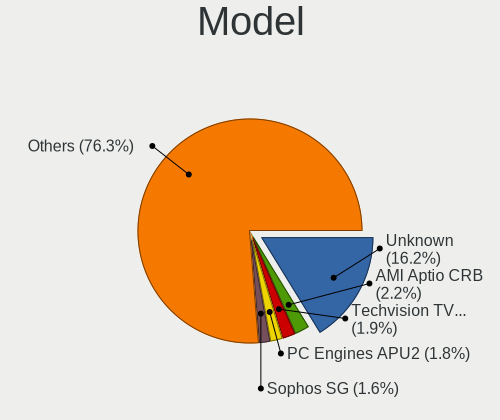
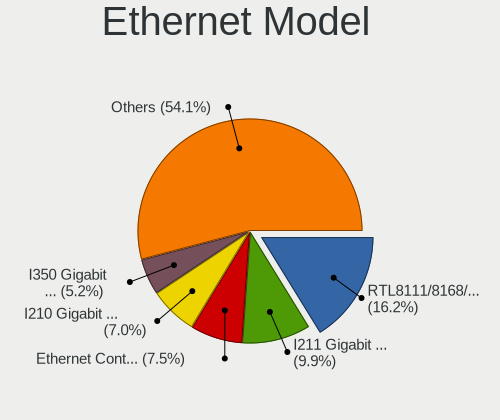

OPNsense - Tested Hardware & Statistics
---------------------------------------

A project to collect tested hardware configurations for OPNsense.

Anyone can contribute to this report by the [hw-probe](https://github.com/linuxhw/hw-probe/blob/master/INSTALL.BSD.md) tool:

    hw-probe -all -upload

Please contribute! Especially if your hardware is rare.

Contents
--------

* [ Test Cases ](#test-cases)

* [ System ](#system)
  - [ OS                       ](#os)
  - [ OS Family                ](#os-family)
  - [ Arch                     ](#arch)
  - [ DE                       ](#de)
  - [ Display Server           ](#display-server)
  - [ Display Manager          ](#display-manager)
  - [ OS Lang                  ](#os-lang)
  - [ Boot Mode                ](#boot-mode)
  - [ Filesystem               ](#filesystem)
  - [ Part. scheme             ](#part-scheme)

* [ Board ](#board)
  - [ Vendor                   ](#vendor)
  - [ Model                    ](#model)
  - [ Model Family             ](#model-family)
  - [ MFG Year                 ](#mfg-year)
  - [ Form Factor              ](#form-factor)
  - [ Coreboot                 ](#coreboot)
  - [ RAM Size                 ](#ram-size)
  - [ RAM Used                 ](#ram-used)
  - [ Total Drives             ](#total-drives)
  - [ Has CD-ROM               ](#has-cd-rom)
  - [ Has Ethernet             ](#has-ethernet)
  - [ Has WiFi                 ](#has-wifi)
  - [ Has Bluetooth            ](#has-bluetooth)

* [ Location ](#location)
  - [ Country                  ](#country)
  - [ City                     ](#city)

* [ Drives ](#drives)
  - [ Drive Vendor             ](#drive-vendor)
  - [ Drive Model              ](#drive-model)
  - [ HDD Vendor               ](#hdd-vendor)
  - [ SSD Vendor               ](#ssd-vendor)
  - [ Drive Kind               ](#drive-kind)
  - [ Drive Connector          ](#drive-connector)
  - [ Drive Size               ](#drive-size)
  - [ Space Total              ](#space-total)
  - [ Space Used               ](#space-used)
  - [ Malfunc. Drives          ](#malfunc-drives)
  - [ Malfunc. Drive Vendor    ](#malfunc-drive-vendor)
  - [ Malfunc. HDD Vendor      ](#malfunc-hdd-vendor)
  - [ Malfunc. Drive Kind      ](#malfunc-drive-kind)
  - [ Failed Drives            ](#failed-drives)
  - [ Failed Drive Vendor      ](#failed-drive-vendor)
  - [ Drive Status             ](#drive-status)

* [ Storage controller ](#storage-controller)
  - [ Storage Vendor           ](#storage-vendor)
  - [ Storage Model            ](#storage-model)
  - [ Storage Kind             ](#storage-kind)

* [ Processor ](#processor)
  - [ CPU Vendor               ](#cpu-vendor)
  - [ CPU Model                ](#cpu-model)
  - [ CPU Model Family         ](#cpu-model-family)
  - [ CPU Cores                ](#cpu-cores)
  - [ CPU Sockets              ](#cpu-sockets)
  - [ CPU Threads              ](#cpu-threads)
  - [ CPU Microarch            ](#cpu-microarch)

* [ Graphics ](#graphics)
  - [ GPU Vendor               ](#gpu-vendor)
  - [ GPU Model                ](#gpu-model)
  - [ GPU Combo                ](#gpu-combo)
  - [ GPU Driver               ](#gpu-driver)
  - [ GPU Memory               ](#gpu-memory)

* [ Monitor ](#monitor)
  - [ Monitor Vendor           ](#monitor-vendor)
  - [ Monitor Model            ](#monitor-model)
  - [ Monitor Resolution       ](#monitor-resolution)
  - [ Monitor Diagonal         ](#monitor-diagonal)
  - [ Monitor Width            ](#monitor-width)
  - [ Aspect Ratio             ](#aspect-ratio)
  - [ Monitor Area             ](#monitor-area)
  - [ Pixel Density            ](#pixel-density)
  - [ Multiple Monitors        ](#multiple-monitors)

* [ Network ](#network)
  - [ Net Controller Vendor    ](#net-controller-vendor)
  - [ Net Controller Model     ](#net-controller-model)
  - [ Wireless Vendor          ](#wireless-vendor)
  - [ Wireless Model           ](#wireless-model)
  - [ Ethernet Vendor          ](#ethernet-vendor)
  - [ Ethernet Model           ](#ethernet-model)
  - [ Net Controller Kind      ](#net-controller-kind)
  - [ Used Controller          ](#used-controller)
  - [ NICs                     ](#nics)
  - [ IPv6                     ](#ipv6)

* [ Bluetooth ](#bluetooth)
  - [ Bluetooth Vendor         ](#bluetooth-vendor)
  - [ Bluetooth Model          ](#bluetooth-model)

* [ Sound ](#sound)
  - [ Sound Vendor             ](#sound-vendor)
  - [ Sound Model              ](#sound-model)

* [ Memory ](#memory)
  - [ Memory Vendor            ](#memory-vendor)
  - [ Memory Model             ](#memory-model)
  - [ Memory Kind              ](#memory-kind)
  - [ Memory Form Factor       ](#memory-form-factor)
  - [ Memory Size              ](#memory-size)
  - [ Memory Speed             ](#memory-speed)

* [ Printers & scanners ](#printers--scanners)
  - [ Printer Vendor           ](#printer-vendor)
  - [ Printer Model            ](#printer-model)
  - [ Scanner Vendor           ](#scanner-vendor)
  - [ Scanner Model            ](#scanner-model)

* [ Camera ](#camera)
  - [ Camera Vendor            ](#camera-vendor)
  - [ Camera Model             ](#camera-model)

* [ Security ](#security)
  - [ Fingerprint Vendor       ](#fingerprint-vendor)
  - [ Fingerprint Model        ](#fingerprint-model)
  - [ Chipcard Vendor          ](#chipcard-vendor)
  - [ Chipcard Model           ](#chipcard-model)

* [ Unsupported ](#unsupported)
  - [ Unsupported Devices      ](#unsupported-devices)
  - [ Unsupported Device Types ](#unsupported-device-types)

Test Cases
----------

Total: 10344

| Vendor        | Model                       | Form-Factor | Probe                                                     | Date         |
|---------------|-----------------------------|-------------|-----------------------------------------------------------|--------------|
| Protectli     | VP2410 10                   | Desktop     | [b4869eafb2](https://bsd-hardware.info/?probe=b4869eafb2) | Aug 12, 2023 |
| Intel         | NUC8i7HVB J68196-602        | Mini pc     | [f0015faf42](https://bsd-hardware.info/?probe=f0015faf42) | Aug 12, 2023 |
| CWWK          | MINIPC-G4                   | Desktop     | [fe5b20a178](https://bsd-hardware.info/?probe=fe5b20a178) | Aug 12, 2023 |
| Unknown       | Unknown                     | Desktop     | [81c0628f53](https://bsd-hardware.info/?probe=81c0628f53) | Aug 12, 2023 |
| Protectli     | FW6 Ver                     | Desktop     | [edc2f0f879](https://bsd-hardware.info/?probe=edc2f0f879) | Aug 12, 2023 |
| ASRockRack    | EPC621D8A                   | Server      | [aa4c98ea7d](https://bsd-hardware.info/?probe=aa4c98ea7d) | Aug 12, 2023 |
| Protectli     | FW4C Ver                    | Desktop     | [519987ec57](https://bsd-hardware.info/?probe=519987ec57) | Aug 12, 2023 |
| MW            | GMLK-2_5G4L                 | Desktop     | [2ee5b48d5c](https://bsd-hardware.info/?probe=2ee5b48d5c) | Aug 12, 2023 |
| Unknown       | Unknown                     | Desktop     | [ae3290dce1](https://bsd-hardware.info/?probe=ae3290dce1) | Aug 11, 2023 |
| HP            | 18E5                        | Desktop     | [61bde93177](https://bsd-hardware.info/?probe=61bde93177) | Aug 11, 2023 |
| Unknown       | Unknown                     | Desktop     | [d8ed693594](https://bsd-hardware.info/?probe=d8ed693594) | Aug 11, 2023 |
| Unknown       | Unknown                     | Desktop     | [e310e0d309](https://bsd-hardware.info/?probe=e310e0d309) | Aug 11, 2023 |
| HP            | 8054                        | Desktop     | [05cae0efcc](https://bsd-hardware.info/?probe=05cae0efcc) | Aug 11, 2023 |
| CncTion       | N5105-4L B0                 | Desktop     | [27f84c75b5](https://bsd-hardware.info/?probe=27f84c75b5) | Aug 11, 2023 |
| Unknown       | Unknown                     | Desktop     | [faece39b99](https://bsd-hardware.info/?probe=faece39b99) | Aug 11, 2023 |
| Dell          | 01Y1CJ A00                  | Mini pc     | [df433ac9a8](https://bsd-hardware.info/?probe=df433ac9a8) | Aug 11, 2023 |
| HP            | 8055                        | Desktop     | [d686196496](https://bsd-hardware.info/?probe=d686196496) | Aug 11, 2023 |
| HP            | 1495                        | Desktop     | [7591160534](https://bsd-hardware.info/?probe=7591160534) | Aug 11, 2023 |
| Shuttle       | FH270                       | Desktop     | [8b697be8be](https://bsd-hardware.info/?probe=8b697be8be) | Aug 11, 2023 |
| MSI           | B560M-A PRO                 | Desktop     | [5d17cbf1da](https://bsd-hardware.info/?probe=5d17cbf1da) | Aug 11, 2023 |
| PC Engines    | apu6                        | Desktop     | [65fda0fe1f](https://bsd-hardware.info/?probe=65fda0fe1f) | Aug 11, 2023 |
| Gigabyte      | G31M-ES2C                   | Desktop     | [6930fe4498](https://bsd-hardware.info/?probe=6930fe4498) | Aug 11, 2023 |
| Dell          | 0NC2VH A01                  | Desktop     | [0fd996a147](https://bsd-hardware.info/?probe=0fd996a147) | Aug 10, 2023 |
| MSI           | B560M-A PRO                 | Desktop     | [fc889ffd79](https://bsd-hardware.info/?probe=fc889ffd79) | Aug 10, 2023 |
| Unknown       | Unknown                     | Desktop     | [fdd28fbae2](https://bsd-hardware.info/?probe=fdd28fbae2) | Aug 10, 2023 |
| HP            | 83EE                        | Desktop     | [9ddbba5a62](https://bsd-hardware.info/?probe=9ddbba5a62) | Aug 10, 2023 |
| Techvision    | TVI7309X B0                 | Desktop     | [c20e0c5c41](https://bsd-hardware.info/?probe=c20e0c5c41) | Aug 10, 2023 |
| Intel         | Q3XXG4-P V1.0               | Desktop     | [f0398bfb85](https://bsd-hardware.info/?probe=f0398bfb85) | Aug 10, 2023 |
| PC Engines    | apu4                        | Desktop     | [b81f51408d](https://bsd-hardware.info/?probe=b81f51408d) | Aug 10, 2023 |
| Protectli     | FW4B Ver                    | Desktop     | [064ee65b5c](https://bsd-hardware.info/?probe=064ee65b5c) | Aug 10, 2023 |
| Techvision    | TVI7309X B0                 | Desktop     | [bc83b25172](https://bsd-hardware.info/?probe=bc83b25172) | Aug 10, 2023 |
| HP            | ProLiant DL380 G7           | Server      | [5b327a0a32](https://bsd-hardware.info/?probe=5b327a0a32) | Aug 10, 2023 |
| Sophos        | SG                          | Firewall    | [ee7cfb0c22](https://bsd-hardware.info/?probe=ee7cfb0c22) | Aug 10, 2023 |
| HP            | ProLiant DL380p Gen8        | Server      | [6a511bf7ca](https://bsd-hardware.info/?probe=6a511bf7ca) | Aug 10, 2023 |
| Lenovo        | SHARKBAY 0B98401 WIN        | Desktop     | [a22e406f7c](https://bsd-hardware.info/?probe=a22e406f7c) | Aug 10, 2023 |
| Gigabyte      | X570 UD                     | Desktop     | [d4b7006d24](https://bsd-hardware.info/?probe=d4b7006d24) | Aug 10, 2023 |
| Unknown       | Unknown                     | Desktop     | [7751768206](https://bsd-hardware.info/?probe=7751768206) | Aug 10, 2023 |
| Supermicro    | X12SDV-4C-SP6F              | Desktop     | [6a275811b8](https://bsd-hardware.info/?probe=6a275811b8) | Aug 10, 2023 |
| Supermicro    | A1SRi 123456789             | Mini pc     | [a66d0c2283](https://bsd-hardware.info/?probe=a66d0c2283) | Aug 10, 2023 |
| Sophos        | SG                          | Firewall    | [5d3b81800b](https://bsd-hardware.info/?probe=5d3b81800b) | Aug 09, 2023 |
| Sophos        | SG                          | Firewall    | [bcb2c49854](https://bsd-hardware.info/?probe=bcb2c49854) | Aug 09, 2023 |
| Techvision    | TVI7309X B0                 | Desktop     | [877307aa80](https://bsd-hardware.info/?probe=877307aa80) | Aug 09, 2023 |
| Sophos        | UTM                         | Firewall    | [e7e8344a31](https://bsd-hardware.info/?probe=e7e8344a31) | Aug 09, 2023 |
| IceWhale T... | ZimaBoard 832 ZMB           | Desktop     | [22edaf5c7d](https://bsd-hardware.info/?probe=22edaf5c7d) | Aug 09, 2023 |
| IceWhale T... | ZimaBoard 832 ZMB           | Desktop     | [48efdb6680](https://bsd-hardware.info/?probe=48efdb6680) | Aug 09, 2023 |
| PC Engines    | APU2                        | Desktop     | [be0e8bf959](https://bsd-hardware.info/?probe=be0e8bf959) | Aug 09, 2023 |
| Dell          | 04Y8V0 A02                  | Desktop     | [c693116826](https://bsd-hardware.info/?probe=c693116826) | Aug 09, 2023 |
| Dell          | 0CNWVK A00                  | Desktop     | [fdb03dc15f](https://bsd-hardware.info/?probe=fdb03dc15f) | Aug 09, 2023 |
| Lenovo        | SHARKBAY 0B98401 WIN        | Desktop     | [0c9251a971](https://bsd-hardware.info/?probe=0c9251a971) | Aug 09, 2023 |
| ASRock        | IMB-195                     | Desktop     | [7b5a73b87e](https://bsd-hardware.info/?probe=7b5a73b87e) | Aug 09, 2023 |
| Intel         | NUC5PPYB H76558-102         | Mini pc     | [ab14c7b62e](https://bsd-hardware.info/?probe=ab14c7b62e) | Aug 09, 2023 |
| Unknown       | Unknown                     | Desktop     | [5398864ed6](https://bsd-hardware.info/?probe=5398864ed6) | Aug 09, 2023 |
| Supermicro    | M11SDV-8C-LN4F              | Server      | [4ad27059c2](https://bsd-hardware.info/?probe=4ad27059c2) | Aug 08, 2023 |
| Premio        | BlueCat XMB3 00C            | Desktop     | [76abf23a1f](https://bsd-hardware.info/?probe=76abf23a1f) | Aug 08, 2023 |
| Fujitsu       | D3313-E1 S26361-D3313-E1    | Desktop     | [fac2fa5cbe](https://bsd-hardware.info/?probe=fac2fa5cbe) | Aug 08, 2023 |
| Supermicro    | X10SLL-F                    | Server      | [8720a76ea8](https://bsd-hardware.info/?probe=8720a76ea8) | Aug 08, 2023 |
| Dell          | 08NPPY A00                  | Desktop     | [c0884d7f16](https://bsd-hardware.info/?probe=c0884d7f16) | Aug 08, 2023 |
| Fujitsu       | D3049-A1 S26361-D3049-A1... | Server      | [322b24ffa1](https://bsd-hardware.info/?probe=322b24ffa1) | Aug 08, 2023 |
| Supermicro    | X10SDV-4C-TLN2F             | Server      | [211a64ef6e](https://bsd-hardware.info/?probe=211a64ef6e) | Aug 08, 2023 |
| HP            | 158A                        | Desktop     | [cc13e81512](https://bsd-hardware.info/?probe=cc13e81512) | Aug 08, 2023 |
| Dell          | 00NH4P A07                  | Server      | [be1b164954](https://bsd-hardware.info/?probe=be1b164954) | Aug 08, 2023 |
| ASUSTek       | K30AD_M31AD_M51AD_M32AD     | Desktop     | [c54bdb8e4b](https://bsd-hardware.info/?probe=c54bdb8e4b) | Aug 08, 2023 |
| Intel         | DENLOW_WS                   | Desktop     | [73a37d9424](https://bsd-hardware.info/?probe=73a37d9424) | Aug 08, 2023 |
| ASUSTek       | PRIME Z590M-PLUS            | Desktop     | [87810aceef](https://bsd-hardware.info/?probe=87810aceef) | Aug 08, 2023 |
| ASUSTek       | P10S-I Series               | Desktop     | [e8e8c9fed2](https://bsd-hardware.info/?probe=e8e8c9fed2) | Aug 07, 2023 |
| Techvision    | TVI7309X B0                 | Desktop     | [fd4046c4d9](https://bsd-hardware.info/?probe=fd4046c4d9) | Aug 07, 2023 |
| PC Engines    | apu4                        | Desktop     | [bb7ad49154](https://bsd-hardware.info/?probe=bb7ad49154) | Aug 07, 2023 |
| Hardkernel    | ODROID-H2                   | Desktop     | [a92e1efca1](https://bsd-hardware.info/?probe=a92e1efca1) | Aug 07, 2023 |
| Unknown       | Unknown                     | Desktop     | [28f0d503fd](https://bsd-hardware.info/?probe=28f0d503fd) | Aug 07, 2023 |
| Unknown       | Unknown                     | Desktop     | [6238337b24](https://bsd-hardware.info/?probe=6238337b24) | Aug 07, 2023 |
| Intel         | Q3XXG4-P V1.0               | Desktop     | [d880905ae7](https://bsd-hardware.info/?probe=d880905ae7) | Aug 07, 2023 |
| AMI           | Aptio CRB                   | Mini pc     | [891072999f](https://bsd-hardware.info/?probe=891072999f) | Aug 07, 2023 |
| Intel         | SHARKBAY                    | Desktop     | [2a8896bb78](https://bsd-hardware.info/?probe=2a8896bb78) | Aug 07, 2023 |
| HP            | 83EE                        | Desktop     | [c33d7d8cb3](https://bsd-hardware.info/?probe=c33d7d8cb3) | Aug 07, 2023 |
| Intel         | Q3XXG4-P V1.0               | Desktop     | [5b58edb60b](https://bsd-hardware.info/?probe=5b58edb60b) | Aug 07, 2023 |
| Techvision    | TVI7309X B0                 | Desktop     | [aeccb6e70c](https://bsd-hardware.info/?probe=aeccb6e70c) | Aug 07, 2023 |
| HPE           | ProLiant MicroServer Gen... | Desktop     | [d06166298c](https://bsd-hardware.info/?probe=d06166298c) | Aug 07, 2023 |
| Unknown       | Unknown                     | Desktop     | [16e7763338](https://bsd-hardware.info/?probe=16e7763338) | Aug 07, 2023 |
| Supermicro    | X9SCL/X9SCMA                | Desktop     | [19e34e504c](https://bsd-hardware.info/?probe=19e34e504c) | Aug 07, 2023 |
| Unknown       | Unknown                     | Desktop     | [75e009424e](https://bsd-hardware.info/?probe=75e009424e) | Aug 07, 2023 |
| PC Engines    | apu4                        | Desktop     | [57e0cc469e](https://bsd-hardware.info/?probe=57e0cc469e) | Aug 07, 2023 |
| Protectli     | FW6 Ver                     | Desktop     | [c05ddd6998](https://bsd-hardware.info/?probe=c05ddd6998) | Aug 07, 2023 |
| Protectli     | FW6 Ver                     | Desktop     | [4836027efd](https://bsd-hardware.info/?probe=4836027efd) | Aug 07, 2023 |
| Lenovo        | SHARKBAY 0B98401 WIN        | Desktop     | [ec37cc1ba1](https://bsd-hardware.info/?probe=ec37cc1ba1) | Aug 07, 2023 |
| Dell          | 01G5C3 A02                  | Server      | [da26fc11fd](https://bsd-hardware.info/?probe=da26fc11fd) | Aug 07, 2023 |
| AMI           | PB_1900A                    | Desktop     | [791f6e0cb4](https://bsd-hardware.info/?probe=791f6e0cb4) | Aug 07, 2023 |
| Lenovo        | 312D SDK0J40697 WIN 3305... | Mini pc     | [21c932d1ca](https://bsd-hardware.info/?probe=21c932d1ca) | Aug 06, 2023 |
| ZOTAC         | Unknown                     | Desktop     | [415f49b491](https://bsd-hardware.info/?probe=415f49b491) | Aug 06, 2023 |
| Fujitsu       | D3313-G1 S26361-D3313-G1    | Desktop     | [d2ba7bbf34](https://bsd-hardware.info/?probe=d2ba7bbf34) | Aug 06, 2023 |
| Dell          | 0KWVT8 A03                  | Desktop     | [d203b32a8f](https://bsd-hardware.info/?probe=d203b32a8f) | Aug 06, 2023 |
| Supermicro    | X12SDV-4C-SP6F              | Desktop     | [5a87146725](https://bsd-hardware.info/?probe=5a87146725) | Aug 06, 2023 |
| Acer          | Aspire XC-115               | Desktop     | [7a94fde347](https://bsd-hardware.info/?probe=7a94fde347) | Aug 06, 2023 |
| Lenovo        | 313C SDK0J40697 WIN 3305... | Desktop     | [f65647a6be](https://bsd-hardware.info/?probe=f65647a6be) | Aug 06, 2023 |
| Lenovo        | 3743 SDK0T76461 WIN 3422... | Desktop     | [d5675b5940](https://bsd-hardware.info/?probe=d5675b5940) | Aug 06, 2023 |
| YANYU         | R250                        | Desktop     | [95a37ee143](https://bsd-hardware.info/?probe=95a37ee143) | Aug 06, 2023 |
| Supermicro    | X11SDV-8C-TP8F              | Desktop     | [0b5f437319](https://bsd-hardware.info/?probe=0b5f437319) | Aug 06, 2023 |
| Sophos        | XG                          | Firewall    | [a452891edc](https://bsd-hardware.info/?probe=a452891edc) | Aug 06, 2023 |
| Lanner        | FW-7543 B-GA                | Desktop     | [dadf592128](https://bsd-hardware.info/?probe=dadf592128) | Aug 06, 2023 |
| Dell          | 0KP561                      | Desktop     | [bff2760640](https://bsd-hardware.info/?probe=bff2760640) | Aug 06, 2023 |
| Fujitsu       | D3313-G1 S26361-D3313-G1    | Desktop     | [eceed9eb7a](https://bsd-hardware.info/?probe=eceed9eb7a) | Aug 05, 2023 |
| Acer          | Aspire TC-330               | Desktop     | [4d3de96309](https://bsd-hardware.info/?probe=4d3de96309) | Aug 05, 2023 |
| ZOTAC         | ZBOX-CI622/CI642/CI662NA... | Mini pc     | [68c43f27b1](https://bsd-hardware.info/?probe=68c43f27b1) | Aug 05, 2023 |
| Lenovo        | SDK0E50510 WIN              | Desktop     | [eee3c082b5](https://bsd-hardware.info/?probe=eee3c082b5) | Aug 05, 2023 |
| Dell          | 0782GW A00                  | Desktop     | [5288857ae9](https://bsd-hardware.info/?probe=5288857ae9) | Aug 05, 2023 |
| Hardkernel    | ODROID-H3                   | Desktop     | [3874b96551](https://bsd-hardware.info/?probe=3874b96551) | Aug 05, 2023 |
| Techvision    | TVI7309X B0                 | Desktop     | [86d5e86520](https://bsd-hardware.info/?probe=86d5e86520) | Aug 05, 2023 |
| HP            | 843F                        | Desktop     | [d192efba82](https://bsd-hardware.info/?probe=d192efba82) | Aug 05, 2023 |
| Unknown       | Unknown                     | Desktop     | [9c4dbcfd67](https://bsd-hardware.info/?probe=9c4dbcfd67) | Aug 05, 2023 |
| Lanner        | FW-7543 B-GA                | Desktop     | [6236e692de](https://bsd-hardware.info/?probe=6236e692de) | Aug 05, 2023 |
| Dell          | 07WP95 A02                  | Desktop     | [4213eff742](https://bsd-hardware.info/?probe=4213eff742) | Aug 05, 2023 |
| Fujitsu       | D3313-G1 S26361-D3313-G1    | Desktop     | [283fce4c68](https://bsd-hardware.info/?probe=283fce4c68) | Aug 05, 2023 |
| Unknown       | Unknown                     | Desktop     | [0f6e0d9566](https://bsd-hardware.info/?probe=0f6e0d9566) | Aug 05, 2023 |
| Protectli     | FW4B Ver                    | Desktop     | [8446d61b81](https://bsd-hardware.info/?probe=8446d61b81) | Aug 04, 2023 |
| Intel         | SKYBAY                      | Desktop     | [fde75b4094](https://bsd-hardware.info/?probe=fde75b4094) | Aug 04, 2023 |
| HPE           | ProLiant DL20 Gen10 Plus    | Server      | [7817db3082](https://bsd-hardware.info/?probe=7817db3082) | Aug 04, 2023 |
| CWWK          | MINIPC-G12                  | Desktop     | [c449203453](https://bsd-hardware.info/?probe=c449203453) | Aug 04, 2023 |
| AMI           | Aptio CRB                   | Mini pc     | [ea7a6fba73](https://bsd-hardware.info/?probe=ea7a6fba73) | Aug 04, 2023 |
| Dell          | 0NC2VH A01                  | Desktop     | [36d63888b2](https://bsd-hardware.info/?probe=36d63888b2) | Aug 04, 2023 |
| Dell          | 0NC2VH A01                  | Desktop     | [bee8eb05f2](https://bsd-hardware.info/?probe=bee8eb05f2) | Aug 04, 2023 |
| HP            | ProLiant DL380 G7           | Server      | [5ae4888d17](https://bsd-hardware.info/?probe=5ae4888d17) | Aug 04, 2023 |
| Unknown       | YL-SKUL6                    | Desktop     | [cdd90dd470](https://bsd-hardware.info/?probe=cdd90dd470) | Aug 04, 2023 |
| Lenovo        | SHARKBAY NO DPK             | Desktop     | [62ed2f59f6](https://bsd-hardware.info/?probe=62ed2f59f6) | Aug 04, 2023 |
| Lenovo        | SHARKBAY SDK0E50510 WIN     | Desktop     | [2de0d4d2fa](https://bsd-hardware.info/?probe=2de0d4d2fa) | Aug 04, 2023 |
| Intel         | S2600GZ G29051-355          | Server      | [33697196aa](https://bsd-hardware.info/?probe=33697196aa) | Aug 04, 2023 |
| CompuLab      | fitlet2                     | Mini pc     | [1c593bf547](https://bsd-hardware.info/?probe=1c593bf547) | Aug 04, 2023 |
| HP            | 83F3                        | Desktop     | [6130788afe](https://bsd-hardware.info/?probe=6130788afe) | Aug 04, 2023 |
| Supermicro    | A2SDi-4C-HLN4F              | Server      | [b6aafbefd3](https://bsd-hardware.info/?probe=b6aafbefd3) | Aug 04, 2023 |
| Protectli     | VP4650                      | Desktop     | [94d2d08a9d](https://bsd-hardware.info/?probe=94d2d08a9d) | Aug 04, 2023 |
| ASRock        | 4X4-4000 Series             | Desktop     | [da7d5e31aa](https://bsd-hardware.info/?probe=da7d5e31aa) | Aug 03, 2023 |
| Dell          | 0T7D40 A00                  | Desktop     | [e903094a75](https://bsd-hardware.info/?probe=e903094a75) | Aug 03, 2023 |
| Supermicro    | X10SLL-F                    | Server      | [cbc7fc88d0](https://bsd-hardware.info/?probe=cbc7fc88d0) | Aug 03, 2023 |
| PC Engines    | APU2                        | Desktop     | [78c8ed6a89](https://bsd-hardware.info/?probe=78c8ed6a89) | Aug 03, 2023 |
| Gigabyte      | X570 UD                     | Desktop     | [2bef587ef1](https://bsd-hardware.info/?probe=2bef587ef1) | Aug 03, 2023 |
| Dell          | 0G7MDY A12                  | Server      | [3caa904aa3](https://bsd-hardware.info/?probe=3caa904aa3) | Aug 03, 2023 |
| Dell          | 0G7MDY A12                  | Server      | [4dfb2ccae6](https://bsd-hardware.info/?probe=4dfb2ccae6) | Aug 03, 2023 |
| Unknown       | Unknown                     | Desktop     | [803f6b50b3](https://bsd-hardware.info/?probe=803f6b50b3) | Aug 03, 2023 |
| Unknown       | Unknown                     | Desktop     | [91dd6813a1](https://bsd-hardware.info/?probe=91dd6813a1) | Aug 03, 2023 |
| Intel         | NUC5PPYB H76558-102         | Mini pc     | [5cab750b7b](https://bsd-hardware.info/?probe=5cab750b7b) | Aug 03, 2023 |
| Dell          | 045M96 A02                  | Server      | [17cf8cd2f0](https://bsd-hardware.info/?probe=17cf8cd2f0) | Aug 03, 2023 |
| ASRock        | 4X4-4000 Series             | Desktop     | [d896138d30](https://bsd-hardware.info/?probe=d896138d30) | Aug 03, 2023 |
| HP            | 1495                        | Desktop     | [551688d163](https://bsd-hardware.info/?probe=551688d163) | Aug 03, 2023 |
| HP            | 82B4                        | Desktop     | [8c6b861a4d](https://bsd-hardware.info/?probe=8c6b861a4d) | Aug 03, 2023 |
| HP            | 339A                        | Desktop     | [b69db7c6e0](https://bsd-hardware.info/?probe=b69db7c6e0) | Aug 03, 2023 |
| Shuttle       | FH270                       | Desktop     | [92c45a20de](https://bsd-hardware.info/?probe=92c45a20de) | Aug 02, 2023 |
| AMI           | Aptio CRB                   | Mini pc     | [e0a72a6c82](https://bsd-hardware.info/?probe=e0a72a6c82) | Aug 02, 2023 |
| CncTion       | N5105-4L B0                 | Desktop     | [5310b151f0](https://bsd-hardware.info/?probe=5310b151f0) | Aug 02, 2023 |
| Unknown       | Unknown                     | Desktop     | [a9a3896275](https://bsd-hardware.info/?probe=a9a3896275) | Aug 02, 2023 |
| ASUSTek       | PRIME A320M-K               | Desktop     | [fa81dc0cd3](https://bsd-hardware.info/?probe=fa81dc0cd3) | Aug 02, 2023 |
| Dell          | 08NPPY A00                  | Desktop     | [249d4620d2](https://bsd-hardware.info/?probe=249d4620d2) | Aug 02, 2023 |
| Supermicro    | X12STL-IF                   | Server      | [e588cd796e](https://bsd-hardware.info/?probe=e588cd796e) | Aug 02, 2023 |
| ASUSTek       | PRIME H510M-A WIFI          | Desktop     | [9b09a89cc8](https://bsd-hardware.info/?probe=9b09a89cc8) | Aug 02, 2023 |
| Supermicro    | A2SDi-4C-HLN4F              | Server      | [b3fd8251db](https://bsd-hardware.info/?probe=b3fd8251db) | Aug 02, 2023 |
| Unknown       | Unknown                     | Desktop     | [e9977bfffe](https://bsd-hardware.info/?probe=e9977bfffe) | Aug 02, 2023 |
| ASRock        | B660-ITX                    | Desktop     | [c218c3c4d4](https://bsd-hardware.info/?probe=c218c3c4d4) | Aug 02, 2023 |
| Unknown       | Unknown                     | Desktop     | [b9f6337c0d](https://bsd-hardware.info/?probe=b9f6337c0d) | Aug 02, 2023 |
| Protectli     | VP2410 10                   | Desktop     | [3d653ab54c](https://bsd-hardware.info/?probe=3d653ab54c) | Aug 02, 2023 |
| Dell          | 0DRG19 A00                  | Mini pc     | [3962253bda](https://bsd-hardware.info/?probe=3962253bda) | Aug 02, 2023 |
| Dell          | 0WR7PY A01                  | Desktop     | [54388809cd](https://bsd-hardware.info/?probe=54388809cd) | Aug 02, 2023 |
| Shuttle       | DH610                       | Desktop     | [bbdd78fe4b](https://bsd-hardware.info/?probe=bbdd78fe4b) | Aug 01, 2023 |
| Unknown       | Unknown                     | Desktop     | [42c65b8b8b](https://bsd-hardware.info/?probe=42c65b8b8b) | Aug 01, 2023 |
| ASRock        | J3355B-ITX                  | Desktop     | [234f0fd8aa](https://bsd-hardware.info/?probe=234f0fd8aa) | Aug 01, 2023 |
| Intel BOX4... | Geminilake                  | Desktop     | [b833ada775](https://bsd-hardware.info/?probe=b833ada775) | Aug 01, 2023 |
| Unknown       | Unknown                     | Notebook    | [09d17597cf](https://bsd-hardware.info/?probe=09d17597cf) | Aug 01, 2023 |
| Unknown       | 1.1                         | Desktop     | [745c09c8e7](https://bsd-hardware.info/?probe=745c09c8e7) | Aug 01, 2023 |
| HP            | 3031h                       | Desktop     | [19157ba305](https://bsd-hardware.info/?probe=19157ba305) | Aug 01, 2023 |
| MW            | GMLK-2_5G4L                 | Desktop     | [155f885c95](https://bsd-hardware.info/?probe=155f885c95) | Aug 01, 2023 |
| Unknown       | Unknown                     | Notebook    | [2a2e7a98e3](https://bsd-hardware.info/?probe=2a2e7a98e3) | Aug 01, 2023 |
| Deciso        | NetBoard-A10                | Notebook    | [65667b2f29](https://bsd-hardware.info/?probe=65667b2f29) | Aug 01, 2023 |
| Hardkernel    | ODROID-H3                   | Desktop     | [aa708122cf](https://bsd-hardware.info/?probe=aa708122cf) | Aug 01, 2023 |
| Intel         | NUC11TNBi3 M11908-404       | Mini pc     | [54ab213a82](https://bsd-hardware.info/?probe=54ab213a82) | Aug 01, 2023 |
| Supermicro    | X7SPA-H                     | Desktop     | [de44613a90](https://bsd-hardware.info/?probe=de44613a90) | Aug 01, 2023 |
| Intel         | NUC5PPYB H76558-102         | Mini pc     | [d29e99dd04](https://bsd-hardware.info/?probe=d29e99dd04) | Aug 01, 2023 |
| Shuttle       | DH610                       | Desktop     | [e7c63c97d3](https://bsd-hardware.info/?probe=e7c63c97d3) | Aug 01, 2023 |
| Fujitsu       | D3433-S2 S26361-D3433-S2    | Desktop     | [bdb1c85615](https://bsd-hardware.info/?probe=bdb1c85615) | Aug 01, 2023 |
| CWWK          | CW-AD4L-N V1                | Desktop     | [9cf0b7fe7c](https://bsd-hardware.info/?probe=9cf0b7fe7c) | Aug 01, 2023 |
| Lenovo        | 312D SDK0J40697 WIN 3305... | Mini pc     | [1421e45cea](https://bsd-hardware.info/?probe=1421e45cea) | Aug 01, 2023 |
| AZW           | EQ                          | Desktop     | [24d56ab18f](https://bsd-hardware.info/?probe=24d56ab18f) | Aug 01, 2023 |
| Protectli     | VP2420                      | Desktop     | [2ec2033d58](https://bsd-hardware.info/?probe=2ec2033d58) | Aug 01, 2023 |
| Unknown       | Unknown                     | Desktop     | [080c931545](https://bsd-hardware.info/?probe=080c931545) | Jul 31, 2023 |
| Intel         | H61                         | Desktop     | [392e85e173](https://bsd-hardware.info/?probe=392e85e173) | Jul 31, 2023 |
| Unknown       | Unknown                     | Desktop     | [8b7315305c](https://bsd-hardware.info/?probe=8b7315305c) | Jul 31, 2023 |
| ASRockRack    | X470D4U                     | Desktop     | [f26504cb5b](https://bsd-hardware.info/?probe=f26504cb5b) | Jul 31, 2023 |
| ASUSTek       | K30AD_M31AD_M51AD_M32AD     | Desktop     | [c045012233](https://bsd-hardware.info/?probe=c045012233) | Jul 31, 2023 |
| PC Engines    | apu4                        | Desktop     | [dbd2fc21bc](https://bsd-hardware.info/?probe=dbd2fc21bc) | Jul 31, 2023 |
| Shuttle       | DH370                       | Desktop     | [a3ab1c6344](https://bsd-hardware.info/?probe=a3ab1c6344) | Jul 31, 2023 |
| Sophos        | XG                          | Firewall    | [629bf7a092](https://bsd-hardware.info/?probe=629bf7a092) | Jul 31, 2023 |
| CWWK          | MINIPC-G4                   | Desktop     | [8b928e3623](https://bsd-hardware.info/?probe=8b928e3623) | Jul 31, 2023 |
| Supermicro    | X7SLA                       | Desktop     | [c9a39071d0](https://bsd-hardware.info/?probe=c9a39071d0) | Jul 31, 2023 |
| Deciso        | NetBoard-A20                | Notebook    | [9bd5d8fd54](https://bsd-hardware.info/?probe=9bd5d8fd54) | Jul 31, 2023 |
| Dell          | 0PPTY2 A04                  | Server      | [9f70373453](https://bsd-hardware.info/?probe=9f70373453) | Jul 31, 2023 |
| Deciso        | NetBoard-A10                | Notebook    | [42fcdacbf7](https://bsd-hardware.info/?probe=42fcdacbf7) | Jul 31, 2023 |
| HP            | 18E9                        | Desktop     | [04c971a0de](https://bsd-hardware.info/?probe=04c971a0de) | Jul 31, 2023 |
| Protectli     | FW6                         | Desktop     | [aa7b970016](https://bsd-hardware.info/?probe=aa7b970016) | Jul 31, 2023 |
| HP            | 8617                        | Desktop     | [7592f46fef](https://bsd-hardware.info/?probe=7592f46fef) | Jul 30, 2023 |
| Protectli     | FW1 Ver                     | Desktop     | [1d6213fd35](https://bsd-hardware.info/?probe=1d6213fd35) | Jul 30, 2023 |
| ChangWang     | CW56-58                     | Desktop     | [f418f5407c](https://bsd-hardware.info/?probe=f418f5407c) | Jul 30, 2023 |
| Gigabyte      | B550M DS3H AC               | Desktop     | [01959d5703](https://bsd-hardware.info/?probe=01959d5703) | Jul 30, 2023 |
| Techvision    | TVI7309X B0                 | Desktop     | [6bd995374a](https://bsd-hardware.info/?probe=6bd995374a) | Jul 30, 2023 |
| ASUSTek       | P8H61-M LE R2.0             | Desktop     | [dc86bf45ba](https://bsd-hardware.info/?probe=dc86bf45ba) | Jul 30, 2023 |
| Sophos        | XG                          | Firewall    | [a6fc41a58b](https://bsd-hardware.info/?probe=a6fc41a58b) | Jul 30, 2023 |
| Supermicro    | X10SDV-4C-TLN2F             | Server      | [72abf8e420](https://bsd-hardware.info/?probe=72abf8e420) | Jul 30, 2023 |
| Premio        | BlueCat XMB3 00C            | Desktop     | [c453573c71](https://bsd-hardware.info/?probe=c453573c71) | Jul 30, 2023 |
| Dell          | 05XGC8 A01                  | Desktop     | [38310a9c5e](https://bsd-hardware.info/?probe=38310a9c5e) | Jul 30, 2023 |
| ASRock        | J5040-ITX                   | Desktop     | [2fb0a9d679](https://bsd-hardware.info/?probe=2fb0a9d679) | Jul 30, 2023 |
| HP            | 213D A01                    | Desktop     | [802a71b9f6](https://bsd-hardware.info/?probe=802a71b9f6) | Jul 29, 2023 |
| Sophos        | SG                          | Firewall    | [07e908538b](https://bsd-hardware.info/?probe=07e908538b) | Jul 29, 2023 |
| ASRockRack    | X470D4U                     | Desktop     | [fc2a96cc75](https://bsd-hardware.info/?probe=fc2a96cc75) | Jul 29, 2023 |
| AMI           | Aptio CRB                   | Mini pc     | [71b3719bfe](https://bsd-hardware.info/?probe=71b3719bfe) | Jul 29, 2023 |
| Cisco Syst... | ENCS5412/K9 M3              | Server      | [4a34cf5294](https://bsd-hardware.info/?probe=4a34cf5294) | Jul 29, 2023 |
| Lenovo        | 312D SDK0J40697 WIN 3305... | Mini pc     | [a1380ccfe1](https://bsd-hardware.info/?probe=a1380ccfe1) | Jul 29, 2023 |
| ZOTAC         | ZBOX-CI323NANO              | Mini pc     | [76ce6888f7](https://bsd-hardware.info/?probe=76ce6888f7) | Jul 29, 2023 |
| AZW           | EQ                          | Desktop     | [a581a63aae](https://bsd-hardware.info/?probe=a581a63aae) | Jul 29, 2023 |
| GoWin Solu... | R86S                        | Desktop     | [51bb255924](https://bsd-hardware.info/?probe=51bb255924) | Jul 29, 2023 |
| Techvision    | TVI7309X B0                 | Desktop     | [e06b70a370](https://bsd-hardware.info/?probe=e06b70a370) | Jul 29, 2023 |
| Dell          | 0HD5W2 A00                  | Desktop     | [ce83168854](https://bsd-hardware.info/?probe=ce83168854) | Jul 29, 2023 |
| AZW           | EQ                          | Desktop     | [1feeda5ce9](https://bsd-hardware.info/?probe=1feeda5ce9) | Jul 29, 2023 |
| Hardkernel    | ODROID-H2                   | Desktop     | [42a2958c35](https://bsd-hardware.info/?probe=42a2958c35) | Jul 29, 2023 |
| HP            | 2AF7                        | Desktop     | [fc495dc6c7](https://bsd-hardware.info/?probe=fc495dc6c7) | Jul 29, 2023 |
| Cisco Syst... | ENCS5412/K9 M3              | Server      | [2be0baa769](https://bsd-hardware.info/?probe=2be0baa769) | Jul 29, 2023 |
| AWOW          | AK34Pro                     | Mini pc     | [7c8e0ac36d](https://bsd-hardware.info/?probe=7c8e0ac36d) | Jul 29, 2023 |
| PC Engines    | APU2                        | Desktop     | [5eddd5369a](https://bsd-hardware.info/?probe=5eddd5369a) | Jul 28, 2023 |
| Gigabyte      | B550M DS3H AC               | Desktop     | [20b6e3f827](https://bsd-hardware.info/?probe=20b6e3f827) | Jul 28, 2023 |
| Unknown       | Unknown                     | Desktop     | [18d7e21d10](https://bsd-hardware.info/?probe=18d7e21d10) | Jul 28, 2023 |
| Intel         | DQ965GF AAD41676-305        | Desktop     | [5f86754385](https://bsd-hardware.info/?probe=5f86754385) | Jul 28, 2023 |
| Dell          | 0GDG8Y A02                  | Desktop     | [651f6bf18f](https://bsd-hardware.info/?probe=651f6bf18f) | Jul 28, 2023 |
| Dell          | 05XGC8 A01                  | Desktop     | [06e6afb4f1](https://bsd-hardware.info/?probe=06e6afb4f1) | Jul 28, 2023 |
| Dell          | 0HD5W2 A01                  | Desktop     | [e26ef35879](https://bsd-hardware.info/?probe=e26ef35879) | Jul 28, 2023 |
| Hardkernel    | ODROID-H3                   | Desktop     | [0bb6b16689](https://bsd-hardware.info/?probe=0bb6b16689) | Jul 28, 2023 |
| HP            | 18E4                        | Desktop     | [6a0ce7d626](https://bsd-hardware.info/?probe=6a0ce7d626) | Jul 28, 2023 |
| Protectli     | FW4B Ver                    | Desktop     | [449a3e6015](https://bsd-hardware.info/?probe=449a3e6015) | Jul 28, 2023 |
| Unknown       | Unknown                     | Desktop     | [1c6ab6b999](https://bsd-hardware.info/?probe=1c6ab6b999) | Jul 28, 2023 |
| Sophos        | UTM                         | Firewall    | [c33c212896](https://bsd-hardware.info/?probe=c33c212896) | Jul 28, 2023 |
| Dell          | 03X6X0 A03                  | Server      | [74ef7a9db3](https://bsd-hardware.info/?probe=74ef7a9db3) | Jul 28, 2023 |
| Techvision    | TVI7309X B0                 | Desktop     | [088f599199](https://bsd-hardware.info/?probe=088f599199) | Jul 28, 2023 |
| Dell          | 0NC2VH A01                  | Desktop     | [1595ce505c](https://bsd-hardware.info/?probe=1595ce505c) | Jul 28, 2023 |
| MW            | GMLK-2_5G4L                 | Desktop     | [c9ecdb6ecc](https://bsd-hardware.info/?probe=c9ecdb6ecc) | Jul 28, 2023 |
| Unknown       | Unknown                     | Desktop     | [836d435712](https://bsd-hardware.info/?probe=836d435712) | Jul 28, 2023 |
| Unknown       | Unknown                     | Desktop     | [6d6a8cb863](https://bsd-hardware.info/?probe=6d6a8cb863) | Jul 28, 2023 |
| PC Engines    | apu1                        | Desktop     | [8bc97daada](https://bsd-hardware.info/?probe=8bc97daada) | Jul 27, 2023 |
| Yanling       | YL-GML4 V1                  | Desktop     | [1cd38d4e93](https://bsd-hardware.info/?probe=1cd38d4e93) | Jul 27, 2023 |
| Dell          | 0KWVT8 A03                  | Desktop     | [fccf22f7a7](https://bsd-hardware.info/?probe=fccf22f7a7) | Jul 27, 2023 |
| Gigabyte      | B150N Phoenix-WIFI-CF       | Desktop     | [64b577cd8e](https://bsd-hardware.info/?probe=64b577cd8e) | Jul 27, 2023 |
| Unknown       | Unknown                     | Desktop     | [9d078811ba](https://bsd-hardware.info/?probe=9d078811ba) | Jul 27, 2023 |
| Unknown       | Unknown                     | Desktop     | [dbb7d95d59](https://bsd-hardware.info/?probe=dbb7d95d59) | Jul 27, 2023 |
| Unknown       | Unknown                     | Desktop     | [7841057467](https://bsd-hardware.info/?probe=7841057467) | Jul 27, 2023 |
| NF541         | 1.0                         | Desktop     | [ba959613a5](https://bsd-hardware.info/?probe=ba959613a5) | Jul 26, 2023 |
| Protectli     | VP2420                      | Desktop     | [87d17e77a8](https://bsd-hardware.info/?probe=87d17e77a8) | Jul 26, 2023 |
| Iwill Norg... | ecolan N12B - i210AT Rev... | Desktop     | [8ebe2f82f1](https://bsd-hardware.info/?probe=8ebe2f82f1) | Jul 26, 2023 |
| IceWhale T... | ZimaBoard 832 ZMB           | Desktop     | [aeb59c510b](https://bsd-hardware.info/?probe=aeb59c510b) | Jul 26, 2023 |
| Cisco         | ASA5525 A0                  | Desktop     | [f4409bdc8f](https://bsd-hardware.info/?probe=f4409bdc8f) | Jul 26, 2023 |
| CONTEC        | G1/EMB-CV1/iD2550           | Desktop     | [34f5c817fb](https://bsd-hardware.info/?probe=34f5c817fb) | Jul 26, 2023 |
| HP            | 17E2                        | Mini pc     | [61d1f4cd45](https://bsd-hardware.info/?probe=61d1f4cd45) | Jul 25, 2023 |
| HP            | 83EE                        | Desktop     | [fbf42f903b](https://bsd-hardware.info/?probe=fbf42f903b) | Jul 25, 2023 |
| Dell          | 0NC2VH A01                  | Desktop     | [103e75cb64](https://bsd-hardware.info/?probe=103e75cb64) | Jul 25, 2023 |
| Unknown       | Unknown                     | Desktop     | [468f7385c9](https://bsd-hardware.info/?probe=468f7385c9) | Jul 25, 2023 |
| CompuLab      | fitlet2                     | Mini pc     | [868671cb71](https://bsd-hardware.info/?probe=868671cb71) | Jul 25, 2023 |
| Sophos        | XG                          | Firewall    | [cbabf95078](https://bsd-hardware.info/?probe=cbabf95078) | Jul 25, 2023 |
| AZW           | Green G5                    | Desktop     | [97f934a02c](https://bsd-hardware.info/?probe=97f934a02c) | Jul 25, 2023 |
| Supermicro    | X10SDV-TP8F                 | Server      | [d9c7f4173a](https://bsd-hardware.info/?probe=d9c7f4173a) | Jul 25, 2023 |
| HP            | ProLiant DL360 Gen9         | Server      | [b536435f52](https://bsd-hardware.info/?probe=b536435f52) | Jul 25, 2023 |
| Sophos        | XG                          | Firewall    | [bcf0e85fdc](https://bsd-hardware.info/?probe=bcf0e85fdc) | Jul 25, 2023 |
| Unknown       | Unknown                     | Desktop     | [ebca9e6d70](https://bsd-hardware.info/?probe=ebca9e6d70) | Jul 25, 2023 |
| Unknown       | Unknown                     | Desktop     | [64c9b0f743](https://bsd-hardware.info/?probe=64c9b0f743) | Jul 25, 2023 |
| Unknown       | Unknown                     | Desktop     | [a483d8d32f](https://bsd-hardware.info/?probe=a483d8d32f) | Jul 25, 2023 |
| Unknown       | Unknown                     | Desktop     | [f7728cee03](https://bsd-hardware.info/?probe=f7728cee03) | Jul 25, 2023 |
| Deciso        | Netboard A20                | Notebook    | [9030d92418](https://bsd-hardware.info/?probe=9030d92418) | Jul 25, 2023 |
| Unknown       | MANIFOLD 2-C                | Desktop     | [8aa3f5491e](https://bsd-hardware.info/?probe=8aa3f5491e) | Jul 25, 2023 |
| Dell          | 0WMJ54 A01                  | Desktop     | [e11855c762](https://bsd-hardware.info/?probe=e11855c762) | Jul 24, 2023 |
| Fujitsu       | D3313-G1 S26361-D3313-G1    | Desktop     | [af215ad226](https://bsd-hardware.info/?probe=af215ad226) | Jul 24, 2023 |
| Lenovo        | SHARKBAY 0B98401 WIN        | Desktop     | [1cd9d4cb7f](https://bsd-hardware.info/?probe=1cd9d4cb7f) | Jul 24, 2023 |
| PC Engines    | apu4                        | Desktop     | [0aa9951131](https://bsd-hardware.info/?probe=0aa9951131) | Jul 24, 2023 |
| PC Engines    | apu4                        | Desktop     | [514dc1e9f9](https://bsd-hardware.info/?probe=514dc1e9f9) | Jul 24, 2023 |
| Dell          | 0TD1J8 A00                  | Desktop     | [c99bc29ce0](https://bsd-hardware.info/?probe=c99bc29ce0) | Jul 24, 2023 |
| Seeed Stud... | ODYSSEY-TGL-A               | Desktop     | [11ee31d0b3](https://bsd-hardware.info/?probe=11ee31d0b3) | Jul 24, 2023 |
| Protectli     | VP2420                      | Desktop     | [58aac88cc5](https://bsd-hardware.info/?probe=58aac88cc5) | Jul 24, 2023 |
| Fujitsu       | D3313-A1 S26361-D3313-A1    | Desktop     | [dec2c34899](https://bsd-hardware.info/?probe=dec2c34899) | Jul 24, 2023 |
| HP            | 1495                        | Desktop     | [3ddc49b877](https://bsd-hardware.info/?probe=3ddc49b877) | Jul 24, 2023 |
| Unknown       | Unknown                     | Desktop     | [aab49bd228](https://bsd-hardware.info/?probe=aab49bd228) | Jul 24, 2023 |
| Sophos        | XGS                         | Firewall    | [77766c0688](https://bsd-hardware.info/?probe=77766c0688) | Jul 24, 2023 |
| Unknown       | Unknown                     | Desktop     | [3ca61a6a18](https://bsd-hardware.info/?probe=3ca61a6a18) | Jul 24, 2023 |
| Intel         | SKYBAY                      | Desktop     | [0c64b8a9be](https://bsd-hardware.info/?probe=0c64b8a9be) | Jul 24, 2023 |
| ASRock        | J4205-ITX                   | Desktop     | [90fc3f8e29](https://bsd-hardware.info/?probe=90fc3f8e29) | Jul 23, 2023 |
| Unknown       | Unknown                     | Desktop     | [bbae253aa2](https://bsd-hardware.info/?probe=bbae253aa2) | Jul 23, 2023 |
| HP            | 1495                        | Desktop     | [9de7021e50](https://bsd-hardware.info/?probe=9de7021e50) | Jul 23, 2023 |
| AZW           | U59                         | Desktop     | [1862cfda96](https://bsd-hardware.info/?probe=1862cfda96) | Jul 23, 2023 |
| Fujitsu       | D3313-E1 S26361-D3313-E1    | Desktop     | [8f918471aa](https://bsd-hardware.info/?probe=8f918471aa) | Jul 23, 2023 |
| AZW           | EQ                          | Desktop     | [7d2884120c](https://bsd-hardware.info/?probe=7d2884120c) | Jul 23, 2023 |
| Dell          | 0M877N A00                  | Server      | [905f826196](https://bsd-hardware.info/?probe=905f826196) | Jul 23, 2023 |
| Protectli     | VP2420                      | Desktop     | [7f388b0128](https://bsd-hardware.info/?probe=7f388b0128) | Jul 23, 2023 |
| ASUSTek       | TUF Gaming B650M-PLUS       | Desktop     | [438424a9d9](https://bsd-hardware.info/?probe=438424a9d9) | Jul 23, 2023 |
| AMI           | Aptio CRB                   | Mini pc     | [9b7d3469cf](https://bsd-hardware.info/?probe=9b7d3469cf) | Jul 23, 2023 |
| PC Engines    | apu4                        | Desktop     | [ea9a81b423](https://bsd-hardware.info/?probe=ea9a81b423) | Jul 23, 2023 |
| Dell          | 0C96W1 A03                  | Desktop     | [d343f3aff6](https://bsd-hardware.info/?probe=d343f3aff6) | Jul 23, 2023 |
| Premio        | BlueCat XMB3 00C            | Desktop     | [974c8673b7](https://bsd-hardware.info/?probe=974c8673b7) | Jul 23, 2023 |
| ASRock        | H570M-ITX/ac                | Desktop     | [8ac2939575](https://bsd-hardware.info/?probe=8ac2939575) | Jul 23, 2023 |
| Techvision    | TVI7309X B0                 | Desktop     | [65599626a9](https://bsd-hardware.info/?probe=65599626a9) | Jul 23, 2023 |
| Techvision    | TVI7309X B0                 | Desktop     | [a2f320b278](https://bsd-hardware.info/?probe=a2f320b278) | Jul 23, 2023 |
| Unknown       | Unknown                     | Desktop     | [4d91799b3c](https://bsd-hardware.info/?probe=4d91799b3c) | Jul 23, 2023 |
| PC Engines    | APU2                        | Desktop     | [e02df69b63](https://bsd-hardware.info/?probe=e02df69b63) | Jul 23, 2023 |
| Dell          | 0F3KHR A02                  | Desktop     | [8c9dfc9396](https://bsd-hardware.info/?probe=8c9dfc9396) | Jul 23, 2023 |
| Unknown       | Unknown                     | Desktop     | [fb0affa930](https://bsd-hardware.info/?probe=fb0affa930) | Jul 23, 2023 |
| HP            | 339A                        | Desktop     | [2e6c04a657](https://bsd-hardware.info/?probe=2e6c04a657) | Jul 22, 2023 |
| Intel         | S1200KP AAG34877-201        | Desktop     | [26d7c98e18](https://bsd-hardware.info/?probe=26d7c98e18) | Jul 22, 2023 |
| AMI           | Aptio CRB                   | Mini pc     | [6d25aa067d](https://bsd-hardware.info/?probe=6d25aa067d) | Jul 22, 2023 |
| Dell          | 0W0CHX A01                  | Desktop     | [4af02be7b8](https://bsd-hardware.info/?probe=4af02be7b8) | Jul 22, 2023 |
| Unknown       | Unknown                     | Desktop     | [ba5b012aa5](https://bsd-hardware.info/?probe=ba5b012aa5) | Jul 22, 2023 |
| Unknown       | Unknown                     | Desktop     | [36ccde4a75](https://bsd-hardware.info/?probe=36ccde4a75) | Jul 22, 2023 |
| HP            | 339A                        | Desktop     | [c6385ca221](https://bsd-hardware.info/?probe=c6385ca221) | Jul 22, 2023 |
| Gigabyte      | B150N Phoenix-WIFI-CF       | Desktop     | [3b16dab962](https://bsd-hardware.info/?probe=3b16dab962) | Jul 22, 2023 |
| BESSTAR Te... | GB7                         | Mini pc     | [9b3502ffca](https://bsd-hardware.info/?probe=9b3502ffca) | Jul 22, 2023 |
| NEC Comput... | IS8XM                       | Desktop     | [9f50189f65](https://bsd-hardware.info/?probe=9f50189f65) | Jul 22, 2023 |
| IceWhale T... | ZimaBoard 832 ZMB           | Desktop     | [089574f60b](https://bsd-hardware.info/?probe=089574f60b) | Jul 22, 2023 |
| ASRock        | 970 Extreme3 R2.0           | Desktop     | [89f4d8e6a0](https://bsd-hardware.info/?probe=89f4d8e6a0) | Jul 22, 2023 |
| ASRock        | X300M-STX                   | Desktop     | [0487b62a15](https://bsd-hardware.info/?probe=0487b62a15) | Jul 22, 2023 |
| Intel         | H55                         | Desktop     | [11c9e5747f](https://bsd-hardware.info/?probe=11c9e5747f) | Jul 22, 2023 |
| Unknown       | Unknown                     | Desktop     | [267063ed35](https://bsd-hardware.info/?probe=267063ed35) | Jul 22, 2023 |
| Sophos        | XG                          | Firewall    | [70d9f6b732](https://bsd-hardware.info/?probe=70d9f6b732) | Jul 22, 2023 |
| Protectli     | FW6 Ver                     | Desktop     | [7e1b416d09](https://bsd-hardware.info/?probe=7e1b416d09) | Jul 21, 2023 |
| Lenovo        | SDK0E50510 WIN              | Desktop     | [63ab45fcb1](https://bsd-hardware.info/?probe=63ab45fcb1) | Jul 21, 2023 |
| Yanling       | YL-CLU6L-V1                 | Desktop     | [489c685ec4](https://bsd-hardware.info/?probe=489c685ec4) | Jul 21, 2023 |
| Dell          | 00V62H A00                  | Desktop     | [db56801c55](https://bsd-hardware.info/?probe=db56801c55) | Jul 21, 2023 |
| Unknown       | QGLK03                      | Desktop     | [d7396cc0e8](https://bsd-hardware.info/?probe=d7396cc0e8) | Jul 21, 2023 |
| AZW           | EQ                          | Desktop     | [9883a89b8d](https://bsd-hardware.info/?probe=9883a89b8d) | Jul 21, 2023 |
| VSP           | 425-00118-01                | Server      | [71bc730f57](https://bsd-hardware.info/?probe=71bc730f57) | Jul 21, 2023 |
| Techvision    | TVI7309X B0                 | Desktop     | [154660fa30](https://bsd-hardware.info/?probe=154660fa30) | Jul 21, 2023 |
| AMI           | Aptio CRB                   | Mini pc     | [7d7e180d2e](https://bsd-hardware.info/?probe=7d7e180d2e) | Jul 21, 2023 |
| Shuttle       | FX48 V10                    | Desktop     | [c0ac40d196](https://bsd-hardware.info/?probe=c0ac40d196) | Jul 21, 2023 |
| HP            | 83E9                        | Desktop     | [b6119d80e5](https://bsd-hardware.info/?probe=b6119d80e5) | Jul 20, 2023 |
| Unknown       | Unknown                     | Desktop     | [cce6d65dfb](https://bsd-hardware.info/?probe=cce6d65dfb) | Jul 20, 2023 |
| Lenovo        | ThinkPad T520 42435GG       | Notebook    | [f3aa06579e](https://bsd-hardware.info/?probe=f3aa06579e) | Jul 20, 2023 |
| VSP           | 425-00118-01                | Server      | [78dca8da01](https://bsd-hardware.info/?probe=78dca8da01) | Jul 20, 2023 |
| AMI           | Aptio CRB                   | Mini pc     | [a441b76fb8](https://bsd-hardware.info/?probe=a441b76fb8) | Jul 20, 2023 |
| AZW           | EQ                          | Desktop     | [b96b847399](https://bsd-hardware.info/?probe=b96b847399) | Jul 20, 2023 |
| HP            | 3397                        | Desktop     | [c6d7ddd8e8](https://bsd-hardware.info/?probe=c6d7ddd8e8) | Jul 19, 2023 |
| Techvision    | TVI7309X B0                 | Desktop     | [38255b17fe](https://bsd-hardware.info/?probe=38255b17fe) | Jul 19, 2023 |
| IceWhale T... | ZimaBoard 432 ZMB           | Desktop     | [4625177bc3](https://bsd-hardware.info/?probe=4625177bc3) | Jul 19, 2023 |
| Dell          | 05XGC8 A00                  | Desktop     | [3a774e653a](https://bsd-hardware.info/?probe=3a774e653a) | Jul 19, 2023 |
| Dell          | 0T7D40 A00                  | Desktop     | [24e7268bbe](https://bsd-hardware.info/?probe=24e7268bbe) | Jul 19, 2023 |
| Protectli     | FW4B Ver                    | Desktop     | [5b3f040896](https://bsd-hardware.info/?probe=5b3f040896) | Jul 19, 2023 |
| Dell          | 05XGC8 A00                  | Desktop     | [604ac1ea85](https://bsd-hardware.info/?probe=604ac1ea85) | Jul 19, 2023 |
| Dell          | 08CYF7 A03                  | Server      | [67e68a4ad9](https://bsd-hardware.info/?probe=67e68a4ad9) | Jul 19, 2023 |
| ZOTAC         | ZBOX-CI329NANO              | Mini pc     | [cbb13789d2](https://bsd-hardware.info/?probe=cbb13789d2) | Jul 19, 2023 |
| Intel         | HURONRIVER                  | Desktop     | [b7f28022b2](https://bsd-hardware.info/?probe=b7f28022b2) | Jul 19, 2023 |
| Techvision    | TVI7309X B0                 | Desktop     | [3e853472dc](https://bsd-hardware.info/?probe=3e853472dc) | Jul 19, 2023 |
| Dell          | 0MD99X A12                  | Server      | [eaabbf3ff3](https://bsd-hardware.info/?probe=eaabbf3ff3) | Jul 19, 2023 |
| Shuttle       | FS81                        | Desktop     | [4f242ff42d](https://bsd-hardware.info/?probe=4f242ff42d) | Jul 19, 2023 |
| Unknown       | Unknown                     | Desktop     | [e487955dea](https://bsd-hardware.info/?probe=e487955dea) | Jul 18, 2023 |
| HP            | 1495                        | Desktop     | [174216c4d3](https://bsd-hardware.info/?probe=174216c4d3) | Jul 18, 2023 |
| OEM           | ITX-SC3 V1.1                | Desktop     | [a58b6ba2d4](https://bsd-hardware.info/?probe=a58b6ba2d4) | Jul 18, 2023 |
| Dell          | 0WMJ54 A01                  | Desktop     | [fe07363baa](https://bsd-hardware.info/?probe=fe07363baa) | Jul 18, 2023 |
| OEM           | ITX-SC3 V1.1                | Desktop     | [7c550acc8c](https://bsd-hardware.info/?probe=7c550acc8c) | Jul 18, 2023 |
| ASUSTek       | PRIME B560M-A AC            | Desktop     | [13985f2c0c](https://bsd-hardware.info/?probe=13985f2c0c) | Jul 18, 2023 |
| Deciso        | NetBoard-A20                | Notebook    | [c4a85b9853](https://bsd-hardware.info/?probe=c4a85b9853) | Jul 18, 2023 |
| Dell          | 04Y8V0 A02                  | Desktop     | [738b473ab6](https://bsd-hardware.info/?probe=738b473ab6) | Jul 18, 2023 |
| HP            | 8299                        | Desktop     | [74c24bcb16](https://bsd-hardware.info/?probe=74c24bcb16) | Jul 18, 2023 |
| Dell          | 01F7TF A03                  | Server      | [6d9d222d88](https://bsd-hardware.info/?probe=6d9d222d88) | Jul 18, 2023 |
| Intel         | DQ67EP AAG12529-308         | Desktop     | [f58fdceed1](https://bsd-hardware.info/?probe=f58fdceed1) | Jul 18, 2023 |
| HP            | 2B52                        | Desktop     | [83547229c8](https://bsd-hardware.info/?probe=83547229c8) | Jul 17, 2023 |
| Supermicro    | A2SDV-4C-LN10PF             | Desktop     | [8be657ad15](https://bsd-hardware.info/?probe=8be657ad15) | Jul 17, 2023 |
| Dell          | 0VRWRC A00                  | Desktop     | [abec149182](https://bsd-hardware.info/?probe=abec149182) | Jul 17, 2023 |
| ASUSTek       | Maximus VIII HERO           | Desktop     | [35ab9e002d](https://bsd-hardware.info/?probe=35ab9e002d) | Jul 17, 2023 |
| Lenovo        | ThinkServer TS140           | Desktop     | [b5f034579d](https://bsd-hardware.info/?probe=b5f034579d) | Jul 17, 2023 |
| Unknown       | Unknown                     | Desktop     | [cfdbed124e](https://bsd-hardware.info/?probe=cfdbed124e) | Jul 17, 2023 |
| Unknown       | Unknown                     | Desktop     | [5bea9c433e](https://bsd-hardware.info/?probe=5bea9c433e) | Jul 17, 2023 |
| Dell          | 00V62H A00                  | Desktop     | [976e8071a3](https://bsd-hardware.info/?probe=976e8071a3) | Jul 17, 2023 |
| Unknown       | Unknown                     | Desktop     | [8ced2a3a4d](https://bsd-hardware.info/?probe=8ced2a3a4d) | Jul 17, 2023 |
| Intel         | CRESCENTBAY                 | Desktop     | [06ecd77b59](https://bsd-hardware.info/?probe=06ecd77b59) | Jul 17, 2023 |
| Dell          | 05XKKK A02                  | Server      | [38ccc77811](https://bsd-hardware.info/?probe=38ccc77811) | Jul 17, 2023 |
| Lenovo        | 312D SDK0J40697 WIN 3305... | Mini pc     | [aeb5bc8b52](https://bsd-hardware.info/?probe=aeb5bc8b52) | Jul 17, 2023 |
| Intel         | NUC5i7RYB H73774-101        | Mini pc     | [49d1520c4a](https://bsd-hardware.info/?probe=49d1520c4a) | Jul 17, 2023 |
| ASUSTek       | ROG STRIX B550-I GAMING     | Desktop     | [93dd663d57](https://bsd-hardware.info/?probe=93dd663d57) | Jul 16, 2023 |
| Techvision    | TVI7309X B0                 | Desktop     | [0a4400e550](https://bsd-hardware.info/?probe=0a4400e550) | Jul 16, 2023 |
| Unknown       | Unknown                     | Desktop     | [8d82f25df2](https://bsd-hardware.info/?probe=8d82f25df2) | Jul 16, 2023 |
| Unknown       | Unknown                     | Firewall    | [af05859a76](https://bsd-hardware.info/?probe=af05859a76) | Jul 16, 2023 |
| HP            | 213D A01                    | Desktop     | [ae7b01c282](https://bsd-hardware.info/?probe=ae7b01c282) | Jul 16, 2023 |
| Fujitsu       | D3313-A1 S26361-D3313-A1    | Desktop     | [a2602b7fbf](https://bsd-hardware.info/?probe=a2602b7fbf) | Jul 16, 2023 |
| CompuLab      | fitlet2                     | Mini pc     | [353e815397](https://bsd-hardware.info/?probe=353e815397) | Jul 16, 2023 |
| HP            | 8103 A01                    | Mini pc     | [17401bacdc](https://bsd-hardware.info/?probe=17401bacdc) | Jul 16, 2023 |
| AMI           | Aptio CRB                   | Mini pc     | [61f0b06d5f](https://bsd-hardware.info/?probe=61f0b06d5f) | Jul 16, 2023 |
| Unknown       | Unknown                     | Desktop     | [dc7318d29f](https://bsd-hardware.info/?probe=dc7318d29f) | Jul 15, 2023 |
| AMI           | Aptio CRB                   | Mini pc     | [babdc9e843](https://bsd-hardware.info/?probe=babdc9e843) | Jul 15, 2023 |
| Unknown       | Unknown                     | Desktop     | [a0b045dfd2](https://bsd-hardware.info/?probe=a0b045dfd2) | Jul 15, 2023 |
| HP            | 1495                        | Desktop     | [7756cc81eb](https://bsd-hardware.info/?probe=7756cc81eb) | Jul 15, 2023 |
| Gigabyte      | B150N Phoenix-WIFI-CF       | Desktop     | [1de68296ba](https://bsd-hardware.info/?probe=1de68296ba) | Jul 15, 2023 |
| Gigabyte      | B150N Phoenix-WIFI-CF       | Desktop     | [5f5c78ed40](https://bsd-hardware.info/?probe=5f5c78ed40) | Jul 15, 2023 |
| Supermicro    | X9DRD-iF                    | Server      | [62035a5d06](https://bsd-hardware.info/?probe=62035a5d06) | Jul 15, 2023 |
| MW            | GMLK-2_5G4L                 | Desktop     | [a99b1233cf](https://bsd-hardware.info/?probe=a99b1233cf) | Jul 15, 2023 |
| Dell          | 0F3KHR A02                  | Desktop     | [e1647604a7](https://bsd-hardware.info/?probe=e1647604a7) | Jul 15, 2023 |
| Lenovo        | 312D SDK0J40697 WIN 3305... | Mini pc     | [5f7014bcb6](https://bsd-hardware.info/?probe=5f7014bcb6) | Jul 15, 2023 |
| PC Engines    | APU2                        | Desktop     | [167d51d317](https://bsd-hardware.info/?probe=167d51d317) | Jul 14, 2023 |
| Deciso        | Netboard A20                | Notebook    | [e82dfa5520](https://bsd-hardware.info/?probe=e82dfa5520) | Jul 14, 2023 |
| Unknown       | Unknown                     | Desktop     | [916b2426e2](https://bsd-hardware.info/?probe=916b2426e2) | Jul 14, 2023 |
| HP            | 2B52                        | Desktop     | [62add0ca47](https://bsd-hardware.info/?probe=62add0ca47) | Jul 14, 2023 |
| ASUSTek       | Rampage III Extreme         | Desktop     | [499e5b7941](https://bsd-hardware.info/?probe=499e5b7941) | Jul 14, 2023 |
| MSI           | B350I PRO AC                | Desktop     | [3c4d3b94d0](https://bsd-hardware.info/?probe=3c4d3b94d0) | Jul 14, 2023 |
| MSI           | B350I PRO AC                | Desktop     | [ab56e76e70](https://bsd-hardware.info/?probe=ab56e76e70) | Jul 14, 2023 |
| 10ZiG Tech... | 5900q                       | Notebook    | [3c3668fcd2](https://bsd-hardware.info/?probe=3c3668fcd2) | Jul 14, 2023 |
| HP            | 8055                        | Desktop     | [1274fc1b5e](https://bsd-hardware.info/?probe=1274fc1b5e) | Jul 14, 2023 |
| Protectli     | VP2420                      | Desktop     | [26957c4a08](https://bsd-hardware.info/?probe=26957c4a08) | Jul 14, 2023 |
| Sophos        | SG                          | Firewall    | [61bd0223ab](https://bsd-hardware.info/?probe=61bd0223ab) | Jul 14, 2023 |
| HP            | 8299                        | Desktop     | [5874bc1020](https://bsd-hardware.info/?probe=5874bc1020) | Jul 14, 2023 |
| Gigabyte      | GB-BSi7-1165G7              | Desktop     | [c5f92a4c5e](https://bsd-hardware.info/?probe=c5f92a4c5e) | Jul 14, 2023 |
| MW            | GMLK-2_5G4L                 | Desktop     | [0b90f241cd](https://bsd-hardware.info/?probe=0b90f241cd) | Jul 13, 2023 |
| Protectli     | FW6                         | Desktop     | [f337c2d283](https://bsd-hardware.info/?probe=f337c2d283) | Jul 13, 2023 |
| PC Engines    | APU2                        | Desktop     | [a1af1a8c1d](https://bsd-hardware.info/?probe=a1af1a8c1d) | Jul 13, 2023 |
| ASUSTek       | STRIX H270I GAMING          | Desktop     | [f1899c02c1](https://bsd-hardware.info/?probe=f1899c02c1) | Jul 13, 2023 |
| HP            | 2AF7                        | Desktop     | [a983dd41d6](https://bsd-hardware.info/?probe=a983dd41d6) | Jul 13, 2023 |
| HP            | 1998                        | Desktop     | [eae39636d9](https://bsd-hardware.info/?probe=eae39636d9) | Jul 13, 2023 |
| Techvision    | TVI7309X B0                 | Desktop     | [6db56ee0ef](https://bsd-hardware.info/?probe=6db56ee0ef) | Jul 13, 2023 |
| PICO PC       | JSL-4L                      | Desktop     | [d93e338744](https://bsd-hardware.info/?probe=d93e338744) | Jul 13, 2023 |
| Intel         | NUC11PABi5 M68265-500       | Mini pc     | [228723a1c1](https://bsd-hardware.info/?probe=228723a1c1) | Jul 13, 2023 |
| Deciso        | NetBoard-A10                | Notebook    | [535720220a](https://bsd-hardware.info/?probe=535720220a) | Jul 13, 2023 |
| YANYU         | H67SL                       | Desktop     | [699da6c722](https://bsd-hardware.info/?probe=699da6c722) | Jul 13, 2023 |
| Dell          | 02YYK5 A00                  | Desktop     | [32b118286e](https://bsd-hardware.info/?probe=32b118286e) | Jul 13, 2023 |
| Supermicro    | X11SCH-F                    | Server      | [8f25848f38](https://bsd-hardware.info/?probe=8f25848f38) | Jul 13, 2023 |
| Lenovo        | SHARKBAY NOK                | Desktop     | [6966751b65](https://bsd-hardware.info/?probe=6966751b65) | Jul 13, 2023 |
| Intel         | H55                         | Desktop     | [da217d0606](https://bsd-hardware.info/?probe=da217d0606) | Jul 13, 2023 |
| Protectli     | VP46xx                      | Desktop     | [516324d248](https://bsd-hardware.info/?probe=516324d248) | Jul 13, 2023 |
| HP            | ProLiant DL360 G7           | Server      | [c55c8784e1](https://bsd-hardware.info/?probe=c55c8784e1) | Jul 13, 2023 |
| Dell          | 0RC130 A03                  | Server      | [01cb31f643](https://bsd-hardware.info/?probe=01cb31f643) | Jul 12, 2023 |
| Unknown       | Unknown                     | Desktop     | [c580a701d0](https://bsd-hardware.info/?probe=c580a701d0) | Jul 12, 2023 |
| Gigabyte      | B450M DS3H-CF               | Desktop     | [4ec99c1909](https://bsd-hardware.info/?probe=4ec99c1909) | Jul 12, 2023 |
| HP            | ProLiant DL20 Gen9          | Server      | [f117bc6a1c](https://bsd-hardware.info/?probe=f117bc6a1c) | Jul 12, 2023 |
| Unknown       | Unknown                     | Desktop     | [7e735a2b8f](https://bsd-hardware.info/?probe=7e735a2b8f) | Jul 12, 2023 |
| ASUSTek       | PRIME B760M-A D4            | Desktop     | [d13984b682](https://bsd-hardware.info/?probe=d13984b682) | Jul 12, 2023 |
| Unknown       | Unknown                     | Desktop     | [19bec52055](https://bsd-hardware.info/?probe=19bec52055) | Jul 12, 2023 |
| ZOTAC         | ZBOX-CI323NANO              | Mini pc     | [80546fd9e6](https://bsd-hardware.info/?probe=80546fd9e6) | Jul 12, 2023 |
| Unknown       | Unknown                     | Desktop     | [9ce40969da](https://bsd-hardware.info/?probe=9ce40969da) | Jul 11, 2023 |
| Gigabyte      | B450M H                     | Desktop     | [c2cb1e21fa](https://bsd-hardware.info/?probe=c2cb1e21fa) | Jul 11, 2023 |
| Unknown       | Unknown                     | Desktop     | [a9c88b1c80](https://bsd-hardware.info/?probe=a9c88b1c80) | Jul 11, 2023 |
| ASRock        | A520M-ITX/ac                | Desktop     | [96bda9f774](https://bsd-hardware.info/?probe=96bda9f774) | Jul 11, 2023 |
| Dell          | 0M5DCD A00                  | Desktop     | [0723a0cf95](https://bsd-hardware.info/?probe=0723a0cf95) | Jul 11, 2023 |
| ASRock        | B660M Pro RS                | Desktop     | [37695b70f2](https://bsd-hardware.info/?probe=37695b70f2) | Jul 11, 2023 |
| Lenovo        | 319E SEK0T35577 IOT 4247... | Mini pc     | [979d165cae](https://bsd-hardware.info/?probe=979d165cae) | Jul 11, 2023 |
| Unknown       | Unknown                     | Desktop     | [f4fb011cfb](https://bsd-hardware.info/?probe=f4fb011cfb) | Jul 11, 2023 |
| Unknown       | Unknown                     | Desktop     | [5625dd24f6](https://bsd-hardware.info/?probe=5625dd24f6) | Jul 11, 2023 |
| Techvision    | TVI7309X B0                 | Desktop     | [3658cb969a](https://bsd-hardware.info/?probe=3658cb969a) | Jul 11, 2023 |
| Hardkernel    | ODROID-H3                   | Desktop     | [63f0cba062](https://bsd-hardware.info/?probe=63f0cba062) | Jul 10, 2023 |
| Unknown       | Unknown                     | Desktop     | [fe3184dd5b](https://bsd-hardware.info/?probe=fe3184dd5b) | Jul 10, 2023 |
| Foxconn       | 2ABF                        | Desktop     | [26e209d8e1](https://bsd-hardware.info/?probe=26e209d8e1) | Jul 10, 2023 |
| ASUSTek       | PRIME B760M-A D4            | Desktop     | [a24f2cca34](https://bsd-hardware.info/?probe=a24f2cca34) | Jul 10, 2023 |
| ASRock        | B85M-ITX                    | Desktop     | [53dfcea650](https://bsd-hardware.info/?probe=53dfcea650) | Jul 10, 2023 |
| PICO PC       | JSL-4L                      | Desktop     | [d8c9a61dcf](https://bsd-hardware.info/?probe=d8c9a61dcf) | Jul 10, 2023 |
| Dell          | 0HFG24 A02                  | Server      | [153d52d1c3](https://bsd-hardware.info/?probe=153d52d1c3) | Jul 10, 2023 |
| PC Engines    | apu4                        | Desktop     | [8f0a65309f](https://bsd-hardware.info/?probe=8f0a65309f) | Jul 10, 2023 |
| HP            | 8299                        | Desktop     | [9cfe218328](https://bsd-hardware.info/?probe=9cfe218328) | Jul 10, 2023 |
| PC Engines    | apu4                        | Desktop     | [b82b8da585](https://bsd-hardware.info/?probe=b82b8da585) | Jul 10, 2023 |
| AZW           | EQ                          | Desktop     | [46754d358b](https://bsd-hardware.info/?probe=46754d358b) | Jul 10, 2023 |
| AZW           | EQ                          | Desktop     | [3f38b7c248](https://bsd-hardware.info/?probe=3f38b7c248) | Jul 10, 2023 |
| Protectli     | VP2420                      | Desktop     | [83135eaeca](https://bsd-hardware.info/?probe=83135eaeca) | Jul 10, 2023 |
| Protectli     | FW2B Ver                    | Desktop     | [e0746e5253](https://bsd-hardware.info/?probe=e0746e5253) | Jul 10, 2023 |
| AZW           | U59                         | Desktop     | [20a3b64ecd](https://bsd-hardware.info/?probe=20a3b64ecd) | Jul 10, 2023 |
| Fujitsu       | D3313-A1 S26361-D3313-A1    | Desktop     | [3a544928aa](https://bsd-hardware.info/?probe=3a544928aa) | Jul 09, 2023 |
| MiTAC         | PH13CMI                     | Desktop     | [6d0cd37fce](https://bsd-hardware.info/?probe=6d0cd37fce) | Jul 09, 2023 |
| HP            | 802E                        | Desktop     | [298896b37a](https://bsd-hardware.info/?probe=298896b37a) | Jul 09, 2023 |
| Biostar       | A68N-2100K                  | Desktop     | [20cb208208](https://bsd-hardware.info/?probe=20cb208208) | Jul 09, 2023 |
| Unknown       | QCML03                      | Desktop     | [63a27fdd5b](https://bsd-hardware.info/?probe=63a27fdd5b) | Jul 09, 2023 |
| Intel         | DH55TC AAE70932-206         | Desktop     | [bbfc2c35b1](https://bsd-hardware.info/?probe=bbfc2c35b1) | Jul 09, 2023 |
| Lex           | Pineview-D                  | Desktop     | [290c53a822](https://bsd-hardware.info/?probe=290c53a822) | Jul 09, 2023 |
| Seeed Stud... | ODYSSEY-TGL-A               | Desktop     | [264f689c35](https://bsd-hardware.info/?probe=264f689c35) | Jul 09, 2023 |
| Supermicro    | X10SDV-TLN4F                | Server      | [46021c73ca](https://bsd-hardware.info/?probe=46021c73ca) | Jul 09, 2023 |
| Unknown       | Unknown                     | Desktop     | [7395b234bc](https://bsd-hardware.info/?probe=7395b234bc) | Jul 09, 2023 |
| Sophos        | XG                          | Firewall    | [4c98fc4092](https://bsd-hardware.info/?probe=4c98fc4092) | Jul 09, 2023 |
| Acer          | Aspire XC-830               | Desktop     | [b121db09fb](https://bsd-hardware.info/?probe=b121db09fb) | Jul 09, 2023 |
| Protectli     | FW1 Ver                     | Desktop     | [f5844f1fbd](https://bsd-hardware.info/?probe=f5844f1fbd) | Jul 09, 2023 |
| Protectli     | VP2410 10                   | Desktop     | [75f3eb7e81](https://bsd-hardware.info/?probe=75f3eb7e81) | Jul 08, 2023 |
| MW            | GMLK-2_5G4L                 | Desktop     | [bbef95a882](https://bsd-hardware.info/?probe=bbef95a882) | Jul 08, 2023 |
| Unknown       | Unknown                     | Desktop     | [80eb767d39](https://bsd-hardware.info/?probe=80eb767d39) | Jul 08, 2023 |
| HP            | ProLiant DL360 G7           | Server      | [df74f4520e](https://bsd-hardware.info/?probe=df74f4520e) | Jul 08, 2023 |
| Unknown       | Unknown                     | Desktop     | [a780f8f8ad](https://bsd-hardware.info/?probe=a780f8f8ad) | Jul 08, 2023 |
| Intel         | CRESCENTBAY                 | Desktop     | [933187d501](https://bsd-hardware.info/?probe=933187d501) | Jul 08, 2023 |
| Unknown       | Unknown                     | Desktop     | [273d642ff6](https://bsd-hardware.info/?probe=273d642ff6) | Jul 08, 2023 |
| MW            | GMLK-2_5G4L                 | Desktop     | [5f5422b060](https://bsd-hardware.info/?probe=5f5422b060) | Jul 08, 2023 |
| Unknown       | Unknown                     | Desktop     | [b07e2a5b47](https://bsd-hardware.info/?probe=b07e2a5b47) | Jul 08, 2023 |
| Intel         | Q3XXG4-P V1.0               | Desktop     | [2100c4c1d0](https://bsd-hardware.info/?probe=2100c4c1d0) | Jul 07, 2023 |
| BESSTAR Te... | GB7                         | Mini pc     | [9cd5d7878b](https://bsd-hardware.info/?probe=9cd5d7878b) | Jul 07, 2023 |
| HP            | 18E4                        | Desktop     | [bdbf2218fe](https://bsd-hardware.info/?probe=bdbf2218fe) | Jul 07, 2023 |
| Yanling       | YL-ELU3L                    | Desktop     | [0a3c74b25c](https://bsd-hardware.info/?probe=0a3c74b25c) | Jul 07, 2023 |
| Techvision    | TVI7309X B0                 | Desktop     | [d365b4b0df](https://bsd-hardware.info/?probe=d365b4b0df) | Jul 07, 2023 |
| HP            | ProLiant DL360 G7           | Server      | [5074925d2d](https://bsd-hardware.info/?probe=5074925d2d) | Jul 07, 2023 |
| Lenovo        | MAHOBAY Win8 Pro DPK TPG    | Desktop     | [76cfc2c80e](https://bsd-hardware.info/?probe=76cfc2c80e) | Jul 07, 2023 |
| Unknown       | Unknown                     | Desktop     | [c930867e8e](https://bsd-hardware.info/?probe=c930867e8e) | Jul 07, 2023 |
| ASUSTek       | TUF Gaming B550M-E WIFI     | Desktop     | [f796f691fc](https://bsd-hardware.info/?probe=f796f691fc) | Jul 07, 2023 |
| HP            | 1495                        | Desktop     | [3e7cdee510](https://bsd-hardware.info/?probe=3e7cdee510) | Jul 07, 2023 |
| Lenovo        | ThinkCentre M81 7518E1U     | Desktop     | [2c818e6169](https://bsd-hardware.info/?probe=2c818e6169) | Jul 06, 2023 |
| Intel         | Q3XXG4-P V1.0               | Desktop     | [c546c0a84f](https://bsd-hardware.info/?probe=c546c0a84f) | Jul 06, 2023 |
| AZW           | EQ                          | Desktop     | [158f9680b5](https://bsd-hardware.info/?probe=158f9680b5) | Jul 06, 2023 |
| Protectli     | FW4B Ver                    | Desktop     | [fd8e3ee5d6](https://bsd-hardware.info/?probe=fd8e3ee5d6) | Jul 06, 2023 |
| HP            | 8265                        | Desktop     | [c0f867283f](https://bsd-hardware.info/?probe=c0f867283f) | Jul 06, 2023 |
| Dell          | 05XGC8 A00                  | Desktop     | [16fc35ccac](https://bsd-hardware.info/?probe=16fc35ccac) | Jul 06, 2023 |
| Shuttle       | FH110                       | Desktop     | [e68f7ffbf9](https://bsd-hardware.info/?probe=e68f7ffbf9) | Jul 06, 2023 |
| Protectli     | FW4B Ver                    | Desktop     | [45dd8f839f](https://bsd-hardware.info/?probe=45dd8f839f) | Jul 06, 2023 |
| Gigabyte      | H410M S2H                   | Desktop     | [e66f2aea52](https://bsd-hardware.info/?probe=e66f2aea52) | Jul 06, 2023 |
| PC Engines    | APU2                        | Desktop     | [80d79341a8](https://bsd-hardware.info/?probe=80d79341a8) | Jul 05, 2023 |
| Dell          | 0WR7PY A01                  | Desktop     | [6a32c3663b](https://bsd-hardware.info/?probe=6a32c3663b) | Jul 05, 2023 |
| Dell          | 0WMJ54 A01                  | Desktop     | [48fcb6e4ab](https://bsd-hardware.info/?probe=48fcb6e4ab) | Jul 05, 2023 |
| Unknown       | Unknown                     | Desktop     | [4060a343aa](https://bsd-hardware.info/?probe=4060a343aa) | Jul 05, 2023 |
| Dell          | 0J3C2F A02                  | Desktop     | [a97b53bcf5](https://bsd-hardware.info/?probe=a97b53bcf5) | Jul 05, 2023 |
| HP            | 339A                        | Desktop     | [f80f7cc14c](https://bsd-hardware.info/?probe=f80f7cc14c) | Jul 05, 2023 |
| Unknown       | Unknown                     | Desktop     | [a7e3b61154](https://bsd-hardware.info/?probe=a7e3b61154) | Jul 05, 2023 |
| Unknown       | Unknown                     | Desktop     | [e0dd332586](https://bsd-hardware.info/?probe=e0dd332586) | Jul 05, 2023 |
| CncTion       | N5105-4L-I226 B0            | Desktop     | [492f3e2096](https://bsd-hardware.info/?probe=492f3e2096) | Jul 05, 2023 |
| Dell          | 0NW6H5 A00                  | Desktop     | [2ac2980803](https://bsd-hardware.info/?probe=2ac2980803) | Jul 05, 2023 |
| Dell          | 07WP95 A01                  | Desktop     | [1705a37ecb](https://bsd-hardware.info/?probe=1705a37ecb) | Jul 05, 2023 |
| Protectli     | FW4B                        | Desktop     | [b73a26aa23](https://bsd-hardware.info/?probe=b73a26aa23) | Jul 05, 2023 |
| Deciso        | Netboard A20                | Notebook    | [dd0a39a4d0](https://bsd-hardware.info/?probe=dd0a39a4d0) | Jul 05, 2023 |
| IceWhale T... | ZimaBoard 432 ZMB           | Desktop     | [e8b226c793](https://bsd-hardware.info/?probe=e8b226c793) | Jul 04, 2023 |
| IceWhale T... | ZimaBoard 432 ZMB           | Desktop     | [529a30afc2](https://bsd-hardware.info/?probe=529a30afc2) | Jul 04, 2023 |
| MW            | GMLK-2_5G4L                 | Desktop     | [8a446692ce](https://bsd-hardware.info/?probe=8a446692ce) | Jul 04, 2023 |
| Intel         | Q3XXG4-P V1.0               | Desktop     | [5838cc1cac](https://bsd-hardware.info/?probe=5838cc1cac) | Jul 04, 2023 |
| Supermicro    | X10DRW-EA                   | Server      | [72a198dc53](https://bsd-hardware.info/?probe=72a198dc53) | Jul 04, 2023 |
| Protectli     | FW4B Ver                    | Desktop     | [37fd6c7e30](https://bsd-hardware.info/?probe=37fd6c7e30) | Jul 04, 2023 |
| CncTion       | N5105-4L-I226 B0            | Desktop     | [d1e58041a9](https://bsd-hardware.info/?probe=d1e58041a9) | Jul 04, 2023 |
| Protectli     | FW4B Ver                    | Desktop     | [dc56a8a565](https://bsd-hardware.info/?probe=dc56a8a565) | Jul 04, 2023 |
| HP            | 18E7                        | Desktop     | [3b891a0c31](https://bsd-hardware.info/?probe=3b891a0c31) | Jul 04, 2023 |
| Dell          | 0W3F1J A00                  | Mini pc     | [09f34d5436](https://bsd-hardware.info/?probe=09f34d5436) | Jul 04, 2023 |
| Dell          | 0WR7PY A01                  | Desktop     | [d1662eef0f](https://bsd-hardware.info/?probe=d1662eef0f) | Jul 04, 2023 |
| ASUSTek       | P5Q DELUXE                  | Desktop     | [0cf9bf6a63](https://bsd-hardware.info/?probe=0cf9bf6a63) | Jul 04, 2023 |
| AMI           | Aptio CRB                   | Mini pc     | [2e4b44e8af](https://bsd-hardware.info/?probe=2e4b44e8af) | Jul 04, 2023 |
| Lenovo        | MAHOBAY Win8 Pro DPK TPG    | Desktop     | [9d6fef9445](https://bsd-hardware.info/?probe=9d6fef9445) | Jul 04, 2023 |
| Intel         | CRESCENTBAY                 | Desktop     | [d919ca6b12](https://bsd-hardware.info/?probe=d919ca6b12) | Jul 03, 2023 |
| Unknown       | Unknown                     | Desktop     | [3644875d54](https://bsd-hardware.info/?probe=3644875d54) | Jul 03, 2023 |
| Protectli     | FW4B                        | Desktop     | [a3cf476fe8](https://bsd-hardware.info/?probe=a3cf476fe8) | Jul 03, 2023 |
| Protectli     | VP2410                      | Desktop     | [8ad8c5daa9](https://bsd-hardware.info/?probe=8ad8c5daa9) | Jul 03, 2023 |
| Protectli     | FW4C Ver                    | Desktop     | [3b591d1374](https://bsd-hardware.info/?probe=3b591d1374) | Jul 03, 2023 |
| Supermicro    | X10SLH-F/X10SLM+-F          | Server      | [877c048c7d](https://bsd-hardware.info/?probe=877c048c7d) | Jul 03, 2023 |
| HP            | 339A                        | Desktop     | [f680f08f49](https://bsd-hardware.info/?probe=f680f08f49) | Jul 03, 2023 |
| Unknown       | Unknown                     | Notebook    | [13c087ef5e](https://bsd-hardware.info/?probe=13c087ef5e) | Jul 03, 2023 |
| Unknown       | Unknown                     | Notebook    | [ae2bb37185](https://bsd-hardware.info/?probe=ae2bb37185) | Jul 03, 2023 |
| Unknown       | Unknown                     | Desktop     | [f2936336a8](https://bsd-hardware.info/?probe=f2936336a8) | Jul 03, 2023 |
| Seeed Stud... | ODYSSEY-X86J4105 SD-BS-C... | Desktop     | [c265c181c2](https://bsd-hardware.info/?probe=c265c181c2) | Jul 03, 2023 |
| PC Engines    | APU2                        | Desktop     | [c1272678e6](https://bsd-hardware.info/?probe=c1272678e6) | Jul 02, 2023 |
| Supermicro    | X9SCL/X9SCMA                | Desktop     | [4a7a333c20](https://bsd-hardware.info/?probe=4a7a333c20) | Jul 02, 2023 |
| Supermicro    | A1SRi 123456789             | Mini pc     | [a096236226](https://bsd-hardware.info/?probe=a096236226) | Jul 02, 2023 |
| ZOTAC         | ZBOX-CI331NANO              | Mini pc     | [46fc696275](https://bsd-hardware.info/?probe=46fc696275) | Jul 02, 2023 |
| Techvision    | TVI7309X B0                 | Desktop     | [24bc6390a7](https://bsd-hardware.info/?probe=24bc6390a7) | Jul 02, 2023 |
| Supermicro    | X10SLH-N6-ST031             | Server      | [f5160f6455](https://bsd-hardware.info/?probe=f5160f6455) | Jul 02, 2023 |
| Lenovo        | 3136 SDK0J40697 WIN 3305... | Mini pc     | [6d73f998f4](https://bsd-hardware.info/?probe=6d73f998f4) | Jul 02, 2023 |
| Lenovo        | 3136 SDK0J40697 WIN 3305... | Mini pc     | [0018a9faf5](https://bsd-hardware.info/?probe=0018a9faf5) | Jul 02, 2023 |
| Fujitsu       | D3433-S2 S26361-D3433-S2    | Desktop     | [496439b2aa](https://bsd-hardware.info/?probe=496439b2aa) | Jul 02, 2023 |
| Dell          | 03X6X0 A06                  | Server      | [6c7703d57f](https://bsd-hardware.info/?probe=6c7703d57f) | Jul 02, 2023 |
| Techvision    | TVI7309X B0                 | Desktop     | [7e76f16380](https://bsd-hardware.info/?probe=7e76f16380) | Jul 01, 2023 |
| Unknown       | Unknown                     | Notebook    | [3725d44c33](https://bsd-hardware.info/?probe=3725d44c33) | Jul 01, 2023 |
| ASUSTek       | PRIME X470-PRO              | Desktop     | [b2f429a568](https://bsd-hardware.info/?probe=b2f429a568) | Jul 01, 2023 |
| Fujitsu       | D3313-G1 S26361-D3313-G1    | Desktop     | [c30f91d5cc](https://bsd-hardware.info/?probe=c30f91d5cc) | Jul 01, 2023 |
| Fujitsu       | D3313-G1 S26361-D3313-G1    | Desktop     | [838746c38c](https://bsd-hardware.info/?probe=838746c38c) | Jul 01, 2023 |
| Gigabyte      | MSQ87TN-00                  | Desktop     | [276b7100a2](https://bsd-hardware.info/?probe=276b7100a2) | Jul 01, 2023 |
| Apple         | Mac-4BC72D62AD45599E Mac... | Mini pc     | [3f2469c1b3](https://bsd-hardware.info/?probe=3f2469c1b3) | Jul 01, 2023 |
| Intel         | S1200SP H57534-212          | Server      | [54277dc737](https://bsd-hardware.info/?probe=54277dc737) | Jul 01, 2023 |
| Intel         | S1200SP H57534-212          | Server      | [8af3bd39c2](https://bsd-hardware.info/?probe=8af3bd39c2) | Jul 01, 2023 |
| Supermicro    | X11SCL-IF                   | Server      | [0f9a1dc60c](https://bsd-hardware.info/?probe=0f9a1dc60c) | Jul 01, 2023 |
| Gigabyte      | F2A68HM-H                   | Desktop     | [7cce12e9cf](https://bsd-hardware.info/?probe=7cce12e9cf) | Jul 01, 2023 |
| Protectli     | FW4A Ver                    | Desktop     | [997c72b98d](https://bsd-hardware.info/?probe=997c72b98d) | Jul 01, 2023 |
| Protectli     | FW6 Ver                     | Desktop     | [61c7be6541](https://bsd-hardware.info/?probe=61c7be6541) | Jul 01, 2023 |
| CWWK          | CW-AD4L-N V1                | Desktop     | [3d03ade7ab](https://bsd-hardware.info/?probe=3d03ade7ab) | Jul 01, 2023 |
| Techvision    | TVI7309X B0                 | Desktop     | [7c71b88b22](https://bsd-hardware.info/?probe=7c71b88b22) | Jun 30, 2023 |
| PC Engines    | apu4                        | Desktop     | [62f0b60653](https://bsd-hardware.info/?probe=62f0b60653) | Jun 30, 2023 |
| Lenovo        | 3136 SDK0J40697 WIN 3305... | Mini pc     | [0e1a626160](https://bsd-hardware.info/?probe=0e1a626160) | Jun 30, 2023 |
| Unknown       | Unknown                     | Desktop     | [ff012340d5](https://bsd-hardware.info/?probe=ff012340d5) | Jun 30, 2023 |
| HP            | 1998                        | Desktop     | [d1df8f0773](https://bsd-hardware.info/?probe=d1df8f0773) | Jun 30, 2023 |
| Protectli     | FW6 Ver                     | Desktop     | [5c6f36540d](https://bsd-hardware.info/?probe=5c6f36540d) | Jun 29, 2023 |
| Intel         | Q3XXG4-P V1.0               | Desktop     | [3e8f4fb0a8](https://bsd-hardware.info/?probe=3e8f4fb0a8) | Jun 29, 2023 |
| Dell          | 00V62H A01                  | Desktop     | [d60c967edb](https://bsd-hardware.info/?probe=d60c967edb) | Jun 29, 2023 |
| Protectli     | VP2420                      | Desktop     | [950ff902c2](https://bsd-hardware.info/?probe=950ff902c2) | Jun 29, 2023 |
| Sophos        | XG                          | Firewall    | [b84ed2de3a](https://bsd-hardware.info/?probe=b84ed2de3a) | Jun 29, 2023 |
| HP            | 82A2                        | Desktop     | [4b8d139419](https://bsd-hardware.info/?probe=4b8d139419) | Jun 29, 2023 |
| Intel         | DQ67SW AAG12527-310         | Desktop     | [5b272b02cb](https://bsd-hardware.info/?probe=5b272b02cb) | Jun 29, 2023 |
| Apple         | Mac-35C5E08120C7EEAF Mac... | Mini pc     | [ddeb9d00a6](https://bsd-hardware.info/?probe=ddeb9d00a6) | Jun 29, 2023 |
| Unknown       | Unknown                     | Desktop     | [e57d17e272](https://bsd-hardware.info/?probe=e57d17e272) | Jun 29, 2023 |
| Unknown       | Unknown                     | Desktop     | [4c5d9c5da3](https://bsd-hardware.info/?probe=4c5d9c5da3) | Jun 29, 2023 |
| Dell          | 0NW6H5 A00                  | Desktop     | [0cdc2b47b2](https://bsd-hardware.info/?probe=0cdc2b47b2) | Jun 29, 2023 |
| HP            | 8595                        | Desktop     | [e1a82ff0c5](https://bsd-hardware.info/?probe=e1a82ff0c5) | Jun 29, 2023 |
| Unknown       | Unknown                     | Desktop     | [41e020bc03](https://bsd-hardware.info/?probe=41e020bc03) | Jun 29, 2023 |
| Intel         | MAHOBAY                     | Desktop     | [4053bc358e](https://bsd-hardware.info/?probe=4053bc358e) | Jun 29, 2023 |
| Unknown       | Unknown                     | Desktop     | [075deef24f](https://bsd-hardware.info/?probe=075deef24f) | Jun 28, 2023 |
| CWWK          | MINIPC-G4                   | Desktop     | [ebfa9abcd3](https://bsd-hardware.info/?probe=ebfa9abcd3) | Jun 28, 2023 |
| Inventec      | D CLASS A02                 | Desktop     | [c96df95354](https://bsd-hardware.info/?probe=c96df95354) | Jun 28, 2023 |
| CncTion       | J4125-4L-I225               | Desktop     | [1785cb2fa3](https://bsd-hardware.info/?probe=1785cb2fa3) | Jun 28, 2023 |
| Dell          | 0NC2VH A01                  | Desktop     | [d5a7320a8a](https://bsd-hardware.info/?probe=d5a7320a8a) | Jun 28, 2023 |
| Techvision    | TVI7309X B0                 | Desktop     | [0dbf4904dc](https://bsd-hardware.info/?probe=0dbf4904dc) | Jun 28, 2023 |
| Deciso        | NetBoard-A10                | Notebook    | [2eff359d8f](https://bsd-hardware.info/?probe=2eff359d8f) | Jun 28, 2023 |
| Unknown       | Unknown                     | Desktop     | [5080e84698](https://bsd-hardware.info/?probe=5080e84698) | Jun 28, 2023 |
| Deciso        | DEC2700 - OPNsense Appli... | Notebook    | [aedd3a8255](https://bsd-hardware.info/?probe=aedd3a8255) | Jun 28, 2023 |
| Dell          | 03X6X0 A00                  | Server      | [88c047f069](https://bsd-hardware.info/?probe=88c047f069) | Jun 28, 2023 |
| Unknown       | Unknown                     | Desktop     | [9d98798bc8](https://bsd-hardware.info/?probe=9d98798bc8) | Jun 27, 2023 |
| HP            | 339A                        | Desktop     | [b08e1fc092](https://bsd-hardware.info/?probe=b08e1fc092) | Jun 27, 2023 |
| Lenovo        | 3136 SDK0J40697 WIN 3305... | Mini pc     | [30240eb64b](https://bsd-hardware.info/?probe=30240eb64b) | Jun 27, 2023 |
| MW            | GMLK-2_5G4L                 | Desktop     | [1ef9818928](https://bsd-hardware.info/?probe=1ef9818928) | Jun 27, 2023 |
| Unknown       | Unknown                     | Desktop     | [23cdf1d4af](https://bsd-hardware.info/?probe=23cdf1d4af) | Jun 27, 2023 |
| Unknown       | Unknown                     | Desktop     | [a548b021da](https://bsd-hardware.info/?probe=a548b021da) | Jun 27, 2023 |
| YANYU         | H67SL                       | Desktop     | [5d5fd8a8cd](https://bsd-hardware.info/?probe=5d5fd8a8cd) | Jun 27, 2023 |
| ASUSTek       | PRIME A320M-K               | Desktop     | [a53c1176ba](https://bsd-hardware.info/?probe=a53c1176ba) | Jun 27, 2023 |
| Supermicro    | X11SDV-4C-TP8F              | Desktop     | [bc448a4c10](https://bsd-hardware.info/?probe=bc448a4c10) | Jun 27, 2023 |
| Gigabyte      | B150N Phoenix-WIFI-CF       | Desktop     | [bcad942162](https://bsd-hardware.info/?probe=bcad942162) | Jun 26, 2023 |
| Unknown       | YL-SKUL6                    | Desktop     | [1512f63972](https://bsd-hardware.info/?probe=1512f63972) | Jun 26, 2023 |
| Fujitsu       | D3313-A1 S26361-D3313-A1    | Desktop     | [96917bdb04](https://bsd-hardware.info/?probe=96917bdb04) | Jun 26, 2023 |
| Deciso        | OPNsense Appliance          | Notebook    | [be0008eb2a](https://bsd-hardware.info/?probe=be0008eb2a) | Jun 26, 2023 |
| ASUSTek       | N3700T                      | Desktop     | [16b73b05ef](https://bsd-hardware.info/?probe=16b73b05ef) | Jun 26, 2023 |
| HP            | 1998                        | Desktop     | [b6a89cea25](https://bsd-hardware.info/?probe=b6a89cea25) | Jun 26, 2023 |
| Cisco         | ASA5515 A0                  | Desktop     | [9d8eedf081](https://bsd-hardware.info/?probe=9d8eedf081) | Jun 26, 2023 |
| Protectli     | FW6 Ver                     | Desktop     | [fa177a2538](https://bsd-hardware.info/?probe=fa177a2538) | Jun 26, 2023 |
| Protectli     | FW6 Ver                     | Desktop     | [54ef7dc131](https://bsd-hardware.info/?probe=54ef7dc131) | Jun 26, 2023 |
| Protectli     | FW6 Ver                     | Desktop     | [b056cd0426](https://bsd-hardware.info/?probe=b056cd0426) | Jun 26, 2023 |
| HP            | 18E9                        | Desktop     | [aba608120b](https://bsd-hardware.info/?probe=aba608120b) | Jun 26, 2023 |
| Unknown       | Unknown                     | Desktop     | [18da718e9e](https://bsd-hardware.info/?probe=18da718e9e) | Jun 26, 2023 |
| HP            | 1495                        | Desktop     | [564ff2ef77](https://bsd-hardware.info/?probe=564ff2ef77) | Jun 26, 2023 |
| Dell          | 0TW855 A07                  | Server      | [6b0d9156a9](https://bsd-hardware.info/?probe=6b0d9156a9) | Jun 26, 2023 |
| Supermicro    | X9SCL/X9SCMA                | Desktop     | [489b7b6bae](https://bsd-hardware.info/?probe=489b7b6bae) | Jun 26, 2023 |
| Unknown       | Unknown                     | Desktop     | [cd3b925f27](https://bsd-hardware.info/?probe=cd3b925f27) | Jun 26, 2023 |
| Gigabyte      | C1037UN                     | Desktop     | [fccc3f4b80](https://bsd-hardware.info/?probe=fccc3f4b80) | Jun 26, 2023 |
| Protectli     | FW6 Ver                     | Desktop     | [03eb1a54c8](https://bsd-hardware.info/?probe=03eb1a54c8) | Jun 25, 2023 |
| Dell          | 0J8G6F A02                  | Desktop     | [e4a7fc0f0e](https://bsd-hardware.info/?probe=e4a7fc0f0e) | Jun 25, 2023 |
| Lenovo        | 3102 SDK0J40697 WIN 3305... | Desktop     | [e76d3511a1](https://bsd-hardware.info/?probe=e76d3511a1) | Jun 25, 2023 |
| Unknown       | Unknown                     | Desktop     | [27bbec5905](https://bsd-hardware.info/?probe=27bbec5905) | Jun 25, 2023 |
| AZW           | EQ                          | Desktop     | [c410cd5c1c](https://bsd-hardware.info/?probe=c410cd5c1c) | Jun 25, 2023 |
| Unknown       | Unknown                     | Desktop     | [c660f668dc](https://bsd-hardware.info/?probe=c660f668dc) | Jun 25, 2023 |
| Unknown       | J3160-4L                    | Desktop     | [5ad411cd6b](https://bsd-hardware.info/?probe=5ad411cd6b) | Jun 25, 2023 |
| Gigabyte      | B450M DS3H-CF               | Desktop     | [dc937eee63](https://bsd-hardware.info/?probe=dc937eee63) | Jun 25, 2023 |
| Unknown       | Unknown                     | Desktop     | [b44e00cdf3](https://bsd-hardware.info/?probe=b44e00cdf3) | Jun 25, 2023 |
| Hardkernel    | ODROID-H3                   | Desktop     | [8a2ea60929](https://bsd-hardware.info/?probe=8a2ea60929) | Jun 25, 2023 |
| Unknown       | Unknown                     | Desktop     | [32e290d370](https://bsd-hardware.info/?probe=32e290d370) | Jun 25, 2023 |
| Gigabyte      | H610I DDR4                  | Desktop     | [dea4808206](https://bsd-hardware.info/?probe=dea4808206) | Jun 24, 2023 |
| Sophos        | SG                          | Firewall    | [11e1176b5e](https://bsd-hardware.info/?probe=11e1176b5e) | Jun 24, 2023 |
| Supermicro    | X10SRL-FB                   | Server      | [24770c65d3](https://bsd-hardware.info/?probe=24770c65d3) | Jun 24, 2023 |
| Gigabyte      | Z77N-WIFI                   | Desktop     | [aca5df3113](https://bsd-hardware.info/?probe=aca5df3113) | Jun 24, 2023 |
| HP            | 8103 A01                    | Mini pc     | [feb4e78649](https://bsd-hardware.info/?probe=feb4e78649) | Jun 24, 2023 |
| AZW           | EQ                          | Desktop     | [a76336474d](https://bsd-hardware.info/?probe=a76336474d) | Jun 24, 2023 |
| Shuttle       | DH370                       | Desktop     | [95eb3bd4a8](https://bsd-hardware.info/?probe=95eb3bd4a8) | Jun 24, 2023 |
| AMI           | Aptio CRB                   | Mini pc     | [c72cc8a340](https://bsd-hardware.info/?probe=c72cc8a340) | Jun 24, 2023 |
| ASRock        | J4105-ITX                   | Desktop     | [bfe12f97ba](https://bsd-hardware.info/?probe=bfe12f97ba) | Jun 24, 2023 |
| Protectli     | FW6 Ver                     | Desktop     | [6210e8f0bc](https://bsd-hardware.info/?probe=6210e8f0bc) | Jun 24, 2023 |
| Techvision    | TVI7309X B0                 | Desktop     | [93213fc931](https://bsd-hardware.info/?probe=93213fc931) | Jun 24, 2023 |
| Unknown       | Unknown                     | Desktop     | [b67ce69ea4](https://bsd-hardware.info/?probe=b67ce69ea4) | Jun 23, 2023 |
| Supermicro    | X10SLL-F                    | Server      | [fdf31a6e78](https://bsd-hardware.info/?probe=fdf31a6e78) | Jun 23, 2023 |
| Dell          | 02YRK5 A03                  | Desktop     | [2d631e9745](https://bsd-hardware.info/?probe=2d631e9745) | Jun 23, 2023 |
| Techvision    | TVI7309X B0                 | Desktop     | [18cf91f3a4](https://bsd-hardware.info/?probe=18cf91f3a4) | Jun 23, 2023 |
| Intel         | Q3XXG4-P V1.0               | Desktop     | [bb4dc2b1a2](https://bsd-hardware.info/?probe=bb4dc2b1a2) | Jun 23, 2023 |
| Unknown       | Unknown                     | Notebook    | [b324d1f4fc](https://bsd-hardware.info/?probe=b324d1f4fc) | Jun 23, 2023 |
| Unknown       | Unknown                     | Desktop     | [16ceade742](https://bsd-hardware.info/?probe=16ceade742) | Jun 23, 2023 |
| Lenovo        | SDK0E50510 WIN              | Desktop     | [a411832c7d](https://bsd-hardware.info/?probe=a411832c7d) | Jun 23, 2023 |
| HP            | 213D A01                    | Desktop     | [eccc48bb80](https://bsd-hardware.info/?probe=eccc48bb80) | Jun 23, 2023 |
| Unknown       | Unknown                     | Desktop     | [6e8085380f](https://bsd-hardware.info/?probe=6e8085380f) | Jun 23, 2023 |
| Protectli     | FW4B                        | Desktop     | [6c993e8f34](https://bsd-hardware.info/?probe=6c993e8f34) | Jun 23, 2023 |
| Intel         | SKYBAY                      | Desktop     | [940adce39f](https://bsd-hardware.info/?probe=940adce39f) | Jun 23, 2023 |
| Dell          | 0Y7WYT A00                  | Desktop     | [a931ed9f0a](https://bsd-hardware.info/?probe=a931ed9f0a) | Jun 23, 2023 |
| Lenovo        | 312A SDK0J40697 WIN 3305... | Desktop     | [b6916f61a8](https://bsd-hardware.info/?probe=b6916f61a8) | Jun 23, 2023 |
| ASRock        | 4X4-4000 Series             | Desktop     | [c9420276e7](https://bsd-hardware.info/?probe=c9420276e7) | Jun 23, 2023 |
| Unknown       | Unknown                     | Desktop     | [97583c2b74](https://bsd-hardware.info/?probe=97583c2b74) | Jun 23, 2023 |
| AZW           | EQ                          | Desktop     | [8a85da80b2](https://bsd-hardware.info/?probe=8a85da80b2) | Jun 23, 2023 |
| Unknown       | Unknown                     | Desktop     | [508aa0bdb4](https://bsd-hardware.info/?probe=508aa0bdb4) | Jun 23, 2023 |
| Unknown       | Unknown                     | Desktop     | [eb49ebcc0c](https://bsd-hardware.info/?probe=eb49ebcc0c) | Jun 22, 2023 |
| BESSTAR Te... | GB7                         | Mini pc     | [bc8c23b6ff](https://bsd-hardware.info/?probe=bc8c23b6ff) | Jun 22, 2023 |
| NetGear       | ReadyNAS 3130               | Firewall    | [7fa1d24d06](https://bsd-hardware.info/?probe=7fa1d24d06) | Jun 22, 2023 |
| CWWK          | CW-AD4L-N V1                | Desktop     | [b7ca7c7195](https://bsd-hardware.info/?probe=b7ca7c7195) | Jun 22, 2023 |
| Lenovo        | ThinkCentre M55 880894U     | Desktop     | [e406083f25](https://bsd-hardware.info/?probe=e406083f25) | Jun 22, 2023 |
| Unknown       | Unknown                     | Desktop     | [f73625157c](https://bsd-hardware.info/?probe=f73625157c) | Jun 22, 2023 |
| Protectli     | VP2410                      | Desktop     | [94e2177a56](https://bsd-hardware.info/?probe=94e2177a56) | Jun 22, 2023 |
| Sophos        | SG                          | Firewall    | [6763145000](https://bsd-hardware.info/?probe=6763145000) | Jun 22, 2023 |
| Dell          | 0NW6H5 A00                  | Desktop     | [7d3a60d628](https://bsd-hardware.info/?probe=7d3a60d628) | Jun 22, 2023 |
| Techvision    | TVI7309X B0                 | Desktop     | [0b667bc4e7](https://bsd-hardware.info/?probe=0b667bc4e7) | Jun 22, 2023 |
| HP            | ProLiant DL360 G7           | Server      | [ed967db034](https://bsd-hardware.info/?probe=ed967db034) | Jun 22, 2023 |
| ASRock        | H110M-ITX                   | Desktop     | [1180da18fb](https://bsd-hardware.info/?probe=1180da18fb) | Jun 22, 2023 |
| Techvision    | TVI7309X B0                 | Desktop     | [178a67ff39](https://bsd-hardware.info/?probe=178a67ff39) | Jun 21, 2023 |
| Supermicro    | X10SLH-N6-ST031             | Server      | [572c03a709](https://bsd-hardware.info/?probe=572c03a709) | Jun 21, 2023 |
| HP            | 8592                        | Desktop     | [154f28878a](https://bsd-hardware.info/?probe=154f28878a) | Jun 21, 2023 |
| HPE           | ProLiant DL20 Gen10 Plus    | Server      | [7d5925b21e](https://bsd-hardware.info/?probe=7d5925b21e) | Jun 21, 2023 |
| Dell          | 0NC2VH A01                  | Desktop     | [f094606e8f](https://bsd-hardware.info/?probe=f094606e8f) | Jun 21, 2023 |
| Hardkernel    | ODROID-H3                   | Desktop     | [8f550b0d75](https://bsd-hardware.info/?probe=8f550b0d75) | Jun 21, 2023 |
| BESSTAR Te... | TH50                        | Desktop     | [efc396837c](https://bsd-hardware.info/?probe=efc396837c) | Jun 21, 2023 |
| Techvision    | TVI7309X B0                 | Desktop     | [12d57aa9d9](https://bsd-hardware.info/?probe=12d57aa9d9) | Jun 21, 2023 |
| CWWK          | CW-AD4L-N V1                | Desktop     | [a09d71cc14](https://bsd-hardware.info/?probe=a09d71cc14) | Jun 21, 2023 |
| HP            | 802E                        | Desktop     | [595a5d4f60](https://bsd-hardware.info/?probe=595a5d4f60) | Jun 21, 2023 |
| BESSTAR Te... | GB7                         | Mini pc     | [4f80d81bbe](https://bsd-hardware.info/?probe=4f80d81bbe) | Jun 20, 2023 |
| CWWK          | CW-AD4L-N V1                | Desktop     | [19b4d842d4](https://bsd-hardware.info/?probe=19b4d842d4) | Jun 20, 2023 |
| Protectli     | VP2420                      | Desktop     | [6d1ca53e48](https://bsd-hardware.info/?probe=6d1ca53e48) | Jun 20, 2023 |
| Unknown       | Unknown                     | Desktop     | [e798ae3230](https://bsd-hardware.info/?probe=e798ae3230) | Jun 20, 2023 |
| Unknown       | Unknown                     | Desktop     | [d0c184ae86](https://bsd-hardware.info/?probe=d0c184ae86) | Jun 20, 2023 |
| ASUSTek       | PRIME A320M-K               | Desktop     | [b870037532](https://bsd-hardware.info/?probe=b870037532) | Jun 20, 2023 |
| ASUSTek       | PRIME A320M-K               | Desktop     | [a0409cd187](https://bsd-hardware.info/?probe=a0409cd187) | Jun 20, 2023 |
| Lenovo        | SHARKBAY NOK                | Desktop     | [0027ab7bbf](https://bsd-hardware.info/?probe=0027ab7bbf) | Jun 20, 2023 |
| Fujitsu       | D3373-B1 S26361-D3373-B1... | Server      | [daf34373d3](https://bsd-hardware.info/?probe=daf34373d3) | Jun 19, 2023 |
| Unknown       | Unknown                     | Notebook    | [c017b848dc](https://bsd-hardware.info/?probe=c017b848dc) | Jun 19, 2023 |
| Supermicro    | M11SDV-4CT-LN4F             | Server      | [18f6f78915](https://bsd-hardware.info/?probe=18f6f78915) | Jun 19, 2023 |
| Yanling       | YL-KBRL2 Series Ver:1.02    | Desktop     | [9e8d6110f4](https://bsd-hardware.info/?probe=9e8d6110f4) | Jun 19, 2023 |
| Techvision    | TVI7309X B0                 | Desktop     | [1fa198f78d](https://bsd-hardware.info/?probe=1fa198f78d) | Jun 19, 2023 |
| HP            | 339A                        | Desktop     | [c019d583c9](https://bsd-hardware.info/?probe=c019d583c9) | Jun 19, 2023 |
| LANCOM Sys... | UF-60                       | Desktop     | [96904b8bdd](https://bsd-hardware.info/?probe=96904b8bdd) | Jun 19, 2023 |
| Intel         | CRESCENTBAY                 | Desktop     | [e8c8da464a](https://bsd-hardware.info/?probe=e8c8da464a) | Jun 19, 2023 |
| AMI           | Aptio CRB                   | Mini pc     | [1b3b10c231](https://bsd-hardware.info/?probe=1b3b10c231) | Jun 19, 2023 |
| Unknown       | Unknown                     | Desktop     | [5fc629699d](https://bsd-hardware.info/?probe=5fc629699d) | Jun 18, 2023 |
| Unknown       | Unknown                     | Desktop     | [29313e36c9](https://bsd-hardware.info/?probe=29313e36c9) | Jun 18, 2023 |
| Intel         | ChiefRiver D                | Desktop     | [ce6d6e7e9e](https://bsd-hardware.info/?probe=ce6d6e7e9e) | Jun 18, 2023 |
| Unknown       | Unknown                     | Desktop     | [2cc06a4553](https://bsd-hardware.info/?probe=2cc06a4553) | Jun 18, 2023 |
| Dell          | 07F37C A01                  | Desktop     | [16e5a062a2](https://bsd-hardware.info/?probe=16e5a062a2) | Jun 18, 2023 |
| Dell          | 05KX61 A02                  | Server      | [7131f9450f](https://bsd-hardware.info/?probe=7131f9450f) | Jun 18, 2023 |
| Fujitsu       | D3313-G1 S26361-D3313-G1    | Desktop     | [c15bb7d984](https://bsd-hardware.info/?probe=c15bb7d984) | Jun 18, 2023 |
| ASRock        | Z97 Professional            | Desktop     | [c978ddda86](https://bsd-hardware.info/?probe=c978ddda86) | Jun 18, 2023 |
| Sophos        | SG                          | Firewall    | [94a6b615cb](https://bsd-hardware.info/?probe=94a6b615cb) | Jun 17, 2023 |
| Dell          | 04415J A00                  | Mini pc     | [31c6e3d0b1](https://bsd-hardware.info/?probe=31c6e3d0b1) | Jun 17, 2023 |
| Samsung       | NC210/NC110                 | Notebook    | [06f5a9210b](https://bsd-hardware.info/?probe=06f5a9210b) | Jun 17, 2023 |
| Unknown       | Unknown                     | Desktop     | [b20059737f](https://bsd-hardware.info/?probe=b20059737f) | Jun 17, 2023 |
| Unknown       | Unknown                     | Desktop     | [81268da610](https://bsd-hardware.info/?probe=81268da610) | Jun 17, 2023 |
| Gigabyte      | J4005ND2P-CF                | Desktop     | [ee61a4b160](https://bsd-hardware.info/?probe=ee61a4b160) | Jun 17, 2023 |
| Unknown       | ITX-M41E                    | Desktop     | [2e8c62d163](https://bsd-hardware.info/?probe=2e8c62d163) | Jun 16, 2023 |
| Dell          | 0HC3G4 A00                  | Mini pc     | [72ac0afa21](https://bsd-hardware.info/?probe=72ac0afa21) | Jun 16, 2023 |
| Unknown       | ITX-M41E                    | Desktop     | [671e67a42d](https://bsd-hardware.info/?probe=671e67a42d) | Jun 16, 2023 |
| AMD           | Kabini CRB                  | Desktop     | [b774a8b586](https://bsd-hardware.info/?probe=b774a8b586) | Jun 16, 2023 |
| HP            | 83E9                        | Desktop     | [23ec260317](https://bsd-hardware.info/?probe=23ec260317) | Jun 16, 2023 |
| CNCTION-IA... | Unknown                     | Desktop     | [1a0573767e](https://bsd-hardware.info/?probe=1a0573767e) | Jun 16, 2023 |
| Unknown       | Unknown                     | Desktop     | [a6d5232f75](https://bsd-hardware.info/?probe=a6d5232f75) | Jun 16, 2023 |
| CWWK          | CW-AD4L-N V1                | Desktop     | [31cba7b0c6](https://bsd-hardware.info/?probe=31cba7b0c6) | Jun 15, 2023 |
| Unknown       | Unknown                     | Desktop     | [06754d9e71](https://bsd-hardware.info/?probe=06754d9e71) | Jun 15, 2023 |
| CncTion       | N5105-4L B0                 | Desktop     | [b9c5b6ec05](https://bsd-hardware.info/?probe=b9c5b6ec05) | Jun 15, 2023 |
| ASUSTek       | H110M-R                     | Desktop     | [cc5fe45365](https://bsd-hardware.info/?probe=cc5fe45365) | Jun 15, 2023 |
| ASUSTek       | M5A97 PLUS                  | Desktop     | [39e7195baf](https://bsd-hardware.info/?probe=39e7195baf) | Jun 15, 2023 |
| Fujitsu       | D3034-A1 S26361-D3034-A1... | Server      | [a14227cbb3](https://bsd-hardware.info/?probe=a14227cbb3) | Jun 15, 2023 |
| Unknown       | Unknown                     | Desktop     | [93dcd13cb6](https://bsd-hardware.info/?probe=93dcd13cb6) | Jun 15, 2023 |
| Unknown       | Unknown                     | Notebook    | [e218344894](https://bsd-hardware.info/?probe=e218344894) | Jun 15, 2023 |
| Intel         | J1900                       | Desktop     | [4a3a52030b](https://bsd-hardware.info/?probe=4a3a52030b) | Jun 15, 2023 |
| Dell          | 08NPPY A00                  | Desktop     | [8586467924](https://bsd-hardware.info/?probe=8586467924) | Jun 15, 2023 |
| MW            | GMLK-2_5G4L                 | Desktop     | [3274745a08](https://bsd-hardware.info/?probe=3274745a08) | Jun 15, 2023 |
| Deciso        | OPNsense Appliance          | Notebook    | [43936f5f1c](https://bsd-hardware.info/?probe=43936f5f1c) | Jun 15, 2023 |
| Unknown       | Unknown                     | Desktop     | [7def20c99d](https://bsd-hardware.info/?probe=7def20c99d) | Jun 14, 2023 |
| Dell          | 0H7TGR A00                  | Desktop     | [da72cc4da4](https://bsd-hardware.info/?probe=da72cc4da4) | Jun 14, 2023 |
| Lenovo        | 3102 SDK0J40697 WIN 3305... | Desktop     | [2e81fe65c8](https://bsd-hardware.info/?probe=2e81fe65c8) | Jun 14, 2023 |
| Lenovo        | 312D SDK0J40697 WIN 3305... | Mini pc     | [355639e85e](https://bsd-hardware.info/?probe=355639e85e) | Jun 14, 2023 |
| Protectli     | FW4B Ver                    | Desktop     | [3484cbbf9f](https://bsd-hardware.info/?probe=3484cbbf9f) | Jun 14, 2023 |
| PC Engines    | apu4                        | Desktop     | [ea036662ca](https://bsd-hardware.info/?probe=ea036662ca) | Jun 14, 2023 |
| Dell          | 0VWT90 A00                  | Server      | [884ea7a785](https://bsd-hardware.info/?probe=884ea7a785) | Jun 14, 2023 |
| Protectli     | VP2420                      | Desktop     | [82ecf3a046](https://bsd-hardware.info/?probe=82ecf3a046) | Jun 14, 2023 |
| Apple         | Mac-35C5E08120C7EEAF Mac... | Mini pc     | [644e9b9d90](https://bsd-hardware.info/?probe=644e9b9d90) | Jun 14, 2023 |
| Intel         | D2500CC AAG81477-401        | Desktop     | [15329a007b](https://bsd-hardware.info/?probe=15329a007b) | Jun 14, 2023 |
| Unknown       | Unknown                     | Desktop     | [229e573059](https://bsd-hardware.info/?probe=229e573059) | Jun 13, 2023 |
| Dell          | 0HD5W2 A01                  | Desktop     | [a6c6c43f64](https://bsd-hardware.info/?probe=a6c6c43f64) | Jun 13, 2023 |
| Unknown       | J3160-4L                    | Desktop     | [4a6667249e](https://bsd-hardware.info/?probe=4a6667249e) | Jun 13, 2023 |
| Techvision    | TVI7309X B0                 | Desktop     | [080be9d6f5](https://bsd-hardware.info/?probe=080be9d6f5) | Jun 13, 2023 |
| Lenovo        | ThinkPad T530 2429AP0       | Notebook    | [ddf37e7b17](https://bsd-hardware.info/?probe=ddf37e7b17) | Jun 13, 2023 |
| Gigabyte      | Z77N-WIFI                   | Desktop     | [f96302f46c](https://bsd-hardware.info/?probe=f96302f46c) | Jun 13, 2023 |
| Samsung       | NC210/NC110                 | Notebook    | [dad27d6099](https://bsd-hardware.info/?probe=dad27d6099) | Jun 13, 2023 |
| MSI           | X370 GAMING PRO CARBON      | Desktop     | [33b64d3084](https://bsd-hardware.info/?probe=33b64d3084) | Jun 13, 2023 |
| Dell          | 02YYK5 A00                  | Desktop     | [0dc0eab687](https://bsd-hardware.info/?probe=0dc0eab687) | Jun 13, 2023 |
| Fujitsu       | D3313-E1 S26361-D3313-E1    | Desktop     | [015a5d839a](https://bsd-hardware.info/?probe=015a5d839a) | Jun 13, 2023 |
| Pegatron      | 2AD5                        | Desktop     | [751e307940](https://bsd-hardware.info/?probe=751e307940) | Jun 13, 2023 |
| Unknown       | Unknown                     | Desktop     | [27617e1ca6](https://bsd-hardware.info/?probe=27617e1ca6) | Jun 13, 2023 |
| Apple         | Mac-35C5E08120C7EEAF Mac... | Mini pc     | [1307c1f267](https://bsd-hardware.info/?probe=1307c1f267) | Jun 13, 2023 |
| HP            | 3397                        | Desktop     | [a918ce0c4b](https://bsd-hardware.info/?probe=a918ce0c4b) | Jun 12, 2023 |
| ASUSTek       | SABERTOOTH Z77              | Desktop     | [ffe9b51f78](https://bsd-hardware.info/?probe=ffe9b51f78) | Jun 12, 2023 |
| CWWK          | MINIPC-G12                  | Desktop     | [04ae7435e5](https://bsd-hardware.info/?probe=04ae7435e5) | Jun 12, 2023 |
| Unknown       | Unknown                     | Desktop     | [9d271bc94c](https://bsd-hardware.info/?probe=9d271bc94c) | Jun 12, 2023 |
| MSI           | A320M GRENADE               | Desktop     | [6e0b1f598f](https://bsd-hardware.info/?probe=6e0b1f598f) | Jun 12, 2023 |
| Dell          | 0VWT90 A00                  | Server      | [1860066c89](https://bsd-hardware.info/?probe=1860066c89) | Jun 12, 2023 |
| HP            | 213D A01                    | Desktop     | [2a6603c79a](https://bsd-hardware.info/?probe=2a6603c79a) | Jun 12, 2023 |
| Intel         | NUC11PABi5 M68265-500       | Mini pc     | [1db246e3ab](https://bsd-hardware.info/?probe=1db246e3ab) | Jun 12, 2023 |
| Fujitsu       | D3313-A1 S26361-D3313-A1    | Desktop     | [02509df772](https://bsd-hardware.info/?probe=02509df772) | Jun 12, 2023 |
| Dell          | 00V62H A00                  | Desktop     | [bc5f37ced7](https://bsd-hardware.info/?probe=bc5f37ced7) | Jun 12, 2023 |
| Unknown       | Unknown                     | Desktop     | [193c7d152b](https://bsd-hardware.info/?probe=193c7d152b) | Jun 11, 2023 |
| AMI           | Aptio CRB                   | Mini pc     | [83c176517e](https://bsd-hardware.info/?probe=83c176517e) | Jun 11, 2023 |
| IP3 Tech      | VB2                         | Mini pc     | [38575bac1f](https://bsd-hardware.info/?probe=38575bac1f) | Jun 11, 2023 |
| CWWK          | CW-J6-6L                    | Desktop     | [a380503321](https://bsd-hardware.info/?probe=a380503321) | Jun 11, 2023 |
| AMI           | Aptio CRB                   | Mini pc     | [55a858846e](https://bsd-hardware.info/?probe=55a858846e) | Jun 11, 2023 |
| Sophos        | UTM                         | Firewall    | [d4856d7798](https://bsd-hardware.info/?probe=d4856d7798) | Jun 11, 2023 |
| ASUSTek       | TUF Gaming B650M-PLUS       | Desktop     | [2d2052de27](https://bsd-hardware.info/?probe=2d2052de27) | Jun 11, 2023 |
| Dell          | 0D28YY A00                  | Desktop     | [9f14962984](https://bsd-hardware.info/?probe=9f14962984) | Jun 11, 2023 |
| Techvision    | TVI7309X B0                 | Desktop     | [3679eb8cd4](https://bsd-hardware.info/?probe=3679eb8cd4) | Jun 11, 2023 |
| Protectli     | FW6 Ver                     | Desktop     | [3f8a97d0e7](https://bsd-hardware.info/?probe=3f8a97d0e7) | Jun 11, 2023 |
| Supermicro    | X11SBA-LN4FA                | Server      | [be7bf70aff](https://bsd-hardware.info/?probe=be7bf70aff) | Jun 11, 2023 |
| Supermicro    | A1SRi 123456789             | Mini pc     | [1c8e1c1e80](https://bsd-hardware.info/?probe=1c8e1c1e80) | Jun 11, 2023 |
| Unknown       | Unknown                     | Desktop     | [8988baa83b](https://bsd-hardware.info/?probe=8988baa83b) | Jun 10, 2023 |
| Intel         | S1200KP AAG34877-201        | Desktop     | [39eba90e6a](https://bsd-hardware.info/?probe=39eba90e6a) | Jun 10, 2023 |
| Unknown       | Unknown                     | Desktop     | [88a421e275](https://bsd-hardware.info/?probe=88a421e275) | Jun 10, 2023 |
| Fujitsu       | D3313-A1 S26361-D3313-A1    | Desktop     | [fe412825f2](https://bsd-hardware.info/?probe=fe412825f2) | Jun 10, 2023 |
| Unknown       | Unknown                     | Desktop     | [40bb474319](https://bsd-hardware.info/?probe=40bb474319) | Jun 10, 2023 |
| AZW           | EQ                          | Desktop     | [f1f980d130](https://bsd-hardware.info/?probe=f1f980d130) | Jun 10, 2023 |
| AMI           | Aptio CRB                   | Mini pc     | [ffeca6e776](https://bsd-hardware.info/?probe=ffeca6e776) | Jun 10, 2023 |
| Gigabyte      | C1037UN                     | Desktop     | [d8f7cea73b](https://bsd-hardware.info/?probe=d8f7cea73b) | Jun 10, 2023 |
| Intel         | S1200KP AAG34877-201        | Desktop     | [ec04f3f6d5](https://bsd-hardware.info/?probe=ec04f3f6d5) | Jun 10, 2023 |
| Protectli     | FW4B Ver                    | Desktop     | [af56081a76](https://bsd-hardware.info/?probe=af56081a76) | Jun 10, 2023 |
| Protectli     | FW6 Ver                     | Desktop     | [6cc2f54681](https://bsd-hardware.info/?probe=6cc2f54681) | Jun 10, 2023 |
| Unknown       | Unknown                     | Notebook    | [9afa1aea18](https://bsd-hardware.info/?probe=9afa1aea18) | Jun 10, 2023 |
| AMI           | Aptio CRB                   | Mini pc     | [83e8a9252f](https://bsd-hardware.info/?probe=83e8a9252f) | Jun 09, 2023 |
| ASRock        | B85M-HDS                    | Desktop     | [09a4700a14](https://bsd-hardware.info/?probe=09a4700a14) | Jun 09, 2023 |
| HP            | ProLiant DL360 Gen9         | Server      | [d21bdf0cdb](https://bsd-hardware.info/?probe=d21bdf0cdb) | Jun 09, 2023 |
| ASUSTek       | PRIME B760M-A D4            | Desktop     | [7d23d1c91f](https://bsd-hardware.info/?probe=7d23d1c91f) | Jun 09, 2023 |
| PC Engines    | APU2                        | Desktop     | [24545e8f90](https://bsd-hardware.info/?probe=24545e8f90) | Jun 09, 2023 |
| Dell          | 0YXT71 A02                  | Desktop     | [e42082ba89](https://bsd-hardware.info/?probe=e42082ba89) | Jun 09, 2023 |
| HP            | 82B4                        | Desktop     | [7fc20afdeb](https://bsd-hardware.info/?probe=7fc20afdeb) | Jun 08, 2023 |
| Wortmann      | terra Nettop 2700           | Desktop     | [e4a90ea530](https://bsd-hardware.info/?probe=e4a90ea530) | Jun 08, 2023 |
| Intel         | Q3XXG4-P V1.0               | Desktop     | [1ae49c4706](https://bsd-hardware.info/?probe=1ae49c4706) | Jun 08, 2023 |
| Sophos        | SG                          | Firewall    | [6cf087f800](https://bsd-hardware.info/?probe=6cf087f800) | Jun 08, 2023 |
| Sophos        | SG                          | Firewall    | [cde6f61458](https://bsd-hardware.info/?probe=cde6f61458) | Jun 08, 2023 |
| CWWK          | MINIPC-G12                  | Desktop     | [dbb8ffe645](https://bsd-hardware.info/?probe=dbb8ffe645) | Jun 08, 2023 |
| maiyunda      | www.maiyunda.com            | Desktop     | [7b43dea184](https://bsd-hardware.info/?probe=7b43dea184) | Jun 08, 2023 |
| Intel         | SKYBAY                      | Desktop     | [f1b649ed11](https://bsd-hardware.info/?probe=f1b649ed11) | Jun 08, 2023 |
| IceWhale T... | ZimaBoard 832 ZMB           | Desktop     | [15a71633ec](https://bsd-hardware.info/?probe=15a71633ec) | Jun 08, 2023 |
| ASUSTek       | P8Z68-V LE                  | Desktop     | [48833ba1a3](https://bsd-hardware.info/?probe=48833ba1a3) | Jun 08, 2023 |
| Techvision    | TVI7309X B0                 | Desktop     | [14ed4c80da](https://bsd-hardware.info/?probe=14ed4c80da) | Jun 08, 2023 |
| Dell          | 05XGC8 A00                  | Desktop     | [f79924e37b](https://bsd-hardware.info/?probe=f79924e37b) | Jun 08, 2023 |
| MSI           | MS-7360                     | Desktop     | [f54096f3e5](https://bsd-hardware.info/?probe=f54096f3e5) | Jun 08, 2023 |
| Lanner        | FW-7543 B-GA                | Desktop     | [ee85efd1c0](https://bsd-hardware.info/?probe=ee85efd1c0) | Jun 08, 2023 |
| PC Engines    | APU2                        | Desktop     | [f644f33061](https://bsd-hardware.info/?probe=f644f33061) | Jun 07, 2023 |
| Protectli     | VP2420                      | Desktop     | [45e550e09f](https://bsd-hardware.info/?probe=45e550e09f) | Jun 07, 2023 |
| LANCOM Sys... | UF-60                       | Desktop     | [204f10b60f](https://bsd-hardware.info/?probe=204f10b60f) | Jun 07, 2023 |
| ASUSTek       | M11AD                       | Desktop     | [7ffef5814d](https://bsd-hardware.info/?probe=7ffef5814d) | Jun 07, 2023 |
| HP            | 18E7                        | Desktop     | [6daf82289e](https://bsd-hardware.info/?probe=6daf82289e) | Jun 07, 2023 |
| MW            | GMLK-2_5G4L                 | Desktop     | [54c23902c7](https://bsd-hardware.info/?probe=54c23902c7) | Jun 07, 2023 |
| Deciso        | NetBoard-A20                | Notebook    | [0754642fe6](https://bsd-hardware.info/?probe=0754642fe6) | Jun 07, 2023 |
| Unknown       | Unknown                     | Notebook    | [422b9d51a7](https://bsd-hardware.info/?probe=422b9d51a7) | Jun 06, 2023 |
| Intel         | Q3XXG4-P V1.0               | Desktop     | [f0f13f5cea](https://bsd-hardware.info/?probe=f0f13f5cea) | Jun 06, 2023 |
| Pegatron      | 2AD5                        | Desktop     | [e50d3f9b86](https://bsd-hardware.info/?probe=e50d3f9b86) | Jun 06, 2023 |
| Intel         | Q3XXG4-P V1.0               | Desktop     | [4e57bbcdb5](https://bsd-hardware.info/?probe=4e57bbcdb5) | Jun 06, 2023 |
| CncTion       | N4100-4L                    | Desktop     | [68ccae3895](https://bsd-hardware.info/?probe=68ccae3895) | Jun 06, 2023 |
| Dell          | 0NC2VH A01                  | Desktop     | [0b9ad8d7d8](https://bsd-hardware.info/?probe=0b9ad8d7d8) | Jun 06, 2023 |
| AMI           | Aptio CRB                   | Mini pc     | [9fcd05daa7](https://bsd-hardware.info/?probe=9fcd05daa7) | Jun 06, 2023 |
| Dell          | 04415J A00                  | Mini pc     | [eb7049ca10](https://bsd-hardware.info/?probe=eb7049ca10) | Jun 06, 2023 |
| HP            | 843F                        | Desktop     | [57b6c258ad](https://bsd-hardware.info/?probe=57b6c258ad) | Jun 06, 2023 |
| GuoGuang      | IC2M1028V-J                 | Desktop     | [ae2e2693e1](https://bsd-hardware.info/?probe=ae2e2693e1) | Jun 06, 2023 |
| Apple         | Mac-35C5E08120C7EEAF Mac... | Mini pc     | [5de35aa3bb](https://bsd-hardware.info/?probe=5de35aa3bb) | Jun 06, 2023 |
| Acer          | Aspire XC-1660G V:1.1       | Desktop     | [e07bfb044b](https://bsd-hardware.info/?probe=e07bfb044b) | Jun 06, 2023 |
| Intel         | DENLOW_WS                   | Desktop     | [ce3bef7b5a](https://bsd-hardware.info/?probe=ce3bef7b5a) | Jun 06, 2023 |
| CncTion       | N6000-4L B0                 | Desktop     | [c9ec51aa84](https://bsd-hardware.info/?probe=c9ec51aa84) | Jun 05, 2023 |
| YANYU         | N39SL                       | Desktop     | [e487646fbf](https://bsd-hardware.info/?probe=e487646fbf) | Jun 05, 2023 |
| Apple         | Mac-35C5E08120C7EEAF Mac... | Mini pc     | [e32011137f](https://bsd-hardware.info/?probe=e32011137f) | Jun 05, 2023 |
| Deciso        | Netboard A20                | Notebook    | [eb03ae7215](https://bsd-hardware.info/?probe=eb03ae7215) | Jun 05, 2023 |
| HP            | 3397                        | Desktop     | [6783902b93](https://bsd-hardware.info/?probe=6783902b93) | Jun 05, 2023 |
| Techvision    | TVI7309X B0                 | Desktop     | [16fe649f16](https://bsd-hardware.info/?probe=16fe649f16) | Jun 05, 2023 |
| WlanCN        | 6000 Series                 | Desktop     | [d2e71531b6](https://bsd-hardware.info/?probe=d2e71531b6) | Jun 05, 2023 |
| Hardkernel    | ODROID-H3                   | Desktop     | [42e80f8003](https://bsd-hardware.info/?probe=42e80f8003) | Jun 05, 2023 |
| Unknown       | Unknown                     | Firewall    | [f971e964cd](https://bsd-hardware.info/?probe=f971e964cd) | Jun 05, 2023 |
| MW            | GMLK-2_5G4L                 | Desktop     | [e137b3e686](https://bsd-hardware.info/?probe=e137b3e686) | Jun 05, 2023 |
| HP            | 339A                        | Desktop     | [74f857c400](https://bsd-hardware.info/?probe=74f857c400) | Jun 05, 2023 |
| Apple         | Mac-35C5E08120C7EEAF Mac... | Mini pc     | [70fa6667b0](https://bsd-hardware.info/?probe=70fa6667b0) | Jun 05, 2023 |
| HP            | 1495                        | Desktop     | [a7a24624d7](https://bsd-hardware.info/?probe=a7a24624d7) | Jun 05, 2023 |
| Supermicro    | X10SL7-F                    | Server      | [7dbcaa598b](https://bsd-hardware.info/?probe=7dbcaa598b) | Jun 04, 2023 |
| Sophos        | UTM                         | Firewall    | [05ee8903b5](https://bsd-hardware.info/?probe=05ee8903b5) | Jun 04, 2023 |
| Deciso        | NetBoard-A10                | Notebook    | [ab3919bc32](https://bsd-hardware.info/?probe=ab3919bc32) | Jun 04, 2023 |
| Fujitsu       | D3313-A1 S26361-D3313-A1    | Desktop     | [bb5ee3d3fb](https://bsd-hardware.info/?probe=bb5ee3d3fb) | Jun 04, 2023 |
| Dell          | 0PC5F7 A03                  | Desktop     | [23bd5ef252](https://bsd-hardware.info/?probe=23bd5ef252) | Jun 04, 2023 |
| Fujitsu       | D3313-A1 S26361-D3313-A1    | Desktop     | [95ceb1335c](https://bsd-hardware.info/?probe=95ceb1335c) | Jun 04, 2023 |
| Intel         | SKYBAY                      | Desktop     | [afe36b0540](https://bsd-hardware.info/?probe=afe36b0540) | Jun 04, 2023 |
| HP            | 802E                        | Desktop     | [2af6f8a101](https://bsd-hardware.info/?probe=2af6f8a101) | Jun 04, 2023 |
| Acer          | Aspire XC-1660G V:1.1       | Desktop     | [cf05481728](https://bsd-hardware.info/?probe=cf05481728) | Jun 04, 2023 |
| Intel         | NUC10i7FNB M38062-307       | Mini pc     | [b8b790ffd8](https://bsd-hardware.info/?probe=b8b790ffd8) | Jun 04, 2023 |
| Unknown       | Unknown                     | Notebook    | [a243045cc3](https://bsd-hardware.info/?probe=a243045cc3) | Jun 04, 2023 |
| Protectli     | FW4B Ver                    | Desktop     | [5fc38b17d3](https://bsd-hardware.info/?probe=5fc38b17d3) | Jun 04, 2023 |
| Acer          | Aspire TC-230               | Desktop     | [d7eacfafe1](https://bsd-hardware.info/?probe=d7eacfafe1) | Jun 04, 2023 |
| HP            | 805A                        | Desktop     | [3ad8551330](https://bsd-hardware.info/?probe=3ad8551330) | Jun 04, 2023 |
| BESSTAR Te... | GB7                         | Mini pc     | [22b95ae10b](https://bsd-hardware.info/?probe=22b95ae10b) | Jun 04, 2023 |
| Protectli     | FW4B Ver                    | Desktop     | [0f5b2ad316](https://bsd-hardware.info/?probe=0f5b2ad316) | Jun 03, 2023 |
| HP            | 18E7                        | Desktop     | [4ca0d96863](https://bsd-hardware.info/?probe=4ca0d96863) | Jun 03, 2023 |
| Fujitsu       | D3313-A1 S26361-D3313-A1    | Desktop     | [56a9981ff3](https://bsd-hardware.info/?probe=56a9981ff3) | Jun 03, 2023 |
| Unknown       | Unknown                     | Desktop     | [ffb4544d8c](https://bsd-hardware.info/?probe=ffb4544d8c) | Jun 03, 2023 |
| Intel         | JSL MRD                     | Desktop     | [f4606f2c25](https://bsd-hardware.info/?probe=f4606f2c25) | Jun 03, 2023 |
| Intel         | JSL MRD                     | Desktop     | [3d5e12d1cf](https://bsd-hardware.info/?probe=3d5e12d1cf) | Jun 03, 2023 |
| Protectli     | FW6 Ver                     | Desktop     | [a42fcbbc12](https://bsd-hardware.info/?probe=a42fcbbc12) | Jun 03, 2023 |
| Dell          | 08NPPY A00                  | Desktop     | [538e16bf08](https://bsd-hardware.info/?probe=538e16bf08) | Jun 03, 2023 |
| Lenovo        | ThinkPad X240 20AMS0250T    | Notebook    | [047c7b72b4](https://bsd-hardware.info/?probe=047c7b72b4) | Jun 02, 2023 |
| Dell          | 05XGC8 A00                  | Desktop     | [98ebd3efdb](https://bsd-hardware.info/?probe=98ebd3efdb) | Jun 02, 2023 |
| AAEON         | FWS-2360 V1.0               | Desktop     | [bcb707d6d0](https://bsd-hardware.info/?probe=bcb707d6d0) | Jun 02, 2023 |
| Unknown       | Unknown                     | Desktop     | [2702f3486a](https://bsd-hardware.info/?probe=2702f3486a) | Jun 02, 2023 |
| Unknown       | Unknown                     | Desktop     | [09b74995b7](https://bsd-hardware.info/?probe=09b74995b7) | Jun 02, 2023 |
| Supermicro    | X9SCL/X9SCMA                | Desktop     | [2348a2736e](https://bsd-hardware.info/?probe=2348a2736e) | Jun 02, 2023 |
| Gigabyte      | Z77N-WIFI                   | Desktop     | [c1c30d3223](https://bsd-hardware.info/?probe=c1c30d3223) | Jun 02, 2023 |
| Techvision    | TVI7309X B0                 | Desktop     | [5be94420c2](https://bsd-hardware.info/?probe=5be94420c2) | Jun 02, 2023 |
| PC Engines    | APU2                        | Desktop     | [31c697459b](https://bsd-hardware.info/?probe=31c697459b) | Jun 02, 2023 |
| Deciso        | NetBoard-A20                | Notebook    | [48a63a2328](https://bsd-hardware.info/?probe=48a63a2328) | Jun 02, 2023 |
| Unknown       | Unknown                     | Desktop     | [a3bc187a6b](https://bsd-hardware.info/?probe=a3bc187a6b) | Jun 02, 2023 |
| HP            | 805A                        | Desktop     | [b50fd38c94](https://bsd-hardware.info/?probe=b50fd38c94) | Jun 01, 2023 |
| ASUSTek       | P8H61-M LE R2.0             | Desktop     | [d7f48dc5e3](https://bsd-hardware.info/?probe=d7f48dc5e3) | Jun 01, 2023 |
| Advantech     | FWA-1320 A103               | Server      | [0b78bc1741](https://bsd-hardware.info/?probe=0b78bc1741) | Jun 01, 2023 |
| Intel         | Q3XXG4-P V1.0               | Desktop     | [ef66603fb9](https://bsd-hardware.info/?probe=ef66603fb9) | Jun 01, 2023 |
| ASRock        | FM2A78M-ITX+                | Desktop     | [aecc8b1372](https://bsd-hardware.info/?probe=aecc8b1372) | Jun 01, 2023 |
| ASUSTek       | P8H61-M LE R2.0             | Desktop     | [3eebac6c6a](https://bsd-hardware.info/?probe=3eebac6c6a) | Jun 01, 2023 |
| Gigabyte      | Z77N-WIFI                   | Desktop     | [45cb709a24](https://bsd-hardware.info/?probe=45cb709a24) | Jun 01, 2023 |
| ASRock        | H470M-ITX/ac                | Desktop     | [50b2ac1b5f](https://bsd-hardware.info/?probe=50b2ac1b5f) | Jun 01, 2023 |
| Unknown       | Unknown                     | Desktop     | [b3bbf99641](https://bsd-hardware.info/?probe=b3bbf99641) | Jun 01, 2023 |
| Dell          | 05XGC8 A01                  | Desktop     | [c40e01cab3](https://bsd-hardware.info/?probe=c40e01cab3) | Jun 01, 2023 |
| Dell          | 00V62H A01                  | Desktop     | [a87429607b](https://bsd-hardware.info/?probe=a87429607b) | Jun 01, 2023 |
| Intel         | JSL MRD                     | Desktop     | [df234921d7](https://bsd-hardware.info/?probe=df234921d7) | Jun 01, 2023 |
| Unknown       | Unknown                     | Desktop     | [e4b5670ca7](https://bsd-hardware.info/?probe=e4b5670ca7) | Jun 01, 2023 |
| HP            | ProLiant DL360 Gen9         | Server      | [a11ca8795e](https://bsd-hardware.info/?probe=a11ca8795e) | Jun 01, 2023 |
| Lenovo        | ThinkServer TS140           | Desktop     | [baf926fc3d](https://bsd-hardware.info/?probe=baf926fc3d) | Jun 01, 2023 |
| PC Engines    | apu4                        | Desktop     | [f130ecbaa3](https://bsd-hardware.info/?probe=f130ecbaa3) | Jun 01, 2023 |
| Techvision    | TVI7309X B0                 | Desktop     | [682af498d7](https://bsd-hardware.info/?probe=682af498d7) | May 31, 2023 |
| HP            | 8299                        | Desktop     | [80dd7dadf4](https://bsd-hardware.info/?probe=80dd7dadf4) | May 31, 2023 |
| Acer          | Aspire XC-1660G V:1.1       | Desktop     | [8b0669a87d](https://bsd-hardware.info/?probe=8b0669a87d) | May 31, 2023 |
| Techvision    | TVI7309X B0                 | Desktop     | [ed0c6cf73c](https://bsd-hardware.info/?probe=ed0c6cf73c) | May 31, 2023 |
| Supermicro    | X10DRi-T                    | Desktop     | [c72eaa89d7](https://bsd-hardware.info/?probe=c72eaa89d7) | May 31, 2023 |
| HP            | 802E                        | Desktop     | [2b1f2776cd](https://bsd-hardware.info/?probe=2b1f2776cd) | May 31, 2023 |
| Intel         | QHSW02                      | Desktop     | [ed6d01bc2b](https://bsd-hardware.info/?probe=ed6d01bc2b) | May 31, 2023 |
| HP            | 212B                        | Desktop     | [4623e0c5b4](https://bsd-hardware.info/?probe=4623e0c5b4) | May 31, 2023 |
| Gigabyte      | C1037UN                     | Desktop     | [7502577edc](https://bsd-hardware.info/?probe=7502577edc) | May 31, 2023 |
| CWWK          | CW-AD4L-N V1                | Desktop     | [d5a2882e49](https://bsd-hardware.info/?probe=d5a2882e49) | May 31, 2023 |
| Intel         | QHSW02                      | Desktop     | [9f3d95a494](https://bsd-hardware.info/?probe=9f3d95a494) | May 31, 2023 |
| GuoGuang      | IC2M1028V-J                 | Desktop     | [f6dd08d6d0](https://bsd-hardware.info/?probe=f6dd08d6d0) | May 31, 2023 |
| Unknown       | Unknown                     | Desktop     | [f6643f3b06](https://bsd-hardware.info/?probe=f6643f3b06) | May 31, 2023 |
| Unknown       | Unknown                     | Desktop     | [13c80903b5](https://bsd-hardware.info/?probe=13c80903b5) | May 31, 2023 |
| Fujitsu       | D3313-G1 S26361-D3313-G1    | Desktop     | [c7f2f78173](https://bsd-hardware.info/?probe=c7f2f78173) | May 31, 2023 |
| Fujitsu       | D3313-A1 S26361-D3313-A1    | Desktop     | [073e2870cd](https://bsd-hardware.info/?probe=073e2870cd) | May 30, 2023 |
| Supermicro    | X10SDV-4C-TLN2F             | Server      | [d186c4c443](https://bsd-hardware.info/?probe=d186c4c443) | May 30, 2023 |
| Gigabyte      | C1037UN                     | Desktop     | [79e0162b9c](https://bsd-hardware.info/?probe=79e0162b9c) | May 30, 2023 |
| MW            | GMLK-2_5G4L                 | Desktop     | [b560671947](https://bsd-hardware.info/?probe=b560671947) | May 30, 2023 |
| HP            | ProLiant DL360p Gen8        | Server      | [300b958d60](https://bsd-hardware.info/?probe=300b958d60) | May 30, 2023 |
| HP            | 3031h                       | Desktop     | [5454d331f2](https://bsd-hardware.info/?probe=5454d331f2) | May 30, 2023 |
| Lenovo        | 3102 SDK0J40697 WIN 3305... | Desktop     | [d35bf58882](https://bsd-hardware.info/?probe=d35bf58882) | May 30, 2023 |
| Protectli     | FW4B Ver                    | Desktop     | [1587da94da](https://bsd-hardware.info/?probe=1587da94da) | May 30, 2023 |
| Apple         | Mac-35C5E08120C7EEAF Mac... | Mini pc     | [e968a467d5](https://bsd-hardware.info/?probe=e968a467d5) | May 30, 2023 |
| Intel         | S1200KP AAG34877-201        | Desktop     | [b264e962d0](https://bsd-hardware.info/?probe=b264e962d0) | May 30, 2023 |
| Dell          | 00V62H A01                  | Desktop     | [7d2e30807a](https://bsd-hardware.info/?probe=7d2e30807a) | May 30, 2023 |
| Unknown       | Unknown                     | Desktop     | [086747eef4](https://bsd-hardware.info/?probe=086747eef4) | May 29, 2023 |
| Protectli     | FW6 Ver                     | Desktop     | [21bad05407](https://bsd-hardware.info/?probe=21bad05407) | May 29, 2023 |
| Dell          | 0GXM1W A01                  | Desktop     | [c9959faf54](https://bsd-hardware.info/?probe=c9959faf54) | May 29, 2023 |
| HP            | 3397                        | Desktop     | [1f8a9a4f27](https://bsd-hardware.info/?probe=1f8a9a4f27) | May 29, 2023 |
| Acer          | EG43M                       | Desktop     | [d58b8c242d](https://bsd-hardware.info/?probe=d58b8c242d) | May 29, 2023 |
| Intel         | SKYBAY                      | Desktop     | [86747c5b22](https://bsd-hardware.info/?probe=86747c5b22) | May 29, 2023 |
| Unknown       | Unknown                     | Firewall    | [0183a5030d](https://bsd-hardware.info/?probe=0183a5030d) | May 29, 2023 |
| IGEL Techn... | H830C                       | Notebook    | [01e377524a](https://bsd-hardware.info/?probe=01e377524a) | May 29, 2023 |
| Unknown       | iKoolCore R1 iKoolCore R... | Desktop     | [a12b5d1715](https://bsd-hardware.info/?probe=a12b5d1715) | May 29, 2023 |
| Intel         | JSL MRD                     | Desktop     | [61f2c83020](https://bsd-hardware.info/?probe=61f2c83020) | May 29, 2023 |
| AMI           | IBDR V109                   | Desktop     | [e825f7640e](https://bsd-hardware.info/?probe=e825f7640e) | May 29, 2023 |
| Unknown       | Unknown                     | Desktop     | [e057606b14](https://bsd-hardware.info/?probe=e057606b14) | May 29, 2023 |
| ASRockRack    | E3C242D4U                   | Desktop     | [ae8287e8fd](https://bsd-hardware.info/?probe=ae8287e8fd) | May 29, 2023 |
| ASRockRack    | X470D4U2-2T                 | Desktop     | [2827d90215](https://bsd-hardware.info/?probe=2827d90215) | May 28, 2023 |
| HP            | 82B4                        | Desktop     | [e295491b8b](https://bsd-hardware.info/?probe=e295491b8b) | May 28, 2023 |
| Apple         | Mac-35C5E08120C7EEAF Mac... | Mini pc     | [a9f82c093e](https://bsd-hardware.info/?probe=a9f82c093e) | May 28, 2023 |
| NU591R        | 1.0                         | Desktop     | [e4bdd753d1](https://bsd-hardware.info/?probe=e4bdd753d1) | May 28, 2023 |
| Dell          | System XPS L702X            | Notebook    | [f56d7090f9](https://bsd-hardware.info/?probe=f56d7090f9) | May 28, 2023 |
| Sophos        | SG                          | Firewall    | [2cae094f95](https://bsd-hardware.info/?probe=2cae094f95) | May 28, 2023 |
| Intel         | JSL MRD                     | Desktop     | [6fa703d206](https://bsd-hardware.info/?probe=6fa703d206) | May 28, 2023 |
| Deciso        | OPNsense Appliance          | Notebook    | [c47f62b522](https://bsd-hardware.info/?probe=c47f62b522) | May 28, 2023 |
| Intel         | JSL MRD                     | Desktop     | [fc7970abd1](https://bsd-hardware.info/?probe=fc7970abd1) | May 28, 2023 |
| Dell          | 0HD5W2 A00                  | Desktop     | [bd3ea7e1d6](https://bsd-hardware.info/?probe=bd3ea7e1d6) | May 28, 2023 |
| Google        | Teemo                       | Desktop     | [f90a40bad7](https://bsd-hardware.info/?probe=f90a40bad7) | May 28, 2023 |
| PC Engines    | APU2                        | Desktop     | [4c27451012](https://bsd-hardware.info/?probe=4c27451012) | May 28, 2023 |
| PC Engines    | APU2                        | Desktop     | [6b276a70c5](https://bsd-hardware.info/?probe=6b276a70c5) | May 28, 2023 |
| Unknown       | Unknown                     | Desktop     | [c1854cc5f2](https://bsd-hardware.info/?probe=c1854cc5f2) | May 27, 2023 |
| Unknown       | iKoolCore R1 iKoolCore R... | Desktop     | [3560dcfedc](https://bsd-hardware.info/?probe=3560dcfedc) | May 27, 2023 |
| Unknown       | iKoolCore R1 iKoolCore R... | Desktop     | [2caaa9f6cf](https://bsd-hardware.info/?probe=2caaa9f6cf) | May 27, 2023 |
| ASRock        | H270M-ITX/ac                | Desktop     | [69aaebd77e](https://bsd-hardware.info/?probe=69aaebd77e) | May 27, 2023 |
| Dell          | 0GDG8Y A02                  | Desktop     | [fc6906c72a](https://bsd-hardware.info/?probe=fc6906c72a) | May 27, 2023 |
| CWWK          | MINIPC-G12                  | Desktop     | [6b6914e2fa](https://bsd-hardware.info/?probe=6b6914e2fa) | May 27, 2023 |
| Axiomtek      | NA362-DAMI-c3768-US         | Desktop     | [243efb73f6](https://bsd-hardware.info/?probe=243efb73f6) | May 27, 2023 |
| HP            | 3397                        | Desktop     | [036d4e087c](https://bsd-hardware.info/?probe=036d4e087c) | May 27, 2023 |
| Intel         | J1900                       | Desktop     | [4d849f4f34](https://bsd-hardware.info/?probe=4d849f4f34) | May 27, 2023 |
| HP            | 3397                        | Desktop     | [19abd8768e](https://bsd-hardware.info/?probe=19abd8768e) | May 27, 2023 |
| Unknown       | Unknown                     | Desktop     | [88e6cd10c6](https://bsd-hardware.info/?probe=88e6cd10c6) | May 27, 2023 |
| Unknown       | Unknown                     | Desktop     | [0918049f45](https://bsd-hardware.info/?probe=0918049f45) | May 27, 2023 |
| HP            | ProLiant DL360 G5           | Server      | [d8496263d4](https://bsd-hardware.info/?probe=d8496263d4) | May 27, 2023 |
| Protectli     | FW4B                        | Desktop     | [c5c9276f48](https://bsd-hardware.info/?probe=c5c9276f48) | May 27, 2023 |
| Intel         | S1200KP AAG34877-201        | Desktop     | [5bf84ec376](https://bsd-hardware.info/?probe=5bf84ec376) | May 27, 2023 |
| Protectli     | FW6                         | Desktop     | [f7626db73e](https://bsd-hardware.info/?probe=f7626db73e) | May 27, 2023 |
| ASUSTek       | Z97-E/USB                   | Desktop     | [dbda738a56](https://bsd-hardware.info/?probe=dbda738a56) | May 27, 2023 |
| Dell          | 051FJ8 A02                  | Desktop     | [d0d211e4e7](https://bsd-hardware.info/?probe=d0d211e4e7) | May 27, 2023 |
| ChangWang     | CW56-58                     | Desktop     | [b6b902639c](https://bsd-hardware.info/?probe=b6b902639c) | May 27, 2023 |
| Dell          | 051FJ8 A02                  | Desktop     | [8ba976666f](https://bsd-hardware.info/?probe=8ba976666f) | May 27, 2023 |
| Unknown       | Unknown                     | Desktop     | [e80a97aec3](https://bsd-hardware.info/?probe=e80a97aec3) | May 27, 2023 |
| YENTEK        | R250                        | Desktop     | [33ba1ec16a](https://bsd-hardware.info/?probe=33ba1ec16a) | May 26, 2023 |
| Dell          | 05XGC8 A00                  | Desktop     | [b121b2cba9](https://bsd-hardware.info/?probe=b121b2cba9) | May 26, 2023 |
| Fujitsu       | D3313-A1 S26361-D3313-A1    | Desktop     | [d08f309c4c](https://bsd-hardware.info/?probe=d08f309c4c) | May 26, 2023 |
| Unknown       | Unknown                     | Desktop     | [1070ff80a8](https://bsd-hardware.info/?probe=1070ff80a8) | May 26, 2023 |
| CWWK          | CW-AD4L-N V1                | Desktop     | [310da4e6e5](https://bsd-hardware.info/?probe=310da4e6e5) | May 26, 2023 |
| Dell          | 096JG8 A01                  | Desktop     | [f350405f61](https://bsd-hardware.info/?probe=f350405f61) | May 26, 2023 |
| Lenovo        | 36C5 SDK0L77767 WIN 3423... | Desktop     | [a19f434ae4](https://bsd-hardware.info/?probe=a19f434ae4) | May 26, 2023 |
| HP            | 18E7                        | Desktop     | [5ab1548fe9](https://bsd-hardware.info/?probe=5ab1548fe9) | May 26, 2023 |
| Supermicro    | X9SCL/X9SCMA                | Desktop     | [19c6226530](https://bsd-hardware.info/?probe=19c6226530) | May 26, 2023 |
| Supermicro    | X10SDV-4C-TLN2F             | Server      | [acdcef4b1c](https://bsd-hardware.info/?probe=acdcef4b1c) | May 26, 2023 |
| Protectli     | VP2420                      | Desktop     | [2b716b3dd3](https://bsd-hardware.info/?probe=2b716b3dd3) | May 26, 2023 |
| Unknown       | Unknown                     | Desktop     | [6ec9e0f7ab](https://bsd-hardware.info/?probe=6ec9e0f7ab) | May 25, 2023 |
| ShenZhen M... | 3865U-6L                    | Desktop     | [5733ad3c03](https://bsd-hardware.info/?probe=5733ad3c03) | May 25, 2023 |
| Intel         | Q3XXG4-P V1.0               | Desktop     | [9160d45441](https://bsd-hardware.info/?probe=9160d45441) | May 25, 2023 |
| CompuLab      | fitlet2                     | Mini pc     | [629ee32349](https://bsd-hardware.info/?probe=629ee32349) | May 25, 2023 |
| Dell          | 0GXM1W A01                  | Desktop     | [364d24b4f4](https://bsd-hardware.info/?probe=364d24b4f4) | May 25, 2023 |
| Protectli     | FW4B Ver                    | Desktop     | [90b4ae806f](https://bsd-hardware.info/?probe=90b4ae806f) | May 25, 2023 |
| NORCO         | HB133                       | Desktop     | [1d59c53b9b](https://bsd-hardware.info/?probe=1d59c53b9b) | May 25, 2023 |
| Intel         | S1200RP                     | Server      | [f3143ec0e1](https://bsd-hardware.info/?probe=f3143ec0e1) | May 25, 2023 |
| Deciso        | NetBoard-A20                | Notebook    | [0c5fd49340](https://bsd-hardware.info/?probe=0c5fd49340) | May 25, 2023 |
| ASUSTek       | PRIME B460M-A               | Desktop     | [8f22385ff1](https://bsd-hardware.info/?probe=8f22385ff1) | May 25, 2023 |
| ASRock        | E3C224D2I                   | Desktop     | [57353597b3](https://bsd-hardware.info/?probe=57353597b3) | May 25, 2023 |
| Dell          | 0GXM1W A01                  | Desktop     | [afa4b1b0df](https://bsd-hardware.info/?probe=afa4b1b0df) | May 25, 2023 |
| Dell          | System XPS L702X            | Notebook    | [857016be75](https://bsd-hardware.info/?probe=857016be75) | May 24, 2023 |
| HP            | 8299                        | Desktop     | [14a7b5fc70](https://bsd-hardware.info/?probe=14a7b5fc70) | May 24, 2023 |
| AMI           | Aptio CRB                   | Mini pc     | [add2238f2a](https://bsd-hardware.info/?probe=add2238f2a) | May 24, 2023 |
| Inventec      | R CLASS A02                 | Desktop     | [85f3673aa8](https://bsd-hardware.info/?probe=85f3673aa8) | May 24, 2023 |
| Unknown       | Unknown                     | Notebook    | [3b4be5b07a](https://bsd-hardware.info/?probe=3b4be5b07a) | May 24, 2023 |
| AMI           | Aptio CRB                   | Mini pc     | [aad8268158](https://bsd-hardware.info/?probe=aad8268158) | May 24, 2023 |
| Intel         | J1900                       | Desktop     | [52081bc55b](https://bsd-hardware.info/?probe=52081bc55b) | May 24, 2023 |
| Intel         | CARLOW                      | Desktop     | [e70e96cedd](https://bsd-hardware.info/?probe=e70e96cedd) | May 24, 2023 |
| Unknown       | Unknown                     | Desktop     | [a9d20f955e](https://bsd-hardware.info/?probe=a9d20f955e) | May 24, 2023 |
| Dell          | 0NC2VH A01                  | Desktop     | [572d966731](https://bsd-hardware.info/?probe=572d966731) | May 24, 2023 |
| Nitrokey      | NitroWall                   | Desktop     | [1b3b451dee](https://bsd-hardware.info/?probe=1b3b451dee) | May 24, 2023 |
| AMI           | Aptio CRB                   | Mini pc     | [fff8a7a86f](https://bsd-hardware.info/?probe=fff8a7a86f) | May 24, 2023 |
| Unknown       | Unknown                     | Desktop     | [8b5ec8c5f4](https://bsd-hardware.info/?probe=8b5ec8c5f4) | May 23, 2023 |
| Unknown       | Unknown                     | Desktop     | [4c7e1d476d](https://bsd-hardware.info/?probe=4c7e1d476d) | May 23, 2023 |
| Intel         | S1200RP                     | Server      | [59ee73a435](https://bsd-hardware.info/?probe=59ee73a435) | May 23, 2023 |
| AMI           | Aptio CRB                   | Mini pc     | [f78258f0dd](https://bsd-hardware.info/?probe=f78258f0dd) | May 23, 2023 |
| ASUSTek       | PRIME A520M-E               | Desktop     | [efd50a99b7](https://bsd-hardware.info/?probe=efd50a99b7) | May 23, 2023 |
| ASUSTek       | PRIME A520M-E               | Desktop     | [6e82e43784](https://bsd-hardware.info/?probe=6e82e43784) | May 23, 2023 |
| HP            | 18E7                        | Desktop     | [a4d64c1a5e](https://bsd-hardware.info/?probe=a4d64c1a5e) | May 23, 2023 |
| Nitrokey      | NitroWall                   | Desktop     | [ef701f3991](https://bsd-hardware.info/?probe=ef701f3991) | May 23, 2023 |
| HP            | ProLiant DL360 Gen9         | Server      | [14583f30e3](https://bsd-hardware.info/?probe=14583f30e3) | May 22, 2023 |
| Unknown       | QD-WHLU01                   | Desktop     | [700bcad7cc](https://bsd-hardware.info/?probe=700bcad7cc) | May 22, 2023 |
| Supermicro    | X8SIL                       | Desktop     | [21823c6dbd](https://bsd-hardware.info/?probe=21823c6dbd) | May 22, 2023 |

...

See full list of test cases in the file [Test_Cases.md](</Dist/OPNsense/All/Test_Cases.md>).

System
------

OS
--

Installed operating systems

| Name             | Computers | Percent |
|------------------|-----------|---------|
| OPNsense 23.1.11 | 312       | 3.73%   |
| OPNsense 21.7.7  | 281       | 3.36%   |
| OPNsense 22.7.10 | 262       | 3.13%   |
| OPNsense 21.1    | 240       | 2.87%   |
| OPNsense 23.1    | 229       | 2.73%   |
| OPNsense 21.7.1  | 229       | 2.73%   |
| OPNsense 22.1    | 227       | 2.71%   |
| OPNsense 21.7.3  | 225       | 2.69%   |
| OPNsense 21.1.5  | 225       | 2.69%   |
| OPNsense 23.1.5  | 219       | 2.62%   |
| OPNsense 22.7.4  | 214       | 2.56%   |
| OPNsense 20.7.8  | 214       | 2.56%   |
| OPNsense 21.1.3  | 205       | 2.45%   |
| OPNsense 23.1.7  | 196       | 2.34%   |
| OPNsense 22.1.6  | 192       | 2.29%   |
| OPNsense 23.1.1  | 191       | 2.28%   |
| OPNsense 22.1.8  | 187       | 2.23%   |
| OPNsense 22.7.6  | 183       | 2.19%   |
| OPNsense 22.1.10 | 181       | 2.16%   |
| OPNsense 21.1.4  | 175       | 2.09%   |
| OPNsense 22.7.9  | 174       | 2.08%   |
| OPNsense 23.1.9  | 160       | 1.91%   |
| OPNsense 21.1.1  | 157       | 1.87%   |
| OPNsense 23.1.6  | 148       | 1.77%   |
| OPNsense 21.1.2  | 147       | 1.76%   |
| OPNsense 22.1.4  | 134       | 1.6%    |
| OPNsense 22.7.11 | 133       | 1.59%   |
| OPNsense 21.7.6  | 131       | 1.56%   |
| OPNsense 22.7    | 130       | 1.55%   |
| OPNsense 21.1.6  | 129       | 1.54%   |
| OPNsense 21.1.7  | 127       | 1.52%   |
| OPNsense 22.7.8  | 124       | 1.48%   |
| OPNsense 22.7.2  | 123       | 1.47%   |
| OPNsense 21.1.8  | 122       | 1.46%   |
| OPNsense 22.1.2  | 120       | 1.43%   |
| OPNsense 23.7    | 119       | 1.42%   |
| OPNsense 22.7.7  | 116       | 1.39%   |
| OPNsense 22.1.1  | 116       | 1.39%   |
| OPNsense 21.7.5  | 113       | 1.35%   |
| OPNsense 23.1.3  | 107       | 1.28%   |

OS Family
---------

OS without a version

| Name     | Computers | Percent |
|----------|-----------|---------|
| OPNsense | 5914      | 100%    |

Arch
----

OS architecture (x86_64, i586, etc.)

| Name  | Computers | Percent |
|-------|-----------|---------|
| amd64 | 5897      | 99.71%  |
| arm64 | 16        | 0.27%   |
| i386  | 1         | 0.02%   |

DE
--

Desktop Environment

| Name         | Computers | Percent |
|--------------|-----------|---------|
| Console      | 5913      | 99.93%  |
| TWM          | 1         | 0.02%   |
| helloDesktop | 1         | 0.02%   |
| GNOME        | 1         | 0.02%   |
| Fluxbox      | 1         | 0.02%   |

Display Server
--------------

X11 or Wayland

| Name    | Computers | Percent |
|---------|-----------|---------|
| Console | 5914      | 99.97%  |
| X11     | 1         | 0.02%   |
| Wayland | 1         | 0.02%   |

Display Manager
---------------

SDDM, LightDM, etc.

| Name    | Computers | Percent |
|---------|-----------|---------|
| Console | 5914      | 99.97%  |
| SLiM    | 1         | 0.02%   |
| GDM     | 1         | 0.02%   |

OS Lang
-------

Language

| Lang    | Computers | Percent |
|---------|-----------|---------|
| Unknown | 5835      | 98.17%  |
| C       | 107       | 1.8%    |
| en_US   | 2         | 0.03%   |

Boot Mode
---------

EFI or BIOS

| Mode | Computers | Percent |
|------|-----------|---------|
| EFI  | 5550      | 92.98%  |
| BIOS | 419       | 7.02%   |

Filesystem
----------

Type of filesystem

| Type   | Computers | Percent |
|--------|-----------|---------|
| Ufs    | 4267      | 70.2%   |
| Zfs    | 1809      | 29.76%  |
| Cd9660 | 2         | 0.03%   |

Part. scheme
------------

Scheme of partitioning

| Type    | Computers | Percent |
|---------|-----------|---------|
| GPT     | 5610      | 94.19%  |
| MBR     | 275       | 4.62%   |
| Unknown | 67        | 1.12%   |
| BSD     | 4         | 0.07%   |

Board
-----

Vendor
------

Motherboard manufacturer

| Name                       | Computers | Percent |
|----------------------------|-----------|---------|
| Unknown                    | 701       | 11.85%  |
| Dell                       | 623       | 10.53%  |
| Hewlett-Packard            | 485       | 8.2%    |
| Supermicro                 | 385       | 6.51%   |
| Intel                      | 381       | 6.44%   |
| Protectli                  | 322       | 5.44%   |
| PC Engines                 | 277       | 4.68%   |
| ASUSTek Computer           | 263       | 4.45%   |
| Lenovo                     | 221       | 3.74%   |
| ASRock                     | 208       | 3.52%   |
| AMI                        | 197       | 3.33%   |
| Gigabyte Technology        | 181       | 3.06%   |
| Fujitsu                    | 148       | 2.5%    |
| Sophos                     | 147       | 2.49%   |
| MSI                        | 117       | 1.98%   |
| Techvision                 | 105       | 1.78%   |
| ZOTAC                      | 96        | 1.62%   |
| Deciso                     | 84        | 1.42%   |
| BESSTAR Tech               | 63        | 1.07%   |
| Shuttle                    | 60        | 1.01%   |
| MW                         | 48        | 0.81%   |
| Acer                       | 39        | 0.66%   |
| AZW                        | 38        | 0.64%   |
| AWOW                       | 33        | 0.56%   |
| Hardkernel                 | 30        | 0.51%   |
| CompuLab                   | 30        | 0.51%   |
| CncTion                    | 28        | 0.47%   |
| Biostar                    | 27        | 0.46%   |
| ASRockRack                 | 21        | 0.36%   |
| CWWK                       | 19        | 0.32%   |
| Apple                      | 19        | 0.32%   |
| ShenZhen MinWin Technology | 18        | 0.3%    |
| CheckPoint                 | 18        | 0.3%    |
| YANYU                      | 17        | 0.29%   |
| IceWhale Technology        | 17        | 0.29%   |
| AAEON                      | 16        | 0.27%   |
| Seeed Studio               | 15        | 0.25%   |
| Inventec                   | 14        | 0.24%   |
| Foxconn                    | 14        | 0.24%   |
| Cisco                      | 14        | 0.24%   |

Model
-----

Motherboard model

| Name                                | Computers | Percent |
|-------------------------------------|-----------|---------|
| Unknown                             | 722       | 12.21%  |
| AMI Aptio CRB                       | 150       | 2.54%   |
| PC Engines APU2                     | 135       | 2.28%   |
| Protectli FW4B                      | 121       | 2.05%   |
| Intel Q3XXG4-P V1.0                 | 118       | 2%      |
| Supermicro Super Server             | 110       | 1.86%   |
| Techvision TVI7309X                 | 105       | 1.78%   |
| PC Engines apu4                     | 94        | 1.59%   |
| Protectli FW6                       | 92        | 1.56%   |
| Sophos SG                           | 81        | 1.37%   |
| Fujitsu FUTRO S920                  | 73        | 1.23%   |
| HP t620 PLUS Quad Core TC           | 50        | 0.85%   |
| MW GMLK-2_5G4L                      | 48        | 0.81%   |
| HP t730 Thin Client                 | 48        | 0.81%   |
| Dell PowerEdge R210 II              | 42        | 0.71%   |
| Sophos XG                           | 38        | 0.64%   |
| Dell OptiPlex 3020                  | 38        | 0.64%   |
| ASUS All Series                     | 37        | 0.63%   |
| Dell OptiPlex 9020                  | 36        | 0.61%   |
| Dell OptiPlex 7010                  | 33        | 0.56%   |
| Sophos UTM                          | 27        | 0.46%   |
| Protectli VP2410                    | 26        | 0.44%   |
| Supermicro X10SLH-N6-ST031          | 25        | 0.42%   |
| HARDKERNEL ODROID-H2                | 25        | 0.42%   |
| Dell Wyse 5070 Extended Thin Client | 25        | 0.42%   |
| Supermicro A1SAi                    | 24        | 0.41%   |
| HP EliteDesk 800 G1 SFF             | 24        | 0.41%   |
| CompuLab fitlet2                    | 23        | 0.39%   |
| ZOTAC ZBOX-CI329NANO                | 21        | 0.36%   |
| Supermicro X9SCL/X9SCM              | 21        | 0.36%   |
| Deciso Netboard A20                 | 21        | 0.36%   |
| BESSTAR Tech GK41                   | 20        | 0.34%   |
| Intel CRESCENTBAY                   | 19        | 0.32%   |
| Deciso NetBoard-A10                 | 19        | 0.32%   |
| AWOW PC BOX                         | 19        | 0.32%   |
| PC Engines APU3                     | 18        | 0.3%    |
| Dell OptiPlex 7040                  | 18        | 0.3%    |
| ZOTAC ZBOX-CI323NANO                | 17        | 0.29%   |
| PC Engines APU                      | 17        | 0.29%   |
| HP EliteDesk 800 G3 SFF             | 16        | 0.27%   |

Model Family
------------

Motherboard model prefix

| Name                       | Computers | Percent |
|----------------------------|-----------|---------|
| Unknown                    | 722       | 12.21%  |
| Dell OptiPlex              | 299       | 5.06%   |
| Dell PowerEdge             | 219       | 3.7%    |
| AMI Aptio                  | 152       | 2.57%   |
| Lenovo ThinkCentre         | 147       | 2.49%   |
| PC Engines APU2            | 135       | 2.28%   |
| Protectli FW4B             | 121       | 2.05%   |
| Intel Q3XXG4-P             | 118       | 2%      |
| Supermicro Super           | 110       | 1.86%   |
| Techvision TVI7309X        | 105       | 1.78%   |
| HP ProLiant                | 101       | 1.71%   |
| Fujitsu FUTRO              | 96        | 1.62%   |
| PC Engines apu4            | 94        | 1.59%   |
| Protectli FW6              | 92        | 1.56%   |
| Sophos SG                  | 81        | 1.37%   |
| HP EliteDesk               | 78        | 1.32%   |
| HP ProDesk                 | 77        | 1.3%    |
| HP Compaq                  | 58        | 0.98%   |
| HP t620                    | 53        | 0.9%    |
| HP t730                    | 49        | 0.83%   |
| MW GMLK-2                  | 48        | 0.81%   |
| Deciso Netboard            | 40        | 0.68%   |
| Sophos XG                  | 38        | 0.64%   |
| ASUS PRIME                 | 38        | 0.64%   |
| ASUS All                   | 37        | 0.63%   |
| Dell Wyse                  | 33        | 0.56%   |
| Sophos UTM                 | 27        | 0.46%   |
| Protectli VP2410           | 26        | 0.44%   |
| Acer Aspire                | 26        | 0.44%   |
| Supermicro X10SLH-N6-ST031 | 25        | 0.42%   |
| Lenovo ThinkPad            | 25        | 0.42%   |
| HARDKERNEL ODROID-H2       | 25        | 0.42%   |
| Supermicro A1SAi           | 24        | 0.41%   |
| Dell Precision             | 24        | 0.41%   |
| Fujitsu ESPRIMO            | 23        | 0.39%   |
| CompuLab fitlet2           | 23        | 0.39%   |
| ZOTAC ZBOX-CI329NANO       | 21        | 0.36%   |
| Supermicro X9SCL           | 21        | 0.36%   |
| Dell Inspiron              | 20        | 0.34%   |
| BESSTAR Tech GK41          | 20        | 0.34%   |

MFG Year
--------

Motherboard manufacture year

| Year    | Computers | Percent |
|---------|-----------|---------|
| 2018    | 805       | 13.61%  |
| 2022    | 594       | 10.04%  |
| 2016    | 560       | 9.47%   |
| 2021    | 520       | 8.79%   |
| 2019    | 515       | 8.71%   |
| 2014    | 512       | 8.66%   |
| 2020    | 499       | 8.44%   |
| 2017    | 374       | 6.32%   |
| 2013    | 333       | 5.63%   |
| 2015    | 283       | 4.79%   |
| 2012    | 256       | 4.33%   |
| 2011    | 249       | 4.21%   |
| 2010    | 144       | 2.43%   |
| 2009    | 80        | 1.35%   |
| 2023    | 76        | 1.29%   |
| 2008    | 69        | 1.17%   |
| 2007    | 19        | 0.32%   |
| 2006    | 14        | 0.24%   |
| Unknown | 10        | 0.17%   |
| 2005    | 1         | 0.02%   |
| 2004    | 1         | 0.02%   |

Form Factor
-----------

Physical design of the computer

| Name           | Computers | Percent |
|----------------|-----------|---------|
| Desktop        | 4316      | 72.98%  |
| Mini pc        | 606       | 10.25%  |
| Server         | 586       | 9.91%   |
| Notebook       | 222       | 3.75%   |
| Firewall       | 173       | 2.93%   |
| All in one     | 6         | 0.1%    |
| Convertible    | 3         | 0.05%   |
| System on chip | 2         | 0.03%   |

Coreboot
--------

Have coreboot on board

| Used | Computers | Percent |
|------|-----------|---------|
| No   | 5530      | 93.49%  |
| Yes  | 385       | 6.51%   |

RAM Size
--------

Total RAM memory

| Size in GB      | Computers | Percent |
|-----------------|-----------|---------|
| 8.01-16.0       | 2472      | 40.71%  |
| 4.01-8.0        | 1398      | 23.02%  |
| 16.01-24.0      | 1273      | 20.97%  |
| 32.01-64.0      | 430       | 7.08%   |
| 2.01-3.0        | 227       | 3.74%   |
| 64.01-256.0     | 145       | 2.39%   |
| 24.01-32.0      | 58        | 0.96%   |
| 3.01-4.0        | 38        | 0.63%   |
| 1.01-2.0        | 15        | 0.25%   |
| 0.51-1.0        | 12        | 0.2%    |
| More than 256.0 | 4         | 0.07%   |

RAM Used
--------

Used RAM memory

| Used GB     | Computers | Percent |
|-------------|-----------|---------|
| 0.01-0.5    | 3468      | 56.43%  |
| 0.51-1.0    | 1801      | 29.3%   |
| 1.01-2.0    | 543       | 8.84%   |
| 2.01-3.0    | 123       | 2%      |
| 4.01-8.0    | 88        | 1.43%   |
| 3.01-4.0    | 61        | 0.99%   |
| 8.01-16.0   | 38        | 0.62%   |
| 16.01-24.0  | 10        | 0.16%   |
| 24.01-32.0  | 6         | 0.1%    |
| 32.01-64.0  | 4         | 0.07%   |
| 64.01-256.0 | 3         | 0.05%   |
| 0           | 1         | 0.02%   |

Total Drives
------------

Number of drives on board

| Drives | Computers | Percent |
|--------|-----------|---------|
| 1      | 4852      | 80.42%  |
| 0      | 616       | 10.21%  |
| 2      | 482       | 7.99%   |
| 3      | 49        | 0.81%   |
| 4      | 24        | 0.4%    |
| 5      | 5         | 0.08%   |
| 25     | 2         | 0.03%   |
| 6      | 2         | 0.03%   |
| 8      | 1         | 0.02%   |

Has CD-ROM
----------

Has CD-ROM on board

| Presented | Computers | Percent |
|-----------|-----------|---------|
| No        | 5189      | 87.12%  |
| Yes       | 767       | 12.88%  |

Has Ethernet
------------

Has Ethernet on board

| Presented | Computers | Percent |
|-----------|-----------|---------|
| Yes       | 5899      | 99.75%  |
| No        | 15        | 0.25%   |

Has WiFi
--------

Has WiFi module

| Presented | Computers | Percent |
|-----------|-----------|---------|
| No        | 4796      | 80.13%  |
| Yes       | 1189      | 19.87%  |

Has Bluetooth
-------------

Has Bluetooth module

| Presented | Computers | Percent |
|-----------|-----------|---------|
| No        | 5276      | 88.6%   |
| Yes       | 679       | 11.4%   |

Location
--------

Country
-------

Geographic location (country)

| Country      | Computers | Percent |
|--------------|-----------|---------|
| USA          | 1771      | 29.82%  |
| Germany      | 1270      | 21.39%  |
| Canada       | 247       | 4.16%   |
| UK           | 244       | 4.11%   |
| France       | 216       | 3.64%   |
| Netherlands  | 169       | 2.85%   |
| Australia    | 157       | 2.64%   |
| Switzerland  | 135       | 2.27%   |
| Austria      | 135       | 2.27%   |
| Poland       | 127       | 2.14%   |
| Brazil       | 111       | 1.87%   |
| Sweden       | 101       | 1.7%    |
| Italy        | 90        | 1.52%   |
| Russia       | 79        | 1.33%   |
| China        | 69        | 1.16%   |
| Belgium      | 63        | 1.06%   |
| Spain        | 58        | 0.98%   |
| Romania      | 47        | 0.79%   |
| Denmark      | 47        | 0.79%   |
| Finland      | 45        | 0.76%   |
| Norway       | 44        | 0.74%   |
| Portugal     | 43        | 0.72%   |
| South Korea  | 42        | 0.71%   |
| South Africa | 37        | 0.62%   |
| Czechia      | 35        | 0.59%   |
| Indonesia    | 33        | 0.56%   |
| Taiwan       | 30        | 0.51%   |
| New Zealand  | 29        | 0.49%   |
| Hungary      | 29        | 0.49%   |
| India        | 28        | 0.47%   |
| Singapore    | 22        | 0.37%   |
| Japan        | 22        | 0.37%   |
| Bulgaria     | 22        | 0.37%   |
| Israel       | 19        | 0.32%   |
| Hong Kong    | 19        | 0.32%   |
| Mexico       | 17        | 0.29%   |
| Lithuania    | 15        | 0.25%   |
| Slovakia     | 14        | 0.24%   |
| Slovenia     | 13        | 0.22%   |
| Argentina    | 13        | 0.22%   |

City
----

Geographic location (city)

| City              | Computers | Percent |
|-------------------|-----------|---------|
| Berlin            | 99        | 1.46%   |
| Vienna            | 57        | 0.84%   |
| Hamburg           | 55        | 0.81%   |
| Munich            | 54        | 0.8%    |
| Paris             | 46        | 0.68%   |
| Sydney            | 41        | 0.61%   |
| Cologne           | 39        | 0.58%   |
| London            | 38        | 0.56%   |
| Melbourne         | 35        | 0.52%   |
| Frankfurt am Main | 35        | 0.52%   |
| Seattle           | 33        | 0.49%   |
| Zurich            | 30        | 0.44%   |
| Denver            | 30        | 0.44%   |
| Toronto           | 29        | 0.43%   |
| Moscow            | 27        | 0.4%    |
| Warsaw            | 26        | 0.38%   |
| Bucharest         | 26        | 0.38%   |
| Stuttgart         | 24        | 0.35%   |
| New York          | 24        | 0.35%   |
| Chicago           | 23        | 0.34%   |
| Singapore         | 21        | 0.31%   |
| Dallas            | 21        | 0.31%   |
| Brisbane          | 21        | 0.31%   |
| Austin            | 21        | 0.31%   |
| Amsterdam         | 21        | 0.31%   |
| Montreal          | 20        | 0.3%    |
| Madrid            | 20        | 0.3%    |
| Jakarta           | 19        | 0.28%   |
| Perth             | 18        | 0.27%   |
| Los Angeles       | 18        | 0.27%   |
| Karlsruhe         | 18        | 0.27%   |
| Hanover           | 18        | 0.27%   |
| Columbus          | 18        | 0.27%   |
| Oslo              | 17        | 0.25%   |
| Phoenix           | 16        | 0.24%   |
| Oakland           | 16        | 0.24%   |
| Mountain View     | 16        | 0.24%   |
| Calgary           | 16        | 0.24%   |
| Stockholm         | 15        | 0.22%   |
| San Francisco     | 15        | 0.22%   |

Drives
------

Drive Vendor
------------

Hard drive vendors

| Vendor              | Computers | Drives | Percent |
|---------------------|-----------|--------|---------|
| Samsung Electronics | 849       | 1271   | 14.53%  |
| Kingston            | 572       | 851    | 9.79%   |
| Transcend           | 431       | 652    | 7.38%   |
| WDC                 | 422       | 676    | 7.22%   |
| Seagate             | 304       | 478    | 5.2%    |
| Intel               | 288       | 431    | 4.93%   |
| SanDisk             | 281       | 384    | 4.81%   |
| Crucial             | 267       | 421    | 4.57%   |
| Hoodisk             | 210       | 307    | 3.59%   |
| China               | 189       | 272    | 3.23%   |
| A-DATA Technology   | 133       | 198    | 2.28%   |
| Toshiba             | 131       | 227    | 2.24%   |
| Phison              | 127       | 184    | 2.17%   |
| FORESEE             | 88        | 131    | 1.51%   |
| Hewlett-Packard     | 82        | 148    | 1.4%    |
| Protectli           | 77        | 118    | 1.32%   |
| SPCC                | 69        | 109    | 1.18%   |
| Micron Technology   | 69        | 105    | 1.18%   |
| Hitachi             | 66        | 89     | 1.13%   |
| SK hynix            | 61        | 88     | 1.04%   |
| OCZ                 | 59        | 84     | 1.01%   |
| Dogfish             | 58        | 100    | 0.99%   |
| Innodisk            | 57        | 71     | 0.98%   |
| Apacer              | 57        | 79     | 0.98%   |
| PNY                 | 56        | 86     | 0.96%   |
| HGST                | 40        | 88     | 0.68%   |
| Intenso             | 38        | 72     | 0.65%   |
| BIWIN               | 38        | 58     | 0.65%   |
| Patriot             | 37        | 54     | 0.63%   |
| Corsair             | 36        | 59     | 0.62%   |
| Silicon Motion      | 34        | 41     | 0.58%   |
| LITEON              | 30        | 44     | 0.51%   |
| Fanxiang            | 30        | 35     | 0.51%   |
| LITEONIT            | 25        | 33     | 0.43%   |
| Kston               | 22        | 30     | 0.38%   |
| KingSpec            | 21        | 26     | 0.36%   |
| ATP                 | 21        | 25     | 0.36%   |
| ShiJi               | 20        | 31     | 0.34%   |
| Gigabyte Technology | 20        | 29     | 0.34%   |
| Team                | 18        | 34     | 0.31%   |

Drive Model
-----------

Hard drive models

| Model                           | Computers | Percent |
|---------------------------------|-----------|---------|
| Kingston SA400S37240G 240GB     | 73        | 1.23%   |
| Kingston SA400S37120G 120GB     | 72        | 1.21%   |
| Samsung SSD 850 EVO 250GB       | 63        | 1.06%   |
| Phison SATA SSD 16GB            | 62        | 1.05%   |
| Kingston SUV500MS120G 120GB     | 60        | 1.01%   |
| Hoodisk SSD 64GB                | 60        | 1.01%   |
| Hoodisk SSD 32GB                | 60        | 1.01%   |
| Hoodisk SSD 128GB               | 55        | 0.93%   |
| Transcend TS128GMSA230S 128GB   | 52        | 0.88%   |
| FORESEE 128GB SSD               | 49        | 0.83%   |
| Crucial CT240BX500SSD1 240GB    | 43        | 0.72%   |
| China SATA SSD 16GB             | 40        | 0.67%   |
| HP RAID 1(1+0) 2.7TB            | 37        | 0.62%   |
| Seagate ST500DM002-1BD142 496GB | 36        | 0.61%   |
| Kingston SV300S37A120G 120GB    | 34        | 0.57%   |
| Crucial CT250MX500SSD1 250GB    | 34        | 0.57%   |
| Crucial CT120BX500SSD1 120GB    | 34        | 0.57%   |
| Transcend TS64GMSA230S 64GB     | 33        | 0.56%   |
| Samsung SSD 860 EVO 250GB       | 31        | 0.52%   |
| Kingston SUV500MS240G 240GB     | 31        | 0.52%   |
| Kingston SKC600MS256G 256GB     | 30        | 0.51%   |
| Transcend TS256GMTS952T2 256GB  | 29        | 0.49%   |
| BIWIN SSD 128GB                 | 29        | 0.49%   |
| Transcend TS256GMSA230S 256GB   | 28        | 0.47%   |
| PNY CS900 120GB SSD             | 28        | 0.47%   |
| A-DATA IM2S3134N-064GM 64GB     | 26        | 0.44%   |
| Samsung SSD 860 EVO 500GB       | 25        | 0.42%   |
| Samsung SSD 850 EVO 500GB       | 25        | 0.42%   |
| Samsung SSD 840 EVO 120GB       | 25        | 0.42%   |
| FORESEE 64GB SSD                | 25        | 0.42%   |
| Samsung SSD 850 EVO 120GB       | 24        | 0.4%    |
| A-DATA SU650 120GB              | 24        | 0.4%    |
| Transcend TS64GSSD370 64GB      | 23        | 0.39%   |
| SPCC Solid State Disk 128GB     | 22        | 0.37%   |
| Samsung SSD 870 EVO 250GB       | 22        | 0.37%   |
| Samsung SSD 840 EVO 250GB       | 22        | 0.37%   |
| Protectli 120GB mSATA           | 22        | 0.37%   |
| Innodisk DEMSR- 08GB mSATA 3ME3 | 22        | 0.37%   |
| SanDisk SDSSDA120G 120GB        | 21        | 0.35%   |
| Samsung SSD 970 EVO Plus 250GB  | 21        | 0.35%   |

HDD Vendor
----------

Hard disk drive vendors

| Vendor              | Computers | Drives | Percent |
|---------------------|-----------|--------|---------|
| Seagate             | 283       | 438    | 31.76%  |
| WDC                 | 272       | 442    | 30.53%  |
| Toshiba             | 83        | 150    | 9.32%   |
| Hewlett-Packard     | 69        | 126    | 7.74%   |
| Hitachi             | 64        | 87     | 7.18%   |
| HGST                | 39        | 87     | 4.38%   |
| Samsung Electronics | 31        | 43     | 3.48%   |
| Maxtor              | 11        | 12     | 1.23%   |
| Fujitsu             | 7         | 8      | 0.79%   |
| Apple               | 7         | 9      | 0.79%   |
| HPE                 | 5         | 17     | 0.56%   |
| Dell                | 3         | 49     | 0.34%   |
| NETAPP              | 2         | 4      | 0.22%   |
| LSILOGIC            | 2         | 5      | 0.22%   |
| Lexar               | 2         | 2      | 0.22%   |
| Cisco               | 2         | 4      | 0.22%   |
| China               | 2         | 2      | 0.22%   |
| Adaptec             | 2         | 2      | 0.22%   |
| MARVELL             | 1         | 1      | 0.11%   |
| InnoLite            | 1         | 1      | 0.11%   |
| IBM-207x            | 1         | 1      | 0.11%   |
| FTS                 | 1         | 1      | 0.11%   |
| Cactus              | 1         | 1      | 0.11%   |

SSD Vendor
----------

Solid state drive vendors

| Vendor              | Computers | Drives | Percent |
|---------------------|-----------|--------|---------|
| Samsung Electronics | 614       | 900    | 14.55%  |
| Kingston            | 506       | 758    | 11.99%  |
| Transcend           | 391       | 604    | 9.27%   |
| SanDisk             | 279       | 382    | 6.61%   |
| Intel               | 245       | 376    | 5.81%   |
| Crucial             | 232       | 372    | 5.5%    |
| Hoodisk             | 209       | 306    | 4.95%   |
| China               | 187       | 270    | 4.43%   |
| A-DATA Technology   | 120       | 174    | 2.84%   |
| Phison              | 98        | 134    | 2.32%   |
| WDC                 | 88        | 122    | 2.09%   |
| FORESEE             | 86        | 128    | 2.04%   |
| Protectli           | 77        | 118    | 1.82%   |
| Micron Technology   | 60        | 91     | 1.42%   |
| OCZ                 | 59        | 84     | 1.4%    |
| Dogfish             | 58        | 100    | 1.37%   |
| Innodisk            | 57        | 71     | 1.35%   |
| Apacer              | 56        | 78     | 1.33%   |
| SPCC                | 54        | 84     | 1.28%   |
| PNY                 | 51        | 81     | 1.21%   |
| SK hynix            | 39        | 57     | 0.92%   |
| Intenso             | 38        | 72     | 0.9%    |
| BIWIN               | 38        | 58     | 0.9%    |
| Toshiba             | 30        | 48     | 0.71%   |
| Corsair             | 29        | 46     | 0.69%   |
| LITEON              | 27        | 40     | 0.64%   |
| Patriot             | 25        | 41     | 0.59%   |
| LITEONIT            | 25        | 33     | 0.59%   |
| Kston               | 22        | 30     | 0.52%   |
| KingSpec            | 21        | 26     | 0.5%    |
| ShiJi               | 19        | 30     | 0.45%   |
| ATP                 | 18        | 19     | 0.43%   |
| Seagate             | 13        | 31     | 0.31%   |
| Plextor             | 12        | 18     | 0.28%   |
| Mushkin             | 12        | 17     | 0.28%   |
| Gigabyte Technology | 12        | 18     | 0.28%   |
| Verbatim            | 11        | 15     | 0.26%   |
| Team                | 11        | 23     | 0.26%   |
| Netac               | 11        | 15     | 0.26%   |
| Hewlett-Packard     | 11        | 19     | 0.26%   |

Drive Kind
----------

HDD or SSD

| Kind | Computers | Drives | Percent |
|------|-----------|--------|---------|
| SSD  | 3997      | 6287   | 71.86%  |
| HDD  | 833       | 1492   | 14.98%  |
| NVMe | 732       | 1084   | 13.16%  |

Drive Connector
---------------

SATA, SAS, NVMe, etc.

| Type | Computers | Drives | Percent |
|------|-----------|--------|---------|
| SATA | 4694      | 7779   | 86.51%  |
| NVMe | 732       | 1084   | 13.49%  |

Drive Size
----------

Size of hard drive

| Size in TB | Computers | Drives | Percent |
|------------|-----------|--------|---------|
| 0.01-0.5   | 4312      | 6974   | 89.83%  |
| 0.51-1.0   | 352       | 554    | 7.33%   |
| 1.01-2.0   | 77        | 134    | 1.6%    |
| 2.01-3.0   | 47        | 73     | 0.98%   |
| 3.01-4.0   | 7         | 9      | 0.15%   |
| 4.01-10.0  | 4         | 34     | 0.08%   |
| 10.01-20.0 | 1         | 1      | 0.02%   |

Space Total
-----------

Amount of disk space available on the file system

| Size in GB     | Computers | Percent |
|----------------|-----------|---------|
| 101-250        | 2905      | 47.55%  |
| 251-500        | 866       | 14.17%  |
| 51-100         | 768       | 12.57%  |
| 21-50          | 737       | 12.06%  |
| 1-20           | 442       | 7.23%   |
| 501-1000       | 298       | 4.88%   |
| 1001-2000      | 66        | 1.08%   |
| More than 3000 | 13        | 0.21%   |
| 2001-3000      | 9         | 0.15%   |
| Unknown        | 6         | 0.1%    |

Space Used
----------

Amount of used disk space

| Used GB | Computers | Percent |
|---------|-----------|---------|
| 1-20    | 5788      | 95.09%  |
| 21-50   | 217       | 3.56%   |
| 51-100  | 60        | 0.99%   |
| 101-250 | 16        | 0.26%   |
| Unknown | 6         | 0.1%    |

Malfunc. Drives
---------------

Drive models with a malfunction

| Model                                        | Computers | Drives | Percent |
|----------------------------------------------|-----------|--------|---------|
| Seagate ST500DM002-1BD142 496GB              | 16        | 28     | 2.68%   |
| Kingston SV300S37A120G 120GB                 | 13        | 17     | 2.17%   |
| Kingston SV300S37A60G 64GB                   | 9         | 11     | 1.51%   |
| Apacer 16GB SATA Flash Drive                 | 9         | 13     | 1.51%   |
| Kingston SMS200S3120G 120GB                  | 7         | 8      | 1.17%   |
| HGST HTS725050A7E630 500GB                   | 7         | 13     | 1.17%   |
| Seagate ST500LM021-1KJ152 500GB              | 6         | 6      | 1%      |
| Kingston SMS200S360G 64GB                    | 6         | 6      | 1%      |
| WDC WDS240G2G0A-00JH30 240GB                 | 5         | 9      | 0.84%   |
| Seagate ST3160815AS 160GB                    | 5         | 6      | 0.84%   |
| Intel SSDSA2M160G2GC 160GB                   | 5         | 7      | 0.84%   |
| Crucial CT275MX300SSD1 275GB                 | 5         | 6      | 0.84%   |
| WDC WD1600AAJS-75M0A0 160GB                  | 4         | 4      | 0.67%   |
| Intel SSDSC2CT120A3 120GB                    | 4         | 4      | 0.67%   |
| Intel SSDSC2BW120H6 120GB                    | 4         | 5      | 0.67%   |
| WDC WDS120G2G0A-00JH30 120GB                 | 3         | 4      | 0.5%    |
| WDC WD5000LPVX-22V0TT0 500GB                 | 3         | 4      | 0.5%    |
| VisionTek mSATA 120GB                        | 3         | 7      | 0.5%    |
| Toshiba DT01ACA100 1TB                       | 3         | 3      | 0.5%    |
| Seagate ST500LT012-1DG142 500GB              | 3         | 4      | 0.5%    |
| Seagate ST3500418AS 500GB                    | 3         | 9      | 0.5%    |
| Seagate ST3250310AS 250GB                    | 3         | 3      | 0.5%    |
| Seagate ST320LT007-9ZV142 320GB              | 3         | 3      | 0.5%    |
| Seagate ST3160318AS 160GB                    | 3         | 6      | 0.5%    |
| Seagate ST250DM000-1BD141 250GB              | 3         | 3      | 0.5%    |
| SanDisk SSD P4 16GB                          | 3         | 3      | 0.5%    |
| SanDisk SD8TB8U-256G-1006 256GB              | 3         | 14     | 0.5%    |
| Samsung Electronics SSD 840 PRO Series 256GB | 3         | 5      | 0.5%    |
| Samsung Electronics HM160HI 160GB            | 3         | 3      | 0.5%    |
| Patriot Burst Elite 120GB                    | 3         | 3      | 0.5%    |
| LITEON CV8-8E128-HP 128GB                    | 3         | 4      | 0.5%    |
| Kingston SUV400S37120G 120GB                 | 3         | 5      | 0.5%    |
| Kingston SNS4151S316G 16GB                   | 3         | 5      | 0.5%    |
| Kingston SHFS37A120G 120GB                   | 3         | 5      | 0.5%    |
| Intel SSDSA2M080G2GC 80GB                    | 3         | 4      | 0.5%    |
| Hitachi HTS543232A7A384 320GB                | 3         | 3      | 0.5%    |
| Hitachi HDS721050CLA660 500GB                | 3         | 4      | 0.5%    |
| Dogfish SSD 128GB                            | 3         | 9      | 0.5%    |
| Crucial CT128MX100SSD1 128GB                 | 3         | 5      | 0.5%    |
| Apacer 32GB SATA Flash Drive                 | 3         | 3      | 0.5%    |

Malfunc. Drive Vendor
---------------------

Vendors of faulty drives

| Vendor              | Computers | Drives | Percent |
|---------------------|-----------|--------|---------|
| Seagate             | 106       | 160    | 17.82%  |
| WDC                 | 76        | 113    | 12.77%  |
| Kingston            | 59        | 77     | 9.92%   |
| Intel               | 50        | 72     | 8.4%    |
| Samsung Electronics | 41        | 66     | 6.89%   |
| Crucial             | 29        | 46     | 4.87%   |
| Hitachi             | 27        | 33     | 4.54%   |
| SanDisk             | 24        | 41     | 4.03%   |
| Toshiba             | 23        | 30     | 3.87%   |
| Apacer              | 14        | 18     | 2.35%   |
| HGST                | 13        | 20     | 2.18%   |
| SK hynix            | 11        | 14     | 1.85%   |
| A-DATA Technology   | 11        | 15     | 1.85%   |
| OCZ                 | 10        | 14     | 1.68%   |
| China               | 9         | 10     | 1.51%   |
| Micron Technology   | 7         | 8      | 1.18%   |
| Dogfish             | 6         | 13     | 1.01%   |
| SPCC                | 5         | 7      | 0.84%   |
| Corsair             | 5         | 8      | 0.84%   |
| Maxtor              | 4         | 4      | 0.67%   |
| LITEON              | 4         | 5      | 0.67%   |
| HP Phison           | 4         | 4      | 0.67%   |
| VisionTek           | 3         | 7      | 0.5%    |
| Transcend           | 3         | 5      | 0.5%    |
| Phison              | 3         | 3      | 0.5%    |
| Patriot             | 3         | 3      | 0.5%    |
| KingDian            | 3         | 5      | 0.5%    |
| Hewlett-Packard     | 3         | 4      | 0.5%    |
| BIWIN               | 3         | 5      | 0.5%    |
| SSSTC               | 2         | 3      | 0.34%   |
| PNY                 | 2         | 2      | 0.34%   |
| MyDigitalSSD        | 2         | 4      | 0.34%   |
| Intenso             | 2         | 2      | 0.34%   |
| ZTC                 | 1         | 3      | 0.17%   |
| Wintec              | 1         | 1      | 0.17%   |
| VICK                | 1         | 1      | 0.17%   |
| V-GeN               | 1         | 1      | 0.17%   |
| Terabit             | 1         | 1      | 0.17%   |
| SUNEAST             | 1         | 2      | 0.17%   |
| SMI                 | 1         | 1      | 0.17%   |

Malfunc. HDD Vendor
-------------------

Vendors of faulty HDD drives

| Vendor              | Computers | Drives | Percent |
|---------------------|-----------|--------|---------|
| Seagate             | 106       | 160    | 41.25%  |
| WDC                 | 67        | 99     | 26.07%  |
| Hitachi             | 27        | 33     | 10.51%  |
| Toshiba             | 18        | 21     | 7%      |
| Samsung Electronics | 16        | 20     | 6.23%   |
| HGST                | 12        | 19     | 4.67%   |
| Maxtor              | 4         | 4      | 1.56%   |
| Hewlett-Packard     | 3         | 4      | 1.17%   |
| InnoLite            | 1         | 1      | 0.39%   |
| HPE                 | 1         | 3      | 0.39%   |
| China               | 1         | 1      | 0.39%   |
| Cactus              | 1         | 1      | 0.39%   |

Malfunc. Drive Kind
-------------------

Kinds of faulty drives

| Kind | Computers | Drives | Percent |
|------|-----------|--------|---------|
| SSD  | 328       | 477    | 55.88%  |
| HDD  | 251       | 366    | 42.76%  |
| NVMe | 8         | 15     | 1.36%   |

Failed Drives
-------------

Failed drive models

| Model                                            | Computers | Drives | Percent |
|--------------------------------------------------|-----------|--------|---------|
| Samsung Electronics MZYLN256HCHP-000L2 256GB     | 2         | 2      | 7.69%   |
| WDC WD3200L 320GB                                | 1         | 1      | 3.85%   |
| WDC WD3200BPVT-16JJ5T0 320GB                     | 1         | 1      | 3.85%   |
| WDC WD10SPZX-00Z10T0 1TB                         | 1         | 1      | 3.85%   |
| WDC PC SN530 SDBPMPZ-256G-1101 256GB             | 1         | 1      | 3.85%   |
| Transcend TS32GSSD370S 32GB                      | 1         | 2      | 3.85%   |
| Supermicro SSD 16GB                              | 1         | 1      | 3.85%   |
| SK hynix SC308 SATA 256GB                        | 1         | 1      | 3.85%   |
| SK hynix BC501 HFM256GDJTNG-8310A 256GB          | 1         | 1      | 3.85%   |
| Seagate ST4000NM0025 4TB                         | 1         | 2      | 3.85%   |
| Seagate ST3500418AS 500GB                        | 1         | 2      | 3.85%   |
| Seagate ST3160318AS 160GB                        | 1         | 1      | 3.85%   |
| SanDisk SD9SN8W-256G-1006 256GB                  | 1         | 1      | 3.85%   |
| Samsung Electronics SSD PM830 2.5-inch 7mm 256GB | 1         | 1      | 3.85%   |
| Samsung Electronics SSD 980 250GB                | 1         | 2      | 3.85%   |
| Samsung Electronics SSD 970 EVO Plus 500GB       | 1         | 1      | 3.85%   |
| Samsung Electronics PM981 NVMe 256GB             | 1         | 1      | 3.85%   |
| Samsung Electronics MZVLW256HEHP-00000 256GB     | 1         | 1      | 3.85%   |
| Micron Technology 1100_MTFDDAV256TBN 64GB        | 1         | 1      | 3.85%   |
| Kingston SV300S37A60G 64GB                       | 1         | 1      | 3.85%   |
| Kingston SMS200S360G 64GB                        | 1         | 1      | 3.85%   |
| Kingston SA2000M8500G 500GB                      | 1         | 1      | 3.85%   |
| Intel SSDSC2BW120H6 120GB                        | 1         | 1      | 3.85%   |
| Crucial CT500P3SSD8 500GB                        | 1         | 1      | 3.85%   |
| Crucial CT250P2SSD8 250GB                        | 1         | 1      | 3.85%   |

Failed Drive Vendor
-------------------

Failed drive vendors

| Vendor              | Computers | Drives | Percent |
|---------------------|-----------|--------|---------|
| Samsung Electronics | 7         | 8      | 26.92%  |
| WDC                 | 4         | 4      | 15.38%  |
| Seagate             | 3         | 5      | 11.54%  |
| Kingston            | 3         | 3      | 11.54%  |
| SK hynix            | 2         | 2      | 7.69%   |
| Crucial             | 2         | 2      | 7.69%   |
| Transcend           | 1         | 2      | 3.85%   |
| Supermicro          | 1         | 1      | 3.85%   |
| SanDisk             | 1         | 1      | 3.85%   |
| Micron Technology   | 1         | 1      | 3.85%   |
| Intel               | 1         | 1      | 3.85%   |

Drive Status
------------

Number of failed and malfunc. drives

| Status   | Computers | Drives | Percent |
|----------|-----------|--------|---------|
| Works    | 4798      | 7784   | 86.84%  |
| Malfunc  | 581       | 858    | 10.52%  |
| Detected | 120       | 191    | 2.17%   |
| Failed   | 26        | 30     | 0.47%   |

Storage controller
------------------

Storage Vendor
--------------

Storage controller vendors

| Vendor                                  | Computers | Percent |
|-----------------------------------------|-----------|---------|
| Intel                                   | 4836      | 70.04%  |
| AMD                                     | 875       | 12.67%  |
| Samsung Electronics                     | 215       | 3.11%   |
| Broadcom / LSI                          | 165       | 2.39%   |
| SanDisk                                 | 101       | 1.46%   |
| Silicon Motion                          | 85        | 1.23%   |
| ASMedia Technology                      | 75        | 1.09%   |
| Kingston Technology Company             | 67        | 0.97%   |
| Phison Electronics                      | 63        | 0.91%   |
| Hewlett-Packard                         | 61        | 0.88%   |
| MAXIO Technology (Hangzhou)             | 39        | 0.56%   |
| Marvell Technology Group                | 37        | 0.54%   |
| Micron/Crucial Technology               | 36        | 0.52%   |
| Transcend                               | 34        | 0.49%   |
| Chelsio Communications                  | 29        | 0.42%   |
| SK hynix                                | 22        | 0.32%   |
| JMicron Technology                      | 20        | 0.29%   |
| Toshiba                                 | 18        | 0.26%   |
| Nvidia                                  | 13        | 0.19%   |
| Micron Technology                       | 12        | 0.17%   |
| KIOXIA                                  | 12        | 0.17%   |
| Shenzhen Longsys Electronics            | 11        | 0.16%   |
| ADATA Technology                        | 11        | 0.16%   |
| Seagate Technology                      | 8         | 0.12%   |
| Realtek Semiconductor                   | 7         | 0.1%    |
| Adaptec                                 | 7         | 0.1%    |
| Silicon Image                           | 6         | 0.09%   |
| Dell                                    | 5         | 0.07%   |
| ATP ELECTRONICS                         | 5         | 0.07%   |
| Lite-On Technology                      | 4         | 0.06%   |
| VIA Technologies                        | 3         | 0.04%   |
| Solid State Storage Technology          | 3         | 0.04%   |
| Netac Technology                        | 3         | 0.04%   |
| Yangtze Memory Technologies             | 2         | 0.03%   |
| XenSource                               | 2         | 0.03%   |
| Union Memory (Shenzhen)                 | 2         | 0.03%   |
| Silicon Integrated Systems [SiS]        | 2         | 0.03%   |
| Shenzhen Unionmemory Information System | 2         | 0.03%   |
| Unknown                                 | 1         | 0.01%   |
| Integrated Technology Express           | 1         | 0.01%   |

Storage Model
-------------

Storage controller models

| Model                                                                                   | Computers | Percent |
|-----------------------------------------------------------------------------------------|-----------|---------|
| AMD FCH SATA Controller [AHCI mode]                                                     | 618       | 7.97%   |
| Intel 8 Series/C220 Series Chipset Family 6-port SATA Controller 1 [AHCI mode]          | 517       | 6.67%   |
| Intel Celeron/Pentium Silver Processor SATA Controller                                  | 424       | 5.47%   |
| Intel Atom/Celeron/Pentium Processor x5-E8000/J3xxx/N3xxx Series SATA Controller        | 328       | 4.23%   |
| Intel Sunrise Point-LP SATA Controller [AHCI mode]                                      | 306       | 3.95%   |
| Intel Atom Processor E3800 Series SATA AHCI Controller                                  | 295       | 3.8%    |
| Intel 6 Series/C200 Series Chipset Family 6 port Desktop SATA AHCI Controller           | 246       | 3.17%   |
| Intel Q170/Q150/B150/H170/H110/Z170/CM236 Chipset SATA Controller [AHCI Mode]           | 233       | 3.01%   |
| Intel Jasper Lake SATA AHCI Controller                                                  | 232       | 2.99%   |
| Intel Celeron N3350/Pentium N4200/Atom E3900 Series SATA AHCI Controller                | 178       | 2.3%    |
| Intel Cannon Lake PCH SATA AHCI Controller                                              | 156       | 2.01%   |
| Intel 7 Series/C210 Series Chipset Family 6-port SATA Controller [AHCI mode]            | 136       | 1.75%   |
| Intel 8 Series SATA Controller 1 [AHCI mode]                                            | 118       | 1.52%   |
| Intel 200 Series PCH SATA controller [AHCI mode]                                        | 118       | 1.52%   |
| Intel 82801G (ICH7 Family) IDE Controller                                               | 109       | 1.41%   |
| Intel Wildcat Point-LP SATA Controller [AHCI Mode]                                      | 107       | 1.38%   |
| AMD FCH SATA Controller [IDE mode]                                                      | 107       | 1.38%   |
| Intel SATA Controller [RAID mode]                                                       | 104       | 1.34%   |
| Intel NM10/ICH7 Family SATA Controller [IDE mode]                                       | 103       | 1.33%   |
| Samsung NVMe SSD Controller SM981/PM981/PM983                                           | 101       | 1.3%    |
| AMD SB7x0/SB8x0/SB9x0 SATA Controller [AHCI mode]                                       | 92        | 1.19%   |
| Intel Atom processor C2000 AHCI SATA3 Controller                                        | 84        | 1.08%   |
| Silicon Motion SM2263EN/SM2263XT (DRAM-less) NVMe SSD Controllers                       | 82        | 1.06%   |
| ASMedia ASM1062 Serial ATA Controller                                                   | 71        | 0.92%   |
| Intel 5 Series/3400 Series Chipset 6 port SATA AHCI Controller                          | 67        | 0.86%   |
| Intel C600/X79 series chipset 6-Port SATA AHCI Controller                               | 63        | 0.81%   |
| Intel Atom Processor C3000 Series SATA Controller 0                                     | 62        | 0.8%    |
| Intel NM10/ICH7 Family SATA Controller [AHCI mode]                                      | 60        | 0.77%   |
| Intel 82801HM/HEM (ICH8M/ICH8M-E) IDE Controller                                        | 60        | 0.77%   |
| AMD FCH IDE Controller                                                                  | 59        | 0.76%   |
| Intel Atom Processor C3000 Series SATA Controller 1                                     | 55        | 0.71%   |
| Intel Atom processor C2000 AHCI SATA2 Controller                                        | 54        | 0.7%    |
| Intel Comet Lake SATA AHCI Controller                                                   | 51        | 0.66%   |
| Intel C620 Series Chipset Family SSATA Controller [AHCI mode]                           | 50        | 0.64%   |
| AMD 400 Series Chipset SATA Controller                                                  | 50        | 0.64%   |
| Intel 7 Series Chipset Family 6-port SATA Controller [AHCI mode]                        | 49        | 0.63%   |
| Intel Cannon Point-LP SATA Controller [AHCI Mode]                                       | 48        | 0.62%   |
| Intel 6 Series/C200 Series Chipset Family Desktop SATA Controller (IDE mode, ports 4-5) | 47        | 0.61%   |
| Intel 6 Series/C200 Series Chipset Family Desktop SATA Controller (IDE mode, ports 0-3) | 47        | 0.61%   |
| Unknown                                                                                 | 45        | 0.58%   |

Storage Kind
------------

Kind of storage controller (IDE, SATA, NVMe, SAS, ...)

| Kind | Computers | Percent |
|------|-----------|---------|
| SATA | 5078      | 72.23%  |
| NVMe | 790       | 11.24%  |
| IDE  | 696       | 9.9%    |
| RAID | 369       | 5.25%   |
| SCSI | 53        | 0.75%   |
| SAS  | 44        | 0.63%   |

Processor
---------

CPU Vendor
----------

Processor vendors

| Vendor  | Computers | Percent |
|---------|-----------|---------|
| Intel   | 4981      | 83.98%  |
| AMD     | 932       | 15.71%  |
| ARM     | 13        | 0.22%   |
| Unknown | 3         | 0.05%   |
| VIA     | 2         | 0.03%   |

CPU Model
---------

Processor models

| Model                                     | Computers | Percent |
|-------------------------------------------|-----------|---------|
| Intel Celeron J4125 CPU @ 2.00GHz         | 267       | 4.44%   |
| AMD GX-412TC SOC                          | 250       | 4.16%   |
| Intel Celeron N5105 @ 2.00GHz             | 196       | 3.26%   |
| Intel Celeron CPU J3160 @ 1.60GHz         | 176       | 2.93%   |
| Intel Celeron CPU J1900 @ 1.99GHz         | 167       | 2.78%   |
| Intel Core i5-6500 CPU @ 3.20GHz          | 72        | 1.2%    |
| Intel Core i5-7200U CPU @ 2.50GHz         | 61        | 1.02%   |
| Intel Celeron CPU J3455 @ 1.50GHz         | 60        | 1%      |
| AMD GX-420CA SOC with Radeon HD Graphics  | 56        | 0.93%   |
| Intel Core i5-3470 CPU @ 3.20GHz          | 55        | 0.92%   |
| Intel Core i5-4570 CPU @ 3.20GHz          | 53        | 0.88%   |
| Intel Atom CPU D525 @ 1.80GHz             | 52        | 0.87%   |
| AMD GX-415GA SOC with Radeon HD Graphics  | 52        | 0.87%   |
| AMD RX-427BB with AMD Radeon R7 Graphics  | 51        | 0.85%   |
| Intel Core i5-4590 CPU @ 3.30GHz          | 49        | 0.82%   |
| Intel Celeron J4105 CPU @ 1.50GHz         | 46        | 0.77%   |
| Intel Atom CPU C3558 @ 2.20GHz            | 44        | 0.73%   |
| Intel Celeron CPU N3450 @ 1.10GHz         | 43        | 0.72%   |
| Intel Core i3-7100U CPU @ 2.40GHz         | 40        | 0.67%   |
| Intel Pentium Silver N6005 @ 2.00GHz      | 38        | 0.63%   |
| Intel Celeron CPU N3150 @ 1.60GHz         | 38        | 0.63%   |
| Intel Celeron CPU 3865U @ 1.80GHz         | 38        | 0.63%   |
| Intel Pentium CPU N3700 @ 1.60GHz         | 37        | 0.62%   |
| Intel Core i5-8250U CPU @ 1.60GHz         | 37        | 0.62%   |
| Intel Pentium Silver J5005 CPU @ 1.50GHz  | 36        | 0.6%    |
| Intel Atom CPU E3845 @ 1.91GHz            | 35        | 0.58%   |
| Intel Core i7-7500U CPU @ 2.70GHz         | 31        | 0.52%   |
| Intel Xeon CPU D-1518 @ 2.20GHz           | 30        | 0.5%    |
| AMD Ryzen Embedded V1500B                 | 30        | 0.5%    |
| AMD GX-222GC SOC with Radeon R5E Graphics | 30        | 0.5%    |
| Intel Core i5-7500 CPU @ 3.40GHz          | 29        | 0.48%   |
| Intel Celeron N4100 CPU @ 1.10GHz         | 29        | 0.48%   |
| Intel Celeron CPU J1800 @ 2.41GHz         | 29        | 0.48%   |
| Intel Celeron CPU N3160 @ 1.60GHz         | 28        | 0.47%   |
| Intel Core i7-3770 CPU @ 3.40GHz          | 27        | 0.45%   |
| Intel Core i5-2400 CPU @ 3.10GHz          | 27        | 0.45%   |
| Intel Xeon CPU E3-1220 v3 @ 3.10GHz       | 26        | 0.43%   |
| Intel Core i7-8550U CPU @ 1.80GHz         | 26        | 0.43%   |
| Intel Atom CPU C2558 @ 2.40GHz            | 26        | 0.43%   |
| AMD G-T40E Processor                      | 26        | 0.43%   |

CPU Model Family
----------------

Processor model prefix

| Model                   | Computers | Percent |
|-------------------------|-----------|---------|
| Intel Celeron           | 1474      | 24.65%  |
| Intel Core i5           | 974       | 16.29%  |
| Intel Xeon              | 710       | 11.87%  |
| Intel Core i3           | 515       | 8.61%   |
| AMD GX                  | 433       | 7.24%   |
| Intel Atom              | 397       | 6.64%   |
| Intel Core i7           | 356       | 5.95%   |
| Intel Pentium           | 188       | 3.14%   |
| Other                   | 180       | 3.01%   |
| Intel Pentium Silver    | 84        | 1.4%    |
| AMD Ryzen 5             | 57        | 0.95%   |
| Intel Core 2 Duo        | 56        | 0.94%   |
| AMD G                   | 53        | 0.89%   |
| AMD EPYC                | 48        | 0.8%    |
| AMD Ryzen 7             | 45        | 0.75%   |
| Intel Core 2 Quad       | 43        | 0.72%   |
| AMD Ryzen Embedded      | 40        | 0.67%   |
| Intel Pentium Dual-Core | 34        | 0.57%   |
| AMD FX                  | 30        | 0.5%    |
| Intel Pentium Gold      | 25        | 0.42%   |
| AMD Athlon              | 24        | 0.4%    |
| AMD Ryzen 3             | 16        | 0.27%   |
| AMD Ryzen 5 PRO         | 14        | 0.23%   |
| AMD A4                  | 14        | 0.23%   |
| Intel Pentium Dual      | 13        | 0.22%   |
| ARM Cortex              | 13        | 0.22%   |
| Intel Xeon Silver       | 12        | 0.2%    |
| AMD E                   | 10        | 0.17%   |
| AMD A10                 | 10        | 0.17%   |
| Intel Xeon Gold         | 9         | 0.15%   |
| Intel Core 2            | 9         | 0.15%   |
| AMD A8                  | 8         | 0.13%   |
| Intel Genuine           | 7         | 0.12%   |
| AMD Opteron             | 7         | 0.12%   |
| AMD A6                  | 7         | 0.12%   |
| Intel Pentium 4         | 5         | 0.08%   |
| AMD Turion II Neo       | 5         | 0.08%   |
| AMD Phenom II X4        | 5         | 0.08%   |
| AMD Athlon 64 X2        | 5         | 0.08%   |
| Intel Core i9           | 4         | 0.07%   |

CPU Cores
---------

Number of processor cores

| Number  | Computers | Percent |
|---------|-----------|---------|
| 4       | 3521      | 58.94%  |
| 2       | 1608      | 26.92%  |
| 8       | 286       | 4.79%   |
| 6       | 210       | 3.52%   |
| 12      | 108       | 1.81%   |
| Unknown | 81        | 1.36%   |
| 16      | 77        | 1.29%   |
| 1       | 41        | 0.69%   |
| 10      | 12        | 0.2%    |
| 24      | 7         | 0.12%   |
| 20      | 6         | 0.1%    |
| 64      | 4         | 0.07%   |
| 32      | 4         | 0.07%   |
| 36      | 2         | 0.03%   |
| 28      | 2         | 0.03%   |
| 3       | 2         | 0.03%   |
| 128     | 1         | 0.02%   |
| 48      | 1         | 0.02%   |
| 40      | 1         | 0.02%   |

CPU Sockets
-----------

Number of sockets

| Number  | Computers | Percent |
|---------|-----------|---------|
| 1       | 5739      | 96.99%  |
| 2       | 160       | 2.7%    |
| Unknown | 14        | 0.24%   |
| 4       | 4         | 0.07%   |

CPU Threads
-----------

Threads per core (Hyper-Threading)

| Number  | Computers | Percent |
|---------|-----------|---------|
| 1       | 3980      | 66.9%   |
| 2       | 1886      | 31.7%   |
| Unknown | 82        | 1.38%   |
| 4       | 1         | 0.02%   |

CPU Microarch
-------------

Microarchitecture

| Name          | Computers | Percent |
|---------------|-----------|---------|
| Silvermont    | 725       | 12.13%  |
| Haswell       | 684       | 11.44%  |
| KabyLake      | 681       | 11.39%  |
| Goldmont plus | 426       | 7.13%   |
| Unknown       | 418       | 6.99%   |
| IvyBridge     | 349       | 5.84%   |
| Skylake       | 340       | 5.69%   |
| Puma          | 311       | 5.2%    |
| SandyBridge   | 294       | 4.92%   |
| Goldmont      | 260       | 4.35%   |
| Broadwell     | 186       | 3.11%   |
| Jaguar        | 155       | 2.59%   |
| Penryn        | 142       | 2.38%   |
| Bonnell       | 122       | 2.04%   |
| Zen           | 113       | 1.89%   |
| Westmere      | 104       | 1.74%   |
| Nehalem       | 88        | 1.47%   |
| Core          | 81        | 1.35%   |
| CometLake     | 79        | 1.32%   |
| Bobcat        | 67        | 1.12%   |
| Steamroller   | 63        | 1.05%   |
| Zen+          | 45        | 0.75%   |
| Zen 3         | 43        | 0.72%   |
| Zen 2         | 38        | 0.64%   |
| TigerLake     | 38        | 0.64%   |
| Piledriver    | 38        | 0.64%   |
| K10           | 20        | 0.33%   |
| Excavator     | 18        | 0.3%    |
| NetBurst      | 13        | 0.22%   |
| IceLake       | 13        | 0.22%   |
| K8 Hammer     | 12        | 0.2%    |
| Bulldozer     | 7         | 0.12%   |
| K10 Llano     | 5         | 0.08%   |

Graphics
--------

GPU Vendor
----------

Vendors of graphics cards

| Vendor                                       | Computers | Percent |
|----------------------------------------------|-----------|---------|
| Intel                                        | 3944      | 71.63%  |
| AMD                                          | 586       | 10.64%  |
| ASPEED Technology                            | 418       | 7.59%   |
| Matrox Electronics Systems                   | 389       | 7.07%   |
| Nvidia                                       | 151       | 2.74%   |
| XGI Technology (eXtreme Graphics Innovation) | 7         | 0.13%   |
| VIA Technologies                             | 2         | 0.04%   |
| Silicon Motion                               | 2         | 0.04%   |
| Silicon Integrated Systems [SiS]             | 2         | 0.04%   |
| S3 Graphics                                  | 2         | 0.04%   |
| Cirrus Logic                                 | 2         | 0.04%   |
| Tseng Labs                                   | 1         | 0.02%   |

GPU Model
---------

Graphics card models

| Model                                                                                    | Computers | Percent |
|------------------------------------------------------------------------------------------|-----------|---------|
| ASPEED Technology ASPEED Graphics Family                                                 | 418       | 7.52%   |
| Intel GeminiLake [UHD Graphics 600]                                                      | 381       | 6.85%   |
| Intel Atom/Celeron/Pentium Processor x5-E8000/J3xxx/N3xxx Integrated Graphics Controller | 334       | 6.01%   |
| Intel Xeon E3-1200 v3/4th Gen Core Processor Integrated Graphics Controller              | 319       | 5.74%   |
| Intel Atom Processor Z36xxx/Z37xxx Series Graphics & Display                             | 298       | 5.36%   |
| Intel JasperLake [UHD Graphics]                                                          | 265       | 4.76%   |
| Matrox Electronics Systems MGA G200eW WPCM450                                            | 177       | 3.18%   |
| Intel 2nd Generation Core Processor Family Integrated Graphics Controller                | 173       | 3.11%   |
| Intel HD Graphics 530                                                                    | 172       | 3.09%   |
| Intel HD Graphics 500                                                                    | 163       | 2.93%   |
| Intel Xeon E3-1200 v2/3rd Gen Core processor Graphics Controller                         | 142       | 2.55%   |
| Intel CoffeeLake-S GT2 [UHD Graphics 630]                                                | 142       | 2.55%   |
| Intel HD Graphics 620                                                                    | 141       | 2.54%   |
| Intel Haswell-ULT Integrated Graphics Controller                                         | 105       | 1.89%   |
| Intel 4 Series Chipset Integrated Graphics Controller                                    | 101       | 1.82%   |
| Intel HD Graphics 630                                                                    | 87        | 1.56%   |
| Intel 4th Generation Core Processor Family Integrated Graphics Controller                | 82        | 1.47%   |
| Matrox Electronics Systems G200eR2                                                       | 77        | 1.38%   |
| Intel Atom Processor D4xx/D5xx/N4xx/N5xx Integrated Graphics Controller                  | 73        | 1.31%   |
| Intel UHD Graphics 620                                                                   | 70        | 1.26%   |
| Intel HD Graphics 5500                                                                   | 62        | 1.11%   |
| AMD Kaveri [Radeon R7 Graphics]                                                          | 61        | 1.1%    |
| Intel HD Graphics 610                                                                    | 60        | 1.08%   |
| AMD ES1000                                                                               | 58        | 1.04%   |
| AMD Kabini [Radeon HD 8400E]                                                             | 56        | 1.01%   |
| Matrox Electronics Systems MGA G200EH                                                    | 53        | 0.95%   |
| AMD Kabini [Radeon HD 8330E]                                                             | 52        | 0.93%   |
| Intel 3rd Gen Core processor Graphics Controller                                         | 50        | 0.9%    |
| Intel IvyBridge GT2 [HD Graphics 4000]                                                   | 49        | 0.88%   |
| Intel CometLake-S GT2 [UHD Graphics 630]                                                 | 49        | 0.88%   |
| Matrox Electronics Systems MGA G200e [Pilot] ServerEngines (SEP1)                        | 45        | 0.81%   |
| Intel GeminiLake [UHD Graphics 605]                                                      | 45        | 0.81%   |
| AMD Mullins [Radeon R4/R5 Graphics]                                                      | 45        | 0.81%   |
| Intel Elkhart Lake [UHD Graphics Gen11 16EU]                                             | 42        | 0.76%   |
| Intel WhiskeyLake-U GT2 [UHD Graphics 620]                                               | 40        | 0.72%   |
| Intel HD Graphics 510                                                                    | 36        | 0.65%   |
| AMD Cezanne [Radeon Vega Series / Radeon Vega Mobile Series]                             | 32        | 0.58%   |
| Intel TigerLake-LP GT2 [Iris Xe Graphics]                                                | 31        | 0.56%   |
| Intel HD Graphics 6000                                                                   | 30        | 0.54%   |
| Intel Xeon E3-1200 v3 Processor Integrated Graphics Controller                           | 29        | 0.52%   |

GPU Combo
---------

Combinations of graphics cards

| Name                   | Computers | Percent |
|------------------------|-----------|---------|
| 1 x Intel              | 3761      | 63.18%  |
| 1 x AMD                | 569       | 9.56%   |
| Other                  | 506       | 8.5%    |
| 1 x ASPEED             | 393       | 6.6%    |
| 1 x Matrox             | 386       | 6.48%   |
| 2 x Intel              | 132       | 2.22%   |
| 1 x Nvidia             | 129       | 2.17%   |
| Intel + ASPEED         | 22        | 0.37%   |
| Intel + Nvidia         | 15        | 0.25%   |
| Intel + AMD            | 12        | 0.2%    |
| 1 x XGI                | 7         | 0.12%   |
| 2 x AMD                | 4         | 0.07%   |
| 1 x VIA                | 2         | 0.03%   |
| 1 x SiS                | 2         | 0.03%   |
| 1 x Silicon Motion     | 2         | 0.03%   |
| 1 x S3 Graphics        | 2         | 0.03%   |
| Nvidia + ASPEED        | 2         | 0.03%   |
| 1 x Cirrus Logic       | 2         | 0.03%   |
| 2 x Intel + 1 x Nvidia | 1         | 0.02%   |
| 1 x Tseng Labs         | 1         | 0.02%   |
| Nvidia + Matrox        | 1         | 0.02%   |
| Intel + Matrox         | 1         | 0.02%   |
| AMD + ASPEED           | 1         | 0.02%   |

GPU Driver
----------

Free vs proprietary

| Driver  | Computers | Percent |
|---------|-----------|---------|
| Free    | 5418      | 91.47%  |
| Unknown | 505       | 8.53%   |

GPU Memory
----------

Total video memory

| Size in GB | Computers | Percent |
|------------|-----------|---------|
| Unknown    | 5914      | 99.98%  |
| 1.01-2.0   | 1         | 0.02%   |

Monitor
-------

Monitor Vendor
--------------

Monitor vendors

| Vendor | Computers | Percent |
|--------|-----------|---------|
| Dell   | 1         | 100%    |

Monitor Model
-------------

Monitor models

| Model                                             | Computers | Percent |
|---------------------------------------------------|-----------|---------|
| Dell S2309W DELA041 1920x1080 510x290mm 23.1-inch | 1         | 100%    |

Monitor Resolution
------------------

Monitor screen resolution

| Resolution      | Computers | Percent |
|-----------------|-----------|---------|
| 1920x1080 (FHD) | 1         | 100%    |

Monitor Diagonal
----------------

Diagonal size in inches

| Inches | Computers | Percent |
|--------|-----------|---------|
| 23     | 1         | 100%    |

Monitor Width
-------------

Physical width

| Width in mm | Computers | Percent |
|-------------|-----------|---------|
| 501-600     | 1         | 100%    |

Aspect Ratio
------------

Proportional relationship between the width and the height

| Ratio | Computers | Percent |
|-------|-----------|---------|
| 16/9  | 1         | 100%    |

Monitor Area
------------

Area in inch

| Area in inch | Computers | Percent |
|----------------|-----------|---------|
| 201-250        | 1         | 100%    |

Pixel Density
-------------

Pixels per inch

| Density | Computers | Percent |
|---------|-----------|---------|
| 51-100  | 1         | 100%    |

Multiple Monitors
-----------------

Total monitors connected

| Total | Computers | Percent |
|-------|-----------|---------|
| 0     | 5914      | 99.97%  |
| 1     | 2         | 0.03%   |

Network
-------

Net Controller Vendor
---------------------

Controller vendors

| Vendor                          | Computers | Percent |
|---------------------------------|-----------|---------|
| Intel                           | 4977      | 59.66%  |
| Realtek Semiconductor           | 1876      | 22.49%  |
| Broadcom                        | 552       | 6.62%   |
| Qualcomm Atheros                | 286       | 3.43%   |
| AMD                             | 65        | 0.78%   |
| Mellanox Technologies           | 63        | 0.76%   |
| IMC Networks                    | 59        | 0.71%   |
| Chelsio Communications          | 41        | 0.49%   |
| Ralink Technology               | 38        | 0.46%   |
| D-Link System                   | 28        | 0.34%   |
| U-Blox                          | 26        | 0.31%   |
| Marvell Technology Group        | 23        | 0.28%   |
| TP-Link                         | 20        | 0.24%   |
| Solarflare Communications       | 20        | 0.24%   |
| Aquantia                        | 15        | 0.18%   |
| Ralink                          | 14        | 0.17%   |
| QLogic                          | 14        | 0.17%   |
| Emulex                          | 13        | 0.16%   |
| MediaTek                        | 12        | 0.14%   |
| American Megatrends             | 12        | 0.14%   |
| ZTE WCDMA Technologies MSM      | 11        | 0.13%   |
| Huawei Technologies             | 10        | 0.12%   |
| Seeed Technology                | 9         | 0.11%   |
| Qualcomm Atheros Communications | 9         | 0.11%   |
| IBM                             | 9         | 0.11%   |
| Edimax Technology               | 9         | 0.11%   |
| ICS Advent                      | 8         | 0.1%    |
| ASUSTek Computer                | 8         | 0.1%    |
| VIA Technologies                | 7         | 0.08%   |
| Novatel Wireless                | 7         | 0.08%   |
| Dell                            | 7         | 0.08%   |
| 3Com                            | 7         | 0.08%   |
| NetXen Incorporated             | 6         | 0.07%   |
| Apple                           | 6         | 0.07%   |
| Samsung Electronics             | 5         | 0.06%   |
| Insyde Software                 | 5         | 0.06%   |
| Silicom                         | 3         | 0.04%   |
| Sequans Communications          | 3         | 0.04%   |
| Nvidia                          | 3         | 0.04%   |
| Google                          | 3         | 0.04%   |

Net Controller Model
--------------------

Controller models

| Model                                                                         | Computers | Percent |
|-------------------------------------------------------------------------------|-----------|---------|
| Realtek RTL8111/8168/8411 PCI Express Gigabit Ethernet Controller             | 1653      | 15.83%  |
| Intel I211 Gigabit Network Connection                                         | 1066      | 10.21%  |
| Intel I210 Gigabit Network Connection                                         | 726       | 6.95%   |
| Intel I350 Gigabit Network Connection                                         | 499       | 4.78%   |
| Intel 82574L Gigabit Network Connection                                       | 358       | 3.43%   |
| Intel Ethernet Controller I225-V                                              | 347       | 3.32%   |
| Intel 82579LM Gigabit Network Connection (Lewisville)                         | 241       | 2.31%   |
| Intel Ethernet Controller I226-V                                              | 234       | 2.24%   |
| Intel 82583V Gigabit Network Connection                                       | 215       | 2.06%   |
| Intel 82576 Gigabit Network Connection                                        | 201       | 1.92%   |
| Intel 82580 Gigabit Network Connection                                        | 188       | 1.8%    |
| Intel Ethernet Connection I217-LM                                             | 187       | 1.79%   |
| Intel 82571EB/82571GB Gigabit Ethernet Controller D0/D1 (copper applications) | 167       | 1.6%    |
| Intel 82599ES 10-Gigabit SFI/SFP+ Network Connection                          | 159       | 1.52%   |
| Intel 82571EB/82571GB Gigabit Ethernet Controller (Copper)                    | 131       | 1.25%   |
| Realtek RTL8125 2.5GbE Controller                                             | 125       | 1.2%    |
| Broadcom NetXtreme BCM5720 Gigabit Ethernet PCIe                              | 123       | 1.18%   |
| Intel Ethernet Controller 10-Gigabit X540-AT2                                 | 104       | 1%      |
| Broadcom NetXtreme II BCM5709 Gigabit Ethernet                                | 96        | 0.92%   |
| Intel Wireless 3165                                                           | 88        | 0.84%   |
| Intel Ethernet Connection I354                                                | 87        | 0.83%   |
| Intel Ethernet Connection (2) I219-LM                                         | 84        | 0.8%    |
| Intel Ethernet Connection X553 1GbE                                           | 69        | 0.66%   |
| Broadcom NetXtreme II BCM5716 Gigabit Ethernet                                | 69        | 0.66%   |
| AMD Family 17h Processor 10 Gb Ethernet Controller Port 0                     | 64        | 0.61%   |
| Intel Wi-Fi 6 AX200                                                           | 60        | 0.57%   |
| IMC Networks 802.11 n/g/b Wireless LAN USB Mini-Card                          | 59        | 0.56%   |
| Intel Ethernet Connection (2) I219-V                                          | 58        | 0.56%   |
| Broadcom NetXtreme BCM5719 Gigabit Ethernet PCIe                              | 55        | 0.53%   |
| Intel Ethernet Controller X550                                                | 53        | 0.51%   |
| Intel Ethernet Connection (7) I219-LM                                         | 52        | 0.5%    |
| Intel I210 Gigabit Fiber Network Connection                                   | 51        | 0.49%   |
| Intel Gemini Lake PCH CNVi WiFi                                               | 51        | 0.49%   |
| Intel Wireless 7265                                                           | 50        | 0.48%   |
| Intel Wireless 3160                                                           | 46        | 0.44%   |
| Broadcom NetXtreme II BCM57810 10 Gigabit Ethernet                            | 45        | 0.43%   |
| Intel Ethernet Controller X710 for 10GbE SFP+                                 | 43        | 0.41%   |
| Intel Wireless 7260                                                           | 41        | 0.39%   |
| Qualcomm Atheros AR928X Wireless Network Adapter (PCI-Express)                | 40        | 0.38%   |
| Realtek RTL-8100/8101L/8139 PCI Fast Ethernet Adapter                         | 38        | 0.36%   |

Wireless Vendor
---------------

Wireless vendors

| Vendor                          | Computers | Percent |
|---------------------------------|-----------|---------|
| Intel                           | 595       | 47.95%  |
| Qualcomm Atheros                | 237       | 19.1%   |
| Realtek Semiconductor           | 157       | 12.65%  |
| Broadcom                        | 68        | 5.48%   |
| IMC Networks                    | 59        | 4.75%   |
| Ralink Technology               | 38        | 3.06%   |
| TP-Link                         | 19        | 1.53%   |
| Ralink                          | 14        | 1.13%   |
| MediaTek                        | 11        | 0.89%   |
| Qualcomm Atheros Communications | 9         | 0.73%   |
| Edimax Technology               | 9         | 0.73%   |
| ASUSTek Computer                | 8         | 0.64%   |
| Sierra Wireless                 | 2         | 0.16%   |
| NetGear                         | 2         | 0.16%   |
| Mercucys                        | 2         | 0.16%   |
| ZyXEL Communications            | 1         | 0.08%   |
| Sitecom Europe                  | 1         | 0.08%   |
| Senao                           | 1         | 0.08%   |
| Marvell Technology Group        | 1         | 0.08%   |
| Linksys                         | 1         | 0.08%   |
| Gemtek                          | 1         | 0.08%   |
| Dell                            | 1         | 0.08%   |
| D-Link System                   | 1         | 0.08%   |
| D-Link                          | 1         | 0.08%   |
| Belkin Components               | 1         | 0.08%   |
| Accton Technology               | 1         | 0.08%   |

Wireless Model
--------------

Wireless models

| Model                                                           | Computers | Percent |
|-----------------------------------------------------------------|-----------|---------|
| Intel Wireless 3165                                             | 88        | 7.02%   |
| Intel Wi-Fi 6 AX200                                             | 60        | 4.79%   |
| IMC Networks 802.11 n/g/b Wireless LAN USB Mini-Card            | 59        | 4.71%   |
| Intel Gemini Lake PCH CNVi WiFi                                 | 51        | 4.07%   |
| Intel Wireless 7265                                             | 50        | 3.99%   |
| Intel Wireless 3160                                             | 46        | 3.67%   |
| Intel Wireless 7260                                             | 41        | 3.27%   |
| Qualcomm Atheros AR928X Wireless Network Adapter (PCI-Express)  | 40        | 3.19%   |
| Qualcomm Atheros QCA9377 802.11ac Wireless Network Adapter      | 36        | 2.87%   |
| Realtek RTL8821CE 802.11ac PCIe Wireless Network Adapter        | 34        | 2.71%   |
| Qualcomm Atheros AR93xx Wireless Network Adapter                | 29        | 2.31%   |
| Intel Wireless 8260                                             | 27        | 2.15%   |
| Intel Dual Band Wireless-AC 3168NGW [Stone Peak]                | 27        | 2.15%   |
| Qualcomm Atheros QCA986x/988x 802.11ac Wireless Network Adapter | 26        | 2.08%   |
| Intel Wireless 8265 / 8275                                      | 26        | 2.08%   |
| Intel Wi-Fi 6 AX210/AX211/AX411 160MHz                          | 25        | 2%      |
| Qualcomm Atheros AR9485 Wireless Network Adapter                | 23        | 1.84%   |
| Broadcom BCM43228 802.11a/b/g/n                                 | 20        | 1.6%    |
| Intel Centrino Advanced-N 6235                                  | 19        | 1.52%   |
| Realtek RTL8188EUS 802.11n Wireless Network Adapter             | 18        | 1.44%   |
| Qualcomm Atheros QCA6174 802.11ac Wireless Network Adapter      | 16        | 1.28%   |
| Qualcomm Atheros AR9285 Wireless Network Adapter (PCI-Express)  | 16        | 1.28%   |
| Ralink RT5370 Wireless Adapter                                  | 15        | 1.2%    |
| Qualcomm Atheros AR9287 Wireless Network Adapter (PCI-Express)  | 15        | 1.2%    |
| Realtek RTL8188EE Wireless Network Adapter                      | 13        | 1.04%   |
| Qualcomm Atheros AR9462 Wireless Network Adapter                | 13        | 1.04%   |
| Intel Centrino Advanced-N 6205 [Taylor Peak]                    | 13        | 1.04%   |
| Intel Wireless-AC 9260                                          | 12        | 0.96%   |
| Realtek RTL8821AE 802.11ac PCIe Wireless Network Adapter        | 11        | 0.88%   |
| Intel Wi-Fi 6 AX201 160MHz                                      | 11        | 0.88%   |
| Intel Cannon Point-LP CNVi [Wireless-AC]                        | 11        | 0.88%   |
| Realtek RTL8822CE 802.11ac PCIe Wireless Network Adapter        | 10        | 0.8%    |
| Broadcom BCM4331 802.11a/b/g/n                                  | 10        | 0.8%    |
| Qualcomm Atheros QCA9565 / AR9565 Wireless Network Adapter      | 9         | 0.72%   |
| Intel CNVi: Wi-Fi                                               | 9         | 0.72%   |
| Intel Centrino Wireless-N 2230                                  | 9         | 0.72%   |
| Realtek RTL8188CE 802.11b/g/n WiFi Adapter                      | 8         | 0.64%   |
| Qualcomm Atheros AR9271 802.11n                                 | 8         | 0.64%   |
| MediaTek MT7921K (RZ608) Wi-Fi 6E 80MHz                         | 8         | 0.64%   |
| Intel Comet Lake PCH-LP CNVi WiFi                               | 8         | 0.64%   |

Ethernet Vendor
---------------

Ethernet vendors

| Vendor                            | Computers | Percent |
|-----------------------------------|-----------|---------|
| Intel                             | 4688      | 63.92%  |
| Realtek Semiconductor             | 1800      | 24.54%  |
| Broadcom                          | 503       | 6.86%   |
| AMD                               | 65        | 0.89%   |
| Qualcomm Atheros                  | 52        | 0.71%   |
| Chelsio Communications            | 29        | 0.4%    |
| D-Link System                     | 25        | 0.34%   |
| Solarflare Communications         | 20        | 0.27%   |
| Marvell Technology Group          | 20        | 0.27%   |
| QLogic                            | 14        | 0.19%   |
| Aquantia                          | 14        | 0.19%   |
| American Megatrends               | 12        | 0.16%   |
| Emulex                            | 11        | 0.15%   |
| ICS Advent                        | 8         | 0.11%   |
| VIA Technologies                  | 7         | 0.1%    |
| Novatel Wireless                  | 7         | 0.1%    |
| 3Com                              | 7         | 0.1%    |
| Apple                             | 6         | 0.08%   |
| Samsung Electronics               | 5         | 0.07%   |
| Insyde Software                   | 5         | 0.07%   |
| Silicom                           | 3         | 0.04%   |
| Nvidia                            | 3         | 0.04%   |
| ZTE WCDMA Technologies MSM        | 2         | 0.03%   |
| Xiaomi                            | 2         | 0.03%   |
| TRENDnet                          | 2         | 0.03%   |
| T & A Mobile Phones               | 2         | 0.03%   |
| SysKonnect                        | 2         | 0.03%   |
| Microsoft                         | 2         | 0.03%   |
| Huawei Technologies               | 2         | 0.03%   |
| Digital Equipment                 | 2         | 0.03%   |
| TP-Link                           | 1         | 0.01%   |
| Tehuti Networks                   | 1         | 0.01%   |
| Sundance Technology Inc / IC Plus | 1         | 0.01%   |
| Standard Microsystems [SMC]       | 1         | 0.01%   |
| Realtek                           | 1         | 0.01%   |
| QNAP System                       | 1         | 0.01%   |
| Netchip Technology                | 1         | 0.01%   |
| National Semiconductor            | 1         | 0.01%   |
| MYRICOM                           | 1         | 0.01%   |
| MediaTek                          | 1         | 0.01%   |

Ethernet Model
--------------

Ethernet models

| Model                                                                         | Computers | Percent |
|-------------------------------------------------------------------------------|-----------|---------|
| Realtek RTL8111/8168/8411 PCI Express Gigabit Ethernet Controller             | 1653      | 18.41%  |
| Intel I211 Gigabit Network Connection                                         | 1066      | 11.87%  |
| Intel I210 Gigabit Network Connection                                         | 726       | 8.09%   |
| Intel I350 Gigabit Network Connection                                         | 499       | 5.56%   |
| Intel 82574L Gigabit Network Connection                                       | 358       | 3.99%   |
| Intel Ethernet Controller I225-V                                              | 347       | 3.87%   |
| Intel 82579LM Gigabit Network Connection (Lewisville)                         | 241       | 2.68%   |
| Intel Ethernet Controller I226-V                                              | 234       | 2.61%   |
| Intel 82583V Gigabit Network Connection                                       | 215       | 2.4%    |
| Intel 82576 Gigabit Network Connection                                        | 201       | 2.24%   |
| Intel 82580 Gigabit Network Connection                                        | 188       | 2.09%   |
| Intel Ethernet Connection I217-LM                                             | 187       | 2.08%   |
| Intel 82571EB/82571GB Gigabit Ethernet Controller D0/D1 (copper applications) | 167       | 1.86%   |
| Intel 82599ES 10-Gigabit SFI/SFP+ Network Connection                          | 159       | 1.77%   |
| Intel 82571EB/82571GB Gigabit Ethernet Controller (Copper)                    | 131       | 1.46%   |
| Realtek RTL8125 2.5GbE Controller                                             | 124       | 1.38%   |
| Broadcom NetXtreme BCM5720 Gigabit Ethernet PCIe                              | 123       | 1.37%   |
| Intel Ethernet Controller 10-Gigabit X540-AT2                                 | 104       | 1.16%   |
| Broadcom NetXtreme II BCM5709 Gigabit Ethernet                                | 96        | 1.07%   |
| Intel Ethernet Connection I354                                                | 87        | 0.97%   |
| Intel Ethernet Connection (2) I219-LM                                         | 84        | 0.94%   |
| Intel Ethernet Connection X553 1GbE                                           | 69        | 0.77%   |
| Broadcom NetXtreme II BCM5716 Gigabit Ethernet                                | 69        | 0.77%   |
| AMD Family 17h Processor 10 Gb Ethernet Controller Port 0                     | 64        | 0.71%   |
| Intel Ethernet Connection (2) I219-V                                          | 58        | 0.65%   |
| Broadcom NetXtreme BCM5719 Gigabit Ethernet PCIe                              | 55        | 0.61%   |
| Intel Ethernet Controller X550                                                | 53        | 0.59%   |
| Intel Ethernet Connection (7) I219-LM                                         | 52        | 0.58%   |
| Intel I210 Gigabit Fiber Network Connection                                   | 51        | 0.57%   |
| Broadcom NetXtreme II BCM57810 10 Gigabit Ethernet                            | 45        | 0.5%    |
| Intel Ethernet Controller X710 for 10GbE SFP+                                 | 43        | 0.48%   |
| Realtek RTL-8100/8101L/8139 PCI Fast Ethernet Adapter                         | 38        | 0.42%   |
| Intel 82575EB Gigabit Network Connection                                      | 38        | 0.42%   |
| Realtek RTL8169 PCI Gigabit Ethernet Controller                               | 37        | 0.41%   |
| Intel Ethernet Connection I217-V                                              | 36        | 0.4%    |
| Intel Ethernet Connection X722 for 10GbE SFP+                                 | 34        | 0.38%   |
| Intel Ethernet Connection X552 10 GbE SFP+                                    | 34        | 0.38%   |
| Intel Ethernet Connection (7) I219-V                                          | 34        | 0.38%   |
| Intel Ethernet Connection (5) I219-LM                                         | 33        | 0.37%   |
| Intel Ethernet Connection X722 for 10GBASE-T                                  | 32        | 0.36%   |

Net Controller Kind
-------------------

Ethernet, WiFi or modem

| Kind     | Computers | Percent |
|----------|-----------|---------|
| Ethernet | 5899      | 80.86%  |
| WiFi     | 1190      | 16.31%  |
| Unknown  | 143       | 1.96%   |
| Modem    | 63        | 0.86%   |

Used Controller
---------------

Currently used network controller

| Kind     | Computers | Percent |
|----------|-----------|---------|
| Ethernet | 5858      | 99.64%  |
| WiFi     | 20        | 0.34%   |
| Unknown  | 1         | 0.02%   |

NICs
----

Total network controllers on board

| Total | Computers | Percent |
|-------|-----------|---------|
| 4     | 1622      | 26.8%   |
| 3     | 1158      | 19.13%  |
| 2     | 1064      | 17.58%  |
| 6     | 827       | 13.66%  |
| 5     | 621       | 10.26%  |
| 8     | 222       | 3.67%   |
| 1     | 190       | 3.14%   |
| 7     | 139       | 2.3%    |
| 10    | 72        | 1.19%   |
| 9     | 66        | 1.09%   |
| 12    | 22        | 0.36%   |
| 14    | 12        | 0.2%    |
| 13    | 10        | 0.17%   |
| 11    | 9         | 0.15%   |
| 0     | 7         | 0.12%   |
| 16    | 5         | 0.08%   |
| 20    | 3         | 0.05%   |
| 15    | 3         | 0.05%   |
| 17    | 1         | 0.02%   |

IPv6
----

IPv6 vs IPv4

| Used | Computers | Percent |
|------|-----------|---------|
| No   | 4909      | 79.43%  |
| Yes  | 1271      | 20.57%  |

Bluetooth
---------

Bluetooth Vendor
----------------

Controller vendors

| Vendor                          | Computers | Percent |
|---------------------------------|-----------|---------|
| Intel                           | 469       | 68.37%  |
| IMC Networks                    | 61        | 8.89%   |
| Realtek Semiconductor           | 36        | 5.25%   |
| Qualcomm Atheros Communications | 35        | 5.1%    |
| Broadcom                        | 19        | 2.77%   |
| Apple                           | 18        | 2.62%   |
| Cambridge Silicon Radio         | 11        | 1.6%    |
| MediaTek                        | 8         | 1.17%   |
| Lite-On Technology              | 8         | 1.17%   |
| Foxconn / Hon Hai               | 7         | 1.02%   |
| ASUSTek Computer                | 7         | 1.02%   |
| Dell                            | 4         | 0.58%   |
| Qcom                            | 1         | 0.15%   |
| Hewlett-Packard                 | 1         | 0.15%   |
| Dynex                           | 1         | 0.15%   |

Bluetooth Model
---------------

Controller models

| Model                                                       | Computers | Percent |
|-------------------------------------------------------------|-----------|---------|
| Intel Bluetooth wireless interface                          | 204       | 29.65%  |
| Intel Bluetooth 9460/9560 Jefferson Peak (JfP)              | 74        | 10.76%  |
| Intel AX200 Bluetooth                                       | 57        | 8.28%   |
| Intel AX201 Bluetooth                                       | 35        | 5.09%   |
| Intel Centrino Bluetooth Wireless Transceiver               | 32        | 4.65%   |
| Intel Wireless-AC 3168 Bluetooth                            | 29        | 4.22%   |
| IMC Networks Qualcomm Atheros Bluetooth 4.1                 | 26        | 3.78%   |
| Intel AX210 Bluetooth                                       | 23        | 3.34%   |
| Realtek Bluetooth Adapter                                   | 22        | 3.2%    |
| IMC Networks Realtek Bluetooth Adapter                      | 16        | 2.33%   |
| Apple Bluetooth Host Controller                             | 16        | 2.33%   |
| Qualcomm Atheros AR3012 Bluetooth 4.0                       | 14        | 2.03%   |
| IMC Networks Realtek Bluetooth 4.0 + High Speed Chip        | 13        | 1.89%   |
| Intel Wireless-AC 9260 Bluetooth Adapter                    | 11        | 1.6%    |
| Cambridge Silicon Radio Bluetooth Dongle (HCI mode)         | 11        | 1.6%    |
| MediaTek RZ608 Bluetooth Adapter                            | 8         | 1.16%   |
| Realtek  Bluetooth 4.2 Adapter                              | 6         | 0.87%   |
| Qualcomm Atheros QCA61x4 Bluetooth 4.0                      | 6         | 0.87%   |
| Intel Wireless Bluetooth                                    | 5         | 0.73%   |
| Qualcomm Atheros AR3011 Bluetooth (no firmware)             | 4         | 0.58%   |
| Lite-On Qualcomm Atheros QCA9377 Bluetooth                  | 4         | 0.58%   |
| Broadcom BCM2045B (BDC-2.1)                                 | 4         | 0.58%   |
| Realtek RTL8723A Bluetooth                                  | 3         | 0.44%   |
| Qualcomm Atheros AR9462 Bluetooth                           | 3         | 0.44%   |
| Foxconn / Hon Hai Bluetooth USB Module                      | 3         | 0.44%   |
| Broadcom BCM20702 Bluetooth 4.0 [ThinkPad]                  | 3         | 0.44%   |
| ASUS Qualcomm Bluetooth 4.1                                 | 3         | 0.44%   |
| Realtek RTL8821A Bluetooth                                  | 2         | 0.29%   |
| Realtek Bluetooth 4.2 Adapter                               | 2         | 0.29%   |
| Qualcomm Atheros QCA9377 Bluetooth 4.1                      | 2         | 0.29%   |
| Qualcomm Atheros Dell Wireless 1707 Bluetooth 4.0 LE Device | 2         | 0.29%   |
| Qualcomm Atheros AR9462 Bluetooth 3.0 + HS Adapter          | 2         | 0.29%   |
| Lite-On Bluetooth USB Module                                | 2         | 0.29%   |
| IMC Networks Bluetooth Module                               | 2         | 0.29%   |
| IMC Networks Bluetooth                                      | 2         | 0.29%   |
| Dell Dell Wireless 380 Bluetooth 4.0 Module                 | 2         | 0.29%   |
| Broadcom HP Bluethunder                                     | 2         | 0.29%   |
| Broadcom 20702 Bluetooth 4.0 Adapter                        | 2         | 0.29%   |
| ASUS Broadcom BCM20702 Single-Chip Bluetooth 4.0 + LE       | 2         | 0.29%   |
| ASUS Bluetooth Controller                                   | 2         | 0.29%   |

Sound
-----

Sound Vendor
------------

Sound card vendors

| Vendor                                       | Computers | Percent |
|----------------------------------------------|-----------|---------|
| Intel                                        | 3334      | 80.79%  |
| AMD                                          | 626       | 15.17%  |
| Nvidia                                       | 112       | 2.71%   |
| C-Media Electronics                          | 17        | 0.41%   |
| Zoran Co. Personal Media Division (Nogatech) | 14        | 0.34%   |
| KTMicro                                      | 8         | 0.19%   |
| MosArt Semiconductor                         | 3         | 0.07%   |
| VIA Technologies                             | 2         | 0.05%   |
| Silicon Integrated Systems [SiS]             | 2         | 0.05%   |
| ESS Technology                               | 2         | 0.05%   |
| Nordic Semiconductor ASA                     | 1         | 0.02%   |
| Logitech                                     | 1         | 0.02%   |
| GN Netcom                                    | 1         | 0.02%   |
| Giga-Byte Technology                         | 1         | 0.02%   |
| Genesys Logic                                | 1         | 0.02%   |
| Creative Labs                                | 1         | 0.02%   |
| Apple                                        | 1         | 0.02%   |

Sound Model
-----------

Sound card models

| Model                                                                                             | Computers | Percent |
|---------------------------------------------------------------------------------------------------|-----------|---------|
| Intel Xeon E3-1200 v3/4th Gen Core Processor HD Audio Controller                                  | 381       | 7.69%   |
| Intel Celeron/Pentium Silver Processor High Definition Audio                                      | 381       | 7.69%   |
| Intel Atom/Celeron/Pentium Processor x5-E8000/J3xxx/N3xxx Series High Definition Audio Controller | 299       | 6.03%   |
| Intel 8 Series/C220 Series Chipset High Definition Audio Controller                               | 294       | 5.93%   |
| Intel Jasper Lake HD Audio                                                                        | 262       | 5.29%   |
| AMD FCH Azalia Controller                                                                         | 220       | 4.44%   |
| Intel Atom Processor Z36xxx/Z37xxx Series High Definition Audio Controller                        | 213       | 4.3%    |
| Intel Sunrise Point-LP HD Audio                                                                   | 193       | 3.89%   |
| AMD Kabini HDMI/DP Audio                                                                          | 193       | 3.89%   |
| Intel 7 Series/C216 Chipset Family High Definition Audio Controller                               | 178       | 3.59%   |
| Intel 6 Series/C200 Series Chipset Family High Definition Audio Controller                        | 171       | 3.45%   |
| Intel 100 Series/C230 Series Chipset Family HD Audio Controller                                   | 168       | 3.39%   |
| Intel Celeron N3350/Pentium N4200/Atom E3900 Series Audio Cluster                                 | 129       | 2.6%    |
| Intel Cannon Lake PCH cAVS                                                                        | 114       | 2.3%    |
| Intel Haswell-ULT HD Audio Controller                                                             | 111       | 2.24%   |
| Intel 8 Series HD Audio Controller                                                                | 110       | 2.22%   |
| AMD Family 17h/19h HD Audio Controller                                                            | 108       | 2.18%   |
| Intel 200 Series PCH HD Audio                                                                     | 107       | 2.16%   |
| Intel Wildcat Point-LP High Definition Audio Controller                                           | 98        | 1.98%   |
| Intel Broadwell-U Audio Controller                                                                | 96        | 1.94%   |
| Intel NM10/ICH7 Family High Definition Audio Controller                                           | 78        | 1.57%   |
| AMD Kaveri HDMI/DP Audio Controller                                                               | 62        | 1.25%   |
| AMD SBx00 Azalia (Intel HDA)                                                                      | 61        | 1.23%   |
| AMD Family 17h (Models 00h-0fh) HD Audio Controller                                               | 57        | 1.15%   |
| AMD Raven/Raven2/Fenghuang HDMI/DP Audio Controller                                               | 54        | 1.09%   |
| Intel Cannon Point-LP High Definition Audio Controller                                            | 53        | 1.07%   |
| AMD Renoir Radeon High Definition Audio Controller                                                | 48        | 0.97%   |
| Intel Elkhart Lake High Density Audio bus interface                                               | 41        | 0.83%   |
| Intel Tiger Lake-LP Smart Sound Technology Audio Controller                                       | 36        | 0.73%   |
| AMD Wrestler HDMI Audio                                                                           | 36        | 0.73%   |
| Nvidia GK208 HDMI/DP Audio Controller                                                             | 33        | 0.67%   |
| Intel Comet Lake PCH-LP cAVS                                                                      | 30        | 0.61%   |
| Intel 82801H (ICH8 Family) HD Audio Controller                                                    | 26        | 0.52%   |
| AMD Starship/Matisse HD Audio Controller                                                          | 25        | 0.5%    |
| Intel 82801I (ICH9 Family) HD Audio Controller                                                    | 24        | 0.48%   |
| Intel 5 Series/3400 Series Chipset High Definition Audio                                          | 24        | 0.48%   |
| Intel 82801JI (ICH10 Family) HD Audio Controller                                                  | 22        | 0.44%   |
| Intel Comet Lake PCH-V cAVS                                                                       | 20        | 0.4%    |
| Intel Comet Lake PCH cAVS                                                                         | 20        | 0.4%    |
| Intel Alder Lake-N HD Graphics SGPC                                                               | 20        | 0.4%    |

Memory
------

Memory Vendor
-------------

Memory module vendors

| Vendor                                  | Computers | Percent |
|-----------------------------------------|-----------|---------|
| Samsung Electronics                     | 1051      | 16.67%  |
| SK hynix                                | 769       | 12.2%   |
| Kingston                                | 757       | 12.01%  |
| Unknown                                 | 739       | 11.72%  |
| Crucial                                 | 644       | 10.22%  |
| Micron Technology                       | 530       | 8.41%   |
| Corsair                                 | 234       | 3.71%   |
| Unknown                                 | 206       | 3.27%   |
| G.Skill                                 | 200       | 3.17%   |
| Transcend                               | 153       | 2.43%   |
| Unknown (ABCD)                          | 134       | 2.13%   |
| A-DATA Technology                       | 95        | 1.51%   |
| Ramaxel Technology                      | 63        | 1%      |
| Nanya Technology                        | 63        | 1%      |
| Team                                    | 55        | 0.87%   |
| Kimtigo                                 | 51        | 0.81%   |
| Patriot                                 | 49        | 0.78%   |
| Apacer                                  | 38        | 0.6%    |
| Toshiba                                 | 33        | 0.52%   |
| Hewlett-Packard                         | 32        | 0.51%   |
| Elpida                                  | 25        | 0.4%    |
| ATP                                     | 25        | 0.4%    |
| Timetec                                 | 24        | 0.38%   |
| PNY                                     | 16        | 0.25%   |
| Smart                                   | 14        | 0.22%   |
| Innodisk                                | 14        | 0.22%   |
| Teikon                                  | 13        | 0.21%   |
| Silicon Power                           | 12        | 0.19%   |
| GOODRAM                                 | 11        | 0.17%   |
| Avant                                   | 11        | 0.17%   |
| Tigo                                    | 10        | 0.16%   |
| SK_Hynix                                | 10        | 0.16%   |
| HPE                                     | 8         | 0.13%   |
| GeIL                                    | 8         | 0.13%   |
| Super Talent                            | 7         | 0.11%   |
| Smart Modular                           | 7         | 0.11%   |
| Silicon Power Computer & Communications | 7         | 0.11%   |
| Unknown (AB)                            | 6         | 0.1%    |
| CSX                                     | 6         | 0.1%    |
| Wodposit                                | 5         | 0.08%   |

Memory Model
------------

Memory module models

| Model                                                          | Computers | Percent |
|----------------------------------------------------------------|-----------|---------|
| Unknown                                                        | 206       | 3.09%   |
| Unknown RAM Module 4GB SODIMM DDR3 1333MT/s                    | 133       | 2%      |
| Unknown (ABCD) RAM 123456789012345678 2GB DIMM LPDDR4 2400MT/s | 133       | 2%      |
| SK hynix RAM HMT451S6BFR8A-PB 4GB SODIMM DDR3 1600MT/s         | 50        | 0.75%   |
| Unknown RAM Module 4GB DIMM DDR3 1333MT/s                      | 46        | 0.69%   |
| Samsung RAM M471B5173QH0-YK0 4GB SODIMM DDR3 1600MT/s          | 43        | 0.65%   |
| Transcend RAM TS1GLH64V6BL 8GB SODIMM DDR4 2667MT/s            | 36        | 0.54%   |
| Unknown RAM Module 8GB 1600MT/s                                | 35        | 0.53%   |
| Unknown RAM Module 8GB DIMM DDR3 1600MT/s                      | 33        | 0.5%    |
| Samsung RAM M471B5173EB0-YK0 4GB SODIMM DDR3 1600MT/s          | 32        | 0.48%   |
| Samsung RAM M471A1K43CB1-CTD 8GB SODIMM DDR4 2667MT/s          | 32        | 0.48%   |
| SK hynix RAM HMT351U6CFR8C-PB 4GB DIMM DDR3 1600MT/s           | 29        | 0.44%   |
| Micron RAM 8JTF51264AZ-1G6E1 4GB DIMM DDR3 1600MT/s            | 29        | 0.44%   |
| Kimtigo RAM KT8GS3EDF 8GB SODIMM DDR3 1600MT/s                 | 29        | 0.44%   |
| Samsung RAM M471B1G73DB0-YK0 8GB DIMM DDR3 1600MT/s            | 28        | 0.42%   |
| Unknown RAM Module 4GB DIMM DDR3 1600MT/s                      | 27        | 0.41%   |
| Unknown RAM Module 2GB DIMM DDR2 800MT/s                       | 27        | 0.41%   |
| Micron RAM 8KTF51264HZ-1G9P1 4GB SODIMM DDR3 1867MT/s          | 26        | 0.39%   |
| Samsung RAM M471B5173DB0-YK0 4GB SODIMM DDR3 1600MT/s          | 25        | 0.38%   |
| Unknown RAM Module 4GB SODIMM DDR3 667MT/s                     | 24        | 0.36%   |
| Samsung RAM M471B1G73QH0-YK0 8GB DIMM DDR3 1600MT/s            | 24        | 0.36%   |
| Samsung RAM M378B5173QH0-CK0 4GB DIMM DDR3 1600MT/s            | 24        | 0.36%   |
| Samsung RAM M378B5173DB0-CK0 4GB DIMM DDR3 1600MT/s            | 24        | 0.36%   |
| Crucial RAM CT102464BF160B.C16 8GB SODIMM DDR3 1600MT/s        | 24        | 0.36%   |
| Unknown RAM Module 2GB DIMM SDRAM                              | 23        | 0.35%   |
| SK hynix RAM HMT451U6BFR8A-PB 4GB DIMM DDR3 1600MT/s           | 23        | 0.35%   |
| SK hynix RAM HMA81GS6AFR8N-UH 8GB SODIMM DDR4 2400MT/s         | 23        | 0.35%   |
| Unknown RAM Module 2GB DIMM DDR3 1333MT/s                      | 22        | 0.33%   |
| SK hynix RAM HMT451U6AFR8C-PB 4GB DIMM DDR3 1600MT/s           | 22        | 0.33%   |
| Crucial RAM CT102464BF160B.M16 8GB SODIMM DDR3 1600MT/s        | 22        | 0.33%   |
| Crucial RAM CT102464BF160B.C16 8GB DIMM DDR3 1600MT/s          | 22        | 0.33%   |
| Unknown RAM Module 1GB DIMM SDRAM                              | 21        | 0.32%   |
| Crucial RAM CT102464BF160B.M16 8GB DIMM DDR3 1600MT/s          | 21        | 0.32%   |
| Unknown RAM Module 8GB DIMM DDR3 1333MT/s                      | 20        | 0.3%    |
| Unknown RAM Module 2GB SODIMM DDR3 800MT/s                     | 19        | 0.29%   |
| Unknown RAM Module 2GB SODIMM DDR2 667MT/s                     | 17        | 0.26%   |
| Samsung RAM M471B5173QH0-YK0 4GB DIMM DDR3 1600MT/s            | 17        | 0.26%   |
| Samsung RAM M471A5244CB0-CRC 4GB SODIMM DDR4 2400MT/s          | 17        | 0.26%   |
| Kingston RAM 99U5469-045.A00LF 4GB DIMM DDR3 1600MT/s          | 17        | 0.26%   |
| Unknown RAM Module 2GB SODIMM DDR3 1333MT/s                    | 16        | 0.24%   |

Memory Kind
-----------

Memory module kinds

| Kind            | Computers | Percent |
|-----------------|-----------|---------|
| DDR3            | 2891      | 51.03%  |
| DDR4            | 2142      | 37.81%  |
| DDR2            | 200       | 3.53%   |
| LPDDR4          | 180       | 3.18%   |
| Unknown         | 138       | 2.44%   |
| SDRAM           | 64        | 1.13%   |
| DDR5            | 23        | 0.41%   |
| DDR             | 14        | 0.25%   |
| LPDDR5          | 4         | 0.07%   |
| LPDDR3          | 3         | 0.05%   |
| DRAM            | 3         | 0.05%   |
| RAM             | 2         | 0.04%   |
| Logical non-vol | 1         | 0.02%   |

Memory Form Factor
------------------

Physical design of the memory module

| Name         | Computers | Percent |
|--------------|-----------|---------|
| DIMM         | 3146      | 55.87%  |
| SODIMM       | 2341      | 41.57%  |
| Unknown      | 68        | 1.21%   |
| Row Of Chips | 45        | 0.8%    |
| FB-DIMM      | 18        | 0.32%   |
| Chip         | 8         | 0.14%   |
| RIMM         | 5         | 0.09%   |

Memory Size
-----------

Memory module size

| Size   | Computers | Percent |
|--------|-----------|---------|
| 8192   | 2264      | 37.93%  |
| 4096   | 2031      | 34.03%  |
| 16384  | 746       | 12.5%   |
| 2048   | 682       | 11.43%  |
| 1024   | 122       | 2.04%   |
| 32768  | 107       | 1.79%   |
| 512    | 8         | 0.13%   |
| 65536  | 3         | 0.05%   |
| 32767  | 2         | 0.03%   |
| 129728 | 1         | 0.02%   |
| 6144   | 1         | 0.02%   |
| 4092   | 1         | 0.02%   |
| 1556   | 1         | 0.02%   |

Memory Speed
------------

Memory module speed

| Speed   | Computers | Percent |
|---------|-----------|---------|
| 1600    | 1931      | 32.35%  |
| 1333    | 868       | 14.54%  |
| 2400    | 816       | 13.67%  |
| 2667    | 594       | 9.95%   |
| 3200    | 454       | 7.6%    |
| 2133    | 373       | 6.25%   |
| 800     | 170       | 2.85%   |
| 667     | 146       | 2.45%   |
| 2666    | 100       | 1.68%   |
| Unknown | 78        | 1.31%   |
| 1066    | 77        | 1.29%   |
| 1867    | 71        | 1.19%   |
| 1067    | 49        | 0.82%   |
| 1866    | 43        | 0.72%   |
| 1334    | 38        | 0.64%   |
| 3000    | 29        | 0.49%   |
| 2933    | 29        | 0.49%   |
| 4800    | 20        | 0.34%   |
| 3600    | 17        | 0.28%   |
| 400     | 12        | 0.2%    |
| 1033    | 6         | 0.1%    |
| 6400    | 5         | 0.08%   |
| 4267    | 5         | 0.08%   |
| 533     | 5         | 0.08%   |
| 65535   | 4         | 0.07%   |
| 1400    | 4         | 0.07%   |
| 1332    | 4         | 0.07%   |
| 5600    | 3         | 0.05%   |
| 4000    | 3         | 0.05%   |
| 2600    | 2         | 0.03%   |
| 1200    | 2         | 0.03%   |
| 333     | 2         | 0.03%   |
| 133     | 2         | 0.03%   |
| 59392   | 1         | 0.02%   |
| 5354    | 1         | 0.02%   |
| 5200    | 1         | 0.02%   |
| 3733    | 1         | 0.02%   |
| 3534    | 1         | 0.02%   |
| 1419    | 1         | 0.02%   |
| 933     | 1         | 0.02%   |

Printers & scanners
-------------------

Printer Vendor
--------------

Printer device vendors

Zero info for selected period =(

Printer Model
-------------

Printer device models

Zero info for selected period =(

Scanner Vendor
--------------

Scanner device vendors

Zero info for selected period =(

Scanner Model
-------------

Scanner device models

Zero info for selected period =(

Camera
------

Camera Vendor
-------------

Camera device vendors

| Vendor                        | Computers | Percent |
|-------------------------------|-----------|---------|
| Chicony Electronics           | 16        | 29.09%  |
| Bison Electronics             | 8         | 14.55%  |
| Suyin                         | 4         | 7.27%   |
| Realtek Semiconductor         | 4         | 7.27%   |
| Lite-On Technology            | 4         | 7.27%   |
| Apple                         | 4         | 7.27%   |
| Microdia                      | 3         | 5.45%   |
| Sunplus Innovation Technology | 2         | 3.64%   |
| Logitech                      | 2         | 3.64%   |
| Z-Star Microelectronics       | 1         | 1.82%   |
| Syntek                        | 1         | 1.82%   |
| SIMPLO Technology             | 1         | 1.82%   |
| Silicon Motion                | 1         | 1.82%   |
| Quanta                        | 1         | 1.82%   |
| Lenovo                        | 1         | 1.82%   |
| IMC Networks                  | 1         | 1.82%   |
| ALi                           | 1         | 1.82%   |

Camera Model
------------

Camera device models

| Model                                    | Computers | Percent |
|------------------------------------------|-----------|---------|
| Chicony Lenovo Integrated Camera (0.3MP) | 4         | 7.27%   |
| Chicony Integrated Camera                | 4         | 7.27%   |
| Bison Integrated Camera                  | 4         | 7.27%   |
| Apple FaceTime HD Camera                 | 4         | 7.27%   |
| Lite-On Integrated Camera                | 3         | 5.45%   |
| Realtek Integrated_Webcam_HD             | 2         | 3.64%   |
| Chicony Integrated Camera [ThinkPad]     | 2         | 3.64%   |
| Chicony HP HD Webcam [Fixed]             | 2         | 3.64%   |
| Bison Lenovo EasyCamera                  | 2         | 3.64%   |
| Z-Star WebCam SC-03FFL11739P             | 1         | 1.82%   |
| Syntek EasyCamera                        | 1         | 1.82%   |
| Suyin UVC 1.3MPixel WebCam               | 1         | 1.82%   |
| Suyin HP Webcam                          | 1         | 1.82%   |
| Suyin HD WebCam                          | 1         | 1.82%   |
| Suyin Acer/Lenovo Webcam [CN0316]        | 1         | 1.82%   |
| Sunplus Laptop_Integrated_Webcam_HD      | 1         | 1.82%   |
| Sunplus Laptop_Integrated_Webcam_1.3M    | 1         | 1.82%   |
| SIMPLO USB 2.0 Camera                    | 1         | 1.82%   |
| Silicon Motion WebCam SCB-0385N          | 1         | 1.82%   |
| Realtek Integrated Webcam HD             | 1         | 1.82%   |
| Realtek Acer 640 x 480 laptop camera     | 1         | 1.82%   |
| Quanta Integrated Webcam                 | 1         | 1.82%   |
| Microdia Laptop_Integrated_Webcam_HD     | 1         | 1.82%   |
| Microdia Laptop_Integrated_Webcam_0.3M   | 1         | 1.82%   |
| Microdia 1.3 MPixel Integrated Webcam    | 1         | 1.82%   |
| Logitech Webcam C270                     | 1         | 1.82%   |
| Logitech HD Pro Webcam C920              | 1         | 1.82%   |
| Lite-On HP HD Webcam [Fixed]             | 1         | 1.82%   |
| Lenovo Integrated Camera                 | 1         | 1.82%   |
| IMC Networks USB 2.0 UVC 1.3M WebCam     | 1         | 1.82%   |
| Chicony Integrated Camera (1280x720@30)  | 1         | 1.82%   |
| Chicony HD WebCam (Acer)                 | 1         | 1.82%   |
| Chicony HD Webcam                        | 1         | 1.82%   |
| Chicony Camera                           | 1         | 1.82%   |
| Bison SunplusIT INC. Integrated Camera   | 1         | 1.82%   |
| Bison Lenovo Integrated Webcam           | 1         | 1.82%   |
| ALi Gateway Webcam                       | 1         | 1.82%   |

Security
--------

Fingerprint Vendor
------------------

Fingerprint sensor vendors

| Vendor           | Computers | Percent |
|------------------|-----------|---------|
| Validity Sensors | 13        | 59.09%  |
| Upek             | 4         | 18.18%  |
| Broadcom         | 2         | 9.09%   |
| AuthenTec        | 2         | 9.09%   |
| Synaptics        | 1         | 4.55%   |

Fingerprint Model
-----------------

Fingerprint sensor models

| Model                                                                        | Computers | Percent |
|------------------------------------------------------------------------------|-----------|---------|
| Validity Sensors VFS 5011 fingerprint sensor                                 | 6         | 27.27%  |
| Upek Biometric Touchchip/Touchstrip Fingerprint Sensor                       | 4         | 18.18%  |
| Validity Sensors VFS495 Fingerprint Reader                                   | 3         | 13.64%  |
| Broadcom BCM5880 Secure Applications Processor with fingerprint swipe sensor | 2         | 9.09%   |
| AuthenTec AES2550 Fingerprint Sensor                                         | 2         | 9.09%   |
| Validity Sensors VFS7500 Touch Fingerprint Sensor                            | 1         | 4.55%   |
| Validity Sensors VFS491                                                      | 1         | 4.55%   |
| Validity Sensors VFS471 Fingerprint Reader                                   | 1         | 4.55%   |
| Validity Sensors Synaptics WBDI                                              | 1         | 4.55%   |
| Synaptics Metallica MIS Touch Fingerprint Reader                             | 1         | 4.55%   |

Chipcard Vendor
---------------

Chipcard module vendors

Zero info for selected period =(

Chipcard Model
--------------

Chipcard module models

Zero info for selected period =(

Unsupported
-----------

Unsupported Devices
-------------------

Total unsupported devices on board

| Total | Computers | Percent |
|-------|-----------|---------|
| 1     | 2637      | 43.44%  |
| 0     | 2218      | 36.54%  |
| 2     | 786       | 12.95%  |
| 3     | 316       | 5.21%   |
| 4     | 92        | 1.52%   |
| 5     | 17        | 0.28%   |
| 6     | 2         | 0.03%   |
| 9     | 1         | 0.02%   |
| 8     | 1         | 0.02%   |

Unsupported Device Types
------------------------

Types of unsupported devices

| Type                     | Computers | Percent |
|--------------------------|-----------|---------|
| Communication controller | 3467      | 73.81%  |
| Bluetooth                | 411       | 8.75%   |
| Net/wireless             | 357       | 7.6%    |
| Card reader              | 170       | 3.62%   |
| Net/ethernet             | 82        | 1.75%   |
| Network                  | 67        | 1.43%   |
| Firewire controller      | 66        | 1.41%   |
| Sound                    | 42        | 0.89%   |
| Fingerprint reader       | 22        | 0.47%   |
| Storage/raid             | 8         | 0.17%   |
| Storage                  | 4         | 0.09%   |
| Modem                    | 1         | 0.02%   |

