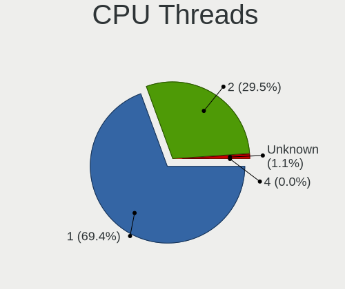

OPNsense - Tested Hardware & Statistics
---------------------------------------

A project to collect tested hardware configurations for OPNsense.

Anyone can contribute to this report by the [hw-probe](https://github.com/linuxhw/hw-probe/blob/master/INSTALL.BSD.md) tool:

    hw-probe -all -upload

Please contribute! Especially if your hardware is rare.

Contents
--------

* [ Test Cases ](#test-cases)

* [ System ](#system)
  - [ OS                       ](#os)
  - [ OS Family                ](#os-family)
  - [ Arch                     ](#arch)
  - [ DE                       ](#de)
  - [ Display Server           ](#display-server)
  - [ Display Manager          ](#display-manager)
  - [ OS Lang                  ](#os-lang)
  - [ Boot Mode                ](#boot-mode)
  - [ Filesystem               ](#filesystem)
  - [ Part. scheme             ](#part-scheme)

* [ Board ](#board)
  - [ Vendor                   ](#vendor)
  - [ Model                    ](#model)
  - [ Model Family             ](#model-family)
  - [ MFG Year                 ](#mfg-year)
  - [ Form Factor              ](#form-factor)
  - [ Coreboot                 ](#coreboot)
  - [ RAM Size                 ](#ram-size)
  - [ RAM Used                 ](#ram-used)
  - [ Total Drives             ](#total-drives)
  - [ Has CD-ROM               ](#has-cd-rom)
  - [ Has Ethernet             ](#has-ethernet)
  - [ Has WiFi                 ](#has-wifi)
  - [ Has Bluetooth            ](#has-bluetooth)

* [ Location ](#location)
  - [ Country                  ](#country)
  - [ City                     ](#city)

* [ Drives ](#drives)
  - [ Drive Vendor             ](#drive-vendor)
  - [ Drive Model              ](#drive-model)
  - [ HDD Vendor               ](#hdd-vendor)
  - [ SSD Vendor               ](#ssd-vendor)
  - [ Drive Kind               ](#drive-kind)
  - [ Drive Connector          ](#drive-connector)
  - [ Drive Size               ](#drive-size)
  - [ Space Total              ](#space-total)
  - [ Space Used               ](#space-used)
  - [ Malfunc. Drives          ](#malfunc-drives)
  - [ Malfunc. Drive Vendor    ](#malfunc-drive-vendor)
  - [ Malfunc. HDD Vendor      ](#malfunc-hdd-vendor)
  - [ Malfunc. Drive Kind      ](#malfunc-drive-kind)
  - [ Failed Drives            ](#failed-drives)
  - [ Failed Drive Vendor      ](#failed-drive-vendor)
  - [ Drive Status             ](#drive-status)

* [ Storage controller ](#storage-controller)
  - [ Storage Vendor           ](#storage-vendor)
  - [ Storage Model            ](#storage-model)
  - [ Storage Kind             ](#storage-kind)

* [ Processor ](#processor)
  - [ CPU Vendor               ](#cpu-vendor)
  - [ CPU Model                ](#cpu-model)
  - [ CPU Model Family         ](#cpu-model-family)
  - [ CPU Cores                ](#cpu-cores)
  - [ CPU Sockets              ](#cpu-sockets)
  - [ CPU Threads              ](#cpu-threads)
  - [ CPU Microarch            ](#cpu-microarch)

* [ Graphics ](#graphics)
  - [ GPU Vendor               ](#gpu-vendor)
  - [ GPU Model                ](#gpu-model)
  - [ GPU Combo                ](#gpu-combo)
  - [ GPU Driver               ](#gpu-driver)
  - [ GPU Memory               ](#gpu-memory)

* [ Monitor ](#monitor)
  - [ Monitor Vendor           ](#monitor-vendor)
  - [ Monitor Model            ](#monitor-model)
  - [ Monitor Resolution       ](#monitor-resolution)
  - [ Monitor Diagonal         ](#monitor-diagonal)
  - [ Monitor Width            ](#monitor-width)
  - [ Aspect Ratio             ](#aspect-ratio)
  - [ Monitor Area             ](#monitor-area)
  - [ Pixel Density            ](#pixel-density)
  - [ Multiple Monitors        ](#multiple-monitors)

* [ Network ](#network)
  - [ Net Controller Vendor    ](#net-controller-vendor)
  - [ Net Controller Model     ](#net-controller-model)
  - [ Wireless Vendor          ](#wireless-vendor)
  - [ Wireless Model           ](#wireless-model)
  - [ Ethernet Vendor          ](#ethernet-vendor)
  - [ Ethernet Model           ](#ethernet-model)
  - [ Net Controller Kind      ](#net-controller-kind)
  - [ Used Controller          ](#used-controller)
  - [ NICs                     ](#nics)
  - [ IPv6                     ](#ipv6)

* [ Bluetooth ](#bluetooth)
  - [ Bluetooth Vendor         ](#bluetooth-vendor)
  - [ Bluetooth Model          ](#bluetooth-model)

* [ Sound ](#sound)
  - [ Sound Vendor             ](#sound-vendor)
  - [ Sound Model              ](#sound-model)

* [ Memory ](#memory)
  - [ Memory Vendor            ](#memory-vendor)
  - [ Memory Model             ](#memory-model)
  - [ Memory Kind              ](#memory-kind)
  - [ Memory Form Factor       ](#memory-form-factor)
  - [ Memory Size              ](#memory-size)
  - [ Memory Speed             ](#memory-speed)

* [ Printers & scanners ](#printers--scanners)
  - [ Printer Vendor           ](#printer-vendor)
  - [ Printer Model            ](#printer-model)
  - [ Scanner Vendor           ](#scanner-vendor)
  - [ Scanner Model            ](#scanner-model)

* [ Camera ](#camera)
  - [ Camera Vendor            ](#camera-vendor)
  - [ Camera Model             ](#camera-model)

* [ Security ](#security)
  - [ Fingerprint Vendor       ](#fingerprint-vendor)
  - [ Fingerprint Model        ](#fingerprint-model)
  - [ Chipcard Vendor          ](#chipcard-vendor)
  - [ Chipcard Model           ](#chipcard-model)

* [ Unsupported ](#unsupported)
  - [ Unsupported Devices      ](#unsupported-devices)
  - [ Unsupported Device Types ](#unsupported-device-types)

Test Cases
----------

Total: 6604

| Vendor        | Model                       | Form-Factor | Probe                                                     | Date         |
|---------------|-----------------------------|-------------|-----------------------------------------------------------|--------------|
| AAEON         | FWS-2350 V1.0               | Desktop     | [00cc54cbad](https://bsd-hardware.info/?probe=00cc54cbad) | Oct 01, 2022 |
| Unknown       | Unknown                     | Desktop     | [01566cd078](https://bsd-hardware.info/?probe=01566cd078) | Oct 01, 2022 |
| Protectli     | FW6 Ver                     | Desktop     | [23450789e4](https://bsd-hardware.info/?probe=23450789e4) | Oct 01, 2022 |
| AMI           | PICO PC                     | Desktop     | [ab45092607](https://bsd-hardware.info/?probe=ab45092607) | Oct 01, 2022 |
| Shuttle       | FH61V                       | Desktop     | [305f06cd6a](https://bsd-hardware.info/?probe=305f06cd6a) | Oct 01, 2022 |
| AMI           | Aptio CRB                   | Mini pc     | [6f087682a4](https://bsd-hardware.info/?probe=6f087682a4) | Oct 01, 2022 |
| MSI           | GL65 Leopard 10SFSK         | Notebook    | [489567748e](https://bsd-hardware.info/?probe=489567748e) | Oct 01, 2022 |
| AMI           | Aptio CRB                   | Mini pc     | [9c419c5d32](https://bsd-hardware.info/?probe=9c419c5d32) | Oct 01, 2022 |
| Deciso        | NetBoard-A10                | Notebook    | [9b95ddf7b9](https://bsd-hardware.info/?probe=9b95ddf7b9) | Oct 01, 2022 |
| Unknown       | Unknown                     | Desktop     | [c4e771c07c](https://bsd-hardware.info/?probe=c4e771c07c) | Oct 01, 2022 |
| Dell          | 0WMJ54 A01                  | Desktop     | [53dfc5844c](https://bsd-hardware.info/?probe=53dfc5844c) | Oct 01, 2022 |
| BESSTAR Te... | IB9                         | Desktop     | [0cb7bacc88](https://bsd-hardware.info/?probe=0cb7bacc88) | Oct 01, 2022 |
| Protectli     | FW4B Ver                    | Desktop     | [05651f8664](https://bsd-hardware.info/?probe=05651f8664) | Oct 01, 2022 |
| Dell          | 0PC5F7 A00                  | Desktop     | [376550557f](https://bsd-hardware.info/?probe=376550557f) | Sep 30, 2022 |
| Cisco         | ASA5512 A0                  | Desktop     | [5b31d03140](https://bsd-hardware.info/?probe=5b31d03140) | Sep 30, 2022 |
| Jingsha       | x79-P3 by xUz               | Desktop     | [6853ba1191](https://bsd-hardware.info/?probe=6853ba1191) | Sep 30, 2022 |
| Gigabyte      | X570 I AORUS PRO WIFI       | Desktop     | [16fa7d7ec0](https://bsd-hardware.info/?probe=16fa7d7ec0) | Sep 30, 2022 |
| ECS           | H61H2-MV                    | Desktop     | [77d9e53715](https://bsd-hardware.info/?probe=77d9e53715) | Sep 30, 2022 |
| Lenovo        | SHARKBAY NOK                | Desktop     | [c1c59c9d14](https://bsd-hardware.info/?probe=c1c59c9d14) | Sep 30, 2022 |
| Dell          | 0WMJ54 A01                  | Desktop     | [30cb759583](https://bsd-hardware.info/?probe=30cb759583) | Sep 30, 2022 |
| Intel         | S1200RP_SE G62252-406       | Server      | [4763fe7595](https://bsd-hardware.info/?probe=4763fe7595) | Sep 30, 2022 |
| Intel         | CARLOW                      | Desktop     | [25b6d62332](https://bsd-hardware.info/?probe=25b6d62332) | Sep 29, 2022 |
| BESSTAR Te... | IB9                         | Desktop     | [eb0e449150](https://bsd-hardware.info/?probe=eb0e449150) | Sep 29, 2022 |
| Gigabyte      | X570 AORUS MASTER           | Desktop     | [353008eb5e](https://bsd-hardware.info/?probe=353008eb5e) | Sep 29, 2022 |
| Biostar       | N68S3B                      | Desktop     | [24c8fcee9a](https://bsd-hardware.info/?probe=24c8fcee9a) | Sep 29, 2022 |
| Dell          | 0MFXTY A02                  | Server      | [6484798368](https://bsd-hardware.info/?probe=6484798368) | Sep 29, 2022 |
| HP            | 17E2                        | Mini pc     | [15ec4829ce](https://bsd-hardware.info/?probe=15ec4829ce) | Sep 29, 2022 |
| Lenovo        | ThinkPad W530 2436CTO       | Notebook    | [6515a18552](https://bsd-hardware.info/?probe=6515a18552) | Sep 29, 2022 |
| Intel         | H81U                        | Notebook    | [fa8c32528a](https://bsd-hardware.info/?probe=fa8c32528a) | Sep 28, 2022 |
| ASRock        | B450M-HDV                   | Desktop     | [a3e25236fc](https://bsd-hardware.info/?probe=a3e25236fc) | Sep 28, 2022 |
| Unknown       | Unknown                     | Desktop     | [2926e2dc6f](https://bsd-hardware.info/?probe=2926e2dc6f) | Sep 28, 2022 |
| Biostar       | B450NH                      | Desktop     | [4beab225f6](https://bsd-hardware.info/?probe=4beab225f6) | Sep 28, 2022 |
| Unknown       | Unknown                     | Desktop     | [c3f8e853ef](https://bsd-hardware.info/?probe=c3f8e853ef) | Sep 28, 2022 |
| Sophos        | SG                          | Firewall    | [6511e9620b](https://bsd-hardware.info/?probe=6511e9620b) | Sep 28, 2022 |
| Techvision    | TVI7309X B0                 | Desktop     | [441eb24fd2](https://bsd-hardware.info/?probe=441eb24fd2) | Sep 28, 2022 |
| Dell          | 0MFXTY A02                  | Server      | [901ca48f69](https://bsd-hardware.info/?probe=901ca48f69) | Sep 28, 2022 |
| ASUSTek       | M5A78L-M/USB3               | Desktop     | [3234a0b453](https://bsd-hardware.info/?probe=3234a0b453) | Sep 28, 2022 |
| Sophos        | UTM                         | Firewall    | [9856bb0d34](https://bsd-hardware.info/?probe=9856bb0d34) | Sep 28, 2022 |
| Dell          | 081N4V A04                  | Server      | [34f2cbafda](https://bsd-hardware.info/?probe=34f2cbafda) | Sep 28, 2022 |
| ASRock        | Z97 Professional            | Desktop     | [8936497eed](https://bsd-hardware.info/?probe=8936497eed) | Sep 27, 2022 |
| Supermicro    | X11SDV-4C-TP8F              | Desktop     | [390f4301dd](https://bsd-hardware.info/?probe=390f4301dd) | Sep 27, 2022 |
| Unknown       | Unknown                     | Desktop     | [16f6784862](https://bsd-hardware.info/?probe=16f6784862) | Sep 27, 2022 |
| Intel         | D34010WYK H14771-305        | Desktop     | [93e4627cc9](https://bsd-hardware.info/?probe=93e4627cc9) | Sep 27, 2022 |
| Fujitsu       | D3313-E1 S26361-D3313-E1    | Desktop     | [a605b4582c](https://bsd-hardware.info/?probe=a605b4582c) | Sep 27, 2022 |
| ASRockRack    | X470D4U                     | Desktop     | [27a82e5fc8](https://bsd-hardware.info/?probe=27a82e5fc8) | Sep 27, 2022 |
| ASUSTek       | PRIME Z490M-PLUS            | Desktop     | [3877787983](https://bsd-hardware.info/?probe=3877787983) | Sep 27, 2022 |
| Protectli     | FW4B                        | Desktop     | [431bcb4425](https://bsd-hardware.info/?probe=431bcb4425) | Sep 27, 2022 |
| Intel         | DH87MC AAG74242-401         | Desktop     | [5e823b71da](https://bsd-hardware.info/?probe=5e823b71da) | Sep 27, 2022 |
| Supermicro    | X11SBA-LN4F                 | Desktop     | [4c7f997199](https://bsd-hardware.info/?probe=4c7f997199) | Sep 26, 2022 |
| Unknown       | Unknown                     | Desktop     | [3966e558bf](https://bsd-hardware.info/?probe=3966e558bf) | Sep 26, 2022 |
| Unknown       | Unknown                     | Desktop     | [69a8b9b8d9](https://bsd-hardware.info/?probe=69a8b9b8d9) | Sep 26, 2022 |
| Cisco         | ASA5515 A0                  | Desktop     | [7b1ba71a42](https://bsd-hardware.info/?probe=7b1ba71a42) | Sep 26, 2022 |
| Sophos        | SG                          | Firewall    | [fdd950a5e8](https://bsd-hardware.info/?probe=fdd950a5e8) | Sep 26, 2022 |
| ASRock        | B550M Phantom Gaming 4      | Desktop     | [cfcfd2a636](https://bsd-hardware.info/?probe=cfcfd2a636) | Sep 26, 2022 |
| Intel         | Q3XXG4-P V1.0               | Desktop     | [cde2481e46](https://bsd-hardware.info/?probe=cde2481e46) | Sep 26, 2022 |
| Dell          | 0T10XW A02                  | Desktop     | [b8db4655e5](https://bsd-hardware.info/?probe=b8db4655e5) | Sep 26, 2022 |
| Dell          | 05GD68 A00                  | Desktop     | [6c75d1609b](https://bsd-hardware.info/?probe=6c75d1609b) | Sep 26, 2022 |
| Dell          | 0KYJ8C A02                  | Desktop     | [12493c3802](https://bsd-hardware.info/?probe=12493c3802) | Sep 26, 2022 |
| ASRock        | 990FX Extreme3              | Desktop     | [68d99cffe1](https://bsd-hardware.info/?probe=68d99cffe1) | Sep 26, 2022 |
| AWOW          | PC BOX                      | Mini pc     | [2c1aad67d1](https://bsd-hardware.info/?probe=2c1aad67d1) | Sep 26, 2022 |
| Deciso        | OPNsense Appliance          | Notebook    | [659b695f09](https://bsd-hardware.info/?probe=659b695f09) | Sep 26, 2022 |
| Techvision    | TVI7309X B0                 | Desktop     | [33b252016c](https://bsd-hardware.info/?probe=33b252016c) | Sep 26, 2022 |
| Dell          | 0TDG4V A00                  | Desktop     | [cc92be7e52](https://bsd-hardware.info/?probe=cc92be7e52) | Sep 25, 2022 |
| PC Engines    | APU2                        | Desktop     | [3fcc5e5ae2](https://bsd-hardware.info/?probe=3fcc5e5ae2) | Sep 25, 2022 |
| Techvision    | TVI7309X B0                 | Desktop     | [ae535b0b49](https://bsd-hardware.info/?probe=ae535b0b49) | Sep 25, 2022 |
| AWOW          | PC BOX                      | Mini pc     | [c33dc6a072](https://bsd-hardware.info/?probe=c33dc6a072) | Sep 25, 2022 |
| ASRock        | B550M Phantom Gaming 4      | Desktop     | [83607fc711](https://bsd-hardware.info/?probe=83607fc711) | Sep 25, 2022 |
| HP            | ProLiant MicroServer Gen... | Desktop     | [8f4900d0e6](https://bsd-hardware.info/?probe=8f4900d0e6) | Sep 25, 2022 |
| CncTion       | Jasper-4L B0                | Desktop     | [2998faa879](https://bsd-hardware.info/?probe=2998faa879) | Sep 25, 2022 |
| Supermicro    | X9SCL/X9SCMA                | Desktop     | [fe44242c3b](https://bsd-hardware.info/?probe=fe44242c3b) | Sep 25, 2022 |
| IceWhale T... | ZimaBoard 832 ZMB           | Desktop     | [6e2d053e1c](https://bsd-hardware.info/?probe=6e2d053e1c) | Sep 25, 2022 |
| iEi           | SAE1 V1.04                  | Desktop     | [cc006e5c32](https://bsd-hardware.info/?probe=cc006e5c32) | Sep 25, 2022 |
| HP            | 3397                        | Desktop     | [8b019e6a96](https://bsd-hardware.info/?probe=8b019e6a96) | Sep 25, 2022 |
| ASRock        | 990FX Extreme3              | Desktop     | [c81d389fd2](https://bsd-hardware.info/?probe=c81d389fd2) | Sep 25, 2022 |
| Unknown       | Unknown                     | Desktop     | [9f998deaa4](https://bsd-hardware.info/?probe=9f998deaa4) | Sep 25, 2022 |
| Biostar       | N68S3B                      | Desktop     | [59bd37df63](https://bsd-hardware.info/?probe=59bd37df63) | Sep 25, 2022 |
| HP            | 8592                        | Desktop     | [898ce46c1f](https://bsd-hardware.info/?probe=898ce46c1f) | Sep 25, 2022 |
| Dell          | 05KX61 A04                  | Server      | [f1232f79c4](https://bsd-hardware.info/?probe=f1232f79c4) | Sep 25, 2022 |
| AMI           | Aptio CRB                   | Mini pc     | [de9d75d495](https://bsd-hardware.info/?probe=de9d75d495) | Sep 25, 2022 |
| AMI           | Aptio CRB                   | Mini pc     | [8883d36139](https://bsd-hardware.info/?probe=8883d36139) | Sep 25, 2022 |
| HP            | ProLiant MicroServer Gen... | Desktop     | [59886931c5](https://bsd-hardware.info/?probe=59886931c5) | Sep 24, 2022 |
| MSI           | A88XM-E45                   | Desktop     | [d9d06daa51](https://bsd-hardware.info/?probe=d9d06daa51) | Sep 24, 2022 |
| HP            | 18E7                        | Desktop     | [02ac7695d7](https://bsd-hardware.info/?probe=02ac7695d7) | Sep 24, 2022 |
| Fujitsu       | D3313-A1 S26361-D3313-A1    | Desktop     | [fb436c3cc3](https://bsd-hardware.info/?probe=fb436c3cc3) | Sep 24, 2022 |
| Gigabyte      | X570 I AORUS PRO WIFI       | Desktop     | [8ed018c141](https://bsd-hardware.info/?probe=8ed018c141) | Sep 24, 2022 |
| ASUSTek       | Rampage II Extreme          | Desktop     | [eccb37382c](https://bsd-hardware.info/?probe=eccb37382c) | Sep 24, 2022 |
| YANYU         | H67SL                       | Desktop     | [5f5819ef11](https://bsd-hardware.info/?probe=5f5819ef11) | Sep 24, 2022 |
| Dell          | 045M96 A00                  | Server      | [c5af7bf9e5](https://bsd-hardware.info/?probe=c5af7bf9e5) | Sep 24, 2022 |
| Lenovo        | G475 20080                  | Notebook    | [fb07463a9a](https://bsd-hardware.info/?probe=fb07463a9a) | Sep 24, 2022 |
| Lenovo        | G475 20080                  | Notebook    | [c4b1acb6d1](https://bsd-hardware.info/?probe=c4b1acb6d1) | Sep 24, 2022 |
| Unknown       | Unknown                     | Desktop     | [8f42ff0969](https://bsd-hardware.info/?probe=8f42ff0969) | Sep 24, 2022 |
| Lenovo        | ThinkPad T460p 20FW003PM... | Notebook    | [ac8e728222](https://bsd-hardware.info/?probe=ac8e728222) | Sep 24, 2022 |
| Unknown       | Unknown                     | Desktop     | [95b1404339](https://bsd-hardware.info/?probe=95b1404339) | Sep 23, 2022 |
| Deciso        | Netboard A20                | Notebook    | [388e27791d](https://bsd-hardware.info/?probe=388e27791d) | Sep 23, 2022 |
| TYAN Compu... | S5530WG2NR-LE-AKA           | Desktop     | [18c4588a0e](https://bsd-hardware.info/?probe=18c4588a0e) | Sep 23, 2022 |
| ASUSTek       | M5A78L-M/USB3               | Desktop     | [a0672c6af1](https://bsd-hardware.info/?probe=a0672c6af1) | Sep 23, 2022 |
| Unknown       | Unknown                     | Desktop     | [ffa40a08e8](https://bsd-hardware.info/?probe=ffa40a08e8) | Sep 23, 2022 |
| Intel         | S3210SH FRU Ver             | Server      | [e6d299ffc1](https://bsd-hardware.info/?probe=e6d299ffc1) | Sep 23, 2022 |
| Sophos        | UTM                         | Firewall    | [fe6cf3c1ab](https://bsd-hardware.info/?probe=fe6cf3c1ab) | Sep 22, 2022 |
| ZOTAC         | ZBOX-MI522NANO/MI542NANO    | Mini pc     | [495b0dfebd](https://bsd-hardware.info/?probe=495b0dfebd) | Sep 22, 2022 |
| Intel         | Q3XXG4-P V1.0               | Desktop     | [5029142d61](https://bsd-hardware.info/?probe=5029142d61) | Sep 22, 2022 |
| Dell          | 042P49 A01                  | Desktop     | [13f6367ce8](https://bsd-hardware.info/?probe=13f6367ce8) | Sep 22, 2022 |
| Unknown       | Unknown                     | Desktop     | [b7bfcbef72](https://bsd-hardware.info/?probe=b7bfcbef72) | Sep 22, 2022 |
| Protectli     | FW4B Ver                    | Desktop     | [036004bbfe](https://bsd-hardware.info/?probe=036004bbfe) | Sep 22, 2022 |
| MSI           | MS-B1831                    | Desktop     | [2c9a20d879](https://bsd-hardware.info/?probe=2c9a20d879) | Sep 22, 2022 |
| Unknown       | Unknown                     | Desktop     | [58b6d3d116](https://bsd-hardware.info/?probe=58b6d3d116) | Sep 21, 2022 |
| PC Engines    | APU                         | Desktop     | [a65b17ba04](https://bsd-hardware.info/?probe=a65b17ba04) | Sep 21, 2022 |
| Sophos        | SG                          | Firewall    | [d485561c3b](https://bsd-hardware.info/?probe=d485561c3b) | Sep 21, 2022 |
| Unknown       | Unknown                     | Notebook    | [fbd1af0e98](https://bsd-hardware.info/?probe=fbd1af0e98) | Sep 21, 2022 |
| Deciso        | NetBoard-A10                | Notebook    | [5cec3595a3](https://bsd-hardware.info/?probe=5cec3595a3) | Sep 21, 2022 |
| HP            | ProLiant DL160 G5           | Server      | [1a754b2a9e](https://bsd-hardware.info/?probe=1a754b2a9e) | Sep 21, 2022 |
| Unknown       | Unknown                     | Desktop     | [199ad16750](https://bsd-hardware.info/?probe=199ad16750) | Sep 21, 2022 |
| ASUSTek       | PRIME H310M-K R2.0          | Desktop     | [51a78cc037](https://bsd-hardware.info/?probe=51a78cc037) | Sep 21, 2022 |
| Acer          | MCP73VE NVIDIA MCP73        | Desktop     | [6c169bdb6a](https://bsd-hardware.info/?probe=6c169bdb6a) | Sep 20, 2022 |
| AMI           | Aptio CRB                   | Mini pc     | [37acdfe51c](https://bsd-hardware.info/?probe=37acdfe51c) | Sep 20, 2022 |
| MSI           | MS-B1831                    | Desktop     | [42f48d632c](https://bsd-hardware.info/?probe=42f48d632c) | Sep 20, 2022 |
| MW            | GMLK-2_5G4L                 | Desktop     | [37cafd59eb](https://bsd-hardware.info/?probe=37cafd59eb) | Sep 20, 2022 |
| Dell          | 02YRK5 A03                  | Desktop     | [2ec32e432d](https://bsd-hardware.info/?probe=2ec32e432d) | Sep 20, 2022 |
| ASUSTek       | PRIME H310M-K R2.0          | Desktop     | [ca3b8f6b48](https://bsd-hardware.info/?probe=ca3b8f6b48) | Sep 20, 2022 |
| Fujitsu       | D3313-E1 S26361-D3313-E1    | Desktop     | [3c74fc1690](https://bsd-hardware.info/?probe=3c74fc1690) | Sep 20, 2022 |
| Unknown       | Unknown                     | Desktop     | [8e55c8e637](https://bsd-hardware.info/?probe=8e55c8e637) | Sep 20, 2022 |
| HP            | 1495                        | Desktop     | [163ac0a58b](https://bsd-hardware.info/?probe=163ac0a58b) | Sep 20, 2022 |
| Gigabyte      | Z590I AORUS ULTRA           | Desktop     | [c057b7ab09](https://bsd-hardware.info/?probe=c057b7ab09) | Sep 20, 2022 |
| ShenZhen M... | MW-GMLK-2.5G6L              | Desktop     | [a1a2cbc6c9](https://bsd-hardware.info/?probe=a1a2cbc6c9) | Sep 20, 2022 |
| Supermicro    | X9SCL/X9SCMA                | Desktop     | [16479f1a2c](https://bsd-hardware.info/?probe=16479f1a2c) | Sep 20, 2022 |
| Unknown       | Unknown                     | Desktop     | [1ceba97eb9](https://bsd-hardware.info/?probe=1ceba97eb9) | Sep 20, 2022 |
| Intel         | SHARKBAY                    | Desktop     | [afbedcb189](https://bsd-hardware.info/?probe=afbedcb189) | Sep 20, 2022 |
| Supermicro    | X9DRD-iF                    | Server      | [f5e927f8ba](https://bsd-hardware.info/?probe=f5e927f8ba) | Sep 20, 2022 |
| Supermicro    | X9SCI/X9SCA                 | Desktop     | [1270203d0b](https://bsd-hardware.info/?probe=1270203d0b) | Sep 19, 2022 |
| BESSTAR Te... | GB7                         | Mini pc     | [80e1559386](https://bsd-hardware.info/?probe=80e1559386) | Sep 19, 2022 |
| Lenovo        | 32E1 SDK0J40697 WIN 3305... | Desktop     | [b394504429](https://bsd-hardware.info/?probe=b394504429) | Sep 19, 2022 |
| Foxconn       | G31MXP FAB:1.1              | Desktop     | [9d291758ef](https://bsd-hardware.info/?probe=9d291758ef) | Sep 19, 2022 |
| AMI           | Aptio CRB                   | Mini pc     | [8956b895ab](https://bsd-hardware.info/?probe=8956b895ab) | Sep 19, 2022 |
| Supermicro    | A2SDi-8C-HLN4F              | Desktop     | [393da0c00c](https://bsd-hardware.info/?probe=393da0c00c) | Sep 19, 2022 |
| MSI           | MS-B1831                    | Desktop     | [28757a34d3](https://bsd-hardware.info/?probe=28757a34d3) | Sep 19, 2022 |
| Lenovo        | 32E1 SDK0J40697 WIN 3305... | Desktop     | [d1c81ef222](https://bsd-hardware.info/?probe=d1c81ef222) | Sep 19, 2022 |
| Gigabyte      | H61M-DS2V                   | Desktop     | [55f8e635b8](https://bsd-hardware.info/?probe=55f8e635b8) | Sep 19, 2022 |
| Dell          | 01TJ2K A02                  | Desktop     | [b34cf533f3](https://bsd-hardware.info/?probe=b34cf533f3) | Sep 19, 2022 |
| ASUSTek       | PRIME X570-P                | Desktop     | [a2f56848a9](https://bsd-hardware.info/?probe=a2f56848a9) | Sep 19, 2022 |
| Sophos        | UTM                         | Firewall    | [785bb6c2a0](https://bsd-hardware.info/?probe=785bb6c2a0) | Sep 19, 2022 |
| ASUSTek       | PRIME X570-P                | Desktop     | [893743c3ad](https://bsd-hardware.info/?probe=893743c3ad) | Sep 19, 2022 |
| Lenovo        | ThinkStation D10 6493WEU    | Desktop     | [526e5eea0b](https://bsd-hardware.info/?probe=526e5eea0b) | Sep 18, 2022 |
| Supermicro    | A2SDi-TP8F                  | Desktop     | [db2194c9b9](https://bsd-hardware.info/?probe=db2194c9b9) | Sep 18, 2022 |
| ASUSTek       | M5A78L-M/USB3               | Desktop     | [cad2b5fd02](https://bsd-hardware.info/?probe=cad2b5fd02) | Sep 18, 2022 |
| Sophos        | XG                          | Firewall    | [e8aca06194](https://bsd-hardware.info/?probe=e8aca06194) | Sep 18, 2022 |
| Intel         | D34010WYK H14771-305        | Desktop     | [e734b98922](https://bsd-hardware.info/?probe=e734b98922) | Sep 18, 2022 |
| HP            | Pavilion dv6700             | Notebook    | [f3058f97f9](https://bsd-hardware.info/?probe=f3058f97f9) | Sep 18, 2022 |
| MSI           | MS-B1831                    | Desktop     | [94a3d6891a](https://bsd-hardware.info/?probe=94a3d6891a) | Sep 18, 2022 |
| ECS           | H61H2-MV                    | Desktop     | [d2945c003e](https://bsd-hardware.info/?probe=d2945c003e) | Sep 18, 2022 |
| HP            | 213D A01                    | Desktop     | [6e8a38b6ca](https://bsd-hardware.info/?probe=6e8a38b6ca) | Sep 18, 2022 |
| BESSTAR Te... | TH50                        | Desktop     | [d027a503a5](https://bsd-hardware.info/?probe=d027a503a5) | Sep 18, 2022 |
| EAGLE EYE ... | BayTrail-D Rev.00           | Desktop     | [261f623516](https://bsd-hardware.info/?probe=261f623516) | Sep 18, 2022 |
| CONTEC        | G1/EMB-CV1/iD2550           | Desktop     | [266ef0ca6a](https://bsd-hardware.info/?probe=266ef0ca6a) | Sep 18, 2022 |
| AMI           | Aptio CRB                   | Mini pc     | [55c82d4dd0](https://bsd-hardware.info/?probe=55c82d4dd0) | Sep 18, 2022 |
| HP            | 18E7                        | Desktop     | [e999bdd87e](https://bsd-hardware.info/?probe=e999bdd87e) | Sep 17, 2022 |
| Unknown       | Unknown                     | Desktop     | [050c365fcd](https://bsd-hardware.info/?probe=050c365fcd) | Sep 17, 2022 |
| Intel         | D53427RKE G87971-403        | Desktop     | [aa00c60448](https://bsd-hardware.info/?probe=aa00c60448) | Sep 17, 2022 |
| Unknown       | Unknown                     | Desktop     | [af8f180c2c](https://bsd-hardware.info/?probe=af8f180c2c) | Sep 17, 2022 |
| Gigabyte      | X570 I AORUS PRO WIFI       | Desktop     | [a9da12dec0](https://bsd-hardware.info/?probe=a9da12dec0) | Sep 17, 2022 |
| CncTion       | N5105-4L B0                 | Desktop     | [22f23ccfa5](https://bsd-hardware.info/?probe=22f23ccfa5) | Sep 17, 2022 |
| HP            | 8103 A01                    | Mini pc     | [533a1ebabe](https://bsd-hardware.info/?probe=533a1ebabe) | Sep 17, 2022 |
| Deciso        | Netboard A10 GEN2 Model ... | Desktop     | [e0b8ceecae](https://bsd-hardware.info/?probe=e0b8ceecae) | Sep 16, 2022 |
| ASUSTek       | PRIME X570-P                | Desktop     | [9fc1f66fcc](https://bsd-hardware.info/?probe=9fc1f66fcc) | Sep 16, 2022 |
| Fujitsu       | D3544-A1 S26361-D3544-A1... | Desktop     | [eb09d789de](https://bsd-hardware.info/?probe=eb09d789de) | Sep 16, 2022 |
| Unknown       | Unknown                     | Desktop     | [050dee62c1](https://bsd-hardware.info/?probe=050dee62c1) | Sep 16, 2022 |
| HP            | EliteBook 840 G3            | Notebook    | [7bf7249432](https://bsd-hardware.info/?probe=7bf7249432) | Sep 16, 2022 |
| Intel BOXJ... | Unknown                     | Desktop     | [c28fe204f3](https://bsd-hardware.info/?probe=c28fe204f3) | Sep 16, 2022 |
| Intel BOXJ... | Unknown                     | Desktop     | [a900f3bc8b](https://bsd-hardware.info/?probe=a900f3bc8b) | Sep 16, 2022 |
| Unknown       | Unknown                     | Desktop     | [3b66741f97](https://bsd-hardware.info/?probe=3b66741f97) | Sep 16, 2022 |
| Standard      | SFFGL Series                | Mini pc     | [a537bcd507](https://bsd-hardware.info/?probe=a537bcd507) | Sep 16, 2022 |
| Dell          | 081N4V A04                  | Server      | [0e3a5d306d](https://bsd-hardware.info/?probe=0e3a5d306d) | Sep 16, 2022 |
| Standard      | SFFGL Series                | Mini pc     | [f1b8de71f4](https://bsd-hardware.info/?probe=f1b8de71f4) | Sep 15, 2022 |
| HP            | ProLiant DL160 G5           | Server      | [484cbeeda7](https://bsd-hardware.info/?probe=484cbeeda7) | Sep 15, 2022 |
| Supermicro    | A2SDi-TP8F                  | Desktop     | [8c67aa0f6e](https://bsd-hardware.info/?probe=8c67aa0f6e) | Sep 15, 2022 |
| Techvision    | TVI7309X B0                 | Desktop     | [505feb51ca](https://bsd-hardware.info/?probe=505feb51ca) | Sep 15, 2022 |
| Dell          | 081N4V A04                  | Server      | [1b5150b554](https://bsd-hardware.info/?probe=1b5150b554) | Sep 15, 2022 |
| Deciso        | DEC2700 - OPNsense Appli... | Notebook    | [eee7bdda02](https://bsd-hardware.info/?probe=eee7bdda02) | Sep 15, 2022 |
| Unknown       | Unknown                     | Desktop     | [7df7bc66e7](https://bsd-hardware.info/?probe=7df7bc66e7) | Sep 15, 2022 |
| AMI           | Aptio CRB                   | Mini pc     | [6d0be3dcf1](https://bsd-hardware.info/?probe=6d0be3dcf1) | Sep 15, 2022 |
| Intel         | ChiefRiver                  | Desktop     | [5361453e6a](https://bsd-hardware.info/?probe=5361453e6a) | Sep 15, 2022 |
| Gigabyte      | H270-HD3-CF                 | Desktop     | [0157925fad](https://bsd-hardware.info/?probe=0157925fad) | Sep 15, 2022 |
| Dell          | 0R230R A00                  | Desktop     | [ad70ccea4d](https://bsd-hardware.info/?probe=ad70ccea4d) | Sep 15, 2022 |
| Supermicro    | X11SSM-F                    | Server      | [a1dc602460](https://bsd-hardware.info/?probe=a1dc602460) | Sep 15, 2022 |
| YANYU         | H67SL                       | Desktop     | [37ba00c2f3](https://bsd-hardware.info/?probe=37ba00c2f3) | Sep 15, 2022 |
| Intel         | DENLOW_WS                   | Desktop     | [7ec0e7257d](https://bsd-hardware.info/?probe=7ec0e7257d) | Sep 14, 2022 |
| AZW           | Green G1                    | Desktop     | [1ccd8f86b3](https://bsd-hardware.info/?probe=1ccd8f86b3) | Sep 14, 2022 |
| Protectli     | FW6                         | Desktop     | [23227c99a0](https://bsd-hardware.info/?probe=23227c99a0) | Sep 14, 2022 |
| ASUSTek       | PRIME X570-P                | Desktop     | [32d8dbc6b6](https://bsd-hardware.info/?probe=32d8dbc6b6) | Sep 14, 2022 |
| Intel         | Q3XXG4-P V1.0               | Desktop     | [13ec5a6f20](https://bsd-hardware.info/?probe=13ec5a6f20) | Sep 14, 2022 |
| Intel         | Q3XXG4-P V1.0               | Desktop     | [7aa564bfb2](https://bsd-hardware.info/?probe=7aa564bfb2) | Sep 14, 2022 |
| HP            | 8103 A01                    | Mini pc     | [94ba5ceedb](https://bsd-hardware.info/?probe=94ba5ceedb) | Sep 14, 2022 |
| ASUSTek       | H61M-K                      | Desktop     | [0ee299e989](https://bsd-hardware.info/?probe=0ee299e989) | Sep 14, 2022 |
| Dell          | 0FDY5C A00                  | Desktop     | [cce6101086](https://bsd-hardware.info/?probe=cce6101086) | Sep 14, 2022 |
| Protectli     | FW4B Ver                    | Desktop     | [58caab8946](https://bsd-hardware.info/?probe=58caab8946) | Sep 14, 2022 |
| ASUSTek       | Rampage II Extreme          | Desktop     | [924dc8e7e1](https://bsd-hardware.info/?probe=924dc8e7e1) | Sep 14, 2022 |
| AMI           | Aptio CRB                   | Mini pc     | [d2ad4471e0](https://bsd-hardware.info/?probe=d2ad4471e0) | Sep 14, 2022 |
| Techvision    | TVI7309X B0                 | Desktop     | [a444259756](https://bsd-hardware.info/?probe=a444259756) | Sep 14, 2022 |
| Lenovo        | SHARKBAY 0B98401 WIN        | Desktop     | [dc557f4385](https://bsd-hardware.info/?probe=dc557f4385) | Sep 14, 2022 |
| Unknown       | Unknown                     | Desktop     | [992ddc4118](https://bsd-hardware.info/?probe=992ddc4118) | Sep 14, 2022 |
| HP            | ProLiant DL160 G5           | Server      | [77727b5832](https://bsd-hardware.info/?probe=77727b5832) | Sep 14, 2022 |
| Deciso        | DEC2700 - OPNsense Appli... | Notebook    | [9e6bd1263d](https://bsd-hardware.info/?probe=9e6bd1263d) | Sep 13, 2022 |
| maiyunda      | www.maiyunda.com            | Desktop     | [cbc4aeb7be](https://bsd-hardware.info/?probe=cbc4aeb7be) | Sep 13, 2022 |
| Intel         | Q3XXG4-P V1.0               | Desktop     | [e8848edf41](https://bsd-hardware.info/?probe=e8848edf41) | Sep 13, 2022 |
| AMI           | Aptio CRB                   | Mini pc     | [e95ac333fe](https://bsd-hardware.info/?probe=e95ac333fe) | Sep 13, 2022 |
| Sophos        | XG                          | Firewall    | [1540138670](https://bsd-hardware.info/?probe=1540138670) | Sep 13, 2022 |
| Deciso        | Netboard A20                | Notebook    | [8af40be425](https://bsd-hardware.info/?probe=8af40be425) | Sep 13, 2022 |
| ASRock        | Q1900B-ITX                  | Desktop     | [81722a937a](https://bsd-hardware.info/?probe=81722a937a) | Sep 13, 2022 |
| PC Engines    | APU2                        | Desktop     | [95ae240b55](https://bsd-hardware.info/?probe=95ae240b55) | Sep 13, 2022 |
| Protectli     | FW4B                        | Desktop     | [0553a226de](https://bsd-hardware.info/?probe=0553a226de) | Sep 13, 2022 |
| Dell          | 0KYJ8C A02                  | Desktop     | [fb950378c9](https://bsd-hardware.info/?probe=fb950378c9) | Sep 13, 2022 |
| BESSTAR Te... | GB7                         | Mini pc     | [d3ee67f09b](https://bsd-hardware.info/?probe=d3ee67f09b) | Sep 13, 2022 |
| SIEMENS       | SIMATIC IPC127E             | Notebook    | [d16e38e6b2](https://bsd-hardware.info/?probe=d16e38e6b2) | Sep 12, 2022 |
| Dell          | 03X6X0 A09                  | Server      | [ce56845976](https://bsd-hardware.info/?probe=ce56845976) | Sep 12, 2022 |
| Dell          | 07WP95 A01                  | Desktop     | [98e67ff164](https://bsd-hardware.info/?probe=98e67ff164) | Sep 12, 2022 |
| Yanling       | YL-KBR6L Ver:1.00           | Desktop     | [05b5d1e01a](https://bsd-hardware.info/?probe=05b5d1e01a) | Sep 12, 2022 |
| HP            | 18E7                        | Desktop     | [f09635a7ee](https://bsd-hardware.info/?probe=f09635a7ee) | Sep 12, 2022 |
| BESSTAR Te... | GB7                         | Mini pc     | [66e543ee47](https://bsd-hardware.info/?probe=66e543ee47) | Sep 12, 2022 |
| Fujitsu       | D3313-G1 S26361-D3313-G1    | Desktop     | [2b4e2212dc](https://bsd-hardware.info/?probe=2b4e2212dc) | Sep 12, 2022 |
| HP            | 213D A01                    | Desktop     | [6354ddb4a8](https://bsd-hardware.info/?probe=6354ddb4a8) | Sep 12, 2022 |
| Dell          | 0KYJ8C A02                  | Desktop     | [bb784470e7](https://bsd-hardware.info/?probe=bb784470e7) | Sep 12, 2022 |
| Protectli     | FW4B                        | Desktop     | [0ccd9a9f2c](https://bsd-hardware.info/?probe=0ccd9a9f2c) | Sep 12, 2022 |
| HP            | 8054                        | Desktop     | [3385f78f9c](https://bsd-hardware.info/?probe=3385f78f9c) | Sep 12, 2022 |
| BESSTAR Te... | TH50                        | Desktop     | [71e53af7f9](https://bsd-hardware.info/?probe=71e53af7f9) | Sep 12, 2022 |
| Dell EMC      | VEP1425-V210-CPU A00        | Desktop     | [871a29677b](https://bsd-hardware.info/?probe=871a29677b) | Sep 12, 2022 |
| BESSTAR Te... | TH50                        | Desktop     | [898d5889a2](https://bsd-hardware.info/?probe=898d5889a2) | Sep 12, 2022 |
| MSI           | H81M-E33                    | Desktop     | [b80a45410b](https://bsd-hardware.info/?probe=b80a45410b) | Sep 12, 2022 |
| HP            | 213D A01                    | Desktop     | [54288c6759](https://bsd-hardware.info/?probe=54288c6759) | Sep 11, 2022 |
| Intel         | S1200KP AAG34877-201        | Desktop     | [db5bbdec3c](https://bsd-hardware.info/?probe=db5bbdec3c) | Sep 11, 2022 |
| ASUSTek       | PRIME X570-P                | Desktop     | [8a2d9be9de](https://bsd-hardware.info/?probe=8a2d9be9de) | Sep 11, 2022 |
| HP            | ProLiant DL20 Gen9          | Server      | [32e9f95095](https://bsd-hardware.info/?probe=32e9f95095) | Sep 11, 2022 |
| Supermicro    | M11SDV-8C-LN4FA             | Desktop     | [21e7190ff2](https://bsd-hardware.info/?probe=21e7190ff2) | Sep 11, 2022 |
| Unknown       | Unknown                     | Desktop     | [37588a8565](https://bsd-hardware.info/?probe=37588a8565) | Sep 11, 2022 |
| Unknown       | Unknown                     | Desktop     | [700e6ba6a9](https://bsd-hardware.info/?probe=700e6ba6a9) | Sep 11, 2022 |
| MSI           | H81M-E33                    | Desktop     | [66d179c5f4](https://bsd-hardware.info/?probe=66d179c5f4) | Sep 11, 2022 |
| ASUSTek       | M5A97 PLUS                  | Desktop     | [3c152ae7bd](https://bsd-hardware.info/?probe=3c152ae7bd) | Sep 11, 2022 |
| Dell          | 0NW6H5 A00                  | Desktop     | [ce6906d604](https://bsd-hardware.info/?probe=ce6906d604) | Sep 10, 2022 |
| MSI           | A88XM-E45                   | Desktop     | [2df6d013e9](https://bsd-hardware.info/?probe=2df6d013e9) | Sep 10, 2022 |
| Fujitsu       | D3313-A1 S26361-D3313-A1    | Desktop     | [b2dc861f47](https://bsd-hardware.info/?probe=b2dc861f47) | Sep 10, 2022 |
| AOpen         | iBTMx-DS R1.03 55DED10A0... | Desktop     | [50ac5c0aaf](https://bsd-hardware.info/?probe=50ac5c0aaf) | Sep 10, 2022 |
| HP            | 8103 A01                    | Mini pc     | [34f00f7f28](https://bsd-hardware.info/?probe=34f00f7f28) | Sep 10, 2022 |
| Supermicro    | M11SDV-8C-LN4FA             | Desktop     | [89b185547b](https://bsd-hardware.info/?probe=89b185547b) | Sep 10, 2022 |
| Maxtang       | BYT30                       | Desktop     | [90053990c3](https://bsd-hardware.info/?probe=90053990c3) | Sep 10, 2022 |
| Fujitsu       | D3313-G1 S26361-D3313-G1    | Desktop     | [836927cf63](https://bsd-hardware.info/?probe=836927cf63) | Sep 10, 2022 |
| Fujitsu       | D3313-A1 S26361-D3313-A1    | Desktop     | [b54e6663f9](https://bsd-hardware.info/?probe=b54e6663f9) | Sep 10, 2022 |
| Dell          | 0KYJ8C A02                  | Desktop     | [7e8d44c688](https://bsd-hardware.info/?probe=7e8d44c688) | Sep 10, 2022 |
| HP            | ProLiant DL160 G5           | Server      | [130de630ad](https://bsd-hardware.info/?probe=130de630ad) | Sep 10, 2022 |
| CONTEC        | G1/EMB-CV1/iD2550           | Desktop     | [0df35f9c64](https://bsd-hardware.info/?probe=0df35f9c64) | Sep 10, 2022 |
| ASUSTek       | PRIME X570-P                | Desktop     | [8eb8bf52d4](https://bsd-hardware.info/?probe=8eb8bf52d4) | Sep 10, 2022 |
| Intel         | DH87MC AAG74242-401         | Desktop     | [6b449e63d3](https://bsd-hardware.info/?probe=6b449e63d3) | Sep 10, 2022 |
| Sophos        | SG                          | Firewall    | [0213c8bb69](https://bsd-hardware.info/?probe=0213c8bb69) | Sep 09, 2022 |
| ASRock        | H81M-DGS                    | Desktop     | [3c2b784001](https://bsd-hardware.info/?probe=3c2b784001) | Sep 09, 2022 |
| ASRock        | H81M-DGS                    | Desktop     | [581219cbc5](https://bsd-hardware.info/?probe=581219cbc5) | Sep 09, 2022 |
| Intel         | NUC6i3SYB H81132-505        | Mini pc     | [c25d3df4e2](https://bsd-hardware.info/?probe=c25d3df4e2) | Sep 09, 2022 |
| Gigabyte      | B450M DS3H V2               | Desktop     | [b1a126ce25](https://bsd-hardware.info/?probe=b1a126ce25) | Sep 09, 2022 |
| Intel         | SandyBridge Platform        | Notebook    | [7c10326786](https://bsd-hardware.info/?probe=7c10326786) | Sep 09, 2022 |
| EAGLE EYE ... | BayTrail-D Rev.00           | Desktop     | [3137cdbf7c](https://bsd-hardware.info/?probe=3137cdbf7c) | Sep 09, 2022 |
| AZW           | Green G1                    | Desktop     | [b9e82f5157](https://bsd-hardware.info/?probe=b9e82f5157) | Sep 09, 2022 |
| EAGLE EYE ... | BayTrail-D Rev.00           | Desktop     | [1e62e2ea85](https://bsd-hardware.info/?probe=1e62e2ea85) | Sep 09, 2022 |
| Unknown       | Unknown                     | Desktop     | [1cd83a6904](https://bsd-hardware.info/?probe=1cd83a6904) | Sep 09, 2022 |
| maiyunda      | www.maiyunda.com            | Desktop     | [8776541164](https://bsd-hardware.info/?probe=8776541164) | Sep 09, 2022 |
| Apple         | MacBookPro8,1               | Notebook    | [39edc32cb4](https://bsd-hardware.info/?probe=39edc32cb4) | Sep 09, 2022 |
| HP            | ProLiant DL380 G7           | Server      | [fb678970df](https://bsd-hardware.info/?probe=fb678970df) | Sep 09, 2022 |
| Techvision    | TVI7309X B0                 | Desktop     | [4e393e3814](https://bsd-hardware.info/?probe=4e393e3814) | Sep 08, 2022 |
| Deciso        | Netboard A10 GEN2 Model ... | Desktop     | [e082eca671](https://bsd-hardware.info/?probe=e082eca671) | Sep 08, 2022 |
| EPSON DIRE... | ST170E                      | Desktop     | [1ac571538d](https://bsd-hardware.info/?probe=1ac571538d) | Sep 08, 2022 |
| Unknown       | YL-J3060L2                  | Desktop     | [2210876ea3](https://bsd-hardware.info/?probe=2210876ea3) | Sep 08, 2022 |
| BESSTAR Te... | GB7                         | Mini pc     | [6130d9c1d0](https://bsd-hardware.info/?probe=6130d9c1d0) | Sep 07, 2022 |
| Unknown       | J3160-4L                    | Desktop     | [4db37ff154](https://bsd-hardware.info/?probe=4db37ff154) | Sep 07, 2022 |
| Techvision    | TVI7309X B0                 | Desktop     | [1d81b77310](https://bsd-hardware.info/?probe=1d81b77310) | Sep 07, 2022 |
| Dell          | 0W0W22 A08                  | Server      | [4d371914ed](https://bsd-hardware.info/?probe=4d371914ed) | Sep 07, 2022 |
| Deciso        | Netboard A10 V2.1           | Desktop     | [6c88b88822](https://bsd-hardware.info/?probe=6c88b88822) | Sep 07, 2022 |
| Intel         | SYS-2USM03-6M01E            | Desktop     | [d4f98f18b9](https://bsd-hardware.info/?probe=d4f98f18b9) | Sep 07, 2022 |
| Protectli     | FW4B                        | Desktop     | [b934171c54](https://bsd-hardware.info/?probe=b934171c54) | Sep 07, 2022 |
| Techvision    | TVI7309X B0                 | Desktop     | [3c3c40a10f](https://bsd-hardware.info/?probe=3c3c40a10f) | Sep 07, 2022 |
| Protectli     | VP2410 10                   | Desktop     | [f431032a32](https://bsd-hardware.info/?probe=f431032a32) | Sep 07, 2022 |
| Techvision    | TVI7309X B0                 | Desktop     | [b803a767af](https://bsd-hardware.info/?probe=b803a767af) | Sep 06, 2022 |
| Intel         | J1900                       | Desktop     | [a95dd12c65](https://bsd-hardware.info/?probe=a95dd12c65) | Sep 06, 2022 |
| Sophos        | SG                          | Firewall    | [4b393a08cd](https://bsd-hardware.info/?probe=4b393a08cd) | Sep 06, 2022 |
| HP            | 1495                        | Desktop     | [4ba1b5820e](https://bsd-hardware.info/?probe=4ba1b5820e) | Sep 06, 2022 |
| Dell          | 0200DY A02                  | Desktop     | [cd90f548c8](https://bsd-hardware.info/?probe=cd90f548c8) | Sep 06, 2022 |
| ASRock        | 4X4-4000 Series             | Desktop     | [00ee0319aa](https://bsd-hardware.info/?probe=00ee0319aa) | Sep 06, 2022 |
| Intel         | MAHOBAY                     | Desktop     | [a854e50942](https://bsd-hardware.info/?probe=a854e50942) | Sep 06, 2022 |
| Supermicro    | X10SDV-TP8F                 | Server      | [4bcc55d57f](https://bsd-hardware.info/?probe=4bcc55d57f) | Sep 06, 2022 |
| Unknown       | J3160-4L                    | Desktop     | [817b37c259](https://bsd-hardware.info/?probe=817b37c259) | Sep 06, 2022 |
| Intel         | S5520UR E22554-753          | Server      | [9048eea837](https://bsd-hardware.info/?probe=9048eea837) | Sep 06, 2022 |
| HP            | 1496                        | Desktop     | [7cd97bd330](https://bsd-hardware.info/?probe=7cd97bd330) | Sep 05, 2022 |
| ASUSTek       | Rampage II Extreme          | Desktop     | [975b49af4a](https://bsd-hardware.info/?probe=975b49af4a) | Sep 05, 2022 |
| Unknown       | Unknown                     | Desktop     | [865dca4859](https://bsd-hardware.info/?probe=865dca4859) | Sep 05, 2022 |
| Gigabyte      | H61M-DS2 x.x                | Desktop     | [3f5ad2f043](https://bsd-hardware.info/?probe=3f5ad2f043) | Sep 05, 2022 |
| PC Engines    | APU2                        | Desktop     | [1650d8c419](https://bsd-hardware.info/?probe=1650d8c419) | Sep 05, 2022 |
| PC Engines    | APU2                        | Desktop     | [d9216cb730](https://bsd-hardware.info/?probe=d9216cb730) | Sep 05, 2022 |
| AMI           | Aptio CRB                   | Mini pc     | [68ac9de055](https://bsd-hardware.info/?probe=68ac9de055) | Sep 05, 2022 |
| ASUSTek       | Rampage II Extreme          | Desktop     | [5a49c5aa98](https://bsd-hardware.info/?probe=5a49c5aa98) | Sep 05, 2022 |
| Protectli     | FW4B Ver                    | Desktop     | [91664c3bc1](https://bsd-hardware.info/?probe=91664c3bc1) | Sep 05, 2022 |
| BESSTAR Te... | TH50                        | Desktop     | [734a8e61c4](https://bsd-hardware.info/?probe=734a8e61c4) | Sep 05, 2022 |
| Supermicro    | X10SLH-N6-ST031             | Desktop     | [34bc2f5c5b](https://bsd-hardware.info/?probe=34bc2f5c5b) | Sep 04, 2022 |
| HP            | ProLiant DL20 Gen9          | Server      | [1eb31c7e35](https://bsd-hardware.info/?probe=1eb31c7e35) | Sep 04, 2022 |
| HP            | ProLiant DL360 G5           | Server      | [770f185ee2](https://bsd-hardware.info/?probe=770f185ee2) | Sep 04, 2022 |
| Unknown       | Unknown                     | Desktop     | [c1967c7cf8](https://bsd-hardware.info/?probe=c1967c7cf8) | Sep 04, 2022 |
| Dell          | 0H5J4J A01                  | Server      | [ab1c1b4aad](https://bsd-hardware.info/?probe=ab1c1b4aad) | Sep 04, 2022 |
| Gigabyte      | GA-890FXA-UD5               | Desktop     | [3ee914e3a0](https://bsd-hardware.info/?probe=3ee914e3a0) | Sep 04, 2022 |
| ASUSTek       | Rampage II Extreme          | Desktop     | [1d6d1d67ee](https://bsd-hardware.info/?probe=1d6d1d67ee) | Sep 04, 2022 |
| HP            | ProLiant DL360 G5           | Server      | [387e5946f7](https://bsd-hardware.info/?probe=387e5946f7) | Sep 04, 2022 |
| Protectli     | FW4B Ver                    | Desktop     | [a769499d94](https://bsd-hardware.info/?probe=a769499d94) | Sep 04, 2022 |
| MSI           | A68HM-E33 V2                | Desktop     | [0f35d398cb](https://bsd-hardware.info/?probe=0f35d398cb) | Sep 04, 2022 |
| Lenovo        | SHARKBAY 0B98401 WIN        | Desktop     | [860518eb18](https://bsd-hardware.info/?probe=860518eb18) | Sep 04, 2022 |
| Protectli     | FW4B                        | Desktop     | [86a4422a0f](https://bsd-hardware.info/?probe=86a4422a0f) | Sep 04, 2022 |
| Supermicro    | M11SDV-8C-LN4FA             | Desktop     | [b53e1d28cd](https://bsd-hardware.info/?probe=b53e1d28cd) | Sep 04, 2022 |
| Unknown       | Unknown                     | Desktop     | [4034fae93d](https://bsd-hardware.info/?probe=4034fae93d) | Sep 04, 2022 |
| AMD           | Inagua CRB                  | Desktop     | [de18cc5073](https://bsd-hardware.info/?probe=de18cc5073) | Sep 04, 2022 |
| Supermicro    | A2SDi-4C-HLN4F              | Server      | [5ea71c99c7](https://bsd-hardware.info/?probe=5ea71c99c7) | Sep 03, 2022 |
| Maxtang       | BYT30                       | Desktop     | [f5c34c7662](https://bsd-hardware.info/?probe=f5c34c7662) | Sep 03, 2022 |
| HP            | 1496                        | Desktop     | [94e8713f6d](https://bsd-hardware.info/?probe=94e8713f6d) | Sep 03, 2022 |
| Intel         | Q3XXG4-P V1.0               | Desktop     | [88d8df1e3a](https://bsd-hardware.info/?probe=88d8df1e3a) | Sep 03, 2022 |
| ASRock        | Z97 Killer                  | Desktop     | [fac5afc851](https://bsd-hardware.info/?probe=fac5afc851) | Sep 03, 2022 |
| ASRock        | X570S PG Riptide            | Desktop     | [37a7192776](https://bsd-hardware.info/?probe=37a7192776) | Sep 03, 2022 |
| CompuLab      | fitlet                      | Mini pc     | [9772776314](https://bsd-hardware.info/?probe=9772776314) | Sep 03, 2022 |
| Lenovo        | 30D9 SDK0J40705 WIN 3425... | Desktop     | [72cdc4123c](https://bsd-hardware.info/?probe=72cdc4123c) | Sep 03, 2022 |
| Techvision    | TVI7309X B0                 | Desktop     | [9941ee7afb](https://bsd-hardware.info/?probe=9941ee7afb) | Sep 03, 2022 |
| ASRockRack    | C3558D4I-4L                 | Desktop     | [9beb572e0d](https://bsd-hardware.info/?probe=9beb572e0d) | Sep 03, 2022 |
| Lenovo        | ThinkCentre M70e 0833A29    | Desktop     | [b7c5b9a51d](https://bsd-hardware.info/?probe=b7c5b9a51d) | Sep 03, 2022 |
| ASRock        | X570S PG Riptide            | Desktop     | [0c17c8dc3b](https://bsd-hardware.info/?probe=0c17c8dc3b) | Sep 03, 2022 |
| Dell          | 0DVNTK A00                  | Mini pc     | [216197e933](https://bsd-hardware.info/?probe=216197e933) | Sep 03, 2022 |
| Lenovo        | 312D SDK0J40697 WIN 3305... | Mini pc     | [549daa1a49](https://bsd-hardware.info/?probe=549daa1a49) | Sep 03, 2022 |
| AMD           | Larne CRB                   | Desktop     | [787a51fa78](https://bsd-hardware.info/?probe=787a51fa78) | Sep 03, 2022 |
| Dell          | 0WMJ54 A00                  | Desktop     | [39ee331ecb](https://bsd-hardware.info/?probe=39ee331ecb) | Sep 03, 2022 |
| Fujitsu       | D3313-A1 S26361-D3313-A1    | Desktop     | [62946d2956](https://bsd-hardware.info/?probe=62946d2956) | Sep 03, 2022 |
| Unknown       | Unknown                     | Desktop     | [b2e4674180](https://bsd-hardware.info/?probe=b2e4674180) | Sep 03, 2022 |
| Intel         | DQ67EP AAG12529-307         | Desktop     | [1fb1fd6705](https://bsd-hardware.info/?probe=1fb1fd6705) | Sep 03, 2022 |
| MW            | GMLK-2_5G4L                 | Desktop     | [bb379f7083](https://bsd-hardware.info/?probe=bb379f7083) | Sep 03, 2022 |
| Supermicro    | M11SDV-8C-LN4FA             | Desktop     | [2e4b87acd2](https://bsd-hardware.info/?probe=2e4b87acd2) | Sep 03, 2022 |
| Lenovo        | 312D SDK0J40697 WIN 3305... | Mini pc     | [be2c7c6555](https://bsd-hardware.info/?probe=be2c7c6555) | Sep 03, 2022 |
| Unknown       | YL-E3845L4-V2               | Desktop     | [3082ae8ab3](https://bsd-hardware.info/?probe=3082ae8ab3) | Sep 02, 2022 |
| Lenovo        | 30D9 SDK0J40705 WIN 3425... | Desktop     | [1e05b51bf1](https://bsd-hardware.info/?probe=1e05b51bf1) | Sep 02, 2022 |
| Protectli     | FW4B                        | Desktop     | [1e384b1cf6](https://bsd-hardware.info/?probe=1e384b1cf6) | Sep 02, 2022 |
| Intel         | CRESCENTBAY                 | Desktop     | [b0ad128162](https://bsd-hardware.info/?probe=b0ad128162) | Sep 02, 2022 |
| Gigabyte      | H270-HD3-CF                 | Desktop     | [ce9dc034c9](https://bsd-hardware.info/?probe=ce9dc034c9) | Sep 02, 2022 |
| MSI           | H410M-A PRO                 | Desktop     | [d71ca3999c](https://bsd-hardware.info/?probe=d71ca3999c) | Sep 02, 2022 |
| ASUSTek       | Rampage II Extreme          | Desktop     | [8575ceca09](https://bsd-hardware.info/?probe=8575ceca09) | Sep 02, 2022 |
| HP            | 213D A01                    | Desktop     | [5e8fa931ef](https://bsd-hardware.info/?probe=5e8fa931ef) | Sep 02, 2022 |
| Intel         | MAHOBAY                     | Desktop     | [1c24e80838](https://bsd-hardware.info/?probe=1c24e80838) | Sep 02, 2022 |
| Intel         | D34010WYK H14771-305        | Desktop     | [ab544a7950](https://bsd-hardware.info/?probe=ab544a7950) | Sep 02, 2022 |
| Supermicro    | X10SLH-N6-ST031             | Desktop     | [73304d07bb](https://bsd-hardware.info/?probe=73304d07bb) | Sep 01, 2022 |
| Deciso        | NetBoard-A10                | Notebook    | [3547d9da9c](https://bsd-hardware.info/?probe=3547d9da9c) | Sep 01, 2022 |
| Apple         | MacBookPro8,1               | Notebook    | [0ff0fc4c3b](https://bsd-hardware.info/?probe=0ff0fc4c3b) | Sep 01, 2022 |
| Unknown       | DTB1168                     | Desktop     | [e924ba2a44](https://bsd-hardware.info/?probe=e924ba2a44) | Sep 01, 2022 |
| Unknown       | Unknown                     | Desktop     | [f2a26e2adc](https://bsd-hardware.info/?probe=f2a26e2adc) | Sep 01, 2022 |
| Unknown       | Unknown                     | Desktop     | [9f6f4424c2](https://bsd-hardware.info/?probe=9f6f4424c2) | Sep 01, 2022 |
| Jingsha       | x79-P3 by xUz               | Desktop     | [9148bf85ec](https://bsd-hardware.info/?probe=9148bf85ec) | Sep 01, 2022 |
| Dell          | 0TY179 A05                  | Server      | [482bca3952](https://bsd-hardware.info/?probe=482bca3952) | Sep 01, 2022 |
| HP            | 1496                        | Desktop     | [1567aa1c21](https://bsd-hardware.info/?probe=1567aa1c21) | Sep 01, 2022 |
| AAEON         | UP-APL01 V0.4               | Desktop     | [a8d73a9156](https://bsd-hardware.info/?probe=a8d73a9156) | Sep 01, 2022 |
| Unknown       | Unknown                     | Desktop     | [b62a001fe9](https://bsd-hardware.info/?probe=b62a001fe9) | Sep 01, 2022 |
| ASRock        | H81M-ITX                    | Desktop     | [d26f88ae78](https://bsd-hardware.info/?probe=d26f88ae78) | Sep 01, 2022 |
| maiyunda      | www.maiyunda.com            | Desktop     | [721abbc383](https://bsd-hardware.info/?probe=721abbc383) | Sep 01, 2022 |
| maiyunda      | www.maiyunda.com            | Desktop     | [bbd9cbaaeb](https://bsd-hardware.info/?probe=bbd9cbaaeb) | Sep 01, 2022 |
| Dell          | 07F37C A01                  | Desktop     | [53de9cce89](https://bsd-hardware.info/?probe=53de9cce89) | Sep 01, 2022 |
| Intel         | NUC8BEB J72692-309          | Mini pc     | [43a7b45df6](https://bsd-hardware.info/?probe=43a7b45df6) | Sep 01, 2022 |
| CompuLab      | fitlet2                     | Mini pc     | [ebedb51d2f](https://bsd-hardware.info/?probe=ebedb51d2f) | Aug 31, 2022 |
| Intel         | MAHOBAY                     | Desktop     | [78b1cb4ae5](https://bsd-hardware.info/?probe=78b1cb4ae5) | Aug 31, 2022 |
| AMI           | Aptio CRB                   | Mini pc     | [77f98904c2](https://bsd-hardware.info/?probe=77f98904c2) | Aug 31, 2022 |
| MW            | GMLK-2_5G4L                 | Desktop     | [63587e2fca](https://bsd-hardware.info/?probe=63587e2fca) | Aug 31, 2022 |
| ASUSTek       | EX-H110M-V                  | Desktop     | [35e6c8463a](https://bsd-hardware.info/?probe=35e6c8463a) | Aug 31, 2022 |
| Dell          | 0TP412                      | Desktop     | [3ac4a5aa72](https://bsd-hardware.info/?probe=3ac4a5aa72) | Aug 31, 2022 |
| Dell          | 0G261D A00                  | Desktop     | [c77b23d1a7](https://bsd-hardware.info/?probe=c77b23d1a7) | Aug 31, 2022 |
| Lenovo        | 32E1 SDK0J40697 WIN 3305... | Desktop     | [0563755b0d](https://bsd-hardware.info/?probe=0563755b0d) | Aug 31, 2022 |
| maiyunda      | www.maiyunda.com            | Desktop     | [5f880bde97](https://bsd-hardware.info/?probe=5f880bde97) | Aug 31, 2022 |
| Unknown       | Unknown                     | Desktop     | [e8259494a3](https://bsd-hardware.info/?probe=e8259494a3) | Aug 31, 2022 |
| Intel         | DENLOW_WS                   | Desktop     | [40053c983b](https://bsd-hardware.info/?probe=40053c983b) | Aug 31, 2022 |
| HP            | 213D A01                    | Desktop     | [c495fb5448](https://bsd-hardware.info/?probe=c495fb5448) | Aug 30, 2022 |
| Unknown       | Unknown                     | Desktop     | [9422de47ab](https://bsd-hardware.info/?probe=9422de47ab) | Aug 30, 2022 |
| HP            | 8103 A01                    | Mini pc     | [58a4089f3f](https://bsd-hardware.info/?probe=58a4089f3f) | Aug 30, 2022 |
| Gigabyte      | J1900N-D3V                  | Desktop     | [e2ad4d8035](https://bsd-hardware.info/?probe=e2ad4d8035) | Aug 30, 2022 |
| MSI           | A320M-A PRO M2              | Desktop     | [d455ed153a](https://bsd-hardware.info/?probe=d455ed153a) | Aug 30, 2022 |
| Intel         | DENLOW_WS                   | Desktop     | [067a217959](https://bsd-hardware.info/?probe=067a217959) | Aug 30, 2022 |
| ASUSTek       | Maximus VIII HERO           | Desktop     | [a47c1e0c84](https://bsd-hardware.info/?probe=a47c1e0c84) | Aug 30, 2022 |
| Unknown       | Unknown                     | Desktop     | [98d9c506c9](https://bsd-hardware.info/?probe=98d9c506c9) | Aug 30, 2022 |
| MSI           | A320M-A PRO M2              | Desktop     | [9d367a6989](https://bsd-hardware.info/?probe=9d367a6989) | Aug 30, 2022 |
| Unknown       | Unknown                     | Desktop     | [6bc59f4024](https://bsd-hardware.info/?probe=6bc59f4024) | Aug 30, 2022 |
| Protectli     | FW4B Ver                    | Desktop     | [b3a1456bb4](https://bsd-hardware.info/?probe=b3a1456bb4) | Aug 29, 2022 |
| Unknown       | Unknown                     | Desktop     | [a01c1ad205](https://bsd-hardware.info/?probe=a01c1ad205) | Aug 29, 2022 |
| Gigabyte      | J1900N-D3V                  | Desktop     | [567bfe0b9f](https://bsd-hardware.info/?probe=567bfe0b9f) | Aug 29, 2022 |
| Fujitsu       | D3041-A1 S26361-D3041-A1    | Desktop     | [2349014a6c](https://bsd-hardware.info/?probe=2349014a6c) | Aug 29, 2022 |
| Dell          | 0NW6H5 A00                  | Desktop     | [8d047e7667](https://bsd-hardware.info/?probe=8d047e7667) | Aug 29, 2022 |
| Unknown       | Unknown                     | Desktop     | [411daea5f8](https://bsd-hardware.info/?probe=411daea5f8) | Aug 29, 2022 |
| Dell          | 04415J A00                  | Mini pc     | [97bf732bfe](https://bsd-hardware.info/?probe=97bf732bfe) | Aug 29, 2022 |
| MW            | GMLK-2_5G4L                 | Desktop     | [19e3294fe9](https://bsd-hardware.info/?probe=19e3294fe9) | Aug 29, 2022 |
| Acer          | FIH57                       | Desktop     | [78265cbc90](https://bsd-hardware.info/?probe=78265cbc90) | Aug 29, 2022 |
| Lenovo        | MAHOBAY NO DPK              | Desktop     | [4d7efd6aa6](https://bsd-hardware.info/?probe=4d7efd6aa6) | Aug 28, 2022 |
| Dell          | 0654JC A02                  | Desktop     | [07144a803b](https://bsd-hardware.info/?probe=07144a803b) | Aug 28, 2022 |
| AMI           | Aptio CRB                   | Mini pc     | [525631a32f](https://bsd-hardware.info/?probe=525631a32f) | Aug 28, 2022 |
| AMI           | Aptio CRB                   | Mini pc     | [a3677591ec](https://bsd-hardware.info/?probe=a3677591ec) | Aug 28, 2022 |
| Dell          | 00V62H A01                  | Desktop     | [e7dc9cc5ee](https://bsd-hardware.info/?probe=e7dc9cc5ee) | Aug 28, 2022 |
| Dell          | PowerEdge R610              | Server      | [6006aed07f](https://bsd-hardware.info/?probe=6006aed07f) | Aug 28, 2022 |
| Fujitsu       | D3313-E1 S26361-D3313-E1    | Desktop     | [df3df2855b](https://bsd-hardware.info/?probe=df3df2855b) | Aug 28, 2022 |
| Lenovo        | SHARKBAY 0B98401 WIN        | Desktop     | [72aaa26104](https://bsd-hardware.info/?probe=72aaa26104) | Aug 28, 2022 |
| Sophos        | UTM                         | Firewall    | [e3e6ecec51](https://bsd-hardware.info/?probe=e3e6ecec51) | Aug 27, 2022 |
| Supermicro    | X8DTL                       | Server      | [37350b3ac0](https://bsd-hardware.info/?probe=37350b3ac0) | Aug 27, 2022 |
| ASUSTek       | PRIME X570-P                | Desktop     | [0f1eabf01e](https://bsd-hardware.info/?probe=0f1eabf01e) | Aug 27, 2022 |
| ZOTAC         | ZBOX-CI329NANO              | Mini pc     | [d721e505cb](https://bsd-hardware.info/?probe=d721e505cb) | Aug 27, 2022 |
| Supermicro    | X10SLM+-LN4F                | Server      | [70a786b8b5](https://bsd-hardware.info/?probe=70a786b8b5) | Aug 27, 2022 |
| YANYU         | R250                        | Desktop     | [c4f1ec0d5b](https://bsd-hardware.info/?probe=c4f1ec0d5b) | Aug 27, 2022 |
| Intel         | CRESCENTBAY                 | Desktop     | [184a8697e9](https://bsd-hardware.info/?probe=184a8697e9) | Aug 27, 2022 |
| HP            | 8103 A01                    | Mini pc     | [de20688262](https://bsd-hardware.info/?probe=de20688262) | Aug 27, 2022 |
| Intel         | CRESCENTBAY                 | Desktop     | [1765bd0426](https://bsd-hardware.info/?probe=1765bd0426) | Aug 27, 2022 |
| Sophos        | SG                          | Firewall    | [40debf2d20](https://bsd-hardware.info/?probe=40debf2d20) | Aug 27, 2022 |
| MW            | GMLK-2_5G4L                 | Desktop     | [29d63f7027](https://bsd-hardware.info/?probe=29d63f7027) | Aug 27, 2022 |
| Sophos        | SG                          | Firewall    | [2d90401126](https://bsd-hardware.info/?probe=2d90401126) | Aug 26, 2022 |
| Intel         | Q3XXG4-P V1.0               | Desktop     | [05bb23ae87](https://bsd-hardware.info/?probe=05bb23ae87) | Aug 26, 2022 |
| AOpen         | iBTMx-DS R1.04 55DED10A0... | Desktop     | [a480263c28](https://bsd-hardware.info/?probe=a480263c28) | Aug 26, 2022 |
| Lenovo        | 00FN849 E63448-400          | Server      | [787b53d486](https://bsd-hardware.info/?probe=787b53d486) | Aug 26, 2022 |
| Dell          | 030VXY A02                  | Desktop     | [9acd691261](https://bsd-hardware.info/?probe=9acd691261) | Aug 26, 2022 |
| HP            | 213D A01                    | Desktop     | [1b90f312ea](https://bsd-hardware.info/?probe=1b90f312ea) | Aug 26, 2022 |
| Lenovo        | 3106 SDK0J40697 WIN 3305... | Desktop     | [3465c46b7d](https://bsd-hardware.info/?probe=3465c46b7d) | Aug 26, 2022 |
| HP            | 21B4 A01                    | Desktop     | [93eab13f35](https://bsd-hardware.info/?probe=93eab13f35) | Aug 26, 2022 |
| Supermicro    | X10SLH-N6-ST031             | Desktop     | [05d009b0df](https://bsd-hardware.info/?probe=05d009b0df) | Aug 26, 2022 |
| PC Engines    | APU2                        | Desktop     | [97da53ff14](https://bsd-hardware.info/?probe=97da53ff14) | Aug 25, 2022 |
| YANYU         | H67SL                       | Desktop     | [57afa0c5d1](https://bsd-hardware.info/?probe=57afa0c5d1) | Aug 25, 2022 |
| WlanCN        | 6000 Series                 | Desktop     | [7fda15ca84](https://bsd-hardware.info/?probe=7fda15ca84) | Aug 25, 2022 |
| YANYU         | R250                        | Desktop     | [69accaf958](https://bsd-hardware.info/?probe=69accaf958) | Aug 25, 2022 |
| maiyunda      | www.maiyunda.com            | Desktop     | [dad2f40e8d](https://bsd-hardware.info/?probe=dad2f40e8d) | Aug 25, 2022 |
| Gigabyte      | H61M-DS2                    | Desktop     | [edb9608bc9](https://bsd-hardware.info/?probe=edb9608bc9) | Aug 24, 2022 |
| AMI           | Aptio CRB                   | Mini pc     | [303d15332f](https://bsd-hardware.info/?probe=303d15332f) | Aug 24, 2022 |
| Dell          | 03X6X0 A03                  | Server      | [d77ae4f2a0](https://bsd-hardware.info/?probe=d77ae4f2a0) | Aug 24, 2022 |
| Shuttle       | FS81                        | Desktop     | [b2db8ceabe](https://bsd-hardware.info/?probe=b2db8ceabe) | Aug 24, 2022 |
| Deciso        | NetBoard-A10                | Notebook    | [aefb2f4660](https://bsd-hardware.info/?probe=aefb2f4660) | Aug 24, 2022 |
| Unknown       | Unknown                     | Desktop     | [e5efeb3781](https://bsd-hardware.info/?probe=e5efeb3781) | Aug 24, 2022 |
| Unknown       | YL-E3845L4-V2               | Desktop     | [ee6fe793f2](https://bsd-hardware.info/?probe=ee6fe793f2) | Aug 24, 2022 |
| Dell          | 04YP6J A02                  | Desktop     | [38269a215a](https://bsd-hardware.info/?probe=38269a215a) | Aug 24, 2022 |
| Protectli     | VP2410                      | Desktop     | [67a5cd38d0](https://bsd-hardware.info/?probe=67a5cd38d0) | Aug 24, 2022 |
| Dell          | 088DT1 A01                  | Desktop     | [55090e4971](https://bsd-hardware.info/?probe=55090e4971) | Aug 24, 2022 |
| Lenovo        | 3098 SDK0E50510 WIN         | Desktop     | [f237a01839](https://bsd-hardware.info/?probe=f237a01839) | Aug 24, 2022 |
| Lenovo        | MAHOBAY                     | Desktop     | [eaa49a6f0d](https://bsd-hardware.info/?probe=eaa49a6f0d) | Aug 23, 2022 |
| Supermicro    | A1SRi                       | Mini pc     | [55a9138af4](https://bsd-hardware.info/?probe=55a9138af4) | Aug 23, 2022 |
| MSI           | 740GM-P25                   | Desktop     | [22084957bb](https://bsd-hardware.info/?probe=22084957bb) | Aug 23, 2022 |
| Supermicro    | X11SDW-4C-TP13F             | Desktop     | [84a08c6936](https://bsd-hardware.info/?probe=84a08c6936) | Aug 23, 2022 |
| Lenovo        | MAHOBAY 0B98401 PRO         | Desktop     | [6945375f5e](https://bsd-hardware.info/?probe=6945375f5e) | Aug 23, 2022 |
| Dell          | 0HYPX2 A09                  | Server      | [fdabe7c7e4](https://bsd-hardware.info/?probe=fdabe7c7e4) | Aug 23, 2022 |
| Dell          | 09T7VV A07                  | Server      | [0325ade874](https://bsd-hardware.info/?probe=0325ade874) | Aug 23, 2022 |
| Dell          | 0M877N A00                  | Server      | [acabd589fa](https://bsd-hardware.info/?probe=acabd589fa) | Aug 23, 2022 |
| Unknown       | Unknown                     | Desktop     | [8d3dee7258](https://bsd-hardware.info/?probe=8d3dee7258) | Aug 23, 2022 |
| Dell          | 05GD68 A00                  | Desktop     | [44013a98bb](https://bsd-hardware.info/?probe=44013a98bb) | Aug 23, 2022 |
| Dell          | 0K29HN A01                  | Server      | [f96cb98005](https://bsd-hardware.info/?probe=f96cb98005) | Aug 23, 2022 |
| Dell          | 012KND A00                  | Mini pc     | [8ca6b71124](https://bsd-hardware.info/?probe=8ca6b71124) | Aug 22, 2022 |
| Dell          | 04415J A00                  | Mini pc     | [0dd0325ce1](https://bsd-hardware.info/?probe=0dd0325ce1) | Aug 22, 2022 |
| Deciso        | Netboard A20                | Notebook    | [164274c6b4](https://bsd-hardware.info/?probe=164274c6b4) | Aug 22, 2022 |
| YANYU         | R250                        | Desktop     | [bd7edcafbe](https://bsd-hardware.info/?probe=bd7edcafbe) | Aug 22, 2022 |
| HP            | 82B4                        | Desktop     | [5e07fc9831](https://bsd-hardware.info/?probe=5e07fc9831) | Aug 22, 2022 |
| PC Engines    | APU2                        | Desktop     | [b3d60c2790](https://bsd-hardware.info/?probe=b3d60c2790) | Aug 22, 2022 |
| Unknown       | Unknown                     | Desktop     | [7d059d1d0a](https://bsd-hardware.info/?probe=7d059d1d0a) | Aug 22, 2022 |
| Supermicro    | X10SBA-LA                   | Server      | [5a733d841d](https://bsd-hardware.info/?probe=5a733d841d) | Aug 22, 2022 |
| Protectli     | FW4B                        | Desktop     | [d2dd7771d2](https://bsd-hardware.info/?probe=d2dd7771d2) | Aug 22, 2022 |
| Protectli     | FW4B Ver                    | Desktop     | [c4261ebde7](https://bsd-hardware.info/?probe=c4261ebde7) | Aug 22, 2022 |
| Gigabyte      | MBHM87P-00                  | Desktop     | [9fa5160871](https://bsd-hardware.info/?probe=9fa5160871) | Aug 22, 2022 |
| HP            | ProLiant DL360 Gen9         | Server      | [6dd76b10ad](https://bsd-hardware.info/?probe=6dd76b10ad) | Aug 21, 2022 |
| BESSTAR Te... | GK45                        | Convertible | [6399352798](https://bsd-hardware.info/?probe=6399352798) | Aug 21, 2022 |
| Dell          | 0PC5F7 A00                  | Desktop     | [27049ee122](https://bsd-hardware.info/?probe=27049ee122) | Aug 21, 2022 |
| Gigabyte      | H310M S2H                   | Desktop     | [b32f197fe9](https://bsd-hardware.info/?probe=b32f197fe9) | Aug 21, 2022 |
| Dell          | 02C2CP A06                  | Server      | [7c432603cf](https://bsd-hardware.info/?probe=7c432603cf) | Aug 21, 2022 |
| Inventec      | Z CLASS A02                 | Desktop     | [cb3708c9bf](https://bsd-hardware.info/?probe=cb3708c9bf) | Aug 21, 2022 |
| Cisco         | ASA5525 A0                  | Desktop     | [5a8641fc9d](https://bsd-hardware.info/?probe=5a8641fc9d) | Aug 21, 2022 |
| PC Engines    | APU2                        | Desktop     | [92bff81bb5](https://bsd-hardware.info/?probe=92bff81bb5) | Aug 20, 2022 |
| PC Engines    | APU2                        | Desktop     | [ccdff6fbea](https://bsd-hardware.info/?probe=ccdff6fbea) | Aug 20, 2022 |
| Supermicro    | X12STL-IF                   | Server      | [295fc511a6](https://bsd-hardware.info/?probe=295fc511a6) | Aug 20, 2022 |
| Unknown       | Unknown                     | Desktop     | [15a2225cc6](https://bsd-hardware.info/?probe=15a2225cc6) | Aug 20, 2022 |
| Unknown       | Unknown                     | Notebook    | [1dfb3adb6b](https://bsd-hardware.info/?probe=1dfb3adb6b) | Aug 20, 2022 |
| Cisco         | ASA5525 A0                  | Desktop     | [80152a4fc3](https://bsd-hardware.info/?probe=80152a4fc3) | Aug 20, 2022 |
| AWOW          | PC BOX                      | Mini pc     | [04df24b0b8](https://bsd-hardware.info/?probe=04df24b0b8) | Aug 20, 2022 |
| Unknown       | Unknown                     | Desktop     | [9d1eb045e5](https://bsd-hardware.info/?probe=9d1eb045e5) | Aug 20, 2022 |
| Dell          | 04415J A00                  | Mini pc     | [6412c2a8e3](https://bsd-hardware.info/?probe=6412c2a8e3) | Aug 20, 2022 |
| MW            | GMLK-2_5G4L                 | Desktop     | [2325f41325](https://bsd-hardware.info/?probe=2325f41325) | Aug 20, 2022 |
| Protectli     | FW4B Ver                    | Desktop     | [c70bd0e6c1](https://bsd-hardware.info/?probe=c70bd0e6c1) | Aug 20, 2022 |
| SmbiosType... | SmbiosType2_BoardProduct... | Desktop     | [3272d6904f](https://bsd-hardware.info/?probe=3272d6904f) | Aug 19, 2022 |
| Dell          | 00W9X3 A00                  | Server      | [869769654b](https://bsd-hardware.info/?probe=869769654b) | Aug 19, 2022 |
| Gigabyte      | H61M-DS2 x.x                | Desktop     | [5648905ca2](https://bsd-hardware.info/?probe=5648905ca2) | Aug 19, 2022 |
| Intel         | NUC6i5SYB H81131-505        | Mini pc     | [d448c2dd6c](https://bsd-hardware.info/?probe=d448c2dd6c) | Aug 19, 2022 |
| HP            | 8592                        | Desktop     | [212adc2c89](https://bsd-hardware.info/?probe=212adc2c89) | Aug 19, 2022 |
| Fujitsu       | D3313-A1 S26361-D3313-A1    | Desktop     | [2b5456b337](https://bsd-hardware.info/?probe=2b5456b337) | Aug 19, 2022 |
| Intel         | NUC7i3BNB J22859-313        | Mini pc     | [1a666e04d4](https://bsd-hardware.info/?probe=1a666e04d4) | Aug 19, 2022 |
| Deciso        | NetBoard-A20                | Notebook    | [7ec18da9e4](https://bsd-hardware.info/?probe=7ec18da9e4) | Aug 19, 2022 |
| Protectli     | FW4B                        | Desktop     | [8eb0c6ffbe](https://bsd-hardware.info/?probe=8eb0c6ffbe) | Aug 19, 2022 |
| Protectli     | FW4B                        | Desktop     | [2fdd88b8b8](https://bsd-hardware.info/?probe=2fdd88b8b8) | Aug 19, 2022 |
| Fujitsu       | D3313-A1 S26361-D3313-A1    | Desktop     | [fb02323793](https://bsd-hardware.info/?probe=fb02323793) | Aug 19, 2022 |
| Gigabyte      | C1037UN-EU                  | Desktop     | [0a867d7017](https://bsd-hardware.info/?probe=0a867d7017) | Aug 18, 2022 |
| Seeed Stud... | ODYSSEY-X86J4105 SD-BS-C... | Desktop     | [45043e0e42](https://bsd-hardware.info/?probe=45043e0e42) | Aug 18, 2022 |
| Fujitsu       | D3313-G1 S26361-D3313-G1    | Desktop     | [5280e7a6d2](https://bsd-hardware.info/?probe=5280e7a6d2) | Aug 18, 2022 |
| AMI           | Aptio CRB                   | Mini pc     | [02e11159f5](https://bsd-hardware.info/?probe=02e11159f5) | Aug 18, 2022 |
| Dell          | 0PTTT9 A00                  | Desktop     | [c7490e7180](https://bsd-hardware.info/?probe=c7490e7180) | Aug 18, 2022 |
| Foxconn       | 2A8C                        | Desktop     | [0ecc8e6a2f](https://bsd-hardware.info/?probe=0ecc8e6a2f) | Aug 18, 2022 |
| Inventec      | Z CLASS A02                 | Desktop     | [290a94a907](https://bsd-hardware.info/?probe=290a94a907) | Aug 18, 2022 |
| Dell          | 03XKDV A02                  | Server      | [88bb2bdb40](https://bsd-hardware.info/?probe=88bb2bdb40) | Aug 18, 2022 |
| Dell          | 04415J A00                  | Mini pc     | [6f22c3a6e3](https://bsd-hardware.info/?probe=6f22c3a6e3) | Aug 18, 2022 |
| Unknown       | Unknown                     | Desktop     | [52da85a309](https://bsd-hardware.info/?probe=52da85a309) | Aug 18, 2022 |
| Foxconn       | 2A8C                        | Desktop     | [a2f96d06ea](https://bsd-hardware.info/?probe=a2f96d06ea) | Aug 17, 2022 |
| Dell          | 04Y8V0 A02                  | Desktop     | [9fc4b3c63e](https://bsd-hardware.info/?probe=9fc4b3c63e) | Aug 17, 2022 |
| Fujitsu       | D3313-A1 S26361-D3313-A1    | Desktop     | [0361ebba0d](https://bsd-hardware.info/?probe=0361ebba0d) | Aug 17, 2022 |
| Cisco         | ASA5512 A0                  | Desktop     | [9ac038fe9d](https://bsd-hardware.info/?probe=9ac038fe9d) | Aug 17, 2022 |
| HP            | EliteBook 840 G3            | Notebook    | [28929cae10](https://bsd-hardware.info/?probe=28929cae10) | Aug 17, 2022 |
| Sophos        | SG                          | Firewall    | [bed863a141](https://bsd-hardware.info/?probe=bed863a141) | Aug 17, 2022 |
| Dell          | 0FDY5C A00                  | Desktop     | [2c0bb11a7b](https://bsd-hardware.info/?probe=2c0bb11a7b) | Aug 17, 2022 |
| PC Engines    | APU2                        | Desktop     | [028dc7aa20](https://bsd-hardware.info/?probe=028dc7aa20) | Aug 17, 2022 |
| Sophos        | UTM                         | Firewall    | [b70e2c4189](https://bsd-hardware.info/?probe=b70e2c4189) | Aug 17, 2022 |
| Dell          | 04415J A00                  | Mini pc     | [a4e8c2c77e](https://bsd-hardware.info/?probe=a4e8c2c77e) | Aug 17, 2022 |
| Unknown       | Unknown                     | Desktop     | [029b31e61f](https://bsd-hardware.info/?probe=029b31e61f) | Aug 17, 2022 |
| CncTion       | J4125-4L-I225               | Desktop     | [ec4f43e1bb](https://bsd-hardware.info/?probe=ec4f43e1bb) | Aug 17, 2022 |
| Unknown       | Unknown                     | Desktop     | [db2cb12805](https://bsd-hardware.info/?probe=db2cb12805) | Aug 17, 2022 |
| ASRock        | H61M-VG3                    | Desktop     | [a363da289a](https://bsd-hardware.info/?probe=a363da289a) | Aug 17, 2022 |
| HP            | 213D A01                    | Desktop     | [4b231023a1](https://bsd-hardware.info/?probe=4b231023a1) | Aug 16, 2022 |
| Lenovo        | 30D9 SDK0J40705 WIN 3425... | Desktop     | [753f277d5c](https://bsd-hardware.info/?probe=753f277d5c) | Aug 16, 2022 |
| Dell          | 02YYK5 A00                  | Desktop     | [5428710004](https://bsd-hardware.info/?probe=5428710004) | Aug 16, 2022 |
| AZW           | GK55                        | Desktop     | [a7084961a9](https://bsd-hardware.info/?probe=a7084961a9) | Aug 16, 2022 |
| Fujitsu       | D3400-A1 S26361-D3400-A1    | Desktop     | [68f3298e27](https://bsd-hardware.info/?probe=68f3298e27) | Aug 16, 2022 |
| Unknown       | Unknown                     | Desktop     | [05e28da420](https://bsd-hardware.info/?probe=05e28da420) | Aug 16, 2022 |
| Pegatron      | IPMIP-GS                    | Desktop     | [5ee5edb1d0](https://bsd-hardware.info/?probe=5ee5edb1d0) | Aug 16, 2022 |
| Pegatron      | IPMIP-GS                    | Desktop     | [f3c4668e00](https://bsd-hardware.info/?probe=f3c4668e00) | Aug 16, 2022 |
| Dell          | 0D6H9T A03                  | Desktop     | [16e5b72b64](https://bsd-hardware.info/?probe=16e5b72b64) | Aug 16, 2022 |
| IceWhale T... | ZimaBoard 832 ZMB           | Desktop     | [78340c12ef](https://bsd-hardware.info/?probe=78340c12ef) | Aug 16, 2022 |
| Protectli     | FW6 Ver                     | Desktop     | [970bec57b8](https://bsd-hardware.info/?probe=970bec57b8) | Aug 15, 2022 |
| Fujitsu       | D3313-A1 S26361-D3313-A1    | Desktop     | [e67200aee1](https://bsd-hardware.info/?probe=e67200aee1) | Aug 15, 2022 |
| Gigabyte      | IMB4100TN                   | Desktop     | [aa4bae0d12](https://bsd-hardware.info/?probe=aa4bae0d12) | Aug 15, 2022 |
| ASRock        | X99 Extreme4                | Desktop     | [6905821659](https://bsd-hardware.info/?probe=6905821659) | Aug 15, 2022 |
| MSI           | B450M MORTAR MAX            | Desktop     | [8b3a234691](https://bsd-hardware.info/?probe=8b3a234691) | Aug 15, 2022 |
| Protectli     | FW6 Ver                     | Desktop     | [4cf33d57a1](https://bsd-hardware.info/?probe=4cf33d57a1) | Aug 15, 2022 |
| AZW           | Green G1                    | Desktop     | [4bccb24702](https://bsd-hardware.info/?probe=4bccb24702) | Aug 15, 2022 |
| Intel         | Apollolake I Platform       | Notebook    | [8b6b08bc82](https://bsd-hardware.info/?probe=8b6b08bc82) | Aug 15, 2022 |
| Intel         | S1200SP H57533-250          | Server      | [4f5c24ff44](https://bsd-hardware.info/?probe=4f5c24ff44) | Aug 15, 2022 |
| ASRock        | B460M-HDV                   | Desktop     | [9b48c66296](https://bsd-hardware.info/?probe=9b48c66296) | Aug 15, 2022 |
| Dell          | 0VHWTR A02                  | Desktop     | [29c3379293](https://bsd-hardware.info/?probe=29c3379293) | Aug 15, 2022 |
| Unknown       | Unknown                     | Desktop     | [ef2a61855a](https://bsd-hardware.info/?probe=ef2a61855a) | Aug 15, 2022 |
| Dell          | 04Y8V0 A02                  | Desktop     | [a21172360d](https://bsd-hardware.info/?probe=a21172360d) | Aug 15, 2022 |
| Dell          | 0T10XW A00                  | Desktop     | [d346cf971a](https://bsd-hardware.info/?probe=d346cf971a) | Aug 15, 2022 |
| Dell          | 04Y8V0 A02                  | Desktop     | [6acccc63ff](https://bsd-hardware.info/?probe=6acccc63ff) | Aug 15, 2022 |
| Intel         | D34010WYK H14771-305        | Desktop     | [edfb46c162](https://bsd-hardware.info/?probe=edfb46c162) | Aug 14, 2022 |
| Supermicro    | A1SRi 123456789             | Mini pc     | [179d983936](https://bsd-hardware.info/?probe=179d983936) | Aug 14, 2022 |
| Unknown       | Unknown                     | Desktop     | [e23ed854ed](https://bsd-hardware.info/?probe=e23ed854ed) | Aug 14, 2022 |
| HP            | 8103 A01                    | Mini pc     | [af7da50546](https://bsd-hardware.info/?probe=af7da50546) | Aug 14, 2022 |
| IceWhale T... | ZimaBoard 832 ZMB           | Desktop     | [9783858164](https://bsd-hardware.info/?probe=9783858164) | Aug 14, 2022 |
| Cisco Syst... | UCSC-C240-M5SX 74-105773... | Server      | [49d4f2c8b8](https://bsd-hardware.info/?probe=49d4f2c8b8) | Aug 14, 2022 |
| AMI           | Aptio CRB                   | Mini pc     | [70ae301a10](https://bsd-hardware.info/?probe=70ae301a10) | Aug 14, 2022 |
| AMI           | Aptio CRB                   | Mini pc     | [90612a700d](https://bsd-hardware.info/?probe=90612a700d) | Aug 14, 2022 |
| Intel         | NUC6i5SYB H81131-505        | Mini pc     | [eee1d83783](https://bsd-hardware.info/?probe=eee1d83783) | Aug 14, 2022 |
| Dell          | 0WMJ54 A01                  | Desktop     | [f453f94dd3](https://bsd-hardware.info/?probe=f453f94dd3) | Aug 14, 2022 |
| MiTAC         | PH11CMI                     | Desktop     | [8656b8a7b9](https://bsd-hardware.info/?probe=8656b8a7b9) | Aug 14, 2022 |
| Samsung       | NC210/NC110                 | Notebook    | [6c697b3312](https://bsd-hardware.info/?probe=6c697b3312) | Aug 13, 2022 |
| HP            | 82B4                        | Desktop     | [f8c65040bf](https://bsd-hardware.info/?probe=f8c65040bf) | Aug 13, 2022 |
| ASRock        | J5040-ITX                   | Desktop     | [a8761d9c49](https://bsd-hardware.info/?probe=a8761d9c49) | Aug 13, 2022 |
| Fujitsu       | D3313-G1 S26361-D3313-G1    | Desktop     | [35f0eac5f1](https://bsd-hardware.info/?probe=35f0eac5f1) | Aug 13, 2022 |
| Lenovo        | 3111 SDK0J40705 WIN 3425... | Desktop     | [6927813b1d](https://bsd-hardware.info/?probe=6927813b1d) | Aug 13, 2022 |
| Fujitsu       | D3313-G1 S26361-D3313-G1    | Desktop     | [6d6e03307e](https://bsd-hardware.info/?probe=6d6e03307e) | Aug 13, 2022 |
| Cisco Syst... | UCSC-C240-M5SX 74-105773... | Server      | [2bb12ae487](https://bsd-hardware.info/?probe=2bb12ae487) | Aug 13, 2022 |
| BESSTAR Te... | VB9                         | All in one  | [ec5b4884a7](https://bsd-hardware.info/?probe=ec5b4884a7) | Aug 13, 2022 |
| Protectli     | FW6 Ver                     | Desktop     | [ab6603e750](https://bsd-hardware.info/?probe=ab6603e750) | Aug 13, 2022 |
| Lenovo        | 32E1 SDK0J40697 WIN 3305... | Desktop     | [95c42fcc82](https://bsd-hardware.info/?probe=95c42fcc82) | Aug 13, 2022 |
| Supermicro    | A2SDi-4C-HLN4F              | Desktop     | [649021e20c](https://bsd-hardware.info/?probe=649021e20c) | Aug 13, 2022 |
| Fujitsu       | D3313-A1 S26361-D3313-A1    | Desktop     | [1d4ccaabda](https://bsd-hardware.info/?probe=1d4ccaabda) | Aug 13, 2022 |
| Sophos        | XG                          | Firewall    | [64dd2d6993](https://bsd-hardware.info/?probe=64dd2d6993) | Aug 13, 2022 |
| Dell          | 012KND A00                  | Mini pc     | [557cf9cb1b](https://bsd-hardware.info/?probe=557cf9cb1b) | Aug 12, 2022 |
| Supermicro    | PDSMi                       | Desktop     | [ef2f013ca0](https://bsd-hardware.info/?probe=ef2f013ca0) | Aug 12, 2022 |
| AZW           | GK55                        | Desktop     | [b34aad2082](https://bsd-hardware.info/?probe=b34aad2082) | Aug 12, 2022 |
| Sophos        | SG                          | Firewall    | [96d3e064b2](https://bsd-hardware.info/?probe=96d3e064b2) | Aug 12, 2022 |
| Dell          | 0T7D40 A01                  | Desktop     | [d06e05c67a](https://bsd-hardware.info/?probe=d06e05c67a) | Aug 12, 2022 |
| YANYU         | R250                        | Desktop     | [4552b74317](https://bsd-hardware.info/?probe=4552b74317) | Aug 12, 2022 |
| ASRock        | J5040-ITX                   | Desktop     | [7e62dcf51a](https://bsd-hardware.info/?probe=7e62dcf51a) | Aug 12, 2022 |
| CheckPoint    | P-210-00                    | Desktop     | [71ffd50387](https://bsd-hardware.info/?probe=71ffd50387) | Aug 12, 2022 |
| Wistron       | ProLiant ML110 G6           | Desktop     | [10ff7f261d](https://bsd-hardware.info/?probe=10ff7f261d) | Aug 12, 2022 |
| Fujitsu       | D3041-A1 S26361-D3041-A1    | Desktop     | [17dc06ed68](https://bsd-hardware.info/?probe=17dc06ed68) | Aug 12, 2022 |
| HP            | 82B4                        | Desktop     | [d3fd85a7b6](https://bsd-hardware.info/?probe=d3fd85a7b6) | Aug 12, 2022 |
| ASUSTek       | H110M-C/HDMI                | Desktop     | [1d16c8e6d4](https://bsd-hardware.info/?probe=1d16c8e6d4) | Aug 12, 2022 |
| Supermicro    | X10DRU-i+                   | Desktop     | [f3ca1d1814](https://bsd-hardware.info/?probe=f3ca1d1814) | Aug 12, 2022 |
| Intel         | SHARKBAY                    | Desktop     | [9fa2ad6213](https://bsd-hardware.info/?probe=9fa2ad6213) | Aug 12, 2022 |
| Protectli     | FW6 Ver                     | Desktop     | [12ec460778](https://bsd-hardware.info/?probe=12ec460778) | Aug 12, 2022 |
| ASRock        | X570 PG Velocita            | Desktop     | [a91ccd3112](https://bsd-hardware.info/?probe=a91ccd3112) | Aug 11, 2022 |
| Fujitsu       | D3313-A1 S26361-D3313-A1    | Desktop     | [fe8deedda3](https://bsd-hardware.info/?probe=fe8deedda3) | Aug 11, 2022 |
| Jingsha       | x79-P3 by xUz               | Desktop     | [8bcb2eaddc](https://bsd-hardware.info/?probe=8bcb2eaddc) | Aug 11, 2022 |
| Intel         | Q3XXG4-P V1.0               | Desktop     | [870dface68](https://bsd-hardware.info/?probe=870dface68) | Aug 11, 2022 |
| HP            | 1495                        | Desktop     | [fbfa0fdedc](https://bsd-hardware.info/?probe=fbfa0fdedc) | Aug 11, 2022 |
| Intel         | Q3XXG4-P V1.0               | Desktop     | [d3f51a01b1](https://bsd-hardware.info/?probe=d3f51a01b1) | Aug 11, 2022 |
| Deciso        | NetBoard-A10                | Notebook    | [9d82dae644](https://bsd-hardware.info/?probe=9d82dae644) | Aug 11, 2022 |
| Fujitsu       | D3224-A1 S26361-D3224-A1    | Desktop     | [4e056b6f77](https://bsd-hardware.info/?probe=4e056b6f77) | Aug 11, 2022 |
| Unknown       | Unknown                     | Desktop     | [af3d9689c2](https://bsd-hardware.info/?probe=af3d9689c2) | Aug 11, 2022 |
| Unknown       | Unknown                     | Desktop     | [5049417b7b](https://bsd-hardware.info/?probe=5049417b7b) | Aug 11, 2022 |
| Dell          | 09T7VV A04                  | Server      | [addcb4cb9b](https://bsd-hardware.info/?probe=addcb4cb9b) | Aug 11, 2022 |
| Unknown       | Unknown                     | Desktop     | [80e867e04c](https://bsd-hardware.info/?probe=80e867e04c) | Aug 10, 2022 |
| Deciso        | Netboard A10 GEN2 Model ... | Desktop     | [1cd64c78d5](https://bsd-hardware.info/?probe=1cd64c78d5) | Aug 10, 2022 |
| CompuLab      | fitlet2                     | Mini pc     | [adc2c951c6](https://bsd-hardware.info/?probe=adc2c951c6) | Aug 10, 2022 |
| Dell          | 07F37C A01                  | Desktop     | [d263572380](https://bsd-hardware.info/?probe=d263572380) | Aug 10, 2022 |
| AMI           | Aptio CRB                   | Mini pc     | [38b569fc94](https://bsd-hardware.info/?probe=38b569fc94) | Aug 10, 2022 |
| HP            | 8592                        | Desktop     | [7c6794942c](https://bsd-hardware.info/?probe=7c6794942c) | Aug 10, 2022 |
| iEi           | B547 V1.00                  | Desktop     | [03d71c925b](https://bsd-hardware.info/?probe=03d71c925b) | Aug 10, 2022 |
| Jingsha       | x79-P3 by xUz               | Desktop     | [6fb93918f0](https://bsd-hardware.info/?probe=6fb93918f0) | Aug 10, 2022 |
| AMI           | Aptio CRB                   | Mini pc     | [49a60b6412](https://bsd-hardware.info/?probe=49a60b6412) | Aug 09, 2022 |
| Unknown       | Unknown                     | Desktop     | [c0daba1c48](https://bsd-hardware.info/?probe=c0daba1c48) | Aug 09, 2022 |
| Supermicro    | X10SDV-TP8F                 | Server      | [3b99c8f471](https://bsd-hardware.info/?probe=3b99c8f471) | Aug 09, 2022 |
| BESSTAR Te... | TH50                        | Desktop     | [afca16a0bd](https://bsd-hardware.info/?probe=afca16a0bd) | Aug 09, 2022 |
| Dell          | 03X6X0 A02                  | Server      | [8379d1781c](https://bsd-hardware.info/?probe=8379d1781c) | Aug 09, 2022 |
| Dell          | 084J0R A00                  | Desktop     | [932058e97a](https://bsd-hardware.info/?probe=932058e97a) | Aug 09, 2022 |
| NF541         | 1.0                         | Desktop     | [dcde0e7a44](https://bsd-hardware.info/?probe=dcde0e7a44) | Aug 09, 2022 |
| Intel         | SKYBAY                      | Desktop     | [c7010b7ebc](https://bsd-hardware.info/?probe=c7010b7ebc) | Aug 09, 2022 |
| Intel         | NUC5i5RYB H40999-502        | Mini pc     | [9130257c6a](https://bsd-hardware.info/?probe=9130257c6a) | Aug 09, 2022 |
| Unknown       | Unknown                     | Desktop     | [21cda0eb5d](https://bsd-hardware.info/?probe=21cda0eb5d) | Aug 09, 2022 |
| Protectli     | VP2410                      | Desktop     | [a9ecca1096](https://bsd-hardware.info/?probe=a9ecca1096) | Aug 09, 2022 |
| Dell          | 09KPNV A01                  | Desktop     | [236cd1ee65](https://bsd-hardware.info/?probe=236cd1ee65) | Aug 08, 2022 |
| ASUSTek       | PRIME H310M-D R2.0          | Desktop     | [1c21b20eb4](https://bsd-hardware.info/?probe=1c21b20eb4) | Aug 08, 2022 |
| Intel         | DENLOW_WS                   | Desktop     | [4227cdddcf](https://bsd-hardware.info/?probe=4227cdddcf) | Aug 08, 2022 |
| Unknown       | YL-J3160L4                  | Desktop     | [aad241ba36](https://bsd-hardware.info/?probe=aad241ba36) | Aug 08, 2022 |
| Intel         | SKYBAY                      | Desktop     | [bc7d4d8e1e](https://bsd-hardware.info/?probe=bc7d4d8e1e) | Aug 08, 2022 |
| YANYU         | R250                        | Desktop     | [ffad8eb019](https://bsd-hardware.info/?probe=ffad8eb019) | Aug 07, 2022 |
| Supermicro    | X10SLL-F                    | Server      | [da2ffefdff](https://bsd-hardware.info/?probe=da2ffefdff) | Aug 07, 2022 |
| HP            | 8103 A01                    | Mini pc     | [720f185f7b](https://bsd-hardware.info/?probe=720f185f7b) | Aug 07, 2022 |
| Dell          | 0PXXHP A13                  | Server      | [370151a08f](https://bsd-hardware.info/?probe=370151a08f) | Aug 07, 2022 |
| Unknown       | Unknown                     | Desktop     | [64768cfe88](https://bsd-hardware.info/?probe=64768cfe88) | Aug 07, 2022 |
| BESSTAR Te... | DMAF5 V1.0                  | Desktop     | [75ffbbae85](https://bsd-hardware.info/?probe=75ffbbae85) | Aug 07, 2022 |
| Lenovo        | 312D SDK0J40697 WIN 3305... | Mini pc     | [a744fa7040](https://bsd-hardware.info/?probe=a744fa7040) | Aug 07, 2022 |
| HP            | 18E4                        | Desktop     | [7408fe969c](https://bsd-hardware.info/?probe=7408fe969c) | Aug 07, 2022 |
| ASRock        | J3455-ITX                   | Desktop     | [b26884e164](https://bsd-hardware.info/?probe=b26884e164) | Aug 07, 2022 |
| Dell          | 04415J A00                  | Mini pc     | [231400295f](https://bsd-hardware.info/?probe=231400295f) | Aug 07, 2022 |
| MW            | GMLK-2_5G4L                 | Desktop     | [b2858de568](https://bsd-hardware.info/?probe=b2858de568) | Aug 06, 2022 |
| HP            | 213D A01                    | Desktop     | [383712cf94](https://bsd-hardware.info/?probe=383712cf94) | Aug 06, 2022 |
| Unknown       | Unknown                     | Desktop     | [0185519e19](https://bsd-hardware.info/?probe=0185519e19) | Aug 06, 2022 |
| ASRock        | 970A-G                      | Desktop     | [5014e97cb5](https://bsd-hardware.info/?probe=5014e97cb5) | Aug 06, 2022 |
| Unknown       | Unknown                     | Desktop     | [4444668ecb](https://bsd-hardware.info/?probe=4444668ecb) | Aug 06, 2022 |
| HP            | 213D A01                    | Desktop     | [e28886f86e](https://bsd-hardware.info/?probe=e28886f86e) | Aug 06, 2022 |
| Protectli     | FW4B Ver                    | Desktop     | [67619bab07](https://bsd-hardware.info/?probe=67619bab07) | Aug 06, 2022 |
| PC Engines    | APU2                        | Desktop     | [beb01b4e9c](https://bsd-hardware.info/?probe=beb01b4e9c) | Aug 06, 2022 |
| Dell          | 02C2CP A04                  | Server      | [30602e7478](https://bsd-hardware.info/?probe=30602e7478) | Aug 06, 2022 |
| Acer          | Aspire X3995                | Desktop     | [9240256ae5](https://bsd-hardware.info/?probe=9240256ae5) | Aug 06, 2022 |
| HP            | ProLiant MicroServer Gen... | Desktop     | [81441a97b2](https://bsd-hardware.info/?probe=81441a97b2) | Aug 06, 2022 |
| BESSTAR Te... | TH50                        | Desktop     | [9e69d3a39f](https://bsd-hardware.info/?probe=9e69d3a39f) | Aug 06, 2022 |
| BESSTAR Te... | TH50                        | Desktop     | [e68fb8c88e](https://bsd-hardware.info/?probe=e68fb8c88e) | Aug 06, 2022 |
| ASUSTek       | CM6330_CM6630_CM6730_CM6... | Desktop     | [cdd6baad68](https://bsd-hardware.info/?probe=cdd6baad68) | Aug 05, 2022 |
| HP            | 3397                        | Desktop     | [6111a627d6](https://bsd-hardware.info/?probe=6111a627d6) | Aug 05, 2022 |
| PC Engines    | APU2                        | Desktop     | [9bc1aa868e](https://bsd-hardware.info/?probe=9bc1aa868e) | Aug 05, 2022 |
| Unknown       | Unknown                     | Desktop     | [9f98df6faf](https://bsd-hardware.info/?probe=9f98df6faf) | Aug 05, 2022 |
| iEi           | B449 V1.00                  | Desktop     | [7776910eea](https://bsd-hardware.info/?probe=7776910eea) | Aug 05, 2022 |
| AMI           | Aptio CRB                   | Mini pc     | [b36e9a7b2e](https://bsd-hardware.info/?probe=b36e9a7b2e) | Aug 05, 2022 |
| Unknown       | Unknown                     | Desktop     | [25ca16baef](https://bsd-hardware.info/?probe=25ca16baef) | Aug 05, 2022 |
| Unknown       | Unknown                     | Desktop     | [9542c23a8a](https://bsd-hardware.info/?probe=9542c23a8a) | Aug 05, 2022 |
| Unknown       | Unknown                     | Desktop     | [ae62a89080](https://bsd-hardware.info/?probe=ae62a89080) | Aug 05, 2022 |
| Unknown       | YL-E3845L4-V2               | Desktop     | [7b27220307](https://bsd-hardware.info/?probe=7b27220307) | Aug 04, 2022 |
| ZOTAC         | ZBOX-CI329NANO              | Mini pc     | [c38ad87323](https://bsd-hardware.info/?probe=c38ad87323) | Aug 04, 2022 |
| Dell          | 042P49 A01                  | Desktop     | [fe87e22e26](https://bsd-hardware.info/?probe=fe87e22e26) | Aug 04, 2022 |
| AMI           | Aptio CRB                   | Mini pc     | [6093566ed2](https://bsd-hardware.info/?probe=6093566ed2) | Aug 04, 2022 |
| Unknown       | Unknown                     | Desktop     | [f9bf5b2e00](https://bsd-hardware.info/?probe=f9bf5b2e00) | Aug 04, 2022 |
| Dell          | 042P49 A01                  | Desktop     | [2980d9d398](https://bsd-hardware.info/?probe=2980d9d398) | Aug 04, 2022 |
| AMI           | Aptio CRB                   | Mini pc     | [706d8fc244](https://bsd-hardware.info/?probe=706d8fc244) | Aug 04, 2022 |
| AMD           | Larne CRB                   | Desktop     | [db094f95af](https://bsd-hardware.info/?probe=db094f95af) | Aug 04, 2022 |
| Unknown       | YL-J3160L4                  | Desktop     | [67a34794f1](https://bsd-hardware.info/?probe=67a34794f1) | Aug 04, 2022 |
| HP            | 8266                        | Desktop     | [a204146221](https://bsd-hardware.info/?probe=a204146221) | Aug 04, 2022 |
| ASUSTek       | CM6731_CM6431_CM6331        | Desktop     | [6e40b41bc3](https://bsd-hardware.info/?probe=6e40b41bc3) | Aug 04, 2022 |
| YANYU         | D19SL_B                     | Desktop     | [8eb0f1a480](https://bsd-hardware.info/?probe=8eb0f1a480) | Aug 04, 2022 |
| ASRockRack    | X470D4U                     | Desktop     | [a32da79434](https://bsd-hardware.info/?probe=a32da79434) | Aug 04, 2022 |
| PC Engines    | APU2                        | Desktop     | [35d0a79b04](https://bsd-hardware.info/?probe=35d0a79b04) | Aug 04, 2022 |
| HP            | 213D A01                    | Desktop     | [1c1ec6004b](https://bsd-hardware.info/?probe=1c1ec6004b) | Aug 04, 2022 |
| Unknown       | Unknown                     | Desktop     | [b3c0b4a4f4](https://bsd-hardware.info/?probe=b3c0b4a4f4) | Aug 04, 2022 |
| Unknown       | Unknown                     | Notebook    | [7cbf489a64](https://bsd-hardware.info/?probe=7cbf489a64) | Aug 04, 2022 |
| Unknown       | Unknown                     | Desktop     | [612282319b](https://bsd-hardware.info/?probe=612282319b) | Aug 04, 2022 |
| Protectli     | FW6 Ver                     | Desktop     | [8176a8261d](https://bsd-hardware.info/?probe=8176a8261d) | Aug 04, 2022 |
| ASUSTek       | PRIME Z270-A                | Desktop     | [69214b0c79](https://bsd-hardware.info/?probe=69214b0c79) | Aug 04, 2022 |
| Dell          | 0VV3F2 A01                  | Server      | [ad01fbd5a3](https://bsd-hardware.info/?probe=ad01fbd5a3) | Aug 03, 2022 |
| Dell          | 0VV3F2 A01                  | Server      | [c0e6b1eb61](https://bsd-hardware.info/?probe=c0e6b1eb61) | Aug 03, 2022 |
| Unknown       | Unknown                     | Desktop     | [cbda56eddb](https://bsd-hardware.info/?probe=cbda56eddb) | Aug 03, 2022 |
| Dell          | 0KM5PX A04                  | Server      | [6245559fe6](https://bsd-hardware.info/?probe=6245559fe6) | Aug 03, 2022 |
| MSI           | 785GT-E63                   | Desktop     | [8c307fb033](https://bsd-hardware.info/?probe=8c307fb033) | Aug 03, 2022 |
| AMI           | Aptio CRB                   | Mini pc     | [ac69a3ecef](https://bsd-hardware.info/?probe=ac69a3ecef) | Aug 03, 2022 |
| Acer          | Revo 70                     | Desktop     | [0c23ffdc5a](https://bsd-hardware.info/?probe=0c23ffdc5a) | Aug 03, 2022 |
| SmbiosType... | SmbiosType2_BoardProduct... | Desktop     | [3c63a3a259](https://bsd-hardware.info/?probe=3c63a3a259) | Aug 03, 2022 |
| AWOW          | PC BOX                      | Mini pc     | [83bbf8e819](https://bsd-hardware.info/?probe=83bbf8e819) | Aug 03, 2022 |
| HP            | 213D A01                    | Desktop     | [0c90a109f8](https://bsd-hardware.info/?probe=0c90a109f8) | Aug 03, 2022 |
| ASUSTek       | TUF Gaming B550M-PLUS       | Desktop     | [53be3a9295](https://bsd-hardware.info/?probe=53be3a9295) | Aug 03, 2022 |
| PC Engines    | apu4                        | Desktop     | [a146079c7f](https://bsd-hardware.info/?probe=a146079c7f) | Aug 03, 2022 |
| Intel         | H81U                        | Notebook    | [b5e2598580](https://bsd-hardware.info/?probe=b5e2598580) | Aug 03, 2022 |
| Protectli     | VP2410 10                   | Desktop     | [4c0ff1f949](https://bsd-hardware.info/?probe=4c0ff1f949) | Aug 03, 2022 |
| HP            | 213D A01                    | Desktop     | [04b2f4a014](https://bsd-hardware.info/?probe=04b2f4a014) | Aug 03, 2022 |
| ASUSTek       | CM6330_CM6630_CM6730_CM6... | Desktop     | [d4462c2aca](https://bsd-hardware.info/?probe=d4462c2aca) | Aug 03, 2022 |
| Dell          | Edge Gateway 5000           | Mini pc     | [1a79f4d6d8](https://bsd-hardware.info/?probe=1a79f4d6d8) | Aug 03, 2022 |
| Supermicro    | X10SDV-TP8F                 | Server      | [1114eeea84](https://bsd-hardware.info/?probe=1114eeea84) | Aug 03, 2022 |
| PC Engines    | apu4                        | Desktop     | [2ae838d489](https://bsd-hardware.info/?probe=2ae838d489) | Aug 02, 2022 |
| AMI           | Aptio CRB                   | Mini pc     | [1b794b3563](https://bsd-hardware.info/?probe=1b794b3563) | Aug 02, 2022 |
| Intel         | DENLOW_WS                   | Desktop     | [d934d0c599](https://bsd-hardware.info/?probe=d934d0c599) | Aug 02, 2022 |
| Unknown       | Unknown                     | Desktop     | [df3667156b](https://bsd-hardware.info/?probe=df3667156b) | Aug 02, 2022 |
| Intel         | NUC6i3SYB H81132-505        | Mini pc     | [f346b8d7f0](https://bsd-hardware.info/?probe=f346b8d7f0) | Aug 02, 2022 |
| Lex           | Pineview-D                  | Desktop     | [7d7195024e](https://bsd-hardware.info/?probe=7d7195024e) | Aug 02, 2022 |
| Unknown       | Unknown                     | Desktop     | [5ac2fc150b](https://bsd-hardware.info/?probe=5ac2fc150b) | Aug 02, 2022 |
| NF792         | 1.0                         | Desktop     | [93f777a0ae](https://bsd-hardware.info/?probe=93f777a0ae) | Aug 02, 2022 |
| PC Engines    | APU2                        | Desktop     | [2836c25783](https://bsd-hardware.info/?probe=2836c25783) | Aug 02, 2022 |
| HP            | 82B4                        | Desktop     | [98c09c79b1](https://bsd-hardware.info/?probe=98c09c79b1) | Aug 02, 2022 |
| Supermicro    | X10SDV-4C-TLN2F             | Server      | [c7f3604755](https://bsd-hardware.info/?probe=c7f3604755) | Aug 02, 2022 |
| Intel         | Q3XXG4-P V1.0               | Desktop     | [f89554f1b3](https://bsd-hardware.info/?probe=f89554f1b3) | Aug 02, 2022 |
| Supermicro    | X10SDV-TP8F                 | Server      | [0b2d0398cd](https://bsd-hardware.info/?probe=0b2d0398cd) | Aug 01, 2022 |
| Intel         | H81U                        | Notebook    | [8f50dbe259](https://bsd-hardware.info/?probe=8f50dbe259) | Aug 01, 2022 |
| Protectli     | FW6 Ver                     | Desktop     | [b4745f3fbf](https://bsd-hardware.info/?probe=b4745f3fbf) | Aug 01, 2022 |
| Dell          | 0XHGV1 A00                  | Desktop     | [860b06cb6b](https://bsd-hardware.info/?probe=860b06cb6b) | Aug 01, 2022 |
| ASUSTek       | M5A78L-M/USB3               | Desktop     | [f2590dea4b](https://bsd-hardware.info/?probe=f2590dea4b) | Aug 01, 2022 |
| Gigabyte      | H610I DDR4                  | Desktop     | [d50ffab1cc](https://bsd-hardware.info/?probe=d50ffab1cc) | Aug 01, 2022 |
| ASUSTek       | P5W64 WS Pro                | Desktop     | [f05a901a30](https://bsd-hardware.info/?probe=f05a901a30) | Aug 01, 2022 |
| Dell          | 0GY6Y8 A03                  | Desktop     | [910403ba69](https://bsd-hardware.info/?probe=910403ba69) | Aug 01, 2022 |
| Dell          | 0GY6Y8 A03                  | Desktop     | [2257be098f](https://bsd-hardware.info/?probe=2257be098f) | Aug 01, 2022 |
| Cisco Syst... | UCSC-C240-M5SX 74-105773... | Server      | [b073195485](https://bsd-hardware.info/?probe=b073195485) | Aug 01, 2022 |
| Supermicro    | X10SLH-N6-ST031             | Server      | [7ba6844cb9](https://bsd-hardware.info/?probe=7ba6844cb9) | Jul 31, 2022 |
| HP            | 3397                        | Desktop     | [dac75fec6e](https://bsd-hardware.info/?probe=dac75fec6e) | Jul 31, 2022 |
| Protectli     | FW6                         | Desktop     | [b686fdf1c1](https://bsd-hardware.info/?probe=b686fdf1c1) | Jul 31, 2022 |
| Protectli     | FW4A Ver                    | Desktop     | [47bd308b5f](https://bsd-hardware.info/?probe=47bd308b5f) | Jul 31, 2022 |
| IP3 Tech      | IB2                         | Mini pc     | [9e304de7ad](https://bsd-hardware.info/?probe=9e304de7ad) | Jul 31, 2022 |
| Dell          | 05XGC8 A01                  | Desktop     | [0eaaa31106](https://bsd-hardware.info/?probe=0eaaa31106) | Jul 31, 2022 |
| Unknown       | Unknown                     | Notebook    | [3efcb47333](https://bsd-hardware.info/?probe=3efcb47333) | Jul 31, 2022 |
| HP            | 8055                        | Desktop     | [6a8a361dae](https://bsd-hardware.info/?probe=6a8a361dae) | Jul 31, 2022 |
| Unknown       | Unknown                     | Desktop     | [125a4a6501](https://bsd-hardware.info/?probe=125a4a6501) | Jul 31, 2022 |
| Dell          | 0TTDMJ A00                  | Desktop     | [900c62c2ba](https://bsd-hardware.info/?probe=900c62c2ba) | Jul 30, 2022 |
| ASRock        | X399 Professional Gaming    | Desktop     | [c17b2012a3](https://bsd-hardware.info/?probe=c17b2012a3) | Jul 30, 2022 |
| Dell          | 01V648 A03                  | Server      | [33aed2a5c1](https://bsd-hardware.info/?probe=33aed2a5c1) | Jul 30, 2022 |
| ASUSTek       | TUF Gaming Z590-PLUS        | Desktop     | [7c5137f2f8](https://bsd-hardware.info/?probe=7c5137f2f8) | Jul 30, 2022 |
| ASUSTek       | TUF Gaming Z590-PLUS        | Desktop     | [3f6e556a7c](https://bsd-hardware.info/?probe=3f6e556a7c) | Jul 30, 2022 |
| Dell          | 0RH817 A00                  | Server      | [7d7740d447](https://bsd-hardware.info/?probe=7d7740d447) | Jul 30, 2022 |
| ASUSTek       | CM6330_CM6630_CM6730_CM6... | Desktop     | [0887dc2e0e](https://bsd-hardware.info/?probe=0887dc2e0e) | Jul 30, 2022 |
| Unknown       | Unknown                     | Desktop     | [f891511390](https://bsd-hardware.info/?probe=f891511390) | Jul 30, 2022 |
| Unknown       | Unknown                     | Desktop     | [d6920a8af5](https://bsd-hardware.info/?probe=d6920a8af5) | Jul 30, 2022 |
| Lenovo        | SHARKBAY 0B98401 WIN        | Desktop     | [27b986a422](https://bsd-hardware.info/?probe=27b986a422) | Jul 30, 2022 |
| Dell          | 05GD68 A00                  | Desktop     | [4e108a3b49](https://bsd-hardware.info/?probe=4e108a3b49) | Jul 30, 2022 |
| Intel         | D54250WYK H13922-303        | Desktop     | [168056c169](https://bsd-hardware.info/?probe=168056c169) | Jul 30, 2022 |
| Intel         | Q3XXG4-P V1.0               | Desktop     | [d6a3d57165](https://bsd-hardware.info/?probe=d6a3d57165) | Jul 29, 2022 |
| WesternDig... | BBC 0001                    | Desktop     | [5673b5c8e8](https://bsd-hardware.info/?probe=5673b5c8e8) | Jul 29, 2022 |
| HP            | 18E7                        | Desktop     | [b483720843](https://bsd-hardware.info/?probe=b483720843) | Jul 29, 2022 |
| PC Engines    | APU2                        | Desktop     | [bb5d45a75d](https://bsd-hardware.info/?probe=bb5d45a75d) | Jul 29, 2022 |
| Deciso        | Netboard A10 GEN2 Model ... | Desktop     | [5c00da486d](https://bsd-hardware.info/?probe=5c00da486d) | Jul 29, 2022 |
| HP            | 213D A01                    | Desktop     | [c24cba449b](https://bsd-hardware.info/?probe=c24cba449b) | Jul 29, 2022 |
| Acer          | Veriton X275                | Desktop     | [8fdb6785a9](https://bsd-hardware.info/?probe=8fdb6785a9) | Jul 29, 2022 |
| AMD           | Inagua CRB                  | Desktop     | [0d0b0c3f9e](https://bsd-hardware.info/?probe=0d0b0c3f9e) | Jul 29, 2022 |
| HP            | 8055                        | Desktop     | [41d802a80a](https://bsd-hardware.info/?probe=41d802a80a) | Jul 29, 2022 |
| Gigabyte      | J4005ND2P-CF                | Desktop     | [2967d5275e](https://bsd-hardware.info/?probe=2967d5275e) | Jul 29, 2022 |
| AMD           | Larne CRB                   | Desktop     | [794541e833](https://bsd-hardware.info/?probe=794541e833) | Jul 29, 2022 |
| Gigabyte      | H310M S2H                   | Desktop     | [03d0919731](https://bsd-hardware.info/?probe=03d0919731) | Jul 29, 2022 |
| MW            | GMLK-2_5G4L                 | Desktop     | [69c0b0d218](https://bsd-hardware.info/?probe=69c0b0d218) | Jul 29, 2022 |
| Intel         | Q3XXG4-P V1.0               | Desktop     | [cd35c4b6ce](https://bsd-hardware.info/?probe=cd35c4b6ce) | Jul 29, 2022 |
| ASUSTek       | M5A97 PLUS                  | Desktop     | [7be6ba0021](https://bsd-hardware.info/?probe=7be6ba0021) | Jul 29, 2022 |
| AAEON         | MIX-TLUD1 V1.0              | Desktop     | [6b1ea56289](https://bsd-hardware.info/?probe=6b1ea56289) | Jul 29, 2022 |
| AWOW          | PC BOX                      | Mini pc     | [6cac72ef69](https://bsd-hardware.info/?probe=6cac72ef69) | Jul 28, 2022 |
| Unknown       | Unknown                     | Desktop     | [0b84314fbf](https://bsd-hardware.info/?probe=0b84314fbf) | Jul 28, 2022 |
| Wistron       | ProLiant ML110 G6           | Desktop     | [091fe7ca40](https://bsd-hardware.info/?probe=091fe7ca40) | Jul 28, 2022 |
| HP            | 82B4                        | Desktop     | [6c330371b3](https://bsd-hardware.info/?probe=6c330371b3) | Jul 28, 2022 |
| Unknown       | Unknown                     | Desktop     | [4e721b00d5](https://bsd-hardware.info/?probe=4e721b00d5) | Jul 28, 2022 |
| Intel         | SKYBAY                      | Desktop     | [c3bcf5c63d](https://bsd-hardware.info/?probe=c3bcf5c63d) | Jul 28, 2022 |
| Dell          | 0VHWTR A02                  | Desktop     | [eb7ac52c45](https://bsd-hardware.info/?probe=eb7ac52c45) | Jul 28, 2022 |
| HP            | 339A                        | Desktop     | [241e56a349](https://bsd-hardware.info/?probe=241e56a349) | Jul 27, 2022 |
| HP            | 18E9                        | Desktop     | [56460b095e](https://bsd-hardware.info/?probe=56460b095e) | Jul 27, 2022 |
| Biostar       | A10N-8800E                  | Desktop     | [fe4d305991](https://bsd-hardware.info/?probe=fe4d305991) | Jul 27, 2022 |
| Dell          | 0PC5F7 A03                  | Desktop     | [7cc4f8754f](https://bsd-hardware.info/?probe=7cc4f8754f) | Jul 27, 2022 |
| AMI           | Aptio CRB                   | Mini pc     | [fa1e69b519](https://bsd-hardware.info/?probe=fa1e69b519) | Jul 27, 2022 |
| HP            | 3397                        | Desktop     | [68eb683936](https://bsd-hardware.info/?probe=68eb683936) | Jul 27, 2022 |
| CNCTION-IA... | Unknown                     | Desktop     | [91165a8899](https://bsd-hardware.info/?probe=91165a8899) | Jul 27, 2022 |
| Protectli     | VP2410                      | Desktop     | [f9b42e4a75](https://bsd-hardware.info/?probe=f9b42e4a75) | Jul 27, 2022 |
| Protectli     | VP2410                      | Desktop     | [db66cc446e](https://bsd-hardware.info/?probe=db66cc446e) | Jul 27, 2022 |
| Supermicro    | X11SDV-4C-TP8F              | Desktop     | [d7b0e73f03](https://bsd-hardware.info/?probe=d7b0e73f03) | Jul 27, 2022 |
| Unknown       | Unknown                     | Firewall    | [15c779bfe1](https://bsd-hardware.info/?probe=15c779bfe1) | Jul 27, 2022 |
| Dell          | 0T7D40 A01                  | Desktop     | [3db94efbf6](https://bsd-hardware.info/?probe=3db94efbf6) | Jul 27, 2022 |
| Supermicro    | X10SLH-N6-ST031             | Server      | [9597e7c0cc](https://bsd-hardware.info/?probe=9597e7c0cc) | Jul 27, 2022 |
| ASUSTek       | M5A78L-M/USB3               | Desktop     | [9df3c644b9](https://bsd-hardware.info/?probe=9df3c644b9) | Jul 27, 2022 |
| Dell          | 0M877N A02                  | Server      | [c1623d6f23](https://bsd-hardware.info/?probe=c1623d6f23) | Jul 26, 2022 |
| AMI           | Aptio CRB                   | Mini pc     | [ee70a58bd6](https://bsd-hardware.info/?probe=ee70a58bd6) | Jul 26, 2022 |
| Jingsha       | x79-P3 by xUz               | Desktop     | [32ed0bcfa9](https://bsd-hardware.info/?probe=32ed0bcfa9) | Jul 26, 2022 |
| HP            | 18E7                        | Desktop     | [0d18e24e2e](https://bsd-hardware.info/?probe=0d18e24e2e) | Jul 26, 2022 |
| Gigabyte      | Z87M-D3H                    | Desktop     | [59ae6fc283](https://bsd-hardware.info/?probe=59ae6fc283) | Jul 26, 2022 |
| MW            | GMLK-2_5G4L                 | Desktop     | [fd67eb14ae](https://bsd-hardware.info/?probe=fd67eb14ae) | Jul 26, 2022 |
| Dell          | 07F37C A01                  | Desktop     | [dfea879cdc](https://bsd-hardware.info/?probe=dfea879cdc) | Jul 26, 2022 |
| AMI           | Aptio CRB                   | Mini pc     | [d32a6452bb](https://bsd-hardware.info/?probe=d32a6452bb) | Jul 25, 2022 |
| ASUSTek       | M5A78L-M LX PLUS            | Desktop     | [9b3459c1ec](https://bsd-hardware.info/?probe=9b3459c1ec) | Jul 25, 2022 |
| Shuttle       | FS310                       | Desktop     | [4dd7894e83](https://bsd-hardware.info/?probe=4dd7894e83) | Jul 25, 2022 |
| Deciso        | Netboard A10                | Desktop     | [3f548f31e3](https://bsd-hardware.info/?probe=3f548f31e3) | Jul 25, 2022 |
| ZOTAC         | Unknown                     | Desktop     | [2f701b55fc](https://bsd-hardware.info/?probe=2f701b55fc) | Jul 25, 2022 |
| Protectli     | FW4B Ver                    | Desktop     | [b33527f3ee](https://bsd-hardware.info/?probe=b33527f3ee) | Jul 25, 2022 |
| Sophos        | SG                          | Firewall    | [8e461fa0e9](https://bsd-hardware.info/?probe=8e461fa0e9) | Jul 24, 2022 |
| AMI           | Aptio CRB                   | Mini pc     | [9760548ad1](https://bsd-hardware.info/?probe=9760548ad1) | Jul 24, 2022 |
| Supermicro    | X10SLH-N6-ST031             | Server      | [bf4826f24c](https://bsd-hardware.info/?probe=bf4826f24c) | Jul 24, 2022 |
| Acer          | Aspire XC-830               | Desktop     | [84cfd4b073](https://bsd-hardware.info/?probe=84cfd4b073) | Jul 24, 2022 |
| AAEON         | FWS-2350 V1.0               | Desktop     | [e16dd36daf](https://bsd-hardware.info/?probe=e16dd36daf) | Jul 24, 2022 |
| Unknown       | Unknown                     | Desktop     | [8830b5ba19](https://bsd-hardware.info/?probe=8830b5ba19) | Jul 24, 2022 |
| Dell          | 04Y8V0 A02                  | Desktop     | [4ab59b9029](https://bsd-hardware.info/?probe=4ab59b9029) | Jul 24, 2022 |
| Intel         | Q3XXG4-P V1.0               | Desktop     | [6daa6d0060](https://bsd-hardware.info/?probe=6daa6d0060) | Jul 24, 2022 |
| ASRock        | J3455B-ITX                  | Desktop     | [37ce098399](https://bsd-hardware.info/?probe=37ce098399) | Jul 23, 2022 |
| Sophos        | UTM                         | Firewall    | [4ba42eb6db](https://bsd-hardware.info/?probe=4ba42eb6db) | Jul 23, 2022 |
| ASUSTek       | TUF Gaming Z590-PLUS        | Desktop     | [b392e9fcc9](https://bsd-hardware.info/?probe=b392e9fcc9) | Jul 23, 2022 |
| Positivo      | POS-EINM70CS SIM            | Desktop     | [0b29806790](https://bsd-hardware.info/?probe=0b29806790) | Jul 23, 2022 |
| AWOW          | AK34Pro                     | Mini pc     | [dc862477ff](https://bsd-hardware.info/?probe=dc862477ff) | Jul 23, 2022 |
| HP            | 8103 A01                    | Mini pc     | [17be7e6c35](https://bsd-hardware.info/?probe=17be7e6c35) | Jul 23, 2022 |
| HP            | 213D A01                    | Desktop     | [26c8ae3969](https://bsd-hardware.info/?probe=26c8ae3969) | Jul 22, 2022 |
| Dell          | 0G7WYD A01                  | Server      | [81586f6d39](https://bsd-hardware.info/?probe=81586f6d39) | Jul 22, 2022 |
| Dell          | 0G7WYD A01                  | Server      | [ce43e9f067](https://bsd-hardware.info/?probe=ce43e9f067) | Jul 22, 2022 |
| Protectli     | FW4B Ver                    | Desktop     | [224d08a214](https://bsd-hardware.info/?probe=224d08a214) | Jul 22, 2022 |
| Supermicro    | X10SLH-N6-ST031             | Server      | [0bf33c9e69](https://bsd-hardware.info/?probe=0bf33c9e69) | Jul 22, 2022 |
| Intel         | DH77KC AAG39641-400         | Desktop     | [df31840a7e](https://bsd-hardware.info/?probe=df31840a7e) | Jul 22, 2022 |
| Lenovo        | 312D SDK0J40697 WIN 3305... | Mini pc     | [59c576a4ba](https://bsd-hardware.info/?probe=59c576a4ba) | Jul 22, 2022 |
| MW            | GMLK-2_5G4L                 | Desktop     | [3fe3a46a7a](https://bsd-hardware.info/?probe=3fe3a46a7a) | Jul 21, 2022 |
| ASRock        | N68-S3 UCC                  | Desktop     | [e503017a9f](https://bsd-hardware.info/?probe=e503017a9f) | Jul 21, 2022 |
| HP            | 82A2                        | Desktop     | [7ec5ec44a5](https://bsd-hardware.info/?probe=7ec5ec44a5) | Jul 21, 2022 |
| Dell          | 08VT7V A05                  | Server      | [681d1997eb](https://bsd-hardware.info/?probe=681d1997eb) | Jul 21, 2022 |
| Intel         | CRESCENTBAY                 | Desktop     | [8f910e599b](https://bsd-hardware.info/?probe=8f910e599b) | Jul 21, 2022 |
| ZOTAC         | ZBOX-CI329NANO              | Mini pc     | [b84f2ef8de](https://bsd-hardware.info/?probe=b84f2ef8de) | Jul 21, 2022 |
| ASRock        | A520M-ITX/ac                | Desktop     | [48854ed05e](https://bsd-hardware.info/?probe=48854ed05e) | Jul 21, 2022 |
| HP            | 3397                        | Desktop     | [73c621b9ad](https://bsd-hardware.info/?probe=73c621b9ad) | Jul 21, 2022 |
| Dell          | 0GDG8Y A02                  | Desktop     | [2f163e2a05](https://bsd-hardware.info/?probe=2f163e2a05) | Jul 21, 2022 |
| Protectli     | FW6                         | Desktop     | [5a13dd0c28](https://bsd-hardware.info/?probe=5a13dd0c28) | Jul 21, 2022 |
| Supermicro    | X10SLH-N6-ST031             | Server      | [7dfb067d40](https://bsd-hardware.info/?probe=7dfb067d40) | Jul 21, 2022 |
| Gigabyte      | Z87X-UD5H-CF                | Desktop     | [70c9122b95](https://bsd-hardware.info/?probe=70c9122b95) | Jul 20, 2022 |
| Sophos        | XG                          | Firewall    | [3f4d847974](https://bsd-hardware.info/?probe=3f4d847974) | Jul 20, 2022 |
| Lenovo        | SHARKBAY NOK                | Desktop     | [1ed99ad502](https://bsd-hardware.info/?probe=1ed99ad502) | Jul 20, 2022 |
| Unknown       | YL-E3854L4-V2               | Desktop     | [cd601ead3a](https://bsd-hardware.info/?probe=cd601ead3a) | Jul 20, 2022 |
| Dell          | 0T7D40 A00                  | Desktop     | [3d5e83cf1a](https://bsd-hardware.info/?probe=3d5e83cf1a) | Jul 20, 2022 |
| Biostar       | J4105NHU                    | Desktop     | [1b6748d4f7](https://bsd-hardware.info/?probe=1b6748d4f7) | Jul 19, 2022 |
| ASUSTek       | P5KPL-AM-CKD-VISUM-SI       | Desktop     | [f88fa027ab](https://bsd-hardware.info/?probe=f88fa027ab) | Jul 19, 2022 |
| HP            | 1998                        | Desktop     | [29c6e37b1a](https://bsd-hardware.info/?probe=29c6e37b1a) | Jul 19, 2022 |
| AWOW          | PC BOX                      | Mini pc     | [7ca3d2715c](https://bsd-hardware.info/?probe=7ca3d2715c) | Jul 19, 2022 |
| Gigabyte      | J1900N-D3V                  | Desktop     | [17aa06f41f](https://bsd-hardware.info/?probe=17aa06f41f) | Jul 18, 2022 |
| HP            | 82B4                        | Desktop     | [f8d2f26c54](https://bsd-hardware.info/?probe=f8d2f26c54) | Jul 18, 2022 |
| Dell          | 0T7D40 A00                  | Desktop     | [2aef6b2ab4](https://bsd-hardware.info/?probe=2aef6b2ab4) | Jul 18, 2022 |
| ASRock        | H570M-ITX/ac                | Desktop     | [4b0bdf58dd](https://bsd-hardware.info/?probe=4b0bdf58dd) | Jul 18, 2022 |
| Intel         | CRESCENTBAY                 | Desktop     | [aba61c0cd6](https://bsd-hardware.info/?probe=aba61c0cd6) | Jul 18, 2022 |
| Jingsha       | x79-P3 by xUz               | Desktop     | [ae58265601](https://bsd-hardware.info/?probe=ae58265601) | Jul 18, 2022 |
| Fujitsu       | D3313-A1 S26361-D3313-A1    | Desktop     | [e3655742ba](https://bsd-hardware.info/?probe=e3655742ba) | Jul 18, 2022 |
| Lenovo        | SHARKBAY SDK0E50510 WIN     | Desktop     | [4b9e0bb7bb](https://bsd-hardware.info/?probe=4b9e0bb7bb) | Jul 18, 2022 |
| Protectli     | FW4B                        | Desktop     | [b1ac4ad0dd](https://bsd-hardware.info/?probe=b1ac4ad0dd) | Jul 18, 2022 |
| Fujitsu       | D3313-A1 S26361-D3313-A1    | Desktop     | [af1e80d15d](https://bsd-hardware.info/?probe=af1e80d15d) | Jul 18, 2022 |
| Deciso        | Netboard A20                | Notebook    | [2bc988b18a](https://bsd-hardware.info/?probe=2bc988b18a) | Jul 18, 2022 |
| Protectli     | FW6 Ver                     | Desktop     | [e4e89253c3](https://bsd-hardware.info/?probe=e4e89253c3) | Jul 17, 2022 |
| Deciso        | Netboard A20                | Notebook    | [a4be4171b6](https://bsd-hardware.info/?probe=a4be4171b6) | Jul 17, 2022 |
| PC Engines    | APU2                        | Desktop     | [c84cb618c0](https://bsd-hardware.info/?probe=c84cb618c0) | Jul 17, 2022 |
| Supermicro    | A2SAP-HA                    | Desktop     | [27c6228555](https://bsd-hardware.info/?probe=27c6228555) | Jul 17, 2022 |
| Lenovo        | 361A SDK0J40700 WIN 3258... | Desktop     | [8671985fad](https://bsd-hardware.info/?probe=8671985fad) | Jul 17, 2022 |
| YANYU         | H87SL VER:1.3               | Desktop     | [fda62409ee](https://bsd-hardware.info/?probe=fda62409ee) | Jul 17, 2022 |
| Dell          | 04Y8V0 A02                  | Desktop     | [5bba9aafa1](https://bsd-hardware.info/?probe=5bba9aafa1) | Jul 17, 2022 |
| MW            | GMLK-2_5G4L                 | Desktop     | [57da61c80c](https://bsd-hardware.info/?probe=57da61c80c) | Jul 17, 2022 |
| Intel         | Q3XXG4-P V1.0               | Desktop     | [bbca74a96f](https://bsd-hardware.info/?probe=bbca74a96f) | Jul 16, 2022 |
| Supermicro    | X10SLH-N6-ST031             | Server      | [23f1880e42](https://bsd-hardware.info/?probe=23f1880e42) | Jul 16, 2022 |
| Lenovo        | ThinkCentre M91 4518E4U     | Desktop     | [8dd1034cfa](https://bsd-hardware.info/?probe=8dd1034cfa) | Jul 16, 2022 |
| AMI           | Aptio CRB                   | Mini pc     | [9943585bfa](https://bsd-hardware.info/?probe=9943585bfa) | Jul 16, 2022 |
| HP            | 1589                        | Desktop     | [3f9d19b372](https://bsd-hardware.info/?probe=3f9d19b372) | Jul 16, 2022 |
| HP            | 3397                        | Desktop     | [d0bb5fe63f](https://bsd-hardware.info/?probe=d0bb5fe63f) | Jul 16, 2022 |
| Dell          | 0WR7PY A03                  | Desktop     | [d301b852df](https://bsd-hardware.info/?probe=d301b852df) | Jul 15, 2022 |
| PC Engines    | apu4                        | Desktop     | [4e24f7aa5b](https://bsd-hardware.info/?probe=4e24f7aa5b) | Jul 15, 2022 |
| Dell          | 051FJ8 A02                  | Desktop     | [39de8d3c92](https://bsd-hardware.info/?probe=39de8d3c92) | Jul 15, 2022 |
| Intel         | Q3XXG4-P V1.0               | Desktop     | [e294973f12](https://bsd-hardware.info/?probe=e294973f12) | Jul 15, 2022 |
| PC Engines    | APU3                        | Desktop     | [2b20f47024](https://bsd-hardware.info/?probe=2b20f47024) | Jul 15, 2022 |
| AWOW          | PC BOX                      | Mini pc     | [7530b2fc5f](https://bsd-hardware.info/?probe=7530b2fc5f) | Jul 15, 2022 |
| Unknown       | Unknown                     | Desktop     | [1058650b8e](https://bsd-hardware.info/?probe=1058650b8e) | Jul 15, 2022 |
| Unknown       | Unknown                     | Desktop     | [e4795fcc70](https://bsd-hardware.info/?probe=e4795fcc70) | Jul 15, 2022 |
| Gigabyte      | C847N                       | Desktop     | [4be8944950](https://bsd-hardware.info/?probe=4be8944950) | Jul 15, 2022 |
| HP            | ProLiant DL380 G7           | Server      | [9c6f76056f](https://bsd-hardware.info/?probe=9c6f76056f) | Jul 15, 2022 |
| Dell          | 0DVNTK A00                  | Mini pc     | [747bebe8d4](https://bsd-hardware.info/?probe=747bebe8d4) | Jul 14, 2022 |
| PC Engines    | APU2                        | Desktop     | [7d3a1f2825](https://bsd-hardware.info/?probe=7d3a1f2825) | Jul 14, 2022 |
| PC Engines    | APU2                        | Desktop     | [0dd60aeb9a](https://bsd-hardware.info/?probe=0dd60aeb9a) | Jul 14, 2022 |
| CompuLab      | fitlet2                     | Mini pc     | [f087f83248](https://bsd-hardware.info/?probe=f087f83248) | Jul 14, 2022 |
| Intel         | Q3XXG4-P V1.0               | Desktop     | [9e54e446ef](https://bsd-hardware.info/?probe=9e54e446ef) | Jul 14, 2022 |
| ASUSTek       | PRIME H310M-K R2.0          | Desktop     | [87d68034db](https://bsd-hardware.info/?probe=87d68034db) | Jul 14, 2022 |
| AZW           | Green G1                    | Desktop     | [9a2120ae5a](https://bsd-hardware.info/?probe=9a2120ae5a) | Jul 14, 2022 |
| Dell          | 02C2CP A04                  | Server      | [3c3ab6b2c6](https://bsd-hardware.info/?probe=3c3ab6b2c6) | Jul 14, 2022 |
| Dell          | 06D7TR A00                  | Desktop     | [e567cc10e7](https://bsd-hardware.info/?probe=e567cc10e7) | Jul 14, 2022 |
| Fujitsu       | D3313-G1 S26361-D3313-G1    | Desktop     | [2a52f27ffe](https://bsd-hardware.info/?probe=2a52f27ffe) | Jul 13, 2022 |
| MW            | GMLK-2_5G4L                 | Desktop     | [300b7cfcb6](https://bsd-hardware.info/?probe=300b7cfcb6) | Jul 13, 2022 |
| ASRock        | A520M-ITX/ac                | Desktop     | [be86d81d29](https://bsd-hardware.info/?probe=be86d81d29) | Jul 13, 2022 |
| AWOW          | PC BOX                      | Mini pc     | [6a372482ec](https://bsd-hardware.info/?probe=6a372482ec) | Jul 13, 2022 |
| Acer          | Revo 70                     | Desktop     | [aad484a882](https://bsd-hardware.info/?probe=aad484a882) | Jul 13, 2022 |
| Acer          | Revo 70                     | Desktop     | [c8b51a94bd](https://bsd-hardware.info/?probe=c8b51a94bd) | Jul 13, 2022 |
| Deciso        | OPNsense Appliance          | Notebook    | [05fb88304d](https://bsd-hardware.info/?probe=05fb88304d) | Jul 13, 2022 |
| Supermicro    | A1SRi-2558F                 | Mini pc     | [698d59d94e](https://bsd-hardware.info/?probe=698d59d94e) | Jul 13, 2022 |
| Protectli     | VP2410 10                   | Desktop     | [ffb2821bab](https://bsd-hardware.info/?probe=ffb2821bab) | Jul 13, 2022 |
| Dell          | 01G5C3 A02                  | Server      | [ca50b43cb8](https://bsd-hardware.info/?probe=ca50b43cb8) | Jul 13, 2022 |
| Deciso        | Netboard A20                | Notebook    | [743b330db3](https://bsd-hardware.info/?probe=743b330db3) | Jul 12, 2022 |
| Supermicro    | X11SDV-4C-TP8F              | Desktop     | [3f5548c246](https://bsd-hardware.info/?probe=3f5548c246) | Jul 12, 2022 |
| ASRock        | X570 PG Velocita            | Desktop     | [ceb7ed4c1e](https://bsd-hardware.info/?probe=ceb7ed4c1e) | Jul 12, 2022 |
| Kraftway      | KWH77                       | Desktop     | [c34f44a495](https://bsd-hardware.info/?probe=c34f44a495) | Jul 12, 2022 |
| AZW           | GK55                        | Desktop     | [40d9df6faa](https://bsd-hardware.info/?probe=40d9df6faa) | Jul 12, 2022 |
| PC Engines    | APU2                        | Desktop     | [57b035462a](https://bsd-hardware.info/?probe=57b035462a) | Jul 12, 2022 |
| ASRock        | Z97 Professional            | Desktop     | [c1c177fbb0](https://bsd-hardware.info/?probe=c1c177fbb0) | Jul 12, 2022 |
| Protectli     | FW2 Ver                     | Desktop     | [89ba2534c0](https://bsd-hardware.info/?probe=89ba2534c0) | Jul 12, 2022 |
| Dell          | 01G5C3 A02                  | Server      | [266891233d](https://bsd-hardware.info/?probe=266891233d) | Jul 11, 2022 |
| Unknown       | Unknown                     | Desktop     | [322ee9f1c9](https://bsd-hardware.info/?probe=322ee9f1c9) | Jul 11, 2022 |
| SmbiosType... | SmbiosType2_BoardProduct... | Desktop     | [eee15ff905](https://bsd-hardware.info/?probe=eee15ff905) | Jul 11, 2022 |
| Unknown       | Unknown                     | Desktop     | [abf18d0628](https://bsd-hardware.info/?probe=abf18d0628) | Jul 11, 2022 |
| Protectli     | FW6 Ver                     | Desktop     | [0ff1996217](https://bsd-hardware.info/?probe=0ff1996217) | Jul 11, 2022 |
| Intel         | Q3XXG4-P V1.0               | Desktop     | [ce9c6efd80](https://bsd-hardware.info/?probe=ce9c6efd80) | Jul 11, 2022 |
| HP            | 1790                        | Desktop     | [bc5988d764](https://bsd-hardware.info/?probe=bc5988d764) | Jul 11, 2022 |
| Jingsha       | x79-P3 by xUz               | Desktop     | [b4f18ad479](https://bsd-hardware.info/?probe=b4f18ad479) | Jul 11, 2022 |
| Biostar       | H61MHV2                     | Desktop     | [58a61e6171](https://bsd-hardware.info/?probe=58a61e6171) | Jul 11, 2022 |
| HP            | 1495                        | Desktop     | [7ed22254af](https://bsd-hardware.info/?probe=7ed22254af) | Jul 11, 2022 |
| HP            | 1495                        | Desktop     | [1bf0dc0f98](https://bsd-hardware.info/?probe=1bf0dc0f98) | Jul 11, 2022 |
| Techvision    | TVI7309X B0                 | Desktop     | [b2aa5f61e2](https://bsd-hardware.info/?probe=b2aa5f61e2) | Jul 11, 2022 |
| Supermicro    | X10SBAB                     | Server      | [1bf38a759a](https://bsd-hardware.info/?probe=1bf38a759a) | Jul 10, 2022 |
| Intel         | S1200KP AAG34877-201        | Desktop     | [d43e397f02](https://bsd-hardware.info/?probe=d43e397f02) | Jul 10, 2022 |
| Gigabyte      | C1037UN-EU                  | Desktop     | [3644f56368](https://bsd-hardware.info/?probe=3644f56368) | Jul 10, 2022 |
| AMI           | Aptio CRB                   | Mini pc     | [bd1a86e875](https://bsd-hardware.info/?probe=bd1a86e875) | Jul 10, 2022 |
| NF541         | 1.0                         | Desktop     | [00cab93f40](https://bsd-hardware.info/?probe=00cab93f40) | Jul 10, 2022 |
| ASRock        | X399 Professional Gaming    | Desktop     | [3863f0dbdb](https://bsd-hardware.info/?probe=3863f0dbdb) | Jul 10, 2022 |
| Protectli     | FW6                         | Desktop     | [cf0a97896f](https://bsd-hardware.info/?probe=cf0a97896f) | Jul 10, 2022 |
| Jingsha       | x79-P3 by xUz               | Desktop     | [eec1480bc7](https://bsd-hardware.info/?probe=eec1480bc7) | Jul 10, 2022 |
| Intel         | Q3XXG4-P V1.0               | Desktop     | [f9226218a0](https://bsd-hardware.info/?probe=f9226218a0) | Jul 09, 2022 |
| Fujitsu       | D3373-A1 S26361-D3373-A1... | Server      | [24732585a7](https://bsd-hardware.info/?probe=24732585a7) | Jul 09, 2022 |
| Supermicro    | X10SLH-N6-ST031             | Server      | [202827c443](https://bsd-hardware.info/?probe=202827c443) | Jul 09, 2022 |
| Unknown       | Unknown                     | Desktop     | [e42f50fe0f](https://bsd-hardware.info/?probe=e42f50fe0f) | Jul 09, 2022 |
| Unknown       | Unknown                     | Desktop     | [b0380fb22c](https://bsd-hardware.info/?probe=b0380fb22c) | Jul 09, 2022 |
| Unknown       | Unknown                     | Notebook    | [4ac86f5979](https://bsd-hardware.info/?probe=4ac86f5979) | Jul 09, 2022 |
| Fujitsu       | D3041-A1 S26361-D3041-A1    | Desktop     | [d3aba12432](https://bsd-hardware.info/?probe=d3aba12432) | Jul 09, 2022 |
| Supermicro    | X11SBA-LN4F                 | Desktop     | [fc85312fc7](https://bsd-hardware.info/?probe=fc85312fc7) | Jul 08, 2022 |
| Dell          | 05GD68 A00                  | Desktop     | [3c9057ab65](https://bsd-hardware.info/?probe=3c9057ab65) | Jul 08, 2022 |
| ASRock        | X399 Professional Gaming    | Desktop     | [12f349a02b](https://bsd-hardware.info/?probe=12f349a02b) | Jul 08, 2022 |
| Datto         | SSD                         | Desktop     | [639d28d449](https://bsd-hardware.info/?probe=639d28d449) | Jul 08, 2022 |
| Biostar       | H61MHV2                     | Desktop     | [2aa5e2a62d](https://bsd-hardware.info/?probe=2aa5e2a62d) | Jul 08, 2022 |
| Biostar       | A68N-5600E                  | Desktop     | [279925956f](https://bsd-hardware.info/?probe=279925956f) | Jul 08, 2022 |
| Supermicro    | X11SCH-F                    | Server      | [1ad1a2496b](https://bsd-hardware.info/?probe=1ad1a2496b) | Jul 08, 2022 |
| Dell          | 01TJ2K A02                  | Desktop     | [467070c750](https://bsd-hardware.info/?probe=467070c750) | Jul 08, 2022 |
| Lenovo        | SHARKBAY NOK                | Desktop     | [f68c3695ea](https://bsd-hardware.info/?probe=f68c3695ea) | Jul 08, 2022 |
| Intel         | CRESCENTBAY                 | Desktop     | [e7d923f138](https://bsd-hardware.info/?probe=e7d923f138) | Jul 07, 2022 |
| Protectli     | VP2410                      | Desktop     | [e5c8ed1549](https://bsd-hardware.info/?probe=e5c8ed1549) | Jul 07, 2022 |
| Shuttle       | DS437                       | Notebook    | [d7b076918a](https://bsd-hardware.info/?probe=d7b076918a) | Jul 07, 2022 |
| Shuttle       | DS437                       | Notebook    | [9fe84a8c9d](https://bsd-hardware.info/?probe=9fe84a8c9d) | Jul 07, 2022 |
| Supermicro    | X11SCH-LN4F                 | Server      | [db74ee9bf8](https://bsd-hardware.info/?probe=db74ee9bf8) | Jul 07, 2022 |
| ASRock        | B75M R2.0                   | Desktop     | [6011c70ca4](https://bsd-hardware.info/?probe=6011c70ca4) | Jul 07, 2022 |
| AWOW          | PC BOX                      | Mini pc     | [a945073364](https://bsd-hardware.info/?probe=a945073364) | Jul 07, 2022 |
| Deciso        | Netboard A20                | Notebook    | [c70ba0979e](https://bsd-hardware.info/?probe=c70ba0979e) | Jul 07, 2022 |
| Unknown       | YL-E3854L4-V2               | Desktop     | [1326524180](https://bsd-hardware.info/?probe=1326524180) | Jul 07, 2022 |
| Protectli     | FW6                         | Desktop     | [e82838534b](https://bsd-hardware.info/?probe=e82838534b) | Jul 06, 2022 |
| Supermicro    | X10SLH-N6-ST031             | Server      | [9e17b85d9b](https://bsd-hardware.info/?probe=9e17b85d9b) | Jul 06, 2022 |
| Intel         | ChiefRiver                  | Desktop     | [23eedfee28](https://bsd-hardware.info/?probe=23eedfee28) | Jul 06, 2022 |
| Techvision    | TVI7309X B0                 | Desktop     | [12279c8a4b](https://bsd-hardware.info/?probe=12279c8a4b) | Jul 06, 2022 |
| Intel         | CRESCENTBAY                 | Desktop     | [71efa2b0b9](https://bsd-hardware.info/?probe=71efa2b0b9) | Jul 06, 2022 |
| MiTAC         | PH11CMI                     | Desktop     | [9111d63b0a](https://bsd-hardware.info/?probe=9111d63b0a) | Jul 06, 2022 |
| ASRock        | X570 PG Velocita            | Desktop     | [08359c2723](https://bsd-hardware.info/?probe=08359c2723) | Jul 06, 2022 |
| Nitrokey      | NitroWall                   | Desktop     | [d0977e606e](https://bsd-hardware.info/?probe=d0977e606e) | Jul 05, 2022 |
| ASUSTek       | H110I-PLUS                  | Desktop     | [342ef61cdc](https://bsd-hardware.info/?probe=342ef61cdc) | Jul 05, 2022 |
| Techvision    | TVI7309X B0                 | Desktop     | [19a4b27ae7](https://bsd-hardware.info/?probe=19a4b27ae7) | Jul 05, 2022 |
| Protectli     | VP2410 10                   | Desktop     | [bc786895e5](https://bsd-hardware.info/?probe=bc786895e5) | Jul 05, 2022 |
| Dell          | 02YYK5 A00                  | Desktop     | [fb2e5bec61](https://bsd-hardware.info/?probe=fb2e5bec61) | Jul 05, 2022 |
| Pegatron      | 2AB5                        | Desktop     | [d48d3e4777](https://bsd-hardware.info/?probe=d48d3e4777) | Jul 05, 2022 |
| Deciso        | Netboard A10 GEN2 Model ... | Desktop     | [bfbac4efa5](https://bsd-hardware.info/?probe=bfbac4efa5) | Jul 05, 2022 |
| Dell          | 02YYK5 A00                  | Desktop     | [629de6cdb6](https://bsd-hardware.info/?probe=629de6cdb6) | Jul 05, 2022 |
| ASRock        | H370M-ITX/ac                | Desktop     | [ebc1f9cbf1](https://bsd-hardware.info/?probe=ebc1f9cbf1) | Jul 05, 2022 |
| MSI           | B550M PRO-VDH WIFI          | Desktop     | [5116ea39c1](https://bsd-hardware.info/?probe=5116ea39c1) | Jul 05, 2022 |
| Protectli     | FW6E                        | Desktop     | [efa044fab5](https://bsd-hardware.info/?probe=efa044fab5) | Jul 05, 2022 |
| Supermicro    | X11SDV-4C-TP8F              | Server      | [eb4105a1ba](https://bsd-hardware.info/?probe=eb4105a1ba) | Jul 05, 2022 |
| Supermicro    | X11SSV-M4                   | Desktop     | [444d9ed75e](https://bsd-hardware.info/?probe=444d9ed75e) | Jul 04, 2022 |
| Fujitsu       | D3313-G1 S26361-D3313-G1    | Desktop     | [ea22a644f6](https://bsd-hardware.info/?probe=ea22a644f6) | Jul 04, 2022 |
| Dell          | 042P49 A01                  | Desktop     | [85404f4f29](https://bsd-hardware.info/?probe=85404f4f29) | Jul 04, 2022 |
| ASUSTek       | ROG STRIX B450-F GAMING     | Desktop     | [041ad7f035](https://bsd-hardware.info/?probe=041ad7f035) | Jul 04, 2022 |
| Secudos       | Unknown                     | Desktop     | [beaf8ea459](https://bsd-hardware.info/?probe=beaf8ea459) | Jul 04, 2022 |
| ASRock        | H370M-ITX/ac                | Desktop     | [ce09ce2aa9](https://bsd-hardware.info/?probe=ce09ce2aa9) | Jul 04, 2022 |
| HP            | 1497                        | Desktop     | [3a45de000a](https://bsd-hardware.info/?probe=3a45de000a) | Jul 04, 2022 |
| NF541S        | 1.0                         | Desktop     | [937fe3af39](https://bsd-hardware.info/?probe=937fe3af39) | Jul 04, 2022 |
| Deciso        | NetBoard-A10                | Notebook    | [681bb27fbc](https://bsd-hardware.info/?probe=681bb27fbc) | Jul 04, 2022 |
| Secudos       | Unknown                     | Desktop     | [e54c622459](https://bsd-hardware.info/?probe=e54c622459) | Jul 04, 2022 |
| ASUSTek       | PRIME X570-P                | Desktop     | [c8a69b3805](https://bsd-hardware.info/?probe=c8a69b3805) | Jul 04, 2022 |
| Dell          | 00V62H A00                  | Desktop     | [d62eedba12](https://bsd-hardware.info/?probe=d62eedba12) | Jul 04, 2022 |
| Dell          | 01TJ2K A02                  | Desktop     | [b9037d1fb0](https://bsd-hardware.info/?probe=b9037d1fb0) | Jul 04, 2022 |
| Fujitsu       | D3313-E1 S26361-D3313-E1    | Desktop     | [f261de9b25](https://bsd-hardware.info/?probe=f261de9b25) | Jul 03, 2022 |
| AWOW          | PC BOX                      | Mini pc     | [34ada293b1](https://bsd-hardware.info/?probe=34ada293b1) | Jul 03, 2022 |
| HP            | 213D A01                    | Desktop     | [0f58ab215e](https://bsd-hardware.info/?probe=0f58ab215e) | Jul 03, 2022 |
| Sophos        | SG                          | Firewall    | [d293fb6146](https://bsd-hardware.info/?probe=d293fb6146) | Jul 03, 2022 |
| ASUSTek       | ROG STRIX B550-E GAMING     | Desktop     | [0f36e9b5a4](https://bsd-hardware.info/?probe=0f36e9b5a4) | Jul 03, 2022 |
| Sophos        | SG                          | Firewall    | [13a5a5972e](https://bsd-hardware.info/?probe=13a5a5972e) | Jul 03, 2022 |
| ASRock        | H310CM-DVS                  | Desktop     | [907e22dbb6](https://bsd-hardware.info/?probe=907e22dbb6) | Jul 03, 2022 |
| HP            | 843F                        | Desktop     | [30700c4158](https://bsd-hardware.info/?probe=30700c4158) | Jul 03, 2022 |
| Intel         | Q3XXG4-P V1.0               | Desktop     | [720d51613e](https://bsd-hardware.info/?probe=720d51613e) | Jul 03, 2022 |
| HP            | ProLiant DL20 Gen9          | Server      | [f82d95a462](https://bsd-hardware.info/?probe=f82d95a462) | Jul 03, 2022 |
| Unknown       | Unknown                     | Desktop     | [5b79558a40](https://bsd-hardware.info/?probe=5b79558a40) | Jul 03, 2022 |
| Protectli     | FW4B                        | Desktop     | [c4e6db8739](https://bsd-hardware.info/?probe=c4e6db8739) | Jul 03, 2022 |
| Fujitsu       | D3313-A1 S26361-D3313-A1    | Desktop     | [40c8fdfafa](https://bsd-hardware.info/?probe=40c8fdfafa) | Jul 02, 2022 |
| Firewalla     | FirewallaGold               | Firewall    | [e7d2dca92d](https://bsd-hardware.info/?probe=e7d2dca92d) | Jul 02, 2022 |
| HP            | 213D A01                    | Desktop     | [21af8c270f](https://bsd-hardware.info/?probe=21af8c270f) | Jul 01, 2022 |
| Protectli     | FW4B Ver                    | Desktop     | [83349fd2bf](https://bsd-hardware.info/?probe=83349fd2bf) | Jul 01, 2022 |
| AMI           | Aptio CRB                   | Mini pc     | [d50a6fc56e](https://bsd-hardware.info/?probe=d50a6fc56e) | Jul 01, 2022 |
| Unknown       | J3160-4L                    | Desktop     | [adaa197bf6](https://bsd-hardware.info/?probe=adaa197bf6) | Jul 01, 2022 |
| Inventec      | D CLASS A02                 | Desktop     | [6b5f81700c](https://bsd-hardware.info/?probe=6b5f81700c) | Jul 01, 2022 |
| Intel         | CARLOW                      | Desktop     | [615107464b](https://bsd-hardware.info/?probe=615107464b) | Jul 01, 2022 |
| HP            | 1494                        | Desktop     | [3a61eb7bae](https://bsd-hardware.info/?probe=3a61eb7bae) | Jul 01, 2022 |
| HP            | 0A98h                       | Desktop     | [655fc531fb](https://bsd-hardware.info/?probe=655fc531fb) | Jun 30, 2022 |
| ASRock        | X399 Professional Gaming    | Desktop     | [ebe2f44212](https://bsd-hardware.info/?probe=ebe2f44212) | Jun 30, 2022 |
| ASRock        | X399 Professional Gaming    | Desktop     | [6ad75fcf1a](https://bsd-hardware.info/?probe=6ad75fcf1a) | Jun 30, 2022 |
| Supermicro    | X11SSQ-L-DE05BA             | Server      | [6244e44f35](https://bsd-hardware.info/?probe=6244e44f35) | Jun 30, 2022 |
| Unknown       | Unknown                     | Desktop     | [35f24d802a](https://bsd-hardware.info/?probe=35f24d802a) | Jun 30, 2022 |
| ASUSTek       | H110I-PLUS                  | Desktop     | [e8f496791d](https://bsd-hardware.info/?probe=e8f496791d) | Jun 30, 2022 |
| Dell          | 00V62H A00                  | Desktop     | [2ca42cd5d9](https://bsd-hardware.info/?probe=2ca42cd5d9) | Jun 30, 2022 |
| Acer          | AOD260                      | Notebook    | [08dc464d1b](https://bsd-hardware.info/?probe=08dc464d1b) | Jun 30, 2022 |
| Unknown       | Unknown                     | Desktop     | [8e6519f26f](https://bsd-hardware.info/?probe=8e6519f26f) | Jun 30, 2022 |
| Lenovo        | 3708 SDK0J40700 WIN 3258... | Desktop     | [e68d7a5dff](https://bsd-hardware.info/?probe=e68d7a5dff) | Jun 29, 2022 |
| Intel         | Q3XXG4-P V1.0               | Desktop     | [f8d0f1f7e0](https://bsd-hardware.info/?probe=f8d0f1f7e0) | Jun 29, 2022 |
| HP            | ProLiant DL160 G6           | Server      | [a4c075339a](https://bsd-hardware.info/?probe=a4c075339a) | Jun 29, 2022 |
| Pegatron      | 2ACF                        | Desktop     | [e461a4559d](https://bsd-hardware.info/?probe=e461a4559d) | Jun 29, 2022 |
| Unknown       | Unknown                     | Notebook    | [d9e6e5b83a](https://bsd-hardware.info/?probe=d9e6e5b83a) | Jun 29, 2022 |
| Unknown       | Unknown                     | Desktop     | [85c0c08d91](https://bsd-hardware.info/?probe=85c0c08d91) | Jun 29, 2022 |
| Deciso        | NetBoard-A10                | Notebook    | [ace8b06cd3](https://bsd-hardware.info/?probe=ace8b06cd3) | Jun 29, 2022 |
| Protectli     | VP2410 10                   | Desktop     | [7c1ae96d22](https://bsd-hardware.info/?probe=7c1ae96d22) | Jun 29, 2022 |
| ASRock        | N3700M                      | Desktop     | [3896fd5bc2](https://bsd-hardware.info/?probe=3896fd5bc2) | Jun 29, 2022 |
| CloudGenix    | ion 2000                    | Firewall    | [1c489d4e2e](https://bsd-hardware.info/?probe=1c489d4e2e) | Jun 28, 2022 |
| Intel         | CRESCENTBAY                 | Desktop     | [28928d9ad4](https://bsd-hardware.info/?probe=28928d9ad4) | Jun 28, 2022 |
| Intel         | Q3XXG4-P V1.0               | Desktop     | [f68b48b102](https://bsd-hardware.info/?probe=f68b48b102) | Jun 28, 2022 |
| PC Engines    | apu4                        | Desktop     | [b139faa593](https://bsd-hardware.info/?probe=b139faa593) | Jun 28, 2022 |
| HP            | 1998                        | Desktop     | [5a0e1908bc](https://bsd-hardware.info/?probe=5a0e1908bc) | Jun 28, 2022 |
| ASUSTek       | GRYPHON Z87                 | Desktop     | [56594ec74b](https://bsd-hardware.info/?probe=56594ec74b) | Jun 28, 2022 |
| Intel         | S5500BC E25124-452          | Server      | [801632fa6f](https://bsd-hardware.info/?probe=801632fa6f) | Jun 27, 2022 |
| Supermicro    | X10SBAA                     | Server      | [588a497894](https://bsd-hardware.info/?probe=588a497894) | Jun 27, 2022 |
| Intel         | Q3XXG4-P V1.0               | Desktop     | [7fcdb93a4b](https://bsd-hardware.info/?probe=7fcdb93a4b) | Jun 27, 2022 |
| HP            | 0A58h                       | Desktop     | [310c2ae941](https://bsd-hardware.info/?probe=310c2ae941) | Jun 27, 2022 |
| Dell          | 00V62H A00                  | Desktop     | [a3aff65df2](https://bsd-hardware.info/?probe=a3aff65df2) | Jun 27, 2022 |
| AWOW          | PC BOX                      | Mini pc     | [86bac086b3](https://bsd-hardware.info/?probe=86bac086b3) | Jun 27, 2022 |
| AZW           | Green G1                    | Desktop     | [8364810fca](https://bsd-hardware.info/?probe=8364810fca) | Jun 27, 2022 |

...

See full list of test cases in the file [Test_Cases.md](</Dist/OPNsense/All/Test_Cases.md>).

System
------

OS
--

Installed operating systems

| Name             | Computers | Percent |
|------------------|-----------|---------|
| OPNsense 21.7.7  | 281       | 5.38%   |
| OPNsense 21.1    | 240       | 4.59%   |
| OPNsense 21.7.1  | 229       | 4.38%   |
| OPNsense 22.1    | 227       | 4.35%   |
| OPNsense 21.7.3  | 225       | 4.31%   |
| OPNsense 21.1.5  | 225       | 4.31%   |
| OPNsense 20.7.8  | 214       | 4.1%    |
| OPNsense 21.1.3  | 205       | 3.92%   |
| OPNsense 22.7.4  | 192       | 3.68%   |
| OPNsense 22.1.6  | 191       | 3.66%   |
| OPNsense 22.1.8  | 187       | 3.58%   |
| OPNsense 21.1.4  | 175       | 3.35%   |
| OPNsense 21.1.1  | 157       | 3.01%   |
| OPNsense 22.1.10 | 153       | 2.93%   |
| OPNsense 21.1.2  | 147       | 2.81%   |
| OPNsense 22.1.4  | 134       | 2.57%   |
| OPNsense 21.7.6  | 131       | 2.51%   |
| OPNsense 21.1.6  | 129       | 2.47%   |
| OPNsense 21.1.7  | 127       | 2.43%   |
| OPNsense 22.7    | 125       | 2.39%   |
| OPNsense 21.1.8  | 122       | 2.34%   |
| OPNsense 22.7.2  | 120       | 2.3%    |
| OPNsense 22.1.2  | 120       | 2.3%    |
| OPNsense 22.1.1  | 115       | 2.2%    |
| OPNsense 21.7.5  | 113       | 2.16%   |
| OPNsense 22.1.7  | 106       | 2.03%   |
| OPNsense 21.7.2  | 95        | 1.82%   |
| OPNsense 21.7.4  | 93        | 1.78%   |
| OPNsense 21.7    | 92        | 1.76%   |
| OPNsense 22.1.9  | 88        | 1.68%   |
| OPNsense 21.7.8  | 81        | 1.55%   |
| OPNsense 22.1.3  | 76        | 1.45%   |
| OPNsense 22.7.1  | 63        | 1.21%   |
| OPNsense 22.1.5  | 63        | 1.21%   |
| OPNsense 22.7.3  | 51        | 0.98%   |
| OPNsense 21.1.9  | 41        | 0.78%   |
| OPNsense 20.7.7  | 17        | 0.33%   |
| OPNsense 20.7    | 13        | 0.25%   |
| OPNsense 22.4.3  | 10        | 0.19%   |
| OPNsense 23.1    | 9         | 0.17%   |

OS Family
---------

OS without a version

| Name     | Computers | Percent |
|----------|-----------|---------|
| OPNsense | 3799      | 100%    |

Arch
----

OS architecture (x86_64, i586, etc.)

| Name  | Computers | Percent |
|-------|-----------|---------|
| amd64 | 3786      | 99.66%  |
| arm64 | 12        | 0.32%   |
| i386  | 1         | 0.03%   |

DE
--

Desktop Environment

| Name         | Computers | Percent |
|--------------|-----------|---------|
| Console      | 3798      | 99.97%  |
| helloDesktop | 1         | 0.03%   |

Display Server
--------------

X11 or Wayland

| Name    | Computers | Percent |
|---------|-----------|---------|
| Console | 3799      | 100%    |

Display Manager
---------------

SDDM, LightDM, etc.

| Name    | Computers | Percent |
|---------|-----------|---------|
| Console | 3799      | 100%    |

OS Lang
-------

Language

| Lang    | Computers | Percent |
|---------|-----------|---------|
| Unknown | 3769      | 98.79%  |
| C       | 45        | 1.18%   |
| en_US   | 1         | 0.03%   |

Boot Mode
---------

EFI or BIOS

| Mode | Computers | Percent |
|------|-----------|---------|
| EFI  | 3487      | 90.93%  |
| BIOS | 348       | 9.07%   |

Filesystem
----------

Type of filesystem

| Type | Computers | Percent |
|------|-----------|---------|
| Ufs  | 3022      | 77.77%  |
| Zfs  | 864       | 22.23%  |

Part. scheme
------------

Scheme of partitioning

| Type    | Computers | Percent |
|---------|-----------|---------|
| GPT     | 3532      | 92.29%  |
| MBR     | 244       | 6.38%   |
| Unknown | 47        | 1.23%   |
| BSD     | 4         | 0.1%    |

Board
-----

Vendor
------

Motherboard manufacturer

| Name                       | Computers | Percent |
|----------------------------|-----------|---------|
| Dell                       | 418       | 11%     |
| Unknown                    | 391       | 10.29%  |
| Hewlett-Packard            | 317       | 8.34%   |
| Supermicro                 | 278       | 7.32%   |
| Intel                      | 248       | 6.53%   |
| Protectli                  | 213       | 5.61%   |
| PC Engines                 | 212       | 5.58%   |
| ASUSTek Computer           | 175       | 4.61%   |
| ASRock                     | 156       | 4.11%   |
| AMI                        | 139       | 3.66%   |
| Lenovo                     | 129       | 3.4%    |
| Gigabyte Technology        | 114       | 3%      |
| Sophos                     | 89        | 2.34%   |
| MSI                        | 87        | 2.29%   |
| Fujitsu                    | 83        | 2.18%   |
| ZOTAC                      | 68        | 1.79%   |
| Deciso                     | 55        | 1.45%   |
| BESSTAR Tech               | 52        | 1.37%   |
| Shuttle                    | 44        | 1.16%   |
| AWOW                       | 25        | 0.66%   |
| Biostar                    | 24        | 0.63%   |
| HARDKERNEL                 | 23        | 0.61%   |
| CompuLab                   | 23        | 0.61%   |
| Acer                       | 21        | 0.55%   |
| MW                         | 19        | 0.5%    |
| AZW                        | 17        | 0.45%   |
| ASRockRack                 | 15        | 0.39%   |
| ShenZhen MinWin Technology | 13        | 0.34%   |
| CheckPoint                 | 13        | 0.34%   |
| YANYU                      | 12        | 0.32%   |
| Apple                      | 12        | 0.32%   |
| AAEON                      | 12        | 0.32%   |
| Inventec                   | 11        | 0.29%   |
| Foxconn                    | 11        | 0.29%   |
| Thomas-Krenn.AG            | 10        | 0.26%   |
| Techvision                 | 10        | 0.26%   |
| HPE                        | 10        | 0.26%   |
| SeeedStudio                | 9         | 0.24%   |
| Seeed Studio               | 8         | 0.21%   |
| NF541                      | 8         | 0.21%   |

Model
-----

Motherboard model

| Name                                | Computers | Percent |
|-------------------------------------|-----------|---------|
| Unknown                             | 405       | 10.66%  |
| AMI Aptio CRB                       | 110       | 2.9%    |
| PC Engines APU2                     | 105       | 2.76%   |
| Intel Q3XXG4-P V1.0                 | 90        | 2.37%   |
| Protectli FW4B                      | 89        | 2.34%   |
| Supermicro Super Server             | 78        | 2.05%   |
| PC Engines apu4                     | 72        | 1.9%    |
| Protectli FW6                       | 65        | 1.71%   |
| Sophos SG                           | 41        | 1.08%   |
| HP t620 PLUS Quad Core TC           | 41        | 1.08%   |
| HP t730 Thin Client                 | 36        | 0.95%   |
| Dell PowerEdge R210 II              | 33        | 0.87%   |
| Fujitsu FUTRO S920                  | 32        | 0.84%   |
| ASUS All Series                     | 28        | 0.74%   |
| Sophos XG                           | 27        | 0.71%   |
| Dell OptiPlex 9020                  | 27        | 0.71%   |
| Dell OptiPlex 3020                  | 25        | 0.66%   |
| HARDKERNEL ODROID-H2                | 23        | 0.61%   |
| Sophos UTM                          | 21        | 0.55%   |
| Dell OptiPlex 7010                  | 21        | 0.55%   |
| Deciso Netboard A20                 | 20        | 0.53%   |
| Supermicro A1SAi                    | 19        | 0.5%    |
| MW GMLK-2_5G4L                      | 19        | 0.5%    |
| CompuLab fitlet2                    | 18        | 0.47%   |
| AWOW PC BOX                         | 18        | 0.47%   |
| Supermicro X9SCL/X9SCM              | 17        | 0.45%   |
| Supermicro X10SLH-N6-ST031          | 17        | 0.45%   |
| HP EliteDesk 800 G1 SFF             | 17        | 0.45%   |
| Protectli VP2410                    | 16        | 0.42%   |
| PC Engines APU3                     | 15        | 0.39%   |
| PC Engines APU                      | 15        | 0.39%   |
| Dell Wyse 5070 Extended Thin Client | 15        | 0.39%   |
| ZOTAC ZBOX-CI329NANO                | 14        | 0.37%   |
| BESSTAR Tech GK41                   | 14        | 0.37%   |
| ZOTAC ZBOX-CI327NANO-GS-01          | 13        | 0.34%   |
| ZOTAC ZBOX-CI323NANO                | 12        | 0.32%   |
| Protectli FW2B                      | 12        | 0.32%   |
| Dell PowerEdge R610                 | 12        | 0.32%   |
| HP ProLiant MicroServer Gen8        | 11        | 0.29%   |
| Dell PowerEdge R710                 | 11        | 0.29%   |

Model Family
------------

Motherboard model prefix

| Name                       | Computers | Percent |
|----------------------------|-----------|---------|
| Unknown                    | 405       | 10.66%  |
| Dell OptiPlex              | 192       | 5.05%   |
| Dell PowerEdge             | 158       | 4.16%   |
| AMI Aptio                  | 112       | 2.95%   |
| PC Engines APU2            | 105       | 2.76%   |
| Intel Q3XXG4-P             | 90        | 2.37%   |
| Protectli FW4B             | 89        | 2.34%   |
| Lenovo ThinkCentre         | 86        | 2.26%   |
| Supermicro Super           | 78        | 2.05%   |
| HP ProLiant                | 77        | 2.03%   |
| PC Engines apu4            | 72        | 1.9%    |
| Protectli FW6              | 65        | 1.71%   |
| Fujitsu FUTRO              | 48        | 1.26%   |
| HP t620                    | 43        | 1.13%   |
| HP ProDesk                 | 42        | 1.11%   |
| Sophos SG                  | 41        | 1.08%   |
| HP Compaq                  | 39        | 1.03%   |
| HP EliteDesk               | 37        | 0.97%   |
| Deciso Netboard            | 37        | 0.97%   |
| HP t730                    | 36        | 0.95%   |
| ASUS All                   | 28        | 0.74%   |
| Sophos XG                  | 27        | 0.71%   |
| HARDKERNEL ODROID-H2       | 23        | 0.61%   |
| ASUS PRIME                 | 23        | 0.61%   |
| Sophos UTM                 | 21        | 0.55%   |
| Supermicro A1SAi           | 19        | 0.5%    |
| MW GMLK-2                  | 19        | 0.5%    |
| Fujitsu ESPRIMO            | 19        | 0.5%    |
| Dell Precision             | 18        | 0.47%   |
| CompuLab fitlet2           | 18        | 0.47%   |
| AWOW PC                    | 18        | 0.47%   |
| Supermicro X9SCL           | 17        | 0.45%   |
| Supermicro X10SLH-N6-ST031 | 17        | 0.45%   |
| Dell Wyse                  | 17        | 0.45%   |
| Protectli VP2410           | 16        | 0.42%   |
| PC Engines APU3            | 15        | 0.39%   |
| PC Engines APU             | 15        | 0.39%   |
| Lenovo ThinkPad            | 15        | 0.39%   |
| ZOTAC ZBOX-CI329NANO       | 14        | 0.37%   |
| Supermicro 1HE             | 14        | 0.37%   |

MFG Year
--------

Motherboard manufacture year

| Year    | Computers | Percent |
|---------|-----------|---------|
| 2018    | 560       | 14.74%  |
| 2019    | 415       | 10.92%  |
| 2020    | 408       | 10.74%  |
| 2016    | 396       | 10.42%  |
| 2021    | 331       | 8.71%   |
| 2014    | 329       | 8.66%   |
| 2017    | 243       | 6.4%    |
| 2013    | 231       | 6.08%   |
| 2015    | 211       | 5.55%   |
| 2011    | 186       | 4.9%    |
| 2012    | 154       | 4.05%   |
| 2010    | 103       | 2.71%   |
| 2022    | 97        | 2.55%   |
| 2009    | 65        | 1.71%   |
| 2008    | 39        | 1.03%   |
| 2007    | 15        | 0.39%   |
| 2006    | 8         | 0.21%   |
| Unknown | 6         | 0.16%   |
| 2005    | 1         | 0.03%   |
| 2004    | 1         | 0.03%   |

Form Factor
-----------

Physical design of the computer

| Name           | Computers | Percent |
|----------------|-----------|---------|
| Desktop        | 2700      | 71.07%  |
| Mini pc        | 419       | 11.03%  |
| Server         | 417       | 10.98%  |
| Notebook       | 146       | 3.84%   |
| Firewall       | 108       | 2.84%   |
| All in one     | 5         | 0.13%   |
| Convertible    | 3         | 0.08%   |
| System on chip | 1         | 0.03%   |

Coreboot
--------

Have coreboot on board

| Used | Computers | Percent |
|------|-----------|---------|
| No   | 3505      | 92.26%  |
| Yes  | 294       | 7.74%   |

RAM Size
--------

Total RAM memory

| Size in GB      | Computers | Percent |
|-----------------|-----------|---------|
| 8.01-16.0       | 1567      | 40.39%  |
| 4.01-8.0        | 992       | 25.57%  |
| 16.01-24.0      | 729       | 18.79%  |
| 32.01-64.0      | 255       | 6.57%   |
| 2.01-3.0        | 160       | 4.12%   |
| 64.01-256.0     | 84        | 2.16%   |
| 24.01-32.0      | 36        | 0.93%   |
| 3.01-4.0        | 31        | 0.8%    |
| 1.01-2.0        | 15        | 0.39%   |
| 0.51-1.0        | 8         | 0.21%   |
| More than 256.0 | 3         | 0.08%   |

RAM Used
--------

Used RAM memory

| Used GB     | Computers | Percent |
|-------------|-----------|---------|
| 0.01-0.5    | 2309      | 58.25%  |
| 0.51-1.0    | 1064      | 26.84%  |
| 1.01-2.0    | 330       | 8.32%   |
| 2.01-3.0    | 82        | 2.07%   |
| 4.01-8.0    | 79        | 1.99%   |
| 3.01-4.0    | 46        | 1.16%   |
| 8.01-16.0   | 33        | 0.83%   |
| 16.01-24.0  | 9         | 0.23%   |
| 24.01-32.0  | 6         | 0.15%   |
| 32.01-64.0  | 3         | 0.08%   |
| 64.01-256.0 | 2         | 0.05%   |
| 0           | 1         | 0.03%   |

Total Drives
------------

Number of drives on board

| Drives | Computers | Percent |
|--------|-----------|---------|
| 1      | 3139      | 81.41%  |
| 0      | 370       | 9.6%    |
| 2      | 300       | 7.78%   |
| 3      | 24        | 0.62%   |
| 4      | 15        | 0.39%   |
| 5      | 4         | 0.1%    |
| 6      | 2         | 0.05%   |
| 25     | 1         | 0.03%   |
| 8      | 1         | 0.03%   |

Has CD-ROM
----------

Has CD-ROM on board

| Presented | Computers | Percent |
|-----------|-----------|---------|
| No        | 3314      | 86.69%  |
| Yes       | 509       | 13.31%  |

Has Ethernet
------------

Has Ethernet on board

| Presented | Computers | Percent |
|-----------|-----------|---------|
| Yes       | 3789      | 99.74%  |
| No        | 10        | 0.26%   |

Has WiFi
--------

Has WiFi module

| Presented | Computers | Percent |
|-----------|-----------|---------|
| No        | 3090      | 80.51%  |
| Yes       | 748       | 19.49%  |

Has Bluetooth
-------------

Has Bluetooth module

| Presented | Computers | Percent |
|-----------|-----------|---------|
| No        | 3431      | 89.77%  |
| Yes       | 391       | 10.23%  |

Location
--------

Country
-------

Geographic location (country)

| Country      | Computers | Percent |
|--------------|-----------|---------|
| USA          | 1094      | 28.72%  |
| Germany      | 878       | 23.05%  |
| UK           | 155       | 4.07%   |
| Canada       | 149       | 3.91%   |
| France       | 137       | 3.6%    |
| Netherlands  | 113       | 2.97%   |
| Switzerland  | 98        | 2.57%   |
| Austria      | 97        | 2.55%   |
| Australia    | 95        | 2.49%   |
| Poland       | 76        | 2%      |
| Sweden       | 66        | 1.73%   |
| Brazil       | 59        | 1.55%   |
| Italy        | 55        | 1.44%   |
| China        | 49        | 1.29%   |
| Russia       | 47        | 1.23%   |
| Spain        | 43        | 1.13%   |
| Belgium      | 31        | 0.81%   |
| Romania      | 29        | 0.76%   |
| Finland      | 29        | 0.76%   |
| Portugal     | 28        | 0.74%   |
| South Africa | 26        | 0.68%   |
| Norway       | 26        | 0.68%   |
| Denmark      | 26        | 0.68%   |
| Indonesia    | 23        | 0.6%    |
| South Korea  | 22        | 0.58%   |
| Czechia      | 22        | 0.58%   |
| Hungary      | 20        | 0.53%   |
| Taiwan       | 19        | 0.5%    |
| New Zealand  | 16        | 0.42%   |
| Japan        | 16        | 0.42%   |
| India        | 15        | 0.39%   |
| Singapore    | 14        | 0.37%   |
| Mexico       | 14        | 0.37%   |
| Israel       | 14        | 0.37%   |
| Hong Kong    | 14        | 0.37%   |
| Slovenia     | 11        | 0.29%   |
| Lithuania    | 9         | 0.24%   |
| Vietnam      | 8         | 0.21%   |
| Ukraine      | 8         | 0.21%   |
| Slovakia     | 8         | 0.21%   |

City
----

Geographic location (city)

| City              | Computers | Percent |
|-------------------|-----------|---------|
| Berlin            | 76        | 1.78%   |
| Vienna            | 41        | 0.96%   |
| Munich            | 41        | 0.96%   |
| Hamburg           | 39        | 0.92%   |
| Paris             | 31        | 0.73%   |
| Cologne           | 26        | 0.61%   |
| Frankfurt am Main | 25        | 0.59%   |
| Zurich            | 22        | 0.52%   |
| Toronto           | 20        | 0.47%   |
| Melbourne         | 20        | 0.47%   |
| Sydney            | 19        | 0.45%   |
| Moscow            | 19        | 0.45%   |
| Bucharest         | 19        | 0.45%   |
| Denver            | 18        | 0.42%   |
| Stuttgart         | 17        | 0.4%    |
| Warsaw            | 15        | 0.35%   |
| Seattle           | 15        | 0.35%   |
| Chicago           | 15        | 0.35%   |
| Perth             | 14        | 0.33%   |
| Mountain View     | 14        | 0.33%   |
| Dallas            | 14        | 0.33%   |
| Brisbane          | 14        | 0.33%   |
| Amsterdam         | 14        | 0.33%   |
| Singapore         | 13        | 0.31%   |
| New York          | 13        | 0.31%   |
| London            | 13        | 0.31%   |
| Karlsruhe         | 13        | 0.31%   |
| Jakarta           | 13        | 0.31%   |
| Columbus          | 13        | 0.31%   |
| Austin            | 13        | 0.31%   |
| Ottawa            | 12        | 0.28%   |
| Johannesburg      | 12        | 0.28%   |
| Hanover           | 12        | 0.28%   |
| Madrid            | 11        | 0.26%   |
| So Paulo      | 10        | 0.23%   |
| Oslo              | 10        | 0.23%   |
| Montreal          | 10        | 0.23%   |
| Los Angeles       | 10        | 0.23%   |
| Krakow            | 10        | 0.23%   |
| Graz              | 10        | 0.23%   |

Drives
------

Drive Vendor
------------

Hard drive vendors

| Vendor              | Computers | Drives | Percent |
|---------------------|-----------|--------|---------|
| Samsung Electronics | 546       | 781    | 14.58%  |
| Kingston            | 352       | 518    | 9.4%    |
| Transcend           | 294       | 413    | 7.85%   |
| WDC                 | 286       | 437    | 7.63%   |
| Seagate             | 218       | 345    | 5.82%   |
| SanDisk             | 212       | 281    | 5.66%   |
| Intel               | 188       | 277    | 5.02%   |
| Crucial             | 169       | 258    | 4.51%   |
| Hoodisk             | 151       | 215    | 4.03%   |
| Phison              | 109       | 152    | 2.91%   |
| China               | 89        | 127    | 2.38%   |
| Toshiba             | 84        | 145    | 2.24%   |
| A-DATA Technology   | 74        | 110    | 1.98%   |
| FORESEE             | 60        | 90     | 1.6%    |
| Hewlett-Packard     | 58        | 104    | 1.55%   |
| Protectli           | 45        | 71     | 1.2%    |
| Dogfish             | 45        | 70     | 1.2%    |
| OCZ                 | 44        | 60     | 1.17%   |
| Hitachi             | 43        | 62     | 1.15%   |
| Micron Technology   | 41        | 65     | 1.09%   |
| Apacer              | 38        | 46     | 1.01%   |
| SPCC                | 35        | 55     | 0.93%   |
| HGST                | 32        | 64     | 0.85%   |
| PNY                 | 31        | 47     | 0.83%   |
| Intenso             | 31        | 55     | 0.83%   |
| BIWIN               | 29        | 43     | 0.77%   |
| Corsair             | 27        | 42     | 0.72%   |
| Innodisk            | 26        | 32     | 0.69%   |
| SK hynix            | 22        | 30     | 0.59%   |
| LITEONIT            | 19        | 22     | 0.51%   |
| LITEON              | 19        | 25     | 0.51%   |
| Kston               | 18        | 23     | 0.48%   |
| ATP                 | 18        | 21     | 0.48%   |
| KingSpec            | 16        | 19     | 0.43%   |
| Patriot             | 15        | 23     | 0.4%    |
| Plextor             | 12        | 19     | 0.32%   |
| ShiJi               | 11        | 15     | 0.29%   |
| Gigabyte Technology | 11        | 17     | 0.29%   |
| Silicon Motion      | 9         | 10     | 0.24%   |
| Maxtor              | 9         | 10     | 0.24%   |

Drive Model
-----------

Hard drive models

| Model                           | Computers | Percent |
|---------------------------------|-----------|---------|
| Phison SATA SSD 16GB            | 62        | 1.63%   |
| Kingston SUV500MS120G 120GB     | 50        | 1.32%   |
| Kingston SA400S37120G 120GB     | 46        | 1.21%   |
| Samsung SSD 850 EVO 250GB       | 43        | 1.13%   |
| Kingston SA400S37240G 240GB     | 43        | 1.13%   |
| Hoodisk SSD 128GB               | 43        | 1.13%   |
| Transcend TS128GMSA230S 128GB   | 40        | 1.05%   |
| Hoodisk SSD 32GB                | 40        | 1.05%   |
| Hoodisk SSD 64GB                | 38        | 1%      |
| FORESEE 128GB SSD               | 34        | 0.9%    |
| Kingston SUV500MS240G 240GB     | 28        | 0.74%   |
| HP RAID 1(1+0) 240GB            | 28        | 0.74%   |
| Crucial CT240BX500SSD1 240GB    | 27        | 0.71%   |
| Crucial CT120BX500SSD1 120GB    | 26        | 0.68%   |
| Crucial CT250MX500SSD1 250GB    | 25        | 0.66%   |
| Transcend TS64GMSA230S 64GB     | 24        | 0.63%   |
| Seagate ST500DM002-1BD142 500GB | 24        | 0.63%   |
| BIWIN SSD 128GB                 | 22        | 0.58%   |
| Samsung SSD 860 EVO 250GB       | 21        | 0.55%   |
| Transcend TS256GMTS952T2 256GB  | 20        | 0.53%   |
| Protectli 120GB mSATA           | 20        | 0.53%   |
| Transcend TS256GMSA230S 256GB   | 19        | 0.5%    |
| Samsung SSD 840 EVO 250GB       | 19        | 0.5%    |
| SanDisk SDSSDA120G 120GB        | 18        | 0.47%   |
| Samsung SSD 870 EVO 250GB       | 18        | 0.47%   |
| PNY CS900 120GB SSD             | 18        | 0.47%   |
| Kingston SV300S37A120G 120GB    | 18        | 0.47%   |
| FORESEE 64GB SSD                | 17        | 0.45%   |
| WDC WDS120G2G0A-00JH30 120GB    | 16        | 0.42%   |
| Transcend TS64GMSA370 64GB      | 16        | 0.42%   |
| Transcend TS128GMSA370 128GB    | 16        | 0.42%   |
| SanDisk SDSA6MM-016G-1006 16GB  | 16        | 0.42%   |
| Samsung SSD 970 EVO Plus 250GB  | 16        | 0.42%   |
| Samsung SSD 860 EVO 500GB       | 16        | 0.42%   |
| Samsung SSD 850 EVO 500GB       | 16        | 0.42%   |
| Hoodisk SSD 16GB                | 16        | 0.42%   |
| A-DATA SU650 120GB              | 16        | 0.42%   |
| SPCC Solid State Disk 128GB     | 15        | 0.39%   |
| Samsung SSD 840 EVO 120GB       | 15        | 0.39%   |
| Kingston SKC600MS256G 256GB     | 15        | 0.39%   |

HDD Vendor
----------

Hard disk drive vendors

| Vendor              | Computers | Drives | Percent |
|---------------------|-----------|--------|---------|
| Seagate             | 201       | 313    | 31.31%  |
| WDC                 | 195       | 304    | 30.37%  |
| Toshiba             | 60        | 104    | 9.35%   |
| Hewlett-Packard     | 51        | 94     | 7.94%   |
| Hitachi             | 43        | 62     | 6.7%    |
| HGST                | 32        | 64     | 4.98%   |
| Samsung Electronics | 24        | 31     | 3.74%   |
| Maxtor              | 9         | 10     | 1.4%    |
| HPE                 | 5         | 17     | 0.78%   |
| Fujitsu             | 5         | 6      | 0.78%   |
| Apple               | 3         | 5      | 0.47%   |
| LSILOGIC            | 2         | 5      | 0.31%   |
| Dell                | 2         | 26     | 0.31%   |
| Adaptec             | 2         | 2      | 0.31%   |
| NETAPP              | 1         | 2      | 0.16%   |
| MARVELL             | 1         | 1      | 0.16%   |
| LSI                 | 1         | 1      | 0.16%   |
| InnoLite            | 1         | 1      | 0.16%   |
| IBM-207x            | 1         | 1      | 0.16%   |
| Cisco               | 1         | 1      | 0.16%   |
| China               | 1         | 1      | 0.16%   |
| Cactus              | 1         | 1      | 0.16%   |

SSD Vendor
----------

Solid state drive vendors

| Vendor              | Computers | Drives | Percent |
|---------------------|-----------|--------|---------|
| Samsung Electronics | 412       | 576    | 14.78%  |
| Kingston            | 321       | 471    | 11.52%  |
| Transcend           | 273       | 389    | 9.8%    |
| SanDisk             | 211       | 280    | 7.57%   |
| Intel               | 173       | 257    | 6.21%   |
| Crucial             | 156       | 238    | 5.6%    |
| Hoodisk             | 150       | 214    | 5.38%   |
| Phison              | 96        | 131    | 3.44%   |
| China               | 88        | 126    | 3.16%   |
| A-DATA Technology   | 64        | 92     | 2.3%    |
| FORESEE             | 59        | 89     | 2.12%   |
| WDC                 | 56        | 81     | 2.01%   |
| Protectli           | 45        | 71     | 1.61%   |
| Dogfish             | 45        | 70     | 1.61%   |
| OCZ                 | 44        | 60     | 1.58%   |
| Micron Technology   | 38        | 60     | 1.36%   |
| Apacer              | 38        | 46     | 1.36%   |
| SPCC                | 34        | 50     | 1.22%   |
| PNY                 | 31        | 47     | 1.11%   |
| Intenso             | 31        | 55     | 1.11%   |
| BIWIN               | 29        | 43     | 1.04%   |
| Innodisk            | 26        | 32     | 0.93%   |
| Corsair             | 23        | 35     | 0.83%   |
| LITEONIT            | 19        | 22     | 0.68%   |
| LITEON              | 18        | 24     | 0.65%   |
| Kston               | 18        | 23     | 0.65%   |
| Toshiba             | 17        | 30     | 0.61%   |
| KingSpec            | 16        | 19     | 0.57%   |
| ATP                 | 15        | 15     | 0.54%   |
| Patriot             | 14        | 22     | 0.5%    |
| SK hynix            | 13        | 16     | 0.47%   |
| Seagate             | 11        | 25     | 0.39%   |
| Plextor             | 11        | 17     | 0.39%   |
| ShiJi               | 10        | 14     | 0.36%   |
| Netac               | 8         | 11     | 0.29%   |
| Mushkin             | 8         | 12     | 0.29%   |
| TCSUNBOW            | 7         | 12     | 0.25%   |
| KingDian            | 7         | 8      | 0.25%   |
| Hewlett-Packard     | 7         | 10     | 0.25%   |
| Gigabyte Technology | 7         | 13     | 0.25%   |

Drive Kind
----------

HDD or SSD

| Kind | Computers | Drives | Percent |
|------|-----------|--------|---------|
| SSD  | 2660      | 4013   | 74.28%  |
| HDD  | 602       | 1052   | 16.81%  |
| NVMe | 319       | 477    | 8.91%   |

Drive Connector
---------------

SATA, SAS, NVMe, etc.

| Type | Computers | Drives | Percent |
|------|-----------|--------|---------|
| SATA | 3168      | 5065   | 90.85%  |
| NVMe | 319       | 477    | 9.15%   |

Drive Size
----------

Size of hard drive

| Size in TB | Computers | Drives | Percent |
|------------|-----------|--------|---------|
| 0.01-0.5   | 2959      | 4598   | 91.41%  |
| 0.51-1.0   | 219       | 338    | 6.77%   |
| 1.01-2.0   | 48        | 94     | 1.48%   |
| 2.01-3.0   | 5         | 6      | 0.15%   |
| 3.01-4.0   | 3         | 4      | 0.09%   |
| 4.01-10.0  | 3         | 25     | 0.09%   |

Space Total
-----------

Amount of disk space available on the file system

| Size in GB     | Computers | Percent |
|----------------|-----------|---------|
| 101-250        | 1818      | 46.5%   |
| 21-50          | 523       | 13.38%  |
| 51-100         | 522       | 13.35%  |
| 251-500        | 510       | 13.04%  |
| 1-20           | 306       | 7.83%   |
| 501-1000       | 181       | 4.63%   |
| 1001-2000      | 36        | 0.92%   |
| More than 3000 | 8         | 0.2%    |
| 2001-3000      | 3         | 0.08%   |
| Unknown        | 3         | 0.08%   |

Space Used
----------

Amount of used disk space

| Used GB | Computers | Percent |
|---------|-----------|---------|
| 1-20    | 3716      | 95.21%  |
| 21-50   | 128       | 3.28%   |
| 51-100  | 43        | 1.1%    |
| 101-250 | 13        | 0.33%   |
| Unknown | 3         | 0.08%   |

Malfunc. Drives
---------------

Drive models with a malfunction

| Model                                 | Computers | Drives | Percent |
|---------------------------------------|-----------|--------|---------|
| Seagate ST500DM002-1BD142 500GB       | 12        | 19     | 2.99%   |
| Kingston SV300S37A120G 120GB          | 10        | 12     | 2.49%   |
| Apacer 16GB SATA Flash Drive          | 8         | 10     | 2%      |
| Kingston SV300S37A60G 64GB            | 6         | 7      | 1.5%    |
| Seagate ST500LM021-1KJ152 500GB       | 5         | 5      | 1.25%   |
| Seagate ST3160815AS 160GB             | 5         | 6      | 1.25%   |
| HGST HTS725050A7E630 500GB            | 5         | 5      | 1.25%   |
| Intel SSDSA2M160G2GC 160GB            | 4         | 6      | 1%      |
| WDC WD1600AAJS-75M0A0 160GB           | 3         | 3      | 0.75%   |
| VisionTek mSATA 120GB                 | 3         | 7      | 0.75%   |
| Seagate ST3500418AS 500GB             | 3         | 9      | 0.75%   |
| Seagate ST3250310AS 250GB             | 3         | 3      | 0.75%   |
| Seagate ST3160318AS 160GB             | 3         | 6      | 0.75%   |
| LITEON CV8-8E128-HP 128GB             | 3         | 4      | 0.75%   |
| Kingston SUV400S37120G 120GB          | 3         | 5      | 0.75%   |
| Kingston SMS200S360G 64GB             | 3         | 3      | 0.75%   |
| Kingston SMS200S3120G 120GB           | 3         | 4      | 0.75%   |
| Hitachi HDS721050CLA660 500GB         | 3         | 4      | 0.75%   |
| Crucial CT275MX300SSD1 275GB          | 3         | 4      | 0.75%   |
| WDC WDS120G2G0A-00JH30 120GB          | 2         | 3      | 0.5%    |
| WDC WD800JD-60LSA5 80GB               | 2         | 2      | 0.5%    |
| WDC WD5000LPVX-22V0TT0 500GB          | 2         | 3      | 0.5%    |
| WDC WD5000AAKS-22V1A0 500GB           | 2         | 2      | 0.5%    |
| Toshiba MQ01ABD075 752GB              | 2         | 2      | 0.5%    |
| Toshiba DT01ACA050 500GB              | 2         | 2      | 0.5%    |
| SK hynix SC210 mSATA 256GB            | 2         | 2      | 0.5%    |
| Seagate ST9320423AS 320GB             | 2         | 2      | 0.5%    |
| Seagate ST500LT012-9WS142 500GB       | 2         | 3      | 0.5%    |
| Seagate ST500LT012-1DG142 500GB       | 2         | 3      | 0.5%    |
| Seagate ST380815AS 80GB               | 2         | 2      | 0.5%    |
| Seagate ST320LT007-9ZV142 320GB       | 2         | 2      | 0.5%    |
| Seagate ST3160310CS 160GB             | 2         | 2      | 0.5%    |
| Seagate ST1000NM0011 1TB              | 2         | 3      | 0.5%    |
| Seagate ST1000LM024 HN-M101MBB 1TB    | 2         | 3      | 0.5%    |
| SanDisk SSD P4 16GB                   | 2         | 2      | 0.5%    |
| SanDisk SDSSDA240G 240GB              | 2         | 3      | 0.5%    |
| SanDisk SDCFHS-016G                   | 2         | 3      | 0.5%    |
| SanDisk SD8TB8U-256G-1006 256GB       | 2         | 10     | 0.5%    |
| Samsung Electronics SSD 840 EVO 120GB | 2         | 2      | 0.5%    |
| Samsung Electronics HM160HI 160GB     | 2         | 2      | 0.5%    |

Malfunc. Drive Vendor
---------------------

Vendors of faulty drives

| Vendor              | Computers | Drives | Percent |
|---------------------|-----------|--------|---------|
| Seagate             | 79        | 122    | 19.7%   |
| WDC                 | 52        | 76     | 12.97%  |
| Kingston            | 38        | 48     | 9.48%   |
| Intel               | 34        | 50     | 8.48%   |
| Samsung Electronics | 28        | 38     | 6.98%   |
| Hitachi             | 19        | 25     | 4.74%   |
| Crucial             | 19        | 28     | 4.74%   |
| SanDisk             | 14        | 26     | 3.49%   |
| Toshiba             | 13        | 16     | 3.24%   |
| Apacer              | 11        | 13     | 2.74%   |
| OCZ                 | 10        | 12     | 2.49%   |
| HGST                | 9         | 10     | 2.24%   |
| China               | 6         | 7      | 1.5%    |
| A-DATA Technology   | 6         | 8      | 1.5%    |
| SK hynix            | 5         | 6      | 1.25%   |
| Dogfish             | 5         | 11     | 1.25%   |
| Micron Technology   | 4         | 4      | 1%      |
| Maxtor              | 4         | 4      | 1%      |
| LITEON              | 4         | 5      | 1%      |
| Corsair             | 4         | 7      | 1%      |
| VisionTek           | 3         | 7      | 0.75%   |
| Hewlett-Packard     | 3         | 4      | 0.75%   |
| Transcend           | 2         | 3      | 0.5%    |
| SPCC                | 2         | 4      | 0.5%    |
| Phison              | 2         | 2      | 0.5%    |
| MyDigitalSSD        | 2         | 4      | 0.5%    |
| KingDian            | 2         | 2      | 0.5%    |
| Intenso             | 2         | 2      | 0.5%    |
| HP Phison           | 2         | 2      | 0.5%    |
| BIWIN               | 2         | 4      | 0.5%    |
| ZTC                 | 1         | 3      | 0.25%   |
| Wintec              | 1         | 1      | 0.25%   |
| V-GeN               | 1         | 1      | 0.25%   |
| Terabit             | 1         | 1      | 0.25%   |
| SMI                 | 1         | 1      | 0.25%   |
| Plextor             | 1         | 1      | 0.25%   |
| Marvell             | 1         | 1      | 0.25%   |
| Kston               | 1         | 1      | 0.25%   |
| Kingchuxing         | 1         | 1      | 0.25%   |
| InnoLite            | 1         | 1      | 0.25%   |

Malfunc. HDD Vendor
-------------------

Vendors of faulty HDD drives

| Vendor              | Computers | Drives | Percent |
|---------------------|-----------|--------|---------|
| Seagate             | 79        | 122    | 42.7%   |
| WDC                 | 48        | 71     | 25.95%  |
| Hitachi             | 19        | 25     | 10.27%  |
| Samsung Electronics | 10        | 12     | 5.41%   |
| Toshiba             | 9         | 9      | 4.86%   |
| HGST                | 9         | 10     | 4.86%   |
| Maxtor              | 4         | 4      | 2.16%   |
| Hewlett-Packard     | 3         | 4      | 1.62%   |
| InnoLite            | 1         | 1      | 0.54%   |
| HPE                 | 1         | 3      | 0.54%   |
| China               | 1         | 1      | 0.54%   |
| Cactus              | 1         | 1      | 0.54%   |

Malfunc. Drive Kind
-------------------

Kinds of faulty drives

| Kind | Computers | Drives | Percent |
|------|-----------|--------|---------|
| SSD  | 212       | 301    | 53.4%   |
| HDD  | 182       | 263    | 45.84%  |
| NVMe | 3         | 5      | 0.76%   |

Failed Drives
-------------

Failed drive models

| Model                                        | Computers | Drives | Percent |
|----------------------------------------------|-----------|--------|---------|
| Samsung Electronics MZYLN256HCHP-000L2 256GB | 2         | 2      | 28.57%  |
| WDC WD10SPZX-00Z10T0 1TB                     | 1         | 1      | 14.29%  |
| Seagate ST4000NM0025 4TB                     | 1         | 2      | 14.29%  |
| Micron Technology 1100_MTFDDAV256TBN 256GB   | 1         | 1      | 14.29%  |
| Kingston SV300S37A60G 64GB                   | 1         | 1      | 14.29%  |
| Intel SSDSC2BW120H6 120GB                    | 1         | 1      | 14.29%  |

Failed Drive Vendor
-------------------

Failed drive vendors

| Vendor              | Computers | Drives | Percent |
|---------------------|-----------|--------|---------|
| Samsung Electronics | 2         | 2      | 28.57%  |
| WDC                 | 1         | 1      | 14.29%  |
| Seagate             | 1         | 2      | 14.29%  |
| Micron Technology   | 1         | 1      | 14.29%  |
| Kingston            | 1         | 1      | 14.29%  |
| Intel               | 1         | 1      | 14.29%  |

Drive Status
------------

Number of failed and malfunc. drives

| Status   | Computers | Drives | Percent |
|----------|-----------|--------|---------|
| Works    | 3069      | 4827   | 86.21%  |
| Malfunc  | 394       | 569    | 11.07%  |
| Detected | 90        | 138    | 2.53%   |
| Failed   | 7         | 8      | 0.2%    |

Storage controller
------------------

Storage Vendor
--------------

Storage controller vendors

| Vendor                           | Computers | Percent |
|----------------------------------|-----------|---------|
| Intel                            | 3079      | 71.47%  |
| AMD                              | 607       | 14.09%  |
| Broadcom / LSI                   | 116       | 2.69%   |
| Samsung Electronics              | 115       | 2.67%   |
| ASMedia Technology               | 51        | 1.18%   |
| Hewlett-Packard                  | 43        | 1%      |
| SanDisk                          | 41        | 0.95%   |
| Kingston Technology Company      | 32        | 0.74%   |
| Phison Electronics               | 26        | 0.6%    |
| Chelsio Communications           | 26        | 0.6%    |
| Marvell Technology Group         | 23        | 0.53%   |
| Silicon Motion                   | 17        | 0.39%   |
| Unknown                          | 17        | 0.39%   |
| Micron/Crucial Technology        | 12        | 0.28%   |
| JMicron Technology               | 12        | 0.28%   |
| Nvidia                           | 11        | 0.26%   |
| SK hynix                         | 9         | 0.21%   |
| Toshiba                          | 8         | 0.19%   |
| ADATA Technology                 | 8         | 0.19%   |
| Silicon Image                    | 6         | 0.14%   |
| Seagate Technology               | 6         | 0.14%   |
| Shenzhen Longsys Electronics     | 5         | 0.12%   |
| Micron Technology                | 5         | 0.12%   |
| ATP ELECTRONICS                  | 5         | 0.12%   |
| Adaptec                          | 5         | 0.12%   |
| KIOXIA                           | 3         | 0.07%   |
| Dell                             | 3         | 0.07%   |
| XenSource                        | 2         | 0.05%   |
| VIA Technologies                 | 2         | 0.05%   |
| Solid State Storage Technology   | 2         | 0.05%   |
| Realtek Semiconductor            | 2         | 0.05%   |
| MAXIO Technology (Hangzhou)      | 2         | 0.05%   |
| Lite-On Technology               | 2         | 0.05%   |
| Unknown                          | 1         | 0.02%   |
| Union Memory (Shenzhen)          | 1         | 0.02%   |
| Silicon Integrated Systems [SiS] | 1         | 0.02%   |
| Integrated Technology Express    | 1         | 0.02%   |
| Biwin Storage Technology         | 1         | 0.02%   |

Storage Model
-------------

Storage controller models

| Model                                                                                   | Computers | Percent |
|-----------------------------------------------------------------------------------------|-----------|---------|
| AMD FCH SATA Controller [AHCI mode]                                                     | 424       | 8.69%   |
| Intel 8 Series/C220 Series Chipset Family 6-port SATA Controller 1 [AHCI mode]          | 347       | 7.11%   |
| Intel Sunrise Point-LP SATA Controller [AHCI mode]                                      | 244       | 5%      |
| Intel Atom/Celeron/Pentium Processor x5-E8000/J3xxx/N3xxx Series SATA Controller        | 232       | 4.75%   |
| Intel Celeron/Pentium Silver Processor SATA Controller                                  | 228       | 4.67%   |
| Intel Atom Processor E3800 Series SATA AHCI Controller                                  | 221       | 4.53%   |
| Intel 6 Series/C200 Series Chipset Family 6 port Desktop SATA AHCI Controller           | 191       | 3.91%   |
| Intel Q170/Q150/B150/H170/H110/Z170/CM236 Chipset SATA Controller [AHCI Mode]           | 138       | 2.83%   |
| Intel Celeron N3350/Pentium N4200/Atom E3900 Series SATA AHCI Controller                | 131       | 2.68%   |
| Intel 7 Series/C210 Series Chipset Family 6-port SATA Controller [AHCI mode]            | 94        | 1.93%   |
| Intel Cannon Lake PCH SATA AHCI Controller                                              | 86        | 1.76%   |
| Intel 82801G (ICH7 Family) IDE Controller                                               | 82        | 1.68%   |
| Intel 8 Series SATA Controller 1 [AHCI mode]                                            | 79        | 1.62%   |
| AMD FCH SATA Controller [IDE mode]                                                      | 78        | 1.6%    |
| Intel Wildcat Point-LP SATA Controller [AHCI Mode]                                      | 76        | 1.56%   |
| Intel NM10/ICH7 Family SATA Controller [IDE mode]                                       | 73        | 1.5%    |
| AMD SB7x0/SB8x0/SB9x0 SATA Controller [AHCI mode]                                       | 68        | 1.39%   |
| Intel 200 Series PCH SATA controller [AHCI mode]                                        | 65        | 1.33%   |
| Intel Atom processor C2000 AHCI SATA3 Controller                                        | 58        | 1.19%   |
| Intel SATA Controller [RAID mode]                                                       | 55        | 1.13%   |
| Samsung NVMe SSD Controller SM981/PM981/PM983                                           | 53        | 1.09%   |
| ASMedia ASM1062 Serial ATA Controller                                                   | 51        | 1.04%   |
| Unknown                                                                                 | 50        | 1.02%   |
| Intel NM10/ICH7 Family SATA Controller [AHCI mode]                                      | 48        | 0.98%   |
| Intel 5 Series/3400 Series Chipset 6 port SATA AHCI Controller                          | 46        | 0.94%   |
| Intel C600/X79 series chipset 6-Port SATA AHCI Controller                               | 43        | 0.88%   |
| Intel 82801HM/HEM (ICH8M/ICH8M-E) IDE Controller                                        | 43        | 0.88%   |
| Intel Atom Processor C3000 Series SATA Controller 1                                     | 42        | 0.86%   |
| Intel Atom Processor C3000 Series SATA Controller 0                                     | 40        | 0.82%   |
| AMD FCH IDE Controller                                                                  | 40        | 0.82%   |
| Intel Cannon Point-LP SATA Controller [AHCI Mode]                                       | 38        | 0.78%   |
| Intel Atom processor C2000 AHCI SATA2 Controller                                        | 38        | 0.78%   |
| AMD 400 Series Chipset SATA Controller                                                  | 35        | 0.72%   |
| Intel C620 Series Chipset Family SSATA Controller [AHCI mode]                           | 33        | 0.68%   |
| Intel 7 Series Chipset Family 6-port SATA Controller [AHCI mode]                        | 33        | 0.68%   |
| Intel 6 Series/C200 Series Chipset Family Desktop SATA Controller (IDE mode, ports 4-5) | 33        | 0.68%   |
| Intel 6 Series/C200 Series Chipset Family Desktop SATA Controller (IDE mode, ports 0-3) | 33        | 0.68%   |
| Intel 82801JI (ICH10 Family) 4 port SATA IDE Controller #1                              | 31        | 0.64%   |
| Intel Comet Lake SATA AHCI Controller                                                   | 30        | 0.61%   |
| Intel Jasper Lake SATA AHCI Controller                                                  | 28        | 0.57%   |

Storage Kind
------------

Kind of storage controller (IDE, SATA, NVMe, SAS, ...)

| Kind | Computers | Percent |
|------|-----------|---------|
| SATA | 3248      | 73.73%  |
| IDE  | 508       | 11.53%  |
| NVMe | 330       | 7.49%   |
| RAID | 248       | 5.63%   |
| SCSI | 44        | 1%      |
| SAS  | 27        | 0.61%   |

Processor
---------

CPU Vendor
----------

Processor vendors

| Vendor  | Computers | Percent |
|---------|-----------|---------|
| Intel   | 3155      | 82.87%  |
| AMD     | 639       | 16.78%  |
| ARM     | 9         | 0.24%   |
| Unknown | 3         | 0.08%   |
| VIA     | 1         | 0.03%   |

CPU Model
---------

Processor models

| Model                                    | Computers | Percent |
|------------------------------------------|-----------|---------|
| AMD GX-412TC SOC                         | 192       | 4.99%   |
| Intel Celeron CPU J3160 @ 1.60GHz        | 137       | 3.56%   |
| Intel Celeron J4125 CPU @ 2.00GHz        | 128       | 3.33%   |
| Intel Celeron CPU J1900 @ 1.99GHz        | 127       | 3.3%    |
| Intel Core i5-7200U CPU @ 2.50GHz        | 51        | 1.33%   |
| Intel Celeron CPU J3455 @ 1.50GHz        | 49        | 1.27%   |
| AMD GX-420CA SOC with Radeon HD Graphics | 43        | 1.12%   |
| Intel Core i5-3470 CPU @ 3.20GHz         | 40        | 1.04%   |
| Intel Core i5-6500 CPU @ 3.20GHz         | 39        | 1.01%   |
| Intel Core i5-4570 CPU @ 3.20GHz         | 37        | 0.96%   |
| AMD RX-427BB with AMD Radeon R7 Graphics | 37        | 0.96%   |
| Intel Atom CPU D525 @ 1.80GHz            | 36        | 0.94%   |
| Intel Core i3-7100U CPU @ 2.40GHz        | 33        | 0.86%   |
| Intel Celeron CPU 3865U @ 1.80GHz        | 32        | 0.83%   |
| Intel Core i5-4590 CPU @ 3.30GHz         | 30        | 0.78%   |
| Intel Celeron CPU N3450 @ 1.10GHz        | 30        | 0.78%   |
| Intel Celeron J4105 CPU @ 1.50GHz        | 29        | 0.75%   |
| Intel Atom CPU C3558 @ 2.20GHz           | 29        | 0.75%   |
| Intel Core i5-8250U CPU @ 1.60GHz        | 28        | 0.73%   |
| Intel Celeron N5105 @ 2.00GHz            | 27        | 0.7%    |
| Intel Celeron CPU N3150 @ 1.60GHz        | 27        | 0.7%    |
| Intel Atom CPU E3845 @ 1.91GHz           | 26        | 0.68%   |
| Intel Core i7-7500U CPU @ 2.70GHz        | 25        | 0.65%   |
| AMD GX-415GA SOC with Radeon HD Graphics | 25        | 0.65%   |
| Intel Xeon CPU D-1518 @ 2.20GHz          | 23        | 0.6%    |
| Intel Pentium CPU N3700 @ 1.60GHz        | 22        | 0.57%   |
| Intel Pentium Silver J5005 CPU @ 1.50GHz | 21        | 0.55%   |
| Intel Core i5-2400 CPU @ 3.10GHz         | 20        | 0.52%   |
| Intel Celeron N4100 CPU @ 1.10GHz        | 20        | 0.52%   |
| Intel Celeron J4115 CPU @ 1.80GHz        | 20        | 0.52%   |
| Intel Celeron CPU J1800 @ 2.41GHz        | 20        | 0.52%   |
| Intel Xeon CPU E31220 @ 3.10GHz          | 19        | 0.49%   |
| Intel Celeron CPU N3160 @ 1.60GHz        | 19        | 0.49%   |
| Intel Atom CPU C2558 @ 2.40GHz           | 19        | 0.49%   |
| AMD G-T40E Processor                     | 19        | 0.49%   |
| Intel Xeon CPU E3-1220 v3 @ 3.10GHz      | 18        | 0.47%   |
| Intel Core i7-3770 CPU @ 3.40GHz         | 18        | 0.47%   |
| Intel Celeron CPU N2940 @ 1.83GHz        | 18        | 0.47%   |
| Intel Core i7-4790 CPU @ 3.60GHz         | 17        | 0.44%   |
| Intel Core i5-5250U CPU @ 1.60GHz        | 17        | 0.44%   |

CPU Model Family
----------------

Processor model prefix

| Model                   | Computers | Percent |
|-------------------------|-----------|---------|
| Intel Celeron           | 856       | 22.36%  |
| Intel Core i5           | 640       | 16.72%  |
| Intel Xeon              | 491       | 12.83%  |
| Intel Core i3           | 352       | 9.2%    |
| AMD GX                  | 303       | 7.92%   |
| Intel Atom              | 276       | 7.21%   |
| Intel Core i7           | 231       | 6.03%   |
| Intel Pentium           | 118       | 3.08%   |
| Other                   | 79        | 2.06%   |
| Intel Core 2 Duo        | 41        | 1.07%   |
| AMD G                   | 39        | 1.02%   |
| AMD Ryzen 5             | 37        | 0.97%   |
| AMD EPYC                | 31        | 0.81%   |
| Intel Core 2 Quad       | 30        | 0.78%   |
| Intel Pentium Silver    | 26        | 0.68%   |
| Intel Pentium Dual-Core | 25        | 0.65%   |
| AMD Ryzen 7             | 24        | 0.63%   |
| AMD Ryzen Embedded      | 23        | 0.6%    |
| AMD FX                  | 23        | 0.6%    |
| AMD Athlon              | 19        | 0.5%    |
| Intel Pentium Gold      | 16        | 0.42%   |
| AMD Ryzen 3             | 11        | 0.29%   |
| AMD A4                  | 11        | 0.29%   |
| Intel Pentium Dual      | 10        | 0.26%   |
| Intel Xeon Silver       | 9         | 0.24%   |
| ARM Cortex              | 9         | 0.24%   |
| AMD Ryzen 5 PRO         | 9         | 0.24%   |
| Intel Core 2            | 6         | 0.16%   |
| AMD Opteron             | 6         | 0.16%   |
| AMD E                   | 6         | 0.16%   |
| Intel Genuine           | 5         | 0.13%   |
| AMD Athlon 64 X2        | 5         | 0.13%   |
| AMD A10                 | 5         | 0.13%   |
| Intel Xeon Gold         | 4         | 0.1%    |
| Intel Pentium 4         | 4         | 0.1%    |
| Intel Core i9           | 4         | 0.1%    |
| AMD Turion II Neo       | 4         | 0.1%    |
| AMD A6                  | 4         | 0.1%    |
| AMD PRO A10             | 3         | 0.08%   |
| AMD E1                  | 3         | 0.08%   |

CPU Cores
---------

Number of processor cores

| Number  | Computers | Percent |
|---------|-----------|---------|
| 4       | 2161      | 56.47%  |
| 2       | 1134      | 29.63%  |
| 8       | 190       | 4.96%   |
| 6       | 114       | 2.98%   |
| 12      | 66        | 1.72%   |
| Unknown | 60        | 1.57%   |
| 16      | 43        | 1.12%   |
| 1       | 31        | 0.81%   |
| 10      | 9         | 0.24%   |
| 24      | 4         | 0.1%    |
| 20      | 4         | 0.1%    |
| 64      | 3         | 0.08%   |
| 32      | 2         | 0.05%   |
| 28      | 2         | 0.05%   |
| 3       | 2         | 0.05%   |
| 128     | 1         | 0.03%   |
| 40      | 1         | 0.03%   |

CPU Sockets
-----------

Number of sockets

| Number  | Computers | Percent |
|---------|-----------|---------|
| 1       | 3675      | 96.69%  |
| 2       | 113       | 2.97%   |
| Unknown | 10        | 0.26%   |
| 4       | 3         | 0.08%   |

CPU Threads
-----------

Threads per core (Hyper-Threading)

| Number  | Computers | Percent |
|---------|-----------|---------|
| 1       | 2482      | 65.08%  |
| 2       | 1270      | 33.3%   |
| Unknown | 61        | 1.6%    |
| 4       | 1         | 0.03%   |

CPU Microarch
-------------

Microarchitecture

| Name          | Computers | Percent |
|---------------|-----------|---------|
| Silvermont    | 524       | 13.69%  |
| KabyLake      | 461       | 12.05%  |
| Haswell       | 451       | 11.78%  |
| IvyBridge     | 250       | 6.53%   |
| Goldmont plus | 231       | 6.04%   |
| Puma          | 223       | 5.83%   |
| SandyBridge   | 217       | 5.67%   |
| Skylake       | 211       | 5.51%   |
| Goldmont      | 185       | 4.83%   |
| Broadwell     | 125       | 3.27%   |
| Jaguar        | 105       | 2.74%   |
| Penryn        | 99        | 2.59%   |
| Bonnell       | 90        | 2.35%   |
| Westmere      | 79        | 2.06%   |
| Zen           | 69        | 1.8%    |
| Unknown       | 66        | 1.72%   |
| Core          | 65        | 1.7%    |
| Nehalem       | 59        | 1.54%   |
| Bobcat        | 49        | 1.28%   |
| Steamroller   | 43        | 1.12%   |
| CometLake     | 43        | 1.12%   |
| Zen+          | 33        | 0.86%   |
| Piledriver    | 29        | 0.76%   |
| Zen 2         | 27        | 0.71%   |
| Zen 3         | 19        | 0.5%    |
| K10           | 14        | 0.37%   |
| IceLake       | 12        | 0.31%   |
| Excavator     | 12        | 0.31%   |
| TigerLake     | 11        | 0.29%   |
| K8 Hammer     | 10        | 0.26%   |
| NetBurst      | 9         | 0.24%   |
| Bulldozer     | 4         | 0.1%    |
| K10 Llano     | 2         | 0.05%   |

Graphics
--------

GPU Vendor
----------

Vendors of graphics cards

| Vendor                                       | Computers | Percent |
|----------------------------------------------|-----------|---------|
| Intel                                        | 2436      | 69.86%  |
| AMD                                          | 379       | 10.87%  |
| Matrox Electronics Systems                   | 279       | 8%      |
| ASPEED Technology                            | 275       | 7.89%   |
| Nvidia                                       | 106       | 3.04%   |
| XGI Technology (eXtreme Graphics Innovation) | 4         | 0.11%   |
| Silicon Motion                               | 2         | 0.06%   |
| Cirrus Logic                                 | 2         | 0.06%   |
| VIA Technologies                             | 1         | 0.03%   |
| Tseng Labs                                   | 1         | 0.03%   |
| Silicon Integrated Systems [SiS]             | 1         | 0.03%   |
| S3 Graphics                                  | 1         | 0.03%   |

GPU Model
---------

Graphics card models

| Model                                                                                    | Computers | Percent |
|------------------------------------------------------------------------------------------|-----------|---------|
| ASPEED Technology ASPEED Graphics Family                                                 | 275       | 7.83%   |
| Intel Atom/Celeron/Pentium Processor x5-E8000/J3xxx/N3xxx Integrated Graphics Controller | 235       | 6.69%   |
| Intel Atom Processor Z36xxx/Z37xxx Series Graphics & Display                             | 223       | 6.35%   |
| Intel GeminiLake [UHD Graphics 600]                                                      | 206       | 5.86%   |
| Intel Xeon E3-1200 v3/4th Gen Core Processor Integrated Graphics Controller              | 205       | 5.83%   |
| Matrox Electronics Systems MGA G200eW WPCM450                                            | 134       | 3.81%   |
| Intel 2nd Generation Core Processor Family Integrated Graphics Controller                | 123       | 3.5%    |
| Intel HD Graphics 500                                                                    | 121       | 3.44%   |
| Intel HD Graphics 620                                                                    | 114       | 3.24%   |
| Intel Xeon E3-1200 v2/3rd Gen Core processor Graphics Controller                         | 102       | 2.9%    |
| Intel HD Graphics 530                                                                    | 91        | 2.59%   |
| Intel CoffeeLake-S GT2 [UHD Graphics 630]                                                | 75        | 2.13%   |
| Intel 4 Series Chipset Integrated Graphics Controller                                    | 75        | 2.13%   |
| Intel Haswell-ULT Integrated Graphics Controller                                         | 70        | 1.99%   |
| Intel 4th Generation Core Processor Family Integrated Graphics Controller                | 60        | 1.71%   |
| Matrox Electronics Systems G200eR2                                                       | 54        | 1.54%   |
| Intel Atom Processor D4xx/D5xx/N4xx/N5xx Integrated Graphics Controller                  | 54        | 1.54%   |
| Intel UHD Graphics 620                                                                   | 47        | 1.34%   |
| Intel HD Graphics 630                                                                    | 44        | 1.25%   |
| AMD Kaveri [Radeon R7 Graphics]                                                          | 43        | 1.22%   |
| AMD Kabini [Radeon HD 8400E]                                                             | 43        | 1.22%   |
| Intel HD Graphics 5500                                                                   | 42        | 1.2%    |
| AMD ES1000                                                                               | 42        | 1.2%    |
| Intel Kaby Lake-U GT1 Integrated Graphics Controller                                     | 39        | 1.11%   |
| Matrox Electronics Systems MGA G200EH                                                    | 38        | 1.08%   |
| Intel IvyBridge GT2 [HD Graphics 4000]                                                   | 37        | 1.05%   |
| Intel WhiskeyLake-U GT2 [UHD Graphics 620]                                               | 34        | 0.97%   |
| Intel 3rd Gen Core processor Graphics Controller                                         | 32        | 0.91%   |
| Intel JasperLake [UHD Graphics]                                                          | 31        | 0.88%   |
| Intel CometLake-S GT2 [UHD Graphics 630]                                                 | 29        | 0.83%   |
| Matrox Electronics Systems MGA G200e [Pilot] ServerEngines (SEP1)                        | 27        | 0.77%   |
| Intel HD Graphics 6000                                                                   | 26        | 0.74%   |
| Intel HD Graphics 510                                                                    | 26        | 0.74%   |
| Intel Skylake GT2 [HD Graphics 520]                                                      | 25        | 0.71%   |
| Intel GeminiLake [UHD Graphics 605]                                                      | 25        | 0.71%   |
| AMD Kabini [Radeon HD 8330E]                                                             | 25        | 0.71%   |
| AMD Picasso/Raven 2 [Radeon Vega Series / Radeon Vega Mobile Series]                     | 24        | 0.68%   |
| Intel Core Processor Integrated Graphics Controller                                      | 20        | 0.57%   |
| Intel Atom Processor D2xxx/N2xxx Integrated Graphics Controller                          | 20        | 0.57%   |
| AMD Raven Ridge [Radeon Vega Series / Radeon Vega Mobile Series]                         | 20        | 0.57%   |

GPU Combo
---------

Combinations of graphics cards

| Name                   | Computers | Percent |
|------------------------|-----------|---------|
| 1 x Intel              | 2308      | 60.47%  |
| 1 x AMD                | 369       | 9.67%   |
| Other                  | 366       | 9.59%   |
| 1 x Matrox             | 277       | 7.26%   |
| 1 x ASPEED             | 259       | 6.79%   |
| 2 x Intel              | 98        | 2.57%   |
| 1 x Nvidia             | 93        | 2.44%   |
| Intel + ASPEED         | 14        | 0.37%   |
| Intel + Nvidia         | 8         | 0.21%   |
| Intel + AMD            | 7         | 0.18%   |
| 1 x XGI                | 4         | 0.1%    |
| 2 x AMD                | 2         | 0.05%   |
| 1 x Silicon Motion     | 2         | 0.05%   |
| 1 x Cirrus Logic       | 2         | 0.05%   |
| 2 x Intel + 1 x Nvidia | 1         | 0.03%   |
| 1 x VIA                | 1         | 0.03%   |
| 1 x Tseng Labs         | 1         | 0.03%   |
| 1 x SiS                | 1         | 0.03%   |
| 1 x S3 Graphics        | 1         | 0.03%   |
| Nvidia + Matrox        | 1         | 0.03%   |
| Nvidia + ASPEED        | 1         | 0.03%   |
| AMD + ASPEED           | 1         | 0.03%   |

GPU Driver
----------

Free vs proprietary

| Driver  | Computers | Percent |
|---------|-----------|---------|
| Free    | 3442      | 90.44%  |
| Unknown | 364       | 9.56%   |

GPU Memory
----------

Total video memory

| Size in GB | Computers | Percent |
|------------|-----------|---------|
| Unknown    | 3799      | 99.97%  |
| 1.01-2.0   | 1         | 0.03%   |

Monitor
-------

Monitor Vendor
--------------

Monitor vendors

Zero info for selected period =(

Monitor Model
-------------

Monitor models

Zero info for selected period =(

Monitor Resolution
------------------

Monitor screen resolution

Zero info for selected period =(

Monitor Diagonal
----------------

Diagonal size in inches

Zero info for selected period =(

Monitor Width
-------------

Physical width

Zero info for selected period =(

Aspect Ratio
------------

Proportional relationship between the width and the height

Zero info for selected period =(

Monitor Area
------------

Area in inch

Zero info for selected period =(

Pixel Density
-------------

Pixels per inch

Zero info for selected period =(

Multiple Monitors
-----------------

Total monitors connected

| Total | Computers | Percent |
|-------|-----------|---------|
| 0     | 3799      | 99.97%  |
| 1     | 1         | 0.03%   |

Network
-------

Net Controller Vendor
---------------------

Controller vendors

| Vendor                          | Computers | Percent |
|---------------------------------|-----------|---------|
| Intel                           | 3184      | 58.94%  |
| Realtek Semiconductor           | 1234      | 22.84%  |
| Broadcom                        | 381       | 7.05%   |
| Qualcomm Atheros                | 197       | 3.65%   |
| IMC Networks                    | 42        | 0.78%   |
| AMD                             | 38        | 0.7%    |
| Chelsio Communications          | 36        | 0.67%   |
| Mellanox Technologies           | 29        | 0.54%   |
| Ralink Technology               | 27        | 0.5%    |
| D-Link System                   | 18        | 0.33%   |
| Marvell Technology Group        | 16        | 0.3%    |
| U-Blox                          | 13        | 0.24%   |
| TP-Link                         | 11        | 0.2%    |
| Solarflare Communications       | 11        | 0.2%    |
| Ralink                          | 11        | 0.2%    |
| American Megatrends             | 11        | 0.2%    |
| QLogic                          | 9         | 0.17%   |
| Emulex                          | 8         | 0.15%   |
| Aquantia                        | 8         | 0.15%   |
| IBM                             | 7         | 0.13%   |
| ZTE WCDMA Technologies MSM      | 6         | 0.11%   |
| MediaTek                        | 6         | 0.11%   |
| ICS Advent                      | 6         | 0.11%   |
| Huawei Technologies             | 6         | 0.11%   |
| Edimax Technology               | 6         | 0.11%   |
| VIA Technologies                | 5         | 0.09%   |
| Seeed Technology                | 5         | 0.09%   |
| Novatel Wireless                | 5         | 0.09%   |
| Qualcomm Atheros Communications | 4         | 0.07%   |
| ASUSTek Computer                | 4         | 0.07%   |
| Apple                           | 4         | 0.07%   |
| Samsung Electronics             | 3         | 0.06%   |
| NetXen Incorporated             | 3         | 0.06%   |
| Insyde Software                 | 3         | 0.06%   |
| Dell                            | 3         | 0.06%   |
| 3Com                            | 3         | 0.06%   |
| Xiaomi                          | 2         | 0.04%   |
| Silicom                         | 2         | 0.04%   |
| Nvidia                          | 2         | 0.04%   |
| Microsoft                       | 2         | 0.04%   |

Net Controller Model
--------------------

Controller models

| Model                                                                         | Computers | Percent |
|-------------------------------------------------------------------------------|-----------|---------|
| Realtek RTL8111/8168/8411 PCI Express Gigabit Ethernet Controller             | 1090      | 16.23%  |
| Intel I211 Gigabit Network Connection                                         | 766       | 11.41%  |
| Intel I210 Gigabit Network Connection                                         | 534       | 7.95%   |
| Intel I350 Gigabit Network Connection                                         | 337       | 5.02%   |
| Intel 82574L Gigabit Network Connection                                       | 257       | 3.83%   |
| Intel 82579LM Gigabit Network Connection (Lewisville)                         | 168       | 2.5%    |
| Intel 82583V Gigabit Network Connection                                       | 159       | 2.37%   |
| Intel 82576 Gigabit Network Connection                                        | 140       | 2.09%   |
| Intel 82580 Gigabit Network Connection                                        | 135       | 2.01%   |
| Intel Ethernet Connection I217-LM                                             | 121       | 1.8%    |
| Intel 82571EB/82571GB Gigabit Ethernet Controller D0/D1 (copper applications) | 116       | 1.73%   |
| Intel Ethernet Controller I225-V                                              | 91        | 1.36%   |
| Intel 82571EB/82571GB Gigabit Ethernet Controller (Copper)                    | 91        | 1.36%   |
| Broadcom NetXtreme BCM5720 Gigabit Ethernet PCIe                              | 90        | 1.34%   |
| Intel 82599ES 10-Gigabit SFI/SFP+ Network Connection                          | 88        | 1.31%   |
| Realtek RTL8125 2.5GbE Controller                                             | 77        | 1.15%   |
| Intel Ethernet Controller 10-Gigabit X540-AT2                                 | 70        | 1.04%   |
| Broadcom NetXtreme II BCM5709 Gigabit Ethernet                                | 70        | 1.04%   |
| Intel Wireless 3165                                                           | 64        | 0.95%   |
| Intel Ethernet Connection I354                                                | 60        | 0.89%   |
| Broadcom NetXtreme II BCM5716 Gigabit Ethernet                                | 51        | 0.76%   |
| Intel Wi-Fi 6 AX200                                                           | 44        | 0.66%   |
| Intel Ethernet Connection X553 1GbE                                           | 44        | 0.66%   |
| Intel Ethernet Connection (2) I219-LM                                         | 44        | 0.66%   |
| IMC Networks 802.11 n/g/b Wireless LAN USB Mini-Card                          | 42        | 0.63%   |
| Intel Ethernet Connection (2) I219-V                                          | 38        | 0.57%   |
| AMD Family 17h Processor 10 Gb Ethernet Controller Port 0                     | 37        | 0.55%   |
| Qualcomm Atheros AR928X Wireless Network Adapter (PCI-Express)                | 36        | 0.54%   |
| Intel Wireless 7265                                                           | 36        | 0.54%   |
| Intel Gemini Lake PCH CNVi WiFi                                               | 36        | 0.54%   |
| Intel Wireless 3160                                                           | 32        | 0.48%   |
| Intel Ethernet Controller X550                                                | 32        | 0.48%   |
| Broadcom NetXtreme BCM5719 Gigabit Ethernet PCIe                              | 30        | 0.45%   |
| Broadcom NetXtreme II BCM57810 10 Gigabit Ethernet                            | 29        | 0.43%   |
| Intel Ethernet Controller X710 for 10GbE SFP+                                 | 28        | 0.42%   |
| Intel Ethernet Connection I217-V                                              | 27        | 0.4%    |
| Realtek RTL-8100/8101L/8139 PCI Fast Ethernet Adapter                         | 26        | 0.39%   |
| Qualcomm Atheros QCA9377 802.11ac Wireless Network Adapter                    | 26        | 0.39%   |
| Intel I210 Gigabit Fiber Network Connection                                   | 26        | 0.39%   |
| Realtek RTL8169 PCI Gigabit Ethernet Controller                               | 24        | 0.36%   |

Wireless Vendor
---------------

Wireless vendors

| Vendor                          | Computers | Percent |
|---------------------------------|-----------|---------|
| Intel                           | 361       | 46.4%   |
| Qualcomm Atheros                | 162       | 20.82%  |
| Realtek Semiconductor           | 86        | 11.05%  |
| Broadcom                        | 48        | 6.17%   |
| IMC Networks                    | 42        | 5.4%    |
| Ralink Technology               | 27        | 3.47%   |
| TP-Link                         | 11        | 1.41%   |
| Ralink                          | 11        | 1.41%   |
| MediaTek                        | 6         | 0.77%   |
| Edimax Technology               | 6         | 0.77%   |
| Qualcomm Atheros Communications | 4         | 0.51%   |
| ASUSTek Computer                | 4         | 0.51%   |
| ZyXEL Communications            | 1         | 0.13%   |
| Sitecom Europe                  | 1         | 0.13%   |
| Sierra Wireless                 | 1         | 0.13%   |
| NetGear                         | 1         | 0.13%   |
| Mercucys                        | 1         | 0.13%   |
| Marvell Technology Group        | 1         | 0.13%   |
| Gemtek                          | 1         | 0.13%   |
| Dell                            | 1         | 0.13%   |
| D-Link                          | 1         | 0.13%   |
| Belkin Components               | 1         | 0.13%   |

Wireless Model
--------------

Wireless models

| Model                                                           | Computers | Percent |
|-----------------------------------------------------------------|-----------|---------|
| Intel Wireless 3165                                             | 64        | 8.14%   |
| Intel Wi-Fi 6 AX200                                             | 44        | 5.6%    |
| IMC Networks 802.11 n/g/b Wireless LAN USB Mini-Card            | 42        | 5.34%   |
| Qualcomm Atheros AR928X Wireless Network Adapter (PCI-Express)  | 36        | 4.58%   |
| Intel Wireless 7265                                             | 36        | 4.58%   |
| Intel Gemini Lake PCH CNVi WiFi                                 | 36        | 4.58%   |
| Intel Wireless 3160                                             | 32        | 4.07%   |
| Qualcomm Atheros QCA9377 802.11ac Wireless Network Adapter      | 26        | 3.31%   |
| Intel Wireless 7260                                             | 23        | 2.93%   |
| Qualcomm Atheros AR93xx Wireless Network Adapter                | 19        | 2.42%   |
| Intel Dual Band Wireless-AC 3168NGW [Stone Peak]                | 18        | 2.29%   |
| Qualcomm Atheros QCA986x/988x 802.11ac Wireless Network Adapter | 16        | 2.04%   |
| Intel Wireless 8260                                             | 16        | 2.04%   |
| Ralink RT5370 Wireless Adapter                                  | 14        | 1.78%   |
| Qualcomm Atheros AR9285 Wireless Network Adapter (PCI-Express)  | 14        | 1.78%   |
| Broadcom BCM43228 802.11a/b/g/n                                 | 14        | 1.78%   |
| Realtek RTL8821CE 802.11ac PCIe Wireless Network Adapter        | 13        | 1.65%   |
| Qualcomm Atheros AR9485 Wireless Network Adapter                | 13        | 1.65%   |
| Intel Wireless 8265 / 8275                                      | 12        | 1.53%   |
| Realtek RTL8188EUS 802.11n Wireless Network Adapter             | 11        | 1.4%    |
| Realtek RTL8821AE 802.11ac PCIe Wireless Network Adapter        | 10        | 1.27%   |
| Intel Cannon Point-LP CNVi [Wireless-AC]                        | 10        | 1.27%   |
| Intel Centrino Advanced-N 6205 [Taylor Peak]                    | 9         | 1.15%   |
| Qualcomm Atheros AR9287 Wireless Network Adapter (PCI-Express)  | 8         | 1.02%   |
| Broadcom BCM4331 802.11a/b/g/n                                  | 8         | 1.02%   |
| Broadcom BCM4313 802.11bgn Wireless Network Adapter             | 8         | 1.02%   |
| Qualcomm Atheros QCA6174 802.11ac Wireless Network Adapter      | 7         | 0.89%   |
| Qualcomm Atheros AR9462 Wireless Network Adapter                | 7         | 0.89%   |
| Intel Centrino Advanced-N 6235                                  | 7         | 0.89%   |
| Realtek RTL8188EE Wireless Network Adapter                      | 6         | 0.76%   |
| Intel Wireless-AC 9260                                          | 6         | 0.76%   |
| Intel WiFi Link 5100                                            | 6         | 0.76%   |
| Intel Comet Lake PCH-LP CNVi WiFi                               | 6         | 0.76%   |
| Realtek RTL8723BE PCIe Wireless Network Adapter                 | 5         | 0.64%   |
| Realtek RTL8188CE 802.11b/g/n WiFi Adapter                      | 5         | 0.64%   |
| Ralink RT5572 Wireless Adapter                                  | 5         | 0.64%   |
| Qualcomm Atheros QCA9565 / AR9565 Wireless Network Adapter      | 5         | 0.64%   |
| Intel Wi-Fi 6 AX210/AX211/AX411 160MHz                          | 5         | 0.64%   |
| Broadcom BCM43224 802.11a/b/g/n                                 | 5         | 0.64%   |
| Realtek RTL8822CE 802.11ac PCIe Wireless Network Adapter        | 4         | 0.51%   |

Ethernet Vendor
---------------

Ethernet vendors

| Vendor                      | Computers | Percent |
|-----------------------------|-----------|---------|
| Intel                       | 2981      | 62.8%   |
| Realtek Semiconductor       | 1187      | 25.01%  |
| Broadcom                    | 344       | 7.25%   |
| Qualcomm Atheros            | 38        | 0.8%    |
| AMD                         | 38        | 0.8%    |
| Chelsio Communications      | 26        | 0.55%   |
| D-Link System               | 16        | 0.34%   |
| Marvell Technology Group    | 15        | 0.32%   |
| Solarflare Communications   | 11        | 0.23%   |
| American Megatrends         | 11        | 0.23%   |
| QLogic                      | 9         | 0.19%   |
| Emulex                      | 8         | 0.17%   |
| Aquantia                    | 8         | 0.17%   |
| IBM                         | 7         | 0.15%   |
| ICS Advent                  | 6         | 0.13%   |
| VIA Technologies            | 5         | 0.11%   |
| Novatel Wireless            | 5         | 0.11%   |
| Apple                       | 4         | 0.08%   |
| Samsung Electronics         | 3         | 0.06%   |
| Insyde Software             | 3         | 0.06%   |
| 3Com                        | 3         | 0.06%   |
| Xiaomi                      | 2         | 0.04%   |
| Silicom                     | 2         | 0.04%   |
| Nvidia                      | 2         | 0.04%   |
| Microsoft                   | 2         | 0.04%   |
| Digital Equipment           | 2         | 0.04%   |
| ZTE WCDMA Technologies MSM  | 1         | 0.02%   |
| SysKonnect                  | 1         | 0.02%   |
| Standard Microsystems [SMC] | 1         | 0.02%   |
| Realtek                     | 1         | 0.02%   |
| Netchip Technology          | 1         | 0.02%   |
| National Semiconductor      | 1         | 0.02%   |
| Google                      | 1         | 0.02%   |
| Davicom Semiconductor       | 1         | 0.02%   |
| ADMtek                      | 1         | 0.02%   |

Ethernet Model
--------------

Ethernet models

| Model                                                                         | Computers | Percent |
|-------------------------------------------------------------------------------|-----------|---------|
| Realtek RTL8111/8168/8411 PCI Express Gigabit Ethernet Controller             | 1090      | 18.76%  |
| Intel I211 Gigabit Network Connection                                         | 766       | 13.18%  |
| Intel I210 Gigabit Network Connection                                         | 534       | 9.19%   |
| Intel I350 Gigabit Network Connection                                         | 337       | 5.8%    |
| Intel 82574L Gigabit Network Connection                                       | 257       | 4.42%   |
| Intel 82579LM Gigabit Network Connection (Lewisville)                         | 168       | 2.89%   |
| Intel 82583V Gigabit Network Connection                                       | 159       | 2.74%   |
| Intel 82576 Gigabit Network Connection                                        | 140       | 2.41%   |
| Intel 82580 Gigabit Network Connection                                        | 135       | 2.32%   |
| Intel Ethernet Connection I217-LM                                             | 121       | 2.08%   |
| Intel 82571EB/82571GB Gigabit Ethernet Controller D0/D1 (copper applications) | 116       | 2%      |
| Intel Ethernet Controller I225-V                                              | 91        | 1.57%   |
| Intel 82571EB/82571GB Gigabit Ethernet Controller (Copper)                    | 91        | 1.57%   |
| Broadcom NetXtreme BCM5720 Gigabit Ethernet PCIe                              | 90        | 1.55%   |
| Intel 82599ES 10-Gigabit SFI/SFP+ Network Connection                          | 88        | 1.51%   |
| Realtek RTL8125 2.5GbE Controller                                             | 76        | 1.31%   |
| Intel Ethernet Controller 10-Gigabit X540-AT2                                 | 70        | 1.2%    |
| Broadcom NetXtreme II BCM5709 Gigabit Ethernet                                | 70        | 1.2%    |
| Intel Ethernet Connection I354                                                | 60        | 1.03%   |
| Broadcom NetXtreme II BCM5716 Gigabit Ethernet                                | 51        | 0.88%   |
| Intel Ethernet Connection X553 1GbE                                           | 44        | 0.76%   |
| Intel Ethernet Connection (2) I219-LM                                         | 44        | 0.76%   |
| Intel Ethernet Connection (2) I219-V                                          | 38        | 0.65%   |
| AMD Family 17h Processor 10 Gb Ethernet Controller Port 0                     | 37        | 0.64%   |
| Intel Ethernet Controller X550                                                | 32        | 0.55%   |
| Broadcom NetXtreme BCM5719 Gigabit Ethernet PCIe                              | 30        | 0.52%   |
| Broadcom NetXtreme II BCM57810 10 Gigabit Ethernet                            | 29        | 0.5%    |
| Intel Ethernet Controller X710 for 10GbE SFP+                                 | 28        | 0.48%   |
| Intel Ethernet Connection I217-V                                              | 27        | 0.46%   |
| Realtek RTL-8100/8101L/8139 PCI Fast Ethernet Adapter                         | 26        | 0.45%   |
| Intel I210 Gigabit Fiber Network Connection                                   | 26        | 0.45%   |
| Realtek RTL8169 PCI Gigabit Ethernet Controller                               | 24        | 0.41%   |
| Intel Ethernet Connection X552 10 GbE SFP+                                    | 24        | 0.41%   |
| Intel Ethernet Connection X722 for 10GbE SFP+                                 | 23        | 0.4%    |
| Intel Ethernet Connection (7) I219-LM                                         | 23        | 0.4%    |
| Intel 82579V Gigabit Network Connection                                       | 23        | 0.4%    |
| Intel Ethernet Connection X722 for 10GBASE-T                                  | 21        | 0.36%   |
| Intel Ethernet Connection (7) I219-V                                          | 21        | 0.36%   |
| Intel 82572EI Gigabit Ethernet Controller (Copper)                            | 21        | 0.36%   |
| Intel I350 Gigabit Fiber Network Connection                                   | 20        | 0.34%   |

Net Controller Kind
-------------------

Ethernet, WiFi or modem

| Kind     | Computers | Percent |
|----------|-----------|---------|
| Ethernet | 3789      | 81.41%  |
| WiFi     | 749       | 16.09%  |
| Unknown  | 88        | 1.89%   |
| Modem    | 28        | 0.6%    |

Used Controller
---------------

Currently used network controller

| Kind     | Computers | Percent |
|----------|-----------|---------|
| Ethernet | 3761      | 99.47%  |
| WiFi     | 19        | 0.5%    |
| Unknown  | 1         | 0.03%   |

NICs
----

Total network controllers on board

| Total | Computers | Percent |
|-------|-----------|---------|
| 4     | 948       | 24.52%  |
| 3     | 762       | 19.71%  |
| 2     | 701       | 18.13%  |
| 6     | 557       | 14.4%   |
| 5     | 393       | 10.16%  |
| 8     | 152       | 3.93%   |
| 1     | 124       | 3.21%   |
| 7     | 92        | 2.38%   |
| 10    | 47        | 1.22%   |
| 9     | 38        | 0.98%   |
| 12    | 17        | 0.44%   |
| 14    | 10        | 0.26%   |
| 11    | 7         | 0.18%   |
| 0     | 6         | 0.16%   |
| 13    | 5         | 0.13%   |
| 16    | 3         | 0.08%   |
| 15    | 3         | 0.08%   |
| 20    | 2         | 0.05%   |

IPv6
----

IPv6 vs IPv4

| Used | Computers | Percent |
|------|-----------|---------|
| No   | 3212      | 81.03%  |
| Yes  | 752       | 18.97%  |

Bluetooth
---------

Bluetooth Vendor
----------------

Controller vendors

| Vendor                          | Computers | Percent |
|---------------------------------|-----------|---------|
| Intel                           | 261       | 66.24%  |
| IMC Networks                    | 47        | 11.93%  |
| Qualcomm Atheros Communications | 21        | 5.33%   |
| Broadcom                        | 16        | 4.06%   |
| Apple                           | 12        | 3.05%   |
| Realtek Semiconductor           | 8         | 2.03%   |
| Cambridge Silicon Radio         | 7         | 1.78%   |
| MediaTek                        | 4         | 1.02%   |
| Lite-On Technology              | 4         | 1.02%   |
| Foxconn / Hon Hai               | 4         | 1.02%   |
| Dell                            | 4         | 1.02%   |
| ASUSTek Computer                | 3         | 0.76%   |
| Qcom                            | 1         | 0.25%   |
| Hewlett-Packard                 | 1         | 0.25%   |
| Dynex                           | 1         | 0.25%   |

Bluetooth Model
---------------

Controller models

| Model                                                      | Computers | Percent |
|------------------------------------------------------------|-----------|---------|
| Intel Bluetooth wireless interface                         | 116       | 29.44%  |
| Intel Bluetooth 9460/9560 Jefferson Peak (JfP)             | 50        | 12.69%  |
| Intel AX200 Bluetooth                                      | 44        | 11.17%  |
| IMC Networks Qualcomm Atheros Bluetooth 4.1                | 20        | 5.08%   |
| Intel Wireless-AC 3168 Bluetooth                           | 18        | 4.57%   |
| Intel Centrino Bluetooth Wireless Transceiver              | 13        | 3.3%    |
| IMC Networks Realtek Bluetooth 4.0 + High Speed Chip       | 12        | 3.05%   |
| Intel AX201 Bluetooth                                      | 10        | 2.54%   |
| Apple Bluetooth Host Controller                            | 10        | 2.54%   |
| IMC Networks Realtek Bluetooth Adapter                     | 8         | 2.03%   |
| Cambridge Silicon Radio Bluetooth Dongle (HCI mode)        | 7         | 1.78%   |
| Intel AX210 Bluetooth                                      | 6         | 1.52%   |
| Qualcomm Atheros AR3012 Bluetooth 4.0                      | 5         | 1.27%   |
| Realtek  Bluetooth 4.2 Adapter                             | 4         | 1.02%   |
| Qualcomm Atheros QCA61x4 Bluetooth 4.0                     | 4         | 1.02%   |
| MediaTek Wireless_Device                                   | 4         | 1.02%   |
| Intel Wireless-AC 9260 Bluetooth Adapter                   | 4         | 1.02%   |
| IMC Networks Bluetooth Radio                               | 4         | 1.02%   |
| Qualcomm Atheros AR9462 Bluetooth                          | 3         | 0.76%   |
| Qualcomm Atheros AR3011 Bluetooth (no firmware)            | 3         | 0.76%   |
| Broadcom BCM20702 Bluetooth 4.0 [ThinkPad]                 | 3         | 0.76%   |
| Broadcom BCM2045B (BDC-2.1)                                | 3         | 0.76%   |
| Realtek RTL8821A Bluetooth                                 | 2         | 0.51%   |
| Qualcomm Atheros  QCA9377 Bluetooth 4.1                    | 2         | 0.51%   |
| Qualcomm Atheros Atheros AR9462 Bluetooth 3.0 + HS Adapter | 2         | 0.51%   |
| Foxconn / Hon Hai Bluetooth USB Module                     | 2         | 0.51%   |
| Dell Dell Wireless 380 Bluetooth 4.0 Module                | 2         | 0.51%   |
| Broadcom HP Bluethunder                                    | 2         | 0.51%   |
| Broadcom Broadcom 20702 Bluetooth 4.0 Adapter              | 2         | 0.51%   |
| ASUS Bluetooth Controller                                  | 2         | 0.51%   |
| Realtek RTL8822BE Bluetooth 4.2 Adapter                    | 1         | 0.25%   |
| Realtek RTL8723A Bluetooth                                 | 1         | 0.25%   |
| Qualcomm Atheros Dell Wireless 1820 Bluetooth 4.1LE        | 1         | 0.25%   |
| Qualcomm Atheros AR3012 Bluetooth                          | 1         | 0.25%   |
| Qcom Broadcom BCM2070 Bluetooth 2.1+EDR USB Device         | 1         | 0.25%   |
| Lite-On Qualcomm Atheros QCA9377 Bluetooth                 | 1         | 0.25%   |
| Lite-On Qualcomm Atheros QCA61x4A Bluetooth 4.1            | 1         | 0.25%   |
| Lite-On Bluetooth USB Module                               | 1         | 0.25%   |
| Lite-On Atheros AR3012 Bluetooth                           | 1         | 0.25%   |
| IMC Networks Realtek Bluetooth 4.0 Adapter                 | 1         | 0.25%   |

Sound
-----

Sound Vendor
------------

Sound card vendors

| Vendor                                       | Computers | Percent |
|----------------------------------------------|-----------|---------|
| Intel                                        | 2007      | 80.18%  |
| AMD                                          | 401       | 16.02%  |
| Nvidia                                       | 76        | 3.04%   |
| C-Media Electronics                          | 8         | 0.32%   |
| Zoran Co. Personal Media Division (Nogatech) | 4         | 0.16%   |
| VIA Technologies                             | 1         | 0.04%   |
| Silicon Integrated Systems [SiS]             | 1         | 0.04%   |
| Logitech                                     | 1         | 0.04%   |
| GN Netcom                                    | 1         | 0.04%   |
| Giga-Byte Technology                         | 1         | 0.04%   |
| Genesys Logic                                | 1         | 0.04%   |
| ESS Technology                               | 1         | 0.04%   |

Sound Model
-----------

Sound card models

| Model                                                                                             | Computers | Percent |
|---------------------------------------------------------------------------------------------------|-----------|---------|
| Intel Xeon E3-1200 v3/4th Gen Core Processor HD Audio Controller                                  | 253       | 8.31%   |
| Intel Atom/Celeron/Pentium Processor x5-E8000/J3xxx/N3xxx Series High Definition Audio Controller | 207       | 6.8%    |
| Intel Celeron/Pentium Silver Processor High Definition Audio                                      | 203       | 6.67%   |
| Intel 8 Series/C220 Series Chipset High Definition Audio Controller                               | 199       | 6.54%   |
| Intel Atom Processor Z36xxx/Z37xxx Series High Definition Audio Controller                        | 163       | 5.35%   |
| Intel Sunrise Point-LP HD Audio                                                                   | 147       | 4.83%   |
| AMD FCH Azalia Controller                                                                         | 146       | 4.79%   |
| Intel 6 Series/C200 Series Chipset Family High Definition Audio Controller                        | 121       | 3.97%   |
| Intel 7 Series/C216 Chipset Family High Definition Audio Controller                               | 118       | 3.88%   |
| AMD Kabini HDMI/DP Audio                                                                          | 117       | 3.84%   |
| Intel 100 Series/C230 Series Chipset Family HD Audio Controller                                   | 102       | 3.35%   |
| Intel Celeron N3350/Pentium N4200/Atom E3900 Series Audio Cluster                                 | 99        | 3.25%   |
| Intel Haswell-ULT HD Audio Controller                                                             | 74        | 2.43%   |
| Intel 8 Series HD Audio Controller                                                                | 72        | 2.36%   |
| Intel Wildcat Point-LP High Definition Audio Controller                                           | 69        | 2.27%   |
| Intel Broadwell-U Audio Controller                                                                | 68        | 2.23%   |
| AMD Family 17h/19h HD Audio Controller                                                            | 63        | 2.07%   |
| Intel Cannon Lake PCH cAVS                                                                        | 59        | 1.94%   |
| Intel 200 Series PCH HD Audio                                                                     | 59        | 1.94%   |
| Intel NM10/ICH7 Family High Definition Audio Controller                                           | 57        | 1.87%   |
| AMD Raven/Raven2/Fenghuang HDMI/DP Audio Controller                                               | 43        | 1.41%   |
| AMD Kaveri HDMI/DP Audio Controller                                                               | 43        | 1.41%   |
| AMD SBx00 Azalia (Intel HDA)                                                                      | 42        | 1.38%   |
| Intel Cannon Point-LP High Definition Audio Controller                                            | 41        | 1.35%   |
| AMD Family 17h (Models 00h-0fh) HD Audio Controller                                               | 33        | 1.08%   |
| Intel Jasper Lake HD Audio                                                                        | 31        | 1.02%   |
| AMD Wrestler HDMI Audio                                                                           | 26        | 0.85%   |
| AMD Renoir Radeon High Definition Audio Controller                                                | 25        | 0.82%   |
| Intel 82801H (ICH8 Family) HD Audio Controller                                                    | 21        | 0.69%   |
| Nvidia GK208 HDMI/DP Audio Controller                                                             | 20        | 0.66%   |
| AMD Starship/Matisse HD Audio Controller                                                          | 20        | 0.66%   |
| Intel 5 Series/3400 Series Chipset High Definition Audio                                          | 19        | 0.62%   |
| Intel Comet Lake PCH-LP cAVS                                                                      | 16        | 0.53%   |
| Intel Comet Lake PCH-V cAVS                                                                       | 15        | 0.49%   |
| Intel Comet Lake PCH cAVS                                                                         | 15        | 0.49%   |
| Intel 82801JI (ICH10 Family) HD Audio Controller                                                  | 14        | 0.46%   |
| Intel 82801JD/DO (ICH10 Family) HD Audio Controller                                               | 14        | 0.46%   |
| Intel 82801I (ICH9 Family) HD Audio Controller                                                    | 14        | 0.46%   |
| Nvidia High Definition Audio Controller                                                           | 13        | 0.43%   |
| Intel Ice Lake-LP Smart Sound Technology Audio Controller                                         | 12        | 0.39%   |

Memory
------

Memory Vendor
-------------

Memory module vendors

| Vendor              | Computers | Percent |
|---------------------|-----------|---------|
| Samsung Electronics | 681       | 17.08%  |
| Unknown             | 558       | 13.99%  |
| Kingston            | 515       | 12.91%  |
| SK hynix            | 484       | 12.14%  |
| Crucial             | 390       | 9.78%   |
| Micron Technology   | 303       | 7.6%    |
| Corsair             | 154       | 3.86%   |
| G.Skill             | 124       | 3.11%   |
| Unknown             | 103       | 2.58%   |
| Unknown (ABCD)      | 93        | 2.33%   |
| Transcend           | 89        | 2.23%   |
| Nanya Technology    | 45        | 1.13%   |
| A-DATA Technology   | 39        | 0.98%   |
| Ramaxel Technology  | 38        | 0.95%   |
| Patriot             | 34        | 0.85%   |
| Kimtigo             | 27        | 0.68%   |
| Apacer              | 27        | 0.68%   |
| Toshiba             | 26        | 0.65%   |
| Team                | 23        | 0.58%   |
| Hewlett-Packard     | 19        | 0.48%   |
| ATP                 | 18        | 0.45%   |
| Elpida              | 16        | 0.4%    |
| Timetec             | 12        | 0.3%    |
| PNY                 | 11        | 0.28%   |
| Teikon              | 9         | 0.23%   |
| Innodisk            | 9         | 0.23%   |
| Tigo                | 8         | 0.2%    |
| Smart               | 8         | 0.2%    |
| GOODRAM             | 8         | 0.2%    |
| Super Talent        | 7         | 0.18%   |
| HPE                 | 6         | 0.15%   |
| GeIL                | 6         | 0.15%   |
| Goldenmars          | 5         | 0.13%   |
| Silicon Power       | 4         | 0.1%    |
| 019400B300CE        | 4         | 0.1%    |
| Unknown (07FB)      | 3         | 0.08%   |
| Smart Modular       | 3         | 0.08%   |
| SK_Hynix            | 3         | 0.08%   |
| Qimonda             | 3         | 0.08%   |
| OCZ                 | 3         | 0.08%   |

Memory Model
------------

Memory module models

| Model                                                             | Computers | Percent |
|-------------------------------------------------------------------|-----------|---------|
| Unknown                                                           | 103       | 2.44%   |
| Unknown RAM Module 4GB SODIMM DDR3 1333MT/s                       | 97        | 2.3%    |
| Unknown (ABCD) RAM 123456789012345678 1536MB DIMM LPDDR3 2400MT/s | 92        | 2.18%   |
| Unknown RAM Module 4GB DIMM DDR3 1333MT/s                         | 41        | 0.97%   |
| Samsung RAM M471B5173QH0-YK0 4GB SODIMM DDR3 1600MT/s             | 33        | 0.78%   |
| SK hynix RAM HMT451S6BFR8A-PB 4GB SODIMM DDR3 1600MT/s            | 28        | 0.66%   |
| Unknown RAM Module 8GB DIMM DDR3 1600MT/s                         | 26        | 0.62%   |
| Unknown RAM Module 8GB 1600MT/s                                   | 23        | 0.54%   |
| SK hynix RAM HMT351U6CFR8C-PB 4GB DIMM DDR3 1600MT/s              | 23        | 0.54%   |
| Samsung RAM M471B5173EB0-YK0 4GB SODIMM DDR3 1600MT/s             | 23        | 0.54%   |
| Unknown RAM Module 4GB SODIMM DDR3 667MT/s                        | 20        | 0.47%   |
| Crucial RAM CT102464BF160B.C16 8GB SODIMM DDR3 1600MT/s           | 20        | 0.47%   |
| Crucial RAM CT102464BF160B.C16 8GB DIMM DDR3 1600MT/s             | 20        | 0.47%   |
| Unknown RAM Module 2GB DIMM DDR2 800MT/s                          | 19        | 0.45%   |
| Samsung RAM M471B1G73DB0-YK0 8GB DIMM DDR3 1600MT/s               | 19        | 0.45%   |
| Unknown RAM Module 4GB DIMM DDR3 1600MT/s                         | 18        | 0.43%   |
| SK hynix RAM HMT451U6AFR8C-PB 4GB DIMM DDR3 1600MT/s              | 18        | 0.43%   |
| Samsung RAM M471B1G73QH0-YK0 8GB DIMM DDR3 1600MT/s               | 18        | 0.43%   |
| Samsung RAM M378B5173QH0-CK0 4GB DIMM DDR3 1600MT/s               | 18        | 0.43%   |
| Samsung RAM M471B5173DB0-YK0 4GB SODIMM DDR3 1600MT/s             | 17        | 0.4%    |
| Crucial RAM CT102464BF160B.M16 8GB DIMM DDR3 1600MT/s             | 17        | 0.4%    |
| Transcend RAM TS1GLH64V6BL 8GB SODIMM DDR4 2667MT/s               | 16        | 0.38%   |
| Samsung RAM M471A1K43CB1-CTD 8GB SODIMM DDR4 2667MT/s             | 16        | 0.38%   |
| Unknown RAM Module 2GB DIMM SDRAM                                 | 15        | 0.36%   |
| Unknown RAM Module 2GB DIMM DDR3 1333MT/s                         | 15        | 0.36%   |
| SK hynix RAM HMT451U6BFR8A-PB 4GB DIMM DDR3 1600MT/s              | 15        | 0.36%   |
| Samsung RAM M471B5173QH0-YK0 4GB DIMM DDR3 1600MT/s               | 15        | 0.36%   |
| Micron RAM 8KTF51264HZ-1G9P1 4GB SODIMM DDR3 1867MT/s             | 15        | 0.36%   |
| Micron RAM 8JTF51264AZ-1G6E1 4GB DIMM DDR3 1600MT/s               | 15        | 0.36%   |
| Kimtigo RAM KT8GS3EDF 8GB SODIMM DDR3 1600MT/s                    | 15        | 0.36%   |
| Unknown RAM Module 8GB DIMM DDR3 1333MT/s                         | 14        | 0.33%   |
| Unknown RAM Module 2GB SODIMM DDR3 800MT/s                        | 14        | 0.33%   |
| Samsung RAM M378B5173DB0-CK0 4GB DIMM DDR3 1600MT/s               | 14        | 0.33%   |
| Kingston RAM 99U5469-045.A00LF 4GB DIMM DDR3 1600MT/s             | 14        | 0.33%   |
| Unknown RAM Module 2GB SODIMM DDR2 667MT/s                        | 13        | 0.31%   |
| Samsung RAM M471B5273DH0-CH9 4GB SODIMM DDR3 1334MT/s             | 13        | 0.31%   |
| Unknown RAM Module 8GB SODIMM DDR3 1600MT/s                       | 12        | 0.28%   |
| Unknown RAM Module 2GB DIMM DDR2 667MT/s                          | 12        | 0.28%   |
| Unknown RAM Module 1GB DIMM SDRAM                                 | 12        | 0.28%   |
| SK hynix RAM HMT351U6EFR8C-PB 4GB DIMM DDR3 1600MT/s              | 12        | 0.28%   |

Memory Kind
-----------

Memory module kinds

| Kind            | Computers | Percent |
|-----------------|-----------|---------|
| DDR3            | 2046      | 56.9%   |
| DDR4            | 1137      | 31.62%  |
| DDR2            | 149       | 4.14%   |
| LPDDR4          | 112       | 3.11%   |
| Unknown         | 93        | 2.59%   |
| SDRAM           | 39        | 1.08%   |
| DDR             | 13        | 0.36%   |
| RAM             | 2         | 0.06%   |
| LPDDR3          | 2         | 0.06%   |
| DRAM            | 2         | 0.06%   |
| Logical non-vol | 1         | 0.03%   |

Memory Form Factor
------------------

Physical design of the memory module

| Name         | Computers | Percent |
|--------------|-----------|---------|
| DIMM         | 2141      | 59.82%  |
| SODIMM       | 1355      | 37.86%  |
| Unknown      | 46        | 1.29%   |
| Row Of Chips | 15        | 0.42%   |
| FB-DIMM      | 11        | 0.31%   |
| Chip         | 7         | 0.2%    |
| RIMM         | 4         | 0.11%   |

Memory Size
-----------

Memory module size

| Size   | Computers | Percent |
|--------|-----------|---------|
| 4096   | 1388      | 36.75%  |
| 8192   | 1335      | 35.35%  |
| 2048   | 481       | 12.73%  |
| 16384  | 429       | 11.36%  |
| 1024   | 86        | 2.28%   |
| 32768  | 43        | 1.14%   |
| 512    | 8         | 0.21%   |
| 65536  | 2         | 0.05%   |
| 129728 | 1         | 0.03%   |
| 32767  | 1         | 0.03%   |
| 6144   | 1         | 0.03%   |
| 4092   | 1         | 0.03%   |
| 1556   | 1         | 0.03%   |

Memory Speed
------------

Memory module speed

| Speed   | Computers | Percent |
|---------|-----------|---------|
| 1600    | 1320      | 34.91%  |
| 1333    | 643       | 17.01%  |
| 2400    | 502       | 13.28%  |
| 2667    | 310       | 8.2%    |
| 2133    | 230       | 6.08%   |
| 3200    | 136       | 3.6%    |
| 800     | 114       | 3.02%   |
| 667     | 114       | 3.02%   |
| 2666    | 68        | 1.8%    |
| 1066    | 63        | 1.67%   |
| Unknown | 54        | 1.43%   |
| 1867    | 44        | 1.16%   |
| 1334    | 33        | 0.87%   |
| 1067    | 33        | 0.87%   |
| 1866    | 25        | 0.66%   |
| 2933    | 18        | 0.48%   |
| 3000    | 14        | 0.37%   |
| 3600    | 11        | 0.29%   |
| 400     | 10        | 0.26%   |
| 1033    | 5         | 0.13%   |
| 533     | 5         | 0.13%   |
| 65535   | 4         | 0.11%   |
| 1332    | 4         | 0.11%   |
| 2600    | 2         | 0.05%   |
| 1777    | 2         | 0.05%   |
| 1400    | 2         | 0.05%   |
| 1200    | 2         | 0.05%   |
| 133     | 2         | 0.05%   |
| 59392   | 1         | 0.03%   |
| 6400    | 1         | 0.03%   |
| 5354    | 1         | 0.03%   |
| 5200    | 1         | 0.03%   |
| 4000    | 1         | 0.03%   |
| 3534    | 1         | 0.03%   |
| 2134    | 1         | 0.03%   |
| 1419    | 1         | 0.03%   |
| 933     | 1         | 0.03%   |
| 333     | 1         | 0.03%   |
| 200     | 1         | 0.03%   |

Printers & scanners
-------------------

Printer Vendor
--------------

Printer device vendors

Zero info for selected period =(

Printer Model
-------------

Printer device models

Zero info for selected period =(

Scanner Vendor
--------------

Scanner device vendors

Zero info for selected period =(

Scanner Model
-------------

Scanner device models

Zero info for selected period =(

Camera
------

Camera Vendor
-------------

Camera device vendors

| Vendor                        | Computers | Percent |
|-------------------------------|-----------|---------|
| Chicony Electronics           | 11        | 28.21%  |
| Acer                          | 6         | 15.38%  |
| Suyin                         | 3         | 7.69%   |
| Realtek Semiconductor         | 3         | 7.69%   |
| Microdia                      | 3         | 7.69%   |
| Apple                         | 3         | 7.69%   |
| Sunplus Innovation Technology | 2         | 5.13%   |
| Z-Star Microelectronics       | 1         | 2.56%   |
| Syntek                        | 1         | 2.56%   |
| Sonix Technology              | 1         | 2.56%   |
| Silicon Motion                | 1         | 2.56%   |
| Lite-On Technology            | 1         | 2.56%   |
| Lenovo                        | 1         | 2.56%   |
| IMC Networks                  | 1         | 2.56%   |
| ALi                           | 1         | 2.56%   |

Camera Model
------------

Camera device models

| Model                                    | Computers | Percent |
|------------------------------------------|-----------|---------|
| Chicony Integrated Camera                | 3         | 7.69%   |
| Apple FaceTime HD Camera                 | 3         | 7.69%   |
| Acer Integrated Camera                   | 3         | 7.69%   |
| Realtek Integrated_Webcam_HD             | 2         | 5.13%   |
| Chicony Lenovo Integrated Camera (0.3MP) | 2         | 5.13%   |
| Chicony HP HD Webcam [Fixed]             | 2         | 5.13%   |
| Acer Lenovo EasyCamera                   | 2         | 5.13%   |
| Z-Star WebCam SC-03FFL11739P             | 1         | 2.56%   |
| Syntek EasyCamera                        | 1         | 2.56%   |
| Suyin UVC 1.3MPixel WebCam               | 1         | 2.56%   |
| Suyin HP Webcam                          | 1         | 2.56%   |
| Suyin HD WebCam                          | 1         | 2.56%   |
| Sunplus Laptop_Integrated_Webcam_HD      | 1         | 2.56%   |
| Sunplus Laptop_Integrated_Webcam_1.3M    | 1         | 2.56%   |
| Sonix USB 2.0 Camera                     | 1         | 2.56%   |
| Silicon Motion WebCam SCB-0385N          | 1         | 2.56%   |
| Realtek Integrated Webcam HD             | 1         | 2.56%   |
| Microdia Laptop_Integrated_Webcam_HD     | 1         | 2.56%   |
| Microdia Laptop_Integrated_Webcam_0.3M   | 1         | 2.56%   |
| Microdia 1.3 MPixel Integrated Webcam    | 1         | 2.56%   |
| Lite-On HP HD Webcam [Fixed]             | 1         | 2.56%   |
| Lenovo Integrated Camera                 | 1         | 2.56%   |
| IMC Networks USB2.0 UVC 1.3M WebCam      | 1         | 2.56%   |
| Chicony Integrated Camera [ThinkPad]     | 1         | 2.56%   |
| Chicony HD WebCam (Acer)                 | 1         | 2.56%   |
| Chicony HD Webcam                        | 1         | 2.56%   |
| Chicony Camera                           | 1         | 2.56%   |
| ALi Gateway Webcam                       | 1         | 2.56%   |
| Acer Lenovo Integrated Webcam            | 1         | 2.56%   |

Security
--------

Fingerprint Vendor
------------------

Fingerprint sensor vendors

| Vendor           | Computers | Percent |
|------------------|-----------|---------|
| Validity Sensors | 8         | 61.54%  |
| Upek             | 2         | 15.38%  |
| AuthenTec        | 2         | 15.38%  |
| Broadcom         | 1         | 7.69%   |

Fingerprint Model
-----------------

Fingerprint sensor models

| Model                                                                        | Computers | Percent |
|------------------------------------------------------------------------------|-----------|---------|
| Validity Sensors VFS495 Fingerprint Reader                                   | 2         | 15.38%  |
| Validity Sensors VFS 5011 fingerprint sensor                                 | 2         | 15.38%  |
| Upek Biometric Touchchip/Touchstrip Fingerprint Sensor                       | 2         | 15.38%  |
| AuthenTec AES2550 Fingerprint Sensor                                         | 2         | 15.38%  |
| Validity Sensors VFS7500 Touch Fingerprint Sensor                            | 1         | 7.69%   |
| Validity Sensors VFS491                                                      | 1         | 7.69%   |
| Validity Sensors VFS471 Fingerprint Reader                                   | 1         | 7.69%   |
| Validity Sensors Synaptics WBDI                                              | 1         | 7.69%   |
| Broadcom BCM5880 Secure Applications Processor with fingerprint swipe sensor | 1         | 7.69%   |

Chipcard Vendor
---------------

Chipcard module vendors

Zero info for selected period =(

Chipcard Model
--------------

Chipcard module models

Zero info for selected period =(

Unsupported
-----------

Unsupported Devices
-------------------

Total unsupported devices on board

| Total | Computers | Percent |
|-------|-----------|---------|
| 0     | 1582      | 40.57%  |
| 1     | 1564      | 40.11%  |
| 2     | 475       | 12.18%  |
| 3     | 192       | 4.92%   |
| 4     | 70        | 1.8%    |
| 5     | 16        | 0.41%   |

Unsupported Device Types
------------------------

Types of unsupported devices

| Type                     | Computers | Percent |
|--------------------------|-----------|---------|
| Communication controller | 2066      | 72.21%  |
| Net/wireless             | 242       | 8.46%   |
| Bluetooth                | 213       | 7.44%   |
| Card reader              | 139       | 4.86%   |
| Net/ethernet             | 55        | 1.92%   |
| Firewire controller      | 50        | 1.75%   |
| Network                  | 47        | 1.64%   |
| Sound                    | 27        | 0.94%   |
| Fingerprint reader       | 13        | 0.45%   |
| Storage/raid             | 6         | 0.21%   |
| Storage                  | 3         | 0.1%    |

