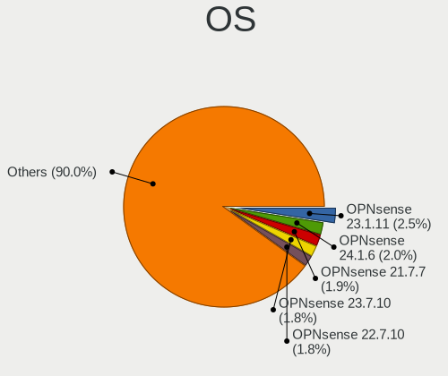
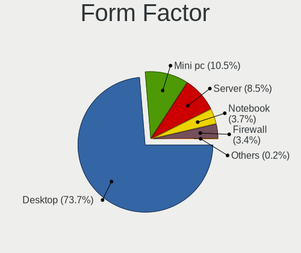
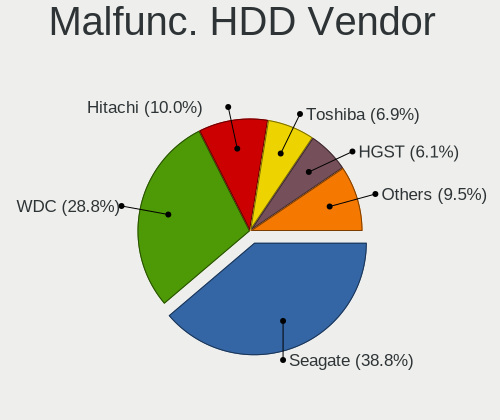
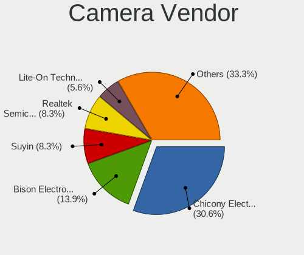
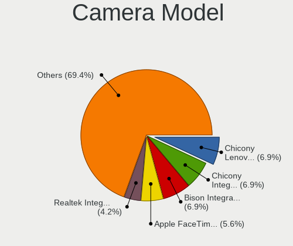

OPNsense - Tested Hardware & Statistics
---------------------------------------

A project to collect tested hardware configurations for OPNsense.

Anyone can contribute to this report by the [hw-probe](https://github.com/linuxhw/hw-probe/blob/master/INSTALL.BSD.md) tool:

    hw-probe -all -upload

Please contribute! Especially if your hardware is rare.

Contents
--------

* [ Test Cases ](#test-cases)

* [ System ](#system)
  - [ OS                       ](#os)
  - [ OS Family                ](#os-family)
  - [ Arch                     ](#arch)
  - [ DE                       ](#de)
  - [ Display Server           ](#display-server)
  - [ Display Manager          ](#display-manager)
  - [ OS Lang                  ](#os-lang)
  - [ Boot Mode                ](#boot-mode)
  - [ Filesystem               ](#filesystem)
  - [ Part. scheme             ](#part-scheme)

* [ Board ](#board)
  - [ Vendor                   ](#vendor)
  - [ Model                    ](#model)
  - [ Model Family             ](#model-family)
  - [ MFG Year                 ](#mfg-year)
  - [ Form Factor              ](#form-factor)
  - [ Coreboot                 ](#coreboot)
  - [ RAM Size                 ](#ram-size)
  - [ RAM Used                 ](#ram-used)
  - [ Total Drives             ](#total-drives)
  - [ Has CD-ROM               ](#has-cd-rom)
  - [ Has Ethernet             ](#has-ethernet)
  - [ Has WiFi                 ](#has-wifi)
  - [ Has Bluetooth            ](#has-bluetooth)

* [ Location ](#location)
  - [ Country                  ](#country)
  - [ City                     ](#city)

* [ Drives ](#drives)
  - [ Drive Vendor             ](#drive-vendor)
  - [ Drive Model              ](#drive-model)
  - [ HDD Vendor               ](#hdd-vendor)
  - [ SSD Vendor               ](#ssd-vendor)
  - [ Drive Kind               ](#drive-kind)
  - [ Drive Connector          ](#drive-connector)
  - [ Drive Size               ](#drive-size)
  - [ Space Total              ](#space-total)
  - [ Space Used               ](#space-used)
  - [ Malfunc. Drives          ](#malfunc-drives)
  - [ Malfunc. Drive Vendor    ](#malfunc-drive-vendor)
  - [ Malfunc. HDD Vendor      ](#malfunc-hdd-vendor)
  - [ Malfunc. Drive Kind      ](#malfunc-drive-kind)
  - [ Failed Drives            ](#failed-drives)
  - [ Failed Drive Vendor      ](#failed-drive-vendor)
  - [ Drive Status             ](#drive-status)

* [ Storage controller ](#storage-controller)
  - [ Storage Vendor           ](#storage-vendor)
  - [ Storage Model            ](#storage-model)
  - [ Storage Kind             ](#storage-kind)

* [ Processor ](#processor)
  - [ CPU Vendor               ](#cpu-vendor)
  - [ CPU Model                ](#cpu-model)
  - [ CPU Model Family         ](#cpu-model-family)
  - [ CPU Cores                ](#cpu-cores)
  - [ CPU Sockets              ](#cpu-sockets)
  - [ CPU Threads              ](#cpu-threads)
  - [ CPU Microarch            ](#cpu-microarch)

* [ Graphics ](#graphics)
  - [ GPU Vendor               ](#gpu-vendor)
  - [ GPU Model                ](#gpu-model)
  - [ GPU Combo                ](#gpu-combo)
  - [ GPU Driver               ](#gpu-driver)
  - [ GPU Memory               ](#gpu-memory)

* [ Monitor ](#monitor)
  - [ Monitor Vendor           ](#monitor-vendor)
  - [ Monitor Model            ](#monitor-model)
  - [ Monitor Resolution       ](#monitor-resolution)
  - [ Monitor Diagonal         ](#monitor-diagonal)
  - [ Monitor Width            ](#monitor-width)
  - [ Aspect Ratio             ](#aspect-ratio)
  - [ Monitor Area             ](#monitor-area)
  - [ Pixel Density            ](#pixel-density)
  - [ Multiple Monitors        ](#multiple-monitors)

* [ Network ](#network)
  - [ Net Controller Vendor    ](#net-controller-vendor)
  - [ Net Controller Model     ](#net-controller-model)
  - [ Wireless Vendor          ](#wireless-vendor)
  - [ Wireless Model           ](#wireless-model)
  - [ Ethernet Vendor          ](#ethernet-vendor)
  - [ Ethernet Model           ](#ethernet-model)
  - [ Net Controller Kind      ](#net-controller-kind)
  - [ Used Controller          ](#used-controller)
  - [ NICs                     ](#nics)
  - [ IPv6                     ](#ipv6)

* [ Bluetooth ](#bluetooth)
  - [ Bluetooth Vendor         ](#bluetooth-vendor)
  - [ Bluetooth Model          ](#bluetooth-model)

* [ Sound ](#sound)
  - [ Sound Vendor             ](#sound-vendor)
  - [ Sound Model              ](#sound-model)

* [ Memory ](#memory)
  - [ Memory Vendor            ](#memory-vendor)
  - [ Memory Model             ](#memory-model)
  - [ Memory Kind              ](#memory-kind)
  - [ Memory Form Factor       ](#memory-form-factor)
  - [ Memory Size              ](#memory-size)
  - [ Memory Speed             ](#memory-speed)

* [ Printers & scanners ](#printers--scanners)
  - [ Printer Vendor           ](#printer-vendor)
  - [ Printer Model            ](#printer-model)
  - [ Scanner Vendor           ](#scanner-vendor)
  - [ Scanner Model            ](#scanner-model)

* [ Camera ](#camera)
  - [ Camera Vendor            ](#camera-vendor)
  - [ Camera Model             ](#camera-model)

* [ Security ](#security)
  - [ Fingerprint Vendor       ](#fingerprint-vendor)
  - [ Fingerprint Model        ](#fingerprint-model)
  - [ Chipcard Vendor          ](#chipcard-vendor)
  - [ Chipcard Model           ](#chipcard-model)

* [ Unsupported ](#unsupported)
  - [ Unsupported Devices      ](#unsupported-devices)
  - [ Unsupported Device Types ](#unsupported-device-types)

Test Cases
----------

Total: 14176

| Vendor        | Model                       | Form-Factor | Probe                                                     | Date         |
|---------------|-----------------------------|-------------|-----------------------------------------------------------|--------------|
| Protectli     | FW2B                        | Desktop     | [ed7bd1dea3](https://bsd-hardware.info/?probe=ed7bd1dea3) | May 09, 2024 |
| Intel         | Q3XXG4-P V1.0               | Desktop     | [152c1f421c](https://bsd-hardware.info/?probe=152c1f421c) | May 09, 2024 |
| Protectli     | VP46xx                      | Desktop     | [e54efb8b1c](https://bsd-hardware.info/?probe=e54efb8b1c) | May 09, 2024 |
| GoWin Solu... | R86S                        | Desktop     | [1f282cde95](https://bsd-hardware.info/?probe=1f282cde95) | May 09, 2024 |
| Unknown       | Unknown                     | Desktop     | [086d24f16e](https://bsd-hardware.info/?probe=086d24f16e) | May 08, 2024 |
| Unknown       | Unknown                     | Desktop     | [4680d0dfbf](https://bsd-hardware.info/?probe=4680d0dfbf) | May 08, 2024 |
| Cisco         | C170 A0                     | Desktop     | [7f12a75d26](https://bsd-hardware.info/?probe=7f12a75d26) | May 08, 2024 |
| Dell          | 0WMJ54 A01                  | Desktop     | [89c2d124bf](https://bsd-hardware.info/?probe=89c2d124bf) | May 08, 2024 |
| BROUNION      | R86S                        | Desktop     | [752d83911f](https://bsd-hardware.info/?probe=752d83911f) | May 08, 2024 |
| Dell          | 0XCR8D A02                  | Desktop     | [bbb91f550d](https://bsd-hardware.info/?probe=bbb91f550d) | May 08, 2024 |
| Protectli     | VP2420                      | Desktop     | [3f72c87441](https://bsd-hardware.info/?probe=3f72c87441) | May 08, 2024 |
| HP            | 83EE                        | Desktop     | [c2a0b11bfa](https://bsd-hardware.info/?probe=c2a0b11bfa) | May 08, 2024 |
| Unknown       | Unknown                     | Desktop     | [0aee6a395a](https://bsd-hardware.info/?probe=0aee6a395a) | May 08, 2024 |
| Unknown       | Unknown                     | Desktop     | [d6164af1c4](https://bsd-hardware.info/?probe=d6164af1c4) | May 08, 2024 |
| Protectli     | FW6E                        | Desktop     | [eaf305f5e2](https://bsd-hardware.info/?probe=eaf305f5e2) | May 08, 2024 |
| Unknown       | Unknown                     | Desktop     | [d0c4d23cbf](https://bsd-hardware.info/?probe=d0c4d23cbf) | May 08, 2024 |
| Dell          | 02K9CR A02                  | Desktop     | [dbac1d87ef](https://bsd-hardware.info/?probe=dbac1d87ef) | May 07, 2024 |
| Protectli     | VP2420                      | Desktop     | [9c20710e0a](https://bsd-hardware.info/?probe=9c20710e0a) | May 07, 2024 |
| AMI           | Aptio CRB                   | Mini pc     | [a10175de86](https://bsd-hardware.info/?probe=a10175de86) | May 07, 2024 |
| Advantech     | NAMB-3250 A102-1            | Desktop     | [0eaf743c54](https://bsd-hardware.info/?probe=0eaf743c54) | May 07, 2024 |
| HP            | ProLiant DL360 G7           | Server      | [b2546ea49e](https://bsd-hardware.info/?probe=b2546ea49e) | May 07, 2024 |
| Supermicro    | X10SBA-LA                   | Server      | [8c25508656](https://bsd-hardware.info/?probe=8c25508656) | May 07, 2024 |
| AAEON         | FWS-2365 V1.0               | Desktop     | [e7f5d7ff38](https://bsd-hardware.info/?probe=e7f5d7ff38) | May 07, 2024 |
| Protectli     | FW6 Ver                     | Desktop     | [b56fbf51c6](https://bsd-hardware.info/?probe=b56fbf51c6) | May 07, 2024 |
| Unknown       | Unknown                     | Desktop     | [30cc9d07af](https://bsd-hardware.info/?probe=30cc9d07af) | May 07, 2024 |
| Dell          | 0GU083 A00                  | Desktop     | [fbb75b4cfd](https://bsd-hardware.info/?probe=fbb75b4cfd) | May 07, 2024 |
| Lenovo        | ThinkCentre M58 7360EUU     | Desktop     | [f84d111995](https://bsd-hardware.info/?probe=f84d111995) | May 07, 2024 |
| Dell          | 0DR845                      | Desktop     | [03e1ebc97e](https://bsd-hardware.info/?probe=03e1ebc97e) | May 07, 2024 |
| Protectli     | FW2B                        | Desktop     | [8a55fe9d07](https://bsd-hardware.info/?probe=8a55fe9d07) | May 07, 2024 |
| Unknown       | QDNV01                      | Desktop     | [8926d1c8f1](https://bsd-hardware.info/?probe=8926d1c8f1) | May 07, 2024 |
| Unknown       | Unknown                     | Desktop     | [6fad0f3ec7](https://bsd-hardware.info/?probe=6fad0f3ec7) | May 07, 2024 |
| Supermicro    | X10SLH-N6-ST031             | Server      | [e6c86b7eb3](https://bsd-hardware.info/?probe=e6c86b7eb3) | May 06, 2024 |
| ASUSTek       | PRIME Z590M-PLUS            | Desktop     | [034c626a7f](https://bsd-hardware.info/?probe=034c626a7f) | May 06, 2024 |
| Dell          | 0F0XJ6 A00                  | Server      | [c049ffad9d](https://bsd-hardware.info/?probe=c049ffad9d) | May 06, 2024 |
| Unknown       | Unknown                     | Desktop     | [676aa9858a](https://bsd-hardware.info/?probe=676aa9858a) | May 06, 2024 |
| HP            | 8054                        | Desktop     | [15da4dbc3e](https://bsd-hardware.info/?probe=15da4dbc3e) | May 06, 2024 |
| HP            | 8054                        | Desktop     | [42143b7763](https://bsd-hardware.info/?probe=42143b7763) | May 06, 2024 |
| HP            | 8054                        | Desktop     | [89f224ab82](https://bsd-hardware.info/?probe=89f224ab82) | May 06, 2024 |
| ASUSTek       | P10S-C Series               | Desktop     | [11db8e3f1e](https://bsd-hardware.info/?probe=11db8e3f1e) | May 06, 2024 |
| ASUSTek       | PRIME H370M-PLUS            | Desktop     | [1f97d380ed](https://bsd-hardware.info/?probe=1f97d380ed) | May 06, 2024 |
| Unknown       | Unknown                     | Desktop     | [b85bfd579d](https://bsd-hardware.info/?probe=b85bfd579d) | May 06, 2024 |
| AZW           | U59                         | Desktop     | [d900403d1a](https://bsd-hardware.info/?probe=d900403d1a) | May 06, 2024 |
| Unknown       | Unknown                     | Firewall    | [f480571196](https://bsd-hardware.info/?probe=f480571196) | May 06, 2024 |
| Unknown       | Unknown                     | Firewall    | [121ff6feae](https://bsd-hardware.info/?probe=121ff6feae) | May 06, 2024 |
| ZOTAC         | ZBOX-EN760                  | Mini pc     | [42edfcecd6](https://bsd-hardware.info/?probe=42edfcecd6) | May 06, 2024 |
| Dell          | 0WMJ54 A01                  | Desktop     | [99b148c21f](https://bsd-hardware.info/?probe=99b148c21f) | May 06, 2024 |
| Deciso        | NetBoard-A10                | Notebook    | [3ae8150618](https://bsd-hardware.info/?probe=3ae8150618) | May 06, 2024 |
| CompuLab      | fitlet2                     | Mini pc     | [18d9d8fdf8](https://bsd-hardware.info/?probe=18d9d8fdf8) | May 06, 2024 |
| AZW           | EQ                          | Desktop     | [edb4b64548](https://bsd-hardware.info/?probe=edb4b64548) | May 06, 2024 |
| HP            | 82F2                        | Desktop     | [7ae2683f3b](https://bsd-hardware.info/?probe=7ae2683f3b) | May 06, 2024 |
| Dell          | 0NW6H5 A00                  | Desktop     | [818fc8022c](https://bsd-hardware.info/?probe=818fc8022c) | May 06, 2024 |
| ASUSTek       | Z97-PRO GAMER               | Desktop     | [02832cd5ca](https://bsd-hardware.info/?probe=02832cd5ca) | May 06, 2024 |
| Protectli     | FW4C Ver                    | Desktop     | [4e0f235713](https://bsd-hardware.info/?probe=4e0f235713) | May 06, 2024 |
| HP            | 83EC                        | Desktop     | [85d2a6764b](https://bsd-hardware.info/?probe=85d2a6764b) | May 06, 2024 |
| ASUSTek       | PRIME H370M-PLUS            | Desktop     | [1be813a788](https://bsd-hardware.info/?probe=1be813a788) | May 06, 2024 |
| Dell          | 03NXH8 A00                  | Mini pc     | [45fc618aff](https://bsd-hardware.info/?probe=45fc618aff) | May 06, 2024 |
| Dell          | 0GXM1W A01                  | Desktop     | [f20a5dbc2b](https://bsd-hardware.info/?probe=f20a5dbc2b) | May 06, 2024 |
| Supermicro    | A2SDi-4C-HLN4F              | Server      | [a2870e073a](https://bsd-hardware.info/?probe=a2870e073a) | May 05, 2024 |
| ZOTAC         | ZBOX-MI522NANO/MI542NANO    | Mini pc     | [76c2ddbad2](https://bsd-hardware.info/?probe=76c2ddbad2) | May 05, 2024 |
| MSI           | MS-7369                     | Desktop     | [65686a6412](https://bsd-hardware.info/?probe=65686a6412) | May 05, 2024 |
| Protectli     | VP2420                      | Desktop     | [dd7edbac6d](https://bsd-hardware.info/?probe=dd7edbac6d) | May 05, 2024 |
| Intel         | MAHOBAY                     | Desktop     | [dfe3417cfb](https://bsd-hardware.info/?probe=dfe3417cfb) | May 05, 2024 |
| Lenovo        | 3136 SDK0J40697 WIN 3305... | Mini pc     | [bad0f0a312](https://bsd-hardware.info/?probe=bad0f0a312) | May 05, 2024 |
| Techvision    | TVI7309X B0                 | Desktop     | [bfab3dbc5c](https://bsd-hardware.info/?probe=bfab3dbc5c) | May 05, 2024 |
| SHANGZHAOY... | B85M-PRO V1.1               | Desktop     | [873fd32471](https://bsd-hardware.info/?probe=873fd32471) | May 05, 2024 |
| Dell          | 0WMJ54 A01                  | Desktop     | [328b32897b](https://bsd-hardware.info/?probe=328b32897b) | May 05, 2024 |
| ZOTAC         | ZBOX-MI522NANO/MI542NANO    | Mini pc     | [20cb6200de](https://bsd-hardware.info/?probe=20cb6200de) | May 05, 2024 |
| AMI           | Aptio CRB                   | Mini pc     | [6541261a86](https://bsd-hardware.info/?probe=6541261a86) | May 05, 2024 |
| HP            | 83E0                        | Desktop     | [63c44781ef](https://bsd-hardware.info/?probe=63c44781ef) | May 05, 2024 |
| AZW           | EQ                          | Desktop     | [8889cb51a4](https://bsd-hardware.info/?probe=8889cb51a4) | May 05, 2024 |
| Dell          | 0D28YY A00                  | Desktop     | [3d0d226dbc](https://bsd-hardware.info/?probe=3d0d226dbc) | May 05, 2024 |
| Unknown       | Unknown                     | Desktop     | [e504371024](https://bsd-hardware.info/?probe=e504371024) | May 05, 2024 |
| Lenovo        | 312D SDK0J40697 WIN 3305... | Mini pc     | [cb4aeaeea1](https://bsd-hardware.info/?probe=cb4aeaeea1) | May 05, 2024 |
| Micro Comp... | Venus series                | Notebook    | [11184b32bb](https://bsd-hardware.info/?probe=11184b32bb) | May 05, 2024 |
| BESSTAR Te... | GB7                         | Mini pc     | [9f494db2bd](https://bsd-hardware.info/?probe=9f494db2bd) | May 04, 2024 |
| Unknown       | Unknown                     | Desktop     | [fd0ae20186](https://bsd-hardware.info/?probe=fd0ae20186) | May 04, 2024 |
| Unknown       | Unknown                     | Desktop     | [5dc8d187ee](https://bsd-hardware.info/?probe=5dc8d187ee) | May 04, 2024 |
| Techvision    | TVI7309X B0                 | Desktop     | [9dc1dd8248](https://bsd-hardware.info/?probe=9dc1dd8248) | May 04, 2024 |
| Unknown       | QDNV01                      | Desktop     | [8b77bdf0b8](https://bsd-hardware.info/?probe=8b77bdf0b8) | May 04, 2024 |
| Unknown       | Unknown                     | Desktop     | [c77ff29728](https://bsd-hardware.info/?probe=c77ff29728) | May 04, 2024 |
| CncTion       | N4505-4L B0                 | Desktop     | [077f0f74a5](https://bsd-hardware.info/?probe=077f0f74a5) | May 04, 2024 |
| Intel         | PB-X6000                    | Desktop     | [23a7529eaa](https://bsd-hardware.info/?probe=23a7529eaa) | May 04, 2024 |
| Dell          | 03NXH8 A00                  | Mini pc     | [aa51033b7c](https://bsd-hardware.info/?probe=aa51033b7c) | May 03, 2024 |
| Gigabyte      | P67A-D3-B3                  | Desktop     | [2e71ecd984](https://bsd-hardware.info/?probe=2e71ecd984) | May 03, 2024 |
| Advantech     | NAMB-3250 A102-1            | Desktop     | [708617284b](https://bsd-hardware.info/?probe=708617284b) | May 03, 2024 |
| Protectli     | VP6670                      | Desktop     | [a51c988dd7](https://bsd-hardware.info/?probe=a51c988dd7) | May 03, 2024 |
| ChangWang     | CW56-58                     | Desktop     | [54250fd5f6](https://bsd-hardware.info/?probe=54250fd5f6) | May 03, 2024 |
| IceWhale T... | ZimaBoard 432 ZMB           | Desktop     | [5064c18402](https://bsd-hardware.info/?probe=5064c18402) | May 03, 2024 |
| Intel         | Q3XXG4-P V1.0               | Desktop     | [e7125777fc](https://bsd-hardware.info/?probe=e7125777fc) | May 03, 2024 |
| ASRock        | X570 Phantom Gaming-ITX/... | Desktop     | [0b900c7694](https://bsd-hardware.info/?probe=0b900c7694) | May 03, 2024 |
| Dell          | 0XCR8D A03                  | Desktop     | [de94ec6929](https://bsd-hardware.info/?probe=de94ec6929) | May 03, 2024 |
| Lanner        | FW-7543 B-GA                | Desktop     | [d999a95489](https://bsd-hardware.info/?probe=d999a95489) | May 03, 2024 |
| Protectli     | FW4B                        | Desktop     | [db66e06618](https://bsd-hardware.info/?probe=db66e06618) | May 02, 2024 |
| Chuwi         | LarkBox X                   | Mini pc     | [4c54b5b3e0](https://bsd-hardware.info/?probe=4c54b5b3e0) | May 02, 2024 |
| IceWhale T... | ZimaBoard 832 ZMB           | Desktop     | [a4517b9363](https://bsd-hardware.info/?probe=a4517b9363) | May 02, 2024 |
| PC Engines    | APU2                        | Desktop     | [5429fb29b1](https://bsd-hardware.info/?probe=5429fb29b1) | May 02, 2024 |
| Dell          | 0CNWVK A00                  | Desktop     | [3c90466a0a](https://bsd-hardware.info/?probe=3c90466a0a) | May 02, 2024 |
| Unknown       | Unknown                     | Desktop     | [da95fe1264](https://bsd-hardware.info/?probe=da95fe1264) | May 02, 2024 |
| Unknown       | Unknown                     | Desktop     | [bd55b95686](https://bsd-hardware.info/?probe=bd55b95686) | May 02, 2024 |
| Dell          | 042P49 A01                  | Desktop     | [2e2fbfee01](https://bsd-hardware.info/?probe=2e2fbfee01) | May 02, 2024 |
| Unknown       | Unknown                     | Desktop     | [d99dea58b6](https://bsd-hardware.info/?probe=d99dea58b6) | May 02, 2024 |
| Unknown       | QDNV01                      | Desktop     | [058c7d1a94](https://bsd-hardware.info/?probe=058c7d1a94) | May 02, 2024 |
| Dell          | 0PC5F7 A00                  | Desktop     | [25be1b099a](https://bsd-hardware.info/?probe=25be1b099a) | May 02, 2024 |
| Gigabyte      | H61M-S2PV                   | Desktop     | [dec458ffdf](https://bsd-hardware.info/?probe=dec458ffdf) | May 02, 2024 |
| Supermicro    | X11SSZ-TLN4F                | Server      | [a25c90248c](https://bsd-hardware.info/?probe=a25c90248c) | May 02, 2024 |
| AZW           | EQ                          | Desktop     | [6fb8bd4d4a](https://bsd-hardware.info/?probe=6fb8bd4d4a) | May 02, 2024 |
| GoWin Solu... | R86S                        | Desktop     | [b43368e560](https://bsd-hardware.info/?probe=b43368e560) | May 02, 2024 |
| Dell          | 0PC5F7 A00                  | Desktop     | [217f8e63db](https://bsd-hardware.info/?probe=217f8e63db) | May 01, 2024 |
| Shuttle       | DL30N                       | Desktop     | [5218f08e52](https://bsd-hardware.info/?probe=5218f08e52) | May 01, 2024 |
| HP            | 8062                        | Desktop     | [2669931060](https://bsd-hardware.info/?probe=2669931060) | May 01, 2024 |
| AWOW          | AK10                        | Desktop     | [a8fbc35162](https://bsd-hardware.info/?probe=a8fbc35162) | May 01, 2024 |
| Dell          | 01RPWC A00                  | Mini pc     | [75a754faa7](https://bsd-hardware.info/?probe=75a754faa7) | May 01, 2024 |
| Micro Comp... | Venus series                | Notebook    | [0fe27dcf5d](https://bsd-hardware.info/?probe=0fe27dcf5d) | May 01, 2024 |
| HP            | 802E                        | Desktop     | [0e16d56660](https://bsd-hardware.info/?probe=0e16d56660) | May 01, 2024 |
| AMI           | Aptio CRB                   | Mini pc     | [67d936ebd3](https://bsd-hardware.info/?probe=67d936ebd3) | May 01, 2024 |
| Barracuda ... | Barracuda NG Firewall F3... | Firewall    | [e6b12d955b](https://bsd-hardware.info/?probe=e6b12d955b) | May 01, 2024 |
| Unknown       | QDNV01                      | Desktop     | [1fc82bb34b](https://bsd-hardware.info/?probe=1fc82bb34b) | May 01, 2024 |
| Gigabyte      | B760I AORUS PRO DDR4        | Desktop     | [f6606ff3aa](https://bsd-hardware.info/?probe=f6606ff3aa) | May 01, 2024 |
| MSI           | AM1I                        | Desktop     | [148d52d171](https://bsd-hardware.info/?probe=148d52d171) | May 01, 2024 |
| Intel         | Q3XXG4-P V1.0               | Desktop     | [ae53040229](https://bsd-hardware.info/?probe=ae53040229) | May 01, 2024 |
| Sophos        | SG                          | Firewall    | [aa116c84a7](https://bsd-hardware.info/?probe=aa116c84a7) | May 01, 2024 |
| Protectli     | VP2410                      | Desktop     | [53101f66d2](https://bsd-hardware.info/?probe=53101f66d2) | May 01, 2024 |
| Intel         | Q3XXG4-P V1.0               | Desktop     | [be7761bc67](https://bsd-hardware.info/?probe=be7761bc67) | May 01, 2024 |
| GoWin Solu... | R86S                        | Desktop     | [8f1277d3c5](https://bsd-hardware.info/?probe=8f1277d3c5) | May 01, 2024 |
| Deciso        | NetBoard-A20                | Notebook    | [c04565ec24](https://bsd-hardware.info/?probe=c04565ec24) | Apr 30, 2024 |
| Dell          | 05XGC8 A01                  | Desktop     | [d463acff9f](https://bsd-hardware.info/?probe=d463acff9f) | Apr 30, 2024 |
| PC Engines    | APU2                        | Desktop     | [a058cd5f63](https://bsd-hardware.info/?probe=a058cd5f63) | Apr 30, 2024 |
| Dell          | 04Y8V0 A02                  | Desktop     | [09a2e96ee1](https://bsd-hardware.info/?probe=09a2e96ee1) | Apr 30, 2024 |
| ASUSTek       | VM62N                       | Desktop     | [d2ff0c5dcb](https://bsd-hardware.info/?probe=d2ff0c5dcb) | Apr 30, 2024 |
| ASUSTek       | VM62N                       | Desktop     | [fbff6f23c7](https://bsd-hardware.info/?probe=fbff6f23c7) | Apr 30, 2024 |
| Unknown       | Unknown                     | Notebook    | [3c24648eb3](https://bsd-hardware.info/?probe=3c24648eb3) | Apr 30, 2024 |
| Deciso        | NetBoard-A20                | Notebook    | [1b9bcc1b41](https://bsd-hardware.info/?probe=1b9bcc1b41) | Apr 30, 2024 |
| Intel         | YC-4L-002                   | Desktop     | [ac058ece5c](https://bsd-hardware.info/?probe=ac058ece5c) | Apr 30, 2024 |
| Protectli     | FW4C Ver                    | Desktop     | [de3c7e60bd](https://bsd-hardware.info/?probe=de3c7e60bd) | Apr 30, 2024 |
| Unknown       | Unknown                     | Desktop     | [39e9c3ddd2](https://bsd-hardware.info/?probe=39e9c3ddd2) | Apr 30, 2024 |
| ASRock        | B550 Phantom Gaming 4       | Desktop     | [a5ad695e41](https://bsd-hardware.info/?probe=a5ad695e41) | Apr 29, 2024 |
| Unknown       | Unknown                     | Desktop     | [db28c45bdd](https://bsd-hardware.info/?probe=db28c45bdd) | Apr 29, 2024 |
| HP            | 829E                        | Mini pc     | [7f58256c41](https://bsd-hardware.info/?probe=7f58256c41) | Apr 29, 2024 |
| Dell          | 04YP6J A00                  | Desktop     | [92b5c39349](https://bsd-hardware.info/?probe=92b5c39349) | Apr 29, 2024 |
| Unknown       | Unknown                     | Desktop     | [5c07afd3bb](https://bsd-hardware.info/?probe=5c07afd3bb) | Apr 29, 2024 |
| Supermicro    | X11SCL-IF                   | Server      | [93394181dc](https://bsd-hardware.info/?probe=93394181dc) | Apr 29, 2024 |
| Dell          | 0DRG19 A00                  | Mini pc     | [ef0b68ce3a](https://bsd-hardware.info/?probe=ef0b68ce3a) | Apr 29, 2024 |
| PC Engines    | APU2                        | Desktop     | [a6953a27eb](https://bsd-hardware.info/?probe=a6953a27eb) | Apr 29, 2024 |
| AMI           | Aptio CRB                   | Mini pc     | [2e0d777f8c](https://bsd-hardware.info/?probe=2e0d777f8c) | Apr 29, 2024 |
| AZW           | EQ                          | Desktop     | [cb3a9cfebf](https://bsd-hardware.info/?probe=cb3a9cfebf) | Apr 29, 2024 |
| ASRock        | Q1900M                      | Desktop     | [7f61d481a6](https://bsd-hardware.info/?probe=7f61d481a6) | Apr 29, 2024 |
| DFI           | Unknown                     | Notebook    | [1348838d15](https://bsd-hardware.info/?probe=1348838d15) | Apr 28, 2024 |
| Protectli     | VP2410 10                   | Desktop     | [180e61b28a](https://bsd-hardware.info/?probe=180e61b28a) | Apr 28, 2024 |
| PC Engines    | APU2                        | Desktop     | [f18a73e413](https://bsd-hardware.info/?probe=f18a73e413) | Apr 28, 2024 |
| Unknown       | Unknown                     | Desktop     | [e54a161178](https://bsd-hardware.info/?probe=e54a161178) | Apr 28, 2024 |
| Dell          | 04415J A00                  | Mini pc     | [5d60841c52](https://bsd-hardware.info/?probe=5d60841c52) | Apr 28, 2024 |
| Unknown       | Unknown                     | Desktop     | [1c2459184f](https://bsd-hardware.info/?probe=1c2459184f) | Apr 28, 2024 |
| Intel         | X79F1 V2.0                  | Desktop     | [0e973743e4](https://bsd-hardware.info/?probe=0e973743e4) | Apr 28, 2024 |
| Unknown       | Unknown                     | Desktop     | [f3cf18561e](https://bsd-hardware.info/?probe=f3cf18561e) | Apr 28, 2024 |
| Unknown       | Unknown                     | Desktop     | [c4991adac4](https://bsd-hardware.info/?probe=c4991adac4) | Apr 28, 2024 |
| ASRock        | H610M-H2/M.2 D5             | Desktop     | [6ab73f5217](https://bsd-hardware.info/?probe=6ab73f5217) | Apr 28, 2024 |
| Dell          | 05XGC8 A01                  | Desktop     | [346d161a05](https://bsd-hardware.info/?probe=346d161a05) | Apr 28, 2024 |
| HP            | 1632                        | Desktop     | [8ef7e0a099](https://bsd-hardware.info/?probe=8ef7e0a099) | Apr 28, 2024 |
| Unknown       | Unknown                     | Desktop     | [c5e1759317](https://bsd-hardware.info/?probe=c5e1759317) | Apr 28, 2024 |
| PC Engines    | APU                         | Desktop     | [7fbd1ae00c](https://bsd-hardware.info/?probe=7fbd1ae00c) | Apr 28, 2024 |
| Unknown       | Unknown                     | Desktop     | [d45b3d4001](https://bsd-hardware.info/?probe=d45b3d4001) | Apr 27, 2024 |
| Fujitsu       | D3313-A1 S26361-D3313-A1    | Desktop     | [ba76589775](https://bsd-hardware.info/?probe=ba76589775) | Apr 27, 2024 |
| Unknown       | Unknown                     | Desktop     | [4da784940c](https://bsd-hardware.info/?probe=4da784940c) | Apr 27, 2024 |
| Winston Ma... | PICO PC PICOPC              | Desktop     | [a0066d8a7c](https://bsd-hardware.info/?probe=a0066d8a7c) | Apr 27, 2024 |
| AZW           | EQ                          | Desktop     | [5f2a5f1314](https://bsd-hardware.info/?probe=5f2a5f1314) | Apr 27, 2024 |
| Seeed Stud... | ODYSSEY-X86J4105 SD-BS-C... | Desktop     | [6da31bada9](https://bsd-hardware.info/?probe=6da31bada9) | Apr 27, 2024 |
| HP            | 2B52                        | Desktop     | [b765a60a21](https://bsd-hardware.info/?probe=b765a60a21) | Apr 27, 2024 |
| Unknown       | QDNV01                      | Desktop     | [67634593ee](https://bsd-hardware.info/?probe=67634593ee) | Apr 27, 2024 |
| Unknown       | Unknown                     | Desktop     | [7d9ef3501e](https://bsd-hardware.info/?probe=7d9ef3501e) | Apr 27, 2024 |
| Barracuda ... | Barracuda NG Firewall F2... | Firewall    | [f35c32132a](https://bsd-hardware.info/?probe=f35c32132a) | Apr 27, 2024 |
| HP            | 859B                        | Desktop     | [5d8024a661](https://bsd-hardware.info/?probe=5d8024a661) | Apr 27, 2024 |
| Unknown       | Unknown                     | Desktop     | [2945a5ee0f](https://bsd-hardware.info/?probe=2945a5ee0f) | Apr 27, 2024 |
| Lenovo        | 319E SEK0T35577 IOT 4247... | Mini pc     | [ef26dc1d85](https://bsd-hardware.info/?probe=ef26dc1d85) | Apr 27, 2024 |
| Dell          | 0KYJ8C A00                  | Desktop     | [7a7c8ece3a](https://bsd-hardware.info/?probe=7a7c8ece3a) | Apr 27, 2024 |
| MSI           | X370 GAMING PRO CARBON      | Desktop     | [688f134478](https://bsd-hardware.info/?probe=688f134478) | Apr 27, 2024 |
| Dell          | 0KYJ8C A00                  | Desktop     | [d35fe4f9ef](https://bsd-hardware.info/?probe=d35fe4f9ef) | Apr 27, 2024 |
| Dell          | 00V62H A01                  | Desktop     | [ac096d436d](https://bsd-hardware.info/?probe=ac096d436d) | Apr 27, 2024 |
| ASRock        | B450M Pro4                  | Desktop     | [4202579f8b](https://bsd-hardware.info/?probe=4202579f8b) | Apr 27, 2024 |
| Shuttle       | FS81                        | Desktop     | [95830b82da](https://bsd-hardware.info/?probe=95830b82da) | Apr 27, 2024 |
| Techvision    | TVI7309X B0                 | Desktop     | [d3ade6deae](https://bsd-hardware.info/?probe=d3ade6deae) | Apr 26, 2024 |
| Trigkey       | Green G5                    | Desktop     | [6bad716921](https://bsd-hardware.info/?probe=6bad716921) | Apr 26, 2024 |
| Unknown       | Unknown                     | Desktop     | [2caa0fe8f7](https://bsd-hardware.info/?probe=2caa0fe8f7) | Apr 26, 2024 |
| Unknown       | Unknown                     | Desktop     | [77ad1db6bd](https://bsd-hardware.info/?probe=77ad1db6bd) | Apr 26, 2024 |
| Sophos        | SG                          | Firewall    | [73353cc92d](https://bsd-hardware.info/?probe=73353cc92d) | Apr 26, 2024 |
| AWOW          | AK10                        | Desktop     | [efb7761dc3](https://bsd-hardware.info/?probe=efb7761dc3) | Apr 26, 2024 |
| SJRC          | SJ-ADLN-6L                  | Desktop     | [eba48b51e7](https://bsd-hardware.info/?probe=eba48b51e7) | Apr 26, 2024 |
| HP            | 82A2                        | Desktop     | [32dfbbd624](https://bsd-hardware.info/?probe=32dfbbd624) | Apr 26, 2024 |
| Unknown       | Unknown                     | Desktop     | [1d373fbfcd](https://bsd-hardware.info/?probe=1d373fbfcd) | Apr 26, 2024 |
| Dell          | 02C2CP A03                  | Server      | [44209ce8c9](https://bsd-hardware.info/?probe=44209ce8c9) | Apr 26, 2024 |
| Unknown       | Unknown                     | Desktop     | [5b9d2e7817](https://bsd-hardware.info/?probe=5b9d2e7817) | Apr 26, 2024 |
| Protectli     | VP6670                      | Desktop     | [cb7ab7b3f4](https://bsd-hardware.info/?probe=cb7ab7b3f4) | Apr 25, 2024 |
| Unknown       | Unknown                     | Desktop     | [57fb516839](https://bsd-hardware.info/?probe=57fb516839) | Apr 25, 2024 |
| Hardkernel    | ODROID-H2                   | Desktop     | [5645a7f37e](https://bsd-hardware.info/?probe=5645a7f37e) | Apr 25, 2024 |
| Unknown       | Unknown                     | Desktop     | [122a8465b5](https://bsd-hardware.info/?probe=122a8465b5) | Apr 25, 2024 |
| Silicom       | 80300-0214-G01 R306         | Desktop     | [1fda8df8d0](https://bsd-hardware.info/?probe=1fda8df8d0) | Apr 25, 2024 |
| Dell          | 0D28YY A00                  | Desktop     | [5245da0f7d](https://bsd-hardware.info/?probe=5245da0f7d) | Apr 25, 2024 |
| Unknown       | Unknown                     | Desktop     | [92f9cb26f3](https://bsd-hardware.info/?probe=92f9cb26f3) | Apr 25, 2024 |
| Unknown       | Unknown                     | Desktop     | [e321b6f25e](https://bsd-hardware.info/?probe=e321b6f25e) | Apr 25, 2024 |
| Fujitsu       | D3313-A1 S26361-D3313-A1    | Desktop     | [328e9b0321](https://bsd-hardware.info/?probe=328e9b0321) | Apr 25, 2024 |
| Protectli     | VP4630                      | Desktop     | [a128743268](https://bsd-hardware.info/?probe=a128743268) | Apr 25, 2024 |
| AZW           | U59                         | Desktop     | [dcd692e9fc](https://bsd-hardware.info/?probe=dcd692e9fc) | Apr 25, 2024 |
| ChangWang     | CW56-58                     | Desktop     | [d7783a62ca](https://bsd-hardware.info/?probe=d7783a62ca) | Apr 25, 2024 |
| Gigabyte      | H170N-WIFI-CF               | Desktop     | [c15db510cc](https://bsd-hardware.info/?probe=c15db510cc) | Apr 25, 2024 |
| Unknown       | Unknown                     | Desktop     | [dcc78e80a4](https://bsd-hardware.info/?probe=dcc78e80a4) | Apr 25, 2024 |
| Techvision    | TVI7309X B0                 | Desktop     | [f92008b628](https://bsd-hardware.info/?probe=f92008b628) | Apr 25, 2024 |
| Supermicro    | X10SLH-N6-ST031             | Desktop     | [c794bd1851](https://bsd-hardware.info/?probe=c794bd1851) | Apr 24, 2024 |
| Sophos        | SG                          | Firewall    | [071c26cca5](https://bsd-hardware.info/?probe=071c26cca5) | Apr 24, 2024 |
| Unknown       | Unknown                     | Desktop     | [e328764399](https://bsd-hardware.info/?probe=e328764399) | Apr 24, 2024 |
| Unknown       | Unknown                     | Desktop     | [0fc168923f](https://bsd-hardware.info/?probe=0fc168923f) | Apr 24, 2024 |
| Protectli     | VP2420                      | Desktop     | [540090badd](https://bsd-hardware.info/?probe=540090badd) | Apr 24, 2024 |
| HP            | 83EF                        | Desktop     | [200bba9baa](https://bsd-hardware.info/?probe=200bba9baa) | Apr 24, 2024 |
| CncTion       | N4505-4L B0                 | Desktop     | [ada59fa5ed](https://bsd-hardware.info/?probe=ada59fa5ed) | Apr 24, 2024 |
| CompuLab      | fitlet2                     | Mini pc     | [b64ba9dbb9](https://bsd-hardware.info/?probe=b64ba9dbb9) | Apr 24, 2024 |
| AZW           | EQ                          | Desktop     | [2907ff3c11](https://bsd-hardware.info/?probe=2907ff3c11) | Apr 24, 2024 |
| Lenovo        | 312A SDK0J40697 WIN 3305... | Desktop     | [a9c5e00a5a](https://bsd-hardware.info/?probe=a9c5e00a5a) | Apr 24, 2024 |
| Unknown       | Unknown                     | Notebook    | [6016137c6c](https://bsd-hardware.info/?probe=6016137c6c) | Apr 24, 2024 |
| Unknown       | QD-CMU01                    | Desktop     | [b2237c3c86](https://bsd-hardware.info/?probe=b2237c3c86) | Apr 24, 2024 |
| Dell          | 0DR845                      | Desktop     | [fa20fdf0c6](https://bsd-hardware.info/?probe=fa20fdf0c6) | Apr 24, 2024 |
| AMI           | Aptio CRB                   | Mini pc     | [904710d7d1](https://bsd-hardware.info/?probe=904710d7d1) | Apr 24, 2024 |
| Unknown       | Unknown                     | Desktop     | [977fec9918](https://bsd-hardware.info/?probe=977fec9918) | Apr 24, 2024 |
| Protectli     | FW4B Ver                    | Desktop     | [14290c46fe](https://bsd-hardware.info/?probe=14290c46fe) | Apr 24, 2024 |
| ASUSTek       | PRIME Z490-V                | Desktop     | [2c3e5dadd2](https://bsd-hardware.info/?probe=2c3e5dadd2) | Apr 24, 2024 |
| Dell          | 0DNMV1 A01                  | Desktop     | [97161dac8a](https://bsd-hardware.info/?probe=97161dac8a) | Apr 24, 2024 |
| Gigabyte      | H81M-H                      | Desktop     | [83a324bd4e](https://bsd-hardware.info/?probe=83a324bd4e) | Apr 24, 2024 |
| Gigabyte      | N3150ND3V                   | Desktop     | [9e0cb28c91](https://bsd-hardware.info/?probe=9e0cb28c91) | Apr 24, 2024 |
| Dell          | 0T10XW A00                  | Desktop     | [84db454f1c](https://bsd-hardware.info/?probe=84db454f1c) | Apr 24, 2024 |
| Lenovo        | 3136 SDK0J40697 WIN 3305... | Mini pc     | [914fb3b14b](https://bsd-hardware.info/?probe=914fb3b14b) | Apr 24, 2024 |
| HP            | 8054                        | Desktop     | [7a76b345c0](https://bsd-hardware.info/?probe=7a76b345c0) | Apr 23, 2024 |
| ASUSTek       | H81M-PLUS                   | Desktop     | [b549100edf](https://bsd-hardware.info/?probe=b549100edf) | Apr 23, 2024 |
| Deciso        | NetBoard-A20                | Notebook    | [0546076798](https://bsd-hardware.info/?probe=0546076798) | Apr 23, 2024 |
| AMI           | Aptio CRB                   | Mini pc     | [ff7b9554ae](https://bsd-hardware.info/?probe=ff7b9554ae) | Apr 23, 2024 |
| Supermicro    | X10SLH-N6-ST031             | Server      | [207072cb69](https://bsd-hardware.info/?probe=207072cb69) | Apr 23, 2024 |
| AMI           | Aptio CRB                   | Mini pc     | [6f88961876](https://bsd-hardware.info/?probe=6f88961876) | Apr 23, 2024 |
| Broachlink    | HART1 V11 J6412             | Desktop     | [002549a39c](https://bsd-hardware.info/?probe=002549a39c) | Apr 23, 2024 |
| Gigabyte      | H110M-H-CF                  | Desktop     | [2000d6447a](https://bsd-hardware.info/?probe=2000d6447a) | Apr 23, 2024 |
| Gigabyte      | H110M-H-CF                  | Desktop     | [3e1def845f](https://bsd-hardware.info/?probe=3e1def845f) | Apr 23, 2024 |
| HP            | 8054                        | Desktop     | [040f48e020](https://bsd-hardware.info/?probe=040f48e020) | Apr 23, 2024 |
| ASUSTek       | J1800I-C/BR                 | Desktop     | [28856a768f](https://bsd-hardware.info/?probe=28856a768f) | Apr 23, 2024 |
| Unknown       | QDNV01                      | Desktop     | [f0d41cdf44](https://bsd-hardware.info/?probe=f0d41cdf44) | Apr 23, 2024 |
| Unknown       | Unknown                     | Desktop     | [17ff1c4d3f](https://bsd-hardware.info/?probe=17ff1c4d3f) | Apr 23, 2024 |
| Deciso        | NetBoard-A20                | Notebook    | [c64fcd31dd](https://bsd-hardware.info/?probe=c64fcd31dd) | Apr 23, 2024 |
| AZW           | EQ                          | Desktop     | [0d1397a949](https://bsd-hardware.info/?probe=0d1397a949) | Apr 23, 2024 |
| Unknown       | Unknown                     | Desktop     | [f8ff7e4c14](https://bsd-hardware.info/?probe=f8ff7e4c14) | Apr 23, 2024 |
| IceWhale T... | ZimaBoard 832 ZMB           | Desktop     | [9dfb20c904](https://bsd-hardware.info/?probe=9dfb20c904) | Apr 23, 2024 |
| AZW           | EQ                          | Desktop     | [9225d89862](https://bsd-hardware.info/?probe=9225d89862) | Apr 23, 2024 |
| Sophos        | XG                          | Firewall    | [023d1a9570](https://bsd-hardware.info/?probe=023d1a9570) | Apr 22, 2024 |
| Dell          | 0NW6H5 A00                  | Desktop     | [565275ac34](https://bsd-hardware.info/?probe=565275ac34) | Apr 22, 2024 |
| Intel         | BOX-J41L4A V3.01            | Desktop     | [62124a50da](https://bsd-hardware.info/?probe=62124a50da) | Apr 22, 2024 |
| AAEON         | FWS-2280 V1.0               | Desktop     | [071a27c302](https://bsd-hardware.info/?probe=071a27c302) | Apr 22, 2024 |
| Unknown       | Unknown                     | Desktop     | [c3bd100494](https://bsd-hardware.info/?probe=c3bd100494) | Apr 22, 2024 |
| Lanner        | FW-7543 B-GA                | Desktop     | [02a165d26f](https://bsd-hardware.info/?probe=02a165d26f) | Apr 22, 2024 |
| Sophos        | XG                          | Firewall    | [ade17f08b9](https://bsd-hardware.info/?probe=ade17f08b9) | Apr 22, 2024 |
| ASRock        | H610M-HDV/M.2               | Desktop     | [86e7184885](https://bsd-hardware.info/?probe=86e7184885) | Apr 22, 2024 |
| ASRock        | H610M-HDV/M.2               | Desktop     | [01443ae842](https://bsd-hardware.info/?probe=01443ae842) | Apr 22, 2024 |
| AMI           | Aptio CRB                   | Mini pc     | [151f33c04f](https://bsd-hardware.info/?probe=151f33c04f) | Apr 22, 2024 |
| Unknown       | Unknown                     | Desktop     | [f1f7eadfba](https://bsd-hardware.info/?probe=f1f7eadfba) | Apr 22, 2024 |
| Dell          | 0C3YXR A02                  | Desktop     | [c7c80f2929](https://bsd-hardware.info/?probe=c7c80f2929) | Apr 22, 2024 |
| Supermicro    | X10SDV-TP8F                 | Server      | [e63c6cb848](https://bsd-hardware.info/?probe=e63c6cb848) | Apr 22, 2024 |
| Fujitsu       | D3543-A1 S26361-D3543-A1... | Desktop     | [072d422490](https://bsd-hardware.info/?probe=072d422490) | Apr 22, 2024 |
| ETegro Tec... | ETRS130G3 31S98MB0020       | Server      | [0da73700f2](https://bsd-hardware.info/?probe=0da73700f2) | Apr 22, 2024 |
| Unknown       | Unknown                     | Desktop     | [242348310b](https://bsd-hardware.info/?probe=242348310b) | Apr 22, 2024 |
| Unknown       | Unknown                     | Desktop     | [ff6d7d0ae2](https://bsd-hardware.info/?probe=ff6d7d0ae2) | Apr 22, 2024 |
| Dell          | 00V62H A00                  | Desktop     | [a00361ccc0](https://bsd-hardware.info/?probe=a00361ccc0) | Apr 22, 2024 |
| Protectli     | FW4B Ver                    | Desktop     | [c5c451123b](https://bsd-hardware.info/?probe=c5c451123b) | Apr 22, 2024 |
| Gigabyte      | F2A78M-D3H                  | Desktop     | [418bc2727b](https://bsd-hardware.info/?probe=418bc2727b) | Apr 21, 2024 |
| Supermicro    | X11SDV-4C-TP8F              | Server      | [1f2712bae0](https://bsd-hardware.info/?probe=1f2712bae0) | Apr 21, 2024 |
| Unknown       | QDNV01                      | Desktop     | [8ce95bba28](https://bsd-hardware.info/?probe=8ce95bba28) | Apr 21, 2024 |
| Unknown       | QDNV01                      | Desktop     | [9cc75e7a9d](https://bsd-hardware.info/?probe=9cc75e7a9d) | Apr 21, 2024 |
| Lenovo        | MAHOBAY NO DPK              | Desktop     | [8baf9d0ad0](https://bsd-hardware.info/?probe=8baf9d0ad0) | Apr 21, 2024 |
| Intel         | Q3XXG4-P V1.0               | Desktop     | [27bc016316](https://bsd-hardware.info/?probe=27bc016316) | Apr 21, 2024 |
| NF541         | 1.0                         | Desktop     | [25cc14f6c9](https://bsd-hardware.info/?probe=25cc14f6c9) | Apr 21, 2024 |
| AAEON         | FWS-2280 V1.0               | Desktop     | [003dbde912](https://bsd-hardware.info/?probe=003dbde912) | Apr 21, 2024 |
| Advantech     | NAMB-1010VC A101            | Desktop     | [e2a9d0cbff](https://bsd-hardware.info/?probe=e2a9d0cbff) | Apr 21, 2024 |
| Unknown       | Unknown                     | Desktop     | [2917802dc7](https://bsd-hardware.info/?probe=2917802dc7) | Apr 21, 2024 |
| Lenovo        | SHARKBAY 0B98401 WIN        | Desktop     | [d9b4db06cf](https://bsd-hardware.info/?probe=d9b4db06cf) | Apr 21, 2024 |
| Dell          | 0XCR8D A01                  | Desktop     | [716181ac45](https://bsd-hardware.info/?probe=716181ac45) | Apr 21, 2024 |
| HP            | 8054                        | Desktop     | [a9b96ce9cb](https://bsd-hardware.info/?probe=a9b96ce9cb) | Apr 20, 2024 |
| Dell          | 096JG8 A01                  | Desktop     | [a696ddada6](https://bsd-hardware.info/?probe=a696ddada6) | Apr 20, 2024 |
| Dell          | 09T7VV A05                  | Server      | [f3f53a40b3](https://bsd-hardware.info/?probe=f3f53a40b3) | Apr 20, 2024 |
| CWWK          | MINIPC-G12                  | Desktop     | [9e0cee5f8e](https://bsd-hardware.info/?probe=9e0cee5f8e) | Apr 20, 2024 |
| PC Engines    | apu4                        | Desktop     | [196bdf1db0](https://bsd-hardware.info/?probe=196bdf1db0) | Apr 20, 2024 |
| Intel         | S1200KP AAG34877-201        | Desktop     | [591ff7791e](https://bsd-hardware.info/?probe=591ff7791e) | Apr 20, 2024 |
| AZW           | EQ                          | Desktop     | [f822d4127d](https://bsd-hardware.info/?probe=f822d4127d) | Apr 20, 2024 |
| Unknown       | Unknown                     | Desktop     | [71ac1fd7c5](https://bsd-hardware.info/?probe=71ac1fd7c5) | Apr 20, 2024 |
| Protectli     | FW4B                        | Desktop     | [d84a4775ae](https://bsd-hardware.info/?probe=d84a4775ae) | Apr 19, 2024 |
| Dell          | 03NXH8 A00                  | Mini pc     | [9161ccc5d1](https://bsd-hardware.info/?probe=9161ccc5d1) | Apr 19, 2024 |
| Dell          | 03NXH8 A00                  | Mini pc     | [de66ec1f1b](https://bsd-hardware.info/?probe=de66ec1f1b) | Apr 19, 2024 |
| CWWK          | CW-AD4L-N V1                | Desktop     | [a5a3503491](https://bsd-hardware.info/?probe=a5a3503491) | Apr 19, 2024 |
| CncTion       | N4505-4L B0                 | Desktop     | [d08059c7cf](https://bsd-hardware.info/?probe=d08059c7cf) | Apr 19, 2024 |
| CncTion       | N4505-4L B0                 | Desktop     | [d9aef0b69c](https://bsd-hardware.info/?probe=d9aef0b69c) | Apr 19, 2024 |
| HP            | 3396                        | Desktop     | [f154c34157](https://bsd-hardware.info/?probe=f154c34157) | Apr 19, 2024 |
| Intel         | QHSW02                      | Desktop     | [a8a19b8f54](https://bsd-hardware.info/?probe=a8a19b8f54) | Apr 19, 2024 |
| Unknown       | Unknown                     | Desktop     | [3f86c9c69d](https://bsd-hardware.info/?probe=3f86c9c69d) | Apr 19, 2024 |
| HP            | 8103 A01                    | Mini pc     | [a6a185dfad](https://bsd-hardware.info/?probe=a6a185dfad) | Apr 19, 2024 |
| Protectli     | FW4B Ver                    | Desktop     | [4d553dfadf](https://bsd-hardware.info/?probe=4d553dfadf) | Apr 19, 2024 |
| Sophos        | SG                          | Firewall    | [d97decf8c5](https://bsd-hardware.info/?probe=d97decf8c5) | Apr 18, 2024 |
| Unknown       | Unknown                     | Desktop     | [8dcdbfb956](https://bsd-hardware.info/?probe=8dcdbfb956) | Apr 18, 2024 |
| ECS           | KBLU-MINI                   | Desktop     | [0380406242](https://bsd-hardware.info/?probe=0380406242) | Apr 18, 2024 |
| HP            | ProLiant DL160 G6           | Server      | [6cfe85eb7f](https://bsd-hardware.info/?probe=6cfe85eb7f) | Apr 18, 2024 |
| Protectli     | FW4B                        | Desktop     | [a5c17e61f1](https://bsd-hardware.info/?probe=a5c17e61f1) | Apr 18, 2024 |
| Deciso        | NetBoard-A20                | Notebook    | [82519e798c](https://bsd-hardware.info/?probe=82519e798c) | Apr 18, 2024 |
| SHANGZHAOY... | B85M-PRO V1.1               | Desktop     | [111bf86a64](https://bsd-hardware.info/?probe=111bf86a64) | Apr 18, 2024 |
| Unknown       | Unknown                     | Desktop     | [5dfaef985e](https://bsd-hardware.info/?probe=5dfaef985e) | Apr 18, 2024 |
| Unknown       | Unknown                     | Desktop     | [d5529f00e1](https://bsd-hardware.info/?probe=d5529f00e1) | Apr 18, 2024 |
| Unknown       | Unknown                     | Desktop     | [8228d59c2e](https://bsd-hardware.info/?probe=8228d59c2e) | Apr 18, 2024 |
| Deciso        | NetBoard-A10                | Notebook    | [c2e1f3af3b](https://bsd-hardware.info/?probe=c2e1f3af3b) | Apr 18, 2024 |
| Unknown       | Unknown                     | Notebook    | [5886bb9659](https://bsd-hardware.info/?probe=5886bb9659) | Apr 18, 2024 |
| Unknown       | Unknown                     | Desktop     | [8a1e92002f](https://bsd-hardware.info/?probe=8a1e92002f) | Apr 18, 2024 |
| Unknown       | Unknown                     | Desktop     | [6eb7611839](https://bsd-hardware.info/?probe=6eb7611839) | Apr 18, 2024 |
| HP            | 802E                        | Desktop     | [5b970e59a9](https://bsd-hardware.info/?probe=5b970e59a9) | Apr 18, 2024 |
| Gigabyte      | H170N-WIFI-CF               | Desktop     | [a371991d89](https://bsd-hardware.info/?probe=a371991d89) | Apr 18, 2024 |
| HP            | 3397                        | Desktop     | [edb1b08bac](https://bsd-hardware.info/?probe=edb1b08bac) | Apr 18, 2024 |
| Lenovo        | 312A SDK0J40697 WIN 3305... | Desktop     | [312ac9ef97](https://bsd-hardware.info/?probe=312ac9ef97) | Apr 18, 2024 |
| Supermicro    | X10SLM+-LN4F                | Desktop     | [787ae9d825](https://bsd-hardware.info/?probe=787ae9d825) | Apr 17, 2024 |
| AMI           | Aptio CRB                   | Mini pc     | [64b9af8831](https://bsd-hardware.info/?probe=64b9af8831) | Apr 17, 2024 |
| Unknown       | QDNV01                      | Desktop     | [dd1db96452](https://bsd-hardware.info/?probe=dd1db96452) | Apr 17, 2024 |
| Protectli     | FW6 Ver                     | Desktop     | [f8c9b99afe](https://bsd-hardware.info/?probe=f8c9b99afe) | Apr 17, 2024 |
| Intel         | Q3XXG4-P V1.0               | Desktop     | [dd5c8c3088](https://bsd-hardware.info/?probe=dd5c8c3088) | Apr 17, 2024 |
| Dell          | 0WKGTH A02                  | Server      | [f305cf34b1](https://bsd-hardware.info/?probe=f305cf34b1) | Apr 17, 2024 |
| Intel         | DQ77KB AAG81483-501         | Desktop     | [e79deb66c2](https://bsd-hardware.info/?probe=e79deb66c2) | Apr 17, 2024 |
| ASUSTek       | PRIME B450M-A               | Desktop     | [967017eda5](https://bsd-hardware.info/?probe=967017eda5) | Apr 17, 2024 |
| ASUSTek       | PRIME B450M-A               | Desktop     | [106f715843](https://bsd-hardware.info/?probe=106f715843) | Apr 17, 2024 |
| ASUSTek       | ROG STRIX X470-F GAMING     | Desktop     | [6ae2b0af08](https://bsd-hardware.info/?probe=6ae2b0af08) | Apr 17, 2024 |
| HP            | 83EF                        | Desktop     | [2ee23055a9](https://bsd-hardware.info/?probe=2ee23055a9) | Apr 17, 2024 |
| Unknown       | Unknown                     | Desktop     | [d231a9531b](https://bsd-hardware.info/?probe=d231a9531b) | Apr 17, 2024 |
| Dell          | 08NPPY A00                  | Desktop     | [aa1be23040](https://bsd-hardware.info/?probe=aa1be23040) | Apr 17, 2024 |
| CWWK          | CW-J6-6L                    | Desktop     | [9fad598601](https://bsd-hardware.info/?probe=9fad598601) | Apr 17, 2024 |
| ASRock        | N68-GS3 UCC                 | Desktop     | [8da917c311](https://bsd-hardware.info/?probe=8da917c311) | Apr 16, 2024 |
| CWWK          | CW-J6-6L                    | Desktop     | [38af677c8c](https://bsd-hardware.info/?probe=38af677c8c) | Apr 16, 2024 |
| Gigabyte      | Q670M D3H                   | Desktop     | [923a7e28d2](https://bsd-hardware.info/?probe=923a7e28d2) | Apr 16, 2024 |
| Sophos        | SG                          | Firewall    | [11b1ad33c7](https://bsd-hardware.info/?probe=11b1ad33c7) | Apr 16, 2024 |
| Intel         | SHARKBAY                    | Desktop     | [cbe3a65615](https://bsd-hardware.info/?probe=cbe3a65615) | Apr 16, 2024 |
| HP            | 8299                        | Desktop     | [7b4780009e](https://bsd-hardware.info/?probe=7b4780009e) | Apr 16, 2024 |
| Supermicro    | X11SDV-4C-TP8F              | Server      | [67e558c746](https://bsd-hardware.info/?probe=67e558c746) | Apr 16, 2024 |
| PC Engines    | APU2                        | Desktop     | [a0db25b377](https://bsd-hardware.info/?probe=a0db25b377) | Apr 16, 2024 |
| Supermicro    | X10SLM+-LN4F                | Desktop     | [57f9cb7c7c](https://bsd-hardware.info/?probe=57f9cb7c7c) | Apr 16, 2024 |
| ASRock        | H310CM-DVS                  | Desktop     | [61e73f301e](https://bsd-hardware.info/?probe=61e73f301e) | Apr 15, 2024 |
| Protectli     | VP2420                      | Desktop     | [7ef75e0f44](https://bsd-hardware.info/?probe=7ef75e0f44) | Apr 15, 2024 |
| ASRock        | H610M-H2/M.2 D5             | Desktop     | [0c2877ba10](https://bsd-hardware.info/?probe=0c2877ba10) | Apr 15, 2024 |
| Unknown       | Unknown                     | Desktop     | [f1207a13cd](https://bsd-hardware.info/?probe=f1207a13cd) | Apr 15, 2024 |
| Sophos        | SG                          | Firewall    | [25d743bbcb](https://bsd-hardware.info/?probe=25d743bbcb) | Apr 15, 2024 |
| Barracuda ... | Barracuda NG Firewall F2... | Firewall    | [6dac70b97b](https://bsd-hardware.info/?probe=6dac70b97b) | Apr 15, 2024 |
| Unknown       | Unknown                     | Desktop     | [ed5ec4af1d](https://bsd-hardware.info/?probe=ed5ec4af1d) | Apr 15, 2024 |
| AMI           | Aptio CRB                   | Mini pc     | [63b60ab68e](https://bsd-hardware.info/?probe=63b60ab68e) | Apr 15, 2024 |
| Dell          | 08NPPY A00                  | Desktop     | [933929081c](https://bsd-hardware.info/?probe=933929081c) | Apr 15, 2024 |
| Unknown       | Unknown                     | Desktop     | [c02b232857](https://bsd-hardware.info/?probe=c02b232857) | Apr 15, 2024 |
| Unknown       | Unknown                     | Desktop     | [a0e83f7eba](https://bsd-hardware.info/?probe=a0e83f7eba) | Apr 15, 2024 |
| Techvision    | TVI7309X B0                 | Desktop     | [7e1d43786b](https://bsd-hardware.info/?probe=7e1d43786b) | Apr 15, 2024 |
| Supermicro    | X10SLL-F                    | Server      | [2894a91926](https://bsd-hardware.info/?probe=2894a91926) | Apr 15, 2024 |
| Unknown       | Unknown                     | Desktop     | [38648c9cd5](https://bsd-hardware.info/?probe=38648c9cd5) | Apr 15, 2024 |
| ASUSTek       | Q170M-CM-B                  | Desktop     | [a17c3fa36c](https://bsd-hardware.info/?probe=a17c3fa36c) | Apr 15, 2024 |
| Unknown       | Unknown                     | Desktop     | [7d62866ffb](https://bsd-hardware.info/?probe=7d62866ffb) | Apr 15, 2024 |
| Lenovo        | ThinkServer RS140           | Desktop     | [40aba08780](https://bsd-hardware.info/?probe=40aba08780) | Apr 14, 2024 |
| Unknown       | J3160-4L                    | Desktop     | [1f2e61cf7d](https://bsd-hardware.info/?probe=1f2e61cf7d) | Apr 14, 2024 |
| Protectli     | VP2420                      | Desktop     | [1fb0c324a7](https://bsd-hardware.info/?probe=1fb0c324a7) | Apr 14, 2024 |
| Protectli     | VP2420                      | Desktop     | [e60a9de225](https://bsd-hardware.info/?probe=e60a9de225) | Apr 14, 2024 |
| AWOW          | PC BOX                      | Mini pc     | [87d6e7988e](https://bsd-hardware.info/?probe=87d6e7988e) | Apr 14, 2024 |
| Lenovo        | 312D SDK0J40697 WIN 3305... | Mini pc     | [e0665616ad](https://bsd-hardware.info/?probe=e0665616ad) | Apr 14, 2024 |
| AMI           | Aptio CRB                   | Mini pc     | [2f9f249b7d](https://bsd-hardware.info/?probe=2f9f249b7d) | Apr 14, 2024 |
| HP            | ProLiant ML10 v2            | Desktop     | [ce07ad0dfd](https://bsd-hardware.info/?probe=ce07ad0dfd) | Apr 14, 2024 |
| PC Engines    | apu1                        | Desktop     | [cceec3e9bd](https://bsd-hardware.info/?probe=cceec3e9bd) | Apr 14, 2024 |
| MW            | GMLK-2_5G4L                 | Desktop     | [ecdf8a1fb4](https://bsd-hardware.info/?probe=ecdf8a1fb4) | Apr 14, 2024 |
| Hardkernel    | ODROID-H2                   | Desktop     | [d39a7c3b75](https://bsd-hardware.info/?probe=d39a7c3b75) | Apr 14, 2024 |
| Supermicro    | X10SDV-TP8F                 | Server      | [0ed39754c4](https://bsd-hardware.info/?probe=0ed39754c4) | Apr 13, 2024 |
| Intel         | AB2L .A001                  | Mini pc     | [e77338215b](https://bsd-hardware.info/?probe=e77338215b) | Apr 13, 2024 |
| Fujitsu       | D3375-A1 S26361-D3375-A1... | Server      | [7f5d08b02b](https://bsd-hardware.info/?probe=7f5d08b02b) | Apr 13, 2024 |
| PC Engines    | apu4                        | Desktop     | [5ceaa26e0d](https://bsd-hardware.info/?probe=5ceaa26e0d) | Apr 13, 2024 |
| Dell          | 0WR7PY A02                  | Desktop     | [77784d4768](https://bsd-hardware.info/?probe=77784d4768) | Apr 13, 2024 |
| Gigabyte      | Z690I A ULTRA LITE D4       | Desktop     | [0c94f5e1bf](https://bsd-hardware.info/?probe=0c94f5e1bf) | Apr 13, 2024 |
| Intel         | S1200KP AAG34877-201        | Desktop     | [eb6a935f1d](https://bsd-hardware.info/?probe=eb6a935f1d) | Apr 13, 2024 |
| Unknown       | QDNV01                      | Desktop     | [e90c02d0da](https://bsd-hardware.info/?probe=e90c02d0da) | Apr 13, 2024 |
| Protectli     | VP4630                      | Desktop     | [ceb253b6e9](https://bsd-hardware.info/?probe=ceb253b6e9) | Apr 13, 2024 |
| Unknown       | Unknown                     | Desktop     | [00dea7eb17](https://bsd-hardware.info/?probe=00dea7eb17) | Apr 13, 2024 |
| Unknown       | Unknown                     | Desktop     | [a4dc0d0ac8](https://bsd-hardware.info/?probe=a4dc0d0ac8) | Apr 13, 2024 |
| HP            | 802E                        | Desktop     | [08bbe922f0](https://bsd-hardware.info/?probe=08bbe922f0) | Apr 13, 2024 |
| Dell          | 081N4V A08                  | Server      | [9e998f561f](https://bsd-hardware.info/?probe=9e998f561f) | Apr 13, 2024 |
| Dell          | 02YYK5 A00                  | Desktop     | [4fa8c1ab46](https://bsd-hardware.info/?probe=4fa8c1ab46) | Apr 13, 2024 |
| Protectli     | VP4630                      | Desktop     | [709596b9a7](https://bsd-hardware.info/?probe=709596b9a7) | Apr 13, 2024 |
| Gigabyte      | N3150ND3V                   | Desktop     | [50cdb5f1c0](https://bsd-hardware.info/?probe=50cdb5f1c0) | Apr 13, 2024 |
| Unknown       | Unknown                     | Desktop     | [23cc24ddfc](https://bsd-hardware.info/?probe=23cc24ddfc) | Apr 13, 2024 |
| Protectli     | FW6 Ver                     | Desktop     | [857b4091b4](https://bsd-hardware.info/?probe=857b4091b4) | Apr 13, 2024 |
| Lenovo        | 3135 SDK0J40697 WIN 3305... | Mini pc     | [63abbbfa69](https://bsd-hardware.info/?probe=63abbbfa69) | Apr 13, 2024 |
| Gigabyte      | X570 I AORUS PRO WIFI       | Desktop     | [342231f6b6](https://bsd-hardware.info/?probe=342231f6b6) | Apr 13, 2024 |
| Gigabyte      | M61SME-S2                   | Desktop     | [f81dc4e9cf](https://bsd-hardware.info/?probe=f81dc4e9cf) | Apr 13, 2024 |
| Protectli     | FW6 Ver                     | Desktop     | [2d1eb66a62](https://bsd-hardware.info/?probe=2d1eb66a62) | Apr 12, 2024 |
| Fujitsu       | D3313-A1 S26361-D3313-A1    | Desktop     | [66aaf90799](https://bsd-hardware.info/?probe=66aaf90799) | Apr 12, 2024 |
| Unknown       | Unknown                     | Mini pc     | [c064a21fb3](https://bsd-hardware.info/?probe=c064a21fb3) | Apr 12, 2024 |
| Unknown       | Unknown                     | Desktop     | [55fcf12f06](https://bsd-hardware.info/?probe=55fcf12f06) | Apr 12, 2024 |
| Dell          | OptiPlex 3020               | Desktop     | [788d81ce1b](https://bsd-hardware.info/?probe=788d81ce1b) | Apr 12, 2024 |
| Supermicro    | X11SDV-4C-TP8F              | Server      | [962837890c](https://bsd-hardware.info/?probe=962837890c) | Apr 12, 2024 |
| Intel         | MAHOBAY                     | Desktop     | [9202be9d8d](https://bsd-hardware.info/?probe=9202be9d8d) | Apr 12, 2024 |
| Unknown       | Unknown                     | Desktop     | [e72e2a9dae](https://bsd-hardware.info/?probe=e72e2a9dae) | Apr 12, 2024 |
| Dell          | 0NW6H5 A00                  | Desktop     | [850c749c00](https://bsd-hardware.info/?probe=850c749c00) | Apr 12, 2024 |
| Protectli     | VP4650                      | Desktop     | [95ce732272](https://bsd-hardware.info/?probe=95ce732272) | Apr 12, 2024 |
| Intel         | CRESCENTBAY                 | Desktop     | [d1624d1e25](https://bsd-hardware.info/?probe=d1624d1e25) | Apr 12, 2024 |
| HP            | 8054                        | Desktop     | [58d6764238](https://bsd-hardware.info/?probe=58d6764238) | Apr 12, 2024 |
| Techvision    | TVI7309X B0                 | Desktop     | [5d90b39462](https://bsd-hardware.info/?probe=5d90b39462) | Apr 12, 2024 |
| Unknown       | Unknown                     | Desktop     | [a4784e1d0b](https://bsd-hardware.info/?probe=a4784e1d0b) | Apr 12, 2024 |
| Lenovo        | 312D SDK0J40697 WIN 3305... | Mini pc     | [3f6d4b690f](https://bsd-hardware.info/?probe=3f6d4b690f) | Apr 11, 2024 |
| Supermicro    | X10SLL-SF                   | Server      | [f9ae26fa3f](https://bsd-hardware.info/?probe=f9ae26fa3f) | Apr 11, 2024 |
| AZW           | EQ                          | Desktop     | [ac547a3184](https://bsd-hardware.info/?probe=ac547a3184) | Apr 11, 2024 |
| Supermicro    | X11SCL-IF                   | Server      | [72613481e7](https://bsd-hardware.info/?probe=72613481e7) | Apr 11, 2024 |
| AMI           | Aptio CRB                   | Mini pc     | [f3dacc9486](https://bsd-hardware.info/?probe=f3dacc9486) | Apr 11, 2024 |
| Supermicro    | X10SLL-F                    | Server      | [fb26323c1a](https://bsd-hardware.info/?probe=fb26323c1a) | Apr 11, 2024 |
| Lenovo        | 3136 SDK0J40697 WIN 3305... | Mini pc     | [58b24173b7](https://bsd-hardware.info/?probe=58b24173b7) | Apr 11, 2024 |
| Intel         | NUC7i7BNB J31145-306        | Mini pc     | [1ba0813950](https://bsd-hardware.info/?probe=1ba0813950) | Apr 11, 2024 |
| PC Engines    | APU2                        | Desktop     | [22fc545294](https://bsd-hardware.info/?probe=22fc545294) | Apr 11, 2024 |
| ZOTAC         | ZBOX-CI323NANO              | Mini pc     | [8871237b94](https://bsd-hardware.info/?probe=8871237b94) | Apr 11, 2024 |
| Unknown       | Unknown                     | Desktop     | [d9b9726d99](https://bsd-hardware.info/?probe=d9b9726d99) | Apr 10, 2024 |
| CWWK          | CW-AD4L-N V1                | Desktop     | [6f3bd2d62a](https://bsd-hardware.info/?probe=6f3bd2d62a) | Apr 10, 2024 |
| Unknown       | Unknown                     | Desktop     | [34cacdab39](https://bsd-hardware.info/?probe=34cacdab39) | Apr 10, 2024 |
| Lenovo        | 312D SDK0J40697 WIN 3305... | Mini pc     | [1df638de6d](https://bsd-hardware.info/?probe=1df638de6d) | Apr 10, 2024 |
| Unknown       | Unknown                     | Desktop     | [72628a347f](https://bsd-hardware.info/?probe=72628a347f) | Apr 10, 2024 |
| Lenovo        | ThinkServer RS140           | Desktop     | [77864ffe0d](https://bsd-hardware.info/?probe=77864ffe0d) | Apr 10, 2024 |
| Unknown       | Unknown                     | Desktop     | [2e82d26f0f](https://bsd-hardware.info/?probe=2e82d26f0f) | Apr 10, 2024 |
| Unknown       | QSKL01                      | Desktop     | [8d3085a949](https://bsd-hardware.info/?probe=8d3085a949) | Apr 10, 2024 |
| Intel         | DENLOW_REFRESH_WS           | Desktop     | [6bf2cb9e26](https://bsd-hardware.info/?probe=6bf2cb9e26) | Apr 10, 2024 |
| Unknown       | QGLK03                      | Desktop     | [4da00b268e](https://bsd-hardware.info/?probe=4da00b268e) | Apr 10, 2024 |
| AMI           | Aptio CRB                   | Mini pc     | [ca09d643bd](https://bsd-hardware.info/?probe=ca09d643bd) | Apr 10, 2024 |
| Unknown       | Unknown                     | Desktop     | [5bbd14a051](https://bsd-hardware.info/?probe=5bbd14a051) | Apr 10, 2024 |
| Unknown       | Unknown                     | Desktop     | [8756afef80](https://bsd-hardware.info/?probe=8756afef80) | Apr 10, 2024 |
| Intel         | CRESCENTBAY                 | Desktop     | [90b2cd042b](https://bsd-hardware.info/?probe=90b2cd042b) | Apr 09, 2024 |
| Dell          | 0HD5W2 A01                  | Desktop     | [83ccece967](https://bsd-hardware.info/?probe=83ccece967) | Apr 09, 2024 |
| Unknown       | Unknown                     | Desktop     | [6fd6e3f7a8](https://bsd-hardware.info/?probe=6fd6e3f7a8) | Apr 09, 2024 |
| Sophos        | SG                          | Firewall    | [4e0b53357e](https://bsd-hardware.info/?probe=4e0b53357e) | Apr 09, 2024 |
| ZOTAC         | ZBOX-CI327NANO-GS-01        | Mini pc     | [587582cb7e](https://bsd-hardware.info/?probe=587582cb7e) | Apr 09, 2024 |
| Deciso        | Netboard A10 V2.1           | Desktop     | [c6346e4da7](https://bsd-hardware.info/?probe=c6346e4da7) | Apr 09, 2024 |
| Unknown       | Unknown                     | Desktop     | [a9c935db85](https://bsd-hardware.info/?probe=a9c935db85) | Apr 09, 2024 |
| Dell          | 0C27VV A04                  | Desktop     | [a825a2e8e1](https://bsd-hardware.info/?probe=a825a2e8e1) | Apr 09, 2024 |
| Intel         | SHARKBAY                    | Desktop     | [ad50837060](https://bsd-hardware.info/?probe=ad50837060) | Apr 09, 2024 |
| MW            | GMLK-2_5G4L                 | Desktop     | [35a03e8873](https://bsd-hardware.info/?probe=35a03e8873) | Apr 09, 2024 |
| HP            | 1998                        | Desktop     | [1fcf462f12](https://bsd-hardware.info/?probe=1fcf462f12) | Apr 09, 2024 |
| HP            | 83EE                        | Desktop     | [b4ef90627e](https://bsd-hardware.info/?probe=b4ef90627e) | Apr 09, 2024 |
| Unknown       | Unknown                     | Desktop     | [b0f0aa6e23](https://bsd-hardware.info/?probe=b0f0aa6e23) | Apr 09, 2024 |
| Supermicro    | X11SSZ-TLN4F                | Server      | [f13c2eb215](https://bsd-hardware.info/?probe=f13c2eb215) | Apr 09, 2024 |
| Gigabyte      | B450M DS3H WIFI-CF          | Desktop     | [766963303c](https://bsd-hardware.info/?probe=766963303c) | Apr 09, 2024 |
| MSI           | H81M-E33                    | Desktop     | [4ca2185600](https://bsd-hardware.info/?probe=4ca2185600) | Apr 08, 2024 |
| Dell          | 042P49 A02                  | Desktop     | [7929dfb577](https://bsd-hardware.info/?probe=7929dfb577) | Apr 08, 2024 |
| Gigabyte      | B450M DS3H WIFI-CF          | Desktop     | [82a5f11d39](https://bsd-hardware.info/?probe=82a5f11d39) | Apr 08, 2024 |
| HP            | 8298                        | Desktop     | [c9d7df4ade](https://bsd-hardware.info/?probe=c9d7df4ade) | Apr 08, 2024 |
| ASRock        | H470M-ITX/ac                | Desktop     | [800c9334a3](https://bsd-hardware.info/?probe=800c9334a3) | Apr 08, 2024 |
| Unknown       | Unknown                     | Notebook    | [ac12463cc2](https://bsd-hardware.info/?probe=ac12463cc2) | Apr 08, 2024 |
| Supermicro    | X10SLM+-LN4F                | Server      | [640918e28a](https://bsd-hardware.info/?probe=640918e28a) | Apr 08, 2024 |
| HP            | 82A2                        | Desktop     | [2ae972f471](https://bsd-hardware.info/?probe=2ae972f471) | Apr 08, 2024 |
| Dell          | 0C27VV A02                  | Desktop     | [838d1cbd76](https://bsd-hardware.info/?probe=838d1cbd76) | Apr 08, 2024 |
| Lenovo        | 3181 SDK0J40697 WIN 3305... | Mini pc     | [da774945c3](https://bsd-hardware.info/?probe=da774945c3) | Apr 08, 2024 |
| Dell          | 0WMJ54 A01                  | Desktop     | [354ffec262](https://bsd-hardware.info/?probe=354ffec262) | Apr 08, 2024 |
| Techvision    | TVI7309X B0                 | Desktop     | [a578a2019f](https://bsd-hardware.info/?probe=a578a2019f) | Apr 08, 2024 |
| Protectli     | FW4B                        | Desktop     | [f63f5841ca](https://bsd-hardware.info/?probe=f63f5841ca) | Apr 08, 2024 |
| AMI           | Aptio CRB                   | Mini pc     | [9057a0522b](https://bsd-hardware.info/?probe=9057a0522b) | Apr 08, 2024 |
| Dell          | 05XGC8 A01                  | Desktop     | [2952e8c144](https://bsd-hardware.info/?probe=2952e8c144) | Apr 08, 2024 |
| Unknown       | Unknown                     | Desktop     | [adb3e3abb5](https://bsd-hardware.info/?probe=adb3e3abb5) | Apr 07, 2024 |
| Sophos        | SG                          | Firewall    | [07510a2576](https://bsd-hardware.info/?probe=07510a2576) | Apr 07, 2024 |
| Unknown       | Unknown                     | Desktop     | [ed6d898458](https://bsd-hardware.info/?probe=ed6d898458) | Apr 07, 2024 |
| Fujitsu       | D3433-S2 S26361-D3433-S2    | Desktop     | [b3e26e3565](https://bsd-hardware.info/?probe=b3e26e3565) | Apr 07, 2024 |
| HP            | 802E                        | Desktop     | [0d19546a5c](https://bsd-hardware.info/?probe=0d19546a5c) | Apr 07, 2024 |
| Sophos        | XG                          | Firewall    | [153e670640](https://bsd-hardware.info/?probe=153e670640) | Apr 07, 2024 |
| Unknown       | DS2203                      | Desktop     | [5e78573f0b](https://bsd-hardware.info/?probe=5e78573f0b) | Apr 07, 2024 |
| Supermicro    | X9SCL/X9SCMA                | Desktop     | [a28770c052](https://bsd-hardware.info/?probe=a28770c052) | Apr 07, 2024 |
| AWOW          | MC02                        | Mini pc     | [88b4c370d9](https://bsd-hardware.info/?probe=88b4c370d9) | Apr 07, 2024 |
| Techvision    | TVI7309X B0                 | Desktop     | [a03cb5c5c8](https://bsd-hardware.info/?probe=a03cb5c5c8) | Apr 06, 2024 |
| IceWhale T... | ZimaBoard 832 ZMB           | Desktop     | [f136f0b5e6](https://bsd-hardware.info/?probe=f136f0b5e6) | Apr 06, 2024 |
| Unknown       | Unknown                     | Desktop     | [bafb4c3fd6](https://bsd-hardware.info/?probe=bafb4c3fd6) | Apr 06, 2024 |
| Protectli     | FW6 Ver                     | Desktop     | [aad3f8b548](https://bsd-hardware.info/?probe=aad3f8b548) | Apr 06, 2024 |
| Fujitsu       | D3313-A1 S26361-D3313-A1    | Desktop     | [8df08d4eb9](https://bsd-hardware.info/?probe=8df08d4eb9) | Apr 06, 2024 |
| ASUSTek       | PRIME B760M-A D4            | Desktop     | [04bb97b4ea](https://bsd-hardware.info/?probe=04bb97b4ea) | Apr 06, 2024 |
| Gigabyte      | B550 AORUS ELITE V2         | Desktop     | [b2c5d9efea](https://bsd-hardware.info/?probe=b2c5d9efea) | Apr 06, 2024 |
| Gigabyte      | IMB1900N                    | Desktop     | [ed465b2fa0](https://bsd-hardware.info/?probe=ed465b2fa0) | Apr 06, 2024 |
| Supermicro    | M11SDV-8C-LN4F              | Server      | [574ff40323](https://bsd-hardware.info/?probe=574ff40323) | Apr 06, 2024 |
| Dell          | 05XGC8 A01                  | Desktop     | [44fa4423a1](https://bsd-hardware.info/?probe=44fa4423a1) | Apr 06, 2024 |
| MSI           | X58 Pro-E                   | Desktop     | [f5fbf5ba2a](https://bsd-hardware.info/?probe=f5fbf5ba2a) | Apr 06, 2024 |
| Lenovo        | SHARKBAY 0B98401 WIN        | Desktop     | [1785ba496b](https://bsd-hardware.info/?probe=1785ba496b) | Apr 06, 2024 |
| Protectli     | FW6 Ver                     | Desktop     | [f0a3265ccb](https://bsd-hardware.info/?probe=f0a3265ccb) | Apr 06, 2024 |
| Supermicro    | X11SSH-F                    | Desktop     | [04ec06cf77](https://bsd-hardware.info/?probe=04ec06cf77) | Apr 06, 2024 |
| Unknown       | Unknown                     | Desktop     | [eee54861c0](https://bsd-hardware.info/?probe=eee54861c0) | Apr 06, 2024 |
| Fujitsu       | D3313-A1 S26361-D3313-A1    | Desktop     | [f454e745a8](https://bsd-hardware.info/?probe=f454e745a8) | Apr 06, 2024 |
| Supermicro    | X11SCL-IF                   | Server      | [e15bfd33c8](https://bsd-hardware.info/?probe=e15bfd33c8) | Apr 06, 2024 |
| Lenovo        | ThinkServer RS140           | Desktop     | [45dda21509](https://bsd-hardware.info/?probe=45dda21509) | Apr 05, 2024 |
| Unknown       | Unknown                     | Desktop     | [3f0b01e18f](https://bsd-hardware.info/?probe=3f0b01e18f) | Apr 05, 2024 |
| Dell          | 0X3D66 A02                  | Server      | [d2617be829](https://bsd-hardware.info/?probe=d2617be829) | Apr 05, 2024 |
| Supermicro    | 92.510.02134-3              | Desktop     | [e0b08a8502](https://bsd-hardware.info/?probe=e0b08a8502) | Apr 05, 2024 |
| Unknown       | Unknown                     | Desktop     | [cfeb296024](https://bsd-hardware.info/?probe=cfeb296024) | Apr 05, 2024 |
| Supermicro    | 92.510.02134-3              | Desktop     | [8f5fb5245e](https://bsd-hardware.info/?probe=8f5fb5245e) | Apr 05, 2024 |
| Unknown       | Unknown                     | Desktop     | [13baa9a9f0](https://bsd-hardware.info/?probe=13baa9a9f0) | Apr 05, 2024 |
| Dell          | 02C2CP A01                  | Server      | [1c34a8b578](https://bsd-hardware.info/?probe=1c34a8b578) | Apr 05, 2024 |
| Unknown       | Unknown                     | Desktop     | [9be039d914](https://bsd-hardware.info/?probe=9be039d914) | Apr 05, 2024 |
| Unknown       | Unknown                     | Desktop     | [e8d785de8b](https://bsd-hardware.info/?probe=e8d785de8b) | Apr 05, 2024 |
| Protectli     | FW2B Ver                    | Desktop     | [8d8a6ee129](https://bsd-hardware.info/?probe=8d8a6ee129) | Apr 05, 2024 |
| Intel         | NUC5i7RYB H73774-102        | Mini pc     | [990e32fd64](https://bsd-hardware.info/?probe=990e32fd64) | Apr 05, 2024 |
| ASUSTek       | PRIME B760M-A D4            | Desktop     | [ed9c8fc0e0](https://bsd-hardware.info/?probe=ed9c8fc0e0) | Apr 05, 2024 |
| Intel         | D2500CC AAG81477-400        | Desktop     | [883217db7f](https://bsd-hardware.info/?probe=883217db7f) | Apr 05, 2024 |
| Dell          | 02C2CP A03                  | Server      | [b93ac9480b](https://bsd-hardware.info/?probe=b93ac9480b) | Apr 05, 2024 |
| Unknown       | Unknown                     | Desktop     | [db63931af3](https://bsd-hardware.info/?probe=db63931af3) | Apr 05, 2024 |
| Sophos        | SG                          | Firewall    | [0af8e67986](https://bsd-hardware.info/?probe=0af8e67986) | Apr 05, 2024 |
| Techvision    | TVI7309X B0                 | Desktop     | [0d40cc6ca7](https://bsd-hardware.info/?probe=0d40cc6ca7) | Apr 05, 2024 |
| AZW           | EQ                          | Desktop     | [f99b3e1718](https://bsd-hardware.info/?probe=f99b3e1718) | Apr 04, 2024 |
| Unknown       | Unknown                     | Desktop     | [62068b1ed4](https://bsd-hardware.info/?probe=62068b1ed4) | Apr 04, 2024 |
| Unknown       | Unknown                     | Desktop     | [1af73d4146](https://bsd-hardware.info/?probe=1af73d4146) | Apr 04, 2024 |
| Unknown       | Unknown                     | Firewall    | [9e725f6816](https://bsd-hardware.info/?probe=9e725f6816) | Apr 04, 2024 |
| Dell          | 0D28YY A01                  | Desktop     | [13090af7e8](https://bsd-hardware.info/?probe=13090af7e8) | Apr 04, 2024 |
| Lenovo        | 3111 SDK0J40697 WIN 3305... | Mini pc     | [c75d2ea6a5](https://bsd-hardware.info/?probe=c75d2ea6a5) | Apr 04, 2024 |
| Unknown       | Unknown                     | Desktop     | [b0994abd3c](https://bsd-hardware.info/?probe=b0994abd3c) | Apr 04, 2024 |
| IceWhale T... | ZimaBoard 832 ZMB           | Desktop     | [393e8d618e](https://bsd-hardware.info/?probe=393e8d618e) | Apr 04, 2024 |
| Unknown       | Unknown                     | Desktop     | [f05a162ed6](https://bsd-hardware.info/?probe=f05a162ed6) | Apr 04, 2024 |
| HP            | 8054                        | Desktop     | [d647dedbd6](https://bsd-hardware.info/?probe=d647dedbd6) | Apr 04, 2024 |
| Protectli     | FW6 Ver                     | Desktop     | [1690649fca](https://bsd-hardware.info/?probe=1690649fca) | Apr 04, 2024 |
| GoWin Solu... | R86S                        | Desktop     | [968ee75c91](https://bsd-hardware.info/?probe=968ee75c91) | Apr 04, 2024 |
| Unknown       | Unknown                     | Desktop     | [c805058269](https://bsd-hardware.info/?probe=c805058269) | Apr 03, 2024 |
| HP            | 0B4Ch D                     | Desktop     | [fab807fbd8](https://bsd-hardware.info/?probe=fab807fbd8) | Apr 03, 2024 |
| Deciso        | NetBoard-A20                | Notebook    | [f6d9d3eaf2](https://bsd-hardware.info/?probe=f6d9d3eaf2) | Apr 03, 2024 |
| OEM           | 1.0                         | Desktop     | [a84e4f90a7](https://bsd-hardware.info/?probe=a84e4f90a7) | Apr 03, 2024 |
| IceWhale T... | ZimaBoard 832 ZMB           | Desktop     | [26bd1fda12](https://bsd-hardware.info/?probe=26bd1fda12) | Apr 03, 2024 |
| HP            | 0B4Ch D                     | Desktop     | [0af4f1788e](https://bsd-hardware.info/?probe=0af4f1788e) | Apr 03, 2024 |
| Seeed Stud... | ODYSSEY-X86J4105 SD-BS-C... | Desktop     | [f6627db2fc](https://bsd-hardware.info/?probe=f6627db2fc) | Apr 03, 2024 |
| Unknown       | Unknown                     | Desktop     | [4abda92662](https://bsd-hardware.info/?probe=4abda92662) | Apr 03, 2024 |
| Unknown       | Unknown                     | Desktop     | [1b57d4f295](https://bsd-hardware.info/?probe=1b57d4f295) | Apr 03, 2024 |
| HP            | 21EF                        | Desktop     | [7455dbbd49](https://bsd-hardware.info/?probe=7455dbbd49) | Apr 02, 2024 |
| Dell          | 0DR845                      | Desktop     | [1a04e47cd4](https://bsd-hardware.info/?probe=1a04e47cd4) | Apr 02, 2024 |
| Intel         | NUC6i3SYB H81132-503        | Mini pc     | [666b875723](https://bsd-hardware.info/?probe=666b875723) | Apr 02, 2024 |
| Dell          | 078V5P A02                  | Desktop     | [a8938ad6e4](https://bsd-hardware.info/?probe=a8938ad6e4) | Apr 02, 2024 |
| Dell          | 0J3C2F A00                  | Desktop     | [5594fc85ff](https://bsd-hardware.info/?probe=5594fc85ff) | Apr 02, 2024 |
| Unknown       | Unknown                     | Desktop     | [981668a0b3](https://bsd-hardware.info/?probe=981668a0b3) | Apr 02, 2024 |
| Intel         | NUC9i5QNB K49247-500        | Mini pc     | [13d74beda7](https://bsd-hardware.info/?probe=13d74beda7) | Apr 02, 2024 |
| HPE           | ProLiant DL380 Gen10        | Server      | [d566684a72](https://bsd-hardware.info/?probe=d566684a72) | Apr 02, 2024 |
| Supermicro    | A1SRi                       | Mini pc     | [dd90dd1cc2](https://bsd-hardware.info/?probe=dd90dd1cc2) | Apr 02, 2024 |
| Dell          | 0J3C2F A00                  | Desktop     | [886273094f](https://bsd-hardware.info/?probe=886273094f) | Apr 02, 2024 |
| Intel         | NUC5i3RYB H41000-507        | Mini pc     | [1b6b58e878](https://bsd-hardware.info/?probe=1b6b58e878) | Apr 02, 2024 |
| Deciso        | NetBoard-A10                | Notebook    | [659c975065](https://bsd-hardware.info/?probe=659c975065) | Apr 02, 2024 |
| Intel         | SKYBAY                      | Desktop     | [7d6e63d688](https://bsd-hardware.info/?probe=7d6e63d688) | Apr 02, 2024 |
| Lenovo        | SHARKBAY 0C48431 WIN        | Desktop     | [893075f24f](https://bsd-hardware.info/?probe=893075f24f) | Apr 02, 2024 |
| ASUSTek       | D500SA                      | Desktop     | [941c80cbc5](https://bsd-hardware.info/?probe=941c80cbc5) | Apr 02, 2024 |
| Gigabyte      | H170N-WIFI-CF               | Desktop     | [6012760cc0](https://bsd-hardware.info/?probe=6012760cc0) | Apr 02, 2024 |
| Supermicro    | X10SLH-N6-ST031             | Server      | [9be457172b](https://bsd-hardware.info/?probe=9be457172b) | Apr 02, 2024 |
| Advantech     | NAMB-3250 A102-1            | Desktop     | [ddc2129633](https://bsd-hardware.info/?probe=ddc2129633) | Apr 02, 2024 |
| Supermicro    | X10SDV-TP8F                 | Server      | [49201e201e](https://bsd-hardware.info/?probe=49201e201e) | Apr 02, 2024 |
| HP            | 8103 A01                    | Mini pc     | [ad4942f90b](https://bsd-hardware.info/?probe=ad4942f90b) | Apr 02, 2024 |
| ASRock        | B365 Phantom Gaming 4       | Desktop     | [002a5c4b4b](https://bsd-hardware.info/?probe=002a5c4b4b) | Apr 02, 2024 |
| HPE           | ProLiant MicroServer Gen... | Desktop     | [b3d1f4d1bf](https://bsd-hardware.info/?probe=b3d1f4d1bf) | Apr 02, 2024 |
| HP            | 83E2                        | Desktop     | [c1765c598f](https://bsd-hardware.info/?probe=c1765c598f) | Apr 02, 2024 |
| Dell EMC      | VEP1425-V210-CPU A00        | Desktop     | [c67c8ce95b](https://bsd-hardware.info/?probe=c67c8ce95b) | Apr 02, 2024 |
| Supermicro    | A2SDi-2C-HLN4F              | Server      | [a1e99d10f5](https://bsd-hardware.info/?probe=a1e99d10f5) | Apr 01, 2024 |
| Dell          | 0YXT71 A02                  | Desktop     | [e5aceb0ceb](https://bsd-hardware.info/?probe=e5aceb0ceb) | Apr 01, 2024 |
| Unknown       | QGLK03                      | Desktop     | [4bf2129acc](https://bsd-hardware.info/?probe=4bf2129acc) | Apr 01, 2024 |
| Unknown       | iKoolCore R1 iKoolCore R... | Desktop     | [3382ec2af0](https://bsd-hardware.info/?probe=3382ec2af0) | Apr 01, 2024 |
| Unknown       | Unknown                     | Desktop     | [d5e41d1ea4](https://bsd-hardware.info/?probe=d5e41d1ea4) | Apr 01, 2024 |
| PC Engines    | APU2                        | Desktop     | [8bc45e08fd](https://bsd-hardware.info/?probe=8bc45e08fd) | Apr 01, 2024 |
| Unknown       | Unknown                     | Desktop     | [141a02f122](https://bsd-hardware.info/?probe=141a02f122) | Apr 01, 2024 |
| Fujitsu       | D3313-A1 S26361-D3313-A1    | Desktop     | [cc791d5d6b](https://bsd-hardware.info/?probe=cc791d5d6b) | Apr 01, 2024 |
| HP            | 2AF7                        | Desktop     | [8cb13ba2dd](https://bsd-hardware.info/?probe=8cb13ba2dd) | Apr 01, 2024 |
| Dell          | 0YXT71 A02                  | Desktop     | [a8cd5867cb](https://bsd-hardware.info/?probe=a8cd5867cb) | Apr 01, 2024 |
| Stonesoft ... | 321-1-C2                    | Firewall    | [1aabad9157](https://bsd-hardware.info/?probe=1aabad9157) | Apr 01, 2024 |
| HP            | 8055                        | Desktop     | [fef70c13c4](https://bsd-hardware.info/?probe=fef70c13c4) | Apr 01, 2024 |
| Dell          | 0XCR8D A01                  | Desktop     | [39679bc463](https://bsd-hardware.info/?probe=39679bc463) | Apr 01, 2024 |
| HP            | 8103 A01                    | Mini pc     | [944793e476](https://bsd-hardware.info/?probe=944793e476) | Apr 01, 2024 |
| Beckhoff A... | CB6464 G3                   | Desktop     | [27fd148f5e](https://bsd-hardware.info/?probe=27fd148f5e) | Apr 01, 2024 |
| Beckhoff A... | CB6464 G3                   | Desktop     | [0ba973e60e](https://bsd-hardware.info/?probe=0ba973e60e) | Apr 01, 2024 |
| ASUSTek       | Z170I PRO GAMING            | Desktop     | [02c2198de1](https://bsd-hardware.info/?probe=02c2198de1) | Apr 01, 2024 |
| ASUSTek       | Z170I PRO GAMING            | Desktop     | [7c4f577a86](https://bsd-hardware.info/?probe=7c4f577a86) | Apr 01, 2024 |
| Sophos        | SG                          | Firewall    | [349351476b](https://bsd-hardware.info/?probe=349351476b) | Apr 01, 2024 |
| Dell          | 0C27VV A04                  | Desktop     | [05f17e9b65](https://bsd-hardware.info/?probe=05f17e9b65) | Apr 01, 2024 |
| Protectli     | FW4C Ver                    | Desktop     | [b2b56a8dac](https://bsd-hardware.info/?probe=b2b56a8dac) | Mar 31, 2024 |
| Deciso        | NetBoard-A20                | Notebook    | [0b84a8b2a6](https://bsd-hardware.info/?probe=0b84a8b2a6) | Mar 31, 2024 |
| Intel         | Q3XXG4-P V1.0               | Desktop     | [2b4a16ed09](https://bsd-hardware.info/?probe=2b4a16ed09) | Mar 31, 2024 |
| Unknown       | Unknown                     | Desktop     | [e49241456a](https://bsd-hardware.info/?probe=e49241456a) | Mar 31, 2024 |
| Fujitsu       | D3513-A1 S26361-D3513-A1    | Desktop     | [2b8b6454a6](https://bsd-hardware.info/?probe=2b8b6454a6) | Mar 31, 2024 |
| Gigabyte      | B360 AORUS GAMING 3-CF      | Desktop     | [f89dd6d1c9](https://bsd-hardware.info/?probe=f89dd6d1c9) | Mar 31, 2024 |
| Unknown       | DS2203                      | Desktop     | [a72584f006](https://bsd-hardware.info/?probe=a72584f006) | Mar 31, 2024 |
| Shuttle       | DS77U                       | Notebook    | [1d7eca66fe](https://bsd-hardware.info/?probe=1d7eca66fe) | Mar 31, 2024 |
| Supermicro    | X10SLH-N6-ST031             | Server      | [4e31c41476](https://bsd-hardware.info/?probe=4e31c41476) | Mar 31, 2024 |
| Unknown       | Unknown                     | Desktop     | [9c12506b38](https://bsd-hardware.info/?probe=9c12506b38) | Mar 31, 2024 |
| Unknown       | Unknown                     | Desktop     | [6a61af5f14](https://bsd-hardware.info/?probe=6a61af5f14) | Mar 31, 2024 |
| Hardkernel    | ODROID-H3                   | Desktop     | [78e49558c5](https://bsd-hardware.info/?probe=78e49558c5) | Mar 31, 2024 |
| Gigabyte      | B360 AORUS GAMING 3-CF      | Desktop     | [28f484158e](https://bsd-hardware.info/?probe=28f484158e) | Mar 31, 2024 |
| Unknown       | MANIFOLD 2-C                | Desktop     | [791f0e10d0](https://bsd-hardware.info/?probe=791f0e10d0) | Mar 31, 2024 |
| AMI           | Aptio CRB                   | Mini pc     | [a1dd0ff768](https://bsd-hardware.info/?probe=a1dd0ff768) | Mar 31, 2024 |
| HP            | 82B4                        | Desktop     | [080a3438d2](https://bsd-hardware.info/?probe=080a3438d2) | Mar 31, 2024 |
| CWWK          | CW-AD4L-N V1                | Desktop     | [3e8e09f426](https://bsd-hardware.info/?probe=3e8e09f426) | Mar 31, 2024 |
| ASRock        | B450 Steel Legend           | Desktop     | [e93ead7cb4](https://bsd-hardware.info/?probe=e93ead7cb4) | Mar 31, 2024 |
| Foxconn       | 2ABF                        | Desktop     | [5566f81774](https://bsd-hardware.info/?probe=5566f81774) | Mar 31, 2024 |
| Protectli     | FW4C                        | Desktop     | [c648027b9f](https://bsd-hardware.info/?probe=c648027b9f) | Mar 31, 2024 |
| Dell          | 02YYK5 A00                  | Desktop     | [71b7891c15](https://bsd-hardware.info/?probe=71b7891c15) | Mar 30, 2024 |
| Intel         | HURONRIVER                  | Desktop     | [ffb33037f0](https://bsd-hardware.info/?probe=ffb33037f0) | Mar 30, 2024 |
| Dell          | 0GY6Y8 A00                  | Desktop     | [8545e699ea](https://bsd-hardware.info/?probe=8545e699ea) | Mar 30, 2024 |
| Unknown       | Unknown                     | Desktop     | [258e758f9b](https://bsd-hardware.info/?probe=258e758f9b) | Mar 30, 2024 |
| Supermicro    | X11SCL-IF                   | Server      | [701774a684](https://bsd-hardware.info/?probe=701774a684) | Mar 30, 2024 |
| ETegro Tec... | ETRS130G3 31S98MB0020       | Server      | [04a50c55a9](https://bsd-hardware.info/?probe=04a50c55a9) | Mar 30, 2024 |
| ASRock        | A520M-ITX/ac                | Desktop     | [1239807f69](https://bsd-hardware.info/?probe=1239807f69) | Mar 30, 2024 |
| Unknown       | Unknown                     | Desktop     | [9c7f688497](https://bsd-hardware.info/?probe=9c7f688497) | Mar 30, 2024 |
| MSI           | 970A-G43                    | Desktop     | [c658266cdf](https://bsd-hardware.info/?probe=c658266cdf) | Mar 30, 2024 |
| Sophos        | XG                          | Firewall    | [aabec157b1](https://bsd-hardware.info/?probe=aabec157b1) | Mar 30, 2024 |
| Dell          | 03YWXK A03                  | Server      | [9acdf1b387](https://bsd-hardware.info/?probe=9acdf1b387) | Mar 30, 2024 |
| Unknown       | Unknown                     | Desktop     | [19cd39be18](https://bsd-hardware.info/?probe=19cd39be18) | Mar 30, 2024 |
| Unknown       | Unknown                     | Desktop     | [f6ead7640d](https://bsd-hardware.info/?probe=f6ead7640d) | Mar 30, 2024 |
| CWWK          | CW-AD4L-N V1                | Desktop     | [d6aad08f1e](https://bsd-hardware.info/?probe=d6aad08f1e) | Mar 30, 2024 |
| MW            | GMLK-2_5G4L                 | Desktop     | [690a945c99](https://bsd-hardware.info/?probe=690a945c99) | Mar 30, 2024 |
| ASUSTek       | P5G41T-M LX2/GB             | Desktop     | [be101e8917](https://bsd-hardware.info/?probe=be101e8917) | Mar 29, 2024 |
| CWWK          | CW-J6-6L                    | Desktop     | [ce6845fadf](https://bsd-hardware.info/?probe=ce6845fadf) | Mar 29, 2024 |
| CWWK          | CW-J6-6L                    | Desktop     | [6a580f72b7](https://bsd-hardware.info/?probe=6a580f72b7) | Mar 29, 2024 |
| Sophos        | XG                          | Firewall    | [62f04db1ac](https://bsd-hardware.info/?probe=62f04db1ac) | Mar 29, 2024 |
| Unknown       | Unknown                     | Desktop     | [0687b8c8e1](https://bsd-hardware.info/?probe=0687b8c8e1) | Mar 29, 2024 |
| Dell          | OptiPlex 3020               | Desktop     | [b90346b7c4](https://bsd-hardware.info/?probe=b90346b7c4) | Mar 29, 2024 |
| Yanling       | YL-CLU6L-V1                 | Desktop     | [6b02f9805c](https://bsd-hardware.info/?probe=6b02f9805c) | Mar 29, 2024 |
| PICO PC       | MNHO-113                    | Desktop     | [14c7dd19fc](https://bsd-hardware.info/?probe=14c7dd19fc) | Mar 29, 2024 |
| CWWK          | CW-AD4L-N V1                | Desktop     | [e3e1bc7f64](https://bsd-hardware.info/?probe=e3e1bc7f64) | Mar 29, 2024 |
| Intel         | BOX-J41L4A V3.01            | Desktop     | [8e31084435](https://bsd-hardware.info/?probe=8e31084435) | Mar 29, 2024 |
| Fujitsu       | D3034-A1 S26361-D3034-A1... | Server      | [4151984b3a](https://bsd-hardware.info/?probe=4151984b3a) | Mar 29, 2024 |
| Unknown       | Unknown                     | Firewall    | [324b4f864d](https://bsd-hardware.info/?probe=324b4f864d) | Mar 29, 2024 |
| Fujitsu       | D3313-E1 S26361-D3313-E1    | Desktop     | [fd5f6eb3b6](https://bsd-hardware.info/?probe=fd5f6eb3b6) | Mar 29, 2024 |
| Unknown       | Unknown                     | Desktop     | [147401844b](https://bsd-hardware.info/?probe=147401844b) | Mar 29, 2024 |
| AMI           | Aptio CRB                   | Mini pc     | [6329d24656](https://bsd-hardware.info/?probe=6329d24656) | Mar 29, 2024 |
| Gigabyte      | B550 AORUS ELITE V2         | Desktop     | [007b6f4e9d](https://bsd-hardware.info/?probe=007b6f4e9d) | Mar 29, 2024 |
| Unknown       | Unknown                     | Desktop     | [256eebada4](https://bsd-hardware.info/?probe=256eebada4) | Mar 29, 2024 |
| Unknown       | Unknown                     | Desktop     | [111422d451](https://bsd-hardware.info/?probe=111422d451) | Mar 28, 2024 |
| Unknown       | Unknown                     | Desktop     | [88c73f9aac](https://bsd-hardware.info/?probe=88c73f9aac) | Mar 28, 2024 |
| Intel         | ChiefRiver                  | Desktop     | [cad5b112a4](https://bsd-hardware.info/?probe=cad5b112a4) | Mar 28, 2024 |
| Techvision    | TVI7309X B0                 | Desktop     | [3772ccbafb](https://bsd-hardware.info/?probe=3772ccbafb) | Mar 28, 2024 |
| Unknown       | Unknown                     | Desktop     | [a5d6d0e225](https://bsd-hardware.info/?probe=a5d6d0e225) | Mar 28, 2024 |
| PC Engines    | apu4                        | Desktop     | [22943891fe](https://bsd-hardware.info/?probe=22943891fe) | Mar 28, 2024 |
| Sophos        | SG                          | Firewall    | [5c807bde0b](https://bsd-hardware.info/?probe=5c807bde0b) | Mar 28, 2024 |
| Protectli     | FW6 Ver                     | Desktop     | [e1ce63a7b7](https://bsd-hardware.info/?probe=e1ce63a7b7) | Mar 28, 2024 |
| AAEON         | FWS-2251 V1.0               | Desktop     | [5b53955547](https://bsd-hardware.info/?probe=5b53955547) | Mar 28, 2024 |
| Shuttle       | DS77U                       | Notebook    | [b065bf5918](https://bsd-hardware.info/?probe=b065bf5918) | Mar 27, 2024 |
| Unknown       | Unknown                     | Desktop     | [ed828e7f74](https://bsd-hardware.info/?probe=ed828e7f74) | Mar 27, 2024 |
| Unknown       | Unknown                     | Desktop     | [7afb112d77](https://bsd-hardware.info/?probe=7afb112d77) | Mar 27, 2024 |
| Unknown       | Unknown                     | Desktop     | [b1c47bed17](https://bsd-hardware.info/?probe=b1c47bed17) | Mar 27, 2024 |
| Fujitsu       | D3644-B1 S26361-D3644-B1    | Desktop     | [ab7e9eb3b3](https://bsd-hardware.info/?probe=ab7e9eb3b3) | Mar 27, 2024 |
| Unknown       | Unknown                     | Desktop     | [3e703f3ae6](https://bsd-hardware.info/?probe=3e703f3ae6) | Mar 27, 2024 |
| Dell          | 0KYJ8C A00                  | Desktop     | [eb72b3e4b7](https://bsd-hardware.info/?probe=eb72b3e4b7) | Mar 27, 2024 |
| Unknown       | Unknown                     | Desktop     | [32c0457508](https://bsd-hardware.info/?probe=32c0457508) | Mar 27, 2024 |
| Unknown       | Q2XX V1.1                   | Desktop     | [da0e9ec842](https://bsd-hardware.info/?probe=da0e9ec842) | Mar 27, 2024 |
| AZW           | EQ                          | Desktop     | [720bbb4fce](https://bsd-hardware.info/?probe=720bbb4fce) | Mar 27, 2024 |
| Fujitsu       | D3067-A1 S26361-D3067-A1    | Desktop     | [efa43f3297](https://bsd-hardware.info/?probe=efa43f3297) | Mar 27, 2024 |
| Supermicro    | X11SSH-F                    | Desktop     | [ad0e52aa67](https://bsd-hardware.info/?probe=ad0e52aa67) | Mar 27, 2024 |
| Unknown       | Unknown                     | Desktop     | [673473a1a0](https://bsd-hardware.info/?probe=673473a1a0) | Mar 27, 2024 |
| Protectli     | FW6 Ver                     | Desktop     | [cf13643ffc](https://bsd-hardware.info/?probe=cf13643ffc) | Mar 27, 2024 |
| Techvision    | TVI7309X B0                 | Desktop     | [e777acccde](https://bsd-hardware.info/?probe=e777acccde) | Mar 26, 2024 |
| Protectli     | FW2B Ver                    | Desktop     | [3af72b5509](https://bsd-hardware.info/?probe=3af72b5509) | Mar 26, 2024 |
| Gigabyte      | Q170TN-T20                  | Desktop     | [087b2c20a1](https://bsd-hardware.info/?probe=087b2c20a1) | Mar 26, 2024 |
| Protectli     | FW4B Ver                    | Desktop     | [0d486d6705](https://bsd-hardware.info/?probe=0d486d6705) | Mar 26, 2024 |
| Unknown       | Unknown                     | Desktop     | [029dcd9e19](https://bsd-hardware.info/?probe=029dcd9e19) | Mar 26, 2024 |
| Fujitsu       | D3513-A1 S26361-D3513-A1    | Desktop     | [c01d223879](https://bsd-hardware.info/?probe=c01d223879) | Mar 26, 2024 |
| Unknown       | QCML03                      | Desktop     | [8d7a213ee0](https://bsd-hardware.info/?probe=8d7a213ee0) | Mar 26, 2024 |
| PC Engines    | APU2                        | Desktop     | [e5ac53d0d4](https://bsd-hardware.info/?probe=e5ac53d0d4) | Mar 26, 2024 |
| Protectli     | FW2B Ver                    | Desktop     | [ac76e151b4](https://bsd-hardware.info/?probe=ac76e151b4) | Mar 26, 2024 |
| Intel         | CRESCENTBAY                 | Desktop     | [9747d1cfa8](https://bsd-hardware.info/?probe=9747d1cfa8) | Mar 26, 2024 |
| MSI           | MS-B0A81                    | Desktop     | [17e87ae023](https://bsd-hardware.info/?probe=17e87ae023) | Mar 26, 2024 |
| Unknown       | Unknown                     | Desktop     | [007ab7a536](https://bsd-hardware.info/?probe=007ab7a536) | Mar 26, 2024 |
| Intel         | SKYBAY                      | Desktop     | [8aaca978dc](https://bsd-hardware.info/?probe=8aaca978dc) | Mar 26, 2024 |
| Protectli     | VP2420                      | Desktop     | [473ec6b68a](https://bsd-hardware.info/?probe=473ec6b68a) | Mar 26, 2024 |
| Unknown       | Unknown                     | Desktop     | [e04a9f892d](https://bsd-hardware.info/?probe=e04a9f892d) | Mar 26, 2024 |
| HP            | 82A2                        | Desktop     | [736b0fa24b](https://bsd-hardware.info/?probe=736b0fa24b) | Mar 26, 2024 |
| ASRock        | A520M-ITX/ac                | Desktop     | [ae88fbe955](https://bsd-hardware.info/?probe=ae88fbe955) | Mar 25, 2024 |
| Protectli     | FW4B Ver                    | Desktop     | [bad44928d7](https://bsd-hardware.info/?probe=bad44928d7) | Mar 25, 2024 |
| MSI           | MS-98G4                     | Desktop     | [22901a90e7](https://bsd-hardware.info/?probe=22901a90e7) | Mar 25, 2024 |
| ASRock        | B660M Steel Legend          | Desktop     | [e4ee26852d](https://bsd-hardware.info/?probe=e4ee26852d) | Mar 25, 2024 |
| CWWK          | CW-AD4L-N V1                | Desktop     | [e5f412499d](https://bsd-hardware.info/?probe=e5f412499d) | Mar 25, 2024 |
| HP            | 8103 A01                    | Mini pc     | [0559e8b0a3](https://bsd-hardware.info/?probe=0559e8b0a3) | Mar 25, 2024 |
| Unknown       | Unknown                     | Desktop     | [ea840acfe3](https://bsd-hardware.info/?probe=ea840acfe3) | Mar 25, 2024 |
| MSI           | B450M MORTAR MAX            | Desktop     | [ca39a53bd3](https://bsd-hardware.info/?probe=ca39a53bd3) | Mar 25, 2024 |
| Unknown       | Unknown                     | Desktop     | [83e699ca56](https://bsd-hardware.info/?probe=83e699ca56) | Mar 25, 2024 |
| Dell          | 0D28YY A01                  | Desktop     | [b124917338](https://bsd-hardware.info/?probe=b124917338) | Mar 25, 2024 |
| Cisco         | ASA5515 A0                  | Desktop     | [388651c40c](https://bsd-hardware.info/?probe=388651c40c) | Mar 25, 2024 |
| Unknown       | Unknown                     | Desktop     | [a59ca0436d](https://bsd-hardware.info/?probe=a59ca0436d) | Mar 25, 2024 |
| AMI           | Aptio CRB                   | Mini pc     | [de7c66e8bf](https://bsd-hardware.info/?probe=de7c66e8bf) | Mar 25, 2024 |
| Unknown       | Unknown                     | Desktop     | [ddbd22172a](https://bsd-hardware.info/?probe=ddbd22172a) | Mar 25, 2024 |
| Unknown       | QDNV01                      | Desktop     | [72b182fa59](https://bsd-hardware.info/?probe=72b182fa59) | Mar 25, 2024 |
| Apple         | Mac-F60DEB81FF30ACF6 Mac... | Desktop     | [14a9ddb552](https://bsd-hardware.info/?probe=14a9ddb552) | Mar 25, 2024 |
| Fujitsu       | D3313-A1 S26361-D3313-A1    | Desktop     | [c4f7c92b3a](https://bsd-hardware.info/?probe=c4f7c92b3a) | Mar 24, 2024 |
| Unknown       | Unknown                     | Desktop     | [352fb163da](https://bsd-hardware.info/?probe=352fb163da) | Mar 24, 2024 |
| HP            | ProLiant DL360 Gen9         | Server      | [97d28afe67](https://bsd-hardware.info/?probe=97d28afe67) | Mar 24, 2024 |
| ASUSTek       | TUF B365M-PLUS GAMING       | Desktop     | [7f38426889](https://bsd-hardware.info/?probe=7f38426889) | Mar 24, 2024 |
| Fujitsu       | D3067-A1 S26361-D3067-A1    | Desktop     | [d437c9f3ec](https://bsd-hardware.info/?probe=d437c9f3ec) | Mar 24, 2024 |
| ZOTAC         | ZBOX-CI323NANO              | Mini pc     | [2a5a6e7f07](https://bsd-hardware.info/?probe=2a5a6e7f07) | Mar 24, 2024 |
| ZOTAC         | ZBOX-CI323NANO              | Mini pc     | [204c0e441b](https://bsd-hardware.info/?probe=204c0e441b) | Mar 24, 2024 |
| Intel         | S1200KP AAG34877-201        | Desktop     | [8b3284efab](https://bsd-hardware.info/?probe=8b3284efab) | Mar 24, 2024 |
| Supermicro    | X11SCM-LN8F                 | Server      | [b29ef3bce7](https://bsd-hardware.info/?probe=b29ef3bce7) | Mar 24, 2024 |
| Fujitsu       | D3313-A1 S26361-D3313-A1    | Desktop     | [5b299b5bb4](https://bsd-hardware.info/?probe=5b299b5bb4) | Mar 24, 2024 |
| Unknown       | QDNV01                      | Desktop     | [deeef724f3](https://bsd-hardware.info/?probe=deeef724f3) | Mar 24, 2024 |
| Unknown       | Unknown                     | Desktop     | [279f43500b](https://bsd-hardware.info/?probe=279f43500b) | Mar 24, 2024 |
| Protectli     | FW4B                        | Desktop     | [b120eca9bd](https://bsd-hardware.info/?probe=b120eca9bd) | Mar 24, 2024 |
| Micro Comp... | Venus series                | Notebook    | [8733a604dc](https://bsd-hardware.info/?probe=8733a604dc) | Mar 24, 2024 |
| Dell          | 0D6H9T A00                  | Desktop     | [28a128da38](https://bsd-hardware.info/?probe=28a128da38) | Mar 24, 2024 |
| Unknown       | Unknown                     | Desktop     | [28feb266fd](https://bsd-hardware.info/?probe=28feb266fd) | Mar 24, 2024 |
| Unknown       | Unknown                     | Desktop     | [10fa3b406f](https://bsd-hardware.info/?probe=10fa3b406f) | Mar 24, 2024 |
| Dell          | 060J9C A00                  | Mini pc     | [e7e4920292](https://bsd-hardware.info/?probe=e7e4920292) | Mar 24, 2024 |
| ASUSTek       | Pro B660M-C D4              | Desktop     | [dea6d03494](https://bsd-hardware.info/?probe=dea6d03494) | Mar 24, 2024 |
| PC Engines    | APU2                        | Desktop     | [0260817f8d](https://bsd-hardware.info/?probe=0260817f8d) | Mar 24, 2024 |
| Intel         | NUC5i5MYBE H47797-205       | Mini pc     | [78c04913c4](https://bsd-hardware.info/?probe=78c04913c4) | Mar 23, 2024 |
| Intel         | HURONRIVER                  | Desktop     | [9f0e110842](https://bsd-hardware.info/?probe=9f0e110842) | Mar 23, 2024 |
| MSI           | MPG X570 GAMING EDGE WIF... | Desktop     | [297786df9e](https://bsd-hardware.info/?probe=297786df9e) | Mar 23, 2024 |
| AZW           | U59                         | Desktop     | [29801da3e0](https://bsd-hardware.info/?probe=29801da3e0) | Mar 23, 2024 |
| ASUSTek       | H97M-PLUS                   | Desktop     | [b9227f990f](https://bsd-hardware.info/?probe=b9227f990f) | Mar 23, 2024 |
| Lenovo        | 312D SDK0J40697 WIN 3305... | Mini pc     | [bbec47ee56](https://bsd-hardware.info/?probe=bbec47ee56) | Mar 23, 2024 |
| Supermicro    | X9SCL/X9SCMA                | Desktop     | [7088630ea3](https://bsd-hardware.info/?probe=7088630ea3) | Mar 23, 2024 |
| Unknown       | Unknown                     | Desktop     | [0e7756d928](https://bsd-hardware.info/?probe=0e7756d928) | Mar 23, 2024 |
| Unknown       | YL-J3160L4                  | Desktop     | [17e05ff99b](https://bsd-hardware.info/?probe=17e05ff99b) | Mar 23, 2024 |
| Unknown       | Unknown                     | Desktop     | [5b7761ce38](https://bsd-hardware.info/?probe=5b7761ce38) | Mar 23, 2024 |
| Dell          | 02C2CP A03                  | Server      | [4f53e7ef9f](https://bsd-hardware.info/?probe=4f53e7ef9f) | Mar 23, 2024 |
| Dell          | 0D6H9T A03                  | Desktop     | [50f38fb21a](https://bsd-hardware.info/?probe=50f38fb21a) | Mar 23, 2024 |
| Protectli     | FW1 Ver                     | Desktop     | [a3ea757d12](https://bsd-hardware.info/?probe=a3ea757d12) | Mar 22, 2024 |
| Lenovo        | 3111 SDK0J40697 WIN 3305... | Desktop     | [62988feb32](https://bsd-hardware.info/?probe=62988feb32) | Mar 22, 2024 |
| Shuttle       | FS110                       | Desktop     | [aa28a08ad7](https://bsd-hardware.info/?probe=aa28a08ad7) | Mar 22, 2024 |
| Unknown       | Unknown                     | Desktop     | [5772e3f865](https://bsd-hardware.info/?probe=5772e3f865) | Mar 22, 2024 |
| Fujitsu       | D3313-A1 S26361-D3313-A1    | Desktop     | [313ab74587](https://bsd-hardware.info/?probe=313ab74587) | Mar 22, 2024 |
| Unknown       | 4Core1333-Viiv              | Desktop     | [8b4b0443a1](https://bsd-hardware.info/?probe=8b4b0443a1) | Mar 22, 2024 |
| Unknown       | Q2XX V1.0                   | Desktop     | [b5cb70682c](https://bsd-hardware.info/?probe=b5cb70682c) | Mar 22, 2024 |
| ASUSTek       | H110M-K                     | Desktop     | [aec8f6dc8e](https://bsd-hardware.info/?probe=aec8f6dc8e) | Mar 22, 2024 |
| Lenovo        | 312D SDK0J40697 WIN 3305... | Mini pc     | [f223b34e8d](https://bsd-hardware.info/?probe=f223b34e8d) | Mar 22, 2024 |
| HP            | 8643 SMVB                   | Desktop     | [56b2c4b7e4](https://bsd-hardware.info/?probe=56b2c4b7e4) | Mar 22, 2024 |
| AZW           | EQ                          | Desktop     | [42aa930570](https://bsd-hardware.info/?probe=42aa930570) | Mar 22, 2024 |
| MW            | GMLK-2_5G4L                 | Desktop     | [220edbe827](https://bsd-hardware.info/?probe=220edbe827) | Mar 22, 2024 |
| AAEON         | BOXER-6404                  | Desktop     | [3a4a977f6e](https://bsd-hardware.info/?probe=3a4a977f6e) | Mar 21, 2024 |
| AZW           | EQ                          | Desktop     | [5869ab9055](https://bsd-hardware.info/?probe=5869ab9055) | Mar 21, 2024 |
| Protectli     | FW4B Ver                    | Desktop     | [9503694d23](https://bsd-hardware.info/?probe=9503694d23) | Mar 21, 2024 |
| CWWK          | CW-AD4L-N V1                | Desktop     | [53b42a1720](https://bsd-hardware.info/?probe=53b42a1720) | Mar 21, 2024 |
| Advantech     | NAMB-3250 A102-1            | Desktop     | [5dd26fed8a](https://bsd-hardware.info/?probe=5dd26fed8a) | Mar 21, 2024 |
| Fujitsu       | D3313-A1 S26361-D3313-A1    | Desktop     | [f0f1bda4c6](https://bsd-hardware.info/?probe=f0f1bda4c6) | Mar 21, 2024 |
| Deciso        | NetBoard-A20                | Notebook    | [f5341b37b3](https://bsd-hardware.info/?probe=f5341b37b3) | Mar 21, 2024 |
| Deciso        | OPNsense Appliance          | Notebook    | [8283ee7c1b](https://bsd-hardware.info/?probe=8283ee7c1b) | Mar 21, 2024 |
| Unknown       | Unknown                     | Desktop     | [b9c567bdde](https://bsd-hardware.info/?probe=b9c567bdde) | Mar 21, 2024 |
| HP            | 8299                        | Desktop     | [cba2026773](https://bsd-hardware.info/?probe=cba2026773) | Mar 20, 2024 |
| Unknown       | Unknown                     | Desktop     | [078c5361ca](https://bsd-hardware.info/?probe=078c5361ca) | Mar 20, 2024 |
| ZOTAC         | ZBOX-CI323NANO              | Mini pc     | [f6670492cd](https://bsd-hardware.info/?probe=f6670492cd) | Mar 20, 2024 |
| Unknown       | Unknown                     | Desktop     | [1247630c2b](https://bsd-hardware.info/?probe=1247630c2b) | Mar 20, 2024 |
| Supermicro    | A1SRi-2358F                 | Desktop     | [2bf9a18bf3](https://bsd-hardware.info/?probe=2bf9a18bf3) | Mar 20, 2024 |
| HP            | 8463                        | Desktop     | [456e0b53f4](https://bsd-hardware.info/?probe=456e0b53f4) | Mar 20, 2024 |
| GoWin Solu... | R86S                        | Desktop     | [ff8637b1ac](https://bsd-hardware.info/?probe=ff8637b1ac) | Mar 20, 2024 |
| HP            | 8463                        | Desktop     | [d67894bfa4](https://bsd-hardware.info/?probe=d67894bfa4) | Mar 19, 2024 |
| Unknown       | Unknown                     | Desktop     | [31d2e2ad77](https://bsd-hardware.info/?probe=31d2e2ad77) | Mar 19, 2024 |
| Sophos        | SG                          | Firewall    | [8a25744371](https://bsd-hardware.info/?probe=8a25744371) | Mar 19, 2024 |
| Unknown       | Unknown                     | Desktop     | [c95a414132](https://bsd-hardware.info/?probe=c95a414132) | Mar 19, 2024 |
| Deciso        | DEC2700 - OPNsense Appli... | Notebook    | [7617a6faa1](https://bsd-hardware.info/?probe=7617a6faa1) | Mar 19, 2024 |
| Intel         | MAHOBAY                     | Desktop     | [cf80a0db55](https://bsd-hardware.info/?probe=cf80a0db55) | Mar 19, 2024 |
| Protectli     | FW6                         | Desktop     | [2bcdf45037](https://bsd-hardware.info/?probe=2bcdf45037) | Mar 19, 2024 |
| Gigabyte      | B550 VISION D-P             | Desktop     | [53f7f7806c](https://bsd-hardware.info/?probe=53f7f7806c) | Mar 19, 2024 |
| MI05          | 1.0                         | Desktop     | [15144d304e](https://bsd-hardware.info/?probe=15144d304e) | Mar 19, 2024 |
| Unknown       | QDNV01                      | Desktop     | [c19532e489](https://bsd-hardware.info/?probe=c19532e489) | Mar 19, 2024 |
| OEM           | PB-1900-A                   | Desktop     | [7172e173cb](https://bsd-hardware.info/?probe=7172e173cb) | Mar 19, 2024 |
| Lenovo        | 312D SDK0J40697 WIN 3305... | Mini pc     | [71d1dac6d2](https://bsd-hardware.info/?probe=71d1dac6d2) | Mar 19, 2024 |
| Intel         | MAHOBAY                     | Desktop     | [14b93cfc55](https://bsd-hardware.info/?probe=14b93cfc55) | Mar 19, 2024 |
| Gigabyte      | Z270N-Gaming 5              | Desktop     | [5108642b51](https://bsd-hardware.info/?probe=5108642b51) | Mar 18, 2024 |
| Chuwi         | LarkBox X                   | Mini pc     | [2c702451e1](https://bsd-hardware.info/?probe=2c702451e1) | Mar 18, 2024 |
| Unknown       | Unknown                     | Desktop     | [ae5eb7a37a](https://bsd-hardware.info/?probe=ae5eb7a37a) | Mar 18, 2024 |
| Fujitsu       | D3313-A1 S26361-D3313-A1    | Desktop     | [da7c40ce91](https://bsd-hardware.info/?probe=da7c40ce91) | Mar 18, 2024 |
| Unknown       | Unknown                     | Desktop     | [13a5174020](https://bsd-hardware.info/?probe=13a5174020) | Mar 18, 2024 |
| Supermicro    | X10SLH-N6-ST031             | Server      | [f40d2af178](https://bsd-hardware.info/?probe=f40d2af178) | Mar 18, 2024 |
| ZOTAC         | ZBOX-CI323NANO              | Mini pc     | [adb8d200fc](https://bsd-hardware.info/?probe=adb8d200fc) | Mar 18, 2024 |
| Gigabyte      | B550M AORUS ELITE           | Desktop     | [1ad541cbd1](https://bsd-hardware.info/?probe=1ad541cbd1) | Mar 18, 2024 |
| Sophos        | XG                          | Firewall    | [c0c41acc9a](https://bsd-hardware.info/?probe=c0c41acc9a) | Mar 18, 2024 |
| ASUSTek       | K52JT                       | Notebook    | [c774d0e3a0](https://bsd-hardware.info/?probe=c774d0e3a0) | Mar 18, 2024 |
| Unknown       | Unknown                     | Desktop     | [111b6317aa](https://bsd-hardware.info/?probe=111b6317aa) | Mar 18, 2024 |
| Dell          | 05XGC8 A01                  | Desktop     | [f0edf25f59](https://bsd-hardware.info/?probe=f0edf25f59) | Mar 18, 2024 |
| Dell          | 0D6H9T A03                  | Desktop     | [a7bc2cfff1](https://bsd-hardware.info/?probe=a7bc2cfff1) | Mar 18, 2024 |
| Unknown       | Unknown                     | Desktop     | [462b269f0f](https://bsd-hardware.info/?probe=462b269f0f) | Mar 18, 2024 |
| Cisco         | WAVE-294-K9 A0              | Desktop     | [2d1a4aedd8](https://bsd-hardware.info/?probe=2d1a4aedd8) | Mar 18, 2024 |
| ASUSTek       | ROG STRIX B550-F GAMING     | Desktop     | [6cb109204e](https://bsd-hardware.info/?probe=6cb109204e) | Mar 17, 2024 |
| HP            | 213D A01                    | Desktop     | [d86065a205](https://bsd-hardware.info/?probe=d86065a205) | Mar 17, 2024 |
| CWWK          | CW-AD4L-N V1                | Desktop     | [eafc4ac85c](https://bsd-hardware.info/?probe=eafc4ac85c) | Mar 17, 2024 |
| Techvision    | TVI7309X B0                 | Desktop     | [efe2ac4d67](https://bsd-hardware.info/?probe=efe2ac4d67) | Mar 17, 2024 |
| AZW           | EQ                          | Desktop     | [cb183584bd](https://bsd-hardware.info/?probe=cb183584bd) | Mar 17, 2024 |
| CheckPoint    | T-110-00                    | Desktop     | [2b734cb54c](https://bsd-hardware.info/?probe=2b734cb54c) | Mar 17, 2024 |
| AMI           | Aptio CRB                   | Mini pc     | [a356492355](https://bsd-hardware.info/?probe=a356492355) | Mar 16, 2024 |
| CNCTION-IA... | Unknown                     | Desktop     | [42996aca85](https://bsd-hardware.info/?probe=42996aca85) | Mar 16, 2024 |
| Unknown       | Unknown                     | Desktop     | [b3c0870a9d](https://bsd-hardware.info/?probe=b3c0870a9d) | Mar 16, 2024 |
| Protectli     | FW4C                        | Desktop     | [0ed19e1896](https://bsd-hardware.info/?probe=0ed19e1896) | Mar 16, 2024 |
| Sophos        | XG                          | Firewall    | [4889cceb4c](https://bsd-hardware.info/?probe=4889cceb4c) | Mar 16, 2024 |
| Unknown       | Unknown                     | Desktop     | [8198f9abe1](https://bsd-hardware.info/?probe=8198f9abe1) | Mar 16, 2024 |
| HP            | ProLiant DL20 Gen9          | Server      | [f66f846c9c](https://bsd-hardware.info/?probe=f66f846c9c) | Mar 16, 2024 |
| Supermicro    | X9SBAA                      | Server      | [04a61d8ef7](https://bsd-hardware.info/?probe=04a61d8ef7) | Mar 16, 2024 |
| AMI           | Aptio CRB                   | Mini pc     | [ae7823cc5a](https://bsd-hardware.info/?probe=ae7823cc5a) | Mar 15, 2024 |
| Fujitsu       | D3313-A1 S26361-D3313-A1    | Desktop     | [172b87ed37](https://bsd-hardware.info/?probe=172b87ed37) | Mar 15, 2024 |
| Unknown       | Unknown                     | Desktop     | [14a701f624](https://bsd-hardware.info/?probe=14a701f624) | Mar 15, 2024 |
| HP            | 8425                        | Desktop     | [9d64ad4ed7](https://bsd-hardware.info/?probe=9d64ad4ed7) | Mar 15, 2024 |
| ASRock        | B450M Pro4                  | Desktop     | [3a926e92ee](https://bsd-hardware.info/?probe=3a926e92ee) | Mar 15, 2024 |
| Intel         | CRESCENTBAY                 | Desktop     | [14361a4a60](https://bsd-hardware.info/?probe=14361a4a60) | Mar 15, 2024 |
| Gigabyte      | B550 UD AC-Y1               | Desktop     | [e4cff1e391](https://bsd-hardware.info/?probe=e4cff1e391) | Mar 15, 2024 |
| Lenovo        | 312D SDK0J40697 WIN 3305... | Mini pc     | [2ae7a73498](https://bsd-hardware.info/?probe=2ae7a73498) | Mar 15, 2024 |
| Unknown       | Unknown                     | Desktop     | [07a7ed8dde](https://bsd-hardware.info/?probe=07a7ed8dde) | Mar 15, 2024 |
| ASUSTek       | D500SA                      | Desktop     | [169dd141a2](https://bsd-hardware.info/?probe=169dd141a2) | Mar 15, 2024 |
| AMI           | Aptio CRB                   | Mini pc     | [87f08bd41a](https://bsd-hardware.info/?probe=87f08bd41a) | Mar 15, 2024 |
| ASRock        | H310CM-DVS                  | Desktop     | [3f2a641be5](https://bsd-hardware.info/?probe=3f2a641be5) | Mar 15, 2024 |
| AMI           | Aptio CRB                   | Mini pc     | [a9d5b09b9b](https://bsd-hardware.info/?probe=a9d5b09b9b) | Mar 15, 2024 |
| Unknown       | Unknown                     | Desktop     | [157a2cbf6c](https://bsd-hardware.info/?probe=157a2cbf6c) | Mar 15, 2024 |
| IceWhale T... | ZimaBoard 832 ZMB           | Desktop     | [420ebdb98a](https://bsd-hardware.info/?probe=420ebdb98a) | Mar 15, 2024 |
| ASRock Ind... | NUC-1240P                   | Desktop     | [6af02a243a](https://bsd-hardware.info/?probe=6af02a243a) | Mar 14, 2024 |
| Chuwi         | LarkBox X                   | Mini pc     | [543f854b16](https://bsd-hardware.info/?probe=543f854b16) | Mar 14, 2024 |
| Sophos        | XG                          | Firewall    | [d638c018a7](https://bsd-hardware.info/?probe=d638c018a7) | Mar 14, 2024 |
| Intel         | JSL MRD                     | Desktop     | [030af58b18](https://bsd-hardware.info/?probe=030af58b18) | Mar 14, 2024 |
| ASRock        | J5040-ITX                   | Desktop     | [046fab7e1e](https://bsd-hardware.info/?probe=046fab7e1e) | Mar 14, 2024 |
| Intel         | DQ77KB AAG81483-501         | Desktop     | [bb5384ee3e](https://bsd-hardware.info/?probe=bb5384ee3e) | Mar 14, 2024 |
| MSI           | B450M MORTAR MAX            | Desktop     | [e89e238ce9](https://bsd-hardware.info/?probe=e89e238ce9) | Mar 14, 2024 |
| Supermicro    | X11SDV-4C-TP8F              | Server      | [1729736b2c](https://bsd-hardware.info/?probe=1729736b2c) | Mar 14, 2024 |
| AMI           | Aptio CRB                   | Mini pc     | [509409626f](https://bsd-hardware.info/?probe=509409626f) | Mar 14, 2024 |
| MSI           | H81M-E33                    | Desktop     | [de12934626](https://bsd-hardware.info/?probe=de12934626) | Mar 14, 2024 |
| AMI           | Aptio CRB                   | Mini pc     | [aa16851053](https://bsd-hardware.info/?probe=aa16851053) | Mar 14, 2024 |
| Unknown       | Unknown                     | Desktop     | [7547be9f04](https://bsd-hardware.info/?probe=7547be9f04) | Mar 14, 2024 |
| AMI           | Aptio CRB                   | Mini pc     | [97982c9486](https://bsd-hardware.info/?probe=97982c9486) | Mar 13, 2024 |
| Gigabyte      | X570S UD                    | Desktop     | [c28339af88](https://bsd-hardware.info/?probe=c28339af88) | Mar 13, 2024 |
| AAEON         | FWS-2362 V1.0               | Desktop     | [ecb6ef08ca](https://bsd-hardware.info/?probe=ecb6ef08ca) | Mar 13, 2024 |
| PC Engines    | APU2                        | Desktop     | [9cd0068a06](https://bsd-hardware.info/?probe=9cd0068a06) | Mar 13, 2024 |
| PC Engines    | APU2                        | Desktop     | [891b69ea9c](https://bsd-hardware.info/?probe=891b69ea9c) | Mar 13, 2024 |
| Dell          | 02YYK5 A00                  | Desktop     | [62f812ffec](https://bsd-hardware.info/?probe=62f812ffec) | Mar 13, 2024 |
| CheckPoint    | T-160-00                    | Desktop     | [a67082d60e](https://bsd-hardware.info/?probe=a67082d60e) | Mar 13, 2024 |
| Cisco         | WAVE-294-K9 A0              | Desktop     | [30ef45502a](https://bsd-hardware.info/?probe=30ef45502a) | Mar 13, 2024 |
| Unknown       | Unknown                     | Desktop     | [180c13e49f](https://bsd-hardware.info/?probe=180c13e49f) | Mar 13, 2024 |
| PICO PC       | MNHO-113                    | Desktop     | [894f192f69](https://bsd-hardware.info/?probe=894f192f69) | Mar 12, 2024 |
| IceWhale T... | ZimaBoard 832 ZMB           | Desktop     | [e45227e549](https://bsd-hardware.info/?probe=e45227e549) | Mar 12, 2024 |
| ASUSTek       | H81M-PLUS                   | Desktop     | [a77269ec67](https://bsd-hardware.info/?probe=a77269ec67) | Mar 12, 2024 |
| AMI           | Aptio CRB                   | Mini pc     | [0621f0c8a4](https://bsd-hardware.info/?probe=0621f0c8a4) | Mar 12, 2024 |
| Gigabyte      | B560M AORUS PRO             | Desktop     | [913d893280](https://bsd-hardware.info/?probe=913d893280) | Mar 12, 2024 |
| ASUSTek       | P8H61-M PRO                 | Desktop     | [cdf413f137](https://bsd-hardware.info/?probe=cdf413f137) | Mar 12, 2024 |
| ZOTAC         | Unknown                     | Desktop     | [5f83293eef](https://bsd-hardware.info/?probe=5f83293eef) | Mar 12, 2024 |
| NEOSMAY       | BQM5                        | Desktop     | [b086c95e6a](https://bsd-hardware.info/?probe=b086c95e6a) | Mar 11, 2024 |
| OEM_MB        | 2A72                        | Desktop     | [ae3340833c](https://bsd-hardware.info/?probe=ae3340833c) | Mar 11, 2024 |
| Techvision    | TVI7309X B0                 | Desktop     | [a689859d3d](https://bsd-hardware.info/?probe=a689859d3d) | Mar 11, 2024 |
| Unknown       | Unknown                     | Desktop     | [b3cd4d2736](https://bsd-hardware.info/?probe=b3cd4d2736) | Mar 11, 2024 |
| Supermicro    | X10SDV-TP8F                 | Server      | [b9029d81da](https://bsd-hardware.info/?probe=b9029d81da) | Mar 11, 2024 |
| Gowin Solu... | GW-MB-U01                   | Desktop     | [94b9cc89bc](https://bsd-hardware.info/?probe=94b9cc89bc) | Mar 11, 2024 |
| Unknown       | Unknown                     | Desktop     | [cb16c7419a](https://bsd-hardware.info/?probe=cb16c7419a) | Mar 11, 2024 |
| Dell          | 0YXT71 A00                  | Desktop     | [cc41050746](https://bsd-hardware.info/?probe=cc41050746) | Mar 11, 2024 |
| ASUSTek       | PRIME X570-P                | Desktop     | [d4685e7ea6](https://bsd-hardware.info/?probe=d4685e7ea6) | Mar 11, 2024 |
| Dell          | 0T7D40 A01                  | Desktop     | [da1d8cff5b](https://bsd-hardware.info/?probe=da1d8cff5b) | Mar 11, 2024 |
| Unknown       | Unknown                     | Desktop     | [eb78b18ceb](https://bsd-hardware.info/?probe=eb78b18ceb) | Mar 11, 2024 |
| Lenovo        | 319E SEK0T35577 IOT 4247... | Mini pc     | [254e7a36a4](https://bsd-hardware.info/?probe=254e7a36a4) | Mar 11, 2024 |
| HP            | 829A                        | Mini pc     | [ed173a275b](https://bsd-hardware.info/?probe=ed173a275b) | Mar 11, 2024 |
| Supermicro    | X11SDW-8C-TP13F             | Desktop     | [8092b98305](https://bsd-hardware.info/?probe=8092b98305) | Mar 11, 2024 |
| Dell          | 0X4N41 A01                  | Desktop     | [25688a2cac](https://bsd-hardware.info/?probe=25688a2cac) | Mar 11, 2024 |
| AZW           | EQ                          | Desktop     | [5ee3d2c0ec](https://bsd-hardware.info/?probe=5ee3d2c0ec) | Mar 11, 2024 |
| ASUSTek       | PRIME X570-P                | Desktop     | [c663d5ebb7](https://bsd-hardware.info/?probe=c663d5ebb7) | Mar 11, 2024 |
| Unknown       | Unknown                     | Desktop     | [bb8d50ddc0](https://bsd-hardware.info/?probe=bb8d50ddc0) | Mar 11, 2024 |
| Protectli     | FW4B Ver                    | Desktop     | [c3a2d0b8b8](https://bsd-hardware.info/?probe=c3a2d0b8b8) | Mar 11, 2024 |
| Dell          | 0FJ365 A01                  | Server      | [7d513eee19](https://bsd-hardware.info/?probe=7d513eee19) | Mar 11, 2024 |
| Intel         | BOX-J41L4A V3.01            | Desktop     | [91980ca805](https://bsd-hardware.info/?probe=91980ca805) | Mar 10, 2024 |
| Unknown       | Unknown                     | Desktop     | [646ddc0a68](https://bsd-hardware.info/?probe=646ddc0a68) | Mar 10, 2024 |
| Unknown       | iKoolCore R1 iKoolCore R... | Desktop     | [cdd000433f](https://bsd-hardware.info/?probe=cdd000433f) | Mar 10, 2024 |
| AMI           | Aptio CRB                   | Mini pc     | [e2a1042263](https://bsd-hardware.info/?probe=e2a1042263) | Mar 10, 2024 |
| Sophos        | SG                          | Firewall    | [1c326d8911](https://bsd-hardware.info/?probe=1c326d8911) | Mar 10, 2024 |
| Unknown       | QDNV01                      | Desktop     | [4124e1bef1](https://bsd-hardware.info/?probe=4124e1bef1) | Mar 10, 2024 |
| PC Engines    | APU2                        | Desktop     | [fa374c2fa0](https://bsd-hardware.info/?probe=fa374c2fa0) | Mar 10, 2024 |
| Supermicro    | X10SDV-TP8F                 | Server      | [9684c7dad2](https://bsd-hardware.info/?probe=9684c7dad2) | Mar 10, 2024 |
| ASRock        | Z97 Professional            | Desktop     | [f00b2738c3](https://bsd-hardware.info/?probe=f00b2738c3) | Mar 10, 2024 |
| GoWin Solu... | R86S                        | Desktop     | [106656a8a2](https://bsd-hardware.info/?probe=106656a8a2) | Mar 10, 2024 |
| GoWin Solu... | R86S                        | Desktop     | [254e4c652c](https://bsd-hardware.info/?probe=254e4c652c) | Mar 10, 2024 |
| Apple         | Mac-35C5E08120C7EEAF Mac... | Mini pc     | [cd01b6f493](https://bsd-hardware.info/?probe=cd01b6f493) | Mar 10, 2024 |
| Unknown       | Unknown                     | Desktop     | [28c0de75fe](https://bsd-hardware.info/?probe=28c0de75fe) | Mar 10, 2024 |
| IceWhale T... | ZimaBoard 832 ZMB           | Desktop     | [8f4dfa8bb2](https://bsd-hardware.info/?probe=8f4dfa8bb2) | Mar 10, 2024 |
| Unknown       | Unknown                     | Desktop     | [5e613125ca](https://bsd-hardware.info/?probe=5e613125ca) | Mar 10, 2024 |
| Sophos        | XG                          | Firewall    | [7f99ca92a9](https://bsd-hardware.info/?probe=7f99ca92a9) | Mar 10, 2024 |
| Seeed Stud... | ODYSSEY-X86J41X5 SD-BS-C... | Desktop     | [5b5444fa56](https://bsd-hardware.info/?probe=5b5444fa56) | Mar 10, 2024 |
| Deciso        | NetBoard-A20                | Notebook    | [1840f71538](https://bsd-hardware.info/?probe=1840f71538) | Mar 10, 2024 |
| HP            | 3031h                       | Desktop     | [cf973d0c2d](https://bsd-hardware.info/?probe=cf973d0c2d) | Mar 10, 2024 |
| Fujitsu       | D3313-A1 S26361-D3313-A1    | Desktop     | [3a0ef703ef](https://bsd-hardware.info/?probe=3a0ef703ef) | Mar 10, 2024 |
| ASUSTek       | Z97-A                       | Desktop     | [188b799e40](https://bsd-hardware.info/?probe=188b799e40) | Mar 10, 2024 |
| ASUSTek       | PRIME Z590M-PLUS            | Desktop     | [d684d0d701](https://bsd-hardware.info/?probe=d684d0d701) | Mar 10, 2024 |
| Dell          | 03NXH8 A00                  | Mini pc     | [c6fab428e2](https://bsd-hardware.info/?probe=c6fab428e2) | Mar 10, 2024 |
| Fujitsu       | D3313-A1 S26361-D3313-A1    | Desktop     | [88b774a83d](https://bsd-hardware.info/?probe=88b774a83d) | Mar 10, 2024 |
| Fujitsu       | D3313-A1 S26361-D3313-A1    | Desktop     | [9b40b121ec](https://bsd-hardware.info/?probe=9b40b121ec) | Mar 10, 2024 |
| ZOTAC         | ZBOX-CI329NANO              | Mini pc     | [5108629879](https://bsd-hardware.info/?probe=5108629879) | Mar 09, 2024 |
| HP            | 1998                        | Desktop     | [9e62003c3a](https://bsd-hardware.info/?probe=9e62003c3a) | Mar 09, 2024 |
| GoWin Solu... | R86S                        | Desktop     | [52ae29193b](https://bsd-hardware.info/?probe=52ae29193b) | Mar 09, 2024 |
| Unknown       | Unknown                     | Desktop     | [d1effa98e6](https://bsd-hardware.info/?probe=d1effa98e6) | Mar 09, 2024 |
| Unknown       | Unknown                     | Desktop     | [a88d3b4a91](https://bsd-hardware.info/?probe=a88d3b4a91) | Mar 09, 2024 |
| CWWK          | CW-AD4L-N V1                | Desktop     | [e91479e465](https://bsd-hardware.info/?probe=e91479e465) | Mar 09, 2024 |
| Unknown       | QDNV01                      | Desktop     | [2092ae4116](https://bsd-hardware.info/?probe=2092ae4116) | Mar 09, 2024 |
| Unknown       | Unknown                     | Desktop     | [b02185089c](https://bsd-hardware.info/?probe=b02185089c) | Mar 09, 2024 |
| Unknown       | QDNV01                      | Desktop     | [1d7ee8bcc2](https://bsd-hardware.info/?probe=1d7ee8bcc2) | Mar 09, 2024 |
| Intel         | NUC8i7HVB J68196-502        | Mini pc     | [53ed1b5b24](https://bsd-hardware.info/?probe=53ed1b5b24) | Mar 09, 2024 |
| AMI           | Aptio CRB                   | Mini pc     | [1fb58748d6](https://bsd-hardware.info/?probe=1fb58748d6) | Mar 09, 2024 |
| ASUSTek       | H110M-A/M.2                 | Desktop     | [9e67e5b540](https://bsd-hardware.info/?probe=9e67e5b540) | Mar 09, 2024 |
| ZOTAC         | ZBOX-CI329NANO              | Mini pc     | [fe33b788e7](https://bsd-hardware.info/?probe=fe33b788e7) | Mar 09, 2024 |
| PC Engines    | apu4                        | Desktop     | [6a8595a3ef](https://bsd-hardware.info/?probe=6a8595a3ef) | Mar 08, 2024 |
| Protectli     | FW6 Ver                     | Desktop     | [8363fabd39](https://bsd-hardware.info/?probe=8363fabd39) | Mar 08, 2024 |
| Unknown       | Unknown                     | Desktop     | [dcaba8ee5e](https://bsd-hardware.info/?probe=dcaba8ee5e) | Mar 08, 2024 |
| Alienware     | 0VDT73 A00                  | Desktop     | [3491a532c5](https://bsd-hardware.info/?probe=3491a532c5) | Mar 08, 2024 |
| Dell          | 0FDY5C A00                  | Desktop     | [f3c360f1d0](https://bsd-hardware.info/?probe=f3c360f1d0) | Mar 08, 2024 |
| Protectli     | VP4650                      | Desktop     | [1e46aaf57b](https://bsd-hardware.info/?probe=1e46aaf57b) | Mar 08, 2024 |
| Protectli     | FW4B Ver                    | Desktop     | [468bc94f42](https://bsd-hardware.info/?probe=468bc94f42) | Mar 08, 2024 |
| Unknown       | Unknown                     | Desktop     | [3dadeb1ccc](https://bsd-hardware.info/?probe=3dadeb1ccc) | Mar 08, 2024 |
| Intel         | QHSW02                      | Desktop     | [54d2883b0f](https://bsd-hardware.info/?probe=54d2883b0f) | Mar 08, 2024 |
| Unknown       | Unknown                     | Desktop     | [58d203b730](https://bsd-hardware.info/?probe=58d203b730) | Mar 08, 2024 |
| Unknown       | Unknown                     | Desktop     | [141c3789a2](https://bsd-hardware.info/?probe=141c3789a2) | Mar 08, 2024 |
| Deciso        | NetBoard-A20                | Notebook    | [2e0ce432cb](https://bsd-hardware.info/?probe=2e0ce432cb) | Mar 07, 2024 |
| ASUSTek       | P8Z77-V LK                  | Desktop     | [506d78aa89](https://bsd-hardware.info/?probe=506d78aa89) | Mar 07, 2024 |
| Techvision    | TVI7309X B0                 | Desktop     | [f04728759f](https://bsd-hardware.info/?probe=f04728759f) | Mar 07, 2024 |
| Unknown       | Unknown                     | Desktop     | [dc2553c7cb](https://bsd-hardware.info/?probe=dc2553c7cb) | Mar 07, 2024 |
| Sophos        | SG                          | Firewall    | [ba4e694ead](https://bsd-hardware.info/?probe=ba4e694ead) | Mar 07, 2024 |
| Techvision    | TVI7309X B0                 | Desktop     | [84acda29fe](https://bsd-hardware.info/?probe=84acda29fe) | Mar 07, 2024 |
| HP            | 1495                        | Desktop     | [9979c649e4](https://bsd-hardware.info/?probe=9979c649e4) | Mar 07, 2024 |
| Intel         | S1200BTL E98681-352         | Server      | [3d02743f6e](https://bsd-hardware.info/?probe=3d02743f6e) | Mar 07, 2024 |
| HP            | 829A                        | Mini pc     | [1427172dd8](https://bsd-hardware.info/?probe=1427172dd8) | Mar 07, 2024 |
| HP            | 213D A01                    | Desktop     | [964aa8199e](https://bsd-hardware.info/?probe=964aa8199e) | Mar 07, 2024 |
| GoWin Solu... | R86S                        | Desktop     | [df20947cc7](https://bsd-hardware.info/?probe=df20947cc7) | Mar 07, 2024 |
| Unknown       | Unknown                     | Desktop     | [cf72715739](https://bsd-hardware.info/?probe=cf72715739) | Mar 07, 2024 |
| Dell          | 0DR845                      | Desktop     | [a3804072b5](https://bsd-hardware.info/?probe=a3804072b5) | Mar 07, 2024 |
| HP            | ProLiant DL380p Gen8        | Server      | [67ce966595](https://bsd-hardware.info/?probe=67ce966595) | Mar 07, 2024 |
| AMI           | Aptio CRB                   | Mini pc     | [7f64b3fa03](https://bsd-hardware.info/?probe=7f64b3fa03) | Mar 07, 2024 |
| HP            | ProLiant DL380p Gen8        | Server      | [89c246ff0c](https://bsd-hardware.info/?probe=89c246ff0c) | Mar 07, 2024 |
| Supermicro    | X10SRG-F                    | Desktop     | [293c884b40](https://bsd-hardware.info/?probe=293c884b40) | Mar 06, 2024 |
| Techvision    | TVI7309X B0                 | Desktop     | [e8ed936537](https://bsd-hardware.info/?probe=e8ed936537) | Mar 06, 2024 |
| ASRock        | G31M-S                      | Desktop     | [2ff9d76487](https://bsd-hardware.info/?probe=2ff9d76487) | Mar 06, 2024 |
| Acer          | Veriton X4660G V:1.0        | Desktop     | [491c141cca](https://bsd-hardware.info/?probe=491c141cca) | Mar 06, 2024 |
| MW            | GMLK-2_5G4L                 | Desktop     | [500e63771f](https://bsd-hardware.info/?probe=500e63771f) | Mar 06, 2024 |
| Dell          | 0FDY5C A00                  | Desktop     | [1d7180ca61](https://bsd-hardware.info/?probe=1d7180ca61) | Mar 06, 2024 |
| Protectli     | FW4B                        | Desktop     | [09d5e85145](https://bsd-hardware.info/?probe=09d5e85145) | Mar 06, 2024 |
| Dell          | 0DR845                      | Desktop     | [363e107bef](https://bsd-hardware.info/?probe=363e107bef) | Mar 06, 2024 |
| Intel         | ZC-R40-4125                 | Desktop     | [6f76935200](https://bsd-hardware.info/?probe=6f76935200) | Mar 05, 2024 |
| Intel         | N5095-AIO T1 E1.0G          | All in one  | [48954cdd24](https://bsd-hardware.info/?probe=48954cdd24) | Mar 05, 2024 |
| Alienware     | 0VDT73 A00                  | Desktop     | [a7db97a806](https://bsd-hardware.info/?probe=a7db97a806) | Mar 05, 2024 |
| Unknown       | Unknown                     | Desktop     | [ed75f5f715](https://bsd-hardware.info/?probe=ed75f5f715) | Mar 05, 2024 |
| Unknown       | Unknown                     | Desktop     | [c9ebb09276](https://bsd-hardware.info/?probe=c9ebb09276) | Mar 05, 2024 |
| HP            | 1998                        | Desktop     | [59f52a840c](https://bsd-hardware.info/?probe=59f52a840c) | Mar 05, 2024 |
| Supermicro    | X11SSZ-TLN4F                | Server      | [906c429b63](https://bsd-hardware.info/?probe=906c429b63) | Mar 05, 2024 |
| Dell          | 0XCR8D A02                  | Desktop     | [8919d9eb09](https://bsd-hardware.info/?probe=8919d9eb09) | Mar 05, 2024 |
| AMI           | Aptio CRB                   | Mini pc     | [95ce72b917](https://bsd-hardware.info/?probe=95ce72b917) | Mar 05, 2024 |
| Supermicro    | A1SRi 123456789             | Mini pc     | [def2b4e964](https://bsd-hardware.info/?probe=def2b4e964) | Mar 05, 2024 |
| Dell          | 042P49 A02                  | Desktop     | [8a8f4ef5d4](https://bsd-hardware.info/?probe=8a8f4ef5d4) | Mar 05, 2024 |
| PC Engines    | APU2                        | Desktop     | [2c64bf49b7](https://bsd-hardware.info/?probe=2c64bf49b7) | Mar 05, 2024 |
| Dell          | 0HFG24 A02                  | Server      | [7d04f0a983](https://bsd-hardware.info/?probe=7d04f0a983) | Mar 04, 2024 |
| ASRock        | B450M Pro4                  | Desktop     | [064e0207bd](https://bsd-hardware.info/?probe=064e0207bd) | Mar 04, 2024 |
| Lenovo        | 312D SDK0J40697 WIN 3305... | Mini pc     | [d00311d2ff](https://bsd-hardware.info/?probe=d00311d2ff) | Mar 04, 2024 |
| Gigabyte      | IMB1900TN                   | Desktop     | [df5fd8934f](https://bsd-hardware.info/?probe=df5fd8934f) | Mar 04, 2024 |
| Protectli     | FW4B Ver                    | Desktop     | [ac0668a6e3](https://bsd-hardware.info/?probe=ac0668a6e3) | Mar 04, 2024 |
| Protectli     | FW4B Ver                    | Desktop     | [dad601a64c](https://bsd-hardware.info/?probe=dad601a64c) | Mar 04, 2024 |
| Techvision    | TVI7309X B0                 | Desktop     | [629bb0e3aa](https://bsd-hardware.info/?probe=629bb0e3aa) | Mar 04, 2024 |
| MSI           | X370 GAMING PRO CARBON      | Desktop     | [f16a5dabcd](https://bsd-hardware.info/?probe=f16a5dabcd) | Mar 04, 2024 |
| Unknown       | Unknown                     | Desktop     | [e35907b66f](https://bsd-hardware.info/?probe=e35907b66f) | Mar 04, 2024 |
| Dell          | 0D02VH A01                  | Desktop     | [7f9ab2d136](https://bsd-hardware.info/?probe=7f9ab2d136) | Mar 04, 2024 |
| ASRock        | B450 Gaming-ITX/ac          | Desktop     | [88ef2d9d7b](https://bsd-hardware.info/?probe=88ef2d9d7b) | Mar 04, 2024 |
| Lenovo        | 312D SDK0J40697 WIN 3305... | Mini pc     | [5a0e542bac](https://bsd-hardware.info/?probe=5a0e542bac) | Mar 04, 2024 |
| Gigabyte      | MZBSWIP-SI                  | Desktop     | [6d3a54de24](https://bsd-hardware.info/?probe=6d3a54de24) | Mar 03, 2024 |
| Unknown       | Unknown                     | Desktop     | [4710ab76a4](https://bsd-hardware.info/?probe=4710ab76a4) | Mar 03, 2024 |
| Dell          | 00V62H A01                  | Desktop     | [e2fb9ff9e4](https://bsd-hardware.info/?probe=e2fb9ff9e4) | Mar 03, 2024 |
| Dell          | 042P49 A01                  | Desktop     | [b24a497ab1](https://bsd-hardware.info/?probe=b24a497ab1) | Mar 03, 2024 |
| Fujitsu       | D3373-B1 S26361-D3373-B1... | Server      | [89f705df50](https://bsd-hardware.info/?probe=89f705df50) | Mar 03, 2024 |
| Unknown       | Unknown                     | Desktop     | [1e20066df1](https://bsd-hardware.info/?probe=1e20066df1) | Mar 03, 2024 |
| Protectli     | FW4B                        | Desktop     | [90a55d3372](https://bsd-hardware.info/?probe=90a55d3372) | Mar 03, 2024 |
| AMI           | Aptio CRB                   | Mini pc     | [4452c7115b](https://bsd-hardware.info/?probe=4452c7115b) | Mar 03, 2024 |
| ASRock        | B450M Pro4                  | Desktop     | [427f209f30](https://bsd-hardware.info/?probe=427f209f30) | Mar 03, 2024 |
| Techvision    | TVI7309X B0                 | Desktop     | [1cb1db7464](https://bsd-hardware.info/?probe=1cb1db7464) | Mar 03, 2024 |
| ASUSTek       | K52JT                       | Notebook    | [c5462e962c](https://bsd-hardware.info/?probe=c5462e962c) | Mar 03, 2024 |
| GMKtec        | NucBox M5                   | Mini pc     | [6d0bf883e3](https://bsd-hardware.info/?probe=6d0bf883e3) | Mar 03, 2024 |
| BESSTAR Te... | GB7                         | Mini pc     | [81d6b5c7e8](https://bsd-hardware.info/?probe=81d6b5c7e8) | Mar 03, 2024 |
| Intel         | RUT40R                      | Desktop     | [d27b8d7c33](https://bsd-hardware.info/?probe=d27b8d7c33) | Mar 03, 2024 |
| MSI           | MS-B0A81                    | Desktop     | [2f6a08c240](https://bsd-hardware.info/?probe=2f6a08c240) | Mar 03, 2024 |
| Techvision    | TVI7309X B0                 | Desktop     | [368e015656](https://bsd-hardware.info/?probe=368e015656) | Mar 03, 2024 |
| PC Engines    | apu4                        | Desktop     | [ba31193999](https://bsd-hardware.info/?probe=ba31193999) | Mar 02, 2024 |
| Dell          | 072J5G A03                  | Server      | [04e1610925](https://bsd-hardware.info/?probe=04e1610925) | Mar 02, 2024 |
| IP3 Tech      | AB4                         | Mini pc     | [7897eae1af](https://bsd-hardware.info/?probe=7897eae1af) | Mar 02, 2024 |
| PC Engines    | apu4                        | Desktop     | [0a792b1f86](https://bsd-hardware.info/?probe=0a792b1f86) | Mar 02, 2024 |
| Lenovo        | 312D SDK0J40697 WIN 3305... | Mini pc     | [20307f999f](https://bsd-hardware.info/?probe=20307f999f) | Mar 02, 2024 |
| Unknown       | Unknown                     | Desktop     | [cc261708c0](https://bsd-hardware.info/?probe=cc261708c0) | Mar 02, 2024 |
| Intel         | Q3XXG4-P V1.0               | Desktop     | [b839783f77](https://bsd-hardware.info/?probe=b839783f77) | Mar 02, 2024 |
| Dell          | 042P49 A02                  | Desktop     | [d62bbe129d](https://bsd-hardware.info/?probe=d62bbe129d) | Mar 02, 2024 |
| Protectli     | VP2420                      | Desktop     | [211d483e14](https://bsd-hardware.info/?probe=211d483e14) | Mar 02, 2024 |
| Seco          | 0D02 A                      | Desktop     | [4aedb9a14f](https://bsd-hardware.info/?probe=4aedb9a14f) | Mar 02, 2024 |
| Dell          | 05KX61 A02                  | Server      | [6b4474f226](https://bsd-hardware.info/?probe=6b4474f226) | Mar 02, 2024 |
| Dell          | 0PC5F7 A03                  | Desktop     | [4eac0e9f0d](https://bsd-hardware.info/?probe=4eac0e9f0d) | Mar 02, 2024 |
| Seco          | 0D02 A                      | Desktop     | [3c0fb33c35](https://bsd-hardware.info/?probe=3c0fb33c35) | Mar 02, 2024 |
| Gigabyte      | MZBSWIP-SI                  | Desktop     | [d05f8db677](https://bsd-hardware.info/?probe=d05f8db677) | Mar 01, 2024 |
| Unknown       | Unknown                     | Desktop     | [8fa71246cb](https://bsd-hardware.info/?probe=8fa71246cb) | Mar 01, 2024 |
| Gigabyte      | Q170TN                      | Desktop     | [6ec8bb201b](https://bsd-hardware.info/?probe=6ec8bb201b) | Mar 01, 2024 |
| HP            | 1998                        | Desktop     | [80dca5c54d](https://bsd-hardware.info/?probe=80dca5c54d) | Mar 01, 2024 |
| Fujitsu       | D3313-A1 S26361-D3313-A1    | Desktop     | [c050de5841](https://bsd-hardware.info/?probe=c050de5841) | Mar 01, 2024 |
| Unknown       | Unknown                     | Desktop     | [a10048c3e7](https://bsd-hardware.info/?probe=a10048c3e7) | Mar 01, 2024 |
| Unknown       | Unknown                     | Desktop     | [83a5d4bd8b](https://bsd-hardware.info/?probe=83a5d4bd8b) | Mar 01, 2024 |
| Protectli     | VP2420                      | Desktop     | [2737f2b6d5](https://bsd-hardware.info/?probe=2737f2b6d5) | Mar 01, 2024 |
| Protectli     | FW1 Ver                     | Desktop     | [fd95b8962b](https://bsd-hardware.info/?probe=fd95b8962b) | Mar 01, 2024 |
| Protectli     | VP2420                      | Desktop     | [64cbd16809](https://bsd-hardware.info/?probe=64cbd16809) | Mar 01, 2024 |
| Unknown       | Unknown                     | Desktop     | [bc408c4497](https://bsd-hardware.info/?probe=bc408c4497) | Mar 01, 2024 |
| Unknown       | Unknown                     | Desktop     | [0ca2a89922](https://bsd-hardware.info/?probe=0ca2a89922) | Mar 01, 2024 |
| HP            | 8054                        | Desktop     | [a0404a3aa1](https://bsd-hardware.info/?probe=a0404a3aa1) | Mar 01, 2024 |
| Dell          | 0WR7PY A01                  | Desktop     | [a75d8f6a69](https://bsd-hardware.info/?probe=a75d8f6a69) | Mar 01, 2024 |
| GoWin Solu... | R86S                        | Desktop     | [8686505123](https://bsd-hardware.info/?probe=8686505123) | Mar 01, 2024 |
| BESSTAR Te... | VB9                         | All in one  | [0fdf31a212](https://bsd-hardware.info/?probe=0fdf31a212) | Feb 29, 2024 |
| Unknown       | Unknown                     | Desktop     | [0960d6e3b5](https://bsd-hardware.info/?probe=0960d6e3b5) | Feb 29, 2024 |
| Sophos        | UTM                         | Firewall    | [0d201eab65](https://bsd-hardware.info/?probe=0d201eab65) | Feb 29, 2024 |
| ASUSTek       | PRIME B460M-A               | Desktop     | [2ab744d2c8](https://bsd-hardware.info/?probe=2ab744d2c8) | Feb 29, 2024 |
| AMI           | Aptio CRB                   | Mini pc     | [0cdb539f9b](https://bsd-hardware.info/?probe=0cdb539f9b) | Feb 29, 2024 |
| Apple         | Mac-031AEE4D24BFF0B1 Mac... | Mini pc     | [628367ae92](https://bsd-hardware.info/?probe=628367ae92) | Feb 29, 2024 |
| ASRock        | J4005B-ITX                  | Desktop     | [ffcfdde6b9](https://bsd-hardware.info/?probe=ffcfdde6b9) | Feb 29, 2024 |
| HP            | 8054                        | Desktop     | [854019e88f](https://bsd-hardware.info/?probe=854019e88f) | Feb 29, 2024 |
| Unknown       | Unknown                     | Desktop     | [5138b0741f](https://bsd-hardware.info/?probe=5138b0741f) | Feb 29, 2024 |
| Dell          | 00V62H A01                  | Desktop     | [59aaeafae5](https://bsd-hardware.info/?probe=59aaeafae5) | Feb 29, 2024 |
| Techvision    | TVI7309X B0                 | Desktop     | [d24854506d](https://bsd-hardware.info/?probe=d24854506d) | Feb 29, 2024 |
| Gigabyte      | H270M-DS3H-CF               | Desktop     | [05b6d7a915](https://bsd-hardware.info/?probe=05b6d7a915) | Feb 29, 2024 |
| ASUSTek       | PRIME B450M-A II            | Desktop     | [135b118253](https://bsd-hardware.info/?probe=135b118253) | Feb 29, 2024 |
| Protectli     | FW2B Ver                    | Desktop     | [3cce4b988d](https://bsd-hardware.info/?probe=3cce4b988d) | Feb 28, 2024 |
| Deciso        | NetBoard-A10                | Notebook    | [7f1440d0dd](https://bsd-hardware.info/?probe=7f1440d0dd) | Feb 28, 2024 |
| Unknown       | Unknown                     | Desktop     | [c9b25b874b](https://bsd-hardware.info/?probe=c9b25b874b) | Feb 28, 2024 |
| Intel         | Q3XXG4-P V1.0               | Desktop     | [5119d898d7](https://bsd-hardware.info/?probe=5119d898d7) | Feb 28, 2024 |
| AMI           | Aptio CRB                   | Mini pc     | [7159414a44](https://bsd-hardware.info/?probe=7159414a44) | Feb 28, 2024 |
| CWWK          | CW-AD4L-N V1                | Desktop     | [33f674689c](https://bsd-hardware.info/?probe=33f674689c) | Feb 28, 2024 |
| AAEON         | FWS-7360 V1.0               | Desktop     | [4daf0c2235](https://bsd-hardware.info/?probe=4daf0c2235) | Feb 28, 2024 |
| Intel         | NUC42R                      | Mini pc     | [704813ac54](https://bsd-hardware.info/?probe=704813ac54) | Feb 28, 2024 |
| TONK          | TN1900-C92                  | Desktop     | [395add95d4](https://bsd-hardware.info/?probe=395add95d4) | Feb 28, 2024 |
| ASUSTek       | H110M-K                     | Desktop     | [97eaa43d1a](https://bsd-hardware.info/?probe=97eaa43d1a) | Feb 28, 2024 |
| Dell          | 0KWVT8 A03                  | Desktop     | [d423eb0e7e](https://bsd-hardware.info/?probe=d423eb0e7e) | Feb 28, 2024 |
| Unknown       | Unknown                     | Desktop     | [7812ced225](https://bsd-hardware.info/?probe=7812ced225) | Feb 28, 2024 |
| Unknown       | Unknown                     | Desktop     | [0394f6f10b](https://bsd-hardware.info/?probe=0394f6f10b) | Feb 28, 2024 |
| Unknown       | Unknown                     | Desktop     | [f217b7ef50](https://bsd-hardware.info/?probe=f217b7ef50) | Feb 28, 2024 |
| AMI           | Aptio CRB                   | Mini pc     | [4ef66ebe1f](https://bsd-hardware.info/?probe=4ef66ebe1f) | Feb 27, 2024 |

...

See full list of test cases in the file [Test_Cases.md](</Dist/OPNsense/All/Test_Cases.md>).

System
------

OS
--

Installed operating systems

| Name             | Computers | Percent |
|------------------|-----------|---------|
| OPNsense 23.1.11 | 362       | 3.13%   |
| OPNsense 21.7.7  | 281       | 2.43%   |
| OPNsense 23.7.10 | 269       | 2.32%   |
| OPNsense 22.7.10 | 262       | 2.26%   |
| OPNsense 21.1    | 240       | 2.07%   |
| OPNsense 24.1.6  | 234       | 2.02%   |
| OPNsense 23.1    | 230       | 1.99%   |
| OPNsense 21.7.1  | 229       | 1.98%   |
| OPNsense 22.1    | 227       | 1.96%   |
| OPNsense 21.7.3  | 225       | 1.94%   |
| OPNsense 21.1.5  | 225       | 1.94%   |
| OPNsense 23.1.5  | 221       | 1.91%   |
| OPNsense 23.7.9  | 220       | 1.9%    |
| OPNsense 23.7.12 | 215       | 1.86%   |
| OPNsense 22.7.4  | 214       | 1.85%   |
| OPNsense 20.7.8  | 214       | 1.85%   |
| OPNsense 21.1.3  | 205       | 1.77%   |
| OPNsense 23.1.7  | 196       | 1.69%   |
| OPNsense 24.1.4  | 192       | 1.66%   |
| OPNsense 23.1.1  | 192       | 1.66%   |
| OPNsense 22.1.6  | 192       | 1.66%   |
| OPNsense 22.1.10 | 190       | 1.64%   |
| OPNsense 22.1.8  | 187       | 1.62%   |
| OPNsense 23.7.7  | 184       | 1.59%   |
| OPNsense 22.7.6  | 184       | 1.59%   |
| OPNsense 24.1.1  | 177       | 1.53%   |
| OPNsense 22.7.9  | 175       | 1.51%   |
| OPNsense 21.1.4  | 175       | 1.51%   |
| OPNsense 24.1.2  | 171       | 1.48%   |
| OPNsense 23.7.1  | 171       | 1.48%   |
| OPNsense 23.1.9  | 160       | 1.38%   |
| OPNsense 21.1.1  | 157       | 1.36%   |
| OPNsense 24.1.5  | 154       | 1.33%   |
| OPNsense 23.7.11 | 151       | 1.31%   |
| OPNsense 23.1.6  | 149       | 1.29%   |
| OPNsense 21.1.2  | 147       | 1.27%   |
| OPNsense 23.7.5  | 143       | 1.24%   |
| OPNsense 22.7.11 | 140       | 1.21%   |
| OPNsense 23.7.8  | 137       | 1.18%   |
| OPNsense 24.1.3  | 134       | 1.16%   |

OS Family
---------

OS without a version

| Name     | Computers | Percent |
|----------|-----------|---------|
| OPNsense | 8015      | 100%    |

Arch
----

OS architecture (x86_64, i586, etc.)

| Name  | Computers | Percent |
|-------|-----------|---------|
| amd64 | 7991      | 99.7%   |
| arm64 | 23        | 0.29%   |
| i386  | 1         | 0.01%   |

DE
--

Desktop Environment

| Name         | Computers | Percent |
|--------------|-----------|---------|
| Console      | 8014      | 99.95%  |
| TWM          | 1         | 0.01%   |
| helloDesktop | 1         | 0.01%   |
| GNOME        | 1         | 0.01%   |
| Fluxbox      | 1         | 0.01%   |

Display Server
--------------

X11 or Wayland

| Name    | Computers | Percent |
|---------|-----------|---------|
| Console | 8015      | 99.98%  |
| X11     | 1         | 0.01%   |
| Wayland | 1         | 0.01%   |

Display Manager
---------------

SDDM, LightDM, etc.

| Name    | Computers | Percent |
|---------|-----------|---------|
| Console | 8015      | 99.98%  |
| SLiM    | 1         | 0.01%   |
| GDM     | 1         | 0.01%   |

OS Lang
-------

Language

| Lang    | Computers | Percent |
|---------|-----------|---------|
| Unknown | 7888      | 97.79%  |
| C       | 176       | 2.18%   |
| en_US   | 2         | 0.02%   |

Boot Mode
---------

EFI or BIOS

| Mode | Computers | Percent |
|------|-----------|---------|
| EFI  | 7597      | 94.05%  |
| BIOS | 481       | 5.95%   |

Filesystem
----------

Type of filesystem

| Type   | Computers | Percent |
|--------|-----------|---------|
| Ufs    | 5405      | 65.69%  |
| Zfs    | 2821      | 34.29%  |
| Cd9660 | 2         | 0.02%   |

Part. scheme
------------

Scheme of partitioning

| Type    | Computers | Percent |
|---------|-----------|---------|
| GPT     | 7675      | 95.18%  |
| MBR     | 299       | 3.71%   |
| Unknown | 85        | 1.05%   |
| BSD     | 5         | 0.06%   |

Board
-----

Vendor
------

Motherboard manufacturer

| Name                       | Computers | Percent |
|----------------------------|-----------|---------|
| Unknown                    | 1135      | 14.16%  |
| Dell                       | 824       | 10.28%  |
| Hewlett-Packard            | 632       | 7.89%   |
| Intel                      | 496       | 6.19%   |
| Supermicro                 | 471       | 5.88%   |
| Protectli                  | 417       | 5.2%    |
| ASUSTek Computer           | 342       | 4.27%   |
| PC Engines                 | 339       | 4.23%   |
| Lenovo                     | 315       | 3.93%   |
| ASRock                     | 260       | 3.24%   |
| AMI                        | 257       | 3.21%   |
| Gigabyte Technology        | 243       | 3.03%   |
| Sophos                     | 216       | 2.69%   |
| Fujitsu                    | 209       | 2.61%   |
| Techvision                 | 151       | 1.88%   |
| MSI                        | 145       | 1.81%   |
| Deciso                     | 119       | 1.48%   |
| ZOTAC                      | 114       | 1.42%   |
| BESSTAR Tech               | 74        | 0.92%   |
| Shuttle                    | 71        | 0.89%   |
| AZW                        | 65        | 0.81%   |
| MW                         | 61        | 0.76%   |
| CWWK                       | 52        | 0.65%   |
| CncTion                    | 43        | 0.54%   |
| AWOW                       | 43        | 0.54%   |
| Acer                       | 43        | 0.54%   |
| IceWhale Technology        | 37        | 0.46%   |
| Hardkernel                 | 35        | 0.44%   |
| CompuLab                   | 33        | 0.41%   |
| Biostar                    | 29        | 0.36%   |
| Apple                      | 27        | 0.34%   |
| AAEON                      | 27        | 0.34%   |
| GoWin Solution             | 25        | 0.31%   |
| ShenZhen MinWin Technology | 23        | 0.29%   |
| CheckPoint                 | 23        | 0.29%   |
| ASRockRack                 | 23        | 0.29%   |
| Cisco                      | 21        | 0.26%   |
| YANYU                      | 20        | 0.25%   |
| Seeed Studio               | 19        | 0.24%   |
| Foxconn                    | 19        | 0.24%   |

Model
-----

Motherboard model

| Name                                | Computers | Percent |
|-------------------------------------|-----------|---------|
| Unknown                             | 1163      | 14.51%  |
| AMI Aptio CRB                       | 190       | 2.37%   |
| PC Engines APU2                     | 168       | 2.1%    |
| Techvision TVI7309X                 | 151       | 1.88%   |
| Protectli FW4B                      | 137       | 1.71%   |
| Supermicro Super Server             | 135       | 1.68%   |
| Intel Q3XXG4-P V1.0                 | 135       | 1.68%   |
| Sophos SG                           | 121       | 1.51%   |
| PC Engines apu4                     | 113       | 1.41%   |
| Protectli FW6                       | 107       | 1.33%   |
| Fujitsu FUTRO S920                  | 102       | 1.27%   |
| HP t730 Thin Client                 | 65        | 0.81%   |
| MW GMLK-2_5G4L                      | 61        | 0.76%   |
| HP t620 PLUS Quad Core TC           | 60        | 0.75%   |
| Sophos XG                           | 59        | 0.74%   |
| ASUS All Series                     | 51        | 0.64%   |
| Dell PowerEdge R210 II              | 50        | 0.62%   |
| Dell OptiPlex 9020                  | 49        | 0.61%   |
| Dell OptiPlex 3020                  | 47        | 0.59%   |
| Dell OptiPlex 7010                  | 41        | 0.51%   |
| Protectli VP2420                    | 37        | 0.46%   |
| Dell Wyse 5070 Extended Thin Client | 37        | 0.46%   |
| Sophos UTM                          | 35        | 0.44%   |
| Supermicro X10SLH-N6-ST031          | 32        | 0.4%    |
| AZW EQ                              | 32        | 0.4%    |
| Supermicro A1SAi                    | 30        | 0.37%   |
| Protectli VP2410                    | 30        | 0.37%   |
| HP EliteDesk 800 G1 SFF             | 29        | 0.36%   |
| Hardkernel ODROID-H2                | 28        | 0.35%   |
| Dell OptiPlex 7040                  | 27        | 0.34%   |
| Deciso NetBoard-A20                 | 27        | 0.34%   |
| Deciso NetBoard-A10                 | 27        | 0.34%   |
| BESSTAR Tech GK41                   | 27        | 0.34%   |
| ZOTAC ZBOX-CI329NANO                | 26        | 0.32%   |
| Intel CRESCENTBAY                   | 26        | 0.32%   |
| CompuLab fitlet2                    | 26        | 0.32%   |
| Protectli FW2B                      | 25        | 0.31%   |
| Protectli FW4C                      | 24        | 0.3%    |
| IceWhale ZimaBoard 832 ZMB          | 24        | 0.3%    |
| Supermicro X9SCL/X9SCM              | 23        | 0.29%   |

Model Family
------------

Motherboard model prefix

| Name                       | Computers | Percent |
|----------------------------|-----------|---------|
| Unknown                    | 1163      | 14.51%  |
| Dell OptiPlex              | 419       | 5.23%   |
| Dell PowerEdge             | 266       | 3.32%   |
| Lenovo ThinkCentre         | 223       | 2.78%   |
| AMI Aptio                  | 192       | 2.4%    |
| PC Engines APU2            | 168       | 2.1%    |
| Techvision TVI7309X        | 151       | 1.88%   |
| Fujitsu FUTRO              | 138       | 1.72%   |
| Protectli FW4B             | 137       | 1.71%   |
| Supermicro Super           | 135       | 1.68%   |
| Intel Q3XXG4-P             | 135       | 1.68%   |
| Sophos SG                  | 121       | 1.51%   |
| HP ProLiant                | 121       | 1.51%   |
| HP EliteDesk               | 114       | 1.42%   |
| PC Engines apu4            | 113       | 1.41%   |
| Protectli FW6              | 107       | 1.33%   |
| HP ProDesk                 | 102       | 1.27%   |
| HP Compaq                  | 71        | 0.89%   |
| HP t730                    | 66        | 0.82%   |
| HP t620                    | 63        | 0.79%   |
| MW GMLK-2                  | 61        | 0.76%   |
| Sophos XG                  | 59        | 0.74%   |
| ASUS PRIME                 | 53        | 0.66%   |
| ASUS All                   | 51        | 0.64%   |
| Dell Wyse                  | 50        | 0.62%   |
| Deciso Netboard            | 48        | 0.6%    |
| Protectli VP2420           | 37        | 0.46%   |
| IceWhale ZimaBoard         | 36        | 0.45%   |
| Sophos UTM                 | 35        | 0.44%   |
| Supermicro X10SLH-N6-ST031 | 32        | 0.4%    |
| AZW EQ                     | 32        | 0.4%    |
| Dell Precision             | 31        | 0.39%   |
| Supermicro A1SAi           | 30        | 0.37%   |
| Protectli VP2410           | 30        | 0.37%   |
| Fujitsu ESPRIMO            | 29        | 0.36%   |
| Hardkernel ODROID-H2       | 28        | 0.35%   |
| Lenovo ThinkPad            | 27        | 0.34%   |
| Deciso NetBoard-A20        | 27        | 0.34%   |
| Deciso NetBoard-A10        | 27        | 0.34%   |
| BESSTAR Tech GK41          | 27        | 0.34%   |

MFG Year
--------

Motherboard manufacture year

| Year    | Computers | Percent |
|---------|-----------|---------|
| 2018    | 964       | 12.03%  |
| 2022    | 898       | 11.2%   |
| 2016    | 749       | 9.34%   |
| 2021    | 692       | 8.63%   |
| 2014    | 668       | 8.33%   |
| 2019    | 580       | 7.24%   |
| 2020    | 564       | 7.04%   |
| 2017    | 544       | 6.79%   |
| 2023    | 514       | 6.41%   |
| 2015    | 384       | 4.79%   |
| 2013    | 381       | 4.75%   |
| 2012    | 338       | 4.22%   |
| 2011    | 301       | 3.76%   |
| 2010    | 172       | 2.15%   |
| 2008    | 92        | 1.15%   |
| 2009    | 91        | 1.14%   |
| 2007    | 30        | 0.37%   |
| 2024    | 22        | 0.27%   |
| 2006    | 15        | 0.19%   |
| Unknown | 13        | 0.16%   |
| 2005    | 2         | 0.02%   |
| 2004    | 1         | 0.01%   |

Form Factor
-----------

Physical design of the computer

| Name           | Computers | Percent |
|----------------|-----------|---------|
| Desktop        | 5904      | 73.66%  |
| Mini pc        | 829       | 10.34%  |
| Server         | 721       | 9%      |
| Notebook       | 290       | 3.62%   |
| Firewall       | 252       | 3.14%   |
| All in one     | 8         | 0.1%    |
| System on chip | 6         | 0.07%   |
| Convertible    | 4         | 0.05%   |
| Tablet         | 1         | 0.01%   |

Coreboot
--------

Have coreboot on board

| Used | Computers | Percent |
|------|-----------|---------|
| No   | 7547      | 94.15%  |
| Yes  | 469       | 5.85%   |

RAM Size
--------

Total RAM memory

| Size in GB      | Computers | Percent |
|-----------------|-----------|---------|
| 8.01-16.0       | 3305      | 40.17%  |
| 16.01-24.0      | 1932      | 23.48%  |
| 4.01-8.0        | 1691      | 20.55%  |
| 32.01-64.0      | 646       | 7.85%   |
| 2.01-3.0        | 269       | 3.27%   |
| 64.01-256.0     | 222       | 2.7%    |
| 24.01-32.0      | 77        | 0.94%   |
| 3.01-4.0        | 45        | 0.55%   |
| 1.01-2.0        | 16        | 0.19%   |
| 0.51-1.0        | 15        | 0.18%   |
| More than 256.0 | 9         | 0.11%   |

RAM Used
--------

Used RAM memory

| Used GB     | Computers | Percent |
|-------------|-----------|---------|
| 0.01-0.5    | 4387      | 52.79%  |
| 0.51-1.0    | 2691      | 32.38%  |
| 1.01-2.0    | 817       | 9.83%   |
| 2.01-3.0    | 173       | 2.08%   |
| 4.01-8.0    | 97        | 1.17%   |
| 3.01-4.0    | 74        | 0.89%   |
| 8.01-16.0   | 43        | 0.52%   |
| 16.01-24.0  | 11        | 0.13%   |
| 32.01-64.0  | 6         | 0.07%   |
| 24.01-32.0  | 6         | 0.07%   |
| 64.01-256.0 | 3         | 0.04%   |
| 0           | 2         | 0.02%   |

Total Drives
------------

Number of drives on board

| Drives | Computers | Percent |
|--------|-----------|---------|
| 1      | 6504      | 79.58%  |
| 0      | 899       | 11%     |
| 2      | 661       | 8.09%   |
| 3      | 64        | 0.78%   |
| 4      | 35        | 0.43%   |
| 5      | 5         | 0.06%   |
| 25     | 2         | 0.02%   |
| 6      | 2         | 0.02%   |
| 8      | 1         | 0.01%   |

Has CD-ROM
----------

Has CD-ROM on board

| Presented | Computers | Percent |
|-----------|-----------|---------|
| No        | 7124      | 88.15%  |
| Yes       | 958       | 11.85%  |

Has Ethernet
------------

Has Ethernet on board

| Presented | Computers | Percent |
|-----------|-----------|---------|
| Yes       | 7995      | 99.74%  |
| No        | 21        | 0.26%   |

Has WiFi
--------

Has WiFi module

| Presented | Computers | Percent |
|-----------|-----------|---------|
| No        | 6514      | 80.37%  |
| Yes       | 1591      | 19.63%  |

Has Bluetooth
-------------

Has Bluetooth module

| Presented | Computers | Percent |
|-----------|-----------|---------|
| No        | 7116      | 88.21%  |
| Yes       | 951       | 11.79%  |

Location
--------

Country
-------

Geographic location (country)

| Country      | Computers | Percent |
|--------------|-----------|---------|
| USA          | 2396      | 29.79%  |
| Germany      | 1678      | 20.86%  |
| Canada       | 361       | 4.49%   |
| UK           | 335       | 4.16%   |
| France       | 280       | 3.48%   |
| Australia    | 228       | 2.83%   |
| Netherlands  | 223       | 2.77%   |
| Poland       | 172       | 2.14%   |
| Austria      | 171       | 2.13%   |
| Switzerland  | 170       | 2.11%   |
| Sweden       | 144       | 1.79%   |
| Brazil       | 137       | 1.7%    |
| Italy        | 127       | 1.58%   |
| Russia       | 126       | 1.57%   |
| Belgium      | 87        | 1.08%   |
| Spain        | 80        | 0.99%   |
| China        | 80        | 0.99%   |
| Finland      | 72        | 0.9%    |
| Romania      | 69        | 0.86%   |
| Norway       | 65        | 0.81%   |
| South Korea  | 62        | 0.77%   |
| Denmark      | 61        | 0.76%   |
| Portugal     | 54        | 0.67%   |
| Taiwan       | 49        | 0.61%   |
| South Africa | 45        | 0.56%   |
| New Zealand  | 45        | 0.56%   |
| Czechia      | 44        | 0.55%   |
| Japan        | 38        | 0.47%   |
| Indonesia    | 37        | 0.46%   |
| India        | 37        | 0.46%   |
| Hungary      | 33        | 0.41%   |
| Bulgaria     | 31        | 0.39%   |
| Singapore    | 30        | 0.37%   |
| Hong Kong    | 28        | 0.35%   |
| Israel       | 23        | 0.29%   |
| Mexico       | 22        | 0.27%   |
| Lithuania    | 21        | 0.26%   |
| Slovakia     | 20        | 0.25%   |
| Vietnam      | 19        | 0.24%   |
| Turkey       | 19        | 0.24%   |

City
----

Geographic location (city)

| City              | Computers | Percent |
|-------------------|-----------|---------|
| Berlin            | 134       | 1.45%   |
| Vienna            | 75        | 0.81%   |
| Munich            | 73        | 0.79%   |
| Hamburg           | 69        | 0.75%   |
| Sydney            | 61        | 0.66%   |
| Paris             | 59        | 0.64%   |
| Cologne           | 54        | 0.59%   |
| London            | 50        | 0.54%   |
| Melbourne         | 49        | 0.53%   |
| Seattle           | 47        | 0.51%   |
| Moscow            | 47        | 0.51%   |
| Frankfurt am Main | 47        | 0.51%   |
| Toronto           | 41        | 0.45%   |
| Denver            | 38        | 0.41%   |
| Zurich            | 37        | 0.4%    |
| Montreal          | 34        | 0.37%   |
| Brisbane          | 32        | 0.35%   |
| New York          | 31        | 0.34%   |
| Bucharest         | 31        | 0.34%   |
| Amsterdam         | 31        | 0.34%   |
| Warsaw            | 29        | 0.31%   |
| Singapore         | 29        | 0.31%   |
| Chicago           | 29        | 0.31%   |
| Stuttgart         | 28        | 0.3%    |
| Madrid            | 28        | 0.3%    |
| Dallas            | 28        | 0.3%    |
| Perth             | 27        | 0.29%   |
| Calgary           | 26        | 0.28%   |
| Auckland          | 26        | 0.28%   |
| Stockholm         | 24        | 0.26%   |
| Helsinki          | 24        | 0.26%   |
| Oakland           | 23        | 0.25%   |
| Los Angeles       | 23        | 0.25%   |
| Karlsruhe         | 23        | 0.25%   |
| Austin            | 23        | 0.25%   |
| Hanover           | 22        | 0.24%   |
| Phoenix           | 21        | 0.23%   |
| Oslo              | 21        | 0.23%   |
| Brooklyn          | 21        | 0.23%   |
| Jakarta           | 20        | 0.22%   |

Drives
------

Drive Vendor
------------

Hard drive vendors

| Vendor              | Computers | Drives | Percent |
|---------------------|-----------|--------|---------|
| Samsung Electronics | 1202      | 1855   | 15.29%  |
| Kingston            | 738       | 1123   | 9.39%   |
| Transcend           | 567       | 873    | 7.21%   |
| WDC                 | 538       | 861    | 6.84%   |
| Intel               | 392       | 619    | 4.99%   |
| Crucial             | 374       | 601    | 4.76%   |
| Seagate             | 361       | 588    | 4.59%   |
| SanDisk             | 353       | 498    | 4.49%   |
| China               | 267       | 394    | 3.4%    |
| Hoodisk             | 251       | 383    | 3.19%   |
| A-DATA Technology   | 188       | 277    | 2.39%   |
| Toshiba             | 170       | 294    | 2.16%   |
| Phison              | 157       | 229    | 2%      |
| FORESEE             | 114       | 167    | 1.45%   |
| Protectli           | 106       | 171    | 1.35%   |
| SK hynix            | 101       | 149    | 1.28%   |
| SPCC                | 98        | 171    | 1.25%   |
| Hewlett-Packard     | 98        | 188    | 1.25%   |
| Micron Technology   | 95        | 144    | 1.21%   |
| Hitachi             | 77        | 103    | 0.98%   |
| Innodisk            | 76        | 98     | 0.97%   |
| Silicon Motion      | 75        | 96     | 0.95%   |
| PNY                 | 74        | 122    | 0.94%   |
| OCZ                 | 73        | 109    | 0.93%   |
| Apacer              | 71        | 103    | 0.9%    |
| Patriot             | 68        | 103    | 0.87%   |
| Dogfish             | 66        | 117    | 0.84%   |
| Intenso             | 54        | 97     | 0.69%   |
| BIWIN               | 53        | 81     | 0.67%   |
| HGST                | 52        | 103    | 0.66%   |
| Team                | 42        | 79     | 0.53%   |
| Fanxiang            | 42        | 66     | 0.53%   |
| LITEON              | 41        | 63     | 0.52%   |
| Corsair             | 40        | 70     | 0.51%   |
| ShiJi               | 36        | 49     | 0.46%   |
| Lexar               | 34        | 42     | 0.43%   |
| Gigabyte Technology | 33        | 47     | 0.42%   |
| KingSpec            | 32        | 41     | 0.41%   |
| LITEONIT            | 31        | 42     | 0.39%   |
| ATP                 | 29        | 38     | 0.37%   |

Drive Model
-----------

Hard drive models

| Model                           | Computers | Percent |
|---------------------------------|-----------|---------|
| Kingston SA400S37120G 120GB     | 88        | 1.1%    |
| Kingston SA400S37240G 240GB     | 85        | 1.06%   |
| Hoodisk SSD 128GB               | 74        | 0.93%   |
| Samsung SSD 850 EVO 250GB       | 73        | 0.91%   |
| Hoodisk SSD 32GB                | 71        | 0.89%   |
| Transcend TS128GMSA230S 128GB   | 66        | 0.83%   |
| Kingston SUV500MS120G 120GB     | 66        | 0.83%   |
| Hoodisk SSD 64GB                | 66        | 0.83%   |
| Phison SATA SSD 16GB            | 62        | 0.78%   |
| Kingston SKC600MS256G 256GB     | 59        | 0.74%   |
| FORESEE 128GB SSD               | 57        | 0.71%   |
| China SATA SSD 16GB             | 54        | 0.68%   |
| Crucial CT240BX500SSD1 240GB    | 51        | 0.64%   |
| Crucial CT250MX500SSD1 250GB    | 45        | 0.56%   |
| Samsung SSD 860 EVO 250GB       | 43        | 0.54%   |
| A-DATA IM2S3134N-064GM 64GB     | 43        | 0.54%   |
| Seagate ST500DM002-1BD142 500GB | 42        | 0.53%   |
| HP RAID 1(1+0) 73GB             | 41        | 0.51%   |
| Kingston SV300S37A120G 120GB    | 40        | 0.5%    |
| Transcend TS64GMSA230S 64GB     | 38        | 0.48%   |
| Crucial CT120BX500SSD1 120GB    | 37        | 0.46%   |
| Transcend TS256GMSA230S 256GB   | 36        | 0.45%   |
| Transcend TS64GSSD370 64GB      | 35        | 0.44%   |
| Transcend TS256GMTS952T2 256GB  | 35        | 0.44%   |
| Samsung SSD 870 EVO 250GB       | 35        | 0.44%   |
| PNY CS900 120GB SSD             | 35        | 0.44%   |
| Kingston SUV500MS240G 240GB     | 34        | 0.43%   |
| BIWIN SSD 128GB                 | 34        | 0.43%   |
| Samsung SSD 970 EVO Plus 500GB  | 32        | 0.4%    |
| FORESEE 64GB SSD                | 32        | 0.4%    |
| Samsung SSD 860 EVO 500GB       | 31        | 0.39%   |
| Samsung SSD 840 EVO 120GB       | 31        | 0.39%   |
| Protectli 120GB mSATA           | 31        | 0.39%   |
| Samsung SSD 850 EVO 120GB       | 30        | 0.38%   |
| Samsung SSD 970 EVO Plus 250GB  | 29        | 0.36%   |
| Samsung SSD 840 EVO 250GB       | 29        | 0.36%   |
| Samsung SSD 850 EVO 500GB       | 28        | 0.35%   |
| Samsung SSD 980 500GB           | 26        | 0.33%   |
| Crucial CT500MX500SSD1 500GB    | 26        | 0.33%   |
| A-DATA SU650 120GB              | 26        | 0.33%   |

HDD Vendor
----------

Hard disk drive vendors

| Vendor               | Computers | Drives | Percent |
|----------------------|-----------|--------|---------|
| Seagate              | 337       | 540    | 31.41%  |
| WDC                  | 333       | 540    | 31.03%  |
| Toshiba              | 99        | 178    | 9.23%   |
| Hewlett-Packard      | 77        | 149    | 7.18%   |
| Hitachi              | 75        | 101    | 6.99%   |
| HGST                 | 51        | 102    | 4.75%   |
| Samsung Electronics  | 35        | 47     | 3.26%   |
| Maxtor               | 13        | 14     | 1.21%   |
| HPE                  | 7         | 20     | 0.65%   |
| Fujitsu              | 7         | 8      | 0.65%   |
| Apple                | 7         | 9      | 0.65%   |
| LSI                  | 6         | 6      | 0.56%   |
| China                | 4         | 6      | 0.37%   |
| Dell                 | 3         | 49     | 0.28%   |
| NETAPP               | 2         | 4      | 0.19%   |
| MARVELL              | 2         | 2      | 0.19%   |
| LSILOGIC             | 2         | 5      | 0.19%   |
| Lexar                | 2         | 3      | 0.19%   |
| Cisco                | 2         | 4      | 0.19%   |
| Adaptec              | 2         | 2      | 0.19%   |
| Synology             | 1         | 1      | 0.09%   |
| InnoLite             | 1         | 1      | 0.09%   |
| IBM-207x             | 1         | 1      | 0.09%   |
| FTS                  | 1         | 1      | 0.09%   |
| ExcelStor Technology | 1         | 1      | 0.09%   |
| Cactus               | 1         | 1      | 0.09%   |
| ASMedia              | 1         | 1      | 0.09%   |

SSD Vendor
----------

Solid state drive vendors

| Vendor              | Computers | Drives | Percent |
|---------------------|-----------|--------|---------|
| Samsung Electronics | 807       | 1235   | 14.77%  |
| Kingston            | 641       | 984    | 11.73%  |
| Transcend           | 500       | 785    | 9.15%   |
| SanDisk             | 350       | 495    | 6.41%   |
| Intel               | 321       | 518    | 5.87%   |
| Crucial             | 296       | 484    | 5.42%   |
| China               | 263       | 388    | 4.81%   |
| Hoodisk             | 249       | 381    | 4.56%   |
| A-DATA Technology   | 170       | 246    | 3.11%   |
| WDC                 | 118       | 169    | 2.16%   |
| Protectli           | 106       | 171    | 1.94%   |
| FORESEE             | 103       | 154    | 1.89%   |
| Phison              | 98        | 134    | 1.79%   |
| Micron Technology   | 80        | 121    | 1.46%   |
| Innodisk            | 76        | 98     | 1.39%   |
| OCZ                 | 73        | 109    | 1.34%   |
| SPCC                | 70        | 119    | 1.28%   |
| Apacer              | 69        | 100    | 1.26%   |
| PNY                 | 68        | 112    | 1.24%   |
| Dogfish             | 66        | 117    | 1.21%   |
| SK hynix            | 57        | 84     | 1.04%   |
| Intenso             | 51        | 93     | 0.93%   |
| BIWIN               | 44        | 71     | 0.81%   |
| Toshiba             | 38        | 65     | 0.7%    |
| LITEON              | 38        | 59     | 0.7%    |
| Patriot             | 37        | 64     | 0.68%   |
| KingSpec            | 32        | 41     | 0.59%   |
| Corsair             | 32        | 52     | 0.59%   |
| LITEONIT            | 31        | 42     | 0.57%   |
| ShiJi               | 29        | 42     | 0.53%   |
| Kston               | 26        | 35     | 0.48%   |
| ATP                 | 25        | 31     | 0.46%   |
| Team                | 20        | 48     | 0.37%   |
| Lexar               | 19        | 23     | 0.35%   |
| Gigabyte Technology | 17        | 27     | 0.31%   |
| Verbatim            | 15        | 19     | 0.27%   |
| Netac               | 15        | 20     | 0.27%   |
| Hewlett-Packard     | 15        | 28     | 0.27%   |
| Seagate             | 14        | 36     | 0.26%   |
| Plextor             | 14        | 21     | 0.26%   |

Drive Kind
----------

HDD or SSD

| Kind | Computers | Drives | Percent |
|------|-----------|--------|---------|
| SSD  | 5161      | 8383   | 69.01%  |
| NVMe | 1313      | 1983   | 17.56%  |
| HDD  | 1005      | 1796   | 13.44%  |

Drive Connector
---------------

SATA, SAS, NVMe, etc.

| Type | Computers | Drives | Percent |
|------|-----------|--------|---------|
| SATA | 5988      | 10179  | 82.02%  |
| NVMe | 1313      | 1983   | 17.98%  |

Drive Size
----------

Size of hard drive

| Size in TB | Computers | Drives | Percent |
|------------|-----------|--------|---------|
| 0.01-0.5   | 5545      | 9204   | 90.55%  |
| 0.51-1.0   | 443       | 718    | 7.23%   |
| 1.01-2.0   | 106       | 187    | 1.73%   |
| 3.01-4.0   | 12        | 16     | 0.2%    |
| 2.01-3.0   | 12        | 16     | 0.2%    |
| 4.01-10.0  | 5         | 37     | 0.08%   |
| 10.01-20.0 | 1         | 1      | 0.02%   |

Space Total
-----------

Amount of disk space available on the file system

| Size in GB     | Computers | Percent |
|----------------|-----------|---------|
| 101-250        | 4052      | 48.96%  |
| 251-500        | 1266      | 15.3%   |
| 51-100         | 944       | 11.41%  |
| 21-50          | 903       | 10.91%  |
| 1-20           | 549       | 6.63%   |
| 501-1000       | 431       | 5.21%   |
| 1001-2000      | 94        | 1.14%   |
| More than 3000 | 19        | 0.23%   |
| 2001-3000      | 11        | 0.13%   |
| Unknown        | 7         | 0.08%   |

Space Used
----------

Amount of used disk space

| Used GB | Computers | Percent |
|---------|-----------|---------|
| 1-20    | 7832      | 94.64%  |
| 21-50   | 321       | 3.88%   |
| 51-100  | 87        | 1.05%   |
| 101-250 | 27        | 0.33%   |
| Unknown | 7         | 0.08%   |
| 251-500 | 2         | 0.02%   |

Malfunc. Drives
---------------

Drive models with a malfunction

| Model                                        | Computers | Drives | Percent |
|----------------------------------------------|-----------|--------|---------|
| Seagate ST500DM002-1BD142 500GB              | 19        | 35     | 2.43%   |
| Kingston SV300S37A120G 120GB                 | 17        | 22     | 2.18%   |
| Apacer 16GB SATA Flash Drive                 | 12        | 17     | 1.54%   |
| Kingston SV300S37A60G 64GB                   | 9         | 12     | 1.15%   |
| Kingston SMS200S3120G 120GB                  | 9         | 12     | 1.15%   |
| Kingston SMS200S360G 64GB                    | 8         | 10     | 1.02%   |
| HGST HTS725050A7E630 500GB                   | 8         | 14     | 1.02%   |
| Crucial CT275MX300SSD1 275GB                 | 7         | 8      | 0.9%    |
| Seagate ST500LM021-1KJ152 500GB              | 6         | 6      | 0.77%   |
| Kingston SHFS37A120G 120GB                   | 6         | 14     | 0.77%   |
| WDC WDS240G2G0A-00JH30 240GB                 | 5         | 9      | 0.64%   |
| Seagate ST3160815AS 160GB                    | 5         | 7      | 0.64%   |
| Patriot Burst Elite 120GB                    | 5         | 7      | 0.64%   |
| Intel SSDSA2M160G2GC 160GB                   | 5         | 7      | 0.64%   |
| Crucial CT128MX100SSD1 128GB                 | 5         | 8      | 0.64%   |
| WDC WDS120G2G0A-00JH30 120GB                 | 4         | 5      | 0.51%   |
| WDC WD1600AAJS-75M0A0 160GB                  | 4         | 4      | 0.51%   |
| Seagate ST3500418AS 500GB                    | 4         | 10     | 0.51%   |
| Seagate ST3160318AS 160GB                    | 4         | 7      | 0.51%   |
| Seagate ST250DM000-1BD141 250GB              | 4         | 4      | 0.51%   |
| Kingston SUV400S37120G 120GB                 | 4         | 6      | 0.51%   |
| Intel SSDSC2CT120A3 120GB                    | 4         | 4      | 0.51%   |
| Intel SSDSC2BW120H6 120GB                    | 4         | 5      | 0.51%   |
| Intel SSDSA2M080G2GC 80GB                    | 4         | 5      | 0.51%   |
| WDC WD5003ABYX-18WERA0 500GB                 | 3         | 7      | 0.38%   |
| WDC WD5000LPVX-22V0TT0 500GB                 | 3         | 4      | 0.38%   |
| WDC WD2500AAJS-75M0A0 250GB                  | 3         | 3      | 0.38%   |
| VisionTek mSATA 120GB                        | 3         | 7      | 0.38%   |
| Toshiba THNSNK128GCS8 SATA 128GB             | 3         | 5      | 0.38%   |
| Toshiba MQ01ABD100 1TB                       | 3         | 4      | 0.38%   |
| Toshiba DT01ACA100 1TB                       | 3         | 3      | 0.38%   |
| Seagate ST9320423AS 320GB                    | 3         | 3      | 0.38%   |
| Seagate ST500LT012-9WS142 500GB              | 3         | 5      | 0.38%   |
| Seagate ST500LT012-1DG142 500GB              | 3         | 4      | 0.38%   |
| Seagate ST3250310AS 250GB                    | 3         | 3      | 0.38%   |
| Seagate ST320LT007-9ZV142 320GB              | 3         | 3      | 0.38%   |
| SanDisk SSD P4 16GB                          | 3         | 3      | 0.38%   |
| SanDisk SD8TB8U-256G-1006 256GB              | 3         | 14     | 0.38%   |
| Samsung Electronics SSD 840 PRO Series 256GB | 3         | 5      | 0.38%   |
| Samsung Electronics HM160HI 160GB            | 3         | 3      | 0.38%   |

Malfunc. Drive Vendor
---------------------

Vendors of faulty drives

| Vendor              | Computers | Drives | Percent |
|---------------------|-----------|--------|---------|
| Seagate             | 127       | 195    | 16.37%  |
| WDC                 | 100       | 153    | 12.89%  |
| Kingston            | 81        | 115    | 10.44%  |
| Intel               | 62        | 89     | 7.99%   |
| Samsung Electronics | 52        | 84     | 6.7%    |
| Crucial             | 38        | 63     | 4.9%    |
| Hitachi             | 32        | 39     | 4.12%   |
| Toshiba             | 31        | 43     | 3.99%   |
| SanDisk             | 31        | 49     | 3.99%   |
| HGST                | 20        | 27     | 2.58%   |
| Apacer              | 17        | 22     | 2.19%   |
| SK hynix            | 16        | 20     | 2.06%   |
| China               | 16        | 21     | 2.06%   |
| A-DATA Technology   | 14        | 19     | 1.8%    |
| OCZ                 | 13        | 20     | 1.68%   |
| Micron Technology   | 10        | 12     | 1.29%   |
| SPCC                | 7         | 10     | 0.9%    |
| Patriot             | 7         | 11     | 0.9%    |
| Corsair             | 7         | 10     | 0.9%    |
| Transcend           | 6         | 9      | 0.77%   |
| HP Phison           | 6         | 6      | 0.77%   |
| Dogfish             | 6         | 14     | 0.77%   |
| Maxtor              | 5         | 5      | 0.64%   |
| LITEON              | 5         | 6      | 0.64%   |
| Hewlett-Packard     | 5         | 9      | 0.64%   |
| Plextor             | 4         | 4      | 0.52%   |
| VisionTek           | 3         | 7      | 0.39%   |
| Phison              | 3         | 3      | 0.39%   |
| KingSpec            | 3         | 4      | 0.39%   |
| KingDian            | 3         | 6      | 0.39%   |
| BIWIN               | 3         | 5      | 0.39%   |
| SUNEAST             | 2         | 4      | 0.26%   |
| SSSTC               | 2         | 4      | 0.26%   |
| ShiJi               | 2         | 3      | 0.26%   |
| PNY                 | 2         | 2      | 0.26%   |
| MyDigitalSSD        | 2         | 4      | 0.26%   |
| Intenso             | 2         | 2      | 0.26%   |
| ZTC                 | 1         | 3      | 0.13%   |
| Wintec              | 1         | 1      | 0.13%   |
| VICK                | 1         | 1      | 0.13%   |

Malfunc. HDD Vendor
-------------------

Vendors of faulty HDD drives

| Vendor              | Computers | Drives | Percent |
|---------------------|-----------|--------|---------|
| Seagate             | 127       | 195    | 39.56%  |
| WDC                 | 90        | 138    | 28.04%  |
| Hitachi             | 32        | 39     | 9.97%   |
| Toshiba             | 23        | 27     | 7.17%   |
| HGST                | 19        | 26     | 5.92%   |
| Samsung Electronics | 16        | 20     | 4.98%   |
| Maxtor              | 5         | 5      | 1.56%   |
| Hewlett-Packard     | 3         | 4      | 0.93%   |
| China               | 3         | 5      | 0.93%   |
| InnoLite            | 1         | 1      | 0.31%   |
| HPE                 | 1         | 3      | 0.31%   |
| Cactus              | 1         | 1      | 0.31%   |

Malfunc. Drive Kind
-------------------

Kinds of faulty drives

| Kind | Computers | Drives | Percent |
|------|-----------|--------|---------|
| SSD  | 434       | 652    | 56.58%  |
| HDD  | 314       | 464    | 40.94%  |
| NVMe | 19        | 27     | 2.48%   |

Failed Drives
-------------

Failed drive models

| Model                                            | Computers | Drives | Percent |
|--------------------------------------------------|-----------|--------|---------|
| Samsung Electronics MZYLN256HCHP-000L2 256GB     | 2         | 2      | 4.76%   |
| Crucial CT500P3SSD8 500GB                        | 2         | 2      | 4.76%   |
| WDC WD3200L 320GB                                | 1         | 1      | 2.38%   |
| WDC WD3200BPVT-16JJ5T0 320GB                     | 1         | 1      | 2.38%   |
| WDC WD10SPZX-00Z10T0 1TB                         | 1         | 1      | 2.38%   |
| WDC PC SN530 SDBPMPZ-256G-1101 256GB             | 1         | 1      | 2.38%   |
| Vaseky V900-120G                                 | 1         | 1      | 2.38%   |
| Transcend TS32GSSD370S 32GB                      | 1         | 2      | 2.38%   |
| Transcend TS128GMTE110S 128GB                    | 1         | 1      | 2.38%   |
| Toshiba KXG50ZNV256G NVMe 256GB                  | 1         | 1      | 2.38%   |
| Supermicro SSD 16GB                              | 1         | 1      | 2.38%   |
| SK hynix SC308 SATA 256GB                        | 1         | 1      | 2.38%   |
| SK hynix BC501 HFM256GDJTNG-8310A 256GB          | 1         | 1      | 2.38%   |
| Seagate ST4000NM0025 4TB                         | 1         | 2      | 2.38%   |
| Seagate ST3500418AS 500GB                        | 1         | 2      | 2.38%   |
| Seagate ST3160318AS 160GB                        | 1         | 1      | 2.38%   |
| SanDisk SD9SN8W-256G-1006 256GB                  | 1         | 1      | 2.38%   |
| SanDisk SD7TB6S256G1001 256GB                    | 1         | 2      | 2.38%   |
| Samsung Electronics SSD PM830 2.5-inch 7mm 256GB | 1         | 1      | 2.38%   |
| Samsung Electronics SSD 980 250GB                | 1         | 2      | 2.38%   |
| Samsung Electronics SSD 970 EVO Plus 500GB       | 1         | 1      | 2.38%   |
| Samsung Electronics PM981 NVMe 256GB             | 1         | 1      | 2.38%   |
| Samsung Electronics PM961 NVMe 256GB             | 1         | 1      | 2.38%   |
| Samsung Electronics MZVLW256HEHP-000H1 256GB     | 1         | 2      | 2.38%   |
| Samsung Electronics MZVLW256HEHP-00000 256GB     | 1         | 1      | 2.38%   |
| Samsung Electronics MZVLB256HBHQ-000H1 256GB     | 1         | 1      | 2.38%   |
| Samsung Electronics MZALQ256HBJD-00BL2 256GB     | 1         | 1      | 2.38%   |
| Patriot M.2 P310 240GB                           | 1         | 1      | 2.38%   |
| Micron Technology 1100_MTFDDAV256TBN 256GB       | 1         | 1      | 2.38%   |
| Kingston SV300S37A60G 64GB                       | 1         | 1      | 2.38%   |
| Kingston SMS200S360G 64GB                        | 1         | 1      | 2.38%   |
| Kingston SMS200S330G 32GB                        | 1         | 1      | 2.38%   |
| Kingston SM2280S3120G 120GB                      | 1         | 1      | 2.38%   |
| Kingston SA2000M8500G 500GB                      | 1         | 2      | 2.38%   |
| Intel SSDSC2KB019T8 1.9TB                        | 1         | 2      | 2.38%   |
| Intel SSDSC2BW120H6 120GB                        | 1         | 1      | 2.38%   |
| Intel SSDPEKKW128G7 128GB                        | 1         | 1      | 2.38%   |
| Intel SSDMCEAW120A4 120GB                        | 1         | 1      | 2.38%   |
| Hoodisk SSD 64GB                                 | 1         | 1      | 2.38%   |
| Crucial CT250P2SSD8 250GB                        | 1         | 1      | 2.38%   |

Failed Drive Vendor
-------------------

Failed drive vendors

| Vendor              | Computers | Drives | Percent |
|---------------------|-----------|--------|---------|
| Samsung Electronics | 11        | 13     | 26.19%  |
| Kingston            | 5         | 6      | 11.9%   |
| WDC                 | 4         | 4      | 9.52%   |
| Intel               | 4         | 5      | 9.52%   |
| Seagate             | 3         | 5      | 7.14%   |
| Crucial             | 3         | 3      | 7.14%   |
| Transcend           | 2         | 3      | 4.76%   |
| SK hynix            | 2         | 2      | 4.76%   |
| SanDisk             | 2         | 3      | 4.76%   |
| Vaseky              | 1         | 1      | 2.38%   |
| Toshiba             | 1         | 1      | 2.38%   |
| Supermicro          | 1         | 1      | 2.38%   |
| Patriot             | 1         | 1      | 2.38%   |
| Micron Technology   | 1         | 1      | 2.38%   |
| Hoodisk             | 1         | 1      | 2.38%   |

Drive Status
------------

Number of failed and malfunc. drives

| Status   | Computers | Drives | Percent |
|----------|-----------|--------|---------|
| Works    | 6477      | 10733  | 87.31%  |
| Malfunc  | 758       | 1143   | 10.22%  |
| Detected | 141       | 236    | 1.9%    |
| Failed   | 42        | 50     | 0.57%   |

Storage controller
------------------

Storage Vendor
--------------

Storage controller vendors

| Vendor                                  | Computers | Percent |
|-----------------------------------------|-----------|---------|
| Intel                                   | 6524      | 68.02%  |
| AMD                                     | 1113      | 11.6%   |
| Samsung Electronics                     | 380       | 3.96%   |
| Broadcom / LSI                          | 203       | 2.12%   |
| Silicon Motion                          | 176       | 1.83%   |
| SanDisk                                 | 158       | 1.65%   |
| Phison Electronics                      | 110       | 1.15%   |
| MAXIO Technology (Hangzhou)             | 98        | 1.02%   |
| Kingston Technology Company             | 98        | 1.02%   |
| ASMedia Technology                      | 91        | 0.95%   |
| Micron/Crucial Technology               | 73        | 0.76%   |
| Hewlett-Packard                         | 69        | 0.72%   |
| Transcend                               | 59        | 0.62%   |
| SK hynix                                | 44        | 0.46%   |
| Marvell Technology Group                | 43        | 0.45%   |
| Toshiba                                 | 36        | 0.38%   |
| Chelsio Communications                  | 35        | 0.36%   |
| JMicron Technology                      | 30        | 0.31%   |
| Shenzhen Longsys Electronics            | 25        | 0.26%   |
| Realtek Semiconductor                   | 25        | 0.26%   |
| Micron Technology                       | 24        | 0.25%   |
| Hosin Global Electronics                | 24        | 0.25%   |
| KIOXIA                                  | 22        | 0.23%   |
| Nvidia                                  | 20        | 0.21%   |
| ADATA Technology                        | 15        | 0.16%   |
| Seagate Technology                      | 10        | 0.1%    |
| Adaptec                                 | 9         | 0.09%   |
| Lite-On Technology                      | 8         | 0.08%   |
| Silicon Image                           | 7         | 0.07%   |
| Netac Technology                        | 7         | 0.07%   |
| VIA Technologies                        | 6         | 0.06%   |
| ATP ELECTRONICS                         | 6         | 0.06%   |
| Unknown                                 | 6         | 0.06%   |
| Dell                                    | 5         | 0.05%   |
| Yangtze Memory Technologies             | 4         | 0.04%   |
| Solid State Storage Technology          | 4         | 0.04%   |
| Silicon Integrated Systems [SiS]        | 3         | 0.03%   |
| Shenzhen Unionmemory Information System | 3         | 0.03%   |
| Integrated Technology Express           | 3         | 0.03%   |
| Biwin Storage Technology                | 3         | 0.03%   |

Storage Model
-------------

Storage controller models

| Model                                                                            | Computers | Percent |
|----------------------------------------------------------------------------------|-----------|---------|
| AMD FCH SATA Controller [AHCI mode]                                              | 789       | 7.39%   |
| Intel 8 Series/C220 Series Chipset Family 6-port SATA Controller 1 [AHCI mode]   | 633       | 5.93%   |
| Intel Celeron/Pentium Silver Processor SATA Controller                           | 549       | 5.15%   |
| Intel Atom/Celeron/Pentium Processor x5-E8000/J3xxx/N3xxx Series SATA Controller | 406       | 3.81%   |
| Intel Atom Processor E3800 Series SATA AHCI Controller                           | 368       | 3.45%   |
| Intel Sunrise Point-LP SATA Controller [AHCI mode]                               | 362       | 3.39%   |
| Intel Jasper Lake SATA AHCI Controller                                           | 351       | 3.29%   |
| Intel Q170/Q150/B150/H170/H110/Z170/CM236 Chipset SATA Controller [AHCI Mode]    | 343       | 3.21%   |
| Intel 6 Series/C200 Series Chipset Family 6 port Desktop SATA AHCI Controller    | 310       | 2.91%   |
| Intel Cannon Lake PCH SATA AHCI Controller                                       | 242       | 2.27%   |
| Intel Celeron N3350/Pentium N4200/Atom E3900 Series SATA AHCI Controller         | 233       | 2.18%   |
| Intel unknown                                                                    | 196       | 1.84%   |
| Intel 200 Series PCH SATA controller [AHCI mode]                                 | 176       | 1.65%   |
| Silicon Motion SM2263EN/SM2263XT (DRAM-less) NVMe SSD Controllers                | 173       | 1.62%   |
| Samsung NVMe SSD Controller SM981/PM981/PM983                                    | 168       | 1.57%   |
| Intel 7 Series/C210 Series Chipset Family 6-port SATA Controller [AHCI mode]     | 165       | 1.55%   |
| Intel SATA Controller [RAID mode]                                                | 161       | 1.51%   |
| Intel 8 Series SATA Controller 1 [AHCI mode]                                     | 148       | 1.39%   |
| Intel Wildcat Point-LP SATA Controller [AHCI Mode]                               | 134       | 1.26%   |
| AMD FCH SATA Controller [IDE mode]                                               | 128       | 1.2%    |
| Intel 82801G (ICH7 Family) IDE Controller                                        | 118       | 1.11%   |
| Intel Atom processor C2000 AHCI SATA3 Controller                                 | 114       | 1.07%   |
| Intel NM10/ICH7 Family SATA Controller [IDE mode]                                | 112       | 1.05%   |
| AMD SB7x0/SB8x0/SB9x0 SATA Controller [AHCI mode]                                | 110       | 1.03%   |
| MAXIO (Hangzhou) NVMe SSD Controller MAP1202 (DRAM-less)                         | 97        | 0.91%   |
| Intel Atom Processor C3000 Series SATA Controller 0                              | 93        | 0.87%   |
| Intel Elkhart Lake SATA AHCI                                                     | 86        | 0.81%   |
| ASMedia ASM1061/ASM1062 Serial ATA Controller                                    | 85        | 0.8%    |
| Samsung NVMe SSD Controller 980 (DRAM-less)                                      | 84        | 0.79%   |
| Intel Atom Processor C3000 Series SATA Controller 1                              | 82        | 0.77%   |
| Intel Comet Lake SATA AHCI Controller                                            | 81        | 0.76%   |
| Intel 5 Series/3400 Series Chipset 6 port SATA AHCI Controller                   | 81        | 0.76%   |
| AMD FCH IDE Controller                                                           | 78        | 0.73%   |
| Intel C600/X79 series chipset 6-Port SATA AHCI Controller                        | 74        | 0.69%   |
| Intel NM10/ICH7 Family SATA Controller [AHCI mode]                               | 72        | 0.67%   |
| Intel 82801HM/HEM (ICH8M/ICH8M-E) IDE Controller                                 | 72        | 0.67%   |
| AMD 400 Series Chipset SATA Controller                                           | 71        | 0.67%   |
| Intel Atom processor C2000 AHCI SATA2 Controller                                 | 69        | 0.65%   |
| Intel C620 Series Chipset Family SSATA Controller [AHCI mode]                    | 65        | 0.61%   |
| Samsung NVMe SSD Controller SM961/PM961/SM963                                    | 61        | 0.57%   |

Storage Kind
------------

Kind of storage controller (IDE, SATA, NVMe, SAS, ...)

| Kind | Computers | Percent |
|------|-----------|---------|
| SATA | 6874      | 70.53%  |
| NVMe | 1455      | 14.93%  |
| IDE  | 844       | 8.66%   |
| RAID | 454       | 4.66%   |
| SCSI | 64        | 0.66%   |
| SAS  | 55        | 0.56%   |

Processor
---------

CPU Vendor
----------

Processor vendors

| Vendor   | Computers | Percent |
|----------|-----------|---------|
| Intel    | 6804      | 84.66%  |
| AMD      | 1207      | 15.02%  |
| ARM      | 19        | 0.24%   |
| VIA      | 3         | 0.04%   |
| Unknown  | 3         | 0.04%   |
| Rockchip | 1         | 0.01%   |

CPU Model
---------

Processor models

| Model                                     | Computers | Percent |
|-------------------------------------------|-----------|---------|
| Intel Celeron J4125 CPU @ 2.00GHz         | 346       | 4.25%   |
| AMD GX-412TC SOC                          | 308       | 3.79%   |
| Intel Celeron N5105 @ 2.00GHz             | 292       | 3.59%   |
| Intel N100                                | 217       | 2.67%   |
| Intel Celeron CPU J1900 @ 1.99GHz         | 212       | 2.61%   |
| Intel Celeron CPU J3160 @ 1.60GHz         | 201       | 2.47%   |
| Intel Core i5-6500 CPU @ 3.20GHz          | 102       | 1.25%   |
| AMD GX-415GA SOC with Radeon HD Graphics  | 77        | 0.95%   |
| Intel Core i5-7200U CPU @ 2.50GHz         | 72        | 0.89%   |
| Intel Celeron CPU J3455 @ 1.50GHz         | 72        | 0.89%   |
| Intel Core i5-3470 CPU @ 3.20GHz          | 71        | 0.87%   |
| AMD RX-427BB with AMD Radeon R7 Graphics  | 69        | 0.85%   |
| AMD GX-420CA SOC with Radeon HD Graphics  | 66        | 0.81%   |
| Intel Core i5-4570 CPU @ 3.20GHz          | 65        | 0.8%    |
| Intel Pentium Silver N6005 @ 2.00GHz      | 62        | 0.76%   |
| Intel Core i5-4590 CPU @ 3.30GHz          | 61        | 0.75%   |
| Intel Atom CPU C3558 @ 2.20GHz            | 61        | 0.75%   |
| Intel Celeron CPU N3450 @ 1.10GHz         | 60        | 0.74%   |
| Intel Atom CPU D525 @ 1.80GHz             | 59        | 0.73%   |
| Intel Celeron J4105 CPU @ 1.50GHz         | 57        | 0.7%    |
| Intel Pentium Silver J5005 CPU @ 1.50GHz  | 56        | 0.69%   |
| Intel Celeron J6412 @ 2.00GHz             | 52        | 0.64%   |
| Intel Atom CPU E3845 @ 1.91GHz            | 48        | 0.59%   |
| Intel Celeron CPU N3150 @ 1.60GHz         | 46        | 0.57%   |
| Intel Pentium CPU N3700 @ 1.60GHz         | 45        | 0.55%   |
| Intel Celeron CPU 3865U @ 1.80GHz         | 45        | 0.55%   |
| Intel Core i5-8250U CPU @ 1.60GHz         | 44        | 0.54%   |
| Intel Core i3-7100U CPU @ 2.40GHz         | 44        | 0.54%   |
| AMD EPYC 3201 8-Core Processor            | 41        | 0.5%    |
| Intel Core i3-N305                        | 39        | 0.48%   |
| AMD Ryzen Embedded V1500B                 | 39        | 0.48%   |
| Intel Core i7-7500U CPU @ 2.70GHz         | 38        | 0.47%   |
| Intel Core i3-6100 CPU @ 3.70GHz          | 37        | 0.45%   |
| Intel Celeron CPU N3160 @ 1.60GHz         | 37        | 0.45%   |
| Intel Xeon CPU D-1518 @ 2.20GHz           | 36        | 0.44%   |
| Intel Core i7-6700 CPU @ 3.40GHz          | 36        | 0.44%   |
| Intel Core i5-7500 CPU @ 3.40GHz          | 36        | 0.44%   |
| Intel Celeron N4100 CPU @ 1.10GHz         | 36        | 0.44%   |
| Intel Atom CPU C2558 @ 2.40GHz            | 36        | 0.44%   |
| AMD GX-222GC SOC with Radeon R5E Graphics | 36        | 0.44%   |

CPU Model Family
----------------

Processor model prefix

| Model                   | Computers | Percent |
|-------------------------|-----------|---------|
| Intel Celeron           | 1930      | 23.83%  |
| Intel Core i5           | 1306      | 16.12%  |
| Intel Xeon              | 882       | 10.89%  |
| Intel Core i3           | 682       | 8.42%   |
| AMD GX                  | 547       | 6.75%   |
| Intel Atom              | 536       | 6.62%   |
| Other                   | 501       | 6.19%   |
| Intel Core i7           | 468       | 5.78%   |
| Intel Pentium           | 248       | 3.06%   |
| Intel Pentium Silver    | 131       | 1.62%   |
| AMD Ryzen 5             | 87        | 1.07%   |
| AMD EPYC                | 73        | 0.9%    |
| Intel Core 2 Duo        | 72        | 0.89%   |
| AMD G                   | 63        | 0.78%   |
| AMD Ryzen 7             | 61        | 0.75%   |
| AMD Ryzen Embedded      | 50        | 0.62%   |
| Intel Core 2 Quad       | 48        | 0.59%   |
| Intel Pentium Dual-Core | 39        | 0.48%   |
| Intel Pentium Gold      | 36        | 0.44%   |
| AMD FX                  | 34        | 0.42%   |
| AMD Athlon              | 31        | 0.38%   |
| AMD Ryzen 3             | 21        | 0.26%   |
| ARM Cortex              | 19        | 0.23%   |
| AMD Ryzen 5 PRO         | 18        | 0.22%   |
| Intel Xeon Silver       | 16        | 0.2%    |
| AMD A4                  | 15        | 0.19%   |
| Intel Xeon Gold         | 13        | 0.16%   |
| Intel Pentium Dual      | 13        | 0.16%   |
| AMD A10                 | 13        | 0.16%   |
| AMD A8                  | 12        | 0.15%   |
| Intel Core 2            | 10        | 0.12%   |
| AMD Opteron             | 10        | 0.12%   |
| AMD E                   | 10        | 0.12%   |
| AMD Athlon 64 X2        | 10        | 0.12%   |
| Intel Genuine           | 8         | 0.1%    |
| AMD Ryzen 9             | 7         | 0.09%   |
| AMD A6                  | 7         | 0.09%   |
| Intel Core i9           | 6         | 0.07%   |
| AMD Turion II Neo       | 6         | 0.07%   |
| AMD Phenom II X4        | 6         | 0.07%   |

CPU Cores
---------

Number of processor cores

| Number  | Computers | Percent |
|---------|-----------|---------|
| 4       | 4852      | 59.94%  |
| 2       | 2008      | 24.81%  |
| 8       | 426       | 5.26%   |
| 6       | 326       | 4.03%   |
| 12      | 150       | 1.85%   |
| 16      | 105       | 1.3%    |
| Unknown | 96        | 1.19%   |
| 1       | 51        | 0.63%   |
| 10      | 24        | 0.3%    |
| 24      | 12        | 0.15%   |
| 20      | 10        | 0.12%   |
| 32      | 9         | 0.11%   |
| 3       | 9         | 0.11%   |
| 64      | 4         | 0.05%   |
| 28      | 3         | 0.04%   |
| 14      | 3         | 0.04%   |
| 36      | 2         | 0.02%   |
| 128     | 1         | 0.01%   |
| 48      | 1         | 0.01%   |
| 40      | 1         | 0.01%   |
| 22      | 1         | 0.01%   |
| 5       | 1         | 0.01%   |

CPU Sockets
-----------

Number of sockets

| Number  | Computers | Percent |
|---------|-----------|---------|
| 1       | 7806      | 97.32%  |
| 2       | 190       | 2.37%   |
| Unknown | 21        | 0.26%   |
| 4       | 4         | 0.05%   |

CPU Threads
-----------

Threads per core (Hyper-Threading)

| Number  | Computers | Percent |
|---------|-----------|---------|
| 1       | 5525      | 68.53%  |
| 2       | 2439      | 30.25%  |
| Unknown | 97        | 1.2%    |
| 4       | 1         | 0.01%   |

CPU Microarch
-------------

Microarchitecture

| Name          | Computers | Percent |
|---------------|-----------|---------|
| Unknown       | 951       | 11.75%  |
| Silvermont    | 913       | 11.28%  |
| KabyLake      | 909       | 11.23%  |
| Haswell       | 852       | 10.52%  |
| Goldmont plus | 552       | 6.82%   |
| Skylake       | 493       | 6.09%   |
| IvyBridge     | 437       | 5.4%    |
| Puma          | 387       | 4.78%   |
| SandyBridge   | 367       | 4.53%   |
| Goldmont      | 360       | 4.45%   |
| Broadwell     | 230       | 2.84%   |
| Jaguar        | 198       | 2.45%   |
| Penryn        | 165       | 2.04%   |
| Zen           | 151       | 1.87%   |
| Bonnell       | 144       | 1.78%   |
| Westmere      | 129       | 1.59%   |
| CometLake     | 107       | 1.32%   |
| Nehalem       | 101       | 1.25%   |
| Core          | 94        | 1.16%   |
| Steamroller   | 85        | 1.05%   |
| Bobcat        | 77        | 0.95%   |
| Zen 3         | 70        | 0.86%   |
| Zen+          | 61        | 0.75%   |
| TigerLake     | 56        | 0.69%   |
| Zen 2         | 53        | 0.65%   |
| Piledriver    | 44        | 0.54%   |
| K10           | 27        | 0.33%   |
| Excavator     | 21        | 0.26%   |
| K8 Hammer     | 18        | 0.22%   |
| NetBurst      | 15        | 0.19%   |
| IceLake       | 14        | 0.17%   |
| Bulldozer     | 10        | 0.12%   |
| K10 Llano     | 5         | 0.06%   |

Graphics
--------

GPU Vendor
----------

Vendors of graphics cards

| Vendor                                       | Computers | Percent |
|----------------------------------------------|-----------|---------|
| Intel                                        | 5497      | 73.4%   |
| AMD                                          | 753       | 10.05%  |
| ASPEED Technology                            | 549       | 7.33%   |
| Matrox Electronics Systems                   | 475       | 6.34%   |
| Nvidia                                       | 193       | 2.58%   |
| XGI Technology (eXtreme Graphics Innovation) | 7         | 0.09%   |
| VIA Technologies                             | 3         | 0.04%   |
| Silicon Motion                               | 3         | 0.04%   |
| Silicon Integrated Systems [SiS]             | 3         | 0.04%   |
| S3 Graphics                                  | 2         | 0.03%   |
| Cirrus Logic                                 | 2         | 0.03%   |
| Tseng Labs                                   | 1         | 0.01%   |
| RDC Semiconductor                            | 1         | 0.01%   |

GPU Model
---------

Graphics card models

| Model                                                                                    | Computers | Percent |
|------------------------------------------------------------------------------------------|-----------|---------|
| ASPEED Technology ASPEED Graphics Family                                                 | 549       | 7.25%   |
| Intel GeminiLake [UHD Graphics 600]                                                      | 487       | 6.43%   |
| Intel Atom/Celeron/Pentium Processor x5-E8000/J3xxx/N3xxx Integrated Graphics Controller | 414       | 5.47%   |
| Intel JasperLake [UHD Graphics]                                                          | 412       | 5.44%   |
| Intel Xeon E3-1200 v3/4th Gen Core Processor Integrated Graphics Controller              | 397       | 5.24%   |
| Intel Atom Processor Z36xxx/Z37xxx Series Graphics & Display                             | 374       | 4.94%   |
| Intel Alder Lake-N [UHD Graphics]                                                        | 284       | 3.75%   |
| Intel HD Graphics 530                                                                    | 273       | 3.61%   |
| Intel CoffeeLake-S GT2 [UHD Graphics 630]                                                | 234       | 3.09%   |
| Intel 2nd Generation Core Processor Family Integrated Graphics Controller                | 221       | 2.92%   |
| Intel HD Graphics 500                                                                    | 213       | 2.81%   |
| Matrox Electronics Systems MGA G200eW WPCM450                                            | 205       | 2.71%   |
| Intel Xeon E3-1200 v2/3rd Gen Core processor Graphics Controller                         | 181       | 2.39%   |
| Intel HD Graphics 620                                                                    | 166       | 2.19%   |
| Intel Haswell-ULT Integrated Graphics Controller                                         | 132       | 1.74%   |
| Intel HD Graphics 630                                                                    | 124       | 1.64%   |
| Intel 4 Series Chipset Integrated Graphics Controller                                    | 118       | 1.56%   |
| Intel 4th Generation Core Processor Family Integrated Graphics Controller                | 100       | 1.32%   |
| Matrox Electronics Systems G200eR2                                                       | 98        | 1.29%   |
| Intel Atom Processor D4xx/D5xx/N4xx/N5xx Integrated Graphics Controller                  | 88        | 1.16%   |
| Intel Elkhart Lake [UHD Graphics Gen11 16EU]                                             | 87        | 1.15%   |
| Intel UHD Graphics 620                                                                   | 83        | 1.1%    |
| AMD Kaveri [Radeon R7 Graphics]                                                          | 83        | 1.1%    |
| Intel HD Graphics 5500                                                                   | 79        | 1.04%   |
| AMD Kabini [Radeon HD 8330E]                                                             | 77        | 1.02%   |
| Intel HD Graphics 610                                                                    | 72        | 0.95%   |
| Matrox Electronics Systems MGA G200EH                                                    | 69        | 0.91%   |
| AMD Kabini [Radeon HD 8400E]                                                             | 67        | 0.88%   |
| Intel GeminiLake [UHD Graphics 605]                                                      | 65        | 0.86%   |
| Intel CometLake-S GT2 [UHD Graphics 630]                                                 | 64        | 0.85%   |
| AMD ES1000                                                                               | 62        | 0.82%   |
| Intel IvyBridge GT2 [HD Graphics 4000]                                                   | 60        | 0.79%   |
| Intel 3rd Gen Core processor Graphics Controller                                         | 59        | 0.78%   |
| AMD Mullins [Radeon R4/R5 Graphics]                                                      | 59        | 0.78%   |
| Matrox Electronics Systems MGA G200e [Pilot] ServerEngines (SEP1)                        | 55        | 0.73%   |
| AMD Cezanne [Radeon Vega Series / Radeon Vega Mobile Series]                             | 53        | 0.7%    |
| Intel HD Graphics 510                                                                    | 51        | 0.67%   |
| Intel WhiskeyLake-U GT2 [UHD Graphics 620]                                               | 45        | 0.59%   |
| Intel TigerLake-LP GT2 [Iris Xe Graphics]                                                | 44        | 0.58%   |
| Intel Xeon E3-1200 v3 Processor Integrated Graphics Controller                           | 43        | 0.57%   |

GPU Combo
---------

Combinations of graphics cards

| Name                   | Computers | Percent |
|------------------------|-----------|---------|
| 1 x Intel              | 5268      | 65.28%  |
| 1 x AMD                | 732       | 9.07%   |
| Other                  | 653       | 8.09%   |
| 1 x ASPEED             | 516       | 6.39%   |
| 1 x Matrox             | 472       | 5.85%   |
| 1 x Nvidia             | 167       | 2.07%   |
| 2 x Intel              | 165       | 2.04%   |
| Intel + ASPEED         | 29        | 0.36%   |
| Intel + Nvidia         | 19        | 0.24%   |
| Intel + AMD            | 14        | 0.17%   |
| 1 x XGI                | 7         | 0.09%   |
| 2 x AMD                | 5         | 0.06%   |
| 1 x VIA                | 3         | 0.04%   |
| 1 x SiS                | 3         | 0.04%   |
| 1 x Silicon Motion     | 3         | 0.04%   |
| 1 x S3 Graphics        | 2         | 0.02%   |
| Nvidia + ASPEED        | 2         | 0.02%   |
| 1 x Cirrus Logic       | 2         | 0.02%   |
| AMD + ASPEED           | 2         | 0.02%   |
| 2 x Intel + 1 x Nvidia | 1         | 0.01%   |
| 1 x Tseng Labs         | 1         | 0.01%   |
| 1 x RDC Semiconductor  | 1         | 0.01%   |
| Nvidia + Matrox        | 1         | 0.01%   |
| Intel + 2 x AMD        | 1         | 0.01%   |
| Intel + Matrox         | 1         | 0.01%   |

GPU Driver
----------

Free vs proprietary

| Driver  | Computers | Percent |
|---------|-----------|---------|
| Free    | 7376      | 91.88%  |
| Unknown | 652       | 8.12%   |

GPU Memory
----------

Total video memory

| Size in GB | Computers | Percent |
|------------|-----------|---------|
| Unknown    | 8015      | 99.99%  |
| 1.01-2.0   | 1         | 0.01%   |

Monitor
-------

Monitor Vendor
--------------

Monitor vendors

| Vendor | Computers | Percent |
|--------|-----------|---------|
| Dell   | 1         | 100%    |

Monitor Model
-------------

Monitor models

| Model                                             | Computers | Percent |
|---------------------------------------------------|-----------|---------|
| Dell S2309W DELA041 1920x1080 510x290mm 23.1-inch | 1         | 100%    |

Monitor Resolution
------------------

Monitor screen resolution

| Resolution      | Computers | Percent |
|-----------------|-----------|---------|
| 1920x1080 (FHD) | 1         | 100%    |

Monitor Diagonal
----------------

Diagonal size in inches

| Inches | Computers | Percent |
|--------|-----------|---------|
| 23     | 1         | 100%    |

Monitor Width
-------------

Physical width

| Width in mm | Computers | Percent |
|-------------|-----------|---------|
| 501-600     | 1         | 100%    |

Aspect Ratio
------------

Proportional relationship between the width and the height

| Ratio | Computers | Percent |
|-------|-----------|---------|
| 16/9  | 1         | 100%    |

Monitor Area
------------

Area in inch

| Area in inch | Computers | Percent |
|----------------|-----------|---------|
| 201-250        | 1         | 100%    |

Pixel Density
-------------

Pixels per inch

| Density | Computers | Percent |
|---------|-----------|---------|
| 51-100  | 1         | 100%    |

Multiple Monitors
-----------------

Total monitors connected

| Total | Computers | Percent |
|-------|-----------|---------|
| 0     | 8015      | 99.98%  |
| 1     | 2         | 0.02%   |

Network
-------

Net Controller Vendor
---------------------

Controller vendors

| Vendor                          | Computers | Percent |
|---------------------------------|-----------|---------|
| Intel                           | 6809      | 60.76%  |
| Realtek Semiconductor           | 2456      | 21.91%  |
| Broadcom                        | 703       | 6.27%   |
| Qualcomm Atheros                | 365       | 3.26%   |
| Mellanox Technologies           | 119       | 1.06%   |
| AMD                             | 94        | 0.84%   |
| IMC Networks                    | 78        | 0.7%    |
| Chelsio Communications          | 51        | 0.46%   |
| Ralink Technology               | 44        | 0.39%   |
| D-Link System                   | 38        | 0.34%   |
| U-Blox                          | 36        | 0.32%   |
| TP-Link                         | 28        | 0.25%   |
| Marvell Technology Group        | 25        | 0.22%   |
| MediaTek                        | 22        | 0.2%    |
| Solarflare Communications       | 20        | 0.18%   |
| Huawei Technologies             | 19        | 0.17%   |
| Emulex                          | 17        | 0.15%   |
| Aquantia                        | 17        | 0.15%   |
| Ralink                          | 15        | 0.13%   |
| QLogic                          | 15        | 0.13%   |
| American Megatrends             | 15        | 0.13%   |
| ZTE WCDMA Technologies MSM      | 13        | 0.12%   |
| Edimax Technology               | 12        | 0.11%   |
| Seeed Technology                | 11        | 0.1%    |
| IBM                             | 10        | 0.09%   |
| VIA Technologies                | 9         | 0.08%   |
| Qualcomm Atheros Communications | 9         | 0.08%   |
| ICS Advent                      | 9         | 0.08%   |
| Dell                            | 9         | 0.08%   |
| 3Com                            | 9         | 0.08%   |
| Samsung Electronics             | 8         | 0.07%   |
| Insyde Software                 | 8         | 0.07%   |
| ASUSTek Computer                | 8         | 0.07%   |
| Novatel Wireless                | 7         | 0.06%   |
| NetXen Incorporated             | 7         | 0.06%   |
| Apple                           | 6         | 0.05%   |
| Google                          | 5         | 0.04%   |
| Sequans Communications          | 4         | 0.04%   |
| Nvidia                          | 4         | 0.04%   |
| Xiaomi                          | 3         | 0.03%   |

Net Controller Model
--------------------

Controller models

| Model                                                                         | Computers | Percent |
|-------------------------------------------------------------------------------|-----------|---------|
| Realtek RTL8111/8168/8211/8411 PCI Express Gigabit Ethernet Controller        | 2082      | 14.63%  |
| Intel I211 Gigabit Network Connection                                         | 1339      | 9.41%   |
| Intel I210 Gigabit Network Connection                                         | 913       | 6.41%   |
| Intel I350 Gigabit Network Connection                                         | 645       | 4.53%   |
| Intel Ethernet Controller I226-V                                              | 629       | 4.42%   |
| Intel Ethernet Controller I225-V                                              | 593       | 4.17%   |
| Intel 82574L Gigabit Network Connection                                       | 444       | 3.12%   |
| Intel 82579LM Gigabit Network Connection (Lewisville)                         | 290       | 2.04%   |
| Intel 82583V Gigabit Network Connection                                       | 259       | 1.82%   |
| Intel 82576 Gigabit Network Connection                                        | 257       | 1.81%   |
| Intel 82599ES 10-Gigabit SFI/SFP+ Network Connection                          | 256       | 1.8%    |
| Intel Ethernet Connection I217-LM                                             | 235       | 1.65%   |
| Intel 82580 Gigabit Network Connection                                        | 233       | 1.64%   |
| Intel 82571EB/82571GB Gigabit Ethernet Controller D0/D1 (copper applications) | 206       | 1.45%   |
| Realtek RTL8125 2.5GbE Controller                                             | 184       | 1.29%   |
| Intel 82571EB/82571GB Gigabit Ethernet Controller (Copper)                    | 164       | 1.15%   |
| Intel Ethernet Controller 10-Gigabit X540-AT2                                 | 161       | 1.13%   |
| Broadcom NetXtreme BCM5720 Gigabit Ethernet PCIe                              | 161       | 1.13%   |
| Intel Ethernet Connection (2) I219-LM                                         | 130       | 0.91%   |
| Intel Ethernet Connection I354                                                | 117       | 0.82%   |
| Broadcom NetXtreme II BCM5709 Gigabit Ethernet                                | 112       | 0.79%   |
| Realtek RTL8111/8168/8411 PCI Express Gigabit Ethernet Controller             | 107       | 0.75%   |
| Intel Wireless 3165                                                           | 97        | 0.68%   |
| AMD XGMAC 10GbE Controller                                                    | 93        | 0.65%   |
| Intel Ethernet Connection X553 1GbE                                           | 92        | 0.65%   |
| Intel Ethernet Connection (7) I219-LM                                         | 86        | 0.6%    |
| Intel Ethernet Connection (2) I219-V                                          | 86        | 0.6%    |
| Intel Ethernet Controller X550                                                | 83        | 0.58%   |
| Broadcom NetXtreme II BCM5716 Gigabit Ethernet                                | 81        | 0.57%   |
| Intel I210 Gigabit Fiber Network Connection                                   | 80        | 0.56%   |
| Broadcom NetXtreme BCM5719 Gigabit Ethernet PCIe                              | 80        | 0.56%   |
| IMC Networks 802.11 n/g/b Wireless LAN USB Mini-Card                          | 78        | 0.55%   |
| Intel Wi-Fi 6 AX200                                                           | 74        | 0.52%   |
| Intel Ethernet Connection (7) I219-V                                          | 74        | 0.52%   |
| Intel Wireless 7265                                                           | 72        | 0.51%   |
| Realtek RTL8821CE 802.11ac PCIe Wireless Network Adapter                      | 71        | 0.5%    |
| Mellanox MT27500 Family [ConnectX-3]                                          | 70        | 0.49%   |
| Intel Ethernet Controller X710 for 10GbE SFP+                                 | 64        | 0.45%   |
| Broadcom NetXtreme II BCM57810 10 Gigabit Ethernet                            | 64        | 0.45%   |
| Intel Gemini Lake PCH CNVi WiFi                                               | 63        | 0.44%   |

Wireless Vendor
---------------

Wireless vendors

| Vendor                                | Computers | Percent |
|---------------------------------------|-----------|---------|
| Intel                                 | 794       | 47.89%  |
| Qualcomm Atheros                      | 306       | 18.46%  |
| Realtek Semiconductor                 | 234       | 14.11%  |
| Broadcom                              | 89        | 5.37%   |
| IMC Networks                          | 78        | 4.7%    |
| Ralink Technology                     | 44        | 2.65%   |
| TP-Link                               | 27        | 1.63%   |
| MediaTek                              | 20        | 1.21%   |
| Ralink                                | 15        | 0.9%    |
| Edimax Technology                     | 12        | 0.72%   |
| Qualcomm Atheros Communications       | 9         | 0.54%   |
| ASUSTek Computer                      | 8         | 0.48%   |
| NetGear                               | 3         | 0.18%   |
| Sierra Wireless                       | 2         | 0.12%   |
| Mercucys                              | 2         | 0.12%   |
| Marvell Technology Group              | 2         | 0.12%   |
| D-Link                                | 2         | 0.12%   |
| Belkin Components                     | 2         | 0.12%   |
| ZyXEL Communications                  | 1         | 0.06%   |
| Sitecom Europe                        | 1         | 0.06%   |
| Senao                                 | 1         | 0.06%   |
| Linksys                               | 1         | 0.06%   |
| Gemtek                                | 1         | 0.06%   |
| Dell                                  | 1         | 0.06%   |
| D-Link System                         | 1         | 0.06%   |
| Accton Technology                     | 1         | 0.06%   |
| 802.11g Adapter [Linksys WUSB54GC v3] | 1         | 0.06%   |

Wireless Model
--------------

Wireless models

| Model                                                           | Computers | Percent |
|-----------------------------------------------------------------|-----------|---------|
| Intel Wireless 3165                                             | 97        | 5.79%   |
| IMC Networks 802.11 n/g/b Wireless LAN USB Mini-Card            | 78        | 4.66%   |
| Intel Wi-Fi 6 AX200                                             | 74        | 4.42%   |
| Intel Wireless 7265                                             | 72        | 4.3%    |
| Realtek RTL8821CE 802.11ac PCIe Wireless Network Adapter        | 71        | 4.24%   |
| Intel Gemini Lake PCH CNVi WiFi                                 | 63        | 3.76%   |
| Intel Wireless 7260                                             | 52        | 3.1%    |
| Intel Wireless 3160                                             | 51        | 3.04%   |
| Qualcomm Atheros AR928X Wireless Network Adapter (PCI-Express)  | 49        | 2.93%   |
| Qualcomm Atheros QCA9377 802.11ac Wireless Network Adapter      | 46        | 2.75%   |
| Intel Wireless 8265 / 8275                                      | 44        | 2.63%   |
| Qualcomm Atheros AR93xx Wireless Network Adapter                | 40        | 2.39%   |
| Intel Dual Band Wireless-AC 3168NGW [Stone Peak]                | 36        | 2.15%   |
| Qualcomm Atheros QCA986x/988x 802.11ac Wireless Network Adapter | 35        | 2.09%   |
| Intel Wireless 8260                                             | 33        | 1.97%   |
| Intel Wi-Fi 6E(802.11ax) AX210/AX1675* 2x2 [Typhoon Peak]       | 33        | 1.97%   |
| Qualcomm Atheros AR9485 Wireless Network Adapter                | 31        | 1.85%   |
| Intel CNVi: Wi-Fi                                               | 31        | 1.85%   |
| Intel Wi-Fi 6 AX201 160MHz                                      | 26        | 1.55%   |
| Broadcom BCM43228 802.11a/b/g/n                                 | 24        | 1.43%   |
| Realtek RTL8188EUS 802.11n Wireless Network Adapter             | 23        | 1.37%   |
| Intel Centrino Advanced-N 6235                                  | 22        | 1.31%   |
| Qualcomm Atheros AR9287 Wireless Network Adapter (PCI-Express)  | 21        | 1.25%   |
| Qualcomm Atheros QCA6174 802.11ac Wireless Network Adapter      | 20        | 1.19%   |
| Qualcomm Atheros AR9285 Wireless Network Adapter (PCI-Express)  | 20        | 1.19%   |
| Intel Cannon Lake PCH CNVi WiFi                                 | 19        | 1.13%   |
| Realtek RTL8188EE Wireless Network Adapter                      | 18        | 1.07%   |
| Intel Centrino Advanced-N 6205 [Taylor Peak]                    | 18        | 1.07%   |
| Ralink RT5370 Wireless Adapter                                  | 17        | 1.01%   |
| Qualcomm Atheros AR9462 Wireless Network Adapter                | 17        | 1.01%   |
| Intel Wi-Fi 5(802.11ac) Wireless-AC 9x6x [Thunder Peak]         | 17        | 1.01%   |
| MediaTek MT7921K (RZ608) Wi-Fi 6E 80MHz                         | 15        | 0.9%    |
| Intel Cannon Point-LP CNVi [Wireless-AC]                        | 14        | 0.84%   |
| Broadcom BCM4331 802.11a/b/g/n                                  | 14        | 0.84%   |
| Realtek RTL8822CE 802.11ac PCIe Wireless Network Adapter        | 12        | 0.72%   |
| Realtek RTL8821AE 802.11ac PCIe Wireless Network Adapter        | 12        | 0.72%   |
| Qualcomm Atheros QCA9565 / AR9565 Wireless Network Adapter      | 12        | 0.72%   |
| Broadcom BCM4360 802.11ac Dual Band Wireless Network Adapter    | 12        | 0.72%   |
| Realtek RTL8192CU 802.11n WLAN Adapter                          | 11        | 0.66%   |
| Realtek RTL88x2bu [AC1200 Techkey]                              | 10        | 0.6%    |

Ethernet Vendor
---------------

Ethernet vendors

| Vendor                            | Computers | Percent |
|-----------------------------------|-----------|---------|
| Intel                             | 6460      | 65.27%  |
| Realtek Semiconductor             | 2359      | 23.84%  |
| Broadcom                          | 640       | 6.47%   |
| AMD                               | 94        | 0.95%   |
| Qualcomm Atheros                  | 63        | 0.64%   |
| D-Link System                     | 35        | 0.35%   |
| Chelsio Communications            | 35        | 0.35%   |
| Marvell Technology Group          | 21        | 0.21%   |
| Solarflare Communications         | 20        | 0.2%    |
| Aquantia                          | 16        | 0.16%   |
| QLogic                            | 15        | 0.15%   |
| American Megatrends               | 15        | 0.15%   |
| Emulex                            | 13        | 0.13%   |
| ZTE WCDMA Technologies MSM        | 12        | 0.12%   |
| VIA Technologies                  | 9         | 0.09%   |
| ICS Advent                        | 9         | 0.09%   |
| Samsung Electronics               | 8         | 0.08%   |
| Insyde Software                   | 8         | 0.08%   |
| 3Com                              | 8         | 0.08%   |
| Novatel Wireless                  | 7         | 0.07%   |
| Apple                             | 6         | 0.06%   |
| Nvidia                            | 4         | 0.04%   |
| Xiaomi                            | 3         | 0.03%   |
| Silicom                           | 3         | 0.03%   |
| Microsoft                         | 3         | 0.03%   |
| TRENDnet                          | 2         | 0.02%   |
| T & A Mobile Phones               | 2         | 0.02%   |
| SysKonnect                        | 2         | 0.02%   |
| MYRICOM                           | 2         | 0.02%   |
| MediaTek                          | 2         | 0.02%   |
| Huawei Technologies               | 2         | 0.02%   |
| Google                            | 2         | 0.02%   |
| Digital Equipment                 | 2         | 0.02%   |
| Davicom Semiconductor             | 2         | 0.02%   |
| TP-Link                           | 1         | 0.01%   |
| Tehuti Networks                   | 1         | 0.01%   |
| Sundance Technology Inc / IC Plus | 1         | 0.01%   |
| Standard Microsystems [SMC]       | 1         | 0.01%   |
| Realtek                           | 1         | 0.01%   |
| Qualcomm                          | 1         | 0.01%   |

Ethernet Model
--------------

Ethernet models

| Model                                                                         | Computers | Percent |
|-------------------------------------------------------------------------------|-----------|---------|
| Realtek RTL8111/8168/8211/8411 PCI Express Gigabit Ethernet Controller        | 2082      | 17%     |
| Intel I211 Gigabit Network Connection                                         | 1339      | 10.93%  |
| Intel I210 Gigabit Network Connection                                         | 913       | 7.46%   |
| Intel I350 Gigabit Network Connection                                         | 645       | 5.27%   |
| Intel Ethernet Controller I226-V                                              | 629       | 5.14%   |
| Intel Ethernet Controller I225-V                                              | 593       | 4.84%   |
| Intel 82574L Gigabit Network Connection                                       | 444       | 3.63%   |
| Intel 82579LM Gigabit Network Connection (Lewisville)                         | 290       | 2.37%   |
| Intel 82583V Gigabit Network Connection                                       | 259       | 2.11%   |
| Intel 82576 Gigabit Network Connection                                        | 257       | 2.1%    |
| Intel 82599ES 10-Gigabit SFI/SFP+ Network Connection                          | 256       | 2.09%   |
| Intel Ethernet Connection I217-LM                                             | 235       | 1.92%   |
| Intel 82580 Gigabit Network Connection                                        | 233       | 1.9%    |
| Intel 82571EB/82571GB Gigabit Ethernet Controller D0/D1 (copper applications) | 206       | 1.68%   |
| Realtek RTL8125 2.5GbE Controller                                             | 183       | 1.49%   |
| Intel 82571EB/82571GB Gigabit Ethernet Controller (Copper)                    | 164       | 1.34%   |
| Intel Ethernet Controller 10-Gigabit X540-AT2                                 | 161       | 1.31%   |
| Broadcom NetXtreme BCM5720 Gigabit Ethernet PCIe                              | 161       | 1.31%   |
| Intel Ethernet Connection (2) I219-LM                                         | 130       | 1.06%   |
| Intel Ethernet Connection I354                                                | 117       | 0.96%   |
| Broadcom NetXtreme II BCM5709 Gigabit Ethernet                                | 112       | 0.91%   |
| Realtek RTL8111/8168/8411 PCI Express Gigabit Ethernet Controller             | 107       | 0.87%   |
| AMD XGMAC 10GbE Controller                                                    | 93        | 0.76%   |
| Intel Ethernet Connection X553 1GbE                                           | 92        | 0.75%   |
| Intel Ethernet Connection (7) I219-LM                                         | 86        | 0.7%    |
| Intel Ethernet Connection (2) I219-V                                          | 86        | 0.7%    |
| Intel Ethernet Controller X550                                                | 83        | 0.68%   |
| Broadcom NetXtreme II BCM5716 Gigabit Ethernet                                | 81        | 0.66%   |
| Intel I210 Gigabit Fiber Network Connection                                   | 80        | 0.65%   |
| Broadcom NetXtreme BCM5719 Gigabit Ethernet PCIe                              | 80        | 0.65%   |
| Intel Ethernet Connection (7) I219-V                                          | 74        | 0.6%    |
| Intel Ethernet Controller X710 for 10GbE SFP+                                 | 64        | 0.52%   |
| Broadcom NetXtreme II BCM57810 10 Gigabit Ethernet                            | 64        | 0.52%   |
| Intel 82575EB Gigabit Network Connection                                      | 59        | 0.48%   |
| Intel Ethernet Connection (5) I219-LM                                         | 55        | 0.45%   |
| Realtek RTL8169 PCI Gigabit Ethernet Controller                               | 47        | 0.38%   |
| Realtek RTL-8100/8101L/8139 PCI Fast Ethernet Adapter                         | 46        | 0.38%   |
| Intel Ethernet Connection X722 for 10GbE SFP+                                 | 44        | 0.36%   |
| Realtek USB 2.5GbE Controller                                                 | 42        | 0.34%   |
| Intel Ethernet Connection X722 for 10GBASE-T                                  | 41        | 0.33%   |

Net Controller Kind
-------------------

Ethernet, WiFi or modem

| Kind     | Computers | Percent |
|----------|-----------|---------|
| Ethernet | 7995      | 80.83%  |
| WiFi     | 1592      | 16.1%   |
| Unknown  | 233       | 2.36%   |
| Modem    | 71        | 0.72%   |

Used Controller
---------------

Currently used network controller

| Kind     | Computers | Percent |
|----------|-----------|---------|
| Ethernet | 7927      | 99.72%  |
| WiFi     | 21        | 0.26%   |
| Unknown  | 1         | 0.01%   |

NICs
----

Total network controllers on board

| Total | Computers | Percent |
|-------|-----------|---------|
| 4     | 2263      | 27.62%  |
| 3     | 1539      | 18.78%  |
| 2     | 1382      | 16.87%  |
| 6     | 1144      | 13.96%  |
| 5     | 839       | 10.24%  |
| 8     | 300       | 3.66%   |
| 1     | 255       | 3.11%   |
| 7     | 169       | 2.06%   |
| 9     | 106       | 1.29%   |
| 10    | 94        | 1.15%   |
| 12    | 32        | 0.39%   |
| 14    | 16        | 0.2%    |
| 13    | 13        | 0.16%   |
| 11    | 11        | 0.13%   |
| 0     | 11        | 0.13%   |
| 16    | 6         | 0.07%   |
| 15    | 6         | 0.07%   |
| 20    | 4         | 0.05%   |
| 17    | 3         | 0.04%   |

IPv6
----

IPv6 vs IPv4

| Used | Computers | Percent |
|------|-----------|---------|
| No   | 6596      | 78.73%  |
| Yes  | 1782      | 21.27%  |

Bluetooth
---------

Bluetooth Vendor
----------------

Controller vendors

| Vendor                          | Computers | Percent |
|---------------------------------|-----------|---------|
| Intel                           | 654       | 68.2%   |
| Realtek Semiconductor           | 79        | 8.24%   |
| IMC Networks                    | 73        | 7.61%   |
| Qualcomm Atheros Communications | 44        | 4.59%   |
| Apple                           | 27        | 2.82%   |
| Broadcom                        | 19        | 1.98%   |
| MediaTek                        | 16        | 1.67%   |
| Cambridge Silicon Radio         | 11        | 1.15%   |
| ASUSTek Computer                | 11        | 1.15%   |
| Lite-On Technology              | 10        | 1.04%   |
| Foxconn / Hon Hai               | 8         | 0.83%   |
| Dell                            | 4         | 0.42%   |
| Qcom                            | 1         | 0.1%    |
| Hewlett-Packard                 | 1         | 0.1%    |
| Dynex                           | 1         | 0.1%    |

Bluetooth Model
---------------

Controller models

| Model                                                       | Computers | Percent |
|-------------------------------------------------------------|-----------|---------|
| Intel Bluetooth wireless interface                          | 271       | 28.17%  |
| Intel Bluetooth 9460/9560 Jefferson Peak (JfP)              | 101       | 10.5%   |
| Intel AX201 Bluetooth                                       | 83        | 8.63%   |
| Intel AX200 Bluetooth                                       | 72        | 7.48%   |
| Realtek Bluetooth Adapter                                   | 59        | 6.13%   |
| Intel Wireless-AC 3168 Bluetooth                            | 38        | 3.95%   |
| Intel Centrino Bluetooth Wireless Transceiver               | 37        | 3.85%   |
| IMC Networks Qualcomm Atheros Bluetooth 4.1                 | 32        | 3.33%   |
| Intel AX210 Bluetooth                                       | 29        | 3.01%   |
| Apple Bluetooth Host Controller                             | 23        | 2.39%   |
| IMC Networks Realtek Bluetooth Adapter                      | 20        | 2.08%   |
| Qualcomm Atheros AR3012 Bluetooth 4.0                       | 18        | 1.87%   |
| Intel Wireless-AC 9260 Bluetooth Adapter                    | 16        | 1.66%   |
| MediaTek RZ608 Bluetooth Adapter                            | 15        | 1.56%   |
| IMC Networks Realtek Bluetooth 4.0 + High Speed Chip        | 14        | 1.46%   |
| Cambridge Silicon Radio Bluetooth Dongle (HCI mode)         | 11        | 1.14%   |
| Realtek  Bluetooth 4.2 Adapter                              | 9         | 0.94%   |
| Qualcomm Atheros QCA61x4 Bluetooth 4.0                      | 8         | 0.83%   |
| Intel AX211 Bluetooth                                       | 8         | 0.83%   |
| Lite-On Qualcomm Atheros QCA9377 Bluetooth                  | 5         | 0.52%   |
| Realtek Bluetooth 4.2 Adapter                               | 4         | 0.42%   |
| Qualcomm Atheros AR9462 Bluetooth                           | 4         | 0.42%   |
| Qualcomm Atheros AR3011 Bluetooth (no firmware)             | 4         | 0.42%   |
| Broadcom BCM2045B (BDC-2.1)                                 | 4         | 0.42%   |
| ASUS Qualcomm Bluetooth 4.1                                 | 4         | 0.42%   |
| Realtek RTL8723A Bluetooth                                  | 3         | 0.31%   |
| Qualcomm Atheros Dell Wireless 1707 Bluetooth 4.0 LE Device | 3         | 0.31%   |
| IMC Networks Bluetooth Module                               | 3         | 0.31%   |
| Foxconn / Hon Hai Bluetooth USB Module                      | 3         | 0.31%   |
| Broadcom BCM20702 Bluetooth 4.0 [ThinkPad]                  | 3         | 0.31%   |
| Apple Broadcom Built-in Bluetooth                           | 3         | 0.31%   |
| Realtek RTL8821A Bluetooth                                  | 2         | 0.21%   |
| Qualcomm Atheros QCA9377 Bluetooth 4.1                      | 2         | 0.21%   |
| Qualcomm Atheros AR9462 Bluetooth 3.0 + HS Adapter          | 2         | 0.21%   |
| Qualcomm Atheros AR3012 Bluetooth                           | 2         | 0.21%   |
| Lite-On Bluetooth USB Module                                | 2         | 0.21%   |
| IMC Networks Bluetooth                                      | 2         | 0.21%   |
| Dell Dell Wireless 380 Bluetooth 4.0 Module                 | 2         | 0.21%   |
| Broadcom HP Bluethunder                                     | 2         | 0.21%   |
| Broadcom 20702 Bluetooth 4.0 Adapter                        | 2         | 0.21%   |

Sound
-----

Sound Vendor
------------

Sound card vendors

| Vendor                                       | Computers | Percent |
|----------------------------------------------|-----------|---------|
| Intel                                        | 4673      | 81.55%  |
| AMD                                          | 810       | 14.14%  |
| Nvidia                                       | 144       | 2.51%   |
| Zoran Co. Personal Media Division (Nogatech) | 37        | 0.65%   |
| C-Media Electronics                          | 30        | 0.52%   |
| KTMicro                                      | 10        | 0.17%   |
| MosArt Semiconductor                         | 6         | 0.1%    |
| Realtek Semiconductor                        | 4         | 0.07%   |
| VIA Technologies                             | 3         | 0.05%   |
| Silicon Integrated Systems [SiS]             | 2         | 0.03%   |
| Giga-Byte Technology                         | 2         | 0.03%   |
| ESS Technology                               | 2         | 0.03%   |
| Nordic Semiconductor ASA                     | 1         | 0.02%   |
| Logitech                                     | 1         | 0.02%   |
| GN Netcom                                    | 1         | 0.02%   |
| Genesys Logic                                | 1         | 0.02%   |
| Generalplus Technology                       | 1         | 0.02%   |
| Creative Labs                                | 1         | 0.02%   |
| Apple                                        | 1         | 0.02%   |

Sound Model
-----------

Sound card models

| Model                                                                                             | Computers | Percent |
|---------------------------------------------------------------------------------------------------|-----------|---------|
| Intel Celeron/Pentium Silver Processor High Definition Audio                                      | 490       | 7.2%    |
| Intel Xeon E3-1200 v3/4th Gen Core Processor HD Audio Controller                                  | 466       | 6.85%   |
| Intel Jasper Lake HD Audio                                                                        | 408       | 6%      |
| Intel Atom/Celeron/Pentium Processor x5-E8000/J3xxx/N3xxx Series High Definition Audio Controller | 371       | 5.46%   |
| Intel 8 Series/C220 Series Chipset High Definition Audio Controller                               | 354       | 5.21%   |
| AMD FCH Azalia Controller                                                                         | 285       | 4.19%   |
| Intel Atom Processor Z36xxx/Z37xxx Series High Definition Audio Controller                        | 269       | 3.96%   |
| Intel Alder Lake-N PCH High Definition Audio Controller                                           | 261       | 3.84%   |
| Intel 100 Series/C230 Series Chipset Family HD Audio Controller                                   | 252       | 3.71%   |
| AMD Kabini HDMI/DP Audio                                                                          | 248       | 3.65%   |
| Intel Sunrise Point-LP HD Audio                                                                   | 237       | 3.48%   |
| Intel 7 Series/C216 Chipset Family High Definition Audio Controller                               | 216       | 3.18%   |
| Intel 6 Series/C200 Series Chipset Family High Definition Audio Controller                        | 215       | 3.16%   |
| Intel Cannon Lake PCH cAVS                                                                        | 185       | 2.72%   |
| Intel Celeron N3350/Pentium N4200/Atom E3900 Series Audio Cluster                                 | 164       | 2.41%   |
| AMD Family 17h/19h HD Audio Controller                                                            | 161       | 2.37%   |
| Intel 200 Series PCH HD Audio                                                                     | 157       | 2.31%   |
| Intel 8 Series HD Audio Controller                                                                | 141       | 2.07%   |
| Intel Haswell-ULT HD Audio Controller                                                             | 139       | 2.04%   |
| Intel Wildcat Point-LP High Definition Audio Controller                                           | 123       | 1.81%   |
| Intel Broadwell-U Audio Controller                                                                | 120       | 1.76%   |
| Intel NM10/ICH7 Family High Definition Audio Controller                                           | 86        | 1.26%   |
| AMD Kaveri HDMI/DP Audio Controller                                                               | 83        | 1.22%   |
| Intel Elkhart Lake High Density Audio bus interface                                               | 82        | 1.21%   |
| AMD Renoir Radeon High Definition Audio Controller                                                | 77        | 1.13%   |
| AMD SBx00 Azalia (Intel HDA)                                                                      | 75        | 1.1%    |
| AMD Raven/Raven2/Fenghuang HDMI/DP Audio Controller                                               | 74        | 1.09%   |
| AMD Family 17h (Models 00h-0fh) HD Audio Controller                                               | 66        | 0.97%   |
| Intel Cannon Point-LP High Definition Audio Controller                                            | 64        | 0.94%   |
| Intel Tiger Lake-LP Smart Sound Technology Audio Controller                                       | 52        | 0.76%   |
| Intel Comet Lake PCH-LP cAVS                                                                      | 51        | 0.75%   |
| Intel Alder Lake PCH-P High Definition Audio Controller                                           | 42        | 0.62%   |
| AMD Wrestler HDMI Audio                                                                           | 41        | 0.6%    |
| Nvidia GK208 HDMI/DP Audio Controller                                                             | 38        | 0.56%   |
| Zoran Co. Personal Media Division (Nogatech) USB Audio and HID                                    | 37        | 0.54%   |
| Intel Alder Lake-S HD Audio Controller                                                            | 36        | 0.53%   |
| AMD Starship/Matisse HD Audio Controller                                                          | 32        | 0.47%   |
| Intel 5 Series/3400 Series Chipset High Definition Audio                                          | 31        | 0.46%   |
| Intel 82801I (ICH9 Family) HD Audio Controller                                                    | 30        | 0.44%   |
| Intel 82801H (ICH8 Family) HD Audio Controller                                                    | 30        | 0.44%   |

Memory
------

Memory Vendor
-------------

Memory module vendors

| Vendor                                  | Computers | Percent |
|-----------------------------------------|-----------|---------|
| Samsung Electronics                     | 1479      | 17.32%  |
| SK hynix                                | 1027      | 12.03%  |
| Kingston                                | 953       | 11.16%  |
| Crucial                                 | 943       | 11.04%  |
| Unknown                                 | 896       | 10.49%  |
| Micron Technology                       | 720       | 8.43%   |
| Corsair                                 | 327       | 3.83%   |
| Unknown                                 | 295       | 3.45%   |
| G.Skill                                 | 278       | 3.26%   |
| Transcend                               | 213       | 2.49%   |
| Unknown (ABCD)                          | 176       | 2.06%   |
| A-DATA Technology                       | 145       | 1.7%    |
| Team                                    | 88        | 1.03%   |
| Ramaxel Technology                      | 87        | 1.02%   |
| Nanya Technology                        | 78        | 0.91%   |
| Kimtigo                                 | 66        | 0.77%   |
| Patriot                                 | 63        | 0.74%   |
| Apacer                                  | 51        | 0.6%    |
| Toshiba                                 | 46        | 0.54%   |
| Hewlett-Packard                         | 42        | 0.49%   |
| ATP                                     | 37        | 0.43%   |
| Timetec                                 | 32        | 0.37%   |
| Elpida                                  | 31        | 0.36%   |
| SK_Hynix                                | 20        | 0.23%   |
| PNY                                     | 20        | 0.23%   |
| Teikon                                  | 18        | 0.21%   |
| Silicon Power                           | 18        | 0.21%   |
| Smart                                   | 16        | 0.19%   |
| Innodisk                                | 16        | 0.19%   |
| Unknown (AB)                            | 14        | 0.16%   |
| GOODRAM                                 | 14        | 0.16%   |
| Tigo                                    | 12        | 0.14%   |
| Wodposit                                | 11        | 0.13%   |
| Avant                                   | 11        | 0.13%   |
| Smart Modular                           | 10        | 0.12%   |
| Silicon Power Computer & Communications | 10        | 0.12%   |
| HPE                                     | 10        | 0.12%   |
| Super Talent                            | 9         | 0.11%   |
| GeIL                                    | 9         | 0.11%   |
| Goldenmars                              | 8         | 0.09%   |

Memory Model
------------

Memory module models

| Model                                                        | Computers | Percent |
|--------------------------------------------------------------|-----------|---------|
| Unknown                                                      | 295       | 3.27%   |
| Unknown (ABCD) RAM 123456789012345678 4GB DIMM DDR4 2400MT/s | 174       | 1.93%   |
| Unknown RAM Module 4GB SODIMM DDR3 1333MT/s                  | 166       | 1.84%   |
| SK hynix RAM HMT451S6BFR8A-PB 4GB SODIMM DDR3 1600MT/s       | 74        | 0.82%   |
| Transcend RAM TS1GLH64V6BL 8GB SODIMM DDR4 2667MT/s          | 57        | 0.63%   |
| Unknown RAM Module 4GB DIMM DDR3 1333MT/s                    | 53        | 0.59%   |
| Samsung RAM M471B5173QH0-YK0 4GB SODIMM DDR3 1600MT/s        | 53        | 0.59%   |
| Samsung RAM M471A1K43CB1-CTD 8GB SODIMM DDR4 2667MT/s        | 52        | 0.58%   |
| Samsung RAM M471B5173EB0-YK0 4GB SODIMM DDR3 1600MT/s        | 46        | 0.51%   |
| Crucial RAM CT16G48C40S5.M8A1 16GB SODIMM DDR5 4800MT/s      | 46        | 0.51%   |
| Unknown RAM Module 8GB DIMM DDR3 1600MT/s                    | 43        | 0.48%   |
| Unknown RAM Module 8GB 1600MT/s                              | 43        | 0.48%   |
| Kimtigo RAM KT8GS3EDF 8GB SODIMM DDR3 1600MT/s               | 38        | 0.42%   |
| SK hynix RAM HMA81GS6AFR8N-UH 8GB SODIMM DDR4 2400MT/s       | 36        | 0.4%    |
| Unknown RAM Module 2GB DIMM DDR2 800MT/s                     | 35        | 0.39%   |
| Samsung RAM M471B1G73DB0-YK0 8GB DIMM DDR3 1600MT/s          | 35        | 0.39%   |
| Samsung RAM M378B5173DB0-CK0 4GB DIMM DDR3 1600MT/s          | 35        | 0.39%   |
| Samsung RAM M471B1G73QH0-YK0 8GB DIMM DDR3 1600MT/s          | 34        | 0.38%   |
| Micron RAM 8KTF51264HZ-1G9P1 4GB SODIMM DDR3 1867MT/s        | 34        | 0.38%   |
| Micron RAM 8JTF51264AZ-1G6E1 4GB DIMM DDR3 1600MT/s          | 34        | 0.38%   |
| Unknown RAM Module 4GB SODIMM DDR3 667MT/s                   | 33        | 0.37%   |
| SK hynix RAM HMT351U6CFR8C-PB 4GB DIMM DDR3 1600MT/s         | 32        | 0.35%   |
| Samsung RAM M471B5173DB0-YK0 4GB SODIMM DDR3 1600MT/s        | 31        | 0.34%   |
| SK hynix RAM HMT451U6BFR8A-PB 4GB DIMM DDR3 1600MT/s         | 30        | 0.33%   |
| Crucial RAM CT102464BF160B.M16 8GB SODIMM DDR3 1600MT/s      | 29        | 0.32%   |
| Unknown RAM Module 4GB DIMM DDR3 1600MT/s                    | 28        | 0.31%   |
| SK hynix RAM HMT451U6AFR8C-PB 4GB DIMM DDR3 1600MT/s         | 28        | 0.31%   |
| Micron RAM Module 8GB Row Of Chips LPDDR4 3200MT/s           | 28        | 0.31%   |
| Crucial RAM CT102464BF160B.C16 8GB DIMM DDR3 1600MT/s        | 28        | 0.31%   |
| Samsung RAM M378B5173QH0-CK0 4GB DIMM DDR3 1600MT/s          | 27        | 0.3%    |
| Crucial RAM CT102464BF160B.C16 8GB SODIMM DDR3 1600MT/s      | 27        | 0.3%    |
| Unknown RAM Module 2GB DIMM SDRAM                            | 25        | 0.28%   |
| Unknown RAM Module 2GB DIMM DDR3 1333MT/s                    | 25        | 0.28%   |
| Samsung RAM M471B1G73EB0-YK0 8GB DIMM DDR3 1600MT/s          | 24        | 0.27%   |
| Crucial RAM CT16G56C46S5.M8G1 16GB SODIMM DDR5 5600MT/s      | 24        | 0.27%   |
| Unknown RAM Module 8GB DIMM DDR3 1333MT/s                    | 23        | 0.26%   |
| Samsung RAM M471A5244CB0-CTD 4GB SODIMM DDR4 2667MT/s        | 23        | 0.26%   |
| Samsung RAM M425R1GB4BB0-CQKOL 8GB SODIMM DDR5 4800MT/s      | 23        | 0.26%   |
| Micron RAM 8ATF1G64HZ-3G2R1 8GB SODIMM DDR4 3200MT/s         | 23        | 0.26%   |
| Unknown RAM Module 1GB DIMM SDRAM                            | 22        | 0.24%   |

Memory Kind
-----------

Memory module kinds

| Kind            | Computers | Percent |
|-----------------|-----------|---------|
| DDR3            | 3606      | 46.87%  |
| DDR4            | 3029      | 39.37%  |
| LPDDR4          | 256       | 3.33%   |
| DDR5            | 250       | 3.25%   |
| DDR2            | 241       | 3.13%   |
| Unknown         | 169       | 2.2%    |
| SDRAM           | 73        | 0.95%   |
| LPDDR5          | 44        | 0.57%   |
| DDR             | 16        | 0.21%   |
| LPDDR3          | 4         | 0.05%   |
| DRAM            | 3         | 0.04%   |
| RAM             | 2         | 0.03%   |
| Logical non-vol | 1         | 0.01%   |

Memory Form Factor
------------------

Physical design of the memory module

| Name         | Computers | Percent |
|--------------|-----------|---------|
| DIMM         | 4054      | 53.01%  |
| SODIMM       | 3359      | 43.92%  |
| Row Of Chips | 118       | 1.54%   |
| Unknown      | 82        | 1.07%   |
| FB-DIMM      | 21        | 0.27%   |
| Chip         | 9         | 0.12%   |
| RIMM         | 5         | 0.07%   |

Memory Size
-----------

Memory module size

| Size   | Computers | Percent |
|--------|-----------|---------|
| 8192   | 3131      | 38.6%   |
| 4096   | 2567      | 31.64%  |
| 16384  | 1172      | 14.45%  |
| 2048   | 854       | 10.53%  |
| 32768  | 219       | 2.7%    |
| 1024   | 144       | 1.78%   |
| 512    | 11        | 0.14%   |
| 65536  | 5         | 0.06%   |
| 32767  | 2         | 0.02%   |
| 3072   | 2         | 0.02%   |
| 129728 | 1         | 0.01%   |
| 49152  | 1         | 0.01%   |
| 6144   | 1         | 0.01%   |
| 4092   | 1         | 0.01%   |
| 1556   | 1         | 0.01%   |

Memory Speed
------------

Memory module speed

| Speed   | Computers | Percent |
|---------|-----------|---------|
| 1600    | 2453      | 30.25%  |
| 1333    | 1063      | 13.11%  |
| 2400    | 1061      | 13.08%  |
| 2667    | 850       | 10.48%  |
| 3200    | 764       | 9.42%   |
| 2133    | 484       | 5.97%   |
| 800     | 206       | 2.54%   |
| 4800    | 200       | 2.47%   |
| 667     | 172       | 2.12%   |
| 2666    | 136       | 1.68%   |
| 1066    | 95        | 1.17%   |
| 1867    | 90        | 1.11%   |
| Unknown | 89        | 1.1%    |
| 1067    | 57        | 0.7%    |
| 1866    | 51        | 0.63%   |
| 3000    | 46        | 0.57%   |
| 2933    | 45        | 0.55%   |
| 6400    | 44        | 0.54%   |
| 5600    | 44        | 0.54%   |
| 1334    | 41        | 0.51%   |
| 3600    | 29        | 0.36%   |
| 400     | 16        | 0.2%    |
| 4267    | 11        | 0.14%   |
| 1033    | 8         | 0.1%    |
| 4000    | 7         | 0.09%   |
| 533     | 7         | 0.09%   |
| 5200    | 6         | 0.07%   |
| 65535   | 4         | 0.05%   |
| 1400    | 4         | 0.05%   |
| 1332    | 4         | 0.05%   |
| 3733    | 3         | 0.04%   |
| 333     | 3         | 0.04%   |
| 2800    | 2         | 0.02%   |
| 2600    | 2         | 0.02%   |
| 1200    | 2         | 0.02%   |
| 1088    | 2         | 0.02%   |
| 133     | 2         | 0.02%   |
| 59392   | 1         | 0.01%   |
| 5354    | 1         | 0.01%   |
| 3534    | 1         | 0.01%   |

Printers & scanners
-------------------

Printer Vendor
--------------

Printer device vendors

Zero info for selected period =(

Printer Model
-------------

Printer device models

Zero info for selected period =(

Scanner Vendor
--------------

Scanner device vendors

Zero info for selected period =(

Scanner Model
-------------

Scanner device models

Zero info for selected period =(

Camera
------

Camera Vendor
-------------

Camera device vendors

| Vendor                        | Computers | Percent |
|-------------------------------|-----------|---------|
| Chicony Electronics           | 16        | 26.67%  |
| Bison Electronics             | 9         | 15%     |
| Suyin                         | 5         | 8.33%   |
| Realtek Semiconductor         | 5         | 8.33%   |
| Lite-On Technology            | 4         | 6.67%   |
| Apple                         | 4         | 6.67%   |
| Sunplus Innovation Technology | 3         | 5%      |
| Microdia                      | 3         | 5%      |
| Logitech                      | 3         | 5%      |
| Z-Star Microelectronics       | 1         | 1.67%   |
| Syntek                        | 1         | 1.67%   |
| SIMPLO Technology             | 1         | 1.67%   |
| Silicon Motion                | 1         | 1.67%   |
| Quanta                        | 1         | 1.67%   |
| Lenovo                        | 1         | 1.67%   |
| IMC Networks                  | 1         | 1.67%   |
| ALi                           | 1         | 1.67%   |

Camera Model
------------

Camera device models

| Model                                                       | Computers | Percent |
|-------------------------------------------------------------|-----------|---------|
| Bison Integrated Camera                                     | 5         | 8.33%   |
| Chicony Lenovo Integrated Camera (0.3MP)                    | 4         | 6.67%   |
| Chicony Integrated Camera                                   | 4         | 6.67%   |
| Apple FaceTime HD Camera                                    | 4         | 6.67%   |
| Lite-On Integrated Camera                                   | 3         | 5%      |
| Realtek Integrated_Webcam_HD                                | 2         | 3.33%   |
| Chicony Integrated Camera [ThinkPad]                        | 2         | 3.33%   |
| Chicony HP HD Webcam [Fixed]                                | 2         | 3.33%   |
| Bison Lenovo EasyCamera                                     | 2         | 3.33%   |
| Z-Star WebCam SC-03FFL11739P                                | 1         | 1.67%   |
| Syntek EasyCamera                                           | 1         | 1.67%   |
| Suyin UVC 1.3MPixel WebCam                                  | 1         | 1.67%   |
| Suyin HP Webcam                                             | 1         | 1.67%   |
| Suyin HD WebCam                                             | 1         | 1.67%   |
| Suyin Acer/Lenovo Webcam [CN0316]                           | 1         | 1.67%   |
| Suyin 1.3M WebCam (notebook emachines E730, Acer sub-brand) | 1         | 1.67%   |
| Sunplus Laptop_Integrated_Webcam_HD                         | 1         | 1.67%   |
| Sunplus Laptop_Integrated_Webcam_1.3M                       | 1         | 1.67%   |
| Sunplus Laptop Integrated Webcam HD                         | 1         | 1.67%   |
| SIMPLO USB 2.0 Camera                                       | 1         | 1.67%   |
| Silicon Motion WebCam SCB-0385N                             | 1         | 1.67%   |
| Realtek USB Camera                                          | 1         | 1.67%   |
| Realtek Integrated Webcam HD                                | 1         | 1.67%   |
| Realtek Acer 640 x 480 laptop camera                        | 1         | 1.67%   |
| Quanta Integrated Webcam                                    | 1         | 1.67%   |
| Microdia Laptop_Integrated_Webcam_HD                        | 1         | 1.67%   |
| Microdia Laptop_Integrated_Webcam_0.3M                      | 1         | 1.67%   |
| Microdia 1.3 MPixel Integrated Webcam                       | 1         | 1.67%   |
| Logitech Webcam C930e                                       | 1         | 1.67%   |
| Logitech Webcam C270                                        | 1         | 1.67%   |
| Logitech HD Pro Webcam C920                                 | 1         | 1.67%   |
| Lite-On HP HD Webcam [Fixed]                                | 1         | 1.67%   |
| Lenovo Integrated Camera                                    | 1         | 1.67%   |
| IMC Networks USB 2.0 UVC 1.3M WebCam                        | 1         | 1.67%   |
| Chicony Integrated Camera (1280x720@30)                     | 1         | 1.67%   |
| Chicony HD WebCam (Acer)                                    | 1         | 1.67%   |
| Chicony HD Webcam                                           | 1         | 1.67%   |
| Chicony Camera                                              | 1         | 1.67%   |
| Bison SunplusIT INC. Integrated Camera                      | 1         | 1.67%   |
| Bison Lenovo Integrated Webcam                              | 1         | 1.67%   |

Security
--------

Fingerprint Vendor
------------------

Fingerprint sensor vendors

| Vendor             | Computers | Percent |
|--------------------|-----------|---------|
| Validity Sensors   | 14        | 58.33%  |
| Upek               | 4         | 16.67%  |
| Broadcom           | 2         | 8.33%   |
| AuthenTec          | 2         | 8.33%   |
| Synaptics          | 1         | 4.17%   |
| STMicroelectronics | 1         | 4.17%   |

Fingerprint Model
-----------------

Fingerprint sensor models

| Model                                                                        | Computers | Percent |
|------------------------------------------------------------------------------|-----------|---------|
| Validity Sensors VFS 5011 fingerprint sensor                                 | 7         | 29.17%  |
| Upek Biometric Touchchip/Touchstrip Fingerprint Sensor                       | 4         | 16.67%  |
| Validity Sensors VFS495 Fingerprint Reader                                   | 3         | 12.5%   |
| Broadcom BCM5880 Secure Applications Processor with fingerprint swipe sensor | 2         | 8.33%   |
| AuthenTec AES2550 Fingerprint Sensor                                         | 2         | 8.33%   |
| Validity Sensors VFS7500 Touch Fingerprint Sensor                            | 1         | 4.17%   |
| Validity Sensors VFS491                                                      | 1         | 4.17%   |
| Validity Sensors VFS471 Fingerprint Reader                                   | 1         | 4.17%   |
| Validity Sensors Synaptics WBDI                                              | 1         | 4.17%   |
| Synaptics Metallica MIS Touch Fingerprint Reader                             | 1         | 4.17%   |
| STMicroelectronics Fingerprint Reader                                        | 1         | 4.17%   |

Chipcard Vendor
---------------

Chipcard module vendors

Zero info for selected period =(

Chipcard Model
--------------

Chipcard module models

Zero info for selected period =(

Unsupported
-----------

Unsupported Devices
-------------------

Total unsupported devices on board

| Total | Computers | Percent |
|-------|-----------|---------|
| 1     | 3751      | 45.64%  |
| 0     | 2798      | 34.04%  |
| 2     | 1113      | 13.54%  |
| 3     | 412       | 5.01%   |
| 4     | 123       | 1.5%    |
| 5     | 18        | 0.22%   |
| 6     | 2         | 0.02%   |
| 9     | 1         | 0.01%   |
| 8     | 1         | 0.01%   |

Unsupported Device Types
------------------------

Types of unsupported devices

| Type                     | Computers | Percent |
|--------------------------|-----------|---------|
| Communication controller | 4920      | 75.46%  |
| Bluetooth                | 589       | 9.03%   |
| Net/wireless             | 455       | 6.98%   |
| Card reader              | 202       | 3.1%    |
| Net/ethernet             | 99        | 1.52%   |
| Network                  | 87        | 1.33%   |
| Firewire controller      | 82        | 1.26%   |
| Sound                    | 48        | 0.74%   |
| Fingerprint reader       | 24        | 0.37%   |
| Storage/raid             | 9         | 0.14%   |
| Storage                  | 4         | 0.06%   |
| Modem                    | 1         | 0.02%   |

