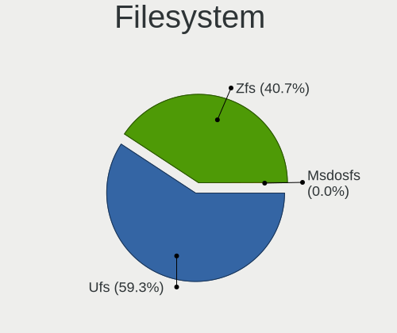
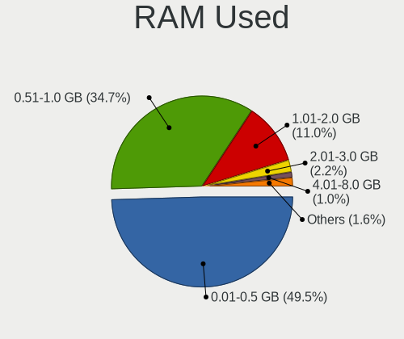
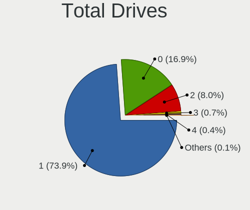
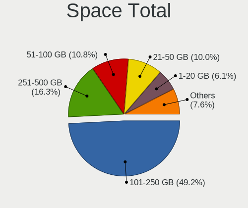
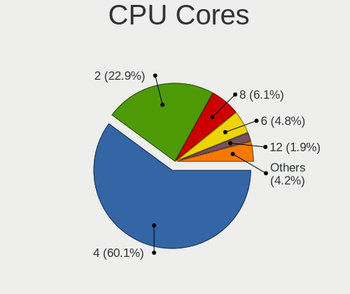
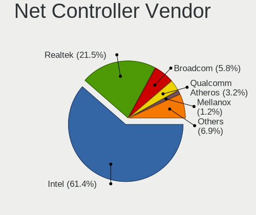

OPNsense - Tested Hardware & Statistics
---------------------------------------

A project to collect tested hardware configurations for OPNsense.

Anyone can contribute to this report by the [hw-probe](https://github.com/linuxhw/hw-probe/blob/master/INSTALL.BSD.md) tool:

    hw-probe -all -upload

Please contribute! Especially if your hardware is rare.

Contents
--------

* [ Test Cases ](#test-cases)

* [ System ](#system)
  - [ OS                       ](#os)
  - [ OS Family                ](#os-family)
  - [ Arch                     ](#arch)
  - [ DE                       ](#de)
  - [ Display Server           ](#display-server)
  - [ Display Manager          ](#display-manager)
  - [ OS Lang                  ](#os-lang)
  - [ Boot Mode                ](#boot-mode)
  - [ Filesystem               ](#filesystem)
  - [ Part. scheme             ](#part-scheme)

* [ Board ](#board)
  - [ Vendor                   ](#vendor)
  - [ Model                    ](#model)
  - [ Model Family             ](#model-family)
  - [ MFG Year                 ](#mfg-year)
  - [ Form Factor              ](#form-factor)
  - [ Coreboot                 ](#coreboot)
  - [ RAM Size                 ](#ram-size)
  - [ RAM Used                 ](#ram-used)
  - [ Total Drives             ](#total-drives)
  - [ Has CD-ROM               ](#has-cd-rom)
  - [ Has Ethernet             ](#has-ethernet)
  - [ Has WiFi                 ](#has-wifi)
  - [ Has Bluetooth            ](#has-bluetooth)

* [ Location ](#location)
  - [ Country                  ](#country)
  - [ City                     ](#city)

* [ Drives ](#drives)
  - [ Drive Vendor             ](#drive-vendor)
  - [ Drive Model              ](#drive-model)
  - [ HDD Vendor               ](#hdd-vendor)
  - [ SSD Vendor               ](#ssd-vendor)
  - [ Drive Kind               ](#drive-kind)
  - [ Drive Connector          ](#drive-connector)
  - [ Drive Size               ](#drive-size)
  - [ Space Total              ](#space-total)
  - [ Space Used               ](#space-used)
  - [ Malfunc. Drives          ](#malfunc-drives)
  - [ Malfunc. Drive Vendor    ](#malfunc-drive-vendor)
  - [ Malfunc. HDD Vendor      ](#malfunc-hdd-vendor)
  - [ Malfunc. Drive Kind      ](#malfunc-drive-kind)
  - [ Failed Drives            ](#failed-drives)
  - [ Failed Drive Vendor      ](#failed-drive-vendor)
  - [ Drive Status             ](#drive-status)

* [ Storage controller ](#storage-controller)
  - [ Storage Vendor           ](#storage-vendor)
  - [ Storage Model            ](#storage-model)
  - [ Storage Kind             ](#storage-kind)

* [ Processor ](#processor)
  - [ CPU Vendor               ](#cpu-vendor)
  - [ CPU Model                ](#cpu-model)
  - [ CPU Model Family         ](#cpu-model-family)
  - [ CPU Cores                ](#cpu-cores)
  - [ CPU Sockets              ](#cpu-sockets)
  - [ CPU Threads              ](#cpu-threads)
  - [ CPU Microarch            ](#cpu-microarch)

* [ Graphics ](#graphics)
  - [ GPU Vendor               ](#gpu-vendor)
  - [ GPU Model                ](#gpu-model)
  - [ GPU Combo                ](#gpu-combo)
  - [ GPU Driver               ](#gpu-driver)
  - [ GPU Memory               ](#gpu-memory)

* [ Monitor ](#monitor)
  - [ Monitor Vendor           ](#monitor-vendor)
  - [ Monitor Model            ](#monitor-model)
  - [ Monitor Resolution       ](#monitor-resolution)
  - [ Monitor Diagonal         ](#monitor-diagonal)
  - [ Monitor Width            ](#monitor-width)
  - [ Aspect Ratio             ](#aspect-ratio)
  - [ Monitor Area             ](#monitor-area)
  - [ Pixel Density            ](#pixel-density)
  - [ Multiple Monitors        ](#multiple-monitors)

* [ Network ](#network)
  - [ Net Controller Vendor    ](#net-controller-vendor)
  - [ Net Controller Model     ](#net-controller-model)
  - [ Wireless Vendor          ](#wireless-vendor)
  - [ Wireless Model           ](#wireless-model)
  - [ Ethernet Vendor          ](#ethernet-vendor)
  - [ Ethernet Model           ](#ethernet-model)
  - [ Net Controller Kind      ](#net-controller-kind)
  - [ Used Controller          ](#used-controller)
  - [ NICs                     ](#nics)
  - [ IPv6                     ](#ipv6)

* [ Bluetooth ](#bluetooth)
  - [ Bluetooth Vendor         ](#bluetooth-vendor)
  - [ Bluetooth Model          ](#bluetooth-model)

* [ Sound ](#sound)
  - [ Sound Vendor             ](#sound-vendor)
  - [ Sound Model              ](#sound-model)

* [ Memory ](#memory)
  - [ Memory Vendor            ](#memory-vendor)
  - [ Memory Model             ](#memory-model)
  - [ Memory Kind              ](#memory-kind)
  - [ Memory Form Factor       ](#memory-form-factor)
  - [ Memory Size              ](#memory-size)
  - [ Memory Speed             ](#memory-speed)

* [ Printers & scanners ](#printers--scanners)
  - [ Printer Vendor           ](#printer-vendor)
  - [ Printer Model            ](#printer-model)
  - [ Scanner Vendor           ](#scanner-vendor)
  - [ Scanner Model            ](#scanner-model)

* [ Camera ](#camera)
  - [ Camera Vendor            ](#camera-vendor)
  - [ Camera Model             ](#camera-model)

* [ Security ](#security)
  - [ Fingerprint Vendor       ](#fingerprint-vendor)
  - [ Fingerprint Model        ](#fingerprint-model)
  - [ Chipcard Vendor          ](#chipcard-vendor)
  - [ Chipcard Model           ](#chipcard-model)

* [ Unsupported ](#unsupported)
  - [ Unsupported Devices      ](#unsupported-devices)
  - [ Unsupported Device Types ](#unsupported-device-types)

Test Cases
----------

Total: 12113

| Vendor        | Model                       | Form-Factor | Probe                                                     | Date         |
|---------------|-----------------------------|-------------|-----------------------------------------------------------|--------------|
| IGEL Techn... | H830C                       | Notebook    | [da070c0348](https://bsd-hardware.info/?probe=da070c0348) | Dec 24, 2023 |
| Intel         | Q3XXG4-P V1.0               | Desktop     | [80e8d502be](https://bsd-hardware.info/?probe=80e8d502be) | Dec 24, 2023 |
| Dell          | 0KV62T A00                  | Desktop     | [5844adb190](https://bsd-hardware.info/?probe=5844adb190) | Dec 24, 2023 |
| Intel         | SHARKBAY                    | Desktop     | [0ec70893dd](https://bsd-hardware.info/?probe=0ec70893dd) | Dec 24, 2023 |
| ASRock        | Z77 Extreme3                | Desktop     | [1656e8f6b0](https://bsd-hardware.info/?probe=1656e8f6b0) | Dec 24, 2023 |
| Unknown       | Unknown                     | Desktop     | [9876dcc6aa](https://bsd-hardware.info/?probe=9876dcc6aa) | Dec 24, 2023 |
| Protectli     | VP2420                      | Desktop     | [34e03b1271](https://bsd-hardware.info/?probe=34e03b1271) | Dec 24, 2023 |
| Unknown       | QGLK03                      | Desktop     | [a586279dd0](https://bsd-hardware.info/?probe=a586279dd0) | Dec 24, 2023 |
| Unknown       | Unknown                     | Desktop     | [9a23873dc4](https://bsd-hardware.info/?probe=9a23873dc4) | Dec 24, 2023 |
| Unknown       | Unknown                     | Desktop     | [da2b7d434e](https://bsd-hardware.info/?probe=da2b7d434e) | Dec 24, 2023 |
| YANYU         | H17SL                       | Desktop     | [464357d8c1](https://bsd-hardware.info/?probe=464357d8c1) | Dec 24, 2023 |
| Dell          | 01Y1CJ A00                  | Mini pc     | [69e3982549](https://bsd-hardware.info/?probe=69e3982549) | Dec 23, 2023 |
| Lenovo        | 312D SDK0J40697 WIN 3305... | Mini pc     | [13699f3359](https://bsd-hardware.info/?probe=13699f3359) | Dec 23, 2023 |
| Fujitsu       | D3543-A1 S26361-D3543-A1... | Desktop     | [ee768bd5a0](https://bsd-hardware.info/?probe=ee768bd5a0) | Dec 23, 2023 |
| Dell          | 01G5C3 A02                  | Server      | [7940d24d8e](https://bsd-hardware.info/?probe=7940d24d8e) | Dec 23, 2023 |
| Dell          | 0FDY5C A00                  | Desktop     | [e39c520eb6](https://bsd-hardware.info/?probe=e39c520eb6) | Dec 23, 2023 |
| PC Engines    | APU2                        | Desktop     | [79f4518fa1](https://bsd-hardware.info/?probe=79f4518fa1) | Dec 23, 2023 |
| Techvision    | TVI7309X B0                 | Desktop     | [609d9be189](https://bsd-hardware.info/?probe=609d9be189) | Dec 23, 2023 |
| Unknown       | Unknown                     | Desktop     | [4f79ea6f3a](https://bsd-hardware.info/?probe=4f79ea6f3a) | Dec 23, 2023 |
| Unknown       | Unknown                     | Desktop     | [684d183b51](https://bsd-hardware.info/?probe=684d183b51) | Dec 23, 2023 |
| Dell          | 0NC2VH A01                  | Desktop     | [06828fbfed](https://bsd-hardware.info/?probe=06828fbfed) | Dec 23, 2023 |
| Dell          | 03X6X0 A02                  | Server      | [1fc8559747](https://bsd-hardware.info/?probe=1fc8559747) | Dec 23, 2023 |
| Dell          | 0NC2VH A01                  | Desktop     | [3c06ec4635](https://bsd-hardware.info/?probe=3c06ec4635) | Dec 23, 2023 |
| AZW           | EQ                          | Desktop     | [9818e5f996](https://bsd-hardware.info/?probe=9818e5f996) | Dec 23, 2023 |
| Unknown       | Unknown                     | Desktop     | [97559370a8](https://bsd-hardware.info/?probe=97559370a8) | Dec 23, 2023 |
| Gigabyte      | MRZNVMS-00                  | Desktop     | [7c9af3e3cd](https://bsd-hardware.info/?probe=7c9af3e3cd) | Dec 23, 2023 |
| Unknown       | Unknown                     | Desktop     | [1a68705919](https://bsd-hardware.info/?probe=1a68705919) | Dec 23, 2023 |
| CWWK          | CW-ADLN-6L                  | Desktop     | [d8245df746](https://bsd-hardware.info/?probe=d8245df746) | Dec 23, 2023 |
| Lenovo        | ThinkCentre M72e 3629A15    | Desktop     | [8a92c95f65](https://bsd-hardware.info/?probe=8a92c95f65) | Dec 22, 2023 |
| Protectli     | FW4B Ver                    | Desktop     | [4b6a62bebe](https://bsd-hardware.info/?probe=4b6a62bebe) | Dec 22, 2023 |
| Orange Pi     | 5P                          | Soc         | [aa6c177cb0](https://bsd-hardware.info/?probe=aa6c177cb0) | Dec 22, 2023 |
| Dell          | 00V62H A01                  | Desktop     | [c4e5366baa](https://bsd-hardware.info/?probe=c4e5366baa) | Dec 22, 2023 |
| Seeed Stud... | ODYSSEY-X86J41X5 SD-BS-C... | Desktop     | [fbf8f52ea0](https://bsd-hardware.info/?probe=fbf8f52ea0) | Dec 22, 2023 |
| Unknown       | Unknown                     | Desktop     | [620fc27594](https://bsd-hardware.info/?probe=620fc27594) | Dec 22, 2023 |
| Fujitsu       | D3313-G1 S26361-D3313-G1    | Desktop     | [5ed362ce02](https://bsd-hardware.info/?probe=5ed362ce02) | Dec 22, 2023 |
| Pegatron      | 2ACF                        | Desktop     | [2556fa3be1](https://bsd-hardware.info/?probe=2556fa3be1) | Dec 22, 2023 |
| PC Engines    | apu4                        | Desktop     | [48a0e27e11](https://bsd-hardware.info/?probe=48a0e27e11) | Dec 22, 2023 |
| ZX            | H610ITXG                    | Desktop     | [11edcbeaff](https://bsd-hardware.info/?probe=11edcbeaff) | Dec 22, 2023 |
| Dell          | Latitude E7240              | Notebook    | [f2229124bf](https://bsd-hardware.info/?probe=f2229124bf) | Dec 22, 2023 |
| Unknown       | SKYBAY                      | Desktop     | [7f8968ee0a](https://bsd-hardware.info/?probe=7f8968ee0a) | Dec 22, 2023 |
| Supermicro    | X10SLH-N6-ST031             | Server      | [2463b12f4e](https://bsd-hardware.info/?probe=2463b12f4e) | Dec 22, 2023 |
| ASUSTek       | PRIME A320M-K               | Desktop     | [cfe1ed1212](https://bsd-hardware.info/?probe=cfe1ed1212) | Dec 22, 2023 |
| Lenovo        | 312D SDK0J40697 WIN 3305... | Mini pc     | [2e35364732](https://bsd-hardware.info/?probe=2e35364732) | Dec 22, 2023 |
| Unknown       | Unknown                     | Desktop     | [7b24999fbb](https://bsd-hardware.info/?probe=7b24999fbb) | Dec 22, 2023 |
| Lenovo        | SHARKBAY 0B98401 WIN        | Desktop     | [dbcb26f795](https://bsd-hardware.info/?probe=dbcb26f795) | Dec 22, 2023 |
| ASUSTek       | PRIME H610I-PLUS D4         | Desktop     | [3a435d185e](https://bsd-hardware.info/?probe=3a435d185e) | Dec 22, 2023 |
| MW            | GMLK-2_5G4L                 | Desktop     | [9eaa02c47c](https://bsd-hardware.info/?probe=9eaa02c47c) | Dec 22, 2023 |
| Gigabyte      | GA-880GM-UD2H               | Desktop     | [76495a4c85](https://bsd-hardware.info/?probe=76495a4c85) | Dec 22, 2023 |
| Supermicro    | X11SSH-LN4F                 | Server      | [132a8d8b6f](https://bsd-hardware.info/?probe=132a8d8b6f) | Dec 21, 2023 |
| Protectli     | VP2420                      | Desktop     | [04695d0802](https://bsd-hardware.info/?probe=04695d0802) | Dec 21, 2023 |
| Shuttle       | FS77U                       | Desktop     | [9c746c0d5c](https://bsd-hardware.info/?probe=9c746c0d5c) | Dec 21, 2023 |
| Unknown       | MANIFOLD 2-C                | Desktop     | [b2597a7f2b](https://bsd-hardware.info/?probe=b2597a7f2b) | Dec 21, 2023 |
| Unknown       | Unknown                     | Desktop     | [ec4c6d8fb5](https://bsd-hardware.info/?probe=ec4c6d8fb5) | Dec 21, 2023 |
| Yanling       | YL-CLU6L-V1                 | Desktop     | [9a0369cc72](https://bsd-hardware.info/?probe=9a0369cc72) | Dec 21, 2023 |
| Dell          | 012KND A00                  | Mini pc     | [9107aaa45d](https://bsd-hardware.info/?probe=9107aaa45d) | Dec 21, 2023 |
| Supermicro    | X10SLH-N6-ST031             | Server      | [70fe8567d6](https://bsd-hardware.info/?probe=70fe8567d6) | Dec 21, 2023 |
| Lenovo        | ThinkSystem ST50 V2 7D8J... | Desktop     | [a5eedba370](https://bsd-hardware.info/?probe=a5eedba370) | Dec 21, 2023 |
| Sophos        | UTM                         | Firewall    | [e1e002bdd4](https://bsd-hardware.info/?probe=e1e002bdd4) | Dec 21, 2023 |
| Dell          | 0KV62T A00                  | Desktop     | [8a2c7af96c](https://bsd-hardware.info/?probe=8a2c7af96c) | Dec 21, 2023 |
| PC Engines    | apu4                        | Desktop     | [7fa270657e](https://bsd-hardware.info/?probe=7fa270657e) | Dec 21, 2023 |
| Intel         | DH61AG AAG23736-400         | Desktop     | [e6a38faa07](https://bsd-hardware.info/?probe=e6a38faa07) | Dec 21, 2023 |
| ASUSTek       | TUF Gaming B550M-PLUS       | Desktop     | [f9fd749985](https://bsd-hardware.info/?probe=f9fd749985) | Dec 21, 2023 |
| Protectli     | VP2420                      | Desktop     | [9a4aba32a7](https://bsd-hardware.info/?probe=9a4aba32a7) | Dec 21, 2023 |
| Dell          | 0NV0M7 A01                  | Desktop     | [835ca2056c](https://bsd-hardware.info/?probe=835ca2056c) | Dec 21, 2023 |
| Protectli     | FW4B                        | Desktop     | [d67b8b063a](https://bsd-hardware.info/?probe=d67b8b063a) | Dec 21, 2023 |
| CWWK          | CW-ADLN-6L                  | Desktop     | [094d15625b](https://bsd-hardware.info/?probe=094d15625b) | Dec 21, 2023 |
| ASUSTek       | H110I-PLUS                  | Desktop     | [5c6e9bd18a](https://bsd-hardware.info/?probe=5c6e9bd18a) | Dec 20, 2023 |
| Fujitsu       | D3544-A1 S26361-D3544-A1... | Desktop     | [ec18d4f3a1](https://bsd-hardware.info/?probe=ec18d4f3a1) | Dec 20, 2023 |
| Lenovo        | 3136 SDK0J40697 WIN 3305... | Mini pc     | [760c7214cc](https://bsd-hardware.info/?probe=760c7214cc) | Dec 20, 2023 |
| Intel         | J1900                       | Desktop     | [2322789485](https://bsd-hardware.info/?probe=2322789485) | Dec 20, 2023 |
| Dell          | 02YYK5 A01                  | Desktop     | [6e070fbb90](https://bsd-hardware.info/?probe=6e070fbb90) | Dec 20, 2023 |
| Deciso        | NetBoard-A10                | Notebook    | [c728132d77](https://bsd-hardware.info/?probe=c728132d77) | Dec 20, 2023 |
| AMI           | Aptio CRB                   | Mini pc     | [2974d1c480](https://bsd-hardware.info/?probe=2974d1c480) | Dec 20, 2023 |
| Lenovo        | 3111 SDK0J40697 WIN 3305... | Desktop     | [321e9d7328](https://bsd-hardware.info/?probe=321e9d7328) | Dec 20, 2023 |
| Acer          | Aspire XC-1660G V:1.1       | Desktop     | [54b2061c80](https://bsd-hardware.info/?probe=54b2061c80) | Dec 19, 2023 |
| ASRock        | B550 Phantom Gaming 4       | Desktop     | [c00a69de7c](https://bsd-hardware.info/?probe=c00a69de7c) | Dec 19, 2023 |
| Unknown       | Unknown                     | Desktop     | [f11c353c61](https://bsd-hardware.info/?probe=f11c353c61) | Dec 19, 2023 |
| Unknown       | Unknown                     | Desktop     | [5f6cc807a3](https://bsd-hardware.info/?probe=5f6cc807a3) | Dec 19, 2023 |
| PC Engines    | APU2                        | Desktop     | [f3061d599c](https://bsd-hardware.info/?probe=f3061d599c) | Dec 19, 2023 |
| HP            | 83F2                        | Desktop     | [858392467f](https://bsd-hardware.info/?probe=858392467f) | Dec 19, 2023 |
| MW            | GMLK-2_5G4L                 | Desktop     | [841767c8f8](https://bsd-hardware.info/?probe=841767c8f8) | Dec 19, 2023 |
| PC Engines    | apu4                        | Desktop     | [97c6f1ef2a](https://bsd-hardware.info/?probe=97c6f1ef2a) | Dec 19, 2023 |
| Lenovo        | 3136 SDK0J40697 WIN 3305... | Mini pc     | [0716929be0](https://bsd-hardware.info/?probe=0716929be0) | Dec 19, 2023 |
| Advantech     | NAMB-3250 A102-1            | Desktop     | [bb91074237](https://bsd-hardware.info/?probe=bb91074237) | Dec 19, 2023 |
| HP            | 83F2                        | Desktop     | [8b1e24b86c](https://bsd-hardware.info/?probe=8b1e24b86c) | Dec 19, 2023 |
| Dell          | Latitude E7240              | Notebook    | [7d5e8bcb8a](https://bsd-hardware.info/?probe=7d5e8bcb8a) | Dec 19, 2023 |
| Dell          | 0T7D40 A01                  | Desktop     | [35283b08ff](https://bsd-hardware.info/?probe=35283b08ff) | Dec 19, 2023 |
| Dell          | 04YP6J A02                  | Desktop     | [abcaede8e1](https://bsd-hardware.info/?probe=abcaede8e1) | Dec 19, 2023 |
| ASUSTek       | P5B-VM                      | Desktop     | [00e7a346b2](https://bsd-hardware.info/?probe=00e7a346b2) | Dec 19, 2023 |
| ASRockRack    | C3558D4I-4L                 | Desktop     | [108b107783](https://bsd-hardware.info/?probe=108b107783) | Dec 18, 2023 |
| Lenovo        | 3136 SDK0J40697 WIN 3305... | Mini pc     | [6bc190970b](https://bsd-hardware.info/?probe=6bc190970b) | Dec 18, 2023 |
| Dell          | 00V62H A00                  | Desktop     | [b99ed60ab6](https://bsd-hardware.info/?probe=b99ed60ab6) | Dec 18, 2023 |
| Lenovo        | 3136 SDK0J40697 WIN 3305... | Mini pc     | [825a0f57e3](https://bsd-hardware.info/?probe=825a0f57e3) | Dec 18, 2023 |
| AMI           | Aptio CRB                   | Mini pc     | [4114a11fe7](https://bsd-hardware.info/?probe=4114a11fe7) | Dec 18, 2023 |
| Lenovo        | 312D SDK0J40697 WIN 3305... | Mini pc     | [ad0f62cef1](https://bsd-hardware.info/?probe=ad0f62cef1) | Dec 18, 2023 |
| Dell          | 04JN2K A03                  | Server      | [d56fe5aeb2](https://bsd-hardware.info/?probe=d56fe5aeb2) | Dec 18, 2023 |
| AMI           | Aptio CRB                   | Mini pc     | [c4a54e3710](https://bsd-hardware.info/?probe=c4a54e3710) | Dec 18, 2023 |
| Protectli     | FW4A Ver                    | Desktop     | [9660edcc5c](https://bsd-hardware.info/?probe=9660edcc5c) | Dec 18, 2023 |
| Unknown       | Unknown                     | Desktop     | [107e747798](https://bsd-hardware.info/?probe=107e747798) | Dec 17, 2023 |
| Supermicro    | X10SDV-4C-TLN2F             | Server      | [ea3bc70906](https://bsd-hardware.info/?probe=ea3bc70906) | Dec 17, 2023 |
| Intel         | JSL MRD                     | Desktop     | [29c4bae1f4](https://bsd-hardware.info/?probe=29c4bae1f4) | Dec 17, 2023 |
| Unknown       | Unknown                     | Desktop     | [f11703c364](https://bsd-hardware.info/?probe=f11703c364) | Dec 17, 2023 |
| Intel         | HURONRIVER                  | Desktop     | [d0ebaa4479](https://bsd-hardware.info/?probe=d0ebaa4479) | Dec 17, 2023 |
| Dell          | 00V62H A00                  | Desktop     | [8f6f4d38d3](https://bsd-hardware.info/?probe=8f6f4d38d3) | Dec 17, 2023 |
| Deciso        | NetBoard-A10                | Notebook    | [ae676079d7](https://bsd-hardware.info/?probe=ae676079d7) | Dec 17, 2023 |
| Intel         | JSL MRD                     | Desktop     | [af718ee605](https://bsd-hardware.info/?probe=af718ee605) | Dec 17, 2023 |
| ECS           | H81H3-WM                    | Desktop     | [9df1f030f9](https://bsd-hardware.info/?probe=9df1f030f9) | Dec 17, 2023 |
| Techvision    | TVI7309X B0                 | Desktop     | [878769cc62](https://bsd-hardware.info/?probe=878769cc62) | Dec 17, 2023 |
| Unknown       | Unknown                     | Desktop     | [88306fe484](https://bsd-hardware.info/?probe=88306fe484) | Dec 17, 2023 |
| Unknown       | Unknown                     | Desktop     | [6a3ef5165f](https://bsd-hardware.info/?probe=6a3ef5165f) | Dec 17, 2023 |
| Lenovo        | SDK0E50510 WIN              | Desktop     | [57a4adcc91](https://bsd-hardware.info/?probe=57a4adcc91) | Dec 17, 2023 |
| Unknown       | Unknown                     | Desktop     | [cefdf7d9ca](https://bsd-hardware.info/?probe=cefdf7d9ca) | Dec 17, 2023 |
| Unknown       | Unknown                     | Desktop     | [c99ee25103](https://bsd-hardware.info/?probe=c99ee25103) | Dec 17, 2023 |
| Lenovo        | 314C SEK0T35577 IOT 4247... | Mini pc     | [5b09e2113c](https://bsd-hardware.info/?probe=5b09e2113c) | Dec 17, 2023 |
| Techvision    | TVI7309X B0                 | Desktop     | [fe741ca47c](https://bsd-hardware.info/?probe=fe741ca47c) | Dec 17, 2023 |
| Gigabyte      | B450M S2H                   | Desktop     | [b0194a8d4a](https://bsd-hardware.info/?probe=b0194a8d4a) | Dec 16, 2023 |
| PC Engines    | APU3                        | Desktop     | [6c92d4965a](https://bsd-hardware.info/?probe=6c92d4965a) | Dec 16, 2023 |
| Intel         | ChiefRiver D                | Desktop     | [ac362a0f29](https://bsd-hardware.info/?probe=ac362a0f29) | Dec 16, 2023 |
| Intel         | ChiefRiver D                | Desktop     | [bd8cacb673](https://bsd-hardware.info/?probe=bd8cacb673) | Dec 16, 2023 |
| Google        | Guado                       | Desktop     | [186f14c0a6](https://bsd-hardware.info/?probe=186f14c0a6) | Dec 16, 2023 |
| Supermicro    | A1SRi 123456789             | Mini pc     | [a2aa82ed5d](https://bsd-hardware.info/?probe=a2aa82ed5d) | Dec 16, 2023 |
| Unknown       | Unknown                     | Desktop     | [784c8ae515](https://bsd-hardware.info/?probe=784c8ae515) | Dec 16, 2023 |
| Protectli     | FW4B                        | Desktop     | [b862c8c507](https://bsd-hardware.info/?probe=b862c8c507) | Dec 16, 2023 |
| SHANGZHAOY... | B85M-PRO V1.1               | Desktop     | [3b7ed136da](https://bsd-hardware.info/?probe=3b7ed136da) | Dec 16, 2023 |
| Unknown       | Unknown                     | Desktop     | [df97b81bea](https://bsd-hardware.info/?probe=df97b81bea) | Dec 15, 2023 |
| ASRock        | IMB-181-L                   | Desktop     | [a81eb6eadf](https://bsd-hardware.info/?probe=a81eb6eadf) | Dec 15, 2023 |
| ZOTAC         | ZBOX-CI329NANO              | Mini pc     | [aefb80936c](https://bsd-hardware.info/?probe=aefb80936c) | Dec 15, 2023 |
| AZW           | MINI S 10                   | Desktop     | [d8eee18baf](https://bsd-hardware.info/?probe=d8eee18baf) | Dec 15, 2023 |
| Unknown       | Unknown                     | Desktop     | [be79d227b2](https://bsd-hardware.info/?probe=be79d227b2) | Dec 15, 2023 |
| Unknown       | Unknown                     | Desktop     | [5adc44e122](https://bsd-hardware.info/?probe=5adc44e122) | Dec 15, 2023 |
| Fujitsu       | D3313-G1 S26361-D3313-G1    | Desktop     | [f05a97db34](https://bsd-hardware.info/?probe=f05a97db34) | Dec 15, 2023 |
| Gigabyte      | B150N Phoenix-WIFI-CF       | Desktop     | [343d176e9c](https://bsd-hardware.info/?probe=343d176e9c) | Dec 15, 2023 |
| Google        | Guado                       | Desktop     | [11b7e710c6](https://bsd-hardware.info/?probe=11b7e710c6) | Dec 15, 2023 |
| Techvision    | TVI7309X B0                 | Desktop     | [4b7be4588e](https://bsd-hardware.info/?probe=4b7be4588e) | Dec 15, 2023 |
| Lenovo        | SHARKBAY SDK0E50510 WIN     | Desktop     | [4adda9051f](https://bsd-hardware.info/?probe=4adda9051f) | Dec 15, 2023 |
| Unknown       | Unknown                     | Desktop     | [93f650efc3](https://bsd-hardware.info/?probe=93f650efc3) | Dec 15, 2023 |
| Gigabyte      | B75M-D3H                    | Desktop     | [9773ffcc27](https://bsd-hardware.info/?probe=9773ffcc27) | Dec 15, 2023 |
| Advantech     | NAMB-3250 A102-1            | Desktop     | [41899c5e07](https://bsd-hardware.info/?probe=41899c5e07) | Dec 15, 2023 |
| AMI           | Aptio CRB                   | Mini pc     | [c4b2a86518](https://bsd-hardware.info/?probe=c4b2a86518) | Dec 15, 2023 |
| Gigabyte      | B75N                        | Desktop     | [dad5d14cf7](https://bsd-hardware.info/?probe=dad5d14cf7) | Dec 15, 2023 |
| HP            | 82A2                        | Desktop     | [906fd206fe](https://bsd-hardware.info/?probe=906fd206fe) | Dec 15, 2023 |
| HP            | 82A2                        | Desktop     | [0a816d2760](https://bsd-hardware.info/?probe=0a816d2760) | Dec 15, 2023 |
| Protectli     | FW4B Ver                    | Desktop     | [da6ac13ef2](https://bsd-hardware.info/?probe=da6ac13ef2) | Dec 15, 2023 |
| AZW           | EQ                          | Desktop     | [f1e4bf2224](https://bsd-hardware.info/?probe=f1e4bf2224) | Dec 15, 2023 |
| Unknown       | Unknown                     | Desktop     | [a9f96c677c](https://bsd-hardware.info/?probe=a9f96c677c) | Dec 14, 2023 |
| ASRock        | J4005B-ITX                  | Desktop     | [2ffc965b2e](https://bsd-hardware.info/?probe=2ffc965b2e) | Dec 14, 2023 |
| Dell          | 02YYK5 A01                  | Desktop     | [306f9c1b03](https://bsd-hardware.info/?probe=306f9c1b03) | Dec 14, 2023 |
| Unknown       | Unknown                     | Desktop     | [0bc43bd220](https://bsd-hardware.info/?probe=0bc43bd220) | Dec 14, 2023 |
| Dell          | 0PC5F7 A00                  | Desktop     | [e47e643ced](https://bsd-hardware.info/?probe=e47e643ced) | Dec 14, 2023 |
| CWWK          | MINIPC-G12                  | Desktop     | [e15a019715](https://bsd-hardware.info/?probe=e15a019715) | Dec 14, 2023 |
| Unknown       | Unknown                     | Desktop     | [c22fff97b8](https://bsd-hardware.info/?probe=c22fff97b8) | Dec 13, 2023 |
| Intel         | SKYBAY                      | Desktop     | [6ad2ae72f1](https://bsd-hardware.info/?probe=6ad2ae72f1) | Dec 13, 2023 |
| BESSTAR Te... | GB7                         | Mini pc     | [159a5556ab](https://bsd-hardware.info/?probe=159a5556ab) | Dec 13, 2023 |
| Unknown       | Unknown                     | Desktop     | [b2407b8a31](https://bsd-hardware.info/?probe=b2407b8a31) | Dec 13, 2023 |
| Intel         | Luna Pier CRB Revision D    | Desktop     | [44215d3b22](https://bsd-hardware.info/?probe=44215d3b22) | Dec 13, 2023 |
| Intel         | ChiefRiver D                | Desktop     | [dafa13827e](https://bsd-hardware.info/?probe=dafa13827e) | Dec 13, 2023 |
| Intel         | Luna Pier CRB Revision D    | Desktop     | [e47e6d56e8](https://bsd-hardware.info/?probe=e47e6d56e8) | Dec 13, 2023 |
| AMI           | Aptio CRB                   | Mini pc     | [12e42ebd6d](https://bsd-hardware.info/?probe=12e42ebd6d) | Dec 13, 2023 |
| Unknown       | Unknown                     | Desktop     | [c96a52dd9c](https://bsd-hardware.info/?probe=c96a52dd9c) | Dec 13, 2023 |
| Dell          | 02YYK5 A00                  | Desktop     | [8eb8c9eff3](https://bsd-hardware.info/?probe=8eb8c9eff3) | Dec 13, 2023 |
| Intel         | QHSW02                      | Desktop     | [da6b7c7115](https://bsd-hardware.info/?probe=da6b7c7115) | Dec 13, 2023 |
| Lenovo        | 30D2 SDK0J40705 WIN 3425... | Desktop     | [67f5c9c912](https://bsd-hardware.info/?probe=67f5c9c912) | Dec 13, 2023 |
| ASRock        | H170M-ITX/DL                | Desktop     | [79039f6105](https://bsd-hardware.info/?probe=79039f6105) | Dec 13, 2023 |
| ASUSTek       | K52JT                       | Notebook    | [1dc348adc0](https://bsd-hardware.info/?probe=1dc348adc0) | Dec 13, 2023 |
| ASUSTek       | BM6875_BM6675_BP6375        | Desktop     | [3d0160889b](https://bsd-hardware.info/?probe=3d0160889b) | Dec 13, 2023 |
| Supermicro    | X7SBi                       | Desktop     | [a0124f00ba](https://bsd-hardware.info/?probe=a0124f00ba) | Dec 13, 2023 |
| Sophos        | SG                          | Firewall    | [13c711aabf](https://bsd-hardware.info/?probe=13c711aabf) | Dec 13, 2023 |
| ASUSTek       | ROG STRIX B550-I GAMING     | Desktop     | [b600237a69](https://bsd-hardware.info/?probe=b600237a69) | Dec 12, 2023 |
| Techvision    | TVI7309X B0                 | Desktop     | [b5f9416c13](https://bsd-hardware.info/?probe=b5f9416c13) | Dec 12, 2023 |
| Dell          | 0J8G6F A03                  | Desktop     | [e6e7f333a3](https://bsd-hardware.info/?probe=e6e7f333a3) | Dec 12, 2023 |
| Intel         | DH67BL AAG10189-207         | Desktop     | [e6210120bd](https://bsd-hardware.info/?probe=e6210120bd) | Dec 12, 2023 |
| HP            | ProLiant DL380p Gen8        | Server      | [20dd6f1621](https://bsd-hardware.info/?probe=20dd6f1621) | Dec 12, 2023 |
| MSI           | B150 GAMING M3              | Desktop     | [b5dc4da596](https://bsd-hardware.info/?probe=b5dc4da596) | Dec 12, 2023 |
| Biostar       | N61PB-M2S                   | Desktop     | [69501bdb78](https://bsd-hardware.info/?probe=69501bdb78) | Dec 12, 2023 |
| Dell          | 0DRG19 A00                  | Mini pc     | [c26ebe6c80](https://bsd-hardware.info/?probe=c26ebe6c80) | Dec 12, 2023 |
| Dell          | 05XGC8 A00                  | Desktop     | [b453da5223](https://bsd-hardware.info/?probe=b453da5223) | Dec 12, 2023 |
| MSI           | MAG Z790 TOMAHAWK WIFI D... | Desktop     | [c05c574f37](https://bsd-hardware.info/?probe=c05c574f37) | Dec 12, 2023 |
| Unknown       | Unknown                     | Desktop     | [8a0a469ad0](https://bsd-hardware.info/?probe=8a0a469ad0) | Dec 12, 2023 |
| Lenovo        | 3111 NOK                    | Mini pc     | [533dbaf23a](https://bsd-hardware.info/?probe=533dbaf23a) | Dec 11, 2023 |
| SHANGZHAOY... | B85M-PRO V1.1               | Desktop     | [5cf5db5a05](https://bsd-hardware.info/?probe=5cf5db5a05) | Dec 11, 2023 |
| Dell          | 08CYF7 A05                  | Server      | [2768b91142](https://bsd-hardware.info/?probe=2768b91142) | Dec 11, 2023 |
| Unknown       | Unknown                     | Desktop     | [37499be816](https://bsd-hardware.info/?probe=37499be816) | Dec 11, 2023 |
| HP            | 8103 A01                    | Mini pc     | [e2f44ab91e](https://bsd-hardware.info/?probe=e2f44ab91e) | Dec 11, 2023 |
| Lenovo        | ThinkServer RS140           | Desktop     | [a380879f2f](https://bsd-hardware.info/?probe=a380879f2f) | Dec 11, 2023 |
| Intel         | Q3XXG4-P V1.0               | Desktop     | [becfed036a](https://bsd-hardware.info/?probe=becfed036a) | Dec 11, 2023 |
| Techvision    | TVI7309X B0                 | Desktop     | [9a3a20d295](https://bsd-hardware.info/?probe=9a3a20d295) | Dec 11, 2023 |
| ASUSTek       | ROG CROSSHAIR VIII HERO     | Desktop     | [68f73bf8ba](https://bsd-hardware.info/?probe=68f73bf8ba) | Dec 11, 2023 |
| ASRock        | H370M-ITX/ac                | Desktop     | [b806cc2a41](https://bsd-hardware.info/?probe=b806cc2a41) | Dec 10, 2023 |
| Unknown       | Unknown                     | Desktop     | [ec8c50c128](https://bsd-hardware.info/?probe=ec8c50c128) | Dec 10, 2023 |
| AZW           | EQ                          | Desktop     | [48537a5985](https://bsd-hardware.info/?probe=48537a5985) | Dec 10, 2023 |
| Supermicro    | X10SBAA                     | Server      | [f68b2d784b](https://bsd-hardware.info/?probe=f68b2d784b) | Dec 10, 2023 |
| Protectli     | VP2420                      | Desktop     | [74c1ede426](https://bsd-hardware.info/?probe=74c1ede426) | Dec 10, 2023 |
| ASRock        | H110M-DVS R3.0              | Desktop     | [b6a4782cbf](https://bsd-hardware.info/?probe=b6a4782cbf) | Dec 10, 2023 |
| Dell          | 0YNVJG A02                  | Desktop     | [2d8992cd50](https://bsd-hardware.info/?probe=2d8992cd50) | Dec 10, 2023 |
| Unknown       | Unknown                     | Desktop     | [fc1097e9b0](https://bsd-hardware.info/?probe=fc1097e9b0) | Dec 10, 2023 |
| Unknown       | Unknown                     | Desktop     | [3e478d7459](https://bsd-hardware.info/?probe=3e478d7459) | Dec 10, 2023 |
| Deciso        | NetBoard-A20                | Notebook    | [06e5f53429](https://bsd-hardware.info/?probe=06e5f53429) | Dec 10, 2023 |
| Lenovo        | 3136 SDK0J40697 WIN 3305... | Mini pc     | [8dd13bf91f](https://bsd-hardware.info/?probe=8dd13bf91f) | Dec 10, 2023 |
| Unknown       | Unknown                     | Desktop     | [4b8c881de0](https://bsd-hardware.info/?probe=4b8c881de0) | Dec 10, 2023 |
| AAEON         | FWS-2362 V1.0               | Desktop     | [a58d1df175](https://bsd-hardware.info/?probe=a58d1df175) | Dec 10, 2023 |
| Unknown       | Unknown                     | Desktop     | [edfa10c0dd](https://bsd-hardware.info/?probe=edfa10c0dd) | Dec 10, 2023 |
| ASUSTek       | M5A97 LE R2.0               | Desktop     | [20572de8e3](https://bsd-hardware.info/?probe=20572de8e3) | Dec 10, 2023 |
| ASRock        | B660M Phantom Gaming 4      | Desktop     | [e71ffa9a86](https://bsd-hardware.info/?probe=e71ffa9a86) | Dec 10, 2023 |
| Lenovo        | 312D SDK0J40697 WIN 3305... | Mini pc     | [a03446d994](https://bsd-hardware.info/?probe=a03446d994) | Dec 10, 2023 |
| HP            | 82A2                        | Desktop     | [688675d8ea](https://bsd-hardware.info/?probe=688675d8ea) | Dec 10, 2023 |
| ASRock        | Q1900B-ITX                  | Desktop     | [b7e23a4ed4](https://bsd-hardware.info/?probe=b7e23a4ed4) | Dec 10, 2023 |
| Dell          | 0HD5W2 A01                  | Desktop     | [3b6c1c2fbb](https://bsd-hardware.info/?probe=3b6c1c2fbb) | Dec 09, 2023 |
| Lenovo        | 312D SDK0J40697 WIN 3305... | Mini pc     | [05acf05b44](https://bsd-hardware.info/?probe=05acf05b44) | Dec 09, 2023 |
| Protectli     | FW4B Ver                    | Desktop     | [55094840ea](https://bsd-hardware.info/?probe=55094840ea) | Dec 09, 2023 |
| Unknown       | Unknown                     | Desktop     | [5597d71956](https://bsd-hardware.info/?probe=5597d71956) | Dec 09, 2023 |
| Unknown       | Unknown                     | Desktop     | [76f58e8986](https://bsd-hardware.info/?probe=76f58e8986) | Dec 09, 2023 |
| Unknown       | YL-J3160L4                  | Desktop     | [cf07751804](https://bsd-hardware.info/?probe=cf07751804) | Dec 09, 2023 |
| Lenovo        | 30BC SDK0J40697 WIN 3305... | Desktop     | [25f4e4ce18](https://bsd-hardware.info/?probe=25f4e4ce18) | Dec 09, 2023 |
| Dell          | 0DRG19 A00                  | Mini pc     | [0674ed24ed](https://bsd-hardware.info/?probe=0674ed24ed) | Dec 09, 2023 |
| Dell          | 02YYK5 A00                  | Desktop     | [39e0078d08](https://bsd-hardware.info/?probe=39e0078d08) | Dec 09, 2023 |
| ASRock        | Z370 Pro4                   | Desktop     | [6b4d8c076f](https://bsd-hardware.info/?probe=6b4d8c076f) | Dec 09, 2023 |
| HP            | 8076                        | Desktop     | [f6fe5f5051](https://bsd-hardware.info/?probe=f6fe5f5051) | Dec 09, 2023 |
| Unknown       | Unknown                     | Desktop     | [31619d30b3](https://bsd-hardware.info/?probe=31619d30b3) | Dec 09, 2023 |
| Dell          | 0D28YY A00                  | Desktop     | [20dbd4481a](https://bsd-hardware.info/?probe=20dbd4481a) | Dec 09, 2023 |
| PC Engines    | APU2                        | Desktop     | [8f318ea168](https://bsd-hardware.info/?probe=8f318ea168) | Dec 09, 2023 |
| CWWK          | CW-AD4L-N V1                | Desktop     | [1372cdf30f](https://bsd-hardware.info/?probe=1372cdf30f) | Dec 09, 2023 |
| Techvision    | TVI7309X B0                 | Desktop     | [8422bc152b](https://bsd-hardware.info/?probe=8422bc152b) | Dec 08, 2023 |
| Dell          | 00V62H A01                  | Desktop     | [a0591ac105](https://bsd-hardware.info/?probe=a0591ac105) | Dec 08, 2023 |
| ASRock        | Z370 Gaming K6              | Desktop     | [2074ab8412](https://bsd-hardware.info/?probe=2074ab8412) | Dec 08, 2023 |
| Unknown       | Unknown                     | Notebook    | [426e43d7f2](https://bsd-hardware.info/?probe=426e43d7f2) | Dec 08, 2023 |
| Intel         | Q3XXG4-P V1.0               | Desktop     | [050e7d8c01](https://bsd-hardware.info/?probe=050e7d8c01) | Dec 08, 2023 |
| Seeed Stud... | ODYSSEY-X86J41X5 SD-BS-C... | Desktop     | [90476f8605](https://bsd-hardware.info/?probe=90476f8605) | Dec 08, 2023 |
| PC Engines    | APU2                        | Desktop     | [ca43be99fc](https://bsd-hardware.info/?probe=ca43be99fc) | Dec 08, 2023 |
| Fujitsu       | D3543-A1 S26361-D3543-A1... | Desktop     | [eb2eef3d17](https://bsd-hardware.info/?probe=eb2eef3d17) | Dec 08, 2023 |
| PC Engines    | apu4                        | Desktop     | [cdbac53ff6](https://bsd-hardware.info/?probe=cdbac53ff6) | Dec 08, 2023 |
| HP            | 3397                        | Desktop     | [9013e5a39a](https://bsd-hardware.info/?probe=9013e5a39a) | Dec 08, 2023 |
| Dell          | 081N4V A08                  | Server      | [3aba7cf14e](https://bsd-hardware.info/?probe=3aba7cf14e) | Dec 08, 2023 |
| Lenovo        | 3106 NOK                    | Desktop     | [0ef598481e](https://bsd-hardware.info/?probe=0ef598481e) | Dec 08, 2023 |
| Unknown       | Unknown                     | Desktop     | [79486fa5ff](https://bsd-hardware.info/?probe=79486fa5ff) | Dec 08, 2023 |
| Biostar       | N61PB-M2S                   | Desktop     | [8b4dfe4511](https://bsd-hardware.info/?probe=8b4dfe4511) | Dec 08, 2023 |
| Supermicro    | X11SDV-4C-TP8F              | Desktop     | [cf3304bda2](https://bsd-hardware.info/?probe=cf3304bda2) | Dec 08, 2023 |
| Protectli     | FW4B Ver                    | Desktop     | [55c513d023](https://bsd-hardware.info/?probe=55c513d023) | Dec 08, 2023 |
| Unknown       | Unknown                     | Desktop     | [be6c7879b4](https://bsd-hardware.info/?probe=be6c7879b4) | Dec 07, 2023 |
| Protectli     | VP2420                      | Desktop     | [84a056721c](https://bsd-hardware.info/?probe=84a056721c) | Dec 07, 2023 |
| HP            | 806A                        | Desktop     | [4339b3acd2](https://bsd-hardware.info/?probe=4339b3acd2) | Dec 07, 2023 |
| Dell          | 03NVJ6 A03                  | Desktop     | [c119d3003e](https://bsd-hardware.info/?probe=c119d3003e) | Dec 07, 2023 |
| Dell          | 05XGC8 A00                  | Desktop     | [b193b5141c](https://bsd-hardware.info/?probe=b193b5141c) | Dec 07, 2023 |
| ASRock        | B550M Phantom Gaming 4      | Desktop     | [6c5bcd325e](https://bsd-hardware.info/?probe=6c5bcd325e) | Dec 07, 2023 |
| Protectli     | VP46xx                      | Desktop     | [5051678913](https://bsd-hardware.info/?probe=5051678913) | Dec 07, 2023 |
| AWOW          | AZ51                        | Mini pc     | [f92f2f58c2](https://bsd-hardware.info/?probe=f92f2f58c2) | Dec 07, 2023 |
| PC Engines    | APU2                        | Desktop     | [92c3ba510a](https://bsd-hardware.info/?probe=92c3ba510a) | Dec 07, 2023 |
| Unknown       | Unknown                     | Desktop     | [efab62c197](https://bsd-hardware.info/?probe=efab62c197) | Dec 07, 2023 |
| Fujitsu       | D3633-S1 S26361-D3633-S1    | Desktop     | [d3898c1e39](https://bsd-hardware.info/?probe=d3898c1e39) | Dec 07, 2023 |
| ADI Engine... | RCC-VE                      | Desktop     | [b362c84d66](https://bsd-hardware.info/?probe=b362c84d66) | Dec 07, 2023 |
| Unknown       | Unknown                     | Desktop     | [23b689f778](https://bsd-hardware.info/?probe=23b689f778) | Dec 07, 2023 |
| Techvision    | TVI7309X B0                 | Desktop     | [c906f764b0](https://bsd-hardware.info/?probe=c906f764b0) | Dec 07, 2023 |
| HP            | 213D A01                    | Desktop     | [a7ded310e3](https://bsd-hardware.info/?probe=a7ded310e3) | Dec 07, 2023 |
| Unknown       | Unknown                     | Desktop     | [fed92c23db](https://bsd-hardware.info/?probe=fed92c23db) | Dec 07, 2023 |
| Unknown       | Unknown                     | Desktop     | [a11b04691d](https://bsd-hardware.info/?probe=a11b04691d) | Dec 07, 2023 |
| Dell          | 03NVJ6 A01                  | Desktop     | [68cdde130c](https://bsd-hardware.info/?probe=68cdde130c) | Dec 06, 2023 |
| Supermicro    | X10SDV-TP8F                 | Server      | [52605948b7](https://bsd-hardware.info/?probe=52605948b7) | Dec 06, 2023 |
| PC Engines    | APU3                        | Desktop     | [06a4e1c23b](https://bsd-hardware.info/?probe=06a4e1c23b) | Dec 06, 2023 |
| ASUSTek       | H81M-K                      | Desktop     | [84c15c0d02](https://bsd-hardware.info/?probe=84c15c0d02) | Dec 06, 2023 |
| HP            | 18E7                        | Desktop     | [02b090c3aa](https://bsd-hardware.info/?probe=02b090c3aa) | Dec 06, 2023 |
| BESSTAR Te... | GB7                         | Mini pc     | [e61ae323ad](https://bsd-hardware.info/?probe=e61ae323ad) | Dec 06, 2023 |
| Dell          | 0CN7X8 A01                  | Server      | [82ff66fb79](https://bsd-hardware.info/?probe=82ff66fb79) | Dec 06, 2023 |
| Fujitsu Si... | D2804-A1 S26361-D2804-A1    | Desktop     | [4a74f06217](https://bsd-hardware.info/?probe=4a74f06217) | Dec 06, 2023 |
| Unknown       | Unknown                     | Desktop     | [ac7f59dc32](https://bsd-hardware.info/?probe=ac7f59dc32) | Dec 06, 2023 |
| Unknown       | Unknown                     | Desktop     | [92ae7371ee](https://bsd-hardware.info/?probe=92ae7371ee) | Dec 06, 2023 |
| Fusion5       | FMP4 v2                     | Desktop     | [786d461a61](https://bsd-hardware.info/?probe=786d461a61) | Dec 06, 2023 |
| Dell          | 0VRWRC A00                  | Desktop     | [17fd054f21](https://bsd-hardware.info/?probe=17fd054f21) | Dec 06, 2023 |
| Fujitsu       | D3313-A1 S26361-D3313-A1    | Desktop     | [1034c9883a](https://bsd-hardware.info/?probe=1034c9883a) | Dec 06, 2023 |
| Unknown       | Unknown                     | Desktop     | [52d2381f88](https://bsd-hardware.info/?probe=52d2381f88) | Dec 06, 2023 |
| PC Engines    | apu4                        | Desktop     | [dae8568bec](https://bsd-hardware.info/?probe=dae8568bec) | Dec 06, 2023 |
| PC Engines    | apu4                        | Desktop     | [04dd506405](https://bsd-hardware.info/?probe=04dd506405) | Dec 06, 2023 |
| Unknown       | Unknown                     | Desktop     | [ef425e8732](https://bsd-hardware.info/?probe=ef425e8732) | Dec 05, 2023 |
| Protectli     | FW4C                        | Desktop     | [d14bbfd96c](https://bsd-hardware.info/?probe=d14bbfd96c) | Dec 05, 2023 |
| PC Engines    | APU2                        | Desktop     | [6bbcef15d3](https://bsd-hardware.info/?probe=6bbcef15d3) | Dec 05, 2023 |
| Dell          | 0411GW A02                  | Desktop     | [f2bc8b79b0](https://bsd-hardware.info/?probe=f2bc8b79b0) | Dec 05, 2023 |
| Unknown       | Unknown                     | Desktop     | [98f7e31255](https://bsd-hardware.info/?probe=98f7e31255) | Dec 05, 2023 |
| Unknown       | Unknown                     | Desktop     | [6097033e25](https://bsd-hardware.info/?probe=6097033e25) | Dec 05, 2023 |
| Techvision    | TVI7309X B0                 | Desktop     | [9d54a02c53](https://bsd-hardware.info/?probe=9d54a02c53) | Dec 05, 2023 |
| Yanling       | YL-KBRL2 Series Ver:1.02    | Desktop     | [3bd3f01055](https://bsd-hardware.info/?probe=3bd3f01055) | Dec 05, 2023 |
| Dell          | 0NW6H5 A00                  | Desktop     | [d9c6d21d10](https://bsd-hardware.info/?probe=d9c6d21d10) | Dec 05, 2023 |
| HP            | 8103 A01                    | Mini pc     | [f558be71a3](https://bsd-hardware.info/?probe=f558be71a3) | Dec 05, 2023 |
| HP            | 8103 A01                    | Mini pc     | [a71bdf2036](https://bsd-hardware.info/?probe=a71bdf2036) | Dec 05, 2023 |
| ASUSTek       | H81M-K                      | Desktop     | [c97833a27e](https://bsd-hardware.info/?probe=c97833a27e) | Dec 05, 2023 |
| HP            | 805D                        | Desktop     | [57a0021595](https://bsd-hardware.info/?probe=57a0021595) | Dec 05, 2023 |
| Unknown       | Unknown                     | Desktop     | [2301bb487f](https://bsd-hardware.info/?probe=2301bb487f) | Dec 05, 2023 |
| Intel         | Q3XXG4-P V1.0               | Desktop     | [a6175a2d93](https://bsd-hardware.info/?probe=a6175a2d93) | Dec 05, 2023 |
| Acer          | AOD260                      | Notebook    | [f8d6bb3095](https://bsd-hardware.info/?probe=f8d6bb3095) | Dec 05, 2023 |
| CWWK          | MINIPC-G12                  | Desktop     | [d6c18203b4](https://bsd-hardware.info/?probe=d6c18203b4) | Dec 04, 2023 |
| Lenovo        | XXXX FFFFFFFFFF             | Desktop     | [780619812e](https://bsd-hardware.info/?probe=780619812e) | Dec 04, 2023 |
| Lenovo        | XXXX FFFFFFFFFF             | Desktop     | [7ddfbf4af2](https://bsd-hardware.info/?probe=7ddfbf4af2) | Dec 04, 2023 |
| ZOTAC         | ZBOX-CI329NANO              | Mini pc     | [2f9c1e6d93](https://bsd-hardware.info/?probe=2f9c1e6d93) | Dec 04, 2023 |
| Unknown       | Unknown                     | Desktop     | [ca548efdec](https://bsd-hardware.info/?probe=ca548efdec) | Dec 04, 2023 |
| Protectli     | FW4B Ver                    | Desktop     | [267d300e4a](https://bsd-hardware.info/?probe=267d300e4a) | Dec 04, 2023 |
| HP            | 8103 A01                    | Mini pc     | [0da20332e6](https://bsd-hardware.info/?probe=0da20332e6) | Dec 04, 2023 |
| Dell          | 01G5C3 A02                  | Server      | [c5e25db7f9](https://bsd-hardware.info/?probe=c5e25db7f9) | Dec 04, 2023 |
| Deciso        | OPNsense Appliance          | Notebook    | [cb6b022d45](https://bsd-hardware.info/?probe=cb6b022d45) | Dec 04, 2023 |
| Supermicro    | X10SRH-CFA                  | Server      | [867424b026](https://bsd-hardware.info/?probe=867424b026) | Dec 04, 2023 |
| GoWin Solu... | R86S                        | Desktop     | [494f638f4e](https://bsd-hardware.info/?probe=494f638f4e) | Dec 04, 2023 |
| Protectli     | FW6                         | Desktop     | [91d91ebf31](https://bsd-hardware.info/?probe=91d91ebf31) | Dec 04, 2023 |
| MiTAC         | UltraPoint                  | Desktop     | [346d03e78c](https://bsd-hardware.info/?probe=346d03e78c) | Dec 04, 2023 |
| PC Engines    | APU2                        | Desktop     | [46fa133d51](https://bsd-hardware.info/?probe=46fa133d51) | Dec 04, 2023 |
| Protectli     | FW4B                        | Desktop     | [a92d9762ce](https://bsd-hardware.info/?probe=a92d9762ce) | Dec 04, 2023 |
| PC Engines    | APU2                        | Desktop     | [dbd4df3e5e](https://bsd-hardware.info/?probe=dbd4df3e5e) | Dec 03, 2023 |
| Hardkernel    | ODROID-H3                   | Desktop     | [85ef5e07cd](https://bsd-hardware.info/?probe=85ef5e07cd) | Dec 03, 2023 |
| HP            | 8715                        | Mini pc     | [262c6ee87c](https://bsd-hardware.info/?probe=262c6ee87c) | Dec 03, 2023 |
| Lenovo        | 30D2 SDK0J40697 WIN 3305... | Desktop     | [2fefe41bcd](https://bsd-hardware.info/?probe=2fefe41bcd) | Dec 03, 2023 |
| Lenovo        | 30D2 SDK0J40697 WIN 3305... | Desktop     | [d04fd54963](https://bsd-hardware.info/?probe=d04fd54963) | Dec 03, 2023 |
| Intel         | RUT40R                      | Desktop     | [01b815dd9b](https://bsd-hardware.info/?probe=01b815dd9b) | Dec 03, 2023 |
| HPE           | ML10Gen9                    | Server      | [c99bd5d7e4](https://bsd-hardware.info/?probe=c99bd5d7e4) | Dec 03, 2023 |
| Protectli     | FW4B                        | Desktop     | [dab9b84618](https://bsd-hardware.info/?probe=dab9b84618) | Dec 03, 2023 |
| Unknown       | Unknown                     | Desktop     | [3dfc964b40](https://bsd-hardware.info/?probe=3dfc964b40) | Dec 03, 2023 |
| Protectli     | FW2B Ver                    | Desktop     | [9ae293de1b](https://bsd-hardware.info/?probe=9ae293de1b) | Dec 03, 2023 |
| Sophos        | XG                          | Firewall    | [a851304161](https://bsd-hardware.info/?probe=a851304161) | Dec 03, 2023 |
| HP            | 1825                        | Desktop     | [3edf79b1ba](https://bsd-hardware.info/?probe=3edf79b1ba) | Dec 03, 2023 |
| Protectli     | VP2420                      | Desktop     | [31b70f1d0d](https://bsd-hardware.info/?probe=31b70f1d0d) | Dec 03, 2023 |
| Deciso        | NetBoard-A20                | Notebook    | [18364861b5](https://bsd-hardware.info/?probe=18364861b5) | Dec 03, 2023 |
| AMI           | Aptio CRB                   | Mini pc     | [f23df632e4](https://bsd-hardware.info/?probe=f23df632e4) | Dec 03, 2023 |
| Intel         | Q3XXG4-P V1.0               | Desktop     | [8a6ce136cc](https://bsd-hardware.info/?probe=8a6ce136cc) | Dec 03, 2023 |
| Fujitsu       | D3313-G1 S26361-D3313-G1    | Desktop     | [150fd26797](https://bsd-hardware.info/?probe=150fd26797) | Dec 02, 2023 |
| AZW           | MINI S 10                   | Desktop     | [caf105bd1b](https://bsd-hardware.info/?probe=caf105bd1b) | Dec 02, 2023 |
| Intel         | D33217GKE G76540-207        | Desktop     | [761e1e0eae](https://bsd-hardware.info/?probe=761e1e0eae) | Dec 02, 2023 |
| HP            | 83EE                        | Desktop     | [bfb65878fa](https://bsd-hardware.info/?probe=bfb65878fa) | Dec 02, 2023 |
| Unknown       | Unknown                     | Desktop     | [d837d27d35](https://bsd-hardware.info/?probe=d837d27d35) | Dec 02, 2023 |
| Dell          | 0VRWRC A00                  | Desktop     | [8ffbff07d4](https://bsd-hardware.info/?probe=8ffbff07d4) | Dec 02, 2023 |
| Intel         | Geminilake                  | Desktop     | [59d13c77e8](https://bsd-hardware.info/?probe=59d13c77e8) | Dec 02, 2023 |
| HP            | 8265                        | Desktop     | [ec9e6fdd6e](https://bsd-hardware.info/?probe=ec9e6fdd6e) | Dec 02, 2023 |
| Unknown       | Unknown                     | Desktop     | [84fd9622e4](https://bsd-hardware.info/?probe=84fd9622e4) | Dec 02, 2023 |
| Intel         | DQ77KB AAG81483-501         | Desktop     | [760a22c4b8](https://bsd-hardware.info/?probe=760a22c4b8) | Dec 02, 2023 |
| Intel         | DQ77KB AAG81483-501         | Desktop     | [972ad3cb48](https://bsd-hardware.info/?probe=972ad3cb48) | Dec 02, 2023 |
| Dell          | 0GCY4M A01                  | Desktop     | [a5d23a5491](https://bsd-hardware.info/?probe=a5d23a5491) | Dec 02, 2023 |
| Protectli     | FW4C                        | Desktop     | [c3b8887f26](https://bsd-hardware.info/?probe=c3b8887f26) | Dec 02, 2023 |
| Lenovo        | 3129 SDK0J40679 WIN 3273... | Desktop     | [da81c9605d](https://bsd-hardware.info/?probe=da81c9605d) | Dec 01, 2023 |
| ASUSTek       | TUF Gaming X570-PRO         | Desktop     | [baf3e413d0](https://bsd-hardware.info/?probe=baf3e413d0) | Dec 01, 2023 |
| AZW           | EQ                          | Desktop     | [1f66e98633](https://bsd-hardware.info/?probe=1f66e98633) | Dec 01, 2023 |
| ASUSTek       | PRIME B650M-K               | Desktop     | [bbb53c5b97](https://bsd-hardware.info/?probe=bbb53c5b97) | Dec 01, 2023 |
| Intel         | QHSW02                      | Desktop     | [00af22bad5](https://bsd-hardware.info/?probe=00af22bad5) | Dec 01, 2023 |
| Unknown       | Unknown                     | Desktop     | [ef2a5b9804](https://bsd-hardware.info/?probe=ef2a5b9804) | Dec 01, 2023 |
| Unknown       | Unknown                     | Desktop     | [d5da0ab59d](https://bsd-hardware.info/?probe=d5da0ab59d) | Dec 01, 2023 |
| Unknown       | Unknown                     | Desktop     | [5efe3ae6f9](https://bsd-hardware.info/?probe=5efe3ae6f9) | Dec 01, 2023 |
| ASRock        | H110M-HDS                   | Desktop     | [519a82f253](https://bsd-hardware.info/?probe=519a82f253) | Dec 01, 2023 |
| Unknown       | Unknown                     | Desktop     | [353b3874d5](https://bsd-hardware.info/?probe=353b3874d5) | Dec 01, 2023 |
| Protectli     | VP2420                      | Desktop     | [410b06a673](https://bsd-hardware.info/?probe=410b06a673) | Dec 01, 2023 |
| Gigabyte      | H410M H                     | Desktop     | [ee42ff764f](https://bsd-hardware.info/?probe=ee42ff764f) | Dec 01, 2023 |
| Protectli     | VP2420                      | Desktop     | [4d59cef5e8](https://bsd-hardware.info/?probe=4d59cef5e8) | Nov 30, 2023 |
| Dell          | 0GCPWH A00                  | Mini pc     | [27867fc6fb](https://bsd-hardware.info/?probe=27867fc6fb) | Nov 30, 2023 |
| BESSTAR Te... | GB7B                        | Mini pc     | [ceccfb11da](https://bsd-hardware.info/?probe=ceccfb11da) | Nov 30, 2023 |
| Intel         | JSL MRD                     | Desktop     | [0ec285953e](https://bsd-hardware.info/?probe=0ec285953e) | Nov 30, 2023 |
| Intel         | Geminilake                  | Desktop     | [0b0a4f8d68](https://bsd-hardware.info/?probe=0b0a4f8d68) | Nov 30, 2023 |
| Dell          | 081N4V A10                  | Server      | [46338756b8](https://bsd-hardware.info/?probe=46338756b8) | Nov 30, 2023 |
| Unknown       | Unknown                     | Notebook    | [7d3416a30f](https://bsd-hardware.info/?probe=7d3416a30f) | Nov 30, 2023 |
| Dell          | 0XN8Y6 A12                  | Server      | [3c8b7cfb27](https://bsd-hardware.info/?probe=3c8b7cfb27) | Nov 30, 2023 |
| AZW           | EQ                          | Desktop     | [a2f18cb86e](https://bsd-hardware.info/?probe=a2f18cb86e) | Nov 30, 2023 |
| Unknown       | Unknown                     | Desktop     | [e5be2bebf5](https://bsd-hardware.info/?probe=e5be2bebf5) | Nov 30, 2023 |
| Unknown       | Unknown                     | Desktop     | [9579521c83](https://bsd-hardware.info/?probe=9579521c83) | Nov 30, 2023 |
| Intel         | JSL MRD                     | Desktop     | [f8beb1caa9](https://bsd-hardware.info/?probe=f8beb1caa9) | Nov 30, 2023 |
| Gigabyte      | P55A-UD3                    | Desktop     | [ec3037a710](https://bsd-hardware.info/?probe=ec3037a710) | Nov 30, 2023 |
| Protectli     | FW6 Ver                     | Desktop     | [78fef35503](https://bsd-hardware.info/?probe=78fef35503) | Nov 30, 2023 |
| Unknown       | SKYBAY                      | Desktop     | [e1a3d3ff53](https://bsd-hardware.info/?probe=e1a3d3ff53) | Nov 30, 2023 |
| Supermicro    | X10SDV-TP8F                 | Server      | [1af8f23214](https://bsd-hardware.info/?probe=1af8f23214) | Nov 30, 2023 |
| Unknown       | SKYBAY                      | Desktop     | [6ceeb87719](https://bsd-hardware.info/?probe=6ceeb87719) | Nov 30, 2023 |
| Silver Pea... | Unknown                     | Firewall    | [405efa1824](https://bsd-hardware.info/?probe=405efa1824) | Nov 30, 2023 |
| CWWK          | CW-AD4L-N V1                | Desktop     | [e31a43fc53](https://bsd-hardware.info/?probe=e31a43fc53) | Nov 30, 2023 |
| Intel         | DENLOW_WS                   | Desktop     | [d8b2ccabda](https://bsd-hardware.info/?probe=d8b2ccabda) | Nov 30, 2023 |
| BESSTAR Te... | GB7B                        | Mini pc     | [2d16e2f338](https://bsd-hardware.info/?probe=2d16e2f338) | Nov 29, 2023 |
| Unknown       | Unknown                     | Desktop     | [906bc578c7](https://bsd-hardware.info/?probe=906bc578c7) | Nov 29, 2023 |
| AZW           | EQ                          | Desktop     | [e4b294ddda](https://bsd-hardware.info/?probe=e4b294ddda) | Nov 29, 2023 |
| Unknown       | Unknown                     | Desktop     | [933b042721](https://bsd-hardware.info/?probe=933b042721) | Nov 29, 2023 |
| Yanling       | YL-ALU6L                    | Desktop     | [21135d9aa5](https://bsd-hardware.info/?probe=21135d9aa5) | Nov 29, 2023 |
| Deciso        | DEC2700 - OPNsense Appli... | Notebook    | [e98e7bcab5](https://bsd-hardware.info/?probe=e98e7bcab5) | Nov 29, 2023 |
| Unknown       | Unknown                     | Desktop     | [decaed145b](https://bsd-hardware.info/?probe=decaed145b) | Nov 29, 2023 |
| AZW           | EQ                          | Desktop     | [b74a6439c5](https://bsd-hardware.info/?probe=b74a6439c5) | Nov 29, 2023 |
| AZW           | EQ                          | Desktop     | [f250b760ac](https://bsd-hardware.info/?probe=f250b760ac) | Nov 29, 2023 |
| MUCAI         | H61 V1.6A                   | Desktop     | [8dfd16da29](https://bsd-hardware.info/?probe=8dfd16da29) | Nov 29, 2023 |
| HP            | ProLiant ML350 G5           | Desktop     | [606d45973a](https://bsd-hardware.info/?probe=606d45973a) | Nov 29, 2023 |
| ASRock        | FM2A55M-VG3+                | Desktop     | [ec250e722a](https://bsd-hardware.info/?probe=ec250e722a) | Nov 29, 2023 |
| Techvision    | TVI7309X B0                 | Desktop     | [895be1e0cd](https://bsd-hardware.info/?probe=895be1e0cd) | Nov 28, 2023 |
| Unknown       | QDNV01                      | Desktop     | [63cbf7642b](https://bsd-hardware.info/?probe=63cbf7642b) | Nov 28, 2023 |
| Deciso        | Netboard A8                 | Desktop     | [53d89587d0](https://bsd-hardware.info/?probe=53d89587d0) | Nov 28, 2023 |
| Gigabyte      | B150N Phoenix-WIFI-CF       | Desktop     | [61bf87efe4](https://bsd-hardware.info/?probe=61bf87efe4) | Nov 28, 2023 |
| Unknown       | Unknown                     | Notebook    | [ac008cef96](https://bsd-hardware.info/?probe=ac008cef96) | Nov 28, 2023 |
| AMI           | Aptio CRB                   | Mini pc     | [a2a08d6eec](https://bsd-hardware.info/?probe=a2a08d6eec) | Nov 28, 2023 |
| Lenovo        | 312A SDK0J40697 WIN 3305... | Desktop     | [d45a39836c](https://bsd-hardware.info/?probe=d45a39836c) | Nov 28, 2023 |
| Intel         | MAHOBAY                     | Desktop     | [35b8808218](https://bsd-hardware.info/?probe=35b8808218) | Nov 28, 2023 |
| Dell          | 0DVNTK A00                  | Mini pc     | [3f81508cc6](https://bsd-hardware.info/?probe=3f81508cc6) | Nov 28, 2023 |
| Gigabyte      | P55A-UD3                    | Desktop     | [eec65ee6ce](https://bsd-hardware.info/?probe=eec65ee6ce) | Nov 28, 2023 |
| Unknown       | Unknown                     | Desktop     | [97fc765ff5](https://bsd-hardware.info/?probe=97fc765ff5) | Nov 28, 2023 |
| Supermicro    | X9SCL/X9SCMA                | Desktop     | [30e336f42f](https://bsd-hardware.info/?probe=30e336f42f) | Nov 28, 2023 |
| Intel         | Q3XXG4-P V1.0               | Desktop     | [be0344dcf2](https://bsd-hardware.info/?probe=be0344dcf2) | Nov 28, 2023 |
| Unknown       | Unknown                     | Notebook    | [ddb77f8341](https://bsd-hardware.info/?probe=ddb77f8341) | Nov 28, 2023 |
| Cisco         | C170 A0                     | Desktop     | [cde1b3b0a4](https://bsd-hardware.info/?probe=cde1b3b0a4) | Nov 27, 2023 |
| Supermicro    | X9SCL-II/X9SCM-II           | Desktop     | [34833316ac](https://bsd-hardware.info/?probe=34833316ac) | Nov 27, 2023 |
| Unknown       | Unknown                     | Desktop     | [5631aa6b68](https://bsd-hardware.info/?probe=5631aa6b68) | Nov 27, 2023 |
| HP            | 3031h                       | Desktop     | [6c69231a9f](https://bsd-hardware.info/?probe=6c69231a9f) | Nov 27, 2023 |
| Yanling       | YL-EL4L-0A Ver              | Desktop     | [d0c780fa8b](https://bsd-hardware.info/?probe=d0c780fa8b) | Nov 27, 2023 |
| NU591R        | 1.0                         | Desktop     | [2552269778](https://bsd-hardware.info/?probe=2552269778) | Nov 27, 2023 |
| Foxconn       | 17A0                        | Desktop     | [5cc85cbcb9](https://bsd-hardware.info/?probe=5cc85cbcb9) | Nov 27, 2023 |
| Intel         | MAHOBAY                     | Desktop     | [4a195d6b46](https://bsd-hardware.info/?probe=4a195d6b46) | Nov 27, 2023 |
| Supermicro    | X10SDV-TP8F                 | Server      | [b132017cc8](https://bsd-hardware.info/?probe=b132017cc8) | Nov 27, 2023 |
| GoWin Solu... | R86S-N                      | Desktop     | [1d40615c24](https://bsd-hardware.info/?probe=1d40615c24) | Nov 27, 2023 |
| WTM           | BKHD-N5105-5LAN B0          | Desktop     | [4d58c53d68](https://bsd-hardware.info/?probe=4d58c53d68) | Nov 27, 2023 |
| Unknown       | Unknown                     | Desktop     | [db10241016](https://bsd-hardware.info/?probe=db10241016) | Nov 27, 2023 |
| Unknown       | Unknown                     | Desktop     | [8b2a1299bf](https://bsd-hardware.info/?probe=8b2a1299bf) | Nov 27, 2023 |
| Lenovo        | ThinkServer TS140           | Desktop     | [af326ddda5](https://bsd-hardware.info/?probe=af326ddda5) | Nov 27, 2023 |
| Unknown       | Unknown                     | Desktop     | [14c7b94add](https://bsd-hardware.info/?probe=14c7b94add) | Nov 26, 2023 |
| Intel         | D33217GKE G76540-207        | Desktop     | [9b0af83da8](https://bsd-hardware.info/?probe=9b0af83da8) | Nov 26, 2023 |
| Lanner        | FW-7543 B-GA                | Desktop     | [fa32eea2ff](https://bsd-hardware.info/?probe=fa32eea2ff) | Nov 26, 2023 |
| PC Engines    | APU2                        | Desktop     | [d3c14df95e](https://bsd-hardware.info/?probe=d3c14df95e) | Nov 26, 2023 |
| Intel         | Q3XXG4-P V1.0               | Desktop     | [6ae043723c](https://bsd-hardware.info/?probe=6ae043723c) | Nov 26, 2023 |
| PC Engines    | APU2                        | Desktop     | [6a15554f47](https://bsd-hardware.info/?probe=6a15554f47) | Nov 26, 2023 |
| ASUSTek       | H110M-K                     | Desktop     | [b2de4a6100](https://bsd-hardware.info/?probe=b2de4a6100) | Nov 26, 2023 |
| ShenZhen M... | 3865U-6L                    | Desktop     | [009e913736](https://bsd-hardware.info/?probe=009e913736) | Nov 26, 2023 |
| PC Engines    | APU3                        | Desktop     | [6032cf8fae](https://bsd-hardware.info/?probe=6032cf8fae) | Nov 26, 2023 |
| Protectli     | FW6 Ver                     | Desktop     | [7241023750](https://bsd-hardware.info/?probe=7241023750) | Nov 26, 2023 |
| Dell          | 0NC2VH A01                  | Desktop     | [938720f5a3](https://bsd-hardware.info/?probe=938720f5a3) | Nov 26, 2023 |
| ASRock        | B550 Taichi                 | Desktop     | [60d2873b5d](https://bsd-hardware.info/?probe=60d2873b5d) | Nov 26, 2023 |
| AMI           | Aptio CRB                   | Mini pc     | [268228d2b7](https://bsd-hardware.info/?probe=268228d2b7) | Nov 26, 2023 |
| Dell          | 03X6X0 A03                  | Server      | [238143f959](https://bsd-hardware.info/?probe=238143f959) | Nov 26, 2023 |
| HP            | 0B54h D                     | Desktop     | [92d27048f9](https://bsd-hardware.info/?probe=92d27048f9) | Nov 26, 2023 |
| Dell          | 0XCR8D A01                  | Desktop     | [de52fe9aef](https://bsd-hardware.info/?probe=de52fe9aef) | Nov 26, 2023 |
| HP            | 0B54h D                     | Desktop     | [ca4d073520](https://bsd-hardware.info/?probe=ca4d073520) | Nov 26, 2023 |
| Dell          | 086HF8 A08                  | Server      | [bdef882b62](https://bsd-hardware.info/?probe=bdef882b62) | Nov 26, 2023 |
| Dell          | 08NPPY A00                  | Desktop     | [f1adcd15f0](https://bsd-hardware.info/?probe=f1adcd15f0) | Nov 26, 2023 |
| Intel         | CM8I7CB8N K53740-202        | Mini pc     | [481571734a](https://bsd-hardware.info/?probe=481571734a) | Nov 25, 2023 |
| Dell          | 0CNCJW A05                  | Server      | [959f3becea](https://bsd-hardware.info/?probe=959f3becea) | Nov 25, 2023 |
| Unknown       | Unknown                     | Desktop     | [c3dc51f3fe](https://bsd-hardware.info/?probe=c3dc51f3fe) | Nov 25, 2023 |
| PC Engines    | APU2                        | Desktop     | [c2ab63093b](https://bsd-hardware.info/?probe=c2ab63093b) | Nov 25, 2023 |
| Intel         | NUC5i5RYB H40999-503        | Mini pc     | [3997370fc6](https://bsd-hardware.info/?probe=3997370fc6) | Nov 25, 2023 |
| Dell          | 0NC2VH A01                  | Desktop     | [5e87df1001](https://bsd-hardware.info/?probe=5e87df1001) | Nov 25, 2023 |
| MSI           | X370 GAMING PRO CARBON      | Desktop     | [be568b54bf](https://bsd-hardware.info/?probe=be568b54bf) | Nov 25, 2023 |
| Dell          | 086HF8 A08                  | Server      | [702f4f9f8f](https://bsd-hardware.info/?probe=702f4f9f8f) | Nov 25, 2023 |
| Unknown       | Unknown                     | Desktop     | [ce88332d94](https://bsd-hardware.info/?probe=ce88332d94) | Nov 25, 2023 |
| HP            | 8103 A01                    | Mini pc     | [de7a23f9ca](https://bsd-hardware.info/?probe=de7a23f9ca) | Nov 25, 2023 |
| ADI Engine... | RCC-VE                      | Desktop     | [437a91ad78](https://bsd-hardware.info/?probe=437a91ad78) | Nov 25, 2023 |
| HP            | 8103 A01                    | Mini pc     | [06217360c6](https://bsd-hardware.info/?probe=06217360c6) | Nov 25, 2023 |
| ASRock        | H570M-ITX/ac                | Desktop     | [a8d3950959](https://bsd-hardware.info/?probe=a8d3950959) | Nov 25, 2023 |
| HP            | 1998                        | Desktop     | [7822122c69](https://bsd-hardware.info/?probe=7822122c69) | Nov 25, 2023 |
| Dell          | 01Y1CJ A00                  | Mini pc     | [761475ca9e](https://bsd-hardware.info/?probe=761475ca9e) | Nov 24, 2023 |
| HP            | 1825                        | Desktop     | [373a147d04](https://bsd-hardware.info/?probe=373a147d04) | Nov 24, 2023 |
| Protectli     | FW6 Ver                     | Desktop     | [7bb170248d](https://bsd-hardware.info/?probe=7bb170248d) | Nov 24, 2023 |
| Intel         | NUC5i5RYB H40999-502        | Mini pc     | [af2a408d87](https://bsd-hardware.info/?probe=af2a408d87) | Nov 24, 2023 |
| Unknown       | Unknown                     | Desktop     | [b8b5586ead](https://bsd-hardware.info/?probe=b8b5586ead) | Nov 24, 2023 |
| MW            | GMLK-2_5G4L                 | Desktop     | [1d3aee41d6](https://bsd-hardware.info/?probe=1d3aee41d6) | Nov 24, 2023 |
| Dell          | 0MFXTY A01                  | Server      | [d60cd55e61](https://bsd-hardware.info/?probe=d60cd55e61) | Nov 24, 2023 |
| Lenovo        | 0x30F617AA SDK0J40705 WI... | Desktop     | [3385be6d7c](https://bsd-hardware.info/?probe=3385be6d7c) | Nov 24, 2023 |
| Supermicro    | X10SDV-TP8F                 | Server      | [dad527aa3b](https://bsd-hardware.info/?probe=dad527aa3b) | Nov 24, 2023 |
| Supermicro    | X9SCL/X9SCMA                | Desktop     | [ece72d8870](https://bsd-hardware.info/?probe=ece72d8870) | Nov 24, 2023 |
| MSI           | MAG Z790 TOMAHAWK WIFI D... | Desktop     | [b479df9cfc](https://bsd-hardware.info/?probe=b479df9cfc) | Nov 24, 2023 |
| Techvision    | TVI7309X B0                 | Desktop     | [b7e6b2579a](https://bsd-hardware.info/?probe=b7e6b2579a) | Nov 24, 2023 |
| HP            | 3646h                       | Desktop     | [b3083001a4](https://bsd-hardware.info/?probe=b3083001a4) | Nov 24, 2023 |
| Dell          | 0F0XJ6 A13                  | Server      | [f4a31a2e53](https://bsd-hardware.info/?probe=f4a31a2e53) | Nov 24, 2023 |
| Unknown       | Unknown                     | Desktop     | [00ad304a82](https://bsd-hardware.info/?probe=00ad304a82) | Nov 24, 2023 |
| YANYU         | ITX-M9F VER:1.3 baytrail    | Desktop     | [c9e7bbc120](https://bsd-hardware.info/?probe=c9e7bbc120) | Nov 23, 2023 |
| PICO PC       | MNHO-113                    | Desktop     | [261b0d936c](https://bsd-hardware.info/?probe=261b0d936c) | Nov 23, 2023 |
| HP            | 0B40h                       | Desktop     | [035db0e1c5](https://bsd-hardware.info/?probe=035db0e1c5) | Nov 23, 2023 |
| CWWK          | MINIPC-G12                  | Desktop     | [2756c10ff8](https://bsd-hardware.info/?probe=2756c10ff8) | Nov 23, 2023 |
| HP            | 0B40h                       | Desktop     | [559cfb4b40](https://bsd-hardware.info/?probe=559cfb4b40) | Nov 23, 2023 |
| Protectli     | FW6 Ver                     | Desktop     | [f99aad52c2](https://bsd-hardware.info/?probe=f99aad52c2) | Nov 23, 2023 |
| Intel         | NUC62R 2C                   | Mini pc     | [d47608f986](https://bsd-hardware.info/?probe=d47608f986) | Nov 23, 2023 |
| Dell          | 0MFXTY A01                  | Server      | [982b2609c5](https://bsd-hardware.info/?probe=982b2609c5) | Nov 23, 2023 |
| HP            | 21D0                        | Desktop     | [d03aa6a73b](https://bsd-hardware.info/?probe=d03aa6a73b) | Nov 23, 2023 |
| Intel         | Q3XXG4-P V1.0               | Desktop     | [829f20c667](https://bsd-hardware.info/?probe=829f20c667) | Nov 23, 2023 |
| Sophos        | XG                          | Firewall    | [a0539d33da](https://bsd-hardware.info/?probe=a0539d33da) | Nov 23, 2023 |
| Lenovo        | 3098 SDK0E50510 WIN         | Desktop     | [d883d8bbd1](https://bsd-hardware.info/?probe=d883d8bbd1) | Nov 23, 2023 |
| AMI           | Aptio CRB                   | Mini pc     | [e26144a9ce](https://bsd-hardware.info/?probe=e26144a9ce) | Nov 23, 2023 |
| HP            | 8767 A                      | Desktop     | [12aa6c74c7](https://bsd-hardware.info/?probe=12aa6c74c7) | Nov 23, 2023 |
| Protectli     | VP2420                      | Desktop     | [ec846da264](https://bsd-hardware.info/?probe=ec846da264) | Nov 23, 2023 |
| Lenovo        | 312A SDK0J40697 WIN 3305... | Desktop     | [086dd66ae7](https://bsd-hardware.info/?probe=086dd66ae7) | Nov 22, 2023 |
| Lanner        | FW-7543 B-GA                | Desktop     | [eca8e8785c](https://bsd-hardware.info/?probe=eca8e8785c) | Nov 22, 2023 |
| Intel         | DH67BL AAG10189-207         | Desktop     | [734103b696](https://bsd-hardware.info/?probe=734103b696) | Nov 22, 2023 |
| AZW           | EQ                          | Desktop     | [3407ab2a5b](https://bsd-hardware.info/?probe=3407ab2a5b) | Nov 22, 2023 |
| Unknown       | Unknown                     | Desktop     | [87ab49a51e](https://bsd-hardware.info/?probe=87ab49a51e) | Nov 22, 2023 |
| Unknown       | Unknown                     | Desktop     | [b60795e523](https://bsd-hardware.info/?probe=b60795e523) | Nov 22, 2023 |
| Dell          | 0GY6Y8 A00                  | Desktop     | [8181170ec9](https://bsd-hardware.info/?probe=8181170ec9) | Nov 22, 2023 |
| Shuttle       | XH310V2                     | Desktop     | [524f7be8b5](https://bsd-hardware.info/?probe=524f7be8b5) | Nov 22, 2023 |
| Unknown       | Unknown                     | Desktop     | [c8960ff614](https://bsd-hardware.info/?probe=c8960ff614) | Nov 22, 2023 |
| HP            | 339A                        | Desktop     | [fdc6ee7b57](https://bsd-hardware.info/?probe=fdc6ee7b57) | Nov 22, 2023 |
| Cisco         | ASA5525 A0                  | Desktop     | [0e4aa1cec5](https://bsd-hardware.info/?probe=0e4aa1cec5) | Nov 22, 2023 |
| ASRock        | Z490M-ITX/ac                | Desktop     | [2c256503f5](https://bsd-hardware.info/?probe=2c256503f5) | Nov 22, 2023 |
| Intel         | Q3XXG4-P V1.0               | Desktop     | [cb6ef0498c](https://bsd-hardware.info/?probe=cb6ef0498c) | Nov 22, 2023 |
| Gigabyte      | J4005ND2P-CF                | Desktop     | [ae412e2945](https://bsd-hardware.info/?probe=ae412e2945) | Nov 22, 2023 |
| HP            | 213D A01                    | Desktop     | [cc42c64a45](https://bsd-hardware.info/?probe=cc42c64a45) | Nov 22, 2023 |
| MUCAI         | H61 V1.6A                   | Desktop     | [f750403713](https://bsd-hardware.info/?probe=f750403713) | Nov 21, 2023 |
| Protectli     | FW4B Ver                    | Desktop     | [3738ed9dd2](https://bsd-hardware.info/?probe=3738ed9dd2) | Nov 21, 2023 |
| Lenovo        | SHARKBAY 0B98401 WIN        | Desktop     | [fe1688477a](https://bsd-hardware.info/?probe=fe1688477a) | Nov 21, 2023 |
| Deciso        | NetBoard-A10                | Notebook    | [2ea96f8806](https://bsd-hardware.info/?probe=2ea96f8806) | Nov 21, 2023 |
| Unknown       | Unknown                     | Desktop     | [74aaffb0d7](https://bsd-hardware.info/?probe=74aaffb0d7) | Nov 21, 2023 |
| Thomas-Kre... | LES network 6L              | Desktop     | [654e4f96f7](https://bsd-hardware.info/?probe=654e4f96f7) | Nov 21, 2023 |
| ZOTAC         | ZBOX-CI329NANO              | Mini pc     | [c208293594](https://bsd-hardware.info/?probe=c208293594) | Nov 21, 2023 |
| ZOTAC         | ZBOX-CI327NANO-GS-01        | Mini pc     | [06a7986011](https://bsd-hardware.info/?probe=06a7986011) | Nov 21, 2023 |
| AMI           | Aptio CRB                   | Mini pc     | [d842474f9a](https://bsd-hardware.info/?probe=d842474f9a) | Nov 21, 2023 |
| PC Engines    | APU                         | Desktop     | [53fd63efac](https://bsd-hardware.info/?probe=53fd63efac) | Nov 21, 2023 |
| Supermicro    | X11SDV-8C-TP8F              | Desktop     | [2049a0d3db](https://bsd-hardware.info/?probe=2049a0d3db) | Nov 21, 2023 |
| CWWK          | MINIPC-G4                   | Desktop     | [d9b122a533](https://bsd-hardware.info/?probe=d9b122a533) | Nov 21, 2023 |
| AMI           | Aptio CRB                   | Mini pc     | [3b2c6796da](https://bsd-hardware.info/?probe=3b2c6796da) | Nov 21, 2023 |
| Lenovo        | 312D SDK0J40697 WIN 3305... | Mini pc     | [87466d5ec0](https://bsd-hardware.info/?probe=87466d5ec0) | Nov 21, 2023 |
| Lenovo        | SHARKBAY 0B98401 WIN        | Desktop     | [95d2a9f59c](https://bsd-hardware.info/?probe=95d2a9f59c) | Nov 21, 2023 |
| Pegatron      | TRUCKEE                     | Desktop     | [9f4c9969f1](https://bsd-hardware.info/?probe=9f4c9969f1) | Nov 21, 2023 |
| Protectli     | FW6 Ver                     | Desktop     | [ec5731af27](https://bsd-hardware.info/?probe=ec5731af27) | Nov 21, 2023 |
| Pegatron      | TRUCKEE                     | Desktop     | [8c8daeff55](https://bsd-hardware.info/?probe=8c8daeff55) | Nov 21, 2023 |
| Unknown       | Unknown                     | Notebook    | [ff855b549e](https://bsd-hardware.info/?probe=ff855b549e) | Nov 20, 2023 |
| Protectli     | FW4C                        | Desktop     | [7fa5301a63](https://bsd-hardware.info/?probe=7fa5301a63) | Nov 20, 2023 |
| ASRock        | H470M-ITX/ac                | Desktop     | [e54ba21f70](https://bsd-hardware.info/?probe=e54ba21f70) | Nov 20, 2023 |
| YANYU         | R250                        | Desktop     | [74ee81493f](https://bsd-hardware.info/?probe=74ee81493f) | Nov 20, 2023 |
| AZW           | EQ                          | Desktop     | [cb2efd436d](https://bsd-hardware.info/?probe=cb2efd436d) | Nov 20, 2023 |
| Unknown       | Unknown                     | Desktop     | [6e5266f2a1](https://bsd-hardware.info/?probe=6e5266f2a1) | Nov 20, 2023 |
| MSI           | B450M MORTAR MAX            | Desktop     | [d38d698b2e](https://bsd-hardware.info/?probe=d38d698b2e) | Nov 20, 2023 |
| Dell          | 0Y5DDC A00                  | Desktop     | [07766d29fd](https://bsd-hardware.info/?probe=07766d29fd) | Nov 20, 2023 |
| Unknown       | Unknown                     | Desktop     | [da5da3b1a4](https://bsd-hardware.info/?probe=da5da3b1a4) | Nov 20, 2023 |
| Techvision    | TVI7309X B0                 | Desktop     | [fad6ccb3f8](https://bsd-hardware.info/?probe=fad6ccb3f8) | Nov 20, 2023 |
| AZW           | EQ                          | Desktop     | [adcc84f66a](https://bsd-hardware.info/?probe=adcc84f66a) | Nov 20, 2023 |
| Supermicro    | A2SAP-HA                    | Desktop     | [c912b74149](https://bsd-hardware.info/?probe=c912b74149) | Nov 20, 2023 |
| AZW           | EQ                          | Desktop     | [9f0dd7c0b4](https://bsd-hardware.info/?probe=9f0dd7c0b4) | Nov 20, 2023 |
| Dell          | 01V648 A07                  | Server      | [cb698d50c6](https://bsd-hardware.info/?probe=cb698d50c6) | Nov 20, 2023 |
| Unknown       | Unknown                     | Desktop     | [a3d67285a6](https://bsd-hardware.info/?probe=a3d67285a6) | Nov 19, 2023 |
| ASRock        | Z370 Gaming K6              | Desktop     | [0b219600a3](https://bsd-hardware.info/?probe=0b219600a3) | Nov 19, 2023 |
| Protectli     | VP2420                      | Desktop     | [42bac7a450](https://bsd-hardware.info/?probe=42bac7a450) | Nov 19, 2023 |
| Sophos        | SG                          | Firewall    | [516a13a5f0](https://bsd-hardware.info/?probe=516a13a5f0) | Nov 19, 2023 |
| Protectli     | FW4B Ver                    | Desktop     | [41bb4c277b](https://bsd-hardware.info/?probe=41bb4c277b) | Nov 19, 2023 |
| HP            | 1998                        | Desktop     | [60c8a90e7e](https://bsd-hardware.info/?probe=60c8a90e7e) | Nov 19, 2023 |
| ASUSTek       | TUF B450M-PLUS GAMING       | Desktop     | [e6bfeee196](https://bsd-hardware.info/?probe=e6bfeee196) | Nov 19, 2023 |
| Supermicro    | X11SBA-LN4F-SI011A          | Server      | [5480de19a2](https://bsd-hardware.info/?probe=5480de19a2) | Nov 19, 2023 |
| Intel         | ND2X-NET-PC BIOS Revisio... | Desktop     | [7fd080cf42](https://bsd-hardware.info/?probe=7fd080cf42) | Nov 19, 2023 |
| Dell          | 0Y7WYT A00                  | Desktop     | [72987e629d](https://bsd-hardware.info/?probe=72987e629d) | Nov 19, 2023 |
| Protectli     | VP2420                      | Desktop     | [05284d48bc](https://bsd-hardware.info/?probe=05284d48bc) | Nov 19, 2023 |
| Unknown       | Unknown                     | Desktop     | [8f162077aa](https://bsd-hardware.info/?probe=8f162077aa) | Nov 18, 2023 |
| CncTion       | N5105-4L B0                 | Desktop     | [6074d7118a](https://bsd-hardware.info/?probe=6074d7118a) | Nov 18, 2023 |
| Dell          | 0WMJ54 A01                  | Desktop     | [bd12235645](https://bsd-hardware.info/?probe=bd12235645) | Nov 18, 2023 |
| Deciso        | Netboard A10                | Desktop     | [5efc270fa6](https://bsd-hardware.info/?probe=5efc270fa6) | Nov 18, 2023 |
| ShenZhen M... | MW-GMLK-2.5G6L              | Desktop     | [947076a4de](https://bsd-hardware.info/?probe=947076a4de) | Nov 18, 2023 |
| Dell          | 03NXH8 A00                  | Mini pc     | [00de0389fb](https://bsd-hardware.info/?probe=00de0389fb) | Nov 18, 2023 |
| Supermicro    | H8SML                       | Desktop     | [c4a58844c5](https://bsd-hardware.info/?probe=c4a58844c5) | Nov 18, 2023 |
| ASUSTek       | PRIME X470-PRO              | Desktop     | [07dbd58d8e](https://bsd-hardware.info/?probe=07dbd58d8e) | Nov 17, 2023 |
| ASUSTek       | Maximus VIII HERO           | Desktop     | [9ca9377fee](https://bsd-hardware.info/?probe=9ca9377fee) | Nov 17, 2023 |
| ADLINK Tec... | ABEG                        | Desktop     | [87e37876b0](https://bsd-hardware.info/?probe=87e37876b0) | Nov 17, 2023 |
| ASRock        | X300M-STX                   | Desktop     | [d44a6cfd84](https://bsd-hardware.info/?probe=d44a6cfd84) | Nov 17, 2023 |
| HP            | 17E2                        | Mini pc     | [2e93df6830](https://bsd-hardware.info/?probe=2e93df6830) | Nov 17, 2023 |
| Protectli     | VP2420                      | Desktop     | [ee1cbf5fd0](https://bsd-hardware.info/?probe=ee1cbf5fd0) | Nov 17, 2023 |
| Fujitsu       | D3433-S2 S26361-D3433-S2    | Desktop     | [1b811bacb7](https://bsd-hardware.info/?probe=1b811bacb7) | Nov 17, 2023 |
| Unknown       | Unknown                     | Desktop     | [42f8d10b95](https://bsd-hardware.info/?probe=42f8d10b95) | Nov 17, 2023 |
| ASUSTek       | A55BM-E                     | Desktop     | [a81ae16c47](https://bsd-hardware.info/?probe=a81ae16c47) | Nov 17, 2023 |
| ASUSTek       | ROG STRIX X470-F GAMING     | Desktop     | [2bc7167601](https://bsd-hardware.info/?probe=2bc7167601) | Nov 17, 2023 |
| Unknown       | YL-SKUL6                    | Desktop     | [ac654676da](https://bsd-hardware.info/?probe=ac654676da) | Nov 16, 2023 |
| Fujitsu       | D3633-S1 S26361-D3633-S1    | Desktop     | [a406ee9805](https://bsd-hardware.info/?probe=a406ee9805) | Nov 16, 2023 |
| Lenovo        | 3136 SDK0J40697 WIN 3305... | Mini pc     | [8610627793](https://bsd-hardware.info/?probe=8610627793) | Nov 16, 2023 |
| Lenovo        | 3136 SDK0J40697 WIN 3305... | Mini pc     | [a5aa96e30f](https://bsd-hardware.info/?probe=a5aa96e30f) | Nov 16, 2023 |
| Deciso        | Netboard A10 V2.1           | Desktop     | [c555ae522c](https://bsd-hardware.info/?probe=c555ae522c) | Nov 16, 2023 |
| PC Engines    | APU2                        | Desktop     | [5ea4af0d94](https://bsd-hardware.info/?probe=5ea4af0d94) | Nov 16, 2023 |
| Intel         | CRESCENTBAY                 | Desktop     | [23b537c7a3](https://bsd-hardware.info/?probe=23b537c7a3) | Nov 16, 2023 |
| Unknown       | Unknown                     | Desktop     | [066991fce5](https://bsd-hardware.info/?probe=066991fce5) | Nov 16, 2023 |
| HP            | 213D A01                    | Desktop     | [eff9e5704a](https://bsd-hardware.info/?probe=eff9e5704a) | Nov 16, 2023 |
| Intel         | BayTrail Platform           | Tablet      | [cefd9be0a9](https://bsd-hardware.info/?probe=cefd9be0a9) | Nov 15, 2023 |
| Unknown       | Unknown                     | Notebook    | [8854b07e12](https://bsd-hardware.info/?probe=8854b07e12) | Nov 15, 2023 |
| Intel         | QHSW02                      | Desktop     | [f05cdb2841](https://bsd-hardware.info/?probe=f05cdb2841) | Nov 15, 2023 |
| Lenovo        | ThinkServer RS160 70TG      | Server      | [9a47c94254](https://bsd-hardware.info/?probe=9a47c94254) | Nov 15, 2023 |
| Protectli     | FW6 Ver                     | Desktop     | [7719e7606c](https://bsd-hardware.info/?probe=7719e7606c) | Nov 15, 2023 |
| Gigabyte      | X570S UD                    | Desktop     | [6257d05c99](https://bsd-hardware.info/?probe=6257d05c99) | Nov 15, 2023 |
| Lenovo        | 3136 SDK0J40697 WIN 3305... | Mini pc     | [7d9f6b4511](https://bsd-hardware.info/?probe=7d9f6b4511) | Nov 15, 2023 |
| Supermicro    | X10SRH-CFA                  | Server      | [0550bd6c93](https://bsd-hardware.info/?probe=0550bd6c93) | Nov 15, 2023 |
| IceWhale T... | ZimaBoard 832 ZMB           | Desktop     | [98fac2d452](https://bsd-hardware.info/?probe=98fac2d452) | Nov 15, 2023 |
| Intel         | NUC7JYB J67969-404          | Mini pc     | [3e93db0df7](https://bsd-hardware.info/?probe=3e93db0df7) | Nov 15, 2023 |
| Lenovo        | 3111 SDK0J40697 WIN 3305... | Mini pc     | [e98965d0f9](https://bsd-hardware.info/?probe=e98965d0f9) | Nov 14, 2023 |
| Fujitsu       | D3221-A1 S26361-D3221-A1    | Desktop     | [0f82d77235](https://bsd-hardware.info/?probe=0f82d77235) | Nov 14, 2023 |
| Supermicro    | X10SDV-TP8F                 | Server      | [fec17c799c](https://bsd-hardware.info/?probe=fec17c799c) | Nov 14, 2023 |
| Dell          | 0HD5W2 A01                  | Desktop     | [7d58ae8d97](https://bsd-hardware.info/?probe=7d58ae8d97) | Nov 14, 2023 |
| Protectli     | FW6 Ver                     | Desktop     | [4984b1536a](https://bsd-hardware.info/?probe=4984b1536a) | Nov 14, 2023 |
| Protectli     | FW6 Ver                     | Desktop     | [5d9467ed74](https://bsd-hardware.info/?probe=5d9467ed74) | Nov 14, 2023 |
| Fujitsu       | D3313-A1 S26361-D3313-A1    | Desktop     | [629ec873d7](https://bsd-hardware.info/?probe=629ec873d7) | Nov 14, 2023 |
| IceWhale T... | ZimaBoard 832 ZMB           | Desktop     | [b858bd0986](https://bsd-hardware.info/?probe=b858bd0986) | Nov 14, 2023 |
| Unknown       | Unknown                     | Desktop     | [db926657cc](https://bsd-hardware.info/?probe=db926657cc) | Nov 14, 2023 |
| Techvision    | TVI7309X B0                 | Desktop     | [253d230fd3](https://bsd-hardware.info/?probe=253d230fd3) | Nov 14, 2023 |
| CWWK          | MINIPC-G12                  | Desktop     | [0e443cd752](https://bsd-hardware.info/?probe=0e443cd752) | Nov 14, 2023 |
| AMI           | Aptio CRB                   | Mini pc     | [d74a1ddc22](https://bsd-hardware.info/?probe=d74a1ddc22) | Nov 14, 2023 |
| Lenovo        | SHARKBAY SDK0E50510 WIN     | Desktop     | [ea2d57ac16](https://bsd-hardware.info/?probe=ea2d57ac16) | Nov 13, 2023 |
| Unknown       | Unknown                     | Desktop     | [7c541b6943](https://bsd-hardware.info/?probe=7c541b6943) | Nov 13, 2023 |
| MW            | GMLK-2_5G4L                 | Desktop     | [d6f10bf9d2](https://bsd-hardware.info/?probe=d6f10bf9d2) | Nov 13, 2023 |
| Dell          | 015HP0 A00                  | Mini pc     | [b282285d51](https://bsd-hardware.info/?probe=b282285d51) | Nov 13, 2023 |
| Dell          | 015HP0 A00                  | Mini pc     | [2c1f962756](https://bsd-hardware.info/?probe=2c1f962756) | Nov 13, 2023 |
| Dell          | 02YYK5 A00                  | Desktop     | [8b333abcaa](https://bsd-hardware.info/?probe=8b333abcaa) | Nov 13, 2023 |
| MUCAI         | H61 V1.6A                   | Desktop     | [bd3f1334ee](https://bsd-hardware.info/?probe=bd3f1334ee) | Nov 13, 2023 |
| HP            | 8594                        | Desktop     | [3f87234909](https://bsd-hardware.info/?probe=3f87234909) | Nov 13, 2023 |
| Unknown       | Unknown                     | Desktop     | [626ff9ba56](https://bsd-hardware.info/?probe=626ff9ba56) | Nov 13, 2023 |
| HP            | 8594                        | Desktop     | [3da4e9f75d](https://bsd-hardware.info/?probe=3da4e9f75d) | Nov 13, 2023 |
| Protectli     | VP4650                      | Desktop     | [0eeeb46242](https://bsd-hardware.info/?probe=0eeeb46242) | Nov 12, 2023 |
| Unknown       | Unknown                     | Desktop     | [3892c7ab84](https://bsd-hardware.info/?probe=3892c7ab84) | Nov 12, 2023 |
| Techvision    | TVI7309X B0                 | Desktop     | [c5d3028f45](https://bsd-hardware.info/?probe=c5d3028f45) | Nov 12, 2023 |
| Techvision    | TVI7309X B0                 | Desktop     | [10dadfc527](https://bsd-hardware.info/?probe=10dadfc527) | Nov 12, 2023 |
| Unknown       | Unknown                     | Desktop     | [a058c72d2c](https://bsd-hardware.info/?probe=a058c72d2c) | Nov 12, 2023 |
| HP            | 8054                        | Desktop     | [dd3ce5a68d](https://bsd-hardware.info/?probe=dd3ce5a68d) | Nov 12, 2023 |
| Advantech     | NAMB-3250 A102-1            | Desktop     | [aabeab0c4f](https://bsd-hardware.info/?probe=aabeab0c4f) | Nov 12, 2023 |
| Fujitsu       | D3430-U1 S26361-D3430-U1    | Desktop     | [49089c64bf](https://bsd-hardware.info/?probe=49089c64bf) | Nov 12, 2023 |
| Gigabyte      | C1037UN                     | Desktop     | [57a9aedd4e](https://bsd-hardware.info/?probe=57a9aedd4e) | Nov 12, 2023 |
| Dell          | 0HHV7N A00                  | Desktop     | [a1f74c50b5](https://bsd-hardware.info/?probe=a1f74c50b5) | Nov 12, 2023 |
| Unknown       | Unknown                     | Desktop     | [696dae397c](https://bsd-hardware.info/?probe=696dae397c) | Nov 12, 2023 |
| Unknown       | Unknown                     | Desktop     | [d8cc007961](https://bsd-hardware.info/?probe=d8cc007961) | Nov 12, 2023 |
| CWWK          | CW-ADLN-6L                  | Desktop     | [0662bae41e](https://bsd-hardware.info/?probe=0662bae41e) | Nov 12, 2023 |
| PC Engines    | APU3                        | Desktop     | [0c58a923fe](https://bsd-hardware.info/?probe=0c58a923fe) | Nov 12, 2023 |
| ZOTAC         | ZBOX-CI323NANO              | Mini pc     | [2f916d0780](https://bsd-hardware.info/?probe=2f916d0780) | Nov 12, 2023 |
| HP            | ProLiant DL320e Gen8 v2     | Server      | [faf46e5802](https://bsd-hardware.info/?probe=faf46e5802) | Nov 11, 2023 |
| PC Engines    | apu4                        | Desktop     | [c541f0ced7](https://bsd-hardware.info/?probe=c541f0ced7) | Nov 11, 2023 |
| Shenzhen M... | RPBNB                       | Desktop     | [ab2de15a7a](https://bsd-hardware.info/?probe=ab2de15a7a) | Nov 11, 2023 |
| MW            | GMLK-2_5G4L                 | Desktop     | [9bab52c825](https://bsd-hardware.info/?probe=9bab52c825) | Nov 11, 2023 |
| Protectli     | FW6 Ver                     | Desktop     | [6fb511ed3a](https://bsd-hardware.info/?probe=6fb511ed3a) | Nov 11, 2023 |
| MSI           | MS-7360                     | Desktop     | [07d8a855f3](https://bsd-hardware.info/?probe=07d8a855f3) | Nov 11, 2023 |
| Gigabyte      | B450 I AORUS PRO WIFI-CF    | Desktop     | [b97acf1a91](https://bsd-hardware.info/?probe=b97acf1a91) | Nov 11, 2023 |
| Fujitsu       | D3034-A1 S26361-D3034-A1... | Server      | [62ab888911](https://bsd-hardware.info/?probe=62ab888911) | Nov 11, 2023 |
| HP            | 213D A01                    | Desktop     | [1ba67332b8](https://bsd-hardware.info/?probe=1ba67332b8) | Nov 11, 2023 |
| Dell          | 0WMJ54 A01                  | Desktop     | [0f681ab133](https://bsd-hardware.info/?probe=0f681ab133) | Nov 11, 2023 |
| Dell          | 03X6X0 A03                  | Server      | [5993f3956e](https://bsd-hardware.info/?probe=5993f3956e) | Nov 11, 2023 |
| CheckPoint    | T-180-00                    | Desktop     | [9ee64c3012](https://bsd-hardware.info/?probe=9ee64c3012) | Nov 11, 2023 |
| HP            | 805D                        | Desktop     | [f39c87a2a3](https://bsd-hardware.info/?probe=f39c87a2a3) | Nov 11, 2023 |
| Dell          | 042P49 A01                  | Desktop     | [14493eb926](https://bsd-hardware.info/?probe=14493eb926) | Nov 11, 2023 |
| Intel         | HM570                       | Desktop     | [6079db8b21](https://bsd-hardware.info/?probe=6079db8b21) | Nov 11, 2023 |
| Intel         | S1200BTL E98681-306         | Server      | [0304f2c0f6](https://bsd-hardware.info/?probe=0304f2c0f6) | Nov 11, 2023 |
| Sophos        | XG                          | Firewall    | [3f3a233ec8](https://bsd-hardware.info/?probe=3f3a233ec8) | Nov 11, 2023 |
| Protectli     | FW6                         | Desktop     | [823022b2b0](https://bsd-hardware.info/?probe=823022b2b0) | Nov 10, 2023 |
| Unknown       | Unknown                     | Desktop     | [ccab39afad](https://bsd-hardware.info/?probe=ccab39afad) | Nov 10, 2023 |
| HP            | 1495                        | Desktop     | [e92d919eff](https://bsd-hardware.info/?probe=e92d919eff) | Nov 10, 2023 |
| YENTEK        | D41SL                       | Desktop     | [8cb79449c8](https://bsd-hardware.info/?probe=8cb79449c8) | Nov 10, 2023 |
| Protectli     | FW6 Ver                     | Desktop     | [da0816e168](https://bsd-hardware.info/?probe=da0816e168) | Nov 10, 2023 |
| Dell          | 0M788G A07                  | Server      | [6a8999de0e](https://bsd-hardware.info/?probe=6a8999de0e) | Nov 10, 2023 |
| HP            | 872C                        | Mini pc     | [6f2c2334f4](https://bsd-hardware.info/?probe=6f2c2334f4) | Nov 10, 2023 |
| Techvision    | TVI7309X B0                 | Desktop     | [6afb2cc33f](https://bsd-hardware.info/?probe=6afb2cc33f) | Nov 10, 2023 |
| Unknown       | Unknown                     | Desktop     | [38a03da7ee](https://bsd-hardware.info/?probe=38a03da7ee) | Nov 10, 2023 |
| Dell          | 012KND A00                  | Mini pc     | [182034f155](https://bsd-hardware.info/?probe=182034f155) | Nov 09, 2023 |
| Techvision    | TVI7309X B0                 | Desktop     | [227e21dfdf](https://bsd-hardware.info/?probe=227e21dfdf) | Nov 09, 2023 |
| HP            | 8299                        | Desktop     | [886688e3a5](https://bsd-hardware.info/?probe=886688e3a5) | Nov 09, 2023 |
| Fujitsu       | D3431-A1 S26361-D3431-A1    | Desktop     | [8c8cfd4be7](https://bsd-hardware.info/?probe=8c8cfd4be7) | Nov 09, 2023 |
| Dell          | 045M96 A02                  | Server      | [afd35f3afa](https://bsd-hardware.info/?probe=afd35f3afa) | Nov 09, 2023 |
| Protectli     | VP2420                      | Desktop     | [3921d18b28](https://bsd-hardware.info/?probe=3921d18b28) | Nov 09, 2023 |
| PC Engines    | apu4                        | Desktop     | [85202e5b6e](https://bsd-hardware.info/?probe=85202e5b6e) | Nov 09, 2023 |
| HP            | 8103 A01                    | Mini pc     | [c577648b65](https://bsd-hardware.info/?probe=c577648b65) | Nov 09, 2023 |
| Sophos        | SG                          | Firewall    | [042fb4f2e1](https://bsd-hardware.info/?probe=042fb4f2e1) | Nov 09, 2023 |
| Sophos        | SG                          | Firewall    | [396d8e0dca](https://bsd-hardware.info/?probe=396d8e0dca) | Nov 09, 2023 |
| Dell          | 0WR7PY A02                  | Desktop     | [3ce02454f8](https://bsd-hardware.info/?probe=3ce02454f8) | Nov 09, 2023 |
| HP            | 1495                        | Desktop     | [8be7b95a27](https://bsd-hardware.info/?probe=8be7b95a27) | Nov 09, 2023 |
| Unknown       | Unknown                     | Desktop     | [ce0358ca88](https://bsd-hardware.info/?probe=ce0358ca88) | Nov 09, 2023 |
| Unknown       | Unknown                     | Desktop     | [41e181dd6f](https://bsd-hardware.info/?probe=41e181dd6f) | Nov 09, 2023 |
| AMI           | Aptio CRB                   | Mini pc     | [0449565c71](https://bsd-hardware.info/?probe=0449565c71) | Nov 09, 2023 |
| HPE           | ProLiant MicroServer Gen... | Desktop     | [8bb2f091fd](https://bsd-hardware.info/?probe=8bb2f091fd) | Nov 09, 2023 |
| Intel         | Q3XXG4-P V1.0               | Desktop     | [b6cd3662e9](https://bsd-hardware.info/?probe=b6cd3662e9) | Nov 09, 2023 |
| HP            | 82A2                        | Desktop     | [11985512b1](https://bsd-hardware.info/?probe=11985512b1) | Nov 08, 2023 |
| MSI           | Z170-A PRO                  | Desktop     | [ab9a7eb894](https://bsd-hardware.info/?probe=ab9a7eb894) | Nov 08, 2023 |
| Intel         | QHSW02                      | Desktop     | [e06c922fda](https://bsd-hardware.info/?probe=e06c922fda) | Nov 08, 2023 |
| Sophos        | UTM                         | Firewall    | [8b26d81a35](https://bsd-hardware.info/?probe=8b26d81a35) | Nov 08, 2023 |
| Sophos        | UTM                         | Firewall    | [6d031ab91e](https://bsd-hardware.info/?probe=6d031ab91e) | Nov 08, 2023 |
| Unknown       | Unknown                     | Notebook    | [5092a67813](https://bsd-hardware.info/?probe=5092a67813) | Nov 08, 2023 |
| PC Engines    | apu4                        | Desktop     | [927fca9d12](https://bsd-hardware.info/?probe=927fca9d12) | Nov 08, 2023 |
| Supermicro    | X11SDV-4C-TP8F              | Server      | [7b3740b7c0](https://bsd-hardware.info/?probe=7b3740b7c0) | Nov 08, 2023 |
| ZOTAC         | ZBOX-MI643/MI623 Rev.00     | Mini pc     | [709dd91ea2](https://bsd-hardware.info/?probe=709dd91ea2) | Nov 08, 2023 |
| Dell          | 08NPPY A00                  | Desktop     | [42b9e61011](https://bsd-hardware.info/?probe=42b9e61011) | Nov 08, 2023 |
| AMI           | Aptio CRB                   | Mini pc     | [2eafbe0da3](https://bsd-hardware.info/?probe=2eafbe0da3) | Nov 08, 2023 |
| HP            | 8103 A01                    | Mini pc     | [3c74f82659](https://bsd-hardware.info/?probe=3c74f82659) | Nov 08, 2023 |
| Unknown       | Unknown                     | Notebook    | [251cf99325](https://bsd-hardware.info/?probe=251cf99325) | Nov 08, 2023 |
| Protectli     | VP2420                      | Desktop     | [607a661b45](https://bsd-hardware.info/?probe=607a661b45) | Nov 08, 2023 |
| Supermicro    | X10SRH-CFA                  | Server      | [b2cb4030f6](https://bsd-hardware.info/?probe=b2cb4030f6) | Nov 08, 2023 |
| Dell          | 0N0992 A02                  | Desktop     | [cc7efe8f8f](https://bsd-hardware.info/?probe=cc7efe8f8f) | Nov 08, 2023 |
| Unknown       | Unknown                     | Desktop     | [1987a99b64](https://bsd-hardware.info/?probe=1987a99b64) | Nov 07, 2023 |
| Unknown       | Unknown                     | Desktop     | [9125053d2b](https://bsd-hardware.info/?probe=9125053d2b) | Nov 07, 2023 |
| Unknown       | Unknown                     | Desktop     | [33d0fdd5bc](https://bsd-hardware.info/?probe=33d0fdd5bc) | Nov 07, 2023 |
| Dell          | 0M5DCD A00                  | Desktop     | [dfdd6ff4c4](https://bsd-hardware.info/?probe=dfdd6ff4c4) | Nov 07, 2023 |
| Techvision    | TVI7309X B0                 | Desktop     | [3dafd6bd42](https://bsd-hardware.info/?probe=3dafd6bd42) | Nov 07, 2023 |
| CncTion       | N6000-4L B0                 | Desktop     | [ed06cf2232](https://bsd-hardware.info/?probe=ed06cf2232) | Nov 07, 2023 |
| Techvision    | TVI7309X B0                 | Desktop     | [c44b69b11e](https://bsd-hardware.info/?probe=c44b69b11e) | Nov 07, 2023 |
| Lenovo        | SDK0J40700 WIN              | Desktop     | [59191bea29](https://bsd-hardware.info/?probe=59191bea29) | Nov 07, 2023 |
| CncTion       | N5105-4L B0                 | Desktop     | [2c085953ca](https://bsd-hardware.info/?probe=2c085953ca) | Nov 07, 2023 |
| Unknown       | Unknown                     | Desktop     | [876b0db38a](https://bsd-hardware.info/?probe=876b0db38a) | Nov 07, 2023 |
| Shenzhen M... | RPBNB                       | Desktop     | [b04823f9e5](https://bsd-hardware.info/?probe=b04823f9e5) | Nov 07, 2023 |
| Protectli     | FW6 Ver                     | Desktop     | [df41e8f6b2](https://bsd-hardware.info/?probe=df41e8f6b2) | Nov 07, 2023 |
| Fujitsu       | D3313-G1 S26361-D3313-G1    | Desktop     | [cf8fb90fe0](https://bsd-hardware.info/?probe=cf8fb90fe0) | Nov 07, 2023 |
| Supermicro    | X11SDV-4C-TP8F              | Server      | [5a26b6b1f5](https://bsd-hardware.info/?probe=5a26b6b1f5) | Nov 07, 2023 |
| HP            | ProLiant DL360 Gen9         | Server      | [7707f6b861](https://bsd-hardware.info/?probe=7707f6b861) | Nov 07, 2023 |
| Unknown       | Unknown                     | Desktop     | [0d472bff57](https://bsd-hardware.info/?probe=0d472bff57) | Nov 07, 2023 |
| Unknown       | QSKL01                      | Desktop     | [46543dd22d](https://bsd-hardware.info/?probe=46543dd22d) | Nov 07, 2023 |
| NU591         | 1.0                         | Desktop     | [826aef324c](https://bsd-hardware.info/?probe=826aef324c) | Nov 07, 2023 |
| Intel         | QHSW02                      | Desktop     | [3203d5ee34](https://bsd-hardware.info/?probe=3203d5ee34) | Nov 07, 2023 |
| Intel         | HM570                       | Desktop     | [004550243c](https://bsd-hardware.info/?probe=004550243c) | Nov 07, 2023 |
| Unknown       | Unknown                     | Desktop     | [624a69488f](https://bsd-hardware.info/?probe=624a69488f) | Nov 06, 2023 |
| ASUSTek       | AM1I-A                      | Desktop     | [a0580939a5](https://bsd-hardware.info/?probe=a0580939a5) | Nov 06, 2023 |
| HP            | 213D A01                    | Desktop     | [d475dfa7a4](https://bsd-hardware.info/?probe=d475dfa7a4) | Nov 06, 2023 |
| Dell          | 03NXH8 A00                  | Mini pc     | [1d80294e3e](https://bsd-hardware.info/?probe=1d80294e3e) | Nov 06, 2023 |
| Protectli     | FW4B Ver                    | Desktop     | [bc88549a37](https://bsd-hardware.info/?probe=bc88549a37) | Nov 06, 2023 |
| Advantech     | NAMB-3250 A102-1            | Desktop     | [02f5e40f3d](https://bsd-hardware.info/?probe=02f5e40f3d) | Nov 06, 2023 |
| Supermicro    | X10SDV-TP8F                 | Server      | [dc54c810d3](https://bsd-hardware.info/?probe=dc54c810d3) | Nov 06, 2023 |
| MSI           | Z270 PC MATE                | Desktop     | [9686c20980](https://bsd-hardware.info/?probe=9686c20980) | Nov 06, 2023 |
| Techvision    | TVI7309X B0                 | Desktop     | [40dffa3e21](https://bsd-hardware.info/?probe=40dffa3e21) | Nov 06, 2023 |
| Cisco         | ASA5525 A0                  | Desktop     | [f6eb14f059](https://bsd-hardware.info/?probe=f6eb14f059) | Nov 06, 2023 |
| Unknown       | Unknown                     | Desktop     | [8b1079a297](https://bsd-hardware.info/?probe=8b1079a297) | Nov 06, 2023 |
| Dell          | 0D24M8 A01                  | Desktop     | [4c874fa8af](https://bsd-hardware.info/?probe=4c874fa8af) | Nov 06, 2023 |
| Dell          | 0D24M8 A01                  | Desktop     | [3ca7f9b6d1](https://bsd-hardware.info/?probe=3ca7f9b6d1) | Nov 06, 2023 |
| ASUSTek       | PRIME H610M-E D4            | Desktop     | [9d467272c3](https://bsd-hardware.info/?probe=9d467272c3) | Nov 06, 2023 |
| Dell          | 05XGC8 A01                  | Desktop     | [9e054bbcb2](https://bsd-hardware.info/?probe=9e054bbcb2) | Nov 06, 2023 |
| Dell          | 0M788G A07                  | Server      | [a404997d9d](https://bsd-hardware.info/?probe=a404997d9d) | Nov 06, 2023 |
| CncTion       | N6000-4L B0                 | Desktop     | [7ee545bad3](https://bsd-hardware.info/?probe=7ee545bad3) | Nov 06, 2023 |
| Fujitsu       | D3313-G1 S26361-D3313-G1    | Desktop     | [b4c8864cef](https://bsd-hardware.info/?probe=b4c8864cef) | Nov 06, 2023 |
| Gigabyte      | B150N Phoenix-WIFI-CF       | Desktop     | [456fe0a275](https://bsd-hardware.info/?probe=456fe0a275) | Nov 06, 2023 |
| Gigabyte      | MZBSWAP-00                  | Desktop     | [a01a7d9576](https://bsd-hardware.info/?probe=a01a7d9576) | Nov 06, 2023 |
| Intel         | MAHOBAY                     | Desktop     | [70e36de90e](https://bsd-hardware.info/?probe=70e36de90e) | Nov 05, 2023 |
| MW            | GMLK-2_5G4L                 | Desktop     | [4fe0f6ef5e](https://bsd-hardware.info/?probe=4fe0f6ef5e) | Nov 05, 2023 |
| BESSTAR Te... | VB9                         | All in one  | [e750d16fb3](https://bsd-hardware.info/?probe=e750d16fb3) | Nov 05, 2023 |
| Unknown       | Unknown                     | Desktop     | [456d5ad8bf](https://bsd-hardware.info/?probe=456d5ad8bf) | Nov 05, 2023 |
| TYAN Compu... | S5517                       | Desktop     | [5545281cd4](https://bsd-hardware.info/?probe=5545281cd4) | Nov 05, 2023 |
| Shuttle       | FS61                        | Desktop     | [1ed38ceb8c](https://bsd-hardware.info/?probe=1ed38ceb8c) | Nov 05, 2023 |
| Raspberry ... | Raspberry Pi                | Soc         | [c69e655a86](https://bsd-hardware.info/?probe=c69e655a86) | Nov 05, 2023 |
| Unknown       | Unknown                     | Desktop     | [97f4527aab](https://bsd-hardware.info/?probe=97f4527aab) | Nov 05, 2023 |
| Unknown       | Unknown                     | Desktop     | [1a820d6364](https://bsd-hardware.info/?probe=1a820d6364) | Nov 05, 2023 |
| Supermicro    | H8SML                       | Desktop     | [ab650cfab8](https://bsd-hardware.info/?probe=ab650cfab8) | Nov 05, 2023 |
| Unknown       | Unknown                     | Desktop     | [2a768a9f63](https://bsd-hardware.info/?probe=2a768a9f63) | Nov 05, 2023 |
| Unknown       | Unknown                     | Desktop     | [5d0e537b3e](https://bsd-hardware.info/?probe=5d0e537b3e) | Nov 05, 2023 |
| HP            | ProLiant ML10               | Desktop     | [43badefe76](https://bsd-hardware.info/?probe=43badefe76) | Nov 05, 2023 |
| PICO PC       | MNHO-113                    | Desktop     | [7653a1705b](https://bsd-hardware.info/?probe=7653a1705b) | Nov 05, 2023 |
| Fujitsu       | D3313-A1 S26361-D3313-A1    | Desktop     | [ea78913e4c](https://bsd-hardware.info/?probe=ea78913e4c) | Nov 05, 2023 |
| Deciso        | Netboard A10 GEN2 Model ... | Desktop     | [e3852e0a81](https://bsd-hardware.info/?probe=e3852e0a81) | Nov 05, 2023 |
| HP            | 83EE                        | Desktop     | [1ab86be61a](https://bsd-hardware.info/?probe=1ab86be61a) | Nov 05, 2023 |
| HP            | 213D A01                    | Desktop     | [e7de264f61](https://bsd-hardware.info/?probe=e7de264f61) | Nov 05, 2023 |
| MSI           | MAG Z390 TOMAHAWK           | Desktop     | [d95762a0c0](https://bsd-hardware.info/?probe=d95762a0c0) | Nov 04, 2023 |
| Gigabyte      | B360N WIFI-CF               | Desktop     | [38b5f3b9ad](https://bsd-hardware.info/?probe=38b5f3b9ad) | Nov 04, 2023 |
| Lenovo        | 30D0 SDK0J40697 WIN 3305... | Desktop     | [ccb4fc0598](https://bsd-hardware.info/?probe=ccb4fc0598) | Nov 04, 2023 |
| CncTion       | N5105-4L B0                 | Desktop     | [86aa07c0ae](https://bsd-hardware.info/?probe=86aa07c0ae) | Nov 04, 2023 |
| Supermicro    | X10SLM+-LN4F                | Server      | [ed0fb62285](https://bsd-hardware.info/?probe=ed0fb62285) | Nov 04, 2023 |
| ASUSTek       | PRIME B460M-A               | Desktop     | [d3e438ea78](https://bsd-hardware.info/?probe=d3e438ea78) | Nov 04, 2023 |
| Dell          | 00V62H A00                  | Desktop     | [0b678c5e33](https://bsd-hardware.info/?probe=0b678c5e33) | Nov 04, 2023 |
| Techvision    | TVI7309X B0                 | Desktop     | [90a26f497a](https://bsd-hardware.info/?probe=90a26f497a) | Nov 04, 2023 |
| HP            | 18E4                        | Desktop     | [479b255034](https://bsd-hardware.info/?probe=479b255034) | Nov 03, 2023 |
| Unknown       | Unknown                     | Desktop     | [25d85a53af](https://bsd-hardware.info/?probe=25d85a53af) | Nov 03, 2023 |
| PC Engines    | apu1                        | Desktop     | [3b8272286a](https://bsd-hardware.info/?probe=3b8272286a) | Nov 03, 2023 |
| ASRock        | B365M-HDV                   | Desktop     | [368366454f](https://bsd-hardware.info/?probe=368366454f) | Nov 03, 2023 |
| Unknown       | Unknown                     | Desktop     | [790368b718](https://bsd-hardware.info/?probe=790368b718) | Nov 03, 2023 |
| Dell          | 03NXH8 A00                  | Mini pc     | [f6a8d5dbad](https://bsd-hardware.info/?probe=f6a8d5dbad) | Nov 03, 2023 |
| Fujitsu       | D3313-E1 S26361-D3313-E1    | Desktop     | [e6927b5eb8](https://bsd-hardware.info/?probe=e6927b5eb8) | Nov 03, 2023 |
| Protectli     | FW6 Ver                     | Desktop     | [13eb07060d](https://bsd-hardware.info/?probe=13eb07060d) | Nov 03, 2023 |
| PC Engines    | APU2                        | Desktop     | [c877a467bb](https://bsd-hardware.info/?probe=c877a467bb) | Nov 03, 2023 |
| PC Engines    | apu4                        | Desktop     | [b85acbe43d](https://bsd-hardware.info/?probe=b85acbe43d) | Nov 03, 2023 |
| Protectli     | FW6                         | Desktop     | [2dc16f3849](https://bsd-hardware.info/?probe=2dc16f3849) | Nov 03, 2023 |
| Shenzhen M... | RPBNB                       | Desktop     | [db0f05f919](https://bsd-hardware.info/?probe=db0f05f919) | Nov 03, 2023 |
| Shenzhen M... | RPBNB                       | Desktop     | [b729c4137a](https://bsd-hardware.info/?probe=b729c4137a) | Nov 03, 2023 |
| Unknown       | YL-SKUL6                    | Desktop     | [c639de5323](https://bsd-hardware.info/?probe=c639de5323) | Nov 03, 2023 |
| Dell          | 03NXH8 A00                  | Mini pc     | [8473035148](https://bsd-hardware.info/?probe=8473035148) | Nov 03, 2023 |
| HP            | 213D A01                    | Desktop     | [da7d91889e](https://bsd-hardware.info/?probe=da7d91889e) | Nov 03, 2023 |
| IceWhale T... | ZimaBoard 432 ZMB           | Desktop     | [018805dc37](https://bsd-hardware.info/?probe=018805dc37) | Nov 03, 2023 |
| BESSTAR Te... | GB7                         | Mini pc     | [1859b56be4](https://bsd-hardware.info/?probe=1859b56be4) | Nov 02, 2023 |
| Fujitsu Si... | D2584-A1 S26361-D2584-A1    | Desktop     | [d4298a293f](https://bsd-hardware.info/?probe=d4298a293f) | Nov 02, 2023 |
| Techvision    | TVI7309X B0                 | Desktop     | [b038d8a95d](https://bsd-hardware.info/?probe=b038d8a95d) | Nov 02, 2023 |
| Gigabyte      | MZBSWAP-00                  | Desktop     | [d52347dd3d](https://bsd-hardware.info/?probe=d52347dd3d) | Nov 02, 2023 |
| Lenovo        | 312D SDK0L22692 WIN 3306... | Mini pc     | [c958c2b087](https://bsd-hardware.info/?probe=c958c2b087) | Nov 02, 2023 |
| Unknown       | Unknown                     | Desktop     | [40c18e28da](https://bsd-hardware.info/?probe=40c18e28da) | Nov 02, 2023 |
| IBM           | FWA-3211 A102               | Server      | [8c4e5effec](https://bsd-hardware.info/?probe=8c4e5effec) | Nov 02, 2023 |
| CWWK          | MINIPC-G12                  | Desktop     | [4fd9e1d707](https://bsd-hardware.info/?probe=4fd9e1d707) | Nov 02, 2023 |
| HP            | ProLiant DL320e Gen8        | Server      | [5494a05301](https://bsd-hardware.info/?probe=5494a05301) | Nov 02, 2023 |
| CWWK          | CW-ADLN-6L                  | Desktop     | [59372d06e0](https://bsd-hardware.info/?probe=59372d06e0) | Nov 02, 2023 |
| Techvision    | TVI7309X B0                 | Desktop     | [dd3612a38f](https://bsd-hardware.info/?probe=dd3612a38f) | Nov 02, 2023 |
| Techvision    | TVI7309X B0                 | Desktop     | [11b5e187fc](https://bsd-hardware.info/?probe=11b5e187fc) | Nov 02, 2023 |
| Lenovo        | 3102 SDK0J40697 WIN 3305... | Desktop     | [e977a38199](https://bsd-hardware.info/?probe=e977a38199) | Nov 02, 2023 |
| Unknown       | Unknown                     | Desktop     | [691338cb44](https://bsd-hardware.info/?probe=691338cb44) | Nov 02, 2023 |
| Unknown       | Unknown                     | Desktop     | [c6610a58ac](https://bsd-hardware.info/?probe=c6610a58ac) | Nov 02, 2023 |
| Unknown       | Unknown                     | Desktop     | [743d5aec59](https://bsd-hardware.info/?probe=743d5aec59) | Nov 02, 2023 |
| Unknown       | Unknown                     | Desktop     | [a539a38ec1](https://bsd-hardware.info/?probe=a539a38ec1) | Nov 02, 2023 |
| Unknown       | Unknown                     | Desktop     | [f1e1a3e8c8](https://bsd-hardware.info/?probe=f1e1a3e8c8) | Nov 02, 2023 |
| MW            | GMLK-2_5G4L                 | Desktop     | [ff78edaee6](https://bsd-hardware.info/?probe=ff78edaee6) | Nov 02, 2023 |
| PICO PC       | MNHO-113                    | Desktop     | [a4175476a0](https://bsd-hardware.info/?probe=a4175476a0) | Nov 02, 2023 |
| Dell          | 0XCR8D A01                  | Desktop     | [224cc728f5](https://bsd-hardware.info/?probe=224cc728f5) | Nov 02, 2023 |
| Dell          | 0XCR8D A02                  | Desktop     | [f9df1890fa](https://bsd-hardware.info/?probe=f9df1890fa) | Nov 02, 2023 |
| Dell          | 0M788G A07                  | Server      | [3d5a1fc986](https://bsd-hardware.info/?probe=3d5a1fc986) | Nov 02, 2023 |
| Dell          | 0XCR8D A01                  | Desktop     | [83c8ab8d4b](https://bsd-hardware.info/?probe=83c8ab8d4b) | Nov 02, 2023 |
| Lenovo        | 312D SDK0J40697 WIN 3305... | Mini pc     | [3e55355c4b](https://bsd-hardware.info/?probe=3e55355c4b) | Nov 02, 2023 |
| Sophos        | SG                          | Firewall    | [24994d8e2f](https://bsd-hardware.info/?probe=24994d8e2f) | Nov 02, 2023 |
| Supermicro    | X10SLL-F                    | Server      | [8d3cf4e648](https://bsd-hardware.info/?probe=8d3cf4e648) | Nov 01, 2023 |
| Unknown       | Unknown                     | Desktop     | [3499447096](https://bsd-hardware.info/?probe=3499447096) | Nov 01, 2023 |
| ASUSTek       | P8Z77-V LX                  | Desktop     | [7077dec0a1](https://bsd-hardware.info/?probe=7077dec0a1) | Nov 01, 2023 |
| Fujitsu       | D3544-A1 S26361-D3544-A1... | Desktop     | [2fcac7d927](https://bsd-hardware.info/?probe=2fcac7d927) | Nov 01, 2023 |
| Dell          | 04Y8V0 A02                  | Desktop     | [7e2bda9790](https://bsd-hardware.info/?probe=7e2bda9790) | Nov 01, 2023 |
| Unknown       | Unknown                     | Desktop     | [4c83541e4d](https://bsd-hardware.info/?probe=4c83541e4d) | Nov 01, 2023 |
| Protectli     | VP2420                      | Desktop     | [7621eb7370](https://bsd-hardware.info/?probe=7621eb7370) | Nov 01, 2023 |
| Techvision    | TVI7309X B0                 | Desktop     | [8004cade7b](https://bsd-hardware.info/?probe=8004cade7b) | Nov 01, 2023 |
| CompuLab      | fitlet2                     | Mini pc     | [270b4170ef](https://bsd-hardware.info/?probe=270b4170ef) | Nov 01, 2023 |
| Lenovo        | 3111 SDK0J40697 WIN 3305... | Desktop     | [ade254cf11](https://bsd-hardware.info/?probe=ade254cf11) | Nov 01, 2023 |
| ATOPNUC       | MA90                        | Mini pc     | [7e40f68fc3](https://bsd-hardware.info/?probe=7e40f68fc3) | Nov 01, 2023 |
| Unknown       | Unknown                     | Desktop     | [d7f1c60cfb](https://bsd-hardware.info/?probe=d7f1c60cfb) | Nov 01, 2023 |
| Supermicro    | A2SDi-4C-HLN4F              | Server      | [5b6e9f8808](https://bsd-hardware.info/?probe=5b6e9f8808) | Oct 31, 2023 |
| Unknown       | Unknown                     | Desktop     | [fc605c1909](https://bsd-hardware.info/?probe=fc605c1909) | Oct 31, 2023 |
| Unknown       | QGLK03                      | Desktop     | [f51b216549](https://bsd-hardware.info/?probe=f51b216549) | Oct 31, 2023 |
| Dell          | 0NC2VH A01                  | Desktop     | [db40304707](https://bsd-hardware.info/?probe=db40304707) | Oct 31, 2023 |
| Dell          | 0XHGV1 A00                  | Desktop     | [a688954dd5](https://bsd-hardware.info/?probe=a688954dd5) | Oct 31, 2023 |
| Unknown       | Unknown                     | Desktop     | [b9d895ba2b](https://bsd-hardware.info/?probe=b9d895ba2b) | Oct 31, 2023 |
| HP            | 8299                        | Desktop     | [e3bdac8945](https://bsd-hardware.info/?probe=e3bdac8945) | Oct 31, 2023 |
| Shuttle       | FS61                        | Desktop     | [24158fbe17](https://bsd-hardware.info/?probe=24158fbe17) | Oct 31, 2023 |
| Shuttle       | FS61                        | Desktop     | [2efb16a5f4](https://bsd-hardware.info/?probe=2efb16a5f4) | Oct 31, 2023 |
| CheckPoint    | T-110-00                    | Desktop     | [970671ce27](https://bsd-hardware.info/?probe=970671ce27) | Oct 31, 2023 |
| Gigabyte      | H370M D3H-CF                | Desktop     | [6b2553e06c](https://bsd-hardware.info/?probe=6b2553e06c) | Oct 30, 2023 |
| Hardkernel    | ODROID-H2                   | Desktop     | [41c4097002](https://bsd-hardware.info/?probe=41c4097002) | Oct 30, 2023 |
| Dell          | 0NW6H5 A00                  | Desktop     | [ac76a862f8](https://bsd-hardware.info/?probe=ac76a862f8) | Oct 30, 2023 |
| Seeed Stud... | ODYSSEY-X86J41X5 SD-BS-C... | Desktop     | [da2fa90c43](https://bsd-hardware.info/?probe=da2fa90c43) | Oct 30, 2023 |
| Intel         | Q3XXG4-P V1.0               | Desktop     | [cac29f9a35](https://bsd-hardware.info/?probe=cac29f9a35) | Oct 30, 2023 |
| Apple         | Mac-8ED6AF5B48C039E1 Mac... | Mini pc     | [959b5f0be7](https://bsd-hardware.info/?probe=959b5f0be7) | Oct 30, 2023 |
| Dell          | 0KP561                      | Desktop     | [cd0ae50eb0](https://bsd-hardware.info/?probe=cd0ae50eb0) | Oct 30, 2023 |
| Sophos        | SG                          | Firewall    | [f9c46ab5cb](https://bsd-hardware.info/?probe=f9c46ab5cb) | Oct 30, 2023 |
| Dell          | 0WMJ54 A01                  | Desktop     | [10d46f39aa](https://bsd-hardware.info/?probe=10d46f39aa) | Oct 30, 2023 |
| PC Engines    | APU2                        | Desktop     | [78e2f0b5e4](https://bsd-hardware.info/?probe=78e2f0b5e4) | Oct 30, 2023 |
| CWWK          | CW-J6-6L                    | Desktop     | [7c9445a8f2](https://bsd-hardware.info/?probe=7c9445a8f2) | Oct 30, 2023 |
| Dell          | 0WMJ54 A01                  | Desktop     | [5995fa3115](https://bsd-hardware.info/?probe=5995fa3115) | Oct 30, 2023 |
| Shuttle       | DS437                       | Notebook    | [45c2e3460c](https://bsd-hardware.info/?probe=45c2e3460c) | Oct 30, 2023 |
| YANYU         | M9F baytrail                | Desktop     | [746772e77b](https://bsd-hardware.info/?probe=746772e77b) | Oct 30, 2023 |
| AZW           | EQ                          | Desktop     | [034b060507](https://bsd-hardware.info/?probe=034b060507) | Oct 30, 2023 |
| AAEON         | FWS-2362 V1.0               | Desktop     | [cddea934bd](https://bsd-hardware.info/?probe=cddea934bd) | Oct 30, 2023 |
| ShenZhen M... | MW-GMLK-2.5G6L              | Desktop     | [9567268d28](https://bsd-hardware.info/?probe=9567268d28) | Oct 30, 2023 |
| Dell          | 01PXF9 A00                  | Mini pc     | [c292bb52df](https://bsd-hardware.info/?probe=c292bb52df) | Oct 29, 2023 |
| Unknown       | Unknown                     | Desktop     | [a96d602ef7](https://bsd-hardware.info/?probe=a96d602ef7) | Oct 29, 2023 |
| Yanling       | YL-KBR6L Ver:1.01           | Desktop     | [bdc7be2258](https://bsd-hardware.info/?probe=bdc7be2258) | Oct 29, 2023 |
| ShenZhen M... | MW-GMLK-2.5G6L              | Desktop     | [709f8e1566](https://bsd-hardware.info/?probe=709f8e1566) | Oct 29, 2023 |
| Intel         | ChiefRiver D                | Desktop     | [8467546a46](https://bsd-hardware.info/?probe=8467546a46) | Oct 29, 2023 |
| Fujitsu       | D3041-A1 S26361-D3041-A1    | Desktop     | [bb195148f7](https://bsd-hardware.info/?probe=bb195148f7) | Oct 29, 2023 |
| ASRock        | G31M-S                      | Desktop     | [d0d58ceb87](https://bsd-hardware.info/?probe=d0d58ceb87) | Oct 29, 2023 |
| Protectli     | VP2410                      | Desktop     | [7fb31eb814](https://bsd-hardware.info/?probe=7fb31eb814) | Oct 29, 2023 |
| ASRock        | H81M-VG4 R2.0               | Desktop     | [dcfbd591f5](https://bsd-hardware.info/?probe=dcfbd591f5) | Oct 29, 2023 |
| Unknown       | Unknown                     | Desktop     | [873104973c](https://bsd-hardware.info/?probe=873104973c) | Oct 29, 2023 |
| MW            | GMLK-2_5G4L                 | Desktop     | [ec852f7037](https://bsd-hardware.info/?probe=ec852f7037) | Oct 29, 2023 |
| JHZD          | BQM6                        | Desktop     | [d54e6cd1fd](https://bsd-hardware.info/?probe=d54e6cd1fd) | Oct 29, 2023 |
| Unknown       | Unknown                     | Desktop     | [b688e6b635](https://bsd-hardware.info/?probe=b688e6b635) | Oct 28, 2023 |
| AMI           | Aptio CRB                   | Mini pc     | [c774066857](https://bsd-hardware.info/?probe=c774066857) | Oct 28, 2023 |
| Gigabyte      | H81M-S2V                    | Desktop     | [07f64c00f4](https://bsd-hardware.info/?probe=07f64c00f4) | Oct 28, 2023 |
| Dell          | 0JP3NX A01                  | Desktop     | [937bf733c5](https://bsd-hardware.info/?probe=937bf733c5) | Oct 28, 2023 |
| Unknown       | Unknown                     | Desktop     | [2df22c840a](https://bsd-hardware.info/?probe=2df22c840a) | Oct 28, 2023 |
| Fujitsu       | D3543-A1 S26361-D3543-A1... | Desktop     | [fc42f6db17](https://bsd-hardware.info/?probe=fc42f6db17) | Oct 28, 2023 |
| ASRock        | B450M Pro4 R2.0             | Desktop     | [b60083ef1f](https://bsd-hardware.info/?probe=b60083ef1f) | Oct 28, 2023 |
| ASRock        | H370M-ITX/ac                | Desktop     | [ace25d235f](https://bsd-hardware.info/?probe=ace25d235f) | Oct 28, 2023 |
| ASRock        | N100DC-ITX                  | Desktop     | [888d7c9d18](https://bsd-hardware.info/?probe=888d7c9d18) | Oct 28, 2023 |
| HP            | 1825                        | Desktop     | [8a0a258efc](https://bsd-hardware.info/?probe=8a0a258efc) | Oct 28, 2023 |
| Deciso        | OPNsense Appliance          | Notebook    | [9508bd06f5](https://bsd-hardware.info/?probe=9508bd06f5) | Oct 28, 2023 |
| Dell          | 0Y5DDC A00                  | Desktop     | [ff58ecae1d](https://bsd-hardware.info/?probe=ff58ecae1d) | Oct 28, 2023 |
| IGEL Techn... | D220                        | Desktop     | [3478db91ef](https://bsd-hardware.info/?probe=3478db91ef) | Oct 28, 2023 |
| HP            | 2AF7                        | Desktop     | [a45659c9d2](https://bsd-hardware.info/?probe=a45659c9d2) | Oct 28, 2023 |
| Unknown       | Unknown                     | Desktop     | [3e99a14af3](https://bsd-hardware.info/?probe=3e99a14af3) | Oct 28, 2023 |
| Supermicro    | X11SSH-F                    | Desktop     | [73160cea1d](https://bsd-hardware.info/?probe=73160cea1d) | Oct 28, 2023 |
| Intel         | NUC11TNBi3 M11908-500       | Mini pc     | [72634e7285](https://bsd-hardware.info/?probe=72634e7285) | Oct 28, 2023 |
| YanRay Tec... | B1904                       | Desktop     | [7d194ae12b](https://bsd-hardware.info/?probe=7d194ae12b) | Oct 28, 2023 |
| ASUSTek       | TUF Gaming Z490-PLUS        | Desktop     | [c2a5fe4d38](https://bsd-hardware.info/?probe=c2a5fe4d38) | Oct 28, 2023 |
| Dell          | 09WH54 A01                  | Desktop     | [a012c0e1c9](https://bsd-hardware.info/?probe=a012c0e1c9) | Oct 27, 2023 |
| Intel         | Q3XXG4-P V1.0               | Desktop     | [03ef00fab1](https://bsd-hardware.info/?probe=03ef00fab1) | Oct 27, 2023 |
| Protectli     | FW4B                        | Desktop     | [23c31e7f9f](https://bsd-hardware.info/?probe=23c31e7f9f) | Oct 27, 2023 |
| Intel         | JSL MRD                     | Desktop     | [328c764941](https://bsd-hardware.info/?probe=328c764941) | Oct 27, 2023 |
| Unknown       | Unknown                     | Desktop     | [7a9e2d88ed](https://bsd-hardware.info/?probe=7a9e2d88ed) | Oct 27, 2023 |
| Unknown       | Unknown                     | Desktop     | [c3c0c1e21b](https://bsd-hardware.info/?probe=c3c0c1e21b) | Oct 27, 2023 |
| Unknown       | Unknown                     | Desktop     | [51102e3f0d](https://bsd-hardware.info/?probe=51102e3f0d) | Oct 27, 2023 |
| Datto         | Unknown                     | Notebook    | [8b59510085](https://bsd-hardware.info/?probe=8b59510085) | Oct 27, 2023 |
| Gigabyte      | X570S UD                    | Desktop     | [fe3d35aef8](https://bsd-hardware.info/?probe=fe3d35aef8) | Oct 27, 2023 |
| Unknown       | Unknown                     | Desktop     | [850878776a](https://bsd-hardware.info/?probe=850878776a) | Oct 27, 2023 |
| Dell          | 0M5DCD A00                  | Desktop     | [f8ae786555](https://bsd-hardware.info/?probe=f8ae786555) | Oct 27, 2023 |
| YANYU         | M9F baytrail                | Desktop     | [f9e833a5f9](https://bsd-hardware.info/?probe=f9e833a5f9) | Oct 27, 2023 |
| HP            | 3397                        | Desktop     | [3dad1378f7](https://bsd-hardware.info/?probe=3dad1378f7) | Oct 27, 2023 |
| Supermicro    | M11SDV-8C-LN4F              | Server      | [8af7ab0e4d](https://bsd-hardware.info/?probe=8af7ab0e4d) | Oct 27, 2023 |
| PC Engines    | apu4                        | Desktop     | [7bbd252741](https://bsd-hardware.info/?probe=7bbd252741) | Oct 27, 2023 |
| Shenzhen M... | AHBNB OEM                   | Desktop     | [8a1a0cdc32](https://bsd-hardware.info/?probe=8a1a0cdc32) | Oct 27, 2023 |
| Supermicro    | X10SLM+-LN4F                | Server      | [53651e09ac](https://bsd-hardware.info/?probe=53651e09ac) | Oct 27, 2023 |
| Fujitsu       | D3313-A1 S26361-D3313-A1    | Desktop     | [1157df98bf](https://bsd-hardware.info/?probe=1157df98bf) | Oct 27, 2023 |
| Unknown       | Unknown                     | Desktop     | [04349022d0](https://bsd-hardware.info/?probe=04349022d0) | Oct 26, 2023 |
| Acer          | Veriton X4620G v1.0         | Desktop     | [bc374cdc01](https://bsd-hardware.info/?probe=bc374cdc01) | Oct 26, 2023 |
| CncTion       | N5105-4L B0                 | Desktop     | [1d3ba21cf9](https://bsd-hardware.info/?probe=1d3ba21cf9) | Oct 26, 2023 |
| Lenovo        | 312D SDK0J40697 WIN 3305... | Mini pc     | [17cdba9414](https://bsd-hardware.info/?probe=17cdba9414) | Oct 26, 2023 |
| Winston Ma... | PICO PC V1.2                | Desktop     | [244102bda8](https://bsd-hardware.info/?probe=244102bda8) | Oct 26, 2023 |
| Unknown       | Unknown                     | Desktop     | [376ab08c75](https://bsd-hardware.info/?probe=376ab08c75) | Oct 26, 2023 |
| Dell          | 0PRWNC A05                  | Server      | [9b44f96ab2](https://bsd-hardware.info/?probe=9b44f96ab2) | Oct 26, 2023 |
| Intel         | MAHOBAY                     | Desktop     | [9b797e809a](https://bsd-hardware.info/?probe=9b797e809a) | Oct 26, 2023 |
| Intel         | MAHOBAY                     | Desktop     | [4dd20af1a3](https://bsd-hardware.info/?probe=4dd20af1a3) | Oct 26, 2023 |
| AMI           | Aptio CRB                   | Mini pc     | [fa2f4e1f86](https://bsd-hardware.info/?probe=fa2f4e1f86) | Oct 26, 2023 |
| Intel         | MAHOBAY                     | Desktop     | [c66be142de](https://bsd-hardware.info/?probe=c66be142de) | Oct 26, 2023 |
| Supermicro    | X9SCL/X9SCMA                | Desktop     | [233d4d3b64](https://bsd-hardware.info/?probe=233d4d3b64) | Oct 26, 2023 |
| Unknown       | Unknown                     | Desktop     | [400f56d13c](https://bsd-hardware.info/?probe=400f56d13c) | Oct 26, 2023 |
| HPE           | ProLiant DL20 Gen10         | Server      | [3541caeb52](https://bsd-hardware.info/?probe=3541caeb52) | Oct 25, 2023 |
| Unknown       | Unknown                     | Desktop     | [d78f6f9dd2](https://bsd-hardware.info/?probe=d78f6f9dd2) | Oct 25, 2023 |
| Unknown       | Unknown                     | Desktop     | [f06cbf02dc](https://bsd-hardware.info/?probe=f06cbf02dc) | Oct 25, 2023 |
| Unknown       | Unknown                     | Desktop     | [0f9ff1c9ed](https://bsd-hardware.info/?probe=0f9ff1c9ed) | Oct 25, 2023 |
| Dell          | 0DPRKF A06                  | Server      | [2df912148d](https://bsd-hardware.info/?probe=2df912148d) | Oct 25, 2023 |
| Intel         | MAHOBAY                     | Desktop     | [980d0881bd](https://bsd-hardware.info/?probe=980d0881bd) | Oct 25, 2023 |
| PC Engines    | APU3                        | Desktop     | [fb68d3fbaf](https://bsd-hardware.info/?probe=fb68d3fbaf) | Oct 25, 2023 |
| Deciso        | NetBoard-A10                | Notebook    | [d0ee609c75](https://bsd-hardware.info/?probe=d0ee609c75) | Oct 25, 2023 |
| Unknown       | Unknown                     | Desktop     | [119cb746c8](https://bsd-hardware.info/?probe=119cb746c8) | Oct 25, 2023 |
| Protectli     | FW4B Ver                    | Desktop     | [0d97ba1ab0](https://bsd-hardware.info/?probe=0d97ba1ab0) | Oct 24, 2023 |
| Gigabyte      | MZGLKBP-00                  | Desktop     | [dcd8b6e432](https://bsd-hardware.info/?probe=dcd8b6e432) | Oct 24, 2023 |
| Dell          | 08NPPY A00                  | Desktop     | [dfc8115b4a](https://bsd-hardware.info/?probe=dfc8115b4a) | Oct 24, 2023 |
| Protectli     | FW6 Ver                     | Desktop     | [66f5010f59](https://bsd-hardware.info/?probe=66f5010f59) | Oct 24, 2023 |
| NEXCOM        | NSA3110 B                   | Desktop     | [84b88fd96d](https://bsd-hardware.info/?probe=84b88fd96d) | Oct 24, 2023 |
| Protectli     | FW6                         | Desktop     | [9ba0e874f4](https://bsd-hardware.info/?probe=9ba0e874f4) | Oct 24, 2023 |
| Cisco         | ASA5512 A0                  | Desktop     | [176871dd32](https://bsd-hardware.info/?probe=176871dd32) | Oct 24, 2023 |
| GoWin Solu... | R86S                        | Desktop     | [8668f0e8e9](https://bsd-hardware.info/?probe=8668f0e8e9) | Oct 24, 2023 |
| Deciso        | OPNsense Appliance          | Notebook    | [d9f0644c56](https://bsd-hardware.info/?probe=d9f0644c56) | Oct 24, 2023 |
| Gigabyte      | X570S UD                    | Desktop     | [dea9eee8a4](https://bsd-hardware.info/?probe=dea9eee8a4) | Oct 24, 2023 |
| Techvision    | TVI7309X B0                 | Desktop     | [38b1931562](https://bsd-hardware.info/?probe=38b1931562) | Oct 24, 2023 |
| Unknown       | Unknown                     | Desktop     | [b42465c967](https://bsd-hardware.info/?probe=b42465c967) | Oct 23, 2023 |
| Techvision    | TVI7309X B0                 | Desktop     | [2424acbde7](https://bsd-hardware.info/?probe=2424acbde7) | Oct 23, 2023 |
| Intel         | DQ77KB AAG81483-501         | Desktop     | [81e77caff8](https://bsd-hardware.info/?probe=81e77caff8) | Oct 23, 2023 |
| ZOTAC         | ZBOX-CI341                  | Mini pc     | [cca1027ab8](https://bsd-hardware.info/?probe=cca1027ab8) | Oct 23, 2023 |
| AMI           | Aptio CRB                   | Mini pc     | [2f3e0182f7](https://bsd-hardware.info/?probe=2f3e0182f7) | Oct 23, 2023 |
| Supermicro    | X10SLM-F                    | Desktop     | [8e622421c6](https://bsd-hardware.info/?probe=8e622421c6) | Oct 23, 2023 |
| AZW           | EQ                          | Desktop     | [8cb6ac80d2](https://bsd-hardware.info/?probe=8cb6ac80d2) | Oct 23, 2023 |
| HP            | 8103 A01                    | Mini pc     | [d621f08c5a](https://bsd-hardware.info/?probe=d621f08c5a) | Oct 23, 2023 |
| JHZD          | BQM6                        | Desktop     | [26c56ca564](https://bsd-hardware.info/?probe=26c56ca564) | Oct 23, 2023 |
| HP            | 8103 A01                    | Mini pc     | [9740c7419d](https://bsd-hardware.info/?probe=9740c7419d) | Oct 23, 2023 |
| Unknown       | Unknown                     | Desktop     | [ef592dc6ed](https://bsd-hardware.info/?probe=ef592dc6ed) | Oct 22, 2023 |
| Unknown       | YL-J3160L4                  | Desktop     | [3192ead8b5](https://bsd-hardware.info/?probe=3192ead8b5) | Oct 22, 2023 |
| ASRock        | G31M-S                      | Desktop     | [76a3ad20f3](https://bsd-hardware.info/?probe=76a3ad20f3) | Oct 22, 2023 |
| Lenovo        | 319E SEK0T35577 IOT 4247... | Mini pc     | [52715e6be9](https://bsd-hardware.info/?probe=52715e6be9) | Oct 22, 2023 |
| HP            | 3397                        | Desktop     | [2c004318d4](https://bsd-hardware.info/?probe=2c004318d4) | Oct 22, 2023 |
| Acer          | Aspire XC-830               | Desktop     | [6aea1130aa](https://bsd-hardware.info/?probe=6aea1130aa) | Oct 22, 2023 |
| Acer          | Aspire XC-830               | Desktop     | [3a4d822cfc](https://bsd-hardware.info/?probe=3a4d822cfc) | Oct 22, 2023 |
| ASUSTek       | M3A78-CM                    | Desktop     | [a40b6fde47](https://bsd-hardware.info/?probe=a40b6fde47) | Oct 22, 2023 |
| Lenovo        | SHARKBAY 0B98401 WIN        | Desktop     | [558a8a885e](https://bsd-hardware.info/?probe=558a8a885e) | Oct 22, 2023 |
| Seco          | UDOO x86                    | Notebook    | [260f8194ed](https://bsd-hardware.info/?probe=260f8194ed) | Oct 22, 2023 |
| Sophos        | SG                          | Firewall    | [cb44d7e49b](https://bsd-hardware.info/?probe=cb44d7e49b) | Oct 22, 2023 |
| Protectli     | FW6 Ver                     | Desktop     | [e12093f6bd](https://bsd-hardware.info/?probe=e12093f6bd) | Oct 22, 2023 |
| Unknown       | Unknown                     | Desktop     | [8c9f8e4f16](https://bsd-hardware.info/?probe=8c9f8e4f16) | Oct 21, 2023 |
| Unknown       | Unknown                     | Desktop     | [135c0112a4](https://bsd-hardware.info/?probe=135c0112a4) | Oct 21, 2023 |
| Unknown       | Unknown                     | Desktop     | [cc1a558efe](https://bsd-hardware.info/?probe=cc1a558efe) | Oct 21, 2023 |
| Sophos        | SG                          | Firewall    | [411f124671](https://bsd-hardware.info/?probe=411f124671) | Oct 21, 2023 |
| Unknown       | Unknown                     | Desktop     | [b1f5e25359](https://bsd-hardware.info/?probe=b1f5e25359) | Oct 21, 2023 |
| ASUSTek       | N73SV                       | Notebook    | [31fff3e92b](https://bsd-hardware.info/?probe=31fff3e92b) | Oct 21, 2023 |
| Unknown       | Unknown                     | Desktop     | [530528316f](https://bsd-hardware.info/?probe=530528316f) | Oct 21, 2023 |
| Unknown       | Unknown                     | Desktop     | [f15d15cba2](https://bsd-hardware.info/?probe=f15d15cba2) | Oct 21, 2023 |
| ASUSTek       | N73SV                       | Notebook    | [30726f25a0](https://bsd-hardware.info/?probe=30726f25a0) | Oct 21, 2023 |
| Dell          | 0M788G A07                  | Server      | [702549b133](https://bsd-hardware.info/?probe=702549b133) | Oct 21, 2023 |
| HP            | 8054                        | Desktop     | [71b61dc284](https://bsd-hardware.info/?probe=71b61dc284) | Oct 21, 2023 |
| Lenovo        | 312D SDK0J40697 WIN 3305... | Mini pc     | [3a35f074d9](https://bsd-hardware.info/?probe=3a35f074d9) | Oct 20, 2023 |
| Supermicro    | X11SBA-LN4FA                | Server      | [682d4aec9e](https://bsd-hardware.info/?probe=682d4aec9e) | Oct 20, 2023 |
| AZW           | EQ                          | Desktop     | [e119f62272](https://bsd-hardware.info/?probe=e119f62272) | Oct 20, 2023 |
| Supermicro    | H12SSL-i                    | Server      | [8943e5449f](https://bsd-hardware.info/?probe=8943e5449f) | Oct 20, 2023 |
| ASRockRack    | B650D4U-2L2T/BCM            | Server      | [b91ffc9125](https://bsd-hardware.info/?probe=b91ffc9125) | Oct 20, 2023 |
| Techvision    | TVI7309X B0                 | Desktop     | [48bb0077c3](https://bsd-hardware.info/?probe=48bb0077c3) | Oct 20, 2023 |
| Lenovo        | ThinkSystem ST50 V2 7D8J... | Desktop     | [b8cb4d78ac](https://bsd-hardware.info/?probe=b8cb4d78ac) | Oct 20, 2023 |
| Protectli     | FW4A Ver                    | Desktop     | [d40c67f9ca](https://bsd-hardware.info/?probe=d40c67f9ca) | Oct 20, 2023 |
| CWWK          | MINIPC-G12                  | Desktop     | [c51a6f8459](https://bsd-hardware.info/?probe=c51a6f8459) | Oct 20, 2023 |
| Dell          | 0HD5W2 A01                  | Desktop     | [3f7a4e2865](https://bsd-hardware.info/?probe=3f7a4e2865) | Oct 20, 2023 |
| Dell          | 0WR7PY A01                  | Desktop     | [7e2e07f641](https://bsd-hardware.info/?probe=7e2e07f641) | Oct 20, 2023 |
| CncTion       | N5105-4L B0                 | Desktop     | [ef42c969d5](https://bsd-hardware.info/?probe=ef42c969d5) | Oct 20, 2023 |
| Sophos        | SG                          | Firewall    | [7bdc18c407](https://bsd-hardware.info/?probe=7bdc18c407) | Oct 19, 2023 |
| Apple         | Mac-F60DEB81FF30ACF6 Mac... | Desktop     | [b09bb5811b](https://bsd-hardware.info/?probe=b09bb5811b) | Oct 19, 2023 |
| Apple         | Mac-F60DEB81FF30ACF6 Mac... | Desktop     | [e96fbf80a4](https://bsd-hardware.info/?probe=e96fbf80a4) | Oct 19, 2023 |
| AMI           | Aptio CRB                   | Mini pc     | [a8dd61b29b](https://bsd-hardware.info/?probe=a8dd61b29b) | Oct 19, 2023 |
| AMI           | Aptio CRB                   | Mini pc     | [e85b1bd1ee](https://bsd-hardware.info/?probe=e85b1bd1ee) | Oct 19, 2023 |
| HP            | 1589                        | Desktop     | [359343104e](https://bsd-hardware.info/?probe=359343104e) | Oct 19, 2023 |
| Gigabyte      | H510M H                     | Desktop     | [3cf75f0ae6](https://bsd-hardware.info/?probe=3cf75f0ae6) | Oct 19, 2023 |
| AMI           | Aptio CRB                   | Mini pc     | [44c276172a](https://bsd-hardware.info/?probe=44c276172a) | Oct 19, 2023 |
| AMI           | Aptio CRB                   | Mini pc     | [c8dea5d549](https://bsd-hardware.info/?probe=c8dea5d549) | Oct 19, 2023 |
| Gigabyte      | B85M-DS3H                   | Desktop     | [bd9d649fb6](https://bsd-hardware.info/?probe=bd9d649fb6) | Oct 19, 2023 |
| Unknown       | Unknown                     | Desktop     | [26d4882a9f](https://bsd-hardware.info/?probe=26d4882a9f) | Oct 19, 2023 |
| Unknown       | Unknown                     | Desktop     | [94f0b39689](https://bsd-hardware.info/?probe=94f0b39689) | Oct 19, 2023 |
| Fujitsu       | D3433-S2 S26361-D3433-S2    | Desktop     | [26a1b95e16](https://bsd-hardware.info/?probe=26a1b95e16) | Oct 19, 2023 |
| Unknown       | Unknown                     | Desktop     | [d63aebc59b](https://bsd-hardware.info/?probe=d63aebc59b) | Oct 19, 2023 |
| ASRock        | H97M Pro4                   | Desktop     | [12a09a39d5](https://bsd-hardware.info/?probe=12a09a39d5) | Oct 19, 2023 |
| Unknown       | Unknown                     | Notebook    | [363b63c1a1](https://bsd-hardware.info/?probe=363b63c1a1) | Oct 18, 2023 |
| ASRock        | 970 Extreme3 R2.0           | Desktop     | [6f6f1bf009](https://bsd-hardware.info/?probe=6f6f1bf009) | Oct 18, 2023 |
| CncTion       | J4125-4L-I225               | Desktop     | [d8114642f5](https://bsd-hardware.info/?probe=d8114642f5) | Oct 18, 2023 |
| Sophos        | SG                          | Firewall    | [164161ab82](https://bsd-hardware.info/?probe=164161ab82) | Oct 18, 2023 |
| Dell          | 0YXT71 A00                  | Desktop     | [1bf1c3b807](https://bsd-hardware.info/?probe=1bf1c3b807) | Oct 18, 2023 |
| Shenzhen M... | F6BFC                       | Desktop     | [3e57b220ce](https://bsd-hardware.info/?probe=3e57b220ce) | Oct 18, 2023 |
| Apple         | Mac-8ED6AF5B48C039E1 Mac... | Mini pc     | [ee39a109bc](https://bsd-hardware.info/?probe=ee39a109bc) | Oct 18, 2023 |
| AZW           | EQ                          | Desktop     | [0d647b68a6](https://bsd-hardware.info/?probe=0d647b68a6) | Oct 18, 2023 |
| AZW           | EQ                          | Desktop     | [71f6a16f5a](https://bsd-hardware.info/?probe=71f6a16f5a) | Oct 18, 2023 |
| Supermicro    | X10SDV-TP8F                 | Server      | [4a39ad1a98](https://bsd-hardware.info/?probe=4a39ad1a98) | Oct 18, 2023 |
| Lenovo        | 3136 SDK0J40697 WIN 3305... | Mini pc     | [4ef8d71781](https://bsd-hardware.info/?probe=4ef8d71781) | Oct 18, 2023 |
| HP            | 8299                        | Desktop     | [b4ba6a7e52](https://bsd-hardware.info/?probe=b4ba6a7e52) | Oct 18, 2023 |
| Unknown       | Unknown                     | Desktop     | [af12786272](https://bsd-hardware.info/?probe=af12786272) | Oct 18, 2023 |
| Intel         | H81U                        | Notebook    | [9ed05368b5](https://bsd-hardware.info/?probe=9ed05368b5) | Oct 18, 2023 |
| Unknown       | J3160-4L                    | Desktop     | [d69749afe5](https://bsd-hardware.info/?probe=d69749afe5) | Oct 18, 2023 |
| CncTion       | N5105-4L B0                 | Desktop     | [0f18316a17](https://bsd-hardware.info/?probe=0f18316a17) | Oct 18, 2023 |
| ASRock        | 970 Extreme3 R2.0           | Desktop     | [3dffc4d445](https://bsd-hardware.info/?probe=3dffc4d445) | Oct 18, 2023 |
| HP            | 8299                        | Desktop     | [8da92e01e0](https://bsd-hardware.info/?probe=8da92e01e0) | Oct 17, 2023 |
| Hardkernel    | ODROID-H3                   | Desktop     | [410f1d67d8](https://bsd-hardware.info/?probe=410f1d67d8) | Oct 17, 2023 |
| Dell          | 0N5JWR A00                  | Mini pc     | [234e989b41](https://bsd-hardware.info/?probe=234e989b41) | Oct 17, 2023 |
| Sophos        | SG                          | Firewall    | [2ee4ce0769](https://bsd-hardware.info/?probe=2ee4ce0769) | Oct 17, 2023 |
| Supermicro    | X11SCL-IF                   | Server      | [34ae4abdcc](https://bsd-hardware.info/?probe=34ae4abdcc) | Oct 17, 2023 |
| Unknown       | Unknown                     | Notebook    | [ea04f97748](https://bsd-hardware.info/?probe=ea04f97748) | Oct 17, 2023 |
| Dell          | 05XGC8 A01                  | Desktop     | [f1968d86dc](https://bsd-hardware.info/?probe=f1968d86dc) | Oct 17, 2023 |
| Unknown       | QDNV01                      | Desktop     | [df90627ba3](https://bsd-hardware.info/?probe=df90627ba3) | Oct 17, 2023 |
| Lenovo        | 3132 SDK0J40697 WIN 3305... | Desktop     | [a12be87189](https://bsd-hardware.info/?probe=a12be87189) | Oct 17, 2023 |
| Dell          | 0W3F1J A00                  | Mini pc     | [0139098ee3](https://bsd-hardware.info/?probe=0139098ee3) | Oct 16, 2023 |
| Fujitsu       | D3049-A1 S26361-D3049-A1... | Server      | [eadbd154ab](https://bsd-hardware.info/?probe=eadbd154ab) | Oct 16, 2023 |
| PC Engines    | APU2                        | Desktop     | [7fb59a92f0](https://bsd-hardware.info/?probe=7fb59a92f0) | Oct 16, 2023 |
| Dell          | 00V62H A00                  | Desktop     | [8ff0ba4fcb](https://bsd-hardware.info/?probe=8ff0ba4fcb) | Oct 16, 2023 |
| Supermicro    | X10SRi-FB                   | Server      | [3129e4f848](https://bsd-hardware.info/?probe=3129e4f848) | Oct 16, 2023 |
| Intel         | NUC11TNBi3 M11908-403       | Mini pc     | [bf6492c8f1](https://bsd-hardware.info/?probe=bf6492c8f1) | Oct 15, 2023 |
| ASUSTek       | P5QC                        | Desktop     | [dfb543f496](https://bsd-hardware.info/?probe=dfb543f496) | Oct 15, 2023 |
| ASRockRack    | B650D4U-2L2T/BCM            | Server      | [5a15dd2166](https://bsd-hardware.info/?probe=5a15dd2166) | Oct 15, 2023 |
| Dell          | 0782GW A00                  | Desktop     | [31887e656b](https://bsd-hardware.info/?probe=31887e656b) | Oct 15, 2023 |
| ASRock        | H110M-DVS R3.0              | Desktop     | [abe8593d6e](https://bsd-hardware.info/?probe=abe8593d6e) | Oct 15, 2023 |
| Sophos        | SG                          | Firewall    | [d825f1a130](https://bsd-hardware.info/?probe=d825f1a130) | Oct 15, 2023 |
| Intel         | DH55TC AAE70932-206         | Desktop     | [745b988354](https://bsd-hardware.info/?probe=745b988354) | Oct 15, 2023 |
| ZOTAC         | ZBOX-CI329NANO              | Mini pc     | [4fc886d589](https://bsd-hardware.info/?probe=4fc886d589) | Oct 15, 2023 |
| Dell          | 0WR7PY A03                  | Desktop     | [128323ada4](https://bsd-hardware.info/?probe=128323ada4) | Oct 15, 2023 |
| Techvision    | TVI7309X B0                 | Desktop     | [bf66ef021e](https://bsd-hardware.info/?probe=bf66ef021e) | Oct 15, 2023 |
| ASUSTek       | X455LD                      | Notebook    | [e61ce1bc9a](https://bsd-hardware.info/?probe=e61ce1bc9a) | Oct 15, 2023 |
| Unknown       | Unknown                     | Desktop     | [af333f2214](https://bsd-hardware.info/?probe=af333f2214) | Oct 15, 2023 |
| Protectli     | VP4650                      | Desktop     | [9c073eb854](https://bsd-hardware.info/?probe=9c073eb854) | Oct 15, 2023 |
| MW            | GMLK-2_5G4L                 | Desktop     | [eb383d6f22](https://bsd-hardware.info/?probe=eb383d6f22) | Oct 15, 2023 |
| Gigabyte      | Z68AP-D3                    | Desktop     | [ca5e8cfb2b](https://bsd-hardware.info/?probe=ca5e8cfb2b) | Oct 15, 2023 |
| Protectli     | VP2410                      | Desktop     | [aaffd45671](https://bsd-hardware.info/?probe=aaffd45671) | Oct 15, 2023 |
| Lenovo        | 312D SDK0J40697 WIN 3305... | Mini pc     | [9d81c598a9](https://bsd-hardware.info/?probe=9d81c598a9) | Oct 15, 2023 |
| HP            | 213D A01                    | Desktop     | [6a023bfe9f](https://bsd-hardware.info/?probe=6a023bfe9f) | Oct 14, 2023 |
| Dell          | 0654JC A02                  | Desktop     | [c5a88098ff](https://bsd-hardware.info/?probe=c5a88098ff) | Oct 14, 2023 |
| Supermicro    | A1SRi-2758F                 | Mini pc     | [88725f5ed5](https://bsd-hardware.info/?probe=88725f5ed5) | Oct 14, 2023 |
| Fujitsu       | D3543-A1 S26361-D3543-A1... | Desktop     | [4b685d7ff1](https://bsd-hardware.info/?probe=4b685d7ff1) | Oct 14, 2023 |
| AZW           | EQ                          | Desktop     | [0879dfe1d1](https://bsd-hardware.info/?probe=0879dfe1d1) | Oct 14, 2023 |
| Sophos        | SG                          | Firewall    | [93d1eca671](https://bsd-hardware.info/?probe=93d1eca671) | Oct 14, 2023 |
| Intel         | B75                         | Desktop     | [baead94277](https://bsd-hardware.info/?probe=baead94277) | Oct 14, 2023 |
| CWWK          | MINIPC-G4                   | Desktop     | [7762558ac6](https://bsd-hardware.info/?probe=7762558ac6) | Oct 14, 2023 |

...

See full list of test cases in the file [Test_Cases.md](</Dist/OPNsense/All/Test_Cases.md>).

System
------

OS
--

Installed operating systems

| Name             | Computers | Percent |
|------------------|-----------|---------|
| OPNsense 23.1.11 | 348       | 3.54%   |
| OPNsense 21.7.7  | 281       | 2.86%   |
| OPNsense 22.7.10 | 262       | 2.67%   |
| OPNsense 21.1    | 240       | 2.44%   |
| OPNsense 23.1    | 229       | 2.33%   |
| OPNsense 21.7.1  | 229       | 2.33%   |
| OPNsense 22.1    | 227       | 2.31%   |
| OPNsense 21.7.3  | 225       | 2.29%   |
| OPNsense 21.1.5  | 225       | 2.29%   |
| OPNsense 23.1.5  | 220       | 2.24%   |
| OPNsense 23.7.9  | 216       | 2.2%    |
| OPNsense 22.7.4  | 214       | 2.18%   |
| OPNsense 20.7.8  | 214       | 2.18%   |
| OPNsense 21.1.3  | 205       | 2.09%   |
| OPNsense 23.1.7  | 196       | 1.99%   |
| OPNsense 23.1.1  | 192       | 1.95%   |
| OPNsense 22.1.6  | 192       | 1.95%   |
| OPNsense 22.1.8  | 187       | 1.9%    |
| OPNsense 22.1.10 | 185       | 1.88%   |
| OPNsense 22.7.6  | 184       | 1.87%   |
| OPNsense 23.7.7  | 182       | 1.85%   |
| OPNsense 22.7.9  | 175       | 1.78%   |
| OPNsense 21.1.4  | 175       | 1.78%   |
| OPNsense 23.7.1  | 169       | 1.72%   |
| OPNsense 23.1.9  | 160       | 1.63%   |
| OPNsense 21.1.1  | 157       | 1.6%    |
| OPNsense 23.1.6  | 149       | 1.52%   |
| OPNsense 21.1.2  | 147       | 1.5%    |
| OPNsense 23.7.5  | 143       | 1.46%   |
| OPNsense 23.7.8  | 137       | 1.39%   |
| OPNsense 23.7.10 | 137       | 1.39%   |
| OPNsense 22.7.11 | 137       | 1.39%   |
| OPNsense 22.1.4  | 134       | 1.36%   |
| OPNsense 23.7.3  | 131       | 1.33%   |
| OPNsense 22.7    | 131       | 1.33%   |
| OPNsense 21.7.6  | 131       | 1.33%   |
| OPNsense 21.1.6  | 129       | 1.31%   |
| OPNsense 21.1.7  | 127       | 1.29%   |
| OPNsense 23.7.6  | 126       | 1.28%   |
| OPNsense 22.7.8  | 125       | 1.27%   |

OS Family
---------

OS without a version

| Name     | Computers | Percent |
|----------|-----------|---------|
| OPNsense | 6886      | 100%    |

Arch
----

OS architecture (x86_64, i586, etc.)

| Name  | Computers | Percent |
|-------|-----------|---------|
| amd64 | 6864      | 99.68%  |
| arm64 | 21        | 0.3%    |
| i386  | 1         | 0.01%   |

DE
--

Desktop Environment

| Name         | Computers | Percent |
|--------------|-----------|---------|
| Console      | 6885      | 99.94%  |
| TWM          | 1         | 0.01%   |
| helloDesktop | 1         | 0.01%   |
| GNOME        | 1         | 0.01%   |
| Fluxbox      | 1         | 0.01%   |

Display Server
--------------

X11 or Wayland

| Name    | Computers | Percent |
|---------|-----------|---------|
| Console | 6886      | 99.97%  |
| X11     | 1         | 0.01%   |
| Wayland | 1         | 0.01%   |

Display Manager
---------------

SDDM, LightDM, etc.

| Name    | Computers | Percent |
|---------|-----------|---------|
| Console | 6886      | 99.97%  |
| SLiM    | 1         | 0.01%   |
| GDM     | 1         | 0.01%   |

OS Lang
-------

Language

| Lang    | Computers | Percent |
|---------|-----------|---------|
| Unknown | 6788      | 98.02%  |
| C       | 135       | 1.95%   |
| en_US   | 2         | 0.03%   |

Boot Mode
---------

EFI or BIOS

| Mode | Computers | Percent |
|------|-----------|---------|
| EFI  | 6488      | 93.46%  |
| BIOS | 454       | 6.54%   |

Filesystem
----------

Type of filesystem

| Type   | Computers | Percent |
|--------|-----------|---------|
| Ufs    | 4797      | 67.87%  |
| Zfs    | 2269      | 32.1%   |
| Cd9660 | 2         | 0.03%   |

Part. scheme
------------

Scheme of partitioning

| Type    | Computers | Percent |
|---------|-----------|---------|
| GPT     | 6557      | 94.64%  |
| MBR     | 290       | 4.19%   |
| Unknown | 77        | 1.11%   |
| BSD     | 4         | 0.06%   |

Board
-----

Vendor
------

Motherboard manufacturer

| Name                       | Computers | Percent |
|----------------------------|-----------|---------|
| Unknown                    | 869       | 12.62%  |
| Dell                       | 731       | 10.62%  |
| Hewlett-Packard            | 549       | 7.97%   |
| Intel                      | 440       | 6.39%   |
| Supermicro                 | 422       | 6.13%   |
| Protectli                  | 363       | 5.27%   |
| PC Engines                 | 312       | 4.53%   |
| ASUSTek Computer           | 302       | 4.39%   |
| Lenovo                     | 273       | 3.96%   |
| ASRock                     | 235       | 3.41%   |
| AMI                        | 224       | 3.25%   |
| Gigabyte Technology        | 206       | 2.99%   |
| Fujitsu                    | 176       | 2.56%   |
| Sophos                     | 173       | 2.51%   |
| Techvision                 | 135       | 1.96%   |
| MSI                        | 129       | 1.87%   |
| ZOTAC                      | 103       | 1.5%    |
| Deciso                     | 102       | 1.48%   |
| BESSTAR Tech               | 68        | 0.99%   |
| Shuttle                    | 63        | 0.91%   |
| MW                         | 56        | 0.81%   |
| AZW                        | 48        | 0.7%    |
| Acer                       | 42        | 0.61%   |
| CWWK                       | 37        | 0.54%   |
| CncTion                    | 37        | 0.54%   |
| AWOW                       | 34        | 0.49%   |
| Hardkernel                 | 33        | 0.48%   |
| CompuLab                   | 31        | 0.45%   |
| Biostar                    | 29        | 0.42%   |
| IceWhale Technology        | 28        | 0.41%   |
| ShenZhen MinWin Technology | 23        | 0.33%   |
| Apple                      | 22        | 0.32%   |
| CheckPoint                 | 21        | 0.3%    |
| ASRockRack                 | 21        | 0.3%    |
| YANYU                      | 20        | 0.29%   |
| Yanling                    | 18        | 0.26%   |
| AAEON                      | 18        | 0.26%   |
| Cisco                      | 17        | 0.25%   |
| Seeed Studio               | 16        | 0.23%   |
| Inventec                   | 15        | 0.22%   |

Model
-----

Motherboard model

| Name                                | Computers | Percent |
|-------------------------------------|-----------|---------|
| Unknown                             | 892       | 12.95%  |
| AMI Aptio CRB                       | 167       | 2.43%   |
| PC Engines APU2                     | 154       | 2.24%   |
| Techvision TVI7309X                 | 135       | 1.96%   |
| Protectli FW4B                      | 128       | 1.86%   |
| Intel Q3XXG4-P V1.0                 | 128       | 1.86%   |
| Supermicro Super Server             | 119       | 1.73%   |
| PC Engines apu4                     | 102       | 1.48%   |
| Protectli FW6                       | 100       | 1.45%   |
| Sophos SG                           | 97        | 1.41%   |
| Fujitsu FUTRO S920                  | 83        | 1.21%   |
| MW GMLK-2_5G4L                      | 56        | 0.81%   |
| HP t730 Thin Client                 | 56        | 0.81%   |
| HP t620 PLUS Quad Core TC           | 56        | 0.81%   |
| Dell PowerEdge R210 II              | 47        | 0.68%   |
| Sophos XG                           | 44        | 0.64%   |
| Dell OptiPlex 9020                  | 42        | 0.61%   |
| Dell OptiPlex 3020                  | 42        | 0.61%   |
| ASUS All Series                     | 41        | 0.6%    |
| Dell OptiPlex 7010                  | 38        | 0.55%   |
| Dell Wyse 5070 Extended Thin Client | 34        | 0.49%   |
| Sophos UTM                          | 31        | 0.45%   |
| Protectli VP2420                    | 29        | 0.42%   |
| Supermicro X10SLH-N6-ST031          | 27        | 0.39%   |
| Supermicro A1SAi                    | 27        | 0.39%   |
| Protectli VP2410                    | 27        | 0.39%   |
| HARDKERNEL ODROID-H2                | 26        | 0.38%   |
| HP EliteDesk 800 G1 SFF             | 25        | 0.36%   |
| Dell OptiPlex 7040                  | 25        | 0.36%   |
| Deciso NetBoard-A10                 | 25        | 0.36%   |
| ZOTAC ZBOX-CI329NANO                | 24        | 0.35%   |
| CompuLab fitlet2                    | 24        | 0.35%   |
| BESSTAR Tech GK41                   | 24        | 0.35%   |
| PC Engines APU3                     | 23        | 0.33%   |
| Deciso Netboard A20                 | 22        | 0.32%   |
| Supermicro X9SCL/X9SCM              | 21        | 0.3%    |
| Intel CRESCENTBAY                   | 21        | 0.3%    |
| HP EliteDesk 800 G3 SFF             | 19        | 0.28%   |
| Dell OptiPlex 3040                  | 19        | 0.28%   |
| AWOW PC BOX                         | 19        | 0.28%   |

Model Family
------------

Motherboard model prefix

| Name                       | Computers | Percent |
|----------------------------|-----------|---------|
| Unknown                    | 892       | 12.95%  |
| Dell OptiPlex              | 363       | 5.27%   |
| Dell PowerEdge             | 243       | 3.53%   |
| Lenovo ThinkCentre         | 187       | 2.72%   |
| AMI Aptio                  | 169       | 2.45%   |
| PC Engines APU2            | 154       | 2.24%   |
| Techvision TVI7309X        | 135       | 1.96%   |
| Protectli FW4B             | 128       | 1.86%   |
| Intel Q3XXG4-P             | 128       | 1.86%   |
| Supermicro Super           | 119       | 1.73%   |
| Fujitsu FUTRO              | 115       | 1.67%   |
| HP ProLiant                | 108       | 1.57%   |
| PC Engines apu4            | 102       | 1.48%   |
| Protectli FW6              | 100       | 1.45%   |
| Sophos SG                  | 97        | 1.41%   |
| HP EliteDesk               | 93        | 1.35%   |
| HP ProDesk                 | 90        | 1.31%   |
| HP Compaq                  | 63        | 0.91%   |
| HP t620                    | 59        | 0.86%   |
| HP t730                    | 57        | 0.83%   |
| MW GMLK-2                  | 56        | 0.81%   |
| Dell Wyse                  | 45        | 0.65%   |
| Deciso Netboard            | 45        | 0.65%   |
| ASUS PRIME                 | 45        | 0.65%   |
| Sophos XG                  | 44        | 0.64%   |
| ASUS All                   | 41        | 0.6%    |
| Sophos UTM                 | 31        | 0.45%   |
| Protectli VP2420           | 29        | 0.42%   |
| Dell Precision             | 28        | 0.41%   |
| Supermicro X10SLH-N6-ST031 | 27        | 0.39%   |
| Supermicro A1SAi           | 27        | 0.39%   |
| Protectli VP2410           | 27        | 0.39%   |
| Lenovo ThinkPad            | 27        | 0.39%   |
| IceWhale ZimaBoard         | 27        | 0.39%   |
| Fujitsu ESPRIMO            | 27        | 0.39%   |
| Acer Aspire                | 27        | 0.39%   |
| HARDKERNEL ODROID-H2       | 26        | 0.38%   |
| Deciso NetBoard-A10        | 25        | 0.36%   |
| ZOTAC ZBOX-CI329NANO       | 24        | 0.35%   |
| CompuLab fitlet2           | 24        | 0.35%   |

MFG Year
--------

Motherboard manufacture year

| Year    | Computers | Percent |
|---------|-----------|---------|
| 2018    | 882       | 12.81%  |
| 2022    | 752       | 10.92%  |
| 2016    | 682       | 9.9%    |
| 2021    | 610       | 8.86%   |
| 2014    | 592       | 8.6%    |
| 2019    | 567       | 8.23%   |
| 2020    | 536       | 7.78%   |
| 2017    | 399       | 5.79%   |
| 2013    | 344       | 5%      |
| 2015    | 323       | 4.69%   |
| 2012    | 299       | 4.34%   |
| 2011    | 275       | 3.99%   |
| 2023    | 245       | 3.56%   |
| 2010    | 158       | 2.29%   |
| 2009    | 88        | 1.28%   |
| 2008    | 82        | 1.19%   |
| 2007    | 24        | 0.35%   |
| 2006    | 14        | 0.2%    |
| Unknown | 12        | 0.17%   |
| 2005    | 1         | 0.01%   |
| 2004    | 1         | 0.01%   |

Form Factor
-----------

Physical design of the computer

| Name           | Computers | Percent |
|----------------|-----------|---------|
| Desktop        | 5062      | 73.51%  |
| Mini pc        | 706       | 10.25%  |
| Server         | 643       | 9.34%   |
| Notebook       | 259       | 3.76%   |
| Firewall       | 201       | 2.92%   |
| All in one     | 6         | 0.09%   |
| System on chip | 5         | 0.07%   |
| Convertible    | 3         | 0.04%   |
| Tablet         | 1         | 0.01%   |

Coreboot
--------

Have coreboot on board

| Used | Computers | Percent |
|------|-----------|---------|
| No   | 6455      | 93.73%  |
| Yes  | 432       | 6.27%   |

RAM Size
--------

Total RAM memory

| Size in GB      | Computers | Percent |
|-----------------|-----------|---------|
| 8.01-16.0       | 2863      | 40.48%  |
| 16.01-24.0      | 1576      | 22.28%  |
| 4.01-8.0        | 1535      | 21.7%   |
| 32.01-64.0      | 529       | 7.48%   |
| 2.01-3.0        | 251       | 3.55%   |
| 64.01-256.0     | 177       | 2.5%    |
| 24.01-32.0      | 66        | 0.93%   |
| 3.01-4.0        | 42        | 0.59%   |
| 1.01-2.0        | 16        | 0.23%   |
| 0.51-1.0        | 13        | 0.18%   |
| More than 256.0 | 5         | 0.07%   |

RAM Used
--------

Used RAM memory

| Used GB     | Computers | Percent |
|-------------|-----------|---------|
| 0.01-0.5    | 3903      | 54.61%  |
| 0.51-1.0    | 2201      | 30.8%   |
| 1.01-2.0    | 677       | 9.47%   |
| 2.01-3.0    | 148       | 2.07%   |
| 4.01-8.0    | 90        | 1.26%   |
| 3.01-4.0    | 63        | 0.88%   |
| 8.01-16.0   | 39        | 0.55%   |
| 16.01-24.0  | 11        | 0.15%   |
| 24.01-32.0  | 6         | 0.08%   |
| 32.01-64.0  | 5         | 0.07%   |
| 64.01-256.0 | 3         | 0.04%   |
| 0           | 1         | 0.01%   |

Total Drives
------------

Number of drives on board

| Drives | Computers | Percent |
|--------|-----------|---------|
| 1      | 5612      | 79.94%  |
| 0      | 744       | 10.6%   |
| 2      | 572       | 8.15%   |
| 3      | 55        | 0.78%   |
| 4      | 27        | 0.38%   |
| 5      | 5         | 0.07%   |
| 25     | 2         | 0.03%   |
| 6      | 2         | 0.03%   |
| 8      | 1         | 0.01%   |

Has CD-ROM
----------

Has CD-ROM on board

| Presented | Computers | Percent |
|-----------|-----------|---------|
| No        | 6080      | 87.62%  |
| Yes       | 859       | 12.38%  |

Has Ethernet
------------

Has Ethernet on board

| Presented | Computers | Percent |
|-----------|-----------|---------|
| Yes       | 6867      | 99.72%  |
| No        | 19        | 0.28%   |

Has WiFi
--------

Has WiFi module

| Presented | Computers | Percent |
|-----------|-----------|---------|
| No        | 5597      | 80.36%  |
| Yes       | 1368      | 19.64%  |

Has Bluetooth
-------------

Has Bluetooth module

| Presented | Computers | Percent |
|-----------|-----------|---------|
| No        | 6139      | 88.59%  |
| Yes       | 791       | 11.41%  |

Location
--------

Country
-------

Geographic location (country)

| Country      | Computers | Percent |
|--------------|-----------|---------|
| USA          | 2050      | 29.66%  |
| Germany      | 1465      | 21.2%   |
| Canada       | 295       | 4.27%   |
| UK           | 288       | 4.17%   |
| France       | 247       | 3.57%   |
| Netherlands  | 203       | 2.94%   |
| Australia    | 186       | 2.69%   |
| Switzerland  | 155       | 2.24%   |
| Austria      | 151       | 2.18%   |
| Poland       | 148       | 2.14%   |
| Brazil       | 122       | 1.77%   |
| Sweden       | 118       | 1.71%   |
| Italy        | 111       | 1.61%   |
| Russia       | 97        | 1.4%    |
| Belgium      | 77        | 1.11%   |
| China        | 74        | 1.07%   |
| Spain        | 65        | 0.94%   |
| Romania      | 56        | 0.81%   |
| Finland      | 55        | 0.8%    |
| South Korea  | 54        | 0.78%   |
| Denmark      | 54        | 0.78%   |
| Norway       | 52        | 0.75%   |
| Portugal     | 47        | 0.68%   |
| South Africa | 44        | 0.64%   |
| Taiwan       | 43        | 0.62%   |
| Czechia      | 41        | 0.59%   |
| New Zealand  | 38        | 0.55%   |
| Indonesia    | 34        | 0.49%   |
| India        | 31        | 0.45%   |
| Hungary      | 31        | 0.45%   |
| Singapore    | 27        | 0.39%   |
| Japan        | 27        | 0.39%   |
| Bulgaria     | 27        | 0.39%   |
| Hong Kong    | 21        | 0.3%    |
| Israel       | 20        | 0.29%   |
| Mexico       | 19        | 0.27%   |
| Slovakia     | 18        | 0.26%   |
| Vietnam      | 16        | 0.23%   |
| Turkey       | 15        | 0.22%   |
| Lithuania    | 15        | 0.22%   |

City
----

Geographic location (city)

| City              | Computers | Percent |
|-------------------|-----------|---------|
| Berlin            | 114       | 1.44%   |
| Vienna            | 65        | 0.82%   |
| Munich            | 60        | 0.76%   |
| Hamburg           | 60        | 0.76%   |
| Paris             | 55        | 0.7%    |
| Sydney            | 51        | 0.65%   |
| London            | 46        | 0.58%   |
| Frankfurt am Main | 42        | 0.53%   |
| Cologne           | 42        | 0.53%   |
| Melbourne         | 41        | 0.52%   |
| Seattle           | 37        | 0.47%   |
| Zurich            | 35        | 0.44%   |
| Toronto           | 34        | 0.43%   |
| Denver            | 34        | 0.43%   |
| Moscow            | 32        | 0.4%    |
| Bucharest         | 29        | 0.37%   |
| Warsaw            | 28        | 0.35%   |
| New York          | 28        | 0.35%   |
| Montreal          | 27        | 0.34%   |
| Stuttgart         | 26        | 0.33%   |
| Singapore         | 26        | 0.33%   |
| Dallas            | 25        | 0.32%   |
| Chicago           | 25        | 0.32%   |
| Amsterdam         | 25        | 0.32%   |
| Perth             | 24        | 0.3%    |
| Brisbane          | 24        | 0.3%    |
| Calgary           | 23        | 0.29%   |
| Karlsruhe         | 22        | 0.28%   |
| Austin            | 22        | 0.28%   |
| Madrid            | 21        | 0.27%   |
| Hanover           | 21        | 0.27%   |
| Auckland          | 21        | 0.27%   |
| Los Angeles       | 20        | 0.25%   |
| Stockholm         | 19        | 0.24%   |
| Phoenix           | 19        | 0.24%   |
| Oslo              | 19        | 0.24%   |
| Jakarta           | 19        | 0.24%   |
| Helsinki          | 19        | 0.24%   |
| Mountain View     | 18        | 0.23%   |
| Columbus          | 18        | 0.23%   |

Drives
------

Drive Vendor
------------

Hard drive vendors

| Vendor              | Computers | Drives | Percent |
|---------------------|-----------|--------|---------|
| Samsung Electronics | 1018      | 1544   | 15.02%  |
| Kingston            | 642       | 965    | 9.47%   |
| Transcend           | 498       | 763    | 7.35%   |
| WDC                 | 476       | 755    | 7.02%   |
| Seagate             | 337       | 534    | 4.97%   |
| Intel               | 332       | 508    | 4.9%    |
| Crucial             | 320       | 503    | 4.72%   |
| SanDisk             | 312       | 435    | 4.6%    |
| Hoodisk             | 233       | 350    | 3.44%   |
| China               | 222       | 325    | 3.27%   |
| A-DATA Technology   | 157       | 229    | 2.32%   |
| Toshiba             | 152       | 258    | 2.24%   |
| Phison              | 136       | 196    | 2.01%   |
| FORESEE             | 99        | 147    | 1.46%   |
| Protectli           | 93        | 148    | 1.37%   |
| Hewlett-Packard     | 90        | 166    | 1.33%   |
| SPCC                | 87        | 138    | 1.28%   |
| Micron Technology   | 85        | 133    | 1.25%   |
| SK hynix            | 81        | 117    | 1.19%   |
| Hitachi             | 70        | 93     | 1.03%   |
| OCZ                 | 66        | 95     | 0.97%   |
| Innodisk            | 65        | 85     | 0.96%   |
| PNY                 | 64        | 101    | 0.94%   |
| Dogfish             | 62        | 108    | 0.91%   |
| Apacer              | 62        | 88     | 0.91%   |
| Silicon Motion      | 51        | 65     | 0.75%   |
| HGST                | 47        | 96     | 0.69%   |
| Intenso             | 46        | 84     | 0.68%   |
| Patriot             | 44        | 67     | 0.65%   |
| Fanxiang            | 42        | 59     | 0.62%   |
| BIWIN               | 41        | 67     | 0.6%    |
| Corsair             | 38        | 66     | 0.56%   |
| LITEON              | 34        | 52     | 0.5%    |
| Gigabyte Technology | 29        | 39     | 0.43%   |
| Team                | 28        | 52     | 0.41%   |
| LITEONIT            | 27        | 36     | 0.4%    |
| Lexar               | 27        | 33     | 0.4%    |
| ShiJi               | 25        | 36     | 0.37%   |
| ATP                 | 25        | 31     | 0.37%   |
| KingSpec            | 23        | 28     | 0.34%   |

Drive Model
-----------

Hard drive models

| Model                           | Computers | Percent |
|---------------------------------|-----------|---------|
| Kingston SA400S37240G 240GB     | 79        | 1.15%   |
| Kingston SA400S37120G 120GB     | 76        | 1.1%    |
| Hoodisk SSD 32GB                | 67        | 0.97%   |
| Samsung SSD 850 EVO 250GB       | 66        | 0.96%   |
| Hoodisk SSD 64GB                | 66        | 0.96%   |
| Hoodisk SSD 128GB               | 64        | 0.93%   |
| Kingston SUV500MS120G 120GB     | 63        | 0.92%   |
| Phison SATA SSD 16GB            | 62        | 0.9%    |
| Transcend TS128GMSA230S 128GB   | 60        | 0.87%   |
| FORESEE 128GB SSD               | 51        | 0.74%   |
| Crucial CT240BX500SSD1 240GB    | 47        | 0.68%   |
| China SATA SSD 16GB             | 47        | 0.68%   |
| Kingston SKC600MS256G 256GB     | 46        | 0.67%   |
| Seagate ST500DM002-1BD142 500GB | 40        | 0.58%   |
| HP RAID 1(1+0) 304GB            | 40        | 0.58%   |
| Crucial CT250MX500SSD1 250GB    | 40        | 0.58%   |
| Kingston SV300S37A120G 120GB    | 38        | 0.55%   |
| Samsung SSD 860 EVO 250GB       | 37        | 0.54%   |
| Crucial CT120BX500SSD1 120GB    | 36        | 0.52%   |
| Transcend TS64GMSA230S 64GB     | 35        | 0.51%   |
| Transcend TS256GMTS952T2 256GB  | 33        | 0.48%   |
| Transcend TS256GMSA230S 256GB   | 33        | 0.48%   |
| Kingston SUV500MS240G 240GB     | 33        | 0.48%   |
| A-DATA IM2S3134N-064GM 64GB     | 33        | 0.48%   |
| Samsung SSD 840 EVO 120GB       | 31        | 0.45%   |
| PNY CS900 120GB SSD             | 31        | 0.45%   |
| Samsung SSD 870 EVO 250GB       | 30        | 0.44%   |
| FORESEE 64GB SSD                | 30        | 0.44%   |
| BIWIN SSD 128GB                 | 30        | 0.44%   |
| Transcend TS64GSSD370 64GB      | 29        | 0.42%   |
| Samsung SSD 850 EVO 500GB       | 27        | 0.39%   |
| Samsung SSD 850 EVO 120GB       | 27        | 0.39%   |
| Samsung SSD 840 EVO 250GB       | 27        | 0.39%   |
| Protectli 120GB mSATA           | 27        | 0.39%   |
| Samsung SSD 860 EVO 500GB       | 26        | 0.38%   |
| A-DATA SU650 120GB              | 26        | 0.38%   |
| Samsung SSD 970 EVO Plus 250GB  | 25        | 0.36%   |
| SPCC Solid State Disk 128GB     | 24        | 0.35%   |
| Samsung SSD 970 EVO Plus 500GB  | 24        | 0.35%   |
| Innodisk DEMSR- 08GB mSATA 3ME3 | 23        | 0.33%   |

HDD Vendor
----------

Hard disk drive vendors

| Vendor              | Computers | Drives | Percent |
|---------------------|-----------|--------|---------|
| Seagate             | 315       | 491    | 32.21%  |
| WDC                 | 299       | 481    | 30.57%  |
| Toshiba             | 94        | 164    | 9.61%   |
| Hewlett-Packard     | 72        | 135    | 7.36%   |
| Hitachi             | 68        | 91     | 6.95%   |
| HGST                | 46        | 95     | 4.7%    |
| Samsung Electronics | 32        | 44     | 3.27%   |
| Maxtor              | 12        | 13     | 1.23%   |
| Fujitsu             | 7         | 8      | 0.72%   |
| Apple               | 7         | 9      | 0.72%   |
| HPE                 | 5         | 17     | 0.51%   |
| Dell                | 3         | 49     | 0.31%   |
| China               | 3         | 3      | 0.31%   |
| NETAPP              | 2         | 4      | 0.2%    |
| LSILOGIC            | 2         | 5      | 0.2%    |
| Lexar               | 2         | 3      | 0.2%    |
| Cisco               | 2         | 4      | 0.2%    |
| Adaptec             | 2         | 2      | 0.2%    |
| MARVELL             | 1         | 1      | 0.1%    |
| InnoLite            | 1         | 1      | 0.1%    |
| IBM-207x            | 1         | 1      | 0.1%    |
| FTS                 | 1         | 1      | 0.1%    |
| Cactus              | 1         | 1      | 0.1%    |

SSD Vendor
----------

Solid state drive vendors

| Vendor              | Computers | Drives | Percent |
|---------------------|-----------|--------|---------|
| Samsung Electronics | 712       | 1063   | 14.81%  |
| Kingston            | 568       | 858    | 11.81%  |
| Transcend           | 446       | 699    | 9.28%   |
| SanDisk             | 310       | 433    | 6.45%   |
| Intel               | 278       | 435    | 5.78%   |
| Crucial             | 261       | 422    | 5.43%   |
| Hoodisk             | 232       | 349    | 4.83%   |
| China               | 219       | 322    | 4.55%   |
| A-DATA Technology   | 142       | 202    | 2.95%   |
| WDC                 | 102       | 141    | 2.12%   |
| Phison              | 98        | 134    | 2.04%   |
| FORESEE             | 95        | 142    | 1.98%   |
| Protectli           | 93        | 148    | 1.93%   |
| Micron Technology   | 72        | 112    | 1.5%    |
| SPCC                | 66        | 105    | 1.37%   |
| OCZ                 | 66        | 95     | 1.37%   |
| Innodisk            | 65        | 85     | 1.35%   |
| Dogfish             | 62        | 108    | 1.29%   |
| Apacer              | 60        | 86     | 1.25%   |
| PNY                 | 59        | 95     | 1.23%   |
| SK hynix            | 49        | 72     | 1.02%   |
| Intenso             | 46        | 84     | 0.96%   |
| BIWIN               | 40        | 66     | 0.83%   |
| Toshiba             | 33        | 56     | 0.69%   |
| LITEON              | 31        | 48     | 0.64%   |
| Corsair             | 31        | 50     | 0.64%   |
| Patriot             | 28        | 49     | 0.58%   |
| LITEONIT            | 27        | 36     | 0.56%   |
| KingSpec            | 23        | 28     | 0.48%   |
| ShiJi               | 22        | 33     | 0.46%   |
| Kston               | 22        | 30     | 0.46%   |
| ATP                 | 21        | 24     | 0.44%   |
| Lexar               | 15        | 18     | 0.31%   |
| Gigabyte Technology | 15        | 22     | 0.31%   |
| Plextor             | 14        | 20     | 0.29%   |
| Hewlett-Packard     | 14        | 23     | 0.29%   |
| Seagate             | 13        | 33     | 0.27%   |
| Mushkin             | 13        | 19     | 0.27%   |
| Verbatim            | 12        | 16     | 0.25%   |
| Netac               | 12        | 16     | 0.25%   |

Drive Kind
----------

HDD or SSD

| Kind | Computers | Drives | Percent |
|------|-----------|--------|---------|
| SSD  | 4544      | 7273   | 70.49%  |
| NVMe | 987       | 1466   | 15.31%  |
| HDD  | 915       | 1623   | 14.19%  |

Drive Connector
---------------

SATA, SAS, NVMe, etc.

| Type | Computers | Drives | Percent |
|------|-----------|--------|---------|
| SATA | 5303      | 8896   | 84.31%  |
| NVMe | 987       | 1466   | 15.69%  |

Drive Size
----------

Size of hard drive

| Size in TB | Computers | Drives | Percent |
|------------|-----------|--------|---------|
| 0.01-0.5   | 4906      | 8032   | 90.42%  |
| 0.51-1.0   | 399       | 642    | 7.35%   |
| 1.01-2.0   | 94        | 158    | 1.73%   |
| 3.01-4.0   | 11        | 14     | 0.2%    |
| 2.01-3.0   | 10        | 13     | 0.18%   |
| 4.01-10.0  | 5         | 36     | 0.09%   |
| 10.01-20.0 | 1         | 1      | 0.02%   |

Space Total
-----------

Amount of disk space available on the file system

| Size in GB     | Computers | Percent |
|----------------|-----------|---------|
| 101-250        | 3441      | 48.44%  |
| 251-500        | 1042      | 14.67%  |
| 51-100         | 842       | 11.85%  |
| 21-50          | 817       | 11.5%   |
| 1-20           | 492       | 6.93%   |
| 501-1000       | 358       | 5.04%   |
| 1001-2000      | 79        | 1.11%   |
| More than 3000 | 16        | 0.23%   |
| 2001-3000      | 10        | 0.14%   |
| Unknown        | 7         | 0.1%    |

Space Used
----------

Amount of used disk space

| Used GB | Computers | Percent |
|---------|-----------|---------|
| 1-20    | 6736      | 94.83%  |
| 21-50   | 264       | 3.72%   |
| 51-100  | 73        | 1.03%   |
| 101-250 | 22        | 0.31%   |
| Unknown | 7         | 0.1%    |
| 251-500 | 1         | 0.01%   |

Malfunc. Drives
---------------

Drive models with a malfunction

| Model                                        | Computers | Drives | Percent |
|----------------------------------------------|-----------|--------|---------|
| Seagate ST500DM002-1BD142 500GB              | 17        | 31     | 2.5%    |
| Kingston SV300S37A120G 120GB                 | 15        | 20     | 2.21%   |
| Apacer 16GB SATA Flash Drive                 | 10        | 15     | 1.47%   |
| Kingston SV300S37A60G 64GB                   | 9         | 12     | 1.33%   |
| Kingston SMS200S3120G 120GB                  | 8         | 9      | 1.18%   |
| HGST HTS725050A7E630 500GB                   | 8         | 14     | 1.18%   |
| Seagate ST500LM021-1KJ152 500GB              | 6         | 6      | 0.88%   |
| Kingston SMS200S360G 64GB                    | 6         | 7      | 0.88%   |
| Crucial CT275MX300SSD1 275GB                 | 6         | 7      | 0.88%   |
| WDC WDS240G2G0A-00JH30 240GB                 | 5         | 9      | 0.74%   |
| Seagate ST3160815AS 160GB                    | 5         | 6      | 0.74%   |
| Kingston SHFS37A120G 120GB                   | 5         | 9      | 0.74%   |
| Intel SSDSA2M160G2GC 160GB                   | 5         | 7      | 0.74%   |
| WDC WD1600AAJS-75M0A0 160GB                  | 4         | 4      | 0.59%   |
| Seagate ST250DM000-1BD141 250GB              | 4         | 4      | 0.59%   |
| Patriot Burst Elite 120GB                    | 4         | 5      | 0.59%   |
| Intel SSDSC2CT120A3 120GB                    | 4         | 4      | 0.59%   |
| Intel SSDSC2BW120H6 120GB                    | 4         | 5      | 0.59%   |
| Crucial CT128MX100SSD1 128GB                 | 4         | 6      | 0.59%   |
| WDC WDS120G2G0A-00JH30 120GB                 | 3         | 4      | 0.44%   |
| WDC WD5003ABYX-18WERA0 500GB                 | 3         | 6      | 0.44%   |
| WDC WD5000LPVX-22V0TT0 500GB                 | 3         | 4      | 0.44%   |
| WDC WD2500AAJS-75M0A0 250GB                  | 3         | 3      | 0.44%   |
| VisionTek mSATA 120GB                        | 3         | 7      | 0.44%   |
| Toshiba MQ01ABD100 1TB                       | 3         | 4      | 0.44%   |
| Toshiba DT01ACA100 1TB                       | 3         | 3      | 0.44%   |
| Seagate ST500LT012-1DG142 500GB              | 3         | 4      | 0.44%   |
| Seagate ST3500418AS 500GB                    | 3         | 9      | 0.44%   |
| Seagate ST3250310AS 250GB                    | 3         | 3      | 0.44%   |
| Seagate ST320LT007-9ZV142 320GB              | 3         | 3      | 0.44%   |
| Seagate ST3160318AS 160GB                    | 3         | 6      | 0.44%   |
| SanDisk SSD P4 16GB                          | 3         | 3      | 0.44%   |
| SanDisk SD8TB8U-256G-1006 256GB              | 3         | 14     | 0.44%   |
| Samsung Electronics SSD 840 PRO Series 256GB | 3         | 5      | 0.44%   |
| Samsung Electronics HM160HI 160GB            | 3         | 3      | 0.44%   |
| LITEON CV8-8E128-HP 128GB                    | 3         | 4      | 0.44%   |
| Kingston SUV400S37120G 120GB                 | 3         | 5      | 0.44%   |
| Kingston SNS4151S316G 16GB                   | 3         | 5      | 0.44%   |
| Intel SSDSC2CW120A3 120GB                    | 3         | 4      | 0.44%   |
| Intel SSDSA2M080G2GC 80GB                    | 3         | 4      | 0.44%   |

Malfunc. Drive Vendor
---------------------

Vendors of faulty drives

| Vendor              | Computers | Drives | Percent |
|---------------------|-----------|--------|---------|
| Seagate             | 116       | 175    | 17.16%  |
| WDC                 | 88        | 128    | 13.02%  |
| Kingston            | 68        | 92     | 10.06%  |
| Intel               | 55        | 78     | 8.14%   |
| Samsung Electronics | 44        | 73     | 6.51%   |
| Crucial             | 31        | 52     | 4.59%   |
| Hitachi             | 29        | 35     | 4.29%   |
| Toshiba             | 28        | 37     | 4.14%   |
| SanDisk             | 28        | 45     | 4.14%   |
| HGST                | 17        | 24     | 2.51%   |
| Apacer              | 15        | 20     | 2.22%   |
| A-DATA Technology   | 13        | 17     | 1.92%   |
| SK hynix            | 12        | 16     | 1.78%   |
| OCZ                 | 12        | 17     | 1.78%   |
| China               | 12        | 13     | 1.78%   |
| Micron Technology   | 9         | 10     | 1.33%   |
| SPCC                | 7         | 10     | 1.04%   |
| Corsair             | 7         | 10     | 1.04%   |
| Dogfish             | 6         | 14     | 0.89%   |
| Patriot             | 5         | 6      | 0.74%   |
| LITEON              | 5         | 6      | 0.74%   |
| HP Phison           | 5         | 5      | 0.74%   |
| Transcend           | 4         | 7      | 0.59%   |
| Maxtor              | 4         | 4      | 0.59%   |
| Hewlett-Packard     | 4         | 5      | 0.59%   |
| VisionTek           | 3         | 7      | 0.44%   |
| Plextor             | 3         | 3      | 0.44%   |
| Phison              | 3         | 3      | 0.44%   |
| KingDian            | 3         | 5      | 0.44%   |
| BIWIN               | 3         | 5      | 0.44%   |
| SSSTC               | 2         | 3      | 0.3%    |
| PNY                 | 2         | 2      | 0.3%    |
| MyDigitalSSD        | 2         | 4      | 0.3%    |
| Intenso             | 2         | 2      | 0.3%    |
| ZTC                 | 1         | 3      | 0.15%   |
| Wintec              | 1         | 1      | 0.15%   |
| VICK                | 1         | 1      | 0.15%   |
| V-GeN               | 1         | 2      | 0.15%   |
| Terabit             | 1         | 1      | 0.15%   |
| SUNEAST             | 1         | 2      | 0.15%   |

Malfunc. HDD Vendor
-------------------

Vendors of faulty HDD drives

| Vendor              | Computers | Drives | Percent |
|---------------------|-----------|--------|---------|
| Seagate             | 116       | 175    | 40.14%  |
| WDC                 | 79        | 114    | 27.34%  |
| Hitachi             | 29        | 35     | 10.03%  |
| Toshiba             | 21        | 24     | 7.27%   |
| Samsung Electronics | 16        | 20     | 5.54%   |
| HGST                | 16        | 23     | 5.54%   |
| Maxtor              | 4         | 4      | 1.38%   |
| Hewlett-Packard     | 3         | 4      | 1.04%   |
| China               | 2         | 2      | 0.69%   |
| InnoLite            | 1         | 1      | 0.35%   |
| HPE                 | 1         | 3      | 0.35%   |
| Cactus              | 1         | 1      | 0.35%   |

Malfunc. Drive Kind
-------------------

Kinds of faulty drives

| Kind | Computers | Drives | Percent |
|------|-----------|--------|---------|
| SSD  | 372       | 548    | 55.69%  |
| HDD  | 283       | 406    | 42.37%  |
| NVMe | 13        | 20     | 1.95%   |

Failed Drives
-------------

Failed drive models

| Model                                            | Computers | Drives | Percent |
|--------------------------------------------------|-----------|--------|---------|
| Samsung Electronics MZYLN256HCHP-000L2 256GB     | 2         | 2      | 5.88%   |
| WDC WD3200L 320GB                                | 1         | 1      | 2.94%   |
| WDC WD3200BPVT-16JJ5T0 320GB                     | 1         | 1      | 2.94%   |
| WDC WD10SPZX-00Z10T0 1TB                         | 1         | 1      | 2.94%   |
| WDC PC SN530 SDBPMPZ-256G-1101 256GB             | 1         | 1      | 2.94%   |
| Transcend TS32GSSD370S 32GB                      | 1         | 2      | 2.94%   |
| Supermicro SSD 16GB                              | 1         | 1      | 2.94%   |
| SK hynix SC308 SATA 256GB                        | 1         | 1      | 2.94%   |
| SK hynix BC501 HFM256GDJTNG-8310A 256GB          | 1         | 1      | 2.94%   |
| Seagate ST4000NM0025 4TB                         | 1         | 2      | 2.94%   |
| Seagate ST3500418AS 500GB                        | 1         | 2      | 2.94%   |
| Seagate ST3160318AS 160GB                        | 1         | 1      | 2.94%   |
| SanDisk SD9SN8W-256G-1006 256GB                  | 1         | 1      | 2.94%   |
| Samsung Electronics SSD PM830 2.5-inch 7mm 256GB | 1         | 1      | 2.94%   |
| Samsung Electronics SSD 980 250GB                | 1         | 2      | 2.94%   |
| Samsung Electronics SSD 970 EVO Plus 500GB       | 1         | 1      | 2.94%   |
| Samsung Electronics PM981 NVMe 256GB             | 1         | 1      | 2.94%   |
| Samsung Electronics PM961 NVMe 256GB             | 1         | 1      | 2.94%   |
| Samsung Electronics MZVLW256HEHP-000H1 256GB     | 1         | 1      | 2.94%   |
| Samsung Electronics MZVLW256HEHP-00000 256GB     | 1         | 1      | 2.94%   |
| Samsung Electronics MZALQ256HBJD-00BL2 256GB     | 1         | 1      | 2.94%   |
| Micron Technology 1100_MTFDDAV256TBN 64GB        | 1         | 1      | 2.94%   |
| Kingston SV300S37A60G 64GB                       | 1         | 1      | 2.94%   |
| Kingston SMS200S360G 64GB                        | 1         | 1      | 2.94%   |
| Kingston SM2280S3120G 120GB                      | 1         | 1      | 2.94%   |
| Kingston SA2000M8500G 500GB                      | 1         | 2      | 2.94%   |
| Intel SSDSC2KB019T8 1.9TB                        | 1         | 2      | 2.94%   |
| Intel SSDSC2BW120H6 120GB                        | 1         | 1      | 2.94%   |
| Intel SSDPEKKW128G7 128GB                        | 1         | 1      | 2.94%   |
| Intel SSDMCEAW120A4 120GB                        | 1         | 1      | 2.94%   |
| Hoodisk SSD 64GB                                 | 1         | 1      | 2.94%   |
| Crucial CT500P3SSD8 500GB                        | 1         | 1      | 2.94%   |
| Crucial CT250P2SSD8 250GB                        | 1         | 1      | 2.94%   |

Failed Drive Vendor
-------------------

Failed drive vendors

| Vendor              | Computers | Drives | Percent |
|---------------------|-----------|--------|---------|
| Samsung Electronics | 10        | 11     | 29.41%  |
| WDC                 | 4         | 4      | 11.76%  |
| Kingston            | 4         | 5      | 11.76%  |
| Intel               | 4         | 5      | 11.76%  |
| Seagate             | 3         | 5      | 8.82%   |
| SK hynix            | 2         | 2      | 5.88%   |
| Crucial             | 2         | 2      | 5.88%   |
| Transcend           | 1         | 2      | 2.94%   |
| Supermicro          | 1         | 1      | 2.94%   |
| SanDisk             | 1         | 1      | 2.94%   |
| Micron Technology   | 1         | 1      | 2.94%   |
| Hoodisk             | 1         | 1      | 2.94%   |

Drive Status
------------

Number of failed and malfunc. drives

| Status   | Computers | Drives | Percent |
|----------|-----------|--------|---------|
| Works    | 5575      | 9138   | 87.14%  |
| Malfunc  | 660       | 974    | 10.32%  |
| Detected | 129       | 210    | 2.02%   |
| Failed   | 34        | 40     | 0.53%   |

Storage controller
------------------

Storage Vendor
--------------

Storage controller vendors

| Vendor                                  | Computers | Percent |
|-----------------------------------------|-----------|---------|
| Intel                                   | 5625      | 69.03%  |
| AMD                                     | 994       | 12.2%   |
| Samsung Electronics                     | 290       | 3.56%   |
| Broadcom / LSI                          | 182       | 2.23%   |
| SanDisk                                 | 128       | 1.57%   |
| Silicon Motion                          | 125       | 1.53%   |
| Phison Electronics                      | 83        | 1.02%   |
| ASMedia Technology                      | 81        | 0.99%   |
| Kingston Technology Company             | 75        | 0.92%   |
| Hewlett-Packard                         | 65        | 0.8%    |
| Micron/Crucial Technology               | 60        | 0.74%   |
| MAXIO Technology (Hangzhou)             | 60        | 0.74%   |
| Transcend                               | 45        | 0.55%   |
| Marvell Technology Group                | 40        | 0.49%   |
| Chelsio Communications                  | 33        | 0.4%    |
| SK hynix                                | 32        | 0.39%   |
| Toshiba                                 | 28        | 0.34%   |
| JMicron Technology                      | 24        | 0.29%   |
| Realtek Semiconductor                   | 17        | 0.21%   |
| Micron Technology                       | 16        | 0.2%    |
| KIOXIA                                  | 16        | 0.2%    |
| Shenzhen Longsys Electronics            | 15        | 0.18%   |
| Nvidia                                  | 14        | 0.17%   |
| ADATA Technology                        | 12        | 0.15%   |
| Hosin Global Electronics                | 11        | 0.13%   |
| Seagate Technology                      | 9         | 0.11%   |
| Adaptec                                 | 8         | 0.1%    |
| VIA Technologies                        | 6         | 0.07%   |
| Silicon Image                           | 6         | 0.07%   |
| Lite-On Technology                      | 6         | 0.07%   |
| ATP ELECTRONICS                         | 6         | 0.07%   |
| Dell                                    | 5         | 0.06%   |
| Netac Technology                        | 4         | 0.05%   |
| Solid State Storage Technology          | 3         | 0.04%   |
| Silicon Integrated Systems [SiS]        | 3         | 0.04%   |
| Shenzhen Unionmemory Information System | 3         | 0.04%   |
| Integrated Technology Express           | 3         | 0.04%   |
| Yangtze Memory Technologies             | 2         | 0.02%   |
| XenSource                               | 2         | 0.02%   |
| Union Memory (Shenzhen)                 | 2         | 0.02%   |

Storage Model
-------------

Storage controller models

| Model                                                                            | Computers | Percent |
|----------------------------------------------------------------------------------|-----------|---------|
| AMD FCH SATA Controller [AHCI mode]                                              | 699       | 7.69%   |
| Intel 8 Series/C220 Series Chipset Family 6-port SATA Controller 1 [AHCI mode]   | 573       | 6.3%    |
| Intel Celeron/Pentium Silver Processor SATA Controller                           | 481       | 5.29%   |
| Intel Atom/Celeron/Pentium Processor x5-E8000/J3xxx/N3xxx Series SATA Controller | 356       | 3.91%   |
| Intel Sunrise Point-LP SATA Controller [AHCI mode]                               | 334       | 3.67%   |
| Intel Atom Processor E3800 Series SATA AHCI Controller                           | 330       | 3.63%   |
| Intel Jasper Lake SATA AHCI Controller                                           | 310       | 3.41%   |
| Intel Q170/Q150/B150/H170/H110/Z170/CM236 Chipset SATA Controller [AHCI Mode]    | 284       | 3.12%   |
| Intel 6 Series/C200 Series Chipset Family 6 port Desktop SATA AHCI Controller    | 271       | 2.98%   |
| Intel Celeron N3350/Pentium N4200/Atom E3900 Series SATA AHCI Controller         | 202       | 2.22%   |
| Intel Cannon Lake PCH SATA AHCI Controller                                       | 193       | 2.12%   |
| Intel 7 Series/C210 Series Chipset Family 6-port SATA Controller [AHCI mode]     | 154       | 1.69%   |
| Intel 200 Series PCH SATA controller [AHCI mode]                                 | 146       | 1.61%   |
| Intel 8 Series SATA Controller 1 [AHCI mode]                                     | 132       | 1.45%   |
| Samsung NVMe SSD Controller SM981/PM981/PM983                                    | 131       | 1.44%   |
| Intel SATA Controller [RAID mode]                                                | 124       | 1.36%   |
| Intel Wildcat Point-LP SATA Controller [AHCI Mode]                               | 123       | 1.35%   |
| AMD FCH SATA Controller [IDE mode]                                               | 123       | 1.35%   |
| Silicon Motion SM2263EN/SM2263XT (DRAM-less) NVMe SSD Controllers                | 122       | 1.34%   |
| Intel 82801G (ICH7 Family) IDE Controller                                        | 114       | 1.25%   |
| Intel NM10/ICH7 Family SATA Controller [IDE mode]                                | 108       | 1.19%   |
| AMD SB7x0/SB8x0/SB9x0 SATA Controller [AHCI mode]                                | 99        | 1.09%   |
| Intel Atom processor C2000 AHCI SATA3 Controller                                 | 95        | 1.04%   |
| Intel unknown                                                                    | 83        | 0.91%   |
| ASMedia ASM1062 Serial ATA Controller                                            | 77        | 0.85%   |
| Intel 5 Series/3400 Series Chipset 6 port SATA AHCI Controller                   | 71        | 0.78%   |
| Intel C600/X79 series chipset 6-Port SATA AHCI Controller                        | 69        | 0.76%   |
| Intel Atom Processor C3000 Series SATA Controller 0                              | 69        | 0.76%   |
| AMD FCH IDE Controller                                                           | 69        | 0.76%   |
| Intel 82801HM/HEM (ICH8M/ICH8M-E) IDE Controller                                 | 68        | 0.75%   |
| Intel NM10/ICH7 Family SATA Controller [AHCI mode]                               | 67        | 0.74%   |
| Intel Comet Lake SATA AHCI Controller                                            | 65        | 0.71%   |
| Intel Elkhart Lake SATA AHCI                                                     | 64        | 0.7%    |
| Intel Atom Processor C3000 Series SATA Controller 1                              | 61        | 0.67%   |
| Samsung NVMe SSD Controller 980 (DRAM-less)                                      | 60        | 0.66%   |
| Intel Atom processor C2000 AHCI SATA2 Controller                                 | 60        | 0.66%   |
| MAXIO (Hangzhou) NVMe SSD Controller MAP1202                                     | 59        | 0.65%   |
| AMD 400 Series Chipset SATA Controller                                           | 57        | 0.63%   |
| Intel C620 Series Chipset Family SSATA Controller [AHCI mode]                    | 56        | 0.62%   |
| Intel 7 Series Chipset Family 6-port SATA Controller [AHCI mode]                 | 53        | 0.58%   |

Storage Kind
------------

Kind of storage controller (IDE, SATA, NVMe, SAS, ...)

| Kind | Computers | Percent |
|------|-----------|---------|
| SATA | 5992      | 72.29%  |
| NVMe | 1081      | 13.04%  |
| IDE  | 691       | 8.34%   |
| RAID | 416       | 5.02%   |
| SCSI | 59        | 0.71%   |
| SAS  | 50        | 0.6%    |

Processor
---------

CPU Vendor
----------

Processor vendors

| Vendor   | Computers | Percent |
|----------|-----------|---------|
| Intel    | 5819      | 84.25%  |
| AMD      | 1064      | 15.4%   |
| ARM      | 17        | 0.25%   |
| VIA      | 3         | 0.04%   |
| Unknown  | 3         | 0.04%   |
| Rockchip | 1         | 0.01%   |

CPU Model
---------

Processor models

| Model                                     | Computers | Percent |
|-------------------------------------------|-----------|---------|
| Intel Celeron J4125 CPU @ 2.00GHz         | 296       | 4.23%   |
| AMD GX-412TC SOC                          | 283       | 4.05%   |
| Intel Celeron N5105 @ 2.00GHz             | 255       | 3.64%   |
| Intel Celeron CPU J1900 @ 1.99GHz         | 190       | 2.72%   |
| Intel Celeron CPU J3160 @ 1.60GHz         | 185       | 2.64%   |
| Intel N100                                | 89        | 1.27%   |
| Intel Core i5-6500 CPU @ 3.20GHz          | 89        | 1.27%   |
| Intel Core i5-7200U CPU @ 2.50GHz         | 69        | 0.99%   |
| Intel Celeron CPU J3455 @ 1.50GHz         | 64        | 0.91%   |
| Intel Core i5-3470 CPU @ 3.20GHz          | 63        | 0.9%    |
| AMD GX-420CA SOC with Radeon HD Graphics  | 62        | 0.89%   |
| AMD RX-427BB with AMD Radeon R7 Graphics  | 60        | 0.86%   |
| AMD GX-415GA SOC with Radeon HD Graphics  | 60        | 0.86%   |
| Intel Core i5-4570 CPU @ 3.20GHz          | 58        | 0.83%   |
| Intel Core i5-4590 CPU @ 3.30GHz          | 57        | 0.81%   |
| Intel Atom CPU D525 @ 1.80GHz             | 56        | 0.8%    |
| Intel Pentium Silver N6005 @ 2.00GHz      | 54        | 0.77%   |
| Intel Celeron CPU N3450 @ 1.10GHz         | 53        | 0.76%   |
| Intel Pentium Silver J5005 CPU @ 1.50GHz  | 52        | 0.74%   |
| Intel Celeron J4105 CPU @ 1.50GHz         | 51        | 0.73%   |
| Intel Atom CPU C3558 @ 2.20GHz            | 50        | 0.71%   |
| Intel Core i5-8250U CPU @ 1.60GHz         | 43        | 0.61%   |
| Intel Pentium CPU N3700 @ 1.60GHz         | 41        | 0.59%   |
| Intel Core i3-7100U CPU @ 2.40GHz         | 41        | 0.59%   |
| Intel Celeron CPU 3865U @ 1.80GHz         | 41        | 0.59%   |
| Intel Celeron CPU N3150 @ 1.60GHz         | 40        | 0.57%   |
| Intel Atom CPU E3845 @ 1.91GHz            | 39        | 0.56%   |
| Intel Celeron J6412 @ 2.00GHz             | 36        | 0.51%   |
| AMD Ryzen Embedded V1500B                 | 36        | 0.51%   |
| AMD GX-222GC SOC with Radeon R5E Graphics | 34        | 0.49%   |
| Intel Xeon CPU D-1518 @ 2.20GHz           | 33        | 0.47%   |
| Intel Core i5-7500 CPU @ 3.40GHz          | 33        | 0.47%   |
| Intel Celeron N4100 CPU @ 1.10GHz         | 33        | 0.47%   |
| Intel Core i7-7500U CPU @ 2.70GHz         | 32        | 0.46%   |
| Intel Celeron CPU N3160 @ 1.60GHz         | 32        | 0.46%   |
| Intel Core i7-3770 CPU @ 3.40GHz          | 31        | 0.44%   |
| Intel Celeron CPU J1800 @ 2.41GHz         | 31        | 0.44%   |
| Intel Atom CPU C2558 @ 2.40GHz            | 31        | 0.44%   |
| AMD EPYC 3201 8-Core Processor            | 31        | 0.44%   |
| Intel Core i5-2400 CPU @ 3.10GHz          | 30        | 0.43%   |

CPU Model Family
----------------

Processor model prefix

| Model                   | Computers | Percent |
|-------------------------|-----------|---------|
| Intel Celeron           | 1692      | 24.3%   |
| Intel Core i5           | 1155      | 16.59%  |
| Intel Xeon              | 788       | 11.32%  |
| Intel Core i3           | 575       | 8.26%   |
| AMD GX                  | 491       | 7.05%   |
| Intel Atom              | 446       | 6.4%    |
| Intel Core i7           | 414       | 5.94%   |
| Other                   | 307       | 4.41%   |
| Intel Pentium           | 216       | 3.1%    |
| Intel Pentium Silver    | 119       | 1.71%   |
| AMD Ryzen 5             | 70        | 1.01%   |
| Intel Core 2 Duo        | 63        | 0.9%    |
| AMD EPYC                | 59        | 0.85%   |
| AMD G                   | 56        | 0.8%    |
| AMD Ryzen 7             | 52        | 0.75%   |
| AMD Ryzen Embedded      | 47        | 0.67%   |
| Intel Core 2 Quad       | 46        | 0.66%   |
| Intel Pentium Dual-Core | 37        | 0.53%   |
| AMD FX                  | 32        | 0.46%   |
| AMD Athlon              | 29        | 0.42%   |
| Intel Pentium Gold      | 28        | 0.4%    |
| AMD Ryzen 3             | 18        | 0.26%   |
| ARM Cortex              | 17        | 0.24%   |
| AMD Ryzen 5 PRO         | 15        | 0.22%   |
| AMD A4                  | 14        | 0.2%    |
| Intel Xeon Silver       | 13        | 0.19%   |
| Intel Pentium Dual      | 13        | 0.19%   |
| AMD A10                 | 13        | 0.19%   |
| Intel Xeon Gold         | 11        | 0.16%   |
| Intel Core 2            | 10        | 0.14%   |
| AMD E                   | 10        | 0.14%   |
| AMD A8                  | 10        | 0.14%   |
| AMD Opteron             | 9         | 0.13%   |
| Intel Genuine           | 8         | 0.11%   |
| AMD A6                  | 7         | 0.1%    |
| Intel Core i9           | 6         | 0.09%   |
| AMD Phenom II X4        | 6         | 0.09%   |
| AMD Athlon 64 X2        | 6         | 0.09%   |
| Intel Pentium 4         | 5         | 0.07%   |
| AMD Turion II Neo       | 5         | 0.07%   |

CPU Cores
---------

Number of processor cores

| Number  | Computers | Percent |
|---------|-----------|---------|
| 4       | 4166      | 59.86%  |
| 2       | 1780      | 25.58%  |
| 8       | 336       | 4.83%   |
| 6       | 266       | 3.82%   |
| 12      | 128       | 1.84%   |
| Unknown | 92        | 1.32%   |
| 16      | 88        | 1.26%   |
| 1       | 45        | 0.65%   |
| 10      | 17        | 0.24%   |
| 24      | 10        | 0.14%   |
| 32      | 7         | 0.1%    |
| 20      | 7         | 0.1%    |
| 64      | 4         | 0.06%   |
| 3       | 4         | 0.06%   |
| 36      | 2         | 0.03%   |
| 28      | 2         | 0.03%   |
| 128     | 1         | 0.01%   |
| 48      | 1         | 0.01%   |
| 40      | 1         | 0.01%   |
| 22      | 1         | 0.01%   |
| 5       | 1         | 0.01%   |

CPU Sockets
-----------

Number of sockets

| Number  | Computers | Percent |
|---------|-----------|---------|
| 1       | 6694      | 97.16%  |
| 2       | 173       | 2.51%   |
| Unknown | 19        | 0.28%   |
| 4       | 4         | 0.06%   |

CPU Threads
-----------

Threads per core (Hyper-Threading)

| Number  | Computers | Percent |
|---------|-----------|---------|
| 1       | 4683      | 67.61%  |
| 2       | 2150      | 31.04%  |
| Unknown | 93        | 1.34%   |
| 4       | 1         | 0.01%   |

CPU Microarch
-------------

Microarchitecture

| Name          | Computers | Percent |
|---------------|-----------|---------|
| Silvermont    | 800       | 11.49%  |
| KabyLake      | 791       | 11.36%  |
| Haswell       | 762       | 10.95%  |
| Unknown       | 662       | 9.51%   |
| Goldmont plus | 484       | 6.95%   |
| Skylake       | 415       | 5.96%   |
| IvyBridge     | 399       | 5.73%   |
| Puma          | 355       | 5.1%    |
| SandyBridge   | 330       | 4.74%   |
| Goldmont      | 296       | 4.25%   |
| Broadwell     | 206       | 2.96%   |
| Jaguar        | 173       | 2.48%   |
| Penryn        | 155       | 2.23%   |
| Bonnell       | 134       | 1.92%   |
| Zen           | 130       | 1.87%   |
| Westmere      | 113       | 1.62%   |
| Nehalem       | 95        | 1.36%   |
| CometLake     | 92        | 1.32%   |
| Core          | 90        | 1.29%   |
| Steamroller   | 74        | 1.06%   |
| Bobcat        | 70        | 1.01%   |
| Zen 3         | 55        | 0.79%   |
| Zen+          | 54        | 0.78%   |
| TigerLake     | 46        | 0.66%   |
| Zen 2         | 43        | 0.62%   |
| Piledriver    | 42        | 0.6%    |
| K10           | 23        | 0.33%   |
| Excavator     | 19        | 0.27%   |
| IceLake       | 14        | 0.2%    |
| NetBurst      | 13        | 0.19%   |
| K8 Hammer     | 13        | 0.19%   |
| Bulldozer     | 9         | 0.13%   |
| K10 Llano     | 5         | 0.07%   |

Graphics
--------

GPU Vendor
----------

Vendors of graphics cards

| Vendor                                       | Computers | Percent |
|----------------------------------------------|-----------|---------|
| Intel                                        | 4674      | 72.79%  |
| AMD                                          | 665       | 10.36%  |
| ASPEED Technology                            | 468       | 7.29%   |
| Matrox Electronics Systems                   | 426       | 6.63%   |
| Nvidia                                       | 168       | 2.62%   |
| XGI Technology (eXtreme Graphics Innovation) | 7         | 0.11%   |
| VIA Technologies                             | 3         | 0.05%   |
| Silicon Integrated Systems [SiS]             | 3         | 0.05%   |
| Silicon Motion                               | 2         | 0.03%   |
| S3 Graphics                                  | 2         | 0.03%   |
| Cirrus Logic                                 | 2         | 0.03%   |
| Tseng Labs                                   | 1         | 0.02%   |

GPU Model
---------

Graphics card models

| Model                                                                                    | Computers | Percent |
|------------------------------------------------------------------------------------------|-----------|---------|
| ASPEED Technology ASPEED Graphics Family                                                 | 468       | 7.21%   |
| Intel GeminiLake [UHD Graphics 600]                                                      | 423       | 6.52%   |
| Intel Atom/Celeron/Pentium Processor x5-E8000/J3xxx/N3xxx Integrated Graphics Controller | 362       | 5.58%   |
| Intel Xeon E3-1200 v3/4th Gen Core Processor Integrated Graphics Controller              | 360       | 5.55%   |
| Intel JasperLake [UHD Graphics]                                                          | 356       | 5.48%   |
| Intel Atom Processor Z36xxx/Z37xxx Series Graphics & Display                             | 334       | 5.14%   |
| Intel HD Graphics 530                                                                    | 225       | 3.47%   |
| Intel 2nd Generation Core Processor Family Integrated Graphics Controller                | 199       | 3.07%   |
| Matrox Electronics Systems MGA G200eW WPCM450                                            | 190       | 2.93%   |
| Intel HD Graphics 500                                                                    | 186       | 2.87%   |
| Intel CoffeeLake-S GT2 [UHD Graphics 630]                                                | 185       | 2.85%   |
| Intel Xeon E3-1200 v2/3rd Gen Core processor Graphics Controller                         | 161       | 2.48%   |
| Intel HD Graphics 620                                                                    | 152       | 2.34%   |
| Intel Haswell-ULT Integrated Graphics Controller                                         | 118       | 1.82%   |
| Intel Alder Lake-N [UHD Graphics]                                                        | 117       | 1.8%    |
| Intel 4 Series Chipset Integrated Graphics Controller                                    | 110       | 1.69%   |
| Intel HD Graphics 630                                                                    | 106       | 1.63%   |
| Matrox Electronics Systems G200eR2                                                       | 87        | 1.34%   |
| Intel 4th Generation Core Processor Family Integrated Graphics Controller                | 87        | 1.34%   |
| Intel Atom Processor D4xx/D5xx/N4xx/N5xx Integrated Graphics Controller                  | 82        | 1.26%   |
| Intel UHD Graphics 620                                                                   | 79        | 1.22%   |
| Intel HD Graphics 5500                                                                   | 72        | 1.11%   |
| AMD Kaveri [Radeon R7 Graphics]                                                          | 72        | 1.11%   |
| Intel Elkhart Lake [UHD Graphics Gen11 16EU]                                             | 65        | 1%      |
| Intel HD Graphics 610                                                                    | 64        | 0.99%   |
| AMD Kabini [Radeon HD 8400E]                                                             | 62        | 0.96%   |
| Intel GeminiLake [UHD Graphics 605]                                                      | 61        | 0.94%   |
| AMD ES1000                                                                               | 61        | 0.94%   |
| AMD Kabini [Radeon HD 8330E]                                                             | 60        | 0.92%   |
| Matrox Electronics Systems MGA G200EH                                                    | 59        | 0.91%   |
| Intel CometLake-S GT2 [UHD Graphics 630]                                                 | 58        | 0.89%   |
| Intel IvyBridge GT2 [HD Graphics 4000]                                                   | 56        | 0.86%   |
| Intel 3rd Gen Core processor Graphics Controller                                         | 56        | 0.86%   |
| AMD Mullins [Radeon R4/R5 Graphics]                                                      | 53        | 0.82%   |
| Matrox Electronics Systems MGA G200e [Pilot] ServerEngines (SEP1)                        | 47        | 0.72%   |
| Intel WhiskeyLake-U GT2 [UHD Graphics 620]                                               | 43        | 0.66%   |
| Intel HD Graphics 510                                                                    | 43        | 0.66%   |
| AMD Cezanne [Radeon Vega Series / Radeon Vega Mobile Series]                             | 42        | 0.65%   |
| Intel TigerLake-LP GT2 [Iris Xe Graphics]                                                | 37        | 0.57%   |
| AMD Picasso/Raven 2 [Radeon Vega Series / Radeon Vega Mobile Series]                     | 37        | 0.57%   |

GPU Combo
---------

Combinations of graphics cards

| Name                   | Computers | Percent |
|------------------------|-----------|---------|
| 1 x Intel              | 4466      | 64.42%  |
| 1 x AMD                | 644       | 9.29%   |
| Other                  | 579       | 8.35%   |
| 1 x ASPEED             | 438       | 6.32%   |
| 1 x Matrox             | 423       | 6.1%    |
| 2 x Intel              | 150       | 2.16%   |
| 1 x Nvidia             | 144       | 2.08%   |
| Intel + ASPEED         | 26        | 0.38%   |
| Intel + Nvidia         | 17        | 0.25%   |
| Intel + AMD            | 13        | 0.19%   |
| 1 x XGI                | 7         | 0.1%    |
| 2 x AMD                | 5         | 0.07%   |
| 1 x VIA                | 3         | 0.04%   |
| 1 x SiS                | 3         | 0.04%   |
| 1 x Silicon Motion     | 2         | 0.03%   |
| 1 x S3 Graphics        | 2         | 0.03%   |
| Nvidia + ASPEED        | 2         | 0.03%   |
| 1 x Cirrus Logic       | 2         | 0.03%   |
| AMD + ASPEED           | 2         | 0.03%   |
| 2 x Intel + 1 x Nvidia | 1         | 0.01%   |
| 1 x Tseng Labs         | 1         | 0.01%   |
| Nvidia + Matrox        | 1         | 0.01%   |
| Intel + 2 x AMD        | 1         | 0.01%   |
| Intel + Matrox         | 1         | 0.01%   |

GPU Driver
----------

Free vs proprietary

| Driver  | Computers | Percent |
|---------|-----------|---------|
| Free    | 6317      | 91.62%  |
| Unknown | 578       | 8.38%   |

GPU Memory
----------

Total video memory

| Size in GB | Computers | Percent |
|------------|-----------|---------|
| Unknown    | 6886      | 99.99%  |
| 1.01-2.0   | 1         | 0.01%   |

Monitor
-------

Monitor Vendor
--------------

Monitor vendors

| Vendor | Computers | Percent |
|--------|-----------|---------|
| Dell   | 1         | 100%    |

Monitor Model
-------------

Monitor models

| Model                                             | Computers | Percent |
|---------------------------------------------------|-----------|---------|
| Dell S2309W DELA041 1920x1080 510x290mm 23.1-inch | 1         | 100%    |

Monitor Resolution
------------------

Monitor screen resolution

| Resolution      | Computers | Percent |
|-----------------|-----------|---------|
| 1920x1080 (FHD) | 1         | 100%    |

Monitor Diagonal
----------------

Diagonal size in inches

| Inches | Computers | Percent |
|--------|-----------|---------|
| 23     | 1         | 100%    |

Monitor Width
-------------

Physical width

| Width in mm | Computers | Percent |
|-------------|-----------|---------|
| 501-600     | 1         | 100%    |

Aspect Ratio
------------

Proportional relationship between the width and the height

| Ratio | Computers | Percent |
|-------|-----------|---------|
| 16/9  | 1         | 100%    |

Monitor Area
------------

Area in inch

| Area in inch | Computers | Percent |
|----------------|-----------|---------|
| 201-250        | 1         | 100%    |

Pixel Density
-------------

Pixels per inch

| Density | Computers | Percent |
|---------|-----------|---------|
| 51-100  | 1         | 100%    |

Multiple Monitors
-----------------

Total monitors connected

| Total | Computers | Percent |
|-------|-----------|---------|
| 0     | 6886      | 99.97%  |
| 1     | 2         | 0.03%   |

Network
-------

Net Controller Vendor
---------------------

Controller vendors

| Vendor                          | Computers | Percent |
|---------------------------------|-----------|---------|
| Intel                           | 5807      | 60.15%  |
| Realtek Semiconductor           | 2141      | 22.18%  |
| Broadcom                        | 628       | 6.5%    |
| Qualcomm Atheros                | 321       | 3.32%   |
| Mellanox Technologies           | 86        | 0.89%   |
| AMD                             | 79        | 0.82%   |
| IMC Networks                    | 71        | 0.74%   |
| Chelsio Communications          | 48        | 0.5%    |
| Ralink Technology               | 42        | 0.44%   |
| U-Blox                          | 32        | 0.33%   |
| D-Link System                   | 31        | 0.32%   |
| TP-Link                         | 26        | 0.27%   |
| Marvell Technology Group        | 23        | 0.24%   |
| Solarflare Communications       | 20        | 0.21%   |
| MediaTek                        | 18        | 0.19%   |
| Aquantia                        | 17        | 0.18%   |
| Ralink                          | 15        | 0.16%   |
| QLogic                          | 15        | 0.16%   |
| Emulex                          | 14        | 0.15%   |
| Huawei Technologies             | 13        | 0.13%   |
| American Megatrends             | 13        | 0.13%   |
| ZTE WCDMA Technologies MSM      | 11        | 0.11%   |
| Edimax Technology               | 11        | 0.11%   |
| Seeed Technology                | 10        | 0.1%    |
| Qualcomm Atheros Communications | 9         | 0.09%   |
| ICS Advent                      | 9         | 0.09%   |
| IBM                             | 9         | 0.09%   |
| VIA Technologies                | 8         | 0.08%   |
| Dell                            | 8         | 0.08%   |
| ASUSTek Computer                | 8         | 0.08%   |
| 3Com                            | 8         | 0.08%   |
| Novatel Wireless                | 7         | 0.07%   |
| NetXen Incorporated             | 7         | 0.07%   |
| Insyde Software                 | 6         | 0.06%   |
| Apple                           | 6         | 0.06%   |
| Samsung Electronics             | 5         | 0.05%   |
| Google                          | 5         | 0.05%   |
| Xiaomi                          | 3         | 0.03%   |
| Silicom                         | 3         | 0.03%   |
| Sequans Communications          | 3         | 0.03%   |

Net Controller Model
--------------------

Controller models

| Model                                                                         | Computers | Percent |
|-------------------------------------------------------------------------------|-----------|---------|
| Realtek RTL8111/8168/8411 PCI Express Gigabit Ethernet Controller             | 1887      | 15.57%  |
| Intel I211 Gigabit Network Connection                                         | 1189      | 9.81%   |
| Intel I210 Gigabit Network Connection                                         | 813       | 6.71%   |
| Intel I350 Gigabit Network Connection                                         | 563       | 4.64%   |
| Intel Ethernet Controller I225-V                                              | 452       | 3.73%   |
| Intel Ethernet Controller I226-V                                              | 400       | 3.3%    |
| Intel 82574L Gigabit Network Connection                                       | 397       | 3.27%   |
| Intel 82579LM Gigabit Network Connection (Lewisville)                         | 263       | 2.17%   |
| Intel 82583V Gigabit Network Connection                                       | 241       | 1.99%   |
| Intel 82576 Gigabit Network Connection                                        | 232       | 1.91%   |
| Intel Ethernet Connection I217-LM                                             | 211       | 1.74%   |
| Intel 82580 Gigabit Network Connection                                        | 209       | 1.72%   |
| Intel 82599ES 10-Gigabit SFI/SFP+ Network Connection                          | 200       | 1.65%   |
| Intel 82571EB/82571GB Gigabit Ethernet Controller D0/D1 (copper applications) | 190       | 1.57%   |
| Realtek RTL8125 2.5GbE Controller                                             | 152       | 1.25%   |
| Intel 82571EB/82571GB Gigabit Ethernet Controller (Copper)                    | 145       | 1.2%    |
| Broadcom NetXtreme BCM5720 Gigabit Ethernet PCIe                              | 144       | 1.19%   |
| Intel Ethernet Controller 10-Gigabit X540-AT2                                 | 124       | 1.02%   |
| Intel Ethernet Connection (2) I219-LM                                         | 108       | 0.89%   |
| Broadcom NetXtreme II BCM5709 Gigabit Ethernet                                | 102       | 0.84%   |
| Intel Ethernet Connection I354                                                | 98        | 0.81%   |
| Intel Wireless 3165                                                           | 91        | 0.75%   |
| AMD XGMAC 10GbE Controller                                                    | 78        | 0.64%   |
| Intel Ethernet Connection X553 1GbE                                           | 77        | 0.64%   |
| Broadcom NetXtreme II BCM5716 Gigabit Ethernet                                | 77        | 0.64%   |
| Intel Ethernet Connection (2) I219-V                                          | 74        | 0.61%   |
| IMC Networks 802.11 n/g/b Wireless LAN USB Mini-Card                          | 71        | 0.59%   |
| Intel Ethernet Connection (7) I219-LM                                         | 70        | 0.58%   |
| Broadcom NetXtreme BCM5719 Gigabit Ethernet PCIe                              | 69        | 0.57%   |
| Intel Wi-Fi 6 AX200                                                           | 68        | 0.56%   |
| Intel I210 Gigabit Fiber Network Connection                                   | 64        | 0.53%   |
| Intel Ethernet Controller X550                                                | 59        | 0.49%   |
| Intel Wireless 7265                                                           | 58        | 0.48%   |
| Intel Gemini Lake PCH CNVi WiFi                                               | 57        | 0.47%   |
| Broadcom NetXtreme II BCM57810 10 Gigabit Ethernet                            | 53        | 0.44%   |
| Intel Ethernet Controller X710 for 10GbE SFP+                                 | 52        | 0.43%   |
| Intel Ethernet Connection (7) I219-V                                          | 52        | 0.43%   |
| Mellanox MT27500 Family [ConnectX-3]                                          | 51        | 0.42%   |
| Intel Wireless 7260                                                           | 51        | 0.42%   |
| Intel 82575EB Gigabit Network Connection                                      | 50        | 0.41%   |

Wireless Vendor
---------------

Wireless vendors

| Vendor                                | Computers | Percent |
|---------------------------------------|-----------|---------|
| Intel                                 | 683       | 47.8%   |
| Qualcomm Atheros                      | 266       | 18.61%  |
| Realtek Semiconductor                 | 187       | 13.09%  |
| Broadcom                              | 76        | 5.32%   |
| IMC Networks                          | 71        | 4.97%   |
| Ralink Technology                     | 42        | 2.94%   |
| TP-Link                               | 25        | 1.75%   |
| MediaTek                              | 17        | 1.19%   |
| Ralink                                | 15        | 1.05%   |
| Edimax Technology                     | 11        | 0.77%   |
| Qualcomm Atheros Communications       | 9         | 0.63%   |
| ASUSTek Computer                      | 8         | 0.56%   |
| Sierra Wireless                       | 2         | 0.14%   |
| NetGear                               | 2         | 0.14%   |
| Mercucys                              | 2         | 0.14%   |
| Belkin Components                     | 2         | 0.14%   |
| ZyXEL Communications                  | 1         | 0.07%   |
| Sitecom Europe                        | 1         | 0.07%   |
| Senao                                 | 1         | 0.07%   |
| Marvell Technology Group              | 1         | 0.07%   |
| Linksys                               | 1         | 0.07%   |
| Gemtek                                | 1         | 0.07%   |
| Dell                                  | 1         | 0.07%   |
| D-Link System                         | 1         | 0.07%   |
| D-Link                                | 1         | 0.07%   |
| Accton Technology                     | 1         | 0.07%   |
| 802.11g Adapter [Linksys WUSB54GC v3] | 1         | 0.07%   |

Wireless Model
--------------

Wireless models

| Model                                                           | Computers | Percent |
|-----------------------------------------------------------------|-----------|---------|
| Intel Wireless 3165                                             | 91        | 6.31%   |
| IMC Networks 802.11 n/g/b Wireless LAN USB Mini-Card            | 71        | 4.92%   |
| Intel Wi-Fi 6 AX200                                             | 68        | 4.72%   |
| Intel Wireless 7265                                             | 58        | 4.02%   |
| Intel Gemini Lake PCH CNVi WiFi                                 | 57        | 3.95%   |
| Intel Wireless 7260                                             | 51        | 3.54%   |
| Realtek RTL8821CE 802.11ac PCIe Wireless Network Adapter        | 48        | 3.33%   |
| Intel Wireless 3160                                             | 48        | 3.33%   |
| Qualcomm Atheros AR928X Wireless Network Adapter (PCI-Express)  | 43        | 2.98%   |
| Qualcomm Atheros QCA9377 802.11ac Wireless Network Adapter      | 42        | 2.91%   |
| Qualcomm Atheros AR93xx Wireless Network Adapter                | 34        | 2.36%   |
| Intel Wireless 8265 / 8275                                      | 33        | 2.29%   |
| Intel Wi-Fi 6 AX210/AX211/AX411 160MHz                          | 31        | 2.15%   |
| Intel Dual Band Wireless-AC 3168NGW [Stone Peak]                | 30        | 2.08%   |
| Qualcomm Atheros QCA986x/988x 802.11ac Wireless Network Adapter | 29        | 2.01%   |
| Intel Wireless 8260                                             | 29        | 2.01%   |
| Qualcomm Atheros AR9485 Wireless Network Adapter                | 26        | 1.8%    |
| Realtek RTL8188EUS 802.11n Wireless Network Adapter             | 20        | 1.39%   |
| Intel Centrino Advanced-N 6235                                  | 20        | 1.39%   |
| Broadcom BCM43228 802.11a/b/g/n                                 | 20        | 1.39%   |
| Qualcomm Atheros AR9287 Wireless Network Adapter (PCI-Express)  | 19        | 1.32%   |
| Qualcomm Atheros AR9285 Wireless Network Adapter (PCI-Express)  | 18        | 1.25%   |
| Qualcomm Atheros QCA6174 802.11ac Wireless Network Adapter      | 17        | 1.18%   |
| Intel Wi-Fi 6 AX201 160MHz                                      | 17        | 1.18%   |
| Intel CNVi: Wi-Fi                                               | 17        | 1.18%   |
| Ralink RT5370 Wireless Adapter                                  | 16        | 1.11%   |
| Intel Wireless-AC 9260                                          | 14        | 0.97%   |
| Intel Centrino Advanced-N 6205 [Taylor Peak]                    | 14        | 0.97%   |
| Realtek RTL8188EE Wireless Network Adapter                      | 13        | 0.9%    |
| Qualcomm Atheros AR9462 Wireless Network Adapter                | 13        | 0.9%    |
| Intel Cannon Point-LP CNVi [Wireless-AC]                        | 13        | 0.9%    |
| Realtek RTL8822CE 802.11ac PCIe Wireless Network Adapter        | 12        | 0.83%   |
| MediaTek MT7921K (RZ608) Wi-Fi 6E 80MHz                         | 12        | 0.83%   |
| Intel Cannon Lake PCH CNVi WiFi                                 | 12        | 0.83%   |
| Broadcom BCM4331 802.11a/b/g/n                                  | 12        | 0.83%   |
| Realtek RTL8821AE 802.11ac PCIe Wireless Network Adapter        | 11        | 0.76%   |
| Realtek RTL8192CU 802.11n WLAN Adapter                          | 10        | 0.69%   |
| Qualcomm Atheros QCA9565 / AR9565 Wireless Network Adapter      | 10        | 0.69%   |
| Intel Centrino Wireless-N 2230                                  | 10        | 0.69%   |
| Broadcom BCM4313 802.11bgn Wireless Network Adapter             | 10        | 0.69%   |

Ethernet Vendor
---------------

Ethernet vendors

| Vendor                            | Computers | Percent |
|-----------------------------------|-----------|---------|
| Intel                             | 5495      | 64.57%  |
| Realtek Semiconductor             | 2058      | 24.18%  |
| Broadcom                          | 574       | 6.75%   |
| AMD                               | 79        | 0.93%   |
| Qualcomm Atheros                  | 58        | 0.68%   |
| Chelsio Communications            | 33        | 0.39%   |
| D-Link System                     | 28        | 0.33%   |
| Solarflare Communications         | 20        | 0.24%   |
| Marvell Technology Group          | 20        | 0.24%   |
| Aquantia                          | 16        | 0.19%   |
| QLogic                            | 15        | 0.18%   |
| American Megatrends               | 13        | 0.15%   |
| Emulex                            | 12        | 0.14%   |
| ICS Advent                        | 9         | 0.11%   |
| VIA Technologies                  | 8         | 0.09%   |
| Novatel Wireless                  | 7         | 0.08%   |
| 3Com                              | 7         | 0.08%   |
| Insyde Software                   | 6         | 0.07%   |
| Apple                             | 6         | 0.07%   |
| Samsung Electronics               | 5         | 0.06%   |
| Xiaomi                            | 3         | 0.04%   |
| Silicom                           | 3         | 0.04%   |
| Nvidia                            | 3         | 0.04%   |
| Microsoft                         | 3         | 0.04%   |
| ZTE WCDMA Technologies MSM        | 2         | 0.02%   |
| TRENDnet                          | 2         | 0.02%   |
| T & A Mobile Phones               | 2         | 0.02%   |
| SysKonnect                        | 2         | 0.02%   |
| Huawei Technologies               | 2         | 0.02%   |
| Google                            | 2         | 0.02%   |
| Digital Equipment                 | 2         | 0.02%   |
| TP-Link                           | 1         | 0.01%   |
| Tehuti Networks                   | 1         | 0.01%   |
| Sundance Technology Inc / IC Plus | 1         | 0.01%   |
| Standard Microsystems [SMC]       | 1         | 0.01%   |
| Realtek                           | 1         | 0.01%   |
| QNAP System                       | 1         | 0.01%   |
| Netchip Technology                | 1         | 0.01%   |
| National Semiconductor            | 1         | 0.01%   |
| MYRICOM                           | 1         | 0.01%   |

Ethernet Model
--------------

Ethernet models

| Model                                                                         | Computers | Percent |
|-------------------------------------------------------------------------------|-----------|---------|
| Realtek RTL8111/8168/8411 PCI Express Gigabit Ethernet Controller             | 1887      | 18.11%  |
| Intel I211 Gigabit Network Connection                                         | 1189      | 11.41%  |
| Intel I210 Gigabit Network Connection                                         | 813       | 7.8%    |
| Intel I350 Gigabit Network Connection                                         | 563       | 5.4%    |
| Intel Ethernet Controller I225-V                                              | 452       | 4.34%   |
| Intel Ethernet Controller I226-V                                              | 400       | 3.84%   |
| Intel 82574L Gigabit Network Connection                                       | 397       | 3.81%   |
| Intel 82579LM Gigabit Network Connection (Lewisville)                         | 263       | 2.52%   |
| Intel 82583V Gigabit Network Connection                                       | 241       | 2.31%   |
| Intel 82576 Gigabit Network Connection                                        | 232       | 2.23%   |
| Intel Ethernet Connection I217-LM                                             | 211       | 2.02%   |
| Intel 82580 Gigabit Network Connection                                        | 209       | 2.01%   |
| Intel 82599ES 10-Gigabit SFI/SFP+ Network Connection                          | 200       | 1.92%   |
| Intel 82571EB/82571GB Gigabit Ethernet Controller D0/D1 (copper applications) | 190       | 1.82%   |
| Realtek RTL8125 2.5GbE Controller                                             | 151       | 1.45%   |
| Intel 82571EB/82571GB Gigabit Ethernet Controller (Copper)                    | 145       | 1.39%   |
| Broadcom NetXtreme BCM5720 Gigabit Ethernet PCIe                              | 144       | 1.38%   |
| Intel Ethernet Controller 10-Gigabit X540-AT2                                 | 124       | 1.19%   |
| Intel Ethernet Connection (2) I219-LM                                         | 108       | 1.04%   |
| Broadcom NetXtreme II BCM5709 Gigabit Ethernet                                | 102       | 0.98%   |
| Intel Ethernet Connection I354                                                | 98        | 0.94%   |
| AMD XGMAC 10GbE Controller                                                    | 78        | 0.75%   |
| Intel Ethernet Connection X553 1GbE                                           | 77        | 0.74%   |
| Broadcom NetXtreme II BCM5716 Gigabit Ethernet                                | 77        | 0.74%   |
| Intel Ethernet Connection (2) I219-V                                          | 74        | 0.71%   |
| Intel Ethernet Connection (7) I219-LM                                         | 70        | 0.67%   |
| Broadcom NetXtreme BCM5719 Gigabit Ethernet PCIe                              | 69        | 0.66%   |
| Intel I210 Gigabit Fiber Network Connection                                   | 64        | 0.61%   |
| Intel Ethernet Controller X550                                                | 59        | 0.57%   |
| Broadcom NetXtreme II BCM57810 10 Gigabit Ethernet                            | 53        | 0.51%   |
| Intel Ethernet Controller X710 for 10GbE SFP+                                 | 52        | 0.5%    |
| Intel Ethernet Connection (7) I219-V                                          | 52        | 0.5%    |
| Intel 82575EB Gigabit Network Connection                                      | 50        | 0.48%   |
| Intel Ethernet Connection (5) I219-LM                                         | 44        | 0.42%   |
| Realtek RTL-8100/8101L/8139 PCI Fast Ethernet Adapter                         | 42        | 0.4%    |
| Realtek RTL8169 PCI Gigabit Ethernet Controller                               | 41        | 0.39%   |
| Intel Ethernet Connection I217-V                                              | 38        | 0.36%   |
| Intel Ethernet Connection X722 for 10GbE SFP+                                 | 37        | 0.36%   |
| Intel Ethernet Connection X552 10 GbE SFP+                                    | 37        | 0.36%   |
| Intel Ethernet Connection X722 for 10GBASE-T                                  | 35        | 0.34%   |

Net Controller Kind
-------------------

Ethernet, WiFi or modem

| Kind     | Computers | Percent |
|----------|-----------|---------|
| Ethernet | 6867      | 80.9%   |
| WiFi     | 1369      | 16.13%  |
| Unknown  | 182       | 2.14%   |
| Modem    | 70        | 0.82%   |

Used Controller
---------------

Currently used network controller

| Kind     | Computers | Percent |
|----------|-----------|---------|
| Ethernet | 6814      | 99.69%  |
| WiFi     | 20        | 0.29%   |
| Unknown  | 1         | 0.01%   |

NICs
----

Total network controllers on board

| Total | Computers | Percent |
|-------|-----------|---------|
| 4     | 1902      | 27.01%  |
| 3     | 1341      | 19.04%  |
| 2     | 1226      | 17.41%  |
| 6     | 980       | 13.91%  |
| 5     | 726       | 10.31%  |
| 8     | 251       | 3.56%   |
| 1     | 220       | 3.12%   |
| 7     | 153       | 2.17%   |
| 10    | 80        | 1.14%   |
| 9     | 78        | 1.11%   |
| 12    | 27        | 0.38%   |
| 14    | 12        | 0.17%   |
| 13    | 11        | 0.16%   |
| 11    | 10        | 0.14%   |
| 0     | 10        | 0.14%   |
| 15    | 6         | 0.09%   |
| 16    | 5         | 0.07%   |
| 20    | 4         | 0.06%   |
| 17    | 1         | 0.01%   |

IPv6
----

IPv6 vs IPv4

| Used | Computers | Percent |
|------|-----------|---------|
| No   | 5684      | 79.01%  |
| Yes  | 1510      | 20.99%  |

Bluetooth
---------

Bluetooth Vendor
----------------

Controller vendors

| Vendor                          | Computers | Percent |
|---------------------------------|-----------|---------|
| Intel                           | 548       | 68.67%  |
| IMC Networks                    | 66        | 8.27%   |
| Realtek Semiconductor           | 51        | 6.39%   |
| Qualcomm Atheros Communications | 37        | 4.64%   |
| Apple                           | 22        | 2.76%   |
| Broadcom                        | 19        | 2.38%   |
| MediaTek                        | 12        | 1.5%    |
| Cambridge Silicon Radio         | 11        | 1.38%   |
| Lite-On Technology              | 10        | 1.25%   |
| Foxconn / Hon Hai               | 8         | 1%      |
| ASUSTek Computer                | 7         | 0.88%   |
| Dell                            | 4         | 0.5%    |
| Qcom                            | 1         | 0.13%   |
| Hewlett-Packard                 | 1         | 0.13%   |
| Dynex                           | 1         | 0.13%   |

Bluetooth Model
---------------

Controller models

| Model                                                       | Computers | Percent |
|-------------------------------------------------------------|-----------|---------|
| Intel Bluetooth wireless interface                          | 234       | 29.25%  |
| Intel Bluetooth 9460/9560 Jefferson Peak (JfP)              | 87        | 10.88%  |
| Intel AX200 Bluetooth                                       | 66        | 8.25%   |
| Intel AX201 Bluetooth                                       | 53        | 6.63%   |
| Realtek Bluetooth Adapter                                   | 36        | 4.5%    |
| Intel Centrino Bluetooth Wireless Transceiver               | 33        | 4.13%   |
| Intel Wireless-AC 3168 Bluetooth                            | 32        | 4%      |
| IMC Networks Qualcomm Atheros Bluetooth 4.1                 | 29        | 3.63%   |
| Intel AX210 Bluetooth                                       | 26        | 3.25%   |
| Apple Bluetooth Host Controller                             | 20        | 2.5%    |
| IMC Networks Realtek Bluetooth Adapter                      | 17        | 2.13%   |
| Qualcomm Atheros AR3012 Bluetooth 4.0                       | 14        | 1.75%   |
| IMC Networks Realtek Bluetooth 4.0 + High Speed Chip        | 14        | 1.75%   |
| Intel Wireless-AC 9260 Bluetooth Adapter                    | 13        | 1.63%   |
| MediaTek RZ608 Bluetooth Adapter                            | 12        | 1.5%    |
| Cambridge Silicon Radio Bluetooth Dongle (HCI mode)         | 11        | 1.38%   |
| Qualcomm Atheros QCA61x4 Bluetooth 4.0                      | 7         | 0.88%   |
| Realtek  Bluetooth 4.2 Adapter                              | 6         | 0.75%   |
| Lite-On Qualcomm Atheros QCA9377 Bluetooth                  | 5         | 0.63%   |
| Intel AX211 Bluetooth                                       | 5         | 0.63%   |
| Qualcomm Atheros AR3011 Bluetooth (no firmware)             | 4         | 0.5%    |
| Broadcom BCM2045B (BDC-2.1)                                 | 4         | 0.5%    |
| Realtek RTL8723A Bluetooth                                  | 3         | 0.38%   |
| Realtek Bluetooth 4.2 Adapter                               | 3         | 0.38%   |
| Qualcomm Atheros AR9462 Bluetooth                           | 3         | 0.38%   |
| Foxconn / Hon Hai Bluetooth USB Module                      | 3         | 0.38%   |
| Broadcom BCM20702 Bluetooth 4.0 [ThinkPad]                  | 3         | 0.38%   |
| ASUS Qualcomm Bluetooth 4.1                                 | 3         | 0.38%   |
| Realtek RTL8821A Bluetooth                                  | 2         | 0.25%   |
| Qualcomm Atheros QCA9377 Bluetooth 4.1                      | 2         | 0.25%   |
| Qualcomm Atheros Dell Wireless 1707 Bluetooth 4.0 LE Device | 2         | 0.25%   |
| Qualcomm Atheros AR9462 Bluetooth 3.0 + HS Adapter          | 2         | 0.25%   |
| Qualcomm Atheros AR3012 Bluetooth                           | 2         | 0.25%   |
| Lite-On Bluetooth USB Module                                | 2         | 0.25%   |
| IMC Networks Bluetooth Module                               | 2         | 0.25%   |
| IMC Networks Bluetooth                                      | 2         | 0.25%   |
| Dell Dell Wireless 380 Bluetooth 4.0 Module                 | 2         | 0.25%   |
| Broadcom HP Bluethunder                                     | 2         | 0.25%   |
| Broadcom 20702 Bluetooth 4.0 Adapter                        | 2         | 0.25%   |
| ASUS Broadcom BCM20702 Single-Chip Bluetooth 4.0 + LE       | 2         | 0.25%   |

Sound
-----

Sound Vendor
------------

Sound card vendors

| Vendor                                       | Computers | Percent |
|----------------------------------------------|-----------|---------|
| Intel                                        | 3961      | 81.17%  |
| AMD                                          | 717       | 14.69%  |
| Nvidia                                       | 125       | 2.56%   |
| C-Media Electronics                          | 25        | 0.51%   |
| Zoran Co. Personal Media Division (Nogatech) | 23        | 0.47%   |
| KTMicro                                      | 8         | 0.16%   |
| MosArt Semiconductor                         | 4         | 0.08%   |
| VIA Technologies                             | 3         | 0.06%   |
| Silicon Integrated Systems [SiS]             | 2         | 0.04%   |
| Realtek Semiconductor                        | 2         | 0.04%   |
| ESS Technology                               | 2         | 0.04%   |
| Nordic Semiconductor ASA                     | 1         | 0.02%   |
| Logitech                                     | 1         | 0.02%   |
| GN Netcom                                    | 1         | 0.02%   |
| Giga-Byte Technology                         | 1         | 0.02%   |
| Genesys Logic                                | 1         | 0.02%   |
| Generalplus Technology                       | 1         | 0.02%   |
| Creative Labs                                | 1         | 0.02%   |
| Apple                                        | 1         | 0.02%   |

Sound Model
-----------

Sound card models

| Model                                                                                             | Computers | Percent |
|---------------------------------------------------------------------------------------------------|-----------|---------|
| Intel Celeron/Pentium Silver Processor High Definition Audio                                      | 428       | 7.35%   |
| Intel Xeon E3-1200 v3/4th Gen Core Processor HD Audio Controller                                  | 422       | 7.25%   |
| Intel Jasper Lake HD Audio                                                                        | 353       | 6.06%   |
| Intel 8 Series/C220 Series Chipset High Definition Audio Controller                               | 325       | 5.58%   |
| Intel Atom/Celeron/Pentium Processor x5-E8000/J3xxx/N3xxx Series High Definition Audio Controller | 324       | 5.57%   |
| AMD FCH Azalia Controller                                                                         | 249       | 4.28%   |
| Intel Atom Processor Z36xxx/Z37xxx Series High Definition Audio Controller                        | 236       | 4.05%   |
| AMD Kabini HDMI/DP Audio                                                                          | 217       | 3.73%   |
| Intel Sunrise Point-LP HD Audio                                                                   | 214       | 3.68%   |
| Intel 100 Series/C230 Series Chipset Family HD Audio Controller                                   | 210       | 3.61%   |
| Intel 7 Series/C216 Chipset Family High Definition Audio Controller                               | 202       | 3.47%   |
| Intel 6 Series/C200 Series Chipset Family High Definition Audio Controller                        | 190       | 3.26%   |
| Intel Cannon Lake PCH cAVS                                                                        | 146       | 2.51%   |
| Intel Celeron N3350/Pentium N4200/Atom E3900 Series Audio Cluster                                 | 145       | 2.49%   |
| AMD Family 17h/19h HD Audio Controller                                                            | 135       | 2.32%   |
| Intel 200 Series PCH HD Audio                                                                     | 132       | 2.27%   |
| Intel Haswell-ULT HD Audio Controller                                                             | 124       | 2.13%   |
| Intel 8 Series HD Audio Controller                                                                | 124       | 2.13%   |
| Intel Wildcat Point-LP High Definition Audio Controller                                           | 113       | 1.94%   |
| Intel Broadwell-U Audio Controller                                                                | 109       | 1.87%   |
| Intel Alder Lake-N HD Graphics SGPC                                                               | 107       | 1.84%   |
| Intel NM10/ICH7 Family High Definition Audio Controller                                           | 82        | 1.41%   |
| AMD Kaveri HDMI/DP Audio Controller                                                               | 72        | 1.24%   |
| AMD SBx00 Azalia (Intel HDA)                                                                      | 68        | 1.17%   |
| AMD Raven/Raven2/Fenghuang HDMI/DP Audio Controller                                               | 64        | 1.1%    |
| AMD Family 17h (Models 00h-0fh) HD Audio Controller                                               | 64        | 1.1%    |
| Intel Elkhart Lake High Density Audio bus interface                                               | 62        | 1.06%   |
| AMD Renoir Radeon High Definition Audio Controller                                                | 60        | 1.03%   |
| Intel Cannon Point-LP High Definition Audio Controller                                            | 58        | 1%      |
| Intel Tiger Lake-LP Smart Sound Technology Audio Controller                                       | 43        | 0.74%   |
| Intel Comet Lake PCH-LP cAVS                                                                      | 40        | 0.69%   |
| AMD Wrestler HDMI Audio                                                                           | 37        | 0.64%   |
| Nvidia GK208 HDMI/DP Audio Controller                                                             | 35        | 0.6%    |
| Intel 82801H (ICH8 Family) HD Audio Controller                                                    | 30        | 0.52%   |
| AMD Starship/Matisse HD Audio Controller                                                          | 28        | 0.48%   |
| Intel 82801JI (ICH10 Family) HD Audio Controller                                                  | 27        | 0.46%   |
| Intel 5 Series/3400 Series Chipset High Definition Audio                                          | 27        | 0.46%   |
| Intel 82801I (ICH9 Family) HD Audio Controller                                                    | 26        | 0.45%   |
| Intel Comet Lake PCH cAVS                                                                         | 25        | 0.43%   |
| Intel Alder Lake-S HD Audio Controller                                                            | 24        | 0.41%   |

Memory
------

Memory Vendor
-------------

Memory module vendors

| Vendor                                  | Computers | Percent |
|-----------------------------------------|-----------|---------|
| Samsung Electronics                     | 1245      | 16.99%  |
| SK hynix                                | 889       | 12.13%  |
| Kingston                                | 835       | 11.39%  |
| Unknown                                 | 815       | 11.12%  |
| Crucial                                 | 779       | 10.63%  |
| Micron Technology                       | 624       | 8.52%   |
| Corsair                                 | 284       | 3.88%   |
| Unknown                                 | 245       | 3.34%   |
| G.Skill                                 | 231       | 3.15%   |
| Transcend                               | 177       | 2.42%   |
| Unknown (ABCD)                          | 153       | 2.09%   |
| A-DATA Technology                       | 116       | 1.58%   |
| Ramaxel Technology                      | 79        | 1.08%   |
| Team                                    | 74        | 1.01%   |
| Nanya Technology                        | 68        | 0.93%   |
| Kimtigo                                 | 59        | 0.81%   |
| Patriot                                 | 56        | 0.76%   |
| Apacer                                  | 46        | 0.63%   |
| Toshiba                                 | 41        | 0.56%   |
| Hewlett-Packard                         | 36        | 0.49%   |
| ATP                                     | 32        | 0.44%   |
| Timetec                                 | 26        | 0.35%   |
| Elpida                                  | 26        | 0.35%   |
| PNY                                     | 19        | 0.26%   |
| Teikon                                  | 16        | 0.22%   |
| Smart                                   | 15        | 0.2%    |
| Innodisk                                | 15        | 0.2%    |
| SK_Hynix                                | 14        | 0.19%   |
| Unknown (AB)                            | 13        | 0.18%   |
| Silicon Power                           | 13        | 0.18%   |
| GOODRAM                                 | 12        | 0.16%   |
| Avant                                   | 11        | 0.15%   |
| Tigo                                    | 10        | 0.14%   |
| HPE                                     | 9         | 0.12%   |
| GeIL                                    | 9         | 0.12%   |
| Wodposit                                | 8         | 0.11%   |
| Smart Modular                           | 8         | 0.11%   |
| Silicon Power Computer & Communications | 8         | 0.11%   |
| Super Talent                            | 7         | 0.1%    |
| CSX                                     | 7         | 0.1%    |

Memory Model
------------

Memory module models

| Model                                                          | Computers | Percent |
|----------------------------------------------------------------|-----------|---------|
| Unknown                                                        | 245       | 3.16%   |
| Unknown (ABCD) RAM 123456789012345678 2GB DIMM LPDDR4 2400MT/s | 152       | 1.96%   |
| Unknown RAM Module 4GB SODIMM DDR3 1333MT/s                    | 147       | 1.9%    |
| SK hynix RAM HMT451S6BFR8A-PB 4GB SODIMM DDR3 1600MT/s         | 61        | 0.79%   |
| Unknown RAM Module 4GB DIMM DDR3 1333MT/s                      | 50        | 0.64%   |
| Samsung RAM M471B5173QH0-YK0 4GB SODIMM DDR3 1600MT/s          | 48        | 0.62%   |
| Transcend RAM TS1GLH64V6BL 8GB SODIMM DDR4 2667MT/s            | 44        | 0.57%   |
| Samsung RAM M471A1K43CB1-CTD 8GB SODIMM DDR4 2667MT/s          | 42        | 0.54%   |
| Unknown RAM Module 8GB 1600MT/s                                | 39        | 0.5%    |
| Samsung RAM M471B5173EB0-YK0 4GB SODIMM DDR3 1600MT/s          | 38        | 0.49%   |
| Unknown RAM Module 8GB DIMM DDR3 1600MT/s                      | 36        | 0.46%   |
| Unknown RAM Module 2GB DIMM DDR2 800MT/s                       | 33        | 0.43%   |
| Kimtigo RAM KT8GS3EDF 8GB SODIMM DDR3 1600MT/s                 | 33        | 0.43%   |
| Micron RAM 8KTF51264HZ-1G9P1 4GB SODIMM DDR3 1867MT/s          | 32        | 0.41%   |
| Micron RAM 8JTF51264AZ-1G6E1 4GB DIMM DDR3 1600MT/s            | 31        | 0.4%    |
| SK hynix RAM HMT351U6CFR8C-PB 4GB DIMM DDR3 1600MT/s           | 30        | 0.39%   |
| SK hynix RAM HMA81GS6AFR8N-UH 8GB SODIMM DDR4 2400MT/s         | 30        | 0.39%   |
| Samsung RAM M471B1G73DB0-YK0 8GB DIMM DDR3 1600MT/s            | 30        | 0.39%   |
| Samsung RAM M378B5173DB0-CK0 4GB DIMM DDR3 1600MT/s            | 30        | 0.39%   |
| Unknown RAM Module 4GB SODIMM DDR3 667MT/s                     | 29        | 0.37%   |
| Samsung RAM M471B5173DB0-YK0 4GB SODIMM DDR3 1600MT/s          | 29        | 0.37%   |
| Unknown RAM Module 4GB DIMM DDR3 1600MT/s                      | 28        | 0.36%   |
| SK hynix RAM HMT451U6BFR8A-PB 4GB DIMM DDR3 1600MT/s           | 28        | 0.36%   |
| Crucial RAM CT102464BF160B.M16 8GB SODIMM DDR3 1600MT/s        | 26        | 0.34%   |
| SK hynix RAM HMT451U6AFR8C-PB 4GB DIMM DDR3 1600MT/s           | 25        | 0.32%   |
| Samsung RAM M471B1G73QH0-YK0 8GB DIMM DDR3 1600MT/s            | 25        | 0.32%   |
| Samsung RAM M378B5173QH0-CK0 4GB DIMM DDR3 1600MT/s            | 25        | 0.32%   |
| Crucial RAM CT102464BF160B.C16 8GB SODIMM DDR3 1600MT/s        | 25        | 0.32%   |
| Crucial RAM CT102464BF160B.C16 8GB DIMM DDR3 1600MT/s          | 24        | 0.31%   |
| Unknown RAM Module 2GB DIMM SDRAM                              | 23        | 0.3%    |
| Unknown RAM Module 2GB DIMM DDR3 1333MT/s                      | 23        | 0.3%    |
| Unknown RAM Module 8GB DIMM DDR3 1333MT/s                      | 22        | 0.28%   |
| Unknown RAM Module 1GB DIMM SDRAM                              | 22        | 0.28%   |
| Crucial RAM CT102464BF160B.M16 8GB DIMM DDR3 1600MT/s          | 22        | 0.28%   |
| Unknown RAM Module 2GB SODIMM DDR3 1333MT/s                    | 20        | 0.26%   |
| Samsung RAM M471A5244CB0-CRC 4GB SODIMM DDR4 2400MT/s          | 20        | 0.26%   |
| Micron RAM Module 8GB Row Of Chips LPDDR4 3200MT/s             | 20        | 0.26%   |
| Crucial RAM CT16G48C40S5.M8A1 16GB SODIMM DDR5 4800MT/s        | 20        | 0.26%   |
| Unknown RAM Module 2GB SODIMM DDR3 800MT/s                     | 19        | 0.24%   |
| Unknown RAM Module 2GB SODIMM DDR2 667MT/s                     | 19        | 0.24%   |

Memory Kind
-----------

Memory module kinds

| Kind            | Computers | Percent |
|-----------------|-----------|---------|
| DDR3            | 3222      | 48.85%  |
| DDR4            | 2567      | 38.92%  |
| DDR2            | 224       | 3.4%    |
| LPDDR4          | 216       | 3.27%   |
| Unknown         | 151       | 2.29%   |
| DDR5            | 106       | 1.61%   |
| SDRAM           | 70        | 1.06%   |
| LPDDR5          | 16        | 0.24%   |
| DDR             | 14        | 0.21%   |
| LPDDR3          | 4         | 0.06%   |
| DRAM            | 3         | 0.05%   |
| RAM             | 2         | 0.03%   |
| Logical non-vol | 1         | 0.02%   |

Memory Form Factor
------------------

Physical design of the memory module

| Name         | Computers | Percent |
|--------------|-----------|---------|
| DIMM         | 3544      | 54.06%  |
| SODIMM       | 2829      | 43.15%  |
| Unknown      | 75        | 1.14%   |
| Row Of Chips | 73        | 1.11%   |
| FB-DIMM      | 21        | 0.32%   |
| Chip         | 9         | 0.14%   |
| RIMM         | 5         | 0.08%   |

Memory Size
-----------

Memory module size

| Size   | Computers | Percent |
|--------|-----------|---------|
| 8192   | 2679      | 38.51%  |
| 4096   | 2289      | 32.91%  |
| 16384  | 922       | 13.25%  |
| 2048   | 758       | 10.9%   |
| 32768  | 155       | 2.23%   |
| 1024   | 133       | 1.91%   |
| 512    | 10        | 0.14%   |
| 65536  | 3         | 0.04%   |
| 32767  | 2         | 0.03%   |
| 129728 | 1         | 0.01%   |
| 6144   | 1         | 0.01%   |
| 4092   | 1         | 0.01%   |
| 3072   | 1         | 0.01%   |
| 1556   | 1         | 0.01%   |

Memory Speed
------------

Memory module speed

| Speed   | Computers | Percent |
|---------|-----------|---------|
| 1600    | 2184      | 31.39%  |
| 1333    | 956       | 13.74%  |
| 2400    | 932       | 13.39%  |
| 2667    | 718       | 10.32%  |
| 3200    | 603       | 8.67%   |
| 2133    | 414       | 5.95%   |
| 800     | 186       | 2.67%   |
| 667     | 164       | 2.36%   |
| 2666    | 118       | 1.7%    |
| 4800    | 89        | 1.28%   |
| 1066    | 87        | 1.25%   |
| Unknown | 83        | 1.19%   |
| 1867    | 80        | 1.15%   |
| 1067    | 52        | 0.75%   |
| 1866    | 48        | 0.69%   |
| 2933    | 40        | 0.57%   |
| 1334    | 39        | 0.56%   |
| 3000    | 38        | 0.55%   |
| 3600    | 23        | 0.33%   |
| 6400    | 18        | 0.26%   |
| 5600    | 15        | 0.22%   |
| 400     | 12        | 0.17%   |
| 4267    | 7         | 0.1%    |
| 1033    | 7         | 0.1%    |
| 1400    | 6         | 0.09%   |
| 533     | 6         | 0.09%   |
| 65535   | 4         | 0.06%   |
| 4000    | 4         | 0.06%   |
| 1332    | 4         | 0.06%   |
| 5200    | 3         | 0.04%   |
| 3733    | 3         | 0.04%   |
| 2600    | 2         | 0.03%   |
| 1200    | 2         | 0.03%   |
| 333     | 2         | 0.03%   |
| 133     | 2         | 0.03%   |
| 59392   | 1         | 0.01%   |
| 5354    | 1         | 0.01%   |
| 3534    | 1         | 0.01%   |
| 2048    | 1         | 0.01%   |
| 1419    | 1         | 0.01%   |

Printers & scanners
-------------------

Printer Vendor
--------------

Printer device vendors

Zero info for selected period =(

Printer Model
-------------

Printer device models

Zero info for selected period =(

Scanner Vendor
--------------

Scanner device vendors

Zero info for selected period =(

Scanner Model
-------------

Scanner device models

Zero info for selected period =(

Camera
------

Camera Vendor
-------------

Camera device vendors

| Vendor                        | Computers | Percent |
|-------------------------------|-----------|---------|
| Chicony Electronics           | 16        | 27.12%  |
| Bison Electronics             | 9         | 15.25%  |
| Suyin                         | 5         | 8.47%   |
| Realtek Semiconductor         | 5         | 8.47%   |
| Lite-On Technology            | 4         | 6.78%   |
| Apple                         | 4         | 6.78%   |
| Sunplus Innovation Technology | 3         | 5.08%   |
| Microdia                      | 3         | 5.08%   |
| Logitech                      | 2         | 3.39%   |
| Z-Star Microelectronics       | 1         | 1.69%   |
| Syntek                        | 1         | 1.69%   |
| SIMPLO Technology             | 1         | 1.69%   |
| Silicon Motion                | 1         | 1.69%   |
| Quanta                        | 1         | 1.69%   |
| Lenovo                        | 1         | 1.69%   |
| IMC Networks                  | 1         | 1.69%   |
| ALi                           | 1         | 1.69%   |

Camera Model
------------

Camera device models

| Model                                                       | Computers | Percent |
|-------------------------------------------------------------|-----------|---------|
| Bison Integrated Camera                                     | 5         | 8.47%   |
| Chicony Lenovo Integrated Camera (0.3MP)                    | 4         | 6.78%   |
| Chicony Integrated Camera                                   | 4         | 6.78%   |
| Apple FaceTime HD Camera                                    | 4         | 6.78%   |
| Lite-On Integrated Camera                                   | 3         | 5.08%   |
| Realtek Integrated_Webcam_HD                                | 2         | 3.39%   |
| Chicony Integrated Camera [ThinkPad]                        | 2         | 3.39%   |
| Chicony HP HD Webcam [Fixed]                                | 2         | 3.39%   |
| Bison Lenovo EasyCamera                                     | 2         | 3.39%   |
| Z-Star WebCam SC-03FFL11739P                                | 1         | 1.69%   |
| Syntek EasyCamera                                           | 1         | 1.69%   |
| Suyin UVC 1.3MPixel WebCam                                  | 1         | 1.69%   |
| Suyin HP Webcam                                             | 1         | 1.69%   |
| Suyin HD WebCam                                             | 1         | 1.69%   |
| Suyin Acer/Lenovo Webcam [CN0316]                           | 1         | 1.69%   |
| Suyin 1.3M WebCam (notebook emachines E730, Acer sub-brand) | 1         | 1.69%   |
| Sunplus Laptop_Integrated_Webcam_HD                         | 1         | 1.69%   |
| Sunplus Laptop_Integrated_Webcam_1.3M                       | 1         | 1.69%   |
| Sunplus Laptop Integrated Webcam HD                         | 1         | 1.69%   |
| SIMPLO USB 2.0 Camera                                       | 1         | 1.69%   |
| Silicon Motion WebCam SCB-0385N                             | 1         | 1.69%   |
| Realtek USB Camera                                          | 1         | 1.69%   |
| Realtek Integrated Webcam HD                                | 1         | 1.69%   |
| Realtek Acer 640 x 480 laptop camera                        | 1         | 1.69%   |
| Quanta Integrated Webcam                                    | 1         | 1.69%   |
| Microdia Laptop_Integrated_Webcam_HD                        | 1         | 1.69%   |
| Microdia Laptop_Integrated_Webcam_0.3M                      | 1         | 1.69%   |
| Microdia 1.3 MPixel Integrated Webcam                       | 1         | 1.69%   |
| Logitech Webcam C270                                        | 1         | 1.69%   |
| Logitech HD Pro Webcam C920                                 | 1         | 1.69%   |
| Lite-On HP HD Webcam [Fixed]                                | 1         | 1.69%   |
| Lenovo Integrated Camera                                    | 1         | 1.69%   |
| IMC Networks USB 2.0 UVC 1.3M WebCam                        | 1         | 1.69%   |
| Chicony Integrated Camera (1280x720@30)                     | 1         | 1.69%   |
| Chicony HD WebCam (Acer)                                    | 1         | 1.69%   |
| Chicony HD Webcam                                           | 1         | 1.69%   |
| Chicony Camera                                              | 1         | 1.69%   |
| Bison SunplusIT INC. Integrated Camera                      | 1         | 1.69%   |
| Bison Lenovo Integrated Webcam                              | 1         | 1.69%   |
| ALi Gateway Webcam                                          | 1         | 1.69%   |

Security
--------

Fingerprint Vendor
------------------

Fingerprint sensor vendors

| Vendor             | Computers | Percent |
|--------------------|-----------|---------|
| Validity Sensors   | 14        | 58.33%  |
| Upek               | 4         | 16.67%  |
| Broadcom           | 2         | 8.33%   |
| AuthenTec          | 2         | 8.33%   |
| Synaptics          | 1         | 4.17%   |
| STMicroelectronics | 1         | 4.17%   |

Fingerprint Model
-----------------

Fingerprint sensor models

| Model                                                                        | Computers | Percent |
|------------------------------------------------------------------------------|-----------|---------|
| Validity Sensors VFS 5011 fingerprint sensor                                 | 7         | 29.17%  |
| Upek Biometric Touchchip/Touchstrip Fingerprint Sensor                       | 4         | 16.67%  |
| Validity Sensors VFS495 Fingerprint Reader                                   | 3         | 12.5%   |
| Broadcom BCM5880 Secure Applications Processor with fingerprint swipe sensor | 2         | 8.33%   |
| AuthenTec AES2550 Fingerprint Sensor                                         | 2         | 8.33%   |
| Validity Sensors VFS7500 Touch Fingerprint Sensor                            | 1         | 4.17%   |
| Validity Sensors VFS491                                                      | 1         | 4.17%   |
| Validity Sensors VFS471 Fingerprint Reader                                   | 1         | 4.17%   |
| Validity Sensors Synaptics WBDI                                              | 1         | 4.17%   |
| Synaptics Metallica MIS Touch Fingerprint Reader                             | 1         | 4.17%   |
| STMicroelectronics Fingerprint Reader                                        | 1         | 4.17%   |

Chipcard Vendor
---------------

Chipcard module vendors

Zero info for selected period =(

Chipcard Model
--------------

Chipcard module models

Zero info for selected period =(

Unsupported
-----------

Unsupported Devices
-------------------

Total unsupported devices on board

| Total | Computers | Percent |
|-------|-----------|---------|
| 1     | 3170      | 44.84%  |
| 0     | 2484      | 35.14%  |
| 2     | 935       | 13.23%  |
| 3     | 355       | 5.02%   |
| 4     | 104       | 1.47%   |
| 5     | 17        | 0.24%   |
| 6     | 2         | 0.03%   |
| 9     | 1         | 0.01%   |
| 8     | 1         | 0.01%   |

Unsupported Device Types
------------------------

Types of unsupported devices

| Type                     | Computers | Percent |
|--------------------------|-----------|---------|
| Communication controller | 4145      | 74.93%  |
| Bluetooth                | 487       | 8.8%    |
| Net/wireless             | 395       | 7.14%   |
| Card reader              | 179       | 3.24%   |
| Net/ethernet             | 92        | 1.66%   |
| Network                  | 77        | 1.39%   |
| Firewire controller      | 75        | 1.36%   |
| Sound                    | 44        | 0.8%    |
| Fingerprint reader       | 24        | 0.43%   |
| Storage/raid             | 9         | 0.16%   |
| Storage                  | 4         | 0.07%   |
| Modem                    | 1         | 0.02%   |

