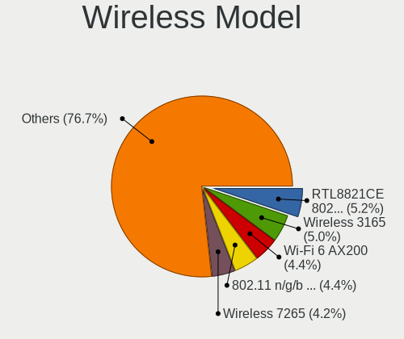

OPNsense - Tested Hardware & Statistics
---------------------------------------

A project to collect tested hardware configurations for OPNsense.

Anyone can contribute to this report by the [hw-probe](https://github.com/linuxhw/hw-probe/blob/master/INSTALL.BSD.md) tool:

    hw-probe -all -upload

Please contribute! Especially if your hardware is rare.

Contents
--------

* [ Test Cases ](#test-cases)

* [ System ](#system)
  - [ OS                       ](#os)
  - [ OS Family                ](#os-family)
  - [ Arch                     ](#arch)
  - [ DE                       ](#de)
  - [ Display Server           ](#display-server)
  - [ Display Manager          ](#display-manager)
  - [ OS Lang                  ](#os-lang)
  - [ Boot Mode                ](#boot-mode)
  - [ Filesystem               ](#filesystem)
  - [ Part. scheme             ](#part-scheme)

* [ Board ](#board)
  - [ Vendor                   ](#vendor)
  - [ Model                    ](#model)
  - [ Model Family             ](#model-family)
  - [ MFG Year                 ](#mfg-year)
  - [ Form Factor              ](#form-factor)
  - [ Coreboot                 ](#coreboot)
  - [ RAM Size                 ](#ram-size)
  - [ RAM Used                 ](#ram-used)
  - [ Total Drives             ](#total-drives)
  - [ Has CD-ROM               ](#has-cd-rom)
  - [ Has Ethernet             ](#has-ethernet)
  - [ Has WiFi                 ](#has-wifi)
  - [ Has Bluetooth            ](#has-bluetooth)

* [ Location ](#location)
  - [ Country                  ](#country)
  - [ City                     ](#city)

* [ Drives ](#drives)
  - [ Drive Vendor             ](#drive-vendor)
  - [ Drive Model              ](#drive-model)
  - [ HDD Vendor               ](#hdd-vendor)
  - [ SSD Vendor               ](#ssd-vendor)
  - [ Drive Kind               ](#drive-kind)
  - [ Drive Connector          ](#drive-connector)
  - [ Drive Size               ](#drive-size)
  - [ Space Total              ](#space-total)
  - [ Space Used               ](#space-used)
  - [ Malfunc. Drives          ](#malfunc-drives)
  - [ Malfunc. Drive Vendor    ](#malfunc-drive-vendor)
  - [ Malfunc. HDD Vendor      ](#malfunc-hdd-vendor)
  - [ Malfunc. Drive Kind      ](#malfunc-drive-kind)
  - [ Failed Drives            ](#failed-drives)
  - [ Failed Drive Vendor      ](#failed-drive-vendor)
  - [ Drive Status             ](#drive-status)

* [ Storage controller ](#storage-controller)
  - [ Storage Vendor           ](#storage-vendor)
  - [ Storage Model            ](#storage-model)
  - [ Storage Kind             ](#storage-kind)

* [ Processor ](#processor)
  - [ CPU Vendor               ](#cpu-vendor)
  - [ CPU Model                ](#cpu-model)
  - [ CPU Model Family         ](#cpu-model-family)
  - [ CPU Cores                ](#cpu-cores)
  - [ CPU Sockets              ](#cpu-sockets)
  - [ CPU Threads              ](#cpu-threads)
  - [ CPU Microarch            ](#cpu-microarch)

* [ Graphics ](#graphics)
  - [ GPU Vendor               ](#gpu-vendor)
  - [ GPU Model                ](#gpu-model)
  - [ GPU Combo                ](#gpu-combo)
  - [ GPU Driver               ](#gpu-driver)
  - [ GPU Memory               ](#gpu-memory)

* [ Monitor ](#monitor)
  - [ Monitor Vendor           ](#monitor-vendor)
  - [ Monitor Model            ](#monitor-model)
  - [ Monitor Resolution       ](#monitor-resolution)
  - [ Monitor Diagonal         ](#monitor-diagonal)
  - [ Monitor Width            ](#monitor-width)
  - [ Aspect Ratio             ](#aspect-ratio)
  - [ Monitor Area             ](#monitor-area)
  - [ Pixel Density            ](#pixel-density)
  - [ Multiple Monitors        ](#multiple-monitors)

* [ Network ](#network)
  - [ Net Controller Vendor    ](#net-controller-vendor)
  - [ Net Controller Model     ](#net-controller-model)
  - [ Wireless Vendor          ](#wireless-vendor)
  - [ Wireless Model           ](#wireless-model)
  - [ Ethernet Vendor          ](#ethernet-vendor)
  - [ Ethernet Model           ](#ethernet-model)
  - [ Net Controller Kind      ](#net-controller-kind)
  - [ Used Controller          ](#used-controller)
  - [ NICs                     ](#nics)
  - [ IPv6                     ](#ipv6)

* [ Bluetooth ](#bluetooth)
  - [ Bluetooth Vendor         ](#bluetooth-vendor)
  - [ Bluetooth Model          ](#bluetooth-model)

* [ Sound ](#sound)
  - [ Sound Vendor             ](#sound-vendor)
  - [ Sound Model              ](#sound-model)

* [ Memory ](#memory)
  - [ Memory Vendor            ](#memory-vendor)
  - [ Memory Model             ](#memory-model)
  - [ Memory Kind              ](#memory-kind)
  - [ Memory Form Factor       ](#memory-form-factor)
  - [ Memory Size              ](#memory-size)
  - [ Memory Speed             ](#memory-speed)

* [ Printers & scanners ](#printers--scanners)
  - [ Printer Vendor           ](#printer-vendor)
  - [ Printer Model            ](#printer-model)
  - [ Scanner Vendor           ](#scanner-vendor)
  - [ Scanner Model            ](#scanner-model)

* [ Camera ](#camera)
  - [ Camera Vendor            ](#camera-vendor)
  - [ Camera Model             ](#camera-model)

* [ Security ](#security)
  - [ Fingerprint Vendor       ](#fingerprint-vendor)
  - [ Fingerprint Model        ](#fingerprint-model)
  - [ Chipcard Vendor          ](#chipcard-vendor)
  - [ Chipcard Model           ](#chipcard-model)

* [ Unsupported ](#unsupported)
  - [ Unsupported Devices      ](#unsupported-devices)
  - [ Unsupported Device Types ](#unsupported-device-types)

Test Cases
----------

Total: 10952

| Vendor        | Model                       | Form-Factor | Probe                                                     | Date         |
|---------------|-----------------------------|-------------|-----------------------------------------------------------|--------------|
| Supermicro    | A2SDi-4C-HLN4F              | Desktop     | [f97e242e6b](https://bsd-hardware.info/?probe=f97e242e6b) | Oct 01, 2023 |
| Dell          | 0GU083 A00                  | Desktop     | [1286478dc2](https://bsd-hardware.info/?probe=1286478dc2) | Oct 01, 2023 |
| Win elemen... | M600                        | Desktop     | [b5caabfd31](https://bsd-hardware.info/?probe=b5caabfd31) | Oct 01, 2023 |
| Win elemen... | M600                        | Desktop     | [7a1378a001](https://bsd-hardware.info/?probe=7a1378a001) | Oct 01, 2023 |
| Win elemen... | M600                        | Desktop     | [93cc6a1173](https://bsd-hardware.info/?probe=93cc6a1173) | Oct 01, 2023 |
| Techvision    | TVI7309X B0                 | Desktop     | [906fd7e198](https://bsd-hardware.info/?probe=906fd7e198) | Sep 30, 2023 |
| Unknown       | Unknown                     | Desktop     | [50418139b2](https://bsd-hardware.info/?probe=50418139b2) | Sep 30, 2023 |
| Unknown       | Unknown                     | Notebook    | [7cfd3d40eb](https://bsd-hardware.info/?probe=7cfd3d40eb) | Sep 30, 2023 |
| ASUSTek       | A88XM-A                     | Desktop     | [a32967cbc5](https://bsd-hardware.info/?probe=a32967cbc5) | Sep 30, 2023 |
| Unknown       | Unknown                     | Desktop     | [716f9b28ab](https://bsd-hardware.info/?probe=716f9b28ab) | Sep 30, 2023 |
| Gigabyte      | H470M DS3H                  | Desktop     | [604bce28c1](https://bsd-hardware.info/?probe=604bce28c1) | Sep 30, 2023 |
| Sophos        | SG                          | Firewall    | [c46ccbd5b9](https://bsd-hardware.info/?probe=c46ccbd5b9) | Sep 30, 2023 |
| ASUSTek       | P10S-C Series               | Desktop     | [cc0a5bb631](https://bsd-hardware.info/?probe=cc0a5bb631) | Sep 30, 2023 |
| Fujitsu       | D3543-A1 S26361-D3543-A1... | Desktop     | [8809e169a1](https://bsd-hardware.info/?probe=8809e169a1) | Sep 30, 2023 |
| Sophos        | SG                          | Firewall    | [273b148522](https://bsd-hardware.info/?probe=273b148522) | Sep 30, 2023 |
| Dell          | 0782GW A00                  | Desktop     | [dfb45f6202](https://bsd-hardware.info/?probe=dfb45f6202) | Sep 30, 2023 |
| Sophos        | SG                          | Firewall    | [1429a7de9a](https://bsd-hardware.info/?probe=1429a7de9a) | Sep 30, 2023 |
| HP            | 83EE                        | Desktop     | [88d80d215a](https://bsd-hardware.info/?probe=88d80d215a) | Sep 30, 2023 |
| Unknown       | Unknown                     | Desktop     | [20fb7f1ba8](https://bsd-hardware.info/?probe=20fb7f1ba8) | Sep 30, 2023 |
| Intel         | NUC11TNBi3 M11908-403       | Mini pc     | [9ceae969b0](https://bsd-hardware.info/?probe=9ceae969b0) | Sep 30, 2023 |
| Supermicro    | X9DRD-iF                    | Server      | [fc2ba7c8d8](https://bsd-hardware.info/?probe=fc2ba7c8d8) | Sep 30, 2023 |
| Win elemen... | M600                        | Desktop     | [abc175c93b](https://bsd-hardware.info/?probe=abc175c93b) | Sep 30, 2023 |
| Supermicro    | A2SDi-TP8F                  | Desktop     | [9a73be8c9c](https://bsd-hardware.info/?probe=9a73be8c9c) | Sep 30, 2023 |
| Win elemen... | M600                        | Desktop     | [5b7606e786](https://bsd-hardware.info/?probe=5b7606e786) | Sep 30, 2023 |
| Intel         | DN2820FYK H24582-201        | Desktop     | [ea832a672d](https://bsd-hardware.info/?probe=ea832a672d) | Sep 30, 2023 |
| IGEL Techn... | VX900                       | Desktop     | [eb65624dc3](https://bsd-hardware.info/?probe=eb65624dc3) | Sep 29, 2023 |
| Acer          | F672CR R01-B1               | Desktop     | [2008598c7e](https://bsd-hardware.info/?probe=2008598c7e) | Sep 29, 2023 |
| Deciso        | Netboard A20                | Notebook    | [3877143e37](https://bsd-hardware.info/?probe=3877143e37) | Sep 29, 2023 |
| Unknown       | Unknown                     | Desktop     | [fb21a44f71](https://bsd-hardware.info/?probe=fb21a44f71) | Sep 29, 2023 |
| AMI           | Aptio CRB                   | Mini pc     | [bfe4c8617a](https://bsd-hardware.info/?probe=bfe4c8617a) | Sep 29, 2023 |
| ASUSTek       | P10S-C Series               | Desktop     | [4e7d5e6cf9](https://bsd-hardware.info/?probe=4e7d5e6cf9) | Sep 29, 2023 |
| Dell          | 03NXH8 A00                  | Mini pc     | [c560c88351](https://bsd-hardware.info/?probe=c560c88351) | Sep 29, 2023 |
| Lenovo        | 312D SDK0J40697 WIN 3305... | Mini pc     | [cda7be3da8](https://bsd-hardware.info/?probe=cda7be3da8) | Sep 29, 2023 |
| Dell          | 03NXH8 A00                  | Mini pc     | [cc346350f3](https://bsd-hardware.info/?probe=cc346350f3) | Sep 29, 2023 |
| TONK          | TN2800                      | Desktop     | [bce9c62915](https://bsd-hardware.info/?probe=bce9c62915) | Sep 29, 2023 |
| HP            | 1998                        | Desktop     | [0f176c9cc9](https://bsd-hardware.info/?probe=0f176c9cc9) | Sep 29, 2023 |
| Unknown       | Unknown                     | Desktop     | [6ed3c7314d](https://bsd-hardware.info/?probe=6ed3c7314d) | Sep 29, 2023 |
| HP            | 82B4                        | Desktop     | [60d259ab3f](https://bsd-hardware.info/?probe=60d259ab3f) | Sep 29, 2023 |
| HP            | 0B54h D                     | Desktop     | [55122a1908](https://bsd-hardware.info/?probe=55122a1908) | Sep 29, 2023 |
| Unknown       | Unknown                     | Desktop     | [7e82c0f66d](https://bsd-hardware.info/?probe=7e82c0f66d) | Sep 29, 2023 |
| MSI           | MS-98G4                     | Desktop     | [a8ea23c0df](https://bsd-hardware.info/?probe=a8ea23c0df) | Sep 28, 2023 |
| Techvision    | TVI7309X B0                 | Desktop     | [f50d617197](https://bsd-hardware.info/?probe=f50d617197) | Sep 28, 2023 |
| Protectli     | VP2420                      | Desktop     | [ff0144d21a](https://bsd-hardware.info/?probe=ff0144d21a) | Sep 28, 2023 |
| Intel         | D33217GKE G76540-205        | Desktop     | [faef2ab5c6](https://bsd-hardware.info/?probe=faef2ab5c6) | Sep 28, 2023 |
| Dell          | 08D89F A00                  | Server      | [6a9c0620a0](https://bsd-hardware.info/?probe=6a9c0620a0) | Sep 28, 2023 |
| HP            | 8054                        | Desktop     | [650aa5ab8f](https://bsd-hardware.info/?probe=650aa5ab8f) | Sep 28, 2023 |
| Dell          | Latitude 5591               | Notebook    | [c30943def8](https://bsd-hardware.info/?probe=c30943def8) | Sep 28, 2023 |
| Unknown       | Unknown                     | Desktop     | [df07570acc](https://bsd-hardware.info/?probe=df07570acc) | Sep 28, 2023 |
| Sophos        | SG                          | Firewall    | [e6a4159f0c](https://bsd-hardware.info/?probe=e6a4159f0c) | Sep 28, 2023 |
| HP            | 83EE                        | Desktop     | [d08ae678b5](https://bsd-hardware.info/?probe=d08ae678b5) | Sep 28, 2023 |
| Dell          | 0NW6H5 A00                  | Desktop     | [b698f41785](https://bsd-hardware.info/?probe=b698f41785) | Sep 28, 2023 |
| Fujitsu       | D3221-A1 S26361-D3221-A1    | Desktop     | [b3f0a784ab](https://bsd-hardware.info/?probe=b3f0a784ab) | Sep 28, 2023 |
| Dell          | 08D89F A00                  | Server      | [de921e42d3](https://bsd-hardware.info/?probe=de921e42d3) | Sep 28, 2023 |
| ASUSTek       | SABERTOOTH 990FX R2.0       | Desktop     | [0f20928f2d](https://bsd-hardware.info/?probe=0f20928f2d) | Sep 28, 2023 |
| AMI           | Aptio CRB                   | Mini pc     | [0f1805a40e](https://bsd-hardware.info/?probe=0f1805a40e) | Sep 27, 2023 |
| AZW           | EQ                          | Desktop     | [bd702ed861](https://bsd-hardware.info/?probe=bd702ed861) | Sep 27, 2023 |
| Dell          | 05XGC8 A00                  | Desktop     | [a0d9fae143](https://bsd-hardware.info/?probe=a0d9fae143) | Sep 27, 2023 |
| PC Engines    | APU2                        | Desktop     | [252385ae71](https://bsd-hardware.info/?probe=252385ae71) | Sep 27, 2023 |
| AMI           | Aptio CRB                   | Mini pc     | [d86474bd03](https://bsd-hardware.info/?probe=d86474bd03) | Sep 27, 2023 |
| BESSTAR Te... | GB7                         | Mini pc     | [8d5549809c](https://bsd-hardware.info/?probe=8d5549809c) | Sep 27, 2023 |
| AMI           | Aptio CRB                   | Mini pc     | [57577a5f14](https://bsd-hardware.info/?probe=57577a5f14) | Sep 27, 2023 |
| Supermicro    | X9SCL/X9SCMA                | Desktop     | [8a4596eefa](https://bsd-hardware.info/?probe=8a4596eefa) | Sep 27, 2023 |
| Intel         | DENLOW_REFRESH_WS           | Desktop     | [9ca318e043](https://bsd-hardware.info/?probe=9ca318e043) | Sep 27, 2023 |
| AMI           | Aptio CRB                   | Mini pc     | [d7cdc9b73e](https://bsd-hardware.info/?probe=d7cdc9b73e) | Sep 26, 2023 |
| Protectli     | FW4B                        | Desktop     | [753b149819](https://bsd-hardware.info/?probe=753b149819) | Sep 26, 2023 |
| Lenovo        | 312D SDK0J40697 WIN 3305... | Mini pc     | [0b2b7195c1](https://bsd-hardware.info/?probe=0b2b7195c1) | Sep 26, 2023 |
| HPE           | ProLiant DL20 Gen10         | Server      | [3c10d0b8ed](https://bsd-hardware.info/?probe=3c10d0b8ed) | Sep 26, 2023 |
| HPE           | ProLiant DL20 Gen10         | Server      | [bc62c36654](https://bsd-hardware.info/?probe=bc62c36654) | Sep 25, 2023 |
| Supermicro    | X9SCI/X9SCA                 | Desktop     | [0f60a1a400](https://bsd-hardware.info/?probe=0f60a1a400) | Sep 25, 2023 |
| Dell          | 0VV3F2 A01                  | Server      | [69b9504be5](https://bsd-hardware.info/?probe=69b9504be5) | Sep 25, 2023 |
| HP            | 3396                        | Desktop     | [a60feb9960](https://bsd-hardware.info/?probe=a60feb9960) | Sep 25, 2023 |
| HP            | 18E5                        | Desktop     | [9c21b6e355](https://bsd-hardware.info/?probe=9c21b6e355) | Sep 25, 2023 |
| ASRock        | B760M-HDV/M.2 D4            | Desktop     | [886dc0272b](https://bsd-hardware.info/?probe=886dc0272b) | Sep 25, 2023 |
| Unknown       | Unknown                     | Desktop     | [a77db6c46a](https://bsd-hardware.info/?probe=a77db6c46a) | Sep 25, 2023 |
| Unknown       | Unknown                     | Desktop     | [05f45ba264](https://bsd-hardware.info/?probe=05f45ba264) | Sep 25, 2023 |
| Lenovo        | 312A SDK0J40697 WIN 3305... | Desktop     | [6153909c9e](https://bsd-hardware.info/?probe=6153909c9e) | Sep 25, 2023 |
| Unknown       | Unknown                     | Desktop     | [5232e5837b](https://bsd-hardware.info/?probe=5232e5837b) | Sep 25, 2023 |
| Unknown       | YL-J1900L4-V2               | Desktop     | [c186f8b50c](https://bsd-hardware.info/?probe=c186f8b50c) | Sep 25, 2023 |
| CncTion       | N4505-4L B0                 | Desktop     | [5880a22b30](https://bsd-hardware.info/?probe=5880a22b30) | Sep 25, 2023 |
| Seeed Stud... | ODYSSEY-X86J4105 SD-BS-C... | Desktop     | [64dac999bd](https://bsd-hardware.info/?probe=64dac999bd) | Sep 24, 2023 |
| Protectli     | VP4630                      | Desktop     | [d5c0fe73ef](https://bsd-hardware.info/?probe=d5c0fe73ef) | Sep 24, 2023 |
| ASUSTek       | PRIME X470-PRO              | Desktop     | [6a2ce1e29f](https://bsd-hardware.info/?probe=6a2ce1e29f) | Sep 24, 2023 |
| ShenZhen M... | 3865U-6L                    | Desktop     | [a488a0576d](https://bsd-hardware.info/?probe=a488a0576d) | Sep 24, 2023 |
| AMI           | Aptio CRB                   | Mini pc     | [c2291f803c](https://bsd-hardware.info/?probe=c2291f803c) | Sep 24, 2023 |
| AZW           | EQ                          | Desktop     | [1f9a2fcb6e](https://bsd-hardware.info/?probe=1f9a2fcb6e) | Sep 24, 2023 |
| Unknown       | Unknown                     | Desktop     | [a5643cabc4](https://bsd-hardware.info/?probe=a5643cabc4) | Sep 24, 2023 |
| Intel         | DQ77KB AAG40294-401         | Desktop     | [be147f7ff1](https://bsd-hardware.info/?probe=be147f7ff1) | Sep 24, 2023 |
| NU591         | 1.0                         | Desktop     | [99f3260ee0](https://bsd-hardware.info/?probe=99f3260ee0) | Sep 24, 2023 |
| Lenovo        | 310B SDK0J40697 WIN 3305... | Desktop     | [6c3728aa16](https://bsd-hardware.info/?probe=6c3728aa16) | Sep 24, 2023 |
| Protectli     | VP2420                      | Desktop     | [8644c80a4a](https://bsd-hardware.info/?probe=8644c80a4a) | Sep 24, 2023 |
| CncTion       | N5105-4L B0                 | Desktop     | [3b12ca9995](https://bsd-hardware.info/?probe=3b12ca9995) | Sep 23, 2023 |
| Intel         | NUC11TNBi5 M11904-500       | Mini pc     | [fd9c33d93c](https://bsd-hardware.info/?probe=fd9c33d93c) | Sep 23, 2023 |
| Supermicro    | X10SDV-TP8F                 | Server      | [d99ed8ecd0](https://bsd-hardware.info/?probe=d99ed8ecd0) | Sep 23, 2023 |
| Supermicro    | X10SDV-TP8F                 | Server      | [80f0800cee](https://bsd-hardware.info/?probe=80f0800cee) | Sep 23, 2023 |
| Unknown       | Unknown                     | Desktop     | [312bc5d526](https://bsd-hardware.info/?probe=312bc5d526) | Sep 23, 2023 |
| HP            | 8299                        | Desktop     | [fee80cc3e3](https://bsd-hardware.info/?probe=fee80cc3e3) | Sep 23, 2023 |
| AZW           | EQ                          | Desktop     | [c65840f9cf](https://bsd-hardware.info/?probe=c65840f9cf) | Sep 23, 2023 |
| PC Engines    | APU2                        | Desktop     | [3c7bd005ef](https://bsd-hardware.info/?probe=3c7bd005ef) | Sep 23, 2023 |
| Hardkernel    | ODROID-H3                   | Desktop     | [868f49643a](https://bsd-hardware.info/?probe=868f49643a) | Sep 23, 2023 |
| ShenZhen M... | 3865U-6L                    | Desktop     | [a4ebf601cd](https://bsd-hardware.info/?probe=a4ebf601cd) | Sep 23, 2023 |
| Protectli     | FW6 Ver                     | Desktop     | [d8ccddab5a](https://bsd-hardware.info/?probe=d8ccddab5a) | Sep 23, 2023 |
| Unknown       | Unknown                     | Desktop     | [3e1ef4a73c](https://bsd-hardware.info/?probe=3e1ef4a73c) | Sep 23, 2023 |
| Yanling       | YL-CLU6L-V1                 | Desktop     | [06d8f02eb7](https://bsd-hardware.info/?probe=06d8f02eb7) | Sep 22, 2023 |
| Unknown       | Unknown                     | Desktop     | [16640c7f04](https://bsd-hardware.info/?probe=16640c7f04) | Sep 22, 2023 |
| GoWin Solu... | R86S                        | Desktop     | [6d38812084](https://bsd-hardware.info/?probe=6d38812084) | Sep 22, 2023 |
| HP            | 18E5                        | Desktop     | [02b94adef6](https://bsd-hardware.info/?probe=02b94adef6) | Sep 22, 2023 |
| Unknown       | Unknown                     | Desktop     | [d8e6c9ffe6](https://bsd-hardware.info/?probe=d8e6c9ffe6) | Sep 22, 2023 |
| Intel         | Milstead Platform           | Notebook    | [04e544d5f1](https://bsd-hardware.info/?probe=04e544d5f1) | Sep 22, 2023 |
| IceWhale T... | ZimaBoard 216 ZMB           | Desktop     | [8386219e8f](https://bsd-hardware.info/?probe=8386219e8f) | Sep 22, 2023 |
| ShenZhen M... | MW-NANO-APL-4L              | Desktop     | [6bec3eae14](https://bsd-hardware.info/?probe=6bec3eae14) | Sep 22, 2023 |
| Sophos        | SG                          | Firewall    | [54ff756b5b](https://bsd-hardware.info/?probe=54ff756b5b) | Sep 22, 2023 |
| Unknown       | Unknown                     | Desktop     | [fcde651e99](https://bsd-hardware.info/?probe=fcde651e99) | Sep 21, 2023 |
| Dell          | 0KP561                      | Desktop     | [cf15aea783](https://bsd-hardware.info/?probe=cf15aea783) | Sep 21, 2023 |
| Gigabyte      | B150N Phoenix-WIFI-CF       | Desktop     | [e046bd9405](https://bsd-hardware.info/?probe=e046bd9405) | Sep 21, 2023 |
| Gigabyte      | B150N Phoenix-WIFI-CF       | Desktop     | [90f89eea16](https://bsd-hardware.info/?probe=90f89eea16) | Sep 21, 2023 |
| AMI           | Aptio CRB                   | Mini pc     | [9eb426c568](https://bsd-hardware.info/?probe=9eb426c568) | Sep 21, 2023 |
| ASRock        | J3455B-ITX                  | Desktop     | [c5a2093552](https://bsd-hardware.info/?probe=c5a2093552) | Sep 21, 2023 |
| HP            | 859B                        | Desktop     | [7b8592b129](https://bsd-hardware.info/?probe=7b8592b129) | Sep 21, 2023 |
| Gigabyte      | X570 AORUS PRO              | Desktop     | [9a9cdd30a2](https://bsd-hardware.info/?probe=9a9cdd30a2) | Sep 21, 2023 |
| PC Engines    | apu6                        | Desktop     | [1a45dd59a4](https://bsd-hardware.info/?probe=1a45dd59a4) | Sep 21, 2023 |
| Dell          | 0HD5W2 A01                  | Desktop     | [5478cff8a7](https://bsd-hardware.info/?probe=5478cff8a7) | Sep 21, 2023 |
| Premio        | BlueCat XMB3 00C            | Desktop     | [423687627b](https://bsd-hardware.info/?probe=423687627b) | Sep 21, 2023 |
| HP            | 8299                        | Desktop     | [2f1bdffe66](https://bsd-hardware.info/?probe=2f1bdffe66) | Sep 20, 2023 |
| Lenovo        | 312D SDK0J40697 WIN 3305... | Mini pc     | [e84cddfaaf](https://bsd-hardware.info/?probe=e84cddfaaf) | Sep 20, 2023 |
| Unknown       | Unknown                     | Desktop     | [3c479d7824](https://bsd-hardware.info/?probe=3c479d7824) | Sep 20, 2023 |
| Unknown       | Unknown                     | Desktop     | [13ba11c952](https://bsd-hardware.info/?probe=13ba11c952) | Sep 20, 2023 |
| Protectli     | FW4C Ver                    | Desktop     | [eae9f87345](https://bsd-hardware.info/?probe=eae9f87345) | Sep 20, 2023 |
| Unknown       | Unknown                     | Desktop     | [80a57145af](https://bsd-hardware.info/?probe=80a57145af) | Sep 20, 2023 |
| Supermicro    | X11SCL-IF                   | Server      | [da7e89f514](https://bsd-hardware.info/?probe=da7e89f514) | Sep 20, 2023 |
| Supermicro    | A1SRi-2758F                 | Desktop     | [6ee2f45613](https://bsd-hardware.info/?probe=6ee2f45613) | Sep 20, 2023 |
| Supermicro    | A1SRi-2758F                 | Desktop     | [34bffe0ed1](https://bsd-hardware.info/?probe=34bffe0ed1) | Sep 20, 2023 |
| Intel         | Q3XXG4-P V1.0               | Desktop     | [60a616adf4](https://bsd-hardware.info/?probe=60a616adf4) | Sep 20, 2023 |
| Lenovo        | SHARKBAY 0B98401 WIN        | Desktop     | [92da10b93b](https://bsd-hardware.info/?probe=92da10b93b) | Sep 20, 2023 |
| HP            | 8522 A01                    | Mini pc     | [dd5d9863aa](https://bsd-hardware.info/?probe=dd5d9863aa) | Sep 19, 2023 |
| Protectli     | VP2420                      | Desktop     | [bdc1cdb479](https://bsd-hardware.info/?probe=bdc1cdb479) | Sep 19, 2023 |
| Dell          | 0M5DCD A00                  | Desktop     | [c7e64c0893](https://bsd-hardware.info/?probe=c7e64c0893) | Sep 19, 2023 |
| Supermicro    | X11SCL-IF                   | Server      | [5a57c7066e](https://bsd-hardware.info/?probe=5a57c7066e) | Sep 19, 2023 |
| Shenzhen M... | RPBNB                       | Desktop     | [07698e61c2](https://bsd-hardware.info/?probe=07698e61c2) | Sep 19, 2023 |
| ASUSTek       | P5G41T-M LX3                | Desktop     | [621470728b](https://bsd-hardware.info/?probe=621470728b) | Sep 19, 2023 |
| Lenovo        | 367D 31900058 STD           | Desktop     | [efd07dfb64](https://bsd-hardware.info/?probe=efd07dfb64) | Sep 19, 2023 |
| MW            | GMLK-2_5G4L                 | Desktop     | [8ebba0ee37](https://bsd-hardware.info/?probe=8ebba0ee37) | Sep 19, 2023 |
| Dell          | 0D28YY A02                  | Desktop     | [6c195174db](https://bsd-hardware.info/?probe=6c195174db) | Sep 19, 2023 |
| AMI           | Aptio CRB                   | Mini pc     | [ed7bef076e](https://bsd-hardware.info/?probe=ed7bef076e) | Sep 19, 2023 |
| Unknown       | SKYBAY                      | Desktop     | [95286f41d9](https://bsd-hardware.info/?probe=95286f41d9) | Sep 19, 2023 |
| AMI           | Aptio CRB                   | Mini pc     | [7c6f946c9b](https://bsd-hardware.info/?probe=7c6f946c9b) | Sep 19, 2023 |
| Lenovo        | SHARKBAY SDK0E50510 WIN     | Desktop     | [0fe1aab1d8](https://bsd-hardware.info/?probe=0fe1aab1d8) | Sep 19, 2023 |
| Protectli     | VP2420                      | Desktop     | [c4599cac13](https://bsd-hardware.info/?probe=c4599cac13) | Sep 19, 2023 |
| Unknown       | Unknown                     | Desktop     | [f6f0fa8016](https://bsd-hardware.info/?probe=f6f0fa8016) | Sep 18, 2023 |
| Unknown       | Unknown                     | Desktop     | [0a9c074970](https://bsd-hardware.info/?probe=0a9c074970) | Sep 18, 2023 |
| Techvision    | TVI7309X B0                 | Desktop     | [5e7775568c](https://bsd-hardware.info/?probe=5e7775568c) | Sep 18, 2023 |
| GoWin Solu... | R86S                        | Desktop     | [0cfd79f7fe](https://bsd-hardware.info/?probe=0cfd79f7fe) | Sep 18, 2023 |
| HP            | ProLiant DL380 Gen9         | Server      | [65aa2c10a3](https://bsd-hardware.info/?probe=65aa2c10a3) | Sep 18, 2023 |
| AMI           | Aptio CRB                   | Mini pc     | [815d9f2867](https://bsd-hardware.info/?probe=815d9f2867) | Sep 18, 2023 |
| HP            | 1790                        | Desktop     | [17ace3bb2c](https://bsd-hardware.info/?probe=17ace3bb2c) | Sep 18, 2023 |
| CncTion       | Jasper-4L B0                | Desktop     | [96f81e84f6](https://bsd-hardware.info/?probe=96f81e84f6) | Sep 18, 2023 |
| Techvision    | TVI7309X B0                 | Desktop     | [7b6014f65f](https://bsd-hardware.info/?probe=7b6014f65f) | Sep 18, 2023 |
| Inventec      | DQ Class A02                | Desktop     | [e6e705b7cf](https://bsd-hardware.info/?probe=e6e705b7cf) | Sep 18, 2023 |
| Advantech     | NAMB-3250 A102-1            | Desktop     | [143c5f73fc](https://bsd-hardware.info/?probe=143c5f73fc) | Sep 17, 2023 |
| Unknown       | Unknown                     | Desktop     | [39e1d38287](https://bsd-hardware.info/?probe=39e1d38287) | Sep 17, 2023 |
| CWWK          | CW-AD4L-N V1                | Desktop     | [cdeddbf4be](https://bsd-hardware.info/?probe=cdeddbf4be) | Sep 17, 2023 |
| CncTion       | Jasper-4L B0                | Desktop     | [4254b5eac8](https://bsd-hardware.info/?probe=4254b5eac8) | Sep 17, 2023 |
| HP            | 82A2                        | Desktop     | [4f125fbc75](https://bsd-hardware.info/?probe=4f125fbc75) | Sep 17, 2023 |
| Techvision    | TVI7309X B0                 | Desktop     | [4a9993ca08](https://bsd-hardware.info/?probe=4a9993ca08) | Sep 17, 2023 |
| Dell          | 04415J A00                  | Mini pc     | [35fbb60b50](https://bsd-hardware.info/?probe=35fbb60b50) | Sep 17, 2023 |
| Intel         | Q3XXG4-P V1.0               | Desktop     | [4ee4930d11](https://bsd-hardware.info/?probe=4ee4930d11) | Sep 17, 2023 |
| Lenovo        | 312A SDK0J40697 WIN 3305... | Desktop     | [31455b0d33](https://bsd-hardware.info/?probe=31455b0d33) | Sep 17, 2023 |
| ASRock        | B450M Pro4-F                | Desktop     | [b6763a8d49](https://bsd-hardware.info/?probe=b6763a8d49) | Sep 17, 2023 |
| Lenovo        | 3136 SDK0J40697 WIN 3305... | Mini pc     | [3950a0580d](https://bsd-hardware.info/?probe=3950a0580d) | Sep 16, 2023 |
| Unknown       | Unknown                     | Desktop     | [31cf5dc87d](https://bsd-hardware.info/?probe=31cf5dc87d) | Sep 16, 2023 |
| Unknown       | Unknown                     | Desktop     | [f0b617a1bc](https://bsd-hardware.info/?probe=f0b617a1bc) | Sep 16, 2023 |
| Unknown       | Unknown                     | Notebook    | [5aebf0e729](https://bsd-hardware.info/?probe=5aebf0e729) | Sep 16, 2023 |
| Intel         | DENLOW_WS                   | Desktop     | [029b3cdd58](https://bsd-hardware.info/?probe=029b3cdd58) | Sep 16, 2023 |
| Gigabyte      | Q170TN                      | Desktop     | [f8baffb969](https://bsd-hardware.info/?probe=f8baffb969) | Sep 16, 2023 |
| Dell          | 0R5KP9 A09                  | Server      | [54ff0b9d41](https://bsd-hardware.info/?probe=54ff0b9d41) | Sep 16, 2023 |
| ZOTAC         | ZBOX-CI329NANO              | Mini pc     | [49593de0a0](https://bsd-hardware.info/?probe=49593de0a0) | Sep 16, 2023 |
| Supermicro    | X9SCL/X9SCMA                | Desktop     | [a054400ef6](https://bsd-hardware.info/?probe=a054400ef6) | Sep 16, 2023 |
| Hardkernel    | ODROID-H2                   | Desktop     | [35544a61bd](https://bsd-hardware.info/?probe=35544a61bd) | Sep 16, 2023 |
| Unknown       | MANIFOLD 2-C                | Desktop     | [80707f8712](https://bsd-hardware.info/?probe=80707f8712) | Sep 16, 2023 |
| Lenovo        | 312D SDK0J40697 WIN 3305... | Mini pc     | [1f54d2bb5b](https://bsd-hardware.info/?probe=1f54d2bb5b) | Sep 16, 2023 |
| Dell          | 02YYK5 A00                  | Desktop     | [a2d011d2d7](https://bsd-hardware.info/?probe=a2d011d2d7) | Sep 16, 2023 |
| Techvision    | TVI7309X B0                 | Desktop     | [9a30d2d88c](https://bsd-hardware.info/?probe=9a30d2d88c) | Sep 16, 2023 |
| Unknown       | Unknown                     | Desktop     | [d6acb378a1](https://bsd-hardware.info/?probe=d6acb378a1) | Sep 15, 2023 |
| MW            | GMLK-2_5G4L                 | Desktop     | [d36ff6181c](https://bsd-hardware.info/?probe=d36ff6181c) | Sep 15, 2023 |
| Unknown       | Unknown                     | Desktop     | [3fcc5727d3](https://bsd-hardware.info/?probe=3fcc5727d3) | Sep 15, 2023 |
| Deciso        | NetBoard-A20                | Notebook    | [0c65fb5e8c](https://bsd-hardware.info/?probe=0c65fb5e8c) | Sep 15, 2023 |
| Unknown       | Unknown                     | Desktop     | [fe010506e6](https://bsd-hardware.info/?probe=fe010506e6) | Sep 15, 2023 |
| Protectli     | FW4B Ver                    | Desktop     | [9790cd72bc](https://bsd-hardware.info/?probe=9790cd72bc) | Sep 15, 2023 |
| Dell          | OptiPlex 3020               | Desktop     | [dfb6cce27d](https://bsd-hardware.info/?probe=dfb6cce27d) | Sep 14, 2023 |
| Unknown       | YL-SKUL6                    | Desktop     | [fe04f35995](https://bsd-hardware.info/?probe=fe04f35995) | Sep 14, 2023 |
| Unknown       | Unknown                     | Desktop     | [f28bb4ffda](https://bsd-hardware.info/?probe=f28bb4ffda) | Sep 14, 2023 |
| AMI           | Aptio CRB                   | Mini pc     | [28f5d3aea6](https://bsd-hardware.info/?probe=28f5d3aea6) | Sep 14, 2023 |
| Dell          | 0D24M8 A03                  | Desktop     | [48441955a6](https://bsd-hardware.info/?probe=48441955a6) | Sep 14, 2023 |
| ASRock        | J1900D2Y                    | Desktop     | [2084583d47](https://bsd-hardware.info/?probe=2084583d47) | Sep 14, 2023 |
| Unknown       | Unknown                     | Desktop     | [3fe0e846fe](https://bsd-hardware.info/?probe=3fe0e846fe) | Sep 14, 2023 |
| Sophos        | SG                          | Firewall    | [960f408d24](https://bsd-hardware.info/?probe=960f408d24) | Sep 13, 2023 |
| Dell          | 0NW6H5 A00                  | Desktop     | [227062e965](https://bsd-hardware.info/?probe=227062e965) | Sep 13, 2023 |
| Deciso        | NetBoard-A10                | Notebook    | [0068732d33](https://bsd-hardware.info/?probe=0068732d33) | Sep 13, 2023 |
| ASRock        | J3455M                      | Desktop     | [f9809dfb0f](https://bsd-hardware.info/?probe=f9809dfb0f) | Sep 13, 2023 |
| Sophos        | SG                          | Firewall    | [3328f1aa70](https://bsd-hardware.info/?probe=3328f1aa70) | Sep 13, 2023 |
| Dell          | 0D28YY A02                  | Desktop     | [fe5635048a](https://bsd-hardware.info/?probe=fe5635048a) | Sep 13, 2023 |
| HP            | 8055                        | Desktop     | [be8554bed1](https://bsd-hardware.info/?probe=be8554bed1) | Sep 13, 2023 |
| Dell          | 0KM5PX A02                  | Server      | [2028895de0](https://bsd-hardware.info/?probe=2028895de0) | Sep 13, 2023 |
| Dell          | 02YYK5 A00                  | Desktop     | [ae320bd7de](https://bsd-hardware.info/?probe=ae320bd7de) | Sep 13, 2023 |
| Intel         | S1200BTL E98681-306         | Server      | [f3594b1f7c](https://bsd-hardware.info/?probe=f3594b1f7c) | Sep 13, 2023 |
| Fujitsu       | D3313-E1 S26361-D3313-E1    | Desktop     | [5c89a7a1f1](https://bsd-hardware.info/?probe=5c89a7a1f1) | Sep 13, 2023 |
| Protectli     | FW4B Ver                    | Desktop     | [984a64677e](https://bsd-hardware.info/?probe=984a64677e) | Sep 13, 2023 |
| ASRockRack    | X470D4U                     | Desktop     | [b0cd1ce0f4](https://bsd-hardware.info/?probe=b0cd1ce0f4) | Sep 13, 2023 |
| Sophos        | SG                          | Firewall    | [4bc5b044cd](https://bsd-hardware.info/?probe=4bc5b044cd) | Sep 12, 2023 |
| Hardkernel    | ODROID-H3                   | Desktop     | [d3c0559486](https://bsd-hardware.info/?probe=d3c0559486) | Sep 12, 2023 |
| Unknown       | Unknown                     | Desktop     | [8229339c2f](https://bsd-hardware.info/?probe=8229339c2f) | Sep 12, 2023 |
| Protectli     | VP2420                      | Desktop     | [626a91f30d](https://bsd-hardware.info/?probe=626a91f30d) | Sep 12, 2023 |
| Unknown       | Unknown                     | Desktop     | [0fccf590d4](https://bsd-hardware.info/?probe=0fccf590d4) | Sep 12, 2023 |
| Dell          | 0HD5W2 A00                  | Desktop     | [6857d78d0b](https://bsd-hardware.info/?probe=6857d78d0b) | Sep 12, 2023 |
| CheckPoint    | T-140-00                    | Desktop     | [670266bc8e](https://bsd-hardware.info/?probe=670266bc8e) | Sep 12, 2023 |
| MSI           | MS-S0891                    | Desktop     | [10b3300ed1](https://bsd-hardware.info/?probe=10b3300ed1) | Sep 12, 2023 |
| Dell          | 0782GW A00                  | Desktop     | [f5f0e573fe](https://bsd-hardware.info/?probe=f5f0e573fe) | Sep 11, 2023 |
| Unknown       | Unknown                     | Desktop     | [7af171368a](https://bsd-hardware.info/?probe=7af171368a) | Sep 11, 2023 |
| Protectli     | FW4B Ver                    | Desktop     | [015620b56d](https://bsd-hardware.info/?probe=015620b56d) | Sep 11, 2023 |
| Unknown       | Unknown                     | Desktop     | [0602673da0](https://bsd-hardware.info/?probe=0602673da0) | Sep 11, 2023 |
| Techvision    | TVI7309X B0                 | Desktop     | [6e9a9c509b](https://bsd-hardware.info/?probe=6e9a9c509b) | Sep 11, 2023 |
| Unknown       | Unknown                     | Desktop     | [fd131bd648](https://bsd-hardware.info/?probe=fd131bd648) | Sep 11, 2023 |
| AMI           | Aptio CRB                   | Mini pc     | [3352f08ec3](https://bsd-hardware.info/?probe=3352f08ec3) | Sep 11, 2023 |
| MW            | GMLK-2_5G4L                 | Desktop     | [7923196f55](https://bsd-hardware.info/?probe=7923196f55) | Sep 11, 2023 |
| MSI           | A520M-A PRO                 | Desktop     | [8b541c71a9](https://bsd-hardware.info/?probe=8b541c71a9) | Sep 11, 2023 |
| Unknown       | Unknown                     | Desktop     | [6610a56ab4](https://bsd-hardware.info/?probe=6610a56ab4) | Sep 11, 2023 |
| Unknown       | Unknown                     | Desktop     | [7c53ad8bea](https://bsd-hardware.info/?probe=7c53ad8bea) | Sep 10, 2023 |
| Unknown       | Unknown                     | Desktop     | [ccc62ac366](https://bsd-hardware.info/?probe=ccc62ac366) | Sep 10, 2023 |
| MSI           | MS-9899 11                  | Desktop     | [4916af75db](https://bsd-hardware.info/?probe=4916af75db) | Sep 10, 2023 |
| Intel         | NUC5i5MYBE H47797-205       | Mini pc     | [5ef436c661](https://bsd-hardware.info/?probe=5ef436c661) | Sep 10, 2023 |
| HP            | 8105                        | Desktop     | [ea4f88787c](https://bsd-hardware.info/?probe=ea4f88787c) | Sep 10, 2023 |
| Fujitsu       | D3313-A1 S26361-D3313-A1    | Desktop     | [0797783a1c](https://bsd-hardware.info/?probe=0797783a1c) | Sep 10, 2023 |
| ASRock        | 4X4-4000 Series             | Desktop     | [525ed7878c](https://bsd-hardware.info/?probe=525ed7878c) | Sep 10, 2023 |
| ASRock        | 4X4-4000 Series             | Desktop     | [0131f46755](https://bsd-hardware.info/?probe=0131f46755) | Sep 10, 2023 |
| ASUSTek       | H170M-E D3                  | Desktop     | [f9bde14ab2](https://bsd-hardware.info/?probe=f9bde14ab2) | Sep 10, 2023 |
| ASUSTek       | PRIME H310I-PLUS R2.0       | Desktop     | [5695984890](https://bsd-hardware.info/?probe=5695984890) | Sep 10, 2023 |
| HP            | 8105                        | Desktop     | [0e45394704](https://bsd-hardware.info/?probe=0e45394704) | Sep 10, 2023 |
| Supermicro    | A1SRi-2558F                 | Mini pc     | [04e0638cca](https://bsd-hardware.info/?probe=04e0638cca) | Sep 10, 2023 |
| AZW           | EQ                          | Desktop     | [c6f83de1e4](https://bsd-hardware.info/?probe=c6f83de1e4) | Sep 10, 2023 |
| Unknown       | Unknown                     | Desktop     | [65240d295c](https://bsd-hardware.info/?probe=65240d295c) | Sep 10, 2023 |
| HP            | 8054                        | Desktop     | [4a0fdf70fa](https://bsd-hardware.info/?probe=4a0fdf70fa) | Sep 10, 2023 |
| ASUSTek       | P8H67-M PRO                 | Desktop     | [7e4ea56868](https://bsd-hardware.info/?probe=7e4ea56868) | Sep 10, 2023 |
| ASUSTek       | P8H67-M PRO                 | Desktop     | [ee34cb0b60](https://bsd-hardware.info/?probe=ee34cb0b60) | Sep 10, 2023 |
| Gigabyte      | H81M-S2V                    | Desktop     | [f30ab73618](https://bsd-hardware.info/?probe=f30ab73618) | Sep 10, 2023 |
| Unknown       | QGLK03                      | Desktop     | [42ea8dfb44](https://bsd-hardware.info/?probe=42ea8dfb44) | Sep 10, 2023 |
| CWWK          | CW-AD4L-N V1                | Desktop     | [52764da7d8](https://bsd-hardware.info/?probe=52764da7d8) | Sep 10, 2023 |
| Unknown       | Unknown                     | Desktop     | [3c85271913](https://bsd-hardware.info/?probe=3c85271913) | Sep 10, 2023 |
| Unknown       | Unknown                     | Desktop     | [d28c125e99](https://bsd-hardware.info/?probe=d28c125e99) | Sep 10, 2023 |
| Supermicro    | X10SLM-F                    | Desktop     | [332a3f8516](https://bsd-hardware.info/?probe=332a3f8516) | Sep 09, 2023 |
| Unknown       | Unknown                     | Desktop     | [8579d5fa0d](https://bsd-hardware.info/?probe=8579d5fa0d) | Sep 09, 2023 |
| Protectli     | FW4C Ver                    | Desktop     | [7ea278ed7a](https://bsd-hardware.info/?probe=7ea278ed7a) | Sep 09, 2023 |
| Protectli     | FW4C Ver                    | Desktop     | [331f3de91a](https://bsd-hardware.info/?probe=331f3de91a) | Sep 09, 2023 |
| HP            | 8103 A01                    | Mini pc     | [ff26b688eb](https://bsd-hardware.info/?probe=ff26b688eb) | Sep 09, 2023 |
| Unknown       | Unknown                     | Desktop     | [ee507594a0](https://bsd-hardware.info/?probe=ee507594a0) | Sep 09, 2023 |
| HP            | 8103 A01                    | Mini pc     | [698cbedaa3](https://bsd-hardware.info/?probe=698cbedaa3) | Sep 09, 2023 |
| Unknown       | Unknown                     | Desktop     | [3bc1fc9c7b](https://bsd-hardware.info/?probe=3bc1fc9c7b) | Sep 09, 2023 |
| Sophos        | XG                          | Firewall    | [01ed655ea2](https://bsd-hardware.info/?probe=01ed655ea2) | Sep 09, 2023 |
| Lenovo        | ThinkPad X61 Tablet 7762... | Notebook    | [252fc12d3b](https://bsd-hardware.info/?probe=252fc12d3b) | Sep 09, 2023 |
| Unknown       | Unknown                     | Desktop     | [68a0e23945](https://bsd-hardware.info/?probe=68a0e23945) | Sep 09, 2023 |
| Dell          | 0CNCJW A05                  | Server      | [8a0e0d7726](https://bsd-hardware.info/?probe=8a0e0d7726) | Sep 09, 2023 |
| Lenovo        | MAHOBAY Win8 Pro DPK TPG    | Desktop     | [93234978cf](https://bsd-hardware.info/?probe=93234978cf) | Sep 09, 2023 |
| Intel         | Q3XXG4-P V1.0               | Desktop     | [07d197cf04](https://bsd-hardware.info/?probe=07d197cf04) | Sep 09, 2023 |
| Unknown       | Unknown                     | Desktop     | [2e51c11ed2](https://bsd-hardware.info/?probe=2e51c11ed2) | Sep 08, 2023 |
| Unknown       | Unknown                     | Desktop     | [480823e372](https://bsd-hardware.info/?probe=480823e372) | Sep 08, 2023 |
| Techvision    | TVI7309X B0                 | Desktop     | [fe6bcbc332](https://bsd-hardware.info/?probe=fe6bcbc332) | Sep 08, 2023 |
| Techvision    | TVI7309X B0                 | Desktop     | [37e25cbcec](https://bsd-hardware.info/?probe=37e25cbcec) | Sep 08, 2023 |
| Unknown       | Unknown                     | Desktop     | [7b1205d74f](https://bsd-hardware.info/?probe=7b1205d74f) | Sep 08, 2023 |
| Dell          | 0NC2VH A01                  | Desktop     | [122601f717](https://bsd-hardware.info/?probe=122601f717) | Sep 08, 2023 |
| Unknown       | Unknown                     | Desktop     | [2cfdb7cfa9](https://bsd-hardware.info/?probe=2cfdb7cfa9) | Sep 08, 2023 |
| ASUSTek       | P11C-M Series               | Desktop     | [584bcb6fec](https://bsd-hardware.info/?probe=584bcb6fec) | Sep 08, 2023 |
| AZW           | MINI S 10                   | Desktop     | [4580cb5481](https://bsd-hardware.info/?probe=4580cb5481) | Sep 08, 2023 |
| Lex           | Pineview-D                  | Desktop     | [351aabdb80](https://bsd-hardware.info/?probe=351aabdb80) | Sep 08, 2023 |
| Techvision    | TVI7309X B0                 | Desktop     | [aaeb12b1c6](https://bsd-hardware.info/?probe=aaeb12b1c6) | Sep 08, 2023 |
| Protectli     | VP2420                      | Desktop     | [2a8eb1b056](https://bsd-hardware.info/?probe=2a8eb1b056) | Sep 08, 2023 |
| Unknown       | Unknown                     | Desktop     | [fa747c859f](https://bsd-hardware.info/?probe=fa747c859f) | Sep 08, 2023 |
| Intel         | MAHOBAY                     | Desktop     | [a3e54e7628](https://bsd-hardware.info/?probe=a3e54e7628) | Sep 08, 2023 |
| Unknown       | Unknown                     | Desktop     | [35e9ee2a00](https://bsd-hardware.info/?probe=35e9ee2a00) | Sep 07, 2023 |
| PAIQ          | PICO PC A1                  | Desktop     | [5e8f943fdd](https://bsd-hardware.info/?probe=5e8f943fdd) | Sep 07, 2023 |
| PAIQ          | PICO PC A1                  | Desktop     | [125fb34054](https://bsd-hardware.info/?probe=125fb34054) | Sep 07, 2023 |
| ReachingTe... | DreamQuest Pro 2022         | Notebook    | [2e6af170b9](https://bsd-hardware.info/?probe=2e6af170b9) | Sep 07, 2023 |
| Techvision    | TVI7309X B0                 | Desktop     | [eff74e8df0](https://bsd-hardware.info/?probe=eff74e8df0) | Sep 07, 2023 |
| Unknown       | Unknown                     | Desktop     | [21e851e9e9](https://bsd-hardware.info/?probe=21e851e9e9) | Sep 07, 2023 |
| PAIQ          | PICO PC A1                  | Desktop     | [a88a2eb065](https://bsd-hardware.info/?probe=a88a2eb065) | Sep 07, 2023 |
| PC Engines    | APU3                        | Desktop     | [ad38dcf54a](https://bsd-hardware.info/?probe=ad38dcf54a) | Sep 07, 2023 |
| Unknown       | Unknown                     | Desktop     | [5ed026eccf](https://bsd-hardware.info/?probe=5ed026eccf) | Sep 07, 2023 |
| AAEON         | FWS-2280 V1.0               | Desktop     | [b5e0038e79](https://bsd-hardware.info/?probe=b5e0038e79) | Sep 07, 2023 |
| TYAN Compu... | S5510HE                     | Desktop     | [99d23c35ca](https://bsd-hardware.info/?probe=99d23c35ca) | Sep 07, 2023 |
| Dell          | 05XGC8 A01                  | Desktop     | [7c0acfa5b9](https://bsd-hardware.info/?probe=7c0acfa5b9) | Sep 07, 2023 |
| Unknown       | Unknown                     | Desktop     | [94d9b19ade](https://bsd-hardware.info/?probe=94d9b19ade) | Sep 07, 2023 |
| Lenovo        | 3136 SDK0J40697 WIN 3305... | Mini pc     | [b5aa3f010f](https://bsd-hardware.info/?probe=b5aa3f010f) | Sep 07, 2023 |
| PAIQ          | PICO PC A1                  | Desktop     | [9e77e09181](https://bsd-hardware.info/?probe=9e77e09181) | Sep 07, 2023 |
| AMI           | Aptio CRB                   | Mini pc     | [12145f939b](https://bsd-hardware.info/?probe=12145f939b) | Sep 07, 2023 |
| Supermicro    | A2SDi-4C-HLN4F              | Server      | [8ce94dea6c](https://bsd-hardware.info/?probe=8ce94dea6c) | Sep 06, 2023 |
| IceWhale T... | ZimaBoard 432 ZMB           | Desktop     | [451cfdf64f](https://bsd-hardware.info/?probe=451cfdf64f) | Sep 06, 2023 |
| Dell          | 0KM5PX A01                  | Server      | [67f910daa9](https://bsd-hardware.info/?probe=67f910daa9) | Sep 06, 2023 |
| Unknown       | Unknown                     | Desktop     | [6361addd62](https://bsd-hardware.info/?probe=6361addd62) | Sep 06, 2023 |
| Fujitsu       | D3313-G1 S26361-D3313-G1    | Desktop     | [48ca84af37](https://bsd-hardware.info/?probe=48ca84af37) | Sep 06, 2023 |
| Lenovo        | 0B98401 PRO                 | Desktop     | [4397f70291](https://bsd-hardware.info/?probe=4397f70291) | Sep 06, 2023 |
| Dell          | 0NC2VH A01                  | Desktop     | [34a855cc56](https://bsd-hardware.info/?probe=34a855cc56) | Sep 06, 2023 |
| AZW           | MINI S 10                   | Desktop     | [2daf516a05](https://bsd-hardware.info/?probe=2daf516a05) | Sep 06, 2023 |
| AMI           | Aptio CRB                   | Mini pc     | [43aff23d91](https://bsd-hardware.info/?probe=43aff23d91) | Sep 06, 2023 |
| ASUSTek       | P8H61-M LE R2.0             | Desktop     | [7c08d4cfb1](https://bsd-hardware.info/?probe=7c08d4cfb1) | Sep 06, 2023 |
| AMI           | Aptio CRB                   | Mini pc     | [37be445dbe](https://bsd-hardware.info/?probe=37be445dbe) | Sep 06, 2023 |
| PC Engines    | APU2                        | Desktop     | [d582e62190](https://bsd-hardware.info/?probe=d582e62190) | Sep 06, 2023 |
| Techvision    | TVI7309X B0                 | Desktop     | [f04224b44a](https://bsd-hardware.info/?probe=f04224b44a) | Sep 06, 2023 |
| Unknown       | Unknown                     | Desktop     | [19711ca08b](https://bsd-hardware.info/?probe=19711ca08b) | Sep 06, 2023 |
| Supermicro    | X9SCL/X9SCMA                | Desktop     | [3af68f2594](https://bsd-hardware.info/?probe=3af68f2594) | Sep 06, 2023 |
| ASUSTek       | P8H67-M PRO                 | Desktop     | [c06ec95a55](https://bsd-hardware.info/?probe=c06ec95a55) | Sep 06, 2023 |
| Dell          | 096JG8 A01                  | Desktop     | [ec3e0338eb](https://bsd-hardware.info/?probe=ec3e0338eb) | Sep 06, 2023 |
| Unknown       | Unknown                     | Desktop     | [f757c58686](https://bsd-hardware.info/?probe=f757c58686) | Sep 05, 2023 |
| IceWhale T... | ZimaBoard 432 ZMB           | Desktop     | [6e458d22a3](https://bsd-hardware.info/?probe=6e458d22a3) | Sep 05, 2023 |
| Dell          | 096JG8 A01                  | Desktop     | [84d768ee15](https://bsd-hardware.info/?probe=84d768ee15) | Sep 05, 2023 |
| Intel         | Q3XXG4-P V1.0               | Desktop     | [3fb536ecce](https://bsd-hardware.info/?probe=3fb536ecce) | Sep 05, 2023 |
| Dell          | 0X3D66 A02                  | Server      | [8dcfb77863](https://bsd-hardware.info/?probe=8dcfb77863) | Sep 05, 2023 |
| Unknown       | Unknown                     | Desktop     | [a27d64dbac](https://bsd-hardware.info/?probe=a27d64dbac) | Sep 05, 2023 |
| ASUSTek       | H97I-PLUS                   | Desktop     | [e92272bb87](https://bsd-hardware.info/?probe=e92272bb87) | Sep 05, 2023 |
| Unknown       | Unknown                     | Desktop     | [b95f409ccf](https://bsd-hardware.info/?probe=b95f409ccf) | Sep 05, 2023 |
| Supermicro    | X11SSH-F                    | Desktop     | [bff90e93d0](https://bsd-hardware.info/?probe=bff90e93d0) | Sep 05, 2023 |
| Lenovo        | ThinkPad X61 Tablet 7762... | Notebook    | [00dd1bd84e](https://bsd-hardware.info/?probe=00dd1bd84e) | Sep 04, 2023 |
| Unknown       | Unknown                     | Desktop     | [a4796e8170](https://bsd-hardware.info/?probe=a4796e8170) | Sep 04, 2023 |
| Dell          | 0NC2VH A01                  | Desktop     | [8cc0358a69](https://bsd-hardware.info/?probe=8cc0358a69) | Sep 04, 2023 |
| CWWK          | CW-AD4L-N V1                | Desktop     | [dd32d9d4e1](https://bsd-hardware.info/?probe=dd32d9d4e1) | Sep 04, 2023 |
| Gigabyte      | P35C-DS3R                   | Desktop     | [4424751223](https://bsd-hardware.info/?probe=4424751223) | Sep 04, 2023 |
| Dell          | 0PRWNC A05                  | Server      | [ded67b8cd6](https://bsd-hardware.info/?probe=ded67b8cd6) | Sep 04, 2023 |
| Unknown       | Unknown                     | Desktop     | [7d95befe6e](https://bsd-hardware.info/?probe=7d95befe6e) | Sep 04, 2023 |
| Shuttle       | DS67U                       | Notebook    | [55c2922a25](https://bsd-hardware.info/?probe=55c2922a25) | Sep 04, 2023 |
| Intel         | S1200KP AAG34877-201        | Desktop     | [1b07865ce7](https://bsd-hardware.info/?probe=1b07865ce7) | Sep 04, 2023 |
| Dell          | 03X6X0 A02                  | Server      | [8d9b81f936](https://bsd-hardware.info/?probe=8d9b81f936) | Sep 04, 2023 |
| Dell          | 0NC2VH A01                  | Desktop     | [7209f86fed](https://bsd-hardware.info/?probe=7209f86fed) | Sep 04, 2023 |
| Supermicro    | X10SDV-TP8F                 | Server      | [25cc035e73](https://bsd-hardware.info/?probe=25cc035e73) | Sep 03, 2023 |
| Gigabyte      | A520I AC                    | Desktop     | [58e061f420](https://bsd-hardware.info/?probe=58e061f420) | Sep 03, 2023 |
| ASRock        | H81M-DGS R2.0               | Desktop     | [1f823a8be7](https://bsd-hardware.info/?probe=1f823a8be7) | Sep 03, 2023 |
| ASRock        | H310CM-DVS                  | Desktop     | [604c9311bc](https://bsd-hardware.info/?probe=604c9311bc) | Sep 03, 2023 |
| PC Engines    | APU2                        | Desktop     | [c9d2cfe6fa](https://bsd-hardware.info/?probe=c9d2cfe6fa) | Sep 03, 2023 |
| Unknown       | Unknown                     | Desktop     | [53cee3b3c8](https://bsd-hardware.info/?probe=53cee3b3c8) | Sep 03, 2023 |
| MSI           | PRO Z790-P WIFI             | Desktop     | [fe53c55492](https://bsd-hardware.info/?probe=fe53c55492) | Sep 03, 2023 |
| Biostar       | J4105NHU                    | Desktop     | [2ac770aa55](https://bsd-hardware.info/?probe=2ac770aa55) | Sep 03, 2023 |
| Lenovo        | 30BC SDK0J40705 WIN 3425... | Desktop     | [a1c29072ea](https://bsd-hardware.info/?probe=a1c29072ea) | Sep 03, 2023 |
| Protectli     | FW6 Ver                     | Desktop     | [70992eb19b](https://bsd-hardware.info/?probe=70992eb19b) | Sep 02, 2023 |
| ASUSTek       | M5A97 PLUS                  | Desktop     | [77b461d3ad](https://bsd-hardware.info/?probe=77b461d3ad) | Sep 02, 2023 |
| Raspberry ... | Raspberry Pi                | Soc         | [ecfa93eb95](https://bsd-hardware.info/?probe=ecfa93eb95) | Sep 02, 2023 |
| Dell          | 08NPPY A00                  | Desktop     | [1ae33cfe72](https://bsd-hardware.info/?probe=1ae33cfe72) | Sep 02, 2023 |
| ASRock        | J3455M                      | Desktop     | [762d4d9370](https://bsd-hardware.info/?probe=762d4d9370) | Sep 02, 2023 |
| Dell          | 0XCR8D A00                  | Desktop     | [b89126c9d9](https://bsd-hardware.info/?probe=b89126c9d9) | Sep 02, 2023 |
| AMI           | Aptio CRB                   | Mini pc     | [b63ded7b81](https://bsd-hardware.info/?probe=b63ded7b81) | Sep 02, 2023 |
| Unknown       | Unknown                     | Desktop     | [94487109c2](https://bsd-hardware.info/?probe=94487109c2) | Sep 01, 2023 |
| Supermicro    | X9DRD-iF                    | Server      | [708af02c7b](https://bsd-hardware.info/?probe=708af02c7b) | Sep 01, 2023 |
| HP            | EliteBook 8540w             | Notebook    | [5e44dfed67](https://bsd-hardware.info/?probe=5e44dfed67) | Sep 01, 2023 |
| Deciso        | NetBoard-A10                | Notebook    | [f95d1da00c](https://bsd-hardware.info/?probe=f95d1da00c) | Sep 01, 2023 |
| Dell          | 042P49 A01                  | Desktop     | [383445ee26](https://bsd-hardware.info/?probe=383445ee26) | Sep 01, 2023 |
| Inventec      | Z CLASS A02                 | Desktop     | [1f4bf47cab](https://bsd-hardware.info/?probe=1f4bf47cab) | Sep 01, 2023 |
| Dell          | 0DRG19 A00                  | Mini pc     | [9e6cb6fe25](https://bsd-hardware.info/?probe=9e6cb6fe25) | Sep 01, 2023 |
| CompuLab      | fitlet2                     | Mini pc     | [525a1718ff](https://bsd-hardware.info/?probe=525a1718ff) | Sep 01, 2023 |
| Protectli     | FW6 Ver                     | Desktop     | [04de7aa059](https://bsd-hardware.info/?probe=04de7aa059) | Sep 01, 2023 |
| Shuttle       | FS77U                       | Desktop     | [149a8a1437](https://bsd-hardware.info/?probe=149a8a1437) | Sep 01, 2023 |
| Foxconn       | nT-A3000 series FAB         | Desktop     | [d9f360b4fe](https://bsd-hardware.info/?probe=d9f360b4fe) | Aug 31, 2023 |
| Dell          | 0WR7PY A02                  | Desktop     | [2557e04cf5](https://bsd-hardware.info/?probe=2557e04cf5) | Aug 31, 2023 |
| Techvision    | TVI7309X B0                 | Desktop     | [6adab2354e](https://bsd-hardware.info/?probe=6adab2354e) | Aug 31, 2023 |
| Intel         | NUC8i7HNB J68197-602        | Mini pc     | [f2806a3c65](https://bsd-hardware.info/?probe=f2806a3c65) | Aug 31, 2023 |
| ASUSTek       | PRIME H610M-E D4            | Desktop     | [9aafa8bedf](https://bsd-hardware.info/?probe=9aafa8bedf) | Aug 31, 2023 |
| Deciso        | NetBoard-A20                | Notebook    | [bf4ed827a5](https://bsd-hardware.info/?probe=bf4ed827a5) | Aug 31, 2023 |
| Gigabyte      | A520I AC                    | Desktop     | [e245a38088](https://bsd-hardware.info/?probe=e245a38088) | Aug 31, 2023 |
| Biostar       | A68N-5545                   | Desktop     | [b2a1070e2d](https://bsd-hardware.info/?probe=b2a1070e2d) | Aug 31, 2023 |
| CWWK          | CW-AD4L-N V1                | Desktop     | [363a27fb74](https://bsd-hardware.info/?probe=363a27fb74) | Aug 31, 2023 |
| AMI           | Aptio CRB                   | Mini pc     | [97975e788b](https://bsd-hardware.info/?probe=97975e788b) | Aug 30, 2023 |
| ASRock        | H81M-VG4 R2.0               | Desktop     | [fd3a7c75de](https://bsd-hardware.info/?probe=fd3a7c75de) | Aug 30, 2023 |
| Supermicro    | X11SCL-IF                   | Server      | [b8c6daa2c4](https://bsd-hardware.info/?probe=b8c6daa2c4) | Aug 30, 2023 |
| Sophos        | UTM                         | Firewall    | [01a7eea7b9](https://bsd-hardware.info/?probe=01a7eea7b9) | Aug 30, 2023 |
| Deciso        | NetBoard-A20                | Notebook    | [0119402f80](https://bsd-hardware.info/?probe=0119402f80) | Aug 30, 2023 |
| Unknown       | Unknown                     | Desktop     | [b59ce07b49](https://bsd-hardware.info/?probe=b59ce07b49) | Aug 30, 2023 |
| Unknown       | Unknown                     | Desktop     | [c0536b27d4](https://bsd-hardware.info/?probe=c0536b27d4) | Aug 30, 2023 |
| HP            | ProLiant DL360p Gen8        | Server      | [914608f1b7](https://bsd-hardware.info/?probe=914608f1b7) | Aug 30, 2023 |
| MW            | GMLK-2_5G4L                 | Desktop     | [56ac0149f8](https://bsd-hardware.info/?probe=56ac0149f8) | Aug 30, 2023 |
| Infoblox      | IB-810                      | Desktop     | [34c0fa6bec](https://bsd-hardware.info/?probe=34c0fa6bec) | Aug 30, 2023 |
| Supermicro    | X12SDV-8C-SPT8FA            | Server      | [c46557f737](https://bsd-hardware.info/?probe=c46557f737) | Aug 30, 2023 |
| Techvision    | TVI7309X B0                 | Desktop     | [259a7ec99d](https://bsd-hardware.info/?probe=259a7ec99d) | Aug 30, 2023 |
| Techvision    | TVI7309X B0                 | Desktop     | [20946147de](https://bsd-hardware.info/?probe=20946147de) | Aug 30, 2023 |
| Unknown       | Unknown                     | Desktop     | [8cfa60050b](https://bsd-hardware.info/?probe=8cfa60050b) | Aug 30, 2023 |
| Supermicro    | A1SRi-2758F                 | Desktop     | [c8b4f33fb1](https://bsd-hardware.info/?probe=c8b4f33fb1) | Aug 30, 2023 |
| Dell          | 0JCTF8 A00                  | Desktop     | [a2be5a5f0f](https://bsd-hardware.info/?probe=a2be5a5f0f) | Aug 30, 2023 |
| Dell          | 0NW6H5 A00                  | Desktop     | [8109e9f43f](https://bsd-hardware.info/?probe=8109e9f43f) | Aug 29, 2023 |
| PC Engines    | apu4                        | Desktop     | [2c5a47d3c4](https://bsd-hardware.info/?probe=2c5a47d3c4) | Aug 29, 2023 |
| CncTion       | N6000-4L B0                 | Desktop     | [81cbfbffca](https://bsd-hardware.info/?probe=81cbfbffca) | Aug 29, 2023 |
| Fujitsu       | D3090-A1 S26361-D3090-A1    | Server      | [f509d12cea](https://bsd-hardware.info/?probe=f509d12cea) | Aug 29, 2023 |
| Unknown       | YL-J3160L4                  | Desktop     | [6018dde257](https://bsd-hardware.info/?probe=6018dde257) | Aug 29, 2023 |
| Biostar       | A68N-5545                   | Desktop     | [c90edbc46a](https://bsd-hardware.info/?probe=c90edbc46a) | Aug 29, 2023 |
| Unknown       | Unknown                     | Desktop     | [f01bce7cd7](https://bsd-hardware.info/?probe=f01bce7cd7) | Aug 29, 2023 |
| AZW           | EQ                          | Desktop     | [fe5669c376](https://bsd-hardware.info/?probe=fe5669c376) | Aug 29, 2023 |
| Intel         | SKYBAY                      | Desktop     | [9d49471591](https://bsd-hardware.info/?probe=9d49471591) | Aug 29, 2023 |
| Lenovo        | 30D2 SDK0J40697 WIN 3305... | Desktop     | [cda96eed7a](https://bsd-hardware.info/?probe=cda96eed7a) | Aug 28, 2023 |
| ATOPNUC       | MA90                        | Mini pc     | [e0d13077ea](https://bsd-hardware.info/?probe=e0d13077ea) | Aug 28, 2023 |
| Unknown       | Unknown                     | Desktop     | [c5068ec761](https://bsd-hardware.info/?probe=c5068ec761) | Aug 28, 2023 |
| Unknown       | Unknown                     | Desktop     | [fc384f5de7](https://bsd-hardware.info/?probe=fc384f5de7) | Aug 28, 2023 |
| Unknown       | Unknown                     | Desktop     | [fcc9bcdede](https://bsd-hardware.info/?probe=fcc9bcdede) | Aug 28, 2023 |
| CncTion       | N6000-4L B0                 | Desktop     | [0cab2e3af3](https://bsd-hardware.info/?probe=0cab2e3af3) | Aug 28, 2023 |
| ShenZhen M... | 3865U-6L                    | Desktop     | [2835cc7062](https://bsd-hardware.info/?probe=2835cc7062) | Aug 28, 2023 |
| Sophos        | XG                          | Firewall    | [29789e14c0](https://bsd-hardware.info/?probe=29789e14c0) | Aug 28, 2023 |
| AMI           | Aptio CRB                   | Mini pc     | [44afefb7c1](https://bsd-hardware.info/?probe=44afefb7c1) | Aug 28, 2023 |
| Intel         | Q3XXG4-P V1.0               | Desktop     | [2d0c639c61](https://bsd-hardware.info/?probe=2d0c639c61) | Aug 28, 2023 |
| MSI           | AM1I                        | Desktop     | [50183030f8](https://bsd-hardware.info/?probe=50183030f8) | Aug 27, 2023 |
| Unknown       | Unknown                     | Desktop     | [f363eeaa25](https://bsd-hardware.info/?probe=f363eeaa25) | Aug 27, 2023 |
| IceWhale T... | ZimaBoard 432 ZMB           | Desktop     | [a47cd8ee32](https://bsd-hardware.info/?probe=a47cd8ee32) | Aug 27, 2023 |
| Gigabyte      | GA-890FXA-UD5               | Desktop     | [85b0bba1ea](https://bsd-hardware.info/?probe=85b0bba1ea) | Aug 27, 2023 |
| Dell          | 04Y8V0 A02                  | Desktop     | [a84c23941d](https://bsd-hardware.info/?probe=a84c23941d) | Aug 27, 2023 |
| AMI           | Aptio CRB                   | Mini pc     | [5025d5adb6](https://bsd-hardware.info/?probe=5025d5adb6) | Aug 27, 2023 |
| Protectli     | FW6                         | Desktop     | [37b744ff79](https://bsd-hardware.info/?probe=37b744ff79) | Aug 27, 2023 |
| Fujitsu       | D3313-E1 S26361-D3313-E1    | Desktop     | [a684024d8e](https://bsd-hardware.info/?probe=a684024d8e) | Aug 27, 2023 |
| Unknown       | Unknown                     | Desktop     | [0de8fccd23](https://bsd-hardware.info/?probe=0de8fccd23) | Aug 27, 2023 |
| HP            | 8103 A01                    | Mini pc     | [484d82cac6](https://bsd-hardware.info/?probe=484d82cac6) | Aug 27, 2023 |
| PC Engines    | APU                         | Desktop     | [3b29671556](https://bsd-hardware.info/?probe=3b29671556) | Aug 26, 2023 |
| HP            | ProLiant DL380 G7           | Server      | [785043a723](https://bsd-hardware.info/?probe=785043a723) | Aug 26, 2023 |
| Gigabyte      | X570S UD                    | Desktop     | [ed6162710b](https://bsd-hardware.info/?probe=ed6162710b) | Aug 26, 2023 |
| Dell          | 042P49 A01                  | Desktop     | [a06ab2449f](https://bsd-hardware.info/?probe=a06ab2449f) | Aug 26, 2023 |
| PC Engines    | APU2                        | Desktop     | [ed6839f08c](https://bsd-hardware.info/?probe=ed6839f08c) | Aug 26, 2023 |
| Dell          | 0NC2VH A01                  | Desktop     | [46499d5075](https://bsd-hardware.info/?probe=46499d5075) | Aug 26, 2023 |
| AMI           | Aptio CRB                   | Mini pc     | [ecd319ca19](https://bsd-hardware.info/?probe=ecd319ca19) | Aug 26, 2023 |
| IGEL Techn... | H830C                       | Notebook    | [da76c18be6](https://bsd-hardware.info/?probe=da76c18be6) | Aug 26, 2023 |
| IGEL Techn... | H830C                       | Notebook    | [9d25214ddb](https://bsd-hardware.info/?probe=9d25214ddb) | Aug 26, 2023 |
| Gigabyte      | H510M K                     | Desktop     | [17f15f19f4](https://bsd-hardware.info/?probe=17f15f19f4) | Aug 26, 2023 |
| Supermicro    | X11SDV-4C-TP8F-01           | Desktop     | [21e958a05d](https://bsd-hardware.info/?probe=21e958a05d) | Aug 26, 2023 |
| ASRock        | 970 Extreme3 R2.0           | Desktop     | [bf289c5941](https://bsd-hardware.info/?probe=bf289c5941) | Aug 26, 2023 |
| Unknown       | Unknown                     | Desktop     | [6619af0a29](https://bsd-hardware.info/?probe=6619af0a29) | Aug 26, 2023 |
| ASUSTek       | H110I-PLUS                  | Desktop     | [a487121854](https://bsd-hardware.info/?probe=a487121854) | Aug 26, 2023 |
| HP            | 8299                        | Desktop     | [77a077cb11](https://bsd-hardware.info/?probe=77a077cb11) | Aug 26, 2023 |
| Pegatron      | 2ACD                        | Desktop     | [c20fcb2b2f](https://bsd-hardware.info/?probe=c20fcb2b2f) | Aug 26, 2023 |
| Intel         | D2500CC AAG43156-303        | Desktop     | [281e4a541b](https://bsd-hardware.info/?probe=281e4a541b) | Aug 26, 2023 |
| IGEL Techn... | D220                        | Desktop     | [a7686520e1](https://bsd-hardware.info/?probe=a7686520e1) | Aug 26, 2023 |
| Intel         | D2500CC AAG43156-303        | Desktop     | [c5745af495](https://bsd-hardware.info/?probe=c5745af495) | Aug 26, 2023 |
| HP            | ProLiant DL380 G7           | Server      | [3188f262e0](https://bsd-hardware.info/?probe=3188f262e0) | Aug 25, 2023 |
| ASUSTek       | P8H61-MX R2.0               | Desktop     | [d724e54fc4](https://bsd-hardware.info/?probe=d724e54fc4) | Aug 25, 2023 |
| Techvision    | TVI7309X B0                 | Desktop     | [ebb4e825a3](https://bsd-hardware.info/?probe=ebb4e825a3) | Aug 25, 2023 |
| PC Engines    | APU2                        | Desktop     | [3d3b16c0cf](https://bsd-hardware.info/?probe=3d3b16c0cf) | Aug 25, 2023 |
| Techvision    | TVI7309X B0                 | Desktop     | [662ce63a50](https://bsd-hardware.info/?probe=662ce63a50) | Aug 25, 2023 |
| MW            | GMLK-2_5G4L                 | Desktop     | [8c6f7098f9](https://bsd-hardware.info/?probe=8c6f7098f9) | Aug 25, 2023 |
| AMI           | Aptio CRB                   | Mini pc     | [b8f1609842](https://bsd-hardware.info/?probe=b8f1609842) | Aug 25, 2023 |
| Unknown       | Unknown                     | Desktop     | [aad81c60fa](https://bsd-hardware.info/?probe=aad81c60fa) | Aug 25, 2023 |
| HP            | 8053                        | Desktop     | [1e99a9a6f6](https://bsd-hardware.info/?probe=1e99a9a6f6) | Aug 24, 2023 |
| Inventec      | Z CLASS A02                 | Desktop     | [8d7f83c319](https://bsd-hardware.info/?probe=8d7f83c319) | Aug 24, 2023 |
| CncTion       | N6000-4L B0                 | Desktop     | [d8a9af2435](https://bsd-hardware.info/?probe=d8a9af2435) | Aug 24, 2023 |
| Fujitsu       | D3313-A1 S26361-D3313-A1    | Desktop     | [a8fa821e5e](https://bsd-hardware.info/?probe=a8fa821e5e) | Aug 24, 2023 |
| YANYU         | R250                        | Desktop     | [69dbe1a014](https://bsd-hardware.info/?probe=69dbe1a014) | Aug 24, 2023 |
| Cisco         | ASA5515 A0                  | Desktop     | [d4540d9ae5](https://bsd-hardware.info/?probe=d4540d9ae5) | Aug 24, 2023 |
| Advantech     | FWA-3305U                   | Desktop     | [b83d93fa92](https://bsd-hardware.info/?probe=b83d93fa92) | Aug 24, 2023 |
| Advantech     | FWA-3305U                   | Desktop     | [aa39ffe903](https://bsd-hardware.info/?probe=aa39ffe903) | Aug 24, 2023 |
| CWWK          | MINIPC-G12                  | Desktop     | [036ece379c](https://bsd-hardware.info/?probe=036ece379c) | Aug 24, 2023 |
| Protectli     | FW4B                        | Desktop     | [4b358b0106](https://bsd-hardware.info/?probe=4b358b0106) | Aug 24, 2023 |
| Deciso        | NetBoard-A20                | Notebook    | [e9e295eae3](https://bsd-hardware.info/?probe=e9e295eae3) | Aug 24, 2023 |
| Unknown       | Unknown                     | Desktop     | [294eac42d4](https://bsd-hardware.info/?probe=294eac42d4) | Aug 24, 2023 |
| Intel         | DQ67SW AAG12527-310         | Desktop     | [f07be9b690](https://bsd-hardware.info/?probe=f07be9b690) | Aug 24, 2023 |
| ASUSTek       | TUF Gaming B550M-PLUS       | Desktop     | [e5cae16104](https://bsd-hardware.info/?probe=e5cae16104) | Aug 23, 2023 |
| Datto         | Unknown                     | Notebook    | [418eab5eaa](https://bsd-hardware.info/?probe=418eab5eaa) | Aug 23, 2023 |
| Supermicro    | H12SSW-iN                   | Server      | [d0be592303](https://bsd-hardware.info/?probe=d0be592303) | Aug 23, 2023 |
| MW            | GMLK-2_5G4L                 | Desktop     | [d07ade15d2](https://bsd-hardware.info/?probe=d07ade15d2) | Aug 23, 2023 |
| PC Engines    | apu4                        | Desktop     | [18b0f5e948](https://bsd-hardware.info/?probe=18b0f5e948) | Aug 23, 2023 |
| Techvision    | TVI7309X B0                 | Desktop     | [c3d92d6d2d](https://bsd-hardware.info/?probe=c3d92d6d2d) | Aug 23, 2023 |
| ASRock        | H61M-VG3                    | Desktop     | [a86acb4ebe](https://bsd-hardware.info/?probe=a86acb4ebe) | Aug 23, 2023 |
| MSI           | PRO B550-VC                 | Desktop     | [005e9c7b4c](https://bsd-hardware.info/?probe=005e9c7b4c) | Aug 23, 2023 |
| AZW           | EQ                          | Desktop     | [a43bd92291](https://bsd-hardware.info/?probe=a43bd92291) | Aug 23, 2023 |
| Lenovo        | 3102 SDK0J40705 WIN 3425... | Desktop     | [1fcc80636d](https://bsd-hardware.info/?probe=1fcc80636d) | Aug 22, 2023 |
| Dell          | 0KHP4K A03                  | Desktop     | [c54db98574](https://bsd-hardware.info/?probe=c54db98574) | Aug 22, 2023 |
| Dell          | 01PXF9 A00                  | Mini pc     | [f767bb3bed](https://bsd-hardware.info/?probe=f767bb3bed) | Aug 22, 2023 |
| Supermicro    | X9DRD-iF                    | Server      | [962bf51507](https://bsd-hardware.info/?probe=962bf51507) | Aug 22, 2023 |
| MW            | GMLK-2_5G4L                 | Desktop     | [dcfa60a51c](https://bsd-hardware.info/?probe=dcfa60a51c) | Aug 22, 2023 |
| Dell          | 0KHP4K A03                  | Desktop     | [dd1ad7af32](https://bsd-hardware.info/?probe=dd1ad7af32) | Aug 22, 2023 |
| Protectli     | VP2420                      | Desktop     | [3bc5eb1186](https://bsd-hardware.info/?probe=3bc5eb1186) | Aug 22, 2023 |
| Unknown       | Unknown                     | Desktop     | [74a7137090](https://bsd-hardware.info/?probe=74a7137090) | Aug 22, 2023 |
| ASRock        | A520M-ITX/ac                | Desktop     | [8622d78a7c](https://bsd-hardware.info/?probe=8622d78a7c) | Aug 22, 2023 |
| Gigabyte      | H610I DDR4                  | Desktop     | [f4310832c2](https://bsd-hardware.info/?probe=f4310832c2) | Aug 22, 2023 |
| Intel         | JSL MRD                     | Desktop     | [56165c654b](https://bsd-hardware.info/?probe=56165c654b) | Aug 22, 2023 |
| Unknown       | Unknown                     | Desktop     | [03da20b37e](https://bsd-hardware.info/?probe=03da20b37e) | Aug 22, 2023 |
| Unknown       | MANIFOLD 2-C                | Desktop     | [71e00307ae](https://bsd-hardware.info/?probe=71e00307ae) | Aug 22, 2023 |
| Gigabyte      | C1037UN-EU                  | Desktop     | [76945fc8cb](https://bsd-hardware.info/?probe=76945fc8cb) | Aug 22, 2023 |
| Protectli     | VP2420                      | Desktop     | [c033157bb2](https://bsd-hardware.info/?probe=c033157bb2) | Aug 22, 2023 |
| Techvision    | TVI7309X B0                 | Desktop     | [ff55eb5161](https://bsd-hardware.info/?probe=ff55eb5161) | Aug 22, 2023 |
| PC Engines    | APU2                        | Desktop     | [3e32acfdc4](https://bsd-hardware.info/?probe=3e32acfdc4) | Aug 22, 2023 |
| Unknown       | Unknown                     | Desktop     | [341152089f](https://bsd-hardware.info/?probe=341152089f) | Aug 21, 2023 |
| Protectli     | FW4B                        | Desktop     | [6041b7e153](https://bsd-hardware.info/?probe=6041b7e153) | Aug 21, 2023 |
| Intel         | JSL MRD                     | Desktop     | [0f3ef76fb8](https://bsd-hardware.info/?probe=0f3ef76fb8) | Aug 21, 2023 |
| IceWhale T... | ZimaBoard 432 ZMB           | Desktop     | [6ecafa8a0d](https://bsd-hardware.info/?probe=6ecafa8a0d) | Aug 21, 2023 |
| Techvision    | TVI7309X B0                 | Desktop     | [e59ce0fb84](https://bsd-hardware.info/?probe=e59ce0fb84) | Aug 21, 2023 |
| Cisco         | ASA5525 A0                  | Desktop     | [7c88ca29f7](https://bsd-hardware.info/?probe=7c88ca29f7) | Aug 21, 2023 |
| MSI           | AM1I                        | Desktop     | [0f74a7c547](https://bsd-hardware.info/?probe=0f74a7c547) | Aug 21, 2023 |
| Dell          | 0PXXHP A03                  | Server      | [e8eef1fb22](https://bsd-hardware.info/?probe=e8eef1fb22) | Aug 21, 2023 |
| ASUSTek       | B85M-G R2.0                 | Desktop     | [3941ce5fae](https://bsd-hardware.info/?probe=3941ce5fae) | Aug 21, 2023 |
| ASRock        | X570M Pro4                  | Desktop     | [c03bc6fa91](https://bsd-hardware.info/?probe=c03bc6fa91) | Aug 21, 2023 |
| Techvision    | TVI7309X B0                 | Desktop     | [0643b0062f](https://bsd-hardware.info/?probe=0643b0062f) | Aug 21, 2023 |
| Techvision    | TVI7309X B0                 | Desktop     | [ba3f84875e](https://bsd-hardware.info/?probe=ba3f84875e) | Aug 21, 2023 |
| Unknown       | Unknown                     | Desktop     | [a5535e9235](https://bsd-hardware.info/?probe=a5535e9235) | Aug 21, 2023 |
| Unknown       | Unknown                     | Desktop     | [e57d2d76d2](https://bsd-hardware.info/?probe=e57d2d76d2) | Aug 21, 2023 |
| Unknown       | J3160-4L                    | Desktop     | [cf30fa594f](https://bsd-hardware.info/?probe=cf30fa594f) | Aug 21, 2023 |
| Gigabyte      | H110M-D2P-WG-CF             | Desktop     | [a91c61e3e3](https://bsd-hardware.info/?probe=a91c61e3e3) | Aug 21, 2023 |
| Intel         | DQ67SW AAG12527-310         | Desktop     | [e6bfadb400](https://bsd-hardware.info/?probe=e6bfadb400) | Aug 21, 2023 |
| Unknown       | Unknown                     | Desktop     | [5ab27fdf53](https://bsd-hardware.info/?probe=5ab27fdf53) | Aug 21, 2023 |
| Unknown       | iKoolCore R1 iKoolCore R... | Desktop     | [ff47584ed9](https://bsd-hardware.info/?probe=ff47584ed9) | Aug 20, 2023 |
| Inventec      | Z CLASS A02                 | Desktop     | [3194978ea5](https://bsd-hardware.info/?probe=3194978ea5) | Aug 20, 2023 |
| HP            | 213D A01                    | Desktop     | [16e458bb75](https://bsd-hardware.info/?probe=16e458bb75) | Aug 20, 2023 |
| Advantech     | SYS-2USM02-6M01E            | Desktop     | [dd02b9879d](https://bsd-hardware.info/?probe=dd02b9879d) | Aug 20, 2023 |
| Intel         | Q3XXG4-P V1.0               | Desktop     | [ef28836f5c](https://bsd-hardware.info/?probe=ef28836f5c) | Aug 20, 2023 |
| HP            | 83EE                        | Desktop     | [6d5b431611](https://bsd-hardware.info/?probe=6d5b431611) | Aug 20, 2023 |
| IceWhale T... | ZimaBoard 832 ZMB           | Desktop     | [01d58784e6](https://bsd-hardware.info/?probe=01d58784e6) | Aug 20, 2023 |
| IceWhale T... | ZimaBoard 832 ZMB           | Desktop     | [97321f0843](https://bsd-hardware.info/?probe=97321f0843) | Aug 20, 2023 |
| HP            | 8594                        | Desktop     | [b3e5652c1b](https://bsd-hardware.info/?probe=b3e5652c1b) | Aug 20, 2023 |
| Dell          | 0D7449 A01                  | Server      | [33c9f97cb9](https://bsd-hardware.info/?probe=33c9f97cb9) | Aug 20, 2023 |
| MSI           | 990FXA-GD80                 | Desktop     | [70c65a5a34](https://bsd-hardware.info/?probe=70c65a5a34) | Aug 20, 2023 |
| Unknown       | Unknown                     | Desktop     | [3296816fc1](https://bsd-hardware.info/?probe=3296816fc1) | Aug 20, 2023 |
| HP            | 8594                        | Desktop     | [77d6ac3f77](https://bsd-hardware.info/?probe=77d6ac3f77) | Aug 20, 2023 |
| Supermicro    | X11SDW-8C-TP13F             | Desktop     | [da4385727b](https://bsd-hardware.info/?probe=da4385727b) | Aug 19, 2023 |
| ASRock        | J4105-ITX                   | Desktop     | [b7542c33b3](https://bsd-hardware.info/?probe=b7542c33b3) | Aug 19, 2023 |
| Protectli     | FW1 Ver                     | Desktop     | [8b49278bbd](https://bsd-hardware.info/?probe=8b49278bbd) | Aug 19, 2023 |
| Sophos        | XG                          | Firewall    | [2f35580968](https://bsd-hardware.info/?probe=2f35580968) | Aug 19, 2023 |
| Deciso        | NetBoard-A20                | Notebook    | [c38eb6b9bd](https://bsd-hardware.info/?probe=c38eb6b9bd) | Aug 19, 2023 |
| CompuLab      | fitlet2                     | Mini pc     | [4d1b602a0b](https://bsd-hardware.info/?probe=4d1b602a0b) | Aug 19, 2023 |
| Dell          | 04Y8V0 A02                  | Desktop     | [8f26de2199](https://bsd-hardware.info/?probe=8f26de2199) | Aug 19, 2023 |
| Techvision    | TVI7309X B0                 | Desktop     | [93c70115bd](https://bsd-hardware.info/?probe=93c70115bd) | Aug 19, 2023 |
| Supermicro    | A2SDi-4C-HLN4F              | Server      | [f5a3c00551](https://bsd-hardware.info/?probe=f5a3c00551) | Aug 19, 2023 |
| Supermicro    | A1SRi-2758F                 | Desktop     | [c9c0312302](https://bsd-hardware.info/?probe=c9c0312302) | Aug 19, 2023 |
| Sophos        | SG                          | Firewall    | [30708a275a](https://bsd-hardware.info/?probe=30708a275a) | Aug 18, 2023 |
| CncTion       | N5105-4L-I226 B0            | Desktop     | [40f2ba2800](https://bsd-hardware.info/?probe=40f2ba2800) | Aug 18, 2023 |
| Protectli     | FW2B Ver                    | Desktop     | [b200aabc73](https://bsd-hardware.info/?probe=b200aabc73) | Aug 18, 2023 |
| HP            | 8103 A01                    | Mini pc     | [d4394bc192](https://bsd-hardware.info/?probe=d4394bc192) | Aug 18, 2023 |
| Unknown       | Unknown                     | Desktop     | [b5a786e411](https://bsd-hardware.info/?probe=b5a786e411) | Aug 18, 2023 |
| Unknown       | Unknown                     | Desktop     | [f7c887c84f](https://bsd-hardware.info/?probe=f7c887c84f) | Aug 18, 2023 |
| ASRock        | E3C224D2I                   | Desktop     | [93bf9586db](https://bsd-hardware.info/?probe=93bf9586db) | Aug 18, 2023 |
| Dell          | 0GY6Y8 A00                  | Desktop     | [e982da98d2](https://bsd-hardware.info/?probe=e982da98d2) | Aug 18, 2023 |
| Dell          | Latitude 5591               | Notebook    | [972da999fb](https://bsd-hardware.info/?probe=972da999fb) | Aug 18, 2023 |
| BESSTAR Te... | IB9                         | Desktop     | [c9f5ede507](https://bsd-hardware.info/?probe=c9f5ede507) | Aug 18, 2023 |
| Fujitsu       | D3313-G1 S26361-D3313-G1    | Desktop     | [b3625ada4b](https://bsd-hardware.info/?probe=b3625ada4b) | Aug 18, 2023 |
| Intel         | SKYBAY                      | Desktop     | [53fb653186](https://bsd-hardware.info/?probe=53fb653186) | Aug 18, 2023 |
| Unknown       | Unknown                     | Desktop     | [3521bed0e8](https://bsd-hardware.info/?probe=3521bed0e8) | Aug 18, 2023 |
| Unknown       | QSKL01                      | Desktop     | [b768029249](https://bsd-hardware.info/?probe=b768029249) | Aug 18, 2023 |
| ASRock        | B660M Steel Legend          | Desktop     | [c50e637bc2](https://bsd-hardware.info/?probe=c50e637bc2) | Aug 18, 2023 |
| Supermicro    | A1SRi-2758F                 | Desktop     | [71fff01c39](https://bsd-hardware.info/?probe=71fff01c39) | Aug 18, 2023 |
| Dell          | 0NC2VH A01                  | Desktop     | [7ea90d38d1](https://bsd-hardware.info/?probe=7ea90d38d1) | Aug 18, 2023 |
| Protectli     | FW4B                        | Desktop     | [880c0c7069](https://bsd-hardware.info/?probe=880c0c7069) | Aug 18, 2023 |
| Intel         | Q3XXG4-P V1.0               | Desktop     | [0836b029bc](https://bsd-hardware.info/?probe=0836b029bc) | Aug 17, 2023 |
| HP            | 1495                        | Desktop     | [556a339a7e](https://bsd-hardware.info/?probe=556a339a7e) | Aug 17, 2023 |
| Supermicro    | X10SLM+-LN4F                | Server      | [05e32e30fd](https://bsd-hardware.info/?probe=05e32e30fd) | Aug 17, 2023 |
| HP            | 213D A01                    | Desktop     | [015beb30c7](https://bsd-hardware.info/?probe=015beb30c7) | Aug 17, 2023 |
| PICO PC       | MNHO-113                    | Desktop     | [95f3a15448](https://bsd-hardware.info/?probe=95f3a15448) | Aug 17, 2023 |
| Unknown       | Unknown                     | Desktop     | [a574d1cce5](https://bsd-hardware.info/?probe=a574d1cce5) | Aug 17, 2023 |
| CWWK          | MINIPC-G12                  | Desktop     | [473c64e07b](https://bsd-hardware.info/?probe=473c64e07b) | Aug 17, 2023 |
| Unknown       | Unknown                     | Desktop     | [20348d2f47](https://bsd-hardware.info/?probe=20348d2f47) | Aug 17, 2023 |
| Unknown       | YL-E3854L4-V2               | Desktop     | [6b85b4a31c](https://bsd-hardware.info/?probe=6b85b4a31c) | Aug 16, 2023 |
| Fujitsu       | D3313-B1 S26361-D3313-B1    | Desktop     | [87bc92631a](https://bsd-hardware.info/?probe=87bc92631a) | Aug 16, 2023 |
| Techvision    | TVI7309X B0                 | Desktop     | [e6f2e26b1d](https://bsd-hardware.info/?probe=e6f2e26b1d) | Aug 16, 2023 |
| MSI           | PRO Z790-P WIFI             | Desktop     | [fcb3075158](https://bsd-hardware.info/?probe=fcb3075158) | Aug 16, 2023 |
| Dell          | 0F9NPY A00                  | Server      | [bc1b3da23f](https://bsd-hardware.info/?probe=bc1b3da23f) | Aug 16, 2023 |
| Dell          | 05KX61 A02                  | Server      | [2fe3211471](https://bsd-hardware.info/?probe=2fe3211471) | Aug 16, 2023 |
| Unknown       | Unknown                     | Desktop     | [e457a41b4a](https://bsd-hardware.info/?probe=e457a41b4a) | Aug 16, 2023 |
| Fujitsu       | D3313-B1 S26361-D3313-B1    | Desktop     | [ec68697ed9](https://bsd-hardware.info/?probe=ec68697ed9) | Aug 16, 2023 |
| Supermicro    | X11SDV-8C-TP8F              | Desktop     | [3b5ddbcb06](https://bsd-hardware.info/?probe=3b5ddbcb06) | Aug 16, 2023 |
| CncTion       | J4125-4L-I225               | Desktop     | [269cfa2253](https://bsd-hardware.info/?probe=269cfa2253) | Aug 16, 2023 |
| Techvision    | TVI7309X B0                 | Desktop     | [9e31a91e15](https://bsd-hardware.info/?probe=9e31a91e15) | Aug 16, 2023 |
| CWWK          | CW-AD4L-N V1                | Desktop     | [f710821a92](https://bsd-hardware.info/?probe=f710821a92) | Aug 16, 2023 |
| Unknown       | Unknown                     | Desktop     | [de9a146c44](https://bsd-hardware.info/?probe=de9a146c44) | Aug 16, 2023 |
| Unknown       | QGLK03                      | Desktop     | [bb622dd456](https://bsd-hardware.info/?probe=bb622dd456) | Aug 16, 2023 |
| HP            | 18E7                        | Desktop     | [3c24defdf8](https://bsd-hardware.info/?probe=3c24defdf8) | Aug 16, 2023 |
| Unknown       | Q2XX V1.0                   | Desktop     | [be1252b2ff](https://bsd-hardware.info/?probe=be1252b2ff) | Aug 16, 2023 |
| Unknown       | Unknown                     | Desktop     | [86c4d1f8cf](https://bsd-hardware.info/?probe=86c4d1f8cf) | Aug 15, 2023 |
| Unknown       | MANIFOLD 2-C                | Desktop     | [18559e2fde](https://bsd-hardware.info/?probe=18559e2fde) | Aug 15, 2023 |
| Unknown       | MANIFOLD 2-C                | Desktop     | [73c35b0a8a](https://bsd-hardware.info/?probe=73c35b0a8a) | Aug 15, 2023 |
| Intel         | SKYBAY                      | Desktop     | [77fbc82e41](https://bsd-hardware.info/?probe=77fbc82e41) | Aug 15, 2023 |
| PC Engines    | APU2                        | Desktop     | [c11fdc1cf9](https://bsd-hardware.info/?probe=c11fdc1cf9) | Aug 15, 2023 |
| Unknown       | Unknown                     | Desktop     | [99fd3696dd](https://bsd-hardware.info/?probe=99fd3696dd) | Aug 15, 2023 |
| AZW           | EQ                          | Desktop     | [5393736ae4](https://bsd-hardware.info/?probe=5393736ae4) | Aug 15, 2023 |
| Intel         | Q3XXG4-P V1.0               | Desktop     | [d830d61109](https://bsd-hardware.info/?probe=d830d61109) | Aug 15, 2023 |
| Protectli     | VP4620                      | Desktop     | [0f0695d190](https://bsd-hardware.info/?probe=0f0695d190) | Aug 15, 2023 |
| MW            | GMLK-2_5G4L                 | Desktop     | [bacf5acda2](https://bsd-hardware.info/?probe=bacf5acda2) | Aug 15, 2023 |
| Intel         | D34010WYK H14771-305        | Desktop     | [843c366f1e](https://bsd-hardware.info/?probe=843c366f1e) | Aug 15, 2023 |
| ASUSTek       | PRIME Z790M-PLUS D4         | Desktop     | [ad77aba442](https://bsd-hardware.info/?probe=ad77aba442) | Aug 15, 2023 |
| ASUSTek       | PRIME B450M-K               | Desktop     | [74bfa3e0cd](https://bsd-hardware.info/?probe=74bfa3e0cd) | Aug 15, 2023 |
| Protectli     | FW4B Ver                    | Desktop     | [dbbd82bd80](https://bsd-hardware.info/?probe=dbbd82bd80) | Aug 15, 2023 |
| ASUSTek       | P8Z68-V LE                  | Desktop     | [08061905f7](https://bsd-hardware.info/?probe=08061905f7) | Aug 15, 2023 |
| Protectli     | VP2420                      | Desktop     | [53aac49eee](https://bsd-hardware.info/?probe=53aac49eee) | Aug 14, 2023 |
| Dell          | 08NPPY A00                  | Desktop     | [aba7b573c1](https://bsd-hardware.info/?probe=aba7b573c1) | Aug 14, 2023 |
| AMI           | PICO PC E3845-4LAN VER1.... | Desktop     | [a45e2ba34b](https://bsd-hardware.info/?probe=a45e2ba34b) | Aug 14, 2023 |
| MSI           | 990FXA-GD80                 | Desktop     | [169da97c61](https://bsd-hardware.info/?probe=169da97c61) | Aug 14, 2023 |
| Acer          | TDPS05 R3700                | Desktop     | [5e3083a96d](https://bsd-hardware.info/?probe=5e3083a96d) | Aug 14, 2023 |
| HP            | ProLiant DL360 Gen9         | Server      | [680fdcd4f6](https://bsd-hardware.info/?probe=680fdcd4f6) | Aug 14, 2023 |
| PC Engines    | APU2                        | Desktop     | [bdd3050b5f](https://bsd-hardware.info/?probe=bdd3050b5f) | Aug 14, 2023 |
| Supermicro    | X9SCI/X9SCA                 | Desktop     | [4efedc24b0](https://bsd-hardware.info/?probe=4efedc24b0) | Aug 14, 2023 |
| PC Engines    | APU2                        | Desktop     | [d8f32b19ff](https://bsd-hardware.info/?probe=d8f32b19ff) | Aug 14, 2023 |
| ZOTAC         | ZBOX-CI329NANO              | Mini pc     | [4901a5bb16](https://bsd-hardware.info/?probe=4901a5bb16) | Aug 14, 2023 |
| Protectli     | FW4B                        | Desktop     | [417b740320](https://bsd-hardware.info/?probe=417b740320) | Aug 14, 2023 |
| Unknown       | Unknown                     | Desktop     | [52e07e7158](https://bsd-hardware.info/?probe=52e07e7158) | Aug 14, 2023 |
| Dell          | 0HY9JP A00                  | Desktop     | [c09110c605](https://bsd-hardware.info/?probe=c09110c605) | Aug 13, 2023 |
| AMI           | Aptio CRB                   | Mini pc     | [b8e7299136](https://bsd-hardware.info/?probe=b8e7299136) | Aug 13, 2023 |
| Dell          | Latitude 5591               | Notebook    | [a599361016](https://bsd-hardware.info/?probe=a599361016) | Aug 13, 2023 |
| Protectli     | VP2420                      | Desktop     | [b4bed593e9](https://bsd-hardware.info/?probe=b4bed593e9) | Aug 13, 2023 |
| Protectli     | VP2420                      | Desktop     | [b81c163920](https://bsd-hardware.info/?probe=b81c163920) | Aug 13, 2023 |
| CncTion       | N5105-4L B0                 | Desktop     | [6c4364fe15](https://bsd-hardware.info/?probe=6c4364fe15) | Aug 13, 2023 |
| Dell          | 02YYK5 A00                  | Desktop     | [fecdfd45c7](https://bsd-hardware.info/?probe=fecdfd45c7) | Aug 13, 2023 |
| BESSTAR Te... | GB7                         | Mini pc     | [b978121948](https://bsd-hardware.info/?probe=b978121948) | Aug 13, 2023 |
| Supermicro    | X11SSH-F                    | Desktop     | [deb4e10cd2](https://bsd-hardware.info/?probe=deb4e10cd2) | Aug 13, 2023 |
| Supermicro    | X11SSH-F                    | Desktop     | [947caf3be1](https://bsd-hardware.info/?probe=947caf3be1) | Aug 13, 2023 |
| Dell          | 00VTMF A01                  | Desktop     | [399fe2224c](https://bsd-hardware.info/?probe=399fe2224c) | Aug 13, 2023 |
| Unknown       | YL-E3854L4-V2               | Desktop     | [e21c4e8012](https://bsd-hardware.info/?probe=e21c4e8012) | Aug 13, 2023 |
| Unknown       | Unknown                     | Notebook    | [4176afcb0d](https://bsd-hardware.info/?probe=4176afcb0d) | Aug 13, 2023 |
| Dell          | 0NW6H5 A00                  | Desktop     | [b05547dfb4](https://bsd-hardware.info/?probe=b05547dfb4) | Aug 13, 2023 |
| PC Engines    | apu4                        | Desktop     | [24e025662c](https://bsd-hardware.info/?probe=24e025662c) | Aug 12, 2023 |
| Intel         | NUC8i7HVB J68196-602        | Mini pc     | [f805ae3b8b](https://bsd-hardware.info/?probe=f805ae3b8b) | Aug 12, 2023 |
| Protectli     | VP2410                      | Desktop     | [486f3d6dc6](https://bsd-hardware.info/?probe=486f3d6dc6) | Aug 12, 2023 |
| CncTion       | J4125-4L-I225               | Desktop     | [983bbef1fb](https://bsd-hardware.info/?probe=983bbef1fb) | Aug 12, 2023 |
| WeiBu         | ADL-N Prod                  | Desktop     | [26bbe26e7c](https://bsd-hardware.info/?probe=26bbe26e7c) | Aug 12, 2023 |
| Unknown       | YL-E3854L4-V2               | Desktop     | [2b24029c25](https://bsd-hardware.info/?probe=2b24029c25) | Aug 12, 2023 |
| Protectli     | FW6 Ver                     | Desktop     | [7e3965fa27](https://bsd-hardware.info/?probe=7e3965fa27) | Aug 12, 2023 |
| ASUSTek       | P8H61-MX R2.0               | Desktop     | [f281a47c21](https://bsd-hardware.info/?probe=f281a47c21) | Aug 12, 2023 |
| HP            | 8265                        | Desktop     | [cefac793c7](https://bsd-hardware.info/?probe=cefac793c7) | Aug 12, 2023 |
| MW            | GMLK-2_5G4L                 | Desktop     | [41f42269dc](https://bsd-hardware.info/?probe=41f42269dc) | Aug 12, 2023 |
| Protectli     | VP2410 10                   | Desktop     | [b4869eafb2](https://bsd-hardware.info/?probe=b4869eafb2) | Aug 12, 2023 |
| Intel         | NUC8i7HVB J68196-602        | Mini pc     | [f0015faf42](https://bsd-hardware.info/?probe=f0015faf42) | Aug 12, 2023 |
| CWWK          | MINIPC-G4                   | Desktop     | [fe5b20a178](https://bsd-hardware.info/?probe=fe5b20a178) | Aug 12, 2023 |
| Unknown       | Unknown                     | Desktop     | [81c0628f53](https://bsd-hardware.info/?probe=81c0628f53) | Aug 12, 2023 |
| Protectli     | FW6 Ver                     | Desktop     | [edc2f0f879](https://bsd-hardware.info/?probe=edc2f0f879) | Aug 12, 2023 |
| ASRockRack    | EPC621D8A                   | Server      | [aa4c98ea7d](https://bsd-hardware.info/?probe=aa4c98ea7d) | Aug 12, 2023 |
| Protectli     | FW4C Ver                    | Desktop     | [519987ec57](https://bsd-hardware.info/?probe=519987ec57) | Aug 12, 2023 |
| MW            | GMLK-2_5G4L                 | Desktop     | [2ee5b48d5c](https://bsd-hardware.info/?probe=2ee5b48d5c) | Aug 12, 2023 |
| Unknown       | Unknown                     | Desktop     | [ae3290dce1](https://bsd-hardware.info/?probe=ae3290dce1) | Aug 11, 2023 |
| HP            | 18E5                        | Desktop     | [61bde93177](https://bsd-hardware.info/?probe=61bde93177) | Aug 11, 2023 |
| Unknown       | Unknown                     | Desktop     | [d8ed693594](https://bsd-hardware.info/?probe=d8ed693594) | Aug 11, 2023 |
| Unknown       | Unknown                     | Desktop     | [e310e0d309](https://bsd-hardware.info/?probe=e310e0d309) | Aug 11, 2023 |
| HP            | 8054                        | Desktop     | [05cae0efcc](https://bsd-hardware.info/?probe=05cae0efcc) | Aug 11, 2023 |
| CncTion       | N5105-4L B0                 | Desktop     | [27f84c75b5](https://bsd-hardware.info/?probe=27f84c75b5) | Aug 11, 2023 |
| Unknown       | Unknown                     | Desktop     | [faece39b99](https://bsd-hardware.info/?probe=faece39b99) | Aug 11, 2023 |
| Dell          | 01Y1CJ A00                  | Mini pc     | [df433ac9a8](https://bsd-hardware.info/?probe=df433ac9a8) | Aug 11, 2023 |
| HP            | 8055                        | Desktop     | [d686196496](https://bsd-hardware.info/?probe=d686196496) | Aug 11, 2023 |
| HP            | 1495                        | Desktop     | [7591160534](https://bsd-hardware.info/?probe=7591160534) | Aug 11, 2023 |
| Shuttle       | FH270                       | Desktop     | [8b697be8be](https://bsd-hardware.info/?probe=8b697be8be) | Aug 11, 2023 |
| MSI           | B560M-A PRO                 | Desktop     | [5d17cbf1da](https://bsd-hardware.info/?probe=5d17cbf1da) | Aug 11, 2023 |
| PC Engines    | apu6                        | Desktop     | [65fda0fe1f](https://bsd-hardware.info/?probe=65fda0fe1f) | Aug 11, 2023 |
| Gigabyte      | G31M-ES2C                   | Desktop     | [6930fe4498](https://bsd-hardware.info/?probe=6930fe4498) | Aug 11, 2023 |
| Dell          | 0NC2VH A01                  | Desktop     | [0fd996a147](https://bsd-hardware.info/?probe=0fd996a147) | Aug 10, 2023 |
| MSI           | B560M-A PRO                 | Desktop     | [fc889ffd79](https://bsd-hardware.info/?probe=fc889ffd79) | Aug 10, 2023 |
| Unknown       | Unknown                     | Desktop     | [fdd28fbae2](https://bsd-hardware.info/?probe=fdd28fbae2) | Aug 10, 2023 |
| HP            | 83EE                        | Desktop     | [9ddbba5a62](https://bsd-hardware.info/?probe=9ddbba5a62) | Aug 10, 2023 |
| Techvision    | TVI7309X B0                 | Desktop     | [c20e0c5c41](https://bsd-hardware.info/?probe=c20e0c5c41) | Aug 10, 2023 |
| Intel         | Q3XXG4-P V1.0               | Desktop     | [f0398bfb85](https://bsd-hardware.info/?probe=f0398bfb85) | Aug 10, 2023 |
| PC Engines    | apu4                        | Desktop     | [b81f51408d](https://bsd-hardware.info/?probe=b81f51408d) | Aug 10, 2023 |
| Protectli     | FW4B Ver                    | Desktop     | [064ee65b5c](https://bsd-hardware.info/?probe=064ee65b5c) | Aug 10, 2023 |
| Techvision    | TVI7309X B0                 | Desktop     | [bc83b25172](https://bsd-hardware.info/?probe=bc83b25172) | Aug 10, 2023 |
| HP            | ProLiant DL380 G7           | Server      | [5b327a0a32](https://bsd-hardware.info/?probe=5b327a0a32) | Aug 10, 2023 |
| Sophos        | SG                          | Firewall    | [ee7cfb0c22](https://bsd-hardware.info/?probe=ee7cfb0c22) | Aug 10, 2023 |
| HP            | ProLiant DL380p Gen8        | Server      | [6a511bf7ca](https://bsd-hardware.info/?probe=6a511bf7ca) | Aug 10, 2023 |
| Lenovo        | SHARKBAY 0B98401 WIN        | Desktop     | [a22e406f7c](https://bsd-hardware.info/?probe=a22e406f7c) | Aug 10, 2023 |
| Gigabyte      | X570 UD                     | Desktop     | [d4b7006d24](https://bsd-hardware.info/?probe=d4b7006d24) | Aug 10, 2023 |
| Unknown       | Unknown                     | Desktop     | [7751768206](https://bsd-hardware.info/?probe=7751768206) | Aug 10, 2023 |
| Supermicro    | X12SDV-4C-SP6F              | Desktop     | [6a275811b8](https://bsd-hardware.info/?probe=6a275811b8) | Aug 10, 2023 |
| Supermicro    | A1SRi 123456789             | Mini pc     | [a66d0c2283](https://bsd-hardware.info/?probe=a66d0c2283) | Aug 10, 2023 |
| Sophos        | SG                          | Firewall    | [5d3b81800b](https://bsd-hardware.info/?probe=5d3b81800b) | Aug 09, 2023 |
| Sophos        | SG                          | Firewall    | [bcb2c49854](https://bsd-hardware.info/?probe=bcb2c49854) | Aug 09, 2023 |
| Techvision    | TVI7309X B0                 | Desktop     | [877307aa80](https://bsd-hardware.info/?probe=877307aa80) | Aug 09, 2023 |
| Sophos        | UTM                         | Firewall    | [e7e8344a31](https://bsd-hardware.info/?probe=e7e8344a31) | Aug 09, 2023 |
| IceWhale T... | ZimaBoard 832 ZMB           | Desktop     | [22edaf5c7d](https://bsd-hardware.info/?probe=22edaf5c7d) | Aug 09, 2023 |
| IceWhale T... | ZimaBoard 832 ZMB           | Desktop     | [48efdb6680](https://bsd-hardware.info/?probe=48efdb6680) | Aug 09, 2023 |
| PC Engines    | APU2                        | Desktop     | [be0e8bf959](https://bsd-hardware.info/?probe=be0e8bf959) | Aug 09, 2023 |
| Dell          | 04Y8V0 A02                  | Desktop     | [c693116826](https://bsd-hardware.info/?probe=c693116826) | Aug 09, 2023 |
| Dell          | 0CNWVK A00                  | Desktop     | [fdb03dc15f](https://bsd-hardware.info/?probe=fdb03dc15f) | Aug 09, 2023 |
| Lenovo        | SHARKBAY 0B98401 WIN        | Desktop     | [0c9251a971](https://bsd-hardware.info/?probe=0c9251a971) | Aug 09, 2023 |
| ASRock        | IMB-195                     | Desktop     | [7b5a73b87e](https://bsd-hardware.info/?probe=7b5a73b87e) | Aug 09, 2023 |
| Intel         | NUC5PPYB H76558-102         | Mini pc     | [ab14c7b62e](https://bsd-hardware.info/?probe=ab14c7b62e) | Aug 09, 2023 |
| Unknown       | Unknown                     | Desktop     | [5398864ed6](https://bsd-hardware.info/?probe=5398864ed6) | Aug 09, 2023 |
| Supermicro    | M11SDV-8C-LN4F              | Server      | [4ad27059c2](https://bsd-hardware.info/?probe=4ad27059c2) | Aug 08, 2023 |
| Premio        | BlueCat XMB3 00C            | Desktop     | [76abf23a1f](https://bsd-hardware.info/?probe=76abf23a1f) | Aug 08, 2023 |
| Fujitsu       | D3313-E1 S26361-D3313-E1    | Desktop     | [fac2fa5cbe](https://bsd-hardware.info/?probe=fac2fa5cbe) | Aug 08, 2023 |
| Supermicro    | X10SLL-F                    | Server      | [8720a76ea8](https://bsd-hardware.info/?probe=8720a76ea8) | Aug 08, 2023 |
| Dell          | 08NPPY A00                  | Desktop     | [c0884d7f16](https://bsd-hardware.info/?probe=c0884d7f16) | Aug 08, 2023 |
| Fujitsu       | D3049-A1 S26361-D3049-A1... | Server      | [322b24ffa1](https://bsd-hardware.info/?probe=322b24ffa1) | Aug 08, 2023 |
| Supermicro    | X10SDV-4C-TLN2F             | Server      | [211a64ef6e](https://bsd-hardware.info/?probe=211a64ef6e) | Aug 08, 2023 |
| HP            | 158A                        | Desktop     | [cc13e81512](https://bsd-hardware.info/?probe=cc13e81512) | Aug 08, 2023 |
| Dell          | 00NH4P A07                  | Server      | [be1b164954](https://bsd-hardware.info/?probe=be1b164954) | Aug 08, 2023 |
| ASUSTek       | K30AD_M31AD_M51AD_M32AD     | Desktop     | [c54bdb8e4b](https://bsd-hardware.info/?probe=c54bdb8e4b) | Aug 08, 2023 |
| Intel         | DENLOW_WS                   | Desktop     | [73a37d9424](https://bsd-hardware.info/?probe=73a37d9424) | Aug 08, 2023 |
| ASUSTek       | PRIME Z590M-PLUS            | Desktop     | [87810aceef](https://bsd-hardware.info/?probe=87810aceef) | Aug 08, 2023 |
| ASUSTek       | P10S-I Series               | Desktop     | [e8e8c9fed2](https://bsd-hardware.info/?probe=e8e8c9fed2) | Aug 07, 2023 |
| Techvision    | TVI7309X B0                 | Desktop     | [fd4046c4d9](https://bsd-hardware.info/?probe=fd4046c4d9) | Aug 07, 2023 |
| PC Engines    | apu4                        | Desktop     | [bb7ad49154](https://bsd-hardware.info/?probe=bb7ad49154) | Aug 07, 2023 |
| Hardkernel    | ODROID-H2                   | Desktop     | [a92e1efca1](https://bsd-hardware.info/?probe=a92e1efca1) | Aug 07, 2023 |
| Unknown       | Unknown                     | Desktop     | [28f0d503fd](https://bsd-hardware.info/?probe=28f0d503fd) | Aug 07, 2023 |
| Unknown       | Unknown                     | Desktop     | [6238337b24](https://bsd-hardware.info/?probe=6238337b24) | Aug 07, 2023 |
| Intel         | Q3XXG4-P V1.0               | Desktop     | [d880905ae7](https://bsd-hardware.info/?probe=d880905ae7) | Aug 07, 2023 |
| AMI           | Aptio CRB                   | Mini pc     | [891072999f](https://bsd-hardware.info/?probe=891072999f) | Aug 07, 2023 |
| Intel         | SHARKBAY                    | Desktop     | [2a8896bb78](https://bsd-hardware.info/?probe=2a8896bb78) | Aug 07, 2023 |
| HP            | 83EE                        | Desktop     | [c33d7d8cb3](https://bsd-hardware.info/?probe=c33d7d8cb3) | Aug 07, 2023 |
| Intel         | Q3XXG4-P V1.0               | Desktop     | [5b58edb60b](https://bsd-hardware.info/?probe=5b58edb60b) | Aug 07, 2023 |
| Techvision    | TVI7309X B0                 | Desktop     | [aeccb6e70c](https://bsd-hardware.info/?probe=aeccb6e70c) | Aug 07, 2023 |
| HPE           | ProLiant MicroServer Gen... | Desktop     | [d06166298c](https://bsd-hardware.info/?probe=d06166298c) | Aug 07, 2023 |
| Unknown       | Unknown                     | Desktop     | [16e7763338](https://bsd-hardware.info/?probe=16e7763338) | Aug 07, 2023 |
| Supermicro    | X9SCL/X9SCMA                | Desktop     | [19e34e504c](https://bsd-hardware.info/?probe=19e34e504c) | Aug 07, 2023 |
| Unknown       | Unknown                     | Desktop     | [75e009424e](https://bsd-hardware.info/?probe=75e009424e) | Aug 07, 2023 |
| PC Engines    | apu4                        | Desktop     | [57e0cc469e](https://bsd-hardware.info/?probe=57e0cc469e) | Aug 07, 2023 |
| Protectli     | FW6 Ver                     | Desktop     | [c05ddd6998](https://bsd-hardware.info/?probe=c05ddd6998) | Aug 07, 2023 |
| Protectli     | FW6 Ver                     | Desktop     | [4836027efd](https://bsd-hardware.info/?probe=4836027efd) | Aug 07, 2023 |
| Lenovo        | SHARKBAY 0B98401 WIN        | Desktop     | [ec37cc1ba1](https://bsd-hardware.info/?probe=ec37cc1ba1) | Aug 07, 2023 |
| Dell          | 01G5C3 A02                  | Server      | [da26fc11fd](https://bsd-hardware.info/?probe=da26fc11fd) | Aug 07, 2023 |
| AMI           | PB_1900A                    | Desktop     | [791f6e0cb4](https://bsd-hardware.info/?probe=791f6e0cb4) | Aug 07, 2023 |
| Lenovo        | 312D SDK0J40697 WIN 3305... | Mini pc     | [21c932d1ca](https://bsd-hardware.info/?probe=21c932d1ca) | Aug 06, 2023 |
| ZOTAC         | Unknown                     | Desktop     | [415f49b491](https://bsd-hardware.info/?probe=415f49b491) | Aug 06, 2023 |
| Fujitsu       | D3313-G1 S26361-D3313-G1    | Desktop     | [d2ba7bbf34](https://bsd-hardware.info/?probe=d2ba7bbf34) | Aug 06, 2023 |
| Dell          | 0KWVT8 A03                  | Desktop     | [d203b32a8f](https://bsd-hardware.info/?probe=d203b32a8f) | Aug 06, 2023 |
| Supermicro    | X12SDV-4C-SP6F              | Desktop     | [5a87146725](https://bsd-hardware.info/?probe=5a87146725) | Aug 06, 2023 |
| Acer          | Aspire XC-115               | Desktop     | [7a94fde347](https://bsd-hardware.info/?probe=7a94fde347) | Aug 06, 2023 |
| Lenovo        | 313C SDK0J40697 WIN 3305... | Desktop     | [f65647a6be](https://bsd-hardware.info/?probe=f65647a6be) | Aug 06, 2023 |
| Lenovo        | 3743 SDK0T76461 WIN 3422... | Desktop     | [d5675b5940](https://bsd-hardware.info/?probe=d5675b5940) | Aug 06, 2023 |
| YANYU         | R250                        | Desktop     | [95a37ee143](https://bsd-hardware.info/?probe=95a37ee143) | Aug 06, 2023 |
| Supermicro    | X11SDV-8C-TP8F              | Desktop     | [0b5f437319](https://bsd-hardware.info/?probe=0b5f437319) | Aug 06, 2023 |
| Sophos        | XG                          | Firewall    | [a452891edc](https://bsd-hardware.info/?probe=a452891edc) | Aug 06, 2023 |
| Lanner        | FW-7543 B-GA                | Desktop     | [dadf592128](https://bsd-hardware.info/?probe=dadf592128) | Aug 06, 2023 |
| Dell          | 0KP561                      | Desktop     | [bff2760640](https://bsd-hardware.info/?probe=bff2760640) | Aug 06, 2023 |
| Fujitsu       | D3313-G1 S26361-D3313-G1    | Desktop     | [eceed9eb7a](https://bsd-hardware.info/?probe=eceed9eb7a) | Aug 05, 2023 |
| Acer          | Aspire TC-330               | Desktop     | [4d3de96309](https://bsd-hardware.info/?probe=4d3de96309) | Aug 05, 2023 |
| ZOTAC         | ZBOX-CI622/CI642/CI662NA... | Mini pc     | [68c43f27b1](https://bsd-hardware.info/?probe=68c43f27b1) | Aug 05, 2023 |
| Lenovo        | SDK0E50510 WIN              | Desktop     | [eee3c082b5](https://bsd-hardware.info/?probe=eee3c082b5) | Aug 05, 2023 |
| Dell          | 0782GW A00                  | Desktop     | [5288857ae9](https://bsd-hardware.info/?probe=5288857ae9) | Aug 05, 2023 |
| Hardkernel    | ODROID-H3                   | Desktop     | [3874b96551](https://bsd-hardware.info/?probe=3874b96551) | Aug 05, 2023 |
| Techvision    | TVI7309X B0                 | Desktop     | [86d5e86520](https://bsd-hardware.info/?probe=86d5e86520) | Aug 05, 2023 |
| HP            | 843F                        | Desktop     | [d192efba82](https://bsd-hardware.info/?probe=d192efba82) | Aug 05, 2023 |
| Unknown       | Unknown                     | Desktop     | [9c4dbcfd67](https://bsd-hardware.info/?probe=9c4dbcfd67) | Aug 05, 2023 |
| Lanner        | FW-7543 B-GA                | Desktop     | [6236e692de](https://bsd-hardware.info/?probe=6236e692de) | Aug 05, 2023 |
| Dell          | 07WP95 A02                  | Desktop     | [4213eff742](https://bsd-hardware.info/?probe=4213eff742) | Aug 05, 2023 |
| Fujitsu       | D3313-G1 S26361-D3313-G1    | Desktop     | [283fce4c68](https://bsd-hardware.info/?probe=283fce4c68) | Aug 05, 2023 |
| Unknown       | Unknown                     | Desktop     | [0f6e0d9566](https://bsd-hardware.info/?probe=0f6e0d9566) | Aug 05, 2023 |
| Protectli     | FW4B Ver                    | Desktop     | [8446d61b81](https://bsd-hardware.info/?probe=8446d61b81) | Aug 04, 2023 |
| Intel         | SKYBAY                      | Desktop     | [fde75b4094](https://bsd-hardware.info/?probe=fde75b4094) | Aug 04, 2023 |
| HPE           | ProLiant DL20 Gen10 Plus    | Server      | [7817db3082](https://bsd-hardware.info/?probe=7817db3082) | Aug 04, 2023 |
| CWWK          | MINIPC-G12                  | Desktop     | [c449203453](https://bsd-hardware.info/?probe=c449203453) | Aug 04, 2023 |
| AMI           | Aptio CRB                   | Mini pc     | [ea7a6fba73](https://bsd-hardware.info/?probe=ea7a6fba73) | Aug 04, 2023 |
| Dell          | 0NC2VH A01                  | Desktop     | [36d63888b2](https://bsd-hardware.info/?probe=36d63888b2) | Aug 04, 2023 |
| Dell          | 0NC2VH A01                  | Desktop     | [bee8eb05f2](https://bsd-hardware.info/?probe=bee8eb05f2) | Aug 04, 2023 |
| HP            | ProLiant DL380 G7           | Server      | [5ae4888d17](https://bsd-hardware.info/?probe=5ae4888d17) | Aug 04, 2023 |
| Unknown       | YL-SKUL6                    | Desktop     | [cdd90dd470](https://bsd-hardware.info/?probe=cdd90dd470) | Aug 04, 2023 |
| Lenovo        | SHARKBAY NO DPK             | Desktop     | [62ed2f59f6](https://bsd-hardware.info/?probe=62ed2f59f6) | Aug 04, 2023 |
| Lenovo        | SHARKBAY SDK0E50510 WIN     | Desktop     | [2de0d4d2fa](https://bsd-hardware.info/?probe=2de0d4d2fa) | Aug 04, 2023 |
| Intel         | S2600GZ G29051-355          | Server      | [33697196aa](https://bsd-hardware.info/?probe=33697196aa) | Aug 04, 2023 |
| CompuLab      | fitlet2                     | Mini pc     | [1c593bf547](https://bsd-hardware.info/?probe=1c593bf547) | Aug 04, 2023 |
| HP            | 83F3                        | Desktop     | [6130788afe](https://bsd-hardware.info/?probe=6130788afe) | Aug 04, 2023 |
| Supermicro    | A2SDi-4C-HLN4F              | Server      | [b6aafbefd3](https://bsd-hardware.info/?probe=b6aafbefd3) | Aug 04, 2023 |
| Protectli     | VP4650                      | Desktop     | [94d2d08a9d](https://bsd-hardware.info/?probe=94d2d08a9d) | Aug 04, 2023 |
| ASRock        | 4X4-4000 Series             | Desktop     | [da7d5e31aa](https://bsd-hardware.info/?probe=da7d5e31aa) | Aug 03, 2023 |
| Dell          | 0T7D40 A00                  | Desktop     | [e903094a75](https://bsd-hardware.info/?probe=e903094a75) | Aug 03, 2023 |
| Supermicro    | X10SLL-F                    | Server      | [cbc7fc88d0](https://bsd-hardware.info/?probe=cbc7fc88d0) | Aug 03, 2023 |
| PC Engines    | APU2                        | Desktop     | [78c8ed6a89](https://bsd-hardware.info/?probe=78c8ed6a89) | Aug 03, 2023 |
| Gigabyte      | X570 UD                     | Desktop     | [2bef587ef1](https://bsd-hardware.info/?probe=2bef587ef1) | Aug 03, 2023 |
| Dell          | 0G7MDY A12                  | Server      | [3caa904aa3](https://bsd-hardware.info/?probe=3caa904aa3) | Aug 03, 2023 |
| Dell          | 0G7MDY A12                  | Server      | [4dfb2ccae6](https://bsd-hardware.info/?probe=4dfb2ccae6) | Aug 03, 2023 |
| Unknown       | Unknown                     | Desktop     | [803f6b50b3](https://bsd-hardware.info/?probe=803f6b50b3) | Aug 03, 2023 |
| Unknown       | Unknown                     | Desktop     | [91dd6813a1](https://bsd-hardware.info/?probe=91dd6813a1) | Aug 03, 2023 |
| Intel         | NUC5PPYB H76558-102         | Mini pc     | [5cab750b7b](https://bsd-hardware.info/?probe=5cab750b7b) | Aug 03, 2023 |
| Dell          | 045M96 A02                  | Server      | [17cf8cd2f0](https://bsd-hardware.info/?probe=17cf8cd2f0) | Aug 03, 2023 |
| ASRock        | 4X4-4000 Series             | Desktop     | [d896138d30](https://bsd-hardware.info/?probe=d896138d30) | Aug 03, 2023 |
| HP            | 1495                        | Desktop     | [551688d163](https://bsd-hardware.info/?probe=551688d163) | Aug 03, 2023 |
| HP            | 82B4                        | Desktop     | [8c6b861a4d](https://bsd-hardware.info/?probe=8c6b861a4d) | Aug 03, 2023 |
| HP            | 339A                        | Desktop     | [b69db7c6e0](https://bsd-hardware.info/?probe=b69db7c6e0) | Aug 03, 2023 |
| Shuttle       | FH270                       | Desktop     | [92c45a20de](https://bsd-hardware.info/?probe=92c45a20de) | Aug 02, 2023 |
| AMI           | Aptio CRB                   | Mini pc     | [e0a72a6c82](https://bsd-hardware.info/?probe=e0a72a6c82) | Aug 02, 2023 |
| CncTion       | N5105-4L B0                 | Desktop     | [5310b151f0](https://bsd-hardware.info/?probe=5310b151f0) | Aug 02, 2023 |
| Unknown       | Unknown                     | Desktop     | [a9a3896275](https://bsd-hardware.info/?probe=a9a3896275) | Aug 02, 2023 |
| ASUSTek       | PRIME A320M-K               | Desktop     | [fa81dc0cd3](https://bsd-hardware.info/?probe=fa81dc0cd3) | Aug 02, 2023 |
| Dell          | 08NPPY A00                  | Desktop     | [249d4620d2](https://bsd-hardware.info/?probe=249d4620d2) | Aug 02, 2023 |
| Supermicro    | X12STL-IF                   | Server      | [e588cd796e](https://bsd-hardware.info/?probe=e588cd796e) | Aug 02, 2023 |
| ASUSTek       | PRIME H510M-A WIFI          | Desktop     | [9b09a89cc8](https://bsd-hardware.info/?probe=9b09a89cc8) | Aug 02, 2023 |
| Supermicro    | A2SDi-4C-HLN4F              | Server      | [b3fd8251db](https://bsd-hardware.info/?probe=b3fd8251db) | Aug 02, 2023 |
| Unknown       | Unknown                     | Desktop     | [e9977bfffe](https://bsd-hardware.info/?probe=e9977bfffe) | Aug 02, 2023 |
| ASRock        | B660-ITX                    | Desktop     | [c218c3c4d4](https://bsd-hardware.info/?probe=c218c3c4d4) | Aug 02, 2023 |
| Unknown       | Unknown                     | Desktop     | [b9f6337c0d](https://bsd-hardware.info/?probe=b9f6337c0d) | Aug 02, 2023 |
| Protectli     | VP2410 10                   | Desktop     | [3d653ab54c](https://bsd-hardware.info/?probe=3d653ab54c) | Aug 02, 2023 |
| Dell          | 0DRG19 A00                  | Mini pc     | [3962253bda](https://bsd-hardware.info/?probe=3962253bda) | Aug 02, 2023 |
| Dell          | 0WR7PY A01                  | Desktop     | [54388809cd](https://bsd-hardware.info/?probe=54388809cd) | Aug 02, 2023 |
| Shuttle       | DH610                       | Desktop     | [bbdd78fe4b](https://bsd-hardware.info/?probe=bbdd78fe4b) | Aug 01, 2023 |
| Unknown       | Unknown                     | Desktop     | [42c65b8b8b](https://bsd-hardware.info/?probe=42c65b8b8b) | Aug 01, 2023 |
| ASRock        | J3355B-ITX                  | Desktop     | [234f0fd8aa](https://bsd-hardware.info/?probe=234f0fd8aa) | Aug 01, 2023 |
| Intel BOX4... | Geminilake                  | Desktop     | [b833ada775](https://bsd-hardware.info/?probe=b833ada775) | Aug 01, 2023 |
| Unknown       | Unknown                     | Notebook    | [09d17597cf](https://bsd-hardware.info/?probe=09d17597cf) | Aug 01, 2023 |
| Unknown       | 1.1                         | Desktop     | [745c09c8e7](https://bsd-hardware.info/?probe=745c09c8e7) | Aug 01, 2023 |
| HP            | 3031h                       | Desktop     | [19157ba305](https://bsd-hardware.info/?probe=19157ba305) | Aug 01, 2023 |
| MW            | GMLK-2_5G4L                 | Desktop     | [155f885c95](https://bsd-hardware.info/?probe=155f885c95) | Aug 01, 2023 |
| Unknown       | Unknown                     | Notebook    | [2a2e7a98e3](https://bsd-hardware.info/?probe=2a2e7a98e3) | Aug 01, 2023 |
| Deciso        | NetBoard-A10                | Notebook    | [65667b2f29](https://bsd-hardware.info/?probe=65667b2f29) | Aug 01, 2023 |
| Hardkernel    | ODROID-H3                   | Desktop     | [aa708122cf](https://bsd-hardware.info/?probe=aa708122cf) | Aug 01, 2023 |
| Intel         | NUC11TNBi3 M11908-404       | Mini pc     | [54ab213a82](https://bsd-hardware.info/?probe=54ab213a82) | Aug 01, 2023 |
| Supermicro    | X7SPA-H                     | Desktop     | [de44613a90](https://bsd-hardware.info/?probe=de44613a90) | Aug 01, 2023 |
| Intel         | NUC5PPYB H76558-102         | Mini pc     | [d29e99dd04](https://bsd-hardware.info/?probe=d29e99dd04) | Aug 01, 2023 |
| Shuttle       | DH610                       | Desktop     | [e7c63c97d3](https://bsd-hardware.info/?probe=e7c63c97d3) | Aug 01, 2023 |
| Fujitsu       | D3433-S2 S26361-D3433-S2    | Desktop     | [bdb1c85615](https://bsd-hardware.info/?probe=bdb1c85615) | Aug 01, 2023 |
| CWWK          | CW-AD4L-N V1                | Desktop     | [9cf0b7fe7c](https://bsd-hardware.info/?probe=9cf0b7fe7c) | Aug 01, 2023 |
| Lenovo        | 312D SDK0J40697 WIN 3305... | Mini pc     | [1421e45cea](https://bsd-hardware.info/?probe=1421e45cea) | Aug 01, 2023 |
| AZW           | EQ                          | Desktop     | [24d56ab18f](https://bsd-hardware.info/?probe=24d56ab18f) | Aug 01, 2023 |
| Protectli     | VP2420                      | Desktop     | [2ec2033d58](https://bsd-hardware.info/?probe=2ec2033d58) | Aug 01, 2023 |
| Unknown       | Unknown                     | Desktop     | [080c931545](https://bsd-hardware.info/?probe=080c931545) | Jul 31, 2023 |
| Intel         | H61                         | Desktop     | [392e85e173](https://bsd-hardware.info/?probe=392e85e173) | Jul 31, 2023 |
| Unknown       | Unknown                     | Desktop     | [8b7315305c](https://bsd-hardware.info/?probe=8b7315305c) | Jul 31, 2023 |
| ASRockRack    | X470D4U                     | Desktop     | [f26504cb5b](https://bsd-hardware.info/?probe=f26504cb5b) | Jul 31, 2023 |
| ASUSTek       | K30AD_M31AD_M51AD_M32AD     | Desktop     | [c045012233](https://bsd-hardware.info/?probe=c045012233) | Jul 31, 2023 |
| PC Engines    | apu4                        | Desktop     | [dbd2fc21bc](https://bsd-hardware.info/?probe=dbd2fc21bc) | Jul 31, 2023 |
| Shuttle       | DH370                       | Desktop     | [a3ab1c6344](https://bsd-hardware.info/?probe=a3ab1c6344) | Jul 31, 2023 |
| Sophos        | XG                          | Firewall    | [629bf7a092](https://bsd-hardware.info/?probe=629bf7a092) | Jul 31, 2023 |
| CWWK          | MINIPC-G4                   | Desktop     | [8b928e3623](https://bsd-hardware.info/?probe=8b928e3623) | Jul 31, 2023 |
| Supermicro    | X7SLA                       | Desktop     | [c9a39071d0](https://bsd-hardware.info/?probe=c9a39071d0) | Jul 31, 2023 |
| Deciso        | NetBoard-A20                | Notebook    | [9bd5d8fd54](https://bsd-hardware.info/?probe=9bd5d8fd54) | Jul 31, 2023 |
| Dell          | 0PPTY2 A04                  | Server      | [9f70373453](https://bsd-hardware.info/?probe=9f70373453) | Jul 31, 2023 |
| Deciso        | NetBoard-A10                | Notebook    | [42fcdacbf7](https://bsd-hardware.info/?probe=42fcdacbf7) | Jul 31, 2023 |
| HP            | 18E9                        | Desktop     | [04c971a0de](https://bsd-hardware.info/?probe=04c971a0de) | Jul 31, 2023 |
| Protectli     | FW6                         | Desktop     | [aa7b970016](https://bsd-hardware.info/?probe=aa7b970016) | Jul 31, 2023 |
| HP            | 8617                        | Desktop     | [7592f46fef](https://bsd-hardware.info/?probe=7592f46fef) | Jul 30, 2023 |
| Protectli     | FW1 Ver                     | Desktop     | [1d6213fd35](https://bsd-hardware.info/?probe=1d6213fd35) | Jul 30, 2023 |
| ChangWang     | CW56-58                     | Desktop     | [f418f5407c](https://bsd-hardware.info/?probe=f418f5407c) | Jul 30, 2023 |
| Gigabyte      | B550M DS3H AC               | Desktop     | [01959d5703](https://bsd-hardware.info/?probe=01959d5703) | Jul 30, 2023 |
| Techvision    | TVI7309X B0                 | Desktop     | [6bd995374a](https://bsd-hardware.info/?probe=6bd995374a) | Jul 30, 2023 |
| ASUSTek       | P8H61-M LE R2.0             | Desktop     | [dc86bf45ba](https://bsd-hardware.info/?probe=dc86bf45ba) | Jul 30, 2023 |
| Sophos        | XG                          | Firewall    | [a6fc41a58b](https://bsd-hardware.info/?probe=a6fc41a58b) | Jul 30, 2023 |
| Supermicro    | X10SDV-4C-TLN2F             | Server      | [72abf8e420](https://bsd-hardware.info/?probe=72abf8e420) | Jul 30, 2023 |
| Premio        | BlueCat XMB3 00C            | Desktop     | [c453573c71](https://bsd-hardware.info/?probe=c453573c71) | Jul 30, 2023 |
| Dell          | 05XGC8 A01                  | Desktop     | [38310a9c5e](https://bsd-hardware.info/?probe=38310a9c5e) | Jul 30, 2023 |
| ASRock        | J5040-ITX                   | Desktop     | [2fb0a9d679](https://bsd-hardware.info/?probe=2fb0a9d679) | Jul 30, 2023 |
| HP            | 213D A01                    | Desktop     | [802a71b9f6](https://bsd-hardware.info/?probe=802a71b9f6) | Jul 29, 2023 |
| Sophos        | SG                          | Firewall    | [07e908538b](https://bsd-hardware.info/?probe=07e908538b) | Jul 29, 2023 |
| ASRockRack    | X470D4U                     | Desktop     | [fc2a96cc75](https://bsd-hardware.info/?probe=fc2a96cc75) | Jul 29, 2023 |
| AMI           | Aptio CRB                   | Mini pc     | [71b3719bfe](https://bsd-hardware.info/?probe=71b3719bfe) | Jul 29, 2023 |
| Cisco Syst... | ENCS5412/K9 M3              | Server      | [4a34cf5294](https://bsd-hardware.info/?probe=4a34cf5294) | Jul 29, 2023 |
| Lenovo        | 312D SDK0J40697 WIN 3305... | Mini pc     | [a1380ccfe1](https://bsd-hardware.info/?probe=a1380ccfe1) | Jul 29, 2023 |
| ZOTAC         | ZBOX-CI323NANO              | Mini pc     | [76ce6888f7](https://bsd-hardware.info/?probe=76ce6888f7) | Jul 29, 2023 |
| AZW           | EQ                          | Desktop     | [a581a63aae](https://bsd-hardware.info/?probe=a581a63aae) | Jul 29, 2023 |
| GoWin Solu... | R86S                        | Desktop     | [51bb255924](https://bsd-hardware.info/?probe=51bb255924) | Jul 29, 2023 |
| Techvision    | TVI7309X B0                 | Desktop     | [e06b70a370](https://bsd-hardware.info/?probe=e06b70a370) | Jul 29, 2023 |
| Dell          | 0HD5W2 A00                  | Desktop     | [ce83168854](https://bsd-hardware.info/?probe=ce83168854) | Jul 29, 2023 |
| AZW           | EQ                          | Desktop     | [1feeda5ce9](https://bsd-hardware.info/?probe=1feeda5ce9) | Jul 29, 2023 |
| Hardkernel    | ODROID-H2                   | Desktop     | [42a2958c35](https://bsd-hardware.info/?probe=42a2958c35) | Jul 29, 2023 |
| HP            | 2AF7                        | Desktop     | [fc495dc6c7](https://bsd-hardware.info/?probe=fc495dc6c7) | Jul 29, 2023 |
| Cisco Syst... | ENCS5412/K9 M3              | Server      | [2be0baa769](https://bsd-hardware.info/?probe=2be0baa769) | Jul 29, 2023 |
| AWOW          | AK34Pro                     | Mini pc     | [7c8e0ac36d](https://bsd-hardware.info/?probe=7c8e0ac36d) | Jul 29, 2023 |
| PC Engines    | APU2                        | Desktop     | [5eddd5369a](https://bsd-hardware.info/?probe=5eddd5369a) | Jul 28, 2023 |
| Gigabyte      | B550M DS3H AC               | Desktop     | [20b6e3f827](https://bsd-hardware.info/?probe=20b6e3f827) | Jul 28, 2023 |
| Unknown       | Unknown                     | Desktop     | [18d7e21d10](https://bsd-hardware.info/?probe=18d7e21d10) | Jul 28, 2023 |
| Intel         | DQ965GF AAD41676-305        | Desktop     | [5f86754385](https://bsd-hardware.info/?probe=5f86754385) | Jul 28, 2023 |
| Dell          | 0GDG8Y A02                  | Desktop     | [651f6bf18f](https://bsd-hardware.info/?probe=651f6bf18f) | Jul 28, 2023 |
| Dell          | 05XGC8 A01                  | Desktop     | [06e6afb4f1](https://bsd-hardware.info/?probe=06e6afb4f1) | Jul 28, 2023 |
| Dell          | 0HD5W2 A01                  | Desktop     | [e26ef35879](https://bsd-hardware.info/?probe=e26ef35879) | Jul 28, 2023 |
| Hardkernel    | ODROID-H3                   | Desktop     | [0bb6b16689](https://bsd-hardware.info/?probe=0bb6b16689) | Jul 28, 2023 |
| HP            | 18E4                        | Desktop     | [6a0ce7d626](https://bsd-hardware.info/?probe=6a0ce7d626) | Jul 28, 2023 |
| Protectli     | FW4B Ver                    | Desktop     | [449a3e6015](https://bsd-hardware.info/?probe=449a3e6015) | Jul 28, 2023 |
| Unknown       | Unknown                     | Desktop     | [1c6ab6b999](https://bsd-hardware.info/?probe=1c6ab6b999) | Jul 28, 2023 |
| Sophos        | UTM                         | Firewall    | [c33c212896](https://bsd-hardware.info/?probe=c33c212896) | Jul 28, 2023 |
| Dell          | 03X6X0 A03                  | Server      | [74ef7a9db3](https://bsd-hardware.info/?probe=74ef7a9db3) | Jul 28, 2023 |
| Techvision    | TVI7309X B0                 | Desktop     | [088f599199](https://bsd-hardware.info/?probe=088f599199) | Jul 28, 2023 |
| Dell          | 0NC2VH A01                  | Desktop     | [1595ce505c](https://bsd-hardware.info/?probe=1595ce505c) | Jul 28, 2023 |
| MW            | GMLK-2_5G4L                 | Desktop     | [c9ecdb6ecc](https://bsd-hardware.info/?probe=c9ecdb6ecc) | Jul 28, 2023 |
| Unknown       | Unknown                     | Desktop     | [836d435712](https://bsd-hardware.info/?probe=836d435712) | Jul 28, 2023 |
| Unknown       | Unknown                     | Desktop     | [6d6a8cb863](https://bsd-hardware.info/?probe=6d6a8cb863) | Jul 28, 2023 |
| PC Engines    | apu1                        | Desktop     | [8bc97daada](https://bsd-hardware.info/?probe=8bc97daada) | Jul 27, 2023 |
| Yanling       | YL-GML4 V1                  | Desktop     | [1cd38d4e93](https://bsd-hardware.info/?probe=1cd38d4e93) | Jul 27, 2023 |
| Dell          | 0KWVT8 A03                  | Desktop     | [fccf22f7a7](https://bsd-hardware.info/?probe=fccf22f7a7) | Jul 27, 2023 |
| Gigabyte      | B150N Phoenix-WIFI-CF       | Desktop     | [64b577cd8e](https://bsd-hardware.info/?probe=64b577cd8e) | Jul 27, 2023 |
| Unknown       | Unknown                     | Desktop     | [9d078811ba](https://bsd-hardware.info/?probe=9d078811ba) | Jul 27, 2023 |
| Unknown       | Unknown                     | Desktop     | [dbb7d95d59](https://bsd-hardware.info/?probe=dbb7d95d59) | Jul 27, 2023 |
| Unknown       | Unknown                     | Desktop     | [7841057467](https://bsd-hardware.info/?probe=7841057467) | Jul 27, 2023 |
| NF541         | 1.0                         | Desktop     | [ba959613a5](https://bsd-hardware.info/?probe=ba959613a5) | Jul 26, 2023 |
| Protectli     | VP2420                      | Desktop     | [87d17e77a8](https://bsd-hardware.info/?probe=87d17e77a8) | Jul 26, 2023 |
| Iwill Norg... | ecolan N12B - i210AT Rev... | Desktop     | [8ebe2f82f1](https://bsd-hardware.info/?probe=8ebe2f82f1) | Jul 26, 2023 |
| IceWhale T... | ZimaBoard 832 ZMB           | Desktop     | [aeb59c510b](https://bsd-hardware.info/?probe=aeb59c510b) | Jul 26, 2023 |
| Cisco         | ASA5525 A0                  | Desktop     | [f4409bdc8f](https://bsd-hardware.info/?probe=f4409bdc8f) | Jul 26, 2023 |
| CONTEC        | G1/EMB-CV1/iD2550           | Desktop     | [34f5c817fb](https://bsd-hardware.info/?probe=34f5c817fb) | Jul 26, 2023 |
| HP            | 17E2                        | Mini pc     | [61d1f4cd45](https://bsd-hardware.info/?probe=61d1f4cd45) | Jul 25, 2023 |
| HP            | 83EE                        | Desktop     | [fbf42f903b](https://bsd-hardware.info/?probe=fbf42f903b) | Jul 25, 2023 |
| Dell          | 0NC2VH A01                  | Desktop     | [103e75cb64](https://bsd-hardware.info/?probe=103e75cb64) | Jul 25, 2023 |
| Unknown       | Unknown                     | Desktop     | [468f7385c9](https://bsd-hardware.info/?probe=468f7385c9) | Jul 25, 2023 |
| CompuLab      | fitlet2                     | Mini pc     | [868671cb71](https://bsd-hardware.info/?probe=868671cb71) | Jul 25, 2023 |
| Sophos        | XG                          | Firewall    | [cbabf95078](https://bsd-hardware.info/?probe=cbabf95078) | Jul 25, 2023 |
| AZW           | Green G5                    | Desktop     | [97f934a02c](https://bsd-hardware.info/?probe=97f934a02c) | Jul 25, 2023 |
| Supermicro    | X10SDV-TP8F                 | Server      | [d9c7f4173a](https://bsd-hardware.info/?probe=d9c7f4173a) | Jul 25, 2023 |
| HP            | ProLiant DL360 Gen9         | Server      | [b536435f52](https://bsd-hardware.info/?probe=b536435f52) | Jul 25, 2023 |
| Sophos        | XG                          | Firewall    | [bcf0e85fdc](https://bsd-hardware.info/?probe=bcf0e85fdc) | Jul 25, 2023 |
| Unknown       | Unknown                     | Desktop     | [ebca9e6d70](https://bsd-hardware.info/?probe=ebca9e6d70) | Jul 25, 2023 |
| Unknown       | Unknown                     | Desktop     | [64c9b0f743](https://bsd-hardware.info/?probe=64c9b0f743) | Jul 25, 2023 |
| Unknown       | Unknown                     | Desktop     | [a483d8d32f](https://bsd-hardware.info/?probe=a483d8d32f) | Jul 25, 2023 |
| Unknown       | Unknown                     | Desktop     | [f7728cee03](https://bsd-hardware.info/?probe=f7728cee03) | Jul 25, 2023 |
| Deciso        | Netboard A20                | Notebook    | [9030d92418](https://bsd-hardware.info/?probe=9030d92418) | Jul 25, 2023 |
| Unknown       | MANIFOLD 2-C                | Desktop     | [8aa3f5491e](https://bsd-hardware.info/?probe=8aa3f5491e) | Jul 25, 2023 |
| Dell          | 0WMJ54 A01                  | Desktop     | [e11855c762](https://bsd-hardware.info/?probe=e11855c762) | Jul 24, 2023 |
| Fujitsu       | D3313-G1 S26361-D3313-G1    | Desktop     | [af215ad226](https://bsd-hardware.info/?probe=af215ad226) | Jul 24, 2023 |
| Lenovo        | SHARKBAY 0B98401 WIN        | Desktop     | [1cd9d4cb7f](https://bsd-hardware.info/?probe=1cd9d4cb7f) | Jul 24, 2023 |
| PC Engines    | apu4                        | Desktop     | [0aa9951131](https://bsd-hardware.info/?probe=0aa9951131) | Jul 24, 2023 |
| PC Engines    | apu4                        | Desktop     | [514dc1e9f9](https://bsd-hardware.info/?probe=514dc1e9f9) | Jul 24, 2023 |
| Dell          | 0TD1J8 A00                  | Desktop     | [c99bc29ce0](https://bsd-hardware.info/?probe=c99bc29ce0) | Jul 24, 2023 |
| Seeed Stud... | ODYSSEY-TGL-A               | Desktop     | [11ee31d0b3](https://bsd-hardware.info/?probe=11ee31d0b3) | Jul 24, 2023 |
| Protectli     | VP2420                      | Desktop     | [58aac88cc5](https://bsd-hardware.info/?probe=58aac88cc5) | Jul 24, 2023 |
| Fujitsu       | D3313-A1 S26361-D3313-A1    | Desktop     | [dec2c34899](https://bsd-hardware.info/?probe=dec2c34899) | Jul 24, 2023 |
| HP            | 1495                        | Desktop     | [3ddc49b877](https://bsd-hardware.info/?probe=3ddc49b877) | Jul 24, 2023 |
| Unknown       | Unknown                     | Desktop     | [aab49bd228](https://bsd-hardware.info/?probe=aab49bd228) | Jul 24, 2023 |
| Sophos        | XGS                         | Firewall    | [77766c0688](https://bsd-hardware.info/?probe=77766c0688) | Jul 24, 2023 |
| Unknown       | Unknown                     | Desktop     | [3ca61a6a18](https://bsd-hardware.info/?probe=3ca61a6a18) | Jul 24, 2023 |
| Intel         | SKYBAY                      | Desktop     | [0c64b8a9be](https://bsd-hardware.info/?probe=0c64b8a9be) | Jul 24, 2023 |
| ASRock        | J4205-ITX                   | Desktop     | [90fc3f8e29](https://bsd-hardware.info/?probe=90fc3f8e29) | Jul 23, 2023 |
| Unknown       | Unknown                     | Desktop     | [bbae253aa2](https://bsd-hardware.info/?probe=bbae253aa2) | Jul 23, 2023 |
| HP            | 1495                        | Desktop     | [9de7021e50](https://bsd-hardware.info/?probe=9de7021e50) | Jul 23, 2023 |
| AZW           | U59                         | Desktop     | [1862cfda96](https://bsd-hardware.info/?probe=1862cfda96) | Jul 23, 2023 |
| Fujitsu       | D3313-E1 S26361-D3313-E1    | Desktop     | [8f918471aa](https://bsd-hardware.info/?probe=8f918471aa) | Jul 23, 2023 |
| AZW           | EQ                          | Desktop     | [7d2884120c](https://bsd-hardware.info/?probe=7d2884120c) | Jul 23, 2023 |
| Dell          | 0M877N A00                  | Server      | [905f826196](https://bsd-hardware.info/?probe=905f826196) | Jul 23, 2023 |
| Protectli     | VP2420                      | Desktop     | [7f388b0128](https://bsd-hardware.info/?probe=7f388b0128) | Jul 23, 2023 |
| ASUSTek       | TUF Gaming B650M-PLUS       | Desktop     | [438424a9d9](https://bsd-hardware.info/?probe=438424a9d9) | Jul 23, 2023 |
| AMI           | Aptio CRB                   | Mini pc     | [9b7d3469cf](https://bsd-hardware.info/?probe=9b7d3469cf) | Jul 23, 2023 |
| PC Engines    | apu4                        | Desktop     | [ea9a81b423](https://bsd-hardware.info/?probe=ea9a81b423) | Jul 23, 2023 |
| Dell          | 0C96W1 A03                  | Desktop     | [d343f3aff6](https://bsd-hardware.info/?probe=d343f3aff6) | Jul 23, 2023 |
| Premio        | BlueCat XMB3 00C            | Desktop     | [974c8673b7](https://bsd-hardware.info/?probe=974c8673b7) | Jul 23, 2023 |
| ASRock        | H570M-ITX/ac                | Desktop     | [8ac2939575](https://bsd-hardware.info/?probe=8ac2939575) | Jul 23, 2023 |
| Techvision    | TVI7309X B0                 | Desktop     | [65599626a9](https://bsd-hardware.info/?probe=65599626a9) | Jul 23, 2023 |
| Techvision    | TVI7309X B0                 | Desktop     | [a2f320b278](https://bsd-hardware.info/?probe=a2f320b278) | Jul 23, 2023 |
| Unknown       | Unknown                     | Desktop     | [4d91799b3c](https://bsd-hardware.info/?probe=4d91799b3c) | Jul 23, 2023 |
| PC Engines    | APU2                        | Desktop     | [e02df69b63](https://bsd-hardware.info/?probe=e02df69b63) | Jul 23, 2023 |
| Dell          | 0F3KHR A02                  | Desktop     | [8c9dfc9396](https://bsd-hardware.info/?probe=8c9dfc9396) | Jul 23, 2023 |
| Unknown       | Unknown                     | Desktop     | [fb0affa930](https://bsd-hardware.info/?probe=fb0affa930) | Jul 23, 2023 |
| HP            | 339A                        | Desktop     | [2e6c04a657](https://bsd-hardware.info/?probe=2e6c04a657) | Jul 22, 2023 |
| Intel         | S1200KP AAG34877-201        | Desktop     | [26d7c98e18](https://bsd-hardware.info/?probe=26d7c98e18) | Jul 22, 2023 |
| AMI           | Aptio CRB                   | Mini pc     | [6d25aa067d](https://bsd-hardware.info/?probe=6d25aa067d) | Jul 22, 2023 |
| Dell          | 0W0CHX A01                  | Desktop     | [4af02be7b8](https://bsd-hardware.info/?probe=4af02be7b8) | Jul 22, 2023 |
| Unknown       | Unknown                     | Desktop     | [ba5b012aa5](https://bsd-hardware.info/?probe=ba5b012aa5) | Jul 22, 2023 |
| Unknown       | Unknown                     | Desktop     | [36ccde4a75](https://bsd-hardware.info/?probe=36ccde4a75) | Jul 22, 2023 |
| HP            | 339A                        | Desktop     | [c6385ca221](https://bsd-hardware.info/?probe=c6385ca221) | Jul 22, 2023 |
| Gigabyte      | B150N Phoenix-WIFI-CF       | Desktop     | [3b16dab962](https://bsd-hardware.info/?probe=3b16dab962) | Jul 22, 2023 |
| BESSTAR Te... | GB7                         | Mini pc     | [9b3502ffca](https://bsd-hardware.info/?probe=9b3502ffca) | Jul 22, 2023 |
| NEC Comput... | IS8XM                       | Desktop     | [9f50189f65](https://bsd-hardware.info/?probe=9f50189f65) | Jul 22, 2023 |
| IceWhale T... | ZimaBoard 832 ZMB           | Desktop     | [089574f60b](https://bsd-hardware.info/?probe=089574f60b) | Jul 22, 2023 |
| ASRock        | 970 Extreme3 R2.0           | Desktop     | [89f4d8e6a0](https://bsd-hardware.info/?probe=89f4d8e6a0) | Jul 22, 2023 |
| ASRock        | X300M-STX                   | Desktop     | [0487b62a15](https://bsd-hardware.info/?probe=0487b62a15) | Jul 22, 2023 |
| Intel         | H55                         | Desktop     | [11c9e5747f](https://bsd-hardware.info/?probe=11c9e5747f) | Jul 22, 2023 |
| Unknown       | Unknown                     | Desktop     | [267063ed35](https://bsd-hardware.info/?probe=267063ed35) | Jul 22, 2023 |
| Sophos        | XG                          | Firewall    | [70d9f6b732](https://bsd-hardware.info/?probe=70d9f6b732) | Jul 22, 2023 |
| Protectli     | FW6 Ver                     | Desktop     | [7e1b416d09](https://bsd-hardware.info/?probe=7e1b416d09) | Jul 21, 2023 |
| Lenovo        | SDK0E50510 WIN              | Desktop     | [63ab45fcb1](https://bsd-hardware.info/?probe=63ab45fcb1) | Jul 21, 2023 |
| Yanling       | YL-CLU6L-V1                 | Desktop     | [489c685ec4](https://bsd-hardware.info/?probe=489c685ec4) | Jul 21, 2023 |
| Dell          | 00V62H A00                  | Desktop     | [db56801c55](https://bsd-hardware.info/?probe=db56801c55) | Jul 21, 2023 |
| Unknown       | QGLK03                      | Desktop     | [d7396cc0e8](https://bsd-hardware.info/?probe=d7396cc0e8) | Jul 21, 2023 |
| AZW           | EQ                          | Desktop     | [9883a89b8d](https://bsd-hardware.info/?probe=9883a89b8d) | Jul 21, 2023 |
| VSP           | 425-00118-01                | Server      | [71bc730f57](https://bsd-hardware.info/?probe=71bc730f57) | Jul 21, 2023 |
| Techvision    | TVI7309X B0                 | Desktop     | [154660fa30](https://bsd-hardware.info/?probe=154660fa30) | Jul 21, 2023 |
| AMI           | Aptio CRB                   | Mini pc     | [7d7e180d2e](https://bsd-hardware.info/?probe=7d7e180d2e) | Jul 21, 2023 |
| Shuttle       | FX48 V10                    | Desktop     | [c0ac40d196](https://bsd-hardware.info/?probe=c0ac40d196) | Jul 21, 2023 |
| HP            | 83E9                        | Desktop     | [b6119d80e5](https://bsd-hardware.info/?probe=b6119d80e5) | Jul 20, 2023 |
| Unknown       | Unknown                     | Desktop     | [cce6d65dfb](https://bsd-hardware.info/?probe=cce6d65dfb) | Jul 20, 2023 |
| Lenovo        | ThinkPad T520 42435GG       | Notebook    | [f3aa06579e](https://bsd-hardware.info/?probe=f3aa06579e) | Jul 20, 2023 |
| VSP           | 425-00118-01                | Server      | [78dca8da01](https://bsd-hardware.info/?probe=78dca8da01) | Jul 20, 2023 |
| AMI           | Aptio CRB                   | Mini pc     | [a441b76fb8](https://bsd-hardware.info/?probe=a441b76fb8) | Jul 20, 2023 |
| AZW           | EQ                          | Desktop     | [b96b847399](https://bsd-hardware.info/?probe=b96b847399) | Jul 20, 2023 |
| HP            | 3397                        | Desktop     | [c6d7ddd8e8](https://bsd-hardware.info/?probe=c6d7ddd8e8) | Jul 19, 2023 |
| Techvision    | TVI7309X B0                 | Desktop     | [38255b17fe](https://bsd-hardware.info/?probe=38255b17fe) | Jul 19, 2023 |
| IceWhale T... | ZimaBoard 432 ZMB           | Desktop     | [4625177bc3](https://bsd-hardware.info/?probe=4625177bc3) | Jul 19, 2023 |
| Dell          | 05XGC8 A00                  | Desktop     | [3a774e653a](https://bsd-hardware.info/?probe=3a774e653a) | Jul 19, 2023 |
| Dell          | 0T7D40 A00                  | Desktop     | [24e7268bbe](https://bsd-hardware.info/?probe=24e7268bbe) | Jul 19, 2023 |
| Protectli     | FW4B Ver                    | Desktop     | [5b3f040896](https://bsd-hardware.info/?probe=5b3f040896) | Jul 19, 2023 |
| Dell          | 05XGC8 A00                  | Desktop     | [604ac1ea85](https://bsd-hardware.info/?probe=604ac1ea85) | Jul 19, 2023 |
| Dell          | 08CYF7 A03                  | Server      | [67e68a4ad9](https://bsd-hardware.info/?probe=67e68a4ad9) | Jul 19, 2023 |
| ZOTAC         | ZBOX-CI329NANO              | Mini pc     | [cbb13789d2](https://bsd-hardware.info/?probe=cbb13789d2) | Jul 19, 2023 |
| Intel         | HURONRIVER                  | Desktop     | [b7f28022b2](https://bsd-hardware.info/?probe=b7f28022b2) | Jul 19, 2023 |
| Techvision    | TVI7309X B0                 | Desktop     | [3e853472dc](https://bsd-hardware.info/?probe=3e853472dc) | Jul 19, 2023 |
| Dell          | 0MD99X A12                  | Server      | [eaabbf3ff3](https://bsd-hardware.info/?probe=eaabbf3ff3) | Jul 19, 2023 |
| Shuttle       | FS81                        | Desktop     | [4f242ff42d](https://bsd-hardware.info/?probe=4f242ff42d) | Jul 19, 2023 |
| Unknown       | Unknown                     | Desktop     | [e487955dea](https://bsd-hardware.info/?probe=e487955dea) | Jul 18, 2023 |
| HP            | 1495                        | Desktop     | [174216c4d3](https://bsd-hardware.info/?probe=174216c4d3) | Jul 18, 2023 |
| OEM           | ITX-SC3 V1.1                | Desktop     | [a58b6ba2d4](https://bsd-hardware.info/?probe=a58b6ba2d4) | Jul 18, 2023 |
| Dell          | 0WMJ54 A01                  | Desktop     | [fe07363baa](https://bsd-hardware.info/?probe=fe07363baa) | Jul 18, 2023 |
| OEM           | ITX-SC3 V1.1                | Desktop     | [7c550acc8c](https://bsd-hardware.info/?probe=7c550acc8c) | Jul 18, 2023 |
| ASUSTek       | PRIME B560M-A AC            | Desktop     | [13985f2c0c](https://bsd-hardware.info/?probe=13985f2c0c) | Jul 18, 2023 |
| Deciso        | NetBoard-A20                | Notebook    | [c4a85b9853](https://bsd-hardware.info/?probe=c4a85b9853) | Jul 18, 2023 |
| Dell          | 04Y8V0 A02                  | Desktop     | [738b473ab6](https://bsd-hardware.info/?probe=738b473ab6) | Jul 18, 2023 |
| HP            | 8299                        | Desktop     | [74c24bcb16](https://bsd-hardware.info/?probe=74c24bcb16) | Jul 18, 2023 |
| Dell          | 01F7TF A03                  | Server      | [6d9d222d88](https://bsd-hardware.info/?probe=6d9d222d88) | Jul 18, 2023 |
| Intel         | DQ67EP AAG12529-308         | Desktop     | [f58fdceed1](https://bsd-hardware.info/?probe=f58fdceed1) | Jul 18, 2023 |
| HP            | 2B52                        | Desktop     | [83547229c8](https://bsd-hardware.info/?probe=83547229c8) | Jul 17, 2023 |
| Supermicro    | A2SDV-4C-LN10PF             | Desktop     | [8be657ad15](https://bsd-hardware.info/?probe=8be657ad15) | Jul 17, 2023 |
| Dell          | 0VRWRC A00                  | Desktop     | [abec149182](https://bsd-hardware.info/?probe=abec149182) | Jul 17, 2023 |
| ASUSTek       | Maximus VIII HERO           | Desktop     | [35ab9e002d](https://bsd-hardware.info/?probe=35ab9e002d) | Jul 17, 2023 |
| Lenovo        | ThinkServer TS140           | Desktop     | [b5f034579d](https://bsd-hardware.info/?probe=b5f034579d) | Jul 17, 2023 |
| Unknown       | Unknown                     | Desktop     | [cfdbed124e](https://bsd-hardware.info/?probe=cfdbed124e) | Jul 17, 2023 |
| Unknown       | Unknown                     | Desktop     | [5bea9c433e](https://bsd-hardware.info/?probe=5bea9c433e) | Jul 17, 2023 |
| Dell          | 00V62H A00                  | Desktop     | [976e8071a3](https://bsd-hardware.info/?probe=976e8071a3) | Jul 17, 2023 |
| Unknown       | Unknown                     | Desktop     | [8ced2a3a4d](https://bsd-hardware.info/?probe=8ced2a3a4d) | Jul 17, 2023 |
| Intel         | CRESCENTBAY                 | Desktop     | [06ecd77b59](https://bsd-hardware.info/?probe=06ecd77b59) | Jul 17, 2023 |
| Dell          | 05XKKK A02                  | Server      | [38ccc77811](https://bsd-hardware.info/?probe=38ccc77811) | Jul 17, 2023 |
| Lenovo        | 312D SDK0J40697 WIN 3305... | Mini pc     | [aeb5bc8b52](https://bsd-hardware.info/?probe=aeb5bc8b52) | Jul 17, 2023 |
| Intel         | NUC5i7RYB H73774-101        | Mini pc     | [49d1520c4a](https://bsd-hardware.info/?probe=49d1520c4a) | Jul 17, 2023 |
| ASUSTek       | ROG STRIX B550-I GAMING     | Desktop     | [93dd663d57](https://bsd-hardware.info/?probe=93dd663d57) | Jul 16, 2023 |
| Techvision    | TVI7309X B0                 | Desktop     | [0a4400e550](https://bsd-hardware.info/?probe=0a4400e550) | Jul 16, 2023 |
| Unknown       | Unknown                     | Desktop     | [8d82f25df2](https://bsd-hardware.info/?probe=8d82f25df2) | Jul 16, 2023 |
| Unknown       | Unknown                     | Firewall    | [af05859a76](https://bsd-hardware.info/?probe=af05859a76) | Jul 16, 2023 |
| HP            | 213D A01                    | Desktop     | [ae7b01c282](https://bsd-hardware.info/?probe=ae7b01c282) | Jul 16, 2023 |
| Fujitsu       | D3313-A1 S26361-D3313-A1    | Desktop     | [a2602b7fbf](https://bsd-hardware.info/?probe=a2602b7fbf) | Jul 16, 2023 |
| CompuLab      | fitlet2                     | Mini pc     | [353e815397](https://bsd-hardware.info/?probe=353e815397) | Jul 16, 2023 |
| HP            | 8103 A01                    | Mini pc     | [17401bacdc](https://bsd-hardware.info/?probe=17401bacdc) | Jul 16, 2023 |
| AMI           | Aptio CRB                   | Mini pc     | [61f0b06d5f](https://bsd-hardware.info/?probe=61f0b06d5f) | Jul 16, 2023 |
| Unknown       | Unknown                     | Desktop     | [dc7318d29f](https://bsd-hardware.info/?probe=dc7318d29f) | Jul 15, 2023 |
| AMI           | Aptio CRB                   | Mini pc     | [babdc9e843](https://bsd-hardware.info/?probe=babdc9e843) | Jul 15, 2023 |
| Unknown       | Unknown                     | Desktop     | [a0b045dfd2](https://bsd-hardware.info/?probe=a0b045dfd2) | Jul 15, 2023 |
| HP            | 1495                        | Desktop     | [7756cc81eb](https://bsd-hardware.info/?probe=7756cc81eb) | Jul 15, 2023 |
| Gigabyte      | B150N Phoenix-WIFI-CF       | Desktop     | [1de68296ba](https://bsd-hardware.info/?probe=1de68296ba) | Jul 15, 2023 |
| Gigabyte      | B150N Phoenix-WIFI-CF       | Desktop     | [5f5c78ed40](https://bsd-hardware.info/?probe=5f5c78ed40) | Jul 15, 2023 |
| Supermicro    | X9DRD-iF                    | Server      | [62035a5d06](https://bsd-hardware.info/?probe=62035a5d06) | Jul 15, 2023 |
| MW            | GMLK-2_5G4L                 | Desktop     | [a99b1233cf](https://bsd-hardware.info/?probe=a99b1233cf) | Jul 15, 2023 |
| Dell          | 0F3KHR A02                  | Desktop     | [e1647604a7](https://bsd-hardware.info/?probe=e1647604a7) | Jul 15, 2023 |
| Lenovo        | 312D SDK0J40697 WIN 3305... | Mini pc     | [5f7014bcb6](https://bsd-hardware.info/?probe=5f7014bcb6) | Jul 15, 2023 |
| PC Engines    | APU2                        | Desktop     | [167d51d317](https://bsd-hardware.info/?probe=167d51d317) | Jul 14, 2023 |
| Deciso        | Netboard A20                | Notebook    | [e82dfa5520](https://bsd-hardware.info/?probe=e82dfa5520) | Jul 14, 2023 |
| Unknown       | Unknown                     | Desktop     | [916b2426e2](https://bsd-hardware.info/?probe=916b2426e2) | Jul 14, 2023 |
| HP            | 2B52                        | Desktop     | [62add0ca47](https://bsd-hardware.info/?probe=62add0ca47) | Jul 14, 2023 |

...

See full list of test cases in the file [Test_Cases.md](</Dist/OPNsense/All/Test_Cases.md>).

System
------

OS
--

Installed operating systems

| Name             | Computers | Percent |
|------------------|-----------|---------|
| OPNsense 23.1.11 | 332       | 3.74%   |
| OPNsense 21.7.7  | 281       | 3.16%   |
| OPNsense 22.7.10 | 262       | 2.95%   |
| OPNsense 21.1    | 240       | 2.7%    |
| OPNsense 23.1    | 229       | 2.58%   |
| OPNsense 21.7.1  | 229       | 2.58%   |
| OPNsense 22.1    | 227       | 2.56%   |
| OPNsense 21.7.3  | 225       | 2.53%   |
| OPNsense 21.1.5  | 225       | 2.53%   |
| OPNsense 23.1.5  | 219       | 2.47%   |
| OPNsense 22.7.4  | 214       | 2.41%   |
| OPNsense 20.7.8  | 214       | 2.41%   |
| OPNsense 21.1.3  | 205       | 2.31%   |
| OPNsense 23.1.7  | 196       | 2.21%   |
| OPNsense 23.1.1  | 192       | 2.16%   |
| OPNsense 22.1.6  | 192       | 2.16%   |
| OPNsense 22.1.8  | 187       | 2.11%   |
| OPNsense 22.7.6  | 184       | 2.07%   |
| OPNsense 22.1.10 | 183       | 2.06%   |
| OPNsense 21.1.4  | 175       | 1.97%   |
| OPNsense 22.7.9  | 174       | 1.96%   |
| OPNsense 23.7.1  | 166       | 1.87%   |
| OPNsense 23.1.9  | 160       | 1.8%    |
| OPNsense 21.1.1  | 157       | 1.77%   |
| OPNsense 23.1.6  | 148       | 1.67%   |
| OPNsense 21.1.2  | 147       | 1.66%   |
| OPNsense 22.7.11 | 136       | 1.53%   |
| OPNsense 22.1.4  | 134       | 1.51%   |
| OPNsense 21.7.6  | 131       | 1.47%   |
| OPNsense 22.7    | 130       | 1.46%   |
| OPNsense 23.7.3  | 129       | 1.45%   |
| OPNsense 21.1.6  | 129       | 1.45%   |
| OPNsense 21.1.7  | 127       | 1.43%   |
| OPNsense 22.7.8  | 124       | 1.4%    |
| OPNsense 22.7.2  | 123       | 1.38%   |
| OPNsense 21.1.8  | 122       | 1.37%   |
| OPNsense 23.7    | 121       | 1.36%   |
| OPNsense 22.1.2  | 120       | 1.35%   |
| OPNsense 22.7.7  | 116       | 1.31%   |
| OPNsense 22.1.1  | 116       | 1.31%   |

OS Family
---------

OS without a version

| Name     | Computers | Percent |
|----------|-----------|---------|
| OPNsense | 6251      | 100%    |

Arch
----

OS architecture (x86_64, i586, etc.)

| Name  | Computers | Percent |
|-------|-----------|---------|
| amd64 | 6233      | 99.71%  |
| arm64 | 17        | 0.27%   |
| i386  | 1         | 0.02%   |

DE
--

Desktop Environment

| Name         | Computers | Percent |
|--------------|-----------|---------|
| Console      | 6250      | 99.94%  |
| TWM          | 1         | 0.02%   |
| helloDesktop | 1         | 0.02%   |
| GNOME        | 1         | 0.02%   |
| Fluxbox      | 1         | 0.02%   |

Display Server
--------------

X11 or Wayland

| Name    | Computers | Percent |
|---------|-----------|---------|
| Console | 6251      | 99.97%  |
| X11     | 1         | 0.02%   |
| Wayland | 1         | 0.02%   |

Display Manager
---------------

SDDM, LightDM, etc.

| Name    | Computers | Percent |
|---------|-----------|---------|
| Console | 6251      | 99.97%  |
| SLiM    | 1         | 0.02%   |
| GDM     | 1         | 0.02%   |

OS Lang
-------

Language

| Lang    | Computers | Percent |
|---------|-----------|---------|
| Unknown | 6161      | 98.07%  |
| C       | 119       | 1.89%   |
| en_US   | 2         | 0.03%   |

Boot Mode
---------

EFI or BIOS

| Mode | Computers | Percent |
|------|-----------|---------|
| EFI  | 5873      | 93.13%  |
| BIOS | 433       | 6.87%   |

Filesystem
----------

Type of filesystem

| Type   | Computers | Percent |
|--------|-----------|---------|
| Ufs    | 4445      | 69.26%  |
| Zfs    | 1971      | 30.71%  |
| Cd9660 | 2         | 0.03%   |

Part. scheme
------------

Scheme of partitioning

| Type    | Computers | Percent |
|---------|-----------|---------|
| GPT     | 5936      | 94.33%  |
| MBR     | 280       | 4.45%   |
| Unknown | 73        | 1.16%   |
| BSD     | 4         | 0.06%   |

Board
-----

Vendor
------

Motherboard manufacturer

| Name                       | Computers | Percent |
|----------------------------|-----------|---------|
| Unknown                    | 763       | 12.21%  |
| Dell                       | 656       | 10.49%  |
| Hewlett-Packard            | 505       | 8.08%   |
| Intel                      | 399       | 6.38%   |
| Supermicro                 | 397       | 6.35%   |
| Protectli                  | 340       | 5.44%   |
| PC Engines                 | 289       | 4.62%   |
| ASUSTek Computer           | 278       | 4.45%   |
| Lenovo                     | 236       | 3.78%   |
| ASRock                     | 213       | 3.41%   |
| AMI                        | 211       | 3.38%   |
| Gigabyte Technology        | 191       | 3.06%   |
| Sophos                     | 156       | 2.5%    |
| Fujitsu                    | 156       | 2.5%    |
| MSI                        | 123       | 1.97%   |
| Techvision                 | 121       | 1.94%   |
| ZOTAC                      | 97        | 1.55%   |
| Deciso                     | 90        | 1.44%   |
| BESSTAR Tech               | 65        | 1.04%   |
| Shuttle                    | 61        | 0.98%   |
| MW                         | 49        | 0.78%   |
| AZW                        | 41        | 0.66%   |
| Acer                       | 40        | 0.64%   |
| CncTion                    | 35        | 0.56%   |
| AWOW                       | 33        | 0.53%   |
| HARDKERNEL                 | 30        | 0.48%   |
| CompuLab                   | 30        | 0.48%   |
| Biostar                    | 28        | 0.45%   |
| CWWK                       | 25        | 0.4%    |
| IceWhale Technology        | 24        | 0.38%   |
| ShenZhen MinWin Technology | 21        | 0.34%   |
| ASRockRack                 | 21        | 0.34%   |
| CheckPoint                 | 19        | 0.3%    |
| Apple                      | 19        | 0.3%    |
| YANYU                      | 17        | 0.27%   |
| AAEON                      | 17        | 0.27%   |
| Seeed Studio               | 15        | 0.24%   |
| Inventec                   | 15        | 0.24%   |
| HPE                        | 14        | 0.22%   |
| Foxconn                    | 14        | 0.22%   |

Model
-----

Motherboard model

| Name                                | Computers | Percent |
|-------------------------------------|-----------|---------|
| Unknown                             | 785       | 12.56%  |
| AMI Aptio CRB                       | 158       | 2.53%   |
| PC Engines APU2                     | 143       | 2.29%   |
| Protectli FW4B                      | 124       | 1.98%   |
| Intel Q3XXG4-P V1.0                 | 122       | 1.95%   |
| Techvision TVI7309X                 | 121       | 1.94%   |
| Supermicro Super Server             | 112       | 1.79%   |
| Protectli FW6                       | 95        | 1.52%   |
| PC Engines apu4                     | 95        | 1.52%   |
| Sophos SG                           | 87        | 1.39%   |
| Fujitsu FUTRO S920                  | 76        | 1.22%   |
| HP t730 Thin Client                 | 51        | 0.82%   |
| HP t620 PLUS Quad Core TC           | 51        | 0.82%   |
| MW GMLK-2_5G4L                      | 49        | 0.78%   |
| Dell PowerEdge R210 II              | 43        | 0.69%   |
| Sophos XG                           | 40        | 0.64%   |
| Dell OptiPlex 3020                  | 39        | 0.62%   |
| ASUS All Series                     | 39        | 0.62%   |
| Dell OptiPlex 9020                  | 37        | 0.59%   |
| Dell OptiPlex 7010                  | 34        | 0.54%   |
| Sophos UTM                          | 28        | 0.45%   |
| Protectli VP2410                    | 27        | 0.43%   |
| Dell Wyse 5070 Extended Thin Client | 27        | 0.43%   |
| Supermicro X10SLH-N6-ST031          | 25        | 0.4%    |
| Supermicro A1SAi                    | 25        | 0.4%    |
| HP EliteDesk 800 G1 SFF             | 25        | 0.4%    |
| Hardkernel ODROID-H2                | 25        | 0.4%    |
| CompuLab fitlet2                    | 23        | 0.37%   |
| ZOTAC ZBOX-CI329NANO                | 22        | 0.35%   |
| Dell OptiPlex 7040                  | 22        | 0.35%   |
| Supermicro X9SCL/X9SCM              | 21        | 0.34%   |
| Protectli VP2420                    | 21        | 0.34%   |
| Deciso NetBoard-A10                 | 21        | 0.34%   |
| Deciso Netboard A20                 | 21        | 0.34%   |
| BESSTAR Tech GK41                   | 21        | 0.34%   |
| PC Engines APU3                     | 19        | 0.3%    |
| Intel CRESCENTBAY                   | 19        | 0.3%    |
| AWOW PC BOX                         | 19        | 0.3%    |
| PC Engines APU                      | 18        | 0.29%   |
| ZOTAC ZBOX-CI323NANO                | 17        | 0.27%   |

Model Family
------------

Motherboard model prefix

| Name                       | Computers | Percent |
|----------------------------|-----------|---------|
| Unknown                    | 785       | 12.56%  |
| Dell OptiPlex              | 320       | 5.12%   |
| Dell PowerEdge             | 226       | 3.62%   |
| Lenovo ThinkCentre         | 160       | 2.56%   |
| AMI Aptio                  | 160       | 2.56%   |
| PC Engines APU2            | 143       | 2.29%   |
| Protectli FW4B             | 124       | 1.98%   |
| Intel Q3XXG4-P             | 122       | 1.95%   |
| Techvision TVI7309X        | 121       | 1.94%   |
| Supermicro Super           | 112       | 1.79%   |
| HP ProLiant                | 103       | 1.65%   |
| Fujitsu FUTRO              | 102       | 1.63%   |
| Protectli FW6              | 95        | 1.52%   |
| PC Engines apu4            | 95        | 1.52%   |
| Sophos SG                  | 87        | 1.39%   |
| HP EliteDesk               | 85        | 1.36%   |
| HP ProDesk                 | 80        | 1.28%   |
| HP Compaq                  | 58        | 0.93%   |
| HP t620                    | 54        | 0.86%   |
| HP t730                    | 52        | 0.83%   |
| MW GMLK-2                  | 49        | 0.78%   |
| ASUS PRIME                 | 42        | 0.67%   |
| Sophos XG                  | 40        | 0.64%   |
| Deciso Netboard            | 40        | 0.64%   |
| ASUS All                   | 39        | 0.62%   |
| Dell Wyse                  | 35        | 0.56%   |
| Sophos UTM                 | 28        | 0.45%   |
| Protectli VP2410           | 27        | 0.43%   |
| Lenovo ThinkPad            | 26        | 0.42%   |
| Acer Aspire                | 26        | 0.42%   |
| Supermicro X10SLH-N6-ST031 | 25        | 0.4%    |
| Supermicro A1SAi           | 25        | 0.4%    |
| Hardkernel ODROID-H2       | 25        | 0.4%    |
| Dell Precision             | 25        | 0.4%    |
| IceWhale ZimaBoard         | 24        | 0.38%   |
| Fujitsu ESPRIMO            | 24        | 0.38%   |
| CompuLab fitlet2           | 23        | 0.37%   |
| ZOTAC ZBOX-CI329NANO       | 22        | 0.35%   |
| Supermicro X9SCL           | 21        | 0.34%   |
| Protectli VP2420           | 21        | 0.34%   |

MFG Year
--------

Motherboard manufacture year

| Year    | Computers | Percent |
|---------|-----------|---------|
| 2018    | 828       | 13.25%  |
| 2022    | 667       | 10.67%  |
| 2016    | 595       | 9.52%   |
| 2021    | 549       | 8.78%   |
| 2014    | 543       | 8.69%   |
| 2019    | 531       | 8.49%   |
| 2020    | 508       | 8.13%   |
| 2017    | 394       | 6.3%    |
| 2013    | 340       | 5.44%   |
| 2015    | 291       | 4.66%   |
| 2012    | 270       | 4.32%   |
| 2011    | 254       | 4.06%   |
| 2010    | 149       | 2.38%   |
| 2023    | 133       | 2.13%   |
| 2009    | 80        | 1.28%   |
| 2008    | 72        | 1.15%   |
| 2007    | 21        | 0.34%   |
| 2006    | 14        | 0.22%   |
| Unknown | 10        | 0.16%   |
| 2005    | 1         | 0.02%   |
| 2004    | 1         | 0.02%   |

Form Factor
-----------

Physical design of the computer

| Name           | Computers | Percent |
|----------------|-----------|---------|
| Desktop        | 4582      | 73.3%   |
| Mini pc        | 637       | 10.19%  |
| Server         | 602       | 9.63%   |
| Notebook       | 236       | 3.78%   |
| Firewall       | 182       | 2.91%   |
| All in one     | 6         | 0.1%    |
| System on chip | 3         | 0.05%   |
| Convertible    | 3         | 0.05%   |

Coreboot
--------

Have coreboot on board

| Used | Computers | Percent |
|------|-----------|---------|
| No   | 5854      | 93.63%  |
| Yes  | 398       | 6.37%   |

RAM Size
--------

Total RAM memory

| Size in GB      | Computers | Percent |
|-----------------|-----------|---------|
| 8.01-16.0       | 2598      | 40.49%  |
| 4.01-8.0        | 1452      | 22.63%  |
| 16.01-24.0      | 1376      | 21.45%  |
| 32.01-64.0      | 466       | 7.26%   |
| 2.01-3.0        | 240       | 3.74%   |
| 64.01-256.0     | 155       | 2.42%   |
| 24.01-32.0      | 58        | 0.9%    |
| 3.01-4.0        | 39        | 0.61%   |
| 1.01-2.0        | 15        | 0.23%   |
| 0.51-1.0        | 12        | 0.19%   |
| More than 256.0 | 5         | 0.08%   |

RAM Used
--------

Used RAM memory

| Used GB     | Computers | Percent |
|-------------|-----------|---------|
| 0.01-0.5    | 3620      | 55.76%  |
| 0.51-1.0    | 1934      | 29.79%  |
| 1.01-2.0    | 594       | 9.15%   |
| 2.01-3.0    | 130       | 2%      |
| 4.01-8.0    | 90        | 1.39%   |
| 3.01-4.0    | 61        | 0.94%   |
| 8.01-16.0   | 38        | 0.59%   |
| 16.01-24.0  | 10        | 0.15%   |
| 24.01-32.0  | 6         | 0.09%   |
| 32.01-64.0  | 5         | 0.08%   |
| 64.01-256.0 | 3         | 0.05%   |
| 0           | 1         | 0.02%   |

Total Drives
------------

Number of drives on board

| Drives | Computers | Percent |
|--------|-----------|---------|
| 1      | 5122      | 80.38%  |
| 0      | 659       | 10.34%  |
| 2      | 507       | 7.96%   |
| 3      | 49        | 0.77%   |
| 4      | 25        | 0.39%   |
| 5      | 5         | 0.08%   |
| 25     | 2         | 0.03%   |
| 6      | 2         | 0.03%   |
| 8      | 1         | 0.02%   |

Has CD-ROM
----------

Has CD-ROM on board

| Presented | Computers | Percent |
|-----------|-----------|---------|
| No        | 5501      | 87.37%  |
| Yes       | 795       | 12.63%  |

Has Ethernet
------------

Has Ethernet on board

| Presented | Computers | Percent |
|-----------|-----------|---------|
| Yes       | 6235      | 99.74%  |
| No        | 16        | 0.26%   |

Has WiFi
--------

Has WiFi module

| Presented | Computers | Percent |
|-----------|-----------|---------|
| No        | 5075      | 80.26%  |
| Yes       | 1248      | 19.74%  |

Has Bluetooth
-------------

Has Bluetooth module

| Presented | Computers | Percent |
|-----------|-----------|---------|
| No        | 5578      | 88.64%  |
| Yes       | 715       | 11.36%  |

Location
--------

Country
-------

Geographic location (country)

| Country      | Computers | Percent |
|--------------|-----------|---------|
| USA          | 1874      | 29.86%  |
| Germany      | 1335      | 21.27%  |
| Canada       | 270       | 4.3%    |
| UK           | 256       | 4.08%   |
| France       | 224       | 3.57%   |
| Netherlands  | 182       | 2.9%    |
| Australia    | 166       | 2.65%   |
| Switzerland  | 145       | 2.31%   |
| Austria      | 140       | 2.23%   |
| Poland       | 134       | 2.14%   |
| Brazil       | 115       | 1.83%   |
| Sweden       | 105       | 1.67%   |
| Italy        | 94        | 1.5%    |
| Russia       | 85        | 1.35%   |
| China        | 70        | 1.12%   |
| Belgium      | 69        | 1.1%    |
| Spain        | 59        | 0.94%   |
| Denmark      | 52        | 0.83%   |
| Finland      | 50        | 0.8%    |
| Romania      | 48        | 0.76%   |
| Norway       | 48        | 0.76%   |
| South Korea  | 45        | 0.72%   |
| Portugal     | 43        | 0.69%   |
| South Africa | 38        | 0.61%   |
| Czechia      | 36        | 0.57%   |
| Taiwan       | 34        | 0.54%   |
| Indonesia    | 34        | 0.54%   |
| New Zealand  | 33        | 0.53%   |
| India        | 30        | 0.48%   |
| Hungary      | 30        | 0.48%   |
| Japan        | 26        | 0.41%   |
| Bulgaria     | 26        | 0.41%   |
| Singapore    | 24        | 0.38%   |
| Israel       | 20        | 0.32%   |
| Hong Kong    | 20        | 0.32%   |
| Mexico       | 17        | 0.27%   |
| Lithuania    | 15        | 0.24%   |
| Slovakia     | 14        | 0.22%   |
| Argentina    | 14        | 0.22%   |
| Vietnam      | 13        | 0.21%   |

City
----

Geographic location (city)

| City              | Computers | Percent |
|-------------------|-----------|---------|
| Berlin            | 102       | 1.42%   |
| Vienna            | 59        | 0.82%   |
| Munich            | 57        | 0.79%   |
| Hamburg           | 57        | 0.79%   |
| Paris             | 47        | 0.66%   |
| Sydney            | 45        | 0.63%   |
| London            | 42        | 0.59%   |
| Cologne           | 39        | 0.54%   |
| Frankfurt am Main | 36        | 0.5%    |
| Seattle           | 35        | 0.49%   |
| Melbourne         | 35        | 0.49%   |
| Zurich            | 33        | 0.46%   |
| Toronto           | 32        | 0.45%   |
| Denver            | 31        | 0.43%   |
| Moscow            | 28        | 0.39%   |
| New York          | 27        | 0.38%   |
| Bucharest         | 27        | 0.38%   |
| Warsaw            | 26        | 0.36%   |
| Stuttgart         | 25        | 0.35%   |
| Chicago           | 24        | 0.33%   |
| Singapore         | 23        | 0.32%   |
| Montreal          | 23        | 0.32%   |
| Amsterdam         | 23        | 0.32%   |
| Dallas            | 22        | 0.31%   |
| Austin            | 22        | 0.31%   |
| Perth             | 21        | 0.29%   |
| Karlsruhe         | 21        | 0.29%   |
| Brisbane          | 21        | 0.29%   |
| Calgary           | 20        | 0.28%   |
| Madrid            | 19        | 0.26%   |
| Jakarta           | 19        | 0.26%   |
| Hanover           | 19        | 0.26%   |
| Oslo              | 18        | 0.25%   |
| Los Angeles       | 18        | 0.25%   |
| Columbus          | 18        | 0.25%   |
| Auckland          | 18        | 0.25%   |
| Stockholm         | 17        | 0.24%   |
| Phoenix           | 16        | 0.22%   |
| Oakland           | 16        | 0.22%   |
| Mountain View     | 16        | 0.22%   |

Drives
------

Drive Vendor
------------

Hard drive vendors

| Vendor              | Computers | Drives | Percent |
|---------------------|-----------|--------|---------|
| Samsung Electronics | 900       | 1352   | 14.62%  |
| Kingston            | 599       | 896    | 9.73%   |
| Transcend           | 453       | 689    | 7.36%   |
| WDC                 | 440       | 705    | 7.15%   |
| Seagate             | 312       | 493    | 5.07%   |
| Intel               | 304       | 457    | 4.94%   |
| SanDisk             | 293       | 403    | 4.76%   |
| Crucial             | 284       | 451    | 4.61%   |
| Hoodisk             | 218       | 328    | 3.54%   |
| China               | 200       | 288    | 3.25%   |
| A-DATA Technology   | 140       | 207    | 2.27%   |
| Toshiba             | 135       | 235    | 2.19%   |
| Phison              | 129       | 186    | 2.09%   |
| FORESEE             | 89        | 134    | 1.45%   |
| Hewlett-Packard     | 85        | 155    | 1.38%   |
| Protectli           | 83        | 126    | 1.35%   |
| Micron Technology   | 75        | 114    | 1.22%   |
| SPCC                | 74        | 117    | 1.2%    |
| Hitachi             | 67        | 90     | 1.09%   |
| SK hynix            | 64        | 93     | 1.04%   |
| OCZ                 | 61        | 88     | 0.99%   |
| Innodisk            | 61        | 77     | 0.99%   |
| PNY                 | 60        | 93     | 0.97%   |
| Dogfish             | 60        | 102    | 0.97%   |
| Apacer              | 58        | 82     | 0.94%   |
| Silicon Motion      | 42        | 50     | 0.68%   |
| Intenso             | 42        | 78     | 0.68%   |
| HGST                | 41        | 90     | 0.67%   |
| Patriot             | 40        | 61     | 0.65%   |
| BIWIN               | 40        | 62     | 0.65%   |
| Fanxiang            | 37        | 45     | 0.6%    |
| Corsair             | 37        | 62     | 0.6%    |
| LITEON              | 31        | 48     | 0.5%    |
| LITEONIT            | 25        | 34     | 0.41%   |
| Team                | 23        | 42     | 0.37%   |
| Gigabyte Technology | 23        | 32     | 0.37%   |
| Kston               | 22        | 30     | 0.36%   |
| ATP                 | 22        | 26     | 0.36%   |
| ShiJi               | 21        | 32     | 0.34%   |
| KingSpec            | 21        | 26     | 0.34%   |

Drive Model
-----------

Hard drive models

| Model                           | Computers | Percent |
|---------------------------------|-----------|---------|
| Kingston SA400S37240G 240GB     | 77        | 1.23%   |
| Kingston SA400S37120G 120GB     | 75        | 1.2%    |
| Hoodisk SSD 64GB                | 64        | 1.02%   |
| Samsung SSD 850 EVO 250GB       | 63        | 1.01%   |
| Phison SATA SSD 16GB            | 62        | 0.99%   |
| Hoodisk SSD 32GB                | 62        | 0.99%   |
| Kingston SUV500MS120G 120GB     | 61        | 0.98%   |
| Hoodisk SSD 128GB               | 57        | 0.91%   |
| Transcend TS128GMSA230S 128GB   | 56        | 0.9%    |
| FORESEE 128GB SSD               | 50        | 0.8%    |
| Crucial CT240BX500SSD1 240GB    | 43        | 0.69%   |
| China SATA SSD 16GB             | 43        | 0.69%   |
| HP RAID 1(1+0) 1.8TB            | 38        | 0.61%   |
| Seagate ST500DM002-1BD142 500GB | 36        | 0.58%   |
| Crucial CT250MX500SSD1 250GB    | 36        | 0.58%   |
| Kingston SV300S37A120G 120GB    | 35        | 0.56%   |
| Kingston SKC600MS256G 256GB     | 35        | 0.56%   |
| Samsung SSD 860 EVO 250GB       | 34        | 0.54%   |
| Crucial CT120BX500SSD1 120GB    | 34        | 0.54%   |
| Transcend TS64GMSA230S 64GB     | 33        | 0.53%   |
| Transcend TS256GMSA230S 256GB   | 32        | 0.51%   |
| Kingston SUV500MS240G 240GB     | 32        | 0.51%   |
| Transcend TS256GMTS952T2 256GB  | 31        | 0.5%    |
| BIWIN SSD 128GB                 | 30        | 0.48%   |
| PNY CS900 120GB SSD             | 29        | 0.46%   |
| A-DATA IM2S3134N-064GM 64GB     | 29        | 0.46%   |
| Samsung SSD 840 EVO 120GB       | 28        | 0.45%   |
| Samsung SSD 850 EVO 500GB       | 26        | 0.42%   |
| Transcend TS64GSSD370 64GB      | 25        | 0.4%    |
| Samsung SSD 870 EVO 250GB       | 25        | 0.4%    |
| Samsung SSD 860 EVO 500GB       | 25        | 0.4%    |
| Samsung SSD 850 EVO 120GB       | 25        | 0.4%    |
| FORESEE 64GB SSD                | 25        | 0.4%    |
| Samsung SSD 840 EVO 250GB       | 24        | 0.38%   |
| A-DATA SU650 120GB              | 24        | 0.38%   |
| SPCC Solid State Disk 128GB     | 23        | 0.37%   |
| Samsung SSD 970 EVO Plus 250GB  | 23        | 0.37%   |
| Protectli 120GB mSATA           | 23        | 0.37%   |
| Innodisk DEMSR- 08GB mSATA 3ME3 | 23        | 0.37%   |
| SanDisk SDSSDA120G 120GB        | 21        | 0.34%   |

HDD Vendor
----------

Hard disk drive vendors

| Vendor              | Computers | Drives | Percent |
|---------------------|-----------|--------|---------|
| Seagate             | 291       | 451    | 31.87%  |
| WDC                 | 282       | 459    | 30.89%  |
| Toshiba             | 84        | 152    | 9.2%    |
| Hewlett-Packard     | 70        | 129    | 7.67%   |
| Hitachi             | 65        | 88     | 7.12%   |
| HGST                | 40        | 89     | 4.38%   |
| Samsung Electronics | 31        | 43     | 3.4%    |
| Maxtor              | 11        | 12     | 1.2%    |
| Fujitsu             | 7         | 8      | 0.77%   |
| Apple               | 7         | 9      | 0.77%   |
| HPE                 | 5         | 17     | 0.55%   |
| Dell                | 3         | 49     | 0.33%   |
| NETAPP              | 2         | 4      | 0.22%   |
| LSILOGIC            | 2         | 5      | 0.22%   |
| Lexar               | 2         | 3      | 0.22%   |
| Cisco               | 2         | 4      | 0.22%   |
| China               | 2         | 2      | 0.22%   |
| Adaptec             | 2         | 2      | 0.22%   |
| MARVELL             | 1         | 1      | 0.11%   |
| InnoLite            | 1         | 1      | 0.11%   |
| IBM-207x            | 1         | 1      | 0.11%   |
| FTS                 | 1         | 1      | 0.11%   |
| Cactus              | 1         | 1      | 0.11%   |

SSD Vendor
----------

Solid state drive vendors

| Vendor              | Computers | Drives | Percent |
|---------------------|-----------|--------|---------|
| Samsung Electronics | 646       | 951    | 14.61%  |
| Kingston            | 531       | 800    | 12.01%  |
| Transcend           | 410       | 638    | 9.27%   |
| SanDisk             | 291       | 401    | 6.58%   |
| Intel               | 258       | 398    | 5.83%   |
| Crucial             | 240       | 392    | 5.43%   |
| Hoodisk             | 217       | 327    | 4.91%   |
| China               | 198       | 286    | 4.48%   |
| A-DATA Technology   | 127       | 182    | 2.87%   |
| Phison              | 98        | 134    | 2.22%   |
| WDC                 | 91        | 126    | 2.06%   |
| FORESEE             | 87        | 131    | 1.97%   |
| Protectli           | 83        | 126    | 1.88%   |
| Micron Technology   | 65        | 99     | 1.47%   |
| OCZ                 | 61        | 88     | 1.38%   |
| Innodisk            | 61        | 77     | 1.38%   |
| Dogfish             | 60        | 102    | 1.36%   |
| SPCC                | 58        | 91     | 1.31%   |
| Apacer              | 57        | 81     | 1.29%   |
| PNY                 | 55        | 88     | 1.24%   |
| Intenso             | 42        | 78     | 0.95%   |
| BIWIN               | 40        | 62     | 0.9%    |
| SK hynix            | 39        | 58     | 0.88%   |
| Toshiba             | 31        | 51     | 0.7%    |
| Corsair             | 30        | 49     | 0.68%   |
| LITEON              | 28        | 44     | 0.63%   |
| Patriot             | 26        | 46     | 0.59%   |
| LITEONIT            | 25        | 34     | 0.57%   |
| Kston               | 22        | 30     | 0.5%    |
| KingSpec            | 21        | 26     | 0.47%   |
| ShiJi               | 20        | 31     | 0.45%   |
| ATP                 | 19        | 20     | 0.43%   |
| Plextor             | 14        | 20     | 0.32%   |
| Gigabyte Technology | 14        | 20     | 0.32%   |
| Seagate             | 13        | 33     | 0.29%   |
| Mushkin             | 12        | 18     | 0.27%   |
| Hewlett-Packard     | 12        | 21     | 0.27%   |
| Verbatim            | 11        | 15     | 0.25%   |
| Team                | 11        | 25     | 0.25%   |
| Netac               | 11        | 15     | 0.25%   |

Drive Kind
----------

HDD or SSD

| Kind | Computers | Drives | Percent |
|------|-----------|--------|---------|
| SSD  | 4190      | 6642   | 71.43%  |
| HDD  | 854       | 1531   | 14.56%  |
| NVMe | 822       | 1203   | 14.01%  |

Drive Connector
---------------

SATA, SAS, NVMe, etc.

| Type | Computers | Drives | Percent |
|------|-----------|--------|---------|
| SATA | 4904      | 8173   | 85.64%  |
| NVMe | 822       | 1203   | 14.36%  |

Drive Size
----------

Size of hard drive

| Size in TB | Computers | Drives | Percent |
|------------|-----------|--------|---------|
| 0.01-0.5   | 4507      | 7335   | 89.96%  |
| 0.51-1.0   | 363       | 576    | 7.25%   |
| 1.01-2.0   | 118       | 203    | 2.36%   |
| 2.01-3.0   | 10        | 13     | 0.2%    |
| 3.01-4.0   | 7         | 10     | 0.14%   |
| 4.01-10.0  | 4         | 35     | 0.08%   |
| 10.01-20.0 | 1         | 1      | 0.02%   |

Space Total
-----------

Amount of disk space available on the file system

| Size in GB     | Computers | Percent |
|----------------|-----------|---------|
| 101-250        | 3088      | 47.88%  |
| 251-500        | 918       | 14.23%  |
| 51-100         | 795       | 12.33%  |
| 21-50          | 767       | 11.89%  |
| 1-20           | 461       | 7.15%   |
| 501-1000       | 322       | 4.99%   |
| 1001-2000      | 70        | 1.09%   |
| More than 3000 | 13        | 0.2%    |
| 2001-3000      | 10        | 0.16%   |
| Unknown        | 6         | 0.09%   |

Space Used
----------

Amount of used disk space

| Used GB | Computers | Percent |
|---------|-----------|---------|
| 1-20    | 6115      | 95%     |
| 21-50   | 234       | 3.64%   |
| 51-100  | 65        | 1.01%   |
| 101-250 | 17        | 0.26%   |
| Unknown | 6         | 0.09%   |

Malfunc. Drives
---------------

Drive models with a malfunction

| Model                                        | Computers | Drives | Percent |
|----------------------------------------------|-----------|--------|---------|
| Seagate ST500DM002-1BD142 500GB              | 16        | 29     | 2.56%   |
| Kingston SV300S37A120G 120GB                 | 14        | 18     | 2.24%   |
| Kingston SV300S37A60G 64GB                   | 9         | 12     | 1.44%   |
| Apacer 16GB SATA Flash Drive                 | 9         | 14     | 1.44%   |
| Kingston SMS200S3120G 120GB                  | 8         | 9      | 1.28%   |
| HGST HTS725050A7E630 500GB                   | 7         | 13     | 1.12%   |
| Seagate ST500LM021-1KJ152 500GB              | 6         | 6      | 0.96%   |
| Kingston SMS200S360G 64GB                    | 6         | 6      | 0.96%   |
| WDC WDS240G2G0A-00JH30 240GB                 | 5         | 9      | 0.8%    |
| Seagate ST3160815AS 160GB                    | 5         | 6      | 0.8%    |
| Intel SSDSA2M160G2GC 160GB                   | 5         | 7      | 0.8%    |
| Crucial CT275MX300SSD1 275GB                 | 5         | 6      | 0.8%    |
| WDC WD1600AAJS-75M0A0 160GB                  | 4         | 4      | 0.64%   |
| Intel SSDSC2CT120A3 120GB                    | 4         | 4      | 0.64%   |
| Intel SSDSC2BW120H6 120GB                    | 4         | 5      | 0.64%   |
| WDC WDS120G2G0A-00JH30 120GB                 | 3         | 4      | 0.48%   |
| WDC WD5000LPVX-22V0TT0 500GB                 | 3         | 4      | 0.48%   |
| WDC WD2500AAJS-75M0A0 250GB                  | 3         | 3      | 0.48%   |
| VisionTek mSATA 120GB                        | 3         | 7      | 0.48%   |
| Toshiba DT01ACA100 1TB                       | 3         | 3      | 0.48%   |
| Seagate ST500LT012-1DG142 500GB              | 3         | 4      | 0.48%   |
| Seagate ST3500418AS 500GB                    | 3         | 9      | 0.48%   |
| Seagate ST3250310AS 250GB                    | 3         | 3      | 0.48%   |
| Seagate ST320LT007-9ZV142 320GB              | 3         | 3      | 0.48%   |
| Seagate ST3160318AS 160GB                    | 3         | 6      | 0.48%   |
| Seagate ST250DM000-1BD141 250GB              | 3         | 3      | 0.48%   |
| SanDisk SSD P4 16GB                          | 3         | 3      | 0.48%   |
| SanDisk SD8TB8U-256G-1006 256GB              | 3         | 14     | 0.48%   |
| Samsung Electronics SSD 840 PRO Series 256GB | 3         | 5      | 0.48%   |
| Samsung Electronics HM160HI 160GB            | 3         | 3      | 0.48%   |
| Patriot Burst Elite 120GB                    | 3         | 3      | 0.48%   |
| LITEON CV8-8E128-HP 128GB                    | 3         | 4      | 0.48%   |
| Kingston SUV400S37120G 120GB                 | 3         | 5      | 0.48%   |
| Kingston SNS4151S316G 16GB                   | 3         | 5      | 0.48%   |
| Kingston SHFS37A120G 120GB                   | 3         | 5      | 0.48%   |
| Intel SSDSC2CW120A3 120GB                    | 3         | 4      | 0.48%   |
| Intel SSDSA2M080G2GC 80GB                    | 3         | 4      | 0.48%   |
| Hitachi HTS543232A7A384 320GB                | 3         | 3      | 0.48%   |
| Hitachi HDS721050CLA660 500GB                | 3         | 4      | 0.48%   |
| Dogfish SSD 128GB                            | 3         | 9      | 0.48%   |

Malfunc. Drive Vendor
---------------------

Vendors of faulty drives

| Vendor              | Computers | Drives | Percent |
|---------------------|-----------|--------|---------|
| Seagate             | 109       | 167    | 17.52%  |
| WDC                 | 82        | 121    | 13.18%  |
| Kingston            | 65        | 85     | 10.45%  |
| Intel               | 52        | 75     | 8.36%   |
| Samsung Electronics | 41        | 67     | 6.59%   |
| Crucial             | 29        | 49     | 4.66%   |
| Hitachi             | 27        | 33     | 4.34%   |
| SanDisk             | 25        | 42     | 4.02%   |
| Toshiba             | 24        | 32     | 3.86%   |
| HGST                | 14        | 21     | 2.25%   |
| Apacer              | 14        | 19     | 2.25%   |
| SK hynix            | 11        | 14     | 1.77%   |
| OCZ                 | 11        | 15     | 1.77%   |
| A-DATA Technology   | 11        | 15     | 1.77%   |
| China               | 9         | 10     | 1.45%   |
| Micron Technology   | 8         | 9      | 1.29%   |
| Dogfish             | 6         | 13     | 0.96%   |
| Corsair             | 6         | 9      | 0.96%   |
| SPCC                | 5         | 7      | 0.8%    |
| HP Phison           | 5         | 5      | 0.8%    |
| Patriot             | 4         | 4      | 0.64%   |
| Maxtor              | 4         | 4      | 0.64%   |
| LITEON              | 4         | 5      | 0.64%   |
| VisionTek           | 3         | 7      | 0.48%   |
| Transcend           | 3         | 5      | 0.48%   |
| Phison              | 3         | 3      | 0.48%   |
| KingDian            | 3         | 5      | 0.48%   |
| Hewlett-Packard     | 3         | 4      | 0.48%   |
| BIWIN               | 3         | 5      | 0.48%   |
| SSSTC               | 2         | 3      | 0.32%   |
| PNY                 | 2         | 2      | 0.32%   |
| Plextor             | 2         | 2      | 0.32%   |
| MyDigitalSSD        | 2         | 4      | 0.32%   |
| Intenso             | 2         | 2      | 0.32%   |
| ZTC                 | 1         | 3      | 0.16%   |
| Wintec              | 1         | 1      | 0.16%   |
| VICK                | 1         | 1      | 0.16%   |
| V-GeN               | 1         | 2      | 0.16%   |
| Terabit             | 1         | 1      | 0.16%   |
| SUNEAST             | 1         | 2      | 0.16%   |

Malfunc. HDD Vendor
-------------------

Vendors of faulty HDD drives

| Vendor              | Computers | Drives | Percent |
|---------------------|-----------|--------|---------|
| Seagate             | 109       | 167    | 40.82%  |
| WDC                 | 73        | 107    | 27.34%  |
| Hitachi             | 27        | 33     | 10.11%  |
| Toshiba             | 18        | 21     | 6.74%   |
| Samsung Electronics | 16        | 20     | 5.99%   |
| HGST                | 13        | 20     | 4.87%   |
| Maxtor              | 4         | 4      | 1.5%    |
| Hewlett-Packard     | 3         | 4      | 1.12%   |
| InnoLite            | 1         | 1      | 0.37%   |
| HPE                 | 1         | 3      | 0.37%   |
| China               | 1         | 1      | 0.37%   |
| Cactus              | 1         | 1      | 0.37%   |

Malfunc. Drive Kind
-------------------

Kinds of faulty drives

| Kind | Computers | Drives | Percent |
|------|-----------|--------|---------|
| SSD  | 345       | 505    | 56.19%  |
| HDD  | 261       | 382    | 42.51%  |
| NVMe | 8         | 15     | 1.3%    |

Failed Drives
-------------

Failed drive models

| Model                                            | Computers | Drives | Percent |
|--------------------------------------------------|-----------|--------|---------|
| Samsung Electronics MZYLN256HCHP-000L2 256GB     | 2         | 2      | 6.67%   |
| WDC WD3200L 320GB                                | 1         | 1      | 3.33%   |
| WDC WD3200BPVT-16JJ5T0 320GB                     | 1         | 1      | 3.33%   |
| WDC WD10SPZX-00Z10T0 1TB                         | 1         | 1      | 3.33%   |
| WDC PC SN530 SDBPMPZ-256G-1101 256GB             | 1         | 1      | 3.33%   |
| Transcend TS32GSSD370S 32GB                      | 1         | 2      | 3.33%   |
| Supermicro SSD 16GB                              | 1         | 1      | 3.33%   |
| SK hynix SC308 SATA 256GB                        | 1         | 1      | 3.33%   |
| SK hynix BC501 HFM256GDJTNG-8310A 256GB          | 1         | 1      | 3.33%   |
| Seagate ST4000NM0025 4TB                         | 1         | 2      | 3.33%   |
| Seagate ST3500418AS 500GB                        | 1         | 2      | 3.33%   |
| Seagate ST3160318AS 160GB                        | 1         | 1      | 3.33%   |
| SanDisk SD9SN8W-256G-1006 256GB                  | 1         | 1      | 3.33%   |
| Samsung Electronics SSD PM830 2.5-inch 7mm 256GB | 1         | 1      | 3.33%   |
| Samsung Electronics SSD 980 250GB                | 1         | 2      | 3.33%   |
| Samsung Electronics SSD 970 EVO Plus 500GB       | 1         | 1      | 3.33%   |
| Samsung Electronics PM981 NVMe 256GB             | 1         | 1      | 3.33%   |
| Samsung Electronics MZVLW256HEHP-00000 256GB     | 1         | 1      | 3.33%   |
| Samsung Electronics MZALQ256HBJD-00BL2 256GB     | 1         | 1      | 3.33%   |
| Micron Technology 1100_MTFDDAV256TBN 64GB        | 1         | 1      | 3.33%   |
| Kingston SV300S37A60G 64GB                       | 1         | 1      | 3.33%   |
| Kingston SMS200S360G 64GB                        | 1         | 1      | 3.33%   |
| Kingston SM2280S3120G 120GB                      | 1         | 1      | 3.33%   |
| Kingston SA2000M8500G 500GB                      | 1         | 1      | 3.33%   |
| Intel SSDSC2BW120H6 120GB                        | 1         | 1      | 3.33%   |
| Intel SSDMCEAW120A4 120GB                        | 1         | 1      | 3.33%   |
| Hoodisk SSD 64GB                                 | 1         | 1      | 3.33%   |
| Crucial CT500P3SSD8 500GB                        | 1         | 1      | 3.33%   |
| Crucial CT250P2SSD8 250GB                        | 1         | 1      | 3.33%   |

Failed Drive Vendor
-------------------

Failed drive vendors

| Vendor              | Computers | Drives | Percent |
|---------------------|-----------|--------|---------|
| Samsung Electronics | 8         | 9      | 26.67%  |
| WDC                 | 4         | 4      | 13.33%  |
| Kingston            | 4         | 4      | 13.33%  |
| Seagate             | 3         | 5      | 10%     |
| SK hynix            | 2         | 2      | 6.67%   |
| Intel               | 2         | 2      | 6.67%   |
| Crucial             | 2         | 2      | 6.67%   |
| Transcend           | 1         | 2      | 3.33%   |
| Supermicro          | 1         | 1      | 3.33%   |
| SanDisk             | 1         | 1      | 3.33%   |
| Micron Technology   | 1         | 1      | 3.33%   |
| Hoodisk             | 1         | 1      | 3.33%   |

Drive Status
------------

Number of failed and malfunc. drives

| Status   | Computers | Drives | Percent |
|----------|-----------|--------|---------|
| Works    | 5063      | 8241   | 86.92%  |
| Malfunc  | 608       | 902    | 10.44%  |
| Detected | 124       | 199    | 2.13%   |
| Failed   | 30        | 34     | 0.52%   |

Storage controller
------------------

Storage Vendor
--------------

Storage controller vendors

| Vendor                                  | Computers | Percent |
|-----------------------------------------|-----------|---------|
| Intel                                   | 5104      | 69.55%  |
| AMD                                     | 917       | 12.49%  |
| Samsung Electronics                     | 235       | 3.2%    |
| Broadcom / LSI                          | 170       | 2.32%   |
| SanDisk                                 | 112       | 1.53%   |
| Silicon Motion                          | 106       | 1.44%   |
| ASMedia Technology                      | 79        | 1.08%   |
| Kingston Technology Company             | 69        | 0.94%   |
| Phison Electronics                      | 68        | 0.93%   |
| Hewlett-Packard                         | 63        | 0.86%   |
| MAXIO Technology (Hangzhou)             | 50        | 0.68%   |
| Micron/Crucial Technology               | 45        | 0.61%   |
| Transcend                               | 37        | 0.5%    |
| Marvell Technology Group                | 37        | 0.5%    |
| Chelsio Communications                  | 31        | 0.42%   |
| SK hynix                                | 25        | 0.34%   |
| Toshiba                                 | 22        | 0.3%    |
| JMicron Technology                      | 22        | 0.3%    |
| Nvidia                                  | 13        | 0.18%   |
| Micron Technology                       | 13        | 0.18%   |
| KIOXIA                                  | 13        | 0.18%   |
| Shenzhen Longsys Electronics            | 12        | 0.16%   |
| Realtek Semiconductor                   | 11        | 0.15%   |
| ADATA Technology                        | 11        | 0.15%   |
| Seagate Technology                      | 8         | 0.11%   |
| Adaptec                                 | 8         | 0.11%   |
| VIA Technologies                        | 6         | 0.08%   |
| Silicon Image                           | 6         | 0.08%   |
| Hosin Global Electronics                | 5         | 0.07%   |
| Dell                                    | 5         | 0.07%   |
| ATP ELECTRONICS                         | 5         | 0.07%   |
| Lite-On Technology                      | 4         | 0.05%   |
| Solid State Storage Technology          | 3         | 0.04%   |
| Silicon Integrated Systems [SiS]        | 3         | 0.04%   |
| Shenzhen Unionmemory Information System | 3         | 0.04%   |
| Netac Technology                        | 3         | 0.04%   |
| Yangtze Memory Technologies             | 2         | 0.03%   |
| XenSource                               | 2         | 0.03%   |
| Union Memory (Shenzhen)                 | 2         | 0.03%   |
| Unknown                                 | 1         | 0.01%   |

Storage Model
-------------

Storage controller models

| Model                                                                                   | Computers | Percent |
|-----------------------------------------------------------------------------------------|-----------|---------|
| AMD FCH SATA Controller [AHCI mode]                                                     | 648       | 7.89%   |
| Intel 8 Series/C220 Series Chipset Family 6-port SATA Controller 1 [AHCI mode]          | 535       | 6.51%   |
| Intel Celeron/Pentium Silver Processor SATA Controller                                  | 435       | 5.3%    |
| Intel Atom/Celeron/Pentium Processor x5-E8000/J3xxx/N3xxx Series SATA Controller        | 337       | 4.1%    |
| Intel Sunrise Point-LP SATA Controller [AHCI mode]                                      | 319       | 3.88%   |
| Intel Atom Processor E3800 Series SATA AHCI Controller                                  | 315       | 3.84%   |
| Intel Jasper Lake SATA AHCI Controller                                                  | 270       | 3.29%   |
| Intel 6 Series/C200 Series Chipset Family 6 port Desktop SATA AHCI Controller           | 253       | 3.08%   |
| Intel Q170/Q150/B150/H170/H110/Z170/CM236 Chipset SATA Controller [AHCI Mode]           | 248       | 3.02%   |
| Intel Celeron N3350/Pentium N4200/Atom E3900 Series SATA AHCI Controller                | 191       | 2.33%   |
| Intel Cannon Lake PCH SATA AHCI Controller                                              | 168       | 2.05%   |
| Intel 7 Series/C210 Series Chipset Family 6-port SATA Controller [AHCI mode]            | 140       | 1.7%    |
| Intel 200 Series PCH SATA controller [AHCI mode]                                        | 126       | 1.53%   |
| Intel 8 Series SATA Controller 1 [AHCI mode]                                            | 120       | 1.46%   |
| Samsung NVMe SSD Controller SM981/PM981/PM983                                           | 111       | 1.35%   |
| AMD FCH SATA Controller [IDE mode]                                                      | 111       | 1.35%   |
| Intel Wildcat Point-LP SATA Controller [AHCI Mode]                                      | 110       | 1.34%   |
| Intel 82801G (ICH7 Family) IDE Controller                                               | 110       | 1.34%   |
| Intel SATA Controller [RAID mode]                                                       | 105       | 1.28%   |
| Intel NM10/ICH7 Family SATA Controller [IDE mode]                                       | 104       | 1.27%   |
| Silicon Motion SM2263EN/SM2263XT (DRAM-less) NVMe SSD Controllers                       | 103       | 1.25%   |
| AMD SB7x0/SB8x0/SB9x0 SATA Controller [AHCI mode]                                       | 95        | 1.16%   |
| Intel Atom processor C2000 AHCI SATA3 Controller                                        | 87        | 1.06%   |
| ASMedia ASM1062 Serial ATA Controller                                                   | 75        | 0.91%   |
| Intel C600/X79 series chipset 6-Port SATA AHCI Controller                               | 69        | 0.84%   |
| Intel 5 Series/3400 Series Chipset 6 port SATA AHCI Controller                          | 69        | 0.84%   |
| Unknown                                                                                 | 68        | 0.83%   |
| Intel Atom Processor C3000 Series SATA Controller 0                                     | 64        | 0.78%   |
| Intel 82801HM/HEM (ICH8M/ICH8M-E) IDE Controller                                        | 64        | 0.78%   |
| Intel NM10/ICH7 Family SATA Controller [AHCI mode]                                      | 62        | 0.75%   |
| AMD FCH IDE Controller                                                                  | 62        | 0.75%   |
| Intel Atom Processor C3000 Series SATA Controller 1                                     | 57        | 0.69%   |
| Intel Comet Lake SATA AHCI Controller                                                   | 56        | 0.68%   |
| Intel Atom processor C2000 AHCI SATA2 Controller                                        | 56        | 0.68%   |
| Intel Elkhart Lake SATA AHCI                                                            | 52        | 0.63%   |
| Intel C620 Series Chipset Family SSATA Controller [AHCI mode]                           | 52        | 0.63%   |
| Intel 7 Series Chipset Family 6-port SATA Controller [AHCI mode]                        | 52        | 0.63%   |
| Intel 6 Series/C200 Series Chipset Family Desktop SATA Controller (IDE mode, ports 4-5) | 51        | 0.62%   |
| Intel 6 Series/C200 Series Chipset Family Desktop SATA Controller (IDE mode, ports 0-3) | 51        | 0.62%   |
| AMD 400 Series Chipset SATA Controller                                                  | 51        | 0.62%   |

Storage Kind
------------

Kind of storage controller (IDE, SATA, NVMe, SAS, ...)

| Kind | Computers | Percent |
|------|-----------|---------|
| SATA | 5367      | 71.84%  |
| NVMe | 896       | 11.99%  |
| IDE  | 725       | 9.7%    |
| RAID | 381       | 5.1%    |
| SCSI | 55        | 0.74%   |
| SAS  | 47        | 0.63%   |

Processor
---------

CPU Vendor
----------

Processor vendors

| Vendor  | Computers | Percent |
|---------|-----------|---------|
| Intel   | 5269      | 84.05%  |
| AMD     | 980       | 15.63%  |
| ARM     | 14        | 0.22%   |
| VIA     | 3         | 0.05%   |
| Unknown | 3         | 0.05%   |

CPU Model
---------

Processor models

| Model                                     | Computers | Percent |
|-------------------------------------------|-----------|---------|
| Intel Celeron J4125 CPU @ 2.00GHz         | 274       | 4.32%   |
| AMD GX-412TC SOC                          | 261       | 4.11%   |
| Intel Celeron N5105 @ 2.00GHz             | 225       | 3.54%   |
| Intel Celeron CPU J3160 @ 1.60GHz         | 178       | 2.8%    |
| Intel Celeron CPU J1900 @ 1.99GHz         | 177       | 2.79%   |
| Intel Core i5-6500 CPU @ 3.20GHz          | 79        | 1.24%   |
| Intel Core i5-7200U CPU @ 2.50GHz         | 65        | 1.02%   |
| Intel Celeron CPU J3455 @ 1.50GHz         | 63        | 0.99%   |
| AMD GX-420CA SOC with Radeon HD Graphics  | 57        | 0.9%    |
| Intel Core i5-3470 CPU @ 3.20GHz          | 56        | 0.88%   |
| Intel Core i5-4570 CPU @ 3.20GHz          | 55        | 0.87%   |
| AMD RX-427BB with AMD Radeon R7 Graphics  | 54        | 0.85%   |
| AMD GX-415GA SOC with Radeon HD Graphics  | 54        | 0.85%   |
| Intel Atom CPU D525 @ 1.80GHz             | 53        | 0.83%   |
| Intel Core i5-4590 CPU @ 3.30GHz          | 51        | 0.8%    |
| Intel Celeron CPU N3450 @ 1.10GHz         | 49        | 0.77%   |
| Intel Atom CPU C3558 @ 2.20GHz            | 47        | 0.74%   |
| Intel Celeron J4105 CPU @ 1.50GHz         | 46        | 0.72%   |
| Intel Pentium Silver N6005 @ 2.00GHz      | 44        | 0.69%   |
| Intel Core i3-7100U CPU @ 2.40GHz         | 41        | 0.65%   |
| Intel Pentium CPU N3700 @ 1.60GHz         | 40        | 0.63%   |
| Intel Celeron CPU 3865U @ 1.80GHz         | 40        | 0.63%   |
| Intel Pentium Silver J5005 CPU @ 1.50GHz  | 39        | 0.61%   |
| Intel N100                                | 39        | 0.61%   |
| Intel Core i5-8250U CPU @ 1.60GHz         | 38        | 0.6%    |
| Intel Celeron CPU N3150 @ 1.60GHz         | 38        | 0.6%    |
| Intel Atom CPU E3845 @ 1.91GHz            | 38        | 0.6%    |
| AMD Ryzen Embedded V1500B                 | 32        | 0.5%    |
| AMD GX-222GC SOC with Radeon R5E Graphics | 32        | 0.5%    |
| Intel Core i7-7500U CPU @ 2.70GHz         | 31        | 0.49%   |
| Intel Xeon CPU D-1518 @ 2.20GHz           | 30        | 0.47%   |
| Intel Celeron N4100 CPU @ 1.10GHz         | 30        | 0.47%   |
| Intel Celeron CPU J1800 @ 2.41GHz         | 30        | 0.47%   |
| Intel Core i5-7500 CPU @ 3.40GHz          | 29        | 0.46%   |
| Intel Celeron CPU N3160 @ 1.60GHz         | 29        | 0.46%   |
| Intel Atom CPU C2558 @ 2.40GHz            | 28        | 0.44%   |
| Intel Core i7-8550U CPU @ 1.80GHz         | 27        | 0.43%   |
| Intel Core i7-3770 CPU @ 3.40GHz          | 27        | 0.43%   |
| Intel Core i5-2400 CPU @ 3.10GHz          | 27        | 0.43%   |
| Intel Core i3-6100 CPU @ 3.70GHz          | 27        | 0.43%   |

CPU Model Family
----------------

Processor model prefix

| Model                   | Computers | Percent |
|-------------------------|-----------|---------|
| Intel Celeron           | 1566      | 24.78%  |
| Intel Core i5           | 1023      | 16.19%  |
| Intel Xeon              | 734       | 11.62%  |
| Intel Core i3           | 534       | 8.45%   |
| AMD GX                  | 451       | 7.14%   |
| Intel Atom              | 419       | 6.63%   |
| Intel Core i7           | 373       | 5.9%    |
| Other                   | 226       | 3.58%   |
| Intel Pentium           | 198       | 3.13%   |
| Intel Pentium Silver    | 95        | 1.5%    |
| AMD Ryzen 5             | 64        | 1.01%   |
| Intel Core 2 Duo        | 58        | 0.92%   |
| AMD G                   | 54        | 0.85%   |
| AMD EPYC                | 53        | 0.84%   |
| AMD Ryzen 7             | 48        | 0.76%   |
| Intel Core 2 Quad       | 43        | 0.68%   |
| AMD Ryzen Embedded      | 43        | 0.68%   |
| Intel Pentium Dual-Core | 35        | 0.55%   |
| AMD FX                  | 31        | 0.49%   |
| Intel Pentium Gold      | 25        | 0.4%    |
| AMD Athlon              | 25        | 0.4%    |
| AMD Ryzen 3             | 16        | 0.25%   |
| ARM Cortex              | 14        | 0.22%   |
| AMD Ryzen 5 PRO         | 14        | 0.22%   |
| AMD A4                  | 14        | 0.22%   |
| Intel Xeon Silver       | 13        | 0.21%   |
| Intel Pentium Dual      | 13        | 0.21%   |
| AMD A10                 | 11        | 0.17%   |
| AMD E                   | 10        | 0.16%   |
| Intel Xeon Gold         | 9         | 0.14%   |
| Intel Core 2            | 9         | 0.14%   |
| AMD A8                  | 9         | 0.14%   |
| AMD Opteron             | 8         | 0.13%   |
| Intel Genuine           | 7         | 0.11%   |
| AMD A6                  | 7         | 0.11%   |
| AMD Phenom II X4        | 6         | 0.09%   |
| Intel Pentium 4         | 5         | 0.08%   |
| AMD Turion II Neo       | 5         | 0.08%   |
| AMD Athlon 64 X2        | 5         | 0.08%   |
| Intel Core i9           | 4         | 0.06%   |

CPU Cores
---------

Number of processor cores

| Number  | Computers | Percent |
|---------|-----------|---------|
| 4       | 3742      | 59.27%  |
| 2       | 1670      | 26.45%  |
| 8       | 299       | 4.74%   |
| 6       | 229       | 3.63%   |
| 12      | 117       | 1.85%   |
| Unknown | 85        | 1.35%   |
| 16      | 82        | 1.3%    |
| 1       | 43        | 0.68%   |
| 10      | 13        | 0.21%   |
| 24      | 9         | 0.14%   |
| 20      | 7         | 0.11%   |
| 64      | 4         | 0.06%   |
| 32      | 4         | 0.06%   |
| 36      | 2         | 0.03%   |
| 28      | 2         | 0.03%   |
| 3       | 2         | 0.03%   |
| 128     | 1         | 0.02%   |
| 48      | 1         | 0.02%   |
| 40      | 1         | 0.02%   |
| 5       | 1         | 0.02%   |

CPU Sockets
-----------

Number of sockets

| Number  | Computers | Percent |
|---------|-----------|---------|
| 1       | 6070      | 97.04%  |
| 2       | 166       | 2.65%   |
| Unknown | 15        | 0.24%   |
| 4       | 4         | 0.06%   |

CPU Threads
-----------

Threads per core (Hyper-Threading)

| Number  | Computers | Percent |
|---------|-----------|---------|
| 1       | 4231      | 67.3%   |
| 2       | 1969      | 31.32%  |
| Unknown | 86        | 1.37%   |
| 4       | 1         | 0.02%   |

CPU Microarch
-------------

Microarchitecture

| Name          | Computers | Percent |
|---------------|-----------|---------|
| Silvermont    | 758       | 12%     |
| KabyLake      | 710       | 11.24%  |
| Haswell       | 707       | 11.19%  |
| Unknown       | 515       | 8.15%   |
| Goldmont plus | 437       | 6.92%   |
| Skylake       | 369       | 5.84%   |
| IvyBridge     | 366       | 5.79%   |
| Puma          | 325       | 5.14%   |
| SandyBridge   | 306       | 4.84%   |
| Goldmont      | 277       | 4.38%   |
| Broadwell     | 189       | 2.99%   |
| Jaguar        | 160       | 2.53%   |
| Penryn        | 144       | 2.28%   |
| Bonnell       | 127       | 2.01%   |
| Zen           | 121       | 1.92%   |
| Westmere      | 105       | 1.66%   |
| Nehalem       | 90        | 1.42%   |
| Core          | 85        | 1.35%   |
| CometLake     | 83        | 1.31%   |
| Bobcat        | 68        | 1.08%   |
| Steamroller   | 67        | 1.06%   |
| Zen 3         | 48        | 0.76%   |
| Zen+          | 47        | 0.74%   |
| TigerLake     | 42        | 0.66%   |
| Zen 2         | 40        | 0.63%   |
| Piledriver    | 39        | 0.62%   |
| K10           | 21        | 0.33%   |
| Excavator     | 19        | 0.3%    |
| IceLake       | 14        | 0.22%   |
| NetBurst      | 13        | 0.21%   |
| K8 Hammer     | 12        | 0.19%   |
| Bulldozer     | 9         | 0.14%   |
| K10 Llano     | 5         | 0.08%   |

Graphics
--------

GPU Vendor
----------

Vendors of graphics cards

| Vendor                                       | Computers | Percent |
|----------------------------------------------|-----------|---------|
| Intel                                        | 4198      | 72.09%  |
| AMD                                          | 614       | 10.54%  |
| ASPEED Technology                            | 433       | 7.44%   |
| Matrox Electronics Systems                   | 402       | 6.9%    |
| Nvidia                                       | 156       | 2.68%   |
| XGI Technology (eXtreme Graphics Innovation) | 7         | 0.12%   |
| VIA Technologies                             | 3         | 0.05%   |
| Silicon Integrated Systems [SiS]             | 3         | 0.05%   |
| Silicon Motion                               | 2         | 0.03%   |
| S3 Graphics                                  | 2         | 0.03%   |
| Cirrus Logic                                 | 2         | 0.03%   |
| Tseng Labs                                   | 1         | 0.02%   |

GPU Model
---------

Graphics card models

| Model                                                                                    | Computers | Percent |
|------------------------------------------------------------------------------------------|-----------|---------|
| ASPEED Technology ASPEED Graphics Family                                                 | 433       | 7.36%   |
| Intel GeminiLake [UHD Graphics 600]                                                      | 389       | 6.61%   |
| Intel Atom/Celeron/Pentium Processor x5-E8000/J3xxx/N3xxx Integrated Graphics Controller | 343       | 5.83%   |
| Intel Xeon E3-1200 v3/4th Gen Core Processor Integrated Graphics Controller              | 334       | 5.67%   |
| Intel Atom Processor Z36xxx/Z37xxx Series Graphics & Display                             | 319       | 5.42%   |
| Intel JasperLake [UHD Graphics]                                                          | 310       | 5.27%   |
| Intel HD Graphics 530                                                                    | 193       | 3.28%   |
| Matrox Electronics Systems MGA G200eW WPCM450                                            | 181       | 3.08%   |
| Intel 2nd Generation Core Processor Family Integrated Graphics Controller                | 180       | 3.06%   |
| Intel HD Graphics 500                                                                    | 176       | 2.99%   |
| Intel CoffeeLake-S GT2 [UHD Graphics 630]                                                | 155       | 2.63%   |
| Intel Xeon E3-1200 v2/3rd Gen Core processor Graphics Controller                         | 148       | 2.51%   |
| Intel HD Graphics 620                                                                    | 146       | 2.48%   |
| Intel Haswell-ULT Integrated Graphics Controller                                         | 107       | 1.82%   |
| Intel 4 Series Chipset Integrated Graphics Controller                                    | 103       | 1.75%   |
| Intel HD Graphics 630                                                                    | 89        | 1.51%   |
| Matrox Electronics Systems G200eR2                                                       | 82        | 1.39%   |
| Intel 4th Generation Core Processor Family Integrated Graphics Controller                | 82        | 1.39%   |
| Intel Atom Processor D4xx/D5xx/N4xx/N5xx Integrated Graphics Controller                  | 77        | 1.31%   |
| Intel UHD Graphics 620                                                                   | 72        | 1.22%   |
| Intel HD Graphics 5500                                                                   | 65        | 1.1%    |
| AMD Kaveri [Radeon R7 Graphics]                                                          | 65        | 1.1%    |
| Intel HD Graphics 610                                                                    | 62        | 1.05%   |
| AMD ES1000                                                                               | 58        | 0.99%   |
| AMD Kabini [Radeon HD 8400E]                                                             | 57        | 0.97%   |
| Matrox Electronics Systems MGA G200EH                                                    | 55        | 0.93%   |
| Intel Alder Lake-N [UHD Graphics]                                                        | 55        | 0.93%   |
| Intel 3rd Gen Core processor Graphics Controller                                         | 54        | 0.92%   |
| AMD Kabini [Radeon HD 8330E]                                                             | 54        | 0.92%   |
| Intel Elkhart Lake [UHD Graphics Gen11 16EU]                                             | 53        | 0.9%    |
| Intel CometLake-S GT2 [UHD Graphics 630]                                                 | 51        | 0.87%   |
| Intel IvyBridge GT2 [HD Graphics 4000]                                                   | 49        | 0.83%   |
| Intel GeminiLake [UHD Graphics 605]                                                      | 48        | 0.82%   |
| AMD Mullins [Radeon R4/R5 Graphics]                                                      | 48        | 0.82%   |
| Matrox Electronics Systems MGA G200e [Pilot] ServerEngines (SEP1)                        | 45        | 0.76%   |
| Intel WhiskeyLake-U GT2 [UHD Graphics 620]                                               | 41        | 0.7%    |
| Intel HD Graphics 510                                                                    | 40        | 0.68%   |
| AMD Cezanne [Radeon Vega Series / Radeon Vega Mobile Series]                             | 37        | 0.63%   |
| Intel TigerLake-LP GT2 [Iris Xe Graphics]                                                | 34        | 0.58%   |
| Intel Xeon E3-1200 v3 Processor Integrated Graphics Controller                           | 32        | 0.54%   |

GPU Combo
---------

Combinations of graphics cards

| Name                   | Computers | Percent |
|------------------------|-----------|---------|
| 1 x Intel              | 4008      | 63.71%  |
| 1 x AMD                | 596       | 9.47%   |
| Other                  | 528       | 8.39%   |
| 1 x ASPEED             | 408       | 6.49%   |
| 1 x Matrox             | 399       | 6.34%   |
| 2 x Intel              | 138       | 2.19%   |
| 1 x Nvidia             | 134       | 2.13%   |
| Intel + ASPEED         | 22        | 0.35%   |
| Intel + Nvidia         | 15        | 0.24%   |
| Intel + AMD            | 13        | 0.21%   |
| 1 x XGI                | 7         | 0.11%   |
| 2 x AMD                | 4         | 0.06%   |
| 1 x VIA                | 3         | 0.05%   |
| 1 x SiS                | 3         | 0.05%   |
| 1 x Silicon Motion     | 2         | 0.03%   |
| 1 x S3 Graphics        | 2         | 0.03%   |
| Nvidia + ASPEED        | 2         | 0.03%   |
| 1 x Cirrus Logic       | 2         | 0.03%   |
| 2 x Intel + 1 x Nvidia | 1         | 0.02%   |
| 1 x Tseng Labs         | 1         | 0.02%   |
| Nvidia + Matrox        | 1         | 0.02%   |
| Intel + Matrox         | 1         | 0.02%   |
| AMD + ASPEED           | 1         | 0.02%   |

GPU Driver
----------

Free vs proprietary

| Driver  | Computers | Percent |
|---------|-----------|---------|
| Free    | 5733      | 91.58%  |
| Unknown | 527       | 8.42%   |

GPU Memory
----------

Total video memory

| Size in GB | Computers | Percent |
|------------|-----------|---------|
| Unknown    | 6251      | 99.98%  |
| 1.01-2.0   | 1         | 0.02%   |

Monitor
-------

Monitor Vendor
--------------

Monitor vendors

| Vendor | Computers | Percent |
|--------|-----------|---------|
| Dell   | 1         | 100%    |

Monitor Model
-------------

Monitor models

| Model                                             | Computers | Percent |
|---------------------------------------------------|-----------|---------|
| Dell S2309W DELA041 1920x1080 510x290mm 23.1-inch | 1         | 100%    |

Monitor Resolution
------------------

Monitor screen resolution

| Resolution      | Computers | Percent |
|-----------------|-----------|---------|
| 1920x1080 (FHD) | 1         | 100%    |

Monitor Diagonal
----------------

Diagonal size in inches

| Inches | Computers | Percent |
|--------|-----------|---------|
| 23     | 1         | 100%    |

Monitor Width
-------------

Physical width

| Width in mm | Computers | Percent |
|-------------|-----------|---------|
| 501-600     | 1         | 100%    |

Aspect Ratio
------------

Proportional relationship between the width and the height

| Ratio | Computers | Percent |
|-------|-----------|---------|
| 16/9  | 1         | 100%    |

Monitor Area
------------

Area in inch

| Area in inch | Computers | Percent |
|----------------|-----------|---------|
| 201-250        | 1         | 100%    |

Pixel Density
-------------

Pixels per inch

| Density | Computers | Percent |
|---------|-----------|---------|
| 51-100  | 1         | 100%    |

Multiple Monitors
-----------------

Total monitors connected

| Total | Computers | Percent |
|-------|-----------|---------|
| 0     | 6251      | 99.97%  |
| 1     | 2         | 0.03%   |

Network
-------

Net Controller Vendor
---------------------

Controller vendors

| Vendor                          | Computers | Percent |
|---------------------------------|-----------|---------|
| Intel                           | 5265      | 59.85%  |
| Realtek Semiconductor           | 1968      | 22.37%  |
| Broadcom                        | 581       | 6.6%    |
| Qualcomm Atheros                | 296       | 3.36%   |
| Mellanox Technologies           | 71        | 0.81%   |
| AMD                             | 71        | 0.81%   |
| IMC Networks                    | 63        | 0.72%   |
| Chelsio Communications          | 44        | 0.5%    |
| Ralink Technology               | 39        | 0.44%   |
| D-Link System                   | 29        | 0.33%   |
| U-Blox                          | 28        | 0.32%   |
| Marvell Technology Group        | 23        | 0.26%   |
| TP-Link                         | 22        | 0.25%   |
| Solarflare Communications       | 20        | 0.23%   |
| Ralink                          | 15        | 0.17%   |
| Aquantia                        | 15        | 0.17%   |
| QLogic                          | 14        | 0.16%   |
| Emulex                          | 14        | 0.16%   |
| MediaTek                        | 13        | 0.15%   |
| American Megatrends             | 12        | 0.14%   |
| ZTE WCDMA Technologies MSM      | 11        | 0.13%   |
| Huawei Technologies             | 11        | 0.13%   |
| Edimax Technology               | 10        | 0.11%   |
| Seeed Technology                | 9         | 0.1%    |
| Qualcomm Atheros Communications | 9         | 0.1%    |
| IBM                             | 9         | 0.1%    |
| ICS Advent                      | 8         | 0.09%   |
| ASUSTek Computer                | 8         | 0.09%   |
| 3Com                            | 8         | 0.09%   |
| VIA Technologies                | 7         | 0.08%   |
| Novatel Wireless                | 7         | 0.08%   |
| NetXen Incorporated             | 7         | 0.08%   |
| Dell                            | 7         | 0.08%   |
| Apple                           | 6         | 0.07%   |
| Samsung Electronics             | 5         | 0.06%   |
| Insyde Software                 | 5         | 0.06%   |
| Google                          | 4         | 0.05%   |
| Silicom                         | 3         | 0.03%   |
| Sequans Communications          | 3         | 0.03%   |
| Nvidia                          | 3         | 0.03%   |

Net Controller Model
--------------------

Controller models

| Model                                                                         | Computers | Percent |
|-------------------------------------------------------------------------------|-----------|---------|
| Realtek RTL8111/8168/8411 PCI Express Gigabit Ethernet Controller             | 1735      | 15.75%  |
| Intel I211 Gigabit Network Connection                                         | 1106      | 10.04%  |
| Intel I210 Gigabit Network Connection                                         | 759       | 6.89%   |
| Intel I350 Gigabit Network Connection                                         | 522       | 4.74%   |
| Intel Ethernet Controller I225-V                                              | 382       | 3.47%   |
| Intel 82574L Gigabit Network Connection                                       | 373       | 3.39%   |
| Intel Ethernet Controller I226-V                                              | 298       | 2.71%   |
| Intel 82579LM Gigabit Network Connection (Lewisville)                         | 248       | 2.25%   |
| Intel 82583V Gigabit Network Connection                                       | 229       | 2.08%   |
| Intel 82576 Gigabit Network Connection                                        | 208       | 1.89%   |
| Intel 82580 Gigabit Network Connection                                        | 196       | 1.78%   |
| Intel Ethernet Connection I217-LM                                             | 194       | 1.76%   |
| Intel 82599ES 10-Gigabit SFI/SFP+ Network Connection                          | 174       | 1.58%   |
| Intel 82571EB/82571GB Gigabit Ethernet Controller D0/D1 (copper applications) | 174       | 1.58%   |
| Intel 82571EB/82571GB Gigabit Ethernet Controller (Copper)                    | 134       | 1.22%   |
| Realtek RTL8125 2.5GbE Controller                                             | 132       | 1.2%    |
| Broadcom NetXtreme BCM5720 Gigabit Ethernet PCIe                              | 130       | 1.18%   |
| Intel Ethernet Controller 10-Gigabit X540-AT2                                 | 110       | 1%      |
| Broadcom NetXtreme II BCM5709 Gigabit Ethernet                                | 98        | 0.89%   |
| Intel Ethernet Connection (2) I219-LM                                         | 95        | 0.86%   |
| Intel Ethernet Connection I354                                                | 90        | 0.82%   |
| Intel Wireless 3165                                                           | 89        | 0.81%   |
| Intel Ethernet Connection X553 1GbE                                           | 72        | 0.65%   |
| Broadcom NetXtreme II BCM5716 Gigabit Ethernet                                | 70        | 0.64%   |
| AMD Family 17h Processor 10 Gb Ethernet Controller Port 0                     | 70        | 0.64%   |
| Intel Wi-Fi 6 AX200                                                           | 64        | 0.58%   |
| Broadcom NetXtreme BCM5719 Gigabit Ethernet PCIe                              | 64        | 0.58%   |
| IMC Networks 802.11 n/g/b Wireless LAN USB Mini-Card                          | 63        | 0.57%   |
| Intel Ethernet Connection (2) I219-V                                          | 59        | 0.54%   |
| Intel Ethernet Connection (7) I219-LM                                         | 57        | 0.52%   |
| Intel I210 Gigabit Fiber Network Connection                                   | 55        | 0.5%    |
| Intel Ethernet Controller X550                                                | 55        | 0.5%    |
| Intel Wireless 7265                                                           | 53        | 0.48%   |
| Intel Gemini Lake PCH CNVi WiFi                                               | 52        | 0.47%   |
| Broadcom NetXtreme II BCM57810 10 Gigabit Ethernet                            | 49        | 0.44%   |
| Intel Wireless 3160                                                           | 46        | 0.42%   |
| Intel Ethernet Controller X710 for 10GbE SFP+                                 | 45        | 0.41%   |
| Mellanox MT27500 Family [ConnectX-3]                                          | 43        | 0.39%   |
| Intel Wireless 7260                                                           | 42        | 0.38%   |
| Realtek RTL8821CE 802.11ac PCIe Wireless Network Adapter                      | 41        | 0.37%   |

Wireless Vendor
---------------

Wireless vendors

| Vendor                          | Computers | Percent |
|---------------------------------|-----------|---------|
| Intel                           | 622       | 47.7%   |
| Qualcomm Atheros                | 247       | 18.94%  |
| Realtek Semiconductor           | 172       | 13.19%  |
| Broadcom                        | 69        | 5.29%   |
| IMC Networks                    | 63        | 4.83%   |
| Ralink Technology               | 39        | 2.99%   |
| TP-Link                         | 21        | 1.61%   |
| Ralink                          | 15        | 1.15%   |
| MediaTek                        | 12        | 0.92%   |
| Edimax Technology               | 10        | 0.77%   |
| Qualcomm Atheros Communications | 9         | 0.69%   |
| ASUSTek Computer                | 8         | 0.61%   |
| Sierra Wireless                 | 2         | 0.15%   |
| NetGear                         | 2         | 0.15%   |
| Mercucys                        | 2         | 0.15%   |
| ZyXEL Communications            | 1         | 0.08%   |
| Sitecom Europe                  | 1         | 0.08%   |
| Senao                           | 1         | 0.08%   |
| Marvell Technology Group        | 1         | 0.08%   |
| Linksys                         | 1         | 0.08%   |
| Gemtek                          | 1         | 0.08%   |
| Dell                            | 1         | 0.08%   |
| D-Link System                   | 1         | 0.08%   |
| D-Link                          | 1         | 0.08%   |
| Belkin Components               | 1         | 0.08%   |
| Accton Technology               | 1         | 0.08%   |

Wireless Model
--------------

Wireless models

| Model                                                           | Computers | Percent |
|-----------------------------------------------------------------|-----------|---------|
| Intel Wireless 3165                                             | 89        | 6.76%   |
| Intel Wi-Fi 6 AX200                                             | 64        | 4.86%   |
| IMC Networks 802.11 n/g/b Wireless LAN USB Mini-Card            | 63        | 4.79%   |
| Intel Wireless 7265                                             | 53        | 4.03%   |
| Intel Gemini Lake PCH CNVi WiFi                                 | 52        | 3.95%   |
| Intel Wireless 3160                                             | 46        | 3.5%    |
| Intel Wireless 7260                                             | 42        | 3.19%   |
| Realtek RTL8821CE 802.11ac PCIe Wireless Network Adapter        | 41        | 3.12%   |
| Qualcomm Atheros AR928X Wireless Network Adapter (PCI-Express)  | 41        | 3.12%   |
| Qualcomm Atheros QCA9377 802.11ac Wireless Network Adapter      | 37        | 2.81%   |
| Qualcomm Atheros AR93xx Wireless Network Adapter                | 31        | 2.36%   |
| Intel Wireless 8265 / 8275                                      | 30        | 2.28%   |
| Intel Dual Band Wireless-AC 3168NGW [Stone Peak]                | 29        | 2.2%    |
| Intel Wireless 8260                                             | 28        | 2.13%   |
| Qualcomm Atheros QCA986x/988x 802.11ac Wireless Network Adapter | 27        | 2.05%   |
| Intel Wi-Fi 6 AX210/AX211/AX411 160MHz                          | 27        | 2.05%   |
| Qualcomm Atheros AR9485 Wireless Network Adapter                | 24        | 1.82%   |
| Realtek RTL8188EUS 802.11n Wireless Network Adapter             | 20        | 1.52%   |
| Broadcom BCM43228 802.11a/b/g/n                                 | 20        | 1.52%   |
| Intel Centrino Advanced-N 6235                                  | 19        | 1.44%   |
| Qualcomm Atheros QCA6174 802.11ac Wireless Network Adapter      | 17        | 1.29%   |
| Qualcomm Atheros AR9287 Wireless Network Adapter (PCI-Express)  | 17        | 1.29%   |
| Qualcomm Atheros AR9285 Wireless Network Adapter (PCI-Express)  | 17        | 1.29%   |
| Ralink RT5370 Wireless Adapter                                  | 16        | 1.22%   |
| Realtek RTL8188EE Wireless Network Adapter                      | 13        | 0.99%   |
| Qualcomm Atheros AR9462 Wireless Network Adapter                | 13        | 0.99%   |
| Intel Wireless-AC 9260                                          | 13        | 0.99%   |
| Intel Centrino Advanced-N 6205 [Taylor Peak]                    | 13        | 0.99%   |
| Intel Wi-Fi 6 AX201 160MHz                                      | 12        | 0.91%   |
| Realtek RTL8822CE 802.11ac PCIe Wireless Network Adapter        | 11        | 0.84%   |
| Realtek RTL8821AE 802.11ac PCIe Wireless Network Adapter        | 11        | 0.84%   |
| Intel Cannon Point-LP CNVi [Wireless-AC]                        | 11        | 0.84%   |
| Broadcom BCM4331 802.11a/b/g/n                                  | 10        | 0.76%   |
| Realtek RTL8192CU 802.11n WLAN Adapter                          | 9         | 0.68%   |
| Qualcomm Atheros QCA9565 / AR9565 Wireless Network Adapter      | 9         | 0.68%   |
| MediaTek MT7921K (RZ608) Wi-Fi 6E 80MHz                         | 9         | 0.68%   |
| Intel CNVi: Wi-Fi                                               | 9         | 0.68%   |
| Intel Centrino Wireless-N 2230                                  | 9         | 0.68%   |
| Intel Cannon Lake PCH CNVi WiFi                                 | 9         | 0.68%   |
| Broadcom BCM4313 802.11bgn Wireless Network Adapter             | 9         | 0.68%   |

Ethernet Vendor
---------------

Ethernet vendors

| Vendor                            | Computers | Percent |
|-----------------------------------|-----------|---------|
| Intel                             | 4970      | 64.19%  |
| Realtek Semiconductor             | 1888      | 24.38%  |
| Broadcom                          | 531       | 6.86%   |
| AMD                               | 71        | 0.92%   |
| Qualcomm Atheros                  | 52        | 0.67%   |
| Chelsio Communications            | 31        | 0.4%    |
| D-Link System                     | 26        | 0.34%   |
| Solarflare Communications         | 20        | 0.26%   |
| Marvell Technology Group          | 20        | 0.26%   |
| QLogic                            | 14        | 0.18%   |
| Aquantia                          | 14        | 0.18%   |
| Emulex                            | 12        | 0.15%   |
| American Megatrends               | 12        | 0.15%   |
| ICS Advent                        | 8         | 0.1%    |
| VIA Technologies                  | 7         | 0.09%   |
| Novatel Wireless                  | 7         | 0.09%   |
| 3Com                              | 7         | 0.09%   |
| Apple                             | 6         | 0.08%   |
| Samsung Electronics               | 5         | 0.06%   |
| Insyde Software                   | 5         | 0.06%   |
| Silicom                           | 3         | 0.04%   |
| Nvidia                            | 3         | 0.04%   |
| Microsoft                         | 3         | 0.04%   |
| ZTE WCDMA Technologies MSM        | 2         | 0.03%   |
| Xiaomi                            | 2         | 0.03%   |
| TRENDnet                          | 2         | 0.03%   |
| T & A Mobile Phones               | 2         | 0.03%   |
| SysKonnect                        | 2         | 0.03%   |
| Huawei Technologies               | 2         | 0.03%   |
| Digital Equipment                 | 2         | 0.03%   |
| TP-Link                           | 1         | 0.01%   |
| Tehuti Networks                   | 1         | 0.01%   |
| Sundance Technology Inc / IC Plus | 1         | 0.01%   |
| Standard Microsystems [SMC]       | 1         | 0.01%   |
| Realtek                           | 1         | 0.01%   |
| QNAP System                       | 1         | 0.01%   |
| Netchip Technology                | 1         | 0.01%   |
| National Semiconductor            | 1         | 0.01%   |
| MYRICOM                           | 1         | 0.01%   |
| MediaTek                          | 1         | 0.01%   |

Ethernet Model
--------------

Ethernet models

| Model                                                                         | Computers | Percent |
|-------------------------------------------------------------------------------|-----------|---------|
| Realtek RTL8111/8168/8411 PCI Express Gigabit Ethernet Controller             | 1735      | 18.32%  |
| Intel I211 Gigabit Network Connection                                         | 1106      | 11.68%  |
| Intel I210 Gigabit Network Connection                                         | 759       | 8.01%   |
| Intel I350 Gigabit Network Connection                                         | 522       | 5.51%   |
| Intel Ethernet Controller I225-V                                              | 382       | 4.03%   |
| Intel 82574L Gigabit Network Connection                                       | 373       | 3.94%   |
| Intel Ethernet Controller I226-V                                              | 298       | 3.15%   |
| Intel 82579LM Gigabit Network Connection (Lewisville)                         | 248       | 2.62%   |
| Intel 82583V Gigabit Network Connection                                       | 229       | 2.42%   |
| Intel 82576 Gigabit Network Connection                                        | 208       | 2.2%    |
| Intel 82580 Gigabit Network Connection                                        | 196       | 2.07%   |
| Intel Ethernet Connection I217-LM                                             | 194       | 2.05%   |
| Intel 82599ES 10-Gigabit SFI/SFP+ Network Connection                          | 174       | 1.84%   |
| Intel 82571EB/82571GB Gigabit Ethernet Controller D0/D1 (copper applications) | 174       | 1.84%   |
| Intel 82571EB/82571GB Gigabit Ethernet Controller (Copper)                    | 134       | 1.41%   |
| Realtek RTL8125 2.5GbE Controller                                             | 131       | 1.38%   |
| Broadcom NetXtreme BCM5720 Gigabit Ethernet PCIe                              | 130       | 1.37%   |
| Intel Ethernet Controller 10-Gigabit X540-AT2                                 | 110       | 1.16%   |
| Broadcom NetXtreme II BCM5709 Gigabit Ethernet                                | 98        | 1.03%   |
| Intel Ethernet Connection (2) I219-LM                                         | 95        | 1%      |
| Intel Ethernet Connection I354                                                | 90        | 0.95%   |
| Intel Ethernet Connection X553 1GbE                                           | 72        | 0.76%   |
| Broadcom NetXtreme II BCM5716 Gigabit Ethernet                                | 70        | 0.74%   |
| AMD Family 17h Processor 10 Gb Ethernet Controller Port 0                     | 70        | 0.74%   |
| Broadcom NetXtreme BCM5719 Gigabit Ethernet PCIe                              | 64        | 0.68%   |
| Intel Ethernet Connection (2) I219-V                                          | 59        | 0.62%   |
| Intel Ethernet Connection (7) I219-LM                                         | 57        | 0.6%    |
| Intel I210 Gigabit Fiber Network Connection                                   | 55        | 0.58%   |
| Intel Ethernet Controller X550                                                | 55        | 0.58%   |
| Broadcom NetXtreme II BCM57810 10 Gigabit Ethernet                            | 49        | 0.52%   |
| Intel Ethernet Controller X710 for 10GbE SFP+                                 | 45        | 0.48%   |
| Intel 82575EB Gigabit Network Connection                                      | 40        | 0.42%   |
| Realtek RTL8169 PCI Gigabit Ethernet Controller                               | 39        | 0.41%   |
| Realtek RTL-8100/8101L/8139 PCI Fast Ethernet Adapter                         | 39        | 0.41%   |
| Intel Ethernet Connection (7) I219-V                                          | 39        | 0.41%   |
| Intel Ethernet Connection (5) I219-LM                                         | 38        | 0.4%    |
| Intel Ethernet Connection I217-V                                              | 37        | 0.39%   |
| Intel Ethernet Connection X722 for 10GbE SFP+                                 | 35        | 0.37%   |
| Intel Ethernet Connection X552 10 GbE SFP+                                    | 34        | 0.36%   |
| Intel Ethernet Connection X722 for 10GBASE-T                                  | 33        | 0.35%   |

Net Controller Kind
-------------------

Ethernet, WiFi or modem

| Kind     | Computers | Percent |
|----------|-----------|---------|
| Ethernet | 6235      | 80.91%  |
| WiFi     | 1249      | 16.21%  |
| Unknown  | 157       | 2.04%   |
| Modem    | 65        | 0.84%   |

Used Controller
---------------

Currently used network controller

| Kind     | Computers | Percent |
|----------|-----------|---------|
| Ethernet | 6190      | 99.66%  |
| WiFi     | 20        | 0.32%   |
| Unknown  | 1         | 0.02%   |

NICs
----

Total network controllers on board

| Total | Computers | Percent |
|-------|-----------|---------|
| 4     | 1732      | 27.09%  |
| 3     | 1219      | 19.07%  |
| 2     | 1116      | 17.46%  |
| 6     | 876       | 13.7%   |
| 5     | 662       | 10.36%  |
| 8     | 231       | 3.61%   |
| 1     | 198       | 3.1%    |
| 7     | 139       | 2.17%   |
| 10    | 74        | 1.16%   |
| 9     | 69        | 1.08%   |
| 12    | 23        | 0.36%   |
| 14    | 12        | 0.19%   |
| 13    | 10        | 0.16%   |
| 11    | 10        | 0.16%   |
| 0     | 8         | 0.13%   |
| 16    | 5         | 0.08%   |
| 15    | 5         | 0.08%   |
| 20    | 3         | 0.05%   |
| 17    | 1         | 0.02%   |

IPv6
----

IPv6 vs IPv4

| Used | Computers | Percent |
|------|-----------|---------|
| No   | 5167      | 79.08%  |
| Yes  | 1367      | 20.92%  |

Bluetooth
---------

Bluetooth Vendor
----------------

Controller vendors

| Vendor                          | Computers | Percent |
|---------------------------------|-----------|---------|
| Intel                           | 493       | 68.28%  |
| IMC Networks                    | 64        | 8.86%   |
| Realtek Semiconductor           | 43        | 5.96%   |
| Qualcomm Atheros Communications | 36        | 4.99%   |
| Broadcom                        | 19        | 2.63%   |
| Apple                           | 18        | 2.49%   |
| Cambridge Silicon Radio         | 11        | 1.52%   |
| MediaTek                        | 9         | 1.25%   |
| Lite-On Technology              | 8         | 1.11%   |
| Foxconn / Hon Hai               | 7         | 0.97%   |
| ASUSTek Computer                | 7         | 0.97%   |
| Dell                            | 4         | 0.55%   |
| Qcom                            | 1         | 0.14%   |
| Hewlett-Packard                 | 1         | 0.14%   |
| Dynex                           | 1         | 0.14%   |

Bluetooth Model
---------------

Controller models

| Model                                                       | Computers | Percent |
|-------------------------------------------------------------|-----------|---------|
| Intel Bluetooth wireless interface                          | 214       | 29.56%  |
| Intel Bluetooth 9460/9560 Jefferson Peak (JfP)              | 76        | 10.5%   |
| Intel AX200 Bluetooth                                       | 61        | 8.43%   |
| Intel AX201 Bluetooth                                       | 39        | 5.39%   |
| Intel Centrino Bluetooth Wireless Transceiver               | 32        | 4.42%   |
| Intel Wireless-AC 3168 Bluetooth                            | 31        | 4.28%   |
| Realtek Bluetooth Adapter                                   | 29        | 4.01%   |
| IMC Networks Qualcomm Atheros Bluetooth 4.1                 | 27        | 3.73%   |
| Intel AX210 Bluetooth                                       | 24        | 3.31%   |
| IMC Networks Realtek Bluetooth Adapter                      | 17        | 2.35%   |
| Apple Bluetooth Host Controller                             | 16        | 2.21%   |
| Qualcomm Atheros AR3012 Bluetooth 4.0                       | 14        | 1.93%   |
| IMC Networks Realtek Bluetooth 4.0 + High Speed Chip        | 14        | 1.93%   |
| Intel Wireless-AC 9260 Bluetooth Adapter                    | 12        | 1.66%   |
| Cambridge Silicon Radio Bluetooth Dongle (HCI mode)         | 11        | 1.52%   |
| MediaTek RZ608 Bluetooth Adapter                            | 9         | 1.24%   |
| Qualcomm Atheros QCA61x4 Bluetooth 4.0                      | 7         | 0.97%   |
| Realtek  Bluetooth 4.2 Adapter                              | 6         | 0.83%   |
| Intel Wireless Bluetooth                                    | 5         | 0.69%   |
| Qualcomm Atheros AR3011 Bluetooth (no firmware)             | 4         | 0.55%   |
| Lite-On Qualcomm Atheros QCA9377 Bluetooth                  | 4         | 0.55%   |
| Broadcom BCM2045B (BDC-2.1)                                 | 4         | 0.55%   |
| Realtek RTL8723A Bluetooth                                  | 3         | 0.41%   |
| Qualcomm Atheros AR9462 Bluetooth                           | 3         | 0.41%   |
| Foxconn / Hon Hai Bluetooth USB Module                      | 3         | 0.41%   |
| Broadcom BCM20702 Bluetooth 4.0 [ThinkPad]                  | 3         | 0.41%   |
| ASUS Qualcomm Bluetooth 4.1                                 | 3         | 0.41%   |
| Realtek RTL8821A Bluetooth                                  | 2         | 0.28%   |
| Realtek Bluetooth 4.2 Adapter                               | 2         | 0.28%   |
| Qualcomm Atheros QCA9377 Bluetooth 4.1                      | 2         | 0.28%   |
| Qualcomm Atheros Dell Wireless 1707 Bluetooth 4.0 LE Device | 2         | 0.28%   |
| Qualcomm Atheros AR9462 Bluetooth 3.0 + HS Adapter          | 2         | 0.28%   |
| Lite-On Bluetooth USB Module                                | 2         | 0.28%   |
| IMC Networks Bluetooth Module                               | 2         | 0.28%   |
| IMC Networks Bluetooth                                      | 2         | 0.28%   |
| Dell Dell Wireless 380 Bluetooth 4.0 Module                 | 2         | 0.28%   |
| Broadcom HP Bluethunder                                     | 2         | 0.28%   |
| Broadcom 20702 Bluetooth 4.0 Adapter                        | 2         | 0.28%   |
| ASUS Broadcom BCM20702 Single-Chip Bluetooth 4.0 + LE       | 2         | 0.28%   |
| ASUS Bluetooth Controller                                   | 2         | 0.28%   |

Sound
-----

Sound Vendor
------------

Sound card vendors

| Vendor                                       | Computers | Percent |
|----------------------------------------------|-----------|---------|
| Intel                                        | 3543      | 80.71%  |
| AMD                                          | 662       | 15.08%  |
| Nvidia                                       | 116       | 2.64%   |
| C-Media Electronics                          | 21        | 0.48%   |
| Zoran Co. Personal Media Division (Nogatech) | 20        | 0.46%   |
| KTMicro                                      | 8         | 0.18%   |
| VIA Technologies                             | 3         | 0.07%   |
| MosArt Semiconductor                         | 3         | 0.07%   |
| Silicon Integrated Systems [SiS]             | 2         | 0.05%   |
| Realtek Semiconductor                        | 2         | 0.05%   |
| ESS Technology                               | 2         | 0.05%   |
| Nordic Semiconductor ASA                     | 1         | 0.02%   |
| Logitech                                     | 1         | 0.02%   |
| GN Netcom                                    | 1         | 0.02%   |
| Giga-Byte Technology                         | 1         | 0.02%   |
| Genesys Logic                                | 1         | 0.02%   |
| Generalplus Technology                       | 1         | 0.02%   |
| Creative Labs                                | 1         | 0.02%   |
| Apple                                        | 1         | 0.02%   |

Sound Model
-----------

Sound card models

| Model                                                                                             | Computers | Percent |
|---------------------------------------------------------------------------------------------------|-----------|---------|
| Intel Xeon E3-1200 v3/4th Gen Core Processor HD Audio Controller                                  | 397       | 7.55%   |
| Intel Celeron/Pentium Silver Processor High Definition Audio                                      | 392       | 7.46%   |
| Intel Jasper Lake HD Audio                                                                        | 307       | 5.84%   |
| Intel Atom/Celeron/Pentium Processor x5-E8000/J3xxx/N3xxx Series High Definition Audio Controller | 307       | 5.84%   |
| Intel 8 Series/C220 Series Chipset High Definition Audio Controller                               | 304       | 5.78%   |
| AMD FCH Azalia Controller                                                                         | 231       | 4.39%   |
| Intel Atom Processor Z36xxx/Z37xxx Series High Definition Audio Controller                        | 226       | 4.3%    |
| Intel Sunrise Point-LP HD Audio                                                                   | 201       | 3.82%   |
| AMD Kabini HDMI/DP Audio                                                                          | 201       | 3.82%   |
| Intel 7 Series/C216 Chipset Family High Definition Audio Controller                               | 184       | 3.5%    |
| Intel 100 Series/C230 Series Chipset Family HD Audio Controller                                   | 177       | 3.37%   |
| Intel 6 Series/C200 Series Chipset Family High Definition Audio Controller                        | 176       | 3.35%   |
| Intel Celeron N3350/Pentium N4200/Atom E3900 Series Audio Cluster                                 | 138       | 2.63%   |
| Intel Cannon Lake PCH cAVS                                                                        | 121       | 2.3%    |
| AMD Family 17h/19h HD Audio Controller                                                            | 118       | 2.24%   |
| Intel 200 Series PCH HD Audio                                                                     | 115       | 2.19%   |
| Intel Haswell-ULT HD Audio Controller                                                             | 113       | 2.15%   |
| Intel 8 Series HD Audio Controller                                                                | 112       | 2.13%   |
| Intel Wildcat Point-LP High Definition Audio Controller                                           | 101       | 1.92%   |
| Intel Broadwell-U Audio Controller                                                                | 98        | 1.86%   |
| Intel NM10/ICH7 Family High Definition Audio Controller                                           | 79        | 1.5%    |
| AMD Kaveri HDMI/DP Audio Controller                                                               | 66        | 1.26%   |
| AMD SBx00 Azalia (Intel HDA)                                                                      | 63        | 1.2%    |
| AMD Family 17h (Models 00h-0fh) HD Audio Controller                                               | 62        | 1.18%   |
| AMD Raven/Raven2/Fenghuang HDMI/DP Audio Controller                                               | 57        | 1.08%   |
| Intel Cannon Point-LP High Definition Audio Controller                                            | 54        | 1.03%   |
| AMD Renoir Radeon High Definition Audio Controller                                                | 54        | 1.03%   |
| Intel Elkhart Lake High Density Audio bus interface                                               | 50        | 0.95%   |
| Intel Alder Lake-N HD Graphics SGPC                                                               | 46        | 0.88%   |
| Intel Tiger Lake-LP Smart Sound Technology Audio Controller                                       | 40        | 0.76%   |
| AMD Wrestler HDMI Audio                                                                           | 36        | 0.68%   |
| Nvidia GK208 HDMI/DP Audio Controller                                                             | 33        | 0.63%   |
| Intel Comet Lake PCH-LP cAVS                                                                      | 33        | 0.63%   |
| Intel 82801H (ICH8 Family) HD Audio Controller                                                    | 29        | 0.55%   |
| AMD Starship/Matisse HD Audio Controller                                                          | 25        | 0.48%   |
| Intel 82801JI (ICH10 Family) HD Audio Controller                                                  | 24        | 0.46%   |
| Intel 82801I (ICH9 Family) HD Audio Controller                                                    | 24        | 0.46%   |
| Intel 5 Series/3400 Series Chipset High Definition Audio                                          | 24        | 0.46%   |
| Intel Comet Lake PCH cAVS                                                                         | 21        | 0.4%    |
| Zoran Co. Personal Media Division (Nogatech) USB Audio and HID                                    | 20        | 0.38%   |

Memory
------

Memory Vendor
-------------

Memory module vendors

| Vendor                                  | Computers | Percent |
|-----------------------------------------|-----------|---------|
| Samsung Electronics                     | 1118      | 16.78%  |
| SK hynix                                | 813       | 12.21%  |
| Kingston                                | 783       | 11.75%  |
| Unknown                                 | 766       | 11.5%   |
| Crucial                                 | 688       | 10.33%  |
| Micron Technology                       | 564       | 8.47%   |
| Corsair                                 | 248       | 3.72%   |
| Unknown                                 | 222       | 3.33%   |
| G.Skill                                 | 211       | 3.17%   |
| Transcend                               | 162       | 2.43%   |
| Unknown (ABCD)                          | 142       | 2.13%   |
| A-DATA Technology                       | 102       | 1.53%   |
| Ramaxel Technology                      | 70        | 1.05%   |
| Nanya Technology                        | 66        | 0.99%   |
| Team                                    | 64        | 0.96%   |
| Kimtigo                                 | 55        | 0.83%   |
| Patriot                                 | 51        | 0.77%   |
| Apacer                                  | 39        | 0.59%   |
| Toshiba                                 | 34        | 0.51%   |
| Hewlett-Packard                         | 33        | 0.5%    |
| ATP                                     | 27        | 0.41%   |
| Elpida                                  | 25        | 0.38%   |
| Timetec                                 | 24        | 0.36%   |
| PNY                                     | 17        | 0.26%   |
| Innodisk                                | 15        | 0.23%   |
| Smart                                   | 14        | 0.21%   |
| Teikon                                  | 13        | 0.2%    |
| Silicon Power                           | 13        | 0.2%    |
| Unknown (AB)                            | 11        | 0.17%   |
| Goodram                                 | 11        | 0.17%   |
| Avant                                   | 11        | 0.17%   |
| Tigo                                    | 10        | 0.15%   |
| SK_Hynix                                | 10        | 0.15%   |
| HPE                                     | 9         | 0.14%   |
| Silicon Power Computer & Communications | 8         | 0.12%   |
| GeIL                                    | 8         | 0.12%   |
| Super Talent                            | 7         | 0.11%   |
| Smart Modular                           | 7         | 0.11%   |
| Wodposit                                | 6         | 0.09%   |
| CSX                                     | 6         | 0.09%   |

Memory Model
------------

Memory module models

| Model                                                        | Computers | Percent |
|--------------------------------------------------------------|-----------|---------|
| Unknown                                                      | 222       | 3.15%   |
| Unknown (ABCD) RAM 123456789012345678 4GB DIMM DDR4 2400MT/s | 141       | 2%      |
| Unknown RAM Module 4GB SODIMM DDR3 1333MT/s                  | 136       | 1.93%   |
| SK hynix RAM HMT451S6BFR8A-PB 4GB SODIMM DDR3 1600MT/s       | 54        | 0.77%   |
| Unknown RAM Module 4GB DIMM DDR3 1333MT/s                    | 47        | 0.67%   |
| Samsung RAM M471B5173QH0-YK0 4GB SODIMM DDR3 1600MT/s        | 44        | 0.63%   |
| Transcend RAM TS1GLH64V6BL 8GB SODIMM DDR4 2667MT/s          | 40        | 0.57%   |
| Samsung RAM M471A1K43CB1-CTD 8GB SODIMM DDR4 2667MT/s        | 40        | 0.57%   |
| Unknown RAM Module 8GB 1600MT/s                              | 36        | 0.51%   |
| Samsung RAM M471B5173EB0-YK0 4GB SODIMM DDR3 1600MT/s        | 35        | 0.5%    |
| Unknown RAM Module 8GB DIMM DDR3 1600MT/s                    | 33        | 0.47%   |
| Kimtigo RAM KT8GS3EDF 8GB SODIMM DDR3 1600MT/s               | 31        | 0.44%   |
| Micron RAM 8JTF51264AZ-1G6E1 4GB DIMM DDR3 1600MT/s          | 30        | 0.43%   |
| SK hynix RAM HMT351U6CFR8C-PB 4GB DIMM DDR3 1600MT/s         | 29        | 0.41%   |
| Samsung RAM M471B1G73DB0-YK0 8GB DIMM DDR3 1600MT/s          | 29        | 0.41%   |
| Micron RAM 8KTF51264HZ-1G9P1 4GB SODIMM DDR3 1867MT/s        | 29        | 0.41%   |
| Unknown RAM Module 2GB DIMM DDR2 800MT/s                     | 28        | 0.4%    |
| Unknown RAM Module 4GB DIMM DDR3 1600MT/s                    | 27        | 0.38%   |
| Samsung RAM M471B5173DB0-YK0 4GB SODIMM DDR3 1600MT/s        | 27        | 0.38%   |
| Unknown RAM Module 4GB SODIMM DDR3 667MT/s                   | 26        | 0.37%   |
| SK hynix RAM HMT451U6BFR8A-PB 4GB DIMM DDR3 1600MT/s         | 25        | 0.36%   |
| SK hynix RAM HMA81GS6AFR8N-UH 8GB SODIMM DDR4 2400MT/s       | 25        | 0.36%   |
| Samsung RAM M471B1G73QH0-YK0 8GB DIMM DDR3 1600MT/s          | 25        | 0.36%   |
| Samsung RAM M378B5173DB0-CK0 4GB DIMM DDR3 1600MT/s          | 25        | 0.36%   |
| Samsung RAM M378B5173QH0-CK0 4GB DIMM DDR3 1600MT/s          | 24        | 0.34%   |
| Crucial RAM CT102464BF160B.C16 8GB SODIMM DDR3 1600MT/s      | 24        | 0.34%   |
| Crucial RAM CT102464BF160B.C16 8GB DIMM DDR3 1600MT/s        | 24        | 0.34%   |
| Unknown RAM Module 2GB DIMM SDRAM                            | 23        | 0.33%   |
| SK hynix RAM HMT451U6AFR8C-PB 4GB DIMM DDR3 1600MT/s         | 23        | 0.33%   |
| Crucial RAM CT102464BF160B.M16 8GB SODIMM DDR3 1600MT/s      | 23        | 0.33%   |
| Unknown RAM Module 8GB DIMM DDR3 1333MT/s                    | 22        | 0.31%   |
| Unknown RAM Module 2GB DIMM DDR3 1333MT/s                    | 22        | 0.31%   |
| Unknown RAM Module 1GB DIMM SDRAM                            | 22        | 0.31%   |
| Crucial RAM CT102464BF160B.M16 8GB DIMM DDR3 1600MT/s        | 22        | 0.31%   |
| Unknown RAM Module 2GB SODIMM DDR3 800MT/s                   | 19        | 0.27%   |
| Unknown RAM Module 2GB SODIMM DDR3 1333MT/s                  | 19        | 0.27%   |
| Unknown RAM Module 2GB SODIMM DDR2 667MT/s                   | 18        | 0.26%   |
| Samsung RAM M471A5244CB0-CRC 4GB SODIMM DDR4 2400MT/s        | 18        | 0.26%   |
| Micron RAM 8ATF1G64HZ-3G2R1 8GB SODIMM DDR4 3200MT/s         | 18        | 0.26%   |
| Kingston RAM 99U5469-045.A00LF 4GB DIMM DDR3 1600MT/s        | 18        | 0.26%   |

Memory Kind
-----------

Memory module kinds

| Kind            | Computers | Percent |
|-----------------|-----------|---------|
| DDR3            | 3006      | 50.2%   |
| DDR4            | 2292      | 38.28%  |
| DDR2            | 207       | 3.46%   |
| LPDDR4          | 194       | 3.24%   |
| Unknown         | 142       | 2.37%   |
| SDRAM           | 66        | 1.1%    |
| DDR5            | 49        | 0.82%   |
| DDR             | 14        | 0.23%   |
| LPDDR5          | 9         | 0.15%   |
| LPDDR3          | 3         | 0.05%   |
| DRAM            | 3         | 0.05%   |
| RAM             | 2         | 0.03%   |
| Logical non-vol | 1         | 0.02%   |

Memory Form Factor
------------------

Physical design of the memory module

| Name         | Computers | Percent |
|--------------|-----------|---------|
| DIMM         | 3283      | 55.15%  |
| SODIMM       | 2512      | 42.2%   |
| Unknown      | 70        | 1.18%   |
| Row Of Chips | 56        | 0.94%   |
| FB-DIMM      | 19        | 0.32%   |
| Chip         | 8         | 0.13%   |
| RIMM         | 5         | 0.08%   |

Memory Size
-----------

Memory module size

| Size   | Computers | Percent |
|--------|-----------|---------|
| 8192   | 2411      | 38.17%  |
| 4096   | 2119      | 33.54%  |
| 16384  | 802       | 12.7%   |
| 2048   | 711       | 11.26%  |
| 32768  | 128       | 2.03%   |
| 1024   | 128       | 2.03%   |
| 512    | 9         | 0.14%   |
| 65536  | 3         | 0.05%   |
| 32767  | 2         | 0.03%   |
| 129728 | 1         | 0.02%   |
| 6144   | 1         | 0.02%   |
| 4092   | 1         | 0.02%   |
| 1556   | 1         | 0.02%   |

Memory Speed
------------

Memory module speed

| Speed   | Computers | Percent |
|---------|-----------|---------|
| 1600    | 2024      | 32.04%  |
| 1333    | 894       | 14.15%  |
| 2400    | 856       | 13.55%  |
| 2667    | 635       | 10.05%  |
| 3200    | 513       | 8.12%   |
| 2133    | 387       | 6.13%   |
| 800     | 171       | 2.71%   |
| 667     | 153       | 2.42%   |
| 2666    | 108       | 1.71%   |
| 1066    | 83        | 1.31%   |
| Unknown | 81        | 1.28%   |
| 1867    | 75        | 1.19%   |
| 1067    | 51        | 0.81%   |
| 1866    | 44        | 0.7%    |
| 4800    | 41        | 0.65%   |
| 1334    | 39        | 0.62%   |
| 3000    | 32        | 0.51%   |
| 2933    | 30        | 0.47%   |
| 3600    | 19        | 0.3%    |
| 400     | 12        | 0.19%   |
| 6400    | 10        | 0.16%   |
| 5600    | 8         | 0.13%   |
| 1033    | 7         | 0.11%   |
| 533     | 6         | 0.09%   |
| 4267    | 5         | 0.08%   |
| 1400    | 5         | 0.08%   |
| 65535   | 4         | 0.06%   |
| 4000    | 4         | 0.06%   |
| 1332    | 4         | 0.06%   |
| 3733    | 2         | 0.03%   |
| 2600    | 2         | 0.03%   |
| 1200    | 2         | 0.03%   |
| 333     | 2         | 0.03%   |
| 133     | 2         | 0.03%   |
| 59392   | 1         | 0.02%   |
| 5354    | 1         | 0.02%   |
| 5200    | 1         | 0.02%   |
| 3534    | 1         | 0.02%   |
| 1419    | 1         | 0.02%   |
| 933     | 1         | 0.02%   |

Printers & scanners
-------------------

Printer Vendor
--------------

Printer device vendors

Zero info for selected period =(

Printer Model
-------------

Printer device models

Zero info for selected period =(

Scanner Vendor
--------------

Scanner device vendors

Zero info for selected period =(

Scanner Model
-------------

Scanner device models

Zero info for selected period =(

Camera
------

Camera Vendor
-------------

Camera device vendors

| Vendor                        | Computers | Percent |
|-------------------------------|-----------|---------|
| Chicony Electronics           | 16        | 29.09%  |
| Bison Electronics             | 8         | 14.55%  |
| Suyin                         | 4         | 7.27%   |
| Realtek Semiconductor         | 4         | 7.27%   |
| Lite-On Technology            | 4         | 7.27%   |
| Apple                         | 4         | 7.27%   |
| Microdia                      | 3         | 5.45%   |
| Sunplus Innovation Technology | 2         | 3.64%   |
| Logitech                      | 2         | 3.64%   |
| Z-Star Microelectronics       | 1         | 1.82%   |
| Syntek                        | 1         | 1.82%   |
| SIMPLO Technology             | 1         | 1.82%   |
| Silicon Motion                | 1         | 1.82%   |
| Quanta                        | 1         | 1.82%   |
| Lenovo                        | 1         | 1.82%   |
| IMC Networks                  | 1         | 1.82%   |
| ALi                           | 1         | 1.82%   |

Camera Model
------------

Camera device models

| Model                                    | Computers | Percent |
|------------------------------------------|-----------|---------|
| Chicony Lenovo Integrated Camera (0.3MP) | 4         | 7.27%   |
| Chicony Integrated Camera                | 4         | 7.27%   |
| Bison Integrated Camera                  | 4         | 7.27%   |
| Apple FaceTime HD Camera                 | 4         | 7.27%   |
| Lite-On Integrated Camera                | 3         | 5.45%   |
| Realtek Integrated_Webcam_HD             | 2         | 3.64%   |
| Chicony Integrated Camera [ThinkPad]     | 2         | 3.64%   |
| Chicony HP HD Webcam [Fixed]             | 2         | 3.64%   |
| Bison Lenovo EasyCamera                  | 2         | 3.64%   |
| Z-Star WebCam SC-03FFL11739P             | 1         | 1.82%   |
| Syntek EasyCamera                        | 1         | 1.82%   |
| Suyin UVC 1.3MPixel WebCam               | 1         | 1.82%   |
| Suyin HP Webcam                          | 1         | 1.82%   |
| Suyin HD WebCam                          | 1         | 1.82%   |
| Suyin Acer/Lenovo Webcam [CN0316]        | 1         | 1.82%   |
| Sunplus Laptop_Integrated_Webcam_HD      | 1         | 1.82%   |
| Sunplus Laptop_Integrated_Webcam_1.3M    | 1         | 1.82%   |
| SIMPLO USB 2.0 Camera                    | 1         | 1.82%   |
| Silicon Motion WebCam SCB-0385N          | 1         | 1.82%   |
| Realtek Integrated Webcam HD             | 1         | 1.82%   |
| Realtek Acer 640 x 480 laptop camera     | 1         | 1.82%   |
| Quanta Integrated Webcam                 | 1         | 1.82%   |
| Microdia Laptop_Integrated_Webcam_HD     | 1         | 1.82%   |
| Microdia Laptop_Integrated_Webcam_0.3M   | 1         | 1.82%   |
| Microdia 1.3 MPixel Integrated Webcam    | 1         | 1.82%   |
| Logitech Webcam C270                     | 1         | 1.82%   |
| Logitech HD Pro Webcam C920              | 1         | 1.82%   |
| Lite-On HP HD Webcam [Fixed]             | 1         | 1.82%   |
| Lenovo Integrated Camera                 | 1         | 1.82%   |
| IMC Networks USB 2.0 UVC 1.3M WebCam     | 1         | 1.82%   |
| Chicony Integrated Camera (1280x720@30)  | 1         | 1.82%   |
| Chicony HD WebCam (Acer)                 | 1         | 1.82%   |
| Chicony HD Webcam                        | 1         | 1.82%   |
| Chicony Camera                           | 1         | 1.82%   |
| Bison SunplusIT INC. Integrated Camera   | 1         | 1.82%   |
| Bison Lenovo Integrated Webcam           | 1         | 1.82%   |
| ALi Gateway Webcam                       | 1         | 1.82%   |

Security
--------

Fingerprint Vendor
------------------

Fingerprint sensor vendors

| Vendor             | Computers | Percent |
|--------------------|-----------|---------|
| Validity Sensors   | 13        | 56.52%  |
| Upek               | 4         | 17.39%  |
| Broadcom           | 2         | 8.7%    |
| AuthenTec          | 2         | 8.7%    |
| Synaptics          | 1         | 4.35%   |
| STMicroelectronics | 1         | 4.35%   |

Fingerprint Model
-----------------

Fingerprint sensor models

| Model                                                                        | Computers | Percent |
|------------------------------------------------------------------------------|-----------|---------|
| Validity Sensors VFS 5011 fingerprint sensor                                 | 6         | 26.09%  |
| Upek Biometric Touchchip/Touchstrip Fingerprint Sensor                       | 4         | 17.39%  |
| Validity Sensors VFS495 Fingerprint Reader                                   | 3         | 13.04%  |
| Broadcom BCM5880 Secure Applications Processor with fingerprint swipe sensor | 2         | 8.7%    |
| AuthenTec AES2550 Fingerprint Sensor                                         | 2         | 8.7%    |
| Validity Sensors VFS7500 Touch Fingerprint Sensor                            | 1         | 4.35%   |
| Validity Sensors VFS491                                                      | 1         | 4.35%   |
| Validity Sensors VFS471 Fingerprint Reader                                   | 1         | 4.35%   |
| Validity Sensors Synaptics WBDI                                              | 1         | 4.35%   |
| Synaptics Metallica MIS Touch Fingerprint Reader                             | 1         | 4.35%   |
| STMicroelectronics Fingerprint Reader                                        | 1         | 4.35%   |

Chipcard Vendor
---------------

Chipcard module vendors

Zero info for selected period =(

Chipcard Model
--------------

Chipcard module models

Zero info for selected period =(

Unsupported
-----------

Unsupported Devices
-------------------

Total unsupported devices on board

| Total | Computers | Percent |
|-------|-----------|---------|
| 1     | 2818      | 43.93%  |
| 0     | 2319      | 36.15%  |
| 2     | 832       | 12.97%  |
| 3     | 331       | 5.16%   |
| 4     | 94        | 1.47%   |
| 5     | 17        | 0.27%   |
| 6     | 2         | 0.03%   |
| 9     | 1         | 0.02%   |
| 8     | 1         | 0.02%   |

Unsupported Device Types
------------------------

Types of unsupported devices

| Type                     | Computers | Percent |
|--------------------------|-----------|---------|
| Communication controller | 3693      | 74.35%  |
| Bluetooth                | 433       | 8.72%   |
| Net/wireless             | 367       | 7.39%   |
| Card reader              | 173       | 3.48%   |
| Net/ethernet             | 83        | 1.67%   |
| Network                  | 71        | 1.43%   |
| Firewire controller      | 68        | 1.37%   |
| Sound                    | 43        | 0.87%   |
| Fingerprint reader       | 23        | 0.46%   |
| Storage/raid             | 8         | 0.16%   |
| Storage                  | 4         | 0.08%   |
| Modem                    | 1         | 0.02%   |

